# `diffusers\src\diffusers\loaders\lora_conversion_utils.py` 详细设计文档

该模块提供了将各种非Diffusers格式的LoRA权重（如Kohya、ComfyUI、AI Toolkit、Civitai、Flux等）转换为Diffusers兼容格式的功能，支持多种模型架构包括Stable Diffusion XL、Flux、Wan、LTX-Video、Qwen、HiDream等，并通过状态字典键名映射和权重重排实现跨框架的LoRA权重迁移。

## 整体流程

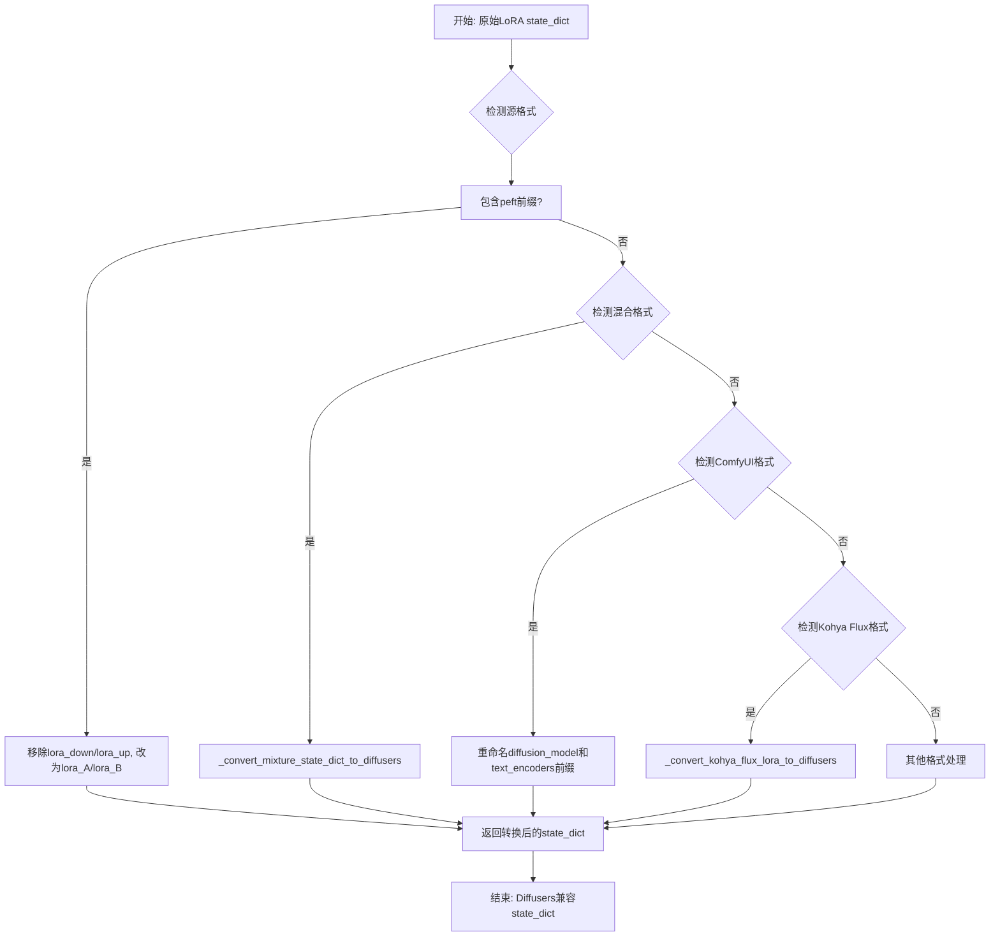

## 类结构

```
模块: convert_lora_non_diffusers
└── 全局函数 (共30+个)
    ├── 核心转换函数
    │   ├── _convert_non_diffusers_lora_to_diffusers
    │   ├── _maybe_map_sgm_blocks_to_diffusers
    │   └── _convert_kohya_flux_lora_to_diffusers
    ├── 专用格式转换函数
    │   ├── _convert_xlabs_flux_lora_to_diffusers
    │   ├── _convert_bfl_flux_control_lora_to_diffusers
    │   ├── _convert_fal_kontext_lora_to_diffusers
    │   ├── _convert_hunyuan_video_lora_to_diffusers
    │   ├── _convert_non_diffusers_wan_lora_to_diffusers
    │   ├── _convert_musubi_wan_lora_to_diffusers
    │   ├── _convert_non_diffusers_ltxv_lora_to_diffusers
    │   ├── _convert_non_diffusers_ltx2_lora_to_diffusers
    │   ├── _convert_non_diffusers_qwen_lora_to_diffusers
    │   ├── _convert_non_diffusers_flux2_lora_to_diffusers
    │   ├── _convert_non_diffusers_z_image_lora_to_diffusers
    │   └── _convert_non_diffusers_luma2_lora_to_diffusers
    ├── 键名转换辅助函数
    │   ├── _convert_unet_lora_key
    │   ├── _convert_text_encoder_lora_key
    │   └── _get_alpha_name
    └── 工具函数
        ├── swap_scale_shift
        └── _custom_replace
```

## 全局变量及字段


### `logger`
    
全局日志记录器，用于输出程序运行时的日志信息

类型：`Logger`
    


### `inner_block_map`
    
内部块类型映射列表，将内部块索引映射为resnets/attentions/upsamplers字符串

类型：`list[str]`
    


### `input_block_ids`
    
输入块ID集合，存储SGM格式中input_blocks的层ID

类型：`set[int]`
    


### `middle_block_ids`
    
中间块ID集合，存储SGM格式中middle_block的层ID

类型：`set[int]`
    


### `output_block_ids`
    
输出块ID集合，存储SGM格式中output_blocks的层ID

类型：`set[int]`
    


### `sgm_patterns`
    
SGM格式的状态字典键模式列表，包含input_blocks/middle_block/output_blocks

类型：`list[str]`
    


### `not_sgm_patterns`
    
非SGM格式（Diffusers格式）的状态字典键模式列表，包含down_blocks/mid_block/up_blocks

类型：`list[str]`
    


    

## 全局函数及方法


### `swap_scale_shift`

该函数用于交换权重张量中的缩放(shift)和偏移(scale)分量。它将输入的张量在第0维上分成两半，然后将两部分交换位置后重新拼接。这种操作常见于Diffusers模型中LoRA权重的格式转换场景。

参数：

- `weight`：`torch.Tensor`，输入的权重张量，通常包含拼接在一起的shift和scale值

返回值：`torch.Tensor`，返回交换位置后的新权重张量，即原本的scale部分放到前面，shift部分放到后面

#### 流程图

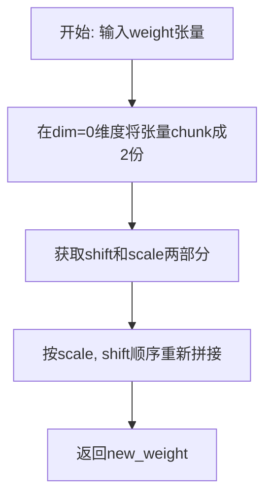

#### 带注释源码

```python
def swap_scale_shift(weight):
    """
    交换权重张量中的scale和shift分量位置
    
    参数:
        weight: torch.Tensor, 输入权重张量，要求在dim=0维度可以被均分为两部分
        
    返回:
        torch.Tensor: 交换后的权重张量
    """
    # 使用chunk方法在第0维将张量均分为两部分
    # 第一部分是shift（偏移量），第二部分是scale（缩放因子）
    shift, scale = weight.chunk(2, dim=0)
    
    # 重新拼接：先放scale，再放shift，完成位置交换
    new_weight = torch.cat([scale, shift], dim=0)
    
    return new_weight
```


### `_maybe_map_sgm_blocks_to_diffusers`

该函数用于将使用SGM（Stable Diffusion系列模型）命名规范的state dict键转换为Diffusers格式。它主要处理UNet的输入块、中间块和输出块的键名映射，将`input_blocks`、`middle_block`、`output_blocks`转换为`down_blocks`、`mid_block`、`up_blocks`。

参数：

- `state_dict`：`dict`，包含模型权重参数的字典，键采用SGM命名规范
- `unet_config`：配置对象，包含UNet配置信息，特别是`layers_per_block`属性用于计算块索引
- `delimiter`：`str`，默认为`"_"`，键名中使用的分隔符
- `block_slice_pos`：`int`，默认为`5`，用于提取块ID的键切片位置

返回值：`dict`，转换后的state dictionary，键名已转换为Diffusers格式

#### 流程图

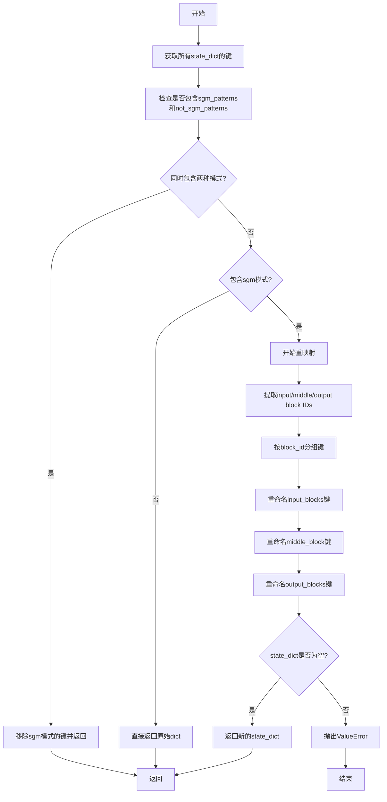

#### 带注释源码

```python
def _maybe_map_sgm_blocks_to_diffusers(state_dict, unet_config, delimiter="_", block_slice_pos=5):
    """
    将SGM格式的state_dict键映射到Diffusers格式。
    
    参数:
        state_dict: 包含模型权重的字典，键使用SGM命名规范
        unet_config: UNet配置对象，需包含layers_per_block属性
        delimiter: 键名分隔符，默认为下划线
        block_slice_pos: 用于提取块ID的键切片位置
    """
    # 1. 获取所有state_dict_keys
    all_keys = list(state_dict.keys())
    # SGM模式：包含input_blocks, middle_block, output_blocks
    sgm_patterns = ["input_blocks", "middle_block", "output_blocks"]
    # 非SGM模式：包含down_blocks, mid_block, up_blocks
    not_sgm_patterns = ["down_blocks", "mid_block", "up_blocks"]

    # 检查state_dict是否同时包含两种模式
    contains_sgm_patterns = False
    contains_not_sgm_patterns = False
    for key in all_keys:
        if any(p in key for p in sgm_patterns):
            contains_sgm_patterns = True
        elif any(p in key for p in not_sgm_patterns):
            contains_not_sgm_patterns = True

    # 如果同时包含两种模式，移除sgm模式的键并立即返回
    if contains_sgm_patterns and contains_not_sgm_patterns:
        for key in all_keys:
            if any(p in key for p in sgm_patterns):
                state_dict.pop(key)
        return state_dict

    # 2. 检查是否需要重映射，如果不需要则返回原始字典
    is_in_sgm_format = False
    for key in all_keys:
        if any(p in key for p in sgm_patterns):
            is_in_sgm_format = True
            break

    if not is_in_sgm_format:
        return state_dict

    # 3. 否则，从SGM模式重映射到Diffusers模式
    new_state_dict = {}
    # 内部块类型映射
    inner_block_map = ["resnets", "attentions", "upsamplers"]

    # 获取down、mid和up块的数量
    input_block_ids, middle_block_ids, output_block_ids = set(), set(), set()

    for layer in all_keys:
        if "text" in layer:
            # 保留文本编码器相关的键
            new_state_dict[layer] = state_dict.pop(layer)
        else:
            # 从键中提取layer_id
            layer_id = int(layer.split(delimiter)[:block_slice_pos][-1])
            if sgm_patterns[0] in layer:
                input_block_ids.add(layer_id)
            elif sgm_patterns[1] in layer:
                middle_block_ids.add(layer_id)
            elif sgm_patterns[2] in layer:
                output_block_ids.add(layer_id)
            else:
                raise ValueError(f"Checkpoint not supported because layer {layer} not supported.")

    # 为每个块ID收集对应的键
    input_blocks = {
        layer_id: [key for key in state_dict if f"input_blocks{delimiter}{layer_id}" in key]
        for layer_id in input_block_ids
    }
    middle_blocks = {
        layer_id: [key for key in state_dict if f"middle_block{delimiter}{layer_id}" in key]
        for layer_id in middle_block_ids
    }
    output_blocks = {
        layer_id: [key for key in state_dict if f"output_blocks{delimiter}{layer_id}" in key]
        for layer_id in output_block_ids
    }

    # 重命名input_blocks键
    for i in input_block_ids:
        # 计算块ID和块内层ID
        block_id = (i - 1) // (unet_config.layers_per_block + 1)
        layer_in_block_id = (i - 1) % (unet_config.layers_per_block + 1)

        for key in input_blocks[i]:
            inner_block_id = int(key.split(delimiter)[block_slice_pos])
            inner_block_key = inner_block_map[inner_block_id] if "op" not in key else "downsamplers"
            inner_layers_in_block = str(layer_in_block_id) if "op" not in key else "0"
            new_key = delimiter.join(
                key.split(delimiter)[: block_slice_pos - 1]
                + [str(block_id), inner_block_key, inner_layers_in_block]
                + key.split(delimiter)[block_slice_pos + 1 :]
            )
            new_state_dict[new_key] = state_dict.pop(key)

    # 重命名middle_block键
    for i in middle_block_ids:
        key_part = None
        if i == 0:
            key_part = [inner_block_map[0], "0"]
        elif i == 1:
            key_part = [inner_block_map[1], "0"]
        elif i == 2:
            key_part = [inner_block_map[0], "1"]
        else:
            raise ValueError(f"Invalid middle block id {i}.")

        for key in middle_blocks[i]:
            new_key = delimiter.join(
                key.split(delimiter)[: block_slice_pos - 1] + key_part + key.split(delimiter)[block_slice_pos:]
            )
            new_state_dict[new_key] = state_dict.pop(key)

    # 重命名output_blocks键
    for i in output_block_ids:
        block_id = i // (unet_config.layers_per_block + 1)
        layer_in_block_id = i % (unet_config.layers_per_block + 1)

        for key in output_blocks[i]:
            inner_block_id = int(key.split(delimiter)[block_slice_pos])
            inner_block_key = inner_block_map[inner_block_id]
            inner_layers_in_block = str(layer_in_block_id) if inner_block_id < 2 else "0"
            new_key = delimiter.join(
                key.split(delimiter)[: block_slice_pos - 1]
                + [str(block_id), inner_block_key, inner_layers_in_block]
                + key.split(delimiter)[block_slice_pos + 1 :]
            )
            new_state_dict[new_key] = state_dict.pop(key)

    # 确保所有键都已转换
    if state_dict:
        raise ValueError("At this point all state dict entries have to be converted.")

    return new_state_dict
```


### `_convert_non_diffusers_lora_to_diffusers`

该函数是Diffusers库中用于转换LoRA权重状态字典的核心工具函数。它主要负责将来自非Diffusers格式（如Kohya_ss、A1111等训练框架生成的标准LoRA权重）的键名和结构转换为Diffusers模型加载器所能识别的格式。函数内部处理了U-Net、Text Encoder（TE）以及Text Encoder 2（TE2）的权重分离、DoRA（权重分解适配器）缩放向量的提取、以及Alpha值的管理，最终输出符合Diffusers规范的状态字典。

参数：
- `state_dict`：`dict`，待转换的包含LoRA权重的状态字典。
- `unet_name`：`str`，可选，U-Net模块在前缀在目标字典中的名称，默认为"unet"。
- `text_encoder_name`：`str`，可选，Text Encoder模块前缀名称，默认为"text_encoder"。

返回值：`tuple`，返回一个元组，包含：
1. 转换后的状态字典（`dict`）。
2. LoRA网络的Alpha值字典（`dict`）。

#### 流程图

```mermaid
flowchart TD
    A([开始]) --> B[初始化空字典: unet, te, te2, alphas]
    B --> C{检查state_dict中是否包含DoRA (dora_scale)}
    C --> D{检查PEFT版本是否小于0.9.0}
    D -->|是| E[抛出异常: 需要PEFT 0.9.0+]
    D -->|否| F[遍历state_dict的所有键]
    
    F --> G{键是否以 lora_down.weight 结尾?}
    G -->|否| H[继续下一个键]
    G -->|是| I[提取lora名称模块名]
    
    I --> J{判断前缀类型}
    
    J -->|lora_unet_| K[调用 _convert_unet_lora_key 转换键名]
    K --> L[提取并弹出 down weight 和 up weight]
    L --> M{该模块是否启用DoRA?}
    M -->|是| N[提取并转换 dora_scale 为 lora_magnitude_vector]
    M -->|否| O[查找并处理 Alpha值]
    N --> O
    
    J -->|lora_te_ / lora_te1_| P[调用 _convert_text_encoder_lora_key 转换键名]
    P --> Q[提取并弹出对应Text Encoder的权重]
    Q --> R{该TE模块是否启用DoRA?}
    R -->|是| S[提取并转换 dora_scale]
    R -->|否| O
    S --> O
    
    J -->|lora_te2_| T[处理Text Encoder 2的权重]
    T --> U{该TE2模块是否启用DoRA?}
    U -->|是| V[提取并转换 dora_scale]
    U -->|否| O
    V --> O
    
    O --> W{state_dict中是否还有剩余键?}
    W -->|是| X[抛出异常: 键未正确重命名]
    W -->|否| Y[格式化键名: 添加 unet., text_encoder. 等前缀]
    
    Y --> Z[合并 te 和 te2 字典]
    Z --> AA([返回 new_state_dict 和 network_alphas])
```

#### 带注释源码

```python
def _convert_non_diffusers_lora_to_diffusers(state_dict, unet_name="unet", text_encoder_name="text_encoder"):
    """
    将非Diffusers格式的LoRA状态字典转换为Diffusers兼容的格式。

    Args:
        state_dict (dict): 待转换的状态字典。
        unet_name (str, optional): Diffusers模型中U-Net模块的名称。默认为"unet"。
        text_encoder_name (str, optional): Diffusers模型中Text Encoder模块的名称。默认为"text_encoder"。

    Returns:
        tuple: 包含转换后的状态字典和alphas字典的元组。
    """
    # 1. 初始化用于存储转换后权重的字典
    unet_state_dict = {}
    te_state_dict = {}
    te2_state_dict = {}
    network_alphas = {}

    # 2. 检查是否为DoRA (Weight-decomposed LoRA) 格式
    # 如果包含 dora_scale 键，则认为是DoRA
    dora_present_in_unet = any("dora_scale" in k and "lora_unet_" in k for k in state_dict)
    dora_present_in_te = any("dora_scale" in k and ("lora_te_" in k or "lora_te1_" in k) for k in state_dict)
    dora_present_in_te2 = any("dora_scale" in k and "lora_te2_" in k for k in state_dict)
    
    # 如果检测到DoRA但PEFT版本过低，则报错
    if dora_present_in_unet or dora_present_in_te or dora_present_in_te2:
        if is_peft_version("<", "0.9.0"):
            raise ValueError(
                "You need `peft` 0.9.0 at least to use DoRA-enabled LoRAs. Please upgrade your installation of `peft`."
            )

    # 3. 遍历所有LoRA权重键
    all_lora_keys = list(state_dict.keys())
    for key in all_lora_keys:
        # 只处理 lora_down.weight 键，up weight 和 alpha 会根据命名关联处理
        if not key.endswith("lora_down.weight"):
            continue

        # 提取LoRA的基础名称（例如 lora_unet_xxx）
        lora_name = key.split(".")[0]

        # 构造对应的 up weight 和 alpha 键名
        lora_name_up = lora_name + ".lora_up.weight"
        lora_name_alpha = lora_name + ".alpha"

        # 4. 判断模块类型并分别处理
        # 处理 U-Net LoRA
        if lora_name.startswith("lora_unet_"):
            # 调用辅助函数将键名转换为Diffusers格式
            diffusers_name = _convert_unet_lora_key(key)

            # 存储 down 和 up 权重
            unet_state_dict[diffusers_name] = state_dict.pop(key)
            unet_state_dict[diffusers_name.replace(".down.", ".up.")] = state_dict.pop(lora_name_up)

            # 处理 DoRA 缩放因子
            if dora_present_in_unet:
                dora_scale_key_to_replace = "_lora.down." if "_lora.down." in diffusers_name else ".lora.down."
                unet_state_dict[diffusers_name.replace(dora_scale_key_to_replace, ".lora_magnitude_vector.")] = (
                    state_dict.pop(key.replace("lora_down.weight", "dora_scale"))
                )

        # 处理 Text Encoder LoRA (包括 TE1 和 TE2)
        elif lora_name.startswith(("lora_te_", "lora_te1_", "lora_te2_")):
            diffusers_name = _convert_text_encoder_lora_key(key, lora_name)

            # 根据是 TE1 还是 TE2 分别存储
            if lora_name.startswith(("lora_te_", "lora_te1_")):
                te_state_dict[diffusers_name] = state_dict.pop(key)
                te_state_dict[diffusers_name.replace(".down.", ".up.")] = state_dict.pop(lora_name_up)
            else:
                te2_state_dict[diffusers_name] = state_dict.pop(key)
                te2_state_dict[diffusers_name.replace(".down.", ".up.")] = state_dict.pop(lora_name_up)

            # 处理 TE 的 DoRA 缩放因子
            if dora_present_in_te or dora_present_in_te2:
                dora_scale_key_to_replace_te = (
                    "_lora.down." if "_lora.down." in diffusers_name else ".lora_linear_layer."
                )
                if lora_name.startswith(("lora_te_", "lora_te1_")):
                    te_state_dict[diffusers_name.replace(dora_scale_key_to_replace_te, ".lora_magnitude_vector.")] = (
                        state_dict.pop(key.replace("lora_down.weight", "dora_scale"))
                    )
                elif lora_name.startswith("lora_te2_"):
                    te2_state_dict[diffusers_name.replace(dora_scale_key_to_replace_te, ".lora_magnitude_vector.")] = (
                        state_dict.pop(key.replace("lora_down.weight", "dora_scale"))
                    )

        # 5. 处理 Alpha 值
        if lora_name_alpha in state_dict:
            alpha = state_dict.pop(lora_name_alpha).item()
            network_alphas.update(_get_alpha_name(lora_name_alpha, diffusers_name, alpha))

    # 6. 检查是否有未处理的键
    if len(state_dict) > 0:
        raise ValueError(f"The following keys have not been correctly renamed: \n\n {', '.join(state_dict.keys())}")

    logger.info("Non-diffusers checkpoint detected.")

    # 7. 构建最终的状态字典，添加模块前缀
    unet_state_dict = {f"{unet_name}.{module_name}": params for module_name, params in unet_state_dict.items()}
    te_state_dict = {f"{text_encoder_name}.{module_name}": params for module_name, params in te_state_dict.items()}
    te2_state_dict = (
        {f"text_encoder_2.{module_name}": params for module_name, params in te2_state_dict.items()}
        if len(te2_state_dict) > 0
        else None
    )
    
    # 合并 TE 和 TE2
    if te2_state_dict is not None:
        te_state_dict.update(te2_state_dict)

    new_state_dict = {**unet_state_dict, **te_state_dict}
    return new_state_dict, network_alphas
```


### `_convert_unet_lora_key`

该函数用于将非Diffusers格式的U-Net LoRA键名转换为Diffusers兼容的键名格式，支持多种命名模式的映射和转换。

参数：

- `key`：`str`，输入的U-Net LoRA状态字典键名（非Diffusers格式）

返回值：`str`，转换后的Diffusers兼容键名

#### 流程图

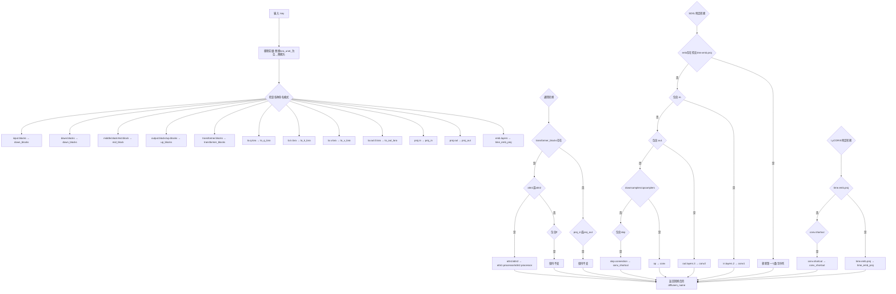

#### 带注释源码

```python
def _convert_unet_lora_key(key):
    """
    Converts a U-Net LoRA key to a Diffusers compatible key.
    将U-Net LoRA键转换为Diffusers兼容键
    """
    # 1. 移除前缀 "lora_unet_" 并将下划线替换为点
    # 例如: "lora_unet_input_blocks_0_attn_to_q" -> "input.blocks.0.attn.to.q"
    diffusers_name = key.replace("lora_unet_", "").replace("_", ".")

    # 2. 替换常见的U-Net命名模式
    # 输入块映射
    diffusers_name = diffusers_name.replace("input.blocks", "down_blocks")
    diffusers_name = diffusers_name.replace("down.blocks", "down_blocks")
    # 中间块映射
    diffusers_name = diffusers_name.replace("middle.block", "mid_block")
    diffusers_name = diffusers_name.replace("mid.block", "mid_block")
    # 输出块映射
    diffusers_name = diffusers_name.replace("output.blocks", "up_blocks")
    diffusers_name = diffusers_name.replace("up.blocks", "up_blocks")
    # Transformer块映射
    diffusers_name = diffusers_name.replace("transformer.blocks", "transformer_blocks")
    # 注意力机制LoRA权重映射
    diffusers_name = diffusers_name.replace("to.q.lora", "to_q_lora")
    diffusers_name = diffusers_name.replace("to.k.lora", "to_k_lora")
    diffusers_name = diffusers_name.replace("to.v.lora", "to_v_lora")
    diffusers_name = diffusers_name.replace("to.out.0.lora", "to_out_lora")
    # 投影层映射
    diffusers_name = diffusers_name.replace("proj.in", "proj_in")
    diffusers_name = diffusers_name.replace("proj.out", "proj_out")
    # 时间嵌入投影映射
    diffusers_name = diffusers_name.replace("emb.layers", "time_emb_proj")

    # 3. SDXL特定转换
    # 移除嵌入层中的第一个数字（层索引）
    if "emb" in diffusers_name and "time.emb.proj" not in diffusers_name:
        pattern = r"\.\d+(?=\D*$)"
        diffusers_name = re.sub(pattern, "", diffusers_name, count=1)
    # 卷积层命名转换
    if ".in." in diffusers_name:
        diffusers_name = diffusers_name.replace("in.layers.2", "conv1")
    if ".out." in diffusers_name:
        diffusers_name = diffusers_name.replace("out.layers.3", "conv2")
    # 采样器卷积命名
    if "downsamplers" in diffusers_name or "upsamplers" in diffusers_name:
        diffusers_name = diffusers_name.replace("op", "conv")
    # 跳跃连接命名
    if "skip" in diffusers_name:
        diffusers_name = diffusers_name.replace("skip.connection", "conv_shortcut")

    # 4. LyCORIS特定转换
    # 时间嵌入投影
    if "time.emb.proj" in diffusers_name:
        diffusers_name = diffusers_name.replace("time.emb.proj", "time_emb_proj")
    # 卷积快捷方式
    if "conv.shortcut" in diffusers_name:
        diffusers_name = diffusers_name.replace("conv.shortcut", "conv_shortcut")

    # 5. 通用转换 - 处理注意力机制处理器命名
    if "transformer_blocks" in diffusers_name:
        if "attn1" in diffusers_name or "attn2" in diffusers_name:
            # 为注意力添加处理器后缀
            diffusers_name = diffusers_name.replace("attn1", "attn1.processor")
            diffusers_name = diffusers_name.replace("attn2", "attn2.processor")
        elif "ff" in diffusers_name:
            # 前馈网络保持不变
            pass
    elif any(key in diffusers_name for key in ("proj_in", "proj_out")):
        # 投影层保持不变
        pass
    else:
        # 其他情况保持不变
        pass

    return diffusers_name
```


### `_convert_text_encoder_lora_key`

该函数用于将非 Diffusers 格式的文本编码器（Text Encoder）LoRA 权重键（key）转换为 Diffusers 兼容的键名格式，支持 `lora_te_`、`lora_te1_` 和 `lora_te2_` 三种不同来源的 LoRA 权重命名约定，并处理常见的层名称映射（如 attention、MLP 等）。

参数：

- `key`：`str`，原始的非 Diffusers 格式的 LoRA 权重键名，通常包含类似 `lora_te_xxx.lora_down.weight` 的格式
- `lora_name`：`str`，LoRA 权重的名称前缀，用于判断其来源（如 `lora_te_`、`lora_te1_` 或 `lora_te2_`）

返回值：`str`，转换后的 Diffusers 兼容的键名格式

#### 流程图

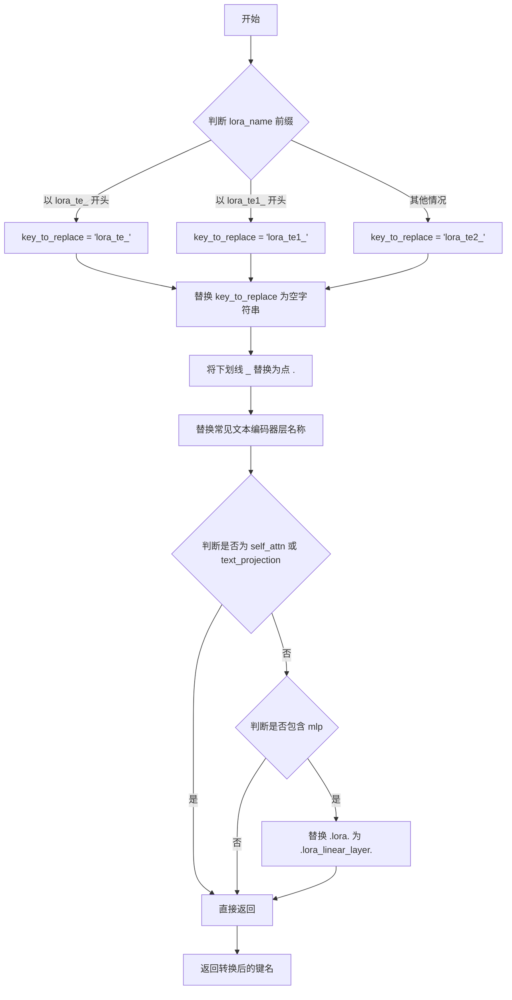

#### 带注释源码

```python
def _convert_text_encoder_lora_key(key, lora_name):
    """
    Converts a text encoder LoRA key to a Diffusers compatible key.
    """
    # 根据 lora_name 的前缀确定需要替换的键前缀
    # lora_te_ 对应第一个文本编码器，lora_te1_ 也对应第一个文本编码器（另一种命名）
    # lora_te2_ 对应第二个文本编码器
    if lora_name.startswith(("lora_te_", "lora_te1_")):
        key_to_replace = "lora_te_" if lora_name.startswith("lora_te_") else "lora_te1_"
    else:
        key_to_replace = "lora_te2_"

    # 首先移除 lora 名称前缀，并将下划线替换为点号
    # 这符合 Diffusers 的命名规范（使用点号作为分隔符）
    diffusers_name = key.replace(key_to_replace, "").replace("_", ".")

    # 进行常见的层名称映射，将非 Diffusers 格式转换为 Diffusers 格式
    diffusers_name = diffusers_name.replace("text.model", "text_model")
    diffusers_name = diffusers_name.replace("self.attn", "self_attn")
    diffusers_name = diffusers_name.replace("q.proj.lora", "to_q_lora")
    diffusers_name = diffusers_name.replace("k.proj.lora", "to_k_lora")
    diffusers_name = diffusers_name.replace("v.proj.lora", "to_v_lora")
    diffusers_name = diffusers_name.replace("out.proj.lora", "to_out_lora")
    diffusers_name = diffusers_name.replace("text.projection", "text_projection")

    # 对于 self_attn 和 text_projection 层的处理保持不变
    # 这是 Diffusers 中已有的命名约定
    if "self_attn" in diffusers_name or "text_projection" in diffusers_name:
        pass
    # 对于 MLP 层，使用新的 Diffusers 约定 .lora_linear_layer.
    # 注意：其余代码可能尚未完全适配这一新约定
    elif "mlp" in diffusers_name:
        diffusers_name = diffusers_name.replace(".lora.", ".lora_linear_layer.")

    return diffusers_name
```


### `_get_alpha_name`

该函数用于将非Diffusers格式的LoRA权重中的alpha名称转换为Diffusers模型兼容的alpha名称。它根据LoRA名称的前缀（`lora_unet_`、`lora_te_`/`lora_te1_`或`lora_te2_`）来确定目标模块（`unet`、`text_encoder`或`text_encoder_2`），然后结合Diffusers格式的键名生成新的alpha键名。

参数：

- `lora_name_alpha`：`str`，原始非Diffusers格式的LoRA alpha键名（例如 "lora_unet_xxx.alpha"）
- `diffusers_name`：`str`，已转换为Diffusers格式的键名（例如 "down_blocks.0.resnets.0.lora.down"）
- `alpha`：`float`，LoRA的缩放因子/学习率参数

返回值：`dict`，返回包含新alpha名称和对应值的字典（例如 `{"unet.down_blocks.0.resnets.0.alpha": 1.0}`）

#### 流程图

```mermaid
flowchart TD
    A[开始: _get_alpha_name] --> B{检查 lora_name_alpha 前缀}
    B --> C{lora_name_alpha.startswith<br/>'lora_unet_'}
    C -->|是| D[prefix = 'unet.']
    C -->|否| E{lora_name_alpha.startswith<br/>('lora_te_', 'lora_te1_')}
    E -->|是| F[prefix = 'text_encoder.']
    E -->|否| G[prefix = 'text_encoder_2.']
    D --> H[new_name = prefix + diffusers_name.split('.lora.')[0] + '.alpha']
    F --> H
    G --> H
    H --> I[返回 {new_name: alpha}]
    I --> J[结束]
```

#### 带注释源码

```python
def _get_alpha_name(lora_name_alpha, diffusers_name, alpha):
    """
    Gets the correct alpha name for the Diffusers model.
    
    将非Diffusers格式的LoRA alpha名称转换为Diffusers兼容的格式。
    根据LoRA来源（U-Net、文本编码器1或文本编码器2）添加相应前缀。
    
    Args:
        lora_name_alpha (str): 原始非Diffusers格式的LoRA alpha键名
        diffusers_name (str): 已转换为Diffusers格式的键名
        alpha (float): LoRA的缩放因子/学习率参数
    
    Returns:
        dict: 包含新alpha名称和对应值的字典
    """
    # 根据lora_name_alpha的前缀确定目标模块前缀
    if lora_name_alpha.startswith("lora_unet_"):
        # U-Net LoRA，使用unet前缀
        prefix = "unet."
    elif lora_name_alpha.startswith(("lora_te_", "lora_te1_")):
        # 文本编码器1 LoRA，使用text_encoder前缀
        prefix = "text_encoder."
    else:
        # 文本编码器2 LoRA，使用text_encoder_2前缀
        prefix = "text_encoder_2."
    
    # 构造新的alpha名称：
    # 1. 从diffusers_name中提取.lora.之前的部分作为模块路径
    # 2. 加上prefix作为模块名前缀
    # 3. 加上.alpha作为后缀
    new_name = prefix + diffusers_name.split(".lora.")[0] + ".alpha"
    
    # 返回包含新名称和alpha值的字典
    return {new_name: alpha}
```


### `_convert_kohya_flux_lora_to_diffusers`

该函数是Flux LoRA权重转换的核心函数，负责将Kohya/SD-scripts格式的Flux LoRA权重转换为Diffusers兼容的格式。函数内部包含多个子函数，分别处理不同的转换场景，包括单个权重转换、连接权重转换、SD脚本格式转换以及混合状态字典转换。

参数：

-  `state_dict`：`dict`，输入的Kohya格式Flux LoRA状态字典

返回值：`dict`，转换后的Diffusers兼容状态字典

#### 流程图

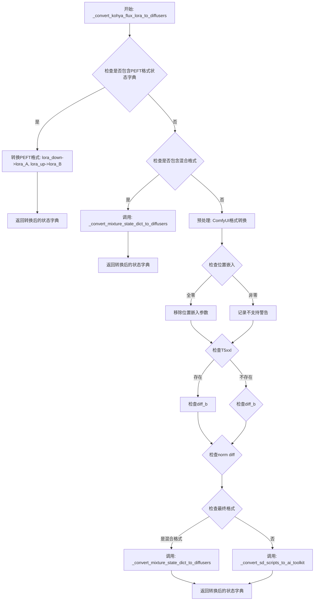

#### 带注释源码

```python
def _convert_kohya_flux_lora_to_diffusers(state_dict):
    """
    将Kohya/SD-scripts格式的Flux LoRA权重转换为Diffusers兼容格式。
    
    该函数处理多种输入格式：
    1. PEFT格式（已包含transformer.前缀）
    2. 混合格式（同时包含lora_transformer_和lora_te1_）
    3. ComfyUI格式
    4. 标准SD-scripts格式
    """
    
    # === 内部函数: 转换单个LoRA权重 ===
    def _convert_to_ai_toolkit(sds_sd, ait_sd, sds_key, ait_key):
        """
        将单个LoRA权重从SD-scripts格式转换为AI-toolkit格式。
        
        参数:
            sds_sd: 源状态字典
            ait_sd: 目标状态字典
            sds_key: 源键名
            ait_key: 目标键名
        """
        # 检查是否存在lora_down权重
        if sds_key + ".lora_down.weight" not in sds_sd:
            return
        
        # 提取down权重并计算alpha和scale
        down_weight = sds_sd.pop(sds_key + ".lora_down.weight")
        rank = down_weight.shape[0]  # LoRA秩
        default_alpha = torch.tensor(rank, dtype=down_weight.dtype, 
                                    device=down_weight.device, requires_grad=False)
        alpha = sds_sd.pop(sds_key + ".alpha", default_alpha).item()
        scale = alpha / rank  # 缩放因子

        # 计算scale_down和scale_up以保持相同值
        scale_down = scale
        scale_up = 1.0
        while scale_down * 2 < scale_up:
            scale_down *= 2
            scale_up /= 2

        # 存储转换后的权重
        ait_sd[ait_key + ".lora_A.weight"] = down_weight * scale_down
        ait_sd[ait_key + ".lora_B.weight"] = sds_sd.pop(sds_key + ".lora_up.weight") * scale_up

    # === 内部函数: 转换连接的LoRA权重 ===
    def _convert_to_ai_toolkit_cat(sds_sd, ait_sd, sds_key, ait_keys, dims=None):
        """
        处理连接（concatenated）的QKV权重。
        
        参数:
            dims: 各分量的维度列表，用于分割up权重
        """
        if sds_key + ".lora_down.weight" not in sds_sd:
            return
        
        # 提取上下权重
        down_weight = sds_sd.pop(sds_key + ".lora_down.weight")
        up_weight = sds_sd.pop(sds_key + ".lora_up.weight")
        sd_lora_rank = down_weight.shape[0]

        # 计算缩放因子
        default_alpha = torch.tensor(sd_lora_rank, dtype=down_weight.dtype, 
                                    device=down_weight.device, requires_grad=False)
        alpha = sds_sd.pop(sds_key + ".alpha", default_alpha)
        scale = alpha / sd_lora_rank

        # 计算scale_down和scale_up
        scale_down = scale
        scale_up = 1.0
        while scale_down * 2 < scale_up:
            scale_down *= 2
            scale_up /= 2

        down_weight = down_weight * scale_down
        up_weight = up_weight * scale_up

        # 计算dims（如果没有提供）
        num_splits = len(ait_keys)
        if dims is None:
            dims = [up_weight.shape[0] // num_splits] * num_splits
        else:
            assert sum(dims) == up_weight.shape[0]

        # 检查up权重是否稀疏
        is_sparse = False
        if sd_lora_rank % num_splits == 0:
            ait_rank = sd_lora_rank // num_splits
            is_sparse = True
            # 检查是否确实稀疏
            i = 0
            for j in range(len(dims)):
                for k in range(len(dims)):
                    if j == k:
                        continue
                    is_sparse = is_sparse and torch.all(
                        up_weight[i : i + dims[j], k * ait_rank : (k + 1) * ait_rank] == 0
                    )
                i += dims[j]
            if is_sparse:
                logger.info(f"weight is sparse: {sds_key}")

        # 构建AI-toolkit格式权重
        ait_down_keys = [k + ".lora_A.weight" for k in ait_keys]
        ait_up_keys = [k + ".lora_B.weight" for k in ait_keys]
        
        if not is_sparse:
            # down权重复制到每个split
            ait_sd.update(dict.fromkeys(ait_down_keys, down_weight))
            # up权重分割到每个split
            ait_sd.update({k: v for k, v in zip(ait_up_keys, torch.split(up_weight, dims, dim=0))})
        else:
            # down权重分块到每个split
            ait_sd.update({k: v for k, v in zip(ait_down_keys, torch.chunk(down_weight, num_splits, dim=0))})
            # 稀疏up权重：只复制非零值到每个split
            i = 0
            for j in range(len(dims)):
                ait_sd[ait_up_keys[j]] = up_weight[i : i + dims[j], j * ait_rank : (j + 1) * ait_rank].contiguous()
                i += dims[j]

    # === 内部函数: SD脚本到AI工具包的转换 ===
    def _convert_sd_scripts_to_ai_toolkit(sds_sd):
        """
        将SD-scripts格式的完整状态字典转换为AI-toolkit格式。
        
        处理:
        - 双块（double_blocks）的19层
        - 单块（single_blocks）的38层
        - 各种嵌入层和最终层
        """
        ait_sd = {}
        
        # 处理19层双块
        for i in range(19):
            # 图像注意力投影
            _convert_to_ai_toolkit(sds_sd, ait_sd, 
                f"lora_unet_double_blocks_{i}_img_attn_proj",
                f"transformer.transformer_blocks.{i}.attn.to_out.0")
            
            # 图像注意力QKV（连接格式）
            _convert_to_ai_toolkit_cat(sds_sd, ait_sd,
                f"lora_unet_double_blocks_{i}_img_attn_qkv",
                [
                    f"transformer.transformer_blocks.{i}.attn.to_q",
                    f"transformer.transformer_blocks.{i}.attn.to_k",
                    f"transformer.transformer_blocks.{i}.attn.to_v",
                ])
            
            # 图像MLP层
            _convert_to_ai_toolkit(sds_sd, ait_sd,
                f"lora_unet_double_blocks_{i}_img_mlp_0",
                f"transformer.transformer_blocks.{i}.ff.net.0.proj")
            _convert_to_ai_toolkit(sds_sd, ait_sd,
                f"lora_unet_double_blocks_{i}_img_mlp_2",
                f"transformer.transformer_blocks.{i}.ff.net.2")
            
            # 图像调制线性层
            _convert_to_ai_toolkit(sds_sd, ait_sd,
                f"lora_unet_double_blocks_{i}_img_mod_lin",
                f"transformer.transformer_blocks.{i}.norm1.linear")
            
            # 文本注意力投影
            _convert_to_ai_toolkit(sds_sd, ait_sd,
                f"lora_unet_double_blocks_{i}_txt_attn_proj",
                f"transformer.transformer_blocks.{i}.attn.to_add_out")
            
            # 文本注意力QKV
            _convert_to_ai_toolkit_cat(sds_sd, ait_sd,
                f"lora_unet_double_blocks_{i}_txt_attn_qkv",
                [
                    f"transformer.transformer_blocks.{i}.attn.add_q_proj",
                    f"transformer.transformer_blocks.{i}.attn.add_k_proj",
                    f"transformer.transformer_blocks.{i}.attn.add_v_proj",
                ])
            
            # 文本MLP层
            _convert_to_ai_toolkit(sds_sd, ait_sd,
                f"lora_unet_double_blocks_{i}_txt_mlp_0",
                f"transformer.transformer_blocks.{i}.ff_context.net.0.proj")
            _convert_to_ai_toolkit(sds_sd, ait_sd,
                f"lora_unet_double_blocks_{i}_txt_mlp_2",
                f"transformer.transformer_blocks.{i}.ff_context.net.2")
            
            # 文本调制线性层
            _convert_to_ai_toolkit(sds_sd, ait_sd,
                f"lora_unet_double_blocks_{i}_txt_mod_lin",
                f"transformer.transformer_blocks.{i}.norm1_context.linear")

        # 处理38层单块
        for i in range(38):
            _convert_to_ai_toolkit_cat(sds_sd, ait_sd,
                f"lora_unet_single_blocks_{i}_linear1",
                [
                    f"transformer.single_transformer_blocks.{i}.attn.to_q",
                    f"transformer.single_transformer_blocks.{i}.attn.to_k",
                    f"transformer.single_transformer_blocks.{i}.attn.to_v",
                    f"transformer.single_transformer_blocks.{i}.proj_mlp",
                ],
                dims=[3072, 3072, 3072, 12288],  # Q, K, V, MLP维度
            )
            _convert_to_ai_toolkit(sds_sd, ait_sd,
                f"lora_unet_single_blocks_{i}_linear2",
                f"transformer.single_transformer_blocks.{i}.proj_out")
            _convert_to_ai_toolkit(sds_sd, ait_sd,
                f"lora_unet_single_blocks_{i}_modulation_lin",
                f"transformer.single_transformer_blocks.{i}.norm.linear")

        # 处理嵌入层
        if any("guidance_in" in k for k in sds_sd):
            _convert_to_ai_toolkit(sds_sd, ait_sd,
                "lora_unet_guidance_in_in_layer",
                "time_text_embed.guidance_embedder.linear_1")
            _convert_to_ai_toolkit(sds_sd, ait_sd,
                "lora_unet_guidance_in_out_layer",
                "time_text_embed.guidance_embedder.linear_2")

        if any("img_in" in k for k in sds_sd):
            _convert_to_ai_toolkit(sds_sd, ait_sd,
                "lora_unet_img_in", "x_embedder")

        if any("txt_in" in k for k in sds_sd):
            _convert_to_ai_toolkit(sds_sd, ait_sd,
                "lora_unet_txt_in", "context_embedder")

        if any("time_in" in k for k in sds_sd):
            _convert_to_ai_toolkit(sds_sd, ait_sd,
                "lora_unet_time_in_in_layer",
                "time_text_embed.timestep_embedder.linear_1")
            _convert_to_ai_toolkit(sds_sd, ait_sd,
                "lora_unet_time_in_out_layer",
                "time_text_embed.timestep_embedder.linear_2")

        if any("vector_in" in k for k in sds_sd):
            _convert_to_ai_toolkit(sds_sd, ait_sd,
                "lora_unet_vector_in_in_layer",
                "time_text_embed.text_embedder.linear_1")
            _convert_to_ai_toolkit(sds_sd, ait_sd,
                "lora_unet_vector_in_out_layer",
                "time_text_embed.text_embedder.linear_2")

        # 处理最终层（包含scale/shift交换）
        if any("final_layer" in k for k in sds_sd):
            assign_remaining_weights(
                [
                    (
                        "norm_out.linear.{lora_key}.weight",
                        "lora_unet_final_layer_adaLN_modulation_1.{orig_lora_key}.weight",
                        swap_scale_shift,  # 交换scale和shift
                    ),
                    ("proj_out.{lora_key}.weight", 
                     "lora_unet_final_layer_linear.{orig_lora_key}.weight", 
                     None),
                ],
                sds_sd,
            )

        # 处理文本编码器权重
        remaining_keys = list(sds_sd.keys())
        te_state_dict = {}
        if remaining_keys:
            if not all(k.startswith(("lora_te", "lora_te1")) for k in remaining_keys):
                raise ValueError(f"Incompatible keys detected: {', '.join(remaining_keys)}")
            
            for key in remaining_keys:
                if not key.endswith("lora_down.weight"):
                    continue

                lora_name = key.split(".")[0]
                lora_name_up = f"{lora_name}.lora_up.weight"
                lora_name_alpha = f"{lora_name}.alpha"
                diffusers_name = _convert_text_encoder_lora_key(key, lora_name)

                if lora_name.startswith(("lora_te_", "lora_te1_")):
                    down_weight = sds_sd.pop(key)
                    sd_lora_rank = down_weight.shape[0]
                    te_state_dict[diffusers_name] = down_weight
                    te_state_dict[diffusers_name.replace(".down.", ".up.")] = sds_sd.pop(lora_name_up)

                # 应用alpha缩放
                if lora_name_alpha in sds_sd:
                    alpha = sds_sd.pop(lora_name_alpha).item()
                    scale = alpha / sd_lora_rank

                    scale_down = scale
                    scale_up = 1.0
                    while scale_down * 2 < scale_up:
                        scale_down *= 2
                        scale_up /= 2

                    te_state_dict[diffusers_name] *= scale_down
                    te_state_dict[diffusers_name.replace(".down.", ".up.")] *= scale_up

        if len(sds_sd) > 0:
            logger.warning(f"Unsupported keys for ai-toolkit: {sds_sd.keys()}")

        if te_state_dict:
            te_state_dict = {f"text_encoder.{module_name}": params 
                           for module_name, params in te_state_dict.items()}

        new_state_dict = {**ait_sd, **te_state_dict}
        return new_state_dict

    # === 主函数逻辑 ===
    
    # 检查1: PEFT格式状态字典
    # 某些模型已包含transformer.前缀和lora_A/lora_B命名
    has_peft_state_dict = any(k.startswith("transformer.") for k in state_dict)
    if has_peft_state_dict:
        state_dict = {
            k.replace("lora_down.weight", "lora_A.weight")
             .replace("lora_up.weight", "lora_B.weight"): v
            for k, v in state_dict.items()
            if k.startswith("transformer.")
        }
        return state_dict

    # 检查2: 混合格式（同时包含lora_transformer_和lora_te1_）
    has_mixture = any(
        k.startswith("lora_transformer_") and 
        ("lora_down" in k or "lora_up" in k or "alpha" in k) 
        for k in state_dict
    )

    # 如果不是混合格式，进行预处理
    if not has_mixture:
        # ComfyUI格式转换
        state_dict = {k.replace("diffusion_model.", "lora_unet_"): v 
                     for k, v in state_dict.items()}
        state_dict = {k.replace("text_encoders.clip_l.transformer.", "lora_te_"): v 
                     for k, v in state_dict.items()}

        # 处理位置嵌入
        has_position_embedding = any("position_embedding" in k for k in state_dict)
        if has_position_embedding:
            zero_status_pe = state_dict_all_zero(state_dict, "position_embedding")
            if zero_status_pe:
                logger.info("位置嵌入LoRA参数全为零，将被移除")
                state_dict = {k: v for k, v in state_dict.items() 
                            if "position_embedding" not in k}
            else:
                logger.info("位置嵌入LoRA暂不支持")

        # 处理T5xxl
        has_t5xxl = any(k.startswith("text_encoders.t5xxl.transformer.") for k in state_dict)
        if has_t5xxl:
            zero_status_t5 = state_dict_all_zero(state_dict, "text_encoders.t5xxl")
            if zero_status_t5:
                logger.info("T5-xxl LoRA参数全为零，将被移除")
                state_dict = {k: v for k, v in state_dict.items() 
                            if not k.startswith("text_encoders.t5xxl.transformer.")}
            else:
                logger.info("T5-xxl键暂不支持，将被过滤")

        # 处理diff_b
        has_diffb = any("diff_b" in k and k.startswith(("lora_unet_", "lora_te_")) 
                       for k in state_dict)
        if has_diffb:
            zero_status_diff_b = state_dict_all_zero(state_dict, ".diff_b")
            if zero_status_diff_b:
                logger.info("diff_b LoRA参数全为零，将被移除")
                state_dict = {k: v for k, v in state_dict.items() 
                            if ".diff_b" not in k}

        # 处理norm diff
        has_norm_diff = any(".norm" in k and ".diff" in k for k in state_dict)
        if has_norm_diff:
            zero_status_diff = state_dict_all_zero(state_dict, ".diff")
            if zero_status_diff:
                logger.info("diff LoRA参数全为零，将被移除")
                state_dict = {k: v for k, v in state_dict.items() 
                            if ".norm" not in k and ".diff" not in k}

        # 应用自定义替换
        limit_substrings = ["lora_down", "lora_up"]
        if any("alpha" in k for k in state_dict):
            limit_substrings.append("alpha")

        state_dict = {
            _custom_replace(k, limit_substrings): v
            for k, v in state_dict.items()
            if k.startswith(("lora_unet_", "lora_te_"))
        }

        # 过滤text_projection
        if any("text_projection" in k for k in state_dict):
            logger.info("text_projection键意外，将被过滤")
            state_dict = {k: v for k, v in state_dict.items() 
                         if "text_projection" not in k}

    # 根据格式选择转换函数
    if has_mixture:
        return _convert_mixture_state_dict_to_diffusers(state_dict)

    return _convert_sd_scripts_to_ai_toolkit(state_dict)
```


### `_convert_xlabs_flux_lora_to_diffusers`

该函数用于将 Xlabs 格式的 Flux LoRA 权重状态字典转换为 Diffusers 兼容格式。它主要处理 Flux 模型的双块（double_blocks）和单块（single_blocks）结构中的 LoRA 权重，包括 QKV 注意力权重的分割与重组，最终输出符合 Diffusers 规范的状态字典。

参数：

- `old_state_dict`：`dict`，原始的 Xlabs 格式 Flux LoRA 权重状态字典

返回值：`dict`，转换后的 Diffusers 兼容状态字典

#### 流程图

```mermaid
flowchart TD
    A[开始: 输入 old_state_dict] --> B[初始化 new_state_dict 和 orig_keys]
    B --> C{遍历 old_key in orig_keys}
    C --> D{检查 old_key 前缀}
    D --> E["double_blocks 处理<br/>提取 block_num<br/>构建 transformer.transformer_blocks.{block_num} 路径"]
    D --> F["single_blocks 处理<br/>提取 block_num<br/>构建 transformer.single_transformer_blocks.{block_num} 路径"]
    E --> G{"匹配 processor 类型"}
    G --> H["processor.proj_lora1 → .attn.to_out.0"]
    G --> I["processor.proj_lora2 → .attn.to_add_out"]
    G --> J["processor.qkv_lora2 (无up) → handle_qkv 处理文本潜在变量"]
    G --> K["processor.qkv_lora1 (无up) → handle_qkv 处理图像潜在变量"]
    I --> L{"down 或 up 权重"}
    L --> M["down → .lora_A.weight"]
    L --> N["up → .lora_B.weight"]
    F --> O{"匹配操作类型"}
    O --> P["proj_lora → .proj_out"]
    O --> Q["qkv_lora (无up) → handle_qkv 处理注意力"]
    Q --> L
    D --> R[其他键保持不变]
    R --> S{"qkv 不在 old_key 中"}
    S --> T[new_state_dict[new_key] = old_state_dict.pop(old_key)]
    C --> U{检查剩余 old_state_dict}
    U --> V{长度 > 0}
    V --> W[抛出 ValueError]
    V --> X[返回 new_state_dict]
```

#### 带注释源码

```python
def _convert_xlabs_flux_lora_to_diffusers(old_state_dict):
    """
    将 Xlabs 格式的 Flux LoRA 状态字典转换为 Diffusers 兼容格式。
    
    此函数处理以下两种主要块结构:
    - double_blocks: 包含图像和文本注意力的双流 Transformer 块
    - single_blocks: 单流 Transformer 块
    
    Args:
        old_state_dict (dict): 原始 Xlabs 格式的 Flux LoRA 状态字典
        
    Returns:
        dict: 转换后的 Diffusers 兼容状态字典
    """
    # 初始化新的状态字典和原始键列表
    new_state_dict = {}
    orig_keys = list(old_state_dict.keys())

    def handle_qkv(sds_sd, ait_sd, sds_key, ait_keys, dims=None):
        """
        处理 QKV (Query-Key-Value) 权重，将联合的 QKV 权重分割为独立的 Q、K、V 权重。
        
        Args:
            sds_sd (dict): 源状态字典
            ait_sd (dict): 目标状态字典
            sds_key (str): 原始 QKV 权重键名
            ait_keys (list): 目标注意力键名列表 [to_q, to_k, to_v] 或 [add_q_proj, add_k_proj, add_v_proj]
            dims (list, optional): 每个分割的维度列表
        """
        # 弹出下投影和上投影权重
        down_weight = sds_sd.pop(sds_key)
        up_weight = sds_sd.pop(sds_key.replace(".down.weight", ".up.weight"))

        # 计算分割维度
        num_splits = len(ait_keys)
        if dims is None:
            # 默认均匀分割
            dims = [up_weight.shape[0] // num_splits] * num_splits
        else:
            assert sum(dims) == up_weight.shape[0], "维度总和必须等于上权重维度"

        # 生成 ai-toolkit 格式的键名
        # lora_A 对应 down 权重，lora_B 对应 up 权重
        ait_down_keys = [k + ".lora_A.weight" for k in ait_keys]
        ait_up_keys = [k + ".lora_B.weight" for k in ait_keys]

        # down 权重复制到每个分割（因为 Q、K、V 共享同一个 down 权重）
        ait_sd.update(dict.fromkeys(ait_down_keys, down_weight))

        # up 权重按维度分割到每个分割
        ait_sd.update({k: v for k, v in zip(ait_up_keys, torch.split(up_weight, dims, dim=0))})

    # 遍历所有原始键
    for old_key in orig_keys:
        # 处理双块结构
        if old_key.startswith(("diffusion_model.double_blocks", "double_blocks")):
            # 提取块编号
            block_num = re.search(r"double_blocks\.(\d+)", old_key).group(1)
            new_key = f"transformer.transformer_blocks.{block_num}"

            # 处理输出投影
            if "processor.proj_lora1" in old_key:
                new_key += ".attn.to_out.0"
            elif "processor.proj_lora2" in old_key:
                new_key += ".attn.to_add_out"
            # 处理文本潜在变量的 QKV
            elif "processor.qkv_lora2" in old_key and "up" not in old_key:
                handle_qkv(
                    old_state_dict,
                    new_state_dict,
                    old_key,
                    [
                        f"transformer.transformer_blocks.{block_num}.attn.add_q_proj",
                        f"transformer.transformer_blocks.{block_num}.attn.add_k_proj",
                        f"transformer.transformer_blocks.{block_num}.attn.add_v_proj",
                    ],
                )
            # 处理图像潜在变量的 QKV
            elif "processor.qkv_lora1" in old_key and "up" not in old_key:
                handle_qkv(
                    old_state_dict,
                    new_state_dict,
                    old_key,
                    [
                        f"transformer.transformer_blocks.{block_num}.attn.to_q",
                        f"transformer.transformer_blocks.{block_num}.attn.to_k",
                        f"transformer.transformer_blocks.{block_num}.attn.to_v",
                    ],
                )

            # 添加权重后缀
            if "down" in old_key:
                new_key += ".lora_A.weight"
            elif "up" in old_key:
                new_key += ".lora_B.weight"

        # 处理单块结构
        elif old_key.startswith(("diffusion_model.single_blocks", "single_blocks")):
            block_num = re.search(r"single_blocks\.(\d+)", old_key).group(1)
            new_key = f"transformer.single_transformer_blocks.{block_num}"

            if "proj_lora" in old_key:
                new_key += ".proj_out"
            elif "qkv_lora" in old_key and "up" not in old_key:
                handle_qkv(
                    old_state_dict,
                    new_state_dict,
                    old_key,
                    [
                        f"transformer.single_transformer_blocks.{block_num}.attn.to_q",
                        f"transformer.single_transformer_blocks.{block_num}.attn.to_k",
                        f"transformer.single_transformer_blocks.{block_num}.attn.to_v",
                    ],
                )

            if "down" in old_key:
                new_key += ".lora_A.weight"
            elif "up" in old_key:
                new_key += ".lora_B.weight"

        else:
            # 其他键保持不变
            new_key = old_key

        # 由于 QKV 已经在 handle_qkv 中处理，这里处理其他键
        if "qkv" not in old_key:
            new_state_dict[new_key] = old_state_dict.pop(old_key)

    # 检查是否还有未处理的键
    if len(old_state_dict) > 0:
        raise ValueError(f"`old_state_dict` should be at this point but has: {list(old_state_dict.keys())}.")

    return new_state_dict
```


### `_custom_replace`

将字符串key中的"."替换为"_"直到指定的substrings位置，用于将非Diffusers格式的LoRA键名转换为Diffusers兼容格式。

参数：

- `key`：`str`，需要转换的键名
- `substrings`：`list[str]`，用于确定转换边界的子字符串列表

返回值：`str`，转换后的键名

#### 流程图

```mermaid
flowchart TD
    A[开始] --> B[构建正则表达式模式<br/>pattern = "(" + "|".join(substrings) + ")"]
    B --> C[在key中搜索pattern]
    C --> D{找到匹配?}
    D -->|是| E[获取匹配的起始位置 start_sub]
    E --> F{start_sub > 0 且 key[start_sub - 1] == "."?}
    F -->|是| G[boundary = start_sub - 1]
    F -->|否| H[boundary = start_sub]
    G --> I[left = key[:boundary].replace.<br/>".", "_"]
    H --> I
    I --> J[right = key[boundary:]]
    J --> K[返回 left + right]
    D -->|否| L[返回 key.replace(".", "_")]
    K --> M[结束]
    L --> M
```

#### 带注释源码

```python
def _custom_replace(key: str, substrings: list[str]) -> str:
    # Replaces the "."s with "_"s upto the `substrings`.
    # Example:
    # lora_unet.foo.bar.lora_A.weight -> lora_unet_foo_bar.lora_A.weight
    
    # 构建正则表达式模式，用于匹配substrings中的任意一个
    # 例如: substrings = ["lora_down", "lora_up"] 
    # pattern = "(lora_down|lora_up)"
    pattern = "(" + "|".join(re.escape(sub) for sub in substrings) + ")"

    # 在key中搜索匹配的模式
    match = re.search(pattern, key)
    if match:
        # 获取匹配项的起始位置
        start_sub = match.start()
        
        # 检查匹配位置前一个字符是否为"." 
        # 如果是，说明"."是分隔符，boundary需要回退一位
        if start_sub > 0 and key[start_sub - 1] == ".":
            boundary = start_sub - 1
        else:
            boundary = start_sub
        
        # 将boundary左侧的所有"."替换为"_"
        left = key[:boundary].replace(".", "_")
        # 保留boundary及右侧的原始字符串
        right = key[boundary:]
        
        return left + right
    else:
        # 如果没有匹配到任何substring，则将所有"."替换为"_"
        return key.replace(".", "_")
```


### `_convert_bfl_flux_control_lora_to_diffusers`

该函数用于将 BFL Flux Control LoRA 的权重状态字典（state_dict）转换为 Diffusers 兼容的格式。它主要处理 BFL 特有的模型结构（如 `double_blocks`, `single_blocks`, 各类 Embedder 等）到 Diffusers 定义的 Transformer 结构（如 `transformer_blocks`, `x_embedder` 等）的键名映射和重排，同时处理 LoRA 的 Down/Up 权重以及必要的 Tensor 切分（如 QKV 的分离）。

参数：
-  `original_state_dict`：`dict`，原始的 BFL Flux Control LoRA 权重字典。

返回值：`dict`，转换后的、符合 Diffusers Flux Transformer 模型结构的权重字典。

#### 流程图

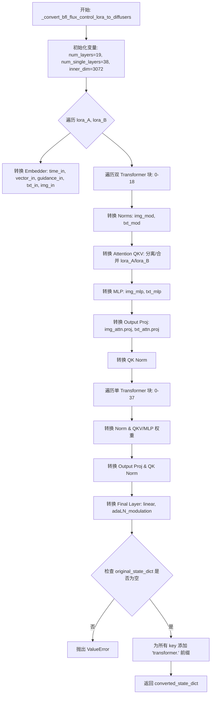

#### 带注释源码

```python
def _convert_bfl_flux_control_lora_to_diffusers(original_state_dict):
    # 初始化转换后的状态字典
    converted_state_dict = {}
    # 获取原始字典的键列表，用于快速查找偏置(bias)是否存在
    original_state_dict_keys = list(original_state_dict.keys())
    
    # BFL Flux 模型配置参数
    num_layers = 19
    num_single_layers = 38
    inner_dim = 3072
    mlp_ratio = 4.0

    # 1. 处理 Embedder 层 (time, vector, guidance, context, image)
    # 遍历 lora_A 和 lora_B 权重
    for lora_key in ["lora_A", "lora_B"]:
        ## time_text_embed.timestep_embedder <-  time_in
        # 将 time_in.in_layer 的权重转移到 timestep_embedder.linear_1
        converted_state_dict[f"time_text_embed.timestep_embedder.linear_1.{lora_key}.weight"] = (
            original_state_dict.pop(f"time_in.in_layer.{lora_key}.weight")
        )
        # 处理偏置
        if f"time_in.in_layer.{lora_key}.bias" in original_state_dict_keys:
            converted_state_dict[f"time_text_embed.timestep_embedder.linear_1.{lora_key}.bias"] = (
                original_state_dict.pop(f"time_in.in_layer.{lora_key}.bias")
            )

        # time_in.out_layer -> timestep_embedder.linear_2
        converted_state_dict[f"time_text_embed.timestep_embedder.linear_2.{lora_key}.weight"] = (
            original_state_dict.pop(f"time_in.out_layer.{lora_key}.weight")
        )
        if f"time_in.out_layer.{lora_key}.bias" in original_state_dict_keys:
            converted_state_dict[f"time_text_embed.timestep_embedder.linear_2.{lora_key}.bias"] = (
                original_state_dict.pop(f"time_in.out_layer.{lora_key}.bias")
            )

        ## time_text_embed.text_embedder <- vector_in
        converted_state_dict[f"time_text_embed.text_embedder.linear_1.{lora_key}.weight"] = original_state_dict.pop(
            f"vector_in.in_layer.{lora_key}.weight"
        )
        if f"vector_in.in_layer.{lora_key}.bias" in original_state_dict_keys:
            converted_state_dict[f"time_text_embed.text_embedder.linear_1.{lora_key}.bias"] = original_state_dict.pop(
                f"vector_in.in_layer.{lora_key}.bias"
            )

        converted_state_dict[f"time_text_embed.text_embedder.linear_2.{lora_key}.weight"] = original_state_dict.pop(
            f"vector_in.out_layer.{lora_key}.weight"
        )
        if f"vector_in.out_layer.{lora_key}.bias" in original_state_dict_keys:
            converted_state_dict[f"time_text_embed.text_embedder.linear_2.{lora_key}.bias"] = original_state_dict.pop(
                f"vector_in.out_layer.{lora_key}.bias"
            )

        # guidance (可选)
        has_guidance = any("guidance" in k for k in original_state_dict)
        if has_guidance:
            converted_state_dict[f"time_text_embed.guidance_embedder.linear_1.{lora_key}.weight"] = (
                original_state_dict.pop(f"guidance_in.in_layer.{lora_key}.weight")
            )
            if f"guidance_in.in_layer.{lora_key}.bias" in original_state_dict_keys:
                converted_state_dict[f"time_text_embed.guidance_embedder.linear_1.{lora_key}.bias"] = (
                    original_state_dict.pop(f"guidance_in.in_layer.{lora_key}.bias")
                )

            converted_state_dict[f"time_text_embed.guidance_embedder.linear_2.{lora_key}.weight"] = (
                original_state_dict.pop(f"guidance_in.out_layer.{lora_key}.weight")
            )
            if f"guidance_in.out_layer.{lora_key}.bias" in original_state_dict_keys:
                converted_state_dict[f"time_text_embed.guidance_embedder.linear_2.{lora_key}.bias"] = (
                    original_state_dict.pop(f"guidance_in.out_layer.{lora_key}.bias")
                )

        # context_embedder (txt_in)
        converted_state_dict[f"context_embedder.{lora_key}.weight"] = original_state_dict.pop(
            f"txt_in.{lora_key}.weight"
        )
        if f"txt_in.{lora_key}.bias" in original_state_dict_keys:
            converted_state_dict[f"context_embedder.{lora_key}.bias"] = original_state_dict.pop(
                f"txt_in.{lora_key}.bias"
            )

        # x_embedder (img_in)
        converted_state_dict[f"x_embedder.{lora_key}.weight"] = original_state_dict.pop(f"img_in.{lora_key}.weight")
        if f"img_in.{lora_key}.bias" in original_state_dict_keys:
            converted_state_dict[f"x_embedder.{lora_key}.bias"] = original_state_dict.pop(f"img_in.{lora_key}.bias")

    # 2. 处理 Double Transformer Blocks (0-18)
    for i in range(num_layers):
        block_prefix = f"transformer_blocks.{i}."

        for lora_key in ["lora_A", "lora_B"]:
            # Norms (img_mod, txt_mod)
            converted_state_dict[f"{block_prefix}norm1.linear.{lora_key}.weight"] = original_state_dict.pop(
                f"double_blocks.{i}.img_mod.lin.{lora_key}.weight"
            )
            if f"double_blocks.{i}.img_mod.lin.{lora_key}.bias" in original_state_dict_keys:
                converted_state_dict[f"{block_prefix}norm1.linear.{lora_key}.bias"] = original_state_dict.pop(
                    f"double_blocks.{i}.img_mod.lin.{lora_key}.bias"
                )

            converted_state_dict[f"{block_prefix}norm1_context.linear.{lora_key}.weight"] = original_state_dict.pop(
                f"double_blocks.{i}.txt_mod.lin.{lora_key}.weight"
            )
            if f"double_blocks.{i}.txt_mod.lin.{lora_key}.bias" in original_state_dict_keys:
                converted_state_dict[f"{block_prefix}norm1_context.linear.{lora_key}.bias"] = original_state_dict.pop(
                    f"double_blocks.{i}.txt_mod.lin.{lora_key}.bias"
                )

            # Q, K, V 处理
            # 对于 lora_A，通常 QKV 权重是复制到 to_q, to_k, to_v 的
            if lora_key == "lora_A":
                sample_lora_weight = original_state_dict.pop(f"double_blocks.{i}.img_attn.qkv.{lora_key}.weight")
                converted_state_dict[f"{block_prefix}attn.to_v.{lora_key}.weight"] = torch.cat([sample_lora_weight])
                converted_state_dict[f"{block_prefix}attn.to_q.{lora_key}.weight"] = torch.cat([sample_lora_weight])
                converted_state_dict[f"{block_prefix}attn.to_k.{lora_key}.weight"] = torch.cat([sample_lora_weight])

                context_lora_weight = original_state_dict.pop(f"double_blocks.{i}.txt_attn.qkv.{lora_key}.weight")
                converted_state_dict[f"{block_prefix}attn.add_q_proj.{lora_key}.weight"] = torch.cat(
                    [context_lora_weight]
                )
                converted_state_dict[f"{block_prefix}attn.add_k_proj.{lora_key}.weight"] = torch.cat(
                    [context_lora_weight]
                )
                converted_state_dict[f"{block_prefix}attn.add_v_proj.{lora_key}.weight"] = torch.cat(
                    [context_lora_weight]
                )
            else:
                # 对于 lora_B，需要将合并的 QKV Tensor 切分出来
                sample_q, sample_k, sample_v = torch.chunk(
                    original_state_dict.pop(f"double_blocks.{i}.img_attn.qkv.{lora_key}.weight"), 3, dim=0
                )
                converted_state_dict[f"{block_prefix}attn.to_q.{lora_key}.weight"] = torch.cat([sample_q])
                converted_state_dict[f"{block_prefix}attn.to_k.{lora_key}.weight"] = torch.cat([sample_k])
                converted_state_dict[f"{block_prefix}attn.to_v.{lora_key}.weight"] = torch.cat([sample_v])

                context_q, context_k, context_v = torch.chunk(
                    original_state_dict.pop(f"double_blocks.{i}.txt_attn.qkv.{lora_key}.weight"), 3, dim=0
                )
                converted_state_dict[f"{block_prefix}attn.add_q_proj.{lora_key}.weight"] = torch.cat([context_q])
                converted_state_dict[f"{block_prefix}attn.add_k_proj.{lora_key}.weight"] = torch.cat([context_k])
                converted_state_dict[f"{block_prefix}attn.add_v_proj.{lora_key}.weight"] = torch.cat([context_v])

            # 处理 Bias
            if f"double_blocks.{i}.img_attn.qkv.{lora_key}.bias" in original_state_dict_keys:
                sample_q_bias, sample_k_bias, sample_v_bias = torch.chunk(
                    original_state_dict.pop(f"double_blocks.{i}.img_attn.qkv.{lora_key}.bias"), 3, dim=0
                )
                converted_state_dict[f"{block_prefix}attn.to_q.{lora_key}.bias"] = torch.cat([sample_q_bias])
                converted_state_dict[f"{block_prefix}attn.to_k.{lora_key}.bias"] = torch.cat([sample_k_bias])
                converted_state_dict[f"{block_prefix}attn.to_v.{lora_key}.bias"] = torch.cat([sample_v_bias])

            if f"double_blocks.{i}.txt_attn.qkv.{lora_key}.bias" in original_state_dict_keys:
                context_q_bias, context_k_bias, context_v_bias = torch.chunk(
                    original_state_dict.pop(f"double_blocks.{i}.txt_attn.qkv.{lora_key}.bias"), 3, dim=0
                )
                converted_state_dict[f"{block_prefix}attn.add_q_proj.{lora_key}.bias"] = torch.cat([context_q_bias])
                converted_state_dict[f"{block_prefix}attn.add_k_proj.{lora_key}.bias"] = torch.cat([context_k_bias])
                converted_state_dict[f"{block_prefix}attn.add_v_proj.{lora_key}.bias"] = torch.cat([context_v_bias])

            # FFN (img_mlp, txt_mlp)
            converted_state_dict[f"{block_prefix}ff.net.0.proj.{lora_key}.weight"] = original_state_dict.pop(
                f"double_blocks.{i}.img_mlp.0.{lora_key}.weight"
            )
            # ... (省略部分 bias 检查代码以精简，逻辑同前)
            if f"double_blocks.{i}.img_mlp.0.{lora_key}.bias" in original_state_dict_keys:
                converted_state_dict[f"{block_prefix}ff.net.0.proj.{lora_key}.bias"] = original_state_dict.pop(
                    f"double_blocks.{i}.img_mlp.0.{lora_key}.bias"
                )

            converted_state_dict[f"{block_prefix}ff.net.2.{lora_key}.weight"] = original_state_dict.pop(
                f"double_blocks.{i}.img_mlp.2.{lora_key}.weight"
            )
            # ... (bias check)

            converted_state_dict[f"{block_prefix}ff_context.net.0.proj.{lora_key}.weight"] = original_state_dict.pop(
                f"double_blocks.{i}.txt_mlp.0.{lora_key}.weight"
            )
            # ... (bias check)

            converted_state_dict[f"{block_prefix}ff_context.net.2.{lora_key}.weight"] = original_state_dict.pop(
                f"double_blocks.{i}.txt_mlp.2.{lora_key}.weight"
            )
            # ... (bias check)

            # Output Projections
            converted_state_dict[f"{block_prefix}attn.to_out.0.{lora_key}.weight"] = original_state_dict.pop(
                f"double_blocks.{i}.img_attn.proj.{lora_key}.weight"
            )
            # ... (bias check)
            converted_state_dict[f"{block_prefix}attn.to_add_out.{lora_key}.weight"] = original_state_dict.pop(
                f"double_blocks.{i}.txt_attn.proj.{lora_key}.weight"
            )
            # ... (bias check)

        # qk_norm
        converted_state_dict[f"{block_prefix}attn.norm_q.weight"] = original_state_dict.pop(
            f"double_blocks.{i}.img_attn.norm.query_norm.scale"
        )
        converted_state_dict[f"{block_prefix}attn.norm_k.weight"] = original_state_dict.pop(
            f"double_blocks.{i}.img_attn.norm.key_norm.scale"
        )
        converted_state_dict[f"{block_prefix}attn.norm_added_q.weight"] = original_state_dict.pop(
            f"double_blocks.{i}.txt_attn.norm.query_norm.scale"
        )
        converted_state_dict[f"{block_prefix}attn.norm_added_k.weight"] = original_state_dict.pop(
            f"double_blocks.{i}.txt_attn.norm.key_norm.scale"
        )

    # 3. 处理 Single Transformer Blocks (0-37)
    for i in range(num_single_layers):
        block_prefix = f"single_transformer_blocks.{i}."

        for lora_key in ["lora_A", "lora_B"]:
            # norm.linear
            converted_state_dict[f"{block_prefix}norm.linear.{lora_key}.weight"] = original_state_dict.pop(
                f"single_blocks.{i}.modulation.lin.{lora_key}.weight"
            )
            # ... (bias)

            # Q, K, V, mlp
            mlp_hidden_dim = int(inner_dim * mlp_ratio)
            split_size = (inner_dim, inner_dim, inner_dim, mlp_hidden_dim)

            # lora_A 处理逻辑
            if lora_key == "lora_A":
                lora_weight = original_state_dict.pop(f"single_blocks.{i}.linear1.{lora_key}.weight")
                # 复制权重到各个目标 key
                converted_state_dict[f"{block_prefix}attn.to_q.{lora_key}.weight"] = torch.cat([lora_weight])
                converted_state_dict[f"{block_prefix}attn.to_k.{lora_key}.weight"] = torch.cat([lora_weight])
                converted_state_dict[f"{block_prefix}attn.to_v.{lora_key}.weight"] = torch.cat([lora_weight])
                converted_state_dict[f"{block_prefix}proj_mlp.{lora_key}.weight"] = torch.cat([lora_weight])
                # ... bias handling
            else:
                # lora_B: 拆分合并的 tensor
                q, k, v, mlp = torch.split(
                    original_state_dict.pop(f"single_blocks.{i}.linear1.{lora_key}.weight"), split_size, dim=0
                )
                converted_state_dict[f"{block_prefix}attn.to_q.{lora_key}.weight"] = torch.cat([q])
                converted_state_dict[f"{block_prefix}attn.to_k.{lora_key}.weight"] = torch.cat([k])
                converted_state_dict[f"{block_prefix}attn.to_v.{lora_key}.weight"] = torch.cat([v])
                converted_state_dict[f"{block_prefix}proj_mlp.{lora_key}.weight"] = torch.cat([mlp])
                # ... bias handling

            # Output Projection
            converted_state_dict[f"{block_prefix}proj_out.{lora_key}.weight"] = original_state_dict.pop(
                f"single_blocks.{i}.linear2.{lora_key}.weight"
            )
            # ... bias

        # qk norm
        converted_state_dict[f"{block_prefix}attn.norm_q.weight"] = original_state_dict.pop(
            f"single_blocks.{i}.norm.query_norm.scale"
        )
        converted_state_dict[f"{block_prefix}attn.norm_k.weight"] = original_state_dict.pop(
            f"single_blocks.{i}.norm.key_norm.scale"
        )

    # 4. Final Layer
    for lora_key in ["lora_A", "lora_B"]:
        converted_state_dict[f"proj_out.{lora_key}.weight"] = original_state_dict.pop(
            f"final_layer.linear.{lora_key}.weight"
        )
        # ... bias
        
        # 使用 swap_scale_shift 交换 shift 和 scale
        converted_state_dict[f"norm_out.linear.{lora_key}.weight"] = swap_scale_shift(
            original_state_dict.pop(f"final_layer.adaLN_modulation.1.{lora_key}.weight")
        )
        # ... bias & swap_scale_shift

    # 验证是否所有 key 都被处理
    if len(original_state_dict) > 0:
        raise ValueError(f"`original_state_dict` should be empty at this point but has {original_state_dict.keys()}.")

    # 5. 添加 transformer. 前缀
    for key in list(converted_state_dict.keys()):
        converted_state_dict[f"transformer.{key}"] = converted_state_dict.pop(key)

    return converted_state_dict
```


### `_convert_fal_kontext_lora_to_diffusers`

该函数用于将 FAL Kontext 格式的 LoRA 权重状态字典转换为 Diffusers 格式。通过重新映射键名和重组权重张量，将原始模型中特定层（如双块、单块、归一化层等）的 LoRA 参数适配到 Diffusers 预期的 Transformer 结构中。

参数：

- `original_state_dict`：`dict`，原始的 FAL Kontext 格式 LoRA 权重状态字典

返回值：`dict`，转换后的 Diffusers 格式状态字典

#### 流程图

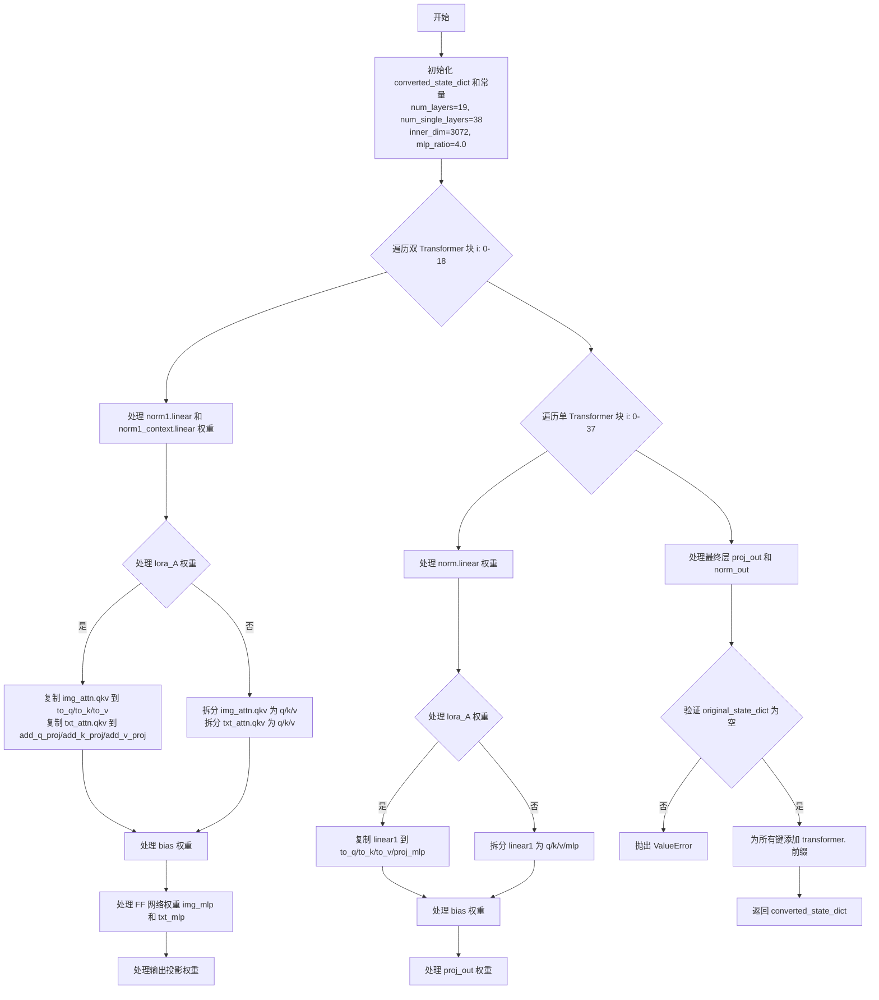

#### 带注释源码

```python
def _convert_fal_kontext_lora_to_diffusers(original_state_dict):
    """
    将 FAL Kontext LoRA 格式转换为 Diffusers 格式
    
    该函数处理 Flux 模型的双块和单块结构中的 LoRA 权重转换，
    包括注意力权重、MLP 权重、归一化权重等的键名重映射。
    
    Args:
        original_state_dict: 原始的 FAL Kontext 格式状态字典
        
    Returns:
        转换后的 Diffusers 格式状态字典
    """
    # 初始化转换后的状态字典
    converted_state_dict = {}
    # 获取原始状态字典的所有键
    original_state_dict_keys = list(original_state_dict.keys())
    
    # 定义模型结构常量：双块19层，单块38层
    num_layers = 19
    num_single_layers = 38
    inner_dim = 3072
    mlp_ratio = 4.0

    # ========== 处理双 Transformer 块 ==========
    # 双块包含图像和文本的注意力机制
    for i in range(num_layers):
        # 定义块前缀，用于构建新的键名
        block_prefix = f"transformer_blocks.{i}."
        # 原始模型使用 base_model.model. 作为前缀
        original_block_prefix = "base_model.model."

        # 遍历 LoRA 的 A 和 B 权重
        for lora_key in ["lora_A", "lora_B"]:
            # ---- 归一化层权重转换 ----
            # img_mod.lin -> norm1.linear (图像调制)
            converted_state_dict[f"{block_prefix}norm1.linear.{lora_key}.weight"] = original_state_dict.pop(
                f"{original_block_prefix}double_blocks.{i}.img_mod.lin.{lora_key}.weight"
            )
            # 检查并处理 bias
            if f"double_blocks.{i}.img_mod.lin.{lora_key}.bias" in original_state_dict_keys:
                converted_state_dict[f"{block_prefix}norm1.linear.{lora_key}.bias"] = original_state_dict.pop(
                    f"{original_block_prefix}double_blocks.{i}.img_mod.lin.{lora_key}.bias"
                )

            # txt_mod.lin -> norm1_context.linear (文本调制)
            converted_state_dict[f"{block_prefix}norm1_context.linear.{lora_key}.weight"] = original_state_dict.pop(
                f"{original_block_prefix}double_blocks.{i}.txt_mod.lin.{lora_key}.weight"
            )

            # ---- QKV 注意力权重转换 ----
            if lora_key == "lora_A":
                # lora_A 权重：直接复制到 q/k/v
                sample_lora_weight = original_state_dict.pop(
                    f"{original_block_prefix}double_blocks.{i}.img_attn.qkv.{lora_key}.weight"
                )
                converted_state_dict[f"{block_prefix}attn.to_v.{lora_key}.weight"] = torch.cat([sample_lora_weight])
                converted_state_dict[f"{block_prefix}attn.to_q.{lora_key}.weight"] = torch.cat([sample_lora_weight])
                converted_state_dict[f"{block_prefix}attn.to_k.{lora_key}.weight"] = torch.cat([sample_lora_weight])

                # 文本注意力
                context_lora_weight = original_state_dict.pop(
                    f"{original_block_prefix}double_blocks.{i}.txt_attn.qkv.{lora_key}.weight"
                )
                converted_state_dict[f"{block_prefix}attn.add_q_proj.{lora_key}.weight"] = torch.cat(
                    [context_lora_weight]
                )
                converted_state_dict[f"{block_prefix}attn.add_k_proj.{lora_key}.weight"] = torch.cat(
                    [context_lora_weight]
                )
                converted_state_dict[f"{block_prefix}attn.add_v_proj.{lora_key}.weight"] = torch.cat(
                    [context_lora_weight]
                )
            else:
                # lora_B 权重：需要拆分 QKV
                sample_q, sample_k, sample_v = torch.chunk(
                    original_state_dict.pop(
                        f"{original_block_prefix}double_blocks.{i}.img_attn.qkv.{lora_key}.weight"
                    ),
                    3,
                    dim=0,
                )
                converted_state_dict[f"{block_prefix}attn.to_q.{lora_key}.weight"] = torch.cat([sample_q])
                converted_state_dict[f"{block_prefix}attn.to_k.{lora_key}.weight"] = torch.cat([sample_k])
                converted_state_dict[f"{block_prefix}attn.to_v.{lora_key}.weight"] = torch.cat([sample_v])

                # 文本注意力的 QKV 拆分
                context_q, context_k, context_v = torch.chunk(
                    original_state_dict.pop(
                        f"{original_block_prefix}double_blocks.{i}.txt_attn.qkv.{lora_key}.weight"
                    ),
                    3,
                    dim=0,
                )
                converted_state_dict[f"{block_prefix}attn.add_q_proj.{lora_key}.weight"] = torch.cat([context_q])
                converted_state_dict[f"{block_prefix}attn.add_k_proj.{lora_key}.weight"] = torch.cat([context_k])
                converted_state_dict[f"{block_prefix}attn.add_v_proj.{lora_key}.weight"] = torch.cat([context_v])

            # ---- 处理 bias ----
            if f"double_blocks.{i}.img_attn.qkv.{lora_key}.bias" in original_state_dict_keys:
                sample_q_bias, sample_k_bias, sample_v_bias = torch.chunk(
                    original_state_dict.pop(f"{original_block_prefix}double_blocks.{i}.img_attn.qkv.{lora_key}.bias"),
                    3,
                    dim=0,
                )
                converted_state_dict[f"{block_prefix}attn.to_q.{lora_key}.bias"] = torch.cat([sample_q_bias])
                converted_state_dict[f"{block_prefix}attn.to_k.{lora_key}.bias"] = torch.cat([sample_k_bias])
                converted_state_dict[f"{block_prefix}attn.to_v.{lora_key}.bias"] = torch.cat([sample_v_bias])

            if f"double_blocks.{i}.txt_attn.qkv.{lora_key}.bias" in original_state_dict_keys:
                context_q_bias, context_k_bias, context_v_bias = torch.chunk(
                    original_state_dict.pop(f"{original_block_prefix}double_blocks.{i}.txt_attn.qkv.{lora_key}.bias"),
                    3,
                    dim=0,
                )
                converted_state_dict[f"{block_prefix}attn.add_q_proj.{lora_key}.bias"] = torch.cat([context_q_bias])
                converted_state_dict[f"{block_prefix}attn.add_k_proj.{lora_key}.bias"] = torch.cat([context_k_bias])
                converted_state_dict[f"{block_prefix}attn.add_v_proj.{lora_key}.bias"] = torch.cat([context_v_bias])

            # ---- FF 网络权重 (图像 MLP) ----
            converted_state_dict[f"{block_prefix}ff.net.0.proj.{lora_key}.weight"] = original_state_dict.pop(
                f"{original_block_prefix}double_blocks.{i}.img_mlp.0.{lora_key}.weight"
            )
            if f"{original_block_prefix}double_blocks.{i}.img_mlp.0.{lora_key}.bias" in original_state_dict_keys:
                converted_state_dict[f"{block_prefix}ff.net.0.proj.{lora_key}.bias"] = original_state_dict.pop(
                    f"{original_block_prefix}double_blocks.{i}.img_mlp.0.{lora_key}.bias"
                )

            converted_state_dict[f"{block_prefix}ff.net.2.{lora_key}.weight"] = original_state_dict.pop(
                f"{original_block_prefix}double_blocks.{i}.img_mlp.2.{lora_key}.weight"
            )
            if f"{original_block_prefix}double_blocks.{i}.img_mlp.2.{lora_key}.bias" in original_state_dict_keys:
                converted_state_dict[f"{block_prefix}ff.net.2.{lora_key}.bias"] = original_state_dict.pop(
                    f"{original_block_prefix}double_blocks.{i}.img_mlp.2.{lora_key}.bias"
                )

            # ---- FF 网络权重 (文本 MLP) ----
            converted_state_dict[f"{block_prefix}ff_context.net.0.proj.{lora_key}.weight"] = original_state_dict.pop(
                f"{original_block_prefix}double_blocks.{i}.txt_mlp.0.{lora_key}.weight"
            )
            if f"{original_block_prefix}double_blocks.{i}.txt_mlp.0.{lora_key}.bias" in original_state_dict_keys:
                converted_state_dict[f"{block_prefix}ff_context.net.0.proj.{lora_key}.bias"] = original_state_dict.pop(
                    f"{original_block_prefix}double_blocks.{i}.txt_mlp.0.{lora_key}.bias"
                )

            converted_state_dict[f"{block_prefix}ff_context.net.2.{lora_key}.weight"] = original_state_dict.pop(
                f"{original_block_prefix}double_blocks.{i}.txt_mlp.2.{lora_key}.weight"
            )
            if f"{original_block_prefix}double_blocks.{i}.txt_mlp.2.{lora_key}.bias" in original_state_dict_keys:
                converted_state_dict[f"{block_prefix}ff_context.net.2.{lora_key}.bias"] = original_state_dict.pop(
                    f"{original_block_prefix}double_blocks.{i}.txt_mlp.2.{lora_key}.bias"
                )

            # ---- 输出投影权重 ----
            converted_state_dict[f"{block_prefix}attn.to_out.0.{lora_key}.weight"] = original_state_dict.pop(
                f"{original_block_prefix}double_blocks.{i}.img_attn.proj.{lora_key}.weight"
            )
            if f"{original_block_prefix}double_blocks.{i}.img_attn.proj.{lora_key}.bias" in original_state_dict_keys:
                converted_state_dict[f"{block_prefix}attn.to_out.0.{lora_key}.bias"] = original_state_dict.pop(
                    f"{original_block_prefix}double_blocks.{i}.img_attn.proj.{lora_key}.bias"
                )
            converted_state_dict[f"{block_prefix}attn.to_add_out.{lora_key}.weight"] = original_state_dict.pop(
                f"{original_block_prefix}double_blocks.{i}.txt_attn.proj.{lora_key}.weight"
            )
            if f"{original_block_prefix}double_blocks.{i}.txt_attn.proj.{lora_key}.bias" in original_state_dict_keys:
                converted_state_dict[f"{block_prefix}attn.to_add_out.{lora_key}.bias"] = original_state_dict.pop(
                    f"{original_block_prefix}double_blocks.{i}.txt_attn.proj.{lora_key}.bias"
                )

    # ========== 处理单 Transformer 块 ==========
    # 单块是简化版的 Transformer 块
    for i in range(num_single_layers):
        block_prefix = f"single_transformer_blocks.{i}."

        for lora_key in ["lora_A", "lora_B"]:
            # ---- 归一化层权重 ----
            converted_state_dict[f"{block_prefix}norm.linear.{lora_key}.weight"] = original_state_dict.pop(
                f"{original_block_prefix}single_blocks.{i}.modulation.lin.{lora_key}.weight"
            )
            if f"{original_block_prefix}single_blocks.{i}.modulation.lin.{lora_key}.bias" in original_state_dict_keys:
                converted_state_dict[f"{block_prefix}norm.linear.{lora_key}.bias"] = original_state_dict.pop(
                    f"{original_block_prefix}single_blocks.{i}.modulation.lin.{lora_key}.bias"
                )

            # ---- QKV 和 MLP 权重 ----
            mlp_hidden_dim = int(inner_dim * mlp_ratio)
            split_size = (inner_dim, inner_dim, inner_dim, mlp_hidden_dim)

            if lora_key == "lora_A":
                # lora_A：复制到所有目标
                lora_weight = original_state_dict.pop(
                    f"{original_block_prefix}single_blocks.{i}.linear1.{lora_key}.weight"
                )
                converted_state_dict[f"{block_prefix}attn.to_q.{lora_key}.weight"] = torch.cat([lora_weight])
                converted_state_dict[f"{block_prefix}attn.to_k.{lora_key}.weight"] = torch.cat([lora_weight])
                converted_state_dict[f"{block_prefix}attn.to_v.{lora_key}.weight"] = torch.cat([lora_weight])
                converted_state_dict[f"{block_prefix}proj_mlp.{lora_key}.weight"] = torch.cat([lora_weight])

                # 处理 bias
                if f"{original_block_prefix}single_blocks.{i}.linear1.{lora_key}.bias" in original_state_dict_keys:
                    lora_bias = original_state_dict.pop(f"single_blocks.{i}.linear1.{lora_key}.bias")
                    converted_state_dict[f"{block_prefix}attn.to_q.{lora_key}.bias"] = torch.cat([lora_bias])
                    converted_state_dict[f"{block_prefix}attn.to_k.{lora_key}.bias"] = torch.cat([lora_bias])
                    converted_state_dict[f"{block_prefix}attn.to_v.{lora_key}.bias"] = torch.cat([lora_bias])
                    converted_state_dict[f"{block_prefix}proj_mlp.{lora_key}.bias"] = torch.cat([lora_bias])
            else:
                # lora_B：拆分到各个目标
                q, k, v, mlp = torch.split(
                    original_state_dict.pop(f"{original_block_prefix}single_blocks.{i}.linear1.{lora_key}.weight"),
                    split_size,
                    dim=0,
                )
                converted_state_dict[f"{block_prefix}attn.to_q.{lora_key}.weight"] = torch.cat([q])
                converted_state_dict[f"{block_prefix}attn.to_k.{lora_key}.weight"] = torch.cat([k])
                converted_state_dict[f"{block_prefix}attn.to_v.{lora_key}.weight"] = torch.cat([v])
                converted_state_dict[f"{block_prefix}proj_mlp.{lora_key}.weight"] = torch.cat([mlp])

                # 处理 bias
                if f"{original_block_prefix}single_blocks.{i}.linear1.{lora_key}.bias" in original_state_dict_keys:
                    q_bias, k_bias, v_bias, mlp_bias = torch.split(
                        original_state_dict.pop(f"{original_block_prefix}single_blocks.{i}.linear1.{lora_key}.bias"),
                        split_size,
                        dim=0,
                    )
                    converted_state_dict[f"{block_prefix}attn.to_q.{lora_key}.bias"] = torch.cat([q_bias])
                    converted_state_dict[f"{block_prefix}attn.to_k.{lora_key}.bias"] = torch.cat([k_bias])
                    converted_state_dict[f"{block_prefix}attn.to_v.{lora_key}.bias"] = torch.cat([v_bias])
                    converted_state_dict[f"{block_prefix}proj_mlp.{lora_key}.bias"] = torch.cat([mlp_bias])

            # ---- 输出投影 ----
            converted_state_dict[f"{block_prefix}proj_out.{lora_key}.weight"] = original_state_dict.pop(
                f"{original_block_prefix}single_blocks.{i}.linear2.{lora_key}.weight"
            )
            if f"{original_block_prefix}single_blocks.{i}.linear2.{lora_key}.bias" in original_state_dict_keys:
                converted_state_dict[f"{block_prefix}proj_out.{lora_key}.bias"] = original_state_dict.pop(
                    f"{original_block_prefix}single_blocks.{i}.linear2.{lora_key}.bias"
                )

    # ========== 处理最终层 ========
    for lora_key in ["lora_A", "lora_B"]:
        converted_state_dict[f"proj_out.{lora_key}.weight"] = original_state_dict.pop(
            f"{original_block_prefix}final_layer.linear.{lora_key}.weight"
        )
        if f"{original_block_prefix}final_layer.linear.{lora_key}.bias" in original_state_dict_keys:
            converted_state_dict[f"proj_out.{lora_key}.bias"] = original_state_dict.pop(
                f"{original_block_prefix}final_layer.linear.{lora_key}.bias"
            )

    # ========== 验证并添加前缀 ========
    # 确保所有原始键都已被处理
    if len(original_state_dict) > 0:
        raise ValueError(f"`original_state_dict` should be empty at this point but has {original_state_dict.keys()}.")

    # 为所有键添加 transformer. 前缀
    for key in list(converted_state_dict.keys()):
        converted_state_dict[f"transformer.{key}"] = converted_state_dict.pop(key)

    return converted_state_dict
```


### `_convert_hunyuan_video_lora_to_diffusers`

该函数负责将 HunyuanVideo 模型的 LoRA 权重从腾讯混元视频模型的原始格式转换为 Diffusers 兼容的格式，通过键名重映射和特殊的张量变换处理，使非 Diffusers 格式的 LoRA 权重能够在 Diffusers 框架中正确加载和使用。

参数：

- `original_state_dict`：`dict`，原始的 HunyuanVideo LoRA 状态字典（键值对）

返回值：`dict`，转换后的 Diffusers 兼容状态字典

#### 流程图

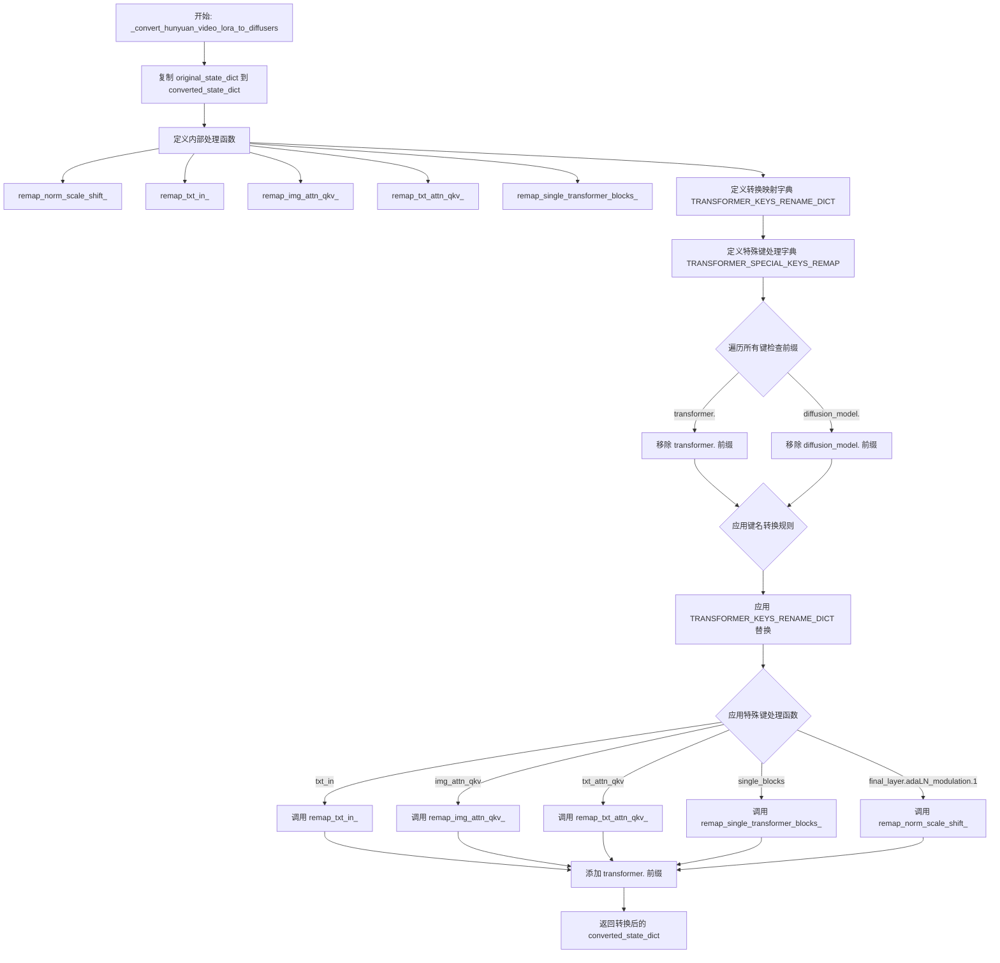

#### 带注释源码

```python
def _convert_hunyuan_video_lora_to_diffusers(original_state_dict):
    # 将原始状态字典复制一份，避免修改原字典
    # 这一步是必要的，因为后续会使用 pop() 方法从字典中移除元素
    converted_state_dict = {k: original_state_dict.pop(k) for k in list(original_state_dict.keys())}

    # 定义内部函数：重映射 norm 的 scale 和 shift 参数
    # 将权重张量按通道维度分成两部分，然后交换顺序（shift 和 scale 交换位置）
    def remap_norm_scale_shift_(key, state_dict):
        weight = state_dict.pop(key)  # 移除并获取权重
        # chunk(2, dim=0) 将权重沿第0维分成两部分
        # 原始顺序是 [shift, scale]，新顺序改为 [scale, shift]
        shift, scale = weight.chunk(2, dim=0)
        new_weight = torch.cat([scale, shift], dim=0)
        # 更新键名：将 final_layer.adaLN_modulation.1 替换为 norm_out.linear
        state_dict[key.replace("final_layer.adaLN_modulation.1", "norm_out.linear")] = new_weight

    # 定义内部函数：重映射文本输入相关键
    # 处理文本编码器/条件嵌入器的各种层名称转换
    def remap_txt_in_(key, state_dict):
        def rename_key(key):
            # 替换多个键名模式，将原始格式转为 Diffusers 格式
            new_key = key.replace("individual_token_refiner.blocks", "token_refiner.refiner_blocks")
            new_key = new_key.replace("adaLN_modulation.1", "norm_out.linear")
            new_key = new_key.replace("txt_in", "context_embedder")
            new_key = new_key.replace("t_embedder.mlp.0", "time_text_embed.timestep_embedder.linear_1")
            new_key = new_key.replace("t_embedder.mlp.2", "time_text_embed.timestep_embedder.linear_2")
            new_key = new_key.replace("c_embedder", "time_text_embed.text_embedder")
            new_key = new_key.replace("mlp", "ff")
            return new_key

        # 处理自注意力 QKV 融合权重，需要拆分成 q, k, v 三个独立权重
        if "self_attn_qkv" in key:
            weight = state_dict.pop(key)
            to_q, to_k, to_v = weight.chunk(3, dim=0)
            # 为每个注意力投影创建独立的键
            state_dict[rename_key(key.replace("self_attn_qkv", "attn.to_q"))] = to_q
            state_dict[rename_key(key.replace("self_attn_qkv", "attn.to_k"))] = to_k
            state_dict[rename_key(key.replace("self_attn_qkv", "attn.to_v"))] = to_v
        else:
            # 非 QKV 类型的键直接重命名
            state_dict[rename_key(key)] = state_dict.pop(key)

    # 定义内部函数：重映射图像注意力 QKV
    # 处理图像注意力机制的融合 QKV 权重
    def remap_img_attn_qkv_(key, state_dict):
        weight = state_dict.pop(key)
        # lora_A 权重需要复制到 q, k, v 三个位置（因为在原始格式中可能是共享的）
        if "lora_A" in key:
            state_dict[key.replace("img_attn_qkv", "attn.to_q")] = weight
            state_dict[key.replace("img_attn_qkv", "attn.to_k")] = weight
            state_dict[key.replace("img_attn_qkv", "attn.to_v")] = weight
        else:
            # lora_B 权重需要拆分成 q, k, v 三个独立权重
            to_q, to_k, to_v = weight.chunk(3, dim=0)
            state_dict[key.replace("img_attn_qkv", "attn.to_q")] = to_q
            state_dict[key.replace("img_attn_qkv", "attn.to_k")] = to_k
            state_dict[key.replace("img_attn_qkv", "attn.to_v")] = to_v

    # 定义内部函数：重映射文本注意力 QKV
    # 处理文本注意力机制的融合 QKV 权重，与图像注意力处理类似
    def remap_txt_attn_qkv_(key, state_dict):
        weight = state_dict.pop(key)
        if "lora_A" in key:
            # 文本注意力使用 add_q_proj, add_k_proj, add_v_proj
            state_dict[key.replace("txt_attn_qkv", "attn.add_q_proj")] = weight
            state_dict[key.replace("txt_attn_qkv", "attn.add_k_proj")] = weight
            state_dict[key.replace("txt_attn_qkv", "attn.add_v_proj")] = weight
        else:
            to_q, to_k, to_v = weight.chunk(3, dim=0)
            state_dict[key.replace("txt_attn_qkv", "attn.add_q_proj")] = to_q
            state_dict[key.replace("txt_attn_qkv", "attn.add_k_proj")] = to_k
            state_dict[key.replace("txt_attn_qkv", "attn.add_v_proj")] = to_v

    # 定义内部函数：重映射单个 transformer 块
    # HunyuanVideo 使用 single_blocks 结构，需要转换为 Diffusers 的 single_transformer_blocks
    def remap_single_transformer_blocks_(key, state_dict):
        hidden_size = 3072  # 隐藏层维度

        # 处理 linear1 层的 lora_A 或 lora_B 权重
        if "linear1.lora_A.weight" in key or "linear1.lora_B.weight" in key:
            linear1_weight = state_dict.pop(key)
            if "lora_A" in key:
                # 替换键名：single_blocks -> single_transformer_blocks
                new_key = key.replace("single_blocks", "single_transformer_blocks").removesuffix(
                    ".linear1.lora_A.weight"
                )
                # lora_A 权重需要复制到 q, k, v, proj_mlp 四个位置
                state_dict[f"{new_key}.attn.to_q.lora_A.weight"] = linear1_weight
                state_dict[f"{new_key}.attn.to_k.lora_A.weight"] = linear1_weight
                state_dict[f"{new_key}.attn.to_v.lora_A.weight"] = linear1_weight
                state_dict[f"{new_key}.proj_mlp.lora_A.weight"] = linear1_weight
            else:
                # lora_B 权重需要拆分成 q, k, v, mlp 四个独立权重
                split_size = (hidden_size, hidden_size, hidden_size, linear1_weight.size(0) - 3 * hidden_size)
                q, k, v, mlp = torch.split(linear1_weight, split_size, dim=0)
                new_key = key.replace("single_blocks", "single_transformer_blocks").removesuffix(
                    ".linear1.lora_B.weight"
                )
                state_dict[f"{new_key}.attn.to_q.lora_B.weight"] = q
                state_dict[f"{new_key}.attn.to_k.lora_B.weight"] = k
                state_dict[f"{new_key}.attn.to_v.lora_B.weight"] = v
                state_dict[f"{new_key}.proj_mlp.lora_B.weight"] = mlp

        # 处理 linear1 的 bias（与权重处理逻辑相同）
        elif "linear1.lora_A.bias" in key or "linear1.lora_B.bias" in key:
            linear1_bias = state_dict.pop(key)
            if "lora_A" in key:
                new_key = key.replace("single_blocks", "single_transformer_blocks").removesuffix(
                    ".linear1.lora_A.bias"
                )
                state_dict[f"{new_key}.attn.to_q.lora_A.bias"] = linear1_bias
                state_dict[f"{new_key}.attn.to_k.lora_A.bias"] = linear1_bias
                state_dict[f"{new_key}.attn.to_v.lora_A.bias"] = linear1_bias
                state_dict[f"{new_key}.proj_mlp.lora_A.bias"] = linear1_bias
            else:
                split_size = (hidden_size, hidden_size, hidden_size, linear1_bias.size(0) - 3 * hidden_size)
                q_bias, k_bias, v_bias, mlp_bias = torch.split(linear1_bias, split_size, dim=0)
                new_key = key.replace("single_blocks", "single_transformer_blocks").removesuffix(
                    ".linear1.lora_B.bias"
                )
                state_dict[f"{new_key}.attn.to_q.lora_B.bias"] = q_bias
                state_dict[f"{new_key}.attn.to_k.lora_B.bias"] = k_bias
                state_dict[f"{new_key}.attn.to_v.lora_B.bias"] = v_bias
                state_dict[f"{new_key}.proj_mlp.lora_B.bias"] = mlp_bias

        else:
            # 处理其他类型的键（如 linear2、q_norm、k_norm 等）
            new_key = key.replace("single_blocks", "single_transformer_blocks")
            new_key = new_key.replace("linear2", "proj_out")
            new_key = new_key.replace("q_norm", "attn.norm_q")
            new_key = new_key.replace("k_norm", "attn.norm_k")
            state_dict[new_key] = state_dict.pop(key)

    # 定义通用键名转换映射字典
    # 将 HunyuanVideo 的键名模式转换为 Diffusers 的标准命名
    TRANSFORMER_KEYS_RENAME_DICT = {
        "img_in": "x_embedder",                              # 图像输入嵌入
        "time_in.mlp.0": "time_text_embed.timestep_embedder.linear_1",  # 时间嵌入第一层
        "time_in.mlp.2": "time_text_embed.timestep_embedder.linear_2",  # 时间嵌入第二层
        "guidance_in.mlp.0": "time_text_embed.guidance_embedder.linear_1",  # 引导嵌入第一层
        "guidance_in.mlp.2": "time_text_embed.guidance_embedder.linear_2",  # 引导嵌入第二层
        "vector_in.in_layer": "time_text_embed.text_embedder.linear_1",  # 文本嵌入第一层
        "vector_in.out_layer": "time_text_embed.text_embedder.linear_2",  # 文本嵌入第二层
        "double_blocks": "transformer_blocks",               # 双块结构
        "img_attn_q_norm": "attn.norm_q",                   # 图像注意力 Q 归一化
        "img_attn_k_norm": "attn.norm_k",                   # 图像注意力 K 归一化
        "img_attn_proj": "attn.to_out.0",                    # 图像注意力输出投影
        "txt_attn_q_norm": "attn.norm_added_q",             # 文本注意力 Q 归一化
        "txt_attn_k_norm": "attn.norm_added_k",             # 文本注意力 K 归一化
        "txt_attn_proj": "attn.to_add_out",                  # 文本注意力输出投影
        "img_mod.linear": "norm1.linear",                   # 图像调制线性层
        "img_norm1": "norm1.norm",                          # 图像归一化层1
        "img_norm2": "norm2",                                # 图像归一化层2
        "img_mlp": "ff",                                      # 图像前馈网络
        "txt_mod.linear": "norm1_context.linear",           # 文本调制线性层
        "txt_norm1": "norm1.norm",                          # 文本归一化层1
        "txt_norm2": "norm2_context",                        # 文本归一化层2
        "txt_mlp": "ff_context",                             # 文本前馈网络
        "self_attn_proj": "attn.to_out.0",                   # 自注意力输出投影
        "modulation.linear": "norm.linear",                 # 调制线性层
        "pre_norm": "norm.norm",                            # 预归一化
        "final_layer.norm_final": "norm_out.norm",         # 最终层归一化
        "final_layer.linear": "proj_out",                   # 最终层线性投影
        "fc1": "net.0.proj",                                 # 全连接层1
        "fc2": "net.2",                                      # 全连接层2
        "input_embedder": "proj_in",                         # 输入嵌入器
    }

    # 定义需要特殊处理的键及其对应的处理函数
    # 这些键无法通过简单的字符串替换完成转换，需要调用专门的函数进行处理
    TRANSFORMER_SPECIAL_KEYS_REMAP = {
        "txt_in": remap_txt_in_,                              # 文本输入处理
        "img_attn_qkv": remap_img_attn_qkv_,                  # 图像注意力 QKV 处理
        "txt_attn_qkv": remap_txt_attn_qkv_,                  # 文本注意力 QKV 处理
        "single_blocks": remap_single_transformer_blocks_,   # 单块结构处理
        "final_layer.adaLN_modulation.1": remap_norm_scale_shift_,  # 最终层 adaLN 调制处理
    }

    # 预处理：移除可能存在的前缀，使键名格式统一
    # 有些用户可能已经尝试添加了 "transformer." 前缀，需要先移除以便后续处理
    for key in list(converted_state_dict.keys()):
        if key.startswith("transformer."):
            converted_state_dict[key[len("transformer.") :]] = converted_state_dict.pop(key)
        if key.startswith("diffusion_model."):
            converted_state_dict[key[len("diffusion_model.") :]] = converted_state_dict.pop(key)

    # 第一轮转换：应用通用的键名替换规则
    for key in list(converted_state_dict.keys()):
        new_key = key[:]
        for replace_key, rename_key in TRANSFORMER_KEYS_RENAME_DICT.items():
            new_key = new_key.replace(replace_key, rename_key)
        converted_state_dict[new_key] = converted_state_dict.pop(key)

    # 第二轮转换：应用特殊键的处理函数
    for key in list(converted_state_dict.keys()):
        for special_key, handler_fn_inplace in TRANSFORMER_SPECIAL_KEYS_REMAP.items():
            if special_key not in key:
                continue
            # 调用对应的处理函数进行原地转换
            handler_fn_inplace(key, converted_state_dict)

    # 最后：添加回 "transformer." 前缀，符合 Diffusers 的命名规范
    for key in list(converted_state_dict.keys()):
        converted_state_dict[f"transformer.{key}"] = converted_state_dict.pop(key)

    return converted_state_dict
```


# 分析结果

经过详细分析提供的代码，我注意到在给定的代码文件中**不存在名为 `_convert_non_diffusers_luma2_lora_to_diffusers` 的函数**。

## 存在的相关函数

在代码中找到了以下类似名称的函数：

| 函数名 | 位置 |
|--------|------|
| `_convert_non_diffusers_lora_to_diffusers` | 存在 |
| `_convert_non_diffusers_lumina2_lora_to_diffusers` | 存在 |
| `_convert_non_diffusers_ltx2_lora_to_diffusers` | 存在 |

## 结论

您要求提取的函数 `_convert_non_diffusers_luma2_lora_to_diffusers` **不在提供的代码中**。

可能的原因：
1. **函数名称拼写错误** - 可能是以下之一：
   - `_convert_non_diffusers_lumina2_lora_to_diffusers` (Lumina2)
   - `_convert_non_diffusers_lora_to_diffusers` (通用LoRA转换)

2. **该函数尚未在此代码版本中实现**

---

如果您需要我提取 `_convert_non_diffusers_lumina2_lora_to_diffusers` 函数或其他存在的函数的信息，请告知我。


### `_convert_non_diffusers_wan_lora_to_diffusers`

该函数用于将 Wan 模型的非 Diffusers 格式 LoRA 权重状态字典转换为 Diffusers 兼容的格式，主要处理块结构、注意力层、前馈网络层、投影层以及各类嵌入层的键名映射与权重转换，并处理 DoRA 缩放因子。

参数：

- `state_dict`：`dict`，输入的原始 LoRA 状态字典，包含 Wan 模型格式的权重键值对

返回值：`dict`，转换后的 Diffusers 兼容状态字典

#### 流程图

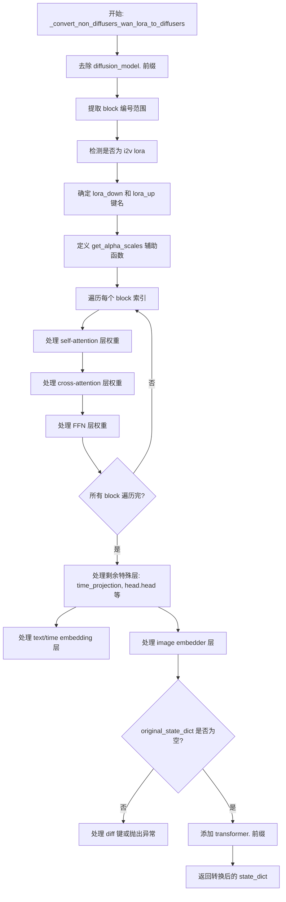

#### 带注释源码

```python
def _convert_non_diffusers_wan_lora_to_diffusers(state_dict):
    """
    将 Wan 模型的非 Diffusers 格式 LoRA 权重转换为 Diffusers 兼容格式。
    
    参数:
        state_dict: 包含 Wan 格式 LoRA 权重的状态字典
        
    返回:
        转换后的 Diffusers 兼容状态字典
    """
    # 初始化结果字典
    converted_state_dict = {}
    
    # 去除 "diffusion_model." 前缀
    original_state_dict = {k[len("diffusion_model."):]: v for k, v in state_dict.items()}

    # 提取所有 block 编号
    block_numbers = {int(k.split(".")[1]) for k in original_state_dict if k.startswith("blocks.")}
    min_block = min(block_numbers)
    max_block = max(block_numbers)

    # 检测是否为 image-to-video LoRA (有 k_img 和 v_img 键)
    is_i2v_lora = any("k_img" in k for k in original_state_dict) and any("v_img" in k for k in original_state_dict)
    
    # 确定 LoRA 权重键名格式 (lora_A/lora_B 或 lora_down/lora_up)
    lora_down_key = "lora_A" if any("lora_A" in k for k in original_state_dict) else "lora_down"
    lora_up_key = "lora_B" if any("lora_B" in k for k in original_state_dict) else "lora_up"
    
    # 检测是否有 time_projection 权重
    has_time_projection_weight = any(
        k.startswith("time_projection") and k.endswith(".weight") for k in original_state_dict
    )

    def get_alpha_scales(down_weight, alpha_key):
        """
        计算 LoRA 权重的缩放因子。
        
        LoRA 在前向传播时按 alpha/rank 缩放，此处需要反向计算 scale_down 和 scale_up
        """
        rank = down_weight.shape[0]
        alpha = original_state_dict.pop(alpha_key).item()
        scale = alpha / rank
        
        # 计算 scale_down 和 scale_up
        scale_down = scale
        scale_up = 1.0
        while scale_down * 2 < scale_up:
            scale_down *= 2
            scale_up /= 2
        return scale_down, scale_up

    # 遍历每个 block
    for i in range(min_block, max_block + 1):
        # ========== Self-attention 处理 ==========
        for o, c in zip(["q", "k", "v", "o"], ["to_q", "to_k", "to_v", "to_out.0"]):
            alpha_key = f"blocks.{i}.self_attn.{o}.alpha"
            has_alpha = alpha_key in original_state_dict
            
            original_key_A = f"blocks.{i}.self_attn.{o}.{lora_down_key}.weight"
            converted_key_A = f"blocks.{i}.attn1.{c}.lora_A.weight"

            original_key_B = f"blocks.{i}.self_attn.{o}.{lora_up_key}.weight"
            converted_key_B = f"blocks.{i}.attn1.{c}.lora_B.weight"

            if has_alpha:
                down_weight = original_state_dict.pop(original_key_A)
                up_weight = original_state_dict.pop(original_key_B)
                scale_down, scale_up = get_alpha_scales(down_weight, alpha_key)
                converted_state_dict[converted_key_A] = down_weight * scale_down
                converted_state_dict[converted_key_B] = up_weight * scale_up
            else:
                if original_key_A in original_state_dict:
                    converted_state_dict[converted_key_A] = original_state_dict.pop(original_key_A)
                if original_key_B in original_state_dict:
                    converted_state_dict[converted_key_B] = original_state_dict.pop(original_key_B)

            # 处理 diff_b (作为 lora bias)
            original_key = f"blocks.{i}.self_attn.{o}.diff_b"
            converted_key = f"blocks.{i}.attn1.{c}.lora_B.bias"
            if original_key in original_state_dict:
                converted_state_dict[converted_key] = original_state_dict.pop(original_key)

        # ========== Cross-attention 处理 ==========
        for o, c in zip(["q", "k", "v", "o"], ["to_q", "to_k", "to_v", "to_out.0"]):
            alpha_key = f"blocks.{i}.cross_attn.{o}.alpha"
            has_alpha = alpha_key in original_state_dict
            original_key_A = f"blocks.{i}.cross_attn.{o}.{lora_down_key}.weight"
            converted_key_A = f"blocks.{i}.attn2.{c}.lora_A.weight"
            original_key_B = f"blocks.{i}.cross_attn.{o}.{lora_up_key}.weight"
            converted_key_B = f"blocks.{i}.attn2.{c}.lora_B.weight"

            if original_key_A in original_state_dict:
                down_weight = original_state_dict.pop(original_key_A)
                converted_state_dict[converted_key_A] = down_weight
            if original_key_B in original_state_dict:
                up_weight = original_state_dict.pop(original_key_B)
                converted_state_dict[converted_key_B] = up_weight
            if has_alpha:
                scale_down, scale_up = get_alpha_scales(down_weight, alpha_key)
                converted_state_dict[converted_key_A] *= scale_down
                converted_state_dict[converted_key_B] *= scale_up

            # 处理 diff_b
            original_key = f"blocks.{i}.cross_attn.{o}.diff_b"
            converted_key = f"blocks.{i}.attn2.{c}.lora_B.bias"
            if original_key in original_state_dict:
                converted_state_dict[converted_key] = original_state_dict.pop(original_key)

        # ========== Image-to-Video 专用 cross-attention (k_img, v_img) ==========
        if is_i2v_lora:
            for o, c in zip(["k_img", "v_img"], ["add_k_proj", "add_v_proj"]):
                alpha_key = f"blocks.{i}.cross_attn.{o}.alpha"
                has_alpha = alpha_key in original_state_dict
                original_key_A = f"blocks.{i}.cross_attn.{o}.{lora_down_key}.weight"
                converted_key_A = f"blocks.{i}.attn2.{c}.lora_A.weight"
                original_key_B = f"blocks.{i}.cross_attn.{o}.{lora_up_key}.weight"
                converted_key_B = f"blocks.{i}.attn2.{c}.lora_B.weight"

                if original_key_A in original_state_dict:
                    down_weight = original_state_dict.pop(original_key_A)
                    converted_state_dict[converted_key_A] = down_weight
                if original_key_B in original_state_dict:
                    up_weight = original_state_dict.pop(original_key_B)
                    converted_state_dict[converted_key_B] = up_weight
                if has_alpha:
                    scale_down, scale_up = get_alpha_scales(down_weight, alpha_key)
                    converted_state_dict[converted_key_A] *= scale_down
                    converted_state_dict[converted_key_B] *= scale_up

                original_key = f"blocks.{i}.cross_attn.{o}.diff_b"
                converted_key = f"blocks.{i}.attn2.{c}.lora_B.bias"
                if original_key in original_state_dict:
                    converted_state_dict[converted_key] = original_state_dict.pop(original_key)

        # ========== FFN 处理 ==========
        for o, c in zip(["ffn.0", "ffn.2"], ["net.0.proj", "net.2"]):
            alpha_key = f"blocks.{i}.{o}.alpha"
            has_alpha = alpha_key in original_state_dict
            original_key_A = f"blocks.{i}.{o}.{lora_down_key}.weight"
            converted_key_A = f"blocks.{i}.ffn.{c}.lora_A.weight"
            original_key_B = f"blocks.{i}.{o}.{lora_up_key}.weight"
            converted_key_B = f"blocks.{i}.ffn.{c}.lora_B.weight"

            if original_key_A in original_state_dict:
                down_weight = original_state_dict.pop(original_key_A)
                converted_state_dict[converted_key_A] = down_weight
            if original_key_B in original_state_dict:
                up_weight = original_state_dict.pop(original_key_B)
                converted_state_dict[converted_key_B] = up_weight
            if has_alpha:
                scale_down, scale_up = get_alpha_scales(down_weight, alpha_key)
                converted_state_dict[converted_key_A] *= scale_down
                converted_state_dict[converted_key_B] *= scale_up

            original_key = f"blocks.{i}.{o}.diff_b"
            converted_key = f"blocks.{i}.ffn.{c}.lora_B.bias"
            if original_key in original_state_dict:
                converted_state_dict[converted_key] = original_state_dict.pop(original_key)

    # ========== 处理剩余特殊层 ==========
    if original_state_dict:
        # time_projection 层
        if any("time_projection" in k for k in original_state_dict):
            original_key = f"time_projection.1.{lora_down_key}.weight"
            converted_key = "condition_embedder.time_proj.lora_A.weight"
            if original_key in original_state_dict:
                converted_state_dict[converted_key] = original_state_dict.pop(original_key)

            original_key = f"time_projection.1.{lora_up_key}.weight"
            converted_key = "condition_embedder.time_proj.lora_B.weight"
            if original_key in original_state_dict:
                converted_state_dict[converted_key] = original_state_dict.pop(original_key)

            if "time_projection.1.diff_b" in original_state_dict:
                converted_state_dict["condition_embedder.time_proj.lora_B.bias"] = original_state_dict.pop(
                    "time_projection.1.diff_b"
                )

        # head.head 输出投影层
        if any("head.head" in k for k in original_state_dict):
            if any(f"head.head.{lora_down_key}.weight" in k for k in state_dict):
                converted_state_dict["proj_out.lora_A.weight"] = original_state_dict.pop(
                    f"head.head.{lora_down_key}.weight"
                )
            if any(f"head.head.{lora_up_key}.weight" in k for k in state_dict):
                converted_state_dict["proj_out.lora_B.weight"] = original_state_dict.pop(
                    f"head.head.{lora_up_key}.weight"
                )
            if "head.head.diff_b" in original_state_dict:
                converted_state_dict["proj_out.lora_B.bias"] = original_state_dict.pop("head.head.diff_b")

        # text/time embedding 层
        for text_time in ["text_embedding", "time_embedding"]:
            if any(text_time in k for k in original_state_dict):
                for b_n in [0, 2]:
                    diffusers_b_n = 1 if b_n == 0 else 2
                    diffusers_name = (
                        "condition_embedder.text_embedder"
                        if text_time == "text_embedding"
                        else "condition_embedder.time_embedder"
                    )
                    if any(f"{text_time}.{b_n}" in k for k in original_state_dict):
                        converted_state_dict[f"{diffusers_name}.linear_{diffusers_b_n}.lora_A.weight"] = (
                            original_state_dict.pop(f"{text_time}.{b_n}.{lora_down_key}.weight")
                        )
                        converted_state_dict[f"{diffusers_name}.linear_{diffusers_b_n}.lora_B.weight"] = (
                            original_state_dict.pop(f"{text_time}.{b_n}.{lora_up_key}.weight")
                        )
                    if f"{text_time}.{b_n}.diff_b" in original_state_dict:
                        converted_state_dict[f"{diffusers_name}.linear_{diffusers_b_n}.lora_B.bias"] = (
                            original_state_dict.pop(f"{text_time}.{b_n}.diff_b")
                        )

        # image embedder 层
        for img_ours, img_theirs in [
            ("ff.net.0.proj", "img_emb.proj.1"),
            ("ff.net.2", "img_emb.proj.3"),
        ]:
            original_key = f"{img_theirs}.{lora_down_key}.weight"
            converted_key = f"condition_embedder.image_embedder.{img_ours}.lora_A.weight"
            if original_key in original_state_dict:
                converted_state_dict[converted_key] = original_state_dict.pop(original_key)

            original_key = f"{img_theirs}.{lora_up_key}.weight"
            converted_key = f"condition_embedder.image_embedder.{img_ours}.lora_B.weight"
            if original_key in original_state_dict:
                converted_state_dict[converted_key] = original_state_dict.pop(original_key)

    # ========== 验证并添加 transformer. 前缀 ==========
    if len(original_state_dict) > 0:
        diff = all(".diff" in k for k in original_state_dict)
        if diff:
            logger.info("Remaining diff keys are not handled yet.")
        else:
            raise ValueError(f"`state_dict` should be empty at this point but has {original_state_dict.keys()=}")

    for key in list(converted_state_dict.keys()):
        converted_state_dict[f"transformer.{key}"] = converted_state_dict.pop(key)

    return converted_state_dict
```


### `_convert_musubi_wan_lora_to_diffusers`

该函数用于将 Musubi/Wan 格式的 LoRA 权重状态字典转换为 Diffusers 兼容的格式。它处理键名转换、alpha 缩放计算，并支持标准的图像到图像以及图像到视频（I2V）类型的 LoRA。

参数：

- `state_dict`：`dict`，包含待转换的 LoRA 权重状态字典

返回值：`dict`，转换后的 Diffusers 兼容状态字典

#### 流程图

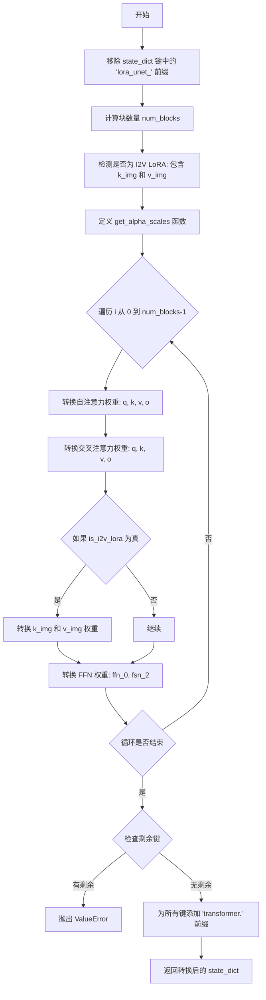

#### 带注释源码

```python
def _convert_musubi_wan_lora_to_diffusers(state_dict):
    # 引用来源: https://github.com/kohya-ss/musubi-tuner
    converted_state_dict = {}
    
    # 步骤1: 移除 'lora_unet_' 前缀，将键从 'lora_unet_xxx' 转换为 'xxx' 格式
    original_state_dict = {k[len("lora_unet_") :]: v for k, v in state_dict.items()}

    # 步骤2: 计算块数量，通过提取 'blocks_X' 模式中的唯一 X 值
    num_blocks = len({k.split("blocks_")[1].split("_")[0] for k in original_state_dict})
    
    # 步骤3: 检测是否为图像到视频(I2V) LoRA，需要同时存在 k_img 和 v_img 键
    is_i2v_lora = any("k_img" in k for k in original_state_dict) and any("v_img" in k for k in original_state_dict)

    def get_alpha_scales(down_weight, key):
        """
        计算 LoRA 的缩放因子
        
        参数:
            down_weight: LoRA down 权重矩阵
            key: 用于获取 alpha 值的键名
            
        返回:
            scale_down, scale_up: 缩放因子对
        """
        rank = down_weight.shape[0]  # LoRA 秩 (rank)
        alpha = original_state_dict.pop(key + ".alpha").item()  # 获取 alpha 值
        # LoRA 在前向传播中按 'alpha / rank' 缩放，这里需要反向缩放回来
        scale = alpha / rank
        scale_down = scale
        scale_up = 1.0
        # 计算合适的缩放因子对，使 scale_down * 2 >= scale_up
        while scale_down * 2 < scale_up:
            scale_down *= 2
            scale_up /= 2
        return scale_down, scale_up

    # 步骤4: 遍历每个块，转换各类权重
    for i in range(num_blocks):
        # --- 自注意力 (Self-Attention) 转换 ---
        # 将 'blocks_{i}_self_attn_{o}.lora_down.weight' 转换为 'blocks.{i}.attn1.{c}.lora_A.weight'
        # o 映射: q->to_q, k->to_k, v->to_v, o->to_out.0
        for o, c in zip(["q", "k", "v", "o"], ["to_q", "to_k", "to_v", "to_out.0"]):
            down_weight = original_state_dict.pop(f"blocks_{i}_self_attn_{o}.lora_down.weight")
            up_weight = original_state_dict.pop(f"blocks_{i}_self_attn_{o}.lora_up.weight")
            scale_down, scale_up = get_alpha_scales(down_weight, f"blocks_{i}_self_attn_{o}")
            converted_state_dict[f"blocks.{i}.attn1.{c}.lora_A.weight"] = down_weight * scale_down
            converted_state_dict[f"blocks.{i}.attn1.{c}.lora_B.weight"] = up_weight * scale_up

        # --- 交叉注意力 (Cross-Attention) 转换 ---
        for o, c in zip(["q", "k", "v", "o"], ["to_q", "to_k", "to_v", "to_out.0"]):
            down_weight = original_state_dict.pop(f"blocks_{i}_cross_attn_{o}.lora_down.weight")
            up_weight = original_state_dict.pop(f"blocks_{i}_cross_attn_{o}.lora_up.weight")
            scale_down, scale_up = get_alpha_scales(down_weight, f"blocks_{i}_cross_attn_{o}")
            converted_state_dict[f"blocks.{i}.attn2.{c}.lora_A.weight"] = down_weight * scale_down
            converted_state_dict[f"blocks.{i}.attn2.{c}.lora_B.weight"] = up_weight * scale_up

        # --- I2V 特定权重 (k_img, v_img) 转换 ---
        if is_i2v_lora:
            # 图像到视频 LoRA 额外的交叉注意力权重
            for o, c in zip(["k_img", "v_img"], ["add_k_proj", "add_v_proj"]):
                down_weight = original_state_dict.pop(f"blocks_{i}_cross_attn_{o}.lora_down.weight")
                up_weight = original_state_dict.pop(f"blocks_{i}_cross_attn_{o}.lora_up.weight")
                scale_down, scale_up = get_alpha_scales(down_weight, f"blocks_{i}_cross_attn_{o}")
                converted_state_dict[f"blocks.{i}.attn2.{c}.lora_A.weight"] = down_weight * scale_down
                converted_state_dict[f"blocks.{i}.attn2.{c}.lora_B.weight"] = up_weight * scale_up

        # --- 前馈网络 (FFN) 转换 ---
        # 将 'blocks_{i}_ffn_X.lora_down.weight' 转换为 'blocks.{i}.ffn.{c}.lora_A.weight'
        # o 映射: ffn_0 -> net.0.proj, ffn_2 -> net.2
        for o, c in zip(["ffn_0", "ffn_2"], ["net.0.proj", "net.2"]):
            down_weight = original_state_dict.pop(f"blocks_{i}_{o}.lora_down.weight")
            up_weight = original_state_dict.pop(f"blocks_{i}_{o}.lora_up.weight")
            scale_down, scale_up = get_alpha_scales(down_weight, f"blocks_{i}_{o}")
            converted_state_dict[f"blocks.{i}.ffn.{c}.lora_A.weight"] = down_weight * scale_down
            converted_state_dict[f"blocks.{i}.ffn.{c}.lora_B.weight"] = up_weight * scale_up

    # 步骤5: 验证所有键都已转换，不应有剩余
    if len(original_state_dict) > 0:
        raise ValueError(f"`state_dict` should be empty at this point but has {original_state_dict.keys()=}")

    # 步骤6: 为所有键添加 'transformer.' 前缀，使其符合 Diffusers 格式
    for key in list(converted_state_dict.keys()):
        converted_state_dict[f"transformer.{key}"] = converted_state_dict.pop(key)

    return converted_state_dict
```


### `_convert_non_diffusers_hidream_lora_to_diffusers`

将非 Diffusers 格式的 HiDream LoRA 状态字典转换为 Diffusers 兼容的状态字典。该函数通过移除指定前缀并添加 "transformer." 前缀来重命名键。

参数：

- `state_dict`：`dict`，要转换的 LoRA 状态字典
- `non_diffusers_prefix`：`str`，可选参数，默认值为 "diffusion_model"，要从前缀中移除的键前缀

返回值：`dict`，转换后的 Diffusers 兼容状态字典

#### 流程图

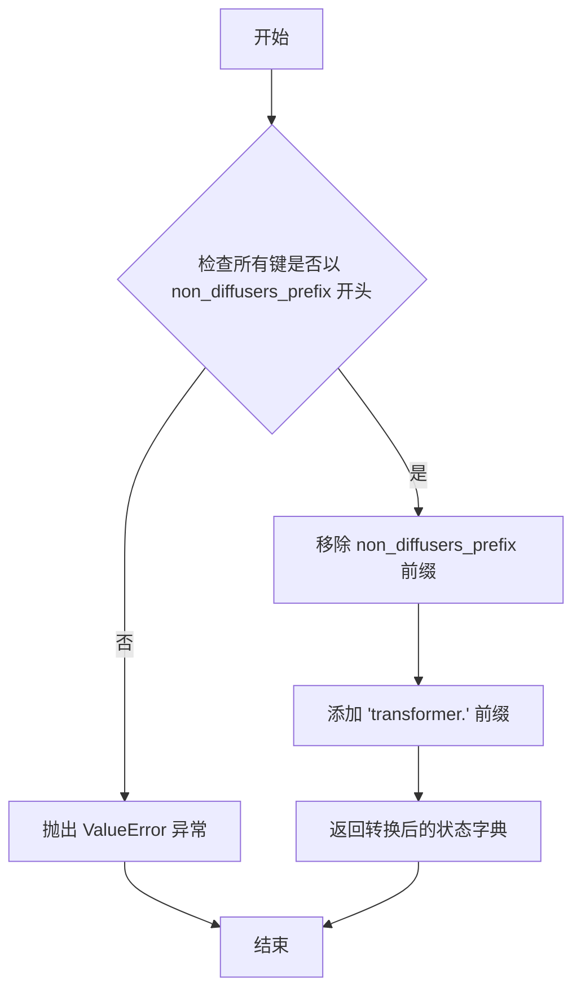

#### 带注释源码

```python
def _convert_non_diffusers_hidream_lora_to_diffusers(state_dict, non_diffusers_prefix="diffusion_model"):
    """
    将非 Diffusers 格式的 HiDream LoRA 状态字典转换为 Diffusers 兼容格式。
    
    参数:
        state_dict (dict): 要转换的 LoRA 状态字典。
        non_diffusers_prefix (str, optional): 要移除的键前缀。默认为 "diffusion_model"。
    
    返回:
        dict: 转换后的 Diffusers 兼容状态字典。
    
    异常:
        ValueError: 如果状态字典中的键不以指定前缀开头。
    """
    # 验证所有键都以指定前缀开头，否则抛出异常
    if not all(k.startswith(non_diffusers_prefix) for k in state_dict):
        raise ValueError("Invalid LoRA state dict for HiDream.")
    
    # 移除指定的前缀（例如 "diffusion_model."）
    converted_state_dict = {k.removeprefix(f"{non_diffusers_prefix}."): v for k, v in state_dict.items()}
    
    # 添加 "transformer." 前缀以符合 Diffusers 格式
    converted_state_dict = {f"transformer.{k}": v for k, v in converted_state_dict.items()}
    
    return converted_state_dict
```


### `_convert_non_diffusers_ltxv_lora_to_diffusers`

将非 Diffusers 格式的 LTX-Video LoRA 权重字典转换为 Diffusers 兼容的格式，通过移除指定前缀并将键重命名为 `transformer.` 前缀格式。

参数：

- `state_dict`：`dict`，需要转换的 LoRA state 字典，包含非 Diffusers 格式的权重键值对
- `non_diffusers_prefix`：`str`，非 Diffusers 格式的前缀，默认为 "diffusion_model"，用于验证和移除该前缀

返回值：`dict`，转换后的 Diffusers 兼容的 LoRA state 字典，所有键均带有 "transformer." 前缀

#### 流程图

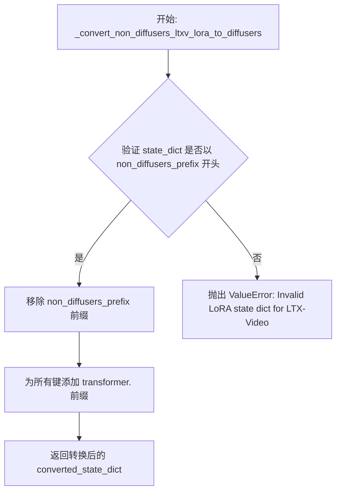

#### 带注释源码

```python
def _convert_non_diffusers_ltxv_lora_to_diffusers(state_dict, non_diffusers_prefix="diffusion_model"):
    """
    将非 Diffusers 格式的 LTX-Video LoRA 权重转换为 Diffusers 兼容格式。

    Args:
        state_dict (dict): 需要转换的 LoRA state 字典。
        non_diffusers_prefix (str, optional): 非 Diffusers 格式的前缀。默认为 "diffusion_model"。

    Returns:
        dict: 转换后的 Diffusers 兼容 LoRA state 字典。

    Raises:
        ValueError: 如果 state_dict 中的键不以 non_diffusers_prefix 开头。
    """
    # 验证所有键是否以指定前缀开头
    if not all(k.startswith(f"{non_diffusers_prefix}.") for k in state_dict):
        raise ValueError("Invalid LoRA state dict for LTX-Video.")
    
    # 移除非 Diffusers 前缀（如 "diffusion_model."）
    converted_state_dict = {k.removeprefix(f"{non_diffusers_prefix}."): v for k, v in state_dict.items()}
    
    # 添加 transformer. 前缀以符合 Diffusers 格式
    converted_state_dict = {f"transformer.{k}": v for k, v in converted_state_dict.items()}
    
    return converted_state_dict
```


### `_convert_non_diffusers_ltx2_lora_to_diffusers`

该函数用于将非 Diffusers 格式的 LTX-Video LoRA 权重状态字典转换为 Diffusers 兼容的格式，主要处理键名映射、前缀移除以及特定层名称的转换。

参数：

- `state_dict`：`dict`，原始的非 Diffusers 格式的 LoRA 状态字典
- `non_diffusers_prefix`：`str`，非 Diffusers 模型的前缀，默认为 "diffusion_model"

返回值：`dict`，转换后的 Diffusers 兼容状态字典

#### 流程图

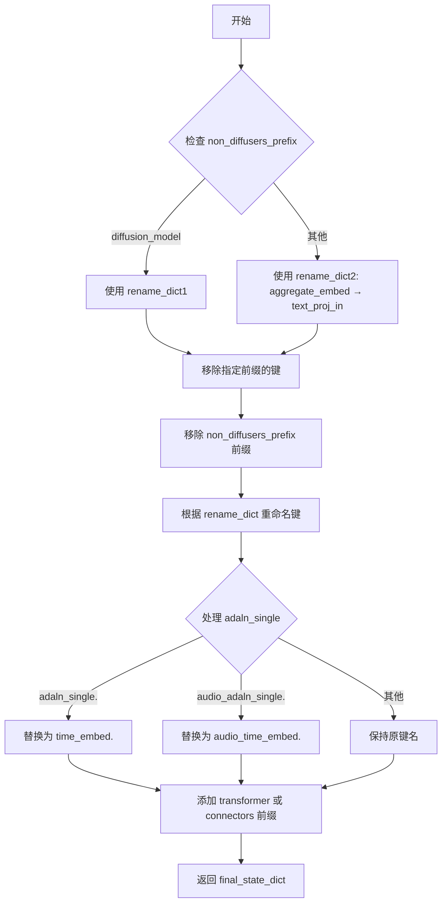

#### 带注释源码

```python
def _convert_non_diffusers_ltx2_lora_to_diffusers(state_dict, non_diffusers_prefix="diffusion_model"):
    """
    将非 Diffusers 格式的 LTX-Video LoRA 权重转换为 Diffusers 格式。
    
    Args:
        state_dict: 原始的 LoRA 状态字典
        non_diffusers_prefix: 非 Diffusers 模型的前缀，默认 "diffusion_model"
    
    Returns:
        转换后的 Diffusers 兼容状态字典
    """
    # 1. 过滤只保留指定前缀的键，并移除前缀
    state_dict = {k: v for k, v in state_dict.items() if k.startswith(f"{non_diffusers_prefix}.")}
    converted_state_dict = {k.removeprefix(f"{non_diffusers_prefix}."): v for k, v in state_dict.items()}

    # 2. 根据前缀选择不同的重命名映射字典
    if non_diffusers_prefix == "diffusion_model":
        rename_dict = {
            "patchify_proj": "proj_in",
            "audio_patchify_proj": "audio_proj_in",
            "av_ca_video_scale_shift_adaln_single": "av_cross_attn_video_scale_shift",
            "av_ca_a2v_gate_adaln_single": "av_cross_attn_video_a2v_gate",
            "av_ca_audio_scale_shift_adaln_single": "av_cross_attn_audio_scale_shift",
            "av_ca_v2a_gate_adaln_single": "av_cross_attn_audio_v2a_gate",
            "scale_shift_table_a2v_ca_video": "video_a2v_cross_attn_scale_shift_table",
            "scale_shift_table_a2v_ca_audio": "audio_a2v_cross_attn_scale_shift_table",
            "q_norm": "norm_q",
            "k_norm": "norm_k",
        }
    else:
        rename_dict = {"aggregate_embed": "text_proj_in"}

    # 3. 应用重命名映射到所有键
    renamed_state_dict = {}
    for key, value in converted_state_dict.items():
        new_key = key[:]
        for old_pattern, new_pattern in rename_dict.items():
            new_key = new_key.replace(old_pattern, new_pattern)
        renamed_state_dict[new_key] = value

    # 4. 处理特殊的 adaln_single 层名称转换
    final_state_dict = {}
    for key, value in renamed_state_dict.items():
        if key.startswith("adaln_single."):
            new_key = key.replace("adaln_single.", "time_embed.")
            final_state_dict[new_key] = value
        elif key.startswith("audio_adaln_single."):
            new_key = key.replace("audio_adaln_single.", "audio_time_embed.")
            final_state_dict[new_key] = value
        else:
            final_state_dict[key] = value

    # 5. 添加 transformer 或 connectors 前缀
    prefix = "transformer" if non_diffusers_prefix == "diffusion_model" else "connectors"
    final_state_dict = {f"{prefix}.{k}": v for k, v in final_state_dict.items()}

    return final_state_dict
```


### `_convert_non_diffusers_qwen_lora_to_diffusers`

该函数用于将非 Diffusers 格式的 Qwen LoRA 权重状态字典转换为 Diffusers 兼容的格式，处理键名映射、权重重命名和 alpha 缩放。

参数：

- `state_dict`：`dict`，待转换的 Qwen LoRA 权重状态字典

返回值：`dict`，转换后的 Diffusers 兼容状态字典

#### 流程图

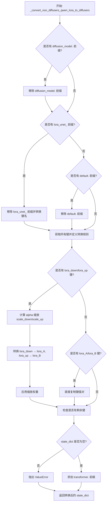

#### 带注释源码

```python
def _convert_non_diffusers_qwen_lora_to_diffusers(state_dict):
    """
    将非 Diffusers 格式的 Qwen LoRA 状态字典转换为 Diffusers 兼容格式。
    
    该函数处理以下转换：
    1. 移除 diffusion_model. 前缀
    2. 移除 lora_unet_ 前缀并进行键名转换
    3. 移除 default. 前缀
    4. 将 lora_down/lora_up 权重转换为 lora_A/lora_B 格式
    5. 应用 alpha 缩放
    """
    # 检查是否存在 diffusion_model. 前缀，若存在则移除
    has_diffusion_model = any(k.startswith("diffusion_model.") for k in state_dict)
    if has_diffusion_model:
        state_dict = {k.removeprefix("diffusion_model."): v for k, v in state_dict.items()}

    # 检查是否存在 lora_unet_ 前缀
    has_lora_unet = any(k.startswith("lora_unet_") for k in state_dict)
    if has_lora_unet:
        # 移除 lora_unet_ 前缀
        state_dict = {k.removeprefix("lora_unet_"): v for k, v in state_dict.items()}

        def convert_key(key: str) -> str:
            """
            将 Qwen 格式的键名转换为 Diffusers 格式。
            
            例如: transformer_blocks_0_attn_to_q.lora_down.weight 
                  -> transformer_blocks.0.attn.to_q.lora_down.weight
            """
            prefix = "transformer_blocks"
            # 分离基础名称和后缀
            if "." in key:
                base, suffix = key.rsplit(".", 1)
            else:
                base, suffix = key, ""

            start = f"{prefix}_"
            rest = base[len(start):]

            # 处理嵌套的点号
            if "." in rest:
                head, tail = rest.split(".", 1)
                tail = "." + tail
            else:
                head, tail = rest, ""

            # 受保护的 n-gram 组合，内部保持下划线
            protected = {
                # 成对保护
                ("to", "q"),
                ("to", "k"),
                ("to", "v"),
                ("to", "out"),
                ("add", "q"),
                ("add", "k"),
                ("add", "v"),
                ("txt", "mlp"),
                ("img", "mlp"),
                ("txt", "mod"),
                ("img", "mod"),
                # 三元组保护
                ("add", "q", "proj"),
                ("add", "k", "proj"),
                ("add", "v", "proj"),
                ("to", "add", "out"),
            }

            # 按长度分组保护组合
            prot_by_len = {}
            for ng in protected:
                prot_by_len.setdefault(len(ng), set()).add(ng)

            # 合并受保护的 n-gram
            parts = head.split("_")
            merged = []
            i = 0
            lengths_desc = sorted(prot_by_len.keys(), reverse=True)

            while i < len(parts):
                matched = False
                for L in lengths_desc:
                    if i + L <= len(parts) and tuple(parts[i : i + L]) in prot_by_len[L]:
                        merged.append("_".join(parts[i : i + L]))
                        i += L
                        matched = True
                        break
                if not matched:
                    merged.append(parts[i])
                    i += 1

            # 组合转换后的键名
            head_converted = ".".join(merged)
            converted_base = f"{prefix}.{head_converted}{tail}"
            return converted_base + (("." + suffix) if suffix else "")

        # 应用键名转换
        state_dict = {convert_key(k): v for k, v in state_dict.items()}

    # 检查并移除 default. 前缀
    has_default = any("default." in k for k in state_dict)
    if has_default:
        state_dict = {k.replace("default.", ""): v for k, v in state_dict.items()}

    # 初始化转换后的状态字典
    converted_state_dict = {}
    all_keys = list(state_dict.keys())
    
    # 定义权重键的后缀
    down_key = ".lora_down.weight"
    up_key = ".lora_up.weight"
    a_key = ".lora_A.weight"
    b_key = ".lora_B.weight"

    # 检查键格式类型
    has_non_diffusers_lora_id = any(down_key in k or up_key in k for k in all_keys)
    has_diffusers_lora_id = any(a_key in k or b_key in k for k in all_keys)

    if has_non_diffusers_lora_id:
        # 处理非 Diffusers 格式 (lora_down/lora_up)

        def get_alpha_scales(down_weight, alpha_key):
            """
            计算 alpha 缩放因子。
            
            LoRA 在前向传播中使用 alpha/rank 进行缩放，
            需要反向计算 scale_down 和 scale_up 以保持相同的效果。
            """
            rank = down_weight.shape[0]
            alpha = state_dict.pop(alpha_key).item()
            scale = alpha / rank
            scale_down = scale
            scale_up = 1.0
            while scale_down * 2 < scale_up:
                scale_down *= 2
                scale_up /= 2
            return scale_down, scale_up

        # 遍历所有 lora_down 权重键并进行转换
        for k in all_keys:
            if k.endswith(down_key):
                # 构建目标键名
                diffusers_down_key = k.replace(down_key, ".lora_A.weight")
                diffusers_up_key = k.replace(down_key, up_key).replace(up_key, ".lora_B.weight")
                alpha_key = k.replace(down_key, ".alpha")

                # 获取并转换权重
                down_weight = state_dict.pop(k)
                up_weight = state_dict.pop(k.replace(down_key, up_key))
                scale_down, scale_up = get_alpha_scales(down_weight, alpha_key)
                
                # 应用缩放并存储
                converted_state_dict[diffusers_down_key] = down_weight * scale_down
                converted_state_dict[diffusers_up_key] = up_weight * scale_up

    # 已处于 Diffusers 格式 (lora_A/lora_B)，直接复制
    elif has_diffusers_lora_id:
        for k in all_keys:
            if a_key in k or b_key in k:
                converted_state_dict[k] = state_dict.pop(k)
            elif ".alpha" in k:
                state_dict.pop(k)

    # 检查是否还有未处理的键
    if len(state_dict) > 0:
        raise ValueError(f"`state_dict` should be empty at this point but has {state_dict.keys()=}")

    # 添加 transformer. 前缀并返回
    converted_state_dict = {f"transformer.{k}": v for k, v in converted_state_dict.items()}
    return converted_state_dict
```


### `_convert_non_diffusers_flux2_lora_to_diffusers`

该函数用于将非 Diffusers 格式的 Flux2 LoRA 权重 state dict 转换为 Diffusers 兼容格式，主要处理单双 transformer 块的权重映射、注意力层重命名以及前缀转换。

参数：

- `state_dict`：`dict`，需要转换的原始 LoRA 权重字典

返回值：`dict`，转换后的 Diffusers 兼容状态字典

#### 流程图

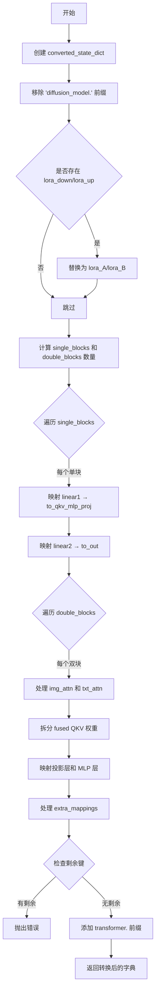

#### 带注释源码

```python
def _convert_non_diffusers_flux2_lora_to_diffusers(state_dict):
    """
    将非 Diffusers 格式的 Flux2 LoRA 权重转换为 Diffusers 兼容格式
    
    处理以下转换：
    - 移除 diffusion_model. 前缀
    - lora_down/lora_up → lora_A/lora_B 重命名
    - single_blocks 和 double_blocks 的权重映射
    - 注意力层 QKV 融合权重拆分
    - 添加 transformer. 前缀
    """
    converted_state_dict = {}

    # 步骤 1: 移除 diffusion_model. 前缀
    prefix = "diffusion_model."
    original_state_dict = {k[len(prefix) :]: v for k, v in state_dict.items()}

    # 步骤 2: 处理 lora_down/lora_up 到 lora_A/lora_B 的转换
    has_lora_down_up = any("lora_down" in k or "lora_up" in k for k in original_state_dict.keys())
    if has_lora_down_up:
        temp_state_dict = {}
        for k, v in original_state_dict.items():
            new_key = k.replace("lora_down", "lora_A").replace("lora_up", "lora_B")
            temp_state_dict[new_key] = v
        original_state_dict = temp_state_dict

    # 步骤 3: 计算 transformer 块数量
    num_double_layers = 0
    num_single_layers = 0
    for key in original_state_dict.keys():
        if key.startswith("single_blocks."):
            num_single_layers = max(num_single_layers, int(key.split(".")[1]) + 1)
        elif key.startswith("double_blocks."):
            num_double_layers = max(num_double_layers, int(key.split(".")[1]) + 1)

    # 定义 LoRA 键和注意力类型
    lora_keys = ("lora_A", "lora_B")
    attn_types = ("img_attn", "txt_attn")

    # 步骤 4: 处理 single_blocks (单流 transformer 块)
    for sl in range(num_single_layers):
        single_block_prefix = f"single_blocks.{sl}"
        attn_prefix = f"single_transformer_blocks.{sl}.attn"

        for lora_key in lora_keys:
            # 映射 linear1 到 to_qkv_mlp_proj
            linear1_key = f"{single_block_prefix}.linear1.{lora_key}.weight"
            if linear1_key in original_state_dict:
                converted_state_dict[f"{attn_prefix}.to_qkv_mlp_proj.{lora_key}.weight"] = original_state_dict.pop(
                    linear1_key
                )

            # 映射 linear2 到 to_out
            linear2_key = f"{single_block_prefix}.linear2.{lora_key}.weight"
            if linear2_key in original_state_dict:
                converted_state_dict[f"{attn_prefix}.to_out.{lora_key}.weight"] = original_state_dict.pop(linear2_key)

    # 步骤 5: 处理 double_blocks (双流 transformer 块)
    for dl in range(num_double_layers):
        transformer_block_prefix = f"transformer_blocks.{dl}"

        for lora_key in lora_keys:
            for attn_type in attn_types:
                attn_prefix = f"{transformer_block_prefix}.attn"
                qkv_key = f"double_blocks.{dl}.{attn_type}.qkv.{lora_key}.weight"

                if qkv_key not in original_state_dict:
                    continue

                # 拆分融合的 QKV 权重
                fused_qkv_weight = original_state_dict.pop(qkv_key)

                if lora_key == "lora_A":
                    # lora_A 权重复制到所有投影
                    diff_attn_proj_keys = (
                        ["to_q", "to_k", "to_v"]
                        if attn_type == "img_attn"
                        else ["add_q_proj", "add_k_proj", "add_v_proj"]
                    )
                    for proj_key in diff_attn_proj_keys:
                        converted_state_dict[f"{attn_prefix}.{proj_key}.{lora_key}.weight"] = torch.cat(
                            [fused_qkv_weight]
                        )
                else:
                    # lora_B 权重拆分到各个投影
                    sample_q, sample_k, sample_v = torch.chunk(fused_qkv_weight, 3, dim=0)

                    if attn_type == "img_attn":
                        converted_state_dict[f"{attn_prefix}.to_q.{lora_key}.weight"] = torch.cat([sample_q])
                        converted_state_dict[f"{attn_prefix}.to_k.{lora_key}.weight"] = torch.cat([sample_k])
                        converted_state_dict[f"{attn_prefix}.to_v.{lora_key}.weight"] = torch.cat([sample_v])
                    else:
                        converted_state_dict[f"{attn_prefix}.add_q_proj.{lora_key}.weight"] = torch.cat([sample_q])
                        converted_state_dict[f"{attn_prefix}.add_k_proj.{lora_key}.weight"] = torch.cat([sample_k])
                        converted_state_dict[f"{attn_prefix}.add_v_proj.{lora_key}.weight"] = torch.cat([sample_v])

        # 步骤 6: 处理投影层映射
        proj_mappings = [
            ("img_attn.proj", "attn.to_out.0"),
            ("txt_attn.proj", "attn.to_add_out"),
        ]
        for org_proj, diff_proj in proj_mappings:
            for lora_key in lora_keys:
                original_key = f"double_blocks.{dl}.{org_proj}.{lora_key}.weight"
                if original_key in original_state_dict:
                    diffusers_key = f"{transformer_block_prefix}.{diff_proj}.{lora_key}.weight"
                    converted_state_dict[diffusers_key] = original_state_dict.pop(original_key)

        # 步骤 7: 处理 MLP 层映射
        mlp_mappings = [
            ("img_mlp.0", "ff.linear_in"),
            ("img_mlp.2", "ff.linear_out"),
            ("txt_mlp.0", "ff_context.linear_in"),
            ("txt_mlp.2", "ff_context.linear_out"),
        ]
        for org_mlp, diff_mlp in mlp_mappings:
            for lora_key in lora_keys:
                original_key = f"double_blocks.{dl}.{org_mlp}.{lora_key}.weight"
                if original_key in original_state_dict:
                    diffusers_key = f"{transformer_block_prefix}.{diff_mlp}.{lora_key}.weight"
                    converted_state_dict[diffusers_key] = original_state_dict.pop(original_key)

    # 步骤 8: 处理额外的键映射
    extra_mappings = {
        "img_in": "x_embedder",
        "txt_in": "context_embedder",
        "time_in.in_layer": "time_guidance_embed.timestep_embedder.linear_1",
        "time_in.out_layer": "time_guidance_embed.timestep_embedder.linear_2",
        "final_layer.linear": "proj_out",
        "final_layer.adaLN_modulation.1": "norm_out.linear",
        "single_stream_modulation.lin": "single_stream_modulation.linear",
        "double_stream_modulation_img.lin": "double_stream_modulation_img.linear",
        "double_stream_modulation_txt.lin": "double_stream_modulation_txt.linear",
    }

    for org_key, diff_key in extra_mappings.items():
        for lora_key in lora_keys:
            original_key = f"{org_key}.{lora_key}.weight"
            if original_key in original_state_dict:
                converted_state_dict[f"{diff_key}.{lora_key}.weight"] = original_state_dict.pop(original_key)

    # 步骤 9: 验证所有键都已转换
    if len(original_state_dict) > 0:
        raise ValueError(f"`original_state_dict` should be empty at this point but has {original_state_dict.keys()}.")

    # 步骤 10: 添加 transformer. 前缀
    for key in list(converted_state_dict.keys()):
        converted_state_dict[f"transformer.{key}"] = converted_state_dict.pop(key)

    return converted_state_dict
```


### `_convert_non_diffusers_z_image_lora_to_diffusers`

将非 Diffusers 格式的 ZImage LoRA 状态字典转换为 Diffusers 兼容的格式，支持多种前缀移除、键名映射、权重命名标准化以及 alpha 缩放处理。

参数：

- `state_dict`：`dict`，要转换的 LoRA 状态字典

返回值：`dict`，转换后的 Diffusers 兼容状态字典

#### 流程图

```mermaid
flowchart TD
    A[开始] --> B{检查是否有 diffusion_model. 前缀}
    B -->|是| C[移除 diffusion_model. 前缀]
    B -->|否| D{检查是否有 lora_unet_ 前缀}
    C --> D
    D -->|是| E[移除 lora_unet_ 前缀并转换键名]
    D -->|否| F{检查是否有 .out 模式}
    E --> F
    F --> G[标准化 .out 键名]
    G --> H{检查是否有 default. 前缀}
    H -->|是| I[移除 default. 前缀]
    H -->|否| J{检查是否有 lora_down/lora_up}
    I --> J
    J -->|是| K[转换为 lora_A/lora_B 并应用 alpha 缩放]
    J -->|否| L{检查是否已是 lora_A/lora_B 格式}
    K --> M[添加 transformer. 前缀]
    L -->|是| N[直接复制 lora_A/lora_B 键]
    L -->|否| O{检查是否有未处理的键}
    N --> M
    M --> P[返回转换后的状态字典]
    O -->|是| Q[抛出 ValueError]
    O -->|否| P
```

#### 带注释源码

```python
def _convert_non_diffusers_z_image_lora_to_diffusers(state_dict):
    """
    Convert non-diffusers ZImage LoRA state dict to diffusers format.

    Handles:
    - `diffusion_model.` prefix removal
    - `lora_unet_` prefix conversion with key mapping
    - `default.` prefix removal
    - `.lora_down.weight`/`.lora_up.weight` → `.lora_A.weight`/`.lora_B.weight` conversion with alpha scaling
    """
    # 检查并移除 "diffusion_model." 前缀
    has_diffusion_model = any(k.startswith("diffusion_model.") for k in state_dict)
    if has_diffusion_model:
        state_dict = {k.removeprefix("diffusion_model."): v for k, v in state_dict.items()}

    # 检查并移除 "lora_unet_" 前缀，然后进行键名转换
    has_lora_unet = any(k.startswith("lora_unet_") for k in state_dict)
    if has_lora_unet:
        # 移除 "lora_unet_" 前缀
        state_dict = {k.removeprefix("lora_unet_"): v for k, v in state_dict.items()}

        def convert_key(key: str) -> str:
            # ZImage 包含: layers, noise_refiner, context_refiner 块
            # 键名可能类似于: layers_0_attention_to_q.lora_down.weight

            if "." in key:
                base, suffix = key.rsplit(".", 1)
            else:
                base, suffix = key, ""

            # 需要保护的内含下划线的 n-gram
            protected = {
                # attention 相关的配对
                ("to", "q"),
                ("to", "k"),
                ("to", "v"),
                ("to", "out"),
                # feed_forward
                ("feed", "forward"),
            }

            # 按长度分组保护集
            prot_by_len = {}
            for ng in protected:
                prot_by_len.setdefault(len(ng), set()).add(ng)

            parts = base.split("_")
            merged = []
            i = 0
            # 按长度降序排列，优先匹配更长的保护 n-gram
            lengths_desc = sorted(prot_by_len.keys(), reverse=True)

            while i < len(parts):
                matched = False
                for L in lengths_desc:
                    if i + L <= len(parts) and tuple(parts[i : i + L]) in prot_by_len[L]:
                        merged.append("_".join(parts[i : i + L]))
                        i += L
                        matched = True
                        break
                if not matched:
                    merged.append(parts[i])
                    i += 1

            converted_base = ".".join(merged)
            return converted_base + (("." + suffix) if suffix else "")

        # 应用键名转换
        state_dict = {convert_key(k): v for k, v in state_dict.items()}

    # 标准化 .out 键名，将 .out 转换为 .to_out.0
    def normalize_out_key(k: str) -> str:
        if ".to_out" in k:
            return k
        return re.sub(
            r"\.out(?=\.(?:lora_down|lora_up)\.weight$|\.alpha$)",
            ".to_out.0",
            k,
        )

    state_dict = {normalize_out_key(k): v for k, v in state_dict.items()}

    # 移除 "default." 前缀
    has_default = any("default." in k for k in state_dict)
    if has_default:
        state_dict = {k.replace("default.", ""): v for k, v in state_dict.items()}

    # 初始化转换后的状态字典
    converted_state_dict = {}
    all_keys = list(state_dict.keys())
    down_key = ".lora_down.weight"
    up_key = ".lora_up.weight"
    a_key = ".lora_A.weight"
    b_key = ".lora_B.weight"

    # 检查键名格式
    has_non_diffusers_lora_id = any(down_key in k or up_key in k for k in all_keys)
    has_diffusers_lora_id = any(a_key in k or b_key in k for k in all_keys)

    # 处理非 Diffusers 格式的 lora (lora_down/lora_up)
    if has_non_diffusers_lora_id:

        def get_alpha_scales(down_weight, alpha_key):
            """计算 alpha 缩放因子"""
            rank = down_weight.shape[0]
            alpha = state_dict.pop(alpha_key).item()
            # LoRA 在前向传播时按 'alpha / rank' 缩放，这里需要反向缩放
            scale = alpha / rank
            scale_down = scale
            scale_up = 1.0
            while scale_down * 2 < scale_up:
                scale_down *= 2
                scale_up /= 2
            return scale_down, scale_up

        # 遍历所有 lora_down 键进行转换
        for k in all_keys:
            if k.endswith(down_key):
                diffusers_down_key = k.replace(down_key, ".lora_A.weight")
                diffusers_up_key = k.replace(down_key, up_key).replace(up_key, ".lora_B.weight")
                alpha_key = k.replace(down_key, ".alpha")

                # 弹出并转换权重
                down_weight = state_dict.pop(k)
                up_weight = state_dict.pop(k.replace(down_key, up_key))
                scale_down, scale_up = get_alpha_scales(down_weight, alpha_key)
                converted_state_dict[diffusers_down_key] = down_weight * scale_down
                converted_state_dict[diffusers_up_key] = up_weight * scale_up

    # 已处于 Diffusers 格式 (lora_A/lora_B)，直接弹出
    elif has_diffusers_lora_id:
        for k in all_keys:
            if a_key in k or b_key in k:
                converted_state_dict[k] = state_dict.pop(k)
            elif ".alpha" in k:
                state_dict.pop(k)

    # 检查是否有未处理的键
    if len(state_dict) > 0:
        raise ValueError(f"`state_dict` should be empty at this point but has {state_dict.keys()=}")

    # 添加 "transformer." 前缀
    converted_state_dict = {f"transformer.{k}": v for k, v in converted_state_dict.items()}
    return converted_state_dict
```

## 关键组件


### State Dict 键名转换框架

该模块实现了将多种来源（Kohya、ComfyUI、AI Toolkit、Civitai等）的LoRA权重状态字典键名转换为Diffusers标准格式的核心框架，支持U-Net、文本编码器和Transformer模块的键名规范化。

### SGM到Diffusers格式映射器

负责将Stable Diffusion WebUI（SGM）格式的模型状态字典键名（如input_blocks、middle_block、output_blocks）重映射为Diffusers格式（down_blocks、mid_block、up_blocks），支持处理混合格式的状态字典。

### DoRA权重检测与处理

检测并处理DoRA（Directional LoRA）权重，识别state_dict中的dora_scale参数，转换为Diffusers的lora_magnitude_vector格式，同时检查peft库版本兼容性（需0.9.0+）。

### 非Diffusers LoRA通用转换器

主要入口函数，将非Diffusers格式的LoRA权重（包括Kohya格式、Civitai格式等）转换为Diffusers兼容格式，支持U-Net和文本编码器的键名重映射、alpha值提取和DoRA权重处理。

### Flux LoRA专用转换器

针对Flux模型架构的LoRA权重转换，支持double_blocks和single_blocks的键名映射，处理qkv投影的分割与合并，包含Kohya格式、AI Toolkit格式和混合格式的检测与转换逻辑。

### Wan Video LoRA转换器

处理Wan视频生成模型的LoRA权重，支持自注意力、交叉注意力、前馈网络的权重重映射，处理I2V（图生视频）变体的特殊键名，以及diff_b偏置参数的转换。

### LTX-Video LoRA转换器

专为LTX-Video模型设计的LoRA格式转换，处理patchify投影、音频视频交叉注意力、时间嵌入等特殊键名的重映射，支持音频和视频条件的不同命名规范。

### Qwen LoRA转换器

处理Qwen模型架构的LoRA权重转换，实现复杂的键名分割与合并逻辑，保护特定的n-gram组合（如to_q、to_k等）不被错误拆分，支持transformer_blocks的层级结构转换。

### LoRA权重缩放计算

实现LoRA权重的alpha缩放计算逻辑，根据rank和alpha值计算scale_down和scale_up系数，确保转换后的权重与原始训练时的缩放比例一致，采用指数级近似算法。

### 键名自定义替换工具

提供基于子串匹配的键名替换功能，将"."替换为"_"直至指定的子串位置，用于处理Kohya格式的键名到Diffusers格式的转换。

### 零值权重过滤机制

检测并过滤全零值的LoRA参数（如position_embedding、t5xxl、diff_b、norm diff等），避免无效参数影响模型加载，同时记录日志信息供用户参考。

## 问题及建议


### 已知问题

-   **大量代码重复**：`get_alpha_scales`函数在`_convert_kohya_flux_lora_to_diffusers`、`_convert_non_diffusers_wan_lora_to_diffusers`、`_convert_non_diffusers_qwen_lora_to_diffusers`等至少6个函数中重复定义
-   **Magic Numbers硬编码**：如`num_layers = 19`、`num_single_layers = 38`、`inner_dim = 3072`、`mlp_ratio = 4.0`等应从模型配置动态获取，而非硬编码
-   **函数职责过于庞大**：`_convert_kohya_flux_lora_to_diffusers`函数超过500行，内部定义了多个巨型嵌套函数`_convert_sd_scripts_to_ai_toolkit`和`_convert_mixture_state_dict_to_diffusers`，难以维护
-   **字符串操作效率低下**：大量使用`key.split(delimiter)`、`key.replace()`等操作，部分可编译为正则表达式模式以提升性能
- **缺少输入验证**：部分函数如`_convert_xlabs_flux_lora_to_diffusers`直接使用`re.search`而未检查匹配结果是否为None，可能导致异常
- **异常信息不够详细**：多处`raise ValueError`的错误信息仅包含keys列表，对于调试转换失败原因不够友好
- **状态字典就地修改**：函数中大量使用`state_dict.pop()`就地修改字典，导致难以在出错时进行调试和回滚

### 优化建议

-   **提取公共工具函数**：将重复的`get_alpha_scales`、`swap_scale_shift`等函数提取为模块级工具函数，避免重复定义
-   **配置外部化**：将硬编码的层数、维度等数值从配置文件或模型配置中动态获取
-   **函数拆分重构**：将巨型函数拆分为更小的、职责单一的子函数，例如将转换逻辑按模型组件（attention、mlp、norm等）分解为独立函数
-   **预编译正则表达式**：将多次使用的正则表达式模式在模块级别预编译，提升匹配性能
-   **增加输入验证**：在关键转换函数入口处增加参数验证，确保state_dict非空且格式符合预期
-   **改进错误处理**：在ValueError中添加更多上下文信息，如转换失败的原始键、目标键、可能的解决方案等
-   **使用不可变模式**：考虑在转换过程中创建新的字典而非就地修改，便于调试和错误恢复

## 其它


### 设计目标与约束

本模块的设计目标是实现一个通用的LoRA权重转换框架，能够将来自不同训练框架（如Kohya、ComfyUI、AI Toolkit等）的LoRA权重转换为HuggingFace Diffusers库兼容的格式。主要约束包括：1) 必须保持权重数值的精确性，确保转换后的模型输出与原模型一致；2) 需要支持多种Diffusion模型架构，包括SD、SDXL、Flux、LTX-Video、Wan、HiDream等；3) 转换过程需要在内存中完成，避免产生中间文件；4) 必须兼容PEFT库的最新版本特性，如DoRA等。

### 错误处理与异常设计

代码采用了多层级的错误处理机制。在关键转换节点设置了验证检查：1) 使用`ValueError`处理不支持的键值或格式不匹配的state_dict，如第71行的`raise ValueError(f"Checkpoint not supported because layer {layer} not supported.")`；2) 对PEFT版本进行兼容性检查，如第152-156行对DoRA特性的版本校验；3) 在转换结束时检查state_dict是否为空，非空时抛出异常说明未处理的键；4) 使用`logger.warning`记录不支持但不影响转换的键，如第481行对position_embedding的处理。异常信息包含了足够的上下文信息，便于开发者定位问题。

### 数据流与状态机

转换过程遵循统一的数据流模式：输入原始state_dict → 识别格式类型 → 执行格式检测 → 应用相应的转换逻辑 → 输出Diffusers兼容的state_dict。代码中存在多个格式检测分支：首先检测是否为PEFT格式（第479-487行），其次检测是否为混合格式（第489-493行），然后处理ComfyUI特有格式（第495-539行），最后根据检测结果分发到具体的转换函数。每个转换函数内部又包含了更细粒度的状态机逻辑，例如`_convert_kohya_flux_lora_to_diffusers`函数内部定义了三个嵌套转换函数`_convert_to_ai_toolkit`、`_convert_to_ai_toolkit_cat`和`_convert_sd_scripts_to_ai_toolkit`，它们分别处理不同的权重组织形式。

### 外部依赖与接口契约

本模块依赖以下外部组件：1) `torch`库用于张量操作，包括切片、拼接、分割等；2) `re`库用于正则表达式匹配，实现键名的模式识别和替换；3) `diffusers.utils`模块中的`is_peft_version`、`logging`、`state_dict_all_zero`等工具函数。接口契约方面，所有转换函数遵循统一的签名规范：输入为`state_dict: dict`类型的参数字典，可选参数为模型名称（如`unet_name`、`text_encoder_name`），返回值为转换后的`new_state_dict: dict`。对于需要配置参数的模型（如Flux），调用方需要提供`unet_config`对象以获取`layers_per_block`等参数。

### 性能考虑与优化空间

代码在性能方面存在以下特点和改进空间：1) 大量使用了字典的`pop`操作来移动键值对，这种原地修改的方式避免了额外的内存分配；2) 字符串操作密集，特别是`replace`和`split`操作，可考虑预编译正则表达式模式以提高频繁调用的性能；3) 在`_convert_kohya_flux_lora_to_diffusers`中，对大规模循环（如19层double blocks和38层single blocks）使用了向量化操作，但仍然有优化空间；4) 部分转换函数中存在重复的计算逻辑（如scale_down和scale_up的计算），可提取为共享的辅助函数；5) 当前的实现是同步的，对于大规模的state_dict转换可以考虑并行化处理。

### 安全性考虑

代码处理的是模型权重数据，安全性主要涉及：1) 输入验证：函数开头对state_dict的键进行格式检查，确保符合预期的命名规范，防止恶意构造的输入导致异常；2) 内存安全：使用了`torch.cat`进行张量拼接，需要确保输入张量的设备（CPU/GPU）和数据类型一致；3) 信息泄露防护：日志输出时对state_dict的键进行了筛选，避免输出敏感的模型结构信息；4) 权重有效性检查：使用`state_dict_all_zero`函数检测无效的LoRA参数并过滤，防止加载无效权重导致的问题。

### 版本兼容性策略

代码通过以下机制保证版本兼容性：1) PEFT版本检测：使用`is_peft_version("<", "0.9.0")`检查DoRA支持的最低版本，版本不满足时给出明确的升级指引；2) 模型架构适配：通过检测state_dict中的键前缀（如`lora_unet_`、`lora_te_`、`lora_transformer_`等）来识别不同的模型格式；3) 兼容性处理：对于同时包含多种格式键的state_dict，优先处理Diffusers格式的键（第479-487行）；4) 前缀处理：实现了对多种前缀的兼容性处理，如`diffusion_model.`、`transformer.`、`lora_unet_`等，确保来自不同来源的权重都能正确转换。

### 配置管理与参数说明

代码中的可配置参数包括：1) `delimiter`和`block_slice_pos`（第22行）：用于控制键名解析的分隔符和切片位置，默认值为`"_"`和`5`，这些参数影响SGM到Diffusers格式的映射精度；2) `num_layers`和`num_single_layers`：在Flux相关转换函数中硬编码为19和38，这些值对应Flux模型的特定架构；3) `inner_dim`和`mlp_ratio`：分别设置为3072和4.0，用于特定的张量分割操作；4) `unet_name`和`text_encoder_name`：默认值为"unet"和"text_encoder"，用于构建最终的状态字典键名前缀。这些配置参数大多与特定模型架构耦合，不建议随意修改。

    