# `diffusers\src\diffusers\loaders\lora_pipeline.py` 详细设计文档

该文件实现了一套完整的LoRA权重加载、转换、保存和融合的Mixin类体系，支持包括Stable Diffusion、SDXL、SD3、Flux、CogVideoX、LTX、Mochi、Hunyuan、Wan等多个Diffusion模型架构的LoRA适配器管理。

## 整体流程

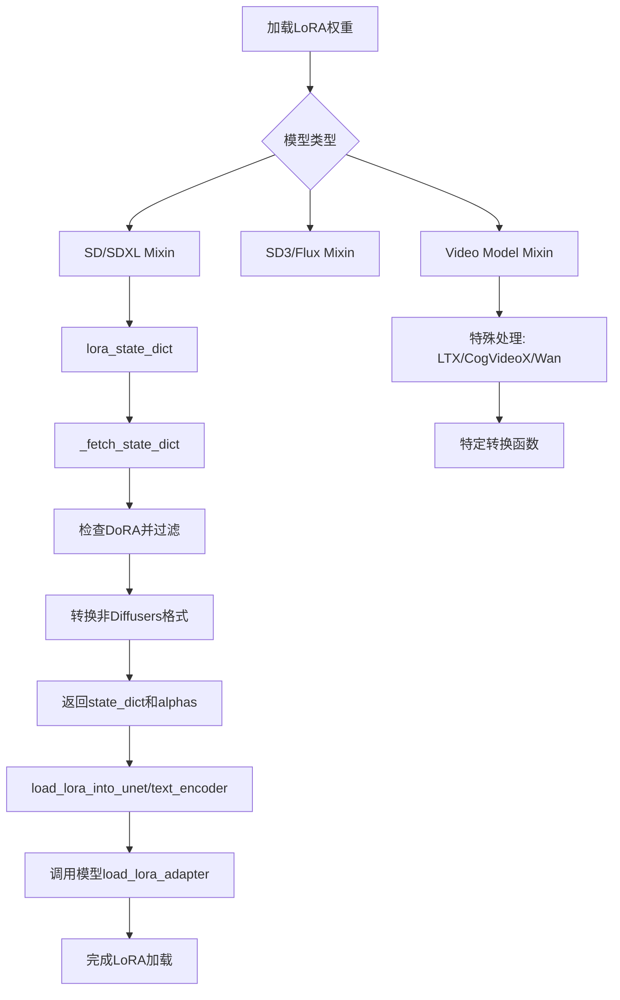

## 类结构

```
LoraBaseMixin (基类 - 外部导入)
├── StableDiffusionLoraLoaderMixin (SD 1.x)
├── StableDiffusionXLLoraLoaderMixin (SDXL)
├── SD3LoraLoaderMixin (SD3)
├── AuraFlowLoraLoaderMixin (AuraFlow)
├── FluxLoraLoaderMixin (Flux)
├── AmusedLoraLoaderMixin (Amused)
├── CogVideoXLoraLoaderMixin (CogVideoX)
├── Mochi1LoraLoaderMixin (Mochi)
├── LTXVideoLoraLoaderMixin (LTX-Video)
├── LTX2LoraLoaderMixin (LTX2-Video)
├── SanaLoraLoaderMixin (Sana)
├── HunyuanVideoLoraLoaderMixin (HunyuanVideo)
├── Lumina2LoraLoaderMixin (Lumina2)
├── KandinskyLoraLoaderMixin (Kandinsky)
├── WanLoraLoaderMixin (Wan)
├── SkyReelsV2LoraLoaderMixin (SkyReelsV2)
├── CogView4LoraLoaderMixin (CogView4)
├── HiDreamImageLoraLoaderMixin (HiDream)
├── QwenImageLoraLoaderMixin (Qwen)
├── ZImageLoraLoaderMixin (ZImage)
└── Flux2LoraLoaderMixin (Flux2)
└── LoraLoaderMixin (已弃用)
```

## 全局变量及字段


### `_LOW_CPU_MEM_USAGE_DEFAULT_LORA`
    
控制是否默认使用低CPU内存模式加载LoRA权重，仅在满足PEFT和Transformers版本要求时为True

类型：`bool`
    


### `TEXT_ENCODER_NAME`
    
文本编码器组件的标准名称标识符

类型：`str`
    


### `UNET_NAME`
    
UNet模型组件的标准名称标识符

类型：`str`
    


### `TRANSFORMER_NAME`
    
Transformer模型组件的标准名称标识符

类型：`str`
    


### `LTX2_CONNECTOR_NAME`
    
LTX2模型连接器组件的标准名称标识符

类型：`str`
    


### `_MODULE_NAME_TO_ATTRIBUTE_MAP_FLUX`
    
Flux模型模块名到配置属性名的映射字典，用于处理LoRA参数形状扩展

类型：`dict`
    


### `logger`
    
模块级日志记录器实例，用于输出LoRA加载过程中的信息和警告

类型：`logging.Logger`
    


### `StableDiffusionLoraLoaderMixin._lora_loadable_modules`
    
指定该Loader支持加载LoRA的模型组件列表，包含unet和text_encoder

类型：`list[str]`
    


### `StableDiffusionLoraLoaderMixin.unet_name`
    
UNet模型在state dict中的名称前缀

类型：`str`
    


### `StableDiffusionLoraLoaderMixin.text_encoder_name`
    
文本编码器在state dict中的名称前缀

类型：`str`
    


### `StableDiffusionXLLoraLoaderMixin._lora_loadable_modules`
    
SDXL Loader支持加载LoRA的组件列表，包含unet、text_encoder和text_encoder_2

类型：`list[str]`
    


### `StableDiffusionXLLoraLoaderMixin.unet_name`
    
SDXL UNet模型在state dict中的名称前缀

类型：`str`
    


### `StableDiffusionXLLoraLoaderMixin.text_encoder_name`
    
SDXL文本编码器在state dict中的名称前缀

类型：`str`
    


### `SD3LoraLoaderMixin._lora_loadable_modules`
    
SD3 Loader支持加载LoRA的组件列表，包含transformer、text_encoder和text_encoder_2

类型：`list[str]`
    


### `SD3LoraLoaderMixin.transformer_name`
    
SD3 Transformer模型在state dict中的名称前缀

类型：`str`
    


### `SD3LoraLoaderMixin.text_encoder_name`
    
SD3文本编码器在state dict中的名称前缀

类型：`str`
    


### `FluxLoraLoaderMixin._lora_loadable_modules`
    
Flux Loader支持加载LoRA的组件列表，包含transformer和text_encoder

类型：`list[str]`
    


### `FluxLoraLoaderMixin.transformer_name`
    
Flux Transformer模型在state dict中的名称前缀

类型：`str`
    


### `FluxLoraLoaderMixin.text_encoder_name`
    
Flux文本编码器在state dict中的名称前缀

类型：`str`
    


### `FluxLoraLoaderMixin._control_lora_supported_norm_keys`
    
Flux Control LoRA支持的归一化层键名列表，用于区分普通LoRA和Control LoRA

类型：`list[str]`
    


### `CogVideoXLoraLoaderMixin._lora_loadable_modules`
    
CogVideoX Loader支持加载LoRA的组件列表，仅包含transformer

类型：`list[str]`
    


### `CogVideoXLoraLoaderMixin.transformer_name`
    
CogVideoX Transformer模型在state dict中的名称前缀

类型：`str`
    


### `WanLoraLoaderMixin._lora_loadable_modules`
    
Wan Loader支持加载LoRA的组件列表，包含transformer和transformer_2

类型：`list[str]`
    


### `WanLoraLoaderMixin.transformer_name`
    
Wan Transformer模型在state dict中的名称前缀

类型：`str`
    


### `LTX2LoraLoaderMixin._lora_loadable_modules`
    
LTX2 Loader支持加载LoRA的组件列表，包含transformer和connectors

类型：`list[str]`
    


### `LTX2LoraLoaderMixin.transformer_name`
    
LTX2 Transformer模型在state dict中的名称前缀

类型：`str`
    


### `LTX2LoraLoaderMixin.connectors_name`
    
LTX2连接器在state dict中的名称前缀

类型：`str`
    


### `Flux2LoraLoaderMixin._lora_loadable_modules`
    
Flux2 Loader支持加载LoRA的组件列表，仅包含transformer

类型：`list[str]`
    


### `Flux2LoraLoaderMixin.transformer_name`
    
Flux2 Transformer模型在state dict中的名称前缀

类型：`str`
    
    

## 全局函数及方法


### `_maybe_dequantize_weight_for_expanded_lora`

该函数用于将量化后的权重（如 bitsandbytes 4bit/8bit 或 GGUF 量化）解量化，以便在加载 LoRA 权重时进行形状扩展。它支持多种量化格式，并根据模块的量化类型调用相应的解量化函数，最终返回解量化后的权重张量。

参数：

- `model`：`torch.nn.Module`，包含权重的模型实例，用于获取目标 dtype
- `module`：`torch.nn.Module`，需要解量化权重的模块（如 Linear 层）

返回值：`torch.Tensor`，解量化后的权重张量

#### 流程图

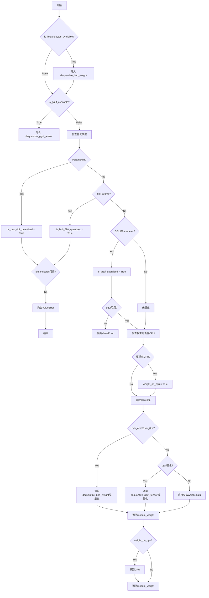

#### 带注释源码

```python
def _maybe_dequantize_weight_for_expanded_lora(model, module):
    # 如果bitsandbytes可用，导入解量化函数
    if is_bitsandbytes_available():
        from ..quantizers.bitsandbytes import dequantize_bnb_weight

    # 如果GGUF可用，导入解量化函数
    if is_gguf_available():
        from ..quantizers.gguf.utils import dequantize_gguf_tensor

    # 检测模块权重的量化类型
    is_bnb_4bit_quantized = module.weight.__class__.__name__ == "Params4bit"
    is_bnb_8bit_quantized = module.weight.__class__.__name__ == "Int8Params"
    is_gguf_quantized = module.weight.__class__.__name__ == "GGUFParameter"

    # 检查是否需要但未安装相应的量化库
    if is_bnb_4bit_quantized and not is_bitsandbytes_available():
        raise ValueError(
            "The checkpoint seems to have been quantized with `bitsandbytes` (4bits). Install `bitsandbytes` to load quantized checkpoints."
        )
    if is_bnb_8bit_quantized and not is_bitsandbytes_available():
        raise ValueError(
            "The checkpoint seems to have been quantized with `bitsandbytes` (8bits). Install `bitsandbytes` to load quantized checkpoints."
        )
    if is_gguf_quantized and not is_gguf_available():
        raise ValueError(
            "The checkpoint seems to have been quantized with `gguf`. Install `gguf` to load quantized checkpoints."
        )

    # 检查权重是否在CPU上
    weight_on_cpu = False
    if module.weight.device.type == "cpu":
        weight_on_cpu = True

    # 确定目标设备（优先使用accelerator）
    device = torch.accelerator.current_accelerator().type if hasattr(torch, "accelerator") else "cuda"
    
    # 根据量化类型调用相应的解量化函数
    if is_bnb_4bit_quantized or is_bnb_8bit_quantized:
        module_weight = dequantize_bnb_weight(
            # 如果权重在CPU上，需要先移到目标设备
            module.weight.to(device) if weight_on_cpu else module.weight,
            # 4bit使用quant_state，8bit使用state
            state=module.weight.quant_state if is_bnb_4bit_quantized else module.state,
            dtype=model.dtype,
        ).data
    elif is_gguf_quantized:
        # GGUF解量化
        module_weight = dequantize_gguf_tensor(
            module.weight.to(device) if weight_on_cpu else module.weight,
        )
        # 转换为模型dtype
        module_weight = module_weight.to(model.dtype)
    else:
        # 非量化情况，直接获取数据
        module_weight = module.weight.data

    # 如果原本在CPU上，解量化后移回CPU
    if weight_on_cpu:
        module_weight = module_weight.cpu()

    return module_weight
```


### `StableDiffusionLoraLoaderMixin.load_lora_weights`

将预训练的LoRA权重加载到Stable Diffusion模型的UNet和CLIPTextEncoder中。该方法负责验证LoRA检查点格式，获取状态字典和元数据，并将LoRA权重注入到UNet和Text Encoder组件中，支持PEFT后端和适配器管理。

参数：

- `self`：隐式参数，StableDiffusionLoraLoaderMixin的实例
- `pretrained_model_name_or_path_or_dict`：`str | dict[str, torch.Tensor]`，LoRA权重的路径或包含权重张量的字典
- `adapter_name`：`str | None`，可选的适配器名称，用于标识已加载的适配器；若未指定，将使用`default_{i}`格式
- `hotswap`：`bool`，默认为False，是否在已有适配器上进行热替换（无需重新编译模型）
- `**kwargs`：可选关键字参数，会传递给`lora_state_dict`方法

返回值：无（`None`），该方法直接修改实例状态，将LoRA权重加载到模型中

#### 流程图

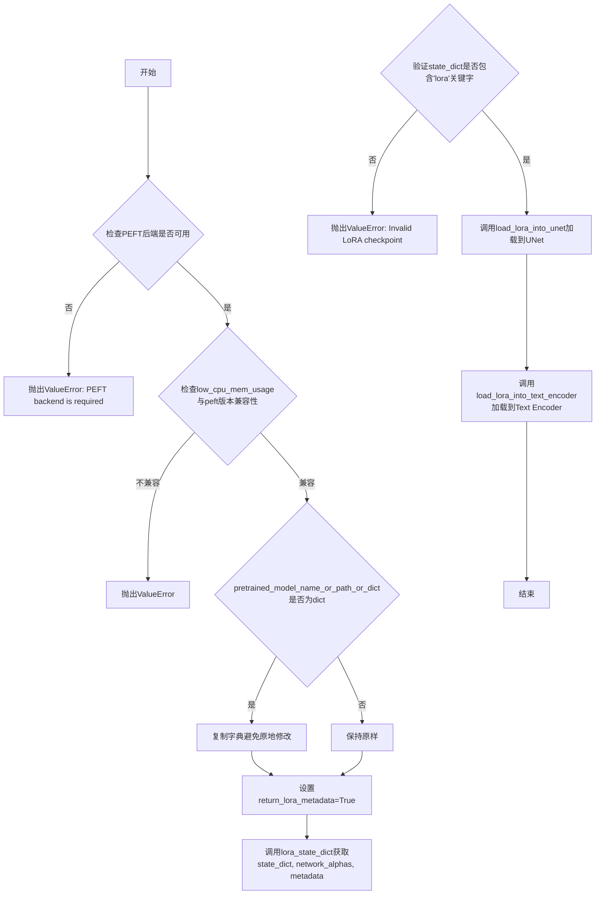

#### 带注释源码

```python
def load_lora_weights(
    self,
    pretrained_model_name_or_path_or_dict: str | dict[str, torch.Tensor],
    adapter_name: str | None = None,
    hotswap: bool = False,
    **kwargs,
):
    """Load LoRA weights specified in `pretrained_model_name_or_path_or_dict` into `self.unet` and
    `self.text_encoder`.

    All kwargs are forwarded to `self.lora_state_dict`.

    See [`~loaders.StableDiffusionLoraLoaderMixin.lora_state_dict`] for more details on how the state dict is
    loaded.

    See [`~loaders.StableDiffusionLoraLoaderMixin.load_lora_into_unet`] for more details on how the state dict is
    loaded into `self.unet`.

    See [`~loaders.StableDiffusionLoraLoaderMixin.load_lora_into_text_encoder`] for more details on how the state
    dict is loaded into `self.text_encoder`.

    Parameters:
        pretrained_model_name_or_path_or_dict (`str` or `os.PathLike` or `dict`):
            See [`~loaders.StableDiffusionLoraLoaderMixin.lora_state_dict`].
        adapter_name (`str`, *optional*):
            Adapter name to be used for referencing the loaded adapter model. If not specified, it will use
            `default_{i}` where i is the total number of adapters being loaded.
        low_cpu_mem_usage (`bool`, *optional*):
            Speed up model loading by only loading the pretrained LoRA weights and not initializing the random
            weights.
        hotswap (`bool`, *optional*):
            Defaults to `False`. Whether to substitute an existing (LoRA) adapter with the newly loaded adapter
            in-place. This means that, instead of loading an additional adapter, this will take the existing
            adapter weights and replace them with the weights of the new adapter. This can be faster and more
            memory efficient. However, the main advantage of hotswapping is that when the model is compiled with
            torch.compile, loading the new adapter does not require recompilation of the model. When using
            hotswapping, the passed `adapter_name` should be the name of an already loaded adapter.
        kwargs (`dict`, *optional*):
            See [`~loaders.StableDiffusionLoraLoaderMixin.lora_state_dict`].
    """
    # 检查PEFT后端是否可用，LoRA加载依赖PEFT
    if not USE_PEFT_BACKEND:
        raise ValueError("PEFT backend is required for this method.")

    # 从kwargs中提取low_cpu_mem_usage参数，默认值根据环境配置
    low_cpu_mem_usage = kwargs.pop("low_cpu_mem_usage", _LOW_CPU_MEM_USAGE_DEFAULT_LORA)
    # 检查低CPU内存使用模式与peft版本的兼容性
    if low_cpu_mem_usage and not is_peft_version(">=", "0.13.1"):
        raise ValueError(
            "`low_cpu_mem_usage=True` is not compatible with this `peft` version. Please update it with `pip install -U peft`."
        )

    # 如果传入的是字典，则复制一份避免原地修改
    if isinstance(pretrained_model_name_or_path_or_dict, dict):
        pretrained_model_name_or_path_or_dict = pretrained_model_name_or_path_or_dict.copy()

    # 首先确保检查点兼容并能成功加载
    # 设置返回LoRA元数据标志
    kwargs["return_lora_metadata"] = True
    # 获取LoRA状态字典、网络alpha值和元数据
    state_dict, network_alphas, metadata = self.lora_state_dict(pretrained_model_name_or_path_or_dict, **kwargs)

    # 验证检查点格式是否正确：所有键必须包含'lora'子串
    is_correct_format = all("lora" in key for key in state_dict.keys())
    if not is_correct_format:
        raise ValueError("Invalid LoRA checkpoint. Make sure all LoRA param names contain `'lora'` substring.")

    # 将LoRA权重加载到UNet中
    self.load_lora_into_unet(
        state_dict,
        network_alphas=network_alphas,
        # 获取UNet：优先使用self.unet，否则通过属性名动态获取
        unet=getattr(self, self.unet_name) if not hasattr(self, "unet") else self.unet,
        adapter_name=adapter_name,
        metadata=metadata,
        _pipeline=self,
        low_cpu_mem_usage=low_cpu_mem_usage,
        hotswap=hotswap,
    )
    # 将LoRA权重加载到Text Encoder中
    self.load_lora_into_text_encoder(
        state_dict,
        network_alphas=network_alphas,
        # 获取Text Encoder：优先使用self.text_encoder，否则通过属性名动态获取
        text_encoder=getattr(self, self.text_encoder_name)
        if not hasattr(self, "text_encoder")
        else self.text_encoder,
        lora_scale=self.lora_scale,
        adapter_name=adapter_name,
        _pipeline=self,
        metadata=metadata,
        low_cpu_mem_usage=low_cpu_mem_usage,
        hotswap=hotswap,
    )
```


### `StableDiffusionLoraLoaderMixin.lora_state_dict`

该方法负责从指定的预训练模型路径或字典中加载并返回 LoRA（Low-Rank Adaptation）权重状态字典和网络 alphas。它支持多种格式的 LoRA 检查点（包括非 Diffusers 格式），并提供可选的 LoRA 元数据返回功能。该方法是加载 LoRA 权重的核心入口点。

参数：

-  `cls`：`<class method>`，类方法自身的隐式参数
-  `pretrained_model_name_or_path_or_dict`：`str | dict[str, torch.Tensor]`，可以是 HuggingFace Hub 模型 ID、本地模型目录路径，或包含 LoRA 权重的 PyTorch 状态字典
-  `**kwargs`：`dict`，可选关键字参数，包含以下常用选项：
    -  `cache_dir`：`str | os.PathLike`，可选，下载模型的缓存目录
    -  `force_download`：`bool`，可选，是否强制重新下载模型（默认 False）
    -  `proxies`：`dict[str, str]`，可选，代理服务器配置
    -  `local_files_only`：`bool`，可选，是否仅使用本地文件（默认 False）
    -  `token`：`str | bool`，可选，HuggingFace Hub 认证令牌
    -  `revision`：`str`，可选，模型版本/分支（默认 "main"）
    -  `subfolder`：`str`，可选，模型仓库中的子文件夹路径
    -  `weight_name`：`str`，可选，权重文件名
    -  `unet_config`：`dict`，可选，UNet 配置，用于映射 SDXL 块编号
    -  `use_safetensors`：`bool`，可选，是否使用 safetensors 格式加载
    -  `return_lora_metadata`：`bool`，可选，是否返回 LoRA 适配器元数据（默认 False）

返回值：`tuple`，返回值为两种形式之一：
- 当 `return_lora_metadata=True` 时：`(dict[str, torch.Tensor], dict[str, float], dict)` - 包含状态字典、网络 alphas 和元数据的元组
- 当 `return_lora_metadata=False` 时：`(dict[str, torch.Tensor], dict[str, float])` - 包含状态字典和网络 alphas 的元组

#### 流程图

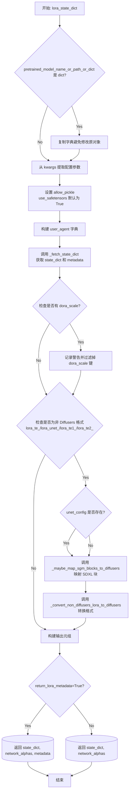

#### 带注释源码

```python
@classmethod
@validate_hf_hub_args
def lora_state_dict(
    cls,
    pretrained_model_name_or_path_or_dict: str | dict[str, torch.Tensor],
    **kwargs,
):
    r"""
    Return state dict for lora weights and the network alphas.

    > [!WARNING] > We support loading A1111 formatted LoRA checkpoints in a limited capacity. > > This function is
    experimental and might change in the future.

    Parameters:
        pretrained_model_name_or_path_or_dict (`str` or `os.PathLike` or `dict`):
            Can be either:
                - A string, the *model id* (for example `google/ddpm-celebahq-256`) of a pretrained model hosted on
                  the Hub.
                - A path to a *directory* (for example `./my_model_directory`) containing the model weights saved
                  with [`ModelMixin.save_pretrained`].
                - A [torch state
                  dict](https://pytorch.org/tutorials/beginner/saving_loading_models.html#what-is-a-state-dict).
        ... (其他参数文档见上文)
    """
    # Load the main state dict first which has the LoRA layers for either of
    # UNet and text encoder or both.
    # 从 kwargs 中提取各种加载配置参数
    cache_dir = kwargs.pop("cache_dir", None)
    force_download = kwargs.pop("force_download", False)
    proxies = kwargs.pop("proxies", None)
    local_files_only = kwargs.pop("local_files_only", None)
    token = kwargs.pop("token", None)
    revision = kwargs.pop("revision", None)
    subfolder = kwargs.pop("subfolder", None)
    weight_name = kwargs.pop("weight_name", None)
    unet_config = kwargs.pop("unet_config", None)
    use_safetensors = kwargs.pop("use_safetensors", None)
    return_lora_metadata = kwargs.pop("return_lora_metadata", False)

    # 设置允许 pickle 的标志
    # 如果未指定 use_safetensors，默认使用 True 以提高安全性
    allow_pickle = False
    if use_safetensors is None:
        use_safetensors = True
        allow_pickle = True

    # 构建用户代理信息，用于下载时标识请求来源
    user_agent = {"file_type": "attn_procs_weights", "framework": "pytorch"}

    # 调用底层函数获取状态字典和元数据
    state_dict, metadata = _fetch_state_dict(
        pretrained_model_name_or_path_or_dict=pretrained_model_name_or_path_or_dict,
        weight_name=weight_name,
        use_safetensors=use_safetensors,
        local_files_only=local_files_only,
        cache_dir=cache_dir,
        force_download=force_download,
        proxies=proxies,
        token=token,
        revision=revision,
        subfolder=subfolder,
        user_agent=user_agent,
        allow_pickle=allow_pickle,
    )
    
    # 检查是否存在 DoRA (Decomposed Rank Adaptation) 缩放因子
    # Diffusers 目前不完全支持 DoRA，需要过滤掉相关键
    is_dora_scale_present = any("dora_scale" in k for k in state_dict)
    if is_dora_scale_present:
        warn_msg = "It seems like you are using a DoRA checkpoint that is not compatible in Diffusers at the moment. So, we are going to filter out the keys associated to 'dora_scale` from the state dict. If you think this is a mistake please open an issue https://github.com/huggingface/diffusers/issues/new."
        logger.warning(warn_msg)
        # 过滤掉包含 dora_scale 的键
        state_dict = {k: v for k, v in state_dict.items() if "dora_scale" not in k}

    # 初始化网络 alphas（用于稳定学习和防止下溢）
    network_alphas = None
    
    # 检查是否为非 Diffusers 格式的 LoRA
    # SDXL 格式的 LoRA 使用特定前缀
    if all(
        (
            k.startswith("lora_te_")
            or k.startswith("lora_unet_")
            or k.startswith("lora_te1_")
            or k.startswith("lora_te2_")
        )
        for k in state_dict.keys()
    ):
        # Map SDXL blocks correctly.
        if unet_config is not None:
            # 使用 unet 配置重新映射块编号
            state_dict = _maybe_map_sgm_blocks_to_diffusers(state_dict, unet_config)
        # 转换非 Diffusers 格式为 Diffusers 格式
        state_dict, network_alphas = _convert_non_diffusers_lora_to_diffusers(state_dict)

    # 根据 return_lora_metadata 标志构建返回值的格式
    out = (state_dict, network_alphas, metadata) if return_lora_metadata else (state_dict, network_alphas)
    return out
```


### `StableDiffusionLoraLoaderMixin.load_lora_into_unet`

该方法用于将 `state_dict` 中指定的 LoRA 层加载到 `unet` 模型中。它首先验证 PEFT 后端是否可用，然后检查 `low_cpu_mem_usage` 参数与 PEFT 版本的兼容性，最后调用 `unet.load_lora_adapter()` 方法完成 LoRA 权重的加载。

参数：

- `state_dict`：`dict`，包含 LoRA 层参数的标准状态字典。键可以直接索引到 unet，也可以带有额外的 `unet` 前缀以区分文本编码器 LoRA 层。
- `network_alphas`：`dict[str, float]`，用于稳定学习和防止下溢的网络 alpha 值，含义与 kohya-ss 训练器脚本中的 `--network_alpha` 选项相同。
- `unet`：`UNet2DConditionModel`，要加载 LoRA 层的 UNet 模型。
- `adapter_name`：`str`，*可选*，用于引用加载的适配器模型的名称。如果未指定，将使用 `default_{i}`（其中 i 是正在加载的适配器的总数）。
- `low_cpu_mem_usage`：`bool`，*可选*，通过仅加载预训练的 LoRA 权重而不初始化随机权重来加速模型加载。
- `hotswap`：`bool`，*可选*，是否在现有适配器上进行热替换。
- `metadata`：`dict`，*可选*，LoRA 适配器元数据。当提供时，`peft` 的 `LoraConfig` 参数将不会从状态字典派生。
- `_pipeline`：`None`，*可选*，管道实例，用于内部传递上下文。

返回值：无（`None`），该方法直接修改 `unet` 模型的内部状态以加载 LoRA 权重。

#### 流程图

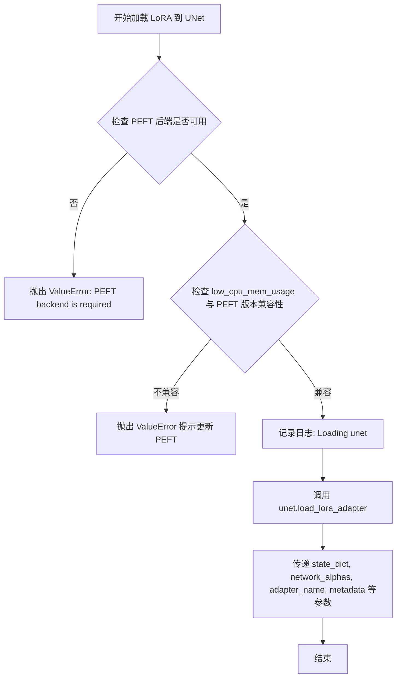

#### 带注释源码

```python
@classmethod
def load_lora_into_unet(
    cls,
    state_dict,
    network_alphas,
    unet,
    adapter_name=None,
    _pipeline=None,
    low_cpu_mem_usage=False,
    hotswap: bool = False,
    metadata=None,
):
    """
    This will load the LoRA layers specified in `state_dict` into `unet`.

    Parameters:
        state_dict (`dict`):
            A standard state dict containing the lora layer parameters. The keys can either be indexed directly
            into the unet or prefixed with an additional `unet` which can be used to distinguish between text
            encoder lora layers.
        network_alphas (`dict[str, float]`):
            The value of the network alpha used for stable learning and preventing underflow. This value has the
            same meaning as the `--network_alpha` option in the kohya-ss trainer script. Refer to [this
            link](https://github.com/darkstorm2150/sd-scripts/blob/main/docs/train_network_README-en.md#execute-learning).
        unet (`UNet2DConditionModel`):
            The UNet model to load the LoRA layers into.
        adapter_name (`str`, *optional*):
            Adapter name to be used for referencing the loaded adapter model. If not specified, it will use
            `default_{i}` where i is the total number of adapters being loaded.
        low_cpu_mem_usage (`bool`, *optional*):
            Speed up model loading only loading the pretrained LoRA weights and not initializing the random
            weights.
        hotswap (`bool`, *optional*):
            See [`~loaders.StableDiffusionLoraLoaderMixin.load_lora_weights`].
        metadata (`dict`):
            Optional LoRA adapter metadata. When supplied, the `LoraConfig` arguments of `peft` won't be derived
            from the state dict.
    """
    # 检查是否启用了 PEFT 后端，这是加载 LoRA 所必需的
    if not USE_PEFT_BACKEND:
        raise ValueError("PEFT backend is required for this method.")

    # 如果启用 low_cpu_mem_usage，需要检查 PEFT 版本是否兼容
    if low_cpu_mem_usage and not is_peft_version(">=", "0.13.1"):
        raise ValueError(
            "`low_cpu_mem_usage=True` is not compatible with this `peft` version. Please update it with `pip install -U peft`."
        )

    # 如果序列化格式是新的（来自 https://github.com/huggingface/diffusers/pull/2918），
    # 则 state_dict 的键应该以 cls.unet_name 和/或 cls.text_encoder_name 作为前缀
    logger.info(f"Loading {cls.unet_name}.")
    # 调用 UNet 模型的 load_lora_adapter 方法来实际加载 LoRA 权重
    unet.load_lora_adapter(
        state_dict,
        prefix=cls.unet_name,
        network_alphas=network_alphas,
        adapter_name=adapter_name,
        metadata=metadata,
        _pipeline=_pipeline,
        low_cpu_mem_usage=low_cpu_mem_usage,
        hotswap=hotswap,
    )
```


### `StableDiffusionLoraLoaderMixin.load_lora_into_text_encoder`

将 LoRA 层从状态字典加载到文本编码器模型中。

参数：

-  `cls`：类对象，调用该方法的类
-  `state_dict`：`dict`，包含 LoRA 层参数的的标准状态字典，键应带有 `text_encoder` 前缀以区分 UNet 的 LoRA 层
-  `network_alphas`：`dict[str, float]`，用于稳定学习和防止下溢的网络 alpha 值，含义与 kohya-ss 训练器脚本中的 `--network_alpha` 选项相同
-  `text_encoder`：`CLIPTextModel`，要加载 LoRA 层的文本编码器模型
-  `prefix`：`str`，状态字典中 `text_encoder` 的预期前缀
-  `lora_scale`：`float`，在 LoRA 线性层输出与常规 LoRA 层输出相加之前对其进行缩放的系数，默认为 1.0
-  `adapter_name`：`str`，可选，用于引用加载的适配器模型的名称，未指定时使用 `default_{i}`
-  `_pipeline`：可选，内部参数，传递管道对象
-  `low_cpu_mem_usage`：`bool`，可选，通过仅加载预训练的 LoRA 权重而不初始化随机权重来加速模型加载
-  `hotswap`：`bool`，可选，是否用新加载的适配器原地替换现有适配器
-  `metadata`：`dict`，可选的 LoRA 适配器元数据，提供后将从状态字典派生 `peft` 的 `LoraConfig` 参数

返回值：无（`None`），该方法内部调用 `_load_lora_into_text_encoder` 函数执行实际加载操作

#### 流程图

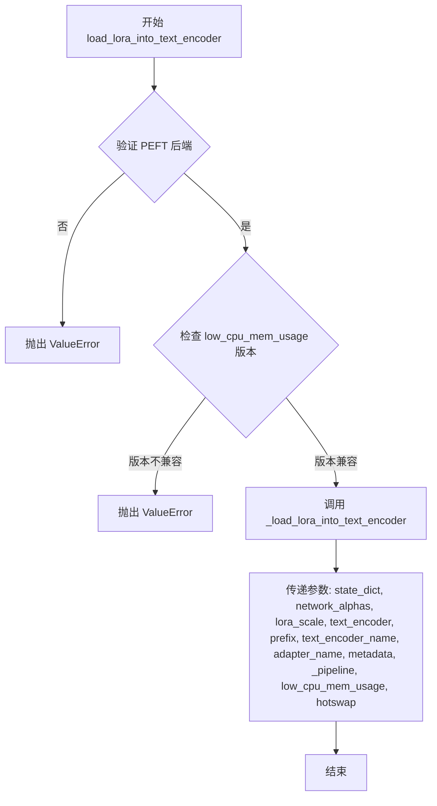

#### 带注释源码

```python
@classmethod
def load_lora_into_text_encoder(
    cls,
    state_dict,
    network_alphas,
    text_encoder,
    prefix=None,
    lora_scale=1.0,
    adapter_name=None,
    _pipeline=None,
    low_cpu_mem_usage=False,
    hotswap: bool = False,
    metadata=None,
):
    """
    This will load the LoRA layers specified in `state_dict` into `text_encoder`

    Parameters:
        state_dict (`dict`):
            A standard state dict containing the lora layer parameters. The key should be prefixed with an
            additional `text_encoder` to distinguish between unet lora layers.
        network_alphas (`dict[str, float]`):
            The value of the network alpha used for stable learning and preventing underflow. This value has the
            same meaning as the `--network_alpha` option in the kohya-ss trainer script. Refer to [this
            link](https://github.com/darkstorm2150/sd-scripts/blob/main/docs/train_network_README-en.md#execute-learning).
        text_encoder (`CLIPTextModel`):
            The text encoder model to load the LoRA layers into.
        prefix (`str`):
            Expected prefix of the `text_encoder` in the `state_dict`.
        lora_scale (`float`):
            How much to scale the output of the lora linear layer before it is added with the output of the regular
            lora layer.
        adapter_name (`str`, *optional*):
            Adapter name to be used for referencing the loaded adapter model. If not specified, it will use
            `default_{i}` where i is the total number of adapters being loaded.
        low_cpu_mem_usage (`bool`, *optional*):
            Speed up model loading by only loading the pretrained LoRA weights and not initializing the random
            weights.
        hotswap (`bool`, *optional*):
            See [`~loaders.StableDiffusionLoraLoaderMixin.load_lora_weights`].
        metadata (`dict`):
            Optional LoRA adapter metadata. When supplied, the `LoraConfig` arguments of `peft` won't be derived
            from the state dict.
    """
    # 调用底层的 _load_lora_into_text_encoder 函数执行实际的 LoRA 加载操作
    _load_lora_into_text_encoder(
        state_dict=state_dict,
        network_alphas=network_alphas,
        lora_scale=lora_scale,
        text_encoder=text_encoder,
        prefix=prefix,
        text_encoder_name=cls.text_encoder_name,  # 获取类的 text_encoder_name 属性
        adapter_name=adapter_name,
        metadata=metadata,
        _pipeline=_pipeline,
        low_cpu_mem_usage=low_cpu_mem_usage,
        hotswap=hotswap,
    )
```


### `StableDiffusionLoraLoaderMixin.save_lora_weights`

保存Stable Diffusion模型的LoRA权重到指定目录，支持UNet和Text Encoder的LoRA层存储。

参数：

- `save_directory`：`str | os.PathLike`，保存LoRA参数的目录，如果不存在将自动创建
- `unet_lora_layers`：`dict[str, torch.nn.Module] | dict[str, torch.Tensor]`，对应UNet的LoRA层状态字典
- `text_encoder_lora_layers`：`dict[str, torch.nn.Module]`，对应Text Encoder的LoRA层状态字典，必须显式传入因为它来自🤗 Transformers
- `is_main_process`：`bool`，可选，默认值为`True`，调用此函数的进程是否为主进程，用于分布式训练，避免竞态条件
- `save_function`：`Callable`，用于保存状态字典的函数，可用于分布式训练时替换`torch.save`，可通过环境变量`DIFFUSERS_SAVE_MODE`配置
- `safe_serialization`：`bool`，可选，默认值为`True`，是否使用`safetensors`保存模型或使用传统的PyTorch方式（pickle）
- `unet_lora_adapter_metadata`：与unet关联的LoRA适配器元数据，将与状态字典一起序列化
- `text_encoder_lora_adapter_metadata`：与text_encoder关联的LoRA适配器元数据，将与状态字典一起序列化

返回值：`None`，该方法不返回任何值

#### 流程图

```mermaid
flowchart TD
    A[开始] --> B[初始化空字典 lora_layers 和 lora_metadata]
    B --> C{unet_lora_layers 是否存在?}
    C -->|是| D[将 unet_lora_layers 存入 lora_layers[unet_name]]
    D --> E[将 unet_lora_adapter_metadata 存入 lora_metadata[unet_name]]
    C -->|否| F{text_encoder_lora_layers 是否存在?}
    F -->|是| G[将 text_encoder_lora_layers 存入 lora_layers[text_encoder_name]]
    G --> H[将 text_encoder_lora_adapter_metadata 存入 lora_metadata[text_encoder_name]]
    F -->|否| I{lora_layers 是否为空?}
    I -->|是| J[抛出 ValueError: 必须传入至少一个 LoRA 层]
    I -->|否| K[调用 cls._save_lora_weights 保存]
    K --> L[结束]
    E --> I
    H --> I
    J --> L
```

#### 带注释源码

```python
@classmethod
def save_lora_weights(
    cls,
    save_directory: str | os.PathLike,
    unet_lora_layers: dict[str, torch.nn.Module | torch.Tensor] = None,
    text_encoder_lora_layers: dict[str, torch.nn.Module] = None,
    is_main_process: bool = True,
    weight_name: str = None,
    save_function: Callable = None,
    safe_serialization: bool = True,
    unet_lora_adapter_metadata=None,
    text_encoder_lora_adapter_metadata=None,
):
    r"""
    Save the LoRA parameters corresponding to the UNet and text encoder.

    Arguments:
        save_directory (`str` or `os.PathLike`):
            Directory to save LoRA parameters to. Will be created if it doesn't exist.
        unet_lora_layers (`dict[str, torch.nn.Module]` or `dict[str, torch.Tensor]`):
            State dict of the LoRA layers corresponding to the `unet`.
        text_encoder_lora_layers (`dict[str, torch.nn.Module]` or `dict[str, torch.Tensor]`):
            State dict of the LoRA layers corresponding to the `text_encoder`. Must explicitly pass the text
            encoder LoRA state dict because it comes from 🤗 Transformers.
        is_main_process (`bool`, *optional*, defaults to `True`):
            Whether the process calling this is the main process or not. Useful during distributed training and you
            need to call this function on all processes. In this case, set `is_main_process=True` only on the main
            process to avoid race conditions.
        save_function (`Callable`):
            The function to use to save the state dictionary. Useful during distributed training when you need to
            replace `torch.save` with another method. Can be configured with the environment variable
            `DIFFUSERS_SAVE_MODE`.
        safe_serialization (`bool`, *optional*, defaults to `True`):
            Whether to save the model using `safetensors` or the traditional PyTorch way with `pickle`.
        unet_lora_adapter_metadata:
            LoRA adapter metadata associated with the unet to be serialized with the state dict.
        text_encoder_lora_adapter_metadata:
            LoRA adapter metadata associated with the text encoder to be serialized with the state dict.
    """
    # 初始化用于存储LoRA层和元数据的字典
    lora_layers = {}
    lora_metadata = {}

    # 如果传入了UNet的LoRA层，则将其添加到lora_layers字典中
    if unet_lora_layers:
        lora_layers[cls.unet_name] = unet_lora_layers
        lora_metadata[cls.unet_name] = unet_lora_adapter_metadata

    # 如果传入了Text Encoder的LoRA层，则将其添加到lora_layers字典中
    if text_encoder_lora_layers:
        lora_layers[cls.text_encoder_name] = text_encoder_lora_layers
        lora_metadata[cls.text_encoder_name] = text_encoder_lora_adapter_metadata

    # 检查是否传入了至少一个LoRA层，如果没有则抛出异常
    if not lora_layers:
        raise ValueError("You must pass at least one of `unet_lora_layers` or `text_encoder_lora_layers`.")

    # 调用父类的_save_lora_weights方法实际保存权重
    cls._save_lora_weights(
        save_directory=save_directory,
        lora_layers=lora_layers,
        lora_metadata=lora_metadata,
        is_main_process=is_main_process,
        weight_name=weight_name,
        save_function=save_function,
        safe_serialization=safe_serialization,
    )
```


### `StableDiffusionLoraLoaderMixin.fuse_lora`

该方法用于将已加载的 LoRA 权重融合到模型的原始权重中，实现推理时的权重合并。通过调用父类 `LoraBaseMixin` 的 `fuse_lora` 方法完成实际融合操作。

参数：

- `components`：`list[str]`，默认值为 `["unet", "text_encoder"]`，表示需要融合 LoRA 的组件列表。
- `lora_scale`：`float`，默认值为 `1.0`，用于控制 LoRA 权重对输出的影响程度。
- `safe_fusing`：`bool`，默认值为 `False`，是否在融合前检查融合后的权重是否包含 NaN 值。
- `adapter_names`：`list[str] | None`，可选参数，指定要融合的适配器名称，如果为空则融合所有活跃的适配器。
- `**kwargs`：其他关键字参数，会传递给父类方法。

返回值：无（`None`），该方法直接修改模型权重，不返回任何值。

#### 流程图

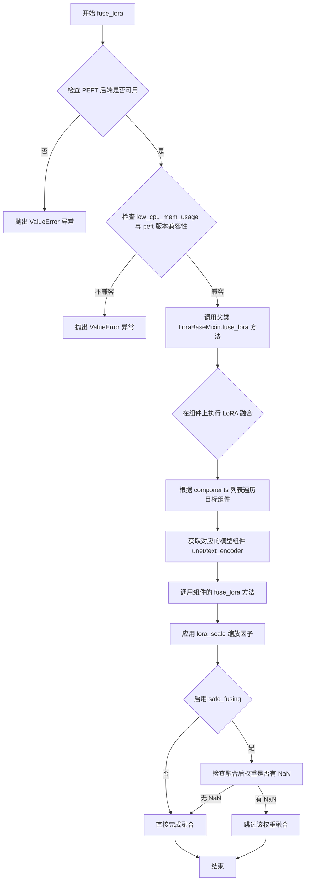

#### 带注释源码

```python
def fuse_lora(
    self,
    components: list[str] = ["unet", "text_encoder"],
    lora_scale: float = 1.0,
    safe_fusing: bool = False,
    adapter_names: list[str] | None = None,
    **kwargs,
):
    r"""
    Fuses the LoRA parameters into the original parameters of the corresponding blocks.

    > [!WARNING] > This is an experimental API.

    Args:
        components: (`list[str]`): list of LoRA-injectable components to fuse the LoRAs into.
        lora_scale (`float`, defaults to 1.0):
            Controls how much to influence the outputs with the LoRA parameters.
        safe_fusing (`bool`, defaults to `False`):
            Whether to check fused weights for NaN values before fusing and if values are NaN not fusing them.
        adapter_names (`list[str]`, *optional*):
            Adapter names to be used for fusing. If nothing is passed, all active adapters will be fused.

    Example:

    ```py
    from diffusers import DiffusionPipeline
    import torch

    pipeline = DiffusionPipeline.from_pretrained(
        "stabilityai/stable-diffusion-xl-base-1.0", torch_dtype=torch.float16
    ).to("cuda")
    pipeline.load_lora_weights("nerijs/pixel-art-xl", weight_name="pixel-art-xl.safetensors", adapter_name="pixel")
    pipeline.fuse_lora(lora_scale=0.7)
    ```
    """
    # 调用父类 LoraBaseMixin 的 fuse_lora 方法
    # 该方法会遍历 components 列表中的每个组件
    # 在每个组件上调用对应的融合逻辑
    # 参数 lora_scale 用于缩放 LoRA 权重的影响
    # safe_fusing 用于控制是否检查 NaN 值
    # adapter_names 用于指定要融合的特定适配器
    super().fuse_lora(
        components=components,
        lora_scale=lora_scale,
        safe_fusing=safe_fusing,
        adapter_names=adapter_names,
        **kwargs,
    )
```


### `StableDiffusionLoraLoaderMixin.unfuse_lora`

该方法用于撤销 `fuse_lora()` 的效果，将已融合的 LoRA 参数从模型组件中分离出来，恢复到融合前的状态。它是 Stable Diffusion LoRA 加载器的实验性 API。

参数：

- `self`：隐式参数，StableDiffusionLoraLoaderMixin 的实例对象
- `components`：`list[str]`，默认为 `["unet", "text_encoder"]`，指定要分离 LoRA 的组件列表
- `**kwargs`：其他关键字参数，用于传递给父类的 unfuse_lora 方法

返回值：`None`，该方法直接调用父类的 `unfuse_lora` 方法，不返回任何值

#### 流程图

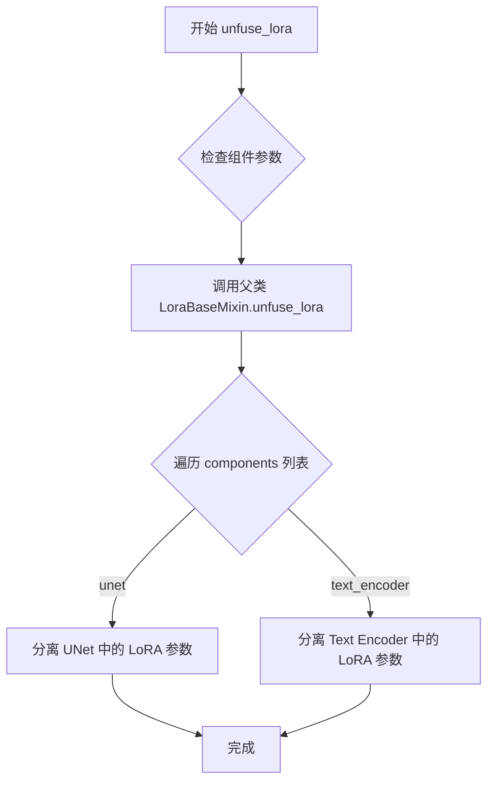

#### 带注释源码

```python
def unfuse_lora(self, components: list[str] = ["unet", "text_encoder"], **kwargs):
    r"""
    Reverses the effect of
    [`pipe.fuse_lora()`](https://huggingface.co/docs/diffusers/main/en/api/loaders#diffusers.loaders.LoraBaseMixin.fuse_lora).

    > [!WARNING] > This is an experimental API.

    Args:
        components (`list[str]`): list of LoRA-injectable components to unfuse LoRA from.
        unfuse_unet (`bool`, defaults to `True`): Whether to unfuse the UNet LoRA parameters.
        unfuse_text_encoder (`bool`, defaults to `True`):
            Whether to unfuse the text encoder LoRA parameters. If the text encoder wasn't monkey-patched with the
            LoRA parameters then it won't have any effect.
    """
    # 调用父类 LoraBaseMixin 的 unfuse_lora 方法来执行实际的分离操作
    # 父类方法会遍历 components 列表，对每个指定的组件调用相应的分离逻辑
    super().unfuse_lora(components=components, **kwargs)
```


### `StableDiffusionXLLoraLoaderMixin.load_lora_weights`

该函数是 Stable Diffusion XL 模型的 LoRA 权重加载入口，负责从指定的模型路径或字典中加载 LoRA 权重，并将其注入到 UNet 和两个文本编码器（text_encoder 和 text_encoder_2）中，同时处理适配器命名和低内存加载选项。

参数：

-  `pretrained_model_name_or_path_or_dict`：`str | dict[str, torch.Tensor]`，LoRA 检查点的模型 ID、本地路径或包含权重张量的字典。
-  `adapter_name`：`str | None`，可选的适配器名称，用于引用已加载的适配器模型。如果未指定，将使用 `default_{i}` 格式的名称（i 为当前已加载的适配器总数）。
-  `hotswap`：`bool`，是否在现有适配器上进行热替换。默认为 `False`。如果为 `True`，则使用新的适配器权重替换已加载的适配器权重，而不是新增一个适配器。
-  `kwargs`：`dict`，其他可选参数，会被传递给 `lora_state_dict` 方法。

返回值：`None`，该方法直接修改 Pipeline 对象的状态。

#### 流程图

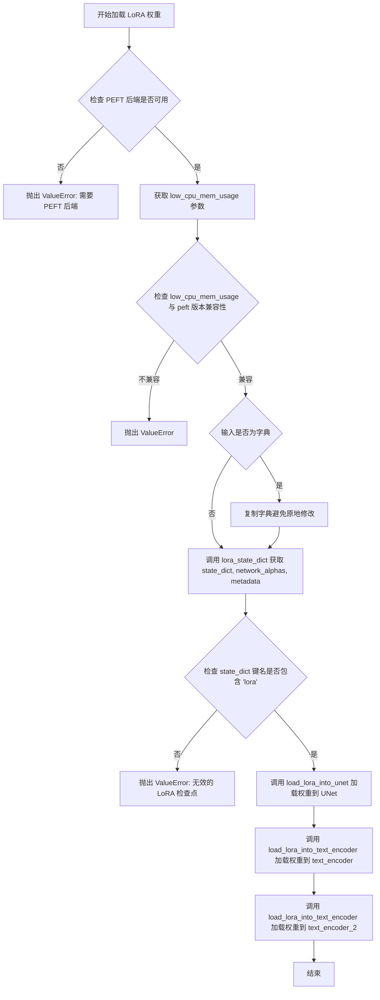

#### 带注释源码

```python
def load_lora_weights(
    self,
    pretrained_model_name_or_path_or_dict: str | dict[str, torch.Tensor],
    adapter_name: str | None = None,
    hotswap: bool = False,
    **kwargs,
):
    """
    See [`~loaders.StableDiffusionLoraLoaderMixin.load_lora_weights`] for more details.
    """
    # 1. 检查 PEFT 后端是否启用，这是加载 LoRA 的前提条件
    if not USE_PEFT_BACKEND:
        raise ValueError("PEFT backend is required for this method.")

    # 2. 处理 low_cpu_mem_usage 参数，默认值取决于环境配置
    # 如果为 True，可以加速模型加载但需要特定版本的 peft
    low_cpu_mem_usage = kwargs.pop("low_cpu_mem_usage", _LOW_CPU_MEM_USAGE_DEFAULT_LORA)
    if low_cpu_mem_usage and not is_peft_version(">=", "0.13.1"):
        raise ValueError(
            "`low_cpu_mem_usage=True` is not compatible with this `peft` version. Please update it with `pip install -U peft`."
        )

    # 3. 如果传入的是字典，复制一份以避免修改原字典
    if isinstance(pretrained_model_name_or_path_or_dict, dict):
        pretrained_model_name_or_path_or_dict = pretrained_model_name_or_path_or_dict.copy()

    # 4. 调用 lora_state_dict 获取状态字典、网络缩放因子和元数据
    # 传入 unet_config 以便正确处理 SDXL 模型的块映射
    kwargs["return_lora_metadata"] = True
    state_dict, network_alphas, metadata = self.lora_state_dict(
        pretrained_model_name_or_path_or_dict,
        unet_config=self.unet.config,
        **kwargs,
    )

    # 5. 验证检查点格式是否有效（所有键应包含 'lora'）
    is_correct_format = all("lora" in key for key in state_dict.keys())
    if not is_correct_format:
        raise ValueError("Invalid LoRA checkpoint. Make sure all LoRA param names contain `'lora'` substring.")

    # 6. 将 LoRA 权重加载到 UNet
    self.load_lora_into_unet(
        state_dict,
        network_alphas=network_alphas,
        unet=self.unet,
        adapter_name=adapter_name,
        metadata=metadata,
        _pipeline=self,
        low_cpu_mem_usage=low_cpu_mem_usage,
        hotswap=hotswap,
    )

    # 7. 将 LoRA 权重加载到第一个文本编码器 (text_encoder)
    self.load_lora_into_text_encoder(
        state_dict,
        network_alphas=network_alphas,
        text_encoder=self.text_encoder,
        prefix=self.text_encoder_name,
        lora_scale=self.lora_scale,
        adapter_name=adapter_name,
        metadata=metadata,
        _pipeline=self,
        low_cpu_mem_usage=low_cpu_mem_usage,
        hotswap=hotswap,
    )

    # 8. 将 LoRA 权重加载到第二个文本编码器 (text_encoder_2)
    # SDXL 模型通常有两个文本编码器，用于处理不同的文本输入
    self.load_lora_into_text_encoder(
        state_dict,
        network_alphas=network_alphas,
        text_encoder=self.text_encoder_2,
        prefix=f"{self.text_encoder_name}_2",
        lora_scale=self.lora_scale,
        adapter_name=adapter_name,
        metadata=metadata,
        _pipeline=self,
        low_cpu_mem_usage=low_cpu_mem_usage,
        hotswap=hotswap,
    )
```


### `StableDiffusionXLLoraLoaderMixin.lora_state_dict`

返回LoRA权重的state dict和network alphas，用于将LoRA层加载到Stable Diffusion XL模型中。该方法支持从多种格式（Hub模型ID、本地目录或PyTorch state dict）加载LoRA权重，并处理非Diffusers格式的转换。

参数：

-  `cls`：类本身（类方法隐式参数），用于调用类方法
-  `pretrained_model_name_or_path_or_dict`：`str | dict[str, torch.Tensor]`，预训练模型的路径、Hub模型ID或包含张量的字典
-  `**kwargs`：可变关键字参数，包含以下可选参数：
  - `cache_dir`：`str | os.PathLike`，可选，下载预训练模型配置的缓存目录
  - `force_download`：`bool`，可选，默认False，是否强制重新下载模型权重和配置
  -  `proxies`：`dict[str, str]`，可选，代理服务器字典
  -  `local_files_only`：`bool`，可选，默认False，是否仅从本地加载模型
  -  `token`：`str | bool`，可选，用于远程文件的HTTP Bearer授权令牌
  -  `revision`：`str`，可选，默认"main"，模型版本标识
  -  `subfolder`：`str`，可选，默认""，模型仓库中的子文件夹路径
  -  `weight_name`：`str`，可选，序列化state dict文件的名称
  -  `return_lora_metadata`：`bool`，可选，默认False，是否返回LoRA适配器元数据

返回值：`tuple[dict, dict | None, dict | None] | tuple[dict, dict | None]`，返回(state_dict, network_alphas)或(state_dict, network_alphas, metadata)，取决于return_lora_metadata参数

#### 流程图

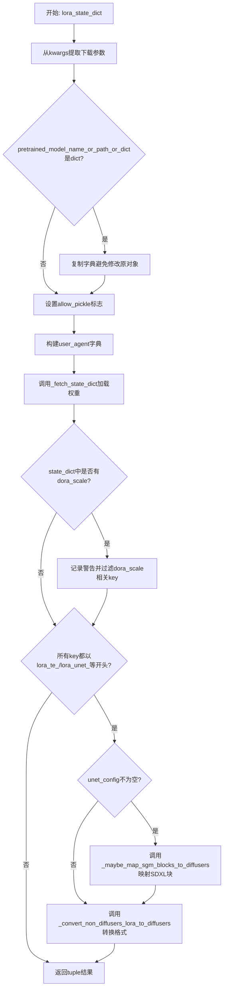

#### 带注释源码

```python
@classmethod
@validate_hf_hub_args
# Copied from diffusers.loaders.lora_pipeline.StableDiffusionLoraLoaderMixin.lora_state_dict
def lora_state_dict(
    cls,
    pretrained_model_name_or_path_or_dict: str | dict[str, torch.Tensor],
    **kwargs,
):
    r"""
    Return state dict for lora weights and the network alphas.

    > [!WARNING] > We support loading A1111 formatted LoRA checkpoints in a limited capacity. > > This function is
    experimental and might change in the future.

    Parameters:
        pretrained_model_name_or_path_or_dict (`str` or `os.PathLike` or `dict`):
            Can be either:
                - A string, the *model id* (for example `google/ddpm-celebahq-256`) of a pretrained model hosted on
                  the Hub.
                - A path to a *directory* (for example `./my_model_directory`) containing the model weights saved
                  with [`ModelMixin.save_pretrained`].
                - A [torch state
                  dict](https://pytorch.org/tutorials/beginner/saving_loading_models.html#what-is-a-state-dict).

            cache_dir (`str | os.PathLike`, *optional*):
                Path to a directory where a downloaded pretrained model configuration is cached if the standard cache
                is not used.
            force_download (`bool`, *optional*, defaults to `False`):
                Whether or not to force the (re-)download of the model weights and configuration files, overriding the
                cached versions if they exist.

            proxies (`dict[str, str]`, *optional*):
                A dictionary of proxy servers to use by protocol or endpoint, for example, `{'http': 'foo.bar:3128',
                'http://hostname': 'foo.bar:4012'}`. The proxies are used on each request.
            local_files_only (`bool`, *optional*, defaults to `False`):
                Whether to only load local model weights and configuration files or not. If set to `True`, the model
                won't be downloaded from the Hub.
            token (`str` or *bool*, *optional*):
                The token to use as HTTP bearer authorization for remote files. If `True`, the token generated from
                `diffusers-cli login` (stored in `~/.huggingface`) is used.
            revision (`str`, *optional*, defaults to `"main"`):
                The specific model version to use. It can be a branch name, a tag name, a commit id, or any identifier
                allowed by Git.
            subfolder (`str`, *optional*, defaults to `""`):
                The subfolder location of a model file within a larger model repository on the Hub or locally.
            weight_name (`str`, *optional*, defaults to None):
                Name of the serialized state dict file.
            return_lora_metadata (`bool`, *optional*, defaults to False):
                When enabled, additionally return the LoRA adapter metadata, typically found in the state dict.
    """
    # 首先加载包含LoRA层的主state dict，可以是UNet和text encoder的LoRA层或两者都有
    # 从kwargs中提取各种下载和加载参数
    cache_dir = kwargs.pop("cache_dir", None)
    force_download = kwargs.pop("force_download", False)
    proxies = kwargs.pop("proxies", None)
    local_files_only = kwargs.pop("local_files_only", None)
    token = kwargs.pop("token", None)
    revision = kwargs.pop("revision", None)
    subfolder = kwargs.pop("subfolder", None)
    weight_name = kwargs.pop("weight_name", None)
    unet_config = kwargs.pop("unet_config", None)
    use_safetensors = kwargs.pop("use_safetensors", None)
    return_lora_metadata = kwargs.pop("return_lora_metadata", False)

    # 默认情况下启用safetensors，并允许在未指定时使用pickle
    allow_pickle = False
    if use_safetensors is None:
        use_safetensors = True
        allow_pickle = True

    # 构建用户代理信息
    user_agent = {"file_type": "attn_procs_weights", "framework": "pytorch"}

    # 调用_fetch_state_dict加载权重
    state_dict, metadata = _fetch_state_dict(
        pretrained_model_name_or_path_or_dict=pretrained_model_name_or_path_or_dict,
        weight_name=weight_name,
        use_safetensors=use_safetensors,
        local_files_only=local_files_only,
        cache_dir=cache_dir,
        force_download=force_download,
        proxies=proxies,
        token=token,
        revision=revision,
        subfolder=subfolder,
        user_agent=user_agent,
        allow_pickle=allow_pickle,
    )
    
    # 检查是否存在DoRA scale（一种LoRA变体），当前Diffusers不完全支持
    is_dora_scale_present = any("dora_scale" in k for k in state_dict)
    if is_dora_scale_present:
        warn_msg = "It seems like you are using a DoRA checkpoint that is not compatible in Diffusers at the moment. So, we are going to filter out the keys associated to 'dora_scale` from the state dict. If you think this is a mistake please open an issue https://github.com/huggingface/diffusers/issues/new."
        logger.warning(warn_msg)
        # 过滤掉dora_scale相关key
        state_dict = {k: v for k, v in state_dict.items() if "dora_scale" not in k}

    network_alphas = None
    # 检查是否所有key都以LoRA相关前缀开头，表明是非Diffusers格式
    # TODO: 替换为state_dict_utils的方法
    if all(
        (
            k.startswith("lora_te_")
            or k.startswith("lora_unet_")
            or k.startswith("lora_te1_")
            or k.startswith("lora_te2_")
        )
        for k in state_dict.keys()
    ):
        # 正确映射SDXL块
        if unet_config is not None:
            # 使用unet config重新映射块编号
            state_dict = _maybe_map_sgm_blocks_to_diffusers(state_dict, unet_config)
        # 转换为Diffusers格式
        state_dict, network_alphas = _convert_non_diffusers_lora_to_diffusers(state_dict)

    # 根据return_lora_metadata决定返回格式
    out = (state_dict, network_alphas, metadata) if return_lora_metadata else (state_dict, network_alphas)
    return out
```


### `StableDiffusionXLLoraLoaderMixin.load_lora_into_unet`

该方法将 `state_dict` 中指定的 LoRA 层加载到 `unet` 模型中。它是 `StableDiffusionLoraLoaderMixin.load_lora_into_unet` 的副本，继承自 SDXL 的 LoRA 加载逻辑。

参数：

-  `cls`：类本身（隐式参数），用于访问类属性
-  `state_dict`：`dict`，包含 LoRA 层参数的标准状态字典。键可以直接索引到 unet，也可以带有额外的 `unet` 前缀以区分文本编码器 LoRA 层
-  `network_alphas`：`dict[str, float]`，网络 alpha 值，用于稳定学习和防止下溢，与 kohya-ss 训练器脚本中的 `--network_alpha` 选项含义相同
-  `unet`：`UNet2DConditionModel`，要加载 LoRA 层的 UNet 模型
-  `adapter_name`：`str | None`，适配器名称，用于引用加载的适配器模型。如果未指定，将使用 `default_{i}`，其中 i 是正在加载的适配器总数
-  `_pipeline`：管道对象，用于传递管道上下文
-  `low_cpu_mem_usage`：`bool`，是否通过仅加载预训练的 LoRA 权重而不初始化随机权重来加速模型加载
-  `hotswap`：`bool`，是否用新加载的适配器原地替换现有适配器
-  `metadata`：`dict | None`，可选的 LoRA 适配器元数据。当提供时，`peft` 的 `LoraConfig` 参数将不会从状态字典派生

返回值：无返回值（`None`），该方法直接修改传入的 `unet` 对象

#### 流程图

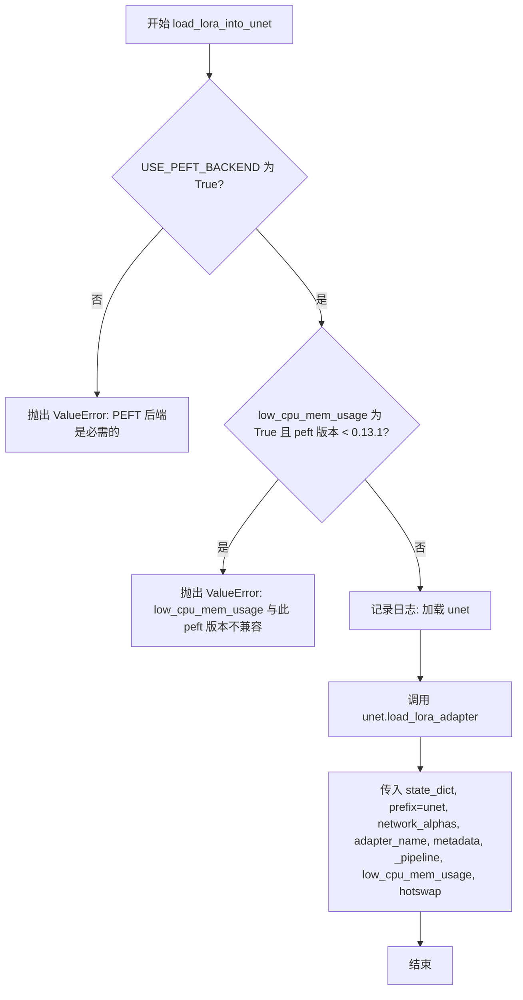

#### 带注释源码

```python
@classmethod
# Copied from diffusers.loaders.lora_pipeline.StableDiffusionLoraLoaderMixin.load_lora_into_unet
def load_lora_into_unet(
    cls,
    state_dict,
    network_alphas,
    unet,
    adapter_name=None,
    _pipeline=None,
    low_cpu_mem_usage=False,
    hotswap: bool = False,
    metadata=None,
):
    """
    This will load the LoRA layers specified in `state_dict` into `unet`.

    Parameters:
        state_dict (`dict`):
            A standard state dict containing the lora layer parameters. The keys can either be indexed directly
            into the unet or prefixed with an additional `unet` which can be used to distinguish between text
            encoder lora layers.
        network_alphas (`dict[str, float]`):
            The value of the network alpha used for stable learning and preventing underflow. This value has the
            same meaning as the `--network_alpha` option in the kohya-ss trainer script. Refer to [this
            link](https://github.com/darkstorm2150/sd-scripts/blob/main/docs/train_network_README-en.md#execute-learning).
        unet (`UNet2DConditionModel`):
            The UNet model to load the LoRA layers into.
        adapter_name (`str`, *optional*):
            Adapter name to be used for referencing the loaded adapter model. If not specified, it will use
            `default_{i}` where i is the total number of adapters being loaded.
        low_cpu_mem_usage (`bool`, *optional*):
            Speed up model loading only loading the pretrained LoRA weights and not initializing the random
            weights.
        hotswap (`bool`, *optional*):
            See [`~loaders.StableDiffusionLoraLoaderMixin.load_lora_weights`].
        metadata (`dict`):
            Optional LoRA adapter metadata. When supplied, the `LoraConfig` arguments of `peft` won't be derived
            from the state dict.
    """
    # 检查是否使用了 PEFT 后端，这是该方法必需的
    if not USE_PEFT_BACKEND:
        raise ValueError("PEFT backend is required for this method.")

    # 如果启用了低 CPU 内存使用但 peft 版本过低，则抛出错误
    if low_cpu_mem_usage and not is_peft_version(">=", "0.13.1"):
        raise ValueError(
            "`low_cpu_mem_usage=True` is not compatible with this `peft` version. Please update it with `pip install -U peft`."
        )

    # 记录加载信息
    # 如果序列化格式是新的（在 https://github.com/huggingface/diffusers/pull/2918 中引入的），
    # 那么 `state_dict` 键应该有 `cls.unet_name` 和/或 `cls.text_encoder_name` 作为前缀
    logger.info(f"Loading {cls.unet_name}.")
    
    # 调用 UNet 模型的 load_lora_adapter 方法加载 LoRA 适配器
    unet.load_lora_adapter(
        state_dict,
        prefix=cls.unet_name,
        network_alphas=network_alphas,
        adapter_name=adapter_name,
        metadata=metadata,
        _pipeline=_pipeline,
        low_cpu_mem_usage=low_cpu_mem_usage,
        hotswap=hotswap,
    )
```


### `StableDiffusionXLLoraLoaderMixin.load_lora_into_text_encoder`

将LoRA层从state_dict加载到text_encoder模型中。该方法是Stable Diffusion XL Pipeline的LoRA加载器mixin类的核心方法，负责将预训练的LoRA权重注入到CLIP文本编码器中，以实现轻量级的文本到图像生成模型微调。

参数：

- `cls`：类本身（隐式参数），`type` - 类对象，表示当前调用的类
- `state_dict`：`dict` - 包含LoRA层参数的PyTorch状态字典，键应包含"lora"子串以区分UNet和Text Encoder的LoRA层
- `network_alphas`：`dict[str, float]` - 网络alpha值，用于稳定学习和防止数值下溢，与kohya-ss训练器脚本中的`--network_alpha`选项含义相同
- `text_encoder`：`CLIPTextModel` - 要加载LoRA层的文本编码器模型实例
- `prefix`：`str`，可选 - state_dict中text_encoder参数的预期前缀，用于键的匹配和映射
- `lora_scale`：`float` - LoRA线性层输出在添加到原始层输出之前的缩放因子，默认为1.0
- `adapter_name`：`str`，可选 - 适配器名称，用于引用已加载的适配器模型；如未指定，将使用`default_{i}`格式（i为已加载适配器总数）
- `_pipeline`：可选 - 管道对象引用，用于传递上下文信息
- `low_cpu_mem_usage`：`bool` - 是否通过仅加载预训练LoRA权重而不初始化随机权重来加速模型加载
- `hotswap`：`bool` - 是否用新加载的适配器就地替换现有适配器，可提高torch.compile场景下的性能
- `metadata`：`dict`，可选 - LoRA适配器元数据；当提供时，将不会从state_dict派生peft的LoraConfig参数

返回值：无返回值（`None`），该方法通过直接修改text_encoder模型的内部状态来加载LoRA权重

#### 流程图

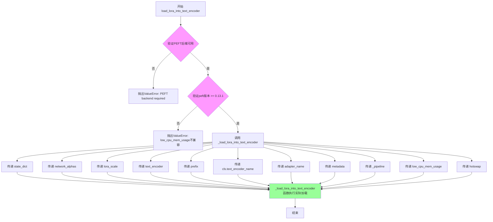

#### 带注释源码

```python
@classmethod
# Copied from diffusers.loaders.lora_pipeline.StableDiffusionLoraLoaderMixin.load_lora_into_text_encoder
def load_lora_into_text_encoder(
    cls,
    state_dict,
    network_alphas,
    text_encoder,
    prefix=None,
    lora_scale=1.0,
    adapter_name=None,
    _pipeline=None,
    low_cpu_mem_usage=False,
    hotswap: bool = False,
    metadata=None,
):
    """
    This will load the LoRA layers specified in `state_dict` into `text_encoder`

    Parameters:
        state_dict (`dict`):
            A standard state dict containing the lora layer parameters. The key should be prefixed with an
            additional `text_encoder` to distinguish between unet lora layers.
        network_alphas (`dict[str, float]`):
            The value of the network alpha used for stable learning and preventing underflow. This value has the
            same meaning as the `--network_alpha` option in the kohya-ss trainer script. Refer to [this
            link](https://github.com/darkstorm2150/sd-scripts/blob/main/docs/train_network_README-en.md#execute-learning).
        text_encoder (`CLIPTextModel`):
            The text encoder model to load the LoRA layers into.
        prefix (`str`):
            Expected prefix of the `text_encoder` in the `state_dict`.
        lora_scale (`float`):
            How much to scale the output of the lora linear layer before it is added with the output of the regular
            lora layer.
        adapter_name (`str`, *optional*):
            Adapter name to be used for referencing the loaded adapter model. If not specified, it will use
            `default_{i}` where i is the total number of adapters being loaded.
        low_cpu_mem_usage (`bool`, *optional*):
            Speed up model loading by only loading the pretrained LoRA weights and not initializing the random
            weights.
        hotswap (`bool`, *optional*):
            See [`~loaders.StableDiffusionLoraLoaderMixin.load_lora_weights`].
        metadata (`dict`):
            Optional LoRA adapter metadata. When supplied, the `LoraConfig` arguments of `peft` won't be derived
            from the state dict.
    """
    # 核心逻辑：委托给底层的 _load_lora_into_text_encoder 函数执行实际加载
    # 该函数定义在 lora_base 模块中，负责与PEFT后端交互完成权重注入
    _load_lora_into_text_encoder(
        state_dict=state_dict,
        network_alphas=network_alphas,
        lora_scale=lora_scale,
        text_encoder=text_encoder,
        prefix=prefix,
        text_encoder_name=cls.text_encoder_name,  # 使用类属性 "text_encoder"
        adapter_name=adapter_name,
        metadata=metadata,
        _pipeline=_pipeline,
        low_cpu_mem_usage=low_cpu_mem_usage,
        hotswap=hotswap,
    )
```


### StableDiffusionXLLoraLoaderMixin.save_lora_weights

保存 Stable Diffusion XL 模型的 LoRA 权重到指定目录，支持保存 UNet、text_encoder 和 text_encoder_2 的 LoRA 权重及其关联的元数据。

参数：

- `save_directory`：`str | os.PathLike`，保存 LoRA 参数的目录。如果目录不存在，将被创建。
- `unet_lora_layers`：`dict[str, torch.nn.Module | torch.Tensor] | None`，与 UNet 对应的 LoRA 层状态字典。
- `text_encoder_lora_layers`：`dict[str, torch.nn.Module | torch.Tensor] | None`，与 text_encoder 对应的 LoRA 层状态字典。
- `text_encoder_2_lora_layers`：`dict[str, torch.nn.Module | torch.Tensor] | None`，与 text_encoder_2 对应的 LoRA 层状态字典。
- `is_main_process`：`bool`，调用此方法的进程是否为主进程，用于分布式训练。默认为 `True`。
- `weight_name`：`str | None`，保存的状态字典文件的名称。
- `save_function`：`Callable | None`，用于保存状态字典的函数，可用于分布式训练时替换 `torch.save`。
- `safe_serialization`：`bool`，是否使用 `safetensors` 保存模型，默认为 `True`。
- `unet_lora_adapter_metadata`：`Any`，与 UNet 关联的 LoRA 适配器元数据，将与状态字典一起序列化。
- `text_encoder_lora_adapter_metadata`：`Any`，与 text_encoder 关联的 LoRA 适配器元数据。
- `text_encoder_2_lora_adapter_metadata`：`Any`，与 text_encoder_2 关联的 LoRA 适配器元数据。

返回值：无（`None`），该方法直接调用内部 `_save_lora_weights` 方法完成保存操作。

#### 流程图

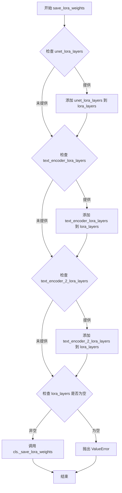

#### 带注释源码

```python
@classmethod
def save_lora_weights(
    cls,
    save_directory: str | os.PathLike,
    unet_lora_layers: dict[str, torch.nn.Module | torch.Tensor] = None,
    text_encoder_lora_layers: dict[str, torch.nn.Module | torch.Tensor] = None,
    text_encoder_2_lora_layers: dict[str, torch.nn.Module | torch.Tensor] = None,
    is_main_process: bool = True,
    weight_name: str = None,
    save_function: Callable = None,
    safe_serialization: bool = True,
    unet_lora_adapter_metadata=None,
    text_encoder_lora_adapter_metadata=None,
    text_encoder_2_lora_adapter_metadata=None,
):
    r"""
    See [`~loaders.StableDiffusionLoraLoaderMixin.save_lora_weights`] for more information.
    """
    # 初始化存储 LoRA 层和元数据的字典
    lora_layers = {}
    lora_metadata = {}

    # 如果提供了 unet_lora_layers，则将其添加到 lora_layers 字典中
    # 使用类属性 cls.unet_name 作为键（通常为 "unet"）
    if unet_lora_layers:
        lora_layers[cls.unet_name] = unet_lora_layers
        lora_metadata[cls.unet_name] = unet_lora_adapter_metadata

    # 如果提供了 text_encoder_lora_layers，则将其添加到 lora_layers 字典中
    # 键固定为 "text_encoder"
    if text_encoder_lora_layers:
        lora_layers["text_encoder"] = text_encoder_lora_layers
        lora_metadata["text_encoder"] = text_encoder_lora_adapter_metadata

    # 如果提供了 text_encoder_2_lora_layers，则将其添加到 lora_layers 字典中
    # 键固定为 "text_encoder_2"
    if text_encoder_2_lora_layers:
        lora_layers["text_encoder_2"] = text_encoder_2_lora_layers
        lora_metadata["text_encoder_2"] = text_encoder_2_lora_adapter_metadata

    # 验证至少提供了一种 LoRA 层，否则抛出错误
    if not lora_layers:
        raise ValueError(
            "You must pass at least one of `unet_lora_layers`, `text_encoder_lora_layers`, or `text_encoder_2_lora_layers`."
        )

    # 调用父类的 _save_lora_weights 方法完成实际的保存操作
    # 该方法负责将 lora_layers 和 lora_metadata 序列化并保存到 save_directory
    cls._save_lora_weights(
        save_directory=save_directory,
        lora_layers=lora_layers,
        lora_metadata=lora_metadata,
        is_main_process=is_main_process,
        weight_name=weight_name,
        save_function=save_function,
        safe_serialization=safe_serialization,
    )
```


### `StableDiffusionXLLoraLoaderMixin.fuse_lora`

该方法用于将已加载的 LoRA 参数融合到 Stable Diffusion XL 模型的原始参数中，支持 UNet、text_encoder 和 text_encoder_2 三个组件的可选融合。

参数：

-  `components`：`list[str]`，默认值为 `["unet", "text_encoder", "text_encoder_2"]`，指定要融合 LoRA 的组件列表
-  `lora_scale`：`float`，默认值为 `1.0`，控制 LoRA 参数对模型输出的影响程度
-  `safe_fusing`：`bool`，默认值为 `False`，是否在融合前检查融合后的权重是否包含 NaN 值
-  `adapter_names`：`list[str] | None`，默认值为 `None`，指定要融合的适配器名称，如果为 None 则融合所有已激活的适配器

返回值：`None`，该方法无返回值，直接修改模型内部参数

#### 流程图

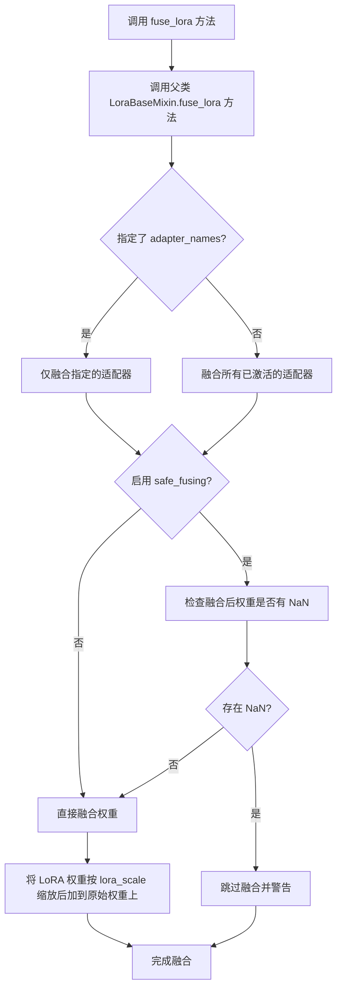

#### 带注释源码

```python
def fuse_lora(
    self,
    components: list[str] = ["unet", "text_encoder", "text_encoder_2"],
    lora_scale: float = 1.0,
    safe_fusing: bool = False,
    adapter_names: list[str] | None = None,
    **kwargs,
):
    r"""
    将 LoRA 参数融合到原始模型参数中。
    
    这是一个实验性 API。
    
    参数:
        components: 要融合 LoRA 的组件列表。
        lora_scale: 控制 LoRA 参数对输出的影响程度，默认为 1.0。
        safe_fusing: 是否在融合前检查融合后的权重是否包含 NaN 值。
        adapter_names: 要融合的适配器名称列表，如果为 None 则融合所有已激活的适配器。
    
    示例:
        >>> from diffusers import DiffusionPipeline
        >>> import torch
        >>> pipeline = DiffusionPipeline.from_pretrained(
        ...     "stabilityai/stable-diffusion-xl-base-1.0", torch_dtype=torch.float16
        ... ).to("cuda")
        >>> pipeline.load_lora_weights("nerijs/pixel-art-xl", weight_name="pixel-art-xl.safetensors", adapter_name="pixel")
        >>> pipeline.fuse_lora(lora_scale=0.7)
    """
    # 调用父类 LoraBaseMixin 的 fuse_lora 方法执行实际的融合逻辑
    # 父类方法会处理权重融合、safe_fusing 检查和 adapter_names 过滤等核心逻辑
    super().fuse_lora(
        components=components,
        lora_scale=lora_scale,
        safe_fusing=safe_fusing,
        adapter_names=adapter_names,
        **kwargs,
    )
```


### `StableDiffusionXLLoraLoaderMixin.unfuse_lora`

该方法用于撤销已融合的 LoRA（Low-Rank Adaptation）权重，将模型组件从融合状态恢复到原始状态。它是 Stable Diffusion XL 特定的 LoRA 加载器 mixin，通过调用父类 `LoraBaseMixin` 的 `unfuse_lora` 方法来实现实际的撤销融合操作。

参数：

- `components`：`list[str]`，默认为 `["unet", "text_encoder", "text_encoder_2"]`，指定要撤销 LoRA 融合的组件列表，包括 UNet 和两个文本编码器
- `**kwargs`：其他关键字参数，会原样传递给父类的 `unfuse_lora` 方法

返回值：`None`，该方法通过调用父类方法完成操作，无直接返回值

#### 流程图

```mermaid
flowchart TD
    A[调用 unfuse_lora] --> B{检查 components 参数}
    B --> C[调用 super().unfuse_lora]
    C --> D[遍历 components 列表]
    D --> E{组件是否支持}
    E -->|是| F[调用对应组件的 unload_lora_adapter 方法]
    E -->|否| G[记录警告日志]
    F --> H[完成撤销融合]
    G --> H
    H --> I[返回]
```

#### 带注释源码

```python
def unfuse_lora(self, components: list[str] = ["unet", "text_encoder", "text_encoder_2"], **kwargs):
    r"""
    See [`~loaders.StableDiffusionLoraLoaderMixin.unfuse_lora`] for more details.
    """
    # 使用 super() 调用父类 LoraBaseMixin 的 unfuse_lora 方法
    # 父类方法会遍历 components 列表，逐个撤销各组件的 LoRA 融合
    # kwargs 中的参数（如 unfuse_unet、unuse_text_encoder）会传递给父类方法
    super().unfuse_lora(components=components, **kwargs)
```


### `SD3LoraLoaderMixin.lora_state_dict`

该方法用于从预训练模型路径或字典中加载并返回 Stable Diffusion 3 (SD3) 的 LoRA 权重状态字典（state dict）和可选的 LoRA 元数据。该方法是类方法，主要处理从不同来源（Hub、本地目录或直接传入的字典）加载 LoRA 权重，并进行必要的格式检查和过滤（如 DoRA 兼容性检查）。

参数：

-  `cls`：类对象，代表 `SD3LoraLoaderMixin` 本身
-  `pretrained_model_name_or_path_or_dict`：`str | dict[str, torch.Tensor]`，可以是 HuggingFace Hub 上的模型 ID（如 `google/ddpm-celebahq-256`）、本地目录路径（包含通过 `ModelMixin.save_pretrained` 保存的模型权重），或者是直接的 PyTorch 状态字典
-  `**kwargs`：可选关键字参数，包含以下子参数：
  -  `cache_dir`：`str | os.PathLike`，可选，指定缓存预训练模型配置文件的目录
  -  `force_download`：`bool`，可选，默认 `False`，是否强制重新下载模型权重和配置文件
  -  `proxies`：`dict[str, str]`，可选，代理服务器字典，用于请求
  -  `local_files_only`：`bool`，可选，默认 `False`，是否仅加载本地模型权重和配置文件
  -  `token`：`str | bool`，可选，用于远程文件的 HTTP Bearer 授权令牌
  -  `revision`：`str`，可选，默认 `"main"`，使用的特定模型版本（分支名、标签名、提交 ID 等）
  -  `subfolder`：`str`，可选，默认 `""`，模型仓库或本地模型目录中的子文件夹路径
  -  `weight_name`：`str`，可选，默认 `None`，序列化的状态字典文件名
  -  `use_safetensors`：`bool`，可选，是否使用 safetensors 格式加载
  -  `return_lora_metadata`：`bool`，可选，默认 `False`，是否返回 LoRA 适配器元数据

返回值：`dict[str, torch.Tensor] | tuple[dict[str, torch.Tensor], dict]`，如果 `return_lora_metadata` 为 `True`，返回包含状态字典和元数据的元组；否则仅返回状态字典

#### 流程图

```mermaid
flowchart TD
    A[开始 lora_state_dict] --> B{传入的是 dict 还是 path?}
    B -->|dict| C[直接使用该字典作为 state_dict]
    B -->|path| D[调用 _fetch_state_dict 加载权重]
    D --> E{allow_pickle 设置}
    E -->|use_safetensors 为 None| F[默认 use_safetensors=True, allow_pickle=True]
    E -->|其他| G[保持原设置]
    F --> H[构建 user_agent]
    G --> H
    H --> I[_fetch_state_dict 返回 state_dict 和 metadata]
    I --> J{检查 dora_scale 键是否存在}
    J -->|是| K[记录警告信息]
    K --> L[过滤掉包含 dora_scale 的键]
    J -->|否| M[不进行过滤]
    L --> N{return_lora_metadata 为 True?}
    M --> N
    N -->|是| O[返回 (state_dict, metadata) 元组]
    N -->|否| P[仅返回 state_dict]
    C --> J
```

#### 带注释源码

```python
@classmethod
@validate_hf_hub_args
def lora_state_dict(
    cls,
    pretrained_model_name_or_path_or_dict: str | dict[str, torch.Tensor],
    **kwargs,
):
    r"""
    See [`~loaders.StableDiffusionLoraLoaderMixin.lora_state_dict`] for more details.
    """
    # 1. 从 kwargs 中提取各种加载参数
    cache_dir = kwargs.pop("cache_dir", None)
    force_download = kwargs.pop("force_download", False)
    proxies = kwargs.pop("proxies", None)
    local_files_only = kwargs.pop("local_files_only", None)
    token = kwargs.pop("token", None)
    revision = kwargs.pop("revision", None)
    subfolder = kwargs.pop("subfolder", None)
    weight_name = kwargs.pop("weight_name", None)
    use_safetensors = kwargs.pop("use_safetensors", None)
    return_lora_metadata = kwargs.pop("return_lora_metadata", False)

    # 2. 设置 pickle 允许标志
    # 如果未指定 use_safetensors，默认使用 True，同时允许 pickle
    allow_pickle = False
    if use_safetensors is None:
        use_safetensors = True
        allow_pickle = True

    # 3. 构建用户代理信息，用于标识请求来源
    user_agent = {"file_type": "attn_procs_weights", "framework": "pytorch"}

    # 4. 调用内部函数 _fetch_state_dict 获取状态字典
    # 这是核心的加载逻辑，支持从 Hub、本地目录或直接字典加载
    state_dict, metadata = _fetch_state_dict(
        pretrained_model_name_or_path_or_dict=pretrained_model_name_or_path_or_dict,
        weight_name=weight_name,
        use_safetensors=use_safetensors,
        local_files_only=local_files_only,
        cache_dir=cache_dir,
        force_download=force_download,
        proxies=proxies,
        token=token,
        revision=revision,
        subfolder=subfolder,
        user_agent=user_agent,
        allow_pickle=allow_pickle,
    )

    # 5. 检查是否存在 DoRA (Decomposed Rank-Adaptive LoRA) 相关的 dora_scale 键
    # DoRA 目前与 Diffusers 不兼容，需要过滤掉相关键
    is_dora_scale_present = any("dora_scale" in k for k in state_dict)
    if is_dora_scale_present:
        warn_msg = "It seems like you are using a DoRA checkpoint that is not compatible in Diffusers at the moment. So, we are going to filter out the keys associated to 'dora_scale` from the state dict. If you think this is a mistake please open an issue https://github.com/huggingface/diffusers/issues/new."
        logger.warning(warn_msg)
        state_dict = {k: v for k, v in state_dict.items() if "dora_scale" not in k}

    # 6. 根据 return_lora_metadata 决定返回值
    # 注意：与 SD/SDXL 版本不同，SD3 版本不返回 network_alphas
    out = (state_dict, metadata) if return_lora_metadata else state_dict
    return out
```


### `SD3LoraLoaderMixin.load_lora_weights`

该方法用于将预训练的LoRA权重加载到SD3（Stable Diffusion 3）pipeline的transformer和text_encoder模型中，支持适配器管理、低CPU内存使用模式以及热交换功能。

参数：

- `pretrained_model_name_or_path_or_dict`：`str | dict[str, torch.Tensor]`，LoRA权重路径或包含权重张量的字典
- `adapter_name`：`str | None`，可选的适配器名称，用于标识和引用加载的适配器模型
- `hotswap`：`bool`，是否用新加载的适配器原地替换已存在的适配器，默认为False
- `**kwargs`：其他关键字参数，会传递给`lora_state_dict`方法

返回值：无返回值（`None`），该方法直接修改pipeline对象的状态

#### 流程图

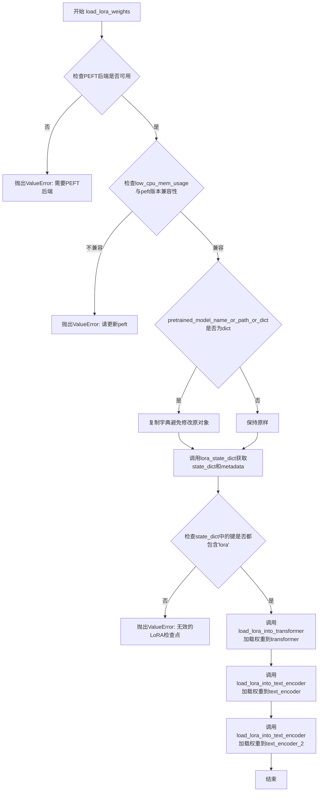

#### 带注释源码

```python
def load_lora_weights(
    self,
    pretrained_model_name_or_path_or_dict: str | dict[str, torch.Tensor],
    adapter_name=None,
    hotswap: bool = False,
    **kwargs,
):
    """
    See [`~loaders.StableDiffusionLoraLoaderMixin.load_lora_weights`] for more details.
    """
    # 检查是否配置了PEFT后端，这是加载LoRA的必要条件
    if not USE_PEFT_BACKEND:
        raise ValueError("PEFT backend is required for this method.")

    # 从kwargs中提取low_cpu_mem_usage参数，默认值为_LOW_CPU_MEM_USAGE_DEFAULT_LORA
    # 该参数用于优化模型加载过程中的内存使用
    low_cpu_mem_usage = kwargs.pop("low_cpu_mem_usage", _LOW_CPU_MEM_USAGE_DEFAULT_LORA)
    
    # 检查low_cpu_mem_usage与peft版本的兼容性
    # SD3需要peft>=0.13.0才能支持低CPU内存使用模式
    if low_cpu_mem_usage and is_peft_version("<", "0.13.0"):
        raise ValueError(
            "`low_cpu_mem_usage=True` is not compatible with this `peft` version. Please update it with `pip install -U peft`."
        )

    # 如果传入的是字典，则复制一份避免修改原对象
    if isinstance(pretrained_model_name_or_path_or_dict, dict):
        pretrained_model_name_or_path_or_dict = pretrained_model_name_or_path_or_dict.copy()

    # 首先确保检查点是兼容的并且可以成功加载
    # 设置return_lora_metadata=True以获取LoRA适配器的元数据
    kwargs["return_lora_metadata"] = True
    state_dict, metadata = self.lora_state_dict(pretrained_model_name_or_path_or_dict, **kwargs)

    # 验证检查点格式：所有键必须包含'lora'子串
    is_correct_format = all("lora" in key for key in state_dict.keys())
    if not is_correct_format:
        raise ValueError("Invalid LoRA checkpoint. Make sure all LoRA param names contain `'lora'` substring.")

    # 获取transformer模型：根据是否有transformer属性来决定
    # self.transformer_name 值为 "transformer"
    transformer = getattr(self, self.transformer_name) if not hasattr(self, "transformer") else self.transformer
    
    # 调用load_lora_into_transformer将LoRA权重加载到transformer模型
    self.load_lora_into_transformer(
        state_dict,
        transformer=transformer,
        adapter_name=adapter_name,
        metadata=metadata,
        _pipeline=self,
        low_cpu_mem_usage=low_cpu_mem_usage,
        hotswap=hotswap,
    )
    
    # 调用load_lora_into_text_encoder将LoRA权重加载到text_encoder模型
    # self.text_encoder_name 值为 "text_encoder"
    self.load_lora_into_text_encoder(
        state_dict,
        network_alphas=None,  # SD3不使用network_alphas
        text_encoder=self.text_encoder,
        prefix=self.text_encoder_name,
        lora_scale=self.lora_scale,
        adapter_name=adapter_name,
        metadata=metadata,
        _pipeline=self,
        low_cpu_mem_usage=low_cpu_mem_usage,
        hotswap=hotswap,
    )
    
    # 调用load_lora_into_text_encoder将LoRA权重加载到text_encoder_2模型
    # SD3有两个text encoder：text_encoder和text_encoder_2
    self.load_lora_into_text_encoder(
        state_dict,
        network_alphas=None,
        text_encoder=self.text_encoder_2,
        prefix=f"{self.text_encoder_name}_2",  # 使用text_encoder_2作为前缀
        lora_scale=self.lora_scale,
        adapter_name=adapter_name,
        metadata=metadata,
        _pipeline=self,
        low_cpu_mem_usage=low_cpu_mem_usage,
        hotswap=hotswap,
    )
```


### `SD3LoraLoaderMixin.load_lora_into_transformer`

将LoRA层从状态字典加载到SD3 Transformer模型中。该方法是Stable Diffusion 3 Pipeline的LoRA加载流程的一部分，通过调用transformer模型的`load_lora_adapter`方法将LoRA权重适配到transformer模块。

参数：

-  `cls`：class，类方法隐含的第一个参数，表示类本身
-  `state_dict`：`dict`，包含LoRA层参数的字典，键可以是直接用于transformer的键，也可以带有`transformer`前缀以区分text encoder的LoRA层
-  `transformer`：`SD3Transformer2DModel`，要加载LoRA层的transformer模型
-  `adapter_name`：`str | None`，可选参数，用于引用已加载适配器模型的名称。如果未指定，将使用`default_{i}`，其中i是正在加载的适配器总数
-  `_pipeline`：`Pipeline | None`，可选参数，传入pipeline引用以支持某些PEFT功能
-  `low_cpu_mem_usage`：`bool`，默认`False`，通过仅加载预训练的LoRA权重而不初始化随机权重来加速模型加载
-  `hotswap`：`bool`，默认`False`，是否用新加载的适配器原地替换现有(LoRA)适配器，这可以更快且更节省内存，特别是在使用torch.compile编译模型时
-  `metadata`：`dict | None`，可选的LoRA适配器元数据。当提供时，PEFT的`LoraConfig`参数将从状态字典派生而非从元数据获取

返回值：`None`，该方法直接在transformer模型上加载LoRA权重，不返回任何内容

#### 流程图

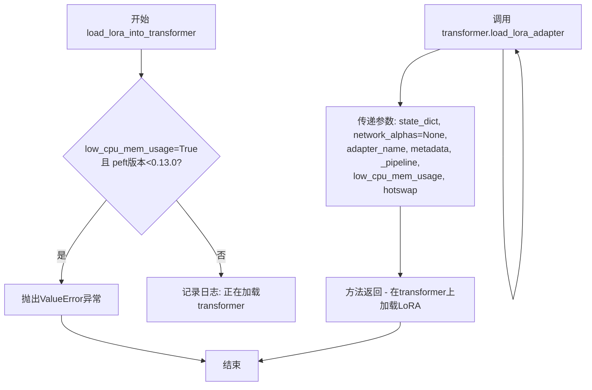

#### 带注释源码

```python
@classmethod
def load_lora_into_transformer(
    cls,
    state_dict,
    transformer,
    adapter_name=None,
    _pipeline=None,
    low_cpu_mem_usage=False,
    hotswap: bool = False,
    metadata=None,
):
    """
    See [`~loaders.StableDiffusionLoraLoaderMixin.load_lora_into_unet`] for more details.
    """
    # 检查low_cpu_mem_usage选项与peft版本的兼容性
    # 如果启用了low_cpu_mem_usage但peft版本低于0.13.0，则抛出错误
    if low_cpu_mem_usage and is_peft_version("<", "0.13.0"):
        raise ValueError(
            "`low_cpu_mem_usage=True` is not compatible with this `peft` version. Please update it with `pip install -U peft`."
        )

    # 记录日志，表明正在加载哪个组件（transformer）
    # cls.transformer_name通常是"transformer"
    logger.info(f"Loading {cls.transformer_name}.")
    
    # 调用transformer模型的load_lora_adapter方法完成LoRA权重的加载
    # 注意：对于SD3，network_alphas被设置为None
    transformer.load_lora_adapter(
        state_dict,
        network_alphas=None,
        adapter_name=adapter_name,
        metadata=metadata,
        _pipeline=_pipeline,
        low_cpu_mem_usage=low_cpu_mem_usage,
        hotswap=hotswap,
    )
```


### `SD3LoraLoaderMixin.load_lora_into_text_encoder`

将 `state_dict` 中指定的 LoRA 层加载到 `text_encoder` 中。

参数：

-  `cls`：类对象，类方法标识
-  `state_dict`：`dict`，包含 LoRA 层参数的字典，其键应带有 `text_encoder` 前缀以区分 UNet LoRA 层
-  `network_alphas`：`dict[str, float] | None`，用于稳定学习和防止下溢的网络 alpha 值，与 kohya-ss 训练器脚本中的 `--network_alpha` 选项含义相同
-  `text_encoder`：`CLIPTextModel`，要加载 LoRA 层的文本编码器模型
-  `prefix`：`str | None`，`state_dict` 中 `text_encoder` 的预期前缀
-  `lora_scale`：`float`，LoRA 线性层输出与常规 LoRA 层输出相加前的缩放系数
-  `adapter_name`：`str | None`，用于引用加载的适配器模型的适配器名称，未指定时使用 `default_{i}`
-  `_pipeline`：可选的 Pipeline 实例，用于传递上下文
-  `low_cpu_mem_usage`：`bool`，是否仅加载预训练的 LoRA 权重而不初始化随机权重以加速模型加载
-  `hotswap`：`bool`，是否在现有适配器上进行热替换
-  `metadata`：`dict | None`，可选的 LoRA 适配器元数据，供应时不会从 state_dict 派生 `peft` 的 `LoraConfig` 参数

返回值：无（`None`），该方法直接调用 `_load_lora_into_text_encoder` 函数完成加载

#### 流程图

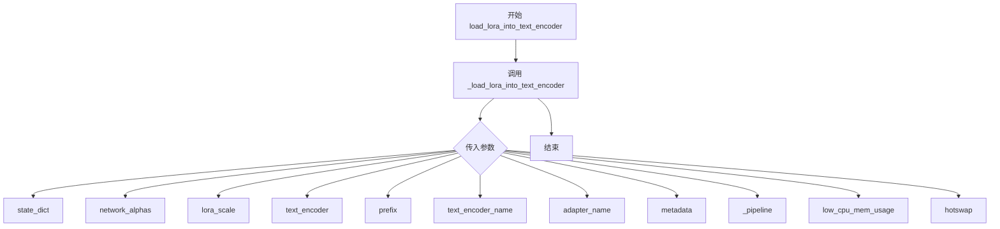

#### 带注释源码

```python
@classmethod
# Copied from diffusers.loaders.lora_pipeline.StableDiffusionLoraLoaderMixin.load_lora_into_text_encoder
def load_lora_into_text_encoder(
    cls,
    state_dict,
    network_alphas,
    text_encoder,
    prefix=None,
    lora_scale=1.0,
    adapter_name=None,
    _pipeline=None,
    low_cpu_mem_usage=False,
    hotswap: bool = False,
    metadata=None,
):
    """
    This will load the LoRA layers specified in `state_dict` into `text_encoder`

    Parameters:
        state_dict (`dict`):
            A standard state dict containing the lora layer parameters. The key should be prefixed with an
            additional `text_encoder` to distinguish between unet lora layers.
        network_alphas (`dict[str, float]`):
            The value of the network alpha used for stable learning and preventing underflow. This value has the
            same meaning as the `--network_alpha` option in the kohya-ss trainer script. Refer to [this
            link](https://github.com/darkstorm2150/sd-scripts/blob/main/docs/train_network_README-en.md#execute-learning).
        text_encoder (`CLIPTextModel`):
            The text encoder model to load the LoRA layers into.
        prefix (`str`):
            Expected prefix of the `text_encoder` in the `state_dict`.
        lora_scale (`float`):
            How much to scale the output of the lora linear layer before it is added with the output of the regular
            lora layer.
        adapter_name (`str`, *optional*):
            Adapter name to be used for referencing the loaded adapter model. If not specified, it will use
            `default_{i}` where i is the total number of adapters being loaded.
        low_cpu_mem_usage (`bool`, *optional*):
            Speed up model loading by only loading the pretrained LoRA weights and not initializing the random
            weights.
        hotswap (`bool`, *optional*):
            See [`~loaders.StableDiffusionLoraLoaderMixin.load_lora_weights`].
        metadata (`dict`):
            Optional LoRA adapter metadata. When supplied, the `LoraConfig` arguments of `peft` won't be derived
            from the state dict.
    """
    # 调用底层的 _load_lora_into_text_encoder 函数完成实际的 LoRA 加载工作
    # 该函数定义在 lora_base 模块中，是实际的实现逻辑
    _load_lora_into_text_encoder(
        state_dict=state_dict,
        network_alphas=network_alphas,
        lora_scale=lora_scale,
        text_encoder=text_encoder,
        prefix=prefix,
        text_encoder_name=cls.text_encoder_name,  # 使用类属性 "text_encoder"
        adapter_name=adapter_name,
        metadata=metadata,
        _pipeline=_pipeline,
        low_cpu_mem_usage=low_cpu_mem_usage,
        hotswap=hotswap,
    )
```


### SD3LoraLoaderMixin.save_lora_weights

该方法用于将 Stable Diffusion 3 模型的 LoRA 权重（transformer 和 text_encoder）保存到指定目录，支持安全序列化。

参数：

- `save_directory`：`str | os.PathLike`，保存 LoRA 参数的目录，如果不存在则创建
- `transformer_lora_layers`：`dict[str, torch.nn.Module | torch.Tensor] | None`，与 `transformer` 对应的 LoRA 层状态字典
- `text_encoder_lora_layers`：`dict[str, torch.nn.Module | torch.Tensor] | None`，与 `text_encoder` 对应的 LoRA 层状态字典
- `text_encoder_2_lora_layers`：`dict[str, torch.nn.Module | torch.Tensor] | None`，与 `text_encoder_2` 对应的 LoRA 层状态字典（SD3 有两个文本编码器）
- `is_main_process`：`bool`，是否为调用该函数的主进程，用于分布式训练场景，默认为 `True`
- `weight_name`：`str | None`，保存的状态字典文件名
- `save_function`：`Callable | None`，用于保存状态字典的函数，可用于分布式训练时替换 `torch.save`
- `safe_serialization`：`bool`，是否使用 `safetensors` 保存模型，默认为 `True`；若为 `False` 则使用传统的 PyTorch `pickle` 方式
- `transformer_lora_adapter_metadata：`dict | None`，与 transformer 关联的 LoRA 适配器元数据
- `text_encoder_lora_adapter_metadata：`dict | None`，与 text_encoder 关联的 LoRA 适配器元数据
- `text_encoder_2_lora_adapter_metadata：`dict | None`，与 text_encoder_2 关联的 LoRA 适配器元数据

返回值：`None`，该方法无返回值，直接将 LoRA 权重写入磁盘

#### 流程图

```mermaid
flowchart TD
    A[开始 save_lora_weights] --> B{检查 transformer_lora_layers}
    B -->|有值| C[添加到 lora_layers 字典]
    B -->|无值| D{检查 text_encoder_lora_layers}
    D -->|有值| E[添加到 lora_layers 字典]
    D -->|无值| F{检查 text_encoder_2_lora_layers}
    F -->|有值| G[添加到 lora_layers 字典]
    F -->|无值| H[抛出 ValueError]
    C --> I{检查 lora_layers 是否为空}
    E --> I
    G --> I
    I -->|不为空| J[调用 _save_lora_weights 保存]
    J --> K[结束]
    H --> K
```

#### 带注释源码

```python
@classmethod
# Copied from diffusers.loaders.lora_pipeline.StableDiffusionXLLoraLoaderMixin.save_lora_weights with unet->transformer
def save_lora_weights(
    cls,
    save_directory: str | os.PathLike,
    transformer_lora_layers: dict[str, torch.nn.Module | torch.Tensor] = None,
    text_encoder_lora_layers: dict[str, torch.nn.Module | torch.Tensor] = None,
    text_encoder_2_lora_layers: dict[str, torch.nn.Module | torch.Tensor] = None,
    is_main_process: bool = True,
    weight_name: str = None,
    save_function: Callable = None,
    safe_serialization: bool = True,
    transformer_lora_adapter_metadata=None,
    text_encoder_lora_adapter_metadata=None,
    text_encoder_2_lora_adapter_metadata=None,
):
    r"""
    See [`~loaders.StableDiffusionLoraLoaderMixin.save_lora_weights`] for more information.
    """
    # 初始化用于存储 LoRA 层和元数据的字典
    lora_layers = {}
    lora_metadata = {}

    # 如果传入了 transformer 的 LoRA 层，则添加到 lora_layers 字典中
    # 键为 'transformer'（即 cls.transformer_name），值为传入的 LoRA 层
    if transformer_lora_layers:
        lora_layers[cls.transformer_name] = transformer_lora_layers
        lora_metadata[cls.transformer_name] = transformer_lora_adapter_metadata

    # 如果传入了 text_encoder 的 LoRA 层，则添加到 lora_layers 字典中
    if text_encoder_lora_layers:
        lora_layers["text_encoder"] = text_encoder_lora_layers
        lora_metadata["text_encoder"] = text_encoder_lora_adapter_metadata

    # 如果传入了 text_encoder_2 的 LoRA 层，则添加到 lora_layers 字典中
    # SD3 有两个文本编码器：text_encoder 和 text_encoder_2
    if text_encoder_2_lora_layers:
        lora_layers["text_encoder_2"] = text_encoder_2_lora_layers
        lora_metadata["text_encoder_2"] = text_encoder_2_lora_adapter_metadata

    # 确保至少传入了一种 LoRA 层，否则抛出错误
    if not lora_layers:
        raise ValueError(
            "You must pass at least one of `transformer_lora_layers`, `text_encoder_lora_layers`, or `text_encoder_2_lora_layers`."
        )

    # 调用父类的 _save_lora_weights 方法完成实际的保存操作
    # 该方法处理目录创建、文件命名、序列化方式等细节
    cls._save_lora_weights(
        save_directory=save_directory,
        lora_layers=lora_layers,
        lora_metadata=lora_metadata,
        is_main_process=is_main_process,
        weight_name=weight_name,
        save_function=save_function,
        safe_serialization=safe_serialization,
    )
```


### `SD3LoraLoaderMixin.fuse_lora`

该方法用于将已加载的LoRA（Low-Rank Adaptation）权重融合到SD3（Stable Diffusion 3）模型的相关组件（transformer、text_encoder、text_encoder_2）的原始参数中。它是对父类`LoraBaseMixin.fuse_lora`的包装调用，支持指定要融合的组件、LoRA缩放因子、安全融合检查以及特定的适配器名称。

参数：

- `components`：`list[str]`，可选，默认值为 `["transformer", "text_encoder", "text_encoder_2"]`。表示要融合LoRA的组件列表。
- `lora_scale`：`float`，可选，默认值为 `1.0`。控制LoRA参数对输出的影响程度。
- `safe_fusing`：`bool`，可选，默认值为 `False`。是否在融合前检查融合后的权重是否为NaN值，如果为NaN则不进行融合。
- `adapter_names`：`list[str] | None`，可选，默认值为 `None`。指定要融合的适配器名称。如果为`None`，则融合所有已激活的适配器。
- `**kwargs`：其他关键字参数，会传递给父类的`fuse_lora`方法。

返回值：无（`None`）。该方法直接修改模型参数，不返回任何值。

#### 流程图

```mermaid
flowchart TD
    A[开始 fuse_lora] --> B{检查 components 是否有效}
    B -->|是| C{检查 lora_scale}
    C -->|有效| D{检查 adapter_names}
    D -->|有效| E[调用 super().fuse_lora]
    B -->|否| F[抛出异常]
    C -->|无效| F
    D -->|无效| F
    E --> G[结束]
```

#### 带注释源码

```python
# Copied from diffusers.loaders.lora_pipeline.StableDiffusionXLLoraLoaderMixin.fuse_lora with unet->transformer
def fuse_lora(
    self,
    components: list[str] = ["transformer", "text_encoder", "text_encoder_2"],
    lora_scale: float = 1.0,
    safe_fusing: bool = False,
    adapter_names: list[str] | None = None,
    **kwargs,
):
    r"""
    See [`~loaders.StableDiffusionLoraLoaderMixin.fuse_lora`] for more details.
    """
    # 调用父类 LoraBaseMixin 的 fuse_lora 方法
    # 将所有参数传递给父类进行处理
    super().fuse_lora(
        components=components,
        lora_scale=lora_scale,
        safe_fusing=safe_fusing,
        adapter_names=adapter_names,
        **kwargs,
    )
```


### `SD3LoraLoaderMixin.unfuse_lora`

该方法用于将已融合的 LoRA 参数从模型组件中分离（解融合），恢复到融合前的原始状态。它是 Stable Diffusion 3 管道中用于管理 LoRA 权重的核心方法之一，通过调用父类 `LoraBaseMixin` 的 `unfuse_lora` 方法来实现实际的解融合逻辑。

**参数：**

- `components`：`list[str]`，指定要解融合 LoRA 的组件列表，默认为 `["transformer", "text_encoder", "text_encoder_2"]`
- `**kwargs`：其他可选关键字参数，将传递给父类方法

**返回值：** 无返回值（`None`），该方法直接修改模型状态

#### 流程图

```mermaid
flowchart TD
    A[开始] --> B[接收components参数]
    B --> C[调用super.unfuse_lora]
    C --> D{父类方法处理}
    D -->|遍历components| E[对每个组件调用unfuse_lora]
    E --> F[解融合transformer的LoRA]
    E --> G[解融合text_encoder的LoRA]
    E --> H[解融合text_encoder_2的LoRA]
    F --> I[结束]
    G --> I
    H --> I
```

#### 带注释源码

```python
# Copied from diffusers.loaders.lora_pipeline.StableDiffusionXLLoraLoaderMixin.unfuse_lora with unet->transformer
def unfuse_lora(self, components: list[str] = ["transformer", "text_encoder", "text_encoder_2"], **kwargs):
    r"""
    See [`~loaders.StableDiffusionLoraLoaderMixin.unfuse_lora`] for more details.
    """
    # 调用父类 LoraBaseMixin 的 unfuse_lora 方法
    # 将 components 参数和 kwargs 传递给它
    # 父类方法会遍历 components 列表
    # 对每个组件执行解融合操作，恢复原始权重
    super().unfuse_lora(components=components, **kwargs)
```


### FluxLoraLoaderMixin.lora_state_dict

该方法用于从给定的预训练模型路径或字典中提取 Flux 模型的 LoRA（Low-Rank Adaptation）权重状态字典，并支持多种格式的 LoRA 检查点转换（如 Kohya、xlabs、BFL Control、Falcon Kontext 等），同时处理 DoRA 兼容性过滤和网络 alpha 值的提取。

参数：

- `cls`：类型 `Classmethod`，表示类方法本身（隐式参数）
- `pretrained_model_name_or_path_or_dict`：`str | dict[str, torch.Tensor]`，可以是 HuggingFace Hub 模型 ID、本地目录路径或包含张量的字典
- `return_alphas`：`bool`，默认为 `False`，是否返回网络 alpha 值
- `**kwargs`：可变关键字参数，包括 `cache_dir`、`force_download`、`proxies`、`local_files_only`、`token`、`revision`、`subfolder`、`weight_name`、`use_safetensors`、`return_lora_metadata`、`unet_config` 等

返回值：`dict | tuple`，返回 LoRA 状态字典；若 `return_alphas=True` 或 `return_lora_metadata=True`，则返回包含状态字典、可选 alpha 值和元数据的元组

#### 流程图

```mermaid
flowchart TD
    A[开始: lora_state_dict] --> B{检查 Kohya 格式}
    B -->|是| C[调用 _convert_kohya_flux_lora_to_diffusers]
    C --> D[调用 _prepare_outputs 返回]
    B -->|否| E{检查 xlabs 格式}
    E -->|是| F[调用 _convert_xlabs_flux_lora_to_diffusers]
    F --> D
    E -->|否| G{检查 BFL Control 格式}
    G -->|是| H[调用 _convert_bfl_flux_control_lora_to_diffusers]
    H --> D
    G -->|否| I{检查 Falcon Kontext 格式}
    I -->|是| J[调用 _convert_fal_kontext_lora_to_diffusers]
    J --> D
    I -->|否| K[提取 network_alphas]
    K --> L{return_alphas 或 return_lora_metadata}
    L -->|是| M[调用 _prepare_outputs 返回元组]
    L -->|否| N[返回 state_dict]
```

#### 带注释源码

```python
@classmethod
@validate_hf_hub_args
def lora_state_dict(
    cls,
    pretrained_model_name_or_path_or_dict: str | dict[str, torch.Tensor],
    return_alphas: bool = False,
    **kwargs,
):
    r"""
    See [`~loaders.StableDiffusionLoraLoaderMixin.lora_state_dict`] for more details.
    """
    # 从 kwargs 中提取各种下载和加载参数
    cache_dir = kwargs.pop("cache_dir", None)
    force_download = kwargs.pop("force_download", False)
    proxies = kwargs.pop("proxies", None)
    local_files_only = kwargs.pop("local_files_only", None)
    token = kwargs.pop("token", None)
    revision = kwargs.pop("revision", None)
    subfolder = kwargs.pop("subfolder", None)
    weight_name = kwargs.pop("weight_name", None)
    use_safetensors = kwargs.pop("use_safetensors", None)
    return_lora_metadata = kwargs.pop("return_lora_metadata", False)

    # 默认使用 safetensors，并允许在需要时使用 pickle
    allow_pickle = False
    if use_safetensors is None:
        use_safetensors = True
        allow_pickle = True

    # 构建用户代理信息
    user_agent = {"file_type": "attn_procs_weights", "framework": "pytorch"}

    # 使用 _fetch_state_dict 从预训练模型路径加载状态字典和元数据
    state_dict, metadata = _fetch_state_dict(
        pretrained_model_name_or_path_or_dict=pretrained_model_name_or_path_or_dict,
        weight_name=weight_name,
        use_safetensors=use_safetensors,
        local_files_only=local_files_only,
        cache_dir=cache_dir,
        force_download=force_download,
        proxies=proxies,
        token=token,
        revision=revision,
        subfolder=subfolder,
        user_agent=user_agent,
        allow_pickle=allow_pickle,
    )

    # 检查是否存在 DoRA scale，若存在则过滤掉并给出警告
    is_dora_scale_present = any("dora_scale" in k for k in state_dict)
    if is_dora_scale_present:
        warn_msg = "It seems like you are using a DoRA checkpoint that is not compatible in Diffusers at the moment. So, we are going to filter out the keys associated to 'dora_scale` from the state dict. If you think this is a mistake please open an issue https://github.com/huggingface/diffusers/issues/new."
        logger.warning(warn_msg)
        state_dict = {k: v for k, v in state_dict.items() if "dora_scale" not in k}

    # 检测是否为 Kohya 格式（通过 .lora_down.weight 关键字）
    is_kohya = any(".lora_down.weight" in k for k in state_dict)
    if is_kohya:
        # Kohya 格式转换
        state_dict = _convert_kohya_flux_lora_to_diffusers(state_dict)
        # Kohya 已经处理了 alpha 缩放
        return cls._prepare_outputs(
            state_dict,
            metadata=metadata,
            alphas=None,
            return_alphas=return_alphas,
            return_metadata=return_lora_metadata,
        )

    # 检测是否为 xlabs 格式（通过 processor 关键字）
    is_xlabs = any("processor" in k for k in state_dict)
    if is_xlabs:
        # xlabs 格式转换
        state_dict = _convert_xlabs_flux_lora_to_diffusers(state_dict)
        # xlabs 不使用 alpha
        return cls._prepare_outputs(
            state_dict,
            metadata=metadata,
            alphas=None,
            return_alphas=return_alphas,
            return_metadata=return_lora_metadata,
        )

    # 检测是否为 BFL Control 格式（通过 query_norm.scale 关键字）
    is_bfl_control = any("query_norm.scale" in k for k in state_dict)
    if is_bfl_control:
        state_dict = _convert_bfl_flux_control_lora_to_diffusers(state_dict)
        return cls._prepare_outputs(
            state_dict,
            metadata=metadata,
            alphas=None,
            return_alphas=return_alphas,
            return_metadata=return_lora_metadata,
        )

    # 检测是否为 Falcon Kontext 格式（通过 base_model 关键字）
    is_fal_kontext = any("base_model" in k for k in state_dict)
    if is_fal_kontext:
        state_dict = _convert_fal_kontext_lora_to_diffusers(state_dict)
        return cls._prepare_outputs(
            state_dict,
            metadata=metadata,
            alphas=None,
            return_alphas=return_alphas,
            return_metadata=return_lora_metadata,
        )

    # 对于其他格式（如 Jon_Snow_Flux_LoRA），提取 network_alphas
    keys = list(state_dict.keys())
    network_alphas = {}
    for k in keys:
        if "alpha" in k:
            alpha_value = state_dict.get(k)
            if (torch.is_tensor(alpha_value) and torch.is_floating_point(alpha_value)) or isinstance(
                alpha_value, float
            ):
                network_alphas[k] = state_dict.pop(k)
            else:
                raise ValueError(
                    f"The alpha key ({k}) seems to be incorrect. If you think this error is unexpected, please open as issue."
                )

    # 根据 return_alphas 和 return_lora_metadata 标志返回相应结果
    if return_alphas or return_lora_metadata:
        return cls._prepare_outputs(
            state_dict,
            metadata=metadata,
            alphas=network_alphas,
            return_alphas=return_alphas,
            return_metadata=return_lora_metadata,
        )
    else:
        return state_dict
```


### `FluxLoraLoaderMixin.load_lora_weights`

加载 LoRA 权重到 FluxPipeline 的 transformer 和 text_encoder 中，支持多种格式的 LoRA 检查点（包括 Kohya、xlabs、BFL Control、Fal-Kontext 等），并处理 Control LoRA 的特殊归一化层。

参数：

- `pretrained_model_name_or_path_or_dict`：`str | dict[str, torch.Tensor]`，预训练模型名称、路径或包含 LoRA 权重的字典
- `adapter_name`：`str | None = None`，适配器名称，用于引用加载的适配器模型
- `hotswap`：`bool = False`，是否在原地替换已存在的适配器
- `**kwargs`：包含其他可选参数，如 `low_cpu_mem_usage`

返回值：无返回值

#### 流程图

```mermaid
flowchart TD
    A[开始 load_lora_weights] --> B{USE_PEFT_BACKEND?}
    B -->|否| C[抛出 ValueError: 需要 PEFT 后端]
    B -->|是| D{low_cpu_mem_usage 与 peft 版本兼容?}
    D -->|否| E[抛出 ValueError]
    D -->|是| F{pretrained_model_name_or_path_or_dict 是 dict?}
    F -->|是| G[复制字典避免修改原对象]
    F -->|否| H[调用 lora_state_dict 获取 state_dict, network_alphas, metadata]
    G --> H
    H --> I{state_dict 包含 lora 或 norm 键?}
    I -->|否| J[抛出 ValueError: 无效的 LoRA 检查点]
    I -->|是| K[提取 transformer_lora_state_dict 和 transformer_norm_state_dict]
    K --> L[获取 transformer 模块]
    L --> M{transformer_lora_state_dict 非空?}
    M -->|是| N[调用 _maybe_expand_transformer_param_shape_or_error_ 检查并扩展参数形状]
    M -->|否| O{transformer_norm_state_dict 非空?}
    N --> O
    O -->|是| P[扩展 lora_state_dict]
    P --> Q[将扩展后的权重更新到 state_dict]
    O -->|否| R[调用 load_lora_into_transformer 加载权重到 transformer]
    Q --> R
    R --> S{transformer_norm_state_dict 非空?}
    S -->|是| T[调用 _load_norm_into_transformer 加载归一化层]
    S -->|否| U[调用 load_lora_into_text_encoder 加载权重到 text_encoder]
    T --> U
    U --> V[结束]
```

#### 带注释源码

```python
def load_lora_weights(
    self,
    pretrained_model_name_or_path_or_dict: str | dict[str, torch.Tensor],
    adapter_name: str | None = None,
    hotswap: bool = False,
    **kwargs,
):
    """
    加载 LoRA 权重到 transformer 和 text_encoder。
    详见 StableDiffusionLoraLoaderMixin.load_lora_weights。
    """
    # 检查是否使用 PEFT 后端，Flux LoRA 加载必须使用 PEFT
    if not USE_PEFT_BACKEND:
        raise ValueError("PEFT backend is required for this method.")

    # 从 kwargs 中获取 low_cpu_mem_usage 参数，默认值为全局配置
    low_cpu_mem_usage = kwargs.pop("low_cpu_mem_usage", _LOW_CPU_MEM_USAGE_DEFAULT_LORA)
    # 检查 peft 版本兼容性
    if low_cpu_mem_usage and not is_peft_version(">=", "0.13.1"):
        raise ValueError(
            "`low_cpu_mem_usage=True` is not compatible with this `peft` version. Please update it with `pip install -U peft`."
        )

    # 如果传入的是字典，复制它而不是修改原字典
    if isinstance(pretrained_model_name_or_path_or_dict, dict):
        pretrained_model_name_or_path_or_dict = pretrained_model_name_or_path_or_dict.copy()

    # 首先确保检查点是兼容的并能成功加载
    # 设置 return_lora_metadata=True 以获取元数据
    kwargs["return_lora_metadata"] = True
    # 调用 lora_state_dict 获取 state_dict, network_alphas, metadata
    state_dict, network_alphas, metadata = self.lora_state_dict(
        pretrained_model_name_or_path_or_dict, return_alphas=True, **kwargs
    )

    # 检查是否有 lora 键
    has_lora_keys = any("lora" in key for key in state_dict.keys())

    # Flux Control LoRA 也有归一化键
    has_norm_keys = any(
        norm_key in key for key in state_dict.keys() for norm_key in self._control_lora_supported_norm_keys
    )

    # 验证格式：必须包含 lora 键或 norm 键
    if not (has_lora_keys or has_norm_keys):
        raise ValueError("Invalid LoRA checkpoint. Make sure all LoRA param names contain `'lora'` substring.")

    # 提取 transformer 的 LoRA 状态字典
    transformer_lora_state_dict = {
        k: state_dict.get(k)
        for k in list(state_dict.keys())
        if k.startswith(f"{self.transformer_name}.") and "lora" in k
    }
    # 提取 transformer 的归一化层状态字典
    transformer_norm_state_dict = {
        k: state_dict.pop(k)
        for k in list(state_dict.keys())
        if k.startswith(f"{self.transformer_name}.")
        and any(norm_key in k for norm_key in self._control_lora_supported_norm_keys)
    }

    # 获取 transformer 模块
    transformer = getattr(self, self.transformer_name) if not hasattr(self, "transformer") else self.transformer
    
    # 检查是否需要扩展参数形状
    has_param_with_expanded_shape = False
    if len(transformer_lora_state_dict) > 0:
        has_param_with_expanded_shape = self._maybe_expand_transformer_param_shape_or_error_(
            transformer, transformer_lora_state_dict, transformer_norm_state_dict
        )

    # 如果参数形状被扩展，记录日志
    if has_param_with_expanded_shape:
        logger.info(
            "The LoRA weights contain parameters that have different shapes that expected by the transformer. "
            "As a result, the state_dict of the transformer has been expanded to match the LoRA parameter shapes. "
            "To get a comprehensive list of parameter names that were modified, enable debug logging."
        )
    
    # 如果有 transformer LoRA 权重，可能需要扩展 lora_state_dict
    if len(transformer_lora_state_dict) > 0:
        transformer_lora_state_dict = self._maybe_expand_lora_state_dict(
            transformer=transformer, lora_state_dict=transformer_lora_state_dict
        )
        # 将扩展后的权重更新到 state_dict
        for k in transformer_lora_state_dict:
            state_dict.update({k: transformer_lora_state_dict[k]})

    # 调用 load_lora_into_transformer 将权重加载到 transformer
    self.load_lora_into_transformer(
        state_dict,
        network_alphas=network_alphas,
        transformer=transformer,
        adapter_name=adapter_name,
        metadata=metadata,
        _pipeline=self,
        low_cpu_mem_usage=low_cpu_mem_usage,
        hotswap=hotswap,
    )

    # 如果有归一化层，加载它们
    if len(transformer_norm_state_dict) > 0:
        transformer._transformer_norm_layers = self._load_norm_into_transformer(
            transformer_norm_state_dict,
            transformer=transformer,
            discard_original_layers=False,
        )

    # 调用 load_lora_into_text_encoder 将权重加载到 text_encoder
    self.load_lora_into_text_encoder(
        state_dict,
        network_alphas=network_alphas,
        text_encoder=self.text_encoder,
        prefix=self.text_encoder_name,
        lora_scale=self.lora_scale,
        adapter_name=adapter_name,
        metadata=metadata,
        _pipeline=self,
        low_cpu_mem_usage=low_cpu_mem_usage,
        hotswap=hotswap,
    )
```


### `FluxLoraLoaderMixin.load_lora_into_transformer`

该方法用于将LoRA权重加载到Flux模型的transformer组件中。它接受包含LoRA层参数的状态字典，并调用transformer模型的`load_lora_adapter`方法来完成实际的LoRA适配器加载过程。

参数：

- `cls`：类本身（隐式参数），用于类方法调用
- `state_dict`：`dict`，包含LoRA层参数的状态字典，键可以是直接索引到transformer的参数，也可以带有`transformer`前缀以区分text encoder的LoRA层
- `network_alphas`：`dict[str, float]`，用于稳定学习和防止下溢的网络alpha值，含义与kohya-ss训练脚本中的`--network_alpha`选项相同
- `transformer`：`FluxTransformer2DModel`，要加载LoRA层的transformer模型
- `adapter_name`：`str | None`，可选的适配器名称，用于引用已加载的适配器模型。如果未指定，将使用`default_{i}`，其中i是正在加载的适配器总数
- `metadata`：`dict | None`，可选的LoRA适配器元数据。当提供时，peft的`LoraConfig`参数将不会从状态字典派生
- `_pipeline`：管道对象，用于传递管道上下文
- `low_cpu_mem_usage`：`bool`，是否通过仅加载预训练的LoRA权重而不初始化随机权重来加速模型加载
- `hotswap`：`bool`，是否用新加载的适配器原地替换现有（LoRA）适配器

返回值：`None`，该方法直接修改transformer模型的内部状态，不返回任何值

#### 流程图

```mermaid
flowchart TD
    A[开始 load_lora_into_transformer] --> B{low_cpu_mem_usage & peft版本 < 0.13.1?}
    B -->|是| C[抛出ValueError异常]
    B -->|否| D[记录日志: 加载transformer]
    D --> E[调用 transformer.load_lora_adapter]
    E --> F[传递 state_dict]
    E --> G[传递 network_alphas]
    E --> H[传递 adapter_name]
    E --> I[传递 metadata]
    E --> J[传递 _pipeline]
    E --> K[传递 low_cpu_mem_usage]
    E --> L[传递 hotswap]
    F --> M[结束]
    G --> M
    H --> M
    I --> M
    J --> M
    K --> M
    L --> M
    C --> M
```

#### 带注释源码

```python
@classmethod
def load_lora_into_transformer(
    cls,
    state_dict,
    network_alphas,
    transformer,
    adapter_name=None,
    metadata=None,
    _pipeline=None,
    low_cpu_mem_usage=False,
    hotswap: bool = False,
):
    """
    See [`~loaders.StableDiffusionLoraLoaderMixin.load_lora_into_unet`] for more details.
    """
    # 检查low_cpu_mem_usage参数与peft版本的兼容性
    # 如果启用了low_cpu_mem_usage但peft版本低于0.13.1，则抛出错误
    if low_cpu_mem_usage and not is_peft_version(">=", "0.13.1"):
        raise ValueError(
            "`low_cpu_mem_usage=True` is not compatible with this `peft` version. Please update it with `pip install -U peft`."
        )

    # 记录日志，告知用户正在加载哪个组件（transformer）
    # 使用cls.transformer_name获取组件名称（如"transformer"）
    logger.info(f"Loading {cls.transformer_name}.")
    
    # 调用transformer模型的load_lora_adapter方法
    # 这是实际执行LoRA权重加载的核心方法
    # 参数说明：
    # - state_dict: 包含LoRA层参数的状态字典
    # - network_alphas: 网络alpha值，用于缩放LoRA权重
    # - adapter_name: 适配器名称，用于标识和引用该LoRA配置
    # - metadata: 额外的元数据信息
    # - _pipeline: 管道对象，用于传递上下文
    # - low_cpu_mem_usage: 是否使用低内存模式
    # - hotswap: 是否支持热替换
    transformer.load_lora_adapter(
        state_dict,
        network_alphas=network_alphas,
        adapter_name=adapter_name,
        metadata=metadata,
        _pipeline=_pipeline,
        low_cpu_mem_usage=low_cpu_mem_usage,
        hotswap=hotswap,
    )
```


### `FluxLoraLoaderMixin._load_norm_into_transformer`

该方法用于将归一化层（normalization layers）从状态字典加载到 Flux Transformer 模型中。与常规 LoRA 层不同，归一化层会直接更新 Transformer 的 state_dict，而不是作为独立的 LoRA 适配器共存。该方法支持 Control LoRA 场景下的特殊归一化层加载，并保存原始层状态以便后续可能的卸载操作。

参数：

- `state_dict`：`dict[str, torch.Tensor]`，包含要加载的归一化层状态字典
- `transformer`：`torch.nn.Module`，目标 Transformer 模型实例
- `prefix`：`str | None`，可选，状态字典中键的前缀，默认为 `cls.transformer_name`（即 "transformer"）
- `discard_original_layers`：`bool`，是否丢弃原始层，默认为 False，为 True 时不保存原始层状态供后续恢复

返回值：`dict[str, torch.Tensor]`，返回被覆盖的原始层状态字典，用于后续 `unload_lora_weights` 操作

#### 流程图

```mermaid
flowchart TD
    A[开始] --> B[设置prefix默认值]
    B --> C[移除state_dict中的prefix前缀]
    C --> D[获取transformer的state_dict]
    D --> E[计算额外的无效keys]
    E --> F{是否存在extra_keys?}
    F -->|Yes| G[记录警告日志并移除无效keys]
    F -->|No| H[继续执行]
    G --> H
    H --> I{discard_original_layers?}
    I -->|No| J[保存原始层状态到overwritten_layers_state_dict]
    I -->|Yes| K[跳过保存]
    J --> L[记录归一化层加载信息日志]
    K --> L
    L --> M[使用strict=False加载state_dict到transformer]
    M --> N{存在unexpected_keys?}
    N -->|Yes| O{包含支持的norm keys?}
    N -->|No| P[返回overwritten_layers_state_dict]
    O -->|Yes| Q[抛出ValueError异常]
    O -->|No| P
    Q --> R[结束]
    P --> R
```

#### 带注释源码

```python
@classmethod
def _load_norm_into_transformer(
    cls,
    state_dict,
    transformer,
    prefix=None,
    discard_original_layers=False,
) -> dict[str, torch.Tensor]:
    # 1. 如果未提供prefix，则使用类属性transformer_name（默认"transformer"）
    prefix = prefix or cls.transformer_name
    
    # 2. 移除state_dict中键的prefix前缀（例如 "transformer.norm_q" -> "norm_q"）
    for key in list(state_dict.keys()):
        if key.split(".")[0] == prefix:
            state_dict[key.removeprefix(f"{prefix}.")] = state_dict.pop(key)

    # 3. 获取transformer的完整state_dict，用于验证和备份原始层
    transformer_state_dict = transformer.state_dict()
    transformer_keys = set(transformer_state_dict.keys())
    state_dict_keys = set(state_dict.keys())
    
    # 4. 找出state_dict中但transformer中不存在的额外键
    extra_keys = list(state_dict_keys - transformer_keys)

    # 5. 如果存在额外无效键，记录警告并移除
    if extra_keys:
        logger.warning(
            f"Unsupported keys found in state dict when trying to load normalization layers into the transformer. The following keys will be ignored:\n{extra_keys}."
        )

    for key in extra_keys:
        state_dict.pop(key)

    # 6. 保存将被覆盖的原始层，以便unload_lora_weights可以正常工作
    overwritten_layers_state_dict = {}
    if not discard_original_layers:
        for key in state_dict.keys():
            overwritten_layers_state_dict[key] = transformer_state_dict[key].clone()

    # 7. 记录归一化层加载行为的日志说明
    logger.info(
        "The provided state dict contains normalization layers in addition to LoRA layers. The normalization layers will directly update the state_dict of the transformer "
        'as opposed to the LoRA layers that will co-exist separately until the "fuse_lora()" method is called. That is to say, the normalization layers will always be directly '
        "fused into the transformer and can only be unfused if `discard_original_layers=True` is passed. This might also have implications when dealing with multiple LoRAs. "
        "If you notice something unexpected, please open an issue: https://github.com/huggingface/diffusers/issues."
    )

    # 8. 使用strict=False加载，因为state_dict不包含所有transformer的键
    incompatible_keys = transformer.load_state_dict(state_dict, strict=False)
    unexpected_keys = getattr(incompatible_keys, "unexpected_keys", None)

    # 9. 检查unexpected_keys中是否包含支持的norm keys
    if unexpected_keys:
        if any(norm_key in k for k in unexpected_keys for norm_key in cls._control_lora_supported_norm_keys):
            raise ValueError(
                f"Found {unexpected_keys} as unexpected keys while trying to load norm layers into the transformer."
            )

    # 10. 返回被覆盖的原始层状态字典，供后续恢复使用
    return overwritten_layers_state_dict
```


### `FluxLoraLoaderMixin.load_lora_into_text_encoder`

将LoRA层从状态字典加载到文本编码器模型中。该方法是FluxPipeline的LoRA加载器mixin类的一个类方法，用于将预训练的LoRA适配器权重注入到CLIPTextModel文本编码器中，支持网络alpha缩放、低CPU内存加载模式和热交换等功能。

参数：

- `cls`：类对象，调用此方法的类
- `state_dict`：`dict`，包含LoRA层参数的标准化状态字典，键应带有`text_encoder`前缀以区分unet的LoRA层
- `network_alphas`：`dict[str, float]`，用于稳定学习和防止下溢的网络alpha值，与kohya-ss训练器脚本中的`--network_alpha`选项含义相同
- `text_encoder`：`CLIPTextModel`，要加载LoRA层的文本编码器模型
- `prefix`：`str`，状态字典中`text_encoder`的预期前缀
- `lora_scale`：`float`，在LoRA线性层输出与常规LoRA层输出相加之前对其进行缩放的倍数，默认为1.0
- `adapter_name`：`str`，可选参数，用于引用加载的适配器模型的名称，如未指定将使用`default_{i}`（i为已加载适配器总数）
- `_pipeline`：可选参数，管道对象引用
- `low_cpu_mem_usage`：`bool`，可选参数，通过仅加载预训练的LoRA权重而不初始化随机权重来加速模型加载
- `hotswap`：`bool`，可选参数，是否用新加载的适配器就地替换现有适配器
- `metadata`：`dict`，可选参数，LoRA适配器元数据，如提供则不会从状态字典派生LoraConfig参数

返回值：无返回值（`None`），该方法直接操作传入的`text_encoder`对象

#### 流程图

```mermaid
flowchart TD
    A[开始] --> B{检查PEFT后端是否可用}
    B -->|否| C[抛出ValueError: PEFT backend is required]
    B -->|是| D{检查low_cpu_mem_usage与peft版本兼容性}
    D -->|不兼容| E[抛出ValueError]
    D -->|兼容| F[调用_load_lora_into_text_encoder函数]
    F --> G[传递state_dict参数]
    G --> H[传递network_alphas参数]
    H --> I[传递lora_scale参数]
    I --> J[传递text_encoder对象]
    J --> K[传递prefix参数]
    K --> L[传递text_encoder_name类属性]
    L --> M[传递adapter_name参数]
    M --> N[传递metadata参数]
    N --> O[传递_pipeline参数]
    O --> P[传递low_cpu_mem_usage参数]
    P --> Q[传递hotswap参数]
    Q --> R[函数执行完成]
    R --> S[返回None]
```

#### 带注释源码

```python
@classmethod
# 从StableDiffusionLoraLoaderMixin.load_lora_into_text_encoder复制而来
def load_lora_into_text_encoder(
    cls,
    state_dict,                        # dict: 包含LoRA层参数的标准化状态字典
    network_alphas,                    # dict[str, float]: 网络alpha值，用于缩放
    text_encoder,                      # CLIPTextModel: 目标文本编码器模型
    prefix=None,                       # str: 状态字典中text_encoder的预期前缀
    lora_scale=1.0,                    # float: LoRA层输出的缩放因子
    adapter_name=None,                # str: 适配器名称
    _pipeline=None,                    # 管道对象引用
    low_cpu_mem_usage=False,           # bool: 是否使用低CPU内存模式
    hotswap: bool = False,             # bool: 是否热交换适配器
    metadata=None,                     # dict: LoRA适配器元数据
):
    """
    将state_dict中指定的LoRA层加载到text_encoder中

    参数说明:
        state_dict: 包含lora层参数的标准状态字典，键应带有text_encoder前缀
        network_alphas: 用于稳定学习并防止下溢的网络alpha值
        text_encoder: 要加载LoRA层的文本编码器模型
        prefix: state_dict中text_encoder的预期前缀
        lora_scale: 在与常规lora层输出相加前对lora线性层输出进行缩放的倍数
        adapter_name: 适配器名称，如未指定则使用default_{i}
        low_cpu_mem_usage: 通过仅加载预训练LoRA权重来加速模型加载
        hotswap: 是否用新加载的适配器替换现有适配器
        metadata: 可选的LoRA适配器元数据
    """
    # 委托给底层的_load_lora_into_text_encoder函数执行实际加载工作
    # 该函数来自lora_base模块
    _load_lora_into_text_encoder(
        state_dict=state_dict,                     # 传递状态字典
        network_alphas=network_alphas,             # 传递网络alpha值
        lora_scale=lora_scale,                     # 传递LoRA缩放因子
        text_encoder=text_encoder,                 # 传递文本编码器对象
        prefix=prefix,                             # 传递前缀
        text_encoder_name=cls.text_encoder_name,   # 传递类属性text_encoder_name
        adapter_name=adapter_name,                 # 传递适配器名称
        metadata=metadata,                         # 传递元数据
        _pipeline=_pipeline,                       # 传递管道引用
        low_cpu_mem_usage=low_cpu_mem_usage,       # 传递低内存标志
        hotswap=hotswap,                           # 传递热交换标志
    )
```


### `FluxLoraLoaderMixin.save_lora_weights`

该方法用于将Flux模型的LoRA权重保存到指定目录，支持保存transformer和text_encoder的LoRA权重及相关的adapter元数据。

参数：

- `save_directory`：`str | os.PathLike`，保存LoRA参数的目录，如果不存在将创建
- `transformer_lora_layers`：`dict[str, torch.nn.Module | torch.Tensor]`，对应于`transformer`的LoRA层状态字典
- `text_encoder_lora_layers`：`dict[str, torch.nn.Module]`，对应于`text_encoder`的LoRA层状态字典
- `is_main_process`：`bool`，可选，默认为`True`，标识调用此函数的进程是否为主进程，用于分布式训练
- `weight_name`：`str`，可选，保存的权重文件名
- `save_function`：`Callable`，可选，用于保存状态字典的函数，可用于分布式训练中替换`torch.save`
- `safe_serialization`：`bool`，可选，默认为`True`，是否使用`safetensors`保存模型
- `transformer_lora_adapter_metadata`：可选，与transformer关联的LoRA adapter元数据，将与状态字典一起序列化
- `text_encoder_lora_adapter_metadata`：可选，与text_encoder关联的LoRA adapter元数据，将与状态字典一起序列化

返回值：`None`，该方法无返回值，直接将LoRA权重保存到指定目录

#### 流程图

```mermaid
flowchart TD
    A[开始 save_lora_weights] --> B{transformer_lora_layers是否存在?}
    B -->|是| C[将transformer_lora_layers添加到lora_layers字典]
    B -->|否| D{text_encoder_lora_layers是否存在?}
    C --> E[将transformer_lora_adapter_metadata添加到lora_metadata字典]
    D -->|是| F[将text_encoder_lora_layers添加到lora_layers字典]
    D -->|否| G{lora_layers是否为空?}
    F --> H[将text_encoder_lora_adapter_metadata添加到lora_metadata字典]
    G -->|是| I[抛出ValueError: 必须传入transformer_lora_layers或text_encoder_lora_layers至少之一]
    G -->|否| J[调用cls._save_lora_weights保存权重]
    E --> J
    H --> J
    J --> K[结束]
    I --> K
```

#### 带注释源码

```python
@classmethod
# Copied from diffusers.loaders.lora_pipeline.StableDiffusionLoraLoaderMixin.save_lora_weights with unet->transformer
def save_lora_weights(
    cls,
    save_directory: str | os.PathLike,
    transformer_lora_layers: dict[str, torch.nn.Module | torch.Tensor] = None,
    text_encoder_lora_layers: dict[str, torch.nn.Module] = None,
    is_main_process: bool = True,
    weight_name: str = None,
    save_function: Callable = None,
    safe_serialization: bool = True,
    transformer_lora_adapter_metadata=None,
    text_encoder_lora_adapter_metadata=None,
):
    r"""
    Save the LoRA parameters corresponding to the UNet and text encoder.

    Arguments:
        save_directory (`str` or `os.PathLike`):
            Directory to save LoRA parameters to. Will be created if it doesn't exist.
        transformer_lora_layers (`dict[str, torch.nn.Module]` or `dict[str, torch.Tensor]`):
            State dict of the LoRA layers corresponding to the `transformer`.
        text_encoder_lora_layers (`dict[str, torch.nn.Module]` or `dict[str, torch.Tensor]`):
            State dict of the LoRA layers corresponding to the `text_encoder`. Must explicitly pass the text
            encoder LoRA state dict because it comes from 🤗 Transformers.
        is_main_process (`bool`, *optional*, defaults to `True`):
            Whether the process calling this is the main process or not. Useful during distributed training and you
            need to call this function on all processes. In this case, set `is_main_process=True` only on the main
            process to avoid race conditions.
        save_function (`Callable`):
            The function to use to save the state dictionary. Useful during distributed training when you need to
            replace `torch.save` with another method. Can be configured with the environment variable
            `DIFFUSERS_SAVE_MODE`.
        safe_serialization (`bool`, *optional*, defaults to `True`):
            Whether to save the model using `safetensors` or the traditional PyTorch way with `pickle`.
        transformer_lora_adapter_metadata:
            LoRA adapter metadata associated with the transformer to be serialized with the state dict.
        text_encoder_lora_adapter_metadata:
            LoRA adapter metadata associated with the text encoder to be serialized with the state dict.
    """
    # 初始化存放LoRA层和元数据的字典
    lora_layers = {}
    lora_metadata = {}

    # 如果提供了transformer的LoRA层，则添加到字典中
    if transformer_lora_layers:
        lora_layers[cls.transformer_name] = transformer_lora_layers
        lora_metadata[cls.transformer_name] = transformer_lora_adapter_metadata

    # 如果提供了text_encoder的LoRA层，则添加到字典中
    if text_encoder_lora_layers:
        lora_layers[cls.text_encoder_name] = text_encoder_lora_layers
        lora_metadata[cls.text_encoder_name] = text_encoder_lora_adapter_metadata

    # 验证：至少要提供一种LoRA层
    if not lora_layers:
        raise ValueError("You must pass at least one of `transformer_lora_layers` or `text_encoder_lora_layers`.")

    # 调用父类的_save_lora_weights方法完成实际的保存操作
    cls._save_lora_weights(
        save_directory=save_directory,
        lora_layers=lora_layers,
        lora_metadata=lora_metadata,
        is_main_process=is_main_process,
        weight_name=weight_name,
        save_function=save_function,
        safe_serialization=safe_serialization,
    )
```


### `FluxLoraLoaderMixin.fuse_lora`

将 LoRA 参数融合到模型的原始参数中，支持 Flux 模型特有的规范化层处理。

参数：

- `self`：`FluxLoraLoaderMixin`，MixIn 类实例本身
- `components`：`list[str]`，要融合 LoRA 的组件列表，默认为 `["transformer"]`
- `lora_scale`：`float`，LoRA 参数对输出影响的缩放因子，默认为 `1.0`
- `safe_fusing`：`bool`，是否在融合前检查融合后的权重是否为 NaN 值，默认为 `False`
- `adapter_names`：`list[str] | None`，要融合的适配器名称列表，默认为 `None`（融合所有活跃的适配器）
- `**kwargs`：其他可选参数

返回值：无返回值（`None`），该方法直接修改模型状态

#### 流程图

```mermaid
flowchart TD
    A[开始 fuse_lora] --> B[获取 transformer 实例]
    B --> C{检查 _transformer_norm_layers 是否存在且非空}
    C -->|是| D[记录规范化层将直接融合的日志信息]
    C -->|否| E[跳过日志记录]
    D --> F[调用父类 LoraBaseMixin.fuse_lora 方法]
    E --> F
    F --> G[传入 components, lora_scale, safe_fusing, adapter_names, kwargs]
    G --> H[结束]
```

#### 带注释源码

```python
def fuse_lora(
    self,
    components: list[str] = ["transformer"],
    lora_scale: float = 1.0,
    safe_fusing: bool = False,
    adapter_names: list[str] | None = None,
    **kwargs,
):
    r"""
    See [`~loaders.StableDiffusionLoraLoaderMixin.lora_state_dict`] for more details.
    """

    # 获取 transformer 实例：如果 self 有 transformer 属性则使用，否则使用 self.transformer_name
    transformer = getattr(self, self.transformer_name) if not hasattr(self, "transformer") else self.transformer
    
    # 检查 transformer 是否包含规范化层（Flux Control LoRA 特有）
    if (
        hasattr(transformer, "_transformer_norm_layers")
        and isinstance(transformer._transformer_norm_layers, dict)
        and len(transformer._transformer_norm_layers.keys()) > 0
    ):
        # 记录日志：规范化层将直接融合到 transformer 中，与 LoRA 层不同
        logger.info(
            "The provided state dict contains normalization layers in addition to LoRA layers. The normalization layers will be directly updated the state_dict of the transformer "
            "as opposed to the LoRA layers that will co-exist separately until the 'fuse_lora()' method is called. That is to say, the normalization layers will always be directly "
            "fused into the transformer and can only be unfused if `discard_original_layers=True` is passed."
        )

    # 调用父类的 fuse_lora 方法执行实际的融合操作
    super().fuse_lora(
        components=components,
        lora_scale=lora_scale,
        safe_fusing=safe_fusing,
        adapter_names=adapter_names,
        **kwargs,
    )
```


### `FluxLoraLoaderMixin.unfuse_lora`

该方法是 FluxLoraLoaderMixin 类中的解绑 LoRA 权重的方法，用于撤销 `fuse_lora()` 的效果，将已融合的 LoRA 参数从模型中分离出来，恢复到原始状态。该方法特别处理了 Flux 模型中的 transformer 归一化层（`_transformer_norm_layers`），在调用父类方法之前先恢复这些层。

参数：

- `self`：实例本身，隐式参数
- `components`：`list[str]`，要解绑 LoRA 的组件列表，默认为 `["transformer", "text_encoder"]`
- `**kwargs`：可变关键字参数，用于传递给父类的额外参数

返回值：`None`，该方法直接在原模型上执行操作，无返回值

#### 流程图

```mermaid
flowchart TD
    A[开始 unfuse_lora] --> B{检查 transformer 是否有 _transformer_norm_layers 属性}
    B -->|是| C{_transformer_norm_layers 是否存在且非空}
    B -->|否| E
    C -->|是| D[使用 load_state_dict 恢复 transformer 的归一化层]
    C -->|否| E
    D --> E[调用父类 LoraBaseMixin.unfuse_lora]
    E --> F[结束]
```

#### 带注释源码

```python
def unfuse_lora(self, components: list[str] = ["transformer", "text_encoder"], **kwargs):
    r"""
    Reverses the effect of
    [`pipe.fuse_lora()`](https://huggingface.co/docs/diffusers/main/en/api/loaders#diffusers.loaders.LoraBaseMixin.fuse_lora).

    > [!WARNING] > This is an experimental API.

    Args:
        components (`list[str]`): list of LoRA-injectable components to unfuse LoRA from.
    """
    # 获取 transformer 模型实例
    # 如果 self 有 'transformer' 属性则使用，否则使用 self.transformer_name
    transformer = getattr(self, self.transformer_name) if not hasattr(self, "transformer") else self.transformer
    
    # 检查 transformer 是否有 _transformer_norm_layers 属性（Flux Control LoRA 特有）
    # 如果存在，则将其恢复到 transformer 模型中
    if hasattr(transformer, "_transformer_norm_layers") and transformer._transformer_norm_layers:
        transformer.load_state_dict(transformer._transformer_norm_layers, strict=False)

    # 调用父类 LoraBaseMixin 的 unfuse_lora 方法
    # 完成剩余组件（如 text_encoder）的 LoRA 解绑
    super().unfuse_lora(components=components, **kwargs)
```


### `FluxLoraLoaderMixin.unload_lora_weights`

该方法用于从 FluxPipeline 中卸载已加载的 LoRA 权重。它首先调用父类的卸载方法，然后处理 Flux 特有的归一化层和可能被覆盖的原始参数，支持可选地将 LoRA 加载的模块重置回其原始参数。

参数：

-  `reset_to_overwritten_params`：`bool`，默认为 `False`。是否将 LoRA 加载的模块重置回其原始参数。如果为 `True`，则会用加载 LoRA 之前保存的原始权重替换扩展后的模块。

返回值：无（`None`）

#### 流程图

```mermaid
flowchart TD
    A[开始 unload_lora_weights] --> B[调用父类 super().unload_lora_weights]
    B --> C[获取 transformer 模块]
    C --> D{transformer 是否有 _transformer_norm_layers?}
    D -->|是| E[加载原始归一化层状态字典]
    D -->|否| F{reset_to_overwritten_params 为 True?}
    E --> G[设置 transformer._transformer_norm_layers = None]
    G --> F
    F -->|是| H{transformer 是否有 _overwritten_params?}
    F -->|否| I[结束]
    H -->|是| J[遍历 overwritten_params 获取模块名称]
    J --> K[遍历 transformer 的所有 Linear 模块]
    K --> L{模块名称在 module_names 中?}
    L -->|是| M[获取原始权重和偏置]
    L -->|否| N[继续下一个模块]
    M --> O[创建原始形状的 Linear 模块]
    O --> P[加载原始权重状态字典]
    P --> Q[用原始模块替换当前模块]
    Q --> N
    N --> R{还有更多模块?}
    R -->|是| K
    R -->|否| I
    H -->|否| I
```

#### 带注释源码

```
# 该方法覆盖了基类方法，以处理 Flux 特有的归一化层和被覆盖的参数
def unload_lora_weights(self, reset_to_overwritten_params=False):
    """
    卸载 LoRA 参数。

    参数:
        reset_to_overwritten_params (bool, 默认为 False): 是否将 LoRA 加载的模块
            重置回其原始参数。请参阅 Flux 文档以了解更多。
    """
    # 步骤1: 调用父类的 unload_lora_weights 方法
    # 父类方法会处理通用的 LoRA 卸载逻辑（如从 PEFT 中卸载适配器等）
    super().unload_lora_weights()

    # 步骤2: 获取 transformer 模块
    # 通过类属性 transformer_name 获取对应的 transformer 对象
    transformer = getattr(self, self.transformer_name) if not hasattr(self, "transformer") else self.transformer

    # 步骤3: 处理 Flux 控制 LoRA 的归一化层
    # 如果 transformer 存在 _transformer_norm_layers 属性（用于存储归一化层状态），
    # 则将其加载回 transformer 并清空该属性
    if hasattr(transformer, "_transformer_norm_layers") and transformer._transformer_norm_layers:
        # 使用之前保存的原始归一化层状态恢复 transformer
        transformer.load_state_dict(transformer._transformer_norm_layers, strict=False)
        # 清空归一化层引用，释放内存
        transformer._transformer_norm_layers = None

    # 步骤4: 可选 - 将扩展后的模块重置回原始参数
    # 当 LoRA 的输入维度大于模型原始维度时，会创建扩展的模块。
    # 此选项允许恢复到原始的模块形状和权重
    if reset_to_overwritten_params and getattr(transformer, "_overwritten_params", None) is not None:
        # 获取保存的原始参数（扩展前）
        overwritten_params = transformer._overwritten_params
        module_names = set()

        # 收集所有需要恢复的模块名称（去掉 .weight 后缀）
        for param_name in overwritten_params:
            if param_name.endswith(".weight"):
                module_names.add(param_name.replace(".weight", ""))

        # 遍历 transformer 中的所有模块
        for name, module in transformer.named_modules():
            # 找到需要恢复的 Linear 层
            if isinstance(module, torch.nn.Linear) and name in module_names:
                # 获取当前模块的权重和偏置
                module_weight = module.weight.data
                module_bias = module.bias.data if module.bias is not None else None
                bias = module_bias is not None

                # 获取父模块和当前模块名称
                parent_module_name, _, current_module_name = name.rpartition(".")
                parent_module = transformer.get_submodule(parent_module_name)

                # 从 overwritten_params 获取原始参数
                current_param_weight = overwritten_params[f"{name}.weight"]
                # 获取原始输入/输出特征数
                in_features, out_features = current_param_weight.shape[1], current_param_weight.shape[0]
                
                # 在 meta 设备上创建原始形状的模块（不占用实际内存）
                with torch.device("meta"):
                    original_module = torch.nn.Linear(
                        in_features,
                        out_features,
                        bias=bias,
                        dtype=module_weight.dtype,
                    )

                # 准备原始权重的状态字典
                tmp_state_dict = {"weight": current_param_weight}
                if module_bias is not None:
                    tmp_state_dict.update({"bias": overwritten_params[f"{name}.bias"]})
                
                # 使用 assign=True 加载权重，直接赋值而不是复制
                original_module.load_state_dict(tmp_state_dict, assign=True, strict=True)
                # 用原始模块替换当前模块
                setattr(parent_module, current_module_name, original_module)

                # 清理临时变量
                del tmp_state_dict

                # 如果模块名称在映射中，更新 transformer 配置属性
                # 例如 x_embedder 模块的 in_channels 属性
                if current_module_name in _MODULE_NAME_TO_ATTRIBUTE_MAP_FLUX:
                    attribute_name = _MODULE_NAME_TO_ATTRIBUTE_MAP_FLUX[current_module_name]
                    new_value = int(current_param_weight.shape[1])
                    old_value = getattr(transformer.config, attribute_name)
                    setattr(transformer.config, attribute_name, new_value)
                    # 记录配置变更日志
                    logger.info(
                        f"Set the {attribute_name} attribute of the model to {new_value} from {old_value}."
                    )
```


### `FluxLoraLoaderMixin._maybe_expand_transformer_param_shape_or_error_`

该方法用于处理 Control LoRA 扩展输入层形状的情况（如从 (3072, 64) 扩展到 (3072, 128)），并泛化处理任何需要扩展形状的参数。当加载的 LoRA 检查点中的参数形状与 Transformer 模型不匹配时，该方法会动态扩展 Transformer 的对应参数。

参数：

- `cls`：类对象，表示类方法
- `transformer`：`torch.nn.Module`，需要加载 LoRA 的 Transformer 模型
- `lora_state_dict`：`dict | None`，包含 LoRA 权重的状态字典
- `norm_state_dict`：`dict | None`，包含归一化层权重的状态字典（可选）
- `prefix`：`str | None`，状态字典中的前缀（默认为 `cls.transformer_name`）

返回值：`bool`，返回是否存在参数形状更新的标志

#### 流程图

```mermaid
flowchart TD
    A[开始] --> B[合并 lora_state_dict 和 norm_state_dict]
    B --> C{prefix 是否存在?}
    C -->|是| D[移除 prefix]
    C -->|否| E[使用 cls.transformer_name 作为 prefix]
    D --> F[遍历 Transformer 的所有 Linear 层]
    E --> F
    F --> G{当前层是否有对应的 LoRA 权重?}
    G -->|否| H[跳过该层]
    G -->|是| I[获取 LoRA 的 in_features 和 out_features]
    I --> J[计算当前模块的形状]
    J --> K{形状是否匹配?}
    K -->|是| H
    K -->|否| L[记录日志信息]
    L --> M{需要扩展?}
    M -->|否| H
    M -->|是| N[获取父模块]
    N --> O{是否量化模型?}
    O -->|是| P[解量化权重]
    O -->|否| Q[创建扩展的新 Linear 层]
    P --> Q
    Q --> R[复制原始权重到新权重]
    R --> S[加载权重到新模块]
    S --> T[替换原模块]
    T --> U{是否需要更新配置属性?}
    U -->|是| V[更新 Transformer 配置属性]
    U -->|否| W[保存原始权重用于恢复]
    V --> W
    W --> X[更新 overwritten_params]
    H --> Y{还有更多层?}
    Y -->|是| F
    Y -->|否| Z[设置 transformer._overwritten_params]
    Z --> AA[返回 has_param_with_shape_update]
```

#### 带注释源码

```python
@classmethod
def _maybe_expand_transformer_param_shape_or_error_(
    cls,
    transformer: torch.nn.Module,
    lora_state_dict=None,
    norm_state_dict=None,
    prefix=None,
) -> bool:
    """
    Control LoRA expands the shape of the input layer from (3072, 64) to (3072, 128). This method handles that and
    generalizes things a bit so that any parameter that needs expansion receives appropriate treatment.
    """
    # 1. 合并 lora_state_dict 和 norm_state_dict 到一个 state_dict 中
    state_dict = {}
    if lora_state_dict is not None:
        state_dict.update(lora_state_dict)
    if norm_state_dict is not None:
        state_dict.update(norm_state_dict)

    # 2. 移除 prefix（如果存在）
    prefix = prefix or cls.transformer_name
    for key in list(state_dict.keys()):
        if key.split(".")[0] == prefix:
            state_dict[key.removeprefix(f"{prefix}.")] = state_dict.pop(key)

    # 3. 初始化变量
    has_param_with_shape_update = False
    overwritten_params = {}

    # 4. 检查模型是否使用 PEFT 和量化
    is_peft_loaded = getattr(transformer, "peft_config", None) is not None
    is_quantized = hasattr(transformer, "hf_quantizer")
    
    # 5. 遍历所有 Linear 模块
    for name, module in transformer.named_modules():
        if isinstance(module, torch.nn.Linear):
            module_weight = module.weight.data
            module_bias = module.bias.data if module.bias is not None else None
            bias = module_bias is not None

            # 构造 LoRA 权重名称
            lora_base_name = name.replace(".base_layer", "") if is_peft_loaded else name
            lora_A_weight_name = f"{lora_base_name}.lora_A.weight"
            lora_B_weight_name = f"{lora_base_name}.lora_B.weight"
            if lora_A_weight_name not in state_dict:
                continue

            # 获取 LoRA 权重的形状
            in_features = state_dict[lora_A_weight_name].shape[1]
            out_features = state_dict[lora_B_weight_name].shape[0]

            # 计算模块的实际形状（考虑量化）
            module_weight_shape = cls._calculate_module_shape(model=transformer, base_module=module)

            # 如果形状匹配则跳过
            if tuple(module_weight_shape) == (out_features, in_features):
                continue

            module_out_features, module_in_features = module_weight_shape
            debug_message = ""
            
            # 生成调试信息
            if in_features > module_in_features:
                debug_message += (
                    f'Expanding the nn.Linear input/output features for module="{name}" because the provided LoRA '
                    f"checkpoint contains higher number of features than expected. The number of input_features will be "
                    f"expanded from {module_in_features} to {in_features}"
                )
            if out_features > module_out_features:
                debug_message += (
                    ", and the number of output features will be "
                    f"expanded from {module_out_features} to {out_features}."
                )
            else:
                debug_message += "."
            if debug_message:
                logger.debug(debug_message)

            # 如果需要扩展则进行处理
            if out_features > module_out_features or in_features > module_in_features:
                has_param_with_shape_update = True
                parent_module_name, _, current_module_name = name.rpartition(".")
                parent_module = transformer.get_submodule(parent_module_name)

                # 如果是量化模型，先解量化
                if is_quantized:
                    module_weight = _maybe_dequantize_weight_for_expanded_lora(transformer, module)

                # 创建扩展后的新 Linear 层（使用 meta 设备以节省内存）
                with torch.device("meta"):
                    expanded_module = torch.nn.Linear(
                        in_features, out_features, bias=bias, dtype=module_weight.dtype
                    )
                
                # 创建新权重并复制原始权重
                new_weight = torch.zeros_like(
                    expanded_module.weight.data, device=module_weight.device, dtype=module_weight.dtype
                )
                slices = tuple(slice(0, dim) for dim in module_weight_shape)
                new_weight[slices] = module_weight
                tmp_state_dict = {"weight": new_weight}
                if module_bias is not None:
                    tmp_state_dict["bias"] = module_bias
                expanded_module.load_state_dict(tmp_state_dict, strict=True, assign=True)

                # 替换原模块
                setattr(parent_module, current_module_name, expanded_module)

                del tmp_state_dict

                # 如果是特定模块（如 x_embedder），更新配置属性
                if current_module_name in _MODULE_NAME_TO_ATTRIBUTE_MAP_FLUX:
                    attribute_name = _MODULE_NAME_TO_ATTRIBUTE_MAP_FLUX[current_module_name]
                    new_value = int(expanded_module.weight.data.shape[1])
                    old_value = getattr(transformer.config, attribute_name)
                    setattr(transformer.config, attribute_name, new_value)
                    logger.info(
                        f"Set the {attribute_name} attribute of the model to {new_value} from {old_value}."
                    )

                # 保存原始权重用于后续恢复（用于 unload_lora_weights）
                overwritten_params[f"{current_module_name}.weight"] = module_weight
                if module_bias is not None:
                    overwritten_params[f"{current_module_name}.bias"] = module_bias

    # 6. 将被覆盖的参数保存到 transformer 对象
    if len(overwritten_params) > 0:
        transformer._overwritten_params = overwritten_params

    # 7. 返回是否存在形状更新
    return has_param_with_shape_update
```


### `FluxLoraLoaderMixin._maybe_expand_lora_state_dict`

该方法用于在加载 Flux 模型 LoRA 权重时，处理 LoRA 参数维度与目标模型参数维度不匹配的情况。当 LoRA 的输入维度大于基础模型的输入维度时，该方法会对 LoRA 状态字典进行扩展（填充零），以适配基础模型的形状。

参数：

- `transformer`：`torch.nn.Module`，Flux Transformer 模型实例
- `lora_state_dict`：`dict[str, torch.Tensor]`，包含 LoRA 权重的状态字典

返回值：`dict[str, torch.Tensor]`，扩展后的 LoRA 状态字典

#### 流程图

```mermaid
flowchart TD
    A[开始] --> B[初始化expanded_module_names集合]
    B --> C[获取transformer_state_dict和prefix]
    C --> D[提取lora_module_names列表]
    D --> E[获取transformer_module_names]
    E --> F[计算unexpected_modules]
    F --> G{存在unexpected_modules?}
    G -->|Yes| H[记录debug日志]
    H --> I
    G -->|No| I[遍历lora_module_names]
    I --> J{模块在unexpected_modules中?}
    J -->|Yes| K[跳过该模块]
    J -->|No| L[获取base_param_name]
    L --> M[获取base_weight_param和lora_A_param]
    M --> N[计算base_module_shape]
    N --> O{base_module_shape[1] > lora_A_param.shape[1]?}
    O -->|Yes| P[扩展lora_A.weight]
    P --> Q[添加模块名到expanded_module_names]
    Q --> R
    O -->|No| R{base_module_shape[1] < lora_A_param.shape[1]?}
    R -->|Yes| S[抛出NotImplementedError]
    R -->|No| T[继续下一轮循环]
    K --> T
    T --> U{还有更多模块?}
    U -->|Yes| I
    U -->|No| V{expanded_module_names非空?}
    V -->|Yes| W[记录info日志]
    W --> X[返回lora_state_dict]
    V -->|No| X
```

#### 带注释源码

```python
@classmethod
def _maybe_expand_lora_state_dict(cls, transformer, lora_state_dict):
    """
    当LoRA权重的输入维度大于基础模型参数的输入维度时，
    扩展LoRA状态字典中的权重以匹配基础模型的形状。
    
    参数:
        transformer: Flux Transformer模型实例
        lora_state_dict: 包含LoRA权重的状态字典
        
    返回:
        扩展后的lora_state_dict
    """
    # 用于记录被扩展的模块名称
    expanded_module_names = set()
    # 获取transformer的完整状态字典
    transformer_state_dict = transformer.state_dict()
    # 构建前缀字符串（通常为"transformer."）
    prefix = f"{cls.transformer_name}."

    # 从lora_state_dict中提取所有lora_A.weight对应的模块名称
    # 例如: "transformer.blocks.0.attn1.to_q.lora_A.weight" -> "transformer.blocks.0.attn1.to_q"
    lora_module_names = [
        key[: -len(".lora_A.weight")] for key in lora_state_dict if key.endswith(".lora_A.weight")
    ]
    # 移除前缀，只保留相对路径
    lora_module_names = [name[len(prefix) :] for name in lora_module_names if name.startswith(prefix)]
    # 去重并排序
    lora_module_names = sorted(set(lora_module_names))
    # 获取transformer中所有模块名称
    transformer_module_names = sorted({name for name, _ in transformer.named_modules()})
    # 找出LoRA中的模块但transformer中不存在的模块
    unexpected_modules = set(lora_module_names) - set(transformer_module_names)
    if unexpected_modules:
        logger.debug(f"Found unexpected modules: {unexpected_modules}. These will be ignored.")

    # 遍历所有LoRA模块
    for k in lora_module_names:
        # 跳过不在transformer中的模块
        if k in unexpected_modules:
            continue

        # 确定基础权重参数的名称
        # 优先使用base_layer.weight（PEFT加载时），否则使用weight
        base_param_name = (
            f"{k.replace(prefix, '')}.base_layer.weight"
            if f"{k.replace(prefix, '')}.base_layer.weight" in transformer_state_dict
            else f"{k.replace(prefix, '')}.weight"
        )
        # 获取基础权重参数
        base_weight_param = transformer_state_dict[base_param_name]
        # 获取对应的LoRA A权重
        lora_A_param = lora_state_dict[f"{prefix}{k}.lora_A.weight"]

        # 计算基础模块的形状（考虑量化情况）
        # TODO (sayakpaul): Handle the cases when we actually need to expand when using quantization.
        base_module_shape = cls._calculate_module_shape(model=transformer, base_weight_param_name=base_param_name)

        # 如果基础模块的输入维度大于LoRA参数的输入维度，需要扩展
        if base_module_shape[1] > lora_A_param.shape[1]:
            # 创建新的扩展形状（保持输出维度与LoRA一致，输入维度与基础模型一致）
            shape = (lora_A_param.shape[0], base_weight_param.shape[1])
            # 初始化零张量
            expanded_state_dict_weight = torch.zeros(shape, device=base_weight_param.device)
            # 将原始LoRA权重复制到新张量的前半部分
            expanded_state_dict_weight[:, : lora_A_param.shape[1]].copy_(lora_A_param)
            # 更新状态字典
            lora_state_dict[f"{prefix}{k}.lora_A.weight"] = expanded_state_dict_weight
            # 记录被扩展的模块
            expanded_module_names.add(k)
        # 如果基础模块的输入维度小于LoRA参数的输入维度，抛出错误
        elif base_module_shape[1] < lora_A_param.shape[1]:
            raise NotImplementedError(
                f"This LoRA param ({k}.lora_A.weight) has an incompatible shape {lora_A_param.shape}. Please open an issue to file for a feature request - https://github.com/huggingface/diffusers/issues/new."
            )

    # 如果有模块被扩展，记录信息日志
    if expanded_module_names:
        logger.info(
            f"The following LoRA modules were zero padded to match the state dict of {cls.transformer_name}: {expanded_module_names}. Please open an issue if you think this was unexpected - https://github.com/huggingface/diffusers/issues/new."
        )

    return lora_state_dict
```


### `FluxLoraLoaderMixin._calculate_module_shape`

该方法是一个静态方法，用于计算 LoRA 模块的基础权重形状，支持普通权重、4bit 量化权重和 GGUF 量化权重的形状获取。它通过接收模型、基础模块或基础权重参数名来获取对应模块的权重形状信息。

参数：

- `model`：`torch.nn.Module`，要计算形状的模型实例
- `base_module`：`torch.nn.Linear`，可选参数，直接传入要计算形状的线性层模块
- `base_weight_param_name`：`str`，可选参数，权重参数的完整名称（以 `.weight` 结尾）

返回值：`torch.Size`，返回权重张量的形状信息

#### 流程图

```mermaid
flowchart TD
    A[开始] --> B{base_module是否不为None?}
    B -->|是| C[获取base_module.weight]
    B -->|否| D{base_weight_param_name是否不为None?}
    D -->|是| E{base_weight_param_name是否以.weight结尾?}
    D -->|否| F[抛出ValueError: 必须提供base_module或base_weight_param_name]
    E -->|否| G[抛出ValueError: 参数名必须以.weight结尾]
    E -->|是| H[提取模块路径]
    H --> I[通过get_submodule_by_name获取子模块]
    I --> J[获取子模块的weight]
    C --> K[调用_get_weight_shape]
    J --> K
    K --> L{权重类型判断}
    L -->|Params4bit| M[返回quant_state.shape]
    L -->|GGUFParameter| N[返回quant_shape]
    L -->|其他| O[返回weight.shape]
    M --> P[结束]
    N --> P
    O --> P
```

#### 带注释源码

```python
@staticmethod
def _calculate_module_shape(
    model: "torch.nn.Module",
    base_module: "torch.nn.Linear" = None,
    base_weight_param_name: str = None,
) -> "torch.Size":
    """
    计算并返回模块权重的形状。
    
    该方法支持三种方式来获取模块权重形状：
    1. 直接传入 base_module（torch.nn.Linear 实例）
    2. 通过 base_weight_param_name（权重参数名称字符串）
    3. 支持不同量化格式的权重（4bit、GGUF）
    
    参数:
        model: 要操作的 PyTorch 模型
        base_module: 可选的线性层模块，直接获取其权重形状
        base_weight_param_name: 可选的权重参数名称字符串
    
    返回:
        权重的形状信息 (torch.Size)
    
    异常:
        ValueError: 当既没有提供 base_module 也没有提供 base_weight_param_name 时
        ValueError: 当 base_weight_param_name 不以 '.weight' 结尾时
    """
    
    def _get_weight_shape(weight: torch.Tensor):
        """内部函数：根据权重类型获取其形状"""
        # 处理 4bit 量化权重 (bitsandbytes)
        if weight.__class__.__name__ == "Params4bit":
            return weight.quant_state.shape
        # 处理 GGUF 量化权重
        elif weight.__class__.__name__ == "GGUFParameter":
            return weight.quant_shape
        # 处理普通权重
        else:
            return weight.shape

    # 方式一：通过 base_module 直接获取
    if base_module is not None:
        return _get_weight_shape(base_module.weight)
    
    # 方式二：通过 base_weight_param_name 获取
    elif base_weight_param_name is not None:
        # 验证参数名称格式
        if not base_weight_param_name.endswith(".weight"):
            raise ValueError(
                f"Invalid `base_weight_param_name` passed as it does not end with '.weight' {base_weight_param_name=}."
            )
        
        # 从权重名称提取模块路径（去掉 .weight 后缀）
        module_path = base_weight_param_name.rsplit(".weight", 1)[0]
        
        # 获取子模块并获取其权重形状
        submodule = get_submodule_by_name(model, module_path)
        return _get_weight_shape(submodule.weight)

    # 如果两者都未提供，抛出错误
    raise ValueError("Either `base_module` or `base_weight_param_name` must be provided.")
```


### `FluxLoraLoaderMixin._prepare_outputs`

该方法是一个静态方法，用于准备LoRA权重的输出。根据传入的参数条件，它可以将状态字典（state_dict）、网络alphas值和元数据（metadata）组合成元组返回，或者仅返回原始的状态字典。这是FluxLoraLoaderMixin类中用于格式化LoRA权重加载结果的方法。

参数：

-  `state_dict`：`dict`，处理后的模型状态字典，包含LoRA权重参数
-  `metadata`：`dict`，LoRA适配器的元数据信息
-  `alphas`：`dict | None`，可选参数，网络alpha值用于稳定学习和防止下溢，默认为None
-  `return_alphas`：`bool`，可选参数，是否在返回值中包含alphas，默认为False
-  `return_metadata`：`bool`，可选参数，是否在返回值中包含metadata，默认为False

返回值：`dict | tuple`，根据return_alphas和return_metadata参数的值：
- 当两者都为False时：返回原始的state_dict
- 当其中任一为True时：返回包含state_dict、可选的alphas、可选的metadata的元组

#### 流程图

```mermaid
flowchart TD
    A[开始 _prepare_outputs] --> B[创建 outputs 列表, 包含 state_dict]
    B --> C{return_alphas?}
    C -->|True| D[将 alphas 添加到 outputs]
    C -->|False| E{return_metadata?}
    D --> E
    E -->|True| F[将 metadata 添加到 outputs]
    E -->|False| G{return_alphas or return_metadata?}
    F --> G
    G -->|True| H[返回 tuple(outputs)]
    G -->|False| I[返回 state_dict]
    H --> J[结束]
    I --> J
```

#### 带注释源码

```python
@staticmethod
def _prepare_outputs(state_dict, metadata, alphas=None, return_alphas=False, return_metadata=False):
    """
    准备LoRA权重的输出格式。
    
    该方法根据参数条件，决定返回单一的状态字典或包含状态字典、
    alphas和metadata的元组。
    
    参数:
        state_dict (dict): 处理后的模型状态字典
        metadata (dict): LoRA适配器的元数据
        alphas (dict | None, optional): 网络alpha值，默认为None
        return_alphas (bool, optional): 是否返回alphas，默认为False
        return_metadata (bool, optional): 是否返回metadata，默认为False
    
    返回:
        dict | tuple: 根据参数返回单一字典或元组
    """
    # 初始化输出列表，首先添加状态字典
    outputs = [state_dict]
    
    # 如果需要返回alphas值，则添加到输出列表中
    if return_alphas:
        outputs.append(alphas)
    
    # 如果需要返回元数据，则添加到输出列表中
    if return_metadata:
        outputs.append(metadata)
    
    # 根据条件返回相应格式：
    # 如果需要返回alphas或metadata，则返回元组形式
    # 否则直接返回原始的状态字典
    return tuple(outputs) if (return_alphas or return_metadata) else state_dict
```


### `CogVideoXLoraLoaderMixin.lora_state_dict`

该方法用于从预训练模型路径或字典中加载LoRA权重的状态字典（state dict）。它首先通过`_fetch_state_dict`函数获取底层的状态字典和元数据，然后检查是否存在DoRA（Decomposed Residual Adaptation）相关的权重并过滤掉不兼容的键，最后根据`return_lora_metadata`参数决定返回格式。

参数：

-  `cls`：class method隐式参数，类型为`class`，表示类本身
-  `pretrained_model_name_or_path_or_dict`：类型为`str | dict[str, torch.Tensor]`，可以是模型ID、目录路径或包含张量的字典
-  `**kwargs`：可选的关键字参数，包括`cache_dir`（缓存目录）、`force_download`（强制下载）、`proxies`（代理服务器）、`local_files_only`（仅本地文件）、`token`（认证令牌）、`revision`（版本）、`subfolder`（子文件夹）、`weight_name`（权重文件名）、`use_safetensors`（使用safetensors格式）和`return_lora_metadata`（返回LoRA元数据）

返回值：类型为`dict[str, torch.Tensor] | tuple[dict[str, torch.Tensor], dict]`，如果`return_lora_metadata`为True则返回`(state_dict, metadata)`元组，否则仅返回`state_dict`

#### 流程图

```mermaid
flowchart TD
    A[开始: lora_state_dict] --> B[从kwargs提取参数]
    B --> C[设置allow_pickle标志]
    C --> D[创建user_agent字典]
    D --> E[调用_fetch_state_dict获取state_dict和metadata]
    E --> F{检查is_dora_scale_present}
    F -->|是| G[记录警告信息并过滤掉dora_scale相关键]
    F -->|否| H{return_lora_metadata?}
    G --> H
    H -->|True| I[返回: (state_dict, metadata)]
    H -->|False| J[返回: state_dict]
```

#### 带注释源码

```python
@classmethod
@validate_hf_hub_args
# 复制自 SD3LoraLoaderMixin.lora_state_dict
def lora_state_dict(
    cls,
    pretrained_model_name_or_path_or_dict: str | dict[str, torch.Tensor],
    **kwargs,
):
    r"""
    参见 StableDiffusionLoraLoaderMixin.lora_state_dict 获取更多细节。
    """
    # 首先加载主状态字典，其中包含transformer或text encoder的LoRA层，或两者都有
    # 从kwargs中提取各种加载参数
    cache_dir = kwargs.pop("cache_dir", None)
    force_download = kwargs.pop("force_download", False)
    proxies = kwargs.pop("proxies", None)
    local_files_only = kwargs.pop("local_files_only", None)
    token = kwargs.pop("token", None)
    revision = kwargs.pop("revision", None)
    subfolder = kwargs.pop("subfolder", None)
    weight_name = kwargs.pop("weight_name", None)
    use_safetensors = kwargs.pop("use_safetensors", None)
    return_lora_metadata = kwargs.pop("return_lora_metadata", False)

    # 设置allow_pickle标志
    allow_pickle = False
    if use_safetensors is None:
        use_safetensors = True
        allow_pickle = True

    # 创建用户代理字典，用于标识请求来源
    user_agent = {"file_type": "attn_procs_weights", "framework": "pytorch"}

    # 调用_fetch_state_dict获取状态字典和元数据
    state_dict, metadata = _fetch_state_dict(
        pretrained_model_name_or_path_or_dict=pretrained_model_name_or_path_or_dict,
        weight_name=weight_name,
        use_safetensors=use_safetensors,
        local_files_only=local_files_only,
        cache_dir=cache_dir,
        force_download=force_download,
        proxies=proxies,
        token=token,
        revision=revision,
        subfolder=subfolder,
        user_agent=user_agent,
        allow_pickle=allow_pickle,
    )

    # 检查是否存在DoRA scale相关的键
    is_dora_scale_present = any("dora_scale" in k for k in state_dict)
    if is_dora_scale_present:
        # 记录警告并过滤掉dora_scale相关的键
        warn_msg = "It seems like you are using a DoRA checkpoint that is not compatible in Diffusers at the moment. So, we are going to filter out the keys associated to 'dora_scale` from the state dict. If you think this is a mistake please open an issue https://github.com/huggingface/diffusers/issues/new."
        logger.warning(warn_msg)
        state_dict = {k: v for k, v in state_dict.items() if "dora_scale" not in k}

    # 根据return_lora_metadata决定返回格式
    out = (state_dict, metadata) if return_lora_metadata else state_dict
    return out
```


# CogVideoXLoraLoaderMixin.load_lora_weights 详细设计文档

### CogVideoXLoraLoaderMixin.load_lora_weights

将LoRA权重从预训练模型路径或字典加载到CogVideoXTransformer3DModel模型中，支持适配器管理、低CPU内存使用模式和热交换功能。

参数：

- `self`：`CogVideoXLoraLoaderMixin` 实例，当前实例
- `pretrained_model_name_or_path_or_dict`：`str | dict[str, torch.Tensor]`，预训练模型名称、路径或包含LoRA权重的字典
- `adapter_name`：`str | None`，可选的适配器名称，用于引用加载的适配器模型，默认为None
- `hotswap`：`bool`，是否用新加载的适配器替换现有适配器，默认为False
- `**kwargs`：其他关键字参数，包括 `low_cpu_mem_usage` 等

返回值：`None`，该方法直接修改模型状态，无返回值

#### 流程图

```mermaid
flowchart TD
    A[开始加载LoRA权重] --> B{检查PEFT后端是否可用}
    B -->|否| C[抛出ValueError: PEFT后端是必需的]
    B -->|是| D[获取low_cpu_mem_usage参数]
    D --> E{检查peft版本兼容性}
    E -->|不兼容| F[抛出ValueError: 版本不兼容]
    E -->|兼容| G{输入是否为字典}
    G -->|是| H[复制字典避免原地修改]
    G -->|否| I[设置return_lora_metadata=True]
    H --> I
    I --> J[调用lora_state_dict获取state_dict和metadata]
    J --> K{验证LoRA格式}
    K -->|格式无效| L[抛出ValueError: 无效的LoRA检查点]
    K -->|格式有效| M[调用load_lora_into_transformer加载权重]
    M --> N[结束]
```

#### 带注释源码

```python
def load_lora_weights(
    self,
    pretrained_model_name_or_path_or_dict: str | dict[str, torch.Tensor],
    adapter_name: str | None = None,
    hotswap: bool = False,
    **kwargs,
):
    """
    加载LoRA权重到CogVideoXTransformer3DModel模型中。
    详细说明请参阅StableDiffusionLoraLoaderMixin.load_lora_weights。
    """
    # 检查PEFT后端是否可用，这是加载LoRA的必要条件
    if not USE_PEFT_BACKEND:
        raise ValueError("PEFT backend is required for this method.")

    # 从kwargs中提取low_cpu_mem_usage参数，使用默认配置
    low_cpu_mem_usage = kwargs.pop("low_cpu_mem_usage", _LOW_CPU_MEM_USAGE_DEFAULT_LORA)
    
    # 检查peft版本是否兼容low_cpu_mem_usage特性
    if low_cpu_mem_usage and is_peft_version("<", "0.13.0"):
        raise ValueError(
            "`low_cpu_mem_usage=True` is not compatible with this `peft` version. Please update it with `pip install -U peft`."
        )

    # 如果传入的是字典，则复制一份而不是原地修改
    if isinstance(pretrained_model_name_or_path_or_dict, dict):
        pretrained_model_name_or_path_or_dict = pretrained_model_name_or_path_or_dict.copy()

    # 首先确保检查点是兼容的并且可以成功加载
    # 设置return_lora_metadata=True以获取LoRA元数据
    kwargs["return_lora_metadata"] = True
    state_dict, metadata = self.lora_state_dict(pretrained_model_name_or_path_or_dict, **kwargs)

    # 验证LoRA格式：确保所有键都包含'lora'子字符串
    is_correct_format = all("lora" in key for key in state_dict.keys())
    if not is_correct_format:
        raise ValueError("Invalid LoRA checkpoint. Make sure all LoRA param names contain `'lora'` substring.")

    # 获取transformer模型：如果self有transformer属性则使用，否则通过getattr获取
    transformer = getattr(self, self.transformer_name) if not hasattr(self, "transformer") else self.transformer
    
    # 将LoRA权重加载到transformer模型中
    self.load_lora_into_transformer(
        state_dict,
        transformer=transformer,
        adapter_name=adapter_name,
        metadata=metadata,
        _pipeline=self,
        low_cpu_mem_usage=low_cpu_mem_usage,
        hotswap=hotswap,
    )
```


### CogVideoXLoraLoaderMixin.load_lora_into_transformer

将 LoRA 权重加载到 CogVideoXTransformer3DModel（transformer）中。该方法是类方法，通过调用 transformer 模型的 `load_lora_adapter` 方法将状态字典中的 LoRA 权重应用到 transformer 模型上。

参数：

- `cls`：类对象，代表 `CogVideoXLoraLoaderMixin` 类本身
- `state_dict`：`dict`，包含 LoRA 层参数的字典
- `transformer`：`CogVideoXTransformer3DModel`，要加载 LoRA 权重的目标 transformer 模型
- `adapter_name`：`str | None`，可选，适配器名称，用于引用加载的适配器模型。如果未指定，将使用 `default_{i}`，其中 i 是正在加载的适配器总数
- `_pipeline`：可选，管道对象
- `low_cpu_mem_usage`：`bool`，默认 False，通过仅加载预训练的 LoRA 权重而不初始化随机权重来加速模型加载
- `hotswap`：`bool`，默认 False，是否用新加载的适配器原地替换现有（LoRA）适配器
- `metadata`：`dict | None`，可选的 LoRA 适配器元数据

返回值：无（`None`），该方法直接在传入的 transformer 对象上修改

#### 流程图

```mermaid
flowchart TD
    A[开始 load_lora_into_transformer] --> B{检查 low_cpu_mem_usage 版本}
    B -->|版本不兼容| C[抛出 ValueError 异常]
    B -->|版本兼容| D[记录日志: Loading transformer]
    D --> E[调用 transformer.load_lora_adapter]
    E --> F[传递 state_dict]
    E --> G[传递 network_alphas=None]
    E --> H[传递 adapter_name]
    E --> I[传递 metadata]
    E --> J[传递 _pipeline]
    E --> K[传递 low_cpu_mem_usage]
    E --> L[传递 hotswap]
    F --> M[结束]
    G --> M
    H --> M
    I --> M
    J --> M
    K --> M
    L --> M
```

#### 带注释源码

```python
@classmethod
# 从 SD3LoraLoaderMixin.load_lora_into_transformer 复制，SD3Transformer2DModel 改为 CogVideoXTransformer3DModel
def load_lora_into_transformer(
    cls,
    state_dict,  # dict: 包含 LoRA 层参数的字典
    transformer,  # CogVideoXTransformer3DModel: 目标 transformer 模型
    adapter_name=None,  # str | None: 适配器名称
    _pipeline=None,  # 可选: 管道对象引用
    low_cpu_mem_usage=False,  # bool: 是否启用低 CPU 内存使用模式
    hotswap: bool = False,  # bool: 是否进行热替换
    metadata=None,  # dict | None: LoRA 适配器元数据
):
    """
    参见 StableDiffusionLoraLoaderMixin.load_lora_into_unet 了解更多详情。
    """
    # 检查 low_cpu_mem_usage 是否与 peft 版本兼容
    # 如果 low_cpu_mem_usage 为 True 但 peft 版本低于 0.13.0，抛出错误
    if low_cpu_mem_usage and is_peft_version("<", "0.13.0"):
        raise ValueError(
            "`low_cpu_mem_usage=True` is not compatible with this `peft` version. Please update it with `pip install -U peft`."
        )

    # 加载与 transformer 对应的 LoRA 层
    # 记录日志，提示正在加载的 transformer 名称
    logger.info(f"Loading {cls.transformer_name}.")
    
    # 调用 transformer 模型的 load_lora_adapter 方法加载 LoRA 权重
    # network_alphas 设置为 None，因为 CogVideoX 不使用
    transformer.load_lora_adapter(
        state_dict,  # 包含 LoRA 权重的状态字典
        network_alphas=None,  # CogVideoX 不使用 network_alphas
        adapter_name=adapter_name,  # 适配器名称
        metadata=metadata,  # LoRA 元数据
        _pipeline=_pipeline,  # 管道引用
        low_cpu_mem_usage=low_cpu_mem_usage,  # 低内存使用标志
        hotswap=hotswap,  # 热替换标志
    )
```


### `CogVideoXLoraLoaderMixin.save_lora_weights`

保存 CogVideoX 模型的 LoRA 权重到指定目录，支持安全序列化并可选择保存关联的元数据。

参数：

- `save_directory`：`str | os.PathLike`，保存 LoRA 参数的目录，如果不存在则创建
- `transformer_lora_layers`：`dict[str, torch.nn.Module | torch.Tensor] | None`，对应 transformer 的 LoRA 层状态字典
- `is_main_process`：`bool`，调用此函数的进程是否为主进程，用于分布式训练场景，默认为 `True`
- `weight_name`：`str | None`，保存的状态字典文件名
- `save_function`：`Callable | None`，用于保存状态字典的函数，可用于分布式训练时替换 `torch.save`
- `safe_serialization`：`bool`，是否使用 `safetensors` 序列化（安全），否则使用传统的 PyTorch `pickle` 方式，默认为 `True`
- `transformer_lora_adapter_metadata`：`dict | None`，与 transformer 关联的 LoRA 适配器元数据，将与状态字典一起序列化

返回值：`None`，该方法直接保存权重到磁盘，无返回值

#### 流程图

```mermaid
flowchart TD
    A[开始 save_lora_weights] --> B{transformer_lora_layers 是否存在}
    B -->|是| C[创建 lora_layers 字典]
    B -->|否| D[不添加 transformer 相关数据]
    C --> E[将 transformer_lora_layers 存入 lora_layers[transformer_name]]
    E --> F[将 transformer_lora_adapter_metadata 存入 lora_metadata[transformer_name]]
    D --> G{lora_layers 是否为空}
    G -->|是| H[抛出 ValueError: 至少需要传入一个 lora_layers]
    G -->|否| I[调用 _save_lora_weights 保存权重]
    H --> I
    I --> J[结束]
    
    style H fill:#ffcccc
    style I fill:#ccffcc
```

#### 带注释源码

```python
@classmethod
def save_lora_weights(
    cls,
    save_directory: str | os.PathLike,
    transformer_lora_layers: dict[str, torch.nn.Module | torch.Tensor] = None,
    is_main_process: bool = True,
    weight_name: str = None,
    save_function: Callable = None,
    safe_serialization: bool = True,
    transformer_lora_adapter_metadata: dict | None = None,
):
    r"""
    See [`~loaders.StableDiffusionLoraLoaderMixin.save_lora_weights`] for more information.
    """
    # 初始化存放 LoRA 层的字典和元数据字典
    lora_layers = {}
    lora_metadata = {}

    # 如果传入了 transformer 的 LoRA 层，则添加到字典中
    if transformer_lora_layers:
        # 使用类属性 transformer_name 作为键（如 "transformer"）
        lora_layers[cls.transformer_name] = transformer_lora_layers
        # 关联的元数据也以相同键存储
        lora_metadata[cls.transformer_name] = transformer_lora_adapter_metadata

    # 验证：至少需要传入一种 LoRA 层（transformer 或 text_encoder）
    if not lora_layers:
        raise ValueError("You must pass at least one of `transformer_lora_layers` or `text_encoder_lora_layers`.")

    # 调用父类的 _save_lora_weights 方法执行实际保存
    # 该方法会处理安全序列化、分布式保存逻辑等
    cls._save_lora_weights(
        save_directory=save_directory,
        lora_layers=lora_layers,
        lora_metadata=lora_metadata,
        is_main_process=is_main_process,
        weight_name=weight_name,
        save_function=save_function,
        safe_serialization=safe_serialization,
    )
```


### CogVideoXLoraLoaderMixin.fuse_lora

该方法将已加载的 LoRA 参数融合到 CogVideoX Transformer 模型的基础权重中，默认只融合 transformer 组件。

参数：

- `components`：`list[str]`，默认为 `["transformer"]`，要融合 LoRA 的组件列表，支持的值包括 "transformer"
- `lora_scale`：`float`，默认为 `1.0`，控制 LoRA 参数对模型输出的影响程度
- `safe_fusing`：`bool`，默认为 `False`，是否在融合前检查融合后的权重是否包含 NaN 值，如果包含则不融合
- `adapter_names`：`list[str] | None`，可选，要融合的适配器名称列表，默认为 None 表示融合所有活跃的适配器
- `**kwargs`：其他可选参数，将传递给父类的 fuse_lora 方法

返回值：`None`，该方法直接修改模型权重，不返回任何值

#### 流程图

```mermaid
flowchart TD
    A[开始 fuse_lora] --> B{检查 components 参数}
    B --> C[获取 transformer 组件]
    C --> D[调用父类 LoraBaseMixin.fuse_lora]
    D --> E{执行 PEFT backend 融合}
    E --> F[遍历指定组件的 LoRA 层]
    F --> G{逐层融合 LoRA 权重}
    G --> H{使用 safe_fusing?}
    H -->|是| I[检查融合后权重是否有 NaN]
    H -->|否| J[直接融合权重]
    I --> K{是否有 NaN?}
    K -->|是| L[跳过该层融合]
    K -->|否| J
    J --> M[应用 lora_scale 缩放因子]
    L --> N{是否还有更多层?}
    M --> N
    N -->|是| G
    N -->|否| O[结束]
```

#### 带注释源码

```python
def fuse_lora(
    self,
    components: list[str] = ["transformer"],
    lora_scale: float = 1.0,
    safe_fusing: bool = False,
    adapter_names: list[str] | None = None,
    **kwargs,
):
    r"""
    See [`~loaders.StableDiffusionLoraLoaderMixin.fuse_lora`] for more details.
    """
    # 调用父类 LoraBaseMixin 的 fuse_lora 方法
    # 将所有参数传递给父类处理实际的融合逻辑
    super().fuse_lora(
        components=components,
        lora_scale=lora_scale,
        safe_fusing=safe_fusing,
        adapter_names=adapter_names,
        **kwargs,
    )
```


### `CogVideoXLoraLoaderMixin.unfuse_lora`

该方法用于解除已经融合的LoRA权重，将模型参数恢复到融合之前的状态。它是委托方法，实际功能由父类 `LoraBaseMixin` 的 `unfuse_lora` 方法实现。

参数：

- `components`：`list[str]`，默认为 `["transformer"]`，指定要解除LoRA融合的组件列表
- `**kwargs`：可变关键字参数，用于传递额外的参数给父类方法

返回值：`None`，无返回值

#### 流程图

```mermaid
graph TD
    A[开始调用unfuse_lora] --> B{检查components参数}
    B --> C[调用super().unfuse_lora]
    C --> D[父类LoraBaseMixin处理具体解融合逻辑]
    D --> E[返回None]
    
    style A fill:#f9f,stroke:#333
    style C fill:#9f9,stroke:#333
    style E fill:#9f9,stroke:#333
```

#### 带注释源码

```python
def unfuse_lora(self, components: list[str] = ["transformer"], **kwargs):
    r"""
    See [`~loaders.StableDiffusionLoraLoaderMixin.unfuse_lora`] for more details.
    """
    # 调用父类 LoraBaseMixin 的 unfuse_lora 方法
    # 将 components 参数和额外的 kwargs 传递给父类
    # 父类方法会执行实际的 LoRA 权重解融合操作
    super().unfuse_lora(components=components, **kwargs)
```


### `WanLoraLoaderMixin.lora_state_dict`

该方法是一个类方法，用于获取Wan模型（`WanTransformer3DModel`）的LoRA权重状态字典。它首先从预训练模型路径或字典中加载状态字典，然后根据不同的LoRA格式（如`diffusion_model.`前缀或`lora_unet_`前缀）进行相应的转换，最后过滤掉不兼容的DoRA缩放因子，并根据需要返回状态字典和元数据。

参数：

- `cls`：类本身（隐式参数），表示该方法为类方法
- `pretrained_model_name_or_path_or_dict`：`str | dict[str, torch.Tensor]`，可以是预训练模型的ID（如`google/ddpm-celebahq-256`）、本地模型目录的路径，或者直接的PyTorch状态字典
- `**kwargs`：可选关键字参数，包括`cache_dir`（缓存目录）、`force_download`（是否强制下载）、`proxies`（代理服务器）、`local_files_only`（是否仅使用本地文件）、`token`（HTTP认证令牌）、`revision`（特定版本）、`subfolder`（子文件夹）、`weight_name`（权重文件名）、`use_safetensors`（是否使用safetensors）、`return_lora_metadata`（是否返回LoRA元数据）

返回值：`dict[str, torch.Tensor] | tuple[dict[str, torch.Tensor], dict]`，如果`return_lora_metadata`为True，则返回状态字典和元数据的元组；否则仅返回状态字典

#### 流程图

```mermaid
flowchart TD
    A[开始] --> B[从kwargs提取参数]
    B --> C[设置allow_pickle标志]
    C --> D[构建user_agent字典]
    D --> E[调用_fetch_state_dict加载状态字典]
    E --> F{检查diffusion_model.前缀}
    F -->|是| G[调用_convert_non_diffusers_wan_lora_to_diffusers]
    F -->|否| H{检查lora_unet_前缀}
    H -->|是| I[调用_convert_musubi_wan_lora_to_diffusers]
    H -->|否| J{检查dora_scale}
    G --> J
    I --> J
    J -->|存在| K[警告并过滤dora_scale]
    J -->|不存在| L{return_lora_metadata}
    K --> L
    L -->|True| M[返回state_dict和metadata元组]
    L -->|False| N[仅返回state_dict]
```

#### 带注释源码

```python
@classmethod
@validate_hf_hub_args
def lora_state_dict(
    cls,
    pretrained_model_name_or_path_or_dict: str | dict[str, torch.Tensor],
    **kwargs,
):
    r"""
    See [`~loaders.StableDiffusionLoraLoaderMixin.lora_state_dict`] for more details.
    """
    # 从kwargs中提取各种加载参数
    cache_dir = kwargs.pop("cache_dir", None)
    force_download = kwargs.pop("force_download", False)
    proxies = kwargs.pop("proxies", None)
    local_files_only = kwargs.pop("local_files_only", None)
    token = kwargs.pop("token", None)
    revision = kwargs.pop("revision", None)
    subfolder = kwargs.pop("subfolder", None)
    weight_name = kwargs.pop("weight_name", None)
    use_safetensors = kwargs.pop("use_safetensors", None)
    return_lora_metadata = kwargs.pop("return_lora_metadata", False)

    # 设置allow_pickle标志，默认允许pickle
    allow_pickle = False
    if use_safetensors is None:
        use_safetensors = True
        allow_pickle = True

    # 构建用户代理信息
    user_agent = {"file_type": "attn_procs_weights", "framework": "pytorch"}

    # 调用_fetch_state_dict加载主状态字典
    state_dict, metadata = _fetch_state_dict(
        pretrained_model_name_or_path_or_dict=pretrained_model_name_or_path_or_dict,
        weight_name=weight_name,
        use_safetensors=use_safetensors,
        local_files_only=local_files_only,
        cache_dir=cache_dir,
        force_download=force_download,
        proxies=proxies,
        token=token,
        revision=revision,
        subfolder=subfolder,
        user_agent=user_agent,
        allow_pickle=allow_pickle,
    )
    
    # 检查状态字典格式并进行转换
    if any(k.startswith("diffusion_model.") for k in state_dict):
        # 如果是diffusion_model.开头，转换为Diffusers格式
        state_dict = _convert_non_diffusers_wan_lora_to_diffusers(state_dict)
    elif any(k.startswith("lora_unet_") for k in state_dict):
        # 如果是lora_unet_开头，处理Musubi Wan LoRA
        state_dict = _convert_musubi_wan_lora_to_diffusers(state_dict)

    # 检查是否存在DoRA scale并处理不兼容情况
    is_dora_scale_present = any("dora_scale" in k for k in state_dict)
    if is_dora_scale_present:
        warn_msg = "It seems like you are using a DoRA checkpoint that is not compatible in Diffusers at the moment. So, we are going to filter out the keys associated to 'dora_scale` from the state dict. If you think this is a mistake please open an issue https://github.com/huggingface/diffusers/issues/new."
        logger.warning(warn_msg)
        state_dict = {k: v for k, v in state_dict.items() if "dora_scale" not in k}

    # 根据return_lora_metadata决定返回格式
    out = (state_dict, metadata) if return_lora_metadata else state_dict
    return out
```


### `WanLoraLoaderMixin._maybe_expand_t2v_lora_for_i2v`

该方法用于在将 Text-to-Video (T2V) LoRA 权重加载到 Wan Image-to-Video (I2V) 模型时，自动扩展状态字典以添加 I2V 所需的图像特定注意力投影层（add_k_proj 和 add_v_proj）。如果 T2V LoRA 权重缺少这些层，该方法会用零张量创建它们，确保兼容 I2V 模型。

参数：

- `cls`：类对象，表示类方法隐式接收的类本身
- `transformer`：`torch.nn.Module`，Wan 转换器模型实例，用于获取配置信息和设备
- `state_dict`：`dict[str, torch.Tensor]`，LoRA 权重状态字典

返回值：`dict[str, torch.Tensor]`，扩展后的 LoRA 权重状态字典

#### 流程图

```mermaid
flowchart TD
    A[开始] --> B{transformer.config.image_dim 是否为 None?}
    B -->|是| C[返回原始 state_dict]
    B -->|否| D{state_dict 中是否有 transformer.blocks. 前缀的键?}
    D -->|否| C
    D -->|是| E[计算 num_blocks 和判断是否为 I2V LoRA]
    F{是否为 I2V LoRA?}
    E --> F
    F -->|是| C
    F -->|否| G[遍历每个 block]
    G --> H{处理 add_k_proj 和 add_v_proj}
    H --> I{检查参考键是否存在}
    I -->|是| J[创建零张量权重]
    I -->|否| K[跳过该 block]
    J --> L{has_bias 且 bias 键存在?}
    L -->|是| M[创建零张量 bias]
    L -->|否| N[继续下一个投影]
    M --> N
    N --> O{处理完所有投影?}
    O -->|否| H
    O -->|是| P{处理完所有 blocks?}
    P -->|否| G
    P -->|是| Q[返回扩展后的 state_dict]
    K --> O
    C --> Q
```

#### 带注释源码

```python
@classmethod
def _maybe_expand_t2v_lora_for_i2v(
    cls,
    transformer: torch.nn.Module,
    state_dict,
):
    # 如果 transformer 配置中没有 image_dim，说明不是 I2V 模型，直接返回
    if transformer.config.image_dim is None:
        return state_dict

    # 获取目标设备（用于创建新张量）
    target_device = transformer.device

    # 检查 state_dict 是否包含 transformer.blocks 相关键
    if any(k.startswith("transformer.blocks.") for k in state_dict):
        # 计算 transformer 中的 block 数量
        num_blocks = len({k.split("blocks.")[1].split(".")[0] for k in state_dict if "blocks." in k})
        
        # 判断是否为 I2V LoRA（已经包含 add_k_proj 和 add_v_proj）
        is_i2v_lora = any("add_k_proj" in k for k in state_dict) and any("add_v_proj" in k for k in state_dict)
        
        # 检查原始 LoRA 是否有 bias
        has_bias = any(".lora_B.bias" in k for k in state_dict)

        # 如果已经是 I2V LoRA，无需扩展
        if is_i2v_lora:
            return state_dict

        # 遍历所有 blocks
        for i in range(num_blocks):
            # 为 k_img 和 v_img 创建对应的投影层
            for o, c in zip(["k_img", "v_img"], ["add_k_proj", "add_v_proj"]):
                # 这些键应该在 T2V LoRA 中存在
                ref_key_lora_A = f"transformer.blocks.{i}.attn2.to_k.lora_A.weight"
                ref_key_lora_B = f"transformer.blocks.{i}.attn2.to_k.lora_B.weight"

                # 如果参考键不存在，跳过该 block
                if ref_key_lora_A not in state_dict or ref_key_lora_B not in state_dict:
                    continue

                # 为 add_k_proj 和 add_v_proj 创建零张量权重
                state_dict[f"transformer.blocks.{i}.attn2.{c}.lora_A.weight"] = torch.zeros_like(
                    state_dict[f"transformer.blocks.{i}.attn2.to_k.lora_A.weight"], device=target_device
                )
                state_dict[f"transformer.blocks.{i}.attn2.{c}.lora_B.weight"] = torch.zeros_like(
                    state_dict[f"transformer.blocks.{i}.attn2.to_k.lora_B.weight"], device=target_device
                )

                # 如果原始 LoRA 有 bias，也需要为新投影创建零 bias
                ref_key_lora_B_bias = f"transformer.blocks.{i}.attn2.to_k.lora_B.bias"
                if has_bias and ref_key_lora_B_bias in state_dict:
                    ref_lora_B_bias_tensor = state_dict[ref_key_lora_B_bias]
                    state_dict[f"transformer.blocks.{i}.attn2.{c}.lora_B.bias"] = torch.zeros_like(
                        ref_lora_B_bias_tensor,
                        device=target_device,
                    )

    return state_dict
```


### `WanLoraLoaderMixin.load_lora_weights`

将 LoRA 权重加载到 Wan Transformer 模型中，支持 text-to-video (T2V) 和 image-to-video (I2V) 模型的 LoRA 权重加载，并提供热交换功能。

参数：

- `pretrained_model_name_or_path_or_dict`：`str | dict[str, torch.Tensor]`，LoRA 权重路径（模型 ID、本地目录）或包含权重张量的字典
- `adapter_name`：`str | None`，可选的适配器名称，用于引用加载的适配器模型
- `hotswap`：`bool`，是否用新加载的适配器替换现有适配器（热交换）
- `kwargs`：其他可选参数，如 `low_cpu_mem_usage`、`load_into_transformer_2` 等

返回值：`None`，直接修改模型状态，无返回值

#### 流程图

```mermaid
flowchart TD
    A[开始 load_lora_weights] --> B{USE_PEFT_BACKEND?}
    B -- 否 --> C[抛出 ValueError: 需要 PEFT 后端]
    B -- 是 --> D{low_cpu_mem_usage?}
    D -- 是 --> E{peft >= 0.13.0?}
    E -- 否 --> F[抛出 ValueError: peft 版本不兼容]
    E -- 是 --> G
    D -- 否 --> G
    G{pretrained_model_name_or_path_or_dict 是 dict?}
    G -- 是 --> H[复制字典避免原地修改]
    G -- 否 --> I
    H --> I
    I[设置 return_lora_metadata=True] --> J[调用 lora_state_dict 获取 state_dict 和 metadata]
    J --> K[调用 _maybe_expand_t2v_lora_for_i2v 转换 T2V 到 I2V]
    K --> L{所有 key 包含 'lora'?}
    L -- 否 --> M[抛出 ValueError: 无效的 LoRA 检查点]
    L -- 是 --> N[从 kwargs 弹出 load_into_transformer_2]
    N --> O{load_into_transformer_2?}
    O -- 是 --> P{存在 transformer_2 属性?}
    P -- 否 --> Q[抛出 AttributeError]
    P -- 是 --> R[调用 load_lora_into_transformer 加载到 transformer_2]
    O -- 否 --> S[调用 load_lora_into_transformer 加载到 transformer]
    R --> T[结束]
    S --> T
```

#### 带注释源码

```python
def load_lora_weights(
    self,
    pretrained_model_name_or_path_or_dict: str | dict[str, torch.Tensor],
    adapter_name: str | None = None,
    hotswap: bool = False,
    **kwargs,
):
    """
    See [`~loaders.StableDiffusionLoraLoaderMixin.load_lora_weights`] for more details.
    """
    # 检查 PEFT 后端是否可用，这是加载 LoRA 权重的必要条件
    if not USE_PEFT_BACKEND:
        raise ValueError("PEFT backend is required for this method.")

    # 从 kwargs 中提取 low_cpu_mem_usage 参数，默认值为 _LOW_CPU_MEM_USAGE_DEFAULT_LORA
    low_cpu_mem_usage = kwargs.pop("low_cpu_mem_usage", _LOW_CPU_MEM_USAGE_DEFAULT_LORA)
    
    # 如果启用 low_cpu_mem_usage，需要检查 peft 版本是否 >= 0.13.0
    if low_cpu_mem_usage and is_peft_version("<", "0.13.0"):
        raise ValueError(
            "`low_cpu_mem_usage=True` is not compatible with this `peft` version. Please update it with `pip install -U peft`."
        )

    # 如果传入的是字典，则复制它而不是原地修改，以避免影响原始数据
    if isinstance(pretrained_model_name_or_path_or_dict, dict):
        pretrained_model_name_or_path_or_dict = pretrained_model_name_or_path_or_dict.copy()

    # 首先，确保检查点是兼容的并能成功加载
    # 设置 return_lora_metadata=True 以获取 LoRA 元数据
    kwargs["return_lora_metadata"] = True
    
    # 调用 lora_state_dict 方法获取 state_dict 和 metadata
    # 该方法会处理不同格式的 LoRA 检查点（如非 diffusers 格式）
    state_dict, metadata = self.lora_state_dict(pretrained_model_name_or_path_or_dict, **kwargs)
    
    # 将 T2V LoRA 转换为 I2V LoRA（当加载到 Wan I2V 时）
    # 通过为额外的（缺失的）_img 层添加零来扩展权重
    state_dict = self._maybe_expand_t2v_lora_for_i2v(
        transformer=getattr(self, self.transformer_name) if not hasattr(self, "transformer") else self.transformer,
        state_dict=state_dict,
    )
    
    # 验证所有键都包含 'lora' 子串，确保是有效的 LoRA 检查点格式
    is_correct_format = all("lora" in key for key in state_dict.keys())
    if not is_correct_format:
        raise ValueError("Invalid LoRA checkpoint. Make sure all LoRA param names contain `'lora'` substring.")

    # 从 kwargs 中弹出 load_into_transformer_2 标志
    # 这是一个特殊的标志，用于指示是否将 LoRA 加载到 transformer_2 组件
    load_into_transformer_2 = kwargs.pop("load_into_transformer_2", False)
    
    if load_into_transformer_2:
        # 检查模型是否具有 transformer_2 属性（Wan2.1 模型没有此组件）
        if not hasattr(self, "transformer_2"):
            raise AttributeError(
                f"'{type(self).__name__}' object has no attribute transformer_2"
                "Note that Wan2.1 models do not have a transformer_2 component."
                "Ensure the model has a transformer_2 component before setting load_into_transformer_2=True."
            )
        
        # 将 LoRA 权重加载到 transformer_2
        self.load_lora_into_transformer(
            state_dict,
            transformer=self.transformer_2,
            adapter_name=adapter_name,
            metadata=metadata,
            _pipeline=self,
            low_cpu_mem_usage=low_cpu_mem_usage,
            hotswap=hotswap,
        )
    else:
        # 将 LoRA 权重加载到默认的 transformer
        self.load_lora_into_transformer(
            state_dict,
            transformer=getattr(self, self.transformer_name)
            if not hasattr(self, "transformer")
            else self.transformer,
            adapter_name=adapter_name,
            metadata=metadata,
            _pipeline=self,
            low_cpu_mem_usage=low_cpu_mem_usage,
            hotswap=hotswap,
        )
```


### `WanLoraLoaderMixin.load_lora_into_transformer`

将LoRA权重加载到WanTransformer3DModel中。该方法是类方法，调用transformer模型的`load_lora_adapter`方法将状态字典中的LoRA层参数注入到transformer模型中，支持PEFT后端和低CPU内存使用模式。

参数：

- `cls`：类型，待隐式传递的类对象
- `state_dict`：`dict[str, torch.Tensor]`，包含LoRA层参数的状态字典
- `transformer`：`torch.nn.Module`，目标WanTransformer3DModel模型实例
- `adapter_name`：`str | None`，可选，适配器名称，用于引用加载的适配器模型
- `_pipeline`：`Any | None`，可选，Pipeline实例，用于回调和状态管理
- `low_cpu_mem_usage`：`bool`，是否启用低CPU内存使用模式，仅加载预训练的LoRA权重而不初始化随机权重
- `hotswap`：`bool`，是否在现有适配器上进行热交换
- `metadata`：`dict | None`，可选的LoRA适配器元数据

返回值：`None`，该方法直接修改transformer模型的内部状态

#### 流程图

```mermaid
flowchart TD
    A[开始 load_lora_into_transformer] --> B{low_cpu_mem_usage & peft<0.13.0?}
    B -->|是| C[抛出ValueError]
    B -->|否| D[记录日志: Loading transformer]
    D --> E[调用 transformer.load_lora_adapter]
    E --> F[传入state_dict]
    F --> G[传入network_alphas=None]
    G --> H[传入adapter_name]
    H --> I[传入metadata]
    I --> J[传入_pipeline和low_cpu_mem_usage]
    J --> K[传入hotswap参数]
    K --> L[方法返回]
```

#### 带注释源码

```python
@classmethod
# Copied from diffusers.loaders.lora_pipeline.SD3LoraLoaderMixin.load_lora_into_transformer with SD3Transformer2DModel->WanTransformer3DModel
def load_lora_into_transformer(
    cls,
    state_dict,
    transformer,
    adapter_name=None,
    _pipeline=None,
    low_cpu_mem_usage=False,
    hotswap: bool = False,
    metadata=None,
):
    """
    See [`~loaders.StableDiffusionLoraLoaderMixin.load_lora_into_unet`] for more details.
    """
    # 检查low_cpu_mem_usage与peft版本的兼容性
    if low_cpu_mem_usage and is_peft_version("<", "0.13.0"):
        raise ValueError(
            "`low_cpu_mem_usage=True` is not compatible with this `peft` version. Please update it with `pip install -U peft`."
        )

    # 记录加载transformer的日志信息
    logger.info(f"Loading {cls.transformer_name}.")
    # 调用transformer模型的load_lora_adapter方法进行LoRA权重加载
    # 传入state_dict: 包含LoRA层参数的状态字典
    # network_alphas设置为None（与SD3实现一致）
    # adapter_name: 适配器名称
    # metadata: LoRA适配器元数据
    # _pipeline: 管道实例引用
    # low_cpu_mem_usage: 低内存模式标志
    # hotswap: 热交换模式标志
    transformer.load_lora_adapter(
        state_dict,
        network_alphas=None,
        adapter_name=adapter_name,
        metadata=metadata,
        _pipeline=_pipeline,
        low_cpu_mem_usage=low_cpu_mem_usage,
        hotswap=hotswap,
    )
```


### `WanLoraLoaderMixin.save_lora_weights`

保存 Wan 模型的 LoRA 权重到指定目录。该方法接收 transformer 的 LoRA 层状态字典和可选的元数据，将它们组织后调用基类的 `_save_lora_weights` 方法完成实际的序列化保存操作。

参数：

-  `save_directory`：`str | os.PathLike`，保存 LoRA 参数的目录，如果不存在则创建
-  `transformer_lora_layers`：`dict[str, torch.nn.Module | torch.Tensor] | None`，对应 `transformer` 的 LoRA 层状态字典
-  `is_main_process`：`bool`，调用此函数的进程是否为主进程，用于分布式训练场景，默认为 `True`
-  `weight_name`：`str | None`，序列化状态字典文件的名称
-  `save_function`：`Callable | None`，用于保存状态字典的函数，可用于替换 `torch.save`，可通过环境变量 `DIFFUSERS_SAVE_MODE` 配置
-  `safe_serialization`：`bool`，是否使用 `safetensors` 方式保存，默认为 `True`
-  `transformer_lora_adapter_metadata`：`dict | None`，与 transformer 关联的 LoRA 适配器元数据，将与状态字典一起序列化

返回值：`None`，无返回值，直接将权重保存到磁盘

#### 流程图

```mermaid
flowchart TD
    A[开始 save_lora_weights] --> B[初始化空字典 lora_layers 和 lora_metadata]
    B --> C{transformer_lora_layers 是否存在}
    C -->|是| D[将 transformer_lora_layers 存入 lora_layers[transformer_name]]
    D --> E[将 transformer_lora_adapter_metadata 存入 lora_metadata[transformer_name]]
    C -->|否| F{检查是否有其他 LoRA 层}
    E --> G{lora_layers 是否为空}
    F -->|有其他层| D
    F -->|无其他层| G
    G -->|是| H[抛出 ValueError: 必须传入至少一个 LoRA 层]
    G -->|否| I[调用 cls._save_lora_weights 保存权重]
    H --> J[结束]
    I --> J
```

#### 带注释源码

```python
@classmethod
# Copied from diffusers.loaders.lora_pipeline.CogVideoXLoraLoaderMixin.save_lora_weights
def save_lora_weights(
    cls,
    save_directory: str | os.PathLike,
    transformer_lora_layers: dict[str, torch.nn.Module | torch.Tensor] = None,
    is_main_process: bool = True,
    weight_name: str = None,
    save_function: Callable = None,
    safe_serialization: bool = True,
    transformer_lora_adapter_metadata: dict | None = None,
):
    r"""
    See [`~loaders.StableDiffusionLoraLoaderMixin.save_lora_weights`] for more information.
    """
    # 初始化用于存储 LoRA 层和元数据的字典
    lora_layers = {}
    lora_metadata = {}

    # 如果提供了 transformer 的 LoRA 层，则将其添加到字典中
    # 使用类属性 transformer_name 作为键（值为 "transformer"）
    if transformer_lora_layers:
        lora_layers[cls.transformer_name] = transformer_lora_layers
        lora_metadata[cls.transformer_name] = transformer_lora_adapter_metadata

    # 验证：必须至少提供一种 LoRA 层
    # WanLoraLoaderMixin 仅支持 transformer，不支持 text_encoder
    if not lora_layers:
        raise ValueError("You must pass at least one of `transformer_lora_layers` or `text_encoder_lora_layers`.")

    # 调用基类的 _save_lora_weights 方法完成实际保存
    # 基类方法负责处理序列化、安全保存、目录创建等细节
    cls._save_lora_weights(
        save_directory=save_directory,
        lora_layers=lora_layers,
        lora_metadata=lora_metadata,
        is_main_process=is_main_process,
        weight_name=weight_name,
        save_function=save_function,
        safe_serialization=safe_serialization,
    )
```


### `WanLoraLoaderMixin.fuse_lora`

该方法用于将加载的 LoRA 参数融合到 Wan Transformer 模型的相关模块中。它是 `CogVideoXLoraLoaderMixin.fuse_lora` 的副本，底层调用 `LoraBaseMixin.fuse_lora` 实现具体融合逻辑。

参数：

- `components`：`list[str]`，默认为 `["transformer"]`，指定要融合 LoRA 的组件列表。
- `lora_scale`：`float`，默认为 `1.0`，控制 LoRA 参数对输出的影响程度。
- `safe_fusing`：`bool`，默认为 `False`，是否在融合前检查融合后的权重是否包含 NaN 值。
- `adapter_names`：`list[str] | None`，默认为 `None`，指定要融合的适配器名称。如果为 `None`，则融合所有已激活的适配器。
- `**kwargs`：其他关键字参数，会传递给父类的 `fuse_lora` 方法。

返回值：`None`，该方法直接修改模型状态，不返回任何值。

#### 流程图

```mermaid
flowchart TD
    A[开始 fuse_lora] --> B{检查 components 是否有效}
    B -->|是| C[获取 transformer 模型]
    B -->|否| Z[抛出异常]
    C --> D{检查是否有规范化层}
    D -->|是| E[记录规范化层信息日志]
    D -->|否| F[调用父类 LoraBaseMixin.fuse_lora]
    E --> F
    F --> G[遍历 components 列表]
    G --> H{当前组件是否为 transformer}
    H -->|是| I[调用 transformer.fuse_lora]
    H -->|否| J[调用对应组件的 fuse_lora]
    I --> K[结束]
    J --> K
```

#### 带注释源码

```python
def fuse_lora(
    self,
    components: list[str] = ["transformer"],
    lora_scale: float = 1.0,
    safe_fusing: bool = False,
    adapter_names: list[str] | None = None,
    **kwargs,
):
    r"""
    See [`~loaders.StableDiffusionLoraLoaderMixin.fuse_lora`] for more details.
    """
    # 获取 transformer 模型实例
    # 如果 self 有 transformer 属性则使用，否则使用 self.transformer_name 属性名获取
    transformer = getattr(self, self.transformer_name) if not hasattr(self, "transformer") else self.transformer
    
    # 检查 transformer 是否包含特殊的规范化层属性
    # 如果存在且非空，则记录日志说明这些层将直接融合到模型中
    if (
        hasattr(transformer, "_transformer_norm_layers")
        and isinstance(transformer._transformer_norm_layers, dict)
        and len(transformer._transformer_norm_layers.keys()) > 0
    ):
        logger.info(
            "The provided state dict contains normalization layers in addition to LoRA layers. The normalization layers will be directly updated the state_dict of the transformer "
            "as opposed to the LoRA layers that will co-exist separately until the 'fuse_lora()' method is called. That is to say, the normalization layers will always be directly "
            "fused into the transformer and can only be unfused if `discard_original_layers=True` is passed."
        )

    # 调用父类 LoraBaseMixin 的 fuse_lora 方法执行实际的融合操作
    # 将参数原样传递给父类方法
    super().fuse_lora(
        components=components,
        lora_scale=lora_scale,
        safe_fusing=safe_fusing,
        adapter_names=adapter_names,
        **kwargs,
    )
```


### WanLoraLoaderMixin.unfuse_lora

该方法用于撤销LoRA权重与模型权重的融合（即从融合状态恢复到分离的LoRA状态）。它通过调用父类LoraBaseMixin的unfuse_lora方法来实现。

参数：

- `components`：`list[str]`，要从中解绑LoRA的组件列表，默认为`["transformer"]`
- `**kwargs`：可变关键字参数，用于传递给父类的额外参数

返回值：`None`，该方法直接修改模型状态，无返回值

#### 流程图

```mermaid
graph TD
    A[开始 unfuse_lora] --> B{检查 components 参数}
    B --> C[调用父类 LoraBaseMixin.unfuse_lora]
    C --> D[父类方法执行解绑逻辑]
    D --> E[结束]
```

#### 带注释源码

```
# Copied from diffusers.loaders.lora_pipeline.CogVideoXLoraLoaderMixin.unfuse_lora
def unfuse_lora(self, components: list[str] = ["transformer"], **kwargs):
    r"""
    See [`~loaders.StableDiffusionLoraLoaderMixin.unfuse_lora`] for more details.
    """
    # 调用父类 LoraBaseMixin 的 unfuse_lora 方法
    # 将 components 参数和额外的 kwargs 传递给它
    super().unfuse_lora(components=components, **kwargs)
```


### LTX2LoraLoaderMixin.lora_state_dict

获取LTX2视频模型LoRA权重并返回state dict，同时支持metadata和connector模块的转换处理。

参数：

-  `pretrained_model_name_or_path_or_dict`：`str | dict[str, torch.Tensor]`，模型路径或包含权重的字典
-  `**kwargs`：其他可选参数，包括cache_dir、force_download、proxies、local_files_only、token、revision、subfolder、weight_name、use_safetensors、return_lora_metadata等

返回值：`tuple[dict, dict] | dict`，返回LoRA state dict，或根据return_lora_metadata标志返回(state_dict, metadata)元组

#### 流程图

```mermaid
flowchart TD
    A[开始] --> B[提取kwargs参数<br/>cache_dir, force_download, proxies等]
    B --> C[设置use_safetensors默认True<br/>allow_pickle根据情况设置]
    C --> D[调用_fetch_state_dict<br/>获取原始state_dict和metadata]
    D --> E{检查dora_scale存在?}
    E -->|是| F[记录警告日志<br/>过滤掉dora_scale相关key]
    E -->|否| G[继续处理]
    F --> G
    G --> H{检查diffusion_model.前缀?}
    H -->|是| I[调用_convert_non_diffusers_ltx2_lora_to_diffusers]
    H -->|否| J{检查text_embedding_projection.前缀?}
    I --> K[更新final_state_dict]
    J -->|是| L[单独转换connector相关LoRA]
    J -->|否| M[不处理connector]
    L --> K
    M --> K
    K --> N{return_lora_metadata=True?}
    N -->|是| O[返回final_state_dict, metadata元组]
    N -->|否| P[仅返回final_state_dict]
    O --> Q[结束]
    P --> Q
```

#### 带注释源码

```python
@classmethod
@validate_hf_hub_args
def lora_state_dict(
    cls,
    pretrained_model_name_or_path_or_dict: str | dict[str, torch.Tensor],
    **kwargs,
):
    r"""
    See [`~loaders.StableDiffusionLoraLoaderMixin.lora_state_dict`] for more details.
    """
    # 提取各种下载和加载参数
    cache_dir = kwargs.pop("cache_dir", None)
    force_download = kwargs.pop("force_download", False)
    proxies = kwargs.pop("proxies", None)
    local_files_only = kwargs.pop("local_files_only", None)
    token = kwargs.pop("token", None)
    revision = kwargs.pop("revision", None)
    subfolder = kwargs.pop("subfolder", None)
    weight_name = kwargs.pop("weight_name", None)
    use_safetensors = kwargs.pop("use_safetensors", None)
    return_lora_metadata = kwargs.pop("return_lora_metadata", False)

    # 设置safetensors默认值，允许pickle作为后备
    allow_pickle = False
    if use_safetensors is None:
        use_safetensors = True
        allow_pickle = True

    # 构建用户代理信息
    user_agent = {"file_type": "attn_procs_weights", "framework": "pytorch"}

    # 调用基础方法获取state dict和metadata
    state_dict, metadata = _fetch_state_dict(
        pretrained_model_name_or_path_or_dict=pretrained_model_name_or_path_or_dict,
        weight_name=weight_name,
        use_safetensors=use_safetensors,
        local_files_only=local_files_only,
        cache_dir=cache_dir,
        force_download=force_download,
        proxies=proxies,
        token=token,
        revision=revision,
        subfolder=subfolder,
        user_agent=user_agent,
        allow_pickle=allow_pickle,
    )

    # 检查是否存在dora_scale（DoRA权重），目前不兼容需要过滤
    is_dora_scale_present = any("dora_scale" in k for k in state_dict)
    if is_dora_scale_present:
        warn_msg = "It seems like you are using a DoRA checkpoint that is not compatible in Diffusers at the moment. So, we are going to filter out the keys associated to 'dora_scale` from the state dict. If you think this is a mistake please open an issue https://github.com/huggingface/diffusers/issues/new."
        logger.warning(warn_msg)
        state_dict = {k: v for k, v in state_dict.items() if "dora_scale" not in k}

    # 初始化最终state_dict
    final_state_dict = state_dict
    
    # 检查是否是非diffusers格式（带有diffusion_model.前缀）
    is_non_diffusers_format = any(k.startswith("diffusion_model.") for k in state_dict)
    # 检查是否存在connector相关的权重
    has_connector = any(k.startswith("text_embedding_projection.") for k in state_dict)
    
    # 如果是非diffusers格式，进行格式转换
    if is_non_diffusers_format:
        final_state_dict = _convert_non_diffusers_ltx2_lora_to_diffusers(state_dict)
    
    # 如果存在connector，单独转换connector权重并合并
    if has_connector:
        connectors_state_dict = _convert_non_diffusers_ltx2_lora_to_diffusers(
            state_dict, "text_embedding_projection"
        )
        final_state_dict.update(connectors_state_dict)
    
    # 根据return_lora_metadata标志返回不同格式
    out = (final_state_dict, metadata) if return_lora_metadata else final_state_dict
    return out
```


### `LTX2LoraLoaderMixin.load_lora_weights`

该方法用于将LoRA权重加载到LTX2VideoTransformer3DModel（transformer）以及connectors（连接器）中，支持从指定路径或字典加载预训练的LoRA权重，并将其应用到模型的对应组件上。

参数：

- `self`：隐式参数，LTX2LoraLoaderMixin的实例本身
- `pretrained_model_name_or_path_or_dict`：`str | dict[str, torch.Tensor]`，LoRA权重来源，可以是模型ID/路径或包含张量的字典
- `adapter_name`：`str | None`，可选的适配器名称，用于引用加载的适配器模型，默认为None
- `hotswap`：`bool`，是否在已有适配器上进行热替换，默认为False
- `**kwargs`：可变关键字参数，会传递给`lora_state_dict`方法

返回值：`None`，该方法直接修改模型状态，不返回任何值

#### 流程图

```mermaid
flowchart TD
    A[开始加载LoRA权重] --> B{检查PEFT后端是否可用}
    B -->|否| C[抛出ValueError: PEFT backend is required]
    B -->|是| D{检查low_cpu_mem_usage与peft版本兼容性}
    D -->|不兼容| E[抛出ValueError: low_cpu_mem_usage不兼容]
    D -->|兼容| F{pretrained_model_name_or_path_or_dict是否为dict}
    F -->|是| G[复制字典避免原地修改]
    F -->|否| H[调用lora_state_dict获取state_dict和metadata]
    G --> H
    H --> I{检查state_dict中所有key是否包含'lora'}
    I -->|否| J[抛出ValueError: Invalid LoRA checkpoint]
    I -->|是| K[提取transformer的LoRA权重]
    K --> L[提取connectors的LoRA权重]
    L --> M[调用load_lora_into_transformer加载transformer权重]
    M --> N{connectors_peft_state_dict是否存在}
    N -->|是| O[调用load_lora_into_transformer加载connectors权重]
    N -->|否| P[结束]
    O --> P
```

#### 带注释源码

```python
def load_lora_weights(
    self,
    pretrained_model_name_or_path_or_dict: str | dict[str, torch.Tensor],
    adapter_name: str | None = None,
    hotswap: bool = False,
    **kwargs,
):
    """
    See [`~loaders.StableDiffusionLoraLoaderMixin.load_lora_weights`] for more details.
    """
    # 检查是否使用PEFT后端，LTX2 LoRA加载需要PEFT支持
    if not USE_PEFT_BACKEND:
        raise ValueError("PEFT backend is required for this method.")

    # 从kwargs中提取low_cpu_mem_usage参数，默认值为_LOW_CPU_MEM_USAGE_DEFAULT_LORA
    low_cpu_mem_usage = kwargs.pop("low_cpu_mem_usage", _LOW_CPU_MEM_USAGE_DEFAULT_LORA)
    # 检查low_cpu_mem_usage与peft版本兼容性
    if low_cpu_mem_usage and is_peft_version("<", "0.13.0"):
        raise ValueError(
            "`low_cpu_mem_usage=True` is not compatible with this `peft` version. Please update it with `pip install -U peft`."
        )

    # 如果传入的是字典，则复制它而不是就地修改
    if isinstance(pretrained_model_name_or_path_or_dict, dict):
        pretrained_model_name_or_path_or_dict = pretrained_model_name_or_path_or_dict.copy()

    # 首先，确保检查点是一个兼容的格式并能成功加载
    kwargs["return_lora_metadata"] = True
    # 获取LoRA状态字典和元数据
    state_dict, metadata = self.lora_state_dict(pretrained_model_name_or_path_or_dict, **kwargs)

    # 检查所有键是否包含"lora"，确保是有效的LoRA检查点格式
    is_correct_format = all("lora" in key for key in state_dict.keys())
    if not is_correct_format:
        raise ValueError("Invalid LoRA checkpoint. Make sure all LoRA param names contain `'lora'` substring.")

    # 提取transformer的LoRA权重（以"transformer."开头的键）
    transformer_peft_state_dict = {
        k: v for k, v in state_dict.items() if k.startswith(f"{self.transformer_name}.")
    }
    # 提取connectors的LoRA权重（以"connectors."开头的键）
    connectors_peft_state_dict = {k: v for k, v in state_dict.items() if k.startswith(f"{self.connectors_name}.")}
    
    # 加载transformer的LoRA权重
    self.load_lora_into_transformer(
        transformer_peft_state_dict,
        transformer=getattr(self, self.transformer_name) if not hasattr(self, "transformer") else self.transformer,
        adapter_name=adapter_name,
        metadata=metadata,
        _pipeline=self,
        low_cpu_mem_usage=low_cpu_mem_usage,
        hotswap=hotswap,
    )
    
    # 如果存在connectors的LoRA权重，也进行加载
    if connectors_peft_state_dict:
        self.load_lora_into_transformer(
            connectors_peft_state_dict,
            transformer=getattr(self, self.connectors_name)
            if not hasattr(self, "connectors")
            else self.connectors,
            adapter_name=adapter_name,
            metadata=metadata,
            _pipeline=self,
            low_cpu_mem_usage=low_cpu_mem_usage,
            hotswap=hotswap,
            prefix=self.connectors_name,
        )
```


### `LTX2LoraLoaderMixin.load_lora_into_transformer`

将 LoRA 适配器权重加载到 LTX2VideoTransformer3DModel 或 connectors（连接器）模型中。该方法是类方法，用于将预训练的 LoRA 权重（以 state_dict 形式）注入到指定的 transformer 模型中，支持低 CPU 内存使用模式以及 hotswap 适配器功能。

参数：

- `state_dict`：`dict`，包含 LoRA 层参数的字典，其键可以直接索引到 transformer 或带有前缀的键（如 `transformer.` 或 `connectors.`）
- `transformer`：`torch.nn.Module`，目标模型（LTX2VideoTransformer3DModel 或 connectors 模块）
- `adapter_name`：`str | None`，可选，适配器名称，用于引用已加载的适配器模型。如果未指定，将使用 `default_{i}` 格式（i 为已加载适配器的总数）
- `_pipeline`：`Any | None`，可选，关联的 pipeline 实例，用于回调或状态管理
- `low_cpu_mem_usage`：`bool`，可选，默认 False，通过仅加载预训练的 LoRA 权重而不初始化随机权重来加速模型加载
- `hotswap`：`bool`，可选，默认 False，是否用新加载的适配器原地替换现有（LoRA）适配器
- `metadata`：`dict | None`，可选，LoRA 适配器元数据。当提供时，`peft` 的 `LoraConfig` 参数将从 state_dict 派生
- `prefix`：`str`，可选，默认 "transformer"，state_dict 中预期的模型前缀（用于区分 transformer 和 connectors）

返回值：`None`，该方法直接在传入的 transformer 模型上操作，无返回值

#### 流程图

```mermaid
flowchart TD
    A[开始 load_lora_into_transformer] --> B{low_cpu_mem_usage=True 且 peft版本<0.13.0?}
    B -- 是 --> C[抛出 ValueError 异常]
    B -- 否 --> D[记录日志: Loading {prefix}.]
    D --> E[调用 transformer.load_lora_adapter]
    E --> F[传入参数: state_dict, network_alphas=None, adapter_name, metadata, _pipeline, low_cpu_mem_usage, hotswap, prefix]
    F --> G[结束]
    
    C --> G
```

#### 带注释源码

```python
@classmethod
def load_lora_into_transformer(
    cls,
    state_dict,
    transformer,
    adapter_name=None,
    _pipeline=None,
    low_cpu_mem_usage=False,
    hotswap: bool = False,
    metadata=None,
    prefix: str = "transformer",
):
    """
    See [`~loaders.StableDiffusionLoraLoaderMixin.load_lora_into_unet`] for more details.
    """
    # 检查 low_cpu_mem_usage 模式是否与当前 peft 版本兼容
    # 如果 low_cpu_mem_usage=True 且 peft 版本小于 0.13.0，则抛出异常
    if low_cpu_mem_usage and is_peft_version("<", "0.13.0"):
        raise ValueError(
            "`low_cpu_mem_usage=True` is not compatible with this `peft` version. Please update it with `pip install -U peft`."
        )

    # 加载对应的 transformer 层
    # 记录日志，显示正在加载的模型前缀（transformer 或 connectors）
    logger.info(f"Loading {prefix}.")
    
    # 调用 transformer 模型的 load_lora_adapter 方法将 LoRA 权重加载到模型中
    # 参数说明：
    # - state_dict: 包含 LoRA 权重的状态字典
    # - network_alphas: 对于 LTX2 不使用，设为 None
    # - adapter_name: 适配器名称
    # - metadata: LoRA 适配器元数据
    # - _pipeline: 关联的 pipeline
    # - low_cpu_mem_usage: 是否使用低 CPU 内存模式
    # - hotswap: 是否使用 hotswap 模式
    # - prefix: 模型前缀，用于匹配 state_dict 中的键
    transformer.load_lora_adapter(
        state_dict,
        network_alphas=None,
        adapter_name=adapter_name,
        metadata=metadata,
        _pipeline=_pipeline,
        low_cpu_mem_usage=low_cpu_mem_usage,
        hotswap=hotswap,
        prefix=prefix,
    )
```


### `LTX2LoraLoaderMixin.save_lora_weights`

用于将LTX2VideoTransformer3DModel的LoRA权重保存到指定目录的类方法。

参数：

- `save_directory`：`str | os.PathLike`，保存LoRA参数的目录，如果不存在则创建
- `transformer_lora_layers`：`dict[str, torch.nn.Module | torch.Tensor]`，对应`transformer`的LoRA层状态字典
- `is_main_process`：`bool`，默认为`True`，调用此方法的进程是否为主进程，用于分布式训练
- `weight_name`：`str`，保存的状态字典文件名
- `save_function`：`Callable`，用于保存状态字典的函数，可用于分布式训练时替换`torch.save`
- `safe_serialization`：`bool`，默认为`True`，是否使用`safetensors`保存模型
- `transformer_lora_adapter_metadata`：`dict | None`，与transformer关联的LoRA适配器元数据

返回值：无（`None`），该方法直接保存文件到磁盘

#### 流程图

```mermaid
flowchart TD
    A[开始 save_lora_weights] --> B{检查 transformer_lora_layers 是否存在}
    B -->|是| C[将 transformer_lora_layers 存入 lora_layers 字典]
    B -->|否| D[不添加任何层]
    C --> E[将 transformer_lora_adapter_metadata 存入 lora_metadata 字典]
    D --> E
    E --> F{检查 lora_layers 是否为空}
    F -->|是| G[抛出 ValueError: 至少需要提供一种 LoRA 层]
    F -->|否| H[调用 cls._save_lora_weights 保存权重]
    H --> I[结束]
    G --> I
```

#### 带注释源码

```python
@classmethod
# 从 diffusers.loaders.lora_pipeline.CogVideoXLoraLoaderMixin.save_lora_weights 复制
def save_lora_weights(
    cls,
    save_directory: str | os.PathLike,  # 保存目录路径
    transformer_lora_layers: dict[str, torch.nn.Module | torch.Tensor] = None,  # transformer的LoRA层
    is_main_process: bool = True,  # 是否为主进程
    weight_name: str = None,  # 保存的文件名
    save_function: Callable = None,  # 自定义保存函数
    safe_serialization: bool = True,  # 是否使用安全序列化
    transformer_lora_adapter_metadata: dict | None = None,  # LoRA适配器元数据
):
    r"""
    See [`~loaders.StableDiffusionLoraLoaderMixin.save_lora_weights`] for more information.
    """
    # 初始化存储LoRA层和元数据的字典
    lora_layers = {}
    lora_metadata = {}

    # 如果提供了transformer的LoRA层，则添加到字典中
    if transformer_lora_layers:
        lora_layers[cls.transformer_name] = transformer_lora_layers
        lora_metadata[cls.transformer_name] = transformer_lora_adapter_metadata

    # 检查是否至少提供了一种LoRA层
    if not lora_layers:
        raise ValueError("You must pass at least one of `transformer_lora_layers` or `text_encoder_lora_layers`.")

    # 调用基类的_save_lora_weights方法完成实际保存
    cls._save_lora_weights(
        save_directory=save_directory,
        lora_layers=lora_layers,
        lora_metadata=lora_metadata,
        is_main_process=is_main_process,
        weight_name=weight_name,
        save_function=save_function,
        safe_serialization=safe_serialization,
    )
```


### LTX2LoraLoaderMixin.fuse_lora

该方法用于将 LoRA（Low-Rank Adaptation）参数融合到 LTX2Video 模型（transformer）的原始参数中。它是 `CogVideoXLoraLoaderMixin.fuse_lora` 方法的副本，通过调用父类 `LoraBaseMixin` 的 `fuse_lora` 方法来实现实际的融合操作。

参数：

-  `components`：`list[str]`，默认为 `["transformer"]`，要融合 LoRA 的组件列表，目前仅支持 transformer
-  `lora_scale`：`float`，默认为 `1.0`，控制 LoRA 参数对模型输出的影响程度
-  `safe_fusing`：`bool`，默认为 `False`，是否在融合前检查融合后的权重是否为 NaN 值，如果是则不进行融合
-  `adapter_names`：`list[str] | None`，默认为 `None`，要融合的特定适配器名称列表，如果为 None 则融合所有已激活的适配器
-  `**kwargs`：其他关键字参数，将传递给父类方法

返回值：`None`，该方法直接调用父类方法，不返回任何值

#### 流程图

```mermaid
flowchart TD
    A[开始] --> B[调用 super().fuse_lora]
    B --> C[传入 components 参数]
    C --> D[传入 lora_scale 参数]
    D --> E[传入 safe_fusing 参数]
    E --> F[传入 adapter_names 参数]
    F --> G[传入其他 kwargs 参数]
    G --> H[执行父类 LoraBaseMixin.fuse_lora 方法]
    H --> I[LoRA 参数融合到模型权重中]
    I --> J[结束]
```

#### 带注释源码

```python
# Copied from diffusers.loaders.lora_pipeline.CogVideoXLoraLoaderMixin.fuse_lora
def fuse_lora(
    self,
    components: list[str] = ["transformer"],
    lora_scale: float = 1.0,
    safe_fusing: bool = False,
    adapter_names: list[str] | None = None,
    **kwargs,
):
    r"""
    See [`~loaders.StableDiffusionLoraLoaderMixin.fuse_lora`] for more details.
    """
    # 调用父类 LoraBaseMixin 的 fuse_lora 方法
    # 将 LoRA 权重融合到模型的原始权重中
    super().fuse_lora(
        components=components,
        lora_scale=lora_scale,
        safe_fusing=safe_fusing,
        adapter_names=adapter_names,
        **kwargs,
    )
```


### `LTX2LoraLoaderMixin.unfuse_lora`

该方法是 `LTX2LoraLoaderMixin` 类的一部分，专门用于 `LTX2Pipeline`。它通过调用父类 `LoraBaseMixin` 的 `unfuse_lora` 方法来撤销 `fuse_lora` 的效果，即将 LoRA 权重从模型参数中分离并恢复到原始状态。针对 LTX2 模型，它默认只处理 `transformer` 组件。

参数：

-  `self`：隐式参数，类实例本身。
-  `components`：`list[str]`，默认为 `["transformer"]`。指定要分离 LoRA 的组件列表。LTX2 主要涉及 Transformer。
-  `**kwargs`：可变关键字参数，用于接收传递给父类方法的额外参数（如 `unfuse_unet`, `unfuse_text_encoder` 等，具体取决于父类实现）。

返回值：`None`。该方法直接修改模型状态，不返回任何内容。

#### 流程图

```mermaid
graph TD
    A[开始: 调用 unfuse_lora] --> B{检查 components 参数}
    B --> C[调用 super().unfuse_lora]
    C --> D[调用 LoraBaseMixin.unfuse_lora]
    D --> E[遍历 components 列表]
    E --> F[对每个组件调用底层模型的反融合方法]
    F --> G[结束]
```

#### 带注释源码

```python
# Copied from diffusers.loaders.lora_pipeline.CogVideoXLoraLoaderMixin.unfuse_lora
def unfuse_lora(self, components: list[str] = ["transformer"], **kwargs):
    r"""
    See [`~loaders.StableDiffusionLoraLoaderMixin.unfuse_lora`] for more details.
    """
    # 调用父类 (LoraBaseMixin) 的 unfuse_lora 方法
    # 将当前组件列表和额外参数传递给它
    super().unfuse_lora(components=components, **kwargs)
```


### `Flux2LoraLoaderMixin.lora_state_dict`

该方法用于从指定的模型路径或字典中提取 Flux2 模型的 LoRA（Low-Rank Adaptation）权重状态字典，并可选地返回 LoRA 元数据。该方法支持从多种格式的检查点加载，包括 AI Toolkit 格式，并自动过滤不兼容的 DoRA 权重。

参数：

-  `cls`：classmethod 隐式参数，表示类本身
-  `pretrained_model_name_or_path_or_dict`：`str | dict[str, torch.Tensor]`，LoRA 检查点的模型 ID、本地目录路径或包含张量的字典
-  `**kwargs`：可选关键字参数，包括：
  - `cache_dir`：`str | os.PathLike`，可选，缓存目录路径
  - `force_download`：`bool`，可选，是否强制重新下载，默认为 False
  - `proxies`：`dict[str, str]`，可选，代理服务器配置
  - `local_files_only`：`bool`，可选，是否仅使用本地文件
  - `token`：`str | bool`，可选，HuggingFace 认证令牌
  - `revision`：`str`，可选，模型版本标识
  - `subfolder`：`str`，可选，子文件夹路径
  - `weight_name`：`str`，可选，权重文件名
  - `use_safetensors`：`bool`，可选，是否使用 safetensors 格式
  - `return_lora_metadata`：`bool`，可选，是否返回 LoRA 元数据

返回值：`dict[str, torch.Tensor] | tuple[dict[str, torch.Tensor], dict]`，返回 LoRA 权重状态字典，可选地包含元数据

#### 流程图

```mermaid
flowchart TD
    A[lora_state_dict 开始] --> B[从 kwargs 提取参数]
    B --> C[构建 user_agent]
    C --> D[_fetch_state_dict 加载原始状态字典]
    D --> E{检查是否有 dora_scale?}
    E -->|是| F[过滤掉 dora_scale 相关的键]
    E -->|否| G[继续]
    F --> G
    G --> H{检查是否为 AI Toolkit 格式?}
    H -->|是| I[_convert_non_diffusers_flux2_lora_to_diffusers 转换]
    H -->|否| J[跳过转换]
    I --> K
    J --> K
    K --> L{return_lora_metadata?}
    K --> M[返回最终结果]
    L -->|是| M
    L -->|否| M
```

#### 带注释源码

```python
@classmethod
@validate_hf_hub_args
def lora_state_dict(
    cls,
    pretrained_model_name_or_path_or_dict: str | dict[str, torch.Tensor],
    **kwargs,
):
    r"""
    See [`~loaders.StableDiffusionLoraLoaderMixin.lora_state_dict`] for more details.
    """
    # 从 kwargs 中提取各种加载参数
    cache_dir = kwargs.pop("cache_dir", None)
    force_download = kwargs.pop("force_download", False)
    proxies = kwargs.pop("proxies", None)
    local_files_only = kwargs.pop("local_files_only", None)
    token = kwargs.pop("token", None)
    revision = kwargs.pop("revision", None)
    subfolder = kwargs.pop("subfolder", None)
    weight_name = kwargs.pop("weight_name", None)
    use_safetensors = kwargs.pop("use_safetensors", None)
    return_lora_metadata = kwargs.pop("return_lora_metadata", False)

    # 设置是否允许 pickle，默认为 True 当 use_safetensors 为 None 时
    allow_pickle = False
    if use_safetensors is None:
        use_safetensors = True
        allow_pickle = True

    # 构建用户代理信息
    user_agent = {"file_type": "attn_procs_weights", "framework": "pytorch"}

    # 调用 _fetch_state_dict 获取原始状态字典和元数据
    state_dict, metadata = _fetch_state_dict(
        pretrained_model_name_or_path_or_dict=pretrained_model_name_or_path_or_dict,
        weight_name=weight_name,
        use_safetensors=use_safetensors,
        local_files_only=local_files_only,
        cache_dir=cache_dir,
        force_download=force_download,
        proxies=proxies,
        token=token,
        revision=revision,
        subfolder=subfolder,
        user_agent=user_agent,
        allow_pickle=allow_pickle,
    )

    # 检查是否存在 DoRA 权重（Diffusers 暂不支持）
    is_dora_scale_present = any("dora_scale" in k for k in state_dict)
    if is_dora_scale_present:
        warn_msg = "It seems like you are using a DoRA checkpoint that is not compatible in Diffusers at the moment. So, we are going to filter out the keys associated to 'dora_scale` from the state dict. If you think this is a mistake please open an issue https://github.com/huggingface/diffusers/issues/new."
        logger.warning(warn_msg)
        # 过滤掉 dora_scale 相关的键
        state_dict = {k: v for k, v in state_dict.items() if "dora_scale" not in k}

    # 检查是否为 AI Toolkit 格式的检查点
    is_ai_toolkit = any(k.startswith("diffusion_model.") for k in state_dict)
    if is_ai_toolkit:
        # 转换为 Diffusers 格式
        state_dict = _convert_non_diffusers_flux2_lora_to_diffusers(state_dict)

    # 根据 return_lora_metadata 决定返回值
    out = (state_dict, metadata) if return_lora_metadata else state_dict
    return out
```


### Flux2LoraLoaderMixin.load_lora_weights

将LoRA权重从预训练模型路径或字典加载到Flux2Pipeline的transformer模型中。该方法负责验证LoRA格式、提取状态字典、并调用底层方法将权重注入到transformer模块，同时支持适配器管理、低CPU内存使用模式和热替换功能。

参数：

- `pretrained_model_name_or_path_or_dict`：`str | dict[str, torch.Tensor]`，LoRA检查点路径（HuggingFace Hub ID、本地目录）或包含张量的字典
- `adapter_name`：`str | None`，可选的适配器名称，用于标识和引用已加载的LoRA适配器，默认使用`default_{i}`
- `hotswap`：`bool`，是否用新加载的适配器原地替换已存在的适配器，可提高torch.compile场景下的加载效率
- `**kwargs`：其他可选参数，包括`low_cpu_mem_usage`（是否启用低内存加载模式）等

返回值：无（`None`），该方法直接修改pipeline对象的状态

#### 流程图

```mermaid
flowchart TD
    A[开始 load_lora_weights] --> B{检查 PEFT 后端是否可用}
    B -->|否| C[抛出 ValueError: PEFT backend is required]
    B -->|是| D[从 kwargs 获取 low_cpu_mem_usage 参数]
    D --> E{pretrained_model_name_or_path_or_dict 是 dict?}
    E -->|是| F[复制字典副本避免修改原对象]
    E -->|否| G[设置 return_lora_metadata=True]
    F --> G
    G --> H[调用 lora_state_dict 获取 state_dict 和 metadata]
    H --> I{检查所有 key 是否包含 'lora'?}
    I -->|否| J[抛出 ValueError: Invalid LoRA checkpoint]
    I -->|是| K[调用 load_lora_into_transformer 加载权重]
    K --> L[结束]
    
    style C fill:#ffcccc
    style J fill:#ffcccc
```

#### 带注释源码

```python
def load_lora_weights(
    self,
    pretrained_model_name_or_path_or_dict: str | dict[str, torch.Tensor],
    adapter_name: str | None = None,
    hotswap: bool = False,
    **kwargs,
):
    """
    See [`~loaders.StableDiffusionLoraLoaderMixin.load_lora_weights`] for more details.
    """
    # 检查是否配置了PEFT后端，LoRA加载依赖PEFT库
    if not USE_PEFT_BACKEND:
        raise ValueError("PEFT backend is required for this method.")

    # 从kwargs中提取low_cpu_mem_usage参数，默认值为_LOW_CPU_MEM_USAGE_DEFAULT_LORA
    # 该参数控制是否仅加载预训练权重而不初始化随机权重，以加快加载速度
    low_cpu_mem_usage = kwargs.pop("low_cpu_mem_usage", _LOW_CPU_MEM_USAGE_DEFAULT_LORA)
    
    # 检查peft版本兼容性，低CPU内存模式需要peft>=0.13.0
    if low_cpu_mem_usage and is_peft_version("<", "0.13.0"):
        raise ValueError(
            "`low_cpu_mem_usage=True` is not compatible with this `peft` version. Please update it with `pip install -U peft`."
        )

    # 如果传入的是字典，则创建副本以避免修改原始对象
    if isinstance(pretrained_model_name_or_path_or_dict, dict):
        pretrained_model_name_or_path_or_dict = pretrained_model_name_or_path_or_dict.copy()

    # 首先确保检查点是兼容的格式并可以成功加载
    # 设置return_lora_metadata=True以获取LoRA元数据
    kwargs["return_lora_metadata"] = True
    state_dict, metadata = self.lora_state_dict(pretrained_model_name_or_path_or_dict, **kwargs)

    # 验证LoRA权重格式：确保所有key都包含'lora'子串
    is_correct_format = all("lora" in key for key in state_dict.keys())
    if not is_correct_format:
        raise ValueError("Invalid LoRA checkpoint. Make sure all LoRA param names contain `'lora'` substring.")

    # 调用load_lora_into_transformer将权重加载到transformer模型
    # Flux2 LoRA主要针对transformer，不包含text_encoder的LoRA（与FluxLoraLoaderMixin不同）
    self.load_lora_into_transformer(
        state_dict,
        transformer=getattr(self, self.transformer_name) if not hasattr(self, "transformer") else self.transformer,
        adapter_name=adapter_name,
        metadata=metadata,
        _pipeline=self,
        low_cpu_mem_usage=low_cpu_mem_usage,
        hotswap=hotswap,
    )
```


# Flux2LoraLoaderMixin.load_lora_into_transformer 分析文档

## 1. 核心功能概述

Flux2LoraLoaderMixin.load_lora_into_transformer 方法用于将预训练的 LoRA（Low-Rank Adaptation）权重加载到 Flux2Transformer2DModel 中，这是 Flux2Pipeline 特有的 LoRA 加载实现，支持低内存加载模式和适配器热替换功能。

## 2. 详细设计信息

### 函数签名

**函数名**: `Flux2LoraLoaderMixin.load_lora_into_transformer`

**所属类**: `Flux2LoraLoaderMixin`

**方法类型**: 类方法（@classmethod）

### 参数信息

| 参数名称 | 参数类型 | 参数描述 |
|---------|---------|---------|
| `cls` | `type` | 类本身（类方法隐含参数） |
| `state_dict` | `dict[str, torch.Tensor]` | 包含 LoRA 层参数的字典，包含 lora_A.weight 和 lora_B.weight 等键 |
| `transformer` | `Flux2Transformer2DModel` | 要加载 LoRA 权重的 Flux2 Transformer 模型实例 |
| `adapter_name` | `str | None` | 适配器名称，用于引用已加载的适配器模型，默认为 None |
| `_pipeline` | `Any | None` | 管道实例，用于传递上下文信息 |
| `low_cpu_mem_usage` | `bool` | 是否启用低 CPU 内存使用模式，仅加载预训练的 LoRA 权重而不初始化随机权重 |
| `hotswap` | `bool` | 是否热替换现有适配器，可提高内存效率 |
| `metadata` | `dict | None` | 可选的 LoRA 适配器元数据，用于指定 peft 的 LoraConfig 参数 |

### 返回值信息

| 返回值类型 | 返回值描述 |
|-----------|-----------|
| `None` | 此方法无返回值，直接修改传入的 transformer 模型 |

### 流程图

```mermaid
flowchart TD
    A[开始 load_lora_into_transformer] --> B{检查 low_cpu_mem_usage 版本}
    B -->|版本不兼容| C[抛出 ValueError 异常]
    B -->|版本兼容| D[记录日志: 正在加载 transformer]
    D --> E[调用 transformer.load_lora_adapter]
    E --> F[传入 state_dict]
    E --> G[network_alphas=None]
    E --> H[adapter_name 参数]
    E --> I[metadata 参数]
    E --> J[_pipeline 参数]
    E --> K[low_cpu_mem_usage 参数]
    E --> L[hotswap 参数]
    F --> M[完成 LoRA 权重加载]
    G --> M
    H --> M
    I --> M
    J --> M
    K --> M
    L --> M
    M --> N[结束]
```

### 带注释源码

```python
@classmethod
# 从 SD3LoraLoaderMixin.load_lora_into_transformer 复制，SD3Transformer2DModel 改为 CogView4Transformer2DModel
def load_lora_into_transformer(
    cls,
    state_dict,                       # dict[str, torch.Tensor]: 包含 LoRA 层参数的字典
    transformer,                      # Flux2Transformer2DModel: 目标 Transformer 模型
    adapter_name=None,                # str | None: 适配器名称
    _pipeline=None,                   # Any | None: 管道实例
    low_cpu_mem_usage=False,          # bool: 低 CPU 内存使用模式标志
    hotswap: bool = False,            # bool: 是否热替换现有适配器
    metadata=None,                    # dict | None: LoRA 适配器元数据
):
    """
    将 LoRA 层加载到 transformer 中。
    详细信息请参阅 StableDiffusionLoraLoaderMixin.load_lora_into_unet。
    """
    # 检查 low_cpu_mem_usage 参数是否与 peft 版本兼容
    if low_cpu_mem_usage and is_peft_version("<", "0.13.0"):
        raise ValueError(
            "`low_cpu_mem_usage=True` is not compatible with this `peft` version. Please update it with `pip install -U peft`."
        )

    # 加载与 transformer 相关的 LoRA 层
    logger.info(f"Loading {cls.transformer_name}.")
    
    # 调用 transformer 模型的 load_lora_adapter 方法进行实际的权重加载
    transformer.load_lora_adapter(
        state_dict,                   # 包含 LoRA 权重的状态字典
        network_alphas=None,          # Flux2 不使用 network_alphas
        adapter_name=adapter_name,     # 适配器名称
        metadata=metadata,            # 元数据
        _pipeline=_pipeline,          # 管道实例
        low_cpu_mem_usage=low_cpu_mem_usage,  # 低内存使用标志
        hotswap=hotswap,              # 热替换标志
    )
```

## 3. 设计约束与注意事项

### 依赖要求

- **PEFT 后端**: 必须在 `FluxPipeline` 初始化时设置 `USE_PEFT_BACKEND=True`
- **PEFT 版本**: 当 `low_cpu_mem_usage=True` 时，需要 peft 版本 >= 0.13.0

### 错误处理

- **版本不兼容错误**: 当 `low_cpu_mem_usage=True` 但 peft 版本低于 0.13.0 时，抛出 `ValueError`
- **格式验证**: 调用方（`load_lora_weights`）负责验证 state_dict 中包含有效的 LoRA 参数

### 设计特点

1. **类方法设计**: 使用 `@classmethod` 使其可以通过类名直接调用
2. **版本检查**: 动态检查 PEFT 库版本以确保兼容性
3. **灵活配置**: 支持适配器命名、低内存加载、热替换等高级功能
4. **日志记录**: 记录加载过程便于调试

### 潜在优化空间

1. **统一 network_alphas 处理**: Flux2 实现中 `network_alphas` 硬编码为 `None`，可以考虑与其他实现（如 SD3）保持一致的参数签名
2. **错误信息优化**: 目前对 state_dict 格式的验证在调用方进行，可以考虑在方法内部增加自检
3. **性能监控**: 可以增加加载过程中的性能指标记录


### `Flux2LoraLoaderMixin.save_lora_weights`

该方法用于将 Flux2 模型中的 LoRA 权重保存到指定目录。它接收 transformer 的 LoRA 层状态字典，可选地接收元数据，然后调用父类的 `_save_lora_weights` 方法完成实际的保存操作。

参数：

- `save_directory`：`str | os.PathLike`，保存 LoRA 参数的目录，如果不存在将自动创建
- `transformer_lora_layers`：`dict[str, torch.nn.Module | torch.Tensor] | None`，与 `transformer` 相对应的 LoRA 层状态字典
- `is_main_process`：`bool`，默认为 `True`，调用此函数的进程是否为主进程，用于分布式训练时避免竞态条件
- `weight_name`：`str | None`，保存的状态字典文件名
- `save_function`：`Callable | None`，用于保存状态字典的函数，可用于在分布式训练时替换 `torch.save`
- `safe_serialization`：`bool`，默认为 `True`，是否使用 `safetensors` 保存模型（安全序列化），否则使用传统的 PyTorch `pickle` 方式
- `transformer_lora_adapter_metadata`：`dict | None`，与 transformer 关联的 LoRA 适配器元数据，将与状态字典一起序列化

返回值：无（`None`），该方法通过调用 `cls._save_lora_weights` 完成保存操作

#### 流程图

```mermaid
flowchart TD
    A[开始 save_lora_weights] --> B{transformer_lora_layers 是否存在}
    B -->|是| C[将 transformer_lora_layers 添加到 lora_layers 字典]
    B -->|否| D{检查其他 LoRA 层是否存在}
    C --> E[将 transformer_lora_adapter_metadata 添加到 lora_metadata 字典]
    E --> F{lora_layers 是否为空}
    D --> F
    F -->|是| G[抛出 ValueError: 必须传入至少一个 LoRA 层]
    F -->|否| H[调用 cls._save_lora_weights 保存权重]
    G --> I[结束]
    H --> I
```

#### 带注释源码

```python
@classmethod
# Copied from diffusers.loaders.lora_pipeline.CogVideoXLoraLoaderMixin.save_lora_weights
def save_lora_weights(
    cls,
    save_directory: str | os.PathLike,
    transformer_lora_layers: dict[str, torch.nn.Module | torch.Tensor] = None,
    is_main_process: bool = True,
    weight_name: str = None,
    save_function: Callable = None,
    safe_serialization: bool = True,
    transformer_lora_adapter_metadata: dict | None = None,
):
    r"""
    See [`~loaders.StableDiffusionLoraLoaderMixin.save_lora_weights`] for more information.
    """
    # 初始化用于存储 LoRA 层和元数据的字典
    lora_layers = {}
    lora_metadata = {}

    # 如果提供了 transformer_lora_layers，则将其添加到 lora_layers 字典中
    # 使用类属性 transformer_name 作为键
    if transformer_lora_layers:
        lora_layers[cls.transformer_name] = transformer_lora_layers
        lora_metadata[cls.transformer_name] = transformer_lora_adapter_metadata

    # 验证：确保至少提供了一种 LoRA 层
    if not lora_layers:
        raise ValueError("You must pass at least one of `transformer_lora_layers` or `text_encoder_lora_layers`.")

    # 调用父类的 _save_lora_weights 方法完成实际的保存操作
    # 传入所有必要的参数
    cls._save_lora_weights(
        save_directory=save_directory,
        lora_layers=lora_layers,
        lora_metadata=lora_metadata,
        is_main_process=is_main_process,
        weight_name=weight_name,
        save_function=save_function,
        safe_serialization=safe_serialization,
    )
```


### `Flux2LoraLoaderMixin.fuse_lora`

该方法用于将已加载的 LoRA（Low-Rank Adaptation）参数融合到 Flux2Transformer2DModel 的原始模型参数中。它是 Flux2 特定管道的 LoRA 融合入口，调用父类 `LoraBaseMixin` 的 `fuse_lora` 方法执行实际的权重融合操作。

参数：

- `self`：实例本身
- `components`：`list[str]`，要融合 LoRA 的组件列表，默认为 `["transformer"]`
- `lora_scale`：`float`，控制 LoRA 参数对输出影响的程度，默认为 `1.0`
- `safe_fusing`：`bool`，是否在融合前检查融合权重中的 NaN 值，默认为 `False`
- `adapter_names`：`list[str] | None`，要融合的适配器名称列表，默认为 `None`（融合所有活跃的适配器）
- `**kwargs`：其他关键字参数，传给父类方法

返回值：无（该方法直接修改模型权重，不返回任何值）

#### 流程图

```mermaid
flowchart TD
    A[开始 fuse_lora] --> B{检查 transformer 是否有 _transformer_norm_layers}
    B -->|是| C[记录日志：包含 normalization layers 的信息]
    B -->|否| D[跳过日志记录]
    C --> E[调用父类 LoraBaseMixin.fuse_lora]
    D --> E
    E --> F[传递 components, lora_scale, safe_fusing, adapter_names]
    F --> G[父类执行实际的 LoRA 融合]
    H[结束]
```

#### 带注释源码

```python
# Copied from diffusers.loaders.lora_pipeline.CogVideoXLoraLoaderMixin.fuse_lora
def fuse_lora(
    self,
    components: list[str] = ["transformer"],
    lora_scale: float = 1.0,
    safe_fusing: bool = False,
    adapter_names: list[str] | None = None,
    **kwargs,
):
    r"""
    See [`~loaders.StableDiffusionLoraLoaderMixin.fuse_lora`] for more details.
    """
    # 获取 transformer 实例（如果不存在则使用 self.transformer）
    transformer = getattr(self, self.transformer_name) if not hasattr(self, "transformer") else self.transformer
    
    # 检查 transformer 是否有 _transformer_norm_layers 属性
    # 这是 Flux 模型特有的 Control LoRA 归一化层
    if (
        hasattr(transformer, "_transformer_norm_layers")
        and isinstance(transformer._transformer_norm_layers, dict)
        and len(transformer._transformer_norm_layers.keys()) > 0
    ):
        # 记录日志，告知用户归一化层将直接融合到 transformer 中
        logger.info(
            "The provided state dict contains normalization layers in addition to LoRA layers. The normalization layers will be directly updated the state_dict of the transformer "
            "as opposed to the LoRA layers that will co-exist separately until the 'fuse_lora()' method is called. That is to say, the normalization layers will always be directly "
            "fused into the transformer and can only be unfused if `discard_original_layers=True` is passed."
        )

    # 调用父类 LoraBaseMixin 的 fuse_lora 方法执行实际的融合操作
    super().fuse_lora(
        components=components,
        lora_scale=lora_scale,
        safe_fusing=safe_fusing,
        adapter_names=adapter_names,
        **kwargs,
    )
```


### `Flux2LoraLoaderMixin.unfuse_lora`

该方法是 Flux2LoRA 加载器 mixin 类中的解冻 LoRA 方法，用于将已融合的 LoRA 参数从模型中分离出来，恢复到融合前的状态。

参数：

- `components`：`list[str]`，默认为 `["transformer"]`，指定要解冻 LoRA 的组件列表
- `**kwargs`：其他关键字参数，会传递给父类的 `unfuse_lora` 方法

返回值：`None`，该方法直接修改模型状态，无返回值

#### 流程图

```mermaid
flowchart TD
    A[开始 unfuse_lora] --> B{检查 transformer 是否有 _transformer_norm_layers}
    B -->|有| C[加载保存的 normalization layers 到 transformer]
    B -->|无| D[跳过 normalization layers 恢复]
    C --> E[调用父类 LoraBaseMixin.unfuse_lora 方法]
    D --> E
    E --> F[结束]
```

#### 带注释源码

```python
# Copied from diffusers.loaders.lora_pipeline.CogVideoXLoraLoaderMixin.unfuse_lora
def unfuse_lora(self, components: list[str] = ["transformer"], **kwargs):
    r"""
    See [`~loaders.StableDiffusionLoraLoaderMixin.unfuse_lora`] for more details.
    """
    # 获取 transformer 对象，如果属性不存在则从对象属性中获取
    transformer = getattr(self, self.transformer_name) if not hasattr(self, "transformer") else self.transformer
    
    # 检查 transformer 是否有保存的 normalization layers
    # 这些层在 fuse_lora 时会被直接融合，需要在这里恢复
    if hasattr(transformer, "_transformer_norm_layers") and transformer._transformer_norm_layers:
        # 从之前保存的 normalization layers 恢复 transformer 的权重
        # strict=False 允许部分匹配，因为有些键可能不存在
        transformer.load_state_dict(transformer._transformer_norm_layers, strict=False)
    
    # 调用父类的 unfuse_lora 方法，完成 LoRA 的解冻操作
    # 父类方法会处理 LoRA 权重的分离和模型参数的恢复
    super().unfuse_lora(components=components, **kwargs)
```

## 关键组件


### 张量索引与惰性加载

通过 `_maybe_expand_transformer_param_shape_or_error_` 方法实现动态参数形状扩展，支持LoRA权重与模型参数形状不匹配时的自动处理。采用 `low_cpu_mem_usage` 参数控制是否仅加载预训练权重而不初始化随机权重，实现惰性加载以提升内存效率。

### 反量化支持

`_maybe_dequantize_weight_for_expanded_lora` 函数提供对量化模型的支持，能够处理 `bitsandbytes`（4bit/8bit）和 `GGUF` 量化格式，在加载LoRA权重前自动将量化权重反量化，以确保与扩展后的模型参数正确合并。

### 量化策略

通过检测权重类型（`Params4bit`、`Int8Params`、`GGUFParameter`）识别量化方案，并调用对应的反量化函数（`dequantize_bnb_weight`、`dequantize_gguf_tensor`），支持多种量化框架的兼容性处理。

### LoRA状态字典加载

`lora_state_dict` 方法提供统一的状态字典加载入口，支持从Hub或本地加载权重，处理多种非Diffusers格式（如Kohya、xlabs、BFL Control、FAL Kontext等），并过滤DoRA权重。

### 模型适配器加载

`load_lora_adapter` 方法通过PEFT后端将LoRA权重注入到目标模型（UNet/Transformer/Text Encoder），支持适配器命名、hot-swap替换、元数据传递等高级功能。

### 权重保存与融合

`save_lora_weights` 方法支持将LoRA权重保存为safetensors或PyTorch格式，`fuse_lora` 和 `unfuse_lora` 方法实现LoRA权重与原始模型权重的融合与分离。

### Flux控制LoRA特殊支持

Flux模型的LoRA加载器包含规范化层（norm layers）的特殊处理逻辑，支持 `norm_q`、`norm_k` 等控制 LoRA，并通过 `_load_norm_into_transformer` 直接更新transformer的状态字典。

## 问题及建议


### 已知问题

- **代码重复严重**：多个Mixin类（如`SD3LoraLoaderMixin`、`CogVideoXLoraLoaderMixin`、`Mochi1LoraLoaderMixin`等）中存在大量重复的方法实现，仅通过`# Copied from`注释标注，缺乏真正的代码复用和抽象
- **版本检查逻辑不一致**：`low_cpu_mem_usage`参数在不同类中对PEFT版本的检查逻辑不一致，有的使用`">=", "0.13.1"`，有的使用"<", "0.13.0"，维护困难且容易出错
- **硬编码的版本依赖**：`_LOW_CPU_MEM_USAGE_DEFAULT_LORA`的逻辑硬编码了多个版本检查条件，当PEFT版本更新时需要手动同步更新这些版本号
- **TODO未完成**：代码中存在多个TODO注释，如`# TODO: replace it with a method from state_dict_utils`和`# TODO (sayakpaul): Handle the cases when we actually need to expand when using quantization.`
- **DoRA支持不完整**：检测到DoRA checkpoint时仅过滤掉相关键，但代码中已声明"We support loading A1111 formatted LoRA checkpoints in a limited capacity"，表明DoRA支持是已知限制却未完整实现
- **错误消息拼写错误**：在`FluxLoraLoaderMixin._load_norm_into_transformer`方法中存在"as opossed to"应为"as opposed to"的拼写错误
- **文档引用不准确**：多处文档字符串引用了其他类的方法但描述不精确，如`See [~loaders.StableDiffusionLoraLoaderMixin.load_lora_into_unet]`但实际参数可能不同

### 优化建议

- **提取公共基类**：将`lora_state_dict`、`load_lora_weights`等通用逻辑提取到`LoraBaseMixin`或新的抽象基类中，减少各子类中的重复代码
- **统一版本检查逻辑**：创建统一的版本检查工具函数或常量，集中管理PEFT版本依赖，避免散落在各处的不一致检查
- **消除硬编码**：将版本号和默认配置提取到配置模块中，通过配置文件或环境变量管理版本依赖
- **完成TODO实现**：优先完成代码中标记的TODO任务，特别是`state_dict_utils`的替换和量化场景的处理
- **完善DoRA支持**：要么移除DoRA相关警告并明确标注不支持，要么实现完整的DoRA加载逻辑，避免当前"静默过滤"的行为
- **修复拼写错误**：更正代码中的拼写错误，提高代码质量
- **改进文档准确性**：确保所有文档字符串和方法引用准确反映实际实现，避免误导开发者

## 其它


### 设计目标与约束

本模块的设计目标是为Diffusers库中的各种扩散模型（Stable Diffusion、SDXL、SD3、Flux、CogVideoX等）提供统一的LoRA权重加载、保存、融合和卸载功能。核心约束包括：1）必须使用PEFT后端；2）仅支持PyTorch >= 1.9.0；3）对于low_cpu_mem_usage特性需要peft >= 0.13.1且transformers > 4.45.2；4）支持多种量化格式（bitsandbytes 4bit/8bit、GGUF）的权重加载；5）需要处理多种非Diffusers格式的LoRA权重转换（Kohya、A1111、AI Toolkit等）。

### 错误处理与异常设计

代码采用以下异常处理策略：1）**ValueError**：当PEFT后端不可用时抛出（"PEFT backend is required for this method"）；当LoRA checkpoint格式不包含"lora"子串时抛出（"Invalid LoRA checkpoint"）；当量化库（bitsandbytes/gguf）不可用但checkpoint使用相应量化时抛出；当low_cpu_mem_usage与peft版本不兼容时抛出；2）**Warning**：当检测到DoRA checkpoint但Diffusers当前不支持时，仅过滤掉dora_scale相关键并发出警告；3）**AttributeError**：当尝试加载到不存在的transformer_2时抛出。错误消息均提供明确的修复指导。

### 数据流与状态机

主要数据流如下：1）**加载流程**：load_lora_weights() → lora_state_dict()（获取权重）→ load_lora_into_unet/transformer/text_encoder（注入权重）→ 可选fuse_lora()；2）**保存流程**：save_lora_weights() → 收集各组件的lora层 → _save_lora_weights()；3）**卸载流程**：unload_lora_weights() → 恢复原始权重。状态转换包括：未加载 → 已加载（未融合）→ 已融合；融合后可调用unfuse_lora()回退到已加载状态。FluxLoraLoaderMixin还维护_transformer_norm_layers和_overwritten_params用于特殊的状态恢复。

### 外部依赖与接口契约

主要外部依赖：1）**peft**：提供LoRA适配器的底层加载、融合、卸载实现；2）**huggingface_hub**：用于从Hub或本地加载权重文件；3）**transformers**：提供CLIPTextModel等文本编码器；4）**bitsandbytes**与**gguf**：可选依赖，用于处理量化权重。接口契约方面，所有LoaderMixin类均继承LoraBaseMixin，公共方法包括：load_lora_weights()、lora_state_dict()、save_lora_weights()、fuse_lora()、unfuse_lora()、unload_lora_weights()。adapter_name参数用于多适配器管理，metadata参数用于传递LoRA配置信息。

### 版本兼容性矩阵

| 特性 | 最低版本要求 |
|------|-------------|
| 基础功能 | PyTorch >= 1.9.0 |
| low_cpu_mem_usage | peft >= 0.13.1, transformers > 4.45.2 |
| SD3/Flux特定功能 | peft >= 0.13.0 |
| GGUF量化支持 | gguf库可用 |
| bitsandbytes量化 | bitsandbytes库可用 |

### 安全性考虑

代码在序列化方面默认使用safetensors格式（safe_serialization=True），仅在明确指定时允许pickle（allow_pickle=True）。对于远程文件加载，支持token认证和revision版本控制。safe_fusing选项可在融合前检查NaN值防止数值不稳定。

    