# `diffusers\src\diffusers\loaders\peft.py` 详细设计文档

这是一个名为 PeftAdapterMixin 的混入类（Mixin），它为 Diffusers 库中的底层模型（如 UNet、Transformer 等）提供了完整的管理 PEFT（尤其是 LoRA）适配器的功能，包括加载、保存、激活、融合、禁用、删除以及热替换（hotswap）适配器等核心操作。

## 整体流程

```mermaid
graph TD
    A[开始] --> B[调用 load_lora_adapter]
    B --> C[解析参数 (path, prefix, hotswap, etc)]
    C --> D[_fetch_state_dict 获取权重]
    D --> E{检查 prefix 是否存在}
    E -- 是 --> F[根据 prefix 过滤 state_dict]
    E -- 否 --> G[检查适配器是否已存在]
    F --> G
    G --> H{是否为 Hotswap 模式?}
    H -- 是 --> I[准备 Hotswap: 检查兼容性并映射 State Dict]
    H -- 否 --> J[创建 LoraConfig 并注入适配器]
    I --> K[执行 Hotswap]
    J --> L[注入适配器并设置 State Dict]
    K --> M[处理 Offloading (恢复 CPU offload 状态)]
    L --> M
    M --> N[结束: 适配器加载成功]
```

## 类结构

```
PeftAdapterMixin (核心混入类)
```

## 全局变量及字段


### `logger`
    
Logger instance for the module, used for logging informational and error messages

类型：`logging.Logger`
    


### `_SET_ADAPTER_SCALE_FN_MAPPING`
    
Dictionary mapping model class names to functions for expanding LoRA adapter scales during adapter configuration

类型：`dict[str, Callable]`
    


### `PeftAdapterMixin._hf_peft_config_loaded`
    
Flag indicating whether PEFT configuration has been successfully loaded into the model

类型：`bool`
    


### `PeftAdapterMixin._prepare_lora_hotswap_kwargs`
    
Dictionary containing keyword arguments for preparing LoRA hotswap functionality, or None if not configured

类型：`dict | None`
    
    

## 全局函数及方法


### `PeftAdapterMixin._optionally_disable_offloading`

该方法是一个类方法，用于在加载 LoRA 适配器权重之前，暂时禁用 Pipeline 的 CPU offloading 机制，以防止因模型已被 offload 到 CPU 而导致的权重加载错误。加载完成后，调用方会根据返回的标志位重新恢复原有的 offloading 状态。

参数：

- `_pipeline`：`Pipeline` 或类似对象，需要暂时禁用 offloading 的 Pipeline 实例。

返回值：`Tuple[bool, bool, bool]`，返回一个包含三个布尔值的元组，分别表示：
  - `is_model_cpu_offload`：是否启用了模型级 CPU offload
  - `is_sequential_cpu_offload`：是否启用了顺序 CPU offload
  - `is_group_offload`：是否启用了分组 offload

#### 流程图

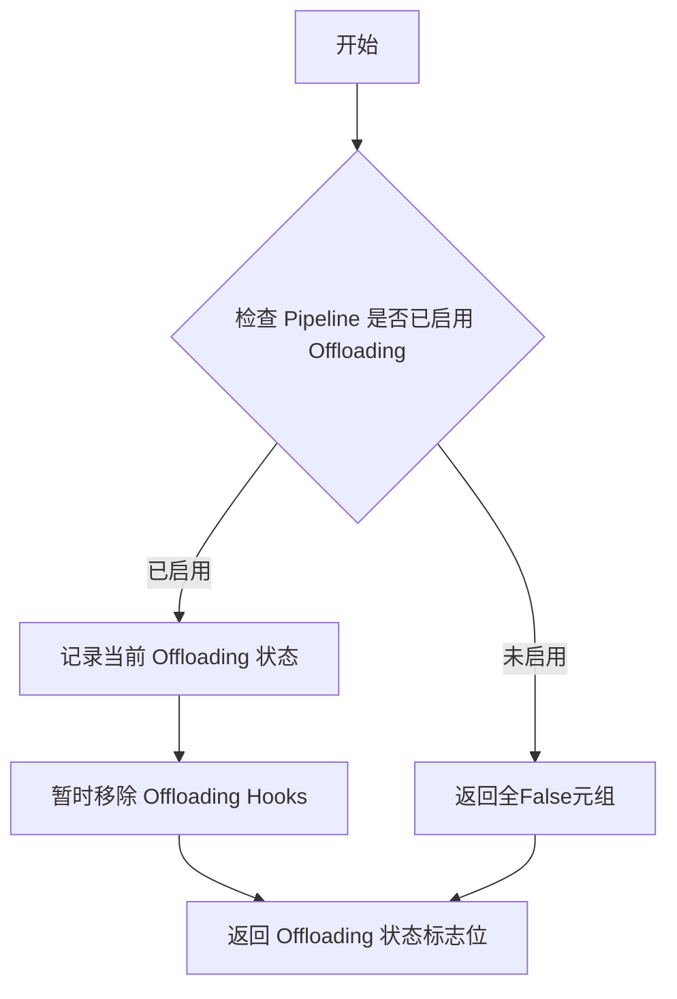

#### 带注释源码

```python
@classmethod
# Copied from diffusers.loaders.lora_base.LoraBaseMixin._optionally_disable_offloading
def _optionally_disable_offloading(cls, _pipeline):
    """
    类方法：可选地禁用 Pipeline 的 offloading 机制
    
    该方法在加载 LoRA 适配器之前调用，因为如果模型已经被 offload 到 CPU，
    直接加载权重会导致错误。这里通过暂时移除 offloading hooks 来解决这个问题。
    
    参数:
        _pipeline: 当前的 Pipeline 对象，可能已启用 CPU offloading
        
    返回:
        Tuple[bool, bool, bool]: 
        - is_model_cpu_offload: 模型级 CPU offload 状态
        - is_sequential_cpu_offload: 顺序 CPU offload 状态  
        - is_group_offload: 分组 offload 状态
    """
    return _func_optionally_disable_offloading(_pipeline=_pipeline)
```

#### 补充说明

该方法是 **委托模式** 的典型应用——`PeftAdapterMixin._optionally_disable_offloading` 本身不包含实际逻辑，而是将调用委托给 `LoraBaseMixin` 中的 `_func_optionally_disable_offloading` 函数。这种设计使得代码复用更加灵活，同时也便于维护和版本管理。


### `PeftAdapterMixin.load_lora_adapter`

加载 LoRA 适配器到基础模型中，支持多种来源（Hub、本地路径、state dict），并处理适配器配置、权重转换、状态字典设置以及可选的 hotswap 替换功能。

参数：

- `self`：`PeftAdapterMixin`，mixin 类实例，作为方法的调用宿主
- `pretrained_model_name_or_path_or_dict`：`str | os.PathLike | dict`，预训练模型名称/路径或 state dict，可以是 Hub 模型 ID、本地目录路径或 PyTorch 状态字典
- `prefix`：`str`，可选，默认值为 `"transformer"`，用于过滤状态字典的前缀
- `hotswap`：`bool`，可选，默认值为 `False`，是否用新加载的适配器原地替换已有适配器
- `**kwargs`：可变关键字参数，包含以下可选参数：
  - `cache_dir`：`str | os.PathLike`，预训练模型配置缓存目录
  - `force_download`：`bool`，是否强制重新下载模型文件
  - `proxies`：`dict[str, str]`，代理服务器配置
  - `local_files_only`：`bool`，是否仅使用本地文件
  - `token`：`str | bool`，HTTP Bearer 认证令牌
  - `revision`：`str`，Git 版本标识符
  - `subfolder`：`str`，子文件夹路径
  - `weight_name`：`str`，权重文件名
  - `use_safetensors`：`bool`，是否使用 safetensors 格式
  - `adapter_name`：`str`，适配器名称
  - `network_alphas`：`dict[str, float]`，网络 alpha 值
  - `_pipeline`：`Pipeline`，管道实例
  - `low_cpu_mem_usage`：`bool`，是否减少 CPU 内存使用
  - `metadata`：`dict`，LoRA 适配器元数据

返回值：`None`，无返回值，该方法直接修改模型状态

#### 流程图

```mermaid
flowchart TD
    A[开始 load_lora_adapter] --> B[从 kwargs 提取各类参数]
    B --> C{low_cpu_mem_usage 与 peft 版本兼容?}
    C -->|否| D[抛出 ValueError]
    C -->|是| E[调用 _fetch_state_dict 获取 state_dict]
    E --> F{network_alphas 和 prefix 合法性校验}
    F -->|不合法| G[抛出 ValueError]
    F -->|合法| H{prefix 是否为 None}
    H -->|否| I[移除 state_dict 和 metadata 中的 prefix 前缀]
    H -->|是| J{state_dict 是否为空}
    J -->|空| K[记录警告日志]
    J -->|非空| L{adapter_name 冲突检查}
    L -->|冲突且非 hotswap| M[抛出 ValueError]
    L -->|不冲突| N{检查 state_dict 格式]
    N -->|不含 lora_A| O[调用 convert_unet_state_dict_to_peft 转换]
    N -->|包含 lora_A| P{是否为 SAI Control LoRA}
    O --> P
    P -->|是| Q[调用 convert_sai_sd_control_lora_state_dict_to_peft 转换]
    P -->|否| R[计算 rank 字典]
    Q --> R
    R --> S{处理 network_alphas}
    S --> T[获取或生成 adapter_name]
    T --> U[调用 _create_lora_config 创建 LoraConfig]
    U --> V[调整 Control LoRA 的 LoraConfig]
    V --> W[临时移除 offloading 钩子]
    W --> X{判断 hotswap 或 _prepare_lora_hotswap_kwargs}
    X -->|是| Y[导入 hotswap 相关函数]
    X -->|否| Z[准备 inject 参数]
    Y --> AA{是否执行 hotswap}
    AA -->|是| AB[映射 state_dict 键名]
    AB --> AC[检查配置兼容性]
    AC --> AD[调用 hotswap_adapter_from_state_dict]
    AA -->|否| AE[调用 inject_adapter_in_model]
    AD --> AF[设置 incompatible_keys 为 None]
    AE --> AG[调用 set_peft_model_state_dict]
    AF --> AH{_prepare_lora_hotswap_kwargs 存在?}
    AG --> AH
    AH -->|是| AI[调用 prepare_model_for_compiled_hotswap]
    AH -->|否| AJ[处理不兼容的键]
    AI --> AJ
    AJ --> AK[捕获异常处理]
    AK --> AL[恢复 offloading 状态]
    AL --> AM[记录警告日志]
    AM --> AN[结束]
    
    K --> AN
    D --> AN
    G --> AN
    M --> AN
```

#### 带注释源码

```python
def load_lora_adapter(
    self, pretrained_model_name_or_path_or_dict, prefix="transformer", hotswap: bool = False, **kwargs
):
    r"""
    Loads a LoRA adapter into the underlying model.

    Parameters:
        pretrained_model_name_or_path_or_dict (`str` or `os.PathLike` or `dict`):
            Can be either:
                - A string, the *model id* (for example `google/ddpm-celebahq-256`) of a pretrained model hosted on
                  the Hub.
                - A path to a *directory* (for example `./my_model_directory`) containing the model weights saved
                  with [`ModelMixin.save_pretrained`].
                - A [torch state
                  dict](https://pytorch.org/tutorials/beginner/saving_loading_models.html#what-is-a-state-dict).

        prefix (`str`, *optional*): Prefix to filter the state dict.

        cache_dir (`str | os.PathLike`, *optional*):
            Path to a directory where a downloaded pretrained model configuration is cached if the standard cache
            is not used.
        force_download (`bool`, *optional*, defaults to `False`):
            Whether or not to force the (re-)download of the model weights and configuration files, overriding the
            cached versions if they exist.
        proxies (`dict[str, str]`, *optional*):
            A dictionary of proxy servers to use by protocol or endpoint, for example, `{'http': 'foo.bar:3128',
            'http://hostname': 'foo.bar:4012'}`. The proxies are used on each request.
        local_files_only (`bool`, *optional*, defaults to `False`):
            Whether to only load local model weights and configuration files or not. If set to `True`, the model
            won't be downloaded from the Hub.
        token (`str` or *bool*, *optional*):
            The token to use as HTTP bearer authorization for remote files. If `True`, the token generated from
            `diffusers-cli login` (stored in `~/.huggingface`) is used.
        revision (`str`, *optional*, defaults to `"main"`):
            The specific model version to use. It can be a branch name, a tag name, a commit id, or any identifier
            allowed by Git.
        subfolder (`str`, *optional*, defaults to `""`):
            The subfolder location of a model file within a larger model repository on the Hub or locally.
        network_alphas (`dict[str, float]`):
            The value of the network alpha used for stable learning and preventing underflow. This value has the
            same meaning as the `--network_alpha` option in the kohya-ss trainer script.
        low_cpu_mem_usage (`bool`, *optional*):
            Speed up model loading by only loading the pretrained LoRA weights and not initializing the random
            weights.
        hotswap : (`bool`, *optional*)
            Defaults to `False`. Whether to substitute an existing (LoRA) adapter with the newly loaded adapter
            in-place. This means that, instead of loading an additional adapter, this will take the existing
            adapter weights and replace them with the weights of the new adapter. This can be faster and more
            memory efficient. However, the main advantage of hotswapping is that when the model is compiled with
            torch.compile, loading the new adapter does not require recompilation of the model.
        metadata:
            LoRA adapter metadata. When supplied, the metadata inferred through the state dict isn't used to
            initialize `LoraConfig`.
    """
    # 导入必要的 PEFT 库函数
    from peft import inject_adapter_in_model, set_peft_model_state_dict
    from peft.tuners.tuners_utils import BaseTunerLayer

    # 导入 offloading 相关的辅助函数
    from ..hooks.group_offloading import _maybe_remove_and_reapply_group_offloading

    # 从 kwargs 中提取各种可选参数
    cache_dir = kwargs.pop("cache_dir", None)
    force_download = kwargs.pop("force_download", False)
    proxies = kwargs.pop("proxies", None)
    local_files_only = kwargs.pop("local_files_only", None)
    token = kwargs.pop("token", None)
    revision = kwargs.pop("revision", None)
    subfolder = kwargs.pop("subfolder", None)
    weight_name = kwargs.pop("weight_name", None)
    use_safetensors = kwargs.pop("use_safetensors", None)
    adapter_name = kwargs.pop("adapter_name", None)
    network_alphas = kwargs.pop("network_alphas", None)
    _pipeline = kwargs.pop("_pipeline", None)
    low_cpu_mem_usage = kwargs.pop("low_cpu_mem_usage", False)
    metadata = kwargs.pop("metadata", None)
    allow_pickle = False  # 不允许使用 pickle 加载权重

    # 检查 low_cpu_mem_usage 与 PEFT 版本的兼容性
    if low_cpu_mem_usage and is_peft_version("<=", "0.13.0"):
        raise ValueError(
            "`low_cpu_mem_usage=True` is not compatible with this `peft` version. Please update it with `pip install -U peft`."
        )

    # 准备用户代理信息
    user_agent = {"file_type": "attn_procs_weights", "framework": "pytorch"}
    
    # 获取 LoRA 权重和元数据
    state_dict, metadata = _fetch_state_dict(
        pretrained_model_name_or_path_or_dict=pretrained_model_name_or_path_or_dict,
        weight_name=weight_name,
        use_safetensors=use_safetensors,
        local_files_only=local_files_only,
        cache_dir=cache_dir,
        force_download=force_download,
        proxies=proxies,
        token=token,
        revision=revision,
        subfolder=subfolder,
        user_agent=user_agent,
        allow_pickle=allow_pickle,
        metadata=metadata,
    )

    # 校验 network_alphas 和 prefix 的合法性
    if network_alphas is not None and prefix is None:
        raise ValueError("`network_alphas` cannot be None when `prefix` is None.")
    if network_alphas and metadata:
        raise ValueError("Both `network_alphas` and `metadata` cannot be specified.")

    # 如果指定了 prefix，则从 state_dict 中移除 prefix 前缀
    if prefix is not None:
        state_dict = {k.removeprefix(f"{prefix}."): v for k, v in state_dict.items() if k.startswith(f"{prefix}.")}
        if metadata is not None:
            metadata = {k.removeprefix(f"{prefix}."): v for k, v in metadata.items() if k.startswith(f"{prefix}.")}

    # 检查 state_dict 是否为空
    if len(state_dict) > 0:
        # 检查适配器名称是否冲突
        if adapter_name in getattr(self, "peft_config", {}) and not hotswap:
            raise ValueError(
                f"Adapter name {adapter_name} already in use in the model - please select a new adapter name."
            )
        elif adapter_name not in getattr(self, "peft_config", {}) and hotswap:
            raise ValueError(
                f"Trying to hotswap LoRA adapter '{adapter_name}' but there is no existing adapter by that name. "
                "Please choose an existing adapter name or set `hotswap=False` to prevent hotswapping."
            )

        # 检查第一个键是否包含 lora_A，判断是否为 PEFT 格式
        first_key = next(iter(state_dict.keys()))
        if "lora_A" not in first_key:
            # 如果不是 PEFT 格式，则转换为 PEFT 格式
            state_dict = convert_unet_state_dict_to_peft(state_dict)

        # 检查是否为 SAI (Stability AI) 的 Control LoRA
        is_sai_sd_control_lora = "lora_controlnet" in state_dict
        if is_sai_sd_control_lora:
            # 转换 SAI Control LoRA 状态字典为 PEFT 格式
            state_dict = convert_sai_sd_control_lora_state_dict_to_peft(state_dict)

        # 计算 LoRA rank
        rank = {}
        for key, val in state_dict.items():
            # 只从 lora_B 层且维度大于1的权重中提取 rank
            if "lora_B" in key and val.ndim > 1:
                rank[f"^{key}"] = val.shape[1]

        # 处理 network_alphas
        if network_alphas is not None and len(network_alphas) >= 1:
            alpha_keys = [k for k in network_alphas.keys() if k.startswith(f"{prefix}.")]
            network_alphas = {
                k.removeprefix(f"{prefix}."): v for k, v in network_alphas.items() if k in alpha_keys
            }

        # 获取或生成适配器名称
        if adapter_name is None:
            adapter_name = get_adapter_name(self)

        # 创建 LoraConfig 对象
        lora_config = _create_lora_config(
            state_dict,
            network_alphas,
            metadata,
            rank,
            model_state_dict=self.state_dict(),
            adapter_name=adapter_name,
        )

        # 调整 Control LoRA 的配置
        if is_sai_sd_control_lora:
            lora_config.lora_alpha = lora_config.r
            lora_config.alpha_pattern = lora_config.rank_pattern
            lora_config.bias = "all"
            lora_config.modules_to_save = lora_config.exclude_modules
            lora_config.exclude_modules = None

        # 临时移除 pipeline 的 offloading 钩子，避免加载权重时出错
        is_model_cpu_offload, is_sequential_cpu_offload, is_group_offload = self._optionally_disable_offloading(
            _pipeline
        )
        
        # 准备注入适配器的参数
        peft_kwargs = {}
        if is_peft_version(">=", "0.13.1"):
            peft_kwargs["low_cpu_mem_usage"] = low_cpu_mem_usage

        # 检查是否需要进行 hotswap 相关设置
        if hotswap or (self._prepare_lora_hotswap_kwargs is not None):
            if is_peft_version(">", "0.14.0"):
                # 导入 hotswap 所需的函数
                from peft.utils.hotswap import (
                    check_hotswap_configs_compatible,
                    hotswap_adapter_from_state_dict,
                    prepare_model_for_compiled_hotswap,
                )
            else:
                msg = (
                    "Hotswapping requires PEFT > v0.14.0. Please upgrade PEFT to a higher version or install it "
                    "from source."
                )
                raise ImportError(msg)

        # 如果启用 hotswap，定义状态字典映射函数
        if hotswap:

            def map_state_dict_for_hotswap(sd):
                # 为 hotswapping，需要在状态字典键中包含适配器名称
                new_sd = {}
                for k, v in sd.items():
                    if k.endswith("lora_A.weight") or k.endswith("lora_B.weight"):
                        k = k[: -len(".weight")] + f".{adapter_name}.weight"
                    elif k.endswith("lora_B.bias"):  # lora_bias=True option
                        k = k[: -len(".bias")] + f".{adapter_name}.bias"
                    new_sd[k] = v
                return new_sd

        # 尝试注入适配器，处理可能的异常
        try:
            if hotswap:
                # 执行 hotswap 模式
                state_dict = map_state_dict_for_hotswap(state_dict)
                check_hotswap_configs_compatible(self.peft_config[adapter_name], lora_config)
                try:
                    hotswap_adapter_from_state_dict(
                        model=self,
                        state_dict=state_dict,
                        adapter_name=adapter_name,
                        config=lora_config,
                    )
                except Exception as e:
                    logger.error(f"Hotswapping {adapter_name} was unsuccessful with the following error: \n{e}")
                    raise
                # 如果成功到达这里，设置不兼容键为 None
                incompatible_keys = None
            else:
                # 正常注入适配器
                inject_adapter_in_model(
                    lora_config, self, adapter_name=adapter_name, state_dict=state_dict, **peft_kwargs
                )
                # 设置 PEFT 模型状态字典
                incompatible_keys = set_peft_model_state_dict(self, state_dict, adapter_name, **peft_kwargs)

                # 如果需要为编译模型准备 hotswap
                if self._prepare_lora_hotswap_kwargs is not None:
                    # 为编译模型的 hotswap 做准备
                    prepare_model_for_compiled_hotswap(
                        self, config=lora_config, **self._prepare_lora_hotswap_kwargs
                    )
                    # 只调用一次，之后清空
                    self._prepare_lora_hotswap_kwargs = None

            # 设置配置加载标志
            if not self._hf_peft_config_loaded:
                self._hf_peft_config_loaded = True
        except Exception as e:
            # 异常处理：清理已部分注入的适配器
            if hasattr(self, "peft_config"):
                for module in self.modules():
                    if isinstance(module, BaseTunerLayer):
                        active_adapters = module.active_adapters
                        for active_adapter in active_adapters:
                            if adapter_name in active_adapter:
                                module.delete_adapter(adapter_name)

                self.peft_config.pop(adapter_name)
            logger.error(f"Loading {adapter_name} was unsuccessful with the following error: \n{e}")
            raise

        # 警告未处理的键
        _maybe_warn_for_unhandled_keys(incompatible_keys, adapter_name)

        # 恢复 offloading 状态
        if is_model_cpu_offload:
            _pipeline.enable_model_cpu_offload()
        elif is_sequential_cpu_offload:
            _pipeline.enable_sequential_cpu_offload()
        elif is_group_offload:
            for component in _pipeline.components.values():
                if isinstance(component, torch.nn.Module):
                    _maybe_remove_and_reapply_group_offloading(component)

    # 处理 state_dict 为空的情况
    if prefix is not None and not state_dict:
        model_class_name = self.__class__.__name__
        logger.warning(
            f"No LoRA keys associated to {model_class_name} found with the {prefix=}. "
            "This is safe to ignore if LoRA state dict didn't originally have any "
            f"{model_class_name} related params. You can also try specifying `prefix=None` "
            "to resolve the warning. Otherwise, open an issue if you think it's unexpected: "
            "https://github.com/huggingface/diffusers/issues/new"
        )
```


### `PeftAdapterMixin.save_lora_adapter`

保存LoRA适配器参数到指定目录，支持安全序列化和自定义文件命名。

参数：

- `self`：`PeftAdapterMixin` 实例，当前类的方法调用对象
- `save_directory`：`str` 或 `os.PathLike`，保存LoRA参数的目录路径，如果不存在会自动创建
- `adapter_name`：`str`，默认为 "default"，要序列化的适配器名称，当底层模型加载了多个适配器时用于指定具体哪个
- `upcast_before_saving`：`bool`，默认为 `False`，是否在序列化前将底层模型转换为 `torch.float32`
- `safe_serialization`：`bool`，默认为 `True`，是否使用 `safetensors` 保存模型，False则使用传统的PyTorch pickle方式
- `weight_name`：`str | None`，默认为 `None`，序列化state dict的文件名

返回值：无（`None`），该方法直接执行保存操作，无返回值

#### 流程图

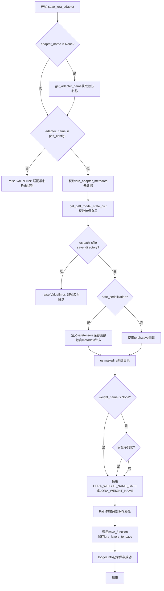

#### 带注释源码

```python
def save_lora_adapter(
    self,
    save_directory,
    adapter_name: str = "default",
    upcast_before_saving: bool = False,
    safe_serialization: bool = True,
    weight_name: str | None = None,
):
    """
    Save the LoRA parameters corresponding to the underlying model.

    Arguments:
        save_directory (`str` or `os.PathLike`):
            Directory to save LoRA parameters to. Will be created if it doesn't exist.
        adapter_name: (`str`, defaults to "default"): The name of the adapter to serialize. Useful when the
            underlying model has multiple adapters loaded.
        upcast_before_saving (`bool`, defaults to `False`):
            Whether to cast the underlying model to `torch.float32` before serialization.
        safe_serialization (`bool`, *optional*, defaults to `True`):
            Whether to save the model using `safetensors` or the traditional PyTorch way with `pickle`.
        weight_name: (`str`, *optional*, defaults to `None`): Name of the file to serialize the state dict with.
    """
    # 从peft.utils导入获取PEFT模型state dict的函数
    from peft.utils import get_peft_model_state_dict

    # 从lora_base导入LoRA适配器的元数据键和权重文件名常量
    from .lora_base import LORA_ADAPTER_METADATA_KEY, LORA_WEIGHT_NAME, LORA_WEIGHT_NAME_SAFE

    # 如果未指定adapter_name，则获取默认适配器名称
    if adapter_name is None:
        adapter_name = get_adapter_name(self)

    # 验证适配器名称是否存在于模型的peft_config中
    if adapter_name not in getattr(self, "peft_config", {}):
        raise ValueError(f"Adapter name {adapter_name} not found in the model.")

    # 将适配器配置转换为字典格式，作为元数据保存
    lora_adapter_metadata = self.peft_config[adapter_name].to_dict()

    # 获取待保存的LoRA层state dict
    # 如果upcast_before_saving为True，则先将模型转换为float32
    lora_layers_to_save = get_peft_model_state_dict(
        self.to(dtype=torch.float32 if upcast_before_saving else None), adapter_name=adapter_name
    )

    # 验证save_directory是目录而非文件
    if os.path.isfile(save_directory):
        raise ValueError(f"Provided path ({save_directory}) should be a directory, not a file")

    # 根据safe_serialization选择保存函数
    if safe_serialization:
        # 定义使用safetensors的保存函数
        def save_function(weights, filename):
            # 注入框架格式元数据
            metadata = {"format": "pt"}
            # 如果有适配器元数据，将其转换为JSON并添加到metadata
            if lora_adapter_metadata is not None:
                for key, value in lora_adapter_metadata.items():
                    # 将set类型转换为list（JSON不支持set）
                    if isinstance(value, set):
                        lora_adapter_metadata[key] = list(value)
                # 将适配器元数据序列化为JSON字符串
                metadata[LORA_ADAPTER_METADATA_KEY] = json.dumps(lora_adapter_metadata, indent=2, sort_keys=True)

            # 调用safetensors保存权重文件和元数据
            return safetensors.torch.save_file(weights, filename, metadata=metadata)
    else:
        # 使用PyTorch传统的pickle方式保存
        save_function = torch.save

    # 创建保存目录（如果不存在）
    os.makedirs(save_directory, exist_ok=True)

    # 确定权重文件名
    if weight_name is None:
        if safe_serialization:
            weight_name = LORA_WEIGHT_NAME_SAFE  # "adapter_model.safetensors"
        else:
            weight_name = LORA_WEIGHT_NAME  # "adapter_model.bin"
    else:
        # 使用用户指定的文件名
        weight_name = weight_name

    # 构建完整的保存路径
    save_path = Path(save_directory, weight_name).as_posix()
    # 执行保存操作
    save_function(lora_layers_to_save, save_path)
    # 记录保存成功日志
    logger.info(f"Model weights saved in {save_path}")
```


### PeftAdapterMixin.set_adapters

设置扩散网络（如UNet、Transformer等）中当前活动的适配器，用于控制不同LoRA适配器的混合权重。

参数：

- `adapter_names`：`list[str] | str`，要使用的适配器名称列表或单个适配器名称
- `weights`：`float | dict | list[float] | list[dict] | list[None] | None`，适配器权重。若为`None`，则所有适配器权重默认为`1.0`

返回值：`None`，该方法直接修改模型状态，不返回任何值

#### 流程图

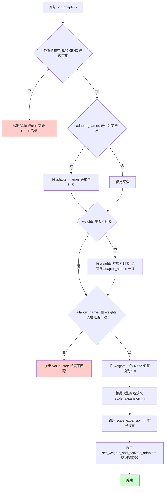

#### 带注释源码

```python
def set_adapters(
    self,
    adapter_names: list[str] | str,
    weights: float | dict | list[float] | list[dict] | list[None] | None = None,
):
    """
    Set the currently active adapters for use in the diffusion network (e.g. unet, transformer, etc.).

    Args:
        adapter_names (`list[str]` or `str`):
            The names of the adapters to use.
        weights (`Union[List[float], float]`, *optional*):
            The adapter(s) weights to use with the UNet. If `None`, the weights are set to `1.0` for all the
            adapters.

    Example:

    ```py
    from diffusers import AutoPipelineForText2Image
    import torch

    pipeline = AutoPipelineForText2Image.from_pretrained(
        "stabilityai/stable-diffusion-xl-base-1.0", torch_dtype=torch.float16
    ).to("cuda")
    pipeline.load_lora_weights(
        "jbilcke-hf/sdxl-cinematic-1", weight_name="pytorch_lora_weights.safetensors", adapter_name="cinematic"
    )
    pipeline.load_lora_weights("nerijs/pixel-art-xl", weight_name="pixel-art-xl.safetensors", adapter_name="pixel")
    pipeline.unet.set_adapters(["cinematic", "pixel"], weights=[0.5, 0.5])
    ```
    """
    # 检查是否启用了 PEFT 后端，这是使用此功能的必要条件
    if not USE_PEFT_BACKEND:
        raise ValueError("PEFT backend is required for `set_adapters()`.")

    # 统一将 adapter_names 转换为列表格式，便于后续处理
    adapter_names = [adapter_names] if isinstance(adapter_names, str) else adapter_names

    # 将 weights 扩展为列表，每个适配器对应一个权重值
    # 例如：2个适配器时 [{...}, 7] -> [7,7] ; None -> [None, None]
    if not isinstance(weights, list):
        weights = [weights] * len(adapter_names)

    # 验证适配器名称和权重的数量是否匹配
    if len(adapter_names) != len(weights):
        raise ValueError(
            f"Length of adapter names {len(adapter_names)} is not equal to the length of their weights {len(weights)}."
        )

    # 将 None 权重值设置为默认值 1.0
    # 例如：[{...}, 7] -> [{...}, 7] ; [None, None] -> [1.0, 1.0]
    weights = [w if w is not None else 1.0 for w in weights]

    # 根据当前模型类名获取对应的权重扩展函数
    # 不同模型类（如 UNet2DConditionModel、SD3Transformer2DModel 等）有不同的处理逻辑
    scale_expansion_fn = _SET_ADAPTER_SCALE_FN_MAPPING[self.__class__.__name__]
    
    # 调用模型特定的权重扩展函数，处理权重格式
    weights = scale_expansion_fn(self, weights)

    # 调用底层函数设置权重并激活适配器
    set_weights_and_activate_adapters(self, adapter_names, weights)
```


### `PeftAdapterMixin.add_adapter`

向当前模型添加一个新的适配器以进行训练。如果没有传递适配器名称，则分配默认名称以遵循 PEFT 库的约定。

参数：

- `adapter_config`：`PeftConfig`，要添加的适配器配置；支持的适配器包括非前缀调整和自适应提示方法。
- `adapter_name`：`str`，可选，默认为 `"default"`。要添加的适配器名称。如果未传递名称，则为适配器分配默认名称。

返回值：`None`，无返回值

#### 流程图

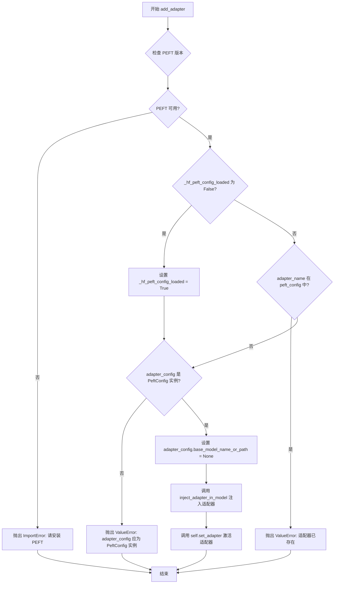

#### 带注释源码

```python
def add_adapter(self, adapter_config, adapter_name: str = "default") -> None:
    r"""
    Adds a new adapter to the current model for training. If no adapter name is passed, a default name is assigned
    to the adapter to follow the convention of the PEFT library.

    If you are not familiar with adapters and PEFT methods, we invite you to read more about them in the PEFT
    [documentation](https://huggingface.co/docs/peft).

    Args:
        adapter_config (`[~peft.PeftConfig]`):
            The configuration of the adapter to add; supported adapters are non-prefix tuning and adaption prompt
            methods.
        adapter_name (`str`, *optional*, defaults to `"default"`):
            The name of the adapter to add. If no name is passed, a default name is assigned to the adapter.
    """
    # 检查 PEFT 版本是否满足最低要求
    check_peft_version(min_version=MIN_PEFT_VERSION)

    # 检查 PEFT 是否可用，如不可用则抛出导入错误
    if not is_peft_available():
        raise ImportError("PEFT is not available. Please install PEFT to use this function: `pip install peft`.")

    # 从 peft 库导入必要的类
    from peft import PeftConfig, inject_adapter_in_model

    # 如果尚未加载 PEFT 配置，则标记为已加载
    if not self._hf_peft_config_loaded:
        self._hf_peft_config_loaded = True
    # 如果适配器名称已存在，则抛出错误
    elif adapter_name in self.peft_config:
        raise ValueError(f"Adapter with name {adapter_name} already exists. Please use a different name.")

    # 验证 adapter_config 是否为 PeftConfig 实例
    if not isinstance(adapter_config, PeftConfig):
        raise ValueError(
            f"adapter_config should be an instance of PeftConfig. Got {type(adapter_config)} instead."
        )

    # 与 transformers 不同，这里不需要检索 unet 的 name_or_path
    # 因为加载逻辑由 `load_lora_layers` 或 `StableDiffusionLoraLoaderMixin` 处理
    # 因此在这里将其设置为 `None`
    adapter_config.base_model_name_or_path = None
    
    # 将适配器注入到模型中
    inject_adapter_in_model(adapter_config, self, adapter_name)
    
    # 设置并激活适配器
    self.set_adapter(adapter_name)
```


### `PeftAdapterMixin.set_adapter`

该方法用于在已加载多个适配器的模型中设置特定适配器，强制模型仅使用该适配器并禁用其他适配器。

参数：

- `adapter_name`：`str | list[str]`，要设置的适配器名称，可以是单个适配器名称或适配器名称列表

返回值：`None`，无返回值（该方法直接修改模型状态）

#### 流程图

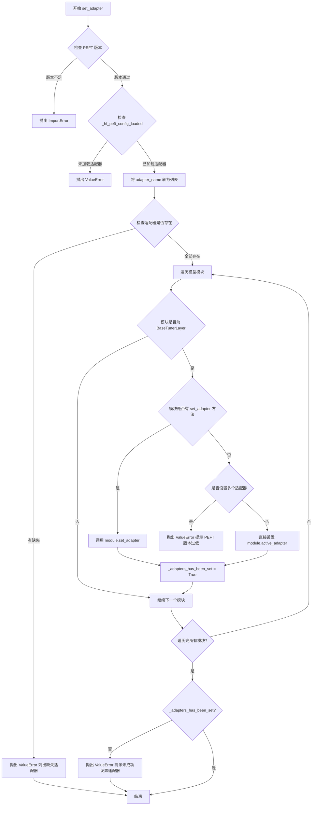

#### 带注释源码

```python
def set_adapter(self, adapter_name: str | list[str]) -> None:
    """
    设置特定适配器，强制模型仅使用该适配器并禁用其他适配器。

    如果不熟悉 adapters 和 PEFT 方法，建议阅读 PEFT 文档：
    https://huggingface.co/docs/peft

    参数:
        adapter_name (str | list[str]):
            要设置的适配器列表或单个适配器名称
    """
    # 检查 PEFT 版本是否满足最低要求
    check_peft_version(min_version=MIN_PEFT_VERSION)

    # 检查是否已加载任何适配器配置
    if not self._hf_peft_config_loaded:
        raise ValueError("No adapter loaded. Please load an adapter first.")

    # 如果是单个字符串适配器名称，转换为列表以便统一处理
    if isinstance(adapter_name, str):
        adapter_name = [adapter_name]

    # 检查请求的适配器是否在已加载的适配器配置中
    missing = set(adapter_name) - set(self.peft_config)
    if len(missing) > 0:
        raise ValueError(
            f"Following adapter(s) could not be found: {', '.join(missing)}. "
            f"Make sure you are passing the correct adapter name(s). "
            f"current loaded adapters are: {list(self.peft_config.keys())}"
        )

    # 导入 PEFT 的 BaseTunerLayer 类，用于识别适配器层
    from peft.tuners.tuners_utils import BaseTunerLayer

    # 标记是否成功设置了适配器
    _adapters_has_been_set = False

    # 遍历模型中的所有模块
    for _, module in self.named_modules():
        # 检查当前模块是否是 PEFT 适配器层
        if isinstance(module, BaseTunerLayer):
            # 如果模块有 set_adapter 方法（新版 PEFT），调用它
            if hasattr(module, "set_adapter"):
                module.set_adapter(adapter_name)
            # 旧版 PEFT 不支持多适配器推理
            elif not hasattr(module, "set_adapter") and len(adapter_name) != 1:
                raise ValueError(
                    "You are trying to set multiple adapters and you have a PEFT version "
                    "that does not support multi-adapter inference. Please upgrade to the "
                    "latest version of PEFT. `pip install -U peft` or "
                    "`pip install -U git+https://github.com/huggingface/peft.git`"
                )
            # 对于旧版 PEFT，直接设置 active_adapter 属性
            else:
                module.active_adapter = adapter_name
            # 标记已成功设置适配器
            _adapters_has_been_set = True

    # 如果没有成功设置任何适配器，抛出错误
    if not _adapters_has_been_set:
        raise ValueError(
            "Did not succeeded in setting the adapter. Please make sure you are using "
            "a model that supports adapters."
        )
```


### `PeftAdapterMixin.disable_adapters`

该方法用于禁用模型上附加的所有适配器，使模型回退到仅使用基础模型进行推理。它会遍历模型的所有模块，找出包含 PEFT 适配器层的模块，并调用对应方法将其禁用。

参数：无需参数（仅 `self`）

返回值：`None`，无返回值

#### 流程图

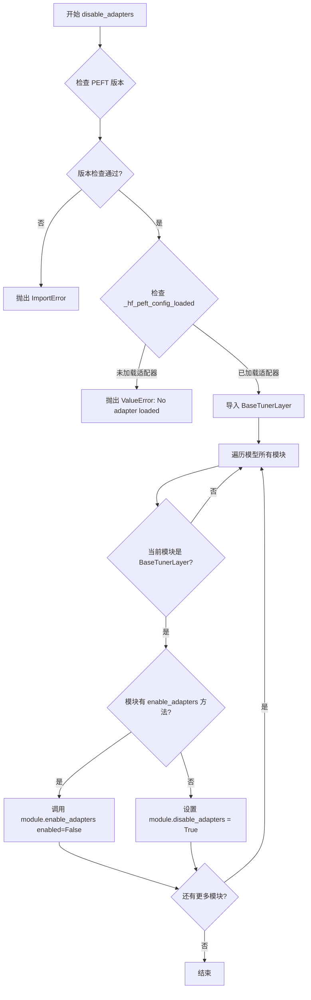

#### 带注释源码

```python
def disable_adapters(self) -> None:
    r"""
    Disable all adapters attached to the model and fallback to inference with the base model only.

    If you are not familiar with adapters and PEFT methods, we invite you to read more about them on the PEFT
    [documentation](https://huggingface.co/docs/peft).
    """
    # 检查 PEFT 版本是否满足最低要求
    check_peft_version(min_version=MIN_PEFT_VERSION)

    # 确保已有适配器加载到模型中
    if not self._hf_peft_config_loaded:
        raise ValueError("No adapter loaded. Please load an adapter first.")

    # 从 PEFT 库导入 BaseTunerLayer，用于识别适配器层
    from peft.tuners.tuners_utils import BaseTunerLayer

    # 遍历模型中的所有模块
    for _, module in self.named_modules():
        # 检查模块是否为 PEFT 适配器层
        if isinstance(module, BaseTunerLayer):
            # 如果模块支持 enable_adapters 方法（新版 PEFT），调用并传入 enabled=False
            if hasattr(module, "enable_adapters"):
                module.enable_adapters(enabled=False)
            else:
                # 兼容旧版 PEFT：直接设置 disable_adapters 属性为 True
                # support for older PEFT versions
                module.disable_adapters = True
```


### `PeftAdapterMixin.enable_adapters`

启用附加到模型上的适配器。该方法遍历模型的所有模块，找出包含 PEFT 适配器的层，并调用每个适配器层的 `enable_adapters(enabled=True)` 方法来激活适配器。如果模块没有 `enable_adapters` 方法（支持较旧的 PEFT 版本），则直接设置 `module.disable_adapters = False`。

参数： 无

返回值：`None`，无返回值

#### 流程图

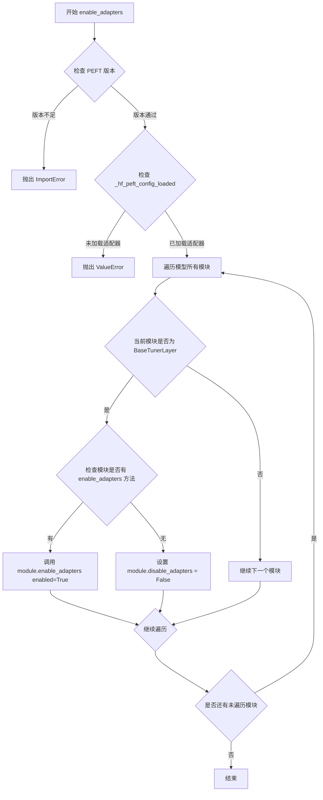

#### 带注释源码

```python
def enable_adapters(self) -> None:
    """
    Enable adapters that are attached to the model. The model uses `self.active_adapters()` to retrieve the list of
    adapters to enable.

    If you are not familiar with adapters and PEFT methods, we invite you to read more about them on the PEFT
    [documentation](https://huggingface.co/docs/peft).
    """
    # 检查 PEFT 版本是否符合最低要求
    check_peft_version(min_version=MIN_PEFT_VERSION)

    # 确保已经加载了适配器配置，否则抛出错误
    if not self._hf_peft_config_loaded:
        raise ValueError("No adapter loaded. Please load an adapter first.")

    # 从 PEFT 库导入 BaseTunerLayer，用于识别包含适配器的模块
    from peft.tuners.tuners_utils import BaseTunerLayer

    # 遍历模型中的所有模块，查找包含适配器的层
    for _, module in self.named_modules():
        # 检查当前模块是否为 PEFT 适配器层
        if isinstance(module, BaseTunerLayer):
            # 检查模块是否有 enable_adapters 方法（新版 PEFT）
            if hasattr(module, "enable_adapters"):
                # 调用模块的 enable_adapters 方法，传入 enabled=True 启用适配器
                module.enable_adapters(enabled=True)
            else:
                # 对于旧版 PEFT，直接设置 disable_adapters 属性为 False 来启用适配器
                module.disable_adapters = False
```


### PeftAdapterMixin.active_adapters

获取模型当前激活的适配器列表。如果不熟悉适配器和PEFT方法，建议阅读PEFT文档了解更多信息。

参数：
- 无显式参数（仅包含 self 作为实例方法隐式参数）

返回值：`list[str]`，返回当前激活的适配器名称列表

#### 流程图

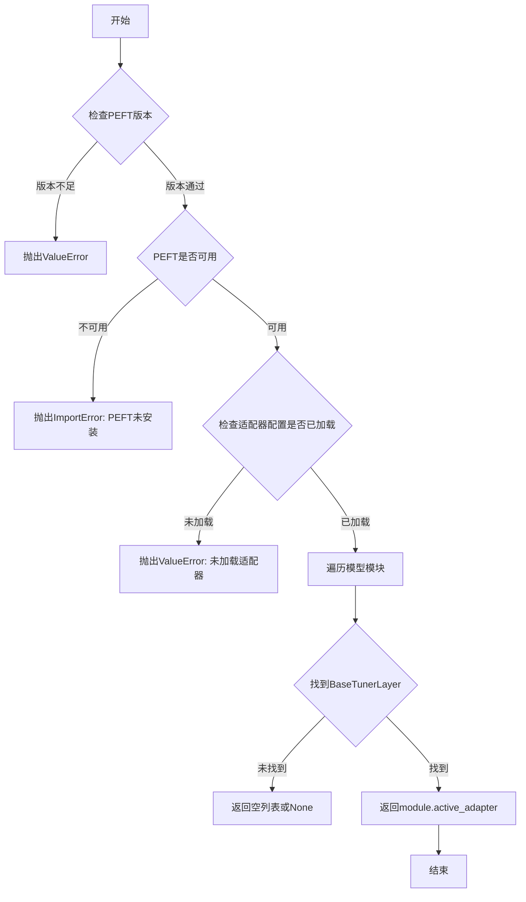

#### 带注释源码

```python
def active_adapters(self) -> list[str]:
    """
    Gets the current list of active adapters of the model.

    If you are not familiar with adapters and PEFT methods, we invite you to read more about them in the PEFT
    [documentation](https://huggingface.co/docs/peft).
    """
    # 步骤1：检查PEFT库版本是否满足最低要求
    check_peft_version(min_version=MIN_PEFT_VERSION)

    # 步骤2：检查PEFT库是否已安装可用
    if not is_peft_available():
        raise ImportError("PEFT is not available. Please install PEFT to use this function: `pip install peft`.")

    # 步骤3：检查是否已加载任何适配器配置
    if not self._hf_peft_config_loaded:
        raise ValueError("No adapter loaded. Please load an adapter first.")

    # 步骤4：从PEFT库导入BaseTunerLayer类
    from peft.tuners.tuners_utils import BaseTunerLayer

    # 步骤5：遍历模型的所有模块，查找第一个BaseTunerLayer类型的模块
    for _, module in self.named_modules():
        if isinstance(module, BaseTunerLayer):
            # 步骤6：返回该模块的active_adapter属性（即激活的适配器列表）
            return module.active_adapter
```


### `PeftAdapterMixin.fuse_lora`

该方法用于将已加载的 LoRA（Low-Rank Adaptation）适配器权重融合到模型中，使 LoRA 层成为模型的一部分，从而可以在推理时无需额外计算开销。它通过遍历模型的所有模块，将适配器层合并到基础模型权重中，并支持可选的缩放因子和安全合并选项。

参数：

- `lora_scale`：`float`，默认值 `1.0`，LoRA 层的缩放因子，用于调整融合后的适配器权重强度
- `safe_fusing`：`bool`，默认值 `False`，是否使用安全合并模式（避免数值不稳定）
- `adapter_names`：`list[str] | None`，可选参数，指定要融合的适配器名称列表，默认为 `None`（融合所有适配器）

返回值：`None`，该方法直接修改模型状态，不返回任何值

#### 流程图

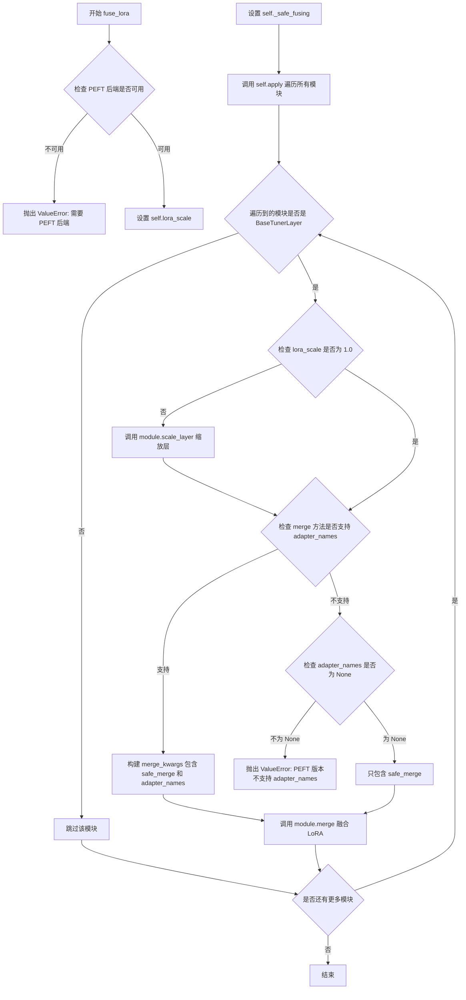

#### 带注释源码

```python
def fuse_lora(self, lora_scale=1.0, safe_fusing=False, adapter_names=None):
    """
    将 LoRA 适配器权重融合到模型中。
    
    参数:
        lora_scale (float): LoRA 层权重缩放因子，默认为 1.0
        safe_fusing (bool): 是否启用安全合并模式，默认为 False
        adapter_names (list[str] | None): 要融合的适配器名称列表，默认为 None（融合所有）
    """
    # 检查是否启用了 PEFT 后端，若未启用则抛出异常
    if not USE_PEFT_BACKEND:
        raise ValueError("PEFT backend is required for `fuse_lora()`.")

    # 将参数存储为实例变量，供内部方法 _fuse_lora_apply 使用
    self.lora_scale = lora_scale
    self._safe_fusing = safe_fusing
    
    # 使用 PyTorch 的 apply 方法遍历模型的所有子模块
    # 传入 partial 函数以携带 adapter_names 参数
    self.apply(partial(self._fuse_lora_apply, adapter_names=adapter_names))

def _fuse_lora_apply(self, module, adapter_names=None):
    """内部方法，用于对单个模块执行 LoRA 融合操作"""
    # 从 peft 库导入基础调优层类，用于类型检查
    from peft.tuners.tuners_utils import BaseTunerLayer

    # 构建合并关键字参数，包含安全合并标志
    merge_kwargs = {"safe_merge": self._safe_fusing}

    # 判断当前模块是否为 PEFT 调优层（如 LoRA 层）
    if isinstance(module, BaseTunerLayer):
        # 如果缩放因子不为 1.0，则先对层进行缩放
        if self.lora_scale != 1.0:
            module.scale_layer(self.lora_scale)

        # 为了向后兼容旧版 PEFT，需要检查 merge 方法的签名
        # 看是否支持 adapter_names 参数
        supported_merge_kwargs = list(inspect.signature(module.merge).parameters)
        
        # 如果支持 adapter_names，则将其添加到 merge_kwargs
        if "adapter_names" in supported_merge_kwargs:
            merge_kwargs["adapter_names"] = adapter_names
        # 如果不支持但传入了 adapter_names，则报错要求升级 PEFT
        elif "adapter_names" not in supported_merge_kwargs and adapter_names is not None:
            raise ValueError(
                "The `adapter_names` argument is not supported with your PEFT version. Please upgrade"
                " to the latest version of PEFT. `pip install -U peft`"
            )

        # 执行 LoRA 层与基础模型的权重融合
        module.merge(**merge_kwargs)
```


### `PeftAdapterMixin._fuse_lora_apply`

该方法是 `PeftAdapterMixin` 类中的一个私有方法，主要用于将 LoRA（Low-Rank Adaptation）适配器权重融合到模型权重中。它通过遍历模型模块，检查每个模块是否为 PEFT 的 BaseTunerLayer 类型，并根据配置的缩放因子和融合参数执行权重合并操作。

参数：

- `module`：`torch.nn.Module`，需要融合 LoRA 权重的目标模块
- `adapter_names`：`list[str]` 或 `None`，指定要融合的适配器名称列表，如果为 None 则融合所有已激活的适配器

返回值：`None`，该方法直接修改传入的模块对象，不返回任何值

#### 流程图

```mermaid
flowchart TD
    A[开始 _fuse_lora_apply] --> B[构建 merge_kwargs]
    B --> C{safe_merge: self._safe_fusing}
    C --> D{module 是 BaseTunerLayer?}
    D -->|否| E[结束]
    D -->|是| F{lora_scale != 1.0?}
    F -->|是| G[调用 module.scale_layer(lora_scale)]
    F -->|否| H[检查 merge 方法签名]
    G --> H
    H --> I{adapter_names 在参数中?}
    I -->|是| J[添加 adapter_names 到 merge_kwargs]
    I -->|否| K{adapter_names is not None?}
    K -->|是| L[抛出 ValueError]
    K -->|否| M[调用 module.merge]
    J --> M
    M --> E
```

#### 带注释源码

```python
def _fuse_lora_apply(self, module, adapter_names=None):
    """
    将 LoRA 适配器权重融合到模型模块中
    
    参数:
        module: 需要融合 LoRA 权重的目标模块
        adapter_names: 可选的适配器名称列表，用于指定要融合的适配器
    """
    # 从 PEFT 库导入 BaseTunerLayer 基类，用于判断模块是否为 LoRA 层
    from peft.tuners.tuners_utils import BaseTunerLayer

    # 构建合并参数字典，包含安全合并标志
    # self._safe_fusing 来自外层的 fuse_lora 方法，用于控制是否进行安全融合
    merge_kwargs = {"safe_merge": self._safe_fusing}

    # 检查传入的模块是否为 PEFT 的 BaseTunerLayer 类型
    # 只有 LoRA 层才需要执行融合操作
    if isinstance(module, BaseTunerLayer):
        # 如果全局缩放因子不是 1.0，则先对 LoRA 层进行缩放
        # 这允许在融合前调整 LoRA 权重的影响程度
        if self.lora_scale != 1.0:
            module.scale_layer(self.lora_scale)

        # 为了保持与旧版本 PEFT 的兼容性，需要检查 merge 方法的签名
        # 不同版本的 PEFT 可能支持或不支持 adapter_names 参数
        supported_merge_kwargs = list(inspect.signature(module.merge).parameters)
        
        # 如果 merge 方法支持 adapter_names 参数，则将其添加到合并参数中
        if "adapter_names" in supported_merge_kwargs:
            merge_kwargs["adapter_names"] = adapter_names
        # 如果不支持 adapter_names 但传入了该参数，则抛出错误
        elif "adapter_names" not in supported_merge_kwargs and adapter_names is not None:
            raise ValueError(
                "The `adapter_names` argument is not supported with your PEFT version. Please upgrade"
                " to the latest version of PEFT. `pip install -U peft`"
            )

        # 执行 LoRA 权重与原始模型权重的融合
        # 融合后 LoRA 权重将成为模型权重的一部分
        module.merge(**merge_kwargs)
```


### `PeftAdapterMixin.unfuse_lora`

该方法用于将模型中已融合的 LoRA 权重取消融合（unfuse），使模型从融合状态恢复到原始的基础模型状态。它通过遍历模型的所有模块，对每个 `BaseTunerLayer` 调用 `unmerge()` 方法来实现。

参数：
- 无显式参数（仅包含隐式参数 `self`）

返回值：`None`，该方法不返回任何值，仅执行副作用操作

#### 流程图

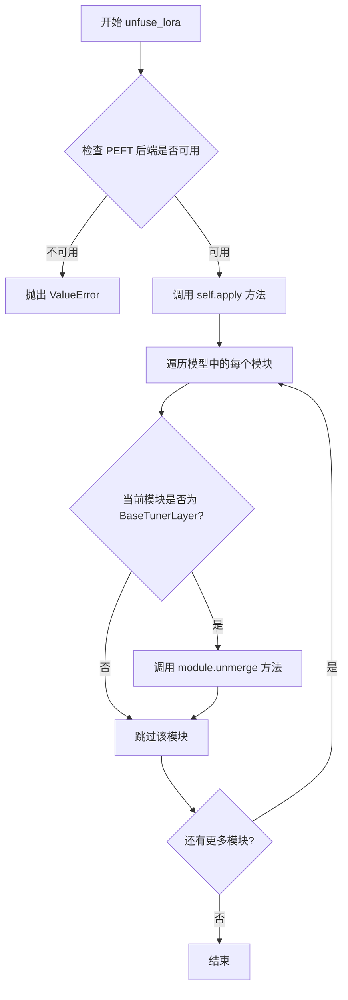

#### 带注释源码

```python
def unfuse_lora(self):
    """
    取消融合模型中所有已融合的 LoRA 权重。
    
    该方法将模型从融合状态恢复到原始的基础模型状态。
    """
    # 检查 PEFT 后端是否可用，如果不可用则抛出异常
    if not USE_PEFT_BACKEND:
        raise ValueError("PEFT backend is required for `unfuse_lora()`.")
    
    # 使用 PyTorch 的 apply 方法遍历模型中的所有模块
    # 将 _unfuse_lora_apply 函数应用于每个模块
    self.apply(self._unfuse_lora_apply)


def _unfuse_lora_apply(self, module):
    """
    内部方法，用于对单个模块执行取消融合操作。
    
    Parameters:
        module: PyTorch 模块对象
    """
    # 从 PEFT 库导入 BaseTunerLayer 类
    from peft.tuners.tuners_utils import BaseTunerLayer

    # 检查当前模块是否为 BaseTunerLayer（即包含 LoRA 参数的层）
    if isinstance(module, BaseTunerLayer):
        # 调用模块的 unmerge 方法，取消融合该层的 LoRA 权重
        module.unmerge()
```


### `PeftAdapterMixin._unfuse_lora_apply`

该方法是 `PeftAdapterMixin` 类中的一个私有方法，用于将已融合的 LoRA（Low-Rank Adaptation）权重从模型中分离（取消融合）。它通过遍历模型的模块，检查每个模块是否为 PEFT 的 `BaseTunerLayer` 类型，如果是则调用其 `unmerge()` 方法来撤销 LoRA 权重融合。

参数：

- `self`：`PeftAdapterMixin` 实例，表示当前对象本身
- `module`：`torch.nn.Module`，通过 `self.apply()` 遍历到的模型子模块，用于检查是否需要执行取消融合操作

返回值：`None`，该方法不返回任何值，仅执行副作用（修改模块的融合状态）

#### 流程图

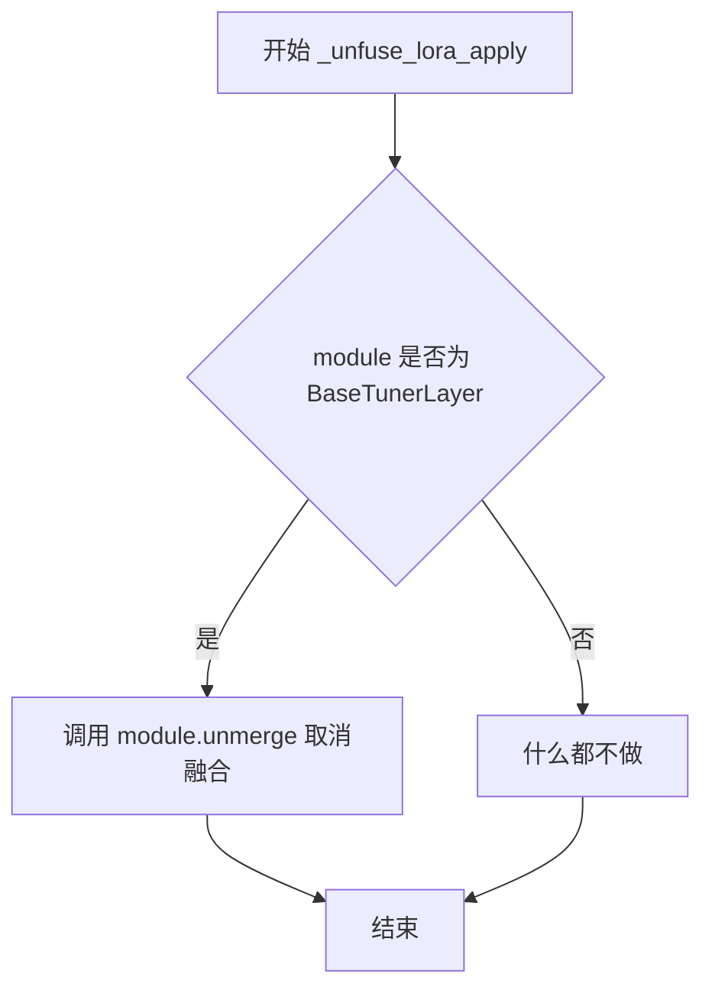

#### 带注释源码

```python
def _unfuse_lora_apply(self, module):
    """
    对单个模块执行 LoRA 取消融合操作。
    
    此方法作为 apply() 的回调函数被遍历调用，用于将已融合的
    LoRA 权重从 BaseTunerLayer 模块中分离出来。
    
    Parameters:
        module (torch.nn.Module): 模型中的子模块，通过 apply() 遍历获得
    """
    # 从 peft 库导入 BaseTunerLayer 类型，用于类型检查
    from peft.tuners.tuners_utils import BaseTunerLayer

    # 检查当前模块是否为 PEFT 的 BaseTunerLayer（即包含 LoRA 参数的层）
    if isinstance(module, BaseTunerLayer):
        # 调用模块的 unmerge 方法，将融合的 LoRA 权重分离出来
        # 使模型恢复到大权重状态，不再使用 LoRA 的适配权重
        module.unmerge()
```


### `PeftAdapterMixin.unload_lora`

该方法用于从模型中完全卸载所有已加载的 LoRA 适配器层，包括删除 PEFT 配置、清理 PEFT 相关的状态标志，并重新应用 group offloading 以确保模型恢复正常状态。

参数：

- 无显式参数（仅含 self）

返回值：`None`，无返回值（该方法直接修改实例状态）

#### 流程图

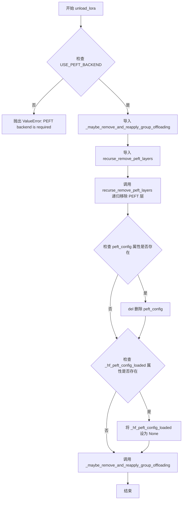

#### 带注释源码

```python
def unload_lora(self):
    """
    从模型中卸载所有 LoRA 适配器层，清理 PEFT 配置和相关状态。
    """
    # 检查 PEFT 后端是否可用，若不可用则抛出错误
    if not USE_PEFT_BACKEND:
        raise ValueError("PEFT backend is required for `unload_lora()`.")

    # 从 group_offloading 模块导入可能需要重新应用的 offloading 处理函数
    from ..hooks.group_offloading import _maybe_remove_and_reapply_group_offloading
    # 从 utils 模块导入递归移除 PEFT 层的工具函数
    from ..utils import recurse_remove_peft_layers

    # 递归遍历模型的所有模块，移除 PEFT/LoRA 相关的层
    recurse_remove_peft_layers(self)
    
    # 如果模型实例存在 peft_config 属性，则删除该配置
    # 这是清理适配器状态的关键步骤
    if hasattr(self, "peft_config"):
        del self.peft_config
    
    # 如果模型实例存在 _hf_peft_config_loaded 标志，则将其设为 None
    # 表示当前没有加载任何 PEFT 配置
    if hasattr(self, "_hf_peft_config_loaded"):
        self._hf_peft_config_loaded = None

    # 可能需要重新应用 group offloading
    # 当模型使用了分组 offloading 时，卸载 LoRA 后需要重新调整
    _maybe_remove_and_reapply_group_offloading(self)
```


### `PeftAdapterMixin.disable_lora`

该方法用于禁用底层模型中当前激活的 LoRA（Low-Rank Adaptation）层，使模型回退到仅使用基础模型进行推理。

参数：
- 该方法无显式参数（仅包含 `self`）

返回值：`None`，无返回值

#### 流程图


#### 带注释源码

```python
def disable_lora(self):
    """
    Disables the active LoRA layers of the underlying model.

    Example:

    ```py
    from diffusers import AutoPipelineForText2Image
    import torch

    pipeline = AutoPipelineForText2Image.from_pretrained(
        "stabilityai/stable-diffusion-xl-base-1.0", torch_dtype=torch.float16
    ).to("cuda")
    pipeline.load_lora_weights(
        "jbilcke-hf/sdxl-cinematic-1", weight_name="pytorch_lora_weights.safetensors", adapter_name="cinematic"
    )
    pipeline.unet.disable_lora()
    ```
    """
    # 检查 PEFT 后端是否可用，若不可用则抛出异常
    if not USE_PEFT_BACKEND:
        raise ValueError("PEFT backend is required for this method.")
    
    # 调用 utils 中的 set_adapter_layers 函数，传入 enabled=False 以禁用 LoRA 层
    set_adapter_layers(self, enabled=False)
```


### `PeftAdapterMixin.enable_lora`

该方法用于启用底层模型中已加载的活跃 LoRA（Low-Rank Adaptation）层。当 LoRA 适配器被加载到模型后，可以调用此方法激活它们，使模型在推理时使用 LoRA 权重。

参数： 无

返回值：`None`，无返回值，该方法直接修改模型状态

#### 流程图

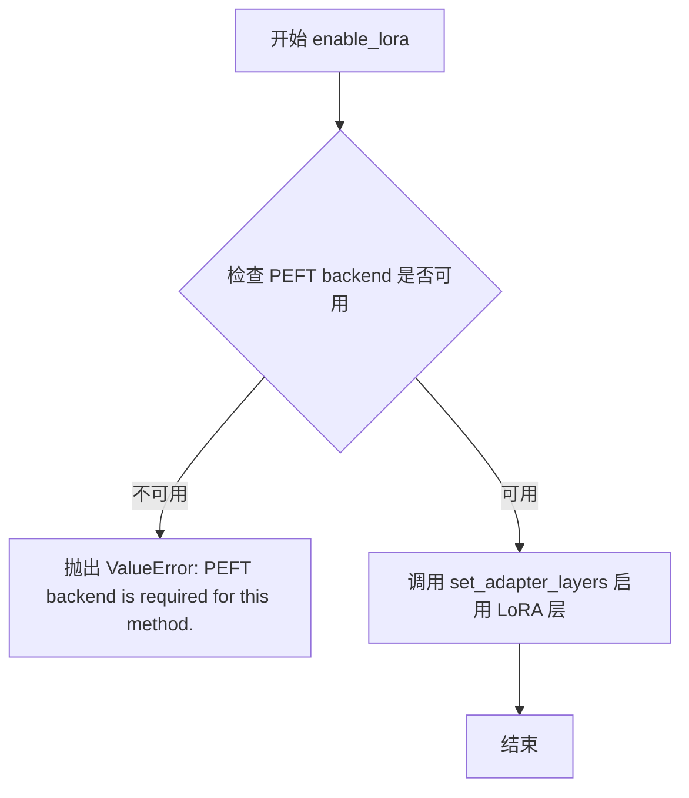

#### 带注释源码

```python
def enable_lora(self):
    """
    Enables the active LoRA layers of the underlying model.
    启用底层模型的活跃 LoRA 层

    Example:
        from diffusers import AutoPipelineForText2Image
        import torch

        pipeline = AutoPipelineForText2Image.from_pretrained(
            "stabilityai/stable-diffusion-xl-base-1.0", torch_dtype=torch.float16
        ).to("cuda")
        pipeline.load_lora_weights(
            "jbilcke-hf/sdxl-cinematic-1", weight_name="pytorch_lora_weights.safetensors", adapter_name="cinematic"
        )
        pipeline.unet.enable_lora()
    """
    # 检查 PEFT 后端是否可用，若不可用则抛出异常
    if not USE_PEFT_BACKEND:
        raise ValueError("PEFT backend is required for this method.")
    
    # 调用 set_adapter_layers 函数，传入 enabled=True 以启用 LoRA 层
    set_adapter_layers(self, enabled=True)
```


### `PeftAdapterMixin.delete_adapters`

删除适配器的 LoRA 层从底层模型中。

参数：

- `adapter_names`：`list[str] | str`，要删除的适配器名称（单个字符串或字符串列表）

返回值：`None`，无返回值

#### 流程图

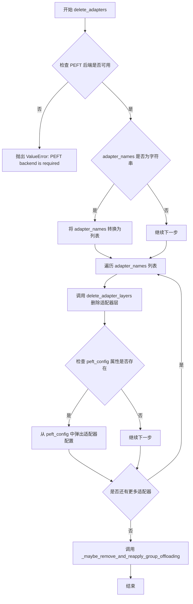

#### 带注释源码

```python
def delete_adapters(self, adapter_names: list[str] | str):
    """
    Delete an adapter's LoRA layers from the underlying model.

    Args:
        adapter_names (`list[str, str]`):
            The names (single string or list of strings) of the adapter to delete.

    Example:

    ```py
    from diffusers import AutoPipelineForText2Image
    import torch

    pipeline = AutoPipelineForText2Image.from_pretrained(
        "stabilityai/stable-diffusion-xl-base-1.0", torch_dtype=torch.float16
    ).to("cuda")
    pipeline.load_lora_weights(
        "jbilcke-hf/sdxl-cinematic-1", weight_name="pytorch_lora_weights.safetensors", adapter_names="cinematic"
    )
    pipeline.unet.delete_adapters("cinematic")
    ```
    """
    # 检查是否使用了 PEFT 后端，如果未使用则抛出错误
    if not USE_PEFT_BACKEND:
        raise ValueError("PEFT backend is required for this method.")

    # 如果传入的是单个字符串，则转换为列表以便统一处理
    if isinstance(adapter_names, str):
        adapter_names = [adapter_names]

    # 遍历每个适配器名称进行删除操作
    for adapter_name in adapter_names:
        # 调用工具函数删除适配器层
        delete_adapter_layers(self, adapter_name)

        # 同时从配置中移除对应的适配器配置
        if hasattr(self, "peft_config"):
            self.peft_config.pop(adapter_name, None)

    # 可能需要重新应用 group offloading（如果之前被禁用）
    _maybe_remove_and_reapply_group_offloading(self)
```


### `PeftAdapterMixin.enable_lora_hotswap`

该方法用于启用 LoRA 适配器的热交换（hotswap）功能，允许在不重新编译模型的情况下动态替换适配器，特别适用于模型已通过 `torch.compile` 编译的场景或需要加载不同 rank 适配器的情况。

参数：

- `target_rank`：`int`，可选，默认值为 `128`。所有将被加载的适配器中的最高 rank 值。
- `check_compiled`：`Literal["error", "warn", "ignore"]`，可选，默认值为 `"error"`。当模型已经被编译时的处理方式：`"error"` 抛出异常，`"warn"` 发出警告，`"ignore"` 忽略。

返回值：`None`，无返回值，仅修改实例状态。

#### 流程图

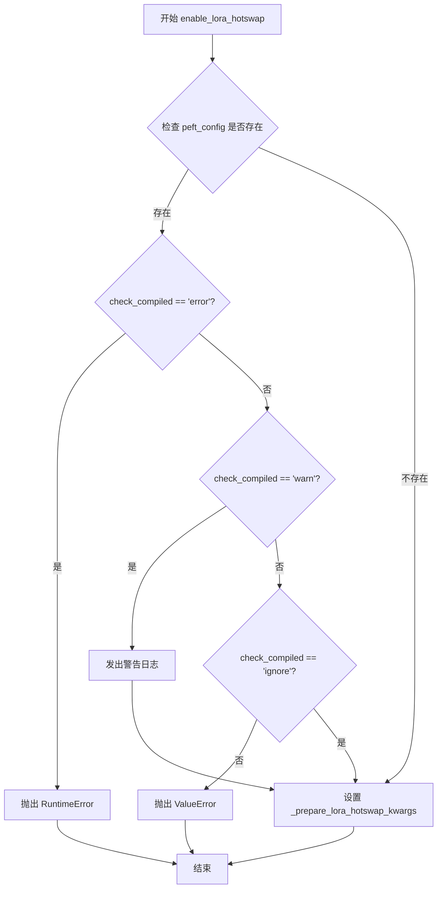

#### 带注释源码

```python
def enable_lora_hotswap(
    self, target_rank: int = 128, check_compiled: Literal["error", "warn", "ignore"] = "error"
) -> None:
    """Enables the possibility to hotswap LoRA adapters.

    Calling this method is only required when hotswapping adapters and if the model is compiled or if the ranks of
    the loaded adapters differ.

    Args:
        target_rank (`int`, *optional*, defaults to `128`):
            The highest rank among all the adapters that will be loaded.

        check_compiled (`str`, *optional*, defaults to `"error"`):
            How to handle the case when the model is already compiled, which should generally be avoided. The
            options are:
              - "error" (default): raise an error
              - "warn": issue a warning
              - "ignore": do nothing
    """
    # 检查模型是否已经加载了适配器配置
    if getattr(self, "peft_config", {}):
        # 根据 check_compiled 参数处理已编译模型的情况
        if check_compiled == "error":
            # 抛出运行时错误，要求在加载第一个适配器之前调用此方法
            raise RuntimeError("Call `enable_lora_hotswap` before loading the first adapter.")
        elif check_compiled == "warn":
            # 发出警告，建议在加载适配器前调用以避免重新编译
            logger.warning(
                "It is recommended to call `enable_lora_hotswap` before loading the first adapter to avoid recompilation."
            )
        elif check_compiled != "ignore":
            # 对于无效的 check_compiled 值抛出错误
            raise ValueError(
                f"check_compiles should be one of 'error', 'warn', or 'ignore', got '{check_compiled}' instead."
            )

    # 存储热交换所需的参数，供后续 load_lora_adapter 使用
    self._prepare_lora_hotswap_kwargs = {"target_rank": target_rank, "check_compiled": check_compiled}
```

## 关键组件


### 张量索引与状态字典处理

通过 `load_lora_adapter` 方法实现，使用 `prefix` 参数过滤状态字典中的键，并移除前缀。支持从键中推断 LoRA rank（如 `lora_B` 层的维度），实现惰性加载（`low_cpu_mem_usage` 参数）。

### 反量化与权重格式支持

通过 `_fetch_state_dict` 函数支持 SafeTensors 和 PyTorch 两种权重格式，使用 `safetensors.torch.save_file` 保存时注入元数据，支持 `upcast_before_saving` 将模型转换为 float32 后保存。

### 量化策略与 PEFT 后端集成

通过 `USE_PEFT_BACKEND` 检查和 `peft` 库集成，使用 `inject_adapter_in_model` 注入适配器，支持多种模型架构的 LoRA scale 扩展（`_SET_ADAPTER_SCALE_FN_MAPPING` 字典）。

### HotSwap 编译模型适配

通过 `enable_lora_hotswap` 方法和 `hotswap` 参数实现，支持已编译模型的 LoRA 热替换，使用 `prepare_model_for_compiled_hotswap` 处理不同 rank 的适配器，避免模型重新编译。

### 适配器权重管理与激活

通过 `set_adapters` 方法支持多适配器权重分配，使用 `set_weights_and_activate_adapters` 激活适配器，支持权重列表和单个权重值自动扩展。

### LoRA 融合与分离

通过 `fuse_lora` 和 `unfuse_lora` 方法实现 LoRA 权重与基础模型的融合和分离，使用 `module.merge()` 和 `module.unmerge()` 操作，支持安全融合（`safe_fusing` 参数）。

### 适配器生命周期管理

提供完整的适配器生命周期方法：`add_adapter` 添加新适配器、`delete_adapters` 删除适配器、`enable_adapters`/`disable_adapters` 启用或禁用适配器、`unload_lora` 卸载所有 LoRA 层。


## 问题及建议


### 已知问题

-   **方法过长且职责过多**：`load_lora_adapter` 方法超过 300 行，包含状态字典获取、适配器注入、hotswap 逻辑、错误处理等多项职责，缺乏单一职责原则，难以维护和测试。
-   **硬编码的模型类型映射**：`_SET_ADAPTER_SCALE_FN_MAPPING` 字典中包含大量硬编码的模型类名（25+ 个），每个都使用相同的 `lambda model_cls, weights: weights` 函数，这种模式重复且不利于扩展。
-   **重复的 PEFT 版本检查**：多个方法（`add_adapter`、`set_adapter`、`enable_adapters` 等）中都有相同的 `check_peft_version(min_version=MIN_PEFT_VERSION)` 调用，未提取为可复用的装饰器或基类方法。
-   **内部导入开销**：在多个方法内部（如 `load_lora_adapter`、`save_lora_adapter`）使用 `from peft import ...` 进行延迟导入，增加了每次调用时的模块查找开销。
-   **类型转换逻辑分散**：将字符串转换为列表、默认值处理（如 `weights = [w if w is not None else 1.0 for w in weights]`）的逻辑在多处重复出现。
-   **hotswap 逻辑复杂**：hotswap 功能引入了大量的条件判断和版本检查（`is_peft_version` 多处调用），且 `map_state_dict_for_hotswap` 函数定义在方法内部，降低了代码可读性。
-   **异常处理不一致**：部分地方直接 `raise ValueError`，部分地方使用 `logger.error` 后再 `raise`，风格不统一。
-   **缺少详细类型注解**：部分方法参数和返回值缺乏完整的类型注解（如 `adapter_names` 的联合类型在某些方法中未完整声明）。
-   **魔法数字和字符串**：如 `target_rank: int = 128` 的默认值、`"lora_A"`、`"lora_B"` 等字符串硬编码在逻辑中。

### 优化建议

-   **重构长方法**：将 `load_lora_adapter` 拆分为多个私有方法，如 `_fetch_and_preprocess_state_dict`、`_create_lora_config`、`_inject_adapter`、`_handle_hotswap` 等。
-   **动态模型注册机制**：将 `_SET_ADAPTER_SCALE_FN_MAPPING` 改为注册机制或使用基类判断，减少硬编码。
-   **提取版本检查装饰器**：创建 `@requires_peft_version` 装饰器，统一处理版本检查逻辑。
-   **优化导入策略**：将必要的导入移至模块顶部或使用缓存机制，避免重复导入。
-   **统一异常处理风格**：制定异常处理规范，明确何时记录日志、何时直接抛出。
-   **提取公共工具方法**：将类型转换、默认值处理等逻辑封装为工具方法。
-   **添加类型注解完善**：为所有公开方法添加完整的类型注解，包括泛型类型。
-   **常量提取**：将魔法数字和字符串提取为模块级常量，提高可读性和可维护性。


## 其它


### 设计目标与约束

本模块旨在为Diffusion模型提供LoRA适配器的完整生命周期管理能力，支持多种模型架构（包括UNet2DConditionModel、UNetMotionModel、SD3Transformer2DModel、FluxTransformer2DModel、CogVideoXTransformer3DModel等近20种模型），实现适配器的加载、保存、激活、停用、融合和删除功能。设计约束包括：必须使用PEFT后端（USE_PEFT_BACKEND），要求PEFT版本>=MIN_PEFT_VERSION，部分功能（如hotswap）需要PEFT>0.14.0，支持安全序列化（safetensors）和传统pickle方式。

### 错误处理与异常设计

代码实现了多层次的错误处理机制：1）版本兼容性检查，使用is_peft_version进行版本验证，低CPU内存使用模式要求PEFT>0.13.0；2）参数合法性校验，包括network_alphas与metadata互斥检查、adapter_name冲突检测、适配器名称存在性验证；3）hotswap操作的前置条件验证，检查目标适配器是否存在；4）异常捕获与恢复机制，在inject_adapter_in_model失败时清理已注册的peft_config；5）多适配器场景的PEFT版本检查，旧版本不支持多适配器推理时会抛出明确错误。

### 数据流与状态机

数据流转遵循以下状态机：初始状态（_hf_peft_config_loaded=False）→ 加载适配器（调用inject_adapter_in_model）→ 设置状态（_hf_peft_config_loaded=True）→ 激活适配器（通过set_adapters设置权重）→ 可选融合（fuse_lora将LoRA权重合并到模型）→ 可选卸载（unload_lora移除PEFT层）。load_lora_adapter方法的状态字典流转：原始state_dict → 前缀过滤 → 格式转换（convert_unet_state_dict_to_peft） →  rank计算 → LoraConfig创建 → 适配器注入 → 状态设置。

### 外部依赖与接口契约

核心依赖包括：peft库（inject_adapter_in_model、set_peft_model_state_dict、get_peft_model_state_dict、BaseTunerLayer），torch和safetensors（模型序列化），diffusers内部模块（..hooks.group_offloading、..utils相关函数）。外部接口契约：load_lora_adapter接受pretrained_model_name_or_path_or_dict、prefix、hotswap等参数，返回注入的适配器；set_adapters接受adapter_names和weights参数；save_lora_adapter输出到指定目录的safetensors或pickle文件。

### 性能考虑与优化空间

性能优化点包括：1）low_cpu_mem_usage参数加速模型加载，仅加载预训练权重不初始化随机权重；2）hotswap机制避免compiled模型重新编译；3）_SET_ADAPTER_SCALE_FN_MAPPING使用lambda缓存模型特定的处理函数。潜在优化空间：1）当前逐模块遍历设置适配器，可考虑批量处理；2）多适配器权重扩展函数（scale_expansion_fn）可进一步优化；3）状态字典处理中的多次迭代可合并。

### 安全性考虑

代码在以下方面体现了安全性：1）allow_pickle=False默认拒绝pickle序列化，防止恶意payload；2）safe_serialization=True默认使用safetensors安全格式；3）hotswap操作前进行配置兼容性检查（check_hotswap_configs_compatible）；4）safe_fusing参数支持安全融合模式；5）PEFT版本检查防止使用已知有安全问题的旧版本。

### 版本兼容性矩阵

关键功能与PEFT版本要求：低CPU内存使用（>=0.13.1），hotswap功能（>0.14.0），多适配器推理（建议最新版本），Adapter名称参数（PEFT库支持）。代码通过is_peft_version动态检查和条件导入实现版本兼容性适配。

    