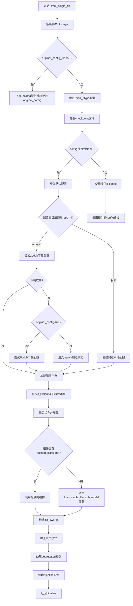
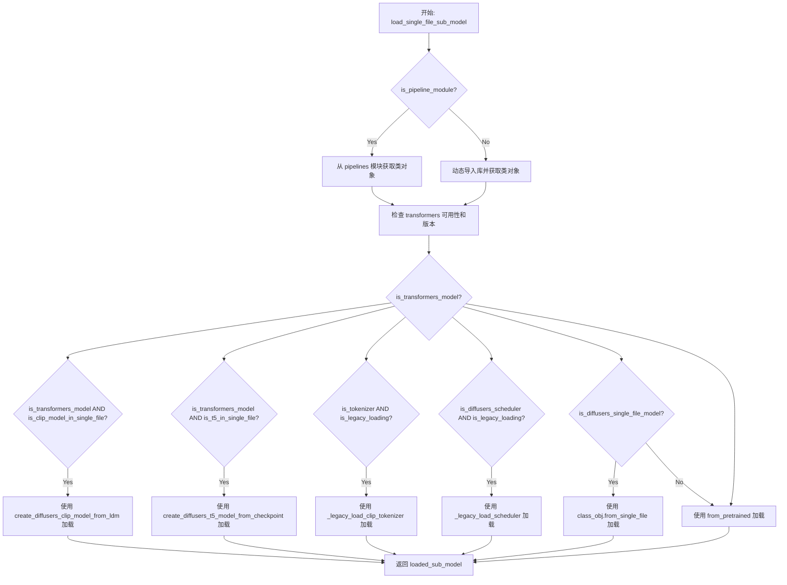
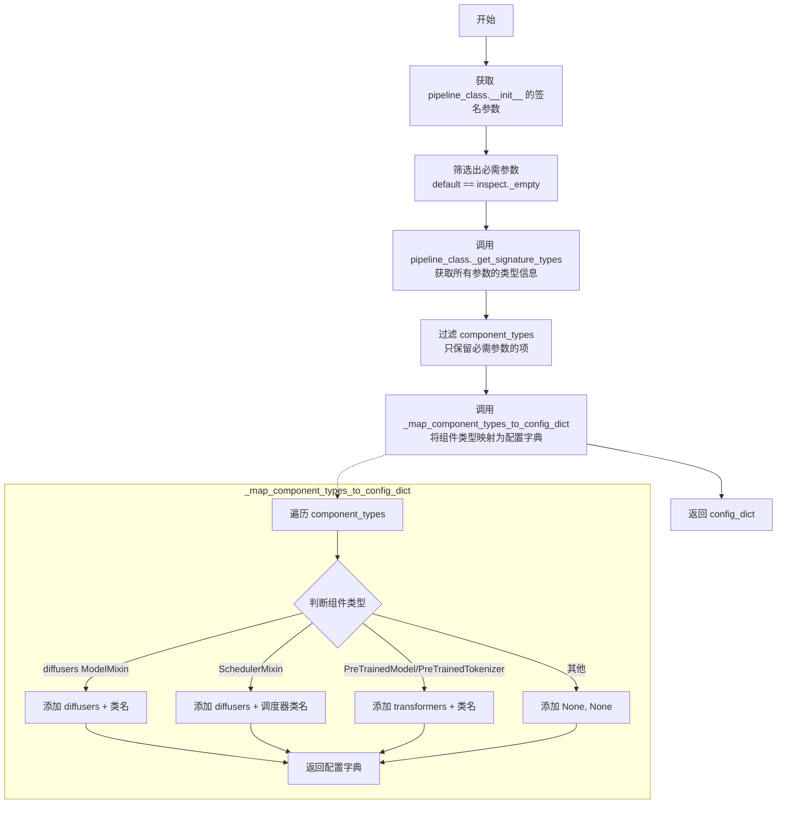
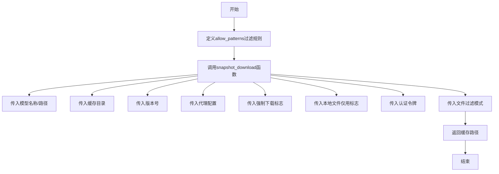
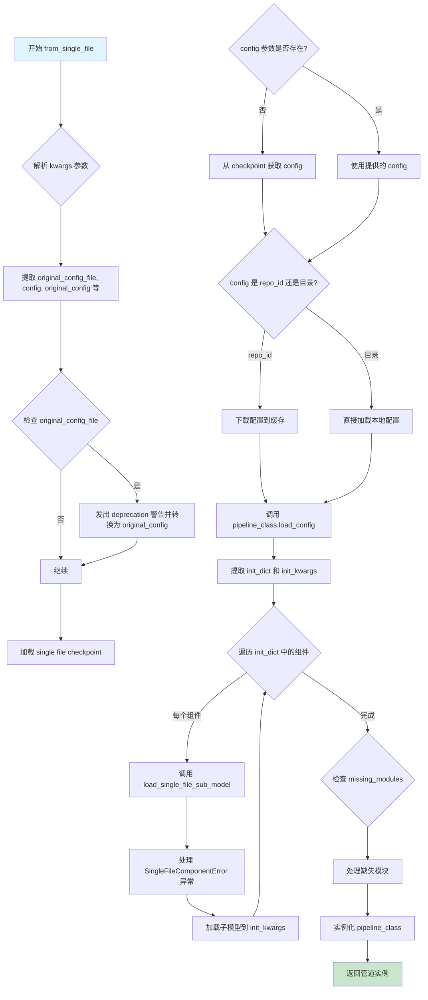

# `diffusers\src\diffusers\loaders\single_file.py` 详细设计文档

这是一个用于从单文件检查点（.ckpt或.safetensors格式）加载DiffusionPipeline的模块，支持将原始模型格式转换为Diffusers格式，包括模型权重、配置、调度器等的自动推断和加载。

## 整体流程



## 类结构

```
FromSingleFileMixin (混合类)
├── 类方法: from_single_file
└── 辅助函数: load_module (内部函数)
```

## 全局变量及字段


### `SINGLE_FILE_OPTIONAL_COMPONENTS`
    
定义从单文件加载时可选的组件列表，目前包含safety_checker，用于标识哪些组件可以不被强制加载

类型：`List[str]`
    


### `logger`
    
模块级日志记录器对象，用于输出该模块的日志信息，便于调试和追踪执行流程

类型：`logging.Logger`
    


    

## 全局函数及方法


### `load_single_file_sub_model`

该函数是单文件加载流程的核心组件，负责从 `.ckpt` 或 `.safetensors` 格式的检查点中加载 Diffusers Pipeline 的各个子组件（如 UNet、VAE、调度器、分词器等）。它通过动态导入类、判断模型类型，并选择合适的加载策略（Diffusers `from_single_file`、Transformers 转换或传统加载）来实例化子模型。

参数：

- `library_name`：`str`，目标类所在的库名称（如 "diffusers"、"transformers"）
- `class_name`：`str`，要加载的类名称（如 "UNet2DConditionModel"、"CLIPTokenizer"）
- `name`：`str`，子模型在 Pipeline 中的名称/路径（如 "unet"、"vae"）
- `checkpoint`：模型权重数据，类型为检查点文件解析后的对象
- `pipelines`：`ModuleType`，diffusers pipelines 模块，用于查找 pipeline 模块中的类
- `is_pipeline_module`：`bool`，指示 `library_name` 是否为 pipelines 模块中的子模块
- `cached_model_config_path`：`str`，缓存的 Diffusers 格式模型配置路径
- `original_config`：`dict`，原始训练配置文件（用于 Legacy 加载），默认为 None
- `local_files_only`：`bool`，是否仅从本地缓存加载文件
- `torch_dtype`：`torch.dtype`，加载模型使用的数据类型，默认为 None
- `is_legacy_loading`：`bool`，是否为传统 Legacy 加载模式，默认为 False
- `disable_mmap`：`bool`，是否禁用内存映射加载 Safetensors，默认为 False
- `**kwargs`：其他传递给加载方法的关键字参数

返回值：`Any`，返回加载完成的子模型实例对象（类型取决于加载的组件，可能是 `ModelMixin`、`PreTrainedModel`、`PreTrainedTokenizer` 或 `SchedulerMixin` 的子类）

#### 流程图



#### 带注释源码

```python
def load_single_file_sub_model(
    library_name,
    class_name,
    name,
    checkpoint,
    pipelines,
    is_pipeline_module,
    cached_model_config_path,
    original_config=None,
    local_files_only=False,
    torch_dtype=None,
    is_legacy_loading=False,
    disable_mmap=False,
    **kwargs,
):
    # 判断是从 pipeline 模块加载还是直接从库导入
    # 如果是 pipeline 模块（如 diffusers.pipelines.stable_diffusion），从模块属性获取类
    if is_pipeline_module:
        pipeline_module = getattr(pipelines, library_name)
        class_obj = getattr(pipeline_module, class_name)
    else:
        # 否则直接动态导入库并获取类对象
        library = importlib.import_module(library_name)
        class_obj = getattr(library, class_name)

    # 检查 transformers 库是否可用，并解析版本号用于兼容性判断
    if is_transformers_available():
        transformers_version = version.parse(version.parse(transformers.__version__).base_version)
    else:
        transformers_version = "N/A"

    # 判断目标类是否为 Transformers 的 PreTrainedModel（版本需 >= 4.20.0）
    is_transformers_model = (
        is_transformers_available()
        and issubclass(class_obj, PreTrainedModel)
        and transformers_version >= version.parse("4.20.0")
    )
    # 判断目标类是否为 Transformers 的 PreTrainedTokenizer
    is_tokenizer = (
        is_transformers_available()
        and issubclass(class_obj, PreTrainedTokenizer)
        and transformers_version >= version.parse("4.20.0")
    )

    # 获取 diffusers 顶层模块，用于判断是否为 diffusers 自身的类
    diffusers_module = importlib.import_module(__name__.split(".")[0])
    # 判断是否为支持单文件加载的 diffusers 模型
    is_diffusers_single_file_model = issubclass(class_obj, diffusers_module.FromOriginalModelMixin)
    # 判断是否为 diffusers ModelMixin
    is_diffusers_model = issubclass(class_obj, diffusers_module.ModelMixin)
    # 判断是否为 diffusers SchedulerMixin
    is_diffusers_scheduler = issubclass(class_obj, diffusers_module.SchedulerMixin)

    # 策略1: 使用 diffusers 的 from_single_file 方法加载（针对支持单文件加载的模型）
    if is_diffusers_single_file_model:
        load_method = getattr(class_obj, "from_single_file")

        # 如果提供了 original_config，则忽略从 cached_model_config_path 加载配置
        # 因为不能同时提供两个不同的配置选项
        if original_config:
            cached_model_config_path = None

        loaded_sub_model = load_method(
            pretrained_model_link_or_path_or_dict=checkpoint,
            original_config=original_config,
            config=cached_model_config_path,
            subfolder=name,
            torch_dtype=torch_dtype,
            local_files_only=local_files_only,
            disable_mmap=disable_mmap,
            **kwargs,
        )

    # 策略2: Transformers CLIP 模型从单文件加载（转换为 diffusers 格式）
    elif is_transformers_model and is_clip_model_in_single_file(class_obj, checkpoint):
        loaded_sub_model = create_diffusers_clip_model_from_ldm(
            class_obj,
            checkpoint=checkpoint,
            config=cached_model_config_path,
            subfolder=name,
            torch_dtype=torch_dtype,
            local_files_only=local_files_only,
            is_legacy_loading=is_legacy_loading,
        )

    # 策略3: T5 模型从单文件加载
    elif is_transformers_model and is_t5_in_single_file(checkpoint):
        loaded_sub_model = create_diffusers_t5_model_from_checkpoint(
            class_obj,
            checkpoint=checkpoint,
            config=cached_model_config_path,
            subfolder=name,
            torch_dtype=torch_dtype,
            local_files_only=local_files_only,
        )

    # 策略4: Legacy 分词器加载（Transformers 分词器 + 传统模式）
    elif is_tokenizer and is_legacy_loading:
        loaded_sub_model = _legacy_load_clip_tokenizer(
            class_obj, checkpoint=checkpoint, config=cached_model_config_path, local_files_only=local_files_only
        )

    # 策略5: Legacy 调度器加载（传统模式或使用传统调度器参数）
    elif is_diffusers_scheduler and (is_legacy_loading or _is_legacy_scheduler_kwargs(kwargs)):
        loaded_sub_model = _legacy_load_scheduler(
            class_obj, checkpoint=checkpoint, component_name=name, original_config=original_config, **kwargs
        )

    # 策略6: 标准 from_pretrained 加载（适用于大多数情况）
    else:
        # 检查类是否有 from_pretrained 方法，否则抛出错误
        if not hasattr(class_obj, "from_pretrained"):
            raise ValueError(
                (
                    f"The component {class_obj.__name__} cannot be loaded as it does not seem to have"
                    " a supported loading method."
                )
            )

        # 构建加载参数字典
        loading_kwargs = {}
        loading_kwargs.update(
            {
                "pretrained_model_name_or_path": cached_model_config_path,
                "subfolder": name,
                "local_files_only": local_files_only,
            }
        )

        # 调度器和分词器不使用 torch_dtype，只传递给 nn.Module 子类
        if issubclass(class_obj, torch.nn.Module):
            loading_kwargs.update({"torch_dtype": torch_dtype})

        # 对于 diffusers 或 transformers 模型，检查权重是否在缓存文件夹中
        if is_diffusers_model or is_transformers_model:
            if not _is_model_weights_in_cached_folder(cached_model_config_path, name):
                raise SingleFileComponentError(
                    f"Failed to load {class_name}. Weights for this component appear to be missing in the checkpoint."
                )

        # 获取加载方法并执行加载
        load_method = getattr(class_obj, "from_pretrained")
        loaded_sub_model = load_method(**loading_kwargs)

    return loaded_sub_model
```


### `_map_component_types_to_config_dict`

该函数负责将管道组件的类型信息映射为配置字典，通过检查组件类是否继承自 Diffusers 的 ModelMixin、SchedulerMixin 或 Transformers 的 PreTrainedModel、PreTrainedTokenizer，来确定组件来源（"diffusers" 或 "transformers"）和具体类名。

参数：

- `component_types`：字典类型，键为组件名称，值为包含组件类的元组（用于映射到配置中的库名和类名）

返回值：`dict`，返回一个配置字典，键为组件名称，值为包含 [来源库名, 类名] 的列表

#### 流程图

```mermaid
flowchart TD
    A[开始] --> B[获取 diffusers_module]
    B --> C[初始化空 config_dict]
    C --> D{is_transformers_available?}
    D -->|Yes| E[解析 transformers_version]
    D -->|No| F[transformers_version = "N/A"]
    E --> G[遍历 component_types.items]
    F --> G
    G --> H{遍历完成?}
    H -->|No| I[获取 component_value[0] 组件类]
    I --> J[检查是否继承 ModelMixin]
    I --> K[检查类名是否为 KarrasDiffusionSchedulers]
    I --> L[检查是否继承 SchedulerMixin]
    I --> M[检查是否继承 PreTrainedModel]
    I --> N[检查是否继承 PreTrainedTokenizer]
    J --> O{is_diffusers_model 且 component_name 不在可选组件中?}
    O -->|Yes| P[设置 config_dict[name] = ["diffusers", class_name]]
    O -->|No| Q{is_scheduler_enum 或 is_scheduler?}
    Q -->|Yes| R{is_scheduler_enum?}
    R -->|Yes| S[config_dict[name] = ["diffusers", "DDIMScheduler"]]
    R -->|No| T[config_dict[name] = ["diffusers", class_name]]
    Q -->|No| U{is_transformers_model 或 is_transformers_tokenizer?}
    U -->|Yes| V{component_name 不在可选组件中?}
    V -->|Yes| W[config_dict[name] = ["transformers", class_name]]
    V -->|No| X[config_dict[name] = [None, None]]
    U -->|No| X
    P --> G
    S --> G
    T --> G
    W --> G
    X --> G
    H -->|Yes| Y[返回 config_dict]
```

#### 带注释源码

```python
def _map_component_types_to_config_dict(component_types):
    """
    将组件类型映射为配置字典，确定每个组件的来源库和类名
    
    参数:
        component_types: 包含组件类型信息的字典 {component_name: (component_class, ...)}
    
    返回:
        config_dict: 映射后的配置字典 {component_name: [library_name, class_name]}
    """
    # 获取 diffusers 模块，用于检查类继承关系
    diffusers_module = importlib.import_module(__name__.split(".")[0])
    config_dict = {}
    # 移除可能存在的 self 键
    component_types.pop("self", None)

    # 检查 transformers 是否可用，并解析版本号
    if is_transformers_available():
        transformers_version = version.parse(version.parse(transformers.__version__).base_version)
    else:
        transformers_version = "N/A"

    # 遍历每个组件类型，进行分类映射
    for component_name, component_value in component_types.items():
        # 检查是否为 Diffusers 模型
        is_diffusers_model = issubclass(component_value[0], diffusers_module.ModelMixin)
        # 检查是否为 Karras 调度器枚举
        is_scheduler_enum = component_value[0].__name__ == "KarrasDiffusionSchedulers"
        # 检查是否为 Diffusers 调度器
        is_scheduler = issubclass(component_value[0], diffusers_module.SchedulerMixin)

        # 检查是否为 Transformers 模型（需要版本 >= 4.20.0）
        is_transformers_model = (
            is_transformers_available()
            and issubclass(component_value[0], PreTrainedModel)
            and transformers_version >= version.parse("4.20.0")
        )
        # 检查是否为 Transformers tokenizer（需要版本 >= 4.20.0）
        is_transformers_tokenizer = (
            is_transformers_available()
            and issubclass(component_value[0], PreTrainedTokenizer)
            and transformers_version >= version.parse("4.20.0")
        )

        # 如果是 Diffusers 模型且不在可选组件列表中
        if is_diffusers_model and component_name not in SINGLE_FILE_OPTIONAL_COMPONENTS:
            config_dict[component_name] = ["diffusers", component_value[0].__name__]

        # 如果是调度器枚举或调度器
        elif is_scheduler_enum or is_scheduler:
            if is_scheduler_enum:
                # 由于无法从 hub 获取调度器配置，如果是 KarrasDiffusionSchedulers 枚举类型
                # 默认使用 DDIMScheduler
                config_dict[component_name] = ["diffusers", "DDIMScheduler"]

            elif is_scheduler:
                config_dict[component_name] = ["diffusers", component_value[0].__name__]

        # 如果是 Transformers 模型或 tokenizer，且不在可选组件列表中
        elif (
            is_transformers_model or is_transformers_tokenizer
        ) and component_name not in SINGLE_FILE_OPTIONAL_COMPONENTS:
            config_dict[component_name] = ["transformers", component_value[0].__name__]

        # 其他情况设置为 None
        else:
            config_dict[component_name] = [None, None]

    return config_dict
```


### `_infer_pipeline_config_dict`

该函数用于从给定的管道类中推断出配置字典，通过分析管道类初始化方法的必需参数及其类型信息，生成包含组件类型（diffusers/transformers）和类名的配置字典，以支持从单文件格式加载管道组件的兼容性处理。

参数：

- `pipeline_class`：`type`，需要进行配置字典推断的管道类（通常是 DiffusionPipeline 的子类）

返回值：`dict`，返回包含组件名称到 [库类型, 类名] 映射的配置字典，例如 `{"unet": ["diffusers", "UNet2DConditionModel"], "text_encoder": ["transformers", "CLIPTextModel"]}`

#### 流程图



#### 带注释源码

```python
def _infer_pipeline_config_dict(pipeline_class):
    """
    从管道类推断配置字典，用于从单文件格式加载管道时的兼容性处理。
    
    该函数通过分析管道类的构造函数签名，提取必需参数及其类型信息，
    并将其转换为标准的配置字典格式，以便后续加载管道组件。
    """
    # 获取管道类 __init__ 方法的参数签名
    parameters = inspect.signature(pipeline_class.__init__).parameters
    
    # 筛选出必需参数（没有默认值的参数）
    # inspect._empty 表示该参数没有默认值，是必需的
    required_parameters = {k: v for k, v in parameters.items() if v.default == inspect._empty}
    
    # 调用管道类的 _get_signature_types 方法获取所有参数的类型信息
    # 返回类型: Dict[str, Tuple[type, ...]]
    component_types = pipeline_class._get_signature_types()

    # 忽略不是管道必需的参数，只保留必需参数的类型信息
    # 这样可以过滤掉 self, config 等非组件参数
    component_types = {k: v for k, v in component_types.items() if k in required_parameters}
    
    # 调用内部函数将组件类型映射为配置字典
    # 格式: {component_name: [library_name, class_name]}
    config_dict = _map_component_types_to_config_dict(component_types)

    return config_dict
```


### `_download_diffusers_model_config_from_hub`

该函数用于从HuggingFace Hub下载Diffusers模型的配置文件（包括JSON和TXT文件），通过`snapshot_download`方法将模型配置缓存到本地，并返回缓存路径。

参数：

- `pretrained_model_name_or_path`：`str`，HuggingFace Hub上的模型仓库ID或本地路径，指定要下载配置的模型名称或路径
- `cache_dir`：`str`，用于缓存下载模型的目录路径
- `revision`：`str`，要下载的模型版本（分支名、标签名或提交ID）
- `proxies`：`dict`，代理服务器配置字典，用于网络请求
- `force_download`：`bool`，是否强制重新下载，忽略缓存
- `local_files_only`：`bool`，是否仅使用本地文件，不从Hub下载
- `token`：`str`，HuggingFace Hub的认证token

返回值：`str`，返回配置文件的本地缓存路径

#### 流程图



#### 带注释源码

```python
def _download_diffusers_model_config_from_hub(
    pretrained_model_name_or_path,  # HuggingFace Hub模型仓库ID或本地路径
    cache_dir,                       # 本地缓存目录路径
    revision,                        # Git版本标识（分支/标签/提交ID）
    proxies,                         # 代理服务器字典
    force_download=None,            # 是否强制重新下载（覆盖缓存）
    local_files_only=None,         # 是否仅使用本地文件
    token=None,                     # HuggingFace认证令牌
):
    """
    从HuggingFace Hub下载Diffusers模型的配置文件
    
    该函数专门下载模型配置文件（.json和.txt），不下载完整的模型权重，
    用于在from_single_file流程中获取管道组件配置信息。
    """
    
    # 定义允许下载的文件模式：仅下载配置文件
    allow_patterns = ["**/*.json", "*.json", "*.txt", "**/*.txt", "**/*.model"]
    
    # 调用huggingface_hub的snapshot_download方法下载文件
    # 仅下载符合allow_patterns的文件，减少下载量
    cached_model_path = snapshot_download(
        pretrained_model_name_or_path,  # 模型仓库标识
        cache_dir=cache_dir,             # 缓存目录
        revision=revision,               # 版本/分支
        proxies=proxies,                 # 网络代理
        force_download=force_download,   # 强制下载标志
        local_files_only=local_files_only, # 本地文件优先
        token=token,                     # 认证令牌
        allow_patterns=allow_patterns,  # 文件过滤模式
    )

    # 返回配置文件的本地缓存路径，供后续load_config使用
    return cached_model_path
```


### `FromSingleFileMixin.from_single_file`

从单个文件（.ckpt 或 .safetensors 格式）加载预训练管道权重，实例化一个完整的 DiffusionPipeline。该方法自动处理配置的获取、模型权重的加载、管道组件的组装，并返回配置好的管道实例。

参数：

- `cls`：类方法隐式参数，代表调用此方法的类
- `pretrained_model_link_or_path`：`str` 或 `os.PathLike`，可选，指向 .ckpt/.safetensors 文件的链接（如 HuggingFace Hub 上的模型）或本地文件路径
- `kwargs`：剩余的关键字参数，可选，包含以下常用参数：
  - `torch_dtype`：`str` 或 `torch.dtype`，可选，覆盖默认的 torch.dtype 加载模型
  - `force_download`：`bool`，可选，是否强制重新下载模型文件
  - `cache_dir`：`str` 或 `os.PathLike`，可选，缓存目录路径
  - `proxies`：`dict[str, str]`，可选，代理服务器配置
  - `local_files_only`：`bool`，可选，是否仅从本地加载文件
  - `token`：`str` 或 `bool`，可选，用于远程文件的 HTTP Bearer 授权令牌
  - `revision`：`str`，可选，模型版本标识符
  - `original_config_file`：`str`，可选（已弃用），原始训练配置文件路径
  - `original_config`：`str`，可选，原始训练配置文件路径
  - `config`：`str`，可选，Diffusers 格式的预训练管道 repo id 或本地目录
  - `disable_mmap`：`bool`，可选，是否禁用 mmap 加载 Safetensors 模型

返回值：`Self`，返回实例化的 DiffusionPipeline 管道对象

#### 流程图



#### 带注释源码

```python
@classmethod
@validate_hf_hub_args
def from_single_file(cls, pretrained_model_link_or_path, **kwargs) -> Self:
    """
    Instantiate a DiffusionPipeline from pretrained pipeline weights saved in the .ckpt or .safetensors format.
    The pipeline is set in evaluation mode (model.eval()) by default.
    """
    # 从 kwargs 中提取配置参数，支持 deprecated 参数的向后兼容
    original_config_file = kwargs.pop("original_config_file", None)
    config = kwargs.pop("config", None)
    original_config = kwargs.pop("original_config", None)

    # 处理已弃用的 original_config_file 参数
    if original_config_file is not None:
        deprecation_message = (
            "`original_config_file` argument is deprecated and will be removed in future versions."
            "please use the `original_config` argument instead."
        )
        deprecate("original_config_file", "1.0.0", deprecation_message)
        original_config = original_config_file

    # 提取下载和加载相关的参数
    force_download = kwargs.pop("force_download", False)
    proxies = kwargs.pop("proxies", None)
    token = kwargs.pop("token", None)
    cache_dir = kwargs.pop("cache_dir", None)
    local_files_only = kwargs.pop("local_files_only", False)
    revision = kwargs.pop("revision", None)
    torch_dtype = kwargs.pop("torch_dtype", None)
    disable_mmap = kwargs.pop("disable_mmap", False)

    is_legacy_loading = False

    # 验证 torch_dtype 参数的有效性
    if torch_dtype is not None and not isinstance(torch_dtype, torch.dtype):
        torch_dtype = torch.float32
        logger.warning(
            f"Passed `torch_dtype` {torch_dtype} is not a `torch.dtype`. Defaulting to `torch.float32`."
        )

    # 处理已弃用的 scaling_factor 参数
    scaling_factor = kwargs.get("scaling_factor", None)
    if scaling_factor is not None:
        deprecation_message = (
            "Passing the `scaling_factor` argument to `from_single_file is deprecated "
            "and will be ignored in future versions."
        )
        deprecate("scaling_factor", "1.0.0", deprecation_message)

    # 如果提供了 original_config，则获取原始配置
    if original_config is not None:
        original_config = fetch_original_config(original_config, local_files_only=local_files_only)

    # 获取管道类
    from ..pipelines.pipeline_utils import _get_pipeline_class
    pipeline_class = _get_pipeline_class(cls, config=None)

    # 加载单个文件的 checkpoint
    checkpoint = load_single_file_checkpoint(
        pretrained_model_link_or_path,
        force_download=force_download,
        proxies=proxies,
        token=token,
        cache_dir=cache_dir,
        local_files_only=local_files_only,
        revision=revision,
        disable_mmap=disable_mmap,
    )

    # 获取 Diffusers 配置
    if config is None:
        config = fetch_diffusers_config(checkpoint)
        default_pretrained_model_config_name = config["pretrained_model_name_or_path"]
    else:
        default_pretrained_model_config_name = config

    # 处理配置路径
    if not os.path.isdir(default_pretrained_model_config_name):
        # 配置是 repo_id，需要下载配置
        if default_pretrained_model_config_name.count("/") > 1:
            raise ValueError(
                f'The provided config "{config}"'
                " is neither a valid local path nor a valid repo id. Please check the parameter."
            )
        try:
            # 尝试从 Hub 下载配置
            cached_model_config_path = _download_diffusers_model_config_from_hub(
                default_pretrained_model_config_name,
                cache_dir=cache_dir,
                revision=revision,
                proxies=proxies,
                force_download=force_download,
                local_files_only=local_files_only,
                token=token,
            )
            config_dict = pipeline_class.load_config(cached_model_config_path)
        except LocalEntryNotFoundError:
            # 本地文件模式但缓存中没有配置
            if original_config is None:
                logger.warning(
                    "`local_files_only` is True but no local configs were found for this checkpoint.\n"
                    "Attempting to download the necessary config files for this pipeline.\n"
                )
                cached_model_config_path = _download_diffusers_model_config_from_hub(
                    default_pretrained_model_config_name,
                    cache_dir=cache_dir,
                    revision=revision,
                    proxies=proxies,
                    force_download=force_download,
                    local_files_only=False,
                    token=token,
                )
                config_dict = pipeline_class.load_config(cached_model_config_path)
            else:
                # 遗留加载模式
                logger.warning(
                    "Detected legacy `from_single_file` loading behavior..."
                )
                is_legacy_loading = True
                cached_model_config_path = None
                config_dict = _infer_pipeline_config_dict(pipeline_class)
                config_dict["_class_name"] = pipeline_class.__name__
    else:
        # 配置是本地目录路径
        cached_model_config_path = default_pretrained_model_config_name
        config_dict = pipeline_class.load_config(cached_model_config_path)

    # 移除 _ignore_files
    config_dict.pop("_ignore_files", None)

    # 提取签名中的期望模块和可选关键字参数
    expected_modules, optional_kwargs = pipeline_class._get_signature_keys(cls)
    passed_class_obj = {k: kwargs.pop(k) for k in expected_modules if k in kwargs}
    passed_pipe_kwargs = {k: kwargs.pop(k) for k in optional_kwargs if k in kwargs}

    # 从配置字典中提取初始化参数字典
    init_dict, unused_kwargs, _ = pipeline_class.extract_init_dict(config_dict, **kwargs)
    init_kwargs = {k: init_dict.pop(k) for k in optional_kwargs if k in init_dict}
    init_kwargs = {**init_kwargs, **passed_pipe_kwargs}

    from diffusers import pipelines

    # 定义函数：判断是否需要加载模块
    def load_module(name, value):
        if value[0] is None:
            return False
        if name in passed_class_obj and passed_class_obj[name] is None:
            return False
        if name in SINGLE_FILE_OPTIONAL_COMPONENTS:
            return False
        return True

    # 过滤掉不需要加载的组件
    init_dict = {k: v for k, v in init_dict.items() if load_module(k, v)}

    # 遍历并加载每个管道组件
    for name, (library_name, class_name) in logging.tqdm(
        sorted(init_dict.items()), desc="Loading pipeline components..."
    ):
        loaded_sub_model = None
        is_pipeline_module = hasattr(pipelines, library_name)

        # 如果已通过参数传入，则使用传入的模型
        if name in passed_class_obj:
            loaded_sub_model = passed_class_obj[name]
        else:
            try:
                # 加载单个文件子模型
                loaded_sub_model = load_single_file_sub_model(
                    library_name=library_name,
                    class_name=class_name,
                    name=name,
                    checkpoint=checkpoint,
                    is_pipeline_module=is_pipeline_module,
                    cached_model_config_path=cached_model_config_path,
                    pipelines=pipelines,
                    torch_dtype=torch_dtype,
                    original_config=original_config,
                    local_files_only=local_files_only,
                    is_legacy_loading=is_legacy_loading,
                    disable_mmap=disable_mmap,
                    **kwargs,
                )
            except SingleFileComponentError as e:
                raise SingleFileComponentError(
                    f"{e.message}\n"
                    f"Please load the component before passing it in as an argument to `from_single_file`.\n"
                )

        init_kwargs[name] = loaded_sub_model

    # 处理缺失的必需模块
    missing_modules = set(expected_modules) - set(init_kwargs.keys())
    passed_modules = list(passed_class_obj.keys())
    optional_modules = pipeline_class._optional_components

    if len(missing_modules) > 0 and missing_modules <= set(passed_modules + optional_modules):
        for module in missing_modules:
            init_kwargs[module] = passed_class_obj.get(module, None)
    elif len(missing_modules) > 0:
        passed_modules = set(list(init_kwargs.keys()) + list(passed_class_obj.keys())) - optional_kwargs
        raise ValueError(
            f"Pipeline {pipeline_class} expected {expected_modules}, but only {passed_modules} were passed."
        )

    # 处理已弃用的 safety_checker 参数
    load_safety_checker = kwargs.pop("load_safety_checker", None)
    if load_safety_checker is not None:
        deprecation_message = (
            "Please pass instances of `StableDiffusionSafetyChecker` and `AutoImageProcessor`"
            "using the `safety_checker` and `feature_extractor` arguments in `from_single_file`"
        )
        deprecate("load_safety_checker", "1.0.0", deprecation_message)

        safety_checker_components = _legacy_load_safety_checker(local_files_only, torch_dtype)
        init_kwargs.update(safety_checker_components)

    # 实例化管道
    pipe = pipeline_class(**init_kwargs)

    return pipe
```

## 关键组件


### load_single_file_sub_model

核心函数，负责从单个检查点文件加载各种类型的子模型（Diffusers模型、Transformers模型、Tokenizer、Scheduler等），根据组件类型选择合适的加载策略。

### _map_component_types_to_config_dict

将管道组件类型映射到配置字典的函数，确定每个组件应该使用哪个库（diffusers或transformers）以及具体的类名。

### _infer_pipeline_config_dict

从管道类的签名中推断配置字典，提取必需参数并将其转换为组件配置信息。

### _download_diffusers_model_config_from_hub

从HuggingFace Hub下载Diffusers格式的模型配置文件，支持缓存、代理和本地文件模式。

### FromSingleFileMixin

提供from_single_file类方法的混合类，用于从.ckpt或.safetensors格式的单个文件实例化DiffusionPipeline，包含完整的加载逻辑（配置获取、组件加载、管道构建）。

### SINGLE_FILE_OPTIONAL_COMPONENTS

定义单文件加载模式下的可选组件列表（如safety_checker），这些组件不会自动加载除非显式提供。

### load_single_file_checkpoint

从single_file_utils导入的辅助函数，负责下载/加载单个检查点文件（支持.ckpt和.safetensors格式）。

### fetch_diffusers_config

从single_file_utils导入的函数，用于获取Diffusers格式的模型配置。

### fetch_original_config

从single_file_utils导入的函数，用于获取原始训练配置文件。

### is_diffusers_single_file_model 判断

通过检查类是否继承自FromOriginalModelMixin来判断是否为Diffusers单文件模型，以调用相应的from_single_file加载方法。

### is_transformers_model 判断

检查是否为Transformers库的模型（PreTrainedModel子类），且Transformers版本>=4.20.0，用于决定使用何种加载策略。

### is_tokenizer 判断

检查是否为Transformers库的Tokenizer（PreTrainedTokenizer子类），用于区分加载流程。

### is_legacy_loading 机制

legacy加载模式标志，当无法从Hub获取配置且未提供original_config时启用，尝试基于检查点推断组件进行加载。

### disable_mmap 参数支持

控制是否禁用内存映射加载Safetensors模型，可提升网络挂载或硬盘上的模型加载性能。

### torch_dtype 处理

支持自定义张量数据类型加载模型，可覆盖默认的torch.float32类型。


## 问题及建议


### 已知问题

-   **版本解析代码重复**：`version.parse(version.parse(transformers.__version__).base_version)` 在 `load_single_file_sub_model` 和 `_map_component_types_to_config_dict` 两个函数中重复出现，应提取为公共函数或常量。
-   **魔法字符串和硬编码值**：`"4.20.0"` 版本号和 `"KarrasDiffusionSchedulers"` 字符串硬编码在多处，应提取为常量以提高可维护性。
-   **函数职责过重**：`load_single_file_sub_model` 和 `from_single_file` 方法过长，包含大量条件分支逻辑（超过20个if/elif分支），违反单一职责原则，难以测试和维护。
-   **重复的类型检查逻辑**：is_diffusers_model、is_transformers_model、is_tokenizer 等判断逻辑在多个地方重复实现，应统一到某个工具类中。
-   **transformers 可用性检查冗余**：多次调用 `is_transformers_available()` 而不缓存结果，每次调用都会执行检查。
-   **模块导入位置不规范**：在函数内部导入 `from ..pipelines.pipeline_utils import _get_pipeline_class` 和 `from diffusers import pipelines`，影响代码可读性和性能。
-   **配置获取逻辑过于复杂**：`from_single_file` 中处理 config 的逻辑分支过多（config 参数、hub下载、本地目录、inferred 等），状态管理复杂。
-   **错误处理不一致**：部分地方使用 `logger.warning`，部分地方使用 `raise ValueError`，缺乏统一的异常处理策略。
-   **类型推断方法脆弱**：依赖 `pipeline_class._get_signature_types()` 方法，如果该方法实现变化会导致功能失效。
-   **日志输出使用不当**：在加载组件时使用 `logging.tqdm` 进行进度显示，但这应该在更上层处理，不应混在模型加载逻辑中。

### 优化建议

-   提取版本解析逻辑为 `get_transformers_version()` 公共函数并缓存结果。
-   将 `"4.20.0"`、`"KarrasDiffusionSchedulers"` 等硬编码值提取为模块级常量。
-   将 `load_single_file_sub_model` 拆分为多个小函数，每个函数负责加载特定类型的子模型（如 `_load_diffusers_model`、`_load_transformers_model` 等）。
-   创建 `ComponentTypeDetector` 类统一处理组件类型判断逻辑。
-   在模块级别缓存 `is_transformers_available()` 的结果。
-   将内部导入移至模块顶部或使用延迟导入模式。
-   简化配置获取逻辑，考虑使用状态机或策略模式处理不同的配置来源。
-   统一错误处理策略，定义自定义异常类区分不同类型的错误。
-   将 `logging.tqdm` 进度条逻辑移至调用层，`from_single_file` 只返回进度信息或使用回调机制。
-   增加类型注解的完整性，特别是对 `kwargs` 的类型约束。


## 其它


### 设计目标与约束

本模块的设计目标是实现从单一文件格式（.ckpt或.safetensors）加载预训练DiffusionPipeline的能力，使其能够与Diffusers库兼容运行。核心约束包括：1）支持从HuggingFace Hub或本地路径加载模型权重；2）兼容Diffusers、Transformers库的多种模型类型（UNet、VAE、Scheduler、Tokenizer等）；3）处理遗留的.safetensors格式和传统的.ckpt格式；4）保持向后兼容性，支持legacy加载模式；5）在加载过程中支持torch_dtype指定和内存映射（mmap）控制。

### 错误处理与异常设计

代码定义了SingleFileComponentError异常类用于组件加载失败时的错误报告。核心错误处理场景包括：1）组件缺少权重时抛出SingleFileComponentError；2）当模型类不支持from_pretrained方法时抛出ValueError；3）config既不是有效本地路径也不是有效repo_id时抛出ValueError；4）当local_files_only=True但缓存中无可用配置时降级尝试从Hub下载；5）不支持的torch_dtype类型会警告并回退到float32；6）缺失必需模块且无法通过passed_modules或optional_modules补充时抛出ValueError。

### 数据流与状态机

整个加载过程可抽象为以下状态转换：初始化阶段（解析kwargs参数）→ 配置获取阶段（从checkpoint推断或从Hub下载）→ 组件类型推断阶段（_infer_pipeline_config_dict）→ 组件逐个加载阶段（循环load_single_file_sub_model）→ 管道组装阶段（pipeline_class实例化）。关键数据流动：pretrained_model_link_or_path → checkpoint加载 → 配置字典获取 → 组件配置字典生成 → 子模型加载 → init_kwargs组装 → Pipeline实例返回。

### 外部依赖与接口契约

本模块依赖以下外部包：transformers（PreTrainedModel、PreTrainedTokenizer）、huggingface_hub（snapshot_download、LocalEntryNotFoundError、validate_hf_hub_args）、packaging（version解析）、torch、typing_extensions（Self）。核心接口契约：from_single_file是类方法入口，接收pretrained_model_link_or_path和多个可选参数，返回对应的DiffusionPipeline实例；load_single_file_sub_model是核心子模型加载函数，根据模型类型选择不同的加载策略；_map_component_types_to_config_dict负责将组件类型映射到配置字典。

### 版本兼容性处理

代码对Transformers库版本有明确要求（>=4.20.0），通过version.parse进行版本比较。针对不同版本采取差异化策略：is_transformers_model和is_tokenizer的判断依赖于版本号；legacy加载模式针对旧版本配置格式；_is_legacy_scheduler_kwargs用于识别遗留的scheduler参数格式。版本信息被存储在transformers_version变量中供多处使用。

### 性能考量与优化空间

性能相关设计包括：1）disable_mmap参数允许在网络挂载或硬盘场景下禁用内存映射以提升性能；2）torch_dtype参数允许指定模型精度，可在内存受限场景使用float16；3）local_files_only=True避免不必要的网络请求；4）组件加载使用tqdm进度条显示。潜在优化空间：支持并行加载独立组件以加快速度；缓存已解析的配置以避免重复处理；支持增量加载大型模型的分片权重。

### 安全考虑

代码处理远程文件下载，使用token参数进行HTTP Bearer认证。deprecated参数load_safety_checker相关逻辑保留用于向后兼容，但已标记为废弃。SINGLE_FILE_OPTIONAL_COMPONENTS列表定义了可选组件（safety_checker），在单文件加载模式下不会自动加载，需要显式传入。

### 配置与扩展性

模块支持通过kwargs覆盖管道的可保存变量，允许用户传入自定义组件实例。extract_init_dict方法负责从配置字典中提取初始化参数，支持_ignore_files过滤。_get_signature_keys和_get_signature_types用于获取管道类的签名信息，实现动态组件发现和类型推断。设计支持通过SINGLE_FILE_OPTIONAL_COMPONENTS扩展可选组件列表。

    