# `diffusers\src\diffusers\loaders\single_file_model.py` 详细设计文档

该模块提供了从单文件(.ckpt或.safetensors格式)加载预训练权重到Diffusers模型的功能，支持多种模型架构的自动转换和加载，包括Stable Diffusion、ControlNet、VAE等，并通过FromOriginalModelMixin mixin类提供统一的from_single_file类方法接口。

## 整体流程

```mermaid
graph TD
    A[开始: from_single_file调用] --> B{检查类是否在SINGLE_FILE_LOADABLE_CLASSES中}
    B -- 否 --> C[抛出ValueError]
    B -- 是 --> D{pretrained_model_link_or_path_or_dict是dict?}
    D -- 是 --> E[直接作为checkpoint]
    D -- 否 --> F[调用load_single_file_checkpoint下载/加载文件]
    E --> G{quantization_config是否存在?}
    F --> G
    G -- 是 --> H[创建DiffusersAutoQuantizer并验证环境]
    G -- 否 --> I[hf_quantizer设为None]
    H --> J[更新torch_dtype]
    I --> K{original_config是否提供?}
    K -- 是 --> L{检查config_mapping_fn是否存在}
    K -- 否 --> M{config是否提供?}
    L -- 否 --> N[抛出ValueError]
    L -- 是 --> O[调用config_mapping_fn转换配置]
    M -- 是 --> P[使用提供的config路径]
    M -- 否 --> Q[调用fetch_diffusers_config获取配置]
    O --> R[创建模型实例]
    P --> R
    Q --> R
    R --> S{low_cpu_mem_usage为True?]
    S -- 是 --> T[使用init_empty_weights上下文]
    S -- 否 --> U[使用nullcontext]
    T --> V[调用from_config创建模型]
    U --> V
    V --> W{需要转换checkpoint?]
    W -- 是 --> X[调用checkpoint_mapping_fn转换]
    W -- 否 --> Y[直接使用原始checkpoint]
    X --> Z{low_cpu_mem_usage为True?]
    Y --> Z
    Z -- 是 --> AA[使用load_model_dict_into_meta加载]
    Z -- 否 --> AB[使用model.load_state_dict加载]
    AA --> AC[处理unexpected_keys]
    AB --> AC
    AC --> AD{有hf_quantizer?]
    AD -- 是 --> AE[调用postprocess_model]
    AD -- 否 --> AF{torch_dtype不为None?]
    AE --> AG[设置model.to(torch_dtype)]
    AF -- 是 --> AG
    AF -- 否 --> AH[model.eval()]
    AG --> AH
    AH --> AI{device_map不为None?]
    AI -- 是 --> AJ[调用dispatch_model]
    AI -- 否 --> AK[返回model]
    AJ --> AK
```

## 类结构

```
FromOriginalModelMixin (mixin类)
└── from_single_file (类方法)
```

## 全局变量及字段


### `_LOW_CPU_MEM_USAGE_DEFAULT`
    
Whether to use low CPU memory usage by default based on torch version and accelerate availability

类型：`bool`
    


### `SINGLE_FILE_LOADABLE_CLASSES`
    
Dictionary mapping model class names to their checkpoint and config mapping functions for single file loading

类型：`dict[str, dict]`
    


### `logger`
    
Logger instance for the current module for logging warnings and information

类型：`logging.Logger`
    


### `FromOriginalModelMixin.mapping_class_name`
    
The mapped class name string from SINGLE_FILE_LOADABLE_CLASSES for the current model class

类型：`str | None`
    


### `FromOriginalModelMixin.from_single_file.pretrained_model_link_or_path_or_dict`
    
Can be a HuggingFace Hub link, local file path, or a state dict containing model weights

类型：`str | dict | None`
    


### `FromOriginalModelMixin.from_single_file.config`
    
Repo id string or local path to the Diffusers model configuration directory

类型：`str | None`
    


### `FromOriginalModelMixin.from_single_file.original_config`
    
Original model config as a dict or path to a yaml file for converting legacy checkpoint formats

类型：`str | dict | None`
    


### `FromOriginalModelMixin.from_single_file.force_download`
    
Whether to force re-download of model files overriding cached versions

类型：`bool`
    


### `FromOriginalModelMixin.from_single_file.proxies`
    
Dictionary of proxy servers to use for HTTP requests when downloading models

类型：`dict[str, str] | None`
    


### `FromOriginalModelMixin.from_single_file.token`
    
HTTP bearer token for authenticating remote file downloads from HuggingFace Hub

类型：`str | bool | None`
    


### `FromOriginalModelMixin.from_single_file.cache_dir`
    
Custom directory path to cache downloaded pretrained model configurations

类型：`str | os.PathLike | None`
    


### `FromOriginalModelMixin.from_single_file.local_files_only`
    
Whether to only load local model files without downloading from the Hub

类型：`bool | None`
    


### `FromOriginalModelMixin.from_single_file.subfolder`
    
Subfolder path within the model repository containing the model files

类型：`str | None`
    


### `FromOriginalModelMixin.from_single_file.revision`
    
Specific git revision (branch, tag, or commit id) of the model version to use

类型：`str`
    


### `FromOriginalModelMixin.from_single_file.config_revision`
    
Revision for the config files when loading from Hub

类型：`str | None`
    


### `FromOriginalModelMixin.from_single_file.torch_dtype`
    
Override dtype for loading the model weights (e.g., torch.float16)

类型：`torch.dtype | None`
    


### `FromOriginalModelMixin.from_single_file.quantization_config`
    
Configuration for model quantization (e.g., bitsandbytes, GPTQ)

类型：`object | None`
    


### `FromOriginalModelMixin.from_single_file.low_cpu_mem_usage`
    
Whether to use low CPU memory loading strategy with init_empty_weights context

类型：`bool`
    


### `FromOriginalModelMixin.from_single_file.device`
    
Target device to load the model weights onto

类型：`str | None`
    


### `FromOriginalModelMixin.from_single_file.disable_mmap`
    
Whether to disable memory-mapped file loading for safetensors files

类型：`bool`
    


### `FromOriginalModelMixin.from_single_file.device_map`
    
Custom device map for dispatching model layers to different devices

类型：`dict | None`
    


### `FromOriginalModelMixin.from_single_file.checkpoint`
    
The loaded model state dictionary from the single checkpoint file

类型：`dict`
    


### `FromOriginalModelMixin.from_single_file.hf_quantizer`
    
Quantizer instance for handling model quantization preprocessing and postprocessing

类型：`DiffusersAutoQuantizer | None`
    


### `FromOriginalModelMixin.from_single_file.mapping_functions`
    
Dictionary containing checkpoint_mapping_fn and optionally config_mapping_fn for the model class

类型：`dict`
    


### `FromOriginalModelMixin.from_single_file.checkpoint_mapping_fn`
    
Function to convert original checkpoint format to Diffusers state dict format

类型：`callable`
    


### `FromOriginalModelMixin.from_single_file.config_mapping_fn`
    
Function to convert original model config to Diffusers model config format

类型：`callable | None`
    


### `FromOriginalModelMixin.from_single_file.diffusers_model_config`
    
The final Diffusers model configuration dictionary used to initialize the model

类型：`dict`
    


### `FromOriginalModelMixin.from_single_file.model`
    
The instantiated model object initialized from config and loaded with weights

类型：`Self`
    


### `FromOriginalModelMixin.from_single_file.model_state_dict`
    
State dictionary of the initialized model (keys and shapes) for matching with checkpoint

类型：`dict`
    


### `FromOriginalModelMixin.from_single_file.keep_in_fp32_modules`
    
List of module names that should be kept in float32 dtype during quantization

类型：`list`
    


### `FromOriginalModelMixin.from_single_file.expanded_device_map`
    
Expanded device map with specific parameter names for caching allocator warmup

类型：`dict | None`
    


### `FromOriginalModelMixin.from_single_file.diffusers_format_checkpoint`
    
Checkpoint in Diffusers format, either converted from original or used as-is

类型：`dict`
    


### `FromOriginalModelMixin.from_single_file.empty_state_dict`
    
Empty state dict used to identify unexpected keys in the checkpoint

类型：`dict`
    


### `FromOriginalModelMixin.from_single_file.unexpected_keys`
    
List of keys present in checkpoint but not in model state dict

类型：`list`
    


### `FromOriginalModelMixin.from_single_file.param_device`
    
Target device for loading model parameters when using low_cpu_mem_usage mode

类型：`torch.device`
    
    

## 全局函数及方法


### `_should_convert_state_dict_to_diffusers`

该函数用于判断模型的状态字典（state dict）是否需要从原始格式转换为 Diffusers 格式。它通过比较模型的状态字典键与检查点文件的状态字典键来判断：如果模型键既是检查点键的子集又不完全相等（即存在键名差异），则返回 True 表示需要进行格式转换。

参数：

- `model_state_dict`：`dict`，模型的状态字典，包含模型当前参数键值对
- `checkpoint_state_dict`：`dict`，检查点文件加载后的状态字典，包含原始权重参数键值对

返回值：`bool`，如果模型状态字典需要转换为 Diffusers 格式则返回 True，否则返回 False

#### 流程图

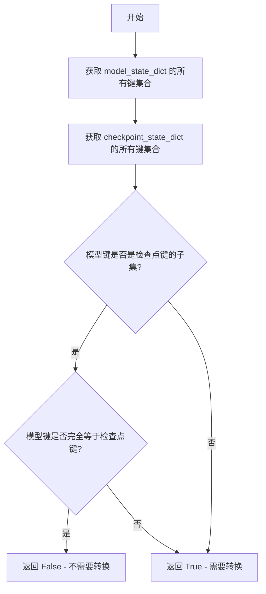

#### 带注释源码

```python
def _should_convert_state_dict_to_diffusers(model_state_dict, checkpoint_state_dict):
    """
    判断模型状态字典是否需要从原始格式转换为 Diffusers 格式。
    
    转换逻辑：
    - 如果模型键既是检查点键的子集（所有模型键都在检查点中存在）
      又完全相等（没有额外键），则不需要转换，返回 False
    - 否则返回 True，表示需要进行格式转换
    
    Parameters:
        model_state_dict (dict): 模型对象的状态字典
        checkpoint_state_dict (dict): 从检查点文件加载的状态字典
    
    Returns:
        bool: 是否需要进行格式转换
    """
    # 获取模型状态字典的所有键，转换为集合以便进行集合运算
    model_state_dict_keys = set(model_state_dict.keys())
    
    # 获取检查点状态字典的所有键
    checkpoint_state_dict_keys = set(checkpoint_state_dict.keys())
    
    # 判断模型键是否为检查点键的子集（即模型的所有键在检查点中都有）
    is_subset = model_state_dict_keys.issubset(checkpoint_state_dict_keys)
    
    # 判断模型键是否与检查点键完全相等
    is_match = model_state_dict_keys == checkpoint_state_dict_keys
    
    # 只有当既不是严格子集也不完全相等时（即存在键名差异）才需要转换
    # not (is_subset and is_match) 等价于: is_subset == False or is_match == False
    return not (is_subset and is_match)
```


### `_get_single_file_loadable_mapping_class`

根据传入的模型类（cls），在预定义的 `SINGLE_FILE_LOADABLE_CLASSES` 映射表中查找并返回对应的类名字符串。如果传入的类是映射表中某个类的子类，则返回该类的名称；否则返回 `None`。

参数：

- `cls`：`type`，需要检查的模型类，用于判断其是否继承自 `SINGLE_FILE_LOADABLE_CLASSES` 中定义的某个单文件可加载类

返回值：`str | None`，返回匹配到的类名字符串（如 "UNet2DConditionModel"），若未找到匹配的类则返回 `None`

#### 流程图

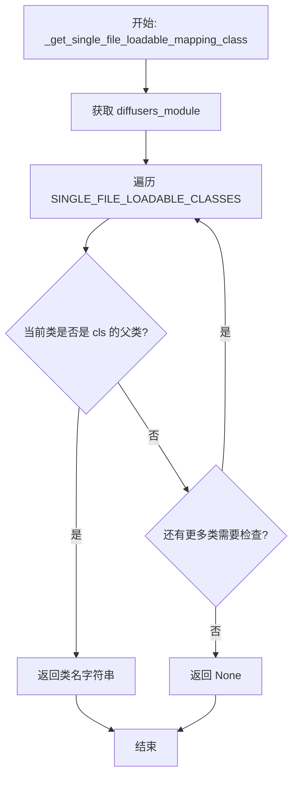

#### 带注释源码

```python
def _get_single_file_loadable_mapping_class(cls):
    """
    根据传入的类，查找其在 SINGLE_FILE_LOADABLE_CLASSES 中的映射类名。
    该函数用于确定给定的模型类可以通过 from_single_file 方法加载。
    
    参数:
        cls: 需要检查的模型类
        
    返回:
        str | None: 如果 cls 是 SINGLE_FILE_LOADABLE_CLASSES 中某个类的子类，
                   返回对应的类名字符串；否则返回 None
    """
    # 获取 diffusers 主模块，用于后续动态获取类定义
    # __name__ 例如 'diffusers.loaders.single_file'，split(".")[0] 得到 'diffusers'
    diffusers_module = importlib.import_module(__name__.split(".")[0])
    
    # 遍历所有支持单文件加载的类映射
    for loadable_class_str in SINGLE_FILE_LOADABLE_CLASSES:
        # 从 diffusers_module 中动态获取类对象
        loadable_class = getattr(diffusers_module, loadable_class_str)
        
        # 检查传入的 cls 是否是当前 loadable_class 的子类
        # issubclass(cls, loadable_class) 返回 True 如果 cls 继承自 loadable_class
        if issubclass(cls, loadable_class):
            # 找到匹配，返回类名字符串
            return loadable_class_str
    
    # 遍历完毕未找到匹配，返回 None
    return None
```


### `_get_mapping_function_kwargs`

该函数用于从传入的关键字参数中筛选出目标映射函数所需要的参数。通过检查映射函数的签名（参数列表），从调用者提供的 kwargs 中提取匹配的参数，形成一个仅包含映射函数所需参数的子集字典并返回。

参数：

-  `mapping_fn`：可调用对象（函数/方法），需要检查其参数签名以确定哪些参数是有效的
-  `**kwargs`：关键字参数字典，包含可能需要传递给映射函数的参数

返回值：`dict`，包含从 kwargs 中筛选出的、映射函数签名所支持的参数

#### 流程图

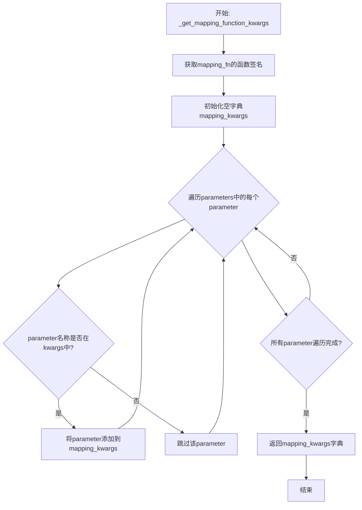

#### 带注释源码

```python
def _get_mapping_function_kwargs(mapping_fn, **kwargs):
    """
    从传入的关键字参数中筛选出目标映射函数所需要的参数。
    
    Args:
        mapping_fn: 映射函数对象，用于获取其参数签名
        **kwargs: 关键字参数字典，包含可能的参数值
    
    Returns:
        dict: 仅包含mapping_fn所需参数的关键字参数字典
    """
    # 使用inspect模块获取映射函数的签名，包含所有参数信息
    parameters = inspect.signature(mapping_fn).parameters

    # 初始化一个空字典，用于存储筛选后的参数
    mapping_kwargs = {}
    
    # 遍历映射函数的所有参数
    for parameter in parameters:
        # 检查该参数是否在调用者提供的kwargs中
        if parameter in kwargs:
            # 如果存在，则添加到结果字典中
            mapping_kwargs[parameter] = kwargs[parameter]

    # 返回筛选后的参数字典
    return mapping_kwargs
```


### `load_single_file_checkpoint`

从给定的代码来看，`load_single_file_checkpoint` 函数是作为 `single_file_utils` 模块的成员被导入的，它本身并未在此文件中定义。因此，我无法直接提供该函数的完整源码和详细内部流程图。

不过，我可以基于代码中对它的调用方式来推断其功能、参数和返回值信息。

---

参数：

- `pretrained_model_link_or_path_or_dict`：`str | dict | None`，可以是 HuggingFace Hub 上的模型链接、本地文件路径，或者直接是一个包含权重的字典
- `force_download`：`bool`，是否强制重新下载模型文件（即使缓存中存在）
- `proxies`：`dict[str, str]`，可选，代理服务器配置
- `token`：`str | bool`，可选，用于远程文件访问的认证令牌
- `cache_dir`：`str | os.PathLike`，可选，自定义缓存目录路径
- `local_files_only`：`bool`，是否仅从本地加载文件
- `revision`：`str`，可选，要使用的特定模型版本（commit id、branch 或 tag）
- `disable_mmap`：`bool`，是否禁用内存映射加载（Safetensors 文件）
- `user_agent`：`dict`，包含客户端信息的字典（如 diffusers 版本、框架类型等）

返回值：`dict`，返回加载后的模型检查点字典（包含模型权重和相关数据）

#### 流程图

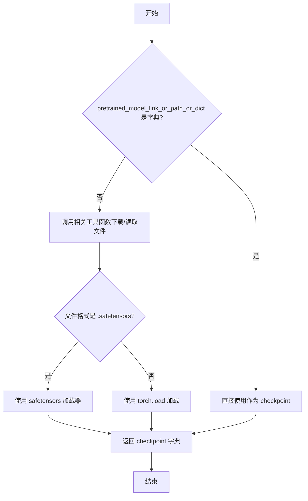

#### 带注释源码

```python
# 该函数定义在 src/diffusers/loaders/single_file_utils.py 中
# 以下是基于调用方式的推断实现

def load_single_file_checkpoint(
    pretrained_model_link_or_path_or_dict: str | dict | None = None,
    force_download: bool = False,
    proxies: dict[str, str] | None = None,
    token: str | bool | None = None,
    cache_dir: str | os.PathLike | None = None,
    local_files_only: bool = False,
    revision: str | None = None,
    disable_mmap: bool = False,
    user_agent: dict | None = None,
) -> dict:
    """
    从单文件格式（.ckpt 或 .safetensors）加载模型检查点。
    
    该函数支持三种输入模式：
    1. HuggingFace Hub 远程链接
    2. 本地文件路径
    3. 已有的状态字典（dict）
    
    Parameters:
        pretrained_model_link_or_path_or_dict: 模型文件路径或链接或权重字典
        force_download: 是否强制重新下载
        proxies: HTTP 代理配置
        token: HuggingFace Hub 认证令牌
        cache_dir: 缓存目录
        local_files_only: 是否仅使用本地文件
        revision: Git 版本/分支
        disable_mmap: 是否禁用内存映射
        user_agent: 客户端信息
    
    Returns:
        包含模型权重的检查点字典
    """
    # 注意：实际源码位于 single_file_utils.py 模块中
    # 此处为基于调用上下文的推断
    pass
```


### `fetch_original_config`

该函数用于从URL或本地文件路径获取原始模型配置文件（通常是YAML格式），并将其解析为Python字典。在`FromOriginalModelMixin.from_single_file`方法中，当用户提供了`original_config`参数（字符串类型）时调用此函数，以获取原始模型配置信息来初始化Diffusers模型配置。

参数：

- `original_config`：`str`，可以是 HuggingFace Hub 上的 URL、本地文件路径或 repo id，用于指定原始模型配置文件的位置
- `local_files_only`：`bool`，可选参数，控制是否只从本地加载文件，默认为 `False`

返回值：`dict`，返回解析后的原始配置字典，包含原始模型的配置信息（如模型架构、参数等）

#### 流程图

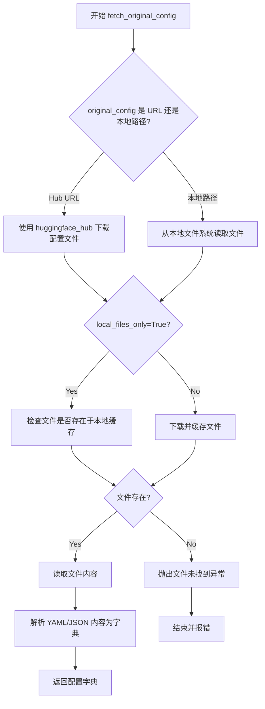

#### 带注释源码

```python
# 注意：由于 fetch_original_config 函数定义在 single_file_utils.py 中，
# 以下是基于代码上下文的推断实现

def fetch_original_config(original_config: str, local_files_only: bool = False) -> dict:
    """
    从 URL 或本地路径获取原始模型配置文件并解析为字典。
    
    Parameters:
        original_config (str): 配置文件的路径或 URL
        local_files_only (bool, optional): 是否只使用本地文件
    
    Returns:
        dict: 解析后的配置字典
    """
    # 1. 判断是否为 Hub URL
    if original_config.startswith("http://") or original_config.startswith("https://"):
        # 2. 从 Hub 下载配置文件
        # 使用 huggingface_hub 的 hf_hub_download 或类似函数
        config_path = hf_hub_download(
            repo_id=extract_repo_id(original_config),
            filename=extract_filename(original_config),
            local_files_only=local_files_only
        )
    else:
        # 3. 视为本地文件路径
        config_path = original_config
    
    # 4. 读取并解析 YAML 文件
    with open(config_path, 'r') as f:
        original_config_dict = yaml.safe_load(f)
    
    return original_config_dict
```


我需要分析给定的代码来提取`fetch_diffusers_config`函数的信息。

让我检查代码后发现，`fetch_diffusers_config`函数在当前代码文件中并未定义，而是从`.single_file_utils`模块导入的。在代码中可以看到：

```python
from .single_file_utils import (
    # ... many imports ...
    fetch_diffusers_config,
    # ...
)
```

不过，我可以在代码中找到该函数的使用方式。在`FromOriginalModelMixin`类的`from_single_file`方法中，有对`fetch_diffusers_config`的调用：

```python
config = fetch_diffusers_config(checkpoint)
default_pretrained_model_config_name = config["pretrained_model_name_or_path"]
```

基于代码上下文，我可以推断出该函数的相关信息，但无法提供完整的带注释源码（因为函数定义不在此文件中）。


### fetch_diffusers_config

该函数用于从原始模型检查点中提取Diffusers模型配置信息。它接收一个检查点字典作为输入，解析其中的配置元数据，并返回包含预训练模型名称或路径的配置字典。

参数：

- `checkpoint`：`dict`，原始模型检查点字典，包含模型权重和配置元数据

返回值：`dict`，返回包含以下关键字段的配置字典：
  - `pretrained_model_name_or_path`：`str`，预训练模型的名称或路径
  - 可能还包含其他配置字段如`subfolder`等

#### 流程图

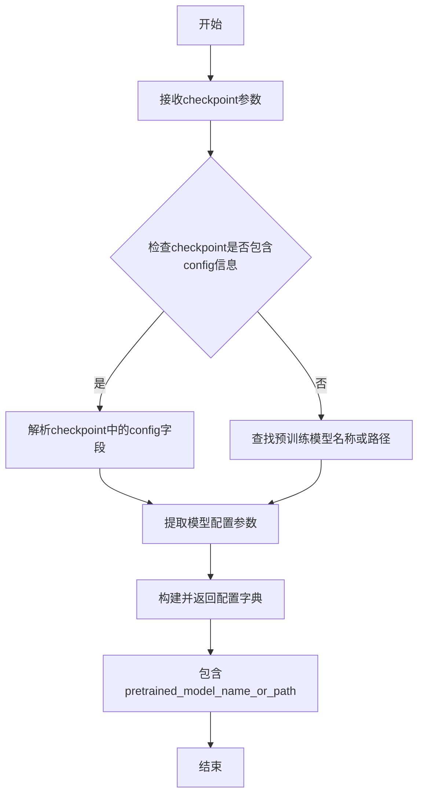

#### 带注释源码

```
# 该函数定义位于 diffusers/src/diffusers/loaders/single_file_utils.py
# 以下是基于代码上下文的推断实现

def fetch_diffusers_config(checkpoint: dict) -> dict:
    """
    从原始检查点中提取Diffusers配置信息。
    
    参数:
        checkpoint: 包含模型权重和元数据的检查点字典
        
    返回:
        包含pretrained_model_name_or_path的配置字典
    """
    # 1. 检查checkpoint中是否包含特殊标记的config
    # 2. 尝试从checkpoint的键中识别模型类型和配置
    # 3. 返回包含预训练模型路径的字典
    
    config = {}
    
    # 常见模式：从checkpoint中提取config信息
    if "pretrained_model_name_or_path" in checkpoint:
        config["pretrained_model_name_or_path"] = checkpoint["pretrained_model_name_or_path"]
    
    # 其他可能的配置提取逻辑...
    
    return config
```

#### 使用示例

在`FromOriginalModelMixin.from_single_file`方法中的调用：

```python
# 从单文件检查点加载模型时获取配置
config = fetch_diffusers_config(checkpoint)
default_pretrained_model_config_name = config["pretrained_model_name_or_path"]
```

**注意**：由于该函数定义在`single_file_utils`模块中，要获取完整的带注释源码，需要查看该模块的源代码。当前分析基于代码调用上下文的推断。


# `_determine_device_map` 详细设计文档

由于 `_determine_device_map` 函数是**从外部模块导入的**（`from ..models.model_loading_utils import _determine_device_map`），其实际源代码实现并未包含在当前提供的代码文件中。

以下是基于代码中的**调用方式**和函数**上下文**进行的逻辑分析和推断。

---

### `_determine_device_map`

该函数根据模型结构、torch 数据类型、量化配置等条件，自动为模型各层生成设备分配映射（device_map），以支持模型在多 GPU 环境下的高效加载与推理。

参数：

- `model`：`torch.nn.Module`，需要分配设备的模型实例
- `device_map`：`dict | None`，用户指定的设备映射（可选）
- `params_device`：`None`，占位参数（代码中传入 `None`）
- `torch_dtype`：`torch.dtype`，模型权重的目标数据类型
- `keep_in_fp32_modules`：`list[str]`，需要保持为 FP32 的模块列表
- `hf_quantizer`：`DiffusersAutoQuantizer | None`，HuggingFace 量化器实例

返回值：`dict | None`，返回计算得到的设备映射字典，若无需特殊分配则返回 `None`

#### 流程图

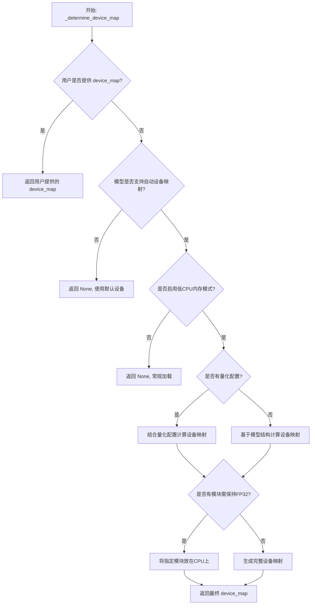

#### 带注释源码

```python
# 注意：以下为基于调用上下文推断的逻辑实现，并非原始源码
# 原始实现位于: diffusers/src/diffusers/models/model_loading_utils.py

def _determine_device_map(
    model: torch.nn.Module,
    device_map: Optional[Dict[str, Union[int, str, torch.device]]],
    params_device: Optional[Any],  # 占位，当前传入None
    torch_dtype: Optional[torch.dtype],
    keep_in_fp32_modules: List[str],
    hf_quantizer: Optional["DiffusersAutoQuantizer"]
) -> Optional[Dict[str, Union[int, str, torch.device]]]:
    """
    根据模型和配置确定设备映射
    
    参数:
        model: 要分配设备的模型
        device_map: 用户指定的设备映射（可选）
        params_device: 参数字设备（当前未使用）
        torch_dtype: 目标数据类型
        keep_in_fp32_modules: 需要保持FP32的模块列表
        hf_quantizer: 量化器配置
    
    返回:
        设备映射字典或None
    """
    
    # 如果用户已提供device_map，直接返回
    if device_map is not None:
        return device_map
    
    # 检查是否满足低CPU内存使用条件
    # 需要torch >= 1.9.0 且 accelerate可用
    low_cpu_mem_usage = ...
    
    if not low_cpu_mem_usage:
        return None
    
    # 计算设备的设备映射
    # 1. 分析模型各层的大小
    # 2. 根据GPU数量和内存分配
    # 3. 处理需要保持FP32的模块（通常放在CPU以节省GPU内存）
    
    device_map = {}
    
    # 处理需要保持FP32的模块
    for module_name in keep_in_fp32_modules:
        device_map[module_name] = "cpu"
    
    # 为其他模块自动生成设备映射
    # 通常使用 accelerate 的 split_state_dict 或类似方法
    
    return device_map if device_map else None
```

---

### 补充说明

**调用位置**：在 `FromOriginalModelMixin.from_single_file()` 方法的第 398 行：

```python
device_map = _determine_device_map(
    model, 
    device_map,  # 用户传入的device_map（可能为None）
    None,        # params_device 占位符
    torch_dtype, 
    keep_in_fp32_modules, 
    hf_quantizer
)
```

**作用上下文**：该函数在单文件模型加载流程中用于确定模型各层的设备分配，配合 `init_empty_weights()` 上下文管理器实现延迟加载和内存优化。


### `_expand_device_map`

该函数用于扩展和优化设备映射（device_map），确保模型的所有参数都被正确地分配到指定的设备上。通常与模型加载和设备分配配合使用，以支持模型在多个设备间的高效分布。

参数：

-  `device_map`：`dict`，由 `_determine_device_map` 返回的设备映射字典，定义了模型各层的设备分配方案
-  `model_state_keys`：`KeysView[str]` 或类似的可迭代对象，表示模型状态字典的键（即模型参数名称列表），用于验证所有参数是否都被包含在设备映射中

返回值：`dict`，扩展后的设备映射字典，确保所有模型参数都能正确映射到目标设备

#### 流程图

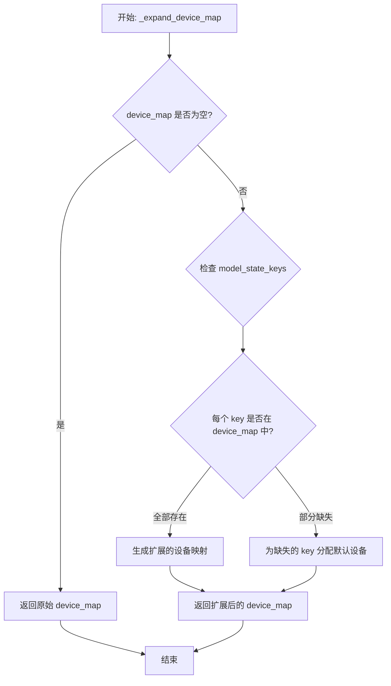

#### 带注释源码

```python
# 该函数定义在 diffusers/src/diffusers/models/model_loading_utils.py 中
# 以下为从当前文件中观察到的调用方式：

# 调用示例：
device_map = _determine_device_map(model, device_map, None, torch_dtype, keep_in_fp32_modules, hf_quantizer)
if device_map is not None:
    expanded_device_map = _expand_device_map(device_map, model_state_dict.keys())
    _caching_allocator_warmup(model, expanded_device_map, torch_dtype, hf_quantizer)

# 参数说明：
# - device_map: 基础设备映射，来自 _determine_device_map 函数
# - model_state_dict.keys(): 模型所有参数的名字列表
# 返回值：expanded_device_map 会传递给 _caching_allocator_warmup 用于缓存分配器预热
```


### `_caching_allocator_warmup`

该函数用于在模型加载过程中执行缓存分配器的预热操作，通过预先在目标设备上分配张量来优化模型权重加载的性能，减少后续推理时的内存分配开销。

参数：

- `model`：`torch.nn.Module`，需要加载权重的模型实例
- `expanded_device_map`：`dict`，展开后的设备映射字典，指定模型各层到目标设备的映射关系
- `torch_dtype`：`torch.dtype`，用于模型张量的数据类型（如 torch.float16）
- `hf_quantizer`：可选的 `DiffusersAutoQuantizer` 实例，用于量化配置，如果为 None 表示不使用量化

返回值：无返回值（`None`），该函数直接修改模型状态

#### 流程图

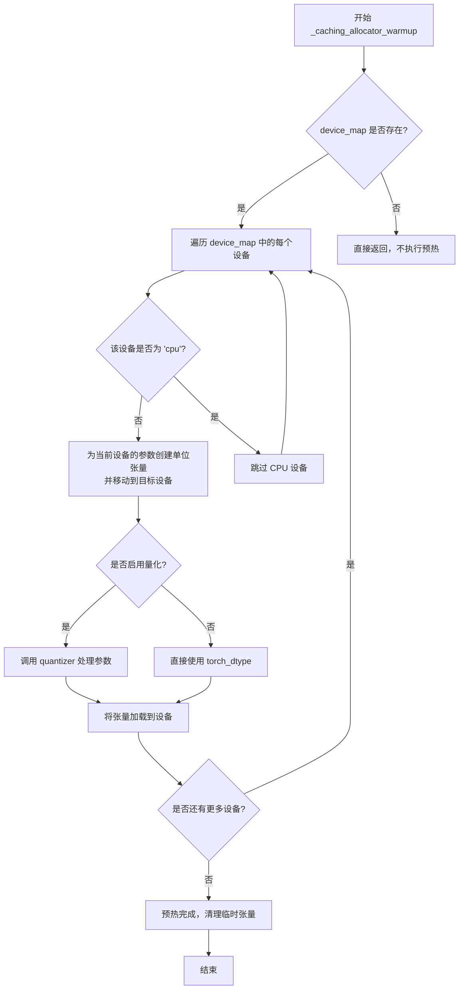

#### 带注释源码

```python
# 注：此函数定义在 ..models.model_loading_utils 模块中
# 以下为在 from_single_file 方法中的调用方式：

if device_map is not None:
    # 1. 展开设备映射，将模型层次结构展开为层到设备的映射
    expanded_device_map = _expand_device_map(device_map, model_state_dict.keys())
    
    # 2. 执行缓存分配器预热
    #    - model: 要加载的模型
    #    - expanded_device_map: 设备映射关系
    #    - torch_dtype: 模型使用的数据类型
    #    - hf_quantizer: 量化配置（可为 None）
    _caching_allocator_warmup(model, expanded_device_map, torch_dtype, hf_quantizer)
```

---

**注意**：由于 `_caching_allocator_warmup` 函数的实际实现代码位于 `..models.model_loading_utils` 模块中（当前代码段仅包含导入和调用），完整的函数实现需要查看该模块的源文件。以上信息基于代码中的调用上下文整理。


### `load_model_dict_into_meta`

将预训练模型权重加载到位于 Meta 设备上的模型中，支持量化、FP32 模块保留和设备映射等功能。该函数是 `diffusers` 库用于高效加载大模型的关键工具函数。

参数：

- `model`：`torch.nn.Module`，需要加载权重的目标模型
- `state_dict`：`dict`，包含模型权重的状态字典
- `dtype`：`torch.dtype`，可选，权重转换的目标数据类型
- `device_map`：`dict`，可选，指定参数到设备的映射关系
- `hf_quantizer`：`DiffusersAutoQuantizer`，可选，量化配置对象
- `keep_in_fp32_modules`：`list`，可选，需要保持为 FP32 的模块列表
- `unexpected_keys`：`list`，可选，状态字典中不在模型中的键

返回值：`dict`，返回未匹配的键列表

#### 流程图

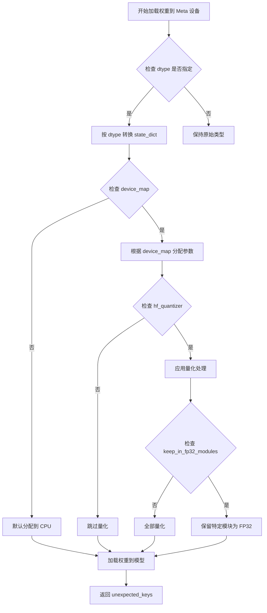

#### 带注释源码

```python
# 该函数定义在 diffusers.src.diffusers.models.model_loading_utils 模块中
# 此处为从外部模块导入的函数调用示例：

# 在 FromOriginalModelMixin.from_single_file 方法中的调用：
load_model_dict_into_meta(
    model,                                    # 目标模型实例
    diffusers_format_checkpoint,             # 转换后的权重字典
    dtype=torch_dtype,                        # 目标数据类型（如 float16）
    device_map=device_map,                   # 设备映射 {"": param_device}
    hf_quantizer=hf_quantizer,                # 量化器实例
    keep_in_fp32_modules=keep_in_fp32_modules, # 需保持 FP32 的模块列表
    unexpected_keys=unexpected_keys,          # 不匹配的键列表
)
```

#### 补充说明

由于 `load_model_dict_into_meta` 函数定义在 `diffusers.models.model_loading_utils` 模块中（通过 `from ..models.model_loading_utils import load_model_dict_into_meta` 导入），当前代码片段中未包含其完整实现。该函数的主要功能包括：

1. **Meta 设备加载**：将模型权重加载到 CPU Meta 设备上，避免内存占用
2. **设备映射**：支持自定义设备映射规则，将不同参数分配到不同设备
3. **量化支持**：集成 `hf_quantizer` 实现模型量化
4. **FP32 保留**：通过 `keep_in_fp32_modules` 参数保留关键模块为 FP32 精度
5. **错误处理**：追踪并返回不匹配的权重键


### `empty_device_cache`

清理 GPU 设备缓存，释放未被使用的 GPU 显存，通常在模型加载完成后调用以优化内存使用。

参数： 无

返回值：`None`，无返回值

#### 流程图

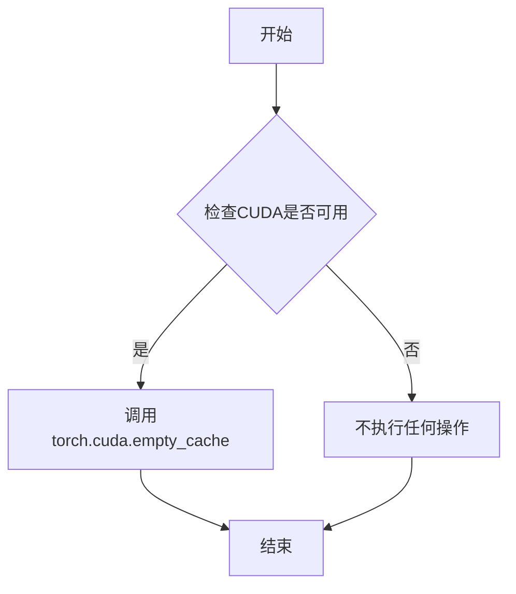

#### 带注释源码

```python
# empty_device_cache 函数的实现（在 ..utils.torch_utils 模块中）
# 此函数用于清理 CUDA 缓存，释放 GPU 显存

def empty_device_cache():
    """
    清理 GPU 设备缓存。
    
    当使用低 CPU 内存模式 (low_cpu_mem_usage=True) 加载模型后，
    调用此函数可以释放 PyTorch CUDA 缓存中的未使用显存，
    帮助优化 GPU 内存使用。
    """
    # 检查是否有 CUDA 设备可用
    if torch.cuda.is_available():
        # 清空 CUDA 缓存，释放未被使用的 GPU 显存
        torch.cuda.empty_cache()
    # 如果没有 CUDA，则不执行任何操作
```

**在 `FromOriginalModelMixin.from_single_file` 中的调用位置：**

```python
# ... 在模型权重加载到设备后调用 ...
load_model_dict_into_meta(
    model,
    diffusers_format_checkpoint,
    dtype=torch_dtype,
    device_map=device_map,
    hf_quantizer=hf_quantizer,
    keep_in_fp32_modules=keep_in_fp32_modules,
    unexpected_keys=unexpected_keys,
)
empty_device_cache()  # <--- 在此处调用，清理加载后的 GPU 缓存
```


### `dispatch_model`

该函数是 `accelerate` 库提供的模型设备分发函数，用于根据提供的 `device_map` 将模型的各个层自动分配到不同的设备（CPU/GPU）上，以支持模型并行或高效内存管理。在 `FromOriginalModelMixin.from_single_file` 方法中，当 `device_map` 不为 None 时调用此函数来完成模型的设备分配。

参数：

-  `model`：`torch.nn.Module`，需要分发到不同设备的 PyTorch 模型
-  `device_map`：`dict` 或 `str`，指定模型各层到设备的映射关系，可以是自定义字典、 `"auto"` 或 `"balanced"` 等预设值
-  `**kwargs`：其他可选参数，如 `max_memory`、`offload_folder`、`offload_state_dict`、` ExecutionOrder` 等，用于控制分发行为

返回值：无返回值（`None`），函数直接修改传入的模型对象，将其各层分配到指定设备

#### 流程图

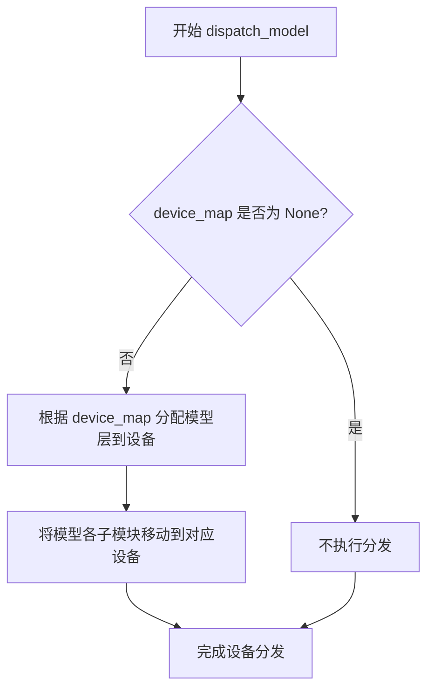

#### 带注释源码

```python
# 在 FromOriginalModelMixin.from_single_file 方法中调用 dispatch_model
if device_map is not None:
    # 构建 device_map 参数字典
    device_map_kwargs = {"device_map": device_map}
    # 调用 accelerate 库的 dispatch_model 函数
    # 该函数会根据 device_map 将模型的各层分配到指定设备
    # 支持模型并行、内存优化等功能
    dispatch_model(model, **device_map_kwargs)
```


### deprecate

从 `..utils` 导入的弃用提示函数，用于警告用户某个参数或功能将在未来版本中移除。

参数：

- `name`：`str`，要弃用的参数或功能的名称
- `version`：`str`，计划弃用的版本号
- `message`：`str`，关于弃用的详细说明信息

返回值：无（`None`）

#### 流程图

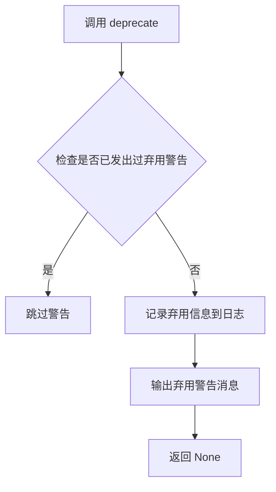

#### 带注释源码

```
# 在 from_single_file 方法中的调用示例
if pretrained_model_link_or_path is not None:
    deprecation_message = (
        "Please use `pretrained_model_link_or_path_or_dict` argument instead for model classes"
    )
    # 调用 deprecate 函数，警告用户 pretrained_model_link_or_path 参数将在 1.0.0 版本被移除
    deprecate("pretrained_model_link_or_path", "1.0.0", deprecation_message)
    # 将旧参数值赋给新参数
    pretrained_model_link_or_path_or_dict = pretrained_model_link_or_path
```

**注意**：由于 `deprecate` 函数定义在 `..utils` 模块中（未在此代码文件中实现），以上信息基于其在代码中的调用方式和通常的弃用模式。如需查看 `deprecate` 函数的完整实现源码，请查阅 `diffusers.utils` 中的相关定义。


### `FromOriginalModelMixin.from_single_file`

从原始的 `.ckpt` 或 `.safetensors` 格式的预训练权重文件加载模型权重到 Diffusers 格式的模型中。该方法支持从 HuggingFace Hub 链接、本地文件路径或直接传入状态字典三种方式加载，并自动处理配置转换、设备映射、内存优化和量化等复杂逻辑，最终返回一个设置为评估模式的模型实例。

参数：

- `cls`：类方法隐含的第一个参数，表示调用该方法的类
- `pretrained_model_link_or_path_or_dict`：`str | None`，可以是 HuggingFace Hub 上的 `.safetensors` 或 `.ckpt` 文件链接、本地文件路径，或包含模型权重的状态字典
- `**kwargs`：剩余的关键字参数，可用于覆盖模型的加载和保存变量，包括：
  - `config`：`str | None`，预训练管道的 repo id 或本地目录路径
  - `subfolder`：`str | optional`，模型文件在仓库中的子文件夹位置
  - `original_config`：`str | dict | None`，原始模型的配置文件路径或字典
  - `torch_dtype`：`torch.dtype | None`，覆盖默认的 dtype 加载模型
  - `force_download`：`bool | optional`，是否强制重新下载模型权重和配置文件
  - `cache_dir`：`str | os.PathLike | optional`，缓存目录路径
  - `proxies`：`dict[str, str] | optional`，代理服务器配置
  - `local_files_only`：`bool | optional`，是否仅加载本地模型文件
  - `token`：`str | bool | optional`，远程文件的 HTTP bearer 授权令牌
  - `revision`：`str | optional`，使用的模型版本标识符
  - `low_cpu_mem_usage`：`bool | optional`，是否启用低 CPU 内存占用模式
  - `disable_mmap`：`bool | optional`，是否禁用 mmap 加载 Safetensors 模型
  - `device`：`str | None`，模型加载的目标设备
  - `device_map`：`dict | None`，设备映射配置
  - `quantization_config`：`optional`，量化配置
  - `config_revision`：`str | optional`，配置文件的版本

返回值：`Self`，返回加载并设置好评估模式的模型实例

#### 流程图

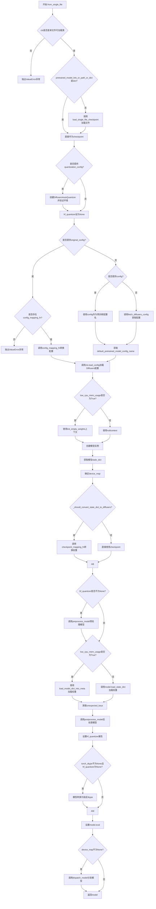

#### 带注释源码

```python
@classmethod
@validate_hf_hub_args
def from_single_file(cls, pretrained_model_link_or_path_or_dict: str | None = None, **kwargs) -> Self:
    r"""
    Instantiate a model from pretrained weights saved in the original `.ckpt` or `.safetensors` format. The model
    is set in evaluation mode (`model.eval()`) by default.

    Parameters:
        pretrained_model_link_or_path_or_dict (`str`, *optional*):
            Can be either:
                - A link to the `.safetensors` or `.ckpt` file (for example
                  `"https://huggingface.co/<repo_id>/blob/main/<path_to_file>.safetensors"`) on the Hub.
                - A path to a local *file* containing the weights of the component model.
                - A state dict containing the component model weights.
        config (`str`, *optional*):
            - A string, the *repo id* (for example `CompVis/ldm-text2im-large-256`) of a pretrained pipeline hosted
              on the Hub.
            - A path to a *directory* (for example `./my_pipeline_directory/`) containing the pipeline component
              configs in Diffusers format.
        subfolder (`str`, *optional*, defaults to `""`):
            The subfolder location of a model file within a larger model repository on the Hub or locally.
        original_config (`str`, *optional*):
            Dict or path to a yaml file containing the configuration for the model in its original format.
                If a dict is provided, it will be used to initialize the model configuration.
        torch_dtype (`torch.dtype`, *optional*):
            Override the default `torch.dtype` and load the model with another dtype.
        force_download (`bool`, *optional*, defaults to `False`):
            Whether or not to force the (re-)download of the model weights and configuration files, overriding the
            cached versions if they exist.
        cache_dir (`str | os.PathLike`, *optional*):
            Path to a directory where a downloaded pretrained model configuration is cached if the standard cache
            is not used.

        proxies (`dict[str, str]`, *optional*):
            A dictionary of proxy servers to use by protocol or endpoint, for example, `{'http': 'foo.bar:3128',
            'http://hostname': 'foo.bar:4012'}`. The proxies are used on each request.
        local_files_only (`bool`, *optional*, defaults to `False`):
            Whether to only load local model weights and configuration files or not. If set to True, the model
            won't be downloaded from the Hub.
        token (`str` or *bool*, *optional*):
            The token to use as HTTP bearer authorization for remote files. If `True`, the token generated from
            `diffusers-cli login` (stored in `~/.huggingface`) is used.
        revision (`str`, *optional*, defaults to `"main"`):
            The specific model version to use. It can be a branch name, a tag name, a commit id, or any identifier
            allowed by Git.
        low_cpu_mem_usage (`bool`, *optional*, defaults to `True` if torch version >= 1.9.0 and
            is_accelerate_available() else `False`): Speed up model loading only loading the pretrained weights and
            not initializing the weights. This also tries to not use more than 1x model size in CPU memory
            (including peak memory) while loading the model. Only supported for PyTorch >= 1.9.0. If you are using
            an older version of PyTorch, setting this argument to `True` will raise an error.
        disable_mmap ('bool', *optional*, defaults to 'False'):
            Whether to disable mmap when loading a Safetensors model. This option can perform better when the model
            is on a network mount or hard drive, which may not handle the seeky-ness of mmap very well.
        kwargs (remaining dictionary of keyword arguments, *optional*):
            Can be used to overwrite load and saveable variables (for example the pipeline components of the
            specific pipeline class). The overwritten components are directly passed to the pipelines `__init__`
            method. See example below for more information.

    ```py
    >>> from diffusers import StableCascadeUNet

    >>> ckpt_path = "https://huggingface.co/stabilityai/stable-cascade/blob/main/stage_b_lite.safetensors"
    >>> model = StableCascadeUNet.from_single_file(ckpt_path)
    ```
    """

    # 获取当前类对应的单文件加载映射类名
    mapping_class_name = _get_single_file_loadable_mapping_class(cls)
    # 如果类名不在SINGLE_FILE_LOADABLE_CLASSES中，抛出错误
    if mapping_class_name is None:
        raise ValueError(
            f"FromOriginalModelMixin is currently only compatible with {', '.join(SINGLE_FILE_LOADABLE_CLASSES.keys())}"
        )

    # 处理遗留参数pretrained_model_link_or_path的兼容性
    pretrained_model_link_or_path = kwargs.get("pretrained_model_link_or_path", None)
    if pretrained_model_link_or_path is not None:
        deprecation_message = (
            "Please use `pretrained_model_link_or_path_or_dict` argument instead for model classes"
        )
        deprecate("pretrained_model_link_or_path", "1.0.0", deprecation_message)
        pretrained_model_link_or_path_or_dict = pretrained_model_link_or_path

    # 从kwargs中提取各种配置参数
    config = kwargs.pop("config", None)
    original_config = kwargs.pop("original_config", None)

    # 不能同时提供config和original_config
    if config is not None and original_config is not None:
        raise ValueError(
            "`from_single_file` cannot accept both `config` and `original_config` arguments. Please provide only one of these arguments"
        )

    force_download = kwargs.pop("force_download", False)
    proxies = kwargs.pop("proxies", None)
    token = kwargs.pop("token", None)
    cache_dir = kwargs.pop("cache_dir", None)
    local_files_only = kwargs.pop("local_files_only", None)
    subfolder = kwargs.pop("subfolder", None)
    revision = kwargs.pop("revision", None)
    config_revision = kwargs.pop("config_revision", None)
    torch_dtype = kwargs.pop("torch_dtype", None)
    quantization_config = kwargs.pop("quantization_config", None)
    low_cpu_mem_usage = kwargs.pop("low_cpu_mem_usage", _LOW_CPU_MEM_USAGE_DEFAULT)
    device = kwargs.pop("device", None)
    disable_mmap = kwargs.pop("disable_mmap", False)
    device_map = kwargs.pop("device_map", None)

    # 构建用户代理信息，用于遥测
    user_agent = {"diffusers": __version__, "file_type": "single_file", "framework": "pytorch"}
    # 如果有量化配置，添加量化方法到用户代理
    if quantization_config is not None:
        user_agent["quant"] = quantization_config.quant_method.value

    # 验证torch_dtype的类型有效性
    if torch_dtype is not None and not isinstance(torch_dtype, torch.dtype):
        torch_dtype = torch.float32
        logger.warning(
            f"Passed `torch_dtype` {torch_dtype} is not a `torch.dtype`. Defaulting to `torch.float32`."
        )

    # 如果传入的是字典，直接作为checkpoint；否则调用load_single_file_checkpoint加载文件
    if isinstance(pretrained_model_link_or_path_or_dict, dict):
        checkpoint = pretrained_model_link_or_path_or_dict
    else:
        checkpoint = load_single_file_checkpoint(
            pretrained_model_link_or_path_or_dict,
            force_download=force_download,
            proxies=proxies,
            token=token,
            cache_dir=cache_dir,
            local_files_only=local_files_only,
            revision=revision,
            disable_mmap=disable_mmap,
            user_agent=user_agent,
        )
    
    # 处理量化配置
    if quantization_config is not None:
        hf_quantizer = DiffusersAutoQuantizer.from_config(quantization_config)
        hf_quantizer.validate_environment()
        torch_dtype = hf_quantizer.update_torch_dtype(torch_dtype)
    else:
        hf_quantizer = None

    # 获取映射函数
    mapping_functions = SINGLE_FILE_LOADABLE_CLASSES[mapping_class_name]
    checkpoint_mapping_fn = mapping_functions["checkpoint_mapping_fn"]

    # 处理original_config
    if original_config is not None:
        # 如果有配置映射函数则获取，否则设为None
        if "config_mapping_fn" in mapping_functions:
            config_mapping_fn = mapping_functions["config_mapping_fn"]
        else:
            config_mapping_fn = None

        if config_mapping_fn is None:
            raise ValueError(
                (
                    f"`original_config` has been provided for {mapping_class_name} but no mapping function"
                    "was found to convert the original config to a Diffusers config in"
                    "`diffusers.loaders.single_file_utils`"
                )
            )

        # 如果original_config是字符串，获取配置字典
        if isinstance(original_config, str):
            original_config = fetch_original_config(original_config, local_files_only=local_files_only)

        # 获取映射函数需要的参数并调用
        config_mapping_kwargs = _get_mapping_function_kwargs(config_mapping_fn, **kwargs)
        diffusers_model_config = config_mapping_fn(
            original_config=original_config, checkpoint=checkpoint, **config_mapping_kwargs
        )
    else:
        # 处理config参数
        if config is not None:
            if isinstance(config, str):
                default_pretrained_model_config_name = config
            else:
                raise ValueError(
                    (
                        "Invalid `config` argument. Please provide a string representing a repo id"
                        "or path to a local Diffusers model repo."
                    )
                )
        else:
            # 获取Diffusers配置
            config = fetch_diffusers_config(checkpoint)
            default_pretrained_model_config_name = config["pretrained_model_name_or_path"]

            # 获取默认子文件夹
            if "default_subfolder" in mapping_functions:
                subfolder = mapping_functions["default_subfolder"]

            subfolder = subfolder or config.pop(
                "subfolder", None
            )  # some configs contain a subfolder key, e.g. StableCascadeUNet

        # 加载Diffusers模型配置
        diffusers_model_config = cls.load_config(
            pretrained_model_name_or_path=default_pretrained_model_config_name,
            subfolder=subfolder,
            local_files_only=local_files_only,
            token=token,
            revision=config_revision,
        )
        
        # 获取预期和可选的参数关键字
        expected_kwargs, optional_kwargs = cls._get_signature_keys(cls)

        # 处理遗留参数映射
        if "legacy_kwargs" in mapping_functions:
            legacy_kwargs = mapping_functions["legacy_kwargs"]
            for legacy_key, new_key in legacy_kwargs.items():
                if legacy_key in kwargs:
                    kwargs[new_key] = kwargs.pop(legacy_key)

        # 筛选出模型参数字典
        model_kwargs = {k: kwargs.get(k) for k in kwargs if k in expected_kwargs or k in optional_kwargs}
        diffusers_model_config.update(model_kwargs)

    # 根据low_cpu_mem_usage选择上下文管理器创建模型
    ctx = init_empty_weights if low_cpu_mem_usage else nullcontext
    with ctx():
        model = cls.from_config(diffusers_model_config)

    # 获取模型状态字典
    model_state_dict = model.state_dict()

    # 检查是否需要保留FP32模块
    use_keep_in_fp32_modules = (cls._keep_in_fp32_modules is not None) and (
        (torch_dtype == torch.float16) or hasattr(hf_quantizer, "use_keep_in_fp32_modules")
    )
    if use_keep_in_fp32_modules:
        keep_in_fp32_modules = cls._keep_in_fp32_modules
        if not isinstance(keep_in_fp32_modules, list):
            keep_in_fp32_modules = [keep_in_fp32_modules]
    else:
        keep_in_fp32_modules = []

    # 确定device_map
    device_map = _determine_device_map(model, device_map, None, torch_dtype, keep_in_fp32_modules, hf_quantizer)
    if device_map is not None:
        expanded_device_map = _expand_device_map(device_map, model_state_dict.keys())
        _caching_allocator_warmup(model, expanded_device_map, torch_dtype, hf_quantizer)

    # 获取checkpoint映射函数参数
    checkpoint_mapping_kwargs = _get_mapping_function_kwargs(checkpoint_mapping_fn, **kwargs)

    # 判断是否需要转换state_dict
    if _should_convert_state_dict_to_diffusers(model_state_dict, checkpoint):
        diffusers_format_checkpoint = checkpoint_mapping_fn(
            config=diffusers_model_config, checkpoint=checkpoint, **checkpoint_mapping_kwargs
        )
    else:
        diffusers_format_checkpoint = checkpoint

    # 检查checkpoint是否为空
    if not diffusers_format_checkpoint:
        raise SingleFileComponentError(
            f"Failed to load {mapping_class_name}. Weights for this component appear to be missing in the checkpoint."
        )

    # 量化预处理模型
    if hf_quantizer is not None:
        hf_quantizer.preprocess_model(
            model=model,
            device_map=None,
            state_dict=diffusers_format_checkpoint,
            keep_in_fp32_modules=keep_in_fp32_modules,
        )

    device_map = None
    # 根据low_cpu_mem_usage选择加载方式
    if low_cpu_mem_usage:
        param_device = torch.device(device) if device else torch.device("cpu")
        empty_state_dict = model.state_dict()
        unexpected_keys = [
            param_name for param_name in diffusers_format_checkpoint if param_name not in empty_state_dict
        ]
        device_map = {"": param_device}
        load_model_dict_into_meta(
            model,
            diffusers_format_checkpoint,
            dtype=torch_dtype,
            device_map=device_map,
            hf_quantizer=hf_quantizer,
            keep_in_fp32_modules=keep_in_fp32_modules,
            unexpected_keys=unexpected_keys,
        )
        empty_device_cache()
    else:
        _, unexpected_keys = model.load_state_dict(diffusers_format_checkpoint, strict=False)

    # 过滤掉需要忽略的unexpected keys
    if model._keys_to_ignore_on_load_unexpected is not None:
        for pat in model._keys_to_ignore_on_load_unexpected:
            unexpected_keys = [k for k in unexpected_keys if re.search(pat, k) is None]

    # 记录未使用的权重警告
    if len(unexpected_keys) > 0:
        logger.warning(
            f"Some weights of the model checkpoint were not used when initializing {cls.__name__}: \n {[', '.join(unexpected_keys)]}"
        )

    # 量化后处理
    if hf_quantizer is not None:
        hf_quantizer.postprocess_model(model)
        model.hf_quantizer = hf_quantizer

    # 转换模型dtype
    if torch_dtype is not None and hf_quantizer is None:
        model.to(torch_dtype)

    # 设置为评估模式
    model.eval()

    # 如果有device_map，使用dispatch_model分发模型
    if device_map is not None:
        device_map_kwargs = {"device_map": device_map}
        dispatch_model(model, **device_map_kwargs)

    return model
```

## 关键组件


### FromOriginalModelMixin

核心mixin类，提供from_single_file类方法用于从原始.ckpt或.safetensors格式文件加载预训练模型到Diffusers格式

### SINGLE_FILE_LOADABLE_CLASSES

定义了支持单文件加载的模型类映射字典，包含模型类型对应的checkpoint转换函数、config映射函数和默认子文件夹

### 量化器 (DiffusersAutoQuantizer)

根据quantization_config配置自动选择并初始化量化器，支持模型量化推理，包含preprocess_model和postprocess_model方法进行量化前后处理

### 张量索引与惰性加载机制

通过low_cpu_mem_usage参数控制，使用init_empty_weights实现延迟加载模型权重，配合mmap机制和device_map实现高效内存管理

### 状态字典转换流程

_should_convert_state_dict_to_diffusers函数判断是否需要转换，检查模型状态字典键是否为检查点状态字典的子集

### 设备映射与分配

_determine_device_map和_expand_device_map函数根据模型结构自动计算设备分配策略，配合_caching_allocator_warmup进行缓存分配器预热

### 检查点映射函数

各convert_*_checkpoint_to_diffusers系列函数将不同格式的原始检查点转换为Diffusers格式，包括LDM、SD3、Flux、LTX、StableCascade等多种模型架构

### 配置获取与映射

fetch_diffusers_config和fetch_original_config分别获取Diffusers格式和原始格式的模型配置，config_mapping_fn将原始配置转换为Diffusers配置

### 模型实例化与权重加载

使用from_config实例化模型，通过load_state_dict或load_model_dict_into_meta加载权重，支持low_cpu_mem_usage模式的元设备加载

### 遗留参数兼容处理

通过legacy_kwargs映射字典将旧版本参数名转换为新参数名，确保向后兼容性


## 问题及建议


### 已知问题

- **`from_single_file` 方法过长**：该方法超过300行，包含了配置加载、模型初始化、权重转换、设备映射、量化处理等多重逻辑，导致代码可读性和可维护性较差，建议拆分为多个私有方法。
- **`model.state_dict()` 调用次数过多**：在代码中至少调用了三次（获取 `model_state_dict`、`empty_state_dict`，以及可能的 `_determine_device_map` 内部调用），这在大模型场景下会消耗大量内存和时间，建议缓存结果。
- **类型提示不够完整**：部分参数如 `**kwargs` 缺乏明确的类型定义，`config_revision` 等参数未在方法签名中声明类型。
- **`SINGLE_FILE_LOADABLE_CLASSES` 字典臃肿**：包含30多个模型类映射，代码重复度高（多个模型使用相同的 `checkpoint_mapping_fn`），可以考虑使用继承或装饰器模式简化。
- **`_get_mapping_function_kwargs` 重复调用**：该函数在处理 `config_mapping_fn` 和 `checkpoint_mapping_fn` 时被分别调用，可以提取公共逻辑。
- **隐式依赖和副作用**：`model.hf_quantizer` 直接赋值到模型对象上，这种副作用式的状态管理不够透明，可能导致难以追踪的bug。
- **错误消息不够友好**：当 `checkpoint_mapping_fn` 返回空值时，错误消息仅提示"权重缺失"，缺乏具体的调试信息（如缺少哪些 ключи）。
- **`device_map` 变量重复赋值**：代码中 `device_map` 先被确定后又设为 `None`，逻辑不够清晰，容易造成混淆。

### 优化建议

- 将 `from_single_file` 方法拆分为 ` _load_config`、`_initialize_model`、`_convert_checkpoint`、`_load_weights` 等私有方法，每方法职责单一。
- 缓存 `model.state_dict()` 的结果，避免重复调用。
- 为所有公开参数添加完整的类型提示，特别是 `config_revision`、`quantization_config` 等关键参数。
- 使用数据驱动的方式重构 `SINGLE_FILE_LOADABLE_CLASSES`，例如通过配置类或装饰器减少重复代码。
- 增加更详细的错误诊断信息，例如记录未匹配的 state dict keys 以帮助用户排查问题。
- 明确设备映射的逻辑流程，避免 `device_map` 变量的多次赋值和条件性重置。
- 添加更多的日志记录点，特别是在权重加载和转换的关键步骤，以便于生产环境调试。

## 其它


### 设计目标与约束

本模块的核心设计目标是将来自不同来源（如 .ckpt 或 .safetensors 格式）的预训练权重转换为 Diffusers 格式，使得用户能够使用统一的接口加载各种原始模型检查点。主要约束包括：1）仅支持 SINGLE_FILE_LOADABLE_CLASSES 中列出的模型类；2）torch 版本需 >= 1.9.0 才能使用 low_cpu_mem_usage 功能；3）quantization_config 和 torch_dtype 的交互需要遵循特定的优先级规则；4）不支持同时传递 config 和 original_config 参数。

### 错误处理与异常设计

代码中定义了多种错误处理场景：1）ValueError - 当传入不支持的模型类、同时传递 config 和 original_config、无效的 config 参数、或者 checkpoint 转换失败时抛出；2）SingleFileComponentError - 当特定组件的权重在检查点中缺失时抛出；3）通过 logger.warning 处理意外密钥（unexpected_keys）的警告；4）torch_dtype 类型验证失败时会发出警告并回退到 torch.float32。所有错误都包含描述性的错误消息，帮助用户定位问题。

### 数据流与状态机

整体数据流如下：首先接收 pretrained_model_link_or_path_or_dict（可以是 URL、本地路径或状态字典）；然后根据参数类型决定是否需要下载模型；接着获取或创建模型配置（通过 original_config、config 或自动 fetch）；之后创建模型实例（使用 init_empty_weights 或直接初始化）；最后将检查点权重加载到模型中，并根据 device_map 进行设备分配。状态转换包括：初始状态 → 配置加载状态 → 模型实例化状态 → 权重加载状态 → 最终评估状态。

### 外部依赖与接口契约

主要外部依赖包括：1）torch - 核心深度学习框架；2）huggingface_hub - 用于模型下载和 Hub 交互，提供 validate_hf_hub_args 装饰器；3）accelerate - 模型并行和设备映射（当 is_accelerate_available() 为真时）；4）typing_extensions - 用于 Self 类型注解。接口契约方面：from_single_file 方法接受可变参数 **kwargs，预期参数包括 config、original_config、torch_dtype、force_download、cache_dir、token、revision、low_cpu_mem_usage、device_map、quantization_config 等；返回值类型为 Self（即调用类的实例）。

### 版本兼容性策略

代码通过 is_torch_version 检查 torch 版本，以决定默认的 low_cpu_mem_usage 值（torch >= 1.9.0 时默认为 True）。对于 QuantizationConfig，使用量化方法的 value 属性（如 quantization_config.quant_method.value）进行遥测。SafeTensors 文件加载支持通过 disable_mmap 参数控制内存映射行为，以适应不同版本的 safetensors 库。代码还维护了 __version__ 用于用户代理字符串。

### 性能优化考量

性能优化主要体现在以下几个方面：1）low_cpu_mem_usage=True 时使用 init_empty_weights 上下文管理器，避免完全初始化模型权重；2）device_map 支持自动设备分配，实现模型并行；3）_caching_allocator_warmup 预热缓存分配器；4）通过 hf_quantizer 的 preprocess_model 和 postprocess_model 方法支持量化推理优化；5）使用 empty_device_cache() 释放 CPU 内存；6）通过 keep_in_fp32_modules 列表保留特定模块为 FP32 以保持数值稳定性。

### 安全性设计

安全考虑包括：1）token 认证机制用于访问私有或受保护的模型仓库；2）local_files_only 参数支持离线模式，避免网络请求；3）proxies 字典支持企业代理环境；4）force_download 可强制重新下载以获取最新安全更新；5）disable_mmap 可在特定安全敏感环境中禁用内存映射；6）通过 validate_hf_hub_args 装饰器验证 Hub 参数的合法性。

### 配置管理策略

配置管理采用多层次策略：1）优先级顺序：original_config > config > 自动 fetch；2）支持从 Hub 或本地路径获取配置；3）支持 subfolder 参数处理嵌套模型仓库；4）支持 config_revision 指定配置版本；5）支持通过 kwargs 覆盖预定义的配置参数；6）legacy_kwargs 机制支持向后兼容旧版本参数名称。

### 测试与扩展性设计

测试考虑包括：1）支持多种模型格式（.ckpt, .safetensors）；2）支持多种模型架构（通过 SINGLE_FILE_LOADABLE_CLASSES 扩展）；3）checkpoint_mapping_fn 和 config_mapping_fn 分离设计便于添加新模型支持；4）_get_mapping_function_kwargs 使用反射机制自动提取函数参数，提高灵活性；5）_should_convert_state_dict_to_diffusers 智能判断是否需要格式转换，避免不必要的处理。

    