# `diffusers\src\diffusers\loaders\single_file_utils.py` 详细设计文档

这是一个用于将各种来源的Stable Diffusion检查点（如LDM、ComfyUI、原始模型权重等）转换为HuggingFace Diffusers格式的转换脚本，支持SD v1.x、SD v2.x、SDXL、Stable Cascade、SD3、Flux、LTX-Video、Mochi、HunyuanVideo、AuraFlow、Cosmos、Wan、Sana、HiDream等多种模型架构的检查点转换。

## 整体流程

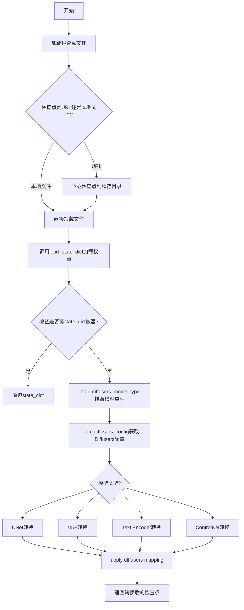

## 类结构

```
SingleFileComponentError (异常类)
└── 全局转换函数集合
    ├── 工具函数: is_valid_url, _extract_repo_id_and_weights_name, load_single_file_checkpoint
    ├── 模型类型推断: infer_diffusers_model_type, fetch_diffusers_config, set_image_size
    ├── 配置创建: create_unet_diffusers_config_from_ldm, create_controlnet_diffusers_config_from_ldm, create_vae_diffusers_config_from_ldm
    ├── 权重转换: convert_ldm_unet_checkpoint, convert_ldm_vae_checkpoint, convert_ldm_clip_checkpoint
    ├── 特殊模型转换: convert_sd3_transformer_checkpoint_to_diffusers, convert_flux_transformer_checkpoint_to_diffusers
    ├── 视频模型转换: convert_ltx_transformer_checkpoint_to_diffusers, convert_mochi_transformer_checkpoint_to_diffusers
    └── legacy支持: _legacy_load_scheduler, _legacy_load_clip_tokenizer, _legacy_load_safety_checker
```

## 全局变量及字段


### `CHECKPOINT_KEY_NAMES`
    
Stores key weight names for various model types to identify them during checkpoint conversion

类型：`Dict[str, Union[str, List[str]]]`
    


### `DIFFUSERS_DEFAULT_PIPELINE_PATHS`
    
Maps model type identifiers to default pretrained model paths on HuggingFace Hub

类型：`Dict[str, Dict[str, str]]`
    


### `DIFFUSERS_TO_LDM_DEFAULT_IMAGE_SIZE_MAP`
    
Maps model type identifiers to their default image sizes for LDM configuration

类型：`Dict[str, int]`
    


### `DIFFUSERS_TO_LDM_MAPPING`
    
Defines mapping rules from LDM model weight keys to Diffusers model weight keys for UNet, ControlNet, VAE, and OpenCLIP

类型：`Dict[str, Dict[str, Any]]`
    


### `SD_2_TEXT_ENCODER_KEYS_TO_IGNORE`
    
Contains text encoder weight keys from SD 2.0 that should be ignored during conversion

类型：`List[str]`
    


### `SCHEDULER_DEFAULT_CONFIG`
    
Default configuration parameters for diffusion schedulers including beta schedule and timestep settings

类型：`Dict[str, Any]`
    


### `LDM_VAE_KEYS`
    
Prefix strings used to identify VAE weights in LDM checkpoint keys

类型：`List[str]`
    


### `LDM_VAE_DEFAULT_SCALING_FACTOR`
    
Default scaling factor (0.18215) for VAE latent space normalization in LDM models

类型：`float`
    


### `PLAYGROUND_VAE_SCALING_FACTOR`
    
Alternative scaling factor (0.5) used specifically for Playground VAE models

类型：`float`
    


### `LDM_UNET_KEY`
    
Prefix string 'model.diffusion_model.' identifying UNet weights in LDM checkpoints

类型：`str`
    


### `LDM_CONTROLNET_KEY`
    
Prefix string 'control_model.' identifying ControlNet weights in LDM checkpoints

类型：`str`
    


### `LDM_CLIP_PREFIX_TO_REMOVE`
    
List of CLIP model key prefixes that need to be removed during conversion to Diffusers format

类型：`List[str]`
    


### `LDM_OPEN_CLIP_TEXT_PROJECTION_DIM`
    
Default text projection dimension (1024) for OpenCLIP text encoders in LDM models

类型：`int`
    


### `SCHEDULER_LEGACY_KWARGS`
    
Legacy scheduler parameter names (prediction_type, scheduler_type) that are deprecated

类型：`List[str]`
    


### `VALID_URL_PREFIXES`
    
Valid URL prefixes for HuggingFace model repositories including hf.co and huggingface.co variants

类型：`List[str]`
    


### `logger`
    
Module-level logger instance for recording conversion process information and warnings

类型：`Logger`
    


### `SingleFileComponentError.message`
    
Error message string describing the exception details

类型：`str`
    
    

## 全局函数及方法


### `is_valid_url`

该函数通过解析URL检查其是否具有有效的协议（scheme）和网络位置（netloc），从而验证给定的字符串是否符合有效URL的格式。

参数：

- `url`：`str`，待验证的URL字符串

返回值：`bool`，如果URL有效（包含有效的协议和网络位置）返回 `True`，否则返回 `False`

#### 流程图

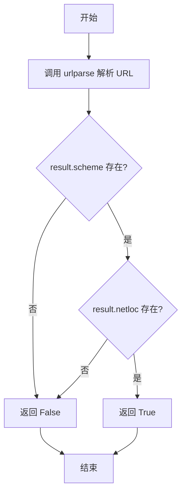

#### 带注释源码

```python
def is_valid_url(url):
    """
    验证给定的URL字符串是否有效。
    
    参数:
        url (str): 待验证的URL字符串
        
    返回:
        bool: 如果URL包含有效的协议和网络位置返回True，否则返回False
    """
    # 使用 urllib.parse.urlparse 解析URL
    # 解析结果包含: scheme(协议), netloc(网络位置), path(路径)等组件
    result = urlparse(url)
    
    # 检查URL是否具有有效的scheme（如 http, https, ftp 等）
    # 以及有效的netloc（如域名或IP地址）
    if result.scheme and result.netloc:
        return True

    # 如果缺少scheme或netloc，则认为URL无效
    return False
```


### `_is_single_file_path_or_url`

该函数用于判断传入的 `pretrained_model_name_or_path` 参数是否为指向单文件模型（文件路径或 HuggingFace URL）的格式。它首先检查路径是否为本地文件或有效的 HuggingFace URL，如果是 URL 则进一步解析提取仓库 ID 和权重文件名称，最终返回布尔值表示是否为有效的单文件路径或 URL。

参数：

-  `pretrained_model_name_or_path`：`str`，待检查的模型名称或路径，可以是本地文件路径或 HuggingFace 模型仓库 URL

返回值：`bool`，如果参数是有效的单文件路径或 URL（能够解析出 repo_id 和 weight_name），返回 `True`，否则返回 `False`

#### 流程图

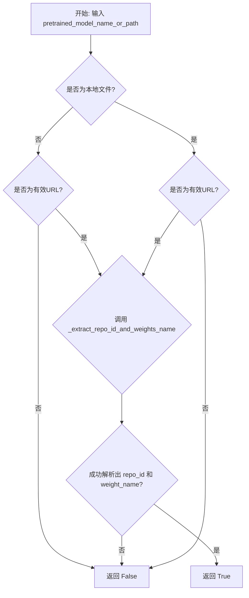

#### 带注释源码

```python
def _is_single_file_path_or_url(pretrained_model_name_or_path):
    """
    判断是否为单文件路径或URL。
    
    该函数检查传入的路径/URL是否为指向单个模型权重文件的路径。
    对于URL，需要能够解析出HuggingFace仓库ID和具体的权重文件名称。
    
    参数:
        pretrained_model_name_or_path: str, 模型名称或路径，可以是本地文件路径或HuggingFace URL
        
    返回:
        bool: 是否为有效的单文件路径或URL
    """
    # 首先检查路径是否为本地文件，或者是否为有效的HuggingFace URL
    # 注意：这里使用 or 连接，意味着只要满足其中一个条件就继续后续检查
    if not os.path.isfile(pretrained_model_name_or_path) or not is_valid_url(pretrained_model_name_or_path):
        return False

    # 如果是有效的URL，尝试从中提取仓库ID和权重文件名称
    # 调用 _extract_repo_id_and_weights_name 函数进行解析
    repo_id, weight_name = _extract_repo_id_and_weights_name(pretrained_model_name_or_path)
    
    # 只有当成功解析出 repo_id 和 weight_name 时，才返回 True
    # bool() 用于将 (None, None) 或 (None, "some_name") 等转换为 False
    return bool(repo_id and weight_name)


def is_valid_url(url):
    """
    验证URL是否具有有效的协议和网络位置。
    
    使用 urlparse 解析URL，检查是否同时具有 scheme（协议如http/https）
    和 netloc（网络位置如 huggingface.co）两部分。
    
    参数:
        url: str, 待验证的URL字符串
        
    返回:
        bool: URL是否有效
    """
    result = urlparse(url)
    # URL有效需要同时满足：有协议(scheme)且有网络位置(netloc)
    if result.scheme and result.netloc:
        return True

    return False


def _extract_repo_id_and_weights_name(pretrained_model_name_or_path):
    """
    从HuggingFace URL中提取仓库ID和权重文件名称。
    
    解析类似 'https://huggingface.co/user/model/resolve/main/model.safetensors' 
    这样的URL，提取出 'user/model' 作为 repo_id，'model.safetensors' 作为 weight_name。
    
    参数:
        pretrained_model_name_or_path: str, HuggingFace模型URL
        
    返回:
        tuple: (repo_id, weight_name) 元组
        
    异常:
        ValueError: 如果传入的不是有效的URL
    """
    # 首先验证URL有效性
    if not is_valid_url(pretrained_model_name_or_path):
        raise ValueError("Invalid `pretrained_model_name_or_path` provided. Please set it to a valid URL.")

    # 定义正则表达式模式用于解析URL:
    # ([^/]+)/([^/]+)  -> 匹配 user/model 部分
    # (?:blob/main/)?  -> 可选的 blob/main/ 前缀
    # (.+)             -> 匹配剩余的权重文件路径
    pattern = r"([^/]+)/([^/]+)/(?:blob/main/)?(.+)"
    
    weights_name = None
    # 注意：这里初始化为 (None,) 而非 None，是个小技巧使 tuple 保持为 tuple 类型
    repo_id = (None,)
    
    # 移除常见的HuggingFace URL前缀
    # 将各种格式的前缀统一移除，以便后续正则匹配
    for prefix in VALID_URL_PREFIXES:
        pretrained_model_name_or_path = pretrained_model_name_or_path.replace(prefix, "")
    
    # 使用正则表达式匹配解析URL
    match = re.match(pattern, pretrained_model_name_or_path)
    if not match:
        # 如果正则不匹配，返回空结果
        return repo_id, weights_name

    # 提取仓库ID (格式: organization/model-name)
    repo_id = f"{match.group(1)}/{match.group(2)}"
    # 提取权重文件名称 (如: pytorch_model.bin, model.safetensors 等)
    weights_name = match.group(3)

    return repo_id, weights_name
```


### `_extract_repo_id_and_weights_name`

该函数用于从 Hugging Face URL 中提取仓库 ID（repo_id）和权重文件名（weights_name），以便从远程单文件检查点下载并加载模型权重。

参数：

- `pretrained_model_name_or_path`：`str`，Hugging Face 模型 URL，支持多种前缀格式（如 `https://huggingface.co/`、`hf.co/` 等）

返回值：`Tuple[Optional[str], Optional[str]]`，返回包含 repo_id 和 weights_name 的元组。如果 URL 无效或无法匹配，则返回 `(None, None)`。

#### 流程图

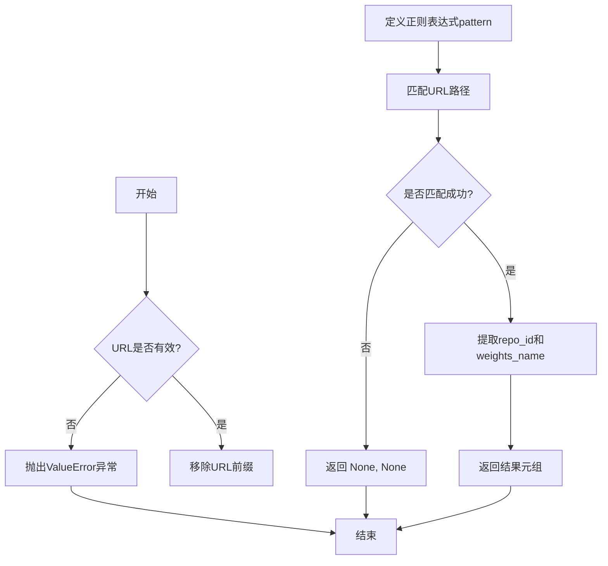

#### 带注释源码

```python
def _extract_repo_id_and_weights_name(pretrained_model_name_or_path):
    """
    从URL中提取repo_id和权重文件名。
    
    示例:
        输入: "https://huggingface.co/stabilityai/stable-diffusion-xl-base-1.0/blob/main/model.safetensors"
        输出: ("stabilityai/stable-diffusion-xl-base-1.0", "model.safetensors")
    """
    # 验证URL格式是否合法
    if not is_valid_url(pretrained_model_name_or_path):
        raise ValueError("Invalid `pretrained_model_name_or_path` provided. Please set it to a valid URL.")

    # 正则表达式模式：捕获 组织名/仓库名/(blob/main/)?权重文件路径
    # group(1): 组织名, group(2): 仓库名, group(3): 权重文件路径
    pattern = r"([^/]+)/([^/]+)/(?:blob/main/)?(.+)"
    weights_name = None
    repo_id = (None,)  # 初始化为None元组

    # 移除各种URL前缀，统一URL格式
    for prefix in VALID_URL_PREFIXES:
        pretrained_model_name_or_path = pretrained_model_name_or_path.replace(prefix, "")
    
    # 使用正则表达式提取信息
    match = re.match(pattern, pretrained_model_name_or_path)
    if not match:
        return repo_id, weights_name

    # 组装repo_id格式: "organization/repo_name"
    repo_id = f"{match.group(1)}/{match.group(2)}"
    # 提取权重文件路径
    weights_name = match.group(3)

    return repo_id, weights_name
```


### `_is_model_weights_in_cached_folder`

检查模型权重文件是否存在于指定的缓存文件夹中，通过检查 `pytorch_model.bin` 或 `model.safetensors` 文件来判断。

参数：

- `cached_folder`：`str`，缓存文件夹的根路径
- `name`：`str`，模型的名称（子目录名）

返回值：`bool`，如果权重文件存在返回 `True`，否则返回 `False`

#### 流程图

```mermaid
flowchart TD
    A([开始]) --> B[拼接完整路径<br/>pretrained_model_name_or_path = os.path.join<br/>(cached_folder, name)]
    B --> C[初始化 weights_exist = False]
    C --> D{遍历权重文件名列表<br/>[WEIGHTS_NAME, SAFETENSORS_WEIGHTS_NAME]}
    D -->|当前 weights_name| E{检查文件是否存在<br/>os.path.isfile<br/>(os.path.join<br/>(pretrained_model_name_or_path, weights_name))}
    E -->|是| F[设置 weights_exist = True]
    E -->|否| G[继续下一次循环]
    F --> G
    G --> D
    D -->|遍历完成| H[返回 weights_exist]
    H --> I([结束])
```

#### 带注释源码

```python
def _is_model_weights_in_cached_folder(cached_folder, name):
    """
    检查权重是否在缓存文件夹中
    
    参数:
        cached_folder: 缓存文件夹的根路径
        name: 模型的名称（子目录名）
    
    返回:
        bool: 如果权重文件存在返回True，否则返回False
    """
    # 拼接完整的模型路径：缓存文件夹 + 模型名称
    pretrained_model_name_or_path = os.path.join(cached_folder, name)
    # 初始化权重存在标志为False
    weights_exist = False

    # 遍历可能的权重文件名列表
    # WEIGHTS_NAME 通常是 "pytorch_model.bin"
    # SAFETENSORS_WEIGHTS_NAME 通常是 "model.safetensors"
    for weights_name in [WEIGHTS_NAME, SAFETENSORS_WEIGHTS_NAME]:
        # 检查权重文件是否存在于模型目录中
        if os.path.isfile(os.path.join(pretrained_model_name_or_path, weights_name)):
            # 如果找到任意一个权重文件，设置标志为True
            weights_exist = True

    # 返回权重是否存在的结果
    return weights_exist
```


### `_is_legacy_scheduler_kwargs`

该函数用于检查传入的关键字参数（kwargs）字典中是否包含已废弃的调度器配置参数（如 `prediction_type` 或 `scheduler_type`）。如果存在这些键，则表明调用者使用了传统的调度器配置方式，函数返回 `True`；否则返回 `False`。

参数：
- `kwargs`：`dict`，包含用户传入的关键字参数字典。

返回值：`bool`，如果 kwargs 中包含传统调度器参数键则返回 `True`，否则返回 `False`。

#### 流程图

```mermaid
flowchart TD
    A([开始: kwargs]) --> B[获取 kwargs 的所有键]
    B --> C{任意键是否存在于<br>SCHEDULER_LEGACY_KWARGS<br>(prediction_type/scheduler_type)?}
    C -->|是| D([返回 True])
    C -->|否| E([返回 False])
```

#### 带注释源码

```python
# 定义用于检测的传统调度器参数键列表
SCHEDULER_LEGACY_KWARGS = ["prediction_type", "scheduler_type"]

def _is_legacy_scheduler_kwargs(kwargs):
    """
    检查 kwargs 是否包含传统调度器配置参数。
    
    参数:
        kwargs (dict): 关键字参数字典。
        
    返回:
        bool: 如果存在遗留参数返回 True，否则返回 False。
    """
    # 使用 any() 检查 kwargs 的键列表中是否有任何键位于预定义的遗留参数列表中
    return any(k in SCHEDULER_LEGACY_KWARGS for k in kwargs.keys())
```


### `load_single_file_checkpoint`

加载单文件检查点，支持从本地文件路径或 HuggingFace Hub URL 加载模型权重，并自动处理可能存在的嵌套 state_dict 结构。

参数：

- `pretrained_model_link_or_path`：`str`，模型链接（URL）或本地文件路径，可以是 HuggingFace Hub 上的单个权重文件 URL，也可以是本地文件路径
- `force_download`：`bool`，是否强制重新下载模型，即使缓存中存在，默认为 `False`
- `proxies`：`dict` 或 `None`，HTTP 代理配置字典，用于网络请求，默认为 `None`
- `token`：`str` 或 `None`，用于认证的 HuggingFace token，默认为 `None`
- `cache_dir`：`str` 或 `None`，模型缓存目录路径，默认为 `None`
- `local_files_only`：`bool` 或 `None`，是否仅使用本地缓存文件而不进行网络请求，默认为 `None`
- `revision`：`str` 或 `None`，从 HuggingFace Hub 下载时的分支或提交哈希，默认为 `None`
- `disable_mmap`：`bool`，是否禁用内存映射加载，默认为 `False`
- `user_agent`：`dict` 或 `None`，HTTP 请求的用户代理信息，默认为 `None`，若为 `None` 则使用默认值 `{"file_type": "single_file", "framework": "pytorch"}`

返回值：`dict`，返回加载的检查点字典。如果检查点中包含 "state_dict" 键（可能是嵌套字典），会递归展开直到获得最终的 state_dict。

#### 流程图

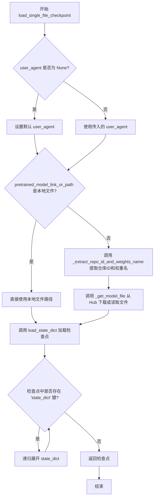

#### 带注释源码

```python
def load_single_file_checkpoint(
    pretrained_model_link_or_path,  # 模型链接或本地文件路径
    force_download=False,            # 是否强制重新下载
    proxies=None,                    # HTTP 代理配置
    token=None,                      # HuggingFace 认证 token
    cache_dir=None,                  # 模型缓存目录
    local_files_only=None,           # 是否仅使用本地文件
    revision=None,                   # Git 分支或提交 ID
    disable_mmap=False,               # 是否禁用内存映射
    user_agent=None,                 # HTTP 用户代理
):
    # 设置默认的用户代理信息，用于标识请求来源
    if user_agent is None:
        user_agent = {"file_type": "single_file", "framework": "pytorch"}

    # 判断输入是本地文件路径还是远程 URL
    if os.path.isfile(pretrained_model_link_or_path):
        # 如果是本地文件，直接使用该路径
        pretrained_model_link_or_path = pretrained_model_link_or_path

    else:
        # 如果是远程 URL，提取仓库 ID 和权重文件名
        repo_id, weights_name = _extract_repo_id_and_weights_name(pretrained_model_link_or_path)
        # 从 HuggingFace Hub 获取模型文件（下载或读取缓存）
        pretrained_model_link_or_path = _get_model_file(
            repo_id,
            weights_name=weights_name,
            force_download=force_download,
            cache_dir=cache_dir,
            proxies=proxies,
            local_files_only=local_files_only,
            token=token,
            revision=revision,
            user_agent=user_agent,
        )

    # 使用 load_state_dict 加载检查点到内存
    checkpoint = load_state_dict(pretrained_model_link_or_path, disable_mmap=disable_mmap)

    # 某些检查点将模型状态字典存储在 "state_dict" 键下
    # 递归展开直到获得最终的 state_dict
    while "state_dict" in checkpoint:
        checkpoint = checkpoint["state_dict"]

    return checkpoint
```


### `fetch_original_config`

该函数用于获取原始模型的配置文件，支持从本地文件路径或远程URL加载配置文件，并通过YAML解析器将配置内容转换为Python字典格式返回。

参数：

- `original_config_file`：`str`，原始配置文件的路径（本地文件路径）或URL地址
- `local_files_only`：`bool`，默认为False，当设置为True时，如果提供的是URL而非本地文件路径，则抛出异常

返回值：`dict`，返回解析后的原始模型配置（通过yaml.safe_load解析YAML格式内容得到的字典）

#### 流程图

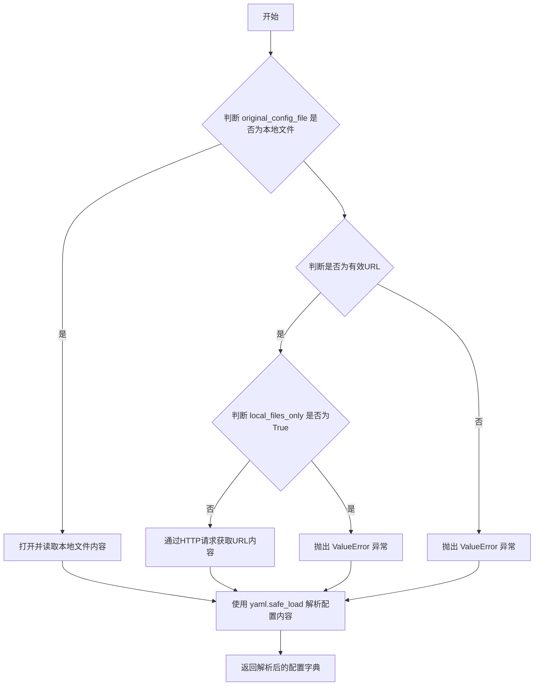

#### 带注释源码

```python
def fetch_original_config(original_config_file, local_files_only=False):
    """
    获取原始模型配置文件的函数
    
    参数:
        original_config_file: 配置文件的路径或URL
        local_files_only: 是否只使用本地文件，默认为False
    
    返回:
        解析后的配置字典
    """
    # 判断是否为本地文件路径
    if os.path.isfile(original_config_file):
        # 如果是本地文件，则打开并读取文件内容
        with open(original_config_file, "r") as fp:
            original_config_file = fp.read()

    # 判断是否为有效的URL
    elif is_valid_url(original_config_file):
        # 如果提供了URL但设置了local_files_only=True，则抛出异常
        if local_files_only:
            raise ValueError(
                "`local_files_only` is set to True, but a URL was provided as `original_config_file`. "
                "Please provide a valid local file path."
            )

        # 通过HTTP请求获取URL指向的配置文件内容
        # 使用BytesIO将响应内容转换为文件对象以便后续解析
        original_config_file = BytesIO(requests.get(original_config_file, timeout=DIFFUSERS_REQUEST_TIMEOUT).content)

    # 如果既不是本地文件也不是有效URL，则抛出异常
    else:
        raise ValueError("Invalid `original_config_file` provided. Please set it to a valid file path or URL.")

    # 使用YAML解析器解析配置内容（支持文件内容字符串或BytesIO对象）
    original_config = yaml.safe_load(original_config_file)

    # 返回解析后的配置字典
    return original_config
```


### `is_clip_model`

检查给定的模型检查点（checkpoint）中是否包含 CLIP 模型的特定键，以判断该检查点是否为 CLIP 模型。

参数：

- `checkpoint`：`dict`，模型检查点字典，包含模型权重和层的键值对

返回值：`bool`，如果检查点中包含 CLIP 模型的特征键（`cond_stage_model.transformer.text_model.embeddings.position_embedding.weight`），则返回 `True`，否则返回 `False`

#### 流程图

```mermaid
flowchart TD
    A[开始 is_clip_model] --> B[获取 CLIP 特征键<br/>CHECKPOINT_KEY_NAMES['clip']]
    B --> C{检查特征键是否在 checkpoint 中}
    C -->|是| D[返回 True]
    C -->|否| E[返回 False]
    D --> F[结束]
    E --> F
```

#### 带注释源码

```python
def is_clip_model(checkpoint):
    """
    判断 checkpoint 是否为 CLIP 模型。
    
    通过检查 checkpoint 中是否存在 CLIP 模型特有的键来判断。
    CLIP 模型的特征键为 'cond_stage_model.transformer.text_model.embeddings.position_embedding.weight'
    """
    # 从预定义的键名字典中获取 CLIP 模型的特征键
    clip_key = CHECKPOINT_KEY_NAMES["clip"]
    
    # 检查特征键是否存在于 checkpoint 中
    if clip_key in checkpoint:
        # 存在则返回 True，表示是 CLIP 模型
        return True
    
    # 不存在则返回 False，表示不是 CLIP 模型
    return False
```


### `is_clip_sdxl_model(checkpoint)`

该函数是一个轻量级的模型类型识别函数，用于检测给定的检查点（checkpoint）字典中是否包含 SDXL（Stable Diffusion XL）CLIP 模型的特定权重键，从而判断该检查点是否属于 SDXL CLIP 模型。这是模型转换流程中的第一步，用于在将预训练权重从一种格式转换到另一种格式之前进行模型类型识别和路由。

参数：

- `checkpoint`：`Dict`，待检测的模型检查点字典，包含模型权重的键值对

返回值：`bool`，如果检查点中包含 SDXL CLIP 模型的特征键（`"conditioner.embedders.0.transformer.text_model.embeddings.position_embedding.weight"`），则返回 `True`；否则返回 `False`

#### 流程图

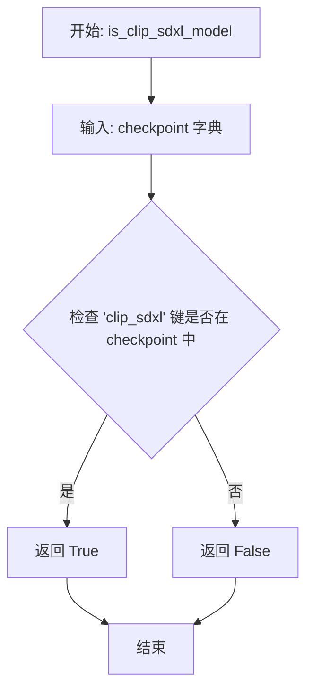

#### 带注释源码

```python
def is_clip_sdxl_model(checkpoint):
    """
    检查给定的检查点是否为 SDXL CLIP 模型。
    
    该函数通过检查 checkpoint 字典中是否存在 SDXL CLIP 模型的
    特征键来识别模型类型。这是模型转换流水线中的关键一步，
    用于确定如何正确转换和加载模型权重。
    
    参数:
        checkpoint (Dict): 模型检查点字典，键为权重名称，值为权重张量
        
    返回:
        bool: 如果是 SDXL CLIP 模型返回 True，否则返回 False
    """
    # 从预定义的键名映射字典中获取 SDXL CLIP 模型的特征键
    # 对应键: "conditioner.embedders.0.transformer.text_model.embeddings.position_embedding.weight"
    if CHECKPOINT_KEY_NAMES["clip_sdxl"] in checkpoint:
        # 特征键存在于检查点中，判定为 SDXL CLIP 模型
        return True

    # 特征键不存在于检查点中，判定为非 SDXL CLIP 模型
    return False
```


### `is_clip_sd3_model`

检查给定的checkpoint是否包含SD3 CLIP模型的特征键，用于识别Stable Diffusion 3的CLIP文本编码器模型。

参数：

- `checkpoint`：`Dict[str, torch.Tensor]`，模型权重字典，包含模型的各种参数键值对

返回值：`bool`，如果checkpoint中包含SD3 CLIP模型的特征键则返回True，否则返回False

#### 流程图

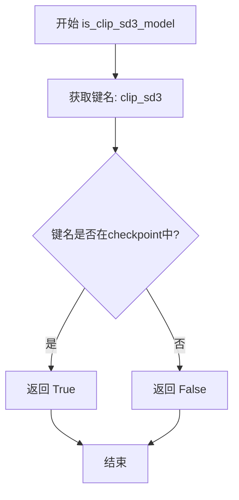

#### 带注释源码

```python
def is_clip_sd3_model(checkpoint):
    """
    检查是否为SD3 CLIP模型
    
    该函数通过检查checkpoint中是否存在SD3 CLIP模型的特定键来识别模型类型。
    SD3模型使用特定的文本编码器键名，可以通过该键名来判断模型是否为Stable Diffusion 3的CLIP模型。
    
    参数:
        checkpoint: 模型权重字典，键为字符串，值为torch.Tensor
        
    返回:
        bool: 如果是SD3 CLIP模型返回True，否则返回False
    """
    # 从预定义的键名字典中获取SD3 CLIP模型的特征键
    # 键名为: "text_encoders.clip_l.transformer.text_model.embeddings.position_embedding.weight"
    if CHECKPOINT_KEY_NAMES["clip_sd3"] in checkpoint:
        return True

    # 如果键不存在于checkpoint中，返回False
    return False
```


### `is_open_clip_model(checkpoint)`

该函数用于检查给定的模型检查点（checkpoint）是否为 OpenCLIP 模型。它通过检查检查点中是否包含 OpenCLIP 模型特有的键 "cond_stage_model.model.token_embedding.weight" 来判断模型类型。

参数：

- `checkpoint`：`dict`，模型检查点字典，包含预训练模型的权重键值对

返回值：`bool`，如果检查点是 OpenCLIP 模型则返回 `True`，否则返回 `False`

#### 流程图

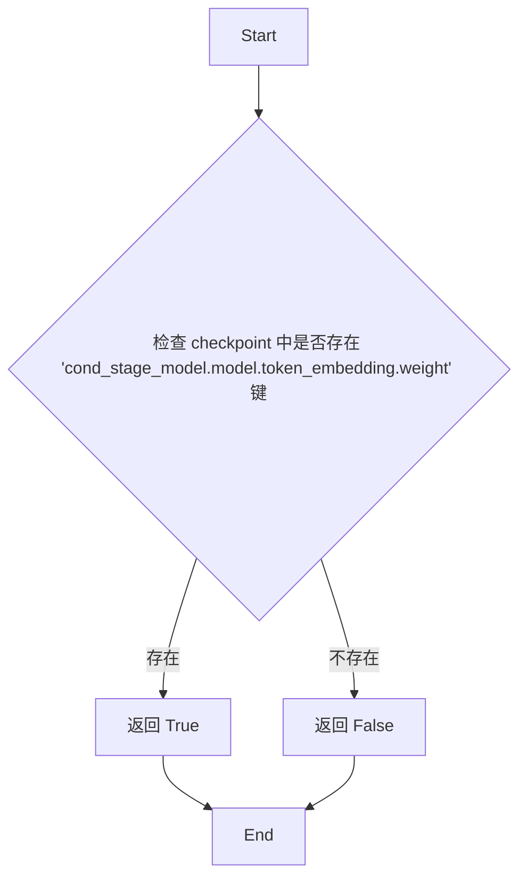

#### 带注释源码

```python
def is_open_clip_model(checkpoint):
    """
    检查给定的模型检查点是否为 OpenCLIP 模型。
    
    OpenCLIP 模型在检查点中通常包含特定的键 'cond_stage_model.model.token_embedding.weight'，
    这是 OpenCLIP 文本编码器的标记嵌入层权重。通过检查该键是否存在，可以判断模型是否为 OpenCLIP 架构。
    
    参数:
        checkpoint (dict): 模型检查点字典，键为权重名称，值为权重张量
        
    返回:
        bool: 如果检查点是 OpenCLIP 模型返回 True，否则返回 False
    """
    # 从预定义的键名映射中获取 OpenCLIP 模型特有的键名
    # 对应键为 "cond_stage_model.model.token_embedding.weight"
    if CHECKPOINT_KEY_NAMES["open_clip"] in checkpoint:
        # 如果键存在于检查点中，说明是 OpenCLIP 模型
        return True

    # 键不存在，返回 False，表示不是 OpenCLIP 模型
    return False
```


### `is_open_clip_sdxl_model(checkpoint)`

该函数用于检查给定的模型检查点（checkpoint）是否为 SDXL（Stable Diffusion XL）OpenCLIP 模型。它通过检查检查点中是否存在 SDXL OpenCLIP 模型的特定关键键（key）来判断模型类型，这是模型转换流程中的关键识别步骤。

参数：

- `checkpoint`：`dict`，包含模型权重和结构的字典，键为权重名称，值为对应的张量数据

返回值：`bool`，如果检查点中包含 SDXL OpenCLIP 模型的特征键（"conditioner.embedders.1.model.positional_embedding"），则返回 `True`，否则返回 `False`

#### 流程图

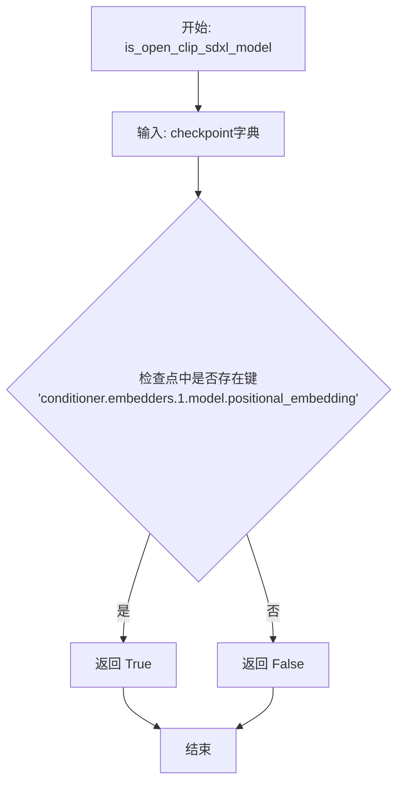

#### 带注释源码

```python
def is_open_clip_sdxl_model(checkpoint):
    """
    检查给定的检查点是否为 SDXL OpenCLIP 模型。
    
    该函数通过检查 CHECKPOINT_KEY_NAMES 字典中定义的 SDXL OpenCLIP 
    特定键 'conditioner.embedders.1.model.positional_embedding' 是否存在于
    检查点中来判断模型类型。此键对应于 SDXL OpenCLIP 文本编码器的位置嵌入权重，
    是 SDXL 模型区别于其他模型的关键标识。
    
    参数:
        checkpoint (dict): 模型检查点字典，包含权重键值对
        
    返回:
        bool: 如果检查点包含 SDXL OpenCLIP 模型特征返回 True，否则返回 False
    """
    # 从预定义的 CHECKPOINT_KEY_NAMES 字典中获取 SDXL OpenCLIP 模型的特征键
    # 对应键为: "conditioner.embedders.1.model.positional_embedding"
    if CHECKPOINT_KEY_NAMES["open_clip_sdxl"] in checkpoint:
        return True

    return False
```

#### 关键组件信息

| 组件名称 | 一句话描述 |
|---------|-----------|
| `CHECKPOINT_KEY_NAMES` | 预定义的字典，映射模型类型到特定检查点键名称，用于识别各种扩散模型变体 |
| `open_clip_sdxl` | CHECKPOINT_KEY_NAMES 字典中的键，对应 SDXL OpenCLIP 模型的位置嵌入权重路径 |

#### 技术债务与优化空间

1. **硬编码键名依赖**：函数直接依赖 `CHECKPOINT_KEY_NAMES` 字典中的键名，如果原始模型的键名发生变化，函数可能失效
2. **缺乏错误处理**：未对 `checkpoint` 参数的类型进行验证，如果传入非字典类型可能导致运行时错误
3. **单一键检查**：仅通过单一键进行模型类型判断，在某些边界情况下可能存在误判风险

#### 其它项目

**设计目标与约束**：
- 该函数是模型类型推断链中的一环，用于区分不同的 CLIP/OpenCLIP 模型变体
- 配合 `is_open_clip_model`、`is_open_clip_sd3_model` 等函数共同实现模型类型的完整识别

**错误处理与异常设计**：
- 当前未实现参数类型检查，建议在生产环境中添加 `isinstance(checkpoint, dict)` 的类型验证

**数据流与状态机**：
- 该函数被 `is_clip_model_in_single_file` 和 `create_diffusers_clip_model_from_ldm` 调用
- 属于模型转换流水线中的识别阶段，为后续的模型转换提供基础判断

**外部依赖与接口契约**：
- 依赖全局变量 `CHECKPOINT_KEY_NAMES` 的定义
- 输入必须是包含权重键的字典对象
- 返回值为 Python 布尔类型，可直接用于条件判断


### `is_open_clip_sd3_model`

检查给定的模型检查点（checkpoint）是否为 Stable Diffusion 3 (SD3) 的 OpenCLIP 模型。该函数通过检测 checkpoint 中是否存在 SD3 OpenCLIP 模型特有的键（`text_encoders.clip_g.transformer.text_model.embeddings.position_embedding.weight`）来判断模型类型。

参数：

- `checkpoint`：`dict`，模型的权重字典（state dict），通常包含模型的所有参数键值对

返回值：`bool`，如果 checkpoint 包含 SD3 OpenCLIP 模型的特征键则返回 `True`，否则返回 `False`

#### 流程图

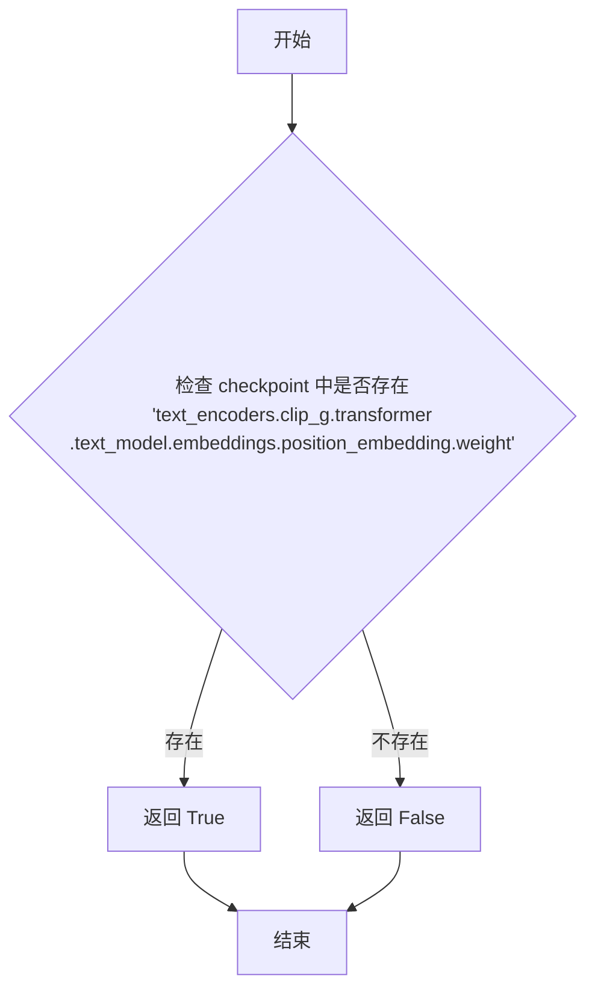

#### 带注释源码

```python
def is_open_clip_sd3_model(checkpoint):
    """
    检查给定的 checkpoint 是否为 SD3 OpenCLIP 模型。
    
    SD3 OpenCLIP 模型（clip_g）在 Diffusers 格式的检查点中，
    通常包含特定的 position_embedding 权重键，用于识别模型类型。
    """
    # 从预定义的键名字典中获取 SD3 OpenCLIP 模型的特征键
    # 该键对应于: "text_encoders.clip_g.transformer.text_model.embeddings.position_embedding.weight"
    if CHECKPOINT_KEY_NAMES["open_clip_sd3"] in checkpoint:
        # 如果特征键存在于 checkpoint 中，则认为是 SD3 OpenCLIP 模型
        return True

    # 否则返回 False，表示不是 SD3 OpenCLIP 模型
    return False
```


### `is_open_clip_sdxl_refiner_model`

该函数用于检查给定的检查点（checkpoint）是否为 SDXL OpenCLIP Refiner 模型。它通过检查检查点字典中是否存在特定的键 `conditioner.embedders.0.model.text_projection` 来判断模型类型。

参数：

- `checkpoint`：`dict`，模型检查点字典，包含模型权重和层信息

返回值：`bool`，如果检查点中存在 SDXL OpenCLIP Refiner 模型的特定键，则返回 `True`，否则返回 `False`

#### 流程图

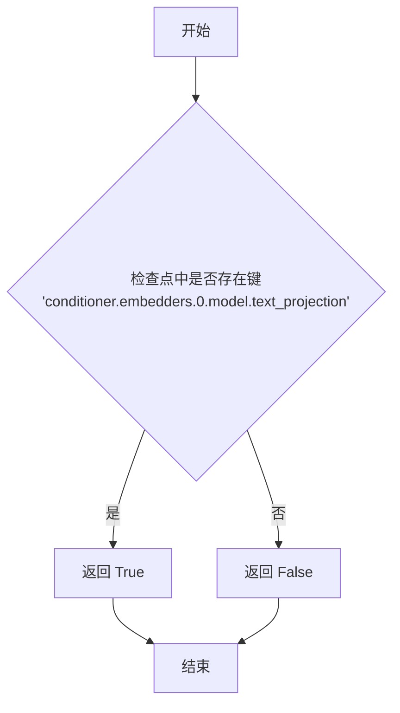

#### 带注释源码

```python
def is_open_clip_sdxl_refiner_model(checkpoint):
    """
    检查是否为SDXL OpenCLIP Refiner模型。
    
    Args:
        checkpoint: 模型检查点字典
        
    Returns:
        bool: 如果检查点是SDXL OpenCLIP Refiner模型则返回True
    """
    # 从预定义的键名映射中获取SDXL OpenCLIP Refiner模型的特定键
    # 对应键为 "conditioner.embedders.0.model.text_projection"
    if CHECKPOINT_KEY_NAMES["open_clip_sdxl_refiner"] in checkpoint:
        return True

    # 如果键不存在，返回False
    return False
```


### `is_clip_model_in_single_file`

检查给定的检查点（checkpoint）是否包含CLIP模型，并根据类对象名称判断是否匹配CLIPTextModel或CLIPTextModelWithProjection。

参数：

- `class_obj`：对象，需要检查的类对象，通常是 CLIPTextModel 或 CLIPTextModelWithProjection
- `checkpoint`：字典，模型的权重检查点（state dict）

返回值：`bool`，如果检查点包含CLIP模型且类对象名称为 CLIPTextModel 或 CLIPTextModelWithProjection，则返回 True，否则返回 False

#### 流程图

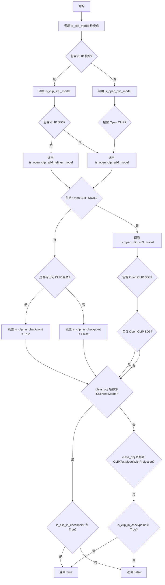

#### 带注释源码

```python
def is_clip_model_in_single_file(class_obj, checkpoint):
    """
    检查单文件是否包含CLIP模型
    
    参数:
        class_obj: 类对象，用于检查类名是否为 CLIPTextModel 或 CLIPTextModelWithProjection
        checkpoint: 模型检查点（state dict）
    
    返回:
        bool: 如果检查点包含CLIP模型且类对象匹配则返回True
    """
    # 检查检查点中是否包含任何CLIP模型变体
    # 使用any()进行短路求值，只要有一个为True就停止
    is_clip_in_checkpoint = any(
        [
            is_clip_model(checkpoint),                      # 检查标准CLIP模型
            is_clip_sd3_model(checkpoint),                  # 检查CLIP SD3模型
            is_open_clip_model(checkpoint),                 # 检查Open CLIP模型
            is_open_clip_sdxl_model(checkpoint),            # 检查Open CLIP SDXL模型
            is_open_clip_sdxl_refiner_model(checkpoint),    # 检查Open CLIP SDXL Refiner模型
            is_open_clip_sd3_model(checkpoint),             # 检查Open CLIP SD3模型
        ]
    )
    
    # 检查类对象名称是否为CLIPTextModel或CLIPTextModelWithProjection
    # 并且检查点中包含CLIP模型
    if (
        class_obj.__name__ == "CLIPTextModel" or class_obj.__name__ == "CLIPTextModelWithProjection"
    ) and is_clip_in_checkpoint:
        return True

    # 默认返回False
    return False
```


### `infer_diffusers_model_type(checkpoint)`

该函数通过检查预训练权重字典（checkpoint）中的特定键和权重形状来推断对应的 Diffusers 模型类型（如 v1、v2、xl_base、sd3、flux 等），返回一个模型类型标识符字符串，供后续转换和加载流程使用。

参数：

- `checkpoint`：`Dict[str, torch.Tensor]`，模型权重字典，包含以特定键命名的张量，用于识别模型架构和版本

返回值：`str`，推断出的 Diffusers 模型类型标识符（例如 "v1"、"xl_base"、"sd3" 等），若无法识别则默认为 "v1"

#### 流程图

```mermaid
flowchart TD
    A[开始: checkpoint] --> B{检查 inpainting 键<br/>且形状[1]==9?}
    B -->|是| C{v2 键存在且<br/>形状[-1]==1024?}
    C -->|是| D[model_type = inpainting_v2]
    C -->|否| E{xl_base 键存在?}
    E -->|是| F[model_type = xl_inpaint]
    E -->|否| G[model_type = inpainting]
    B -->|否| H{v2 键存在且<br/>形状[-1]==1024?}
    H -->|是| I[model_type = v2]
    H -->|否| J{playground-v2-5 键存在?}
    J -->|是| K[model_type = playground-v2-5]
    J -->|否| L{xl_base 键存在?}
    L -->|是| M[model_type = xl_base]
    L -->|否| N{xl_refiner 键存在?}
    N -->|是| O[model_type = xl_refiner]
    N -->|否| P{upscale 键存在?}
    P -->|是| Q[model_type = upscale]
    P -->|否| R{controlnet 键存在?}
    R -->|是| S{controlnet_xl 键存在?}
    S -->|是| T{controlnet_xl_large<br/>键存在?}
    T -->|是| U[model_type = controlnet_xl_large]
    T -->|否| V{controlnet_xl_mid<br/>键存在?}
    V -->|是| W[model_type = controlnet_xl_mid]
    V -->|否| X[model_type = controlnet_xl_small]
    S -->|否| Y[model_type = controlnet]
    R -->|否| Z{stable_cascade_stage_c<br/>键存在?}
    Z -->|是| AA{形状[0]==1536?}
    AA -->|是| AB[model_type = stable_cascade_stage_c_lite]
    AA -->|否| AC{形状[0]==2048?}
    AC -->|是| AD[model_type = stable_cascade_stage_c]
    Z -->|否| AE{stable_cascade_stage_b<br/>键存在?}
    AE -->|是| AF{形状[-1]==576?}
    AF -->|是| AG[model_type = stable_cascade_stage_b_lite]
    AF -->|否| AH{形状[-1]==640?}
    AH -->|是| AI[model_type = stable_cascade_stage_b]
    AE -->|否| AJ{sd3 键存在<br/>且形状[-1]==9216?}
    AJ -->|是| AK{pos_embed 形状[1]==36864?}
    AK -->|是| AL[model_type = sd3]
    AK -->|否| AM{pos_embed 形状[1]==147456?}
    AM -->|是| AN[model_type = sd35_medium]
    AJ -->|否| AO{sd35_large 键存在?}
    AO -->|是| AP[model_type = sd35_large]
    AO -->|否| AQ{animatediff 键存在?}
    AQ -->|是| AR{animatediff_scribble<br/>键存在?}
    AR -->|是| AS[model_type = animatediff_scribble]
    AR -->|否| AT{animatediff_rgb<br/>键存在?}
    AT -->|是| AU[model_type = animatediff_rgb]
    AT -->|否| AV{animatediff_v2<br/>键存在?}
    AV -->|是| AW[model_type = animatediff_v2]
    AV -->|否| AX{animatediff_sdxl_beta<br/>形状[-1]==320?}
    AX -->|是| AY[model_type = animatediff_sdxl_beta]
    AX -->|否| AZ{animatediff<br/>形状[1]==24?}
    AZ -->|是| BA[model_type = animatediff_v1]
    AZ -->|否| BB[model_type = animatediff_v3]
    AQ -->|否| BC{flux2 键存在?}
    BC -->|是| BD[model_type = flux-2-dev]
    BC -->|否| BE{flux 键存在?}
    BE -->|是| BF{guidance_in 键存在?}
    BF -->|是| BG{img_in 形状[1]==384?}
    BG -->|是| BH[model_type = flux-fill]
    BG -->|否| BI{img_in 形状[1]==128?}
    BI -->|是| BJ[model_type = flux-depth]
    BI -->|否| BK[model_type = flux-dev]
    BF -->|否| BL[model_type = flux-schnell]
    BE -->|否| BM{ltx-video 键存在?}
    BM -->|是| BN{transformer_blocks.47<br/>键存在?}
    BN -->|是| BO[model_type = ltx-video-0.9.7]
    BN -->|否| BP{vae 键存在且<br/>形状[1]==2048?}
    BP -->|是| BQ[model_type = ltx-video-0.9.5]
    BP -->|否| BR{last_time_embedder<br/>键存在?}
    BR -->|是| BS[model_type = ltx-video-0.9.1]
    BR -->|否| BT[model_type = ltx-video]
    BM -->|否| BU{autoencoder-dc 键存在?}
    BU -->|是| BV{autoencoder-dc-sana<br/>键存在?}
    BV -->|是| BW[model_type = autoencoder-dc-f32c32-sana]
    BV -->|否| BX{encoder 形状[-1]==64<br/>且 decoder 形状[1]==32?}
    BX -->|是| BY[model_type = autoencoder-dc-f32c32]
    BX -->|否| BZ{encoder 形状[-1]==64<br/>且 decoder 形状[1]==128?}
    BZ -->|是| CA[model_type = autoencoder-dc-f64c128]
    BZ -->|否| CB[model_type = autoencoder-dc-f128c512]
    BU -->|否| CC{mochi-1-preview 键存在?}
    CC -->|是| CD[model_type = mochi-1-preview]
    CC -->|否| CE{hunyuan-video 键存在?}
    CE -->|是| CF[model_type = hunyuan-video]
    CE -->|否| CG{auraflow 所有键存在?}
    CG -->|是| CH[model_type = auraflow]
    CG -->|否| CI{instruct-pix2pix 键存在<br/>且形状[1]==8?}
    CI -->|是| CJ[model_type = instruct-pix2pix]
    CI -->|否| CK{z-image-turbo 键存在?}
    CK -->|是| CL[model_type = z-image-turbo]
    CK -->|否| CM{lumina2 键存在?}
    CM -->|是| CN[model_type = lumina2]
    CM -->|否| CO{sana 键存在?}
    CO -->|是| CP[model_type = sana]
    CO -->|否| CQ{wan 键存在?}
    CQ -->|是| CR{wan_vace 键存在?}
    CR -->|是| CS{patch_embedding 形状[0]==1536?}
    CS -->|是| CT[model_type = wan-vace-1.3B]
    CS -->|否| CU{patch_embedding 形状[0]==5120?}
    CU -->|是| CV[model_type = wan-vace-14B]
    CR -->|否| CW{wan_animate 键存在?}
    CW -->|是| CX[model_type = wan-animate-14B]
    CW -->|否| CY{patch_embedding 形状[0]==1536?}
    CY -->|是| CZ[model_type = wan-t2v-1.3B]
    CY -->|否| DA{patch_embedding 形状[0]==5120<br/>且形状[1]==16?}
    DA -->|是| DB[model_type = wan-t2v-14B]
    DA -->|否| DC[model_type = wan-i2v-14B]
    CQ -->|否| DD{wan_vae 键存在?}
    DD -->|是| DE[model_type = wan-t2v-14B]
    DD -->|否| DF{hidream 键存在?}
    DF -->|是| DG[model_type = hidream]
    DF -->|否| DH{cosmos-1.0 所有键存在?}
    DH -->|是| DI{x_embedder 形状[1]==68?}
    DI -->|是| DJ{x_embedder 形状[0]==4096?}
    DJ -->|是| DK[model_type = cosmos-1.0-t2w-7B]
    DJ -->|否| DL[model_type = cosmos-1.0-t2w-14B]
    DI -->|否| DM{x_embedder 形状[1]==72?}
    DM -->|是| DN{x_embedder 形状[0]==4096?}
    DN -->|是| DO[model_type = cosmos-1.0-v2w-7B]
    DN -->|否| DP[model_type = cosmos-1.0-v2w-14B]
    DH -->|否| DQ{cosmos-2.0 所有键存在?}
    DQ -->|是| DR{x_embedder 形状[1]==68?}
    DR -->|是| DS{x_embedder 形状[0]==2048?}
    DS -->|是| DT[model_type = cosmos-2.0-t2i-2B]
    DS -->|否| DU[model_type = cosmos-2.0-t2i-14B]
    DR -->|否| DV{x_embedder 形状[1]==72?}
    DV -->|是| DW{x_embedder 形状[0]==2048?}
    DW -->|是| DX[model_type = cosmos-2.0-v2w-2B]
    DW -->|否| DY[model_type = cosmos-2.0-v2w-14B]
    DQ -->|否| DZ{z-image-turbo-controlnet-2.x<br/>键存在?}
    DZ -->|是| EA{control_noise_refiner.0<br/>before_proj.weight == 0?}
    EA -->|是| EB[model_type = z-image-turbo-controlnet-2.0]
    EA -->|否| EC[model_type = z-image-turbo-controlnet-2.1]
    DZ -->|否| ED{z-image-turbo-controlnet<br/>键存在?}
    ED -->|是| EE[model_type = z-image-turbo-controlnet]
    ED -->|否| EF{ltx2 键存在?}
    EF -->|是| EG[model_type = ltx2-dev]
    EF -->|否| EH[默认: model_type = v1]
    D --> EH
    G --> EH
    I --> EH
    K --> EH
    M --> EH
    O --> EH
    Q --> EH
    X --> EH
    Y --> EH
    AD --> EH
    AI --> EH
    AL --> EH
    AN --> EH
    AP --> EH
    BB --> EH
    BK --> EH
    BL --> EH
    BT --> EH
    CB --> EH
    CD --> EH
    CF --> EH
    CH --> EH
    CJ --> EH
    CL --> EH
    CN --> EH
    CP --> EH
    CV --> EH
    CX --> EH
    DB --> EH
    DC --> EH
    DE --> EH
    DG --> EH
    DK --> EH
    DL --> EH
    DO --> EH
    DP --> EH
    DT --> EH
    DU --> EH
    DX --> EH
    DY --> EH
    EB --> EH
    EE --> EH
    EG --> EH
    EH --> EL[返回 model_type]
```

#### 带注释源码

```python
def infer_diffusers_model_type(checkpoint):
    """
    推断给定 checkpoint 的 Diffusers 模型类型。
    
    该函数通过检查 checkpoint 中特定键的存在性和张量形状来识别
    不同的 Stable Diffusion 模型变体，包括 v1、v2、XL、SD3、Flux 等。
    
    参数:
        checkpoint: 包含模型权重键值对的字典
        
    返回值:
        表示模型类型的字符串，如果无法识别则默认为 "v1"
    """
    # 首先检查 inpainting 模型（通过检查特定权重形状）
    if (
        CHECKPOINT_KEY_NAMES["inpainting"] in checkpoint
        and checkpoint[CHECKPOINT_KEY_NAMES["inpainting"]].shape[1] == 9
    ):
        # 区分 SD 1.x inpainting 和 SD 2.x inpainting
        if CHECKPOINT_KEY_NAMES["v2"] in checkpoint and checkpoint[CHECKPOINT_KEY_NAMES["v2"]].shape[-1] == 1024:
            model_type = "inpainting_v2"
        elif CHECKPOINT_KEY_NAMES["xl_base"] in checkpoint:
            model_type = "xl_inpaint"
        else:
            model_type = "inpainting"

    # 检查 SD v2 (通过特定的权重键和形状)
    elif CHECKPOINT_KEY_NAMES["v2"] in checkpoint and checkpoint[CHECKPOINT_KEY_NAMES["v2"]].shape[-1] == 1024:
        model_type = "v2"

    # 检查 Playground v2.5
    elif CHECKPOINT_KEY_NAMES["playground-v2-5"] in checkpoint:
        model_type = "playground-v2-5"

    # 检查 SDXL Base
    elif CHECKPOINT_KEY_NAMES["xl_base"] in checkpoint:
        model_type = "xl_base"

    # 检查 SDXL Refiner
    elif CHECKPOINT_KEY_NAMES["xl_refiner"] in checkpoint:
        model_type = "xl_refiner"

    # 检查 Upscale 模型
    elif CHECKPOINT_KEY_NAMES["upscale"] in checkpoint:
        model_type = "upscale"

    # 检查 ControlNet 变体（包含多个子类型判断）
    elif any(key in checkpoint for key in CHECKPOINT_KEY_NAMES["controlnet"]):
        if CHECKPOINT_KEY_NAMES["controlnet_xl"] in checkpoint:
            if CHECKPOINT_KEY_NAMES["controlnet_xl_large"] in checkpoint:
                model_type = "controlnet_xl_large"
            elif CHECKPOINT_KEY_NAMES["controlnet_xl_mid"] in checkpoint:
                model_type = "controlnet_xl_mid"
            else:
                model_type = "controlnet_xl_small"
        else:
            model_type = "controlnet"

    # 检查 Stable Cascade Stage C (通过形状区分 lite 版本)
    elif (
        CHECKPOINT_KEY_NAMES["stable_cascade_stage_c"] in checkpoint
        and checkpoint[CHECKPOINT_KEY_NAMES["stable_cascade_stage_c"]].shape[0] == 1536
    ):
        model_type = "stable_cascade_stage_c_lite"

    elif (
        CHECKPOINT_KEY_NAMES["stable_cascade_stage_c"] in checkpoint
        and checkpoint[CHECKPOINT_KEY_NAMES["stable_cascade_stage_c"]].shape[0] == 2048
    ):
        model_type = "stable_cascade_stage_c"

    # 检查 Stable Cascade Stage B (通过形状区分 lite 版本)
    elif (
        CHECKPOINT_KEY_NAMES["stable_cascade_stage_b"] in checkpoint
        and checkpoint[CHECKPOINT_KEY_NAMES["stable_cascade_stage_b"]].shape[-1] == 576
    ):
        model_type = "stable_cascade_stage_b_lite"

    elif (
        CHECKPOINT_KEY_NAMES["stable_cascade_stage_b"] in checkpoint
        and checkpoint[CHECKPOINT_KEY_NAMES["stable_cascade_stage_b"]].shape[-1] == 640
    ):
        model_type = "stable_cascade_stage_b"

    # 检查 SD3 和 SD3.5 (通过 pos_embed 形状区分)
    elif any(key in checkpoint for key in CHECKPOINT_KEY_NAMES["sd3"]) and any(
        checkpoint[key].shape[-1] == 9216 if key in checkpoint else False for key in CHECKPOINT_KEY_NAMES["sd3"]
    ):
        if "model.diffusion_model.pos_embed" in checkpoint:
            key = "model.diffusion_model.pos_embed"
        else:
            key = "pos_embed"

        if checkpoint[key].shape[1] == 36864:
            model_type = "sd3"
        elif checkpoint[key].shape[1] == 147456:
            model_type = "sd35_medium"

    # 检查 SD3.5 Large
    elif any(key in checkpoint for key in CHECKPOINT_KEY_NAMES["sd35_large"]):
        model_type = "sd35_large"

    # 检查 Animatediff 变体（多种子类型）
    elif CHECKPOINT_KEY_NAMES["animatediff"] in checkpoint:
        if CHECKPOINT_KEY_NAMES["animatediff_scribble"] in checkpoint:
            model_type = "animatediff_scribble"
        elif CHECKPOINT_KEY_NAMES["animatediff_rgb"] in checkpoint:
            model_type = "animatediff_rgb"
        elif CHECKPOINT_KEY_NAMES["animatediff_v2"] in checkpoint:
            model_type = "animatediff_v2"
        elif checkpoint[CHECKPOINT_KEY_NAMES["animatediff_sdxl_beta"]].shape[-1] == 320:
            model_type = "animatediff_sdxl_beta"
        elif checkpoint[CHECKPOINT_KEY_NAMES["animatediff"]].shape[1] == 24:
            model_type = "animatediff_v1"
        else:
            model_type = "animatediff_v3"

    # 检查 Flux 2
    elif any(key in checkpoint for key in CHECKPOINT_KEY_NAMES["flux2"]):
        model_type = "flux-2-dev"

    # 检查 Flux 变体（区分 dev/schnell/fill/depth）
    elif any(key in checkpoint for key in CHECKPOINT_KEY_NAMES["flux"]):
        if any(
            g in checkpoint for g in ["guidance_in.in_layer.bias", "model.diffusion_model.guidance_in.in_layer.bias"]
        ):
            if "model.diffusion_model.img_in.weight" in checkpoint:
                key = "model.diffusion_model.img_in.weight"
            else:
                key = "img_in.weight"

            if checkpoint[key].shape[1] == 384:
                model_type = "flux-fill"
            elif checkpoint[key].shape[1] == 128:
                model_type = "flux-depth"
            else:
                model_type = "flux-dev"
        else:
            model_type = "flux-schnell"

    # 检查 LTX-Video (通过版本特定键区分多个版本)
    elif any(key in checkpoint for key in CHECKPOINT_KEY_NAMES["ltx-video"]):
        has_vae = "vae.encoder.conv_in.conv.bias" in checkpoint
        if any(key.endswith("transformer_blocks.47.scale_shift_table") for key in checkpoint):
            model_type = "ltx-video-0.9.7"
        elif has_vae and checkpoint["vae.encoder.conv_out.conv.weight"].shape[1] == 2048:
            model_type = "ltx-video-0.9.5"
        elif "vae.decoder.last_time_embedder.timestep_embedder.linear_1.weight" in checkpoint:
            model_type = "ltx-video-0.9.1"
        else:
            model_type = "ltx-video"

    # 检查 DC Autoencoder (通过形状区分多种配置)
    elif CHECKPOINT_KEY_NAMES["autoencoder-dc"] in checkpoint:
        encoder_key = "encoder.project_in.conv.conv.bias"
        decoder_key = "decoder.project_in.main.conv.weight"

        if CHECKPOINT_KEY_NAMES["autoencoder-dc-sana"] in checkpoint:
            model_type = "autoencoder-dc-f32c32-sana"
        elif checkpoint[encoder_key].shape[-1] == 64 and checkpoint[decoder_key].shape[1] == 32:
            model_type = "autoencoder-dc-f32c32"
        elif checkpoint[encoder_key].shape[-1] == 64 and checkpoint[decoder_key].shape[1] == 128:
            model_type = "autoencoder-dc-f64c128"
        else:
            model_type = "autoencoder-dc-f128c512"

    # 检查 Mochi-1-Preview
    elif any(key in checkpoint for key in CHECKPOINT_KEY_NAMES["mochi-1-preview"]):
        model_type = "mochi-1-preview"

    # 检查 Hunyuan-Video
    elif CHECKPOINT_KEY_NAMES["hunyuan-video"] in checkpoint:
        model_type = "hunyuan-video"

    # 检查 AuraFlow (需要所有特定键都存在)
    elif all(key in checkpoint for key in CHECKPOINT_KEY_NAMES["auraflow"]):
        model_type = "auraflow"

    # 检查 Instruct-Pix2Pix
    elif (
        CHECKPOINT_KEY_NAMES["instruct-pix2pix"] in checkpoint
        and checkpoint[CHECKPOINT_KEY_NAMES["instruct-pix2pix"]].shape[1] == 8
    ):
        model_type = "instruct-pix2pix"

    # 检查 Z-Image-Turbo
    elif any(key in checkpoint for key in CHECKPOINT_KEY_NAMES["z-image-turbo"]):
        model_type = "z-image-turbo"

    # 检查 Lumina2
    elif any(key in checkpoint for key in CHECKPOINT_KEY_NAMES["lumina2"]):
        model_type = "lumina2"

    # 检查 Sana
    elif any(key in checkpoint for key in CHECKPOINT_KEY_NAMES["sana"]):
        model_type = "sana"

    # 检查 Wan 模型（包含多个子类型：T2V/I2V/VACE/Animate）
    elif any(key in checkpoint for key in CHECKPOINT_KEY_NAMES["wan"]):
        if "model.diffusion_model.patch_embedding.weight" in checkpoint:
            target_key = "model.diffusion_model.patch_embedding.weight"
        else:
            target_key = "patch_embedding.weight"

        # 检查 VACE 变体
        if CHECKPOINT_KEY_NAMES["wan_vace"] in checkpoint:
            if checkpoint[target_key].shape[0] == 1536:
                model_type = "wan-vace-1.3B"
            elif checkpoint[target_key].shape[0] == 5120:
                model_type = "wan-vace-14B"

        # 检查 Animate 变体
        if CHECKPOINT_KEY_NAMES["wan_animate"] in checkpoint:
            model_type = "wan-animate-14B"
        # 检查 T2V/I2V 变体
        elif checkpoint[target_key].shape[0] == 1536:
            model_type = "wan-t2v-1.3B"
        elif checkpoint[target_key].shape[0] == 5120 and checkpoint[target_key].shape[1] == 16:
            model_type = "wan-t2v-14B"
        else:
            model_type = "wan-i2v-14B"

    # 检查 Wan VAE (使用默认 T2V 模型路径)
    elif CHECKPOINT_KEY_NAMES["wan_vae"] in checkpoint:
        model_type = "wan-t2v-14B"

    # 检查 HiDream
    elif CHECKPOINT_KEY_NAMES["hidream"] in checkpoint:
        model_type = "hidream"

    # 检查 Cosmos 1.0 (通过 x_embedder 形状区分 T2W/V2W 和 7B/14B)
    elif all(key in checkpoint for key in CHECKPOINT_KEY_NAMES["cosmos-1.0"]):
        x_embedder_shape = checkpoint[CHECKPOINT_KEY_NAMES["cosmos-1.0"][0]].shape
        if x_embedder_shape[1] == 68:
            model_type = "cosmos-1.0-t2w-7B" if x_embedder_shape[0] == 4096 else "cosmos-1.0-t2w-14B"
        elif x_embedder_shape[1] == 72:
            model_type = "cosmos-1.0-v2w-7B" if x_embedder_shape[0] == 4096 else "cosmos-1.0-v2w-14B"
        else:
            raise ValueError(f"Unexpected x_embedder shape: {x_embedder_shape} when loading Cosmos 1.0 model.")

    # 检查 Cosmos 2.0 (通过 x_embedder 形状区分 T2I/V2W 和 2B/14B)
    elif all(key in checkpoint for key in CHECKPOINT_KEY_NAMES["cosmos-2.0"]):
        x_embedder_shape = checkpoint[CHECKPOINT_KEY_NAMES["cosmos-2.0"][0]].shape
        if x_embedder_shape[1] == 68:
            model_type = "cosmos-2.0-t2i-2B" if x_embedder_shape[0] == 2048 else "cosmos-2.0-t2i-14B"
        elif x_embedder_shape[1] == 72:
            model_type = "cosmos-2.0-v2w-2B" if x_embedder_shape[0] == 2048 else "cosmos-2.0-v2w-14B"
        else:
            raise ValueError(f"Unexpected x_embedder shape: {x_embedder_shape} when loading Cosmos 2.0 model.")

    # 检查 Z-Image-Turbo ControlNet 2.x
    elif CHECKPOINT_KEY_NAMES["z-image-turbo-controlnet-2.x"] in checkpoint:
        before_proj_weight = checkpoint.get("control_noise_refiner.0.before_proj.weight", None)
        if before_proj_weight is None:
            model_type = "z-image-turbo-controlnet-2.0"
        elif before_proj_weight is not None and torch.all(before_proj_weight == 0.0):
            model_type = "z-image-turbo-controlnet-2.0"
        else:
            model_type = "z-image-turbo-controlnet-2.1"

    # 检查 Z-Image-Turbo ControlNet
    elif CHECKPOINT_KEY_NAMES["z-image-turbo-controlnet"] in checkpoint:
        model_type = "z-image-turbo-controlnet"

    # 检查 LTX2
    elif any(key in checkpoint for key in CHECKPOINT_KEY_NAMES["ltx2"]):
        model_type = "ltx2-dev"

    # 默认返回 v1 (最常见的 SD 1.x 模型)
    else:
        model_type = "v1"

    return model_type
```


### `fetch_diffusers_config`

该函数通过推断检查点文件的模型类型，从预定义的映射表中获取对应的 Diffusers 默认管道路径配置，用于后续的模型加载和转换。

参数：

- `checkpoint`：`dict`，模型检查点字典，包含模型的权重和参数，用于推断模型类型

返回值：`dict`，包含 `pretrained_model_name_or_path` 和可选 `subfolder` 的配置字典，用于加载对应的 Diffusers 模型

#### 流程图

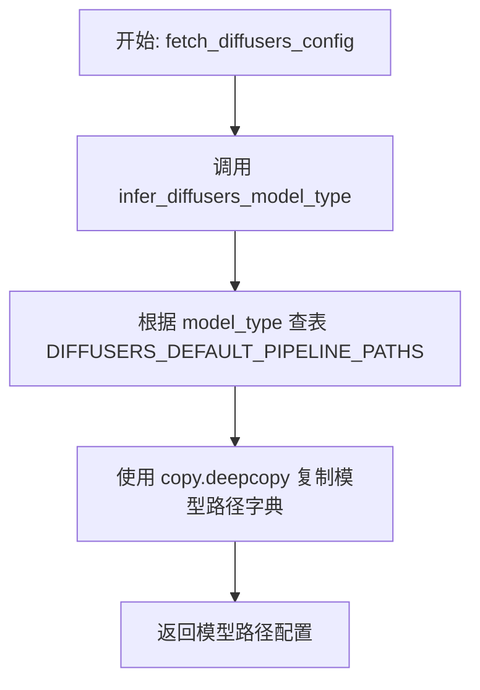

#### 带注释源码

```python
def fetch_diffusers_config(checkpoint):
    """
    根据检查点推断模型类型并返回对应的 Diffusers 默认配置路径。
    
    该函数首先通过分析检查点中的关键权重键来确定模型类型（如 v1、v2、xl_base 等），
    然后从预定义的 DIFFUSERS_DEFAULT_PIPELINE_PATHS 字典中获取对应的 HuggingFace
    模型仓库 ID，用于后续加载 Diffusers 格式的模型配置。
    
    参数:
        checkpoint: 包含模型权重和键的字典，用于推断模型类型
        
    返回:
        包含 pretrained_model_name_or_path 的字典，可用于 from_pretrained
    """
    # 推断检查点对应的模型类型（v1, v2, xl_base, controlnet 等）
    model_type = infer_diffusers_model_type(checkpoint)
    
    # 从预定义映射表获取该模型类型的默认 HuggingFace 仓库路径
    model_path = DIFFUSERS_DEFAULT_PIPELINE_PATHS[model_type]
    
    # 深拷贝返回字典，避免修改原始常量定义
    model_path = copy.deepcopy(model_path)

    return model_path
```


### `set_image_size`

设置图像尺寸。如果提供了 `image_size` 参数，则直接返回该值；否则根据检查点推断模型类型，并从默认图像尺寸映射表中获取对应的图像尺寸。

参数：

- `checkpoint`：`Dict`，模型检查点的状态字典，用于推断模型类型
- `image_size`：`Optional[int]`，可选参数，期望的图像尺寸。如果提供了值则直接返回

返回值：`int`，要使用的图像尺寸

#### 流程图

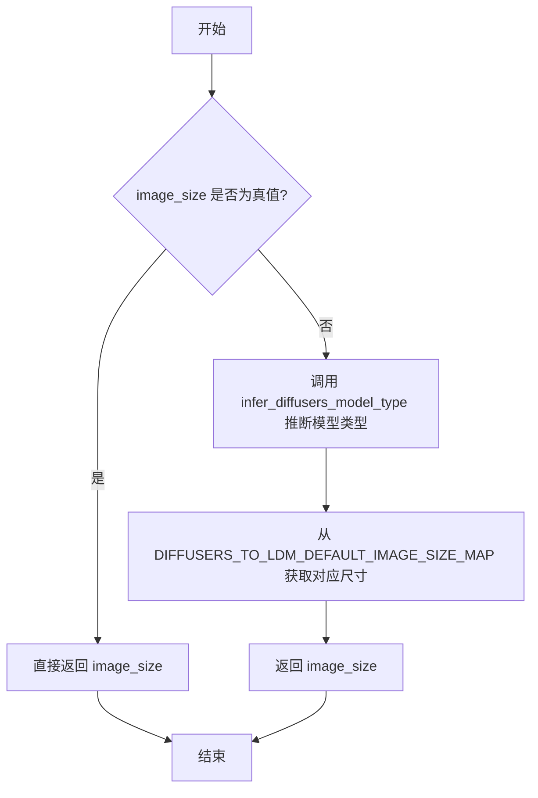

#### 带注释源码

```python
def set_image_size(checkpoint, image_size=None):
    """
    设置图像尺寸。
    
    如果调用者已经指定了 image_size，则直接返回该值。
    否则，根据检查点推断模型类型，并从默认映射表中获取
    该模型类型对应的标准图像尺寸。
    
    参数:
        checkpoint: 模型检查点（状态字典），用于推断模型类型
        image_size: 可选的图像尺寸，如果提供则直接返回
    
    返回:
        int: 要使用的图像尺寸
    """
    # 如果已指定图像尺寸，直接返回
    if image_size:
        return image_size

    # 根据检查点推断 Diffusers 模型类型
    model_type = infer_diffusers_model_type(checkpoint)
    
    # 从默认映射表获取该模型类型的标准图像尺寸
    image_size = DIFFUSERS_TO_LDM_DEFAULT_IMAGE_SIZE_MAP[model_type]

    return image_size
```


### `conv_attn_to_linear`

该函数用于将卷积注意力（convolutional attention）的权重张量转换为线性（linear）投影的权重张量。在从LDM（Latent Diffusion Models）格式的检查点转换到Diffusers格式时，需要将原本存储为4D卷积核形式的注意力权重（如`query.weight`、`key.weight`、`value.weight`）和输出投影权重（`proj_attn.weight`）展平为2D线性权重。

参数：

- `checkpoint`：`dict`，模型检查点（state dictionary），包含模型各层的权重参数。该字典会被直接修改。

返回值：`None`，函数直接修改传入的`checkpoint`字典，无返回值。

#### 流程图

```mermaid
flowchart TD
    A[开始] --> B[获取checkpoint的所有键]
    B --> C[定义注意力键列表: query.weight, key.weight, value.weight]
    C --> D{遍历每个键}
    D --> E{检查键的最后两部分是否在注意力键列表中}
    E -->|是| F{检查权重维度是否大于2}
    F -->|是| G[取权重张量[:, :, 0, 0]进行展平]
    G --> H[更新checkpoint中的权重]
    H --> D
    E -->|否| I{检查键是否包含proj_attn.weight}
    I -->|是| J{检查权重维度是否大于2}
    J -->|是| K[取权重张量[:, :, 0]进行展平]
    K --> H
    I -->|否| D
    D --> L[结束]
```

#### 带注释源码

```python
def conv_attn_to_linear(checkpoint):
    """
    将卷积注意力权重转换为线性权重。
    
    在LDM格式的检查点中，注意力层的query、key、value和proj_attn权重
    以4D卷积核形式存储（形状为[out_channels, in_channels, height, width]）。
    Diffusers格式需要2D线性权重（形状为[out_channels, in_channels]）。
    
    参数:
        checkpoint: 模型检查点字典，直接原地修改
    """
    # 获取检查点中所有键的列表
    keys = list(checkpoint.keys())
    # 定义需要转换的注意力权重键
    attn_keys = ["query.weight", "key.weight", "value.weight"]
    
    # 遍历检查点中的所有键
    for key in keys:
        # 检查键的最后两部分是否匹配注意力权重键
        # 例如: "model.diffusion_model.input_blocks.2.1.transformer_blocks.0.attn2.to_k.weight"
        # 会检查 "to_k.weight" 是否匹配 "key.weight"
        if ".".join(key.split(".")[-2:]) in attn_keys:
            # 如果权重维度大于2（4D张量），说明是卷积形式
            if checkpoint[key].ndim > 2:
                # 使用切片移除空间维度，只保留输出和输入通道
                # 从 [out_ch, in_ch, 1, 1] 转换为 [out_ch, in_ch]
                checkpoint[key] = checkpoint[key][:, :, 0, 0]
        # 检查是否为proj_attn权重（输出投影）
        elif "proj_attn.weight" in key:
            if checkpoint[key].ndim > 2:
                # proj_attn的卷积核形状为 [out_ch, in_ch, 1]
                # 转换为 [out_ch, in_ch]
                checkpoint[key] = checkpoint[key][:, :, 0]
```


### `create_unet_diffusers_config_from_ldm`

该函数用于将LDM（Latent Diffusion Models）模型的UNet配置转换为Diffusers格式的UNet配置，从原始LDM配置和检查点中提取参数，构建符合Diffusers库要求的UNet2DConditionModel配置字典。

参数：

- `original_config`：`Dict`，原始LDM模型的配置文件，包含模型参数、网络配置等信息
- `checkpoint`：`Dict`，LDM模型的检查点文件，包含模型权重和结构信息
- `image_size`：`Optional[int]`，图像尺寸，已弃用参数，将在未来版本中被忽略
- `upcast_attention`：`Optional[bool]`，是否上投影注意力，已弃用参数
- `num_in_channels`：`Optional[int]`，输入通道数，已弃用参数

返回值：`Dict`，返回转换后的Diffusers格式UNet配置，包含样本尺寸、输入通道数、块类型、注意力维度等配置信息

#### 流程图

```mermaid
flowchart TD
    A[开始] --> B{image_size是否不为None}
    B -->|是| C[记录弃用警告]
    B -->|否| D[跳过]
    C --> E[调用set_image_size获取image_size]
    D --> E
    E --> F{original_config中是否有unet_config}
    F -->|是| G[提取unet_config.params]
    F -->|否| H[提取network_config.params]
    G --> I
    H --> I{num_in_channels是否不为None}
    I -->|是| J[记录弃用警告并使用num_in_channels]
    I -->|否| K[从unet_params获取in_channels]
    J --> L
    K --> L[提取VAE配置ddconfig]
    L --> M[计算block_out_channels]
    M --> N[遍历block_out_channels确定down_block_types]
    N --> O[遍历block_out_types确定up_block_types]
    O --> P{transformer_depth是否存在]
    P -->|是| Q[提取transformer_layers_per_block]
    P -->|否| R[设为1]
    Q --> S
    R --> S[计算vae_scale_factor]
    S --> T{num_heads是否在unet_params中]
    T -->|是| U[设置head_dim]
    T -->|否| V{use_linear_in_transformer是否存在}
    V -->|是| W[计算head_dim]
    V -->|否| X[head_dim为None]
    U --> Y
    W --> Y
    X --> Y[初始化class_embed_type等变量]
    Y --> Z{context_dim是否存在}
    Z -->|是| AA[提取context_dim]
    Z -->|否| AB[设为None]
    AA --> AC
    AB --> AC{num_classes是否存在}
    AC -->|是| AD{num_classes是否为sequential}
    AD -->|是| AE{context_dim是2048或1280}
    AD -->|否| AF[设为projection类型]
    AE -->|是| AG[设置addition_embed_type为text_time]
    AE -->|否| AH[设置class_embed_type为projection]
    AG --> AI
    AH --> AI[提取adm_in_channels]
    AF --> AI
    AB --> AJ[开始构建config字典]
    AI --> AJ
    AJ --> AK{upcast_attention是否不为None]
    AK -->|是| AL[记录弃用警告并添加到config]
    AK -->|否| AM{disable_self_attentions是否存在]
    AM -->|是| AN[添加到config作为only_cross_attention]
    AM -->|否| AO{num_classes是否为整数}
    AO -->|是| AP[添加num_class_embeds到config]
    AO -->|否| AQ[添加out_channels和up_block_types]
    AN --> AQ
    AP --> AQ
    AQ --> AR[返回config配置字典]
```

#### 带注释源码

```python
def create_unet_diffusers_config_from_ldm(
    original_config, checkpoint, image_size=None, upcast_attention=None, num_in_channels=None
):
    """
    Creates a config for the diffusers based on the config of the LDM model.
    """
    # 处理已弃用的image_size参数，输出警告信息
    if image_size is not None:
        deprecation_message = (
            "Configuring UNet2DConditionModel with the `image_size` argument to `from_single_file`"
            "is deprecated and will be ignored in future versions."
        )
        deprecate("image_size", "1.0.0", deprecation_message)

    # 设置图像尺寸，优先使用传入值，否则从检查点推断
    image_size = set_image_size(checkpoint, image_size=image_size)

    # 从原始配置中提取UNet参数
    # 检查模型参数中是否有unet_config配置块
    if (
        "unet_config" in original_config["model"]["params"]
        and original_config["model"]["params"]["unet_config"] is not None
    ):
        # 优先使用unet_config配置
        unet_params = original_config["model"]["params"]["unet_config"]["params"]
    else:
        # 否则使用network_config配置（SDXL等新版本使用）
        unet_params = original_config["model"]["params"]["network_config"]["params"]

    # 处理已弃用的num_in_channels参数
    if num_in_channels is not None:
        deprecation_message = (
            "Configuring UNet2DConditionModel with the `num_in_channels` argument to `from_single_file`"
            "is deprecated and will be ignored in future versions."
        )
        deprecate("image_size", "1.0.0", deprecation_message)
        in_channels = num_in_channels  # 使用传入的num_in_channels
    else:
        # 从unet_params中获取输入通道数
        in_channels = unet_params["in_channels"]

    # 提取VAE配置，用于计算缩放因子
    vae_params = original_config["model"]["params"]["first_stage_config"]["params"]["ddconfig"]
    
    # 计算输出通道数：根据model_channels和channel_mult计算每个阶段的通道数
    block_out_channels = [unet_params["model_channels"] * mult for mult in unet_params["channel_mult"]]

    # 确定下采样块类型：根据attention_resolutions决定是否使用CrossAttnDownBlock2D
    down_block_types = []
    resolution = 1
    for i in range(len(block_out_channels)):
        # 如果当前分辨率在attention_resolutions中，则使用交叉注意力块
        block_type = "CrossAttnDownBlock2D" if resolution in unet_params["attention_resolutions"] else "DownBlock2D"
        down_block_types.append(block_type)
        if i != len(block_out_channels) - 1:
            resolution *= 2  # 分辨率翻倍

    # 确定上采样块类型：与下采样块对应
    up_block_types = []
    for i in range(len(block_out_channels)):
        block_type = "CrossAttnUpBlock2D" if resolution in unet_params["attention_resolutions"] else "UpBlock2D"
        up_block_types.append(block_type)
        resolution //= 2  # 分辨率减半

    # 处理transformer层数配置
    if unet_params["transformer_depth"] is not None:
        # 如果是整数，则所有块使用相同层数；否则是列表，每个块独立配置
        transformer_layers_per_block = (
            unet_params["transformer_depth"]
            if isinstance(unet_params["transformer_depth"], int)
            else list(unet_params["transformer_depth"])
        )
    else:
        # 默认每个块一层transformer
        transformer_layers_per_block = 1

    # 计算VAE缩放因子：2的(ch_mult长度-1)次方
    vae_scale_factor = 2 ** (len(vae_params["ch_mult"]) - 1)

    # 获取注意力头维度
    head_dim = unet_params["num_heads"] if "num_heads" in unet_params else None
    
    # 检查是否使用线性投影
    use_linear_projection = (
        unet_params["use_linear_in_transformer"] if "use_linear_in_transformer" in unet_params else False
    )
    if use_linear_projection:
        # 针对SD 2-base-512和2-768版本，需要根据channel_mult计算head_dim
        if head_dim is None:
            head_dim_mult = unet_params["model_channels"] // unet_params["num_head_channels"]
            head_dim = [head_dim_mult * c for c in list(unet_params["channel_mult"])]

    # 初始化嵌入类型变量
    class_embed_type = None
    addition_embed_type = None
    addition_time_embed_dim = None
    projection_class_embeddings_input_dim = None
    context_dim = None

    # 提取上下文维度
    if unet_params["context_dim"] is not None:
        context_dim = (
            unet_params["context_dim"]
            if isinstance(unet_params["context_dim"], int)
            else unet_params["context_dim"][0]  # 取第一个维度
        )

    # 处理类别嵌入配置
    if "num_classes" in unet_params:
        if unet_params["num_classes"] == "sequential":
            if context_dim in [2048, 1280]:
                # SDXL使用text_time嵌入类型
                addition_embed_type = "text_time"
                addition_time_embed_dim = 256
            else:
                # 其他情况使用projection嵌入
                class_embed_type = "projection"
            # 必须包含adm_in_channels
            assert "adm_in_channels" in unet_params
            projection_class_embeddings_input_dim = unet_params["adm_in_channels"]

    # 构建基础配置字典
    config = {
        "sample_size": image_size // vae_scale_factor,  # 样本尺寸需要除以VAE缩放因子
        "in_channels": in_channels,  # 输入通道数
        "down_block_types": down_block_types,  # 下采样块类型
        "block_out_channels": block_out_channels,  # 输出通道数列表
        "layers_per_block": unet_params["num_res_blocks"],  # 每个块的残差层数
        "cross_attention_dim": context_dim,  # 交叉注意力维度
        "attention_head_dim": head_dim,  # 注意力头维度
        "use_linear_projection": use_linear_projection,  # 是否使用线性投影
        "class_embed_type": class_embed_type,  # 类别嵌入类型
        "addition_embed_type": addition_embed_type,  # 附加嵌入类型
        "addition_time_embed_dim": addition_time_embed_dim,  # 附加时间嵌入维度
        "projection_class_embeddings_input_dim": projection_class_embeddings_input_dim,  # 投影类别嵌入输入维度
        "transformer_layers_per_block": transformer_layers_per_block,  # 每块的transformer层数
    }

    # 处理upcast_attention参数（已弃用）
    if upcast_attention is not None:
        deprecation_message = (
            "Configuring UNet2DConditionModel with the `upcast_attention` argument to `from_single_file`"
            "is deprecated and will be ignored in future versions."
        )
        deprecate("image_size", "1.0.0", deprecation_message)
        config["upcast_attention"] = upcast_attention

    # 处理禁用自注意力配置
    if "disable_self_attentions" in unet_params:
        config["only_cross_attention"] = unet_params["disable_self_attentions"]

    # 处理类别数量配置（整数类型）
    if "num_classes" in unet_params and isinstance(unet_params["num_classes"], int):
        config["num_class_embeds"] = unet_params["num_classes"]

    # 添加输出通道数和上采样块类型
    config["out_channels"] = unet_params["out_channels"]
    config["up_block_types"] = up_block_types

    return config
```


### `create_controlnet_diffusers_config_from_ldm`

该函数用于从LDM（Latent Diffusion Models）格式的原始配置文件和检查点中提取并创建ControlNet的Diffusers配置。它首先处理可能已弃用的`image_size`参数，然后从原始配置中提取控制阶段（control stage）的参数，接着调用`create_unet_diffusers_config_from_ldm`函数获取UNet配置，最后将两者合并生成完整的ControlNet配置字典。

参数：

- `original_config`：`dict`，原始LDM格式的配置文件，包含模型的参数字典
- `checkpoint`：`dict`，模型检查点，包含预训练模型的权重和参数
- `image_size`：`int` 或 `None`，目标图像尺寸（已弃用参数，将在未来版本中被忽略）
- `**kwargs`：可变关键字参数，用于接受额外的未命名参数

返回值：`dict`，返回包含ControlNet配置的字典，包括条件通道数、输入通道数、下采样块类型、块输出通道数、每层块数、交叉注意力维度、注意力头维度、线性投影使用情况、类别嵌入类型、附加嵌入类型、附加时间嵌入维度和投影类别嵌入输入维度等关键配置信息。

#### 流程图

```mermaid
flowchart TD
    A[开始] --> B{image_size是否不为None}
    B -->|是| C[发出弃用警告]
    B -->|否| D[继续]
    C --> D
    D --> E[调用set_image_size获取图像尺寸]
    E --> F[从original_config提取control_stage_config参数]
    F --> G[调用create_unet_diffusers_config_from_ldm获取UNet配置]
    G --> H[构建controlnet_config字典]
    H --> I[提取unet_params中的hint_channels]
    I --> J[映射UNet配置到ControlNet配置]
    J --> K[返回controlnet_config]
    
    style A fill:#f9f,stroke:#333
    style K fill:#9f9,stroke:#333
```

#### 带注释源码

```python
def create_controlnet_diffusers_config_from_ldm(original_config, checkpoint, image_size=None, **kwargs):
    """
    从LDM格式的原始配置创建ControlNet的Diffusers配置。
    
    该函数负责将LDM格式的ControlNet模型配置转换为Diffusers库
    所期望的格式，以便后续可以正确加载和初始化ControlNet模型。
    
    参数:
        original_config: 包含LDM模型配置的字典，通常来自.yaml配置文件
        checkpoint: 包含模型权重的检查点字典
        image_size: 可选的图像尺寸参数（已弃用）
        **kwargs: 额外的关键字参数
        
    返回:
        包含ControlNet配置的字典，可用于初始化ControlNetModel
    """
    # 检查image_size参数是否被使用，如果使用了则发出弃用警告
    if image_size is not None:
        deprecation_message = (
            "Configuring ControlNetModel with the `image_size` argument"
            "is deprecated and will be ignored in future versions."
        )
        deprecate("image_size", "1.0.0", deprecation_message)

    # 设置图像尺寸，如果未提供则从检查点推断
    image_size = set_image_size(checkpoint, image_size=image_size)

    # 从原始配置中提取control_stage_config的参数
    # original_config["model"]["params"]["control_stage_config"]["params"]
    # 包含ControlNet特定的网络配置
    unet_params = original_config["model"]["params"]["control_stage_config"]["params"]
    
    # 调用UNet配置创建函数，获取Diffusers格式的UNet配置
    # 这个配置将被用作ControlNet配置的基础
    diffusers_unet_config = create_unet_diffusers_config_from_ldm(original_config, image_size=image_size)

    # 构建ControlNet的完整配置字典
    # 我们从UNet配置中复制大部分参数，因为ControlNet和UNet
    # 在结构上有很多相似之处
    controlnet_config = {
        # 控制条件输入的通道数，从原始配置的hint_channels获取
        "conditioning_channels": unet_params["hint_channels"],
        
        # 输入通道数，与UNet配置相同
        "in_channels": diffusers_unet_config["in_channels"],
        
        # 下采样块的类型
        "down_block_types": diffusers_unet_config["down_block_types"],
        
        # 块的输出通道数
        "block_out_channels": diffusers_unet_config["block_out_channels"],
        
        # 每个块中的层数
        "layers_per_block": diffusers_unet_config["layers_per_block"],
        
        # 交叉注意力机制的维度
        "cross_attention_dim": diffusers_unet_config["cross_attention_dim"],
        
        # 注意力头的维度
        "attention_head_dim": diffusers_unet_config["attention_head_dim"],
        
        # 是否使用线性投影
        "use_linear_projection": diffusers_unet_config["use_linear_projection"],
        
        # 类别嵌入类型
        "class_embed_type": diffusers_unet_config["class_embed_type"],
        
        # 附加嵌入类型
        "addition_embed_type": diffusers_unet_config["addition_embed_type"],
        
        # 附加时间嵌入维度
        "addition_time_embed_dim": diffusers_unet_config["addition_time_embed_dim"],
        
        # 投影类别嵌入输入维度
        "projection_class_embeddings_input_dim": diffusers_unet_config["projection_class_embeddings_input_dim"],
        
        # 每个块的Transformer层数
        "transformer_layers_per_block": diffusers_unet_config["transformer_layers_per_block"],
    }

    # 返回构建好的ControlNet配置
    return controlnet_config
```


### `create_vae_diffusers_config_from_ldm`

该函数用于将LDM（Latent Diffusion Models）格式的VAE配置转换为Diffusers格式的VAE配置。它从原始配置文件和检查点中提取VAE参数，并生成符合Diffusers库要求的配置字典，支持多种VAE变体（包括标准VAE和EDM VAE）。

参数：

- `original_config`：`Dict`，原始LDM模型的配置文件，包含模型参数和first_stage_config配置
- `checkpoint`：`Dict`，模型检查点字典，用于提取latents均值/标准差（edm_mean/edm_std）和推断模型类型
- `image_size`：`Optional[int]`，输出图像尺寸（已弃用参数，将在未来版本中被忽略）
- `scaling_factor`：`Optional[float]`，VAE缩放因子，用于潜在空间的缩放；若未指定则根据模型类型自动推断

返回值：`Dict`，返回符合Diffusers库要求的VAE配置字典，包含sample_size、in_channels、out_channels、down_block_types、up_block_types、block_out_channels、latent_channels、layers_per_block、scaling_factor等配置项；若检查点中存在edm_mean和edm_std，则还会包含latents_mean和latents_std。

#### 流程图

```mermaid
flowchart TD
    A[开始] --> B{image_size是否被指定?}
    B -- 是 --> C[记录弃用警告]
    C --> D[调用set_image_size获取图像尺寸]
    B -- 否 --> D
    D --> E{checkpoint中是否存在edm_mean和edm_std?}
    E -- 是 --> F[提取latents_mean和latents_std]
    E -- 否 --> G[设置latents_mean和latents_std为None]
    F --> H[从original_config提取vae_params]
    G --> H
    H --> I{scaling_factor是否已指定?}
    I -- 是 --> J[直接使用指定的scaling_factor]
    I -- 否 --> K{latents_mean和latents_std是否存在?}
    K -- 是 --> L[使用PLAYGROUND_VAE_SCALING_FACTOR]
    K -- 否 --> M{original_config中是否存在scale_factor?}
    M -- 是 --> N[使用original_config中的scale_factor]
    M -- 否 --> O[使用LDM_VAE_DEFAULT_SCALING_FACTOR]
    L --> P[计算block_out_channels]
    N --> P
    O --> P
    J --> P
    P --> Q[构建down_block_types和up_block_types列表]
    Q --> R[构建基础配置字典]
    R --> S{latents_mean和latents_std都存在?}
    S -- 是 --> T[更新配置添加latents_mean和latents_std]
    S -- 否 --> U[返回配置字典]
    T --> U
    U --> Z[结束]
```

#### 带注释源码

```python
def create_vae_diffusers_config_from_ldm(original_config, checkpoint, image_size=None, scaling_factor=None):
    """
    Creates a config for the diffusers based on the config of the LDM model.
    """
    # 如果指定了image_size参数，记录弃用警告（该参数将在未来版本中被忽略）
    if image_size is not None:
        deprecation_message = (
            "Configuring AutoencoderKL with the `image_size` argument"
            "is deprecated and will be ignored in future versions."
        )
        deprecate("image_size", "1.0.0", deprecation_message)

    # 调用set_image_size函数获取图像尺寸（从checkpoint推断或使用默认值）
    image_size = set_image_size(checkpoint, image_size=image_size)

    # 从checkpoint中提取EDM VAE的latents统计信息（如果存在）
    if "edm_mean" in checkpoint and "edm_std" in checkpoint:
        latents_mean = checkpoint["edm_mean"]
        latents_std = checkpoint["edm_std"]
    else:
        latents_mean = None
        latents_std = None

    # 从原始配置中提取VAE的ddconfig参数（包含通道数、分辨率等关键配置）
    vae_params = original_config["model"]["params"]["first_stage_config"]["params"]["ddconfig"]

    # 确定scaling_factor的优先级：
    # 1. 如果已显式指定scaling_factor，使用该值
    # 2. 否则，如果存在EDM统计信息，使用Playground的缩放因子(0.5)
    # 3. 否则，如果original_config中有scale_factor，使用该值
    # 4. 否则，使用LDM VAE的默认缩放因子(0.18215)
    if (scaling_factor is None) and (latents_mean is not None) and (latents_std is not None):
        scaling_factor = PLAYGROUND_VAE_SCALING_FACTOR
    elif (scaling_factor is None) and ("scale_factor" in original_config["model"]["params"]):
        scaling_factor = original_config["model"]["params"]["scale_factor"]
    elif scaling_factor is None:
        scaling_factor = LDM_VAE_DEFAULT_SCALING_FACTOR

    # 根据VAE配置中的通道倍数(ch_mult)计算输出通道数列表
    block_out_channels = [vae_params["ch"] * mult for mult in vae_params["ch_mult"]]

    # 为每个下采样阶段创建对应的块类型
    down_block_types = ["DownEncoderBlock2D"] * len(block_out_channels)
    # 为每个上采样阶段创建对应的块类型
    up_block_types = ["UpDecoderBlock2D"] * len(block_out_channels)

    # 构建Diffusers格式的VAE配置字典
    config = {
        "sample_size": image_size,                      # 输出样本的尺寸
        "in_channels": vae_params["in_channels"],       # 输入通道数
        "out_channels": vae_params["out_ch"],          # 输出通道数
        "down_block_types": down_block_types,           # 下采样块类型列表
        "up_block_types": up_block_types,              # 上采样块类型列表
        "block_out_channels": block_out_channels,       # 各块的输出通道数
        "latent_channels": vae_params["z_channels"],    # 潜在空间通道数
        "layers_per_block": vae_params["num_res_blocks"],  # 每个块的残差层数
        "scaling_factor": scaling_factor,               # VAE缩放因子
    }

    # 如果存在EDM统计信息，将其添加到配置中
    if latents_mean is not None and latents_std is not None:
        config.update({"latents_mean": latents_mean, "latents_std": latents_std})

    return config
```


### `update_unet_resnet_ldm_to_diffusers`

该函数用于将LDM（Latent Diffusion Models）格式的UNet ResNet权重键名转换为Diffusers格式的键名，通过字符串替换实现键名的映射转换，并将转换后的权重存储到新的checkpoint字典中。

参数：

- `ldm_keys`：`List[str]`，需要转换的LDM格式键名列表
- `new_checkpoint`：`Dict[str, torch.Tensor]`，目标Diffusers格式的checkpoint字典，用于存储转换后的权重
- `checkpoint`：`Dict[str, torch.Tensor]`，源LDM格式的checkpoint字典，包含原始权重
- `mapping`：`Optional[Dict[str, str]]`，可选的映射字典，用于额外的键名替换（包含"old"和"new"键值对）

返回值：`None`，该函数直接修改`new_checkpoint`字典，不返回值

#### 流程图

```mermaid
flowchart TD
    A[开始] --> B{遍历 ldm_keys}
    B --> C[取出一个 ldm_key]
    C --> D[字符串替换: in_layers.0 → norm1]
    D --> E[字符串替换: in_layers.2 → conv1]
    E --> F[字符串替换: out_layers.0 → norm2]
    F --> G[字符串替换: out_layers.3 → conv2]
    G --> H[字符串替换: emb_layers.1 → time_emb_proj]
    H --> I[字符串替换: skip_connection → conv_shortcut]
    I --> J{mapping 是否存在?}
    J -->|是| K[应用 mapping 替换]
    J -->|否| L[跳过 mapping 替换]
    K --> M[从 checkpoint 获取权重]
    L --> M
    M --> N[存储到 new_checkpoint]
    N --> O{还有更多 ldm_keys?}
    O -->|是| C
    O -->|否| P[结束]
```

#### 带注释源码

```python
def update_unet_resnet_ldm_to_diffusers(ldm_keys, new_checkpoint, checkpoint, mapping=None):
    """
    将LDM格式的UNet ResNet权重键名转换为Diffusers格式
    
    参数:
        ldm_keys: 需要转换的LDM格式键名列表
        new_checkpoint: 目标Diffusers格式的checkpoint字典
        checkpoint: 源LDM格式的checkpoint字典
        mapping: 可选的映射字典，用于额外的键名替换
    """
    # 遍历所有需要转换的LDM键
    for ldm_key in ldm_keys:
        # 首先进行基础的键名转换，将LDM特定命名转换为Diffusers命名
        diffusers_key = (
            ldm_key.replace("in_layers.0", "norm1")           # 输入层第0部分 -> 归一化层1
            .replace("in_layers.2", "conv1")                    # 输入层第2部分 -> 卷积层1
            .replace("out_layers.0", "norm2")                   # 输出层第0部分 -> 归一化层2
            .replace("out_layers.3", "conv2")                   # 输出层第3部分 -> 卷积层2
            .replace("emb_layers.1", "time_emb_proj")           # 嵌入层 -> 时间嵌入投影
            .replace("skip_connection", "conv_shortcut")        # 跳跃连接 -> 卷积快捷连接
        )
        
        # 如果提供了mapping字典，进行额外的键名映射替换
        if mapping:
            # 使用mapping中的old->new替换规则
            diffusers_key = diffusers_key.replace(mapping["old"], mapping["new"])
        
        # 从原始checkpoint中获取对应键的权重，并存储到新的checkpoint字典中
        new_checkpoint[diffusers_key] = checkpoint.get(ldm_key)
```


### `update_unet_attention_ldm_to_diffusers`

该函数用于将LDM（Latent Diffusion Models）格式的UNet注意力层权重键转换为Diffusers格式。通过使用mapping字典中的旧键前缀替换为新键前缀，实现键名的重命名，并将转换后的权重添加到新的checkpoint中。

参数：

- `ldm_keys`：`List[str]`，LDM格式的注意力层权重键列表
- `new_checkpoint`：`Dict[str, torch.Tensor]`，用于存储转换后Diffusers格式权重键值对的字典
- `checkpoint`：`Dict[str, torch.Tensor]`，原始的模型checkpoint字典
- `mapping`：`Dict[str, str]`，包含"old"和"new"键的字典，用于指定键名前缀的替换规则（例如：`{"old": "input_blocks.1.1", "new": "down_blocks.0.attentions.0"}`）

返回值：`None`，该函数直接修改`new_checkpoint`字典，不返回任何值

#### 流程图

```mermaid
flowchart TD
    A[开始] --> B[遍历 ldm_keys 列表]
    B --> C{当前索引 < len(ldm_keys)?}
    C -->|是| D[获取当前 ldm_key]
    C -->|否| G[结束]
    D --> E[使用 mapping 替换 ldm_key 中的旧前缀为新前缀]
    E --> F[从 checkpoint 获取 ldm_key 对应的值<br>并存储到 new_checkpoint 中<br>键为转换后的 diffusers_key]
    F --> B
```

#### 带注释源码

```python
def update_unet_attention_ldm_to_diffusers(ldm_keys, new_checkpoint, checkpoint, mapping):
    """
    将LDM格式的UNet注意力权重键转换为Diffusers格式。
    
    参数:
        ldm_keys: LDM格式的注意力层权重键列表
        new_checkpoint: 存储转换后权重的目标字典
        checkpoint: 原始模型权重字典
        mapping: 包含键名替换规则的字典
    """
    # 遍历所有LDM格式的注意力键
    for ldm_key in ldm_keys:
        # 使用mapping中的替换规则将LDM键转换为Diffusers键
        # 例如: "input_blocks.1.1.to_k.weight" -> "down_blocks.0.attentions.0.to_k.weight"
        diffusers_key = ldm_key.replace(mapping["old"], mapping["new"])
        
        # 从原始checkpoint中获取权重并添加到新的checkpoint字典中
        new_checkpoint[diffusers_key] = checkpoint.get(ldm_key)
```


### `update_vae_resnet_ldm_to_diffusers`

更新VAE ResNet权重键名，将LDM（Latent Diffusion Models）格式的键名转换为Diffusers格式。

参数：

- `keys`：`List[str]`，需要转换的LDM格式权重键列表
- `new_checkpoint`：`Dict[str, torch.Tensor]`，目标Diffusers格式的检查点字典，转换后的权重会写入此字典
- `checkpoint`：`Dict[str, torch.Tensor]`，源LDM格式的检查点字典
- `mapping`：`Dict[str, str]`，键名映射规则，包含`old`和`new`两个键，用于替换LDM键中的特定前缀

返回值：`None`，该函数直接修改`new_checkpoint`字典，不返回值

#### 流程图

```mermaid
flowchart TD
    A[开始] --> B[遍历keys列表中的每个ldm_key]
    B --> C{检查ldm_key是否存在}
    C -->|是| D[应用mapping替换规则]
    C -->|否| E[获取None值]
    D --> F[额外替换 nin_shortcut 为 conv_shortcut]
    F --> G[生成diffusers_key]
    G --> H[从checkpoint获取权重值]
    H --> I[将权重写入new_checkpoint]
    I --> B
    E --> B
    B --> J[遍历结束]
    J --> K[结束]
```

#### 带注释源码

```python
def update_vae_resnet_ldm_to_diffusers(keys, new_checkpoint, checkpoint, mapping):
    """
    更新VAE ResNet权重键名，将LDM格式转换为Diffusers格式
    
    参数:
        keys: LDM格式的权重键列表
        new_checkpoint: 目标Diffusers格式检查点字典
        checkpoint: 源LDM格式检查点字典
        mapping: 键名映射规则字典，包含'old'和'new'键
    """
    # 遍历所有需要转换的LDM键
    for ldm_key in keys:
        # 第一步：应用mapping中的替换规则
        # 例如：将 "down.0.block" 替换为 "down_blocks.0.resnets"
        diffusers_key = ldm_key.replace(mapping["old"], mapping["new"])
        
        # 第二步：处理特殊的键名映射
        # LDM中使用"nin_shortcut"表示卷积捷径，Diffusers中使用"conv_shortcut"
        diffusers_key = diffusers_key.replace("nin_shortcut", "conv_shortcut")
        
        # 第三步：从源检查点获取权重，并写入目标检查点
        # 如果键不存在，checkpoint.get()会返回None
        new_checkpoint[diffusers_key] = checkpoint.get(ldm_key)
```


### `update_vae_attentions_ldm_to_diffusers`

将LDM（Latent Diffusion Models）格式的VAE注意力层权重键名转换为Diffusers格式，同时处理权重维度变换（1D卷积转线性层）。

参数：

-  `keys`：`List[str]`，需要转换的LDM格式的key列表
-  `new_checkpoint`：`Dict[str, torch.Tensor]`，目标Diffusers格式的checkpoint字典（会被直接修改）
-  `checkpoint`：`Dict[str, torch.Tensor]`，源LDM格式的checkpoint字典
-  `mapping`：`Dict[str, str]`，映射规则字典，包含`old`和`new`键，用于键名前缀替换

返回值：`None`（无返回值，直接修改`new_checkpoint`字典）

#### 流程图

```mermaid
flowchart TD
    A[开始] --> B[遍历 keys 列表]
    B --> C{当前 key 是否存在}
    C -->|是| D[应用 mapping 替换 old -> new]
    C -->|否| I[处理下一个 key]
    D --> E[替换键名模式: norm → group_norm, q/k/v → to_q/to_k/to_v, proj_out → to_out.0]
    E --> F[从 checkpoint 获取权重并放入 new_checkpoint]
    F --> G{权重形状维度}
    G -->|3维| H[取 [:, :, 0] 降为2维]
    G -->|4维| J[取 [:, :, 0, 0] 降为2维]
    H --> K[继续处理下一个 key]
    J --> K
    I --> L[结束]
    K --> B
```

#### 带注释源码

```python
def update_vae_attentions_ldm_to_diffusers(keys, new_checkpoint, checkpoint, mapping):
    """
    将LDM格式的VAE注意力权重转换为Diffusers格式
    
    参数:
        keys: LDM格式的键名列表
        new_checkpoint: 目标Diffusers格式的字典
        checkpoint: 源LDM格式的字典
        mapping: 映射规则 {"old": "旧前缀", "new": "新前缀"}
    """
    # 遍历所有需要转换的键
    for ldm_key in keys:
        # 1. 应用映射替换键名前缀 (如 "mid.attn_1" -> "mid_block.attentions.0")
        diffusers_key = (
            ldm_key.replace(mapping["old"], mapping["new"])
            # 2. 重命名归一化层: norm -> group_norm (Diffusers格式)
            .replace("norm.weight", "group_norm.weight")
            .replace("norm.bias", "group_norm.bias")
            # 3. 重命名QKV权重: q/k/v -> to_q/to_k/to_v (Diffusers attention格式)
            .replace("q.weight", "to_q.weight")
            .replace("q.bias", "to_q.bias")
            .replace("k.weight", "to_k.weight")
            .replace("k.bias", "to_k.bias")
            .replace("v.weight", "to_v.weight")
            .replace("v.bias", "to_v.bias")
            # 4. 重命名输出投影: proj_out -> to_out.0 (Diffusers格式)
            .replace("proj_out.weight", "to_out.0.weight")
            .replace("proj_out.bias", "to_out.0.bias")
        )
        # 5. 将转换后的权重存入目标字典
        new_checkpoint[diffusers_key] = checkpoint.get(ldm_key)

        # 6. 处理proj_attn.weight的维度变换
        # LDM中proj_attn可能是1D卷积 (shape: [out_ch, in_ch, 1]) 
        # 需要转换为线性层权重 (shape: [out_ch, in_ch])
        shape = new_checkpoint[diffusers_key].shape

        if len(shape) == 3:
            # 3D张量 [out, in, 1] -> 2D张量 [out, in]
            new_checkpoint[diffusers_key] = new_checkpoint[diffusers_key][:, :, 0]
        elif len(shape) == 4:
            # 4D张量 [out, in, 1, 1] -> 2D张量 [out, in]
            new_checkpoint[diffusers_key] = new_checkpoint[diffusers_key][:, :, 0, 0]
```


### `convert_stable_cascade_unet_single_file_to_diffusers`

该函数用于将 Stable Cascade 模型的 UNet 检查点从原始的单文件格式转换为 Diffusers 库兼容的状态字典格式。主要处理两种模型变体：Stage C（Prior 模型）和 Stage B（Decoder 模型），通过重命名权重键和处理注意力机制中的投影权重来实现格式转换。

参数：

- `checkpoint`：`dict`，原始模型的检查点状态字典，包含模型的所有权重
- `**kwargs`：可变关键字参数，用于传递额外的配置选项（当前函数体未直接使用）

返回值：`dict`，转换后的 Diffusers 兼容状态字典

#### 流程图

```mermaid
flowchart TD
    A[开始] --> B{检查checkpoint中是否存在<br/>clip_txt_mapper.weight键}
    B -->|是 Stage C| C[初始化空state_dict]
    B -->|否 Stage B| D[初始化空state_dict]
    
    C --> E[遍历checkpoint的所有键]
    D --> F[遍历checkpoint的所有键]
    
    E --> G{当前键是否<br/>以in_proj_weight结尾?}
    F --> H{当前键是否<br/>以in_proj_weight结尾?}
    
    G -->|是| I[将权重按维度0分割成3份]
    G -->|否| J{当前键是否<br/>以in_proj_bias结尾?}
    
    H -->|是| K[将权重按维度0分割成3份]
    H -->|否| L{当前键是否<br/>以out_proj.weight结尾?}
    
    I --> M[重命名键名<br/>to_q.weight/to_k.weight/to_v.weight<br/>并存储分割后的权重]
    J -->|是| N[将偏置按维度0分割成3份]
    J -->|否| O{当前键是否<br/>以clip_mapper.weight结尾?}
    
    K --> P[重命名键名<br/>to_q.weight/to_k.weight/to_v.weight<br/>并存储分割后的权重]
    L -->|是| Q[重命名为to_out.0.weight]
    L -->|否| R{当前键是否<br/>以clip_mapper.weight结尾?}
    
    N --> S[重命名键名<br/>to_q.bias/to_k.bias/to_v.bias<br/>并存储分割后的偏置]
    O -->|是| T[重命名为clip_txt_pooled_mapper.weight]
    O -->|否| U[直接复制原始键值对]
    
    R -->|是| V[重命名为clip_txt_pooled_mapper.weight]
    R -->|否| W[直接复制原始键值对]
    
    M --> X{遍历完成?}
    S --> X
    T --> X
    U --> X
    P --> X
    Q --> X
    V --> X
    W --> X
    
    X -->|否| E
    X -->|是| Y[返回转换后的state_dict]
```

#### 带注释源码

```python
def convert_stable_cascade_unet_single_file_to_diffusers(checkpoint, **kwargs):
    """
    将 Stable Cascade UNet 检查点从原始格式转换为 Diffusers 格式。
    
    该函数处理两种模型类型：
    1. Stage C (Prior): 包含 clip_txt_mapper 权重
    2. Stage B (Decoder): 包含 clip_mapper 权重
    
    参数:
        checkpoint: 原始模型的权重字典
        **kwargs: 额外的关键字参数（保留用于未来扩展）
    
    返回:
        转换后的 Diffusers 兼容权重字典
    """
    # 判断是否为 Stage C 模型（通过检查特定的键是否存在）
    is_stage_c = "clip_txt_mapper.weight" in checkpoint

    if is_stage_c:
        # 处理 Stage C (Prior) 模型的转换
        state_dict = {}
        for key in checkpoint.keys():
            # 处理注意力机制的输入投影权重 (in_proj_weight)
            # 原始格式: attn.in_proj_weight (形状为 [3*hidden_dim, ...])
            # 转换后: 拆分为 to_q.weight, to_k.weight, to_v.weight
            if key.endswith("in_proj_weight"):
                # 将合并的 QKV 权重按维度0分割成3份
                weights = checkpoint[key].chunk(3, 0)
                # 重新映射键名并存储分割后的权重
                state_dict[key.replace("attn.in_proj_weight", "to_q.weight")] = weights[0]
                state_dict[key.replace("attn.in_proj_weight", "to_k.weight")] = weights[1]
                state_dict[key.replace("attn.in_proj_weight", "to_v.weight")] = weights[2]
            # 处理注意力机制的输入投影偏置
            elif key.endswith("in_proj_bias"):
                weights = checkpoint[key].chunk(3, 0)
                state_dict[key.replace("attn.in_proj_bias", "to_q.bias")] = weights[0]
                state_dict[key.replace("attn.in_proj_bias", "to_k.bias")] = weights[1]
                state_dict[key.replace("attn.in_proj_bias", "to_v.bias")] = weights[2]
            # 处理注意力机制的输出投影权重
            elif key.endswith("out_proj.weight"):
                weights = checkpoint[key]
                state_dict[key.replace("attn.out_proj.weight", "to_out.0.weight")] = weights
            # 处理注意力机制的输出投影偏置
            elif key.endswith("out_proj.bias"):
                weights = checkpoint[key]
                state_dict[key.replace("attn.out_proj.bias", "to_out.0.bias")] = weights
            # 其他键直接复制
            else:
                state_dict[key] = checkpoint[key]
    else:
        # 处理 Stage B (Decoder) 模型的转换
        state_dict = {}
        for key in checkpoint.keys():
            # 同样处理 QKV 投影权重的拆分
            if key.endswith("in_proj_weight"):
                weights = checkpoint[key].chunk(3, 0)
                state_dict[key.replace("attn.in_proj_weight", "to_q.weight")] = weights[0]
                state_dict[key.replace("attn.in_proj_weight", "to_k.weight")] = weights[1]
                state_dict[key.replace("attn.in_proj_weight", "to_v.weight")] = weights[2]
            elif key.endswith("in_proj_bias"):
                weights = checkpoint[key].chunk(3, 0)
                state_dict[key.replace("attn.in_proj_bias", "to_q.bias")] = weights[0]
                state_dict[key.replace("attn.in_proj_bias", "to_k.bias")] = weights[1]
                state_dict[key.replace("attn.in_proj_bias", "to_v.bias")] = weights[2]
            elif key.endswith("out_proj.weight"):
                weights = checkpoint[key]
                state_dict[key.replace("attn.out_proj.weight", "to_out.0.weight")] = weights
            elif key.endswith("out_proj.bias"):
                weights = checkpoint[key]
                state_dict[key.replace("attn.out_proj.bias", "to_out.0.bias")] = weights
            # Stage B 特有的: 重命名 clip_mapper 为 clip_txt_pooled_mapper
            elif key.endswith("clip_mapper.weight"):
                weights = checkpoint[key]
                state_dict[key.replace("clip_mapper.weight", "clip_txt_pooled_mapper.weight")] = weights
            elif key.endswith("clip_mapper.bias"):
                weights = checkpoint[key]
                state_dict[key.replace("clip_mapper.bias", "clip_txt_pooled_mapper.bias")] = weights
            # 其他键直接复制
            else:
                state_dict[key] = checkpoint[key]

    return state_dict
```


### `convert_ldm_unet_checkpoint`

该函数用于将 Latent Diffusion Model (LDM) 的 UNet 检查点转换为 Diffusers 格式。函数处理 EMA/非 EMA 权重提取、键名映射以及不同网络层（ResNet、Attention、DownBlock、MidBlock、UpBlock）的结构转换。

参数：

- `checkpoint`：`Dict[str, torch.Tensor]`，原始 LDM 检查点的状态字典
- `config`：`Dict`，目标 Diffusers UNet 模型的配置信息
- `extract_ema`：`bool`，是否提取 EMA 权重，默认为 `False`
- `**kwargs`：可选关键字参数，用于扩展

返回值：`Dict[str, torch.Tensor]`，转换后的 Diffusers 格式检查点

#### 流程图

```mermaid
flowchart TD
    A[开始: convert_ldm_unet_checkpoint] --> B[提取UNet状态字典]
    B --> C{checkpoint中model_ema参数>100?}
    C -->|是且extract_ema=True| D[提取EMA权重]
    C -->|否| E[提取非EMA权重]
    D --> F[记录警告:仅提取EMA权重]
    E --> G[记录警告:仅提取非EMA权重]
    F --> H[转换基础UNet层]
    G --> H
    H --> I{config中是否有class_embed_type?}
    I -->|是| J[转换class embedding层]
    I -->|否| K{config中是否有addition_embed_type?}
    J --> K
    K -->|是text_time| L[转换addition embedding层]
    K -->|否| M{config中是否有num_class_embeds?}
    L --> M
    M -->|是| N[转换class embedding权重]
    M -->|否| O[提取input_blocks键]
    O --> P[提取middle_blocks键]
    P --> Q[提取output_blocks键]
    Q --> R[遍历input_blocks转换DownBlocks]
    R --> S[遍历middle_blocks转换MidBlock]
    S --> T[遍历output_blocks转换UpBlocks]
    T --> U[返回new_checkpoint]
```

#### 带注释源码

```python
def convert_ldm_unet_checkpoint(checkpoint, config, extract_ema=False, **kwargs):
    """
    Takes a state dict and a config, and returns a converted checkpoint.
    """
    # 提取 UNet 的状态字典
    unet_state_dict = {}
    keys = list(checkpoint.keys())
    unet_key = LDM_UNET_KEY  # "model.diffusion_model."

    # 检查点中至少有100个以model_ema开头的参数才认为是EMA检查点
    # at least a 100 parameters have to start with `model_ema` in order for the checkpoint to be EMA
    if sum(k.startswith("model_ema") for k in keys) > 100 and extract_ema:
        logger.warning("Checkpoint has both EMA and non-EMA weights.")
        logger.warning(
            "In this conversion only the EMA weights are extracted. If you want to instead extract the non-EMA"
            " weights (useful to continue fine-tuning), please make sure to remove the `--extract_ema` flag."
        )
        # 从EMA权重中提取
        for key in keys:
            if key.startswith("model.diffusion_model"):
                flat_ema_key = "model_ema." + "".join(key.split(".")[1:])
                unet_state_dict[key.replace(unet_key, "")] = checkpoint.get(flat_ema_key)
    else:
        # 非EMA提取或不使用extract_ema标志
        if sum(k.startswith("model_ema") for k in keys) > 100:
            logger.warning(
                "In this conversion only the non-EMA weights are extracted. If you want to instead extract the EMA"
                " weights (usually better for inference), please make sure to add the `--extract_ema` flag."
            )
        for key in keys:
            if key.startswith(unet_key):
                unet_state_dict[key.replace(unet_key, "")] = checkpoint.get(key)

    new_checkpoint = {}
    # 基础层映射转换 (time_embedding, conv_in, conv_out等)
    ldm_unet_keys = DIFFUSERS_TO_LDM_MAPPING["unet"]["layers"]
    for diffusers_key, ldm_key in ldm_unet_keys.items():
        if ldm_key not in unet_state_dict:
            continue
        new_checkpoint[diffusers_key] = unet_state_dict[ldm_key]

    # 处理 class_embed_type (timestep或projection类型)
    if ("class_embed_type" in config) and (config["class_embed_type"] in ["timestep", "projection"]):
        class_embed_keys = DIFFUSERS_TO_LDM_MAPPING["unet"]["class_embed_type"]
        for diffusers_key, ldm_key in class_embed_keys.items():
            new_checkpoint[diffusers_key] = unet_state_dict[ldm_key]

    # 处理 addition_embed_type (text_time类型，用于SDXL)
    if ("addition_embed_type" in config) and (config["addition_embed_type"] == "text_time"):
        addition_embed_keys = DIFFUSERS_TO_LDM_MAPPING["unet"]["addition_embed_type"]
        for diffusers_key, ldm_key in addition_embed_keys.items():
            new_checkpoint[diffusers_key] = unet_state_dict[ldm_key]

    # 处理 StableDiffusionUpscalePipeline 的 num_class_embeds
    if "num_class_embeds" in config:
        if (config["num_class_embeds"] is not None) and ("label_emb.weight" in unet_state_dict):
            new_checkpoint["class_embedding.weight"] = unet_state_dict["label_emb.weight"]

    # 提取 input_blocks 的键
    # Retrieves the keys for the input blocks only
    num_input_blocks = len({".".join(layer.split(".")[:2]) for layer in unet_state_dict if "input_blocks" in layer})
    input_blocks = {
        layer_id: [key for key in unet_state_dict if f"input_blocks.{layer_id}" in key]
        for layer_id in range(num_input_blocks)
    }

    # 提取 middle_blocks 的键
    # Retrieves the keys for the middle blocks only
    num_middle_blocks = len({".".join(layer.split(".")[:2]) for layer in unet_state_dict if "middle_block" in layer})
    middle_blocks = {
        layer_id: [key for key in unet_state_dict if f"middle_block.{layer_id}" in key]
        for layer_id in range(num_middle_blocks)
    }

    # 提取 output_blocks 的键
    # Retrieves the keys for the output blocks only
    num_output_blocks = len({".".join(layer.split(".")[:2]) for layer in unet_state_dict if "output_blocks" in layer})
    output_blocks = {
        layer_id: [key for key in unet_state_dict if f"output_blocks.{layer_id}" in key]
        for layer_id in range(num_output_blocks)
    }

    # Down blocks 转换
    # 将 input_blocks 转换为 down_blocks
    for i in range(1, num_input_blocks):
        block_id = (i - 1) // (config["layers_per_block"] + 1)
        layer_in_block_id = (i - 1) % (config["layers_per_block"] + 1)

        # ResNet 层转换
        resnets = [
            key for key in input_blocks[i] if f"input_blocks.{i}.0" in key and f"input_blocks.{i}.0.op" not in key
        ]
        update_unet_resnet_ldm_to_diffusers(
            resnets,
            new_checkpoint,
            unet_state_dict,
            {"old": f"input_blocks.{i}.0", "new": f"down_blocks.{block_id}.resnets.{layer_in_block_id}"},
        )

        # 下采样层转换
        if f"input_blocks.{i}.0.op.weight" in unet_state_dict:
            new_checkpoint[f"down_blocks.{block_id}.downsamplers.0.conv.weight"] = unet_state_dict.get(
                f"input_blocks.{i}.0.op.weight"
            )
            new_checkpoint[f"down_blocks.{block_id}.downsamplers.0.conv.bias"] = unet_state_dict.get(
                f"input_blocks.{i}.0.op.bias"
            )

        # Attention 层转换
        attentions = [key for key in input_blocks[i] if f"input_blocks.{i}.1" in key]
        if attentions:
            update_unet_attention_ldm_to_diffusers(
                attentions,
                new_checkpoint,
                unet_state_dict,
                {"old": f"input_blocks.{i}.1", "new": f"down_blocks.{block_id}.attentions.{layer_in_block_id}"},
            )

    # Mid blocks 转换
    for key in middle_blocks.keys():
        diffusers_key = max(key - 1, 0)
        if key % 2 == 0:
            # 偶数索引为 ResNet 层
            update_unet_resnet_ldm_to_diffusers(
                middle_blocks[key],
                new_checkpoint,
                unet_state_dict,
                mapping={"old": f"middle_block.{key}", "new": f"mid_block.resnets.{diffusers_key}"},
            )
        else:
            # 奇数索引为 Attention 层
            update_unet_attention_ldm_to_diffusers(
                middle_blocks[key],
                new_checkpoint,
                unet_state_dict,
                mapping={"old": f"middle_block.{key}", "new": f"mid_block.attentions.{diffusers_key}"},
            )

    # Up Blocks 转换
    # 将 output_blocks 转换为 up_blocks
    for i in range(num_output_blocks):
        block_id = i // (config["layers_per_block"] + 1)
        layer_in_block_id = i % (config["layers_per_block"] + 1)

        # ResNet 层转换
        resnets = [
            key for key in output_blocks[i] if f"output_blocks.{i}.0" in key and f"output_blocks.{i}.0.op" not in key
        ]
        update_unet_resnet_ldm_to_diffusers(
            resnets,
            new_checkpoint,
            unet_state_dict,
            {"old": f"output_blocks.{i}.0", "new": f"up_blocks.{block_id}.resnets.{layer_in_block_id}"},
        )

        # Attention 层转换
        attentions = [
            key for key in output_blocks[i] if f"output_blocks.{i}.1" in key and f"output_blocks.{i}.1.conv" not in key
        ]
        if attentions:
            update_unet_attention_ldm_to_diffusers(
                attentions,
                new_checkpoint,
                unet_state_dict,
                {"old": f"output_blocks.{i}.1", "new": f"up_blocks.{block_id}.attentions.{layer_in_block_id}"},
            )

        # 上采样层转换
        if f"output_blocks.{i}.1.conv.weight" in unet_state_dict:
            new_checkpoint[f"up_blocks.{block_id}.upsamplers.0.conv.weight"] = unet_state_dict[
                f"output_blocks.{i}.1.conv.weight"
            ]
            new_checkpoint[f"up_blocks.{block_id}.upsamplers.0.conv.bias"] = unet_state_dict[
                f"output_blocks.{i}.1.conv.bias"
            ]
        if f"output_blocks.{i}.2.conv.weight" in unet_state_dict:
            new_checkpoint[f"up_blocks.{block_id}.upsamplers.0.conv.weight"] = unet_state_dict[
                f"output_blocks.{i}.2.conv.weight"
            ]
            new_checkpoint[f"up_blocks.{block_id}.upsamplers.0.conv.bias"] = unet_state_dict[
                f"output_blocks.{i}.2.conv.bias"
            ]

    return new_checkpoint
```


### `convert_controlnet_checkpoint`

该函数用于将LDM（Latent Diffusion Model）格式的ControlNet检查点转换为Diffusers格式，包括处理时间嵌入、输入块、中间块和条件嵌入块等组件的权重映射。

参数：
- `checkpoint`：`Dict`，原始LDM格式的ControlNet检查点权重字典
- `config`：`Dict`，Diffusers模型的配置字典，包含层数、注意力维度等信息
- `**kwargs`：`Any`，额外的关键字参数（可选）

返回值：`Dict`，转换后的Diffusers格式检查点权重字典

#### 流程图

```mermaid
flowchart TD
    A[开始] --> B{检查点是否已转换<br/>time_embedding.linear_1.weight存在?}
    B -->|是| C[直接返回原检查点]
    B -->|否| D{检查点包含<br/>time_embed.0.weight?}
    D -->|是| E[使用原始检查点作为controlnet_state_dict]
    D -->|否| F[提取control_model.前缀的键]
    F --> G[创建new_checkpoint字典]
    E --> G
    G --> H[转换基础层:time_embedding, conv_in, controlnet_cond_embedding]
    H --> I[处理输入块/下采样块]
    I --> J[提取输入块数量和键]
    J --> K[遍历每个输入块<br/>转换resnets和attentions]
    K --> L[添加controlnet_down_blocks权重]
    L --> M[处理中间块]
    M --> N[提取中间块数量和键]
    N --> O[遍历中间块<br/>转换resnets和attentions]
    O --> P[添加controlnet_mid_block权重]
    P --> Q[处理controlnet_cond_embedding块]
    Q --> R[提取条件嵌入块数量]
    R --> S[遍历条件嵌入块<br/>转换权重]
    S --> T[返回new_checkpoint]
```

#### 带注释源码

```python
def convert_controlnet_checkpoint(
    checkpoint,
    config,
    **kwargs,
):
    # 如果检查点已经包含Diffusers格式的时间嵌入权重，直接返回（已转换）
    # 这是为了避免重复转换
    if "time_embedding.linear_1.weight" in checkpoint:
        return checkpoint
    
    # 某些ControlNet检查点文件是独立分发的（如thibaud/controlnet-sd21）
    # 这些检查点使用LDM格式但没有control_model.前缀
    if "time_embed.0.weight" in checkpoint:
        controlnet_state_dict = checkpoint
    else:
        # 从检查点中提取以control_model.开头的键
        # 这些是标准LDM格式的ControlNet权重
        controlnet_state_dict = {}
        keys = list(checkpoint.keys())
        controlnet_key = LDM_CONTROLNET_KEY  # "control_model."
        for key in keys:
            if key.startswith(controlnet_key):
                # 移除control_model.前缀，保留后面的键
                controlnet_state_dict[key.replace(controlnet_key, "")] = checkpoint.get(key)

    # 创建新的检查点字典
    new_checkpoint = {}
    
    # 首先转换基础层：时间嵌入、输入卷积、条件嵌入卷积
    # 使用DIFFUSERS_TO_LDM_MAPPING中的controlnet映射
    ldm_controlnet_keys = DIFFUSERS_TO_LDM_MAPPING["controlnet"]["layers"]
    for diffusers_key, ldm_key in ldm_controlnet_keys.items():
        if ldm_key not in controlnet_state_dict:
            continue
        new_checkpoint[diffusers_key] = controlnet_state_dict[ldm_key]

    # 提取输入块（input blocks）的键
    # 这些块将转换为下采样块（down blocks）
    num_input_blocks = len(
        {".".join(layer.split(".")[:2]) for layer in controlnet_state_dict if "input_blocks" in layer}
    )
    input_blocks = {
        layer_id: [key for key in controlnet_state_dict if f"input_blocks.{layer_id}" in key]
        for layer_id in range(num_input_blocks)
    }

    # 遍历输入块，转换resnet层和注意力层
    # 跳过第0块，因为它是卷积输入层
    for i in range(1, num_input_blocks):
        # 计算块ID和层ID
        block_id = (i - 1) // (config["layers_per_block"] + 1)
        layer_in_block_id = (i - 1) % (config["layers_per_block"] + 1)

        # 提取resnet层（不包括下采样操作）
        resnets = [
            key for key in input_blocks[i] if f"input_blocks.{i}.0" in key and f"input_blocks.{i}.0.op" not in key
        ]
        # 使用辅助函数转换resnet权重
        update_unet_resnet_ldm_to_diffusers(
            resnets,
            new_checkpoint,
            controlnet_state_dict,
            {"old": f"input_blocks.{i}.0", "new": f"down_blocks.{block_id}.resnets.{layer_in_block_id}"},
        )

        # 处理下采样层（downsamplers）
        if f"input_blocks.{i}.0.op.weight" in controlnet_state_dict:
            new_checkpoint[f"down_blocks.{block_id}.downsamplers.0.conv.weight"] = controlnet_state_dict.get(
                f"input_blocks.{i}.0.op.weight"
            )
            new_checkpoint[f"down_blocks.{block_id}.downsamplers.0.conv.bias"] = controlnet_state_dict.get(
                f"input_blocks.{i}.0.op.bias"
            )

        # 处理注意力层
        attentions = [key for key in input_blocks[i] if f"input_blocks.{i}.1" in key]
        if attentions:
            update_unet_attention_ldm_to_diffusers(
                attentions,
                new_checkpoint,
                controlnet_state_dict,
                {"old": f"input_blocks.{i}.1", "new": f"down_blocks.{block_id}.attentions.{layer_in_block_id}"},
            )

    # 处理ControlNet特有的下块（down blocks）
    # 这些块用于从输入条件图像提取特征
    for i in range(num_input_blocks):
        new_checkpoint[f"controlnet_down_blocks.{i}.weight"] = controlnet_state_dict.get(f"zero_convs.{i}.0.weight")
        new_checkpoint[f"controlnet_down_blocks.{i}.bias"] = controlnet_state_dict.get(f"zero_convs.{i}.0.bias")

    # 处理中间块（middle blocks）
    num_middle_blocks = len(
        {".".join(layer.split(".")[:2]) for layer in controlnet_state_dict if "middle_block" in layer}
    )
    middle_blocks = {
        layer_id: [key for key in controlnet_state_dict if f"middle_block.{layer_id}" in key]
        for layer_id in range(num_middle_blocks)
    }

    # 遍历中间块，转换resnet和注意力层
    for key in middle_blocks.keys():
        diffusers_key = max(key - 1, 0)
        if key % 2 == 0:
            # 偶数索引是resnet层
            update_unet_resnet_ldm_to_diffusers(
                middle_blocks[key],
                new_checkpoint,
                controlnet_state_dict,
                mapping={"old": f"middle_block.{key}", "new": f"mid_block.resnets.{diffusers_key}"},
            )
        else:
            # 奇数索引是注意力层
            update_unet_attention_ldm_to_diffusers(
                middle_blocks[key],
                new_checkpoint,
                controlnet_state_dict,
                mapping={"old": f"middle_block.{key}", "new": f"mid_block.attentions.{diffusers_key}"},
            )

    # 添加中间块输出权重
    new_checkpoint["controlnet_mid_block.weight"] = controlnet_state_dict.get("middle_block_out.0.weight")
    new_checkpoint["controlnet_mid_block.bias"] = controlnet_state_dict.get("middle_block_out.0.bias")

    # 处理条件嵌入块（controlnet cond embedding blocks）
    # 这些块处理输入的条件图像
    cond_embedding_blocks = {
        ".".join(layer.split(".")[:2])
        for layer in controlnet_state_dict
        if "input_hint_block" in layer and ("input_hint_block.0" not in layer) and ("input_hint_block.14" not in layer)
    }
    num_cond_embedding_blocks = len(cond_embedding_blocks)

    for idx in range(1, num_cond_embedding_blocks + 1):
        diffusers_idx = idx - 1
        cond_block_id = 2 * idx

        new_checkpoint[f"controlnet_cond_embedding.blocks.{diffusers_idx}.weight"] = controlnet_state_dict.get(
            f"input_hint_block.{cond_block_id}.weight"
        )
        new_checkpoint[f"controlnet_cond_embedding.blocks.{diffusers_idx}.bias"] = controlnet_state_dict.get(
            f"input_hint_block.{cond_block_id}.bias"
        )

    # 返回转换后的检查点
    return new_checkpoint
```


### `convert_ldm_vae_checkpoint`

该函数用于将 LDM（Latent Diffusion Model）格式的 VAE（Variational Autoencoder）检查点转换为 Diffusers 格式的检查点。它从原始检查点中提取 VAE 状态字典，并将其键名从 LDM 架构映射到 Diffusers 架构，支持编码器和解码器中的下采样块、中间块和上采样块，以及注意力机制的转换。

参数：

-  `checkpoint`：`Dict`，原始 LDM 格式的模型检查点，包含以 `first_stage_model.` 或 `vae.` 为前缀的 VAE 权重
-  `config`：Diffusers 格式的 VAE 配置字典，包含 `down_block_types` 和 `up_block_types` 等配置信息

返回值：`Dict`，转换后的 Diffusers 格式的 VAE 检查点，键名已从 LDM 架构映射到 Diffusers 架构

#### 流程图

```mermaid
flowchart TD
    A[开始: 传入 checkpoint 和 config] --> B[提取 VAE 状态字典]
    B --> C[遍历 checkpoint.keys 查找 LDM_VAE_KEYS 前缀]
    C --> D[去除前缀, 存储到 vae_state_dict]
    E[应用基础 VAE 映射] --> D
    E --> F[遍历 DIFFUSERS_TO_LDM_MAPPING['vae']]
    F --> G{ldm_key 存在于 vae_state_dict?}
    G -- 是 --> H[new_checkpoint[diffusers_key] = vae_state_dict[ldm_key]]
    G -- 否 --> I[跳过]
    H --> J[处理编码器下采样块]
    J --> K[遍历 down_blocks 数量]
    K --> L{每个下采样层}
    L --> M[update_vae_resnet_ldm_to_diffusers 映射 resnets]
    M --> N[处理 downsample conv]
    N --> O[处理编码器中间块]
    O --> P[update_vae_resnet_ldm_to_diffusers 和 update_vae_attentions_ldm_to_diffusers]
    P --> Q[处理解码器上采样块]
    Q --> R[遍历 up_blocks 数量, 反向遍历]
    R --> S[update_vae_resnet_ldm_to_diffusers 映射 resnets]
    S --> T[处理 upsample conv]
    T --> U[处理解码器中间块]
    U --> V[update_vae_resnet_ldm_to_diffusers 和 update_vae_attentions_ldm_to_diffusers]
    V --> W[conv_attn_to_linear 转换注意力]
    W --> X[返回 new_checkpoint]
```

#### 带注释源码

```python
def convert_ldm_vae_checkpoint(checkpoint, config):
    """
    将 LDM VAE 检查点转换为 Diffusers 格式。
    
    参数:
        checkpoint: 原始 LDM 格式的检查点字典
        config: Diffusers VAE 配置字典
    
    返回:
        转换后的 Diffusers 格式检查点字典
    """
    # 提取 VAE 状态字典
    # 去除 LDM_VAE_KEY 前缀, 便于映射到 Diffusers 键
    vae_state_dict = {}
    keys = list(checkpoint.keys())
    vae_key = ""
    
    # 查找 LDM VAE 键的前缀 (first_stage_model. 或 vae.)
    for ldm_vae_key in LDM_VAE_KEYS:
        if any(k.startswith(ldm_vae_key) for k in keys):
            vae_key = ldm_vae_key

    # 去除前缀, 存储到 vae_state_dict
    for key in keys:
        if key.startswith(vae_key):
            vae_state_dict[key.replace(vae_key, "")] = checkpoint.get(key)

    new_checkpoint = {}
    # VAE 基础层映射 (encoder/decoder 的 conv_in, conv_out, norm, quant_conv 等)
    vae_diffusers_ldm_map = DIFFUSERS_TO_LDM_MAPPING["vae"]
    for diffusers_key, ldm_key in vae_diffusers_ldm_map.items():
        if ldm_key not in vae_state_dict:
            continue
        new_checkpoint[diffusers_key] = vae_state_dict[ldm_key]

    # ========== 处理编码器下采样块 ==========
    num_down_blocks = len(config["down_block_types"])
    down_blocks = {
        layer_id: [key for key in vae_state_dict if f"down.{layer_id}" in key] 
        for layer_id in range(num_down_blocks)
    }

    for i in range(num_down_blocks):
        # 处理 ResNet 块
        resnets = [key for key in down_blocks[i] if f"down.{i}" in key and f"down.{i}.downsample" not in key]
        update_vae_resnet_ldm_to_diffusers(
            resnets,
            new_checkpoint,
            vae_state_dict,
            mapping={"old": f"down.{i}.block", "new": f"down_blocks.{i}.resnets"},
        )
        # 处理下采样卷积
        if f"encoder.down.{i}.downsample.conv.weight" in vae_state_dict:
            new_checkpoint[f"encoder.down_blocks.{i}.downsamplers.0.conv.weight"] = vae_state_dict.get(
                f"encoder.down.{i}.downsample.conv.weight"
            )
            new_checkpoint[f"encoder.down_blocks.{i}.downsamplers.0.conv.bias"] = vae_state_dict.get(
                f"encoder.down.{i}.downsample.conv.bias"
            )

    # ========== 处理编码器中间块 ==========
    mid_resnets = [key for key in vae_state_dict if "encoder.mid.block" in key]
    num_mid_res_blocks = 2
    for i in range(1, num_mid_res_blocks + 1):
        resnets = [key for key in mid_resnets if f"encoder.mid.block_{i}" in key]
        update_vae_resnet_ldm_to_diffusers(
            resnets,
            new_checkpoint,
            vae_state_dict,
            mapping={"old": f"mid.block_{i}", "new": f"mid_block.resnets.{i - 1}"},
        )

    # 处理中间块注意力
    mid_attentions = [key for key in vae_state_dict if "encoder.mid.attn" in key]
    update_vae_attentions_ldm_to_diffusers(
        mid_attentions, new_checkpoint, vae_state_dict, 
        mapping={"old": "mid.attn_1", "new": "mid_block.attentions.0"}
    )

    # ========== 处理解码器上采样块 ==========
    num_up_blocks = len(config["up_block_types"])
    up_blocks = {
        layer_id: [key for key in vae_state_dict if f"up.{layer_id}" in key] 
        for layer_id in range(num_up_blocks)
    }

    for i in range(num_up_blocks):
        block_id = num_up_blocks - 1 - i  # 反向遍历
        resnets = [
            key for key in up_blocks[block_id] if f"up.{block_id}" in key and f"up.{block_id}.upsample" not in key
        ]
        update_vae_resnet_ldm_to_diffusers(
            resnets,
            new_checkpoint,
            vae_state_dict,
            mapping={"old": f"up.{block_id}.block", "new": f"up_blocks.{i}.resnets"},
        )
        # 处理上采样卷积
        if f"decoder.up.{block_id}.upsample.conv.weight" in vae_state_dict:
            new_checkpoint[f"decoder.up_blocks.{i}.upsamplers.0.conv.weight"] = vae_state_dict[
                f"decoder.up.{block_id}.upsample.conv.weight"
            ]
            new_checkpoint[f"decoder.up_blocks.{i}.upsamplers.0.conv.bias"] = vae_state_dict[
                f"decoder.up.{block_id}.upsample.conv.bias"
            ]

    # ========== 处理解码器中间块 ==========
    mid_resnets = [key for key in vae_state_dict if "decoder.mid.block" in key]
    for i in range(1, num_mid_res_blocks + 1):
        resnets = [key for key in mid_resnets if f"decoder.mid.block_{i}" in key]
        update_vae_resnet_ldm_to_diffusers(
            resnets,
            new_checkpoint,
            vae_state_dict,
            mapping={"old": f"mid.block_{i}", "new": f"mid_block.resnets.{i - 1}"},
        )

    # 处理解码器中间块注意力
    mid_attentions = [key for key in vae_state_dict if "decoder.mid.attn" in key]
    update_vae_attentions_ldm_to_diffusers(
        mid_attentions, new_checkpoint, vae_state_dict, 
        mapping={"old": "mid.attn_1", "new": "mid_block.attentions.0"}
    )
    
    # 将卷积注意力转换为线性注意力
    conv_attn_to_linear(new_checkpoint)

    return new_checkpoint
```


### `convert_ldm_clip_checkpoint`

该函数用于将 LDM（Latent Diffusion Models）格式的 CLIP 检查点转换为 Diffusers 格式，通过移除特定的前缀来实现键名的转换。

参数：

- `checkpoint`：`Dict[str, torch.Tensor]`，原始 LDM 格式的 CLIP 检查点，包含模型权重
- `remove_prefix`：`Optional[str]`，可选参数，额外的需要移除的前缀字符串

返回值：`Dict[str, torch.Tensor]`，转换后的 Diffusers 格式检查点字典

#### 流程图

```mermaid
flowchart TD
    A[开始] --> B[获取checkpoint的所有keys]
    B --> C[初始化remove_prefixes列表]
    C --> D[添加默认前缀 LDM_CLIP_PREFIX_TO_REMOVE]
    D --> E{remove_prefix是否存在?}
    E -->|是| F[将remove_prefix添加到remove_prefixes列表]
    E -->|否| G[继续]
    F --> G
    G --> H[遍历每个key]
    H --> I{遍历每个prefix}
    I --> J{key是否以prefix开头?}
    J -->|是| K[替换prefix为空字符串得到diffusers_key]
    J -->|否| I
    K --> L[将原始key对应的value存入text_model_dict]
    L --> I
    I --> M[返回转换后的text_model_dict]
```

#### 带注释源码

```python
def convert_ldm_clip_checkpoint(checkpoint, remove_prefix=None):
    """
    将 LDM 格式的 CLIP 检查点转换为 Diffusers 格式。
    
    参数:
        checkpoint: LDM 格式的 CLIP 检查点字典
        remove_prefix: 可选的额外前缀，用于移除
    
    返回:
        转换后的 Diffusers 格式检查点字典
    """
    # 获取检查点的所有键
    keys = list(checkpoint.keys())
    # 初始化存储转换后权重的字典
    text_model_dict = {}

    # 初始化需要移除的前缀列表
    remove_prefixes = []
    # 添加默认的 LDM CLIP 前缀
    remove_prefixes.extend(LDM_CLIP_PREFIX_TO_REMOVE)
    # 如果提供了额外的移除前缀，则添加到列表中
    if remove_prefix:
        remove_prefixes.append(remove_prefix)

    # 遍历检查点中的所有键
    for key in keys:
        # 遍历所有需要移除的前缀
        for prefix in remove_prefixes:
            # 如果键以当前前缀开头
            if key.startswith(prefix):
                # 移除前缀得到 Diffusers 格式的键
                diffusers_key = key.replace(prefix, "")
                # 将权重存入新的字典
                text_model_dict[diffusers_key] = checkpoint.get(key)

    # 返回转换后的检查点字典
    return text_model_dict
```


### `convert_open_clip_checkpoint`

该函数用于将 OpenCLIP 检查点的权重从 LDM（Latent Diffusion Model）格式转换为 Diffusers 格式，主要处理文本编码器（text_model）的状态字典重命名、键映射和参数转置。

参数：

- `text_model`：`CLIPTextModel` 或 `CLIPTextModelWithProjection`，目标 Diffusers 文本模型实例，用于获取配置信息（如 hidden_size）
- `checkpoint`：`dict`，原始 OpenCLIP 检查点的状态字典，包含 LDM 格式的权重键值对
- `prefix`：`str`，可选参数，默认为 `"cond_stage_model.model."`，用于匹配检查点中键的前缀（如 SD 模型使用 `"cond_stage_model.model."`，SDXL 使用 `"conditioner.embedders.1.model."`）

返回值：`dict`，转换后的 Diffusers 格式状态字典，键已重命名为 Diffusers 格式

#### 流程图

```mermaid
flowchart TD
    A[开始: convert_open_clip_checkpoint] --> B{检查点中是否存在<br/>prefix + 'text_projection'}
    B -->|是| C[获取 text_proj_dim = checkpoint[text_proj_key].shape[0]]
    B -->|否| D{text_model.config<br/>是否有 hidden_size}
    D -->|是| E[获取 text_proj_dim = text_model.config.hidden_size]
    D -->|否| F[使用默认值 LDM_OPEN_CLIP_TEXT_PROJECTION_DIM = 1024]
    C --> G[初始化 text_model_dict 和 keys_to_ignore]
    E --> G
    F --> G
    G --> H[遍历 openclip_diffusers_ldm_map 映射表]
    H --> I{ldm_key 在 checkpoint 中<br/>且不在 keys_to_ignore 中}
    I -->|是| J{ldm_key 以<br/>'text_projection' 结尾}
    J -->|是| K[转置权重: checkpoint[ldm_key].T.contiguous]
    J -->|否| L[直接复制权重]
    K --> M[存入 text_model_dict]
    L --> M
    I -->|否| N[跳过]
    M --> O{遍历完所有映射键?}
    N --> O
    O -->|否| H
    O -->|是| P[遍历 checkpoint 所有键]
    P --> Q{key 在 keys_to_ignore 中}
    Q -->|是| R[跳过]
    Q -->|否| S{key 以 prefix + 'transformer.' 开头}
    S -->|否| T[跳过]
    S -->|是| U[去除前缀获取 diffusers_key]
    U --> V[遍历 transformer_diffusers_to_ldm_map 替换键名]
    V --> W{key 结尾是 .in_proj_weight?}
    W -->|是| X[按 text_proj_dim 切分权重<br/>分别存入 q_proj, k_proj, v_proj]
    W -->|否| Y{key 结尾是 .in_proj_bias?}
    Y -->|是| Z[按 text_proj_dim 切分偏置<br/>分别存入 q_proj, k_proj, v_proj]
    Y -->|否| AA[直接复制到 text_model_dict]
    X --> AB[继续处理下一键]
    Z --> AB
    AA --> AB
    R --> AC{遍历完所有键?}
    T --> AC
    AB --> AC
    AC -->|否| P
    AC -->|是| AD[返回 text_model_dict]
```

#### 带注释源码

```python
def convert_open_clip_checkpoint(
    text_model,  # 目标 Diffusers 文本模型（CLIPTextModel 或 CLIPTextModelWithProjection）
    checkpoint,  # 原始 OpenCLIP 检查点状态字典（LDM 格式）
    prefix="cond_stage_model.model.",  # 键前缀，用于匹配检查点中的键
):
    # 初始化返回的状态字典
    text_model_dict = {}
    # 构建 text_projection 键名
    text_proj_key = prefix + "text_projection"

    # 确定文本投影维度（text_projection_dim）
    # 优先级：1. 检查点中是否存在 text_projection 2. 模型配置中的 hidden_size 3. 默认值
    if text_proj_key in checkpoint:
        text_proj_dim = int(checkpoint[text_proj_key].shape[0])
    elif hasattr(text_model.config, "hidden_size"):
        text_proj_dim = text_model.config.hidden_size
    else:
        # 默认投影维度为 1024（LDM_OPEN_CLIP_TEXT_PROJECTION_DIM）
        text_proj_dim = LDM_OPEN_CLIP_TEXT_PROJECTION_DIM

    # 获取检查点所有键和需要忽略的键列表
    keys = list(checkpoint.keys())
    keys_to_ignore = SD_2_TEXT_ENCODER_KEYS_TO_IGNORE  # SD 2.0 文本编码器需要忽略的键

    # 第一阶段：处理非 transformer 层的映射
    # 从 DIFFUSERS_TO_LDM_MAPPING["openclip"]["layers"] 获取映射表
    openclip_diffusers_ldm_map = DIFFUSERS_TO_LDM_MAPPING["openclip"]["layers"]
    for diffusers_key, ldm_key in openclip_diffusers_ldm_map.items():
        # 添加前缀
        ldm_key = prefix + ldm_key
        # 检查键是否存在且不在忽略列表中
        if ldm_key not in checkpoint:
            continue
        if ldm_key in keys_to_ignore:
            continue
        # text_projection 需要转置（LDM 是 [dim, vocab]，Diffusers 是 [vocab, dim]）
        if ldm_key.endswith("text_projection"):
            text_model_dict[diffusers_key] = checkpoint[ldm_key].T.contiguous()
        else:
            text_model_dict[diffusers_key] = checkpoint[ldm_key]

    # 第二阶段：处理 transformer 层的映射
    for key in keys:
        # 跳过需要忽略的键
        if key in keys_to_ignore:
            continue

        # 只处理 transformer 部分的键
        if not key.startswith(prefix + "transformer."):
            continue

        # 去除前缀得到 Diffusers 格式的键
        diffusers_key = key.replace(prefix + "transformer.", "")
        # 应用 transformer 层的键名映射（如 "resblocks." -> "text_model.encoder.layers.", "ln_1" -> "layer_norm1" 等）
        transformer_diffusers_to_ldm_map = DIFFUSERS_TO_LDM_MAPPING["openclip"]["transformer"]
        for new_key, old_key in transformer_diffusers_to_ldm_map.items():
            diffusers_key = (
                diffusers_key.replace(old_key, new_key)
                .replace(".in_proj_weight", "")   # 移除 in_proj_weight 后缀，准备切分 QKV
                .replace(".in_proj_bias", "")     # 移除 in_proj_bias 后缀，准备切分 QKV
            )

        # 处理融合的 QKV 权重（in_proj_weight）
        if key.endswith(".in_proj_weight"):
            weight_value = checkpoint.get(key)
            # 按 text_proj_dim 切分融合的权重为 Q、K、V 三部分
            text_model_dict[diffusers_key + ".q_proj.weight"] = weight_value[:text_proj_dim, :].clone().detach()
            text_model_dict[diffusers_key + ".k_proj.weight"] = (
                weight_value[text_proj_dim : text_proj_dim * 2, :].clone().detach()
            )
            text_model_dict[diffusers_key + ".v_proj.weight"] = weight_value[text_proj_dim * 2 :, :].clone().detach()

        # 处理融合的 QKV 偏置（in_proj_bias）
        elif key.endswith(".in_proj_bias"):
            weight_value = checkpoint.get(key)
            # 按 text_proj_dim 切分融合的偏置为 Q、K、V 三部分
            text_model_dict[diffusers_key + ".q_proj.bias"] = weight_value[:text_proj_dim].clone().detach()
            text_model_dict[diffusers_key + ".k_proj.bias"] = (
                weight_value[text_proj_dim : text_proj_dim * 2].clone().detach()
            )
            text_model_dict[diffusers_key + ".v_proj.bias"] = weight_value[text_proj_dim * 2 :].clone().detach()
        else:
            # 其他键直接复制
            text_model_dict[diffusers_key] = checkpoint.get(key)

    return text_model_dict
```


### `create_diffusers_clip_model_from_ldm`

该函数是Diffusers库中用于将来自LDM（Latent Diffusion Model）格式的检查点转换为Diffusers格式的CLIP文本编码器模型的转换函数。它通过检测检查点中的关键键值来识别CLIP模型类型（如标准CLIP、SDXL CLIP、OpenCLIP等），并使用相应的转换逻辑将权重从LDM格式映射到Diffusers格式。

参数：

- `cls`：`type`，要创建的CLIP模型类（如`CLIPTextModel`或`CLIPTextModelWithProjection`）
- `checkpoint`：`Dict[str, torch.Tensor]`，包含模型权重的检查点字典
- `subfolder`：`str`，默认为空字符串，模型配置文件的子文件夹路径
- `config`：`Optional[Union[str, Dict]]`，默认为None，预训练模型的名称或路径，或包含配置的字典
- `torch_dtype`：`Optional[torch.dtype]`，默认为None，模型权重的数据类型
- `local_files_only`：`Optional[bool]`，默认为None，是否仅使用本地缓存的文件
- `is_legacy_loading`：`bool`，默认为False，是否使用传统加载方式（用于兼容旧版本）

返回值：`CLIPTextModel`或`CLIPTextModelWithProjection`，转换后的Diffusers格式CLIP模型实例

#### 流程图

```mermaid
flowchart TD
    A[开始] --> B{config参数是否存在?}
    B -->|是| C[将config包装为字典]
    B -->|否| D[调用fetch_diffusers_config推断模型类型]
    C --> E{is_legacy_loading?}
    D --> E
    E -->|是| F[根据检查点类型选择旧版配置路径]
    E -->|否| G[使用原配置路径]
    F --> H
    G --> H[从预训练模型加载配置]
    H[创建空权重模型实例] --> I[获取position_embedding维度]
    I --> J{检查点类型?}
    J -->|clip| K[使用convert_ldm_clip_checkpoint]
    J -->|clip_sdxl| L{维度匹配?}
    J -->|clip_sd3| M{维度匹配?}
    J -->|open_clip| N[使用convert_open_clip_checkpoint]
    J -->|open_clip_sdxl| O{维度匹配?}
    J -->|open_clip_sdxl_refiner| P[使用convert_open_clip_checkpoint]
    J -->|open_clip_sd3| Q{维度匹配?}
    J -->|其他| R[抛出ValueError]
    K --> S
    L -->|是| K
    L -->|否| R
    M -->|是| K
    M -->|否| R
    O -->|是| N
    O -->|否| R
    Q -->|是| K
    Q -->|否| R
    S{is_accelerate_available?}
    S -->|是| T[使用load_model_dict_into_meta加载]
    S -->|否| U[使用load_state_dict加载]
    T --> V[清空设备缓存]
    U --> W{torch_dtype是否指定?}
    V --> W
    W -->|是| X[转换模型数据类型]
    W -->|否| Y[设置为评估模式]
    X --> Y
    Y --> Z[返回模型]
```

#### 带注释源码

```python
def create_diffusers_clip_model_from_ldm(
    cls,  # 要创建的CLIP模型类（CLIPTextModel或CLIPTextModelWithProjection）
    checkpoint,  # 包含模型权重的检查点字典
    subfolder="",  # 模型配置子文件夹
    config=None,  # 预训练模型路径或配置字典
    torch_dtype=None,  # 模型权重的数据类型
    local_files_only=None,  # 是否仅使用本地文件
    is_legacy_loading=False,  # 是否使用传统加载方式
):
    # 如果提供了config，将其包装为字典格式；否则根据检查点推断模型类型
    if config:
        config = {"pretrained_model_name_or_path": config}
    else:
        # 调用fetch_diffusers_config根据检查点中的关键键值推断Diffusers模型类型
        config = fetch_diffusers_config(checkpoint)

    # 为了向后兼容：旧版本的from_single_file期望CLIP配置放在原始transformers模型仓库
    # 而不是Diffusers模型的子文件夹中
    if is_legacy_loading:
        logger.warning(
            (
                "检测到传统CLIP加载行为。请运行 `from_single_file` 并设置 `local_files_only=False` "
                "以更新本地缓存目录，添加必要的CLIP模型配置文件。"
                "尝试从传统缓存目录加载CLIP模型。"
            )
        )

        # 根据检查点中的模型类型选择对应的预训练配置路径
        if is_clip_model(checkpoint) or is_clip_sdxl_model(checkpoint):
            clip_config = "openai/clip-vit-large-patch14"
            config["pretrained_model_name_or_path"] = clip_config
            subfolder = ""

        elif is_open_clip_model(checkpoint):
            clip_config = "stabilityai/stable-diffusion-2"
            config["pretrained_model_name_or_path"] = clip_config
            subfolder = "text_encoder"

        else:
            clip_config = "laion/CLIP-ViT-bigG-14-laion2B-39B-b160k"
            config["pretrained_model_name_or_path"] = clip_config
            subfolder = ""

    # 从预训练模型加载模型配置
    model_config = cls.config_class.from_pretrained(**config, subfolder=subfolder, local_files_only=local_files_only)
    
    # 如果accelerate可用，使用init_empty_weights上下文管理器创建空权重模型以节省内存
    ctx = init_empty_weights if is_accelerate_available() else nullcontext
    with ctx():
        model = cls(model_config)

    # 获取模型的位置嵌入维度，用于后续判断检查点类型
    position_embedding_dim = model.text_model.embeddings.position_embedding.weight.shape[-1]

    # 根据检查点中的关键键值判断CLIP模型类型，并选择相应的转换函数
    if is_clip_model(checkpoint):
        # 标准CLIP模型（如SD v1.x）
        diffusers_format_checkpoint = convert_ldm_clip_checkpoint(checkpoint)

    elif (
        is_clip_sdxl_model(checkpoint)  # SDXL CLIP模型
        and checkpoint[CHECKPOINT_KEY_NAMES["clip_sdxl"]].shape[-1] == position_embedding_dim
    ):
        diffusers_format_checkpoint = convert_ldm_clip_checkpoint(checkpoint)

    elif (
        is_clip_sd3_model(checkpoint)  # SD3 CLIP模型
        and checkpoint[CHECKPOINT_KEY_NAMES["clip_sd3"]].shape[-1] == position_embedding_dim
    ):
        # 需要额外的前缀移除和text_projection初始化
        diffusers_format_checkpoint = convert_ldm_clip_checkpoint(checkpoint, "text_encoders.clip_l.transformer.")
        diffusers_format_checkpoint["text_projection.weight"] = torch.eye(position_embedding_dim)

    elif is_open_clip_model(checkpoint):
        # OpenCLIP模型
        prefix = "cond_stage_model.model."
        diffusers_format_checkpoint = convert_open_clip_checkpoint(model, checkpoint, prefix=prefix)

    elif (
        is_open_clip_sdxl_model(checkpoint)  # SDXL OpenCLIP模型
        and checkpoint[CHECKPOINT_KEY_NAMES["open_clip_sdxl"]].shape[-1] == position_embedding_dim
    ):
        prefix = "conditioner.embedders.1.model."
        diffusers_format_checkpoint = convert_open_clip_checkpoint(model, checkpoint, prefix=prefix)

    elif is_open_clip_sdxl_refiner_model(checkpoint):
        # SDXL OpenCLIP Refiner模型
        prefix = "conditioner.embedders.0.model."
        diffusers_format_checkpoint = convert_open_clip_checkpoint(model, checkpoint, prefix=prefix)

    elif (
        is_open_clip_sd3_model(checkpoint)  # SD3 OpenCLIP模型
        and checkpoint[CHECKPOINT_KEY_NAMES["open_clip_sd3"]].shape[-1] == position_embedding_dim
    ):
        diffusers_format_checkpoint = convert_ldm_clip_checkpoint(checkpoint, "text_encoders.clip_g.transformer.")

    else:
        # 检查点不包含有效的CLIP模型
        raise ValueError("提供的检查点似乎不包含有效的CLIP模型。")

    # 加载转换后的检查点到模型中
    if is_accelerate_available():
        # 使用accelerate库将权重加载到meta设备上的模型
        load_model_dict_into_meta(model, diffusers_format_checkpoint, dtype=torch_dtype)
        # 释放设备缓存
        empty_device_cache()
    else:
        # 直接使用PyTorch的load_state_dict加载
        model.load_state_dict(diffusers_format_checkpoint, strict=False)

    # 如果指定了torch_dtype，转换模型的数据类型
    if torch_dtype is not None:
        model.to(torch_dtype)

    # 设置为评估模式
    model.eval()

    return model
```


### `_legacy_load_scheduler`

该函数是传统调度器加载函数，用于从检查点（checkpoint）和原始配置中加载并配置 Diffusers 调度器（Scheduler）。它支持多种模型类型（如 SD v1/v2、SDXL、Playground 等）和多种调度器类型（如 DDIM、PNDM、Euler、DPM 等），并处理了已废弃的 `scheduler_type` 和 `prediction_type` 参数，同时根据模型类型自动推断合适的预测类型和调度器参数。

参数：

- `cls`：`type`，调度器类，指定要加载的调度器类型（如 `DDIMScheduler`、`PNMDScheduler` 等）
- `checkpoint`：`Dict[str, torch.Tensor]`，检查点字典，包含模型权重和配置信息，用于推断模型类型和获取全局训练步数
- `component_name`：`str`，组件名称，用于标识要加载的调度器组件（如 `"low_res_scheduler"`）
- `original_config`：`Optional[Dict]`，可选参数，原始模型的配置文件，用于获取训练时间步数等参数
- `**kwargs`：`Dict`，可变关键字参数，包含额外的调度器配置选项，如 `scheduler_type`（已废弃）和 `prediction_type`（已废弃）

返回值：`Union[SchedulerMixin, None]`，返回加载并配置好的调度器实例，如果 `scheduler_type` 为 `None` 且不需要特殊处理则返回 `None`

#### 流程图

```mermaid
graph TD
    A[开始] --> B[检查 scheduler_type 参数]
    B --> C{scheduler_type 是否存在}
    C -->|是| D[输出弃用警告并提取值]
    C -->|否| E[继续]
    D --> E
    E --> F[检查 prediction_type 参数]
    F --> G{prediction_type 是否存在}
    G -->|是| H[输出弃用警告并提取值]
    G -->|否| I[继续]
    H --> I
    I[J[设置默认调度器配置]]
    J --> K[调用 infer_diffusers_model_type 推断模型类型]
    K --> L[从 checkpoint 获取 global_step]
    L --> M{original_config 是否存在}
    M -->|是| N[从 original_config 获取 num_train_timesteps]
    M -->|否| O[默认 num_train_timesteps = 1000]
    N --> P
    O --> P
    P[更新 scheduler_config 的 num_train_timesteps]
    P --> Q{模型类型 == v2}
    Q -->|是| R[根据 global_step 推断 prediction_type]
    Q -->|否| S[默认 prediction_type = epsilon]
    R --> T
    S --> T
    T[更新 scheduler_config 的 prediction_type]
    T --> U{模型类型 in [xl_base, xl_refiner]}
    U -->|是| V[scheduler_type = euler]
    U -->|否| W{模型类型 == playground}
    W -->|是| X[scheduler_type = edm_dpm_solver_multistep]
    W -->|否| Y[从 original_config 或默认值获取 beta_start, beta_end]
    V --> Z
    X --> Z
    Y --> Z
    Z[配置 beta_schedule, clip_sample, set_alpha_to_one]
    Z --> AA{component_name == low_res_scheduler}
    AA -->|是| AB[返回特殊配置的低分辨率调度器]
    AA -->|否| AC{scheduler_type is None}
    AC -->|是| AD[返回默认配置的调度器]
    AC -->|否| AE{scheduler_type 的类型}
    AE -->|pndm| AF[创建 PNDM 调度器]
    AE -->|lms| AG[创建 LMS 调度器]
    AE -->|heun| AH[创建 Heun 调度器]
    AE -->|euler| AI[创建 Euler 调度器]
    AE -->|euler-ancestral| AJ[创建 EulerAncestral 调度器]
    AE -->|dpm| AK[创建 DPMSolverMultistep 调度器]
    AE -->|ddim| AL[创建 DDIM 调度器]
    AE -->|edm_dpm_solver_multistep| AM[创建 EDMDPMSolverMultistep 调度器]
    AE -->|其他| AN[抛出 ValueError 异常]
    AF --> AO
    AG --> AO
    AH --> AO
    AI --> AO
    AJ --> AO
    AK --> AO
    AL --> AO
    AM --> AO
    AO[返回调度器实例]
    AD --> AO
    AB --> AO
```

#### 带注释源码

```python
def _legacy_load_scheduler(
    cls,  # 调度器类，用于创建调度器实例
    checkpoint,  # 检查点字典，包含模型权重和配置信息
    component_name,  # 组件名称，如 "low_res_scheduler"
    original_config=None,  # 可选的原始配置文件
    **kwargs,  # 其他关键字参数，如 scheduler_type, prediction_type
):
    # 从 kwargs 中提取 scheduler_type 和 prediction_type 参数
    scheduler_type = kwargs.get("scheduler_type", None)
    prediction_type = kwargs.get("prediction_type", None)

    # 检查 scheduler_type 是否存在，如果存在则输出弃用警告
    if scheduler_type is not None:
        deprecation_message = (
            "Please pass an instance of a Scheduler object directly to the `scheduler` argument in `from_single_file`\n\n"
            "Example:\n\n"
            "from diffusers import StableDiffusionPipeline, DDIMScheduler\n\n"
            "scheduler = DDIMScheduler()\n"
            "pipe = StableDiffusionPipeline.from_single_file(<checkpoint path>, scheduler=scheduler)\n"
        )
        deprecate("scheduler_type", "1.0.0", deprecation_message)

    # 检查 prediction_type 是否存在，如果存在则输出弃用警告
    if prediction_type is not None:
        deprecation_message = (
            "Please configure an instance of a Scheduler with the appropriate `prediction_type` and "
            "pass the object directly to the `scheduler` argument in `from_single_file`.\n\n"
            "Example:\n\n"
            "from diffusers import StableDiffusionPipeline, DDIMScheduler\n\n"
            'scheduler = DDIMScheduler(prediction_type="v_prediction")\n'
            "pipe = StableDiffusionPipeline.from_single_file(<checkpoint path>, scheduler=scheduler)\n"
        )
        deprecate("prediction_type", "1.0.0", deprecation_message)

    # 从 SCHEDULER_DEFAULT_CONFIG 复制默认调度器配置
    scheduler_config = SCHEDULER_DEFAULT_CONFIG
    # 从检查点推断 Diffusers 模型类型
    model_type = infer_diffusers_model_type(checkpoint=checkpoint)

    # 从检查点获取全局训练步数（如果存在）
    global_step = checkpoint["global_step"] if "global_step" in checkpoint else None

    # 从原始配置获取训练时间步数，如果不存在则使用默认值 1000
    if original_config:
        num_train_timesteps = getattr(original_config["model"]["params"], "timesteps", 1000)
    else:
        num_train_timesteps = 1000

    # 更新调度器配置中的训练时间步数
    scheduler_config["num_train_timesteps"] = num_train_timesteps

    # 根据模型类型设置预测类型
    if model_type == "v2":
        if prediction_type is None:
            # 对于 SD 2 base，推荐使用 epsilon 预测类型
            # 这取决于全局步数：875000 之前为 epsilon，之后为 v_prediction
            prediction_type = "epsilon" if global_step == 875000 else "v_prediction"
    else:
        # 其他模型默认使用 epsilon 预测类型
        prediction_type = prediction_type or "epsilon"

    # 更新调度器配置中的预测类型
    scheduler_config["prediction_type"] = prediction_type

    # 根据模型类型配置特定的调度器类型
    if model_type in ["xl_base", "xl_refiner"]:
        scheduler_type = "euler"
    elif model_type == "playground":
        scheduler_type = "edm_dpm_solver_multistep"
    else:
        # 对于其他模型，从原始配置获取 beta 参数，或使用默认值
        if original_config:
            beta_start = original_config["model"]["params"].get("linear_start")
            beta_end = original_config["model"]["params"].get("linear_end")
        else:
            beta_start = 0.02
            beta_end = 0.085

        # 配置调度器的 beta 参数
        scheduler_config["beta_start"] = beta_start
        scheduler_config["beta_end"] = beta_end
        scheduler_config["beta_schedule"] = "scaled_linear"
        scheduler_config["clip_sample"] = False
        scheduler_config["set_alpha_to_one"] = False

    # 处理特殊情况：StableDiffusionUpscalePipeline 有两个调度器
    if component_name == "low_res_scheduler":
        # 返回特殊配置的低分辨率调度器
        return cls.from_config(
            {
                "beta_end": 0.02,
                "beta_schedule": "scaled_linear",
                "beta_start": 0.0001,
                "clip_sample": True,
                "num_train_timesteps": 1000,
                "prediction_type": "epsilon",
                "trained_betas": None,
                "variance_type": "fixed_small",
            }
        )

    # 如果没有指定调度器类型，返回默认配置的调度器
    if scheduler_type is None:
        return cls.from_config(scheduler_config)

    # 根据 scheduler_type 创建对应的调度器实例
    elif scheduler_type == "pndm":
        scheduler_config["skip_prk_steps"] = True
        scheduler = PNDMScheduler.from_config(scheduler_config)

    elif scheduler_type == "lms":
        scheduler = LMSDiscreteScheduler.from_config(scheduler_config)

    elif scheduler_type == "heun":
        scheduler = HeunDiscreteScheduler.from_config(scheduler_config)

    elif scheduler_type == "euler":
        scheduler = EulerDiscreteScheduler.from_config(scheduler_config)

    elif scheduler_type == "euler-ancestral":
        scheduler = EulerAncestralDiscreteScheduler.from_config(scheduler_config)

    elif scheduler_type == "dpm":
        scheduler = DPMSolverMultistepScheduler.from_config(scheduler_config)

    elif scheduler_type == "ddim":
        scheduler = DDIMScheduler.from_config(scheduler_config)

    elif scheduler_type == "edm_dpm_solver_multistep":
        # EDM DPM Solver 调度器需要特殊配置
        scheduler_config = {
            "algorithm_type": "dpmsolver++",
            "dynamic_thresholding_ratio": 0.995,
            "euler_at_final": False,
            "final_sigmas_type": "zero",
            "lower_order_final": True,
            "num_train_timesteps": 1000,
            "prediction_type": "epsilon",
            "rho": 7.0,
            "sample_max_value": 1.0,
            "sigma_data": 0.5,
            "sigma_max": 80.0,
            "sigma_min": 0.002,
            "solver_order": 2,
            "solver_type": "midpoint",
            "thresholding": False,
        }
        scheduler = EDMDPMSolverMultistepScheduler(**scheduler_config)

    else:
        # 如果调度器类型不支持，抛出异常
        raise ValueError(f"Scheduler of type {scheduler_type} doesn't exist!")

    # 返回创建好的调度器实例
    return scheduler
```


### `_legacy_load_clip_tokenizer`

该函数是传统CLIP分词器的加载方法，用于从检查点加载兼容的CLIP分词器模型，支持多种CLIP变体（OpenAI CLIP、Open CLIP等）的自动识别与加载。

参数：

- `cls`：`type` 或类对象，待实例化的分词器类（通常为 `CLIPTokenizer`）
- `checkpoint`：`dict`，包含预训练检查点权重和键名的字典，用于判断模型类型
- `config`：`dict` 或 `None`，可选的预训练模型路径或配置字典，默认为 `None`
- `local_files_only`：`bool`，是否仅从本地缓存加载模型，默认为 `False`

返回值：`CLIPTokenizer` 或等效的分词器实例，加载并初始化后的分词器对象

#### 流程图

```mermaid
flowchart TD
    A[开始: _legacy_load_clip_tokenizer] --> B{config是否为None?}
    B -->|是| C[调用fetch_diffusers_config获取默认配置]
    B -->|否| D[构建config字典]
    C --> E{checkpoint是否为CLIP或CLIP-SDXL模型?}
    D --> E
    E -->|是| F[clip_config = openai/clip-vit-large-patch14, subfolder = '']
    E -->|否| G{checkpoint是否为Open CLIP模型?}
    G -->|是| H[clip_config = stabilityai/stable-diffusion-2, subfolder = 'tokenizer']
    G -->|否| I[clip_config = laion/CLIP-ViT-bigG-14-laion2B-39B-b160k, subfolder = '']
    F --> J[更新config的pretrained_model_name_or_path]
    H --> J
    I --> J
    J --> K[调用cls.from_pretrained加载分词器]
    K --> L[返回tokenizer实例]
```

#### 带注释源码

```python
def _legacy_load_clip_tokenizer(cls, checkpoint, config=None, local_files_only=False):
    """
    加载传统的CLIP分词器（兼容旧版检查点格式）
    
    该函数自动检测检查点中的模型类型，并选择对应的CLIP分词器配置
    """
    # 如果未提供config，则通过检查点自动推断Diffusers模型配置
    if config:
        config = {"pretrained_model_name_or_path": config}
    else:
        config = fetch_diffusers_config(checkpoint)

    # 根据检查点内容判断模型类型并设置对应的分词器路径
    if is_clip_model(checkpoint) or is_clip_sdxl_model(checkpoint):
        # OpenAI CLIP 或 SDXL CLIP
        clip_config = "openai/clip-vit-large-patch14"
        config["pretrained_model_name_or_path"] = clip_config
        subfolder = ""

    elif is_open_clip_model(checkpoint):
        # Open CLIP 模型
        clip_config = "stabilityai/stable-diffusion-2"
        config["pretrained_model_name_or_path"] = clip_config
        subfolder = "tokenizer"

    else:
        # 默认使用大型Open CLIP模型 (CLIP-ViT-bigG)
        clip_config = "laion/CLIP-ViT-bigG-14-laion2B-39B-b160k"
        config["pretrained_model_name_or_path"] = clip_config
        subfolder = ""

    # 使用HuggingFace的from_pretrained加载分词器模型
    tokenizer = cls.from_pretrained(
        **config, 
        subfolder=subfolder, 
        local_files_only=local_files_only
    )

    return tokenizer
```


### `_legacy_load_safety_checker`

该函数用于支持使用已弃用的 `load_safety_checker` 参数来加载安全检查器组件。它从 `CompVis/stable-diffusion-safety-checker` 预训练模型中同时加载特征提取器（feature_extractor）和安全检查器（safety_checker），返回一个包含这两个组件的字典。

参数：

- `local_files_only`：`bool`，是否仅使用本地缓存的模型文件，不尝试从网络下载
- `torch_dtype`：`torch.dtype`，指定模型权重的数据类型（如 torch.float32、torch.float16 等）

返回值：`Dict[str, Any]`，返回包含 "safety_checker" 和 "feature_extractor" 两个键的字典，分别对应加载的安全检查器和特征提取器实例

#### 流程图

```mermaid
flowchart TD
    A[开始] --> B[导入 StableDiffusionSafetyChecker]
    B --> C[从 CompVis/stable-diffusion-safety-checker 加载 AutoImageProcessor]
    C --> D[从 CompVis/stable-diffusion-safety-checker 加载 StableDiffusionSafetyChecker]
    D --> E[构建返回字典]
    E --> F[返回 {'safety_checker': safety_checker, 'feature_extractor': feature_extractor}]
```

#### 带注释源码

```python
def _legacy_load_safety_checker(local_files_only, torch_dtype):
    # Support for loading safety checker components using the deprecated
    # `load_safety_checker` argument.
    # 用于支持使用已弃用的 load_safety_checker 参数来加载安全检查器组件

    # 从相对导入路径获取 StableDiffusionSafetyChecker 类
    # 这是 diffusers 库中用于检查生成图像安全性的组件
    from ..pipelines.stable_diffusion.safety_checker import StableDiffusionSafetyChecker

    # 加载图像预处理器（feature_extractor）
    # 用于将输入图像预处理为模型所需的格式
    # 参数 local_files_only: 如果为 True，则只使用本地缓存，不尝试下载
    # 参数 torch_dtype: 指定模型权重的精度类型
    feature_extractor = AutoImageProcessor.from_pretrained(
        "CompVis/stable-diffusion-safety-checker", local_files_only=local_files_only, torch_dtype=torch_dtype
    )
    
    # 加载安全检查器模型
    # StableDiffusionSafetyChecker 用于检测并过滤不安全的生成图像
    safety_checker = StableDiffusionSafetyChecker.from_pretrained(
        "CompVis/stable-diffusion-safety-checker", local_files_only=local_files_only, torch_dtype=torch_dtype
    )

    # 返回包含两个组件的字典
    # safety_checker: 负责实际的安全检查逻辑
    # feature_extractor: 负责图像预处理
    return {"safety_checker": safety_checker, "feature_extractor": feature_extractor}
```


### `swap_scale_shift`

这是一个全局函数，用于在 Stable Diffusion 3 (SD3) 模型权重转换过程中交换缩放(shift)和移位(scale)参数。由于 SD3 原实现中将线性投影输出分为 `shift, scale`，而 Diffusers 实现中分为 `scale, shift`，因此该函数通过交换这两个分量的顺序来兼容两种实现。

参数：

- `weight`：`torch.Tensor`，要进行交换的权重张量，通常是 AdaLayerNormContinuous 层的线性投影权重
- `dim`：`int`，分块的维度（在此实现中固定为0）

返回值：`torch.Tensor`，交换 scale 和 shift 顺序后的新权重张量

#### 流程图

```mermaid
flowchart TD
    A[开始: 输入权重 weight] --> B{检查权重形状}
    B --> C[使用 weight.chunk 2, dim=0 将权重沿维度0分成两部分]
    C --> D[shift = 第一部分, scale = 第二部分]
    D --> E[使用 torch.cat [scale, shift], dim=0 重新拼接]
    E --> F[返回新权重]
```

#### 带注释源码

```python
def swap_scale_shift(weight, dim):
    # 将权重张量沿指定维度（dim=0）分成两部分：shift 和 scale
    # 原始 SD3 实现中顺序是 [shift, scale]，需要转换为 Diffusers 的 [scale, shift]
    shift, scale = weight.chunk(2, dim=0)
    
    # 重新拼接权重，将 scale 放在前面，shift 放在后面
    new_weight = torch.cat([scale, shift], dim=0)
    
    # 返回交换顺序后的新权重张量
    return new_weight
```


### `swap_proj_gate`

该函数用于交换权重张量中的投影（projection）和门（gate）参数。在原始SD3实现中，投影和门的顺序与Diffusers实现不同，此函数通过重新排列权重来兼容两种实现。

参数：

- `weight`：`torch.Tensor`，需要交换投影和门参数的权重张量

返回值：`torch.Tensor`，交换后的新权重张量（门参数在前，投影参数在后）

#### 流程图

```mermaid
flowchart TD
    A[开始: 输入权重张量 weight] --> B[沿dim=0分割为两部分: proj和gate]
    B --> C[重新拼接: gate在前, proj在后]
    C --> D[返回新权重张量]
    
    subgraph 内部操作
    B1[chunk方法分割] --> B
    C1[cat方法拼接] --> C
    end
```

#### 带注释源码

```python
def swap_proj_gate(weight):
    """
    交换投影和门参数。
    
    在原始SD3实现中，门控参数和投影参数是分开存储的，
    但Diffusers实现中需要将它们按不同顺序排列。
    此函数通过重新排列权重来兼容两种实现。
    
    参数:
        weight: torch.Tensor，需要交换的权重张量，
                预期形状为 [2*hidden_dim, ...]，
                前半部分为proj，后半部分为gate
    
    返回:
        torch.Tensor，交换后的权重张量，
                前半部分为gate，后半部分为proj
    """
    # 沿dim=0将权重张量分成两半：前半部分是proj，后半部分是gate
    proj, gate = weight.chunk(2, dim=0)
    
    # 重新拼接：将gate放在前面，proj放在后面
    new_weight = torch.cat([gate, proj], dim=0)
    
    return new_weight
```


### `get_attn2_layers`

该函数用于从模型的状态字典（state_dict）中提取所有包含"attn2."的层编号，并返回一个排序后的唯一层编号元组。主要用于SD3（Stable Diffusion 3）模型转换过程中，识别哪些Transformer块包含第二注意力（cross-attention）层。

参数：

-  `state_dict`：`Dict[str, torch.Tensor]`，模型的权重状态字典，包含模型各层的权重参数键值对

返回值：`Tuple[int, ...]`，返回排序后的attn2层编号元组，用于后续转换过程中识别需要特殊处理的层

#### 流程图

```mermaid
flowchart TD
    A[开始] --> B[初始化空列表 attn2_layers]
    B --> C[遍历 state_dict 的所有键]
    C --> D{键中是否包含 'attn2.'?}
    D -->|否| F[继续下一个键]
    D -->|是| E[从键中提取层编号]
    E --> G[将层编号添加到列表]
    G --> F
    F --> H{还有更多键?}
    H -->|是| C
    H -->|否| I[将列表转换为集合去重]
    I --> J[排序集合]
    J --> K[转换为元组并返回]
```

#### 带注释源码

```python
def get_attn2_layers(state_dict):
    """
    从模型状态字典中提取所有包含'attn2.'的层编号。
    
    在SD3模型中，attn2通常指cross-attention（跨注意力）层，
    该函数用于识别哪些Transformer块包含这种第二注意力机制。
    
    参数:
        state_dict: 模型权重字典，键为参数字符串，值为张量
        
    返回:
        排序后的唯一层编号元组
    """
    attn2_layers = []  # 初始化空列表用于存储层编号
    for key in state_dict.keys():  # 遍历状态字典的所有键
        if "attn2." in key:  # 检查键是否包含'attn2.'
            # 从键中提取层编号
            # 例如: 'joint_blocks.0.x_block.attn2.to_k.weight' -> 提取 '0'
            layer_num = int(key.split(".")[1])
            attn2_layers.append(layer_num)  # 将层编号添加到列表

    # 使用set去重，然后排序，最后转换为元组返回
    return tuple(sorted(set(attn2_layers)))
```


### `get_caption_projection_dim`

获取标题投影维度（Get Caption Projection Dimension）是一个简单的工具函数，用于从模型状态字典中提取标题（文本）嵌入投影的输出维度。该函数通过读取 `context_embedder.weight` 张量的第一维（输出通道数）来确定投影维度，常用于 SD3 等模型的转换过程中。

参数：

- `state_dict`：`Dict[str, torch.Tensor]`，模型状态字典，必须包含键 `context_embedder.weight`，该键对应的值是一个二维张量，其形状为 `[output_dim, input_dim]`

返回值：`int`，标题投影层的输出维度（即 `context_embedder.weight` 张量的第一个维度的大小）

#### 流程图

```mermaid
flowchart TD
    A[开始] --> B[接收 state_dict 参数]
    B --> C{检查 context_embedder.weight 是否存在}
    C -->|是| D[获取 state_dict['context_embedder.weight'].shape[0]]
    C -->|否| E[抛出 KeyError]
    D --> F[返回 caption_projection_dim]
    E --> G[结束]
    F --> G
```

#### 带注释源码

```python
def get_caption_projection_dim(state_dict):
    """
    从模型状态字典中获取标题投影层的输出维度。
    
    此函数用于从预训练检查点中提取文本/标题嵌入投影的维度信息。
    在 Stable Diffusion 3 等模型中，context_embedder 是用于处理文本条件的
    线性层，其输出维度决定了后续交叉注意力机制的上下文维度。
    
    参数:
        state_dict (dict): 包含模型权重的状态字典，必须包含 'context_embedder.weight' 键。
            该权重矩阵的形状为 [output_dim, input_dim]，其中 output_dim 是我们要返回的维度。
    
    返回:
        int: context_embedder 层的输出维度，即投影后的标题嵌入维度。
    
    示例:
        >>> state_dict = {'context_embedder.weight': torch.randn(1024, 768)}
        >>> dim = get_caption_projection_dim(state_dict)
        >>> print(dim)  # 输出: 1024
    """
    # 从状态字典中获取 context_embedder 权重张量
    # 该张量的形状为 [output_channels, input_channels]
    # 我们只需要返回输出通道数，即第一个维度
    caption_projection_dim = state_dict["context_embedder.weight"].shape[0]
    
    # 返回提取的投影维度值
    return caption_projection_dim
```


### `convert_sd3_transformer_checkpoint_to_diffusers`

该函数用于将 Stable Diffusion 3 (SD3) Transformer 检查点从原始格式转换为 Diffusers 格式，处理键名映射、张量重塑以及注意力机制的转换。

参数：

- `checkpoint`：`dict`，原始 SD3 Transformer 检查点状态字典，包含模型权重
- `**kwargs`：可变关键字参数，用于扩展功能（如设备转移、精度控制等）

返回值：`dict`，转换后的 Diffusers 格式状态字典

#### 流程图

```mermaid
flowchart TD
    A[开始] --> B[初始化空状态字典 converted_state_dict]
    B --> C[移除 model.diffusion_model. 前缀]
    C --> D[计算层数 num_layers]
    D --> E[获取双注意力层和 caption_projection_dim]
    E --> F[转换位置和补丁嵌入]
    F --> G[转换时间步嵌入]
    G --> H[转换上下文投影和池化上下文投影]
    H --> I{遍历每层 i = 0 to num_layers-1}
    I --> J[提取并转换 Q K V 权重]
    J --> K[转换 QK 归一化权重]
    K --> L[转换输出投影]
    L --> M{检查是否为双注意力层?}
    M -->|是| N[转换 attn2 权重]
    M -->|否| O[跳过 attn2]
    N --> P[转换归一化层权重]
    O --> P
    P --> Q[转换前馈网络权重]
    Q --> R[i = i + 1]
    R --> I
    I -->|完成| S[转换最终层]
    S --> T[返回 converted_state_dict]
```

#### 带注释源码

```python
def convert_sd3_transformer_checkpoint_to_diffusers(checkpoint, **kwargs):
    """
    将 SD3 Transformer 检查点转换为 Diffusers 格式。
    
    参数:
        checkpoint: 原始 SD3 检查点状态字典
        **kwargs: 额外参数（未使用但保留接口）
    
    返回:
        转换后的 Diffusers 格式状态字典
    """
    converted_state_dict = {}
    keys = list(checkpoint.keys())
    
    # 1. 移除 model.diffusion_model. 前缀（如果存在）
    for k in keys:
        if "model.diffusion_model." in k:
            checkpoint[k.replace("model.diffusion_model.", "")] = checkpoint.pop(k)

    # 2. 计算 Transformer 层数（通过 joint_blocks 键推断）
    num_layers = list(set(int(k.split(".", 2)[1]) for k in checkpoint if "joint_blocks" in k))[-1] + 1
    
    # 3. 获取辅助信息
    dual_attention_layers = get_attn2_layers(checkpoint)  # 获取具有 attn2 的层
    caption_projection_dim = get_caption_projection_dim(checkpoint)  # caption 投影维度
    has_qk_norm = any("ln_q" in key for key in checkpoint.keys())  # 是否有 QK 归一化

    # 4. 位置和补丁嵌入
    converted_state_dict["pos_embed.pos_embed"] = checkpoint.pop("pos_embed")
    converted_state_dict["pos_embed.proj.weight"] = checkpoint.pop("x_embedder.proj.weight")
    converted_state_dict["pos_embed.proj.bias"] = checkpoint.pop("x_embedder.proj.bias")

    # 5. 时间步嵌入（timestep embedding）
    converted_state_dict["time_text_embed.timestep_embedder.linear_1.weight"] = checkpoint.pop(
        "t_embedder.mlp.0.weight"
    )
    converted_state_dict["time_text_embed.timestep_embedder.linear_1.bias"] = checkpoint.pop("t_embedder.mlp.0.bias")
    converted_state_dict["time_text_embed.timestep_embedder.linear_2.weight"] = checkpoint.pop(
        "t_embedder.mlp.2.weight"
    )
    converted_state_dict["time_text_embed.timestep_embedder.linear_2.bias"] = checkpoint.pop("t_embedder.mlp.2.bias")

    # 6. 上下文嵌入（context embedder）
    converted_state_dict["context_embedder.weight"] = checkpoint.pop("context_embedder.weight")
    converted_state_dict["context_embedder.bias"] = checkpoint.pop("context_embedder.bias")

    # 7. 池化上下文投影（pooled context projection）
    converted_state_dict["time_text_embed.text_embedder.linear_1.weight"] = checkpoint.pop("y_embedder.mlp.0.weight")
    converted_state_dict["time_text_embed.text_embedder.linear_1.bias"] = checkpoint.pop("y_embedder.mlp.0.bias")
    converted_state_dict["time_text_embed.text_embedder.linear_2.weight"] = checkpoint.pop("y_embedder.mlp.2.weight")
    converted_state_dict["time_text_embed.text_embedder.linear_2.bias"] = checkpoint.pop("y_embedder.mlp.2.bias")

    # 8. 遍历每个 Transformer 块进行转换
    for i in range(num_layers):
        # ========== Q, K, V 权重转换 ==========
        # 样本（图像）注意力
        sample_q, sample_k, sample_v = torch.chunk(
            checkpoint.pop(f"joint_blocks.{i}.x_block.attn.qkv.weight"), 3, dim=0
        )
        context_q, context_k, context_v = torch.chunk(
            checkpoint.pop(f"joint_blocks.{i}.context_block.attn.qkv.weight"), 3, dim=0
        )
        
        # 偏置
        sample_q_bias, sample_k_bias, sample_v_bias = torch.chunk(
            checkpoint.pop(f"joint_blocks.{i}.x_block.attn.qkv.bias"), 3, dim=0
        )
        context_q_bias, context_k_bias, context_v_bias = torch.chunk(
            checkpoint.pop(f"joint_blocks.{i}.context_block.attn.qkv.bias"), 3, dim=0
        )

        # 主注意力投影
        converted_state_dict[f"transformer_blocks.{i}.attn.to_q.weight"] = torch.cat([sample_q])
        converted_state_dict[f"transformer_blocks.{i}.attn.to_q.bias"] = torch.cat([sample_q_bias])
        converted_state_dict[f"transformer_blocks.{i}.attn.to_k.weight"] = torch.cat([sample_k])
        converted_state_dict[f"transformer_blocks.{i}.attn.to_k.bias"] = torch.cat([sample_k_bias])
        converted_state_dict[f"transformer_blocks.{i}.attn.to_v.weight"] = torch.cat([sample_v])
        converted_state_dict[f"transformer_blocks.{i}.attn.to_v.bias"] = torch.cat([sample_v_bias])

        # 附加（上下文）注意力投影
        converted_state_dict[f"transformer_blocks.{i}.attn.add_q_proj.weight"] = torch.cat([context_q])
        converted_state_dict[f"transformer_blocks.{i}.attn.add_q_proj.bias"] = torch.cat([context_q_bias])
        converted_state_dict[f"transformer_blocks.{i}.attn.add_k_proj.weight"] = torch.cat([context_k])
        converted_state_dict[f"transformer_blocks.{i}.attn.add_k_proj.bias"] = torch.cat([context_k_bias])
        converted_state_dict[f"transformer_blocks.{i}.attn.add_v_proj.weight"] = torch.cat([context_v])
        converted_state_dict[f"transformer_blocks.{i}.attn.add_v_proj.bias"] = torch.cat([context_v_bias])

        # ========== QK 归一化 ==========
        if has_qk_norm:
            converted_state_dict[f"transformer_blocks.{i}.attn.norm_q.weight"] = checkpoint.pop(
                f"joint_blocks.{i}.x_block.attn.ln_q.weight"
            )
            converted_state_dict[f"transformer_blocks.{i}.attn.norm_k.weight"] = checkpoint.pop(
                f"joint_blocks.{i}.x_block.attn.ln_k.weight"
            )
            converted_state_dict[f"transformer_blocks.{i}.attn.norm_added_q.weight"] = checkpoint.pop(
                f"joint_blocks.{i}.context_block.attn.ln_q.weight"
            )
            converted_state_dict[f"transformer_blocks.{i}.attn.norm_added_k.weight"] = checkpoint.pop(
                f"joint_blocks.{i}.context_block.attn.ln_k.weight"
            )

        # ========== 输出投影 ==========
        converted_state_dict[f"transformer_blocks.{i}.attn.to_out.0.weight"] = checkpoint.pop(
            f"joint_blocks.{i}.x_block.attn.proj.weight"
        )
        converted_state_dict[f"transformer_blocks.{i}.attn.to_out.0.bias"] = checkpoint.pop(
            f"joint_blocks.{i}.x_block.attn.proj.bias"
        )
        
        # 上下文输出投影（非最后一层）
        if not (i == num_layers - 1):
            converted_state_dict[f"transformer_blocks.{i}.attn.to_add_out.weight"] = checkpoint.pop(
                f"joint_blocks.{i}.context_block.attn.proj.weight"
            )
            converted_state_dict[f"transformer_blocks.{i}.attn.to_add_out.bias"] = checkpoint.pop(
                f"joint_blocks.{i}.context_block.attn.proj.bias"
            )

        # ========== 双注意力层转换（attn2）==========
        if i in dual_attention_layers:
            # Q, K, V
            sample_q2, sample_k2, sample_v2 = torch.chunk(
                checkpoint.pop(f"joint_blocks.{i}.x_block.attn2.qkv.weight"), 3, dim=0
            )
            sample_q2_bias, sample_k2_bias, sample_v2_bias = torch.chunk(
                checkpoint.pop(f"joint_blocks.{i}.x_block.attn2.qkv.bias"), 3, dim=0
            )
            converted_state_dict[f"transformer_blocks.{i}.attn2.to_q.weight"] = torch.cat([sample_q2])
            converted_state_dict[f"transformer_blocks.{i}.attn2.to_q.bias"] = torch.cat([sample_q2_bias])
            converted_state_dict[f"transformer_blocks.{i}.attn2.to_k.weight"] = torch.cat([sample_k2])
            converted_state_dict[f"transformer_blocks.{i}.attn2.to_k.bias"] = torch.cat([sample_k2_bias])
            converted_state_dict[f"transformer_blocks.{i}.attn2.to_v.weight"] = torch.cat([sample_v2])
            converted_state_dict[f"transformer_blocks.{i}.attn2.to_v.bias"] = torch.cat([sample_v2_bias])

            # qk norm
            if has_qk_norm:
                converted_state_dict[f"transformer_blocks.{i}.attn2.norm_q.weight"] = checkpoint.pop(
                    f"joint_blocks.{i}.x_block.attn2.ln_q.weight"
                )
                converted_state_dict[f"transformer_blocks.{i}.attn2.norm_k.weight"] = checkpoint.pop(
                    f"joint_blocks.{i}.x_block.attn2.ln_k.weight"
                )

            # output projections
            converted_state_dict[f"transformer_blocks.{i}.attn2.to_out.0.weight"] = checkpoint.pop(
                f"joint_blocks.{i}.x_block.attn2.proj.weight"
            )
            converted_state_dict[f"transformer_blocks.{i}.attn2.to_out.0.bias"] = checkpoint.pop(
                f"joint_blocks.{i}.x_block.attn2.proj.bias"
            )

        # ========== 归一化层（AdaLN）==========
        converted_state_dict[f"transformer_blocks.{i}.norm1.linear.weight"] = checkpoint.pop(
            f"joint_blocks.{i}.x_block.adaLN_modulation.1.weight"
        )
        converted_state_dict[f"transformer_blocks.{i}.norm1.linear.bias"] = checkpoint.pop(
            f"joint_blocks.{i}.x_block.adaLN_modulation.1.bias"
        )
        
        # 上下文归一化层
        if not (i == num_layers - 1):
            converted_state_dict[f"transformer_blocks.{i}.norm1_context.linear.weight"] = checkpoint.pop(
                f"joint_blocks.{i}.context_block.adaLN_modulation.1.weight"
            )
            converted_state_dict[f"transformer_blocks.{i}.norm1_context.linear.bias"] = checkpoint.pop(
                f"joint_blocks.{i}.context_block.adaLN_modulation.1.bias"
            )
        else:
            # 最后一层需要交换 scale 和 shift
            converted_state_dict[f"transformer_blocks.{i}.norm1_context.linear.weight"] = swap_scale_shift(
                checkpoint.pop(f"joint_blocks.{i}.context_block.adaLN_modulation.1.weight"),
                dim=caption_projection_dim,
            )
            converted_state_dict[f"transformer_blocks.{i}.norm1_context.linear.bias"] = swap_scale_shift(
                checkpoint.pop(f"joint_blocks.{i}.context_block.adaLN_modulation.1.bias"),
                dim=caption_projection_dim,
            )

        # ========== 前馈网络（FFN）==========
        converted_state_dict[f"transformer_blocks.{i}.ff.net.0.proj.weight"] = checkpoint.pop(
            f"joint_blocks.{i}.x_block.mlp.fc1.weight"
        )
        converted_state_dict[f"transformer_blocks.{i}.ff.net.0.proj.bias"] = checkpoint.pop(
            f"joint_blocks.{i}.x_block.mlp.fc1.bias"
        )
        converted_state_dict[f"transformer_blocks.{i}.ff.net.2.weight"] = checkpoint.pop(
            f"joint_blocks.{i}.x_block.mlp.fc2.weight"
        )
        converted_state_dict[f"transformer_blocks.{i}.ff.net.2.bias"] = checkpoint.pop(
            f"joint_blocks.{i}.x_block.mlp.fc2.bias"
        )
        
        # 上下文前馈网络（非最后一层）
        if not (i == num_layers - 1):
            converted_state_dict[f"transformer_blocks.{i}.ff_context.net.0.proj.weight"] = checkpoint.pop(
                f"joint_blocks.{i}.context_block.mlp.fc1.weight"
            )
            converted_state_dict[f"transformer_blocks.{i}.ff_context.net.0.proj.bias"] = checkpoint.pop(
                f"joint_blocks.{i}.context_block.mlp.fc1.bias"
            )
            converted_state_dict[f"transformer_blocks.{i}.ff_context.net.2.weight"] = checkpoint.pop(
                f"joint_blocks.{i}.context_block.mlp.fc2.weight"
            )
            converted_state_dict[f"transformer_blocks.{i}.ff_context.net.2.bias"] = checkpoint.pop(
                f"joint_blocks.{i}.context_block.mlp.fc2.bias"
            )

    # 9. 最终输出层转换
    converted_state_dict["proj_out.weight"] = checkpoint.pop("final_layer.linear.weight")
    converted_state_dict["proj_out.bias"] = checkpoint.pop("final_layer.linear.bias")
    converted_state_dict["norm_out.linear.weight"] = swap_scale_shift(
        checkpoint.pop("final_layer.adaLN_modulation.1.weight"), dim=caption_projection_dim
    )
    converted_state_dict["norm_out.linear.bias"] = swap_scale_shift(
        checkpoint.pop("final_layer.adaLN_modulation.1.bias"), dim=caption_projection_dim
    )

    return converted_state_dict
```


### `is_t5_in_single_file(checkpoint)`

检查给定的大模型检查点（checkpoint）中是否包含 T5 文本编码器模型。该函数通过查找特定的键名来判断 checkpoint 是否为 T5 模型。

**参数：**

- `checkpoint`：`dict`，待检查的模型检查点字典，包含模型权重和结构信息。

**返回值：**`bool`，如果检查点中包含 T5 模型的特定键则返回 `True`，否则返回 `False`。

#### 流程图

```mermaid
flowchart TD
    A[开始: is_t5_in_single_file] --> B{检查 checkpoint 中是否存在键<br/>'text_encoders.t5xxl.transformer.shared.weight'}
    B -->|存在| C[返回 True]
    B -->|不存在| D[返回 False]
    C --> E[结束]
    D --> E
```

#### 带注释源码

```python
def is_t5_in_single_file(checkpoint):
    """
    检查 checkpoint 是否为 T5 模型。

    该函数通过检查 checkpoint 中是否存在 T5 文本编码器的特定键来判断模型类型。
    这是 SD3 (Stable Diffusion 3) 模型转换中的关键检测函数，用于区分
    是否需要加载 T5-XXL 文本编码器组件。

    参数:
        checkpoint (dict): 模型检查点字典，键为参数名称，值为对应的权重张量。

    返回:
        bool: 如果 checkpoint 包含 T5 模型返回 True，否则返回 False。
    """
    # 检查 checkpoint 中是否存在 T5 模型特有的键
    # "text_encoders.t5xxl.transformer.shared.weight" 是 T5-XXL 文本编码器的共享权重键
    if "text_encoders.t5xxl.transformer.shared.weight" in checkpoint:
        return True

    # 如果未找到特定键，返回 False
    return False
```

#### 设计说明

该函数是 `convert_sd3_t5_checkpoint_to_diffusers` 和 `create_diffusers_t5_model_from_checkpoint` 等函数的辅助检测函数，用于：

1. **模型类型识别**：在转换 Stable Diffusion 3 检查点时，需要先判断是否包含 T5-XXL 文本编码器
2. **条件加载**：根据检测结果决定是否需要加载和处理 T5 编码器权重
3. **健壮性检查**：作为轻量级的前置检查，避免在非 T5 模型上执行不必要的转换逻辑


### `convert_sd3_t5_checkpoint_to_diffusers`

该函数用于将 Stable Diffusion 3 (SD3) 的 T5 文本编码器检查点从原始格式转换为 Diffusers 格式，通过移除特定的键名前缀来实现权重键名的映射转换。

参数：

- `checkpoint`：`Dict[str, torch.Tensor]`，包含原始 SD3 T5 检查点的状态字典，键名为原始格式（如带有 "text_encoders.t5xxl.transformer." 前缀）

返回值：`Dict[str, torch.Tensor]`，转换后的 Diffusers 格式状态字典，移除了 "text_encoders.t5xxl.transformer." 前缀

#### 流程图

```mermaid
flowchart TD
    A[开始: 输入 checkpoint] --> B[获取 checkpoint 所有键]
    B --> C[初始化空字典 text_model_dict]
    C --> D[设置移除前缀列表: text_encoders.t5xxl.transformer.]
    D --> E{遍历所有键}
    E -->|对每个键| F{检查是否以指定前缀开头}
    F -->|是| G[移除前缀得到新的键名]
    G --> H[将原始键值对存入新字典]
    F -->|否| I[跳过该键]
    I --> E
    E -->|遍历完成| J[返回转换后的字典]
    J --> K[结束]
```

#### 带注释源码

```python
def convert_sd3_t5_checkpoint_to_diffusers(checkpoint):
    """
    将 SD3 T5 检查点从原始格式转换为 Diffusers 格式。
    
    原始检查点中的键名包含 'text_encoders.t5xxl.transformer.' 前缀，
    该函数移除此前缀，使键名与 Diffusers 格式兼容。
    """
    # 获取原始检查点的所有键
    keys = list(checkpoint.keys())
    # 初始化转换后的状态字典
    text_model_dict = {}

    # 定义需要移除的键名前缀
    remove_prefixes = ["text_encoders.t5xxl.transformer."]

    # 遍历原始检查点中的所有键
    for key in keys:
        # 检查每个前缀
        for prefix in remove_prefixes:
            # 如果键以指定前缀开头，则移除前缀
            if key.startswith(prefix):
                diffusers_key = key.replace(prefix, "")
                text_model_dict[diffusers_key] = checkpoint.get(key)

    # 返回转换后的 Diffusers 格式状态字典
    return text_model_dict
```


### `create_diffusers_t5_model_from_checkpoint`

该函数用于从单文件检查点创建 Diffusers 格式的 T5 模型（主要用于 Stable Diffusion 3 等模型的文本编码器），通过加载配置、初始化模型结构、转换检查点权重并处理精度来完成模型迁移。

参数：

- `cls`：`type`，调用此方法的类对象（T5EncoderModel 或类似类）
- `checkpoint`：`Dict[str, torch.Tensor]`，包含原始检查点权重的状态字典
- `subfolder`：`str`，默认为空字符串，指定在预训练模型仓库中的子文件夹路径
- `config`：`Union[str, Dict, None]`，默认为 None，预训练模型配置路径或配置字典
- `torch_dtype`：`torch.dtype`，默认为 None，指定模型权重的目标数据类型（如 torch.float16）
- `local_files_only`：`bool`，默认为 None，是否仅从本地文件加载模型

返回值：`torch.nn.Module`，返回转换后的 Diffusers 格式 T5 模型实例

#### 流程图

```mermaid
flowchart TD
    A[开始: create_diffusers_t5_model_from_checkpoint] --> B{config 是否为空?}
    B -->|是| C[调用 fetch_diffusers_config 获取默认配置]
    B -->|否| D[使用传入的 config]
    C --> E[构建模型配置字典]
    D --> E
    E --> F[从配置加载模型配置类 model_config]
    G[创建模型实例] --> H{is_accelerate_available?}
    H -->|是| I[使用 init_empty_weights 上下文]
    H -->|否| J[使用 nullcontext 上下文]
    I --> K[在上下文中初始化模型]
    J --> K
    K --> L[调用 convert_sd3_t5_checkpoint_to_diffusers 转换权重]
    L --> M{is_accelerate_available?}
    M -->|是| N[使用 load_model_dict_into_meta 加载权重]
    M -->|否| O[使用 model.load_state_dict 加载权重]
    N --> P[调用 empty_device_cache 清理缓存]
    P --> Q{torch_dtype == float16 且 _keep_in_fp32_modules 存在?}
    O --> Q
    Q -->|是| R[将指定模块转为 float32]
    Q -->|否| S[返回模型]
    R --> S
```

#### 带注释源码

```python
def create_diffusers_t5_model_from_checkpoint(
    cls,                          # 类对象：T5EncoderModel 或类似类
    checkpoint,                   # 原始检查点字典（包含权重）
    subfolder="",                 # 子文件夹路径（默认空）
    config=None,                  # 预训练模型配置（可选）
    torch_dtype=None,              # 目标数据类型（如 torch.float16）
    local_files_only=None,        # 是否仅本地加载
):
    # 1. 处理配置：如果没有提供 config，则从检查点推断并获取默认的 Diffusers 配置路径
    if config:
        config = {"pretrained_model_name_or_path": config}
    else:
        config = fetch_diffusers_config(checkpoint)

    # 2. 从预训练模型加载模型配置类
    model_config = cls.config_class.from_pretrained(
        **config, 
        subfolder=subfolder, 
        local_files_only=local_files_only
    )
    
    # 3. 根据是否使用 accelerate 库选择上下文管理器
    # 如果使用 accelerate，则使用 init_empty_weights 以节省内存
    ctx = init_empty_weights if is_accelerate_available() else nullcontext
    with ctx():
        model = cls(model_config)  # 使用配置实例化模型

    # 4. 将原始检查点转换为 Diffusers 格式的 T5 权重
    diffusers_format_checkpoint = convert_sd3_t5_checkpoint_to_diffusers(checkpoint)

    # 5. 加载权重到模型
    if is_accelerate_available():
        # 使用 accelerate 的高效内存加载方式
        load_model_dict_into_meta(model, diffusers_format_checkpoint, dtype=torch_dtype)
        empty_device_cache()  # 清理 GPU 缓存
    else:
        # 直接使用 PyTorch 的 load_state_dict
        model.load_state_dict(diffusers_format_checkpoint)

    # 6. 处理 FP16 精度下的 FP32 模块保留
    # 某些敏感模块（如 logit 计算层）需要保持 FP32 以避免精度损失
    use_keep_in_fp32_modules = (
        (cls._keep_in_fp32_modules is not None) and 
        (torch_dtype == torch.float16)
    )
    if use_keep_in_fp32_modules:
        keep_in_fp32_modules = model._keep_in_fp32_modules
    else:
        keep_in_fp32_modules = []

    # 7. 将指定模块的权重转换为 FP32
    if keep_in_fp32_modules is not None:
        for name, param in model.named_parameters():
            # 检查参数名是否包含需要保留 FP32 的模块
            if any(
                module_to_keep_in_fp32 in name.split(".") 
                for module_to_keep_in_fp32 in keep_in_fp32_modules
            ):
                # 将参数数据转换为 float32（in-place 操作）
                param.data = param.data.to(torch.float32)

    # 8. 返回转换后的模型
    return model
```


### `convert_animatediff_checkpoint_to_diffusers`

该函数用于将 AnimateDiff 检查点的权重键名从原始格式转换为 Diffusers 库兼容的格式，通过替换特定的键名片段（如 `.norms.0` -> `.norm1`、`.attention_blocks.0` -> `.attn1` 等）实现模型权重的适配。

参数：

- `checkpoint`：`Dict[str, torch.Tensor]`，原始 AnimateDiff 检查点的状态字典，包含模型各层的权重张量
- `**kwargs`：`Any`，可选关键字参数，目前未被使用，保留用于接口兼容性

返回值：`Dict[str, torch.Tensor]`，转换后的 Diffusers 格式状态字典，键名已更新为 Diffusers 约定的命名规范

#### 流程图

```mermaid
flowchart TD
    A[开始] --> B{遍历 checkpoint.items()}
    B --> C{当前键包含 'pos_encoder'?}
    C -->|是| D[跳过该键，继续下一个]
    C -->|否| E[替换键名片段]
    E --> F[.norms.0 -> .norm1]
    F --> G[.norms.1 -> .norm2]
    G --> H[.ff_norm -> .norm3]
    H --> I[.attention_blocks.0 -> .attn1]
    I --> J[.attention_blocks.1 -> .attn2]
    J --> K[.temporal_transformer -> 空字符串]
    K --> L[将转换后的键值对存入 converted_state_dict]
    D --> L
    L --> B
    B --> M{所有键遍历完成?}
    M -->|否| B
    M -->|是| N[返回 converted_state_dict]
    N --> O[结束]
```

#### 带注释源码

```python
def convert_animatediff_checkpoint_to_diffusers(checkpoint, **kwargs):
    """
    将 AnimateDiff 检查点转换为 Diffusers 格式。
    
    AnimateDiff 模型在原始检查点中使用的键名与 Diffusers 库约定的命名不同：
    - 使用 .norms.0 / .norms.1 而非 .norm1 / .norm2
    - 使用 .attention_blocks.0 / .attention_blocks.1 而非 .attn1 / .attn2
    - 使用 .ff_norm 而非 .norm3
    - 使用 .temporal_transformer 路径而非直接放在模块下
    
    注意：位置编码器 (pos_encoder) 的键被跳过，因为这些通常不需要转换或在其他地方处理。
    
    参数:
        checkpoint: 原始 AnimateDiff 检查点的状态字典
        **kwargs: 保留用于接口兼容性，未使用
    
    返回:
        转换后的 Diffusers 格式状态字典
    """
    # 初始化结果字典
    converted_state_dict = {}
    
    # 遍历检查点中的所有键值对
    for k, v in checkpoint.items():
        # 跳过位置编码器相关的键
        if "pos_encoder" in k:
            continue
        else:
            # 执行一系列键名替换，将原始 AnimateDiff 键名转换为 Diffusers 格式
            converted_state_dict[
                k.replace(".norms.0", ".norm1")          # 归一化层1
                .replace(".norms.1", ".norm2")          # 归一化层2
                .replace(".ff_norm", ".norm3")          # 前馈网络归一化
                .replace(".attention_blocks.0", ".attn1") # 注意力模块1
                .replace(".attention_blocks.1", ".attn2") # 注意力模块2
                .replace(".temporal_transformer", "")    # 时间变换器路径
            ] = v
    
    return converted_state_dict
```


### `convert_flux_transformer_checkpoint_to_diffusers`

该函数用于将 Flux Transformer 的原始检查点（checkpoint）转换为 Diffusers 格式的状态字典，处理键名映射、权重重排以及 AdaLN 调制参数的交换。

参数：

- `checkpoint`：`dict`，原始 Flux Transformer 检查点的状态字典
- `**kwargs`：可变关键字参数，目前未被使用

返回值：`dict`，转换后的 Diffusers 格式状态字典

#### 流程图

```mermaid
flowchart TD
    A[开始] --> B[初始化空状态字典 converted_state_dict]
    B --> C[移除 model.diffusion_model. 前缀]
    C --> D[计算双块和单块层数]
    D --> E[定义 swap_scale_shift 辅助函数]
    E --> F[转换时间嵌入层 time_in → time_text_embed.timestep_embedder]
    F --> G[转换向量嵌入层 vector_in → time_text_embed.text_embedder]
    G --> H{检查是否存在 guidance}
    H -->|是| I[转换 guidance → time_text_embed.guidance_embedder]
    H -->|否| J[跳过 guidance 转换]
    I --> K
    J --> K
    K[转换上下文和图像嵌入层]
    K --> L[循环遍历双块 transformer_blocks]
    L --> M[转换每个双块的注意力权重和归一化]
    M --> N[转换前馈网络权重]
    N --> O[转换输出投影]
    O --> P[循环遍历单块 single_transformer_blocks]
    P --> Q[转换单块注意力权重和 MLP]
    Q --> R[转换最终输出层]
    R --> S[返回转换后的状态字典]
```

#### 带注释源码

```python
def convert_flux_transformer_checkpoint_to_diffusers(checkpoint, **kwargs):
    """
    将 Flux Transformer 检查点转换为 Diffusers 格式
    
    参数:
        checkpoint: 原始 Flux Transformer 检查点的状态字典
        **kwargs: 额外的关键字参数（未使用）
    
    返回:
        转换后的 Diffusers 格式状态字典
    """
    # 初始化结果字典
    converted_state_dict = {}
    keys = list(checkpoint.keys())

    # 步骤1: 移除 "model.diffusion_model." 前缀
    # Flux 原始检查点可能包含这个前缀，需要移除以便后续处理
    for k in keys:
        if "model.diffusion_model." in k:
            checkpoint[k.replace("model.diffusion_model.", "")] = checkpoint.pop(k)

    # 步骤2: 计算 transformer 层数
    # 通过查找 double_blocks 和 single_blocks 的数量来确定层数
    num_layers = list(set(int(k.split(".", 2)[1]) for k in checkpoint if "double_blocks." in k))[-1] + 1
    num_single_layers = list(set(int(k.split(".", 2)[1]) for k in checkpoint if "single_blocks." in k))[-1] + 1
    
    # 定义内部维度参数
    mlp_ratio = 4.0
    inner_dim = 3072

    # 步骤3: 定义 swap_scale_shift 辅助函数
    # 原始 Flux 实现将线性投影输出分割为 (shift, scale)
    # 而 Diffusers 实现为 (scale, shift)，因此需要交换权重顺序
    def swap_scale_shift(weight):
        shift, scale = weight.chunk(2, dim=0)
        new_weight = torch.cat([scale, shift], dim=0)
        return new_weight

    # 步骤4: 转换时间嵌入层 (time_in → timestep_embedder)
    converted_state_dict["time_text_embed.timestep_embedder.linear_1.weight"] = checkpoint.pop(
        "time_in.in_layer.weight"
    )
    converted_state_dict["time_text_embed.timestep_embedder.linear_1.bias"] = checkpoint.pop("time_in.in_layer.bias")
    converted_state_dict["time_text_embed.timestep_embedder.linear_2.weight"] = checkpoint.pop(
        "time_in.out_layer.weight"
    )
    converted_state_dict["time_text_embed.timestep_embedder.linear_2.bias"] = checkpoint.pop("time_in.out_layer.bias")

    # 步骤5: 转换文本嵌入层 (vector_in → text_embedder)
    converted_state_dict["time_text_embed.text_embedder.linear_1.weight"] = checkpoint.pop("vector_in.in_layer.weight")
    converted_state_dict["time_text_embed.text_embedder.linear_1.bias"] = checkpoint.pop("vector_in.in_layer.bias")
    converted_state_dict["time_text_embed.text_embedder.linear_2.weight"] = checkpoint.pop(
        "vector_in.out_layer.weight"
    )
    converted_state_dict["time_text_embed.text_embedder.linear_2.bias"] = checkpoint.pop("vector_in.out_layer.bias")

    # 步骤6: 处理 guidance 嵌入层（可选）
    has_guidance = any("guidance" in k for k in checkpoint)
    if has_guidance:
        converted_state_dict["time_text_embed.guidance_embedder.linear_1.weight"] = checkpoint.pop(
            "guidance_in.in_layer.weight"
        )
        converted_state_dict["time_text_embed.guidance_embedder.linear_1.bias"] = checkpoint.pop(
            "guidance_in.in_layer.bias"
        )
        converted_state_dict["time_text_embed.guidance_embedder.linear_2.weight"] = checkpoint.pop(
            "guidance_in.out_layer.weight"
        )
        converted_state_dict["time_text_embed.guidance_embedder.linear_2.bias"] = checkpoint.pop(
            "guidance_in.out_layer.bias"
        )

    # 步骤7: 转换上下文和图像嵌入层
    converted_state_dict["context_embedder.weight"] = checkpoint.pop("txt_in.weight")
    converted_state_dict["context_embedder.bias"] = checkpoint.pop("txt_in.bias")
    converted_state_dict["x_embedder.weight"] = checkpoint.pop("img_in.weight")
    converted_state_dict["x_embedder.bias"] = checkpoint.pop("img_in.bias")

    # 步骤8: 转换双块 transformer_blocks (处理图像和文本注意力)
    for i in range(num_layers):
        block_prefix = f"transformer_blocks.{i}."
        
        # 转换归一化层权重
        converted_state_dict[f"{block_prefix}norm1.linear.weight"] = checkpoint.pop(
            f"double_blocks.{i}.img_mod.lin.weight"
        )
        converted_state_dict[f"{block_prefix}norm1.linear.bias"] = checkpoint.pop(
            f"double_blocks.{i}.img_mod.lin.bias"
        )
        converted_state_dict[f"{block_prefix}norm1_context.linear.weight"] = checkpoint.pop(
            f"double_blocks.{i}.txt_mod.lin.weight"
        )
        converted_state_dict[f"{block_prefix}norm1_context.linear.bias"] = checkpoint.pop(
            f"double_blocks.{i}.txt_mod.lin.bias"
        )
        
        # 提取并分割 QKV 权重（图像和文本注意力分别处理）
        sample_q, sample_k, sample_v = torch.chunk(checkpoint.pop(f"double_blocks.{i}.img_attn.qkv.weight"), 3, dim=0)
        context_q, context_k, context_v = torch.chunk(
            checkpoint.pop(f"double_blocks.{i}.txt_attn.qkv.weight"), 3, dim=0
        )
        
        # 同样处理偏置
        sample_q_bias, sample_k_bias, sample_v_bias = torch.chunk(
            checkpoint.pop(f"double_blocks.{i}.img_attn.qkv.bias"), 3, dim=0
        )
        context_q_bias, context_k_bias, context_v_bias = torch.chunk(
            checkpoint.pop(f"double_blocks.{i}.txt_attn.qkv.bias"), 3, dim=0
        )
        
        # 存储转换后的注意力权重
        converted_state_dict[f"{block_prefix}attn.to_q.weight"] = torch.cat([sample_q])
        converted_state_dict[f"{block_prefix}attn.to_k.weight"] = torch.cat([sample_k])
        converted_state_dict[f"{block_prefix}attn.to_v.weight"] = torch.cat([sample_v])
        converted_state_dict[f"{block_prefix}attn.add_q_proj.weight"] = torch.cat([context_q])
        converted_state_dict[f"{block_prefix}attn.add_k_proj.weight"] = torch.cat([context_k])
        converted_state_dict[f"{block_prefix}attn.add_v_proj.weight"] = torch.cat([context_v])
        
        # 存储偏置
        converted_state_dict[f"{block_prefix}attn.to_q.bias"] = torch.cat([sample_q_bias])
        converted_state_dict[f"{block_prefix}attn.to_k.bias"] = torch.cat([sample_k_bias])
        converted_state_dict[f"{block_prefix}attn.to_v.bias"] = torch.cat([sample_v_bias])
        converted_state_dict[f"{block_prefix}attn.add_q_proj.bias"] = torch.cat([context_q_bias])
        converted_state_dict[f"{block_prefix}attn.add_k_proj.bias"] = torch.cat([context_k_bias])
        converted_state_dict[f"{block_prefix}attn.add_v_proj.bias"] = torch.cat([context_v_bias])
        
        # 转换 QK 归一化权重
        converted_state_dict[f"{block_prefix}attn.norm_q.weight"] = checkpoint.pop(
            f"double_blocks.{i}.img_attn.norm.query_norm.scale"
        )
        converted_state_dict[f"{block_prefix}attn.norm_k.weight"] = checkpoint.pop(
            f"double_blocks.{i}.img_attn.norm.key_norm.scale"
        )
        converted_state_dict[f"{block_prefix}attn.norm_added_q.weight"] = checkpoint.pop(
            f"double_blocks.{i}.txt_attn.norm.query_norm.scale"
        )
        converted_state_dict[f"{block_prefix}attn.norm_added_k.weight"] = checkpoint.pop(
            f"double_blocks.{i}.txt_attn.norm.key_norm.scale"
        )
        
        # 转换前馈网络权重
        converted_state_dict[f"{block_prefix}ff.net.0.proj.weight"] = checkpoint.pop(
            f"double_blocks.{i}.img_mlp.0.weight"
        )
        converted_state_dict[f"{block_prefix}ff.net.0.proj.bias"] = checkpoint.pop(f"double_blocks.{i}.img_mlp.0.bias")
        converted_state_dict[f"{block_prefix}ff.net.2.weight"] = checkpoint.pop(f"double_blocks.{i}.img_mlp.2.weight")
        converted_state_dict[f"{block_prefix}ff.net.2.bias"] = checkpoint.pop(f"double_blocks.{i}.img_mlp.2.bias")
        
        converted_state_dict[f"{block_prefix}ff_context.net.0.proj.weight"] = checkpoint.pop(
            f"double_blocks.{i}.txt_mlp.0.weight"
        )
        converted_state_dict[f"{block_prefix}ff_context.net.0.proj.bias"] = checkpoint.pop(
            f"double_blocks.{i}.txt_mlp.0.bias"
        )
        converted_state_dict[f"{block_prefix}ff_context.net.2.weight"] = checkpoint.pop(
            f"double_blocks.{i}.txt_mlp.2.weight"
        )
        converted_state_dict[f"{block_prefix}ff_context.net.2.bias"] = checkpoint.pop(
            f"double_blocks.{i}.txt_mlp.2.bias"
        )
        
        # 转换输出投影
        converted_state_dict[f"{block_prefix}attn.to_out.0.weight"] = checkpoint.pop(
            f"double_blocks.{i}.img_attn.proj.weight"
        )
        converted_state_dict[f"{block_prefix}attn.to_out.0.bias"] = checkpoint.pop(
            f"double_blocks.{i}.img_attn.proj.bias"
        )
        converted_state_dict[f"{block_prefix}attn.to_add_out.weight"] = checkpoint.pop(
            f"double_blocks.{i}.txt_attn.proj.weight"
        )
        converted_state_dict[f"{block_prefix}attn.to_add_out.bias"] = checkpoint.pop(
            f"double_blocks.{i}.txt_attn.proj.bias"
        )

    # 步骤9: 转换单块 single_transformer_blocks
    for i in range(num_single_layers):
        block_prefix = f"single_transformer_blocks.{i}."
        
        # 转换归一化层
        converted_state_dict[f"{block_prefix}norm.linear.weight"] = checkpoint.pop(
            f"single_blocks.{i}.modulation.lin.weight"
        )
        converted_state_dict[f"{block_prefix}norm.linear.bias"] = checkpoint.pop(
            f"single_blocks.{i}.modulation.lin.bias"
        )
        
        # 计算 MLP 隐藏层维度并分割权重
        mlp_hidden_dim = int(inner_dim * mlp_ratio)
        split_size = (inner_dim, inner_dim, inner_dim, mlp_hidden_dim)
        q, k, v, mlp = torch.split(checkpoint.pop(f"single_blocks.{i}.linear1.weight"), split_size, dim=0)
        q_bias, k_bias, v_bias, mlp_bias = torch.split(
            checkpoint.pop(f"single_blocks.{i}.linear1.bias"), split_size, dim=0
        )
        
        # 存储注意力权重
        converted_state_dict[f"{block_prefix}attn.to_q.weight"] = torch.cat([q])
        converted_state_dict[f"{block_prefix}attn.to_k.weight"] = torch.cat([k])
        converted_state_dict[f"{block_prefix}attn.to_v.weight"] = torch.cat([v])
        converted_state_dict[f"{block_prefix}proj_mlp.weight"] = torch.cat([mlp])
        
        # 存储偏置
        converted_state_dict[f"{block_prefix}attn.to_q.bias"] = torch.cat([q_bias])
        converted_state_dict[f"{block_prefix}attn.to_k.bias"] = torch.cat([k_bias])
        converted_state_dict[f"{block_prefix}attn.to_v.bias"] = torch.cat([v_bias])
        converted_state_dict[f"{block_prefix}proj_mlp.bias"] = torch.cat([mlp_bias])
        
        # 转换 QK 归一化
        converted_state_dict[f"{block_prefix}attn.norm_q.weight"] = checkpoint.pop(
            f"single_blocks.{i}.norm.query_norm.scale"
        )
        converted_state_dict[f"{block_prefix}attn.norm_k.weight"] = checkpoint.pop(
            f"single_blocks.{i}.norm.key_norm.scale"
        )
        
        # 转换输出投影
        converted_state_dict[f"{block_prefix}proj_out.weight"] = checkpoint.pop(f"single_blocks.{i}.linear2.weight")
        converted_state_dict[f"{block_prefix}proj_out.bias"] = checkpoint.pop(f"single_blocks.{i}.linear2.bias")

    # 步骤10: 转换最终输出层
    converted_state_dict["proj_out.weight"] = checkpoint.pop("final_layer.linear.weight")
    converted_state_dict["proj_out.bias"] = checkpoint.pop("final_layer.linear.bias")
    
    # 对最终归一化层进行 scale/shift 交换
    converted_state_dict["norm_out.linear.weight"] = swap_scale_shift(
        checkpoint.pop("final_layer.adaLN_modulation.1.weight")
    )
    converted_state_dict["norm_out.linear.bias"] = swap_scale_shift(
        checkpoint.pop("final_layer.adaLN_modulation.1.bias")
    )

    return converted_state_dict
```


### `convert_ltx_transformer_checkpoint_to_diffusers`

该函数用于将 LTX Video Transformer 的原始检查点（checkpoint）转换为 Diffusers 库兼容的格式。通过移除特定的前缀（如 "model.diffusion_model."）并重命名特定的键（如将 "patchify_proj" 转换为 "proj_in"，"adaln_single" 转换为 "time_embed" 等），使得原始模型的权重可以被 Diffusers 框架加载和使用。

参数：

- `checkpoint`：`Dict[str, torch.Tensor]`，原始模型的检查点字典，包含模型权重
- `**kwargs`：可选关键字参数，目前未使用，保留用于未来扩展

返回值：`Dict[str, torch.Tensor]`，转换后的 Diffusers 兼容的检查点字典

#### 流程图

```mermaid
flowchart TD
    A[开始] --> B[过滤 checkpoint, 移除包含 'vae' 的键]
    B --> C[定义 TRANSFORMER_KEYS_RENAME_DICT 映射字典]
    C --> D[遍历转换后的键]
    D --> E{对每个键应用重命名映射}
    E -->|替换 "model.diffusion_model." 为 ""| F[重命名键]
    E -->|替换 "patchify_proj" 为 "proj_in"| F
    E -->|替换 "adaln_single" 为 "time_embed"| F
    E -->|替换 "q_norm" 为 "norm_q"| F
    E -->|替换 "k_norm" 为 "norm_k"| F
    F --> G[更新字典]
    G --> H{检查是否有特殊键需要处理}
    H -->|TRANSFORMER_SPECIAL_KEYS_REMAP 为空| I[跳过特殊处理]
    H -->|如有特殊处理| J[执行特殊键处理函数]
    I --> K[返回转换后的状态字典]
    J --> K
```

#### 带注释源码

```python
def convert_ltx_transformer_checkpoint_to_diffusers(checkpoint, **kwargs):
    """
    将 LTX Video Transformer 的原始检查点转换为 Diffusers 格式。
    
    该函数执行以下转换：
    1. 过滤掉所有包含 'vae' 的键（这些键由 convert_ltx_vae_checkpoint_to_diffusers 处理）
    2. 移除 "model.diffusion_model." 前缀
    3. 重命名特定的键以匹配 Diffusers 命名约定
    """
    
    # 第一步：过滤掉 VAE 相关的键
    # 只保留非 VAE 相关的 Transformer 权重
    converted_state_dict = {
        key: checkpoint.pop(key) 
        for key in list(checkpoint.keys()) 
        if "vae" not in key
    }

    # 定义 Transformer 键的重命名映射字典
    # 用于将原始检查点的键名转换为 Diffusers 格式
    TRANSFORMER_KEYS_RENAME_DICT = {
        "model.diffusion_model.": "",      # 移除模型前缀
        "patchify_proj": "proj_in",        # 输入 patchify 投影
        "adaln_single": "time_embed",     # 自适应层归一化
        "q_norm": "norm_q",                # 查询归一化
        "k_norm": "norm_k",                # 键归一化
    }

    # 特殊键的重处理函数映射（当前为空，用于未来扩展）
    # 可以在这里添加特殊的键转换逻辑
    TRANSFORMER_SPECIAL_KEYS_REMAP = {}

    # 第二步：应用键重命名映射
    # 遍历所有键，根据 TRANSFORMER_KEYS_RENAME_DICT 进行替换
    for key in list(converted_state_dict.keys()):
        new_key = key
        for replace_key, rename_key in TRANSFORMER_KEYS_RENAME_DICT.items():
            new_key = new_key.replace(replace_key, rename_key)
        
        # 更新字典中的键名
        converted_state_dict[new_key] = converted_state_dict.pop(key)

    # 第三步：处理特殊键（如果需要）
    # 遍历所有键，检查是否有需要特殊处理的键
    for key in list(converted_state_dict.keys()):
        for special_key, handler_fn_inplace in TRANSFORMER_SPECIAL_KEYS_REMAP.items():
            if special_key not in key:
                continue
            # 调用特殊的处理函数
            handler_fn_inplace(key, converted_state_dict)

    # 返回转换后的状态字典
    return converted_state_dict
```


### `convert_ltx_vae_checkpoint_to_diffusers`

将 LTX Video（LTX-V）的 VAE（Variational Autoencoder）检查点从原始格式转换为 Diffusers 格式。该函数处理不同版本（0.9.0、0.9.1、0.9.5 等）的 LTX Video VAE 检查点，通过重命名键和处理特殊键来完成转换。

参数：

-  `checkpoint`：`Dict`，原始 LTX Video VAE 检查点字典，包含键值对形式的模型权重
-  `**kwargs`：可变关键字参数，用于传递额外的配置选项（如版本检测等）

返回值：`Dict`，转换后的 Diffusers 格式 VAE 状态字典

#### 流程图

```mermaid
flowchart TD
    A[开始: convert_ltx_vae_checkpoint_to_diffusers] --> B[提取所有含'vae.'前缀的键]
    B --> C[定义基础键重命名映射 VAE_KEYS_RENAME_DICT]
    C --> D[定义0.9.1版本专用映射 VAE_091_RENAME_DICT]
    D --> E[定义0.9.5版本专用映射 VAE_095_RENAME_DICT]
    E --> F[定义特殊键处理函数 VAE_SPECIAL_KEYS_REMAP]
    F --> G{检查encoder输出通道数==2048?}
    G -->|是| H[更新映射: VAE_KEYS_RENAME_DICT + VAE_095_RENAME_DICT]
    G -->|否| I{检查是否有last_time_embedder键?}
    I -->|是| J[更新映射: VAE_KEYS_RENAME_DICT + VAE_091_RENAME_DICT]
    I -->|否| K[仅使用基础映射]
    H --> L[遍历所有键并进行重命名]
    J --> L
    K --> L
    L --> M[应用特殊键处理函数]
    M --> N[返回转换后的状态字典]
```

#### 带注释源码

```python
def convert_ltx_vae_checkpoint_to_diffusers(checkpoint, **kwargs):
    # 第1步: 从原始检查点中提取所有包含"vae."前缀的键
    # 这是LTX Video VAE权重的标识
    converted_state_dict = {key: checkpoint.pop(key) for key in list(checkpoint.keys()) if "vae." in key}

    # 第2步: 定义用于删除不需要的键的辅助函数
    def remove_keys_(key: str, state_dict):
        """删除指定键的回调函数"""
        state_dict.pop(key)

    # 第3步: 定义基础键重命名映射字典
    # 将LTX Video的键名映射到Diffusers格式
    VAE_KEYS_RENAME_DICT = {
        # 通用映射
        "vae.": "",                          # 移除"vae."前缀
        
        # 解码器(decoder)块映射
        # LTX Video的up_blocks编号与Diffusers不同，需要重新映射
        "up_blocks.0": "mid_block",          # 第0个上采样块 -> 中间块
        "up_blocks.1": "up_blocks.0",       # 第1个 -> 第0个上采样块
        "up_blocks.2": "up_blocks.1.upsamplers.0",
        "up_blocks.3": "up_blocks.1",
        "up_blocks.4": "up_blocks.2.conv_in",
        "up_blocks.5": "up_blocks.2.upsamplers.0",
        "up_blocks.6": "up_blocks.2",
        "up_blocks.7": "up_blocks.3.conv_in",
        "up_blocks.8": "up_blocks.3.upsamplers.0",
        "up_blocks.9": "up_blocks.3",
        
        # 编码器(encoder)块映射
        "down_blocks.0": "down_blocks.0",
        "down_blocks.1": "down_blocks.0.downsamplers.0",
        "down_blocks.2": "down_blocks.0.conv_out",
        "down_blocks.3": "down_blocks.1",
        "down_blocks.4": "down_blocks.1.downsamplers.0",
        "down_blocks.5": "down_blocks.1.conv_out",
        "down_blocks.6": "down_blocks.2",
        "down_blocks.7": "down_blocks.2.downsamplers.0",
        "down_blocks.8": "down_blocks.3",
        "down_blocks.9": "mid_block",
        
        # 其他通用映射
        "conv_shortcut": "conv_shortcut.conv",
        "res_blocks": "resnets",             # ResNet块重命名
        "norm3.norm": "norm3",
        "per_channel_statistics.mean-of-means": "latents_mean",   # 潜在空间均值
        "per_channel_statistics.std-of-means": "latents_std",      # 潜在空间标准差
    }

    # 第4步: 定义0.9.1版本的专用重命名映射
    VAE_091_RENAME_DICT = {
        # 解码器映射
        "up_blocks.0": "mid_block",
        "up_blocks.1": "up_blocks.0.upsamplers.0",
        "up_blocks.2": "up_blocks.0",
        "up_blocks.3": "up_blocks.1.upsamplers.0",
        "up_blocks.4": "up_blocks.1",
        "up_blocks.5": "up_blocks.2.upsamplers.0",
        "up_blocks.6": "up_blocks.2",
        "up_blocks.7": "up_blocks.3.upsamplers.0",
        "up_blocks.8": "up_blocks.3",
        # 时间嵌入器映射 (旧名称 -> 新名称)
        "last_time_embedder": "time_embedder",
        "last_scale_shift_table": "scale_shift_table",
    }

    # 第5步: 定义0.9.5版本的专用重命名映射
    VAE_095_RENAME_DICT = {
        # 解码器映射
        "up_blocks.0": "mid_block",
        "up_blocks.1": "up_blocks.0.upsamplers.0",
        "up_blocks.2": "up_blocks.0",
        "up_blocks.3": "up_blocks.1.upsamplers.0",
        "up_blocks.4": "up_blocks.1",
        "up_blocks.5": "up_blocks.2.upsamplers.0",
        "up_blocks.6": "up_blocks.2",
        "up_blocks.7": "up_blocks.3.upsamplers.0",
        "up_blocks.8": "up_blocks.3",
        # 编码器映射 (0.9.5版本的编码器结构略有不同)
        "down_blocks.0": "down_blocks.0",
        "down_blocks.1": "down_blocks.0.downsamplers.0",
        "down_blocks.2": "down_blocks.1",
        "down_blocks.3": "down_blocks.1.downsamplers.0",
        "down_blocks.4": "down_blocks.2",
        "down_blocks.5": "down_blocks.2.downsamplers.0",
        "down_blocks.6": "down_blocks.3",
        "down_blocks.7": "down_blocks.3.downsamplers.0",
        "down_blocks.8": "mid_block",
        # 时间嵌入器映射
        "last_time_embedder": "time_embedder",
        "last_scale_shift_table": "scale_shift_table",
    }

    # 第6步: 定义特殊键的处理函数
    # 这些键需要特殊处理，不能简单地通过字符串替换完成
    VAE_SPECIAL_KEYS_REMAP = {
        "per_channel_statistics.channel": remove_keys_,           # 删除通道统计信息
        "per_channel_statistics.mean-of-means": remove_keys_,    # 删除均值统计
        "per_channel_statistics.mean-of-stds": remove_keys_,     # 删除标准差统计
    }

    # 第7步: 根据检查点中的特定键判断版本并选择合适的映射
    # 检查编码器输出通道数来判断是否为0.9.5版本
    if converted_state_dict["vae.encoder.conv_out.conv.weight"].shape[1] == 2048:
        # 0.9.5版本的编码器输出通道数为2048
        VAE_KEYS_RENAME_DICT.update(VAE_095_RENAME_DICT)
    elif "vae.decoder.last_time_embedder.timestep_embedder.linear_1.weight" in converted_state_dict:
        # 0.9.1版本有时间嵌入器键
        VAE_KEYS_RENAME_DICT.update(VAE_091_RENAME_DICT)

    # 第8步: 遍历所有键并进行重命名
    for key in list(converted_state_dict.keys()):
        new_key = key
        # 应用所有的键重命名规则
        for replace_key, rename_key in VAE_KEYS_RENAME_DICT.items():
            new_key = new_key.replace(replace_key, rename_key)
        # 更新字典中的键
        converted_state_dict[new_key] = converted_state_dict.pop(key)

    # 第9步: 应用特殊键处理函数
    for key in list(converted_state_dict.keys()):
        for special_key, handler_fn_inplace in VAE_SPECIAL_KEYS_REMAP.items():
            if special_key not in key:
                continue
            handler_fn_inplace(key, converted_state_dict)

    # 第10步: 返回转换后的状态字典
    return converted_state_dict
```


### `convert_autoencoder_dc_checkpoint_to_diffusers`

该函数是Diffusers转换脚本中的核心组件，专门用于将DC（密集压缩，Dense Compression）系列自编码器的原始检查点（Checkpoint）权重转换为Hugging Face Diffusers库所定义的模型结构。它主要通过键名映射（Key Mapping）和权重张量重组（如QKV权重的分割）来实现格式的统一。

#### 参数

-  `checkpoint`：`Dict[str, torch.Tensor]`，原始模型的权重字典。该字典在函数内部会被修改（通过pop操作提取键值）。
-  `**kwargs`：`Dict`，可选的关键字参数，用于传递额外的转换配置（当前函数体内未直接使用，保留接口兼容性）。

#### 返回值

-  `Dict[str, torch.Tensor]`，转换后的模型权重字典，其键名和部分张量形状已被适配为Diffusers的AutoencoderDC架构。

#### 流程图

```mermaid
flowchart TD
    A([输入原始Checkpoint]) --> B[初始化: 复制并弹出原始键值到新字典]
    B --> C[定义内部函数: remap_qkv_ & remap_proj_conv_]
    C --> D[定义映射字典: AE_KEYS_RENAME_DICT]
    D --> E{检查特定Key是否存在<br>encoder.project_in.conv.bias}
    E -->|否| F[更新映射字典为 AE_F32C32...]
    E -->|是| G[保持原有映射]
    F --> H[循环遍历: 执行标准键名替换]
    G --> H
    H --> I[循环遍历: 执行特殊键重映射<br>如QKV分割/Proj处理]
    I --> J([返回转换后的State Dict])
```

#### 带注释源码

```python
def convert_autoencoder_dc_checkpoint_to_diffusers(checkpoint, **kwargs):
    # 1. 初始化转换字典：通过pop操作将原始checkpoint的所有键值移动到新字典中
    # 注意：此操作会清空输入的checkpoint字典
    converted_state_dict = {key: checkpoint.pop(key) for key in list(checkpoint.keys())}

    # 2. 定义内部函数：处理QKV权重的分割
    # 将融合的 qkv 权重按维度0 chunk成三份，分别对应 to_q, to_k, to_v
    def remap_qkv_(key: str, state_dict):
        qkv = state_dict.pop(key)
        q, k, v = torch.chunk(qkv, 3, dim=0)
        parent_module, _, _ = key.rpartition(".qkv.conv.weight")
        state_dict[f"{parent_module}.to_q.weight"] = q.squeeze()
        state_dict[f"{parent_module}.to_k.weight"] = k.squeeze()
        state_dict[f"{parent_module}.to_v.weight"] = v.squeeze()

    # 3. 定义内部函数：处理Projection权重的reshape
    def remap_proj_conv_(key: str, state_dict):
        parent_module, _, _ = key.rpartition(".proj.conv.weight")
        state_dict[f"{parent_module}.to_out.weight"] = state_dict.pop(key).squeeze()

    # 4. 定义标准键名转换映射表 (原始键名 -> Diffusers键名)
    AE_KEYS_RENAME_DICT = {
        # 通用前缀移除
        "main.": "",
        "op_list.": "",
        # 模块重命名
        "context_module": "attn",
        "local_module": "conv_out",
        # 特定层映射
        "aggreg.0.0": "to_qkv_multiscale.0.proj_in",
        "aggreg.0.1": "to_qkv_multiscale.0.proj_out",
        "depth_conv.conv": "conv_depth",
        "inverted_conv.conv": "conv_inverted",
        # Encoder/Decoder 结构映射
        "encoder.project_in.conv": "encoder.conv_in",
        "encoder.stages": "encoder.down_blocks",
        "decoder.project_out.2.conv": "decoder.conv_out",
        "decoder.stages": "decoder.up_blocks",
    }

    # 5. 定义特定变体(F32C32, F64C128, F128C512)的额外映射
    AE_F32C32_F64C128_F128C512_KEYS = {
        "encoder.project_in.conv": "encoder.conv_in.conv",
        "decoder.project_out.2.conv": "decoder.conv_out.conv",
    }

    # 6. 定义特殊键的处理函数映射
    AE_SPECIAL_KEYS_REMAP = {
        "qkv.conv.weight": remap_qkv_,      # 触发QKV分割逻辑
        "proj.conv.weight": remap_proj_conv_, # 触发Proj处理逻辑
    }

    # 7. 变体检测逻辑：根据是否存在特定偏置键来决定使用哪套映射规则
    if "encoder.project_in.conv.bias" not in converted_state_dict:
        AE_KEYS_RENAME_DICT.update(AE_F32C32_F64C128_F128C512_KEYS)

    # 8. 第一轮遍历：执行基于字符串替换的标准键名转换
    for key in list(converted_state_dict.keys()):
        new_key = key[:]
        for replace_key, rename_key in AE_KEYS_RENAME_DICT.items():
            new_key = new_key.replace(replace_key, rename_key)
        converted_state_dict[new_key] = converted_state_dict.pop(key)

    # 9. 第二轮遍历：执行需要张量操作的特殊转换（如权重复制/分割）
    for key in list(converted_state_dict.keys()):
        for special_key, handler_fn_inplace in AE_SPECIAL_KEYS_REMAP.items():
            if special_key not in key:
                continue
            handler_fn_inplace(key, converted_state_dict)

    return converted_state_dict
```


### `convert_mochi_transformer_checkpoint_to_diffusers`

该函数用于将 Mochi-1-Preview 模型的 Transformer 检查点从原始格式转换为 Diffusers 格式，处理权重键的重命名、张量重组以及前馈网络门控机制的交换等操作。

参数：

- `checkpoint`：`dict`，原始 Mochi Transformer 检查点的状态字典，键为原始模型权重名称，值为对应的张量
- `**kwargs`：可变关键字参数，目前未被使用，但预留用于未来扩展

返回值：`dict`，转换后的 Diffusers 格式状态字典，键已重命名为 Diffusers 模型的参数名称结构

#### 流程图

```mermaid
flowchart TD
    A[开始] --> B[移除 model.diffusion_model. 前缀]
    B --> C[转换 patch_embed 层]
    C --> D[转换 time_embed 层]
    D --> E{遍历每层 i = 0 to 47}
    E -->|每次迭代| F1[转换 norm1 和 norm1_context]
    F1 --> F2[提取并分割 qkv_x 权重]
    F2 --> F3[提取并分割 qkv_y 权重]
    F3 --> F4[转换 MLP 权重]
    E --> G{所有层转换完成?}
    G -->|否| E
    G -->|是| H[转换输出层 norm_out 和 proj_out]
    H --> I[保留 pos_frequencies]
    I --> J[返回转换后的状态字典]
```

#### 带注释源码

```python
def convert_mochi_transformer_checkpoint_to_diffusers(checkpoint, **kwargs):
    """
    将 Mochi Transformer 检查点从原始格式转换为 Diffusers 格式
    
    参数:
        checkpoint: 原始 Mochi 模型检查点的状态字典
        **kwargs: 预留的可变关键字参数
    返回:
        转换后的 Diffusers 格式状态字典
    """
    converted_state_dict = {}

    # Comfy 检查点会添加此前缀，需要移除
    keys = list(checkpoint.keys())
    for k in keys:
        if "model.diffusion_model." in k:
            checkpoint[k.replace("model.diffusion_model.", "")] = checkpoint.pop(k)

    # 转换 patch_embed 层：x_embedder -> patch_embed
    converted_state_dict["patch_embed.proj.weight"] = checkpoint.pop("x_embedder.proj.weight")
    converted_state_dict["patch_embed.proj.bias"] = checkpoint.pop("x_embedder.proj.bias")

    # 转换 time_embed 层：t_embedder -> time_embed
    # 时间步嵌入
    converted_state_dict["time_embed.timestep_embedder.linear_1.weight"] = checkpoint.pop("t_embedder.mlp.0.weight")
    converted_state_dict["time_embed.timestep_embedder.linear_1.bias"] = checkpoint.pop("t_embedder.mlp.0.bias")
    converted_state_dict["time_embed.timestep_embedder.linear_2.weight"] = checkpoint.pop("t_embedder.mlp.2.weight")
    converted_state_dict["time_embed.timestep_embedder.linear_2.bias"] = checkpoint.pop("t_embedder.mlp.2.bias")
    # T5 文本嵌入池化器
    converted_state_dict["time_embed.pooler.to_kv.weight"] = checkpoint.pop("t5_y_embedder.to_kv.weight")
    converted_state_dict["time_embed.pooler.to_kv.bias"] = checkpoint.pop("t5_y_embedder.to_kv.bias")
    converted_state_dict["time_embed.pooler.to_q.weight"] = checkpoint.pop("t5_y_embedder.to_q.weight")
    converted_state_dict["time_embed.pooler.to_q.bias"] = checkpoint.pop("t5_y_embedder.to_q.bias")
    converted_state_dict["time_embed.pooler.to_out.weight"] = checkpoint.pop("t5_y_embedder.to_out.weight")
    converted_state_dict["time_embed.pooler.to_out.bias"] = checkpoint.pop("t5_y_embedder.to_out.bias")
    # 标题投影
    converted_state_dict["time_embed.caption_proj.weight"] = checkpoint.pop("t5_yproj.weight")
    converted_state_dict["time_embed.caption_proj.bias"] = checkpoint.pop("t5_yproj.bias")

    # 转换 transformer blocks (共48层)
    num_layers = 48
    for i in range(num_layers):
        block_prefix = f"transformer_blocks.{i}."
        old_prefix = f"blocks.{i}."

        # norm1: 视觉 modulation
        converted_state_dict[block_prefix + "norm1.linear.weight"] = checkpoint.pop(old_prefix + "mod_x.weight")
        converted_state_dict[block_prefix + "norm1.linear.bias"] = checkpoint.pop(old_prefix + "mod_x.bias")
        
        # norm1_context: 文本上下文 modulation (最后一层使用 linear_1)
        if i < num_layers - 1:
            converted_state_dict[block_prefix + "norm1_context.linear.weight"] = checkpoint.pop(
                old_prefix + "mod_y.weight"
            )
            converted_state_dict[block_prefix + "norm1_context.linear.bias"] = checkpoint.pop(
                old_prefix + "mod_y.bias"
            )
        else:
            converted_state_dict[block_prefix + "norm1_context.linear_1.weight"] = checkpoint.pop(
                old_prefix + "mod_y.weight"
            )
            converted_state_dict[block_prefix + "norm1_context.linear_1.bias"] = checkpoint.pop(
                old_prefix + "mod_y.bias"
            )

        # 视觉注意力 (attn1)
        # 从融合的 qkv_x 权重中分离出 q, k, v
        qkv_weight = checkpoint.pop(old_prefix + "attn.qkv_x.weight")
        q, k, v = qkv_weight.chunk(3, dim=0)

        converted_state_dict[block_prefix + "attn1.to_q.weight"] = q
        converted_state_dict[block_prefix + "attn1.to_k.weight"] = k
        converted_state_dict[block_prefix + "attn1.to_v.weight"] = v
        # QK 归一化权重
        converted_state_dict[block_prefix + "attn1.norm_q.weight"] = checkpoint.pop(
            old_prefix + "attn.q_norm_x.weight"
        )
        converted_state_dict[block_prefix + "attn1.norm_k.weight"] = checkpoint.pop(
            old_prefix + "attn.k_norm_x.weight"
        )
        # 输出投影
        converted_state_dict[block_prefix + "attn1.to_out.0.weight"] = checkpoint.pop(
            old_prefix + "attn.proj_x.weight"
        )
        converted_state_dict[block_prefix + "attn1.to_out.0.bias"] = checkpoint.pop(old_prefix + "attn.proj_x.bias")

        # 上下文注意力 (add_q/k/v_proj)
        qkv_weight = checkpoint.pop(old_prefix + "attn.qkv_y.weight")
        q, k, v = qkv_weight.chunk(3, dim=0)

        converted_state_dict[block_prefix + "attn1.add_q_proj.weight"] = q
        converted_state_dict[block_prefix + "attn1.add_k_proj.weight"] = k
        converted_state_dict[block_prefix + "attn1.add_v_proj.weight"] = v
        converted_state_dict[block_prefix + "attn1.norm_added_q.weight"] = checkpoint.pop(
            old_prefix + "attn.q_norm_y.weight"
        )
        converted_state_dict[block_prefix + "attn1.norm_added_k.weight"] = checkpoint.pop(
            old_prefix + "attn.k_norm_y.weight"
        )
        # 上下文输出投影 (非最后一层)
        if i < num_layers - 1:
            converted_state_dict[block_prefix + "attn1.to_add_out.weight"] = checkpoint.pop(
                old_prefix + "attn.proj_y.weight"
            )
            converted_state_dict[block_prefix + "attn1.to_add_out.bias"] = checkpoint.pop(
                old_prefix + "attn.proj_y.bias"
            )

        # MLP 前馈网络
        # 使用 swap_proj_gate 交换投影和门控权重
        converted_state_dict[block_prefix + "ff.net.0.proj.weight"] = swap_proj_gate(
            checkpoint.pop(old_prefix + "mlp_x.w1.weight")
        )
        converted_state_dict[block_prefix + "ff.net.2.weight"] = checkpoint.pop(old_prefix + "mlp_x.w2.weight")
        
        # 上下文 MLP (非最后一层)
        if i < num_layers - 1:
            converted_state_dict[block_prefix + "ff_context.net.0.proj.weight"] = swap_proj_gate(
                checkpoint.pop(old_prefix + "mlp_y.w1.weight")
            )
            converted_state_dict[block_prefix + "ff_context.net.2.weight"] = checkpoint.pop(
                old_prefix + "mlp_y.w2.weight"
            )

    # 输出层
    # 使用 swap_scale_shift 交换 scale 和 shift 权重
    converted_state_dict["norm_out.linear.weight"] = swap_scale_shift(
        checkpoint.pop("final_layer.mod.weight"), dim=0
    )
    converted_state_dict["norm_out.linear.bias"] = swap_scale_shift(
        checkpoint.pop("final_layer.mod.bias"), dim=0
    )
    converted_state_dict["proj_out.weight"] = checkpoint.pop("final_layer.linear.weight")
    converted_state_dict["proj_out.bias"] = checkpoint.pop("final_layer.linear.bias")

    # 位置频率
    converted_state_dict["pos_frequencies"] = checkpoint.pop("pos_frequencies")

    return converted_state_dict
```


### `convert_hunyuan_video_transformer_to_diffusers`

此函数负责将 HunyuanVideo 模型的 Transformer 检查点从其原始格式（通常来源于社区或特定导出工具）转换为 Diffusers 库所需的格式。它通过重命名键、重组层级结构以及拆分融合的权重张量（如 QKV 融合）来实现模型权重的迁移。

参数：

-  `checkpoint`：`Dict`，原始 HunyuanVideo Transformer 模型的权重字典（键为层级名称，值为权重张量）。
-  `**kwargs`：可选关键字参数，当前函数体内部未直接使用，用于传递额外的转换配置。

返回值：`Dict`，转换后的 Diffusers 格式模型权重字典。

#### 流程图

```mermaid
graph TD
    A[开始: 输入原始 Checkpoint] --> B[遍历原始 Key 列表]
    B --> C{应用标准键重命名映射}
    C --> D[根据 TRANSFORMER_KEYS_RENAME_DICT 替换键名]
    D --> E[更新状态字典中的键]
    E --> F{应用特殊键重映射}
    F --> G{检查 Key 是否匹配特殊处理模式}
    G -->|匹配 txt_in| H[执行 remap_txt_in_]
    G -->|匹配 img_attn_qkv| I[执行 remap_img_attn_qkv_]
    G -->|匹配 txt_attn_qkv| J[执行 remap_txt_attn_qkv_]
    G -->|匹配 single_blocks| K[执行 remap_single_transformer_blocks_]
    G -->|匹配 final_layer.adaLN_modulation| L[执行 remap_norm_scale_shift_]
    G -->|不匹配| M[跳过]
    H --> N[返回转换后的 Checkpoint]
    I --> N
    J --> N
    K --> N
    L --> N
    M --> N
```

#### 带注释源码

```python
def convert_hunyuan_video_transformer_to_diffusers(checkpoint, **kwargs):
    # 定义内部函数来处理特定的权重转换
    
    # 1. 处理最终层的 AdaLN 权重：交换 shift 和 scale 的顺序
    # Diffusers 实现中顺序为 (scale, shift)，而原始实现可能为 (shift, scale)
    def remap_norm_scale_shift_(key, state_dict):
        weight = state_dict.pop(key)
        shift, scale = weight.chunk(2, dim=0)
        new_weight = torch.cat([scale, shift], dim=0)
        state_dict[key.replace("final_layer.adaLN_modulation.1", "norm_out.linear")] = new_weight

    # 2. 处理文本输入层 (txt_in) 的重命名和拆分
    # 包括 individual_token_refiner 和 MLP 结构的转换
    def remap_txt_in_(key, state_dict):
        def rename_key(key):
            new_key = key.replace("individual_token_refiner.blocks", "token_refiner.refiner_blocks")
            new_key = new_key.replace("adaLN_modulation.1", "norm_out.linear")
            new_key = new_key.replace("txt_in", "context_embedder")
            new_key = new_key.replace("t_embedder.mlp.0", "time_text_embed.timestep_embedder.linear_1")
            new_key = new_key.replace("t_embedder.mlp.2", "time_text_embed.timestep_embedder.linear_2")
            new_key = new_key.replace("c_embedder", "time_text_embed.text_embedder")
            new_key = new_key.replace("mlp", "ff")
            return new_key

        if "self_attn_qkv" in key:
            weight = state_dict.pop(key)
            # 将融合的 QKV 权重拆分为独立的 Q, K, V
            to_q, to_k, to_v = weight.chunk(3, dim=0)
            state_dict[rename_key(key.replace("self_attn_qkv", "attn.to_q"))] = to_q
            state_dict[rename_key(key.replace("self_attn_qkv", "attn.to_k"))] = to_k
            state_dict[rename_key(key.replace("self_attn_qkv", "attn.to_v"))] = to_v
        else:
            state_dict[rename_key(key)] = state_dict.pop(key)

    # 3. 处理图像注意力 (img_attn) 的 QKV 拆分
    def remap_img_attn_qkv_(key, state_dict):
        weight = state_dict.pop(key)
        to_q, to_k, to_v = weight.chunk(3, dim=0)
        state_dict[key.replace("img_attn_qkv", "attn.to_q")] = to_q
        state_dict[key.replace("img_attn_qkv", "attn.to_k")] = to_k
        state_dict[key.replace("img_attn_qkv", "attn.to_v")] = to_v

    # 4. 处理文本注意力 (txt_attn) 的 QKV 拆分
    # 注意：文本注意力在 Diffusers 中通常对应 add_q/k/v_proj
    def remap_txt_attn_qkv_(key, state_dict):
        weight = state_dict.pop(key)
        to_q, to_k, to_v = weight.chunk(3, dim=0)
        state_dict[key.replace("txt_attn_qkv", "attn.add_q_proj")] = to_q
        state_dict[key.replace("txt_attn_qkv", "attn.add_k_proj")] = to_k
        state_dict[key.replace("txt_attn_qkv", "attn.add_v_proj")] = to_v

    # 5. 处理单流 Transformer 块 (single_blocks)
    # 需要拆分 linear1 为 QKV+MLP，拆分 linear2 为输出投影
    def remap_single_transformer_blocks_(key, state_dict):
        hidden_size = 3072 # 硬编码的隐藏层维度

        if "linear1.weight" in key:
            linear1_weight = state_dict.pop(key)
            split_size = (hidden_size, hidden_size, hidden_size, linear1_weight.size(0) - 3 * hidden_size)
            q, k, v, mlp = torch.split(linear1_weight, split_size, dim=0)
            new_key = key.replace("single_blocks", "single_transformer_blocks").removesuffix(".linear1.weight")
            state_dict[f"{new_key}.attn.to_q.weight"] = q
            state_dict[f"{new_key}.attn.to_k.weight"] = k
            state_dict[f"{new_key}.attn.to_v.weight"] = v
            state_dict[f"{new_key}.proj_mlp.weight"] = mlp

        elif "linear1.bias" in key:
            linear1_bias = state_dict.pop(key)
            split_size = (hidden_size, hidden_size, hidden_size, linear1_bias.size(0) - 3 * hidden_size)
            q_bias, k_bias, v_bias, mlp_bias = torch.split(linear1_bias, split_size, dim=0)
            new_key = key.replace("single_blocks", "single_transformer_blocks").removesuffix(".linear1.bias")
            state_dict[f"{new_key}.attn.to_q.bias"] = q_bias
            state_dict[f"{new_key}.attn.to_k.bias"] = k_bias
            state_dict[f"{new_key}.attn.to_v.bias"] = v_bias
            state_dict[f"{new_key}.proj_mlp.bias"] = mlp_bias

        else:
            new_key = key.replace("single_blocks", "single_transformer_blocks")
            new_key = new_key.replace("linear2", "proj_out")
            new_key = new_key.replace("q_norm", "attn.norm_q")
            new_key = new_key.replace("k_norm", "attn.norm_k")
            state_dict[new_key] = state_dict.pop(key)

    # 定义简单的键重命名映射字典
    TRANSFORMER_KEYS_RENAME_DICT = {
        "img_in": "x_embedder",
        "time_in.mlp.0": "time_text_embed.timestep_embedder.linear_1",
        "time_in.mlp.2": "time_text_embed.timestep_embedder.linear_2",
        "guidance_in.mlp.0": "time_text_embed.guidance_embedder.linear_1",
        "guidance_in.mlp.2": "time_text_embed.guidance_embedder.linear_2",
        "vector_in.in_layer": "time_text_embed.text_embedder.linear_1",
        "vector_in.out_layer": "time_text_embed.text_embedder.linear_2",
        "double_blocks": "transformer_blocks",
        "img_attn_q_norm": "attn.norm_q",
        "img_attn_k_norm": "attn.norm_k",
        "img_attn_proj": "attn.to_out.0",
        "txt_attn_q_norm": "attn.norm_added_q",
        "txt_attn_k_norm": "attn.norm_added_k",
        "txt_attn_proj": "attn.to_add_out",
        "img_mod.linear": "norm1.linear",
        "img_norm1": "norm1.norm",
        "img_norm2": "norm2",
        "img_mlp": "ff",
        "txt_mod.linear": "norm1_context.linear",
        "txt_norm1": "norm1.norm",
        "txt_norm2": "norm2_context",
        "txt_mlp": "ff_context",
        "self_attn_proj": "attn.to_out.0",
        "modulation.linear": "norm.linear",
        "pre_norm": "norm.norm",
        "final_layer.norm_final": "norm_out.norm",
        "final_layer.linear": "proj_out",
        "fc1": "net.0.proj",
        "fc2": "net.2",
        "input_embedder": "proj_in",
    }

    # 定义需要特殊处理（函数处理）的键映射
    TRANSFORMER_SPECIAL_KEYS_REMAP = {
        "txt_in": remap_txt_in_,
        "img_attn_qkv": remap_img_attn_qkv_,
        "txt_attn_qkv": remap_txt_attn_qkv_,
        "single_blocks": remap_single_transformer_blocks_,
        "final_layer.adaLN_modulation.1": remap_norm_scale_shift_,
    }

    # 辅助函数：更新字典中的键
    def update_state_dict_(state_dict, old_key, new_key):
        state_dict[new_key] = state_dict.pop(old_key)

    # 第一步：遍历所有键，应用简单的重命名替换
    for key in list(checkpoint.keys()):
        new_key = key[:]
        for replace_key, rename_key in TRANSFORMER_KEYS_RENAME_DICT.items():
            new_key = new_key.replace(replace_key, rename_key)
        update_state_dict_(checkpoint, key, new_key)

    # 第二步：遍历所有键，检查是否需要特殊处理（如拆分张量）
    for key in list(checkpoint.keys()):
        for special_key, handler_fn_inplace in TRANSFORMER_SPECIAL_KEYS_REMAP.items():
            if special_key not in key:
                continue
            handler_fn_inplace(key, checkpoint)

    return checkpoint
```


### `convert_auraflow_transformer_checkpoint_to_diffusers`

该函数用于将 AuraFlow Transformer 模型的检查点（checkpoint）从原始格式转换为 Diffusers 库兼容的格式，主要处理权重键（key）的重新映射，包括时间步投影、上下文嵌入器、MMDiT 块、Single-DiT 块以及最终输出层等组件的参数名称转换。

参数：

-  `checkpoint`：`dict`，原始 AuraFlow Transformer 检查点的状态字典（key-value 对），包含模型各层的权重
-  `**kwargs`：可变关键字参数，用于接收额外的可选参数（如 `num_layers` 等），当前函数体未直接使用

返回值：`dict`，转换后的 Diffusers 格式状态字典，键名已重新映射为 Diffusers 模型期望的命名规范

#### 流程图

```mermaid
flowchart TD
    A[开始: 输入原始 checkpoint] --> B[初始化空字典 converted_state_dict]
    B --> C[提取并移除 register_tokens]
    C --> D[提取时间步投影层: t_embedder.mlp.*]
    D --> E[提取上下文嵌入器: cond_seq_linear]
    E --> F[计算 MMDiT 层数和 Single-DiT 层数]
    F --> G{遍历 MMDiT 层}
    G -->|第 i 层| H1[映射前馈网络权重: mlpX/mlpC]
    H1 --> H2[映射归一化层: modX/modC]
    H2 --> H3[映射注意力权重: attn.w2q/w2k/w2v/w2o 和 attn.w1q/w1k/w1v/w1o]
    H3 --> G
    G --> I{遍历 Single-DiT 层}
    I -->|第 i 层| J1[映射前馈网络权重: mlp.c_fc1/c_fc2/c_proj]
    J1 --> J2[映射归一化层: modCX.1]
    J2 --> J3[映射注意力权重: attn.w1q/w1k/w1v/w1o]
    J3 --> I
    I --> K[提取最终输出层: final_linear.weight]
    K --> L[处理最终归一化层: modF.1.weight 并执行 swap_scale_shift]
    L --> M[提取位置编码: positional_encoding 和 init_x_linear]
    M --> N[返回转换后的状态字典]
```

#### 带注释源码

```python
def convert_auraflow_transformer_checkpoint_to_diffusers(checkpoint, **kwargs):
    # 初始化转换后的状态字典，用于存储转换后的权重
    converted_state_dict = {}
    # 获取原始 checkpoint 的所有键名
    state_dict_keys = list(checkpoint.keys())

    # 处理注册令牌（register tokens）和位置嵌入
    # 从 checkpoint 中弹出 register_tokens 键，如果不存在则返回 None
    converted_state_dict["register_tokens"] = checkpoint.pop("register_tokens", None)

    # 处理时间步投影层
    # 将原始的 t_embedder.mlp.0.weight 映射为 time_step_proj.linear_1.weight
    converted_state_dict["time_step_proj.linear_1.weight"] = checkpoint.pop("t_embedder.mlp.0.weight", None)
    converted_state_dict["time_step_proj.linear_1.bias"] = checkpoint.pop("t_embedder.mlp.0.bias", None)
    # 将原始的 t_embedder.mlp.2.weight 映射为 time_step_proj.linear_2.weight
    converted_state_dict["time_step_proj.linear_2.weight"] = checkpoint.pop("t_embedder.mlp.2.weight", None)
    converted_state_dict["time_step_proj.linear_2.bias"] = checkpoint.pop("t_embedder.mlp.2.bias", None)

    # 处理上下文嵌入器（context embedder）
    # 将 cond_seq_linear.weight 映射为 context_embedder.weight
    converted_state_dict["context_embedder.weight"] = checkpoint.pop("cond_seq_linear.weight", None)

    # 计算 MMDiT（双流）层数和 Single-DiT（单流）层数
    # 通过查找包含特定前缀的键来推断层数
    def calculate_layers(keys, key_prefix):
        layers = set()
        for k in keys:
            if key_prefix in k:
                layer_num = int(k.split(".")[1])  # 提取层编号
                layers.add(layer_num)
        return len(layers)

    mmdit_layers = calculate_layers(state_dict_keys, key_prefix="double_layers")
    single_dit_layers = calculate_layers(state_dict_keys, key_prefix="single_layers")

    # 遍历 MMDiT 双流 transformer 块
    for i in range(mmdit_layers):
        # 前馈网络（Feed-Forward）权重映射
        # 原始命名: double_layers.{i}.mlpX.c_fc1.weight -> joint_transformer_blocks.{i}.ff.linear_1.weight
        path_mapping = {"mlpX": "ff", "mlpC": "ff_context"}
        weight_mapping = {"c_fc1": "linear_1", "c_fc2": "linear_2", "c_proj": "out_projection"}
        for orig_k, diffuser_k in path_mapping.items():
            for k, v in weight_mapping.items():
                converted_state_dict[f"joint_transformer_blocks.{i}.{diffuser_k}.{v}.weight"] = checkpoint.pop(
                    f"double_layers.{i}.{orig_k}.{k}.weight", None
                )

        # 归一化层（Norm）权重映射
        # 原始命名: double_layers.{i}.modX.1.weight -> joint_transformer_blocks.{i}.norm1.linear.weight
        path_mapping = {"modX": "norm1", "modC": "norm1_context"}
        for orig_k, diffuser_k in path_mapping.items():
            converted_state_dict[f"joint_transformer_blocks.{i}.{diffuser_k}.linear.weight"] = checkpoint.pop(
                f"double_layers.{i}.{orig_k}.1.weight", None
            )

        # 注意力机制（Attention）权重映射
        # 图像注意力: double_layers.{i}.attn.w2q.weight -> joint_transformer_blocks.{i}.attn.to_q.weight
        x_attn_mapping = {"w2q": "to_q", "w2k": "to_k", "w2v": "to_v", "w2o": "to_out.0"}
        # 文本上下文注意力: double_layers.{i}.attn.w1q.weight -> joint_transformer_blocks.{i}.attn.add_q_proj.weight
        context_attn_mapping = {"w1q": "add_q_proj", "w1k": "add_k_proj", "w1v": "add_v_proj", "w1o": "to_add_out"}
        for attn_mapping in [x_attn_mapping, context_attn_mapping]:
            for k, v in attn_mapping.items():
                converted_state_dict[f"joint_transformer_blocks.{i}.attn.{v}.weight"] = checkpoint.pop(
                    f"double_layers.{i}.attn.{k}.weight", None
                )

    # 遍历 Single-DiT 单流 transformer 块
    for i in range(single_dit_layers):
        # 前馈网络权重映射
        # 原始: single_layers.{i}.mlp.c_fc1.weight -> single_transformer_blocks.{i}.ff.linear_1.weight
        mapping = {"c_fc1": "linear_1", "c_fc2": "linear_2", "c_proj": "out_projection"}
        for k, v in mapping.items():
            converted_state_dict[f"single_transformer_blocks.{i}.ff.{v}.weight"] = checkpoint.pop(
                f"single_layers.{i}.mlp.{k}.weight", None
            )

        # 归一化层映射
        converted_state_dict[f"single_transformer_blocks.{i}.norm1.linear.weight"] = checkpoint.pop(
            f"single_layers.{i}.modCX.1.weight", None
        )

        # 注意力权重映射
        x_attn_mapping = {"w1q": "to_q", "w1k": "to_k", "w1v": "to_v", "w1o": "to_out.0"}
        for k, v in x_attn_mapping.items():
            converted_state_dict[f"single_transformer_blocks.{i}.attn.{v}.weight"] = checkpoint.pop(
                f"single_layers.{i}.attn.{k}.weight", None
            )

    # 处理最终输出层
    converted_state_dict["proj_out.weight"] = checkpoint.pop("final_linear.weight", None)

    # 处理最终归一化层，需要交换 scale 和 shift 维度
    # 原始实现中 adaLN 输出的顺序是 (shift, scale)，Diffusers 实现中是 (scale, shift)
    norm_weight = checkpoint.pop("modF.1.weight", None)
    if norm_weight is not None:
        # 调用 swap_scale_shift 函数交换维度顺序
        converted_state_dict["norm_out.linear.weight"] = swap_scale_shift(norm_weight, dim=None)
    else:
        converted_state_dict["norm_out.linear.weight"] = None

    # 处理位置编码
    converted_state_dict["pos_embed.pos_embed"] = checkpoint.pop("positional_encoding")
    converted_state_dict["pos_embed.proj.weight"] = checkpoint.pop("init_x_linear.weight")
    converted_state_dict["pos_embed.proj.bias"] = checkpoint.pop("init_x_linear.bias")

    # 返回转换后的 Diffusers 兼容状态字典
    return converted_state_dict
```


### `convert_lumina2_to_diffusers`

该函数用于将 Lumina2 模型的检查点（checkpoint）从原始格式转换为 Diffusers 框架兼容的状态字典格式，处理模型权重的键名映射、张量重塑以及特殊参数的处理。

参数：

- `checkpoint`：`dict`，Lumina2 原始模型的检查点字典，包含模型权重等参数
- `**kwargs`：`dict`，可选的额外关键字参数，目前未使用

返回值：`dict`，转换后的 Diffusers 兼容状态字典

#### 流程图

```mermaid
flowchart TD
    A[开始] --> B[创建空converted_state_dict]
    B --> C[移除norm_final.weight未使用参数]
    C --> D[遍历checkpoint键,移除model.diffusion_model.前缀]
    D --> E[定义LUMINA_KEY_MAP等映射字典]
    E --> F[遍历所有key进行转换]
    F --> G{检查qkv}
    G -->|是| H[调用convert_lumina_attn_to_diffusers]
    G -->|否| I[直接映射到converted_state_dict]
    H --> J[更新converted_state_dict]
    I --> J
    J --> K[返回converted_state_dict]
```

#### 带注释源码

```python
def convert_lumina2_to_diffusers(checkpoint, **kwargs):
    """
    将Lumina2模型的检查点转换为Diffusers格式
    
    参数:
        checkpoint: 原始Lumina2模型的state dict
        **kwargs: 额外参数(未使用)
    
    返回:
        转换后的Diffusers兼容state dict
    """
    # 创建空字典存储转换后的状态
    converted_state_dict = {}

    # Lumina-Image-2有一个未使用的额外norm参数,这里直接移除
    checkpoint.pop("norm_final.weight", None)

    # Comfy检查点会添加model.diffusion_model.前缀,需要移除
    keys = list(checkpoint.keys())
    for k in keys:
        if "model.diffusion_model." in k:
            checkpoint[k.replace("model.diffusion_model.", "")] = checkpoint.pop(k)

    # 定义Lumina到Diffusers的键映射关系
    LUMINA_KEY_MAP = {
        "cap_embedder": "time_caption_embed.caption_embedder",
        "t_embedder.mlp.0": "time_caption_embed.timestep_embedder.linear_1",
        "t_embedder.mlp.2": "time_caption_embed.timestep_embedder.linear_2",
        "attention": "attn",
        ".out.": ".to_out.0.",
        "k_norm": "norm_k",
        "q_norm": "norm_q",
        "w1": "linear_1",
        "w2": "linear_2",
        "w3": "linear_3",
        "adaLN_modulation.1": "norm1.linear",
    }
    # 注意力归一化映射
    ATTENTION_NORM_MAP = {
        "attention_norm1": "norm1.norm",
        "attention_norm2": "norm2",
    }
    # 上下文精炼器映射
    CONTEXT_REFINER_MAP = {
        "context_refiner.0.attention_norm1": "context_refiner.0.norm1",
        "context_refiner.0.attention_norm2": "context_refiner.0.norm2",
        "context_refiner.1.attention_norm1": "context_refiner.1.norm1",
        "context_refiner.1.attention_norm2": "context_refiner.1.norm2",
    }
    # 最终层映射
    FINAL_LAYER_MAP = {
        "final_layer.adaLN_modulation.1": "norm_out.linear_1",
        "final_layer.linear": "norm_out.linear_2",
    }

    def convert_lumina_attn_to_diffusers(tensor, diffusers_key):
        """
        将Lumina的融合QKV张量拆分为独立的Q/K/V投影
        
        参数:
            tensor: 原始融合的QKV张量
            diffusers_key: 目标键名
            
        返回:
            包含分离的to_q, to_k, to_v的字典
        """
        q_dim = 2304  # 查询维度
        k_dim = v_dim = 768  # 键和值维度

        # 按维度分割张量
        to_q, to_k, to_v = torch.split(tensor, [q_dim, k_dim, v_dim], dim=0)

        # 返回分离后的投影
        return {
            diffusers_key.replace("qkv", "to_q"): to_q,
            diffusers_key.replace("qkv", "to_k"): to_k,
            diffusers_key.replace("qkv", "to_v"): to_v,
        }

    # 遍历所有键进行转换
    for key in keys:
        diffusers_key = key
        # 依次应用各映射字典进行键名转换
        for k, v in CONTEXT_REFINER_MAP.items():
            diffusers_key = diffusers_key.replace(k, v)
        for k, v in FINAL_LAYER_MAP.items():
            diffusers_key = diffusers_key.replace(k, v)
        for k, v in ATTENTION_NORM_MAP.items():
            diffusers_key = diffusers_key.replace(k, v)
        for k, v in LUMINA_KEY_MAP.items():
            diffusers_key = diffusers_key.replace(k, v)

        # 处理QKV融合的注意力权重
        if "qkv" in diffusers_key:
            converted_state_dict.update(
                convert_lumina_attn_to_diffusers(checkpoint.pop(key), diffusers_key)
            )
        else:
            converted_state_dict[diffusers_key] = checkpoint.pop(key)

    return converted_state_dict
```


### `convert_sana_transformer_to_diffusers`

该函数用于将 Sana 模型的 Transformer 检查点从原始格式转换为 Diffusers 格式，主要处理权重键名的映射和重新组织，包括位置嵌入、时间步嵌入、注意力机制和 MLP 层的参数转换。

参数：

- `checkpoint`：`Dict`，Sana 模型的原始检查点状态字典，包含模型权重
- `**kwargs`：可变关键字参数，用于扩展兼容性

返回值：`Dict`，转换后的 Diffusers 格式状态字典

#### 流程图

```mermaid
flowchart TD
    A[开始: 原始checkpoint] --> B[移除model.diffusion_model.前缀]
    B --> C[计算transformer层数量]
    C --> D[处理位置和Patch嵌入]
    D --> E[处理时间步嵌入]
    E --> F[处理Caption投影]
    F --> G[循环处理每个transformer块]
    G --> G1[提取scale_shift_table]
    G1 --> G2[处理自注意力qkv权重]
    G2 --> G3[处理自注意力输出投影]
    G3 --> G4[处理交叉注意力权重]
    G4 --> G5[处理MLP层权重]
    G5 --> G6{还有更多层?}
    G6 -->|是| G
    G6 -->|否| H[处理最终输出层]
    H --> I[返回转换后的state_dict]
```

#### 带注释源码

```python
def convert_sana_transformer_to_diffusers(checkpoint, **kwargs):
    """
    将Sana模型的Transformer检查点转换为Diffusers格式。
    
    该函数执行以下主要转换:
    1. 移除model.diffusion_model.前缀
    2. 转换位置嵌入和patch嵌入
    3. 转换时间步嵌入
    4. 转换Caption投影层
    5. 转换每个Transformer块的注意力机制和MLP
    6. 转换最终输出层
    """
    converted_state_dict = {}
    keys = list(checkpoint.keys())
    
    # 移除model.diffusion_model.前缀（如果存在）
    for k in keys:
        if "model.diffusion_model." in k:
            checkpoint[k.replace("model.diffusion_model.", "")] = checkpoint.pop(k)

    # 计算Transformer块的数量
    # 通过查找包含"blocks"的关键字并提取层编号来计算
    num_layers = list(set(int(k.split(".", 2)[1]) for k in checkpoint if "blocks" in k))[-1] + 1

    # === 处理位置和Patch嵌入 ===
    checkpoint.pop("pos_embed")  # 移除原始位置嵌入（Diffusers中不需要）
    converted_state_dict["patch_embed.proj.weight"] = checkpoint.pop("x_embedder.proj.weight")
    converted_state_dict["patch_embed.proj.bias"] = checkpoint.pop("x_embedder.proj.bias")

    # === 处理时间步嵌入 ===
    # 时间嵌入层: t_embedder.mlp.0 -> time_embed.emb.timestep_embedder.linear_1
    converted_state_dict["time_embed.emb.timestep_embedder.linear_1.weight"] = checkpoint.pop(
        "t_embedder.mlp.0.weight"
    )
    converted_state_dict["time_embed.emb.timestep_embedder.linear_1.bias"] = checkpoint.pop("t_embedder.mlp.0.bias")
    converted_state_dict["time_embed.emb.timestep_embedder.linear_2.weight"] = checkpoint.pop(
        "t_embedder.mlp.2.weight"
    )
    converted_state_dict["time_embed.emb.timestep_embedder.linear_2.bias"] = checkpoint.pop("t_embedder.mlp.2.bias")
    # 时间块: t_block.1 -> time_embed.linear
    converted_state_dict["time_embed.linear.weight"] = checkpoint.pop("t_block.1.weight")
    converted_state_dict["time_embed.linear.bias"] = checkpoint.pop("t_block.1.bias")

    # === 处理Caption投影 ===
    checkpoint.pop("y_embedder.y_embedding")  # 移除原始embedding
    # Caption投影层: y_embedder.y_proj.fc -> caption_projection.linear
    converted_state_dict["caption_projection.linear_1.weight"] = checkpoint.pop("y_embedder.y_proj.fc1.weight")
    converted_state_dict["caption_projection.linear_1.bias"] = checkpoint.pop("y_embedder.y_proj.fc1.bias")
    converted_state_dict["caption_projection.linear_2.weight"] = checkpoint.pop("y_embedder.y_proj.fc2.weight")
    converted_state_dict["caption_projection.linear_2.bias"] = checkpoint.pop("y_embedder.y_proj.fc2.bias")
    converted_state_dict["caption_norm.weight"] = checkpoint.pop("attention_y_norm.weight")

    # === 循环处理每个Transformer块 ===
    for i in range(num_layers):
        # 处理scale_shift_table（用于AdaLN调制）
        converted_state_dict[f"transformer_blocks.{i}.scale_shift_table"] = checkpoint.pop(
            f"blocks.{i}.scale_shift_table"
        )

        # === 自注意力 (Self-Attention) ===
        # 将融合的qkv权重拆分为q, k, v
        sample_q, sample_k, sample_v = torch.chunk(checkpoint.pop(f"blocks.{i}.attn.qkv.weight"), 3, dim=0)
        converted_state_dict[f"transformer_blocks.{i}.attn1.to_q.weight"] = torch.cat([sample_q])
        converted_state_dict[f"transformer_blocks.{i}.attn1.to_k.weight"] = torch.cat([sample_k])
        converted_state_dict[f"transformer_blocks.{i}.attn1.to_v.weight"] = torch.cat([sample_v])

        # 输出投影
        converted_state_dict[f"transformer_blocks.{i}.attn1.to_out.0.weight"] = checkpoint.pop(
            f"blocks.{i}.attn.proj.weight"
        )
        converted_state_dict[f"transformer_blocks.{i}.attn1.to_out.0.bias"] = checkpoint.pop(
            f"blocks.{i}.attn.proj.bias"
        )

        # === 交叉注意力 (Cross-Attention) ===
        # 处理q_linear（独立的query投影）
        converted_state_dict[f"transformer_blocks.{i}.attn2.to_q.weight"] = checkpoint.pop(
            f"blocks.{i}.cross_attn.q_linear.weight"
        )
        converted_state_dict[f"transformer_blocks.{i}.attn2.to_q.bias"] = checkpoint.pop(
            f"blocks.{i}.cross_attn.q_linear.bias"
        )

        # 处理kv_linear（融合的key和value投影）
        linear_sample_k, linear_sample_v = torch.chunk(
            checkpoint.pop(f"blocks.{i}.cross_attn.kv_linear.weight"), 2, dim=0
        )
        linear_sample_k_bias, linear_sample_v_bias = torch.chunk(
            checkpoint.pop(f"blocks.{i}.cross_attn.kv_linear.bias"), 2, dim=0
        )
        converted_state_dict[f"transformer_blocks.{i}.attn2.to_k.weight"] = linear_sample_k
        converted_state_dict[f"transformer_blocks.{i}.attn2.to_v.weight"] = linear_sample_v
        converted_state_dict[f"transformer_blocks.{i}.attn2.to_k.bias"] = linear_sample_k_bias
        converted_state_dict[f"transformer_blocks.{i}.attn2.to_v.bias"] = linear_sample_v_bias

        # 交叉注意力输出投影
        converted_state_dict[f"transformer_blocks.{i}.attn2.to_out.0.weight"] = checkpoint.pop(
            f"blocks.{i}.cross_attn.proj.weight"
        )
        converted_state_dict[f"transformer_blocks.{i}.attn2.to_out.0.bias"] = checkpoint.pop(
            f"blocks.{i}.cross_attn.proj.bias"
        )

        # === MLP层 (使用反转卷积的深度可分离MLP) ===
        converted_state_dict[f"transformer_blocks.{i}.ff.conv_inverted.weight"] = checkpoint.pop(
            f"blocks.{i}.mlp.inverted_conv.conv.weight"
        )
        converted_state_dict[f"transformer_blocks.{i}.ff.conv_inverted.bias"] = checkpoint.pop(
            f"blocks.{i}.mlp.inverted_conv.conv.bias"
        )
        converted_state_dict[f"transformer_blocks.{i}.ff.conv_depth.weight"] = checkpoint.pop(
            f"blocks.{i}.mlp.depth_conv.conv.weight"
        )
        converted_state_dict[f"transformer_blocks.{i}.ff.conv_depth.bias"] = checkpoint.pop(
            f"blocks.{i}.mlp.depth_conv.conv.bias"
        )
        converted_state_dict[f"transformer_blocks.{i}.ff.conv_point.weight"] = checkpoint.pop(
            f"blocks.{i}.mlp.point_conv.conv.weight"
        )

    # === 最终输出层 ===
    converted_state_dict["proj_out.weight"] = checkpoint.pop("final_layer.linear.weight")
    converted_state_dict["proj_out.bias"] = checkpoint.pop("final_layer.linear.bias")
    converted_state_dict["scale_shift_table"] = checkpoint.pop("final_layer.scale_shift_table")

    return converted_state_dict
```


### `convert_wan_transformer_to_diffusers`

该函数用于将 Wan 系列的 Transformer 模型检查点从原始格式转换为 Diffusers 格式，支持 T2V（文本到视频）、I2V（图像到视频）、VACE（视频条件生成）和动画等多种模型变体，通过键名映射和特殊处理函数完成权重转换。

参数：

- `checkpoint`：`dict`，原始模型检查点的状态字典，包含模型权重和参数
- `**kwargs`：可变关键字参数，用于传递额外的配置选项（当前代码中未使用，但保留以便扩展）

返回值：`dict`，转换后的 Diffusers 格式状态字典，键名已按照 Diffusers 约定进行重命名

#### 流程图

```mermaid
flowchart TD
    A[开始: convert_wan_transformer_to_diffusers] --> B[初始化空字典 converted_state_dict]
    B --> C{检查点中是否存在特定前缀}
    C -->|是| D[去除 model.diffusion_model. 前缀]
    C -->|否| E[继续]
    D --> E
    
    E --> F{是否有 face_adapter 键?}
    F -->|是| G[生成面部适配器映射并更新 TRANSFORMER_KEYS_RENAME_DICT]
    F -->|否| H
    
    G --> H{是否有 motion_encoder 键?}
    H -->|是| I[生成运动编码器映射并更新 TRANSFORMER_KEYS_RENAME_DICT]
    H -->|否| J
    
    I --> J[遍历检查点键值对]
    J --> K[对每个键应用 reshape_bias_handler]
    K --> L[应用基础键名映射 TRANSFORMER_KEYS_RENAME_DICT]
    L --> M[将处理后的键值存入 converted_state_dict]
    
    M --> N{检查特殊键处理器}
    N -->|是| O[应用 split_tensor_handler 分割张量]
    N -->|否| P[返回 converted_state_dict]
    O --> P
    
    subgraph 内部函数
    Q[generate_motion_encoder_mappings] 
    R[generate_face_adapter_mappings]
    S[split_tensor_handler]
    T[reshape_bias_handler]
    end
    
    Q -.-> I
    R -.-> G
    S -.-> O
    T -.-> K
```

#### 带注释源码

```python
def convert_wan_transformer_to_diffusers(checkpoint, **kwargs):
    """
    将 Wan Transformer 模型检查点从原始格式转换为 Diffusers 格式。
    
    支持多种 Wan 模型变体：
    - T2V (文本到视频): wan-t2v-1.3B, wan-t2v-14B
    - I2V (图像到视频): wan-i2v-14B
    - VACE (视频条件生成): wan-vace-1.3B, wan-vace-14B
    - Animate (动画): wan-animate-14B
    
    参数:
        checkpoint: 原始模型检查点的状态字典
        **kwargs: 额外的关键字参数
    
    返回:
        转换后的 Diffusers 格式状态字典
    """
    
    def generate_motion_encoder_mappings():
        """
        生成运动编码器 (motion_encoder) 的键名映射字典。
        用于将原始检查点中的运动编码器键名转换为 Diffusers 格式。
        
        映射包括:
        - 方向权重
        - 卷积层 (conv_in, conv_out)
        - 残差块 (res_blocks)
        """
        mappings = {
            "motion_encoder.dec.direction.weight": "motion_encoder.motion_synthesis_weight",
            "motion_encoder.enc.net_app.convs.0.0.weight": "motion_encoder.conv_in.weight",
            "motion_encoder.enc.net_app.convs.0.1.bias": "motion_encoder.conv_in.act_fn.bias",
            "motion_encoder.enc.net_app.convs.8.weight": "motion_encoder.conv_out.weight",
            "motion_encoder.enc.fc": "motion_encoder.motion_network",
        }

        # 为 7 个残差块生成映射
        for i in range(7):
            conv_idx = i + 1
            mappings.update(
                {
                    f"motion_encoder.enc.net_app.convs.{conv_idx}.conv1.0.weight": f"motion_encoder.res_blocks.{i}.conv1.weight",
                    f"motion_encoder.enc.net_app.convs.{conv_idx}.conv1.1.bias": f"motion_encoder.res_blocks.{i}.conv1.act_fn.bias",
                    f"motion_encoder.enc.net_app.convs.{conv_idx}.conv2.1.weight": f"motion_encoder.res_blocks.{i}.conv2.weight",
                    f"motion_encoder.enc.net_app.convs.{conv_idx}.conv2.2.bias": f"motion_encoder.res_blocks.{i}.conv2.act_fn.bias",
                    f"motion_encoder.enc.net_app.convs.{conv_idx}.skip.1.weight": f"motion_encoder.res_blocks.{i}.conv_skip.weight",
                }
            )

        return mappings

    def generate_face_adapter_mappings():
        """
        生成面部适配器 (face_adapter) 的键名映射字典。
        用于处理面部特征适配器的键名转换。
        """
        return {
            "face_adapter.fuser_blocks": "face_adapter",
            ".k_norm.": ".norm_k.",
            ".q_norm.": ".norm_q.",
            ".linear1_q.": ".to_q.",
            ".linear2.": ".to_out.",
            "conv1_local.conv": "conv1_local",
            "conv2.conv": "conv2",
            "conv3.conv": "conv3",
        }

    def split_tensor_handler(key, state_dict, split_pattern, target_keys):
        """
        处理需要分割的张量。
        例如将 fused QKV 张量分割为 q, k, v 三个独立张量。
        
        参数:
            key: 当前处理的键名
            state_dict: 状态字典
            split_pattern: 分割模式（如 '.linear1_kv.'）
            target_keys: 目标键名列表（如 ['.to_k.', '.to_v.']）
        """
        tensor = state_dict.pop(key)
        split_idx = tensor.shape[0] // 2

        new_key_1 = key.replace(split_pattern, target_keys[0])
        new_key_2 = key.replace(split_pattern, target_keys[1])

        state_dict[new_key_1] = tensor[:split_idx]
        state_dict[new_key_2] = tensor[split_idx:]

    def reshape_bias_handler(key, state_dict):
        """
        重塑偏置张量。
        主要用于处理运动编码器中的偏置维度转换。
        """
        if "motion_encoder.enc.net_app.convs." in key and ".bias" in key:
            state_dict[key] = state_dict[key][0, :, 0, 0]

    # 初始化输出字典
    converted_state_dict = {}

    # ===== 步骤 1: 去除模型前缀 =====
    # 检查点可能包含 "model.diffusion_model." 前缀，需要去除
    keys = list(checkpoint.keys())
    for k in keys:
        if "model.diffusion_model." in k:
            checkpoint[k.replace("model.diffusion_model.", "")] = checkpoint.pop(k)

    # ===== 步骤 2: 定义基础转换器键名映射 =====
    # 这些映射用于将原始键名转换为 Diffusers 格式
    TRANSFORMER_KEYS_RENAME_DICT = {
        # 时间嵌入映射
        "time_embedding.0": "condition_embedder.time_embedder.linear_1",
        "time_embedding.2": "condition_embedder.time_embedder.linear_2",
        
        # 文本嵌入映射
        "text_embedding.0": "condition_embedder.text_embedder.linear_1",
        "text_embedding.2": "condition_embedder.text_embedder.linear_2",
        
        # 时间投影
        "time_projection.1": "condition_embedder.time_proj",
        
        # 注意力机制重命名
        "cross_attn": "attn2",      # 交叉注意力
        "self_attn": "attn1",        # 自注意力
        
        # 注意力输出/输入映射
        ".o.": ".to_out.0.",
        ".q.": ".to_q.",
        ".k.": ".to_k.",
        ".v.": ".to_v.",
        
        # 图像条件注意力 (I2V 模型使用)
        ".k_img.": ".add_k_proj.",
        ".v_img.": ".add_v_proj.",
        ".norm_k_img.": ".norm_added_k.",
        
        # 输出头和调制参数
        "head.modulation": "scale_shift_table",
        "head.head": "proj_out",
        "modulation": "scale_shift_table",
        
        # 前馈网络
        "ffn.0": "ffn.net.0.proj",
        "ffn.2": "ffn.net.2",
        
        # 层归一化重命名 (技巧：先交换占位符再交换回来)
        "norm2": "norm__placeholder",
        "norm3": "norm2",
        "norm__placeholder": "norm3",
        
        # I2V 模型特定映射
        "img_emb.proj.0": "condition_embedder.image_embedder.norm1",
        "img_emb.proj.1": "condition_embedder.image_embedder.ff.net.0.proj",
        "img_emb.proj.3": "condition_embedder.image_embedder.ff.net.2",
        "img_emb.proj.4": "condition_embedder.image_embedder.norm2",
        
        # VACE 模型特定映射
        "before_proj": "proj_in",
        "after_proj": "proj_out",
    }

    # ===== 步骤 3: 初始化特殊键处理器 =====
    # 根据模型类型动态添加特殊处理函数
    SPECIAL_KEYS_HANDLERS = {}
    
    # 检测并处理面部适配器
    if any("face_adapter" in k for k in checkpoint.keys()):
        TRANSFORMER_KEYS_RENAME_DICT.update(generate_face_adapter_mappings())
        # 为 face_adapter 添加张量分割处理器
        SPECIAL_KEYS_HANDLERS[".linear1_kv."] = (split_tensor_handler, [".to_k.", ".to_v."])

    # 检测并处理运动编码器
    if any("motion_encoder" in k for k in checkpoint.keys()):
        TRANSFORMER_KEYS_RENAME_DICT.update(generate_motion_encoder_mappings())

    # ===== 步骤 4: 应用偏置重塑 =====
    for key in list(checkpoint.keys()):
        reshape_bias_handler(key, checkpoint)

    # ===== 步骤 5: 应用基础键名映射 =====
    for key in list(checkpoint.keys()):
        new_key = key
        for replace_key, rename_key in TRANSFORMER_KEYS_RENAME_DICT.items():
            new_key = new_key.replace(replace_key, rename_key)
        converted_state_dict[new_key] = checkpoint.pop(key)

    # ===== 步骤 6: 应用特殊键处理器 =====
    for key in list(converted_state_dict.keys()):
        for pattern, (handler_fn, target_keys) in SPECIAL_KEYS_HANDLERS.items():
            if pattern not in key:
                continue
            handler_fn(key, converted_state_dict, pattern, target_keys)
            break

    return converted_state_dict
```


### `convert_wan_vae_to_diffusers`

该函数用于将Wan VAE模型的检查点（checkpoint）从原始格式转换为Diffusers格式，处理编码器和解码器的中block、注意力block、head和quant等组件的键名映射，将Wan模型的特定键名重命名为Diffusers框架兼容的键名。

参数：

- `checkpoint`：`dict`，Wan VAE模型的原始状态字典，包含了模型的所有权重参数
- `**kwargs`：可选关键字参数，用于扩展函数功能，目前未被使用

返回值：`dict`，转换后的Diffusers格式状态字典，键名已更改为Diffusers框架兼容的格式

#### 流程图

```mermaid
flowchart TD
    A[开始] --> B[初始化空字典 converted_state_dict]
    B --> C[定义 middle_key_mapping]
    C --> D[定义 attention_mapping]
    D --> E[定义 head_mapping]
    E --> F[定义 quant_mapping]
    F --> G[遍历 checkpoint 中的每个键值对]
    G --> H{判断键属于哪个映射}
    H -->|middle_key_mapping| I[使用 middle_key_mapping 转换]
    H -->|attention_mapping| J[使用 attention_mapping 转换]
    H -->|head_mapping| K[使用 head_mapping 转换]
    H -->|quant_mapping| L[使用 quant_mapping 转换]
    H -->|encoder.conv1| M[转换为 encoder.conv_in]
    H -->|decoder.conv1| N[转换为 decoder.conv_in]
    H -->|encoder.downsamples| O[转换为 encoder.down_blocks]
    H -->|decoder.upsamples| P[转换为 decoder.up_blocks]
    H -->|其他键| Q[保持键名不变]
    I --> R[添加到 converted_state_dict]
    J --> R
    K --> R
    L --> R
    M --> R
    N --> R
    O --> R
    P --> R
    Q --> R
    R --> S{是否还有更多键}
    S -->|是| G
    S -->|否| T[返回 converted_state_dict]
```

#### 带注释源码

```python
def convert_wan_vae_to_diffusers(checkpoint, **kwargs):
    """
    将Wan VAE模型检查点从原始格式转换为Diffusers格式
    
    参数:
        checkpoint: Wan VAE模型的原始状态字典
        **kwargs: 额外的关键字参数（未被使用）
    
    返回:
        转换后的Diffusers格式状态字典
    """
    # 初始化结果字典
    converted_state_dict = {}

    # ============================================================
    # 1. 定义中block键名映射（middle_key_mapping）
    # 用于转换编码器和解码器中间层的键名
    # 将原始格式的 residual.X.gamma/bias/weight 转换为
    # Diffusers格式的 norm1.gamma/conv1.bias/conv1.weight 等
    # ============================================================
    middle_key_mapping = {
        # Encoder middle block - 编码器中间块
        "encoder.middle.0.residual.0.gamma": "encoder.mid_block.resnets.0.norm1.gamma",
        "encoder.middle.0.residual.2.bias": "encoder.mid_block.resnets.0.conv1.bias",
        "encoder.middle.0.residual.2.weight": "encoder.mid_block.resnets.0.conv1.weight",
        "encoder.middle.0.residual.3.gamma": "encoder.mid_block.resnets.0.norm2.gamma",
        "encoder.middle.0.residual.6.bias": "encoder.mid_block.resnets.0.conv2.bias",
        "encoder.middle.0.residual.6.weight": "encoder.mid_block.resnets.0.conv2.weight",
        "encoder.middle.2.residual.0.gamma": "encoder.mid_block.resnets.1.norm1.gamma",
        "encoder.middle.2.residual.2.bias": "encoder.mid_block.resnets.1.conv1.bias",
        "encoder.middle.2.residual.2.weight": "encoder.mid_block.resnets.1.conv1.weight",
        "encoder.middle.2.residual.3.gamma": "encoder.mid_block.resnets.1.norm2.gamma",
        "encoder.middle.2.residual.6.bias": "encoder.mid_block.resnets.1.conv2.bias",
        "encoder.middle.2.residual.6.weight": "encoder.mid_block.resnets.1.conv2.weight",
        # Decoder middle block - 解码器中间块
        "decoder.middle.0.residual.0.gamma": "decoder.mid_block.resnets.0.norm1.gamma",
        "decoder.middle.0.residual.2.bias": "decoder.mid_block.resnets.0.conv1.bias",
        "decoder.middle.0.residual.2.weight": "decoder.mid_block.resnets.0.conv1.weight",
        "decoder.middle.0.residual.3.gamma": "decoder.mid_block.resnets.0.norm2.gamma",
        "decoder.middle.0.residual.6.bias": "decoder.mid_block.resnets.0.conv2.bias",
        "decoder.middle.0.residual.6.weight": "decoder.mid_block.resnets.0.conv2.weight",
        "decoder.middle.2.residual.0.gamma": "decoder.mid_block.resnets.1.norm1.gamma",
        "decoder.middle.2.residual.2.bias": "decoder.mid_block.resnets.1.conv1.bias",
        "decoder.middle.2.residual.2.weight": "decoder.mid_block.resnets.1.conv1.weight",
        "decoder.middle.2.residual.3.gamma": "decoder.mid_block.resnets.1.norm2.gamma",
        "decoder.middle.2.residual.6.bias": "decoder.mid_block.resnets.1.conv2.bias",
        "decoder.middle.2.residual.6.weight": "decoder.mid_block.resnets.1.conv2.weight",
    }

    # ============================================================
    # 2. 定义注意力block键名映射（attention_mapping）
    # 用于转换编码器和解码器中间注意力层的键名
    # 包括归一化层gamma、QKV权重、投影权重等
    # ============================================================
    attention_mapping = {
        # Encoder middle attention - 编码器中间注意力层
        "encoder.middle.1.norm.gamma": "encoder.mid_block.attentions.0.norm.gamma",
        "encoder.middle.1.to_qkv.weight": "encoder.mid_block.attentions.0.to_qkv.weight",
        "encoder.middle.1.to_qkv.bias": "encoder.mid_block.attentions.0.to_qkv.bias",
        "encoder.middle.1.proj.weight": "encoder.mid_block.attentions.0.proj.weight",
        "encoder.middle.1.proj.bias": "encoder.mid_block.attentions.0.proj.bias",
        # Decoder middle attention - 解码器中间注意力层
        "decoder.middle.1.norm.gamma": "decoder.mid_block.attentions.0.norm.gamma",
        "decoder.middle.1.to_qkv.weight": "decoder.mid_block.attentions.0.to_qkv.weight",
        "decoder.middle.1.to_qkv.bias": "decoder.mid_block.attentions.0.to_qkv.bias",
        "decoder.middle.1.proj.weight": "decoder.mid_block.attentions.0.proj.weight",
        "decoder.middle.1.proj.bias": "decoder.mid_block.attentions.0.proj.bias",
    }

    # ============================================================
    # 3. 定义head组件键名映射（head_mapping）
    # 用于转换编码器和解码器输出头的键名
    # 将head.0.gamma映射到norm_out.gamma
    # 将head.2映射到conv_out
    # ============================================================
    head_mapping = {
        # Encoder head - 编码器输出头
        "encoder.head.0.gamma": "encoder.norm_out.gamma",
        "encoder.head.2.bias": "encoder.conv_out.bias",
        "encoder.head.2.weight": "encoder.conv_out.weight",
        # Decoder head - 解码器输出头
        "decoder.head.0.gamma": "decoder.norm_out.gamma",
        "decoder.head.2.bias": "decoder.conv_out.bias",
        "decoder.head.2.weight": "decoder.conv_out.weight",
    }

    # ============================================================
    # 4. 定义quant组件键名映射（quant_mapping）
    # 用于转换量化卷积层的键名
    # ============================================================
    quant_mapping = {
        "conv1.weight": "quant_conv.weight",
        "conv1.bias": "quant_conv.bias",
        "conv2.weight": "post_quant_conv.weight",
        "conv2.bias": "post_quant_conv.bias",
    }

    # ============================================================
    # 5. 遍历checkpoint中的每个键值对，根据映射规则转换
    # ============================================================
    for key, value in checkpoint.items():
        # 处理中间块键名
        if key in middle_key_mapping:
            new_key = middle_key_mapping[key]
            converted_state_dict[new_key] = value
        # 处理注意力块键名
        elif key in attention_mapping:
            new_key = attention_mapping[key]
            converted_state_dict[new_key] = value
        # 处理head键名
        elif key in head_mapping:
            new_key = head_mapping[key]
            converted_state_dict[new_key] = value
        # 处理quant键名
        elif key in quant_mapping:
            new_key = quant_mapping[key]
            converted_state_dict[new_key] = value
        # 处理编码器输入卷积
        elif key == "encoder.conv1.weight":
            converted_state_dict["encoder.conv_in.weight"] = value
        elif key == "encoder.conv1.bias":
            converted_state_dict["encoder.conv_in.bias"] = value
        # 处理解码器输入卷积
        elif key == "decoder.conv1.weight":
            converted_state_dict["decoder.conv_in.weight"] = value
        elif key == "decoder.conv1.bias":
            converted_state_dict["decoder.conv_in.bias"] = value
        # 处理编码器下采样
        elif key.startswith("encoder.downsamples."):
            new_key = key.replace("encoder.downsamples.", "encoder.down_blocks.")
            # 转换residual块命名方式
            if ".residual.0.gamma" in new_key:
                new_key = new_key.replace(".residual.0.gamma", ".norm1.gamma")
            elif ".residual.2.bias" in new_key:
                new_key = new_key.replace(".residual.2.bias", ".conv1.bias")
            elif ".residual.2.weight" in new_key:
                new_key = new_key.replace(".residual.2.weight", ".conv1.weight")
            elif ".residual.3.gamma" in new_key:
                new_key = new_key.replace(".residual.3.gamma", ".norm2.gamma")
            elif ".residual.6.bias" in new_key:
                new_key = new_key.replace(".residual.6.bias", ".conv2.bias")
            elif ".residual.6.weight" in new_key:
                new_key = new_key.replace(".residual.6.weight", ".conv2.weight")
            elif ".shortcut.bias" in new_key:
                new_key = new_key.replace(".shortcut.bias", ".conv_shortcut.bias")
            elif ".shortcut.weight" in new_key:
                new_key = new_key.replace(".shortcut.weight", ".conv_shortcut.weight")
            converted_state_dict[new_key] = value
        # 处理解码器上采样
        elif key.startswith("decoder.upsamples."):
            parts = key.split(".")
            block_idx = int(parts[2])
            # 处理residual块
            if "residual" in key:
                # 映射到对应的up_blocks和resnets
                if block_idx in [0, 1, 2]:
                    new_block_idx = 0
                    resnet_idx = block_idx
                elif block_idx in [4, 5, 6]:
                    new_block_idx = 1
                    resnet_idx = block_idx - 4
                elif block_idx in [8, 9, 10]:
                    new_block_idx = 2
                    resnet_idx = block_idx - 8
                elif block_idx in [12, 13, 14]:
                    new_block_idx = 3
                    resnet_idx = block_idx - 12
                else:
                    converted_state_dict[key] = value
                    continue
                # 转换residual块命名
                if ".residual.0.gamma" in key:
                    new_key = f"decoder.up_blocks.{new_block_idx}.resnets.{resnet_idx}.norm1.gamma"
                elif ".residual.2.bias" in key:
                    new_key = f"decoder.up_blocks.{new_block_idx}.resnets.{resnet_idx}.conv1.bias"
                elif ".residual.2.weight" in key:
                    new_key = f"decoder.up_blocks.{new_block_idx}.resnets.{resnet_idx}.conv1.weight"
                elif ".residual.3.gamma" in key:
                    new_key = f"decoder.up_blocks.{new_block_idx}.resnets.{resnet_idx}.norm2.gamma"
                elif ".residual.6.bias" in key:
                    new_key = f"decoder.up_blocks.{new_block_idx}.resnets.{resnet_idx}.conv2.bias"
                elif ".residual.6.weight" in key:
                    new_key = f"decoder.up_blocks.{new_block_idx}.resnets.{resnet_idx}.conv2.weight"
                else:
                    new_key = key
                converted_state_dict[new_key] = value
            # 处理shortcut连接
            elif ".shortcut." in key:
                if block_idx == 4:
                    new_key = key.replace(".shortcut.", ".resnets.0.conv_shortcut.")
                    new_key = new_key.replace("decoder.upsamples.4", "decoder.up_blocks.1")
                else:
                    new_key = key.replace("decoder.upsamples.", "decoder.up_blocks.")
                    new_key = new_key.replace(".shortcut.", ".conv_shortcut.")
                converted_state_dict[new_key] = value
            # 处理upsamplers
            elif ".resample." in key or ".time_conv." in key:
                if block_idx == 3:
                    new_key = key.replace(f"decoder.upsamples.{block_idx}", "decoder.up_blocks.0.upsamplers.0")
                elif block_idx == 7:
                    new_key = key.replace(f"decoder.upsamples.{block_idx}", "decoder.up_blocks.1.upsamplers.0")
                elif block_idx == 11:
                    new_key = key.replace(f"decoder.upsamples.{block_idx}", "decoder.up_blocks.2.upsamplers.0")
                else:
                    new_key = key.replace("decoder.upsamples.", "decoder.up_blocks.")
                converted_state_dict[new_key] = value
            else:
                new_key = key.replace("decoder.upsamples.", "decoder.up_blocks.")
                converted_state_dict[new_key] = value
        else:
            # 保持其他键名不变
            converted_state_dict[key] = value

    return converted_state_dict
```


### `convert_hidream_transformer_to_diffusers`

该函数用于将 HiDream Transformer 模型的检查点（checkpoint）从原始格式转换为 Diffusers 格式，主要通过移除权重键中的 `"model.diffusion_model."` 前缀来实现简单的键名重映射，使模型权重能够被 Diffusers 库正确加载。

参数：

- `checkpoint`：`Dict[str, torch.Tensor]`，HiDream 模型的原始检查点字典，包含模型权重和键名
- `**kwargs`：可选关键字参数，用于扩展兼容性（当前函数体中未使用）

返回值：`Dict[str, torch.Tensor]`，转换后的检查点字典，键名已移除 `"model.diffusion_model."` 前缀

#### 流程图

```mermaid
flowchart TD
    A[开始] --> B[获取checkpoint的所有键列表]
    B --> C{遍历每个键k}
    C --> D{k是否包含'model.diffusion_model.'?}
    D -->|是| E[移除'model.diffusion_model.'前缀并更新键名]
    D -->|否| F[保持键名不变]
    E --> G{还有更多键需要遍历?}
    F --> G
    G -->|是| C
    G -->|否| H[返回转换后的checkpoint]
    H --> I[结束]
```

#### 带注释源码

```python
def convert_hidream_transformer_to_diffusers(checkpoint, **kwargs):
    """
    将 HiDream Transformer 检查点从原始格式转换为 Diffusers 格式。
    
    该函数主要处理键名前缀的移除，使权重能够被 Diffusers 框架正确加载。
    
    参数:
        checkpoint (Dict[str, torch.Tensor]): 包含模型权重的字典，键名为原始格式
        **kwargs: 额外的关键字参数（当前未使用，为保持接口一致性）
    
    返回:
        Dict[str, torch.Tensor]: 转换后的权重字典
    """
    # 获取检查点中所有键的列表
    keys = list(checkpoint.keys())
    
    # 遍历所有键，查找需要转换的键
    for k in keys:
        # 检查键是否包含模型扩散模型的前缀
        if "model.diffusion_model." in k:
            # 替换前缀为空字符串，实现键名重映射
            checkpoint[k.replace("model.diffusion_model.", "")] = checkpoint.pop(k)
    
    # 返回转换后的检查点字典
    return checkpoint
```

#### 潜在的技术债务与优化空间

1. **功能过于简单**：当前实现仅处理键名前缀移除，相比其他转换函数（如 `convert_flux_transformer_checkpoint_to_diffusers` 或 `convert_sd3_transformer_checkpoint_to_diffusers`），缺少对权重形状变换、层归一化参数交换（swap_scale_shift）、QKV 投影分离等复杂转换逻辑
2. **假设前提未验证**：函数假设所有带该前缀的键都是有效的 Diffusers 键，但未验证转换后的键名是否与目标模型架构完全匹配
3. **缺乏错误处理**：未检查 checkpoint 是否为空或键名是否符合预期格式，可能导致后续加载失败时难以定位问题
4. **扩展性受限**：`**kwargs` 参数未实际使用，若未来 HiDream 模型架构有变化，需要修改函数签名才能支持新参数


### `convert_chroma_transformer_checkpoint_to_diffusers`

该函数用于将 Chroma Transformer 模型的检查点（checkpoint）从原始格式转换为 Diffusers 格式，处理包括双块、单块、引导层等多个组件的权重键名映射与参数重排。

参数：

- `checkpoint`：`Dict[str, torch.Tensor]`，原始 Chroma Transformer 模型的权重字典
- `**kwargs`：可选关键字参数，用于扩展或额外配置（当前代码中未直接使用）

返回值：`Dict[str, torch.Tensor]`，转换后的 Diffusers 格式权重字典

#### 流程图

```mermaid
flowchart TD
    A[开始] --> B[初始化空字典 converted_state_dict]
    B --> C[移除 model.diffusion_model. 前缀]
    C --> D[计算层数: num_layers, num_single_layers, num_guidance_layers]
    D --> E[定义内部函数 swap_scale_shift]
    E --> F{遍历 guidance 层}
    F -->|转换| G[distilled_guidance_layer 参数映射]
    G --> H{遍历 double_blocks 层}
    H -->|转换| I[双块注意力与MLP参数映射]
    I --> J{遍历 single_blocks 层}
    J -->|转换| K[单块注意力与MLP参数映射]
    K --> L[映射最终输出层参数]
    L --> M[返回 converted_state_dict]
```

#### 带注释源码

```python
def convert_chroma_transformer_checkpoint_to_diffusers(checkpoint, **kwargs):
    # 初始化转换后的状态字典
    converted_state_dict = {}
    # 获取原始检查点的所有键
    keys = list(checkpoint.keys())

    # 移除 "model.diffusion_model." 前缀，统一键名格式
    for k in keys:
        if "model.diffusion_model." in k:
            checkpoint[k.replace("model.diffusion_model.", "")] = checkpoint.pop(k)

    # 计算双块、单块和引导层的数量
    # 从检查点中提取包含 "double_blocks." 的键，解析出层编号
    num_layers = list(set(int(k.split(".", 2)[1]) for k in checkpoint if "double_blocks." in k))[-1] + 1
    # 从检查点中提取包含 "single_blocks." 的键，解析出层编号
    num_single_layers = list(set(int(k.split(".", 2)[1]) for k in checkpoint if "single_blocks." in k))[-1] + 1
    # 从检查点中提取包含 "distilled_guidance_layer.layers." 的键，解析出层编号
    num_guidance_layers = (
        list(set(int(k.split(".", 3)[2]) for k in checkpoint if "distilled_guidance_layer.layers." in k))[-1] + 1
    )
    # MLP 扩展比率和内部维度
    mlp_ratio = 4.0
    inner_dim = 3072

    # 定义内部函数：交换缩放和偏移参数顺序
    # Chroma 原始实现顺序为 (shift, scale)，Diffusers 为 (scale, shift)
    def swap_scale_shift(weight):
        shift, scale = weight.chunk(2, dim=0)
        new_weight = torch.cat([scale, shift], dim=0)
        return new_weight

    # 转换引导层 (distilled_guidance_layer) 参数
    converted_state_dict["distilled_guidance_layer.in_proj.bias"] = checkpoint.pop(
        "distilled_guidance_layer.in_proj.bias"
    )
    converted_state_dict["distilled_guidance_layer.in_proj.weight"] = checkpoint.pop(
        "distilled_guidance_layer.in_proj.weight"
    )
    converted_state_dict["distilled_guidance_layer.out_proj.bias"] = checkpoint.pop(
        "distilled_guidance_layer.out_proj.bias"
    )
    converted_state_dict["distilled_guidance_layer.out_proj.weight"] = checkpoint.pop(
        "distilled_guidance_layer.out_proj.weight"
    )
    # 遍历每个引导层并进行参数映射
    for i in range(num_guidance_layers):
        block_prefix = f"distilled_guidance_layer.layers.{i}."
        converted_state_dict[f"{block_prefix}linear_1.bias"] = checkpoint.pop(
            f"distilled_guidance_layer.layers.{i}.in_layer.bias"
        )
        converted_state_dict[f"{block_prefix}linear_1.weight"] = checkpoint.pop(
            f"distilled_guidance_layer.layers.{i}.in_layer.weight"
        )
        converted_state_dict[f"{block_prefix}linear_2.bias"] = checkpoint.pop(
            f"distilled_guidance_layer.layers.{i}.out_layer.bias"
        )
        converted_state_dict[f"{block_prefix}linear_2.weight"] = checkpoint.pop(
            "distilled_guidance_layer.layers.{i}.out_layer.weight"
        )
        converted_state_dict[f"distilled_guidance_layer.norms.{i}.weight"] = checkpoint.pop(
            f"distilled_guidance_layer.norms.{i}.scale"
        )

    # 转换上下文和图像嵌入层
    converted_state_dict["context_embedder.weight"] = checkpoint.pop("txt_in.weight")
    converted_state_dict["context_embedder.bias"] = checkpoint.pop("txt_in.bias")
    converted_state_dict["x_embedder.weight"] = checkpoint.pop("img_in.weight")
    converted_state_dict["x_embedder.bias"] = checkpoint.pop("img_in.bias")

    # 遍历双块 (double transformer blocks) 进行参数映射
    for i in range(num_layers):
        block_prefix = f"transformer_blocks.{i}."
        # 分离并映射 Q、K、V 权重（图像和文本注意力）
        sample_q, sample_k, sample_v = torch.chunk(checkpoint.pop(f"double_blocks.{i}.img_attn.qkv.weight"), 3, dim=0)
        context_q, context_k, context_v = torch.chunk(
            checkpoint.pop(f"double_blocks.{i}.txt_attn.qkv.weight"), 3, dim=0
        )
        sample_q_bias, sample_k_bias, sample_v_bias = torch.chunk(
            checkpoint.pop(f"double_blocks.{i}.img_attn.qkv.bias"), 3, dim=0
        )
        context_q_bias, context_k_bias, context_v_bias = torch.chunk(
            checkpoint.pop(f"double_blocks.{i}.txt_attn.qkv.bias"), 3, dim=0
        )
        # 映射注意力投影权重
        converted_state_dict[f"{block_prefix}attn.to_q.weight"] = torch.cat([sample_q])
        converted_state_dict[f"{block_prefix}attn.to_q.bias"] = torch.cat([sample_q_bias])
        converted_state_dict[f"{block_prefix}attn.to_k.weight"] = torch.cat([sample_k])
        converted_state_dict[f"{block_prefix}attn.to_k.bias"] = torch.cat([sample_k_bias])
        converted_state_dict[f"{block_prefix}attn.to_v.weight"] = torch.cat([sample_v])
        converted_state_dict[f"{block_prefix}attn.to_v.bias"] = torch.cat([sample_v_bias])
        converted_state_dict[f"{block_prefix}attn.add_q_proj.weight"] = torch.cat([context_q])
        converted_state_dict[f"{block_prefix}attn.add_q_proj.bias"] = torch.cat([context_q_bias])
        converted_state_dict[f"{block_prefix}attn.add_k_proj.weight"] = torch.cat([context_k])
        converted_state_dict[f"{block_prefix}attn.add_k_proj.bias"] = torch.cat([context_k_bias])
        converted_state_dict[f"{block_prefix}attn.add_v_proj.weight"] = torch.cat([context_v])
        converted_state_dict[f"{block_prefix}attn.add_v_proj.bias"] = torch.cat([context_v_bias])
        # 映射 QK 归一化权重
        converted_state_dict[f"{block_prefix}attn.norm_q.weight"] = checkpoint.pop(
            f"double_blocks.{i}.img_attn.norm.query_norm.scale"
        )
        converted_state_dict[f"{block_prefix}attn.norm_k.weight"] = checkpoint.pop(
            f"double_blocks.{i}.img_attn.norm.key_norm.scale"
        )
        converted_state_dict[f"{block_prefix}attn.norm_added_q.weight"] = checkpoint.pop(
            f"double_blocks.{i}.txt_attn.norm.query_norm.scale"
        )
        converted_state_dict[f"{block_prefix}attn.norm_added_k.weight"] = checkpoint.pop(
            f"double_blocks.{i}.txt_attn.norm.key_norm.scale"
        )
        # 映射前馈网络权重
        converted_state_dict[f"{block_prefix}ff.net.0.proj.weight"] = checkpoint.pop(
            f"double_blocks.{i}.img_mlp.0.weight"
        )
        converted_state_dict[f"{block_prefix}ff.net.0.proj.bias"] = checkpoint.pop(f"double_blocks.{i}.img_mlp.0.bias")
        converted_state_dict[f"{block_prefix}ff.net.2.weight"] = checkpoint.pop(f"double_blocks.{i}.img_mlp.2.weight")
        converted_state_dict[f"{block_prefix}ff.net.2.bias"] = checkpoint.pop(f"double_blocks.{i}.img_mlp.2.bias")
        converted_state_dict[f"{block_prefix}ff_context.net.0.proj.weight"] = checkpoint.pop(
            f"double_blocks.{i}.txt_mlp.0.weight"
        )
        converted_state_dict[f"{block_prefix}ff_context.net.0.proj.bias"] = checkpoint.pop(
            f"double_blocks.{i}.txt_mlp.0.bias"
        )
        converted_state_dict[f"{block_prefix}ff_context.net.2.weight"] = checkpoint.pop(
            f"double_blocks.{i}.txt_mlp.2.weight"
        )
        converted_state_dict[f"{block_prefix}ff_context.net.2.bias"] = checkpoint.pop(
            f"double_blocks.{i}.txt_mlp.2.bias"
        )
        # 映射输出投影权重
        converted_state_dict[f"{block_prefix}attn.to_out.0.weight"] = checkpoint.pop(
            f"double_blocks.{i}.img_attn.proj.weight"
        )
        converted_state_dict[f"{block_prefix}attn.to_out.0.bias"] = checkpoint.pop(
            f"double_blocks.{i}.img_attn.proj.bias"
        )
        converted_state_dict[f"{block_prefix}attn.to_add_out.weight"] = checkpoint.pop(
            f"double_blocks.{i}.txt_attn.proj.weight"
        )
        converted_state_dict[f"{block_prefix}attn.to_add_out.bias"] = checkpoint.pop(
            f"double_blocks.{i}.txt_attn.proj.bias"
        )

    # 遍历单块 (single transformer blocks) 进行参数映射
    for i in range(num_single_layers):
        block_prefix = f"single_transformer_blocks.{i}."
        # 分离 Q、K、V 和 MLP 权重
        mlp_hidden_dim = int(inner_dim * mlp_ratio)
        split_size = (inner_dim, inner_dim, inner_dim, mlp_hidden_dim)
        q, k, v, mlp = torch.split(checkpoint.pop(f"single_blocks.{i}.linear1.weight"), split_size, dim=0)
        q_bias, k_bias, v_bias, mlp_bias = torch.split(
            checkpoint.pop(f"single_blocks.{i}.linear1.bias"), split_size, dim=0
        )
        # 映射注意力权重
        converted_state_dict[f"{block_prefix}attn.to_q.weight"] = torch.cat([q])
        converted_state_dict[f"{block_prefix}attn.to_q.bias"] = torch.cat([q_bias])
        converted_state_dict[f"{block_prefix}attn.to_k.weight"] = torch.cat([k])
        converted_state_dict[f"{block_prefix}attn.to_k.bias"] = torch.cat([k_bias])
        converted_state_dict[f"{block_prefix}attn.to_v.weight"] = torch.cat([v])
        converted_state_dict[f"{block_prefix}attn.to_v.bias"] = torch.cat([v_bias])
        converted_state_dict[f"{block_prefix}proj_mlp.weight"] = torch.cat([mlp])
        converted_state_dict[f"{block_prefix}proj_mlp.bias"] = torch.cat([mlp_bias])
        # 映射 QK 归一化权重
        converted_state_dict[f"{block_prefix}attn.norm_q.weight"] = checkpoint.pop(
            f"single_blocks.{i}.norm.query_norm.scale"
        )
        converted_state_dict[f"{block_prefix}attn.norm_k.weight"] = checkpoint.pop(
            f"single_blocks.{i}.norm.key_norm.scale"
        )
        # 映射输出投影权重
        converted_state_dict[f"{block_prefix}proj_out.weight"] = checkpoint.pop(f"single_blocks.{i}.linear2.weight")
        converted_state_dict[f"{block_prefix}proj_out.bias"] = checkpoint.pop(f"single_blocks.{i}.linear2.bias")

    # 映射最终输出层参数
    converted_state_dict["proj_out.weight"] = checkpoint.pop("final_layer.linear.weight")
    converted_state_dict["proj_out.bias"] = checkpoint.pop("final_layer.linear.bias")

    return converted_state_dict
```


### `convert_cosmos_transformer_checkpoint_to_diffusers`

该函数用于将 Cosmos Transformer 的原始检查点（checkpoint）转换为 Diffusers 格式的状态字典，处理 Cosmos 1.0 和 2.0 版本的模型权重键名映射，包括注意力层、前馈网络、AdaLN 调制层等的重命名以及特殊键的移除。

参数：

- `checkpoint`：`Dict[str, torch.Tensor]`，原始 Cosmos Transformer 检查点，包含模型权重和偏置
- `**kwargs`：可变关键字参数，用于传递额外配置（当前未使用，保留扩展性）

返回值：`Dict[str, torch.Tensor]`，转换后的 Diffusers 格式状态字典

#### 流程图

```mermaid
flowchart TD
    A[开始] --> B[复制 checkpoint 到 converted_state_dict]
    B --> C{检测 Cosmos 版本}
    C -->|Cosmos 1.0| D[使用 TRANSFORMER_KEYS_RENAME_DICT_COSMOS_1_0]
    C -->|Cosmos 2.0| E[使用 TRANSFORMER_KEYS_RENAME_DICT_COSMOS_2_0]
    D --> F[遍历键并应用键名重命名映射]
    E --> F
    F --> G[应用特殊键处理函数]
    G --> H[返回转换后的状态字典]
    
    F --> F1[移除 'net.' 前缀]
    F1 --> F2[替换时间嵌入层键名]
    F2 --> F3[替换注意力层键名 attn1/attn2]
    F3 --> F4[替换 AdaLN 调制层键名]
    F4 --> F5[替换前馈网络和输出层键名]
    
    G --> G1[移除日志方差相关键]
    G1 --> G2[移除额外位置嵌入序列]
    G2 --> G3[重命名 Transformer 块]
```

#### 带注释源码

```python
def convert_cosmos_transformer_checkpoint_to_diffusers(checkpoint, **kwargs):
    """
    将 Cosmos Transformer 原始检查点转换为 Diffusers 格式。
    
    支持 Cosmos 1.0 和 2.0 版本的模型权重转换，
    主要处理键名映射、注意力层重命名、AdaLN 调制参数转换等。
    """
    # 复制原始 checkpoint，避免修改原始字典
    converted_state_dict = {key: checkpoint.pop(key) for key in list(checkpoint.keys())}

    # 定义辅助函数：移除不需要的键
    def remove_keys_(key: str, state_dict):
        state_dict.pop(key)

    # 定义辅助函数：重命名 Transformer 块索引
    def rename_transformer_blocks_(key: str, state_dict):
        # 从键中提取块索引 (如 block1 -> 1)
        block_index = int(key.split(".")[1].removeprefix("block"))
        new_key = key
        # 构建新旧前缀映射: blocks.block1 -> transformer_blocks.1
        old_prefix = f"blocks.block{block_index}"
        new_prefix = f"transformer_blocks.{block_index}"
        new_key = new_prefix + new_key.removeprefix(old_prefix)
        state_dict[new_key] = state_dict.pop(key)

    # Cosmos 1.0 版本的键名重命名映射字典
    TRANSFORMER_KEYS_RENAME_DICT_COSMOS_1_0 = {
        "t_embedder.1": "time_embed.t_embedder",           # 时间嵌入层
        "affline_norm": "time_embed.norm",                  # 时间嵌入归一化
        ".blocks.0.block.attn": ".attn1",                   # 自注意力层
        ".blocks.1.block.attn": ".attn2",                   # 交叉注意力层
        ".blocks.2.block": ".ff",                            # 前馈网络
        ".blocks.0.adaLN_modulation.1": ".norm1.linear_1",  # AdaLN 调制参数 shift
        ".blocks.0.adaLN_modulation.2": ".norm1.linear_2",  # AdaLN 调制参数 scale
        ".blocks.1.adaLN_modulation.1": ".norm2.linear_1",
        ".blocks.1.adaLN_modulation.2": ".norm2.linear_2",
        ".blocks.2.adaLN_modulation.1": ".norm3.linear_1",
        ".blocks.2.adaLN_modulation.2": ".norm3.linear_2",
        "to_q.0": "to_q",         # Query 投影
        "to_q.1": "norm_q",       # Query 归一化
        "to_k.0": "to_k",         # Key 投影
        "to_k.1": "norm_k",       # Key 归一化
        "to_v.0": "to_v",         # Value 投影
        "layer1": "net.0.proj",   # 前馈网络第一层
        "layer2": "net.2",        # 前馈网络第二层
        "proj.1": "proj",         # 输出投影
        "x_embedder": "patch_embed",        # 图像块嵌入
        "extra_pos_embedder": "learnable_pos_embed",  # 可学习位置嵌入
        "final_layer.adaLN_modulation.1": "norm_out.linear_1",  # 最终层 AdaLN
        "final_layer.adaLN_modulation.2": "norm_out.linear_2",
        "final_layer.linear": "proj_out",   # 最终线性输出
    }

    # Cosmos 1.0 版本的特殊键处理函数映射
    TRANSFORMER_SPECIAL_KEYS_REMAP_COSMOS_1_0 = {
        "blocks.block": rename_transformer_blocks_,  # 重命名 Transformer 块
        "logvar.0.freqs": remove_keys_,     # 移除日志方差频率
        "logvar.0.phases": remove_keys_,    # 移除日志方差相位
        "logvar.1.weight": remove_keys_,   # 移除日志方差权重
        "pos_embedder.seq": remove_keys_,  # 移除序列位置嵌入
    }

    # Cosmos 2.0 版本的键名重命名映射字典
    TRANSFORMER_KEYS_RENAME_DICT_COSMOS_2_0 = {
        "t_embedder.1": "time_embed.t_embedder",
        "t_embedding_norm": "time_embed.norm",
        "blocks": "transformer_blocks",          # Transformer 块
        "adaln_modulation_self_attn.1": "norm1.linear_1",   # 自注意力 AdaLN
        "adaln_modulation_self_attn.2": "norm1.linear_2",
        "adaln_modulation_cross_attn.1": "norm2.linear_1",  # 交叉注意力 AdaLN
        "adaln_modulation_cross_attn.2": "norm2.linear_2",
        "adaln_modulation_mlp.1": "norm3.linear_1",         # MLP AdaLN
        "adaln_modulation_mlp.2": "norm3.linear_2",
        "self_attn": "attn1",         # 自注意力
        "cross_attn": "attn2",        # 交叉注意力
        "q_proj": "to_q",             # Query 投影
        "k_proj": "to_k",             # Key 投影
        "v_proj": "to_v",             # Value 投影
        "output_proj": "to_out.0",    # 输出投影
        "q_norm": "norm_q",           # Query 归一化
        "k_norm": "norm_k",           # Key 归一化
        "mlp.layer1": "ff.net.0.proj",  # MLP 第一层
        "mlp.layer2": "ff.net.2",       # MLP 第二层
        "x_embedder.proj.1": "patch_embed.proj",  # 图像嵌入投影
        "final_layer.adaln_modulation.1": "norm_out.linear_1",  # 最终层 AdaLN
        "final_layer.adaln_modulation.2": "norm_out.linear_2",
        "final_layer.linear": "proj_out",
    }

    # Cosmos 2.0 版本的特殊键处理函数映射
    TRANSFORMER_SPECIAL_KEYS_REMAP_COSMOS_2_0 = {
        "accum_video_sample_counter": remove_keys_,   # 移除累积视频样本计数器
        "accum_image_sample_counter": remove_keys_,  # 移除累积图像样本计数器
        "accum_iteration": remove_keys_,              # 移除累积迭代次数
        "accum_train_in_hours": remove_keys_,         # 移除累积训练小时数
        "pos_embedder.seq": remove_keys_,             # 移除序列位置嵌入
        "pos_embedder.dim_spatial_range": remove_keys_,  # 移除空间范围
        "pos_embedder.dim_temporal_range": remove_keys_,  # 移除时间范围
        "_extra_state": remove_keys_,                 # 移除额外状态
    }

    # 根据检查点内容判断 Cosmos 版本
    PREFIX_KEY = "net."
    # Cosmos 1.0 使用 net.blocks.block1 结构
    if "net.blocks.block1.blocks.0.block.attn.to_q.0.weight" in checkpoint:
        TRANSFORMER_KEYS_RENAME_DICT = TRANSFORMER_KEYS_RENAME_DICT_COSMOS_1_0
        TRANSFORMER_SPECIAL_KEYS_REMAP = TRANSFORMER_SPECIAL_KEYS_REMAP_COSMOS_1_0
    else:
        # 否则使用 Cosmos 2.0 的映射规则
        TRANSFORMER_KEYS_RENAME_DICT = TRANSFORMER_KEYS_RENAME_DICT_COSMOS_2_0
        TRANSFORMER_SPECIAL_KEYS_REMAP = TRANSFORMER_SPECIAL_KEYS_REMAP_COSMOS_2_0

    # 第一轮：应用键名重命名映射
    state_dict_keys = list(converted_state_dict.keys())
    for key in state_dict_keys:
        new_key = key[:]
        # 移除 "net." 前缀
        if new_key.startswith(PREFIX_KEY):
            new_key = new_key.removeprefix(PREFIX_KEY)
        # 应用键名替换
        for replace_key, rename_key in TRANSFORMER_KEYS_RENAME_DICT.items():
            new_key = new_key.replace(replace_key, rename_key)
        converted_state_dict[new_key] = converted_state_dict.pop(key)

    # 第二轮：应用特殊键处理函数
    state_dict_keys = list(converted_state_dict.keys())
    for key in state_dict_keys:
        for special_key, handler_fn_inplace in TRANSFORMER_SPECIAL_KEYS_REMAP.items():
            if special_key not in key:
                continue
            handler_fn_inplace(key, converted_state_dict)

    return converted_state_dict
```


### `convert_flux2_transformer_checkpoint_to_diffusers`

该函数用于将 Flux2 Transformer 检查点从原始格式转换为 Diffusers 格式，处理权重键的映射、重命名以及特殊层（如 AdaLayerNorm、QKV 投影）的转换。

参数：

- `checkpoint`：`dict`，包含原始 Flux2 Transformer 检查点的状态字典，键为模型权重名称，值为对应的张量
- `**kwargs`：`dict`，可选关键字参数，目前未使用，保留用于未来扩展

返回值：`dict`，返回转换后的状态字典，键已更新为 Diffusers 格式

#### 流程图

```mermaid
flowchart TD
    A[开始: 输入 checkpoint] --> B[创建空 converted_state_dict]
    B --> C{遍历 checkpoint 键}
    C -->|键包含特殊模式| D[调用特殊处理函数]
    C -->|普通键| E[通过 FLUX2_TRANSFORMER_KEYS_RENAME_DICT 重映射]
    D --> F[处理 adaLN_modulation 权重]
    F --> G[处理 double_blocks QKV 投影]
    G --> H[处理 single_blocks 投影]
    E --> I[更新 converted_state_dict]
    H --> I
    I --> J[返回转换后的状态字典]
```

#### 带注释源码

```python
def convert_flux2_transformer_checkpoint_to_diffusers(checkpoint, **kwargs):
    # 定义 Flux2 Transformer 权重键的重映射字典
    # 将原始模型键转换为 Diffusers 格式键
    FLUX2_TRANSFORMER_KEYS_RENAME_DICT = {
        # 图像和文本输入投影
        "img_in": "x_embedder",
        "txt_in": "context_embedder",
        
        # 时间步和引导嵌入层
        "time_in.in_layer": "time_guidance_embed.timestep_embedder.linear_1",
        "time_in.out_layer": "time_guidance_embed.timestep_embedder.linear_2",
        "guidance_in.in_layer": "time_guidance_embed.guidance_embedder.linear_1",
        "guidance_in.out_layer": "time_guidance_embed.guidance_embedder.linear_2",
        
        # 调制参数
        "double_stream_modulation_img.lin": "double_stream_modulation_img.linear",
        "double_stream_modulation_txt.lin": "double_stream_modulation_txt.linear",
        "single_stream_modulation.lin": "single_stream_modulation.linear",
        
        # 最终输出层
        "final_layer.linear": "proj_out",
    }

    # AdaLayerNorm 层的特殊键映射
    # 需要单独处理因为需要交换调制参数
    FLUX2_TRANSFORMER_ADA_LAYER_NORM_KEY_MAP = {
        "final_layer.adaLN_modulation.1": "norm_out.linear",
    }

    # 双流块键映射
    # 处理融合的 QKV 投影需要分解为 Q、K、V 投影
    FLUX2_TRANSFORMER_DOUBLE_BLOCK_KEY_MAP = {
        "img_attn.norm.query_norm": "attn.norm_q",
        "img_attn.norm.key_norm": "attn.norm_k",
        "img_attn.proj": "attn.to_out.0",
        "img_mlp.0": "ff.linear_in",
        "img_mlp.2": "ff.linear_out",
        "txt_attn.norm.query_norm": "attn.norm_added_q",
        "txt_attn.norm.key_norm": "attn.norm_added_k",
        "txt_attn.proj": "attn.to_add_out",
        "txt_mlp.0": "ff_context.linear_in",
        "txt_mlp.2": "ff_context.linear_out",
    }

    # 单流块键映射
    FLUX2_TRANSFORMER_SINGLE_BLOCK_KEY_MAP = {
        "linear1": "attn.to_qkv_mlp_proj",
        "linear2": "attn.to_out",
        "norm.query_norm": "attn.norm_q",
        "norm.key_norm": "attn.norm_k",
    }

    def convert_flux2_single_stream_blocks(key: str, state_dict: dict[str, object]) -> None:
        """转换单流块权重键"""
        # 跳过非权重、偏置或缩放的键
        if ".weight" not in key and ".bias" not in key and ".scale" not in key:
            return

        # 映射规则:
        # single_blocks.{N}.linear1 --> single_transformer_blocks.{N}.attn.to_qkv_mlp_proj
        # single_blocks.{N}.linear2 --> single_transformer_blocks.{N}.attn.to_out
        new_prefix = "single_transformer_blocks"
        if "single_blocks." in key:
            parts = key.split(".")
            block_idx = parts[1]
            within_block_name = ".".join(parts[2:-1])
            param_type = parts[-1]

            if param_type == "scale":
                param_type = "weight"

            new_within_block_name = FLUX2_TRANSFORMER_SINGLE_BLOCK_KEY_MAP[within_block_name]
            new_key = ".".join([new_prefix, block_idx, new_within_block_name, param_type])

            param = state_dict.pop(key)
            state_dict[new_key] = param

        return

    def convert_ada_layer_norm_weights(key: str, state_dict: dict[str, object]) -> None:
        """转换 AdaLayerNorm 权重，处理 scale/shift 交换"""
        # 只处理权重
        if ".weight" not in key:
            return

        # 如果是 adaLN_modulation 键，交换 scale 和 shift 参数
        # 原始实现是 (shift, scale)；Diffusers 实现是 (scale, shift)
        if "adaLN_modulation" in key:
            key_without_param_type, param_type = key.rsplit(".", maxsplit=1)
            new_key_without_param_type = FLUX2_TRANSFORMER_ADA_LAYER_NORM_KEY_MAP[key_without_param_type]
            new_key = ".".join([new_key_without_param_type, param_type])

            # 调用 swap_scale_shift 函数交换权重
            swapped_weight = swap_scale_shift(state_dict.pop(key), 0)
            state_dict[new_key] = swapped_weight

        return

    def convert_flux2_double_stream_blocks(key: str, state_dict: dict[str, object]) -> None:
        """转换双流块权重键"""
        # 跳过非权重、偏置或缩放的键
        if ".weight" not in key and ".bias" not in key and ".scale" not in key:
            return

        new_prefix = "transformer_blocks"
        if "double_blocks." in key:
            parts = key.split(".")
            block_idx = parts[1]
            modality_block_name = parts[2]  # img_attn, img_mlp, txt_attn, txt_mlp
            within_block_name = ".".join(parts[2:-1])
            param_type = parts[-1]

            if param_type == "scale":
                param_type = "weight"

            # 处理融合的 QKV 投影
            if "qkv" in within_block_name:
                fused_qkv_weight = state_dict.pop(key)
                to_q_weight, to_k_weight, to_v_weight = torch.chunk(fused_qkv_weight, 3, dim=0)
                if "img" in modality_block_name:
                    # 双流图像注意力投影映射
                    to_q_weight, to_k_weight, to_v_weight = torch.chunk(fused_qkv_weight, 3, dim=0)
                    new_q_name = "attn.to_q"
                    new_k_name = "attn.to_k"
                    new_v_name = "attn.to_v"
                elif "txt" in modality_block_name:
                    # 双流文本注意力投影映射
                    to_q_weight, to_k_weight, to_v_weight = torch.chunk(fused_qkv_weight, 3, dim=0)
                    new_q_name = "attn.add_q_proj"
                    new_k_name = "attn.add_k_proj"
                    new_v_name = "attn.add_v_proj"
                new_q_key = ".".join([new_prefix, block_idx, new_q_name, param_type])
                new_k_key = ".".join([new_prefix, block_idx, new_k_name, param_type])
                new_v_key = ".".join([new_prefix, block_idx, new_v_name, param_type])
                state_dict[new_q_key] = to_q_weight
                state_dict[new_k_key] = to_k_weight
                state_dict[new_v_key] = to_v_weight
            else:
                new_within_block_name = FLUX2_TRANSFORMER_DOUBLE_BLOCK_KEY_MAP[within_block_name]
                new_key = ".".join([new_prefix, block_idx, new_within_block_name, param_type])

                param = state_dict.pop(key)
                state_dict[new_key] = param
        return

    def update_state_dict(state_dict: dict[str, object], old_key: str, new_key: str) -> None:
        """更新状态字典中的键"""
        state_dict[new_key] = state_dict.pop(old_key)

    # 特殊键处理函数映射
    TRANSFORMER_SPECIAL_KEYS_REMAP = {
        "adaLN_modulation": convert_ada_layer_norm_weights,
        "double_blocks": convert_flux2_double_stream_blocks,
        "single_blocks": convert_flux2_single_stream_blocks,
    }

    # 复制检查点并创建新的状态字典
    converted_state_dict = {key: checkpoint.pop(key) for key in list(checkpoint.keys())}

    # 处理官方代码到 Diffusers 键的重映射
    for key in list(converted_state_dict.keys()):
        new_key = key[:]
        for replace_key, rename_key in FLUX2_TRANSFORMER_KEYS_RENAME_DICT.items():
            new_key = new_key.replace(replace_key, rename_key)

        update_state_dict(converted_state_dict, key, new_key)

    # 处理特殊逻辑
    # 这些无法通过简单的 1:1 重映射表达，需要特殊处理函数
    for key in list(converted_state_dict.keys()):
        for special_key, handler_fn_inplace in TRANSFORMER_SPECIAL_KEYS_REMAP.items():
            if special_key not in key:
                continue
            handler_fn_inplace(key, converted_state_dict)

    return converted_state_dict
```


### `convert_z_image_transformer_checkpoint_to_diffusers`

该函数用于将 Z-Image Turbo Transformer 模型的检查点从原始格式转换为 Diffusers 格式，处理键名映射、QKV 权重分离以及特殊层（如 final_layer 和 x_embedder）的重命名。

参数：

- `checkpoint`：`dict`，原始模型的检查点状态字典
- `**kwargs`：可选关键字参数，用于扩展或额外配置（当前未被使用）

返回值：`dict`，转换后的 Diffusers 格式状态字典

#### 流程图

```mermaid
flowchart TD
    A[开始] --> B[创建Z-Image键名映射字典<br/>Z_IMAGE_KEYS_RENAME_DICT]
    B --> C[定义融合注意力分离函数<br/>convert_z_image_fused_attention]
    C --> D[创建特殊键处理映射<br/>TRANSFORMER_SPECIL_KEYS_REMAP]
    D --> E[创建辅助函数update_state_dict]
    E --> F[深拷贝原始checkpoint<br/>创建converted_state_dict]
    F --> G{遍历converted_state_dict的键}
    G -->|对每个键应用替换| H[根据Z_IMAGE_KEYS_RENAME_DICT<br/>替换键名]
    H --> I[更新state_dict中的键]
    I --> J{检查是否有norm_final.weight}
    J -->|是| K[移除norm_final.weight]
    J -->|否| L[继续]
    K --> M{遍历处理后的键}
    L --> M
    M -->|检查是否匹配特殊处理键| N[调用对应的处理函数<br/>如convert_z_image_fused_attention]
    N --> O[返回转换后的状态字典]
    M -->|不匹配| O
```

#### 带注释源码

```python
def convert_z_image_transformer_checkpoint_to_diffusers(checkpoint, **kwargs):
    """
    将Z-Image Turbo Transformer检查点转换为Diffusers格式
    
    参数:
        checkpoint: 原始模型的检查点字典
        **kwargs: 额外的关键字参数(当前未使用)
    
    返回:
        转换后的Diffusers格式状态字典
    """
    
    # 定义键名映射字典: 原始键名 -> Diffusers键名
    Z_IMAGE_KEYS_RENAME_DICT = {
        "final_layer.": "all_final_layer.2-1.",           # 最终层重命名
        "x_embedder.": "all_x_embedder.2-1.",            # 嵌入器重命名
        ".attention.out.bias": ".attention.to_out.0.bias", # 输出偏置重映射
        ".attention.k_norm.weight": ".attention.norm_k.weight",    # K归一化权重
        ".attention.q_norm.weight": ".attention.norm_q.weight",    # Q归一化权重
        ".attention.out.weight": ".attention.to_out.0.weight",    # 输出权重重映射
        "model.diffusion_model.": "",                    # 移除模型前缀
    }

    def convert_z_image_fused_attention(key: str, state_dict: dict[str, object]) -> None:
        """
        处理融合的QKV权重，将其分离为独立的Q、K、V权重
        
        Z-Image模型使用融合的qkv权重，需要拆分为独立的query、key、value
        """
        # 检查是否为融合的QKV权重
        if ".attention.qkv.weight" not in key:
            return

        # 弹出融合的权重并按维度0分割为Q、K、V三个部分
        fused_qkv_weight = state_dict.pop(key)
        to_q_weight, to_k_weight, to_v_weight = torch.chunk(fused_qkv_weight, 3, dim=0)
        
        # 生成新的键名
        new_q_name = key.replace(".attention.qkv.weight", ".attention.to_q.weight")
        new_k_name = key.replace(".attention.qkv.weight", ".attention.to_k.weight")
        new_v_name = key.replace(".attention.qkv.weight", ".attention.to_v.weight")

        # 将分离后的权重存入state_dict
        state_dict[new_q_name] = to_q_weight
        state_dict[new_k_name] = to_k_weight
        state_dict[new_v_name] = to_v_weight
        return

    # 特殊键处理映射：匹配特定键模式并应用自定义转换函数
    TRANSFORMER_SPECIAL_KEYS_REMAP = {
        ".attention.qkv.weight": convert_z_image_fused_attention,  # 处理融合注意力
    }

    def update_state_dict(state_dict: dict[str, object], old_key: str, new_key: str) -> None:
        """辅助函数：更新state_dict中的键名"""
        state_dict[new_key] = state_dict.pop(old_key)

    # 创建检查点副本，避免修改原始字典
    converted_state_dict = {key: checkpoint.pop(key) for key in list(checkpoint.keys())}

    # 第一轮: 通过映射字典进行键名替换
    for key in list(converted_state_dict.keys()):
        new_key = key[:]  # 复制原始键名
        # 应用所有映射规则
        for replace_key, rename_key in Z_IMAGE_KEYS_RENAME_DICT.items():
            new_key = new_key.replace(replace_key, rename_key)

        # 更新state_dict中的键名
        update_state_dict(converted_state_dict, key, new_key)

    # 移除不需要的norm_final.weight层(如果存在)
    if "norm_final.weight" in converted_state_dict.keys():
        _ = converted_state_dict.pop("norm_final.weight")

    # 第二轮: 处理无法通过简单映射表达的复杂转换(如QKV分离)
    for key in list(converted_state_dict.keys()):
        for special_key, handler_fn_inplace in TRANSFORMER_SPECIAL_KEYS_REMAP.items():
            if special_key not in key:
                continue
            # 调用对应的处理函数(如convert_z_image_fused_attention)
            handler_fn_inplace(key, converted_state_dict)

    return converted_state_dict
```


### `convert_z_image_controlnet_checkpoint_to_diffusers`

该函数用于将 Z-Image Turbo ControlNet 检查点转换为 Diffusers 格式。根据配置中的 `add_control_noise_refiner` 字段，它处理三种情况：返回原始检查点、过滤掉 `control_noise_refiner` 层的权重，或抛出未知类型错误。

参数：

- `checkpoint`：`Dict[str, torch.Tensor]`，包含模型权重的状态字典
- `config`：`Dict`，包含模型配置信息，特别是 `add_control_noise_refiner` 字段用于确定控制网的类型
- `**kwargs`：可选关键字参数，用于扩展功能

返回值：`Dict[str, torch.Tensor]`，返回转换后的模型状态字典

#### 流程图

```mermaid
flowchart TD
    A[开始] --> B{config['add_control_noise_refiner'] is None?}
    B -->|Yes| C[返回原始 checkpoint]
    B -->|No| D{config['add_control_noise_refiner'] == 'control_noise_refiner'?}
    D -->|Yes| E[返回原始 checkpoint]
    D -->|No| F{config['add_control_noise_refiner'] == 'control_layers'?}
    F -->|Yes| G[过滤掉 control_noise_refiner. 开头的键]
    F -->|No| H[抛出 ValueError: Unknown Z-Image Turbo ControlNet type.]
    G --> I[返回转换后的 state_dict]
    C --> J[结束]
    E --> J
    I --> J
    H --> J
```

#### 带注释源码

```python
def convert_z_image_controlnet_checkpoint_to_diffusers(checkpoint, config, **kwargs):
    """
    将 Z-Image Turbo ControlNet 检查点转换为 Diffusers 格式。
    
    该函数根据配置中的 add_control_noise_refiner 字段处理不同类型的 Z-Image Turbo ControlNet:
    - None 或 'control_noise_refiner': 保持原有权重不变
    - 'control_layers': 过滤掉 control_noise_refiner 层的权重
    """
    
    # 检查配置中是否设置了 add_control_noise_refiner
    if config["add_control_noise_refiner"] is None:
        # 如果未设置，直接返回原始检查点，不做任何转换
        return checkpoint
    
    # 如果配置指定为 control_noise_refiner 类型，也直接返回原始检查点
    elif config["add_control_noise_refiner"] == "control_noise_refiner":
        return checkpoint
    
    # 如果配置指定为 control_layers 类型，需要过滤掉 control_noise_refiner 层的权重
    elif config["add_control_noise_refiner"] == "control_layers":
        # 使用字典推导式过滤掉以 "control_noise_refiner." 开头的键
        # 保留其他所有权重键值对
        converted_state_dict = {
            key: checkpoint.pop(key) for key in list(checkpoint.keys()) 
            if not key.startswith("control_noise_refiner.")
        }
        # 返回过滤后的状态字典
        return converted_state_dict
    
    # 如果配置值不是上述任何一种已知类型，抛出错误
    else:
        raise ValueError("Unknown Z-Image Turbo ControlNet type.")
```


### `convert_ltx2_transformer_to_diffusers`

该函数用于将 LTX2 (Lightricks Temporal eXpression 2) Transformer 模型的检查点从原始格式转换为 Diffusers 格式，通过键名重映射和特殊处理实现两种框架间的模型权重兼容。

参数：

-  `checkpoint`：`Dict[str, torch.Tensor]`，原始 LTX2 Transformer 模型的检查点状态字典
-  `**kwargs`：可变关键字参数，用于传递额外的转换选项（当前代码中未使用）

返回值：`Dict[str, torch.Tensor]`，转换后的 Diffusers 格式状态字典

#### 流程图

```mermaid
flowchart TD
    A[开始: 传入 checkpoint 字典] --> B[创建键名重映射字典<br/>LTX_2_0_TRANSFORMER_KEYS_RENAME_DICT]
    B --> C[创建特殊键处理函数<br/>update_state_dict_inplace<br/>remove_keys_inplace<br/>convert_ltx2_transformer_adaln_single]
    C --> D[创建特殊键重映射字典<br/>LTX_2_0_TRANSFORMER_SPECIAL_KEYS_REMAP]
    D --> E[复制并遍历所有 checkpoint 键]
    E --> F{遍历每个键}
    F -->|对每个键应用替换| G[应用 TRANSFORMER_KEYS_RENAME_DICT<br/>替换前缀和键名]
    G --> H{检查是否匹配<br/>特殊键}
    H -->|是| I[调用对应的处理函数<br/>如 remove_keys_inplace<br/>或 convert_ltx2_transformer_adaln_single]
    H -->|否| J[跳过]
    I --> K[更新转换后的状态字典]
    J --> K
    K --> L{是否还有未处理的键?}
    L -->|是| F
    L -->|否| M[返回转换后的状态字典]
    
    style A fill:#e1f5fe
    style M fill:#c8e6c9
```

#### 带注释源码

```python
def convert_ltx2_transformer_to_diffusers(checkpoint, **kwargs):
    """
    将 LTX2 Transformer 检查点从原始格式转换为 Diffusers 格式。
    
    主要转换逻辑：
    1. 移除 'model.diffusion_model.' 前缀
    2. 重命名 patchify 投影层
    3. 处理调制参数（AdaLN）的键名转换
    4. 处理注意力 QK 归一化层的键名
    """
    
    # 定义标准键名重映射字典：从原始 LTX2 格式键名到 Diffusers 格式键名
    LTX_2_0_TRANSFORMER_KEYS_RENAME_DICT = {
        # Transformer prefix: 移除模型前缀
        "model.diffusion_model.": "",
        
        # Input Patchify Projections: 输入补丁化投影层重命名
        "patchify_proj": "proj_in",           # 视频补丁投影
        "audio_patchify_proj": "audio_proj_in",  # 音频补丁投影
        
        # Modulation Parameters: 调制参数重命名
        # 注意：需要单独处理 adaln_single 和 audio_adaln_single，因为它们是其他调制参数的子串
        "av_ca_video_scale_shift_adaln_single": "av_cross_attn_video_scale_shift",
        "av_ca_a2v_gate_adaln_single": "av_cross_attn_video_a2v_gate",
        "av_ca_audio_scale_shift_adaln_single": "av_cross_attn_audio_scale_shift",
        "av_ca_v2a_gate_adaln_single": "av_cross_attn_audio_v2a_gate",
        
        # Transformer Blocks: Transformer 块参数
        # 每个块的交叉注意力调制参数
        "scale_shift_table_a2v_ca_video": "video_a2v_cross_attn_scale_shift_table",
        "scale_shift_table_a2v_ca_audio": "audio_a2v_cross_attn_scale_shift_table",
        
        # Attention QK Norms: 注意力 QK 归一化
        "q_norm": "norm_q",
        "k_norm": "norm_k",
    }

    def update_state_dict_inplace(state_dict, old_key: str, new_key: str) -> None:
        """
        原地更新状态字典的键名。
        """
        state_dict[new_key] = state_dict.pop(old_key)

    def remove_keys_inplace(key: str, state_dict) -> None:
        """
        原地删除指定的键。
        用于移除不需要的嵌入连接器键。
        """
        state_dict.pop(key)

    def convert_ltx2_transformer_adaln_single(key: str, state_dict) -> None:
        """
        专门处理 AdaLN (Adaptive Layer Normalization) 单例的键名转换。
        
        原始键名格式: adaln_single.* / audio_adaln_single.*
        目标键名格式: time_embed.* / audio_time_embed.*
        """
        # 只处理权重和偏置
        if ".weight" not in key and ".bias" not in key:
            return

        # 处理视频时间嵌入
        if key.startswith("adaln_single."):
            new_key = key.replace("adaln_single.", "time_embed.")
            param = state_dict.pop(key)
            state_dict[new_key] = param

        # 处理音频时间嵌入
        if key.startswith("audio_adaln_single."):
            new_key = key.replace("audio_adaln_single.", "audio_time_embed.")
            param = state_dict.pop(key)
            state_dict[new_key] = param

        return

    # 定义特殊键的重映射处理函数
    LTX_2_0_TRANSFORMER_SPECIAL_KEYS_REMAP = {
        "video_embeddings_connector": remove_keys_inplace,    # 视频嵌入连接器：直接删除
        "audio_embeddings_connector": remove_keys_inplace,    # 音频嵌入连接器：直接删除
        "adaln_single": convert_ltx2_transformer_adaln_single,  # AdaLN 单例：特殊转换
    }

    # 步骤1：复制 checkpoint 并转换为列表（避免迭代时修改字典）
    converted_state_dict = {key: checkpoint.pop(key) for key in list(checkpoint.keys())}

    # 步骤2：应用标准键名重映射
    for key in list(converted_state_dict.keys()):
        new_key = key[:]  # 复制原始键名
        for replace_key, rename_key in LTX_2_0_TRANSFORMER_KEYS_RENAME_DICT.items():
            new_key = new_key.replace(replace_key, rename_key)

        # 更新键名
        update_state_dict_inplace(converted_state_dict, key, new_key)

    # 步骤3：应用特殊键的重映射处理函数
    for key in list(converted_state_dict.keys()):
        for special_key, handler_fn_inplace in LTX_2_0_TRANSFORMER_SPECIAL_KEYS_REMAP.items():
            if special_key not in key:
                continue
            handler_fn_inplace(key, converted_state_dict)

    return converted_state_dict
```


### `convert_ltx2_vae_to_diffusers`

将LTX2视频VAE（ variational autoencoder）检查点从原始格式转换为Diffusers格式，通过重新映射键名、处理编码器和解码器块结构、以及处理潜态统计信息来实现。

参数：

-  `checkpoint`：`dict`，原始LTX2 VAE模型的state dictionary
-  `**kwargs`：任意关键字参数（目前未使用，保留用于未来扩展）

返回值：`dict`，转换后的Diffusers格式state dictionary

#### 流程图

```mermaid
flowchart TD
    A[开始: 接收checkpoint] --> B[定义LTX_2_0_VIDEO_VAE_RENAME_DICT]
    B --> C[定义update_state_dict_inplace函数]
    C --> D[定义remove_keys_inplace函数]
    D --> E[定义LTX_2_0_VAE_SPECIAL_KEYS_REMAP]
    E --> F[复制checkpoint到converted_state_dict]
    F --> G{遍历所有key}
    G -->|对每个key| H[应用键名重映射]
    H --> I[更新state_dict中的key]
    G --> J{遍历所有key}
    J -->|对每个key| K[应用特殊键处理函数]
    K --> L[移除不需要的键]
    L --> M[返回转换后的state_dict]
```

#### 带注释源码

```python
def convert_ltx2_vae_to_diffusers(checkpoint, **kwargs):
    """
    将LTX2视频VAE检查点从原始格式转换为Diffusers格式
    
    参数:
        checkpoint: 原始LTX2 VAE模型的state dictionary
        **kwargs: 额外关键字参数（保留用于未来扩展）
    
    返回:
        转换后的Diffusers格式state dictionary
    """
    
    # 定义原始键名到Diffusers键名的映射字典
    # 包含视频VAE的前缀、编码器和解码器块的重新映射
    LTX_2_0_VIDEO_VAE_RENAME_DICT = {
        # 视频VAE前缀映射：将"vae."前缀移除
        "vae.": "",
        # 编码器下采样块映射
        "down_blocks.0": "down_blocks.0",
        "down_blocks.1": "down_blocks.0.downsamplers.0",
        "down_blocks.2": "down_blocks.1",
        "down_blocks.3": "down_blocks.1.downsamplers.0",
        "down_blocks.4": "down_blocks.2",
        "down_blocks.5": "down_blocks.2.downsamplers.0",
        "down_blocks.6": "down_blocks.3",
        "down_blocks.7": "down_blocks.3.downsamplers.0",
        "down_blocks.8": "mid_block",
        # 解码器上采样块映射
        "up_blocks.0": "mid_block",
        "up_blocks.1": "up_blocks.0.upsamplers.0",
        "up_blocks.2": "up_blocks.0",
        "up_blocks.3": "up_blocks.1.upsamplers.0",
        "up_blocks.4": "up_blocks.1",
        "up_blocks.5": "up_blocks.2.upsamplers.0",
        "up_blocks.6": "up_blocks.2",
        # 通用映射：3D ResNets和潜态统计信息
        "res_blocks": "resnets",
        "per_channel_statistics.mean-of-means": "latents_mean",
        "per_channel_statistics.std-of-means": "latents_std",
    }

    def update_state_dict_inplace(state_dict, old_key: str, new_key: str) -> None:
        """
        原地更新state dictionary中的键名
        """
        state_dict[new_key] = state_dict.pop(old_key)

    def remove_keys_inplace(key: str, state_dict) -> None:
        """
        原地移除不需要的键
        """
        state_dict.pop(key)

    # 定义特殊键的处理函数映射
    # 这些键需要特殊处理而不是简单的重映射
    LTX_2_0_VAE_SPECIAL_KEYS_REMAP = {
        "per_channel_statistics.channel": remove_keys_inplace,
        "per_channel_statistics.mean-of-stds": remove_keys_inplace,
    }

    # 深拷贝checkpoint以避免修改原始数据
    converted_state_dict = {key: checkpoint.pop(key) for key in list(checkpoint.keys())}

    # 处理官方代码格式到Diffusers格式的键重映射
    # 遍历所有键并应用映射字典中的替换规则
    for key in list(converted_state_dict.keys()):
        new_key = key
        # 应用每个替换规则
        for replace_key, rename_key in LTX_2_0_VIDEO_VAE_RENAME_DICT.items():
            new_key = new_key.replace(replace_key, rename_key)
        
        # 更新state_dict中的键
        update_state_dict_inplace(converted_state_dict, key, new_key)

    # 处理任何无法通过简单的一对一映射表达的特殊逻辑
    # 这些使用special_keys_remap中的处理函数
    for key in list(converted_state_dict.keys()):
        for special_key, handler_fn_inplace in LTX_2_0_VAE_SPECIAL_KEYS_REMAP.items():
            if special_key not in key:
                continue
            handler_fn_inplace(key, converted_state_dict)

    return converted_state_dict
```


### `convert_ltx2_audio_vae_to_diffusers`

该函数用于将 LTX2 Audio VAE（变分自编码器）的模型权重从原始检查点格式转换为 Diffusers 格式，通过重命名键名以适配 Diffusers 框架的模型结构。

参数：

- `checkpoint`：`dict`，原始检查点的状态字典，包含模型权重
- `**kwargs`：可变关键字参数，用于传递额外的转换选项（当前实现中未使用）

返回值：`dict`，转换后的 Diffusers 格式状态字典

#### 流程图

```mermaid
flowchart TD
    A[开始] --> B[创建 LTX_2_0_AUDIO_VAE_RENAME_DICT 映射字典]
    B --> C[定义 update_state_dict_inplace 辅助函数]
    C --> D[复制 checkpoint 为 converted_state_dict]
    E{遍历 converted_state_dict 的所有键}
    E -->|对每个键| F[应用键名重命名规则]
    F --> G[调用 update_state_dict_inplace 更新键名]
    E -->|完成| H[返回转换后的状态字典]
    H --> I[结束]
```

#### 带注释源码

```python
def convert_ltx2_audio_vae_to_diffusers(checkpoint, **kwargs):
    # 定义原始键名到 Diffusers 格式键名的映射字典
    # 用于处理不同版本/来源的检查点格式差异
    LTX_2_0_AUDIO_VAE_RENAME_DICT = {
        # 移除 "audio_vae." 前缀，适配 Diffusers 命名规范
        "audio_vae.": "",
        # 重命名潜在空间统计量键名
        "per_channel_statistics.mean-of-means": "latents_mean",
        "per_channel_statistics.std-of-means": "latents_std",
    }

    def update_state_dict_inplace(state_dict, old_key: str, new_key: str) -> None:
        """原地更新状态字典的键名"""
        state_dict[new_key] = state_dict.pop(old_key)

    # 创建检查点的深拷贝，避免修改原始字典
    converted_state_dict = {key: checkpoint.pop(key) for key in list(checkpoint.keys())}

    # 遍历所有键，应用键名重命名规则
    for key in list(converted_state_dict.keys()):
        new_key = key[:]  # 复制当前键名
        # 遍历映射字典，替换键名中的前缀
        for replace_key, rename_key in LTX_2_0_AUDIO_VAE_RENAME_DICT.items():
            new_key = new_key.replace(replace_key, rename_key)

        # 如果键名发生了变化，则更新状态字典
        if new_key != key:
            update_state_dict_inplace(converted_state_dict, key, new_key)

    return converted_state_dict
```


### `SingleFileComponentError.__init__`

初始化 SingleFileComponentError 异常类，设置错误消息属性并调用父类 Exception 的初始化方法。

**参数：**

- `message`：`Optional[str]`，可选，默认为 `None`，表示异常的错误消息内容

**返回值：** `None`，无返回值（构造函数）

#### 流程图

```mermaid
graph TD
    A[开始 __init__] --> B{message 是否为 None?}
    B -->|是| C[self.message = None]
    B -->|否| D[self.message = message]
    D --> E[调用 super().__init__(self.message)]
    C --> E
    E --> F[结束 __init__]
```

#### 带注释源码

```python
class SingleFileComponentError(Exception):
    def __init__(self, message=None):
        """
        初始化 SingleFileComponentError 异常类。
        
        参数:
            message: 可选的错误消息字符串，默认为 None。当提供消息时，
                   该消息将存储在实例的 message 属性中，并传递给父类 Exception。
        """
        # 将传入的 message 参数存储为实例属性
        # 如果 message 为 None，则 self.message 也为 None
        self.message = message
        
        # 调用父类 Exception 的初始化方法
        # 将消息传递给父类，使异常能够正确显示错误信息
        super().__init__(self.message)
```

## 关键组件


### 张量索引与惰性加载

通过 `_get_model_file` 函数实现远程模型文件的惰性加载，配合 `load_state_dict` 中的 `disable_mmap` 参数控制内存映射，以及 `empty_device_cache` 进行设备缓存管理，实现高效的张量索引与加载。

### 反量化支持

通过 `SingleFileComponentError` 异常类处理单文件组件加载错误，配合 `is_valid_url` 函数验证 URL 有效性，确保从不同格式（安全张量、PyTorch权重）加载时正确处理反量化逻辑。

### 量化策略

`CHECKPOINT_KEY_NAMES` 字典定义了超过40种模型变体的唯一键名，用于识别不同量化策略下的模型架构（如 v1、v2、xl_base、sd3、flux、ltx-video 等），配合 `DIFFUSERS_DEFAULT_PIPELINE_PATHS` 实现多种量化版本的适配。

### 模型类型推断

`infer_diffusers_model_type` 函数通过检查 checkpoint 中的特定键（如 `model.diffusion_model.output_blocks.11.0.skip_connection.weight`、`conditioner.embedders.1.model.transformer.resblocks.9.mlp.c_proj.bias` 等）推断模型类型，支持自动识别 Stable Diffusion 全系列变体。

### 跨模型架构转换

包含针对 UNet、VAE、CLIP Text Encoder、ControlNet、SD3 Transformer、Flux Transformer、LTX Transformer、Mochi Transformer、Hunyuan Video Transformer、AuraFlow、Lumina2、Sana、Wan、HiDream、Cosmos、Z-Image Turbo、LTX2 等20余种模型的专用转换函数，实现权重键名映射与架构适配。

### 配置映射管理

`DIFFUSERS_TO_LDM_MAPPING` 字典建立了 LDM 原始配置与 Diffusers 配置之间的键名映射关系，涵盖 unet、controlnet、vae、openclip 四大组件的层级结构转换规则。

### 调度器兼容层

通过 `SCHEDULER_DEFAULT_CONFIG` 定义旧版调度器参数，`_legacy_load_scheduler` 函数处理向后兼容性，支持 prediction_type、scheduler_type 等已废弃参数的转换。

## 问题及建议


### 已知问题

-   **超长函数 `infer_diffusers_model_type`**：包含大量 if-elif 逻辑，代码行数过长，难以阅读和维护，任何新模型支持都需要修改此函数。
-   **硬编码的模型映射字典**：`CHECKPOINT_KEY_NAMES` 和 `DIFFUSERS_DEFAULT_PIPELINE_PATHS` 字典非常庞大，新增模型需要手动添加大量条目，容易遗漏或出错。
-   **`_extract_repo_id_and_weights_name` 函数 bug**：`repo_id = (None,)` 创建了一个元组而不是 `None`，这可能导致后续逻辑错误。
-   **网络请求缺少完整错误处理**：`fetch_original_config` 使用 `requests.get` 但没有捕获网络异常、超时等错误情况。
-   **TODO 注释未完成**：存在 `# TODO: find non-Diffusers keys for controlnet_xl` 等待完成的任务。
-   **魔法数字散落**：代码中大量硬编码的数字如 `shape[-1] == 1024`、`shape[0] == 1536` 等缺乏解释，且分散在多个函数中。
-   **函数命名不一致**：有些转换函数前缀是 `convert_`，有些是 `create_`，缺乏统一的命名规范。
-   **缺少类型注解**：整个代码没有任何类型提示，降低了代码的可读性和 IDE 支持。

### 优化建议

-   **拆分 `infer_diffusers_model_type`**：将模型类型推断逻辑拆分为多个小函数，每个模型家族（如 SD、SDXL、Flux）使用独立的推断函数。
-   **引入配置驱动架构**：使用 YAML/JSON 配置文件或数据类来定义模型映射关系，减少硬编码字典。
-   **修复 bug 并添加防御性编程**：修复 `_extract_repo_id_and_weights_name` 中的 `repo_id` 赋值错误，并为网络请求添加重试机制、超时处理和异常捕获。
-   **提取魔法数字为常量**：将所有硬编码的数值（如通道数、维度数）提取为命名的常量或配置，并添加注释说明来源和用途。
-   **统一函数命名规范**：对转换相关函数使用统一的前缀（如统一使用 `convert_` 或 `transform_`）。
-   **添加类型注解**：为所有函数参数和返回值添加类型提示，提高代码可维护性。
-   **添加日志和进度提示**：在长时间运行的转换过程中添加日志，方便调试和问题定位。

## 其它


### 设计目标与约束

本代码的设计目标是将各种来源的Stable Diffusion模型检查点（包括LDM、ComfyUI、原始官方格式等）统一转换为Diffusers框架所要求的模型格式，以便用户可以使用Diffusers库加载和运行这些模型。核心约束包括：1）必须保持权重数值的精确性，不允许有任何精度损失；2）需要支持多达50种以上的不同模型架构，每种架构都有其独特的键名映射规则；3）转换过程需要尽可能减少内存占用，支持大模型的转换；4）需要向后兼容旧的调度器配置方式。

### 错误处理与异常设计

代码定义了`SingleFileComponentError`异常类用于处理单文件组件相关的错误。在URL验证方面，使用`is_valid_url()`函数通过`urlparse`验证URL格式是否合法。在模型类型推断过程中，如果遇到无法识别的检查点结构，会抛出`ValueError`并附带详细的错误信息，例如在Cosmos模型加载时会检查x_embedder的形状并在不符合预期时抛出异常。此外，对于本地文件模式的限制，当用户设置`local_files_only=True`但又提供了URL作为配置时，会明确抛出错误提示。

### 数据流与状态机

整个转换流程可以抽象为一个状态机：首先处于"检查点加载"状态，然后进入"模型类型推断"状态，接着根据推断出的类型选择相应的转换策略，最后输出"Diffusers格式的检查点"。数据流主要沿着以下路径：原始检查点（包含模型权重和结构信息）→ 加载为字典格式 → 推断模型类型 → 应用特定的键名映射函数 → 输出转换后的状态字典。在这个过程中，检查点键名的处理是核心数据变换操作，包括前缀移除、键名替换、权重reshape等操作。

### 外部依赖与接口契约

本代码依赖于以下外部模块：1）torch库用于张量操作和模型权重处理；2）requests库用于从URL获取配置文件；3）yaml库用于解析原始模型的配置文件；4）diffusers自身的utils模块提供日志、文件加载等工具函数。在接口方面，`load_single_file_checkpoint()`函数是主要的入口点，接收模型路径或URL以及下载控制参数，返回原始检查点字典。各种`convert_*_checkpoint_to_diffusers()`函数遵循统一的接口契约：接收原始检查点字典和可选的关键字参数，返回转换后的Diffusers格式状态字典。

### 版本兼容性设计

代码中包含大量向后兼容的设计：1）通过`is_legacy_loading`参数支持旧版本的CLIP模型加载方式；2）`SCHEDULER_LEGACY_KWARGS`列表记录了已废弃的调度器参数名称；3）`_legacy_load_scheduler()`函数处理旧的调度器配置方式，允许用户继续使用旧的API但会输出警告信息。这些兼容性设计确保了代码能够平滑过渡到新版本，同时不破坏现有用户的使用习惯。

### 内存优化策略

在处理大规模模型时，代码采用了多种内存优化策略：1）使用`init_empty_weights()`上下文管理器配合`load_model_dict_into_meta()`实现仅在CPU上分配模型结构，然后按需加载权重；2）调用`empty_device_cache()`释放GPU缓存；3）在处理注意力机制时，通过原地操作（in-place）减少中间张量的创建；4）使用`torch_dtype`参数控制模型权重的精度，对于不支持float16的模块，保持float32精度。
</think>
    