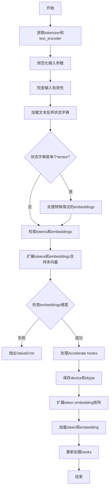
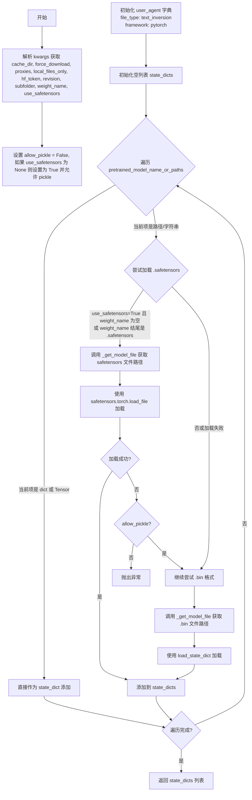
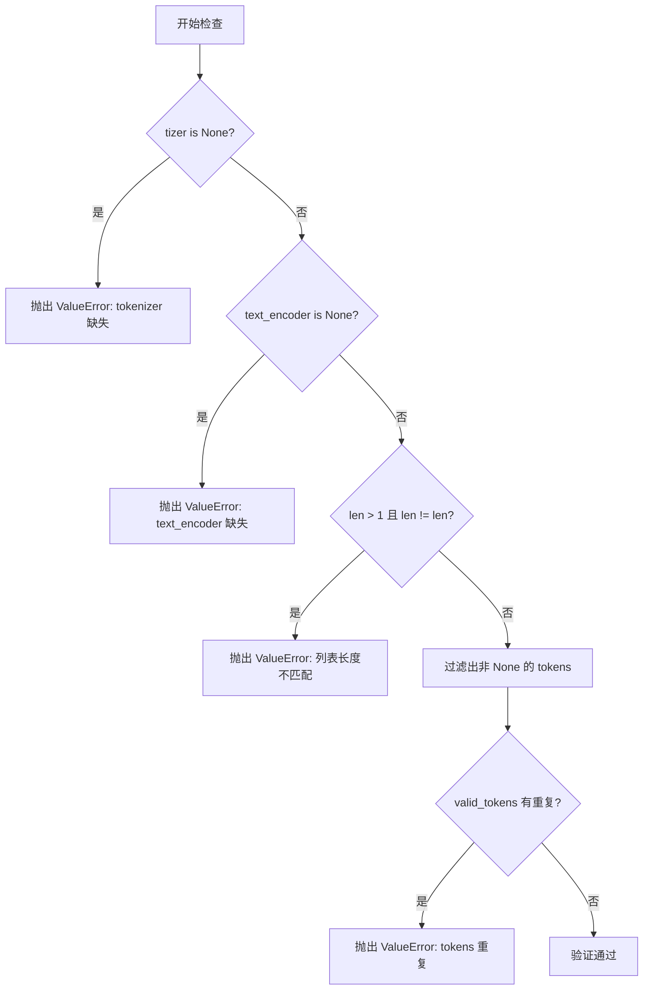
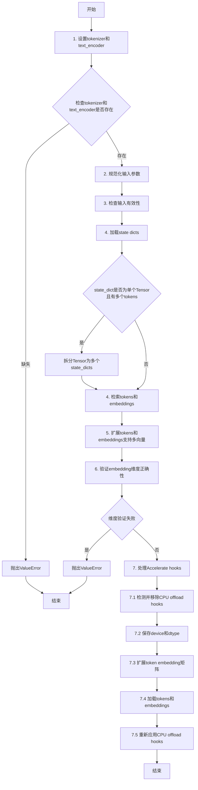
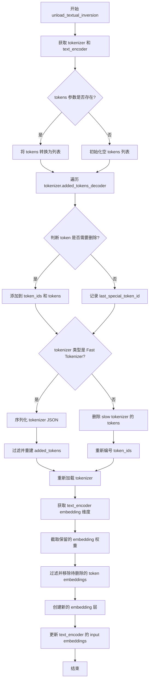

# `diffusers\src\diffusers\loaders\textual_inversion.py` 详细设计文档

该代码实现了一个TextualInversionLoaderMixin混入类，用于将文本反转（Textual Inversion）标记和嵌入加载到tokenizer和text encoder中，支持🤗 Diffusers和Automatic1111两种格式，能够处理单向量和多向量文本反转嵌入，并提供加载和卸载功能。

## 整体流程



## 类结构

```
TextualInversionLoaderMixin (混入类)
├── 类方法
│   ├── maybe_convert_prompt
│   ├── _maybe_convert_prompt
│   ├── _check_text_inv_inputs
│   ├── _retrieve_tokens_and_embeddings
│   ├── _extend_tokens_and_embeddings
│   ├── load_textual_inversion
│   └── unload_textual_inversion
└── 全局函数
    └── load_textual_inversion_state_dicts
```

## 全局变量及字段


### `TEXT_INVERSION_NAME`
    
Textual Inversion嵌入文件的默认文件名，使用.pickle格式（.bin扩展名）

类型：`str`
    


### `TEXT_INVERSION_NAME_SAFE`
    
Textual Inversion嵌入文件的安全张量格式文件名（.safetensors扩展名）

类型：`str`
    


### `logger`
    
用于记录模块日志的Logger实例，通过logging.get_logger获取

类型：`logging.Logger`
    


    

## 全局函数及方法


### `load_textual_inversion_state_dicts`

该函数是 Textual Inversion 嵌入加载的核心工具函数，用于从预训练模型路径或直接传递的状态字典中加载一个或多个 Textual Inversion 嵌入权重。它支持从 HuggingFace Hub 下载、从本地目录加载，以及直接传入 PyTorch Tensor 或字典等多种方式，自动处理 `.safetensors` 和 `.bin` 格式的兼容性。

参数：

- `pretrained_model_name_or_paths`：`str | list[str] | dict[str, torch.Tensor] | list[dict[str, torch.Tensor]]`，预训练模型名称或路径，可以是单个字符串、字符串列表、单个状态字典或状态字典列表，用于指定要加载的 Textual Inversion 嵌入来源
- `**kwargs`：`Any`，可变关键字参数，包含以下可选配置：
  - `cache_dir`：`str | None`，HuggingFace Hub 模型缓存目录路径
  - `force_download`：`bool`，是否强制重新下载模型文件（默认 False）
  - `proxies`：`dict | None`，HTTP/HTTPS 代理服务器配置字典
  - `local_files_only`：`bool`，是否仅使用本地缓存文件（默认 False）
  - `hf_token`：`str | None`，HuggingFace Hub 访问认证令牌
  - `revision`：`str`，要从 Hub 下载的模型版本/分支（默认 "main"）
  - `subfolder`：`str`，模型仓库中的子文件夹路径
  - `weight_name`：`str | None`，指定要加载的权重文件名
  - `use_safetensors`：`bool | None`，是否优先使用 safetensors 格式

返回值：`list[dict[str, torch.Tensor]] | list[torch.Tensor]]`，返回加载后的状态字典列表，每个元素对应一个 Textual Inversion 嵌入的权重字典或张量

#### 流程图



#### 带注释源码

```python
@validate_hf_hub_args
def load_textual_inversion_state_dicts(pretrained_model_name_or_paths, **kwargs):
    """
    加载 Textual Inversion 嵌入的状态字典。
    
    支持从 HuggingFace Hub、本地路径或直接传递的 PyTorch 对象加载。
    自动处理 .safetensors 和 .bin 两种格式的兼容性。
    """
    # 1. 从 kwargs 中提取各种可选参数
    cache_dir = kwargs.pop("cache_dir", None)
    force_download = kwargs.pop("force_download", False)
    proxies = kwargs.pop("proxies", None)
    local_files_only = kwargs.pop("local_files_only", None)
    hf_token = kwargs.pop("hf_token", None)
    revision = kwargs.pop("revision", None)
    subfolder = kwargs.pop("subfolder", None)
    weight_name = kwargs.pop("weight_name", None)
    use_safetensors = kwargs.pop("use_safetensors", None)

    # 2. 设置 safetensors 和 pickle 的默认行为
    # 默认启用 safetensors，同时允许回退到 pickle 格式
    allow_pickle = False
    if use_safetensors is None:
        use_safetensors = True
        allow_pickle = True

    # 3. 构建用户代理信息，用于 HuggingFace Hub 请求
    user_agent = {
        "file_type": "text_inversion",
        "framework": "pytorch",
    }
    
    # 4. 初始化结果列表
    state_dicts = []
    
    # 5. 遍历每个预训练模型路径/对象
    for pretrained_model_name_or_path in pretrained_model_name_or_paths:
        # 5.1 检查输入类型：如果已经是 dict 或 Tensor，直接使用
        if not isinstance(pretrained_model_name_or_path, (dict, torch.Tensor)):
            # 5.2 尝试加载 Textual Inversion 文件
            model_file = None

            # 5.2.1 首先尝试 .safetensors 格式
            if (use_safetensors and weight_name is None) or (
                weight_name is not None and weight_name.endswith(".safetensors")
            ):
                try:
                    # 获取模型文件路径
                    model_file = _get_model_file(
                        pretrained_model_name_or_path,
                        weights_name=weight_name or TEXT_INVERSION_NAME_SAFE,
                        cache_dir=cache_dir,
                        force_download=force_download,
                        proxies=proxies,
                        local_files_only=local_files_only,
                        token=hf_token,
                        revision=revision,
                        subfolder=subfolder,
                        user_agent=user_agent,
                    )
                    # 使用 safetensors 加载（更安全更快）
                    state_dict = safetensors.torch.load_file(model_file, device="cpu")
                except Exception as e:
                    # 如果不允许 pickle 且加载失败，抛出异常
                    if not allow_pickle:
                        raise e
                    # 否则继续尝试 .bin 格式
                    model_file = None

            # 5.2.2 如果 safetensors 加载失败或不需要，尝试 .bin 格式
            if model_file is None:
                model_file = _get_model_file(
                    pretrained_model_name_or_path,
                    weights_name=weight_name or TEXT_INVERSION_NAME,
                    cache_dir=cache_dir,
                    force_download=force_download,
                    proxies=proxies,
                    local_files_only=local_files_only,
                    token=hf_token,
                    revision=revision,
                    subfolder=subfolder,
                    user_agent=user_agent,
                )
                # 使用传统的 torch.load 方式加载
                state_dict = load_state_dict(model_file)
        else:
            # 5.3 直接使用传入的 dict 或 Tensor
            state_dict = pretrained_model_name_or_path

        # 6. 将加载的 state_dict 添加到结果列表
        state_dicts.append(state_dict)

    # 7. 返回所有加载的状态字典
    return state_dicts
```


### `TextualInversionLoaderMixin.maybe_convert_prompt`

该方法用于处理包含多向量文本反转（Textual Inversion）嵌入的特殊标记的提示词。如果提示词中包含对应多向量文本反转嵌入的特殊标记，则将其替换为多个分别对应各向量的特殊标记；如果提示词没有文本反转标记或该标记是单个向量，则直接返回原始提示词。

参数：

- `self`：`TextualInversionLoaderMixin`，mixin 类实例自身
- `prompt`：`str | list[str]`，要处理的提示词，可以是单个字符串或字符串列表
- `tokenizer`：`PreTrainedTokenizer`，负责将提示词编码为输入标记的 tokenizer

返回值：`str | list[str]`，处理后的提示词

#### 流程图

```mermaid
flowchart TD
    A[开始 maybe_convert_prompt] --> B{判断 prompt 是否为列表}
    B -->|是| C[直接使用 prompts = prompt]
    B -->|否| D[将 prompt 包装为列表 prompts = [prompt]]
    C --> E[遍历 prompts 列表]
    D --> E
    E --> F[对每个 prompt 调用 _maybe_convert_prompt 方法]
    F --> G{_maybe_convert_prompt 处理}
    G --> H[tokenizer.tokenize(prompt) 获取标记]
    H --> I[获取唯一标记集合 unique_tokens]
    I --> J{遍历 unique_tokens}
    J -->|token 在 added_tokens_encoder 中| K[检查是否存在多向量标记 token_1, token_2...]
    J -->|token 不在 added_tokens_encoder 中| L[不处理该 token]
    K -->|存在多向量标记| M[构建 replacement = token + token_1 + token_2 ...]
    K -->|不存在多向量标记| N[不处理该 token]
    M --> O[prompt.replace(token, replacement) 替换]
    O --> P[返回处理后的 prompt]
    L --> P
    N --> P
    P --> Q{原始 prompt 是否为列表}
    Q -->|是| R[返回处理后的列表 prompts]
    Q -->|否| S[返回 prompts[0]]
    R --> T[结束]
    S --> T
```

#### 带注释源码

```python
def maybe_convert_prompt(self, prompt: str | list[str], tokenizer: "PreTrainedTokenizer"):  # noqa: F821
    r"""
    Processes prompts that include a special token corresponding to a multi-vector textual inversion embedding to
    be replaced with multiple special tokens each corresponding to one of the vectors. If the prompt has no textual
    inversion token or if the textual inversion token is a single vector, the input prompt is returned.

    Parameters:
        prompt (`str` or list of `str`):
            The prompt or prompts to guide the image generation.
        tokenizer (`PreTrainedTokenizer`):
            The tokenizer responsible for encoding the prompt into input tokens.

    Returns:
        `str` or list of `str`: The converted prompt
    """
    # 判断输入的 prompt 是否为列表，如果不是则包装为列表以便统一处理
    if not isinstance(prompt, list):
        prompts = [prompt]
    else:
        prompts = prompt

    # 对列表中的每个 prompt 调用内部方法 _maybe_convert_prompt 进行处理
    prompts = [self._maybe_convert_prompt(p, tokenizer) for p in prompts]

    # 如果原始输入不是列表，则返回单个处理后的字符串；否则返回处理后的列表
    if not isinstance(prompt, list):
        return prompts[0]

    return prompts
```


### `TextualInversionLoaderMixin._maybe_convert_prompt`

该方法是一个私有方法，用于将提示词转换为支持“多向量”文本反转的格式。如果提示词中包含与多向量文本反转嵌入对应的特殊标记，该函数会将该特殊标记替换为多个特殊标记（分别对应每个向量）。如果提示词没有文本反转标记或该标记是单个向量，则直接返回原始提示词。

参数：

- `prompt`：`str`，要引导图像生成的提示词
- `tokenizer`：`PreTrainedTokenizer`，负责将提示词编码为输入标记的 tokenizer

返回值：`str`，转换后的提示词

#### 流程图

```mermaid
flowchart TD
    A[Start _maybe_convert_prompt] --> B[Tokenize prompt using tokenizer]
    B --> C[Get unique tokens from tokenized prompt]
    C --> D[Initialize empty token processing queue]
    D --> E{For each token in unique_tokens}
    
    E --> F{Is token in tokenizer.added_tokens_encoder?}
    F -->|No| G[Skip, continue to next token]
    F -->|Yes| H[Initialize replacement = token, i = 1]
    
    H --> I{Does f'{token}_{i}' exist in tokenizer.added_tokens_encoder?}
    I -->|Yes| J[Append f'{token}_{i}' to replacement, i++]
    J --> I
    I -->|No| K[Replace all occurrences of token in prompt with replacement]
    
    K --> G
    G --> L{More tokens to process?}
    L -->|Yes| E
    L -->|No| M[Return converted prompt]
```

#### 带注释源码

```python
def _maybe_convert_prompt(self, prompt: str, tokenizer: "PreTrainedTokenizer"):  # noqa: F821
    r"""
    Maybe convert a prompt into a "multi vector"-compatible prompt. If the prompt includes a token that corresponds
    to a multi-vector textual inversion embedding, this function will process the prompt so that the special token
    is replaced with multiple special tokens each corresponding to one of the vectors. If the prompt has no textual
    inversion token or a textual inversion token that is a single vector, the input prompt is simply returned.

    Parameters:
        prompt (`str`):
            The prompt to guide the image generation.
        tokenizer (`PreTrainedTokenizer`):
            The tokenizer responsible for encoding the prompt into input tokens.

    Returns:
        `str`: The converted prompt
    """
    # Step 1: Tokenize the input prompt into individual tokens
    tokens = tokenizer.tokenize(prompt)
    
    # Step 2: Get unique tokens to avoid processing the same token multiple times
    unique_tokens = set(tokens)
    
    # Step 3: Iterate through each unique token to check if it's a multi-vector TI token
    for token in unique_tokens:
        # Check if this token is a textual inversion token (exists in added_tokens_encoder)
        if token in tokenizer.added_tokens_encoder:
            # Initialize replacement string starting with the original token
            replacement = token
            i = 1
            
            # Check for additional vector tokens (token_1, token_2, etc.)
            # These represent multi-vector embeddings where each vector is a separate token
            while f"{token}_{i}" in tokenizer.added_tokens_encoder:
                # Append each additional token vector to the replacement
                replacement += f" {token}_{i}"
                i += 1
            
            # Replace all occurrences of the original token with the expanded replacement
            # This allows the text encoder to use each vector component separately
            prompt = prompt.replace(token, replacement)

    # Step 4: Return the converted prompt
    # If no multi-vector tokens were found, the original prompt is returned unchanged
    return prompt
```


### `TextualInversionLoaderMixin._check_text_inv_inputs`

该方法用于验证 Textual Inversion 加载功能的输入参数合法性，确保 tokenizer、text_encoder 存在，且模型路径列表与 token 列表的长度一致，同时检测 token 列表中是否存在重复项。

参数：

- `self`：实例本身，隐式参数
- `tokenizer`：`PreTrainedTokenizer | None`，用于文本编码的分词器，若为 `None` 则抛出异常
- `text_encoder`：`PreTrainedModel | None`，用于编码文本的模型，若为 `None` 则抛出异常
- `pretrained_model_name_or_paths`：`list[str | dict[str, torch.Tensor]]`，预训练模型路径或状态字典列表
- `tokens`：`list[str | None]`：与模型路径对应的 token 名称列表

返回值：`None`，该方法不返回值，仅通过抛出 `ValueError` 异常来处理验证失败的情况

#### 流程图



#### 带注释源码

```python
def _check_text_inv_inputs(self, tokenizer, text_encoder, pretrained_model_name_or_paths, tokens):
    """
    验证 Textual Inversion 加载所需的输入参数是否合法。
    
    检查项：
    1. tokenizer 不能为 None
    2. text_encoder 不能为 None
    3. 当提供多个模型路径时，tokens 列表长度必须与模型路径列表长度一致
    4. tokens 列表中不能包含重复的 token（排除 None 值）
    """
    # 检查 tokenizer 是否存在
    if tokenizer is None:
        raise ValueError(
            f"{self.__class__.__name__} requires `self.tokenizer` or passing a `tokenizer` of type `PreTrainedTokenizer` for calling"
            f" `{self.load_textual_inversion.__name__}`"
        )

    # 检查 text_encoder 是否存在
    if text_encoder is None:
        raise ValueError(
            f"{self.__class__.__name__} requires `self.text_encoder` or passing a `text_encoder` of type `PreTrainedModel` for calling"
            f" `{self.load_textual_inversion.__name__}`"
        )

    # 当提供多个模型路径时，确保与 tokens 列表长度一致
    if len(pretrained_model_name_or_paths) > 1 and len(pretrained_model_name_or_paths) != len(tokens):
        raise ValueError(
            f"You have passed a list of models of length {len(pretrained_model_name_or_paths)}, and list of tokens of length {len(tokens)} "
            f"Make sure both lists have the same length."
        )

    # 过滤掉 None 值，检查是否有重复的 token
    valid_tokens = [t for t in tokens if t is not None]
    if len(set(valid_tokens)) < len(valid_tokens):
        raise ValueError(f"You have passed a list of tokens that contains duplicates: {tokens}")
```


### `TextualInversionLoaderMixin._retrieve_tokens_and_embeddings`

该方法是一个静态方法，用于从加载的状态字典中提取文本反转（Textual Inversion）的tokens和embeddings。它支持多种格式的状态字典，包括PyTorch Tensor、Diffusers格式（单键字典）和A1111格式（包含`string_to_param`键的字典），并对重复token和已存在于tokenizer中的token进行验证。

参数：

- `tokens`：`list[str] | None`，需要加载的token名称列表
- `state_dicts`：`list[dict[str, torch.Tensor] | torch.Tensor]`，文本反转嵌入的状态字典列表，支持Tensor、Diffusers格式和A1111格式
- `tokenizer`：`PreTrainedTokenizer`，用于验证token是否已存在于词表中

返回值：`tuple[list[str], list[torch.Tensor]]`，返回两个列表——第一个是提取的token列表，第二个是对应的embedding列表

#### 流程图

```mermaid
flowchart TD
    A[开始 _retrieve_tokens_and_embeddings] --> B[初始化空列表 all_tokens 和 all_embeddings]
    B --> C[遍历 state_dicts 和 tokens]
    C --> D{state_dict 是 torch.Tensor?}
    D -->|是| E{token 参数是否为 None?}
    E -->|是| F[抛出 ValueError: 需要提供token名称]
    E -->|否| G[loaded_token = token, embedding = state_dict]
    D -->|否| H{len(state_dict) == 1?}
    H -->|是| I[Diffusers格式: next(iter(state_dict.items()))]
    H -->|否| J{'string_to_param' in state_dict?}
    J -->|是| K[A1111格式: 提取name和string_to_param['*']]
    J -->|否| L[抛出 ValueError: 状态字典格式错误]
    I --> M
    K --> M[合并 token 和 embedding]
    M --> N{token 不为 None 且 loaded_token != token?}
    N -->|是| O[日志记录: loaded_token 被 token 覆盖]
    N -->|否| P[token = loaded_token]
    O --> Q
    P --> Q{token 已在 tokenizer 词表中?}
    Q -->|是| R[抛出 ValueError: token 已存在]
    Q -->|否| S[将 token 和 embedding 添加到列表]
    S --> T{还有更多 state_dict?}
    T -->|是| C
    T -->|否| U[返回 all_tokens, all_embeddings]
```

#### 带注释源码

```python
@staticmethod
def _retrieve_tokens_and_embeddings(tokens, state_dicts, tokenizer):
    """
    从状态字典中提取tokens和embeddings
    
    参数:
        tokens: 用户指定的token名称列表
        state_dicts: 文本反转嵌入的状态字典列表
        tokenizer: 用于验证token的tokenizer实例
    
    返回:
        (all_tokens, all_embeddings): token列表和对应的embedding列表
    """
    # 初始化结果列表
    all_tokens = []
    all_embeddings = []
    
    # 遍历每个状态字典和对应的token
    for state_dict, token in zip(state_dicts, tokens):
        # 情况1: 状态字典是PyTorch Tensor（直接保存的嵌入向量）
        if isinstance(state_dict, torch.Tensor):
            if token is None:
                raise ValueError(
                    "You are trying to load a textual inversion embedding that has been saved as a PyTorch tensor. "
                    "Make sure to pass the name of the corresponding token in this case: `token=...`."
                )
            loaded_token = token  # 使用用户提供的token名称
            embedding = state_dict  # embedding就是Tensor本身
            
        # 情况2: 状态字典只有一个键（Diffusers格式）
        elif len(state_dict) == 1:
            # 解包单个键值对
            loaded_token, embedding = next(iter(state_dict.items()))
            
        # 情况3: 状态字典包含string_to_param（A1111/Automatic1111格式）
        elif "string_to_param" in state_dict:
            loaded_token = state_dict["name"]
            embedding = state_dict["string_to_param"]["*"]
            
        # 状态字典格式不支持
        else:
            raise ValueError(
                f"Loaded state dictionary is incorrect: {state_dict}. \n\n"
                "Please verify that the loaded state dictionary of the textual embedding either only has a single key "
                "or includes the `string_to_param` input key."
            )

        # 处理token覆盖情况
        if token is not None and loaded_token != token:
            logger.info(f"The loaded token: {loaded_token} is overwritten by the passed token {token}.")
        else:
            token = loaded_token

        # 验证token是否已存在于tokenizer词表中
        if token in tokenizer.get_vocab():
            raise ValueError(
                f"Token {token} already in tokenizer vocabulary. Please choose a different token name "
                f"or remove {token} and embedding from the tokenizer and text encoder."
            )

        # 将token和embedding添加到结果列表
        all_tokens.append(token)
        all_embeddings.append(embedding)

    return all_tokens, all_embeddings
```


### `TextualInversionLoaderMixin._extend_tokens_and_embeddings`

该方法是一个静态方法，用于扩展文本反转（Textual Inversion）的 tokens 和 embeddings，处理多向量（multi-vector）嵌入的情况。如果嵌入的维度大于1（表示多向量），则自动生成多个 token（如 `token_1`, `token_2` 等）和对应的嵌入向量；同时检查是否存在 token 冲突，若词汇表中已存在对应的多向量 token 则抛出异常。

参数：

- `tokens`：`List[str]`，要添加的文本反转标记列表
- `embeddings`：`List[torch.Tensor]`，与标记对应的嵌入向量列表
- `tokenizer`：`PreTrainedTokenizer`，分词器对象，用于检查词汇表和 added_tokens_encoder

返回值：

- `all_tokens`：`List[str]`，扩展后的完整标记列表
- `all_embeddings`：`List[torch.Tensor]`，扩展后的完整嵌入向量列表

#### 流程图

```mermaid
flowchart TD
    A[开始 _extend_tokens_and_embeddings] --> B[初始化空列表 all_tokens, all_embeddings]
    B --> C{遍历 embedding, token}
    C --> D[检查 token_1 是否在词汇表中]
    D --> E{存在冲突?}
    E -->|是| F[收集所有已存在的多向量token]
    F --> G[抛出 ValueError 异常]
    E -->|否| H{判断是否为多向量}
    H -->|是| I[embedding.shape[0] > 1]
    I --> J[生成多token列表: token + token_1, token_2, ...]
    J --> K[将每个embedding添加到all_embeddings]
    H -->|否| L[单向量情况]
    L --> M[添加原始token到all_tokens]
    M --> N{embedding维度 > 1?}
    N -->|是| O[添加embedding[0]]
    N -->|否| P[添加embedding本身作为列表]
    O --> Q[返回 all_tokens, all_embeddings]
    P --> Q
    K --> Q
    C -->|遍历完毕| Q
```

#### 带注释源码

```python
@staticmethod
def _extend_tokens_and_embeddings(tokens, embeddings, tokenizer):
    """
    扩展 tokens 和 embeddings，处理多向量文本反转嵌入
    
    参数:
        tokens: 要添加的文本反转标记列表
        embeddings: 与标记对应的嵌入向量列表  
        tokenizer: 分词器对象，用于检查词汇表
    
    返回:
        all_tokens: 扩展后的完整标记列表
        all_embeddings: 扩展后的完整嵌入向量列表
    """
    # 初始化空列表用于存储扩展后的tokens和embeddings
    all_tokens = []
    all_embeddings = []

    # 遍历每一对 embedding 和 token
    for embedding, token in zip(embeddings, tokens):
        # ========== 冲突检查部分 ==========
        # 检查以 token_1 形式命名的多向量token是否已存在于词汇表中
        if f"{token}_1" in tokenizer.get_vocab():
            # 收集所有已存在的多向量token变体
            multi_vector_tokens = [token]
            i = 1
            # 循环查找 token_1, token_2, ...
            while f"{token}_{i}" in tokenizer.added_tokens_encoder:
                multi_vector_tokens.append(f"{token}_{i}")
                i += 1

            # 存在冲突，抛出异常阻止添加重复的token
            raise ValueError(
                f"Multi-vector Token {multi_vector_tokens} already in tokenizer vocabulary. "
                f"Please choose a different token name or remove the {multi_vector_tokens} and "
                f"embedding from the tokenizer and text encoder."
            )

        # ========== 多向量判断与处理部分 ==========
        # 判断是否为多向量嵌入：
        # - embedding.shape[0] > 1 表示有多个向量
        # - 同时 len(embedding.shape) > 1 确保是多维张量
        is_multi_vector = len(embedding.shape) > 1 and embedding.shape[0] > 1
        
        if is_multi_vector:
            # === 多向量情况 ===
            # 添加主token
            all_tokens += [token]
            # 生成并添加后续token: token_1, token_2, ..., token_(n-1)
            all_tokens += [f"{token}_{i}" for i in range(1, embedding.shape[0])]
            # 将每个embedding向量分别添加到列表中
            all_embeddings += [e for e in embedding]  # noqa: C416
        else:
            # === 单向量情况 ===
            all_tokens += [token]
            # 根据embedding维度判断如何提取
            # 如果维度>1（如[1, 768]），取第一个；否则直接使用
            if len(embedding.shape) > 1:
                all_embeddings += [embedding[0]]
            else:
                all_embeddings += [embedding]

    # 返回扩展后的tokens和embeddings列表
    return all_tokens, all_embeddings
```


### `TextualInversionLoaderMixin.load_textual_inversion`

将Textual Inversion（文本倒置）嵌入向量加载到文本编码器（text_encoder）的embedding层中，支持🤗 Diffusers格式和Automatic1111格式的嵌入文件，并自动处理tokenizer的扩展和多向量嵌入。

参数：

- `pretrained_model_name_or_path`：`str | list[str] | dict[str, torch.Tensor] | list[dict[str, torch.Tensor]]`，预训练模型的名称、路径、目录或torch state dict，支持单个或列表形式
- `token`：`str | list[str] | None`，可选参数，用于覆盖文本反转权重的token名称
- `tokenizer`：`PreTrainedTokenizer | None`，可选的CLIPTokenizer，用于对文本进行分词，默认使用self.tokenizer
- `text_encoder`：`PreTrainedModel | None`，可选的冻结文本编码器，默认使用self.text_encoder
- `**kwargs`：其他关键字参数，包括weight_name、cache_dir、force_download、proxies、local_files_only、hf_token、revision、subfolder、mirror等

返回值：`None`，该方法直接修改tokenizer和text_encoder的状态，不返回任何值

#### 流程图



#### 带注释源码

```python
@validate_hf_hub_args
def load_textual_inversion(
    self,
    pretrained_model_name_or_path: str | list[str] | dict[str, torch.Tensor] | list[dict[str, torch.Tensor]],
    token: str | list[str] | None = None,
    tokenizer: "PreTrainedTokenizer" | None = None,  # noqa: F821
    text_encoder: "PreTrainedModel" | None = None,  # noqa: F821
    **kwargs,
):
    r"""
    Load Textual Inversion embeddings into the text encoder of [`StableDiffusionPipeline`] (both 🤗 Diffusers and
    Automatic1111 formats are supported).
    """
    # 1. Set correct tokenizer and text encoder
    # 如果未提供tokenizer，则尝试从self获取；同样处理text_encoder
    tokenizer = tokenizer or getattr(self, "tokenizer", None)
    text_encoder = text_encoder or getattr(self, "text_encoder", None)

    # 2. Normalize inputs
    # 将单个输入转换为列表，统一处理格式
    pretrained_model_name_or_paths = (
        [pretrained_model_name_or_path]
        if not isinstance(pretrained_model_name_or_path, list)
        else pretrained_model_name_or_path
    )
    # 将token也规范化为列表形式
    tokens = [token] if not isinstance(token, list) else token
    # 如果第一个token为None，则复制为与模型路径列表相同的长度
    if tokens[0] is None:
        tokens = tokens * len(pretrained_model_name_or_paths)

    # 3. Check inputs
    # 验证tokenizer、text_encoder存在，且tokens数量与模型路径数量匹配
    self._check_text_inv_inputs(tokenizer, text_encoder, pretrained_model_name_or_paths, tokens)

    # 4. Load state dicts of textual embeddings
    # 调用外部函数加载文本嵌入的state dicts
    state_dicts = load_textual_inversion_state_dicts(pretrained_model_name_or_paths, **kwargs)

    # 4.1 Handle the special case when state_dict is a tensor that contains n embeddings for n tokens
    # 处理特殊情况：单个state_dict包含多个embeddings的tensor
    if len(tokens) > 1 and len(state_dicts) == 1:
        if isinstance(state_dicts[0], torch.Tensor):
            state_dicts = list(state_dicts[0])
            if len(tokens) != len(state_dicts):
                raise ValueError(
                    f"You have passed a state_dict contains {len(state_dicts)} embeddings, and list of tokens of length {len(tokens)} "
                    f"Make sure both have the same length."
                )

    # 4. Retrieve tokens and embeddings
    # 从state_dicts中提取tokens和embeddings
    tokens, embeddings = self._retrieve_tokens_and_embeddings(tokens, state_dicts, tokenizer)

    # 5. Extend tokens and embeddings for multi vector
    # 为多向量嵌入扩展tokens和embeddings
    tokens, embeddings = self._extend_tokens_and_embeddings(tokens, embeddings, tokenizer)

    # 6. Make sure all embeddings have the correct size
    # 验证所有embeddings的维度与text_encoder的embedding维度一致
    expected_emb_dim = text_encoder.get_input_embeddings().weight.shape[-1]
    if any(expected_emb_dim != emb.shape[-1] for emb in embeddings):
        raise ValueError(
            "Loaded embeddings are of incorrect shape. Expected each textual inversion embedding "
            "to be of shape {input_embeddings.shape[-1]}, but are {embeddings.shape[-1]} "
        )

    # 7. Now we can be sure that loading the embedding matrix works
    # < Unsafe code:

    # 7.1 Offload all hooks in case the pipeline was cpu offloaded before
    # 检测并处理CPU offload hooks，避免加载时出现问题
    is_model_cpu_offload = False
    is_sequential_cpu_offload = False
    if self.hf_device_map is None:
        for _, component in self.components.items():
            if isinstance(component, nn.Module):
                if hasattr(component, "_hf_hook"):
                    is_model_cpu_offload = isinstance(getattr(component, "_hf_hook"), CpuOffload)
                    is_sequential_cpu_offload = (
                        isinstance(getattr(component, "_hf_hook"), AlignDevicesHook)
                        or hasattr(component._hf_hook, "hooks")
                        and isinstance(component._hf_hook.hooks[0], AlignDevicesHook)
                    )
                    if is_sequential_cpu_offload or is_model_cpu_offload:
                        remove_hook_from_module(component, recurse=is_sequential_cpu_offload)

    # 7.2 save expected device and dtype
    # 保存目标device和dtype以便后续恢复
    device = text_encoder.device
    dtype = text_encoder.dtype

    # 7.3 Increase token embedding matrix
    # 扩展token embedding矩阵以容纳新的tokens
    text_encoder.resize_token_embeddings(len(tokenizer) + len(tokens))
    input_embeddings = text_encoder.get_input_embeddings().weight

    # 7.4 Load token and embedding
    # 遍历每个token和embedding，将其添加到tokenizer并更新embedding
    for token, embedding in zip(tokens, embeddings):
        # add tokens and get ids
        tokenizer.add_tokens(token)
        token_id = tokenizer.convert_tokens_to_ids(token)
        input_embeddings.data[token_id] = embedding
        logger.info(f"Loaded textual inversion embedding for {token}.")

    # 将embedding移动到正确的device和dtype
    input_embeddings.to(dtype=dtype, device=device)

    # 7.5 Offload the model again
    # 根据之前的offload状态重新应用hooks
    if is_model_cpu_offload:
        self.enable_model_cpu_offload(device=device)
    elif is_sequential_cpu_offload:
        self.enable_sequential_cpu_offload(device=device)

    # / Unsafe Code >
```


### `TextualInversionLoaderMixin.unload_textual_inversion`

该方法用于从文本编码器（text_encoder）和分词器（tokenizer）中卸载Textual Inversion嵌入，支持指定特定token卸载或卸载所有已加载的Textual Inversion tokens。

参数：

- `tokens`：`str | list[str] | None`，需要卸载的token或token列表。如果为None，则卸载所有非特殊token
- `tokenizer`：`PreTrainedTokenizer | None`，分词器实例。如果为None，则使用self.tokenizer
- `text_encoder`：`PreTrainedModel | None`，文本编码器实例。如果为None，则使用self.text_encoder

返回值：`None`，该方法无返回值，直接修改tokenizer和text_encoder的内部状态

#### 流程图



#### 带注释源码

```python
def unload_textual_inversion(
    self,
    tokens: str | list[str] | None = None,
    tokenizer: "PreTrainedTokenizer" | None = None,
    text_encoder: "PreTrainedModel" | None = None,
):
    r"""
    从 StableDiffusionPipeline 的文本编码器中卸载 Textual Inversion 嵌入

    参数:
        tokens: 要卸载的token或token列表，None表示卸载所有非特殊token
        tokenizer: 分词器实例，默认为self.tokenizer
        text_encoder: 文本编码器实例，默认为self.text_encoder

    示例用法见主文档字符串
    """
    # 1. 获取 tokenizer 和 text_encoder 实例
    # 如果未传入则从 self 属性获取
    tokenizer = tokenizer or getattr(self, "tokenizer", None)
    text_encoder = text_encoder or getattr(self, "text_encoder", None)

    # 2. 获取 textual inversion tokens 和对应的 ids
    token_ids = []           # 存储待删除的 token id 列表
    last_special_token_id = None  # 记录最后一个特殊 token 的 id

    if tokens:
        # 2.1 如果指定了 tokens，只删除指定的 tokens
        if isinstance(tokens, str):
            tokens = [tokens]
        
        # 遍历分词器的 added_tokens_decoder 查找匹配的 token
        for added_token_id, added_token in tokenizer.added_tokens_decoder.items():
            if not added_token.special:  # 非特殊 token
                if added_token.content in tokens:
                    token_ids.append(added_token_id)
            else:
                # 记录特殊 token 的边界位置
                last_special_token_id = added_token_id
        
        # 未找到任何待删除的 token 时抛出异常
        if len(token_ids) == 0:
            raise ValueError("No tokens to remove found")
    else:
        # 2.2 如果未指定 tokens，删除所有非特殊 token
        tokens = []
        for added_token_id, added_token in tokenizer.added_tokens_decoder.items():
            if not added_token.special:
                token_ids.append(added_token_id)
                tokens.append(added_token.content)
            else:
                last_special_token_id = added_token_id

    # 3. 根据 tokenizer 类型选择不同的移除策略
    # Fast tokenizers (v5+)
    if hasattr(tokenizer, "_tokenizer"):
        # Fast tokenizer: 序列化、过滤 tokens、重新加载
        # 3.1 序列化 tokenizer 配置
        tokenizer_json = json.loads(tokenizer._tokenizer.to_str())
        new_id = last_special_token_id + 1  # 新的 token id 起始值
        
        # 3.2 过滤掉需要删除的 tokens 并重新编号
        filtered = []
        for tok in tokenizer_json.get("added_tokens", []):
            if tok.get("content") in set(tokens):
                continue  # 跳过待删除的 token
            if not tok.get("special", False):
                tok["id"] = new_id  # 重新编号
                new_id += 1
            filtered.append(tok)
        
        # 3.3 更新 tokenizer 的 added_tokens 并重新加载
        tokenizer_json["added_tokens"] = filtered
        tokenizer._tokenizer = TokenizerFast.from_str(json.dumps(tokenizer_json))
    else:
        # Slow tokenizers: 直接操作内部数据结构
        # 3.4 从 added_tokens_decoder 和 added_tokens_encoder 中删除
        for token_id, token_to_remove in zip(token_ids, tokens):
            del tokenizer._added_tokens_decoder[token_id]
            del tokenizer._added_tokens_encoder[token_to_remove]

        # 3.5 重新编号剩余的 token ids，保持连续性
        key_id = 1
        for token_id in list(tokenizer.added_tokens_decoder.keys()):
            if token_id > last_special_token_id and token_id > last_special_token_id + key_id:
                token = tokenizer._added_tokens_decoder[token_id]
                # 移动到新的 id 位置
                tokenizer._added_tokens_decoder[last_special_token_id + key_id] = token
                del tokenizer._added_tokens_decoder[token_id]
                tokenizer._added_tokens_encoder[token.content] = last_special_token_id + key_id
                key_id += 1
        
        # 3.6 更新 trie 结构和词汇表大小
        if hasattr(tokenizer, "_update_trie"):
            tokenizer._update_trie()
        if hasattr(tokenizer, "_update_total_vocab_size"):
            tokenizer._update_total_vocab_size()

    # 4. 从 text_encoder 中删除对应的 embedding
    # 4.1 获取 embedding 维度
    text_embedding_dim = text_encoder.get_input_embeddings().embedding_dim
    temp_text_embedding_weights = text_encoder.get_input_embeddings().weight
    
    # 4.2 保留最后一个特殊 token 之前的所有 embeddings
    text_embedding_weights = temp_text_embedding_weights[: last_special_token_id + 1]
    
    # 4.3 收集需要保留的非特殊 token embeddings（排除待删除的）
    to_append = []
    for i in range(last_special_token_id + 1, temp_text_embedding_weights.shape[0]):
        if i not in token_ids:
            to_append.append(temp_text_embedding_weights[i].unsqueeze(0))
    
    # 4.4 拼接保留的 embeddings
    if len(to_append) > 0:
        to_append = torch.cat(to_append, dim=0)
        text_embedding_weights = torch.cat([text_embedding_weights, to_append], dim=0)
    
    # 4.5 创建新的 embedding 层并替换原有的
    text_embeddings_filtered = nn.Embedding(text_embedding_weights.shape[0], text_embedding_dim)
    text_embeddings_filtered.weight.data = text_embedding_weights
    text_encoder.set_input_embeddings(text_embeddings_filtered)
```

## 关键组件


### 张量索引与状态字典加载

负责从多种来源（safetensors文件、PyTorch文件、字典）加载Textual Inversion embeddings的状态字典，支持HuggingFace Hub远程加载和本地文件加载

### 反量化与安全张量支持

通过`safetensors.torch.load_file`安全加载权重文件，同时支持`.safetensors`和`.bin`格式的回退机制，处理PyTorch序列化格式

### 多向量嵌入与Prompt转换

将包含多向量Textual Inversion token的提示词转换为多个特殊token，处理Automatic1111格式和Diffusers格式的嵌入向量

### Embedding维度校验与扩展

验证加载的embedding维度与text encoder输入嵌入维度一致，动态扩展tokenizer词汇表和text encoder嵌入矩阵

### CPU卸载与加速器钩子管理

检测并处理模型CPU卸载状态，在加载Textual Inversion前后正确管理Accelerate库的设备卸载钩子

### Tokenizer词汇表管理

处理Fast Tokenizer（v5+）和慢速Tokenizer的token添加与删除，支持token ID重映射和Trie数据结构更新

### 嵌入矩阵重建与过滤

在卸载Textual Inversion时重建text encoder的嵌入矩阵，过滤掉指定token的嵌入向量并保持其他embedding连续


## 问题及建议


### 已知问题

- **方法过长且职责过多**：`load_textual_inversion`方法超过200行，混合了参数验证、状态加载、嵌入处理、设备管理、模型修改等多个功能，违反单一职责原则。
- **代码中存在不安全标记**：注释`< Unsafe code:`和`/ Unsafe Code >`表明该段代码存在风险，直接操作`input_embeddings.data`可能导致状态不一致。
- **类型注解使用字符串形式**：使用`"PreTrainedTokenizer"`和`"PreTrainedModel"`字符串注解而非真正的类型引用，降低了类型安全性和IDE支持。
- **重复的tokenizer处理逻辑**：快速tokenizer（v5+）和慢速tokenizer需要完全不同的处理方式，导致大量重复代码和分支判断。
- **异常处理过于宽泛**：在`load_textual_inversion_state_dicts`中使用`except Exception as e`捕获所有异常，然后根据`allow_pickle`决定是否重新抛出，掩盖了具体错误信息。
- **硬编码的默认值**：`TEXT_INVERSION_NAME`和`TEXT_INVERSION_NAME_SAFE`作为全局常量缺乏灵活性，无法适应不同场景。
- **参数过多**：`load_textual_inversion`函数有超过15个参数，应该考虑使用配置对象或数据类进行封装。
- **性能效率问题**：`_maybe_convert_prompt`中使用字符串替换处理token，在大量调用时效率不高；`unload_textual_inversion`中多次遍历tokenizer进行查找。

### 优化建议

- **重构长方法**：将`load_textual_inversion`拆分为多个私有方法，分别负责验证、加载、处理、注册等职责，每个方法保持单一功能。
- **移除不安全代码标记**：重构CPU offload相关逻辑，使用更安全的状态保存/恢复机制，避免直接操作内部数据。
- **改进类型注解**：使用`from __future__ import annotations`并直接引用类型，或使用`typing.TYPE_CHECKING`来导入类型进行注解。
- **统一tokenizer处理**：提取tokenizer差异处理逻辑到独立的方法或使用策略模式，减少分支判断。
- **细化异常处理**：针对不同类型的错误抛出具体异常（如`FileNotFoundError`、`ValueError`等），提供更有意义的错误信息。
- **使用配置对象**：创建`TextualInversionLoadConfig`数据类来封装加载参数，减少函数签名复杂度。
- **性能优化**：考虑使用字典缓存token到ID的映射，避免重复的`convert_tokens_to_ids`调用；对于多token处理使用批量操作代替循环。
- **添加类型注解**：为所有方法添加完整的返回类型注解，包括泛型类型的具体参数。


## 其它


### 设计目标与约束

本模块旨在为Stable Diffusion pipelines提供Textual Inversion（文本反转）嵌入的加载与卸载功能，支持HuggingFace Diffusers格式和Automatic1111格式的嵌入文件。核心约束包括：1) 必须配合PreTrainedTokenizer和PreTrainedModel使用；2) 嵌入维度必须与文本编码器的输入嵌入层维度一致；3) 自定义token不能与tokenizer已有词汇冲突；4) 多向量嵌入的token命名需遵循特定模式(token、token_1、token_2...)。

### 错误处理与异常设计

代码采用显式验证与异常抛出的错误处理模式。主要验证点包括：tokenizer和text_encoder为空时抛出ValueError；多模型与多token数量不匹配时抛出ValueError；token列表包含重复时抛出ValueError；嵌入维度不匹配时抛出ValueError；尝试加载已存在于tokenizer的token时抛出ValueError。异常信息包含具体的类名、方法名和参数状态，便于开发者定位问题。

### 数据流与状态机

数据流主要分为三个阶段：加载阶段（load_textual_inversion_state_dicts → _retrieve_tokens_and_embeddings → _extend_tokens_and_embeddings）和注入阶段（resize_token_embeddings → 添加token到tokenizer → 更新input_embeddings权重 → 恢复CPU offload状态）。状态转换涉及：空嵌入 → 加载state_dict → 解析token和embedding → 扩展多向量 → 验证维度 → 注入到模型。

### 外部依赖与接口契约

核心依赖包括：safetensors（安全张量加载）、torch（张量操作）、transformers（PreTrainedModel和PreTrainedTokenizer）、tokenizers（快速分词器）、accelerate（CPU offload管理）、huggingface_hub（模型文件下载）。接口契约方面：pretrained_model_name_or_path支持str/list/dict/tensor四种形式；token支持str/list/None；tokenizer和text_encoder优先使用传入参数，否则从self属性获取。

### 并发与线程安全性

本模块本身不涉及多线程并发控制，但需注意：1) 在多线程环境下同时调用load_textual_inversion和unload_textual_inversion可能导致tokenizer和text_encoder状态不一致；2) CPU offload相关的hook操作在并发场景下可能产生竞争条件；3) 推荐在单线程或使用锁保护的情况下使用。

### 内存管理与资源释放

内存管理要点包括：1) load_textual_inversion通过resize_token_embeddings增加embedding矩阵大小；2) unload_textual_inversion重建embedding矩阵并释放旧权重；3) 加载的state_dicts在完成token和embedding提取后不再保持引用；4) 大型嵌入文件建议使用safetensors格式以减少内存占用。

### 兼容性考虑

向后兼容性：支持v5+ fast tokenizers和旧版slow tokenizers的不同处理逻辑；支持Diffusers和A1111两种嵌入文件格式。版本约束：需要transformers库提供PreTrainedTokenizer和PreTrainedModel；需要tokenizers库提供TokenizerFast类；safetensors库为可选但默认优先使用。

### 安全性分析

安全措施包括：1) 默认禁用pickle加载(allow_pickle=False)；2) 优先使用safetensors格式；3) 仅在明确指定allow_pickle=True时才允许加载.bin文件。潜在风险：动态修改模型的embedding层属于"unsafe code"区域，需要确保输入来源可信。

### 性能特性

性能考量包括：1) 多模型嵌入加载时顺序处理，建议批量传入；2) fast tokenizer通过序列化/反序列化方式过滤token，性能较低但功能完整；3) slow tokenizer直接操作内部字典，性能较好；4) 嵌入维度验证在注入前执行，避免无效操作。

### 配置与使用示例

关键配置参数：cache_dir（缓存目录）、force_download（强制下载）、use_safetensors（优先使用安全张量）、weight_name（指定权重文件名）、hf_token（HuggingFace认证令牌）、revision（模型版本）、subfolder（子文件夹）、proxies（代理服务器）。

### 边界条件与限制

已知限制包括：1) 不支持动态修改已加载的多向量token的向量数量；2) 单个state_dict包含多个嵌入但传入单个token时需严格匹配数量；3) CPU offload状态下加载嵌入可能触发多次设备转移；4) 多text_encoder pipeline（如SDXL）需要分别调用load_textual_inversion。

### 日志与可观测性

日志记录使用transformers的logging模块，包含信息级别日志：token覆盖提示、多向量token检测、accelerate hooks状态、嵌入加载成功提示。调试时可启用logging.DEBUG级别查看详细的模型文件查找过程和token处理流程。

### 单元测试策略建议

建议覆盖的测试场景：1) 加载Diffusers格式嵌入；2) 加载A1111格式嵌入；3) 加载为torch.Tensor的嵌入；4) 多token批量加载；5) 多向量嵌入加载；6) 维度不匹配错误；7) token冲突检测；8) CPU offload状态下加载；9) fast tokenizer和slow tokenizer的unload场景。


    