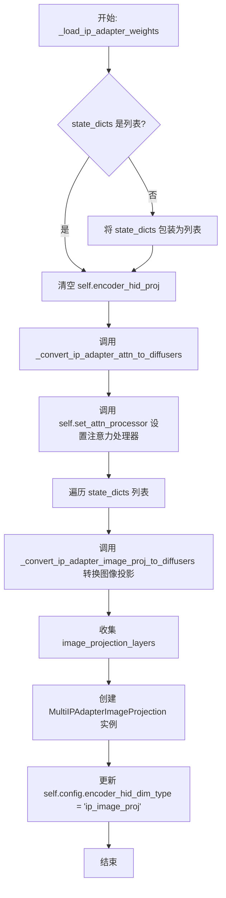
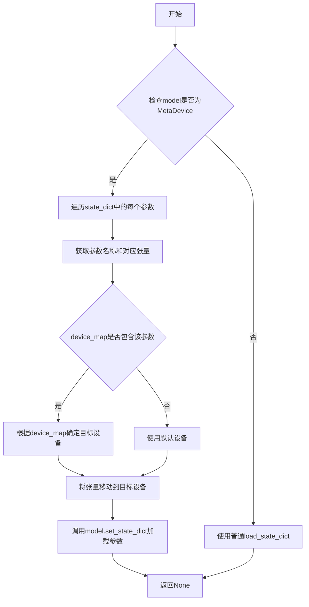
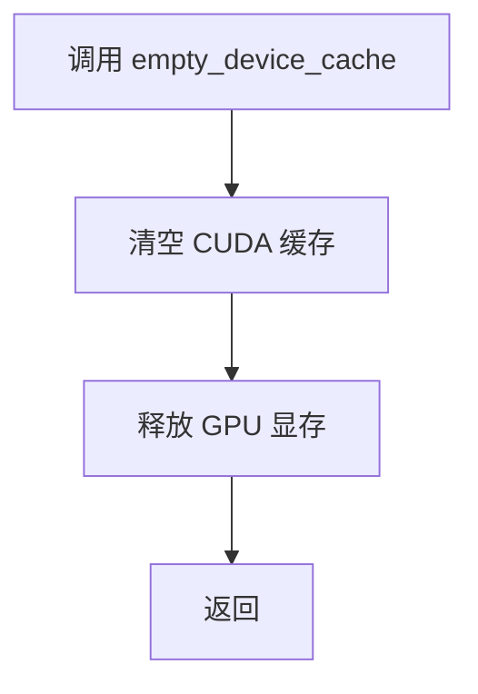
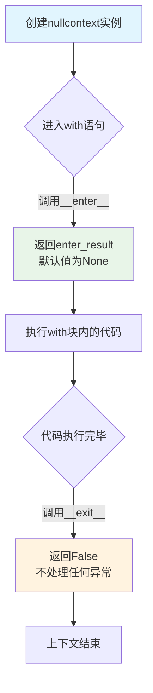
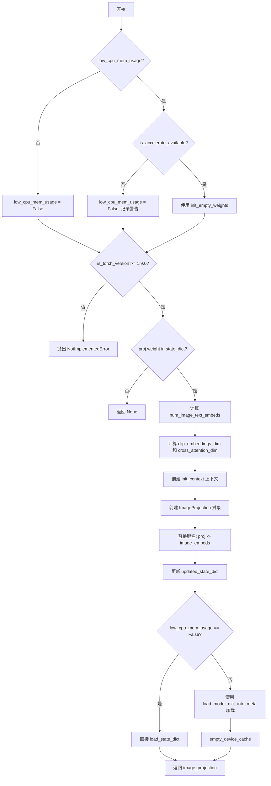

# `diffusers\src\diffusers\loaders\transformer_flux.py` 详细设计文档

这是一个用于 Flux Transformer 模型的 mixin 类，核心功能是加载和转换 IP-Adapter（图像适配器）的权重数据。它包含将原始权重转换为 Diffusers 格式的逻辑，支持标准的模型加载和低内存占用（low_cpu_mem_usage）的模型初始化，并能根据权重形状自动识别图像嵌入的数量。

## 整体流程



## 类结构

```
FluxTransformer2DModel (主机模型)
└── FluxTransformer2DLoadersMixin (提供的代码)
    ├── _convert_ip_adapter_image_proj_to_diffusers
    ├── _convert_ip_adapter_attn_to_diffusers
    └── _load_ip_adapter_weights
```

## 全局变量及字段


### `logger`
    
用于记录模块日志的Logger对象

类型：`logging.Logger`
    


### `is_accelerate_available`
    
检查accelerate库是否可用的函数，返回布尔值

类型：`Callable[[], bool]`
    


### `is_torch_version`
    
检查PyTorch版本是否满足要求的函数

类型：`Callable[[str, str], bool]`
    


### `_LOW_CPU_MEM_USAGE_DEFAULT`
    
控制是否默认使用低CPU内存加载模型的布尔标志

类型：`bool`
    


### `ImageProjection`
    
IP-Adapter图像投影模型类，用于生成图像嵌入表示

类型：`type[ImageProjection]`
    


### `MultiIPAdapterImageProjection`
    
多IP-Adapter图像投影模型类，支持多个图像适配器的投影层

类型：`type[MultiIPAdapterImageProjection]`
    


### `FluxIPAdapterAttnProcessor`
    
Flux模型IP-Adapter注意力处理器类，用于处理交叉注意力机制

类型：`type[FluxIPAdapterAttnProcessor]`
    


    

## 全局函数及方法


### `load_model_dict_into_meta`

将模型状态字典（state dict）加载到通过 `init_empty_weights` 初始化的空模型权重中，支持低 CPU 内存使用模式。该函数通常与 `accelerate` 库的 `init_empty_weights` 配合使用，用于在模型权重加载过程中减少内存占用。

参数：

-  `model`：`torch.nn.Module`，目标模型对象，通常是通过 `init_empty_weights()` 创建的空模型
-  `state_dict`：`Dict[str, torch.Tensor]`，包含模型权重的状态字典，键为参数名称，值为张量
-  `device_map`：`Dict[str, Union[str, int, torch.device]]`，设备映射字典，指定每个参数应加载到的设备（例如 `{"": torch.device("cuda")}`）
-  `dtype`：`torch.dtype`，模型权重的数据类型（如 `torch.float16`）

返回值：`None`，该函数直接修改传入的模型对象的参数，不返回任何值

#### 流程图



#### 带注释源码

```python
# 注：此函数定义在 ..models.model_loading_utils 模块中
# 以下是基于代码调用方式的推断实现

def load_model_dict_into_meta(model, state_dict, device_map, dtype):
    """
    将模型状态字典加载到通过 init_empty_weights 创建的空模型中。
    
    参数:
        model: 目标模型对象（通常为空的Meta设备模型）
        state_dict: 包含模型权重的字典
        device_map: 设备映射字典
        dtype: 模型权重的数据类型
    """
    # 遍历状态字典中的每个参数
    for key, value in state_dict.items():
        # 获取模型中对应的参数对象
        param = model.get_parameter(key) if hasattr(model, 'get_parameter') else None
        if param is None:
            param = model.state_dict().get(key)
        
        # 根据 device_map 确定目标设备
        device = device_map.get("", torch.device("cpu"))
        
        # 将张量转换为目标 dtype 并移动到目标设备
        param_data = value.to(device=device, dtype=dtype)
        
        # 直接赋值更新参数
        if hasattr(param, 'data'):
            param.data = param_data
        else:
            param = param_data
``` 

**注意**：由于完整的函数定义未在当前代码片段中提供，以上信息基于该函数在 `FluxTransformer2DLoadersMixin` 类中的两次调用（第66行和第130行）推断得出。


### `empty_device_cache`

该函数用于清空（释放）CUDA设备缓存，主要用于在低CPU内存使用模式下加载模型后释放GPU显存。

参数：无

返回值：无

#### 流程图



#### 带注释源码

```python
# 该函数在当前文件中被导入，但未在此文件中定义
# 导入来源: ..utils.torch_utils
from ..utils.torch_utils import empty_device_cache

# 使用示例 1: 在 _convert_ip_adapter_image_proj_to_diffusers 方法末尾
# 在低CPU内存模式下加载模型权重后调用，释放显存
load_model_dict_into_meta(image_projection, updated_state_dict, device_map=device_map, dtype=self.dtype)
empty_device_cache()  # 清空GPU缓存，释放显存空间

# 使用示例 2: 在 _convert_ip_adapter_attn_to_diffusers 方法末尾
# 同样用于在低CPU内存模式下加载完IP-Adapter注意力处理器后释放显存
load_model_dict_into_meta(attn_procs[name], value_dict, device_map=device_map, dtype=dtype)

empty_device_cache()  # 清空GPU缓存

return attn_procs
```

#### 说明

该函数定义在 `diffusers.utils.torch_utils` 模块中，是一个工具函数。在当前文件中通过两种方式调用：

1. **在 `_convert_ip_adapter_image_proj_to_diffusers` 方法中**：在低CPU内存模式下加载图像投影层权重后调用，用于释放加载临时权重占用的GPU显存。

2. **在 `_convert_ip_adapter_attn_to_diffusers` 方法中**：在低CPU内存模式下加载注意力处理器权重后调用，同样用于释放GPU显存。

这种做法是在处理大模型时优化显存使用的常见策略，可以在不重启进程的情况下回收未使用的GPU内存。


### `nullcontext`

`nullcontext` 是 Python 标准库 `contextlib` 模块中的一个上下文管理器（context manager）。当代码需要在某些条件下使用上下文管理器，而在其他条件下不需要时，它提供一个"空操作"的上下文管理器。它不执行任何资源管理或清理操作，仅简单地返回指定的enter_result作为`__enter__`的结果，`__exit__`方法不做任何处理直接返回`False`。在Diffusers库中，它被用于条件性地选择是否初始化空权重（`init_empty_weights`）或使用无操作上下文来加载模型权重。

参数：

- `enter_result`：`任意类型（Any）`，可选参数，默认值为`None`。指定在进入上下文时`__enter__()`方法返回的值。如果为`None`，则`__enter__()`返回`None`。

返回值：`nullcontext`对象，返回一个上下文管理器实例，该实例的`__enter__`方法返回`enter_result`参数指定的值。

#### 流程图



#### 带注释源码

```python
# 源代码来自 Python 标准库 contextlib 模块
# 此处展示 nullcontext 的简化实现原理

class nullcontext:
    """
    一个简单的上下文管理器，当不需要实际上下文管理器功能时用作替代。
    
    用途：
    - 在条件分支中统一上下文管理器的使用方式
    - 当某些路径需要真实上下文而其他路径不需要时提供一致的接口
    """
    
    def __init__(self, enter_result=None):
        """
        初始化nullcontext实例。
        
        参数:
            enter_result: 任意类型，可选默认值None。
                          作为__enter__()方法的返回值。
        """
        self.enter_result = enter_result

    def __enter__(self):
        """
        进入上下文管理器时调用。
        
        返回:
            返回初始化时指定的enter_result值
        """
        return self.enter_result

    def __exit__(self, exc_type, exc_val, exc_tb):
        """
        退出上下文管理器时调用。
        
        参数:
            exc_type: 异常类型（如果有异常发生）
            exc_val: 异常值（如果有异常发生）
            exc_tb: 异常追溯（如果有异常发生）
            
        返回:
            返回False，表示不抑制任何异常，异常会继续传播
        """
        return False
```

#### 在代码中的实际使用

```python
# 在 FluxTransformer2DLoadersMixin 类中
# 根据 low_cpu_mem_usage 条件选择使用哪个上下文管理器

def _convert_ip_adapter_image_proj_to_diffusers(self, state_dict, low_cpu_mem_usage=_LOW_CPU_MEM_USAGE_DEFAULT):
    # ... 前置检查代码 ...
    
    # 关键用法：根据条件选择上下文管理器
    # 如果 low_cpu_mem_usage 为 True，使用 init_empty_weights（accelerate库）
    # 否则使用 nullcontext（空操作上下文管理器）
    init_context = init_empty_weights if low_cpu_mem_usage else nullcontext
    
    # 使用选定的上下文管理器
    with init_context():
        image_projection = ImageProjection(
            cross_attention_dim=cross_attention_dim,
            image_embed_dim=clip_embeddings_dim,
            num_image_text_embeds=num_image_text_embeds,
        )
    
    # ... 后续代码 ...
```

#### 设计意图说明

在Diffusers库的IP-Adapter权重转换逻辑中，`nullcontext`的使用体现了以下设计模式：

| 场景 | 使用方式 | 作用 |
|------|---------|------|
| 低CPU内存模式 | `init_empty_weights` | 创建空的模型权重结构，避免立即加载到内存 |
| 普通模式 | `nullcontext` | 作为空操作上下文，不影响正常的权重加载流程 |

这种模式避免了代码重复，无需为两种情况编写独立的代码路径，统一了权重加载的逻辑流程。


### `init_empty_weights`

`init_empty_weights` 是从 `accelerate` 库导入的上下文管理器，用于在低 CPU 内存使用模式下初始化模型权重。它允许在不完全分配内存的情况下创建模型结构，从而支持大模型的内存高效加载。

参数：无（该函数无需显式参数调用，作为上下文管理器使用）

返回值：无直接返回值（作为上下文管理器使用，配合 `with` 语句创建模型实例）

#### 流程图

```mermaid
flowchart TD
    A[开始] --> B{low_cpu_mem_usage=True?}
    B -->|Yes| C[导入 init_empty_weights]
    B -->|No| D[使用 nullcontext]
    C --> E[设置 init_context = init_empty_weights]
    D --> E
    E --> F[with init_context(): 创建模型]
    F --> G[模型在空权重上下文中初始化]
    G --> H[结束]
```

#### 带注释源码

```python
# 在 _convert_ip_adapter_image_proj_to_diffusers 方法中：

if low_cpu_mem_usage:
    if is_accelerate_available():
        from accelerate import init_empty_weights  # 导入 accelerate 库的空权重初始化器
    else:
        low_cpu_mem_usage = False
        logger.warning(...)

# ... 省略部分代码 ...

init_context = init_empty_weights if low_cpu_mem_usage else nullcontext
# 根据 low_cpu_mem_usage 标志选择上下文管理器：
# - 若启用低内存模式：使用 init_empty_weights（accelerate 提供）
# - 若禁用低内存模式：使用 nullcontext（标准库，提供空操作上下文）

# 使用选择的上下文管理器初始化 ImageProjection
with init_context():
    image_projection = ImageProjection(
        cross_attention_dim=cross_attention_dim,
        image_embed_dim=clip_embeddings_dim,
        num_image_text_embeds=num_image_text_embeds,
    )
# 在 init_empty_weights 上下文中，模型结构会被创建但权重不会被实际分配内存
# 这对于加载大模型到内存受限的环境非常有用
```

#### 补充说明

`init_empty_weights` 是 `accelerate` 库提供的核心工具函数，其主要特性：
- **作为上下文管理器**：确保在上下文块内创建的模型使用空权重初始化
- **延迟内存分配**：模型参数不会立即分配实际内存，适合大模型
- **配合 `load_model_dict_into_meta` 使用**：在上下文外将预训练权重加载到模型中


### `FluxTransformer2DLoadersMixin._convert_ip_adapter_image_proj_to_diffusers`

此方法用于将 IP-Adapter 的图像投影层（Image Projection）从原始格式转换为 Diffusers 格式，支持低内存占用模式初始化，以便在加载大型模型时减少 CPU 内存使用。

参数：

- `self`：`FluxTransformer2DLoadersMixin`，mixin 类实例，提供了模型加载转换的能力
- `state_dict`：`dict`，包含 IP-Adapter 图像投影层的原始状态字典，键通常包含 "proj.weight" 等权重信息
- `low_cpu_mem_usage`：`bool`，可选参数，默认为 `_LOW_CPU_MEM_USAGE_DEFAULT`，指定是否使用低 CPU 内存模式加载模型

返回值：`ImageProjection`，返回转换后的 Diffusers 格式图像投影层对象

#### 流程图



#### 带注释源码

```python
def _convert_ip_adapter_image_proj_to_diffusers(self, state_dict, low_cpu_mem_usage=_LOW_CPU_MEM_USAGE_DEFAULT):
    """
    将 IP-Adapter 的图像投影层转换为 Diffusers 格式
    
    参数:
        state_dict: 包含 IP-Adapter 图像投影层权重的字典
        low_cpu_mem_usage: 是否使用低 CPU 内存模式加载
    
    返回:
        ImageProjection: 转换后的图像投影层对象
    """
    # 如果启用低内存模式，检查 accelerate 库是否可用
    if low_cpu_mem_usage:
        if is_accelerate_available():
            from accelerate import init_empty_weights
        else:
            # 如果 accelerate 不可用，禁用低内存模式并记录警告
            low_cpu_mem_usage = False
            logger.warning(
                "Cannot initialize model with low cpu memory usage because `accelerate` was not found in the"
                " environment. Defaulting to `low_cpu_mem_usage=False`. It is strongly recommended to install"
                " `accelerate` for faster and less memory-intense model loading. You can do so with: \n```\npip"
                " install accelerate\n```\n."
            )

    # 检查 PyTorch 版本是否满足低内存模式要求
    if low_cpu_mem_usage is True and not is_torch_version(">=", "1.9.0"):
        raise NotImplementedError(
            "Low memory initialization requires torch >= 1.9.0. Please either update your PyTorch version or set"
            " `low_cpu_mem_usage=False`."
        )

    updated_state_dict = {}
    image_projection = None
    # 根据 low_cpu_mem_usage 选择初始化上下文：init_empty_weights 或 nullcontext
    init_context = init_empty_weights if low_cpu_mem_usage else nullcontext

    # 检查是否为 IP-Adapter（通过 proj.weight 键判断）
    if "proj.weight" in state_dict:
        # 根据权重形状确定图像文本嵌入数量
        num_image_text_embeds = 4
        if state_dict["proj.weight"].shape[0] == 65536:
            num_image_text_embeds = 16
        
        # 获取嵌入维度信息
        clip_embeddings_dim = state_dict["proj.weight"].shape[-1]
        cross_attention_dim = state_dict["proj.weight"].shape[0] // num_image_text_embeds

        # 使用选定的上下文初始化 ImageProjection 对象
        with init_context():
            image_projection = ImageProjection(
                cross_attention_dim=cross_attention_dim,
                image_embed_dim=clip_embeddings_dim,
                num_image_text_embeds=num_image_text_embeds,
            )

        # 将状态字典的键从 "proj" 替换为 "image_embeds"（Diffusers 格式）
        for key, value in state_dict.items():
            diffusers_name = key.replace("proj", "image_embeds")
            updated_state_dict[diffusers_name] = value

    # 根据模式加载状态字典
    if not low_cpu_mem_usage:
        # 直接加载状态字典
        image_projection.load_state_dict(updated_state_dict, strict=True)
    else:
        # 使用 accelerate 的元设备方式加载，避免一次性加载到内存
        device_map = {"": self.device}
        load_model_dict_into_meta(image_projection, updated_state_dict, device_map=device_map, dtype=self.dtype)
        # 加载完成后清空设备缓存
        empty_device_cache()

    return image_projection
```


### `FluxTransformer2DLoadersMixin._convert_ip_adapter_attn_to_diffusers`

该方法用于将 IP-Adapter（图像提示适配器）的注意力处理器从外部格式转换为 Diffusers 框架兼容的格式。它遍历模型的注意力处理器，为每个处理器创建 `FluxIPAdapterAttnProcessor` 实例，并从提供的状态字典中加载相应的投影权重（`to_k_ip`、`to_v_ip` 等），支持低内存占用模式加载。

参数：

- `state_dicts`：`List[Dict]`，包含 IP-Adapter 权重的状态字典列表，每个字典应包含 `image_proj` 和 `ip_adapter` 两个键
- `low_cpu_mem_usage`：`bool`，可选参数（默认值为 `_LOW_CPU_MEM_USAGE_DEFAULT`），是否使用低 CPU 内存模式加载模型权重，可减少内存占用但加载速度较慢

返回值：`Dict[str, object]`，返回转换后的注意力处理器字典，键为处理器名称，值为 `FluxIPAdapterAttnProcessor` 实例

#### 流程图

```mermaid
flowchart TD
    A[开始 _convert_ip_adapter_attn_to_diffusers] --> B{low_cpu_mem_usage?}
    B -->|True and accelerate可用| C[导入 init_empty_weights]
    B -->|False or accelerate不可用| D[设置 low_cpu_mem_usage=False 并警告]
    C --> E[检查 PyTorch 版本 >= 1.9.0]
    D --> E
    E -->|不满足| F[抛出 NotImplementedError]
    E -->|满足| G[初始化 attn_procs = {}, key_id = 0]
    G --> H[获取 init_context: init_empty_weights 或 nullcontext]
    H --> I[遍历 self.attn_processors.keys]
    I --> J{名称以 'single_transformer_blocks' 开头?}
    J -->|是| K[使用原有 attn_processor_class]
    J -->|否| L[创建 FluxIPAdapterAttnProcessor]
    K --> M[添加到 attn_procs]
    L --> N[遍历 state_dicts 计算 num_image_text_embeds]
    N --> O[使用 init_context 创建 attn_procs[name]]
    O --> P[从 state_dicts 提取权重到 value_dict]
    P --> Q{low_cpu_mem_usage?}
    Q -->|False| R[attn_procs[name].load_state_dict(value_dict)]
    Q -->|True| S[load_model_dict_into_meta 加载权重]
    R --> T[key_id += 1]
    S --> T
    T --> U{还有更多处理器?}
    U -->|是| I
    U -->|否| V[empty_device_cache]
    V --> W[返回 attn_procs]
```

#### 带注释源码

```python
def _convert_ip_adapter_attn_to_diffusers(self, state_dicts, low_cpu_mem_usage=_LOW_CPU_MEM_USAGE_DEFAULT):
    """
    将 IP-Adapter 注意力处理器转换为 Diffusers 格式
    
    参数:
        state_dicts: 包含 IP-Adapter 权重的状态字典列表
        low_cpu_mem_usage: 是否使用低内存模式加载
    """
    # 从相对路径导入 FluxIPAdapterAttnProcessor 处理器类
    from ..models.transformers.transformer_flux import FluxIPAdapterAttnProcessor

    # 处理低CPU内存使用模式
    if low_cpu_mem_usage:
        # 检查 accelerate 库是否可用
        if is_accelerate_available():
            from accelerate import init_empty_weights
        else:
            low_cpu_mem_usage = False
            logger.warning(
                "Cannot initialize model with low cpu memory usage because `accelerate` was not found in the"
                " environment. Defaulting to `low_cpu_mem_usage=False`. It is strongly recommended to install"
                " `accelerate` for faster and less memory-intense model loading. You can do so with: \n```\npip"
                " install accelerate\n```\n."
            )

    # 检查 PyTorch 版本要求（需要 >= 1.9.0 才能使用低内存模式）
    if low_cpu_mem_usage is True and not is_torch_version(">=", "1.9.0"):
        raise NotImplementedError(
            "Low memory initialization requires torch >= 1.9.0. Please either update your PyTorch version or set"
            " `low_cpu_mem_usage=False`."
        )

    # 初始化用于存储注意力处理器的字典
    attn_procs = {}
    key_id = 0
    # 根据 low_cpu_mem_usage 选择初始化上下文：空权重初始化或无操作
    init_context = init_empty_weights if low_cpu_mem_usage else nullcontext
    
    # 遍历模型中所有的注意力处理器
    for name in self.attn_processors.keys():
        # 单转换器块使用原有的处理器类
        if name.startswith("single_transformer_blocks"):
            attn_processor_class = self.attn_processors[name].__class__
            attn_procs[name] = attn_processor_class()
        else:
            # 获取配置中的交叉注意力维度和内部维度
            cross_attention_dim = self.config.joint_attention_dim
            hidden_size = self.inner_dim
            # IP-Adapter 使用 FluxIPAdapterAttnProcessor
            attn_processor_class = FluxIPAdapterAttnProcessor
            num_image_text_embeds = []
            
            # 遍历状态字典列表，计算图像文本嵌入数量
            for state_dict in state_dicts:
                if "proj.weight" in state_dict["image_proj"]:
                    num_image_text_embed = 4
                    # 如果权重形状为 65536，则使用 16 个嵌入
                    if state_dict["image_proj"]["proj.weight"].shape[0] == 65536:
                        num_image_text_embed = 16
                    # IP-Adapter
                    num_image_text_embeds += [num_image_text_embed]

            # 使用初始化上下文创建注意力处理器实例
            with init_context():
                attn_procs[name] = attn_processor_class(
                    hidden_size=hidden_size,
                    cross_attention_dim=cross_attention_dim,
                    scale=1.0,
                    num_tokens=num_image_text_embeds,
                    dtype=self.dtype,
                    device=self.device,
                )

            # 从每个状态字典中提取 IP-Adapter 的权重
            value_dict = {}
            for i, state_dict in enumerate(state_dicts):
                # 提取 to_k_ip 和 to_v_ip 的权重和偏置
                value_dict.update({f"to_k_ip.{i}.weight": state_dict["ip_adapter"][f"{key_id}.to_k_ip.weight"]})
                value_dict.update({f"to_v_ip.{i}.weight": state_dict["ip_adapter"][f"{key_id}.to_v_ip.weight"]})
                value_dict.update({f"to_k_ip.{i}.bias": state_dict["ip_adapter"][f"{key_id}.to_k_ip.bias"]})
                value_dict.update({f"to_v_ip.{i}.bias": state_dict["ip_adapter"][f"{key_id}.to_v_ip.bias"]})

            # 根据模式加载状态字典
            if not low_cpu_mem_usage:
                attn_procs[name].load_state_dict(value_dict)
            else:
                device_map = {"": self.device}
                dtype = self.dtype
                # 使用 accelerate 的 load_model_dict_into_meta 加载权重到空模型
                load_model_dict_into_meta(attn_procs[name], value_dict, device_map=device_map, dtype=dtype)

            # 处理完一个处理器后，key_id 递增
            key_id += 1

    # 清理设备缓存，释放 GPU 内存
    empty_device_cache()

    # 返回转换后的注意力处理器字典
    return attn_procs
```


### `FluxTransformer2DLoadersMixin._load_ip_adapter_weights`

加载IP-Adapter权重到FluxTransformer2D模型中，将状态字典转换为Diffusers格式的注意力处理器和图像投影层，并配置encoder_hid_proj以支持多图像适配器功能。

参数：

- `state_dicts`：`Union[dict, List[dict]]`，IP-Adapter的权重状态字典，可以是单个字典或字典列表
- `low_cpu_mem_usage`：`bool`，默认值为`_LOW_CPU_MEM_USAGE_DEFAULT`，是否使用低CPU内存加载模式（减少内存占用但加载速度较慢）

返回值：`None`，无返回值，方法直接修改实例属性

#### 流程图

```mermaid
flowchart TD
    A[开始 _load_ip_adapter_weights] --> B{state_dicts 是列表?}
    B -->|否| C[将 state_dicts 包装为列表]
    B -->|是| D[继续]
    C --> D
    D --> E[self.encoder_hid_proj = None]
    E --> F[调用 _convert_ip_adapter_attn_to_diffusers]
    F --> G[调用 set_attn_processor 设置注意力处理器]
    G --> H[初始化 image_projection_layers = []]
    H --> I{遍历 state_dicts}
    I -->|每个 state_dict| J[调用 _convert_ip_adapter_image_proj_to_diffusers]
    J --> K[将转换后的 image_projection_layer 添加到列表]
    K --> I
    I -->|遍历完成| L[创建 MultiIPAdapterImageProjection]
    L --> M[self.encoder_hid_proj = MultiIPAdapterImageProjection]
    M --> N[设置 config.encoder_hid_dim_type = 'ip_image_proj']
    N --> O[结束]
```

#### 带注释源码

```python
def _load_ip_adapter_weights(self, state_dicts, low_cpu_mem_usage=_LOW_CPU_MEM_USAGE_DEFAULT):
    """
    加载IP-Adapter权重到FluxTransformer2D模型中。
    
    参数:
        state_dicts: IP-Adapter的权重状态字典，可以是单个字典或字典列表
        low_cpu_mem_usage: 是否使用低CPU内存加载模式
    """
    # 如果传入的不是列表，则转换为列表，统一处理逻辑
    if not isinstance(state_dicts, list):
        state_dicts = [state_dicts]

    # 重置encoder_hid_proj为None，后续会重新创建
    self.encoder_hid_proj = None

    # 步骤1: 转换并加载IP-Adapter的注意力处理器权重
    # 将原始的IP-Adapter权重转换为Diffusers格式的注意力处理器
    attn_procs = self._convert_ip_adapter_attn_to_diffusers(state_dicts, low_cpu_mem_usage=low_cpu_mem_usage)
    
    # 步骤2: 设置模型的注意力处理器
    self.set_attn_processor(attn_procs)

    # 步骤3: 转换并加载图像投影层
    image_projection_layers = []
    for state_dict in state_dicts:
        # 从每个state_dict中提取image_proj部分进行转换
        image_projection_layer = self._convert_ip_adapter_image_proj_to_diffusers(
            state_dict["image_proj"], low_cpu_mem_usage=low_cpu_mem_usage
        )
        image_projection_layers.append(image_projection_layer)

    # 步骤4: 创建MultiIPAdapterImageProjection，支持多图像适配器
    self.encoder_hid_proj = MultiIPAdapterImageProjection(image_projection_layers)
    
    # 步骤5: 更新配置，标记encoder_hid_dim_type为ip_image_proj
    self.config.encoder_hid_dim_type = "ip_image_proj"
```

## 关键组件


### FluxTransformer2DLoadersMixin

用于为FluxTransformer2DModel加载IP-Adapter层的混入类，提供了将IP-Adapter权重从其他格式转换为diffusers格式的能力，支持低内存加载模式。

### 张量索引与惰性加载

通过`low_cpu_mem_usage`参数控制，使用`init_empty_weights`实现惰性加载权重，避免一次性加载整个模型到内存，提升大模型加载效率。

### 反量化支持

通过`dtype`参数支持不同数据类型的权重加载，允许在低CPU内存模式下指定权重的目标数据类型（如float16、float32等）。

### 量化策略

代码中通过检查权重维度（65536对应16个图像文本嵌入，16384对应4个）来识别不同的量化策略，实现对不同规格IP-Adapter模型的适配。

### ImageProjection

图像投影层类，负责将图像嵌入投影到交叉注意力维度，接收`cross_attention_dim`、`image_embed_dim`、`num_image_text_embeds`参数。

### MultiIPAdapterImageProjection

多IP适配器图像投影层，支持同时处理多个IP适配器的图像投影，聚合多个`image_projection_layers`。

### FluxIPAdapterAttnProcessor

IP适配器注意力处理器类，用于处理图像适配器的交叉注意力计算，支持`hidden_size`、`cross_attention_dim`、`scale`、`num_tokens`等参数。

### 状态字典转换机制

`_convert_ip_adapter_image_proj_to_diffusers`和`_convert_ip_adapter_attn_to_diffusers`方法负责将原始模型格式的权重键名转换为diffusers格式（如`proj`→`image_embeds`，`to_k_ip`→`to_k_ip.{i}`）。

### 设备映射与缓存管理

通过`load_model_dict_into_meta`实现设备映射，配合`empty_device_cache()`清空设备缓存，优化内存使用。


## 问题及建议


### 已知问题

-   **重复代码块**：`low_cpu_mem_usage` 参数的检查逻辑在 `_convert_ip_adapter_image_proj_to_diffusers` 和 `_convert_ip_adapter_attn_to_diffusers` 方法中完全重复，包括 `is_accelerate_available()` 检查、版本验证和警告日志。
-   **魔法数字硬编码**：`num_image_text_embeds = 4` 和 `65536` 等数值在代码中多次出现且未提取为常量，导致维护困难和语义不明确。
-   **缺少类型注解**：所有方法参数、返回值和局部变量均无类型提示，影响代码可读性和静态分析工具的效力。
-   **错误处理不完善**：在 `_convert_ip_adapter_attn_to_diffusers` 中，访问 `state_dict["image_proj"]["proj.weight"]` 时未检查键是否存在，可能导致 `KeyError` 异常。
-   **日志级别不当**：使用 `logger.warning` 报告 `accelerate` 未安装的情况过于严重，该行为实际上是合理的默认降级而非真正的警告。
-   **变量作用域混乱**：在循环内部重复赋值 `num_image_text_embed` 变量，逻辑意图不清晰，且该变量在循环外未被使用。
-   **资源清理风险**：`empty_device_cache()` 调用后若发生异常，资源清理可能不完整，建议使用 `try-finally` 保护。
-   **导入语句位置**：在方法内部导入 `FluxIPAdapterAttnProcessor` 会影响性能且降低代码可读性，应在模块顶部统一导入。

### 优化建议

-   **提取公共逻辑**：将 `low_cpu_mem_usage` 的检查和初始化逻辑封装为私有方法，如 `_get_init_context(low_cpu_mem_usage)`，消除代码重复。
-   **定义常量**：在类或模块顶部定义 `DEFAULT_NUM_IMAGE_TEXT_EMBEDS = 4` 和 `LARGE_PROJECTION_DIM = 65536` 等常量，并添加文档说明其含义。
-   **添加类型注解**：为所有方法添加参数和返回值的类型提示，使用 Python 3.9+ 的 `typing` 模块或 3.10+ 的内置类型注解。
-   **增强错误处理**：使用 `state_dict.get("image_proj", {}).get("proj.weight")` 进行安全访问，或添加显式的键存在性检查并抛出有意义的异常信息。
-   **调整日志级别**：将 `logger.warning` 改为 `logger.info`，因为这是用户可接受的默认行为而非真正的错误。
-   **优化变量使用**：在循环前初始化 `num_image_text_embeds = []`，在循环内使用 `append()` 而非重新赋值。
-   **改进资源管理**：使用上下文管理器或 `try-finally` 块确保 `empty_device_cache()` 的可靠执行。
-   **前置导入语句**：将 `FluxIPAdapterAttnProcessor` 的导入移至文件顶部的 `from` 导入区域。

## 其它


### 设计目标与约束

本模块的设计目标是将IP-Adapter（图像提示适配器）的权重从原始格式转换为diffusers格式，并加载到FluxTransformer2DModel中。核心约束包括：1）支持低CPU内存使用模式（low_cpu_mem_usage），需PyTorch>=1.9.0和accelerate库；2）仅支持特定的投影层维度（cross_attention_dim、image_embed_dim）；3）IP-Adapter权重必须包含proj.weight、to_k_ip、to_v_ip等特定键；4）仅支持joint_attention_dim配置。

### 错误处理与异常设计

代码包含以下错误处理机制：1）当low_cpu_mem_usage=True但未安装accelerate时，输出警告并回退到False；2）当low_cpu_mem_usage=True但PyTorch版本<1.9.0时，抛出NotImplementedError；3）state_dicts参数支持列表或单一字典，内部自动统一转换为列表处理；4）load_state_dict使用strict=True确保键的严格匹配。

### 数据流与状态机

数据流如下：1）输入原始IP-Adapter的state_dicts（包含image_proj和ip_adapter两部分）；2）通过_convert_ip_adapter_image_proj_to_diffusers转换图像投影层；3）通过_convert_ip_adapter_attn_to_diffusers转换注意力处理器；4）最终通过set_attn_processor设置到模型中，并用MultiIPAdapterImageProjection包装投影层。状态机涉及：init_empty_weights（低内存初始化）vs nullcontext（标准初始化）两种状态。

### 外部依赖与接口契约

外部依赖包括：1）torch（需>=1.9.0）；2）accelerate库（用于低内存初始化）；3）..models.embeddings中的ImageProjection和MultiIPAdapterImageProjection；4）..models.modeling_utils中的_LOW_CPU_MEM_USAGE_DEFAULT；5）..models.transformers.transformer_flux中的FluxIPAdapterAttnProcessor。接口契约：_load_ip_adapter_weights接受state_dicts（list或dict）和low_cpu_mem_usage（bool）参数，返回None但直接修改self的attn_processors和encoder_hid_proj。

### 性能考虑与优化

代码包含以下性能优化：1）支持低CPU内存使用模式，通过init_empty_weights延迟权重加载；2）使用empty_device_cache()释放CUDA缓存；3）device_map指定单一设备避免多设备复杂调度；4）dtype和device从self继承确保一致性。潜在瓶颈：1）循环中逐个处理state_dict效率可提升；2）多次调用load_model_dict_into_meta存在冗余；3）未使用torch.cuda.synchronize()确保操作完成。

### 版本兼容性说明

本代码与以下版本兼容：1）PyTorch>=1.9.0（低内存模式必需）；2）diffusers库（主框架）；3）accelerate>=0.20.0（推荐用于低内存加载）。FluxIPAdapterAttnProcessor需从transformer_flux模块导入，需确保该模块已实现。

    