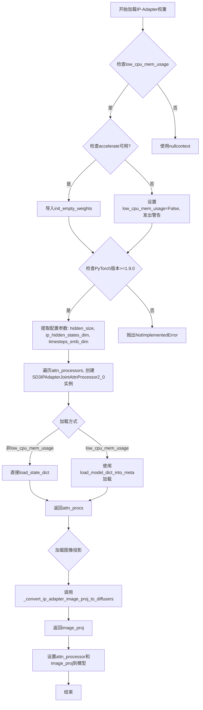
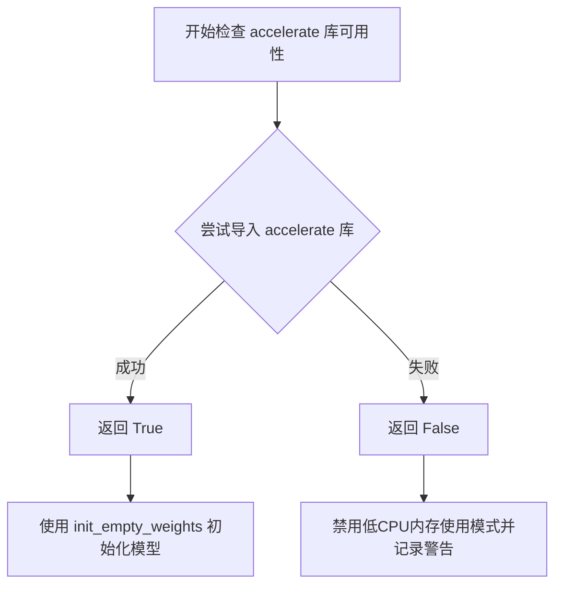
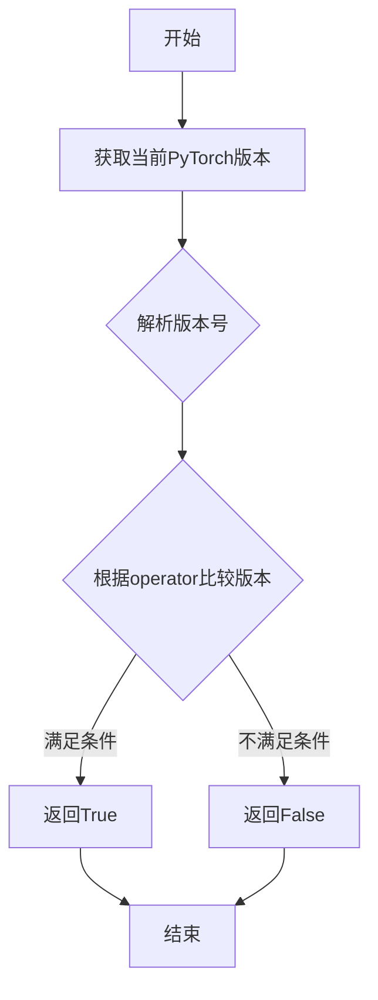
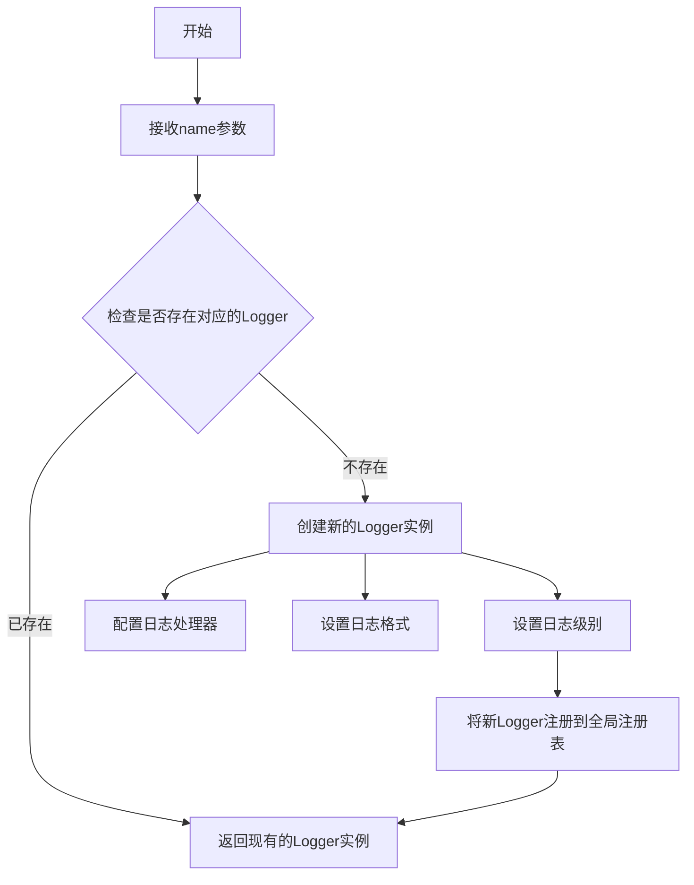
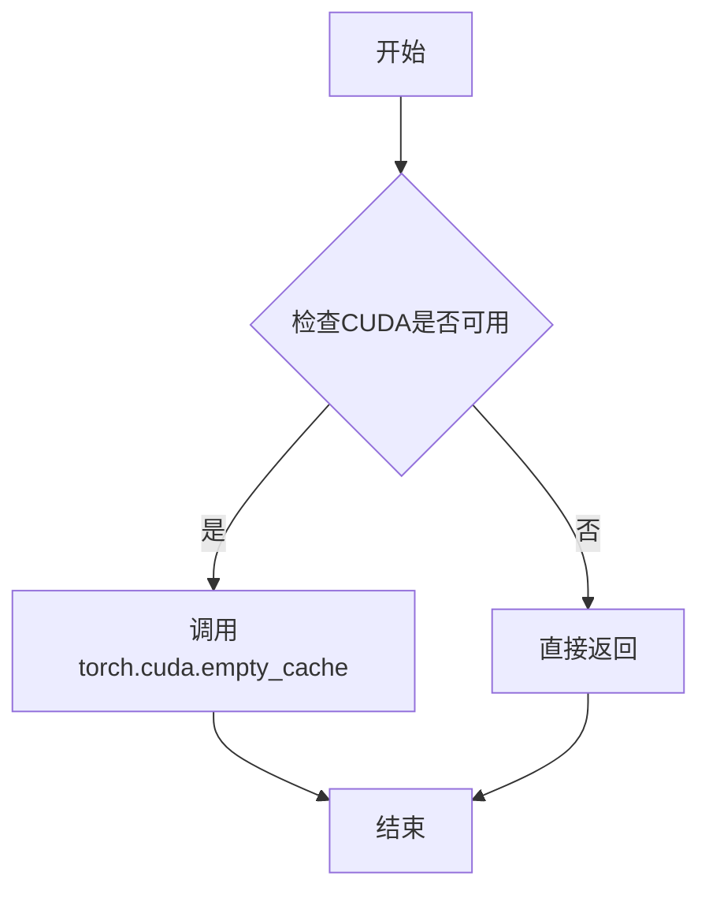
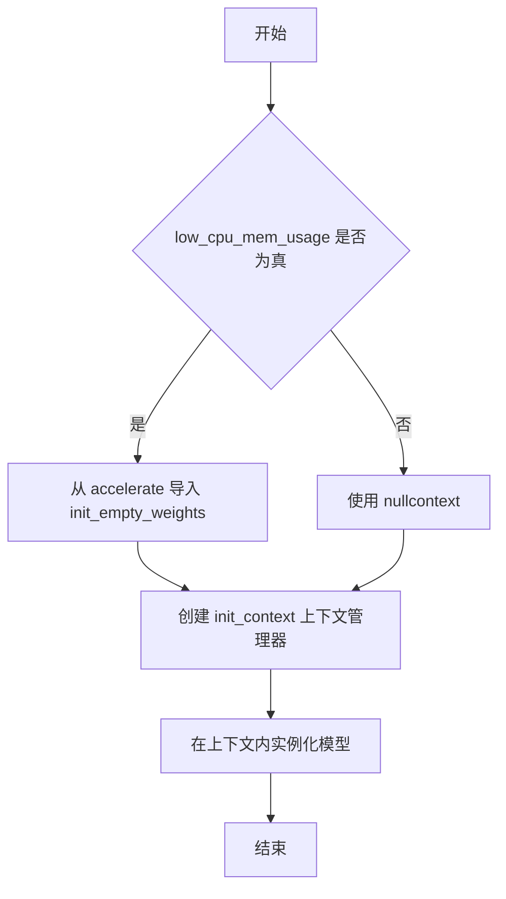
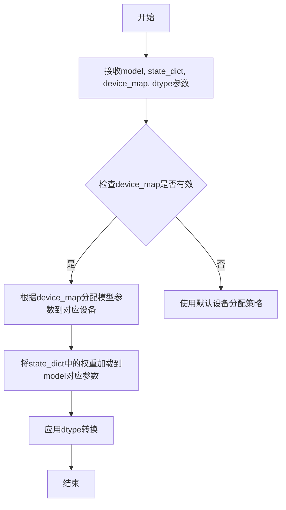
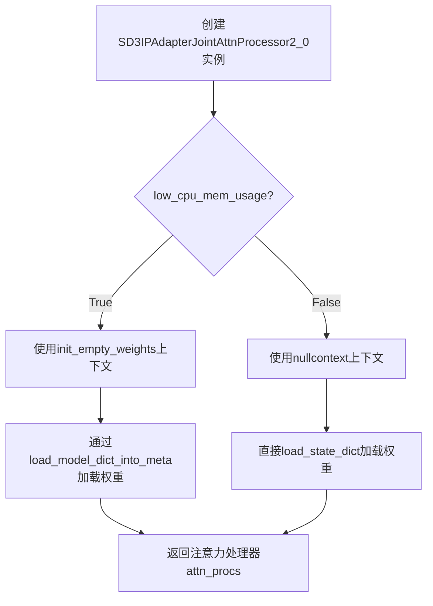
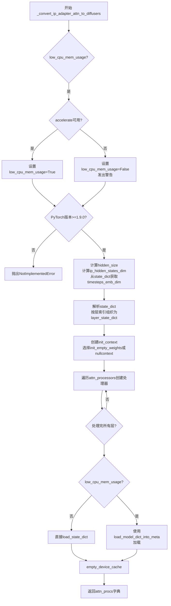
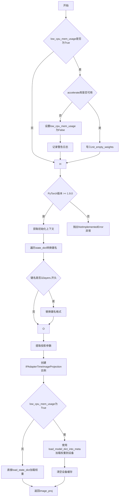

# `diffusers\src\diffusers\loaders\transformer_sd3.py` 详细设计文档

SD3Transformer2DLoadersMixin是一个Mixin类，用于在Stable Diffusion 3 (SD3) Transformer模型中加载和转换IP-Adapter（图像提示适配器）和LoRA层。该类提供了将IP-Adapter的注意力处理器和图像投影从其他格式（如InstantX/SD3.5-Large-IP-Adapter）转换到Diffusers格式的功能，支持低内存加载模式。

## 整体流程



## 类结构

```
SD3Transformer2DLoadersMixin (Mixin类)
```

## 全局变量及字段


### `logger`
    
模块级日志记录器，用于输出警告和信息消息

类型：`logging.Logger`
    


### `_LOW_CPU_MEM_USAGE_DEFAULT`
    
控制是否默认使用低CPU内存模式加载模型的全局配置常量

类型：`bool`
    


### `hidden_size`
    
IP-Adapter注意力处理器的隐藏层维度，由注意力头数乘以每头维度计算得出

类型：`int`
    


### `ip_hidden_states_dim`
    
IP-Adapter的隐藏状态维度，与hidden_size相同

类型：`int`
    


### `timesteps_emb_dim`
    
时间步嵌入的维度，从状态字典中提取

类型：`int`
    


### `layer_state_dict`
    
按transformer层索引组织的状态字典，用于存储各层的注意力处理器权重

类型：`Dict[int, Dict[str, Any]]`
    


### `attn_procs`
    
注意力处理器实例的字典，键为处理器名称，值为处理器对象

类型：`Dict[str, SD3IPAdapterJointAttnProcessor2_0]`
    


### `init_context`
    
上下文管理器，用于在低内存模式下初始化空权重或使用nullcontext

类型：`ContextManager`
    


### `embed_dim`
    
图像投影的嵌入维度，从proj_in权重形状中获取

类型：`int`
    


### `output_dim`
    
图像投影的输出维度，从proj_out权重形状中获取

类型：`int`
    


### `hidden_dim`
    
图像投影的隐藏层维度

类型：`int`
    


### `heads`
    
注意力头数量，通过将查询权重维度除以64计算得出

类型：`int`
    


### `num_queries`
    
查询数量，从latents张量形状中获取

类型：`int`
    


### `timestep_in_dim`
    
时间嵌入的输入维度

类型：`int`
    


### `updated_state_dict`
    
更新后的状态字典，键名已从原始格式转换为Diffusers格式

类型：`Dict[str, Any]`
    


### `SD3Transformer2DLoadersMixin.self.config`
    
模型配置对象，包含注意力头维度、注意力头数等配置信息

类型：`ModelConfig`
    


### `SD3Transformer2DLoadersMixin.self.attn_processors`
    
注意力处理器字典，存储transformer各层的注意力处理器实例

类型：`Dict[str, AttentionProcessor]`
    


### `SD3Transformer2DLoadersMixin.self.device`
    
模型所在的计算设备（CPU/GPU）

类型：`torch.device`
    


### `SD3Transformer2DLoadersMixin.self.dtype`
    
模型的数据类型（如float32、float16等）

类型：`torch.dtype`
    


### `SD3Transformer2DLoadersMixin.self.image_proj`
    
IP-Adapter的图像投影网络，用于将图像特征注入到transformer中

类型：`IPAdapterTimeImageProjection`
    
    

## 全局函数及方法


### `contextlib.nullcontext`

`nullcontext` 是 Python 标准库 `contextlib` 模块提供的上下文管理器，当代码需要一个上下文管理器但不希望执行任何实际的上下文进入/退出操作时使用。在本代码中，它被用作一个"空"的上下文管理器，根据 `low_cpu_mem_usage` 参数的条件，在低内存占用模式和非低内存占用模式之间切换。

参数：

-  `enter_result`：可选，任意类型，默认为 `None`。指定上下文管理器 `__enter__()` 方法返回的值。

返回值：`nullcontext` 实例，一个上下文管理器对象

#### 流程图

```mermaid
flowchart TD
    A[开始] --> B{low_cpu_mem_usage = True?}
    B -->|Yes| C[使用 init_empty_weights]
    B -->|No| D[使用 nullcontext]
    C --> E[创建 init_context 上下文管理器]
    D --> E
    E --> F[进入上下文 with init_context():]
    F --> G[执行初始化操作]
    G --> H[退出上下文]
    H --> I[返回或继续]
```

#### 带注释源码

```python
# 从 Python 标准库导入 nullcontext
# nullcontext 是一个简单的上下文管理器，当 enter_result 为 None 时，
# 它不做任何事情，只是简单地返回 None
from contextlib import nullcontext

# 在代码中的实际使用方式：
# 当 low_cpu_mem_usage 为 False 时，使用 nullcontext 作为空上下文管理器
# 这样代码可以在 with 块中统一处理，而不需要额外的条件分支
init_context = init_empty_weights if low_cpu_mem_usage else nullcontext

# 使用示例：
# 在低内存模式下：init_empty_weights 会初始化空权重
# 在正常模式下：nullcontext 不会执行任何操作
with init_context():
    attn_procs[name] = SD3IPAdapterJointAttnProcessor2_0(
        hidden_size=hidden_size,
        ip_hidden_states_dim=ip_hidden_states_dim,
        head_dim=self.config.attention_head_dim,
        timesteps_emb_dim=timesteps_emb_dim,
    )
```


### `is_accelerate_available`

该函数用于检查当前环境中是否已安装 `accelerate` 库，以便在模型加载时决定是否使用低内存占用模式。

参数：
- （无参数）

返回值：`bool`，返回 `True` 表示 `accelerate` 库已安装可用，返回 `False` 表示不可用。

#### 流程图



#### 带注释源码

```python
# is_accelerate_available 的典型实现（在 ..utils 中定义）
# 该函数尝试导入 accelerate 模块，如果成功则返回 True，否则返回 False

def is_accelerate_available() -> bool:
    """
    检查 accelerate 库是否可用。
    
    Returns:
        bool: 如果 accelerate 库已安装并可以导入返回 True，否则返回 False。
    """
    try:
        import accelerate
        return True
    except ImportError:
        return False


# 在 SD3Transformer2DLoadersMixin 中的使用示例：
if is_accelerate_available():
    from accelerate import init_empty_weights  # 可用时导入轻量级初始化工具
else:
    low_cpu_mem_usage = False  # 不可用时禁用低内存模式
    logger.warning(
        "Cannot initialize model with low cpu memory usage because `accelerate` was not found in the"
        " environment. Defaulting to `low_cpu_mem_usage=False`. It is strongly recommended to install"
        " `accelerate` for faster and less memory-intense model loading. You can do so with: \n```\npip"
        " install accelerate\n```\n."
    )
```

---

### 补充信息

| 项目 | 描述 |
|------|------|
| **定义位置** | `diffusers/src/diffusers/utils/__init__.py` 或类似工具模块 |
| **使用场景** | 在模型加载时检查是否可以使用 `accelerate` 库的 `init_empty_weights` 功能来实现低内存占用模型加载 |
| **关联功能** | `init_empty_weights`（来自 accelerate 库）、`load_model_dict_into_meta`、`_LOW_CPU_MEM_USAGE_DEFAULT` |
| **技术债务** | 当前实现每次调用都会尝试导入，如果频繁调用可能影响性能，可考虑缓存结果 |


### `is_torch_version`

该函数用于检查当前环境中的 PyTorch 版本是否满足指定的条件。它接受一个比较运算符（如 `>=`, `>`, `<`, `==` 等）和一个版本号字符串作为参数，返回布尔值表示版本是否满足条件。此函数来自 `diffusers` 库的工具模块，用于在代码中实现版本兼容性检查。

参数：

- `operator`：`str`，比较运算符，如 `">="`、`">"`、`"<"`、`"=="` 等
- `version`：`str`，目标 PyTorch 版本号，如 `"1.9.0"`

返回值：`bool`，如果当前 PyTorch 版本满足指定条件返回 `True`，否则返回 `False`

#### 流程图



#### 带注释源码

```
# 注：由于 is_torch_version 函数定义在 diffusers 库的 utils 模块中，
# 当前代码段仅包含其导入和使用，未包含函数实际定义。
# 以下为代码中的使用示例：

from ..utils import is_torch_version

# 使用示例 1：在 _convert_ip_adapter_attn_to_diffusers 方法中
if low_cpu_mem_usage is True and not is_torch_version(">=", "1.9.0"):
    raise NotImplementedError(
        "Low memory initialization requires torch >= 1.9.0. Please either update your PyTorch version or set"
        " `low_cpu_mem_usage=False`."
    )

# 使用示例 2：在 _convert_ip_adapter_image_proj_to_diffusers 方法中
if low_cpu_mem_usage is True and not is_torch_version(">=", "1.9.0"):
    raise NotImplementedError(
        "Low memory initialization requires torch >= 1.9.0. Please either update your PyTorch version or set"
        " `low_cpu_mem_usage=False`."
    )
```

#### 补充说明

由于 `is_torch_version` 函数定义在 `diffusers` 库的 `utils` 模块中（`diffusers/src/diffusers/utils/__init__.py` 或相关文件中），当前提供的代码段仅展示了该函数的导入和调用方式。根据使用场景推断，该函数的主要用途是：

1. **版本兼容性检查**：确保代码在特定版本的 PyTorch 上运行
2. **特性降级处理**：当 PyTorch 版本较低时，提供替代方案或抛出明确的错误信息
3. **条件功能启用**：根据 PyTorch 版本决定是否启用某些高级特性（如低内存加载）

如需获取 `is_torch_version` 函数的完整源代码实现，建议查阅 `diffusers` 库的官方源码。


### `logging.get_logger`

获取或创建一个与给定模块名称关联的日志记录器实例，用于在diffusers库中统一管理日志输出。

参数：

- `name`：`str`，模块名称，通常使用`__name__`变量传入，以标识日志来源的模块路径

返回值：`logging.Logger`，返回一个新的或已存在的Logger对象实例，用于记录不同级别的日志信息

#### 流程图



#### 带注释源码

```python
# 从diffusers库的utils模块导入logging对象
from ..utils import logging

# 使用当前模块的__name__作为logger名称
# 这样可以方便地识别日志来源的模块
logger = logging.get_logger(__name__)

# 示例用法：
# logger.warning("警告消息")
# logger.info("信息消息")
# logger.error("错误消息")
```


### `empty_device_cache`

该函数是一个全局工具函数，用于清空 GPU 设备缓存，释放加载模型权重后未使用的 GPU 内存。

参数： 无

返回值：`None`，无返回值

#### 流程图



#### 带注释源码

```
# 该函数定义在 ..utils.torch_utils 模块中
# 在当前文件中从 ..utils.torch_utils 导入
from ..utils.torch_utils import empty_device_cache

# 调用示例1：在转换IP适配器注意力处理器权重后调用
def _convert_ip_adapter_attn_to_diffusers(...):
    # ... 权重转换和加载逻辑 ...
    empty_device_cache()  # 清空GPU缓存，释放加载权重时占用的临时内存
    return attn_procs

# 调用示例2：在转换图像投影权重后调用
def _convert_ip_adapter_image_proj_to_diffusers(...):
    # ... 权重转换和加载逻辑 ...
    empty_device_cache()  # 清空GPU缓存，释放加载权重时占用的临时内存
    return image_proj
```

#### 补充说明

| 项目 | 描述 |
|------|------|
| **函数位置** | `diffusers.utils.torch_utils.empty_device_cache` |
| **实际作用** | 调用 `torch.cuda.empty_cache()` 清空 CUDA 缓存，释放未使用的 GPU 内存 |
| **使用场景** | 在模型权重加载完成后调用，用于降低显存占用峰值 |
| **潜在优化** | 可考虑在内存敏感场景下多次调用，或与 `gc.collect()` 配合使用 |
| **技术债务** | 该函数假设 CUDA 可用，但未显式检查；若在非 CUDA 环境下可能产生静默失败 |


### `init_empty_weights`

`init_empty_weights` 是从 `accelerate` 库导入的上下文管理器函数，用于在低 CPU 内存使用模式下初始化模型权重。它允许在不完全分配内存的情况下创建模型结构，从而显著减少模型加载时的内存占用。

参数：

- 无显式参数（由 `accelerate` 库定义）

返回值：无返回值（上下文管理器）

#### 流程图



#### 带注释源码

```python
# 在 _convert_ip_adapter_attn_to_diffusers 方法中：
if low_cpu_mem_usage:
    if is_accelerate_available():
        # 从 accelerate 库导入 init_empty_weights 函数
        # 这是一个上下文管理器，用于在低内存模式下初始化模型权重
        from accelerate import init_empty_weights
    else:
        low_cpu_mem_usage = False
        logger.warning(...)

# 选择使用 init_empty_weights 或 nullcontext 作为上下文管理器
init_context = init_empty_weights if low_cpu_mem_usage else nullcontext

# 使用上下文管理器实例化注意力处理器
for idx, name in enumerate(self.attn_processors.keys()):
    with init_context():
        # 在 init_empty_weights 上下文中创建模型
        # 此时不会实际分配权重内存，只有在 load_state_dict 时才会加载
        attn_procs[name] = SD3IPAdapterJointAttnProcessor2_0(
            hidden_size=hidden_size,
            ip_hidden_states_dim=ip_hidden_states_dim,
            head_dim=self.config.attention_head_dim,
            timesteps_emb_dim=timesteps_emb_dim,
        )
```


# 详细设计文档

由于`load_model_dict_into_meta`函数是从外部模块`..models.model_loading_utils`导入的，当前代码文件中仅包含其使用示例，并未直接定义该函数。以下是从代码使用场景中提取的详细信息：

---

### `load_model_dict_into_meta`

将预训练模型的权重字典（state dict）加载到模型对象中，支持低CPU内存使用模式下的模型加载。

参数：

-  `model`：`torch.nn.Module`，目标模型对象，需要加载权重的模块
-  `state_dict`：`dict`，包含模型权重的状态字典，键为参数名称，值为参数张量
-  `device_map`：`dict`，设备映射字典，键通常为空字符串`""`表示整个模型，值为目标设备（如`"cuda"`或`self.device`）
-  `dtype`：`torch.dtype`，模型权重的数据类型（如`torch.float16`）

返回值：无返回值（`None`），直接修改传入的`model`对象

#### 流程图



#### 带注释源码

```python
# 在当前文件中调用 load_model_dict_into_meta 的示例

# 示例1：在 _convert_ip_adapter_attn_to_diffusers 方法中
# 用于将IP-Adapter的注意力处理器权重加载到模型
load_model_dict_into_meta(
    attn_procs[name],          # 目标注意力处理器对象
    layer_state_dict[idx],     # 该层的权重字典
    device_map=device_map,     # 设备映射: {"": self.device}
    dtype=self.dtype           # 模型数据类型
)

# 示例2：在 _convert_ip_adapter_image_proj_to_diffusers 方法中
# 用于将图像投影层的权重加载到模型
load_model_dict_into_meta(
    image_proj,                # 目标图像投影对象
    updated_state_dict,        # 更新后的权重字典
    device_map=device_map,     # 设备映射: {"": self.device}
    dtype=self.dtype           # 模型数据类型
)
```

---

## 补充说明

由于`load_model_dict_into_meta`函数定义不在当前代码文件中，若需要获取其完整实现细节（包含完整的函数签名、返回值类型、内部逻辑流程图及注释源码），需要查看 `..models.model_loading_utils` 模块的源代码。

该函数的主要功能是：
1. 支持将模型权重分配到不同的计算设备（CPU/GPU）
2. 支持低内存加载模式（通过`device_map`参数）
3. 允许在加载时进行数据类型转换（通过`dtype`参数）


### `SD3IPAdapterJointAttnProcessor2_0`

SD3IPAdapterJointAttnProcessor2_0 是 SD3 模型中用于实现 IP-Adapter 联合注意力机制的注意力处理器类，负责处理文本和图像特征的交叉注意力计算。

参数：

- `hidden_size`：`int`，隐藏层维度，对应于 Transformer 模型的主干 hidden size
- `ip_hidden_states_dim`：`int`，IP-Adapter 图像特征的隐藏状态维度
- `head_dim`：`int`，注意力头的维度大小
- `timesteps_emb_dim`：`int`，时间步嵌入的维度

返回值：`SD3IPAdapterJointAttnProcessor2_0`（实例），返回初始化后的注意力处理器对象

#### 流程图



#### 带注释源码

```python
# 在 _convert_ip_adapter_attn_to_diffusers 方法中创建 SD3IPAdapterJointAttnProcessor2_0 实例
attn_procs = {}
init_context = init_empty_weights if low_cpu_mem_usage else nullcontext
for idx, name in enumerate(self.attn_processors.keys()):
    with init_context():
        # 创建 IP-Adapter 注意力处理器
        # 参数说明：
        # - hidden_size: Transformer层的隐藏维度 (attention_head_dim * num_attention_heads)
        # - ip_hidden_states_dim: IP-Adapter图像特征的隐藏状态维度
        # - head_dim: 注意力头的维度
        # - timesteps_emb_dim: 时间步嵌入维度，从state_dict中获取
        attn_procs[name] = SD3IPAdapterJointAttnProcessor2_0(
            hidden_size=hidden_size,
            ip_hidden_states_dim=ip_hidden_states_dim,
            head_dim=self.config.attention_head_dim,
            timesteps_emb_dim=timesteps_emb_dim,
        )

    if not low_cpu_mem_usage:
        # 直接加载权重到处理器
        attn_procs[name].load_state_dict(layer_state_dict[idx], strict=True)
    else:
        # 使用 accelerate 库的元设备方式进行低内存加载
        device_map = {"": self.device}
        load_model_dict_into_meta(
            attn_procs[name], layer_state_dict[idx], device_map=device_map, dtype=self.dtype
        )
```


### `IPAdapterTimeImageProjection`

IPAdapterTimeImageProjection 是一个图像投影模块，用于将图像特征映射到与 Transformer 模型兼容的潜在空间，同时结合时间步嵌入信息，实现 IP-Adapter 在 SD3 模型中的图像条件注入功能。

参数：

- `embed_dim`：`int`，投影输入的嵌入维度，对应 `updated_state_dict["proj_in.weight"].shape[1]`
- `output_dim`：`int`，投影输出的维度，对应 `updated_state_dict["proj_out.weight"].shape[0]`
- `hidden_dim`：`int`，隐藏层维度，对应 `updated_state_dict["proj_in.weight"].shape[0]`
- `heads`：`int`，注意力头数量，通过 `updated_state_dict["layers.0.attn.to_q.weight"].shape[0] // 64` 计算
- `num_queries`：`int`，查询数量，对应 `updated_state_dict["latents"].shape[1]`
- `timestep_in_dim`：`int`，时间步嵌入输入维度，对应 `updated_state_dict["time_embedding.linear_1.weight"].shape[1]`

返回值：`IPAdapterTimeImageProjection`，返回图像投影模型实例，用于将图像特征和时间步信息编码为适配器所需的潜在表示

#### 流程图

```mermaid
flowchart TD
    A[开始创建 IPAdapterTimeImageProjection] --> B[提取 embed_dim from proj_in.weight shape[1]]
    B --> C[提取 output_dim from proj_out.weight shape[0]]
    C --> D[提取 hidden_dim from proj_in.weight shape[0]]
    D --> E[提取 heads = to_q.weight.shape[0] // 64]
    E --> F[提取 num_queries from latents.shape[1]]
    F --> G[提取 timestep_in_dim from time_embedding.linear_1.weight shape[1]]
    G --> H[根据 low_cpu_mem_usage 选择初始化上下文]
    H --> I{low_cpu_mem_usage?}
    I -->|True| J[使用 init_empty_weights 上下文]
    I -->|False| K[使用 nullcontext 上下文]
    J --> L[创建 IPAdapterTimeImageProjection 实例]
    K --> L
    L --> M{low_cpu_mem_usage?}
    M -->|True| N[使用 load_model_dict_into_meta 加载权重]
    M -->|False| O[使用 load_state_dict 加载权重]
    N --> P[清空设备缓存]
    O --> Q[返回 image_proj 实例]
    P --> Q
```

#### 带注释源码

```python
# 从 embeddings 模块导入 IPAdapterTimeImageProjection 类
from ..models.embeddings import IPAdapterTimeImageProjection

# ... 在 _convert_ip_adapter_image_proj_to_diffusers 方法中 ...

# Image projection parameters
# 从状态字典中提取投影层参数维度信息
embed_dim = updated_state_dict["proj_in.weight"].shape[1]       # 输入嵌入维度
output_dim = updated_state_dict["proj_out.weight"].shape[0]     # 输出维度
hidden_dim = updated_state_dict["proj_in.weight"].shape[0]      # 隐藏层维度
# 计算注意力头数量：query权重维度除以64（每个头的标准维度）
heads = updated_state_dict["layers.0.attn.to_q.weight"].shape[0] // 64
# 获取查询数量（latent序列长度）
num_queries = updated_state_dict["latents"].shape[1]
# 获取时间步嵌入输入维度
timestep_in_dim = updated_state_dict["time_embedding.linear_1.weight"].shape[1]

# Image projection
# 根据 low_cpu_mem_usage 参数选择初始化上下文
with init_context():
    # 创建 IPAdapterTimeImageProjection 实例，传入所有提取的维度参数
    image_proj = IPAdapterTimeImageProjection(
        embed_dim=embed_dim,
        output_dim=output_dim,
        hidden_dim=hidden_dim,
        heads=heads,
        num_queries=num_queries,
        timestep_in_dim=timestep_in_dim,
    )

# 根据 low_cpu_mem_usage 选择不同的权重加载方式
if not low_cpu_mem_usage:
    # 标准方式：直接加载状态字典
    image_proj.load_state_dict(updated_state_dict, strict=True)
else:
    # 低内存方式：使用 device_map 指定设备并加载到模型
    device_map = {"": self.device}
    load_model_dict_into_meta(image_proj, updated_state_dict, device_map=device_map, dtype=self.dtype)
    # 加载完成后清空设备缓存释放内存
    empty_device_cache()

# 返回创建并加载好权重的图像投影模型
return image_proj
```

**注意**：提供的代码片段中仅包含 `IPAdapterTimeImageProjection` 类的导入和使用示例，未包含该类的完整内部实现定义。该类的具体实现位于 `..models.embeddings` 模块中。


### `SD3Transformer2DLoadersMixin._convert_ip_adapter_attn_to_diffusers`

将IP-Adapter的attention状态字典转换为Diffusers格式，创建并初始化SD3IPAdapterJointAttnProcessor2_0注意力处理器集合，支持低CPU内存占用模式加载。

参数：

- `self`：`SD3Transformer2DLoadersMixin`，mixin类实例，用于访问模型配置和注意力处理器
- `state_dict`：`dict`，包含IP-Adapter attention参数的状态字典，键格式为"{layer_idx}.{param_name}"
- `low_cpu_mem_usage`：`bool`，默认值为`_LOW_CPU_MEM_USAGE_DEFAULT`，是否使用低内存加载模式（仅在PyTorch>=1.9.0时支持）

返回值：`dict`，返回以attention处理器名称为键、SD3IPAdapterJointAttnProcessor2_0实例为值的字典

#### 流程图



#### 带注释源码

```python
def _convert_ip_adapter_attn_to_diffusers(
    self, state_dict: dict, low_cpu_mem_usage: bool = _LOW_CPU_MEM_USAGE_DEFAULT
) -> dict:
    # 如果启用低CPU内存占用模式，检查accelerate库是否可用
    if low_cpu_mem_usage:
        if is_accelerate_available():
            # 延迟导入，仅在需要时加载
            from accelerate import init_empty_weights
        else:
            # 如果accelerate不可用，回退到非低内存模式并发出警告
            low_cpu_mem_usage = False
            logger.warning(
                "Cannot initialize model with low cpu memory usage because `accelerate` was not found in the"
                " environment. Defaulting to `low_cpu_mem_usage=False`. It is strongly recommended to install"
                " `accelerate` for faster and less memory-intense model loading. You can do so with: \n```\npip"
                " install accelerate\n```\n."
            )

    # 如果启用低内存模式，验证PyTorch版本是否满足要求（>=1.9.0）
    if low_cpu_mem_usage is True and not is_torch_version(">=", "1.9.0"):
        raise NotImplementedError(
            "Low memory initialization requires torch >= 1.9.0. Please either update your PyTorch version or set"
            " `low_cpu_mem_usage=False`."
        )

    # ========== 计算IP-Adapter交叉注意力参数 ==========
    # hidden_size: 注意力头的维度 × 注意力头的数量
    hidden_size = self.config.attention_head_dim * self.config.num_attention_heads
    # IP隐藏状态维度，通常与hidden_size相同
    ip_hidden_states_dim = self.config.attention_head_dim * self.config.num_attention_heads
    # 从状态字典中获取时间嵌入维度（norm_ip层的权重形状）
    timesteps_emb_dim = state_dict["0.norm_ip.linear.weight"].shape[1]

    # ========== 解析状态字典，按层索引组织 ==========
    # 创建一个字典，键为transformer层索引，值为该层注意力处理器的状态字典
    # 示例IP-Adapter状态字典键: "0.norm_ip.linear.weight"
    layer_state_dict = {idx: {} for idx in range(len(self.attn_processors))}
    for key, weights in state_dict.items():
        # 分离层索引和参数名（如 "0.norm_ip.linear.weight" -> idx="0", name="norm_ip.linear.weight"）
        idx, name = key.split(".", maxsplit=1)
        layer_state_dict[int(idx)][name] = weights

    # ========== 创建IP-Adapter注意力处理器并加载权重 ==========
    attn_procs = {}
    # 根据low_cpu_mem_usage选择初始化上下文：init_empty_weights或nullcontext
    init_context = init_empty_weights if low_cpu_mem_usage else nullcontext
    for idx, name in enumerate(self.attn_processors.keys()):
        # 在指定上下文中创建注意力处理器实例
        with init_context():
            attn_procs[name] = SD3IPAdapterJointAttnProcessor2_0(
                hidden_size=hidden_size,
                ip_hidden_states_dim=ip_hidden_states_dim,
                head_dim=self.config.attention_head_dim,
                timesteps_emb_dim=timesteps_emb_dim,
            )

        # 根据加载模式选择不同的权重加载方式
        if not low_cpu_mem_usage:
            # 直接加载状态字典（严格模式）
            attn_procs[name].load_state_dict(layer_state_dict[idx], strict=True)
        else:
            # 使用accelerate的load_model_dict_into_meta进行低内存加载
            device_map = {"": self.device}
            load_model_dict_into_meta(
                attn_procs[name], layer_state_dict[idx], device_map=device_map, dtype=self.dtype
            )

    # 释放设备缓存，清理GPU内存
    empty_device_cache()

    # 返回注意力处理器字典
    return attn_procs
```


### `SD3Transformer2DLoadersMixin._convert_ip_adapter_image_proj_to_diffusers`

此方法负责将IP-Adapter的图像投影权重从第三方格式（如InstantX/SD3.5-Large-IP-Adapter）转换为Diffusers兼容的格式，创建对应的`IPAdapterTimeImageProjection`模型实例，并加载转换后的权重。

参数：

- `self`：`SD3Transformer2DLoadersMixin`，mixin类实例，提供了IP-Adapter加载功能
- `state_dict`：`dict`，包含IP-Adapter图像投影层的权重字典，键值对表示层的名称和对应的张量权重
- `low_cpu_mem_usage`：`bool`，可选参数，默认为`_LOW_CPU_MEM_USAGE_DEFAULT`（通常为True），控制是否采用低内存占用的模型加载方式

返回值：`IPAdapterTimeImageProjection`，转换并加载权重后的图像投影模型实例

#### 流程图



#### 带注释源码

```python
def _convert_ip_adapter_image_proj_to_diffusers(
    self, state_dict: dict, low_cpu_mem_usage: bool = _LOW_CPU_MEM_USAGE_DEFAULT
) -> IPAdapterTimeImageProjection:
    """
    将IP-Adapter图像投影权重转换为Diffusers格式并加载到模型中。
    
    此方法处理从第三方格式（如InstantX/SD3.5-Large-IP-Adapter）到Diffusers兼容格式的权重转换。
    """
    
    # 检查是否启用低内存占用模式
    if low_cpu_mem_usage:
        # 检查accelerate库是否可用
        if is_accelerate_available():
            # 导入空权重初始化上下文管理器，用于延迟初始化
            from accelerate import init_empty_weights
        else:
            # 如果不可用，禁用低内存模式并记录警告
            low_cpu_mem_usage = False
            logger.warning(
                "Cannot initialize model with low cpu memory usage because `accelerate` was not found in the"
                " environment. Defaulting to `low_cpu_mem_usage=False`. It is strongly recommended to install"
                " `accelerate` for faster and less memory-intense model loading. You can do so with: \n```\npip"
                " install accelerate\n```\n."
            )

    # 验证PyTorch版本是否满足低内存初始化要求
    if low_cpu_mem_usage is True and not is_torch_version(">=", "1.9.0"):
        raise NotImplementedError(
            "Low memory initialization requires torch >= 1.9.0. Please either update your PyTorch version or set"
            " `low_cpu_mem_usage=False`."
        )

    # 根据low_cpu_mem_usage选择合适的初始化上下文
    init_context = init_empty_weights if low_cpu_mem_usage else nullcontext

    # 将第三方格式的权重键名转换为Diffusers格式
    updated_state_dict = {}
    for key, value in state_dict.items():
        # 处理InstantX/SD3.5-Large-IP-Adapter格式的键名
        if key.startswith("layers."):
            # 提取层索引
            idx = key.split(".")[1]
            
            # 转换归一化层键名
            key = key.replace(f"layers.{idx}.0.norm1", f"layers.{idx}.ln0")
            key = key.replace(f"layers.{idx}.0.norm2", f"layers.{idx}.ln1")
            
            # 转换注意力机制键名
            key = key.replace(f"layers.{idx}.0.to_q", f"layers.{idx}.attn.to_q")
            key = key.replace(f"layers.{idx}.0.to_kv", f"layers.{idx}.attn.to_kv")
            key = key.replace(f"layers.{idx}.0.to_out", f"layers.{idx}.attn.to_out.0")
            
            # 转换前馈网络和AdaLN键名
            key = key.replace(f"layers.{idx}.1.0", f"layers.{idx}.adaln_norm")
            key = key.replace(f"layers.{idx}.1.1", f"layers.{idx}.ff.net.0.proj")
            key = key.replace(f"layers.{idx}.1.3", f"layers.{idx}.ff.net.2")
            key = key.replace(f"layers.{idx}.2.1", f"layers.{idx}.adaln_proj")
        
        # 将转换后的键值对存入新的字典
        updated_state_dict[key] = value

    # 从转换后的state_dict中提取图像投影参数
    embed_dim = updated_state_dict["proj_in.weight"].shape[1]        # 嵌入维度
    output_dim = updated_state_dict["proj_out.weight"].shape[0]      # 输出维度
    hidden_dim = updated_state_dict["proj_in.weight"].shape[0]      # 隐藏层维度
    heads = updated_state_dict["layers.0.attn.to_q.weight"].shape[0] // 64  # 注意力头数
    num_queries = updated_state_dict["latents"].shape[1]             # 查询数量
    timestep_in_dim = updated_state_dict["time_embedding.linear_1.weight"].shape[1]  # 时间嵌入输入维度

    # 使用选定的初始化上下文创建图像投影模型
    with init_context():
        image_proj = IPAdapterTimeImageProjection(
            embed_dim=embed_dim,
            output_dim=output_dim,
            hidden_dim=hidden_dim,
            heads=heads,
            num_queries=num_queries,
            timestep_in_dim=timestep_in_dim,
        )

    # 根据low_cpu_mem_usage选择不同的权重加载方式
    if not low_cpu_mem_usage:
        # 直接加载权重，要求严格匹配键名
        image_proj.load_state_dict(updated_state_dict, strict=True)
    else:
        # 使用设备映射将权重加载到指定设备
        device_map = {"": self.device}
        load_model_dict_into_meta(image_proj, updated_state_dict, device_map=device_map, dtype=self.dtype)
        # 释放空设备缓存
        empty_device_cache()

    # 返回转换并加载完成的图像投影模型
    return image_proj
```


### `SD3Transformer2DLoadersMixin._load_ip_adapter_weights`

该方法用于加载 IP-Adapter 的权重，包括将注意力处理器的状态字典转换为 Diffusers 格式，设置注意力处理器，以及将图像投影网络的状态字典转换为 Diffusers 格式并赋值给模型的 image_proj 属性。

参数：

- `self`：隐式参数，SD3Transformer2DLoadersMixin 实例
- `state_dict`：`dict`，包含 IP-Adapter 状态字典，键 "ip_adapter" 包含注意力处理器参数，"image_proj" 包含图像投影网络参数
- `low_cpu_mem_usage`：`bool`，可选，默认为 `_LOW_CPU_MEM_USAGE_DEFAULT`。是否启用低内存模式加载模型，仅加载预训练权重而不初始化权重，PyTorch >= 1.9.0 支持

返回值：`None`，无返回值

#### 流程图

```mermaid
flowchart TD
    A[开始] --> B[调用 _convert_ip_adapter_attn_to_diffusers<br/>处理 state_dict['ip_adapter']]
    B --> C[获取注意力处理器字典 attn_procs]
    C --> D[调用 self.set_attn_processor<br/>设置注意力处理器]
    D --> E[调用 _convert_ip_adapter_image_proj_to_diffusers<br/>处理 state_dict['image_proj']]
    E --> F[获取图像投影对象 image_proj]
    F --> G[赋值 self.image_proj = image_proj]
    G --> H[结束]
```

#### 带注释源码

```python
def _load_ip_adapter_weights(self, state_dict: dict, low_cpu_mem_usage: bool = _LOW_CPU_MEM_USAGE_DEFAULT) -> None:
    """Sets IP-Adapter attention processors, image projection, and loads state_dict.

    Args:
        state_dict (`Dict`):
            State dict with keys "ip_adapter", which contains parameters for attention processors, and
            "image_proj", which contains parameters for image projection net.
        low_cpu_mem_usage (`bool`, *optional*, defaults to `True` if torch version >= 1.9.0 else `False`):
            Speed up model loading only loading the pretrained weights and not initializing the weights. This also
            tries to not use more than 1x model size in CPU memory (including peak memory) while loading the model.
            Only supported for PyTorch >= 1.9.0. If you are using an older version of PyTorch, setting this
            argument to `True` will raise an error.
    """

    # 步骤1: 将 IP-Adapter 注意力处理器的状态字典转换为 Diffusers 格式
    # 返回一个字典，键为注意力处理器名称，值为 SD3IPAdapterJointAttnProcessor2_0 实例
    attn_procs = self._convert_ip_adapter_attn_to_diffusers(state_dict["ip_adapter"], low_cpu_mem_usage)
    
    # 步骤2: 使用 set_attn_processor 方法将注意力处理器注册到模型中
    self.set_attn_processor(attn_procs)

    # 步骤3: 将图像投影网络的状态字典转换为 Diffusers 格式
    # 返回一个 IPAdapterTimeImageProjection 实例
    self.image_proj = self._convert_ip_adapter_image_proj_to_diffusers(state_dict["image_proj"], low_cpu_mem_usage)
```

## 关键组件


### SD3Transformer2DLoadersMixin

用于为SD3Transformer2DModel加载IP-Adapters和LoRA层的Mixin类，提供将第三方IP-Adapter权重转换为Diffusers格式的核心功能。

### _convert_ip_adapter_attn_to_diffusers

将IP-Adapter交叉注意力参数转换为Diffusers格式，创建并加载SD3IPAdapterJointAttnProcessor2_0注意力处理器，支持低CPU内存使用模式（惰性加载）和状态字典加载。

### _convert_ip_adapter_image_proj_to_diffusers

将IP-Adapter的图像投影网络（Image Projection）从第三方格式（如InstantX/SD3.5-Large-IP-Adapter）转换为Diffusers的IPAdapterTimeImageProjection格式，处理键名映射并支持惰性初始化。

### _load_ip_adapter_weights

主入口方法，协调调用注意力处理器转换和图像投影转换，将IP-Adapter权重加载到模型中，同时设置注意力处理器和图像投影网络。

### 低CPU内存使用（惰性加载）

通过accelerate库的init_empty_weights实现模型权重惰性加载，避免在权重转换过程中占用大量CPU内存，支持PyTorch >= 1.9.0。

### 状态字典键名映射

将第三方IP-Adapter的键名格式（如"layers.{idx}.0.norm1"）映射到Diffusers格式（如"layers.{idx}.ln0"），确保权重正确加载到对应的网络层。

### IP-Adapter权重结构

IP-Adapter权重包含两个主要部分："ip_adapter"（注意力处理器参数）和"image_proj"（图像投影网络参数），需要分别处理后合并到模型中。


## 问题及建议


### 已知问题

- **重复的加速器检查逻辑**：在 `_convert_ip_adapter_attn_to_diffusers` 和 `_convert_ip_adapter_image_proj_to_diffusers` 两个方法中，重复编写了相同的 `low_cpu_mem_usage` 检查和 `is_accelerate_available()` 判断逻辑，导致代码冗余。
- **硬编码的魔法数字**：`heads = updated_state_dict["layers.0.attn.to_q.weight"].shape[0] // 64` 中的除数 64 是硬编码的头数假设，缺乏灵活性，若实际头数不同会导致计算错误。
- **缺乏健壮的错误处理**：在解析 state_dict 键时（如 `key.split(".", maxsplit=1)`），若键格式不符合预期（如不包含 "."），会抛出 `ValueError`；若缺少必要的键（如 `"proj_in.weight"`），会直接抛出 `KeyError` 而无友好提示。
- **字符串替换的脆弱性**：对于 InstantX/SD3.5-Large-IP-Adapter 的状态字典键名转换使用了大量字符串替换，容易因上游模型格式微小变化而失效，且难以维护。
- **内部 API 依赖**：直接使用了 `accelerate` 库的内部 API `init_empty_weights`，该 API 可能随库版本变化导致兼容性问题。
- **类型注解缺失**：所有方法参数和返回值都缺少类型注解，影响代码可读性和静态分析工具的效能。
- **日志消息重复**：两个方法中的警告日志消息完全相同，应提取为共享常量或工具函数。

### 优化建议

- **提取公共检查逻辑**：将 `low_cpu_mem_usage` 和 `is_accelerate_available()` 的检查逻辑抽取为 mixin 类的私有方法（如 `_validate_low_cpu_mem_usage()`），避免代码重复。
- **消除魔法数字**：将硬编码的 64 改为通过配置获取（如 `self.config.attention_head_dim`），或从状态字典中动态推断。
- **增加错误处理与验证**：在解析键之前验证 state_dict 的完整性，捕获可能的 `KeyError` 和 `ValueError`，并提供有意义的错误信息。
- **重构键名转换逻辑**：将 InstantX/SD3.5-Large-IP-Adapter 的转换规则抽取为独立的映射表或专用方法，提高可维护性。
- **封装第三方 API 调用**：对 `accelerate` 的调用进行封装，提供内部抽象层以降低外部依赖变化的影响。
- **添加类型注解**：为所有方法参数、返回值添加明确的类型注解，提升代码可读性和 IDE 支持。
- **提取日志常量**：将重复的警告消息定义为模块级常量，减少字符串重复并便于国际化处理。


## 其它


### 设计目标与约束

本模块的设计目标是实现 IP-Adapter（图像提示适配器）和 LoRA 层的加载功能，将原始模型的权重格式转换为 Diffusers 框架支持的格式。主要约束包括：1）仅支持 PyTorch >= 1.9.0（当启用低内存加载模式时）；2）依赖 `accelerate` 库来实现内存高效的模型加载；3）需要兼容 InstantX/SD3.5-Large-IP-Adapter 格式的权重；4）必须保持与 SD3Transformer2DModel 的兼容性。

### 错误处理与异常设计

本模块涉及两类主要错误场景：1）**环境依赖缺失**：当 `accelerate` 库未安装时，会降级到非低内存加载模式并输出警告；2）**版本不兼容**：当 PyTorch 版本低于 1.9.0 且启用低内存加载时，抛出 `NotImplementedError` 异常。状态字典键名不匹配时，`load_state_dict` 的 `strict=True` 参数会触发 `RuntimeError`。所有警告通过 `logger.warning` 记录，异常包含明确的错误原因和用户建议操作。

### 数据流与状态机

数据流分为三个主要阶段：**第一阶段**（`_convert_ip_adapter_attn_to_diffusers`）：原始权重状态字典 → 按层索引分组 → 创建 SD3IPAdapterJointAttnProcessor2_0 实例 → 加载权重 → 返回注意力处理器字典。**第二阶段**（`_convert_ip_adapter_image_proj_to_diffusers`）：图像投影权重状态字典 → 键名转换（适配 Diffusers 格式）→ 提取维度参数 → 创建 IPAdapterTimeImageProjection 实例 → 加载权重 → 返回投影模型。**第三阶段**（`_load_ip_adapter_weights`）：接收包含 "ip_adapter" 和 "image_proj" 两个键的组合状态字典 → 依次调用前两个转换方法 → 通过 `set_attn_processor` 注册注意力处理器 → 赋值 `self.image_proj`。

### 外部依赖与接口契约

本模块直接依赖以下外部组件：`accelerate` 库（可选，用于 init_empty_weights 低内存初始化）、`torch`（版本检查、Tensor 操作）、`torchvision`（间接依赖）。上游调用方必须传入符合契约的状态字典：状态字典顶层必须包含 "ip_adapter" 和 "image_proj" 两个键；"ip_adapter" 对应的值中权重键格式为 "{layer_idx}.{param_name}"；"image_proj" 对应的值必须包含 proj_in.weight、proj_out.weight、layers.*.attn.*.weight 等特定键。返回值方面，`_load_ip_adapter_weights` 返回 None（通过副作用修改 self），其他两个转换方法返回模型实例。

### 配置参数详解

`low_cpu_mem_usage` 参数控制模型初始化策略：当为 True 时使用 `accelerate.init_empty_weights()` 延迟分配内存，适用于大模型加载；默认值为 `_LOW_CPU_MEM_USAGE_DEFAULT`（在 modeling_utils 中定义，通常为 True for PyTorch >= 1.9.0）。其他隐式配置通过 `self.config` 读取：attention_head_dim（注意力头维度）、num_attention_heads（注意力头数量）、hidden_size（隐藏层维度），这些参数用于创建注意力处理器和图像投影层。

### 性能 Considerations

内存使用方面，低内存模式可显著减少 CPU 内存占用，但会增加加载时间；`empty_device_cache()` 在每个转换方法末尾调用以释放临时缓存。加载性能方面，权重按层并行处理（通过遍历 attn_processors）；严格模式（strict=True）在非低内存模式下可快速检测键不匹配。潜在瓶颈包括：大状态字典的键解析（字符串操作）、多次设备数据传输（当 low_cpu_mem_usage=True 时）。

### 版本兼容性矩阵

| 功能 | 最低 PyTorch 版本 | 最低 accelerate 版本 | 备注 |
|------|------------------|---------------------|------|
| 低内存加载 | 1.9.0 | 任意版本 | 低于 1.9.0 抛出 NotImplementedError |
| 标准加载 | 1.0.0 | 不需要 | 通过警告降级 |
| IP-Adapter 支持 | 1.9.0（推荐） | 最新版 | 需要完整功能支持 |

### 安全性考量

本模块主要处理模型权重加载，需注意：1）状态字典来源需可信（防止恶意权重文件）；2）`load_state_dict` 使用 strict=True 会严格检查键匹配，建议在调试模式下捕获不匹配的键；3）无用户输入验证逻辑，调用方需确保 state_dict 格式正确；4）无敏感信息泄露风险（仅处理数值权重）。

### 测试策略建议

单元测试应覆盖：1）正常流程测试（模拟完整状态字典加载）；2）低内存模式测试（mock accelerate.init_empty_weights）；3）版本不兼容场景测试（PyTorch < 1.9.0 + low_cpu_mem_usage=True）；4）权重键不匹配测试（验证 strict 模式错误捕获）；5）图像投影键转换测试（验证 InstantX 格式到 Diffusers 格式的映射）。集成测试应验证加载后的模型前向传播正确性。


    