# `diffusers\src\diffusers\loaders\unet.py` 详细设计文档

该文件实现了 UNet2DConditionLoadersMixin 类，用于在 UNet2DConditionModel 中加载和保存注意力处理器层（LoRA、Custom Diffusion 和 IP-Adapter），支持多种适配器格式的转换和权重管理。

## 整体流程

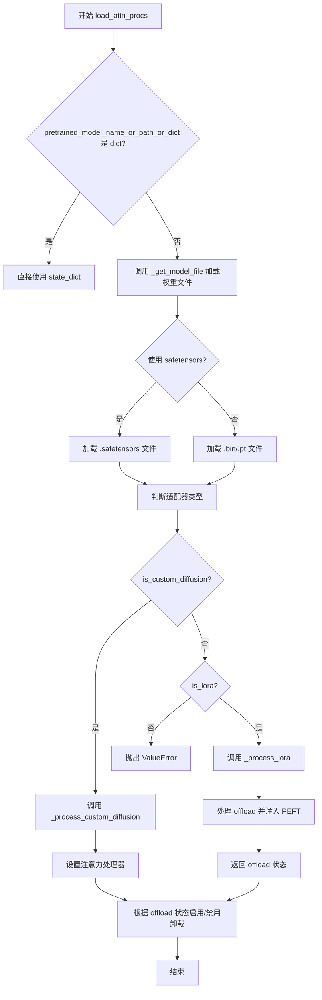

## 类结构

```
UNet2DConditionLoadersMixin (Mixins 类)
├── 核心方法
│   ├── load_attn_procs
│   ├── save_attn_procs
│   ├── _process_custom_diffusion
│   ├── _process_lora
│   ├── _optionally_disable_offloading
│   ├── _get_custom_diffusion_state_dict
│   ├── _convert_ip_adapter_image_proj_to_diffusers
│   ├── _convert_ip_adapter_attn_to_diffusers
│   ├── _load_ip_adapter_weights
│   └── _load_ip_adapter_loras
└── 辅助模块
    ├── IP-Adapter (图像投影转换)
    ├── LoRA (PEFT 集成)
    └── Custom Diffusion (注意力处理器)
```

## 全局变量及字段


### `CUSTOM_DIFFUSION_WEIGHT_NAME`
    
Custom Diffusion 权重文件名，用于保存自定义扩散模型的权重

类型：`str`
    


### `CUSTOM_DIFFUSION_WEIGHT_NAME_SAFE`
    
Custom Diffusion 安全权重文件名，使用 safetensors 格式保存自定义扩散模型权重

类型：`str`
    


### `LORA_WEIGHT_NAME`
    
LoRA 权重文件名，指向 pytorch_lora_weights.bin

类型：`str`
    


### `LORA_WEIGHT_NAME_SAFE`
    
LoRA 安全权重文件名，指向 pytorch_lora_weights.safetensors

类型：`str`
    


### `TEXT_ENCODER_NAME`
    
文本编码器组件的标准名称常量

类型：`str`
    


### `UNET_NAME`
    
UNet 组件的标准名称常量

类型：`str`
    


### `UNet2DConditionLoadersMixin.text_encoder_name`
    
类属性，存储文本编码器名称，默认为 TEXT_ENCODER_NAME 常量

类型：`str`
    


### `UNet2DConditionLoadersMixin.unet_name`
    
类属性，存储 UNet 名称，默认为 UNET_NAME 常量

类型：`str`
    
    

## 全局函数及方法


### `_get_model_file`

获取模型文件的路径，支持从本地目录或 Hugging Face Hub 下载模型权重文件。

参数：

- `pretrained_model_name_or_path_or_dict`：`str | dict[str, torch.Tensor]`，模型标识符，可以是 Hugging Face Hub 上的模型 ID、本地目录路径，或者是包含模型权重的字典
- `weights_name`：`str`，要加载的权重文件名（如 `pytorch_lora_weights.safetensors`）
- `cache_dir`：`str | os.PathLike`，可选，指定缓存目录路径
- `force_download`：`bool`，可选，是否强制重新下载模型文件
- `proxies`：`dict[str, str]`，可选，代理服务器配置
- `local_files_only`：`bool`，可选，是否仅使用本地文件
- `token`：`str | bool`，可选，用于远程文件认证的 Hugging Face token
- `revision`：`str`，可选，指定的模型版本（分支、标签或 commit ID）
- `subfolder`：`str`，可选，模型仓库中的子文件夹路径
- `user_agent`：`dict`，可选，描述请求来源的字典

返回值：`str`，返回模型文件的本地路径

#### 流程图

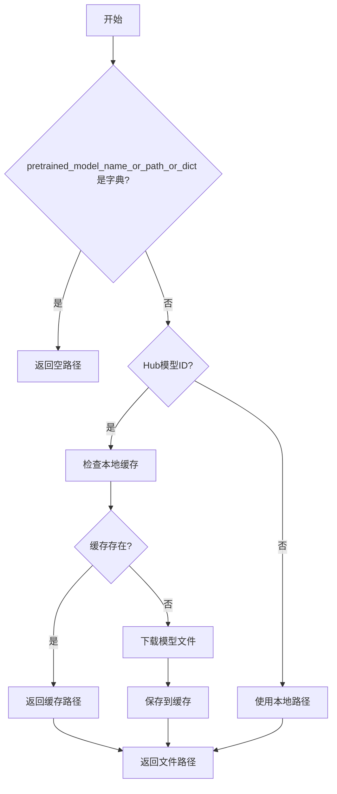

#### 带注释源码

```python
# _get_model_file 函数调用示例（位于 load_attn_procs 方法中）
# 该函数由 diffusers.utils 模块提供，这里展示其调用方式

model_file = _get_model_file(
    pretrained_model_name_or_path_or_dict,  # 模型路径或ID
    weights_name=weight_name or LORA_WEIGHT_NAME_SAFE,  # 权重文件名
    cache_dir=cache_dir,  # 缓存目录
    force_download=force_download,  # 是否强制下载
    proxies=proxies,  # 代理服务器
    local_files_only=local_files_only,  # 仅本地文件
    token=token,  # HuggingFace token
    revision=revision,  # 版本/分支
    subfolder=subfolder,  # 子文件夹
    user_agent=user_agent,  # 用户代理信息
)

# 函数返回模型文件的路径，然后用于加载状态字典
state_dict = safetensors.torch.load_file(model_file, device="cpu")
```

**注意**：完整的 `_get_model_file` 函数实现位于 `diffusers/src/diffusers/utils` 模块中，未在本代码文件中直接提供。从调用方式可以看出，该函数负责解析模型位置（本地或 Hub），处理下载逻辑，并返回可供加载的模型文件路径。


### `convert_unet_state_dict_to_peft`

将 UNet 状态字典转换为 PEFT 兼容格式的实用函数。该函数负责将标准的 Diffusers UNet 状态字典键名和结构转换为 PEFT 库所需的格式，以便后续使用 PEFT 的 `inject_adapter_in_model` 和 `set_peft_model_state_dict` 方法进行 LoRA 适配器的注入。

参数：

- `state_dict`：`dict[str, torch.Tensor]`，UNet 的状态字典，包含模型的权重参数，键通常以 `unet.` 开头

返回值：`dict[str, torch.Tensor]`，转换后的 PEFT 兼容状态字典，键名被重新映射以符合 PEFT 的命名约定

#### 流程图

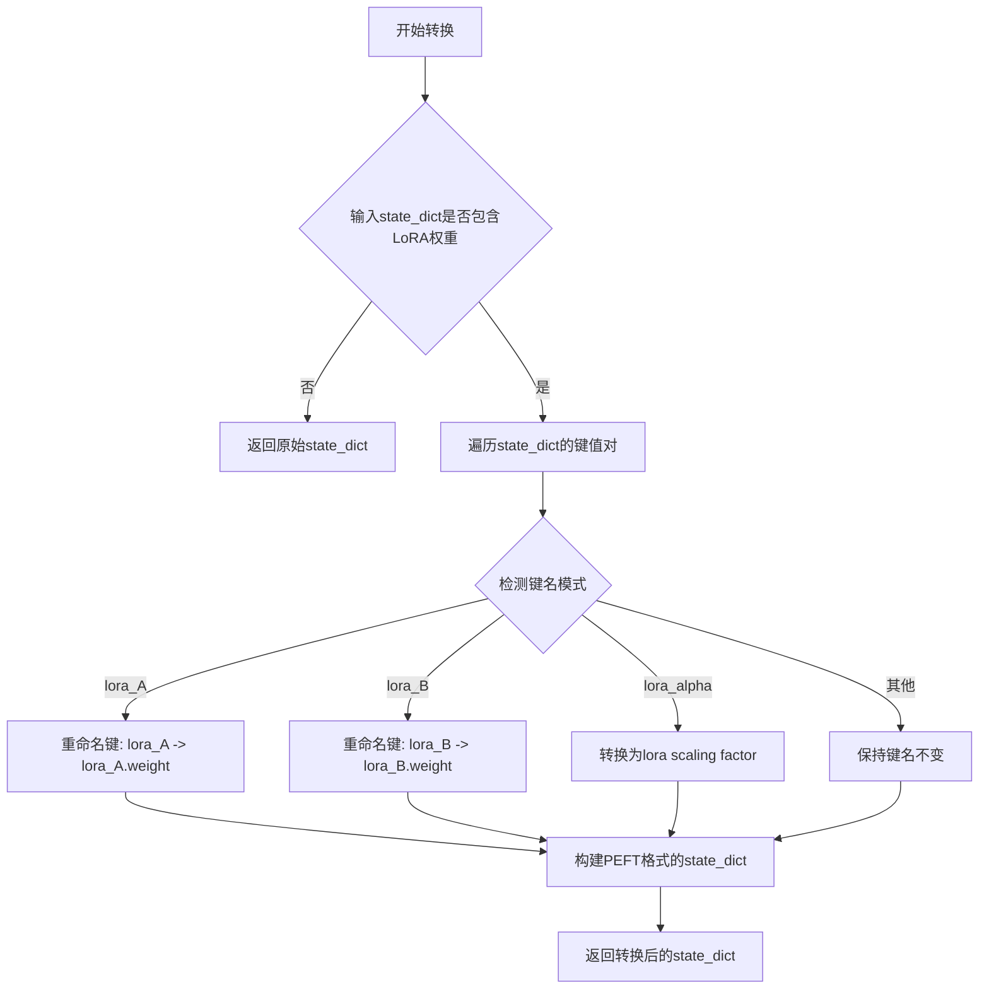

#### 带注释源码

```
# 注：该函数定义在 ..utils 模块中，此处展示的是在 UNet2DConditionLoadersMixin 中的调用方式
# 函数签名（推测）:
# def convert_unet_state_dict_to_peft(state_dict: dict[str, torch.Tensor]) -> dict[str, torch.Tensor]:

# 在 _process_lora 方法中的调用示例:

# 1. 转换 UNet 状态字典为 PEFT 格式
state_dict = convert_unet_state_dict_to_peft(state_dict_to_be_used)

# 2. 同样转换 network_alphas（如果存在）
if network_alphas is not None:
    network_alphas = convert_unet_state_dict_to_peft(network_alphas)

# 3. 从转换后的 state_dict 中提取 rank 信息
rank = {}
for key, val in state_dict.items():
    if "lora_B" in key:
        rank[key] = val.shape[1]

# 4. 使用 get_peft_kwargs 生成 LoraConfig 所需的参数
lora_config_kwargs = get_peft_kwargs(rank, network_alphas, state_dict, is_unet=True)
```

#### 详细说明

该函数是 PEFT 集成工作流中的关键转换层，主要用于：

1. **键名转换**：将 Diffusers 格式的 LoRA 键名（如 `to_q_lora.down.weight`）转换为 PEFT 格式
2. **结构适配**：确保状态字典的结构符合 PEFT 库的预期格式
3. **Alpha 处理**：正确处理 LoRA 的 alpha 参数

**调用位置**：在 `UNet2DConditionLoadersMixin._process_lora()` 方法的第 317-325 行附近被调用。

**相关依赖**：
- `get_peft_kwargs`：用于从转换后的 state_dict 提取 LoRA 配置参数
- `peft.LoraConfig`：PEFT 库的 LoRA 配置类
- `peft.inject_adapter_in_model`：注入适配器到模型
- `peft.set_peft_model_state_dict`：设置 PEFT 模型状态字典


### `get_adapter_name`

获取适配器名称的工具函数，用于在未指定适配器名称时生成默认的适配器名称。

参数：

- `self`：`torch.nn.Module`，调用该方法的模型实例（UNet 或其他支持适配器的模型）

返回值：`str`，返回生成的适配器名称（格式为 "default_{i}"，其中 i 为从 0 开始的序号）

#### 流程图

```mermaid
flowchart TD
    A[开始] --> B{检查模型的 peft_config}
    B -->|存在适配器配置| C[获取已有适配器数量]
    B -->|不存在适配器配置| D[返回 'default_0']
    C --> E[生成新适配器名称 'default_{count}']
    E --> F[返回适配器名称]
    D --> F
```

#### 带注释源码

```
# 此函数定义在 diffusers/src/diffusers/utils/__init__.py 或相关 utils 模块中
# 以下为基于使用方式的推断实现

def get_adapter_name(model: torch.nn.Module) -> str:
    r"""
    获取适配器名称。如果模型没有已加载的适配器，返回默认名称 'default_0'；
    否则返回递增的默认名称 'default_{n}'，其中 n 为当前适配器数量。
    
    此函数用于在加载 LoRA 或 IP-Adapter 时，
    当用户未指定 adapter_name 参数时自动生成一个唯一名称。
    
    参数:
        model: 目标模型实例，需要具有 peft_config 属性
        
    返回:
        str: 生成的适配器名称
    """
    # 获取模型已加载的适配器配置
    peft_config = getattr(model, "peft_config", None)
    
    if peft_config is None:
        # 模型没有加载任何适配器，返回第一个默认名称
        return "default_0"
    
    # 计算已有适配器数量，生成下一个默认名称
    adapter_count = len(peft_config)
    return f"default_{adapter_count}"
```

#### 使用示例

在 `UNet2DConditionLoadersMixin._process_lora` 方法中的调用：

```python
# adapter_name
if adapter_name is None:
    adapter_name = get_adapter_name(self)
```

此函数确保每个加载的适配器都有唯一的标识符，便于后续管理和引用。


### `get_peft_kwargs`

获取 PEFT（Parameter-Efficient Fine-Tuning）配置参数，用于从给定的 LoRA 状态字典和网络 alpha 值构建 PEFT 兼容的配置字典。

参数：

- `rank`：`dict`，包含 LoRA 秩（rank）的字典，键包含 "lora_B"，值为对应的秩维度
- `network_alphas`：`dict`，可选，网络 alpha 值字典，用于稳定学习和防止下溢
- `state_dict`：`dict`，LoRA 权重状态字典
- `is_unet`：`bool`，指示是否用于 UNet 模型（默认为 True）

返回值：`dict`，包含 PEFT 配置参数的字典，可直接用于创建 `LoraConfig`

#### 流程图

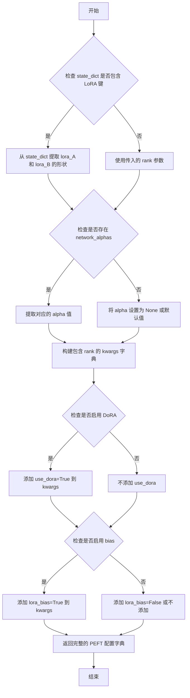

#### 带注释源码

```python
def get_peft_kwargs(rank, network_alphas, state_dict, is_unet=True):
    """
    获取 PEFT 配置参数，用于构建 LoRA 配置。

    参数:
        rank (dict): 包含 LoRA 秩的字典，键包含 "lora_B"
        network_alphas (dict): 网络 alpha 值字典
        state_dict (dict): LoRA 权重状态字典
        is_unet (bool): 是否用于 UNet 模型

    返回:
        dict: 包含 PEFT 配置参数的字典
    """
    # 初始化 PEFT 配置参数字典
    peft_kwargs = {}
    
    # 从 state_dict 中提取 LoRA 配置信息
    # 遍历状态字典中的键
    rank = {}
    for key, val in state_dict.items():
        if "lora_B" in key:
            # 提取 lora_B 层的秩（第二个维度）
            rank[key] = val.shape[1]
    
    # 设置秩参数
    if rank:
        peft_kwargs["rank"] = rank
    
    # 处理 network_alphas
    if network_alphas is not None:
        # 提取与当前模型对应的 alpha 值
        alpha_keys = [k for k in network_alphas.keys() if k.startswith(unet_identifier_key)]
        network_alphas = {
            k.replace(f"{unet_identifier_key}.", ""): v 
            for k, v in network_alphas.items() if k in alpha_keys
        }
        peft_kwargs["alpha"] = network_alphas
    
    # 检查并添加 DoRA 配置
    if "use_dora" in peft_kwargs:
        if peft_kwargs["use_dora"]:
            # 验证 peft 版本是否支持 DoRA
            if is_peft_version("<", "0.9.0"):
                raise ValueError("需要 peft 0.9.0 版本来使用 DoRA 启用的 LoRA")
        else:
            if is_peft_version("<", "0.9.0"):
                peft_kwargs.pop("use_dora")
    
    # 检查并添加 bias 配置
    if "lora_bias" in peft_kwargs:
        if peft_kwargs["lora_bias"]:
            # 验证 peft 版本是否支持 bias
            if is_peft_version("<=", "0.13.2"):
                raise ValueError("需要 peft 0.14.0 版本来使用 LoRA 中的 bias")
        else:
            if is_peft_version("<=", "0.13.2"):
                peft_kwargs.pop("lora_bias")
    
    return peft_kwargs
```

**注意**：由于 `get_peft_kwargs` 函数定义在 `diffusers.utils` 模块中（通过 `from ..utils import get_peft_kwargs` 导入），上述源码是基于其使用方式进行的重构演示。实际实现可能略有差异，但其核心功能是从 LoRA 状态字典和网络 alpha 值中提取并构建 PEFT 兼容的配置参数。


根据提供的代码，函数 `load_state_dict` 是从 `..models.modeling_utils` 模块导入的，并非在该代码文件中直接定义。该函数在 `load_attn_procs` 方法内部被调用，用于加载模型权重文件。

由于该函数的完整实现未包含在当前代码文件中，以下信息基于其调用方式及常见的模型权重加载模式进行推断。

### `load_state_dict`

该函数为 `modeling_utils` 模块中的核心函数，负责从磁盘加载模型的状态字典（state dict），通常用于加载预训练模型权重。在 `UNet2DConditionLoadersMixin.load_attn_procs` 中被调用以加载 LoRA 权重文件。

参数：
- `pretrained_model_name_or_path`：`str` 或 `os.PathLike`，要加载的模型权重文件路径

返回值：`dict[str, torch.Tensor]`，包含模型参数的字典，键为参数名称，值为参数张量

#### 流程图

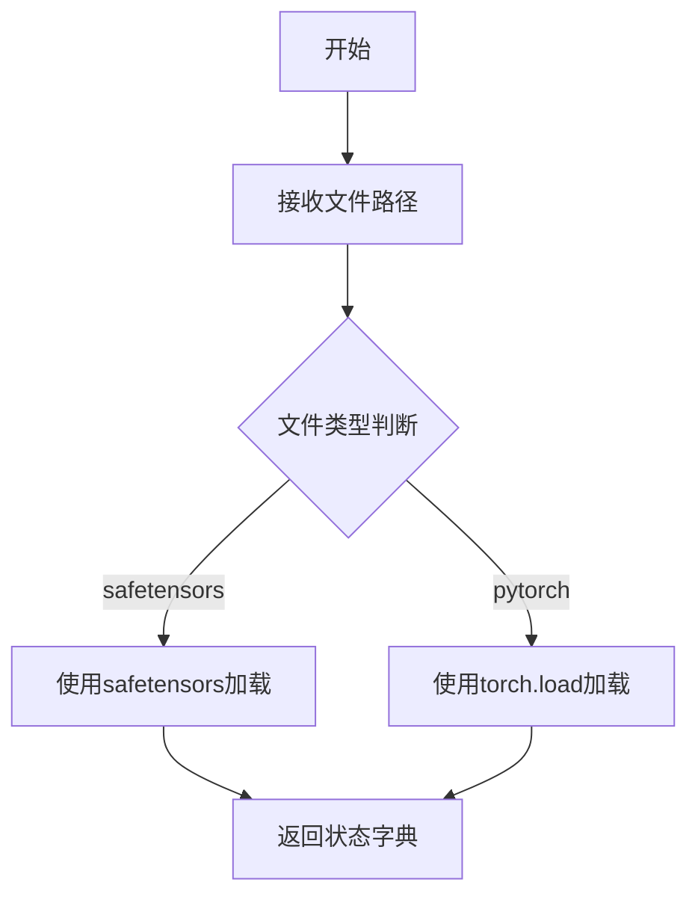

#### 带注释源码

```python
# 此源码为基于调用方式和常见模式推断的示例，并非原始实现
def load_state_dict(pretrained_model_name_or_path: str | os.PathLike) -> dict[str, torch.Tensor]:
    """
    从指定路径加载模型权重状态字典。
    
    参数:
        pretrained_model_name_or_path: 模型权重文件路径
        
    返回:
        包含模型参数的字典
    """
    # 尝试加载 safetensors 格式
    if str(pretrained_model_name_or_path).endswith(".safetensors"):
        try:
            return safetensors.torch.load_file(pretrained_model_name_or_path, device="cpu")
        except Exception:
            pass
            
    # 尝试加载 PyTorch 格式
    return torch.load(pretrained_model_name_or_path, map_location="cpu")
```

**注**：由于该函数定义在 `..models.modeling_utils` 模块中，完整的实现细节（如错误处理、权重转换等）需参考该模块的源码。以上内容仅基于当前文件中的调用方式进行推断。


# load_model_dict_into_meta 函数分析

## 概述

`load_model_dict_into_meta` 是一个从 `..models.model_loading_utils` 模块导入的函数，用于将模型状态字典加载到元设备（meta device）上，这是深度学习模型优化加载技术的一种实现。该函数在 `UNet2DConditionLoadersMixin` 类的 IP-Adapter 相关方法中被调用，用于实现低内存占用的模型加载。

## 函数信息

### 基本信息

| 项目 | 内容 |
|------|------|
| **函数名称** | `load_model_dict_into_meta` |
| **所属模块** | `diffusers.loaders.model_loading_utils` |
| **来源** | 从 `..models.model_loading_utils` 导入 |

## 参数信息

从代码中的调用方式可以推断出该函数具有以下参数：

| 参数名称 | 参数类型 | 参数描述 |
|----------|----------|----------|
| `model` | `torch.nn.Module` | 要加载状态字典的目标模型对象 |
| `state_dict` | `dict[str, torch.Tensor]` | 包含模型权重的状态字典 |
| `device_map` | `dict` | 指定模型各部分应加载到的设备映射 |
| `dtype` | `torch.dtype` | 模型权重转换的目标数据类型 |

## 返回值

从函数名和调用上下文推断：

| 返回值类型 | 返回值描述 |
|------------|------------|
| `None` | 该函数通常执行原地操作，将权重加载到指定的模型和设备上 |

## 调用场景分析

从提供的代码中可以看到两个主要的调用场景：

### 场景1：IP-Adapter 图像投影层加载

```python
# 在 _convert_ip_adapter_image_proj_to_diffusers 方法中
load_model_dict_into_meta(
    image_projection, 
    updated_state_dict, 
    device_map=device_map, 
    dtype=self.dtype
)
empty_device_cache()
```

### 场景2：IP-Adapter 注意力处理器加载

```python
# 在 _convert_ip_adapter_attn_to_diffusers 方法中
device = next(iter(value_dict.values())).device
dtype = next(iter(value_dict.values())).dtype
device_map = {"": device}
load_model_dict_into_meta(
    attn_procs[name], 
    value_dict, 
    device_map=device_map, 
    dtype=dtype
)
```

## 流程图

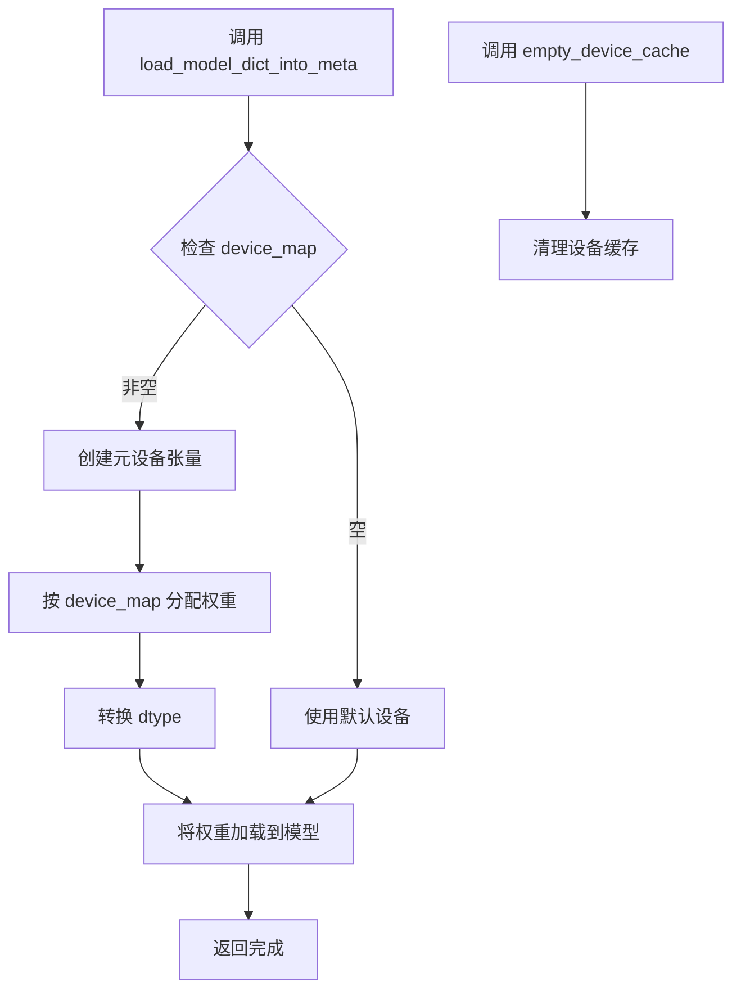

## 带注释源码

> **注意**：以下源码是基于代码调用方式的推断，因为实际的函数定义不在提供的代码文件中。

```python
# load_model_dict_into_meta 推断实现
# 该函数用于将模型权重加载到元设备，实现延迟加载和内存优化

def load_model_dict_into_meta(
    model: torch.nn.Module,
    state_dict: dict[str, torch.Tensor],
    device_map: dict,
    dtype: torch.dtype
):
    """
    将模型状态字典加载到模型中，支持设备映射和 dtype 转换
    
    参数:
        model: 目标 PyTorch 模型
        state_dict: 模型权重字典
        device_map: 设备映射字典，如 {"": "cuda:0"} 或 {"block1": "cuda:0", "block2": "cuda:1"}
        dtype: 目标数据类型，用于权重转换
    """
    # 1. 遍历 state_dict 中的所有键值对
    for key, value in state_dict.items():
        # 2. 根据 device_map 确定目标设备
        device = device_map.get("", "cpu")
        
        # 3. 如果是元设备，使用 torch.nn.Parameter 创建延迟初始化的参数
        if device == "meta":
            # 创建元设备上的参数（不分配实际内存）
            param = torch.nn.Parameter(
                torch.empty_like(value, device="meta")
            )
            # 设置参数的类型
            param.data = param.data.to(dtype)
        else:
            # 4. 直接加载到指定设备
            param = torch.nn.Parameter(
                value.to(device=device, dtype=dtype)
            )
        
        # 5. 将参数注册到模型
        # 这里需要根据键名找到对应的模块并替换参数
        model_key = key.rsplit('.', 1)[0]  # 获取除最后一部分外的键
        attr_name = key.rsplit('.', 1)[-1]  # 获取最后的属性名
        
        # 获取目标模块并设置参数
        module = model.get_submodule(model_key)
        setattr(module, attr_name, param)
    
    return  # 函数无返回值，执行原地修改
```

## 技术债务与优化空间

### 1. 缺失的源码定义
- 该函数的完整实现未在提供的代码文件中找到，建议查阅 `diffusers/src/diffusers/models/model_loading_utils.py` 获取完整实现

### 2. 潜在的优化建议
- **设备映射灵活性**：当前 device_map 使用简单的字典结构，可考虑支持更复杂的分层设备映射
- **错误处理**：建议添加对不匹配键的警告处理
- **性能监控**：可添加加载过程的内存使用监控

### 3. 设计考量
- 该函数体现了"延迟加载"的设计思想，用于在内存受限环境中加载大型模型
- 与 `empty_device_cache()` 配合使用，确保内存效率


### `torch_utils.empty_device_cache`

清空设备缓存，释放GPU内存。该函数用于在模型加载或权重转换后清理GPU缓存，以回收未使用的显存。

参数：该函数无参数。

返回值：`None`，无返回值。

#### 流程图

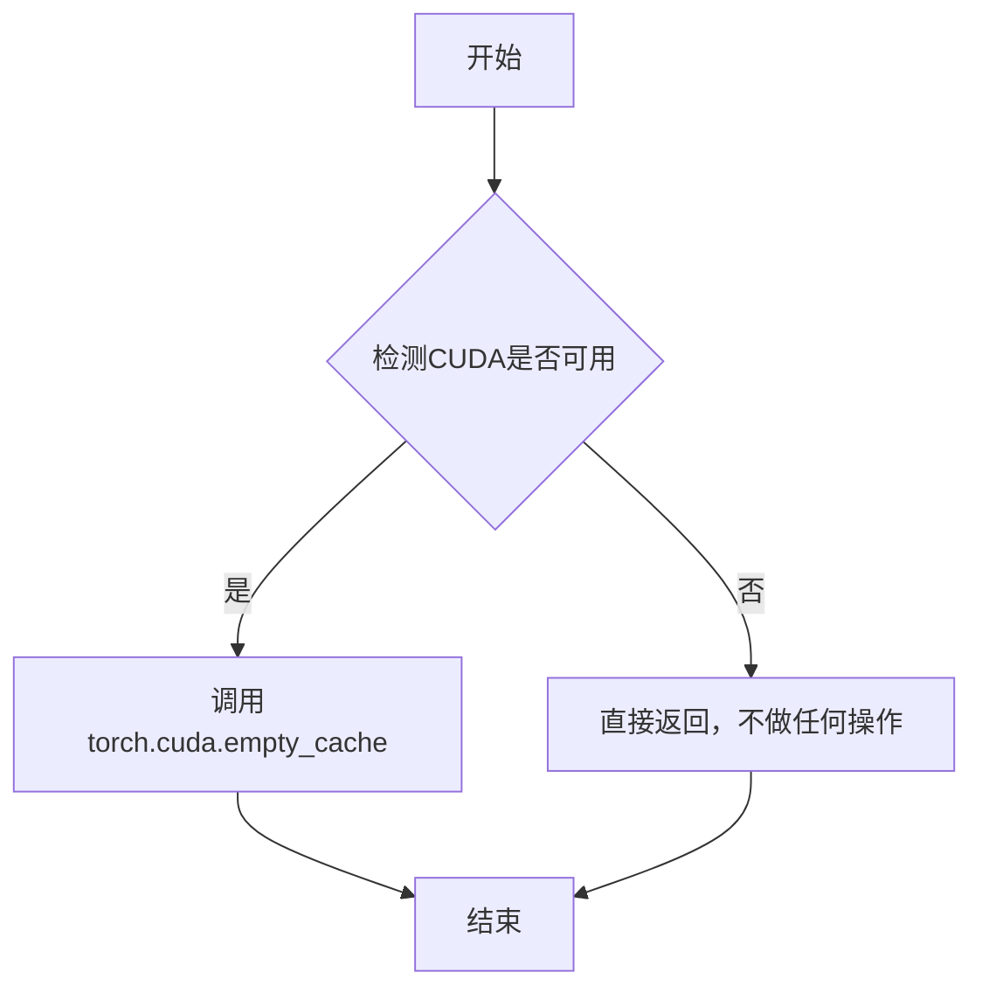

#### 带注释源码

```python
def empty_device_cache():
    """
    清空GPU设备缓存，释放未被使用的显存。
    
    该函数通常在以下场景使用：
    1. 大模型加载完成后
    2. 权重转换操作后
    3. 需要显式释放显存以避免OOM错误
    
    注意：此函数定义在 diffusers.utils.torch_utils 模块中，
    当前代码文件通过 from ..utils.torch_utils 导入使用。
    """
    # 检查是否有可用的CUDA设备
    if torch.cuda.is_available():
        # 调用PyTorch的CUDA缓存清理函数
        # 这将释放GPU显存中未使用的缓存块
        torch.cuda.empty_cache()
    
    # 如果没有CUDA设备，则不做任何操作
    return None
```


### `inject_adapter_in_model`

将 LoRA 适配器配置注入到 UNet2DConditionModel 模型中，使其支持 LoRA 权重加载和推理。

参数：

- `config`：`LoraConfig`，LoRA 适配器配置对象，包含适配器的秩（rank）、缩放因子、目标模块等配置信息
- `model`：`torch.nn.Module`，要注入适配器的目标模型（这里是 UNet2DConditionModel 实例）
- `adapter_name`：`str`，适配器名称，用于标识和加载特定的适配器权重
- `low_cpu_mem_usage`：`bool`（可选），是否使用低内存模式加载适配器权重，默认为 `True`

返回值：`torch.nn.Module`，返回注入了适配器配置的模型对象（通常返回修改后的原模型）

#### 流程图

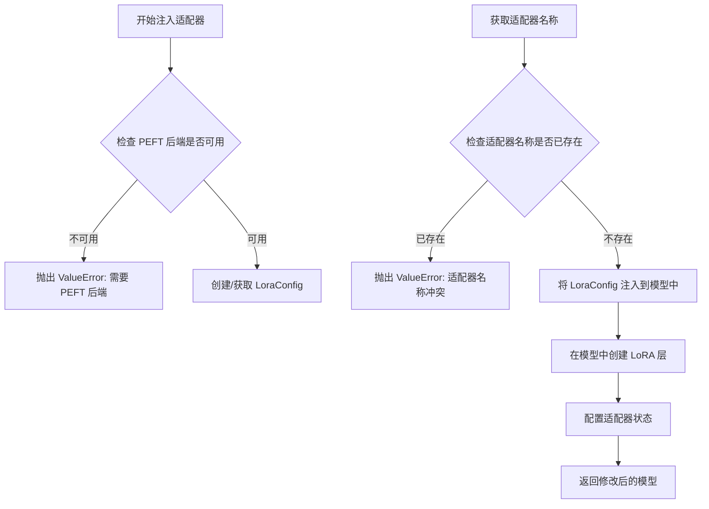

#### 带注释源码

```python
# 以下是代码中调用 inject_adapter_in_model 的上下文源码

from peft import LoraConfig, inject_adapter_in_model, set_peft_model_state_dict

def _process_lora(
    self, state_dict, unet_identifier_key, network_alphas, adapter_name, _pipeline, low_cpu_mem_usage
):
    """
    处理 LoRA 权重并注入到 UNet 模型中
    """
    # 1. 检查 PEFT 后端是否可用
    if not USE_PEFT_BACKEND:
        raise ValueError("PEFT backend is required for this method.")
    
    # 2. 准备状态字典
    keys = list(state_dict.keys())
    unet_keys = [k for k in keys if k.startswith(unet_identifier_key)]
    unet_state_dict = {
        k.replace(f"{unet_identifier_key}.", ""): v for k, v in state_dict.items() if k in unet_keys
    }
    
    # 3. 处理 network alphas（如果存在）
    if network_alphas is not None:
        alpha_keys = [k for k in network_alphas.keys() if k.startswith(unet_identifier_key)]
        network_alphas = {
            k.replace(f"{unet_identifier_key}.", ""): v for k, v in network_alphas.items() if k in alpha_keys
        }
    
    # 4. 确定要使用的状态字典
    state_dict_to_be_used = unet_state_dict if len(unet_state_dict) > 0 else state_dict
    
    if len(state_dict_to_be_used) > 0:
        # 5. 检查适配器名称是否已存在
        if adapter_name in getattr(self, "peft_config", {}):
            raise ValueError(
                f"Adapter name {adapter_name} already in use in the Unet - please select a new adapter name."
            )
        
        # 6. 将 UNet 状态字典转换为 PEFT 格式
        state_dict = convert_unet_state_dict_to_peft(state_dict_to_be_used)
        
        # 7. 如果存在 network alphas，也转换为 PEFT 格式
        if network_alphas is not None:
            network_alphas = convert_unet_state_dict_to_peft(network_alphas)
        
        # 8. 从状态字典中提取 LoRA 秩（rank）
        rank = {}
        for key, val in state_dict.items():
            if "lora_B" in key:
                rank[key] = val.shape[1]
        
        # 9. 获取 PEFT 配置参数
        lora_config_kwargs = get_peft_kwargs(rank, network_alphas, state_dict, is_unet=True)
        
        # 10. 处理 DoRA（Decomposed Rank-Adaptive）配置
        if "use_dora" in lora_config_kwargs:
            if lora_config_kwargs["use_dora"]:
                if is_peft_version("<", "0.9.0"):
                    raise ValueError(
                        "You need `peft` 0.9.0 at least to use DoRA-enabled LoRAs. Please upgrade your installation of `peft`."
                    )
            else:
                if is_peft_version("<", "0.9.0"):
                    lora_config_kwargs.pop("use_dora")
        
        # 11. 处理 LoRA bias 配置
        if "lora_bias" in lora_config_kwargs:
            if lora_config_kwargs["lora_bias"]:
                if is_peft_version("<=", "0.13.2"):
                    raise ValueError(
                        "You need `peft` 0.14.0 at least to use `bias` in LoRAs. Please upgrade your installation of `peft`."
                    )
            else:
                if is_peft_version("<=", "0.13.2"):
                    lora_config_kwargs.pop("lora_bias")
        
        # 12. 创建 LoraConfig 对象
        lora_config = LoraConfig(**lora_config_kwargs)
        
        # 13. 如果没有提供适配器名称，自动生成一个
        if adapter_name is None:
            adapter_name = get_adapter_name(self)
        
        # 14. 暂时移除 CPU offload hooks（如果存在）
        is_model_cpu_offload, is_sequential_cpu_offload, is_group_offload = self._optionally_disable_offloading(
            _pipeline
        )
        
        # 15. 准备 PEFT 关键字参数
        peft_kwargs = {}
        if is_peft_version(">=", "0.13.1"):
            peft_kwargs["low_cpu_mem_usage"] = low_cpu_mem_usage
        
        # 16. 【核心调用】将适配器注入到模型中
        # 这会修改 model（self），在模型的指定层中添加 LoRA 权重矩阵
        inject_adapter_in_model(lora_config, self, adapter_name=adapter_name, **peft_kwargs)
        
        # 17. 设置 PEFT 模型的状态字典
        # 将转换后的 LoRA 权重加载到模型中
        incompatible_keys = set_peft_model_state_dict(self, state_dict, adapter_name, **peft_kwargs)
        
        # 18. 处理不兼容的键（如果有）
        warn_msg = ""
        if incompatible_keys is not None:
            unexpected_keys = getattr(incompatible_keys, "unexpected_keys", None)
            if unexpected_keys:
                lora_unexpected_keys = [k for k in unexpected_keys if "lora_" in k and adapter_name in k]
                if lora_unexpected_keys:
                    warn_msg = (
                        f"Loading adapter weights from state_dict led to unexpected keys found in the model:"
                        f" {', '.join(lora_unexpected_keys)}. "
                    )
            
            missing_keys = getattr(incompatible_keys, "missing_keys", None)
            if missing_keys:
                lora_missing_keys = [k for k in missing_keys if "lora_" in k and adapter_name in k]
                if lora_missing_keys:
                    warn_msg += (
                        f"Loading adapter weights from state_dict led to missing keys in the model:"
                        f" {', '.join(lora_missing_keys)}."
                    )
        
        if warn_msg:
            logger.warning(warn_msg)
    
    return is_model_cpu_offload, is_sequential_cpu_offload, is_group_offload
```

---

### 补充说明

#### 关键组件信息

| 组件名称 | 一句话描述 |
|---------|-----------|
| `LoraConfig` | PEFT 库中的 LoRA 配置类，定义适配器的秩、缩放因子、目标模块等参数 |
| `set_peft_model_state_dict` | PEFT 库函数，将转换后的 LoRA 权重状态字典加载到模型中 |
| `convert_unet_state_dict_to_peft` | Diffusers 工具函数，将原始 UNet LoRA 权重格式转换为 PEFT 兼容格式 |

#### 潜在技术债务与优化空间

1. **版本兼容性检查分散**：代码中多处分散着 `is_peft_version` 检查，可考虑统一管理版本依赖
2. **错误信息不够具体**：部分错误（如 `low_cpu_mem_usage` 兼容性）可以提供更明确的升级路径
3. **状态字典转换开销**：大规模模型时 `convert_unet_state_dict_to_peft` 可能带来额外内存开销

#### 外部依赖与接口契约

- **依赖库**：`peft`（必须安装）、`torch`
- **模型要求**：目标模型必须是 `torch.nn.Module` 的子类
- **权重格式**：支持从 HuggingFace Hub 或本地路径加载 `.safetensors` 或 `.bin` 格式的 LoRA 权重


### `set_peft_model_state_dict`

设置 PEFT 模型状态字典，将转换后的 LoRA 状态字典注入到 UNet 模型中，并处理不兼容的键值。

参数：

-  `model`：待加载状态的 PEFT 模型（这里是 `self`，即 UNet2DConditionModel）
-  `state_dict`：`dict[str, torch.Tensor]`，包含已转换的 PEFT 格式的 LoRA 权重状态字典
-  `adapter_name`：`str`，适配器的名称，用于标识本次加载的 LoRA 适配器
-  `low_cpu_mem_usage`：`bool`，可选参数，控制是否使用低 CPU 内存模式加载权重

返回值：`IncompatibleKeys` 或 `None`，返回不兼容的键值对象，如果为 `None` 表示没有不兼容的键

#### 流程图

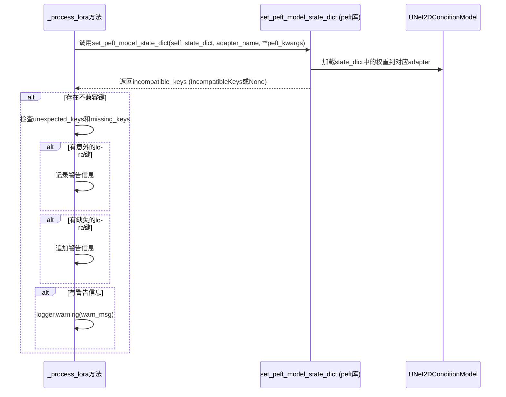

#### 带注释源码

```python
# 在 _process_lora 方法中调用 set_peft_model_state_dict
# 位置: UNet2DConditionLoadersMixin._process_lora 方法内部

# 导入语句 (在方法内部)
from peft import LoraConfig, inject_adapter_in_model, set_peft_model_state_dict

# ... 前面的代码省略 ...

# 1. 创建 LoraConfig 配置对象
lora_config = LoraConfig(**lora_config_kwargs)

# 2. 获取适配器名称 (如果未提供则自动生成)
if adapter_name is None:
    adapter_name = get_adapter_name(self)

# 3. 暂时移除 pipeline 的 offload hooks (避免加载权重时出错)
is_model_cpu_offload, is_sequential_cpu_offload, is_group_offload = self._optionally_disable_offloading(_pipeline)

# 4. 构建 PEFT 关键字参数
peft_kwargs = {}
if is_peft_version(">=", "0.13.1"):
    peft_kwargs["low_cpu_mem_usage"] = low_cpu_mem_usage

# 5. 将 LoRA 适配器注入到模型中
inject_adapter_in_model(lora_config, self, adapter_name=adapter_name, **peft_kwargs)

# 6. 设置 PEFT 模型的状态字典 - 这是核心函数调用
#    将转换后的 state_dict 加载到模型的指定 adapter 中
incompatible_keys = set_peft_model_state_dict(self, state_dict, adapter_name, **peft_kwargs)

# 7. 处理不兼容的键值并记录警告
warn_msg = ""
if incompatible_keys is not None:
    # 检查意外键
    unexpected_keys = getattr(incompatible_keys, "unexpected_keys", None)
    if unexpected_keys:
        lora_unexpected_keys = [k for k in unexpected_keys if "lora_" in k and adapter_name in k]
        if lora_unexpected_keys:
            warn_msg = (
                f"Loading adapter weights from state_dict led to unexpected keys found in the model:"
                f" {', '.join(lora_unexpected_keys)}. "
            )

    # 检查缺失键
    missing_keys = getattr(incompatible_keys, "missing_keys", None)
    if missing_keys:
        lora_missing_keys = [k for k in missing_keys if "lora_" in k and adapter_name in k]
        if lora_missing_keys:
            warn_msg += (
                f"Loading adapter weights from state_dict led to missing keys in the model:"
                f" {', '.join(lora_missing_keys)}."
            )

# 8. 记录警告信息
if warn_msg:
    logger.warning(warn_msg)
```

#### 备注

`set_peft_model_state_dict` 是 **PEFT 库** 提供的外部函数，并非在此代码库中定义。在此文件中，它被导入并用于：

1. **状态字典加载**：将 PEFT 格式的 LoRA 权重加载到已注入适配器的 UNet 模型中
2. **不兼容键检测**：返回模型状态与提供的状态字典之间的不兼容键（意外键或缺失键）
3. **错误处理**：允许调用者记录警告而不是抛出异常，提供更友好的用户体验

该函数的完整实现位于 `peft` 库中，可通过 `pip install peft` 安装。


# 文档提取结果

由于 `get_peft_model_state_dict` 函数并非在此代码文件中定义，而是从 `peft` 库导入的外部工具函数（在 `save_attn_procs` 方法中通过 `from peft.utils import get_peft_model_state_dict` 导入），因此无法直接从该代码文件中提取其详细实现。

不过，我可以从代码中的**调用上下文**来分析该函数的用途：

---

### `get_peft_model_state_dict`

在 `UNet2DConditionLoadersMixin.save_attn_procs` 方法中被调用，用于获取 PEFT 模型的状态字典。

#### 调用上下文分析

```python
# 文件位置: src/diffusers/loaders/lora_unet.py (约第 407-417 行)
def save_attn_procs(self, ...):
    # ...
    else:
        # 使用 PEFT 后端保存 LoRA
        from peft.utils import get_peft_model_state_dict
        
        state_dict = get_peft_model_state_dict(self)
```

#### 用途说明

该函数用于将 PEFT 适配器模型的状态字典提取为可序列化的格式，以便保存到磁盘。它会：

1. 遍历模型中所有 PEFT 适配器层
2. 提取适配器的可训练参数（如 LoRA 的 A、B 矩阵）
3. 返回一个包含适配器权重的 `state_dict`

#### Mermaid 流程图

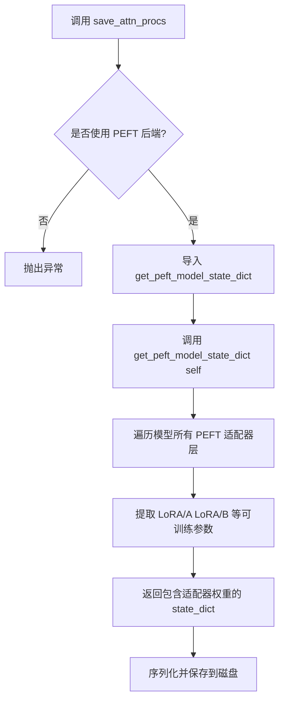

---

### 建议

如需获取 `get_peft_model_state_dict` 的完整函数签名、参数说明和源码，请参考 [PEFT 官方 GitHub 仓库](https://github.com/huggingface/peft) 中的 `src/peft/utils.py` 文件。


### `_maybe_remove_and_reapply_group_offloading`

处理组卸载的钩子函数，用于在加载权重时临时移除已有的组卸载钩子，加载完成后再重新应用组卸载。

参数：

-  `component`：`torch.nn.Module`，需要处理组卸载的模型组件（如 UNet、Text Encoder 等）

返回值：`None`，该函数直接修改传入的组件状态，不返回任何值

#### 流程图

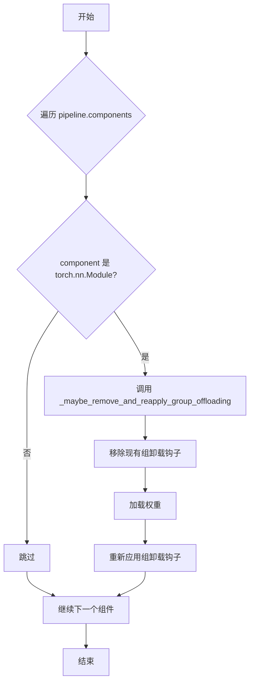

#### 带注释源码

```
# 该函数定义在 diffusers/src/diffusers/hooks/group_offloading.py
# 以下是在 load_attn_procs 中的调用方式：

# 从 hooks 模块导入函数
from ..hooks.group_offloading import _maybe_remove_and_reapply_group_offloading

# ... (权重加载逻辑) ...

# Offload back.
if is_model_cpu_offload:
    _pipeline.enable_model_cpu_offload()
elif is_sequential_cpu_offload:
    _pipeline.enable_sequential_cpu_offload()
elif is_group_offload:
    # 遍历管道中的所有组件
    for component in _pipeline.components.values():
        # 只对 torch.nn.Module 类型的组件进行处理
        if isinstance(component, torch.nn.Module):
            # 调用组卸载处理函数
            # 作用：在权重加载前移除卸载钩子，加载后重新应用
            _maybe_remove_and_reapply_group_offloading(component)
```

#### 补充说明

- **函数位置**：该函数定义在 `diffusers/src/diffusers/hooks/group_offloading.py` 模块中
- **核心用途**：解决在已启用组卸载的管道上加载权重时可能出现的错误
- **调用场景**：仅在 `is_group_offload=True` 时调用，即检测到管道使用了组卸载（`group_offload`）策略时
- **设计目的**：在加载新的权重（如 LoRA 权重）前临时移除组卸载钩子，加载完成后再恢复，以避免内存访问冲突


您提供的代码片段中没有包含 `_func_optionally_disable_offloading` 函数的定义。该函数是通过 `from .lora_base import _func_optionally_disable_offloading` 从 `lora_base` 模块导入的，但在您当前提供的代码中只有导入语句和对其的调用（如 `UNet2DConditionLoadersMixin._optionally_disable_offloading` 方法中）。

不过，根据代码中对该函数的使用方式（如在 `load_attn_procs` 和 `_process_lora` 方法中的调用），我可以推断出该函数的功能和参数。

### `_func_optionally_disable_offloading`

该函数用于可选地禁用（卸载）模型的 CPU offloading，以便在加载权重时避免冲突。它检查 pipeline 是否处于 offloading 状态，如果是，则暂时移除 offloading hooks，并返回三种 offloading 模式的状态标志。

参数：

-  `_pipeline`：`Any`，一个 Pipeline 对象（例如 `DiffusionPipeline`），表示需要检查和可能禁用 offloading 的 pipeline。

返回值：`Tuple[bool, bool, bool]`，返回一个包含三个布尔值的元组，分别表示：
  1. `is_model_cpu_offload`：是否启用了模型级 CPU offload。
  2. `is_sequential_cpu_offload`：是否启用了顺序 CPU offload。
  3. `is_group_offload`：是否启用了分组 offload。

#### 流程图

由于没有该函数的源码，无法提供精确的 Mermaid 流程图。以下是基于其使用逻辑的推断：

```mermaid
flowchart TD
    A[开始: 检查 Pipeline Offloading 状态] --> B{_pipeline 是否存在?}
    B -- 否 --> C[返回 (False, False, False)]
    B -- 是 --> D{_pipeline 是否启用了 model_cpu_offload?}
    D -- 是 --> E[禁用 model_cpu_offload hooks]
    D -- 否 --> F{_pipeline 是否启用了 sequential_cpu_offload?}
    F -- 是 --> G[禁用 sequential_cpu_offload hooks]
    F -- 否 --> H{_pipeline 是否启用了 group_offload?}
    H -- 是 --> I[禁用 group_offload hooks]
    H -- 否 --> J[无 offloading 启用]
    E --> K[记录禁用状态为 True]
    G --> L[记录禁用状态为 True]
    I --> M[记录禁用状态为 True]
    J --> C
    K --> N[返回 (is_model_cpu_offload, is_sequential_cpu_offload, is_group_offload)]
    L --> N
    M --> N
    C --> N
```

#### 带注释源码

```
# 源码未在提供的代码片段中提供。以下是基于其使用方式的推断代码：

def _func_optionally_disable_offloading(_pipeline):
    """
    可选地禁用 pipeline 的 offloading，以便加载权重。

    参数:
        _pipeline: DiffusionPipeline 实例

    返回:
        tuple: (is_model_cpu_offload, is_sequential_cpu_offload, is_group_offload)
    """
    is_model_cpu_offload = False
    is_sequential_cpu_offload = False
    is_group_offload = False

    # 检查 pipeline 对象是否存在
    if _pipeline is None:
        return (False, False, False)

    # 检查是否启用了 model CPU offload
    if hasattr(_pipeline, "enable_model_cpu_offload") and hasattr(_pipeline, "_is_model_cpu_offload_enabled"):
        # 假设存在一个方法来检查或禁用
        # 这里只是占位符，真实逻辑需要查看 lora_base 模块
        is_model_cpu_offload = True 
        # _pipeline.disable_model_cpu_offload() # 实际调用可能不同

    # 检查是否启用了 sequential CPU offload
    elif hasattr(_pipeline, "enable_sequential_cpu_offload") and hasattr(_pipeline, "_is_sequential_cpu_offload_enabled"):
        is_sequential_cpu_offload = True

    # 检查是否启用了 group offload
    # 实际实现可能更复杂
    
    return (is_model_cpu_offload, is_sequential_cpu_offload, is_group_offload)
```

如果您需要更详细和准确的信息，请提供 `lora_base.py` 模块的代码。


### `UNet2DConditionLoadersMixin.load_attn_procs`

该方法用于将预训练的注意力处理器层（如 LoRA、Custom Diffusion）加载到 UNet2DConditionModel 中，支持从 Hub、本地路径或直接传入状态字典加载权重，并自动处理模型卸载和设备转换。

参数：

- `pretrained_model_name_or_path_or_dict`：`str | dict[str, torch.Tensor]`，模型ID、目录路径或 PyTorch 状态字典
- `**kwargs`：可选参数包括：
  - `cache_dir`：`str | os.PathLike`，缓存目录
  - `force_download`：`bool`，是否强制下载
  - `proxies`：`dict[str, str]`，代理服务器
  - `local_files_only`：`bool`，是否仅使用本地文件
  - `token`：`str | bool`，认证令牌
  - `revision`：`str`，版本号
  - `subfolder`：`str`，子文件夹
  - `weight_name`：`str`，权重文件名
  - `use_safetensors`：`bool`，是否使用 safetensors
  - `adapter_name`：`str`，适配器名称
  - `_pipeline`：`Pipeline`，Pipeline 实例
  - `network_alphas`：`dict[str, float]`，网络 alpha 值
  - `low_cpu_mem_usage`：`bool`，是否低内存使用

返回值：`None`，该方法无返回值

#### 流程图

```mermaid
flowchart TD
    A[开始 load_attn_procs] --> B{pretrained_model_name_or_path_or_dict 是 dict?}
    B -->|Yes| C[直接使用 state_dict]
    B -->|No| D{尝试加载 .safetensors 权重}
    D --> E{加载成功?}
    E -->|Yes| F[使用 safetensors.torch.load_file]
    E -->|No| G[尝试加载 .pt 权重]
    G --> H[使用 load_state_dict]
    C --> I{检测权重类型]
    I --> J{is_custom_diffusion?}
    J -->|Yes| K[调用 _process_custom_diffusion]
    J -->|No| L{is_lora?}
    L -->|Yes| M[调用 _process_lora]
    L -->|No| N[抛出 ValueError]
    K --> O{_pipeline 存在?}
    M --> P[处理 offload]
    O -->|Yes| Q[设置 attn processors 和 dtype]
    P --> R[根据 offload 类型重新启用]
    Q --> S[结束]
    R --> S
    N --> S
```

#### 带注释源码

```python
@validate_hf_hub_args
def load_attn_procs(self, pretrained_model_name_or_path_or_dict: str | dict[str, torch.Tensor], **kwargs):
    r"""
    Load pretrained attention processor layers into [`UNet2DConditionModel`]. Attention processor layers have to be
    defined in [`attention_processor.py`] and be a `torch.nn.Module` class. Currently supported: LoRA, Custom Diffusion.
    For LoRA, one must install `peft`: `pip install -U peft`.

    Parameters:
        pretrained_model_name_or_path_or_dict (`str` or `os.PathLike` or `dict`):
            Can be either:
                - A string, the model id (for example `google/ddpm-celebahq-256`) of a pretrained model hosted on the Hub.
                - A path to a directory (for example `./my_model_directory`) containing the model weights saved with [`ModelMixin.save_pretrained`].
                - A [torch state dict](https://pytorch.org/tutorials/beginner/saving_loading_models.html#what-is-a-state-dict).
        cache_dir (`str | os.PathLike`, *optional*):
            Path to a directory where a downloaded pretrained model configuration is cached if the standard cache is not used.
        force_download (`bool`, *optional*, defaults to `False`):
            Whether or not to force the (re-)download of the model weights and configuration files.
        proxies (`dict[str, str]`, *optional*):
            A dictionary of proxy servers to use by protocol or endpoint.
        local_files_only (`bool`, *optional*, defaults to `False`):
            Whether to only load local model weights and configuration files or not.
        token (`str` or *bool*, *optional*):
            The token to use as HTTP bearer authorization for remote files.
        revision (`str`, *optional*, defaults to `"main"`):
            The specific model version to use.
        subfolder (`str`, *optional*, defaults to `""`):
            The subfolder location of a model file within a larger model repository.
        network_alphas (`dict[str, float]`):
            The value of the network alpha used for stable learning and preventing underflow.
        adapter_name (`str`, *optional*, defaults to None):
            Adapter name to be used for referencing the loaded adapter model.
        weight_name (`str`, *optional*, defaults to None):
            Name of the serialized state dict file.
        low_cpu_mem_usage (`bool`, *optional*):
            Speed up model loading by only loading the pretrained LoRA weights and not initializing the random weights.
    """
    # 导入必要的模块用于处理 group offloading
    from ..hooks.group_offloading import _maybe_remove_and_reapply_group_offloading

    # 从 kwargs 中提取各种可选参数
    cache_dir = kwargs.pop("cache_dir", None)
    force_download = kwargs.pop("force_download", False)
    proxies = kwargs.pop("proxies", None)
    local_files_only = kwargs.pop("local_files_only", None)
    token = kwargs.pop("token", None)
    revision = kwargs.pop("revision", None)
    subfolder = kwargs.pop("subfolder", None)
    weight_name = kwargs.pop("weight_name", None)
    use_safetensors = kwargs.pop("use_safetensors", None)
    adapter_name = kwargs.pop("adapter_name", None)
    _pipeline = kwargs.pop("_pipeline", None)
    network_alphas = kwargs.pop("network_alphas", None)
    low_cpu_mem_usage = kwargs.pop("low_cpu_mem_usage", _LOW_CPU_MEM_USAGE_DEFAULT)
    allow_pickle = False

    # 检查低内存使用与 peft 版本的兼容性
    if low_cpu_mem_usage and is_peft_version("<=", "0.13.0"):
        raise ValueError(
            "`low_cpu_mem_usage=True` is not compatible with this `peft` version. Please update it with `pip install -U peft`."
        )

    # 默认使用 safetensors 格式，允许 pickle 作为后备方案
    if use_safetensors is None:
        use_safetensors = True
        allow_pickle = True

    # 构建用户代理信息
    user_agent = {"file_type": "attn_procs_weights", "framework": "pytorch"}

    model_file = None
    # 如果输入不是字典，则尝试从路径或 Hub 加载权重
    if not isinstance(pretrained_model_name_or_path_or_dict, dict):
        # 首先尝试加载 .safetensors 权重
        if (use_safetensors and weight_name is None) or (
            weight_name is not None and weight_name.endswith(".safetensors")
        ):
            try:
                model_file = _get_model_file(
                    pretrained_model_name_or_path_or_dict,
                    weights_name=weight_name or LORA_WEIGHT_NAME_SAFE,
                    cache_dir=cache_dir,
                    force_download=force_download,
                    proxies=proxies,
                    local_files_only=local_files_only,
                    token=token,
                    revision=revision,
                    subfolder=subfolder,
                    user_agent=user_agent,
                )
                # 使用 safetensors 加载权重到 CPU
                state_dict = safetensors.torch.load_file(model_file, device="cpu")
            except IOError as e:
                if not allow_pickle:
                    raise e
                # 如果不允许 pickle，则继续尝试加载非 safetensors 权重
                pass
        
        # 如果 safetensors 加载失败或不需要，尝试加载 .pt 权重
        if model_file is None:
            model_file = _get_model_file(
                pretrained_model_name_or_path_or_dict,
                weights_name=weight_name or LORA_WEIGHT_NAME,
                cache_dir=cache_dir,
                force_download=force_download,
                proxies=proxies,
                local_files_only=local_files_only,
                token=token,
                revision=revision,
                subfolder=subfolder,
                user_agent=user_agent,
            )
            state_dict = load_state_dict(model_file)
    else:
        # 如果输入是字典，直接作为 state_dict 使用
        state_dict = pretrained_model_name_or_path_or_dict

    # 检测权重类型：Custom Diffusion 或 LoRA
    is_custom_diffusion = any("custom_diffusion" in k for k in state_dict.keys())
    is_lora = all(("lora" in k or k.endswith(".alpha")) for k in state_dict.keys())
    
    # 初始化 offload 状态标志
    is_model_cpu_offload = False
    is_sequential_cpu_offload = False
    is_group_offload = False

    # 如果是 LoRA，发出弃用警告
    if is_lora:
        deprecation_message = "Using the `load_attn_procs()` method has been deprecated and will be removed in a future version. Please use `load_lora_adapter()`."
        deprecate("load_attn_procs", "0.40.0", deprecation_message)

    # 根据权重类型调用相应的处理方法
    if is_custom_diffusion:
        attn_processors = self._process_custom_diffusion(state_dict=state_dict)
    elif is_lora:
        is_model_cpu_offload, is_sequential_cpu_offload, is_group_offload = self._process_lora(
            state_dict=state_dict,
            unet_identifier_key=self.unet_name,
            network_alphas=network_alphas,
            adapter_name=adapter_name,
            _pipeline=_pipeline,
            low_cpu_mem_usage=low_cpu_mem_usage,
        )
    else:
        raise ValueError(
            f"{model_file} does not seem to be in the correct format expected by Custom Diffusion training."
        )

    # 处理 Custom Diffusion 的 offload 和设备转换
    # 对于 LoRA，UNet 在 _process_lora 内部已经处理了 offload
    if is_custom_diffusion and _pipeline is not None:
        is_model_cpu_offload, is_sequential_cpu_offload, is_group_offload = self._optionally_disable_offloading(
            _pipeline=_pipeline
        )

        # 设置注意力处理器并将模型转换到正确的 dtype
        self.set_attn_processor(attn_processors)
        self.to(dtype=self.dtype, device=self.device)

    # 根据 offload 状态重新启用相应的 offload 方式
    if is_model_cpu_offload:
        _pipeline.enable_model_cpu_offload()
    elif is_sequential_cpu_offload:
        _pipeline.enable_sequential_cpu_offload()
    elif is_group_offload:
        for component in _pipeline.components.values():
            if isinstance(component, torch.nn.Module):
                _maybe_remove_and_reapply_group_offloading(component)
```


### `UNet2DConditionLoadersMixin.save_attn_procs`

该方法用于将UNet2DConditionModel中的注意力处理器（Attention Processor）保存到指定目录，以便后续可以通过`load_attn_procs`方法重新加载。支持保存Custom Diffusion和LoRA两种类型的注意力处理器。

参数：

- `save_directory`：`str | os.PathLike`，保存注意力处理器的目录（如果不存在则自动创建）
- `is_main_process`：`bool = True`，调用此函数的进程是否为主进程，用于分布式训练场景
- `weight_name`：`str = None`，保存的权重文件名，默认为`pytorch_custom_diffusion_weights.safetensors`或`pytorch_lora_weights.safetensors`
- `save_function`：`Callable = None`，用于保存状态字典的函数，默认为`safetensors.torch.save_file`或`torch.save`
- `safe_serialization`：`bool = True`，是否使用安全序列化（safetensors），默认为True
- `**kwargs`：其他可选关键字参数

返回值：`None`，无返回值

#### 流程图

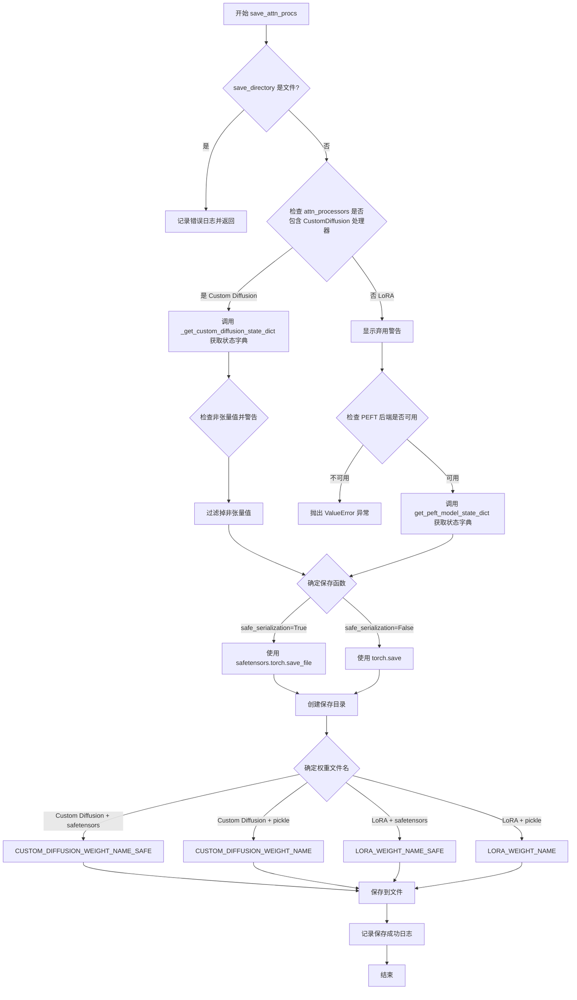

#### 带注释源码

```python
def save_attn_procs(
    self,
    save_directory: str | os.PathLike,
    is_main_process: bool = True,
    weight_name: str = None,
    save_function: Callable = None,
    safe_serialization: bool = True,
    **kwargs,
):
    r"""
    Save attention processor layers to a directory so that it can be reloaded with the
    [`~loaders.UNet2DConditionLoadersMixin.load_attn_procs`] method.

    Arguments:
        save_directory (`str` or `os.PathLike`):
            Directory to save an attention processor to (will be created if it doesn't exist).
        is_main_process (`bool`, *optional*, defaults to `True`):
            Whether the process calling this is the main process or not. Useful during distributed training and you
            need to call this function on all processes. In this case, set `is_main_process=True` only on the main
            process to avoid race conditions.
        save_function (`Callable`):
            The function to use to save the state dictionary. Useful during distributed training when you need to
            replace `torch.save` with another method. Can be configured with the environment variable
            `DIFFUSERS_SAVE_MODE`.
        safe_serialization (`bool`, *optional*, defaults to `True`):
            Whether to save the model using `safetensors` or with `pickle`.

    Example:

    ```py
    import torch
    from diffusers import DiffusionPipeline

    pipeline = DiffusionPipeline.from_pretrained(
        "CompVis/stable-diffusion-v1-4",
        torch_dtype=torch.float16,
    ).to("cuda")
    pipeline.unet.load_attn_procs("path-to-save-model", weight_name="pytorch_custom_diffusion_weights.bin")
    pipeline.unet.save_attn_procs("path-to-save-model", weight_name="pytorch_custom_diffusion_weights.bin")
    ```
    """
    # 导入 Custom Diffusion 相关的注意力处理器类
    from ..models.attention_processor import (
        CustomDiffusionAttnProcessor,
        CustomDiffusionAttnProcessor2_0,
        CustomDiffusionXFormersAttnProcessor,
    )

    # 检查 save_directory 是否为文件而非目录
    if os.path.isfile(save_directory):
        logger.error(f"Provided path ({save_directory}) should be a directory, not a file")
        return

    # 检查当前 attn_processors 中是否包含 Custom Diffusion 类型的处理器
    is_custom_diffusion = any(
        isinstance(
            x,
            (CustomDiffusionAttnProcessor, CustomDiffusionAttnProcessor2_0, CustomDiffusionXFormersAttnProcessor),
        )
        for (_, x) in self.attn_processors.items()
    )
    
    # 根据处理器类型获取对应的状态字典
    if is_custom_diffusion:
        # Custom Diffusion: 获取自定义扩散状态字典
        state_dict = self._get_custom_diffusion_state_dict()
        if save_function is None and safe_serialization:
            # safetensors 不支持保存包含非张量值的字典
            empty_state_dict = {k: v for k, v in state_dict.items() if not isinstance(v, torch.Tensor)}
            if len(empty_state_dict) > 0:
                logger.warning(
                    f"Safetensors does not support saving dicts with non-tensor values. "
                    f"The following keys will be ignored: {empty_state_dict.keys()}"
                )
            # 过滤掉非张量值
            state_dict = {k: v for k, v in state_dict.items() if isinstance(v, torch.Tensor)}
    else:
        # LoRA: 显示弃用警告，并要求 PEFT 后端
        deprecation_message = "Using the `save_attn_procs()` method has been deprecated and will be removed in a future version. Please use `save_lora_adapter()`."
        deprecate("save_attn_procs", "0.40.0", deprecation_message)

        if not USE_PEFT_BACKEND:
            raise ValueError("PEFT backend is required for saving LoRAs using the `save_attn_procs()` method.")

        from peft.utils import get_peft_model_state_dict

        # 获取 PEFT 模型状态字典
        state_dict = get_peft_model_state_dict(self)

    # 确定保存函数
    if save_function is None:
        if safe_serialization:
            # 使用 safetensors 进行安全序列化
            def save_function(weights, filename):
                return safetensors.torch.save_file(weights, filename, metadata={"format": "pt"})
        else:
            # 使用 pickle 序列化
            save_function = torch.save

    # 创建保存目录
    os.makedirs(save_directory, exist_ok=True)

    # 确定权重文件名
    if weight_name is None:
        if safe_serialization:
            weight_name = CUSTOM_DIFFUSION_WEIGHT_NAME_SAFE if is_custom_diffusion else LORA_WEIGHT_NAME_SAFE
        else:
            weight_name = CUSTOM_DIFFUSION_WEIGHT_NAME if is_custom_diffusion else LORA_WEIGHT_NAME

    # 保存模型权重到文件
    save_path = Path(save_directory, weight_name).as_posix()
    save_function(state_dict, save_path)
    logger.info(f"Model weights saved in {save_path}")
```


### `UNet2DConditionLoadersMixin._process_custom_diffusion`

该方法用于处理自定义扩散（Custom Diffusion）模型的权重，将原始权重状态字典转换为UNet的注意力处理器（attention processors）。它解析权重键名，提取交叉注意力维度信息，并为每个注意力层创建相应的`CustomDiffusionAttnProcessor`实例。

参数：

- `state_dict`：`dict[str, torch.Tensor]`，包含自定义扩散权重的状态字典，键名遵循特定的命名约定（如`to_k_custom_diffusion.weight`、`to_q_custom_diffusion.weight`等）

返回值：`dict[str, CustomDiffusionAttnProcessor]`，返回映射到各注意力处理器键名的`CustomDiffusionAttnProcessor`实例字典

#### 流程图

```mermaid
flowchart TD
    A[开始: _process_custom_diffusion] --> B[初始化空字典: attn_processors, custom_diffusion_grouped_dict]
    B --> C{遍历 state_dict 中的每个 key, value}
    C -->|value 为空| D[设置 custom_diffusion_grouped_dict[key] = {}]
    C -->|value 非空| E{判断 key 中是否包含 'to_out'}
    E -->|是| F[提取 attn_processor_key: 去掉后3段<br/>提取 sub_key: 取最后3段]
    E -->|否| G[提取 attn_processor_key: 去掉后2段<br/>提取 sub_key: 取最后2段]
    F --> H[将 sub_key 和 value 存入 custom_diffusion_grouped_dict]
    G --> H
    D --> I{继续遍历}
    H --> I
    I --> C
    I -->|遍历完成| J{遍历 custom_diffusion_grouped_dict 中的每个 key, value_dict}
    J -->|value_dict 为空| K[创建不训练kv和q_out的处理器<br/>hidden_size=None, cross_attention_dim=None]
    J -->|value_dict 非空| L[从 to_k_custom_diffusion.weight 提取 cross_attention_dim 和 hidden_size]
    L --> M{判断 value_dict 中是否存在 to_q_custom_diffusion.weight}
    M -->|存在| N[train_q_out = True]
    M -->|不存在| O[train_q_out = False]
    K --> P[创建 CustomDiffusionAttnProcessor 实例]
    N --> P
    O --> P
    P --> Q[调用 load_state_dict 加载权重]
    Q --> R{继续遍历}
    R --> J
    R -->|遍历完成| S[返回 attn_processors 字典]
```

#### 带注释源码

```python
def _process_custom_diffusion(self, state_dict):
    """
    处理自定义扩散（Custom Diffusion）权重并返回注意力处理器字典。
    
    该方法执行以下操作：
    1. 将原始状态字典中的权重按键名分组到不同的注意力处理器下
    2. 根据权重内容确定是否训练键值（kv）和查询输出（q_out）
    3. 创建对应的 CustomDiffusionAttnProcessor 实例并加载权重
    """
    # 从注意力处理器模块导入 CustomDiffusionAttnProcessor
    from ..models.attention_processor import CustomDiffusionAttnProcessor

    # 初始化结果字典和分组字典
    attn_processors = {}
    custom_diffusion_grouped_dict = defaultdict(dict)
    
    # 第一次遍历：将 state_dict 按注意力处理器键名分组
    for key, value in state_dict.items():
        if len(value) == 0:
            # 如果值为空，直接设置为空字典
            custom_diffusion_grouped_dict[key] = {}
        else:
            # 根据键名中是否包含 'to_out' 来确定分割位置
            # 这决定了注意力处理器的主键和子键
            if "to_out" in key:
                # 例如: "unet.down_blocks.0.attentions.0.transformer_blocks.0.to_out.0" 
                # -> attn_processor_key = "unet.down_blocks.0.attentions.0.transformer_blocks.0"
                # -> sub_key = "to_out.0"
                attn_processor_key, sub_key = ".".join(key.split(".")[:-3]), ".".join(key.split(".")[-3:])
            else:
                # 例如: "unet.down_blocks.0.attentions.0.transformer_blocks.0.to_k_custom_diffusion.weight"
                # -> attn_processor_key = "unet.down_blocks.0.attentions.0.transformer_blocks.0"
                # -> sub_key = "to_k_custom_diffusion.weight"
                attn_processor_key, sub_key = ".".join(key.split(".")[:-2]), ".".join(key.split(".")[-2:])
            
            # 将子键和对应值存入分组字典
            custom_diffusion_grouped_dict[attn_processor_key][sub_key] = value

    # 第二次遍历：为每个分组创建注意力处理器实例
    for key, value_dict in custom_diffusion_grouped_dict.items():
        if len(value_dict) == 0:
            # 如果分组为空，创建一个不训练任何参数的处理器
            attn_processors[key] = CustomDiffusionAttnProcessor(
                train_kv=False, 
                train_q_out=False, 
                hidden_size=None, 
                cross_attention_dim=None
            )
        else:
            # 从权重张量中提取维度信息
            # to_k_custom_diffusion.weight 的形状为 [hidden_size, cross_attention_dim]
            cross_attention_dim = value_dict["to_k_custom_diffusion.weight"].shape[1]
            hidden_size = value_dict["to_k_custom_diffusion.weight"].shape[0]
            
            # 判断是否训练查询输出层
            train_q_out = True if "to_q_custom_diffusion.weight" in value_dict else False
            
            # 创建注意力处理器实例
            attn_processors[key] = CustomDiffusionAttnProcessor(
                train_kv=True,  # 训练键值对
                train_q_out=train_q_out,  # 根据权重是否存在决定
                hidden_size=hidden_size,
                cross_attention_dim=cross_attention_dim,
            )
            
            # 将分组中的权重加载到处理器中
            attn_processors[key].load_state_dict(value_dict)

    # 返回处理后的注意力处理器字典
    return attn_processors
```


### `UNet2DConditionLoadersMixin._process_lora`

该方法负责将LoRA（Low-Rank Adaptation）权重加载到UNet2DConditionModel中，包括过滤state_dict、转换为PEFT兼容格式、创建LoraConfig并注入到模型，同时检测管道的offloading状态。

参数：

- `self`：`UNet2DConditionLoadersMixin`，mixin类实例
- `state_dict`：`dict[str, torch.Tensor]`，包含LoRA权重的状态字典
- `unet_identifier_key`：`str`，用于标识UNet的键前缀（如"unet"）
- `network_alphas`：`dict[str, float] | None`，网络alpha值，用于稳定学习和防止下溢
- `adapter_name`：`str | None`，适配器名称，用于引用加载的适配器模型
- `_pipeline`：管道对象，用于处理模型卸载（offloading）
- `low_cpu_mem_usage`：`bool`，是否使用低CPU内存模式加载模型

返回值：`tuple[bool, bool, bool]`，返回一个元组，包含三个布尔值：
- `is_model_cpu_offload`：是否启用了模型CPU卸载
- `is_sequential_cpu_offload`：是否启用了顺序CPU卸载
- `is_group_offload`：是否启用了组卸载

#### 流程图

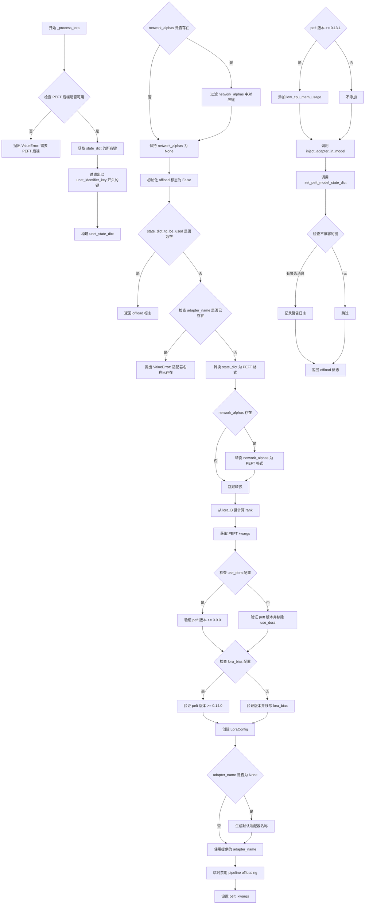

#### 带注释源码

```python
def _process_lora(
    self, state_dict, unet_identifier_key, network_alphas, adapter_name, _pipeline, low_cpu_mem_usage
):
    # 该方法执行以下操作：
    # 1. 当使用非遗留格式时，过滤与 unet_identifier_key 匹配的 state_dict 键
    #    对于遗留格式，不进行过滤
    # 2. 将 state_dict 转换为 PEFT 兼容格式
    # 3. 创建 LoraConfig，然后根据 LoraConfig 规范将转换后的 state_dict 注入 UNet
    # 4. 检查底层 _pipeline 是否包含任何 offloading

    # 检查 PEFT 后端是否可用
    if not USE_PEFT_BACKEND:
        raise ValueError("PEFT backend is required for this method.")

    # 从 peft 库导入必要的类
    from peft import LoraConfig, inject_adapter_in_model, set_peft_model_state_dict

    # 获取 state_dict 的所有键
    keys = list(state_dict.keys())

    # 过滤出以 unet_identifier_key 开头的键
    unet_keys = [k for k in keys if k.startswith(unet_identifier_key)]
    # 构建只包含 UNet 相关键的子字典
    unet_state_dict = {
        k.replace(f"{unet_identifier_key}.", ""): v for k, v in state_dict.items() if k in unet_keys
    }

    # 处理 network_alphas（如果提供）
    if network_alphas is not None:
        alpha_keys = [k for k in network_alphas.keys() if k.startswith(unet_identifier_key)]
        network_alphas = {
            k.replace(f"{unet_identifier_key}.", ""): v for k, v in network_alphas.items() if k in alpha_keys
        }

    # 初始化 offloading 状态标志
    is_model_cpu_offload = False
    is_sequential_cpu_offload = False
    is_group_offload = False
    
    # 如果 unet_state_dict 不为空则使用它，否则使用原始 state_dict
    state_dict_to_be_used = unet_state_dict if len(unet_state_dict) > 0 else state_dict

    # 检查 state_dict 是否有内容需要处理
    if len(state_dict_to_be_used) > 0:
        # 检查适配器名称是否已存在
        if adapter_name in getattr(self, "peft_config", {}):
            raise ValueError(
                f"Adapter name {adapter_name} already in use in the Unet - please select a new adapter name."
            )

        # 将 UNet state_dict 转换为 PEFT 兼容格式
        state_dict = convert_unet_state_dict_to_peft(state_dict_to_be_used)

        # 如果有 network_alphas，也进行转换
        if network_alphas is not None:
            # Alpha state dict 与 Unet 结构相同，因此使用相同的转换方法
            network_alphas = convert_unet_state_dict_to_peft(network_alphas)

        # 计算 LoRA 的 rank（从 lora_B 权重形状获取）
        rank = {}
        for key, val in state_dict.items():
            if "lora_B" in key:
                rank[key] = val.shape[1]

        # 获取 PEFT 配置参数
        lora_config_kwargs = get_peft_kwargs(rank, network_alphas, state_dict, is_unet=True)
        
        # 检查是否使用 DoRA（Decomposed Rank Adaptation）
        if "use_dora" in lora_config_kwargs:
            if lora_config_kwargs["use_dora"]:
                if is_peft_version("<", "0.9.0"):
                    raise ValueError(
                        "You need `peft` 0.9.0 at least to use DoRA-enabled LoRAs. Please upgrade your installation of `peft`."
                    )
            else:
                if is_peft_version("<", "0.9.0"):
                    lora_config_kwargs.pop("use_dora")

        # 检查 LoRA bias 配置
        if "lora_bias" in lora_config_kwargs:
            if lora_config_kwargs["lora_bias"]:
                if is_peft_version("<=", "0.13.2"):
                    raise ValueError(
                        "You need `peft` 0.14.0 at least to use `bias` in LoRAs. Please upgrade your installation of `peft`."
                    )
            else:
                if is_peft_version("<=", "0.13.2"):
                    lora_config_kwargs.pop("lora_bias")

        # 创建 LoraConfig 对象
        lora_config = LoraConfig(**lora_config_kwargs)

        # 如果未提供适配器名称，生成默认名称
        if adapter_name is None:
            adapter_name = get_adapter_name(self)

        # 如果 pipeline 已经卸载到 CPU，暂时移除 hooks
        # 否则加载 LoRA 权重会导致错误
        is_model_cpu_offload, is_sequential_cpu_offload, is_group_offload = self._optionally_disable_offloading(
            _pipeline
        )
        
        # 准备 PEFT 参数字典
        peft_kwargs = {}
        if is_peft_version(">=", "0.13.1"):
            peft_kwargs["low_cpu_mem_usage"] = low_cpu_mem_usage

        # 将适配器注入模型
        inject_adapter_in_model(lora_config, self, adapter_name=adapter_name, **peft_kwargs)
        # 设置 PEFT 模型 state dict
        incompatible_keys = set_peft_model_state_dict(self, state_dict, adapter_name, **peft_kwargs)

        # 处理不兼容的键并生成警告
        warn_msg = ""
        if incompatible_keys is not None:
            # 只检查意外键
            unexpected_keys = getattr(incompatible_keys, "unexpected_keys", None)
            if unexpected_keys:
                lora_unexpected_keys = [k for k in unexpected_keys if "lora_" in k and adapter_name in k]
                if lora_unexpected_keys:
                    warn_msg = (
                        f"Loading adapter weights from state_dict led to unexpected keys found in the model:"
                        f" {', '.join(lora_unexpected_keys)}. "
                    )

            # 过滤特定于当前适配器的缺失键
            missing_keys = getattr(incompatible_keys, "missing_keys", None)
            if missing_keys:
                lora_missing_keys = [k for k in missing_keys if "lora_" in k and adapter_name in k]
                if lora_missing_keys:
                    warn_msg += (
                        f"Loading adapter weights from state_dict led to missing keys in the model:"
                        f" {', '.join(lora_missing_keys)}."
                    )

        # 如果有警告消息，记录日志
        if warn_msg:
            logger.warning(warn_msg)

    # 返回 offloading 状态标志
    return is_model_cpu_offload, is_sequential_cpu_offload, is_group_offload
```


### `UNet2DConditionLoadersMixin._optionally_disable_offloading`

该方法是一个类方法，用于在加载 LoRA 权重前检查并临时禁用 Pipeline 的 CPU offloading 机制，以避免加载权重时出现错误。它内部委托调用 `_func_optionally_disable_offloading` 函数来处理实际的禁用逻辑。

参数：

- `_pipeline`：`Any`，Pipeline 对象，用于检查是否启用了模型卸载机制

返回值：`Tuple[bool, bool, bool]`，返回一个包含三个布尔值的元组，分别表示是否启用了模型 CPU offload、顺序 CPU offload 和 group offload

#### 流程图

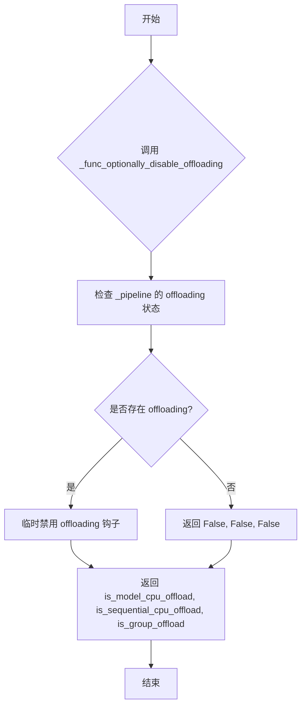

#### 带注释源码

```python
@classmethod
# Copied from diffusers.loaders.lora_base.LoraBaseMixin._optionally_disable_offloading
def _optionally_disable_offloading(cls, _pipeline):
    """
    类方法：可选地禁用 offloading 功能
    
    在加载 LoRA 权重前，需要暂时移除 Pipeline 上已存在的 offloading 钩子，
    否则加载权重会导致错误。该方法检查并处理三种类型的 offloading：
    1. model_cpu_offload - 模型级别的 CPU 卸载
    2. sequential_cpu_offload - 顺序 CPU 卸载
    3. group_offload - 组卸载
    
    参数:
        cls: 类对象本身（类方法隐含参数）
        _pipeline: Pipeline 对象，需要检查其 offloading 状态
        
    返回:
        三元组 (is_model_cpu_offload, is_sequential_cpu_offload, is_group_offload)
        标识原来启用了哪些 offloading 机制，以便后续恢复
    """
    # 委托给从 lora_base 模块导入的 _func_optionally_disable_offloading 函数
    # 该函数位于 .lora_base 模块中
    return _func_optionally_disable_offloading(_pipeline=_pipeline)
```


### `UNet2DConditionLoadersMixin._get_custom_diffusion_state_dict`

获取 Custom Diffusion 注意力处理器的状态字典，用于保存 Custom Diffusion 权重。该方法从 UNet 的注意力处理器中筛选出 CustomDiffusionAttnProcessor、CustomDiffusionAttnProcessor2_0 和 CustomDiffusionXFormersAttnProcessor 三种类型的处理器，并构建对应的状态字典返回。

参数：

- `self`：类的实例本身，无额外参数

返回值：`dict`，包含 Custom Diffusion 注意力处理器的状态字典，其中键为处理器名称，值为对应的张量或空字典

#### 流程图

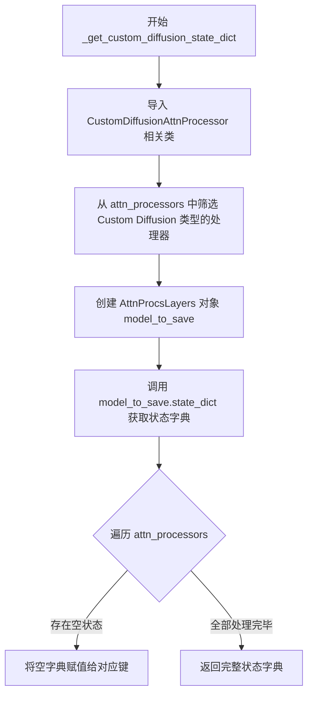

#### 带注释源码

```
def _get_custom_diffusion_state_dict(self):
    # 导入 Custom Diffusion 相关的注意力处理器类
    from ..models.attention_processor import (
        CustomDiffusionAttnProcessor,
        CustomDiffusionAttnProcessor2_0,
        CustomDiffusionXFormersAttnProcessor,
    )

    # 筛选出 Custom Diffusion 类型的注意力处理器
    # 过滤 self.attn_processors 字典，只保留 Custom Diffusion 相关的处理器
    model_to_save = AttnProcsLayers(
        {
            y: x
            for (y, x) in self.attn_processors.items()
            if isinstance(
                x,
                (
                    CustomDiffusionAttnProcessor,
                    CustomDiffusionAttnProcessor2_0,
                    CustomDiffusionXFormersAttnProcessor,
                ),
            )
        }
    )
    
    # 获取筛选后处理器的状态字典
    state_dict = model_to_save.state_dict()
    
    # 遍历所有注意力处理器，检查是否有空状态需要特殊处理
    for name, attn in self.attn_processors.items():
        if len(attn.state_dict()) == 0:
            state_dict[name] = {}

    return state_dict
```


### `UNet2DConditionLoadersMixin._convert_ip_adapter_image_proj_to_diffusers`

将不同格式（IP-Adapter、IP-Adapter Full、IP-Adapter Face ID、IP-Adapter Face ID Plus、IP-Adapter Plus）的图像投影层权重转换为Diffusers格式，并返回相应的图像投影模型实例。

参数：

- `state_dict`：`dict[str, torch.Tensor]`，包含IP-Adapter预训练权重的状态字典
- `low_cpu_mem_usage`：`bool`，是否使用低CPU内存模式初始化模型（可选，默认为 `_LOW_CPU_MEM_USAGE_DEFAULT`）

返回值：`ImageProjection` 或其子类实例（如 `IPAdapterFullImageProjection`、`IPAdapterFaceIDPlusImageProjection`、`IPAdapterFaceIDImageProjection`、`IPAdapterPlusImageProjection`），返回转换后的图像投影层对象

#### 流程图

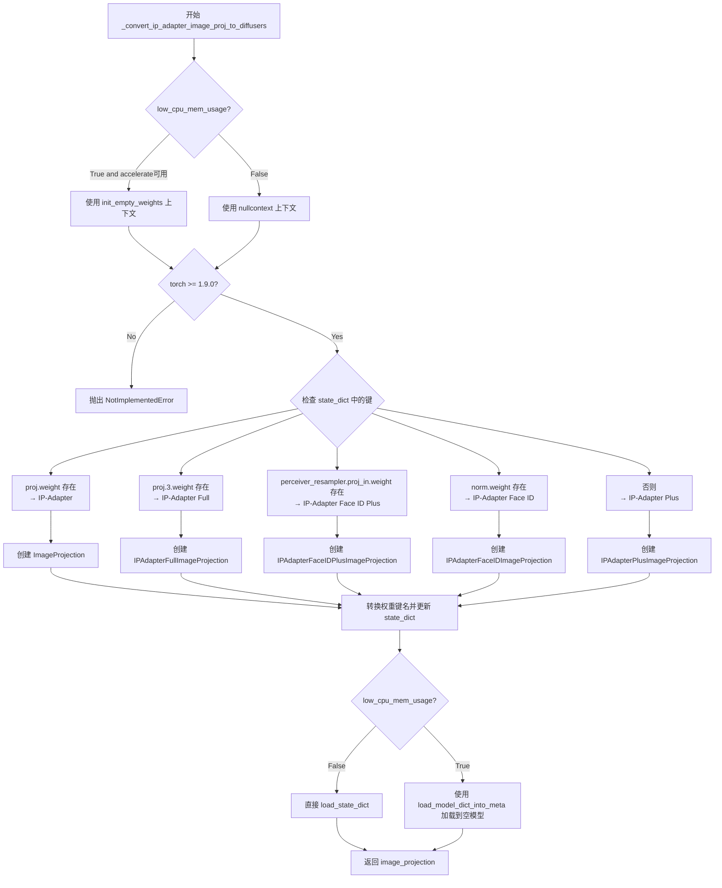

#### 带注释源码

```python
def _convert_ip_adapter_image_proj_to_diffusers(self, state_dict, low_cpu_mem_usage=_LOW_CPU_MEM_USAGE_DEFAULT):
    """
    将IP-Adapter图像投影层权重从第三方格式转换为Diffusers内部格式。
    
    支持多种IP-Adapter变体：
    - IP-Adapter (基础版本)
    - IP-Adapter Full
    - IP-Adapter Face ID
    - IP-Adapter Face ID Plus
    - IP-Adapter Plus
    """
    # 检查是否启用低CPU内存模式
    if low_cpu_mem_usage:
        if is_accelerate_available():
            # 导入 accelerate 的空权重初始化函数
            from accelerate import init_empty_weights
        else:
            # 如果没有 accelerate 库，回退到普通模式
            low_cpu_mem_usage = False
            logger.warning(
                "Cannot initialize model with low cpu memory usage because `accelerate` was not found in the"
                " environment. Defaulting to `low_cpu_mem_usage=False`. It is strongly recommended to install"
                " `accelerate` for faster and less memory-intense model loading. You can do so with: \n```\npip"
                " install accelerate\n```\n."
            )

    # 检查 PyTorch 版本是否满足低内存初始化要求
    if low_cpu_mem_usage is True and not is_torch_version(">=", "1.9.0"):
        raise NotImplementedError(
            "Low memory initialization requires torch >= 1.9.0. Please either update your PyTorch version or set"
            " `low_cpu_mem_usage=False`."
        )

    updated_state_dict = {}
    image_projection = None
    # 根据 low_cpu_mem_usage 选择上下文管理器
    init_context = init_empty_weights if low_cpu_mem_usage else nullcontext

    # ========== 情形1: IP-Adapter 基础版本 ==========
    if "proj.weight" in state_dict:
        # 从权重形状推断维度信息
        num_image_text_embeds = 4
        clip_embeddings_dim = state_dict["proj.weight"].shape[-1]
        cross_attention_dim = state_dict["proj.weight"].shape[0] // 4

        # 创建 ImageProjection 对象
        with init_context():
            image_projection = ImageProjection(
                cross_attention_dim=cross_attention_dim,
                image_embed_dim=clip_embeddings_dim,
                num_image_text_embeds=num_image_text_embeds,
            )

        # 将权重键名从 "proj" 转换为 "image_embeds"
        for key, value in state_dict.items():
            diffusers_name = key.replace("proj", "image_embeds")
            updated_state_dict[diffusers_name] = value

    # ========== 情形2: IP-Adapter Full ==========
    elif "proj.3.weight" in state_dict:
        clip_embeddings_dim = state_dict["proj.0.weight"].shape[0]
        cross_attention_dim = state_dict["proj.3.weight"].shape[0]

        with init_context():
            image_projection = IPAdapterFullImageProjection(
                cross_attention_dim=cross_attention_dim, image_embed_dim=clip_embeddings_dim
            )

        # 转换权重键名格式
        for key, value in state_dict.items():
            diffusers_name = key.replace("proj.0", "ff.net.0.proj")
            diffusers_name = diffusers_name.replace("proj.2", "ff.net.2")
            diffusers_name = diffusers_name.replace("proj.3", "norm")
            updated_state_dict[diffusers_name] = value

    # ========== 情形3: IP-Adapter Face ID Plus ==========
    elif "perceiver_resampler.proj_in.weight" in state_dict:
        id_embeddings_dim = state_dict["proj.0.weight"].shape[1]
        embed_dims = state_dict["perceiver_resampler.proj_in.weight"].shape[0]
        hidden_dims = state_dict["perceiver_resampler.proj_in.weight"].shape[1]
        output_dims = state_dict["perceiver_resampler.proj_out.weight"].shape[0]
        heads = state_dict["perceiver_resampler.layers.0.0.to_q.weight"].shape[0] // 64

        with init_context():
            image_projection = IPAdapterFaceIDPlusImageProjection(
                embed_dims=embed_dims,
                output_dims=output_dims,
                hidden_dims=hidden_dims,
                heads=heads,
                id_embeddings_dim=id_embeddings_dim,
            )

        # 复杂的键名映射转换
        for key, value in state_dict.items():
            diffusers_name = key.replace("perceiver_resampler.", "")
            diffusers_name = diffusers_name.replace("0.to", "attn.to")
            diffusers_name = diffusers_name.replace("0.1.0.", "0.ff.0.")
            diffusers_name = diffusers_name.replace("0.1.1.weight", "0.ff.1.net.0.proj.weight")
            diffusers_name = diffusers_name.replace("0.1.3.weight", "0.ff.1.net.2.weight")
            # ... 更多层级的键名映射
            # 处理 norm、to_kv、to_out 等特殊键
            if "norm1" in diffusers_name:
                updated_state_dict[diffusers_name.replace("0.norm1", "0")] = value
            elif "norm2" in diffusers_name:
                updated_state_dict[diffusers_name.replace("0.norm2", "1")] = value
            elif "to_kv" in diffusers_name:
                # 拆分 to_kv 为 to_k 和 to_v
                v_chunk = value.chunk(2, dim=0)
                updated_state_dict[diffusers_name.replace("to_kv", "to_k")] = v_chunk[0]
                updated_state_dict[diffusers_name.replace("to_kv", "to_v")] = v_chunk[1]
            elif "to_out" in diffusers_name:
                updated_state_dict[diffusers_name.replace("to_out", "to_out.0")] = value
            # ... 其他键名映射

    # ========== 情形4: IP-Adapter Face ID ==========
    elif "norm.weight" in state_dict:
        id_embeddings_dim_in = state_dict["proj.0.weight"].shape[1]
        id_embeddings_dim_out = state_dict["proj.0.weight"].shape[0]
        multiplier = id_embeddings_dim_out // id_embeddings_dim_in
        norm_layer = "norm.weight"
        cross_attention_dim = state_dict[norm_layer].shape[0]
        num_tokens = state_dict["proj.2.weight"].shape[0] // cross_attention_dim

        with init_context():
            image_projection = IPAdapterFaceIDImageProjection(
                cross_attention_dim=cross_attention_dim,
                image_embed_dim=id_embeddings_dim_in,
                mult=multiplier,
                num_tokens=num_tokens,
            )

        for key, value in state_dict.items():
            diffusers_name = key.replace("proj.0", "ff.net.0.proj")
            diffusers_name = diffusers_name.replace("proj.2", "ff.net.2")
            updated_state_dict[diffusers_name] = value

    # ========== 情形5: IP-Adapter Plus (默认) ==========
    else:
        num_image_text_embeds = state_dict["latents"].shape[1]
        embed_dims = state_dict["proj_in.weight"].shape[1]
        output_dims = state_dict["proj_out.weight"].shape[0]
        hidden_dims = state_dict["latents"].shape[2]
        attn_key_present = any("attn" in k for k in state_dict)
        heads = (
            state_dict["layers.0.attn.to_q.weight"].shape[0] // 64
            if attn_key_present
            else state_dict["layers.0.0.to_q.weight"].shape[0] // 64
        )

        with init_context():
            image_projection = IPAdapterPlusImageProjection(
                embed_dims=embed_dims,
                output_dims=output_dims,
                hidden_dims=hidden_dims,
                heads=heads,
                num_queries=num_image_text_embeds,
            )

        # IP-Adapter Plus 的键名转换逻辑
        for key, value in state_dict.items():
            diffusers_name = key.replace("0.to", "2.to")
            # ... 更多键名映射，处理层归一化和注意力层

    # ========== 加载权重到模型 ==========
    if not low_cpu_mem_usage:
        # 直接加载权重到模型
        image_projection.load_state_dict(updated_state_dict, strict=True)
    else:
        # 使用低内存方式加载到空模型
        device_map = {"": self.device}
        load_model_dict_into_meta(image_projection, updated_state_dict, device_map=device_map, dtype=self.dtype)
        empty_device_cache()

    return image_projection
```


### `UNet2DConditionLoadersMixin._convert_ip_adapter_attn_to_diffusers`

该方法负责将 IP-Adapter 的注意力处理器从外部格式转换为 Diffusers 内部格式，根据不同的 IP-Adapter 类型（标准版、Full Face、Face ID Plus、Face ID、Plus 版）动态选择合适的处理器类，并加载对应的权重到 UNet 的注意力层中。

参数：

- `state_dicts`：`list[dict[str, torch.Tensor]]`，包含 IP-Adapter 的状态字典列表，每个元素包含 `image_proj` 和 `ip_adapter` 两个键
- `low_cpu_mem_usage`：`bool`，是否使用低 CPU 内存模式加载模型，默认为 `_LOW_CPU_MEM_USAGE_DEFAULT`

返回值：`dict[str, torch.nn.Module]`，返回转换后的注意力处理器字典，键为处理器名称，值为对应的处理器实例

#### 流程图

```mermaid
flowchart TD
    A[开始 _convert_ip_adapter_attn_to_diffusers] --> B{low_cpu_mem_usage?}
    B -->|True| C{accelerate 可用?}
    B -->|False| D[使用 nullcontext]
    C -->|True| E[导入 init_empty_weights]
    C -->|False| F[设置 low_cpu_mem_usage=False 并警告]
    F --> D
    D --> G{PyTorch 版本 >= 1.9.0?}
    G -->|False| H[抛出 NotImplementedError]
    G -->|True| I[初始化 attn_procs 和 key_id]
    I --> J{遍历 attn_processors.keys}
    J -->|还有| K[获取 cross_attention_dim 和 hidden_size]
    J -->|完成| L[返回 attn_procs]
    K --> M{cross_attention_dim 为 None 或包含 motion_modules?}
    M -->|True| N[使用原有处理器类]
    M -->|False| O{检测 IP-Adapter 类型}
    O -->|proj.weight| P[IP-Adapter 标准版, num=4]
    O -->|proj.3.weight| Q[IP-Adapter Full Face, num=257]
    O -->|perceiver_resampler| R[IP-Adapter Face ID Plus, num=4]
    O -->|norm.weight| S[IP-Adapter Face ID, num=4]
    O -->|其他| T[IP-Adapter Plus, num=latents.shape[1]]
    N --> U[创建处理器实例]
    P --> V[收集 num_image_text_embeds 列表]
    Q --> V
    R --> V
    S --> V
    T --> V
    V --> W[使用 init_context 创建处理器]
    U --> W
    W --> X[从 state_dicts 提取权重到 value_dict]
    X --> Y{low_cpu_mem_usage?}
    Y -->|False| Z[直接 load_state_dict]
    Y -->|True| AA[使用 load_model_dict_into_meta]
    Z --> AB[key_id += 2]
    AA --> AB
    AB --> J
    H --> L
```

#### 带注释源码

```python
def _convert_ip_adapter_attn_to_diffusers(self, state_dicts, low_cpu_mem_usage=_LOW_CPU_MEM_USAGE_DEFAULT):
    """
    将 IP-Adapter 注意力处理器转换为 Diffusers 格式
    
    参数:
        state_dicts: IP-Adapter 状态字典列表
        low_cpu_mem_usage: 是否使用低 CPU 内存模式
    
    返回:
        attn_procs: 转换后的注意力处理器字典
    """
    # 导入 IP-Adapter 相关的注意力处理器类
    from ..models.attention_processor import (
        IPAdapterAttnProcessor,       # 标准 SD 处理器
        IPAdapterAttnProcessor2_0,     # SDXL 优化处理器
        IPAdapterXFormersAttnProcessor, # XFormers 加速处理器
    )

    # 检查是否启用低内存模式，如果是则需要 accelerate 库
    if low_cpu_mem_usage:
        if is_accelerate_available():
            from accelerate import init_empty_weights
        else:
            low_cpu_mem_usage = False
            logger.warning(
                "Cannot initialize model with low cpu memory usage because `accelerate` was not found in the"
                " environment. Defaulting to `low_cpu_mem_usage=False`. It is strongly recommended to install"
                " `accelerate` for faster and less memory-intense model loading. You can do so with: \n```\npip"
                " install accelerate\n```\n."
            )

    # 确保 PyTorch 版本支持低内存初始化
    if low_cpu_mem_usage is True and not is_torch_version(">=", "1.9.0"):
        raise NotImplementedError(
            "Low memory initialization requires torch >= 1.9.0. Please either update your PyTorch version or set"
            " `low_cpu_mem_usage=False`."
        )

    # 初始化变量：存储注意力处理器、键ID、初始化上下文
    attn_procs = {}
    key_id = 1
    init_context = init_empty_weights if low_cpu_mem_usage else nullcontext
    
    # 遍历 UNet 中所有的注意力处理器
    for name in self.attn_processors.keys():
        # 确定 cross_attention_dim：对于 attn1（自注意力）设为 None
        cross_attention_dim = None if name.endswith("attn1.processor") else self.config.cross_attention_dim
        
        # 根据模块名称确定 hidden_size（隐藏层维度）
        if name.startswith("mid_block"):
            hidden_size = self.config.block_out_channels[-1]
        elif name.startswith("up_blocks"):
            block_id = int(name[len("up_blocks.")])
            hidden_size = list(reversed(self.config.block_out_channels))[block_id]
        elif name.startswith("down_blocks"):
            block_id = int(name[len("down_blocks.")])
            hidden_size = self.config.block_out_channels[block_id]

        # 如果没有 cross_attention_dim 或包含 motion_modules，保留原处理器
        if cross_attention_dim is None or "motion_modules" in name:
            attn_processor_class = self.attn_processors[name].__class__
            attn_procs[name] = attn_processor_class()
        else:
            # 根据当前处理器类型选择合适的 IP-Adapter 处理器
            if "XFormers" in str(self.attn_processors[name].__class__):
                attn_processor_class = IPAdapterXFormersAttnProcessor
            else:
                attn_processor_class = (
                    IPAdapterAttnProcessor2_0
                    if hasattr(F, "scaled_dot_product_attention")
                    else IPAdapterAttnProcessor
                )
            
            # 根据不同的 IP-Adapter 类型确定 num_image_text_embeds
            num_image_text_embeds = []
            for state_dict in state_dicts:
                if "proj.weight" in state_dict["image_proj"]:
                    # IP-Adapter 标准版：4 个图像文本嵌入
                    num_image_text_embeds += [4]
                elif "proj.3.weight" in state_dict["image_proj"]:
                    # IP-Adapter Full Face：257 个（256 CLIP tokens + 1 CLS token）
                    num_image_text_embeds += [257]
                elif "perceiver_resampler.proj_in.weight" in state_dict["image_proj"]:
                    # IP-Adapter Face ID Plus：4 个
                    num_image_text_embeds += [4]
                elif "norm.weight" in state_dict["image_proj"]:
                    # IP-Adapter Face ID：4 个
                    num_image_text_embeds += [4]
                else:
                    # IP-Adapter Plus：从 latents 形状获取
                    num_image_text_embeds += [state_dict["image_proj"]["latents"].shape[1]]

            # 创建注意力处理器实例
            with init_context():
                attn_procs[name] = attn_processor_class(
                    hidden_size=hidden_size,
                    cross_attention_dim=cross_attention_dim,
                    scale=1.0,
                    num_tokens=num_image_text_embeds,
                )

            # 从 state_dicts 提取 IP-Adapter 的权重
            value_dict = {}
            for i, state_dict in enumerate(state_dicts):
                value_dict.update({f"to_k_ip.{i}.weight": state_dict["ip_adapter"][f"{key_id}.to_k_ip.weight"]})
                value_dict.update({f"to_v_ip.{i}.weight": state_dict["ip_adapter"][f"{key_id}.to_v_ip.weight"]})

            # 加载权重到处理器
            if not low_cpu_mem_usage:
                attn_procs[name].load_state_dict(value_dict)
            else:
                device = next(iter(value_dict.values())).device
                dtype = next(iter(value_dict.values())).dtype
                device_map = {"": device}
                load_model_dict_into_meta(attn_procs[name], value_dict, device_map=device_map, dtype=dtype)

            # key_id 递增 2（因为每个 IP-Adapter 占用两个键 ID）
            key_id += 2

    # 清理设备缓存
    empty_device_cache()

    return attn_procs
```


### `UNet2DConditionLoadersMixin._load_ip_adapter_weights`

该方法用于将 IP-Adapter 权重加载到 UNet2DConditionModel 中，包括转换和设置注意力处理器以及图像投影层，支持多 IP-Adapter 场景。

参数：

- `self`：隐式参数，当前 UNet2DConditionLoadersMixin 实例。
- `state_dicts`：`list[dict] | dict`，IP-Adapter 的权重状态字典，可以是单个字典或字典列表。
- `low_cpu_mem_usage`：`bool`，是否使用低 CPU 内存模式加载模型，默认为 `_LOW_CPU_MEM_USAGE_DEFAULT`。

返回值：`None`，该方法直接修改实例状态，不返回值。

#### 流程图

```mermaid
flowchart TD
    A[开始 _load_ip_adapter_weights] --> B{state_dicts 是否为列表?}
    B -->|否| C[将 state_dicts 包装为列表]
    B -->|是| D[保持原样]
    C --> E
    D --> E
    E{encoder_hid_proj 存在<br/>且类型为 text_proj<br/>且无 text_encoder_hid_proj?}
    E -->|是| F[复制 encoder_hid_proj 到 text_encoder_hid_proj]
    E -->|否| G
    F --> G
    G[设置 encoder_hid_proj 为 None] --> H[调用 _convert_ip_adapter_attn_to_diffusers]
    H --> I[调用 set_attn_processor 设置注意力处理器]
    J[遍历 state_dicts] --> K[调用 _convert_ip_adapter_image_proj_to_diffusers]
    J --> L[构建 image_projection_layers 列表]
    K --> L
    L --> M[创建 MultiIPAdapterImageProjection]
    M --> N[设置 encoder_hid_proj 为 MultiIPAdapterImageProjection]
    N --> O[设置 config.encoder_hid_dim_type 为 ip_image_proj]
    O --> P[将模型移到指定设备和数据类型]
    P --> Q[结束]
```

#### 带注释源码

```python
def _load_ip_adapter_weights(self, state_dicts, low_cpu_mem_usage=_LOW_CPU_MEM_USAGE_DEFAULT):
    """
    将 IP-Adapter 权重加载到 UNet 模型中。
    
    参数:
        state_dicts: IP-Adapter 的权重状态字典，可以是单个或列表
        low_cpu_mem_usage: 是否使用低 CPU 内存模式加载
    """
    # 如果传入的不是列表，则包装为列表，支持单个和多个 adapter
    if not isinstance(state_dicts, list):
        state_dicts = [state_dicts]

    # Kolors Unet 已经有一个 encoder_hid_proj，需要特殊处理
    # 当 encoder_hid_proj 存在、类型为 text_proj、且没有 text_encoder_hid_proj 属性时
    if (
        self.encoder_hid_proj is not None
        and self.config.encoder_hid_dim_type == "text_proj"
        and not hasattr(self, "text_encoder_hid_proj")
    ):
        # 将现有的 encoder_hid_proj 复制到 text_encoder_hid_proj
        self.text_encoder_hid_proj = self.encoder_hid_proj

    # 在加载 ip_adapter 权重后设置 encoder_hid_proj
    # 因为 IPAdapterPlusImageProjection 也有 attn_processors，需要先清空
    self.encoder_hid_proj = None

    # 转换 IP-Adapter 注意力处理器并加载状态字典
    attn_procs = self._convert_ip_adapter_attn_to_diffusers(state_dicts, low_cpu_mem_usage=low_cpu_mem_usage)
    # 设置注意力处理器到模型
    self.set_attn_processor(attn_procs)

    # 转换 IP-Adapter 图像投影层到 diffusers 格式
    image_projection_layers = []
    for state_dict in state_dicts:
        # 提取图像投影层的状态字典并转换
        image_projection_layer = self._convert_ip_adapter_image_proj_to_diffusers(
            state_dict["image_proj"], low_cpu_mem_usage=low_cpu_mem_usage
        )
        image_projection_layers.append(image_projection_layer)

    # 创建多 IP-Adapter 图像投影模块
    self.encoder_hid_proj = MultiIPAdapterImageProjection(image_projection_layers)
    # 更新配置以使用 ip_image_proj 类型
    self.config.encoder_hid_dim_type = "ip_image_proj"

    # 将模型移到指定的设备和数据类型
    self.to(dtype=self.dtype, device=self.device)
```


### `UNet2DConditionLoadersMixin._load_ip_adapter_loras`

该方法用于从IP-Adapter状态字典中加载LoRA权重。它遍历UNet的注意力处理器和传入的状态字典列表，提取每个处理器对应的LoRA权重（包含to_k、to_q、to_v、to_out的down和up权重），并将它们组织成一个嵌套字典返回，其中外层键是状态字典的索引，内层键是带前缀的权重名称。

参数：

- `state_dicts`：`list`，IP-Adapter的状态字典列表，每个元素包含IP-Adapter的权重信息

返回值：`dict`，返回组织好的LoRA权重字典，外层键为状态字典索引，内层键为带"unet.{处理器名}.{权重名}"格式的权重键

#### 流程图

```mermaid
flowchart TD
    A[开始 _load_ip_adapter_loras] --> B[初始化空字典 lora_dicts]
    B --> C[遍历 self.attn_processors.keys<br/>使用 enumerate 获取 key_id 和 name]
    C --> D[遍历 state_dicts 列表<br/>使用 enumerate 获取索引 i 和 state_dict]
    D --> E{检查 state_dict['ip_adapter'] 中<br/>是否存在 f'{key_id}.to_k_lora.down.weight'}
    E -->|是| F[如果 i 不在 lora_dicts 中<br/>初始化 lora_dicts[i] 为空字典]
    F --> G[提取并添加 to_k_lora.down.weight<br/>到 lora_dicts[i]]
    G --> H[提取并添加 to_q_lora.down.weight<br/>到 lora_dicts[i]]
    H --> I[提取并添加 to_v_lora.down.weight<br/>到 lora_dicts[i]]
    I --> J[提取并添加 to_out_lora.down.weight<br/>到 lora_dicts[i]]
    J --> K[提取并添加 to_k_lora.up.weight<br/>到 lora_dicts[i]]
    K --> L[提取并添加 to_q_lora.up.weight<br/>到 lora_dicts[i]]
    L --> M[提取并添加 to_v_lora.up.weight<br/>到 lora_dicts[i]]
    M --> N[提取并添加 to_out_lora.up.weight<br/>到 lora_dicts[i]]
    N --> O{继续遍历下一个 state_dict?}
    E -->|否| O
    O --> P{继续遍历下一个 attn_processor?}
    P -->|是| C
    P -->|否| Q[返回 lora_dicts]
    Q --> R[结束]
```

#### 带注释源码

```python
def _load_ip_adapter_loras(self, state_dicts):
    """
    从IP-Adapter状态字典中加载LoRA权重到UNet的注意力处理器中。
    
    该方法会遍历UNet的所有注意力处理器和传入的IP-Adapter状态字典，
    提取每个处理器相关的LoRA权重（包括down和up权重），并将其组织成
    嵌套字典格式返回。
    
    参数:
        state_dicts: IP-Adapter状态字典列表，每个元素是一个包含'ip_adapter'键的字典
        
    返回:
        lora_dicts: 组织好的LoRA权重字典，格式为 {i: {'unet.{attn_name}.{lora_type}.{direction}.weight': tensor}}
    """
    # 初始化用于存储LoRA权重的字典
    # 外层键是state_dicts列表的索引i，内层键是权重名称
    lora_dicts = {}
    
    # 遍历UNet的所有注意力处理器的名称
    # key_id用于匹配IP-Adapter中的权重索引
    # name是注意力处理器的名称（如'down_blocks.0.attentions.0.transformer_blocks.0.attn1'）
    for key_id, name in enumerate(self.attn_processors.keys()):
        # 遍历每个IP-Adapter的状态字典
        # i表示当前状态字典在列表中的索引
        for i, state_dict in enumerate(state_dicts):
            # 检查当前状态字典的ip_adapter部分是否包含当前key_id对应的LoRA权重
            # IP-Adapter的LoRA权重使用 {key_id}.{type}_lora.{direction}.weight 格式命名
            if f"{key_id}.to_k_lora.down.weight" in state_dict["ip_adapter"]:
                # 如果这是第一次遇到这个索引，初始化空字典
                if i not in lora_dicts:
                    lora_dicts[i] = {}
                
                # 提取并添加 to_k (key) LoRA的down权重
                # down权重通常是低秩分解的A矩阵
                lora_dicts[i].update(
                    {
                        f"unet.{name}.to_k_lora.down.weight": state_dict["ip_adapter"][
                            f"{key_id}.to_k_lora.down.weight"
                        ]
                    }
                )
                
                # 提取并添加 to_q (query) LoRA的down权重
                lora_dicts[i].update(
                    {
                        f"unet.{name}.to_q_lora.down.weight": state_dict["ip_adapter"][
                            f"{key_id}.to_q_lora.down.weight"
                        ]
                    }
                )
                
                # 提取并添加 to_v (value) LoRA的down权重
                lora_dicts[i].update(
                    {
                        f"unet.{name}.to_v_lora.down.weight": state_dict["ip_adapter"][
                            f"{key_id}.to_v_lora.down.weight"
                        ]
                    }
                )
                
                # 提取并添加 to_out LoRA的down权重
                lora_dicts[i].update(
                    {
                        f"unet.{name}.to_out_lora.down.weight": state_dict["ip_adapter"][
                            f"{key_id}.to_out_lora.down.weight"
                        ]
                    }
                )
                
                # 提取并添加 to_k LoRA的up权重
                # up权重通常是低秩分解的B矩阵
                lora_dicts[i].update(
                    {f"unet.{name}.to_k_lora.up.weight": state_dict["ip_adapter"][f"{key_id}.to_k_lora.up.weight"]}
                )
                
                # 提取并添加 to_q LoRA的up权重
                lora_dicts[i].update(
                    {f"unet.{name}.to_q_lora.up.weight": state_dict["ip_adapter"][f"{key_id}.to_q_lora.up.weight"]}
                )
                
                # 提取并添加 to_v LoRA的up权重
                lora_dicts[i].update(
                    {f"unet.{name}.to_v_lora.up.weight": state_dict["ip_adapter"][f"{key_id}.to_v_lora.up.weight"]}
                )
                
                # 提取并添加 to_out LoRA的up权重
                lora_dicts[i].update(
                    {
                        f"unet.{name}.to_out_lora.up.weight": state_dict["ip_adapter"][
                            f"{key_id}.to_out_lora.up.weight"
                        ]
                    }
                )
    
    # 返回组织好的LoRA权重字典
    # 后续会被用于将这些权重注入到UNet的PEFT模型中
    return lora_dicts
```

## 关键组件


### 张量索引与键名解析

在 `_process_custom_diffusion` 方法中，通过键名分割和切片提取注意力处理器信息。根据键中是否包含 "to_out"，采用不同的索引策略：包含 "to_out" 时取前三位作为处理器键，后三位为子键；否则取前两位和后两位。这种精细的键名解析支持 Custom Diffusion 的灵活权重结构。

### 惰性加载与低内存初始化

通过 `low_cpu_mem_usage` 参数控制模型初始化策略。当启用时，使用 `accelerate.init_empty_weights()` 创建空模型，仅在实际需要时才分配内存。在 `_convert_ip_adapter_image_proj_to_diffusers` 和 `_convert_ip_adapter_attn_to_diffusers` 中，通过 `init_context = init_empty_weights if low_cpu_mem_usage else nullcontext` 实现惰性上下文，显著降低大型模型加载时的内存占用。

### IP-Adapter 多变体支持与状态字典转换

代码支持五种 IP-Adapter 变体的状态字典转换：
- IP-Adapter（标准版）
- IP-Adapter Full
- IP-Adapter Face ID
- IP-Adapter Face ID Plus
- IP-Adapter Plus

通过检测状态字典中的特定键（如 `proj.weight`、`proj.3.weight`、`perceiver_resampler.proj_in.weight`、`norm.weight`）判断变体类型，并执行相应的键名映射规则，将外部格式转换为 Diffusers 内部格式。

### LoRA 权重处理与 PEFT 集成

`_process_lora` 方法负责将 LoRA 权重注入 UNet。使用 `convert_unet_state_dict_to_peft` 转换权重格式，通过 `LoraConfig` 配置 LoRA 参数（rank、alpha、网络类型），使用 `inject_adapter_in_model` 注入适配器。额外支持 DoRA（解耦 Dropout Re-Parameterization Adaptation）和 bias 参数，满足高级微调需求。

### 注意力处理器动态选择

在 `_convert_ip_adapter_attn_to_diffusers` 中，根据当前模型注意力处理器的类型动态选择 IP-Adapter 处理器变体。通过检测 `XFormers` 特性、回退到 `IPAdapterAttnProcessor2_0`（当支持 SDPA 时）或 `IPAdapterAttnProcessor`，确保与现有模型架构的兼容性。

### 多适配器与权重状态追踪

支持同时加载多个 IP-Adapter 和 LoRA 适配器。`_load_ip_adapter_loras` 方法通过 `key_id` 和 `i`（适配器索引）组织权重，支持多个适配器的权重独立存储和加载。`adapter_name` 参数允许为每个适配器指定唯一标识符，便于管理和切换。


## 问题及建议


### 已知问题

-   **代码重复与冗长**：`_convert_ip_adapter_image_proj_to_diffusers` 方法包含大量重复的字符串替换逻辑（上百行），针对不同 IP-Adapter 类型（Full、Face ID Plus、Face ID、Plus）的处理逻辑混杂在一起，难以维护和扩展。
-   **字符串替换脆弱性**：大量使用 `str.replace()` 进行键名转换（如 `"proj.0"` → `"ff.net.0.proj"`），这种硬编码的字符串匹配极易因上游模型格式变化而失效，且无法捕获潜在的键名错误。
-   **硬编码值**：在 `_convert_ip_adapter_attn_to_diffusers` 中硬编码了 `num_image_text_embeds += [257]`，缺乏对不同模型架构的适应性。
-   **状态字典副作用**：部分方法直接修改传入的 `state_dict` 参数（如 `network_alphas`），可能导致调用者持有的字典被意外修改。
-   **弃用方法仍被使用**：代码中明确标记 `load_attn_procs()` 和 `save_attn_procs()` 已在 0.40.0 版本弃用，但代码库内部仍依赖这些方法，未完成迁移。
-   **异常处理过于简单**：在加载 safetensors 失败时，代码捕获 `IOError` 后直接 `pass`，未记录任何警告或错误信息，可能导致静默失败。
-   **版本兼容性检查分散**：多处分散的 `is_peft_version` 检查和版本特定逻辑（如 DoRA、bias、low_cpu_mem_usage）散布在代码各处，难以追踪所有版本依赖。
-   **类型检查不够严格**：使用 `any("custom_diffusion" in k for k in state_dict.keys())` 进行类型判断，可能被包含该字符串的其他键误触发。

### 优化建议

-   **重构 IP-Adapter 转换逻辑**：将不同 IP-Adapter 类型的转换逻辑拆分为独立的方法或类，使用策略模式或注册机制来动态选择合适的转换器，提高可维护性和可测试性。
-   **引入键名映射表**：使用配置驱动的方式定义源模型键名到 Diffusers 键名的映射关系，而非硬编码大量字符串替换操作。
-   **添加输入验证**：在方法入口处对 `state_dict` 的键进行模式验证，确保符合预期的格式，并在键名不匹配时提供更有意义的错误信息。
-   **实现不可变操作**：创建 `state_dict` 的副本进行修改，避免修改原始参数，或明确在文档中说明副作用。
-   **完善错误处理**：为所有 `try-except` 块添加日志记录，特别是静默 `pass` 的地方，以便调试和监控。
-   **统一版本管理**：将所有 PEFT 版本相关的条件检查集中管理，使用配置对象或版本兼容性矩阵，避免散落在各处。
-   **考虑异步加载**：对于大量 IP-Adapter 或 LoRA 的场景，考虑支持异步加载以提升用户体验。

## 其它


### 设计目标与约束

本模块的设计目标是为 UNet2DConditionModel 提供灵活的 LoRA（Low-Rank Adaptation）权重加载和保存功能，支持多种适配器类型（LoRA、Custom Diffusion、IP-Adapter），并在加载过程中优化内存使用。约束条件包括：必须依赖 PEFT 后端进行 LoRA 处理，支持 safetensors 和 pickle 两种序列化格式，要求 PyTorch 版本 >= 1.9.0（当启用低内存加载时），并且对 peft 版本有特定要求（如使用 DoRA 需要 >= 0.9.0，使用 bias 需要 >= 0.14.0）。

### 错误处理与异常设计

本模块包含多种错误处理机制：版本兼容性检查（通过 `is_peft_version` 和 `is_torch_version` 函数验证依赖版本），文件格式验证（检查 state_dict 的键名来判断适配器类型），参数校验（验证 adapter_name 唯一性、low_cpu_mem_usage 兼容性），以及 IO 异常捕获（处理 safetensors 加载失败时的回退逻辑）。关键异常包括：`ValueError` 用于参数错误和格式不匹配，`NotImplementedError` 用于不支持的 PyTorch 版本，`IOError` 用于文件加载失败。

### 数据流与状态机

加载流程的状态转换如下：首先判断输入是路径还是 state_dict 字典；若为路径则下载并加载权重文件（优先尝试 safetensors 格式）；然后根据 state_dict 键名判断适配器类型（is_lora、is_custom_diffusion）；若为 LoRA 则调用 `_process_lora` 方法进行 PEFT 格式转换、创建 LoraConfig、注入适配器；若为 Custom Diffusion 则调用 `_process_custom_diffusion` 方法构建注意力处理器；最后根据_pipeline 的 offload 状态决定是否重新应用内存管理策略。整个过程支持低内存加载模式（通过 `init_empty_weights` 上下文管理器延迟初始化）。

### 外部依赖与接口契约

本模块依赖以下外部组件：PEFT 库（提供 LoraConfig、inject_adapter_in_model、set_peft_model_state_dict、get_peft_model_state_dict 函数），safetensors 库（用于安全序列化），accelerate 库（可选，用于低内存初始化），以及 diffusers 内部模块（包括 models.embeddings 中的多种 ImageProjection 类、models.attention_processor 中的注意力处理器类、models.modeling_utils 中的加载工具）。接口契约方面，`load_attn_procs` 接受 pretrained_model_name_or_path_or_dict（字符串或字典）和多个可选参数，返回值通过副作用修改 UNet 的 attn_processors；`save_attn_procs` 将注意力处理器保存到指定目录。

### 性能考虑与优化空间

本模块包含多项性能优化：低内存加载模式（`low_cpu_mem_usage=True`）使用 `init_empty_weights` 延迟初始化模型权重，避免完整加载后再替换；通过 `_optionally_disable_offloading` 临时移除 offload 钩子以避免加载过程中的内存冲突；支持 safetensors 格式以提高加载速度和安全性；使用 `empty_device_cache()` 及时释放临时 GPU 内存。优化空间包括：当前的权重转换过程（convert_unet_state_dict_to_peft）可以进一步并行化，IP-Adapter 的多个 state_dict 加载可以使用批量处理，以及可以考虑添加缓存机制避免重复下载相同的模型权重。

### 安全性考虑

本模块涉及的安全性考虑包括：默认启用 safetensors 格式以防止 pickle 反序列化漏洞（通过 `allow_pickle=False` 强制使用安全格式），但允许在 safetensors 加载失败时回退到 pickle（通过 allow_pickle 参数控制）；token 认证通过 HTTP bearer authorization 传递用于私有模型访问；本地文件模式（local_files_only）可在敏感环境中避免网络访问。代码中包含 `<Unsafe code>` 注释标记了一段需要谨慎处理的代码区域，涉及 hook 管理与 dtype 转换。

### 配置与可扩展性

本模块支持高度可扩展的适配器系统：支持多个并发 adapter（通过 adapter_name 参数区分），支持多种 IP-Adapter 变体（IP-Adapter、IP-Adapter Full、IP-Adapter Face ID、IP-Adapter Face ID Plus、IP-Adapter Plus），支持自定义注意力处理器类（通过检查现有处理器的类型来决定加载逻辑），支持自定义保存函数（save_function 参数用于分布式训练场景）。配置通过 kwargs 传递，支持 cache_dir、proxy、revision、subfolder 等标准 Hugging Face Hub 参数。

### 版本兼容性管理

本模块实现了严格的版本兼容性管理：通过 `is_peft_version` 函数检测 PEFT 版本并根据版本调整功能支持（如 DoRA 需要 >= 0.9.0，bias 需要 >= 0.14.0，low_cpu_mem_usage 需要 >= 0.13.1）；通过 `is_torch_version` 检测 PyTorch 版本（低内存加载需要 >= 1.9.0）；deprecated 方法（load_attn_procs、save_attn_procs）通过 `deprecate` 函数发出警告并在未来版本中移除。这种设计确保了向后兼容性的同时允许逐步迁移到新 API。


    