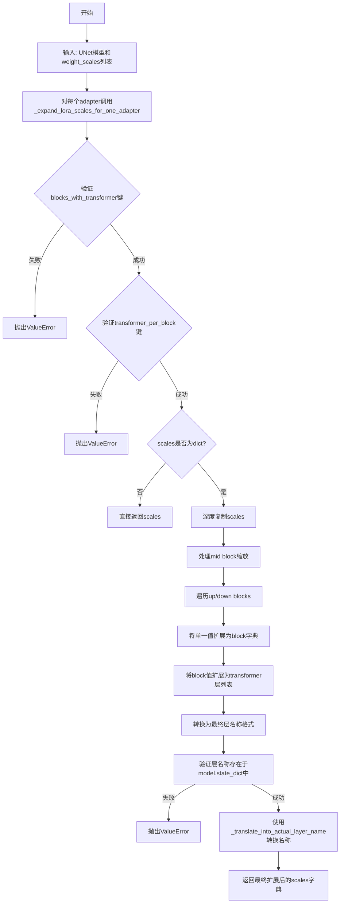
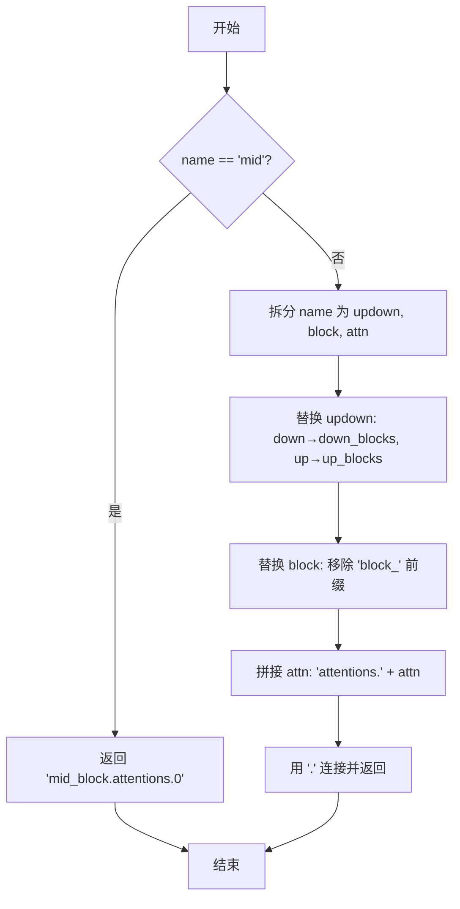
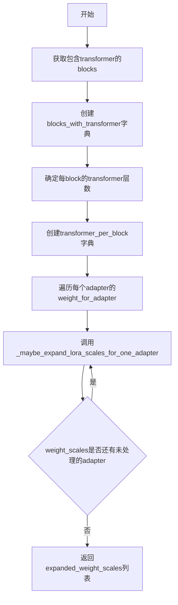

# `diffusers\src\diffusers\loaders\unet_loader_utils.py` 详细设计文档

该代码是HuggingFace Diffusers库中用于处理UNet2DConditionModel的LoRA（低秩适应）缩放功能的工具模块，主要负责将用户友好的层名称转换为实际的模型层名称，并将简单的LoRA权重缩放配置扩展为细粒度的字典格式，以匹配UNet的up/down blocks和mid block结构。

## 整体流程



## 类结构

```
模块: diffusers.models.lora (无类定义)
├── 全局函数
│   ├── _translate_into_actual_layer_name
│   ├── _maybe_expand_lora_scales
│   └── _maybe_expand_lora_scales_for_one_adapter
└── 全局变量
    └── logger
```

## 全局变量及字段


### `logger`
    
用于记录模块日志的Logger实例，通过logging.get_logger(__name__)初始化

类型：`logging.Logger`
    


    

## 全局函数及方法


### `_translate_into_actual_layer_name`

将用户友好的层名称（如 "mid"）转换为模型中实际的层名称（如 "mid_block.attentions.0"），以支持 LoRA 权重配置中使用的简写名称。

参数：

-  `name`：`str`，用户友好的层名称（例如 "mid"、"down.block_0.0"、"up.block_1.attn" 等）

返回值：`str`，模型实际的层名称（例如 "mid_block.attentions.0"、"down_blocks.0.attentions.0"、"up_blocks.1.attentions.attn" 等）

#### 流程图



#### 带注释源码

```python
def _translate_into_actual_layer_name(name):
    """Translate user-friendly name (e.g. 'mid') into actual layer name (e.g. 'mid_block.attentions.0')"""
    # 特殊处理 "mid" 的简写形式，直接返回完整的 mid_block 层名称
    if name == "mid":
        return "mid_block.attentions.0"

    # 解析用户友好的层名称，格式为 "updown.block.attn"（例如 "down.block_0.0"）
    updown, block, attn = name.split(".")

    # 将 "down" 替换为 "down_blocks"，"up" 替换为 "up_blocks"
    updown = updown.replace("down", "down_blocks").replace("up", "up_blocks")
    
    # 移除 block 编号前的 "block_" 前缀（例如 "block_0" → "0"）
    block = block.replace("block_", "")
    
    # 拼接注意力层名称前缀
    attn = "attentions." + attn

    # 组合成完整的实际层名称
    return ".".join((updown, block, attn))
```


### `_maybe_expand_lora_scales`

该函数用于将用户友好的LoRA权重比例配置（如"mid"、"down"、"up"等高层级名称）展开为细粒度的字典格式，精确指定到UNet2D模型中每个transformer层的具体比例值，以便后续应用到不同的适配器。

参数：

- `unet`：`"UNet2DConditionModel"`，UNet2D条件模型实例，用于获取模型配置信息
- `weight_scales`：`list[float | dict]`，权重比例列表，每个元素可以是单个浮点数或字典配置
- `default_scale`：`float`，默认的比例值，默认为1.0

返回值：`list`，展开后的权重比例列表，每个元素都是细粒度的字典，键为具体的层名称（如"mid_block.attentions.0"），值为对应的比例值

#### 流程图



#### 带注释源码

```python
def _maybe_expand_lora_scales(unet: "UNet2DConditionModel", weight_scales: list[float | dict], default_scale=1.0):
    """
    展开LoRA权重比例配置为细粒度的字典格式。
    
    该函数首先识别UNet模型中哪些down/up blocks包含transformer层，
    然后将用户提供的权重比例（如"down"、"mid"、"up"）展开为
    具体到每个transformer层的精细配置。
    
    Parameters:
        unet: UNet2DConditionModel实例，用于获取模型结构信息
        weight_scales: 权重比例列表，每个元素可以是浮点数或字典
        default_scale: 默认比例值，当未指定时使用
    
    Returns:
        展开后的权重比例列表，每个元素都是细粒度字典
    """
    
    # 识别哪些down_blocks包含transformer层（attentions）
    blocks_with_transformer = {
        "down": [i for i, block in enumerate(unet.down_blocks) if hasattr(block, "attentions")],
        "up": [i for i, block in enumerate(unet.up_blocks) if hasattr(block, "attentions")],
    }
    
    # 获取每个block的transformer层数量
    transformer_per_block = {"down": unet.config.layers_per_block, "up": unet.config.layers_per_block + 1}

    # 对每个adapter的权重配置进行展开处理
    expanded_weight_scales = [
        _maybe_expand_lora_scales_for_one_adapter(
            weight_for_adapter,           # 当前adapter的权重配置
            blocks_with_transformer,      # 包含transformer的block信息
            transformer_per_block,         # 每block的transformer层数
            model=unet,                    # 模型实例
            default_scale=default_scale,  # 默认比例
        )
        for weight_for_adapter in weight_scales  # 遍历所有adapter
    ]

    return expanded_weight_scales  # 返回展开后的权重比例列表
```


### `_maybe_expand_lora_scales_for_one_adapter`

该函数用于将用户友好的 LoRA 权重缩放配置展开为细粒度的字典格式，将每个transformer层的缩放值映射到实际的模型层名称。它接收一个可能简单的缩放值或字典，将其扩展为包含所有transformer注意力层的详细配置，并验证所引用的层是否存在于模型中。

参数：

- `scales`：`float | dict`，用户提供的缩放配置，可以是一个单一的缩放值或包含"up"、"down"、"mid"键的字典
- `blocks_with_transformer`：`dict[str, int]`，包含"up"和"down"键的字典，表示哪些块包含transformer层
- `transformer_per_block`：`dict[str, int]`，包含"up"和"down"键的字典，表示每个块有多少个transformer层
- `model`：`nn.Module`，UNet2DConditionModel模型实例，用于验证层名称
- `default_scale`：`float`，默认值1.0，用于未指定层时的默认缩放值

返回值：`dict`，返回展开后的缩放字典，键为实际的模型层名称（如"down_blocks.0.attentions.0"），值为对应的缩放权重

#### 流程图

```mermaid
flowchart TD
    A[Start] --> B{scales是否为dict?}
    B -->|No| C[直接返回scales]
    B -->|Yes| D[深拷贝scales]
    D --> E{keys是否为down/up?}
    E -->|No| F[抛出ValueError]
    E -->|Yes| G{mid是否在scales中?}
    G -->|No| H[设置scales[mid] = default_scale]
    G -->|Yes| I{mid是否为list?}
    I -->|Yes| J{len == 1?}
    I -->|No| K[继续]
    J -->|Yes| L[scales[mid] = scales[mid][0]]
    J -->|No| M[抛出ValueError: mid需要1个scale]
    H --> K
    L --> K
    K --> N[遍历up和down]
    N --> O{updown是否在scales中?}
    O -->|No| P[设置scales[updown] = default_scale]
    O -->|Yes| Q{scales[updown]是否为dict?}
    P --> R[将scales[updown]转换为block索引的dict]
    Q -->|No| R
    Q -->|Yes| S[遍历blocks_with_transformer中的块索引]
    S --> T{block是否存在?]
    T -->|No| U[设置为default_scale]
    T -->|Yes| V{是否为list?}
    U --> W[确保为list,长度=transformer_per_block]
    V -->|No| W
    V -->|Yes| X{len == 1?}
    X -->|Yes| Y[复制为transformer_per_block长度]
    X -->|No| Z{len == transformer_per_block?}
    Y --> W
    Z -->|No| AA[抛出ValueError]
    Z -->|Yes| W
    W --> AB[创建层名映射 down.block_i.j]
    S --> AC[删除原始up/down键]
    AB --> AD[遍历scales的key]
    AD --> AE{层名是否在model.state_dict中?]
    AE -->|No| AF[抛出ValueError]
    AE -->|Yes| AG[翻译为实际层名]
    AC --> AD
    AG --> AH[Return 展开后的scales]
    
    style F fill:#f9f,stroke:#333
    style M fill:#f96,stroke:#333
    style AA fill:#f96,stroke:#333
    style AF fill:#f96,stroke:#333
```

#### 带注释源码

```python
def _maybe_expand_lora_scales_for_one_adapter(
    scales: float | dict,                           # 输入的缩放配置
    blocks_with_transformer: dict[str, int],       # 包含transformer的块索引
    transformer_per_block: dict[str, int],          # 每个块的transformer层数
    model: nn.Module,                               # UNet模型实例
    default_scale: float = 1.0,                     # 默认缩放值
):
    """
    将输入展开为更细粒度的字典。详见下例。

    参数:
        scales (`float | Dict`): 要展开的缩放字典
        blocks_with_transformer (`dict[str, int]`): 
            包含'up'和'down'键的字典，表示哪些块有transformer层
        transformer_per_block (`dict[str, int]`): 
            包含'up'和'down'键的字典，表示每个块有多少transformer层

    例如，将
    ```python
    scales = {"down": 2, "mid": 3, "up": {"block_0": 4, "block_1": [5, 6, 7]}}
    blocks_with_transformer = {"down": [1, 2], "up": [0, 1]}
    transformer_per_block = {"down": 2, "up": 3}
    ```
    转换为
    ```python
    {
        "down.block_1.0": 2,
        "down.block_1.1": 2,
        "down.block_2.0": 2,
        "down.block_2.1": 2,
        "mid": 3,
        "up.block_0.0": 4,
        "up.block_0.1": 4,
        "up.block_0.2": 4,
        "up.block_1.0": 5,
        "up.block_1.1": 6,
        "up.block_1.2": 7,
    }
    ```
    """
    # 验证blocks_with_transformer的键是否正确
    if sorted(blocks_with_transformer.keys()) != ["down", "up"]:
        raise ValueError("blocks_with_transformer需要是包含'down'和'up'键的字典")

    # 验证transformer_per_block的键是否正确
    if sorted(transformer_per_block.keys()) != ["down", "up"]:
        raise ValueError("transformer_per_block需要是包含'down'和'up'键的字典")

    # 如果scales不是字典，直接返回（不需要展开）
    if not isinstance(scales, dict):
        return scales

    # 深拷贝scales以避免修改原始输入
    scales = copy.deepcopy(scales)

    # 处理mid块的缩放值
    if "mid" not in scales:
        scales["mid"] = default_scale  # 未指定时使用默认缩放值
    elif isinstance(scales["mid"], list):
        if len(scales["mid"]) == 1:
            scales["mid"] = scales["mid"][0]  # 单元素列表取其值
        else:
            raise ValueError(f"mid需要1个scale，得到{len(scales['mid'])}个")

    # 遍历up和down块
    for updown in ["up", "down"]:
        # 未指定时使用默认缩放值
        if updown not in scales:
            scales[updown] = default_scale

        # 示例: {"down": 1} -> {"down": {"block_1": 1, "block_2": 1}}
        # 将单一值扩展为每个块的字典
        if not isinstance(scales[updown], dict):
            scales[updown] = {f"block_{i}": copy.deepcopy(scales[updown]) for i in blocks_with_transformer[updown]}

        # 遍历每个有transformer的块
        for i in blocks_with_transformer[updown]:
            block = f"block_{i}"
            # 将未分配的块设置为默认缩放值
            if block not in scales[updown]:
                scales[updown][block] = default_scale
            
            # 确保块缩放值是列表
            if not isinstance(scales[updown][block], list):
                # 示例: {"block_1": 1} -> {"block_1": [1, 1]}
                scales[updown][block] = [scales[updown][block] for _ in range(transformer_per_block[updown])]
            elif len(scales[updown][block]) == 1:
                # 单元素列表扩展为transformer层数的长度
                scales[updown][block] = scales[updown][block] * transformer_per_block[updown]
            elif len(scales[updown][block]) != transformer_per_block[updown]:
                # 列表长度不匹配时抛出错误
                raise ValueError(
                    f"期望{transformer_per_block[updown]}个{updown}.{block}的scale，"
                    f"得到{len(scales[updown][block])}个"
                )

        # 示例: {"down": {"block_1": [1, 1]}} -> {"down.block_1.0": 1, "down.block_1.1": 1}
        # 将嵌套结构展平为单层键
        for i in blocks_with_transformer[updown]:
            block = f"block_{i}"
            for tf_idx, value in enumerate(scales[updown][block]):
                scales[f"{updown}.{block}.{tf_idx}"] = value

        # 删除原始的up/down键
        del scales[updown]

    # 获取模型的状态字典
    state_dict = model.state_dict()
    # 验证所有层名是否存在于模型中
    for layer in scales.keys():
        # 翻译用户友好的层名为实际层名
        actual_layer_name = _translate_into_actual_layer_name(layer)
        # 检查是否至少有一个模块匹配该层名
        if not any(actual_layer_name in module for module in state_dict.keys()):
            raise ValueError(
                f"无法为层{layer}设置lora scale。该层在unet中不存在或没有注意力机制。"
            )

    # 将用户友好的层名翻译为实际的模型层名
    return {_translate_into_actual_layer_name(name): weight for name, weight in scales.items()}
```

## 关键组件


### 张量索引与层名称转换

负责将用户友好的层名称（如 'mid'、'down.block_0.attn'）转换为模型实际的状态字典键名（如 'mid_block.attentions.0'、'down_blocks.0.attentions.0'），支持 UNet2DConditionModel 的 up/down 块结构。

### LoRA 缩放因子惰性展开

提供懒加载式的 LoRA 权重缩放因子展开机制，将用户提供的粗粒度缩放值（如 {"down": 2, "mid": 3, "up": {"block_0": 4}}）自动展开为细粒度的层级别缩放字典，支持单值、字典、列表等多种输入形式。

### 量化策略支持

通过 `_maybe_expand_lora_scales_for_one_adapter` 函数验证展开后的层名称是否存在于模型 state_dict 中，确保只有包含注意力机制的层才会被应用缩放因子，实现精确的量化控制。

### 块结构感知逻辑

`blocks_with_transformer` 和 `transformer_per_block` 字典记录了哪些 up/down 块包含 transformer 层以及每块的层数，使缩放因子能够精确匹配到具体的注意力子层。


## 问题及建议


### 已知问题

- **硬编码的层名称映射**：`_translate_into_actual_layer_name`函数中"mid"到"mid_block.attentions.0"的映射是硬编码的，缺乏对UNet配置变化的适应性
- **mid_block缺少transformer层验证**：代码验证了down/up blocks的transformer层，但对mid_block没有进行类似的验证，可能导致配置错误时无法捕获
- **状态字典遍历效率低**：使用`any()`配合列表推导式遍历整个state_dict，对于大型模型性能不优
- **过度使用deepcopy**：`copy.deepcopy`被多次调用，可能影响大规模模型处理时的性能
- **错误信息不够精确**：验证失败时的错误信息"it has no attentions"过于模糊，未指明具体原因
- **类型注解不够完整**：部分函数参数如`model: nn.Module`缺少更精确的类型提示（如`UNet2DConditionModel`）
- **缺少日志记录**：关键操作如参数展开、验证失败等没有日志输出，不利于调试

### 优化建议

- 将层名称映射配置化，通过UNet配置动态获取而非硬编码
- 添加mid_block的transformer层数验证逻辑，与down/up blocks保持一致性
- 考虑使用更高效的数据结构或预计算方式减少状态字典查询次数
- 评估deepcopy的必要性，部分场景可使用浅拷贝或直接构造新字典
- 改进错误信息，包含更具体的上下文和可能的修复建议
- 在关键操作点添加日志记录，便于生产环境调试
- 考虑将部分验证逻辑提前到函数入口，减少无效计算

## 其它


### 设计目标与约束

本模块旨在为UNet2DConditionModel提供灵活的LoRA权重缩放功能，支持用户以简洁的方式指定不同层级的缩放系数，并自动将其展开为模型实际层名称对应的精细化配置。设计约束包括：1) 仅支持UNet2DConditionModel类型的模型；2) 缩放参数必须遵循预定义的层级结构（down、mid、up）；3) 必须与现有的diffusers LoRA机制兼容。

### 错误处理与异常设计

代码包含以下错误处理机制：1) 当`blocks_with_transformer`或`transformer_per_block`字典的键不是["down", "up"]时，抛出ValueError并提示需要包含'down'和'up'键；2) 当`scales["mid"]`是列表但长度不为1时，抛出ValueError；3) 当down/up block的缩放列表长度与transformer_per_block不匹配时，抛出ValueError并显示期望的数量和实际数量；4) 当指定的层名称在模型state_dict中不存在或没有attention模块时，抛出ValueError提示无法设置该层的lora scale。所有错误都包含明确的错误消息，便于开发者定位问题。

### 数据流与状态机

数据流主要经历以下阶段：首先`_maybe_expand_lora_scales`函数接收原始weight_scales列表和UNet模型实例；然后对每个adapter的scales调用`_maybe_expand_lora_scales_for_one_adapter`进行展开；接着在展开过程中进行多层嵌套字典的转换，将用户友好的块级缩放转换为每个transformer层的独立缩放；最后通过`_translate_into_actual_layer_name`将逻辑层名称转换为模型实际的层名称，并验证这些层确实存在于模型中。整个过程是单向流式的，没有复杂的状态机。

### 外部依赖与接口契约

主要依赖包括：1) `torch.nn`模块，用于访问PyTorch的神经网络组件；2) `copy`模块，用于深拷贝操作；3) `TYPE_CHECKING`用于类型提示避免循环导入；4) `..models.UNet2DConditionModel`类型提示；5) `..utils.logging`用于日志记录。接口契约要求调用方传入符合格式的weight_scales（可以是浮点数或指定层级的字典），以及正确配置的UNet2DConditionModel实例。

### 性能考虑

当前实现使用copy.deepcopy进行多次深拷贝操作，可能带来一定的性能开销。优化建议包括：1) 使用不可变数据结构减少拷贝需求；2) 对于大型模型，可以考虑缓存blocks_with_transformer和transformer_per_block的计算结果；3) 在验证层名称时，当前实现使用列表推导式遍历所有state_dict键，对于超大型模型可能较慢，可考虑使用更高效的比对算法。

### 安全性考虑

代码主要处理模型权重缩放参数，不涉及用户敏感数据。主要安全考量包括：1) 输入验证确保weight_scales不会导致数值溢出或NaN；2) 模型state_dict访问是只读的，不存在修改风险；3) 错误消息不暴露模型内部敏感结构信息。

### 测试考虑

建议添加以下测试用例：1) 单元测试验证各种合法输入格式的展开结果；2) 边界情况测试如空字典、单元素列表、嵌套深度等；3) 错误输入测试验证各类ValueError是否正确抛出；4) 集成测试与实际UNet2DConditionModel模型配合测试；5) 性能测试验证大数据集场景下的执行效率。

### 版本兼容性

本模块设计为与transformers和diffusers库兼容，需要确保：1) UNet2DConditionModel的config结构保持稳定（特别是layers_per_block属性）；2) 模型层级命名约定与实际实现保持一致；3) 兼容Python 3.8+和PyTorch 1.9+版本。

### 配置管理

代码依赖以下配置信息：1) UNet2DConditionModel.config.layers_per_block用于确定每块的transformer层数；2) 模型的down_blocks和up_blocks结构通过hasattr检查确定哪些块包含attentions；3) 默认缩放值default_scale=1.0用于未指定的层级。

### 命名约定与编码规范

函数命名遵循Python蛇形命名法，私有函数以单下划线前缀开头。类型注解使用Python 3.10+的联合类型语法（float | dict）。文档字符串遵循Google风格，包含Args、Returns和Example等部分。日志记录器使用模块级别的logger实例。

### 潜在扩展方向

1) 支持更多模型类型的LoRA权重缩放，而不仅限于UNet2DConditionModel；2) 支持从配置文件加载缩放参数；3) 添加缩放参数的继承和覆盖机制；4) 支持动态调整缩放而不需要重新构建整个配置；5) 添加缩放参数的序列化和反序列化支持。


    