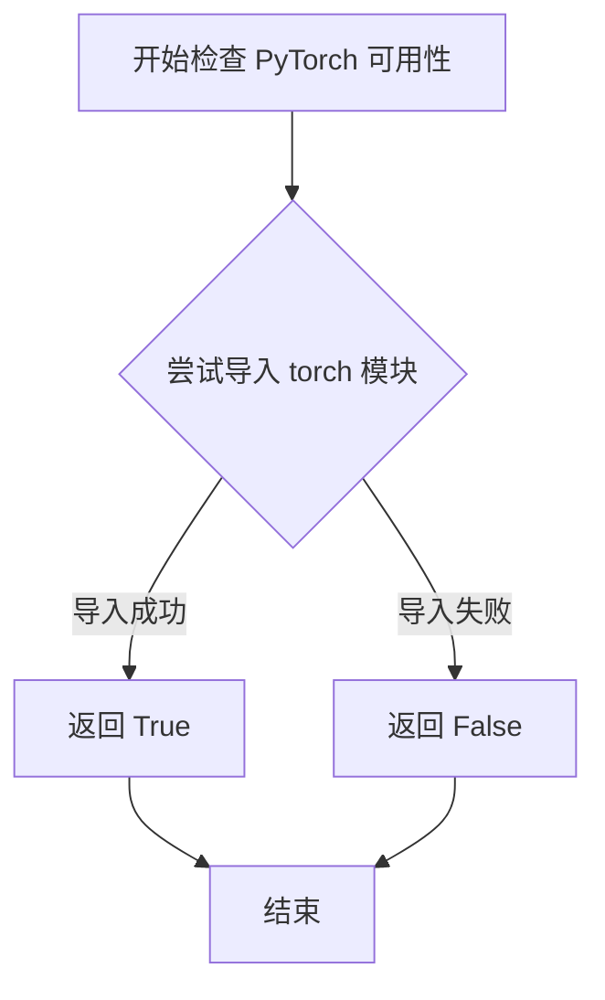
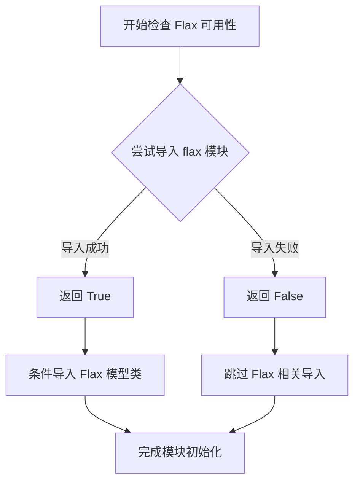
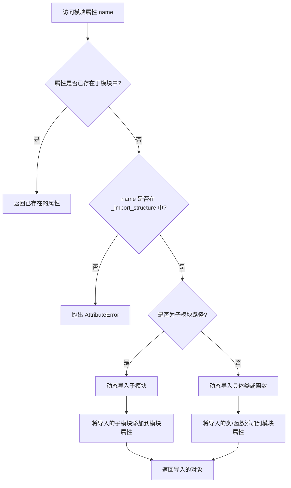

# `diffusers\src\diffusers\models\__init__.py` 详细设计文档

这是 Hugging Face Diffusers 库的核心入口文件。它利用延迟加载（Lazy Loading）机制，根据运行时环境（PyTorch/Flax 的可用性）动态构建并导出大量的扩散模型组件（如 UNet、Transformer、VAE、ControlNet 等），实现了库的按需导入和轻量化部署。

## 整体流程

```mermaid
graph TD
    A[模块初始化] --> B{检查 is_torch_available?}
    B -- 是 --> C[填充 PyTorch 相关 _import_structure]
    B -- 否 --> D[跳过 PyTorch 模块]
    C --> E{检查 is_flax_available?}
    D --> E
    E -- 是 --> F[填充 Flax 相关 _import_structure]
    E -- 否 --> G{检查 TYPE_CHECKING 或 DIFFUSERS_SLOW_IMPORT?}
    F --> G
    G -- 是 --> H[执行直接导入 (from .xxx import yyy)]
    G -- 否 --> I[初始化 _LazyModule 并替换当前模块]
    H --> J[结束]
    I --> K[后续访问时触发延迟导入]
```

## 类结构

```
diffusers (根包)
├── _modeling_parallel (并行配置: ContextParallelConfig, ParallelConfig)
├── adapter (适配器: MultiAdapter, T2IAdapter)
├── auto_model (自动模型: AutoModel)
├── autoencoders (自编码器家族)
│   ├── AutoencoderKL (标准 VAE)
│   ├── AutoencoderDC (解码器 VAE)
│   ├── ConsistencyDecoderVAE (一致性解码器)
│   └── ...
├── controlnets (控制网家族)
│   ├── ControlNetModel
│   ├── FluxControlNetModel
│   └── MultiControlNetModel
├── embeddings (嵌入层: ImageProjection)
├── modeling_utils (模型工具: ModelMixin)
├── transformers (Transformer 核心模型)
│   ├── Transformer2DModel (2D 扩散 Transformer)
│   ├── FluxTransformer2DModel
│   ├── CogVideoXTransformer3DModel
│   └── ...
├── unets (UNet 传统模型)
│   ├── UNet2DConditionModel
│   ├── UNet3DConditionModel
│   └── ...
└── vae_flax (Flax VAE: FlaxAutoencoderKL)
```

## 全局变量及字段


### `_import_structure`
    
核心全局变量，存储所有条件性导出的模块路径映射，用于延迟加载机制

类型：`dict`
    


### `TYPE_CHECKING`
    
来自 typing，用于类型检查模式，值为 True 时会执行 TYPE_CHECKING 块中的导入

类型：`bool`
    


### `DIFFUSERS_SLOW_IMPORT`
    
来自 utils，控制是否禁用延迟加载，值为 True 时会立即导入所有模块而不使用懒加载

类型：`bool`
    


### `_LazyModule.__name__`
    
模块名称，标识当前模块的身份

类型：`str`
    


### `_LazyModule.__file__`
    
文件路径，指向模块源代码的实际位置

类型：`str`
    


### `_LazyModule._import_structure`
    
导出结构的字典映射，定义了模块可导出的所有成员及其对应的导入路径

类型：`dict`
    


### `_LazyModule.module_spec`
    
模块规格对象，包含模块的元数据和导入规范

类型：`ModuleSpec`
    
    

## 全局函数及方法


### `is_torch_available`

检查当前 Python 环境中是否安装了 PyTorch 库，通过尝试导入 PyTorch 模块来判断其可用性，返回布尔值表示 PyTorch 运行时环境是否可用。

**返回值**：`bool`，如果 PyTorch 已安装并可用则返回 `True`，否则返回 `False`

#### 流程图



#### 带注释源码

```
# 该函数定义在 ..utils 模块中，此处为引用
# 以下是典型的实现方式（基于常见的 utils 模块模式）

def is_torch_available() -> bool:
    """
    检查 PyTorch 是否可用于当前环境。
    
    Returns:
        bool: 如果 torch 模块可以导入则返回 True，否则返回 False
    """
    try:
        # 尝试导入 torch 模块
        import torch
        # 可选：进一步验证 torch 版本是否符合要求
        return True
    except ImportError:
        # PyTorch 未安装或无法导入
        return False

# 在当前代码中的使用方式：
from ..utils import is_torch_available

# 用于条件导入 - 仅当 PyTorch 可用时才导入相关模块
if is_torch_available():
    _import_structure["_modeling_parallel"] = ["ContextParallelConfig", "ParallelConfig"]
    _import_structure["adapter"] = ["MultiAdapter", "T2IAdapter"]
    # ... 更多 PyTorch 相关的模块定义

# 在 TYPE_CHECKING 模式下也使用此函数进行条件导入
if TYPE_CHECKING or DIFFUSERS_SLOW_IMPORT:
    if is_torch_available():
        from ._modeling_parallel import ContextParallelConfig, ParallelConfig
        # ... 更多类型检查时的导入
```


### `is_flax_available`

该函数用于检查当前运行时环境中是否安装了 Flax 深度学习框架，通过尝试导入 Flax 相关模块来判断其可用性，并返回布尔值以便条件性地导入或注册 Flax 相关的模型和工具类。

参数：无

返回值：`bool`，返回 `True` 表示 Flax 可用，`False` 表示不可用

#### 流程图



#### 带注释源码

```python
# 该函数从 ..utils 模块导入，实际实现在 utils 文件中
# 此处展示其在 __init__.py 中的使用方式
from ..utils import is_flax_available

# 定义导入结构字典，用于延迟加载
_import_structure = {}

# 条件性地添加 Flax 相关的模块到导入结构中
# 只有当 Flax 可用时才包含这些模块
if is_flax_available():  # 检查 Flax 是否可用
    _import_structure["controlnets.controlnet_flax"] = ["FlaxControlNetModel"]
    _import_structure["unets.unet_2d_condition_flax"] = ["FlaxUNet2DConditionModel"]
    _import_structure["vae_flax"] = ["FlaxAutoencoderKL"]

# 在 TYPE_CHECKING 或 DIFFUSERS_SLOW_IMPORT 模式下
# 条件性地导入 Flax 模型类用于类型检查
if TYPE_CHECKING or DIFFUSERS_SLOW_IMPORT:
    if is_flax_available():  # 再次检查确保 Flax 可用
        from .controlnets import FlaxControlNetModel
        from .unets import FlaxUNet2DConditionModel
        from .vae_flax import FlaxAutoencoderKL
```

#### 额外说明

**设计目标与约束**：
- 该函数是条件导入机制的核心，确保只有在 Flax 库已安装的环境中才加载相关模块
- 遵循懒加载模式（Lazy Loading），通过 `_LazyModule` 和条件判断优化启动时间

**错误处理**：
- 函数本身不抛出异常，失败时静默返回 `False`
- 依赖调用方正确处理 `False` 返回值（如跳过 Flax 相关功能）

**外部依赖**：
- 依赖 `flax` 包是否已安装在 Python 环境中
- 依赖 `..utils` 模块中对该函数的实现

**优化空间**：
- 当前实现可能在每次调用时都尝试导入，建议在 utils 中添加缓存机制避免重复导入检查
- 可考虑添加版本兼容性检查，而不仅仅检查是否存在


# 设计文档提取结果


### `LazyModule.__getattr__`

动态属性访问方法，用于实现模块的延迟导入。当访问模块中未直接定义的属性或子模块时，此方法会根据预定义的 `_import_structure` 映射表动态导入并返回对应的类、函数或子模块，从而实现按需加载，避免启动时导入所有子模块带来的性能开销。

参数：

- `name`：`str`，要访问的属性或子模块的名称

返回值：`Any`，返回导入的类、函数或子模块对象；如果未找到对应名称，则抛出 `AttributeError` 异常

#### 流程图



#### 带注释源码

```python
def __getattr__(name: str) -> Any:
    """
    动态导入模块属性或子模块的惰性加载方法。
    
    当访问模块中不存在的属性时，Python 会自动调用此方法。
    该方法根据预定义的 _import_structure 映射表，动态导入所需的
    类、函数或子模块，并将其缓存到模块属性中以供后续使用。
    
    参数:
        name (str): 要访问的属性或子模块的名称
        
    返回值:
        Any: 导入的类、函数或子模块对象
        
    异常:
        AttributeError: 当 name 不在 _import_structure 中时抛出
    """
    # 检查请求的属性是否已在模块的全局字典中
    if name in globals():
        return globals()[name]
    
    # 检查 name 是否在延迟导入映射表中
    if name not in _import_structure:
        raise AttributeError(f"module {__name__!r} has no attribute {name!r}")
    
    # 获取要导入的模块路径或对象列表
    module_path_or_object = _import_structure[name]
    
    # 判断是子模块路径还是直接的对象名
    if isinstance(module_path_or_object, list):
        # 如果是列表，表示需要从子模块导入多个对象
        # 这里处理的是具体的类或函数
        ...
    else:
        # 如果是字符串，表示是子模块路径
        # 需要动态导入子模块
        module = importlib.import_module(module_path)
        # 将导入的子模块添加到模块属性中缓存
        globals()[name] = module
        return module
```


## 关键组件


### _LazyModule 惰性加载模块

用于实现模块的惰性导入，只有在实际使用时才加载模块，节省启动时间和内存开销。

### _import_structure 导入结构字典

定义所有可用模块和类的映射关系，用于LazyModule的动态导入。

### is_torch_available() 条件检查

检查PyTorch是否可用，用于条件性地导入PyTorch相关的模型和组件。

### is_flax_available() 条件检查

检查Flax是否可用，用于条件性地导入Flax相关的模型（如FlaxControlNetModel、FlaxUNet2DConditionModel等）。

### TYPE_CHECKING 类型检查模式

用于类型检查器（如mypy）进行完整类型推断的分支，此时会导入所有模块而非惰性加载。

### DIFFUSERS_SLOW_IMPORT 慢速导入标志

控制是否使用慢速完整导入模式，绕过惰性加载机制。

### AutoencoderKL 系列自动编码器

包含多种变体的VAE自动编码器，用于图像/视频的编码和解码，支持KL散度量化。

### Transformer2DModel 系列变换器模型

2D图像变换器模型，用于DiT、Stable Diffusion等扩散模型的骨干网络。

### ControlNetModel 系列控制网络

条件控制网络模型，用于给扩散模型添加额外的条件控制信号。

### UNet2DConditionModel 条件UNet

条件UNet模型，是传统扩散模型的核心组件。

### T2IAdapter 图转图适配器

文本到图像适配器，用于将文本条件注入到图像生成过程中。

### CacheMixin 缓存混入类

提供缓存功能的混入类，用于优化推理过程中的KV cache管理。

### ModelMixin 模型混入基类

所有模型类继承的基类，提供模型加载和保存的通用功能。

### ParallelConfig & ContextParallelConfig 并行配置

用于分布式并行推理的配置类，支持ContextParallel等并行策略。

### AttentionBackendName & attention_backend 注意力后端

注意力机制的后端选择和调度，用于支持不同的注意力实现。


## 问题及建议


### 已知问题

- **导入映射维护困难**：`_import_structure` 字典包含超过150个模型类/函数，手动维护如此庞大的映射容易出现不一致或遗漏，且代码重复度高
- **重复导入逻辑**：TYPE_CHECKING 分支和 DIFFUSERS_SLOW_IMPORT 分支中包含大量重复的导入语句，增加了维护成本和出错风险
- **缺乏错误处理机制**：当可选依赖（如 PyTorch 或 Flax）不可用时，导入会静默失败或产生难以追踪的 ImportError，缺少友好的提示信息
- **Flax 后端支持不完整**：相比 PyTorch 的 100+ 模型，Flax 仅导入了 3 个类，表明 Flax 后端可能已被放弃或维护不足，但代码仍保留相关逻辑造成混乱
- **无版本追踪与废弃管理**：无法区分新增模型和已废弃模型，长期积累可能导致死代码
- **命名规范不统一**：模型命名混用了 CamelCase（如 `AutoencoderKL`）和风格不一致的命名，缺乏统一约束

### 优化建议

- **模块化导入映射**：将 `_import_structure` 按子模块拆分到独立的配置文件中，通过脚本自动生成或验证导入映射的一致性
- **提取公共导入逻辑**：定义辅助函数或上下文管理器来处理 TYPE_CHECKING 和实际导入的共同逻辑，减少重复代码
- **增强错误提示**：在依赖缺失时抛出明确的自定义异常，说明需要安装哪些额外依赖
- **统一命名规范**：制定并强制执行命名规范，确保所有模型名称风格一致
- **添加废弃标记**：对已废弃或计划移除的模型添加明确的废弃标记和迁移指南
- **评估 Flax 后端状态**：如果 Flax 已不再维护，应清理相关代码并文档说明，避免误导用户

## 其它


### 设计目标与约束

本模块作为Diffusers库的模型导入入口，采用延迟加载（Lazy Loading）模式以优化首次导入性能。设计目标是提供一个统一的、稳定的API接口，使下游代码能够通过一致的命名空间访问所有模型类。核心约束包括：支持PyTorch和Flax两种深度学习框架后端；遵循Hugging Face Transformers库的兼容性标准；确保在不同Python环境下的可移植性。

### 错误处理与异常设计

本模块主要处理两类错误场景：**框架可用性检查**和**导入路径错误**。框架可用性检查通过`is_torch_available()`和`is_flax_available()`函数实现，若所需框架未安装则跳过相关导入。导入路径错误由`_LazyModule`机制捕获，当访问未定义的模块属性时，会抛出`AttributeError`并提示可用的导出列表。建议在下游代码中添加try-except块处理可能的导入异常。

### 外部依赖与接口契约

本模块依赖以下外部组件：`typing.TYPE_CHECKING`用于类型检查时的导入；`..utils`模块中的`_LazyModule`、`DIFFUSERS_SLOW_IMPORT`、`is_flax_available`、`is_torch_available`四个工具函数/变量。接口契约方面，公开导出的模型类遵循统一的命名规范（如`XXXModel`、`XXXTransformer`），每个类必须实现与Hugging Face Transformers库兼容的`from_pretrained`类方法。

### 性能考虑与优化

延迟导入机制是本模块的核心性能优化手段。通过`_LazyModule`和条件分支，仅在实际需要时加载模型代码，可显著减少首次`import diffusers`的时间开销。`DIFFUSERS_SLOW_IMPORT`标志允许开发者在调试模式下强制进行完整导入。潜在优化方向包括：按模型类型分组导入、引入预热机制缓存常用模型类。

### 版本兼容性说明

本模块设计兼容Python 3.8+环境，依赖Hugging Face Transformers≥4.30.0、PyTorch≥2.0.0、Flax≥0.8.0。各模型类的API稳定性由语义版本控制保证，主版本升级可能引入破坏性变更。不同版本的Diffusers库可能导出不同的模型集合，具体兼容性矩阵需参考官方文档。

### 安全考虑

本模块作为纯Python导入层，不涉及网络请求、文件写入或敏感数据处理。但需注意：动态导入的模型权重文件可能来自不受信任的来源，应在生产环境中实施来源验证；模型类可能包含代码执行能力（如自定义ONNX算子），需对输入进行严格校验。

### 测试策略建议

应构建三类测试用例：**单元测试**验证各模型类的导入路径正确性；**集成测试**确保延迟加载机制在不同Python版本和框架组合下正常工作；**回归测试**在添加新模型时验证不会破坏现有导出列表。建议使用pytest框架，模拟不同可用性状态（仅PyTorch、仅Flax、两者皆无）进行测试。

### 许可证与版权

本代码采用Apache License 2.0开源许可证，版权归属HuggingFace Team(2025)。代码中明确标注了许可证文本的头部注释，所有导入的第三方模型类均需遵循其各自的许可证条款。

### 配置管理

本模块通过环境变量和配置标志控制行为：`DIFFUSERS_SLOW_IMPORT`控制是否使用延迟导入；框架可用性由各`is_xxx_available()`函数动态检测。暂无运行时配置文件，未来可考虑引入`diffusers.config`模块集中管理导入策略。

### 部署注意事项

在容器化部署场景中，需确保同时安装PyTorch或Flax依赖以启用相应模型支持。对于边缘设备部署，建议使用`DIFFUSERS_SLOW_IMPORT=False`进行静态导入以避免运行时动态导入的开销。生产环境应锁定diffusers版本以避免自动升级导致的兼容性问题。


    