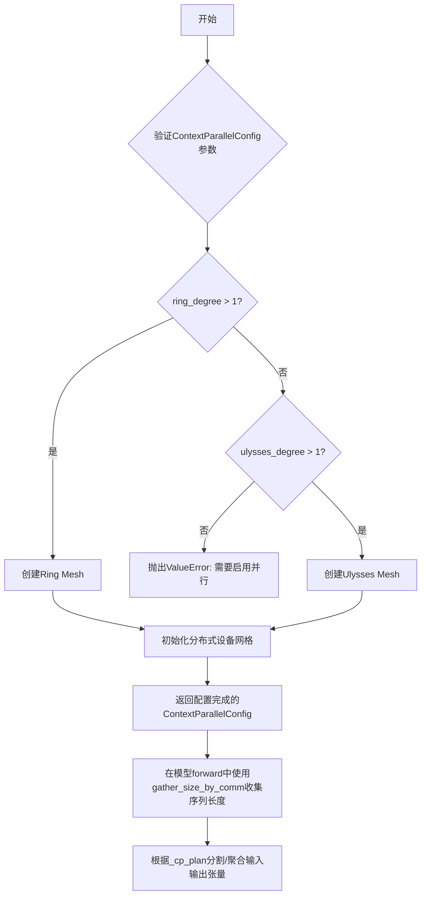
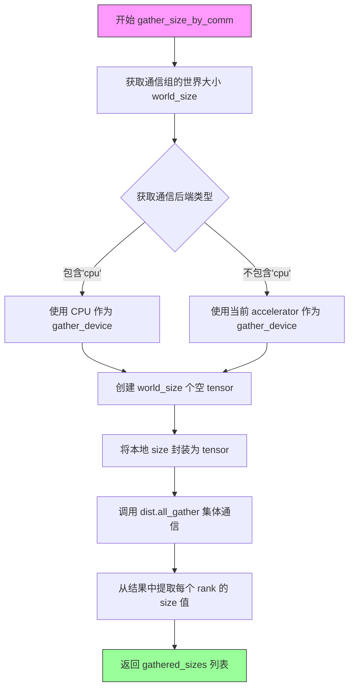
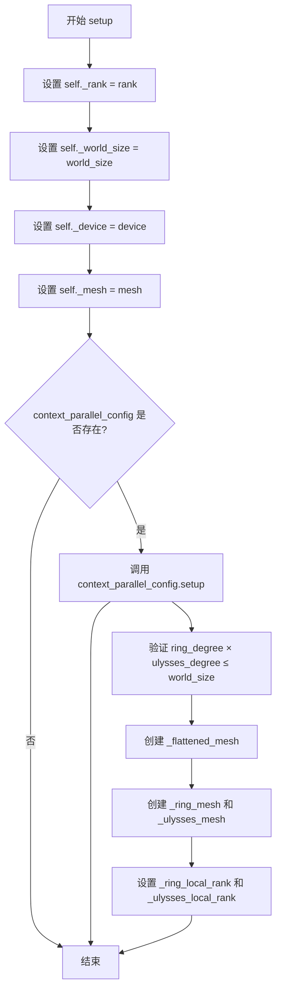
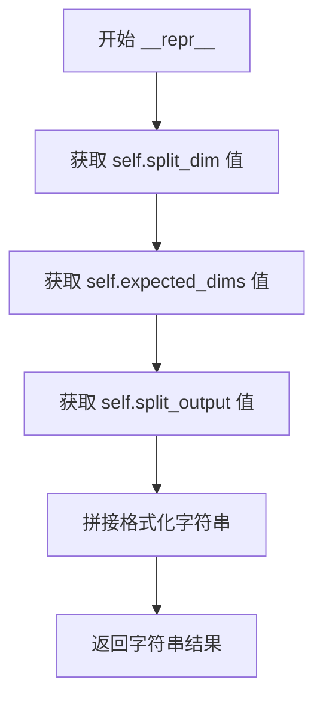

# `diffusers\src\diffusers\models\_modeling_parallel.py` 详细设计文档

该模块为Diffusers提供实验性的上下文并行（Context Parallelism）支持，通过Ring Attention和Ulysses Attention两种并行策略实现长序列处理时的内存优化和计算通信重叠，支持张量在不同设备间的分割与聚合配置。

## 整体流程



## 类结构

```
ContextParallelConfig (数据类-配置)
├── ParallelConfig (数据类-配置)
├── ContextParallelInput (数据类-不可变配置)
└── ContextParallelOutput (数据类-不可变配置)
```

## 全局变量及字段


### `ContextParallelInputType`
    
输入分割配置的类型别名，定义如何在上下文并行区域分割输入张量

类型：`dict[str | int, ContextParallelInput | list[ContextParallelInput] | tuple[ContextParallelInput, ...]]`
    


### `ContextParallelOutputType`
    
输出聚合配置的类型别名，定义如何在上下文并行区域聚合输出张量

类型：`ContextParallelOutput | list[ContextParallelOutput] | tuple[ContextParallelOutput, ...]`
    


### `ContextParallelModelPlan`
    
模型并行计划的类型别名，定义模块级别的输入输出分割/聚合策略

类型：`dict[str, ContextParallelInputType | ContextParallelOutputType]`
    


### `ContextParallelConfig.ring_degree`
    
Ring Attention设备数量，序列在设备间分割，每设备计算本地Q与顺序传递的KV块注意力

类型：`int | None`
    


### `ContextParallelConfig.ulysses_degree`
    
Ulysses Attention设备数量，序列在设备间分割，每设备计算本地QKV后通过all-gather获取全部KV

类型：`int | None`
    


### `ContextParallelConfig.convert_to_fp32`
    
是否将输出和LSE转换为float32以保证Ring Attention的数值稳定性

类型：`bool`
    


### `ContextParallelConfig.rotate_method`
    
Ring Attention中跨设备轮换键/值状态的方法，目前仅支持allgather

类型：`Literal["allgather", "alltoall"]`
    


### `ContextParallelConfig.ulysses_anything`
    
是否启用Ulysses任意注意力以支持任意序列长度和任意头数

类型：`bool`
    


### `ContextParallelConfig._rank`
    
当前进程在分布式环境中的rank标识

类型：`int`
    


### `ContextParallelConfig._world_size`
    
分布式环境中的总进程数

类型：`int`
    


### `ContextParallelConfig._device`
    
当前进程使用的计算设备对象

类型：`torch.device`
    


### `ContextParallelConfig._mesh`
    
用于管理设备拓扑结构的设备网格对象

类型：`torch.distributed.device_mesh.DeviceMesh`
    


### `ContextParallelConfig._flattened_mesh`
    
扁平化后的设备网格，将多维设备拓扑展平为一维

类型：`torch.distributed.device_mesh.DeviceMesh`
    


### `ContextParallelConfig._ring_mesh`
    
Ring并行专用的设备网格维度

类型：`torch.distributed.device_mesh.DeviceMesh`
    


### `ContextParallelConfig._ulysses_mesh`
    
Ulysses并行专用的设备网格维度

类型：`torch.distributed.device_mesh.DeviceMesh`
    


### `ContextParallelConfig._ring_local_rank`
    
Ring并行维度内的本地rank索引

类型：`int`
    


### `ContextParallelConfig._ulysses_local_rank`
    
Ulysses并行维度内的本地rank索引

类型：`int`
    


### `ParallelConfig.context_parallel_config`
    
上下文并行配置对象，用于管理序列并行和注意力并行

类型：`ContextParallelConfig | None`
    


### `ParallelConfig._rank`
    
当前进程在分布式环境中的rank标识

类型：`int`
    


### `ParallelConfig._world_size`
    
分布式环境中的总进程数

类型：`int`
    


### `ParallelConfig._device`
    
当前进程使用的计算设备对象

类型：`torch.device`
    


### `ParallelConfig._mesh`
    
用于管理设备拓扑结构的设备网格对象

类型：`torch.distributed.device_mesh.DeviceMesh`
    


### `ContextParallelInput.split_dim`
    
沿此维度分割输入张量

类型：`int`
    


### `ContextParallelInput.expected_dims`
    
张量的期望维度数量，用于分割前验证

类型：`int | None`
    


### `ContextParallelInput.split_output`
    
是否分割输出张量而非输入张量，适用于如RoPE等预处理输出的场景

类型：`bool`
    


### `ContextParallelOutput.gather_dim`
    
沿此维度聚合输出张量

类型：`int`
    


### `ContextParallelOutput.expected_dims`
    
张量的期望维度数量，用于聚合前验证

类型：`int | None`
    
    

## 全局函数及方法


### `gather_size_by_comm`

该函数用于在所有分布式进程ranks间收集本地序列大小，支持Ulysses Anything模式下的动态序列长度收集，确保不同ranks可以具有不同的本地序列长度。

参数：

- `size`：`int`，本地序列大小（如每个rank的局部序列长度S_LOCAL）
- `group`：`dist.ProcessGroup`，PyTorch分布式通信进程组

返回值：`list[int]`，包含所有ranks本地大小的列表

#### 流程图



#### 带注释源码

```python
def gather_size_by_comm(size: int, group: dist.ProcessGroup) -> list[int]:
    r"""Gather the local size from all ranks.
    size: int, local size return: list[int], list of size from all ranks
    
    注意：此函数不支持缓存！
    在 Ulysses Anything 模式下，每个 rank 的本地序列长度可能不同。
    如果缓存结果，不同 rank 可能出现缓存命中/未命中的不一致情况，
    导致部分 rank 跳过 all_gather 而其他 rank 参与，造成通信死锁。
    """
    # 获取通信组中的总进程数
    world_size = dist.get_world_size(group=group)
    
    # HACK: 检测通信后端类型，如果是 CPU/gloo 后端则使用 CPU 设备
    # 这样可以避免 GPU 到 CPU (H2D) 和 CPU 到 GPU (D2H) 的数据传输开销
    comm_backends = str(dist.get_backend(group=group))
    
    # 根据后端类型选择收集设备：gloo 后端用 CPU，nccl 后端用当前 accelerator
    # NOTE: e.g., dist.init_process_group(backend="cpu:gloo,cuda:nccl")
    gather_device = "cpu" if "cpu" in comm_backends else torch.accelerator.current_accelerator()
    
    # 创建空 tensor 列表用于接收所有 rank 的数据
    gathered_sizes = [torch.empty((1,), device=gather_device, dtype=torch.int64) for _ in range(world_size)]
    
    # 执行 all_gather 集体通信操作
    # 将本地 size 封装为 tensor 并发送到所有 rank
    dist.all_gather(
        gathered_sizes,
        torch.tensor([size], device=gather_device, dtype=torch.int64),
        group=group,
    )

    # 从每个 tensor 中提取标量值
    # 注意：不能使用 .tolist()，因为会触发 graph break
    # 导致后端编译器 inductor 失败（aten._local_scalar_dense.default 错误）
    gathered_sizes = [s[0].item() for s in gathered_sizes]
    
    return gathered_sizes
```


### `ContextParallelConfig.__post_init__`

该方法是 `ContextParallelConfig` 数据类的初始化后钩子，用于在对象创建后验证配置参数的合法性，确保 ring_degree 和 ulysses_degree 的组合使用方式符合上下文并行推理的约束条件，并检查 ulysses_anything 模式的特殊前置要求。

参数：

- `self`：`ContextParallelConfig`，隐式参数，当前 ContextParallelConfig 实例

返回值：`None`，无返回值，仅执行参数验证和状态设置

#### 流程图

```mermaid
flowchart TD
    A[__post_init__ 开始] --> B{ring_degree is None?}
    B -->|Yes| C[ring_degree = 1]
    B -->|No| D{ulysses_degree is None?}
    C --> D
    D -->|Yes| E[ulysses_degree = 1]
    D -->|No| F{ring_degree == 1 && ulysses_degree == 1?}
    E --> F
    F -->|Yes| G[raise ValueError: 至少一个必须大于1]
    F -->|No| H{ring_degree < 1 || ulysses_degree < 1?}
    G --> I[验证结束]
    H -->|Yes| J[raise ValueError: 必须 >= 1]
    H -->|No| K{rotate_method != 'allgather'?}
    J --> I
    K -->|Yes| L[raise NotImplementedError]
    K -->|No| M{ulysses_anything enabled?}
    L --> I
    M -->|No| N[验证通过]
    M -->|Yes| O{ulysses_degree == 1?}
    O -->|Yes| P[raise ValueError: ulysses_degree必须>1]
    O -->|No| Q{ring_degree > 1?}
    P --> I
    Q -->|Yes| R[raise ValueError: ulysses_anything不能与ring并行]
    Q -->|No| N
```

#### 带注释源码

```python
def __post_init__(self):
    """
    初始化后验证参数合法性。
    
    该方法在 dataclass 实例创建后自动调用，用于：
    1. 为 None 的参数设置默认值
    2. 验证 ring_degree 和 ulysses_degree 的组合有效性
    3. 检查 rotate_method 是否支持
    4. 验证 ulysses_anything 模式的前置条件
    """
    # 步骤1: 为 None 的参数设置默认值
    # 如果用户未指定 ring_degree，默认设为 1（不使用 Ring Attention）
    if self.ring_degree is None:
        self.ring_degree = 1
    
    # 如果用户未指定 ulysses_degree，默认设为 1（不使用 Ulysses Attention）
    if self.ulysses_degree is None:
        self.ulysses_degree = 1

    # 步骤2: 验证至少有一种并行方式被启用
    # 上下文并行推理需要至少一种并行策略的度数大于 1
    if self.ring_degree == 1 and self.ulysses_degree == 1:
        raise ValueError(
            "Either ring_degree or ulysses_degree must be greater than 1 in order to use context parallel inference"
        )
    
    # 步骤3: 验证度数参数的有效范围
    # ring_degree 和 ulysses_degree 必须 >= 1
    if self.ring_degree < 1 or self.ulysses_degree < 1:
        raise ValueError("`ring_degree` and `ulysses_degree` must be greater than or equal to 1.")
    
    # 步骤4: 验证旋转方法是否实现
    # 目前仅支持 "allgather" 方式，"alltoall" 尚待实现
    if self.rotate_method != "allgather":
        raise NotImplementedError(
            f"Only rotate_method='allgather' is supported for now, but got {self.rotate_method}."
        )
    
    # 步骤5: 验证 ulysses_anything 模式的前置条件
    # ulysses_anything 支持任意序列长度和任意头数，但有以下约束：
    # - ulysses_degree 必须 > 1（需要多设备协作）
    # - 不能与 ring_degree 同时使用（两者互斥）
    if self.ulysses_anything:
        # ulysses_anything 需要 ulysses_degree > 1
        if self.ulysses_degree == 1:
            raise ValueError("ulysses_degree must be greater than 1 for ulysses_anything to be enabled.")
        # ulysses_anything 与 ring attention 互斥
        if self.ring_degree > 1:
            raise ValueError("ulysses_anything cannot be enabled when ring_degree > 1.")
```


# ContextParallelConfig 类设计文档

## 一段话描述

`ContextParallelConfig` 是用于配置分布式深度学习模型中上下文并行（Context Parallelism）的核心配置类，支持 Ring Attention 和 Ulysses Attention 两种并行策略，通过 `mesh_shape` 属性提供设备网格的二维形状信息，用于在分布式环境中组织和调度计算资源。

---

## 文件的整体运行流程

1. **配置初始化**：创建 `ContextParallelConfig` 实例，设置 `ring_degree`、`ulysses_degree` 等参数
2. **参数校验**：在 `__post_init__` 方法中验证并行度配置的合法性
3. **设备网格构建**：通过 `setup` 方法接收设备网格信息，初始化内部设备通信结构
4. **网格形状查询**：通过 `mesh_shape` 属性获取设备网格的二维形状，供外部模块使用
5. **并行计算执行**：根据配置的并行策略执行分布式注意力计算

---

## 类的详细信息

### 类：ContextParallelConfig

用于配置上下文并行的 dataclass，包含了 Ring Attention 和 Ulysses Attention 两种并行策略的参数。

#### 类字段

| 字段名称 | 类型 | 描述 |
|---------|------|------|
| `ring_degree` | `int \| None` | Ring Attention 使用的设备数量 |
| `ulysses_degree` | `int \| None` | Ulysses Attention 使用的设备数量 |
| `convert_to_fp32` | `bool` | 是否将输出和 LSE 转换为 float32 以保证数值稳定性 |
| `rotate_method` | `Literal["allgather", "alltoall"]` | Ring Attention 中 KV 状态的轮转方法 |
| `ulysses_anything` | `bool` | 是否启用 Ulysses Anything 以支持任意序列长度和头数 |
| `_rank` | `int` | 当前进程的 rank 标识 |
| `_world_size` | `int` | 总进程数 |
| `_device` | `torch.device` | 计算设备 |
| `_mesh` | `torch.distributed.device_mesh.DeviceMesh` | 设备网格对象 |
| `_flattened_mesh` | `torch.distributed.device_mesh.DeviceMesh` | 扁平化后的设备网格 |
| `_ring_mesh` | `torch.distributed.device_mesh.DeviceMesh` | Ring 维度的设备网格 |
| `_ulysses_mesh` | `torch.distributed.device_mesh.DeviceMesh` | Ulysses 维度的设备网格 |
| `_ring_local_rank` | `int` | Ring 维度内的本地 rank |
| `_ulysses_local_rank` | `int` | Ulysses 维度内的本地 rank |

#### 类方法

| 方法名称 | 描述 |
|---------|------|
| `__post_init__` | 初始化后处理，设置默认值并进行参数校验 |
| `mesh_shape` | 返回设备网格形状 (ring_degree, ulysses_degree) |
| `mesh_dim_names` | 返回设备网格的维度名称 ("ring", "ulysses") |
| `setup` | 配置分布式环境参数，初始化设备网格相关对象 |

---

## ContextParallelConfig.mesh_shape 属性详情

### 属性描述

返回上下文并行的设备网格形状，由 Ring Attention 维度和 Ulysses Attention 维度的设备数量组成。该属性用于在分布式训练/推理过程中确定设备拓扑结构，以便正确地进行张量分片和通信。

参数：无（这是一个属性装饰器修饰的方法，不接受除 self 外的参数）

返回值：`tuple[int, int]`，返回 (ring_degree, ulysses_degree)，表示设备网格在两个维度上的大小

#### 流程图

```mermaid
graph TD
    A[访问 mesh_shape 属性] --> B{检查属性调用}
    B --> C[self.ring_degree]
    B --> D[self.ulysses_degree]
    C --> E[构建元组]
    D --> E
    E --> F[返回 tuple[int, int]]
    
    style A fill:#e1f5fe
    style F fill:#c8e6c9
```

#### 带注释源码

```python
@property
def mesh_shape(self) -> tuple[int, int]:
    """
    返回设备网格的二维形状。
    
    Returns:
        tuple[int, int]: 包含两个整数的元组，第一个元素表示 Ring Attention 
                        的设备数量 (ring_degree)，第二个元素表示 Ulysses 
                        Attention 的设备数量 (ulysses_degree)。
    
    Example:
        >>> config = ContextParallelConfig(ring_degree=2, ulysses_degree=4)
        >>> config.mesh_shape
        (2, 4)
    """
    return (self.ring_degree, self.ulysses_degree)
```

---

## 关键组件信息

| 组件名称 | 一句话描述 |
|---------|-----------|
| `ContextParallelConfig` | 上下文并行配置类，管理 Ring Attention 和 Ulysses Attention 的并行参数 |
| `ParallelConfig` | 更高层的并行配置类，可包含 ContextParallelConfig 作为子配置 |
| `ContextParallelInput` | 配置输入张量在上下文并行区域如何切分 |
| `ContextParallelOutput` | 配置输出张量在上下文并行区域如何聚合 |
| `ContextParallelModelPlan` | 模型级别的上下文并行切分/聚合计划字典 |
| `gather_size_by_comm` | 分布式通信工具函数，用于在所有 rank 间收集本地大小信息 |

---

## 潜在的技术债务或优化空间

1. **rotate_method 限制**：当前仅支持 `"allgather"` 方法，`"alltoall"` 方法已定义但未实现
2. **缺少统一注意力支持**：TODO 中提到要添加 Unified Attention 支持
3. **更多调度器后端**：TODO 中提到要添加更多 dispatcher attention backends
4. **CFG/Data Parallel 和 Tensor Parallel**：TODO 中明确列出但尚未支持
5. **ulysses_anything 约束**：启用 `ulysses_anything` 时不能同时使用 `ring_degree > 1`，限制了两者的组合使用场景
6. **缓存安全风险**：代码中特别提到不能缓存 `gather_size_by_comm` 的结果，因为 Ulysses Anything 模式下不同 rank 的本地序列长度可能不同，缓存可能导致分布式挂起

---

## 其它项目

### 设计目标与约束

- **目标**：支持长序列推理的分布式并行，通过 Ring Attention 和 Ulysses Attention 降低单设备显存压力
- **约束**：`ring_degree` 和 `ulysses_degree` 必须大于等于 1，且两者的乘积不能超过 world_size
- **互斥条件**：启用 `ulysses_anything` 时，`ring_degree` 必须为 1

### 错误处理与异常设计

- 当 `ring_degree` 和 `ulysses_degree` 都为 1 时，抛出 `ValueError`（需要至少一种并行策略）
- 当 `ring_degree` 或 `ulysses_degree` 小于 1 时，抛出 `ValueError`
- 当 `rotate_method` 不是 `"allgather"` 时，抛出 `NotImplementedError`
- 当 `ulysses_anything` 启用但 `ulysses_degree` 为 1 时，抛出 `ValueError`
- 当 `ulysses_anything` 启用且 `ring_degree > 1` 时，抛出 `ValueError`
- 当 `ring_degree * ulysses_degree > world_size` 时，抛出 `ValueError`

### 数据流与状态机

- **初始化状态**：配置对象创建后，`_rank`、`_world_size`、`_device`、`_mesh` 等内部状态为 `None`
- **配置状态**：调用 `setup()` 方法后，内部网格对象被初始化
- **运行状态**：在分布式前向传播中，根据 `mesh_shape` 确定的网格形状进行张量切分和通信

### 外部依赖与接口契约

- 依赖 `torch.distributed.device_mesh.DeviceMesh` 进行设备网格管理
- 依赖 `torch.distributed` 进行集合通信（如 `dist.all_gather`）
- `mesh_shape` 属性返回的元组顺序固定为 `(ring_degree, ulysses_degree)`，调用者需按此顺序解包使用


### `ContextParallelConfig.mesh_dim_names`

返回设备网格的维度名称，用于标识 ring attention 和 ulysses attention 的维度。

参数：此属性无需参数

返回值：`tuple[str, str]`，返回一个包含两个字符串元素的元组 `("ring", "ulysses")`，分别代表 Ring Attention 和 Ulysses Attention 的维度名称。

#### 流程图

```mermaid
flowchart TD
    A[访问 mesh_dim_names 属性] --> B{检查属性是否已定义}
    B -->|是| C[返回 tuple: ('ring', 'ulysses')]
    B -->|否| D[返回 AttributeError]
    
    C --> E[调用者获取维度名称]
    
    style C fill:#90EE90
    style E fill:#87CEEB
```

#### 带注释源码

```python
@property
def mesh_dim_names(self) -> tuple[str, str]:
    """Dimension names for the device mesh."""
    # 返回一个元组，包含两个维度名称：
    # - "ring": 表示 Ring Attention 的设备网格维度
    # - "ulysses": 表示 Ulysses Attention 的设备网格维度
    # 该属性用于在分布式设备网格 (DeviceMesh) 中标识不同的并行维度
    return ("ring", "ulysses")
```


### `ContextParallelConfig.setup`

该方法用于初始化分布式环境配置，接收 rank、world_size、device 和 mesh 参数，设置实例的内部状态（_rank、_world_size、_device、_mesh），验证 ring_degree 和 ulysses_degree 的乘积不超过 world_size，并初始化 flattened_mesh、ring_mesh、ulysses_mesh 以及对应的 local_rank。

参数：

- `rank`：`int`，当前进程在分布式环境中的排名（rank ID）
- `world_size`：`int`，分布式环境中的总进程数
- `device`：`torch.device`，当前进程使用的计算设备
- `mesh`：`torch.distributed.device_mesh.DeviceMesh`，设备网格对象，用于定义设备拓扑结构

返回值：`None`，该方法无返回值，直接修改实例的内部属性

#### 流程图

```mermaid
flowchart TD
    A[开始 setup] --> B[设置 self._rank = rank]
    B --> C[设置 self._world_size = world_size]
    C --> D[设置 self._device = device]
    D --> E[设置 self._mesh = mesh]
    E --> F{验证 ring_degree * ulysses_degree <= world_size?}
    F -->|是| G[设置 self._flattened_mesh = mesh._flatten]
    F -->|否| H[抛出 ValueError]
    H --> I[结束]
    G --> J[设置 self._ring_mesh = mesh['ring']]
    J --> K[设置 self._ulysses_mesh = mesh['ulysses']]
    K --> L[设置 self._ring_local_rank = ring_mesh.get_local_rank]
    L --> M[设置 self._ulysses_local_rank = ulysses_mesh.get_local_rank]
    M --> I
```

#### 带注释源码

```python
def setup(self, rank: int, world_size: int, device: torch.device, mesh: torch.distributed.device_mesh.DeviceMesh):
    """
    初始化分布式环境配置。
    
    参数:
        rank: 当前进程在分布式环境中的排名
        world_size: 分布式环境中的总进程数
        device: 当前进程使用的计算设备
        mesh: 设备网格对象，用于定义设备拓扑结构
    """
    # 设置当前进程的 rank
    self._rank = rank
    # 设置分布式世界的总进程数
    self._world_size = world_size
    # 设置当前进程使用的设备
    self._device = device
    # 设置设备网格对象
    self._mesh = mesh

    # 验证 ring_degree 和 ulysses_degree 的乘积不超过 world_size
    if self.ulysses_degree * self.ring_degree > world_size:
        raise ValueError(
            f"The product of `ring_degree` ({self.ring_degree}) and `ulysses_degree` ({self.ulysses_degree}) must not exceed the world size ({world_size})."
        )

    # 将设备网格展平，获取展平后的网格
    self._flattened_mesh = self._mesh._flatten()
    # 获取 ring 维度的设备网格
    self._ring_mesh = self._mesh["ring"]
    # 获取 ulysses 维度的设备网格
    self._ulysses_mesh = self._mesh["ulysses"]
    # 获取 ring 维度内的本地 rank
    self._ring_local_rank = self._ring_mesh.get_local_rank()
    # 获取 ulysses 维度内的本地 rank
    self._ulysses_local_rank = self._ulysses_mesh.get_local_rank()
```


### `ParallelConfig.setup`

该方法用于设置并行配置和上下文并行，初始化分布式训练所需的基础配置信息，包括 rank、world_size、device 和 mesh，并将配置传递给上下文并行配置对象。

参数：

- `rank`：`int`，当前进程在分布式环境中的秩（rank）
- `world_size`：`int`，分布式环境中的总进程数
- `device`：`torch.device`，用于计算的设备
- `mesh`：`torch.distributed.device_mesh.DeviceMesh | None`（关键字参数），用于分布式通信的设备网格

返回值：`None`，该方法直接修改对象内部状态，无返回值

#### 流程图



#### 带注释源码

```python
def setup(
    self,
    rank: int,
    world_size: int,
    device: torch.device,
    *,
    mesh: torch.distributed.device_mesh.DeviceMesh | None = None,
):
    """
    设置并行配置和上下文并行。
    
    该方法初始化分布式训练所需的基础配置，包括：
    - 当前进程的 rank
    - 总进程数 world_size
    - 计算设备 device
    - 设备网格 mesh
    
    如果配置了 context_parallel_config，还会进一步初始化上下文并行配置。
    
    参数:
        rank: 当前进程在分布式环境中的秩（rank）
        world_size: 分布式环境中的总进程数
        device: 用于计算的设备（如 cuda:0, cpu 等）
        mesh: torch.distributed.device_mesh.DeviceMesh，可选的设备网格对象，
              用于定义进程在各个维度上的布局
    """
    # 设置当前进程的 rank
    self._rank = rank
    
    # 设置分布式环境的总进程数
    self._world_size = world_size
    
    # 设置计算设备
    self._device = device
    
    # 设置设备网格
    self._mesh = mesh
    
    # 检查是否配置了上下文并行配置
    if self.context_parallel_config is not None:
        # 如果存在上下文并行配置，则调用其 setup 方法进行初始化
        # 这会进一步设置 ring_degree、ulysses_degree 相关的 mesh 和 rank
        self.context_parallel_config.setup(rank, world_size, device, mesh)
```


### `ContextParallelInput.__repr__`

该方法为 `ContextParallelInput` 数据类生成标准的字符串表示形式，便于调试和日志输出。它返回一个格式化的字符串，包含该配置对象的所有关键属性值（split_dim、expected_dims 和 split_output）。

参数：

- `self`：隐式参数，表示 ContextParallelInput 类的实例本身，无额外参数。

返回值：`str`，返回一个格式化的字符串，表示 ContextParallelInput 对象的配置信息，格式为 `ContextParallelInput(split_dim={值}, expected_dims={值}, split_output={值})`。

#### 流程图



#### 带注释源码

```python
def __repr__(self):
    """
    返回 ContextParallelInput 对象的字符串表示形式。
    
    该方法重写了 Python 内置的 __repr__ 特殊方法，
    提供一个友好且信息完整的字符串描述，便于调试和日志输出。
    
    Returns:
        str: 包含所有属性的格式化字符串，格式为
             'ContextParallelInput(split_dim=X, expected_dims=Y, split_output=Z)'
    """
    # 使用 f-string 格式化字符串，将对象的三个核心属性值拼接成可读字符串
    return f"ContextParallelInput(split_dim={self.split_dim}, expected_dims={self.expected_dims}, split_output={self.split_output})"
```


### ContextParallelOutput.__repr__

该方法是 `ContextParallelOutput` 类的字符串表示方法，用于返回该配置对象的可读字符串形式，以便于调试和日志输出。

参数：无（使用隐式 `self` 参数）

返回值：`str`，返回格式化的配置字符串，包含 `gather_dim` 和 `expected_dims` 两个属性的当前值。

#### 流程图

```mermaid
flowchart TD
    A[调用 __repr__ 方法] --> B{获取 self.gather_dim 值}
    B --> C{获取 self.expected_dims 值}
    C --> D[构建格式化字符串]
    D --> E[返回字符串: ContextParallelOutput(gather_dim=..., expected_dims=...)]
```

#### 带注释源码

```python
@dataclass(frozen=True)
class ContextParallelOutput:
    """
    Configuration for gathering an output tensor across context parallel region.

    Args:
        gather_dim (`int`):
            The dimension along which to gather the tensor.
        expected_dims (`int`, *optional*):
            The expected number of dimensions of the tensor. If provided, a check will be performed to ensure that the
            tensor has the expected number of dimensions before gathering.
    """

    gather_dim: int  # 整数类型，指定沿哪个维度聚合张量
    expected_dims: int | None = None  # 可选的整数或None，指定张量的期望维度数

    def __repr__(self):
        """
        返回该配置对象的字符串表示形式。
        
        Returns:
            str: 包含 gather_dim 和 expected_dims 值的格式化字符串
        """
        return f"ContextParallelOutput(gather_dim={self.gather_dim}, expected_dims={self.expected_dims})"
```

## 关键组件


### ContextParallelConfig

上下文并行配置数据类，用于配置Ring Attention和Ulysses Attention两种并行策略。包含ring_degree（环注意力设备数）、ulysses_degree（尤利西斯注意力设备数）、convert_to_fp32（是否转换为float32保证数值稳定性）、rotate_method（旋转key/value状态的通信方法）等配置项，以及设备网格相关的私有属性。

### ParallelConfig

并行配置数据类，包装ContextParallelConfig以支持不同的并行策略组合。提供setup方法初始化分布式环境的rank、world_size、device和mesh。

### ContextParallelInput

冻结数据类，定义输入张量在上下文并行区域的分割规则。包含split_dim（分割维度）、expected_dims（期望的tensor维度数）和split_output（是否分割输出而非输入）字段，用于配置在pre-forward或post-forward hook中的分片行为。

### ContextParallelOutput

冻结数据类，定义输出张量在上下文并行区域的聚合规则。包含gather_dim（聚合维度）和expected_dims（期望的tensor维度数）字段，用于配置在post-forward hook中的聚合行为。

### gather_size_by_comm

全局工具函数，用于从所有分布式进程收集本地大小信息。接收本地size和进程组作为参数，返回包含所有rank上size的列表。该函数设计为不在"Ulysses Anything"模式下缓存结果，以避免因不同rank的缓存命中/未命中模式不同而导致分布式挂起。

### ContextParallelInputType

类型别名，定义输入分割计划的字典类型。键为字符串（参数名）或整数（输出索引），值为单个或多个ContextParallelInput配置。

### ContextParallelOutputType

类型别名，定义输出聚合计划的字典类型。值为单个或多个ContextParallelOutput配置。

### ContextParallelModelPlan

类型别名，定义模块级上下文并行计划的字典类型。键为模块名称，值为输入或输出的分割/聚合配置。

### 设备网格管理组件

包含_ring_mesh（环注意力设备网格）、_ulysses_mesh（尤利西斯设备网格）、_flattened_mesh（扁平化网格）等私有属性，用于管理不同并行策略下的设备拓扑结构。


## 问题及建议


### 已知问题

-   **硬编码的Gloo后端Hack**：在`gather_size_by_comm`函数中使用字符串检查`"cpu" in comm_backends`来判断使用哪个设备，这种方式脆弱且不够优雅，假设了特定的backend字符串格式，可能导致在不同环境下行为不一致
-   **不完整的类型注解**：`ContextParallelConfig`类中的`_rank`、`_world_size`、`_device`等私有字段初始化为`None`但未使用`Optional`类型注解，违反了类型安全最佳实践
-   **状态管理缺陷**：在`setup`方法中直接修改实例属性，而`__post_init__`已经进行过一次验证，导致初始化和设置逻辑分离，可能产生不一致的中间状态
-   **不支持的功能未降级处理**：对于不支持的`rotate_method="alltoall"`直接抛出`NotImplementedError`，缺乏优雅降级或警告机制
-   **设备检测API兼容性**：使用`torch.accelerator.current_accelerator()`获取加速器设备，该API在不同PyTorch版本中可能不存在或行为不同，缺乏版本检查
-   **混合并行验证不足**：仅在`setup`时验证`ring_degree * ulysses_degree <= world_size`，但未验证这些degree是否能整除world_size或与设备网格拓扑兼容
-   **日志记录缺失**：关键操作如mesh创建、rank分配等缺少日志记录，调试和问题排查困难

### 优化建议

-   **重构设备后端选择逻辑**：使用`dist.Backend.GLOO`等枚举类型常量或更健壮的设备检测方式，避免字符串匹配
-   **完善类型注解**：为所有私有字段添加`Optional`类型注解，或使用`field(default=None)`配合类型提示
-   **统一初始化流程**：将验证逻辑集中到`setup`方法或使用工厂模式，确保对象在使用前完全初始化
-   **添加功能标志降级**：对于不支持的`rotate_method`，可添加警告并回退到`allgather`而非直接抛出异常
-   **添加版本兼容层**：使用`try-except`或`hasattr`检查`torch.accelerator`API的可用性，提供回退方案
-   **增强拓扑验证**：在`setup`中添加更全面的设备网格兼容性检查，包括整除性验证和通信模式兼容性
-   **添加结构化日志**：在关键方法入口、异常分支、配置验证处添加logger调用，便于生产环境调试
-   **文档补充**：为`ContextParallelConfig.setup`方法补充详细的参数说明和示例，特别是mesh的预期格式


## 其它


### 设计目标与约束

本模块旨在为Diffusers提供实验性的并行推理支持，通过Context Parallelism实现长序列处理时的显存优化。设计目标包括：支持Ring Attention和Ulysses Attention两种并行策略，允许用户根据硬件配置选择合适的并行方案。约束条件包括：rotate_method目前仅支持"allgather"，ulysses_anything模式不能与ring_degree同时启用，且ring_degree和ulysses_degree必须至少有一个大于1。

### 错误处理与异常设计

配置验证在`__post_init__`方法中进行，包括：检查ring_degree和ulysses_degree的有效性、验证rotate_method是否支持、确保ulysses_anything模式满足前置条件。setup方法中会验证ring_degree与ulysses_degree的乘积不超过world_size。gather_size_by_comm函数中使用torch.accelerator.current_accelerator()获取设备，用于跨设备通信的错误处理。

### 数据流与状态机

数据流遵循以下流程：模型forward前通过pre-hook根据_cp_plan对输入进行split_dim维度的分割→执行模型forward→通过post-hook根据_cp_plan对输出进行gather_dim维度的全局汇聚。ContextParallelModelPlan定义了模块级别的输入输出分割策略，key可以是字符串（参数名）或整数（输出索引）。

### 外部依赖与接口契约

主要依赖包括：torch、torch.distributed（分布式通信）、dataclasses（配置类定义）。外部接口包括：ContextParallelConfig.setup()接收rank/world_size/device/mesh参数；ContextParallelInput定义分割维度、期望维度、是否分割输出；ContextParallelOutput定义汇聚维度、期望维度。

### 并行策略说明

Ring Attention策略：将序列分成N份，KV在环上顺序传递，每设备只保存1/N的KV，需N次迭代完成全局注意力计算，适合长序列低显存场景。Ulysses Attention策略：每设备计算本地QKV后通过all-gather获取全部KV，一次前向完成全局注意力，显存需求更高但延迟更低。两种策略通过ring_degree和ulysses_degree组合使用形成二维设备网格。

### 通信模式与原语

gather_size_by_comm函数使用all_gather收集各rank的本地序列长度，用于 Ulysses Anything 模式下的动态序列处理。代码中针对CPU（Gloo backend）和CUDA设备分别处理gather_device以避免H2D和D2H开销。DeviceMesh用于管理设备拓扑，_flattened_mesh、_ring_mesh、_ulysses_mesh分别表示展平后的网格、ring维度网格、ulysses维度网格。

### 性能考量

convert_to_fp32选项用于Ring Attention的数值稳定性。代码注释明确指出不能缓存gather_size_by_comm的结果，因为在Ulysses Anything模式下不同rank的size可能不同，缓存会导致collective通信不匹配从而引发hang。ring_degree和ulysses_degree的乘积应匹配实际可用设备数以达到最优并行效率。

### 使用示例与配置示例

代码提供了QwenImageTransformer2DModel的_cp_plan示例，展示了如何配置：hidden_states和encoder_hidden_states在序列维度分割、pos_embed的输出在分割后进一步处理、proj_out层输出进行全局汇聚。用户可通过ParallelConfig和ContextParallelConfig配置并行参数。

### 版本与兼容性说明

代码标注为Experimental，API可能在无预警情况下变更。代码适用于Apache License 2.0。当前TODO包括：Unified Attention支持、更多dispatcher attention backends、CFG/Data Parallel、Tensor Parallel支持。

    