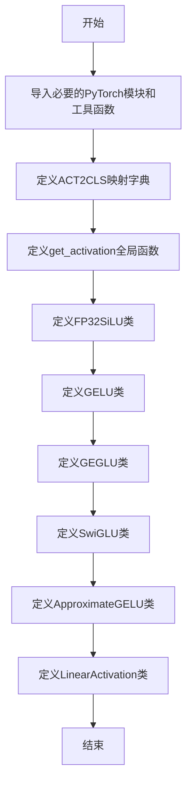
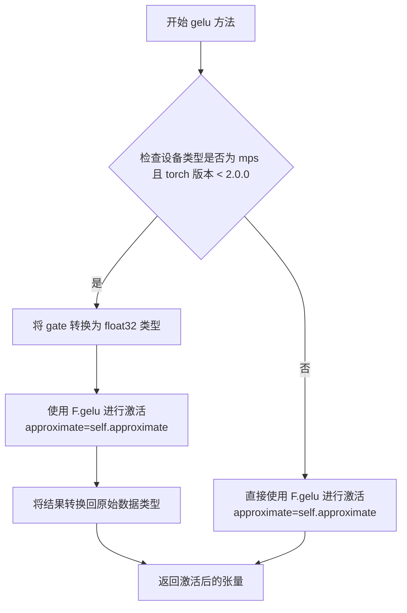
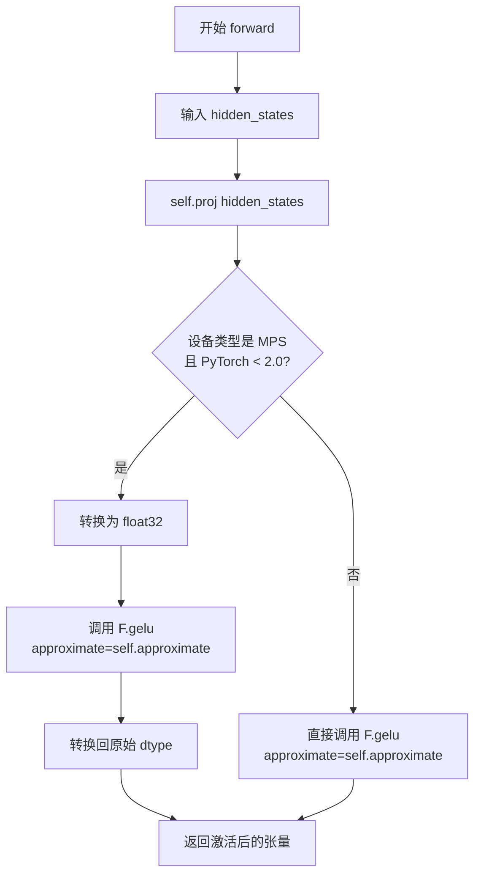
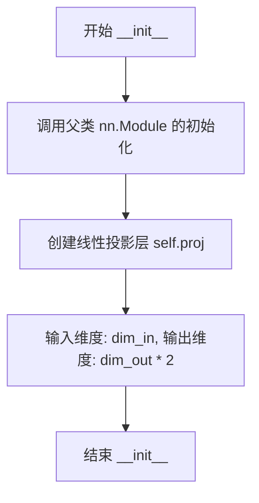
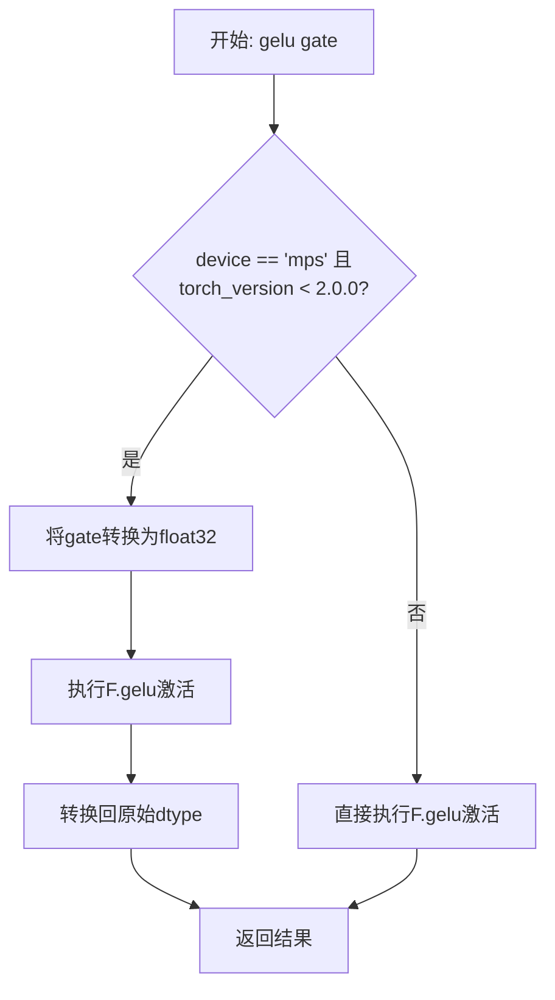
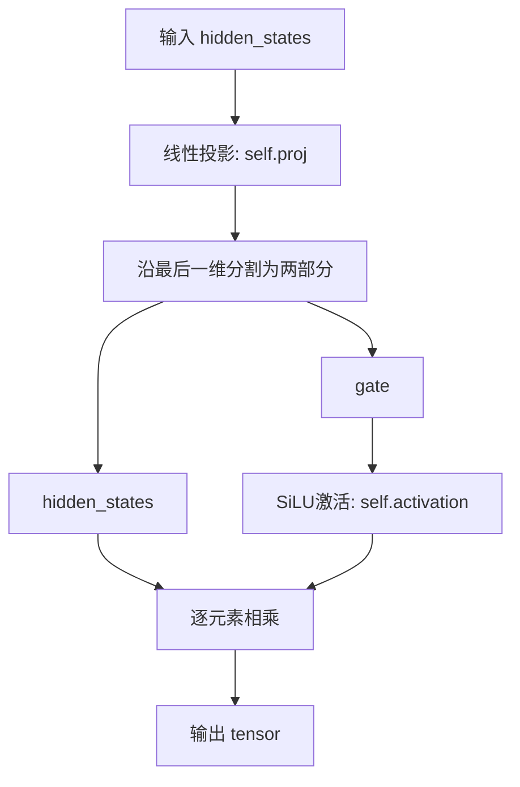
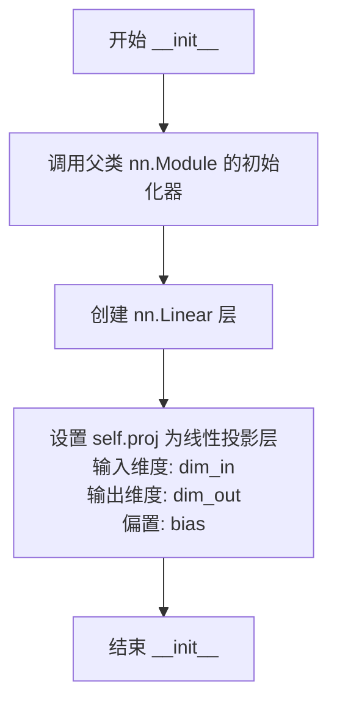
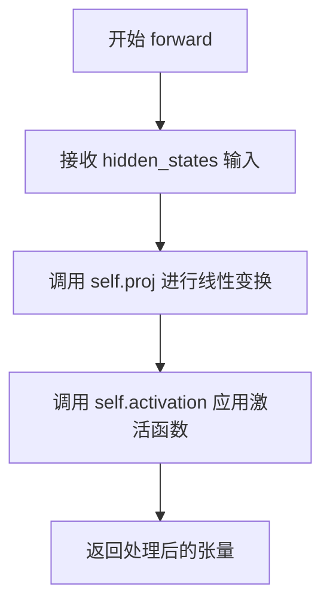

# `diffusers\src\diffusers\models\activations.py` 详细设计文档

该文件实现了多种神经网络激活函数，包括GELU、GEGLU、SwiGLU、ApproximateGELU等，并提供了激活函数名称到对应PyTorch模块的映射工具，以及支持NPU加速的激活函数实现。

## 整体流程



## 类结构

```
nn.Module (PyTorch基类)
├── FP32SiLU
├── GELU
├── GEGLU
├── SwiGLU
├── ApproximateGELU
└── LinearActivation
```

## 全局变量及字段


### `ACT2CLS`
    
A mapping from activation function names (e.g., 'swish', 'gelu') to their corresponding PyTorch nn.Module classes

类型：`Dict[str, Type[nn.Module]]`
    


### `is_torch_npu_available`
    
Imported function to check if NPU (Neural Processing Unit) is available in the current environment

类型：`Callable[[], bool]`
    


### `is_torch_version`
    
Imported function to compare current PyTorch version with a given version string

类型：`Callable[[str, str], bool]`
    


### `deprecate`
    
Imported utility function to emit deprecation warnings with version information

类型：`Callable[..., None]`
    


### `GELU.proj`
    
Linear projection layer that transforms input from dim_in to dim_out dimensions

类型：`nn.Linear`
    


### `GELU.approximate`
    
Approximation mode for GELU activation, either 'none' or 'tanh' for faster computation

类型：`str`
    


### `GEGLU.proj`
    
Linear projection layer that outputs double the dimension for gated linear unit computation

类型：`nn.Linear`
    


### `SwiGLU.proj`
    
Linear projection layer that outputs double the dimension for SwiGLU gated computation

类型：`nn.Linear`
    


### `SwiGLU.activation`
    
SiLU (Sigmoid Linear Unit) activation function used for the gating mechanism

类型：`nn.SiLU`
    


### `ApproximateGELU.proj`
    
Linear projection layer that transforms input from dim_in to dim_out dimensions

类型：`nn.Linear`
    


### `LinearActivation.proj`
    
Linear projection layer that transforms input from dim_in to dim_out dimensions

类型：`nn.Linear`
    


### `LinearActivation.activation`
    
Activation function module dynamically selected based on the activation string parameter

类型：`nn.Module`
    
    

## 全局函数及方法


### `get_activation`

这是一个辅助函数，用于根据字符串名称返回对应的PyTorch激活函数实例。它通过ACT2CLS字典将激活函数名称映射到相应的nn.Module类，并在找不到对应激活函数时抛出详细的错误信息。

参数：

- `act_fn`：`str`，激活函数的名称（如"silu"、"relu"、"gelu"等）

返回值：`nn.Module`，返回对应激活函数的实例

#### 流程图

```mermaid
flowchart TD
    A[开始] --> B[输入 act_fn: str]
    B --> C[act_fn = act_fn.lower]
    C --> D{act_fn in ACT2CLS?}
    D -->|Yes| E[return ACT2CLS[act_fn]()]
    D -->|No| F[raise ValueError]
    E --> G[结束 - 返回激活函数实例]
    F --> H[结束 - 抛出异常]
    
    style E fill:#90EE90
    style F fill:#FFB6C1
```

#### 带注释源码

```python
def get_activation(act_fn: str) -> nn.Module:
    """Helper function to get activation function from string.
    
    该函数是一个工厂函数，根据输入的字符串名称返回对应的激活函数模块实例。
    支持的激活函数包括: swish/silu, mish, gelu, relu

    Args:
        act_fn (str): Name of activation function.
                      支持的值: "swish", "silu", "mish", "gelu", "relu"

    Returns:
        nn.Module: Activation function.
                   返回对应激活函数的nn.Module子类实例

    Raises:
        ValueError: 当传入的激活函数名称不在ACT2CLS映射表中时抛出
    """

    # 将输入的激活函数名称转换为小写，确保不区分大小写
    # 例如: "SiLU", "SILU" 都会被转换为 "silu"
    act_fn = act_fn.lower()
    
    # 在ACT2CLS字典中查找对应的激活函数类
    if act_fn in ACT2CLS:
        # 找到则实例化并返回对应的激活函数模块
        return ACT2CLS[act_fn]()
    else:
        # 未找到则抛出详细的错误信息，包含可用的激活函数列表
        raise ValueError(f"activation function {act_fn} not found in ACT2FN mapping {list(ACT2CLS.keys())}")
```


### `FP32SiLU.__init__`

FP32SiLU 类的构造函数，用于初始化 FP32SiLU 激活函数模块，继承自 nn.Module。

参数：

- `self`：无参数，类实例本身

返回值：`None`，无返回值，用于初始化模块

#### 流程图

```mermaid
graph TD
    A[开始 __init__] --> B[调用 super().__init__ 初始化父类]
    B --> C[结束 __init__]
```

#### 带注释源码

```python
def __init__(self):
    """
    初始化 FP32SiLU 激活函数模块。
    调用父类 nn.Module 的构造函数，完成模块的初始化。
    """
    super().__init__()  # 调用 nn.Module 的构造函数，注册此模块
```


### `FP32SiLU.forward`

该方法实现了一个带有高精度计算的SiLU（Sigmoid Linear Unit）激活函数，通过将输入张量先转换为float32进行计算，然后再转换回原始数据类型，以避免在半精度（fp16/bf16）训练时可能出现数值不稳定问题。

参数：

- `inputs`：`torch.Tensor`，输入的张量，可以是任意维度的张量，通常为隐藏层的输出

返回值：`torch.Tensor`，返回经过SiLU激活函数处理后的张量，数据类型与输入张量相同

#### 流程图

```mermaid
flowchart TD
    A[开始 forward] --> B{输入张量inputs}
    B --> C[调用 .float() 将输入转换为 float32]
    C --> D[调用 F.silu 进行 SiLU 激活计算]
    D --> E[调用 .to(inputs.dtype) 转换回原始数据类型]
    E --> F[返回结果张量]
```

#### 带注释源码

```python
def forward(self, inputs: torch.Tensor) -> torch.Tensor:
    """
    执行 SiLU 激活函数的前向传播
    
    处理流程：
    1. 将输入张量转换为 float32 以确保数值计算的精度
    2. 在 float32 精度下执行 SiLU 激活函数
    3. 将结果转换回原始输入数据类型（可能是 fp16/bf16/fp32）
    
    这种设计是为了在混合精度训练中避免数值溢出或精度损失，
    特别是在深度神经网络中，激活值的范围可能很大。
    """
    # 第一步：将输入张量转换为 float32 精度
    # 这是为了避免在半精度（fp16/bf16）计算时出现数值不稳定
    inputs_float = inputs.float()  # .float() 方法将张量转换为 torch.float32
    
    # 第二步：执行 SiLU 激活函数
    # SiLU(x) = x * sigmoid(x)，也称为 Swish 激活函数
    # inplace=False 表示不修改原始张量，创建新的张量存储结果
    silu_result = F.silu(inputs_float, inplace=False)
    
    # 第三步：将结果转换回原始输入的数据类型
    # 保持输出与输入的数据类型一致（如果输入是 fp16，输出也是 fp16）
    result = silu_result.to(inputs.dtype)
    
    # 返回最终结果
    return result
```

#### 技术细节说明

| 特性 | 说明 |
|------|------|
| 激活函数 | SiLU (Sigmoid Linear Unit)，也称为 Swish：f(x) = x · σ(x) |
| 数值精度策略 | 输入→fp32计算→输出保持原dtype |
| 目的 | 解决混合精度训练中的数值不稳定问题 |
| 适用场景 | 半精度(FP16/BF16)训练时的激活函数计算 |


### GELU.__init__

GELU 类的初始化方法，用于创建 GELU（高斯误差线性单元）激活函数模块，支持 tanh 近似计算，并包含一个线性投影层。

参数：

- `dim_in`：`int`，输入张量的通道数（特征维度）
- `dim_out`：`int`，输出张量的通道数（特征维度）
- `approximate`：`str`，可选参数，默认为 `"none"`，指定是否使用 tanh 近似来计算 GELU，可选值为 `"none"` 或 `"tanh"`
- `bias`：`bool`，可选参数，默认为 `True`，是否在线性投影层中使用偏置

返回值：`None`，初始化方法无返回值

#### 流程图

```mermaid
flowchart TD
    A[开始 __init__] --> B[调用 super().__init__ 初始化父类 nn.Module]
    C[创建 nn.Linear 层] --> D[设置 self.proj = nn.Linear(dim_in, dim_out, bias=bias)]
    E[保存近似模式] --> F[设置 self.approximate = approximate]
    B --> C
    D --> E
    F --> G[结束 __init__]
```

#### 带注释源码

```python
def __init__(self, dim_in: int, dim_out: int, approximate: str = "none", bias: bool = True):
    """
    初始化 GELU 激活函数模块
    
    参数:
        dim_in (int): 输入特征的通道数
        dim_out (int): 输出特征的通道数
        approximate (str, optional): GELU 的近似模式，默认为 "none"
        bias (bool, optional): 是否在线性层中使用偏置，默认为 True
    """
    # 调用 nn.Module 的初始化方法，建立 PyTorch 模块的基本结构
    super().__init__()
    
    # 创建一个线性变换层：dim_in -> dim_out
    # 该层用于对输入 hidden_states 进行线性投影
    self.proj = nn.Linear(dim_in, dim_out, bias=bias)
    
    # 保存 GELU 的近似计算模式
    # "none": 使用精确的 GELU 实现
    # "tanh": 使用 tanh 近似版本，计算速度更快
    self.approximate = approximate
```


### `GELU.gelu`

该方法是GELU类中的核心激活函数实现，负责对输入张量应用高斯误差线性单元（GELU）激活函数，支持tanh近似计算，并针对MPS设备（Apple Silicon）做了特殊处理以确保在torch版本小于2.0.0时fp16计算的正确性。

参数：

- `gate`：`torch.Tensor`，输入的门值张量，即需要经过GELU激活的原始张量

返回值：`torch.Tensor`，经过GELU激活函数处理后的张量

#### 流程图



#### 带注释源码

```python
def gelu(self, gate: torch.Tensor) -> torch.Tensor:
    """
    对输入张量应用GELU激活函数。
    
    Args:
        gate (torch.Tensor): 输入的门值张量
        
    Returns:
        torch.Tensor: 经过GELU激活后的张量
    """
    # 检查是否在MPS设备上且torch版本低于2.0.0
    # 因为MPS在torch 2.0之前不支持fp16的GELU计算
    if gate.device.type == "mps" and is_torch_version("<", "2.0.0"):
        # fp16 gelu not supported on mps before torch 2.0
        # 1. 将输入转换为float32以避免MPS上的fp16兼容性问题
        # 2. 应用GELU激活，使用类中配置的approximate参数
        # 3. 将结果转换回原始数据类型以保持输入输出类型一致
        return F.gelu(gate.to(dtype=torch.float32), approximate=self.approximate).to(dtype=gate.dtype)
    
    # 在其他设备上直接使用F.gelu进行激活
    # approximate参数控制是否使用tanh近似
    return F.gelu(gate, approximate=self.approximate)
```


### `GELU.forward`

该方法是 GELU 激活函数模块的前向传播实现，首先通过内置的线性层（`self.proj`）对输入进行线性变换，然后调用 `gelu` 方法对变换后的结果应用 GELU 激活函数（支持 tanh 近似形式），并针对 MPS 设备和特定 PyTorch 版本做了兼容性处理。

参数：

- `hidden_states`：`torch.Tensor`，输入的隐藏状态张量，通常为二维张量（batch_size, dim_in）

返回值：`torch.Tensor`，经过线性投影和 GELU 激活后的输出张量，形状为（batch_size, dim_out）

#### 流程图



#### 带注释源码

```python
def forward(self, hidden_states):
    # 第一步：通过线性层 self.proj 对输入进行线性变换
    # self.proj 是 nn.Linear(dim_in, dim_out, bias) 的实例
    # 输入形状: (batch_size, dim_in)
    # 输出形状: (batch_size, dim_out)
    hidden_states = self.proj(hidden_states)
    
    # 第二步：调用 gelu 方法对变换后的结果应用 GELU 激活
    # gelu 方法内部会处理 MPS 设备在 PyTorch < 2.0 时的 fp16 兼容性问题
    hidden_states = self.gelu(hidden_states)
    
    # 返回经过线性变换和 GELU 激活后的张量
    # 输出形状: (batch_size, dim_out)
    return hidden_states


def gelu(self, gate: torch.Tensor) -> torch.Tensor:
    # 检查设备类型是否为 MPS (Apple Silicon) 且 PyTorch 版本低于 2.0.0
    if gate.device.type == "mps" and is_torch_version("<", "2.0.0"):
        # 在 MPS 设备上，PyTorch 2.0 之前不支持 fp16 的 GELU 激活
        # 解决方案：将输入转换为 float32，执行 GELU，然后再转回原始 dtype
        return F.gelu(gate.to(dtype=torch.float32), approximate=self.approximate).to(dtype=gate.dtype)
    
    # 正常路径：直接调用 PyTorch 的 F.gelu 函数
    # approximate 参数控制是否使用 tanh 近似形式
    return F.gelu(gate, approximate=self.approximate)
```


### `GEGLU.__init__`

GEGLU 类的构造函数，用于初始化一个基于 GELU 门控线性单元的神经网络层，创建线性投影层将输入维度映射到输出维度的两倍（用于门控机制）。

参数：

- `dim_in`：`int`，输入特征的通道数
- `dim_out`：`int`，输出特征的通道数
- `bias`：`bool`，是否在线性层中使用偏置，默认为 `True`

返回值：`None`，无返回值，仅初始化对象状态

#### 流程图



#### 带注释源码

```python
def __init__(self, dim_in: int, dim_out: int, bias: bool = True):
    """
    初始化 GEGLU 模块。

    参数:
        dim_in (int): 输入通道数。
        dim_out (int): 输出通道数。
        bias (bool): 是否使用偏置，默认为 True。
    """
    # 调用父类 nn.Module 的构造函数，初始化模块基础结构
    super().__init__()
    
    # 创建线性投影层：将输入从 dim_in 维度映射到 dim_out * 2 维度
    # 乘以 2 是为了实现门控机制，需要分别计算门控值和输入值的线性变换
    # 输出会被分成两部分：一半作为输入，另一半作为 GELU 门控信号
    self.proj = nn.Linear(dim_in, dim_out * 2, bias=bias)
```


### GEGLU.gelu

该方法是GEGLU类中的GELU激活函数实现，用于对门控张量应用高斯误差线性单元激活，并在MPS设备（Apple Silicon）且PyTorch版本低于2.0时进行数据类型转换以避免不支持fp16 GELU的问题。

参数：

- `gate`：`torch.Tensor`，门控张量，需要进行GELU激活的输入张量

返回值：`torch.Tensor`，经过GELU激活函数处理后的张量

#### 流程图



#### 带注释源码

```python
def gelu(self, gate: torch.Tensor) -> torch.Tensor:
    """
    对门控张量应用GELU激活函数。
    
    处理MPS设备（Apple Silicon）在PyTorch 2.0之前的fp16 GELU不支持问题。
    
    Args:
        gate (torch.Tensor): 门控张量
        
    Returns:
        torch.Tensor: 经过GELU激活的张量
    """
    # 检查是否在MPS设备上且PyTorch版本低于2.0.0
    if gate.device.type == "mps" and is_torch_version("<", "2.0.0"):
        # fp16 gelu not supported on mps before torch 2.0
        # MPS设备在PyTorch 2.0之前不支持fp16的GELU，需要先转换为float32
        return F.gelu(gate.to(dtype=torch.float32)).to(dtype=gate.dtype)
    
    # 其他设备直接应用GELU激活
    return F.gelu(gate)
```


### `GEGLU.forward`

GEGLU.forward 是 GEGLU 类的核心前向传播方法，实现了一种基于 GELU 激活函数的门控线性单元（GEGLU），支持 NPU 加速优化。该方法接收隐藏状态，通过线性投影变换为两半，一半经过 GELU 激活，另一半与之相乘后返回。

参数：

- `hidden_states`：`torch.Tensor`，输入的隐藏状态张量，形状为 (batch_size, seq_len, dim_in)
- `*args`：可变位置参数，用于向后兼容，当前已弃用
- `**kwargs`：可变关键字参数，当前只检查 `scale` 参数（已弃用）

返回值：`torch.Tensor`，经过 GEGLU 激活后的输出张量，形状为 (batch_size, seq_len, dim_out)

#### 流程图

```mermaid
flowchart TD
    A[开始 forward] --> B{检查 args 和 kwargs.scale}
    B -->|存在| C[发出弃用警告]
    C --> D[线性投影 hidden_states]
    B -->|不存在| D
    D --> E{is_torch_npu_available?}
    E -->|True| F[调用 torch_npu.npu_geglu 加速]
    F --> G[返回结果]
    E -->|False| H[沿最后一维 chunk 分成两半]
    H --> I[计算 gate 的 GELU 激活]
    I --> J[hidden_states * gelu(gate)]
    J --> G
```

#### 带注释源码

```python
def forward(self, hidden_states, *args, **kwargs):
    """
    GEGLU 前向传播方法
    
    参数:
        hidden_states: 输入张量，形状为 (batch, seq_len, dim_in)
        *args: 可变位置参数（已弃用）
        **kwargs: 可变关键字参数，用于检查 scale 参数（已弃用）
    
    返回:
        经过 GEGLU 激活的张量，形状为 (batch, seq_len, dim_out)
    """
    # 检查是否传入了已弃用的 scale 参数或额外位置参数
    if len(args) > 0 or kwargs.get("scale", None) is not None:
        # 构建弃用警告消息
        deprecation_message = "The `scale` argument is deprecated and will be ignored. Please remove it, as passing it will raise an error in the future. `scale` should directly be passed while calling the underlying pipeline component i.e., via `cross_attention_kwargs`."
        # 调用 deprecate 发出弃用警告
        deprecate("scale", "1.0.0", deprecation_message)
    
    # 步骤1: 通过线性层投影 hidden_states
    # 投影后维度从 dim_in 变为 dim_out * 2（为门控机制预留）
    # 形状: (batch, seq_len, dim_in) -> (batch, seq_len, dim_out * 2)
    hidden_states = self.proj(hidden_states)
    
    # 步骤2: 检查是否使用 NPU 加速
    if is_torch_npu_available():
        # 使用华为 NPU 的优化实现，可获得更快的执行速度和更低的内存占用
        # approximate=1 表示使用 tanh 近似版本的 GELU
        return torch_npu.npu_geglu(hidden_states, dim=-1, approximate=1)[0]
    else:
        # 步骤3: 标准 GEGLU 实现（适用于 CUDA/CPU）
        
        # 3.1 沿最后一维将张量均匀分成两半
        # hidden_states: (batch, seq_len, dim_out * 2) -> 
        # hidden_states: (batch, seq_len, dim_out), gate: (batch, seq_len, dim_out)
        hidden_states, gate = hidden_states.chunk(2, dim=-1)
        
        # 3.2 对 gate 分支应用 GELU 激活函数
        # gelu 方法内部处理了 MPS 设备在 PyTorch < 2.0 下的 fp16 兼容性
        activated_gate = self.gelu(gate)
        
        # 3.3 门控乘法：hidden_states * GELU(gate)
        # 这是 GEGLU 的核心操作，实现信息过滤机制
        return hidden_states * activated_gate
```


### SwiGLU.__init__

这是 SwiGLU 类的构造函数，初始化一个基于 SiLU/Swish 激活函数的门控线性单元（GLU）变体。该类通过一个线性投影层将输入维度扩展为输出维度的两倍，然后使用 SiLU 激活函数对门控部分进行激活，最后将两部分相乘得到输出。

参数：

- `self`：隐式参数，SwiGLU 类实例本身
- `dim_in`：`int`，输入张量的通道数
- `dim_out`：`int`，输出张量的通道数
- `bias`：`bool`，默认值 `True`，是否在线性层中使用偏置

返回值：`None`，构造函数不返回任何值，仅初始化对象状态

#### 流程图

```mermaid
flowchart TD
    A[开始 __init__] --> B[调用 super().__init__ 初始化 nn.Module]
    B --> C[创建线性投影层 self.proj]
    C --> D[输入维度: dim_in]
    D --> E[输出维度: dim_out * 2]
    E --> F[偏置: bias]
    F --> G[创建 SiLU 激活函数 self.activation]
    G --> H[结束 __init__]
    
    style A fill:#f9f,color:#333
    style H fill:#9f9,color:#333
```

#### 带注释源码

```python
def __init__(self, dim_in: int, dim_out: int, bias: bool = True):
    """
    初始化 SwiGLU 模块
    
    Args:
        dim_in: 输入特征维度
        dim_out: 输出特征维度  
        bias: 是否使用偏置，默认启用
    """
    # 调用父类 nn.Module 的初始化方法
    # 建立 PyTorch 模块的基本结构
    super().__init__()
    
    # 创建线性投影层
    # 将输入从 dim_in 维度映射到 dim_out * 2 维度
    # 乘以 2 是为了后续将输出分成两部分：
    #   - 一部分作为原始值
    #   - 另一部分作为门控信号
    self.proj = nn.Linear(dim_in, dim_out * 2, bias=bias)
    
    # 创建 SiLU (Sigmoid Linear Unit) 激活函数
    # 也称为 Swish 激活函数: x * sigmoid(x)
    # SiLU 比 GELU 计算效率更高，在许多大模型中表现优异
    self.activation = nn.SiLU()
```


### `SwiGLU.forward`

SwiGLU 是一种 gated linear unit (GLU) 激活函数的变体，与 GEGLU 类似，但使用 SiLU/Swish 替代 GELU。该方法实现 SwiGLU 模块的前向传播：先将输入通过线性投影变换，再将输出沿最后一维分割为两部分，一部分直接传递，另一部分经过 SiLU 激活函数处理，最后两部分逐元素相乘得到输出。

参数：

- `hidden_states`：`torch.Tensor`，输入的隐藏状态张量，形状为 `(batch_size, seq_len, dim_in)` 或 `(batch_size, dim_in)`

返回值：`torch.Tensor`，经过 SwiGLU 激活函数处理后的输出张量，形状为 `(batch_size, seq_len, dim_out)` 或 `(batch_size, dim_out)`

#### 流程图



#### 带注释源码

```python
def forward(self, hidden_states: torch.Tensor) -> torch.Tensor:
    """
    SwiGLU 前向传播方法
    
    参数:
        hidden_states: 输入张量，形状为 (batch_size, ..., dim_in)
    
    返回:
        经过 SwiGLU 激活的输出张量，形状为 (batch_size, ..., dim_out)
    """
    # 第一步：通过线性层投影，将输入从 dim_in 维度扩展到 dim_out * 2
    # 投影后的形状: (batch_size, ..., dim_out * 2)
    hidden_states = self.proj(hidden_states)
    
    # 第二步：将投影后的张量沿最后一维均匀分割为两部分
    # hidden_states: (batch_size, ..., dim_out) - 未经激活的部分
    # gate: (batch_size, ..., dim_out) - 将经过激活的门控部分
    hidden_states, gate = hidden_states.chunk(2, dim=-1)
    
    # 第三步：对门控部分应用 SiLU (Swish) 激活函数
    # SiLU(x) = x * sigmoid(x)
    # 然后与未激活的部分逐元素相乘
    # 返回值: (batch_size, ..., dim_out)
    return hidden_states * self.activation(gate)
```


### `ApproximateGELU.__init__`

这是 ApproximateGELU 类的构造函数，用于初始化近似 GELU 激活函数的线性层组件。该类实现了高斯误差线性单元的近似形式，通过一个线性投影层将输入维度映射到输出维度。

参数：

- `self`：隐式参数，类的实例本身
- `dim_in`：`int`，输入张量的通道数
- `dim_out`：`int`，输出张量的通道数
- `bias`：`bool`，默认为 `True`，是否在线性层中使用偏置

返回值：无（`None`），构造函数不返回任何值

#### 流程图



#### 带注释源码

```python
def __init__(self, dim_in: int, dim_out: int, bias: bool = True):
    """
    ApproximateGELU 类的初始化方法。
    
    Parameters:
        dim_in (int): 输入张量的通道数。
        dim_out (int): 输出张量的通道数。
        bias (bool, optional): 是否在线性层中使用偏置。默认为 True。
    """
    # 调用父类 nn.Module 的初始化方法，设置 PyTorch 模块的基本结构
    super().__init__()
    # 创建一个线性变换层：将从 dim_in 维映射到 dim_out 维，可选择是否包含偏置
    # 该层将作为 ApproximateGELU 的可学习参数，用于对输入进行线性投影
    self.proj = nn.Linear(dim_in, dim_out, bias=bias)
```


### `ApproximateGELU.forward`

该方法实现了近似高斯误差线性单元（Approximate GELU）激活函数的前向传播，通过一个线性投影层将输入变换后，再乘以 sigmoid(1.702 * x) 进行激活，这是对标准 GELU 的一种高效近似实现。

参数：

- `x`：`torch.Tensor`，输入的张量

返回值：`torch.Tensor`，经过近似 GELU 激活函数处理后的输出张量

#### 流程图

```mermaid
flowchart TD
    A[输入 x] --> B[线性投影: self.proj(x)]
    B --> C[计算激活因子: sigmoid(1.702 * x)]
    C --> D[元素级乘法: x * sigmoid(1.702 * x)]
    D --> E[输出]
```

#### 带注释源码

```python
def forward(self, x: torch.Tensor) -> torch.Tensor:
    """
    ApproximateGELU 的前向传播方法
    
    参数:
        x (torch.Tensor): 输入张量
        
    返回:
        torch.Tensor: 经过近似 GELU 激活的输出张量
    """
    # 第一步：通过线性层投影变换输入维度
    # self.proj 是一个 nn.Linear(dim_in, dim_out, bias) 层
    x = self.proj(x)
    
    # 第二步：计算近似 GELU 激活
    # 使用公式: x * sigmoid(1.702 * x) 作为 GELU 的近似
    # 这里的 1.702 是近似 GELU 论文中推荐的常数因子
    # 相比精确的 GELU (需要erf函数计算)，这种近似计算更快
    return x * torch.sigmoid(1.702 * x)
```


### `LinearActivation.__init__`

该方法是 `LinearActivation` 类的构造函数，用于初始化一个包含线性投影和激活函数组合的神经网络模块。它接收输入维度、输出维度、偏置选项和激活函数名称，创建一个线性变换层（`nn.Linear`），并根据指定的激活函数名称通过 `get_activation` 辅助函数获取对应的激活函数实例。

参数：

- `self`：`LinearActivation`，类的实例自身
- `dim_in`：`int`，输入特征的维度
- `dim_out`：`int`，输出特征的维度
- `bias`：`bool`，是否在线性层中使用偏置（默认为 `True`）
- `activation`：`str`，激活函数的名称（默认为 `"silu"`）

返回值：`None`，构造函数无返回值（隐式返回 `None`）

#### 流程图

```mermaid
flowchart TD
    A[开始 __init__] --> B[调用 super().__init__ 初始化父类 nn.Module]
    B --> C[创建 self.proj = nn.Linear dim_in, dim_out, bias]
    C --> D[调用 get_activation activation 获取激活函数]
    D --> E[将激活函数赋值给 self.activation]
    E --> F[结束 __init__]
```

#### 带注释源码

```python
def __init__(self, dim_in: int, dim_out: int, bias: bool = True, activation: str = "silu"):
    """
    初始化 LinearActivation 模块。

    Parameters:
        dim_in (int): 输入特征的维度。
        dim_out (int): 输出特征的维度。
        bias (bool, optional): 是否在线性层中使用偏置。默认为 True。
        activation (str, optional): 激活函数名称。默认为 "silu"。
    """
    # 调用父类 nn.Module 的初始化方法，注册所有子模块
    super().__init__()

    # 创建线性投影层：将 dim_in 维输入映射到 dim_out 维输出
    # bias 参数控制是否包含可学习的偏置项
    self.proj = nn.Linear(dim_in, dim_out, bias=bias)

    # 根据传入的 activation 字符串获取对应的激活函数实例
    # 调用 get_activation 函数从字符串映射到实际的 nn.Module 激活函数
    # 支持的激活函数包括: "swish", "silu", "mish", "gelu", "relu"
    self.activation = get_activation(activation)
```


### `LinearActivation.forward`

该方法实现了LinearActivation类的前向传播，首先对输入进行线性投影变换，然后应用激活函数。

参数：

- `hidden_states`：`torch.Tensor`，输入的隐藏状态张量，通常为(batch_size, ..., dim_in)形状

返回值：`torch.Tensor`，经过线性变换和激活函数处理后的输出张量，形状为(batch_size, ..., dim_out)

#### 流程图



#### 带注释源码

```python
def forward(self, hidden_states):
    """
    前向传播方法，对隐藏状态进行线性变换和激活。
    
    参数:
        hidden_states: 输入的张量，形状为 (batch_size, ..., dim_in)
    
    返回:
        经过线性投影和激活函数处理后的张量，形状为 (batch_size, ..., dim_out)
    """
    # 第一步：使用线性层投影将输入从 dim_in 维度变换到 dim_out 维度
    hidden_states = self.proj(hidden_states)
    
    # 第二步：应用激活函数（如 SiLU/GELU/ReLU 等）
    return self.activation(hidden_states)
```

## 关键组件


### 张量类型转换与设备兼容性处理

在 `FP32SiLU` 和 `GELU` 类中，通过将输入张量显式转换为 `torch.float32` 来解决 MPS 设备在 PyTorch 2.0 之前不支持 FP16 GELU 的问题，确保在各种硬件平台上的数值稳定性。

### 激活函数工厂模式

`get_activation` 函数实现了简单的工厂模式，通过字符串名称动态查找并实例化激活函数，配合 `ACT2CLS` 字典提供统一的激活函数注册与获取机制。

### GELU 激活函数及其近似实现

`GELU` 类实现了高斯误差线性单元激活函数，支持通过 `approximate` 参数切换到 tanh 近似形式；`ApproximateGELU` 类则提供了使用 sigmoid 的轻量级近似实现，适用于对推理速度有较高要求的场景。

### 门控线性单元激活函数

`GEGLU` 和 `SwiGLU` 类实现了门控线性单元的两种变体，前者使用 GELU 门控，后者使用 SiLU/Swish 门控，均通过线性投影将输入分裂为两部分后进行逐元素乘法运算，实现自适应激活。

### NPU 设备优化

在 `GEGLU` 类的 `forward` 方法中，针对华为 NPU 设备提供了专用实现 `torch_npu.npu_geglu`，可获得更快的执行速度和更低的内存占用，体现了对国产硬件生态的支持。

### 线性层与激活函数融合

`LinearActivation` 类将线性变换与激活函数封装为单一模块，支持通过参数指定激活函数类型，简化了模型构建流程。

### 参数兼容性与弃用处理

`GEGLU` 类的 `forward` 方法实现了对 `scale` 参数的检测和弃用警告，通过 `deprecate` 函数引导用户迁移到新的参数传递方式。


## 问题及建议


### 已知问题

- **代码重复**：`GELU.gelu()` 和 `GEGLU.gelu()` 方法的实现几乎完全相同，存在重复代码，增加维护成本。
- **硬编码的设备检查**：在 `GELU.gelu()` 和 `GEGLU.gelu()` 中都有对 "mps" 设备的硬编码检查，应该提取为通用工具函数。
- **类型注解不完整**：`GELU.forward()` 方法缺少输入参数的类型注解，降低了代码可读性和类型安全性。
- **参数验证缺失**：`LinearActivation` 中的 `activation` 参数没有验证是否为有效的激活函数名称，可能导致运行时错误。
- **近似参数不一致**：`GEGLU` 类中没有暴露 `approximate` 参数，但在调用 `npu_geglu` 时硬编码使用 `approximate=1`，与其他类（如 `GELU`）的设计不一致。
- **NPU优化代码缺乏说明**：使用 `torch_npu.npu_geglu` 的优化代码没有注释说明其性能优势和使用场景。
- **命名不一致**：`ACT2CLS` 字典的命名与实际用途（类映射）可能造成混淆，且某些激活函数有别名但映射可能不完整。
- **冗余代码**：`FP32SiLU.__init__()` 方法为空，可以直接省略。
- **错误信息不够友好**：`get_activation()` 抛出异常时，错误信息只列出所有可用键，对于大型映射字典（如有很多激活函数时）会显得冗长。

### 优化建议

- 提取 `GELU.gelu()` 和 `GEGLU.gelu()` 中的公共逻辑到一个私有辅助函数，如 `_apply_gelu_with_mps_fix()`。
- 在 `LinearActivation.__init__()` 中添加对 `activation` 参数的验证，确保其存在于 `ACT2CLS` 中。
- 为 `GEGLU` 类添加 `approximate` 参数，保持与其他激活函数类的一致性。
- 为 `GELU.forward()` 方法添加类型注解。
- 将 MPS 设备检查提取为 `torch_utils` 中的通用函数，避免多处重复。
- 在使用 `torch_npu.npu_geglu` 的地方添加详细的性能说明注释。
- 简化 `FP32SiLU` 类，移除空的 `__init__` 方法。
- 考虑将 `ACT2CLS` 重命名为更准确的名称（如 `ACTIVATION_CLASSES`），并使用 `frozenset` 存储有效键以提高查找效率。
- 在 `get_activation()` 的错误信息中考虑限制显示的键数量，或提供更友好的错误提示。

## 其它


### 设计目标与约束

本模块的设计目标是为Transformer架构提供高效、标准化的激活函数实现，支持多种激活函数变体（GELU、GEGLU、SwiGLU等），确保在不同硬件平台（CPU、GPU、NPU、MPS）上的兼容性，同时保持API的一致性和易用性。约束方面，模块依赖PyTorch框架，要求PyTorch版本 >= 1.0.0（部分特性需要2.0.0以上），并且需要与HuggingFace Transformers库的其他模块保持接口兼容。

### 错误处理与异常设计

代码中的错误处理主要体现在以下几个方面：1）get_activation函数在激活函数名称不存在于ACT2CLS映射中时抛出ValueError异常，并提供可用的激活函数列表作为提示；2）GELU和GEGLU类中的gelu方法对MPS设备在PyTorch 2.0之前的版本进行了特殊处理，将fp16运算回退到fp32以避免不支持的错误；3）GELU类的forward方法没有显式的异常处理，假设输入tensor格式正确；4）GEGLU的forward方法对废弃的scale参数进行deprecation警告而非直接报错，体现了向后兼容性的设计思路。

### 数据流与状态机

数据流主要遵循以下模式：输入tensor首先通过nn.Linear层进行线性变换（对于需要投影的激活函数如GELU、GEGLU等），然后经过激活函数处理，最后输出。状态机方面，本模块主要作为前馈计算模块，不涉及复杂的状态管理，但GELU和GEGLU类内部维护了approximate参数状态，用于控制是否使用tanh近似计算。数据流向：hidden_states → Linear投影 → 激活函数处理 → 输出。

### 外部依赖与接口契约

主要外部依赖包括：1）PyTorch核心库（torch、torch.nn、torch.nn.functional）；2）HuggingFace utils模块中的deprecate函数和import_utils工具（is_torch_npu_available、is_torch_version）；3）可选依赖torch_npu（仅在NPU设备可用时导入）。接口契约方面：所有激活函数类都继承自nn.Module并实现forward方法；get_activation函数接受字符串参数返回对应的nn.Module实例；输入输出均为torch.Tensor类型；LinearActivation类支持通过activation参数指定任意已注册的激活函数。

### 性能考虑与基准测试

性能优化措施：1）FP32SiLU通过将输入转换为float32再进行silu运算，最后转回原始dtype来确保数值稳定性；2）GEGLU在NPU设备上使用torch_npu.npu_geglu以获得更快的执行速度和更低的内存占用；3）所有Linear子类在构造函数中预先创建Linear层，避免在forward中重复创建。基准测试应关注：不同激活函数在相同输入规模下的推理延迟、内存占用、梯度计算效率，以及在各类硬件平台（CPU/GPU/NPU/MPS）上的表现对比。

### 版本兼容性信息

本模块对PyTorch版本有明确的兼容性要求：1）MPS设备上的fp16 gelu运算仅在PyTorch 2.0.0及以上版本支持，之前的版本需要回退到fp32；2）代码中使用了is_torch_version("<", "2.0.0")进行版本检查；3）对于NPU支持，需要安装torch_npu扩展。模块本身不维护独立的版本号，而是跟随HuggingFace Transformers库版本发布。

### 使用示例

```python
# 基本用法
activation = get_activation("gelu")
output = activation(input_tensor)

# 使用GELU类
gelu_layer = GELU(dim_in=512, dim_out=512)
output = gelu_layer(hidden_states)

# 使用GEGLU类
geglu_layer = GEGLU(dim_in=512, dim_out=512)
output = geglu_layer(hidden_states)

# 使用LinearActivation类（带自定义激活函数）
linear_act = LinearActivation(dim_in=512, dim_out=512, activation="swish")
output = linear_act(hidden_states)
```

### 安全性考虑

本模块主要涉及数值计算，安全性风险较低。需要注意的方面：1）FP32SiLU中的float32转换和to操作需要确保输入tensor的device支持目标dtype；2）deprecate函数的使用需要确保废弃警告信息准确反映未来行为变化；3）Linear层的bias参数默认为True，如需无偏置线性变换需显式设置bias=False。

### 测试策略

测试应覆盖：1）单元测试验证各激活函数类的输出维度与预期一致；2）数值测试对比自定义实现与PyTorch原生实现的输出差异；3）设备兼容性测试覆盖CPU、GPU、NPU、MPS各平台；4）梯度测试验证反向传播正确性；5）性能基准测试记录各激活函数在标准输入规模下的推理时间；6）边界条件测试处理空tensor、极值输入等情况。


    