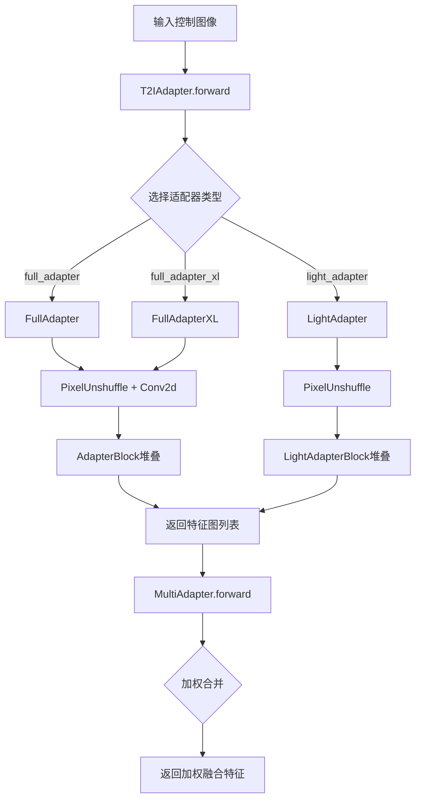
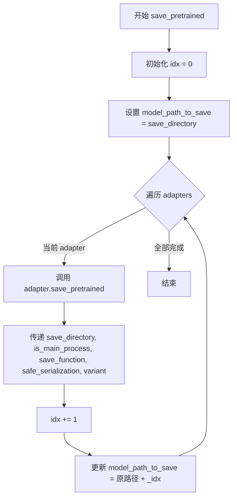
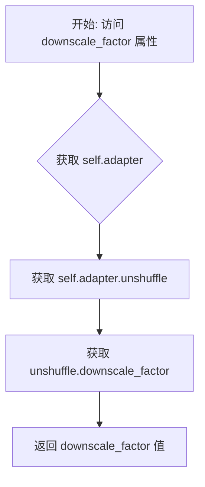
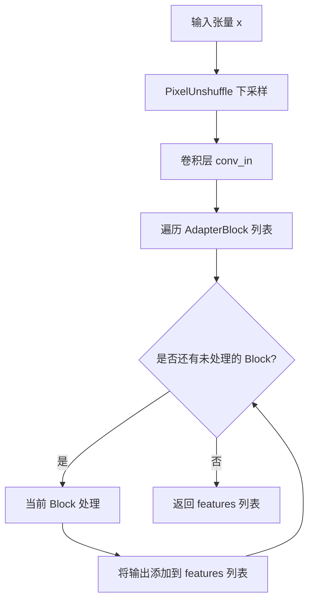
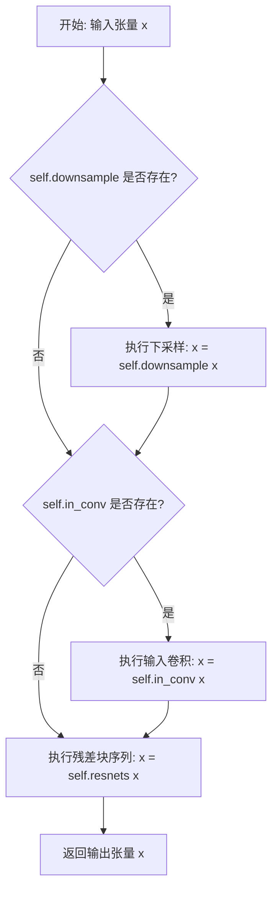
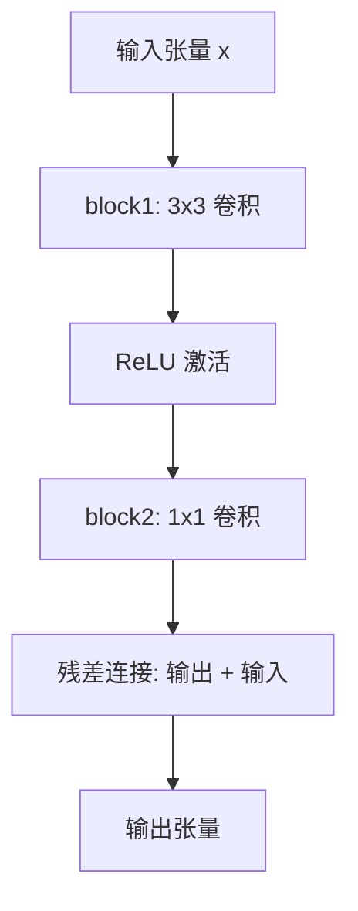
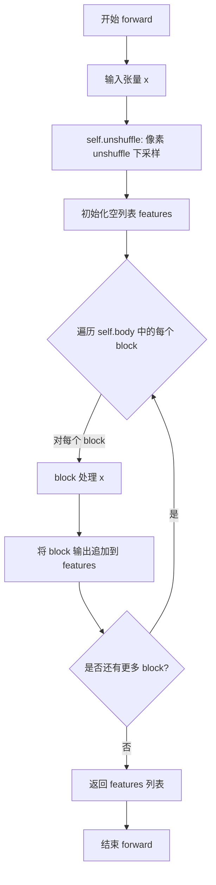

# `diffusers\src\diffusers\models\adapter.py` 详细设计文档

该代码实现了T2I（Text-to-Image）适配器模型，用于在扩散模型的图像生成过程中引入额外的控制信号。代码包含多层架构：MultiAdapter作为包装器管理多个适配器并按权重合并输出；T2IAdapter是主适配器模型，接收包含控制信号（如关键姿态和深度）的图像并生成多个特征图；FullAdapter、FullAdapterXL和LightAdapter是三种不同的适配器架构实现；此外还包括AdapterBlock、AdapterResnetBlock、LightAdapterBlock和LightAdapterResnetBlock等构建块模块。

## 整体流程



## 类结构

```
nn.Module (PyTorch基类)
├── MultiAdapter (ModelMixin)
│   └── 管理多个T2IAdapter的包装器
├── T2IAdapter (ModelMixin, ConfigMixin)
│   └── 主适配器模型，根据类型选择具体实现
├── FullAdapter (nn.Module)
│   ├── unshuffle: nn.PixelUnshuffle
│   ├── conv_in: nn.Conv2d
│   └── body: nn.ModuleList[AdapterBlock]
├── FullAdapterXL (nn.Module)
│   ├── unshuffle: nn.PixelUnshuffle
│   ├── conv_in: nn.Conv2d
│   └── body: nn.ModuleList[AdapterBlock]
├── AdapterBlock (nn.Module)
│   ├── downsample: nn.AvgPool2d (可选)
│   ├── in_conv: nn.Conv2d (可选)
│   └── resnets: nn.Sequential[AdapterResnetBlock]
├── AdapterResnetBlock (nn.Module)
│   ├── block1: nn.Conv2d
│   ├── act: nn.ReLU
│   └── block2: nn.Conv2d
├── LightAdapter (nn.Module)
│   ├── unshuffle: nn.PixelUnshuffle
│   └── body: nn.ModuleList[LightAdapterBlock]
├── LightAdapterBlock (nn.Module)
│   ├── downsample: nn.AvgPool2d (可选)
│   ├── in_conv: nn.Conv2d
│   ├── resnets: nn.Sequential[LightAdapterResnetBlock]
│   └── out_conv: nn.Conv2d
└── LightAdapterResnetBlock (nn.Module)
    ├── block1: nn.Conv2d
    ├── act: nn.ReLU
    └── block2: nn.Conv2d
```

## 全局变量及字段


### `logger`
    
模块级日志记录器

类型：`logging.Logger`
    


### `MultiAdapter.num_adapter`
    
适配器数量

类型：`int`
    


### `MultiAdapter.adapters`
    
适配器模块列表

类型：`nn.ModuleList[T2IAdapter]`
    


### `MultiAdapter.total_downscale_factor`
    
总下采样因子

类型：`int`
    


### `MultiAdapter.downscale_factor`
    
下采样因子

类型：`int`
    


### `T2IAdapter.adapter`
    
适配器实现（FullAdapter/FullAdapterXL/LightAdapter）

类型：`nn.Module`
    


### `FullAdapter.unshuffle`
    
像素逆 shuffle 操作

类型：`nn.PixelUnshuffle`
    


### `FullAdapter.conv_in`
    
输入卷积层

类型：`nn.Conv2d`
    


### `FullAdapter.body`
    
适配器块列表

类型：`nn.ModuleList[AdapterBlock]`
    


### `FullAdapter.total_downscale_factor`
    
总下采样因子

类型：`int`
    


### `FullAdapterXL.unshuffle`
    
像素逆 shuffle 操作

类型：`nn.PixelUnshuffle`
    


### `FullAdapterXL.conv_in`
    
输入卷积层

类型：`nn.Conv2d`
    


### `FullAdapterXL.body`
    
适配器块列表

类型：`nn.ModuleList[AdapterBlock]`
    


### `FullAdapterXL.total_downscale_factor`
    
总下采样因子

类型：`int`
    


### `AdapterBlock.downsample`
    
下采样层（可选）

类型：`nn.AvgPool2d`
    


### `AdapterBlock.in_conv`
    
输入卷积层（可选）

类型：`nn.Conv2d`
    


### `AdapterBlock.resnets`
    
ResNet块序列

类型：`nn.Sequential`
    


### `AdapterResnetBlock.block1`
    
第一个卷积块

类型：`nn.Conv2d`
    


### `AdapterResnetBlock.act`
    
激活函数

类型：`nn.ReLU`
    


### `AdapterResnetBlock.block2`
    
第二个卷积块

类型：`nn.Conv2d`
    


### `LightAdapter.unshuffle`
    
像素逆 shuffle 操作

类型：`nn.PixelUnshuffle`
    


### `LightAdapter.body`
    
轻量适配器块列表

类型：`nn.ModuleList[LightAdapterBlock]`
    


### `LightAdapter.total_downscale_factor`
    
总下采样因子

类型：`int`
    


### `LightAdapterBlock.downsample`
    
下采样层（可选）

类型：`nn.AvgPool2d`
    


### `LightAdapterBlock.in_conv`
    
输入卷积层

类型：`nn.Conv2d`
    


### `LightAdapterBlock.resnets`
    
轻量ResNet块序列

类型：`nn.Sequential`
    


### `LightAdapterBlock.out_conv`
    
输出卷积层

类型：`nn.Conv2d`
    


### `LightAdapterResnetBlock.block1`
    
第一个卷积块

类型：`nn.Conv2d`
    


### `LightAdapterResnetBlock.act`
    
激活函数

类型：`nn.ReLU`
    


### `LightAdapterResnetBlock.block2`
    
第二个卷积块

类型：`nn.Conv2d`
    
    

## 全局函数及方法


### `MultiAdapter.__init__`

该方法是 `MultiAdapter` 类的构造函数，用于初始化包含多个 T2IAdapter 模型的包装器模型。它接收一个 T2IAdapter 实例列表，验证适配器的一致性（如下采样因子），并将适配器存储为 nn.ModuleList 以便正确管理参数。

参数：

- `adapters`：`list["T2IAdapter"]`，一个 T2IAdapter 模型实例的列表

返回值：`None`，该方法仅初始化对象，不返回值

#### 流程图

```mermaid
flowchart TD
    A[开始 __init__] --> B[调用父类 ModelMixin 的 __init__]
    B --> C[设置 self.num_adapter = len(adapters)]
    C --> D[设置 self.adapters = nn.ModuleList(adapters)]
    D --> E{len(adapters) == 0?}
    E -->|是| F[抛出 ValueError: 至少需要一个适配器]
    E -->|否| G{len(adapters) == 1?}
    G -->|是| H[抛出 ValueError: 单个适配器请使用 T2IAdapter 类]
    G -->|否| I[获取第一个适配器的 downscale_factor]
    I --> J[遍历检查所有适配器的 downscale_factor 是否一致]
    J --> K{所有适配器的 downscale_factor 一致?}
    K -->|否| L[抛出 ValueError: 所有适配器必须有相同的下采样行为]
    K -->|是| M[设置 self.total_downscale_factor 和 self.downscale_factor]
    M --> N[结束 __init__]
    F --> O[结束]
    H --> O
    L --> O
```

#### 带注释源码

```python
def __init__(self, adapters: list["T2IAdapter"]):
    """
    初始化 MultiAdapter 实例。
    
    参数:
        adapters: 一个 T2IAdapter 模型实例的列表，用于合并多个适配器的输出。
    
    异常:
        ValueError: 当适配器列表为空、只有一个适配器或适配器的下采样因子不一致时抛出。
    """
    # 调用父类 ModelMixin 的初始化方法
    super(MultiAdapter, self).__init__()

    # 记录适配器的数量
    self.num_adapter = len(adapters)
    # 将适配器列表转换为 nn.ModuleList，以便正确管理参数
    self.adapters = nn.ModuleList(adapters)

    # 验证：至少需要一个适配器
    if len(adapters) == 0:
        raise ValueError("Expecting at least one adapter")

    # 验证：如果只有一个适配器，应该使用 T2IAdapter 类而不是 MultiAdapter
    if len(adapters) == 1:
        raise ValueError("For a single adapter, please use the `T2IAdapter` class instead of `MultiAdapter`")

    # 获取第一个适配器的下采样因子
    # 注意：所有适配器的输出将按权重相加，因此它们的尺寸变化必须相同
    first_adapter_total_downscale_factor = adapters[0].total_downscale_factor
    first_adapter_downscale_factor = adapters[0].downscale_factor
    
    # 验证：检查所有适配器的下采样因子是否一致
    for idx in range(1, len(adapters)):
        if (
            adapters[idx].total_downscale_factor != first_adapter_total_downscale_factor
            or adapters[idx].downscale_factor != first_adapter_downscale_factor
        ):
            raise ValueError(
                f"Expecting all adapters to have the same downscaling behavior, but got:\n"
                f"adapters[0].total_downscale_factor={first_adapter_total_downscale_factor}\n"
                f"adapters[0].downscale_factor={first_adapter_downscale_factor}\n"
                f"adapter[`{idx}`].total_downscale_factor={adapters[idx].total_downscale_factor}\n"
                f"adapter[`{idx}`].downscale_factor={adapters[idx].downscale_factor}"
            )

    # 存储所有适配器共用的下采样因子
    self.total_downscale_factor = first_adapter_total_downscale_factor
    self.downscale_factor = first_adapter_downscale_factor
```


### `MultiAdapter.forward`

该方法接收多个适配器的输入张量及权重，对每个适配器进行处理后将输出按权重相加并返回加权后的特征列表。

参数：

- `self`：`MultiAdapter` 类实例本身
- `xs`：`torch.Tensor`，形状为 (batch, channel, height, width) 的输入图像张量，沿通道维度（第 1 维）连接多个适配器的输入，通道数应等于适配器数量乘以每个图像的通道数
- `adapter_weights`：`list[float] | None`，可选的适配器权重列表，用于在求和前乘以每个适配器的输出；如果为 None，则所有适配器使用相等的权重

返回值：`list[torch.Tensor]`，包含加权聚合后的特征张量列表，每个元素对应一个适配器层级输出的特征

#### 流程图

```mermaid
flowchart TD
    A[开始 forward] --> B{adapter_weights 是否为 None?}
    B -->|是| C[创建等权重 tensor: 1/num_adapter]
    B -->|否| D[将 adapter_weights 转换为 tensor]
    C --> E[初始化 accume_state = None]
    D --> E
    E --> F[遍历 xs, adapter_weights, self.adapters]
    F --> G[调用 adapter 处理 x]
    G --> H{accume_state 是否为 None?}
    H -->|是| I[初始化 accume_state = features]
    I --> J[将 accume_state[i] 乘以权重 w]
    H -->|否| K[将 features[i] 乘以权重 w 并累加到 accume_state[i]]
    J --> L[遍历下一个 adapter]
    K --> L
    L --> M{是否还有更多 adapter?}
    M -->|是| F
    M -->|否| N[返回 accume_state]
```

#### 带注释源码

```python
def forward(self, xs: torch.Tensor, adapter_weights: list[float] | None = None) -> list[torch.Tensor]:
    r"""
    处理多个适配器模型的输入并返回加权聚合的特征。

    Args:
        xs: 输入图像张量，形状为 (batch, channel, height, width)，沿通道维度
            拼接了多个适配器的输入数据
        adapter_weights: 可选的权重列表，用于控制每个适配器输出的贡献度；
                        如果为 None，则所有适配器使用相等权重

    Returns:
        加权求和后的特征列表，每个元素对应一个适配器层级的输出特征
    """
    # 如果未提供权重，则使用均匀权重（1/适配器数量）
    if adapter_weights is None:
        adapter_weights = torch.tensor([1 / self.num_adapter] * self.num_adapter)
    else:
        # 将权重列表转换为 PyTorch 张量
        adapter_weights = torch.tensor(adapter_weights)

    # 初始化累加状态，用于存储加权后的特征
    accume_state = None
    
    # 遍历每个适配器的输入、对应权重和适配器模型
    for x, w, adapter in zip(xs, adapter_weights, self.adapters):
        # 获取当前适配器的特征输出
        features = adapter(x)
        
        # 如果是第一个适配器，初始化累加状态
        if accume_state is None:
            accume_state = features
            # 对第一个适配器的输出进行加权
            for i in range(len(accume_state)):
                accume_state[i] = w * accume_state[i]
        else:
            # 对后续适配器的输出进行加权并累加
            for i in range(len(features)):
                accume_state[i] += w * features[i]
    
    # 返回加权聚合后的特征列表
    return accume_state
```


### `MultiAdapter.save_pretrained`

该方法用于将 MultiAdapter 模型及其配置保存到指定目录，支持多适配器模型的分布式保存。每个适配器模型会被保存到不同的子目录中（主适配器保存到指定目录，后续适配器保存到 `{目录}_1`、`{目录}_2` 等）。

参数：

- `save_directory`：`str | os.PathLike`，保存模型的目录，如果目录不存在会自动创建
- `is_main_process`：`bool`，可选，默认为 `True`，指示当前进程是否为主进程，用于分布式训练（如 TPU）时避免竞态条件
- `save_function`：`Callable`，可选，用于保存状态字典的函数，可用于替换 `torch.save`，可配合 `DIFFUSERS_SAVE_MODE` 环境变量配置
- `safe_serialization`：`bool`，可选，默认为 `True`，若为 `True` 使用 `safetensors` 保存模型，否则使用 `pickle`
- `variant`：`str`，可选，若指定则权重保存为 `pytorch_model.<variant>.bin` 格式

返回值：`None`，无返回值（隐式返回 None）

#### 流程图



#### 带注释源码

```python
def save_pretrained(
    self,
    save_directory: str | os.PathLike,
    is_main_process: bool = True,
    save_function: Callable = None,
    safe_serialization: bool = True,
    variant: str | None = None,
):
    """
    Save a model and its configuration file to a specified directory, allowing it to be re-loaded with the
    `[`~models.adapter.MultiAdapter.from_pretrained`]` class method.

    Args:
        save_directory (`str` or `os.PathLike`):
            The directory where the model will be saved. If the directory does not exist, it will be created.
        is_main_process (`bool`, optional, defaults=True):
            Indicates whether current process is the main process or not. Useful for distributed training (e.g.,
            TPUs) and need to call this function on all processes. In this case, set `is_main_process=True` only
            for the main process to avoid race conditions.
        save_function (`Callable`):
            Function used to save the state dictionary. Useful for distributed training (e.g., TPUs) to replace
            `torch.save` with another method. Can also be configured using`DIFFUSERS_SAVE_MODE` environment
            variable.
        safe_serialization (`bool`, optional, defaults=True):
            If `True`, save the model using `safetensors`. If `False`, save the model with `pickle`.
        variant (`str`, *optional*):
            If specified, weights are saved in the format `pytorch_model.<variant>.bin`.
    """
    # 初始化索引计数器，用于为每个适配器生成唯一的子目录名
    idx = 0
    # 当前模型保存路径，初始为用户指定的保存目录
    model_path_to_save = save_directory
    
    # 遍历所有适配器，依次保存每个适配器到不同的子目录
    for adapter in self.adapters:
        # 调用每个适配器的 save_pretrained 方法保存模型
        adapter.save_pretrained(
            model_path_to_save,
            is_main_process=is_main_process,
            save_function=save_function,
            safe_serialization=safe_serialization,
            variant=variant,
        )

        # 索引递增，为下一个适配器准备新的保存路径
        idx += 1
        # 后续适配器保存到递增的子目录，如 adapter_1, adapter_2 等
        model_path_to_save = model_path_to_save + f"_{idx}"
```


### `MultiAdapter.from_pretrained`

该方法是一个类方法，用于从多个预训练的适配器模型实例化一个预训练的 `MultiAdapter` 模型。它通过循环遍历预定义的目录结构（`adapter`、`adapter_1`、`adapter_2` 等）来加载多个 `T2IAdapter`，并将它们组合成一个 `MultiAdapter` 实例。如果未找到任何适配器，则抛出 `ValueError` 异常。

参数：

- `cls`：类型 `type[MultiAdapter]`，表示类本身（类方法的隐式参数）
- `pretrained_model_path`：类型 `str | os.PathLike | None`，保存模型权重的目录路径。第一个适配器必须保存在此目录下（`./mydirectory/adapter`），后续适配器依次保存在 `./mydirectory/adapter_1`、`./mydirectory/adapter_2` 等
- `**kwargs`：类型 `Any`，可选参数，将传递给 `T2IAdapter.from_pretrained` 的额外关键字参数，包括但不限于：
  - `torch_dtype`：`torch.dtype`，可选，用于指定加载模型的默认数据类型
  - `output_loading_info`：`bool`，可选，默认为 `False`，是否返回包含缺失键、意外键和错误消息的字典
  - `device_map`：`str | dict[str, int | str | torch.device]`，可选，指定每个子模块应放置的设备
  - `max_memory`：`Dict`，可选，设备标识符到其最大内存的映射
  - `low_cpu_mem_usage`：`bool`，可选，通过不初始化权重来加速模型加载
  - `variant`：`str`，可选，从特定变体文件加载权重
  - `use_safetensors`：`bool`，可选，是否强制使用 safetensors 加载模型

返回值：类型 `MultiAdapter`，返回加载了多个适配器的 `MultiAdapter` 实例

#### 流程图

```mermaid
flowchart TD
    A[开始: from_pretrained] --> B[初始化 idx = 0, adapters = []]
    B --> C{pretrained_model_path<br/>是否是目录?}
    C -->|是| D[使用 T2IAdapter.from_pretrained<br/>加载适配器]
    D --> E[将适配器添加到 adapters 列表]
    E --> F[idx += 1]
    F --> G[构建下一个路径:<br/>pretrained_model_path + '_' + idx]
    G --> C
    C -->|否| H{adapters 列表<br/>是否为空?}
    H -->|是| I[抛出 ValueError:<br/>未找到 T2IAdapters]
    H -->|否| J[记录日志:<br/>X 个适配器已加载]
    J --> K[返回 MultiAdapter 实例]
    I --> L[结束: 抛出异常]
    K --> L
```

#### 带注释源码

```python
@classmethod
def from_pretrained(cls, pretrained_model_path: str | os.PathLike | None, **kwargs):
    r"""
    Instantiate a pretrained `MultiAdapter` model from multiple pre-trained adapter models.

    The model is set in evaluation mode by default using `model.eval()` (Dropout modules are deactivated). To train
    the model, set it back to training mode using `model.train()`.

    Warnings:
        *Weights from XXX not initialized from pretrained model* means that the weights of XXX are not pretrained
        with the rest of the model. It is up to you to train those weights with a downstream fine-tuning. *Weights
        from XXX not used in YYY* means that the layer XXX is not used by YYY, so those weights are discarded.

    Args:
        pretrained_model_path (`os.PathLike`):
            A path to a *directory* containing model weights saved using
            [`~diffusers.models.adapter.MultiAdapter.save_pretrained`], e.g., `./my_model_directory/adapter`.
        torch_dtype (`torch.dtype`, *optional*):
            Override the default `torch.dtype` and load the model under this dtype.
        output_loading_info(`bool`, *optional*, defaults to `False`):
            Whether or not to also return a dictionary containing missing keys, unexpected keys and error messages.
        device_map (`str` or `dict[str, int | str | torch.device]`, *optional*):
            A map that specifies where each submodule should go. It doesn't need to be refined to each
            parameter/buffer name, once a given module name is inside, every submodule of it will be sent to the
            same device.

            To have Accelerate compute the most optimized `device_map` automatically, set `device_map="auto"`. For
            more information about each option see [designing a device
            map](https://hf.co/docs/accelerate/main/en/usage_guides/big_modeling#designing-a-device-map).
        max_memory (`Dict`, *optional*):
            A dictionary mapping device identifiers to their maximum memory. Default to the maximum memory
            available for each GPU and the available CPU RAM if unset.
        low_cpu_mem_usage (`bool`, *optional*, defaults to `True` if torch version >= 1.9.0 else `False`):
            Speed up model loading by not initializing the weights and only loading the pre-trained weights. This
            also tries to not use more than 1x model size in CPU memory (including peak memory) while loading the
            model. This is only supported when torch version >= 1.9.0. If you are using an older version of torch,
            setting this argument to `True` will raise an error.
        variant (`str`, *optional*):
            If specified, load weights from a `variant` file (*e.g.* pytorch_model.<variant>.bin). `variant` will
            be ignored when using `from_flax`.
        use_safetensors (`bool`, *optional*, defaults to `None`):
            If `None`, the `safetensors` weights will be downloaded if available **and** if`safetensors` library is
            installed. If `True`, the model will be forcibly loaded from`safetensors` weights. If `False`,
            `safetensors` is not used.
    """
    # 初始化索引和适配器列表
    idx = 0
    adapters = []

    # 加载适配器并追加到列表，直到不再存在适配器目录为止
    # 第一个适配器必须保存在 `./mydirectory/adapter` 以符合 `DiffusionPipeline.from_pretrained`
    # 第二个、第三个...适配器必须分别保存在 `./mydirectory/adapter_1`、`./mydirectory/adapter_2` 等
    model_path_to_load = pretrained_model_path
    # 循环遍历可能的适配器目录结构
    while os.path.isdir(model_path_to_load):
        # 从每个目录加载 T2IAdapter 模型
        adapter = T2IAdapter.from_pretrained(model_path_to_load, **kwargs)
        adapters.append(adapter)

        idx += 1
        # 构建下一个适配器路径（adapter_1, adapter_2, ...）
        model_path_to_load = pretrained_model_path + f"_{idx}"

    # 记录加载的适配器数量
    logger.info(f"{len(adapters)} adapters loaded from {pretrained_model_path}.")

    # 检查是否至少加载了一个适配器
    if len(adapters) == 0:
        raise ValueError(
            f"No T2IAdapters found under {os.path.dirname(pretrained_model_path)}. Expected at least {pretrained_model_path + '_0'}."
        )

    # 返回包含所有加载适配器的 MultiAdapter 实例
    return cls(adapters)
```


### T2IAdapter.__init__

这是T2IAdapter类的初始化方法，用于创建一个适配器模型实例，根据adapter_type参数选择并实例化不同类型的适配器（FullAdapter、FullAdapterXL或LightAdapter）。

参数：

- `in_channels`：`int`，可选，默认值为3，输入适配器的通道数（控制图像的通道数），灰度图像设为1
- `channels`：`list[int]`，可选，默认值为[320, 640, 1280, 1280]，每个下采样块输出隐藏状态的通道数列表，决定了适配器中下采样块的数量
- `num_res_blocks`：`int`，可选，默认值为2，每个下采样块中ResNet块的数量
- `downscale_factor`：`int`，可选，默认值为8，决定适配器总下采样比例的因子
- `adapter_type`：`str`，可选，默认值为"full_adapter"，适配器类型，可选"full_adapter"、"full_adapter_xl"或"light_adapter"

返回值：`None`，该方法为构造函数，不返回任何值

#### 流程图

```mermaid
flowchart TD
    A[开始 __init__] --> B[调用 super().__init__]
    B --> C{判断 adapter_type}
    C -->|full_adapter| D[实例化 FullAdapter]
    C -->|full_adapter_xl| E[实例化 FullAdapterXL]
    C -->|light_adapter| F[实例化 LightAdapter]
    C -->|其他| G[抛出 ValueError 异常]
    D --> H[设置 self.adapter 属性]
    E --> H
    F --> H
    G --> I[结束]
    H --> I
```

#### 带注释源码

```python
@register_to_config
def __init__(
    self,
    in_channels: int = 3,
    channels: list[int] = [320, 640, 1280, 1280],
    num_res_blocks: int = 2,
    downscale_factor: int = 8,
    adapter_type: str = "full_adapter",
):
    """
    初始化T2IAdapter模型。
    
    参数:
        in_channels: 输入通道数，默认3（RGB图像）
        channels: 各下采样层的通道数列表
        num_res_blocks: 每个块中的残差块数量
        downscale_factor: 像素 unshuffle 的下采样因子
        adapter_type: 适配器类型，可选 full_adapter, full_adapter_xl, light_adapter
    """
    # 调用父类的初始化方法
    super().__init__()
    
    # 根据adapter_type选择并实例化对应的适配器模型
    if adapter_type == "full_adapter":
        # 标准适配器，使用FullAdapter类
        self.adapter = FullAdapter(in_channels, channels, num_res_blocks, downscale_factor)
    elif adapter_type == "full_adapter_xl":
        # XL版本适配器，使用FullAdapterXL类
        self.adapter = FullAdapterXL(in_channels, channels, num_res_blocks, downscale_factor)
    elif adapter_type == "light_adapter":
        # 轻量级适配器，使用LightAdapter类
        self.adapter = LightAdapter(in_channels, channels, num_res_blocks, downscale_factor)
    else:
        # 不支持的适配器类型，抛出异常
        raise ValueError(
            f"Unsupported adapter_type: '{adapter_type}'. Choose either 'full_adapter' or "
            "'full_adapter_xl' or 'light_adapter'."
        )
```


### `T2IAdapter.forward`

该方法是 T2IAdapter 类的核心前向传播方法，负责将输入的控制图像张量通过适配器模型处理，输出多个不同尺度的特征张量列表，这些特征图可作为 UNet2DConditionModel 的额外条件输入。

参数：

- `x`：`torch.Tensor`，输入的控制图像张量，通常为 (batch, channel, height, width) 形状

返回值：`list[torch.Tensor]`，返回从适配器不同下采样块提取的特征张量列表，每个张量代表不同尺度的特征信息，列表长度取决于初始化时指定的通道数和残差块数量

#### 流程图

```mermaid
flowchart TD
    A[开始 forward] --> B[输入 x: torch.Tensor]
    B --> C{检查 adapter_type}
    C -->|full_adapter| D[调用 FullAdapter.forward]
    C -->|full_adapter_xl| E[调用 FullAdapterXL.forward]
    C -->|light_adapter| F[调用 LightAdapter.forward]
    D --> G[PixelUnshuffle 下采样]
    E --> G
    F --> G
    G --> H[Conv2d 初始卷积]
    H --> I[依次通过各 AdapterBlock]
    I --> J[收集每层输出特征]
    J --> K[返回特征列表 list[torch.Tensor]]
    K --> L[结束 forward]
```

#### 带注释源码

```python
def forward(self, x: torch.Tensor) -> list[torch.Tensor]:
    r"""
    This function processes the input tensor `x` through the adapter model and returns a list of feature tensors,
    each representing information extracted at a different scale from the input. The length of the list is
    determined by the number of downsample blocks in the Adapter, as specified by the `channels` and
    `num_res_blocks` parameters during initialization.
    """
    # 直接将输入 x 传递给内部适配器实例（self.adapter）处理
    # self.adapter 可能是 FullAdapter、FullAdapterXL 或 LightAdapter
    # 具体类型由 __init__ 中的 adapter_type 参数决定
    return self.adapter(x)
```


### `T2IAdapter.total_downscale_factor`

该属性是T2IAdapter类的一个只读属性，用于获取适配器的总下采样因子。它返回内部适配器（FullAdapter、FullAdapterXL或LightAdapter）的total_downscale_factor值，该值表示整个适配器模型对输入图像的总下采样比例。

参数：

- （无参数，该属性不接受任何输入参数）

返回值：`int`，返回适配器的总下采样因子。该值由初始像素反洗牌操作的下采样因子与所有下采样块的下采样因子组合计算得出，用于确定输入图像在通过整个适配器网络后的空间尺寸缩减比例。

#### 流程图

```mermaid
flowchart TD
    A[访问 T2IAdapter.total_downscale_factor 属性] --> B{检查 self.adapter 类型}
    B -->|FullAdapter| C[返回 downscale_factor × 2^(len(channels)-1)]
    B -->|FullAdapterXL| D[返回 downscale_factor × 2]
    B -->|LightAdapter| E[返回 downscale_factor × 2^len(channels)]
    C --> F[返回整数值]
    D --> F
    E --> F
```

#### 带注释源码

```python
@property
def total_downscale_factor(self):
    """
    T2IAdapter类的只读属性，用于获取适配器的总下采样因子。
    
    该属性将请求转发到内部适配器对象（FullAdapter、FullAdapterXL或LightAdapter）
    的total_downscale_factor属性。
    
    总下采样因子由两部分组成：
    1. 初始PixelUnshuffle操作的下采样因子（downscale_factor）
    2. 所有AdapterBlock下采样操作累积的因子
    
    对于FullAdapter: total = downscale_factor × 2^(len(channels)-1)
    对于FullAdapterXL: total = downscale_factor × 2
    对于LightAdapter: total = downscale_factor × 2^len(channels)
    
    Returns:
        int: 适配器的总下采样因子，表示输入图像尺寸经过整个适配器网络后的缩减比例。
    """
    return self.adapter.total_downscale_factor
```


### T2IAdapter.downscale_factor

该属性是 T2IAdapter 类的 downscale_factor 属性，用于获取适配器在初始像素 unshuffle 操作中所应用的下采样因子。该属性返回内部适配器的下采样因子，如果输入图像的尺寸不能被 downscale_factor 整除，则会引发异常。

参数：

- `self`：`T2IAdapter`，隐式参数，指向 T2IAdapter 实例本身

返回值：`int`，返回适配器在初始像素 unshuffle 操作中所使用的下采样因子。

#### 流程图



#### 带注释源码

```python
@property
def downscale_factor(self):
    """The downscale factor applied in the T2I-Adapter's initial pixel unshuffle operation. If an input image's dimensions are
    not evenly divisible by the downscale_factor then an exception will be raised.
    """
    # 返回内部适配器中 PixelUnshuffle 层的下采样因子
    # self.adapter 是 FullAdapter、FullAdapterXL 或 LightAdapter 的实例
    # self.adapter.unshuffle 是 nn.PixelUnshuffle 模块
    # downscale_factor 是 PixelUnshuffle 的属性，表示每个维度的下采样因子
    return self.adapter.unshuffle.downscale_factor
```


### `FullAdapter.__init__`

FullAdapter类的初始化方法，负责构建完整的T2I适配器模型结构，包括像素 unshuffle、输入卷积和多个AdapterBlock组成的网络体。

参数：

- `self`：FullAdapter实例本身
- `in_channels`：`int`，输入图像的通道数，默认为3（RGB图像）
- `channels`：`list[int]`，各downsample block输出hidden state的通道数列表，默认为[320, 640, 1280, 1280]
- `num_res_blocks`：`int`，每个downsample block中ResNet块的数量，默认为2
- `downscale_factor`：`int`，Adapter的总下采样因子，默认为8

返回值：`None`，该方法为构造函数，不返回任何值

#### 流程图

```mermaid
flowchart TD
    A[__init__ 开始] --> B[调用 super().__init__]
    B --> C[计算实际输入通道数: in_channels * downscale_factor²]
    C --> D[创建 PixelUnshuffle 层]
    D --> E[创建输入卷积层 conv_in]
    E --> F[构建 AdapterBlock 模块列表 body]
    F --> G[计算 total_downscale_factor]
    G --> H[__init__ 结束]
```

#### 带注释源码

```python
def __init__(
    self,
    in_channels: int = 3,
    channels: list[int] = [320, 640, 1280, 1280],
    num_res_blocks: int = 2,
    downscale_factor: int = 8,
):
    """
    FullAdapter 构造函数
    
    参数:
        in_channels: 输入图像通道数，默认为3（RGB图像）
        channels: 各block输出通道数列表，默认为[320, 640, 1280, 1280]
        num_res_blocks: 每个AdapterBlock中的残差块数量，默认为2
        downscale_factor: 像素unshuffle的下采样因子，默认为8
    """
    # 调用父类 nn.Module 的初始化方法
    super().__init__()

    # 计算经过 PixelUnshuffle 后的实际输入通道数
    # 例如：3通道图像 * 8² = 192通道
    in_channels = in_channels * downscale_factor**2

    # 创建 PixelUnshuffle 层，用于降低空间分辨率并增加通道数
    # 这是 T2I-Adapter 的第一步预处理
    self.unshuffle = nn.PixelUnshuffle(downscale_factor)

    # 创建输入卷积层，将 unshuffle 后的特征映射到第一个通道配置
    self.conv_in = nn.Conv2d(in_channels, channels[0], kernel_size=3, padding=1)

    # 构建由多个 AdapterBlock 组成的网络体
    # 第一个 block 不进行下采样，后续 blocks 依次进行下采样
    self.body = nn.ModuleList(
        [
            # 第一个 AdapterBlock：保持空间分辨率
            AdapterBlock(channels[0], channels[0], num_res_blocks),
            # 后续 AdapterBlocks：逐步下采样并调整通道数
            *[
                AdapterBlock(channels[i - 1], channels[i], num_res_blocks, down=True)
                for i in range(1, len(channels))
            ],
        ]
    )

    # 计算总下采样因子
    # = downscale_factor * 2^(len(channels) - 1)
    # 例如：8 * 2^3 = 64
    self.total_downscale_factor = downscale_factor * 2 ** (len(channels) - 1)
```


### FullAdapter.forward

该方法是 FullAdapter 类的前向传播方法，负责将输入图像通过像素逆洗脱、卷积和多个适配器块处理，输出不同尺度下的特征图列表。

参数：

- `x`：`torch.Tensor`，输入图像张量，形状为 (batch, channel, height, width)，通常为 RGB 图像或控制信号图像

返回值：`list[torch.Tensor]`，包含多个特征张量的列表，每个特征张量对应一个不同处理阶段的输出，可用于为 UNet2DConditionModel 提供额外的条件信息

#### 流程图

```mermaid
flowchart TD
    A[输入: x: torch.Tensor] --> B[unshuffle: PixelUnshuffle]
    B --> C[conv_in: nn.Conv2d]
    C --> D{遍历 body 中的每个 AdapterBlock}
    D -->|第 i 个 block| E[block_i: AdapterBlock]
    E --> F[features.append(block_output)]
    F --> D
    D --> G[返回: features: list[torch.Tensor]]
    
    B -.->|降低分辨率| B
    C -.->|特征提取| C
    E -.->|多尺度特征| E
```

#### 带注释源码

```python
def forward(self, x: torch.Tensor) -> list[torch.Tensor]:
    r"""
    This method processes the input tensor `x` through the FullAdapter model and performs operations including
    pixel unshuffling, convolution, and a stack of AdapterBlocks. It returns a list of feature tensors, each
    capturing information at a different stage of processing within the FullAdapter model. The number of feature
    tensors in the list is determined by the number of downsample blocks specified during initialization.
    """
    # 第一步：像素逆洗脱（Pixel Unshuffle）
    # 将输入图像按 downscale_factor 进行空间降采样，同时增加通道数
    # 例如：输入 (B, 3, 64, 64) + downscale_factor=8 -> 输出 (B, 192, 8, 8)
    x = self.unshuffle(x)
    
    # 第二步：初始卷积
    # 将洗脱后的特征投影到第一个通道维度
    x = self.conv_in(x)
    
    # 第三步：初始化特征列表
    features = []
    
    # 第四步：遍历适配器块（AdapterBlocks）
    # 每个块执行残差卷积和可能的降采样，生成多尺度特征
    for block in self.body:
        x = block(x)           # 通过当前块处理
        features.append(x)    # 将输出添加到特征列表
    
    # 返回特征列表，每个元素对应一个尺度的特征图
    return features
```


### `FullAdapterXL.__init__`

该方法是`FullAdapterXL`类的构造函数，用于初始化XL版本的T2I适配器模型。它设置输入通道数、通道列表、残差块数量和下采样因子，然后构建适配器的核心组件（像素 unshuffle 层、输入卷积层和多个适配器块），并计算总下采样因子。

参数：

- `in_channels`：`int`，输入图像的通道数，默认为3（RGB图像）
- `channels`：`list[int]`，各下采样块的输出通道数列表，默认为`[320, 640, 1280, 1280]`
- `num_res_blocks`：`int`，每个下采样块中的ResNet块数量，默认为2
- `downscale_factor`：`int`，适配器的下采样因子，默认为16（XL版本使用更大的下采样因子）

返回值：无（`__init__`方法返回`None`）

#### 流程图

```mermaid
flowchart TD
    A[开始 __init__] --> B[调用 super().__init__]
    B --> C[计算实际输入通道数: in_channels * downscale_factor²]
    C --> D[创建 PixelUnshuffle 层]
    D --> E[创建输入卷积层 conv_in]
    E --> F[初始化空列表 self.body]
    F --> G{遍历 channels 列表}
    G -->|i == 0| H[创建 AdapterBlock, 无下采样]
    G -->|i == 1| I[创建 AdapterBlock, 无下采样]
    G -->|i == 2| J[创建 AdapterBlock, 有下采样]
    G -->|i == 3| K[创建 AdapterBlock, 无下采样]
    H --> L[将 AdapterBlock 添加到 body 列表]
    I --> L
    J --> L
    K --> L
    L --> M[将 body 转换为 nn.ModuleList]
    M --> N[计算总下采样因子: downscale_factor * 2]
    N --> O[结束 __init__]
```

#### 带注释源码

```python
def __init__(
    self,
    in_channels: int = 3,
    channels: list[int] = [320, 640, 1280, 1280],
    num_res_blocks: int = 2,
    downscale_factor: int = 16,
):
    """
    FullAdapterXL 构造函数
    
    参数:
        in_channels: 输入图像的通道数，默认为3（RGB图像）
        channels: 各下采样块的输出通道数列表，默认为[320, 640, 1280, 1280]
        num_res_blocks: 每个下采样块中的ResNet块数量，默认为2
        downscale_factor: 适配器的下采样因子，默认为16（XL版本特征）
    """
    # 调用父类 nn.Module 的初始化方法
    super().__init__()

    # 计算经过 PixelUnshuffle 后的实际输入通道数
    # PixelUnshuffle 会将图像尺寸缩小 downscale_factor 倍，同时将通道数扩大 downscale_factor² 倍
    in_channels = in_channels * downscale_factor**2

    # 创建 PixelUnshuffle 层，用于对输入图像进行下采样
    # 这允许适配器处理低分辨率的输入，同时保留重要的特征信息
    self.unshuffle = nn.PixelUnshuffle(downscale_factor)
    
    # 创建输入卷积层，将处理后的通道数转换为第一个 block 所需的通道数
    self.conv_in = nn.Conv2d(in_channels, channels[0], kernel_size=3, padding=1)

    # 初始化空列表，用于存储适配器的主体 blocks
    self.body = []
    
    # blocks to extract XL features with dimensions of [320, 64, 64], [640, 64, 64], [1280, 32, 32], [1280, 32, 32]
    # 遍历通道列表，为每个通道层级创建相应的 AdapterBlock
    for i in range(len(channels)):
        if i == 1:
            # 对于索引1的 block（320->640），不使用下采样
            self.body.append(AdapterBlock(channels[i - 1], channels[i], num_res_blocks))
        elif i == 2:
            # 对于索引2的 block（640->1280），执行下采样操作
            # 这是 XL 版本中唯一的下采样 AdapterBlock
            self.body.append(AdapterBlock(channels[i - 1], channels[i], num_res_blocks, down=True))
        else:
            # 对于索引0和3的 block，保持通道数不变，不下采样
            self.body.append(AdapterBlock(channels[i], channels[i], num_res_blocks))

    # 将 Python 列表转换为 nn.ModuleList，以便 PyTorch 正确跟踪所有参数
    self.body = nn.ModuleList(self.body)
    
    # XL has only one downsampling AdapterBlock.
    # 计算总下采样因子：初始下采样因子 * 2（因为只有一个下采样 block）
    # FullAdapter 使用 downscale_factor * 2 ** (len(channels) - 1)，因为有多个下采样
    self.total_downscale_factor = downscale_factor * 2
```


### `FullAdapterXL.forward`

该方法接收一个输入张量 `x`，通过像素 unshuffle 操作、卷积层以及一系列 AdapterBlock 进行处理，最终返回一个包含不同尺度特征的张量列表，用于后续的图像处理或条件生成任务。

参数：

- `x`：`torch.Tensor`，输入图像张量，形状为 (batch, channel, height, width)

返回值：`list[torch.Tensor]`，
返回从不同处理阶段提取的特征张量列表，每个张量代表不同尺度的特征信息。

#### 流程图



#### 带注释源码

```python
def forward(self, x: torch.Tensor) -> list[torch.Tensor]:
    r"""
    This method takes the tensor x as input and processes it through FullAdapterXL model. It consists of operations
    including unshuffling pixels, applying convolution layer and appending each block into list of feature tensors.
    """
    # 步骤1: PixelUnshuffle 操作，对输入图像进行下采样
    # downscale_factor 默认为 16，即每个维度缩小 16 倍
    x = self.unshuffle(x)
    
    # 步骤2: 初始卷积层，将通道数转换为第一个 AdapterBlock 所需的通道数
    x = self.conv_in(x)

    # 步骤3: 初始化特征列表，用于存储每个 AdapterBlock 的输出
    features = []

    # 步骤4: 依次通过每个 AdapterBlock 并收集特征
    for block in self.body:
        x = block(x)
        features.append(x)

    # 步骤5: 返回包含所有尺度特征的列表
    return features
```


### `AdapterBlock.__init__`

该方法是 `AdapterBlock` 类的构造函数，用于初始化一个包含多个残差块的适配器模块，支持可选的下采样和输入通道到输出通道的转换。

参数：

- `in_channels`：`int`，输入通道数，指定 AdapterBlock 的输入张量的通道数
- `out_channels`：`int`，输出通道数，指定 AdapterBlock 的输出张量的通道数
- `num_res_blocks`：`int`，残差块数量，指定在 AdapterBlock 中堆叠的残差块个数
- `down`：`bool`，可选，默认为 `False`，指定是否执行下采样操作

返回值：`None`，该方法为构造函数，不返回任何值

#### 流程图

```mermaid
flowchart TD
    A[开始 __init__] --> B[调用 super().__init__初始化模块]
    B --> C{down参数为True?}
    C -->|是| D[创建AvgPool2d下采样层]
    C -->|否| E[downsample设为None]
    D --> F
    E --> F{输入通道 != 输出通道?}
    F -->|是| G[创建1x1卷积层进行通道转换]
    F -->|否| H[in_conv设为None]
    G --> I
    H --> I[创建由num_res_blocks个AdapterResnetBlock组成的Sequential]
    I --> J[结束]
```

#### 带注释源码

```python
def __init__(self, in_channels: int, out_channels: int, num_res_blocks: int, down: bool = False):
    """
    初始化 AdapterBlock 实例。
    
    参数:
        in_channels: 输入通道数
        out_channels: 输出通道数
        num_res_blocks: 残差块的数量
        down: 是否执行下采样，默认为 False
    """
    # 调用父类 nn.Module 的初始化方法
    super().__init__()

    # 初始化下采样层为 None
    self.downsample = None
    # 如果需要下采样，则创建平均池化层
    if down:
        self.downsample = nn.AvgPool2d(kernel_size=2, stride=2, ceil_mode=True)

    # 初始化输入卷积为 None
    self.in_conv = None
    # 如果输入通道与输出通道不同，则创建 1x1 卷积层进行通道转换
    if in_channels != out_channels:
        self.in_conv = nn.Conv2d(in_channels, out_channels, kernel_size=1)

    # 创建由多个 AdapterResnetBlock 组成的顺序容器
    self.resnets = nn.Sequential(
        *[AdapterResnetBlock(out_channels) for _ in range(num_res_blocks)],
    )
```


### `AdapterBlock.forward`

该方法执行AdapterBlock的前向传播，对输入张量进行下采样（可选）、输入通道卷积转换（可选），然后通过一系列残差块进行处理，最后返回处理后的张量。

参数：

- `x`：`torch.Tensor`，输入的张量

返回值：`torch.Tensor`，经过下采样、卷积转换和残差块处理后的输出张量

#### 流程图



#### 带注释源码

```python
def forward(self, x: torch.Tensor) -> torch.Tensor:
    r"""
    This method takes tensor x as input and performs operations downsampling and convolutional layers if the
    self.downsample and self.in_conv properties of AdapterBlock model are specified. Then it applies a series of
    residual blocks to the input tensor.
    """
    # 如果存在下采样层，则对输入进行下采样操作
    # 下采样使用AvgPool2d实现，通常在需要降低空间分辨率时使用
    if self.downsample is not None:
        x = self.downsample(x)

    # 如果输入通道数与输出通道数不同，则使用1x1卷积进行通道转换
    # 这确保了后续残差块接收正确通道数的输入
    if self.in_conv is not None:
        x = self.in_conv(x)

    # 通过一系列残差块进行处理
    # 每个AdapterResnetBlock包含两个卷积层和一个残差连接
    x = self.resnets(x)

    # 返回处理后的张量
    return x
```


### `AdapterResnetBlock.__init__`

该方法是 `AdapterResnetBlock` 类的构造函数，用于初始化一个类似 ResNet 的适配器块，包含两个卷积层和一个 ReLU 激活函数。

参数：

- `channels`：`int`，AdapterResnetBlock 输入和输出的通道数

返回值：`None`，`__init__` 方法不返回任何值

#### 流程图

```mermaid
flowchart TD
    A[开始 __init__] --> B[调用 super().__init__]
    B --> C[创建 self.block1: nn.Conv2d]
    C --> D[创建 self.act: nn.ReLU]
    D --> E[创建 self.block2: nn.Conv2d]
    E --> F[结束 __init__]
```

#### 带注释源码

```
def __init__(self, channels: int):
    """
    初始化 AdapterResnetBlock 实例。

    Args:
        channels (int): 输入和输出的通道数
    """
    # 调用父类 nn.Module 的初始化方法
    super().__init__()
    
    # 第一个卷积层：3x3 卷积，保持通道数不变
    # 输入通道: channels, 输出通道: channels, 卷积核: 3x3, 填充: 1
    self.block1 = nn.Conv2d(channels, channels, kernel_size=3, padding=1)
    
    # ReLU 激活函数
    self.act = nn.ReLU()
    
    # 第二个卷积层：1x1 卷积，保持通道数不变
    # 输入通道: channels, 输出通道: channels, 卷积核: 1x1
    self.block2 = nn.Conv2d(channels, channels, kernel_size=1)
```


### `AdapterResnetBlock.forward`

该方法实现了一个轻量级的 ResNet 残差块，接受输入张量并依次通过卷积层、ReLU 激活和另一个卷积层处理，最后将输出与输入张量相加（残差连接）后返回。

参数：

- `x`：`torch.Tensor`，输入张量，表示 AdapterResnetBlock 的输入特征，形状为 (batch, channels, height, width)

返回值：`torch.Tensor`，返回经过残差块处理后的输出张量，形状与输入张量相同 (batch, channels, height, width)

#### 流程图



#### 带注释源码

```python
def forward(self, x: torch.Tensor) -> torch.Tensor:
    r"""
    This method takes input tensor x and applies a convolutional layer, ReLU activation, and another convolutional
    layer on the input tensor. It returns addition with the input tensor.
    """
    
    # 第一步：对输入 x 应用 3x3 卷积，然后进行 ReLU 激活
    # block1: Conv2d(channels, channels, kernel_size=3, padding=1)
    h = self.act(self.block1(x))
    
    # 第二步：对激活后的特征应用 1x1 卷积
    # block2: Conv2d(channels, channels, kernel_size=1)
    h = self.block2(h)
    
    # 第三步：残差连接，将卷积输出与原始输入相加
    # 这是 ResNet 架构的核心特性，帮助缓解梯度消失问题
    return h + x
```


### `LightAdapter.__init__`

这是LightAdapter类的初始化方法，用于构建一个轻量级适配器（Light Adapter）模型，该模型是T2IAdapter的一种变体，主要用于图像到图像的条件生成任务。

参数：

- `self`：隐式参数，LightAdapter类的实例对象
- `in_channels`：`int`，输入图像的通道数，默认为3（对应RGB图像），如果使用灰度图像则设为1
- `channels`：`list[int]`，各下采样块的输出通道数列表，默认为[320, 640, 1280]，决定了网络的宽度和特征维度
- `num_res_blocks`：`int`，每个LightAdapterBlock中的残差块数量，默认为4，用于提取多层次特征
- `返回值`：`int`，下采样的总因子，用于计算输出特征的尺寸

返回值：`None`，__init__方法不返回值，仅初始化对象属性

#### 流程图

```mermaid
graph TD
    A[开始 __init__] --> B[调用 super().__init__]
    B --> C[计算实际输入通道数<br/>in_channels = in_channels * downscale_factor²]
    C --> D[创建 PixelUnshuffle 下采样层<br/>self.unshuffle]
    E[创建 ModuleList<br/>self.body] --> F[第一个 LightAdapterBlock<br/>使用原始通道数]
    F --> G{遍历 channels 列表<br/>i from 0 to len(channels)-2}
    G -->|是| H[创建下采样 Block<br/>LightAdapterBlock with down=True]
    H --> I[i = i + 1]
    I --> G
    G -->|否| J[创建最后一个 Block<br/>使用 channels[-1]]
    J --> K[计算总下采样因子<br/>self.total_downscale_factor]
    K --> L[结束 __init__]
```

#### 带注释源码

```python
def __init__(
    self,
    in_channels: int = 3,
    channels: list[int] = [320, 640, 1280],
    num_res_blocks: int = 4,
    downscale_factor: int = 8,
):
    """
    初始化 LightAdapter 模型。
    
    参数:
        in_channels: 输入图像的通道数，默认为3（RGB图像）
        channels: 各下采样块的输出通道数列表，默认为[320, 640, 1280]
        num_res_blocks: 每个块中的残差块数量，默认为4
        downscale_factor: 像素 unshuffle 的下采样因子，默认为8
    """
    # 调用父类 nn.Module 的初始化方法
    super().__init__()

    # 计算实际输入通道数：由于使用 PixelUnshuffle，
    # 输入通道数需要乘以 downscale_factor 的平方
    in_channels = in_channels * downscale_factor**2

    # 创建 PixelUnshuffle 层，用于对输入图像进行下采样
    # 这会将图像尺寸缩小 downscale_factor 倍，同时增加通道数
    self.unshuffle = nn.PixelUnshuffle(downscale_factor)

    # 构建适配器的主体结构：由多个 LightAdapterBlock 组成
    self.body = nn.ModuleList(
        [
            # 第一个块：处理经过 unshuffle 后的特征
            LightAdapterBlock(in_channels, channels[0], num_res_blocks),
            # 中间块：逐级下采样并调整通道数
            *[
                LightAdapterBlock(channels[i], channels[i + 1], num_res_blocks, down=True)
                for i in range(len(channels) - 1)
            ],
            # 最后一个块：进一步处理最高层次的特征
            LightAdapterBlock(channels[-1], channels[-1], num_res_blocks, down=True),
        ]
    )

    # 计算总下采样因子：等于 downscale_factor 乘以 2 的 channels 长度次方
    # 这是因为每个 down=True 的块还会进行 2 倍下采样
    self.total_downscale_factor = downscale_factor * (2 ** len(channels))
```


### `LightAdapter.forward`

该方法接收一个输入张量，经过像素 unshuffle 操作后，通过多个 LightAdapterBlock 进行处理，将每个 block 的输出特征追加到列表中并返回，实现从输入图像中提取多尺度特征图的功能。

参数：

- `x`：`torch.Tensor`，输入的图像张量，形状为 (batch, channel, height, width)

返回值：`list[torch.Tensor]`，包含多个特征张量的列表，每个特征张量对应不同处理阶段的输出

#### 流程图



#### 带注释源码

```python
def forward(self, x: torch.Tensor) -> list[torch.Tensor]:
    r"""
    This method takes the input tensor x and performs downscaling and appends it in list of feature tensors. Each
    feature tensor corresponds to a different level of processing within the LightAdapter.
    """
    # 使用 PixelUnshuffle 对输入进行下采样，将像素空间信息转移到通道维度
    x = self.unshuffle(x)

    # 初始化空列表用于存储每层的特征输出
    features = []

    # 遍历 LightAdapter 中的每个 block
    for block in self.body:
        # 将当前张量传入 block 进行处理
        x = block(x)
        # 将该 block 的输出特征追加到特征列表
        features.append(x)

    # 返回包含所有层级特征的特征列表
    return features
```


### `LightAdapterBlock.__init__`

该方法是 `LightAdapterBlock` 类的构造函数，用于初始化一个轻量级适配器块。该块包含多个 `LightAdapterResnetBlocks`，并执行输入通道到中间通道的卷积、残差块序列和输出通道的卷积。可选地，如果 `down` 参数为 `True`，则添加下采样操作。

参数：

- `in_channels`：`int`，输入通道数，表示 LightAdapterBlock 输入的通道数。
- `out_channels`：`int`，输出通道数，表示 LightAdapterBlock 输出的通道数。
- `num_res_blocks`：`int`，残差块数量，表示 LightAdapterBlock 中 LightAdapterResnetBlocks 的数量。
- `down`：`bool`，可选，默认为 `False`，如果为 `True`，则对 LightAdapterBlock 的输入执行下采样。

返回值：`None`，构造函数不返回任何值，仅初始化对象状态。

#### 流程图

```mermaid
flowchart TD
    A[开始 __init__] --> B[调用 super().__init__]
    B --> C[mid_channels = out_channels // 4]
    C --> D{down == True?}
    D -->|是| E[创建 nn.AvgPool2d 下采样层]
    D -->|否| F[downsample = None]
    E --> G[创建 nn.Conv2d 输入卷积层]
    F --> G
    G --> H[创建 LightAdapterResnetBlock 序列]
    H --> I[创建 nn.Conv2d 输出卷积层]
    I --> J[结束 __init__]
```

#### 带注释源码

```python
def __init__(self, in_channels: int, out_channels: int, num_res_blocks: int, down: bool = False):
    """
    初始化 LightAdapterBlock 实例。

    参数:
        in_channels: 输入通道数。
        out_channels: 输出通道数。
        num_res_blocks: 残差块数量。
        down: 是否执行下采样，默认为 False。
    """
    # 调用父类 nn.Module 的初始化方法
    super().__init__()
    
    # 计算中间通道数，定义为输出通道数的四分之一
    mid_channels = out_channels // 4

    # 初始化下采样层为 None
    self.downsample = None
    # 如果 down 为 True，则创建平均池化下采样层
    if down:
        self.downsample = nn.AvgPool2d(kernel_size=2, stride=2, ceil_mode=True)

    # 创建输入卷积层：将输入通道数转换为中间通道数，使用 1x1 卷积
    self.in_conv = nn.Conv2d(in_channels, mid_channels, kernel_size=1)
    
    # 创建残差块序列：包含 num_res_blocks 个 LightAdapterResnetBlock
    self.resnets = nn.Sequential(*[LightAdapterResnetBlock(mid_channels) for _ in range(num_res_blocks)])
    
    # 创建输出卷积层：将中间通道数转换回输出通道数，使用 1x1 卷积
    self.out_conv = nn.Conv2d(mid_channels, out_channels, kernel_size=1)
```


### `LightAdapterBlock.forward`

该方法接收输入张量 x，并根据需要执行下采样，然后依次应用输入卷积层、一系列残差块和输出卷积层，最终返回处理后的张量。

参数：

- `self`：隐式参数，LightAdapterBlock 实例本身
- `x`：`torch.Tensor`，输入张量，表示需要进行适配器块处理的图像或特征数据

返回值：`torch.Tensor`，经过下采样（可选）、输入卷积、残差块序列和输出卷积处理后的张量

#### 流程图

```mermaid
flowchart TD
    A[开始: 输入张量 x] --> B{self.downsample 是否存在?}
    B -->|是| C[应用下采样: x = self.downsample(x)]
    B -->|否| D[跳过下采样]
    C --> D
    D --> E[输入卷积: x = self.in_conv(x)]
    E --> F[残差块序列: x = self.resnets(x)]
    F --> G[输出卷积: x = self.out_conv(x)]
    G --> H[返回处理后的张量]
```

#### 带注释源码

```python
def forward(self, x: torch.Tensor) -> torch.Tensor:
    r"""
    This method takes tensor x as input and performs downsampling if required. Then it applies in convolution
    layer, a sequence of residual blocks, and out convolutional layer.
    """
    # 如果需要下采样，则对输入张量进行平均池化下采样
    if self.downsample is not None:
        x = self.downsample(x)

    # 应用输入卷积层，将通道数从 in_channels 转换为 mid_channels (out_channels // 4)
    x = self.in_conv(x)

    # 通过一系列 LightAdapterResnetBlock 残差块进行处理
    x = self.resnets(x)

    # 应用输出卷积层，将通道数从 mid_channels 转换回 out_channels
    x = self.out_conv(x)

    # 返回处理后的张量
    return x
```


### `LightAdapterResnetBlock.__init__`

该方法是 `LightAdapterResnetBlock` 类的构造函数，用于初始化一个轻量级适配器残差块。该残差块包含两个卷积层（block1 和 block2）和一个 ReLU 激活函数（act），用于实现类 ResNet 的残差连接结构。与 `AdapterResnetBlock` 相比，该块的两个卷积层都使用 3x3 的卷积核而不是 1x1。

参数：

- `channels`：`int`，表示 LightAdapterResnetBlock 输入和输出的通道数

返回值：`None`，`__init__` 方法不返回任何值

#### 流程图

```mermaid
flowchart TD
    A[开始 __init__] --> B[调用 super().__init__]
    B --> C[创建 self.block1: nn.Conv2d]
    C --> D[创建 self.act: nn.ReLU]
    D --> E[创建 self.block2: nn.Conv2d]
    E --> F[结束]
```

#### 带注释源码

```python
def __init__(self, channels: int):
    """
    初始化 LightAdapterResnetBlock 实例。

    Args:
        channels (int): 输入和输出的通道数
    """
    # 调用父类 nn.Module 的初始化方法
    super().__init__()
    
    # 第一个卷积层：3x3 卷积，保持通道数不变
    # 输入通道: channels, 输出通道: channels
    # kernel_size=3, padding=1 保持特征图尺寸不变
    self.block1 = nn.Conv2d(channels, channels, kernel_size=3, padding=1)
    
    # ReLU 激活函数
    self.act = nn.ReLU()
    
    # 第二个卷积层：3x3 卷积，保持通道数不变
    # 与 AdapterResnetBlock 不同的是，这里两个卷积层都使用 3x3 卷积核
    self.block2 = nn.Conv2d(channels, channels, kernel_size=3, padding=1)
```


### `LightAdapterResnetBlock.forward`

该方法实现了 LightAdapterResnetBlock 的前向传播，对输入张量依次经过两个卷积层和 ReLU 激活函数，并将输出与输入进行残差连接。

参数：

- `x`：`torch.Tensor`，输入张量

返回值：`torch.Tensor`，经过残差块处理后的输出张量

#### 流程图

```mermaid
flowchart TD
    A[输入 x] --> B[block1: 3x3卷积]
    B --> C[ReLU激活]
    C --> D[block2: 3x3卷积]
    D --> E[残差连接: h + x]
    E --> F[输出]
```

#### 带注释源码

```python
def forward(self, x: torch.Tensor) -> torch.Tensor:
    r"""
    This function takes input tensor x and processes it through one convolutional layer, ReLU activation, and
    another convolutional layer and adds it to input tensor.
    """

    # 第一个卷积层：3x3卷积，保持通道数不变
    h = self.act(self.block1(x))
    
    # 第二个卷积层：3x3卷积，保持通道数不变
    h = self.block2(h)

    # 残差连接：将卷积输出与原始输入相加
    return h + x
```

## 关键组件


### MultiAdapter

多适配器封装类，用于管理多个T2IAdapter模型并根据用户分配的权重合并它们的输出。该类继承自ModelMixin，支持保存和加载多个预训练适配器模型。

### T2IAdapter

T2I适配器主类，一个简单的类似ResNet的模型，接受包含控制信号（如关键姿态和深度）的图像，生成多个特征图作为UNet2DConditionModel的额外条件输入。支持三种适配器类型：full_adapter、full_adapter_xl和light_adapter。

### FullAdapter

完整适配器实现，使用PixelUnshuffle进行反量化操作，通过多个AdapterBlock进行特征提取。包含像素 unshuffle、卷积和AdapterBlock堆栈，返回多个尺度的特征张量列表。

### FullAdapterXL

XL版本的完整适配器，专门用于XL模型，具有不同的通道维度配置。包含特定的AdapterBlock排列，以生成XL所需的特征维度。

### LightAdapter

轻量级适配器实现，相比FullAdapter使用更少的通道数和更多的ResNet块。包含更轻量级的架构设计，适用于资源受限的场景。

### AdapterBlock

适配器块辅助模型，包含多个类似ResNet的块。可选的降采样和输入通道转换操作，用于在FullAdapter和FullAdapterXL中构建特征提取主体。

### AdapterResnetBlock

实现类似ResNet块的辅助模型，包含两个卷积层（3x3和1x1）和ReLU激活函数，采用残差连接。

### LightAdapterBlock

轻量适配器块辅助模型，包含多个LightAdapterResnetBlocks。包含降采样（可选）、输入卷积、ResNet块序列和输出卷积。

### LightAdapterResnetBlock

轻量级ResNet块实现，使用两个3x3卷积层和ReLU激活，采用残差连接架构。与AdapterResnetBlock相比使用不同的卷积核配置。

### 张量索引与权重合并机制

MultiAdapter中的forward方法实现张量索引与权重合并，通过zip遍历每个适配器的输入、权重和模型，使用加权累加的方式合并特征。

### PixelUnshuffle反量化支持

T2IAdapter系列使用nn.PixelUnshuffle进行反量化操作，将图像从低分辨率高通道形式转换到高分辨率低通道形式，支持8倍和16倍的下采样因子。

### 多量化策略支持

代码支持三种量化策略：通过adapter_type参数选择full_adapter（标准）、full_adapter_xl（XL专用）和light_adapter（轻量级），每种策略使用不同的通道配置和块结构。


## 问题及建议


### 已知问题

-   **MultiAdapter.forward() 方法性能问题**：在循环中每次都对特征进行逐元素加权累加，当特征张量较大时会产生额外的内存分配开销，建议预先将权重转换为与特征相同设备的张量并使用批量操作。
-   **路径拼接方式不健壮**：`save_pretrained` 和 `from_pretrained` 方法使用字符串拼接方式 (`model_path_to_save + f"_{idx}"`) 构建路径，未使用 `os.path.join`，可能在跨平台场景下产生路径分隔符问题。
-   **类型注解不一致**：`from_pretrained` 方法参数 `pretrained_model_path` 支持 `str | os.PathLike | None`，但方法内直接对 `None` 进行 `os.path.isdir()` 判断会抛出异常。
-   **代码重复**：FullAdapter、FullAdapterXL 和 LightAdapter 的 `forward` 方法实现高度相似，存在明显的代码抽象空间。
-   **FullAdapterXL 使用普通列表构建 ModuleList**：先创建 Python list 再转换为 `nn.ModuleList`，增加了不必要的中间对象创建。
-   **total_downscale_factor 计算逻辑分散**：每个 Adapter 子类都独立计算该值，未统一封装，增加维护成本。
-   **缺少输入验证**：T2IAdapter 的 `forward` 方法未验证输入通道数是否与配置匹配，可能导致隐藏的错误。
-   **资源释放未显式处理**：未实现 `__del__` 方法或上下文管理器协议，大规模部署时可能存在资源泄漏风险。

### 优化建议

-   **重构 MultiAdapter.forward()**：预先计算权重张量并确保设备一致，使用向量化操作替代逐元素循环。
-   **统一路径处理逻辑**：使用 `pathlib.Path` 或 `os.path.join` 替代字符串拼接，提升跨平台兼容性。
-   **补充类型检查与输入验证**：在 T2IAdapter.forward 入口添加通道数校验，增强错误提示信息。
-   **抽象公共 Adapter 基类**：提取 FullAdapter、FullAdapterXL 和 LightAdapter 的公共逻辑（如 forward 流程、unshuffle 初始化），减少代码重复。
-   **优化 ModuleList 构建**：FullAdapterXL 直接使用列表推导式创建 ModuleList，避免中间 list 对象。
-   **统一 downscale_factor 管理**：考虑在 T2IAdapter 基类中统一计算和缓存 total_downscale_factor。
-   **添加 __all__ 导出**：明确模块公共 API，便于外部调用和静态分析。
-   **完善文档字符串**：为更多内部方法添加完整的参数和返回值描述，提升代码可维护性。


## 其它


### 设计目标与约束

本模块的设计目标是提供一个灵活的T2IAdapter（Text-to-Image Adapter）框架，用于在扩散模型中引入额外的控制信号（如姿态、深度等）。主要约束包括：1）所有adapter必须具有相同的downscale_factor和total_downscale_factor；2）MultiAdapter仅支持多个adapter的加权合并，不支持更复杂的融合策略；3）支持三种adapter类型：full_adapter、full_adapter_xl和light_adapter。

### 错误处理与异常设计

代码中的错误处理主要通过ValueError异常实现：
1. MultiAdapter初始化时检查adapters列表不为空且大于1
2. 检查所有adapters的downscale_factor和total_downscale_factor一致性
3. T2IAdapter初始化时验证adapter_type的有效性
4. from_pretrained方法检查是否存在至少一个adapter
建议增加更详细的错误日志记录和特定的自定义异常类。

### 数据流与状态机

MultiAdapter的forward方法数据流：输入tensor xs（batch, channel, height, width）按channel维度包含多个adapter的输入 -> 按adapter顺序遍历 -> 每个adapter处理对应的输入并乘以权重 -> 累积所有adapter的输出特征。T2IAdapter的数据流：输入图像经过PixelUnshuffle下采样 -> Conv2d卷积 -> 经过多个AdapterBlock处理 -> 输出多尺度特征列表。

### 外部依赖与接口契约

本模块依赖以下外部模块：1）torch和torch.nn用于神经网络构建；2）..configuration_utils.ConfigMixin和register_to_config用于配置管理；3）..utils.logging用于日志记录；4）..models.modeling_utils.ModelMixin提供模型加载/保存基础功能。接口契约：T2IAdapter.from_pretrained期望pretrained_model_path指向包含adapter权重文件的目录，命名规则为adapter、adapter_1、adapter_2等。

### 配置管理

T2IAdapter使用@register_to_config装饰器实现配置管理，主要配置参数包括：in_channels（默认3）、channels（默认[320, 640, 1280, 1280]）、num_res_blocks（默认2）、downscale_factor（默认8）、adapter_type（默认full_adapter）。这些配置在模型序列化时被保存，并在加载时用于重建模型结构。

### 内存与性能优化

潜在优化点：1）MultiAdapter的forward方法中使用list遍历和多次索引访问，可考虑使用torch的向量化操作；2）adapter_weights张量创建可移到__init__中缓存；3）当前每次forward都进行tensor创建操作，对于batch推理场景可优化；4）FullAdapterXL的body使用list再转为ModuleList，可直接在ModuleList中构造。

### 兼容性考虑

1）支持torch.dtype参数用于模型加载时的数据类型转换；2）支持device_map用于自动设备分配；3）支持low_cpu_mem_usage减少内存占用；4）支持safe_serialization安全序列化；5）支持variant参数加载特定变体。注意：low_cpu_mem_usage仅在torch>=1.9.0时有效。

### 测试与验证建议

建议补充的测试用例：1）验证不同adapter_type创建的模型结构正确性；2）测试MultiAdapter权重不一致时的异常抛出；3）测试from_pretrained和save_pretrained的往返一致性；4）验证forward输出的特征图尺寸是否符合预期；5）测试adapter_weights为None时使用等权重的行为。

### 版本历史与变更记录

当前版本基于Apache License 2.0开源许可。代码注释表明源自HuggingFace Diffusers项目，参考了TencentARC/T2I-Adapter的实现。FullAdapter对应原始Adapter实现，LightAdapter对应AdapterLight实现。

### 使用示例与最佳实践

1）单adapter场景应直接使用T2IAdapter而非MultiAdapter；2）多个adapter必须确保具有相同的downscale_factor；3）推荐使用safetensors格式保存模型；4）在分布式训练中使用is_main_process参数避免竞态条件；5）推理时使用model.eval()并配合torch.no_grad()。

### 潜在扩展方向

1）支持更多融合策略（如attention-based fusion）；2）增加adapter动态添加/移除功能；3）支持adapter权重热更新；4）添加adapter性能分析工具；5）支持更多adapter变体（如TemporalAdapter用于视频）；6）与ControlNet类似机制更深度集成。


    