# `diffusers\src\diffusers\models\attention.py` 详细设计文档

该文件定义了用于扩散模型（Diffusion Models）的各种Transformer块（如BasicTransformerBlock、JointTransformerBlock、FreeNoiseTransformerBlock）及其相关的注意力机制（AttentionMixin）和前馈网络（FeedForward），主要用于图像和视频生成任务。

## 整体流程

```mermaid
graph TD
    Input[hidden_states 输入] --> Norm1[Normalization 层]
    Norm1 --> Attn1[自注意力 Self-Attention]
    Attn1 --> Residual1[残差连接 + 注意力输出]
    Residual1 --> Norm2[Normalization 层]
    Norm2 --> Attn2[交叉注意力 Cross-Attention (可选)]
    Attn2 --> Residual2[残差连接 + 交叉注意力输出]
    Residual2 --> FFN[前馈网络 FeedForward]
    FFN --> Residual3[残差连接 + FFN输出]
    Residual3 --> Output[hidden_states 输出]
```

## 类结构

```
torch.nn.Module (基类)
├── AttentionMixin (Mixin类)
├── AttentionModuleMixin (Mixin类)
├── GatedSelfAttentionDense
├── LuminaFeedForward
├── FeedForward
├── BasicTransformerBlock
├── JointTransformerBlock
├── TemporalBasicTransformerBlock
├── SkipFFTransformerBlock
└── FreeNoiseTransformerBlock
```

## 全局变量及字段


### `logger`
    
Logger instance for the module, used for logging warnings and information.

类型：`logging.Logger`
    


### `xops`
    
XFormers operations module for memory efficient attention, or None if xformers is not available.

类型：`xformers.ops | None`
    


### `AttentionModuleMixin._default_processor_cls`
    
Class variable storing the default attention processor class.

类型：`type[AttentionProcessor] | None`
    


### `AttentionModuleMixin._available_processors`
    
Class variable listing all available attention processor classes.

类型：`list[type[AttentionProcessor]]`
    


### `AttentionModuleMixin._supports_qkv_fusion`
    
Class variable indicating whether the attention module supports QKV projection fusion.

类型：`bool`
    


### `AttentionModuleMixin.fused_projections`
    
Instance variable indicating whether QKV projections are currently fused.

类型：`bool`
    


### `GatedSelfAttentionDense.linear`
    
Linear projection layer to map context dimension to query dimension.

类型：`nn.Linear`
    


### `GatedSelfAttentionDense.attn`
    
Self-attention module for processing concatenated visual and object features.

类型：`Attention`
    


### `GatedSelfAttentionDense.ff`
    
Feed-forward network for processing gated attention output.

类型：`FeedForward`
    


### `GatedSelfAttentionDense.norm1`
    
Layer normalization for input hidden states before attention.

类型：`nn.LayerNorm`
    


### `GatedSelfAttentionDense.norm2`
    
Layer normalization for hidden states before feed-forward.

类型：`nn.LayerNorm`
    


### `GatedSelfAttentionDense.alpha_attn`
    
Learnable scalar parameter for gating the attention output.

类型：`nn.Parameter`
    


### `GatedSelfAttentionDense.alpha_dense`
    
Learnable scalar parameter for gating the feed-forward output.

类型：`nn.Parameter`
    


### `GatedSelfAttentionDense.enabled`
    
Boolean flag to enable or disable the gated self-attention dense layer.

类型：`bool`
    


### `JointTransformerBlock.use_dual_attention`
    
Boolean flag indicating whether dual attention (two separate attention layers) is enabled.

类型：`bool`
    


### `JointTransformerBlock.context_pre_only`
    
Boolean flag indicating whether only context preprocessing is performed without cross-attention.

类型：`bool`
    


### `JointTransformerBlock.norm1`
    
Adaptive layer normalization for hidden states with zero initialization.

类型：`AdaLayerNormZero | SD35AdaLayerNormZeroX`
    


### `JointTransformerBlock.norm1_context`
    
Adaptive layer normalization for encoder hidden states.

类型：`AdaLayerNormContinuous | AdaLayerNormZero`
    


### `JointTransformerBlock.attn`
    
Main attention module for joint self-attention and cross-attention.

类型：`Attention`
    


### `JointTransformerBlock.attn2`
    
Secondary attention module for dual attention, or None if not used.

类型：`Attention | None`
    


### `JointTransformerBlock.norm2`
    
Layer normalization after the first attention block.

类型：`nn.LayerNorm`
    


### `JointTransformerBlock.ff`
    
Feed-forward network for processing hidden states.

类型：`FeedForward`
    


### `JointTransformerBlock.norm2_context`
    
Layer normalization for encoder hidden states after attention, or None if context_pre_only.

类型：`nn.LayerNorm | None`
    


### `JointTransformerBlock.ff_context`
    
Feed-forward network for processing encoder hidden states, or None if context_pre_only.

类型：`FeedForward | None`
    


### `BasicTransformerBlock.dim`
    
The number of channels in the input and output.

类型：`int`
    


### `BasicTransformerBlock.num_attention_heads`
    
The number of attention heads for multi-head attention.

类型：`int`
    


### `BasicTransformerBlock.attention_head_dim`
    
The number of channels in each attention head.

类型：`int`
    


### `BasicTransformerBlock.dropout`
    
The dropout probability used in attention and feed-forward layers.

类型：`float`
    


### `BasicTransformerBlock.cross_attention_dim`
    
The dimension of cross-attention key/value vectors, or None for self-attention only.

类型：`int | None`
    


### `BasicTransformerBlock.activation_fn`
    
The activation function name used in the feed-forward network.

类型：`str`
    


### `BasicTransformerBlock.norm1`
    
First normalization layer (self-attention input normalization).

类型：`nn.Module`
    


### `BasicTransformerBlock.attn1`
    
First attention module (self-attention or cross-attention).

类型：`Attention`
    


### `BasicTransformerBlock.norm2`
    
Second normalization layer (cross-attention input), or None if not used.

类型：`nn.Module | None`
    


### `BasicTransformerBlock.attn2`
    
Second attention module (cross-attention), or None if not used.

类型：`Attention | None`
    


### `BasicTransformerBlock.norm3`
    
Third normalization layer (feed-forward input), or None for i2vgen.

类型：`nn.Module | None`
    


### `BasicTransformerBlock.ff`
    
Feed-forward network for processing hidden states.

类型：`FeedForward`
    


### `BasicTransformerBlock.fuser`
    
GLIGEN fuser module for gated self-attention, or None if not used.

类型：`GatedSelfAttentionDense | None`
    


### `BasicTransformerBlock.scale_shift_table`
    
Learnable scale and shift parameters for PixArt-Alpha normalization.

类型：`nn.Parameter | None`
    


### `LuminaFeedForward.linear_1`
    
First linear projection layer (up-projection) in the SwiGLU feed-forward.

类型：`nn.Linear`
    


### `LuminaFeedForward.linear_2`
    
Second linear projection layer (down-projection) in the SwiGLU feed-forward.

类型：`nn.Linear`
    


### `LuminaFeedForward.linear_3`
    
Third linear projection layer (gate projection) in the SwiGLU feed-forward.

类型：`nn.Linear`
    


### `LuminaFeedForward.silu`
    
SiLU activation function with FP32 precision for the SwiGLU feed-forward.

类型：`FP32SiLU`
    


### `TemporalBasicTransformerBlock.is_res`
    
Boolean flag indicating whether input and output dimensions are equal for residual connection.

类型：`bool`
    


### `TemporalBasicTransformerBlock.norm_in`
    
Input layer normalization for temporal processing.

类型：`nn.LayerNorm`
    


### `TemporalBasicTransformerBlock.ff_in`
    
Input feed-forward network for temporal dimension transformation.

类型：`FeedForward`
    


### `TemporalBasicTransformerBlock.norm1`
    
Layer normalization before self-attention.

类型：`nn.LayerNorm`
    


### `TemporalBasicTransformerBlock.attn1`
    
Self-attention module for temporal processing.

类型：`Attention`
    


### `TemporalBasicTransformerBlock.norm2`
    
Layer normalization before cross-attention, or None if no cross-attention.

类型：`nn.LayerNorm | None`
    


### `TemporalBasicTransformerBlock.attn2`
    
Cross-attention module for encoder hidden states, or None if not used.

类型：`Attention | None`
    


### `TemporalBasicTransformerBlock.norm3`
    
Layer normalization before final feed-forward.

类型：`nn.LayerNorm`
    


### `TemporalBasicTransformerBlock.ff`
    
Final feed-forward network for temporal processing.

类型：`FeedForward`
    


### `SkipFFTransformerBlock.kv_mapper`
    
Linear layer to map key/value dimensions, or None if dimensions already match.

类型：`nn.Linear | None`
    


### `SkipFFTransformerBlock.norm1`
    
RMS normalization before first attention block.

类型：`RMSNorm`
    


### `SkipFFTransformerBlock.attn1`
    
First attention module (self-attention or cross-attention).

类型：`Attention`
    


### `SkipFFTransformerBlock.norm2`
    
RMS normalization before second attention block.

类型：`RMSNorm`
    


### `SkipFFTransformerBlock.attn2`
    
Second attention module for cross-attention.

类型：`Attention`
    


### `FreeNoiseTransformerBlock.context_length`
    
The maximum number of frames processed in one context window.

类型：`int`
    


### `FreeNoiseTransformerBlock.context_stride`
    
The number of frames to skip between consecutive context windows.

类型：`int`
    


### `FreeNoiseTransformerBlock.weighting_scheme`
    
The weighting scheme for averaging processed latent frames (pyramid, flat, etc.).

类型：`str`
    


### `FreeNoiseTransformerBlock.norm1`
    
Layer normalization before self-attention.

类型：`nn.LayerNorm`
    


### `FreeNoiseTransformerBlock.attn1`
    
Self-attention module with sliding window context processing.

类型：`Attention`
    


### `FreeNoiseTransformerBlock.norm2`
    
Layer normalization before cross-attention.

类型：`nn.LayerNorm`
    


### `FreeNoiseTransformerBlock.attn2`
    
Cross-attention module for encoder hidden states, or None if not used.

类型：`Attention | None`
    


### `FreeNoiseTransformerBlock.norm3`
    
Layer normalization before final feed-forward.

类型：`nn.LayerNorm`
    


### `FreeNoiseTransformerBlock.ff`
    
Feed-forward network for processing after attention.

类型：`FeedForward`
    


### `FeedForward.net`
    
Module list containing activation, dropout, and linear layers for the feed-forward network.

类型：`nn.ModuleList`
    
    

## 全局函数及方法


### `_chunked_feed_forward`

该函数是一个模块级的全局函数，用于将隐藏状态按指定维度分块后依次通过前馈网络处理，以减少内存占用。它是前馈网络分块计算的核心实现，被多个 Transformer 块类（如 `BasicTransformerBlock`、`JointTransformerBlock`、`TemporalBasicTransformerBlock`、`FreeNoiseTransformerBlock`）在启用前向分块时调用。

参数：

- `ff`：`nn.Module`，前馈网络模块，用于对分块后的隐藏状态进行计算
- `hidden_states`：`torch.Tensor`，输入的隐藏状态张量，形状为 `[batch_size, seq_len, hidden_dim]`
- `chunk_dim`：`int`，需要分块的维度索引，通常为序列长度维度（维度 0 或 1）
- `chunk_size`：`int`，每个分块的大小

返回值：`torch.Tensor`，分块处理并拼接后的前馈网络输出，形状与输入 `hidden_states` 相同

#### 流程图

```mermaid
flowchart TD
    A[开始: hidden_states] --> B{验证 chunk_size}
    B --> C{hidden_states.shape[chunk_dim] % chunk_size == 0?}
    C -->|否| D[抛出 ValueError]
    C -->|是| E[计算 num_chunks]
    E --> F[hidden_states.chunk num_chunks 块]
    F --> G[对每个分块调用 ff 进行前馈计算]
    G --> H[torch.cat 沿 chunk_dim 拼接结果]
    H --> I[返回 ff_output]
    
    D --> J[结束]
    I --> J
```

#### 带注释源码

```python
def _chunked_feed_forward(ff: nn.Module, hidden_states: torch.Tensor, chunk_dim: int, chunk_size: int):
    """
    分块前馈网络计算函数，用于在内存受限的情况下对长序列进行分块处理。
    
    参数:
        ff: 前馈网络模块 (FeedForward)
        hidden_states: 输入的隐藏状态张量
        chunk_dim: 需要分块的维度索引
        chunk_size: 每个分块的大小
        
    返回:
        经过前馈网络处理并拼接后的输出张量
    """
    # "feed_forward_chunk_size" can be used to save memory
    # 检查 hidden_states 在指定维度上的大小是否能被 chunk_size 整除
    if hidden_states.shape[chunk_dim] % chunk_size != 0:
        raise ValueError(
            f"`hidden_states` dimension to be chunked: {hidden_states.shape[chunk_dim]} has to be divisible by chunk size: {chunk_size}. Make sure to set an appropriate `chunk_size` when calling `unet.enable_forward_chunking`."
        )

    # 计算需要分割的块数量
    num_chunks = hidden_states.shape[chunk_dim] // chunk_size
    
    # 将 hidden_states 按 num_chunks 分割成多个块
    # 对每个块分别调用前馈网络 ff 进行处理
    # 最后沿 chunk_dim 维度拼接所有块的输出
    ff_output = torch.cat(
        [ff(hid_slice) for hid_slice in hidden_states.chunk(num_chunks, dim=chunk_dim)],
        dim=chunk_dim,
    )
    return ff_output
```


### `AttentionMixin.attn_processors`

这是一个属性方法，用于递归收集模型中所有注意力处理器，并以字典形式返回。

参数：

- 该方法没有显式参数（使用 `self` 隐式引用）

返回值：`dict[str, AttentionProcessor]`，返回一个字典，包含模型中所有注意力处理器，按权重名称索引。

#### 流程图

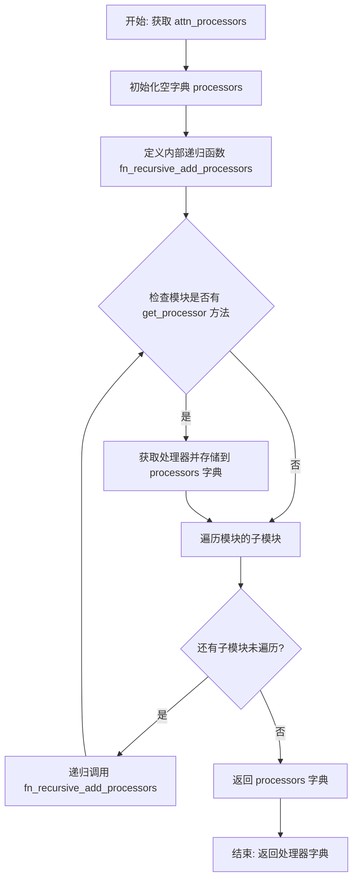

#### 带注释源码

```python
@property
def attn_processors(self) -> dict[str, AttentionProcessor]:
    r"""
    Returns:
        `dict` of attention processors: A dictionary containing all attention processors used in the model with
        indexed by its weight name.
    """
    # 初始化一个空字典，用于存储所有注意力处理器
    processors = {}

    # 定义内部递归函数，用于遍历模型的所有子模块并收集处理器
    def fn_recursive_add_processors(name: str, module: torch.nn.Module, processors: dict[str, AttentionProcessor]):
        # 检查当前模块是否有 get_processor 方法（即是否为注意力模块）
        if hasattr(module, "get_processor"):
            # 将处理器的名称设置为 "模块名.processor"，并存储实际处理器对象
            processors[f"{name}.processor"] = module.get_processor()

        # 遍历当前模块的所有子模块（named_children 返回直接子模块）
        for sub_name, child in module.named_children():
            # 递归调用，处理子模块，名称使用点号连接（如 "encoder.block1.attn1"）
            fn_recursive_add_processors(f"{name}.{sub_name}", child, processors)

        return processors

    # 遍历当前模块（self）的所有直接子模块
    for name, module in self.named_children():
        # 对每个子模块调用递归收集函数
        fn_recursive_add_processors(name, module, processors)

    # 返回收集到的所有注意力处理器字典
    return processors
```


### `AttentionMixin.set_attn_processor`

设置模型中所有注意力层使用的注意力处理器。

参数：

- `processor`：`AttentionProcessor | dict[str, AttentionProcessor]`，要设置的注意力处理器。可以是单个 `AttentionProcessor` 实例，也可以是包含处理器类的字典。如果使用字典，键需要定义对应交叉注意力处理器的路径，这在设置可训练注意力处理器时强烈推荐。

返回值：`None`，无返回值。

#### 流程图

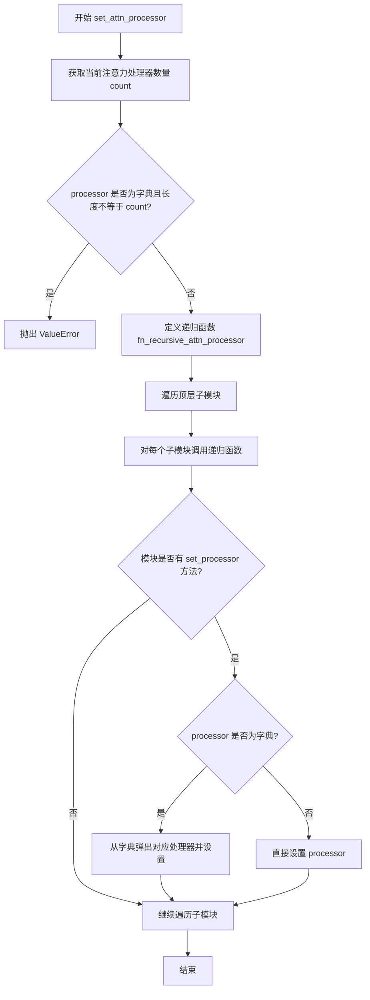

#### 带注释源码

```python
def set_attn_processor(self, processor: AttentionProcessor | dict[str, AttentionProcessor]):
    r"""
    Sets the attention processor to use to compute attention.

    Parameters:
        processor (`dict` of `AttentionProcessor` or only `AttentionProcessor`):
            The instantiated processor class or a dictionary of processor classes that will be set as the processor
            for **all** `Attention` layers.

            If `processor` is a dict, the key needs to define the path to the corresponding cross attention
            processor. This is strongly recommended when setting trainable attention processors.

    """
    # 获取当前模型中所有注意力处理器的数量
    count = len(self.attn_processors.keys())

    # 如果传入的是字典，验证字典中的处理器数量是否与模型中实际的注意力层数量匹配
    if isinstance(processor, dict) and len(processor) != count:
        raise ValueError(
            f"A dict of processors was passed, but the number of processors {len(processor)} does not match the"
            f" number of attention layers: {count}. Please make sure to pass {count} processor classes."
        )

    # 定义递归函数，遍历模型的所有子模块并设置注意力处理器
    def fn_recursive_attn_processor(name: str, module: torch.nn.Module, processor):
        # 如果模块有 set_processor 方法，则设置处理器
        if hasattr(module, "set_processor"):
            if not isinstance(processor, dict):
                # 直接设置单个处理器到模块
                module.set_processor(processor)
            else:
                # 从字典中弹出对应名称的处理器并设置
                # 字典的键格式为 "{parent_name}.{child_name}.processor"
                module.set_processor(processor.pop(f"{name}.processor"))

        # 递归遍历所有子模块
        for sub_name, child in module.named_children():
            fn_recursive_attn_processor(f"{name}.{sub_name}", child, processor)

    # 遍历顶层子模块，启动递归设置
    for name, module in self.named_children():
        fn_recursive_attn_processor(name, module, processor)
```


### `AttentionMixin.fuse_qkv_projections`

该方法用于启用融合的QKV投影，对于自注意力模块会将查询、键、值的投影矩阵融合为一个，对于交叉注意力模块则会融合键和值的投影矩阵。

参数：

- 该方法无显式参数（仅包含 `self`）

返回值：`None`，无返回值（该方法直接修改模块状态）

#### 流程图

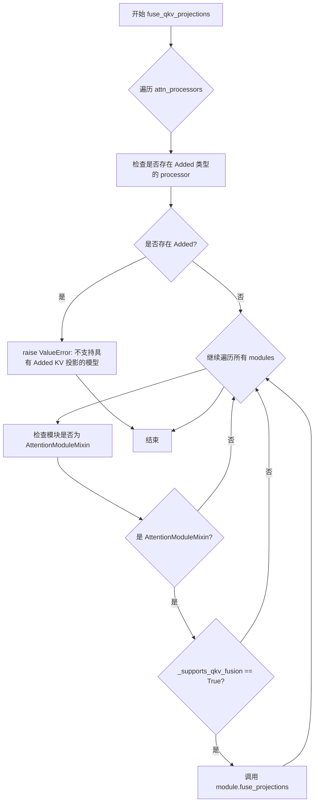

#### 带注释源码

```python
def fuse_qkv_projections(self):
    """
    启用融合QKV投影。对于自注意力模块，所有投影矩阵（即query、key、value）
    会被融合。对于交叉注意力模块，key和value投影矩阵会被融合。
    """
    # 步骤1: 检查是否存在 Added KV 投影的处理器
    # 遍历所有注意力处理器，检查是否有添加了KV投影的处理器类型
    for _, attn_processor in self.attn_processors.items():
        # 如果处理器类名中包含 "Added"，说明是添加了KV投影的处理器
        if "Added" in str(attn_processor.__class__.__name__):
            # 抛出异常，因为不支持融合具有 Added KV 投影的模型
            raise ValueError("`fuse_qkv_projections()` is not supported for models having added KV projections.")

    # 步骤2: 遍历所有模块并融合QKV投影
    # 遍历模型中的所有模块
    for module in self.modules():
        # 检查模块是否是 AttentionModuleMixin 类型且支持 QKV 融合
        if isinstance(module, AttentionModuleMixin) and module._supports_qkv_fusion:
            # 调用模块的 fuse_projections 方法执行实际的融合操作
            module.fuse_projections()
```


### `AttentionMixin.unfuse_qkv_projections`

禁用融合的QKV投影，将融合的投影重新分离为查询（Query）、键（Key）和值（Value）三个独立的投影矩阵。该方法是实验性API。

参数：

- 该方法无参数（除隐式 `self`）

返回值：`None`，无返回值

#### 流程图

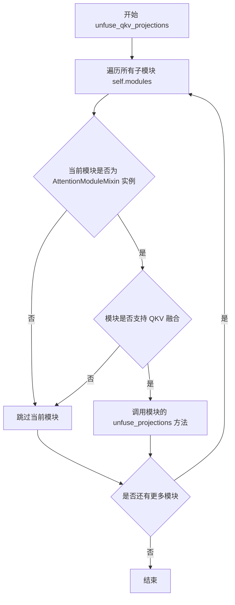

#### 带注释源码

```python
def unfuse_qkv_projections(self):
    """Disables the fused QKV projection if enabled.

    > [!WARNING] > This API is 🧪 experimental.
    """
    # 遍历模型中的所有模块（包括自身和所有子模块）
    for module in self.modules():
        # 检查模块是否是 AttentionModuleMixin 的实例
        # 并且该模块支持 QKV 融合（_supports_qkv_fusion 标志为 True）
        if isinstance(module, AttentionModuleMixin) and module._supports_qkv_fusion:
            # 调用模块自身的 unfuse_projections 方法
            # 该方法会将融合的投影（如 to_qkv）重新分离为独立的 to_q, to_k, to_v
            module.unfuse_projections()
```


### `AttentionModuleMixin.set_processor`

设置用于计算注意力的注意力处理器。

参数：

- `processor`：`AttentionProcessor`，需要设置的注意力处理器实例

返回值：`None`，无返回值

#### 流程图

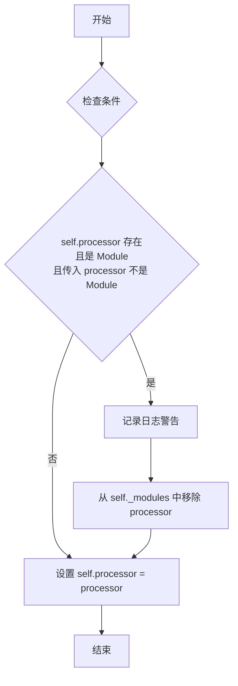

#### 带注释源码

```python
def set_processor(self, processor: AttentionProcessor) -> None:
    """
    Set the attention processor to use.

    Args:
        processor (`AttnProcessor`):
            The attention processor to use.
    """
    # 如果当前处理器在 self._modules 中，且传入的 processor 不是 Module，
    # 则需要从 self._modules 中移除旧的 processor
    if (
        hasattr(self, "processor")
        and isinstance(self.processor, torch.nn.Module)
        and not isinstance(processor, torch.nn.Module)
    ):
        # 记录日志，警告可能正在移除已训练的权重
        logger.info(f"You are removing possibly trained weights of {self.processor} with {processor}")
        # 从模块字典中弹出 processor 键，避免内存泄漏或状态不一致
        self._modules.pop("processor")

    # 将新的处理器赋值给实例属性
    self.processor = processor
```


### `AttentionModuleMixin.get_processor`

获取当前模块中使用的注意力处理器（Attention Processor）。

参数：

- `return_deprecated_lora`：`bool`，可选，默认为 `False`。设置为 `True` 时返回已废弃的 LoRA 注意力处理器。

返回值：`AttentionProcessor`，当前使用的注意力处理器实例。

#### 流程图

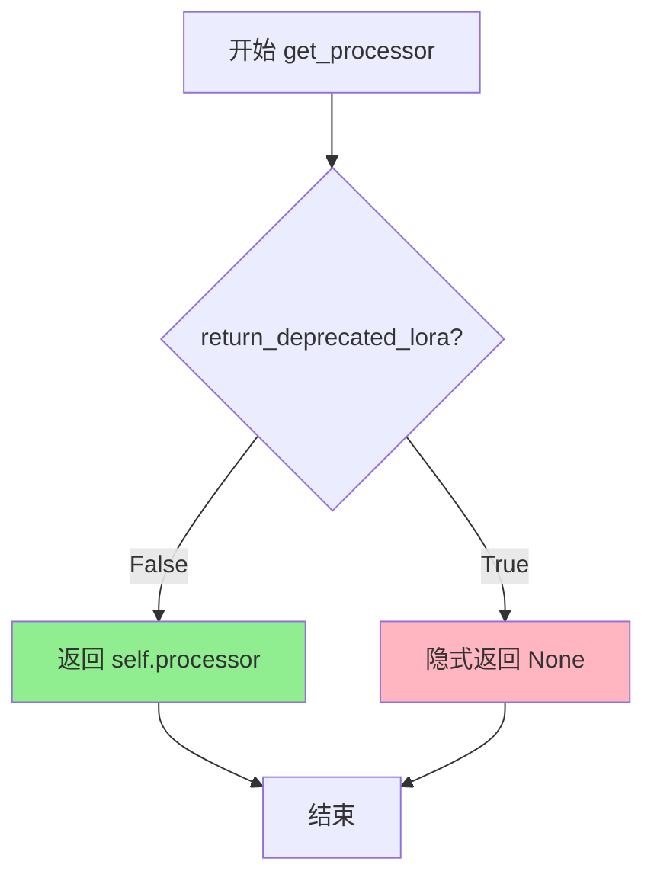

#### 带注释源码

```python
def get_processor(self, return_deprecated_lora: bool = False) -> "AttentionProcessor":
    """
    Get the attention processor in use.

    Args:
        return_deprecated_lora (`bool`, *optional*, defaults to `False`):
            Set to `True` to return the deprecated LoRA attention processor.

    Returns:
        "AttentionProcessor": The attention processor in use.
    """
    # 检查是否需要返回废弃的LoRA处理器
    # 默认情况下返回当前绑定的processor
    if not return_deprecated_lora:
        return self.processor
    
    # 注意：当 return_deprecated_lora 为 True 时，
    # 当前实现没有显式处理，会隐式返回 None
    # 这可能是为了向后兼容而保留的接口
```


### AttentionModuleMixin.set_attention_backend

设置注意力处理器的后端，用于切换不同的注意力计算实现（如 xformers、NPU、XLA 等）。

参数：

- `backend`：`str`，要设置的注意力后端名称

返回值：`None`，无返回值，仅修改内部状态

#### 流程图

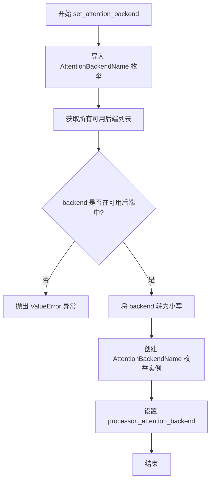

#### 带注释源码

```python
def set_attention_backend(self, backend: str):
    """
    设置注意力处理器的后端。
    
    参数:
        backend: 注意力后端名称，如 'xformers', '_native_npu', '_native_xla' 等
    """
    # 从子模块动态导入注意力后端枚举类
    from .attention_dispatch import AttentionBackendName

    # 从枚举成员中提取所有可用的后端值，组成集合
    available_backends = {x.value for x in AttentionBackendName.__members__.values()}
    
    # 验证传入的后端名称是否在支持列表中
    if backend not in available_backends:
        # 不支持的后端时抛出详细错误信息
        raise ValueError(f"`{backend=}` must be one of the following: " + ", ".join(available_backends))

    # 将后端名称转换为小写并创建对应的枚举实例
    backend = AttentionBackendName(backend.lower())
    
    # 将后端配置写入处理器的内部属性
    self.processor._attention_backend = backend
```


### `AttentionModuleMixin.set_use_npu_flash_attention`

该方法用于设置是否启用华为 NPU（Neural Processing Unit）的 Flash Attention 加速功能。当启用时，会检查 `torch_npu` 库是否可用，若可用则将注意力后端设置为原生 NPU 后端。

参数：

- `use_npu_flash_attention`：`bool`，表示是否启用 NPU Flash Attention。

返回值：`None`，无返回值。

#### 流程图

```mermaid
flowchart TD
    A[开始] --> B{use_npu_flash_attention == True?}
    B -->|是| C{is_torch_npu_available()?}
    B -->|否| D[调用 set_attention_backend]
    C -->|否| E[抛出 ImportError: torch_npu is not available]
    C -->|是| D
    D --> F[结束]
    E --> F
```

#### 带注释源码

```python
def set_use_npu_flash_attention(self, use_npu_flash_attention: bool) -> None:
    """
    Set whether to use NPU flash attention from `torch_npu` or not.
    设置是否使用来自 torch_npu 的 NPU Flash Attention。

    Args:
        use_npu_flash_attention (`bool`): Whether to use NPU flash attention or not.
            布尔值参数，指示是否启用 NPU Flash Attention。
    """
    # 如果需要启用 NPU Flash Attention，则进行环境检查
    if use_npu_flash_attention:
        # 检查 torch_npu 是否可用（通过 import_utils 中的工具函数检测）
        if not is_torch_npu_available():
            # 如果不可用，抛出 ImportError 提示用户安装 torch_npu
            raise ImportError("torch_npu is not available")

    # 调用内部方法设置注意力后端为 "_native_npu"
    # 该方法会修改 self.processor._attention_backend 属性
    self.set_attention_backend("_native_npu")
```


### `AttentionModuleMixin.set_use_xla_flash_attention`

该方法用于配置注意力模块，使其能够使用来自 `torch_xla` 库的 XLA Flash Attention。它会检查 `torch_xla` 的可用性，并将注意力后端设置为 `"_native_xla"`。

**需要注意的是**，虽然方法签名包含了 `partition_spec` 和 `is_flux` 参数，但当前实现中并未使用这些参数。此外，无论 `use_xla_flash_attention` 是 `True` 还是 `False`，该方法都会调用 `set_attention_backend`，这可能是一个逻辑上的设计缺陷或遗留问题。

参数：

- `use_xla_flash_attention`：`bool`，是否启用 XLA Flash Attention。
- `partition_spec`：`tuple[str | None, ...] | None`，用于 SPMD 分区的规范（当前代码中未使用）。
- `is_flux`：`bool`，标识模型是否为 Flux 模型（当前代码中未使用）。

返回值：`None`，无返回值，仅修改内部状态。

#### 流程图

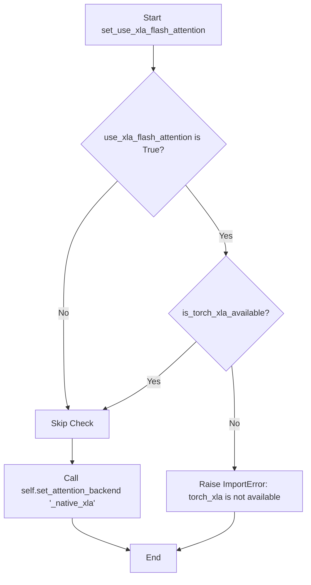

#### 带注释源码

```python
def set_use_xla_flash_attention(
    self,
    use_xla_flash_attention: bool,
    partition_spec: tuple[str | None, ...] | None = None,
    is_flux=False,
) -> None:
    """
    Set whether to use XLA flash attention from `torch_xla` or not.

    Args:
        use_xla_flash_attention (`bool`):
            Whether to use pallas flash attention kernel from `torch_xla` or not.
        partition_spec (`tuple[]`, *optional*):
            Specify the partition specification if using SPMD. Otherwise None.
        is_flux (`bool`, *optional*, defaults to `False`):
            Whether the model is a Flux model.
    """
    # 检查是否需要启用 XLA Flash Attention
    if use_xla_flash_attention:
        # 验证 torch_xla 库是否已安装
        if not is_torch_xla_available():
            raise ImportError("torch_xla is not available")

    # 无论是否启用（use_xla_flash_attention 为 True 或 False），
    # 都调用 set_attention_backend 将后端设置为 "_native_xla"。
    # 注意：partition_spec 和 is_flux 参数在此方法中未被使用。
    self.set_attention_backend("_native_xla")
```


### `AttentionModuleMixin.set_use_memory_efficient_attention_xformers`

设置是否使用 xformers 的内存高效注意力机制。

参数：

-  `self`：`AttentionModuleMixin`，隐式参数，类实例本身
-  `use_memory_efficient_attention_xformers`：`bool`，是否启用 xformers 内存高效注意力
-  `attention_op`：`Callable | None`，可选参数，指定注意力操作类型，默认为 `None`（使用 xformers 默认操作）

返回值：`None`，无返回值，仅执行副作用（设置注意力后端）

#### 流程图

```mermaid
flowchart TD
    A[开始: set_use_memory_efficient_attention_xformers] --> B{use_memory_efficient_attention_xformers == True?}
    B -- No --> Z[直接返回, 不做任何操作]
    B -- Yes --> C{is_xformers_available?}
    C -- No --> D[抛出 ModuleNotFoundError]
    C -- Yes --> E{torch.cuda.is_available?}
    E -- No --> F[抛出 ValueError: 需要 CUDA]
    E -- Yes --> G[尝试运行内存高效注意力测试]
    G --> H{测试是否成功?}
    H -- No --> I[重新抛出异常]
    H -- Yes --> J[调用 set_attention_backend('xformers')]
    J --> K[结束]
    
    style D fill:#ffcccc
    style F fill:#ffcccc
    style I fill:#ffcccc
    style J fill:#ccffcc
```

#### 带注释源码

```python
def set_use_memory_efficient_attention_xformers(
    self, use_memory_efficient_attention_xformers: bool, attention_op: Callable | None = None
) -> None:
    """
    Set whether to use memory efficient attention from `xformers` or not.

    Args:
        use_memory_efficient_attention_xformers (`bool`):
            Whether to use memory efficient attention from `xformers` or not.
        attention_op (`Callable`, *optional*):
            The attention operation to use. Defaults to `None` which uses the default attention operation from
            `xformers`.
    """
    # 仅在需要启用xformers时才执行后续逻辑
    if use_memory_efficient_attention_xformers:
        # 检查xformers库是否已安装
        if not is_xformers_available():
            raise ModuleNotFoundError(
                "Refer to https://github.com/facebookresearch/xformers for more information on how to install xformers",
                name="xformers",
            )
        # 检查CUDA是否可用（xformers仅支持GPU）
        elif not torch.cuda.is_available():
            raise ValueError(
                "torch.cuda.is_available() should be True but is False. xformers' memory efficient attention is"
                " only available for GPU "
            )
        else:
            try:
                # 进一步验证：确保可以实际运行xformers的内存高效注意力
                if is_xformers_available():
                    dtype = None
                    # 如果提供了自定义attention_op，获取其支持的数据类型
                    if attention_op is not None:
                        op_fw, op_bw = attention_op
                        dtype, *_ = op_fw.SUPPORTED_DTYPES
                    # 创建一个测试tensor来验证功能可用性
                    q = torch.randn((1, 2, 40), device="cuda", dtype=dtype)
                    # 执行实际的内存高效注意力操作进行测试
                    _ = xops.ops.memory_efficient_attention(q, q, q)
            except Exception as e:
                # 如果测试失败，重新抛出异常
                raise e

            # 所有验证通过后，设置注意力后端为xformers
            self.set_attention_backend("xformers")
```


### `AttentionModuleMixin.fuse_projections`

将查询(Query)、键(Key)和值(Value)的投影矩阵融合为单个投影矩阵，以提高注意力模块的计算效率和内存利用率。

参数：

- 该方法无显式参数（隐式使用 `self` 引用当前模块实例）

返回值：`None`，无返回值（该方法直接修改模块状态）

#### 流程图

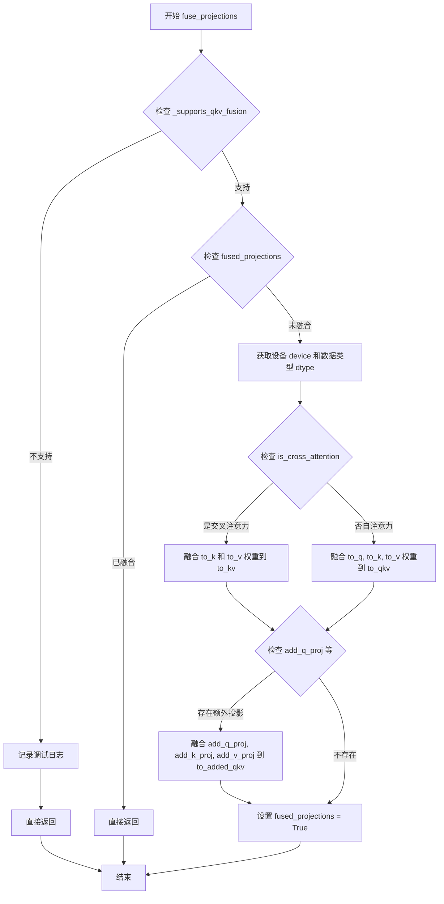

#### 带注释源码

```python
@torch.no_grad()
def fuse_projections(self):
    """
    Fuse the query, key, and value projections into a single projection for efficiency.
    """
    # 检查当前模块子类是否支持 QKV 融合（例如 Flux2 单流块的 QKV 投影已融合）
    if not self._supports_qkv_fusion:
        logger.debug(
            f"{self.__class__.__name__} does not support fusing QKV projections, so `fuse_projections` will no-op."
        )
        return

    # 如果已经融合过，则跳过
    if getattr(self, "fused_projections", False):
        return

    # 获取当前模块的设备和数据类型
    device = self.to_q.weight.data.device
    dtype = self.to_q.weight.data.dtype

    # 判断是否为交叉注意力模块
    if hasattr(self, "is_cross_attention") and self.is_cross_attention:
        # 融合交叉注意力的 key 和 value 投影
        # 将 to_k 和 to_v 的权重沿行维度拼接
        concatenated_weights = torch.cat([self.to_k.weight.data, self.to_v.weight.data])
        in_features = concatenated_weights.shape[1]
        out_features = concatenated_weights.shape[0]

        # 创建新的融合线性层 to_kv
        self.to_kv = nn.Linear(in_features, out_features, bias=self.use_bias, device=device, dtype=dtype)
        self.to_kv.weight.copy_(concatenated_weights)
        # 如果存在偏置，也进行融合
        if hasattr(self, "use_bias") and self.use_bias:
            concatenated_bias = torch.cat([self.to_k.bias.data, self.to_v.bias.data])
            self.to_kv.bias.copy_(concatenated_bias)
    else:
        # 融合自注意力的 query, key, value 投影
        # 将 to_q, to_k, to_v 的权重沿行维度拼接
        concatenated_weights = torch.cat([self.to_q.weight.data, self.to_k.weight.data, self.to_v.weight.data])
        in_features = concatenated_weights.shape[1]
        out_features = concatenated_weights.shape[0]

        # 创建新的融合线性层 to_qkv
        self.to_qkv = nn.Linear(in_features, out_features, bias=self.use_bias, device=device, dtype=dtype)
        self.to_qkv.weight.copy_(concatenated_weights)
        # 如果存在偏置，也进行融合
        if hasattr(self, "use_bias") and self.use_bias:
            concatenated_bias = torch.cat([self.to_q.bias.data, self.to_k.bias.data, self.to_v.bias.data])
            self.to_qkv.bias.copy_(concatenated_bias)

    # 处理额外投影层（如 SD3、Flux 等模型中的 add_q_proj 等）
    if (
        getattr(self, "add_q_proj", None) is not None
        and getattr(self, "add_k_proj", None) is not None
        and getattr(self, "add_v_proj", None) is not None
    ):
        # 融合额外的 qkv 投影
        concatenated_weights = torch.cat(
            [self.add_q_proj.weight.data, self.add_k_proj.weight.data, self.add_v_proj.weight.data]
        )
        in_features = concatenated_weights.shape[1]
        out_features = concatenated_weights.shape[0]

        self.to_added_qkv = nn.Linear(
            in_features, out_features, bias=self.added_proj_bias, device=device, dtype=dtype
        )
        self.to_added_qkv.weight.copy_(concatenated_weights)
        if self.added_proj_bias:
            concatenated_bias = torch.cat(
                [self.add_q_proj.bias.data, self.add_k_proj.bias.data, self.add_v_proj.bias.data]
            )
            self.to_added_qkv.bias.copy_(concatenated_bias)

    # 标记已融合状态
    self.fused_projections = True
```


### `AttentionModuleMixin.unfuse_projections`

该方法用于将融合的查询、键、值投影（QKV）解构回独立的投影矩阵。它是 `fuse_projections` 的逆操作，删除融合层（`to_qkv`、`to_kv`、`to_added_qkv`）并重置 `fused_projections` 标志，使注意力模块能够使用独立的投影进行前向传播。

参数：此方法无参数。

返回值：`None`，该方法直接修改实例状态，不返回任何值。

#### 流程图

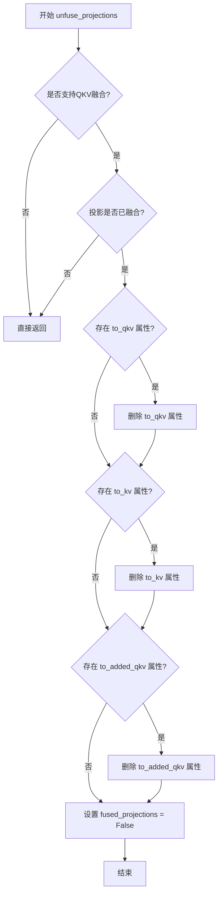

#### 带注释源码

```python
@torch.no_grad()
def unfuse_projections(self):
    """
    Unfuse the query, key, and value projections back to separate projections.
    """
    # 检查子类是否支持QKV融合
    # 如果不支持（例如 Flux2 单流块），则直接返回，不做任何操作
    if not self._supports_qkv_fusion:
        return

    # 检查投影是否已经融合
    # 如果未融合（fused_projections 为 False），则无需解构，直接返回
    if not getattr(self, "fused_projections", False):
        return

    # 删除融合的自注意力投影层
    # 这是 fuse_projections 方法中创建的 to_qkv 线性层
    if hasattr(self, "to_qkv"):
        delattr(self, "to_qkv")

    # 删除融合的交叉注意力投影层
    # 这是 fuse_projections 方法中创建的 to_kv 线性层（仅用于交叉注意力）
    if hasattr(self, "to_kv"):
        delattr(self, "to_kv")

    # 删除额外的融合投影层（用于 SD3、Flux 等模型）
    # 这是 fuse_projections 方法中创建的 to_added_qkv 线性层
    if hasattr(self, "to_added_qkv"):
        delattr(self, "to_added_qkv")

    # 重置融合标志，表示投影已解构回独立状态
    # 这样后续的前向传播将使用独立的 to_q、to_k、to_v 投影
    self.fused_projections = False
```


### `AttentionModuleMixin.set_attention_slice`

设置注意力计算的切片大小，用于实现分片注意力机制以节省显存。

参数：

- `slice_size`：`int`，用于注意力计算的切片大小。当设置为 `None` 时表示不使用分片。

返回值：`None`，该方法无返回值。

#### 流程图

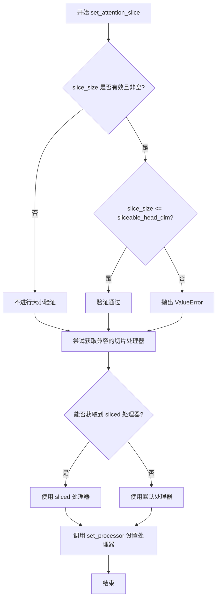

#### 带注释源码

```python
def set_attention_slice(self, slice_size: int) -> None:
    """
    Set the slice size for attention computation.

    Args:
        slice_size (`int`):
            The slice size for attention computation.
    """
    # 验证 slice_size 是否有效
    # 如果模块有 sliceable_head_dim 属性，则 slice_size 不能超过它
    if hasattr(self, "sliceable_head_dim") and slice_size is not None and slice_size > self.sliceable_head_dim:
        raise ValueError(f"slice_size {slice_size} has to be smaller or equal to {self.sliceable_head_dim}.")

    processor = None

    # 尝试获取兼容的分片注意力处理器
    # 如果提供了有效的 slice_size，查找支持 sliced attention 的处理器
    if slice_size is not None:
        processor = self._get_compatible_processor("sliced")

    # 如果没有找到分片处理器或 slice_size 为 None，使用默认处理器
    # 这样可以确保始终有一个有效的处理器被设置
    if processor is None:
        processor = self.default_processor_cls()

    # 设置最终的注意力处理器
    self.set_processor(processor)
```


### `AttentionModuleMixin.batch_to_head_dim`

该方法用于将注意力机制的输入张量从 `[batch_size, seq_len, dim]` 形状重塑为 `[batch_size // heads, seq_len, dim * heads]` 形状，以便将批量维度分割到注意力头维度，实现多头注意力的张量处理。

参数：

- `tensor`：`torch.Tensor`，需要重塑的张量，形状为 `[batch_size, seq_len, dim]`

返回值：`torch.Tensor`，重塑后的张量，形状为 `[batch_size // heads, seq_len, dim * heads]`

#### 流程图

```mermaid
flowchart TD
    A[开始: 输入 tensor] --> B[获取 head_size = self.heads]
    B --> C[解构 tensor.shape 获 batch_size, seq_len, dim]
    C --> D[reshape: (batch_size // head_size, head_size, seq_len, dim)]
    D --> E[permute: (0, 2, 1, 3) 交换维度]
    E --> F[reshape: (batch_size // head_size, seq_len, dim * head_size)]
    F --> G[返回重塑后的 tensor]
```

#### 带注释源码

```python
def batch_to_head_dim(self, tensor: torch.Tensor) -> torch.Tensor:
    """
    Reshape the tensor from `[batch_size, seq_len, dim]` to `[batch_size // heads, seq_len, dim * heads]`.

    Args:
        tensor (`torch.Tensor`): The tensor to reshape.

    Returns:
        `torch.Tensor`: The reshaped tensor.
    """
    # 获取注意力头的数量
    head_size = self.heads
    
    # 解构输入张量的形状：批量大小、序列长度、特征维度
    batch_size, seq_len, dim = tensor.shape
    
    # 第一步重塑：将 (batch, seq, dim) -> (batch//heads, heads, seq, dim)
    # 将批量维度分割，把heads维度插入到第2维
    tensor = tensor.reshape(batch_size // head_size, head_size, seq_len, dim)
    
    # 第二步维度重排：将 (batch//heads, heads, seq, dim) -> (batch//heads, seq, heads, dim)
    # 使用permute将heads维度移到第3维，为后续合并heads和dim做准备
    tensor = tensor.permute(0, 2, 1, 3).reshape(batch_size // head_size, seq_len, dim * head_size)
    
    # 第三步重塑：将 (batch//heads, seq, heads, dim) -> (batch//heads, seq, dim*heads)
    # 将heads和dim维度合并，得到最终的目标形状
    return tensor
```


### `AttentionModuleMixin.head_to_batch_dim`

该方法用于将多头注意力处理所需的张量从批量维度（batch）转换到头维度（head），即将张量重新整形为适合多头注意力计算的形状，支持 3 维和 4 维输入张量，并根据 `out_dim` 参数决定输出的维度。

参数：

- `self`：`AttentionModuleMixin`，调用此方法的类实例，包含 `heads` 属性表示注意力头数
- `tensor`：`torch.Tensor`，要重新整形的张量，可以是 3 维（`[batch_size, seq_len, dim]`）或 4 维（`[batch_size, extra_dim, seq_len, dim]`）
- `out_dim`：`int`，可选，默认为 `3`，指定输出的维度，值为 `3` 时返回 3 维张量，值为 `4` 时返回 4 维张量

返回值：`torch.Tensor`，重新整形后的张量

#### 流程图

```mermaid
flowchart TD
    A[Start: head_to_batch_dim] --> B[Get head_size from self.heads]
    B --> C{tensor.ndim == 3?}
    C -->|Yes| D[batch_size, seq_len, dim = tensor.shape<br/>extra_dim = 1]
    C -->|No| E[batch_size, extra_dim, seq_len, dim = tensor.shape]
    D --> F[tensor = tensor.reshape<br/>(batch_size, seq_len * extra_dim, head_size, dim // head_size)]
    E --> F
    F --> G[tensor = tensor.permute<br/>(0, 2, 1, 3)]
    G --> H{out_dim == 3?}
    H -->|Yes| I[tensor = tensor.reshape<br/>(batch_size * head_size, seq_len * extra_dim, dim // head_size)]
    H -->|No| J[Return tensor 4D]
    I --> K[Return tensor 3D]
```

#### 带注释源码

```python
def head_to_batch_dim(self, tensor: torch.Tensor, out_dim: int = 3) -> torch.Tensor:
    """
    Reshape the tensor for multi-head attention processing.

    Args:
        tensor (`torch.Tensor`): The tensor to reshape.
        out_dim (`int`, *optional*, defaults to `3`): The output dimension of the tensor.

    Returns:
        `torch.Tensor`: The reshaped tensor.
    """
    # 获取注意力头数
    head_size = self.heads
    
    # 判断输入张量是3维还是4维
    if tensor.ndim == 3:
        # 3维张量形状: [batch_size, seq_len, dim]
        batch_size, seq_len, dim = tensor.shape
        # 对于3维输入，额外的维度设为1
        extra_dim = 1
    else:
        # 4维张量形状: [batch_size, extra_dim, seq_len, dim]
        batch_size, extra_dim, seq_len, dim = tensor.shape
    
    # 第一次reshape: 将batch_size和extra_dim合并，然后分割出头和每个头的维度
    # 变换后形状: [batch_size, seq_len * extra_dim, head_size, dim // head_size]
    tensor = tensor.reshape(batch_size, seq_len * extra_dim, head_size, dim // head_size)
    
    # 维度重排: 将head维度移到batch维度之后
    # 变换后形状: [batch_size, head_size, seq_len * extra_dim, dim // head_size]
    tensor = tensor.permute(0, 2, 1, 3)

    # 如果输出维度为3，则将batch和head合并
    if out_dim == 3:
        # 变换后形状: [batch_size * head_size, seq_len * extra_dim, dim // head_size]
        tensor = tensor.reshape(batch_size * head_size, seq_len * extra_dim, dim // head_size)

    # 返回处理后的张量
    return tensor
```


### `AttentionModuleMixin.get_attention_scores`

该方法用于计算注意力分数（attention scores），通过查询（query）和键（key）张量计算注意力概率分布，支持可选的注意力掩码和数值精度升级。

参数：

- `self`：`AttentionModuleMixin`，包含注意力模块的混合类实例，隐式传入
- `query`：`torch.Tensor`，查询张量，用于计算与键的相似度
- `key`：`torch.Tensor`，键张量，用于与查询计算注意力分数
- `attention_mask`：`torch.Tensor | None`，可选的注意力掩码，用于屏蔽特定位置的注意力

返回值：`torch.Tensor`，注意力概率分布张量，形状与注意力分数相同

#### 流程图

```mermaid
flowchart TD
    A[开始 get_attention_scores] --> B[保存原始数据类型]
    B --> C{self.upcast_attention 为 True?}
    C -->|Yes| D[将 query 和 key 转换为 float 类型]
    C -->|No| E{attention_mask 为 None?}
    D --> E
    E -->|Yes| F[创建空的 baddbmm_input<br/>形状: batch × seq_len_q × seq_len_k<br/>beta = 0]
    E -->|No| G[使用 attention_mask 作为 baddbmm_input<br/>beta = 1]
    F --> H[调用 torch.baddbmm<br/>计算注意力分数]
    G --> H
    H --> I{self.upcast_softmax 为 True?}
    I -->|Yes| J[将 attention_scores 转换为 float]
    I -->|No| K[进行 softmax 归一化]
    J --> K
    K --> L[attention_probs = softmax(dim=-1)]
    L --> M[将结果转换回原始数据类型]
    M --> N[返回 attention_probs]
```

#### 带注释源码

```python
def get_attention_scores(
    self, query: torch.Tensor, key: torch.Tensor, attention_mask: torch.Tensor | None = None
) -> torch.Tensor:
    """
    Compute the attention scores.

    Args:
        query (`torch.Tensor`): The query tensor.
        key (`torch.Tensor`): The key tensor.
        attention_mask (`torch.Tensor`, *optional*): The attention mask to use.

    Returns:
        `torch.Tensor`: The attention probabilities/scores.
    """
    # 步骤1：保存原始数据类型，用于后续恢复精度
    dtype = query.dtype
    
    # 步骤2：如果需要升级精度（用于混合精度训练），将 query 和 key 转换为 float 类型
    if self.upcast_attention:
        query = query.float()
        key = key.float()

    # 步骤3：准备 baddbmm 的输入张量
    # baddbmm 是 batched add matrix multiplication，用于高效计算注意力分数
    if attention_mask is None:
        # 如果没有注意力掩码，创建一个空张量，beta 设为 0（不加掩码）
        baddbmm_input = torch.empty(
            query.shape[0], query.shape[1], key.shape[1], dtype=query.dtype, device=query.device
        )
        beta = 0  # beta=0 表示不加任何偏移
    else:
        # 使用提供的注意力掩码，beta 设为 1（加上掩码值）
        baddbmm_input = attention_mask
        beta = 1

    # 步骤4：计算注意力分数
    # 使用 baddbmm: result = beta * input + alpha * (query @ key^T)
    # self.scale 是注意力缩放因子，通常为 1/sqrt(d_k)
    attention_scores = torch.baddbmm(
        baddbmm_input,
        query,
        key.transpose(-1, -2),  # 转置 key 的最后两个维度以进行矩阵乘法
        beta=beta,
        alpha=self.scale,
    )
    del baddbmm_input  # 释放中间变量内存

    # 步骤5：如果需要升级 softmax（用于数值稳定性），转换为 float 类型
    if self.upcast_softmax:
        attention_scores = attention_scores.float()

    # 步骤6：应用 softmax 得到注意力概率分布
    attention_probs = attention_scores.softmax(dim=-1)
    del attention_scores  # 释放中间变量内存

    # 步骤7：将结果转换回原始数据类型
    attention_probs = attention_probs.to(dtype)

    return attention_probs
```


### `AttentionModuleMixin.prepare_attention_mask`

该方法用于准备和调整注意力掩码的形状，以适配多头注意力计算的需求。它处理掩码的填充（padding）以达到目标长度，并根据输出维度要求对掩码进行重复（repeat）操作，以匹配批量大小和注意力头数。

参数：

- `self`：`AttentionModuleMixin`，类的实例本身，包含 `heads` 属性表示注意力头数
- `attention_mask`：`torch.Tensor`，需要准备的原始注意力掩码
- `target_length`：`int`，注意力掩码的目标长度
- `batch_size`：`int`，用于重复注意力掩码的批量大小
- `out_dim`：`int`，可选参数，默认为 `3`，指定输出维度

返回值：`torch.Tensor`，准备好的注意力掩码

#### 流程图

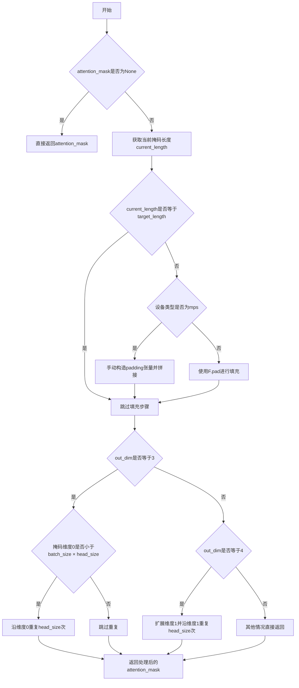

#### 带注释源码

```python
def prepare_attention_mask(
    self, attention_mask: torch.Tensor, target_length: int, batch_size: int, out_dim: int = 3
) -> torch.Tensor:
    """
    Prepare the attention mask for the attention computation.

    Args:
        attention_mask (`torch.Tensor`): The attention mask to prepare.
        target_length (`int`): The target length of the attention mask.
        batch_size (`int`): The batch size for repeating the attention mask.
        out_dim (`int`, *optional*, defaults to `3`): Output dimension.

    Returns:
        `torch.Tensor`: The prepared attention mask.
    """
    # 获取注意力头数
    head_size = self.heads
    
    # 如果没有提供注意力掩码，直接返回None
    if attention_mask is None:
        return attention_mask

    # 获取当前掩码的最后一位长度（即序列长度）
    current_length: int = attention_mask.shape[-1]
    
    # 如果当前长度与目标长度不匹配，需要进行填充
    if current_length != target_length:
        # 针对MPS设备的特殊处理（MPS不支持超过输入张量维度的填充）
        if attention_mask.device.type == "mps":
            # HACK: MPS: Does not support padding by greater than dimension of input tensor.
            # Instead, we can manually construct the padding tensor.
            # 手动构造填充张量
            padding_shape = (attention_mask.shape[0], attention_mask.shape[1], target_length)
            padding = torch.zeros(padding_shape, dtype=attention_mask.dtype, device=attention_mask.device)
            # 将原始掩码与填充张量在第3维（序列维）拼接
            attention_mask = torch.cat([attention_mask, padding], dim=2)
        else:
            # TODO: for pipelines such as stable-diffusion, padding cross-attn mask:
            #       we want to instead pad by (0, remaining_length), where remaining_length is:
            #       remaining_length: int = target_length - current_length
            # TODO: re-enable tests/models/test_models_unet_2d_condition.py#test_model_xattn_padding
            # 使用PyTorch的F.pad进行填充，在序列维右侧填充0
            attention_mask = F.pad(attention_mask, (0, target_length), value=0.0)

    # 根据输出维度要求调整掩码形状
    if out_dim == 3:
        # 对于3维输出，如果掩码的批次维小于batch_size × head_size，需要重复
        if attention_mask.shape[0] < batch_size * head_size:
            # 沿第0维（批次维）重复head_size次
            attention_mask = attention_mask.repeat_interleave(head_size, dim=0)
    elif out_dim == 4:
        # 对于4维输出，先扩展第1维，然后沿该维重复head_size次
        attention_mask = attention_mask.unsqueeze(1)
        attention_mask = attention_mask.repeat_interleave(head_size, dim=1)

    return attention_mask
```


### `AttentionModuleMixin.norm_encoder_hidden_states`

该方法用于对编码器的隐藏状态进行归一化处理，根据 `norm_cross` 的类型（LayerNorm 或 GroupNorm）采用不同的归一化策略。

参数：

- `encoder_hidden_states`：`torch.Tensor`，编码器的隐藏状态

返回值：`torch.Tensor`，归一化后的编码器隐藏状态

#### 流程图

```mermaid
flowchart TD
    A[开始 norm_encoder_hidden_states] --> B{self.norm_cross is not None?}
    B -->|否| C[断言失败: self.norm_cross must be defined]
    B -->|是| D{self.norm_cross 是 nn.LayerNorm?}
    D -->|是| E[直接应用 LayerNorm]
    D -->|否| F{self.norm_cross 是 nn.GroupNorm?}
    F -->|是| G[转置: (batch, seq, hidden) -> (batch, hidden, seq)]
    G --> H[应用 GroupNorm]
    H --> I[再转置: (batch, hidden, seq) -> (batch, seq, hidden)]
    F -->|否| J[断言失败]
    E --> K[返回归一化后的 encoder_hidden_states]
    I --> K
    C --> K
    J --> K
```

#### 带注释源码

```python
def norm_encoder_hidden_states(self, encoder_hidden_states: torch.Tensor) -> torch.Tensor:
    """
    Normalize the encoder hidden states.

    Args:
        encoder_hidden_states (`torch.Tensor`): Hidden states of the encoder.

    Returns:
        `torch.Tensor`: The normalized encoder hidden states.
    """
    # 断言确保 norm_cross 已定义，否则无法执行归一化
    assert self.norm_cross is not None, "self.norm_cross must be defined to call self.norm_encoder_hidden_states"
    
    # 根据 norm_cross 的类型选择不同的归一化方式
    if isinstance(self.norm_cross, nn.LayerNorm):
        # LayerNorm 直接在特征维度上归一化，适合 (batch_size, sequence_length, hidden_size) 形状
        encoder_hidden_states = self.norm_cross(encoder_hidden_states)
    elif isinstance(self.norm_cross, nn.GroupNorm):
        # GroupNorm 在通道维度上归一化，期望输入形状为 (N, C, *)
        # 需要将 (batch_size, sequence_length, hidden_size) ->
        # (batch_size, hidden_size, sequence_length)
        encoder_hidden_states = encoder_hidden_states.transpose(1, 2)
        encoder_hidden_states = self.norm_cross(encoder_hidden_states)
        # 转置回来: (batch_size, hidden_size, sequence_length) ->
        # (batch_size, sequence_length, hidden_size)
        encoder_hidden_states = encoder_hidden_states.transpose(1, 2)
    else:
        # 其他归一化类型暂不支持，触发断言错误
        assert False

    return encoder_hidden_states
```


### `GatedSelfAttentionDense.forward`

该方法实现了一个门控自注意力密集层，通过可学习的门控机制将对象特征（objs）融合到视觉特征（x）中，首先执行拼接后的自注意力操作，然后执行前馈网络操作，实现视觉与对象特征的有效交互。

**参数：**

- `x`：`torch.Tensor`，输入的视觉特征张量，形状为 `[batch_size, n_visual, hidden_dim]`
- `objs`：`torch.Tensor`，输入的对象特征张量，形状为 `[batch_size, n_objs, context_dim]`

**返回值：** `torch.Tensor`，融合后的视觉特征，形状与输入 `x` 相同 `[batch_size, n_visual, hidden_dim]`

#### 流程图

```mermaid
flowchart TD
    A[输入: x, objs] --> B{self.enabled?}
    B -->|False| C[直接返回 x]
    B -->|True| D[n_visual = x.shape[1]]
    D --> E[objs = self.linear.objs]
    E --> F[cat_x = torch.catx, objs], dim=1]
    F --> G[norm_x = self.norm1cat_x]
    H --> I[attn_output = self.attnnorm_x]
    G --> I
    I --> J[gate_attn = alpha_attn.tanh]
    J --> K[x = x + gate_attn \* attn_output[:n_visual, :]]
    K --> L[norm_x2 = self.norm2x]
    L --> M[ff_output = self.ffnorm_x2]
    M --> N[gate_dense = alpha_dense.tanh]
    N --> O[x = x + gate_dense \* ff_output]
    O --> P[返回 x]
```

#### 带注释源码

```python
def forward(self, x: torch.Tensor, objs: torch.Tensor) -> torch.Tensor:
    """
    前向传播方法，实现门控自注意力密集层
    
    参数:
        x: 视觉特征张量，形状 [batch_size, n_visual, query_dim]
        objs: 对象特征张量，形状 [batch_size, n_objs, context_dim]
    
    返回:
        融合后的视觉特征张量，形状 [batch_size, n_visual, query_dim]
    """
    # 如果模块被禁用，直接返回输入，不进行任何处理
    if not self.enabled:
        return x

    # 记录视觉特征的序列长度，用于后续从拼接张量中提取视觉部分
    n_visual = x.shape[1]
    
    # 将对象特征从 context_dim 投影到 query_dim 维度
    # 这是因为需要将对象特征与视觉特征在特征维度上对齐
    objs = self.linear(objs)

    # 门控自注意力机制
    # 1. 将视觉特征和对象特征在序列维度上拼接
    # 2. 通过 LayerNorm 进行归一化
    # 3. 通过自注意力模块处理
    # 4. 使用 alpha_attn.tanh() 作为门控系数（输出范围 -1 到 1）
    # 5. 只保留前 n_visual 个位置的结果（视觉特征部分）
    x = x + self.alpha_attn.tanh() * self.attn(self.norm1(torch.cat([x, objs], dim=1)))[:, :n_visual, :]
    
    # 门控前馈网络机制
    # 1. 通过 LayerNorm 对视觉特征进行归一化
    # 2. 通过前馈网络（GEGLU 激活函数）处理
    # 3. 使用 alpha_dense.tanh() 作为门控系数
    x = x + self.alpha_dense.tanh() * self.ff(self.norm2(x))

    # 返回融合了对象特征的增强视觉特征
    return x
```


### `JointTransformerBlock.set_chunk_feed_forward`

该方法用于设置分块前馈传播（chunked feed-forward）的配置，通过指定分块大小和维度来启用分块计算，以节省内存使用。

参数：

- `chunk_size`：`int | None`，分块大小，设置为 `None` 时禁用分块，设置为整数时启用分块
- `dim`：`int`（默认值 0），沿哪个维度进行分块

返回值：`None`，无返回值，该方法直接修改实例的内部状态

#### 流程图

```mermaid
flowchart TD
    A[开始] --> B[设置 self._chunk_size = chunk_size]
    B --> C[设置 self._chunk_dim = dim]
    C --> D[结束]
```

#### 带注释源码

```python
def set_chunk_feed_forward(self, chunk_size: int | None, dim: int = 0):
    # Sets chunk feed-forward
    # 该方法用于配置前馈网络（FeedForward）的分块计算
    # 参数:
    #   chunk_size: 分块大小，当为None时禁用分块，为整数时启用分块
    #   dim: 分块的维度，默认为0（通常是序列长度维度）
    # 
    # 内部逻辑:
    #   1. 将chunk_size存储到self._chunk_size
    #   2. 将dim存储到self._chunk_dim
    #   这些变量在forward方法中会被使用来决定是否调用_chunked_feed_forward
    
    self._chunk_size = chunk_size
    self._chunk_dim = dim
```


### `JointTransformerBlock.forward`

该方法是 JointTransformerBlock 的前向传播方法，遵循 MMDiT（Multi-Modal Diffusion Transformer）架构，处理两路输入（hidden_states 和 encoder_hidden_states），通过自注意力、交叉注意力和前馈网络进行特征转换，并支持 dual attention 机制。

参数：

- `hidden_states`：`torch.FloatTensor`，主输入的隐藏状态张量
- `encoder_hidden_states`：`torch.FloatTensor`，编码器（条件）输入的隐藏状态张量
- `temb`：`torch.FloatTensor`，时间嵌入向量，用于自适应层归一化
- `joint_attention_kwargs`：`dict[str, Any] | None`，可选的联合注意力配置参数

返回值：`tuple[torch.Tensor, torch.Tensor]`，返回处理后的 encoder_hidden_states 和 hidden_states

#### 流程图

```mermaid
flowchart TD
    A[开始 forward] --> B{use_dual_attention?}
    B -->|Yes| C[norm1返回7个值]
    B -->|No| D[norm1返回5个值]
    C --> E{context_pre_only?}
    D --> E
    E -->|Yes| F[norm1_context处理encoder_hidden_states]
    E -->|No| G[norm1_context返回5个值]
    F --> H[调用self.attn进行注意力计算]
    G --> H
    H --> I[attn_output乘以gate_msa并加到hidden_states]
    J{use_dual_attention?}
    I --> J
    J -->|Yes| K[调用self.attn2进行第二次注意力]
    J -->|No| L[跳过attn2]
    K --> L
    L --> M[norm2处理hidden_states并应用shift和scale]
    M --> N{_chunk_size is not None?}
    N -->|Yes| O[调用_chunked_feed_forward分块处理]
    N -->|No| P[直接调用self.ff前馈网络]
    O --> Q[ff_output乘以gate_mlp并加到hidden_states]
    P --> Q
    Q --> R{context_pre_only?}
    R -->|Yes| S[encoder_hidden_states设为None]
    R -->|No| T[处理encoder_hidden_states的注意力]
    S --> U[返回tuple[encoder_hidden_states, hidden_states]]
    T --> U
```

#### 带注释源码

```python
def forward(
    self,
    hidden_states: torch.FloatTensor,
    encoder_hidden_states: torch.FloatTensor,
    temb: torch.FloatTensor,
    joint_attention_kwargs: dict[str, Any] | None = None,
) -> tuple[torch.Tensor, torch.Tensor]:
    # 初始化联合注意力参数为空字典
    joint_attention_kwargs = joint_attention_kwargs or {}
    
    # 第一次归一化：根据use_dual_attention决定返回值的数量
    # dual attention时返回: norm_hidden_states, gate_msa, shift_mlp, scale_mlp, gate_mlp, norm_hidden_states2, gate_msa2
    # 普通模式返回: norm_hidden_states, gate_msa, shift_mlp, scale_mlp, gate_mlp
    if self.use_dual_attention:
        norm_hidden_states, gate_msa, shift_mlp, scale_mlp, gate_mlp, norm_hidden_states2, gate_msa2 = self.norm1(
            hidden_states, emb=temb
        )
    else:
        norm_hidden_states, gate_msa, shift_mlp, scale_mlp, gate_mlp = self.norm1(hidden_states, emb=temb)

    # 上下文（encoder_hidden_states）的第一次归一化
    # 根据context_pre_only决定是否返回门控参数
    if self.context_pre_only:
        norm_encoder_hidden_states = self.norm1_context(encoder_hidden_states, temb)
    else:
        norm_encoder_hidden_states, c_gate_msa, c_shift_mlp, c_scale_mlp, c_gate_mlp = self.norm1_context(
            encoder_hidden_states, emb=temb
        )

    # 注意力计算：同时处理主输入和条件输入的注意力
    attn_output, context_attn_output = self.attn(
        hidden_states=norm_hidden_states,
        encoder_hidden_states=norm_encoder_hidden_states,
        **joint_attention_kwargs,
    )

    # 主hidden_states的注意力后处理：门控残差连接
    attn_output = gate_msa.unsqueeze(1) * attn_output
    hidden_states = hidden_states + attn_output

    # 如果启用dual attention，进行第二次自注意力计算
    if self.use_dual_attention:
        attn_output2 = self.attn2(hidden_states=norm_hidden_states2, **joint_attention_kwargs)
        attn_output2 = gate_msa2.unsqueeze(1) * attn_output2
        hidden_states = hidden_states + attn_output2

    # 主路径的前馈网络处理
    norm_hidden_states = self.norm2(hidden_states)
    # 应用Adaptive Layer Norm的shift和scale
    norm_hidden_states = norm_hidden_states * (1 + scale_mlp[:, None]) + shift_mlp[:, None]
    
    # 根据chunk_size决定是否分块处理前馈网络
    if self._chunk_size is not None:
        # "feed_forward_chunk_size" can be used to save memory
        ff_output = _chunked_feed_forward(self.ff, norm_hidden_states, self._chunk_dim, self._chunk_size)
    else:
        ff_output = self.ff(norm_hidden_states)
    
    # 前馈网络输出门控残差连接
    ff_output = gate_mlp.unsqueeze(1) * ff_output
    hidden_states = hidden_states + ff_output

    # 处理encoder_hidden_states（条件输入）的注意力路径
    if self.context_pre_only:
        encoder_hidden_states = None
    else:
        # 条件输入的注意力后处理
        context_attn_output = c_gate_msa.unsqueeze(1) * context_attn_output
        encoder_hidden_states = encoder_hidden_states + context_attn_output

        # 条件路径的前馈网络处理
        norm_encoder_hidden_states = self.norm2_context(encoder_hidden_states)
        norm_encoder_hidden_states = norm_encoder_hidden_states * (1 + c_scale_mlp[:, None]) + c_shift_mlp[:, None]
        
        if self._chunk_size is not None:
            # 分块处理条件路径的前馈网络
            context_ff_output = _chunked_feed_forward(
                self.ff_context, norm_encoder_hidden_states, self._chunk_dim, self._chunk_size
            )
        else:
            context_ff_output = self.ff_context(norm_encoder_hidden_states)
        
        # 条件路径前馈网络门控残差连接
        encoder_hidden_states = encoder_hidden_states + c_gate_mlp.unsqueeze(1) * context_ff_output

    # 返回处理后的条件状态和主状态
    return encoder_hidden_states, hidden_states
```


### `BasicTransformerBlock.set_chunk_feed_forward`

设置分块前馈网络（chunked feed-forward）的参数，用于控制前馈网络的分块计算，以在内存和计算速度之间进行权衡。

参数：

- `chunk_size`：`int | None`，分块大小。如果为 `None`，则禁用分块计算；如果设置为正整数，则将前馈网络计算分成多个块来执行，以节省内存。
- `dim`：`int`，分块的维度，默认为 0。通常不需要修改此参数。

返回值：`None`，该方法直接修改对象的内部状态，不返回任何值。

#### 流程图

```mermaid
flowchart TD
    A[开始 set_chunk_feed_forward] --> B{检查 chunk_size 参数}
    B -->|有效值| C[设置 self._chunk_size = chunk_size]
    B -->|无效值| D[可能引发异常或保持原值]
    C --> E[设置 self._chunk_dim = dim]
    E --> F[结束方法]
    
    G[前向传播中使用] --> H{_chunk_size 是否为 None}
    H -->|是| I[直接调用 ff 层]
    H -->|否| J[调用 _chunked_feed_forward 进行分块计算]
    I --> K[返回结果]
    J --> K
```

#### 带注释源码

```python
def set_chunk_feed_forward(self, chunk_size: int | None, dim: int = 0):
    """
    设置分块前馈网络（chunked feed-forward）的参数。
    
    该方法允许用户控制前馈网络（FeedForward）的分块计算。
    当处理大规模隐藏状态时，分块计算可以有效减少内存占用，但会略微增加计算时间。
    这是通过在 forward 方法中调用 _chunked_feed_forward 函数实现的。
    
    参数:
        chunk_size (int | None): 分块大小。如果为 None，则禁用分块（前馈网络会一次性处理整个隐藏状态）。
                                如果设置为正整数，隐藏状态将在指定维度上被分成多个块进行处理。
        dim (int): 分块的维度，默认为 0。大多数情况下不需要修改此参数。
                   在 TemporalBasicTransformerBlock 中，该值被硬编码为 1。
    """
    # 设置分块大小
    self._chunk_size = chunk_size
    # 设置分块维度
    self._chunk_dim = dim
```

#### 相关使用示例

在 `BasicTransformerBlock` 的 `forward` 方法中，该设置会影响前馈网络的计算方式：

```python
# 在 forward 方法中（简化版）
if self._chunk_size is not None:
    # "feed_forward_chunk_size" can be used to save memory
    ff_output = _chunked_feed_forward(self.ff, norm_hidden_states, self._chunk_dim, self._chunk_size)
else:
    ff_output = self.ff(norm_hidden_states)
```

当 `chunk_size` 被设置后，`_chunked_feed_forward` 函数会将隐藏状态沿指定维度切分成多个块，分别通过前馈网络处理，最后再拼接起来。这种方式可以减少峰值内存占用，特别适用于长序列或大模型的场景。


### BasicTransformerBlock.forward

该方法是 BasicTransformerBlock 类的前向传播函数，实现了标准 Transformer 块的处理流程，包括自注意力、交叉注意力和前馈网络三个主要阶段，支持多种归一化类型（如 AdaNorm、LayerNorm 等）和多种注意力机制（如 GLIGEN）。

参数：

- `self`：BasicTransformerBlock 实例本身
- `hidden_states`：`torch.Tensor`，输入的隐藏状态张量，形状为 [batch_size, seq_len, dim]
- `attention_mask`：`torch.Tensor | None`，可选的注意力掩码，用于屏蔽部分注意力计算
- `encoder_hidden_states`：`torch.Tensor | None`，编码器的隐藏状态，用于交叉注意力
- `encoder_attention_mask`：`torch.Tensor | None`，编码器注意力掩码
- `timestep`：`torch.LongTensor | None`，扩散模型的时间步，用于 AdaNorm 归一化
- `cross_attention_kwargs`：`dict[str, Any] = None`，交叉注意力的额外关键字参数
- `class_labels`：`torch.LongTensor | None`，类别标签，用于 AdaNormZero 归一化
- `added_cond_kwargs`：`dict[str, torch.Tensor] | None`，额外的条件参数，用于 AdaNormContinuous 归一化

返回值：`torch.Tensor`，经过 Transformer 块处理后的隐藏状态

#### 流程图

```mermaid
flowchart TD
    A[开始 forward] --> B{检查 cross_attention_kwargs 中是否有 scale}
    B -->|有| C[警告并忽略 scale]
    B -->|无| D[开始自注意力处理]
    
    D --> E{根据 norm_type 进行归一化}
    E -->|ada_norm| F[norm1 使用 AdaLayerNorm]
    E -->|ada_norm_zero| G[norm1 使用 AdaLayerNormZero]
    E -->|layer_norm| H[norm1 使用 LayerNorm]
    E -->|ada_norm_continuous| I[norm1 使用 AdaLayerNormContinuous]
    E -->|ada_norm_single| J[norm1 使用缩放偏移表]
    
    F --> K{是否存在 pos_embed}
    G --> K
    H --> K
    I --> K
    J --> K
    
    K -->|是| L[应用位置嵌入]
    K -->|否| M[跳过位置嵌入]
    
    L --> N[提取 GLIGEN 参数]
    M --> N
    
    N --> O[执行自注意力 attn1]
    O --> P{是否为 ada_norm_zero}
    P -->|是| Q[应用 gate_msa 门控]
    P -->|否| R{是否为 ada_norm_single}
    R -->|是| S[应用 gate_msa 门控]
    R -->|否| T[跳过门控]
    
    Q --> U[残差连接 hidden_states + attn_output]
    S --> U
    T --> U
    
    U --> V{是否有 GLIGEN objs}
    V -->|是| W[应用 fuser 融合]
    V -->|否| X[跳过 GLIGEN]
    
    W --> Y{是否存在 attn2}
    X --> Y
    
    Y -->|是| Z[开始交叉注意力处理]
    Y -->|否| AA[跳过交叉注意力]
    
    Z --> AB{根据 norm_type 进行归一化]
    AB --> AC[应用位置嵌入]
    AC --> AD[执行交叉注意力 attn2]
    AD --> AE[残差连接]
    AE --> AF[开始前馈网络处理]
    AA --> AF
    
    AF --> AG{根据 norm_type 进行归一化}
    AG --> AH{是否为 ada_norm_zero}
    AH -->|是| AI[应用 scale_mlp 和 shift_mlp]
    AH -->|否| AJ{是否为 ada_norm_single}
    AJ -->|是| AK[应用 scale_mlp 和 shift_mlp]
    AJ -->|否| AL[跳过缩放偏移]
    
    AI --> AM{是否有 chunk_size}
    AK --> AM
    AL --> AM
    
    AM -->|是| AN[分块前馈网络 _chunked_feed_forward]
    AM -->|否| AO[标准前馈网络 ff]
    
    AN --> AP[应用 gate_mlp 门控]
    AO --> AP
    
    AP --> AQ[残差连接]
    AQ --> AR[返回 hidden_states]
```

#### 带注释源码

```python
def forward(
    self,
    hidden_states: torch.Tensor,
    attention_mask: torch.Tensor | None = None,
    encoder_hidden_states: torch.Tensor | None = None,
    encoder_attention_mask: torch.Tensor | None = None,
    timestep: torch.LongTensor | None = None,
    cross_attention_kwargs: dict[str, Any] = None,
    class_labels: torch.LongTensor | None = None,
    added_cond_kwargs: dict[str, torch.Tensor] | None = None,
) -> torch.Tensor:
    # 检查 cross_attention_kwargs 中是否传入了 scale 参数，如果传入了则发出警告并忽略
    if cross_attention_kwargs is not None:
        if cross_attention_kwargs.get("scale", None) is not None:
            logger.warning("Passing `scale` to `cross_attention_kwargs` is deprecated. `scale` will be ignored.")

    # 注意：以下代码块中，归一化总是先于实际计算被应用
    # 0. 自注意力处理
    batch_size = hidden_states.shape[0]

    # 根据不同的归一化类型选择不同的归一化方式
    if self.norm_type == "ada_norm":
        # AdaNorm: 使用时间步进行归一化
        norm_hidden_states = self.norm1(hidden_states, timestep)
    elif self.norm_type == "ada_norm_zero":
        # AdaNormZero: 返回门控参数和 MLP 缩放/偏移参数
        norm_hidden_states, gate_msa, shift_mlp, scale_mlp, gate_mlp = self.norm1(
            hidden_states, timestep, class_labels, hidden_dtype=hidden_states.dtype
        )
    elif self.norm_type in ["layer_norm", "layer_norm_i2vgen"]:
        # 标准 LayerNorm
        norm_hidden_states = self.norm1(hidden_states)
    elif self.norm_type == "ada_norm_continuous":
        # AdaNormContinuous: 使用池化文本嵌入进行归一化
        norm_hidden_states = self.norm1(hidden_states, added_cond_kwargs["pooled_text_emb"])
    elif self.norm_type == "ada_norm_single":
        # AdaNormSingle (用于 PixArt-Alpha): 从缩放偏移表中提取参数
        shift_msa, scale_msa, gate_msa, shift_mlp, scale_mlp, gate_mlp = (
            self.scale_shift_table[None] + timestep.reshape(batch_size, 6, -1)
        ).chunk(6, dim=1)
        norm_hidden_states = self.norm1(hidden_states)
        norm_hidden_states = norm_hidden_states * (1 + scale_msa) + shift_msa
    else:
        raise ValueError("Incorrect norm used")

    # 如果存在位置嵌入，则应用到归一化后的隐藏状态
    if self.pos_embed is not None:
        norm_hidden_states = self.pos_embed(norm_hidden_states)

    # 1. 准备 GLIGEN 输入
    # 复制字典以避免修改原始参数
    cross_attention_kwargs = cross_attention_kwargs.copy() if cross_attention_kwargs is not None else {}
    # 提取 GLIGEN 特定参数
    gligen_kwargs = cross_attention_kwargs.pop("gligen", None)

    # 执行自注意力计算
    # 如果 only_cross_attention 为 True，则不传递 encoder_hidden_states（这会强制使用自注意力）
    attn_output = self.attn1(
        norm_hidden_states,
        encoder_hidden_states=encoder_hidden_states if self.only_cross_attention else None,
        attention_mask=attention_mask,
        **cross_attention_kwargs,
    )

    # 对于 AdaNormZero 和 AdaNormSingle，应用门控机制来控制注意力输出的影响
    if self.norm_type == "ada_norm_zero":
        attn_output = gate_msa.unsqueeze(1) * attn_output
    elif self.norm_type == "ada_norm_single":
        attn_output = gate_msa * attn_output

    # 残差连接：将注意力输出加到原始隐藏状态
    hidden_states = attn_output + hidden_states
    # 如果是 4 维张量（可能是卷积后的格式），则压缩第二维
    if hidden_states.ndim == 4:
        hidden_states = hidden_states.squeeze(1)

    # 1.2 GLIGEN 控制
    # 如果提供了 GLIGEN 对象，则使用门控自注意力密集层进行融合
    if gligen_kwargs is not None:
        hidden_states = self.fuser(hidden_states, gligen_kwargs["objs"])

    # 3. 交叉注意力处理
    # 如果存在第二个注意力模块（attn2），则执行交叉注意力
    if self.attn2 is not None:
        # 根据归一化类型对隐藏状态进行归一化
        if self.norm_type == "ada_norm":
            norm_hidden_states = self.norm2(hidden_states, timestep)
        elif self.norm_type in ["ada_norm_zero", "layer_norm", "layer_norm_i2vgen"]:
            norm_hidden_states = self.norm2(hidden_states)
        elif self.norm_type == "ada_norm_single":
            # 对于 PixArt，norm2 不在这里应用
            # 参考: https://github.com/PixArt-alpha/PixArt-alpha/blob/0f55e922376d8b797edd44d25d0e7464b260dcab/diffusion/model/nets/PixArtMS.py#L70C1-L76C103
            norm_hidden_states = hidden_states
        elif self.norm_type == "ada_norm_continuous":
            norm_hidden_states = self.norm2(hidden_states, added_cond_kwargs["pooled_text_emb"])
        else:
            raise ValueError("Incorrect norm")

        # 对于非 ada_norm_single 类型，应用位置嵌入
        if self.pos_embed is not None and self.norm_type != "ada_norm_single":
            norm_hidden_states = self.pos_embed(norm_hidden_states)

        # 执行交叉注意力计算
        attn_output = self.attn2(
            norm_hidden_states,
            encoder_hidden_states=encoder_hidden_states,
            attention_mask=encoder_attention_mask,
            **cross_attention_kwargs,
        )
        # 残差连接
        hidden_states = attn_output + hidden_states

    # 4. 前馈网络处理
    # i2vgen 没有这个归一化层
    if self.norm_type == "ada_norm_continuous":
        norm_hidden_states = self.norm3(hidden_states, added_cond_kwargs["pooled_text_emb"])
    elif not self.norm_type == "ada_norm_single":
        norm_hidden_states = self.norm3(hidden_states)

    # 对于 AdaNormZero，应用 MLP 的缩放和偏移
    if self.norm_type == "ada_norm_zero":
        norm_hidden_states = norm_hidden_states * (1 + scale_mlp[:, None]) + shift_mlp[:, None]

    # 对于 AdaNormSingle，执行特定的归一化和变换
    if self.norm_type == "ada_norm_single":
        norm_hidden_states = self.norm2(hidden_states)
        norm_hidden_states = norm_hidden_states * (1 + scale_mlp) + shift_mlp

    # 根据是否设置 chunk_size 决定使用分块前馈还是标准前馈
    if self._chunk_size is not None:
        # "feed_forward_chunk_size" 可用于节省内存
        ff_output = _chunked_feed_forward(self.ff, norm_hidden_states, self._chunk_dim, self._chunk_size)
    else:
        ff_output = self.ff(norm_hidden_states)

    # 对于 AdaNormZero 和 AdaNormSingle，应用门控机制
    if self.norm_type == "ada_norm_zero":
        ff_output = gate_mlp.unsqueeze(1) * ff_output
    elif self.norm_type == "ada_norm_single":
        ff_output = gate_mlp * ff_output

    # 残差连接
    hidden_states = ff_output + hidden_states
    # 如果是 4 维张量，则压缩第二维
    if hidden_states.ndim == 4:
        hidden_states = hidden_states.squeeze(1)

    return hidden_states
```


### LuminaFeedForward.forward

这是 Lumina 模型中的前馈传播方法，实现了基于 Gated Linear Unit (GLU) 变体的前馈网络。

参数：

- `x`：`torch.Tensor`，输入张量，通常是经过注意力机制处理的隐藏状态

返回值：`torch.Tensor`，经过前馈网络处理后的输出张量

#### 流程图

```mermaid
flowchart TD
    A[输入 x] --> B[linear_1: 投影到 inner_dim]
    A --> C[linear_3: 投影到 inner_dim]
    B --> D[FP32SiLU 激活函数]
    D --> E[逐元素乘法: silu(linear_1(x)) * linear_3(x)]
    C --> E
    E --> F[linear_2: 投影回原始 dim]
    F --> G[输出]
```

#### 带注释源码

```python
def forward(self, x):
    """
    LuminaFeedForward 的前向传播方法，实现 GLU 变体前馈网络
    
    该方法遵循以下计算图:
    1. 输入 x 通过两个独立的线性层 (linear_1 和 linear_3) 投影到 inner_dim 维度
    2. linear_1 的输出经过 SiLU 激活函数
    3. 激活后的结果与 linear_3 的输出进行逐元素乘法 (门控机制)
    4. 乘积结果通过 linear_2 投影回原始维度
    
    这种设计允许网络动态控制信息流，类似于 GLU 的门控机制，
    其中一个分支 (经过 SiLU 激活) 作为一个可学习的门控信号,
    乘以另一个分支的输出。
    
    Args:
        x: 输入张量，形状为 [batch_size, seq_len, dim]
    
    Returns:
        输出张量，形状与输入相同 [batch_size, seq_len, dim]
    """
    # 计算: output = linear_2(silu(linear_1(x)) * linear_3(x))
    # - linear_1(x): 将输入从 dim 维度扩展到 inner_dim 维度
    # - silu(...): SiLU 激活函数 (也称为 Swish)
    # - linear_3(x): 另一个独立投影，提供门控信号
    # - * : 逐元素乘法，实现门控机制
    # - linear_2(...): 将结果投影回原始 dim 维度
    return self.linear_2(self.silu(self.linear_1(x)) * self.linear_3(x))
```


### `TemporalBasicTransformerBlock.set_chunk_feed_forward`

该方法用于配置 TemporalBasicTransformerBlock 模块中前馈网络（feed-forward）的分块处理参数。通过设置 chunk_size，可以控制前馈网络在推理或训练时的内存使用与计算速度的权衡，chunk_dim 被硬编码为 1 以获得更好的速度与内存权衡。

参数：

- `chunk_size`：`int | None`，分块大小。如果设置为 None，则禁用分块处理；如果设置为正整数，则将前馈网络计算分块进行，以节省显存。默认为 None。
- `**kwargs`：任意关键字参数，当前未使用，为未来扩展保留。

返回值：`None`，该方法直接修改对象内部状态，无返回值。

#### 流程图

```mermaid
flowchart TD
    A[开始 set_chunk_feed_forward] --> B{检查 chunk_size}
    B -->|非 None| C[设置 self._chunk_size = chunk_size]
    B -->|None| D[设置 self._chunk_size = None]
    C --> E[设置 self._chunk_dim = 1]
    D --> E
    E --> F[结束方法]
```

#### 带注释源码

```python
def set_chunk_feed_forward(self, chunk_size: int | None, **kwargs):
    # 设置前馈网络分块处理
    # chunk_size: 控制分块大小的整数或 None
    # **kwargs: 保留参数，当前未使用
    
    # 将传入的 chunk_size 存储到实例变量
    self._chunk_size = chunk_size
    
    # 硬编码 _chunk_dim 为 1，以获得更好的速度 vs 内存权衡
    # 对于时间序列数据（如视频），在时间维度（dim=1）进行分块通常能提供最优的内存效率
    self._chunk_dim = 1
```


### `TemporalBasicTransformerBlock.forward`

该方法实现了一个用于视频数据的基本Transformer块的前向传播，通过时间维度的注意力机制处理时空特征，包括输入规范化、自注意力、前馈网络和可选的交叉注意力模块。

参数：

- `self`：`TemporalBasicTransformerBlock` 类的实例，无需显式传递
- `hidden_states`：`torch.Tensor`，输入的隐藏状态，形状为 `[batch_frames, seq_length, channels]`，其中 `batch_frames = batch_size * num_frames`
- `num_frames`：`int`，视频帧数，用于将隐藏状态重塑为批量形式
- `encoder_hidden_states`：`torch.Tensor | None`，可选的编码器隐藏状态，用于交叉注意力，如果为 `None` 则仅执行自注意力

返回值：`torch.Tensor`，处理后的隐藏状态，形状与输入 `hidden_states` 相同 `[batch_frames, seq_length, channels]`

#### 流程图

```mermaid
flowchart TD
    A[输入 hidden_states<br/>batch_frames x seq_length x channels] --> B[计算batch_size<br/>batch_frames // num_frames]
    B --> C[Reshape: [batch_size, num_frames, seq_length, channels]]
    C --> D[Permute: [batch_size, seq_length, num_frames, channels]]
    D --> E[Reshape: [batch_size * seq_length, num_frames, channels]]
    E --> F[保存残差 residual = hidden_states]
    F --> G[norm_in 规范化]
    G --> H{chunk_size 是否设置?}
    H -->|是| I[chunked_feed_forward<br/>ff_in]
    H -->|否| J[ff_in 前馈网络]
    I --> K{is_res?}
    J --> K
    K -->|是| L[hidden_states = hidden_states + residual]
    K -->|否| M[跳过残差连接]
    L --> N[norm1 规范化]
    M --> N
    N --> O[attn1 自注意力<br/>encoder_hidden_states=None]
    O --> P[hidden_states = attn_output + hidden_states]
    P --> Q{attn2 是否存在?}
    Q -->|是| R[norm2 规范化]
    Q -->|否| S
    R --> T[attn2 交叉注意力<br/>encoder_hidden_states]
    T --> U[hidden_states = attn_output + hidden_states]
    U --> S
    S --> V[norm3 规范化]
    V --> W{chunk_size 是否设置?}
    W -->|是| X[chunked_feed_forward ff]
    W -->|否| Y[ff 前馈网络]
    X --> Z{is_res?}
    Y --> Z
    Z -->|是| AA[hidden_states = ff_output + hidden_states]
    Z -->|否| AB[hidden_states = ff_output]
    AA --> AC[Reshape回原始维度]
    AB --> AC
    AC --> AD[输出 hidden_states<br/>batch_frames x seq_length x channels]
```

#### 带注释源码

```python
def forward(
    self,
    hidden_states: torch.Tensor,
    num_frames: int,
    encoder_hidden_states: torch.Tensor | None = None,
) -> torch.Tensor:
    # 注意：以下块中总是先应用规范化再进行实际计算
    # 0. 自注意力
    batch_size = hidden_states.shape[0]  # 获取原始批量大小

    # 从 hidden_states 中提取维度信息
    # hidden_states 形状: [batch_frames, seq_length, channels]
    # 其中 batch_frames = batch_size * num_frames
    batch_frames, seq_length, channels = hidden_states.shape
    # 重新计算实际的批量大小
    batch_size = batch_frames // num_frames

    # 对输入进行 reshaping 以便进行时间维度的注意力计算
    # 步骤1: [batch_frames, seq_length, channels] -> [batch_size, num_frames, seq_length, channels]
    hidden_states = hidden_states[None, :].reshape(batch_size, num_frames, seq_length, channels)
    # 步骤2: 调整维度顺序 -> [batch_size, seq_length, num_frames, channels]
    hidden_states = hidden_states.permute(0, 2, 1, 3)
    # 步骤3: 展平以进行时间注意力 -> [batch_size * seq_length, num_frames, channels]
    hidden_states = hidden_states.reshape(batch_size * seq_length, num_frames, channels)

    # 保存残差连接（输入）
    residual = hidden_states
    
    # 输入规范化
    hidden_states = self.norm_in(hidden_states)

    # 前馈网络处理（输入变换）
    if self._chunk_size is not None:
        # 如果设置了 chunk_size，使用分块前馈网络以节省内存
        hidden_states = _chunked_feed_forward(self.ff_in, hidden_states, self._chunk_dim, self._chunk_size)
    else:
        hidden_states = self.ff_in(hidden_states)

    # 如果是残差模式（dim == time_mix_inner_dim），添加残差连接
    if self.is_res:
        hidden_states = hidden_states + residual

    # 自注意力块
    norm_hidden_states = self.norm1(hidden_states)
    # 执行自注意力，encoder_hidden_states 为 None（自注意力）
    attn_output = self.attn1(norm_hidden_states, encoder_hidden_states=None)
    hidden_states = attn_output + hidden_states

    # 3. 交叉注意力块（可选）
    if self.attn2 is not None:
        norm_hidden_states = self.norm2(hidden_states)
        # 执行交叉注意力，使用编码器隐藏状态
        attn_output = self.attn2(norm_hidden_states, encoder_hidden_states=encoder_hidden_states)
        hidden_states = attn_output + hidden_states

    # 4. 前馈网络块
    norm_hidden_states = self.norm3(hidden_states)

    if self._chunk_size is not None:
        # 分块前馈网络处理
        ff_output = _chunked_feed_forward(self.ff, norm_hidden_states, self._chunk_dim, self._chunk_size)
    else:
        ff_output = self.ff(norm_hidden_states)

    # 根据是否为残差模式决定是否添加残差连接
    if self.is_res:
        hidden_states = ff_output + hidden_states
    else:
        hidden_states = ff_output

    # 将输出维度重新 reshape 回原始格式
    # 从 [batch_size * seq_length, num_frames, channels] -> [batch_size, seq_length, num_frames, channels]
    hidden_states = hidden_states[None, :].reshape(batch_size, seq_length, num_frames, channels)
    # 调整维度顺序 -> [batch_size, num_frames, seq_length, channels]
    hidden_states = hidden_states.permute(0, 2, 1, 3)
    # 最终 reshape -> [batch_size * num_frames, seq_length, channels]
    hidden_states = hidden_states.reshape(batch_size * num_frames, seq_length, channels)

    return hidden_states
```


### `SkipFFTransformerBlock.forward`

该方法实现了一个包含两个串联注意力块（自注意力和交叉注意力）的 Transformer 模块，支持对键值输入进行维度映射和特征增强。

参数：

- `hidden_states`：`torch.Tensor`，输入的隐藏状态张量
- `encoder_hidden_states`：`torch.Tensor`，编码器的隐藏状态，用于交叉注意力
- `cross_attention_kwargs`：`dict[str, Any] | None`，交叉注意力模块的关键字参数

返回值：`torch.Tensor`，经过两个注意力块处理后的隐藏状态

#### 流程图

```mermaid
flowchart TD
    A[输入 hidden_states<br/>encoder_hidden_states<br/>cross_attention_kwargs] --> B{self.kv_mapper<br/>是否存在?}
    B -->|是| C[encoder_hidden_states =<br/>self.kv_mapper<br/>(F.silu(encoder_hidden_states))]
    B -->|否| D[保持原样]
    C --> E[norm_hidden_states =<br/>self.norm1(hidden_states)]
    D --> E
    E --> F[attn1_output =<br/>self.attn1<br/>(norm_hidden_states<br/>encoder_hidden_states)]
    F --> G[hidden_states =<br/>attn1_output + hidden_states]
    G --> H[norm_hidden_states =<br/>self.norm2(hidden_states)]
    H --> I[attn2_output =<br/>self.attn2<br/>(norm_hidden_states<br/>encoder_hidden_states)]
    I --> J[hidden_states =<br/>attn2_output + hidden_states]
    J --> K[返回 hidden_states]
```

#### 带注释源码

```python
def forward(self, hidden_states, encoder_hidden_states, cross_attention_kwargs):
    # 复制交叉注意力参数字典，避免修改原始输入
    cross_attention_kwargs = cross_attention_kwargs.copy() if cross_attention_kwargs is not None else {}

    # 如果存在键值映射器，对编码器隐藏状态进行映射和SiLU激活
    # 用于处理输入维度与模型维度不一致的情况
    if self.kv_mapper is not None:
        encoder_hidden_states = self.kv_mapper(F.silu(encoder_hidden_states))

    # 第一个归一化层处理输入隐藏状态
    norm_hidden_states = self.norm1(hidden_states)

    # 第一个注意力块（自注意力或交叉注意力）
    attn_output = self.attn1(
        norm_hidden_states,
        encoder_hidden_states=encoder_hidden_states,
        **cross_attention_kwargs,
    )

    # 残差连接：将注意力输出加到原始隐藏状态
    hidden_states = attn_output + hidden_states

    # 第二个归一化层处理更新后的隐藏状态
    norm_hidden_states = self.norm2(hidden_states)

    # 第二个注意力块（通常为交叉注意力）
    attn_output = self.attn2(
        norm_hidden_states,
        encoder_hidden_states=encoder_hidden_states,
        **cross_attention_kwargs,
    )

    # 残差连接：将第二个注意力输出加到隐藏状态
    hidden_states = attn_output + hidden_states

    # 返回最终处理后的隐藏状态
    return hidden_states
```


### `FreeNoiseTransformerBlock._get_frame_indices`

该方法根据上下文长度（context_length）和步长（context_stride）将总帧数分割为多个滑动窗口索引，用于 FreeNoise 算法中的帧分块处理。

参数：

- `num_frames`：`int`，输入视频的总帧数

返回值：`list[tuple[int, int]]`，返回帧索引窗口列表，每个元素为 (window_start, window_end) 元组，表示每个窗口的起始和结束帧位置

#### 流程图

```mermaid
flowchart TD
    A[开始] --> B[初始化空列表 frame_indices]
    B --> C[遍历 i 从 0 到 num_frames - context_length + 1，步长为 context_stride]
    C --> D{循环条件检查}
    D -->|继续| E[计算 window_start = i]
    D -->|结束| J[返回 frame_indices]
    E --> F[计算 window_end = min(num_frames, i + context_length)]
    F --> G[将 (window_start, window_end) 添加到 frame_indices]
    G --> C
```

#### 带注释源码

```python
def _get_frame_indices(self, num_frames: int) -> list[tuple[int, int]]:
    """
    根据上下文长度和步长生成帧索引窗口。
    
    该方法实现滑动窗口逻辑，将视频帧分割成多个重叠或非重叠的窗口区间。
    每个窗口由 (起始帧, 结束帧) 元组表示，用于 FreeNoise 算法中的分块处理。
    
    参数:
        num_frames: 输入视频的总帧数
        
    返回值:
        frame_indices: 帧索引窗口列表，每个元素为 (起始帧, 结束帧) 的元组
    """
    frame_indices = []  # 用于存储生成的帧索引窗口
    
    # 滑动窗口遍历，步长为 context_stride
    # i 表示当前窗口的起始位置
    for i in range(0, num_frames - self.context_length + 1, self.context_stride):
        window_start = i  # 当前窗口的起始帧索引
        
        # 计算窗口结束位置，确保不超过总帧数
        window_end = min(num_frames, i + self.context_length)
        
        # 将当前窗口的起始和结束索引添加到列表
        frame_indices.append((window_start, window_end))
    
    return frame_indices
```


### `FreeNoiseTransformerBlock._get_frame_weights`

该方法根据指定的权重方案（weighting_scheme）为给定的帧数生成对应的帧权重列表。这些权重用于 FreeNoise 模块中处理潜在帧时的加权平均计算，遵循 FreeNoise 论文中的 Equation 9 描述的加权策略。

参数：

- `num_frames`：`int`，需要生成权重的帧数量
- `weighting_scheme`：`str`，权重方案，可选值为 "flat"、"pyramid" 或 "delayed_reverse_sawtooth"，默认为 "pyramid"

返回值：`list[float]`，返回与输入帧数相同长度的权重列表，用于后续帧处理时的加权平均

#### 流程图

```mermaid
flowchart TD
    A[开始] --> B{weighting_scheme == 'flat'?}
    B -->|Yes| C[设置 weights = [1.0] * num_frames]
    B -->|No| D{weighting_scheme == 'pyramid'?}
    D -->|Yes| E{num_frames 是偶数?}
    E -->|Yes| F[计算 mid = num_frames // 2<br/>weights = [1,2,...,mid] + [mid,...,2,1]]
    E -->|No| G[计算 mid = (num_frames + 1) // 2<br/>weights = [1,2,...,mid-1] + [mid] + [mid-1,...,2,1]]
    D -->|No| H{weighting_scheme == 'delayed_reverse_sawtooth'?}
    H -->|Yes| I{num_frames 是偶数?}
    I -->|Yes| J[计算 mid = num_frames // 2<br/>weights = [0.01]*(mid-1) + [mid] + [mid,...,1]]
    I -->|No| K[计算 mid = (num_frames + 1) // 2<br/>weights = [0.01]*mid + [mid,...,1]]
    H -->|No| L[抛出 ValueError 异常]
    C --> M[返回 weights]
    F --> M
    G --> M
    J --> M
    K --> M
```

#### 带注释源码

```python
def _get_frame_weights(self, num_frames: int, weighting_scheme: str = "pyramid") -> list[float]:
    """
    根据权重方案生成帧权重列表，用于FreeNoise模块中的加权平均处理。
    
    参数:
        num_frames: 输入帧的数量
        weighting_scheme: 权重方案，支持 'flat'(平坦)、'pyramid'(金字塔)、'delayed_reverse_sawtooth'(延迟反向锯齿)
    
    返回:
        与帧数相同长度的权重列表
    """
    
    # flat方案：所有帧权重相等为1.0
    if weighting_scheme == "flat":
        weights = [1.0] * num_frames

    # 金字塔方案：中间权重最大，两端对称递减
    # 例如 num_frames=4 => [1, 2, 2, 1]
    #       num_frames=5 => [1, 2, 3, 2, 1]
    elif weighting_scheme == "pyramid":
        if num_frames % 2 == 0:
            # 偶数帧：前后对称，中间两个权重相同
            mid = num_frames // 2
            weights = list(range(1, mid + 1))  # [1, 2]
            weights = weights + weights[::-1]   # [1, 2, 2, 1]
        else:
            # 奇数帧：中间权重最大，向两侧递减
            mid = (num_frames + 1) // 2
            weights = list(range(1, mid))  # [1, 2]
            weights = weights + [mid] + weights[::-1]  # [1, 2, 3, 2, 1]

    # 延迟反向锯齿方案：开头使用小值0.01，中间最大，然后递减
    # 例如 num_frames=4 => [0.01, 2, 2, 1]
    #       num_frames=5 => [0.01, 0.01, 3, 2, 1]
    elif weighting_scheme == "delayed_reverse_sawtooth":
        if num_frames % 2 == 0:
            # 偶数帧：开头填充0.01直到中间位置
            mid = num_frames // 2
            weights = [0.01] * (mid - 1) + [mid]
            weights = weights + list(range(mid, 0, -1))
        else:
            # 奇数帧：开头填充0.01直到中间位置（包含中间）
            mid = (num_frames + 1) // 2
            weights = [0.01] * mid
            weights = weights + list(range(mid, 0, -1))
    else:
        # 不支持的权重方案，抛出异常
        raise ValueError(f"Unsupported value for weighting_scheme={weighting_scheme}")

    return weights
```


### `FreeNoiseTransformerBlock.set_free_noise_properties`

设置FreeNoise Transformer块的处理属性，包括上下文窗口长度、滑动步长和帧加权方案，用于控制FreeNoise算法处理视频帧的方式。

参数：

- `self`：隐式参数，`FreeNoiseTransformerBlock`实例本身
- `context_length`：`int`，上下文窗口长度，定义每个处理批次中同时处理的帧数
- `context_stride`：`int`，滑动步长，定义处理新批次时跳过的帧数
- `weighting_scheme`：`str`，可选，默认为`"pyramid"`，帧加权方案，用于对处理后的帧进行加权平均

返回值：`None`，无返回值，仅修改实例属性

#### 流程图

```mermaid
flowchart TD
    A[开始] --> B[设置 context_length 属性]
    B --> C[设置 context_stride 属性]
    C --> D[设置 weighting_scheme 属性]
    D --> E[结束]
```

#### 带注释源码

```python
def set_free_noise_properties(
    self, context_length: int, context_stride: int, weighting_scheme: str = "pyramid"
) -> None:
    """
    Set the FreeNoise properties for the transformer block.
    
    This method configures the parameters used by the FreeNoise algorithm
    for processing video frames in sliding windows.
    
    Args:
        context_length (int): The maximum number of frames to process at once.
        context_stride (int): The number of frames to skip before starting 
            to process a new batch of frames.
        weighting_scheme (str, optional): The weighting scheme for averaging 
            processed latent frames. Defaults to "pyramid". Other options include 
            "flat" and "delayed_reverse_sawtooth".
    """
    # Set the context length - number of frames processed in each window
    self.context_length = context_length
    
    # Set the context stride - step size for sliding the window
    self.context_stride = context_stride
    
    # Set the weighting scheme for frame aggregation
    self.weighting_scheme = weighting_scheme
```


### `FreeNoiseTransformerBlock.set_chunk_feed_forward`

该方法用于设置 FreeNoiseTransformerBlock 的分块前馈传播（chunked feed-forward）参数，控制前馈网络在推理时的内存分块策略。

参数：

- `chunk_size`：`int | None`，分块大小，用于控制每次前馈计算处理的数据块大小，设为 None 时表示不分块
- `dim`：`int`，分块的维度，默认为 0

返回值：`None`，无返回值

#### 流程图

```mermaid
flowchart TD
    A[开始 set_chunk_feed_forward] --> B[接收 chunk_size 和 dim 参数]
    B --> C[将 chunk_size 赋值给实例变量 self._chunk_size]
    C --> D[将 dim 赋值给实例变量 self._chunk_dim]
    D --> E[方法结束，返回 None]
```

#### 带注释源码

```python
def set_chunk_feed_forward(self, chunk_size: int | None, dim: int = 0) -> None:
    """
    设置分块前馈传播（chunked feed-forward）的参数。

    该方法用于控制在 forward 过程中前馈网络（FeedForward）的分块计算方式。
    通过设置 _chunk_size 和 _chunk_dim，可以将大尺寸的 hidden states 分割成
    多个小块分别计算，从而在显存和计算速度之间做出权衡。

    Parameters:
        chunk_size (int | None): 分块大小。如果为 None，则不使用分块，
                                 前馈网络将一次性处理全部 hidden states。
        dim (int): 分块的维度，默认为 0。通常对应序列长度的维度。

    Returns:
        None
    """
    # 将传入的 chunk_size 参数保存到实例变量中
    # 在 forward 方法中会检查该值是否为 None 来决定是否使用分块计算
    self._chunk_size = chunk_size
    
    # 将传入的 dim 参数保存到实例变量中
    # 指定在 hidden states 的哪个维度进行分块
    self._chunk_dim = dim
```


### `FreeNoiseTransformerBlock.forward`

该方法实现了 FreeNoise Transformer 块的前向传播，采用滑动窗口机制处理视频帧序列。通过将长序列帧分割为多个重叠窗口（由 context_length 和 context_stride 控制），分别进行自注意力和交叉注意力计算，最后使用加权平均（weighting_scheme 如 "pyramid"）合并各窗口结果，有效降低长视频处理的内存开销。

参数：

- `hidden_states`：`torch.Tensor`，输入隐藏状态，形状为 `[B x H x W, F, C]`，其中 F 为帧数
- `attention_mask`：`torch.Tensor | None`，自注意力掩码
- `encoder_hidden_states`：`torch.Tensor | None`，编码器隐藏状态，用于交叉注意力
- `encoder_attention_mask`：`torch.Tensor | None`，交叉注意力掩码
- `cross_attention_kwargs`：`dict[str, Any] | None`，交叉注意力额外参数

返回值：`torch.Tensor`，处理后的隐藏状态

#### 流程图

```mermaid
flowchart TD
    A[开始 forward] --> B[获取 device/dtype]
    B --> C[获取帧索引 frame_indices]
    C --> D[获取帧权重 frame_weights]
    D --> E{最后一个窗口是否完整?}
    E -->|否| F[添加最后一个窗口索引]
    E -->|是| G[跳过]
    F --> G
    G --> H[初始化累积器 num_times_accumulated / accumulated_values]
    H --> I{遍历 frame_indices}
    I -->|for each window| J[计算当前窗口权重 weights]
    J --> K[切片 hidden_states_chunk]
    K --> L[norm1 + pos_embed 归一化]
    L --> M[attn1 自注意力]
    M --> N{是否有 attn2?}
    N -->|是| O[norm2 + pos_embed + attn2 交叉注意力]
    N -->|否| P[跳过]
    O --> P
    P --> Q[加权累积到 accumulated_values]
    Q --> I
    I -->|遍历结束| R[加权平均: accumulated_values / num_times_accumulated]
    R --> S[norm3 归一化]
    S --> T[FeedForward 前馈网络]
    T --> U[残差连接]
    U --> V[返回 hidden_states]
```

#### 带注释源码

```python
def forward(
    self,
    hidden_states: torch.Tensor,
    attention_mask: torch.Tensor | None = None,
    encoder_hidden_states: torch.Tensor | None = None,
    encoder_attention_mask: torch.Tensor | None = None,
    cross_attention_kwargs: dict[str, Any] = None,
    *args,
    **kwargs,
) -> torch.Tensor:
    # 检查并处理 cross_attention_kwargs 中的弃用参数 scale
    if cross_attention_kwargs is not None:
        if cross_attention_kwargs.get("scale", None) is not None:
            logger.warning("Passing `scale` to `cross_attention_kwargs` is deprecated. `scale` will be ignored.")

    # 复制交叉注意力参数字典，避免修改原始输入
    cross_attention_kwargs = cross_attention_kwargs.copy() if cross_attention_kwargs is not None else {}

    # hidden_states: [B x H x W, F, C]，B*H*W 为空间位置数，F 为帧数，C 为通道数
    device = hidden_states.device
    dtype = hidden_states.dtype

    # 获取总帧数
    num_frames = hidden_states.size(1)
    # 计算帧索引列表，每个元素为 (start, end) 元组，表示一个处理窗口
    frame_indices = self._get_frame_indices(num_frames)
    # 获取帧权重，用于加权平均合并各窗口结果
    frame_weights = self._get_frame_weights(self.context_length, self.weighting_scheme)
    # 转换为张量并调整形状为 [1, num_frames, 1] 以便广播
    frame_weights = torch.tensor(frame_weights, device=device, dtype=dtype).unsqueeze(0).unsqueeze(-1)
    # 检查最后一个窗口是否完整覆盖所有帧
    is_last_frame_batch_complete = frame_indices[-1][1] == num_frames

    # 处理边界情况：当帧数不能被 context_length 整除时
    # 例如 num_frames=25, context_length=16, context_stride=4
    # 最后一个窗口会超出范围，需要特殊处理
    if not is_last_frame_batch_complete:
        if num_frames < self.context_length:
            raise ValueError(f"Expected {num_frames=} to be greater or equal than {self.context_length=}")
        # 计算最后一批的长度
        last_frame_batch_length = num_frames - frame_indices[-1][1]
        # 添加覆盖最后 frames 的窗口索引
        frame_indices.append((num_frames - self.context_length, num_frames))

    # 初始化累积器：记录每个位置被累积的次数
    num_times_accumulated = torch.zeros((1, num_frames, 1), device=device)
    # 初始化累积值张量
    accumulated_values = torch.zeros_like(hidden_states)

    # 遍历每个帧窗口进行处理
    for i, (frame_start, frame_end) in enumerate(frame_indices):
        # 创建当前窗口的权重掩码，形状与窗口对应位置匹配
        weights = torch.ones_like(num_times_accumulated[:, frame_start:frame_end])
        # 应用帧权重
        weights *= frame_weights

        # 提取当前窗口的隐藏状态
        hidden_states_chunk = hidden_states[:, frame_start:frame_end]

        # 1. 自注意力处理
        # 归一化
        norm_hidden_states = self.norm1(hidden_states_chunk)

        # 添加位置编码（如有）
        if self.pos_embed is not None:
            norm_hidden_states = self.pos_embed(norm_hidden_states)

        # 执行自注意力
        attn_output = self.attn1(
            norm_hidden_states,
            encoder_hidden_states=encoder_hidden_states if self.only_cross_attention else None,
            attention_mask=attention_mask,
            **cross_attention_kwargs,
        )

        # 残差连接
        hidden_states_chunk = attn_output + hidden_states_chunk
        # 处理 4 维张量情况
        if hidden_states_chunk.ndim == 4:
            hidden_states_chunk = hidden_states_chunk.squeeze(1)

        # 2. 交叉注意力处理（如有）
        if self.attn2 is not None:
            norm_hidden_states = self.norm2(hidden_states_chunk)

            if self.pos_embed is not None and self.norm_type != "ada_norm_single":
                norm_hidden_states = self.pos_embed(norm_hidden_states)

            attn_output = self.attn2(
                norm_hidden_states,
                encoder_hidden_states=encoder_hidden_states,
                attention_mask=encoder_attention_mask,
                **cross_attention_kwargs,
            )
            hidden_states_chunk = attn_output + hidden_states_chunk

        # 加权累积到主输出张量
        if i == len(frame_indices) - 1 and not is_last_frame_batch_complete:
            # 最后窗口不完整时，只累积尾部有效部分
            accumulated_values[:, -last_frame_batch_length:] += (
                hidden_states_chunk[:, -last_frame_batch_length:] * weights[:, -last_frame_batch_length:]
            )
            num_times_accumulated[:, -last_frame_batch_length:] += weights[:, -last_frame_batch_length]
        else:
            # 完整窗口，正常累积
            accumulated_values[:, frame_start:frame_end] += hidden_states_chunk * weights
            num_times_accumulated[:, frame_start:frame_end] += weights

    # 加权平均：使用 torch.where 避免除零问题
    # 优化：通过 split 和 concat 避免内存拷贝瓶颈
    hidden_states = torch.cat(
        [
            torch.where(num_times_split > 0, accumulated_split / num_times_split, accumulated_split)
            for accumulated_split, num_times_split in zip(
                accumulated_values.split(self.context_length, dim=1),
                num_times_accumulated.split(self.context_length, dim=1),
            )
        ],
        dim=1,
    ).to(dtype)

    # 3. 前馈网络处理
    norm_hidden_states = self.norm3(hidden_states)

    if self._chunk_size is not None:
        # 分块前馈以节省内存
        ff_output = _chunked_feed_forward(self.ff, norm_hidden_states, self._chunk_dim, self._chunk_size)
    else:
        ff_output = self.ff(norm_hidden_states)

    # 残差连接
    hidden_states = ff_output + hidden_states
    if hidden_states.ndim == 4:
        hidden_states = hidden_states.squeeze(1)

    return hidden_states
```


### `FeedForward.forward`

该方法是 `FeedForward` 类的前向传播方法，负责执行 Transformer 模型中的前馈神经网络计算。它接收隐藏状态，通过包含激活函数、Dropout 和线性层的模块列表进行处理，最后返回变换后的隐藏状态。

参数：

-  `hidden_states`：`torch.Tensor`，输入的隐藏状态张量
-  `*args`：可变位置参数，用于兼容旧版本调用（已废弃）
-  `**kwargs`：可变关键字参数，用于兼容旧版本调用（已废弃）

返回值：`torch.Tensor`，经过前馈网络处理后的隐藏状态张量

#### 流程图

```mermaid
flowchart TD
    A[hidden_states 输入] --> B{检查 scale 参数是否传递}
    B -->|是| C[发出弃用警告]
    B -->|否| D[开始遍历模块列表]
    C --> D
    D --> E{self.net 中还有模块?}
    E -->|是| F[module = self.net[i]]
    F --> G[hidden_states = module(hidden_states)]
    G --> E
    E -->|否| H[返回 hidden_states]
```

#### 带注释源码

```python
def forward(self, hidden_states: torch.Tensor, *args, **kwargs) -> torch.Tensor:
    # 检查是否传递了已弃用的 scale 参数
    # 如果传递了 scale 参数，会发出警告并被忽略
    if len(args) > 0 or kwargs.get("scale", None) is not None:
        # 弃用警告信息
        deprecation_message = "The `scale` argument is deprecated and will be ignored. Please remove it, as passing it will raise an error in the future. `scale` should directly be passed while calling the underlying pipeline component i.e., via `cross_attention_kwargs`."
        # 调用弃用警告函数
        deprecate("scale", "1.0.0", deprecation_message)
    
    # 遍历前馈网络的所有模块（激活函数、Dropout、线性层等）
    for module in self.net:
        hidden_states = module(hidden_states)
    
    # 返回变换后的隐藏状态
    return hidden_states
```

## 关键组件


### AttentionMixin

提供注意力处理器管理的混合类，包含递归获取/设置注意力处理器、融合/解融QKV投影的方法。

### AttentionModuleMixin

注意力模块的核心混入类，提供处理器管理、QKV投影融合、多种注意力后端选择（xformers、NPU、XLA）、注意力切片等功能。

### GatedSelfAttentionDense

门控自注意力密集层，结合视觉特征和对象特征，用于GLIGEN等场景。

### JointTransformerBlock

遵循MMDiT架构的联合Transformer块，支持双注意力机制和上下文条件处理。

### BasicTransformerBlock

基础Transformer块，支持多种归一化类型（ada_norm_zero、layer_norm等），实现自注意力、交叉注意力和前馈网络的组合。

### TemporalBasicTransformerBlock

用于视频数据的时序Transformer块，处理帧级别的时间注意力。

### SkipFFTransformerBlock

带跳跃连接的前馈Transformer块，使用RMSNorm归一化。

### FreeNoiseTransformerBlock

实现FreeNoise方法的Transformer块，支持金字塔加权、时间窗口分块处理。

### FeedForward

标准前馈网络模块，支持多种激活函数（GEGLU、GELU、SwiGLU等）。

### LuminaFeedForward

Lumina架构的前馈网络，使用SwiGLU激活函数。

### _chunked_feed_forward

辅助函数，用于分块执行前馈网络以节省显存。


## 问题及建议


### 已知问题

-   **代码重复严重**：`BasicTransformerBlock`和`FreeNoiseTransformerBlock`之间存在大量重复的逻辑，包括normalization设置、attention配置、position embedding处理等，增加了维护成本
-   **条件分支嵌套过深**：多个类中使用大量的if-elif-else来处理不同的norm_type（如"ada_norm"、"ada_norm_zero"、"layer_norm"等），导致代码可读性差且难以扩展
-   **命名不一致**：存在拼写错误如`ada_norm_continous`（应为`ada_norm_continuous`），可能在后续使用中造成混淆
-   **类型注解不完整**：部分方法参数缺少类型注解，如`BasicTransformerBlock.__init__`中的`dropout=0.0`未指定类型
-   **魔法数字和硬编码值**：多处使用硬编码的数值如`eps=1e-6`、`multiple_of=256`等，缺乏统一的配置管理
-   **TODO待优化代码**：存在TODO注释如`# TODO(aryan): Maybe this could be done in a better way.`，表明当前实现可能不是最优解
-   **向后兼容标志过多**：为保持向后兼容性引入了大量布尔标志（如`use_ada_layer_norm_zero`、`use_ada_layer_norm_single`等），增加了代码复杂度
-   **文档与实现可能不符**：例如`AttentionMixin.fuse_qkv_projections`方法在遇到"Added"处理器时会抛出异常，但文档未充分说明此限制
-   **错误处理不充分**：部分方法的错误检查不完善，如`fuse_projections`方法假设必定存在`to_q`、`to_k`、`to_v`属性
-   **内存优化未完成**：FreeNoiseTransformerBlock中的内存优化（使用torch.cat替代torch.where）被标记为可能需要改进

### 优化建议

-   **提取公共基类**：将`BasicTransformerBlock`和`FreeNoiseTransformerBlock`的共同逻辑提取到一个基类中，减少代码重复
-   **使用策略模式重构**：将norm_type的创建逻辑改为使用工厂模式或策略模式，避免大量的if-elif分支
-   **统一命名规范**：修正拼写错误并建立统一的命名规范，使用枚举类替代字符串字面量
-   **完善类型注解**：为所有方法参数添加完整的类型注解，提高代码可维护性和IDE支持
-   **提取配置常量**：将硬编码的数值提取为类级别或模块级别的常量，便于统一修改
-   **清理向后兼容代码**：评估并逐步移除过时的向后兼容标志，简化代码结构
-   **改进文档**：为复杂方法添加更详细的文档说明，包括异常情况和限制条件
-   **优化TODO代码**：重新审视TODO标记的代码段，寻求更优雅的解决方案

## 其它


### 设计目标与约束

本模块的设计目标是为Diffusers库提供多种高性能的Transformer块实现，支持多种注意力机制（自注意力、交叉注意力、双注意力）、多种归一化策略（AdaNorm、LayerNorm、RMSNorm等），以及针对不同应用场景（图像生成、视频生成、文本到图像等）的优化。约束方面：1）必须兼容PyTorch 2.0+的`scaled_dot_product_attention`；2）需支持混合精度训练；3）需支持xformers、torch_npu、torch_xla等加速库；4）保持与HuggingFace Diffusers现有API的向后兼容性。

### 错误处理与异常设计

代码中的错误处理主要包括：1）参数验证：检查processor数量与注意力层数量是否匹配、检查backend是否合法、检查xformers/torch_npu/torch_xla是否可用；2）融合限制检查：检测是否存在Added KV projections，不允许对已添加KV的模型进行QKV融合；3）设备兼容性：MPS设备的特殊padding处理；4）维度检查：验证slice_size不超过可分片维度、hidden_states维度可被chunk_size整除等。异常类型包括ValueError、ImportError、ModuleNotFoundError，均带有清晰的错误信息指导用户修复问题。

### 数据流与状态机

数据流主要分为两类：1）BasicTransformerBlock的前向传播：输入hidden_states → norm1处理 → self-attention → residual连接 → (可选cross-attention) → feed-forward → 输出；2）FreeNoiseTransformerBlock的滑动窗口处理：将输入按帧切分为多个context_length窗口，对每个窗口独立计算注意力并加权汇总。状态机方面：AttentionProcessor可通过set_attention_backend切换后端（xformers/native_xla/native_npu）；QKV投影可通过fuse_projections/unfuse_projections在融合/分离状态间切换；slice_size控制attention的分片计算模式。

### 外部依赖与接口契约

主要外部依赖包括：1）torch>=2.0（必需）；2）xformers（可选，用于内存高效注意力）；3）torch_npu（可选，用于华为NPU加速）；4）torch_xla（可选，用于Google XLA加速）；5）diffusers内部模块：activations、attention_processor、embeddings、normalization、utils等。接口契约：1）所有TransformerBlock需实现forward(hidden_states, ...) -> torch.Tensor；2）AttentionProcessor需实现__call__(query, key, value, ...)方法；3）归一化层需适配ada_norm接口（接收timestep/class_labels等条件嵌入）；4）FeedForward需支持chunked_feed_forward分块计算。

### 性能考虑与优化空间

性能优化策略：1）QKV融合：将三个独立Linear合并为一个to_qkv/to_kv，提升内存局部性；2）分块前馈网络：通过chunk_size控制FFN计算粒度，平衡内存与计算；3）Flash Attention：支持xformers、native_xla、native_npu等多种后端；4）内存高效注意力：xformers的memory_efficient_attention；5）FreeNoise的加权窗口机制：减少长视频处理的内存峰值。潜在优化空间：1）当前FreeNoiseTransformerBlock使用torch.where可能导致内存峰值，可考虑预先分配缓冲区；2）dual_attention模式下的attn2未使用encoder_hidden_states，可能存在冗余计算；3）可考虑加入torch.compile加速支持。

### 版本兼容性

代码明确要求PyTorch>=2.0以使用F.scaled_dot_product_attention。针对不同PyTorch版本的兼容处理：1）使用hasattr(F, "scaled_dot_product_attention")检查可用性；2）MPS设备的特殊处理（因不支持padding）；3）xformers版本兼容性检查需在运行时执行。CUDA版本要求取决于使用的加速库（xformers需CUDA可用）。与Diffusers库的版本关联：AdaLayerNormZero、AdaLayerNormContinuous等归一化类的接口需与diffusers.__version__兼容。

### 使用示例与集成指南

典型使用场景：1）图像生成模型：使用BasicTransformerBlock配合AdaLayerNormZero；2）视频生成模型：使用TemporalBasicTransformerBlock处理时序维度；3）Stable Diffusion 3：使用JointTransformerBlock处理MMDiT架构；4）FreeNoise视频生成：使用FreeNoiseTransformerBlock实现滑动窗口机制。集成步骤：1）实例化TransformerBlock并配置参数；2）通过set_attn_processor设置注意力处理器；3）可选调用fuse_projections启用QKV融合；4）可选调用enable_forward_chunking启用分块计算；5）在推理/训练循环中调用forward方法。

### 配置与可扩展性设计

可扩展性设计：1）AttentionProcessor接口：用户可通过继承AttentionProcessor实现自定义注意力逻辑；2）归一化层抽象：支持AdaLayerNorm、AdaLayerNormZero、AdaLayerNormContinuous、RMSNorm等多种实现；3）FeedForward激活函数：支持gelu、geglu、swiglu、linear-silu等多种选择；4）AttentionBackend：支持运行时切换xformers/native/flash attention后端。配置方式：1）构造函数参数：dim、num_attention_heads、attention_head_dim、norm_type等；2）运行时配置：通过set_attention_slice、set_use_xformers等方法动态调整；3）条件嵌入：通过timestep、encoder_hidden_states、cross_attention_kwargs传入条件信息。

    