# `diffusers\src\diffusers\models\attention_dispatch.py` 详细设计文档

This module implements a flexible attention mechanism with support for multiple backends (Flash Attention, Sage Attention, xformers, PyTorch native SDPA, NPU, XLA) and various parallelism strategies (Ulysses sequence parallelism, Ring Attention, Unified SP). It provides a registry-based architecture to dispatch attention operations to the appropriate backend based on user configuration, with built-in support for context parallelism and tensor sharding across distributed computing environments.

## 整体流程

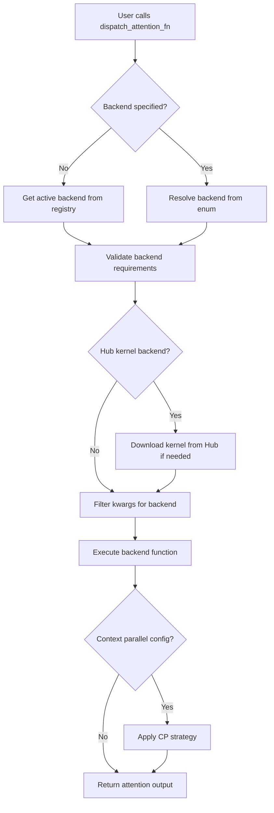

## 类结构

```
AttentionBackendName (Enum)
_AttentionBackendRegistry (Class - Registry pattern)
├── _backends: dict
├── _constraints: dict
└── _supported_arg_names: dict
_HubKernelConfig (Dataclass)
SeqAllToAllDim (torch.autograd.Function)
TemplatedRingAttention (torch.autograd.Function)
TemplatedUlyssesAttention (torch.autograd.Function)
TemplatedUlyssesAnythingAttention (torch.autograd.Function)
Backend Functions (registered via decorator)
├── _flash_attention
├── _flash_attention_hub
├── _sage_attention
├── _native_attention
└── ... (20+ backends)
```

## 全局变量及字段


### `_REQUIRED_FLASH_VERSION`
    
Flash Attention最低版本要求字符串

类型：`str`
    


### `_REQUIRED_AITER_VERSION`
    
Aiter Attention最低版本要求字符串

类型：`str`
    


### `_REQUIRED_SAGE_VERSION`
    
Sage Attention最低版本要求字符串

类型：`str`
    


### `_REQUIRED_FLEX_VERSION`
    
Flex Attention最低版本要求字符串

类型：`str`
    


### `_REQUIRED_XLA_VERSION`
    
XLA最低版本要求字符串

类型：`str`
    


### `_REQUIRED_XFORMERS_VERSION`
    
Xformers最低版本要求字符串

类型：`str`
    


### `_CAN_USE_FLASH_ATTN`
    
判断当前环境是否可以使用Flash Attention

类型：`bool`
    


### `_CAN_USE_FLASH_ATTN_3`
    
判断当前环境是否可以使用Flash Attention 3

类型：`bool`
    


### `_CAN_USE_AITER_ATTN`
    
判断当前环境是否可以使用Aiter Attention

类型：`bool`
    


### `_CAN_USE_SAGE_ATTN`
    
判断当前环境是否可以使用Sage Attention

类型：`bool`
    


### `_CAN_USE_FLEX_ATTN`
    
判断当前环境是否可以使用Flex Attention

类型：`bool`
    


### `_CAN_USE_NPU_ATTN`
    
判断当前环境是否可以使用NPU Attention

类型：`bool`
    


### `_CAN_USE_XLA_ATTN`
    
判断当前环境是否可以使用XLA Attention

类型：`bool`
    


### `_CAN_USE_XFORMERS_ATTN`
    
判断当前环境是否可以使用Xformers Attention

类型：`bool`
    


### `flash_attn_func`
    
Flash Attention前向计算函数

类型：`Callable | None`
    


### `flash_attn_varlen_func`
    
Flash Attention变长序列版本函数

类型：`Callable | None`
    


### `_wrapped_flash_attn_backward`
    
Flash Attention包装反向传播函数

类型：`Callable | None`
    


### `_wrapped_flash_attn_forward`
    
Flash Attention包装前向传播函数

类型：`Callable | None`
    


### `flash_attn_3_func`
    
Flash Attention 3前向计算函数

类型：`Callable | None`
    


### `flash_attn_3_varlen_func`
    
Flash Attention 3变长序列版本函数

类型：`Callable | None`
    


### `aiter_flash_attn_func`
    
Aiter Flash Attention前向计算函数

类型：`Callable | None`
    


### `sageattn`
    
Sage Attention主函数

类型：`Callable | None`
    


### `sageattn_qk_int8_pv_fp8_cuda`
    
Sage Attention QK Int8 PV FP8 CUDA实现

类型：`Callable | None`
    


### `sageattn_qk_int8_pv_fp8_cuda_sm90`
    
Sage Attention QK Int8 PV FP8 CUDA SM90实现

类型：`Callable | None`
    


### `sageattn_qk_int8_pv_fp16_cuda`
    
Sage Attention QK Int8 PV FP16 CUDA实现

类型：`Callable | None`
    


### `sageattn_qk_int8_pv_fp16_triton`
    
Sage Attention QK Int8 PV FP16 Triton实现

类型：`Callable | None`
    


### `sageattn_varlen`
    
Sage Attention变长序列版本函数

类型：`Callable | None`
    


### `npu_fusion_attention`
    
NPU Fusion Attention前向计算函数

类型：`Callable | None`
    


### `xla_flash_attention`
    
XLA Flash Attention自定义kernel函数

类型：`Callable | None`
    


### `xops`
    
Xformers操作模块命名空间

类型：`Module | None`
    


### `logger`
    
模块级日志记录器实例

类型：`Logger`
    


### `_HUB_KERNELS_REGISTRY`
    
Hub内核配置注册表字典

类型：`dict[AttentionBackendName, _HubKernelConfig]`
    


### `AttentionBackendName.FLASH`
    
Flash Attention后端枚举值

类型：`str`
    


### `AttentionBackendName.FLASH_HUB`
    
Flash Attention Hub后端枚举值

类型：`str`
    


### `AttentionBackendName.FLASH_VARLEN`
    
Flash Attention变长后端枚举值

类型：`str`
    


### `AttentionBackendName.FLASH_VARLEN_HUB`
    
Flash Attention变长Hub后端枚举值

类型：`str`
    


### `AttentionBackendName._FLASH_3`
    
Flash Attention 3后端枚举值（私有）

类型：`str`
    


### `AttentionBackendName._FLASH_VARLEN_3`
    
Flash Attention 3变长后端枚举值（私有）

类型：`str`
    


### `AttentionBackendName._FLASH_3_HUB`
    
Flash Attention 3 Hub后端枚举值（私有）

类型：`str`
    


### `AttentionBackendName._FLASH_3_VARLEN_HUB`
    
Flash Attention 3变长Hub后端枚举值（私有）

类型：`str`
    


### `AttentionBackendName.AITER`
    
Aiter Attention后端枚举值

类型：`str`
    


### `AttentionBackendName.FLEX`
    
Flex Attention后端枚举值

类型：`str`
    


### `AttentionBackendName.NATIVE`
    
原生PyTorch SDPA后端枚举值

类型：`str`
    


### `AttentionBackendName._NATIVE_CUDNN`
    
原生cuDNN Attention后端枚举值（私有）

类型：`str`
    


### `AttentionBackendName._NATIVE_EFFICIENT`
    
原生Efficient Attention后端枚举值（私有）

类型：`str`
    


### `AttentionBackendName._NATIVE_FLASH`
    
原生Flash Attention后端枚举值（私有）

类型：`str`
    


### `AttentionBackendName._NATIVE_MATH`
    
原生Math Attention后端枚举值（私有）

类型：`str`
    


### `AttentionBackendName._NATIVE_NPU`
    
原生NPU Attention后端枚举值（私有）

类型：`str`
    


### `AttentionBackendName._NATIVE_XLA`
    
原生XLA Attention后端枚举值（私有）

类型：`str`
    


### `AttentionBackendName.SAGE`
    
Sage Attention后端枚举值

类型：`str`
    


### `AttentionBackendName.SAGE_HUB`
    
Sage Attention Hub后端枚举值

类型：`str`
    


### `AttentionBackendName.SAGE_VARLEN`
    
Sage Attention变长后端枚举值

类型：`str`
    


### `AttentionBackendName._SAGE_QK_INT8_PV_FP8_CUDA`
    
Sage QK Int8 PV FP8 CUDA后端枚举值（私有）

类型：`str`
    


### `AttentionBackendName._SAGE_QK_INT8_PV_FP8_CUDA_SM90`
    
Sage QK Int8 PV FP8 CUDA SM90后端枚举值（私有）

类型：`str`
    


### `AttentionBackendName._SAGE_QK_INT8_PV_FP16_CUDA`
    
Sage QK Int8 PV FP16 CUDA后端枚举值（私有）

类型：`str`
    


### `AttentionBackendName._SAGE_QK_INT8_PV_FP16_TRITON`
    
Sage QK Int8 PV FP16 Triton后端枚举值（私有）

类型：`str`
    


### `AttentionBackendName.XFORMERS`
    
Xformers Attention后端枚举值

类型：`str`
    


### `_AttentionBackendRegistry._backends`
    
存储已注册的后端函数映射

类型：`dict`
    


### `_AttentionBackendRegistry._constraints`
    
存储每个后端的约束检查函数列表

类型：`dict`
    


### `_AttentionBackendRegistry._supported_arg_names`
    
存储每个后端支持的参数名称集合

类型：`dict`
    


### `_AttentionBackendRegistry._supports_context_parallel`
    
存储支持上下文并行的后端名称集合

类型：`set`
    


### `_AttentionBackendRegistry._active_backend`
    
当前活跃的Attention后端枚举值

类型：`AttentionBackendName`
    


### `_AttentionBackendRegistry._checks_enabled`
    
是否启用后端约束检查标志

类型：`bool`
    


### `_HubKernelConfig.repo_id`
    
Hub内核仓库ID

类型：`str`
    


### `_HubKernelConfig.function_attr`
    
内核函数属性路径字符串

类型：`str`
    


### `_HubKernelConfig.revision`
    
Hub仓库版本修订号

类型：`str | None`
    


### `_HubKernelConfig.kernel_fn`
    
实际加载的内核函数对象

类型：`Callable | None`
    


### `_HubKernelConfig.wrapped_forward_attr`
    
包装前向函数属性路径

类型：`str | None`
    


### `_HubKernelConfig.wrapped_backward_attr`
    
包装反向函数属性路径

类型：`str | None`
    


### `_HubKernelConfig.wrapped_forward_fn`
    
包装前向函数对象

类型：`Callable | None`
    


### `_HubKernelConfig.wrapped_backward_fn`
    
包装反向函数对象

类型：`Callable | None`
    
    

## 全局函数及方法


### `attention_backend`

这是一个上下文管理器函数，用于动态设置和切换注意力机制的后端实现。它通过注册表机制选择不同的注意力计算后端（如Flash Attention、Sage Attention等），并在代码块执行完毕后自动恢复原来的后端设置。

参数：

- `backend`：`str | AttentionBackendName`，默认为`AttentionBackendName.NATIVE`，指定要切换到的注意力后端名称

返回值：`None`（作为上下文管理器，通过yield返回控制权）

#### 流程图

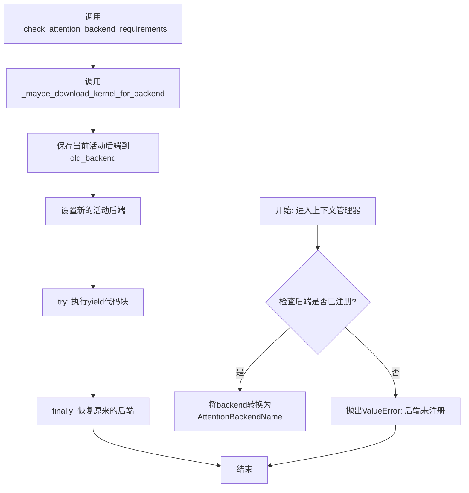

#### 带注释源码

```python
@contextlib.contextmanager
def attention_backend(backend: str | AttentionBackendName = AttentionBackendName.NATIVE):
    """
    Context manager to set the active attention backend.
    
    用法示例:
        with attention_backend('flash'):
            # 在此上下文中使用flash attention后端
            output = dispatch_attention_fn(query, key, value)
        # 上下文结束后自动恢复原来的后端
    """
    # 检查指定的后端是否已在注册表中注册
    if backend not in _AttentionBackendRegistry._backends:
        raise ValueError(f"Backend {backend} is not registered.")

    # 将后端名称转换为枚举类型
    backend = AttentionBackendName(backend)
    # 检查后端所需的依赖和版本要求是否满足
    _check_attention_backend_requirements(backend)
    # 如果是hub后端，可能需要从远程下载kernel
    _maybe_download_kernel_for_backend(backend)

    # 保存当前的活动后端，以便上下文结束后恢复
    old_backend = _AttentionBackendRegistry._active_backend
    # 设置新的活动后端
    _AttentionBackendRegistry.set_active_backend(backend)

    try:
        # yield将控制权交给调用方的with语句块
        yield
    finally:
        # 无论是否发生异常，都恢复原来的后端设置
        _AttentionBackendRegistry.set_active_backend(old_backend)
```


### `dispatch_attention_fn`

该函数是注意力机制的分发枢纽，根据配置或指定的 `backend` 选择对应的注意力实现（如 Flash Attention、Sage Attention、xFormers 等），并对输入的 Q、K、V 张量执行注意力计算。它负责参数校验、版本检查以及将计算任务委托给具体的注意力后端函数。

参数：

- `query`：`torch.Tensor`，查询张量，形状为 (batch_size, seq_len_q, num_heads, head_dim)
- `key`：`torch.Tensor`，键张量，形状为 (batch_size, seq_len_kv, num_heads, head_dim)
- `value`：`torch.Tensor`，值张量，形状为 (batch_size, seq_len_kv, num_heads, head_dim)
- `attn_mask`：`torch.Tensor | None`，注意力掩码，可选，用于屏蔽特定位置
- `dropout_p`：`float`，注意力分数的 dropout 概率，默认为 0.0
- `is_causal`：`bool`，是否使用因果（causal）掩码，默认为 False
- `scale`：`float | None`，注意力缩放因子，若为 None 则使用 head_dim 的倒数平方根
- `enable_gqa`：`bool`，是否启用分组查询注意力（GQA），默认为 False
- `attention_kwargs`：`dict[str, Any] | None`，传递给后端的其他关键字参数字典
- `backend`：`AttentionBackendName | None`，指定使用的注意力后端名称，若为 None 则使用全局默认后端
- `parallel_config`：`ParallelConfig | None`，并行配置，用于分布式上下文并行计算

返回值：`torch.Tensor`，注意力输出张量，形状为 (batch_size, seq_len_q, num_heads, head_dim)

#### 流程图

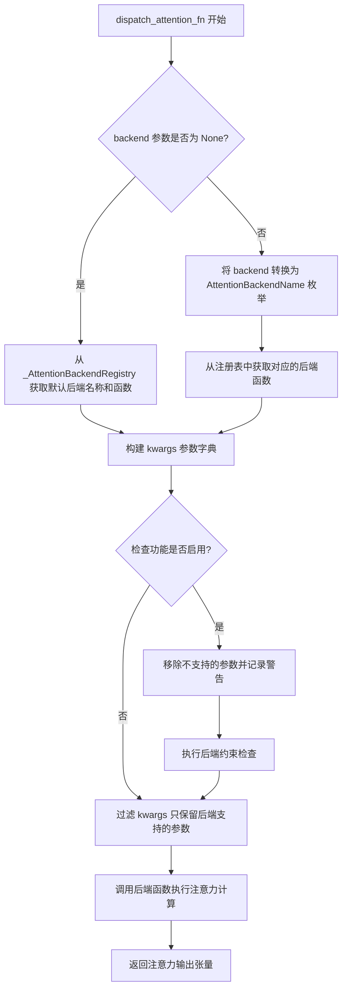

#### 带注释源码

```python
def dispatch_attention_fn(
    query: torch.Tensor,
    key: torch.Tensor,
    value: torch.Tensor,
    attn_mask: torch.Tensor | None = None,
    dropout_p: float = 0.0,
    is_causal: bool = False,
    scale: float | None = None,
    enable_gqa: bool = False,
    attention_kwargs: dict[str, Any] | None = None,
    *,
    backend: AttentionBackendName | None = None,
    parallel_config: "ParallelConfig" | None = None,
) -> torch.Tensor:
    """
    分发注意力计算到指定的后端实现。
    
    该函数是注意力机制的统一入口点，支持多种注意力后端（Flash Attention、Sage Attention、xFormers 等）。
    它负责解析后端配置、执行参数校验，并将计算任务委托给具体的实现函数。
    
    参数:
        query: 查询张量，形状 (batch_size, seq_len_q, num_heads, head_dim)
        key: 键张量，形状 (batch_size, seq_len_kv, num_heads, head_dim)
        value: 值张量，形状 (batch_size, seq_len_kv, num_heads, head_dim)
        attn_mask: 可选的注意力掩码
        dropout_p: Dropout 概率
        is_causal: 是否使用因果掩码
        scale: 缩放因子
        enable_gqa: 是否启用分组查询注意力
        attention_kwargs: 传递给后端的额外参数
        backend: 指定使用的注意力后端
        parallel_config: 分布式并行配置
    
    返回:
        注意力输出张量
    """
    # 初始化 attention_kwargs 为空字典，避免 None 引用
    attention_kwargs = attention_kwargs or {}

    if backend is None:
        # 如果未指定后端，则使用全局默认后端（通过环境变量或上下文管理器设置）
        backend_name, backend_fn = _AttentionBackendRegistry.get_active_backend()
    else:
        # 将传入的后端名称转换为枚举类型
        backend_name = AttentionBackendName(backend)
        # 从注册表中获取对应的后端实现函数
        backend_fn = _AttentionBackendRegistry._backends.get(backend_name)

    # 构建传递给后端函数的参数字典
    kwargs = {
        "query": query,
        "key": key,
        "value": value,
        "attn_mask": attn_mask,
        "dropout_p": dropout_p,
        "is_causal": is_causal,
        "scale": scale,
        **attention_kwargs,  # 合并用户提供的额外参数
        "_parallel_config": parallel_config,  # 传递并行配置用于上下文并行
    }
    
    # PyTorch 2.5.0 及以上版本支持 enable_gqa 参数
    if is_torch_version(">=", "2.5.0"):
        kwargs["enable_gqa"] = enable_gqa

    # 如果启用了检查功能，执行参数验证
    if _AttentionBackendRegistry._checks_enabled:
        # 移除后端不支持的参数，避免传入后引起错误
        removed_kwargs = set(kwargs) - set(_AttentionBackendRegistry._supported_arg_names[backend_name])
        if removed_kwargs:
            logger.warning(
                f"Removing unsupported arguments for attention backend {backend_name}: {removed_kwargs}."
            )
        
        # 执行后端注册时定义的约束检查函数
        for check in _AttentionBackendRegistry._constraints.get(backend_name):
            check(**kwargs)

    # 过滤参数，只保留后端支持的参数
    kwargs = {
        k: v 
        for k, v in kwargs.items() 
        if k in _AttentionBackendRegistry._supported_arg_names[backend_name]
    }

    # 调用具体的后端实现函数执行注意力计算
    return backend_fn(**kwargs)
```


### `_check_attn_mask_or_causal`

验证注意力掩码与因果模式是否冲突，确保不会同时指定 `attn_mask` 和 `is_causal=True`。

参数：

- `attn_mask`：`torch.Tensor | None`，注意力掩码张量，当为 `None` 时表示不使用掩码
- `is_causal`：`bool`，是否使用因果注意力模式
- `**kwargs`：其他可选关键字参数，用于函数签名兼容性

返回值：`None`，该函数无返回值，仅进行验证检查

#### 流程图

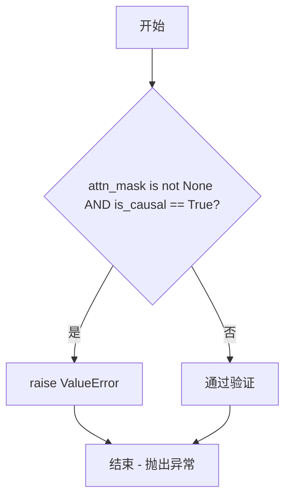

#### 带注释源码

```python
def _check_attn_mask_or_causal(attn_mask: torch.Tensor | None, is_causal: bool, **kwargs) -> None:
    """
    检查注意力掩码与因果模式是否冲突。
    
    某些注意力后端（如 Flash Attention、Flex Attention 等）不支持同时使用
    自定义注意力掩码（attn_mask）和因果注意力（is_causal=True）。
    此函数用于在调用前验证这种冲突情况，防止运行时错误。
    
    参数:
        attn_mask: 注意力掩码张量，可以为 None 表示不使用掩码
        is_causal: 是否使用因果注意力模式
        **kwargs: 额外的关键字参数，保持函数签名与其他检查函数一致
    """
    # 如果同时提供了注意力掩码和设置了因果模式，则抛出错误
    if attn_mask is not None and is_causal:
        raise ValueError("`is_causal` cannot be True when `attn_mask` is not None.")
```


### `_check_device`

该函数是一个全局检查函数，用于验证 Attention 机制中 Query、Key、Value 三个张量的设备（device）和数据类型（dtype）是否一致。如果不一致，会抛出 `ValueError` 异常。这确保了后续注意力计算能够正确执行。

参数：

- `query`：`torch.Tensor`，Query 张量
- `key`：`torch.Tensor`，Key 张量
- `value`：`torch.Tensor`，Value 张量
- `**kwargs`：`Any`，额外的关键字参数（用于函数签名兼容性）

返回值：`None`，无返回值，仅进行验证检查

#### 流程图

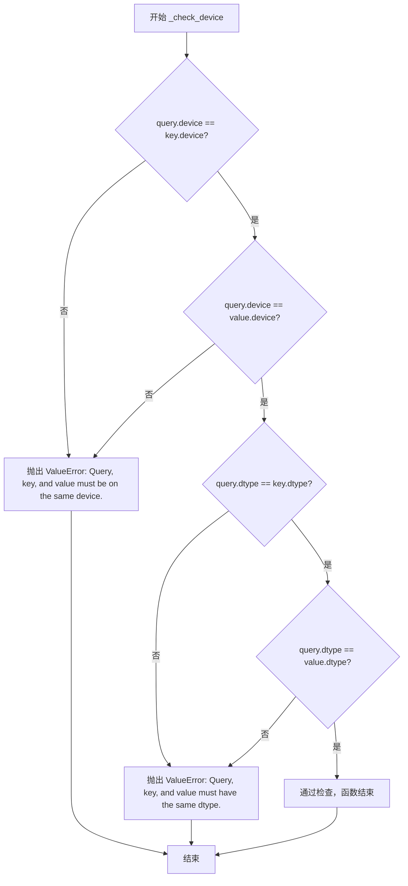

#### 带注释源码

```python
def _check_device(query: torch.Tensor, key: torch.Tensor, value: torch.Tensor, **kwargs) -> None:
    """
    检查 Query、Key、Value 三个张量的设备和数据类型是否一致。
    
    该函数作为注意力后端的约束检查函数，确保参与注意力计算的张量
    在同一设备上且具有相同的数据类型，以避免运行时错误。
    
    参数:
        query: Query 张量
        key: Key 张量
        value: Value 张量
        **kwargs: 额外的关键字参数（保持函数签名兼容性）
    
    异常:
        ValueError: 当设备或数据类型不一致时抛出
    """
    # 检查所有张量是否在同一设备上
    if query.device != key.device or query.device != value.device:
        raise ValueError("Query, key, and value must be on the same device.")
    
    # 检查所有张量是否具有相同的数据类型
    if query.dtype != key.dtype or query.dtype != value.dtype:
        raise ValueError("Query, key, and value must have the same dtype.")
```


### `_check_device_cuda`

该函数是一个检查函数，用于验证 Query、Key 和 Value 张量是否都位于 CUDA 设备上。它首先调用 `_check_device` 验证三个张量的设备一致性和数据类型一致性，然后额外检查 Query 设备类型必须为 CUDA，否则抛出 ValueError。

参数：

- `query`：`torch.Tensor`，Query 张量
- `key`：`torch.Tensor`，Key 张量
- `value`：`torch.Tensor`，Value 张量
- `**kwargs`：其他可选关键字参数（传递给 `_check_device`）

返回值：`None`，该函数无返回值，仅进行验证检查

#### 流程图

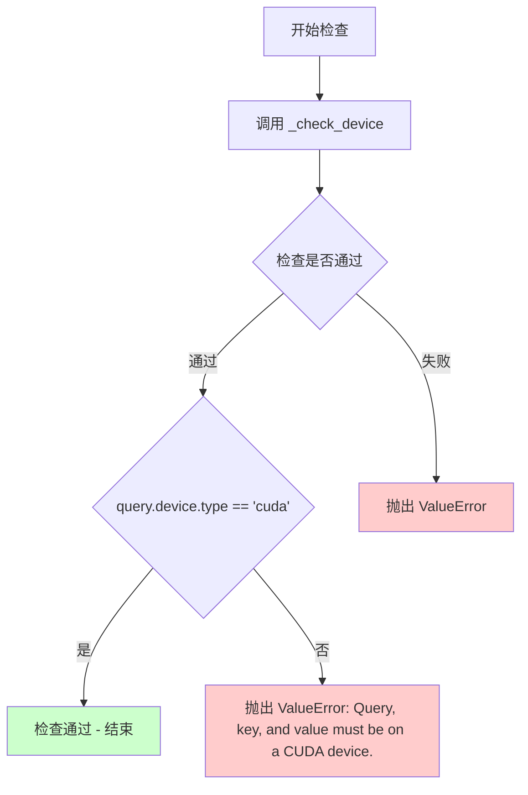

#### 带注释源码

```python
def _check_device_cuda(query: torch.Tensor, key: torch.Tensor, value: torch.Tensor, **kwargs) -> None:
    """
    检查 Query、Key 和 Value 张量是否都在 CUDA 设备上。
    
    该函数是注意力机制的约束检查函数之一，被用于注册特定的注意力后端
    (如 AITER、SAGE 等)，确保输入张量必须在 CUDA 设备上运行。
    
    Args:
        query: Query 张量，形状为 (batch_size, seq_len_q, num_heads, head_dim)
        key: Key 张量，形状为 (batch_size, seq_len_kv, num_heads, head_dim)
        value: Value 张量，形状为 (batch_size, seq_len_kv, num_heads, head_dim)
        **kwargs: 额外的关键字参数，会传递给 _check_device 函数
    
    Returns:
        None: 该函数不返回值，若检查失败则抛出 ValueError
    
    Raises:
        ValueError: 当张量不在同一设备上、或数据类型不一致、或不在 CUDA 设备上时
    """
    # 首先调用 _check_device 验证三个张量的设备一致性和数据类型一致性
    # _check_device 会检查：
    # 1. query.device == key.device == value.device
    # 2. query.dtype == key.dtype == value.dtype
    _check_device(query, key, value)
    
    # 额外检查 Query 设备类型必须为 CUDA
    # 注意：这里只检查 query.device.type，因为前面已经确保三个张量在同一设备上
    if query.device.type != "cuda":
        raise ValueError("Query, key, and value must be on a CUDA device.")
```


### `_check_device_cuda_atleast_smXY`

这是一个工厂函数，用于生成一个约束检查函数（constraint check function），该函数验证 QKV 张量是否位于满足最低计算能力要求（SM X.Y）的 CUDA 设备上。它首先调用基础检查确保张量在 CUDA 上，然后获取设备计算能力并与指定阈值比较，不满足则抛出详细错误信息。

参数：

- `major`：`int`，GPU 计算能力的主版本号（如 8 表示 SM_80，9 表示 SM_90）
- `minor`：`int`，GPU 计算能力的次版本号（如 0 表示 SM_80）

返回值：`Callable`，返回一个检查函数，该函数接受 `query`、`key`、`value` 三个 `torch.Tensor` 类型参数和 `**kwargs`，返回 `None`，检查失败时抛出 `ValueError`

#### 流程图

```mermaid
flowchart TD
    A[开始: 输入 major, minor] --> B[定义内部函数 check_device_cuda]
    B --> C{调用 _check_device_cuda}
    C --> D{query, key, value 在 CUDA 上?}
    D -->|否| E[抛出 ValueError]
    D -->|是| F{获取设备计算能力}
    F --> G{(major, minor) <= 设备计算能力?}
    G -->|是| H[通过检查, 返回 None]
    G -->|否| I[抛出 ValueError: 需要 SM XY]
    B --> J[返回 check_device_cuda 函数]
```

#### 带注释源码

```python
def _check_device_cuda_atleast_smXY(major: int, minor: int) -> Callable:
    """
    工厂函数：生成一个检查函数，用于验证 CUDA 设备的计算能力是否满足最低要求。
    
    参数:
        major: int - GPU 计算能力主版本号 (如 8 表示 compute capability 8.0)
        minor: int - GPU 计算能力次版本号 (如 0 表示 compute capability x.0)
    
    返回:
        Callable - 一个检查函数，接受 query, key, value 张量和 kwargs
    """
    
    def check_device_cuda(query: torch.Tensor, key: torch.Tensor, value: torch.Tensor, **kwargs) -> None:
        """
        内部检查函数：验证张量在满足计算能力要求的 CUDA 设备上
        
        参数:
            query: torch.Tensor - Query 张量
            key: torch.Tensor - Key 张量  
            value: torch.Tensor - Value 张量
            **kwargs: 其他可选参数
        
        返回:
            None - 检查通过时无返回值
        
        异常:
            ValueError - 当张量不在 CUDA 上或不满足计算能力要求时
        """
        
        # 首先调用基础 CUDA 设备检查（确保张量在 CUDA 上且设备/dtype 一致）
        _check_device_cuda(query, key, value)
        
        # 获取当前设备的计算能力 (返回元组 (major, minor))
        # 例如: A100 返回 (8, 0), H100 返回 (9, 0)
        device_capability = torch.cuda.get_device_capability(query.device)
        
        # 比较设备计算能力与要求的最低版本
        if device_capability < (major, minor):
            raise ValueError(
                f"Query, key, and value must be on a CUDA device with compute capability >= {major}.{minor}."
            )

    # 返回生成的检查函数
    return check_device_cuda
```

#### 使用场景

此函数主要用于注册注意力后端（Attention Backend）时的约束条件（constraints）。例如，在注册 Sage Attention 的特定变体时：

```python
# 注册要求 SM_90+ 的 Sage Attention 后端
@_AttentionBackendRegistry.register(
    AttentionBackendName._SAGE_QK_INT8_PV_FP8_CUDA,
    constraints=[_check_device_cuda_atleast_smXY(9, 0), _check_shape],
)
def _sage_qk_int8_pv_fp8_cuda_attention(...):
    ...
```

#### 关键组件信息

- **依赖函数**：`_check_device_cuda`（基础 CUDA 设备检查）
- **调用者**：`_AttentionBackendRegistry.register` 装饰器中的 constraints 参数
- **torch API**：`torch.cuda.get_device_capability(device)` 用于获取 GPU 计算能力

#### 潜在优化空间

1. **缓存机制**：当前每次调用都会获取设备计算能力，可以在函数闭包中缓存 `major` 和 `minor`，或者使用 `@functools.lru_cache` 缓存整个检查函数
2. **错误信息改进**：当前错误信息仅显示要求的版本号，可考虑同时显示当前设备实际计算能力，便于调试
3. **多设备支持**：当前仅检查 `query.device`，对于分布式场景可能需要考虑所有进程所在设备的兼容性


### `_check_qkv_dtype_match`

该函数用于验证 Query、Key 和 Value 张量是否具有相同的数据类型，确保注意力机制中 QKV 三者的数据类型一致，以避免潜在的数值计算错误。

参数：

- `query`：`torch.Tensor`，Query 张量
- `key`：`torch.Tensor`，Key 张量
- `value`：`torch.Tensor`，Value 张量
- `**kwargs`：可变关键字参数，用于兼容其他检查函数的签名

返回值：`None`，该函数不返回值，通过抛出 `ValueError` 异常来表示数据类型不匹配的错误。

#### 流程图

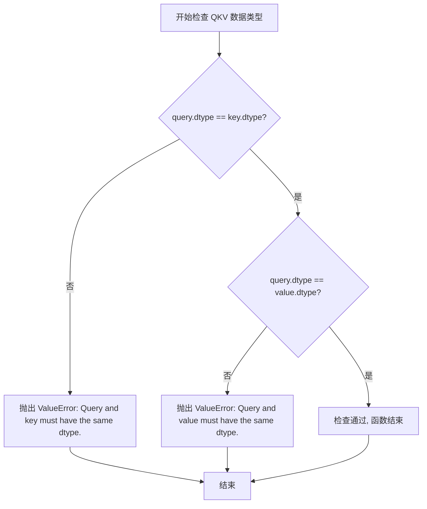

#### 带注释源码

```python
def _check_qkv_dtype_match(query: torch.Tensor, key: torch.Tensor, value: torch.Tensor, **kwargs) -> None:
    """
    检查 Query、Key、Value 三个张量的数据类型是否一致。
    
    该函数是注意力机制的前置验证函数，确保 QKV 三者使用相同的数据类型。
    不同数据类型可能导致注意力计算出现数值错误或隐式类型转换。
    
    Args:
        query: Query 张量
        key: Key 张量
        value: Value 张量
        **kwargs: 用于兼容其他检查函数的签名
    
    Raises:
        ValueError: 如果 query 和 key 的数据类型不一致
        ValueError: 如果 query 和 value 的数据类型不一致
    """
    # 检查 query 和 key 的数据类型是否一致
    if query.dtype != key.dtype:
        raise ValueError("Query and key must have the same dtype.")
    
    # 检查 query 和 value 的数据类型是否一致
    if query.dtype != value.dtype:
        raise ValueError("Query and value must have the same dtype.")
```


### `_check_qkv_dtype_bf16_or_fp16`

该函数是一个数据类型检查函数，用于验证 Query、Key 和 Value 张量的数据类型是否符合要求（必须是 bfloat16 或 float16）。它首先调用 `_check_qkv_dtype_match` 确保三者数据类型一致，然后验证数据类型为 bf16 或 fp16。

参数：

- `query`：`torch.Tensor`，Query 张量
- `key`：`torch.Tensor`，Key 张量
- `value`：`torch.Tensor`，Value 张量
- `**kwargs`：可选关键字参数，用于与其他检查函数保持签名一致

返回值：`None`，该函数不返回任何值，仅通过抛出 ValueError 来表示验证失败

#### 流程图

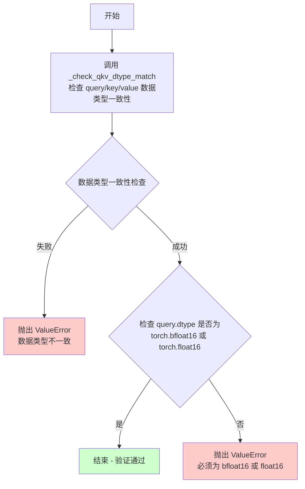

#### 带注释源码

```python
def _check_qkv_dtype_bf16_or_fp16(
    query: torch.Tensor, 
    key: torch.Tensor, 
    value: torch.Tensor, 
    **kwargs
) -> None:
    """
    检查 Query、Key、Value 张量的数据类型是否为 bfloat16 或 float16。
    
    该函数首先调用 _check_qkv_dtype_match 确保 query、key、value 三者的数据类型一致，
    然后验证它们的数据类型必须是 torch.bfloat16 或 torch.float16 之一。
    此检查通常作为 Flash Attention 等高性能注意力机制的前置约束。
    
    参数:
        query: Query 张量
        key: Key 张量
        value: Value 张量
        **kwargs: 额外的关键字参数，用于兼容其他检查函数的签名
    
    返回:
        None: 验证通过时无返回值，验证失败时抛出 ValueError
    
    异常:
        ValueError: 当 query/key/value 数据类型不一致，或数据类型不是 bfloat16/fp16 时抛出
    """
    # 首先检查 query、key、value 三者的数据类型是否完全一致
    _check_qkv_dtype_match(query, key, value)
    
    # 检查 query 的数据类型是否为 bfloat16 或 float16
    # Flash Attention 等高性能内核通常要求输入为半精度浮点数
    if query.dtype not in (torch.bfloat16, torch.float16):
        raise ValueError(
            "Query, key, and value must be either bfloat16 or float16."
        )
```


### `_check_shape`

验证注意力机制中 query、key、value 和 attention mask 的形状兼容性，确保它们符合注意力计算的预期维度。

参数：

- `query`：`torch.Tensor`，query 张量，期望形状为 (batch_size, seq_len_q, num_heads, head_dim)
- `key`：`torch.Tensor`，key 张量，期望形状为 (batch_size, seq_len_kv, num_heads, head_dim)
- `value`：`torch.Tensor`，value 张量，期望形状为 (batch_size, seq_len_kv, num_heads, head_dim)
- `attn_mask`：`torch.Tensor | None`，可选的注意力掩码，支持 2D (seq_len_q, seq_len_kv)、3D (batch_size, seq_len_q, seq_len_kv) 或 4D (batch_size, num_heads, seq_len_q, seq_len_kv)
- `**kwargs`：任意关键字参数，用于接口兼容性

返回值：`None`，该函数不返回任何值，仅通过抛出 ValueError 来表示形状验证失败

#### 流程图

```mermaid
flowchart TD
    A[开始 _check_shape] --> B{query.shape[-1]<br>== key.shape[-1]?}
    B -->|否| C[抛出 ValueError:<br>Query and key must have<br>the same head dimension.]
    B -->|是| D{key.shape[-3]<br>== value.shape[-3]?}
    D -->|否| E[抛出 ValueError:<br>Key and value must have<br>the same sequence length.]
    D -->|是| F{attn_mask<br>is not None?}
    F -->|否| G[验证通过<br>函数结束]
    F -->|是| H{attn_mask.shape[-1]<br>== key.shape[-3]?}
    H -->|否| I[抛出 ValueError:<br>Attention mask must match<br>the key's sequence length.]
    H -->|是| G
```

#### 带注释源码

```python
def _check_shape(
    query: torch.Tensor,
    key: torch.Tensor,
    value: torch.Tensor,
    attn_mask: torch.Tensor | None = None,
    **kwargs,
) -> None:
    # Expected shapes:
    # query: (batch_size, seq_len_q, num_heads, head_dim)
    # key:   (batch_size, seq_len_kv, num_heads, head_dim)
    # value: (batch_size, seq_len_kv, num_heads, head_dim)
    # attn_mask: (seq_len_q, seq_len_kv) or (batch_size, seq_len_q, seq_len_kv)
    #            or (batch_size, num_heads, seq_len_q, seq_len_kv)
    
    # 检查 query 和 key 的最后一个维度（head_dim）是否相同
    if query.shape[-1] != key.shape[-1]:
        raise ValueError("Query and key must have the same head dimension.")
    
    # 检查 key 和 value 的序列长度维度（-3）是否相同
    if key.shape[-3] != value.shape[-3]:
        raise ValueError("Key and value must have the same sequence length.")
    
    # 如果提供了 attn_mask，检查其最后一个维度是否与 key 的序列长度匹配
    if attn_mask is not None and attn_mask.shape[-1] != key.shape[-3]:
        raise ValueError("Attention mask must match the key's sequence length.")
```


### `_check_attention_backend_requirements`

该函数用于检查指定的注意力后端是否满足使用要求，包括检查必要的包是否安装以及版本是否满足最低要求。如果不满足，则抛出 `RuntimeError` 异常。

参数：

-  `backend`：`AttentionBackendName`，需要检查的注意力后端枚举值

返回值：`None`，该函数无返回值，通过抛出异常来处理错误情况

#### 流程图

```mermaid
flowchart TD
    A[开始检查后端需求] --> B{backend in [FLASH, FLASH_VARLEN]?}
    B -->|Yes| C{_CAN_USE_FLASH_ATTN?}
    C -->|No| D[抛出RuntimeError: Flash Attention版本过旧或未安装]
    C -->|Yes| E[通过检查]
    B -->|No| F{backend in [_FLASH_3, _FLASH_VARLEN_3]?}
    F -->|Yes| G{_CAN_USE_FLASH_ATTN_3?}
    G -->|No| H[抛出RuntimeError: Flash Attention 3未构建]
    G -->|Yes| E
    F -->|No| I{backend in [FLASH_HUB, FLASH_VARLEN_HUB, _FLASH_3_HUB, _FLASH_3_VARLEN_HUB, SAGE_HUB]?}
    I -->|Yes| J{is_kernels_available()?}
    J -->|No| K[抛出RuntimeError: kernels包未安装]
    J -->|Yes| E
    I -->|No| L{backend == AITER?}
    L -->|Yes| M{_CAN_USE_AITER_ATTN?}
    M -->|No| N[抛出RuntimeError: Aiter版本过旧或未安装]
    M -->|Yes| E
    L -->|No| O{backend in [SAGE, SAGE_VARLEN, _SAGE_QK_INT8_PV_FP8_CUDA, _SAGE_QK_INT8_PV_FP8_CUDA_SM90, _SAGE_QK_INT8_PV_FP16_CUDA, _SAGE_QK_INT8_PV_FP16_TRITON]?}
    O -->|Yes| P{_CAN_USE_SAGE_ATTN?}
    P -->|No| Q[抛出RuntimeError: Sage Attention版本过旧或未安装]
    P -->|Yes| E
    O -->|No| R{backend == FLEX?}
    R -->|Yes| S{_CAN_USE_FLEX_ATTN?}
    S -->|No| T[抛出RuntimeError: PyTorch版本需>=2.5.0]
    S -->|Yes| E
    R -->|No| U{backend == _NATIVE_NPU?}
    U -->|Yes| V{_CAN_USE_NPU_ATTN?}
    V -->|No| W[抛出RuntimeError: torch_npu未安装]
    V -->|Yes| E
    U -->|No| X{backend == _NATIVE_XLA?}
    X -->|Yes| Y{_CAN_USE_XLA_ATTN?}
    Y -->|No| Z[抛出RuntimeError: torch_xla版本过旧或未安装]
    Y -->|Yes| E
    X -->|No| AA{backend == XFORMERS?}
    AA -->|Yes| AB{_CAN_USE_XFORMERS_ATTN?}
    AB -->|No| AC[抛出RuntimeError: xformers版本过旧或未安装]
    AB -->|Yes| E
    AA -->|No| E
    D --> E
    H --> E
    K --> E
    N --> E
    Q --> E
    T --> E
    W --> E
    Z --> E
    AC --> E
    E[结束检查]
```

#### 带注释源码

```python
def _check_attention_backend_requirements(backend: AttentionBackendName) -> None:
    """
    检查给定的注意力后端是否满足使用要求。
    
    该函数会验证：
    1. 必要的包是否已安装
    2. 包版本是否满足最低版本要求
    3. 如果不满足要求，则抛出详细的RuntimeError异常
    
    Args:
        backend: AttentionBackendName枚举值，指定要检查的注意力后端
        
    Returns:
        None: 检查通过返回None，若不满足要求则抛出异常
        
    Raises:
        RuntimeError: 当后端所需包未安装或版本过低时抛出
    """
    # 检查 Flash Attention (flash-attn 2.x) 后端
    if backend in [AttentionBackendName.FLASH, AttentionBackendName.FLASH_VARLEN]:
        # 验证flash-attn包是否可用且版本满足要求
        if not _CAN_USE_FLASH_ATTN:
            raise RuntimeError(
                f"Flash Attention backend '{backend.value}' is not usable because of missing package or the version is too old. Please install `flash-attn>={_REQUIRED_FLASH_VERSION}`."
            )

    # 检查 Flash Attention 3 后端
    elif backend in [AttentionBackendName._FLASH_3, AttentionBackendName._FLASH_VARLEN_3]:
        if not _CAN_USE_FLASH_ATTN_3:
            raise RuntimeError(
                f"Flash Attention 3 backend '{backend.value}' is not usable because of missing package or the version is too old. Please build FA3 beta release from source."
            )

    # 检查基于Hub的内核后端（需要kernels包）
    elif backend in [
        AttentionBackendName.FLASH_HUB,
        AttentionBackendName.FLASH_VARLEN_HUB,
        AttentionBackendName._FLASH_3_HUB,
        AttentionBackendName._FLASH_3_VARLEN_HUB,
        AttentionBackendName.SAGE_HUB,
    ]:
        if not is_kernels_available():
            raise RuntimeError(
                f"Backend '{backend.value}' is not usable because the `kernels` package isn't available. Please install it with `pip install kernels`."
            )

    # 检查 Aiter Attention 后端
    elif backend == AttentionBackendName.AITER:
        if not _CAN_USE_AITER_ATTN:
            raise RuntimeError(
                f"Aiter Attention backend '{backend.value}' is not usable because of missing package or the version is too old. Please install `aiter>={_REQUIRED_AITER_VERSION}`."
            )

    # 检查 Sage Attention 后端（多种变体）
    elif backend in [
        AttentionBackendName.SAGE,
        AttentionBackendName.SAGE_VARLEN,
        AttentionBackendName._SAGE_QK_INT8_PV_FP8_CUDA,
        AttentionBackendName._SAGE_QK_INT8_PV_FP8_CUDA_SM90,
        AttentionBackendName._SAGE_QK_INT8_PV_FP16_CUDA,
        AttentionBackendName._SAGE_QK_INT8_PV_FP16_TRITON,
    ]:
        if not _CAN_USE_SAGE_ATTN:
            raise RuntimeError(
                f"Sage Attention backend '{backend.value}' is not usable because of missing package or the version is too old. Please install `sageattention>={_REQUIRED_SAGE_VERSION}`."
            )

    # 检查 PyTorch Flex Attention 后端（需要PyTorch >= 2.5.0）
    elif backend == AttentionBackendName.FLEX:
        if not _CAN_USE_FLEX_ATTN:
            raise RuntimeError(
                f"Flex Attention backend '{backend.value}' is not usable because of missing package or the version is too old. Please install `torch>=2.5.0`."
            )

    # 检查 NPU (华为昇腾) 注意力后端
    elif backend == AttentionBackendName._NATIVE_NPU:
        if not _CAN_USE_NPU_ATTN:
            raise RuntimeError(
                f"NPU Attention backend '{backend.value}' is not usable because of missing package or the version is too old. Please install `torch_npu`."
            )

    # 检查 XLA (Google Cloud TPU) 注意力后端
    elif backend == AttentionBackendName._NATIVE_XLA:
        if not _CAN_USE_XLA_ATTN:
            raise RuntimeError(
                f"XLA Attention backend '{backend.value}' is not usable because of missing package or the version is too old. Please install `torch_xla>={_REQUIRED_XLA_VERSION}`."
            )

    # 检查 xFormers 注意力后端
    elif backend == AttentionBackendName.XFORMERS:
        if not _CAN_USE_XFORMERS_ATTN:
            raise RuntimeError(
                f"Xformers Attention backend '{backend.value}' is not usable because of missing package or the version is too old. Please install `xformers>={_REQUIRED_XFORMERS_VERSION}`."
            )
```


### `_prepare_for_flash_attn_or_sage_varlen_without_mask`

该函数用于为 Flash Attention 或 Sage Attention 的可变序列长度（Variable Length, varlen）模式准备必要的序列长度参数。当不提供注意力掩码（attn_mask）时，使用此函数来生成序列长度向量、累积序列长度（Cumulative Sequence Lengths）和最大序列长度，这些是调用 varlen 版本的注意力核函数所必需的前置数据。

参数：

- `batch_size`：`int`，表示输入的批处理大小（batch size）。
- `seq_len_q`：`int`，表示查询（Query）的序列长度。
- `seq_len_kv`：`int`，表示键（Key）和值（Value）的序列长度。
- `device`：`torch.device | None`，指定生成张量所在的设备，如果为 `None`，则张量创建在 CPU 上。

返回值：`tuple[tuple[torch.Tensor, torch.Tensor], tuple[torch.Tensor, torch.Tensor], tuple[int, int]]`，返回一个包含三个元素的元组：
- 第一个元素：`(seqlens_q, seqlens_k)`，分别表示每个样本的查询和键值序列长度的整型张量。
- 第二个元素：`(cu_seqlens_q, cu_seqlens_k)`，分别表示查询和键值的累积序列长度张量，用于 Flash Attention varlen 接口。
- 第三个元素：`(max_seqlen_q, max_seqlen_k)`，分别表示查询和键值的最大序列长度。

#### 流程图

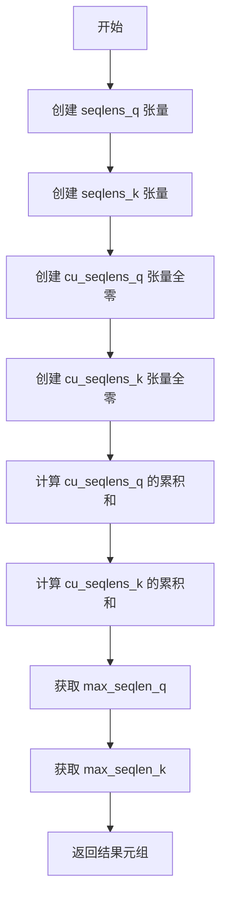

#### 带注释源码

```python
@functools.lru_cache(maxsize=128)
def _prepare_for_flash_attn_or_sage_varlen_without_mask(
    batch_size: int,
    seq_len_q: int,
    seq_len_kv: int,
    device: torch.device | None = None,
):
    """
    为 Flash Attention 或 Sage Attention 的 varlen 模式准备序列长度参数。
    
    此函数在不使用注意力掩码的情况下，为每个样本生成序列长度向量、
    累积序列长度向量和最大序列长度。这些参数对于调用 flash_attn_varlen_func 
    或 sageattn_varlen 等 varlen 版本的注意力核函数至关重要。
    
    使用 LRU 缓存以避免重复计算相同参数的情况。
    """
    # 创建一个形状为 (batch_size,) 的张量，每个元素填充为 seq_len_q
    # 用于表示每个样本的查询序列长度
    seqlens_q = torch.full((batch_size,), seq_len_q, dtype=torch.int32, device=device)
    
    # 创建一个形状为 (batch_size,) 的张量，每个元素填充为 seq_len_kv
    # 用于表示每个样本的键值序列长度
    seqlens_k = torch.full((batch_size,), seq_len_kv, dtype=torch.int32, device=device)
    
    # 创建一个形状为 (batch_size + 1,) 的零张量，用于存储累积序列长度
    # 索引 i 处的值表示前 i 个样本的序列长度之和
    # 这种格式是 Flash Attention varlen 接口所要求的
    cu_seqlens_q = torch.zeros(batch_size + 1, dtype=torch.int32, device=device)
    cu_seqlens_k = torch.zeros(batch_size + 1, dtype=torch.int32, device=device)
    
    # 计算累积序列长度：从索引 1 开始填充，cu_seqlens_q[0] 保持为 0
    # 结果例如：如果 batch_size=3, seq_len_q=5，则 cu_seqlens_q = [0, 5, 10, 15]
    cu_seqlens_q[1:] = torch.cumsum(seqlens_q, dim=0)
    cu_seqlens_k[1:] = torch.cumsum(seqlens_k, dim=0)
    
    # 获取最大序列长度，用于后续注意力核函数的 max_seqlen 参数
    max_seqlen_q = seqlens_q.max().item()
    max_seqlen_k = seqlens_k.max().item()
    
    # 返回格式：(seqlens, cu_seqlens, max_seqlen)
    # 这是一个元组，包含两组序列长度信息和最大长度
    return (seqlens_q, seqlens_k), (cu_seqlens_q, cu_seqlens_k), (max_seqlen_q, max_seqlen_k)
```


### `_prepare_for_flash_attn_or_sage_varlen_with_mask`

该函数用于将注意力掩码（attn_mask）转换为 Flash Attention 和 Sage Attention varlen 版本所需的序列长度参数。它通过掩码的求和来推断每个 batch 元素的 key/value 序列长度，并计算累积序列长度（cumulative sequence lengths）以支持变长序列处理。

参数：

- `batch_size`：`int`，表示批次大小
- `seq_len_q`：`int`，表示查询序列长度
- `attn_mask`：`torch.Tensor`，注意力掩码张量，用于指示每个 batch 元素中有效的 key/value 位置
- `device`：`torch.device | None`，可选参数，指定张量创建时所在的设备

返回值：`tuple[tuple[torch.Tensor, torch.Tensor], tuple[torch.Tensor, torch.Tensor], tuple[int, int]]`，返回一个元组，包含：
- 第一个元素：seqlens_q 和 seqlens_k，即每个 batch 元素的查询和 key/value 序列长度
- 第二个元素：cu_seqlens_q 和 cu_seqlens_k，即查询和 key/value 的累积序列长度
- 第三个元素：max_seqlen_q 和 max_seqlen_k，即查询和 key/value 的最大序列长度

#### 流程图

```mermaid
flowchart TD
    A[开始] --> B[创建 seqlens_q 张量<br/>batch_size 个元素, 值为 seq_len_q]
    B --> C[计算 seqlens_k<br/>对 attn_mask 在 dim=1 求和]
    C --> D[创建 cu_seqlens_q 和 cu_seqlens_k<br/>长度为 batch_size + 1, 初始值为 0]
    D --> E[计算累积序列长度<br/>cu_seqlens_q[1:] = cumsum(seqlens_q)<br/>cu_seqlens_k[1:] = cumsum(seqlens_k)]
    E --> F[计算最大序列长度<br/>max_seqlen_q = seqlens_q.max().item()<br/>max_seqlen_k = seqlens_k.max().item()]
    F --> G[返回结果<br/>(seqlens_q, seqlens_k), (cu_seqlens_q, cu_seqlens_k), (max_seqlen_q, max_seqlen_k)]
```

#### 带注释源码

```python
def _prepare_for_flash_attn_or_sage_varlen_with_mask(
    batch_size: int,
    seq_len_q: int,
    attn_mask: torch.Tensor,
    device: torch.device | None = None,
):
    """
    准备 Flash Attention 或 Sage Attention varlen 版本的序列长度参数。
    
    该函数处理带有注意力掩码的变长序列场景。掩码通常为布尔类型，
    True 表示有效位置，False 表示需要屏蔽的位置。通过对掩码在 key/value
    维度（dim=1）求和，可以得到每个 batch 元素的有效序列长度。
    
    Args:
        batch_size: 批次大小
        seq_len_q: 查询序列长度
        attn_mask: 注意力掩码，形状为 [batch_size, seq_len_k] 或可广播的形状
                   掩码中 True/1 表示有效位置，False/0 表示无效位置
        device: 可选的设备参数，用于指定张量创建的设备
    
    Returns:
        包含三个元素的元组:
        - (seqlens_q, seqlens_k): 每个 batch 元素的序列长度
        - (cu_seqlens_q, cu_seqlens_k): 累积序列长度，用于 varlen 注意力
        - (max_seqlen_q, max_seqlen_k): 最大序列长度
    """
    # 创建查询序列长度张量，每个 batch 元素都填充为相同的 seq_len_q
    seqlens_q = torch.full((batch_size,), seq_len_q, dtype=torch.int32, device=device)
    
    # 通过对注意力掩码求和来计算每个 batch 元素的 key/value 序列长度
    # 假设掩码中 True/1 表示有效位置，False/0 表示无效
    seqlens_k = attn_mask.sum(dim=1, dtype=torch.int32)
    
    # 初始化累积序列长度张量，长度为 batch_size + 1
    # 第一个元素为 0，用于表示序列的起始位置
    cu_seqlens_q = torch.zeros(batch_size + 1, dtype=torch.int32, device=device)
    cu_seqlens_k = torch.zeros(batch_size + 1, dtype=torch.int32, device=device)
    
    # 计算累积序列长度
    # cumsum 将 [len1, len2, len3] 转换为 [len1, len1+len2, len1+len2+len3]
    # 这里从索引 1 开始填充，索引 0 保持为 0
    cu_seqlens_q[1:] = torch.cumsum(seqlens_q, dim=0)
    cu_seqlens_k[1:] = torch.cumsum(seqlens_k, dim=0)
    
    # 计算最大序列长度，用于指定注意力计算的最大序列长度
    max_seqlen_q = seqlens_q.max().item()
    max_seqlen_k = seqlens_k.max().item()
    
    # 返回三个元组：
    # 1. 每个 batch 元素的查询和 key/value 序列长度
    # 2. 累积序列长度（用于 flash_attn_varlen_func 等函数）
    # 3. 最大序列长度
    return (seqlens_q, seqlens_k), (cu_seqlens_q, cu_seqlens_k), (max_seqlen_q, max_seqlen_k)
```


### `_prepare_for_flash_attn_or_sage_varlen`

该函数是 Flash Attention 或 Sage Attention 变长模式（varlen）的参数预处理函数，负责根据批次大小、序列长度和可选的注意力掩码计算并返回序列长度张量、累积序列长度和最大序列长度，以供变长注意力机制使用。

参数：

- `batch_size`：`int`，批次大小
- `seq_len_q`：`int`，查询序列长度
- `seq_len_kv`：`int`，键值序列长度
- `attn_mask`：`torch.Tensor | None`，注意力掩码（可选），用于指示有效位置
- `device`：`torch.device | None`，计算设备

返回值：`tuple`，实际返回 `((seqlens_q, seqlens_k), (cu_seqlens_q, cu_seqlens_k), (max_seqlen_q, max_seqlen_k))` 的元组，但由于类型注解错误标注为 `-> None`

#### 流程图

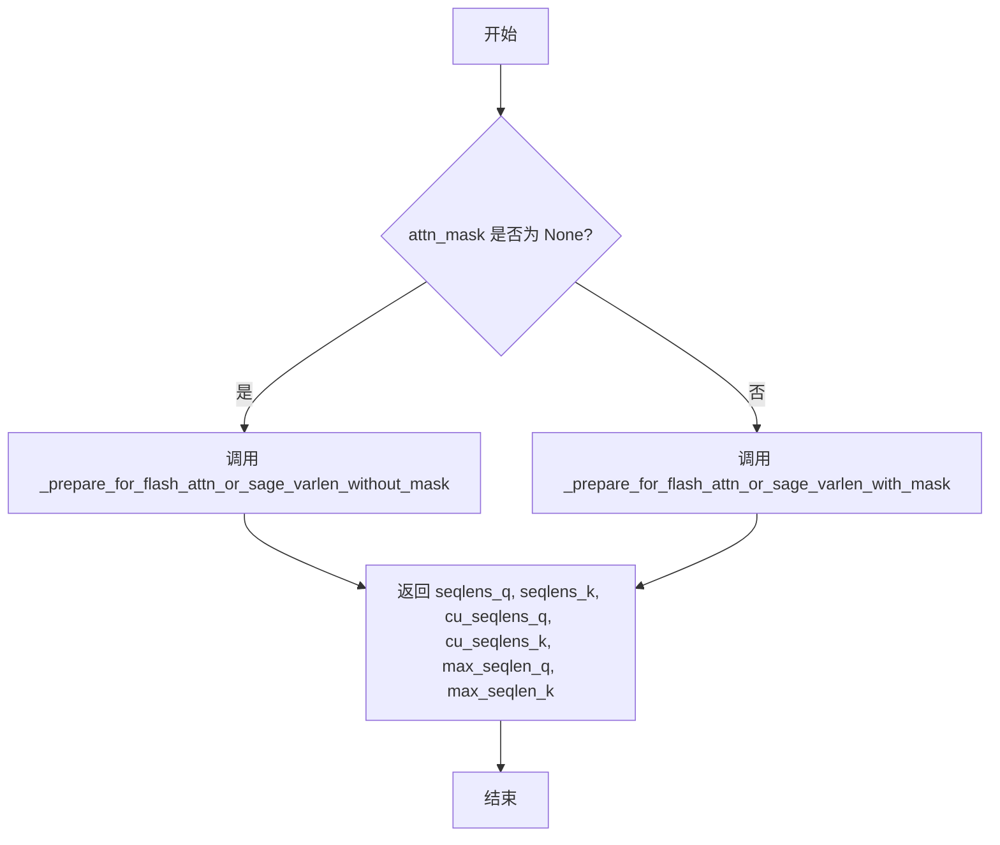

#### 带注释源码

```python
def _prepare_for_flash_attn_or_sage_varlen(
    batch_size: int,
    seq_len_q: int,
    seq_len_kv: int,
    attn_mask: torch.Tensor | None = None,
    device: torch.device | None = None,
) -> None:
    """
    准备 Flash Attention 或 Sage Attention 变长模式所需的序列长度信息。
    
    该函数是一个分发器，根据是否有注意力掩码调用不同的辅助函数：
    - 无掩码时：调用 _prepare_for_flash_attn_or_sage_varlen_without_mask
    - 有掩码时：调用 _prepare_for_flash_attn_or_sage_varlen_with_mask
    
    参数:
        batch_size: 批次大小
        seq_len_q: 查询序列长度
        seq_len_kv: 键值序列长度
        attn_mask: 可选的注意力掩码，用于计算有效序列长度
        device: 计算设备
    
    返回:
        元组: ((seqlens_q, seqlens_k), (cu_seqlens_q, cu_seqlens_k), (max_seqlen_q, max_seqlen_k))
        注意：类型注解错误标注为 None，实际有返回值
    """
    # 如果没有注意力掩码，使用不带掩码的辅助函数
    if attn_mask is None:
        return _prepare_for_flash_attn_or_sage_varlen_without_mask(batch_size, seq_len_q, seq_len_kv, device)
    # 如果有注意力掩码，使用带掩码的辅助函数
    return _prepare_for_flash_attn_or_sage_varlen_with_mask(batch_size, seq_len_q, attn_mask, device)
```


### `_normalize_attn_mask`

该函数用于将不同维度的注意力掩码（attn_mask）规范化为统一的二维布尔张量格式 `[batch_size, seq_len_k]`，以便用于 FlashAttention 和 Sage Attention 的可变序列长度（varlen）模式。它支持 1D 到 4D 的输入形状，并执行必要的广播和维度压缩操作。

参数：

- `attn_mask`：`torch.Tensor`，输入的注意力掩码，支持 1D 至 4D 的形状
- `batch_size`：`int`，批次大小，用于验证和广播
- `seq_len_k`：`int`，键/值的序列长度，用于验证和广播

返回值：`torch.Tensor`，规范化后的二维布尔张量，形状为 `[batch_size, seq_len_k]`

#### 流程图

```mermaid
flowchart TD
    A[开始: _normalize_attn_mask] --> B{attn_mask.dtype == torch.bool?}
    B -- 否 --> C[抛出 ValueError: 注意力掩码必须为 bool 类型]
    B -- 是 --> D{attn_mask.ndim}
    
    D -->|1| E[1D: [seq_len_k]]
    D -->|2| F[2D: [batch_size, seq_len_k]]
    D -->|3| G[3D: [batch_size, seq_len_q, seq_len_k]]
    D -->|4| H[4D: [batch_size, num_heads, seq_len_q, seq_len_k]]
    D -->|其他| I[抛出 ValueError: 不支持的维度]
    
    E --> E1[unsqueeze(0) 扩展到 [1, seq_len_k]]
    E1 --> E2[expand 到 [batch_size, seq_len_k]]
    
    F --> F1{shape[0] in [1, batch_size]?}
    F1 -- 否 --> F2[抛出 ValueError]
    F1 -- 是 --> F3[expand 到 [batch_size, seq_len_k]]
    
    G --> G1{shape[0] in [1, batch_size]?}
    G1 -- 否 --> G2[抛出 ValueError]
    G1 -- 是 --> G3[any(dim=1) 压缩 seq_len_q 维度]
    G3 --> G4[expand 到 [batch_size, seq_len_k]]
    
    H --> H1{shape[0] in [1, batch_size]?}
    H1 -- 否 --> H2[抛出 ValueError]
    H1 -- 是 --> H3[expand 到 [batch_size, num_heads, seq_len_q, seq_len_k]]
    H3 --> H4[any(dim=(1,2)) 压缩 num_heads 和 seq_len_q]
    H4 --> H5[expand 到 [batch_size, seq_len_k]]
    
    E2 --> J{shape == (batch_size, seq_len_k)?}
    F3 --> J
    G4 --> J
    H5 --> J
    
    J -- 否 --> K[抛出 ValueError: 形状不匹配]
    J -- 是 --> L[返回规范化后的 attn_mask]
    
    C --> M[结束]
    F2 --> M
    G2 --> M
    H2 --> M
    I --> M
    K --> M
    L --> M
```

#### 带注释源码

```python
def _normalize_attn_mask(attn_mask: torch.Tensor, batch_size: int, seq_len_k: int) -> torch.Tensor:
    """
    Normalize an attention mask to shape [batch_size, seq_len_k] (bool) suitable for inferring seqlens_[q|k] in
    FlashAttention/Sage varlen.

    Supports 1D to 4D shapes and common broadcasting patterns.
    """
    # 首先检查输入是否为布尔类型，因为后续的 any() 操作和 expand 需要布尔张量
    if attn_mask.dtype != torch.bool:
        raise ValueError(f"Attention mask must be of type bool, got {attn_mask.dtype}.")

    # 处理 1D 输入: [seq_len_k]
    # 这种情况通常表示所有批次共享同一个掩码，需要广播到批次维度
    if attn_mask.ndim == 1:
        # [seq_len_k] -> broadcast across batch
        # 使用 unsqueeze(0) 添加批次维度，然后 expand 到目标形状
        # expand 操作不会复制数据，只会改变视图
        attn_mask = attn_mask.unsqueeze(0).expand(batch_size, seq_len_k)

    # 处理 2D 输入: [batch_size, seq_len_k] 或 [1, seq_len_k]
    # 2D 是最常见的情况，直接验证并广播
    elif attn_mask.ndim == 2:
        # [batch_size, seq_len_k]. Maybe broadcast across batch
        # 批次维度必须是 1 或 batch_size，否则无法广播
        if attn_mask.size(0) not in [1, batch_size]:
            raise ValueError(
                f"attn_mask.shape[0] ({attn_mask.shape[0]}) must be 1 or {batch_size} for 2D attention mask."
            )
        # 广播到完整的批次大小
        attn_mask = attn_mask.expand(batch_size, seq_len_k)

    # 处理 3D 输入: [batch_size, seq_len_q, seq_len_k] 或 [1, seq_len_q, seq_len_k]
    # 3D 掩码表示每个查询位置有不同的掩码，但 Flash/Sage varlen 不支持任意 QK 掩码
    # 因此需要沿查询维度进行 reduce 操作
    elif attn_mask.ndim == 3:
        # [batch_size, seq_len_q, seq_len_k] -> reduce over query dimension
        # We do this reduction because we know that arbitrary QK masks is not supported in Flash/Sage varlen.
        # 验证批次维度
        if attn_mask.size(0) not in [1, batch_size]:
            raise ValueError(
                f"attn_mask.shape[0] ({attn_mask.shape[0]}) must be 1 or {batch_size} for 3D attention mask."
            )
        # 沿查询维度 (dim=1) 进行 any 操作，将 [batch_size, seq_len_q, seq_len_k] 转换为 [batch_size, seq_len_k]
        # any() 表示如果任意一个查询位置的掩码为 True，则结果为 True
        attn_mask = attn_mask.any(dim=1)
        # 广播到目标形状
        attn_mask = attn_mask.expand(batch_size, seq_len_k)

    # 处理 4D 输入: [batch_size, num_heads, seq_len_q, seq_len_k] 或广播版本
    # 4D 掩码表示每个头每个查询位置有不同的掩码，同样需要 reduce
    elif attn_mask.ndim == 4:
        # [batch_size, num_heads, seq_len_q, seq_len_k] or broadcastable versions
        # 验证批次维度
        if attn_mask.size(0) not in [1, batch_size]:
            raise ValueError(
                f"attn_mask.shape[0] ({attn_mask.shape[0]}) must be 1 or {batch_size} for 4D attention mask."
            )
        # 先扩展到完整的批次大小，保留其他维度不变
        attn_mask = attn_mask.expand(batch_size, -1, -1, seq_len_k)  # [B, H, Q, K]
        # 沿头部维度 (dim=1) 和查询维度 (dim=2) 进行 any 操作
        # 将 [batch_size, num_heads, seq_len_q, seq_len_k] 转换为 [batch_size, seq_len_k]
        attn_mask = attn_mask.any(dim=(1, 2))  # [B, K]

    else:
        # 不支持的维度数量
        raise ValueError(f"Unsupported attention mask shape: {attn_mask.shape}")

    # 最终验证：确保输出形状完全匹配预期
    if attn_mask.shape != (batch_size, seq_len_k):
        raise ValueError(
            f"Normalized attention mask shape mismatch: got {attn_mask.shape}, expected ({batch_size}, {seq_len_k})"
        )

    return attn_mask
```


### `_flex_attention_causal_mask_mod`

该函数是 PyTorch Flex Attention 的因果掩码修改函数（score_mod），用于实现标准的因果（causal）注意力掩码，确保每个位置的查询只能attend到当前及之前位置的键值对。

参数：

- `batch_idx`：`int` 或 `torch.Tensor`，批次索引，用于标识当前处理的样本
- `head_idx`：`int` 或 `torch.Tensor`，注意力头索引，用于标识当前处理的头
- `q_idx`：`torch.Tensor`，查询位置索引，表示当前查询的位置
- `kv_idx`：`torch.Tensor`，键值位置索引，表示当前键值对的位置

返回值：`bool` 或 `torch.Tensor`，返回 `True` 表示该位置可以attend（不被掩码），返回 `False` 表示该位置需要被掩码

#### 流程图

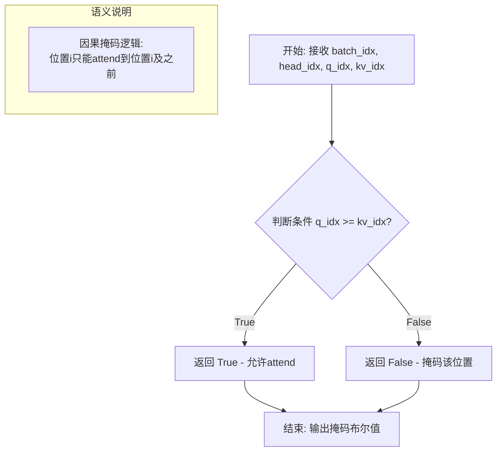

#### 带注释源码

```python
def _flex_attention_causal_mask_mod(batch_idx, head_idx, q_idx, kv_idx):
    """
    PyTorch Flex Attention 的因果掩码修改函数 (score_mod)。
    
    该函数被 flex_attention.create_block_mask 调用，用于创建因果掩码。
    因果掩码确保位置 i 的查询只能attend到位置 j <= i 的键值对，
    即每个token只能看到其之前的token，实现自回归生成。
    
    参数:
        batch_idx: 批次维度索引，标识当前处理的样本
        head_idx: 注意力头维度索引，标识当前处理的头
        q_idx: 查询位置索引 (query position)，范围 [0, seq_len_q)
        kv_idx: 键值位置索引 (key/value position)，范围 [0, seq_len_kv)
    
    返回:
        bool: 当 q_idx >= kv_idx 时返回 True，表示允许该位置参与注意力计算；
              当 q_idx < kv_idx 时返回 False，表示该位置需要被掩码（未来的位置）
    """
    return q_idx >= kv_idx
```


### `_resolve_kernel_attr`

该函数用于动态解析并获取指定模块中嵌套属性。它通过将属性路径字符串按点号分割，逐层遍历并获取属性，如果属性不存在则抛出详细的错误信息。主要用于从内核模块中获取特定的函数或属性。

参数：

- `module`：`types.ModuleType`，要从中获取属性的模块对象
- `attr_path`：`str`，属性路径字符串，使用点号分隔（如 `"flash_attn_func"` 或 `"module.submodule.function"`）

返回值：`Any`，返回最终解析得到的属性对象（通常是函数或类）

#### 流程图

```mermaid
flowchart TD
    A[开始] --> B[target = module]
    B --> C{attr_path中有剩余属性}
    C -->|是| D[取下一个属性名 attr]
    D --> E{target有属性attr}
    E -->|是| F[target = getattr(target, attr)]
    F --> C
    E -->|否| G[抛出AttributeError]
    G --> H[结束]
    C -->|否| I[返回target]
    I --> H
```

#### 带注释源码

```python
def _resolve_kernel_attr(module, attr_path: str):
    """
    动态解析并获取模块中的嵌套属性。
    
    Args:
        module: 要搜索的模块对象
        attr_path: 点号分隔的属性路径（如 "flash_attn_func"）
    
    Returns:
        最终解析得到的属性对象
    
    Raises:
        AttributeError: 如果属性路径不存在
    """
    # 初始化目标对象为传入的模块
    target = module
    
    # 按点号分割属性路径，逐层获取属性
    for attr in attr_path.split("."):
        # 检查当前目标对象是否具有该属性
        if not hasattr(target, attr):
            # 属性不存在时抛出详细的错误信息
            raise AttributeError(
                f"Kernel module '{module.__name__}' does not define attribute path '{attr_path}'."
            )
        # 获取属性并更新目标对象，继续遍历下一层
        target = getattr(target, attr)
    
    # 返回最终解析得到的属性
    return target
```


### `_maybe_download_kernel_for_backend`

该函数用于动态下载并加载基于 Hub 的 attention kernel。当使用特定的 Hub 后端（如 flash-attention hub 或 sage-attention hub）时，如果对应的 kernel 函数尚未加载，则从 HuggingFace Hub 的 `kernels` 包中获取并解析相应的 kernel 函数。

参数：

- `backend`：`AttentionBackendName`，需要下载 kernel 的 attention 后端类型

返回值：`None`，该函数通过修改全局注册表 `_HUB_KERNELS_REGISTRY` 中的配置对象来间接返回结果

#### 流程图

```mermaid
flowchart TD
    A[开始 _maybe_download_kernel_for_backend] --> B{backend 是否在 _HUB_KERNELS_REGISTRY 中?}
    B -- 否 --> C[直接返回]
    B -- 是 --> D[获取 config = _HUB_KERNELS_REGISTRY[backend]]
    D --> E[needs_kernel = config.kernel_fn is None]
    D --> F[needs_wrapped_forward = config.wrapped_forward_attr is not None and config.wrapped_forward_fn is None]
    D --> G[needs_wrapped_backward = config.wrapped_backward_attr is not None and config.wrapped_backward_fn is None]
    E --> H{needs_kernel or needs_wrapped_forward or needs_wrapped_backward?}
    H -- 否 --> C
    H -- 是 --> I[尝试导入 kernels.get_kernel]
    I --> J[kernel_module = get_kernel config.repo_id, revision]
    J --> K{needs_kernel?}
    K -- 是 --> L[config.kernel_fn = _resolve_kernel_attr kernel_module, config.function_attr]
    K -- 否 --> M{needs_wrapped_forward?}
    L --> M
    M -- 是 --> N[config.wrapped_forward_fn = _resolve_kernel_attr kernel_module, config.wrapped_forward_attr]
    M -- 否 --> O{needs_wrapped_backward?}
    N --> O
    O -- 是 --> P[config.wrapped_backward_fn = _resolve_kernel_attr kernel_module, config.wrapped_backward_attr]
    O -- 否 --> Q[结束]
    P --> Q
    I -.-> R[except Exception as e]
    R --> S[logger.error 记录错误]
    S --> T[raise 重新抛出异常]
```

#### 带注释源码

```python
def _maybe_download_kernel_for_backend(backend: AttentionBackendName) -> None:
    """
    用于动态下载和加载 Hub 类型的 attention kernel。
    
    当使用特定的 Hub 后端（如 flash-attention hub 或 sage-attention hub）时，
    如果对应的 kernel 函数尚未加载，则从 HuggingFace Hub 的 kernels 包中
    获取并解析相应的 kernel 函数。
    """
    # 检查该后端是否在 Hub kernels 注册表中（只有 Hub 后端需要下载）
    if backend not in _HUB_KERNELS_REGISTRY:
        return
    
    # 获取该后端的 kernel 配置信息
    config = _HUB_KERNELS_REGISTRY[backend]

    # 判断需要解析哪些函数：
    # 1. needs_kernel: 主 kernel 函数（如 flash_attn_func）是否已加载
    needs_kernel = config.kernel_fn is None
    # 2. needs_wrapped_forward: wrapped forward 函数是否需要解析
    needs_wrapped_forward = config.wrapped_forward_attr is not None and config.wrapped_forward_fn is None
    # 3. needs_wrapped_backward: wrapped backward 函数是否需要解析
    needs_wrapped_backward = config.wrapped_backward_attr is not None and config.wrapped_backward_fn is None

    # 如果所有需要的函数都已加载，则直接返回
    if not (needs_kernel or needs_wrapped_forward or needs_wrapped_backward):
        return

    try:
        # 从 HuggingFace Hub 的 kernels 包中动态获取 kernel 模块
        # get_kernel 函数会根据 repo_id 和 revision 下载并缓存对应的 kernel
        from kernels import get_kernel

        kernel_module = get_kernel(config.repo_id, revision=config.revision)
        
        # 根据需要解析并加载各个函数属性
        if needs_kernel:
            # 解析主 kernel 函数（如 flash_attn_func）
            config.kernel_fn = _resolve_kernel_attr(kernel_module, config.function_attr)

        if needs_wrapped_forward:
            # 解析 wrapped forward 函数（用于 context parallel 的前向传播）
            config.wrapped_forward_fn = _resolve_kernel_attr(kernel_module, config.wrapped_forward_attr)

        if needs_wrapped_backward:
            # 解析 wrapped backward 函数（用于 context parallel 的反向传播）
            config.wrapped_backward_fn = _resolve_kernel_attr(kernel_module, config.wrapped_backward_attr)

    except Exception as e:
        # 如果下载或解析失败，记录错误并重新抛出异常
        logger.error(f"An error occurred while fetching kernel '{config.repo_id}' from the Hub: {e}")
        raise
```


### `_wrapped_flash_attn_3`

该函数是一个 PyTorch 自定义算子（custom op），用于封装 Flash Attention 3 的前向传播逻辑。它接收 Q、K、V 张量及注意力参数，调用底层 `flash_attn_3_func` 执行高效的注意力计算，并返回注意力输出和 log-sum-exp（LSE）值。该算子通过 `@_custom_op` 装饰器注册，使得 PyTorch 能够对其进行自动求导和图追踪支持。

参数：

- `q`：`torch.Tensor`，查询张量，形状为 (batch_size, seq_len, num_heads, head_dim)
- `k`：`torch.Tensor`，键张量，形状为 (batch_size, seq_len_kv, num_heads, head_dim)
- `v`：`torch.Tensor`，值张量，形状为 (batch_size, seq_len_kv, num_heads, head_dim)
- `softmax_scale`：`float | None`，softmax 缩放因子，默认为 None
- `causal`：`bool`，是否使用因果掩码，默认为 False
- `qv`：`torch.Tensor | None`，可选的 QV 融合张量
- `q_descale`：`torch.Tensor | None`，查询解缩放因子
- `k_descale`：`torch.Tensor | None`，键解缩放因子
- `v_descale`：`torch.Tensor | None`，值解缩放因子
- `attention_chunk`：`int`，注意力分块大小，默认为 0
- `softcap`：`float`，softcap 阈值，默认为 0.0
- `num_splits`：`int`，分割数量，默认为 1
- `pack_gqa`：`bool | None`，是否打包 GQA，默认为 None
- `deterministic`：`bool`，是否使用确定性计算，默认为 False
- `sm_margin`：`int`，SM 边距，默认为 0

返回值：`tuple[torch.Tensor, torch.Tensor]`，包含注意力输出张量和 LSE 张量

#### 流程图

```mermaid
flowchart TD
    A[开始: _wrapped_flash_attn_3] --> B[设置 window_size = (-1, -1)]
    B --> C[调用 flash_attn_3_func 执行注意力计算]
    C --> D[获取输出 out 和 lse]
    D --> E[lse = lse.permute(0, 2, 1) 调整 LSE 维度顺序]
    E --> F[返回 tuple(out, lse)]
```

#### 带注释源码

```python
@_custom_op("_diffusers_flash_attn_3::_flash_attn_forward", mutates_args=(), device_types="cuda")
def _wrapped_flash_attn_3(
    q: torch.Tensor,
    k: torch.Tensor,
    v: torch.Tensor,
    softmax_scale: float | None = None,
    causal: bool = False,
    qv: torch.Tensor | None = None,
    q_descale: torch.Tensor | None = None,
    k_descale: torch.Tensor | None = None,
    v_descale: torch.Tensor | None = None,
    attention_chunk: int = 0,
    softcap: float = 0.0,
    num_splits: int = 1,
    pack_gqa: bool | None = None,
    deterministic: bool = False,
    sm_margin: int = 0,
) -> tuple[torch.Tensor, torch.Tensor]:
    # Hardcoded for now because pytorch does not support tuple/int type hints
    # 硬编码窗口大小，因为 PyTorch 不支持 tuple/int 类型提示
    window_size = (-1, -1)
    
    # 调用 Flash Attention 3 的底层函数执行前向计算
    # 返回值包含输出张量、LSE 以及其他未使用的返回值
    out, lse, *_ = flash_attn_3_func(
        q=q,
        k=k,
        v=v,
        softmax_scale=softmax_scale,
        causal=causal,
        qv=qv,
        q_descale=q_descale,
        k_descale=k_descale,
        v_descale=v_descale,
        window_size=window_size,
        attention_chunk=attention_chunk,
        softcap=softcap,
        num_splits=num_splits,
        pack_gqa=pack_gqa,
        deterministic=deterministic,
        sm_margin=sm_margin,
    )
    
    # 调整 LSE 的维度顺序: 从 (batch, num_heads, seq_len) 转换为 (batch, seq_len, num_heads)
    # Flash Attention 3 返回的 LSE 格式与 Diffusers 期望的格式不同，需要进行维度置换
    lse = lse.permute(0, 2, 1)
    
    # 返回注意力输出和 LSE
    return out, lse
```


### `_native_attention_forward_op`

该函数是原生注意力机制的前向传播实现，基于 PyTorch 的 `scaled_dot_product_attention` (SDPA) 实现，支持上下文并行的自定义 PyTorch autograd Function，用于在分布式训练中提供可微分的原生注意力计算。

参数：

- `ctx`：`torch.autograd.function.FunctionCtx`，PyTorch 自动微分上下文，用于保存后向传播所需的张量和参数
- `query`：`torch.Tensor`，查询张量，形状为 (batch_size, seq_len_q, num_heads, head_dim)
- `key`：`torch.Tensor`，键张量，形状为 (batch_size, seq_len_kv, num_heads, head_dim)
- `value`：`torch.Tensor`，值张量，形状为 (batch_size, seq_len_kv, num_heads, head_dim)
- `attn_mask`：`torch.Tensor | None`，注意力掩码，支持布尔掩码或加性掩码
- `dropout_p`：`float`，dropout 概率，默认为 0.0
- `is_causal`：`bool`，是否使用因果掩码，默认为 False
- `scale`：`float | None`，注意力缩放因子，如果为 None 则使用 head_dim 的倒数平方根
- `enable_gqa`：`bool`，是否启用分组查询注意力，默认为 False
- `return_lse`：`bool`，是否返回对数指数和（Log-Sum-Exp），此函数不支持，传入 True 会抛出异常
- `_save_ctx`：`bool`，是否保存上下文用于后向传播，默认为 True
- `_parallel_config`：`"ParallelConfig" | None`，并行配置，用于上下文并行训练

返回值：`torch.Tensor`，注意力输出，形状为 (batch_size, seq_len_q, num_heads, head_dim)

#### 流程图

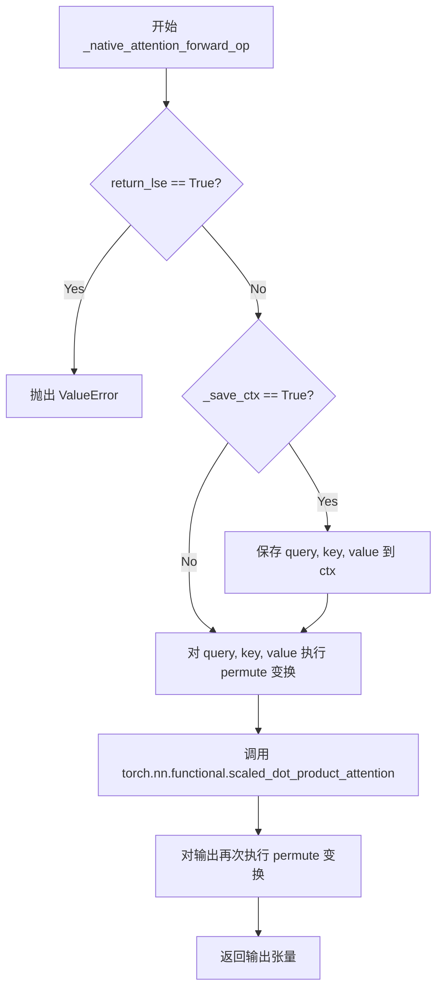

#### 带注释源码

```python
def _native_attention_forward_op(
    ctx: torch.autograd.function.FunctionCtx,
    query: torch.Tensor,
    key: torch.Tensor,
    value: torch.Tensor,
    attn_mask: torch.Tensor | None = None,
    dropout_p: float = 0.0,
    is_causal: bool = False,
    scale: float | None = None,
    enable_gqa: bool = False,
    return_lse: bool = False,
    _save_ctx: bool = True,
    _parallel_config: "ParallelConfig" | None = None,
):
    # Native attention does not return_lse
    # 原生注意力不支持返回 LSE（对数指数和），因为 PyTorch 的 SDPA 不返回此值
    if return_lse:
        raise ValueError("Native attention does not support return_lse=True")

    # used for backward pass
    # 如果需要保存上下文（用于后向传播），则保存输入张量和注意力参数
    if _save_ctx:
        ctx.save_for_backward(query, key, value)
        ctx.attn_mask = attn_mask
        ctx.dropout_p = dropout_p
        ctx.is_causal = is_causal
        ctx.scale = scale
        ctx.enable_gqa = enable_gqa

    # SDPA 期望的输入格式为 (batch, num_heads, seq_len, head_dim)
    # 将输入从 (batch, seq_len, num_heads, head_dim) 转换为 (batch, num_heads, seq_len, head_dim)
    query, key, value = (x.permute(0, 2, 1, 3) for x in (query, key, value))
    
    # 调用 PyTorch 原生的缩放点积注意力实现
    out = torch.nn.functional.scaled_dot_product_attention(
        query=query,
        key=key,
        value=value,
        attn_mask=attn_mask,
        dropout_p=dropout_p,
        is_causal=is_causal,
        scale=scale,
        enable_gqa=enable_gqa,
    )
    
    # 将输出从 (batch, num_heads, seq_len, head_dim) 转换回 (batch, seq_len, num_heads, head_dim)
    out = out.permute(0, 2, 1, 3)

    return out
```


### `_native_attention_backward_op`

这是 PyTorch 原生注意力机制的反向传播操作，作为 `torch.autograd.Function` 的一部分，用于实现可自定义梯度的注意力模块。该函数接收上游梯度，通过重新执行前向传播的缩放点积注意力（SDPA），利用 `torch.autograd.grad` 自动计算 Query、Key、Value 的梯度，并返回三个梯度张量。

参数：

- `ctx`：`torch.autograd.function.FunctionCtx`，PyTorch 自动求导上下文对象，用于访问前向传播时保存的张量和参数（如 `saved_tensors`、`attn_mask`、`dropout_p` 等）
- `grad_out`：`torch.Tensor`，来自上层（输出）的梯度，形状与前向输出相同
- `*args`：可变位置参数，用于兼容接口，传递额外的未使用参数
- `**kwargs`：可变关键字参数，用于兼容接口，传递额外的未使用参数

返回值：`tuple[torch.Tensor, torch.Tensor, torch.Tensor]`，返回三个梯度张量 `grad_query`、`grad_key`、`grad_value`，分别对应输入的 Query、Key、Value 的梯度，形状与输入张量相同。

#### 流程图

```mermaid
flowchart TD
    A[开始反向传播] --> B[从ctx获取保存的query, key, value]
    B --> C[设置requires_grad_=True以启用梯度计算]
    C --> D[将query/key/value从NHD格式permute为NDH格式<br/>query_t, key_t, value_t]
    D --> E[执行torch.nn.functional.scaled_dot_product_attention<br/>重新计算前向注意力输出]
    E --> F[将grad_out从NHD格式permute为NDH格式<br/>grad_out_t]
    F --> G[使用torch.autograd.grad计算梯度<br/>grad_query_t, grad_key_t, grad_value_t]
    G --> H[将梯度从NDH格式permute回NHD格式<br/>grad_query, grad_key, grad_value]
    H --> I[返回grad_query, grad_key, grad_value]
```

#### 带注释源码

```python
def _native_attention_backward_op(
    ctx: torch.autograd.function.FunctionCtx,
    grad_out: torch.Tensor,
    *args,
    **kwargs,
):
    # 从前向传播保存的上下文中获取query, key, value张量
    # 这些是前向传播时通过save_for_backward保存的原始输入
    query, key, value = ctx.saved_tensors

    # 显式启用梯度计算，确保这些张量可以参与autograd
    # 这对于某些需要梯度追踪的场景是必要的
    query.requires_grad_(True)
    key.requires_grad_(True)
    value.requires_grad_(True)

    # 将张量从NHD (Batch, Seq, Heads, Dim) 转换为NDH (Batch, Heads, Seq, Dim) 格式
    # 这是因为PyTorch的SDPA期望的输入格式是 (Batch, Heads, Seq, Dim)
    query_t, key_t, value_t = (x.permute(0, 2, 1, 3) for x in (query, key, value))

    # 重新执行前向传播的SDPA操作
    # 使用前向传播时保存的attn_mask、dropout_p、is_causal、scale、enable_gqa参数
    out = torch.nn.functional.scaled_dot_product_attention(
        query=query_t,
        key=key_t,
        value=value_t,
        attn_mask=ctx.attn_mask,
        dropout_p=ctx.dropout_p,
        is_causal=ctx.is_causal,
        scale=ctx.scale,
        enable_gqa=ctx.enable_gqa,
    )

    # 将输出从NDH格式permute回NHD格式
    out = out.permute(0, 2, 1, 3)

    # 将上游梯度grad_out从NHD格式转换为NDH格式
    # 以匹配SDPA输出的格式用于梯度计算
    grad_out_t = grad_out.permute(0, 2, 1, 3)

    # 使用torch.autograd.grad计算query, key, value的梯度
    # outputs: 重新计算的SDPA输出
    # inputs: 需要计算梯度的输入张量列表
    # grad_outputs: 输出梯度
    # retain_graph=False: 计算完成后释放计算图，节省内存
    grad_query_t, grad_key_t, grad_value_t = torch.autograd.grad(
        outputs=out, inputs=[query_t, key_t, value_t], grad_outputs=grad_out_t, retain_graph=False
    )

    # 将梯度从NDH格式permute回NHD格式
    # 以匹配原始输入的形状格式
    grad_query = grad_query_t.permute(0, 2, 1, 3)
    grad_key = grad_key_t.permute(0, 2, 1, 3)
    grad_value = grad_value_t.permute(0, 2, 1, 3)

    # 返回三个梯度张量，用于更新模型参数
    return grad_query, grad_key, grad_value
```


### `_cudnn_attention_forward_op`

这是PyTorch的autograd函数前向传播实现，封装了cuDNN原生的高效注意力计算（`aten::_scaled_dot_product_cudnn_attention`），用于在可微分的自定义操作中调用cuDNN注意力内核，支持前向计算与上下文保存以供反向传播使用。

参数：

- `ctx`：`torch.autograd.function.FunctionCtx`，PyTorch autograd上下文，用于保存反向传播所需的信息
- `query`：`torch.Tensor`，查询张量，形状为 (batch_size, seq_len_q, num_heads, head_dim)
- `key`：`torch.Tensor`，键张量，形状为 (batch_size, seq_len_kv, num_heads, head_dim)
- `value`：`torch.Tensor`，值张量，形状为 (batch_size, seq_len_kv, num_heads, head_dim)
- `attn_mask`：`torch.Tensor | None`，可选的注意力偏置/掩码
- `dropout_p`：`float`，dropout概率，默认为0.0
- `is_causal`：`bool`，是否使用因果（causal）掩码，默认为False
- `scale`：`float | None`，softmax缩放因子，如果为None则使用默认值
- `enable_gqa`：`bool`，是否启用分组查询注意力（GQA），默认为False
- `return_lse`：`bool`，是否返回log-sum-exp（用于反向传播），默认为False
- `_save_ctx`：`bool`，是否保存上下文用于反向传播，默认为True
- `_parallel_config`：`ParallelConfig | None`，并行配置，用于上下文并行，默认为None

返回值：`torch.Tensor` 或 `tuple[torch.Tensor, torch.Tensor]`，如果 `return_lse=True` 返回 (out, lse) 元组，否则返回 out 张量

#### 流程图

```mermaid
flowchart TD
    A[开始] --> B{enable_gqa?}
    B -->|True| C[抛出ValueError: 不支持GQA]
    B -->|False| D[初始化tensors_to_save空元组]
    D --> E[query转置为B,S,H,D并连续存储]
    F[key转置为B,S,H,D并连续存储] --> G[value转置为B,S,H,D并连续存储]
    E --> F
    F --> G
    G --> H[tensors_to_save追加query, key, value]
    H --> I[调用aten::_scaled_dot_product_cudnn_attention]
    I --> J[获取输出: out, lse, cum_seq_q, cum_seq_k, max_q, max_k, philox_seed, philox_offset, debug_attn_mask]
    J --> K[tensors_to_save追加out, lse, cum_seq_q, cum_seq_k, philox_seed, philox_offset]
    K --> L{_save_ctx?}
    L -->|True| M[ctx.save_for_backward保存tensors_to_save]
    M --> N[ctx保存dropout_p, is_causal, scale, attn_mask, max_q, max_k]
    L -->|False| O[跳过保存]
    N --> P
    O --> P[out转置回B,H,S,D并连续存储]
    P --> Q{lse不为None?}
    Q -->|True| R[lse转置并连续存储]
    Q -->|False| S[继续]
    R --> T
    S --> T{return_lse?}
    T -->|True| U[返回元组out, lse]
    T -->|False| V[仅返回out]
```

#### 带注释源码

```python
def _cudnn_attention_forward_op(
    ctx: torch.autograd.function.FunctionCtx,
    query: torch.Tensor,
    key: torch.Tensor,
    value: torch.Tensor,
    attn_mask: torch.Tensor | None = None,
    dropout_p: float = 0.0,
    is_causal: bool = False,
    scale: float | None = None,
    enable_gqa: bool = False,
    return_lse: bool = False,
    _save_ctx: bool = True,
    _parallel_config: "ParallelConfig" | None = None,
):
    """
    cuDNN注意力前向传播函数。
    
    调用PyTorch原生的aten::_scaled_dot_product_cudnn_attention算子，
    该算子封装了cuDNN的高效注意力实现。
    
    参数:
        ctx: PyTorch autograd上下文，用于保存反向传播所需的状态
        query: 查询张量，形状 (batch, seq_q, heads, head_dim)
        key: 键张量，形状 (batch, seq_kv, heads, head_dim)
        value: 值张量，形状 (batch, seq_kv, heads, head_dim)
        attn_mask: 可选的注意力偏置张量
        dropout_p: dropout概率
        is_causal: 是否使用因果掩码
        scale: 缩放因子
        enable_gqa: 是否启用分组查询注意力
        return_lse: 是否返回log-sum-exp
        _save_ctx: 是否保存上下文
        _parallel_config: 并行配置（用于上下文并行）
    
    返回:
        如果return_lse为True，返回(out, lse)元组；否则返回out
    """
    # cuDNN注意力目前不支持GQA（分组查询注意力）
    if enable_gqa:
        raise ValueError("`enable_gqa` is not yet supported for cuDNN attention.")

    # 初始化要保存的张量元组
    tensors_to_save = ()

    # 【关键】必须连续存储！cuDNN后端要求输入张量必须是连续的
    # 调用非连续张量会产生错误结果
    # 转置: (B, S, H, D) -> (B, H, S, D) 以符合cuDNN的输入格式
    query = query.transpose(1, 2).contiguous()
    key = key.transpose(1, 2).contiguous()
    value = value.transpose(1, 2).contiguous()
    # 保存转置后的张量用于反向传播
    tensors_to_save += (query, key, value)

    # 调用cuDNN注意力算子
    # 返回值包括: output, logsumexp, cum_seq_q, cum_seq_k, max_q, max_k, 
    #            philox_seed, philox_offset, debug_attn_mask
    out, lse, cum_seq_q, cum_seq_k, max_q, max_k, philox_seed, philox_offset, debug_attn_mask = (
        torch.ops.aten._scaled_dot_product_cudnn_attention(
            query=query,
            key=key,
            value=value,
            attn_bias=attn_mask,
            compute_log_sumexp=return_lse,
            dropout_p=dropout_p,
            is_causal=is_causal,
            return_debug_mask=False,
            scale=scale,
        )
    )

    # 保存必要的张量用于反向传播
    tensors_to_save += (out, lse, cum_seq_q, cum_seq_k, philox_seed, philox_offset)
    if _save_ctx:
        # 保存张量用于 backward
        ctx.save_for_backward(*tensors_to_save)
        # 保存标量属性用于 backward
        ctx.dropout_p = dropout_p
        ctx.is_causal = is_causal
        ctx.scale = scale
        ctx.attn_mask = attn_mask
        ctx.max_q = max_q
        ctx.max_k = max_k

    # 转置回原始格式: (B, H, S, D) -> (B, S, H, D)
    out = out.transpose(1, 2).contiguous()
    if lse is not None:
        # lse形状: (batch, heads, seq)，转置为 (batch, seq, heads)
        lse = lse.transpose(1, 2).contiguous()
    
    # 根据return_lse决定返回值
    return (out, lse) if return_lse else out
```


### `_cudnn_attention_backward_op`

cuDNN 注意力机制的反向传播操作，用于计算 Query、Key、Value 的梯度。该函数是 PyTorch autograd Function，通过调用 `torch.ops.aten._scaled_dot_product_cudnn_attention_backward` 原语实现高效的注意力反向传播。

参数：

-  `ctx`：`torch.autograd.function.FunctionCtx`，PyTorch autograd 上下文，用于保存前向传播时的张量
-  `grad_out`：`torch.Tensor`，输出梯度，形状为 `(batch_size, seq_len_q, num_heads, head_dim)`
-  `*args`：可变位置参数，捕获额外参数（未使用）
-  `**kwargs`：可变关键字参数，捕获额外参数（未使用）

返回值：`tuple[torch.Tensor, torch.Tensor, torch.Tensor]`，返回 Query、Key、Value 的梯度，形状分别为 `(batch_size, seq_len_q, num_heads, head_dim)`、`(batch_size, seq_len_kv, num_heads, head_dim)` 和 `(batch_size, seq_len_kv, num_heads, head_dim)`

#### 流程图

```mermaid
flowchart TD
    A[开始反向传播] --> B[从ctx.saved_tensors恢复保存的张量]
    B --> C[恢复query, key, value, out, lse, cum_seq_q, cum_seq_k, philox_seed, philox_offset]
    C --> D[转置grad_out, key, value]
    D --> E[调用aten._scaled_dot_product_cudnn_attention_backward]
    E --> F[传入grad_out, query, key, value, out, lse等参数]
    F --> G[获取grad_query, grad_key, grad_value]
    G --> H[转置梯度张量回原始布局]
    H --> I[返回grad_query, grad_key, grad_value]
```

#### 带注释源码

```python
def _cudnn_attention_backward_op(
    ctx: torch.autograd.function.FunctionCtx,
    grad_out: torch.Tensor,
    *args,
    **kwargs,
):
    """
    cuDNN 注意力反向传播操作
    
    参数:
        ctx: PyTorch autograd 上下文，包含前向传播保存的张量
        grad_out: 输出梯度
        *args, **kwargs: 捕获额外参数（未使用）
    
    返回:
        Query、Key、Value 的梯度张量
    """
    # 从上下文恢复前向传播时保存的张量
    query, key, value, out, lse, cum_seq_q, cum_seq_k, philox_seed, philox_offset = ctx.saved_tensors

    # 转置梯度输出，使其连续
    # 从 (B, S, H, D) 转换为 (B, H, S, D) 格式以匹配 cuDNN 期望的布局
    grad_out = grad_out.transpose(1, 2).contiguous()
    key = key.transpose(1, 2).contiguous()
    value = value.transpose(1, 2).contiguous()

    # 调用 cuDNN 注意力反向传播原生操作
    # 注意：不能将前 5 个参数作为 kwargs 传递，原因见：
    # https://github.com/pytorch/pytorch/blob/d26ca5de058dbcf56ac52bb43e84dd98df2ace97/torch/_dynamo/variables/torch.py#L1341
    grad_query, grad_key, grad_value = torch.ops.aten._scaled_dot_product_cudnn_attention_backward(
        grad_out,        # 输出梯度
        query,          # 前向传播的 query
        key,            # 前向传播的 key
        value,          # 前向传播的 value
        out,            # 前向传播的输出
        logsumexp=lse,  # 对数指数和（Log-Sum-Exp）
        philox_seed=philox_seed,      # 随机数种子（用于 dropout）
        philox_offset=philox_offset,  # 随机数偏移量
        attn_bias=ctx.attn_mask,       # 注意力掩码
        cum_seq_q=cum_seq_q,           # query 累积序列长度
        cum_seq_k=cum_seq_k,           # key/value 累积序列长度
        max_q=ctx.max_q,               # 最大 query 序列长度
        max_k=ctx.max_k,              # 最大 key/value 序列长度
        dropout_p=ctx.dropout_p,      # dropout 概率
        is_causal=ctx.is_causal,      # 是否因果掩码
        scale=ctx.scale,               # 缩放因子
    )
    
    # 将梯度转置回原始布局 (B, H, S, D) -> (B, S, H, D)
    # 并确保张量是连续的
    grad_query, grad_key, grad_value = (x.transpose(1, 2).contiguous() for x in (grad_query, grad_key, grad_value))

    return grad_query, grad_key, grad_value
```


### `_native_flash_attention_forward_op`

PyTorch 原生 Flash Attention 的前向传播操作封装函数，基于 `torch.ops.aten._scaled_dot_product_flash_attention` 实现，接受 Query、Key、Value 张量以及注意力配置参数，执行前向计算并在上下文中保存反向传播所需的状态。

参数：

- `ctx`：`torch.autograd.function.FunctionCtx`，PyTorch autograd 上下文，用于保存反向传播所需的张量和参数
- `query`：`torch.Tensor`，查询张量，形状为 (batch_size, seq_len_q, num_heads, head_dim)
- `key`：`torch.Tensor`，键张量，形状为 (batch_size, seq_len_kv, num_heads, head_dim)
- `value`：`torch.Tensor`，值张量，形状为 (batch_size, seq_len_kv, num_heads, head_dim)
- `attn_mask`：`torch.Tensor | None`，注意力掩码，当前版本不支持（传入会被忽略）
- `dropout_p`：`float`，dropout 概率，默认为 0.0
- `is_causal`：`bool`，是否使用因果注意力掩码，默认为 False
- `scale`：`float | None`，注意力缩放因子，如果为 None 则使用默认值 head_dim^(-0.5)
- `enable_gqa`：`bool`，是否启用分组查询注意力，当前版本不支持
- `return_lse`：`bool`，是否返回 log-sum-exp，默认为 False
- `_save_ctx`：`bool`，是否保存上下文用于反向传播，默认为 True
- `_parallel_config`：`ParallelConfig | None`，并行配置，用于分布式并行训练场景

返回值：`torch.Tensor` 或 `tuple[torch.Tensor, torch.Tensor]`，如果 return_lse 为 True 则返回 (output, lse)，否则仅返回 output

#### 流程图

```mermaid
flowchart TD
    A[开始 _native_flash_attention_forward_op] --> B{enable_gqa?}
    B -->|是| C[抛出 ValueError: 不支持 GQA]
    B -->|否| D[准备 tensors_to_save 元组]
    D --> E[query.transpose(1, 2).contiguous]
    E --> F[key.transpose(1, 2).contiguous]
    F --> G[value.transpose(1, 2).contiguous]
    G --> H[将 query, key, value 加入 tensors_to_save]
    H --> I[调用 torch.ops.aten._scaled_dot_product_flash_attention]
    I --> J[获取 out, lse, cum_seq_q, cum_seq_k, max_q, max_k, philox_seed, philox_offset, debug_attn_mask]
    J --> K[将 out, lse, cum_seq_q, cum_seq_k, philox_seed, philox_offset 加入 tensors_to_save]
    K --> L{_save_ctx?}
    L -->|是| M[ctx.save_for_backward 保存所有张量]
    M --> N[ctx 保存 dropout_p, is_causal, scale, max_q, max_k]
    L -->|否| O[跳过保存]
    O --> P[out.transpose(1, 2).contiguous]
    P --> Q{lse is not None?}
    Q -->|是| R[lse.transpose(1, 2).contiguous]
    Q -->|否| S{return_lse?}
    R --> S
    S -->|是| T[返回 (out, lse)]
    S -->|否| U[返回 out]
```

#### 带注释源码

```python
def _native_flash_attention_forward_op(
    ctx: torch.autograd.function.FunctionCtx,
    query: torch.Tensor,
    key: torch.Tensor,
    value: torch.Tensor,
    attn_mask: torch.Tensor | None = None,
    dropout_p: float = 0.0,
    is_causal: bool = False,
    scale: float | None = None,
    enable_gqa: bool = False,
    return_lse: bool = False,
    _save_ctx: bool = True,
    _parallel_config: "ParallelConfig" | None = None,
):
    # 检查是否启用了 GQA（分组查询注意力），当前版本不支持
    if enable_gqa:
        raise ValueError("`enable_gqa` is not yet supported for native flash attention.")

    # 初始化要保存的张量元组
    tensors_to_save = ()

    # 将输入张量从 (B, S, H, D) 转置为 (B, H, S, D) 格式以符合 flash attention 的输入要求
    # 并确保内存连续以避免 cuDNN 后端计算错误
    query = query.transpose(1, 2).contiguous()
    key = key.transpose(1, 2).contiguous()
    value = value.transpose(1, 2).contiguous()
    
    # 将转置后的 query, key, value 添加到保存列表
    tensors_to_save += (query, key, value)

    # 调用 PyTorch 原生的 flash attention 算子
    # 返回值包括：输出张量、log-sum-exp、累积序列长度、最大序列长度、随机数生成器状态等
    out, lse, cum_seq_q, cum_seq_k, max_q, max_k, philox_seed, philox_offset, debug_attn_mask = (
        torch.ops.aten._scaled_dot_product_flash_attention(
            query=query,
            key=key,
            value=value,
            dropout_p=dropout_p,
            is_causal=is_causal,
            return_debug_mask=False,
            scale=scale,
        )
    )

    # 将反向传播需要的额外张量添加到保存列表
    tensors_to_save += (out, lse, cum_seq_q, cum_seq_k, philox_seed, philox_offset)
    
    # 如果需要保存上下文（用于反向传播），则保存张量和参数
    if _save_ctx:
        ctx.save_for_backward(*tensors_to_save)
        ctx.dropout_p = dropout_p
        ctx.is_causal = is_causal
        ctx.scale = scale
        ctx.max_q = max_q
        ctx.max_k = max_k

    # 将输出张量从 (B, H, S, D) 转置回 (B, S, H, D) 格式
    out = out.transpose(1, 2).contiguous()
    
    # 如果 lse 存在，也进行相同的转置
    if lse is not None:
        lse = lse.transpose(1, 2).contiguous()
    
    # 根据 return_lse 决定返回值
    return (out, lse) if return_lse else out
```


### `_native_flash_attention_backward_op`

这是 PyTorch 原生 Flash Attention 的反向传播实现，通过调用 `torch.ops.aten._scaled_dot_product_flash_attention_backward` 算子计算 Q、K、V 的梯度。

参数：

- `ctx`：`torch.autograd.function.FunctionCtx`，保存前向传播时的状态（query, key, value, out, lse 等）
- `grad_out`：`torch.Tensor`，输出梯度
- `*args`：可变位置参数，用于适配接口
- `**kwargs`：可变关键字参数，用于适配接口

返回值：`tuple[torch.Tensor, torch.Tensor, torch.Tensor]`，返回 (grad_query, grad_key, grad_value) 三个梯度张量

#### 流程图

```mermaid
flowchart TD
    A[开始反向传播] --> B[从 ctx 获取保存的张量: query, key, value, out, lse, cum_seq_q, cum_seq_k, philox_seed, philox_offset]
    B --> C[转置 grad_out, key, value 并连续化]
    C --> D[调用 aten::_scaled_dot_product_flash_attention_backward 算子计算梯度]
    D --> E[转置梯度并连续化]
    E --> F[返回 grad_query, grad_key, grad_value]
```

#### 带注释源码

```python
def _native_flash_attention_backward_op(
    ctx: torch.autograd.function.FunctionCtx,
    grad_out: torch.Tensor,
    *args,
    **kwargs,
):
    # 从前向传播保存的上下文获取所需张量
    # 这些是 forward 时通过 save_for_backward 保存的
    query, key, value, out, lse, cum_seq_q, cum_seq_k, philox_seed, philox_offset = ctx.saved_tensors

    # 对输入进行维度转置和内存连续化
    # Flash attention 算子期望 (batch, head, seq, dim) 格式
    grad_out = grad_out.transpose(1, 2).contiguous()
    key = key.transpose(1, 2).contiguous()
    value = value.transpose(1, 2).contiguous()

    # 调用 PyTorch 原生 flash attention 反向算子
    # 该算子根据前向保存的信息计算 Q、K、V 的梯度
    grad_query, grad_key, grad_value = torch.ops.aten._scaled_dot_product_flash_attention_backward(
        grad_out,           # 反向传播的梯度输入
        query,              # 前向的 query
        key,                # 前向的 key
        value,              # 前向的 value
        out,                # 前向的输出，用于梯度计算
        logsumexp=lse,      # log-sum-exp，用于反向计算
        philox_seed=philox_seed,      # dropout 随机种子
        philox_offset=philox_offset,  # dropout 随机偏移
        cum_seq_q=cum_seq_q,          # query 序列长度累积
        cum_seq_k=cum_seq_k,          # key 序列长度累积
        max_q=ctx.max_q,              # 最大 query 长度
        max_k=ctx.max_k,              # 最大 key 长度
        dropout_p=ctx.dropout_p,      # dropout 概率
        is_causal=ctx.is_causal,      # 是否 causal mask
        scale=ctx.scale,               # 缩放因子
    )

    # 将梯度转置回原始格式 (batch, seq, head, dim)
    grad_query, grad_key, grad_value = (x.transpose(1, 2).contiguous() for x in (grad_query, grad_key, grad_value))

    # 返回三个梯度张量
    return grad_query, grad_key, grad_value
```


### `_flash_attention_forward_op`

该函数是Flash Attention 2的前向传播操作，作为PyTorch自定义autograd函数实现，负责调用`_wrapped_flash_attn_forward`执行高效的注意力计算，并支持梯度保存与并行配置。

参数：

- `ctx`：`torch.autograd.function.FunctionCtx`，PyTorch自动求上下文，用于保存反向传播所需的 tensors 和参数
- `query`：`torch.Tensor`，查询张量，形状为 (batch_size, seq_len_q, num_heads, head_dim)
- `key`：`torch.Tensor`，键张量，形状为 (batch_size, seq_len_kv, num_heads, head_dim)
- `value`：`torch.Tensor`，值张量，形状为 (batch_size, seq_len_kv, num_heads, head_dim)
- `attn_mask`：`torch.Tensor | None`，注意力掩码（当前版本不支持）
- `dropout_p`：`float`，dropout概率，用于训练时随机丢弃注意力权重
- `is_causal`：`bool`，是否使用因果注意力（防止未来位置信息泄露）
- `scale`：`float | None`，缩放因子，若为None则默认为 head_dim^(-0.5)
- `enable_gqa`：`bool`，是否启用分组查询注意力（当前版本不支持）
- `return_lse`：`bool`，是否返回注意力权重对数（Log-Sum-Exp）
- `_save_ctx`：`bool`，是否保存上下文用于反向传播
- `_parallel_config`：`"ParallelConfig" | None`，并行配置，用于上下文并行计算

返回值：`torch.Tensor | tuple[torch.Tensor, torch.Tensor]`，若 return_lse 为 True 返回 (output, lse) 元组，否则仅返回 output 张量

#### 流程图

```mermaid
flowchart TD
    A[开始 _flash_attention_forward_op] --> B{attn_mask is not None?}
    B -->|Yes| C[抛出 ValueError: attn_mask 不支持]
    B -->|No| D{enable_gqa is True?}
    D -->|Yes| E[抛出 ValueError: enable_gqa 不支持]
    D -->|No| F{scale is None?}
    F -->|Yes| G[计算 scale = query.shape[-1] ** -0.5]
    F -->|No| H[使用传入的 scale]
    G --> I{任意张量需要梯度?}
    H --> I
    I -->|Yes| J[设置 dropout_p 为 1e-30 若为0]
    I -->|No| K{并行配置且CP world_size > 1?}
    K -->|Yes| J
    K -->|No| L[调用 _wrapped_flash_attn_forward]
    J --> L
    L --> M[转置 lse: lse.permute(0, 2, 1)]
    M --> N{_save_ctx is True?}
    N -->|Yes| O[保存 query, key, value, out, lse, rng_state]
    N -->|No| P{return_lse is True?}
    O --> P
    P -->|Yes| Q[返回 (out, lse)]
    P -->|No| R[返回 out]
    Q --> S[结束]
    R --> S
```

#### 带注释源码

```python
def _flash_attention_forward_op(
    ctx: torch.autograd.function.FunctionCtx,
    query: torch.Tensor,
    key: torch.Tensor,
    value: torch.Tensor,
    attn_mask: torch.Tensor | None = None,
    dropout_p: float = 0.0,
    is_causal: bool = False,
    scale: float | None = None,
    enable_gqa: bool = False,
    return_lse: bool = False,
    _save_ctx: bool = True,
    _parallel_config: "ParallelConfig" | None = None,
):
    # Flash Attention 2 当前不支持 attn_mask，抛出异常
    if attn_mask is not None:
        raise ValueError("`attn_mask` is not yet supported for flash-attn 2.")
    # Flash Attention 2 当前不支持 GQA (Grouped Query Attention)
    if enable_gqa:
        raise ValueError("`enable_gqa` is not yet supported for flash-attn 2.")

    # 硬编码的窗口大小 (-1, -1) 表示全局注意力
    window_size = (-1, -1)
    softcap = 0.0
    alibi_slopes = None
    deterministic = False
    # 检查任意输入张量是否需要梯度（用于确定是否启用梯度计算）
    grad_enabled = any(x.requires_grad for x in (query, key, value))

    # 若未指定 scale，默认使用 head_dim 的 -0.5 次方（即 1/sqrt(head_dim)）
    if scale is None:
        scale = query.shape[-1] ** (-0.5)

    # flash-attn 仅在 dropout_p > 0 时返回 LSE
    # 因此当启用梯度或使用上下文并行时，需要设置一个很小的正值以确保返回 LSE
    if grad_enabled or (_parallel_config is not None and _parallel_config.context_parallel_config._world_size > 1):
        dropout_p = dropout_p if dropout_p > 0 else 1e-30

    # 在指定的梯度计算状态下调用 flash attention 前向函数
    with torch.set_grad_enabled(grad_enabled):
        # 调用底层 C++/CUDA 包装函数执行实际注意力计算
        out, lse, S_dmask, rng_state = _wrapped_flash_attn_forward(
            query,
            key,
            value,
            dropout_p,
            scale,
            is_causal,
            window_size[0],
            window_size[1],
            softcap,
            alibi_slopes,
            return_lse,
        )
        # LSE 形状转换: (batch, num_heads, seq_len) -> (batch, seq_len, num_heads)
        lse = lse.permute(0, 2, 1)

    # 保存反向传播所需的上下文信息
    if _save_ctx:
        ctx.save_for_backward(query, key, value, out, lse, rng_state)
        ctx.dropout_p = dropout_p
        ctx.scale = scale
        ctx.is_causal = is_causal
        ctx.window_size = window_size
        ctx.softcap = softcap
        ctx.alibi_slopes = alibi_slopes
        ctx.deterministic = deterministic

    # 根据 return_lse 决定返回值
    return (out, lse) if return_lse else out
```


### `_flash_attention_backward_op`

该函数是 Flash Attention 的反向传播操作，用于计算 Flash Attention 前向传播过程中 Query、Key、Value 的梯度。它作为 PyTorch 的 `torch.autograd.Function` 的 backward 方法，被 `_flash_attention_forward_op` 的前向传播所调用，并在上下文并行（Context Parallel）模式下通过 `_templated_context_parallel_attention` 调度。

参数：

-  `ctx`：`torch.autograd.function.FunctionCtx`，PyTorch 自动求导上下文，用于保存前向传播时缓存的张量（如 query、key、value、out、lse、rng_state）以及前向参数（如 dropout_p、scale、is_causal、window_size、softcap、alibi_slopes、deterministic）
-  `grad_out`：`torch.Tensor`，输出梯度，形状为 `(batch_size, seq_len_q, num_heads, head_dim)`
-  `*args, **kwargs`：可变参数，用于适配其他调用场景

返回值：`(torch.Tensor, torch.Tensor, torch.Tensor)`，分别对应 Query、Key、Value 的梯度，形状与输入相同

#### 流程图

```mermaid
flowchart TD
    A[开始反向传播] --> B[从 ctx.saved_tensors 获取保存的张量]
    B --> C[创建空梯度张量 grad_query, grad_key, grad_value]
    C --> D[调用 _wrapped_flash_attn_backward 计算梯度]
    D --> E[裁剪头部维度可能的填充]
    E --> F[返回 grad_query, grad_key, grad_value]
```

#### 带注释源码

```python
def _flash_attention_backward_op(
    ctx: torch.autograd.function.FunctionCtx,
    grad_out: torch.Tensor,
    *args,
    **kwargs,
):
    """
    Flash Attention 的反向传播操作。
    
    该函数计算 Flash Attention 前向传播的梯度。它接收前向传播保存的张量（query, key, value, out, lse, rng_state），
    以及输出的梯度 grad_out，然后通过调用 CUDA kernel (`_wrapped_flash_attn_backward`) 计算 Query、Key、Value 的梯度。
    
    参数:
        ctx: 包含前向传播时保存的张量和参数的上下文对象
        grad_out: 输出的梯度，形状为 (batch_size, seq_len_q, num_heads, head_dim)
        *args, **kwargs: 可变参数，用于适配不同的调用约定
    
    返回:
        grad_query, grad_key, grad_value: 分别为 Query、Key、Value 的梯度张量
    """
    # 从上下文获取前向传播时保存的张量
    # query, key, value: 前向传播的输入
    # out: 前向传播的输出
    # lse: 注意力权重的 log-sum-exp，用于反向传播计算
    # rng_state: 随机数生成器状态，用于 dropout 的反向传播
    query, key, value, out, lse, rng_state = ctx.saved_tensors
    
    # 初始化梯度张量，使用与输入相同的形状和设备
    grad_query, grad_key, grad_value = torch.empty_like(query), torch.empty_like(key), torch.empty_like(value)

    # 调用 Flash Attention 的 CUDA backward kernel 计算梯度
    # 这是一个原位操作，会填充 grad_query, grad_key, grad_value
    # ctx.dropout_p: dropout 概率
    # ctx.scale: 注意力缩放因子
    # ctx.is_causal: 是否使用因果掩码
    # ctx.window_size: 注意力窗口大小
    # ctx.softcap: softcap 参数
    # ctx.alibi_slopes: ALiBi 偏置 slopes
    # ctx.deterministic: 是否使用确定性模式
    lse_d = _wrapped_flash_attn_backward(  # noqa: F841
        grad_out,
        query,
        key,
        value,
        out,
        lse,
        grad_query,
        grad_key,
        grad_value,
        ctx.dropout_p,
        ctx.scale,
        ctx.is_causal,
        ctx.window_size[0],
        ctx.window_size[1],
        ctx.softcap,
        ctx.alibi_slopes,
        ctx.deterministic,
        rng_state,
    )

    # 头部维度可能被填充以满足某些硬件要求（如 divisible by 8）
    # 这里裁剪回原始形状
    grad_query = grad_query[..., : grad_out.shape[-1]]
    grad_key = grad_key[..., : grad_out.shape[-1]]
    grad_value = grad_value[..., : grad_out.shape[-1]]

    # 返回三个梯度张量
    return grad_query, grad_key, grad_value
```


### `_flash_attention_hub_forward_op`

该函数是 Flash Attention Hub 内核的前向传播操作，作为 PyTorch autograd Function 实现，支持上下文并行（Context Parallel）训练。它从 Hub 加载 Flash Attention 2 内核，并处理查询、键、值张量的注意力计算，同时管理 dropout 和因果掩码。

参数：

- `ctx`：`torch.autograd.function.FunctionCtx`，用于在反向传播中保存张量的上下文对象
- `query`：`torch.Tensor`，查询张量，形状为 (batch_size, seq_len_q, num_heads, head_dim)
- `key`：`torch.Tensor`，键张量，形状为 (batch_size, seq_len_kv, num_heads, head_dim)
- `value`：`torch.Tensor`，值张量，形状为 (batch_size, seq_len_kv, num_heads, head_dim)
- `attn_mask`：`torch.Tensor | None`，注意力掩码（Hub 内核当前不支持此参数）
- `dropout_p`：`float`，Dropout 概率，默认为 0.0
- `is_causal`：`bool`，是否使用因果掩码，默认为 False
- `scale`：`float | None`，注意力缩放因子，默认根据 head_dim 自动计算
- `enable_gqa`：`bool`，是否启用分组查询注意力（Hub 内核当前不支持）
- `return_lse`：`bool`，是否返回 log-sum-exp，默认为 False
- `_save_ctx`：`bool`，是否保存反向传播所需的上下文，默认为 True
- `_parallel_config`：`ParallelConfig | None`，并行配置，用于上下文并行训练

返回值：`torch.Tensor | tuple[torch.Tensor, torch.Tensor]`，返回注意力输出，若 return_lse 为 True 则同时返回 log-sum-exp

#### 流程图

```mermaid
flowchart TD
    A[开始] --> B{检查 attn_mask 是否为 None}
    B -->|否| C[抛出 ValueError: attn_mask 不支持]
    B -->|是| D{检查 enable_gqa 是否为 False}
    D -->|否| E[抛出 ValueError: enable_gqa 不支持]
    D -->|是| F[获取 Hub 内核配置]
    F --> G{检查 wrapped_forward_fn 和 wrapped_backward_fn 存在}
    G -->|否| H[抛出 RuntimeError]
    G -->|是| I{检查 scale 是否为 None}
    I -->|是| J[计算 scale = query.shape[-1] ** -0.5]
    I -->|否| K[使用传入的 scale]
    J --> L{检查梯度是否启用或 context_parallel world_size > 1}
    L -->|是| M[设置 dropout_p = max(dropout_p, 1e-30)]
    L -->|否| N[保持 dropout_p 不变]
    M --> O[调用 wrapped_forward_fn 执行 Flash Attention]
    N --> O
    O --> P[调整 LSE 维度顺序并确保连续内存]
    Q{_save_ctx 为 True?}
    P --> Q
    Q -->|是| R[保存 query, key, value, out, lse, rng_state 到 ctx]
    Q -->|否| S[跳过保存]
    R --> T{return_lse 为 True?}
    S --> T
    T -->|是| U[返回 tuple(out, lse)]
    T -->|否| V[返回 out]
    U --> W[结束]
    V --> W
```

#### 带注释源码

```python
def _flash_attention_hub_forward_op(
    ctx: torch.autograd.function.FunctionCtx,
    query: torch.Tensor,
    key: torch.Tensor,
    value: torch.Tensor,
    attn_mask: torch.Tensor | None = None,
    dropout_p: float = 0.0,
    is_causal: bool = False,
    scale: float | None = None,
    enable_gqa: bool = False,
    return_lse: bool = False,
    _save_ctx: bool = True,
    _parallel_config: "ParallelConfig" | None = None,
):
    # Hub 内核不支持 attn_mask，若传入则抛出错误
    if attn_mask is not None:
        raise ValueError("`attn_mask` is not yet supported for flash-attn hub kernels.")
    # Hub 内核不支持 GQA（分组查询注意力）
    if enable_gqa:
        raise ValueError("`enable_gqa` is not yet supported for flash-attn hub kernels.")

    # 从注册表中获取 Flash Attention Hub 内核配置
    config = _HUB_KERNELS_REGISTRY[AttentionBackendName.FLASH_HUB]
    # 获取包装后的前向和后向函数
    wrapped_forward_fn = config.wrapped_forward_fn
    wrapped_backward_fn = config.wrapped_backward_fn
    # 验证内核是否提供了上下文并行所需的包装函数
    if wrapped_forward_fn is None or wrapped_backward_fn is None:
        raise RuntimeError(
            "Flash attention hub kernels must expose `_wrapped_flash_attn_forward` and `_wrapped_flash_attn_backward` "
            "for context parallel execution."
        )

    # 若未指定 scale，则使用默认缩放因子 (1 / sqrt(head_dim))
    if scale is None:
        scale = query.shape[-1] ** (-0.5)

    # 设置 Flash Attention 的窗口大小和软上限参数
    window_size = (-1, -1)  # 全局注意力
    softcap = 0.0
    alibi_slopes = None
    deterministic = False
    # 检查任一输入张量是否需要梯度
    grad_enabled = any(x.requires_grad for x in (query, key, value))

    # 如果启用梯度或使用上下文并行（world_size > 1），需要确保 dropout 生效
    # Flash Attention 仅在 dropout > 0 时返回 LSE，因此设置一个很小的值作为占位符
    if grad_enabled or (_parallel_config is not None and _parallel_config.context_parallel_config._world_size > 1):
        dropout_p = dropout_p if dropout_p > 0 else 1e-30

    # 在指定的梯度上下文中执行前向传播
    with torch.set_grad_enabled(grad_enabled):
        # 调用 Hub 内核的包装前向函数
        out, lse, S_dmask, rng_state = wrapped_forward_fn(
            query,
            key,
            value,
            dropout_p,
            scale,
            is_causal,
            window_size[0],
            window_size[1],
            softcap,
            alibi_slopes,
            return_lse,
        )
        # 调整 LSE 的维度顺序: (batch, heads, seq) -> (batch, seq, heads)
        lse = lse.permute(0, 2, 1).contiguous()

    # 保存反向传播所需的张量和参数
    if _save_ctx:
        ctx.save_for_backward(query, key, value, out, lse, rng_state)
        ctx.dropout_p = dropout_p
        ctx.scale = scale
        ctx.is_causal = is_causal
        ctx.window_size = window_size
        ctx.softcap = softcap
        ctx.alibi_slopes = alibi_slopes
        ctx.deterministic = deterministic

    # 根据 return_lse 决定返回值
    return (out, lse) if return_lse else out
```


### `_flash_attention_hub_backward_op`

实现 Flash Attention Hub 内核的反向传播操作，通过调用预加载的 wrapped backward 函数计算 Query、Key、Value 的梯度，用于上下文并行训练场景。

参数：

- `ctx`：`torch.autograd.function.FunctionCtx`，PyTorch autograd 上下文，用于访问前向传播保存的张量
- `grad_out`：`torch.Tensor`，输出对应的梯度张量
- `*args, **kwargs`：接收额外的位置参数和关键字参数（当前函数未使用）

返回值：`tuple[torch.Tensor, torch.Tensor, torch.Tensor]`，返回 Query、Key、Value 各自的梯度张量

#### 流程图

```mermaid
flowchart TD
    A[开始反向传播] --> B{检查 wrapped_backward_fn 是否可用}
    B -->|不可用| C[抛出 RuntimeError]
    B -->|可用| D[从 ctx.saved_tensors 获取 query, key, value, out, lse, rng_state]
    D --> E[创建空梯度张量: grad_query, grad_key, grad_value]
    E --> F[调用 wrapped_backward_fn 计算梯度]
    F --> G[裁剪梯度: 去除填充的头维度]
    G --> H[返回 grad_query, grad_key, grad_value]
```

#### 带注释源码

```python
def _flash_attention_hub_backward_op(
    ctx: torch.autograd.function.FunctionCtx,
    grad_out: torch.Tensor,
    *args,
    **kwargs,
):
    """
    Flash Attention Hub 内核的反向传播操作。
    
    该函数使用预加载的 wrapped_backward_fn 计算 Q、K、V 的梯度。
    主要用于支持上下文并行训练场景下的梯度计算。
    """
    # 从注册表中获取 Flash Attention Hub 的配置
    config = _HUB_KERNELS_REGISTRY[AttentionBackendName.FLASH_HUB]
    
    # 获取预加载的 backward 函数
    wrapped_backward_fn = config.wrapped_backward_fn
    
    # 检查 backward 函数是否可用，若不可用则抛出错误
    if wrapped_backward_fn is None:
        raise RuntimeError(
            "Flash attention hub kernels must expose `_wrapped_flash_attn_backward` for context parallel execution."
        )

    # 从前向传播的上下文中恢复保存的张量
    # 这些是前向传播时通过 ctx.save_for_backward 保存的
    query, key, value, out, lse, rng_state = ctx.saved_tensors
    
    # 初始化梯度张量，使用空张量初始化以匹配输入形状
    grad_query, grad_key, grad_value = torch.empty_like(query), torch.empty_like(key), torch.empty_like(value)

    # 调用 wrapped backward 函数计算梯度
    # 该函数会就地修改 grad_query, grad_key, grad_value
    _ = wrapped_backward_fn(
        grad_out,           # 输出梯度
        query,              # 前向传播的 query
        key,                # 前向传播的 key
        value,              # 前向传播的 value
        out,                # 前向传播的输出
        lse,                # Log-Sum-Exp (LSE)，用于反向传播计算
        grad_query,         # 预分配的空梯度，将被填充
        grad_key,           # 预分配的空梯度，将被填充
        grad_value,         # 预分配的空梯度，将被填充
        ctx.dropout_p,      # 前向传播时的 dropout 概率
        ctx.scale,          # 前向传播时的缩放因子
        ctx.is_causal,      # 前向传播时是否为 causal 模式
        ctx.window_size[0],# 窗口大小左边界
        ctx.ctx.window_size[1], # 窗口大小右边界
        ctx.softcap,        # Softcap 参数
        ctx.alibi_slopes,   # ALiBi 斜率
        ctx.deterministic,  # 是否确定性计算
        rng_state,          # 随机数状态，用于 dropout
    )

    # 裁剪可能因头维度填充而多出的梯度
    # Flash Attention 可能会对头维度进行填充以满足硬件要求
    grad_query = grad_query[..., : grad_out.shape[-1]]
    grad_key = grad_key[..., : grad_out.shape[-1]]
    grad_value = grad_value[..., : grad_out.shape[-1]]

    # 返回三个梯度张量
    return grad_query, grad_key, grad_value
```


### `_flash_attention_3_hub_forward_op`

这是一个 PyTorch autograd Function，用于执行 Flash Attention 3（从 HuggingFace Hub 下载的内核版本）的前向传播操作。它通过注册的 hub 内核配置获取实际的注意力计算函数，处理 query、key、value 张量，执行 Flash Attention 3 的前向计算，并支持可选的 LSE（log-sum-exp）返回值，用于需要注意力统计信息的场景。

参数：

- `ctx`：`torch.autograd.function.FunctionCtx`，PyTorch 自动梯度上下文，用于在反向传播时保存前向计算的中间状态
- `query`：`torch.Tensor`，查询张量，形状为 (batch_size, seq_len_q, num_heads, head_dim)
- `key`：`torch.Tensor`，键张量，形状为 (batch_size, seq_len_kv, num_heads, head_dim)
- `value`：`torch.Tensor`，值张量，形状为 (batch_size, seq_len_kv, num_heads, head_dim)
- `attn_mask`：`torch.Tensor | None`，注意力掩码，当前版本不支持，传入非 None 值会抛出 ValueError
- `dropout_p`：`float`，Dropout 概率，当前版本不支持非零值，会抛出 ValueError
- `is_causal`：`bool`，是否使用因果掩码（当前 token 只能关注之前的 token）
- `scale`：`float | None`，softmax 缩放因子，如果为 None 则使用 head_dim 的倒数平方根
- `enable_gqa`：`bool`，是否启用分组查询注意力（Grouped Query Attention），当前版本不支持，会抛出 ValueError
- `return_lse`：`bool`，是否返回 log-sum-exp 值（用于需要注意力权重的场景）
- `_save_ctx`：`bool`，是否保存上下文用于反向传播
- `_parallel_config`：`ParallelConfig | None`，并行配置，用于分布式训练中的上下文并行
- `window_size`：`tuple[int, int]`，滑动窗口大小，(-1, -1) 表示全局注意力
- `softcap`：`float`，SoftCap 参数，用于限制注意力分数的范围
- `num_splits`：`int`，分割数量，用于内存优化
- `pack_gqa`：`bool | None`，是否打包 GQA 计算
- `deterministic`：`bool`，是否使用确定性计算模式
- `sm_margin`：`int`，SM 边距参数，用于 CUDA 计算资源分配

返回值：`torch.Tensor | tuple[torch.Tensor, torch.Tensor]`，返回注意力输出，如果 `return_lse=True` 则返回 (output, lse) 元组，否则仅返回 output

#### 流程图

```mermaid
flowchart TD
    A[开始] --> B{attn_mask is not None?}
    B -->|Yes| C[抛出 ValueError: 不支持 attn_mask]
    B -->|No| D{dropout_p != 0.0?}
    D -->|Yes| E[抛出 ValueError: 不支持 dropout]
    D -->|No| F{enable_gqa is True?}
    F -->|Yes| G[抛出 ValueError: 不支持 GQA]
    F -->|No| H[从 _HUB_KERNELS_REGISTRY 获取 kernel_fn]
    H --> I[调用 kernel_fn 执行 flash_attn_3]
    I --> J{return_lse is True?}
    J -->|Yes| K[解包 out 和 lse]
    K --> L[lse = lse.permute(0, 2, 1).contiguous]
    L --> M[返回 (out, lse)]
    J -->|No| N[返回 out]
    M --> O[结束]
    N --> O
```

#### 带注释源码

```python
def _flash_attention_3_hub_forward_op(
    ctx: torch.autograd.function.FunctionCtx,
    query: torch.Tensor,
    key: torch.Tensor,
    value: torch.Tensor,
    attn_mask: torch.Tensor | None = None,
    dropout_p: float = 0.0,
    is_causal: bool = False,
    scale: float | None = None,
    enable_gqa: bool = False,
    return_lse: bool = False,
    _save_ctx: bool = True,
    _parallel_config: "ParallelConfig" | None = None,
    *,
    window_size: tuple[int, int] = (-1, -1),
    softcap: float = 0.0,
    num_splits: int = 1,
    pack_gqa: bool | None = None,
    deterministic: bool = False,
    sm_margin: int = 0,
):
    """
    Flash Attention 3 Hub 内核的前向传播函数。
    支持从 HuggingFace Hub 下载的 Flash Attention 3 内核。
    """
    # 参数验证：Flash Attention 3 hub 内核不支持 attention mask
    if attn_mask is not None:
        raise ValueError("`attn_mask` is not yet supported for flash-attn 3 hub kernels.")
    
    # 参数验证：Flash Attention 3 hub 内核暂不支持 dropout
    if dropout_p != 0.0:
        raise ValueError("`dropout_p` is not yet supported for flash-attn 3 hub kernels.")
    
    # 参数验证：暂不支持分组查询注意力
    if enable_gqa:
        raise ValueError("`enable_gqa` is not yet supported for flash-attn 3 hub kernels.")

    # 从注册表中获取 hub 内核的 kernel 函数
    # AttentionBackendName._FLASH_3_HUB 对应 kernels-community/flash-attn3
    func = _HUB_KERNELS_REGISTRY[AttentionBackendName._FLASH_3_HUB].kernel_fn
    
    # 调用 hub 内核执行 Flash Attention 3 前向计算
    out = func(
        q=query,
        k=key,
        v=value,
        softmax_scale=scale,         # softmax 缩放因子
        causal=is_causal,           # 是否因果注意力
        qv=None,                   # 量化值（未使用）
        q_descale=None,             # 查询反缩放（未使用）
        k_descale=None,             # 键反缩放（未使用）
        v_descale=None,             # 值反缩放（未使用）
        window_size=window_size,    # 滑动窗口大小
        softcap=softcap,            # SoftCap 参数
        num_splits=num_splits,      # 分割数量
        pack_gqa=pack_gqa,          # GQA 打包
        deterministic=deterministic, # 确定性模式
        sm_margin=sm_margin,       # SM 边距
        return_attn_probs=return_lse, # 返回注意力概率（LSE）
    )

    # 初始化 lse 为 None
    lse = None
    
    # 如果需要返回 LSE，则解包返回值并调整 LSE 的维度顺序
    if return_lse:
        out, lse = out
        # 从 (batch, seq, heads) 转换为 (batch, heads, seq) 以匹配其他后端格式
        lse = lse.permute(0, 2, 1).contiguous()

    # 如果需要保存上下文用于反向传播
    if _save_ctx:
        # 保存 query, key, value 用于反向计算梯度
        ctx.save_for_backward(query, key, value)
        # 保存前向传播所需的参数
        ctx.scale = scale
        ctx.is_causal = is_causal
        # 保存 kernel 函数引用，用于反向传播时重新执行前向
        ctx._hub_kernel = func

    # 根据 return_lse 决定返回值格式
    return (out, lse) if return_lse else out
```


### `_flash_attention_3_hub_backward_op`

该函数是 Flash Attention 3 Hub 后端的反向传播操作（backward），通过重新执行前向计算并使用 `torch.autograd.grad` 自动求导来获取梯度。这是由于 FA3 Hub 内核未暴露单独包装的反向传播原语而采用的变通方案。

参数：

-  `ctx`：`torch.autograd.function.FunctionCtx`，PyTorch 自动梯度函数的上下文，用于保存前向传播时的张量和参数
-  `grad_out`：`torch.Tensor`，反向传播时输入的梯度（对应前向的输出）
-  `*args`：可变位置参数，用于接收额外未显式声明的参数
-  `window_size`：`tuple[int, int]`，注意力窗口大小，默认为 `(-1, -1)` 表示全局注意力
-  `softcap`：`float`，Softcap 阈值，默认为 `0.0`
-  `num_splits`：`int`，分割数量，默认为 `1`
-  `pack_gqa`：`bool | None`，是否启用 GQA 打包，默认为 `None`
-  `deterministic`：`bool`，是否使用确定性计算，默认为 `False`
-  `sm_margin`：`int`，SM 边距，默认为 `0`

返回值：`tuple[torch.Tensor, torch.Tensor, torch.Tensor]`，分别对应 query、key、value 的梯度

#### 流程图

```mermaid
flowchart TD
    A[开始反向传播] --> B[从 ctx 获取保存的 query, key, value]
    B --> C[获取 kernel_fn 函数]
    C --> D[启用梯度计算: with torch.enable_grad]
    D --> E[分离 query/key/value 并设置 requires_grad=True]
    E --> F[调用 kernel_fn 重新执行前向计算]
    F --> G{输出是否为元组?}
    G -->|是| H[取第一个元素作为 out]
    G -->|否| I[直接使用 out]
    H --> J[使用 torch.autograd.grad 计算梯度]
    I --> J
    J --> K[返回 grad_query, grad_key, grad_value]
```

#### 带注释源码

```python
def _flash_attention_3_hub_backward_op(
    ctx: torch.autograd.function.FunctionCtx,
    grad_out: torch.Tensor,
    *args,
    window_size: tuple[int, int] = (-1, -1),
    softcap: float = 0.0,
    num_splits: int = 1,
    pack_gqa: bool | None = None,
    deterministic: bool = False,
    sm_margin: int = 0,
):
    """
    Flash Attention 3 Hub 后端的反向传播操作。
    
    由于 FA3 Hub 内核未暴露单独的反向传播原语（wrapped_forward_attr/wrapped_backward_attr），
    我们通过重新执行前向计算并使用 torch.autograd.grad 进行自动求导来获取梯度。
    这是一种变通方案，直到 FA3 Hub 暴露专用的融合反向内核为止。
    """
    # 从上下文获取前向传播时保存的张量
    query, key, value = ctx.saved_tensors
    
    # 获取前向传播时保存的内核函数
    kernel_fn = ctx._hub_kernel
    
    # 启用梯度计算上下文管理器
    with torch.enable_grad():
        # 分离张量并设置 requires_grad 以便计算梯度
        # detach() 切断梯度流，requires_grad_(True) 重新开启梯度追踪
        query_r = query.detach().requires_grad_(True)
        key_r = key.detach().requires_grad_(True)
        value_r = value.detach().requires_grad_(True)

        # 重新执行前向计算
        out = kernel_fn(
            q=query_r,
            k=key_r,
            v=value_r,
            softmax_scale=ctx.scale,        # 从上下文获取前向的 scale
            causal=ctx.is_causal,           # 从上下文获取前向的 causal 标志
            qv=None,
            q_descale=None,
            k_descale=None,
            v_descale=None,
            window_size=window_size,
            softcap=softcap,
            num_splits=num_splits,
            pack_gqa=pack_gqa,
            deterministic=deterministic,
            sm_margin=sm_margin,
            return_attn_probs=False,         # 反向传播时不需要返回注意力概率
        )
        
        # 处理可能的元组返回值
        if isinstance(out, tuple):
            out = out[0]

        # 使用 torch.autograd.grad 自动计算梯度
        # 通过将 out 对 (query_r, key_r, value_r) 求导，得到各自的梯度
        grad_query, grad_key, grad_value = torch.autograd.grad(
            out,
            (query_r, key_r, value_r),
            grad_out,
            retain_graph=False,   # 不保留计算图，反向传播后释放内存
            allow_unused=False,    # 不允许有未使用的张量
        )

    # 返回三个梯度张量
    return grad_query, grad_key, grad_value
```


### `_sage_attention_forward_op`

Sage Attention 的前向传播操作，作为 `torch.autograd.Function` 的静态方法，用于实现自定义 autograd 逻辑，调用 `sageattn` 内核执行高效注意力计算，并支持返回 Log-Sum-Exp (LSE) 用于上下文并行的融合计算。

**参数：**

- `ctx`：`torch.autograd.function.FunctionCtx`，PyTorch autograd 上下文，用于保存反向传播所需的张量和参数
- `query`：`torch.Tensor`，查询张量，形状为 `(batch_size, seq_len_q, num_heads, head_dim)`
- `key`：`torch.Tensor`，键张量，形状为 `(batch_size, seq_len_kv, num_heads, head_dim)`
- `value`：`torch.Tensor`，值张量，形状为 `(batch_size, seq_len_kv, num_heads, head_dim)`
- `attn_mask`：`torch.Tensor | None`，注意力掩码，当前版本 Sage attention 不支持
- `dropout_p`：`float`，dropout 概率，当前版本 Sage attention 不支持
- `is_causal`：`bool`，是否使用因果掩码
- `scale`：`float | None`，softmax 缩放因子，默认为 `None` 即使用 `1/sqrt(head_dim)`
- `enable_gqa`：`bool`，是否启用 Grouped-Query-Attention，当前版本 Sage attention 不支持
- `return_lse`：`bool`，是否返回 Log-Sum-Exp，用于 Ring Attention 等上下文并行场景的融合
- `_save_ctx`：`bool`，是否保存上下文用于反向传播
- `_parallel_config`：`"ParallelConfig" | None`，并行配置，用于上下文并行注意力

**返回值：** `torch.Tensor` 或 `tuple[torch.Tensor, torch.Tensor]`，返回注意力输出，若 `return_lse=True` 则同时返回 `(output, lse)`，其中 `lse` 形状为 `(batch_size, num_heads, seq_len_q)`

#### 流程图

```mermaid
flowchart TD
    A[开始 _sage_attention_forward_op] --> B{attn_mask is not None?}
    B -->|Yes| C[raise ValueError: attn_mask not supported]
    B -->|No| D{dropout_p > 0.0?}
    D -->|Yes| E[raise ValueError: dropout not supported]
    D -->|No| F{enable_gqa?}
    F -->|Yes| G[raise ValueError: GQA not supported]
    F -->|No| H[调用 sageattn 函数]
    H --> I{return_lse?}
    I -->|Yes| J[解包 output 和 lse]
    J --> K[lse.permute 0,2,1 调换维度]
    K --> L[返回 (output, lse)]
    I -->|No| M[返回 output]
```

#### 带注释源码

```python
def _sage_attention_forward_op(
    ctx: torch.autograd.function.FunctionCtx,    # PyTorch autograd 上下文
    query: torch.Tensor,                         # 查询张量 (B, S_Q, H, D)
    key: torch.Tensor,                           # 键张量 (B, S_KV, H, D)
    value: torch.Tensor,                         # 值张量 (B, S_KV, H, D)
    attn_mask: torch.Tensor | None = None,       # 注意力掩码（暂不支持）
    dropout_p: float = 0.0,                      # Dropout 概率（暂不支持）
    is_causal: bool = False,                     # 是否因果注意力
    scale: float | None = None,                  # Softmax 缩放因子
    enable_gqa: bool = False,                    # 是否启用 GQA（暂不支持）
    return_lse: bool = False,                    # 是否返回 LSE
    _save_ctx: bool = True,                      # 是否保存上下文
    _parallel_config: "ParallelConfig" | None = None,  # 并行配置
):
    # Sage Attention 当前不支持外部注意力掩码
    if attn_mask is not None:
        raise ValueError("`attn_mask` is not yet supported for Sage attention.")
    
    # Sage Attention 当前不支持 Dropout
    if dropout_p > 0.0:
        raise ValueError("`dropout_p` is not yet supported for Sage attention.")
    
    # Sage Attention 当前不支持 GQA（Grouped Query Attention）
    if enable_gqa:
        raise ValueError("`enable_gqa` is not yet supported for Sage attention.")

    # 调用 sageattention 库的核心注意力函数
    # tensor_layout="NHD" 表示输入输出布局为 (Batch, Head, Sequence, Dim)
    out = sageattn(
        q=query,
        k=key,
        v=value,
        tensor_layout="NHD",
        is_causal=is_causal,
        sm_scale=scale,
        return_lse=return_lse,
    )
    
    lse = None
    # 如果需要返回 LSE（Log-Sum-Exp），则从输出中解包
    # LSE 用于 Ring Attention 等上下文并行场景的融合计算
    if return_lse:
        out, lse, *_ = out
        # sageattn 返回的 LSE 形状为 (B, S, H)，需要转换为 (B, H, S)
        # 以匹配其他后端（如 Flash Attention）的 LSE 格式
        lse = lse.permute(0, 2, 1)

    # 根据 return_lse 标志决定返回值
    return (out, lse) if return_lse else out
```


### `_sage_attention_backward_op`

Sage Attention 的反向传播操作，目前尚未实现，调用此函数会抛出 `NotImplementedError`。

参数：

- `ctx`：`torch.autograd.function.FunctionCtx`，PyTorch 自动求导上下文，用于保存前向传播时的张量
- `grad_out`：`torch.Tensor`，输出的梯度
- `*args`：任意参数，接收额外未使用的参数

返回值：无返回值（函数直接抛出 `NotImplementedError`）

#### 流程图

```mermaid
flowchart TD
    A[开始反向传播] --> B{检查是否支持}
    B -->|不支持| C[抛出 NotImplementedError]
    C --> D[结束]
```

#### 带注释源码

```python
def _sage_attention_backward_op(
    ctx: torch.autograd.function.FunctionCtx,
    grad_out: torch.Tensor,
    *args,
):
    """
    Sage Attention 的反向传播操作。
    
    注意：目前 Sage Attention 尚未实现反向传播功能，
    调用此函数会抛出 NotImplementedError。
    
    Args:
        ctx: PyTorch 自动求导上下文，包含前向传播时保存的张量
        grad_out: 输出的梯度张量
        *args: 额外的可变参数（此函数未使用）
    
    Raises:
        NotImplementedError: 当调用此函数时抛出，因为反向传播尚未实现
    """
    # 抛出未实现错误，表明 Sage Attention 的反向传播功能尚在开发中
    raise NotImplementedError("Backward pass is not implemented for Sage attention.")
```


### `_sage_attention_hub_forward_op`

这是 Sage Attention Hub 版本的 PyTorch autograd Function 前向传播方法，用于从 HuggingFace Hub 下载并使用 Sage Attention 内核进行注意力计算。该函数支持返回 logsumexp (LSE)，但不直接支持注意力掩码、dropout 和 GQA。

参数：

- `ctx`：`torch.autograd.function.FunctionCtx`，PyTorch autograd 上下文，用于保存反向传播所需的状态
- `query`：`torch.Tensor`，查询张量，形状为 (batch_size, seq_len_q, num_heads, head_dim)
- `key`：`torch.Tensor`，键张量，形状为 (batch_size, seq_len_kv, num_heads, head_dim)
- `value`：`torch.Tensor`，值张量，形状为 (batch_size, seq_len_kv, num_heads, head_dim)
- `attn_mask`：`torch.Tensor | None`，注意力掩码（当前版本不支持，设为 None）
- `dropout_p`：`float`，dropout 概率（当前版本不支持 > 0 的值）
- `is_causal`：`bool`，是否使用因果掩码
- `scale`：`float | None`，注意力缩放因子，默认使用 head_dim 的倒数平方根
- `enable_gqa`：`bool`，是否启用分组查询注意力（当前版本不支持）
- `return_lse`：`bool`，是否返回 logsumexp
- `_save_ctx`：`bool`，是否保存上下文用于反向传播
- `_parallel_config`：`"ParallelConfig" | None`，并行配置，用于分布式训练

返回值：`torch.Tensor | tuple[torch.Tensor, torch.Tensor]`，如果 `return_lse` 为 True，返回 (output, lse) 元组；否则仅返回 output 张量

#### 流程图

```mermaid
flowchart TD
    A[开始] --> B{检查 attn_mask 是否为 None}
    B -->|否| C[抛出 ValueError: attn_mask 不支持]
    B -->|是| D{检查 dropout_p <= 0}
    D -->|否| E[抛出 ValueError: dropout_p 不支持]
    D -->|是| F{检查 enable_gqa == False}
    F -->|否| G[抛出 ValueError: enable_gqa 不支持]
    F -->|是| H[从 _HUB_KERNELS_REGISTRY 获取 SAGE_HUB kernel_fn]
    H --> I[调用 kernel_fn 执行 sageattn]
    I --> J{q = query, k = key, v = value, tensor_layout='NHD', is_causal, sm_scale=scale, return_lse}
    J --> K{return_lse 为 True?}
    K -->|是| L[提取 out 和 lse, 对 lse 执行 permute 和 contiguous]
    K -->|否| M[直接返回 out]
    L --> N[返回 (out, lse)]
    M --> O[返回 out]
    N --> P[结束]
    O --> P
```

#### 带注释源码

```python
def _sage_attention_hub_forward_op(
    ctx: torch.autograd.function.FunctionCtx,
    query: torch.Tensor,
    key: torch.Tensor,
    value: torch.Tensor,
    attn_mask: torch.Tensor | None = None,
    dropout_p: float = 0.0,
    is_causal: bool = False,
    scale: float | None = None,
    enable_gqa: bool = False,
    return_lse: bool = False,
    _save_ctx: bool = True,
    _parallel_config: "ParallelConfig" | None = None,
):
    """
    Sage Attention Hub 版本的前向传播函数。
    从 HuggingFace Hub 下载并使用 Sage Attention 内核执行注意力计算。
    
    Args:
        ctx: PyTorch autograd 上下文，用于保存反向传播所需的状态
        query: 查询张量 (B, S_Q, H, D)
        key: 键张量 (B, S_KV, H, D)
        value: 值张量 (B, S_KV, H, D)
        attn_mask: 注意力掩码（暂不支持）
        dropout_p: dropout 概率（仅支持 0）
        is_causal: 是否使用因果掩码
        scale: 缩放因子
        enable_gqa: 是否启用 GQA（暂不支持）
        return_lse: 是否返回 logsumexp
        _save_ctx: 是否保存上下文
        _parallel_config: 并行配置
    
    Returns:
        output tensor 或 (output, lse) 元组
    """
    # Sage Attention 目前不支持注意力掩码
    if attn_mask is not None:
        raise ValueError("`attn_mask` is not yet supported for Sage attention.")
    
    # Sage Attention 目前不支持 dropout
    if dropout_p > 0.0:
        raise ValueError("`dropout_p` is not yet supported for Sage attention.")
    
    # Sage Attention 目前不支持 GQA
    if enable_gqa:
        raise ValueError("`enable_gqa` is not yet supported for Sage attention.")

    # 从 Hub 内核注册表获取 Sage Attention 内核函数
    # 配置在 _HUB_KERNELS_REGISTRY 中定义，指向 kernels-community/sage_attention
    func = _HUB_KERNELS_REGISTRY[AttentionBackendName.SAGE_HUB].kernel_fn
    
    # 调用 Sage Attention 内核执行前向计算
    # 使用 NHD 布局 (Batch, Heads, Dim) 而非标准的 BSH 布局
    out = func(
        q=query,
        k=key,
        v=value,
        tensor_layout="NHD",  # 指定张量布局为 NHD
        is_causal=is_causal,
        sm_scale=scale,      # softmax 缩放因子
        return_lse=return_lse,
    )

    # 如果需要返回 logsumexp，则解包输出
    lse = None
    if return_lse:
        # Sage Attention 返回 (output, lse, ...) 元组
        out, lse, *_ = out
        # 将 lse 从 (B, H, S) 转置为 (B, S, H) 并保证内存连续
        lse = lse.permute(0, 2, 1).contiguous()

    # 根据 return_lse 决定返回格式
    return (out, lse) if return_lse else out
```


### `_maybe_modify_attn_mask_npu`

该函数用于在调用 NPU（华为昇腾）融合注意力操作前，对注意力掩码进行预处理和优化。主要功能包括：跳过全为1的掩码以加速计算，以及将2D掩码reshape为NPU Fusion Attention所需的4D格式。

参数：

-  `query`：`torch.Tensor`，Query张量，形状为 [batch_size, seq_len_q, num_heads, head_dim]
-  `key`：`torch.Tensor`，Key张量，形状为 [batch_size, seq_len_kv, num_heads, head_dim]
-  `attn_mask`：`torch.Tensor | None`，可选的注意力掩码，形状为 [batch_size, seq_len_k]

返回值：`torch.Tensor | None`，处理后的注意力掩码或 None

#### 流程图

```mermaid
flowchart TD
    A[开始] --> B{attn_mask是否为None?}
    B -->|是| C[返回None]
    B -->|否| D{所有掩码值都不为0?}
    D -->|是| C
    D -->|否| E{掩码维度为2?}
    E -->|否| F[返回原始掩码]
    E -->|是| G{batch维度匹配?}
    G -->|否| F
    G -->|是| H{seq_len_k匹配?}
    H -->|否| F
    H -->|是| I[取反掩码并转换为bool]
    I --> J[unsqueeze扩展维度]
    J --> K[expand到目标形状]
    K --> L[contiguous内存布局]
    L --> M[返回处理后的4D掩码]
```

#### 带注释源码

```python
def _maybe_modify_attn_mask_npu(query: torch.Tensor, key: torch.Tensor, attn_mask: torch.Tensor | None = None):
    # 优化：如果掩码所有值都为1，则跳过掩码以加速计算
    # Skip Attention Mask if all values are 1, `None` mask can speedup the computation
    if attn_mask is not None and torch.all(attn_mask != 0):
        attn_mask = None

    # 将注意力掩码从 [batch_size, seq_len_k] reshape 为 [batch_size, 1, seq_len_q, seq_len_k]
    # 这是 NPU Fusion Attention 所需的格式
    # 参考: https://www.hiascend.com/document/detail/zh/Pytorch/730/apiref/torchnpuCustomsapi/docs/context/torch_npu-npu_fusion_attention.md
    if (
        attn_mask is not None  # 掩码存在
        and attn_mask.ndim == 2  # 必须是2D掩码 [batch, seq_k]
        and attn_mask.shape[0] == query.shape[0]  # batch维度匹配
        and attn_mask.shape[1] == key.shape[1]  # seq_k维度匹配key的seq维度
    ):
        B, Sq, Skv = attn_mask.shape[0], query.shape[1], key.shape[1]  # 提取维度
        attn_mask = ~attn_mask.to(torch.bool)  # 取反：True变False, False变True (NPU需要)
        # 扩展维度: [B, Skv] -> [B, 1, Sq, Skv]
        attn_mask = attn_mask.unsqueeze(1).expand(B, Sq, Skv).unsqueeze(1).contiguous()

    return attn_mask  # 返回处理后的掩码
```


### `_npu_attention_forward_op`

NPU（神经网络处理单元）注意力机制的前向传播操作函数，用于在华为昇腾NPU设备上执行高效的注意力计算，调用 `npu_fusion_attention` 内核实现。

参数：

- `ctx`：`torch.autograd.function.FunctionCtx`，PyTorch autograd 上下文，用于保存后向传播所需的中间状态
- `query`：`torch.Tensor`，查询张量，形状为 (batch_size, seq_len_q, num_heads, head_dim)
- `key`：`torch.Tensor`，键张量，形状为 (batch_size, seq_len_kv, num_heads, head_dim)
- `value`：`torch.Tensor`，值张量，形状为 (batch_size, seq_len_kv, num_heads, head_dim)
- `attn_mask`：`torch.Tensor | None`，注意力掩码张量，用于屏蔽特定位置的注意力
- `dropout_p`：`float`，dropout 概率，默认为 0.0
- `is_causal`：`bool`，是否使用因果掩码，默认为 False（NPU后端不支持）
- `scale`：`float | None`，缩放因子，若为 None 则默认为 1.0 / sqrt(head_dim)
- `enable_gqa`：`bool`，是否启用分组查询注意力，默认为 False
- `return_lse`：`bool`，是否返回注意力权重，默认为 False（NPU后端不支持）
- `_save_ctx`：`bool`，是否保存上下文用于后向传播，默认为 True
- `_parallel_config`：`ParallelConfig | None`，并行配置，用于分布式并行场景

返回值：`torch.Tensor`，注意力输出张量，形状为 (batch_size, seq_len_q, num_heads, head_dim)

#### 流程图

```mermaid
flowchart TD
    A[开始 _npu_attention_forward_op] --> B{return_lse 是否为 True?}
    B -->|是| C[抛出 ValueError]
    B -->|否| D[调用 _maybe_modify_attn_mask_npu 处理注意力掩码]
    D --> E[调用 npu_fusion_attention 计算注意力]
    E --> F[提取输出张量 out]
    F --> G[返回 out]
```

#### 带注释源码

```python
def _npu_attention_forward_op(
    ctx: torch.autograd.function.FunctionCtx,
    query: torch.Tensor,
    key: torch.Tensor,
    value: torch.Tensor,
    attn_mask: torch.Tensor | None = None,
    dropout_p: float = 0.0,
    is_causal: bool = False,
    scale: float | None = None,
    enable_gqa: bool = False,
    return_lse: bool = False,
    _save_ctx: bool = True,
    _parallel_config: "ParallelConfig" | None = None,
):
    """
    NPU 注意力机制的前向传播操作。
    
    该函数是 PyTorch autograd Function 的前向方法，用于在华为昇腾 NPU 上
    执行高效的注意力计算。它调用 torch_npu 的 npu_fusion_attention 内核。
    """
    # NPU 后端不支持 return_lse（返回 log-sum-exp）
    if return_lse:
        raise ValueError("NPU attention backend does not support setting `return_lse=True`.")

    # 对注意力掩码进行预处理：
    # 1. 如果掩码全为1（表示全部可见），则设为 None 以加速计算
    # 2. 将 2D 掩码 [batch_size, seq_len_k] 转换为 4D 掩码 [batch_size, 1, seq_len_q, seq_len_k]
    attn_mask = _maybe_modify_attn_mask_npu(query, key, attn_mask)

    # 调用 NPU 融合注意力内核
    # 参数说明：
    # - query.size(2): 头的数量
    # - input_layout="BSND": 输入布局 (Batch, Seq, Num_heads, Head_dim)
    # - pse: 位置编码，设为 None
    # - scale: 缩放因子，默认 1/sqrt(head_dim)
    # - pre_tockens/next_tockens: 滑动窗口大小，65536 表示不限制
    # - keep_prob: 保留概率 = 1 - dropout_p
    # - sync: 是否同步执行，False 表示异步
    # - inner_precise: 内部计算精度
    out = npu_fusion_attention(
        query,
        key,
        value,
        query.size(2),  # num_heads
        attn_mask=attn_mask,
        input_layout="BSND",
        pse=None,
        scale=1.0 / math.sqrt(query.shape[-1]) if scale is None else scale,
        pre_tockens=65536,
        next_tockens=65536,
        keep_prob=1.0 - dropout_p,
        sync=False,
        inner_precise=0,
    )[0]  # npu_fusion_attention 返回 (output, ...)，取第一个元素

    return out
```


### `_npu_attention_backward_op`

NPU（华为昇腾）注意力机制的反向传播操作函数，目前尚未实现，仅抛出 `NotImplementedError`。

参数：

- `ctx`：`torch.autograd.function.FunctionCtx`，PyTorch 自动_grad 函数上下文对象，用于在 forward 和 backward 之间保存和传递数据
- `grad_out`：`torch.Tensor`，损失函数对输出的梯度
- `*args`：可变位置参数，用于接受额外的位置参数（当前未使用）
- `**kwargs`：可变关键字参数，用于接受额外的关键字参数（当前未使用）

返回值：无（函数抛出 `NotImplementedError` 异常）

#### 流程图

```mermaid
flowchart TD
    A[开始反向传播] --> B{调用 _npu_attention_backward_op}
    B --> C[抛出 NotImplementedError]
    C --> D[结束]
    
    style A fill:#f9f,color:#000
    style C fill:#f96,color:#000
    style D fill:#9f9,color:#000
```

#### 带注释源码

```python
# Not implemented yet.
def _npu_attention_backward_op(
    ctx: torch.autograd.function.FunctionCtx,
    grad_out: torch.Tensor,
    *args,
    **kwargs,
):
    """
    NPU Fusion Attention 的反向传播操作。
    
    注意：此函数目前尚未实现，调用时会抛出 NotImplementedError 异常。
    这是因为 NPU fusion attention 的梯度计算需要特定的 NPU 算子支持，
    目前 diffusers 库中尚未实现该功能。
    
    参数:
        ctx: PyTorch autograd 上下文对象，保存了 forward 阶段保存的 tensors
        grad_out: 输出的梯度张量
        *args: 额外的位置参数
        **kwargs: 额外的关键字参数
    
    返回:
        无（抛出 NotImplementedError）
    
    异常:
        NotImplementedError: 始终抛出，表示该功能尚未实现
    """
    raise NotImplementedError("Backward pass is not implemented for Npu Fusion Attention.")
```


### `_wait_tensor`

用于处理 PyTorch 分布式功能中异步集体操作张量的辅助函数。该函数检查输入是否为异步收集张量（AsyncCollectiveTensor），如果是，则调用其 `wait()` 方法等待异步操作完成；如果不是，则直接返回原始张量。这确保了在后续计算中使用张量时，异步通信操作已经完成。

参数：

-  `tensor`：`torch.Tensor | funcol.AsyncCollectiveTensor`，输入张量，可以是普通张量或异步集体操作张量

返回值：`torch.Tensor`，返回处理后的张量，确保是已完成异步操作的普通张量

#### 流程图

```mermaid
flowchart TD
    A[开始: _wait_tensor] --> B{判断 tensor 是否为 AsyncCollectiveTensor}
    B -->|是| C[调用 tensor.wait&#40;&#41; 等待异步操作完成]
    B -->|否| D[直接返回原始 tensor]
    C --> E[返回等待后的张量]
    D --> E
    
    style A fill:#f9f,color:#333
    style E fill:#9f9,color:#333
```

#### 带注释源码

```python
def _wait_tensor(tensor):
    """
    处理异步集体操作张量的辅助函数。
    
    该函数用于确保在分布式训练中，异步通信操作（如all_to_all等）
    已经完成并返回可用的张量结果。这是PyTorch 2.5+分布式功能兼容所必需的。
    
    参数:
        tensor: 输入的张量，可以是普通的torch.Tensor或者是
               funcol.AsyncCollectiveTensor类型（异步集体操作的结果）
    
    返回值:
        返回处理后的torch.Tensor，如果是AsyncCollectiveTensor则等待其完成，
        否则直接返回原始张量
    """
    # 检查输入是否是异步收集张量类型
    if isinstance(tensor, funcol.AsyncCollectiveTensor):
        # 调用wait方法等待异步操作完成，获取实际张量结果
        tensor = tensor.wait()
    # 返回处理后的张量（可能是原张量或等待后的张量）
    return tensor
```


### `_all_to_all_single`

该函数是一个分布式通信辅助函数，用于在指定的进程组内执行 all-to-all 单点通信操作。它先将输入张量扁平化以满足通信要求，然后调用 PyTorch 的函数式集合通信接口，最后将结果恢复为原始形状并处理异步张量。

参数：

- `x`：`torch.Tensor`，输入的需要在进程组间进行通信的张量
- `group`：`dist.ProcessGroup`（推断），分布式进程组，指定参与 all-to-all 通信的进程集合

返回值：`torch.Tensor`，经过 all-to-all 通信后重新分布的张量，形状与输入张量相同

#### 流程图

```mermaid
flowchart TD
    A[开始: _all_to_all_single] --> B[保存输入张量形状 shape = x.shape]
    B --> C[扁平化张量 x = x.flatten]
    C --> D[调用 funcol.all_to_all_single 执行分布式通信]
    D --> E[恢复原始形状 x = x.reshape(shape)]
    E --> F[调用 _wait_tensor 处理异步张量]
    F --> G[返回通信后的张量]
```

#### 带注释源码

```python
def _all_to_all_single(x: torch.Tensor, group) -> torch.Tensor:
    """
    在指定的进程组内执行 all-to-all 单点通信操作。
    
    该函数是分布式通信的底层辅助函数，用于在分布式训练中
    实现张量在不同进程间的重新分布。
    
    Args:
        x: 输入的需要在进程组间进行通信的张量
        group: 分布式进程组，指定参与 all-to-all 通信的进程集合
    
    Returns:
        经过 all-to-all 通信后重新分布的张量，形状与输入张量相同
    """
    # 保存输入张量的原始形状，以便后续恢复
    shape = x.shape
    
    # HACK: 需要将张量扁平化，因为尽管已经使张量连续化，
    # torch 单文件化（single-file-ization）在 triton 代码生成时
    # 会在某些地方失败：
    # buf25 = torch.ops._c10d_functional.all_to_all_single.default(buf24, [1, 1], [1, 1], '3')
    # ValueError: Tensors must be contiguous
    # 扁平化操作可以确保张量在通信时满足连续性要求
    x = x.flatten()
    
    # 调用 PyTorch 分布式函数式集合通信接口执行 all-to-all 操作
    # 参数 None, None 分别表示输出分割大小和输入分割大小，
    # 默认为均匀分割
    x = funcol.all_to_all_single(x, None, None, group)
    
    # 将张量恢复为原始形状
    x = x.reshape(shape)
    
    # 处理异步张量，如果张量是 AsyncCollectiveTensor 类型，
    # 需要调用 wait() 方法获取实际结果
    x = _wait_tensor(x)
    
    return x
```


### `_all_to_all_dim_exchange`

该函数是分布式序列并行（Sequence Parallelism）中用于张量维度的分片与重组的核心utility函数，通过`_all_to_all_single`原语在进程间灵活交换sequence维度或head维度的数据，支持Ulysses序列并行（SP）Attention前后的数据交换。

参数：

- `x`：`torch.Tensor`，输入张量，支持两种形状：
  - 当 `scatter_idx=2, gather_idx=1` 时，形状为 `(batch_size, seq_len_local, num_heads, head_dim)`
  - 当 `scatter_idx=1, gather_idx=2` 时，形状为 `(batch_size, seq_len, num_heads_local, head_dim)`
- `scatter_idx`：`int`，分片维度，指定在all-to-all之前沿哪个维度切分张量，默认为 2
- `gather_idx`：`int`，聚合维度，指定在all-to-all之后沿哪个维度重组张量，默认为 1
- `group`：`dist.ProcessGroup`，分布式进程组，用于Ulysses通信

返回值：`torch.Tensor`，全局交换后的张量：
- 对于 `scatter_idx=2 → gather_idx=1`：返回 `(batch_size, seq_len, num_heads_local, head_dim)`
- 对于 `scatter_idx=1 → gather_idx=2`：返回 `(batch_size, seq_len_local, num_heads, head_dim)`

#### 流程图

```mermaid
flowchart TD
    A[开始: _all_to_all_dim_exchange] --> B[获取 group_world_size]
    B --> C{scatter_idx == 2 && gather_idx == 1?}
    C -->|Yes| D[SP Attention 前处理]
    C -->|No| E{scatter_idx == 1 && gather_idx == 2?}
    E -->|Yes| F[SP Attention 后处理]
    E -->|No| G[抛出 ValueError]
    
    D --> D1[获取输入形状 B, S_LOCAL, H, D]
    D --> D2[计算 S = S_LOCAL * world_size, H_LOCAL = H / world_size]
    D --> D3[Reshape: B,S_LOCAL,H,D → B,S_LOCAL,world,H_LOCAL,D]
    D --> D4[Transpose + Contiguous]
    D --> D5{world_size > 1?}
    D5 -->|Yes| D6[调用 _all_to_all_single 通信]
    D5 -->|No| D7[跳过通信直接赋值]
    D6 --> D8[Reshape + Permute + Reshape]
    D8 --> D9[返回: B,S,H_LOCAL,D]
    
    F --> F1[获取输入形状 B, S, H_LOCAL, D]
    F --> F2[计算 H = H_LOCAL * world_size, S_LOCAL = S / world_size]
    F --> F3[Reshape + Permute + Reshape]
    F --> F4{world_size > 1?}
    F4 -->|Yes| F5[调用 _all_to_all_single 通信]
    F4 -->|No| F6[跳过通信直接赋值]
    F5 --> F7[Reshape + Permute + Reshape]
    F7 --> F8[返回: B,S_LOCAL,H,D]
```

#### 带注释源码

```python
def _all_to_all_dim_exchange(x: torch.Tensor, scatter_idx: int = 2, gather_idx: int = 1, group=None) -> torch.Tensor:
    """
    Perform dimension sharding / reassembly across processes using _all_to_all_single.

    This utility reshapes and redistributes tensor `x` across the given process group, across sequence dimension or
    head dimension flexibly by accepting scatter_idx and gather_idx.

    Args:
        x (torch.Tensor):
            Input tensor. Expected shapes:
            - When scatter_idx=2, gather_idx=1: (batch_size, seq_len_local, num_heads, head_dim)
            - When scatter_idx=1, gather_idx=2: (batch_size, seq_len, num_heads_local, head_dim)
        scatter_idx (int) :
            Dimension along which the tensor is partitioned before all-to-all.
        gather_idx (int):
            Dimension along which the output is reassembled after all-to-all.
        group :
            Distributed process group for the Ulysses group.

    Returns:
        torch.Tensor: Tensor with globally exchanged dimensions.
            - For (scatter_idx=2 → gather_idx=1): (batch_size, seq_len, num_heads_local, head_dim)
            - For (scatter_idx=1 → gather_idx=2): (batch_size, seq_len_local, num_heads, head_dim)
    """
    # 获取分布式进程组的world size
    group_world_size = torch.distributed.get_world_size(group)

    # 场景1: 用于Ulysses序列并行(SP) Attention之前
    # 将sequence维度分散到各进程，将head维度聚合
    if scatter_idx == 2 and gather_idx == 1:
        # 输入: (batch_size, seq_len_local, num_heads, head_dim)
        batch_size, seq_len_local, num_heads, head_dim = x.shape
        # 计算全局sequence长度和本地head数
        seq_len = seq_len_local * group_world_size
        num_heads_local = num_heads // group_world_size

        # 步骤1: Reshape从 (B, S_LOCAL, H, D) 到 (B, S_LOCAL, world, H_LOCAL, D)
        # 步骤2: Transpose将batch维度换到group维度后得到 (world, S_LOCAL, B, H_LOCAL, D)
        # 步骤3: Contiguous确保内存连续
        x_temp = (
            x.reshape(batch_size, seq_len_local, group_world_size, num_heads_local, head_dim)
            .transpose(0, 2)
            .contiguous()
        )

        # 步骤4: 执行all-to-all通信（如果world_size > 1）
        # 通信后形状保持 (world, S_LOCAL, B, H_LOCAL, D)
        if group_world_size > 1:
            out = _all_to_all_single(x_temp, group=group)
        else:
            out = x_temp
        
        # 步骤5: Reshape + Permute + Reshape得到最终形状 (B, S, H_LOCAL, D)
        # Permute将world维度与sequence维度交换
        out = out.reshape(seq_len, batch_size, num_heads_local, head_dim).permute(1, 0, 2, 3).contiguous()
        out = out.reshape(batch_size, seq_len, num_heads_local, head_dim)
        return out
    
    # 场景2: 用于Ulysses序列并行在unified SP中Attention之后
    # 将head维度分散回各进程，将sequence维度聚合回本地
    elif scatter_idx == 1 and gather_idx == 2:
        # 输入: (batch_size, seq_len, num_heads_local, head_dim)
        batch_size, seq_len, num_heads_local, head_dim = x.shape
        # 计算全局head数和本地sequence长度
        num_heads = num_heads_local * group_world_size
        seq_len_local = seq_len // group_world_size

        # 步骤1: Reshape从 (B, S, H_LOCAL, D) 到 (B, world, S_LOCAL, H_LOCAL, D)
        # 步骤2: Permute将world和H_LOCAL维度交换得到 (world, H_LOCAL, S_LOCAL, B, D)
        # 步骤3: Reshape合并得到 (world, H_LOCAL, S_LOCAL, B, D)
        x_temp = (
            x.reshape(batch_size, group_world_size, seq_len_local, num_heads_local, head_dim)
            .permute(1, 3, 2, 0, 4)
            .reshape(group_world_size, num_heads_local, seq_len_local, batch_size, head_dim)
        )

        # 步骤4: 执行all-to-all通信
        if group_world_size > 1:
            output = _all_to_all_single(x_temp, group)
        else:
            output = x_temp
        
        # 步骤5: Reshape + Permute + Reshape得到最终形状 (B, S_LOCAL, H, D)
        output = output.reshape(num_heads, seq_len_local, batch_size, head_dim).transpose(0, 2).contiguous()
        output = output.reshape(batch_size, seq_len_local, num_heads, head_dim)
        return output
    
    # 无效的scatter/gather索引组合
    else:
        raise ValueError("Invalid scatter/gather indices for _all_to_all_dim_exchange.")
```


### `_maybe_pad_qkv_head`

该函数用于在分布式并行计算中，对 QKV（Query、Key、Value）张量的头维度（head dimension）进行填充，使其能够被进程组的 world_size 整除。这是 Ulysses 序列并行（Ulysses Sequence Parallelism）中的必要预处理步骤。

参数：

- `x`：`torch.Tensor`，形状为 (B, S_LOCAL, H, D)，输入的 QKV 张量
- `H`：`int`，原始全局头数量
- `group`：`dist.ProcessGroup`，分布式进程组

返回值：`tuple[torch.Tensor, int]`，填充后的张量（形状为 (B, S_LOCAL, H + H_PAD, D)）以及填充的头数 H_PAD

#### 流程图

```mermaid
flowchart TD
    A[开始: _maybe_pad_qkv_head] --> B[获取 world_size]
    B --> C{H % world_size != 0?}
    C -->|否| D[设置 H_PAD = 0]
    C -->|是| E[计算 H_PAD = world_size - H % world_size]
    E --> F[计算 NEW_H_LOCAL = (H + H_PAD) // world_size]
    F --> G{断言: H_PAD < NEW_H_LOCAL?}
    G -->|否| H[抛出 AssertionError]
    G -->|是| I[使用 F.pad 在头维度填充 H_PAD 个头]
    I --> J[调用 .contiguous() 确保内存连续]
    D --> K[返回原始张量和 H_PAD=0]
    J --> K
    K --> L[结束: 返回 tuple[torch.Tensor, int]]
```

#### 带注释源码

```python
def _maybe_pad_qkv_head(x: torch.Tensor, H: int, group: dist.ProcessGroup) -> tuple[torch.Tensor, int]:
    r"""Maybe pad the head dimension to be divisible by world_size.
    x: torch.Tensor, shape (B, S_LOCAL, H, D) 
    H: int, original global head num 
    return: tuple[torch.Tensor, int], padded tensor (B, S_LOCAL, H + H_PAD, D) and H_PAD
    """
    # 获取分布式进程组的世界大小（GPU 数量）
    world_size = dist.get_world_size(group=group)
    H_PAD = 0  # 初始化填充数量为 0
    
    # 检查头数量是否能被 world_size 整除
    if H % world_size != 0:
        # 计算需要填充的头数，使其能够整除
        H_PAD = world_size - (H % world_size)
        # 计算填充后的本地头数
        NEW_H_LOCAL = (H + H_PAD) // world_size
        
        # 断言确保填充数量合理：
        # 例如：H=30, world_size=8 -> NEW_H_LOCAL=4, H_PAD=2（允许）
        # 不允许：H=30, world_size=16 -> NEW_H_LOCAL=2, H_PAD=14（填充过多）
        assert H_PAD < NEW_H_LOCAL, f"Padding head num {H_PAD} should be less than new local head num {NEW_H_LOCAL}"
        
        # 使用 F.pad 在最后一个维度（头维度）后填充 0
        # pad 格式为 (left, right, top, bottom)，这里 (0, 0, 0, H_PAD) 表示在最后一个维度后填充
        x = F.pad(x, (0, 0, 0, H_PAD)).contiguous()
    
    return x, H_PAD
```


### `_maybe_unpad_qkv_head`

该函数用于在分布式注意力机制中，当使用Ulysses序列并行时，将填充后的head维度恢复为原始维度。它只会在最后一个rank上移除padding，因为padding只在最后一个rank上添加。

参数：

- `x`：`torch.Tensor`，输入张量，形状为 (B, S_GLOBAL, H_LOCAL + H_PAD, D)，其中 B 是批次大小，S_GLOBAL 是全局序列长度，H_LOCAL 是本地头数，H_PAD 是填充的头数，D 是头维度
- `H_PAD`：`int`，头部填充数量，即在分布式并行过程中为了能被world_size整除而填充的头数
- `group`：`dist.ProcessGroup`，分布式进程组，用于获取当前rank和world_size

返回值：`torch.Tensor`，移除了填充的头维度后的张量，形状为 (B, S_GLOBAL, H_LOCAL, D)

#### 流程图

```mermaid
flowchart TD
    A[开始] --> B[获取当前rank和world_size]
    B --> C{H_PAD > 0 且 rank == world_size - 1?}
    C -->|是| D[移除最后H_PAD个头: x = x[:, :, :-H_PAD, :]]
    C -->|否| E[不进行任何操作]
    D --> F[返回连续张量: x.contiguous()]
    E --> F
```

#### 带注释源码

```python
def _maybe_unpad_qkv_head(x: torch.Tensor, H_PAD: int, group: dist.ProcessGroup) -> torch.Tensor:
    r"""Maybe unpad the head dimension.
    x: torch.Tensor, shape (B, S_GLOBAL, H_LOCAL + H_PAD, D) H_PAD: int, head padding num return: torch.Tensor,
    unpadded tensor (B, S_GLOBAL, H_LOCAL, D)
    """
    # 获取当前进程在给定进程组中的rank（索引）和总进程数
    rank = dist.get_rank(group=group)
    world_size = dist.get_world_size(group=group)
    
    # 只有最后一个rank可能存在填充
    # 因为填充是为了让head数量能被world_size整除，填充被添加到最后一个rank上
    if H_PAD > 0 and rank == world_size - 1:
        # 移除最后H_PAD个头维度，将张量恢复到原始的H_LOCAL大小
        x = x[:, :, :-H_PAD, :]
    
    # 确保返回的张量是连续的（contiguous），这是某些CUDA操作的要求
    return x.contiguous()
```


### `_maybe_pad_o_head`

该函数是分布式并行计算中的辅助函数，用于在 Ulysses 序列并行场景下对注意力输出张量的头部维度（head dimension）进行填充，使其能够被进程组的世界大小（world size）整除，以便进行后续的 all-to-all 通信操作。

参数：

- `x`：`torch.Tensor`，形状为 (B, S_GLOBAL, H_LOCAL, D)，表示经过注意力计算后的输出张量
- `H`：`int`，原始全局注意力头的数量，用于计算需要填充的数量
- `group`：`dist.ProcessGroup`，分布式进程组，用于获取当前进程的 rank 和 world_size

返回值：`tuple[torch.Tensor, int]`，返回填充后的张量（形状为 (B, S_GLOBAL, H_LOCAL + H_PAD, D)）和填充数量 H_PAD

#### 流程图

```mermaid
flowchart TD
    A[开始: _maybe_pad_o_head] --> B{H is None?}
    B -->|Yes| C[直接返回 x, 0]
    B -->|No| D[获取 rank 和 world_size]
    D --> E{H % world_size != 0?}
    E -->|No| F[返回 x, 0]
    E -->|Yes| G[计算 H_PAD = world_size - H % world_size]
    G --> H[计算 NEW_H_LOCAL = (H + H_PAD) // world_size]
    H --> I{H_PAD < NEW_H_LOCAL?}
    I -->|No| J[抛出 AssertionError]
    I -->|Yes| K{rank == world_size - 1?}
    K -->|No| L[返回 x, H_PAD]
    K -->|Yes| M[使用 F.pad 在最后填充 H_PAD 个头]
    M --> N[返回填充后的 x, H_PAD]
```

#### 带注释源码

```python
def _maybe_pad_o_head(x: torch.Tensor, H: int, group: dist.ProcessGroup) -> tuple[torch.Tensor, int]:
    r"""Maybe pad the head dimension to be divisible by world_size.
    
    此函数用于在 Ulysses 序列并行场景下，当全局头数 H 不能被 world_size 整除时，
    对输出张量的头部维度进行填充。只有最后一个 rank 需要实际执行填充操作，
    但所有 rank 都会返回相同的 H_PAD 值以保持一致性。
    
    x: torch.Tensor, shape (B, S_GLOBAL, H_LOCAL, D)
    H: int, original global head num
    return: tuple[torch.Tensor, int], 
        padded tensor (B, S_GLOBAL, H_LOCAL + H_PAD, D) and H_PAD
    """
    # 如果未提供 H，直接返回，不进行填充
    if H is None:
        return x, 0

    # 获取当前进程在进程组中的 rank 和进程组大小
    rank = dist.get_rank(group=group)
    world_size = dist.get_world_size(group=group)
    H_PAD = 0
    
    # 只有当 H 不能被 world_size 整除时才需要填充
    # 只有最后一个 rank 可能需要实际填充
    if H % world_size != 0:
        # 需要广播 H_PAD 到所有 rank，以保持后续 unpadding 步骤的一致性
        H_PAD = world_size - (H % world_size)
        NEW_H_LOCAL = (H + H_PAD) // world_size
        
        # 断言：填充的头数必须小于新的本地头数
        # 这确保了填充是合理的，例如：H=30, world_size=8 -> NEW_H_LOCAL=4, H_PAD=2
        # 不允许：H=30, world_size=16 -> NEW_H_LOCAL=2, H_PAD=14（不合理）
        assert H_PAD < NEW_H_LOCAL, f"Padding head num {H_PAD} should be less than new local head num {NEW_H_LOCAL}"
        
        # 只有最后一个 rank 需要实际填充
        if rank == world_size - 1:
            # 在头部维度末尾填充 H_PAD 个头（最后两个维度是 (0, 0, 0, H_PAD)）
            x = F.pad(x, (0, 0, 0, H_PAD)).contiguous()
    
    return x, H_PAD
```


### `_maybe_unpad_o_head`

该函数用于在分布式注意力计算中移除输出张量的头部维度填充。当使用 Ulysses 序列并行或统一并行时，为了使头部数能够被进程组大小整除，可能会对张量进行填充，该函数负责移除这些填充，恢复原始的头部维度。

参数：

- `x`：`torch.Tensor`，输入的张量，形状为 (B, S_LOCAL, H_GLOBAL + H_PAD, D)，其中 B 是批量大小，S_LOCAL 是本地序列长度，H_GLOBAL 是全局头数，H_PAD 是填充的头数，D 是头维度
- `H_PAD`：`int`，头部填充的数量
- `group`：`dist.ProcessGroup`，分布式进程组，用于获取当前进程的排名和世界大小

返回值：`torch.Tensor`，移除填充后的张量，形状为 (B, S_LOCAL, H_GLOBAL, D)

#### 流程图

```mermaid
flowchart TD
    A[开始: _maybe_unpad_o_head] --> B{H_PAD > 0?}
    B -->|是| C[在最后一维移除填充: x[:, :, :-H_PAD, :]
    B -->|否| D[保持张量不变]
    C --> E[调用 .contiguous]
    D --> E
    E --> F[返回处理后的张量]
```

#### 带注释源码

```python
def _maybe_unpad_o_head(x: torch.Tensor, H_PAD: int, group: dist.ProcessGroup) -> torch.Tensor:
    r"""Maybe unpad the head dimension.
    x: torch.Tensor, shape (B, S_LOCAL, H_GLOBAL + H_PAD, D) H_PAD: int, head padding num return: torch.Tensor,
    unpadded tensor (B, S_LOCAL, H_GLOBAL, D)
    """
    # 如果存在头部填充（H_PAD > 0），则移除填充的头部
    # 只有最后一个进程（rank == world_size - 1）需要进行这个操作，
    # 因为填充只添加到最后一个进程
    if H_PAD > 0:
        x = x[:, :, :-H_PAD, :]
    # 确保返回的张量是连续存储的，以提高后续操作的效率
    return x.contiguous()
```


### `ulysses_anything_metadata`

该函数用于从输入的查询张量中提取元数据信息，为 Ulysses Anything 注意力机制提供必要的头数和序列长度信息。它从查询张量的形状中提取全局头数和本地序列长度，并将其作为字典返回供后续的分布式通信操作使用。

参数：

- `query`：`torch.Tensor`，输入的查询张量，形状为 (B, S_LOCAL, H_GLOBAL, D)，其中 B 是批量大小，S_LOCAL 是本地序列长度，H_GLOBAL 是全局头数，D 是头维度
- `**kwargs`：额外的关键字参数（预留用于未来扩展）

返回值：`dict`，包含以下键值对：
- `"NUM_QO_HEAD"`：全局头数（query.shape[2]）
- `"Q_S_LOCAL"`：本地序列长度（query.shape[1]）

#### 流程图

```mermaid
flowchart TD
    A[开始] --> B{检查 query 形状维度}
    B -->|维度等于4| C[创建 extra_kwargs 字典]
    B -->|维度不等于4| D[抛出 AssertionError]
    C --> E[提取 NUM_QO_HEAD = query.shape[2]]
    E --> F[提取 Q_S_LOCAL = query.shape[1]]
    F --> G[返回 extra_kwargs 字典]
    D --> H[结束]
    G --> H
```

#### 带注释源码

```python
def ulysses_anything_metadata(query: torch.Tensor, **kwargs) -> dict:
    """
    从查询张量中提取元数据，用于 Ulysses Anything 注意力机制。
    
    参数:
        query: 查询张量，形状为 (B, S_LOCAL, H_GLOBAL, D)
               B: 批量大小
               S_LOCAL: 本地序列长度
               H_GLOBAL: 全局头数
               D: 头维度
        **kwargs: 预留的关键字参数，用于未来扩展
    
    返回:
        包含元数据的字典:
            - NUM_QO_HEAD: 全局头数
            - Q_S_LOCAL: 本地序列长度
    """
    # query: (B, S_LOCAL, H_GLOBAL, D)
    # 验证输入张量是否为4维
    assert len(query.shape) == 4, "Query tensor must be 4-dimensional of shape (B, S_LOCAL, H_GLOBAL, D)"
    
    # 初始化额外的关键字参数字典
    extra_kwargs = {}
    
    # 从查询张量形状中提取全局头数 (H_GLOBAL)
    extra_kwargs["NUM_QO_HEAD"] = query.shape[2]
    
    # 从查询张量形状中提取本地序列长度 (S_LOCAL)
    extra_kwargs["Q_S_LOCAL"] = query.shape[1]
    
    # Add other kwargs if needed in future
    # 可以在这里添加其他需要的元数据，用于未来扩展
    
    # 返回包含元数据的字典，供 all_to_all_single_any_qkv_async 和 all_to_all_single_any_o_async 使用
    return extra_kwargs
```


### `all_to_all_single_any_qkv_async`

该函数用于Ulysses序列并行中的"Anything"模式，实现QKV数据的全局通信与重分布。它接收本地QKV张量，通过all-to-all通信操作将其重分布为全局序列维度，返回一个延迟执行的Callable，在调用时执行实际的通信并返回(B, S_GLOBAL, H_LOCAL, D)形状的张量。

参数：

- `x`：`torch.Tensor`，输入张量，形状为(B, S_LOCAL, H, D)，表示本地序列长度的QKV数据
- `group`：`dist.ProcessGroup`，分布式进程组，用于确定参与通信的进程集合
- `**kwargs`：可变关键字参数，目前传递元数据如`NUM_QO_HEAD`、`Q_S_LOCAL`等

返回值：`Callable[..., torch.Tensor]`，返回一个延迟执行的函数，调用该函数后执行实际的all-to-all通信并返回形状为(B, S_GLOBAL, H_LOCAL, D)的张量

#### 流程图

```mermaid
flowchart TD
    A[输入: x, shape=(B, S_LOCAL, H, D)] --> B[获取world_size]
    B --> C[调用_maybe_pad_qkv_head padding head维度]
    C --> D[计算H_LOCAL = (H + H_PAD) // world_size]
    D --> E[reshape和permute: (B, S_LOCAL, H, D) -> (world_size, S_LOCAL, B, H_LOCAL, D)]
    E --> F[gather_size_by_comm获取全局S_LOCAL]
    F --> G[flatten: (world_size, S_LOCAL, B, H_LOCAL, D) -> (world_size * S_LOCAL, B, H_LOCAL, D)]
    G --> H[funcol.all_to_all_single 异步通信]
    H --> I[返回wait闭包函数]
    
    I --> J[调用wait函数]
    J --> K[_wait_tensor 等待异步通信完成]
    K --> L[permute和reshape: (S_GLOBAL, B, H_LOCAL, D) -> (B, S_GLOBAL, H_LOCAL, D)]
    L --> M[_maybe_unpad_qkv_head 移除padding]
    M --> N[返回: (B, S_GLOBAL, H_LOCAL, D)]
```

#### 带注释源码

```python
@maybe_allow_in_graph
def all_to_all_single_any_qkv_async(
    x: torch.Tensor, group: dist.ProcessGroup, **kwargs
) -> Callable[..., torch.Tensor]:
    r"""
    执行QKV的all-to-all通信，实现Ulysses Anything模式的输入重分布。
    
    Args:
        x: 输入张量，形状 (B, S_LOCAL, H, D)
        group: 分布式进程组
        **kwargs: 传递元数据如NUM_QO_HEAD, Q_S_LOCAL等
        
    Returns:
        返回一个Callable，调用后返回 (B, S_GLOBAL, H_LOCAL, D) 形状的张量
    """
    # 获取进程组的世界大小
    world_size = dist.get_world_size(group=group)
    # 解包输入形状: batch_size, 本地序列长度, 头数, 头维度
    B, S_LOCAL, H, D = x.shape
    
    # 可能需要对head维度进行padding，使其能被world_size整除
    x, H_PAD = _maybe_pad_qkv_head(x, H, group)
    # 计算padding后的本地head数
    H_LOCAL = (H + H_PAD) // world_size
    
    # 重组张量以便进行all-to-all通信
    # (B, S_LOCAL, H + H_PAD, D) -> (B, S_LOCAL, world_size, H_LOCAL, D)
    # -> (world_size, S_LOCAL, B, H_LOCAL, D)
    x = x.reshape(B, S_LOCAL, world_size, H_LOCAL, D).permute(2, 1, 0, 3, 4).contiguous()

    # 输入分割大小，每个进程发送S_LOCAL个元素
    input_split_sizes = [S_LOCAL] * world_size
    # S_LOCAL 在动态形状情况下各个rank可能不同
    # 需要先使用all gather收集各rank的S_LOCAL
    output_split_sizes = gather_size_by_comm(S_LOCAL, group)
    
    # 展平以进行all-to-all通信
    x = x.flatten(0, 1)  # (world_size * S_LOCAL, B, H_LOCAL, D)
    # 执行异步all-to-all通信
    x = funcol.all_to_all_single(x, output_split_sizes, input_split_sizes, group)

    def wait() -> torch.Tensor:
        """延迟执行的等待函数，实际触发通信并返回结果"""
        nonlocal x, H_PAD
        # 等待异步通信完成: (S_GLOBAL, B, H_LOCAL, D)
        x = _wait_tensor(x)
        # 调整维度顺序: (S_GLOBAL, B, H_LOCAL, D) -> (B, S_GLOBAL, H_LOCAL, D)
        x = x.permute(1, 0, 2, 3).contiguous()
        # 移除之前添加的head维度padding
        x = _maybe_unpad_qkv_head(x, H_PAD, group)
        return x

    return wait
```


### `all_to_all_single_any_o_async`

该函数是用于Ulysses序列并行中输出（output）张量的异步all-to-all通信操作。它接收全局序列长度的输出张量，通过all-to-all通信将数据重新分配到各进程，并返回包含本地序列长度和全局头数的张量。该函数支持任意序列长度和任意头数的场景，通过kwargs传递元数据（NUM_QO_HEAD和Q_S_LOCAL），并使用延迟执行模式返回可调用对象。

参数：

-  `x`：`torch.Tensor`，形状为 (B, S_GLOBAL, H_LOCAL, D)，输入的全局序列输出张量
-  `group`：`dist.ProcessGroup`，分布式进程组，用于确定通信的参与进程
-  `**kwargs`：可变关键字参数，包含 NUM_QO_HEAD（全局头数）和 Q_S_LOCAL（本地序列长度）

返回值：`Callable[..., torch.Tensor]`，返回一个等待函数，调用后返回形状为 (B, S_LOCAL, H_GLOBAL, D) 的张量

#### 流程图

```mermaid
flowchart TD
    A[输入: x (B, S_GLOBAL, H_LOCAL, D)] --> B[从kwargs获取H和S_LOCAL]
    B --> C{检查H是否为None}
    C -->|是| D[使用x推断H]
    C -->|否| E[调用_maybe_pad_o_head对H进行填充]
    D --> E
    E --> F[获取world_size]
    F --> G[permute: (B, S_GLOBAL, H_LOCAL, D) -> (S_GLOBAL, B, H_LOCAL, D)]
    G --> H[计算input_split_sizes和output_split_sizes]
    H --> I[调用funcol.all_to_all_single进行通信]
    I --> J[返回wait闭包]
    J --> K{调用wait函数}
    K --> L[_wait_tensor等待异步操作]
    L --> M[reshape和permute还原维度]
    M --> N[调用_maybe_unpad_o_head移除填充]
    N --> O[输出: x (B, S_LOCAL, H_GLOBAL, D)]
```

#### 带注释源码

```python
@maybe_allow_in_graph
def all_to_all_single_any_o_async(x: torch.Tensor, group: dist.ProcessGroup, **kwargs) -> Callable[..., torch.Tensor]:
    r"""
    执行Ulysses序列并行中输出张量的all-to-all通信。
    
    输入: x: torch.Tensor, shape (B, S_GLOBAL, H_LOCAL, D)
    返回: Callable that returns (B, S_LOCAL, H_GLOBAL, D)
    
    该函数用于将全局序列的输出张量重新分配到各进程，
    每个进程获得本地序列长度和全局头数的输出。
    """
    # 从kwargs获取全局头数，如果未提供则无法进行填充逻辑
    # 填充逻辑需要H来确定是否需要进行填充
    H = kwargs.get("NUM_QO_HEAD", None)
    # 获取进程组的世界大小
    world_size = dist.get_world_size(group=group)

    # 对输出头维度进行可能的填充，使其能被world_size整除
    x, H_PAD = _maybe_pad_o_head(x, H, group)
    shape = x.shape  # (B, S_GLOBAL, H_LOCAL, D)
    (B, S_GLOBAL, H_LOCAL, D) = shape

    # input_split: 例如, S_GLOBAL=9 在各rank的输入分布 [[5,4], [5,4],..]
    # output_split: 例如, S_GLOBAL=9 在各rank的输出分布 [[5,5], [4,4],..]

    # 警告: 在某些情况下，如Qwen-Image的联合注意力，
    # S_LOCAL不能从tensor split推断，因为:
    # 如果 c = torch.cat((a, b)), world_size=4, 那么
    # c.tensor_split(4)[0].shape[1] 可能不等于 
    # a.tensor_split(4)[0].shape[1] + b.tensor_split(4)[0].shape[1]

    # 从kwargs获取本地序列长度
    S_LOCAL = kwargs.get("Q_S_LOCAL")
    # 通过通信收集各进程的S_LOCAL值
    input_split_sizes = gather_size_by_comm(S_LOCAL, group)
    # 置换维度: (B, S_GLOBAL, H_LOCAL, D) -> (S_GLOBAL, B, H_LOCAL, D)
    x = x.permute(1, 0, 2, 3).contiguous()
    # 每个进程输出的序列长度
    output_split_sizes = [S_LOCAL] * world_size
    # 执行all-to-all通信操作
    x = funcol.all_to_all_single(x, output_split_sizes, input_split_sizes, group)

    def wait() -> torch.Tensor:
        nonlocal x, H_PAD
        # 等待异步通信完成 (S_GLOBAL, B, H_LOCAL, D)
        x = _wait_tensor(x)
        # 重塑为 (world_size, S_LOCAL, B, H_LOCAL, D)
        x = x.reshape(world_size, S_LOCAL, B, H_LOCAL, D)
        # 置换维度 -> (B, S_LOCAL, world_size, H_LOCAL, D)
        x = x.permute(2, 1, 0, 3, 4).contiguous()
        # 重塑为 (B, S_LOCAL, world_size * H_LOCAL, D) = (B, S_LOCAL, H_GLOBAL, D)
        x = x.reshape(B, S_LOCAL, world_size * H_LOCAL, D)
        # 移除可能的填充
        x = _maybe_unpad_o_head(x, H_PAD, group)
        return x

    return wait
```


### `_templated_unified_attention`

该函数实现了**统一序列并行（Unified Sequence Parallelism）**的注意力机制，巧妙地结合了 **Ulysses** 和 **Ring Attention** 两种并行策略。它首先通过 Ulysses 的 all-to-all 通信重排 Q/K/V 张量的维度（将序列维度分散到不同的进程组），然后利用 Ring Attention 在局部进行高效的注意力计算，最后再通过 Ulysses 将结果聚合回原始布局。

参数：

-  `query`：`torch.Tensor`，查询张量，形状为 `(batch_size, seq_len, num_heads, head_dim)`。
-  `key`：`torch.Tensor`，键张量，形状为 `(batch_size, seq_len_kv, num_heads, head_dim)`。
-  `value`：`torch.Tensor`，值张量，形状为 `(batch_size, seq_len_kv, num_heads, head_dim)`。
-  `attn_mask`：`torch.Tensor`，注意力掩码，用于屏蔽特定位置的信息。
-  `dropout_p`：`float`，注意力权重的 dropout 概率。
-  `is_causal`：`bool`，是否使用因果掩码（单向注意力）。
-  `scale`：`float`，注意力缩放因子。
-  `enable_gqa`：`bool`，是否启用分组查询注意力（Grouped Query Attention）。
-  `return_lse`：`bool`，是否返回 Log-Sum-Exp（LSE），用于分布式训练中的偏差校正。
-  `forward_op`：待定的可调用对象（Callable），底层注意力机制（如 Flash Attention）的前向传播函数。
-  `backward_op`：待定的可调用对象（Callable），底层注意力机制的后向传播函数。
-  `_parallel_config`：`"ParallelConfig" | None`，分布式并行的配置对象，包含 Ring 和 Ulysses 的相关配置。
-  `scatter_idx`：`int = 2`，Ulysses 并行中分散操作的维度索引（默认为 2，对应序列维度）。
-  `gather_idx`：`int = 1`，Ulysses 并行中聚合操作的维度索引（默认为 1，对应注意力头维度）。

返回值：`torch.Tensor` 或 `tuple[torch.Tensor, torch.Tensor]`，如果 `return_lse` 为 `True`，则返回包含输出张量和 LSE 的元组；否则仅返回输出张量。

#### 流程图

```mermaid
graph TD
    subgraph Ulysses_Scatter
        A[输入 Q, K, V] --> B[SeqAllToAllDim: 分散 Sequence & Heads]
    end
    
    subgraph Ring_Attention
        B --> C[TemplatedRingAttention: 跨 Ring 通信与计算]
    end
    
    subgraph Ulysses_Gather
        C --> D[SeqAllToAllDim: 聚合回原始布局]
    end
    
    D --> E{return_lse?}
    E -- True --> F[返回 Output, LSE]
    E -- False --> G[返回 Output]
    
    style B fill:#f9f,stroke:#333,stroke-width:2px
    style C fill:#bbf,stroke:#333,stroke-width:2px
    style D fill:#f9f,stroke:#333,stroke-width:2px
```

#### 带注释源码

```python
def _templated_unified_attention(
    query: torch.Tensor,
    key: torch.Tensor,
    value: torch.Tensor,
    attn_mask: torch.Tensor,
    dropout_p: float,
    is_causal: bool,
    scale: float,
    enable_gqa: bool,
    return_lse: bool,
    forward_op,
    backward_op,
    _parallel_config: "ParallelConfig" | None = None,
    scatter_idx: int = 2,
    gather_idx: int = 1,
):
    """
    Unified Sequence Parallelism attention combining Ulysses and ring attention. See: https://arxiv.org/abs/2405.07719
    """
    # 1. 获取 Ulysses 并行组的 Mesh 和通信组
    ulysses_mesh = _parallel_config.context_parallel_config._ulysses_mesh
    ulysses_group = ulysses_mesh.get_group()

    # 2. Ulysses 分散步骤 (Ulysses Scatter)
    # 使用 SeqAllToAllDim 将 Query, Key, Value 从 (B, S, H, D) 
    # 转换为 (B, S_local, H_global, D) 或类似的维度分布
    # scatter_idx=2, gather_idx=1 意味着将序列维度(2)的部分分散出去，
    # 将注意力头维度(1)的部分收集回来
    query = SeqAllToAllDim.apply(ulysses_group, query, scatter_idx, gather_idx)
    key = SeqAllToAllDim.apply(ulysses_group, key, scatter_idx, gather_idx)
    value = SeqAllToAllDim.apply(ulysses_group, value, scatter_idx, gather_idx)

    # 3. Ring Attention 步骤
    # 调用 Ring Attention 进行跨环的注意力计算
    # 此时 tensor 已经是分布式的，执行局部 attention 并通过 P2P 通信汇聚结果
    out = TemplatedRingAttention.apply(
        query,
        key,
        value,
        attn_mask,
        dropout_p,
        is_causal,
        scale,
        enable_gqa,
        return_lse,
        forward_op,
        backward_op,
        _parallel_config,
    )

    # 4. 处理输出和 LSE (Log-Sum-Exp)
    if return_lse:
        context_layer, lse, *_ = out
    else:
        context_layer = out
        
    # context_layer 此时是 (B, S, H_LOCAL, D) 形状
    
    # 5. Ulysses 聚合步骤 (Ulysses Gather)
    # 再次使用 SeqAllToAllDim 将结果从 (B, S, H_LOCAL, D)
    # 转换回 (B, S_LOCAL, H, D) - 即聚合头维度，分散序列维度
    output = SeqAllToAllDim.apply(
        ulysses_group,
        context_layer,
        gather_idx, # 逆操作：之前是 scatter_idx=2 -> gather_idx=1，这里反过来
        scatter_idx,
    )
    
    if return_lse:
        # LSE 形状处理：对于旧版 PyTorch (< 2.9.0) 需要 unsqueeze
        # Refer to:
        # https://github.com/huggingface/diffusers/pull/12693#issuecomment-3627519544
        if is_torch_version("<", "2.9.0"):
            lse = lse.unsqueeze(-1)  # (B, S, H_LOCAL, 1)
            
        # 对 LSE 也进行同样的 Ulysses 聚合操作
        lse = SeqAllToAllDim.apply(ulysses_group, lse, gather_idx, scatter_idx)
        lse = lse.squeeze(-1) # 移除多余的维度
        
        return (output, lse)
        
    return output
```


### `_templated_context_parallel_attention`

该函数是上下文并行（Context Parallel）注意力计算的统一调度器，根据并行配置（ring_degree、ulysses_degree）选择合适的并行策略（Ring Attention、Ulysses Attention 或 Unified Attention），并将前向和后向操作分派到对应的 `Templated*` 类的 `apply` 方法中执行。

参数：

-  `query`：`torch.Tensor`，查询张量，形状为 (batch_size, seq_len, num_heads, head_dim)
-  `key`：`torch.Tensor`，键张量，形状为 (batch_size, seq_len_kv, num_heads, head_dim)
-  `value`：`torch.Tensor`，值张量，形状为 (batch_size, seq_len_kv, num_heads, head_dim)
-  `attn_mask`：`torch.Tensor | None`，注意力掩码，当前不支持
-  `dropout_p`：`float`，dropout 概率，默认为 0.0
-  `is_causal`：`bool`，是否为因果掩码，当前不支持
-  `scale`：`float | None`，缩放因子
-  `enable_gqa`：`bool`，是否启用 GQA，当前不支持
-  `return_lse`：`bool`，是否返回 log-sum-exp
-  `forward_op`：`Callable`，前向传播操作函数
-  `backward_op`：`Callable`，反向传播操作函数
-  `_parallel_config`：`ParallelConfig | None`，并行配置对象

返回值：`torch.Tensor`，注意力输出，若 `return_lse` 为 True 则返回 `(output, lse)` 元组

#### 流程图

```mermaid
flowchart TD
    A[开始: _templated_context_parallel_attention] --> B{is_causal?}
    B -->|True| C[抛出 ValueError: 不支持因果注意力]
    B -->|False| D{enable_gqa?}
    D -->|True| E[抛出 ValueError: 不支持 GQA]
    D -->|False| F{ring_degree > 1 且 ulysses_degree > 1?}
    F -->|True| G[调用 _templated_unified_attention]
    F -->|False| H{ring_degree > 1?}
    H -->|True| I[调用 TemplatedRingAttention.apply]
    H -->|False| J{ulysses_degree > 1?}
    J -->|True| K{ulysses_anything?}
    J -->|False| L[抛出 ValueError: 意外分支]
    K -->|True| M[调用 TemplatedUlyssesAnythingAttention.apply]
    K -->|False| N[调用 TemplatedUlyssesAttention.apply]
    G --> O[返回结果]
    I --> O
    M --> O
    N --> O
```

#### 带注释源码

```python
def _templated_context_parallel_attention(
    query: torch.Tensor,
    key: torch.Tensor,
    value: torch.Tensor,
    attn_mask: torch.Tensor | None = None,
    dropout_p: float = 0.0,
    is_causal: bool = False,
    scale: float | None = None,
    enable_gqa: bool = False,
    return_lse: bool = False,
    *,
    forward_op,
    backward_op,
    _parallel_config: "ParallelConfig" | None = None,
):
    # 检查因果注意力支持，当前版本不支持
    if is_causal:
        raise ValueError("Causal attention is not yet supported for templated attention.")
    # 检查 GQA 支持，当前版本不支持
    if enable_gqa:
        raise ValueError("GQA is not yet supported for templated attention.")

    # TODO: add support for unified attention with ring/ulysses degree both being > 1
    # 判断是否使用统一并行（同时存在 ring 和 ulysses 并行）
    if (
        _parallel_config.context_parallel_config.ring_degree > 1
        and _parallel_config.context_parallel_config.ulysses_degree > 1
    ):
        # Unified Attention: 结合 Ring Attention 和 Ulysses Attention
        return _templated_unified_attention(
            query,
            key,
            value,
            attn_mask,
            dropout_p,
            is_causal,
            scale,
            enable_gqa,
            return_lse,
            forward_op,
            backward_op,
            _parallel_config,
        )
    # Ring Attention: 基于环的序列并行
    elif _parallel_config.context_parallel_config.ring_degree > 1:
        return TemplatedRingAttention.apply(
            query,
            key,
            value,
            attn_mask,
            dropout_p,
            is_causal,
            scale,
            enable_gqa,
            return_lse,
            forward_op,
            backward_op,
            _parallel_config,
        )
    # Ulysses Attention: 基于头维度的并行
    elif _parallel_config.context_parallel_config.ulysses_degree > 1:
        if _parallel_config.context_parallel_config.ulysses_anything:
            # 支持任意序列长度和任意头数
            return TemplatedUlyssesAnythingAttention.apply(
                query,
                key,
                value,
                attn_mask,
                dropout_p,
                is_causal,
                scale,
                enable_gqa,
                return_lse,
                forward_op,
                backward_op,
                _parallel_config,
            )
        else:
            # 标准 Ulysses Attention
            return TemplatedUlyssesAttention.apply(
                query,
                key,
                value,
                attn_mask,
                dropout_p,
                is_causal,
                scale,
                enable_gqa,
                return_lse,
                forward_op,
                backward_op,
                _parallel_config,
            )
    else:
        # 理论上不应到达此分支
        raise ValueError("Reaching this branch of code is unexpected. Please report a bug.")
```


### `_prepare_additive_attn_mask`

将2D注意力掩码转换为加性掩码，可选择性地重塑为4D以用于SDPA（缩放点积注意力）。此辅助函数被原生SDPA和xformers后端使用，以处理布尔掩码和加性掩码。

参数：

- `attn_mask`：`torch.Tensor`，2D张量 [batch_size, seq_len_k]。布尔值：True表示关注，False表示掩码；加性：0.0表示关注，-inf表示掩码
- `target_dtype`：`torch.dtype`，要转换到的目标数据类型（通常为query.dtype）
- `reshape_4d`：`bool`，如果为True，则将掩码从 [batch_size, seq_len_k] 重塑为 [batch_size, 1, 1, seq_len_k] 以进行广播

返回值：`torch.Tensor`，加性掩码张量，其中0.0表示关注，-inf表示掩码。如果 reshape_4d=False，形状为 [batch_size, seq_len_k]；如果 reshape_4d=True，形状为 [batch_size, 1, 1, seq_len_k]。

#### 流程图

```mermaid
flowchart TD
    A[开始] --> B{attn_mask.dtype == torch.bool?}
    B -->|是| C[使用torch.where将布尔值转换为加性掩码]
    C --> D[转换为target_dtype]
    B -->|否| E[直接转换为target_dtype]
    D --> F{reshape_4d?}
    E --> F
    F -->|是| G[重塑为4D: [B, 1, 1, seq_len_k]]
    F -->|否| H[保持2D形状]
    G --> I[返回处理后的掩码]
    H --> I
```

#### 带注释源码

```python
def _prepare_additive_attn_mask(
    attn_mask: torch.Tensor, target_dtype: torch.dtype, reshape_4d: bool = True
) -> torch.Tensor:
    """
    Convert a 2D attention mask to an additive mask, optionally reshaping to 4D for SDPA.

    This helper is used by both native SDPA and xformers backends to handle both boolean and additive masks.

    Args:
        attn_mask: 2D tensor [batch_size, seq_len_k]
                   - Boolean: True means attend, False means mask out
                   - Additive: 0.0 means attend, -inf means mask out
        target_dtype: The dtype to convert the mask to (usually query.dtype)
        reshape_4d: If True, reshape from [batch_size, seq_len_k] to [batch_size, 1, 1, seq_len_k] for broadcasting

    Returns:
        Additive mask tensor where 0.0 means attend and -inf means mask out. Shape is [batch_size, seq_len_k] if
        reshape_4d=False, or [batch_size, 1, 1, seq_len_k] if reshape_4d=True.
    """
    # Check if the mask is boolean or already additive
    if attn_mask.dtype == torch.bool:
        # Convert boolean to additive: True -> 0.0, False -> -inf
        # 布尔值True转换为0.0（可参与计算），False转换为-inf（被掩码）
        attn_mask = torch.where(attn_mask, 0.0, float("-inf"))
        # Convert to target dtype
        # 转换为目标数据类型，通常与query张量的dtype一致
        attn_mask = attn_mask.to(dtype=target_dtype)
    else:
        # Already additive mask - just ensure correct dtype
        # 已经是加性掩码，只需确保数据类型正确
        attn_mask = attn_mask.to(dtype=target_dtype)

    # Optionally reshape to 4D for broadcasting in attention mechanisms
    # 可选地将2D掩码重塑为4D，以便在注意力机制中进行广播
    # 原始形状: [batch_size, seq_len_k]
    # 目标形状: [batch_size, 1, 1, seq_len_k]
    if reshape_4d:
        batch_size, seq_len_k = attn_mask.shape
        attn_mask = attn_mask.view(batch_size, 1, 1, seq_len_k)

    return attn_mask
```


### `_flash_attention`

该函数是 Flash Attention 后端的注册实现，用于执行高效的注意力计算。它是 `_AttentionBackendRegistry` 装饰器注册的注意力后端函数，支持上下文并行（Context Parallel）执行。当配置了并行配置时，调用 `_templated_context_parallel_attention` 实现分布式注意力；否则直接调用 `flash_attn_func` 执行标准注意力计算。

参数：

-  `query`：`torch.Tensor`，查询张量，形状为 (batch_size, seq_len_q, num_heads, head_dim)
-  `key`：`torch.Tensor`，键张量，形状为 (batch_size, seq_len_kv, num_heads, head_dim)
-  `value`：`torch.Tensor`，值张量，形状为 (batch_size, seq_len_kv, num_heads, head_dim)
-  `attn_mask`：`torch.Tensor | None`，注意力掩码，Flash Attention 2 不支持此参数
-  `dropout_p`：`float`，dropout 概率，默认为 0.0
-  `is_causal`：`bool`，是否使用因果掩码，默认为 False
-  `scale`：`float | None`，注意力缩放因子，默认根据 head_dim 自动计算
-  `return_lse`：`bool`，是否返回 log-sum-exp，默认为 False
-  `_parallel_config`：`"ParallelConfig" | None`，并行配置，用于上下文并行

返回值：`torch.Tensor`，注意力输出。如果 `return_lse` 为 True，返回 `(out, lse)` 元组。

#### 流程图

```mermaid
flowchart TD
    A[开始 _flash_attention] --> B{attn_mask 是否为 None}
    B -->|否| C[抛出 ValueError: attn_mask 不支持]
    B -->|是| D{_parallel_config 是否为 None}
    D -->|否| E[调用 _templated_context_parallel_attention]
    D -->|是| F[调用 flash_attn_func]
    E --> G{return_lse 为 True?}
    F --> G
    G -->|是| H[返回 out, lse]
    G -->|否| I[返回 out]
```

#### 带注释源码

```python
@_AttentionBackendRegistry.register(
    AttentionBackendName.FLASH,
    constraints=[_check_device, _check_qkv_dtype_bf16_or_fp16, _check_shape],
    supports_context_parallel=True,
)
def _flash_attention(
    query: torch.Tensor,
    key: torch.Tensor,
    value: torch.Tensor,
    attn_mask: torch.Tensor | None = None,
    dropout_p: float = 0.0,
    is_causal: bool = False,
    scale: float | None = None,
    return_lse: bool = False,
    _parallel_config: "ParallelConfig" | None = None,
) -> torch.Tensor:
    lse = None
    # Flash Attention 2 不支持 attn_mask 参数
    if attn_mask is not None:
        raise ValueError("`attn_mask` is not supported for flash-attn 2.")

    # 根据是否配置了并行执行选择不同的路径
    if _parallel_config is None:
        # 直接调用 flash_attn_func 执行标准注意力计算
        out = flash_attn_func(
            q=query,
            k=key,
            v=value,
            dropout_p=dropout_p,
            softmax_scale=scale,
            causal=is_causal,
            return_attn_probs=return_lse,
        )
        # 如果需要返回 LSE（log-sum-exp），解包返回值
        if return_lse:
            out, lse, *_ = out
    else:
        # 使用上下文并行的注意力计算
        out = _templated_context_parallel_attention(
            query,
            key,
            value,
            None,
            dropout_p,
            is_causal,
            scale,
            False,
            return_lse,
            forward_op=_flash_attention_forward_op,
            backward_op=_flash_attention_backward_op,
            _parallel_config=_parallel_config,
        )
        # 同样处理 LSE 返回值
        if return_lse:
            out, lse = out

    # 根据 return_lse 决定返回值格式
    return (out, lse) if return_lse else out
```


### `_flash_attention_hub`

该函数是 Flash Attention 的 Hub 版本后端实现，用于从 Hugging Face Hub 动态加载 Flash Attention 2 内核。它支持标准注意力计算和上下文并行（Context Parallel）分布式计算，当配置了 `_parallel_config` 时会自动启用 Ring Attention 或 Ulysses Attention 机制。

参数：

- `query`：`torch.Tensor`，Query 张量，形状为 (batch_size, seq_len_q, num_heads, head_dim)
- `key`：`torch.Tensor`，Key 张量，形状为 (batch_size, seq_len_kv, num_heads, head_dim)
- `value`：`torch.Tensor`，Value 张量，形状为 (batch_size, seq_len_kv, num_heads, head_dim)
- `attn_mask`：`torch.Tensor | None`，注意力掩码（当前版本不支持，设为 None）
- `dropout_p`：`float`，Dropout 概率，默认为 0.0
- `is_causal`：`bool`，是否使用因果掩码，默认为 False
- `scale`：`float | None`，softmax 缩放因子，默认根据 head_dim 自动计算
- `return_lse`：`bool`，是否返回注意力 log-sum-exp (LSE)，默认为 False
- `_parallel_config`：`ParallelConfig | None`，并行配置，用于上下文并行计算

返回值：`torch.Tensor`，如果 `return_lse=True` 返回元组 (output, lse)，否则只返回 output

#### 流程图

```mermaid
flowchart TD
    A[开始 _flash_attention_hub] --> B{attn_mask is not None?}
    B -->|Yes| C[抛出 ValueError]
    B -->|No| D[获取 FLASH_HUB 内核函数]
    D --> E{_parallel_config is None?}
    E -->|Yes| F[直接调用 hub kernel]
    E -->|No| G[调用 _templated_context_parallel_attention]
    F --> H{return_lse=True?}
    G --> I[返回 out 和 lse]
    H -->|Yes| I
    H -->|No| J[返回 out]
```

#### 带注释源码

```python
@_AttentionBackendRegistry.register(
    AttentionBackendName.FLASH_HUB,
    constraints=[_check_device, _check_qkv_dtype_bf16_or_fp16, _check_shape],
    supports_context_parallel=True,
)
def _flash_attention_hub(
    query: torch.Tensor,
    key: torch.Tensor,
    value: torch.Tensor,
    attn_mask: torch.Tensor | None = None,
    dropout_p: float = 0.0,
    is_causal: bool = False,
    scale: float | None = None,
    return_lse: bool = False,
    _parallel_config: "ParallelConfig" | None = None,
) -> torch.Tensor:
    """
    Flash Attention Hub 后端实现。
    
    该函数从 HuggingFace Hub 动态加载 Flash Attention 2 内核，
    支持标准的非并行模式和上下文并行（Context Parallel）模式。
    """
    lse = None
    
    # Flash Attention 2 不支持 attn_mask
    if attn_mask is not None:
        raise ValueError("`attn_mask` is not supported for flash-attn 2.")

    # 从 Hub 内核注册表中获取 FLASH_HUB 的内核函数
    func = _HUB_KERNELS_REGISTRY[AttentionBackendName.FLASH_HUB].kernel_fn
    
    # 根据是否配置了并行计算来选择不同的执行路径
    if _parallel_config is None:
        # ===== 非并行模式 =====
        # 直接调用 Hub 加载的 Flash Attention 内核
        out = func(
            q=query,
            k=key,
            v=value,
            dropout_p=dropout_p,
            softmax_scale=scale,
            causal=is_causal,
            return_attn_probs=return_lse,
        )
        # 如果需要返回 LSE（log-sum-exp），解包返回值
        if return_lse:
            out, lse, *_ = out
    else:
        # ===== 上下文并行模式 =====
        # 使用模板化的上下文并行注意力机制
        # 支持 Ring Attention 和 Ulysses Attention
        out = _templated_context_parallel_attention(
            query,
            key,
            value,
            None,                      # attn_mask
            dropout_p,
            is_causal,
            scale,
            False,                     # enable_gqa
            return_lse,
            forward_op=_flash_attention_hub_forward_op,    # 自定义前向操作
            backward_op=_flash_attention_hub_backward_op,   # 自定义后向操作
            _parallel_config=_parallel_config,
        )
        # 同样处理 LSE 返回值
        if return_lse:
            out, lse = out

    # 根据 return_lse 决定返回值格式
    return (out, lse) if return_lse else out
```


### `_flash_varlen_attention_hub`

该函数是 Flash Attention 的变长序列（Variable Length）实现，通过 Hugging Face Hub 下载内核，支持处理可变长度序列的注意力计算，适用于批处理中包含不同长度序列的场景。

参数：

- `query`：`torch.Tensor`，查询张量，形状为 (batch_size, seq_len_q, num_heads, head_dim)
- `key`：`torch.Tensor`，键张量，形状为 (batch_size, seq_len_kv, num_heads, head_dim)
- `value`：`torch.Tensor`，值张量，形状为 (batch_size, seq_len_kv, num_heads, head_dim)
- `attn_mask`：`torch.Tensor | None`，可选的注意力掩码，用于指示有效位置
- `dropout_p`：`float`， dropout 概率，默认为 0.0
- `scale`：`float | None`，可选的缩放因子，默认使用 head_dim 的倒数平方根
- `is_causal`：`bool`，是否使用因果掩码，默认为 False
- `return_lse`：`bool`，是否返回 log-sum-exp，默认为 False
- `_parallel_config`：`"ParallelConfig" | None`，可选的并行配置

返回值：`torch.Tensor`，注意力输出张量

#### 流程图

```mermaid
flowchart TD
    A[开始] --> B[获取 batch_size 和序列长度]
    B --> C{attn_mask 是否为 None?}
    C -->|否| D[调用 _normalize_attn_mask 归一化掩码]
    C -->|是| E[跳过掩码处理]
    D --> F
    E --> F[调用 _prepare_for_flash_attn_or_sage_varlen 准备序列信息]
    F --> G[提取有效 key/value]
    G --> H[打包 query/key/value]
    H --> I[从 Hub 核注册表获取内核函数]
    I --> J[调用内核函数执行注意力计算]
    J --> K[解包输出张量]
    K --> L[返回结果]
```

#### 带注释源码

```python
@_AttentionBackendRegistry.register(
    AttentionBackendName.FLASH_VARLEN_HUB,
    constraints=[_check_device, _check_qkv_dtype_bf16_or_fp16, _check_shape],
    supports_context_parallel=False,
)
def _flash_varlen_attention_hub(
    query: torch.Tensor,
    key: torch.Tensor,
    value: torch.Tensor,
    attn_mask: torch.Tensor | None = None,
    dropout_p: float = 0.0,
    scale: float | None = None,
    is_causal: bool = False,
    return_lse: bool = False,
    _parallel_config: "ParallelConfig" | None = None,
) -> torch.Tensor:
    # 获取批次大小和查询序列长度
    batch_size, seq_len_q, _, _ = query.shape
    # 获取键值序列长度
    _, seq_len_kv, _, _ = key.shape

    # 如果提供了注意力掩码，则归一化掩码为适合 flash varlen 的格式
    if attn_mask is not None:
        attn_mask = _normalize_attn_mask(attn_mask, batch_size, seq_len_kv)

    # 准备变长注意力所需的序列长度信息：
    # seqlens_k: 每个样本的有效 key 长度
    # cu_seqlens_q/k: 累积序列长度，用于flash attention
    # max_seqlen_q/k: 最大序列长度
    (_, seqlens_k), (cu_seqlens_q, cu_seqlens_k), (max_seqlen_q, max_seqlen_k) = (
        _prepare_for_flash_attn_or_sage_varlen(
            batch_size, seq_len_q, seq_len_kv, attn_mask=attn_mask, device=query.device
        )
    )

    # 根据有效长度提取每个批次中有效的 key 和 value
    key_valid, value_valid = [], []
    for b in range(batch_size):
        valid_len = seqlens_k[b]  # 第 b 个样本的有效长度
        key_valid.append(key[b, :valid_len])   # 切片获取有效 key
        value_valid.append(value[b, :valid_len])  # 切片获取有效 value

    # 打包查询：flatten 前两个维度 (batch, seq) -> (batch*seq)
    query_packed = query.flatten(0, 1)
    # 沿第一维拼接所有有效的 key 和 value
    key_packed = torch.cat(key_valid, dim=0)
    value_packed = torch.cat(value_valid, dim=0)

    # 从 Hub 内核注册表获取 flash attention varlen 内核函数
    func = _HUB_KERNELS_REGISTRY[AttentionBackendName.FLASH_VARLEN_HUB].kernel_fn
    # 调用内核函数执行变长注意力计算
    out = func(
        q=query_packed,
        k=key_packed,
        v=value_packed,
        cu_seqlens_q=cu_seqlens_q,  # 查询的累积序列长度
        cu_seqlens_k=cu_seqlens_k,  # 键值的累积序列长度
        max_seqlen_q=max_seqlen_q,  # 最大查询序列长度
        max_seqlen_k=max_seqlen_k,  # 最大键值序列长度
        dropout_p=dropout_p,
        softmax_scale=scale,
        causal=is_causal,
        return_attn_probs=return_lse,
    )
    # 将输出解包回 (batch, seq) 形状
    out = out.unflatten(0, (batch_size, -1))

    return out
```


### `_flash_varlen_attention`

该函数是 Flash Attention 的可变长度（variable-length）变体的注册实现，用于处理带有可变序列长度或存在填充（padding）的注意力计算场景。通过接收 query、key、value 张量以及可选的注意力掩码，函数内部会先标准化掩码、计算序列长度信息，然后将张量打包后调用 `flash_attn_varlen_func` 执行高效的注意力运算，最后将输出解包为原始批次维度形状并返回。

参数：

- `query`：`torch.Tensor`，形状为 (batch_size, seq_len_q, num_heads, head_dim)，查询张量
- `key`：`torch.Tensor`，形状为 (batch_size, seq_len_kv, num_heads, head_dim)，键张量
- `value`：`torch.Tensor`，形状为 (batch_size, seq_len_kv, num_heads, head_dim)，值张量
- `attn_mask`：`torch.Tensor | None`，可选的注意力掩码，用于指示有效位置
- `dropout_p`：`float = 0.0`，dropout 概率
- `scale`：`float | None`，softmax 缩放因子，默认使用 head_dim 的倒数平方根
- `is_causal`：`bool = False`，是否使用因果掩码（单向注意力）
- `return_lse`：`bool = False`，是否返回 log-sum-exp 值
- `_parallel_config`：`"ParallelConfig" | None`，分布式并行配置

返回值：`torch.Tensor`，注意力输出，形状为 (batch_size, seq_len_q, num_heads, head_dim)，当 return_lse 为 True 时返回元组 (output, lse)

#### 流程图

```mermaid
flowchart TD
    A[开始: _flash_varlen_attention] --> B[提取 batch_size, seq_len_q, seq_len_kv]
    B --> C{attn_mask is not None?}
    C -->|Yes| D[_normalize_attn_mask 标准化掩码]
    C -->|No| E[跳过掩码处理]
    D --> F[_prepare_for_flash_attn_or_sage_varlen 准备序列长度信息]
    E --> F
    F --> G[遍历批次提取 key/value 有效部分]
    G --> H[flatten query 和 concat key/value 打包张量]
    H --> I[调用 flash_attn_varlen_func 执行注意力计算]
    I --> J[unflatten 输出恢复批次维度]
    J --> K[返回结果]
```

#### 带注释源码

```python
@_AttentionBackendRegistry.register(
    AttentionBackendName.FLASH_VARLEN,
    constraints=[_check_device, _check_qkv_dtype_bf16_or_fp16, _check_shape],
)
def _flash_varlen_attention(
    query: torch.Tensor,
    key: torch.Tensor,
    value: torch.Tensor,
    attn_mask: torch.Tensor | None = None,
    dropout_p: float = 0.0,
    scale: float | None = None,
    is_causal: bool = False,
    return_lse: bool = False,
    _parallel_config: "ParallelConfig" | None = None,
) -> torch.Tensor:
    # 提取批次大小和序列长度信息
    batch_size, seq_len_q, _, _ = query.shape
    _, seq_len_kv, _, _ = key.shape

    # 如果提供了注意力掩码，则进行标准化处理
    # 标准化将不同维度的掩码统一转换为 [batch_size, seq_len_kv] 的布尔掩码
    if attn_mask is not None:
        attn_mask = _normalize_attn_mask(attn_mask, batch_size, seq_len_kv)

    # 准备可变长度注意力所需的序列长度参数
    # 返回: (seqlens_q, seqlens_k), (cu_seqlens_q, cu_seqlens_k), (max_seqlen_q, max_seqlen_k)
    # seqlens: 每个样本的序列长度
    # cu_seqlens: 累积序列长度（用于打包）
    # max_seqlen: 最大序列长度
    (_, seqlens_k), (cu_seqlens_q, cu_seqlens_k), (max_seqlen_q, max_seqlen_k) = (
        _prepare_for_flash_attn_or_sage_varlen(
            batch_size, seq_len_q, seq_len_kv, attn_mask=attn_mask, device=query.device
        )
    )

    # 根据掩码过滤出有效的 key 和 value
    # 对于每个批次样本，只保留被标记为有效的位置
    key_valid, value_valid = [], []
    for b in range(batch_size):
        valid_len = seqlens_k[b]  # 第 b 个样本的有效长度
        key_valid.append(key[b, :valid_len])      # 切片保留有效部分
        value_valid.append(value[b, :valid_len])

    # 将 query 展平为 2D 张量 (batch*seq_len_q, num_heads*head_dim)
    # 将有效的 key 和 value 沿第一维拼接
    query_packed = query.flatten(0, 1)
    key_packed = torch.cat(key_valid, dim=0)
    value_packed = torch.cat(value_valid, dim=0)

    # 调用 flash-attn 的 varlen 版本的 CUDA kernel
    # 该函数支持可变序列长度和局部注意力
    out = flash_attn_varlen_func(
        q=query_packed,
        k=key_packed,
        v=value_packed,
        cu_seqlens_q=cu_seqlens_q,      # query 的累积序列长度
        cu_seqlens_k=cu_seqlens_k,      # key 的累积序列长度
        max_seqlen_q=max_seqlen_q,      # query 最大序列长度
        max_seqlen_k=max_seqlen_k,      # key 最大序列长度
        dropout_p=dropout_p,             # dropout 概率
        softmax_scale=scale,             # softmax 缩放因子
        causal=is_causal,               # 是否因果
        return_attn_probs=return_lse,   # 是否返回注意力概率
    )
    
    # 将输出的第一维解包回 (batch_size, -1) 形状
    # 即恢复为 (batch_size, seq_len_q * num_heads * head_dim)
    out = out.unflatten(0, (batch_size, -1))

    return out
```


### `_flash_attention_3`

`_flash_attention_3` 是注册到注意力后端注册表的 Flash Attention 3 实现，作为统一的注意力计算接口供调度函数 `dispatch_attention_fn` 调用。该函数负责验证输入参数并将计算委托给底层的 `_wrapped_flash_attn_3` 自定义操作。

参数：

- `query`：`torch.Tensor`，查询张量，形状为 (batch_size, seq_len_q, num_heads, head_dim)
- `key`：`torch.Tensor`，键张量，形状为 (batch_size, seq_len_kv, num_heads, head_dim)
- `value`：`torch.Tensor`，值张量，形状为 (batch_size, seq_len_kv, num_heads, head_dim)
- `attn_mask`：`torch.Tensor | None`，注意力掩码，Flash Attention 3 不支持此参数
- `scale`：`float | None`，softmax 缩放因子，默认值为 head_dim 的负平方根
- `is_causal`：`bool`，是否使用因果掩码
- `return_lse`：`bool`，是否返回 log-sum-exp 值
- `_parallel_config`：`ParallelConfig | None`，并行配置，用于上下文并行

返回值：`torch.Tensor`，注意力输出，如果 `return_lse` 为 True 则返回元组 (output, lse)

#### 流程图

```mermaid
flowchart TD
    A[开始] --> B{_parallel_config is not None?}
    B -->|是| C[不支持并行配置 - 抛出错误]
    B -->|否| D{attn_mask is not None?}
    D -->|是| E[抛出 ValueError: attn_mask 不支持]
    D -->|否| F[调用 _wrapped_flash_attn_3]
    F --> G[传递 query, key, value, softmax_scale, causal]
    G --> H{return_lse?}
    H -->|是| I[返回 (out, lse)]
    H -->|否| J[返回 out]
    C --> K[结束]
    E --> K
    I --> K
    J --> K
```

#### 带注释源码

```python
@_AttentionBackendRegistry.register(
    AttentionBackendName._FLASH_3,  # 注册到后端注册表，名称为 _FLASH_3
    constraints=[_check_device, _check_qkv_dtype_bf16_or_fp16, _check_shape],  # 添加约束检查
)
def _flash_attention_3(
    query: torch.Tensor,
    key: torch.Tensor,
    value: torch.Tensor,
    attn_mask: torch.Tensor | None = None,
    scale: float | None = None,
    is_causal: bool = False,
    return_lse: bool = False,
    _parallel_config: "ParallelConfig" | None = None,
) -> torch.Tensor:
    # Flash Attention 3 不支持自定义注意力掩码
    if attn_mask is not None:
        raise ValueError("`attn_mask` is not supported for flash-attn 3.")

    # 调用底层封装的自定义 PyTorch 操作
    # 该操作对应 flash_attn_interface.flash_attn_func
    out, lse = _wrapped_flash_attn_3(
        q=query,
        k=key,
        v=value,
        softmax_scale=scale,
        causal=is_causal,
    )
    
    # 根据 return_lse 参数决定返回值
    return (out, lse) if return_lse else out
```


### `_flash_attention_3_hub`

这是一个注册在 Attention Backend Registry 中的 Flash Attention 3 Hub 内核封装函数，用于通过 HuggingFace Hub 动态下载并使用 Flash Attention 3 内核执行注意力计算。该函数支持标准注意力参数，并提供对因果掩码、窗口大小、软上限等高级参数的控制。当配置了并行计算时，该函数会自动使用模板化的上下文并行注意力机制。

参数：

- `query`：`torch.Tensor`，查询张量，形状为 (batch_size, seq_len_q, num_heads, head_dim)
- `key`：`torch.Tensor`，键张量，形状为 (batch_size, seq_len_kv, num_heads, head_dim)
- `value`：`torch.Tensor`，值张量，形状为 (batch_size, seq_len_kv, num_heads, head_dim)
- `attn_mask`：`torch.Tensor | None`，可选的注意力掩码（当前版本不支持）
- `scale`：`float | None`，可选的 softmax 缩放因子
- `is_causal`：`bool`，是否使用因果掩码
- `window_size`：`tuple[int, int]`，注意力窗口大小，默认为 (-1, -1) 表示全局注意力
- `softcap`：`float`，软上限值，默认为 0.0
- `deterministic`：`bool`，是否使用确定性计算，默认为 False
- `return_attn_probs`：`bool`，是否返回注意力概率（作为 LSE），默认为 False
- `_parallel_config`：`"ParallelConfig" | None`，分布式并行配置信息

返回值：`torch.Tensor`，返回注意力计算结果。如果 `return_attn_probs` 为 True，则返回元组 (output, lse)

#### 流程图

```mermaid
flowchart TD
    A[开始 _flash_attention_3_hub] --> B{attn_mask is not None?}
    B -->|Yes| C[抛出 ValueError: attn_mask 不支持]
    B -->|No| D{_parallel_config is None?}
    
    D -->|Yes| E[从 Hub Kernel Registry 获取 kernel_fn]
    E --> F[直接调用 kernel_fn 执行前向传播]
    F --> G{kernel 返回值是否为元组?}
    G -->|Yes| H[解包 output 和 lse]
    G -->|No| I[lse 设置为 None]
    H --> J{return_attn_probs?}
    I --> J
    J -->|Yes| K[返回 (out, lse)]
    J -->|No| L[返回 out]
    
    D -->|No| M[准备前向操作函数 _flash_attention_3_hub_forward_op]
    M --> N[准备后向操作函数 _flash_attention_3_hub_backward_op]
    N --> O[调用 _templated_context_parallel_attention]
    O --> P{return_attn_probs?}
    P -->|Yes| Q[返回 (out, lse)]
    P -->|No| R[返回 out]
```

#### 带注释源码

```python
@_AttentionBackendRegistry.register(
    AttentionBackendName._FLASH_3_HUB,
    constraints=[_check_device, _check_qkv_dtype_bf16_or_fp16, _check_shape],
    supports_context_parallel=True,
)
def _flash_attention_3_hub(
    query: torch.Tensor,
    key: torch.Tensor,
    value: torch.Tensor,
    attn_mask: torch.Tensor | None = None,
    scale: float | None = None,
    is_causal: bool = False,
    window_size: tuple[int, int] = (-1, -1),
    softcap: float = 0.0,
    deterministic: bool = False,
    return_attn_probs: bool = False,
    _parallel_config: "ParallelConfig" | None = None,
) -> torch.Tensor:
    # 检查注意力掩码是否提供 - Flash Attention 3 当前不支持自定义注意力掩码
    if attn_mask is not None:
        raise ValueError("`attn_mask` is not supported for flash-attn 3.")

    # 从 Hub 内核注册表获取 Flash Attention 3 内核函数
    func = _HUB_KERNELS_REGISTRY[AttentionBackendName._FLASH_3_HUB].kernel_fn
    
    # 判断是否使用并行配置
    if _parallel_config is None:
        # ===== 非并行模式：直接调用 Hub 内核 =====
        # 调用 Flash Attention 3 内核执行前向计算
        out = func(
            q=query,
            k=key,
            v=value,
            softmax_scale=scale,
            causal=is_causal,
            qv=None,           # 未使用的参数
            q_descale=None,    # 未使用的参数
            k_descale=None,    # 未使用的参数
            v_descale=None,    # 未使用的参数
            window_size=window_size,
            softcap=softcap,
            num_splits=1,      # 默认不分割
            pack_gqa=None,     # Grouped Query Attention 打包
            deterministic=deterministic,
            sm_margin=0,      # SM 边距
            return_attn_probs=return_attn_probs,
        )
        # 根据是否返回注意力概率决定返回值格式
        return (out[0], out[1]) if return_attn_probs else out
    else:
        # ===== 并行模式：使用模板化上下文并行注意力 =====
        # 创建带有固定参数的前向操作函数
        forward_op = functools.partial(
            _flash_attention_3_hub_forward_op,
            window_size=window_size,
            softcap=softcap,
            num_splits=1,
            pack_gqa=None,
            deterministic=deterministic,
            sm_margin=0,
        )
        # 创建带有固定参数的后向操作函数
        backward_op = functools.partial(
            _flash_attention_3_hub_backward_op,
            window_size=window_size,
            softcap=softcap,
            num_splits=1,
            pack_gqa=None,
            deterministic=deterministic,
            sm_margin=0,
        )
        # 调用模板化上下文并行注意力机制处理分布式计算
        out = _templated_context_parallel_attention(
            query,
            key,
            value,
            None,               # 无注意力掩码
            0.0,               # dropout 概率
            is_causal,
            scale,
            False,             # 不启用 GQA
            return_attn_probs,
            forward_op=forward_op,
            backward_op=backward_op,
            _parallel_config=_parallel_config,
        )
        # 处理返回值
        if return_attn_probs:
            out, lse = out
            return out, lse
        return out
```


### `_flash_attention_3_varlen_hub`

该函数是 Flash Attention 3 的可变序列长度（varlen）版本的后端实现，通过 Hub 方式加载内核，处理带有变长序列的注意力计算，支持返回注意力权重。

参数：

- `query`：`torch.Tensor`，查询张量，形状为 (batch_size, seq_len_q, num_heads, head_dim)
- `key`：`torch.Tensor`，键张量，形状为 (batch_size, seq_len_kv, num_heads, head_dim)
- `value`：`torch.Tensor`，值张量，形状为 (batch_size, seq_len_kv, num_heads, head_dim)
- `attn_mask`：`torch.Tensor | None`，可选的注意力掩码，用于标识有效位置
- `scale`：`float | None`，可选的 softmax 缩放因子，默认为 head_dim 的倒数平方根
- `is_causal`：`bool`，是否使用因果掩码，默认为 False
- `return_lse`：`bool`，是否返回对数指数和（log-sum-exp），默认为 False
- `_parallel_config`：`"ParallelConfig" | None`，并行配置，用于上下文并行

返回值：`torch.Tensor`，返回注意力输出，如果 return_lse 为 True 则返回 (output, lse) 元组

#### 流程图

```mermaid
flowchart TD
    A[开始] --> B[获取 batch_size 和序列长度]
    B --> C{attn_mask 是否存在?}
    C -->|是| D[规范化 attn_mask]
    C -->|否| E[跳过规范化]
    D --> F
    E --> F[准备 varlen 相关信息]
    F --> G[提取有效的 key 和 value]
    F --> H[flatten query 为 1D]
    G --> I[拼接 key 和 value]
    H --> J[从 Hub 加载内核函数]
    J --> K[调用 flash_attn_3_varlen_func]
    K --> L[unflatten 输出]
    L --> M{return_lse?}
    M -->|是| N[返回 out 和 lse]
    M -->|否| O[仅返回 out]
    N --> P[结束]
    O --> P
```

#### 带注释源码

```python
@_AttentionBackendRegistry.register(
    AttentionBackendName._FLASH_3_VARLEN_HUB,
    constraints=[_check_device, _check_qkv_dtype_bf16_or_fp16, _check_shape],
    supports_context_parallel=False,
)
def _flash_attention_3_varlen_hub(
    query: torch.Tensor,
    key: torch.Tensor,
    value: torch.Tensor,
    attn_mask: torch.Tensor | None = None,
    scale: float | None = None,
    is_causal: bool = False,
    return_lse: bool = False,
    _parallel_config: "ParallelConfig" | None = None,
) -> torch.Tensor:
    # 获取批量大小和查询序列长度
    batch_size, seq_len_q, _, _ = query.shape
    # 获取键值对的序列长度
    _, seq_len_kv, _, _ = key.shape

    # 如果提供了注意力掩码，则进行规范化处理
    # 将任意维度的掩码规范化为 [batch_size, seq_len_kv] 的布尔类型
    if attn_mask is not None:
        attn_mask = _normalize_attn_mask(attn_mask, batch_size, seq_len_kv)

    # 准备可变长度注意力所需的序列信息
    # 包括：每序列的有效长度、累积序列长度、最大序列长度
    (_, seqlens_k), (cu_seqlens_q, cu_seqlens_k), (max_seqlen_q, max_seqlen_k) = (
        _prepare_for_flash_attn_or_sage_varlen(
            batch_size, seq_len_q, seq_len_kv, attn_mask=attn_mask, device=query.device
        )
    )

    # 根据 seqlens_k 提取有效的 key 和 value
    # 移除被掩码覆盖的位置
    key_valid, value_valid = [], []
    for b in range(batch_size):
        valid_len = seqlens_k[b]
        key_valid.append(key[b, :valid_len])
        value_valid.append(value[b, :valid_len])

    # 将 query 展平为批量维度合并的形式 [batch*seq, num_heads, head_dim]
    query_packed = query.flatten(0, 1)
    # 拼接有效的 key 和 value
    key_packed = torch.cat(key_valid, dim=0)
    value_packed = torch.cat(value_valid, dim=0)

    # 从 Hub 内核注册表中获取 Flash Attention 3 varlen 内核函数
    func = _HUB_KERNELS_REGISTRY[AttentionBackendName._FLASH_3_VARLEN_HUB].kernel_fn
    # 调用内核函数执行注意力计算
    out, lse, *_ = func(
        q=query_packed,
        k=key_packed,
        v=value_packed,
        cu_seqlens_q=cu_seqlens_q,
        cu_seqlens_k=cu_seqlens_k,
        max_seqlen_q=max_seqlen_q,
        max_seqlen_k=max_seqlen_k,
        softmax_scale=scale,
        causal=is_causal,
    )
    # 将输出的批量维度恢复为 [batch, seq, num_heads, head_dim]
    out = out.unflatten(0, (batch_size, -1))

    # 根据 return_lse 决定返回值
    return (out, lse) if return_lse else out
```


### `_flash_varlen_attention_3`

该函数是 Flash Attention 3 的可变序列长度（varlen）版本，专门用于处理包含不同长度序列的批量数据。它通过归一化注意力掩码、计算序列长度信息、打包张量后调用 `flash_attn_3_varlen_func` 执行高效的注意力计算，最后将输出解包回原始批次形状。

参数：

- `query`：`torch.Tensor`，查询张量，形状为 (batch_size, seq_len_q, num_heads, head_dim)
- `key`：`torch.Tensor`，键张量，形状为 (batch_size, seq_len_kv, num_heads, head_dim)
- `value`：`torch.Tensor`，值张量，形状为 (batch_size, seq_len_kv, num_heads, head_dim)
- `attn_mask`：`torch.Tensor | None`，可选的注意力掩码，用于指示有效位置
- `scale`：`float | None`，可选的 softmax 缩放因子
- `is_causal`：`bool`，是否使用因果掩码（默认 False）
- `return_lse`：`bool`，是否返回 log-sum-exp 值（默认 False）
- `_parallel_config`：`"ParallelConfig" | None`，可选的并行配置，用于上下文并行

返回值：`torch.Tensor`，注意力输出，形状为 (batch_size, seq_len_q, num_heads, head_dim)；如果 `return_lse` 为 True，则返回 (out, lse) 元组

#### 流程图

```mermaid
flowchart TD
    A[开始] --> B[获取 query/key/value 的形状信息]
    B --> C{attn_mask 是否为 None?}
    C -->|否| D[调用 _normalize_attn_mask 归一化掩码]
    C -->|是| E[跳过归一化]
    D --> F[调用 _prepare_for_flash_attn_or_sage_varlen 准备序列长度信息]
    E --> F
    F --> G[提取每个批次的有效 key/value]
    G --> H[将 query 扁平化为 2D, 拼接 key/value]
    H --> I[调用 flash_attn_3_varlen_func 执行注意力计算]
    I --> J[将输出解包回原始批次形状]
    J --> K{return_lse 为 True?}
    K -->|是| L[返回 out 和 lse]
    K -->|否| M[仅返回 out]
    L --> N[结束]
    M --> N
```

#### 带注释源码

```python
@_AttentionBackendRegistry.register(
    AttentionBackendName._FLASH_VARLEN_3,  # 注册到 Flash Varlen 3 注意力后端
    constraints=[_check_device, _check_qkv_dtype_bf16_or_fp16, _check_shape],  # 添加设备和数据类型约束
)
def _flash_varlen_attention_3(
    query: torch.Tensor,
    key: torch.Tensor,
    value: torch.Tensor,
    attn_mask: torch.Tensor | None = None,
    scale: float | None = None,
    is_causal: bool = False,
    return_lse: bool = False,
    _parallel_config: "ParallelConfig" | None = None,
) -> torch.Tensor:
    # 获取批次大小和查询序列长度
    batch_size, seq_len_q, _, _ = query.shape
    # 获取键值序列长度
    _, seq_len_kv, _, _ = key.shape

    # 如果提供了注意力掩码，则归一化掩码为布尔类型
    # 归一化后的掩码形状为 (batch_size, seq_len_kv)
    if attn_mask is not None:
        attn_mask = _normalize_attn_mask(attn_mask, batch_size, seq_len_kv)

    # 准备变长注意力所需的序列长度信息
    # 返回：seqlens_k（有效长度）、cu_seqlens_q/k（累积序列长度）、max_seqlen_q/k（最大序列长度）
    (_, seqlens_k), (cu_seqlens_q, cu_seqlens_k), (max_seqlen_q, max_seqlen_k) = (
        _prepare_for_flash_attn_or_sage_varlen(
            batch_size, seq_len_q, seq_len_kv, attn_mask=attn_mask, device=query.device
        )
    )

    # 根据有效长度提取每个批次的 key 和 value
    key_valid, value_valid = [], []
    for b in range(batch_size):
        valid_len = seqlens_k[b]  # 获取第 b 个样本的有效长度
        key_valid.append(key[b, :valid_len])   # 切片获取有效 key
        value_valid.append(value[b, :valid_len])  # 切片获取有效 value

    # 将 query 扁平化为 (batch_size * seq_len_q, num_heads, head_dim)
    # 将有效 key/value 拼接为 (batch_size * avg_seq_len_kv, num_heads, head_dim)
    query_packed = query.flatten(0, 1)
    key_packed = torch.cat(key_valid, dim=0)
    value_packed = torch.cat(value_valid, dim=0)

    # 调用 Flash Attention 3 的可变长度版本
    # 该内核专门优化处理不同长度的序列
    out, lse, *_ = flash_attn_3_varlen_func(
        q=query_packed,
        k=key_packed,
        v=value_packed,
        cu_seqlens_q=cu_seqlens_q,  # 查询的累积序列长度
        cu_seqlens_k=cu_seqlens_k,  # 键值的累积序列长度
        max_seqlen_q=max_seqlen_q,  # 最大查询序列长度
        max_seqlen_k=max_seqlen_k,  # 最大键值序列长度
        softmax_scale=scale,         # softmax 缩放因子
        causal=is_causal,           # 是否因果掩码
    )
    
    # 将输出解包回原始批次形状 (batch_size, seq_len_q, num_heads, head_dim)
    out = out.unflatten(0, (batch_size, -1))

    # 根据 return_lse 决定返回值
    return (out, lse) if return_lse else out
```


### `_aiter_flash_attention`

这是一个注册到注意力后端注册表的函数，用于调用 aiter 库的 flash attention 实现。该函数封装了 `aiter_flash_attn_func`，处理了 aiter 库在梯度启用时强制要求 `return_lse=True` 的特殊情况，并支持可选的 LSE（log-sum-exp）返回值。

参数：

- `query`：`torch.Tensor`，查询张量，形状为 (batch_size, seq_len_q, num_heads, head_dim)
- `key`：`torch.Tensor`，键张量，形状为 (batch_size, seq_len_kv, num_heads, head_dim)
- `value`：`torch.Tensor`，值张量，形状为 (batch_size, seq_len_kv, num_heads, head_dim)
- `attn_mask`：`torch.Tensor | None`，注意力掩码，当前不支持（传入会抛异常）
- `dropout_p`：`float = 0.0`，dropout 概率
- `is_causal`：`bool = False`，是否使用因果（causal）掩码
- `scale`：`float | None`，softmax 缩放因子，默认使用 head_dim 的倒数平方根
- `return_lse`：`bool = False`，是否返回 log-sum-exp 值
- `_parallel_config`：`ParallelConfig | None`，并行配置，用于分布式训练

返回值：`torch.Tensor | tuple[torch.Tensor, torch.Tensor]`，如果 `return_lse=True` 返回 (output, lse) 元组，否则只返回 output 张量

#### 流程图

```mermaid
flowchart TD
    A[开始] --> B{attn_mask is not None?}
    B -->|Yes| C[raise ValueError]
    B -->|No| D{not return_lse and torch.is_grad_enabled?}
    D -->|Yes| E[调用 aiter_flash_attn_func<br/>return_lse=True]
    D -->|No| F{return_lse?}
    F -->|Yes| G[调用 aiter_flash_attn_func<br/>return_lse=True]
    F -->|No| H[调用 aiter_flash_attn_func<br/>return_lse=False]
    E --> I[解包 out, lse]
    G --> I
    H --> J[out]
    I --> K[返回 (out, lse)]
    J --> L[返回 out]
    C --> M[结束]
    K --> M
    L --> M
```

#### 带注释源码

```python
@_AttentionBackendRegistry.register(
    AttentionBackendName.AITER,
    constraints=[_check_device_cuda, _check_qkv_dtype_bf16_or_fp16, _check_shape],
)
def _aiter_flash_attention(
    query: torch.Tensor,
    key: torch.Tensor,
    value: torch.Tensor,
    attn_mask: torch.Tensor | None = None,
    dropout_p: float = 0.0,
    is_causal: bool = False,
    scale: float | None = None,
    return_lse: bool = False,
    _parallel_config: "ParallelConfig" | None = None,
) -> torch.Tensor:
    # aiter 库不支持自定义注意力掩码，因此直接抛出异常
    if attn_mask is not None:
        raise ValueError("`attn_mask` is not supported for aiter attention")

    # aiter 库在梯度启用时强制要求 return_lse=True
    # 这是一个兼容性处理，确保梯度计算能正常进行
    if not return_lse and torch.is_grad_enabled():
        out, lse, *_ = aiter_flash_attn_func(
            q=query,
            k=key,
            v=value,
            dropout_p=dropout_p,
            softmax_scale=scale,
            causal=is_causal,
            return_lse=True,
        )
    else:
        # 根据 return_lse 参数决定是否返回 LSE
        out = aiter_flash_attn_func(
            q=query,
            k=key,
            v=value,
            dropout_p=dropout_p,
            softmax_scale=scale,
            causal=is_causal,
            return_lse=return_lse,
        )
        if return_lse:
            out, lse, *_ = out

    # 根据 return_lse 返回单一张量或元组
    return (out, lse) if return_lse else out
```


### `_native_flex_attention`

该函数是 PyTorch Flex Attention 的原生实现，用于执行注意力机制计算。它支持可编译的 PyTorch flex_attention 后端，处理标准注意力掩码、因果掩码和 BlockMask，同时支持 GQA（分组查询注意力）和 LSE（log-sum-exp）返回。

参数：

-  `query`：`torch.Tensor`，查询张量，形状为 (batch_size, seq_len_q, num_heads, head_dim)
-  `key`：`torch.Tensor`，键张量，形状为 (batch_size, seq_len_kv, num_heads, head_dim)
-  `value`：`torch.Tensor`，值张量，形状为 (batch_size, seq_len_kv, num_heads, head_dim)
-  `attn_mask`：`torch.Tensor | flex_attention.BlockMask | None`，注意力掩码，支持 2D/4D 张量或 BlockMask 对象
-  `is_causal`：`bool`，是否使用因果掩码
-  `scale`：`float | None`，注意力缩放因子
-  `enable_gqa`：`bool`，是否启用分组查询注意力
-  `return_lse`：`bool`，是否返回 log-sum-exp
-  `_parallel_config`：`ParallelConfig | None`，并行配置

返回值：`torch.Tensor`，注意力输出，形状为 (batch_size, seq_len_q, num_heads, head_dim)

#### 流程图

```mermaid
flowchart TD
    A[开始: _native_flex_attention] --> B[初始化 score_mod=None, block_mask=None]
    B --> C[获取 batch_size, seq_len_q, num_heads, seq_len_kv]
    C --> D{attn_mask 是否为 None 或 BlockMask?}
    D -->|是| E[直接赋值给 block_mask]
    D -->|否| F{is_causal 为 True?}
    F -->|是| G[调用 create_block_mask 创建因果掩码]
    G --> E
    F -->|否| H{attn_mask 是 tensor?}
    H -->|是| I{attn_mask.ndim == 2?}
    I -->|是| J[reshape 为 4D: [B, 1, Q, K]]
    I -->|否| K[expand 为 [B, H, Q, K]]
    J --> K
    K --> L{attn_mask.dtype == bool?}
    L -->|是| M[创建 mask_mod 函数]
    M --> N[调用 create_block_mask]
    L -->|否| O[创建 score_mod 函数添加偏置]
    N --> P
    O --> P
    H -->|否| Q[抛出 ValueError]
    P --> R[permute QKV: (B, S, H, D) -> (B, H, S, D)]
    R --> S[调用 flex_attention.flex_attention]
    S --> T[permute 输出: (B, H, S, D) -> (B, S, H, D)]
    T --> U[返回输出]
```

#### 带注释源码

```python
@_AttentionBackendRegistry.register(
    AttentionBackendName.FLEX,
    constraints=[_check_attn_mask_or_causal, _check_device, _check_shape],
)
def _native_flex_attention(
    query: torch.Tensor,
    key: torch.Tensor,
    value: torch.Tensor,
    attn_mask: torch.Tensor | "flex_attention.BlockMask" | None = None,
    is_causal: bool = False,
    scale: float | None = None,
    enable_gqa: bool = False,
    return_lse: bool = False,
    _parallel_config: "ParallelConfig" | None = None,
) -> torch.Tensor:
    # TODO: should we LRU cache the block mask creation?
    # 初始化 score_mod 和 block_mask
    score_mod = None
    block_mask = None
    # 从 query 和 key 获取批次大小、序列长度和头数
    batch_size, seq_len_q, num_heads, _ = query.shape
    _, seq_len_kv, _, _ = key.shape

    # 处理注意力掩码
    if attn_mask is None or isinstance(attn_mask, flex_attention.BlockMask):
        # 如果没有掩码或已是 BlockMask，直接使用
        block_mask = attn_mask
    elif is_causal:
        # 如果使用因果掩码，创建因果 block mask
        block_mask = flex_attention.create_block_mask(
            _flex_attention_causal_mask_mod, batch_size, num_heads, seq_len_q, seq_len_kv, query.device
        )
    elif torch.is_tensor(attn_mask):
        # 如果是张量类型的掩码
        if attn_mask.ndim == 2:
            # 2D 掩码 [batch, kv_seq] -> [batch, 1, q_seq, 1]
            attn_mask = attn_mask.view(attn_mask.size(0), 1, attn_mask.size(1), 1)

        # 扩展掩码到 [batch, heads, q_seq, kv_seq]
        attn_mask = attn_mask.expand(batch_size, num_heads, seq_len_q, seq_len_kv)

        if attn_mask.dtype == torch.bool:
            # TODO: this probably does not work but verify!
            # 布尔掩码：创建 mask_mod 函数
            def mask_mod(batch_idx, head_idx, q_idx, kv_idx):
                return attn_mask[batch_idx, head_idx, q_idx, kv_idx]

            block_mask = flex_attention.create_block_mask(
                mask_mod, batch_size, None, seq_len_q, seq_len_kv, query.device
            )
        else:
            # 加性掩码：创建 score_mod 函数添加偏置
            def score_mod(score, batch_idx, head_idx, q_idx, kv_idx):
                return score + attn_mask[batch_idx, head_idx, q_idx, kv_idx]
    else:
        raise ValueError("Attention mask must be either None, a BlockMask, or a 2D/4D tensor.")

    # 调整张量维度顺序：从 (B, S, H, D) 转为 (B, H, S, D)
    query, key, value = (x.permute(0, 2, 1, 3) for x in (query, key, value))
    # 调用 PyTorch flex_attention
    out = flex_attention.flex_attention(
        query=query,
        key=key,
        value=value,
        score_mod=score_mod,
        block_mask=block_mask,
        scale=scale,
        enable_gqa=enable_gqa,
        return_lse=return_lse,
    )
    # 恢复张量维度顺序：从 (B, H, S, D) 回到 (B, S, H, D)
    out = out.permute(0, 2, 1, 3)
    return out
```


### `_native_attention`

该函数是 Hugging Face Diffusers 库中的原生注意力（Native Attention）后端实现，基于 PyTorch 的 `torch.nn.functional.scaled_dot_product_attention` (SDPA) 实现。它支持多种特性，包括注意力掩码、dropout、因果掩码、分组查询注意力（GQA）以及上下文并行（Context Parallelism）。

参数：

- `query`：`torch.Tensor`，形状为 (batch_size, seq_len_q, num_heads, head_dim)，查询张量
- `key`：`torch.Tensor`，形状为 (batch_size, seq_len_kv, num_heads, head_dim)，键张量
- `value`：`torch.Tensor`，形状为 (batch_size, seq_len_kv, num_heads, head_dim)，值张量
- `attn_mask`：`torch.Tensor | None`，可选的注意力掩码，支持 2D 布尔或加性掩码
- `dropout_p`：`float`，dropout 概率，默认为 0.0
- `is_causal`：`bool`，是否使用因果掩码，默认为 False
- `scale`：`float | None`，可选的缩放因子，若为 None 则默认为 head_dim 的 -0.5 次方
- `enable_gqa`：`bool`，是否启用分组查询注意力（Grouped Query Attention），默认为 False
- `return_lse`：`bool`，是否返回对数 sumexp（log-sum-exp），该后端不支持，默认为 False
- `_parallel_config`：`"ParallelConfig" | None`，可选的并行配置，用于上下文并行注意力

返回值：`torch.Tensor`，注意力输出张量，形状为 (batch_size, seq_len_q, num_heads, head_dim)

#### 流程图

```mermaid
flowchart TD
    A[开始 _native_attention] --> B{return_lse 是否为 True?}
    B -->|是| C[抛出 ValueError: Native attention 不支持 return_lse=True]
    B -->|否| D{attn_mask 是否为 2D 且形状匹配?}
    D -->|是| E[将 2D mask reshape 为 4D: [B, 1, 1, S_k]]
    D -->|否| F{是否有 _parallel_config?}
    E --> F
    F -->|无| G[置换维度: N H D -> H N D]
    F -->|有| H[调用 _templated_context_parallel_attention]
    G --> I[调用 torch.nn.functional.scaled_dot_product_attention]
    I --> J[置换维度回原顺序: H N D -> N H D]
    H --> K[返回输出张量]
    J --> K
```

#### 带注释源码

```python
@_AttentionBackendRegistry.register(
    AttentionBackendName.NATIVE,  # 注册为 NATIVE 类型的注意力后端
    constraints=[_check_device, _check_shape],  # 约束：检查设备和形状
    supports_context_parallel=True,  # 支持上下文并行
)
def _native_attention(
    query: torch.Tensor,
    key: torch.Tensor,
    value: torch.Tensor,
    attn_mask: torch.Tensor | None = None,
    dropout_p: float = 0.0,
    is_causal: bool = False,
    scale: float | None = None,
    enable_gqa: bool = False,
    return_lse: bool = False,
    _parallel_config: "ParallelConfig" | None = None,
) -> torch.Tensor:
    # 原生注意力不支持 return_lse（返回 log-sum-exp）
    if return_lse:
        raise ValueError("Native attention backend does not support setting `return_lse=True`.")

    # 将 2D 注意力掩码 reshape 为 4D 以适配 SDPA
    # SDPA 同时支持布尔掩码（torch.bool）和加性掩码（float）
    if (
        attn_mask is not None
        and attn_mask.ndim == 2  # 2D 掩码: [batch_size, seq_len_k]
        and attn_mask.shape[0] == query.shape[0]  # batch 大小匹配
        and attn_mask.shape[1] == key.shape[1]  # key 序列长度匹配
    ):
        # 将 [batch_size, seq_len_k] reshape 为 [batch_size, 1, 1, seq_len_k]
        # SDPA 会正确处理布尔和加性掩码的广播
        attn_mask = attn_mask.unsqueeze(1).unsqueeze(1)

    # 根据是否有并行配置选择不同的执行路径
    if _parallel_config is None:
        # ===== 非并行路径 =====
        # 置换维度从 (B, S, N, D) -> (B, N, S, D) 以适配 SDPA
        query, key, value = (x.permute(0, 2, 1, 3) for x in (query, key, value))
        
        # 调用 PyTorch 原生 SDPA（内部自动选择最优后端：Flash Attention、Math 或 Efficient）
        out = torch.nn.functional.scaled_dot_product_attention(
            query=query,
            key=key,
            value=value,
            attn_mask=attn_mask,
            dropout_p=dropout_p,
            is_causal=is_causal,
            scale=scale,
            enable_gqa=enable_gqa,
        )
        
        # 置换回原始维度 (B, N, S, D) -> (B, S, N, D)
        out = out.permute(0, 2, 1, 3)
    else:
        # ===== 上下文并行路径 =====
        # 使用模板化的上下文并行注意力（支持 Ring Attention、Ulysses 等）
        out = _templated_context_parallel_attention(
            query,
            key,
            value,
            attn_mask,
            dropout_p,
            is_causal,
            scale,
            enable_gqa,
            return_lse,
            forward_op=_native_attention_forward_op,  # 前向操作
            backward_op=_native_attention_backward_op,  # 反向操作
            _parallel_config=_parallel_config,
        )

    return out
```


### `_native_cudnn_attention`

该函数是Diffusers库中针对cuDNN优化的原生注意力机制后端实现，通过PyTorch的`sdpa_kernel`选择CUDA深度学习库中的cuDNN注意力算子来执行高效的缩放点积注意力计算。在无并行配置时直接调用cuDNN后端，有并行配置时则使用模板化的上下文并行注意力机制（支持Ring Attention和Ulysses并行）。

参数：

- `query`：`torch.Tensor`，形状为(batch_size, seq_len_q, num_heads, head_dim)的查询张量
- `key`：`torch.Tensor`，形状为(batch_size, seq_len_kv, num_heads, head_dim)的键张量
- `value`：`torch.Tensor`，形状为(batch_size, seq_len_kv, num_heads, head_dim)的值张量
- `attn_mask`：`torch.Tensor | None`，注意力掩码，可选
- `dropout_p`：`float = 0.0`，dropout概率
- `is_causal`：`bool = False`，是否使用因果掩码
- `scale`：`float | None`，缩放因子，若为None则使用默认的head_dim^(-0.5)
- `enable_gqa`：`bool = False`，是否启用分组查询注意力
- `return_lse`：`bool = False`，是否返回log-sum-exp
- `_parallel_config`：`"ParallelConfig" | None`，并行配置，可选

返回值：`torch.Tensor`，返回注意力输出，若return_lse为True则返回(out, lse)元组

#### 流程图

```mermaid
flowchart TD
    A[开始 _native_cudnn_attention] --> B{_parallel_config is None<br/>and not return_lse?}
    B -->|Yes| C[直接cuDNN路径]
    B -->|No| D[上下文并行路径]
    
    C --> C1[permute QKV: (B,S,H,D) -> (B,H,S,D)]
    C1 --> C2[contiguous确保连续内存]
    C2 --> C3[with sdpa_kernel<br/>CUDNN_ATTENTION]
    C3 --> C4[调用F.scaled_dot_product_attention]
    C4 --> C5[permute输出: (B,H,S,D) -> (B,S,H,D)]
    C5 --> C6{return_lse?}
    C6 -->|Yes| C7[返回 out, lse]
    C6 -->|No| C8[返回 out]
    
    D --> D1[调用_templated_context_parallel_attention]
    D1 --> D2[forward_op=_cudnn_attention_forward_op]
    D2 --> D3[backward_op=_cudnn_attention_backward_op]
    D3 --> D4{return_lse?}
    D4 -->|Yes| D5[返回 out, lse]
    D4 -->|No| D6[返回 out]
```

#### 带注释源码

```python
@_AttentionBackendRegistry.register(
    AttentionBackendName._NATIVE_CUDNN,
    # 约束条件：检查设备、检查QKV数据类型(bf16/fp16)、检查形状
    constraints=[_check_device, _check_qkv_dtype_bf16_or_fp16, _check_shape],
    # 支持上下文并行
    supports_context_parallel=True,
)
def _native_cudnn_attention(
    query: torch.Tensor,
    key: torch.Tensor,
    value: torch.Tensor,
    attn_mask: torch.Tensor | None = None,
    dropout_p: float = 0.0,
    is_causal: bool = False,
    scale: float | None = None,
    enable_gqa: bool = False,
    return_lse: bool = False,
    _parallel_config: "ParallelConfig" | None = None,
) -> torch.Tensor:
    """
    cuDNN原生注意力后端实现
    
    当没有并行配置且不需要返回LSE时，使用直接路径调用cuDNN优化的SDPA；
    否则使用模板化的上下文并行注意力机制支持分布式训练场景。
    """
    lse = None  # 初始化log-sum-exp变量
    
    # 判断是否走直接cuDNN路径：无并行配置且不返回LSE
    if _parallel_config is None and not return_lse:
        # 转换维度顺序：(B, S, H, D) -> (B, H, S, D) 并确保内存连续
        # cuDNN要求输入是连续的，否则会产生错误结果
        query, key, value = (x.permute(0, 2, 1, 3).contiguous() for x in (query, key, value))
        
        # 使用sdpa_kernel上下文管理器选择cuDNN后端
        with torch.nn.attention.sdpa_kernel(torch.nn.attention.SDPBackend.CUDNN_ATTENTION):
            out = torch.nn.functional.scaled_dot_product_attention(
                query=query,
                key=key,
                value=value,
                attn_mask=attn_mask,
                dropout_p=dropout_p,
                is_causal=is_causal,
                scale=scale,
                enable_gqa=enable_gqa,
            )
        # 转换回原始维度顺序：(B, H, S, D) -> (B, S, H, D)
        out = out.permute(0, 2, 1, 3)
    else:
        # 走上下文并行路径，用于分布式训练场景（Ring Attention、Ulysses等）
        out = _templated_context_parallel_attention(
            query,
            key,
            value,
            attn_mask,
            dropout_p,
            is_causal,
            scale,
            enable_gqa,
            return_lse,
            # 传入cuDNN的前向和反向操作函数
            forward_op=_cudnn_attention_forward_op,
            backward_op=_cudnn_attention_backward_op,
            _parallel_config=_parallel_config,
        )
        # 如果需要返回LSE，则解包输出
        if return_lse:
            out, lse = out

    # 根据return_lse决定返回值
    return (out, lse) if return_lse else out
```

#### 相关联的前向/反向操作函数

**`_cudnn_attention_forward_op`** - cuDNN注意力前向传播操作（autograd函数）:

```python
def _cudnn_attention_forward_op(
    ctx: torch.autograd.function.FunctionCtx,
    query: torch.Tensor,
    key: torch.Tensor,
    value: torch.Tensor,
    attn_mask: torch.Tensor | None = None,
    dropout_p: float = 0.0,
    is_causal: bool = False,
    scale: float | None = None,
    enable_gqa: bool = False,
    return_lse: bool = False,
    _save_ctx: bool = True,
    _parallel_config: "ParallelConfig" | None = None,
):
    if enable_gqa:
        raise ValueError("`enable_gqa` is not yet supported for cuDNN attention.")

    tensors_to_save = ()

    # Contiguous is a must here! Calling cuDNN backend with aten ops produces incorrect results
    # if the input tensors are not contiguous.
    # cuDNN要求输入张量必须是连续的，否则结果会不正确
    query = query.transpose(1, 2).contiguous()
    key = key.transpose(1, 2).contiguous()
    value = value.transpose(1, 2).contiguous()
    tensors_to_save += (query, key, value)

    # 调用aten级的cuDNN注意力算子
    out, lse, cum_seq_q, cum_seq_k, max_q, max_k, philox_seed, philox_offset, debug_attn_mask = (
        torch.ops.aten._scaled_dot_product_cudnn_attention(
            query=query,
            key=key,
            value=value,
            attn_bias=attn_mask,
            compute_log_sumexp=return_lse,
            dropout_p=dropout_p,
            is_causal=is_causal,
            return_debug_mask=False,
            scale=scale,
        )
    )

    # 保存反向传播所需的张量和参数
    tensors_to_save += (out, lse, cum_seq_q, cum_seq_k, philox_seed, philox_offset)
    if _save_ctx:
        ctx.save_for_backward(*tensors_to_save)
        ctx.dropout_p = dropout_p
        ctx.is_causal = is_causal
        ctx.scale = scale
        ctx.attn_mask = attn_mask
        ctx.max_q = max_q
        ctx.max_k = max_k

    # 转换回原始维度顺序
    out = out.transpose(1, 2).contiguous()
    if lse is not None:
        lse = lse.transpose(1, 2).contiguous()
    return (out, lse) if return_lse else out
```

**`_cudnn_attention_backward_op`** - cuDNN注意力反向传播操作:

```python
def _cudnn_attention_backward_op(
    ctx: torch.autograd.function.FunctionCtx,
    grad_out: torch.Tensor,
    *args,
    **kwargs,
):
    # 恢复保存的张量
    query, key, value, out, lse, cum_seq_q, cum_seq_k, philox_seed, philox_offset = ctx.saved_tensors

    # 转换维度准备反向计算
    grad_out = grad_out.transpose(1, 2).contiguous()
    key = key.transpose(1, 2).contiguous()
    value = value.transpose(1, 2).contiguous()

    # 调用cuDNN注意力反向算子
    grad_query, grad_key, grad_value = torch.ops.aten._scaled_dot_product_cudnn_attention_backward(
        grad_out,
        query,
        key,
        value,
        out,
        logsumexp=lse,
        philox_seed=philox_seed,
        philox_offset=philox_offset,
        attn_bias=ctx.attn_mask,
        cum_seq_q=cum_seq_q,
        cum_seq_k=cum_seq_k,
        max_q=ctx.max_q,
        max_k=ctx.max_k,
        dropout_p=ctx.dropout_p,
        is_causal=ctx.is_causal,
        scale=ctx.scale,
    )
    # 转换回原始维度顺序
    grad_query, grad_key, grad_value = (x.transpose(1, 2).contiguous() for x in (grad_query, grad_key, grad_value))

    return grad_query, grad_key, grad_value
```

#### 关键组件信息

| 组件名称 | 描述 |
|---------|------|
| `AttentionBackendName._NATIVE_CUDNN` | cuDNN注意力后端的枚举标识符 |
| `_cudnn_attention_forward_op` | 继承自torch.autograd.Function的前向传播封装，支持高效反向 |
| `_cudnn_attention_backward_op` | cuDNN注意力的反向传播实现 |
| `_templated_context_parallel_attention` | 模板化上下文并行注意力调度器 |
| `torch.nn.attention.sdpa_kernel` | PyTorch上下文管理器，用于选择SDPA后端 |
| `torch.ops.aten._scaled_dot_product_cudnn_attention` | ATen级别的cuDNN注意力原始算子 |

#### 技术债务与优化空间

1. **enable_gqa限制**：当前cuDNN后端不支持GQA（分组查询注意力），虽然代码抛出了明确错误，但长期来看需要支持
2. **直接路径限制**：直接cuDNN路径不支持return_lse=True，这限制了某些需要注意力权重的场景
3. **内存连续性强制**：代码多次调用contiguous()可能带来额外的内存拷贝开销，未来可考虑优化
4. **attn_mask支持**：当前cuDNN后端对attn_mask的支持可能有限制，需要更完善的测试

#### 其它项目

**设计目标与约束**：
- 优先使用cuDNN的优化实现以获得最佳性能
- 必须使用bf16或fp16数据类型
- QKV必须在同一设备上

**错误处理**：
- enable_gqa=True时抛出ValueError
- 约束检查失败时由装饰器的constraints列表处理

**数据流与状态机**：
- 输入QKV: (B, S, H, D) → 转换为 (B, H, S, D) → cuDNN计算 → 转换回 (B, S, H, D)
- 直接路径与并行路径的决策由`_parallel_config is None and not return_lse`条件决定

**外部依赖与接口契约**：
- 依赖PyTorch的`torch.nn.attention.sdpa_kernel`和`torch.ops.aten._scaled_dot_product_cudnn_attention`
- 需要CUDA设备支持cuDNN


### `_native_efficient_attention`

该函数是 PyTorch 原生的高效注意力机制后端实现，使用 `EFFICIENT_ATTENTION` SDPA 内核来执行注意力计算。它通过 `torch.nn.attention.sdpa_kernel` 上下文管理器选择 PyTorch 内置的高效注意力实现，适用于不支持完整 Flash Attention 但需要高性能场景的情况。

参数：

-  `query`：`torch.Tensor`，查询张量，形状为 (batch_size, seq_len_q, num_heads, head_dim)
-  `key`：`torch.Tensor`，键张量，形状为 (batch_size, seq_len_kv, num_heads, head_dim)
-  `value`：`torch.Tensor`，值张量，形状为 (batch_size, seq_len_kv, num_heads, head_dim)
-  `attn_mask`：`torch.Tensor | None`，注意力掩码，可选
-  `dropout_p`：`float`，Dropout 概率，默认为 0.0
-  `is_causal`：`bool`，是否使用因果掩码，默认为 False
-  `scale`：`float | None`，注意力缩放因子，可选
-  `enable_gqa`：`bool`，是否启用分组查询注意力，默认为 False
-  `return_lse`：`bool`，是否返回 logsumexp，默认为 False（该后端不支持）
-  `_parallel_config`：`"ParallelConfig" | None`，并行配置，可选

返回值：`torch.Tensor`，注意力输出张量，形状为 (batch_size, seq_len_q, num_heads, head_dim)

#### 流程图

```mermaid
flowchart TD
    A[开始] --> B{return_lse == True?}
    B -->|是| C[抛出 ValueError]
    B -->|否| D[permute query, key, value]
    D --> E[使用 sdpa_kernel 上下文设置 EFFICIENT_ATTENTION 后端]
    E --> F[调用 scaled_dot_product_attention]
    F --> G[permute 输出]
    G --> H[返回输出张量]
    C --> H
```

#### 带注释源码

```python
@_AttentionBackendRegistry.register(
    AttentionBackendName._NATIVE_EFFICIENT,  # 注册到 _NATIVE_EFFICIENT 后端
    constraints=[_check_device, _check_shape],  # 约束：检查设备和形状
)
def _native_efficient_attention(
    query: torch.Tensor,  # 查询张量 (B, S_Q, H, D)
    key: torch.Tensor,    # 键张量 (B, S_KV, H, D)
    value: torch.Tensor,  # 值张量 (B, S_KV, H, D)
    attn_mask: torch.Tensor | None = None,  # 注意力掩码
    dropout_p: float = 0.0,                 # Dropout 概率
    is_causal: bool = False,                # 是否因果注意力
    scale: float | None = None,              # 缩放因子
    enable_gqa: bool = False,                # 是否启用 GQA
    return_lse: bool = False,                # 是否返回 LSE（不支持）
    _parallel_config: "ParallelConfig" | None = None,  # 并行配置
) -> torch.Tensor:
    # 检查是否请求返回 LSE（logsumexp），高效注意力后端不支持此功能
    if return_lse:
        raise ValueError("Native efficient attention backend does not support setting `return_lse=True`.")
    
    # 将张量从 (B, S, H, D) 转换为 (B, H, S, D) 格式以适配 SDPA
    query, key, value = (x.permute(0, 2, 1, 3) for x in (query, key, value))
    
    # 使用 PyTorch 的 sdpa_kernel 上下文管理器选择 EFFICIENT_ATTENTION 后端
    # 这会强制 PyTorch 使用高效注意力实现
    with torch.nn.attention.sdpa_kernel(torch.nn.attention.SDPBackend.EFFICIENT_ATTENTION):
        # 调用 PyTorch 的原生 SDPA 函数
        out = torch.nn.functional.scaled_dot_product_attention(
            query=query,         # 变换后的查询
            key=key,             # 变换后的键
            value=value,         # 变换后的值
            attn_mask=attn_mask,  # 注意力掩码
            dropout_p=dropout_p,  # Dropout 概率
            is_causal=is_causal,  # 是否因果
            scale=scale,           # 缩放因子
            enable_gqa=enable_gqa, # 启用 GQA
        )
    
    # 将输出从 (B, H, S, D) 转换回 (B, S, H, D) 格式
    out = out.permute(0, 2, 1, 3)
    return out
```


### `_native_flash_attention`

该函数是 PyTorch 原生 Flash Attention 的注意力后端实现，通过 `torch.nn.attention.sdpa_kernel` 选择 Flash Attention 后端来执行注意力计算，支持上下文并行的分布式计算场景。

参数：

- `query`：`torch.Tensor`，查询张量，形状为 (batch_size, seq_len_q, num_heads, head_dim)
- `key`：`torch.Tensor`，键张量，形状为 (batch_size, seq_len_kv, num_heads, head_dim)
- `value`：`torch.Tensor`，值张量，形状为 (batch_size, seq_len_kv, num_heads, head_dim)
- `attn_mask`：`torch.Tensor | None`，注意力掩码（当前版本不支持，传入会抛出错误）
- `dropout_p`：`float = 0.0`，Dropout 概率
- `is_causal`：`bool = False`，是否使用因果掩码
- `scale`：`float | None`，缩放因子
- `enable_gqa`：`bool = False`，是否启用分组查询注意力
- `return_lse`：`bool = False`，是否返回注意力权重
- `_parallel_config`：`ParallelConfig | None`，并行配置，用于上下文并行训练

返回值：`torch.Tensor`，注意力输出，若 `return_lse=True` 则返回 `(output, lse)` 元组

#### 流程图

```mermaid
flowchart TD
    A[开始] --> B{attn_mask 是否为 None}
    B -- 否 --> C[抛出 ValueError: attn_mask 不支持]
    B -- 是 --> D{_parallel_config is None 且 not return_lse}
    D -- 是 --> E[转置 query, key, value]
    E --> F[使用 sdpa_kernel 开启 FLASH_ATTENTION 后端]
    F --> G[调用 scaled_dot_product_attention]
    G --> H[转置输出 permute back]
    H --> I{return_lse}
    I -- 是 --> J[返回 out 和 lse]
    I -- 否 --> K[返回 out]
    D -- 否 --> L[调用 _templated_context_parallel_attention]
    L --> M{return_lse}
    M -- 是 --> N[返回 out 和 lse]
    M -- 否 --> O[返回 out]
    J --> P[结束]
    K --> P
    N --> P
    O --> P
```

#### 带注释源码

```python
@_AttentionBackendRegistry.register(
    AttentionBackendName._NATIVE_FLASH,  # 注册到原生 Flash Attention 后端
    constraints=[_check_device, _check_qkv_dtype_bf16_or_fp16, _check_shape],  # 约束条件：设备检查、dtype检查、形状检查
    supports_context_parallel=True,  # 支持上下文并行
)
def _native_flash_attention(
    query: torch.Tensor,  # 查询张量
    key: torch.Tensor,    # 键张量
    value: torch.Tensor,  # 值张量
    attn_mask: torch.Tensor | None = None,  # 注意力掩码（当前不支持）
    dropout_p: float = 0.0,  # Dropout 概率
    is_causal: bool = False,  # 是否因果掩码
    scale: float | None = None,  # 缩放因子
    enable_gqa: bool = False,  # 是否启用 GQA
    return_lse: bool = False,  # 是否返回 LSE
    _parallel_config: "ParallelConfig" | None = None,  # 并行配置
) -> torch.Tensor:
    # Flash Attention 不支持 attn_mask，抛出异常
    if attn_mask is not None:
        raise ValueError("`attn_mask` is not supported for aiter attention")

    lse = None  # 初始化 LSE 为 None
    # 非并行模式且不返回 LSE 时使用快速路径
    if _parallel_config is None and not return_lse:
        # 转置: (B, S, H, D) -> (B, H, S, D) 符合 SDPA 输入格式
        query, key, value = (x.permute(0, 2, 1, 3) for x in (query, key, value))
        # 临时设置 SDPA 后端为 Flash Attention
        with torch.nn.attention.sdpa_kernel(torch.nn.attention.SDPBackend.FLASH_ATTENTION):
            out = torch.nn.functional.scaled_dot_product_attention(
                query=query,
                key=key,
                value=value,
                attn_mask=None,  # 不支持
                dropout_p=dropout_p,
                is_causal=is_causal,
                scale=scale,
                enable_gqa=enable_gqa,
            )
        # 转置回原始格式: (B, H, S, D) -> (B, S, H, D)
        out = out.permute(0, 2, 1, 3)
    else:
        # 使用上下文并行的注意力计算
        out = _templated_context_parallel_attention(
            query,
            key,
            value,
            None,  # attn_mask
            dropout_p,
            is_causal,
            scale,
            enable_gqa,
            return_lse,
            forward_op=_native_flash_attention_forward_op,  # 前向操作
            backward_op=_native_flash_attention_backward_op,  # 反向操作
            _parallel_config=_parallel_config,
        )
        # 如果需要返回 LSE，从输出中分离
        if return_lse:
            out, lse = out

    # 根据 return_lse 决定返回值
    return (out, lse) if return_lse else out
```


### `_native_math_attention`

使用 PyTorch 原生 Math 后端实现注意力机制，通过 `torch.nn.attention.sdpa_kernel` 强制使用数学实现（而非硬件加速实现），适用于不支持 Flash Attention 或 cuDNN 的环境。

参数：

-  `query`：`torch.Tensor`，查询张量，形状为 (batch_size, seq_len_q, num_heads, head_dim)
-  `key`：`torch.Tensor`，键张量，形状为 (batch_size, seq_len_kv, num_heads, head_dim)
-  `value`：`torch.Tensor`，值张量，形状为 (batch_size, seq_len_kv, num_heads, head_dim)
-  `attn_mask`：`torch.Tensor | None`，注意力掩码，支持 2D、3D、4D 张量或 None
-  `dropout_p`：`float`，dropout 概率，默认为 0.0
-  `is_causal`：`bool`，是否使用因果掩码，默认为 False
-  `scale`：`float | None`，缩放因子，若为 None 则使用 head_dim 的倒数平方根
-  `enable_gqa`：`bool`，是否启用分组查询注意力，默认为 False
-  `return_lse`：`bool`，是否返回 logsumexp，本后端不支持，抛出异常
-  `_parallel_config`：`"ParallelConfig" | None`，并行配置，用于分布式训练

返回值：`torch.Tensor`，注意力输出，形状为 (batch_size, seq_len_q, num_heads, head_dim)

#### 流程图

```mermaid
flowchart TD
    A[开始] --> B{return_lse == True?}
    B -->|是| C[抛出 ValueError]
    B -->|否| D[permute 张量: (B,S,H,D) -> (B,H,S,D)]
    D --> E[使用 sdpa_kernel 强制 MATH 后端]
    E --> F[调用 scaled_dot_product_attention]
    F --> G[permute 输出: (B,H,S,D) -> (B,S,H,D)]
    G --> H[返回结果]
```

#### 带注释源码

```python
@_AttentionBackendRegistry.register(
    AttentionBackendName._NATIVE_MATH,
    constraints=[_check_device, _check_shape],
)
def _native_math_attention(
    query: torch.Tensor,
    key: torch.Tensor,
    value: torch.Tensor,
    attn_mask: torch.Tensor | None = None,
    dropout_p: float = 0.0,
    is_causal: bool = False,
    scale: float | None = None,
    enable_gqa: bool = False,
    return_lse: bool = False,
    _parallel_config: "ParallelConfig" | None = None,
) -> torch.Tensor:
    # Math 后端不支持返回 logsumexp，抛出异常
    if return_lse:
        raise ValueError("Native math attention backend does not support setting `return_lse=True`.")
    
    # 转换输入形状：从 (batch, seq, heads, dim) 转换为 (batch, heads, seq, dim)
    # 这是 PyTorch SDPA 期望的输入格式
    query, key, value = (x.permute(0, 2, 1, 3) for x in (query, key, value))
    
    # 强制使用 PyTorch 的 Math (软件实现) 后端
    # 绕过硬件加速的 Flash Attention 或 cuDNN
    with torch.nn.attention.sdpa_kernel(torch.nn.attention.SDPBackend.MATH):
        out = torch.nn.functional.scaled_dot_product_attention(
            query=query,
            key=key,
            value=value,
            attn_mask=attn_mask,
            dropout_p=dropout_p,
            is_causal=is_causal,
            scale=scale,
            enable_gqa=enable_gqa,
        )
    
    # 转换输出形状：从 (batch, heads, seq, dim) 回到 (batch, seq, heads, dim)
    out = out.permute(0, 2, 1, 3)
    return out
```


### `_native_npu_attention`

这是 NPU（华为昇腾）设备的原生注意力实现，封装了 `torch_npu` 的 `npu_fusion_attention` 算子，支持上下文并行（Context Parallel）分布式计算。

参数：

- `query`：`torch.Tensor`，查询张量，形状为 (batch_size, seq_len_q, num_heads, head_dim)
- `key`：`torch.Tensor`，键张量，形状为 (batch_size, seq_len_kv, num_heads, head_dim)
- `value`：`torch.Tensor`，值张量，形状为 (batch_size, seq_len_kv, num_heads, head_dim)
- `attn_mask`：`torch.Tensor | None`，注意力掩码，可选
- `dropout_p`：`float = 0.0`，dropout 概率
- `scale`：`float | None`，缩放因子，可选
- `return_lse`：`bool = False`，是否返回 log-sum-exp
- `_parallel_config`：`"ParallelConfig" | None`，并行配置，可选

返回值：`torch.Tensor`，注意力输出

#### 流程图

```mermaid
flowchart TD
    A[开始] --> B{return_lse?}
    B -->|True| C[抛出ValueError]
    B -->|False| D{_parallel_config<br>是否为None?}
    D -->|是| E[调用_maybe_modify_attn_mask_npu<br>处理attn_mask]
    E --> F[调用npu_fusion_attention算子]
    F --> G[返回结果out[0]]
    D -->|否| H[调用_templated_context_parallel_attention]
    H --> I[使用NPU前向/后向算子]
    I --> G
```

#### 带注释源码

```python
@_AttentionBackendRegistry.register(
    AttentionBackendName._NATIVE_NPU,  # 注册到 NPU 注意力后端
    constraints=[_check_device, _check_qkv_dtype_bf16_or_fp16, _check_shape],  # 约束条件
    supports_context_parallel=True,  # 支持上下文并行
)
def _native_npu_attention(
    query: torch.Tensor,
    key: torch.Tensor,
    value: torch.Tensor,
    attn_mask: torch.Tensor | None = None,
    dropout_p: float = 0.0,
    scale: float | None = None,
    return_lse: bool = False,
    _parallel_config: "ParallelConfig" | None = None,
) -> torch.Tensor:
    # NPU 后端不支持返回 log-sum-exp
    if return_lse:
        raise ValueError("NPU attention backend does not support setting `return_lse=True`.")
    
    if _parallel_config is None:
        # ========== 非并行路径 ==========
        # 对 attn_mask 进行 NPU 特定的预处理
        # 1. 如果掩码全为非零值，则置为 None 以加速计算
        # 2. 将 2D 掩码 reshape 为 4D [batch, 1, seq_q, seq_k]
        attn_mask = _maybe_modify_attn_mask_npu(query, key, attn_mask)

        # 调用 NPU 融合注意力算子
        # input_layout="BSND" 表示输入布局为 Batch, Seq, Num_heads, Head_dim
        out = npu_fusion_attention(
            query,
            key,
            value,
            query.size(2),  # num_heads: 头数量
            attn_mask=attn_mask,
            input_layout="BSND",
            pse=None,  # 位置编码嵌入，暂未支持
            scale=1.0 / math.sqrt(query.shape[-1]) if scale is None else scale,  # 缩放因子
            pre_tockens=65536,  # 前向token窗口
            next_tockens=65536,  # 后向token窗口
            keep_prob=1.0 - dropout_p,  # 保持概率
            sync=False,  # 异步执行
            inner_precise=0,  # 内部精度
        )[0]  # 返回第一个元素（输出张量）
    else:
        # ========== 并行路径 ==========
        # 使用模板化上下文并行注意力
        out = _templated_context_parallel_attention(
            query,
            key,
            value,
            attn_mask,
            dropout_p,
            None,  # is_causal: NPU 不支持 causal 模式
            scale,
            None,  # enable_gqa: NPU 不支持 GQA
            return_lse,
            forward_op=_npu_attention_forward_op,  # 自定义前向算子
            backward_op=_npu_attention_backward_op,  # 自定义后向算子（未实现）
            _parallel_config=_parallel_config,
        )
    return out
```


### `_native_xla_attention`

该函数是 PyTorch XLA 的原生注意力后端实现，通过调用 `torch_xla.experimental.custom_kernel` 中的 `xla_flash_attention` 内核来执行注意力计算。该后端专为 Google TPU/XLA 设备设计，不支持注意力掩码和 LSE 返回值。

参数：

-  `query`：`torch.Tensor`，查询张量，形状为 (batch_size, seq_len_q, num_heads, head_dim)
-  `key`：`torch.Tensor`，键张量，形状为 (batch_size, seq_len_kv, num_heads, head_dim)
-  `value`：`torch.Tensor`，值张量，形状为 (batch_size, seq_len_kv, num_heads, head_dim)
-  `attn_mask`：`torch.Tensor | None`，注意力掩码（XLA 后端不支持）
-  `is_causal`：`bool`，是否使用因果掩码
-  `return_lse`：`bool`，是否返回 log-sum-exp（XLA 后端不支持）
-  `_parallel_config`：`ParallelConfig | None`，并行配置（暂未支持）

返回值：`torch.Tensor`，注意力输出，形状为 (batch_size, seq_len_q, num_heads, head_dim)

#### 流程图

```mermaid
flowchart TD
    A[开始] --> B{attn_mask 是否为 None?}
    B -->|否| C[抛出 ValueError: attn_mask 不支持]
    B -->|是| D{return_lse 是否为 False?}
    D -->|否| E[抛出 ValueError: return_lse 不支持]
    D -->|是| F[调整 QKV 维度顺序]
    F --> G[对 Query 进行缩放]
    G --> H[调用 xla_flash_attention]
    H --> I[恢复输出维度顺序]
    I --> J[返回注意力结果]
```

#### 带注释源码

```python
@_AttentionBackendRegistry.register(
    AttentionBackendName._NATIVE_XLA,
    constraints=[_check_device, _check_shape],
)
def _native_xla_attention(
    query: torch.Tensor,
    key: torch.Tensor,
    value: torch.Tensor,
    attn_mask: torch.Tensor | None = None,
    is_causal: bool = False,
    return_lse: bool = False,
    _parallel_config: "ParallelConfig" | None = None,
) -> torch.Tensor:
    # XLA 注意力后端不支持自定义注意力掩码
    if attn_mask is not None:
        raise ValueError("`attn_mask` is not supported for XLA attention")
    # XLA 注意力后端不支持返回 log-sum-exp
    if return_lse:
        raise ValueError("XLA attention backend does not support setting `return_lse=True`.")
    
    # 将输入从 (B, S, H, D) 转换为 (B, H, S, D) 格式以适配 XLA 内核
    query, key, value = (x.permute(0, 2, 1, 3) for x in (query, key, value))
    
    # 应用缩放因子: 1 / sqrt(head_dim)
    query = query / math.sqrt(query.shape[-1])
    
    # 调用 XLA Flash Attention 内核执行注意力计算
    # 参考: https://github.com/pytorch/xla/blob/06c5533de6588f6b90aa1655d9850bcf733b90b4/torch_xla/experimental/custom_kernel.py#L853
    out = xla_flash_attention(
        q=query,
        k=key,
        v=value,
        causal=is_causal,
    )
    
    # 将输出从 (B, H, S, D) 恢复为 (B, S, H, D) 格式
    out = out.permute(0, 2, 1, 3)
    return out
```


### `_sage_attention`

该函数是 Sage Attention 的核心入口函数，通过 `AttentionBackendRegistry` 注册为 `SAGE` 后端，用于执行高性能的注意力计算。当未配置并行配置时，直接调用 `sageattn` 内核；否则通过 `_templated_context_parallel_attention` 包装器支持上下文并行（Ring Attention 或 Ulysses Attention）。

参数：

- `query`：`torch.Tensor`，形状为 `(batch_size, seq_len_q, num_heads, head_dim)` 的查询张量
- `key`：`torch.Tensor`，形状为 `(batch_size, seq_len_kv, num_heads, head_dim)` 的键张量
- `value`：`torch.Tensor`，形状为 `(batch_size, seq_len_kv, num_heads, head_dim)` 的值张量
- `attn_mask`：`torch.Tensor | None`，注意力掩码（当前 Sage 后端不支持）
- `is_causal`：`bool`，是否使用因果掩码
- `scale`：`float | None`，注意力缩放因子，若为 None 则默认使用 `head_dim ** -0.5`
- `return_lse`：`bool`，是否返回 log-sum-exp 值
- `_parallel_config`：`"ParallelConfig" | None`，并行配置，用于上下文并行

返回值：`torch.Tensor`，注意力输出，若 `return_lse` 为 True 则返回元组 `(output, lse)`

#### 流程图

```mermaid
flowchart TD
    A[开始 _sage_attention] --> B{attn_mask is not None?}
    B -->|Yes| C[抛出 ValueError]
    B -->|No| D{_parallel_config is None?}
    D -->|Yes| E[直接调用 sageattn]
    D -->|No| F[调用 _templated_context_parallel_attention]
    E --> G{return_lse?}
    F --> H[forward_op: _sage_attention_forward_op<br/>backward_op: _sage_attention_backward_op]
    H --> G
    G -->|Yes| I[返回 tuple[out, lse]]
    G -->|No| J[返回 out]
    I --> K[结束]
    J --> K
    C --> K
```

#### 带注释源码

```python
@_AttentionBackendRegistry.register(
    AttentionBackendName.SAGE,
    # 约束条件：设备必须为 CUDA，QKV 数据类型必须为 bf16 或 fp16，形状必须匹配
    constraints=[_check_device_cuda, _check_qkv_dtype_bf16_or_fp16, _check_shape],
    # 支持上下文并行
    supports_context_parallel=True,
)
def _sage_attention(
    query: torch.Tensor,
    key: torch.Tensor,
    value: torch.Tensor,
    attn_mask: torch.Tensor | None = None,
    is_causal: bool = False,
    scale: float | None = None,
    return_lse: bool = False,
    _parallel_config: "ParallelConfig" | None = None,
) -> torch.Tensor:
    # Sage Attention 当前不支持任意注意力掩码
    if attn_mask is not None:
        raise ValueError("`attn_mask` is not supported for sage attention")
    
    lse = None  # 初始化 log-sum-exp 为 None
    
    # 分支1：无并行配置时直接调用 sageattn 内核
    if _parallel_config is None:
        # 调用 sageattention 库的核心函数
        out = sageattn(
            q=query,
            k=key,
            v=value,
            tensor_layout="NHD",  # 采用 NHD (Batch, Seq, Head, Dim) 布局
            is_causal=is_causal,
            sm_scale=scale,  # softmax 缩放因子
            return_lse=return_lse,
        )
        # sageattn 可能返回 (out, lse, ...) 元组，解包获取 lse
        if return_lse:
            out, lse, *_ = out
    else:
        # 分支2：存在并行配置时，使用模板化上下文并行注意力
        out = _templated_context_parallel_attention(
            query,
            key,
            value,
            None,  # attn_mask 已在前面检查，不允许传入
            0.0,   # dropout_p (Sage 不支持 dropout)
            is_causal,
            scale,
            False, # enable_gqa (Sage 不支持 GQA)
            return_lse,
            # 指定前向和反向操作函数
            forward_op=_sage_attention_forward_op,
            backward_op=_sage_attention_backward_op,
            _parallel_config=_parallel_config,
        )
        # 上下文并行可能返回 (out, lse) 元组
        if return_lse:
            out, lse = out

    # 根据 return_lse 决定返回值格式
    return (out, lse) if return_lse else out
```


### `_sage_attention_hub`

该函数是 Sage Attention 的 Hub 后端实现，用于通过 Hugging Face Hub 加载并使用 Sage Attention 注意力内核。它支持可变长度序列和上下文并行计算，当配置了并行配置时，会使用模板化的上下文并行注意力机制。

参数：

- `query`：`torch.Tensor`，查询张量，形状为 (batch_size, seq_len_q, num_heads, head_dim)
- `key`：`torch.Tensor`，键张量，形状为 (batch_size, seq_len_kv, num_heads, head_dim)
- `value`：`torch.Tensor`，值张量，形状为 (batch_size, seq_len_kv, num_heads, head_dim)
- `attn_mask`：`torch.Tensor | None`，注意力掩码，当前不支持
- `is_causal`：`bool`，是否使用因果掩码
- `scale`：`float | None`，注意力缩放因子
- `return_lse`：`bool`，是否返回对数空间指数
- `_parallel_config`：`"ParallelConfig" | None`，并行配置，用于上下文并行计算

返回值：`torch.Tensor`，返回注意力输出，如果 return_lse 为 True 则返回元组 (output, lse)

#### 流程图

```mermaid
flowchart TD
    A[开始] --> B{_parallel_config is None?}
    B -->|Yes| C[从 Hub 内核注册表获取 kernel_fn]
    C --> D[调用 sageattn 内核]
    D --> E{return_lse?}
    E -->|Yes| F[返回 out, lse]
    E -->|No| G[返回 out]
    B -->|No| H[调用 _sage_attention_hub_forward_op]
    H --> I[调用 _sage_attention_backward_op]
    I --> J[通过 _templated_context_parallel_attention 执行]
    J --> E
```

#### 带注释源码

```python
@_AttentionBackendRegistry.register(
    AttentionBackendName.SAGE_HUB,  # 注册到 Hub 类型的 Sage Attention 后端
    constraints=[_check_device_cuda, _check_qkv_dtype_bf16_or_fp16, _check_shape],  # 约束检查：CUDA 设备、bf16/fp16 类型、形状检查
    supports_context_parallel=True,  # 支持上下文并行
)
def _sage_attention_hub(
    query: torch.Tensor,
    key: torch.Tensor,
    value: torch.Tensor,
    attn_mask: torch.Tensor | None = None,
    is_causal: bool = False,
    scale: float | None = None,
    return_lse: bool = False,
    _parallel_config: "ParallelConfig" | None = None,
) -> torch.Tensor:
    # Sage Attention 不支持 attn_mask，抛出异常
    if attn_mask is not None:
        raise ValueError("`attn_mask` is not supported for sage attention")
    
    lse = None  # 初始化 LSE 为 None
    
    # 从 Hub 内核注册表获取 kernel 函数
    func = _HUB_KERNELS_REGISTRY[AttentionBackendName.SAGE_HUB].kernel_fn
    
    # 如果没有并行配置，直接调用 Hub 内核函数
    if _parallel_config is None:
        out = func(
            q=query,
            k=key,
            v=value,
            tensor_layout="NHD",  # 设置张量布局为 NHD (Batch, Seq, Heads, HeadDim)
            is_causal=is_causal,
            sm_scale=scale,
            return_lse=return_lse,
        )
        # 如果需要返回 LSE，则解包输出
        if return_lse:
            out, lse, *_ = out
    else:
        # 如果有并行配置，使用上下文并行的注意力机制
        out = _templated_context_parallel_attention(
            query,
            key,
            value,
            None,  # attn_mask
            0.0,   # dropout_p
            is_causal,
            scale,
            False,  # enable_gqa
            return_lse,
            forward_op=_sage_attention_hub_forward_op,  # 前向操作
            backward_op=_sage_attention_backward_op,   # 后向操作
            _parallel_config=_parallel_config,
        )
        # 如果需要返回 LSE，则解包输出
        if return_lse:
            out, lse = out

    # 根据 return_lse 决定返回值
    return (out, lse) if return_lse else out
```


### `_sage_varlen_attention`

该函数是 Sage Attention 的可变序列长度（variable-length）注意力后端实现，专门用于处理 batch 中每个样本具有不同序列长度的注意力计算场景。

参数：

-  `query`：`torch.Tensor`，查询张量，形状为 (batch_size, seq_len_q, num_heads, head_dim)
-  `key`：`torch.Tensor`，键张量，形状为 (batch_size, seq_len_kv, num_heads, head_dim)
-  `value`：`torch.Tensor`，值张量，形状为 (batch_size, seq_len_kv, num_heads, head_dim)
-  `attn_mask`：`torch.Tensor | None`，注意力掩码张量，用于标识有效位置
-  `is_causal`：`bool`，是否使用因果掩码（默认 False）
-  `scale`：`float | None`，注意力缩放因子（默认 None，使用 head_dim 的倒数）
-  `return_lse`：`bool`，是否返回 logsumexp（默认 False，该后端不支持）
-  `_parallel_config`：`ParallelConfig | None`，并行配置（默认 None）

返回值：`torch.Tensor`，注意力输出张量，形状为 (batch_size, seq_len_q, num_heads, head_dim)

#### 流程图

```mermaid
flowchart TD
    A[开始] --> B{return_lse == True?}
    B -->|是| C[抛出 ValueError]
    B -->|否| D[获取 batch_size, seq_len_q, seq_len_kv]
    E{attn_mask != None?} -->|是| F[_normalize_attn_mask]
    E -->|否| G[_prepare_for_flash_attn_or_sage_varlen_without_mask]
    F --> G
    G --> H[提取有效 key/value 序列]
    H --> I[flatten query, concat key/value]
    J[调用 sageattn_varlen] --> K[unflatten 输出]
    I --> J
    K --> L[返回结果]
    C --> L
```

#### 带注释源码

```python
@_AttentionBackendRegistry.register(
    AttentionBackendName.SAGE_VARLEN,
    constraints=[_check_device_cuda, _check_qkv_dtype_bf16_or_fp16, _check_shape],
)
def _sage_varlen_attention(
    query: torch.Tensor,
    key: torch.Tensor,
    value: torch.Tensor,
    attn_mask: torch.Tensor | None = None,
    is_causal: bool = False,
    scale: float | None = None,
    return_lse: bool = False,
    _parallel_config: "ParallelConfig" | None = None,
) -> torch.Tensor:
    # Sage varlen 后端不支持返回 logsumexp
    if return_lse:
        raise ValueError("Sage varlen backend does not support setting `return_lse=True`.")

    # 获取 batch 维度和序列长度信息
    batch_size, seq_len_q, _, _ = query.shape
    _, seq_len_kv, _, _ = key.shape

    # 如果提供了注意力掩码，将其归一化为布尔掩码
    # 归一化后的掩码形状为 (batch_size, seq_len_kv)
    if attn_mask is not None:
        attn_mask = _normalize_attn_mask(attn_mask, batch_size, seq_len_kv)

    # 准备 varlen 所需的序列长度信息
    # 返回: seqlens_k, cu_seqlens_q, cu_seqlens_k, max_seqlen_q, max_seqlen_k
    # cu_seqlens 是累积序列长度，用于标识每个样本的边界
    (_, seqlens_k), (cu_seqlens_q, cu_seqlens_k), (max_seqlen_q, max_seqlen_k) = (
        _prepare_for_flash_attn_or_sage_varlen(
            batch_size, seq_len_q, seq_len_kv, attn_mask=attn_mask, device=query.device
        )
    )

    # 根据掩码提取每个样本的有效 key 和 value
    # 只保留 attn_mask 为 True 的位置
    key_valid, value_valid = [], []
    for b in range(batch_size):
        valid_len = seqlens_k[b]  # 第 b 个样本的有效长度
        key_valid.append(key[b, :valid_len])   # 切片取有效部分
        value_valid.append(value[b, :valid_len])

    # 将 query 展平为 (batch_size * seq_len_q, num_heads, head_dim)
    # 将 key 和 value 沿序列维拼接
    query_packed = query.flatten(0, 1)
    key_packed = torch.cat(key_valid, dim=0)
    value_packed = torch.cat(value_valid, dim=0)

    # 调用 Sage Attention 的 varlen 核心实现
    # 该 kernel 支持可变序列长度的输入
    out = sageattn_varlen(
        q=query_packed,
        k=key_packed,
        v=value_packed,
        cu_seqlens_q=cu_seqlens_q,    # query 的累积序列长度
        cu_seqlens_k=cu_seqlens_k,    # key/value 的累积序列长度
        max_seqlen_q=max_seqlen_q,    # 最大 query 序列长度
        max_seqlen_k=max_seqlen_k,    # 最大 key/value 序列长度
        is_causal=is_causal,          # 是否使用因果注意力
        sm_scale=scale,                # softmax 缩放因子
    )
    
    # 将输出恢复到原始 batch 维度
    # 从 (batch_size * seq_len_q, num_heads, head_dim) 恢复
    out = out.unflatten(0, (batch_size, -1))

    return out
```


### `_sage_qk_int8_pv_fp8_cuda_attention`

这是 Sage Attention 的一个专用后端实现，使用 INT8 量化键值对（QK）和 FP8 精度值（PV）进行注意力计算。该实现针对 CUDA 设备优化，适用于高性能 Transformer 模型推理场景。

参数：

- `query`：`torch.Tensor`，查询张量，形状为 (batch_size, seq_len_q, num_heads, head_dim)
- `key`：`torch.Tensor`，键张量，形状为 (batch_size, seq_len_kv, num_heads, head_dim)
- `value`：`torch.Tensor`，值张量，形状为 (batch_size, seq_len_kv, num_heads, head_dim)
- `attn_mask`：`torch.Tensor | None`，注意力掩码，当前实现不支持此参数
- `is_causal`：`bool`，是否使用因果掩码
- `scale`：`float | None`，softmax 缩放因子，默认值为 head_dim^(-0.5)
- `return_lse`：`bool`，是否返回 log-sum-exp 信息
- `_parallel_config`：`"ParallelConfig" | None`，并行配置，用于上下文并行

返回值：`torch.Tensor`，注意力输出张量，形状为 (batch_size, seq_len_q, num_heads, head_dim)，如果 return_lse 为 True，则返回元组 (output, lse)

#### 流程图

```mermaid
flowchart TD
    A[开始] --> B{attn_mask 是否为 None}
    B -->|否| C[抛出 ValueError: attn_mask 不支持]
    B -->|是| D{_parallel_config 是否为 None}
    D -->|是| E[直接调用 sageattn_qk_int8_pv_fp8_cuda]
    D -->|否| F[调用 _templated_context_parallel_attention]
    E --> G{return_lse 是否为 True}
    F --> G
    G -->|是| H[返回 output 和 lse 元组]
    G -->|否| I[返回 output]
    H --> J[结束]
    I --> J
```

#### 带注释源码

```python
@_AttentionBackendRegistry.register(
    AttentionBackendName._SAGE_QK_INT8_PV_FP8_CUDA,
    # 约束条件：CUDA 设备且计算能力 >= 9.0，QKV 形状检查
    constraints=[_check_device_cuda_atleast_smXY(9, 0), _check_shape],
)
def _sage_qk_int8_pv_fp8_cuda_attention(
    query: torch.Tensor,
    key: torch.Tensor,
    value: torch.Tensor,
    attn_mask: torch.Tensor | None = None,
    is_causal: bool = False,
    scale: float | None = None,
    return_lse: bool = False,
    _parallel_config: "ParallelConfig" | None = None,
) -> torch.Tensor:
    """
    Sage Attention 的 INT8 QK + FP8 PV 精度注意力后端实现
    
    该后端使用 INT8 精度存储 QK 矩阵，FP8 精度存储 PV 计算结果，
    可以在保持较高精度的同时减少内存占用和提升计算效率。
    
    注意：此实现不支持 attn_mask 参数，且要求 CUDA 设备计算能力 >= 9.0
    """
    # Sage Attention 不支持自定义注意力掩码
    if attn_mask is not None:
        raise ValueError("`attn_mask` is not supported for sage attention")
    
    # 调用 sageattention 库的底层 CUDA 实现
    return sageattn_qk_int8_pv_fp8_cuda(
        q=query,
        k=key,
        v=value,
        tensor_layout="NHD",  # NHD 布局: (batch, seq, heads, dim)
        is_causal=is_causal,
        sm_scale=scale,  # softmax 缩放因子
        return_lse=return_lse,  # 是否返回 LSE
    )
```


### `_sage_qk_int8_pv_fp8_cuda_sm90_attention`

Sage Attention 的 INT8 QK + FP8 PV 优化后端实现，专为 CUDA Compute Capability 9.0+ (如 H100) GPU 优化，使用 INT8 量化计算 QK 注意力分数，FP8 精度处理值投影，以提升推理吞吐量和降低显存占用。

参数：

- `query`：`torch.Tensor`，Query 张量，形状为 (batch_size, seq_len_q, num_heads, head_dim)
- `key`：`torch.Tensor`，Key 张量，形状为 (batch_size, seq_len_kv, num_heads, head_dim)
- `value`：`torch.Tensor`，Value 张量，形状为 (batch_size, seq_len_kv, num_heads, head_dim)
- `attn_mask`：`torch.Tensor | None`，注意力掩码（当前版本不支持）
- `is_causal`：`bool`，是否使用因果掩码
- `scale`：`float | None`，softmax 缩放因子，默认为 head_dim^(-0.5)
- `return_lse`：`bool`，是否返回 log-sum-exp
- `_parallel_config`：`ParallelConfig | None`，分布式并行配置

返回值：`torch.Tensor`，注意力输出，若 return_lse 为 True 则返回 (output, lse) 元组

#### 流程图

```mermaid
flowchart TD
    A[开始] --> B{attn_mask is not None?}
    B -->|Yes| C[抛出 ValueError: attn_mask not supported]
    B -->|No| D[调用 sageattn_qk_int8_pv_fp8_cuda_sm90]
    D --> E[传入参数: q, k, v, tensor_layout='NHD', is_causal, sm_scale, return_lse]
    E --> F{return_lse?}
    F -->|Yes| G[返回 (out, lse)]
    F -->|No| H[返回 out]
    G --> I[结束]
    H --> I
```

#### 带注释源码

```python
@_AttentionBackendRegistry.register(
    AttentionBackendName._SAGE_QK_INT8_PV_FP8_CUDA_SM90,
    constraints=[_check_device_cuda_atleast_smXY(9, 0), _check_shape],
)
def _sage_qk_int8_pv_fp8_cuda_sm90_attention(
    query: torch.Tensor,
    key: torch.Tensor,
    value: torch.Tensor,
    attn_mask: torch.Tensor | None = None,
    is_causal: bool = False,
    scale: float | None = None,
    return_lse: bool = False,
    _parallel_config: "ParallelConfig" | None = None,
) -> torch.Tensor:
    # Sage Attention 的 INT8 QK + FP8 PV 后端，专为 Ampere+ (SM90+) GPU 优化
    # 该后端不支持 attention mask
    if attn_mask is not None:
        raise ValueError("`attn_mask` is not supported for sage attention")
    
    # 调用 sageattention 库中的 CUDA 优化 kernel
    # - q/k/v: Query/Key/Value 张量，格式 NHD (Batch, Seq, Heads, Dim)
    # - tensor_layout: 张量布局格式
    # - is_causal: 是否使用因果注意力
    # - sm_scale: softmax 缩放因子
    # - return_lse: 是否返回 log-sum-exp 用于梯度计算
    return sageattn_qk_int8_pv_fp8_cuda_sm90(
        q=query,
        k=key,
        v=value,
        tensor_layout="NHD",
        is_causal=is_causal,
        sm_scale=scale,
        return_lse=return_lse,
    )
```


### `_sage_qk_int8_pv_fp16_cuda_attention`

该函数是 Sage Attention 的一个专用后端实现，采用 INT8 量化技术对 QK（Query-Key）矩阵进行计算，同时保持 PV（Probability-Value）矩阵使用 FP16 精度。这种混合精度策略能够在保持较高数值精度的同时显著提升计算吞吐量，特别适合需要在有限显存下运行大规模语言模型的场景。

参数：

- `query`：`torch.Tensor`，形状为 (batch_size, seq_len_q, num_heads, head_dim)，查询张量
- `key`：`torch.Tensor`，形状为 (batch_size, seq_len_kv, num_heads, head_dim)，键张量
- `value`：`torch.Tensor`，形状为 (batch_size, seq_len_kv, num_heads, head_dim)，值张量
- `attn_mask`：`torch.Tensor | None`，注意力掩码（此实现不支持，传入非 None 时抛出错误）
- `is_causal`：`bool`，是否使用因果掩码，默认为 False
- `scale`：`float | None`，softmax 缩放因子，默认为 None（使用 head_dim 的倒数平方根）
- `return_lse`：`bool`，是否返回 logsumexp，默认为 False
- `_parallel_config`：`ParallelConfig | None`，并行配置，用于上下文并行

返回值：`torch.Tensor`，注意力计算后的输出张量，形状为 (batch_size, seq_len_q, num_heads, head_dim)

#### 流程图

```mermaid
flowchart TD
    A[开始: _sage_qk_int8_pv_fp16_cuda_attention] --> B{attn_mask is not None?}
    B -->|Yes| C[抛出 ValueError: attn_mask is not supported]
    B -->|No| D[调用 sageattn_qk_int8_pv_fp16_cuda]
    D --> E[传入 query, key, value]
    D --> F[设置 tensor_layout='NHD']
    D --> G[传入 is_causal 参数]
    D --> H[传入 sm_scale=scale]
    D --> I[传入 return_lse 参数]
    E --> J[返回输出张量]
    F --> J
    G --> J
    H --> J
    I --> J
    J --> K[结束]
```

#### 带注释源码

```python
@_AttentionBackendRegistry.register(
    AttentionBackendName._SAGE_QK_INT8_PV_FP16_CUDA,  # 注册到后端注册表，使用内部名称
    constraints=[_check_device_cuda_atleast_smXY(8, 0), _check_shape],  # 约束：CUDA 设备且计算能力 >= 8.0
)
def _sage_qk_int8_pv_fp16_cuda_attention(
    query: torch.Tensor,  # 输入查询，形状 (B, Sq, H, D)
    key: torch.Tensor,    # 输入键，形状 (B, Skv, H, D)
    value: torch.Tensor,  # 输入值，形状 (B, Skv, H, D)
    attn_mask: torch.Tensor | None = None,  # 注意力掩码（此后端不支持）
    is_causal: bool = False,               # 是否因果注意力
    scale: float | None = None,             # softmax 缩放因子
    return_lse: bool = False,               # 是否返回 logsumexp
    _parallel_config: "ParallelConfig" | None = None,  # 并行配置（暂不支持）
) -> torch.Tensor:
    # Sage Attention 的 INT8 PV FP16 后端不支持注意力掩码
    # 若传入掩码则抛出明确的错误信息
    if attn_mask is not None:
        raise ValueError("`attn_mask` is not supported for sage attention")
    
    # 调用底层的 sageattention CUDA kernel
    # - q/k/v: QKV 张量
    # - tensor_layout="NHD": 采用 (Batch, Seq, Head, Dim) 内存布局
    # - is_causal: 控制因果掩码生成
    # - sm_scale: softmax 缩放因子，None 时使用默认的 1/sqrt(D)
    # - return_lse: 是否返回 logsumexp 用于梯度计算
    return sageattn_qk_int8_pv_fp16_cuda(
        q=query,
        k=key,
        v=value,
        tensor_layout="NHD",
        is_causal=is_causal,
        sm_scale=scale,
        return_lse=return_lse,
    )
```


### `_sage_qk_int8_pv_fp16_triton_attention`

该函数是 Sage Attention 的 Triton 实现后端，专门用于处理 int8 量化 key 和 value、fp16 精度输出的注意力计算。它通过对 query、key、value 张量调用底层的 `sageattn_qk_int8_pv_fp16_triton` 内核来执行高效注意力运算，并支持因果掩码和缩放因子。

参数：

- `query`：`torch.Tensor`，Query 张量，形状为 (batch\_size, seq\_len\_q, num\_heads, head\_dim)
- `key`：`torch.Tensor`，Key 张量，形状为 (batch\_size, seq\_len\_kv, num\_heads, head\_dim)
- `value`：`torch.Tensor`，Value 张量，形状为 (batch\_size, seq\_len\_kv, num\_heads, head\_dim)
- `attn_mask`：`torch.Tensor | None`，注意力掩码（当前版本不支持，传入非空值会抛出异常）
- `is_causal`：`bool`，是否使用因果掩码，默认为 False
- `scale`：`float | None`，softmax 缩放因子，默认为 None（会使用 head\_dim 的倒数平方根）
- `return_lse`：`bool`，是否返回 log-sum-exp，默认为 False
- `_parallel_config`：`ParallelConfig | None`，并行配置，用于分布式训练场景

返回值：`torch.Tensor`，注意力输出张量，形状为 (batch\_size, seq\_len\_q, num\_heads, head\_dim)

#### 流程图

```mermaid
flowchart TD
    A[开始] --> B{attn_mask 是否为 None?}
    B -->|否| C[抛出 ValueError 异常]
    B -->|是| D[调用 sageattn_qk_int8_pv_fp16_triton 内核]
    D --> E[传入参数: q, k, v, tensor_layout=NHD, is_causal, sm_scale, return_lse]
    E --> F{return_lse 是否为 True?}
    F -->|是| G[返回 out, lse 元组]
    F -->|否| H[仅返回 out]
    G --> I[结束]
    H --> I
    C --> I
```

#### 带注释源码

```python
@_AttentionBackendRegistry.register(
    AttentionBackendName._SAGE_QK_INT8_PV_FP16_TRITON,
    constraints=[_check_device_cuda_atleast_smXY(8, 0), _check_shape],
)
def _sage_qk_int8_pv_fp16_triton_attention(
    query: torch.Tensor,
    key: torch.Tensor,
    value: torch.Tensor,
    attn_mask: torch.Tensor | None = None,
    is_causal: bool = False,
    scale: float | None = None,
    return_lse: bool = False,
    _parallel_config: "ParallelConfig" | None = None,
) -> torch.Tensor:
    """
    Sage Attention Triton 后端实现，执行 int8 量化 KV + fp16 输出精度的注意力计算。
    
    参数:
        query: Query 张量，形状 (B, Sq, H, D)
        key: Key 张量，形状 (B, Sk, H, D)
        value: Value 张量，形状 (B, Sk, H, D)
        attn_mask: 注意力掩码（当前版本不支持）
        is_causal: 是否使用因果掩码
        scale: softmax 缩放因子
        return_lse: 是否返回 log-sum-exp
        _parallel_config: 并行训练配置
    """
    # Sage Attention 当前版本不支持任意 attention mask
    if attn_mask is not None:
        raise ValueError("`attn_mask` is not supported for sage attention")
    
    # 调用底层 Triton 实现的 Sage Attention 内核
    # 该内核使用 int8 量化 Key/Value，输出保持 fp16 精度
    return sageattn_qk_int8_pv_fp16_triton(
        q=query,
        k=key,
        v=value,
        tensor_layout="NHD",  # NHD 布局: (batch, seq, heads, dim)
        is_causal=is_causal,
        sm_scale=scale,  # scaled softmax 使用的缩放因子
        return_lse=return_lse,  # 是否返回 log-sum-exp
    )
```


### `_xformers_attention`

该函数是 xformers 注意力后端的注册实现，用于通过 xformers 库执行高效的内存注意力计算。它支持因果掩码、任意形状的注意力掩码（2D/4D）、分组查询注意力（GQA），并在不支持 return_lse 时抛出错误。

参数：

- `query`：`torch.Tensor`，形状为 (batch_size, seq_len_q, num_heads_q, head_dim)，查询张量
- `key`：`torch.Tensor`，形状为 (batch_size, seq_len_kv, num_heads_kv, head_dim)，键张量
- `value`：`torch.Tensor`，形状为 (batch_size, seq_len_kv, num_heads_kv, head_dim)，值张量
- `attn_mask`：`torch.Tensor | None = None`，注意力掩码，支持 2D (batch_size, seq_len_k) 或 4D (batch_size, num_heads, seq_len_q, seq_len_k) 形状
- `dropout_p`：`float = 0.0`，注意力计算的 dropout 概率
- `is_causal`：`bool = False`，是否使用因果（三角）掩码
- `scale`：`float | None = None`，注意力分数的缩放因子，若为 None 则使用默认缩放 (1/sqrt(head_dim))
- `enable_gqa`：`bool = False`，是否启用分组查询注意力（Grouped Query Attention）
- `return_lse`：`bool = False`，是否返回 log-sum-exp（xformers 后端不支持，抛出错误）
- `_parallel_config`：`"ParallelConfig" | None = None`，分布式并行配置对象

返回值：`torch.Tensor`，注意力输出张量，形状为 (batch_size, seq_len_q, num_heads_q, head_dim)

#### 流程图

```mermaid
flowchart TD
    A[开始 _xformers_attention] --> B{return_lse == True?}
    B -->|Yes| C[抛出 ValueError: xformers 不支持 return_lse]
    B -->|No| D[获取 batch_size, seq_len_q, num_heads_q, seq_len_kv, num_heads_kv]
    E{is_causal == True?}
    E -->|Yes| F[创建 LowerTriangularMask]
    E -->|No| G{attn_mask is not None?}
    G -->|No| H[attn_mask = None]
    G -->|Yes| I{attn_mask.ndim == 2?}
    I -->|Yes| J[转换为 4D 加性掩码并对齐内存]
    I -->|No| K{attn_mask.ndim == 4?}
    K -->|Yes| L[扩展到 batch_size 和 num_heads_q]
    K -->|No| M[抛出 ValueError: 不支持的掩码维度]
    J --> L
    L --> N{enable_gqa == True?}
    N -->|Yes| O{num_heads_q % num_heads_kv == 0?}
    O -->|No| P[抛出 ValueError: GQA 头数不整除]
    O -->|Yes| Q[展开 query/key/value 为分组形式]
    Q --> R[调用 xops.memory_efficient_attention]
    N -->|No| R
    R --> S{enable_gqa == True?}
    S -->|Yes| T[扁平化输出维度]
    S -->|No| U[返回输出张量]
    T --> U
```

#### 带注释源码

```python
@_AttentionBackendRegistry.register(
    AttentionBackendName.XFORMERS,
    constraints=[_check_attn_mask_or_causal, _check_device, _check_shape],
)
def _xformers_attention(
    query: torch.Tensor,
    key: torch.Tensor,
    value: torch.Tensor,
    attn_mask: torch.Tensor | None = None,
    dropout_p: float = 0.0,
    is_causal: bool = False,
    scale: float | None = None,
    enable_gqa: bool = False,
    return_lse: bool = False,
    _parallel_config: "ParallelConfig" | None = None,
) -> torch.Tensor:
    # xformers 后端不支持返回 log-sum-exp (LSE)
    if return_lse:
        raise ValueError("xformers attention backend does not support setting `return_lse=True`.")

    # 提取输入张量的维度信息
    batch_size, seq_len_q, num_heads_q, _ = query.shape
    _, seq_len_kv, num_heads_kv, _ = key.shape

    # 处理掩码逻辑
    if is_causal:
        # 使用 xformers 的下三角掩码实现因果注意力
        attn_mask = xops.LowerTriangularMask()
    elif attn_mask is not None:
        # 处理非因果情况下的掩码
        if attn_mask.ndim == 2:
            # 2D 掩码: (batch_size, seq_len_k)
            # xformers 需要 4D 加性掩码: (batch, heads, seq_q, seq_k)
            # 需要内存对齐 - 创建大于等于 8 的倍数的张量
            original_seq_len = attn_mask.size(1)
            # 向上取整到 8 的倍数以满足内存对齐要求
            aligned_seq_len = ((original_seq_len + 7) // 8) * 8

            # 创建对齐的 4D 零张量
            aligned_mask = torch.zeros(
                (batch_size, num_heads_q, seq_len_q, aligned_seq_len),
                dtype=query.dtype,
                device=query.device,
            )
            # 将 2D 掩码转换为 4D 加性掩码（处理布尔和加性两种输入）
            mask_additive = _prepare_additive_attn_mask(
                attn_mask, target_dtype=query.dtype
            )  # 输出形状: [batch, 1, 1, seq_len_k]
            # 广播到 [batch, heads, seq_q, seq_len_k]
            aligned_mask[:, :, :, :original_seq_len] = mask_additive
            # 将填充区域设置为 -inf
            aligned_mask[:, :, :, original_seq_len:] = float("-inf")

            # 切片到实际大小并保持正确的对齐
            attn_mask = aligned_mask[:, :, :, :seq_len_kv]
        elif attn_mask.ndim != 4:
            # 仅支持 2D 和 4D 掩码
            raise ValueError("Only 2D and 4D attention masks are supported for xformers attention.")
        elif attn_mask.ndim == 4:
            # 4D 掩码: 扩展到 batch_size 和 num_heads_q 维度
            attn_mask = attn_mask.expand(batch_size, num_heads_q, seq_len_q, seq_len_kv).type_as(query)

    # 处理分组查询注意力 (GQA)
    if enable_gqa:
        # 检查 query 头数是否能被 key/value 头数整除
        if num_heads_q % num_heads_kv != 0:
            raise ValueError("Number of heads in query must be divisible by number of heads in key/value.")
        # 计算每组的头数
        num_heads_per_group = num_heads_q // num_heads_kv
        # 重新组织 query 的头维度: (batch, seq, heads) -> (batch, seq, kv_heads, group_size)
        query = query.unflatten(2, (num_heads_kv, -1))
        # 扩展 key/value 以匹配 query 的分组结构
        key = key.unflatten(2, (num_heads_kv, -1)).expand(-1, -1, -1, num_heads_per_group, -1)
        value = value.unflatten(2, (num_heads_kv, -1)).expand(-1, -1, -1, num_heads_per_group, -1)

    # 调用 xformers 的高效注意力实现
    out = xops.memory_efficient_attention(query, key, value, attn_mask, dropout_p, scale)

    # 如果启用了 GQA，需要还原输出形状
    if enable_gqa:
        # 将 (batch, seq, kv_heads, group_size, head_dim) 扁平化为 (batch, seq, heads, head_dim)
        out = out.flatten(2, 3)

    return out
```


### `_AttentionBackendRegistry.register`

该方法是一个类方法装饰器工厂，用于将注意力后端实现函数注册到全局注册表中，同时记录该后端的约束条件、支持的参数名称以及是否支持上下文并行。

参数：

- `backend`：`AttentionBackendName`，要注册的注意力后端名称（枚举类型）
- `constraints`：`list[Callable] | None`，可选的约束条件列表，用于验证后端调用时的参数合法性
- `supports_context_parallel`：`bool`，标识该后端是否支持上下文并行（Context Parallel）特性

返回值：`Callable`，返回一个装饰器函数，该装饰器接收注意力实现函数作为参数，并将其注册到注册表中

#### 流程图

```mermaid
flowchart TD
    A[开始 register 方法] --> B[记录调试日志]
    B --> C{定义内部装饰器函数}
    C --> D[将函数存入 _backends 字典]
    D --> E[将约束条件存入 _constraints 字典]
    E --> F[通过 inspect 获取函数签名]
    F --> G[提取参数名称集合存入 _supported_arg_names]
    G --> H{supports_context_parallel 为真?}
    H -->|是| I[将后端值加入 _supports_context_parallel 集合]
    H -->|否| J[跳过此步骤]
    I --> K[返回原始函数]
    J --> K
    K --> L[返回装饰器函数]
```

#### 带注释源码

```python
@classmethod
def register(
    cls,
    backend: AttentionBackendName,
    constraints: list[Callable] | None = None,
    supports_context_parallel: bool = False,
):
    """
    注册注意力后端的装饰器工厂方法。
    
    参数:
        backend: AttentionBackendName 枚举类型，指定要注册的后端名称
        constraints: 可选的约束条件列表，用于在调用时验证参数合法性
        supports_context_parallel: 布尔值，标记该后端是否支持上下文并行
    
    返回:
        返回一个装饰器函数，用于包装实际的注意力实现函数
    """
    # 记录调试日志，输出注册的后端信息和约束条件
    logger.debug(f"Registering attention backend: {backend} with constraints: {constraints}")

    def decorator(func):
        """
        内部装饰器函数，用于将后端函数及其元数据存储到类属性中
        """
        # 将注意力后端实现函数存入 _backends 字典，键为后端名称
        cls._backends[backend] = func
        # 将约束条件存入 _constraints 字典，若为 None 则使用空列表
        cls._constraints[backend] = constraints or []
        # 通过 inspect 模块获取函数的签名，提取参数名称集合
        # 这用于后续调用时过滤不支持的参数
        cls._supported_arg_names[backend] = set(inspect.signature(func).parameters.keys())
        
        # 如果该后端支持上下文并行，则将其值添加到 _supports_context_parallel 集合中
        if supports_context_parallel:
            cls._supports_context_parallel.add(backend.value)

        # 返回原始函数，保持其原有行为
        return func

    # 返回装饰器，供调用者使用 @_AttentionBackendRegistry.register(...)
    return decorator
```


### `_AttentionBackendRegistry.get_active_backend`

该方法返回当前注册的活跃注意力后端名称及其对应的注意力计算函数。

参数：无需显式参数（类方法，隐式接收 `cls`）

返回值：`tuple[AttentionBackendName, Callable]`，返回包含活跃后端枚举值和对应后端函数的元组

#### 流程图

```mermaid
flowchart TD
    A[开始] --> B{获取类属性}
    B --> C[返回 _active_backend]
    B --> D[从 _backends 字典获取对应函数]
    C --> E[组装元组]
    D --> E
    E --> F[返回元组: (backend_name, backend_fn)]
```

#### 带注释源码

```python
@classmethod
def get_active_backend(cls):
    """
    获取当前激活的注意力后端及其对应的处理函数。
    
    Returns:
        tuple: 包含两个元素的元组:
            - cls._active_backend: AttentionBackendName 枚举类型，表示当前激活的后端
            - cls._backends[cls._active_backend]: Callable 类型，对应的注意力处理函数
    """
    return cls._active_backend, cls._backends[cls._active_backend]
```


### `AttentionBackendRegistry.set_active_backend`

设置当前活跃的注意力计算后端。

参数：

- `backend`：`str`，要设置为活跃状态的注意力后端名称（如 "flash"、"native"、"sage" 等）。

返回值：`None`，该方法直接修改类属性 `_active_backend`，无返回值。

#### 流程图

```mermaid
flowchart TD
    A[开始 set_active_backend] --> B[接收 backend 参数]
    B --> C[将 cls._active_backend 设置为新的 backend 值]
    C --> D[结束]
```

#### 带注释源码

```python
@classmethod
def set_active_backend(cls, backend: str):
    """
    设置当前活跃的注意力后端。
    
    该方法是一个类方法（@classmethod），可以直接通过类名调用，
    用于更改全局的注意力计算后端。它直接修改类属性 _active_backend，
    后续通过 get_active_backend() 获取的将是新设置的后端。
    
    参数:
        backend (str): 要设置为活跃状态的注意力后端名称。
                      应该是 AttentionBackendName 枚举的字符串值，
                      例如 'flash', 'native', 'sage', 'xformers' 等。
    
    返回值:
        None: 该方法没有返回值，仅修改类属性。
    """
    cls._active_backend = backend  # 直接将类属性 _active_backend 更新为新的后端
```


### `_AttentionBackendRegistry.list_backends`

获取当前已注册的所有注意力后端（Attention Backend）名称列表。

参数：

- 无显式参数（类方法，隐式接收 `cls` 参数）

返回值：`list[AttentionBackendName]`，返回已注册的注意力后端名称列表

#### 流程图

```mermaid
flowchart TD
    A[开始] --> B{调用 list_backends}
    B --> C[访问类属性 _backends]
    C --> D[获取所有键 keys]
    D --> E[转换为列表 list]
    E --> F[返回结果]
```

#### 带注释源码

```python
@classmethod
def list_backends(cls):
    """
    获取所有已注册的注意力后端名称列表。
    
    该方法遍历内部注册表 _backends 字典，
    并返回其中所有已注册的注意力后端名称。
    
    Returns:
        list[AttentionBackendName]: 已注册的注意力后端名称列表
    """
    return list(cls._backends.keys())
```

#### 上下文说明

此方法属于 `_AttentionBackendRegistry` 类，该类负责管理多种注意力后端的注册与调度。主要后端包括：

| 后端名称 | 描述 |
|---------|------|
| `FLASH` / `FLASH_HUB` | Flash Attention v2 |
| `FLASH_VARLEN` / `FLASH_VARLEN_HUB` | Flash Attention v2 变长序列版本 |
| `_FLASH_3` / `_FLASH_3_HUB` | Flash Attention v3 |
| `AITER` | Aiter 注意力 |
| `FLEX` | PyTorch Flex Attention |
| `NATIVE` | PyTorch 原生 SDPA |
| `_NATIVE_CUDNN` / `_NATIVE_FLASH` / `_MATH` / `_EFFICIENT` | PyTorch 内部各 SDPA 后端 |
| `SAGE` / `SAGE_HUB` / `SAGE_VARLEN` | Sage Attention |
| `XFORMERS` | xformers 注意力 |
| `_NATIVE_NPU` / `_NATIVE_XLA` | NPU/XLA 设备后端 |


### `AttentionBackendRegistry._is_context_parallel_available`

该方法用于检查给定的注意力后端是否支持上下文并行（Context Parallel）功能。它通过判断后端名称是否在预定义的支持集合中来返回布尔值。

参数：

- `backend`：`AttentionBackendName`，要检查的注意力后端枚举值

返回值：`bool`，如果指定后端支持上下文并行则返回 `True`，否则返回 `False`

#### 流程图

```mermaid
flowchart TD
    A[开始] --> B[获取 backend 的 value 值]
    B --> C{backend.value 是否在 _supports_context_parallel 集合中}
    C -->|是| D[返回 True]
    C -->|否| E[返回 False]
    D --> F[结束]
    E --> F
```

#### 带注释源码

```python
@classmethod
def _is_context_parallel_available(
    cls,
    backend: AttentionBackendName,
) -> bool:
    """
    检查给定的注意力后端是否支持上下文并行功能。
    
    Args:
        cls: 类本身（类方法隐含参数）
        backend: AttentionBackendName 枚举类型，表示要检查的注意力后端
    
    Returns:
        bool: 如果该后端支持上下文并行则返回 True，否则返回 False
    """
    # 获取后端名称的字符串值
    supports_context_parallel = backend.value in cls._supports_context_parallel
    # _supports_context_parallel 是一个类属性集合，在注册后端时通过
    # supports_context_parallel=True 参数添加
    return supports_context_parallel
```


### `SeqAllToAllDim.forward`

实现统一序列并行（Unified Sequence Parallelism）的 all_to_all 操作的前向传播，通过调用 `_all_to_all_dim_exchange` 函数在指定的分散和聚合维度上对张量进行跨进程的全局通信与重新分发。

参数：

- `ctx`：`torch.autograd.function.FunctionCtx`，PyTorch autograd 上下文对象，用于在前向传播中保存反向传播所需的信息（如 group、scatter_id、gather_id）
- `group`：`dist.ProcessGroup`，分布式进程组，指定进行 all_to_all 通信的进程集合
- `input`：`torch.Tensor`，输入张量，形状为 (batch_size, seq_len, num_heads, head_dim)，具体含义取决于 scatter_id 和 gather_id 的值
- `scatter_id`：`int`，默认为 2，表示在进行 all_to_all 之前，沿该维度对张量进行分片（partition）
- `gather_id`：`int`，默认为 1，表示在进行 all_to_all 之后，沿该维度对输出进行重新组装

返回值：`torch.Tensor`，经过跨进程全局通信和维度重新分发后的张量，形状根据 scatter_id 和 gather_id 的值确定（例如当 scatter_id=2, gather_id=1 时，输出形状为 (batch_size, seq_len, num_heads_local, head_dim)）

#### 流程图

```mermaid
flowchart TD
    A[开始 forward] --> B[保存 ctx.group = group]
    B --> C[保存 ctx.scatter_id = scatter_id]
    C --> D[保存 ctx.gather_id = gather_id]
    D --> E[调用 _all_to_all_dim_exchange]
    E --> F{检查 scatter_id 和 gather_id}
    F -->|scatter_id=2, gather_id=1| G[重塑并转置张量<br/>沿 seq_len 维分片<br/>沿 num_heads 维分片]
    F -->|scatter_id=1, gather_id=2| H[重塑并转置张量<br/>沿 num_heads 维分片<br/>沿 seq_len 维分片]
    G --> I[调用 _all_to_all_single 进行全局通信]
    H --> I
    I --> J[重新整形和转置得到输出]
    J --> K[返回输出张量]
```

#### 带注释源码

```python
@staticmethod
def forward(ctx, group, input, scatter_id=2, gather_id=1):
    """
    前向传播：执行 all_to_all 维度交换操作
    
    参数:
        ctx: PyTorch autograd 上下文，用于保存反向传播所需的状态
        group: 分布式进程组，定义了参与 all_to_all 通信的进程集合
        input: 输入张量，形状根据并行配置而定
        scatter_id: 分散维度索引，默认为 2（对应 seq_len 维）
        gather_id: 聚合维度索引，默认为 1（对应 num_heads 维）
    
    返回:
        经过 all_to_all 通信后的输出张量
    """
    # 保存进程组信息，用于反向传播
    ctx.group = group
    # 保存分散维度索引，反向传播时作为 gather_id 使用
    ctx.scatter_id = scatter_id
    # 保存聚合维度索引，反向传播时作为 scatter_id 使用
    ctx.gather_id = gather_id
    
    # 调用核心的 all_to_all 维度交换函数
    return _all_to_all_dim_exchange(input, scatter_id, gather_id, group)
```


### `SeqAllToAllDim.backward`

反向传播函数，用于在统一序列并行（Unified Sequence Parallelism）中执行 all-to-all 通信的反向梯度传递。该方法通过交换 scatter 和 gather 维度来实现梯度的反向流动。

参数：

-  `ctx`：`torch.autograd.function.FunctionCtx`，上下文对象，用于获取前向传播时保存的信息（如 group、scatter_id、gather_id）
-  `grad_outputs`：`torch.Tensor`，来自后续层的梯度输出

返回值：`tuple[None, torch.Tensor, None, None]`，包含四个元素：
- 第一个 `None`：对应 `group` 参数，不需要梯度
- 第二个 `grad_input`：`torch.Tensor`，传递给输入的梯度
- 第三个 `None`：对应 `scatter_id` 参数，不需要梯度
- 第四个 `None`：对应 `gather_id` 参数，不需要梯度

#### 流程图

```mermaid
flowchart TD
    A[开始 backward] --> B[从 ctx 获取 group]
    B --> C[从 ctx 获取 gather_id 和 scatter_id]
    C --> D[交换维度: 使用 gather_id 作为新的 scatter_id, scatter_id 作为新的 gather_id]
    D --> E[调用 SeqAllToAllDim.apply 执行 all-to-all 通信]
    E --> F[返回梯度元组: None, grad_input, None, None]
```

#### 带注释源码

```python
@staticmethod
def backward(ctx, grad_outputs):
    """
    反向传播函数，执行 all-to-all 操作的梯度反向传递。
    
    在统一序列并行中，前向传播会将数据从 local 分布转换为 global 分布，
    反向传播则需要将梯度从 global 分布转换回 local 分布。
    通过交换 scatter_id 和 gather_id 参数实现这一点。
    """
    # 使用 ctx.group（保存的前向传播时的通信组）
    # 交换 scatter_id 和 gather_id：前向是 scatter seq/gather head，反向是 scatter head/gather seq
    grad_input = SeqAllToAllDim.apply(
        ctx.group,            # 分布式通信组
        grad_outputs,         # 输入梯度（在输出维度上）
        ctx.gather_id,        # reversed: 前向的 gather 维度变成反向的 scatter 维度
        ctx.scatter_id,      # reversed: 前向的 scatter 维度变成反向的 gather 维度
    )
    # 返回梯度，None 表示对应位置不需要梯度（因为 group, scatter_id, gather_id 是参数而非张量）
    return (None, grad_input, None, None)
```


### `TemplatedRingAttention.forward`

该函数实现了一种基于环（Ring）结构的分布式注意力机制，用于在多个计算设备间并行处理注意力计算。它通过循环传递键值（KV）分片，使每个设备能够访问完整的上下文信息，同时利用`forward_op`执行实际的注意力计算，并支持分片因子（ring degree）大于1时的跨设备通信与梯度累积。

参数：

- `ctx`：`torch.autograd.function.FunctionCtx`，PyTorch autograd上下文，用于在反向传播时保存前向计算的状态（如输入张量、配置参数等）
- `query`：`torch.Tensor`，查询张量，形状为`(batch_size, seq_len_local, num_heads, head_dim)`，每个设备持有局部的序列分片
- `key`：`torch.Tensor`，键张量，形状为`(batch_size, seq_len_kv_local, num_heads, head_dim)`，初始时仅持有本地KV分片
- `value`：`torch.Tensor`，值张量，形状同`key`，每个设备持有本地值分片
- `attn_mask`：`torch.Tensor | None`，可选的注意力掩码，用于屏蔽特定位置
- `dropout_p`：`float`，注意力计算时的dropout概率，用于训练时正则化
- `is_causal`：`bool`，是否使用因果掩码，确保当前位置只能关注之前的token
- `scale`：`float | None`，缩放因子，若为None则默认使用`head_dim ** -0.5`
- `enable_gqa`：`bool`，是否启用分组查询注意力（Grouped Query Attention），允许多个查询头共享同一个KV头
- `return_lse`：`bool`，是否返回对数指数和（Log-Sum-Exp），常用于长序列并行计算中的数值稳定性和跨设备结果校验
- `forward_op`：`Callable`，实际执行注意力计算的前向函数（如FlashAttention、SDPA等），签名为`forward_op(ctx, query, key, value, ...)`
- `backward_op`：`Callable`，对应的反向传播函数，用于计算梯度
- `_parallel_config`：`ParallelConfig | None`，并行配置对象，包含上下文并行（Context Parallel）的拓扑信息，如ring mesh、local rank、ring degree等

返回值：`(torch.Tensor, torch.Tensor) | torch.Tensor`，当`return_lse=True`时返回`(out, lse)`元组，其中`out`为注意力输出，形状为`(batch_size, seq_len_local, num_heads, head_dim)`，`lse`为对数指数和；否则仅返回`out`。

#### 流程图

```mermaid
flowchart TD
    A[Start: TemplatedRingAttention.forward] --> B[Extract ring topology: rank, world_size, next_rank]
    B --> C[Save forward_op, backward_op, shapes, _parallel_config to ctx]
    C --> D[All-gather KV buffer across ring mesh]
    D --> E[Chunk KV buffer into world_size parts]
    E --> F[Loop i from 0 to world_size-1]
    F --> G{i > 0?}
    G -->|Yes| H[Extract key/value from kv_buffer[next_rank]]
    G -->|No| I[Use initial key/value]
    H --> J[Update next_rank = (next_rank + 1) % world_size]
    I --> K[Call forward_op with query, current key/value, and attention params]
    K --> L{convert_to_fp32 enabled?}
    L -->|Yes| M[Convert out and lse to float32]
    L -->|No| N[Keep original dtype]
    M --> O{PyTorch < 2.9.0?}
    N --> O
    O -->|Yes| P[Unsqueeze lse: lse = lse.unsqueeze(-1)]
    O -->|No| Q[Skip unsqueeze]
    P --> R{prev_out exists?}
    Q --> R
    R -->|Yes| S[Apply sigmoid gating: out = prev_out - sigmoid(lse - prev_lse) * (prev_out - out)]
    S --> T[Update lse: lse = prev_lse - logsigmoid(prev_lse - lse)]
    R -->|No| U[Skip gating]
    T --> V[Set prev_out = out, prev_lse = lse]
    U --> V
    V --> W{More iterations?}
    W -->|Yes| F
    W -->|No| X[Convert out to query.dtype]
    X --> Y[Squeeze lse: lse = lse.squeeze(-1)]
    Y --> Z{return_lse?}
    Z -->|Yes| AA[Return (out, lse)]
    Z -->|No| AB[Return out]
```

#### 带注释源码

```python
@staticmethod
def forward(
    ctx: torch.autograd.function.FunctionCtx,
    query: torch.Tensor,
    key: torch.Tensor,
    value: torch.Tensor,
    attn_mask: torch.Tensor | None,
    dropout_p: float,
    is_causal: bool,
    scale: float | None,
    enable_gqa: bool,
    return_lse: bool,
    forward_op,
    backward_op,
    _parallel_config: "ParallelConfig" | None = None,
):
    # 获取ring attention所需的拓扑信息：当前进程在ring中的rank、ring中的设备总数(world_size)、以及下一个rank
    ring_mesh = _parallel_config.context_parallel_config._ring_mesh
    rank = _parallel_config.context_parallel_config._ring_local_rank
    world_size = _parallel_config.context_parallel_config.ring_degree
    next_rank = (rank + 1) % world_size
    # 用于保存前一轮的输出和lse，用于ring attention的累积计算
    prev_out = prev_lse = None

    # 将forward_op和backward_op保存到ctx中，以便反向传播时使用
    ctx.forward_op = forward_op
    ctx.backward_op = backward_op
    # 保存输入张量的形状，用于反向传播时初始化梯度张量
    ctx.q_shape = query.shape
    ctx.kv_shape = key.shape
    ctx._parallel_config = _parallel_config

    # 将key和value展平并拼接，然后通过all-gather收集到所有设备上
    # 这样每个设备都能获取到完整的KV序列（虽然是以分块形式）
    kv_buffer = torch.cat([key.flatten(), value.flatten()]).contiguous()
    kv_buffer = funcol.all_gather_tensor(kv_buffer, gather_dim=0, group=ring_mesh.get_group())
    # 将收集到的KV缓冲区分成world_size个分块，每个rank对应一个分块
    kv_buffer = kv_buffer.chunk(world_size)

    # Ring attention主循环：每个rank依次处理不同的KV分块
    for i in range(world_size):
        if i > 0:
            # 从下一个rank的KV缓冲区分块中提取key和value
            kv = kv_buffer[next_rank]
            key_numel = key.numel()
            key = kv[:key_numel].reshape_as(key)
            value = kv[key_numel:].reshape_as(value)
            # 更新next_rank指向下一个设备，实现ring循环
            next_rank = (next_rank + 1) % world_size

        # 调用传入的forward_op（如FlashAttention forward）执行实际的注意力计算
        out, lse = forward_op(
            ctx,
            query,
            key,
            value,
            attn_mask,
            dropout_p,
            is_causal,
            scale,
            enable_gqa,
            True,  # return_lse强制为True，用于ring累积
            _save_ctx=i == 0,  # 仅在第一次迭代时保存ctx，因为forward_op内部会调用save_for_backward
            _parallel_config=_parallel_config,
        )

        # 如果配置了FP32转换，则将输出和lse转为float32以提高数值稳定性
        if _parallel_config.context_parallel_config.convert_to_fp32:
            out = out.to(torch.float32)
            lse = lse.to(torch.float32)

        # 针对PyTorch版本<2.9.0的兼容处理：lse需要增加一个维度
        # 这是因为新版本改变了LSE的形状约定
        if is_torch_version("<", "2.9.0"):
            lse = lse.unsqueeze(-1)
        
        # Ring attention的核心：使用sigmoid gating融合多轮注意力输出
        # 参考: https://github.com/huggingface/diffusers/pull/12693#issuecomment-3627519544
        if prev_out is not None:
            # 通过sigmoid门控机制平滑融合当前输出和前一轮输出
            out = prev_out - torch.nn.functional.sigmoid(lse - prev_lse) * (prev_out - out)
            # 使用logsigmoid更新lse，实现数值稳定的累积
            lse = prev_lse - torch.nn.functional.logsigmoid(prev_lse - lse)
        
        # 保存当前轮的输出作为下一轮的前一轮输出
        prev_out = out
        prev_lse = lse

    # 最终输出转为query的原始dtype
    out = out.to(query.dtype)
    # lse去除多余的维度
    lse = lse.squeeze(-1)

    # 根据return_lse决定返回单个张量还是元组
    return (out, lse) if return_lse else out
```


### `TemplatedRingAttention.backward`

这是 `TemplatedRingAttention` 类的反向传播方法，用于实现 Ring Attention 的分布式梯度计算。该方法在 Ring Attention 的每个阶段逆序计算并聚合 Query、Key 和 Value 的梯度，通过 KV buffer 的循环传递实现梯度的正确累积。

参数：

- `ctx`：`torch.autograd.function.FunctionCtx`，保存前向传播时的张量和配置信息的上下文对象
- `grad_out`：`torch.Tensor`，损失函数对输出的梯度
- `*args`：可变参数（此方法中未使用）

返回值：`tuple[torch.Tensor, torch.Tensor, torch.Tensor, None, None, None, None, None, None, None, None, None]`，返回 Query、Key、Value 的梯度元组，其余参数对应前向传播中不需要梯度的参数，均返回 `None`

#### 流程图

```mermaid
flowchart TD
    A[开始 backward] --> B[获取 ring mesh、rank、world_size]
    B --> C[确定累积数据类型 accum_dtype]
    C --> D[初始化 grad_query、grad_key、grad_value 零张量]
    D --> E[重建 KV buffer: all_gather + chunk]
    E --> F{遍历 i in range world_size}
    F -->|i > 0| G[更新 key/value 从 kv_buffer]
    F -->|i == 0| H[调用 backward_op 计算梯度]
    G --> H
    H --> I[如果 i > 0: 等待并拆分 next_grad_kv]
    I --> J[累加 grad_query、grad_key、grad_value]
    J --> K{如果 i < world_size - 1}
    K -->|是| L[准备下一个 rank 的 grad_kv_buffer]
    L --> M[permute_tensor 传递梯度]
    M --> F
    K -->|否| N[转换为原始 dtype]
    N --> O[返回梯度元组]
```

#### 带注释源码

```python
@staticmethod
def backward(
    ctx: torch.autograd.function.FunctionCtx,
    grad_out: torch.Tensor,
    *args,
):
    # 获取 Ring Attention 的分布式配置信息
    ring_mesh = ctx._parallel_config.context_parallel_config._ring_mesh
    rank = ctx._parallel_config.context_parallel_config._ring_local_rank
    world_size = ctx._parallel_config.context_parallel_config.ring_degree
    next_rank = (rank + 1) % world_size
    next_ranks = list(range(1, world_size)) + [0]  # 用于梯度传递的排名列表

    # 确定梯度累积的数据类型：如果启用了 FP32 转换则使用 float32，否则使用输出的数据类型
    accum_dtype = torch.float32 if ctx._parallel_config.context_parallel_config.convert_to_fp32 else grad_out.dtype
    
    # 初始化 Query、Key、Value 的梯度为零张量
    grad_query = torch.zeros(ctx.q_shape, dtype=accum_dtype, device=grad_out.device)
    grad_key = torch.zeros(ctx.kv_shape, dtype=accum_dtype, device=grad_out.device)
    grad_value = torch.zeros(ctx.kv_shape, dtype=accum_dtype, device=grad_out.device)
    next_grad_kv = None

    # 从保存的上下文中获取原始的 Query、Key、Value
    query, key, value, *_ = ctx.saved_tensors
    
    # 重建 KV buffer：通过 all_gather 收集所有 rank 的 KV，并按 world_size 分块
    kv_buffer = torch.cat([key.flatten(), value.flatten()]).contiguous()
    kv_buffer = funcol.all_gather_tensor(kv_buffer, gather_dim=0, group=ring_mesh.get_group())
    kv_buffer = kv_buffer.chunk(world_size)

    # 逆序遍历每个 Ring 阶段（从最后一个 rank 到第一个）
    for i in range(world_size):
        # 对于非第一个迭代，从 KV buffer 中更新 key 和 value
        if i > 0:
            kv = kv_buffer[next_rank]
            key_numel = key.numel()
            key = kv[:key_numel].reshape_as(key)
            value = kv[key_numel:].reshape_as(value)
            next_rank = (next_rank + 1) % world_size

        # 调用后向操作计算当前阶段的梯度
        grad_query_op, grad_key_op, grad_value_op, *_ = ctx.backward_op(ctx, grad_out)

        # 如果不是第一个阶段，需要处理从下一个 rank 传递过来的 KV 梯度
        if i > 0:
            grad_kv_buffer = _wait_tensor(next_grad_kv)
            grad_key_numel = grad_key.numel()
            grad_key = grad_kv_buffer[:grad_key_numel].reshape_as(grad_key)
            grad_value = grad_kv_buffer[grad_key_numel:].reshape_as(grad_value)

        # 累积各阶段的梯度
        grad_query += grad_query_op
        grad_key += grad_key_op
        grad_value += grad_value_op

        # 如果不是最后一个阶段，准备将梯度传递给下一个 rank
        if i < world_size - 1:
            grad_kv_buffer = torch.cat([grad_key.flatten(), grad_value.flatten()]).contiguous()
            next_grad_kv = funcol.permute_tensor(grad_kv_buffer, next_ranks, group=ring_mesh.get_group())

    # 将梯度转换回原始输出的数据类型
    grad_query, grad_key, grad_value = (x.to(grad_out.dtype) for x in (grad_query, grad_key, grad_value))

    # 返回梯度元组，其余参数（attn_mask、dropout_p 等）不需要梯度
    return grad_query, grad_key, grad_value, None, None, None, None, None, None, None, None, None
```


### `TemplatedUlyssesAttention.forward`

实现 Ulysses 序列并行的注意力机制，通过对 Query、Key、Value 张量进行分片和 All-to-All 通信，实现跨进程的头维度聚合与分散，从而在分布式环境下高效计算注意力输出。

参数：

- `ctx`：`torch.autograd.function.FunctionCtx`，上下文对象，用于保存前向传播状态供反向传播使用
- `query`：`torch.Tensor`，形状为 (B, S_Q_LOCAL, H, D) 的查询张量
- `key`：`torch.Tensor`，形状为 (B, S_KV_LOCAL, H, D) 的键张量
- `value`：`torch.Tensor`，形状为 (B, S_KV_LOCAL, H, D) 的值张量
- `attn_mask`：`torch.Tensor | None`，注意力掩码，用于屏蔽特定位置
- `dropout_p`：`float`，Dropout 概率，用于注意力权重随机丢弃
- `is_causal`：`bool`，是否使用因果掩码（单向注意力）
- `scale`：`float | None`，注意力缩放因子，若为 None 则使用默认缩放
- `enable_gqa`：`bool`，是否启用分组查询注意力（Grouped Query Attention）
- `return_lse`：`bool`，是否返回 log-sum-exp 值
- `forward_op`：`Callable`，底层注意力前向操作函数
- `backward_op`：`Callable`，底层注意力反向操作函数
- `_parallel_config`：`ParallelConfig | None`，分布式并行配置，包含 Ulysses 并行相关参数

返回值：`torch.Tensor` 或 `tuple[torch.Tensor, torch.Tensor]`，若 `return_lse` 为 True 返回 (out, lse)，否则返回 out

#### 流程图

```mermaid
flowchart TD
    A[开始] --> B[获取 Ulysses 并行配置]
    B --> C[从配置提取 mesh、world_size、group]
    C --> D[保存 forward_op、backward_op 和 _parallel_config 到 ctx]
    D --> E[提取张量维度信息: B, S_Q_LOCAL, H, D]
    E --> F[计算本地头数: H_LOCAL = H // world_size]
    F --> G[重塑 Query: (B, S_Q_LOCAL, world_size, H_LOCAL, D)]
    G --> H[重塑 Key: (B, S_KV_LOCAL, world_size, H_LOCAL, D)]
    H --> I[重塑 Value: (B, S_KV_LOCAL, world_size, H_LOCAL, D)]
    I --> J[置换维度: (world_size, S_Q_LOCAL, B, H_LOCAL, D)]
    J --> K[执行 All-to-All 通信聚合头维度]
    K --> L[展平并重新排列: (S_Q_LOCAL, B * world_size, H_LOCAL, D)]
    L --> M[调用 forward_op 执行注意力计算]
    M --> N{return_lse?}
    N -->|Yes| O[解包 out 和 lse]
    N -->|No| P[out = output, lse = None]
    O --> Q[重塑 out: (B, world_size, S_Q_LOCAL, H_LOCAL, D)]
    P --> Q
    Q --> R[置换维度: (world_size, H_LOCAL, B, S_Q_LOCAL, D)]
    R --> S[执行 All-to-All 通信分散头维度]
    S --> T[展平并重新排列: (B, S_Q_LOCAL, H, D)]
    T --> U{return_lse?}
    U -->|Yes| V[重塑 lse: (B, world_size, S_Q_LOCAL, H_LOCAL)]
    V --> W[置换 lse 维度]
    U -->|No| X[返回 out]
    W --> Y[执行 All-to-All 通信]
    Y --> Z[重塑 lse: (B, S_Q_LOCAL, H)]
    Z --> AA[返回 (out, lse)]
    X --> AA
```

#### 带注释源码

```python
@staticmethod
def forward(
    ctx: torch.autograd.function.FunctionCtx,
    query: torch.Tensor,
    key: torch.Tensor,
    value: torch.Tensor,
    attn_mask: torch.Tensor | None,
    dropout_p: float,
    is_causal: bool,
    scale: float | None,
    enable_gqa: bool,
    return_lse: bool,
    forward_op,
    backward_op,
    _parallel_config: "ParallelConfig" | None = None,
):
    # 获取 Ulysses 并行配置的 mesh 和进程组信息
    ulysses_mesh = _parallel_config.context_parallel_config._ulysses_mesh
    world_size = _parallel_config.context_parallel_config.ulysses_degree
    group = ulysses_mesh.get_group()

    # 保存前向/反向操作函数和并行配置到上下文，供反向传播使用
    ctx.forward_op = forward_op
    ctx.backward_op = backward_op
    ctx._parallel_config = _parallel_config

    # 提取输入张量的维度信息
    B, S_Q_LOCAL, H, D = query.shape
    _, S_KV_LOCAL, _, _ = key.shape
    
    # 计算本地头数（按进程数分割头维度）
    H_LOCAL = H // world_size
    
    # 对 Query、Key、Value 进行维度重塑和置换，将头维度分散到各进程
    # 原始: (B, S_LOCAL, H, D) -> (B, S_LOCAL, world_size, H_LOCAL, D)
    # -> (world_size, S_LOCAL, B, H_LOCAL, D)
    query = query.reshape(B, S_Q_LOCAL, world_size, H_LOCAL, D).permute(2, 1, 0, 3, 4).contiguous()
    key = key.reshape(B, S_KV_LOCAL, world_size, H_LOCAL, D).permute(2, 1, 0, 3, 4).contiguous()
    value = value.reshape(B, S_KV_LOCAL, world_size, H_LOCAL, D).permute(2, 1, 0, 3, 4).contiguous()
    
    # 执行 All-to-All 通信，聚合所有进程的头信息
    query, key, value = (_all_to_all_single(x, group) for x in (query, key, value))
    
    # 重新排列维度并展平，为注意力计算准备
    # 从 (world_size, S_LOCAL, B, H_LOCAL, D) -> (S_LOCAL, B*world_size, H_LOCAL, D)
    query, key, value = (x.flatten(0, 1).permute(1, 0, 2, 3).contiguous() for x in (query, key, value))

    # 调用底层注意力前向操作（如 flash_attention、native attention 等）
    out = forward_op(
        ctx,
        query,
        key,
        value,
        attn_mask,
        dropout_p,
        is_causal,
        scale,
        enable_gqa,
        return_lse,
        _save_ctx=True,
        _parallel_config=_parallel_config,
    )
    
    # 如果需要返回 log-sum-exp，则解包输出
    if return_lse:
        out, lse, *_ = out

    # ========== 输出结果的 All-to-All 通信（反向分散头维度）==========
    # 对输出进行维度重塑: (B*world_size, S_Q_LOCAL, H_LOCAL, D)
    # -> (B, world_size, S_Q_LOCAL, H_LOCAL, D)
    out = out.reshape(B, world_size, S_Q_LOCAL, H_LOCAL, D).permute(1, 3, 0, 2, 4).contiguous()
    
    # 再次执行 All-to-All，将头维度分散回各进程
    out = _all_to_all_single(out, group)
    
    # 最终维度调整: (world_size, H_LOCAL, B, S_Q_LOCAL, D) -> (B, S_Q_LOCAL, H, D)
    out = out.flatten(0, 1).permute(1, 2, 0, 3).contiguous()

    # 处理 log-sum-exp 的重塑和通信（逻辑与 out 相同）
    if return_lse:
        # lse 形状: (B*world_size, S_Q_LOCAL, H_LOCAL) -> (B, world_size, S_Q_LOCAL, H_LOCAL)
        lse = lse.reshape(B, world_size, S_Q_LOCAL, H_LOCAL).permute(1, 3, 0, 2).contiguous()
        # All-to-All 通信分散头维度
        lse = _all_to_all_single(lse, group)
        # 最终形状: (S_Q_LOCAL, B*H) -> (B, S_Q_LOCAL, H)
        lse = lse.flatten(0, 1).permute(1, 2, 0).contiguous()
    else:
        lse = None

    # 返回结果
    return (out, lse) if return_lse else out
```


### `TemplatedUlyssesAttention.backward`

这是 `TemplatedUlyssesAttention` 类的反向传播方法，实现了基于 Ulysses 序列并行的注意力机制的反向传播。该方法通过 all-to-all 通信操作将梯度分配到不同的进程，并调用底层注意力算子的反向传播来计算 Query、Key、Value 的梯度。

参数：

- `ctx`：`torch.autograd.function.FunctionCtx`，PyTorch autograd 上下文，用于访问前向传播时保存的张量和配置信息
- `grad_out`：`torch.Tensor`，输出梯度，形状为 `(B, S_LOCAL, H, D)`，其中 B 是批次大小，S_LOCAL 是本地序列长度，H 是注意力头数，D 是头维度
- `*args`：可变参数，用于接收额外的参数（虽然通常不使用，但保持接口一致性）

返回值：`tuple[torch.Tensor, torch.Tensor, torch.Tensor, None, None, None, None, None, None, None, None, None]`，返回三个张量（grad_query、grad_key、grad_value）和其他位置的 None 值，以匹配 PyTorch autograd 函数的返回格式

#### 流程图

```mermaid
flowchart TD
    A[开始 backward] --> B[获取 Ulysses mesh 和 world_size]
    B --> C[从 ctx 获取 group]
    C --> D[从 grad_out 形状获取 B, S_LOCAL, H, D]
    D --> E[计算 H_LOCAL = H // world_size]
    E --> F[重塑 grad_out: B,S,H,D -> B,S,world,H_L,D]
    F --> G[执行 all-to-all 通信]
    G --> H[flatten 和 permute 操作]
    H --> I[调用 backward_op 计算 grad_query_op, grad_key_op, grad_value_op]
    I --> J[重塑梯度: B,S,world,H_L,D -> B,world,S,H_L,D]
    J --> K[再次 all-to-all 通信]
    K --> L[flatten 和 permute 操作]
    L --> M[返回 grad_query, grad_key, grad_value 和 None 填充]
```

#### 带注释源码

```python
@staticmethod
def backward(
    ctx: torch.autograd.function.FunctionCtx,
    grad_out: torch.Tensor,
    *args,
):
    """
    TemplatedUlyssesAttention 的反向传播方法。
    
    实现 Ulysses 序列并行的反向传播：
    1. 通过 all-to-all 通信将梯度从输出分布收回到输入分布
    2. 调用底层注意力算子的反向传播
    3. 再次通过 all-to-all 通信将梯度分配回原始进程
    
    Args:
        ctx: PyTorch autograd 上下文，包含前向传播保存的张量
        grad_out: 输出梯度，形状 (B, S_LOCAL, H, D)
        *args: 额外的可变参数
    
    Returns:
        grad_query, grad_key, grad_value 的梯度张量及填充的 None
    """
    # 获取 Ulysses 并行配置的上下文
    ulysses_mesh = ctx._parallel_config.context_parallel_config._ulysses_mesh
    # 获取 Ulysses 并行度（进程数）
    world_size = ctx._parallel_config.context_parallel_config.ulysses_degree
    # 获取通信组
    group = ulysses_mesh.get_group()

    # 从输出梯度形状解构维度信息
    B, S_LOCAL, H, D = grad_out.shape
    # 计算本地头数（总头数除以进程数）
    H_LOCAL = H // world_size

    # 步骤 1: 将输出梯度重塑为分布式格式
    # 从 (B, S_LOCAL, H, D) -> (B, S_LOCAL, world_size, H_LOCAL, D)
    grad_out = grad_out.reshape(B, S_LOCAL, world_size, H_LOCAL, D).permute(2, 1, 0, 3, 4).contiguous()
    
    # 步骤 2: 执行 all-to-all 通信，交换头维度的梯度
    # 通信后形状: (world_size, S_LOCAL, B, H_LOCAL, D)
    grad_out = _all_to_all_single(grad_out, group)
    
    # 步骤 3: 重新排列维度以进行下一步计算
    # 从 (world_size, S_LOCAL, B, H_LOCAL, D) -> (B*world_size, S_LOCAL, H_LOCAL, D)
    grad_out = grad_out.flatten(0, 1).permute(1, 0, 2, 3).contiguous()

    # 步骤 4: 调用底层注意力算子的反向传播
    # backward_op 是传入的底层反向传播函数（如 flash_attention_backward_op）
    grad_query_op, grad_key_op, grad_value_op, *_ = ctx.backward_op(ctx, grad_out)

    # 步骤 5: 将梯度重塑回分布式格式以便进行 all-to-all 通信
    # 从 (B*world_size, S_LOCAL, H_LOCAL, D) -> (B, world_size, S_LOCAL, H_LOCAL, D)
    grad_query, grad_key, grad_value = (
        x.reshape(B, world_size, S_LOCAL, H_LOCAL, D).permute(1, 3, 0, 2, 4).contiguous()
        for x in (grad_query_op, grad_key_op, grad_value_op)
    )
    
    # 步骤 6: 再次执行 all-to-all 通信，将梯度分配回原始进程
    grad_query, grad_key, grad_value = (_all_to_all_single(x, group) for x in (grad_query, grad_key, grad_value))
    
    # 步骤 7: 最终维度调整
    # 从 (world_size, H_LOCAL, B, S_LOCAL, D) -> (B, S_LOCAL, H, D)
    grad_query, grad_key, grad_value = (
        x.flatten(0, 1).permute(1, 2, 0, 3).contiguous() for x in (grad_query, grad_key, grad_value)
    )

    # 返回梯度张量，按照 PyTorch autograd 格式填充 None
    # 格式: (grad_query, grad_key, grad_value, attn_mask, dropout_p, is_causal, scale, enable_gqa, return_lse, forward_op, backward_op, _parallel_config)
    return grad_query, grad_key, grad_value, None, None, None, None, None, None, None, None, None
```


### `TemplatedUlyssesAnythingAttention.forward`

实现 Ulysses Anything Attention 的前向传播，支持任意序列长度和任意头数的分布式注意力计算。该方法通过异步 all-to-all 通信在 Ulysses 并行组之间交换查询、键、值张量，执行局部注意力计算后再将结果交换回原始分布。

参数：

- `ctx`：`torch.autograd.function.FunctionCtx`，PyTorch autograd 上下文，用于保存反向传播所需的状态
- `query`：`torch.Tensor`，查询张量，形状为 (B, S_Q_LOCAL, H_GLOBAL, D)，其中 B 是批量大小，S_Q_LOCAL 是局部序列长度，H_GLOBAL 是全局头数，D 是头维度
- `key`：`torch.Tensor`，键张量，形状为 (B, S_KV_LOCAL, H_GLOBAL, D)
- `value`：`torch.Tensor`，值张量，形状为 (B, S_KV_LOCAL, H_GLOBAL, D)
- `attn_mask`：`torch.Tensor`，注意力掩码张量
- `dropout_p`：`float`，Dropout 概率，用于注意力分数的随机置零
- `is_causal`：`bool`，是否使用因果掩码（遮挡未来位置）
- `scale`：`float`，注意力缩放因子，默认使用 head_dim 的倒数平方根
- `enable_gqa`：`bool`，是否启用分组查询注意力（Grouped Query Attention）
- `return_lse`：`bool`，是否返回 log-sum-exp 信息用于反向传播
- `forward_op`：`Callable`，实际执行注意力计算的前向操作函数
- `backward_op`：`Callable`，反向传播操作函数（当前未实现）
- `_parallel_config`：`ParallelConfig | None`，并行配置，包含 Ulysses 并行组的 mesh 和配置信息
- `**kwargs`：其他关键字参数，用于传递额外的元数据

返回值：`(torch.Tensor, torch.Tensor | None)`，如果 `return_lse` 为 True，返回元组 (output, lse)；否则只返回 output。output 形状为 (B, S_Q_LOCAL, H_GLOBAL, D)，lse 形状为 (B, S_Q_LOCAL, H_GLOBAL)

#### 流程图

```mermaid
flowchart TD
    A[开始 forward] --> B[获取 ulysses_mesh 和 group]
    B --> C[保存 forward_op, backward_op, _parallel_config 到 ctx]
    C --> D[调用 ulysses_anything_metadata 获取元数据]
    D --> E[异步 all-to-all 通信: query_wait = all_to_all_single_any_qkv_async]
    E --> F[异步 all-to-all 通信: key_wait = all_to_all_single_any_qkv_async]
    F --> G[异步 all-to-all 通信: value_wait = all_to_all_single_any_qkv_async]
    G --> H[等待 query 完成: query = query_wait]
    H --> I[等待 key 完成: key = key_wait]
    I --> J[等待 value 完成: value = value_wait]
    J --> K[调用 forward_op 执行注意力计算]
    K --> L{return_lse?}
    L -->|Yes| M[解包 out 和 lse]
    L -->|No| N[out = result, lse = None]
    M --> O[异步 all-to-all 输出: out_wait = all_to_all_single_any_o_async]
    N --> O
    O --> P{return_lse?}
    P -->|Yes| Q[处理 lse: unsqueeze 扩展维度]
    Q --> R[异步 all-to-all lse: lse_wait = all_to_all_single_any_o_async]
    P -->|No| S[等待 out: out = out_wait]
    R --> T[等待 lse: lse = lse_wait]
    S --> U
    T --> U[处理结果: squeeze lse 维度]
    U --> V[返回 output 或 (output, lse)]
```

#### 带注释源码

```python
class TemplatedUlyssesAnythingAttention(torch.autograd.Function):
    @staticmethod
    def forward(
        ctx: torch.autograd.function.FunctionCtx,
        query: torch.Tensor,  # (B, S_Q_LOCAL, H_GLOBAL, D)
        key: torch.Tensor,    # (B, S_KV_LOCAL, H_GLOBAL, D)
        value: torch.Tensor, # (B, S_KV_LOCAL, H_GLOBAL, D)
        attn_mask: torch.Tensor,
        dropout_p: float,
        is_causal: bool,
        scale: float,
        enable_gqa: bool,
        return_lse: bool,
        forward_op,
        backward_op,
        _parallel_config: "ParallelConfig" | None = None,
        **kwargs,
    ):
        # 获取 Ulysses 并行组的 mesh 和通信组
        # ulysses_mesh 包含进程组信息，用于分布式通信
        ulysses_mesh = _parallel_config.context_parallel_config._ulysses_mesh
        group = ulysses_mesh.get_group()

        # 保存前向和反向操作函数到上下文，供反向传播使用
        ctx.forward_op = forward_op
        ctx.backward_op = backward_op
        ctx._parallel_config = _parallel_config

        # 提取查询张量的元数据：头数和局部序列长度
        # 这些信息用于 all-to-all 通信时的张量重塑
        metadata = ulysses_anything_metadata(query)
        
        # 异步 all-to-all 通信：将 Q、K、V 从局部序列长度转换为全局序列长度
        # all_to_all_single_any_qkv_async 返回一个等待函数，调用后执行通信
        # 输入: (B, S_LOCAL, H_GLOBAL, D) -> 输出: (B, S_GLOBAL, H_LOCAL, D)
        query_wait = all_to_all_single_any_qkv_async(query, group, **metadata)
        key_wait = all_to_all_single_any_qkv_async(key, group, **metadata)
        value_wait = all_to_all_single_any_qkv_async(value, group, **metadata)

        # 等待异步通信完成，获取全局序列长度的 Q、K、V
        query = query_wait()  # type: torch.Tensor
        key = key_wait()      # type: torch.Tensor
        value = value_wait()  # type: torch.Tensor

        # 调用指定的前向操作函数（如 flash_attention_forward_op）执行实际注意力计算
        # 此时 query, key, value 已经是全局序列长度
        out = forward_op(
            ctx,
            query,
            key,
            value,
            attn_mask,
            dropout_p,
            is_causal,
            scale,
            enable_gqa,
            return_lse,
            _save_ctx=False,  # ulysses anything 只支持前向传播
            _parallel_config=_parallel_config,
        )
        
        # 如果需要返回 LSE（Log-Sum-Exp），从输出中解包
        if return_lse:
            out, lse, *_ = out

        # 异步 all-to-all 通信：将输出从全局序列长度转换回局部序列长度
        # 输入: (B, S_Q_GLOBAL, H_LOCAL, D) -> 输出: (B, S_Q_LOCAL, H_GLOBAL, D)
        out_wait = all_to_all_single_any_o_async(out, group, **metadata)

        if return_lse:
            # LSE 形状: (B, S_Q_GLOBAL, H_LOCAL) -> 扩展维度用于 all-to-all
            lse = lse.unsqueeze(-1)  # (B, S_Q_GLOBAL, H_LOCAL, D=1)
            lse_wait = all_to_all_single_any_o_async(lse, group, **metadata)
            
            # 等待通信完成
            out = out_wait()  # type: torch.Tensor
            lse = lse_wait()  # type: torch.Tensor
            
            # 移除扩展的维度，恢复形状
            lse = lse.squeeze(-1).contiguous()  # (B, S_Q_LOCAL, H_GLOBAL)
        else:
            # 不需要 LSE 时只等待输出
            out = out_wait()  # type: torch.Tensor
            lse = None

        # 返回结果：根据 return_lse 决定返回格式
        return (out, lse) if return_lse else out
```


### `TemplatedUlyssesAnythingAttention.backward`

该方法是 `TemplatedUlyssesAnythingAttention` 类的静态方法，实现了 Ulysses Anything Attention 的反向传播逻辑。由于当前 diffusers 中该功能的反向传播尚未实现，该方法直接抛出 `NotImplementedError` 异常。

参数：

- `ctx`：`torch.autograd.function.FunctionCtx`，PyTorch 自动求导上下文对象，用于在 forward 中保存张量以供反向传播使用
- `grad_out`：`torch.Tensor`，损失函数相对于输出的梯度
- `*args`：可变位置参数，当前未使用

返回值：无返回值（该方法抛出 `NotImplementedError` 异常）

#### 流程图

```mermaid
flowchart TD
    A[开始 backward] --> B{检查 ctx 中的配置}
    B --> C[抛出 NotImplementedError]
    C --> D[结束: 反向传播未实现]
    
    style C fill:#ff6b6b,stroke:#333,stroke-width:2px
    style D fill:#ffa07a,stroke:#333,stroke-width:2px
```

#### 带注释源码

```python
@staticmethod
def backward(
    ctx: torch.autograd.function.FunctionCtx,
    grad_out: torch.Tensor,
    *args,
):
    """
    反向传播方法，用于计算 TemplatedUlyssesAnythingAttention 的梯度。
    
    注意：目前 diffusers 中尚未实现该功能的反向传播，因此直接抛出异常。
    当需要支持 Ulysses Anything Attention 的训练时，需要实现该方法。
    
    参数:
        ctx: 包含 forward 中保存的 tensors 和配置信息的上下文对象
        grad_out: 损失函数相对于输出的梯度，形状为 (B, S_Q_LOCAL, H_GLOBAL, D)
        *args: 可变位置参数，当前未使用
    
    返回:
        无返回值（抛出 NotImplementedError）
    
    异常:
        NotImplementedError: 始终抛出，表示反向传播功能未实现
    """
    raise NotImplementedError("Backward pass for Ulysses Anything Attention in diffusers is not implemented yet.")
```

## 关键组件


### AttentionBackendName

注意力后端枚举类，定义了所有可用的注意力实现，包括 FLASH、FLASH_3、SAGE、NATIVE、FLEX、XFORMERS 等多种后端选项。

### _AttentionBackendRegistry

注意力后端注册表类，负责管理所有已注册的后端实现，支持动态注册新后端、获取活动后端、设置默认后端等操作。

### dispatch_attention_fn

核心注意力分发函数，根据配置或指定的后端名称，将注意力计算请求路由到相应的后端实现函数。

### _HubKernelConfig

Hub 内核配置数据类，用于配置从 HuggingFace Hub 下载和使用第三方注意力内核的参数。

### _templated_context_parallel_attention

上下文并行注意力模板函数，统一封装了 Ring Attention、Ulysses Attention 和统一序列并行注意力的调用逻辑。

### TemplatedRingAttention

Ring 形式序列并行注意力的 PyTorch Autograd Function 实现，支持梯度反向传播。

### TemplatedUlyssesAttention

Ulysses 形式序列并行注意力的 PyTorch Autograd Function 实现。

### TemplatedUlyssesAnythingAttention

支持任意头数和任意序列长度的 Ulysses 注意力实现，使用异步 all-to-all 通信。

### 张量索引与惰性加载

代码中通过 all_to_all_single_any_qkv_async 和 all_to_all_single_any_o_async 函数实现延迟加载模式，使用 wait() 函数在需要时才触发张量通信完成。

### 反量化支持

Sage Attention 的量化变体（_SAGE_QK_INT8_PV_FP8_CUDA、_SAGE_QK_INT8_PV_FP16_CUDA 等）支持 INT8 量化 Key-Value 和 FP8/FP16 输出的计算策略。

### 量化策略

提供了多种量化注意力实现：INT8 QK + FP8 PV (CUDA 和 Triton 版本)、INT8 QK + FP16 PV，以及针对不同 CUDA 计算能力（SM80、SM90）的优化变体。

### _normalize_attn_mask

注意力掩码规范化辅助函数，将不同维度（1D-4D）的掩码统一规范化为 [batch_size, seq_len_k] 的布尔类型掩码。

### _prepare_additive_attn_mask

将布尔掩码转换为可加性掩码的辅助函数，支持 SDPA 和 xformers 后端。


## 问题及建议


### 已知问题

-   **未实现的Backward方法**：多个注意力后端的backward未实现，包括Sage Attention (`_sage_attention_backward_op`)、NPU Attention (`_npu_attention_backward_op`) 和 Ulysses Anything Attention (`TemplatedUlyssesAnythingAttention.backward`)，这些会限制训练场景的使用。
-   **重复代码模式**：多个varlen后端（flash_varlen、sage_varlen等）和flash attention变体的实现高度相似，存在大量重复的模板代码，可提取为通用函数。
-   **硬编码值**：多处使用硬编码值如`window_size = (-1, -1)`、`softcap = 0.0`、`alibi_slopes = None`、magic number `65536`等，降低了代码的可配置性。
-   **Hub Kernel依赖**：代码依赖外部`kernels`包下载远程kernel，但下载失败时仅记录日志后直接抛出异常，缺少重试机制或降级策略。
-   **Flash Attention 3 Hub的特殊Backward实现**：FA3 Hub的backward通过重新执行forward并使用`torch.autograd.grad`计算梯度，这会在backward时额外执行一次forward，性能较差。
-   **版本兼容性处理不完整**：使用了版本保护处理`_custom_op`和`_register_fake`，但对其他PyTorch版本相关的兼容处理分散在代码各处，难以维护。
-   **约束检查运行时开销**：每次调用`dispatch_attention_fn`都会进行约束检查（`_AttentionBackendRegistry._checks_enabled`），在生产环境中可能带来不必要的开销。
-   **类型注解不完整**：许多函数使用`Any`类型或缺少详细的类型注解，影响代码可读性和IDE支持。

### 优化建议

-   **实现缺失的Backward**：补全Sage Attention、NPU Attention和Ulysses Anything Attention的backward实现，确保所有后端支持训练场景。
-   **提取公共逻辑**：将varlen处理、tensor reshape/permute操作、CP相关的张量分发逻辑提取为独立的工具函数，减少代码重复。
-   **配置化设计**：将硬编码的window_size、softcap、alibi_slopes等参数通过配置对象传递，或添加相应的构造函数参数。
-   **Hub Kernel降级机制**：为hub kernel下载添加重试逻辑、缓存机制或本地fallback选项，提高代码的鲁棒性。
-   **优化FA3 Hub Backward**：等待FA3 hub kernel提供专门的backward kernel后，参考FA2 hub的实现重构当前backward逻辑。
-   **条件检查优化**：将约束检查移到debug模式或添加全局开关，避免生产环境的运行时开销。
-   **完善类型注解**：为关键函数添加完整的类型注解，特别是`ParallelConfig`、`_HubKernelConfig`等复杂对象的字段说明。
-   **统一后端命名规范**：整理`AttentionBackendName`枚举中的命名（如`_NATIVE_CUDNN` vs `_FLASH_3`），明确public/internal后端的界限。

## 其它


### 设计目标与约束

本模块的设计目标是提供一个统一的、可扩展的注意力机制接口，支持多种注意力后端（Flash Attention、Flash Attention 3、AITER、Sage Attention、xformers、PyTorch原生SDPA等），同时支持分布式并行计算（Ring Attention和Ulysses Attention）。主要约束包括：1）各后端对数据类型的限制（如Flash Attention仅支持bf16/fp16）；2）部分后端不支持的功能（如Flash Attention不支持attn_mask）；3）特定后端需要相应的硬件支持（如CUDA计算能力要求）；4）Context Parallelism目前不支持causal模式。

### 错误处理与异常设计

错误处理主要通过以下机制实现：1）后端可用性检查：`_check_attention_backend_requirements`函数在切换后端时验证依赖包是否满足版本要求，不满足时抛出`RuntimeError`；2）参数约束检查：注册后端时可指定`constraints`列表，包含设备检查、dtype检查、形状检查等，如`_check_device`、`_check_qkv_dtype_bf16_or_fp16`、`_check_shape`等；3）运行时检查：在`dispatch_attention_fn`中会移除不支持的参数并发出警告；4）不支持操作的显式错误：各后端对于不支持的功能（如NPU后端不支持return_lse）会抛出`ValueError`；5）未实现错误：部分后端（如Sage Attention、NPU Attention）的反向传播尚未实现，调用时抛出`NotImplementedError`。

### 数据流与状态机

数据流遵循以下流程：1）输入阶段：接收query、key、value张量及注意力参数（attn_mask、dropout_p、is_causal、scale等）；2）后端选择阶段：通过`dispatch_attention_fn`函数根据指定的后端名称或当前激活的后端从注册表中获取对应的处理函数；3）参数准备阶段：根据后端特性对输入进行预处理（如Flash Attention需要将张量转换为连续内存布局）；4）计算阶段：调用具体后端的注意力计算函数；5）输出阶段：返回注意力输出， optionally返回logsumexp（LSE）。状态机主要管理后端激活状态：通过`attention_backend`上下文管理器临时切换后端，退出后自动恢复原后端；默认后端由环境变量`DIFFUSERS_ATTN_BACKEND`控制。

### 外部依赖与接口契约

外部依赖包括：1）注意力计算库：flash-attn（版本>=2.6.3）、flash-attn3、aiter（版本>=0.1.5）、sageattention（版本>=2.1.1）、xformers（版本>=0.0.29）；2）PyTorch特性：torch>=2.4.0支持custom_op注册，torch>=2.5.0支持flex_attention和enable_gqa参数，torch>=2.9.0对LSE处理有差异；3）硬件特定库：torch_npu（华为NPU支持）、torch_xla（版本>=2.2，谷歌TPU支持）；4）分布式支持：torch.distributed用于Context Parallelism。接口契约方面：所有注册的注意力函数必须接受标准的QKV参数列表；支持Context Parallelism的后端需在注册时设置`supports_context_parallel=True`；后端函数返回类型应为`torch.Tensor`或`(torch.Tensor, torch.Tensor)`元组（当return_lse=True时）。

### 并行策略与通信模式

Context Parallelism支持两种主要的并行策略：1）Ring Attention：通过`TemplatedRingAttention`类实现，采用环形通信模式，每个rank依次计算并传递KV信息；2）Ulysses Attention：通过`TemplatedUlyssesAttention`类实现，采用All-to-All通信模式，将query的head维度分散到不同rank；3）Unified Attention：结合Ring和Ulysses，通过`_templated_unified_attention`函数实现；4）Ulysses Anything：支持任意头数和序列长度，通过`TemplatedUlyssesAnythingAttention`类实现。通信原语主要使用`funcol.all_to_all_single`和`funcol.all_gather_tensor`，需要等待异步张量完成（`_wait_tensor`）。

### 配置管理与环境集成

配置管理涉及多个层面：1）环境变量：`DIFFUSERS_ATTN_BACKEND`设置默认注意力后端，`DIFFUSERS_ATTN_CHECKS`控制是否启用参数检查；2）版本守卫：`_CAN_USE_*`系列变量在模块加载时检测各依赖包的可用性和版本兼容性；3）后端注册表：`_AttentionBackendRegistry`类管理所有可用后端及其约束条件；4）Hub内核配置：`_HubKernelConfig`和`_HUB_KERNELS_REGISTRY`支持从HuggingFace Hub动态下载和使用自定义注意力内核；5）上下文管理器：`attention_backend`提供临时切换后端的能力，实现`__enter__`和`__exit__`以确保后端状态正确恢复。

### 性能特性与基准考量

各后端的性能特性差异显著：1）Flash Attention系列提供最高的内存效率，适合长序列；2）Sage Attention支持INT8量化（QK INT8 + PV FP8/FP16），在特定硬件上提供更优性能；3）PyTorch原生SDPA（_NATIVE_*）提供最广泛的兼容性；4）NPU和XLA后端针对特定硬件优化。内存方面，Flash Attention和Sage Attention显著优于标准SDPA；计算效率方面，专用内核通常优于通用实现；兼容性方面，PyTorch原生接口最为稳定但性能可能略低。

### 测试与验证策略建议

建议的测试策略包括：1）后端可用性测试：验证各后端在满足依赖条件时正确注册和激活；2）功能正确性测试：对比不同后端的输出数值差异（考虑浮点精度）；3）梯度测试：验证各后端的反向传播实现正确性；4）并行测试：验证Context Parallelism在多GPU配置下的正确性和性能；5）边界条件测试：测试空序列、单元素序列、异常mask等边界情况；6）兼容性测试：测试不同PyTorch版本和硬件配置下的行为。

    