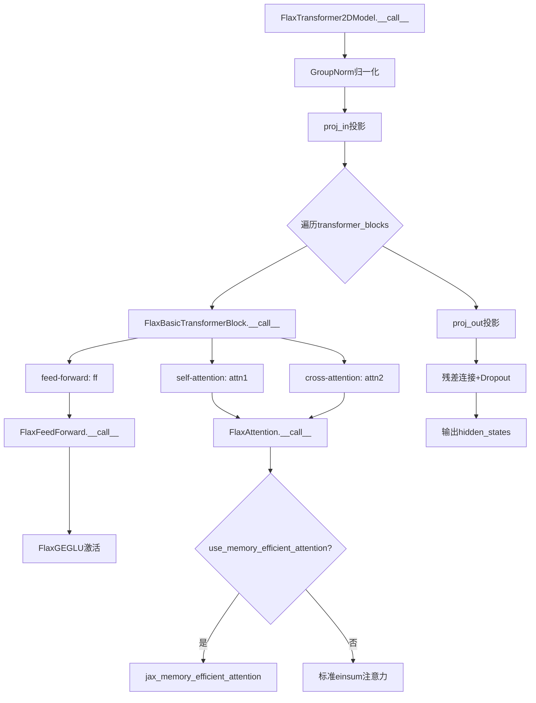
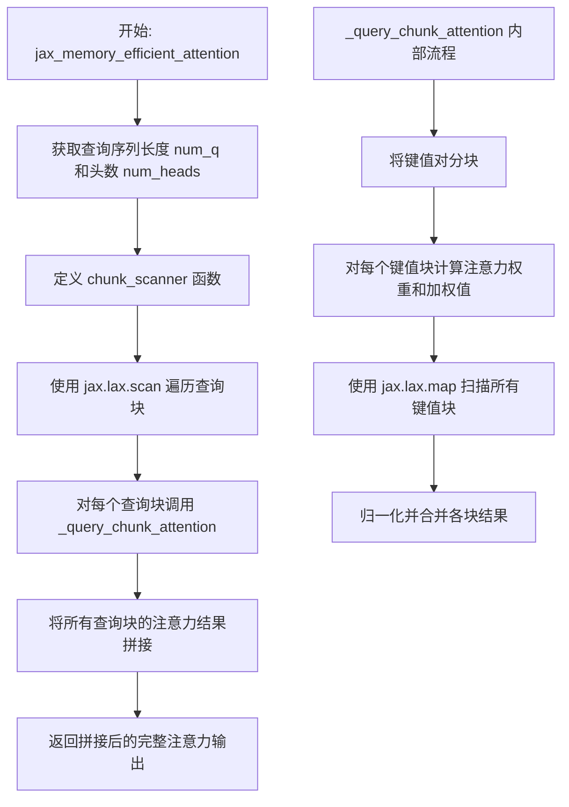
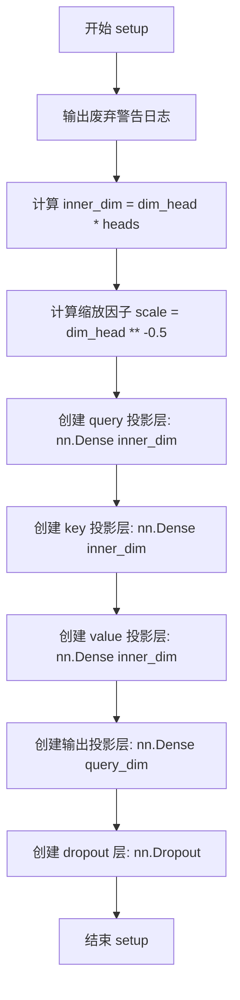
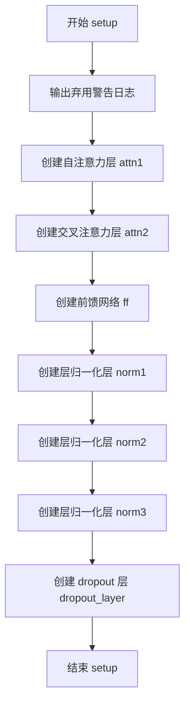
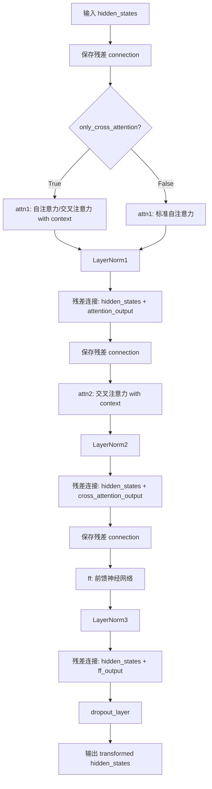
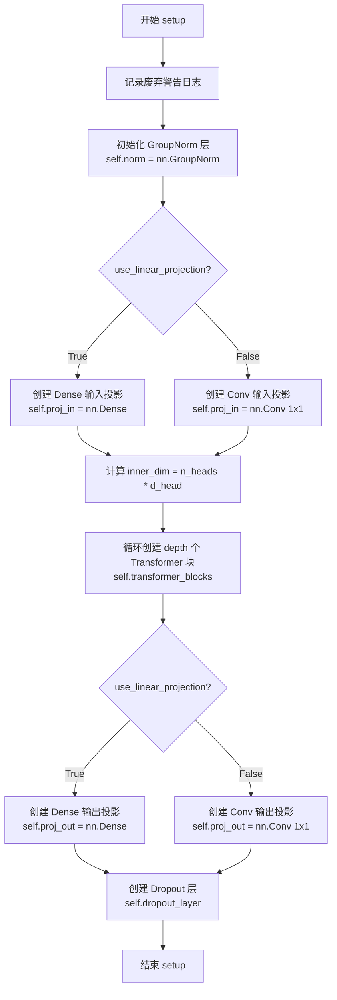
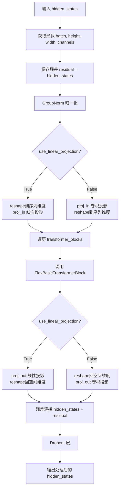
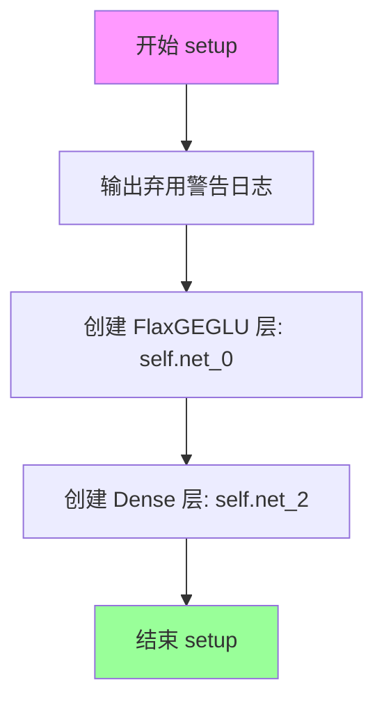
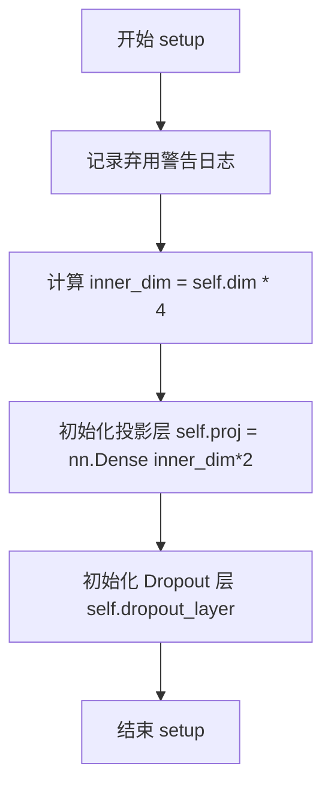
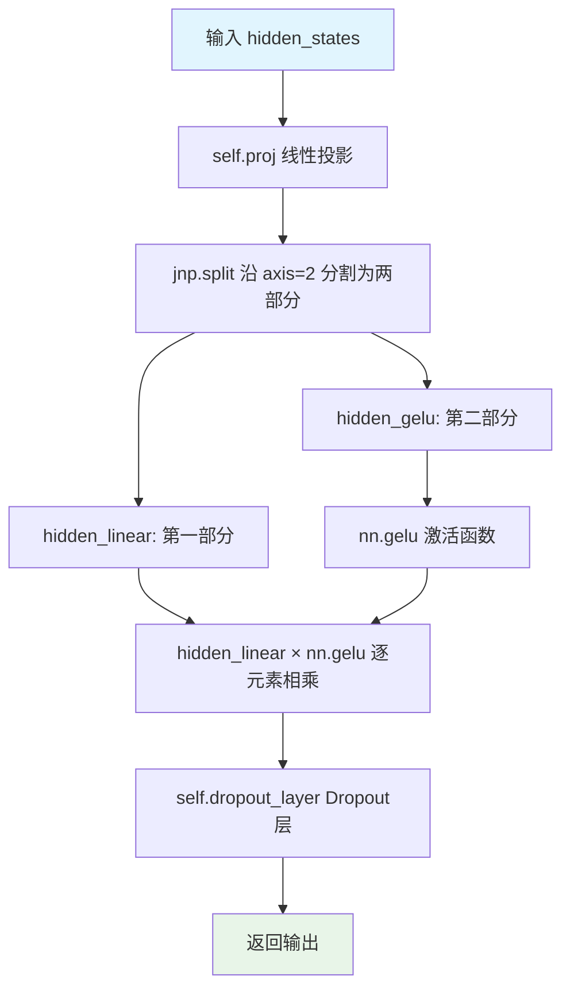

# `diffusers\src\diffusers\models\attention_flax.py` 详细设计文档

这是一个基于Flax的多头注意力机制和Transformer模块实现，提供了内存高效的注意力计算（通过分块查询注意力），包含FlaxAttention、FlaxBasicTransformerBlock、FlaxTransformer2DModel等核心类，用于Diffusers库中的空间Transformer层。

## 整体流程



## 类结构

```
nn.Module (Flax基类)
├── FlaxAttention (多头注意力)
├── FlaxBasicTransformerBlock (Transformer块)
│   ├── FlaxAttention (attn1 - self attention)
│   ├── FlaxAttention (attn2 - cross attention)
│   └── FlaxFeedForward (前馈网络)
│       └── FlaxGEGLU (GLU激活)
├── FlaxTransformer2DModel (2D Transformer)
│   └── FlaxBasicTransformerBlock[] (多个transformer块)
├── FlaxFeedForward (前馈网络)
│   └── FlaxGEGLU
└── FlaxGEGLU (门控线性单元)
```

## 全局变量及字段


### `logger`
    
模块级别的日志记录器，用于输出警告和信息

类型：`logging.Logger`
    


### `FlaxAttention.query_dim`
    
输入隐藏状态的维度

类型：`int`
    


### `FlaxAttention.heads`
    
注意力头数量，默认值为8

类型：`int`
    


### `FlaxAttention.dim_head`
    
每个头的隐藏状态维度，默认值为64

类型：`int`
    


### `FlaxAttention.dropout`
    
Dropout比率，默认值为0.0

类型：`float`
    


### `FlaxAttention.use_memory_efficient_attention`
    
是否使用内存高效注意力，默认值为False

类型：`bool`
    


### `FlaxAttention.split_head_dim`
    
是否分割头维度，默认值为False

类型：`bool`
    


### `FlaxAttention.dtype`
    
参数数据类型，默认值为jnp.float32

类型：`jnp.dtype`
    


### `FlaxAttention.scale`
    
缩放因子 (dim_head**-0.5)

类型：`float`
    


### `FlaxAttention.query`
    
Q投影层

类型：`nn.Dense`
    


### `FlaxAttention.key`
    
K投影层

类型：`nn.Dense`
    


### `FlaxAttention.value`
    
V投影层

类型：`nn.Dense`
    


### `FlaxAttention.proj_attn`
    
输出投影层

类型：`nn.Dense`
    


### `FlaxAttention.dropout_layer`
    
Dropout层

类型：`nn.Dropout`
    


### `FlaxBasicTransformerBlock.dim`
    
隐藏状态维度

类型：`int`
    


### `FlaxBasicTransformerBlock.n_heads`
    
注意力头数量

类型：`int`
    


### `FlaxBasicTransformerBlock.d_head`
    
每个头的维度

类型：`int`
    


### `FlaxBasicTransformerBlock.only_cross_attention`
    
是否仅使用cross attention，默认值为False

类型：`bool`
    


### `FlaxBasicTransformerBlock.use_memory_efficient_attention`
    
是否使用内存高效注意力，默认值为False

类型：`bool`
    


### `FlaxBasicTransformerBlock.split_head_dim`
    
是否分割头维度，默认值为False

类型：`bool`
    


### `FlaxBasicTransformerBlock.attn1`
    
自注意力层

类型：`FlaxAttention`
    


### `FlaxBasicTransformerBlock.attn2`
    
交叉注意力层

类型：`FlaxAttention`
    


### `FlaxBasicTransformerBlock.ff`
    
前馈网络

类型：`FlaxFeedForward`
    


### `FlaxBasicTransformerBlock.norm1`
    
层归一化

类型：`nn.LayerNorm`
    


### `FlaxBasicTransformerBlock.norm2`
    
层归一化

类型：`nn.LayerNorm`
    


### `FlaxBasicTransformerBlock.norm3`
    
层归一化

类型：`nn.LayerNorm`
    


### `FlaxBasicTransformerBlock.dropout_layer`
    
Dropout层

类型：`nn.Dropout`
    


### `FlaxTransformer2DModel.in_channels`
    
输入通道数

类型：`int`
    


### `FlaxTransformer2DModel.n_heads`
    
注意力头数量

类型：`int`
    


### `FlaxTransformer2DModel.d_head`
    
每个头的维度

类型：`int`
    


### `FlaxTransformer2DModel.depth`
    
Transformer块数量，默认值为1

类型：`int`
    


### `FlaxTransformer2DModel.use_linear_projection`
    
是否使用线性投影，默认值为False

类型：`bool`
    


### `FlaxTransformer2DModel.only_cross_attention`
    
是否仅使用cross attention，默认值为False

类型：`bool`
    


### `FlaxTransformer2DModel.use_memory_efficient_attention`
    
是否使用内存高效注意力，默认值为False

类型：`bool`
    


### `FlaxTransformer2DModel.split_head_dim`
    
是否分割头维度，默认值为False

类型：`bool`
    


### `FlaxTransformer2DModel.norm`
    
组归一化层

类型：`nn.GroupNorm`
    


### `FlaxTransformer2DModel.proj_in`
    
输入投影层

类型：`nn.Dense或nn.Conv`
    


### `FlaxTransformer2DModel.proj_out`
    
输出投影层

类型：`nn.Dense或nn.Conv`
    


### `FlaxTransformer2DModel.transformer_blocks`
    
Transformer块列表

类型：`list[FlaxBasicTransformerBlock]`
    


### `FlaxTransformer2DModel.dropout_layer`
    
Dropout层

类型：`nn.Dropout`
    


### `FlaxFeedForward.dim`
    
隐藏状态维度

类型：`int`
    


### `FlaxFeedForward.net_0`
    
第一个GLU层

类型：`FlaxGEGLU`
    


### `FlaxFeedForward.net_2`
    
输出投影层

类型：`nn.Dense`
    


### `FlaxGEGLU.dim`
    
输入隐藏状态维度

类型：`int`
    


### `FlaxGEGLU.proj`
    
投影层 (输出维度为dim*8)

类型：`nn.Dense`
    


### `FlaxGEGLU.dropout_layer`
    
Dropout层

类型：`nn.Dropout`
    
    

## 全局函数及方法


### `_query_chunk_attention`

该函数实现了分块多头点积注意力机制，通过将 key/value 序列划分为多个块来降低内存占用。使用 `jax.checkpoint` 进行内存优化，采用数值稳定的 softmax 归一化策略（通过减去每块最大分数避免数值溢出），最终通过加权求和返回注意力输出。

参数：

- `query`：`jnp.ndarray`，查询张量，形状为 (..., query_length, num_heads, k_features)
- `key`：`jnp.ndarray`，键张量，形状为 (..., key_value_length, num_heads, k_features)
- `value`：`jnp.ndarray`，值张量，形状为 (..., key_value_length, num_heads, v_features)
- `precision`：`jax.lax.Precision`，计算精度配置，默认为 `jax.lax.Precision.HIGHEST`
- `key_chunk_size`：`int`，键/值分块大小，默认为 4096

返回值：`jnp.ndarray`，注意力输出，形状为 (..., query_length, num_heads, v_features)

#### 流程图

```mermaid
flowchart TD
    A[开始: 接收 query, key, value, precision, key_chunk_size] --> B[提取 key/value 维度信息]
    B --> C[归一化 query 除以 sqrt{k_features}]
    D[定义 summarize_chunk 函数] --> E[计算注意力权重: einsum q×k]
    E --> F[求最大分数并阻止梯度传播]
    F --> G[数值稳定 softmax: exp weights - max]
    G --> H[计算加权值: einsum v×exp_weights]
    H --> I[返回 exp_values, exp_weights_sum, max_score]
    
    J[定义 chunk_scanner 函数] --> K[动态切分 key 块]
    K --> L[动态切分 value 块]
    L --> M[调用 summarize_chunk 处理块]
    
    N[使用 jax.lax.map 遍历所有 key/value 块] --> O[获取 chunk_values, chunk_weights, chunk_max]
    O --> P[计算全局最大分数]
    P --> Q[计算 max_diffs = expchunk_max - global_max]
    Q --> R[用 max_diffs 调整 chunk_values 和 chunk_weights]
    R --> S[求和得到 all_values 和 all_weights]
    S --> T[返回 all_values / all_weights 归一化结果]
    
    C --> D
    I --> J
    M --> N
```

#### 带注释源码

```python
def _query_chunk_attention(query, key, value, precision, key_chunk_size: int = 4096):
    """
    多头点积注意力实现，采用分块策略降低内存占用。
    
    参数:
        query: 查询张量，形状 (..., query_length, num_heads, k_features)
        key: 键张量，形状 (..., key_value_length, num_heads, k_features)
        value: 值张量，形状 (..., key_value_length, num_heads, v_features)
        precision: JAX 数值精度配置
        key_chunk_size: key/value 分块大小，默认 4096
    
    返回:
        注意力输出，形状 (..., query_length, num_heads, v_features)
    """
    # 提取 key/value 的维度信息
    # num_kv: key/value 序列长度, num_heads: 注意力头数, k_features: 特征维度
    num_kv, num_heads, k_features = key.shape[-3:]
    v_features = value.shape[-1]
    
    # 确保分块大小不超过实际序列长度
    key_chunk_size = min(key_chunk_size, num_kv)
    
    # 缩放 query 以防止点积结果过大
    query = query / jnp.sqrt(k_features)

    # 使用 jax.checkpoint (gradient checkpointing) 减少内存占用
    # prevent_cse=False 允许公共子表达式消除以优化计算
    @functools.partial(jax.checkpoint, prevent_cse=False)
    def summarize_chunk(query, key, value):
        """
        处理单个分块的注意力计算。
        使用数值稳定的 softmax 实现（减去最大值避免指数溢出）。
        """
        # 计算注意力权重: query × key^T
        # 形状: (..., query_length, num_heads, key_value_length)
        attn_weights = jnp.einsum("...qhd,...khd->...qhk", query, key, precision=precision)

        # 沿 key 维度求最大值，用于数值稳定 softmax
        max_score = jnp.max(attn_weights, axis=-1, keepdims=True)
        # 阻止梯度流经 max_score，避免影响训练
        max_score = jax.lax.stop_gradient(max_score)
        
        # 数值稳定 softmax: exp(attn - max)
        exp_weights = jnp.exp(attn_weights - max_score)

        # 计算加权值: value × exp_weights
        # 形状: (..., query_length, num_heads, v_features)
        exp_values = jnp.einsum("...vhf,...qhv->...qhf", value, exp_weights, precision=precision)
        
        # 移除 keepdims 维度用于后续处理
        max_score = jnp.einsum("...qhk->...qh", max_score)

        # 返回: 加权值、权重和、最大分数
        return (exp_values, exp_weights.sum(axis=-1), max_score)

    def chunk_scanner(chunk_idx):
        """
        扫描函数：每次迭代处理一个 key/value 块。
        使用 jax.lax.dynamic_slice 进行零拷贝切片。
        """
        # 动态切片 key 的第 chunk_idx 块
        # 形状: (..., key_chunk_size, num_heads, k_features)
        key_chunk = jax.lax.dynamic_slice(
            operand=key,
            start_indices=[0] * (key.ndim - 3) + [chunk_idx, 0, 0],  # [...,k,h,d]
            slice_sizes=list(key.shape[:-3]) + [key_chunk_size, num_heads, k_features],  # [...,k,h,d]
        )

        # 动态切片 value 的第 chunk_idx 块
        # 形状: (..., key_chunk_size, num_heads, v_features)
        value_chunk = jax.lax.dynamic_slice(
            operand=value,
            start_indices=[0] * (value.ndim - 3) + [chunk_idx, 0, 0],  # [...,v,h,d]
            slice_sizes=list(value.shape[:-3]) + [key_chunk_size, num_heads, v_features],  # [...,v,h,d]
        )

        # 对当前块计算注意力
        return summarize_chunk(query, key_chunk, value_chunk)

    # 使用 jax.lax.map 并行遍历所有分块
    # 生成所有块的: 加权值、权重和、最大分数
    chunk_values, chunk_weights, chunk_max = jax.lax.map(
        f=chunk_scanner, 
        xs=jnp.arange(0, num_kv, key_chunk_size)
    )

    # 计算跨所有分块的全局最大分数
    global_max = jnp.max(chunk_max, axis=0, keepdims=True)
    
    # 计算每个分块的调整因子（用于跨分块归一化）
    max_diffs = jnp.exp(chunk_max - global_max)

    # 应用调整因子到加权值和权重
    chunk_values *= jnp.expand_dims(max_diffs, axis=-1)
    chunk_weights *= max_diffs

    # 沿分块维度求和
    all_values = chunk_values.sum(axis=0)
    all_weights = jnp.expand_dims(chunk_weights, -1).sum(axis=0)

    # 最终归一化：加权值 / 权重和
    return all_values / all_weights
```


### `jax_memory_efficient_attention`

内存高效的多头注意力实现，通过将查询序列分块处理来减少峰值显存占用。每个查询块会与完整的键值对进行注意力计算，最后将结果拼接还原。

参数：

- `query`：`jnp.ndarray`，形状为 (batch..., query_length, head, query_key_depth_per_head)，查询张量
- `key`：`jnp.ndarray`，形状为 (batch..., key_value_length, head, query_key_depth_per_head)，键张量
- `value`：`jnp.ndarray`，形状为 (batch..., key_value_length, head, value_depth_per_head)，值张量
- `precision`：`jax.lax.Precision`，可选，默认 `jax.lax.Precision.HIGHEST`，计算精度配置
- `query_chunk_size`：`int`，可选，默认 1024，查询序列的分块大小
- `key_chunk_size`：`int`，可选，默认 4096，键值对序列的分块大小

返回值：`jnp.ndarray`，形状为 (batch..., query_length, head, value_depth_per_head)，注意力输出

#### 流程图



#### 带注释源码

```python
def jax_memory_efficient_attention(
    query, key, value, precision=jax.lax.Precision.HIGHEST, query_chunk_size: int = 1024, key_chunk_size: int = 4096
):
    r"""
    Flax Memory-efficient multi-head dot product attention. https://huggingface.co/papers/2112.05682v2
    https://github.com/AminRezaei0x443/memory-efficient-attention

    Args:
        query (`jnp.ndarray`): (batch..., query_length, head, query_key_depth_per_head)
        key (`jnp.ndarray`): (batch..., key_value_length, head, query_key_depth_per_head)
        value (`jnp.ndarray`): (batch..., key_value_length, head, value_depth_per_head)
        precision (`jax.lax.Precision`, *optional*, defaults to `jax.lax.Precision.HIGHEST`):
            numerical precision for computation
        query_chunk_size (`int`, *optional*, defaults to 1024):
            chunk size to divide query array value must divide query_length equally without remainder
        key_chunk_size (`int`, *optional*, defaults to 4096):
            chunk size to divide key and value array value must divide key_value_length equally without remainder

    Returns:
        (`jnp.ndarray`) with shape of (batch..., query_length, head, value_depth_per_head)
    """
    # 获取查询序列的维度信息：查询长度、头数、特征维度
    num_q, num_heads, q_features = query.shape[-3:]

    def chunk_scanner(chunk_idx, _):
        """
        分块扫描函数，用于遍历查询序列的各个块
        
        参数:
            chunk_idx: 当前处理的查询块起始位置
            _: scan 的累积状态（此处未使用）
            
        返回:
            tuple: (下一个块的起始位置, 当前块的注意力输出)
        """
        # 使用动态切片从查询张量中提取当前块
        # query.ndim - 3 是为了处理任意数量的 batch 维度
        query_chunk = jax.lax.dynamic_slice(
            operand=query,
            start_indices=([0] * (query.ndim - 3)) + [chunk_idx, 0, 0],  # [...,q,h,d]
            # 切片大小：保留 batch 维度，查询维度取块大小或剩余长度
            slice_sizes=list(query.shape[:-3]) + [min(query_chunk_size, num_q), num_heads, q_features],  # [...,q,h,d]
        )

        # 调用底层注意力函数计算当前查询块的输出
        # 传入完整的 key 和 value，但使用较小的 key_chunk_size 进行分块计算
        return (
            chunk_idx + query_chunk_size,  # 递增索引（scan 会忽略此返回值）
            _query_chunk_attention(
                query=query_chunk, key=key, value=value, precision=precision, key_chunk_size=key_chunk_size
            ),
        )

    # 使用 jax.lax.scan 进行高效的循环迭代
    # scan 相比 map 的优势：支持有状态的累积计算，且在 JIT 编译时更高效
    _, res = jax.lax.scan(
        f=chunk_scanner,
        init=0,              # 初始索引
        xs=None,             # 无需额外输入（索引通过累加器传递）
        length=math.ceil(num_q / query_chunk_size),  # 计算需要处理的块数量
    )

    # 将所有查询块的注意力结果沿查询维度拼接还原
    return jnp.concatenate(res, axis=-3)  # fuse the chunked result back
```


### `FlaxAttention.setup`

该方法为 Flax 注意力层（FlaxAttention）的初始化方法，负责初始化查询（query）、键（key）、值（value）的投影矩阵、输出投影矩阵以及 dropout 层。在 Flax 框架中，`setup()` 方法在模型第一次被调用时自动执行，用于声明和初始化模块的内部状态。

参数：无（该方法不接受额外参数，依赖于类属性 `query_dim`、`heads`、`dim_head`、`dropout`、`dtype`）

返回值：`None`（该方法为初始化方法，不返回任何值，仅初始化实例属性）

#### 流程图



#### 带注释源码

```python
def setup(self):
    """初始化注意力层子模块，在模型第一次调用时执行"""
    # 输出废弃警告，提醒用户 Flax 类将在 Diffusers v1.0.0 中移除
    logger.warning(
        "Flax classes are deprecated and will be removed in Diffusers v1.0.0. We "
        "recommend migrating to PyTorch classes or pinning your version of Diffusers."
    )

    # 计算注意力头的总内部维度：头数 × 每个头的维度
    inner_dim = self.dim_head * self.heads
    # 计算缩放因子，用于注意力分数的缩放（等于 1/sqrt(dim_head)）
    self.scale = self.dim_head**-0.5

    # 创建查询（query）投影层：将输入投影到 query 空间
    # 权重导出时使用旧名称 'to_q' 以保持兼容性
    self.query = nn.Dense(inner_dim, use_bias=False, dtype=self.dtype, name="to_q")
    # 创建键（key）投影层：将上下文投影到 key 空间
    self.key = nn.Dense(inner_dim, use_bias=False, dtype=self.dtype, name="to_k")
    # 创建值（value）投影层：将上下文投影到 value 空间
    self.value = nn.Dense(inner_dim, use_bias=False, dtype=self.dtype, name="to_v")

    # 创建注意力输出投影层：将注意力输出投影回原始查询维度
    self.proj_attn = nn.Dense(self.query_dim, dtype=self.dtype, name="to_out_0")
    # 创建 dropout 层，用于注意力输出的正则化
    self.dropout_layer = nn.Dropout(rate=self.dropout)
```


### `FlaxAttention.reshape_heads_to_batch_dim`

该方法用于将输入张量的头（head）维度重塑并合并到批量（batch）维度，以便进行高效的多头注意力计算。具体来说，它将形状为 `(batch_size, seq_len, dim)` 的张量转换为 `(batch_size * head_size, seq_len, dim // head_size)` 的形式，使得每个head可以独立处理。

参数：

- `tensor`：`jnp.ndarray`，输入张量，形状为 `(batch_size, seq_len, dim)`，其中 dim 必须是 `heads` 的整数倍

返回值：`jnp.ndarray`，重塑后的张量，形状为 `(batch_size * head_size, seq_len, dim // head_size)`，头维度已被合并到批量维度中

#### 流程图

```mermaid
flowchart TD
    A[输入 tensor: (batch_size, seq_len, dim)] --> B[获取 batch_size, seq_len, dim]
    B --> C[获取 head_size = self.heads]
    C --> D[Reshape: (batch_size, seq_len, head_size, dim // head_size)]
    D --> E[Transpose: (batch_size, head_size, seq_len, dim // head_size)]
    E --> F[Reshape: (batch_size * head_size, seq_len, dim // head_size)]
    F --> G[输出 tensor]
```

#### 带注释源码

```python
def reshape_heads_to_batch_dim(self, tensor):
    """
    将头维度重塑到batch维度，以便进行多头注意力计算
    
    参数:
        tensor: 输入张量，形状为 (batch_size, seq_len, dim)
    
    返回:
        重塑后的张量，形状为 (batch_size * head_size, seq_len, dim // head_size)
    """
    # 步骤1: 获取输入张量的维度信息
    batch_size, seq_len, dim = tensor.shape
    
    # 步骤2: 获取注意力头数量
    head_size = self.heads
    
    # 步骤3: 第一次reshape - 将dim拆分为head_size和dim // head_size
    # 从 (batch_size, seq_len, dim) -> (batch_size, seq_len, head_size, dim // head_size)
    tensor = tensor.reshape(batch_size, seq_len, head_size, dim // head_size)
    
    # 步骤4: 转置 - 将head维度移到batch维度之前
    # 从 (batch_size, seq_len, head_size, dim // head_size) -> (batch_size, head_size, seq_len, dim // head_size)
    tensor = jnp.transpose(tensor, (0, 2, 1, 3))
    
    # 步骤5: 第二次reshape - 将batch和head合并
    # 从 (batch_size, head_size, seq_len, dim // head_size) -> (batch_size * head_size, seq_len, dim // head_size)
    tensor = tensor.reshape(batch_size * head_size, seq_len, dim // head_size)
    
    return tensor
```


### `FlaxAttention.reshape_batch_dim_to_heads`

将批量维度重塑为注意力头维度，是 `reshape_heads_to_batch_dim` 的逆操作，用于将多头注意力计算结果从合并的批量形式恢复为原始的批量形式。

参数：

- `tensor`：`jnp.ndarray`，输入张量，形状为 (batch_size * head_size, seq_len, dim)，其中 batch_size 是原始批量大小，head_size 是注意力头数量，seq_len 是序列长度，dim 是每个头的特征维度

返回值：`jnp.ndarray`，重塑后的张量，形状为 (batch_size, seq_len, dim * head_size)，将多头维度重新合并到特征维度中

#### 流程图

```mermaid
flowchart TD
    A[输入 tensor] --> B[获取形状: batch_size, seq_len, dim]
    B --> C[计算 head_size = self.heads]
    C --> D[reshape: (batch_size, seq_len, dim) → (batch_size // head_size, head_size, seq_len, dim)]
    D --> E[transpose: (0, 2, 1, 3) → (batch_size // head_size, seq_len, head_size, dim)]
    E --> F[reshape: (batch_size // head_size, seq_len, head_size, dim) → (batch_size // head_size, seq_len, dim * head_size)]
    F --> G[输出 tensor]
```

#### 带注释源码

```python
def reshape_batch_dim_to_heads(self, tensor):
    """
    将批量维度重塑为注意力头维度
    
    这是 reshape_heads_to_batch_dim 的逆操作，将多头注意力的输出
    从 (batch_size * head_size, seq_len, dim) 格式恢复为 
    (batch_size, seq_len, dim * head_size) 格式
    
    参数:
        tensor: 输入张量，形状为 (batch_size * head_size, seq_len, dim)
               其中 batch_size = 原始批量大小，head_size = 注意力头数量
    
    返回:
        重塑后的张量，形状为 (batch_size, seq_len, dim * head_size)
    """
    # 获取输入张量的形状信息
    # batch_size 是合并后的总批量大小 (原始batch_size * head_size)
    batch_size, seq_len, dim = tensor.shape
    
    # 获取注意力头数量
    head_size = self.heads
    
    # 第一步重塑：将 (batch_size, seq_len, dim) 转换为 
    # (batch_size // head_size, head_size, seq_len, dim)
    # 这里 batch_size // head_size 就是原始的 batch_size
    tensor = tensor.reshape(batch_size // head_size, head_size, seq_len, dim)
    
    # 第二步转置：将维度从 (batch, head, seq, dim) 转换为 (batch, seq, head, dim)
    # 交换 head 和 seq 维度，使序列维度恢复到第二个位置
    tensor = jnp.transpose(tensor, (0, 2, 1, 3))
    
    # 第三步重塑：将 (batch_size // head_size, seq_len, head_size, dim) 转换为
    # (batch_size // head_size, seq_len, dim * head_size)
    # 将 head 维度合并回特征维度
    tensor = tensor.reshape(batch_size // head_size, seq_len, dim * head_size)
    
    return tensor
```


### `FlaxAttention.__call__`

该方法是Flax多头注意力模块的核心调用接口，负责执行自注意力或交叉注意力计算。它首先将输入的隐藏状态投影为查询（Q）、键（K）和值（V）向量，然后根据配置选择标准注意力机制或内存高效注意力机制进行计算，最后将结果投影回原始维度并应用Dropout。

参数：

- `hidden_states`：`jnp.ndarray`，输入的隐藏状态张量，形状为(batch, seq_len, query_dim)
- `context`：`jnp.ndarray`，可选的上下文向量，用于交叉注意力计算。如果为None，则使用hidden_states作为context
- `deterministic`：`bool`，控制是否使用确定性模式。True时dropout无效，False时启用dropout

返回值：`jnp.ndarray`，经过注意力计算和dropout后的隐藏状态张量，形状与hidden_states相同

#### 流程图

```mermaid
flowchart TD
    A[开始 __call__] --> B{context是否为None}
    B -->|是| C[context = hidden_states]
    B -->|否| D[保持context不变]
    C --> E[Query投影: self.query(hidden_states)]
    D --> E
    E --> F[Key投影: self.key(context)]
    E --> G[Value投影: self.value(context)]
    F --> H{是否split_head_dim}
    G --> H
    H -->|是| I[reshape重塑Q/K/V为batch, seq, heads, dim_head]
    H -->|否| J[调用reshape_heads_to_batch_dim]
    I --> K{是否使用内存高效注意力}
    J --> K
    K -->|是| L[转置Q/K/V维度顺序]
    L --> M[根据flatten_latent_dim计算query_chunk_size]
    M --> N[调用jax_memory_efficient_attention]
    N --> O[转置结果并reshape回heads维度]
    O --> P[投影输出: self.proj_attn]
    K -->|否| Q{是否split_head_dim}
    Q -->|是| R[计算attention_scores einsum b t n h, b f n h -> b n f t]
    Q -->|否| S[计算attention_scores einsum b i d, b j d -> b i j]
    R --> T[缩放: attention_scores * scale]
    S --> T
    T --> U[Softmax: attention_probs = nn.softmax]
    U --> V{是否split_head_dim}
    V -->|是| W[计算hidden_states einsum b n f t, b t n h -> b f n h]
    V -->|否| X[计算hidden_states einsum b i j, b j d -> b i d]
    W --> Y[Reshape: reshape为batch, seq, heads*dim_head]
    X --> Z[调用reshape_batch_dim_to_heads]
    Y --> P
    Z --> P
    P --> AA[Dropout: self.dropout_layer]
    AA --> BB[返回最终hidden_states]
```

#### 带注释源码

```python
def __call__(self, hidden_states, context=None, deterministic=True):
    """
    执行多头注意力计算
    
    参数:
        hidden_states: 输入隐藏状态 (batch, seq_len, query_dim)
        context: 可选的上下文向量，用于交叉注意力 (batch, context_len, query_dim)
        deterministic: True使用训练模式（dropout有效），False使用推理模式
    
    返回:
        经过注意力计算和dropout的隐藏状态
    """
    # 如果没有提供context，则使用hidden_states作为自注意力
    context = hidden_states if context is None else context

    # ========== 步骤1: 线性投影 ========
    # 将输入投影到query、key、value空间
    # query来自hidden_states，key和value来自context（支持交叉注意力）
    query_proj = self.query(hidden_states)   # (batch, seq_len, inner_dim)
    key_proj = self.key(context)              # (batch, context_len, inner_dim)
    value_proj = self.value(context)          # (batch, context_len, inner_dim)

    # ========== 步骤2: 维度重塑 ========
    # 根据split_head_dim决定是否分割head维度
    if self.split_head_dim:
        # 分割为 (batch, seq, heads, dim_head) 格式
        b = hidden_states.shape[0]
        query_states = jnp.reshape(query_proj, (b, -1, self.heads, self.dim_head))
        key_states = jnp.reshape(key_proj, (b, -1, self.heads, self.dim_head))
        value_states = jnp.reshape(value_proj, (b, -1, self.heads, self.dim_head))
    else:
        # 转换为 (batch*heads, seq, dim_head) 格式以进行批量注意力计算
        query_states = self.reshape_heads_to_batch_dim(query_proj)
        key_states = self.reshape_heads_to_batch_dim(key_proj)
        value_states = self.reshape_batch_dim_to_heads(value_proj)

    # ========== 步骤3: 选择注意力计算方式 ========
    if self.use_memory_efficient_attention:
        # 内存高效注意力：使用分块计算减少显存占用
        # 维度从 (batch, heads, seq, dim) 转置为 (heads, batch, seq, dim)
        query_states = query_states.transpose(1, 0, 2)
        key_states = key_states.transpose(1, 0, 2)
        value_states = value_states.transpose(1, 0, 2)

        # 根据latent维度动态计算query_chunk_size
        # 策略：优先尝试64/16/4等除数，使计算更高效
        flatten_latent_dim = query_states.shape[-3]
        if flatten_latent_dim % 64 == 0:
            query_chunk_size = int(flatten_latent_dim / 64)
        elif flatten_latent_dim % 16 == 0:
            query_chunk_size = int(flatten_latent_dim / 16)
        elif flatten_latent_dim % 4 == 0:
            query_chunk_size = int(flatten_latent_dim / 4)
        else:
            query_chunk_size = int(flatten_latent_dim)

        # 调用内存高效注意力实现
        hidden_states = jax_memory_efficient_attention(
            query_states, key_states, value_states, 
            query_chunk_size=query_chunk_size, 
            key_chunk_size=4096 * 4
        )
        # 转置并恢复维度
        hidden_states = hidden_states.transpose(1, 0, 2)
        hidden_states = self.reshape_batch_dim_to_heads(hidden_states)
    else:
        # 标准注意力计算
        # 计算query和key之间的注意力分数
        if self.split_head_dim:
            # 多头格式的注意力计算
            attention_scores = jnp.einsum("b t n h, b f n h -> b n f t", key_states, query_states)
        else:
            # 标准格式的注意力计算
            attention_scores = jnp.einsum("b i d, b j d->b i j", query_states, key_states)

        # 缩放注意力分数 (防止点积结果过大)
        attention_scores = attention_scores * self.scale
        
        # 计算注意力概率分布
        attention_probs = nn.softmax(
            attention_scores, 
            axis=-1 if self.split_head_dim else 2
        )

        # 使用注意力概率加权value向量
        if self.split_head_dim:
            hidden_states = jnp.einsum("b n f t, b t n h -> b f n h", attention_probs, value_states)
            b = hidden_states.shape[0]
            hidden_states = jnp.reshape(hidden_states, (b, -1, self.heads * self.dim_head))
        else:
            hidden_states = jnp.einsum("b i j, b j d -> b i d", attention_probs, value_states)
            hidden_states = self.reshape_batch_dim_to_heads(hidden_states)

    # ========== 步骤4: 输出投影和Dropout ========
    hidden_states = self.proj_attn(hidden_states)
    return self.dropout_layer(hidden_states, deterministic=deterministic)
```


### `FlaxBasicTransformerBlock.setup()`

该方法是 FlaxBasicTransformerBlock 类的初始化方法，负责创建和配置自注意力层、交叉注意力层、前馈神经网络（FeedForward）以及三个层归一化层（LayerNorm）和一个 dropout 层，构成完整的 Transformer 块结构。

参数：
- 该方法无显式参数（使用类的成员变量：dim, n_heads, d_head, dropout, only_cross_attention, dtype, use_memory_efficient_attention, split_head_dim）

返回值：`None`（该方法仅初始化类成员，不返回值）

#### 流程图



#### 带注释源码

```python
def setup(self):
    """
    初始化 FlaxBasicTransformerBlock 的各个层组件。
    包括注意力机制、前馈网络、归一化层和 Dropout 层。
    """
    # 输出弃用警告，建议迁移到 PyTorch 或固定 Diffusers 版本
    logger.warning(
        "Flax classes are deprecated and will be removed in Diffusers v1.0.0. We "
        "recommend migrating to PyTorch classes or pinning your version of Diffusers."
    )

    # ==================== 注意力层初始化 ====================
    # 自注意力层（或仅交叉注意力，取决于 only_cross_attention 标志）
    self.attn1 = FlaxAttention(
        self.dim,                          # 隐藏层维度
        self.n_heads,                      # 注意力头数量
        self.d_head,                       # 每个头的维度
        self.dropout,                      # Dropout 概率
        self.use_memory_efficient_attention,  # 是否使用内存高效注意力
        self.split_head_dim,               # 是否分割头维度
        dtype=self.dtype,                  # 数据类型
    )
    
    # 交叉注意力层（用于接收上下文信息）
    self.attn2 = FlaxAttention(
        self.dim,
        self.n_heads,
        self.d_head,
        self.dropout,
        self.use_memory_efficient_attention,
        self.split_head_dim,
        dtype=self.dtype,
    )

    # ==================== 前馈网络初始化 ====================
    # 使用 Gated Linear Unit (GLU) 激活函数的前馈网络
    self.ff = FlaxFeedForward(
        dim=self.dim, 
        dropout=self.dropout, 
        dtype=self.dtype
    )

    # ==================== 归一化层初始化 ====================
    # 第一个归一化层（用于自注意力之前）
    self.norm1 = nn.LayerNorm(epsilon=1e-5, dtype=self.dtype)
    
    # 第二个归一化层（用于交叉注意力之前）
    self.norm2 = nn.LayerNorm(epsilon=1e-5, dtype=self.dtype)
    
    # 第三个归一化层（用于前馈网络之前）
    self.norm3 = nn.LayerNorm(epsilon=1e-5, dtype=self.dtype)

    # ==================== Dropout 层初始化 ====================
    # 用于最终输出的 Dropout
    self.dropout_layer = nn.Dropout(rate=self.dropout)
```


### `FlaxBasicTransformerBlock.__call__`

执行完整的Transformer块计算，包括自注意力机制、交叉注意力机制和前馈神经网络，并结合层归一化和残差连接进行输出。

参数：

- `hidden_states`：`jnp.ndarray`，输入的隐藏状态张量，形状为(batch, seq_len, dim)
- `context`：`jnp.ndarray`，用于交叉注意力的上下文张量，若为None则使用hidden_states
- `deterministic`：`bool`，是否使用确定性模式（若为True则跳过dropout）

返回值：`jnp.ndarray`，经过完整Transformer块计算后的隐藏状态张量，形状与输入相同

#### 流程图



#### 带注释源码

```python
def __call__(self, hidden_states, context, deterministic=True):
    """
    执行完整的Transformer块计算
    
    参数:
        hidden_states: 输入隐藏状态
        context: 交叉注意力上下文
        deterministic: 是否使用确定性模式(控制dropout)
    """
    
    # ===== 第一部分: 自注意力 (Self-Attention) =====
    # 保存残差连接用于后续相加
    residual = hidden_states
    
    # 根据only_cross_attention标志决定使用哪种注意力机制
    if self.only_cross_attention:
        # 如果仅使用交叉注意力，将context作为Q的输入进行交叉注意力计算
        # 先对hidden_states进行LayerNorm，然后传入attn1和context
        hidden_states = self.attn1(self.norm1(hidden_states), context, deterministic=deterministic)
    else:
        # 标准自注意力: Q、K、V都来自hidden_states
        # 只传入hidden_states（不使用context）
        hidden_states = self.attn1(self.norm1(hidden_states), deterministic=deterministic)
    
    # 残差连接: Attention输出 + 输入
    hidden_states = hidden_states + residual

    # ===== 第二部分: 交叉注意力 (Cross-Attention) =====
    # 保存残差连接
    residual = hidden_states
    
    # 交叉注意力: Q来自hidden_states, K和V来自context
    # 先LayerNorm，然后使用attn2模块进行交叉注意力计算
    hidden_states = self.attn2(self.norm2(hidden_states), context, deterministic=deterministic)
    
    # 残差连接
    hidden_states = hidden_states + residual

    # ===== 第三部分: 前馈神经网络 (Feed-Forward) =====
    # 保存残差连接
    residual = hidden_states
    
    # 通过前馈网络模块处理
    # 先LayerNorm，然后通过ff模块（包含GEGLU激活函数的两层全连接网络）
    hidden_states = self.ff(self.norm3(hidden_states), deterministic=deterministic)
    
    # 残差连接
    hidden_states = hidden_states + residual

    # ===== 第四部分: Dropout输出 =====
    # 最终应用dropout层并返回结果
    # deterministic=True时dropout不生效
    return self.dropout_layer(hidden_states, deterministic=deterministic)
```


### `FlaxTransformer2DModel.setup()`

该方法负责初始化FlaxTransformer2DModel模型的所有层，包括GroupNorm层、输入投影层（根据use_linear_projection选择Dense或Conv）、多个Transformer块、输出投影层以及Dropout层。这是Flax模型的setup生命周期方法，在模型第一次调用时执行。

参数：

- 该方法无显式参数（为Flax模型的setup方法，隐式接收self）

返回值：`None`，该方法为初始化方法，不返回任何值，仅设置实例属性

#### 流程图



#### 带注释源码

```python
def setup(self):
    """
    初始化FlaxTransformer2DModel模型的所有层组件。
    在Flax框架中，setup方法用于定义模型的子层，
    这些子层会在首次调用模型时延迟初始化。
    """
    # 记录一条废弃警告日志，提醒用户Flax类将在Diffusers v1.0.0中移除
    logger.warning(
        "Flax classes are deprecated and will be removed in Diffusers v1.0.0. We "
        "recommend migrating to PyTorch classes or pinning your version of Diffusers."
    )

    # 1. 初始化GroupNorm归一化层
    # 使用32个groups的Group Normalization，epsilon为1e-5
    self.norm = nn.GroupNorm(num_groups=32, epsilon=1e-5)

    # 2. 计算内部维度：头的数量 × 每个头的维度
    inner_dim = self.n_heads * self.d_head

    # 3. 根据use_linear_projection标志选择输入投影层类型
    if self.use_linear_projection:
        # 使用线性投影（Dense层）
        self.proj_in = nn.Dense(inner_dim, dtype=self.dtype)
    else:
        # 使用卷积投影（1x1卷积，等价于线性投影但保持空间结构）
        self.proj_in = nn.Conv(
            inner_dim,
            kernel_size=(1, 1),
            strides=(1, 1),
            padding="VALID",
            dtype=self.dtype,
        )

    # 4. 创建多个Transformer块（深度为depth）
    # 每个块包含：两个注意力层（self-attn和cross-attn）、一个前馈网络、三个LayerNorm
    self.transformer_blocks = [
        FlaxBasicTransformerBlock(
            inner_dim,              # 输入/输出维度
            self.n_heads,           # 注意力头数
            self.d_head,            # 每个头的维度
            dropout=self.dropout,  # Dropout率
            only_cross_attention=self.only_cross_attention,
            dtype=self.dtype,
            use_memory_efficient_attention=self.use_memory_efficient_attention,
            split_head_dim=self.split_head_dim,
        )
        for _ in range(self.depth)  # 根据depth参数循环创建
    ]

    # 5. 根据use_linear_projection标志选择输出投影层类型
    if self.use_linear_projection:
        self.proj_out = nn.Dense(inner_dim, dtype=self.dtype)
    else:
        self.proj_out = nn.Conv(
            inner_dim,
            kernel_size=(1, 1),
            strides=(1, 1),
            padding="VALID",
            dtype=self.dtype,
        )

    # 6. 创建Dropout层，用于训练时的正则化
    self.dropout_layer = nn.Dropout(rate=self.dropout)
```


### `FlaxTransformer2DModel.__call__`

执行完整的2D Transformer计算，将输入的隐藏状态通过归一化、投影、多个Transformer块处理、输出投影和残差连接，最终返回经过处理的隐藏状态。

参数：

- `hidden_states`：`jnp.ndarray`，形状为 (batch, height, width, channels)，输入的隐藏状态张量
- `context`：`jnp.ndarray`，用于cross attention的上下文/条件输入
- `deterministic`：`bool`，控制dropout是否生效，True表示训练模式，False表示推理模式

返回值：`jnp.ndarray`，形状为 (batch, height, width, channels)，经过2D Transformer处理后的输出隐藏状态

#### 流程图



#### 带注释源码

```python
def __call__(self, hidden_states, context, deterministic=True):
    """
    执行完整的2D Transformer计算流程。
    
    参数:
        hidden_states: 输入张量，形状 (batch, height, width, channels)
        context: 用于cross attention的上下文张量
        deterministic: 控制dropout行为，True为训练模式
    
    返回:
        处理后的张量，形状 (batch, height, width, channels)
    """
    # 1. 获取输入张量的维度信息
    batch, height, width, channels = hidden_states.shape
    
    # 2. 保存输入作为残差连接（ResNet风格的跳跃连接）
    residual = hidden_states
    
    # 3. GroupNorm 归一化（32个group）
    hidden_states = self.norm(hidden_states)
    
    # 4. 输入投影：根据use_linear_projection选择不同的投影方式
    if self.use_linear_projection:
        # 线性投影：将空间维度展平为序列维度
        hidden_states = hidden_states.reshape(batch, height * width, channels)
        hidden_states = self.proj_in(hidden_states)
    else:
        # 卷积投影：1x1卷积进行投影
        hidden_states = self.proj_in(hidden_states)
        hidden_states = hidden_states.reshape(batch, height * width, channels)
    
    # 5. 遍历多个Transformer块进行特征变换
    for transformer_block in self.transformer_blocks:
        hidden_states = transformer_block(hidden_states, context, deterministic=deterministic)
    
    # 6. 输出投影：根据use_linear_projection选择不同的投影方式
    if self.use_linear_projection:
        hidden_states = self.proj_out(hidden_states)
        hidden_states = hidden_states.reshape(batch, height, width, channels)
    else:
        hidden_states = hidden_states.reshape(batch, height, width, channels)
        hidden_states = self.proj_out(hidden_states)
    
    # 7. 残差连接（跳跃连接）
    hidden_states = hidden_states + residual
    
    # 8. Dropout层，返回最终结果
    return self.dropout_layer(hidden_states, deterministic=deterministic)
```

---

### 完整类文档：FlaxTransformer2DModel

#### 一段话描述

FlaxTransformer2DModel 是一个基于 Flax Linen 的2D空间Transformer模块，继承自 `nn.Module`，用于处理2D图像特征的Transformer计算，支持可配置的深度、注意力机制和投影方式。

#### 文件的整体运行流程

```
输入 (batch, height, width, channels)
    │
    ▼
┌─────────────────────────────────────────────┐
│  1. GroupNorm 归一化                         │
│  2. 输入投影 (Conv 或 Linear)                │
│  3. 维度重排 (H*W, channels) → (seq, dim)    │
└─────────────────────────────────────────────┘
    │
    ▼
┌─────────────────────────────────────────────┐
│  4. 多个 Transformer 块 (depth 个)          │
│     - Self-Attention / Cross-Attention     │
│     - Feed Forward (GEGLU)                  │
└─────────────────────────────────────────────┘
    │
    ▼
┌─────────────────────────────────────────────┐
│  5. 输出投影 (Conv 或 Linear)                │
│  6. 维度重排 (seq, dim) → (H*W, channels)    │
│  7. 残差连接                                 │
│  8. Dropout                                 │
└─────────────────────────────────────────────┘
    │
    ▼
输出 (batch, height, width, channels)
```

#### 类的详细信息

##### 类字段

| 字段名称 | 类型 | 描述 |
|---------|------|------|
| `in_channels` | `int` | 输入通道数 |
| `n_heads` | `int` | 注意力头数 |
| `d_head` | `int` | 每个头的隐藏维度 |
| `depth` | `int` | Transformer块的数量，默认为1 |
| `dropout` | `float` | Dropout概率，默认为0.0 |
| `use_linear_projection` | `bool` | 是否使用线性投影，默认为False |
| `only_cross_attention` | `bool` | 是否仅使用cross attention，默认为False |
| `dtype` | `jnp.dtype` | 参数数据类型，默认为jnp.float32 |
| `use_memory_efficient_attention` | `bool` | 是否使用内存高效注意力机制 |
| `split_head_dim` | `bool` | 是否分割头维度用于计算 |

##### 类方法

| 方法名称 | 描述 |
|---------|------|
| `setup()` | 初始化模块的子层，包括norm、投影层、transformer_blocks和dropout |
| `__call__(hidden_states, context, deterministic)` | 执行完整的2D Transformer前向传播 |

##### 全局变量/函数

| 名称 | 类型 | 描述 |
|------|------|------|
| `logger` | `logging.Logger` | 模块级日志记录器 |
| `_query_chunk_attention` | `function` | 多查询块注意力计算函数 |
| `jax_memory_efficient_attention` | `function` | 内存高效的多头注意力实现 |

#### 关键组件信息

| 组件名称 | 一句话描述 |
|---------|-----------|
| `FlaxAttention` | 多头注意力模块，支持标准注意力和内存高效注意力 |
| `FlaxBasicTransformerBlock` | 基础Transformer块，包含self-attention、cross-attention和FFN |
| `FlaxFeedForward` | 前馈网络模块，包含GEGLU激活函数 |
| `FlaxGEGLU` | Gated Linear Unit激活函数实现 |
| `self.norm` | GroupNorm归一化层（32个group） |
| `self.proj_in` | 输入投影层（Conv或Dense） |
| `self.proj_out` | 输出投影层（Conv或Dense） |
| `self.transformer_blocks` | Transformer块列表 |

#### 潜在的技术债务或优化空间

1. **弃用警告**: 代码中包含 `logger.warning` 提示Flax类将在Diffusers v1.0.0中移除，建议迁移到PyTorch实现
2. **硬编码值**: GroupNorm的num_groups=32是硬编码的，可以考虑作为可配置参数
3. **维度重排**: 多处使用reshape进行维度变换，可能影响性能，可考虑使用更高效的维度操作
4. **内存占用**: 默认不使用内存高效注意力，在处理高分辨率图像时可能存在内存瓶颈

#### 其它项目

**设计目标与约束:**
- 兼容Stable Diffusion 2.x和Stable Diffusion XL
- 支持内存高效注意力机制以处理大分辨率图像
- 支持split_head_dim优化选项

**错误处理与异常设计:**
- 使用Flax Linen的自动微分框架
- 通过deterministic参数控制dropout和checkpoint行为
- 依赖JAX的错误处理机制

**数据流与状态机:**
- 输入: (batch, height, width, channels) → 序列: (batch, height*width, channels) → 输出: (batch, height, width, channels)
- 状态通过残差连接在层间传递

**外部依赖与接口契约:**
- 依赖 `flax.linen` 神经网络库
- 依赖 `jax` 和 `jax.numpy`
- 与Diffusers库的日志模块集成


### FlaxFeedForward.setup()

该方法是 FlaxFeedForward 类的初始化方法，用于在构造函数中设置前馈网络（Feed Forward Network）的内部子层，包括一个 FlaxGEGLU 层和一个 Dense 层。这是 Flax 框架中模块的标准初始化模式。

参数：

- `self`：隐式参数，FlaxFeedForward 实例本身
- （无显式参数，继承自 nn.Module 的 setup 方法）

返回值：`None`，该方法不返回值，仅在对象内部初始化层和属性

#### 流程图



#### 带注释源码

```python
def setup(self):
    """
    初始化前馈网络层的子组件。
    
    该方法在 Flax 框架中作为构造函数的一部分被自动调用，
    用于创建和管理子模块。在 Flax 中，setup() 方法是定义
    和初始化层（子模块）的推荐方式，这些层会在前向传播中使用。
    """
    
    # 发出弃用警告：Flax 类将在 Diffusers v1.0.0 中被移除
    # 建议迁移到 PyTorch 类或固定 Diffusers 版本
    logger.warning(
        "Flax classes are deprecated and will be removed in Diffusers v1.0.0. We "
        "recommend migrating to PyTorch classes or pinning your version of Diffusers."
    )
    
    # 第一个子层：FlaxGEGLU（门控线性单元）
    # 包含两个线性变换和一个 GELU 激活函数
    # net_0 这个名称是为了匹配 Sequential 层的索引
    self.net_0 = FlaxGEGLU(self.dim, self.dropout, self.dtype)
    
    # 第二个子层：Dense 层
    # 将隐藏状态维度映射回原始维度（dim -> dim）
    # 命名为 net_2 是为了与 Sequential 层的索引保持一致
    self.net_2 = nn.Dense(self.dim, dtype=self.dtype)
    
    # 注意：setup() 方法不返回值，仅初始化实例属性
    # 这些属性（net_0 和 net_2）会在 __call__ 方法中被使用
```


### `FlaxFeedForward.__call__`

执行前馈网络计算，对输入的隐藏状态依次通过GEGLU激活层和输出投影层，输出变换后的隐藏状态。

参数：

- `hidden_states`：`jnp.ndarray`，输入的隐藏状态张量，通常为(batch_size, seq_len, dim)形状
- `deterministic`：`bool`，控制是否使用确定性计算（deterministic=True时dropout不生效），默认为True

返回值：`jnp.ndarray`，经过前馈网络处理后的隐藏状态张量，形状与输入相同(batch_size, seq_len, dim)

#### 流程图

```mermaid
flowchart TD
    A[输入 hidden_states] --> B[net_0: FlaxGEGLU]
    B --> C[net_2: nn.Dense 投影]
    C --> D[输出 hidden_states]
    
    subgraph FlaxGEGLU内部
        B1[proj: Dense 扩展维度] --> B2[split 切分两半]
        B2 --> B3[linear * GELU(gelu)]
        B3 --> B4[dropout 层]
    end
```

#### 带注释源码

```python
def __call__(self, hidden_states, deterministic=True):
    """
    执行前馈网络计算
    
    参数:
        hidden_states: 输入的隐藏状态张量
        deterministic: 是否使用确定性计算（控制dropout）
    
    返回:
        经过前馈网络变换后的隐藏状态
    """
    # 第一步：通过GEGLU激活层处理
    # FlaxGEGLU内部包含：
    #   1. proj: Dense(dim * 8) 将维度扩展4倍再乘2
    #   2. split: 沿特征维度切分为两部分
    #   3. linear * GELU(gelu): 一部分做线性变换，另一部分过GELU激活后相乘
    #   4. dropout: 根据deterministic决定是否应用dropout
    hidden_states = self.net_0(hidden_states, deterministic=deterministic)
    
    # 第二步：通过输出投影层将维度投影回原始dim
    # 使用Dense层将扩展后的维度映射回原始维度
    hidden_states = self.net_2(hidden_states)
    
    # 返回处理后的隐藏状态
    return hidden_states
```


### `FlaxGEGLU.setup()`

该方法是 FlaxGEGLU 类的初始化方法，在模块构建阶段被调用。它负责初始化投影层（将输入维度扩展到 inner_dim*2，其中 inner_dim = dim * 4，以实现门控线性单元的两路分支）和 Dropout 层，用于后续的前向传播计算。

参数：无显式参数（self 为隐式参数）

返回值：无返回值（None），该方法仅初始化类属性

#### 流程图



#### 带注释源码

```python
def setup(self):
    """初始化投影层和 Dropout 层，用于 Gated Linear Unit 前向传播。"""
    # 记录弃用警告，建议迁移到 PyTorch 或固定 Diffusers 版本
    logger.warning(
        "Flax classes are deprecated and will be removed in Diffusers v1.0.0. We "
        "recommend migrating to PyTorch classes or pinning your version of Diffusers."
    )

    # 计算内部隐藏层维度：输入维度的 4 倍
    inner_dim = self.dim * 4

    # 初始化投影层 Dense，输出维度为 inner_dim * 2
    # 乘以 2 是为了将输出分成两部分：一部分用于线性变换，另一部分用于门控激活
    self.proj = nn.Dense(inner_dim * 2, dtype=self.dtype)

    # 初始化 Dropout 层，使用类属性中定义的 dropout 概率
    self.dropout_layer = nn.Dropout(rate=self.dropout)
```


### FlaxGEGLU.__call__

执行 Gated Linear Unit (GLU) 激活函数计算，将输入隐藏状态通过线性投影后分割为两部分，一部分进行 GELU 激活，另一部分保持线性，两者相乘后经过 Dropout 输出。

参数：

- `hidden_states`：`jnp.ndarray`，输入的隐藏状态张量，形状为 (batch, seq_len, dim)
- `deterministic`：`bool`，控制是否使用确定性模式（True 时跳过 Dropout），默认为 True

返回值：`jnp.ndarray`，经过 GLU 激活函数处理后的隐藏状态，形状与输入相同

#### 流程图



#### 带注释源码

```python
def __call__(self, hidden_states, deterministic=True):
    """
    执行 GLU 激活函数计算
    
    参数:
        hidden_states: 输入的隐藏状态张量
        deterministic: 是否使用确定性模式（跳过 Dropout）
    
    返回:
        经过 GLU 激活函数处理后的张量
    """
    # Step 1: 通过线性层投影，将维度扩展为 dim * 8（inner_dim * 2）
    hidden_states = self.proj(hidden_states)
    
    # Step 2: 沿特征维度（axis=2）将投影结果等分为两部分
    # 第一部分将作为线性门控，第二部分将经过 GELU 激活
    hidden_linear, hidden_gelu = jnp.split(hidden_states, 2, axis=2)
    
    # Step 3: 对第二部分应用 GELU 激活函数
    # Step 4: 将第一部分与激活后的第二部分逐元素相乘（门控机制）
    # Step 5: 应用 Dropout 层，根据 deterministic 参数决定是否丢弃
    return self.dropout_layer(hidden_linear * nn.gelu(hidden_gelu), deterministic=deterministic)
```

## 关键组件


### 张量索引与分块处理

使用 `jax.lax.dynamic_slice` 对 query、key、value 张量进行分块索引，实现内存高效的注意力计算。通过 `chunk_scanner` 和 `jax.lax.map` 遍历所有 key/value 块，通过 `jax.lax.scan` 遍历所有 query 块。

### 惰性加载与梯度检查点

使用 `functools.partial(jax.checkpoint, prevent_cse=False)` 装饰 `summarize_chunk` 函数，实现梯度计算时的惰性加载，通过防止公共子表达式消除来节省显存。

### 内存高效注意力实现

`_query_chunk_attention` 函数实现了基于块的多头点积注意力，通过分块计算避免一次性加载完整注意力矩阵。`jax_memory_efficient_attention` 函数进一步将 query 分块，对每个 query 块调用 `_query_chunk_attention`，最终通过 `jnp.concatenate` 合并结果。

### 量化策略

代码中定义了 `precision` 参数（默认为 `jax.lax.Precision.HIGHEST`），用于控制 `jnp.einsum` 的计算精度，支持在精度和性能之间进行权衡。

### FlaxAttention 类

Flax 多头注意力模块，支持两种注意力计算路径：当 `use_memory_efficient_attention=True` 时使用内存高效注意力，否则使用标准 einsum 注意力计算。`split_head_dim` 参数控制是否分割头维度以优化特定模型（如 Stable Diffusion）。

### FlaxBasicTransformerBlock 类

包含自注意力（attn1）、交叉注意力（attn2）和前馈网络（ff）的完整 Transformer 块，采用残差连接和层归一化。`only_cross_attention` 参数控制是否仅使用交叉注意力。

### FlaxTransformer2DModel 类

2D 空间 Transformer 模型，用于处理图像等 2D 输入。包含 GroupNorm、投影层、多个 Transformer 块和输出投影。支持 `use_linear_projection` 选项。

### FlaxFeedForward 类

封装两层线性变换的前馈网络，中间层维度为 `dim * 4`。

### FlaxGEGLU 类

Gated Linear Unit 激活函数的 Flax 实现，将输入线性投影到 `dim * 4 * 2` 维度，然后 split 成两部分，一部分进行 GELU 激活，另一部分作为门控信号相乘。


## 问题及建议


### 已知问题

-   **废弃的 Flax 实现**：代码中所有 Flax 类都包含 `logger.warning("Flax classes are deprecated and will be removed in Diffusers v1.0.0...")`，表明这些类已被废弃，应迁移到 PyTorch 实现，长期维护风险高
-   **硬编码的魔数**：多处使用硬编码值如 `key_chunk_size=4096`、`query_chunk_size=1024`、`key_chunk_size=4096 * 4`、`num_groups=32`、`epsilon=1e-5`，缺乏可配置性
-   **内存效率注意力的 chunk 计算逻辑冗余**：在 `FlaxAttention.__call__` 中使用多层 if-else 判断 `flatten_latent_dim` 能被 64/16/4 整除来计算 `query_chunk_size`，逻辑可简化为直接使用最大公约数或更优雅的方式
-   **重复的警告日志代码**：每个 Flax 类的 `setup()` 方法都重复相同的 `logger.warning` 语句，违反 DRY 原则
-   **输入验证缺失**：没有对 `hidden_states`、`query`、`key`、`value` 的形状和类型进行验证，可能导致运行时难以调试的错误
-   **未使用的导入**：`import math` 在代码中仅用于 `math.ceil()`，可简化为直接使用
- **类型注解不完整**：部分函数参数和返回值缺少类型注解，如 `_query_chunk_attention` 函数的参数
- **维度重塑方法重复**：`reshape_heads_to_batch_dim` 和 `reshape_batch_dim_to_heads` 在多个类中功能相似，可考虑提取为共享工具函数
- **可变默认参数风险**：`jax_memory_efficient_attention` 中 `precision` 使用可变默认参数 `jax.lax.Precision.HIGHEST`（虽为不可变对象，但作为默认参数不是最佳实践）

### 优化建议

-   **移除废弃代码或提供明确迁移路径**：如果项目已迁移到 PyTorch，应彻底移除 Flax 代码；如果仍需保留，应提供版本兼容说明
-   **提取配置参数**：将硬编码值提取为类属性或配置文件，允许用户通过构造函数自定义
-   **重构 chunk 计算逻辑**：使用更简洁的数学方法计算 chunk_size，如 `divisor = 64 if x % 64 == 0 else (16 if x % 16 == 0 else (4 if x % 4 == 0 else 1))`
-   **提取警告日志逻辑**：创建基类或装饰器来统一处理废弃警告
-   **添加输入验证**：在 `__call__` 方法入口添加形状和类型检查，提供清晰的错误信息
-   **完善类型注解**：为所有函数参数和返回值添加完整的类型注解
-   **提取共享工具函数**：将 `reshape_heads_to_batch_dim` 和 `reshape_batch_dim_to_heads` 提取为模块级工具函数或基类方法

## 其它


### 设计目标与约束

本模块旨在为Diffusers提供基于Flax/JAX的多头注意力机制实现，支持标准注意力计算和内存高效注意力（Flash Attention）两种模式。设计约束包括：1）依赖JAX生态系统（Flax、jax.numpy）；2）支持批量处理多维输入；3）兼容Stable Diffusion 2.x和Stable Diffusion XL的特定优化需求；4）遵循Flax的nn.Module架构规范。

### 错误处理与异常设计

本代码采用JAX/Flax的函数式编程范式，主要通过形状不匹配和数值错误进行错误传播。输入验证包括：query_chunk_size必须能整除query_length、key_chunk_size必须能整除key_value_length。数值精度通过precision参数控制，默认使用jax.lax.Precision.HIGHEST。代码中未显式抛出自定义异常，错误处理依赖JAX运行时。

### 数据流与状态机

数据流遵循以下路径：输入hidden_states → GroupNorm归一化 → 投影变换（Conv或Dense）→ 展平为序列 → 多次Transformer块处理（自注意力+交叉注意力+前馈） → 逆投影 → 残差连接 → Dropout输出。FlaxBasicTransformerBlock内部状态机：norm1 → attn1 → add → norm2 → attn2 → add → norm3 → ff → add → dropout。

### 外部依赖与接口契约

核心依赖：flax.linen（>=0.6.0）、jax（>=0.3.0）、jax.numpy、functools、math。接口契约：FlaxAttention接受(query_dim, heads, dim_head, dropout, use_memory_efficient_attention, split_head_dim, dtype)参数，__call__方法接受(hidden_states, context, deterministic)返回注意力加权后的hidden_states。FlaxTransformer2DModel的__call__方法接受4D输入(batch, height, width, channels)并输出相同形状的4D张量。

### 性能考虑与基准

内存高效注意力通过分块计算（chunking）策略减少峰值显存占用，将O(N²)的注意力矩阵分块处理。动态chunk_size根据latent_dim自动调整（除以64/16/4或保持原值）。jax.checkpoint用于减少反向传播时的显存重计算。建议在A100 GPU上使用query_chunk_size=1024, key_chunk_size=4096作为基准配置。

### 安全考虑

本模块为纯计算模块，不涉及网络通信、文件I/O或敏感数据处理。代码中logger.warning提示Flax类将在Diffusers v1.0.0中移除，建议迁移至PyTorch实现。

### 版本兼容性

代码指定Apache License 2.0。依赖版本约束需参考Diffusers主项目。Flax类已标记为deprecated，需关注Diffusers v1.0.0的迁移计划。JAX版本兼容性需注意jax.lax.Precision在不同版本中的行为差异。

### 配置参数说明

关键配置参数：query_dim（查询维度）、heads（注意力头数）、dim_head（每头维度）、dropout（Dropout比率）、use_memory_efficient_attention（启用内存高效注意力）、split_head_dim（分离头维度用于SD2.x/XL优化）、dtype（数值类型，默认jnp.float32）、query_chunk_size（查询分块大小，默认1024）、key_chunk_size（键值分块大小，默认4096）、precision（JAX计算精度，默认HIGHEST）。

### 使用示例与最佳实践

```python
# 基本用法
attention = FlaxAttention(query_dim=768, heads=12, dim_head=64)
# 启用内存高效注意力
attention = FlaxAttention(query_dim=768, heads=12, dim_head=64, use_memory_efficient_attention=True)
# 用于Transformer块
transformer = FlaxBasicTransformerBlock(dim=768, n_heads=12, d_head=64)
# 用于2D Transformer
transformer_2d = FlaxTransformer2DModel(in_channels=512, n_heads=8, d_head=64, depth=1)
```

最佳实践：1）在生产环境优先使用use_memory_efficient_attention=True；2）确保输入形状符合要求；3）使用deterministic参数控制Dropout行为；4）注意split_head_dim与模型版本的兼容性。


    