# `diffusers\src\diffusers\models\attention_processor.py` 详细设计文档

这是一个注意力机制（Attention）实现模块，来自HuggingFace的diffusers库。该模块实现了核心的Attention类以及多种注意力处理器（Attention Processor），支持多种注意力计算后端，包括PyTorch原生SDPA、Flash Attention、xFormers内存高效注意力、NPU加速等，同时支持多种特殊的注意力变体，如IP-Adapter、Custom Diffusion、PAG（Perturbed Attention Guidance）等。

## 整体流程

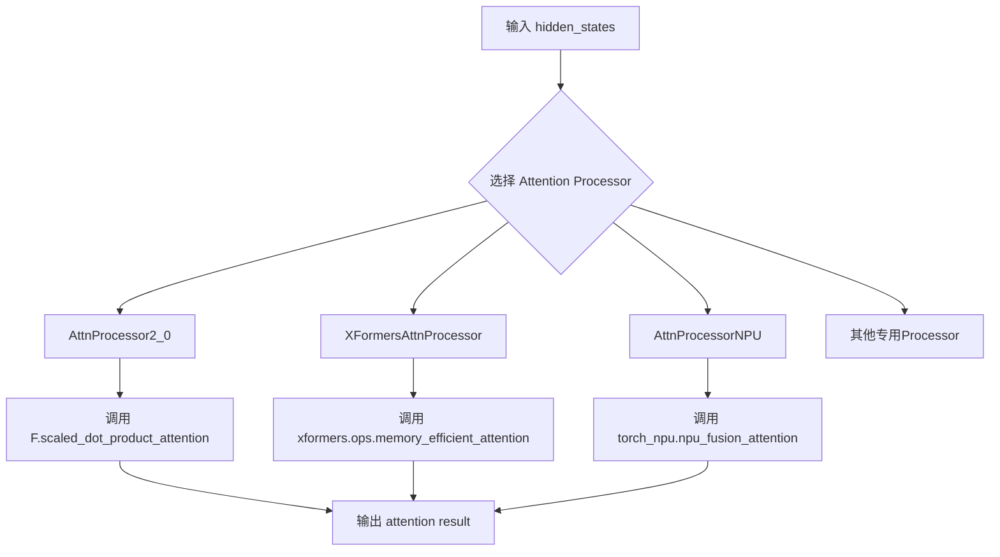

## 类结构

```
Attention (核心注意力层基类)
├── SanaMultiscaleAttentionProjection
├── SanaMultiscaleLinearAttention
├── MochiAttention
└── SpatialNorm
AttnProcessor (处理器基类)
├── AttnProcessor (标准处理器)
├── AttnProcessor2_0 (PyTorch 2.0 SDPA)
├── XFormersAttnProcessor
├── XFormersAttnAddedKVProcessor
├── AttnProcessorNPU (NPU加速)
├── XLAFlashAttnProcessor2_0
├── CustomDiffusionAttnProcessor
├── CustomDiffusionXFormersAttnProcessor
├── CustomDiffusionAttnProcessor2_0
├── AttnAddedKVProcessor
├── AttnAddedKVProcessor2_0
├── SlicedAttnProcessor
├── SlicedAttnAddedKVProcessor
├── JointAttnProcessor2_0
├── FusedJointAttnProcessor2_0
├── PAGJointAttnProcessor2_0
├── PAGCFGJointAttnProcessor2_0
├── XFormersJointAttnProcessor
├── AllegroAttnProcessor2_0
├── AuraFlowAttnProcessor2_0
├── FusedAuraFlowAttnProcessor2_0
├── CogVideoXAttnProcessor2_0
├── FusedCogVideoXAttnProcessor2_0
├── StableAudioAttnProcessor2_0
├── HunyuanAttnProcessor2_0
├── FusedHunyuanAttnProcessor2_0
├── PAGHunyuanAttnProcessor2_0
├── PAGCFGHunyuanAttnProcessor2_0
├── LuminaAttnProcessor2_0
├── FusedAttnProcessor2_0
├── IPAdapterAttnProcessor
├── IPAdapterAttnProcessor2_0
├── IPAdapterXFormersAttnProcessor
├── SD3IPAdapterJointAttnProcessor2_0
├── PAGIdentitySelfAttnProcessor2_0
├── PAGCFGIdentitySelfAttnProcessor2_0
├── SanaMultiscaleAttnProcessor2_0
├── SanaLinearAttnProcessor2_0
├── PAGCFGSanaLinearAttnProcessor2_0
├── PAGIdentitySanaLinearAttnProcessor2_0
├── MochiAttnProcessor2_0
├── MochiVaeAttnProcessor2_0
└── Flux系列Deprecated处理器
```

## 全局变量及字段


### `logger`
    
模块级日志记录器，用于输出信息和警告

类型：`logging.Logger`
    


### `xformers`
    
xformers库模块，如果可用则为xformers模块，否则为None

类型：`Module or None`
    


### `XLA_AVAILABLE`
    
标志位，表示torch_xla是否可用

类型：`bool`
    


### `Attention.inner_dim`
    
内部维度，等于out_dim或dim_head * heads，用于Q投影的输出维度

类型：`int`
    


### `Attention.inner_kv_dim`
    
内部KV维度，用于K和V投影的输出维度，支持MQA/GQA

类型：`int`
    


### `Attention.query_dim`
    
查询输入的通道数

类型：`int`
    


### `Attention.use_bias`
    
是否在Q/K/V线性层中使用偏置

类型：`bool`
    


### `Attention.is_cross_attention`
    
标志位，表示是否为交叉注意力模式

类型：`bool`
    


### `Attention.cross_attention_dim`
    
交叉注意力中encoder_hidden_states的通道数

类型：`int`
    


### `Attention.upcast_attention`
    
是否将注意力计算上转到float32类型

类型：`bool`
    


### `Attention.upcast_softmax`
    
是否将softmax计算上转到float32类型

类型：`bool`
    


### `Attention.rescale_output_factor`
    
输出缩放因子，用于除法rescale输出

类型：`float`
    


### `Attention.residual_connection`
    
是否使用残差连接

类型：`bool`
    


### `Attention.dropout`
    
注意力输出Dropout的概率

类型：`float`
    


### `Attention.fused_projections`
    
标志位，表示Q/K/V投影是否已融合

类型：`bool`
    


### `Attention.out_dim`
    
输出维度，如果未指定则默认为query_dim

类型：`int`
    


### `Attention.out_context_dim`
    
上下文输出维度，用于encoder_hidden_states的输出

类型：`int`
    


### `Attention.context_pre_only`
    
是否仅对context进行预处理

类型：`bool or None`
    


### `Attention.pre_only`
    
是否仅进行预处理阶段

类型：`bool`
    


### `Attention.is_causal`
    
是否使用因果注意力掩码

类型：`bool`
    


### `Attention._from_deprecated_attn_block`
    
标志位，表示是否从已废弃的attention block加载

类型：`bool`
    


### `Attention.scale_qk`
    
是否对Q和K进行缩放

类型：`bool`
    


### `Attention.scale`
    
注意力缩放因子，等于dim_head的-0.5次方

类型：`float`
    


### `Attention.heads`
    
多头注意力的头数

类型：`int`
    


### `Attention.sliceable_head_dim`
    
可用于分片的head维度

类型：`int`
    


### `Attention.added_kv_proj_dim`
    
额外的key/value投影维度，用于AddedKVProcessor

类型：`int or None`
    


### `Attention.only_cross_attention`
    
是否仅使用交叉注意力

类型：`bool`
    


### `Attention.group_norm`
    
分组归一化层，用于归一化hidden_states

类型：`nn.GroupNorm or None`
    


### `Attention.spatial_norm`
    
空间条件归一化层

类型：`SpatialNorm or None`
    


### `Attention.norm_q`
    
Query的归一化层

类型：`nn.Module or None`
    


### `Attention.norm_k`
    
Key的归一化层

类型：`nn.Module or None`
    


### `Attention.norm_cross`
    
encoder_hidden_states的归一化层

类型：`nn.Module or None`
    


### `Attention.to_q`
    
Query的线性投影层

类型：`nn.Linear`
    


### `Attention.to_k`
    
Key的线性投影层

类型：`nn.Linear or None`
    


### `Attention.to_v`
    
Value的线性投影层

类型：`nn.Linear or None`
    


### `Attention.added_proj_bias`
    
额外投影层是否使用偏置

类型：`bool or None`
    


### `Attention.add_q_proj`
    
额外的Query投影层

类型：`nn.Linear or None`
    


### `Attention.add_k_proj`
    
额外的Key投影层

类型：`nn.Linear or None`
    


### `Attention.add_v_proj`
    
额外的Value投影层

类型：`nn.Linear or None`
    


### `Attention.to_out`
    
输出投影层列表，包含线性层和Dropout

类型：`nn.ModuleList or None`
    


### `Attention.to_add_out`
    
encoder_hidden_states的输出投影层

类型：`nn.Linear or None`
    


### `Attention.norm_added_q`
    
额外Q投影的归一化层

类型：`nn.Module or None`
    


### `Attention.norm_added_k`
    
额外K投影的归一化层

类型：`nn.Module or None`
    


### `Attention.processor`
    
注意力处理器实例，负责实际注意力计算

类型：`AttentionProcessor`
    


### `SanaMultiscaleAttentionProjection.proj_in`
    
输入投影卷积层，使用深度可分离卷积

类型：`nn.Conv2d`
    


### `SanaMultiscaleAttentionProjection.proj_out`
    
输出投影卷积层

类型：`nn.Conv2d`
    


### `SanaMultiscaleLinearAttention.eps`
    
用于数值稳定的epsilon值

类型：`float`
    


### `SanaMultiscaleLinearAttention.attention_head_dim`
    
注意力头的维度

类型：`int`
    


### `SanaMultiscaleLinearAttention.norm_type`
    
归一化类型

类型：`str`
    


### `SanaMultiscaleLinearAttention.residual_connection`
    
是否使用残差连接

类型：`bool`
    


### `SanaMultiscaleLinearAttention.to_q`
    
Query线性投影

类型：`nn.Linear`
    


### `SanaMultiscaleLinearAttention.to_k`
    
Key线性投影

类型：`nn.Linear`
    


### `SanaMultiscaleLinearAttention.to_v`
    
Value线性投影

类型：`nn.Linear`
    


### `SanaMultiscaleLinearAttention.to_qkv_multiscale`
    
多尺度QKV投影模块列表

类型：`nn.ModuleList`
    


### `SanaMultiscaleLinearAttention.nonlinearity`
    
非线性激活函数

类型：`nn.ReLU`
    


### `SanaMultiscaleLinearAttention.to_out`
    
输出投影层

类型：`nn.Linear`
    


### `SanaMultiscaleLinearAttention.norm_out`
    
输出归一化层

类型：`nn.Module`
    


### `SanaMultiscaleLinearAttention.processor`
    
注意力处理器

类型：`SanaMultiscaleAttnProcessor2_0`
    


### `MochiAttention.inner_dim`
    
内部维度

类型：`int`
    


### `MochiAttention.out_dim`
    
输出维度

类型：`int`
    


### `MochiAttention.out_context_dim`
    
上下文输出维度

类型：`int`
    


### `MochiAttention.context_pre_only`
    
是否仅预处理context

类型：`bool`
    


### `MochiAttention.heads`
    
注意力头数

类型：`int`
    


### `MochiAttention.norm_q`
    
Query的RMS归一化

类型：`MochiRMSNorm`
    


### `MochiAttention.norm_k`
    
Key的RMS归一化

类型：`MochiRMSNorm`
    


### `MochiAttention.norm_added_q`
    
额外Q的RMS归一化

类型：`MochiRMSNorm`
    


### `MochiAttention.norm_added_k`
    
额外K的RMS归一化

类型：`MochiRMSNorm`
    


### `MochiAttention.to_q`
    
Query投影

类型：`nn.Linear`
    


### `MochiAttention.to_k`
    
Key投影

类型：`nn.Linear`
    


### `MochiAttention.to_v`
    
Value投影

类型：`nn.Linear`
    


### `MochiAttention.add_k_proj`
    
额外的Key投影

类型：`nn.Linear`
    


### `MochiAttention.add_v_proj`
    
额外的Value投影

类型：`nn.Linear`
    


### `MochiAttention.add_q_proj`
    
额外的Query投影

类型：`nn.Linear or None`
    


### `MochiAttention.to_out`
    
输出模块列表

类型：`nn.ModuleList`
    


### `MochiAttention.to_add_out`
    
context输出投影

类型：`nn.Linear or None`
    


### `MochiAttention.processor`
    
注意力处理器

类型：`MochiAttnProcessor2_0`
    


### `SpatialNorm.norm_layer`
    
分组归一化层

类型：`nn.GroupNorm`
    


### `SpatialNorm.conv_y`
    
Y方向的空间条件卷积

类型：`nn.Conv2d`
    


### `SpatialNorm.conv_b`
    
偏置的空间条件卷积

类型：`nn.Conv2d`
    


### `IPAdapterAttnProcessor.hidden_size`
    
隐藏层大小

类型：`int`
    


### `IPAdapterAttnProcessor.cross_attention_dim`
    
交叉注意力维度

类型：`int or None`
    


### `IPAdapterAttnProcessor.num_tokens`
    
图像特征的context长度

类型：`tuple or list`
    


### `IPAdapterAttnProcessor.scale`
    
图像prompt的权重scale

类型：`float or list`
    


### `IPAdapterAttnProcessor.to_k_ip`
    
IP适配器的Key投影层列表

类型：`nn.ModuleList`
    


### `IPAdapterAttnProcessor.to_v_ip`
    
IP适配器的Value投影层列表

类型：`nn.ModuleList`
    


### `IPAdapterAttnProcessor2_0.hidden_size`
    
隐藏层大小

类型：`int`
    


### `IPAdapterAttnProcessor2_0.cross_attention_dim`
    
交叉注意力维度

类型：`int or None`
    


### `IPAdapterAttnProcessor2_0.num_tokens`
    
图像特征的context长度

类型：`tuple or list`
    


### `IPAdapterAttnProcessor2_0.scale`
    
图像prompt的权重scale

类型：`float or list`
    


### `IPAdapterAttnProcessor2_0.to_k_ip`
    
IP适配器的Key投影层列表

类型：`nn.ModuleList`
    


### `IPAdapterAttnProcessor2_0.to_v_ip`
    
IP适配器的Value投影层列表

类型：`nn.ModuleList`
    


### `CustomDiffusionAttnProcessor.train_kv`
    
是否训练Key和Value矩阵

类型：`bool`
    


### `CustomDiffusionAttnProcessor.train_q_out`
    
是否训练Query输出矩阵

类型：`bool`
    


### `CustomDiffusionAttnProcessor.hidden_size`
    
隐藏层大小

类型：`int or None`
    


### `CustomDiffusionAttnProcessor.cross_attention_dim`
    
交叉注意力维度

类型：`int or None`
    


### `CustomDiffusionAttnProcessor.to_k_custom_diffusion`
    
自定义扩散的Key投影

类型：`nn.Linear or None`
    


### `CustomDiffusionAttnProcessor.to_v_custom_diffusion`
    
自定义扩散的Value投影

类型：`nn.Linear or None`
    


### `CustomDiffusionAttnProcessor.to_q_custom_diffusion`
    
自定义扩散的Query投影

类型：`nn.Linear or None`
    


### `CustomDiffusionAttnProcessor.to_out_custom_diffusion`
    
自定义扩散的输出模块

类型：`nn.ModuleList or None`
    


### `SlicedAttnProcessor.slice_size`
    
注意力计算的切片大小

类型：`int`
    


### `XFormersAttnProcessor.attention_op`
    
xformers注意力操作符

类型：`Callable or None`
    
    

## 全局函数及方法


根据提供的代码，我需要提取 `maybe_allow_in_graph` 装饰器的信息。但是，我注意到在当前代码文件中，**并没有定义 `maybe_allow_in_graph` 函数本身**，它只是从 `..utils.torch_utils` 模块导入并作为装饰器使用。

让我为您整理这个情况：

---

### `maybe_allow_in_graph` (装饰器)

这是一个从 `diffusers.utils.torch_utils` 模块导入的装饰器，用于将指定的类或函数添加到 torch 的计算图中。

**参数：**

- 无直接参数（作为装饰器使用）

**返回值：** 装饰后的类或函数

**使用示例：**

```python
@maybe_allow_in_graph
class Attention(nn.Module):
    # ...
```

---

#### 流程图

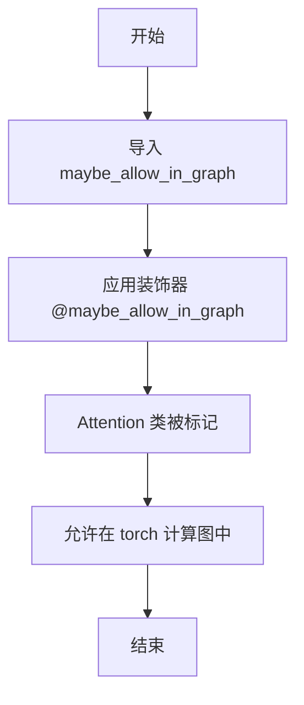

---

#### 带注释源码

```
# 源码位置：diffusers/utils/torch_utils.py（未在当前文件中定义）

# 导入语句（在当前文件中）
from ..utils.torch_utils import is_torch_version, maybe_allow_in_graph

# 使用方式
@maybe_allow_in_graph
class Attention(nn.Module):
    r"""
    A cross attention layer.
    ...
    """
    # 类的实现...
```

---

### ⚠️ 重要说明

**`maybe_allow_in_graph` 函数本身并未在当前提供的代码文件中定义。** 它是从 `diffusers.utils.torch_utils` 模块导入的外部函数。

该装饰器在代码中的作用是：
- 应用于 `Attention` 类
- 允许 PyTorch 将该类的计算包含在 `torch.jit.trace` 的计算图中，这对于某些需要捕获整个模型结构的场景很有用（例如使用 `torch.compile` 或其他 JIT 编译技术时）

如果您需要查看 `maybe_allow_in_graph` 的完整实现源代码，您需要查看 `diffusers` 库中的 `src/diffusers/utils/torch_utils.py` 文件。


### Attention.__init__

`Attention.__init__` 是 `Attention` 类的构造函数，负责初始化注意力机制的所有核心参数和组件，包括 Query/Key/Value 投影层、归一化层、注意力处理器等，用于构建一个灵活的多头注意力模块。

参数：

- `query_dim`：`int`，Query 特征的通道数
- `cross_attention_dim`：`int | None`，编码器 hidden states 的通道数，默认为 `query_dim`
- `heads`：`int`，多头注意力使用的头数，默认为 8
- `kv_heads`：`int | None`，Key 和 Value 头数，默认为 `heads`
- `dim_head`：`int`，每个头的通道数，默认为 64
- `dropout`：`float`，Dropout 概率，默认为 0.0
- `bias`：`bool`，是否在 QKV 线性层中使用偏置，默认为 False
- `upcast_attention`：`bool`，是否将注意力计算提升到 float32，默认为 False
- `upcast_softmax`：`bool`，是否将 softmax 计算提升到 float32，默认为 False
- `cross_attention_norm`：`str | None`，交叉注意力的归一化类型，可为 None、"layer_norm" 或 "group_norm"
- `cross_attention_norm_num_groups`：`int`，分组归一化的组数，默认为 32
- `qk_norm`：`str | None`，Query-Key 归一化类型，可为 None、"layer_norm"、"fp32_layer_norm"、"layer_norm_across_heads"、"rms_norm"、"rms_norm_across_heads" 或 "l2"
- `added_kv_proj_dim`：`int | None`，额外键值投影的通道数
- `added_proj_bias`：`bool | None`，额外投影是否使用偏置，默认为 True
- `norm_num_groups`：`int | None`，分组归一化的组数
- `spatial_norm_dim`：`int | None`，空间归一化的通道数
- `out_bias`：`bool`，输出线性层是否使用偏置，默认为 True
- `scale_qk`：`bool`，是否对 Query 和 Key 进行缩放，默认为 True
- `only_cross_attention`：`bool`，是否仅使用交叉注意力，默认为 False
- `eps`：`float`，分组归一化使用的 epsilon 值，默认为 1e-5
- `rescale_output_factor`：`float`，输出缩放因子，默认为 1.0
- `residual_connection`：`bool`，是否添加残差连接，默认为 False
- `_from_deprecated_attn_block`：`bool`，是否从废弃的注意力块加载，默认为 False
- `processor`：`AttnProcessor | None`，注意力处理器实例
- `out_dim`：`int`，输出维度
- `out_context_dim`：`int`，上下文输出维度
- `context_pre_only`：`bool`，是否仅预处理上下文
- `pre_only`：`bool`，是否仅预处理
- `elementwise_affine`：`bool`，归一化是否使用仿射变换，默认为 True
- `is_causal`：`bool`，是否使用因果注意力掩码，默认为 False

返回值：`None`（构造函数无返回值）

#### 流程图

```mermaid
flowchart TD
    A[开始 __init__] --> B[调用 super().__init__]
    B --> C[导入 FP32LayerNorm, LpNorm, RMSNorm]
    C --> D[计算 inner_dim 和 inner_kv_dim]
    D --> E[设置基础配置参数]
    E --> F{检查 only_cross_attention 和 added_kv_proj_dim}
    F -->|合法| G[初始化 group_norm]
    F -->|非法| H[抛出 ValueError]
    G --> I{检查 spatial_norm_dim}
    I -->|有值| J[初始化 SpatialNorm]
    I -->|无值| K[设置 spatial_norm = None]
    J --> L{初始化 qk_norm}
    L --> M[根据 qk_norm 类型创建 norm_q 和 norm_k]
    L --> N[设置 norm_q = norm_k = None]
    M --> O{初始化 cross_attention_norm}
    O --> P[根据类型创建 norm_cross]
    O --> Q[设置 norm_cross = None]
    P --> R[初始化 to_q 投影层]
    R --> S{not only_cross_attention?}
    S -->|Yes| T[初始化 to_k 和 to_v]
    S --> No[设置 to_k = to_v = None]
    T --> U{added_kv_proj_dim is not None?}
    U -->|Yes| V[初始化 add_q_proj, add_k_proj, add_v_proj]
    U --> No[设置为 None]
    V --> W{not pre_only?}
    W -->|Yes| X[初始化 to_out ModuleList]
    W --> No[设置 to_out = None]
    X --> Y{context_pre_only is not None and not context_pre_only?}
    Y -->|Yes| Z[初始化 to_add_out]
    Y --> No[设置 to_add_out = None]
    Z --> AA{added_kv_proj_dim is not None and qk_norm is not None?}
    AA -->|Yes| AB[初始化 norm_added_q 和 norm_added_k]
    AA --> No[设置为 None]
    AB --> AC{processor is None?}
    AC -->|Yes| AD[根据 PyTorch 版本选择默认处理器]
    AC --> No[使用传入的 processor]
    AD --> AE[调用 set_processor]
    AE --> AF[结束 __init__]
```

#### 带注释源码

```python
def __init__(
    self,
    query_dim: int,
    cross_attention_dim: int | None = None,
    heads: int = 8,
    kv_heads: int | None = None,
    dim_head: int = 64,
    dropout: float = 0.0,
    bias: bool = False,
    upcast_attention: bool = False,
    upcast_softmax: bool = False,
    cross_attention_norm: str | None = None,
    cross_attention_norm_num_groups: int = 32,
    qk_norm: str | None = None,
    added_kv_proj_dim: int | None = None,
    added_proj_bias: bool | None = True,
    norm_num_groups: int | None = None,
    spatial_norm_dim: int | None = None,
    out_bias: bool = True,
    scale_qk: bool = True,
    only_cross_attention: bool = False,
    eps: float = 1e-5,
    rescale_output_factor: float = 1.0,
    residual_connection: bool = False,
    _from_deprecated_attn_block: bool = False,
    processor: "AttnProcessor" | None = None,
    out_dim: int = None,
    out_context_dim: int = None,
    context_pre_only=None,
    pre_only=False,
    elementwise_affine: bool = True,
    is_causal: bool = False,
):
    # 调用父类 nn.Module 的初始化方法
    super().__init__()

    # 延迟导入归一化层以避免循环依赖
    from .normalization import FP32LayerNorm, LpNorm, RMSNorm

    # 计算内部维度：输出维度 = 头数 × 每头维度
    self.inner_dim = out_dim if out_dim is not None else dim_head * heads
    # 计算 KV 内部维度：支持 MHA/MQA/GQA
    self.inner_kv_dim = self.inner_dim if kv_heads is None else dim_head * kv_heads
    
    # 保存 Query 维度
    self.query_dim = query_dim
    # 是否使用偏置
    self.use_bias = bias
    # 是否为交叉注意力（cross_attention_dim 是否设置）
    self.is_cross_attention = cross_attention_dim is not None
    # 交叉注意力维度，默认为 query_dim
    self.cross_attention_dim = cross_attention_dim if cross_attention_dim is not None else query_dim
    # 是否提升注意力计算精度
    self.upcast_attention = upcast_attention
    # 是否提升 softmax 精度
    self.upcast_softmax = upcast_softmax
    # 输出缩放因子
    self.rescale_output_factor = rescale_output_factor
    # 是否使用残差连接
    self.residual_connection = residual_connection
    # Dropout 概率
    self.dropout = dropout
    # 是否使用融合投影
    self.fused_projections = False
    # 输出维度
    self.out_dim = out_dim if out_dim is not None else query_dim
    # 上下文输出维度
    self.out_context_dim = out_context_dim if out_context_dim is not None else query_dim
    # 上下文预处理标记
    self.context_pre_only = context_pre_only
    # 预处理标记
    self.pre_only = pre_only
    # 因果掩码标记
    self.is_causal = is_causal

    # 保存是否从废弃状态字典加载的标记
    self._from_deprecated_attn_block = _from_deprecated_attn_block

    # Query-Key 缩放标记和缩放因子
    self.scale_qk = scale_qk
    self.scale = dim_head**-0.5 if self.scale_qk else 1.0

    # 计算头数
    self.heads = out_dim // dim_head if out_dim is not None else heads
    # 可切片的头维度（用于内存优化的切片注意力）
    self.sliceable_head_dim = heads

    # 添加的 KV 投影维度
    self.added_kv_proj_dim = added_kv_proj_dim
    # 是否仅使用交叉注意力
    self.only_cross_attention = only_cross_attention

    # 参数一致性检查
    if self.added_kv_proj_dim is None and self.only_cross_attention:
        raise ValueError(
            "`only_cross_attention` can only be set to True if `added_kv_proj_dim` is not None. Make sure to set either `only_cross_attention=False` or define `added_kv_proj_dim`."
        )

    # 初始化分组归一化（用于分组注意力）
    if norm_num_groups is not None:
        self.group_norm = nn.GroupNorm(num_channels=query_dim, num_groups=norm_num_groups, eps=eps, affine=True)
    else:
        self.group_norm = None

    # 初始化空间归一化（用于 ControlNet/SDXL）
    if spatial_norm_dim is not None:
        self.spatial_norm = SpatialNorm(f_channels=query_dim, zq_channels=spatial_norm_dim)
    else:
        self.spatial_norm = None

    # 初始化 QK 归一化层（可选多种类型）
    if qk_norm is None:
        self.norm_q = None
        self.norm_k = None
    elif qk_norm == "layer_norm":
        self.norm_q = nn.LayerNorm(dim_head, eps=eps, elementwise_affine=elementwise_affine)
        self.norm_k = nn.LayerNorm(dim_head, eps=eps, elementwise_affine=elementwise_affine)
    elif qk_norm == "fp32_layer_norm":
        self.norm_q = FP32LayerNorm(dim_head, elementwise_affine=False, bias=False, eps=eps)
        self.norm_k = FP32LayerNorm(dim_head, elementwise_affine=False, bias=False, eps=eps)
    elif qk_norm == "layer_norm_across_heads":
        # Lumina 对所有头应用 QK 归一化
        self.norm_q = nn.LayerNorm(dim_head * heads, eps=eps)
        self.norm_k = nn.LayerNorm(dim_head * kv_heads, eps=eps)
    elif qk_norm == "rms_norm":
        self.norm_q = RMSNorm(dim_head, eps=eps, elementwise_affine=elementwise_affine)
        self.norm_k = RMSNorm(dim_head, eps=eps, elementwise_affine=elementwise_affine)
    elif qk_norm == "rms_norm_across_heads":
        # LTX 对所有头应用 RMS 归一化
        self.norm_q = RMSNorm(dim_head * heads, eps=eps)
        self.norm_k = RMSNorm(dim_head * kv_heads, eps=eps)
    elif qk_norm == "l2":
        self.norm_q = LpNorm(p=2, dim=-1, eps=eps)
        self.norm_k = LpNorm(p=2, dim=-1, eps=eps)
    else:
        raise ValueError(
            f"unknown qk_norm: {qk_norm}. Should be one of None, 'layer_norm', 'fp32_layer_norm', 'layer_norm_across_heads', 'rms_norm', 'rms_norm_across_heads', 'l2'."
        )

    # 初始化交叉注意力归一化层
    if cross_attention_norm is None:
        self.norm_cross = None
    elif cross_attention_norm == "layer_norm":
        self.norm_cross = nn.LayerNorm(self.cross_attention_dim)
    elif cross_attention_norm == "group_norm":
        if self.added_kv_proj_dim is not None:
            # 编码器 hidden states 投影前形状为 (batch, seq_len, added_kv_proj_dim)
            # 归一化在投影前应用，需要使用 added_kv_proj_dim
            norm_cross_num_channels = added_kv_proj_dim
        else:
            norm_cross_num_channels = self.cross_attention_dim

        self.norm_cross = nn.GroupNorm(
            num_channels=norm_cross_num_channels, num_groups=cross_attention_norm_num_groups, eps=1e-5, affine=True
        )
    else:
        raise ValueError(
            f"unknown cross_attention_norm: {cross_attention_norm}. Should be None, 'layer_norm' or 'group_norm'"
        )

    # 初始化 Query 投影层
    self.to_q = nn.Linear(query_dim, self.inner_dim, bias=bias)

    # 初始化 Key 和 Value 投影层（如果不是仅交叉注意力）
    if not self.only_cross_attention:
        # 仅用于 AddedKVProcessor 类
        self.to_k = nn.Linear(self.cross_attention_dim, self.inner_kv_dim, bias=bias)
        self.to_v = nn.Linear(self.cross_attention_dim, self.inner_kv_dim, bias=bias)
    else:
        self.to_k = None
        self.to_v = None

    # 额外投影偏置
    self.added_proj_bias = added_proj_bias
    # 初始化额外的 QKV 投影层（用于 SD3 等模型）
    if self.added_kv_proj_dim is not None:
        self.add_k_proj = nn.Linear(added_kv_proj_dim, self.inner_kv_dim, bias=added_proj_bias)
        self.add_v_proj = nn.Linear(added_kv_proj_dim, self.inner_kv_dim, bias=added_proj_bias)
        if self.context_pre_only is not None:
            self.add_q_proj = nn.Linear(added_kv_proj_dim, self.inner_dim, bias=added_proj_bias)
    else:
        self.add_q_proj = None
        self.add_k_proj = None
        self.add_v_proj = None

    # 初始化输出层
    if not self.pre_only:
        self.to_out = nn.ModuleList([])
        self.to_out.append(nn.Linear(self.inner_dim, self.out_dim, bias=out_bias))
        self.to_out.append(nn.Dropout(dropout))
    else:
        self.to_out = None

    # 初始化上下文输出层
    if self.context_pre_only is not None and not self.context_pre_only:
        self.to_add_out = nn.Linear(self.inner_dim, self.out_context_dim, bias=out_bias)
    else:
        self.to_add_out = None

    # 初始化额外投影的 QK 归一化层
    if qk_norm is not None and added_kv_proj_dim is not None:
        if qk_norm == "layer_norm":
            self.norm_added_q = nn.LayerNorm(dim_head, eps=eps, elementwise_affine=elementwise_affine)
            self.norm_added_k = nn.LayerNorm(dim_head, eps=eps, elementwise_affine=elementwise_affine)
        elif qk_norm == "fp32_layer_norm":
            self.norm_added_q = FP32LayerNorm(dim_head, elementwise_affine=False, bias=False, eps=eps)
            self.norm_added_k = FP32LayerNorm(dim_head, elementwise_affine=False, bias=False, eps=eps)
        elif qk_norm == "rms_norm":
            self.norm_added_q = RMSNorm(dim_head, eps=eps)
            self.norm_added_k = RMSNorm(dim_head, eps=eps)
        elif qk_norm == "rms_norm_across_heads":
            # Wan 应用跨头的 RMS 归一化
            # Wan 也不应用 Q 归一化
            self.norm_added_q = None
            self.norm_added_k = RMSNorm(dim_head * kv_heads, eps=eps)
        else:
            raise ValueError(
                f"unknown qk_norm: {qk_norm}. Should be one of `None,'layer_norm','fp32_layer_norm','rms_norm'`"
            )
    else:
        self.norm_added_q = None
        self.norm_added_k = None

    # 设置注意力处理器
    # 默认使用 AttnProcessor2_0（如果使用 PyTorch 2.x），它使用原生 Flash 注意力
    if processor is None:
        processor = (
            AttnProcessor2_0() if hasattr(F, "scaled_dot_product_attention") and self.scale_qk else AttnProcessor()
        )
    self.set_processor(processor)
```


### Attention.set_use_xla_flash_attention

该方法用于设置是否使用来自 `torch_xla` 的 XLA Flash Attention（基于 Pallas 内核的闪光注意力）。它会根据环境条件和参数选择合适的注意力处理器，并在不支持时回退到默认的注意力实现。

参数：

- `use_xla_flash_attention`：`bool`，是否启用 XLA Flash Attention 内核
- `partition_spec`：`tuple[str | None, ...] | None`，可选参数，指定 SPMD 分布式训练时的分区规范
- `is_flux`：`bool`，可选参数，标识是否为 Flux 模型，默认为 False

返回值：`None`，该方法无返回值，仅通过 `set_processor` 更新内部处理器

#### 流程图

```mermaid
flowchart TD
    A[开始 set_use_xla_flash_attention] --> B{use_xla_flash_attention?}
    B -->|True| C{is_torch_xla_available?}
    C -->|False| D[抛出异常: torch_xla is not available]
    C -->|True| E{torch_xla version >= 2.3?}
    E -->|False| F[抛出异常: flash attention pallas kernel is supported from torch_xla version 2.3]
    E -->|True| G{is_spmd() and torch_xla version < 2.4?}
    G -->|True| H[抛出异常: flash attention pallas kernel using SPMD is supported from torch_xla version 2.4]
    G -->|False| I{is_flux?}
    I -->|True| J[创建 XLAFluxFlashAttnProcessor2_0]
    I -->|False| K[创建 XLAFlashAttnProcessor2_0]
    B -->|False| L{hasattr F.scaled_dot_product_attention and scale_qk?}
    L -->|True| M[创建 AttnProcessor2_0]
    L -->|False| N[创建 AttnProcessor]
    J --> O[调用 set_processor]
    K --> O
    M --> O
    N --> O
    O --> P[结束]
```

#### 带注释源码

```python
def set_use_xla_flash_attention(
    self,
    use_xla_flash_attention: bool,
    partition_spec: tuple[str | None, ...] | None = None,
    is_flux=False,
) -> None:
    r"""
    Set whether to use xla flash attention from `torch_xla` or not.

    Args:
        use_xla_flash_attention (`bool`):
            Whether to use pallas flash attention kernel from `torch_xla` or not.
        partition_spec (`tuple[]`, *optional*):
            Specify the partition specification if using SPMD. Otherwise None.
    """
    # 如果启用 XLA Flash Attention
    if use_xla_flash_attention:
        # 检查 torch_xla 是否可用
        if not is_torch_xla_available:
            raise "torch_xla is not available"
        # 检查 torch_xla 版本是否 >= 2.3
        elif is_torch_xla_version("<", "2.3"):
            raise "flash attention pallas kernel is supported from torch_xla version 2.3"
        # 检查 SPMD 模式下版本是否 >= 2.4
        elif is_spmd() and is_torch_xla_version("<", "2.4"):
            raise "flash attention pallas kernel using SPMD is supported from torch_xla version 2.4"
        else:
            # 根据 is_flux 标志选择不同的 XLA Flash Attention 处理器
            if is_flux:
                # Flux 模型专用处理器
                processor = XLAFluxFlashAttnProcessor2_0(partition_spec)
            else:
                # 标准 XLA Flash Attention 处理器
                processor = XLAFlashAttnProcessor2_0(partition_spec)
    else:
        # 禁用 XLA Flash Attention，回退到默认处理器
        # 根据 PyTorch 版本和 scale_qk 配置选择合适的默认处理器
        processor = (
            AttnProcessor2_0() if hasattr(F, "scaled_dot_product_attention") and self.scale_qk else AttnProcessor()
        )
    # 更新 Attention 模块的注意力处理器
    self.set_processor(processor)
```


### `Attention.set_use_npu_flash_attention`

设置是否使用来自 `torch_npu` 的 NPU Flash Attention。

参数：

- `use_npu_flash_attention`：`bool`，是否启用 NPU Flash Attention

返回值：`None`，无返回值

#### 流程图

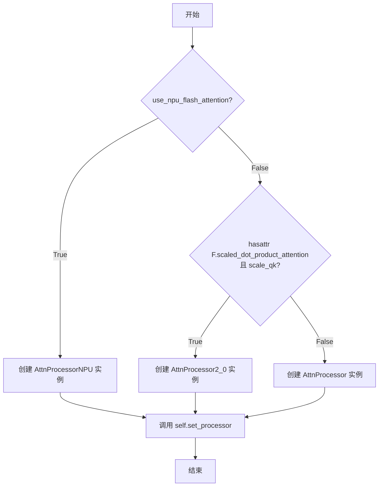

#### 带注释源码

```python
def set_use_npu_flash_attention(self, use_npu_flash_attention: bool) -> None:
    r"""
    Set whether to use npu flash attention from `torch_npu` or not.

    """
    # 根据参数决定使用哪种注意力处理器
    if use_npu_flash_attention:
        # 启用NPU Flash Attention，使用专门的AttnProcessorNPU处理器
        # 该处理器调用torch_npu的npu_fusion_attention内核
        processor = AttnProcessorNPU()
    else:
        # 禁用NPU Flash Attention，回退到默认处理器
        # 默认使用AttnProcessor2_0（如果torch 2.x可用且scale_qk为True）
        # 否则使用经典的AttnProcessor
        processor = (
            AttnProcessor2_0() if hasattr(F, "scaled_dot_product_attention") and self.scale_qk else AttnProcessor()
        )
    # 设置注意力处理器到当前Attention模块
    self.set_processor(processor)
```


### `Attention.set_use_memory_efficient_attention_xformers`

该方法用于在 Attention 模块中启用或禁用 xFormers 的内存高效注意力机制。它会根据当前配置的注意力处理器类型（普通、Custom Diffusion、Added KV、IP Adapter 或 Joint），动态选择合适的 xFormers 处理器，或在禁用时回退到默认的 PyTorch 原生注意力实现。

参数：

- `use_memory_efficient_attention_xformers`：`bool`，指定是否启用 xFormers 内存高效注意力
- `attention_op`：`Callable | None`，可选的自定义注意力操作符，默认使用 xFormers 的内置实现

返回值：`None`，该方法直接修改内部处理器状态，无返回值

#### 流程图

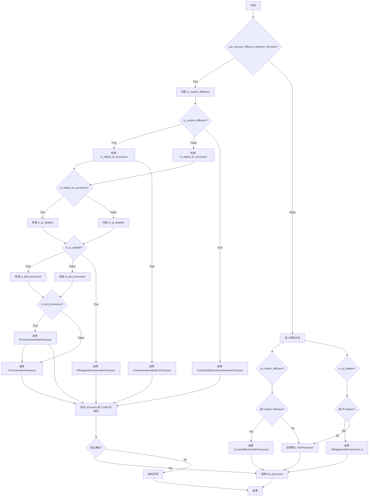

#### 带注释源码

```python
def set_use_memory_efficient_attention_xformers(
    self, use_memory_efficient_attention_xformers: bool, attention_op: Callable | None = None
) -> None:
    r"""
    Set whether to use memory efficient attention from `xformers` or not.

    Args:
        use_memory_efficient_attention_xformers (`bool`):
            Whether to use memory efficient attention from `xformers` or not.
        attention_op (`Callable`, *optional*):
            The attention operation to use. Defaults to `None` which uses the default attention operation from
            `xformers`.
    """
    # 检测当前处理器是否为自定义扩散相关的处理器类型
    is_custom_diffusion = hasattr(self, "processor") and isinstance(
        self.processor,
        (CustomDiffusionAttnProcessor, CustomDiffusionXFormersAttnProcessor, CustomDiffusionAttnProcessor2_0),
    )
    # 检测是否为带有额外 KV 的处理器
    is_added_kv_processor = hasattr(self, "processor") and isinstance(
        self.processor,
        (
            AttnAddedKVProcessor,
            AttnAddedKVProcessor2_0,
            SlicedAttnAddedKVProcessor,
            XFormersAttnAddedKVProcessor,
        ),
    )
    # 检测是否为 IP Adapter 处理器
    is_ip_adapter = hasattr(self, "processor") and isinstance(
        self.processor,
        (IPAdapterAttnProcessor, IPAdapterAttnProcessor2_0, IPAdapterXFormersAttnProcessor),
    )
    # 检测是否为联合注意力处理器
    is_joint_processor = hasattr(self, "processor") and isinstance(
        self.processor,
        (
            JointAttnProcessor2_0,
            XFormersJointAttnProcessor,
        ),
    )

    # 启用 xFormers 内存高效注意力
    if use_memory_efficient_attention_xformers:
        # 特殊处理：xFormers 不支持 Custom Diffusion 与 Added KV 组合
        if is_added_kv_processor and is_custom_diffusion:
            raise NotImplementedError(
                f"Memory efficient attention is currently not supported for custom diffusion for attention processor type {self.processor}"
            )
        # 检查 xFormers 是否安装
        if not is_xformers_available():
            raise ModuleNotFoundError(
                (
                    "Refer to https://github.com/facebookresearch/xformers for more information on how to install"
                    " xformers"
                ),
                name="xformers",
            )
        # 检查 CUDA 是否可用（xFormers 需要 GPU）
        elif not torch.cuda.is_available():
            raise ValueError(
                "torch.cuda.is_available() should be True but is False. xformers' memory efficient attention is"
                " only available for GPU "
            )
        else:
            # 执行运行时验证，确保可以在当前设备上运行内存高效注意力
            try:
                dtype = None
                if attention_op is not None:
                    # 如果提供了自定义操作符，提取其支持的数据类型
                    op_fw, op_bw = attention_op
                    dtype, *_ = op_fw.SUPPORTED_DTYPES
                # 创建测试张量并尝试运行注意力操作
                q = torch.randn((1, 2, 40), device="cuda", dtype=dtype)
                _ = xformers.ops.memory_efficient_attention(q, q, q)
            except Exception as e:
                raise e

        # 根据当前处理器类型选择对应的 xFormers 处理器
        if is_custom_diffusion:
            # 为 Custom Diffusion 创建专用的 xFormers 处理器
            processor = CustomDiffusionXFormersAttnProcessor(
                train_kv=self.processor.train_kv,
                train_q_out=self.processor.train_q_out,
                hidden_size=self.processor.hidden_size,
                cross_attention_dim=self.processor.cross_attention_dim,
                attention_op=attention_op,
            )
            # 迁移现有权重
            processor.load_state_dict(self.processor.state_dict())
            if hasattr(self.processor, "to_k_custom_diffusion"):
                processor.to(self.processor.to_k_custom_diffusion.weight.device)
        elif is_added_kv_processor:
            # 为带有额外 KV 的情况创建 xFormers 处理器
            # 注意：目前 xFormers 对 UnCLIP 类型的交叉注意力可能存在兼容性问题
            logger.info(
                "Memory efficient attention with `xformers` might currently not work correctly if an attention mask is required for the attention operation."
            )
            processor = XFormersAttnAddedKVProcessor(attention_op=attention_op)
        elif is_ip_adapter:
            # 为 IP Adapter 创建专用的 xFormers 处理器
            processor = IPAdapterXFormersAttnProcessor(
                hidden_size=self.processor.hidden_size,
                cross_attention_dim=self.processor.cross_attention_dim,
                num_tokens=self.processor.num_tokens,
                scale=self.processor.scale,
                attention_op=attention_op,
            )
            # 迁移权重并确保设备一致
            processor.load_state_dict(self.processor.state_dict())
            if hasattr(self.processor, "to_k_ip"):
                processor.to(
                    device=self.processor.to_k_ip[0].weight.device, dtype=self.processor.to_k_ip[0].weight.dtype
                )
        elif is_joint_processor:
            # 为联合注意力创建 xFormers 处理器
            processor = XFormersJointAttnProcessor(attention_op=attention_op)
        else:
            # 标准情况：使用通用的 xFormers 处理器
            processor = XFormersAttnProcessor(attention_op=attention_op)
    else:
        # 禁用 xFormers：回退到默认处理器
        if is_custom_diffusion:
            # 根据 PyTorch 版本选择合适的处理器
            attn_processor_class = (
                CustomDiffusionAttnProcessor2_0
                if hasattr(F, "scaled_dot_product_attention")
                else CustomDiffusionAttnProcessor
            )
            processor = attn_processor_class(
                train_kv=self.processor.train_kv,
                train_q_out=self.processor.train_q_out,
                hidden_size=self.processor.hidden_size,
                cross_attention_dim=self.processor.cross_attention_dim,
            )
            processor.load_state_dict(self.processor.state_dict())
            if hasattr(self.processor, "to_k_custom_diffusion"):
                processor.to(self.processor.to_k_custom_diffusion.weight.device)
        elif is_ip_adapter:
            # IP Adapter 使用 PyTorch 2.0 的原生 SDP 实现
            processor = IPAdapterAttnProcessor2_0(
                hidden_size=self.processor.hidden_size,
                cross_attention_dim=self.processor.cross_attention_dim,
                num_tokens=self.processor.num_tokens,
                scale=self.processor.scale,
            )
            processor.load_state_dict(self.processor.state_dict())
            if hasattr(self.processor, "to_k_ip"):
                processor.to(
                    device=self.processor.to_k_ip[0].weight.device, dtype=self.processor.to_k_ip[0].weight.dtype
                )
        else:
            # 默认处理器：优先使用 PyTorch 2.0 的 SDP 实现
            processor = (
                AttnProcessor2_0()
                if hasattr(F, "scaled_dot_product_attention") and self.scale_qk
                else AttnProcessor()
            )

    # 最终设置处理器
    self.set_processor(processor)
```


### Attention.set_attention_slice

该方法用于设置注意力计算的切片大小（slice size），通过选择不同的注意力处理器（AttnProcessor）来实现内存高效的注意力计算。当设置切片大小时，会根据是否使用了额外的键值投影维度（added_kv_proj_dim）来选择合适的切片处理器。

参数：

-  `slice_size`：`int`，要设置的切片大小，用于将注意力计算分割为多个步骤以节省显存

返回值：`None`，该方法无返回值

#### 流程图

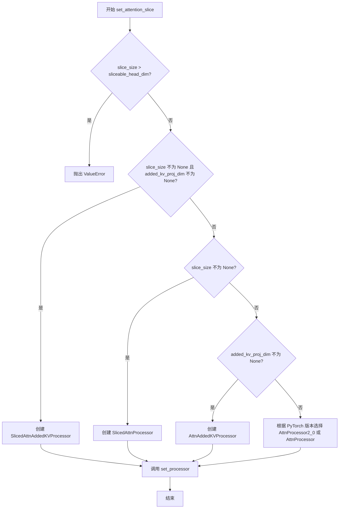

#### 带注释源码

```python
def set_attention_slice(self, slice_size: int) -> None:
    r"""
    Set the slice size for attention computation.

    Args:
        slice_size (`int`):
            The slice size for attention computation.
    """
    # 验证切片大小是否有效，不能超过可切分的头部维度
    if slice_size is not None and slice_size > self.sliceable_head_dim:
        raise ValueError(f"slice_size {slice_size} has to be smaller or equal to {self.sliceable_head_dim}.")

    # 根据不同的条件选择不同的注意力处理器
    if slice_size is not None and self.added_kv_proj_dim is not None:
        # 如果设置了切片大小且使用了额外的键值投影，使用带切片的支持额外KV的处理器
        processor = SlicedAttnAddedKVProcessor(slice_size)
    elif slice_size is not None:
        # 如果仅设置了切片大小，使用标准的切片处理器
        processor = SlicedAttnProcessor(slice_size)
    elif self.added_kv_proj_dim is not None:
        # 如果使用了额外的键值投影但没有设置切片，使用标准的支持额外KV的处理器
        processor = AttnAddedKVProcessor()
    else:
        # 默认使用 PyTorch 2.x 的原生 flash attention 或标准的 AttnProcessor
        # AttnProcessor2_0 使用 torch.nn.functional.scaled_dot_product_attention
        # 只有当 scale_qk 为 True 时才使用 AttnProcessor2_0
        processor = (
            AttnProcessor2_0() if hasattr(F, "scaled_dot_product_attention") and self.scale_qk else AttnProcessor()
        )

    # 设置注意力处理器
    self.set_processor(processor)
```


### `Attention.set_processor`

设置注意力处理器，用于指定在注意力计算时使用哪种处理器实现。

参数：

- `processor`：`AttnProcessor`，要使用的注意力处理器实例

返回值：`None`，无返回值（方法通过修改对象状态完成设置）

#### 流程图

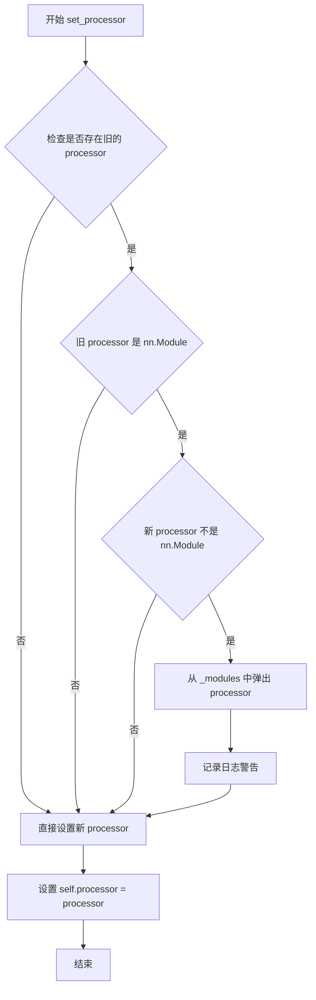

#### 带注释源码

```python
def set_processor(self, processor: "AttnProcessor") -> None:
    r"""
    Set the attention processor to use.

    Args:
        processor (`AttnProcessor`):
            The attention processor to use.
    """
    # if current processor is in `self._modules` and if passed `processor` is not, we need to
    # pop `processor` from `self._modules`
    # 检查当前是否存在已设置的 processor，并且它是一个 nn.Module 实例，
    # 而传入的新的 processor 不是一个 nn.Module
    if (
        hasattr(self, "processor")
        and isinstance(self.processor, torch.nn.Module)
        and not isinstance(processor, torch.nn.Module)
    ):
        # 记录日志，提示用户正在替换可能已经训练过的权重
        logger.info(f"You are removing possibly trained weights of {self.processor} with {processor}")
        # 从模块字典中移除 processor
        self._modules.pop("processor")

    # 将新的 processor 赋值给实例属性
    self.processor = processor
```


### `Attention.get_processor`

获取当前使用的注意力处理器。

参数：

- `return_deprecated_lora`：`bool`，可选，默认值为 `False`。设置为 `True` 以返回已弃用的 LoRA 注意力处理器。

返回值：`AttentionProcessor`，当前使用的注意力处理器。

#### 流程图

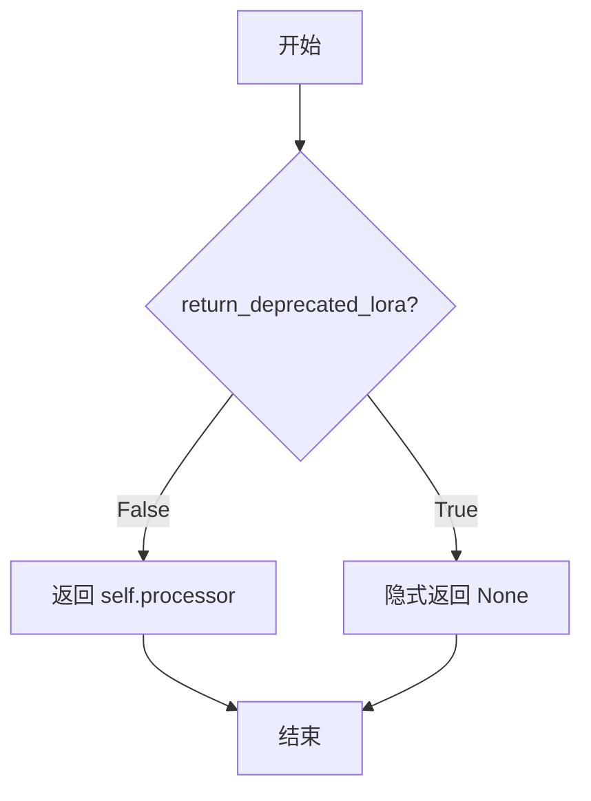

#### 带注释源码

```python
def get_processor(self, return_deprecated_lora: bool = False) -> "AttentionProcessor":
    r"""
    Get the attention processor in use.

    Args:
        return_deprecated_lora (`bool`, *optional*, defaults to `False`):
            Set to `True` to return the deprecated LoRA attention processor.

    Returns:
        "AttentionProcessor": The attention processor in use.
    """
    # 如果不需要返回已弃用的 LoRA 处理器，则返回当前正在使用的处理器
    if not return_deprecated_lora:
        return self.processor
    # 当 return_deprecated_lora 为 True 时，方法没有显式返回值（隐式返回 None）
```


### Attention.forward

这是 `Attention` 类的核心前向传播方法，负责执行注意力计算。该方法通过委托给注册的注意力处理器（`AttnProcessor`）来执行实际的注意力计算，支持多种注意力机制（如标准注意力、Flash Attention、xFormers等）。

参数：

-  `hidden_states`：`torch.Tensor`，查询的隐藏状态
-  `encoder_hidden_states`：`torch.Tensor | None`，编码器的隐藏状态（可选）
-  `attention_mask`：`torch.Tensor | None`，注意力掩码（可选）
-  `**cross_attention_kwargs`： Additional keyword arguments to pass along to the cross attention

返回值：`torch.Tensor`，注意力层的输出

#### 流程图

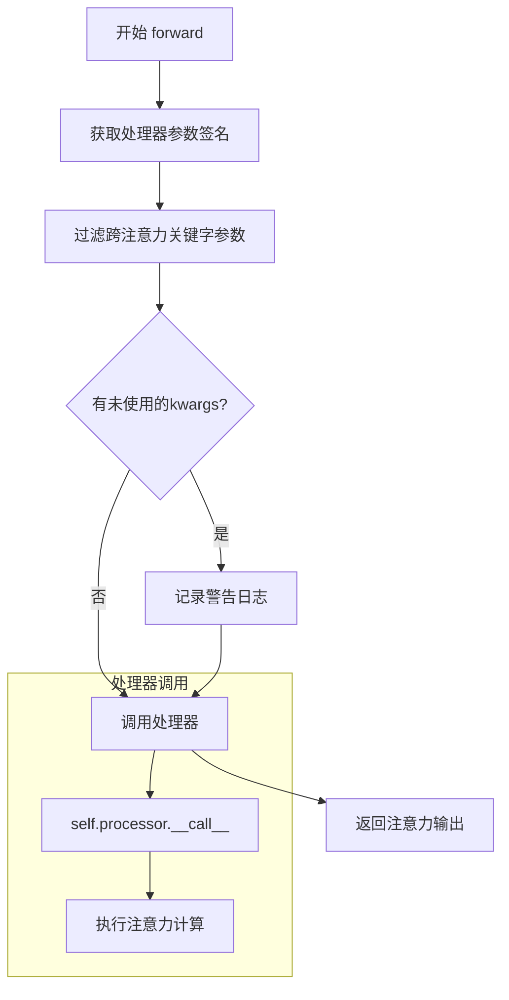

#### 带注释源码

```python
def forward(
    self,
    hidden_states: torch.Tensor,
    encoder_hidden_states: torch.Tensor | None = None,
    attention_mask: torch.Tensor | None = None,
    **cross_attention_kwargs,
) -> torch.Tensor:
    r"""
    The forward method of the `Attention` class.

    Args:
        hidden_states (`torch.Tensor`):
            The hidden states of the query.
        encoder_hidden_states (`torch.Tensor`, *optional*):
            The hidden states of the encoder.
        attention_mask (`torch.Tensor`, *optional*):
            The attention mask to use. If `None`, no mask is applied.
        **cross_attention_kwargs:
            Additional keyword arguments to pass along to the cross attention.

    Returns:
        `torch.Tensor`: The output of the attention layer.
    """
    # 获取处理器__call__方法的参数签名，用于验证传入的参数
    # The `Attention` class can call different attention processors / attention functions
    # here we simply pass along all tensors to the selected processor class
    # For standard processors that are defined here, `**cross_attention_kwargs` is empty
    attn_parameters = set(inspect.signature(self.processor.__call__).parameters.keys())
    
    # 定义静默参数列表，这些参数不会产生警告
    quiet_attn_parameters = {"ip_adapter_masks", "ip_hidden_states"}
    
    # 找出未使用的kwargs
    unused_kwargs = [
        k for k, _ in cross_attention_kwargs.items() 
        if k not in attn_parameters and k not in quiet_attn_parameters
    ]
    
    # 如果有未使用的kwargs，记录警告
    if len(unused_kwargs) > 0:
        logger.warning(
            f"cross_attention_kwargs {unused_kwargs} are not expected by {self.processor.__class__.__name__} and will be ignored."
        )
    
    # 过滤出有效的kwargs，只保留处理器需要的参数
    cross_attention_kwargs = {k: w for k, w in cross_attention_kwargs.items() if k in attn_parameters}

    # 调用处理器执行实际的注意力计算
    # 传递self引用、hidden_states、encoder_hidden_states和attention_mask
    return self.processor(
        self,
        hidden_states,
        encoder_hidden_states=encoder_hidden_states,
        attention_mask=attention_mask,
        **cross_attention_kwargs,
    )
```


### Attention.batch_to_head_dim

将张量从 `[batch_size, seq_len, dim]` 形状重塑为 `[batch_size // heads, seq_len, dim * heads]` 形状，用于将多头注意力的输出从批量维度分离转换为批量维度合并。

参数：

- `tensor`：`torch.Tensor`，要重塑的张量，形状为 `[batch_size, seq_len, dim]`

返回值：`torch.Tensor`，重塑后的张量，形状为 `[batch_size // heads, seq_len, dim * heads]`

#### 流程图

```mermaid
flowchart TD
    A[输入 tensor: (batch_size, seq_len, dim)] --> B[获取 head_size = self.heads]
    B --> C[reshape: (batch_size // head_size, head_size, seq_len, dim)]
    C --> D[permute: (0, 2, 1, 3) 变为 (batch_size // head_size, seq_len, head_size, dim)]
    D --> E[reshape: (batch_size // head_size, seq_len, dim * head_size)]
    E --> F[输出 tensor: (batch_size // heads, seq_len, dim * heads)]
```

#### 带注释源码

```python
def batch_to_head_dim(self, tensor: torch.Tensor) -> torch.Tensor:
    r"""
    Reshape the tensor from `[batch_size, seq_len, dim]` to `[batch_size // heads, seq_len, dim * heads]`. `heads`
    is the number of heads initialized while constructing the `Attention` class.

    Args:
        tensor (`torch.Tensor`): The tensor to reshape.

    Returns:
        `torch.Tensor`: The reshaped tensor.
    """
    # 获取注意力头数量
    head_size = self.heads
    # 解包输入张量的形状
    batch_size, seq_len, dim = tensor.shape
    # 第一次 reshape：将 batch_size 分割为 (batch_size // head_size) 个组，每组一个头
    # 从 (batch_size, seq_len, dim) -> (batch_size // head_size, head_size, seq_len, dim)
    tensor = tensor.reshape(batch_size // head_size, head_size, seq_len, dim)
    # 置换维度：将 head 维度移到序列维度之后
    # 从 (batch_size // head_size, head_size, seq_len, dim) -> (batch_size // head_size, seq_len, head_size, dim)
    tensor = tensor.permute(0, 2, 1, 3).reshape(batch_size // head_size, seq_len, dim * head_size)
    # 第二次 reshape：合并 head 和 dim 维度
    # 从 (batch_size // head_size, seq_len, head_size, dim) -> (batch_size // head_size, seq_len, dim * head_size)
    return tensor
```


### `Attention.head_to_batch_dim`

将张量从 `[batch_size, seq_len, dim]` 的形状重塑为 `[batch_size, seq_len, heads, dim // heads]` 的形状（`heads` 是在构造 `Attention` 类时初始化多头注意力机制的头数）。根据 `out_dim` 参数，还可以进一步将张量重塑为 `[batch_size * heads, seq_len, dim // heads]` 的形状，以便进行后续的注意力计算。

参数：

- `self`：`Attention` 类实例方法（隐式参数）
- `tensor`：`torch.Tensor`，需要重塑的张量
- `out_dim`：`int`，可选，默认为 `3`，输出维度。当值为 `3` 时，张量会被重塑为 `[batch_size * heads, seq_len, dim // heads]`；当值为 `4` 时，保持 `[batch_size, heads, seq_len, dim // heads]` 的形状

返回值：`torch.Tensor`，重塑后的张量

#### 流程图

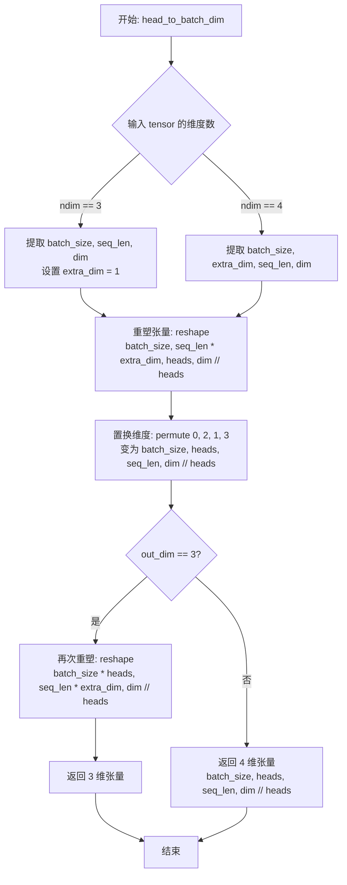

#### 带注释源码

```python
def head_to_batch_dim(self, tensor: torch.Tensor, out_dim: int = 3) -> torch.Tensor:
    r"""
    Reshape the tensor from `[batch_size, seq_len, dim]` to `[batch_size, seq_len, heads, dim // heads]` `heads` is
    the number of heads initialized while constructing the `Attention` class.

    Args:
        tensor (`torch.Tensor`): The tensor to reshape.
        out_dim (`int`, *optional*, defaults to `3`): The output dimension of the tensor. If `3`, the tensor is
            reshaped to `[batch_size * heads, seq_len, dim // heads]`.

    Returns:
        `torch.Tensor`: The reshaped tensor.
    """
    # 获取注意力头数
    head_size = self.heads
    
    # 根据输入张量的维度数，确定批次大小、序列长度和特征维度
    if tensor.ndim == 3:
        # 标准3D输入: [batch_size, seq_len, dim]
        batch_size, seq_len, dim = tensor.shape
        extra_dim = 1
    else:
        # 4D输入: [batch_size, extra_dim, seq_len, dim]
        # 例如在某些处理器中可能会传入4D张量
        batch_size, extra_dim, seq_len, dim = tensor.shape
    
    # 第一次重塑：
    # 将 dim 拆分为 heads 和 dim // heads 两个维度
    # 结果形状: [batch_size, seq_len * extra_dim, heads, dim // heads]
    tensor = tensor.reshape(batch_size, seq_len * extra_dim, head_size, dim // head_size)
    
    # 置换维度顺序：
    # 从 [batch_size, seq_len * extra_dim, heads, dim // heads]
    # 变为 [batch_size, heads, seq_len * extra_dim, dim // heads]
    # 这样可以方便多头注意力的计算
    tensor = tensor.permute(0, 2, 1, 3)

    # 根据 out_dim 参数决定输出形状
    if out_dim == 3:
        # 3D输出: 将批次维度和头维度合并
        # 形状: [batch_size * heads, seq_len * extra_dim, dim // heads]
        # 这种格式常用于传统的注意力分数计算 (batch_matmul)
        tensor = tensor.reshape(batch_size * head_size, seq_len * extra_dim, dim // head_size)
    else:
        # 4D输出: 保持 [batch_size, heads, seq_len, dim // heads]
        # 这种格式用于 PyTorch 2.0+ 的 scaled_dot_product_attention
        pass

    return tensor
```


### `Attention.get_attention_scores`

该方法用于计算注意力分数（attention scores），即 Query 和 Key 之间的相似度，然后通过 Softmax 归一化得到注意力概率分布。该方法是传统注意力机制的核心实现，支持可选的注意力掩码和数值类型转换。

参数：

- `self`：`Attention`，注意力层实例，包含配置属性如 `upcast_attention`、`upcast_softmax`、`scale` 等
- `query`：`torch.Tensor`，Query 张量，形状为 `[batch_size, seq_len, dim]`，用于查询特征
- `key`：`torch.Tensor`，Key 张量，形状为 `[batch_size, seq_len, dim]`，用于匹配特征
- `attention_mask`：`torch.Tensor | None`，可选的注意力掩码，用于屏蔽特定位置的注意力

返回值：`torch.Tensor`，注意力概率分布，形状为 `[batch_size, seq_len, key_seq_len]`

#### 流程图

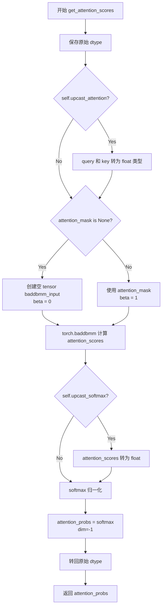

#### 带注释源码

```python
def get_attention_scores(
    self, query: torch.Tensor, key: torch.Tensor, attention_mask: torch.Tensor | None = None
) -> torch.Tensor:
    r"""
    Compute the attention scores.

    Args:
        query (`torch.Tensor`): The query tensor.
        key (`torch.Tensor`): The key tensor.
        attention_mask (`torch.Tensor`, *optional*): The attention mask to use. If `None`, no mask is applied.

    Returns:
        `torch.Tensor`: The attention probabilities/scores.
    """
    # 保存原始数据类型，用于最后转换回来
    dtype = query.dtype
    
    # 如果需要向上转换注意力计算到 float32（提升数值稳定性）
    if self.upcast_attention:
        query = query.float()
        key = key.float()

    # 根据是否有注意力掩码准备输入
    if attention_mask is None:
        # 没有掩码时，创建一个空的累加矩阵（baddbmm 的初始值）
        # 形状: [batch, query_len, key_len]
        baddbmm_input = torch.empty(
            query.shape[0], query.shape[1], key.shape[1], dtype=query.dtype, device=query.device
        )
        beta = 0  # 初始值为 0，表示完全忽略 baddbmm_input
    else:
        # 有掩码时，使用掩码作为初始值
        baddbmm_input = attention_mask
        beta = 1  # 初始值为 1，表示完全使用掩码

    # 计算注意力分数: Q @ K^T，并加上掩码（通过 baddbmm）
    # baddbmm: input + beta * (batch1 @ batch2)
    # self.scale 是缩放因子，通常为 1/sqrt(d_k)
    attention_scores = torch.baddbmm(
        baddbmm_input,
        query,
        key.transpose(-1, -2),  # Key 转置: [batch, dim, key_len]
        beta=beta,
        alpha=self.scale,
    )
    del baddbmm_input  # 释放内存

    # 如果需要向上转换 softmax 计算（提升数值稳定性）
    if self.upcast_softmax:
        attention_scores = attention_scores.float()

    # Softmax 归一化得到注意力概率
    attention_probs = attention_scores.softmax(dim=-1)
    del attention_scores

    # 转换回原始数据类型
    attention_probs = attention_probs.to(dtype)

    return attention_probs
```


### Attention.prepare_attention_mask

准备注意力掩码（attention mask）以用于注意力计算。该方法会调整注意力掩码的长度以匹配目标长度，并根据输出维度要求对掩码进行形状变换，以适配不同的注意力实现（如标准注意力、xformers、SDPA等）。

参数：

- `attention_mask`：`torch.Tensor`，输入的注意力掩码，用于指示哪些位置需要进行注意力计算
- `target_length`：`int`，注意力掩码的目标长度，即填充后的注意力掩码长度
- `batch_size`：`int`，批次大小，用于将注意力掩码重复扩展到与注意力头数量匹配
- `out_dim`：`int`（可选，默认值为 3），输出维度，可以是 3 或 4，用于控制输出掩码的形状

返回值：`torch.Tensor`，准备好的注意力掩码

#### 流程图

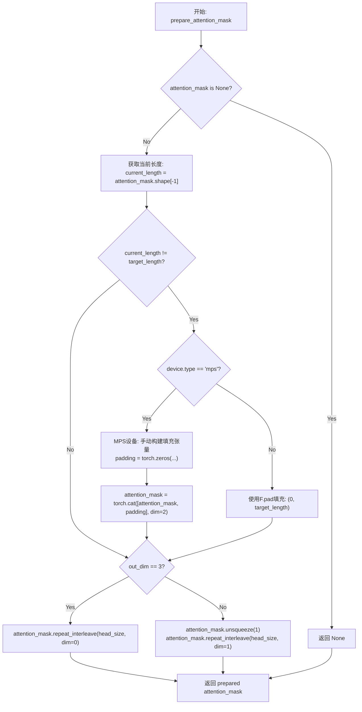

#### 带注释源码

```python
def prepare_attention_mask(
    self, attention_mask: torch.Tensor, target_length: int, batch_size: int, out_dim: int = 3
) -> torch.Tensor:
    r"""
    Prepare the attention mask for the attention computation.

    Args:
        attention_mask (`torch.Tensor`):
            The attention mask to prepare.
        target_length (`int`):
            The target length of the attention mask. This is the length of the attention mask after padding.
        batch_size (`int`):
            The batch size, which is used to repeat the attention mask.
        out_dim (`int`, *optional*, defaults to `3`):
            The output dimension of the attention mask. Can be either `3` or `4`.

    Returns:
        `torch.Tensor`: The prepared attention mask.
    """
    # 获取注意力头数量
    head_size = self.heads
    
    # 如果没有提供注意力掩码，直接返回 None
    if attention_mask is None:
        return attention_mask

    # 获取当前掩码的长度
    current_length: int = attention_mask.shape[-1]
    
    # 如果当前长度与目标长度不匹配，需要进行填充
    if current_length != target_length:
        # 检查设备类型，MPS设备特殊处理
        if attention_mask.device.type == "mps":
            # HACK: MPS: Does not support padding by greater than dimension of input tensor.
            # Instead, we can manually construct the padding tensor.
            # 手动构建填充张量，因为MPS不支持直接padding超过原始维度
            padding_shape = (attention_mask.shape[0], attention_mask.shape[1], target_length)
            padding = torch.zeros(padding_shape, dtype=attention_mask.dtype, device=attention_mask.device)
            # 将原始掩码与填充张量拼接
            attention_mask = torch.cat([attention_mask, padding], dim=2)
        else:
            # TODO: for pipelines such as stable-diffusion, padding cross-attn mask:
            #       we want to instead pad by (0, remaining_length), where remaining_length is:
            #       remaining_length: int = target_length - current_length
            # TODO: re-enable tests/models/test_models_unet_2d_condition.py#test_model_xattn_padding
            # 使用F.pad进行填充，在末尾填充0
            attention_mask = F.pad(attention_mask, (0, target_length), value=0.0)

    # 根据输出维度要求调整掩码形状
    if out_dim == 3:
        # 3维输出：将掩码在第0维（batch维）重复head_size次
        if attention_mask.shape[0] < batch_size * head_size:
            attention_mask = attention_mask.repeat_interleave(
                head_size, dim=0, output_size=attention_mask.shape[0] * head_size
            )
    elif out_dim == 4:
        # 4维输出：在第1维（head维）增加一个维度并重复head_size次
        attention_mask = attention_mask.unsqueeze(1)
        attention_mask = attention_mask.repeat_interleave(
            head_size, dim=1, output_size=attention_mask.shape[1] * head_size
        )

    return attention_mask
```


### `Attention.norm_encoder_hidden_states`

对编码器隐藏状态进行归一化处理。该方法根据 `Attention` 类中配置的 `norm_cross`（交叉注意力归一化层）类型，对 `encoder_hidden_states` 进行相应的归一化操作，支持 LayerNorm 和 GroupNorm 两种归一化方式。

参数：

- `encoder_hidden_states`：`torch.Tensor`，编码器的隐藏状态，形状为 `(batch_size, sequence_length, hidden_size)`

返回值：`torch.Tensor`，归一化后的编码器隐藏状态

#### 流程图

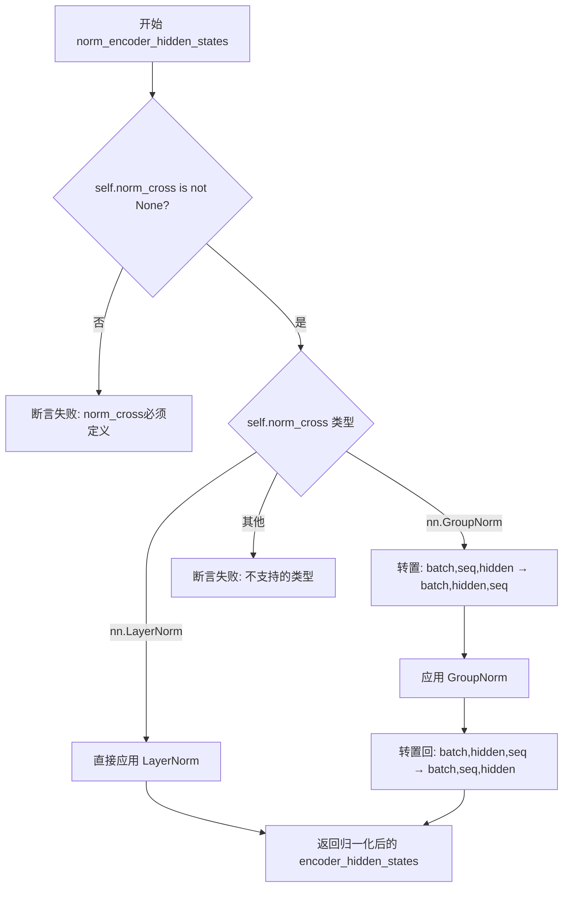

#### 带注释源码

```python
def norm_encoder_hidden_states(self, encoder_hidden_states: torch.Tensor) -> torch.Tensor:
    r"""
    Normalize the encoder hidden states. Requires `self.norm_cross` to be specified when constructing the
    `Attention` class.

    Args:
        encoder_hidden_states (`torch.Tensor`): Hidden states of the encoder.

    Returns:
        `torch.Tensor`: The normalized encoder hidden states.
    """
    # 断言检查：确保 norm_cross 已定义，否则无法执行归一化
    assert self.norm_cross is not None, "self.norm_cross must be defined to call self.norm_encoder_hidden_states"

    # 根据 norm_cross 的类型选择对应的归一化方式
    if isinstance(self.norm_cross, nn.LayerNorm):
        # LayerNorm 直接应用即可，输入形状 (batch, seq, hidden) 符合要求
        encoder_hidden_states = self.norm_cross(encoder_hidden_states)
    elif isinstance(self.norm_cross, nn.GroupNorm):
        # GroupNorm 期望输入形状为 (N, C, *)，即 (batch, channels, ...)
        # 当前输入是 (batch, seq, hidden)，需要转置为 (batch, hidden, seq)
        # 转置原因：GroupNorm 是沿通道维度进行归一化的
        encoder_hidden_states = encoder_hidden_states.transpose(1, 2)
        encoder_hidden_states = self.norm_cross(encoder_hidden_states)
        # 归一化后再转置回原来的形状 (batch, seq, hidden)
        encoder_hidden_states = encoder_hidden_states.transpose(1, 2)
    else:
        # 其他不支持的归一化类型，触发断言错误
        assert False

    return encoder_hidden_states
```


### Attention.fuse_projections

该方法用于将注意力机制中的多个线性投影层（query、key、value）融合为单个更高效的投影层，以减少内存占用并提高计算性能。它支持自注意力（self-attention）和交叉注意力（cross-attention）两种模式，并可处理额外的可学习投影。

参数：

- `fuse`：`bool`，默认为 `True`，控制是否启用投影融合。设为 `True` 时执行融合操作，设为 `False` 时可恢复分离的投影（需额外实现）。

返回值：`None`，该方法直接修改 `Attention` 类的实例属性，不返回任何值。

#### 流程图

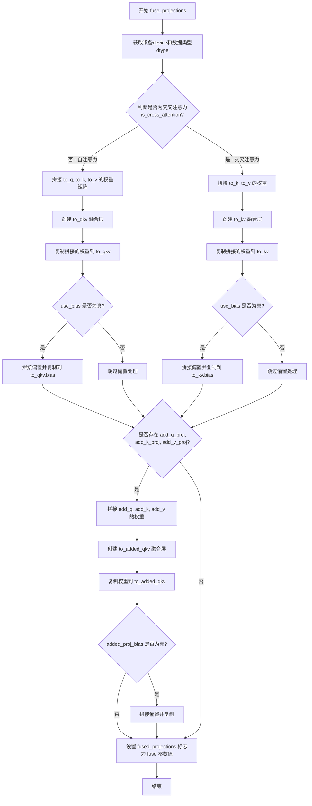

#### 带注释源码

```python
@torch.no_grad()
def fuse_projections(self, fuse=True):
    """
    将注意力层的多个投影矩阵（query、key、value）融合为单个投影矩阵，
    以减少内存占用并提高计算效率。
    
    Args:
        fuse: 布尔值，指定是否执行融合操作。默认为 True。
    """
    # 获取当前设备和数据类型，用于创建新的融合层
    device = self.to_q.weight.data.device
    dtype = self.to_q.weight.data.dtype

    # 根据是否为交叉注意力采用不同的融合策略
    if not self.is_cross_attention:
        # === 自注意力模式：融合 query、key、value 三个投影 ===
        
        # 1. 沿行维度拼接三个投影的权重矩阵
        # 形状: [out_features_q + out_features_k + out_features_v, in_features]
        concatenated_weights = torch.cat([self.to_q.weight.data, self.to_k.weight.data, self.to_v.weight.data])
        
        # 2. 计算输入输出维度
        in_features = concatenated_weights.shape[1]
        out_features = concatenated_weights.shape[0]
        
        # 3. 创建新的融合线性层，统一处理 Q、K、V 投影
        self.to_qkv = nn.Linear(in_features, out_features, bias=self.use_bias, device=device, dtype=dtype)
        
        # 4. 将拼接后的权重复制到融合层
        self.to_qkv.weight.copy_(concatenated_weights)
        
        # 5. 如果使用偏置，同样拼接并复制偏置向量
        if self.use_bias:
            concatenated_bias = torch.cat([self.to_q.bias.data, self.to_k.bias.data, self.to_v.bias.data])
            self.to_qkv.bias.copy_(concatenated_bias)

    else:
        # === 交叉注意力模式：仅融合 key、value 投影 ===
        # 交叉注意力中 query 来自隐藏状态，key/value 来自 encoder_hidden_states
        
        # 1. 仅拼接 key 和 value 的权重矩阵
        concatenated_weights = torch.cat([self.to_k.weight.data, self.to_v.weight.data])
        
        # 2. 计算输入输出维度
        in_features = concatenated_weights.shape[1]
        out_features = concatenated_weights.shape[0]
        
        # 3. 创建 kv 融合层
        self.to_kv = nn.Linear(in_features, out_features, bias=self.use_bias, device=device, dtype=dtype)
        
        # 4. 复制权重到融合层
        self.to_kv.weight.copy_(concatenated_weights)
        
        # 5. 复制偏置（如使用）
        if self.use_bias:
            concatenated_bias = torch.cat([self.to_k.bias.data, self.to_v.bias.data])
            self.to_kv.bias.copy_(concatenated_bias)

    # === 处理额外的可学习投影（用于 SD3 等模型）===
    # 检查是否存在 add_q_proj、add_k_proj、add_v_proj 三个额外的投影层
    if (
        getattr(self, "add_q_proj", None) is not None
        and getattr(self, "add_k_proj", None) is not None
        and getattr(self, "add_v_proj", None) is not None
    ):
        # 1. 拼接额外的 Q、K、V 投影权重
        concatenated_weights = torch.cat(
            [self.add_q_proj.weight.data, self.add_k_proj.weight.data, self.add_v_proj.weight.data]
        )
        
        # 2. 计算维度
        in_features = concatenated_weights.shape[1]
        out_features = concatenated_weights.shape[0]
        
        # 3. 创建融合的额外投影层
        self.to_added_qkv = nn.Linear(
            in_features, out_features, bias=self.added_proj_bias, device=device, dtype=dtype
        )
        
        # 4. 复制权重
        self.to_added_qkv.weight.copy_(concatenated_weights)
        
        # 5. 复制偏置（如使用）
        if self.added_proj_bias:
            concatenated_bias = torch.cat(
                [self.add_q_proj.bias.data, self.add_k_proj.bias.data, self.add_v_proj.bias.data]
            )
            self.to_added_qkv.bias.copy_(concatenated_bias)

    # 更新融合状态标志
    self.fused_projections = fuse
```


### `SanaMultiscaleAttentionProjection.forward`

这是一个多尺度注意力投影层的前向传播方法，通过两个深度可分离卷积对输入特征进行多尺度投影处理。

参数：

- `hidden_states`：`torch.Tensor`，输入的隐藏状态张量，通常为四维张量 (batch, channels, height, width)

返回值：`torch.Tensor`，经过两次卷积投影后的输出张量

#### 流程图

```mermaid
flowchart TD
    A[输入 hidden_states] --> B[proj_in 深度卷积]
    B --> C[proj_out 深度卷积]
    C --> D[输出 hidden_states]
    
    subgraph "proj_in"
        B1[输入: (B, 3*in_channels, H, W)]
        B2[分组卷积: groups=3*in_channels]
        B3[输出: (B, 3*in_channels, H, W)]
    end
    
    subgraph "proj_out"
        C1[输入: (B, 3*in_channels, H, W)]
        C2[分组卷积: groups=3*num_attention_heads]
        C3[输出: (B, 3*in_channels, H, W)]
    end
    
    B --> B2
    B2 --> B3
    B3 --> C
    C --> C2
    C2 --> C3
```

#### 带注释源码

```python
def forward(self, hidden_states: torch.Tensor) -> torch.Tensor:
    """
    前向传播方法，对隐藏状态进行多尺度注意力投影
    
    参数:
        hidden_states: 输入张量，形状为 (batch, 3*in_channels, height, width)
                     实际上在调用处，in_channels 传入的是 inner_dim
                     hidden_states 是由 query, key, value 沿通道维度拼接而成
    
    返回:
        经过两个投影层处理后的张量，形状不变
    """
    # 第一次投影：使用深度可分离卷积（groups=channels）
    # kernel_size 控制感受野大小，实现多尺度特征提取
    # padding=kernel_size//2 确保输出尺寸与输入相同
    hidden_states = self.proj_in(hidden_states)
    
    # 第二次投影：使用点卷积（kernel_size=1）
    # groups=3*num_attention_heads 实现分组注意力投影
    # 这种分组方式使得不同注意力头可以有独立的投影权重
    hidden_states = self.proj_out(hidden_states)
    
    return hidden_states
```

#### 详细说明

**设计目的：**
该模块是 Sana 架构中多尺度线性注意力的核心组件。通过使用不同核大小的深度可分离卷积（`proj_in`）和分组点卷积（`proj_out`），实现对特征的多尺度投影，增强模型对不同尺度特征的捕获能力。

**技术特点：**

1. **深度可分离卷积** (`proj_in`)：使用 `groups=channels` 实现通道级别的卷积，每个输入通道独立进行卷积运算，极大减少参数量和计算量
2. **分组点卷积** (`proj_out`)：使用 `groups=3*num_attention_heads`，使得不同注意力头的特征可以独立变换
3. **多尺度感受野**：通过传入不同的 `kernel_size` 参数，可以捕获不同尺度的空间特征

**调用关系：**
此方法被 `SanaMultiscaleLinearAttention` 类中的 `to_qkv_multiscale` 模块列表调用，每个 `kernel_size` 创建一个独立的投影层，用于捕获不同尺度的特征信息。


### `SanaMultiscaleLinearAttention.__init__`

初始化 SanaMultiscaleLinearAttention 类，构建轻量级多尺度线性注意力模块的完整结构，包括 QKV 投影层、多尺度投影模块、非线性激活、输出投影层以及注意力处理器。

参数：

- `in_channels`：`int`，输入特征的通道数
- `out_channels`：`int`，输出特征的通道数
- `num_attention_heads`：`int | None`，注意力头数量，若为 None 则根据 `in_channels // attention_head_dim * mult` 自动计算
- `attention_head_dim`：`int = 8`，每个注意力头的维度
- `mult`：`float = 1.0`，用于缩放计算出的注意力头数量的乘数
- `norm_type`：`str = "batch_norm"`，
- `kernel_sizes`：`tuple[int, ...] = (5,)`，多尺度投影使用的卷积核大小元组
- `eps`：`float = 1e-15`，用于数值稳定性的 epsilon 值
- `residual_connection`：`bool = False`，是否添加残差连接

返回值：无（`None`）

#### 流程图

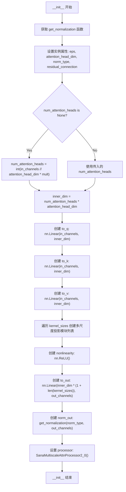

#### 带注释源码

```
def __init__(
    self,
    in_channels: int,
    out_channels: int,
    num_attention_heads: int | None = None,
    attention_head_dim: int = 8,
    mult: float = 1.0,
    norm_type: str = "batch_norm",
    kernel_sizes: tuple[int, ...] = (5,),
    eps: float = 1e-15,
    residual_connection: bool = False,
):
    super().__init__()

    # 防止循环导入，从子模块动态获取归一化函数
    from .normalization import get_normalization

    # 保存配置参数
    self.eps = eps  # 数值稳定性 epsilon
    self.attention_head_dim = attention_head_dim  # 注意力头维度
    self.norm_type = norm_type  # 归一化类型
    self.residual_connection = residual_connection  # 残差连接标志

    # 计算注意力头数：若未指定则根据输入通道和缩放因子自动计算
    num_attention_heads = (
        int(in_channels // attention_head_dim * mult) 
        if num_attention_heads is None 
        else num_attention_heads
    )
    # 计算内部维度 = 头数 * 每头维度
    inner_dim = num_attention_heads * attention_head_dim

    # 创建 QKV 投影层（无偏置）
    self.to_q = nn.Linear(in_channels, inner_dim, bias=False)
    self.to_k = nn.Linear(in_channels, inner_dim, bias=False)
    self.to_v = nn.Linear(in_channels, inner_dim, bias=False)

    # 创建多尺度 QKV 投影模块列表
    self.to_qkv_multiscale = nn.ModuleList()
    for kernel_size in kernel_sizes:
        self.to_qkv_multiscale.append(
            SanaMultiscaleAttentionProjection(inner_dim, num_attention_heads, kernel_size)
        )

    # 非线性激活函数
    self.nonlinearity = nn.ReLU()
    
    # 输出投影层：将多尺度特征映射回输出通道
    # 输入维度 = inner_dim * (1 + len(kernel_sizes))，包含原始 QKV + 多尺度特征
    self.to_out = nn.Linear(inner_dim * (1 + len(kernel_sizes)), out_channels, bias=False)
    
    # 输出归一化层
    self.norm_out = get_normalization(norm_type, num_features=out_channels)

    # 设置注意力处理器
    self.processor = SanaMultiscaleAttnProcessor2_0()
```


### `SanaMultiscaleLinearAttention.apply_linear_attention`

该函数实现了线性注意力（Linear Attention）机制，用于 Sana 多尺度线性注意力模块。它通过巧妙的矩阵运算技巧，将传统的 Softmax 注意力替换为线性注意力，有效降低了计算复杂度（从 O(N²) 降至 O(N)），特别适用于高分辨率图像特征的处理。

参数：

- `query`：`torch.Tensor`，查询张量，形状为 `[batch, channels, height, width]` 或经过预处理的多尺度形式
- `key`：`torch.Tensor`，键张量，与 query 形状相同
- `value`：`torch.Tensor`，值张量，与 query 形状相同

返回值：`torch.Tensor`，经过线性注意力计算后的隐藏状态张量

#### 流程图

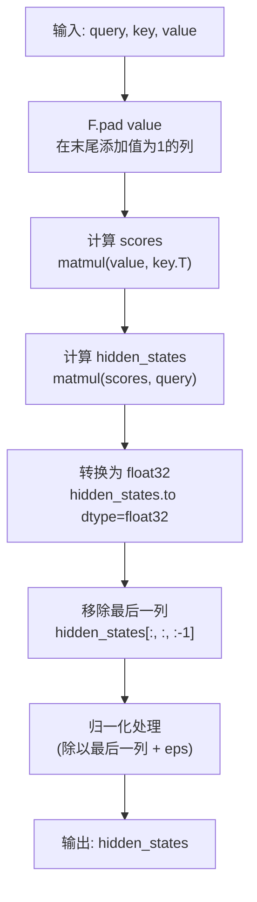

#### 带注释源码

```python
def apply_linear_attention(self, query: torch.Tensor, key: torch.Tensor, value: torch.Tensor) -> torch.Tensor:
    """
    应用线性注意力机制（Linear Attention）
    
    线性注意力通过以下公式近似标准注意力：
    Attention(Q, K, V) = softmax(QK^T)V ≈ (ϕ(Q)(ϕ(K)^T V)) / (1^T ϕ(K)^T V)
    
    其中 ϕ(x) = ELU(x) + 1（在此方法外部通过 ReLU 非线性实现）
    这使得我们可以将矩阵乘法重新排列为：
    (V @ K^T) @ Q，然后使用归一化技巧避免显式计算 Softmax
    """
    
    # 步骤1：在 value 的最后一个维度末尾添加一列，值为1
    # 这是为了在后续计算中记录分母（归一化因子）
    # 形状变化: [B, N, D] -> [B, N+1, D]
    value = F.pad(value, (0, 0, 0, 1), mode="constant", value=1)  # Adds padding
    
    # 步骤2：计算注意力分数矩阵
    # 先计算 value 和 key 的转置的矩阵乘积
    # shapes: value [B, N+1, D] @ key [B, D, N] -> scores [B, N+1, N]
    scores = torch.matmul(value, key.transpose(-1, -2))
    
    # 步骤3：计算最终的隐藏状态
    # scores [B, N+1, N] @ query [B, N, D] -> hidden_states [B, N+1, D]
    hidden_states = torch.matmul(scores, query)
    
    # 步骤4：转换为 float32 以提高数值稳定性
    # 避免在混合精度训练中出现精度损失
    hidden_states = hidden_states.to(dtype=torch.float32)
    
    # 步骤5：移除添加的填充列，并进行归一化
    # hidden_states[:, :, -1:] 包含归一化因子（由最初添加的1累积而来）
    # hidden_states[:, :, :-1] 是实际的注意力输出
    # 除以归一化因子 + eps（防止除零）得到最终结果
    hidden_states = hidden_states[:, :, :-1] / (hidden_states[:, :, -1:] + self.eps)
    
    return hidden_states
```


### `SanaMultiscaleLinearAttention.apply_quadratic_attention`

该方法是 SanaMultiscaleLinearAttention 类中的二次注意力（quadratic attention）实现，通过计算 key 和 query 的矩阵乘法得到注意力分数，进行归一化后再与 value 相乘得到最终的隐藏状态。这种二次注意力机制适用于特征图尺寸较大的场景，能够在不保留完整注意力矩阵的情况下计算注意力。

参数：

- `query`：`torch.Tensor`，输入的查询张量，通常来自模型的 query 投影
- `key`：`torch.Tensor`，输入的键张量，通常来自模型的 key 投影
- `value`：`torch.Tensor`，输入的值张量，通常来自模型的 value 投影

返回值：`torch.Tensor`，经过二次注意力计算后的隐藏状态张量

#### 流程图

```mermaid
flowchart TD
    A[开始] --> B[计算 scores = key.T @ query]
    B --> C[将 scores 转换为 float32 类型]
    C --> D[归一化 scores: scores / sum(scores, dim=2, keepdim=True + eps]
    D --> E[计算 hidden_states = value @ scores.to(value.dtype)]
    E --> F[返回 hidden_states]
```

#### 带注释源码

```python
def apply_quadratic_attention(self, query: torch.Tensor, key: torch.Tensor, value: torch.Tensor) -> torch.Tensor:
    """
    应用二次注意力机制
    
    参数:
        query: 查询张量 [batch, num_heads, seq_len, head_dim]
        key: 键张量 [batch, num_heads, seq_len, head_dim]
        value: 值张量 [batch, num_heads, seq_len, head_dim]
    
    返回:
        hidden_states: 注意力输出张量
    """
    # 第一步: 计算 key 和 query 的矩阵乘法
    # key.transpose(-1, -2) 将 key 的最后两个维度交换
    # 结果 scores 形状为 [batch, num_heads, key_seq_len, query_seq_len]
    scores = torch.matmul(key.transpose(-1, -2), query)
    
    # 第二步: 转换为 float32 以提高数值稳定性
    # 避免在 softmax 计算时出现数值溢出问题
    scores = scores.to(dtype=torch.float32)
    
    # 第三步: 归一化处理
    # 对 scores 在 dim=2 上求和，然后加上 eps 避免除零
    # keepdim=True 保持维度以便广播操作
    scores = scores / (torch.sum(scores, dim=2, keepdim=True) + self.eps)
    
    # 第四步: 将归一化后的分数转换回 value 的数据类型
    # 然后与 value 进行矩阵乘法得到最终隐藏状态
    hidden_states = torch.matmul(value, scores.to(value.dtype))
    
    return hidden_states
```


### SanaMultiscaleLinearAttention.forward

该方法是 Sana 模型中轻量级多尺度线性注意力模块的前向传播函数，通过委托给 `SanaMultiscaleAttnProcessor2_0` 处理器执行实际的注意力计算，支持线性注意力和二次注意力两种模式。

参数：

- `hidden_states`：`torch.Tensor`，输入的隐藏状态张量，通常为 (batch_size, channels, height, width) 形状

返回值：`torch.Tensor`，经过注意力计算后的输出张量

#### 流程图

```mermaid
flowchart TD
    A[hidden_states 输入] --> B{height × width > attention_head_dim?}
    B -->|是| C[use_linear_attention = True]
    B -->|否| D[use_linear_attention = False]
    C --> E[保存 residual 连接]
    D --> E
    E --> F[维度变换: moveaxis (C, H, W) -> (C, H*W)]
    F --> G[计算 query, key, value]
    G --> H[多尺度 QKV 投影]
    H --> I{use_linear_attention?}
    I -->|是| J[apply_linear_attention]
    I -->|否| K[apply_quadratic_attention]
    J --> L[转换为原始数据类型]
    K --> L
    L --> M[reshape 到 (B, C, H, W)]
    M --> N[to_out 线性投影]
    N --> O{norm_type == 'rms_norm'?}
    O -->|是| P[RMSNorm 归一化]
    O -->|否| Q[BatchNorm 归一化]
    P --> R{residual_connection?}
    Q --> R
    R -->|是| S[hidden_states + residual]
    R -->|否| T[返回 hidden_states]
    S --> T
```

#### 带注释源码

```python
def forward(self, hidden_states: torch.Tensor) -> torch.Tensor:
    # 根据输入分辨率决定使用线性注意力还是二次注意力
    # 当 token 数量大于 attention_head_dim 时，使用线性注意力更高效
    height, width = hidden_states.shape[-2:]
    if height * width > attn.attention_head_dim:
        use_linear_attention = True
    else:
        use_linear_attention = False

    # 保存输入作为残差连接
    residual = hidden_states

    # 获取批次大小和原始数据类型
    batch_size, _, height, width = list(hidden_states.size())
    original_dtype = hidden_states.dtype

    # 将通道维移到最后，变为 (B, H, W, C) 形状用于 QKV 计算
    hidden_states = hidden_states.movedim(1, -1)
    
    # 计算 query, key, value 投影
    query = attn.to_q(hidden_states)
    key = attn.to_k(hidden_states)
    value = attn.to_v(hidden_states)
    
    # 拼接 QKV: (B, H, W, 3*C)
    hidden_states = torch.cat([query, key, value], dim=3)
    
    # 恢复通道维位置: (B, 3*C, H, W)
    hidden_states = hidden_states.movedim(-1, 1)

    # 多尺度 QKV 投影 - 使用不同的卷积核大小
    multi_scale_qkv = [hidden_states]
    for block in attn.to_qkv_multiscale:
        multi_scale_qkv.append(block(hidden_states))

    # 拼接多尺度特征: (B, 3*C * (1 + num_scales), H, W)
    hidden_states = torch.cat(multi_scale_qkv, dim=1)

    if use_linear_attention:
        # 线性注意力需要 float32 计算以保证数值稳定性
        hidden_states = hidden_states.to(dtype=torch.float32)

    # 重塑为 (B, -1, 3*head_dim, H*W) 形状
    hidden_states = hidden_states.reshape(batch_size, -1, 3 * attn.attention_head_dim, height * width)

    # 分割得到 query, key, value
    query, key, value = hidden_states.chunk(3, dim=2)
    
    # 应用非线性激活 (ReLU)
    query = attn.nonlinearity(query)
    key = attn.nonlinearity(key)

    if use_linear_attention:
        # 使用线性注意力机制
        # 公式: attention(Q, K, V) = (V @ K^T) @ Q / (V @ K^T @ 1)
        # 通过在 value 末尾填充 1 来计算归一化因子
        hidden_states = attn.apply_linear_attention(query, key, value)
        
        # 转换回原始数据类型
        hidden_states = hidden_states.to(dtype=original_dtype)
    else:
        # 使用二次注意力机制 (标准注意力)
        hidden_states = attn.apply_quadratic_attention(query, key, value)

    # 重塑回 (B, C, H, W) 形状
    hidden_states = torch.reshape(hidden_states, (batch_size, -1, height, width))
    
    # 输出投影: (B, out_channels, H, W)
    hidden_states = attn.to_out(hidden_states.movedim(1, -1)).movedim(-1, 1)

    # 归一化处理
    if attn.norm_type == "rms_norm":
        hidden_states = attn.norm_out(hidden_states.movedim(1, -1)).movedim(-1, 1)
    else:
        hidden_states = attn.norm_out(hidden_states)

    # 残差连接
    if attn.residual_connection:
        hidden_states = hidden_states + residual

    return hidden_states
```


### MochiAttention.forward

该方法是 `MochiAttention` 类的成员方法，负责将查询、键、值的投影以及可选的编码器隐藏状态传递给注意力处理器（`MochiAttnProcessor2_0`）执行实际的注意力计算，并返回处理后的隐藏状态和编码器隐藏状态。

参数：

- `self`：`MochiAttention` 实例本身
- `hidden_states`：`torch.Tensor`，查询的隐藏状态
- `encoder_hidden_states`：`torch.Tensor | None`，编码器的隐藏状态，默认为 None
- `attention_mask`：`torch.Tensor | None`，注意力掩码，用于指定哪些位置需要被遮挡，默认为 None
- `**kwargs`：其他关键字参数，会传递给注意力处理器

返回值：`tuple[torch.Tensor, torch.Tensor]`，返回一个元组，包含处理后的隐藏状态和编码器隐藏状态

#### 流程图

```mermaid
flowchart TD
    A["输入: hidden_states, encoder_hidden_states, attention_mask, **kwargs"] --> B["调用 self.processor"]
    B --> C["self.processor.__call__"]
    C --> D["执行注意力计算"]
    D --> E{"返回类型"}
    E -->|"返回元组"| F["(hidden_states, encoder_hidden_states)"]
    E -->|"返回单个张量"| G["hidden_states"]
    F --> H["输出: (hidden_states, encoder_hidden_states)"]
    G --> I["输出: hidden_states"]
```

#### 带注释源码

```python
def forward(
    self,
    hidden_states: torch.Tensor,
    encoder_hidden_states: torch.Tensor | None = None,
    attention_mask: torch.Tensor | None = None,
    **kwargs,
):
    """
    MochiAttention 的前向传播方法。
    
    该方法将输入的隐藏状态委托给注意力处理器（processor）来执行实际的注意力计算。
    处理器通常会执行以下操作：
    1. 对 hidden_states 进行 Q、K、V 投影
    2. 对 encoder_hidden_states 进行额外的 Q、K、V 投影（如果提供）
    3. 应用注意力机制（如 scaled_dot_product_attention）
    4. 返回处理后的隐藏状态和编码器隐藏状态
    
    参数:
        hidden_states: 查询的隐藏状态张量，形状为 (batch_size, seq_len, hidden_dim)
        encoder_hidden_states: 编码器的隐藏状态张量，用于跨注意力机制，可选
        attention_mask: 注意力掩码，用于控制哪些位置参与注意力计算，可选
        **kwargs: 额外的关键字参数，如 image_rotary_emb 等
    
    返回:
        tuple[torch.Tensor, torch.Tensor]: 处理后的 (hidden_states, encoder_hidden_states)
    """
    # 委托给处理器执行实际的注意力计算
    # 处理器是 MochiAttnProcessor2_0 的实例
    return self.processor(
        self,  # 传递注意力模块自身，以便处理器访问其内部参数
        hidden_states,
        encoder_hidden_states=encoder_hidden_states,
        attention_mask=attention_mask,
        **kwargs,  # 传递其他关键字参数，如 image_rotary_emb
    )
```


### `MochiAttnProcessor2_0.__init__`

该方法是 MochiAttnProcessor2_0 类的构造函数，用于初始化注意力处理器。它检查 PyTorch 版本是否支持 scaled_dot_product_attention 函数（PyTorch 2.0+ 的特性），如果不支持则抛出 ImportError 异常。这是使用该处理器的前置条件检查。

参数：

- `self`：`MochiAttnProcessor2_0`，MochiAttnProcessor2_0 类的实例对象本身

返回值：`None`，该方法不返回任何值，仅进行初始化检查

#### 流程图

```mermaid
flowchart TD
    A[开始 __init__] --> B{检查 PyTorch 是否支持<br/>scaled_dot_product_attention}
    B -->|支持| C[初始化完成<br/>返回 None]
    B -->|不支持| D[抛出 ImportError 异常<br/>提示升级 PyTorch 到 2.0]
```

#### 带注释源码

```python
def __init__(self):
    # 检查 PyTorch 是否支持 scaled_dot_product_attention 函数
    # scaled_dot_product_attention 是 PyTorch 2.0 引入的原生闪光注意力函数
    # 如果不支持，抛出 ImportError 异常，提示用户升级 PyTorch
    if not hasattr(F, "scaled_dot_product_attention"):
        raise ImportError("MochiAttnProcessor2_0 requires PyTorch 2.0. To use it, please upgrade PyTorch to 2.0.")
```


### `MochiAttnProcessor2_0.__call__`

MochiAttnProcessor2_0 是用于 Mochi 模型的注意力处理器，實現了帶有旋轉嵌入（RoPE）和條件掩碼的擴展多头注意力機制，支持圖像和文本特徵的聯合處理。

参数：

- `attn`：`MochiAttention`，Mochi 注意力模組實例
- `hidden_states`：`torch.Tensor`，輸入的隱藏狀態張量
- `encoder_hidden_states`：`torch.Tensor`，編碼器輸出的隱藏狀態（條件信息）
- `attention_mask`：`torch.Tensor`，用於指示有效條件標記的注意力掩碼
- `image_rotary_emb`：`torch.Tensor | None = None`，可選的圖像旋轉位置編碼

返回值：`tuple[torch.Tensor, torch.Tensor]`，返回處理後的隱藏狀態和編碼器隱藏狀態元組

#### 流程图

```mermaid
flowchart TD
    A[開始] --> B[Q/K/V 投影]
    B --> C[unflatten to heads]
    D[norm_q/norm_k] --> E[Encoder Q/K/V 投影]
    E --> F[Encoder norm]
    G{RoPE?} --> |Yes| H[apply_rotary_emb to Q/K]
    G --> |No| I[ transpose to (batch, heads, seq, dim)]
    H --> I
    I --> J[計算 sequence_length]
    J --> K[遍歷 batch]
    K --> L[獲取有效標記索引]
    L --> M[拼接有效 Q/K/V]
    M --> N[F.scaled_dot_product_attention]
    N --> O[padding to total_length]
    O --> P[collect all outputs]
    P --> Q[concat outputs]
    Q --> R[split hidden_states and encoder_hidden_states]
    R --> S[to_out projection]
    S --> T[dropout]
    T --> U{has to_add_out?}
    U --> |Yes| V[apply to_add_out]
    U --> |No| W[返回 tuple]
    V --> W
```

#### 带注释源码

```
def __call__(
    self,
    attn: "MochiAttention",          # MochiAttention 注意力模組
    hidden_states: torch.Tensor,      # 輸入隱藏狀態 [B, N, D]
    encoder_hidden_states: torch.Tensor,  # 編碼器隱藏狀態 [B, M, D]
    attention_mask: torch.Tensor,      # 注意力掩碼 [B, M]
    image_rotary_emb: torch.Tensor | None = None,  # 旋轉嵌入
) -> torch.Tensor:
    # 1. 從 hidden_states 計算 Q, K, V
    query = attn.to_q(hidden_states)  # [B, N, D]
    key = attn.to_k(hidden_states)    # [B, N, D]
    value = attn.to_v(hidden_states)  # [B, N, D]

    # 2. reshape 到 (batch, heads, seq, dim)
    query = query.unflatten(2, (attn.heads, -1))
    key = key.unflatten(2, (attn.heads, -1))
    value = value.unflatten(2, (attn.heads, -1))

    # 3. 應用 Q/K 歸一化
    if attn.norm_q is not None:
        query = attn.norm_q(query)
    if attn.norm_k is not None:
        key = attn.norm_k(key)

    # 4. 從 encoder_hidden_states 計算額外的 Q/K/V
    encoder_query = attn.add_q_proj(encoder_hidden_states)
    encoder_key = attn.add_k_proj(encoder_hidden_states)
    encoder_value = attn.add_v_proj(encoder_hidden_states)

    encoder_query = encoder_query.unflatten(2, (attn.heads, -1))
    encoder_key = encoder_key.unflatten(2, (attn.heads, -1))
    encoder_value = encoder_value.unflatten(2, (attn.heads, -1))

    if attn.norm_added_q is not None:
        encoder_query = attn.norm_added_q(encoder_query)
    if attn.norm_added_k is not None:
        encoder_key = attn.norm_added_k(encoder_key)

    # 5. 應用旋轉嵌入（如果提供）
    if image_rotary_emb is not None:
        def apply_rotary_emb(x, freqs_cos, freqs_sin):
            # 標準 RoPE 實現
            x_even = x[..., 0::2].float()
            x_odd = x[..., 1::2].float()
            cos = (x_even * freqs_cos - x_odd * freqs_sin).to(x.dtype)
            sin = (x_even * freqs_sin + x_odd * freqs_cos).to(x.dtype)
            return torch.stack([cos, sin], dim=-1).flatten(-2)

        query = apply_rotary_emb(query, *image_rotary_emb)
        key = apply_rotary_emb(key, *image_rotary_emb)

    # 6. 轉置維度 (batch, heads, seq, dim)
    query, key, value = query.transpose(1, 2), key.transpose(1, 2), value.transpose(1, 2)
    encoder_query, encoder_key, encoder_value = (
        encoder_query.transpose(1, 2),
        encoder_key.transpose(1, 2),
        encoder_value.transpose(1, 2),
    )

    # 7. 計算序列長度
    sequence_length = query.size(2)
    encoder_sequence_length = encoder_query.size(2)
    total_length = sequence_length + encoder_sequence_length

    # 8. 逐樣本處理（根據 attention_mask 過濾有效標記）
    batch_size, heads, _, dim = query.shape
    attn_outputs = []
    for idx in range(batch_size):
        mask = attention_mask[idx][None, :]  # 獲取當前樣本的掩碼
        # 找出有效標記的索引
        valid_prompt_token_indices = torch.nonzero(mask.flatten(), as_tuple=False).flatten()

        # 獲取有效的 encoder Q/K/V
        valid_encoder_query = encoder_query[idx : idx + 1, :, valid_prompt_token_indices, :]
        valid_encoder_key = encoder_key[idx : idx + 1, :, valid_prompt_token_indices, :]
        valid_encoder_value = encoder_value[idx : idx + 1, :, valid_prompt_token_indices, :]

        # 拼接 query 和有效 encoder 特徵
        valid_query = torch.cat([query[idx : idx + 1], valid_encoder_query], dim=2)
        valid_key = torch.cat([key[idx : idx + 1], valid_encoder_key], dim=2)
        valid_value = torch.cat([value[idx : idx + 1], valid_encoder_value], dim=2)

        # 執行注意力計算
        attn_output = F.scaled_dot_product_attention(
            valid_query, valid_key, valid_value, dropout_p=0.0, is_causal=False
        )
        
        # padding 回 total_length
        valid_sequence_length = attn_output.size(2)
        attn_output = F.pad(attn_output, (0, 0, 0, total_length - valid_sequence_length))
        attn_outputs.append(attn_output)

    # 9. 合併所有樣本輸出
    hidden_states = torch.cat(attn_outputs, dim=0)
    hidden_states = hidden_states.transpose(1, 2).flatten(2, 3)

    # 10. 拆分為 hidden_states 和 encoder_hidden_states
    hidden_states, encoder_hidden_states = hidden_states.split_with_sizes(
        (sequence_length, encoder_sequence_length), dim=1
    )

    # 11. 輸出投影
    hidden_states = attn.to_out[0](hidden_states)  # 線性投影
    hidden_states = attn.to_out[1](hidden_states)  # Dropout

    # 12. 額外的輸出投影（如果存在）
    if hasattr(attn, "to_add_out"):
        encoder_hidden_states = attn.to_add_out(encoder_hidden_states)

    return hidden_states, encoder_hidden_states
```


### SpatialNorm.forward

该方法实现了一种空间条件归一化（Spatially Conditioned Normalization），首先对输入特征进行组归一化，然后使用量化向量生成的空间调制系数（缩放和偏置）对归一化后的特征进行调制，从而实现基于空间信息的特征增强。

参数：

- `f`：`torch.Tensor`，输入的特征张量，形状为 (batch, channels, height, width)
- `zq`：`torch.Tensor`，量化向量，用于生成空间调制系数，形状为 (batch, zq_channels, height, width)

返回值：`torch.Tensor`，经过空间条件归一化后的特征张量，形状与输入 f 相同 (batch, f_channels, height, width)

#### 流程图

```mermaid
graph TD
    A[输入特征 f: torch.Tensor] --> B[获取 f 的空间尺寸]
    C[输入量化向量 zq: torch.Tensor] --> D[插值操作]
    
    D --> B
    B --> E[组归一化: norm_layer]
    E --> F[计算缩放系数: conv_y]
    D --> G[计算偏置系数: conv_b]
    F --> H[特征调制: new_f = norm_f * conv_y + conv_b]
    G --> H
    H --> I[输出: torch.Tensor]
```

#### 带注释源码

```python
def forward(self, f: torch.Tensor, zq: torch.Tensor) -> torch.Tensor:
    # 获取输入特征张量 f 的空间维度 (height, width)
    f_size = f.shape[-2:]
    
    # 将量化向量 zq 插值到与特征 f 相同的空间尺寸
    # 使用最近邻插值方法，确保空间维度对齐
    zq = F.interpolate(zq, size=f_size, mode="nearest")
    
    # 对输入特征 f 进行组归一化
    # 组归一化将特征通道分成若干组进行归一化，独立于batch维度
    norm_f = self.norm_layer(f)
    
    # 使用卷积层 conv_y 将量化向量映射为缩放系数
    # 然后将归一化后的特征与缩放系数逐元素相乘
    new_f = norm_f * self.conv_y(zq) + self.conv_b(zq)
    
    # 使用卷积层 conv_b 将量化向量映射为偏置系数
    # 将偏置系数逐元素加到特征上，完成空间条件归一化
    return new_f
```


### IPAdapterAttnProcessor.__call__

该方法是 `IPAdapterAttnProcessor` 类的核心调用方法，用于实现多 IP-Adapter（Image Prompt Adapter）的注意力处理。该处理器通过将图像特征（ip_hidden_states）注入到 cross-attention 机制中，实现对图像提示的条件生成支持。方法首先执行标准的 self-attention 计算，然后对每个 IP-Adapter 的图像特征分别计算 cross-attention 并将结果按权重叠加到主 hidden_states 上，同时支持可选的掩码处理。

参数：

-  `self`：IPAdapterAttnProcessor 实例本身
-  `attn: Attention`：Attention 模块实例，提供投影层和工具方法
-  `hidden_states: torch.Tensor`，输入的隐藏状态张量，形状为 [batch_size, seq_len, hidden_size] 或 [batch_size, channel, height, width]
-  `encoder_hidden_states: torch.Tensor | None`，编码器隐藏状态（文本特征），可以是元组（encoder_hidden_states, ip_hidden_states）或单独张量
-  `attention_mask: torch.Tensor | None`，注意力掩码，用于掩盖无效位置
-  `temb: torch.Tensor | None`，时间嵌入，用于空间归一化
-  `scale: float = 1.0`，IP-Adapter 的全局缩放因子
-  `ip_adapter_masks: torch.Tensor | None`，IP-Adapter 的掩码列表，用于控制每张图像的注意力区域

返回值：`torch.Tensor`，处理后的隐藏状态张量

#### 流程图

```mermaid
flowchart TD
    A[开始 __call__] --> B[保存残差 hidden_states]
    B --> C{encoder_hidden_states 是否为元组}
    C -->|是| D[解包为 encoder_hidden_states 和 ip_hidden_states]
    C -->|否| E[发出弃用警告并提取 ip_hidden_states]
    D --> F
    E --> F
    F{attn.spatial_norm is not None}
    F -->|是| G[应用空间归一化]
    F -->|否| H
    G --> H
    H{hidden_states ndim == 4}
    H -->|是| I[重塑为 [B, C, H*W] 转置为 [B, H*W, C]]
    H -->|否| J
    I --> J
    J[准备注意力掩码]
    J --> K{attn.group_norm is not None}
    K -->|是| L[应用组归一化]
    K -->|否| M
    L --> M
    M[计算 query = attn.to_q]
    M --> N{encoder_hidden_states is None}
    N -->|是| O[encoder_hidden_states = hidden_states]
    N -->|否| P{attn.norm_cross is not None}
    P -->|是| Q[归一化 encoder_hidden_states]
    P -->|否| R
    O --> R
    Q --> R
    R[计算 key 和 value]
    R --> S[转换为 batch 维度]
    S --> T[计算标准 attention_scores]
    T --> U[计算 hidden_states = bmm attention_probs, value]
    U --> V[转换回 head 维度]
    V --> W{ip_adapter_masks is not None}
    W -->|是| X[验证掩码长度和形状]
    W -->|否| Y[创建空掩码列表]
    X --> Z
    Y --> Z
    Z[遍历 ip_hidden_states, scale, to_k_ip, to_v_ip, mask]
    Z --> AA{scale == 0 或全为0}
    AA -->|是| AB[跳过当前 ip]
    AA -->|否| AC{mask is not None}
    AC -->|是| AD[处理带掩码的情况]
    AC -->|否| AE[处理无掩码的情况]
    AD --> AF
    AE --> AF
    AF[累加到 hidden_states]
    AB --> Z
    Z --> AG[应用输出投影 attn.to_out]
    AG --> AH{input_ndim == 4}
    AH -->|是| AI[重塑回 [B, C, H, W]]
    AH -->|否| AJ
    AI --> AJ
    AJ{attn.residual_connection}
    AJ -->|是| AK[hidden_states = hidden_states + residual]
    AJ -->|否| AL
    AK --> AL
    AL[除以 rescale_output_factor]
    AL --> AM[返回 hidden_states]
```

#### 带注释源码

```python
def __call__(
    self,
    attn: Attention,
    hidden_states: torch.Tensor,
    encoder_hidden_states: torch.Tensor | None = None,
    attention_mask: torch.Tensor | None = None,
    temb: torch.Tensor | None = None,
    scale: float = 1.0,
    ip_adapter_masks: torch.Tensor | None = None,
):
    # 保存残差连接，用于后续相加
    residual = hidden_states

    # separate ip_hidden_states from encoder_hidden_states
    # 从 encoder_hidden_states 中分离出 ip_hidden_states
    if encoder_hidden_states is not None:
        if isinstance(encoder_hidden_states, tuple):
            # 如果是元组，直接解包
            encoder_hidden_states, ip_hidden_states = encoder_hidden_states
        else:
            # 兼容旧版本：单个张量的情况下，提取末尾的 num_tokens 作为 ip_hidden_states
            deprecation_message = (
                "You have passed a tensor as `encoder_hidden_states`. This is deprecated and will be removed in a future release."
                " Please make sure to update your script to pass `encoder_hidden_states` as a tuple to suppress this warning."
            )
            deprecate("encoder_hidden_states not a tuple", "1.0.0", deprecation_message, standard_warn=False)
            end_pos = encoder_hidden_states.shape[1] - self.num_tokens[0]
            encoder_hidden_states, ip_hidden_states = (
                encoder_hidden_states[:, :end_pos, :],
                [encoder_hidden_states[:, end_pos:, :]],  # 包装为列表
            )

    # 应用空间归一化（如果配置了的话）
    if attn.spatial_norm is not None:
        hidden_states = attn.spatial_norm(hidden_states, temb)

    # 获取输入维度
    input_ndim = hidden_states.ndim

    # 如果是 4D 张量 (B, C, H, W)，转换为 3D (B, H*W, C)
    if input_ndim == 4:
        batch_size, channel, height, width = hidden_states.shape
        hidden_states = hidden_states.view(batch_size, channel, height * width).transpose(1, 2)

    # 获取 batch_size 和 sequence_length
    batch_size, sequence_length, _ = (
        hidden_states.shape if encoder_hidden_states is None else encoder_hidden_states.shape
    )
    # 准备注意力掩码
    attention_mask = attn.prepare_attention_mask(attention_mask, sequence_length, batch_size)

    # 应用组归一化
    if attn.group_norm is not None:
        hidden_states = attn.group_norm(hidden_states.transpose(1, 2)).transpose(1, 2)

    # 计算 Query
    query = attn.to_q(hidden_states)

    # 处理 encoder_hidden_states
    if encoder_hidden_states is None:
        encoder_hidden_states = hidden_states
    elif attn.norm_cross:
        encoder_hidden_states = attn.norm_encoder_hidden_states(encoder_hidden_states)

    # 计算 Key 和 Value
    key = attn.to_k(encoder_hidden_states)
    value = attn.to_v(encoder_hidden_states)

    # 转换为适合 attention 计算的 batch 维度
    query = attn.head_to_batch_dim(query)
    key = attn.head_to_batch_dim(key)
    value = attn.head_to_batch_dim(value)

    # 计算标准的 attention
    attention_probs = attn.get_attention_scores(query, key, attention_mask)
    hidden_states = torch.bmm(attention_probs, value)  # (B*N, L, D)
    hidden_states = attn.batch_to_head_dim(hidden_states)

    # ========== IP-Adapter 处理 ==========
    # 验证和处理 ip_adapter_masks
    if ip_adapter_masks is not None:
        if not isinstance(ip_adapter_masks, list):
            # 为了向后兼容，接受单个张量
            ip_adapter_masks = list(ip_adapter_masks.unsqueeze(1))
        if not (len(ip_adapter_masks) == len(self.scale) == len(ip_hidden_states)):
            raise ValueError(
                f"Length of ip_adapter_masks array ({len(ip_adapter_masks)}) must match "
                f"length of self.scale array ({len(self.scale)}) and number of ip_hidden_states "
                f"({len(ip_hidden_states)})"
            )
    else:
        ip_adapter_masks = [None] * len(self.scale)

    # 遍历每个 IP-Adapter
    for current_ip_hidden_states, scale, to_k_ip, to_v_ip, mask in zip(
        ip_hidden_states, self.scale, self.to_k_ip, self.to_v_ip, ip_adapter_masks
    ):
        skip = False
        if isinstance(scale, list):
            if all(s == 0 for s in scale):
                skip = True
        elif scale == 0:
            skip = True
        
        if not skip:
            if mask is not None:
                # ========== 带掩码的处理 ==========
                if not isinstance(scale, list):
                    scale = [scale] * mask.shape[1]

                current_num_images = mask.shape[1]
                for i in range(current_num_images):
                    # 对每个图像分别处理
                    ip_key = to_k_ip(current_ip_hidden_states[:, i, :, :])
                    ip_value = to_v_ip(current_ip_hidden_states[:, i, :, :])

                    ip_key = attn.head_to_batch_dim(ip_key)
                    ip_value = attn.head_to_batch_dim(ip_value)

                    ip_attention_probs = attn.get_attention_scores(query, ip_key, None)
                    _current_ip_hidden_states = torch.bmm(ip_attention_probs, ip_value)
                    _current_ip_hidden_states = attn.batch_to_head_dim(_current_ip_hidden_states)

                    # 下采样掩码到与 hidden_states 相同的空间维度
                    mask_downsample = IPAdapterMaskProcessor.downsample(
                        mask[:, i, :, :],
                        batch_size,
                        _current_ip_hidden_states.shape[1],
                        _current_ip_hidden_states.shape[2],
                    )

                    mask_downsample = mask_downsample.to(dtype=query.dtype, device=query.device)

                    # 掩码加权后的 IP 特征添加到 hidden_states
                    hidden_states = hidden_states + scale[i] * (_current_ip_hidden_states * mask_downsample)
            else:
                # ========== 无掩码的处理 ==========
                ip_key = to_k_ip(current_ip_hidden_states)
                ip_value = to_v_ip(current_ip_hidden_states)

                ip_key = attn.head_to_batch_dim(ip_key)
                ip_value = attn.head_to_batch_dim(ip_value)

                ip_attention_probs = attn.get_attention_scores(query, ip_key, None)
                current_ip_hidden_states = torch.bmm(ip_attention_probs, ip_value)
                current_ip_hidden_states = attn.batch_to_head_dim(current_ip_hidden_states)

                hidden_states = hidden_states + scale * current_ip_hidden_states

    # 线性投影输出
    hidden_states = attn.to_out[0](hidden_states)
    # Dropout
    hidden_states = attn.to_out[1](hidden_states)

    # 如果输入是 4D，重塑回 4D
    if input_ndim == 4:
        hidden_states = hidden_states.transpose(-1, -2).reshape(batch_size, channel, height, width)

    # 残差连接
    if attn.residual_connection:
        hidden_states = hidden_states + residual

    # 重新缩放输出
    hidden_states = hidden_states / attn.rescale_output_factor

    return hidden_states
```


### IPAdapterAttnProcessor2_0.__call__

该方法是 IP-Adapter 的注意力处理器实现，用于 PyTorch 2.0，通过分离图像特征和文本特征来增强扩散模型的文本到图像生成能力。核心流程包括：处理编码器隐藏状态中的图像特征、应用图像到文本的跨注意力机制、支持可选的掩码处理，最后将图像信息加权融合到主注意力输出中。

参数：

- `self`：IPAdapterAttnProcessor2_0 类实例本身，包含图像适配器的投影层和配置参数
- `attn: Attention`：注意力模块实例，用于访问其查询、键、值投影层和归一化层
- `hidden_states: torch.Tensor`，输入的隐藏状态张量，形状为 [batch_size, sequence_length, hidden_size] 或 [batch_size, channels, height, width]
- `encoder_hidden_states: torch.Tensor | None`，编码器隐藏状态（文本特征），当为 None 时使用 hidden_states 自身
- `attention_mask: torch.Tensor | None`，注意力掩码，用于控制 token 之间的注意力权重
- `temb: torch.Tensor | None`，时间嵌入，用于空间归一化层
- `scale: float = 1.0`，IP-Adapter 的缩放因子，控制图像特征的贡献程度
- `ip_adapter_masks: torch.Tensor | None`，IP-Adapter 的掩码列表，用于控制每张图像特征的可见区域

返回值：`torch.Tensor`，返回经过 IP-Adapter 增强后的隐藏状态，形状与输入 hidden_states 相同

#### 流程图

```mermaid
flowchart TD
    A[开始 __call__] --> B[保存残差 hidden_states]
    B --> C{encoder_hidden_states 是 tuple?}
    C -->|Yes| D[分离出 ip_hidden_states]
    C -->|No| E[发出废弃警告并分离]
    D --> F[应用空间归一化 if needed]
    E --> F
    F --> G{input_ndim == 4?}
    G -->|Yes| H[重塑 hidden_states: BHWC -> BNC]
    G -->|No| I[保持 3D 形状]
    H --> J[准备注意力掩码]
    I --> J
    J --> K[应用组归一化 if needed]
    K --> L[计算 query = attn.to_q]
    L --> M[获取 encoder_hidden_states]
    M --> N[归一化 encoder_hidden_states if needed]
    N --> O[计算 key = attn.to_k, value = attn.to_v]
    O --> P[重塑 query/key/value 为多头格式]
    P --> Q[执行 F.scaled_dot_product_attention]
    Q --> R[重塑输出并处理 ip_adapter_masks]
    R --> S{有 ip_adapter_masks?}
    S -->|Yes| T[验证掩码列表长度]
    S -->|No| V[跳过掩码处理]
    T --> U[初始化 ip_adapter_masks 列表]
    V --> W[遍历 ip_hidden_states]
    U --> W
    W --> X{scale == 0?}
    X -->|Yes| Y[跳过该 IP 特征]
    X -->|No| Z{有 mask?}
    Z -->|Yes| AA[处理带掩码的 IP 注意力]
    Z -->|No| AB[处理无掩码的 IP 注意力]
    AA --> AC[融合 IP 特征到 hidden_states]
    AB --> AC
    AC --> AD[线性投影 + Dropout]
    Y --> AD
    AD --> AE{input_ndim == 4?}
    AE -->|Yes| AF[重塑回 BCHW]
    AE -->|No| AG[保持形状]
    AF --> AH[添加残差连接]
    AG --> AH
    AH --> AI[除以 rescale_output_factor]
    AI --> AJ[返回最终 hidden_states]
```

#### 带注释源码

```
class IPAdapterAttnProcessor2_0(torch.nn.Module):
    """
    IP-Adapter 的注意力处理器，用于 PyTorch 2.0
    实现图像提示特征的跨注意力融合
    """
    
    def __call__(
        self,
        attn: Attention,                        # 注意力模块实例
        hidden_states: torch.Tensor,            # 输入隐藏状态 [B, Seq, H] 或 [B, C, H, W]
        encoder_hidden_states: torch.Tensor | None = None,  # 文本编码器隐藏状态
        attention_mask: torch.Tensor | None = None,       # 注意力掩码
        temb: torch.Tensor | None = None,                 # 时间嵌入（用于空间归一化）
        scale: float = 1.0,                                # IP-Adapter 缩放因子
        ip_adapter_masks: torch.Tensor | None = None,     # IP 适配器掩码列表
    ) -> torch.Tensor:
        # 步骤1: 保存残差连接用的原始 hidden_states
        residual = hidden_states

        # 步骤2: 从 encoder_hidden_states 中分离 IP 图像隐藏状态
        # encoder_hidden_states 可以是 tuple: (text_hidden_states, ip_hidden_states_list)
        if encoder_hidden_states is not None:
            if isinstance(encoder_hidden_states, tuple):
                encoder_hidden_states, ip_hidden_states = encoder_hidden_states
            else:
                # 废弃路径：旧版本直接传递 tensor
                deprecation_message = (
                    "You have passed a tensor as `encoder_hidden_states`. This is deprecated..."
                )
                deprecate("encoder_hidden_states not a tuple", "1.0.0", deprecation_message)
                # 根据 num_tokens 分离文本和图像特征
                end_pos = encoder_hidden_states.shape[1] - self.num_tokens[0]
                encoder_hidden_states, ip_hidden_states = (
                    encoder_hidden_states[:, :end_pos, :],
                    [encoder_hidden_states[:, end_pos:, :]],
                )

        # 步骤3: 应用空间归一化（如果配置了）
        if attn.spatial_norm is not None:
            hidden_states = attn.spatial_norm(hidden_states, temb)

        # 步骤4: 处理输入维度
        input_ndim = hidden_states.ndim
        if input_ndim == 4:
            # 从 [B, C, H, W] 转换为 [B, H*W, C]
            batch_size, channel, height, width = hidden_states.shape
            hidden_states = hidden_states.view(batch_size, channel, height * width).transpose(1, 2)

        # 步骤5: 获取批次大小和序列长度
        batch_size, sequence_length, _ = (
            hidden_states.shape if encoder_hidden_states is None else encoder_hidden_states.shape
        )

        # 步骤6: 准备注意力掩码
        if attention_mask is not None:
            attention_mask = attn.prepare_attention_mask(attention_mask, sequence_length, batch_size)
            # 调整形状为 [B, heads, 1, seq_len] 供 scaled_dot_product_attention 使用
            attention_mask = attention_mask.view(batch_size, attn.heads, -1, attention_mask.shape[-1])

        # 步骤7: 应用组归一化
        if attn.group_norm is not None:
            hidden_states = attn.group_norm(hidden_states.transpose(1, 2)).transpose(1, 2)

        # 步骤8: 计算 Query（来自输入 hidden_states）
        query = attn.to_q(hidden_states)

        # 步骤9: 获取或创建 encoder_hidden_states
        if encoder_hidden_states is None:
            encoder_hidden_states = hidden_states
        elif attn.norm_cross:
            # 对文本编码器隐藏状态应用交叉注意力归一化
            encoder_hidden_states = attn.norm_encoder_hidden_states(encoder_hidden_states)

        # 步骤10: 计算 Key 和 Value（来自文本编码器）
        key = attn.to_k(encoder_hidden_states)
        value = attn.to_v(encoder_hidden_states)

        # 步骤11: 获取内部维度信息
        inner_dim = key.shape[-1]
        head_dim = inner_dim // attn.heads

        # 步骤12: 重塑为多头注意力格式 [B, heads, seq, head_dim]
        query = query.view(batch_size, -1, attn.heads, head_dim).transpose(1, 2)
        key = key.view(batch_size, -1, attn.heads, head_dim).transpose(1, 2)
        value = value.view(batch_size, -1, attn.heads, head_dim).transpose(1, 2)

        # 步骤13: 执行主注意力计算（缩放点积注意力）
        hidden_states = F.scaled_dot_product_attention(
            query, key, value, 
            attn_mask=attention_mask, 
            dropout_p=0.0, 
            is_causal=False
        )

        # 步骤14: 重塑输出为 [B, seq, hidden_dim]
        hidden_states = hidden_states.transpose(1, 2).reshape(batch_size, -1, attn.heads * head_dim)
        hidden_states = hidden_states.to(query.dtype)

        # 步骤15: 处理 IP Adapter 掩码
        if ip_adapter_masks is not None:
            # 转换为列表（如果还不是）
            if not isinstance(ip_adapter_masks, list):
                ip_adapter_masks = list(ip_adapter_masks.unsqueeze(1))
            # 验证掩码、缩放和图像状态长度一致
            if not (len(ip_adapter_masks) == len(self.scale) == len(ip_hidden_states)):
                raise ValueError(...)
        else:
            ip_adapter_masks = [None] * len(self.scale)

        # 步骤16: 处理每个 IP 图像特征的跨注意力
        for current_ip_hidden_states, scale, to_k_ip, to_v_ip, mask in zip(
            ip_hidden_states, self.scale, self.to_k_ip, self.to_v_ip, ip_adapter_masks
        ):
            # 跳过缩放为0的情况
            skip = False
            if isinstance(scale, list):
                if all(s == 0 for s in scale):
                    skip = True
            elif scale == 0:
                skip = True
            
            if not skip:
                if mask is not None:
                    # === 处理带掩码的 IP 注意力 ===
                    # 将标量 scale 扩展为列表
                    if not isinstance(scale, list):
                        scale = [scale] * mask.shape[1]
                    
                    current_num_images = mask.shape[1]
                    for i in range(current_num_images):
                        # 提取单个图像特征
                        ip_key = to_k_ip(current_ip_hidden_states[:, i, :, :])
                        ip_value = to_v_ip(current_ip_hidden_states[:, i, :, :])
                        
                        # 重塑为多头格式
                        ip_key = ip_key.view(batch_size, -1, attn.heads, head_dim).transpose(1, 2)
                        ip_value = ip_value.view(batch_size, -1, attn.heads, head_dim).transpose(1, 2)
                        
                        # 计算 IP 跨注意力
                        _current_ip_hidden_states = F.scaled_dot_product_attention(
                            query, ip_key, ip_value, attn_mask=None, dropout_p=0.0, is_causal=False
                        )
                        
                        # 重塑输出
                        _current_ip_hidden_states = _current_ip_hidden_states.transpose(1, 2).reshape(
                            batch_size, -1, attn.heads * head_dim
                        )
                        _current_ip_hidden_states = _current_ip_hidden_states.to(query.dtype)
                        
                        # 下采样掩码以匹配特征分辨率
                        mask_downsample = IPAdapterMaskProcessor.downsample(
                            mask[:, i, :, :],
                            batch_size,
                            _current_ip_hidden_states.shape[1],
                            _current_ip_hidden_states.shape[2],
                        )
                        mask_downsample = mask_downsample.to(dtype=query.dtype, device=query.device)
                        
                        # 融合：hidden_states = hidden_states + scale[i] * (IP特征 * 掩码)
                        hidden_states = hidden_states + scale[i] * (_current_ip_hidden_states * mask_downsample)
                else:
                    # === 处理无掩码的 IP 注意力 ===
                    ip_key = to_k_ip(current_ip_hidden_states)
                    ip_value = to_v_ip(current_ip_hidden_states)
                    
                    ip_key = ip_key.view(batch_size, -1, attn.heads, head_dim).transpose(1, 2)
                    ip_value = ip_value.view(batch_size, -1, attn.heads, head_dim).transpose(1, 2)
                    
                    # 计算 IP 跨注意力
                    current_ip_hidden_states = F.scaled_dot_product_attention(
                        query, ip_key, ip_value, attn_mask=None, dropout_p=0.0, is_causal=False
                    )
                    
                    current_ip_hidden_states = current_ip_hidden_states.transpose(1, 2).reshape(
                        batch_size, -1, attn.heads * head_dim
                    )
                    current_ip_hidden_states = current_ip_hidden_states.to(query.dtype)
                    
                    # 融合：hidden_states = hidden_states + scale * IP特征
                    hidden_states = hidden_states + scale * current_ip_hidden_states

        # 步骤17: 线性投影和 Dropout
        hidden_states = attn.to_out[0](hidden_states)
        hidden_states = attn.to_out[1](hidden_states)

        # 步骤18: 恢复输入维度
        if input_ndim == 4:
            hidden_states = hidden_states.transpose(-1, -2).reshape(batch_size, channel, height, width)

        # 步骤19: 残差连接和输出因子缩放
        if attn.residual_connection:
            hidden_states = hidden_states + residual

        hidden_states = hidden_states / attn.rescale_output_factor

        return hidden_states
```


### `CustomDiffusionAttnProcessor.__call__`

实现 Custom Diffusion 方法的注意力处理，支持可训练的键值对和查询输出投影，用于自定义扩散模型的注意力计算。

参数：

- `self`：实例本身
- `attn`：`Attention`，注意力模块实例，提供投影层和辅助方法
- `hidden_states`：`torch.Tensor`，输入的隐藏状态，形状为 `[batch_size, sequence_length, hidden_size]`
- `encoder_hidden_states`：`torch.Tensor | None`，编码器的隐藏状态，用于交叉注意力；如果为 `None`，则使用 `hidden_states`
- `attention_mask`：`torch.Tensor | None`，注意力掩码，用于控制哪些位置可以参与注意力计算

返回值：`torch.Tensor`，经过注意力计算后的输出隐藏状态

#### 流程图

```mermaid
flowchart TD
    A[输入 hidden_states] --> B[准备注意力掩码]
    B --> C{train_q_out?}
    C -->|True| D[使用 to_q_custom_diffusion 投影]
    C -->|False| E[使用 attn.to_q 投影]
    D --> F[确定 encoder_hidden_states]
    E --> F
    F --> G{encoder_hidden_states is None?}
    G -->|True| H[crossattn = False, 使用 hidden_states]
    G -->|False| I[crossattn = True, 归一化 encoder_hidden_states]
    H --> J{train_kv?}
    I --> J
    J -->|True| K[使用 to_k_custom_diffusion 和 to_v_custom_diffusion 投影]
    J -->|False| L[使用 attn.to_k 和 attn.to_v 投影]
    K --> M{crossattn?}
    L --> M
    M -->|True| N[分离 key 和 value 的第一个 token]
    M -->|False| O[调整到 batch 维度]
    N --> O
    O --> P[计算注意力分数]
    P --> Q[矩阵乘法得到 hidden_states]
    Q --> R[调整回原始维度]
    R --> S{train_q_out?}
    S -->|True| T[使用 to_out_custom_diffusion 输出]
    S -->|False| U[使用 attn.to_out 输出]
    T --> V[返回 hidden_states]
    U --> V
```

#### 带注释源码

```python
def __call__(
    self,
    attn: Attention,
    hidden_states: torch.Tensor,
    encoder_hidden_states: torch.Tensor | None = None,
    attention_mask: torch.Tensor | None = None,
) -> torch.Tensor:
    # 获取批次大小、序列长度和隐藏维度
    batch_size, sequence_length, _ = hidden_states.shape
    # 准备注意力掩码，将其调整为适合注意力计算的格式
    attention_mask = attn.prepare_attention_mask(attention_mask, sequence_length, batch_size)
    
    # 根据 train_q_out 决定使用自定义查询投影还是标准投影
    if self.train_q_out:
        # 使用自定义训练的查询投影层，并将输出转换为 attn.to_q 的权重数据类型
        query = self.to_q_custom_diffusion(hidden_states).to(attn.to_q.weight.dtype)
    else:
        # 使用标准的注意力查询投影层，并将输入转换为 attn.to_q 的权重数据类型
        query = attn.to_q(hidden_states.to(attn.to_q.weight.dtype))

    # 确定编码器隐藏状态
    if encoder_hidden_states is None:
        # 如果没有编码器隐藏状态，则为自注意力，设置 crossattn 标志为 False
        crossattn = False
        encoder_hidden_states = hidden_states
    else:
        # 如果有编码器隐藏状态，则为交叉注意力，设置 crossattn 标志为 True
        crossattn = True
        # 如果需要归一化，则对编码器隐藏状态进行归一化处理
        if attn.norm_cross:
            encoder_hidden_states = attn.norm_encoder_hidden_states(encoder_hidden_states)

    # 根据 train_kv 决定使用自定义键值投影还是标准投影
    if self.train_kv:
        # 使用自定义训练的键投影层，并将输出转换为 attn.to_q 的权重数据类型
        key = self.to_k_custom_diffusion(encoder_hidden_states.to(self.to_k_custom_diffusion.weight.dtype))
        value = self.to_v_custom_diffusion(encoder_hidden_states.to(self.to_v_custom_diffusion.weight.dtype))
        key = key.to(attn.to_q.weight.dtype)
        value = value.to(attn.to_q.weight.dtype)
    else:
        # 使用标准的注意力键和值投影层
        key = attn.to_k(encoder_hidden_states)
        value = attn.to_v(encoder_hidden_states)

    # 如果是交叉注意力，则对键和值进行分离处理
    # 创建一个与 key 相同形状的全 1 张量，然后将其第一列设为 0，实现 detach 效果
    if crossattn:
        detach = torch.ones_like(key)
        detach[:, :1, :] = detach[:, :1, :] * 0.0
        # 将 key 和 value 的第一个 token 分离，使其不参与梯度计算
        key = detach * key + (1 - detach) * key.detach()
        value = detach * value + (1 - detach) * value.detach()

    # 将查询、键、值调整到适合批量注意力计算的维度格式
    query = attn.head_to_batch_dim(query)
    key = attn.head_to_batch_dim(key)
    value = attn.head_to_batch_dim(value)

    # 计算注意力分数
    attention_probs = attn.get_attention_scores(query, key, attention_mask)
    # 使用注意力分数对值进行加权求和，得到隐藏状态
    hidden_states = torch.bmm(attention_probs, value)
    # 将隐藏状态从批次维度转换回原始维度
    hidden_states = attn.batch_to_head_dim(hidden_states)

    # 根据 train_q_out 决定使用自定义输出投影还是标准输出投影
    if self.train_q_out:
        # 线性投影
        hidden_states = self.to_out_custom_diffusion[0](hidden_states)
        # Dropout
        hidden_states = self.to_out_custom_diffusion[1](hidden_states)
    else:
        # 线性投影
        hidden_states = attn.to_out[0](hidden_states)
        # Dropout
        hidden_states = attn.to_out[1](hidden_states)

    # 返回最终的隐藏状态
    return hidden_states
```


### SlicedAttnProcessor.__call__

实现分片注意力机制，通过将批量维度分割成较小的块来计算注意力，以减少内存占用。

参数：

- `self`：SlicedAttnProcessor 类的实例
- `attn`：`Attention`，注意力模块的实例，用于获取查询、键、值的投影层以及注意力相关的方法
- `hidden_states`：`torch.Tensor`，输入的隐藏状态张量，形状为 (batch_size, seq_len, hidden_dim) 或 (batch_size, channel, height, width)
- `encoder_hidden_states`：`torch.Tensor | None`，编码器的隐藏状态，用于交叉注意力计算，默认为 None
- `attention_mask`：`torch.Tensor | None`，注意力掩码，用于遮蔽特定位置的注意力，默认为 None

返回值：`torch.Tensor`，经过分片注意力计算后的输出隐藏状态

#### 流程图

```mermaid
flowchart TD
    A[开始 __call__] --> B[保存残差连接: residual = hidden_states]
    B --> C{hidden_states 是否为4维?}
    C -->|是| D[将形状从 BCHW 转换为 BNC]
    C -->|否| E[获取 batch_size 和 sequence_length]
    D --> E
    E --> F[准备注意力掩码]
    F --> G{是否有 group_norm?}
    G -->|是| H[应用 group_norm 归一化]
    G -->|否| I[计算 query = attn.to_q]
    H --> I
    I --> J{encoder_hidden_states 是否为 None?}
    J -->|是| K[使用 hidden_states 作为 encoder_hidden_states]
    J -->|否| L[应用 norm_cross 归一化]
    K --> M[计算 key = attn.to_k 和 value = attn.to_v]
    L --> M
    M --> N[将 query, key, value 转换为批量维度]
    N --> O[初始化 hidden_states 为零张量]
    O --> P{循环遍历分片}
    P -->|每次迭代| Q[获取当前分片的 query_slice 和 key_slice]
    Q --> R[计算注意力分数 attn_slice]
    R --> S[将 attn_slice 与 value 相乘]
    S --> T[将结果存入对应位置]
    T --> P
    P -->|循环结束| U[恢复 hidden_states 的形状]
    U --> V[应用输出投影层 to_out[0] 和 dropout to_out[1]]
    V --> W{输入是否为4维?}
    W -->|是| X[将形状从 BNC 转换回 BCHW]
    W -->|否| Y{是否有残差连接?}
    X --> Y
    Y -->|是| Z[添加残差: hidden_states + residual]
    Y -->|否| AA[除以 rescale_output_factor]
    Z --> AA
    AA --> AB[返回 hidden_states]
```

#### 带注释源码

```python
def __call__(
    self,
    attn: Attention,
    hidden_states: torch.Tensor,
    encoder_hidden_states: torch.Tensor | None = None,
    attention_mask: torch.Tensor | None = None,
) -> torch.Tensor:
    # 保存输入的隐藏状态，用于后续残差连接
    residual = hidden_states

    # 获取隐藏状态的维度数
    input_ndim = hidden_states.ndim

    # 如果是4维张量 (batch, channel, height, width)
    if input_ndim == 4:
        batch_size, channel, height, width = hidden_states.shape
        # 转换为 (batch, seq_len, channel) 格式
        hidden_states = hidden_states.view(batch_size, channel, height * width).transpose(1, 2)

    # 确定 batch_size 和 sequence_length
    batch_size, sequence_length, _ = (
        hidden_states.shape if encoder_hidden_states is None else encoder_hidden_states.shape
    )
    
    # 准备注意力掩码
    attention_mask = attn.prepare_attention_mask(attention_mask, sequence_length, batch_size)

    # 应用 group normalization（如果存在）
    if attn.group_norm is not None:
        hidden_states = attn.group_norm(hidden_states.transpose(1, 2)).transpose(1, 2)

    # 计算查询向量
    query = attn.to_q(hidden_states)
    dim = query.shape[-1]
    query = attn.head_to_batch_dim(query)

    # 处理编码器隐藏状态
    if encoder_hidden_states is None:
        encoder_hidden_states = hidden_states
    elif attn.norm_cross:
        encoder_hidden_states = attn.norm_encoder_hidden_states(encoder_hidden_states)

    # 计算键和值向量
    key = attn.to_k(encoder_hidden_states)
    value = attn.to_v(encoder_hidden_states)
    key = attn.head_to_batch_dim(key)
    value = attn.head_to_batch_dim(value)

    # 获取注意力计算的批量大小和查询令牌数
    batch_size_attention, query_tokens, _ = query.shape
    
    # 初始化输出张量，用于存储分片注意力结果
    hidden_states = torch.zeros(
        (batch_size_attention, query_tokens, dim // attn.heads), 
        device=query.device, 
        dtype=query.dtype
    )

    # 遍历每个分片，计算注意力
    for i in range((batch_size_attention - 1) // self.slice_size + 1):
        start_idx = i * self.slice_size
        end_idx = (i + 1) * self.slice_size

        # 获取当前分片的数据
        query_slice = query[start_idx:end_idx]
        key_slice = key[start_idx:end_idx]
        attn_mask_slice = attention_mask[start_idx:end_idx] if attention_mask is not None else None

        # 计算当前分片的注意力分数
        attn_slice = attn.get_attention_scores(query_slice, key_slice, attn_mask_slice)

        # 将注意力分数与值相乘
        attn_slice = torch.bmm(attn_slice, value[start_idx:end_idx])

        # 将结果存储到对应位置
        hidden_states[start_idx:end_idx] = attn_slice

    # 恢复隐藏状态的形状
    hidden_states = attn.batch_to_head_dim(hidden_states)

    # 线性投影
    hidden_states = attn.to_out[0](hidden_states)
    # Dropout
    hidden_states = attn.to_out[1](hidden_states)

    # 如果输入是4维，恢复原始形状
    if input_ndim == 4:
        hidden_states = hidden_states.transpose(-1, -2).reshape(batch_size, channel, height, width)

    # 如果需要残差连接，则加上残差
    if attn.residual_connection:
        hidden_states = hidden_states + residual

    # 按比例缩放输出
    hidden_states = hidden_states / attn.rescale_output_factor

    return hidden_states
```


### XFormersAttnProcessor.__call__

实现使用 xFormers 的内存高效注意力计算的注意力处理器。

参数：

- `self`：默认参数
- `attn`：`Attention`，注意力模块实例
- `hidden_states`：`torch.Tensor`，输入的隐藏状态
- `encoder_hidden_states`：`torch.Tensor | None`，编码器的隐藏状态，用于交叉注意力，如果为 None 则使用 hidden_states
- `attention_mask`：`torch.Tensor | None`，注意力掩码，用于遮盖不需要关注的位置
- `temb`：`torch.Tensor | None`，时间嵌入，用于空间归一化
- `*args`：可变位置参数（已弃用）
- `**kwargs`：可变关键字参数（已弃用）

返回值：`torch.Tensor`，经过注意力计算后的输出隐藏状态

#### 流程图

```mermaid
flowchart TD
    A[开始 __call__] --> B{检查 scale 参数是否已弃用}
    B -->|是| C[记录弃用警告]
    B -->|否| D[保存 residual = hidden_states]
    D --> E{spatial_norm 是否存在}
    E -->|是| F[应用空间归一化]
    E -->|否| G{input_ndim == 4}
    F --> G
    G -->|是| H[重塑 hidden_states: BCHW -> BC(HW)]
    G -->|否| I[获取 batch_size 和 key_tokens]
    H --> I
    I --> J[准备注意力掩码]
    J --> K{group_norm 是否存在}
    K -->|是| L[应用组归一化]
    K -->|否| M[计算 query]
    L --> M
    M --> N{encoder_hidden_states 为 None}
    N -->|是| O[使用 hidden_states]
    N -->|否| P{需要归一化}
    P -->|是| Q[归一化 encoder_hidden_states]
    P -->|否| R[计算 key 和 value]
    O --> R
    Q --> R
    R --> S[将 query/key/value 转换为批次维度]
    S --> T[调用 xformers.memory_efficient_attention]
    T --> U[转换回原始维度]
    U --> V[线性投影]
    V --> W[Dropout]
    W --> X{input_ndim == 4}
    X -->|是| Y[重塑回 BCHW]
    X -->|否| Z{residual_connection}
    Y --> Z
    Z -->|是| AA[添加残差连接]
    Z -->|否| BB[除以 rescale_output_factor]
    AA --> BB
    BB --> CC[返回 hidden_states]
```

#### 带注释源码

```python
def __call__(
    self,
    attn: Attention,
    hidden_states: torch.Tensor,
    encoder_hidden_states: torch.Tensor | None = None,
    attention_mask: torch.Tensor | None = None,
    temb: torch.Tensor | None = None,
    *args,
    **kwargs,
) -> torch.Tensor:
    # 检查是否传递了已弃用的 scale 参数
    if len(args) > 0 or kwargs.get("scale", None) is not None:
        deprecation_message = "The `scale` argument is deprecated and will be ignored. Please remove it, as passing it will raise an error in the future. `scale` should directly be passed while calling the underlying pipeline component i.e., via `cross_attention_kwargs`."
        deprecate("scale", "1.0.0", deprecation_message)

    # 保存残差连接所需的原始输入
    residual = hidden_states

    # 如果存在空间归一化，则应用它
    if attn.spatial_norm is not None:
        hidden_states = attn.spatial_norm(hidden_states, temb)

    # 获取输入维度
    input_ndim = hidden_states.ndim

    # 如果是4D张量 (B, C, H, W)，转换为3D (B, H*W, C)
    if input_ndim == 4:
        batch_size, channel, height, width = hidden_states.shape
        hidden_states = hidden_states.view(batch_size, channel, height * width).transpose(1, 2)

    # 获取批次大小和序列长度
    batch_size, key_tokens, _ = (
        hidden_states.shape if encoder_hidden_states is None else encoder_hidden_states.shape
    )

    # 准备注意力掩码
    attention_mask = attn.prepare_attention_mask(attention_mask, key_tokens, batch_size)
    if attention_mask is not None:
        # 扩展掩码的单一查询标记维度以匹配注意力分数的形状
        _, query_tokens, _ = hidden_states.shape
        attention_mask = attention_mask.expand(-1, query_tokens, -1)

    # 如果存在组归一化，则应用它
    if attn.group_norm is not None:
        hidden_states = attn.group_norm(hidden_states.transpose(1, 2)).transpose(1, 2)

    # 计算查询向量
    query = attn.to_q(hidden_states)

    # 处理编码器隐藏状态
    if encoder_hidden_states is None:
        encoder_hidden_states = hidden_states
    elif attn.norm_cross:
        encoder_hidden_states = attn.norm_encoder_hidden_states(encoder_hidden_states)

    # 计算键和值向量
    key = attn.to_k(encoder_hidden_states)
    value = attn.to_v(encoder_hidden_states)

    # 转换为批次维度并确保内存连续
    query = attn.head_to_batch_dim(query).contiguous()
    key = attn.head_to_batch_dim(key).contiguous()
    value = attn.head_to_batch_dim(value).contiguous()

    # 调用 xFormers 的内存高效注意力计算
    hidden_states = xformers.ops.memory_efficient_attention(
        query, key, value, attn_bias=attention_mask, op=self.attention_op, scale=attn.scale
    )
    hidden_states = hidden_states.to(query.dtype)
    hidden_states = attn.batch_to_head_dim(hidden_states)

    # 线性投影
    hidden_states = attn.to_out[0](hidden_states)
    # Dropout
    hidden_states = attn.to_out[1](hidden_states)

    # 如果是4D输入，重塑回原始形状
    if input_ndim == 4:
        hidden_states = hidden_states.transpose(-1, -2).reshape(batch_size, channel, height, width)

    # 如果使用残差连接，则加上原始输入
    if attn.residual_connection:
        hidden_states = hidden_states + residual

    # 按因子重新缩放输出
    hidden_states = hidden_states / attn.rescale_output_factor

    return hidden_states
```


### `AttnProcessor.__call__`

执行注意力相关的默认处理计算，包括查询、键、值的投影，注意力分数计算，以及输出投影。

参数：

- `self`：`AttnProcessor` 自身
- `attn`：`Attention`，注意力模块实例，提供投影层和注意力操作
- `hidden_states`：`torch.Tensor`，输入的隐藏状态张量
- `encoder_hidden_states`：`torch.Tensor | None`，编码器的隐藏状态，用于交叉注意力；如果为 `None`，则使用 `hidden_states`
- `attention_mask`：`torch.Tensor | None`，注意力掩码，用于屏蔽特定位置
- `temb`：`torch.Tensor | None`，时间步嵌入，用于空间归一化
- `*args`：可变位置参数（已弃用）
- `**kwargs`：可变关键字参数（已弃用）

返回值：`torch.Tensor`，经过注意力处理后的输出隐藏状态

#### 流程图

```mermaid
flowchart TD
    A[开始 __call__] --> B{检查 scale 参数是否传递}
    B -->|是| C[发出弃用警告]
    B -->|否| D[保存残差: residual = hidden_states]
    C --> D
    D --> E{spatial_norm 是否存在}
    E -->|是| F[应用空间归一化: hidden_states = attn.spatial_norm<br/>(hidden_states, temb)]
    E -->|否| G[获取输入维度: input_ndim = hidden_states.ndim]
    F --> G
    G --> H{input_ndim == 4}
    H -->|是| I[重塑为3D: hidden_states.view<br/>(batch, channel, height*width)<br/>.transpose(1,2)]
    H -->|否| J[确定 batch_size 和 sequence_length]
    I --> J
    J --> K[准备注意力掩码: attn.prepare_attention_mask]
    K --> L{group_norm 是否存在}
    L -->|是| M[应用组归一化: hidden_states = attn.group_norm<br/>(hidden_states.transpose(1,2))<br/>.transpose(1,2)]
    L -->|否| N[计算 Query: query = attn.to_q(hidden_states)]
    M --> N
    N --> O{encoder_hidden_states 为 None?}
    O -->|是| P[使用 hidden_states 作为编码器状态]
    O -->|否| Q{attn.norm_cross 存在?}
    P --> R[计算 Key: key = attn.to_k(encoder_hidden_states)]
    Q -->|是| S[归一化编码器状态: attn.norm_encoder_hidden_states]
    Q -->|否| R
    S --> R
    R --> T[计算 Value: value = attn.to_v(encoder_hidden_states)]
    T --> U[转换到批次维度: query/key/value = attn.head_to_batch_dim]
    U --> V[计算注意力分数: attention_probs = attn.get_attention_scores<br/>(query, key, attention_mask)]
    V --> W[计算上下文: hidden_states = torch.bmm<br/>(attention_probs, value)]
    W --> X[恢复到头部维度: hidden_states = attn.batch_to_head_dim]
    X --> Y[线性投影: hidden_states = attn.to_out[0](hidden_states)]
    Y --> Z[Dropout: hidden_states = attn.to_out[1](hidden_states)]
    Z --> AA{input_ndim == 4}
    AA -->|是| AB[重塑回4D: hidden_states.transpose<br/>(-1,-2).reshape<br/>(batch, channel, height, width)]
    AA -->|否| AC{residual_connection?}
    AB --> AC
    AC -->|是| AD[残差连接: hidden_states = hidden_states + residual]
    AC -->|否| AE[缩放输出: hidden_states = hidden_states / rescale_output_factor]
    AD --> AE
    AE --> AF[返回 hidden_states]
```

#### 带注释源码

```python
def __call__(
    self,
    attn: Attention,
    hidden_states: torch.Tensor,
    encoder_hidden_states: torch.Tensor | None = None,
    attention_mask: torch.Tensor | None = None,
    temb: torch.Tensor | None = None,
    *args,
    **kwargs,
) -> torch.Tensor:
    # 检查是否传递了已弃用的 scale 参数
    if len(args) > 0 or kwargs.get("scale", None) is not None:
        deprecation_message = "The `scale` argument is deprecated and will be ignored. Please remove it, as passing it will raise an error in the future. `scale` should directly be passed while calling the underlying pipeline component i.e., via `cross_attention_kwargs`."
        deprecate("scale", "1.0.0", deprecation_message)

    # 保存残差连接，用于后续的残差加法
    residual = hidden_states

    # 如果存在空间归一化层，则应用它（需要 temb）
    if attn.spatial_norm is not None:
        hidden_states = attn.spatial_norm(hidden_states, temb)

    # 获取输入的维度数量
    input_ndim = hidden_states.ndim

    # 如果输入是4D (batch, channel, height, width)，转换为3D (batch, seq, channel)
    if input_ndim == 4:
        batch_size, channel, height, width = hidden_states.shape
        hidden_states = hidden_states.view(batch_size, channel, height * width).transpose(1, 2)

    # 确定批次大小和序列长度
    # 如果有 encoder_hidden_states，使用它的形状；否则使用 hidden_states 的形状
    batch_size, sequence_length, _ = (
        hidden_states.shape if encoder_hidden_states is None else encoder_hidden_states.shape
    )
    
    # 准备注意力掩码，确保掩码长度与序列长度匹配
    attention_mask = attn.prepare_attention_mask(attention_mask, sequence_length, batch_size)

    # 如果存在组归一化，则应用它
    if attn.group_norm is not None:
        hidden_states = attn.group_norm(hidden_states.transpose(1, 2)).transpose(1, 2)

    # 计算查询向量
    query = attn.to_q(hidden_states)

    # 如果没有编码器隐藏状态，则使用当前的 hidden_states
    if encoder_hidden_states is None:
        encoder_hidden_states = hidden_states
    # 如果需要归一化编码器隐藏状态，则应用归一化
    elif attn.norm_cross:
        encoder_hidden_states = attn.norm_encoder_hidden_states(encoder_hidden_states)

    # 计算键和值向量（来自编码器隐藏状态）
    key = attn.to_k(encoder_hidden_states)
    value = attn.to_v(encoder_hidden_states)

    # 将查询、键、值从 (batch, seq, dim) 转换为 (batch*heads, seq, dim/heads)
    query = attn.head_to_batch_dim(query)
    key = attn.head_to_batch_dim(key)
    value = attn.head_to_batch_dim(value)

    # 计算注意力分数
    attention_probs = attn.get_attention_scores(query, key, attention_mask)
    # 使用注意力分数加权值向量
    hidden_states = torch.bmm(attention_probs, value)
    # 恢复到 (batch, seq, dim)
    hidden_states = attn.batch_to_head_dim(hidden_states)

    # 线性投影输出
    hidden_states = attn.to_out[0](hidden_states)
    # 应用 dropout
    hidden_states = attn.to_out[1](hidden_states)

    # 如果输入是4D，将输出重塑回4D
    if input_ndim == 4:
        hidden_states = hidden_states.transpose(-1, -2).reshape(batch_size, channel, height, width)

    # 如果使用残差连接，则加上原始输入
    if attn.residual_connection:
        hidden_states = hidden_states + residual

    # 按缩放因子重新缩放输出
    hidden_states = hidden_states / attn.rescale_output_factor

    return hidden_states
```


### `AttnProcessor2_0.__call__`

这是 PyTorch 2.0 默认使用的缩放点积注意力处理器，利用 `F.scaled_dot_product_attention` 实现高效的注意力计算，支持空间归一化、分组归一化、交叉注意力等多种功能。

**参数：**

- `self`：隐式参数，注意力处理器实例本身
- `attn`：`Attention`，执行注意力计算的注意力模块，包含投影层、归一化层等
- `hidden_states`：`torch.Tensor`，输入的隐藏状态张量，形状为 `[batch_size, sequence_length, hidden_size]` 或 `[batch_size, channels, height, width]`
- `encoder_hidden_states`：`torch.Tensor | None`，编码器（交叉注意力）的隐藏状态，如果为 `None` 则使用 `hidden_states` 自身
- `attention_mask`：`torch.Tensor | None`，注意力掩码，用于屏蔽某些位置
- `temb`：`torch.Tensor | None`，时间嵌入，用于空间归一化操作
- `*args`：可变位置参数（已废弃，会触发警告）
- `**kwargs`：可变关键字参数（已废弃，会触发警告）

**返回值：** `torch.Tensor`，经过注意力计算和线性投影后的输出隐藏状态

#### 流程图

```mermaid
flowchart TD
    A[开始 __call__] --> B{检查 args 和 kwargs<br/>是否包含 scale 参数}
    B -->|是| C[发出弃用警告]
    B -->|否| D[保存残差 hidden_states]
    D --> E{attn.spatial_norm<br/>是否存在}
    E -->|是| F[应用空间归一化<br/>hidden_states = spatial_norm<br/>(hidden_states, temb)]
    E -->|否| G[继续]
    F --> G
    G --> H{hidden_states<br/>是否为4D}
    H -->|是| I[reshape: [B,C,H,W] -><br/>[B, C, H*W] 转置为<br/>[B, H*W, C]]
    H -->|否| J[继续]
    I --> J
    J --> K[获取 batch_size 和<br/>sequence_length]
    K --> L{attention_mask<br/>是否存在}
    L -->|是| M[准备注意力掩码<br/>prepare_attention_mask]
    M --> N[调整掩码形状为<br/>[B, heads, 1, seq_len]]
    L -->|否| O[继续]
    M --> O
    N --> O
    O --> P{attn.group_norm<br/>是否存在}
    P -->|是| Q[应用分组归一化<br/>group_norm]
    P -->|否| R[继续]
    Q --> R
    R --> S[query = attn.to_q<br/>(hidden_states)]
    S --> T{encoder_hidden_states<br/>是否为 None}
    T -->|是| U[encoder_hidden_states =<br/>hidden_states]
    T -->|否| V{attn.norm_cross<br/>是否需要归一化}
    V -->|是| W[归一化 encoder<br/>_hidden_states]
    V -->|否| X[继续]
    W --> X
    U --> X
    X --> Y[key = attn.to_k<br/>(encoder_hidden_states)]
    Y --> Z[value = attn.to_v<br/>(encoder_hidden_states)]
    Z --> AA[计算 inner_dim 和<br/>head_dim]
    AA --> AB[reshape query: [B, -1, heads, head_dim]<br/>transpose -> [B, heads, seq, head_dim]]
    AB --> AC[reshape key 和 value<br/>同样方式处理]
    AC --> AD{attn.norm_q<br/>是否存在}
    AD -->|是| AE[归一化 query]
    AD -->|否| AF{attn.norm_k<br/>是否存在}
    AE --> AF
    AF -->|是| AG[归一化 key]
    AF -->|否| AH[执行 scaled_dot_product<br/>_attention]
    AG --> AH
    AH --> AI[输出形状: [B, heads, seq, head_dim]<br/>transpose -> [B, seq, heads*head_dim]<br/>reshape -> [B, -1, inner_dim]]
    AI --> AJ[转换为 query.dtype]
    AJ --> AK[hidden_states =<br/>attn.to_out[0](hidden_states)<br/>线性投影]
    AK --> AL[hidden_states =<br/>attn.to_out[1](hidden_states)<br/>dropout]
    AL --> AM{原输入是否为4D}
    AM -->|是| AN[reshape: [B, seq, C] -><br/>[B, C, H, W]]
    AM -->|否| AO{attn.residual<br/>_connection}
    AN --> AO
    AO -->|是| AP[hidden_states =<br/>hidden_states + residual]
    AO -->|否| AQ[hidden_states =<br/>hidden_states /<br/>attn.rescale_output_factor]
    AP --> AQ
    AQ --> AR[返回 hidden_states]
```

#### 带注释源码

```python
class AttnProcessor2_0:
    r"""
    Processor for implementing scaled dot-product attention (enabled by default if you're using PyTorch 2.0).
    """

    def __init__(self):
        # 检查 PyTorch 是否支持 scaled_dot_product_attention
        if not hasattr(F, "scaled_dot_product_attention"):
            raise ImportError("AttnProcessor2_0 requires PyTorch 2.0, to use it, please upgrade PyTorch to 2.0.")

    def __call__(
        self,
        attn: Attention,
        hidden_states: torch.Tensor,
        encoder_hidden_states: torch.Tensor | None = None,
        attention_mask: torch.Tensor | None = None,
        temb: torch.Tensor | None = None,
        *args,
        **kwargs,
    ) -> torch.Tensor:
        # 检查是否传递了已废弃的 scale 参数，发出警告
        if len(args) > 0 or kwargs.get("scale", None) is not None:
            deprecation_message = "The `scale` argument is deprecated and will be ignored. Please remove it, as passing it will raise an error in the future. `scale` should directly be passed while calling the underlying pipeline component i.e., via `cross_attention_kwargs`."
            deprecate("scale", "1.0.0", deprecation_message)

        # 保存残差连接所需的原始输入
        residual = hidden_states
        
        # 如果存在空间归一化层，则应用它（用于如视频生成等场景）
        if attn.spatial_norm is not None:
            hidden_states = attn.spatial_norm(hidden_states, temb)

        # 获取输入张量的维度
        input_ndim = hidden_states.ndim

        # 如果是4D张量 [B, C, H, W]，转换为3D [B, H*W, C]
        if input_ndim == 4:
            batch_size, channel, height, width = hidden_states.shape
            hidden_states = hidden_states.view(batch_size, channel, height * width).transpose(1, 2)

        # 确定批次大小和序列长度
        batch_size, sequence_length, _ = (
            hidden_states.shape if encoder_hidden_states is None else encoder_hidden_states.shape
        )

        # 如果存在注意力掩码，准备并调整其形状
        if attention_mask is not None:
            attention_mask = attn.prepare_attention_mask(attention_mask, sequence_length, batch_size)
            # scaled_dot_product_attention 期望的掩码形状为 [batch, heads, source_length, target_length]
            attention_mask = attention_mask.view(batch_size, attn.heads, -1, attention_mask.shape[-1])

        # 如果存在分组归一化层，则应用它
        if attn.group_norm is not None:
            hidden_states = attn.group_norm(hidden_states.transpose(1, 2)).transpose(1, 2)

        # 通过 query 投影层
        query = attn.to_q(hidden_states)

        # 处理 encoder_hidden_states
        if encoder_hidden_states is None:
            # 自注意力：使用 hidden_states 作为 encoder_hidden_states
            encoder_hidden_states = hidden_states
        elif attn.norm_cross:
            # 对 encoder_hidden_states 进行归一化
            encoder_hidden_states = attn.norm_encoder_hidden_states(encoder_hidden_states)

        # 通过 key 和 value 投影层
        key = attn.to_k(encoder_hidden_states)
        value = attn.to_v(encoder_hidden_states)

        # 计算内部维度和头维度
        inner_dim = key.shape[-1]
        head_dim = inner_dim // attn.heads

        # 将 query 重塑为 [batch, num_heads, seq_len, head_dim] 格式
        query = query.view(batch_size, -1, attn.heads, head_dim).transpose(1, 2)

        # 将 key 和 value 也重塑为相同格式
        key = key.view(batch_size, -1, attn.heads, head_dim).transpose(1, 2)
        value = value.view(batch_size, -1, attn.heads, head_dim).transpose(1, 2)

        # 如果存在 query 归一化，则应用它
        if attn.norm_q is not None:
            query = attn.norm_q(query)
        # 如果存在 key 归一化，则应用它
        if attn.norm_k is not None:
            key = attn.norm_k(key)

        # 执行缩放点积注意力计算
        # 输出形状: [batch, num_heads, seq_len, head_dim]
        hidden_states = F.scaled_dot_product_attention(
            query, key, value, attn_mask=attention_mask, dropout_p=0.0, is_causal=False
        )

        # 将输出重塑回 [batch, -1, inner_dim] 格式
        hidden_states = hidden_states.transpose(1, 2).reshape(batch_size, -1, attn.heads * head_dim)
        hidden_states = hidden_states.to(query.dtype)

        # 线性投影输出
        hidden_states = attn.to_out[0](hidden_states)
        # 应用 dropout
        hidden_states = attn.to_out[1](hidden_states)

        # 如果原输入是4D，则重塑回4D
        if input_ndim == 4:
            hidden_states = hidden_states.transpose(-1, -2).reshape(batch_size, channel, height, width)

        # 如果使用残差连接，则加上原始输入
        if attn.residual_connection:
            hidden_states = hidden_states + residual

        # 根据 rescale_output_factor 进行缩放
        hidden_states = hidden_states / attn.rescale_output_factor

        return hidden_states
```


### AttnProcessorNPU.__call__

使用 NPU 加速的 Flash Attention 处理器，通过 `torch_npu` 提供的 `npu_fusion_attention` 内核在华为 NPU 设备上执行高效的注意力计算。对于 fp32 数据类型，则回退到 `F.scaled_dot_product_attention`。

参数：

- `self`：无额外参数
- `attn`：`Attention`，注意力模块实例，提供投影层和配置参数
- `hidden_states`：`torch.Tensor`，输入的隐藏状态张量，形状为 `[batch_size, seq_len, dim]` 或 `[batch_size, channel, height, width]`
- `encoder_hidden_states`：`torch.Tensor | None`，编码器的隐藏状态，用于交叉注意力，若为 None 则使用 hidden_states
- `attention_mask`：`torch.Tensor | None`，注意力掩码，用于屏蔽特定位置
- `temb`：`torch.Tensor | None`，时间步嵌入，用于空间归一化
- `*args`：可变位置参数
- `**kwargs`：可变关键字参数

返回值：`torch.Tensor`，经过注意力计算后的输出张量

#### 流程图

```mermaid
flowchart TD
    A[开始 __call__] --> B{检查 scale 参数是否已废弃}
    B -->|是| C[记录废弃警告]
    B -->|否| D[保存残差 hidden_states]
    D --> E{spatial_norm 存在?}
    E -->|是| F[应用空间归一化]
    E -->|否| G[输入维度为4?]
    F --> G
    G -->|是| H[重塑为3D: B,C,H*W]
    G -->|否| I[获取 batch_size 和 sequence_length]
    H --> I
    I --> J{attention_mask 存在?}
    J -->|是| K[准备注意力掩码并重塑]
    J -->|否| L{group_norm 存在?}
    K --> L
    L -->|是| M[应用组归一化]
    L -->|否| N[计算 query]
    M --> N
    N --> O{encoder_hidden_states 为 None?}
    O -->|是| P[使用 hidden_states]
    O -->|否| Q{需要归一化?]
    P --> R[计算 key 和 value]
    Q --> R
    R --> S[重塑为 B,H,N,D 格式]
    S --> T{query dtype 为 fp16/bf16?}
    T -->|是| U[调用 npu_fusion_attention]
    T -->|否| V[调用 F.scaled_dot_product_attention]
    U --> W[重塑输出并转换dtype]
    V --> W
    W --> X[线性投影 + Dropout]
    X --> Y{输入维度为4?}
    Y -->|是| Z[重塑回 B,C,H,W]
    Y -->|否| AA{residual_connection?}
    Z --> AB
    AA -->|是| AC[加残差]
    AA -->|否| AD[除以 rescale_output_factor]
    AC --> AD
    AD --> AE[返回 hidden_states]
```

#### 带注释源码

```python
def __call__(
    self,
    attn: Attention,
    hidden_states: torch.Tensor,
    encoder_hidden_states: torch.Tensor | None = None,
    attention_mask: torch.Tensor | None = None,
    temb: torch.Tensor | None = None,
    *args,
    **kwargs,
) -> torch.Tensor:
    # 检查是否传递了已废弃的 scale 参数
    if len(args) > 0 or kwargs.get("scale", None) is not None:
        deprecation_message = "The `scale` argument is deprecated and will be ignored..."
        deprecate("scale", "1.0.0", deprecation_message)

    # 保存输入残差，用于后续残差连接
    residual = hidden_states
    
    # 如果存在空间归一化，则应用它
    if attn.spatial_norm is not None:
        hidden_states = attn.spatial_norm(hidden_states, temb)

    # 获取输入维度数量
    input_ndim = hidden_states.ndim

    # 如果是4D张量 (B, C, H, W)，转换为3D (B, H*W, C)
    if input_ndim == 4:
        batch_size, channel, height, width = hidden_states.shape
        hidden_states = hidden_states.view(batch_size, channel, height * width).transpose(1, 2)

    # 确定批次大小和序列长度
    batch_size, sequence_length, _ = (
        hidden_states.shape if encoder_hidden_states is None else encoder_hidden_states.shape
    )

    # 准备注意力掩码
    if attention_mask is not None:
        attention_mask = attn.prepare_attention_mask(attention_mask, sequence_length, batch_size)
        # 调整为 (batch, heads, source_length, target_length) 形状
        attention_mask = attention_mask.view(batch_size, attn.heads, -1, attention_mask.shape[-1])
        # 扩展掩码以匹配查询长度
        attention_mask = attention_mask.repeat(1, 1, hidden_states.shape[1], 1)
        # 转换为布尔类型并取反
        if attention_mask.dtype == torch.bool:
            attention_mask = torch.logical_not(attention_mask.bool())
        else:
            attention_mask = attention_mask.bool()

    # 应用组归一化
    if attn.group_norm is not None:
        hidden_states = attn.group_norm(hidden_states.transpose(1, 2)).transpose(1, 2)

    # 计算查询向量
    query = attn.to_q(hidden_states)

    # 处理编码器隐藏状态
    if encoder_hidden_states is None:
        encoder_hidden_states = hidden_states
    elif attn.norm_cross:
        encoder_hidden_states = attn.norm_encoder_hidden_states(encoder_hidden_states)

    # 计算键和值
    key = attn.to_k(encoder_hidden_states)
    value = attn.to_v(encoder_hidden_states)

    # 计算内部维度和头维度
    inner_dim = key.shape[-1]
    head_dim = inner_dim // attn.heads

    # 将查询张量重塑为 (batch, heads, seq_len, head_dim)
    query = query.view(batch_size, -1, attn.heads, head_dim).transpose(1, 2)

    # 将键和值张量重塑为 (batch, heads, seq_len, head_dim)
    key = key.view(batch_size, -1, attn.heads, head_dim).transpose(1, 2)
    value = value.view(batch_size, -1, attn.heads, head_dim).transpose(1, 2)

    # 根据数据类型选择注意力计算路径
    if query.dtype in (torch.float16, torch.bfloat16):
        # 使用 NPU 融合注意力内核（仅支持 fp16/bf16）
        hidden_states = torch_npu.npu_fusion_attention(
            query,
            key,
            value,
            attn.heads,
            input_layout="BNSD",      # Batch, NumHeads, SeqLen, HeadDim
            pse=None,                 # 位置编码
            atten_mask=attention_mask,
            scale=1.0 / math.sqrt(query.shape[-1]),
            pre_tockens=65536,        # 前向 tokens 窗口
            next_tockens=65536,       # 后向 tokens 窗口
            keep_prob=1.0,            # 保持概率
            sync=False,                # 异步执行
            inner_precise=0,           # 内部精度模式
        )[0]  # 返回第一个元素（输出张量）
    else:
        # 回退到 PyTorch 原生的缩放点积注意力
        hidden_states = F.scaled_dot_product_attention(
            query, key, value, attn_mask=attention_mask, dropout_p=0.0, is_causal=False
        )

    # 将输出重塑回 (batch, seq_len, hidden_dim)
    hidden_states = hidden_states.transpose(1, 2).reshape(batch_size, -1, attn.heads * head_dim)
    hidden_states = hidden_states.to(query.dtype)

    # 线性投影和 Dropout
    hidden_states = attn.to_out[0](hidden_states)
    hidden_states = attn.to_out[1](hidden_states)

    # 如果原始输入是4D，则恢复形状
    if input_ndim == 4:
        hidden_states = hidden_states.transpose(-1, -2).reshape(batch_size, channel, height, width)

    # 残差连接
    if attn.residual_connection:
        hidden_states = hidden_states + residual

    # 重新缩放输出
    hidden_states = hidden_states / attn.rescale_output_factor

    return hidden_states
```

## 关键组件


### Attention 类

核心注意力机制实现，支持自注意力和交叉注意力，配置包括多头注意力（MHA）、分组查询注意力（GQA）和多查询注意力（MQA），以及QK归一化、空间归一化、融合投影等高级特性。

### 张量维度转换

提供 `batch_to_head_dim` 和 `head_to_batch_dim` 方法，实现 `[batch, seq, dim]` 与 `[batch, heads, seq, head_dim]` 之间的张量重塑，支持注意力计算的维度变换。

### 注意力分数计算

`get_attention_scores` 方法计算 query 和 key 之间的注意力分数，支持上浮计算（upcast_attention/softmax）和注意力掩码应用，返回归一化的注意力概率。

### 注意力掩码准备

`prepare_attention_mask` 方法处理变长序列的掩码填充和扩展，确保注意力计算时正确处理 padding 和批次维度。

### 融合投影优化

`fuse_projections` 方法将 QKV 投影矩阵融合为单个线性层，减少内存访问开销，提升推理性能。

### AttnProcessor2_0

基于 PyTorch 2.0 `F.scaled_dot_product_attention` 的默认处理器，提供原生 Flash Attention 和 Memory Efficient Attention 支持。

### XFormersAttnProcessor

集成 xFormers 库的内存高效注意力实现，通过 `memory_efficient_attention` 函数降低注意力计算的显存占用。

### IPAdapterAttnProcessor

实现 IP-Adapter 多图适配器功能，支持图像特征的条件注入和掩码处理，扩展注意力机制的条件生成能力。

### SpatialNorm

空间条件归一化层，实现论文中的空间归一化方法，根据量化向量调整特征图。

### 多种 QK 归一化策略

支持 LayerNorm、FP32LayerNorm、RMSNorm、L2Norm 等多种 Query/Key 归一化方法，以及跨头的归一化变体。

### 旋转位置嵌入（RoPE）支持

多个处理器（AllegroAttnProcessor、CogVideoXAttnProcessor、HunyuanAttnProcessor 等）集成旋转位置嵌入，增强模型的位置感知能力。

### 注意力切片机制

`set_attention_slice` 方法实现注意力计算的时空分片，通过 `SlicedAttnProcessor` 分块计算以降低显存峰值。

### PAG（扰动注意力引导）处理器

实现 PAG 和 PAGCFG 系列处理器，通过扰动路径和原始路径的双分支设计提升生成质量。

### Mochi/CogVideoX/StableAudio 等专用处理器

针对特定模型架构定制的注意力处理器，集成模型特定的归一化、位置编码和注意力模式。


## 问题及建议


### 已知问题

- **代码重复严重**：大量注意力处理器类（如`AttnProcessor`、`AttnProcessor2_0`、`AllegroAttnProcessor2_0`、`HunyuanAttnProcessor2_0`等）包含高度相似的实现逻辑，约70%以上的代码重复，造成维护困难。
- **`Attention`类构造函数过于复杂**：构造函数包含超过30个参数，导致代码难以理解、使用和扩展，任何新增功能都需要修改这个庞大的构造函数。
- **遗留代码和技术债务**：
  - 多处存在`# TODO: add support for attn.scale when we move to Torch 2.1`注释，表明这些功能已被拖延很久
  - `LoRAAttnProcessor`、`LoRAAttnProcessor2_0`、`LoRAXFormersAttnProcessor`、`LoRAAttnAddedKVProcessor`等类仅有`pass`语句，是不完整的占位实现
- **硬编码Magic Number**：多处出现硬编码的数值如`65536`（NPU flash attention的`pre_tockens`和`next_tockens`）、`4096`（XLA flash attention阈值），缺乏配置化。
- **MPS兼容性Hack**：`prepare_attention_mask`方法中对MPS设备的特殊处理（`# HACK: MPS: Does not support padding by greater than dimension of input tensor`）表明对特定硬件平台的临时解决方案，缺乏通用性。
- **循环处理Batch数据**：`MochiAttnProcessor2_0`的`forward`方法中使用`for idx in range(batch_size)`循环处理每个样本，在batch较大时性能低下，应考虑向量化实现。
- **类型注解不一致**：部分地方使用了Python 3.10+的联合类型语法（如`int | None`），但项目可能需要兼容更低版本的Python。

### 优化建议

- **提取公共基类**：将所有处理器类的公共逻辑提取到基类中，如公共的`forward`流程、QKV投影逻辑、attention mask处理等，通过继承或组合模式减少代码重复。
- **重构`Attention`类构造函数**：采用Builder模式或配置对象（Config dataclass）来管理大量参数，将参数分组（如注意力头配置、归一化配置、投影配置等），提高可维护性。
- **完善TODO项**：尽快实现`scale`参数的支持，移除过时的TODO注释。
- **移除不完整的LoRA处理器**：如果LoRA处理器当前不需要，应删除这些空实现的占位类，或提供完整功能。
- **配置化硬编码值**：将`65536`、`4096`等magic numbers提取为可配置参数或常量，添加文档说明其含义和调优方法。
- **优化Batch处理**：将`MochiAttnProcessor2_0`中的batch循环改为向量化操作，可利用`torch.where`或掩码机制替代显式循环。
- **统一类型注解风格**：根据项目Python版本要求，统一类型注解风格，确保兼容性。
- **添加运行时断言**：在`set_use_xla_flash_attention`等方法中，当前使用字符串而非异常类抛出错误（如`raise "torch_xla is not available"`），应改为`raise ValueError(...)`或`raise RuntimeError(...)`。


## 其它


### 设计目标与约束

本代码的设计目标是提供一个灵活、可扩展的注意力机制实现，支持多种注意力计算方式和多种深度学习模型。核心约束包括：1) 必须兼容PyTorch 2.0及以上版本以使用scaled_dot_product_attention；2) 需要支持多种硬件平台（CUDA、NPU、XLA）；3) 必须保持与现有HuggingFace Diffusers生态系统的兼容性；4) 内存效率是关键优化目标，因此支持xFormers的memory_efficient_attention；5) 代码需要支持多种注意力机制（MHA、GQA、MQA），并能够动态切换不同的注意力处理器。

### 错误处理与异常设计

代码中的错误处理主要通过以下方式进行：1) 导入检查：对于可选依赖（如xformers、torch_npu、torch_xla），使用is_xformers_available()、is_torch_npu_available()等函数进行可用性检查，若不可用则设置相应的模块为None；2) 功能支持检查：在处理器初始化时检查PyTorch版本和功能可用性，如AttnProcessor2_0会检查F.scaled_dot_product_attention是否可用，若不可用则抛出ImportError；3) 参数验证：在set_attention_slice方法中验证slice_size参数，确保其不超过可分割的头维度；4) 废弃警告：使用deprecate函数对废弃的API进行警告，如scale参数的废弃处理；5) 异常传播：对于不支持的操作（如xformers在CPU上运行），会抛出明确的错误信息。

### 数据流与状态机

注意力模块的数据流遵循以下主要状态：1) 初始化状态：Attention类初始化时创建投影层（to_q、to_k、to_v）、归一化层（group_norm、norm_q、norm_k等）和输出层（to_out）；2) 处理器设置状态：通过set_processor方法可以动态切换不同的注意力处理器（AttnProcessor、AttnProcessor2_0、XFormersAttnProcessor等）；3) 前向传播状态：forward方法接收hidden_states和可选的encoder_hidden_states，经过投影、归一化、注意力计算、输出投影等步骤返回结果；4) 融合投影状态：通过fuse_projections方法可以将多个独立的投影层（to_q、to_k、to_v）融合为一个 fused 层（to_qkv或to_kv）以提高推理效率；5) 处理器特定状态：某些处理器（如PAGJointAttnProcessor2_0）需要在单个前向传播中处理多个分支（原始路径和扰动路径）。

### 外部依赖与接口契约

本代码依赖以下外部组件：1) PyTorch核心库：torch、torch.nn、torch.nn.functional，用于张量操作和神经网络模块；2) 可选加速库：xformers（用于memory efficient attention）、torch_npu（华为NPU加速）、torch_xla（Google XLA加速）；3) HuggingFace Diffusers内部模块：..image_processor中的IPAdapterMaskProcessor、..utils中的辅助函数（deprecate、logging等）、.normalization中的归一化类（FP32LayerNorm、RMSNorm等）、.embeddings中的旋转嵌入函数；4) 接口契约：Attention类的核心接口是forward方法，接收hidden_states、encoder_hidden_states和attention_mask参数，返回处理后的张量；处理器类的核心接口是__call__方法，遵循相同的参数签名。

### 性能优化策略

代码实现了多种性能优化策略：1) 内存优化：使用xformers的memory_efficient_attention显著降低注意力计算的内存占用；2) 计算优化：支持Flash Attention（通过F.scaled_dot_product_attention和torch_npu.npu_fusion_attention），利用硬件加速；3) 投影融合：fuse_projections方法将多个独立投影层融合为一个统一层，减少内存访问次数；4) 注意力切片：set_attention_slice方法通过slice_size参数将注意力计算分块处理，降低峰值内存；5) 动态精度：upcast_attention和upcast_softmax选项允许在计算过程中临时提升精度以提高数值稳定性；6) 条件执行：针对长序列（>=4096）使用不同的注意力实现以优化性能；7) 头维度优化：支持GQA（Grouped Query Attention）和MQA（Multi-Query Attention）以减少KV头的数量。

### 配置与初始化

Attention类的配置通过构造函数参数进行，主要配置项包括：1) 维度配置：query_dim（查询维度）、cross_attention_dim（交叉注意力维度）、dim_head（每头维度）、heads（头数）、kv_heads（KV头数）；2) 归一化配置：norm_num_groups（组归一化组数）、cross_attention_norm（交叉注意力归一化类型）、qk_norm（QK归一化类型）；3) 输出配置：out_dim（输出维度）、out_bias（输出偏置）、rescale_output_factor（输出缩放因子）、residual_connection（残差连接）；4) 特殊功能：added_kv_proj_dim（额外KV投影维度）、spatial_norm_dim（空间归一化维度）、only_cross_attention（仅交叉注意力模式）；5) 处理器配置：processor参数允许自定义注意力处理器，默认根据PyTorch版本选择AttnProcessor2_0或AttnProcessor。初始化时还会根据配置创建相应的投影层、归一化层，并设置默认的注意力处理器。

### 版本兼容性处理

代码通过多种方式处理版本兼容性：1) PyTorch版本检测：使用is_torch_version函数检查PyTorch版本，根据版本选择不同的实现；2) 功能可用性检查：使用hasattr检查特定功能是否可用，如F.scaled_dot_product_attention；3) 条件导入：对于不同版本的PyTorch，导入不同的模块或使用不同的API；4) 降级处理：当特定功能不可用时，提供备选实现，如xformers不可用时使用标准注意力计算；5) 废弃处理：使用deprecate函数对废弃的API进行标记，提示用户使用新的API；6) 硬件特定支持：针对不同的硬件平台（CUDA、NPU、XLA）提供专门的优化实现。

### 使用示例与调用模式

典型的使用场景包括：1) 标准自注意力：创建Attention实例后调用forward方法，传入hidden_states即可；2) 交叉注意力：在forward时传入encoder_hidden_states参数；3. 切换处理器：使用set_processor方法切换到特定的注意力处理器，如set_use_memory_efficient_attention_xformers(True)启用xFormers加速；4) 动态切片：使用set_attention_slice方法设置注意力计算的切片大小；5) 投影融合：调用fuse_projections方法融合投影层以提高推理效率；6) 特定模型：针对不同模型（如Stable Diffusion、HunyuanDiT）使用对应的专用处理器，如HunyuanAttnProcessor2_0。处理器通过统一的__call__接口与Attention类解耦，使得可以灵活替换不同的注意力实现而不影响上层代码。
</think>
    