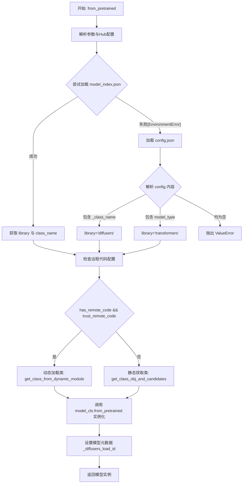
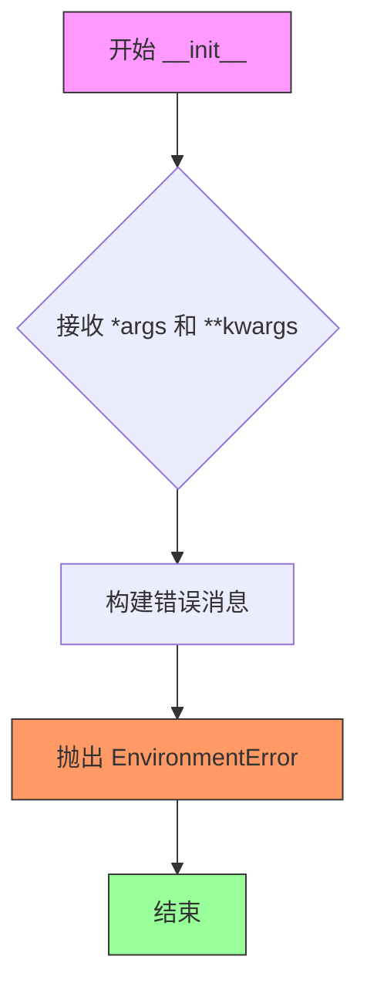
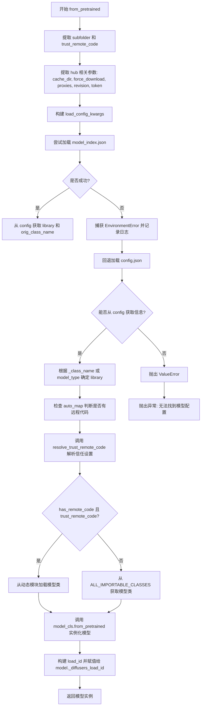

# `diffusers\src\diffusers\models\auto_model.py` 详细设计文档

这是一个通用的自动模型加载类，通过 `from_pretrained` 方法根据预训练模型路径下的配置文件（`model_index.json` 或 `config.json`）自动识别模型架构（如 UNet, VAE），并动态实例化对应的预训练 PyTorch 模型权重。

## 整体流程



## 类结构

```
ConfigMixin (基类)
└── AutoModel (自动模型加载器)
```

## 全局变量及字段


### `os`
    
Python标准库模块，用于处理文件路径等操作系统相关功能

类型：`module`
    


### `logger`
    
模块级日志记录器，用于输出调试和信息日志

类型：`logging.Logger`
    


### `validate_hf_hub_args`
    
装饰器函数，用于验证HuggingFace Hub参数的合法性

类型：`function`
    


### `ConfigMixin`
    
配置混入类，提供配置加载和保存的基础功能

类型：`class`
    


### `DIFFUSERS_LOAD_ID_FIELDS`
    
定义Diffusers加载ID所需的字段列表，用于追踪模型来源信息

类型：`list`
    


### `get_class_from_dynamic_module`
    
动态模块加载函数，从远程仓库获取自定义模型类

类型：`function`
    


### `resolve_trust_remote_code`
    
解析并处理远程代码信任策略的函数

类型：`function`
    


### `ALL_IMPORTABLE_CLASSES`
    
包含所有可导入的Diffusers类名列表，用于动态类查找

类型：`list`
    


### `get_class_obj_and_candidates`
    
根据库名和类名获取对应的类对象及其候选列表

类型：`function`
    


### `AutoModel.config_name`
    
配置文件名，默认为 config.json，用于指定模型配置文件的名称

类型：`str`
    
    

## 全局函数及方法


### `AutoModel.__init__`

该方法是 `AutoModel` 类的构造函数，设计上会抛出 `EnvironmentError` 异常，阻止用户直接实例化该类。`AutoModel` 是一个自动模型加载器类，旨在通过 `from_pretrained()` 或 `from_pipe()` 等类方法从预训练配置加载模型，而不是通过直接调用 `__init__` 实例化。

参数：

- `*args`：任意类型可变位置参数（该方法不接受任何参数，直接抛出异常）
- `**kwargs`：任意类型可变关键字参数（该方法不接受任何参数，直接抛出异常）

返回值：无返回值（该方法始终抛出 `EnvironmentError` 异常）

#### 流程图



#### 带注释源码

```python
def __init__(self, *args, **kwargs):
    """
    AutoModel 类的构造函数。
    
    注意：此方法设计为始终抛出 EnvironmentError 异常。
    AutoModel 类是一个自动模型加载器，不应直接实例化。
    应使用类方法 from_pretrained() 或 from_pipe() 来加载模型。
    
    参数:
        *args: 可变位置参数（不被使用，此方法会抛出异常）
        **kwargs: 可变关键字参数（不被使用，此方法会抛出异常）
    
    异常:
        EnvironmentError: 总是抛出此异常，提示用户使用正确的实例化方法
    """
    # 抛出环境错误，阻止直接实例化
    # 使用 self.__class__.__name__ 获取当前类名，以支持子类正确显示类名
    raise EnvironmentError(
        f"{self.__class__.__name__} is designed to be instantiated "
        f"using the `{self.__class__.__name__}.from_pretrained(pretrained_model_name_or_path)` or "
        f"`{self.__class__.__name__}.from_pipe(pipeline)` methods."
    )
```


### `AutoModel.from_pretrained`

该方法是Diffusers库中AutoModel类的类方法，用于从预训练模型配置实例化一个预训练的PyTorch模型。它首先尝试从model_index.json加载配置，如果失败则回退到config.json，根据配置中的模型类型（diffusers或transformers）动态加载相应的模型类，最后返回包含加载ID的模型实例。

参数：

- `cls`：类方法隐含的类本身
- `pretrained_model_or_path`：`str | os.PathLike | None`，预训练模型的模型ID（如"google/ddpm-celebahq-256"）或本地目录路径
- `subfolder`：（从kwargs提取）`str`，模型文件在仓库中的子文件夹位置
- `trust_remote_code`：（从kwargs提取）`bool`，是否信任远程代码
- `cache_dir`：（从kwargs提取）`str | os.PathLike`，缓存目录路径
- `torch_dtype`：（从kwargs提取）`torch.dtype`，覆盖默认的torch数据类型
- `force_download`：（从kwargs提取）`bool`，是否强制重新下载模型文件
- `proxies`：（从kwargs提取）`dict[str, str]`，代理服务器配置
- `output_loading_info`：（从kwargs提取）`bool`，是否返回加载信息字典
- `local_files_only`：（从kwargs提取）`bool`，是否只使用本地文件
- `token`：（从kwargs提取）`str | bool`，HTTP bearer授权令牌
- `revision`：（从kwargs提取）`str`，Git版本标识符
- `from_flax`：（从kwargs提取）`bool`，是否从Flax检查点加载
- `mirror`：（从kwargs提取）`str`，镜像源地址
- `device_map`：（从kwargs提取）`str | dict[str, int | str | torch.device]`，设备映射配置
- `max_memory`：（从kwargs提取）`Dict`，每个设备的最大内存
- `offload_folder`：（从kwargs提取）`str | os.PathLike`，权重卸载文件夹
- `offload_state_dict`：（从kwargs提取）`bool`，是否临时卸载CPU状态字典到硬盘
- `low_cpu_mem_usage`：（从kwargs提取）`bool`，是否减少CPU内存使用
- `variant`：（从kwargs提取）`str`，权重变体（如"fp16"或"ema"）
- `use_safetensors`：（从kwargs提取）`bool`，是否使用safetensors格式
- `disable_mmap`：（从kwargs提取）`bool`，是否禁用内存映射
- `**kwargs`：其他未明确列出的可选参数

返回值：返回实例化后的预训练PyTorch模型对象，模型已设置为eval模式（`model.eval()`），并包含`_diffusers_load_id`属性用于追踪加载信息

#### 流程图



#### 带注释源码

```python
@classmethod
@validate_hf_hub_args
def from_pretrained(cls, pretrained_model_or_path: str | os.PathLike | None = None, **kwargs):
    r"""
    从预训练模型配置实例化一个预训练的PyTorch模型。
    默认情况下，模型设置为评估模式（model.eval()）， dropout模块被禁用。
    若要训练模型，使用 model.train() 切换回训练模式。

    参数:
        pretrained_model_name_or_path: 模型ID或本地目录路径
        cache_dir: 缓存目录
        torch_dtype: 覆盖默认的torch.dtype
        force_download: 是否强制重新下载
        proxies: 代理服务器字典
        output_loading_info: 是否返回加载信息
        local_files_only: 是否只使用本地文件
        token: HTTP授权令牌
        revision: Git版本
        from_flax: 从Flax加载
        subfolder: 子文件夹路径
        mirror: 镜像源
        device_map: 设备映射
        max_memory: 最大内存字典
        offload_folder: 权重卸载文件夹
        offload_state_dict: 是否卸载状态字典
        low_cpu_mem_usage: 减少CPU内存使用
        variant: 权重变体
        use_safetensors: 使用safetensors
        disable_mmap: 禁用内存映射
        trust_remote_code: 信任远程代码
    """
    # 1. 从kwargs中提取subfolder和trust_remote_code参数
    subfolder = kwargs.pop("subfolder", None)
    trust_remote_code = kwargs.pop("trust_remote_code", False)

    # 2. 提取Hub相关参数用于模型下载和缓存
    hub_kwargs_names = [
        "cache_dir",
        "force_download",
        "local_files_only",
        "proxies",
        "revision",
        "token",
    ]
    hub_kwargs = {name: kwargs.pop(name, None) for name in hub_kwargs_names}

    # 3. 构建load_config_kwargs，排除subfolder
    load_config_kwargs = {k: v for k, v in hub_kwargs.items() if k not in ["subfolder"]}

    library = None
    orig_class_name = None

    # 4. 尝试从model_index.json加载配置（Diffusers 2.0+格式）
    try:
        cls.config_name = "model_index.json"
        config = cls.load_config(pretrained_model_or_path, **load_config_kwargs)

        if subfolder is not None and subfolder in config:
            library, orig_class_name = config[subfolder]
            load_config_kwargs.update({"subfolder": subfolder})

    except EnvironmentError as e:
        logger.debug(e)

    # 5. 如果无法从model_index.json获取信息，回退到config.json
    if library is None and orig_class_name is None:
        cls.config_name = "config.json"
        config = cls.load_config(pretrained_model_or_path, subfolder=subfolder, **load_config_kwargs)

        # 6. 根据config中的_class_name或model_type确定模型库类型
        if "_class_name" in config:
            orig_class_name = config["_class_name"]
            library = "diffusers"
            load_config_kwargs.update({"subfolder": subfolder})
        elif "model_type" in config:
            orig_class_name = "AutoModel"
            library = "transformers"
            load_config_kwargs.update({"subfolder": "" if subfolder is None else subfolder})
        else:
            raise ValueError(f"无法从 {pretrained_model_or_path} 找到关联的模型配置。")

    # 7. 检查配置中是否有远程代码（auto_map）
    has_remote_code = "auto_map" in config and cls.__name__ in config["auto_map"]
    trust_remote_code = resolve_trust_remote_code(trust_remote_code, pretrained_model_or_path, has_remote_code)
    
    # 8. 验证远程代码的信任设置
    if not has_remote_code and trust_remote_code:
        raise ValueError(
            "所选模型仓库似乎没有自定义代码或没有有效的 config.json 文件。"
        )

    # 9. 根据是否有远程代码选择不同的加载路径
    if has_remote_code and trust_remote_code:
        # 从动态模块加载自定义模型类
        class_ref = config["auto_map"][cls.__name__]
        module_file, class_name = class_ref.split(".")
        module_file = module_file + ".py"
        model_cls = get_class_from_dynamic_module(
            pretrained_model_or_path,
            subfolder=subfolder,
            module_file=module_file,
            class_name=class_name,
            **hub_kwargs,
        )
    else:
        # 从Diffusers或Transformers的标准类中获取模型类
        from ..pipelines.pipeline_loading_utils import ALL_IMPORTABLE_CLASSES, get_class_obj_and_candidates

        model_cls, _ = get_class_obj_and_candidates(
            library_name=library,
            class_name=orig_class_name,
            importable_classes=ALL_IMPORTABLE_CLASSES,
            pipelines=None,
            is_pipeline_module=False,
        )

    # 10. 验证模型类是否成功获取
    if model_cls is None:
        raise ValueError(f"AutoModel 找不到与 {orig_class_name} 关联的模型。")

    # 11. 合并配置参数并实例化模型
    kwargs = {**load_config_kwargs, **kwargs}
    model = model_cls.from_pretrained(pretrained_model_or_path, **kwargs)

    # 12. 构建加载ID用于追踪
    load_id_kwargs = {"pretrained_model_name_or_path": pretrained_model_or_path, **kwargs}
    parts = [load_id_kwargs.get(field, "null") for field in DIFFUSERS_LOAD_ID_FIELDS]
    load_id = "|".join("null" if p is None else p for p in parts)
    model._diffusers_load_id = load_id

    return model
```

## 关键组件


### AutoModel 类

AutoModel 是 HuggingFace Diffusers 库中的自动模型加载器核心类，通过 from_pretrained 方法自动从预训练模型配置（model_index.json 或 config.json）中识别模型类型并实例化相应的预训练模型，支持 Diffusers 和 Transformers 两种模型库的自动加载与动态代码信任机制。

### from_pretrained 方法

这是 AutoModel 的核心类方法，负责实例化预训练 PyTorch 模型，支持从 HuggingFace Hub 或本地目录加载模型配置和权重，自动检测模型类型（Diffusers/Transformers），处理远程代码加载、模型变体（fp16/ema）、设备映射和内存优化等高级功能。

### 配置加载逻辑

负责加载模型配置文件，首先尝试加载 model_index.json 获取模型索引信息，若失败则回退到 config.json，从配置中提取 library 和 orig_class_name 以确定模型的具体类名和所属库。

### 远程代码处理

通过 auto_map 配置和 trust_remote_code 参数支持加载自定义模型代码，使用 resolve_trust_remote_code 验证远程代码安全性，并在信任远程代码时调用 get_class_from_dynamic_module 动态加载自定义模型类。

### 类对象获取

使用 get_class_obj_and_candidates 根据 library 和 class_name 从预定义的 ALL_IMPORTABLE_CLASSES 中获取对应的模型类对象，作为后续调用模型自身 from_pretrained 方法的入口。

### 加载ID追踪

通过 DIFFUSERS_LOAD_ID_FIELDS 构建加载追踪标识符，记录模型加载时的关键信息（模型名称、版本等），并将其附加到返回的模型对象上（model._diffusers_load_id），用于后续追踪和调试。

## 问题及建议


### 已知问题

- 文档字符串拼写错误：`trust_remote_cocde` 应为 `trust_remote_code`
- 错误信息拼写错误：提示信息 "does not happear" 应为 "does not appear"
- `__init__` 方法直接抛出异常的设计不够优雅，应该使用 `__new__` 或者更合适的模式
- `cls.config_name` 在方法中被修改为类变量，可能影响后续调用，建议使用局部变量
- 魔法字符串（如 `"diffusers"`, `"transformers"`, `"model_index.json"`, `"config.json"`）散落各处，缺乏常量定义
- `hub_kwargs_names` 定义了 `"resume_download"` 但实际未使用，造成混淆
- `load_config_kwargs` 构建逻辑重复出现在多个分支中
- 返回值类型未在方法签名中声明，类型提示不完整
- 日志记录不足，缺少关键操作节点的日志（如成功加载配置、选择模型类型等）

### 优化建议

- 修复文档字符串和错误信息中的拼写错误
- 将 `config_name` 作为参数传递给 `load_config` 方法而非修改类变量
- 提取魔法字符串为模块级常量，如 `DIFFUSERS_LIBRARY = "diffusers"`, `TRANSFORMERS_LIBRARY = "transformers"`
- 统一 `load_config_kwargs` 的构建逻辑，抽取为私有方法
- 补充方法返回类型声明：`-> PreTrainedModel`
- 增加关键路径的日志记录，便于问题排查
- 考虑使用 `@functools.lru_cache` 缓存频繁调用的配置加载结果
- 将 `hub_kwargs_names` 与实际使用的参数对齐，移除未使用的 `"resume_download"`

## 其它


### 设计目标与约束

设计目标：提供一种通用的、自动的模型加载机制，使得用户可以通过简单的 `from_pretrained` 方法加载任意预训练模型，而无需关心底层的模型类和加载细节。

约束条件：
- 仅支持 PyTorch 模型（`torch.dtype` 参数表明）
- 必须符合 Hugging Face Hub 的接口规范
- 模型必须包含 `config.json` 或 `model_index.json` 配置文件
- 不支持直接实例化（`__init__` 抛出 `EnvironmentError`）
- 依赖 `transformers` 库的部分功能（如 `AutoModel` 的降级处理）

### 错误处理与异常设计

主要异常类型：
1. `EnvironmentError` - 阻止直接实例化，提示使用正确的方法
2. `ValueError` - 配置无法找到模型、远程代码验证失败、无法找到模型类
3. `EnvironmentError` - 配置文件加载失败（被捕获后降级处理）

错误处理策略：
- `model_index.json` 加载失败时降级使用 `config.json`
- `trust_remote_code` 参数动态决定是否加载远程代码
- 缺失字段使用默认值（如 `subfolder` 默认为 `None`）

### 数据流与状态机

加载流程状态机：
1. 初始状态 → 尝试加载 `model_index.json`
2. 成功 → 解析 `library` 和 `orig_class_name`
3. 失败 → 降级加载 `config.json`
4. 获取配置 → 检查 `auto_map` 和 `trust_remote_code`
5. 远程代码? → 动态加载模块
6. 本地代码? → 从 `ALL_IMPORTABLE_CLASSES` 获取类
7. 最终 → 调用模型类的 `from_pretrained` 方法

### 外部依赖与接口契约

外部依赖：
- `huggingface_hub.utils.validate_hf_hub_args` - 验证 Hugging Face Hub 参数
- `configuration_utils.ConfigMixin` - 配置混入类
- `utils.DIFFUSERS_LOAD_ID_FIELDS` - 加载 ID 字段定义
- `utils.dynamic_modules_utils.get_class_from_dynamic_module` - 动态模块加载
- `utils.dynamic_modules_utils.resolve_trust_remote_code` - 远程代码信任解析
- `pipelines.pipeline_loading_utils.ALL_IMPORTABLE_CLASSES` - 可导入类列表

接口契约：
- `from_pretrained` 方法接受 `pretrained_model_name_or_path` 作为必需参数
- 返回预训练的 PyTorch 模型实例
- 模型自动设置为 `eval()` 模式
- 模型实例包含 `_diffusers_load_id` 属性记录加载信息

### 性能考虑

- 支持 `low_cpu_mem_usage` 参数减少内存占用
- 支持 `device_map` 自动计算最优设备映射
- 支持 `offload_state_dict` 磁盘卸载避免内存溢出
- 支持 `disable_mmap` 优化网络存储加载
- 默认缓存模型文件到本地目录

### 安全性考虑

- `trust_remote_code` 参数默认关闭，需要显式启用远程代码
- `token` 参数支持 HTTP bearer 认证
- `local_files_only` 支持纯本地加载（离线模式）
- 代理服务器支持（`proxies` 参数）

### 版本兼容性

- `low_cpu_mem_usage` 仅支持 PyTorch >= 1.9.0
- `torch_dtype` 参数允许覆盖默认数据类型
- `variant` 参数支持加载不同精度变体（如 `fp16`、`ema`）
- `from_flax` 参数支持从 Flax 检查点转换

### 资源管理

- 使用 `kwargs` 传递额外参数到底层模型加载器
- 缓存目录通过 `cache_dir` 参数指定
- 临时文件通过 `offload_folder` 管理

### 线程安全性

- 本身为无状态类（类方法）
- 线程安全性依赖于底层 `from_pretrained` 的实现
- 多线程并发调用时应注意文件缓存竞争


    