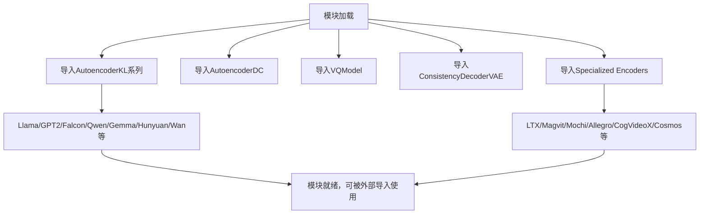

# `diffusers\src\diffusers\models\autoencoders\__init__.py` 详细设计文档

这是一个模块初始化文件，聚合了多种不同架构的自动编码器（Autoencoder）实现，包括KL散度变分自编码器、VAE一致性解码器、VQ模型等，用于支持不同模型（如Llama、GPT2、Qwen、Gemma、Falcon等）的图像/视频/音频生成任务。

## 整体流程



## 类结构

```
AutoencoderBase (隐含基类)
├── AutoencoderKL (标准KL散度VAE)
│   ├── AutoencoderKLLTXVideo
│   ├── AutoencoderKLLTX2Video
│   ├── AutoencoderKLLTX2Audio
│   ├── AutoencoderKLMagvit
│   ├── AutoencoderKLMochi
│   ├── AutoencoderKLHunyuanVideo
│   ├── AutoencoderKLHunyuanVideo15
│   ├── AutoencoderKLHunyuanImage
│   ├── AutoencoderKLHunyuanImageRefiner
│   ├── AutoencoderKLQwenImage
│   ├── AutoencoderKLWan
│   ├── AutoencoderKLFlux2
│   ├── AutoencoderKLCogVideoX
│   ├── AutoencoderKLCosmos
│   ├── AutoencoderKLAllegro
│   └── AutoencoderKLTemporalDecoder
├── AsymmetricAutoencoderKL
├── AutoencoderDC
├── AutoencoderOobleck
├── AutoencoderTiny
├── ConsistencyDecoderVAE
└── VQModel
```

## 全局变量及字段


### `AsymmetricAutoencoderKL`
    
非对称变分自动编码器，使用KL散度进行潜在空间学习，适用于非对称架构的生成模型

类型：`class`
    


### `AutoencoderDC`
    
深度卷积自动编码器，用于图像重构和特征提取任务

类型：`class`
    


### `AutoencoderKL`
    
标准变分自动编码器，使用KL散度作为潜在分布的正则化项

类型：`class`
    


### `AutoencoderKLAllegro`
    
Allegro专用的变分自动编码器，针对特定场景优化的KL散度自动编码器

类型：`class`
    


### `AutoencoderKLCogVideoX`
    
CogVideoX视频生成模型的变分自动编码器，用于视频潜在空间建模

类型：`class`
    


### `AutoencoderKLCosmos`
    
Cosmos平台的变分自动编码器，用于大规模视频/图像生成

类型：`class`
    


### `AutoencoderKLFlux2`
    
Flux2模型的变分自动编码器，支持高质量图像生成

类型：`class`
    


### `AutoencoderKLHunyuanVideo`
    
混元视频模型的变分自动编码器，用于视频理解和生成任务

类型：`class`
    


### `AutoencoderKLHunyuanImage`
    
混元图像模型的变分自动编码器，用于图像生成和理解

类型：`class`
    


### `AutoencoderKLHunyuanImageRefiner`
    
混元图像精炼器，对生成图像进行高质量细节优化

类型：`class`
    


### `AutoencoderKLHunyuanVideo15`
    
混元视频1.5版本的变分自动编码器，支持更长视频序列处理

类型：`class`
    


### `AutoencoderKLLTXVideo`
    
LTX视频模型的变分自动编码器，用于高效视频生成

类型：`class`
    


### `AutoencoderKLLTX2Video`
    
LTX2视频模型的变分自动编码器，第二代LTX视频编码器

类型：`class`
    


### `AutoencoderKLLTX2Audio`
    
LTX2音频模型的变分自动编码器，用于音频信号编码和解码

类型：`class`
    


### `AutoencoderKLMagvit`
    
MagViT模型的变分自动编码器，结合MagNet和ViT技术的视频 tokenizer

类型：`class`
    


### `AutoencoderKLMochi`
    
Mochi模型的变分自动编码器，用于特定领域的高效编码

类型：`class`
    


### `AutoencoderKLQwenImage`
    
Qwen图像模型的变分自动编码器，支持多模态图像处理

类型：`class`
    


### `AutoencoderKLTemporalDecoder`
    
带时序解码器的变分自动编码器，专门处理时间序列数据的重构

类型：`class`
    


### `AutoencoderKLWan`
    
Wan模型的变分自动编码器，用于大规模视觉生成任务

类型：`class`
    


### `AutoencoderOobleck`
    
Oobleck架构的自动编码器，采用创新性设计的高效编码器

类型：`class`
    


### `AutoencoderTiny`
    
轻量级微型自动编码器，适用于资源受限场景的快速推理

类型：`class`
    


### `ConsistencyDecoderVAE`
    
一致性解码器VAE，结合 Consistency Models 的新型变分自动编码器

类型：`class`
    


### `VQModel`
    
向量量化自动编码器，使用VQ-VAE技术进行离散潜在空间学习

类型：`class`
    


    

## 全局函数及方法


## 关键组件


### AsymmetricAutoencoderKL

非对称KL散度自动编码器，支持非对称结构的变分自编码器实现，常用于需要编码器和解码器结构不对称的场景

### AutoencoderDC

直流自动编码器，基础的降噪自编码器架构，提供标准的编码-解码功能

### AutoencoderKL

标准KL散度自动编码器，基于变分推断的自动编码器，是最常用的VAE实现之一

### AutoencoderKLAllegro

Allegro特定的KL自动编码器，针对Allegro模型定制的变分自编码器实现

### AutoencoderKLCogVideoX

CogVideoX视频自动编码器，专门为CogVideoX视频生成模型设计的变分自编码器

### AutoencoderKLCosmos

Cosmos自动编码器，Cosmos模型专用的变分自编码器实现

### AutoencoderKLFlux2

Flux2自动编码器，针对Flux2架构优化的变分自编码器

### AutoencoderKLHunyuanVideo

混元视频自动编码器，腾讯混元视频生成模型专用的变分自编码器

### AutoencoderKLHunyuanImage

混元图像自动编码器，腾讯混元图像生成模型专用的变分自编码器

### AutoencoderKLHunyuanImageRefiner

混元图像精炼自动编码器，用于混元图像的精炼和增强的变分自编码器

### AutoencoderKLHunyuanVideo15

混元视频1.5自动编码器，腾讯混元视频1.5版本专用的变分自编码器

### AutoencoderKLLTXVideo

LTX视频自动编码器，针对LTX视频模型优化的变分自编码器

### AutoencoderKLLTX2Video

LTX2视频自动编码器，LTX2代视频模型的变分自编码器实现

### AutoencoderKLLTX2Audio

LTX2音频自动编码器，支持音频处理的LTX2变分自编码器

### AutoencoderKLMagvit

Magvit自动编码器，MAGVIT视频生成模型专用的变分自编码器

### AutoencoderKLMochi

Mochi自动编码器，Mochi视频模型专用的变分自编码器

### AutoencoderKLQwenImage

Qwen图像自动编码器，阿里Qwen图像模型专用的变分自编码器

### AutoencoderKLTemporalDecoder

时序解码器自动编码器，带有时序解码器的变分自编码器，支持时间维度的处理

### AutoencoderKLWan

Wan自动编码器，Wan模型专用的变分自编码器实现

### AutoencoderOobleck

Oobleck自动编码器，Oobleck模型专用的自动编码器架构

### AutoencoderTiny

轻量级自动编码器，简化的小型自动编码器，用于资源受限场景

### ConsistencyDecoderVAE

一致性解码器VAE，基于一致性模型的解码器VAE，用于高质量图像生成

### VQModel

矢量量化模型，使用矢量量化技术的自动编码器，将连续潜在空间离散化


## 问题及建议


### 已知问题

- **导入爆炸问题**：一次性导入20余个自动编码器类，当这些模块包含重型依赖（如PyTorch、Transformers等）时，会显著延长模块加载时间，影响应用启动性能
- **缺乏懒加载机制**：所有模块在包初始化时全部导入，即使实际业务只需要其中某一个自动编码器，也会触发全部模块的加载，造成不必要的资源消耗
- **接口抽象缺失**：未定义统一的基类或抽象接口（如BaseAutoencoder），各自动编码器实现独立，缺乏标准化的encode/decode/inference等方法契约，导致调用方需要针对每个类做特殊处理
- **模块组织混乱**：将图像VAE（如AutoencoderKLQwenImage）、视频VAE（如AutoencoderKLCogVideoX）、音频VAE（如AutoencoderKLLTX2Audio）混合在同一层级，未进行领域分类，导航和检索困难
- **命名规范不统一**：模型命名风格不一致，如`HunyuanVideo` vs `HunyuanVideo15`、`LTXVideo` vs `LTX2Video`、`Magvit` vs `Mochi`，增加了理解和维护成本
- **文档和类型注解缺失**：导入语句未附带任何类型注解或文档说明，无法在IDE中获取静态分析支持，也缺乏对各自动编码器用途和能力描述
- **潜在代码重复**：多个KL-VAE实现可能存在大量相似逻辑（如Encoder/Decoder结构、重参数化技巧），缺乏抽象会导致维护负担和bug传播风险
- **依赖管理不透明**：各自动编码器模块的第三方依赖未显式声明或统一管理，可能存在版本冲突或隐藏的传递依赖

### 优化建议

- **实施延迟导入（Lazy Import）**：将直接导入改为__getattr__动态导入机制，仅在实际访问特定类时才加载对应模块，可大幅改善启动性能
- **引入工厂模式与注册机制**：建立AutoencoderRegistry类装饰器，让各自动编码器自注册，调用方通过字符串名称实例化，降低耦合度并简化新增模型的流程
- **定义抽象基类（ABC）**：创建BaseAutoencoder抽象基类，声明encode/decode/load/save等核心接口，强制各实现遵循统一契约，便于静态检查和单元测试
- **按领域拆分子包**：将自动编码器按数据类型划分为cv、video、audio等子包，配合__init__.py的延迟导入，清晰组织结构
- **统一命名规范**：制定并遵循命名规范（如全部使用全称、版本号统一格式），或通过别名机制保持向后兼容
- **补充类型注解与文档**：为每个导入的类添加类型注解和docstring，说明其适用场景（如图像/视频/音频）、支持的输入维度、预训练权重来源等
- **提取公共基类**：将各KL-VAE共用的重参数化、损失计算、跳跃连接等逻辑抽象到父类中，减少重复代码
- **依赖版本矩阵**：维护requirements-autoencoders.txt或与主项目依赖分离的extras_require，明确各模型模块的特定依赖版本要求
- **添加配置层**：通过dataclass或Pydantic模型定义各自动编码器的默认配置（如latent_channels、scaling_factor），集中管理超参数默认
</think>

## 其它


### 设计目标与约束

该模块作为自动编码器模型的统一导出入口，旨在提供一站式访问多种变分自动编码器(VAE)、自回归自动编码器和解码器的能力。设计目标包括：支持多种模型架构(对称KL散度、非对称KL散度、离散余弦、LTX、Magvit、Mochi、Wan等)；统一各模型的导入接口；适配不同的数据模态(图像、视频、音频)；支持Temporal Decoder和Consistency Decoder等高级解码器。约束方面需保持与Diffusers库的兼容性，模型权重需单独下载，不包含在源码中。

### 错误处理与异常设计

该模块本身不包含复杂的错误处理逻辑，主要依赖导入时的Python模块查找机制。可能的异常包括：ImportError(当某个子模块不存在或依赖缺失时)、ModuleNotFoundError(当尝试导入未定义的类时)。各子模块内部的错误处理由各自实现，主要包括：模型权重加载失败、配置参数不匹配、输入数据维度错误等。建议使用try-except块包装导入语句以提供友好的错误提示。

### 数据流与状态机

该模块为纯导入层，不涉及运行时数据流。各自动编码器类的典型数据流为：输入数据(图像/视频/音频张量) → 编码器(Encoder) → 潜在表示(Latent Representation) → 解码器(Decoder) → 重构输出。部分模型(如AsymmetricAutoencoderKL)包含独立的解码器分支；VQ模型使用向量量化层；Consistency Decoder支持单步解码。状态机主要体现在模型的训练/推理模式切换(通过train()和eval()方法控制BatchNorm和Dropout层)。

### 外部依赖与接口契约

主要外部依赖包括：torch(深度学习框架)、diffusers库(基础架构)、transformers(部分模型需要)、accelerate(加速训练)。接口契约方面，所有导出的类都应实现标准的encode()和decode()方法用于推理，部分支持encode_long()和decode_long()处理长序列；部分类(如AutoencoderKLAllegro、CogVideoX)包含特定的动画生成接口；VQ模型额外提供get_quantized_indices()方法。模型配置通过from_pretrained()或from_config()类方法加载，需指定pretrained_path或pretrained_model_id。

### 性能考虑

该模块本身无运行时性能开销。各自动编码器性能特征：KL散度模型推理速度较快但精度适中；Consistency Decoder支持单步高质量解码但内存占用大；LTX/Magvit等模型针对长序列优化；Mochi模型支持高分辨率输出。批处理大小受GPU显存限制，建议使用梯度检查点技术处理长序列。量化技术(如FP8、INT8)可进一步降低内存占用但可能影响生成质量。

### 安全性考虑

模型权重来源于第三方预训练模型，需验证来源可靠性。输入数据需进行适当的归一化处理以防止数值溢出。部分模型可能存在生成有害内容的风险，建议在应用层添加内容过滤机制。该模块为纯计算库，不涉及用户数据收集或网络通信。

### 版本兼容性

代码基于Python 3.8+和PyTorch 2.0+设计。各子模块可能对diffusers库版本有特定要求(如AutoencoderKLAllegro需要较新版本)。建议使用版本锁定文件(requirements.txt或pyproject.toml)管理依赖兼容性。不同版本的模型权重可能不兼容，需匹配对应版本的代码。

### 使用示例

```python
# 基本用法 - 加载KL散度自动编码器
from diffusers import AutoencoderKL
vae = AutoencoderKL.from_pretrained("stabilityai/stable-diffusion-2-1")
# 编码
latents = vae.encode(image).latent_dist.sample()
# 解码
reconstructed = vae.decode(latents).sample

# VQ模型用法
from diffusers import VQModel
vq = VQModel.from_pretrained("diffusers/vq-model")

# Consistency Decoder用法
from diffusers import ConsistencyDecoderVAE
cd_vae = ConsistencyDecoderVAE.from_pretrained("diffusers/consistency-decoder")
```

### 配置参数

各自动编码器类通过配置文件(config.json)定义关键参数，包括：hidden_channels(隐藏层通道数)、in_channels(输入通道数)、out_channels(输出通道数)、latent_channels(潜在空间通道数)、down_block_types/up_block_types(网络结构)、activation(激活函数)、subsample_ratio(下采样比率，仅部分模型)。Temporal Decoder类额外包含temporal_decoder_config参数。VQ模型包含num_vq_embeddings(码本大小)和embedding_dim参数。

    