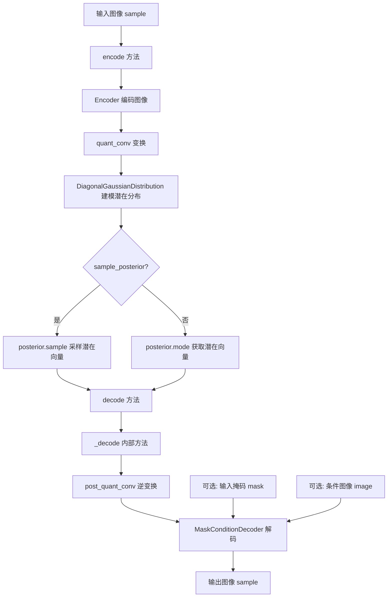
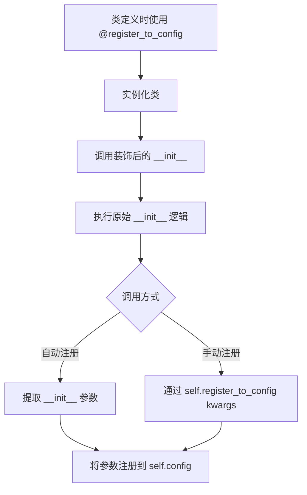
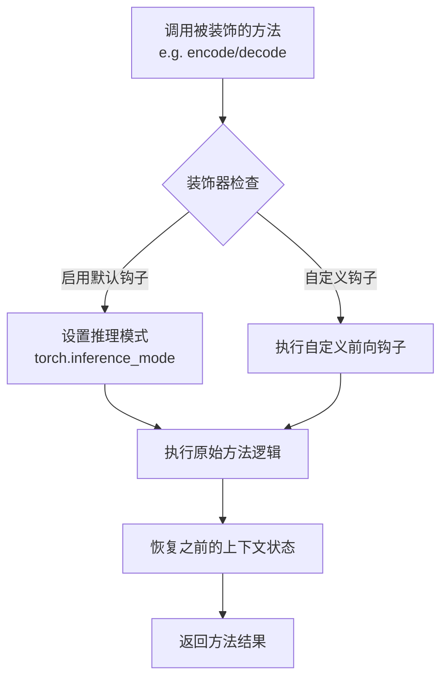
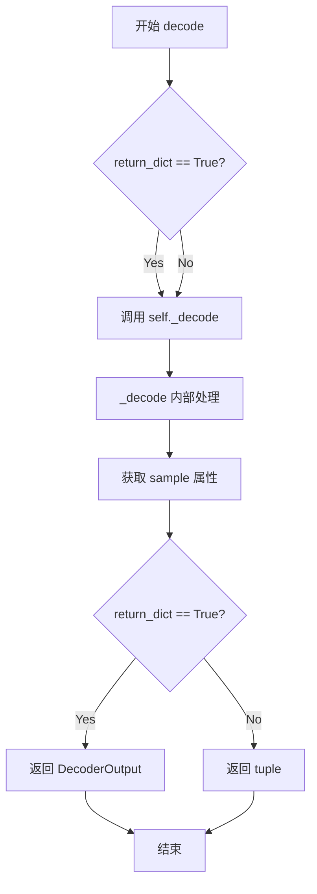

# `diffusers\src\diffusers\models\autoencoders\autoencoder_asym_kl.py` 详细设计文档

AsymmetricAutoencoderKL 是一个非对称 VAE（变分自编码器）模型，设计用于 Stable Diffusion 等潜在扩散模型。它通过非对称结构（编码器和解码器不同）将图像编码到潜在空间，并从潜在空间解码回图像，特别支持带掩码的条件解码（用于图像修复等任务）。该模型继承自 ModelMixin、AutoencoderMixin 和 ConfigMixin，实现了图像的端到端潜在表示转换。

## 整体流程



## 类结构

```
AsymmetricAutoencoderKL (主类)
├── 继承自: ModelMixin (基础模型Mixin)
├── 继承自: AutoencoderMixin (VAEMixin)
└── 继承自: ConfigMixin (配置Mixin)
    ├── 字段: encoder (Encoder 实例)
    ├── 字段: decoder (MaskConditionDecoder 实例)
    ├── 字段: quant_conv (nn.Conv2d)
    ├── 字段: post_quant_conv (nn.Conv2d)
    ├── 字段: _skip_layerwise_casting_patterns (类属性)
    └── 方法: __init__, encode, decode, _decode, forward
```

## 全局变量及字段


### `torch`
    
PyTorch 深度学习框架

类型：`module`
    


### `nn`
    
PyTorch 神经网络模块

类型：`module`
    


### `ConfigMixin`
    
配置Mixin基类，用于模型配置的混入类

类型：`class`
    


### `register_to_config`
    
配置注册装饰器，用于将参数注册到模型配置中

类型：`function`
    


### `apply_forward_hook`
    
前向传播钩子装饰器，用于在前向传播前后执行额外操作

类型：`function`
    


### `AutoencoderKLOutput`
    
VAE编码输出数据结构，包含潜在分布

类型：`class`
    


### `ModelMixin`
    
模型Mixin基类，提供模型通用方法如加载和保存

类型：`class`
    


### `AutoencoderMixin`
    
VAE Mixin类，提供自编码器通用功能

类型：`class`
    


### `DecoderOutput`
    
解码输出数据结构，包含解码后的样本

类型：`class`
    


### `DiagonalGaussianDistribution`
    
对角高斯分布类，用于表示潜在空间的概率分布

类型：`class`
    


### `Encoder`
    
编码器网络类，将输入图像编码为潜在表示

类型：`class`
    


### `MaskConditionDecoder`
    
带掩码条件的解码器网络类，支持基于掩码的条件解码

类型：`class`
    


### `AsymmetricAutoencoderKL.encoder`
    
编码器网络，将输入图像编码为潜在表示

类型：`Encoder`
    


### `AsymmetricAutoencoderKL.decoder`
    
解码器网络，支持掩码条件输入

类型：`MaskConditionDecoder`
    


### `AsymmetricAutoencoderKL.quant_conv`
    
后编码卷积层，用于处理潜在表示的均值和方差

类型：`nn.Conv2d`
    


### `AsymmetricAutoencoderKL.post_quant_conv`
    
前解码卷积层，用于潜在空间的逆变换

类型：`nn.Conv2d`
    


### `AsymmetricAutoencoderKL._skip_layerwise_casting_patterns`
    
类属性，指定跳过层级别类型转换的模式

类型：`list`
    


### `AsymmetricAutoencoderKL.config`
    
继承的配置对象，存储模型初始化参数

类型：`ConfigMixin`
    
    

## 全局函数及方法


### `register_to_config`

装饰器（也可作为实例方法使用），用于将类的 `__init__` 方法的参数自动注册到模型配置中，或手动注册特定的配置项。它确保模型配置能够完整地保存和恢复所有初始化参数。

#### 参数

- `func`：`Callable`（可选），当作为装饰器使用时，传入被装饰的函数（通常是 `__init__` 方法）。
- `**kwargs`：关键字参数，当作为实例方法调用时，表示要注册到配置中的键值对（如 `block_out_channels=up_block_out_channels`）。

#### 返回值

- 作为装饰器：返回装饰后的函数，该函数在执行完原始 `__init__` 后自动将参数注册到配置中。
- 作为实例方法：通常无返回值（`None`）。

#### 流程图



#### 带注释源码

```python
# register_to_config 装饰器典型实现示例
import functools
import inspect

def register_to_config(func=None, **init_kwargs):
    """
    装饰器，用于将 __init__ 参数注册到模型配置。
    也可以作为实例方法手动注册配置。
    """
    def decorator(func):
        @functools.wraps(func)
        def wrapper(self, *args, **kwargs):
            # 调用原始 __init__ 方法
            func(self, *args, **kwargs)
            
            # 获取 __init__ 的签名
            sig = inspect.signature(func)
            # 排除 self 参数
            param_names = [p.name for p in sig.parameters.values() if p.name != 'self']
            
            # 从 kwargs 中提取参数值（假设调用时传入关键字参数）
            # 注意：这里简化处理，实际实现可能更复杂
            config_dict = {}
            for name in param_names:
                if name in kwargs:
                    config_dict[name] = kwargs[name]
            
            # 额外手动传入的参数
            config_dict.update(init_kwargs)
            
            # 注册到 self.config（假设 self.config 已存在）
            if not hasattr(self, 'config'):
                self.config = {}
            self.config.update(config_dict)
            
        return wrapper
    
    # 如果作为方法调用（如 self.register_to_config(key=value)）
    if func is None:
        def set_config(self, **kwargs):
            if not hasattr(self, 'config'):
                self.config = {}
            self.config.update(kwargs)
        return set_config
    else:
        return decorator(func)

# 使用示例
class ExampleModel:
    @register_to_config
    def __init__(self, in_channels=3, out_channels=3):
        self.in_channels = in_channels
        self.out_channels = out_channels
        # 初始化其他属性...

# 手动注册额外参数
model = ExampleModel()
model.register_to_config(custom_param="value")
```


### `apply_forward_hook`

装饰器 `apply_forward_hook` 用于在模型前向传播方法（如 `encode` 和 `decode`）执行前后自动注入钩子逻辑，典型应用场景包括推理模式设置（如 `torch.inference_mode` 或 `torch.no_grad`）、混合精度控制、以及分布式训练时的特定处理。

该装饰器通过接收一个可选的 `hook` 函数参数来定制前向传播前后的行为，确保被装饰的方法在正确的执行上下文中运行。

#### 参数

由于 `apply_forward_hook` 是从 `...utils.accelerate_utils` 导入的外部装饰器，其参数定义取决于具体实现。基于代码中的使用方式：

- `hook`：可选参数，类型为 `Callable`，表示要注入的前向钩子函数。如果未指定，装饰器将使用默认行为（如自动启用推理模式）。

#### 返回值

- 返回值类型为 `Callable`，即装饰后的函数对象。被装饰的方法将在其执行前后自动应用钩子逻辑。

#### 流程图



#### 带注释源码

```python
# apply_forward_hook 是从 accelerate_utils 导入的装饰器
# 源代码位于 ...utils.accelerate_utils 模块中
# 以下是基于代码使用方式的推断实现

from typing import Callable, Optional
import torch

def apply_forward_hook(hook: Optional[Callable] = None):
    """
    应用前向传播钩子的装饰器。
    
    Args:
        hook: 可选的自定义钩子函数。如果为 None，则使用默认钩子，
              主要是为了在推理时启用 torch.inference_mode() 或 torch.no_grad()。
    
    Returns:
        装饰后的函数，该函数在执行前后会自动应用钩子逻辑。
    """
    def decorator(func):
        def wrapper(self, *args, **kwargs):
            # 1. 装饰器自动为 encode/decode 方法启用推理模式
            #    这是为了在推理时节省显存并提高性能
            with torch.inference_mode():
                # 2. 如果提供了自定义钩子，则在方法执行前调用
                if hook is not None:
                    hook(self, *args, **kwargs)
                
                # 3. 执行原始方法（如 encode 或 decode）
                result = func(self, *args, **kwargs)
                
                # 4. 可以在这里添加后向钩子逻辑（如需要）
                
                return result
        return wrapper
    return decorator


# 在 AsymmetricAutoencoderKL 类中的实际使用示例

class AsymmetricAutoencoderKL(ModelMixin, AutoencoderMixin, ConfigMixin):
    # ... 类初始化和其他方法 ...
    
    @apply_forward_hook  # 装饰器：确保 encode 方法在推理模式下执行
    def encode(self, x: torch.Tensor, return_dict: bool = True) -> AutoencoderKLOutput | tuple[torch.Tensor]:
        """
        将输入图像编码为潜在表示。
        
        Args:
            x: 输入图像张量，形状为 (batch_size, channels, height, width)
            return_dict: 是否返回字典格式的结果
            
        Returns:
            AutoencoderKLOutput 或元组，包含潜在分布
        """
        h = self.encoder(x)
        moments = self.quant_conv(h)
        posterior = DiagonalGaussianDistribution(moments)

        if not return_dict:
            return (posterior,)

        return AutoencoderKLOutput(latent_dist=posterior)
    
    @apply_forward_hook  # 装饰器：确保 decode 方法在推理模式下执行
    def decode(
        self,
        z: torch.Tensor,
        generator: torch.Generator | None = None,
        image: torch.Tensor | None = None,
        mask: torch.Tensor | None = None,
        return_dict: bool = True,
    ) -> DecoderOutput | tuple[torch.Tensor]:
        """
        将潜在表示解码为图像。
        
        Args:
            z: 潜在张量
            generator: 可选的随机数生成器
            image: 可选的输入图像（用于mask条件解码）
            mask: 可选的掩码张量
            return_dict: 是否返回字典格式的结果
            
        Returns:
            DecoderOutput 或元组，包含解码后的图像
        """
        decoded = self._decode(z, image, mask).sample

        if not return_dict:
            return (decoded,)

        return DecoderOutput(sample=decoded)
```

#### 关键组件信息

| 组件名称 | 一句话描述 |
|---------|-----------|
| `apply_forward_hook` | 自动为模型方法注入推理模式的前向传播钩子装饰器 |
| `encode` | 将输入图像编码为潜在分布的编码方法 |
| `decode` | 将潜在表示解码为图像的解码方法 |

#### 潜在的技术债务或优化空间

1. **装饰器依赖外部模块**：`apply_forward_hook` 的具体实现细节隐藏在 `accelerate_utils` 模块中，建议在项目中添加对该装饰器功能的文档说明。
2. **默认钩子行为不明确**：装饰器默认使用 `torch.inference_mode()`，但未提供显式配置选项，建议考虑添加参数以支持不同的推理模式（如 `torch.no_grad()`）。
3. **缺少钩子扩展点**：当前装饰器仅支持前向钩子，建议评估是否需要支持后向钩子或自定义钩子链。


### AsymmetricAutoencoderKL.__init__

构造函数，初始化AsymmetricAutoencoderKL VAE模型的编码器、解码器、卷积层和配置参数，继承自ModelMixin、AutoencoderMixin和ConfigMixin。

参数：

- `in_channels`：`int`，输入图像的通道数，默认为3
- `out_channels`：`int`，输出图像的通道数，默认为3
- `down_block_types`：`tuple[str, ...]`，下采样块的类型元组，默认为("DownEncoderBlock2D",)
- `down_block_out_channels`：`tuple[int, ...]`，下块输出通道元组，默认为(64,)
- `layers_per_down_block`：`int`，每个下块的层数，默认为1
- `up_block_types`：`tuple[str, ...]`，上采样块的类型元组，默认为("UpDecoderBlock2D",)
- `up_block_out_channels`：`tuple[int, ...]`，上块输出通道元组，默认为(64,)
- `layers_per_up_block`：`int`，每个上块的层数，默认为1
- `act_fn`：`str`，激活函数名称，默认为"silu"
- `latent_channels`：`int`，潜在空间的通道数，默认为4
- `norm_num_groups`：`int`，归一化的组数，默认为32
- `sample_size`：`int`，采样输入大小，默认为32
- `scaling_factor`：`float`，潜在空间缩放因子，默认为0.18215

返回值：`None`，构造函数无返回值

#### 流程图

```mermaid
flowchart TD
    A[开始 __init__] --> B[调用 super().__init__]
    B --> C[创建 Encoder 实例]
    C --> D[创建 MaskConditionDecoder 实例]
    D --> E[创建 quant_conv 卷积层]
    E --> F[创建 post_quant_conv 卷积层]
    F --> G[注册 block_out_channels 到配置]
    G --> H[注册 force_upcast 到配置]
    H --> I[结束 __init__]
```

#### 带注释源码

```python
@register_to_config
def __init__(
    self,
    in_channels: int = 3,
    out_channels: int = 3,
    down_block_types: tuple[str, ...] = ("DownEncoderBlock2D",),
    down_block_out_channels: tuple[int, ...] = (64,),
    layers_per_down_block: int = 1,
    up_block_types: tuple[str, ...] = ("UpDecoderBlock2D",),
    up_block_out_channels: tuple[int, ...] = (64,),
    layers_per_up_block: int = 1,
    act_fn: str = "silu",
    latent_channels: int = 4,
    norm_num_groups: int = 32,
    sample_size: int = 32,
    scaling_factor: float = 0.18215,
) -> None:
    super().__init__()  # 调用父类 ModelMixin, AutoencoderMixin, ConfigMixin 的初始化

    # 初始化编码器 Encoder，用于将输入图像编码为潜在表示
    self.encoder = Encoder(
        in_channels=in_channels,
        out_channels=latent_channels,
        down_block_types=down_block_types,
        block_out_channels=down_block_out_channels,
        layers_per_block=layers_per_down_block,
        act_fn=act_fn,
        norm_num_groups=norm_num_groups,
        double_z=True,  # 使用双通道输出以学习均值和方差
    )

    # 初始化解码器 MaskConditionDecoder，用于将潜在表示解码为图像（支持掩码条件）
    self.decoder = MaskConditionDecoder(
        in_channels=latent_channels,
        out_channels=out_channels,
        up_block_types=up_block_types,
        block_out_channels=up_block_out_channels,
        layers_per_block=layers_per_up_block,
        act_fn=act_fn,
        norm_num_groups=norm_num_groups,
    )

    # 量化卷积层，用于处理编码器输出的均值和方差
    self.quant_conv = nn.Conv2d(2 * latent_channels, 2 * latent_channels, 1)
    # 后量化卷积层，用于解码前处理潜在表示
    self.post_quant_conv = nn.Conv2d(latent_channels, latent_channels, 1)

    # 注册配置参数
    self.register_to_config(block_out_channels=up_block_out_channels)
    self.register_to_config(force_upcast=False)
```


### `AsymmetricAutoencoderKL.encode`

该方法是AsymmetricAutoencoderKL类的编码接口，负责将输入图像张量通过编码器转换为潜在空间的分布表示，支持返回字典格式或元组格式的潜在分布输出。

#### 参数

- `self`：AsymmetricAutoencoderKL实例本身，无需显式传递
- `x`：`torch.Tensor`，输入图像张量，形状通常为 (batch_size, in_channels, height, width)，通道数由模型配置决定（默认3通道RGB图像）
- `return_dict`：`bool`，可选参数，默认为True，决定返回值是AutoencoderKLOutput对象还是元组

#### 流程图

```mermaid
flowchart TD
    A[开始 encode] --> B[接收输入图像 x]
    B --> C[调用 self.encoder(x)]
    C --> D[获取编码器输出 h]
    D --> E[应用 self.quant_conv(h)]
    E --> F[计算 moments 向量]
    F --> G[创建 DiagonalGaussianDistribution 对象]
    G --> H{return_dict?}
    H -->|True| I[返回 AutoencoderKLOutput]
    H -->|False| J[返回 tuple[posterior]]
    I --> K[结束]
    J --> K
```

#### 带注释源码

```python
@apply_forward_hook  # 装饰器：应用前向钩子，用于追踪forward过程中的中间状态
def encode(
    self, 
    x: torch.Tensor, 
    return_dict: bool = True
) -> AutoencoderKLOutput | tuple[torch.Tensor]:
    """
    编码方法：将输入图像转换为潜在分布
    
    参数:
        x: 输入图像张量，形状为 (batch, channels, height, width)
        return_dict: 是否返回字典格式的输出，默认为True
        
    返回:
        AutoencoderKLOutput 或 tuple，包含潜在分布
    """
    # 步骤1: 通过Encoder编码器处理输入图像
    # Encoder将图像从像素空间映射到潜在空间，输出形状为 (batch, latent_channels, h, w)
    h = self.encoder(x)
    
    # 步骤2: 应用quant_conv卷积层
    # quant_conv将latent_channels扩展为2*latent_channels，用于生成高斯分布的均值和方差
    # 输出形状: (batch, 2*latent_channels, h, w)
    moments = self.quant_conv(h)
    
    # 步骤3: 创建对角高斯分布对象
    # DiagonalGaussianDistribution根据moments（均值和方差）创建潜在空间分布
    # moments的前half为均值，后half为对数方差
    posterior = DiagonalGaussianDistribution(moments)
    
    # 步骤4: 根据return_dict参数决定返回格式
    if not return_dict:
        # 返回元组格式，兼容旧API
        return (posterior,)
    
    # 返回AutoencoderKLOutput对象，包含latent_dist属性
    return AutoencoderKLOutput(latent_dist=posterior)
```

#### 相关类型说明

| 类型名称 | 所在模块 | 说明 |
|---------|---------|------|
| `AutoencoderKLOutput` | `diffusers.models.modeling_outputs` | 包含latent_dist属性的输出容器，用于存储潜在分布 |
| `DiagonalGaussianDistribution` | `diffusers.models.vae` | 对角高斯分布实现类，提供sample()和mode()方法用于采样或获取均值 |
| `Encoder` | `diffusers.models.vae` | 2D图像编码器网络，将图像编码为潜在表示 |


### `AsymmetricAutoencoderKL._decode`

内部解码方法，处理潜在向量并解码为图像。该方法是 AsymmetricAutoencoderKL 的私有方法，接收潜在向量 z，通过后量化卷积层处理后，使用 MaskConditionDecoder 解码器进行图像重建，支持条件图像和掩码输入，可选择返回 DecoderOutput 或元组。

参数：

- `self`：`AsymmetricAutoencoderKL`，当前 AsymmetricAutoencoderKL 实例
- `z`：`torch.Tensor`，输入的潜在向量，通常来自编码器的潜在空间表示
- `image`：`torch.Tensor | None`，可选的条件图像输入，用于mask-conditioned解码（在inpainting场景中提供原始图像信息）
- `mask`：`torch.Tensor | None`，可选的掩码输入，指示需要重建的区域（在inpainting场景中标识需要填充的区域）
- `return_dict`：`bool`，默认为 `True`，控制返回值格式

返回值：`DecoderOutput | tuple[torch.Tensor]`，当 `return_dict=True` 时返回 `DecoderOutput` 对象（包含 `sample` 属性），否则返回包含解码后图像张量的元组

#### 流程图

```mermaid
flowchart TD
    A[开始 _decode] --> B{return_dict == True?}
    B -->|Yes| C[执行 post_quant_conv]
    B -->|No| C
    C --> D[调用 decoder 进行解码]
    D --> E{return_dict == True?}
    E -->|Yes| F[返回 DecoderOutput sample=dec]
    E -->|No| G[返回元组 (dec,)]
    F --> H[结束]
    G --> H
```

#### 带注释源码

```python
def _decode(
    self,
    z: torch.Tensor,
    image: torch.Tensor | None = None,
    mask: torch.Tensor | None = None,
    return_dict: bool = True,
) -> DecoderOutput | tuple[torch.Tensor]:
    """
    内部解码方法，将潜在向量解码为图像
    
    参数:
        z: 潜在向量张量
        image: 可选的条件图像，用于mask-conditioned解码
        mask: 可选的掩码，指示需要重建的区域
        return_dict: 是否返回字典格式的输出
    
    返回:
        DecoderOutput 或 tuple，包含解码后的图像张量
    """
    # 通过后量化卷积层处理潜在向量
    # 将潜在空间的值反缩放到原始空间
    z = self.post_quant_conv(z)
    
    # 使用MaskConditionDecoder进行解码
    # 该解码器支持mask-conditioned图像重建
    # 支持在inpainting任务中根据mask区域重建图像
    dec = self.decoder(z, image, mask)

    # 根据return_dict参数决定返回值格式
    if not return_dict:
        # 返回元组格式，兼容旧API
        return (dec,)

    # 返回DecoderOutput对象，包含sample属性
    return DecoderOutput(sample=dec)
```


### `AsymmetricAutoencoderKL.decode`

解码方法，对外暴露的解码接口，将潜在空间表示解码为图像。

参数：

-  `z`：`torch.Tensor`，输入的潜在空间张量，通常来自编码器或扩散模型的输出
-  `generator`：`torch.Generator | None`，可选的随机数生成器，用于采样（当前版本未直接使用，仅保留接口兼容性）
-  `image`：`torch.Tensor | None`，可选的条件图像，用于掩码条件解码（Inpainting 场景）
-  `mask`：`torch.Tensor | None`，可选的掩码张量，用于掩码条件解码（Inpainting 场景）
-  `return_dict`：`bool`，是否返回 `DecoderOutput` 对象，默认为 `True`

返回值：`DecoderOutput | tuple[torch.Tensor]`：解码后的图像张量或包含 `sample` 属性的 `DecoderOutput` 对象

#### 流程图



#### 带注释源码

```python
@apply_forward_hook
def decode(
    self,
    z: torch.Tensor,
    generator: torch.Generator | None = None,
    image: torch.Tensor | None = None,
    mask: torch.Tensor | None = None,
    return_dict: bool = True,
) -> DecoderOutput | tuple[torch.Tensor]:
    """
    将潜在空间表示解码为图像。
    
    参数:
        z: 潜在空间张量
        generator: 随机数生成器（保留接口，当前未使用）
        image: 条件图像（用于mask条件解码）
        mask: 掩码张量（用于mask条件解码）
        return_dict: 是否返回字典格式
    
    返回:
        解码后的图像或 DecoderOutput 对象
    """
    # 调用内部解码方法 _decode，获取 DecoderOutput 对象
    decoded = self._decode(z, image, mask).sample

    # 根据 return_dict 参数决定返回格式
    if not return_dict:
        # 返回元组格式，兼容旧版接口
        return (decoded,)

    # 返回 DecoderOutput 对象，包含 sample 属性
    return DecoderOutput(sample=decoded)
```


### `AsymmetricAutoencoderKL.forward`

该方法是非对称自编码器 KL 模型的前向传播入口，接收输入样本和可选的掩码，经过编码器编码为潜在分布，根据 `sample_posterior` 参数从后验分布采样或取mode值，最后通过解码器（支持掩码条件）解码生成重建图像，可返回 `DecoderOutput` 或元组格式。

参数：

-  `self`：`AsymmetricAutoencoderKL`，模型实例自身
-  `sample`：`torch.Tensor`，输入图像样本
-  `mask`：`torch.Tensor | None`，可选的修复掩码，用于条件解码（inpainting 场景）
-  `sample_posterior`：`bool`，是否从后验分布采样，默认为 False（取 mode 值）
-  `return_dict`：`bool`，是否返回字典格式，默认为 True
-  `generator`：`torch.Generator | None`，随机数生成器，用于后验采样时的随机性控制

返回值：`DecoderOutput | tuple[torch.Tensor]`，若 `return_dict=True` 返回 `DecoderOutput` 对象，包含重建的 `sample` 字段；否则返回包含重建图像的元组 `(dec,)`

#### 流程图

```mermaid
flowchart TD
    A[输入: sample] --> B[encode: 编码sample]
    B --> C[获取 latent_dist 后验分布]
    C --> D{sample_posterior?}
    D -->|True| E[posterior.sample<br/>从后验分布采样]
    D -->|False| F[posterior.mode<br/>取后验分布的mode]
    E --> G[decode: 解码z]
    F --> G
    G --> H[获取解码后的sample]
    H --> I{return_dict?}
    I -->|True| J[返回 DecoderOutput]
    I -->|False| K[返回 tuple (dec,)]
    
    B -.->|额外参数| L[mask参数传递到decode]
    L --> G
```

#### 带注释源码

```python
def forward(
    self,
    sample: torch.Tensor,
    mask: torch.Tensor | None = None,
    sample_posterior: bool = False,
    return_dict: bool = True,
    generator: torch.Generator | None = None,
) -> DecoderOutput | tuple[torch.Tensor]:
    r"""
    Args:
        sample (`torch.Tensor`): Input sample.
        mask (`torch.Tensor`, *optional*, defaults to `None`): Optional inpainting mask.
        sample_posterior (`bool`, *optional*, defaults to `False`):
            Whether to sample from the posterior.
        return_dict (`bool`, *optional*, defaults to `True`):
            Whether or not to return a [`DecoderOutput`] instead of a plain tuple.
    """
    # 将输入样本赋值给变量 x
    x = sample
    
    # 步骤1: 编码 - 将输入图像编码为潜在空间的后验分布
    # encode 方法内部会调用 encoder 和 quant_conv，返回 AutoencoderKLOutput
    # 其中 latent_dist 属性为 DiagonalGaussianDistribution 对象
    posterior = self.encode(x).latent_dist
    
    # 步骤2: 从后验分布获取潜在向量 z
    # 根据 sample_posterior 决定是采样还是取 mode（均值）
    if sample_posterior:
        # 从后验分布中采样，引入随机性，适用于训练或需要多样性的场景
        z = posterior.sample(generator=generator)
    else:
        # 取后验分布的 mode（均值），确定性输出，适用于推理
        z = posterior.mode()
    
    # 步骤3: 解码 - 将潜在向量 z 解码回图像空间
    # 支持掩码条件：传入 sample（原始图像）和 mask（修复掩码）
    # decode 方法内部调用 _decode，进而调用 decoder 的前向传播
    dec = self.decode(z, generator, sample, mask).sample
    
    # 步骤4: 返回结果
    if not return_dict:
        # 返回元组格式，兼容旧版 API
        return (dec,)
    
    # 返回 DecoderOutput 对象，包含重建的图像样本
    return DecoderOutput(sample=dec)
```

## 关键组件


### AsymmetricAutoencoderKL

主模型类，继承自ModelMixin、AutoencoderMixin和ConfigMixin，实现了一个非对称的VAE模型，用于将图像编码到潜在空间并从潜在表示解码回图像。该模型采用KL散度损失，支持掩码条件解码，适用于Stable Diffusion的潜在扩散机制。

### Encoder

编码器组件，负责将输入图像编码为潜在表示。使用down_block_types指定的降采样块结构，输出通道数为latent_channels的两倍（double_z=True），用于后续的高斯分布参数计算。

### MaskConditionDecoder

带掩码条件的解码器，继承自Decoder类。接收潜在表示z、可选的图像condition和mask作为输入，用于图像重建或修复任务。支持通过掩码进行局部生成或修复。

### DiagonalGaussianDistribution

对角高斯分布实现类，用于表示潜在空间的概率分布。提供sample()方法进行采样（支持随机生成器）和mode()方法获取均值，实现惰性加载特性，允许在推理时选择确定性输出或采样输出。

### quant_conv

量化卷积层，卷积核大小为1x1，输入输出通道数为2*latent_channels，用于处理编码器输出的潜在表示参数（均值和方差）。

### post_quant_conv

后量化卷积层，卷积核大小为1x1，输入输出通道数为latent_channels，在解码前对潜在变量进行预处理和缩放。

### encode方法

编码方法，将输入张量x通过编码器转换为潜在空间的高斯分布表示。支持return_dict参数控制返回格式，返回AutoencoderKLOutput包含latent_dist。

### decode方法

解码方法，将潜在变量z解码为图像。支持可选的generator用于随机采样，image和mask参数用于掩码条件解码，返回DecoderOutput包含sample。

### forward方法

完整的前向传播方法，整合编码和解码过程。支持sample_posterior参数选择从后验分布采样或使用均值，支持掩码输入用于修复任务，返回重建的图像或DecoderOutput。


## 问题及建议


### 已知问题

- **配置注册方式不规范**：在 `__init__` 中手动调用 `self.register_to_config(block_out_channels=up_block_out_channels)` 和 `self.register_to_config(force_upcast=False)`，而 `_skip_layerwise_casting_patterns` 是类属性但未在配置中注册，导致配置管理不一致
- **Encoder参数命名不一致**：传入Encoder时使用 `block_out_channels=down_block_out_channels`，但配置中只注册了 `block_out_channels=up_block_out_channels`，导致配置参数与实际使用的参数不对应
- **多层继承带来的MRO复杂性**：继承自 `ModelMixin, AutoencoderMixin, ConfigMixin` 三个基类，可能导致方法解析顺序复杂，未来维护困难
- **重复代码**：`_decode` 和 `decode` 方法高度重复，仅在是否应用 forward hook 上有区别，可以考虑合并
- **缺失错误处理**：encode、decode、forward 等核心方法中没有对输入张量形状、dtype、device 的合法性校验
- **类型注解不完整**：部分参数如 `mask` 的类型注解仅标注为 `torch.Tensor | None`，缺少更精确的形状和语义说明

### 优化建议

- **统一配置注册**：将所有配置参数通过 `@register_to_config` 装饰器统一管理，避免手动调用 `register_to_config`
- **添加输入验证**：在 encode、decode、forward 方法开头添加输入合法性检查，包括形状兼容性、device 一致性、dtype 检查等
- **重构解码方法**：将 `_decode` 和 `decode` 合并，通过参数控制是否应用 hook，减少代码冗余
- **增加类型注解精度**：为 `mask` 等参数添加更详细的类型注解，如 `torch.Tensor | None = None` 可考虑扩展为带形状信息的文档说明
- **考虑性能优化**：对于大规模推理场景，可评估是否需要添加 torch.jit 编译支持或缓存机制
- **完善文档注释**：为关键方法添加更详细的 docstring，特别是参数的业务语义说明


## 其它


### 设计目标与约束

本模块的设计目标是实现一个非对称的VQGAN VAE模型，用于Stable Diffusion的潜在扩散。该模型通过非对称编码器-解码器结构提高图像到潜在空间和潜在空间到图像的转换效率，同时支持掩码条件解码以实现图像修复功能。设计约束包括：必须继承自ModelMixin、AutoencoderMixin和ConfigMixin以符合框架规范；必须支持torch.float32和torch.float16混合精度训练；编码器输出通道固定为latent_channels*2以实现对角高斯分布参数化；解码器必须支持可选的mask和image条件输入。

### 错误处理与异常设计

参数验证在__init__方法中进行，包括通道数必须为正整数、块类型元组不能为空、层数必须大于等于1等。encode方法返回AutoencoderKLOutput或tuple，当return_dict=False时返回元组以保持向后兼容性。decode方法同样支持两种返回模式。forward方法处理sample_posterior参数以决定采样方式，generator参数用于确定性采样。ConfigMixin的register_to_config装饰器自动处理配置序列化和反序列化。模型运行时不进行输入shape的显式检查，依赖PyTorch的动态图机制捕获维度不匹配错误。

### 数据流与状态机

数据流分为编码路径和解码路径两个主要分支。编码路径：输入图像tensor -> Encoder卷积网络 -> quant_conv投影 -> DiagonalGaussianDistribution采样 -> latent_dist。解码路径：latent tensor -> post_quant_conv投影 -> MaskConditionDecoder -> DecoderOutput.sample。forward方法串联两个路径，支持三种工作模式：直接模式（sample_posterior=False，使用分布均值）、采样模式（sample_posterior=True，使用分布采样）、以及带掩码的修复模式（提供mask和image参数）。状态转换由sample_posterior布尔标志和return_dict标志控制，不存在显式的有限状态机。

### 外部依赖与接口契约

本模块依赖以下外部组件：torch和torch.nn提供基础张量操作和神经网络层；configuration_utils.ConfigMixin和register_to_config提供配置管理；utils.accelerate_utils.apply_forward_hook处理加速优化；modeling_outputs.AutoencoderKLOutput和DecoderOutput定义输出结构；modeling_utils.ModelMixin提供模型基类；.vae模块中的AutoencoderMixin、DecoderOutput、DiagonalGaussianDistribution、Encoder和MaskConditionDecoder提供VAE组件。对外接口包括encode()方法接受torch.Tensor输入返回AutoencoderKLOutput；decode()方法接受latent tensor和可选条件返回DecoderOutput；forward()方法执行完整编码-解码流程。所有公开方法均支持return_dict参数以控制返回值格式。

### 性能考虑

编码器和解码器使用指定激活函数（默认silu），decoder被标记为_skip_layerwise_casting_patterns以避免不必要的类型转换开销。post_quant_conv和quant_conv使用1x1卷积实现通道投影，计算开销最小化。apply_forward_hook装饰器确保在推理时执行必要的钩子以支持加速工具。scaling_factor在训练时用于归一化潜在空间，推理时反向缩放。模型默认使用float32参数，可通过框架的自动混合精度支持float16推理。

### 安全性考虑

本模块不直接处理用户输入验证，依赖调用方确保输入tensor的有效性。不包含任何网络通信或持久化存储操作。不存在敏感信息处理或加密操作。模型权重加载遵循PyTorch的安全反序列化机制。配置中的force_upcast参数控制解码器是否强制升格到float32以避免精度损失。

### 配置管理

所有模型超参数通过@register_to_config装饰器自动注册到配置中，支持save_pretrained和from_pretrained的自动序列化。配置参数包括：in_channels、out_channels、down_block_types、down_block_out_channels、layers_per_down_block、up_block_types、up_block_out_channels、layers_per_up_block、act_fn、latent_channels、norm_num_groups、sample_size、scaling_factor。额外注册的block_out_channels和force_upcast参数控制解码器行为。配置对象可通过model.config属性访问。

### 版本兼容性

代码标注版权年份为2025年，使用Python 3.9+的类型注解语法（tuple[str, ...]）。依赖Diffusers库的ConfigMixin和ModelMixin基类，需配套使用对应版本框架。torch.Tensor的类型联合语法（torch.Tensor | None）要求Python 3.10+或from __future__ import annotations。

### 线程安全性

模型本身不维护可变状态，推理时可安全并发使用。内部子模块（encoder、decoder、quant_conv、post_quant_conv）由PyTorch自动管理线程安全。随机数生成器generator参数用于确定性采样，非线程安全，建议在多线程场景下为每个线程创建独立的generator实例。

### 资源管理

模型在GPU和CPU上均可运行，设备分配由调用方控制。显存占用主要由encoder、decoder的中间激活值决定，batch_size直接影响峰值显存。decode方法的generator参数为可选，不持有资源锁。模型不使用任何缓存或缓冲流，无需显式资源释放。

### 日志与监控

本模块不包含显式日志记录语句。框架级别的日志由上层调用方（Trainer、Pipeline）统一管理。模型加载和保存通过ConfigMixin自动记录配置信息。apply_forward_hook可能包含性能监控钩子，具体实现依赖框架版本。

### 测试策略建议

应包含单元测试验证：encode输出的latent_dist参数形状正确；decode输出的sample尺寸与输入对应；forward在sample_posterior=True/False模式下行为正确；return_dict参数切换正常工作；配置序列化/反序列化完整；mask和image参数正确传递给解码器。集成测试应验证与完整Stable Diffusion pipeline的兼容性。

    