# `diffusers\src\diffusers\models\autoencoders\autoencoder_dc.py` 详细设计文档

这是一个用于SANA和DCAE模型的高效深度压缩自编码器(Deep Compression Autoencoder, DCAE)，通过残差块和高效ViT块实现图像到潜空间的编码与解码，支持空间下采样/上采样、图块(tiling)处理和批切片(slicing)以降低显存占用。

## 整体流程

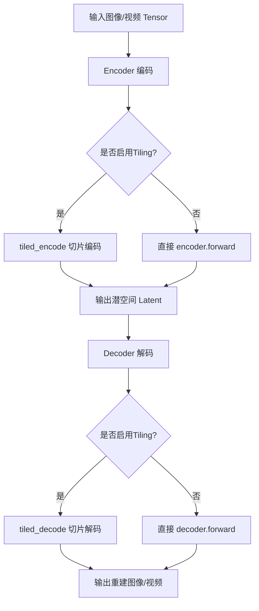

## 类结构

```
AutoencoderDC (主模型类)
├── Encoder (编码器)
│   ├── ResBlock / EfficientViTBlock (堆叠块)
│   └── DCDownBlock2d (下采样块)
└── Decoder (解码器)
    ├── DCUpBlock2d (上采样块)
    └── ResBlock / EfficientViTBlock (堆叠块)
```

## 全局变量及字段


### `ResBlock.norm_type`
    
归一化类型

类型：`str`
    


### `ResBlock.nonlinearity`
    
激活函数

类型：`nn.Module`
    


### `ResBlock.conv1`
    
第一个卷积层

类型：`nn.Conv2d`
    


### `ResBlock.conv2`
    
第二个卷积层

类型：`nn.Conv2d`
    


### `ResBlock.norm`
    
归一化层

类型：`nn.Module`
    


### `EfficientViTBlock.attn`
    
多尺度线性注意力

类型：`SanaMultiscaleLinearAttention`
    


### `EfficientViTBlock.conv_out`
    
输出卷积

类型：`GLUMBConv`
    


### `DCDownBlock2d.downsample`
    
是否下采样

类型：`bool`
    


### `DCDownBlock2d.factor`
    
下采样因子(2)

类型：`int`
    


### `DCDownBlock2d.stride`
    
步长

类型：`int`
    


### `DCDownBlock2d.group_size`
    
分组大小

类型：`int`
    


### `DCDownBlock2d.shortcut`
    
是否使用残差连接

类型：`bool`
    


### `DCDownBlock2d.conv`
    
卷积层

类型：`nn.Conv2d`
    


### `DCUpBlock2d.interpolate`
    
是否使用插值

类型：`bool`
    


### `DCUpBlock2d.interpolation_mode`
    
插值模式

类型：`str`
    


### `DCUpBlock2d.factor`
    
上采样因子(2)

类型：`int`
    


### `DCUpBlock2d.repeats`
    
重复次数

类型：`int`
    


### `DCUpBlock2d.conv`
    
卷积层

类型：`nn.Conv2d`
    


### `Encoder.conv_in`
    
输入卷积或DCDownBlock2d

类型：`nn.Conv2d或DCDownBlock2d`
    


### `Encoder.down_blocks`
    
下采样块列表

类型：`nn.ModuleList`
    


### `Encoder.conv_out`
    
输出卷积

类型：`nn.Conv2d`
    


### `Encoder.out_shortcut`
    
是否输出残差连接

类型：`bool`
    


### `Encoder.out_shortcut_average_group_size`
    
残差分组大小

类型：`int`
    


### `Decoder.conv_in`
    
输入卷积

类型：`nn.Conv2d`
    


### `Decoder.in_shortcut`
    
是否输入残差连接

类型：`bool`
    


### `Decoder.in_shortcut_repeats`
    
输入残差重复次数

类型：`int`
    


### `Decoder.up_blocks`
    
上采样块列表

类型：`nn.ModuleList`
    


### `Decoder.norm_out`
    
输出归一化

类型：`RMSNorm`
    


### `Decoder.conv_act`
    
输出激活函数

类型：`nn.Module`
    


### `Decoder.conv_out`
    
输出层

类型：`nn.Conv2d或DCUpBlock2d`
    


### `AutoencoderDC.encoder`
    
编码器实例

类型：`Encoder`
    


### `AutoencoderDC.decoder`
    
解码器实例

类型：`Decoder`
    


### `AutoencoderDC.spatial_compression_ratio`
    
空间压缩比

类型：`int`
    


### `AutoencoderDC.temporal_compression_ratio`
    
时间压缩比

类型：`int`
    


### `AutoencoderDC.use_slicing`
    
启用批切片

类型：`bool`
    


### `AutoencoderDC.use_tiling`
    
启用图块处理

类型：`bool`
    


### `AutoencoderDC.tile_sample_min_height`
    
最小图块高度

类型：`int`
    


### `AutoencoderDC.tile_sample_min_width`
    
最小图块宽度

类型：`int`
    


### `AutoencoderDC.tile_sample_stride_height`
    
图块垂直步幅

类型：`int`
    


### `AutoencoderDC.tile_sample_stride_width`
    
图块水平步幅

类型：`int`
    


### `AutoencoderDC.tile_latent_min_height`
    
潜空间最小图块高度

类型：`int`
    


### `AutoencoderDC.tile_latent_min_width`
    
潜空间最小图块宽度

类型：`int`
    
    

## 全局函数及方法


### `get_block`

该函数是一个工厂函数，根据传入的 `block_type` 参数动态创建并返回对应的神经网络块（`ResBlock` 或 `EfficientViTBlock`），用于自动编码器的编码器和解码器部分，以构建不同类型的卷积和注意力块。

参数：

- `block_type`：`str`，指定要创建的网络块类型，支持 "ResBlock" 或 "EfficientViTBlock"
- `in_channels`：`int`，输入通道数
- `out_channels`：`int`，输出通道数
- `attention_head_dim`：`int`，注意力头的维度，用于 EfficientViTBlock
- `norm_type`：`str`，归一化类型（如 "batch_norm", "rms_norm"）
- `act_fn`：`str`，激活函数类型（如 "relu6", "silu"）
- `qkv_multiscales`：`tuple[int, ...]`，多尺度 QKV 配置，默认为空元组

返回值：`nn.Module`，返回创建的网络块实例（ResBlock 或 EfficientViTBlock）

#### 流程图

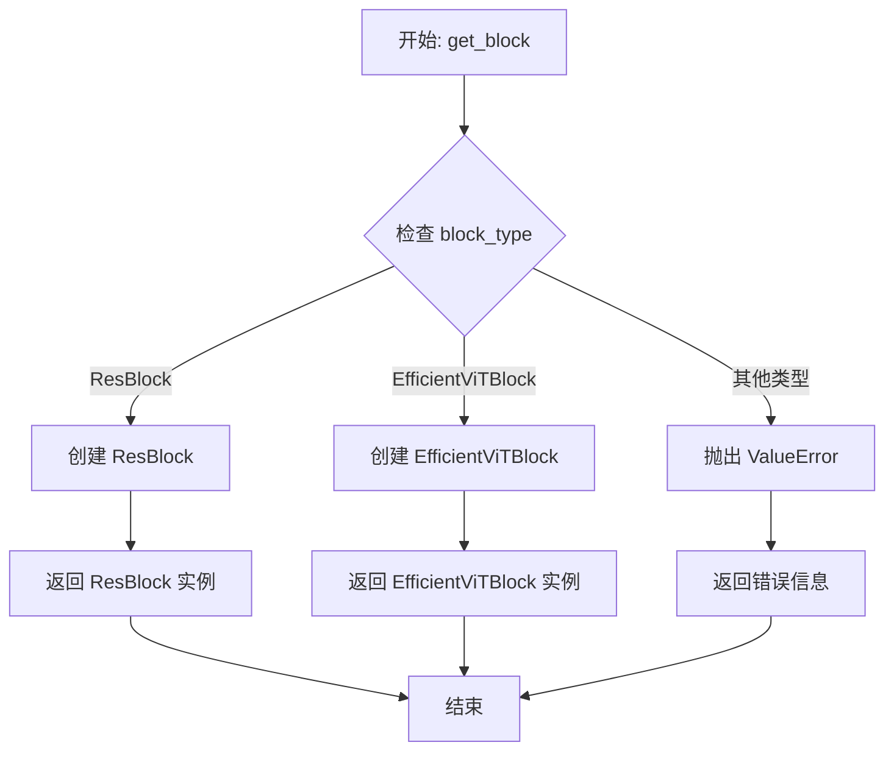

#### 带注释源码

```python
def get_block(
    block_type: str,                 # 网络块类型: "ResBlock" 或 "EfficientViTBlock"
    in_channels: int,                 # 输入通道数
    out_channels: int,                # 输出通道数
    attention_head_dim: int,          # 注意力头维度
    norm_type: str,                   # 归一化类型
    act_fn: str,                      # 激活函数类型
    qkv_multiscales: tuple[int, ...] = (),  # 多尺度 QKV 配置
) -> nn.Module:                       # 返回网络块实例
    """
    工厂函数：根据 block_type 创建对应的神经网络块
    
    Args:
        block_type: 网络块类型，支持 "ResBlock" 或 "EfficientViTBlock"
        in_channels: 输入通道数
        out_channels: 输出通道数
        attention_head_dim: 注意力头维度（仅用于 EfficientViTBlock）
        norm_type: 归一化类型
        act_fn: 激活函数类型
        qkv_multiscales: 多尺度 QKV 配置元组
    
    Returns:
        nn.Module: 创建的网络块实例
    
    Raises:
        ValueError: 当 block_type 不支持时抛出
    """
    
    # 判断 block_type 类型并创建对应的网络块
    if block_type == "ResBlock":
        # 创建残差块：包含两个卷积层、归一化层和激活函数
        block = ResBlock(in_channels, out_channels, norm_type, act_fn)

    elif block_type == "EfficientViTBlock":
        # 创建 EfficientViT 块：包含多头线性注意力和卷积输出层
        block = EfficientViTBlock(
            in_channels,                          # 输入通道数
            attention_head_dim=attention_head_dim, # 注意力头维度
            norm_type=norm_type,                   # 归一化类型
            qkv_multiscales=qkv_multiscales         # 多尺度配置
        )

    else:
        # 不支持的块类型，抛出异常
        raise ValueError(f"Block with {block_type=} is not supported.")

    return block
```

#### 相关依赖类简述

| 类名 | 类型 | 描述 |
|------|------|------|
| `ResBlock` | `nn.Module` | 残差网络块，包含两个卷积层、归一化和激活函数，用于特征提取 |
| `EfficientViTBlock` | `nn.Module` | Efficient Vision Transformer 块，包含多头线 性注意力和 GLUMBConv 卷积 |

#### 潜在优化空间

1. **类型提示完善**：`qkv_multiscales` 参数可添加更精确的类型定义，如 `tuple[int, ...]`
2. **扩展性设计**：可通过注册机制动态添加支持的块类型，避免修改核心函数
3. **错误处理**：可添加更多参数验证逻辑，如通道数、维度等的合法性检查


### `ResBlock.forward`

该方法是残差块（Residual Block）的前向传播函数，通过两个卷积层、激活函数和归一化层处理输入特征，并使用残差连接将输出与输入相加，以缓解梯度消失问题并提升模型性能。

参数：

- `hidden_states`：`torch.Tensor`，输入的四维张量，形状为 (B, C, H, W)，表示批量大小、通道数、高度和宽度

返回值：`torch.Tensor`，经过残差块处理后的四维张量，形状与输入相同 (B, C, H, W)

#### 流程图

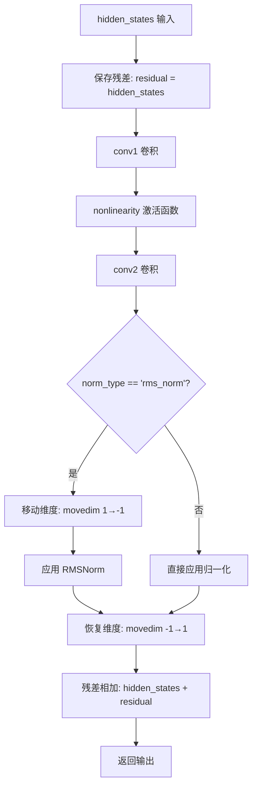

#### 带注释源码

```python
def forward(self, hidden_states: torch.Tensor) -> torch.Tensor:
    """
    残差块的前向传播
    
    Args:
        hidden_states: 输入张量，形状为 (B, C, H, W)
        
    Returns:
        输出张量，形状为 (B, C, H, W)
    """
    # 步骤1: 保存原始输入作为残差连接
    residual = hidden_states
    
    # 步骤2: 第一个卷积层，用于通道内特征变换
    hidden_states = self.conv1(hidden_states)  # (B, C, H, W) -> (B, C, H, W)
    
    # 步骤3: 应用非线性激活函数（如 ReLU6）
    hidden_states = self.nonlinearity(hidden_states)
    
    # 步骤4: 第二个卷积层，输出通道可能与输入不同
    hidden_states = self.conv2(hidden_states)  # (B, C, H, W) -> (B, C', H, W)
    
    # 步骤5: 应用归一化层
    if self.norm_type == "rms_norm":
        # RMSNorm 需要在通道维度上计算，因此将通道维度移到最后
        # movedim(1, -1): 将通道维度 C 移到最后一维
        hidden_states = self.norm(hidden_states.movedim(1, -1)).movedim(-1, 1)
    else:
        # 其他归一化（如 BatchNorm）直接在通道维度上操作
        hidden_states = self.norm(hidden_states)
    
    # 步骤6: 残差连接，将卷积输出与原始输入相加
    return hidden_states + residual
```


### `EfficientViTBlock.forward`

该方法实现了 EfficientViTBlock 的前向传播，首先通过多头线性注意力模块处理输入特征，然后通过卷积输出模块进行进一步处理，最后返回处理后的特征张量。

参数：

- `x`：`torch.Tensor`，输入的特征张量，通常为批量大小的图像或特征图，形状为 (B, C, H, W)

返回值：`torch.Tensor`，经过注意力机制和卷积输出处理后的特征张量，形状与输入相同 (B, C, H, W)

#### 流程图

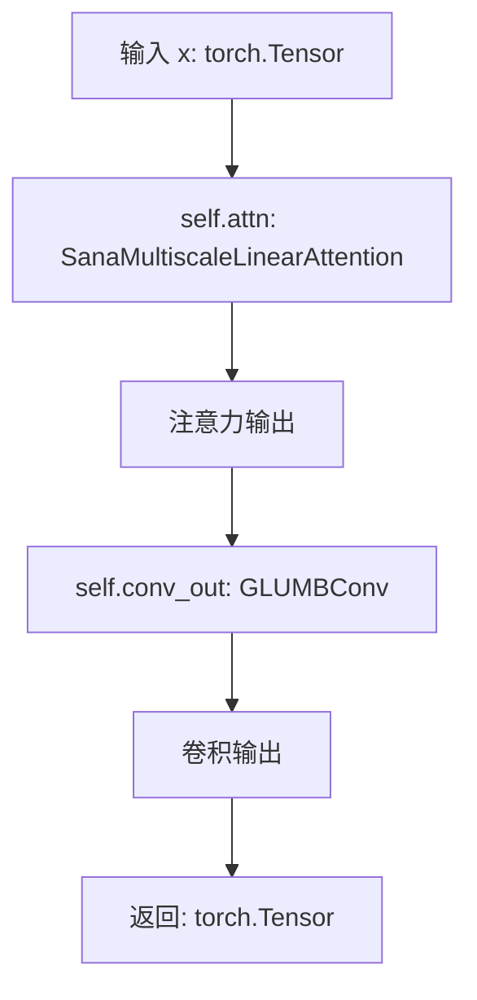

#### 带注释源码

```python
def forward(self, x: torch.Tensor) -> torch.Tensor:
    """
    EfficientViTBlock 的前向传播方法。
    
    该方法依次通过两个子模块处理输入特征：
    1. 多头线性注意力模块 (SanaMultiscaleLinearAttention)：用于捕捉特征间的长距离依赖关系
    2. 卷积输出模块 (GLUMBConv)：用于进一步处理和特征融合
    
    参数:
        x: 输入特征张量，形状为 (batch_size, channels, height, width)
    
    返回:
        处理后的特征张量，形状与输入相同
    """
    # 第一步：应用多头线性注意力机制
    # SanaMultiscaleLinearAttention 是一种高效的线性注意力实现
    # 支持多尺度核卷积，能够在不同尺度上捕捉特征关联
    x = self.attn(x)
    
    # 第二步：通过卷积输出模块进行进一步处理
    # GLUMBConv 使用 RMSNorm 进行归一化，有助于稳定训练和加速收敛
    x = self.conv_out(x)
    
    # 返回处理后的特征
    return x
```


### `DCDownBlock2d.forward`

该方法实现了一个支持像素解洗牌（pixel unshuffle）下采样的卷积残差块，通过卷积变换、像素解洗牌操作和可选的残差连接，将输入特征图进行空间下采样和通道重组，适用于自编码器的编码器部分。

参数：

- `hidden_states`：`torch.Tensor`，输入的隐藏状态张量，形状为 `(batch_size, channels, height, width)`，代表上一层的特征图

返回值：`torch.Tensor`，经过下采样和残差连接处理后的输出张量，形状根据 `downsample` 参数和 `shortcut` 参数的配置而定

#### 流程图

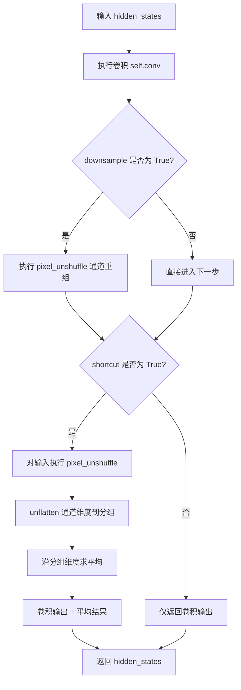

#### 带注释源码

```
def forward(self, hidden_states: torch.Tensor) -> torch.Tensor:
    """
    DCDownBlock2d 的前向传播方法。
    
    该方法实现了带有 pixel_unshuffle 下采样和可选残差连接的卷积块。
    1. 首先通过卷积层进行特征变换
    2. 如果 downsample=True，执行 pixel_unshuffle 进行空间下采样和通道重组
    3. 如果 shortcut=True，对输入执行相同的 pixel_unshuffle 并通过平均池化进行通道压缩，然后与卷积输出相加
    4. 返回处理后的特征图
    
    参数:
        hidden_states: 输入张量，形状为 (batch_size, in_channels, height, width)
        
    返回:
        输出张量，形状取决于 downsample 和 shortcut 参数
    """
    # 第一步：卷积变换
    # 使用 3x3 卷积核，步幅由 self.stride 决定（下采样时为1，否则为2）
    x = self.conv(hidden_states)
    
    # 第二步：条件 Pixel Unshuffle
    # 当 downsample=True 时，执行 pixel_unshuffle 将空间尺寸缩小 factor 倍
    # 通道数增加 factor^2 倍，实现空间到通道的转换
    if self.downsample:
        x = F.pixel_unshuffle(x, self.factor)
    
    # 第三步：残差连接处理
    if self.shortcut:
        # 对原始输入执行相同的 pixel_unshuffle 操作
        y = F.pixel_unshuffle(hidden_states, self.factor)
        
        # 将通道维度展开为 (batch, groups, group_size, height, width) 的形式
        # group_size = in_channels * factor^2 // out_channels
        y = y.unflatten(1, (-1, self.group_size))
        
        # 沿分组维度求平均，实现通道压缩
        # 这相当于将多个通道的信息聚合到更少的输出通道中
        y = y.mean(dim=2)
        
        # 将卷积输出与残差连接的结果相加
        hidden_states = x + y
    else:
        # 如果不使用残差连接，直接返回卷积输出
        hidden_states = x
    
    return hidden_states
```


### `DCUpBlock2d.forward`

DCUpBlock2d 类的前向传播方法，负责对输入的隐藏状态进行上采样处理（通过像素重组或插值方式），并可选地添加残差连接（shortcut）以增强梯度流动。

参数：

- `hidden_states`：`torch.Tensor`，输入的隐藏状态张量，通常来自解码器的前一层，形状为 (batch_size, channels, height, width)

返回值：`torch.Tensor`，上采样后的隐藏状态张量，形状为 (batch_size, out_channels, height * factor, width * factor)

#### 流程图

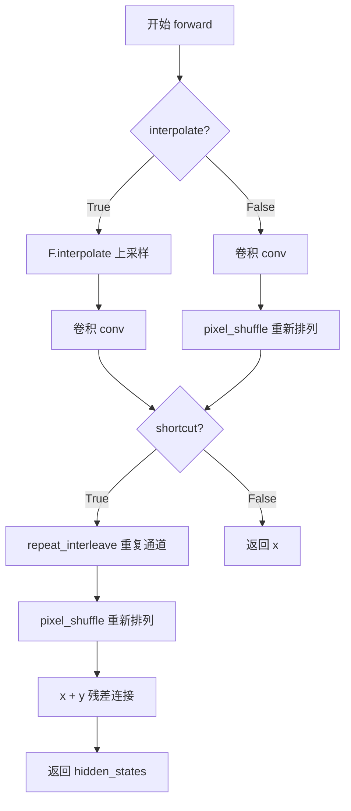

#### 带注释源码

```python
def forward(self, hidden_states: torch.Tensor) -> torch.Tensor:
    """
    DCUpBlock2d 的前向传播方法，对输入进行上采样处理。
    
    参数:
        hidden_states: 输入的隐藏状态张量，形状为 (batch_size, in_channels, height, width)
    
    返回:
        上采样后的隐藏状态张量，形状为 (batch_size, out_channels, height * 2, width * 2)
    """
    # 根据 interpolate 标志选择不同的上采样路径
    if self.interpolate:
        # 路径1：使用插值方式进行上采样
        # 使用双线性插值将空间尺寸放大 factor 倍
        x = F.interpolate(hidden_states, scale_factor=self.factor, mode=self.interpolation_mode)
        # 然后通过卷积处理
        x = self.conv(x)
    else:
        # 路径2：使用卷积 + pixel_shuffle 方式进行上采样
        # 首先通过卷积增加通道数（in_channels * factor^2）
        x = self.conv(hidden_states)
        # 然后通过 pixel_shuffle 将通道数转换为空间尺寸（通道重排）
        x = F.pixel_shuffle(x, self.factor)

    # 如果启用 shortcut（残差连接），则将输入与输出相加
    if self.shortcut:
        # 对输入通道进行重复以匹配输出通道数
        # repeat_interleave 沿通道维度重复每个通道
        y = hidden_states.repeat_interleave(
            self.repeats, 
            dim=1, 
            output_size=hidden_states.shape[1] * self.repeats
        )
        # 对重复后的张量进行 pixel_shuffle
        y = F.pixel_shuffle(y, self.factor)
        # 将卷积结果与残差相加
        hidden_states = x + y
    else:
        # 不使用残差连接，直接返回卷积结果
        hidden_states = x

    return hidden_states
```


### `Encoder.forward`

该函数实现编码器的前向传播，将输入的图像特征通过初始卷积、多个下采样块和输出卷积层进行处理，并在输出阶段可选地添加残差连接以保留细粒度信息。

参数：

- `hidden_states`：`torch.Tensor`，输入的隐藏状态张量，通常为形状 `(batch_size, channels, height, width)` 的图像特征

返回值：`torch.Tensor`，编码后的隐藏状态张量，形状为 `(batch_size, latent_channels, latent_height, latent_width)`

#### 流程图

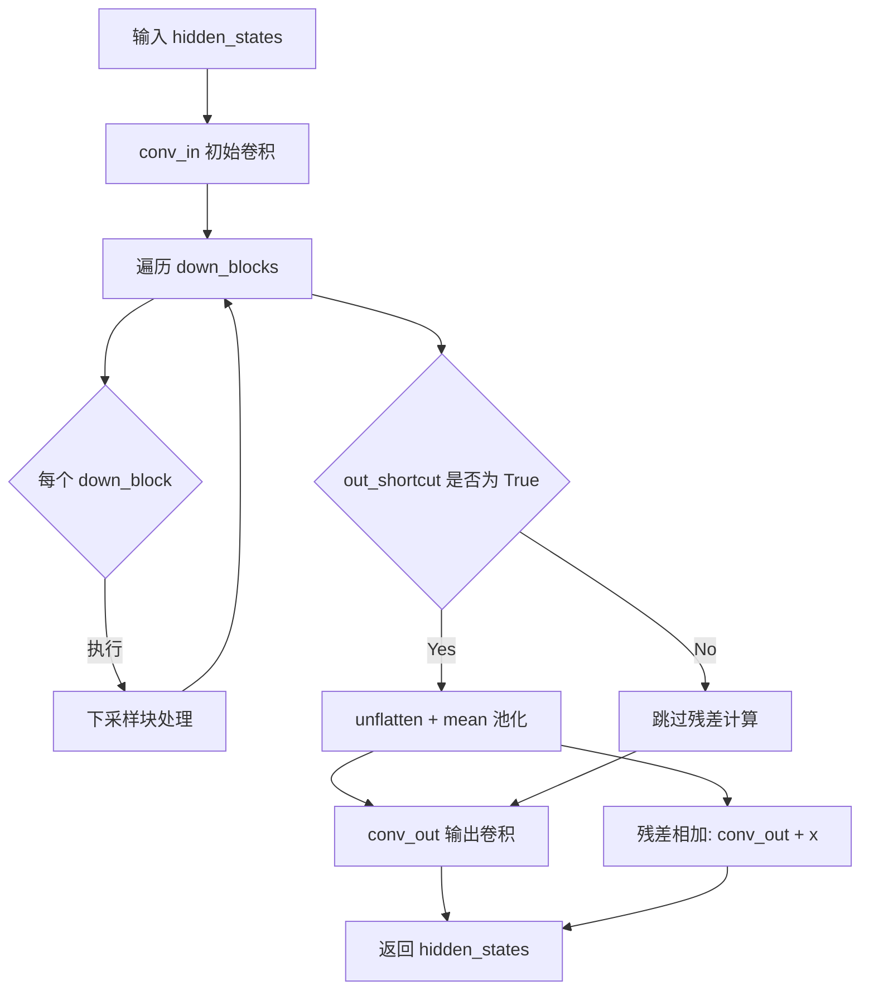

#### 带注释源码

```python
def forward(self, hidden_states: torch.Tensor) -> torch.Tensor:
    """
    Encoder 的前向传播方法
    
    参数:
        hidden_states: 输入张量，形状为 (batch_size, in_channels, height, width)
    
    返回:
        编码后的张量，形状为 (batch_size, latent_channels, latent_height, latent_width)
    """
    # 第一步：通过初始卷积层处理输入
    # 将输入通道转换为第一个block的输出通道数
    hidden_states = self.conv_in(hidden_states)
    
    # 第二步：依次通过所有下采样块
    # down_blocks 是一个 ModuleList，包含多个顺序连接的下采样块
    # 每个块可能包含：多个 ResBlock 或 EfficientViTBlock + 可选的下采样层
    for down_block in self.down_blocks:
        hidden_states = down_block(hidden_states)
    
    # 第三步：输出卷积层 + 可选的残差连接
    if self.out_shortcut:
        # 如果启用输出快捷方式，先对特征进行分组池化
        # 将通道维度展开为 (group, channel_per_group)，然后在 group 维度求平均
        # 这样可以降低通道数，同时保留重要的统计信息
        x = hidden_states.unflatten(1, (-1, self.out_shortcut_average_group_size))
        x = x.mean(dim=2)  # 在分组维度求平均
        
        # 通过输出卷积层，然后与池化后的特征相加（残差连接）
        hidden_states = self.conv_out(hidden_states) + x
    else:
        # 如果不启用快捷方式，直接通过输出卷积层
        hidden_states = self.conv_out(hidden_states)
    
    return hidden_states
```


### `Decoder.forward`

该方法实现了解码器的前向传播过程，将潜在空间的表示（latent representation）上采样并解码回原始图像空间。方法首先通过输入快捷连接处理隐藏状态，然后依次通过多个上采样块进行特征提升，最后通过归一化、激活函数和输出卷积层产生最终的图像重建结果。

参数：

- `hidden_states`：`torch.Tensor`，输入的潜在表示张量，形状为 (batch_size, latent_channels, height, width)

返回值：`torch.Tensor`，解码后的图像张量，形状为 (batch_size, in_channels, height * spatial_compression_ratio, width * spatial_compression_ratio)

#### 流程图

```mermaid
flowchart TD
    A[输入 hidden_states] --> B{是否使用 in_shortcut?}
    B -->|Yes| C[repeat_interleave 扩展通道]
    B -->|No| D[跳过扩展]
    C --> E[conv_in + 残差相加]
    D --> E
    E --> F[遍历 up_blocks 列表<br/>(逆序)]
    F --> G[执行上采样块]
    G --> F
    F --> H{所有块遍历完成?}
    H -->|No| F
    H -->|Yes| I[RMSNorm 归一化<br/>(通道移到最后一维后处理)]
    I --> J[激活函数 conv_act]
    J --> K[卷积输出 conv_out]
    K --> L[返回解码图像]
    
    subgraph "上采样块内部"
        G --> G1[DCUpBlock2d: 上采样/像素重组]
        G1 --> G2[ResBlock/EfficientViTBlock: 特征提取]
    end
```

#### 带注释源码

```python
def forward(self, hidden_states: torch.Tensor) -> torch.Tensor:
    # 如果启用输入快捷连接，则对隐藏状态进行通道扩展以匹配后续层的通道数
    # 例如：如果 latent_channels=32, block_out_channels[-1]=1024，则重复32次
    if self.in_shortcut:
        x = hidden_states.repeat_interleave(
            self.in_shortcut_repeats, dim=1, output_size=hidden_states.shape[1] * self.in_shortcut_repeats
        )
        # 初始卷积变换 + 残差连接（快捷路径）
        hidden_states = self.conv_in(hidden_states) + x
    else:
        # 仅执行初始卷积变换
        hidden_states = self.conv_in(hidden_states)

    # 逆序遍历上采样块（从最高分辨率到最低分辨率）
    # 每个上采样块包含：DCUpBlock2d（可选）+ 多个 ResBlock/EfficientViTBlock
    for up_block in reversed(self.up_blocks):
        hidden_states = up_block(hidden_states)

    # 输出归一化：RMSNorm
    # 由于 RMSNorm 沿着通道维度计算，需要将通道维度移到最后，处理后再移回
    hidden_states = self.norm_out(hidden_states.movedim(1, -1)).movedim(-1, 1)
    
    # 应用激活函数（如 ReLU）
    hidden_states = self.conv_act(hidden_states)
    
    # 最终输出卷积，将通道数转换回输入通道数（in_channels）
    hidden_states = self.conv_out(hidden_states)
    
    return hidden_states
```

#### 关键实现细节

| 组件 | 描述 |
|------|------|
| `in_shortcut` | 布尔标志，控制是否使用输入级残差连接，有助于梯度流动和特征复用 |
| `conv_in` | 输入卷积层，将潜在通道数转换为解码器初始通道数 |
| `up_blocks` | ModuleList，包含多个上采样块序列，每个块执行上采样和特征提取 |
| `norm_out` | RMSNorm 归一化层，用于输出前的特征标准化 |
| `conv_act` | 激活函数层（如 ReLU） |
| `conv_out` | 输出卷积层，将特征通道映射回原始输入通道数 |

#### 技术特点

- **逆序上采样**：从低分辨率的深层特征开始，逐步上采样到高分辨率
- **残差连接**：在输入和输出阶段都使用了快捷连接，帮助梯度传播
- **空间压缩比**：`spatial_compression_ratio = 2^(len(block_out_channels)-1)`，用于计算输出尺寸
- **像素重组上采样**：使用 `pixel_shuffle` 实现高效的空间分辨率提升


### `AutoencoderDC.enable_tiling`

启用瓦片（分块）解码模式。当启用此选项时，自编码器会将输入张量分割成多个重叠的瓦片，分别进行编码和解码，从而显著降低内存占用并支持处理更大分辨率的图像。

参数：

- `tile_sample_min_height`：`int | None`，可选，样本在高度维度上被分割成瓦片的最小高度阈值
- `tile_sample_min_width`：`int | None`，可选，样本在宽度维度上被分割成瓦片的最小宽度阈值
- `tile_sample_stride_height`：`float | None`，可选，两个连续垂直瓦片之间的最小重叠区域高度，用于消除高度方向的拼接痕迹
- `tile_sample_stride_width`：`float | None`，可选，两个连续水平瓦片之间的步幅宽度，用于消除宽度方向的拼接痕迹

返回值：`None`，无返回值（该方法直接修改实例的内部状态）

#### 流程图

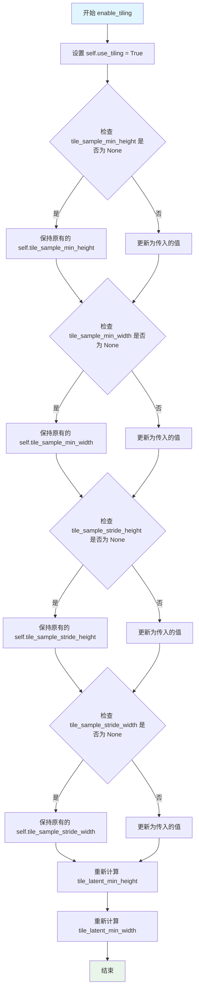

#### 带注释源码

```python
def enable_tiling(
    self,
    tile_sample_min_height: int | None = None,
    tile_sample_min_width: int | None = None,
    tile_sample_stride_height: float | None = None,
    tile_sample_stride_width: float | None = None,
) -> None:
    r"""
    Enable tiled AE decoding. When this option is enabled, the AE will split the input tensor into tiles to compute
    decoding and encoding in several steps. This is useful for saving a large amount of memory and to allow
    processing larger images.

    Args:
        tile_sample_min_height (`int`, *optional*):
            The minimum height required for a sample to be separated into tiles across the height dimension.
        tile_sample_min_width (`int`, *optional*):
            The minimum width required for a sample to be separated into tiles across the width dimension.
        tile_sample_stride_height (`int`, *optional*):
            The minimum amount of overlap between two consecutive vertical tiles. This is to ensure that there are
            no tiling artifacts produced across the height dimension.
        tile_sample_stride_width (`int`, *optional*):
            The stride between two consecutive horizontal tiles. This is to ensure that there are no tiling
            artifacts produced across the width dimension.
    """
    # 启用瓦片模式标志
    self.use_tiling = True
    
    # 更新瓦片高度参数（如果提供了新值则使用新值，否则保留原值）
    self.tile_sample_min_height = tile_sample_min_height or self.tile_sample_min_height
    self.tile_sample_min_width = tile_sample_min_width or self.tile_sample_min_width
    self.tile_sample_stride_height = tile_sample_stride_height or self.tile_sample_stride_height
    self.tile_sample_stride_width = tile_sample_stride_width or self.tile_sample_stride_width
    
    # 根据空间压缩比重新计算潜在空间的瓦片尺寸
    # 潜在空间瓦片尺寸 = 样本瓦片尺寸 / 空间压缩比
    self.tile_latent_min_height = self.tile_sample_min_height // self.spatial_compression_ratio
    self.tile_latent_min_width = self.tile_sample_min_width // self.spatial_compression_ratio
```


### `AutoencoderDC._encode`

该方法是 AutoencoderDC 类的内部编码方法，负责将输入图像张量编码为潜在空间表示。根据输入尺寸和是否启用分块（tiling）模式，它会选择直接编码或调用分块编码方法。

参数：

-  `self`：`AutoencoderDC` 实例，隐式参数，包含编码器模型和分块配置
-  `x`：`torch.Tensor`，输入的图像或视频张量，形状为 (batch_size, num_channels, height, width)

返回值：`torch.Tensor`，编码后的潜在表示张量，形状为 (batch_size, latent_channels, latent_height, latent_width)

#### 流程图

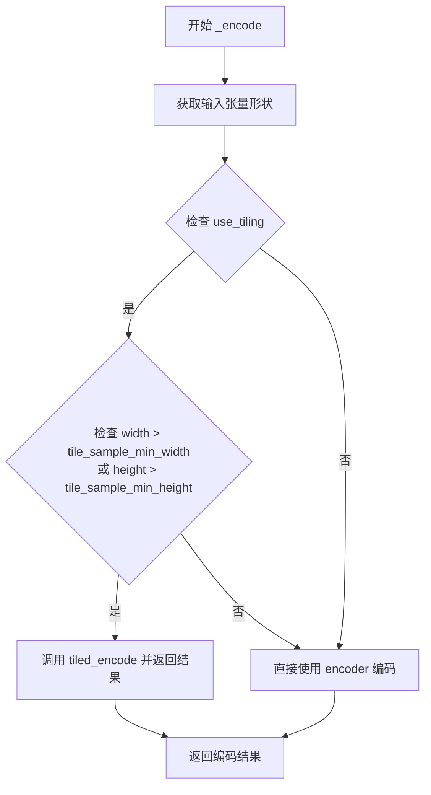

#### 带注释源码

```python
def _encode(self, x: torch.Tensor) -> torch.Tensor:
    """
    内部编码方法，将输入张量编码为潜在表示。
    
    参数:
        x: 输入的图像/视频张量，形状为 (batch_size, num_channels, height, width)
    
    返回:
        编码后的潜在表示张量
    """
    # 解包输入张量的形状信息
    batch_size, num_channels, height, width = x.shape

    # 检查是否启用了分块编码模式
    # 如果启用且输入尺寸超过最小分块阈值，则使用分块编码
    if self.use_tiling and (width > self.tile_sample_min_width or height > self.tile_sample_min_height):
        # 调用分块编码方法，处理大尺寸输入以节省显存
        return self.tiled_encode(x, return_dict=False)[0]

    # 标准编码路径：直接使用编码器处理输入
    encoded = self.encoder(x)

    # 返回编码后的潜在表示
    return encoded
```


### `AutoencoderDC.encode`

该方法实现了一个自编码器（AutoencoderDC）的编码功能，用于将一批图像张量转换为潜在空间表示（latent representation）。它支持切片（slicing）技术以节省内存，并可根据配置返回 `EncoderOutput` 对象或原始元组。

参数：

-  `x`：`torch.Tensor`，输入的图像批次张量，形状为 (batch_size, channels, height, width)
-  `return_dict`：`bool`，默认为 `True`，指定是否返回 `EncoderOutput` 对象而非普通元组

返回值：`EncoderOutput | tuple[torch.Tensor]`，如果 `return_dict` 为 True，返回包含潜在表示的 `EncoderOutput` 对象；否则返回包含单个张量的元组

#### 流程图

```mermaid
flowchart TD
    A[开始 encode] --> B{use_slicing 为真<br/>且 batch_size > 1?}
    B -->|是| C[将输入按batch维度切分为单个样本]
    C --> D[对每个样本调用 _encode]
    D --> E[将编码后的切片在batch维度上拼接]
    B -->|否| F[直接调用 _encode]
    F --> G{return_dict?}
    E --> G
    G -->|是| H[返回 EncoderOutput<br/>latent=encoded]
    G -->|否| I[返回元组 (encoded,)]
```

#### 带注释源码

```python
@apply_forward_hook
def encode(self, x: torch.Tensor, return_dict: bool = True) -> EncoderOutput | tuple[torch.Tensor]:
    r"""
    Encode a batch of images into latents.

    Args:
        x (`torch.Tensor`): Input batch of images.
        return_dict (`bool`, defaults to `True`):
            Whether to return a [`~models.vae.EncoderOutput`] instead of a plain tuple.

    Returns:
            The latent representations of the encoded videos. If `return_dict` is True, a
            [`~models.vae.EncoderOutput`] is returned, otherwise a plain `tuple` is returned.
    """
    # 如果启用了切片模式且batch大小大于1，则对每个样本分别编码
    if self.use_slicing and x.shape[0] > 1:
        # 按batch维度切分为单独样本
        encoded_slices = [self._encode(x_slice) for x_slice in x.split(1)]
        # 在batch维度上拼接所有编码后的切片
        encoded = torch.cat(encoded_slices)
    else:
        # 直接对整个batch进行编码
        encoded = self._encode(x)

    # 根据return_dict决定返回格式
    if not return_dict:
        return (encoded,)
    return EncoderOutput(latent=encoded)
```


### `AutoencoderDC._decode`

该方法是 AutoencoderDC 类的内部解码方法，负责将潜在空间向量（latent vectors）解码为图像张量。方法首先检查是否启用了分块解码（tiling），如果输入的潜在向量尺寸超过预设的最小阈值，则调用分块解码方法以节省内存；否则直接使用标准的 Decoder 模块进行解码。

参数：

- `z`：`torch.Tensor`，输入的潜在空间向量张量，通常来自编码器的输出，形状为 (batch_size, num_channels, height, width)

返回值：`torch.Tensor`，解码后的图像张量，形状为 (batch_size, in_channels, height * spatial_compression_ratio, width * spatial_compression_ratio)

#### 流程图

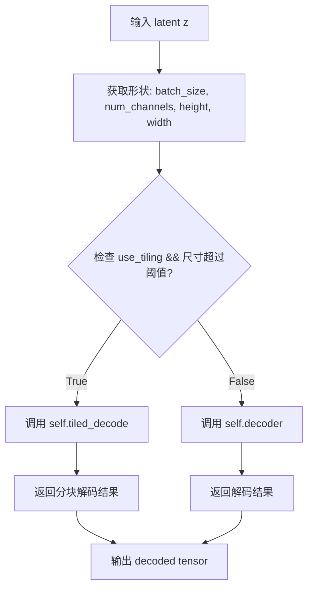

#### 带注释源码

```python
def _decode(self, z: torch.Tensor) -> torch.Tensor:
    """
    解码潜在空间向量为图像张量。
    
    该方法是 AutoencoderDC 的内部解码方法，提供了两种解码策略：
    1. 标准解码：直接使用 decoder 模块进行解码
    2. 分块解码：当输入尺寸较大时，将输入分割为多个重叠的tile分别解码，最后拼接
       这样可以降低显存需求，适合处理高分辨率图像
    
    Args:
        z: 输入的潜在空间向量，形状为 (batch_size, latent_channels, latent_height, latent_width)
        
    Returns:
        解码后的图像张量，形状为 (batch_size, in_channels, height, width)
    """
    # 获取输入张量的形状信息，用于后续的尺寸判断
    batch_size, num_channels, height, width = z.shape
    
    # 检查是否启用分块解码且输入尺寸超过最小分块阈值
    # 如果启用tiling且尺寸足够大，则使用分块解码来节省显存
    if self.use_tiling and (width > self.tile_latent_min_width or height > self.tile_latent_min_height):
        # 调用分块解码方法，返回 DecoderOutput 或 tuple，取第一个元素
        return self.tiled_decode(z, return_dict=False)[0]
    
    # 标准解码路径：直接使用 Decoder 模块进行解码
    decoded = self.decoder(z)
    
    # 返回解码后的图像张量
    return decoded
```


### `AutoencoderDC.decode`

该方法是 AutoencoderDC 类的解码方法，负责将潜在空间中的向量批量解码回图像空间。支持切片处理以节省内存，根据 return_dict 参数返回 DecoderOutput 对象或元组。

参数：

- `z`：`torch.Tensor`，输入的潜在向量批次（latent vectors），通常来自编码器的输出
- `return_dict`：`bool`，是否返回 `DecoderOutput` 对象（默认为 True）。若为 False，则返回元组

返回值：`DecoderOutput | tuple[torch.Tensor]`，当 return_dict 为 True 时返回 DecoderOutput 对象，其中 sample 属性包含解码后的图像张量；否则返回包含单个张量的元组

#### 流程图

```mermaid
flowchart TD
    A[开始 decode] --> B{是否启用切片<br/>use_slicing 且 batch_size > 1}
    B -->|是| C[将批次按维度0分割成单个样本]
    C --> D[对每个样本调用 _decode]
    D --> E[将解码后的切片沿批次维度拼接]
    B -->|否| F[直接调用 _decode]
    F --> G{return_dict?}
    E --> G
    G -->|True| H[返回 DecoderOutput<br/>sample=decoded]
    G -->|False| I[返回元组 (decoded,)]
    H --> J[结束]
    I --> J
    
    subgraph "_decode 内部流程"
        K[检查是否启用平铺<br/>use_tiling] --> L{图像尺寸 > 平铺最小尺寸}
        L -->|是| M[调用 tiled_decode]
        L -->|否| N[直接调用 self.decoder]
        N --> O[返回解码后的张量]
        M --> O
    end
```

#### 带注释源码

```python
@apply_forward_hook
def decode(self, z: torch.Tensor, return_dict: bool = True) -> DecoderOutput | tuple[torch.Tensor]:
    r"""
    Decode a batch of images.

    Args:
        z (`torch.Tensor`): Input batch of latent vectors.
        return_dict (`bool`, defaults to `True`):
            Whether to return a [`~models.vae.DecoderOutput`] instead of a plain tuple.

    Returns:
        [`~models.vae.DecoderOutput`] or `tuple`:
            If return_dict is True, a [`~models.vae.DecoderOutput`] is returned, otherwise a plain `tuple` is
            returned.
    """
    # 检查是否启用切片模式（用于节省内存）
    # 当 batch size 大于 1 时，将批次分割成单个样本分别解码
    if self.use_slicing and z.size(0) > 1:
        # 按批次维度分割成单个样本
        decoded_slices = [self._decode(z_slice) for z_slice in z.split(1)]
        # 将解码后的切片沿批次维度重新拼接
        decoded = torch.cat(decoded_slices)
    else:
        # 直接调用内部 _decode 方法进行解码
        decoded = self._decode(z)

    # 根据 return_dict 参数决定返回值格式
    if not return_dict:
        # 返回元组形式 (decoded_tensor,)
        return (decoded,)
    # 返回 DecoderOutput 对象，包含 sample 属性
    return DecoderOutput(sample=decoded)
```


### `AutoencoderDC.blend_v`

该函数是 `AutoencoderDC` 类中的垂直混合方法，用于在瓦片式编码/解码过程中垂直混合两个重叠的张量区域。它通过线性插值在两个张量的垂直边缘创建平滑过渡，避免瓦片之间的接缝 artifacts。

参数：

- `a`：`torch.Tensor`，第一个输入张量（通常为上方或左侧的瓦片）
- `b`：`torch.Tensor`，第二个输入张量（通常为当前瓦片，将被混合并返回）
- `blend_extent`：`int`，混合区域的垂直范围（高度）

返回值：`torch.Tensor`，混合后的张量（修改后的 `b`）

#### 流程图

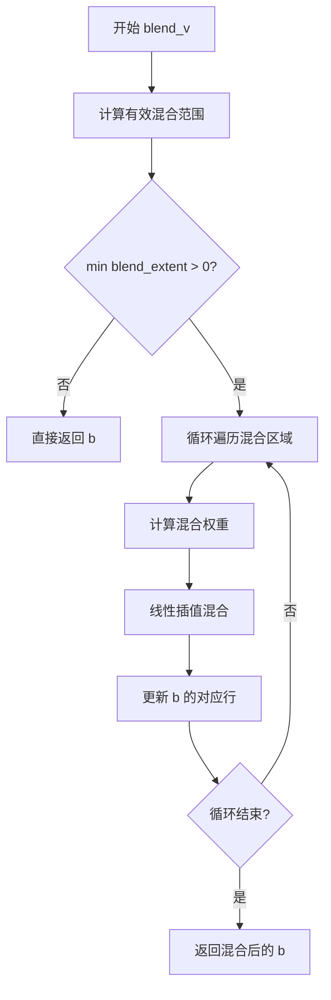

#### 带注释源码

```python
def blend_v(self, a: torch.Tensor, b: torch.Tensor, blend_extent: int) -> torch.Tensor:
    """
    垂直混合两个张量，用于瓦片式编码/解码的边缘融合。
    
    Args:
        a: 第一个张量，通常是上方或左侧的瓦片
        b: 第二个张量，当前瓦片，将被修改并返回
        blend_extent: 混合区域的垂直范围
    
    Returns:
        混合后的张量 b
    """
    # 计算有效的混合范围，取输入张量高度和指定混合范围的最小值
    blend_extent = min(a.shape[2], b.shape[2], blend_extent)
    
    # 遍历混合区域的每一行
    for y in range(blend_extent):
        # 计算混合权重：上方张量的权重从 1 递减到 0
        # 下方张量的权重从 0 递增到 1
        weight_a = 1 - y / blend_extent  # 上方瓦片权重
        weight_b = y / blend_extent       # 当前瓦片权重
        
        # 从上方张量 a 的底部取出对应的行，从 0 开始
        # 与当前张量 b 的顶部对应行进行加权混合
        b[:, :, y, :] = (
            a[:, :, -blend_extent + y, :] * weight_a  # 加权上方瓦片
            + b[:, :, y, :] * weight_b                 # 加权当前瓦片
        )
    
    # 返回混合后的张量 b
    return b
```


### `AutoencoderDC.blend_h`

该方法实现水平方向（宽度维度）的张量混合，通过线性插值将两个张量在指定重叠区域进行平滑融合，常用于瓦片解码时消除相邻瓦片之间的接缝。

参数：

- `a`：`torch.Tensor`，参与混合的左侧张量，提供重叠区域的像素值
- `b`：`torch.Tensor`，待混合的右侧张量，其左侧边缘区域将与张量`a`的右侧边缘进行融合
- `blend_extent`：`int`，混合区域的宽度（像素数），指定从边缘向内融合的范围

返回值：`torch.Tensor`，混合操作后的张量（返回修改后的`b`张量）

#### 流程图

```mermaid
flowchart TD
    A[开始 blend_h] --> B[计算有效混合宽度<br/>blend_extent = min]
    B --> C{blend_extent > 0?}
    C -->|否| D[直接返回 b]
    C -->|是| E[循环 x 从 0 到 blend_extent-1]
    E --> F[计算混合权重<br/>weight = x / blend_extent]
    F --> G[从张量 a 提取对应列<br/>a[:, :, :, -blend_extent + x]]
    G --> H[线性插值混合<br/>a_col * (1-weight) + b_col * weight]
    H --> I[将混合结果写入 b[:, :, :, x]]
    E --> J{循环结束?}
    J -->|否| E
    J -->|是| K[返回混合后的 b]
```

#### 带注释源码

```python
def blend_h(self, a: torch.Tensor, b: torch.Tensor, blend_extent: int) -> torch.Tensor:
    """
    水平方向混合两个张量，用于消除瓦片解码产生的接缝。
    
    参数:
        a: 左侧张量，提供重叠区域的像素值
        b: 右侧张量，其左侧边缘将进行混合
        blend_extent: 混合区域宽度
    
    返回:
        混合后的张量 b
    """
    # 步骤1：计算有效混合宽度，取三个值的最小值防止越界
    # a.shape[3] 和 b.shape[3] 分别是两个张量的宽度
    blend_extent = min(a.shape[3], b.shape[3], blend_extent)
    
    # 步骤2：遍历混合区域内的每一列
    for x in range(blend_extent):
        # 计算当前列的混合权重，从0到1线性增加
        # x=0时完全使用a的值，x=blend_extent-1时完全使用b的值
        weight = x / blend_extent
        
        # 从张量a的右侧边缘提取对应列
        # -blend_extent + x 实现从右向左索引
        a_col = a[:, :, :, -blend_extent + x]
        
        # 从张量b的左侧提取对应列
        b_col = b[:, :, :, x]
        
        # 线性插值混合：a * (1 - weight) + b * weight
        # 权重weight随x增加而增加，实现平滑过渡
        blended = a_col * (1 - weight) + b_col * weight
        
        # 将混合结果写回张量b的对应位置
        b[:, :, :, x] = blended
    
    # 返回混合后的张量b
    return b
```


### `AutoencoderDC.tiled_encode`

对输入图像进行分块（Tiled）编码，通过将大尺寸图像分割成重叠的空间块分别编码，并在块边界进行混合（blending）以消除拼接伪影，最后将所有块的结果拼接成完整的潜在表示。该方法可在处理高分辨率图像时显著降低内存占用。

参数：

- `x`：`torch.Tensor`，输入的图像张量，形状为 `(batch_size, num_channels, height, width)`
- `return_dict`：`bool`，是否返回 `EncoderOutput` 对象，默认为 `True`

返回值：`EncoderOutput | tuple[torch.Tensor]`，编码后的潜在表示。当 `return_dict=True` 时返回 `EncoderOutput` 对象，其中 `latent` 属性包含编码结果；当 `return_dict=False` 时返回元组 `(encoded,)`

#### 流程图

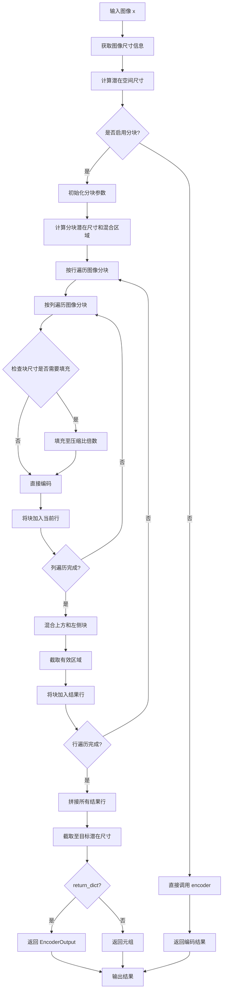

#### 带注释源码

```python
def tiled_encode(self, x: torch.Tensor, return_dict: bool = True) -> torch.Tensor:
    # 获取输入图像的批次大小、通道数、高度和宽度
    batch_size, num_channels, height, width = x.shape
    
    # 计算潜在空间的目标尺寸（基于空间压缩比）
    latent_height = height // self.spatial_compression_ratio
    latent_width = width // self.spatial_compression_ratio

    # 根据图像块的采样参数计算潜在空间的块参数
    tile_latent_min_height = self.tile_sample_min_height // self.spatial_compression_ratio
    tile_latent_min_width = self.tile_sample_min_width // self.spatial_compression_ratio
    tile_latent_stride_height = self.tile_sample_stride_height // self.spatial_compression_ratio
    tile_latent_stride_width = self.tile_sample_stride_width // self.spatial_compression_ratio
    
    # 计算混合区域的高度和宽度（相邻块之间的重叠区域）
    blend_height = tile_latent_min_height - tile_latent_stride_height
    blend_width = tile_latent_min_width - tile_latent_stride_width

    # 初始化结果容器：按行组织编码后的块
    rows = []
    
    # 外层循环：按垂直方向（高度）步进遍历图像，创建行
    for i in range(0, x.shape[2], self.tile_sample_stride_height):
        row = []
        # 内层循环：按水平方向（宽度）步进遍历图像，创建列
        for j in range(0, x.shape[3], self.tile_sample_stride_width):
            # 提取当前块的图像区域
            tile = x[:, :, i : i + self.tile_sample_min_height, j : j + self.tile_sample_min_width]
            
            # 检查块尺寸是否可以被空间压缩比整除
            if (
                tile.shape[2] % self.spatial_compression_ratio != 0
                or tile.shape[3] % self.spatial_compression_ratio != 0
            ):
                # 如果不能整除，计算需要填充的像素数
                pad_h = (self.spatial_compression_ratio - tile.shape[2]) % self.spatial_compression_ratio
                pad_w = (self.spatial_compression_ratio - tile.shape[3]) % self.spatial_compression_ratio
                # 使用零填充最后一行/列，使尺寸兼容
                tile = F.pad(tile, (0, pad_w, 0, pad_h))
            
            # 对当前块进行编码
            tile = self.encoder(tile)
            row.append(tile)
        
        # 将当前行的所有块添加到行容器中
        rows.append(row)

    # 处理混合和拼接结果
    result_rows = []
    # 遍历每一行
    for i, row in enumerate(rows):
        result_row = []
        # 遍历当前行中的每个块
        for j, tile in enumerate(row):
            # 混合上方相邻块（垂直混合）
            # 将当前块与上一行的对应块进行加权混合，消除水平接缝
            if i > 0:
                tile = self.blend_v(rows[i - 1][j], tile, blend_height)
            
            # 混合左侧相邻块（水平混合）
            # 将当前块与同一行左侧的块进行加权混合，消除垂直接缝
            if j > 0:
                tile = self.blend_h(row[j - 1], tile, blend_width)
            
            # 截取混合后的有效区域（去除重叠部分）
            result_row.append(tile[:, :, :tile_latent_stride_height, :tile_latent_stride_width])
        
        # 将当前行的所有块在宽度维度上拼接
        result_rows.append(torch.cat(result_row, dim=3))

    # 将所有行在高度维度上拼接，得到完整的编码结果
    encoded = torch.cat(result_rows, dim=2)[:, :, :latent_height, :latent_width]

    # 根据 return_dict 参数决定返回格式
    if not return_dict:
        return (encoded,)
    return EncoderOutput(latent=encoded)
```


### `AutoencoderDC.tiled_decode`

该方法实现了基于瓦片（Tile）的解码功能，用于将输入的潜在表示（latent representation）分割成重叠的瓦片并分别解码，最后通过混合（blending）技术将瓦片拼接成完整的输出图像。这种方法可以有效降低大尺寸图像或视频 latent 解码时的显存占用。

参数：

- `z`：`torch.Tensor`，输入的潜在表示张量，形状为 (batch_size, num_channels, height, width)
- `return_dict`：`bool`，默认为 `True`，是否返回 `DecoderOutput` 对象而非元组

返回值：`DecoderOutput | torch.Tensor`，解码后的图像张量或包含样本的 `DecoderOutput` 对象

#### 流程图

```mermaid
flowchart TD
    A[输入 latent z] --> B[计算瓦片参数]
    B --> C{遍历行 i}
    C -->|Yes| D{遍历列 j}
    D --> E[提取瓦片 z[i,j]]
    E --> F[解码瓦片 decoder.tile]
    F --> G[将解码瓦片添加到行]
    D -->|No| H[将行添加到行列表]
    C -->|No| I{遍历结果行}
    I --> J{混合垂直相邻瓦片}
    J --> K{混合水平相邻瓦片}
    K --> L[裁剪并拼接瓦片]
    L --> M[拼接所有行得到完整解码结果]
    M --> N{return_dict?}
    N -->|Yes| O[DecoderOutput]
    N -->|No| P[(元组 decoded,)]
```

#### 带注释源码

```python
def tiled_decode(self, z: torch.Tensor, return_dict: bool = True) -> DecoderOutput | torch.Tensor:
    """
    使用瓦片解码方法对输入的潜在表示进行解码。
    该方法将 latent 分割成重叠的瓦片，分别解码后再通过混合消除接缝。
    
    Args:
        z: 输入的潜在表示张量
        return_dict: 是否返回 DecoderOutput 对象
    
    Returns:
        解码后的图像或 DecoderOutput 对象
    """
    # 获取输入张量的维度信息
    batch_size, num_channels, height, width = z.shape

    # 计算瓦片在 latent 空间的最小尺寸（考虑空间压缩比）
    tile_latent_min_height = self.tile_sample_min_height // self.spatial_compression_ratio
    tile_latent_min_width = self.tile_sample_min_width // self.spatial_compression_ratio
    
    # 计算瓦片在 latent 空间的步长（相邻瓦片的起始位置间隔）
    tile_latent_stride_height = self.tile_sample_stride_height // self.spatial_compression_ratio
    tile_latent_stride_width = self.tile_sample_stride_width // self.spatial_compression_ratio

    # 计算混合区域的高度和宽度（瓦片重叠区域）
    blend_height = self.tile_sample_min_height - self.tile_sample_stride_height
    blend_width = self.tile_sample_min_width - self.tile_sample_stride_width

    # 将 latent 分割成重叠的瓦片并分别解码
    # 瓦片之间有重叠以避免瓦片之间的接缝
    rows = []
    for i in range(0, height, tile_latent_stride_height):
        row = []
        for j in range(0, width, tile_latent_stride_width):
            # 提取当前瓦片区域
            tile = z[:, :, i : i + tile_latent_min_height, j : j + tile_latent_min_width]
            # 使用解码器解码当前瓦片
            decoded = self.decoder(tile)
            row.append(decoded)
        rows.append(row)

    # 对解码后的瓦片进行混合处理，消除接缝
    result_rows = []
    for i, row in enumerate(rows):
        result_row = []
        for j, tile in enumerate(row):
            # 混合上方瓦片和左侧瓦片到当前瓦片
            # 以消除瓦片之间的接缝
            if i > 0:
                # 垂直混合：将上一行的瓦片与当前瓦片混合
                tile = self.blend_v(rows[i - 1][j], tile, blend_height)
            if j > 0:
                # 水平混合：将左侧瓦片与当前瓦片混合
                tile = self.blend_h(row[j - 1], tile, blend_width)
            # 裁剪到步长大小，去除重叠区域
            result_row.append(tile[:, :, : self.tile_sample_stride_height, : self.tile_sample_stride_width])
        # 水平拼接一行的所有瓦片
        result_rows.append(torch.cat(result_row, dim=3))

    # 垂直拼接所有行得到完整的解码结果
    decoded = torch.cat(result_rows, dim=2)

    # 根据 return_dict 返回结果
    if not return_dict:
        return (decoded,)
    return DecoderOutput(sample=decoded)
```


### `AutoencoderDC.forward`

该方法是 `AutoencoderDC` 类的核心前向传播方法，负责将输入样本先编码为潜在表示，再解码为重建样本。

参数：

- `sample`：`torch.Tensor`，输入的图像或视频样本张量
- `return_dict`：`bool`，是否返回 `DecoderOutput` 对象，默认为 `True`

返回值：`DecoderOutput | tuple`，当 `return_dict=True` 时返回 `DecoderOutput` 对象，否则返回包含解码结果的元组

#### 流程图

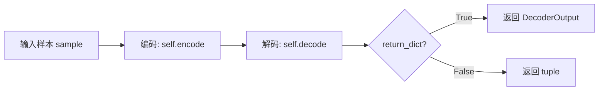

#### 带注释源码

```
def forward(self, sample: torch.Tensor, return_dict: bool = True) -> torch.Tensor:
    # 步骤1: 调用 encode 方法将输入样本编码为潜在表示
    # 返回值为 tuple，索引 [0] 提取潜在张量
    encoded = self.encode(sample, return_dict=False)[0]
    
    # 步骤2: 调用 decode 方法将潜在表示解码为重建样本
    # 返回值为 tuple，索引 [0] 提取解码后的张量
    decoded = self.decode(encoded, return_dict=False)[0]
    
    # 步骤3: 根据 return_dict 参数决定返回格式
    if not return_dict:
        # 返回元组格式
        return (decoded,)
    
    # 返回 DecoderOutput 对象，包含重建的样本
    return DecoderOutput(sample=decoded)
```

## 关键组件


### 张量索引与惰性加载（Tiling）

通过tiled_encode和tiled_decode方法实现，用于将大图像分割成重叠的tiles进行编码/解码，以降低显存占用。核心参数包括tile_sample_min_height/width（最小tile尺寸）和tile_sample_stride_height/width（tile间重叠区域），通过blend_v和blend_h方法平滑拼接tiles，避免接缝伪影。

### 反量化支持（Scaling Factor）

通过scaling_factor参数实现，用于将latent空间缩放到单位方差。编码时执行z = z * scaling_factor，解码时执行z = 1 / scaling_factor * z。该参数在AutoencoderDC类的__init__中定义，默认值为1.0。

### 多尺度QKV注意力机制

在EfficientViTBlock中通过SanaMultiscaleLinearAttention实现，qkv_multiscales参数控制多尺度配置（如(5,)表示使用5x5核）。该机制允许模型在不同尺度上提取特征，提升表示能力。

### 像素混洗采样（Pixel Shuffle/Unshuffle）

DCDownBlock2d使用pixel_unshuffle进行下采样（factor=2），DCUpBlock2d使用pixel_shuffle进行上采样。这种基于深度到空间的变换相比传统卷积更高效，能实现2^2=4x的空间压缩比。

### 残差连接与快捷连接

ResBlock实现类残差连接（hidden_states + residual），DCDownBlock2d和DCUpBlock2d支持shortcut参数实现通道维度的残差连接（通过repeat_interleave和mean操作对齐维度），Encoder的out_shortcut和Decoder的in_shortcut提供编解码器间的跳跃连接。

### 自动编码器主类（AutoencoderDC）

整合编码器和解码器的核心类，继承ModelMixin、AutoencoderMixin等。支持use_slicing（批量切片）和use_tiling（空间分块）两种内存优化策略，通过enable_tiling方法激活，spatial_compression_ratio计算空间压缩比。


## 问题及建议


### 已知问题

- **硬编码的默认配置**：AutoencoderDC类中的encoder_block_out_channels、decoder_block_out_channels、encoder_layers_per_block等大量参数采用硬编码默认值，缺乏灵活性，难以适配不同规模模型变体。
- **Magic Numbers和隐式假设**：spatial_compression_ratio的计算假设了固定的下采样层数（2^(len-1)），tile_sample_min_height/width=512等魔数散落代码中，缺乏文档说明其设计依据。
- **重复代码模式**：tiled_encode和tiled_decode方法存在高度相似的瓦片分割、混合、拼接逻辑，未提取为共用函数；Encoder和Decoder的块构建逻辑也存在冗余。
- **参数校验缺失**：get_block函数对block_type无有效校验，仅抛出ValueError；downsample_block_type、upsample_block_type等字符串参数接受任意值，无白名单验证。
- **类型提示不完整**：部分方法参数缺少类型标注（如forward方法的sample参数），混合使用Python 3.10+联合类型语法与旧式Optional/Tuple。
- **冗余计算**：Decoder.__init__中使用reversed(list(enumerate(...)))这种稍显冗余的写法，可直接反向迭代；repeat_interleave配合output_size参数略显冗余。
- **注释与文档不足**：ResBlock中norm_type=="rms_norm"的特殊处理逻辑、DCUpBlock2d中repeats的计算逻辑等关键实现缺少注释说明。
- **梯度检查点硬关闭**：_supports_gradient_checkpointing直接设为False且无任何说明，对于大模型训练可能造成显存压力。

### 优化建议

- 将硬编码的模型架构参数（block_out_channels、layers_per_block等）提取为可配置的Config类或独立yaml/json配置文件，支持模型变体切换。
- 定义常量类或枚举来管理魔数，如TilingConfig、CompressionRatioConfig等，提升可维护性。
- 抽取tiled_encode和tiled_decode的公共逻辑到私有方法_encode_tiled/_decode_tiled中，减少代码重复。
- 在get_block、Encoder、Decoder等关键入口添加参数校验函数，验证block_type、norm_type、act_fn等是否在支持列表中，提供友好的错误提示。
- 补充类型标注和文档字符串，特别是对复杂的维度变换逻辑（如movedim、unflatten、pixel_shuffle等操作）添加注释说明其目的。
- 考虑启用梯度检查点功能作为可选配置，通过enable_gradient_checkpointing方法控制，以支持大分辨率下的训练。
- 使用更Pythonic的迭代方式重构reversed逻辑，考虑将repeat_interleave的output_size参数移除（PyTorch会根据dim自动推断）。

## 其它


### 设计目标与约束

本AutoencoderDC模块作为DCAE（Deep Convolutional Autoencoder）模型的核心组件，主要服务于SANA文本到图像生成系统。其设计目标包括：（1）实现高效的图像到潜空间的编码与解码，spatial_compression_ratio为2^(n-1)，其中n为encoder_block_out_channels的长度；（2）支持高分辨率图像处理，通过tiling机制处理超大尺寸输入；（3）提供灵活的模块化设计，支持不同类型的残差块（ResBlock、EfficientViTBlock）和采样策略（pixel_shuffle/pixel_unshuffle）。约束条件包括：输入通道数默认为3（RGB图像），latent_channels默认为32，编码器/解码器块数必须匹配，且tiling功能仅在图像尺寸大于tile_sample_min_height/tile_sample_min_width时触发。

### 错误处理与异常设计

代码中的错误处理主要体现在以下几个方面：（1）get_block函数对不支持的block_type抛出ValueError异常，提示"Block with {block_type=} is not supported"；（2）DCDownBlock2d中当downsample=True时，验证out_channels是否能被out_ratio整除，否则会引发后续计算错误；（3）在tiled_encode和tiled_decode中，当tile尺寸不能被spatial_compression_ratio整除时，使用F.pad进行填充处理；（4）配置参数校验通过@register_to_config装饰器实现，确保必填参数的有效性。当前实现的不足之处在于缺少对极端输入（如NaN、Inf值）的防护，以及batch_size为0时的边界检查。

### 数据流与状态机

数据流主要经历以下阶段：输入图像首先经过Encoder的conv_in或DCDownBlock2d进行初始通道转换，然后依次通过down_blocks中的多个Stage，每个Stage包含若干ResBlock或EfficientViTBlock，最后经过conv_out输出潜空间表示。在Encoder的最后阶段，如果out_shortcut=True，会对特征进行分组平均后与conv_out结果相加。Decoder部分则执行反向操作：首先通过conv_in进行通道扩展，然后依次通过up_blocks（逆序）进行上采样和特征处理，最后通过norm_out、conv_act和conv_out输出重构图像。状态机方面，AutoencoderDC包含两种工作模式：普通模式（use_tiling=False且use_slicing=False）和高效模式（启用tiling和/或slicing）。Tiling模式将输入图像/潜空间分割为重叠的tile块，分别编码/解码后再通过blend_v和blend_h函数进行平滑融合。

### 外部依赖与接口契约

本模块依赖以下外部组件：（1）torch和torch.nn提供基础张量操作和神经网络模块；（2）configuration_utils中的ConfigMixin和register_to_config用于配置管理；（3）loaders中的FromOriginalModelMixin支持从原始模型加载；（4）utils.accelerate_utils中的apply_forward_hook用于钩子管理；（5）activations中的get_activation用于获取激活函数；（6）attention_processor中的SanaMultiscaleLinearAttention提供多头线性注意力机制；（7）modeling_utils中的ModelMixin提供模型基础功能；（8）normalization中的RMSNorm和get_normalization提供归一化层；（9）transformers.sana_transformer中的GLUMBConv提供卷积操作；（10）vae中的AutoencoderMixin、EncoderOutput、DecoderOutput提供VAE相关功能。接口契约方面，encode方法接受shape为(batch_size, channels, height, width)的输入张量，返回EncoderOutput或tuple；decode方法接受潜空间张量并返回DecoderOutput或tuple；forward方法执行完整的编码-解码流程。

### 配置参数说明

关键配置参数包括：in_channels（默认3）定义输入图像通道数；latent_channels（默认32）定义潜空间通道数；attention_head_dim（默认32）定义注意力头维度；encoder_block_types/decoder_block_types定义编码器/解码器使用的块类型；encoder_block_out_channels/decoder_block_out_channels（默认(128, 256, 512, 512, 1024, 1024)）定义各阶段输出通道数；encoder_layers_per_block/decoder_layers_per_block定义每 block的层数；encoder_qkv_multiscales/decoder_qkv_multiscales定义多尺度QKV配置；upsample_block_type（默认pixel_shuffle）定义上采样方式；downsample_block_type（默认pixel_unshuffle）定义下采样方式；encoder_out_shortcut/decoder_in_shortcut控制跳跃连接；scaling_factor（默认1.0）用于潜空间方差缩放。

### 使用示例与API调用

基本使用流程：首先实例化AutoencoderDC模型，可通过from_pretrained加载预训练权重；然后调用encode方法进行编码：latents = autoencoder.encode(image_tensor)；接着调用decode方法进行解码：reconstructed_image = autoencoder.decode(latents)；或者直接调用forward方法一步完成：output = autoencoder(image_tensor)。启用tiling功能：autoencoder.enable_tiling(tile_sample_min_height=512, tile_sample_min_width=512, tile_sample_stride_height=448, tile_sample_stride_width=448)。启用slicing功能：autoencoder.use_slicing = True。需要注意的是，tiling和slicing主要用于内存优化，应根据实际硬件条件和图像尺寸选择合适的配置。

### 性能特征与基准

内存占用方面，普通模式下编码/解码的内存消耗主要取决于中间特征图的尺寸，最大约为O(H*W*C^2)，其中H、W为输入尺寸，C为最大通道数（1024）。启用tiling后，内存消耗显著降低，理论上可降至单个tile的内存占用。计算复杂度方面，编码器和解码器的FLOPs主要与block_out_channels和layers_per_block相关，当前默认配置下编码器约需O(N*Σ(ci*ci-1*k^2))次操作，其中N为总层数。推理速度受硬件和输入尺寸影响，使用pixel_shuffle/unshuffle相比传统卷积上采样/下采样具有更高的计算效率。Tiling模式由于需要多次小规模前向传播和blend操作，可能引入一定的overhead，建议仅在处理超大图像时启用。

### 兼容性说明

本模块设计用于PyTorch框架，兼容Python 3.8+。作为Diffusers库的一部分，与Diffusers生态系统中的其他模块（如DiffusionModel、Scheduler等）具有良好的兼容性。模型权重可通过save_pretrained和from_pretrained方法进行序列化和反序列化。配置通过ConfigMixin统一管理，支持与HuggingFace Hub的交互。由于继承了FromOriginalModelMixin，可以从原始SANA/DCAE检查点加载权重。版本兼容性方面，需确保torch版本>=1.9.0以支持F.pixel_unshuffle和F.pixel_shuffle函数。
</think>

### 设计目标与约束

本AutoencoderDC模块作为DCAE（Deep Convolutional Autoencoder）模型的核心组件，主要服务于SANA文本到图像生成系统。其设计目标包括：（1）实现高效的图像到潜空间的编码与解码，spatial_compression_ratio为2^(n-1)，其中n为encoder_block_out_channels的长度；（2）支持高分辨率图像处理，通过tiling机制处理超大尺寸输入；（3）提供灵活的模块化设计，支持不同类型的残差块（ResBlock、EfficientViTBlock）和采样策略（pixel_shuffle/pixel_unshuffle）。约束条件包括：输入通道数默认为3（RGB图像），latent_channels默认为32，编码器/解码器块数必须匹配，且tiling功能仅在图像尺寸大于tile_sample_min_height/tile_sample_min_width时触发。

### 错误处理与异常设计

代码中的错误处理主要体现在以下几个方面：（1）get_block函数对不支持的block_type抛出ValueError异常，提示"Block with {block_type=} is not supported"；（2）DCDownBlock2d中当downsample=True时，验证out_channels是否能被out_ratio整除，否则会引发后续计算错误；（3）在tiled_encode和tiled_decode中，当tile尺寸不能被spatial_compression_ratio整除时，使用F.pad进行填充处理；（4）配置参数校验通过@register_to_config装饰器实现，确保必填参数的有效性。当前实现的不足之处在于缺少对极端输入（如NaN、Inf值）的防护，以及batch_size为0时的边界检查。

### 数据流与状态机

数据流主要经历以下阶段：输入图像首先经过Encoder的conv_in或DCDownBlock2d进行初始通道转换，然后依次通过down_blocks中的多个Stage，每个Stage包含若干ResBlock或EfficientViTBlock，最后经过conv_out输出潜空间表示。在Encoder的最后阶段，如果out_shortcut=True，会对特征进行分组平均后与conv_out结果相加。Decoder部分则执行反向操作：首先通过conv_in进行通道扩展，然后依次通过up_blocks（逆序）进行上采样和特征处理，最后通过norm_out、conv_act和conv_out输出重构图像。状态机方面，AutoencoderDC包含两种工作模式：普通模式（use_tiling=False且use_slicing=False）和高效模式（启用tiling和/或slicing）。Tiling模式将输入图像/潜空间分割为重叠的tile块，分别编码/解码后再通过blend_v和blend_h函数进行平滑融合。

### 外部依赖与接口契约

本模块依赖以下外部组件：（1）torch和torch.nn提供基础张量操作和神经网络模块；（2）configuration_utils中的ConfigMixin和register_to_config用于配置管理；（3）loaders中的FromOriginalModelMixin支持从原始模型加载；（4）utils.accelerate_utils中的apply_forward_hook用于钩子管理；（5）activations中的get_activation用于获取激活函数；（6）attention_processor中的SanaMultiscaleLinearAttention提供多头线性注意力机制；（7）modeling_utils中的ModelMixin提供模型基础功能；（8）normalization中的RMSNorm和get_normalization提供归一化层；（9）transformers.sana_transformer中的GLUMBConv提供卷积操作；（10）vae中的AutoencoderMixin、EncoderOutput、DecoderOutput提供VAE相关功能。接口契约方面，encode方法接受shape为(batch_size, channels, height, width)的输入张量，返回EncoderOutput或tuple；decode方法接受潜空间张量并返回DecoderOutput或tuple；forward方法执行完整的编码-解码流程。

### 配置参数说明

关键配置参数包括：in_channels（默认3）定义输入图像通道数；latent_channels（默认32）定义潜空间通道数；attention_head_dim（默认32）定义注意力头维度；encoder_block_types/decoder_block_types定义编码器/解码器使用的块类型；encoder_block_out_channels/decoder_block_out_channels（默认(128, 256, 512, 512, 1024, 1024)）定义各阶段输出通道数；encoder_layers_per_block/decoder_layers_per_block定义每block的层数；encoder_qkv_multiscales/decoder_qkv_multiscales定义多尺度QKV配置；upsample_block_type（默认pixel_shuffle）定义上采样方式；downsample_block_type（默认pixel_unshuffle）定义下采样方式；encoder_out_shortcut/decoder_in_shortcut控制跳跃连接；scaling_factor（默认1.0）用于潜空间方差缩放。

### 使用示例与API调用

基本使用流程：首先实例化AutoencoderDC模型，可通过from_pretrained加载预训练权重；然后调用encode方法进行编码：latents = autoencoder.encode(image_tensor)；接着调用decode方法进行解码：reconstructed_image = autoencoder.decode(latents)；或者直接调用forward方法一步完成：output = autoencoder(image_tensor)。启用tiling功能：autoencoder.enable_tiling(tile_sample_min_height=512, tile_sample_min_width=512, tile_sample_stride_height=448, tile_sample_stride_width=448)。启用slicing功能：autoencoder.use_slicing = True。需要注意的是，tiling和slicing主要用于内存优化，应根据实际硬件条件和图像尺寸选择合适的配置。

### 性能特征与基准

内存占用方面，普通模式下编码/解码的内存消耗主要取决于中间特征图的尺寸，最大约为O(H*W*C^2)，其中H、W为输入尺寸，C为最大通道数（1024）。启用tiling后，内存消耗显著降低，理论上可降至单个tile的内存占用。计算复杂度方面，编码器和解码器的FLOPs主要与block_out_channels和layers_per_block相关，当前默认配置下编码器约需O(N*Σ(ci*ci-1*k^2))次操作，其中N为总层数。推理速度受硬件和输入尺寸影响，使用pixel_shuffle/unshuffle相比传统卷积上采样/下采样具有更高的计算效率。Tiling模式由于需要多次小规模前向传播和blend操作，可能引入一定的overhead，建议仅在处理超大图像时启用。

### 兼容性说明

本模块设计用于PyTorch框架，兼容Python 3.8+。作为Diffusers库的一部分，与Diffusers生态系统中的其他模块（如DiffusionModel、Scheduler等）具有良好的兼容性。模型权重可通过save_pretrained和from_pretrained方法进行序列化和反序列化。配置通过ConfigMixin统一管理，支持与HuggingFace Hub的交互。由于继承了FromOriginalModelMixin，可以从原始SANA/DCAE检查点加载权重。版本兼容性方面，需确保torch版本>=1.9.0以支持F.pixel_unshuffle和F.pixel_shuffle函数。


    