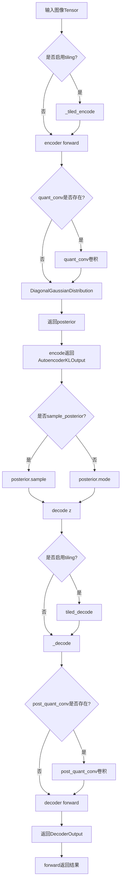
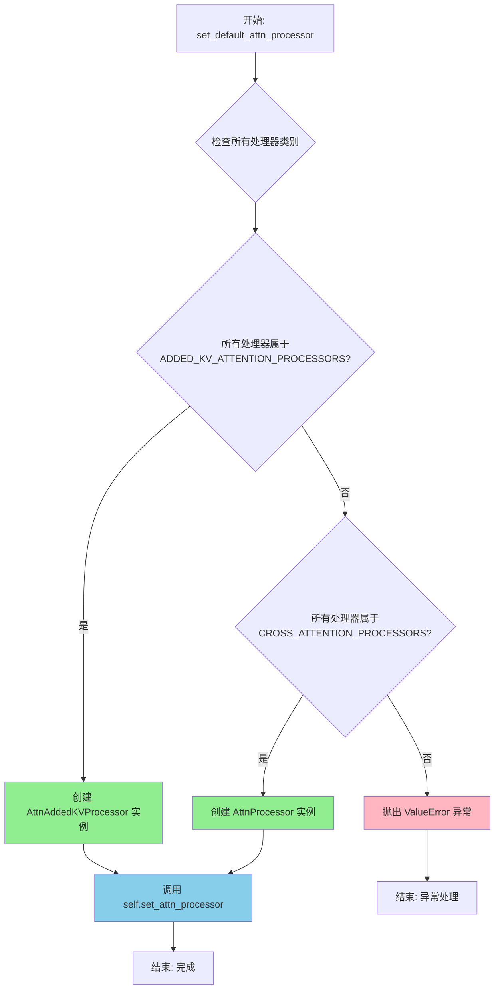
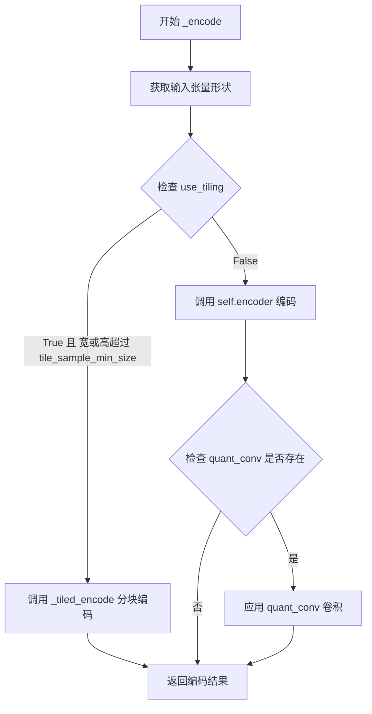
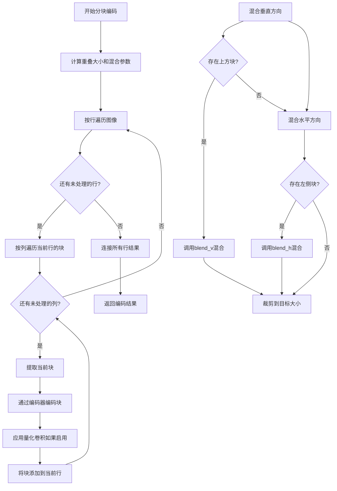
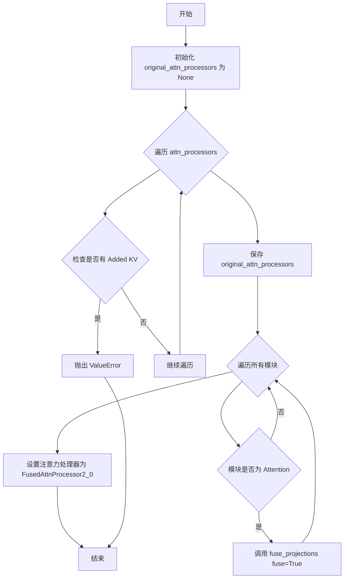
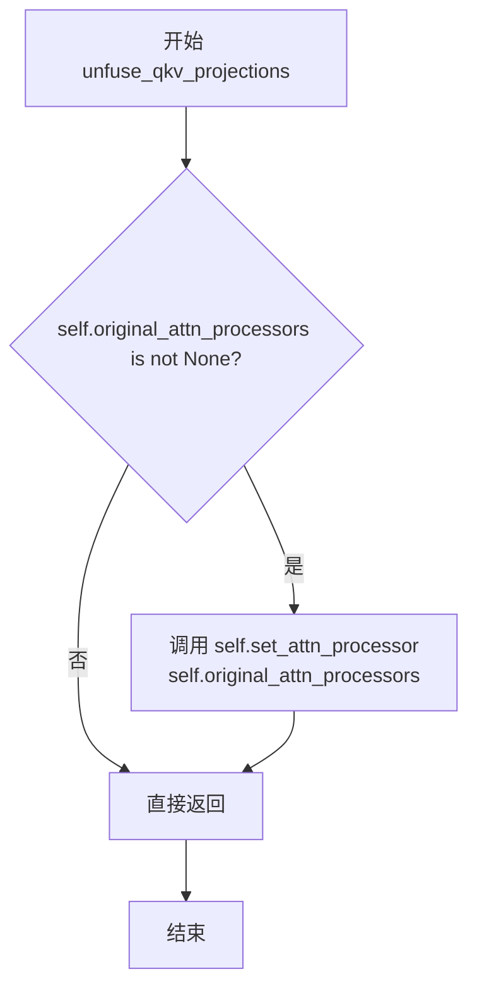

# `diffusers\src\diffusers\models\autoencoders\autoencoder_kl.py` 详细设计文档

这是一个变分自编码器(VAE)模型，使用KL散度损失实现图像到潜在空间的编码和从潜在表示解码回图像的功能，支持tiled编码/解码以处理高分辨率图像，并集成了注意力机制和QKV投影融合等优化技术。

## 整体流程



## 类结构

```
AutoencoderKL (主类)
├── ModelMixin (基类)
├── AttentionMixin (基类)
├── AutoencoderMixin (基类)
├── ConfigMixin (基类)
├── FromOriginalModelMixin (基类)
└── PeftAdapterMixin (基类)
└── 子组件
    ├── Encoder
    ├── Decoder
    ├── DiagonalGaussianDistribution
    ├── AutoencoderKLOutput
    └── DecoderOutput
```

## 全局变量及字段


### `AutoencoderKL.encoder`
    
编码器网络

类型：`Encoder`
    


### `AutoencoderKL.decoder`
    
解码器网络

类型：`Decoder`
    


### `AutoencoderKL.quant_conv`
    
潜在空间的量化卷积

类型：`nn.Conv2d | None`
    


### `AutoencoderKL.post_quant_conv`
    
解码后量化卷积

类型：`nn.Conv2d | None`
    


### `AutoencoderKL.use_slicing`
    
是否启用VAE切片

类型：`bool`
    


### `AutoencoderKL.use_tiling`
    
是否启用VAE平铺

类型：`bool`
    


### `AutoencoderKL.tile_sample_min_size`
    
采样最小尺寸

类型：`int`
    


### `AutoencoderKL.tile_latent_min_size`
    
潜在最小尺寸

类型：`int`
    


### `AutoencoderKL.tile_overlap_factor`
    
平铺重叠因子

类型：`float`
    
    

## 全局函数及方法


### `AutoencoderKL.__init__`

这是AutoencoderKL类的初始化方法，负责构建一个用于图像编码和解码的变分自编码器（VAE）模型，核心功能是将图像编码为潜在表示并从中解码回图像。该方法接收多个配置参数来定义编码器、解码器的结构，以及潜在空间的属性和性能优化选项。

参数：

- `in_channels`：`int`，输入图像的通道数，默认为3（RGB图像）
- `out_channels`：`int`，输出图像的通道数，默认为3
- `down_block_types`：`tuple[str]`，下采样块的类型元组，默认为("DownEncoderBlock2D",)
- `up_block_types`：`tuple[str]`，上采样块的类型元组，默认为("UpDecoderBlock2D",)
- `block_out_channels`：`tuple[int]`，块输出通道数的元组，默认为(64,)
- `layers_per_block`：`int`，每个块中的层数，默认为1
- `act_fn`：`str`，激活函数名称，默认为"silu"
- `latent_channels`：`int`，潜在空间的通道数，默认为4
- `norm_num_groups`：`int`，归一化的组数，默认为32
- `sample_size`：`int`，样本输入尺寸，默认为32
- `scaling_factor`：`float`，潜在空间的缩放因子，默认为0.18215，用于将潜在空间缩放到单位方差
- `shift_factor`：`float | None`，潜在空间的平移因子，默认为None
- `latents_mean`：`tuple[float] | None`，潜在空间的均值，默认为None
- `latents_std`：`tuple[float] | None`，潜在空间的标准差，默认为None
- `force_upcast`：`bool`，是否强制使用float32进行高精度计算，默认为True
- `use_quant_conv`：`bool`，是否使用量化卷积层，默认为True
- `use_post_quant_conv`：`bool`，是否使用后量化卷积层，默认为True
- `mid_block_add_attention`：`bool`，是否在中间块添加注意力机制，默认为True

返回值：`None`，该方法为构造函数，不返回任何值

#### 流程图

```mermaid
flowchart TD
    A[开始 __init__] --> B[调用 super().__init__ 初始化基类]
    B --> C[创建 Encoder 实例]
    C --> D[创建 Decoder 实例]
    D --> E{use_quant_conv 为 True?}
    E -->|是| F[创建 quant_conv 卷积层]
    E -->|否| G[quant_conv 设为 None]
    F --> H{use_post_quant_conv 为 True?}
    G --> H
    H -->|是| I[创建 post_quant_conv 卷积层]
    H -->|否| J[post_quant_conv 设为 None]
    I --> K[初始化 slicing 和 tiling 标志]
    J --> K
    K --> L[计算 tile_sample_min_size 和 tile_latent_min_size]
    L --> M[设置 tile_overlap_factor 为 0.25]
    M --> N[结束 __init__]
```

#### 带注释源码

```python
@register_to_config
def __init__(
    self,
    in_channels: int = 3,
    out_channels: int = 3,
    down_block_types: tuple[str] = ("DownEncoderBlock2D",),
    up_block_types: tuple[str] = ("UpDecoderBlock2D",),
    block_out_channels: tuple[int] = (64,),
    layers_per_block: int = 1,
    act_fn: str = "silu",
    latent_channels: int = 4,
    norm_num_groups: int = 32,
    sample_size: int = 32,
    scaling_factor: float = 0.18215,
    shift_factor: float | None = None,
    latents_mean: tuple[float] | None = None,
    latents_std: tuple[float] | None = None,
    force_upcast: bool = True,
    use_quant_conv: bool = True,
    use_post_quant_conv: bool = True,
    mid_block_add_attention: bool = True,
):
    """
    初始化 AutoencoderKL 模型实例
    
    参数:
        in_channels: 输入图像通道数
        out_channels: 输出图像通道数
        down_block_types: 编码器下采样块类型
        up_block_types: 解码器上采样块类型
        block_out_channels: 各块输出通道数
        layers_per_block: 每个块的层数
        act_fn: 激活函数
        latent_channels: 潜在空间通道数
        norm_num_groups: 归一化组数
        sample_size: 样本尺寸
        scaling_factor: 潜在空间缩放因子
        shift_factor: 潜在空间平移因子
        latents_mean: 潜在空间均值
        latents_std: 潜在空间标准差
        force_upcast: 是否强制升精度
        use_quant_conv: 是否使用量化卷积
        use_post_quant_conv: 是否使用后量化卷积
        mid_block_add_attention: 中间块是否添加注意力
    """
    super().__init__()  # 调用父类初始化方法

    # 将初始化参数传递给 Encoder
    # Encoder 负责将输入图像编码为潜在表示
    self.encoder = Encoder(
        in_channels=in_channels,
        out_channels=latent_channels,
        down_block_types=down_block_types,
        block_out_channels=block_out_channels,
        layers_per_block=layers_per_block,
        act_fn=act_fn,
        norm_num_groups=norm_num_groups,
        double_z=True,  # 使用双通道输出用于 KL 散度
        mid_block_add_attention=mid_block_add_attention,
    )

    # 将初始化参数传递给 Decoder
    # Decoder 负责将潜在表示解码为输出图像
    self.decoder = Decoder(
        in_channels=latent_channels,
        out_channels=out_channels,
        up_block_types=up_block_types,
        block_out_channels=block_out_channels,
        layers_per_block=layers_per_block,
        norm_num_groups=norm_num_groups,
        act_fn=act_fn,
        mid_block_add_attention=mid_block_add_attention,
    )

    # 条件创建量化卷积层
    # quant_conv 用于在编码后对潜在表示进行变换
    self.quant_conv = nn.Conv2d(2 * latent_channels, 2 * latent_channels, 1) if use_quant_conv else None
    
    # 条件创建后量化卷积层
    # post_quant_conv 用于在解码前对潜在表示进行变换
    self.post_quant_conv = nn.Conv2d(latent_channels, latent_channels, 1) if use_post_quant_conv else None

    # 初始化切片和平铺标志（用于大图像处理优化）
    self.use_slicing = False
    self.use_tiling = False

    # 仅在启用 VAE 平铺时相关
    # 设置平铺样本的最小尺寸
    self.tile_sample_min_size = self.config.sample_size
    sample_size = (
        self.config.sample_size[0]
        if isinstance(self.config.sample_size, (list, tuple))
        else self.config.sample_size
    )
    # 计算潜在空间的平铺最小尺寸
    # 基于下采样层数（block_out_channels 长度减 1）
    self.tile_latent_min_size = int(sample_size / (2 ** (len(self.config.block_out_channels) - 1)))
    # 设置平铺重叠因子
    self.tile_overlap_factor = 0.25
```


### `AutoencoderKL.set_default_attn_processor`

该方法用于禁用自定义注意力处理器，并将注意力实现重置为默认配置。它会检查当前所有注意力处理器的类型，根据类型选择合适的默认处理器（AttnAddedKVProcessor 或 AttnProcessor），然后通过 `set_attn_processor` 方法应用所选处理器。

参数：此方法无参数。

返回值：`None`，该方法直接修改实例的注意力处理器状态，无返回值。

#### 流程图



#### 带注释源码

```python
def set_default_attn_processor(self):
    """
    Disables custom attention processors and sets the default attention implementation.
    
    该方法会检查当前模型中所有的注意力处理器，根据处理器的类型
    选择合适的默认处理器，并将其应用到模型中。
    
    处理逻辑:
    1. 如果所有处理器都属于 ADDED_KV_ATTENTION_PROCESSORS 类型，
       使用 AttnAddedKVProcessor 作为默认处理器
    2. 如果所有处理器都属于 CROSS_ATTENTION_PROCESSORS 类型，
       使用 AttnProcessor 作为默认处理器
    3. 其他情况抛出 ValueError 异常
    """
    # 检查所有注意力处理器是否都属于 ADDED_KV_ATTENTION_PROCESSORS 类别
    # ADDED_KV_ATTENTION_PROCESSORS 是用于处理额外键值对的注意力处理器
    if all(proc.__class__ in ADDED_KV_ATTENTION_PROCESSORS for proc in self.attn_processors.values()):
        # 创建适用于 added KV 的注意力处理器
        processor = AttnAddedKVProcessor()
    # 检查所有注意力处理器是否都属于 CROSS_ATTENTION_PROCESSORS 类别
    # CROSS_ATTENTION_PROCESSORS 是用于交叉注意力的处理器
    elif all(proc.__class__ in CROSS_ATTENTION_PROCESSORS for proc in self.attn_processors.values()):
        # 创建标准的注意力处理器
        processor = AttnProcessor()
    else:
        # 如果处理器类型不匹配上述两种情况，抛出异常
        # 这通常发生在混合使用了不同类型的注意力处理器时
        raise ValueError(
            f"Cannot call `set_default_attn_processor` when attention processors are of type {next(iter(self.attn_processors.values()))}"
        )

    # 调用父类方法将选定的注意力处理器应用到模型
    # 这会更新 self.attn_processors 字典
    self.set_attn_processor(processor)
```


### `AutoencoderKL._encode`

该方法是一个私有内部方法，负责将输入图像张量编码为潜在表示（latent representation）。它首先检查是否需要使用分块（tiling）策略来处理大尺寸图像，然后通过编码器（Encoder）进行前向传播，并可选地应用量化卷积（quant_conv）来处理潜在表示。

参数：

- `x`：`torch.Tensor`，输入的图像张量，形状为 (batch_size, num_channels, height, width)

返回值：`torch.Tensor`，编码后的潜在表示张量

#### 流程图



#### 带注释源码

```python
def _encode(self, x: torch.Tensor) -> torch.Tensor:
    """
    将输入图像编码为潜在表示的私有方法。
    
    参数:
        x: 输入的图像张量，形状为 (batch_size, num_channels, height, width)
    
    返回:
        编码后的潜在表示张量
    """
    # 获取输入张量的形状信息
    batch_size, num_channels, height, width = x.shape

    # 检查是否启用分块编码且图像尺寸超过最小分块大小
    if self.use_tiling and (width > self.tile_sample_min_size or height > self.tile_sample_min_size):
        # 如果需要分块处理，调用分块编码方法
        return self._tiled_encode(x)

    # 使用编码器对输入进行编码
    enc = self.encoder(x)
    
    # 如果存在量化卷积层，则应用它
    if self.quant_conv is not None:
        enc = self.quant_conv(enc)

    # 返回编码后的潜在表示
    return enc
```


### `AutoencoderKL.encode`

该方法用于将一批图像编码为潜在表示（latent representations）。它是 AutoencoderKL VAE 模型的核心接口方法，支持切片处理（slicing）以节省显存，并返回包含潜在分布的输出对象。

参数：

- `x`：`torch.Tensor`，输入的图像批次张量，形状为 (batch_size, channels, height, width)
- `return_dict`：`bool`，可选，默认为 `True`。是否返回 `AutoencoderKLOutput` 对象，若为 False 则返回元组

返回值：`AutoencoderKLOutput | tuple[DiagonalGaussianDistribution]`。如果 `return_dict` 为 True，返回包含潜在分布的 `AutoencoderKLOutput` 对象；否则返回包含 `DiagonalGaussianDistribution` 的元组

#### 流程图

```mermaid
flowchart TD
    A[开始 encode] --> B{use_slicing 且 batch_size > 1?}
    B -->|Yes| C[对输入进行切片]
    C --> D[对每个切片调用 _encode]
    D --> E[拼接所有编码后的切片]
    B -->|No| F[直接调用 _encode]
    F --> G[调用 _encode]
    G --> H{quant_conv 存在?}
    H -->|Yes| I[应用 quant_conv]
    H -->|No| J[跳过 quant_conv]
    I --> K[返回编码结果]
    J --> K
    E --> K
    K --> L[创建 DiagonalGaussianDistribution]
    L --> M{return_dict?}
    M -->|Yes| N[返回 AutoencoderKLOutput]
    M -->|No| O[返回 tuple(posterior)]
    N --> P[结束]
    O --> P
```

#### 带注释源码

```python
@apply_forward_hook  # 应用前向钩子，用于监控或修改前向传播行为
def encode(
    self, x: torch.Tensor, return_dict: bool = True
) -> AutoencoderKLOutput | tuple[DiagonalGaussianDistribution]:
    """
    Encode a batch of images into latents.

    Args:
        x (`torch.Tensor`): Input batch of images.
        return_dict (`bool`, *optional*, defaults to `True`):
            Whether to return a [`~models.autoencoder_kl.AutoencoderKLOutput`] instead of a plain tuple.

    Returns:
            The latent representations of the encoded images. If `return_dict` is True, a
            [`~models.autoencoder_kl.AutoencoderKLOutput`] is returned, otherwise a plain `tuple` is returned.
    """
    # 如果启用切片模式且批次大小大于1，则对每个样本分别编码
    if self.use_slicing and x.shape[0] > 1:
        # 将批次按样本分割成单独的张量
        encoded_slices = [self._encode(x_slice) for x_slice in x.split(1)]
        # 沿批次维度拼接所有编码后的切片
        h = torch.cat(encoded_slices)
    else:
        # 直接对整个批次进行编码
        h = self._encode(x)

    # 使用编码输出创建对角高斯分布（潜在空间的概率分布）
    posterior = DiagonalGaussianDistribution(h)

    # 根据 return_dict 参数决定返回值格式
    if not return_dict:
        return (posterior,)

    return AutoencoderKLOutput(latent_dist=posterior)
```


### AutoencoderKL._decode

`_decode` 是 AutoencoderKL 类的私有方法，负责将潜在向量（latent vectors）解码为图像。该方法支持瓦片解码（tiled decoding）以处理高分辨率图像，并可选地返回字典格式的输出。

参数：

- `z`：`torch.Tensor`，输入的潜在向量张量，形状为 (batch_size, latent_channels, height, width)
- `return_dict`：`bool`，是否返回字典格式的输出，默认为 True

返回值：`DecoderOutput | torch.Tensor`，如果 return_dict 为 True 返回 DecoderOutput 对象，否则返回包含解码图像的张量元组

#### 流程图

```mermaid
flowchart TD
    A[开始 _decode] --> B{use_tiling 是否启用}
    B -->|是| C{z 的尺寸是否超过 tile_latent_min_size}
    C -->|是| D[调用 tiled_decode 方法]
    C -->|否| E
    B -->|否| E{post_quant_conv 是否存在}
    D --> M[返回解码结果]
    E -->|是| F[应用 post_quant_conv 变换]
    E -->|否| G
    F --> G[调用 decoder 解码]
    G --> H{return_dict 是否为 True}
    H -->|是| I[返回 DecoderOutput 对象]
    H -->|否| J[返回元组 (dec,)]
    I --> K[结束]
    J --> K
    M --> K
```

#### 带注释源码

```python
def _decode(self, z: torch.Tensor, return_dict: bool = True) -> DecoderOutput | torch.Tensor:
    """
    将潜在向量解码为图像
    
    参数:
        z: 输入的潜在向量张量
        return_dict: 是否返回字典格式的输出
    
    返回:
        解码后的图像输出
    """
    
    # 检查是否启用瓦片解码模式且潜在向量尺寸超过最小瓦片大小
    # 如果是，则使用 tiled_decode 方法进行分块解码以节省内存
    if self.use_tiling and (z.shape[-1] > self.tile_latent_min_size or z.shape[-2] > self.tile_latent_min_size):
        return self.tiled_decode(z, return_dict=return_dict)

    # 如果存在后量化卷积层，则对潜在向量进行变换
    # 这是为了将潜在空间转换到适合解码的表示
    if self.post_quant_conv is not None:
        z = self.post_quant_conv(z)

    # 使用解码器将潜在向量解码为图像
    dec = self.decoder(z)

    # 根据 return_dict 参数决定返回格式
    if not return_dict:
        return (dec,)

    # 返回 DecoderOutput 对象，包含 sample 属性
    return DecoderOutput(sample=dec)
```


### `AutoencoderKL.decode`

该方法用于将一批潜在向量（latent vectors）解码回图像。它是 AutoencoderKL 模型的核心推理方法之一，支持 VAE 切片（slicing）技术以处理大批次数据，并可根据配置返回字典格式的 DecoderOutput 或普通元组。

参数：

- `z`：`torch.FloatTensor`，输入的潜在向量批次，形状为 (batch_size, latent_channels, height, width)
- `return_dict`：`bool`，是否返回 [`~models.vae.DecoderOutput`] 而不是普通元组，默认为 True
- `generator`：`torch.Generator | None`，用于采样的随机数生成器，可选

返回值：`DecoderOutput | torch.FloatTensor`，如果 return_dict 为 True，返回包含解码图像的 DecoderOutput 对象；否则返回包含解码图像的元组

#### 流程图

```mermaid
flowchart TD
    A[开始 decode] --> B{是否启用 slicing 且批次大小 > 1}
    B -->|是| C[将 z 按维度 0 分割成单个样本]
    B -->|否| D[直接调用 _decode 方法]
    C --> E[对每个切片调用 _decode 并提取 .sample]
    D --> E
    E --> F[沿批次维度拼接所有解码结果]
    F --> G{return_dict 是否为 True}
    G -->|是| H[返回 DecoderOutput sample=decoded]
    G -->|否| I[返回元组 (decoded,)]
    H --> J[结束]
    I --> J
```

#### 带注释源码

```python
@apply_forward_hook
def decode(
    self, z: torch.FloatTensor, return_dict: bool = True, generator=None
) -> DecoderOutput | torch.FloatTensor:
    """
    Decode a batch of images.

    Args:
        z (`torch.Tensor`): Input batch of latent vectors.
        return_dict (`bool`, *optional*, defaults to `True`):
            Whether to return a [`~models.vae.DecoderOutput`] instead of a plain tuple.

    Returns:
        [`~models.vae.DecoderOutput`] or `tuple`:
            If return_dict is True, a [`~models.vae.DecoderOutput`] is returned, otherwise a plain `tuple` is
            returned.

    """
    # 如果启用了 VAE slicing 且批次大小大于 1，则对每个样本分别解码
    # 这样可以减少内存占用，适合处理大图像或大批次
    if self.use_slicing and z.shape[0] > 1:
        # 将潜在向量按批次维度分割成单独的样本
        decoded_slices = [self._decode(z_slice).sample for z_slice in z.split(1)]
        # 将解码后的切片沿批次维度拼接回去
        decoded = torch.cat(decoded_slices)
    else:
        # 正常路径：直接调用内部 _decode 方法进行解码
        # _decode 方法内部会处理 tiling、post_quant_conv 和 decoder 调用
        decoded = self._decode(z).sample

    # 根据 return_dict 参数决定返回格式
    if not return_dict:
        # 返回元组格式，兼容旧版 API
        return (decoded,)

    # 返回 DecoderOutput 对象，包含 sample 属性
    return DecoderOutput(sample=decoded)
```


### `AutoencoderKL.blend_v`

该函数用于在 VAE 分块编码/解码过程中对垂直方向重叠的图像块进行线性混合，通过从顶部到底部逐渐改变混合权重来实现平滑过渡，避免分块产生的视觉接缝。

参数：

- `self`：当前 AutoencoderKL 实例的引用
- `a`：`torch.Tensor`，第一个输入张量，通常是上方或左侧已编码/解码的块
- `b`：`torch.Tensor`，第二个输入张量，需要与 a 混合的当前块
- `blend_extent`：`int`，混合范围（垂直方向的行数）

返回值：`torch.Tensor`，混合后的张量

#### 流程图

```mermaid
flowchart TD
    A[开始 blend_v] --> B[计算有效混合范围]
    B --> C{遍历 y 从 0 到 blend_extent - 1}
    C --> D[计算混合权重: weight_a = 1 - y / blend_extent]
    D --> E[计算混合权重: weight_b = y / blend_extent]
    E --> F[混合第 y 行: b[:, :, y, :] = a[:, :, -blend_extent + y, :] * weight_a + b[:, :, y, :] * weight_b]
    F --> C
    C --> G[返回混合后的张量 b]
    G --> H[结束 blend_v]
```

#### 带注释源码

```python
def blend_v(self, a: torch.Tensor, b: torch.Tensor, blend_extent: int) -> torch.Tensor:
    """
    垂直混合两个张量以消除分块接缝。
    
    参数:
        a: 第一个张量（通常是上一个 tile 的数据）
        b: 第二个张量（当前 tile，需要混合的数据）
        blend_extent: 混合的范围（行数）
    
    返回:
        混合后的张量
    """
    # 取三个值的最小值，确保混合范围不超过两个张量的实际高度
    blend_extent = min(a.shape[2], b.shape[2], blend_extent)
    
    # 遍历混合范围内的每一行
    for y in range(blend_extent):
        # 计算当前行的混合权重
        # y=0 时，a 的权重为 1，b 的权重为 0（完全使用 a）
        # y=blend_extent-1 时，a 的权重接近 0，b 的权重接近 1（完全使用 b）
        weight_a = (1 - y / blend_extent)
        weight_b = (y / blend_extent)
        
        # 从 a 中取出对应行（从顶部往下的第 y 行）
        # a[:, :, -blend_extent + y, :] 取的是 a 的底部区域
        # b[:, :, y, :] 取的是 b 的顶部区域
        # 通过线性组合实现平滑过渡
        b[:, :, y, :] = a[:, :, -blend_extent + y, :] * weight_a + b[:, :, y, :] * weight_b
    
    return b
```


### `AutoencoderKL.blend_h`

该方法用于在水平方向上混合两个图像块（tiles），通过线性插值实现平滑过渡，主要应用于VAE的瓦片编码/解码过程中，以消除瓦片之间的接缝伪影。

参数：

- `self`：`AutoencoderKL`，AutoencoderKL类的实例本身
- `a`：`torch.Tensor`，左侧的图像块张量，形状为 (batch, channels, height, width)
- `b`：`torch.Tensor`，右侧的图像块张量，形状为 (batch, channels, height, width)，将作为混合结果返回
- `blend_extent`：`int`，混合范围的像素宽度，用于控制水平方向混合的距离

返回值：`torch.Tensor`，混合后的图像块张量，形状与输入 `b` 相同

#### 流程图

```mermaid
flowchart TD
    A[开始 blend_h] --> B[计算有效混合范围]
    B --> C{blend_extent > 0?}
    C -->|否| D[直接返回 b]
    C -->|是| E[循环 x 从 0 到 blend_extent-1]
    E --> F[计算混合权重: weight = x / blend_extent]
    F --> G[计算左侧贡献: a的右侧像素 * (1 - weight)]
    G --> H[计算右侧贡献: b的左侧像素 * weight]
    H --> I[混合: b[:, :, :, x] = 左侧贡献 + 右侧贡献]
    I --> E
    E --> J[循环结束]
    J --> K[返回混合后的 b]
```

#### 带注释源码

```python
def blend_h(self, a: torch.Tensor, b: torch.Tensor, blend_extent: int) -> torch.Tensor:
    """
    在水平方向上混合两个图像块（用于消除瓦片接缝）
    
    Args:
        a: 左侧图像块张量，形状 (batch, channels, height, width)
        b: 右侧图像块张量，形状 (batch, channels, height, width)
        blend_extent: 混合范围（像素数）
    
    Returns:
        混合后的图像块张量
    """
    # 计算有效的混合范围，取输入张量宽度和指定混合范围的最小值
    blend_extent = min(a.shape[3], b.shape[3], blend_extent)
    
    # 遍历混合范围内的每个像素列
    for x in range(blend_extent):
        # 计算当前列的混合权重（从0到1线性递增）
        weight = x / blend_extent
        
        # 从左侧张量a的右侧取像素（从-blend_extent开始偏移）
        # 权重为 (1 - weight)，即左侧贡献随x增大而减小
        left_part = a[:, :, :, -blend_extent + x] * (1 - weight)
        
        # 从右侧张量b的左侧取像素
        # 权重为 weight，即右侧贡献随x增大而增大
        right_part = b[:, :, :, x] * weight
        
        # 线性混合：b的第x列 = 左侧贡献 + 右侧贡献
        b[:, :, :, x] = left_part + right_part
    
    # 返回混合后的张量b
    return b
```


### `AutoencoderKL._tiled_encode`

使用分块策略对大规模图像进行编码，通过将输入图像分割为重叠的块分别编码后混合，以在保持内存占用稳定的同时处理高分辨率图像。

参数：

- `x`：`torch.Tensor`，输入的图像批次

返回值：`torch.Tensor`，编码后的潜在表示

#### 流程图



#### 带注释源码

```python
def _tiled_encode(self, x: torch.Tensor) -> torch.Tensor:
    r"""Encode a batch of images using a tiled encoder.

    When this option is enabled, the VAE will split the input tensor into tiles to compute encoding in several
    steps. This is useful to keep memory use constant regardless of image size. The end result of tiled encoding is
    different from non-tiled encoding because each tile uses a different encoder. To avoid tiling artifacts, the
    tiles overlap and are blended together to form a smooth output. You may still see tile-sized changes in the
    output, but they should be much less noticeable.

    Args:
        x (`torch.Tensor`): Input batch of images.

    Returns:
        `torch.Tensor`:
            The latent representation of the encoded videos.
    """

    # 计算重叠大小：基于最小样本大小和重叠因子
    overlap_size = int(self.tile_sample_min_size * (1 - self.tile_overlap_factor))
    # 计算混合范围：基于最小潜在大小和重叠因子
    blend_extent = int(self.tile_latent_min_size * self.tile_overlap_factor)
    # 计算每行的限制大小
    row_limit = self.tile_latent_min_size - blend_extent

    # 将图像分割成块并分别编码
    rows = []
    # 按垂直方向遍历图像，每次移动overlap_size个像素
    for i in range(0, x.shape[2], overlap_size):
        row = []
        # 按水平方向遍历图像，每次移动overlap_size个像素
        for j in range(0, x.shape[3], overlap_size):
            # 提取当前块：位置(i,j)，大小为tile_sample_min_size x tile_sample_min_size
            tile = x[:, :, i : i + self.tile_sample_min_size, j : j + self.tile_sample_min_size]
            # 通过编码器编码当前块
            tile = self.encoder(tile)
            # 如果启用量化卷积，则应用量化卷积
            if self.config.use_quant_conv:
                tile = self.quant_conv(tile)
            # 将编码后的块添加到当前行
            row.append(tile)
        # 将当前行添加到行列表
        rows.append(row)
    
    # 处理结果行：混合相邻块
    result_rows = []
    for i, row in enumerate(rows):
        result_row = []
        for j, tile in enumerate(row):
            # 混合上方块和当前块（垂直混合）
            # to the current tile and add the current tile to the result row
            if i > 0:
                tile = self.blend_v(rows[i - 1][j], tile, blend_extent)
            # 混合左侧块和当前块（水平混合）
            if j > 0:
                tile = self.blend_h(row[j - 1], tile, blend_extent)
            # 裁剪到目标大小（去除重叠部分）
            result_row.append(tile[:, :, :row_limit, :row_limit])
        # 沿水平方向连接当前行的所有块
        result_rows.append(torch.cat(result_row, dim=3))

    # 沿垂直方向连接所有行
    enc = torch.cat(result_rows, dim=2)
    return enc
```


### `AutoencoderKL.tiled_encode`

该方法实现了一个基于瓦片（tiled）的编码器，用于将一批图像编码为潜在表示。通过将输入图像分割成重叠的瓦片并分别编码，最后通过混合（blend）相邻瓦片来消除瓦片边界的人工痕迹，从而在保持内存使用恒定的同时处理任意大小的图像。

参数：

- `x`：`torch.Tensor`，输入的图像批次
- `return_dict`：`bool`，可选，默认为 `True`。是否返回 `AutoencoderKLOutput` 而不是普通元组

返回值：`AutoencoderKLOutput`，编码后的潜在分布表示。如果 `return_dict` 为 `False`，则返回元组 `(DiagonalGaussianDistribution,)`

#### 流程图

```mermaid
flowchart TD
    A[开始 tiled_encode] --> B[显示废弃警告]
    B --> C[计算 overlap_size 和 blend_extent]
    C --> D[初始化空列表 rows]
    D --> E[外层循环: 按垂直方向遍历瓦片]
    E --> F[内层循环: 按水平方向遍历瓦片]
    F --> G[提取当前瓦片: x[:, :, i:i+tile_sample_min_size, j:j+tile_sample_min_size]
    G --> H[使用 encoder 编码瓦片]
    H --> I{是否使用 quant_conv?}
    I -->|是| J[应用 quant_conv]
    I -->|否| K[跳过 quant_conv]
    J --> L[将瓦片添加到当前行]
    K --> L
    L --> M{还有更多列?}
    M -->|是| F
    M -->|否| N[将行添加到 rows]
    N --> O{还有更多行?}
    O -->|是| E
    O -->|否| P[处理结果行: 混合上方和左侧瓦片]
    P --> Q[裁剪到 row_limit 大小]
    Q --> R[水平拼接每行的瓦片]
    R --> S[垂直拼接所有行得到 moments]
    S --> T[创建 DiagonalGaussianDistribution]
    T --> U{return_dict?}
    U -->|True| V[返回 AutoencoderKLOutput]
    U -->|False| W[返回元组]
    V --> X[结束]
    W --> X
```

#### 带注释源码

```python
def tiled_encode(self, x: torch.Tensor, return_dict: bool = True) -> AutoencoderKLOutput:
    r"""Encode a batch of images using a tiled encoder.

    When this option is enabled, the VAE will split the input tensor into tiles to compute encoding in several
    steps. This is useful to keep memory use constant regardless of image size. The end result of tiled encoding is
    different from non-tiled encoding because each tile uses a different encoder. To avoid tiling artifacts, the
    tiles overlap and are blended together to form a smooth output. You may still see tile-sized changes in the
    output, but they should be much less noticeable.

    Args:
        x (`torch.Tensor`): Input batch of images.
        return_dict (`bool`, *optional*, defaults to `True`):
            Whether or not to return a [`~models.autoencoder_kl.AutoencoderKLOutput`] instead of a plain tuple.

    Returns:
        [`~models.autoencoder_kl.AutoencoderKLOutput`] or `tuple`:
            If return_dict is True, a [`~models.autoencoder_kl.AutoencoderKLOutput`] is returned, otherwise a plain
            `tuple` is returned.
    """
    # 显示废弃警告，该方法将在 1.0.0 版本被移除
    deprecation_message = (
        "The tiled_encode implementation supporting the `return_dict` parameter is deprecated. In the future, the "
        "implementation of this method will be replaced with that of `_tiled_encode` and you will no longer be able "
        "to pass `return_dict`. You will also have to create a `DiagonalGaussianDistribution()` from the returned value."
    )
    deprecate("tiled_encode", "1.0.0", deprecation_message, standard_warn=False)

    # 计算瓦片重叠大小和混合范围
    overlap_size = int(self.tile_sample_min_size * (1 - self.tile_overlap_factor))
    blend_extent = int(self.tile_latent_min_size * self.tile_overlap_factor)
    row_limit = self.tile_latent_min_size - blend_extent

    # 将图像分割成 512x512 瓦片并分别编码
    rows = []
    for i in range(0, x.shape[2], overlap_size):
        row = []
        for j in range(0, x.shape[3], overlap_size):
            # 提取当前瓦片区域
            tile = x[:, :, i : i + self.tile_sample_min_size, j : j + self.tile_sample_min_size]
            # 使用编码器编码瓦片
            tile = self.encoder(tile)
            # 如果配置使用 quant_conv，则应用它
            if self.config.use_quant_conv:
                tile = self.quant_conv(tile)
            row.append(tile)
        rows.append(row)
    
    # 处理结果行：混合相邻瓦片
    result_rows = []
    for i, row in enumerate(rows):
        result_row = []
        for j, tile in enumerate(row):
            # 混合上方瓦片和左侧瓦片到当前瓦片
            # 以消除瓦片之间的边界痕迹
            if i > 0:
                tile = self.blend_v(rows[i - 1][j], tile, blend_extent)
            if j > 0:
                tile = self.blend_h(row[j - 1], tile, blend_extent)
            # 裁剪到行限制大小以去除重叠区域
            result_row.append(tile[:, :, :row_limit, :row_limit])
        # 水平拼接每行的瓦片
        result_rows.append(torch.cat(result_row, dim=3))

    # 垂直拼接所有行得到最终的 moments 张量
    moments = torch.cat(result_rows, dim=2)
    # 从 moments 创建对角高斯分布
    posterior = DiagonalGaussianDistribution(moments)

    if not return_dict:
        return (posterior,)

    return AutoencoderKLOutput(latent_dist=posterior)
```


### `AutoencoderKL.tiled_decode`

该方法实现了基于瓦片（tiled）解码的VAE解码器，将潜在向量批次分割成重叠的瓦片分别解码，然后通过混合消除瓦片之间的接缝，最终合并成完整的图像。这种方法可以在保持内存使用恒定的同时处理任意大小的图像。

参数：

- `z`：`torch.Tensor`，输入的潜在向量批次
- `return_dict`：`bool`，可选，默认为`True`，是否返回`DecoderOutput`而不是普通元组

返回值：`DecoderOutput | torch.Tensor`，如果`return_dict`为True，返回`DecoderOutput`，否则返回元组

#### 流程图

```mermaid
flowchart TD
    A[开始 tiled_decode] --> B[计算 overlap_size 和 blend_extent]
    B --> C[计算 row_limit]
    C --> D[初始化 rows 列表]
    D --> E[外层循环: 遍历 i 从 0 到 z.shape2 步长 overlap_size]
    E --> F[内层循环: 遍历 j 从 0 到 z.shape3 步长 overlap_size]
    F --> G[提取瓦片: tile = z[:, :, i:i+tile_latent_min_size, j:j+tile_latent_min_size]
    G --> H{检查 use_post_quant_conv?}
    H -->|是| I[应用 post_quant_conv]
    H -->|否| J[跳过]
    I --> J
    J --> K[decoder 解码瓦片]
    K --> L[将解码瓦片添加到当前行]
    L --> M{检查 j < z.shape[3] - overlap_size?}
    M -->|是| F
    M -->|否| N[将当前行添加到 rows]
    N --> O{检查 i < z.shape[2] - overlap_size?}
    O -->|是| E
    O -->|否| P[初始化 result_rows]
    P --> Q[遍历 rows 和 row 进行混合]
    Q --> R{检查 i > 0?}
    R -->|是| S[垂直混合: blend_v]
    R -->|否| T
    S --> T{检查 j > 0?}
    T -->|是| U[水平混合: blend_h]
    T -->|否| V
    U --> V[提取有效区域 tile[:, :, :row_limit, :row_limit]]
    V --> W[添加到 result_row]
    W --> X[拼接 result_row -> result_rows]
    X --> Y[拼接所有 result_rows -> dec]
    Y --> Z{检查 return_dict?}
    Z -->|是| AA[返回 DecoderOutput(sample=dec)]
    Z -->|否| AB[返回 (dec,)]
    AA --> AC[结束]
    AB --> AC
```

#### 带注释源码

```python
def tiled_decode(self, z: torch.Tensor, return_dict: bool = True) -> DecoderOutput | torch.Tensor:
    r"""
    Decode a batch of images using a tiled decoder.
    
    当启用此选项时，VAE会将输入张量分割成瓦片来分步计算解码。
    这对于保持内存使用恒定而不受图像大小影响非常有用。
    瓦片解码的结果与非瓦片解码的结果略有不同，因为每个瓦片使用不同的解码器。
    为了避免瓦片伪影，瓦片之间存在重叠并混合在一起形成平滑输出。
    
    参数:
        z (`torch.Tensor`): 输入的潜在向量批次。
        return_dict (`bool`, *可选*, 默认为 `True`):
            是否返回 [`~models.vae.DecoderOutput`] 而不是普通元组。
    
    返回:
        [`~models.vae.DecoderOutput`] 或 `tuple`:
            如果 return_dict 为 True，返回 [`~models.vae.DecoderOutput`]，否则返回普通 `tuple`。
    """
    # 计算瓦片重叠大小：基于最小瓦片大小和重叠因子
    overlap_size = int(self.tile_latent_min_size * (1 - self.tile_overlap_factor))
    # 计算混合范围：用于平滑瓦片之间的过渡
    blend_extent = int(self.tile_sample_min_size * self.tile_overlap_factor)
    # 计算行限制：有效输出区域大小
    row_limit = self.tile_sample_min_size - blend_extent

    # 将z分割成重叠的64x64瓦片并分别解码
    # 瓦片之间有重叠以避免瓦片之间的接缝
    rows = []
    # 外层循环：按行遍历图像
    for i in range(0, z.shape[2], overlap_size):
        row = []
        # 内层循环：按列遍历图像
        for j in range(0, z.shape[3], overlap_size):
            # 提取当前瓦片：从z中切片获取重叠的潜在向量块
            tile = z[:, :, i : i + self.tile_latent_min_size, j : j + self.tile_latent_min_size]
            # 如果使用后量化卷积，则应用到当前瓦片
            if self.config.use_post_quant_conv:
                tile = self.post_quant_conv(tile)
            # 使用解码器对瓦片进行解码
            decoded = self.decoder(tile)
            # 将解码后的瓦片添加到当前行
            row.append(decoded)
        # 将当前行添加到行列表
        rows.append(row)
    
    # 处理结果行，进行瓦片混合以消除接缝
    result_rows = []
    for i, row in enumerate(rows):
        result_row = []
        for j, tile in enumerate(row):
            # 混合上方瓦片和左侧瓦片到当前瓦片
            # 并将当前瓦片添加到结果行
            if i > 0:
                # 垂直混合：将上一行的瓦片与当前瓦片混合
                tile = self.blend_v(rows[i - 1][j], tile, blend_extent)
            if j > 0:
                # 水平混合：将左侧瓦片与当前瓦片混合
                tile = self.blend_h(row[j - 1], tile, blend_extent)
            # 提取有效区域（去除重叠部分）
            result_row.append(tile[:, :, :row_limit, :row_limit])
        # 水平拼接当前行的所有瓦片
        result_rows.append(torch.cat(result_row, dim=3))

    # 垂直拼接所有行，形成最终的解码结果
    dec = torch.cat(result_rows, dim=2)
    
    # 根据返回参数决定返回格式
    if not return_dict:
        return (dec,)

    return DecoderOutput(sample=dec)
```


### AutoencoderKL.forward

该方法是 AutoencoderKL 的前向传播函数，接收图像样本，编码为潜在空间表示，根据参数选择采样或取模式值，然后解码为重建图像，最后返回解码结果。

参数：

- `self`：类的实例本身，包含模型组件（encoder、decoder 等）
- `sample`：`torch.Tensor`，输入图像样本张量
- `sample_posterior`：`bool`，是否从后验分布采样，默认为 False
- `return_dict`：`bool`，是否返回字典格式，默认为 True
- `generator`：`torch.Generator | None`，随机生成器，用于后验分布采样时的随机性控制

返回值：`DecoderOutput | torch.Tensor`，解码后的图像样本。如果 return_dict 为 True，返回 DecoderOutput 对象；否则返回元组

#### 流程图

```mermaid
flowchart TD
    A[开始 forward] --> B[将 sample 赋值给 x]
    B --> C[调用 self.encode(x) 获取 posterior]
    C --> D[从 posterior 获取 latent_dist]
    D --> E{sample_posterior 是否为 True?}
    E -->|True| F[调用 posterior.sample generator=generator 采样获取 z]
    E -->|False| G[调用 posterior.mode 获取 z]
    F --> H[调用 self.decodez 解码]
    G --> H
    H --> I[从解码结果获取 sample]
    I --> J{return_dict 是否为 True?}
    J -->|True| K[返回 DecoderOutput sample=dec]
    J -->|False| L[返回元组 dec]
    K --> M[结束]
    L --> M
```

#### 带注释源码

```python
def forward(
    self,
    sample: torch.Tensor,
    sample_posterior: bool = False,
    return_dict: bool = True,
    generator: torch.Generator | None = None,
) -> DecoderOutput | torch.Tensor:
    r"""
    Args:
        sample (`torch.Tensor`): Input sample.
        sample_posterior (`bool`, *optional*, defaults to `False`):
            Whether to sample from the posterior.
        return_dict (`bool`, *optional*, defaults to `True`):
            Whether or not to return a [`DecoderOutput`] instead of a plain tuple.
    """
    # 将输入样本赋值给变量 x
    x = sample
    
    # 编码输入图像，获取后验分布
    # encode 方法返回 AutoencoderKLOutput，其中包含 latent_dist
    posterior = self.encode(x).latent_dist
    
    # 根据 sample_posterior 参数决定如何获取潜在向量 z
    if sample_posterior:
        # 如果需要从后验分布采样，使用 sample 方法
        # sample 方法会从高斯分布中采样，generator 用于控制随机性
        z = posterior.sample(generator=generator)
    else:
        # 否则使用后验分布的模式值（即均值）
        # 对于高斯分布，模式就是均值
        z = posterior.mode()
    
    # 解码潜在向量 z，获取重建图像
    dec = self.decode(z).sample
    
    # 根据 return_dict 参数决定返回格式
    if not return_dict:
        # 如果不返回字典格式，返回元组
        return (dec,)
    
    # 返回包含重建图像的 DecoderOutput 对象
    return DecoderOutput(sample=dec)
```


### `AutoencoderKL.fuse_qkv_projections`

启用融合 QKV 投影。对于自注意力模块，所有投影矩阵（即 query、key、value）会被融合；对于交叉注意力模块，key 和 value 投影矩阵会被融合。

参数：

- 无（仅包含 `self` 参数）

返回值：无（`None`），该方法直接修改对象状态，不返回任何值。

#### 流程图



#### 带注释源码

```python
def fuse_qkv_projections(self):
    """
    启用融合 QKV 投影。对于自注意力模块，所有投影矩阵（即 query、key、value）
    会被融合；对于交叉注意力模块，key 和 value 投影矩阵会被融合。

    > [!WARNING] > 此 API 为实验性质。
    """
    # 初始化 original_attn_processors 为 None，用于后续保存原始处理器
    self.original_attn_processors = None

    # 遍历所有注意力处理器，检查是否存在 Added KV 投影
    for _, attn_processor in self.attn_processors.items():
        # 如果存在 Added KV 投影，则抛出异常，不支持融合
        if "Added" in str(attn_processor.__class__.__name__):
            raise ValueError("`fuse_qkv_projections()` is not supported for models having added KV projections.")

    # 保存原始注意力处理器，以便后续可以恢复
    self.original_attn_processors = self.attn_processors

    # 遍历模型中的所有模块
    for module in self.modules():
        # 如果模块是 Attention 类型，则融合其投影矩阵
        if isinstance(module, Attention):
            # 调用 Attention 模块的 fuse_projections 方法，传入 fuse=True
            module.fuse_projections(fuse=True)

    # 将注意力处理器设置为 FusedAttnProcessor2_0，使用融合后的投影
    self.set_attn_processor(FusedAttnProcessor2_0())
```


### `AutoencoderKL.unfuse_qkv_projections`

该方法用于禁用融合的QKV投影，将注意力处理器恢复到原始状态。这是一个实验性API。

参数：

- 该方法无参数（仅包含 `self`）

返回值：`None`，无返回值（该方法直接修改对象状态）

#### 流程图



#### 带注释源码

```python
# Copied from diffusers.models.unets.unet_2d_condition.UNet2DConditionModel.unfuse_qkv_projections
def unfuse_qkv_projections(self):
    """Disables the fused QKV projection if enabled.

    > [!WARNING] > This API is 🧪 experimental.

    """
    # 检查是否存在原始的注意力处理器（即之前是否调用过 fuse_qkv_projections）
    if self.original_attn_processors is not None:
        # 恢复原始注意力处理器，撤销 QKV 投影的融合
        self.set_attn_processor(self.original_attn_processors)
```

## 关键组件


### 张量索引与惰性加载

通过tile_sample_min_size、tile_latent_min_size和tile_overlap_factor参数实现大图像的惰性加载与分块处理，避免内存溢出。

### 反量化支持

quant_conv和post_quant_conv两个卷积层分别位于编码器输出后和解码器输入前，用于潜在表示的量化和反量化处理。

### 量化策略

通过use_quant_conv和use_post_quant_conv布尔参数控制是否启用量化卷积，支持灵活的量化策略配置。

### 对角高斯分布

DiagonalGaussianDistribution类将编码器输出转换为潜在空间的概率分布，支持采样(mode)和采样样本(sample)两种解码方式。

### 图像分块编码/解码

_tiled_encode、tiled_encode、tiled_decode方法实现图像的分块处理，通过重叠区域和混合机制实现平滑的tile拼接。

### 混合-blending机制

blend_v和blend_h方法实现垂直和水平方向的tile边界混合，通过线性插值减少分块产生的视觉伪影。

### 注意力处理器融合

fuse_qkv_projections和unfuse_qkv_projections方法支持QKV投影的融合与分离，用于优化推理性能。

### VAE切片处理

use_slicing标志和split(1)操作实现批次维度的切片编码，支持大批次图像的内存高效处理。


## 问题及建议


### 已知问题

-   **代码重复**：`_tiled_encode` 和 `tiled_encode` 方法存在大量重复的tile分割、混合和拼接逻辑，仅在返回方式上有所不同，应重构为单一实现。
-   **已废弃方法仍保留**：`tiled_encode` 方法已标记为deprecated但在代码中仍保留完整实现，增加了维护成本且可能导致API混淆。
-   **混合逻辑未向量化**：`blend_v` 和 `blend_h` 方法使用Python循环逐像素处理，对于大尺寸图像和较大blend_extent值时性能较差，应使用torch.nn.functional.interpolate或unfold/fold方式优化。
-   **未使用的参数**：`decode` 方法接收`generator`参数但实际未使用；`force_upcast`、`shift_factor`、`latents_mean`、`latents_std`配置参数在初始化后未被实际使用。
-   **类型注解不够精确**：`down_block_types`、`up_block_types`、`block_out_channels`等参数注解为`tuple[str]`或`tuple[int]`，但实际调用时可能传入list，存在类型不一致风险。
-   **硬编码值**：`scaling_factor`默认值0.18215和`_group_offload_block_modules`列表中的模块名硬编码在类定义中，缺乏灵活性。
-   **API设计不一致**：encode返回`AutoencoderKLOutput`，但_decode内部调用tiled_decode时返回类型不一致（可能是DecoderOutput或Tensor）。

### 优化建议

-   将`tiled_encode`重构为直接调用`_tiled_encode`，并创建`DiagonalGaussianDistribution`来保持向后兼容，逐步淘汰旧API。
-   使用torch的向量化操作重写`blend_v`和`blend_h`，或使用`F.fold`和`F.unfold`配合矩阵运算来加速tile混合过程。
-   在decode方法中移除未使用的generator参数，或实现基于generator的确定性解码逻辑。
-   补充对tile相关参数（tile_sample_min_size、tile_latent_min_size、tile_overlap_factor）的合法性校验，防止运行时错误。
-   考虑将scaling_factor等超参数提取为可配置项，或通过训练过程自动计算而非硬编码默认值。
-   统一encode/decode的返回类型处理逻辑，确保无论是否使用tiling都返回一致的数据结构。
-   引入pydantic或dataclass进行配置参数的类型校验和默认值管理，提升类型安全性和代码可维护性。

## 其它


### 设计目标与约束

本模块旨在实现一个基于KL散度的变分自编码器（VAE），用于将图像编码为潜在表示并从潜在表示解码回图像。设计目标包括：(1) 支持高分辨率图像处理，通过tiling机制避免显存溢出；(2) 提供灵活的注意力机制配置；(3) 与HuggingFace Diffusers框架深度集成；(4) 支持PEFT适配器和单文件模型加载。约束条件包括：输入图像通道数默认为3（RGB），潜在空间通道数为4，模型必须继承自ModelMixin以支持统一的加载/保存接口，且必须在float32模式下处理高分辨率图像以避免数值精度问题。

### 错误处理与异常设计

错误处理主要通过以下机制实现：(1) 在set_default_attn_processor方法中，当注意力处理器类型不匹配时抛出ValueError，明确指出当前处理器类型；(2) 在fuse_qkv_projections方法中，若模型包含Added KV投影则抛出ValueError，因为不支持融合；(3) 使用deprecate函数标记废弃的方法和参数，如tiled_encode方法；(4) 参数验证在register_to_config装饰器中统一处理，确保类型和取值范围符合预期。异常类型主要包括ValueError（参数错误、不支持的配置）、RuntimeError（CUDA相关错误）和DeprecationWarning（废弃接口警告）。

### 数据流与状态机

数据流主要分为编码路径和解码路径。编码路径：输入图像x → encoder编码 → quant_conv量化（可选） → DiagonalGaussianDistribution生成潜在分布 → 输出AutoencoderKLOutput（包含latent_dist）。解码路径：输入潜在向量z → post_quant_conv后处理（可选） → decoder解码 → 输出DecoderOutput（包含sample）。forward方法整合了编码和解码：sample → encode获取posterior → 根据sample_posterior选择采样或取mode → decode → 返回结果。状态机涉及use_slicing和use_tiling两个布尔状态，用于控制是否启用切片编码/解码和瓦片编码/解码，以适应不同尺寸的输入图像。

### 外部依赖与接口契约

主要依赖包括：(1) torch和torch.nn：基础张量计算和神经网络模块；(2) configuration_utils.ConfigMixin：配置混入类，提供配置注册和序列化功能；(3) loaders.PeftAdapterMixin：PEFT适配器支持；(4) loaders.single_file_model.FromOriginalModelMixin：单文件模型加载支持；(5) attention.AttentionMixin：注意力机制混入；(6) attention_processor中的各种注意力处理器类；(7) modeling_outputs中的输出数据类（AutoencoderKLOutput、DecoderOutput）；(8) utils.accelerate_utils.apply_forward_hook：前向钩子装饰器。接口契约方面，encode方法接受torch.Tensor类型的输入x和return_dict参数，返回AutoencoderKLOutput或tuple；decode方法接受潜在向量z、return_dict和generator参数，返回DecoderOutput或tuple；forward方法整合编码解码流程，接受sample、sample_posterior、return_dict和generator参数。

### 性能考虑

性能优化主要体现在以下几个方面：(1) Tiling机制：通过将大图像分割为重叠的瓦片分别编码/解码，再通过blend_v和blend_h方法平滑拼接，有效控制内存使用；(2) Slicing机制：当batch_size大于1时，将输入沿batch维度切分，分别编码后拼接，减少峰值显存；(3) 梯度检查点（gradient checkpointing）：通过_supports_gradient_checkpointing = True标记支持，在反向传播时节省显存；(4) 量化卷积：quant_conv和post_quant_conv使用1x1卷积实现高效通道变换；(5) Fused Attention：通过fuse_qkv_projections方法融合QKV投影，提高注意力计算效率。性能指标方面，典型配置下编码一个512x512图像约需数百毫秒（GPU），显存占用取决于tiling配置。

### 安全性考虑

安全性方面主要包括：(1) 模型序列化安全：继承自ConfigMixin和ModelMixin，支持安全的模型保存和加载；(2) 输入验证：encode和decode方法未显式验证输入张量形状，需依赖调用方确保维度正确；(3) 数值安全：force_upcast参数强制使用float32处理高分辨率图像，避免半精度下的数值不稳定；(4) 潜在空间统计：latents_mean和latents_std参数允许指定潜在空间的均值和标准差，确保训练和推理的一致性。潜在安全风险包括：若输入图像尺寸极大且未启用tiling，可能导致显存溢出引发CUDA OOM错误；若使用来自不可信来源的预训练模型，可能存在后门风险。

### 兼容性考虑

兼容性设计包括：(1) 框架兼容性：与HuggingFace Diffusers框架完全兼容，支持Pipeline集成；(2) 权重兼容性：通过FromOriginalModelMixin支持从原始格式模型加载权重；(3) PEFT兼容性：通过PeftAdapterMixin支持PEFT适配器微调；(4) 参数兼容性：许多参数（如in_channels、out_channels、block_out_channels）支持tuple类型，以适应不同架构变体；(5) 废弃兼容：使用deprecation_message标记废弃接口，提供过渡期。版本兼容性方面，代码标注为Copyright 2025，需配合特定版本的Diffusers库使用，某些方法（如tiled_encode）在1.0.0版本后将废弃。

### 配置管理

配置管理通过register_to_config装饰器实现，所有__init__参数自动注册为配置属性，支持to_dict和from_dict序列化/反序列化。关键配置参数包括：(1) in_channels/out_channels：输入输出通道数；(2) down_block_types/up_block_types：上下采样块类型；(3) block_out_channels：块输出通道数；(4) latent_channels：潜在空间通道数；(5) scaling_factor：潜在空间缩放因子；(6) force_upcast：强制float32上浮；(7) use_quant_conv/use_post_quant_conv：量化卷积开关。配置访问通过self.config对象进行，如self.config.sample_size、self.config.block_out_channels等。配置验证在注册时自动完成，不合法参数将抛出异常。

### 资源管理

资源管理涉及以下几个方面：(1) 显存管理：通过use_tiling和use_slicing标志控制显存使用，tiling将大图像分割为固定大小瓦片（tile_sample_min_size），slicing将batch分割为单样本处理；(2) 模型权重：encoder、decoder、quant_conv、post_quant_conv等子模块自动纳入PyTorch模型管理，支持GPU/CPU迁移；(3) 临时张量：tiled_encode和tiled_decode方法中创建大量临时张量（rows、result_rows等），通过torch.cat汇总，需注意内存释放时机；(4) 注意力处理器：通过attn_processors字典管理自定义注意力处理器，fuse/unfuse操作保存和恢复原始处理器。资源清理主要依赖Python垃圾回收和PyTorch的自动显存管理，无显式cleanup方法。

### 测试策略

测试策略应涵盖以下方面：(1) 单元测试：测试encode/decode/forward基本功能，验证输出形状和类型正确性；(2) 梯度测试：验证gradient_checkpointing正确工作；(3) 集成测试：与完整Diffusers Pipeline集成测试；(4) Tiling测试：测试大图像tiling编码解码，验证拼接边缘无明显 artifacts；(5) 注意力融合测试：测试fuse_qkv_projections和unfuse_qkv_projections方法；(6) 配置测试：验证配置序列化/反序列化正确性；(7) 边界条件测试：测试极端尺寸输入（如非常小或非常大的图像）、空batch、single channel输入等；(8) 性能基准测试：测量不同配置下的推理速度和显存占用。测试数据应使用标准测试集或随机生成的合成数据，确保可复现性。


    