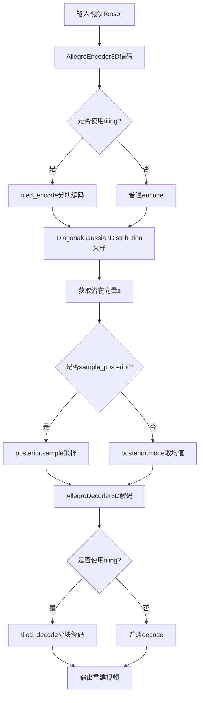
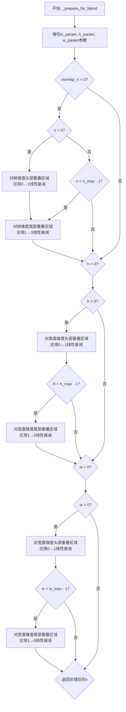
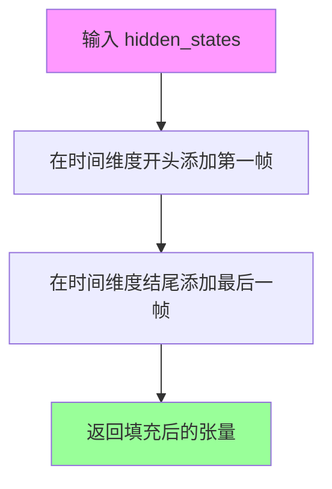

# `diffusers\src\diffusers\models\autoencoders\autoencoder_kl_allegro.py` 详细设计文档

这是一个用于视频的3D变分自编码器（VAE）实现，属于Allegro项目。该模型可以将视频序列编码到潜在空间（latent space），并从潜在表示解码重建视频，支持时序和空间维度的下采样/上采样操作。

## 整体流程



## 类结构

```
nn.Module (基类)
├── AllegroTemporalConvLayer (时序卷积层)
├── AllegroDownBlock3D (3D下采样块)
├── AllegroUpBlock3D (3D上采样块)
├── AllegroMidBlock3DConv (3D中间块)
├── AllegroEncoder3D (3D编码器)
│   ├── conv_in, temp_conv_in
│   ├── down_blocks (ModuleList)
│   └── mid_block
├── AllegroDecoder3D (3D解码器)
│   ├── conv_in, temp_conv_in
│   ├── mid_block
│   └── up_blocks (ModuleList)
└── AutoencoderKLAllegro (主VAE模型, 继承ModelMixin, AutoencoderMixin, ConfigMixin)
    ├── encoder (AllegroEncoder3D)
    ├── decoder (AllegroDecoder3D)
    ├── quant_conv, post_quant_conv
```

## 全局变量及字段


### `sample_frames`
    
样本帧数，用于定义时间维度上的采样窗口大小

类型：`int`
    


### `local_batch_size`
    
本地批次大小，控制每次处理的数据量

类型：`int`
    


### `rs`
    
空间压缩比，用于空间维度的下采样比例

类型：`int`
    


### `rt`
    
时序压缩比，用于时间维度的下采样比例

类型：`int`
    


### `AllegroTemporalConvLayer.conv1`
    
第一个卷积块，包含GroupNorm、SiLU激活和Conv3d卷积

类型：`nn.Sequential`
    


### `AllegroTemporalConvLayer.conv2`
    
第二个卷积块，包含GroupNorm、SiLU激活、Dropout和Conv3d卷积

类型：`nn.Sequential`
    


### `AllegroTemporalConvLayer.conv3`
    
第三个卷积块，包含GroupNorm、SiLU激活、Dropout和Conv3d卷积

类型：`nn.Sequential`
    


### `AllegroTemporalConvLayer.conv4`
    
第四个卷积块，包含GroupNorm、SiLU激活和Conv3d卷积

类型：`nn.Sequential`
    


### `AllegroTemporalConvLayer.down_sample`
    
标记是否执行时序下采样操作

类型：`bool`
    


### `AllegroTemporalConvLayer.up_sample`
    
标记是否执行时序上采样操作

类型：`bool`
    


### `AllegroDownBlock3D.resnets`
    
ResNet块列表，用于空间特征提取

类型：`nn.ModuleList`
    


### `AllegroDownBlock3D.temp_convs`
    
时序卷积列表，用于时间维度特征处理

类型：`nn.ModuleList`
    


### `AllegroDownBlock3D.temp_convs_down`
    
时序下采样卷积层，用于时间维度降采样

类型：`AllegroTemporalConvLayer`
    


### `AllegroDownBlock3D.downsamplers`
    
空间下采样器列表，用于空间维度降采样

类型：`nn.ModuleList`
    


### `AllegroDownBlock3D.add_temp_downsample`
    
标记是否添加时序下采样模块

类型：`bool`
    


### `AllegroUpBlock3D.resnets`
    
ResNet块列表，用于空间特征重建

类型：`nn.ModuleList`
    


### `AllegroUpBlock3D.temp_convs`
    
时序卷积列表，用于时间维度特征处理

类型：`nn.ModuleList`
    


### `AllegroUpBlock3D.temp_conv_up`
    
时序上采样卷积层，用于时间维度升采样

类型：`AllegroTemporalConvLayer`
    


### `AllegroUpBlock3D.upsamplers`
    
空间上采样器列表，用于空间维度升采样

类型：`nn.ModuleList`
    


### `AllegroUpBlock3D.add_temp_upsample`
    
标记是否添加时序上采样模块

类型：`bool`
    


### `AllegroMidBlock3DConv.resnets`
    
ResNet块列表，用于中间层特征处理

类型：`nn.ModuleList`
    


### `AllegroMidBlock3DConv.temp_convs`
    
时序卷积列表，用于中间层时间维度处理

类型：`nn.ModuleList`
    


### `AllegroMidBlock3DConv.attentions`
    
注意力层列表，用于中间层自注意力机制

类型：`nn.ModuleList`
    


### `AllegroEncoder3D.conv_in`
    
输入卷积层，将输入图像转换为特征图

类型：`nn.Conv2d`
    


### `AllegroEncoder3D.temp_conv_in`
    
时序输入卷积层，处理时间维度信息

类型：`nn.Conv3d`
    


### `AllegroEncoder3D.down_blocks`
    
下采样块列表，用于多级空间和时间下采样

类型：`nn.ModuleList`
    


### `AllegroEncoder3D.mid_block`
    
中间块，处理编码器最深层的特征

类型：`AllegroMidBlock3DConv`
    


### `AllegroEncoder3D.conv_norm_out`
    
输出归一化层，用于特征标准化

类型：`nn.GroupNorm`
    


### `AllegroEncoder3D.conv_act`
    
激活函数层，使用SiLU激活

类型：`nn.SiLU`
    


### `AllegroEncoder3D.temp_conv_out`
    
时序输出卷积层，处理输出时间维度

类型：`nn.Conv3d`
    


### `AllegroEncoder3D.conv_out`
    
输出卷积层，生成最终编码特征

类型：`nn.Conv2d`
    


### `AllegroEncoder3D.gradient_checkpointing`
    
梯度检查点标志，用于节省显存

类型：`bool`
    


### `AllegroDecoder3D.conv_in`
    
输入卷积层，处理latent输入

类型：`nn.Conv2d`
    


### `AllegroDecoder3D.temp_conv_in`
    
时序输入卷积层，处理时间维度信息

类型：`nn.Conv3d`
    


### `AllegroDecoder3D.mid_block`
    
中间块，处理解码器中间层特征

类型：`AllegroMidBlock3DConv`
    


### `AllegroDecoder3D.up_blocks`
    
上采样块列表，用于多级空间和时间上采样

类型：`nn.ModuleList`
    


### `AllegroDecoder3D.conv_norm_out`
    
输出归一化层，支持组归一化或空间归一化

类型：`nn.GroupNorm/SpatialNorm`
    


### `AllegroDecoder3D.conv_act`
    
激活函数层，使用SiLU激活

类型：`nn.SiLU`
    


### `AllegroDecoder3D.temp_conv_out`
    
时序输出卷积层，处理输出时间维度

类型：`nn.Conv3d`
    


### `AllegroDecoder3D.conv_out`
    
输出卷积层，生成最终解码图像

类型：`nn.Conv2d`
    


### `AllegroDecoder3D.gradient_checkpointing`
    
梯度检查点标志，用于节省显存

类型：`bool`
    


### `AutoencoderKLAllegro.encoder`
    
编码器模块，将视频编码为latent表示

类型：`AllegroEncoder3D`
    


### `AutoencoderKLAllegro.decoder`
    
解码器模块，将latent表示解码为视频

类型：`AllegroDecoder3D`
    


### `AutoencoderKLAllegro.quant_conv`
    
量化卷积层，用于latent空间的量化

类型：`nn.Conv2d`
    


### `AutoencoderKLAllegro.post_quant_conv`
    
后量化卷积层，用于解码前的latent处理

类型：`nn.Conv2d`
    


### `AutoencoderKLAllegro.use_slicing`
    
标记是否使用切片策略处理大批次

类型：`bool`
    


### `AutoencoderKLAllegro.use_tiling`
    
标记是否使用平铺策略处理高分辨率

类型：`bool`
    


### `AutoencoderKLAllegro.spatial_compression_ratio`
    
空间压缩比，指示空间维度压缩程度

类型：`int`
    


### `AutoencoderKLAllegro.tile_overlap_t`
    
时间维度tile重叠大小，用于平铺解码

类型：`int`
    


### `AutoencoderKLAllegro.tile_overlap_h`
    
高度维度tile重叠大小，用于平铺解码

类型：`int`
    


### `AutoencoderKLAllegro.tile_overlap_w`
    
宽度维度tile重叠大小，用于平铺解码

类型：`int`
    


### `AutoencoderKLAllegro.kernel`
    
卷积核大小，定义时空采样的窗口尺寸

类型：`tuple`
    


### `AutoencoderKLAllegro.stride`
    
步长，定义时空采样的滑动间隔

类型：`tuple`
    
    

## 全局函数及方法


### `_prepare_for_blend`

该全局函数用于在tile-based视频编码/解码过程中处理重叠区域的线性衰减混合。当VAE对视频进行分块处理时，相邻tile之间会有重叠区域，该函数通过对重叠部分应用线性权重（从0到1或从1到0）来实现平滑过渡，避免拼接伪影。

参数：

- `n_param`：`tuple[int, int, int]`，时间（帧）维度的参数元组，包含当前索引 `n`、最大索引 `n_max` 和重叠大小 `overlap_n`
- `h_param`：`tuple[int, int, int]`，高度维度的参数元组，包含当前索引 `h`、最大索引 `h_max` 和重叠大小 `overlap_h`
- `w_param`：`tuple[int, int, int]`，宽度维度的参数元组，包含当前索引 `w`、最大索引 `w_max` 和重叠大小 `overlap_w`
- `x`：`torch.Tensor`，输入的张量，形状为 `(batch, channels, frames, height, width)`，需要对其进行重叠区域衰减处理

返回值：`torch.Tensor`，返回处理后的张量，形状与输入相同

#### 流程图



#### 带注释源码

```python
def _prepare_for_blend(n_param, h_param, w_param, x):
    """
    对tile重叠区域进行线性衰减混合处理
    
    参数:
        n_param: 时间维度的 (当前索引, 最大索引, 重叠大小) 元组
        h_param: 高度维度的 (当前索引, 最大索引, 重叠大小) 元组  
        w_param: 宽度维度的 (当前索引, 最大索引, 重叠大小) 元组
        x: 输入张量，形状为 (batch, channels, frames, height, width)
    
    返回:
        处理后的张量，重叠区域已应用线性衰减权重
    """
    # 解包各维度的参数
    n, n_max, overlap_n = n_param
    h, h_max, overlap_h = h_param
    w, w_max, overlap_w = w_param
    
    # ========== 时间维度 (帧) 的重叠处理 ==========
    if overlap_n > 0:
        # 如果不是第一个tile，对头部重叠区域应用从0到1的线性增长权重
        # 这样可以让过渡区域从无到有平滑引入
        if n > 0:
            # 生成从0到overlap_n-1的线性空间，除以overlap_n归一化到[0,1)
            # reshape为(overlap_n, 1, 1)以便广播到其他维度
            x[:, :, 0:overlap_n, :, :] = x[:, :, 0:overlap_n, :, :] * (
                torch.arange(0, overlap_n).float().to(x.device) / overlap_n
            ).reshape(overlap_n, 1, 1)
        
        # 如果不是最后一个tile，对尾部重叠区域应用从1到0的线性衰减权重
        # 这样可以让过渡区域平滑消失
        if n < n_max - 1:
            x[:, :, -overlap_n:, :, :] = x[:, :, -overlap_n:, :, :] * (
                1 - torch.arange(0, overlap_n).float().to(x.device) / overlap_n
            ).reshape(overlap_n, 1, 1)
    
    # ========== 高度维度的重叠处理 ==========
    if h > 0:
        # 非第一个tile的头部：应用0→1增长权重
        x[:, :, :, 0:overlap_h, :] = x[:, :, :, 0:overlap_h, :] * (
            torch.arange(0, overlap_h).float().to(x.device) / overlap_h
        ).reshape(overlap_h, 1)
    
    if h < h_max - 1:
        # 非最后一个tile的尾部：应用1→0衰减权重
        x[:, :, :, -overlap_h:, :] = x[:, :, :, -overlap_h:, :] * (
            1 - torch.arange(0, overlap_h).float().to(x.device) / overlap_h
        ).reshape(overlap_h, 1)
    
    # ========== 宽度的重叠处理 ==========
    if w > 0:
        # 非第一个tile的头部：应用0→1增长权重
        x[:, :, :, :, 0:overlap_w] = x[:, :, :, :, 0:overlap_w] * (
            torch.arange(0, overlap_w).float().to(x.device) / overlap_w
        )
    
    if w < w_max - 1:
        # 非最后一个tile的尾部：应用1→0衰减权重
        x[:, :, :, :, -overlap_w:] = x[:, :, :, :, -overlap_w:] * (
            1 - torch.arange(0, overlap_w).float().to(x.device) / overlap_w
        )
    
    return x
```


### `AllegroTemporalConvLayer.__init__`

该方法是 `AllegroTemporalConvLayer` 类的构造函数，用于初始化时间卷积层的参数和子模块。根据 `down_sample`、`up_sample` 和 `stride` 参数，它会创建不同的卷积结构来处理视频（图像序列）的时间维度信息，支持空间下采样、上采样或标准卷积操作。

参数：

- `self`：隐式参数，表示类的实例本身
- `in_dim`：`int`，输入特征的通道数维度
- `out_dim`：`int | None`，输出特征的通道数维度，默认为 `None`（即等于 `in_dim`）
- `dropout`：`float`，Dropout 层的丢弃率，默认为 `0.0`
- `norm_num_groups`：`int`，GroupNorm 的分组数，默认为 `32`
- `up_sample`：`bool`，是否进行时间维度上采样，默认为 `False`
- `down_sample`：`bool`，是否进行时间维度下采样，默认为 `False`
- `stride`：`int`，卷积的步长，默认为 `1`

返回值：`None`，构造函数不返回任何值

#### 流程图

```mermaid
flowchart TD
    A[Start __init__] --> B[Call super().__init__]
    B --> C[Set out_dim = out_dim or in_dim]
    C --> D[Calculate padding: pad_h = pad_w = int((stride - 1) * 0.5), pad_t = 0]
    D --> E{self.down_sample?}
    E -->|True| F[Create conv1: GroupNorm + SiLU + Conv3d for downsample]
    E --> G{self.up_sample?}
    G -->|True| H[Create conv1: GroupNorm + SiLU + Conv3d for upsample with out_dim*2]
    G -->|False| I[Create conv1: GroupNorm + SiLU + Conv3d standard]
    F --> J[Create conv2: GroupNorm + SiLU + Dropout + Conv3d]
    H --> J
    I --> J
    J --> K[Create conv3: GroupNorm + SiLU + Dropout + Conv3d]
    K --> L[Create conv4: GroupNorm + SiLU + Conv3d]
    L --> M[End __init__]
```

#### 带注释源码

```python
def __init__(
    self,
    in_dim: int,
    out_dim: int | None = None,
    dropout: float = 0.0,
    norm_num_groups: int = 32,
    up_sample: bool = False,
    down_sample: bool = False,
    stride: int = 1,
) -> None:
    """
    初始化时间卷积层。
    
    参数:
        in_dim: 输入通道数
        out_dim: 输出通道数，默认为None则等于in_dim
        dropout: Dropout概率
        norm_num_groups: GroupNorm分组数
        up_sample: 是否进行时间上采样
        down_sample: 是否进行时间下采样
        stride: 卷积步长
    """
    super().__init__()  # 调用nn.Module的初始化

    # 如果out_dim为None，则使用in_dim作为输出维度
    out_dim = out_dim or in_dim
    
    # 计算padding值：基于stride计算，保持特征图尺寸
    pad_h = pad_w = int((stride - 1) * 0.5)
    pad_t = 0  # 时间维度padding为0

    # 保存上采样和下采样标志
    self.down_sample = down_sample
    self.up_sample = up_sample

    # 根据下采样/上采样标志创建不同的conv1结构
    if down_sample:
        # 下采样：使用stride=2的Conv3d，时间维度减半
        self.conv1 = nn.Sequential(
            nn.GroupNorm(norm_num_groups, in_dim),
            nn.SiLU(),
            nn.Conv3d(in_dim, out_dim, (2, stride, stride), stride=(2, 1, 1), padding=(0, pad_h, pad_w)),
        )
    elif up_sample:
        # 上采样：输出通道数翻倍，用于后续分割
        self.conv1 = nn.Sequential(
            nn.GroupNorm(norm_num_groups, in_dim),
            nn.SiLU(),
            nn.Conv3d(in_dim, out_dim * 2, (1, stride, stride), padding=(0, pad_h, pad_w)),
        )
    else:
        # 标准卷积：3x3x3卷积核
        self.conv1 = nn.Sequential(
            nn.GroupNorm(norm_num_groups, in_dim),
            nn.SiLU(),
            nn.Conv3d(in_dim, out_dim, (3, stride, stride), padding=(pad_t, pad_h, pad_w)),
        )
    
    # conv2: 残差路径，进一步处理特征
    self.conv2 = nn.Sequential(
        nn.GroupNorm(norm_num_groups, out_dim),
        nn.SiLU(),
        nn.Dropout(dropout),
        nn.Conv3d(out_dim, in_dim, (3, stride, stride), padding=(pad_t, pad_h, pad_w)),
    )
    
    # conv3: 额外的卷积层，增强特征提取能力
    self.conv3 = nn.Sequential(
        nn.GroupNorm(norm_num_groups, out_dim),
        nn.SiLU(),
        nn.Dropout(dropout),
        nn.Conv3d(out_dim, in_dim, (3, stride, stride), padding=(pad_t, pad_h, pad_h)),  # 注意：此处pad_w错误地使用了pad_h
    )
    
    # conv4: 最终卷积层，输出与输入相同通道数
    self.conv4 = nn.Sequential(
        nn.GroupNorm(norm_num_groups, out_dim),
        nn.SiLU(),
        nn.Conv3d(out_dim, in_dim, (3, stride, stride), padding=(pad_t, pad_h, pad_h)),  # 同样存在问题
    )
```


### `AllegroTemporalConvLayer._pad_temporal_dim`

该函数是一个静态方法，用于在时间维度（dim=2）的两端分别复制第一帧和最后一帧，以实现时间维度的边界扩展。这种填充方式常用于视频处理中，以确保卷积操作在时间边界处能够保持特征信息。

参数：

- `hidden_states`：`torch.Tensor`，输入的5D张量，形状为 (batch, channel, time, height, width)，表示一批视频帧的特征表示。

返回值：`torch.Tensor`，返回填充后的张量，时间维度相比输入增加了2帧（开头和结尾各添加一帧）。

#### 流程图



#### 带注释源码

```python
@staticmethod
def _pad_temporal_dim(hidden_states: torch.Tensor) -> torch.Tensor:
    """
    在时间维度两端进行边界填充（复制第一帧和最后一帧）。
    
    参数:
        hidden_states: 输入的5D张量，形状为 (batch, channel, time, height, width)
    
    返回:
        填充后的张量，时间维度增加2帧
    """
    # 步骤1: 在时间维度(dim=2)的开头插入第一帧
    # hidden_states[:, :, 0:1] 选取第一帧，然后与原张量在dim=2上拼接
    hidden_states = torch.cat((hidden_states[:, :, 0:1], hidden_states), dim=2)
    
    # 步骤2: 在时间维度(dim=2)的结尾插入最后一帧
    # hidden_states[:, :, -1:] 选取最后一帧，然后与当前张量在dim=2上拼接
    hidden_states = torch.cat((hidden_states, hidden_states[:, :, -1:]), dim=2)
    
    return hidden_states
```


### `AllegroTemporalConvLayer.forward`

该方法是AllegroTemporalConvLayer类的前向传播函数，负责对视频（图像序列）输入进行时间维度上的卷积处理，支持上采样、下采样和普通卷积三种模式，并通过残差连接实现特征的有效传递。

参数：

- `self`：AllegroTemporalConvLayer实例本身
- `hidden_states`：`torch.Tensor`，输入的隐藏状态张量，形状为(batch_size * seq_len, channels, height, width)
- `batch_size`：`int`，批次大小，用于恢复原始张量形状

返回值：`torch.Tensor`，处理后的隐藏状态张量，形状与输入相同

#### 流程图

```mermaid
flowchart TD
    A[开始 forward] --> B[形状变换: hidden_states unflatten + permute]
    B --> C{判断采样模式}
    C -->|down_sample| D[identity = hidden_states[:, :, ::2]]
    C -->|up_sample| E[identity = repeat_interleave hidden_states]
    C -->|普通模式| F[identity = hidden_states]
    D --> G{down_sample or up_sample?}
    E --> G
    F --> H[调用 _pad_temporal_dim 填充时间维度]
    G -->|是| I[hidden_states = conv1 hidden_states]
    G -->|否| H
    H --> I
    I --> J{up_sample?}
    J -->|是| K[hidden_states 形状变换: unflatten + permute + flatten]
    J -->|否| L[调用 _pad_temporal_dim 填充时间维度]
    K --> L
    L --> M[hidden_states = conv2 hidden_states]
    M --> N[调用 _pad_temporal_dim 填充时间维度]
    N --> O[hidden_states = conv3 hidden_states]
    O --> P[调用 _pad_temporal_dim 填充时间维度]
    P --> Q[hidden_states = conv4 hidden_states]
    Q --> R[残差连接: hidden_states = identity + hidden_states]
    R --> S[形状恢复: permute + flatten]
    S --> T[返回 hidden_states]
```

#### 带注释源码

```python
def forward(self, hidden_states: torch.Tensor, batch_size: int) -> torch.Tensor:
    """
    前向传播方法，对输入进行时间卷积处理
    
    参数:
        hidden_states: 输入张量，形状为 (batch_size * seq_len, channels, height, width)
        batch_size: 批次大小，用于形状恢复
    
    返回:
        处理后的张量，形状与输入相同
    """
    # 步骤1: 形状变换
    # 从 (batch_size * seq_len, c, h, w) 转换为 (batch_size, seq_len, c, h, w)
    # 这样可以方便地处理时间维度
    hidden_states = hidden_states.unflatten(0, (batch_size, -1)).permute(0, 2, 1, 3, 4)

    # 步骤2: 根据采样模式创建identity（残差连接的基础）
    if self.down_sample:
        # 下采样时，每隔2个时间步取一个
        # 用于后续残差连接
        identity = hidden_states[:, :, ::2]
    elif self.up_sample:
        # 上采样时，重复每个时间步2次
        # output_size 确保输出长度正确
        identity = hidden_states.repeat_interleave(2, dim=2, output_size=hidden_states.shape[2] * 2)
    else:
        # 普通模式直接使用hidden_states作为identity
        identity = hidden_states

    # 步骤3: 第一次卷积
    if self.down_sample or self.up_sample:
        # 有采样时直接应用conv1
        hidden_states = self.conv1(hidden_states)
    else:
        # 普通模式需要先填充时间维度
        # 在序列开头和结尾各复制一个时间步，处理边界
        hidden_states = self._pad_temporal_dim(hidden_states)
        hidden_states = self.conv1(hidden_states)

    # 步骤4: 上采样特有处理
    if self.up_sample:
        # 将通道维度拆分为2个，然后重新排列
        # (batch, seq_len*2, c*2, h, w) -> (batch, seq_len, c*2*2, h, w)
        hidden_states = hidden_states.unflatten(1, (2, -1)).permute(0, 2, 3, 1, 4, 5).flatten(2, 3)

    # 步骤5: 第二次卷积（conv2）
    hidden_states = self._pad_temporal_dim(hidden_states)
    hidden_states = self.conv2(hidden_states)

    # 步骤6: 第三次卷积（conv3）
    hidden_states = self._pad_temporal_dim(hidden_states)
    hidden_states = self.conv3(hidden_states)

    # 步骤7: 第四次卷积（conv4）
    hidden_states = self._pad_temporal_dim(hidden_states)
    hidden_states = self.conv4(hidden_states)

    # 步骤8: 残差连接
    # 将identity与卷积结果相加，实现特征复用
    hidden_states = identity + hidden_states

    # 步骤9: 形状恢复
    # 从 (batch_size, seq_len, c, h, w) 转换回 (batch_size * seq_len, c, h, w)
    hidden_states = hidden_states.permute(0, 2, 1, 3, 4).flatten(0, 1)

    return hidden_states
```


### `AllegroDownBlock3D.__init__`

该方法是 `AllegroDownBlock3D` 类的构造函数，用于初始化 Allegro 视频编码器中的 3D 下采样块。它创建多个 ResNet 块和时间卷积层，并可选地添加时间下采样和空间下采样层，以实现对视频特征在空间和时间维度上的下采样处理。

参数：

- `in_channels`：`int`，输入特征图的通道数
- `out_channels`：`int`，输出特征图的通道数
- `dropout`：`float = 0.0`，Dropout 概率，用于正则化
- `num_layers`：`int = 1`，该块中包含的 ResNet 层数量
- `resnet_eps`：`float = 1e-6`，ResNet 块中 GroupNorm 的 epsilon 值
- `resnet_time_scale_shift`：`str = "default"`，时间嵌入的归一化方式（"default" 或 "spatial"）
- `resnet_act_fn`：`str = "swish"`，ResNet 块使用的激活函数
- `resnet_groups`：`int = 32`，GroupNorm 中的分组数量
- `resnet_pre_norm`：`bool = True`，是否在 ResNet 块中使用预归一化
- `output_scale_factor`：`float = 1.0`，输出特征图的缩放因子
- `spatial_downsample`：`bool = True`，是否执行空间维度的下采样
- `temporal_downsample`：`bool = False`，是否执行时间维度的下采样
- `downsample_padding`：`int = 1`，空间下采样时的填充大小

返回值：`None`，构造函数无返回值

#### 流程图

```mermaid
flowchart TD
    A[开始 __init__] --> B[调用 super().__init__]
    B --> C[初始化空列表: resnets, temp_convs]
    D[循环 i in range num_layers] --> E{判断是否为第一层}
    E -->|是| F[in_channels = in_channels]
    E -->|否| G[in_channels = out_channels]
    F --> H[创建 ResnetBlock2D]
    G --> H
    H --> I[创建 AllegroTemporalConvLayer]
    I --> J[将 ResnetBlock2D 添加到 resnets 列表]
    J --> K[将 AllegroTemporalConvLayer 添加到 temp_convs 列表]
    K --> L{循环是否结束}
    L -->|否| D
    L -->|是| M[将 resnets 转换为 nn.ModuleList]
    M --> N[将 temp_convs 转换为 nn.ModuleList]
    N --> O{检查 temporal_downsample}
    O -->|是| P[创建 AllegroTemporalConvLayer 下采样层]
    O -->|否| Q
    P --> R[设置 add_temp_downsample = True]
    O -->|否| Q
    Q --> S{检查 spatial_downsample}
    S -->|是| T[创建 Downsample2D 下采样层]
    S -->|否| U
    T --> V[将 downsamplers 转换为 nn.ModuleList]
    S -->|否| U
    U[结束 __init__]
```

#### 带注释源码

```
def __init__(
    self,
    in_channels: int,                    # 输入特征图的通道数
    out_channels: int,                   # 输出特征图的通道数
    dropout: float = 0.0,                # Dropout 概率，用于防止过拟合
    num_layers: int = 1,                 # ResNet 块的数量
    resnet_eps: float = 1e-6,           # GroupNorm 的 epsilon 值，防止除零
    resnet_time_scale_shift: str = "default",  # 时间嵌入的归一化方式
    resnet_act_fn: str = "swish",        # 激活函数类型
    resnet_groups: int = 32,             # GroupNorm 的分组数
    resnet_pre_norm: bool = True,        # 是否使用预归一化
    output_scale_factor: float = 1.0,    # 输出的缩放因子
    spatial_downsample: bool = True,     # 是否在空间维度下采样
    temporal_downsample: bool = False,   # 是否在时间维度下采样
    downsample_padding: int = 1,         # 下采样时的填充值
):
    super().__init__()  # 调用父类 nn.Module 的初始化方法

    resnets = []      # 用于存储 ResNet 块的列表
    temp_convs = []   # 用于存储时间卷积层的列表

    # 循环创建 num_layers 个 ResNet 块和时间卷积层
    for i in range(num_layers):
        # 判断是否为第一层：第一层使用输入通道，后续层使用输出通道
        in_channels = in_channels if i == 0 else out_channels
        
        # 创建 ResNet 块，用于空间特征提取
        resnets.append(
            ResnetBlock2D(
                in_channels=in_channels,           # 输入通道数
                out_channels=out_channels,          # 输出通道数
                temb_channels=None,                 # 时间嵌入通道（此处未使用）
                eps=resnet_eps,                     # epsilon 值
                groups=resnet_groups,               # 分组数
                dropout=dropout,                    # Dropout 概率
                time_embedding_norm=resnet_time_scale_shift,  # 时间嵌入归一化方式
                non_linearity=resnet_act_fn,       # 激活函数
                output_scale_factor=output_scale_factor,  # 输出缩放因子
                pre_norm=resnet_pre_norm,           # 预归一化标志
            )
        )
        
        # 创建时间卷积层，用于处理视频的时间维度信息
        temp_convs.append(
            AllegroTemporalConvLayer(
                out_channels,           # 输入通道数
                out_channels,           # 输出通道数
                dropout=0.1,            # 时间卷积层使用的固定 Dropout 值
                norm_num_groups=resnet_groups,  # 分组归一化的组数
            )
        )

    # 将列表转换为 ModuleList，以便 PyTorch 能够跟踪所有参数
    self.resnets = nn.ModuleList(resnets)
    self.temp_convs = nn.ModuleList(temp_convs)

    # 如果需要时间维度下采样，创建专用的时间卷积下采样层
    if temporal_downsample:
        self.temp_convs_down = AllegroTemporalConvLayer(
            out_channels, out_channels, 
            dropout=0.1, 
            norm_num_groups=resnet_groups, 
            down_sample=True,    # 启用下采样模式
            stride=3             # 步长为 3，实现 8 倍时间下采样
        )
    # 保存是否需要时间下采样的标志
    self.add_temp_downsample = temporal_downsample

    # 如果需要空间维度下采样，创建空间下采样层
    if spatial_downsample:
        self.downsamplers = nn.ModuleList(
            [
                Downsample2D(
                    out_channels,           # 输入通道数
                    use_conv=True,          # 使用卷积进行下采样
                    out_channels=out_channels,  # 输出通道数
                    padding=downsample_padding,  # 填充大小
                    name="op"               # 层名称
                )
            ]
        )
    else:
        # 不需要下采样时设为 None
        self.downsamplers = None
```


### AllegroDownBlock3D.forward

AllegroDownBlock3D 类的前向传播方法，负责对输入的隐藏状态进行下采样处理，包括 ResNet 块、时间卷积层和空间下采样的级联应用。

参数：

- `hidden_states`：`torch.Tensor`，输入的张量，形状为 (batch_size, channels, num_frames, height, width)，表示一批视频或图像序列的隐藏状态

返回值：`torch.Tensor`，输出经过下采样处理后的张量，形状为 (batch_size, out_channels, num_frames//temporal_downsample, height//spatial_downsample, width//spatial_downsample)，其中 temporal_downsample 和 spatial_downsample 分别为是否启用了时间和空间下采样

#### 流程图

```mermaid
flowchart TD
    A[开始 forward] --> B[获取 batch_size = hidden_states.shape[0]]
    B --> C[维度变换: permute + flatten 将输入从 (B, C, T, H, W) 转为 (B*T, C, H, W)]
    C --> D{遍历 resnets 和 temp_convs}
    D -->|对每一层| E[resnet 处理 hidden_states, temb=None]
    E --> F[temp_conv 处理 hidden_states, batch_size]
    D --> G{检查 add_temp_downsample}
    G -->|True| H[执行 temp_convs_down 进行时间下采样]
    G -->|False| I{检查 downsamplers}
    I -->|不为 None| J[执行空间下采样]
    I -->|为 None| K[跳过下采样]
    J --> L[维度恢复: unflatten + permute 将 (B*T, C, H, W) 恢复为 (B, C, T, H, W)]
    K --> L
    H --> L
    L --> M[返回 hidden_states]
```

#### 带注释源码

```python
def forward(self, hidden_states: torch.Tensor) -> torch.Tensor:
    """
    AllegroDownBlock3D 的前向传播方法
    
    处理流程:
    1. 提取 batch_size
    2. 将输入从 5D (B, C, T, H, W) 转换为 4D (B*T, C, H, W) 以便 2D 卷积处理
    3. 依次通过 ResNet 块和时间卷积层
    4. 可选地进行时间下采样和空间下采样
    5. 恢复原始维度顺序并返回
    """
    # 第一步：获取批量大小，用于后续维度恢复
    batch_size = hidden_states.shape[0]

    # 第二步：维度变换
    # 原形状: (batch_size, channels, num_frames, height, width)
    # 变换后: (batch_size * num_frames, channels, height, width)
    # permute(0, 2, 1, 3, 4) 将维度从 (B, C, T, H, W) 变为 (B, T, C, H, W)
    # flatten(0, 1) 将 B 和 T 维度合并为 B*T
    hidden_states = hidden_states.permute(0, 2, 1, 3, 4).flatten(0, 1)

    # 第三步：遍历 ResNet 块和时间卷积层
    # zip(self.resnets, self.temp_convs) 将对应的 resnet 和 temp_conv 配对
    for resnet, temp_conv in zip(self.resnets, self.temp_convs):
        # ResNet 块处理，temb=None 表示不使用时间嵌入
        hidden_states = resnet(hidden_states, temb=None)
        # 时间卷积层处理，需要传入 batch_size 以便正确恢复维度
        hidden_states = temp_conv(hidden_states, batch_size=batch_size)

    # 第四步：可选的时间下采样
    # 如果启用了时间下采样 (temporal_downsample=True)，在第一层进行时间维度下采样
    if self.add_temp_downsample:
        hidden_states = self.temp_convs_down(hidden_states, batch_size=batch_size)

    # 第五步：可选的空间下采样
    # 如果启用了空间下采样 (spatial_downsample=True)，使用 Downsample2D 进行下采样
    if self.downsamplers is not None:
        for downsampler in self.downsamplers:
            hidden_states = downsampler(hidden_states)

    # 第六步：维度恢复
    # 将 (B*T, C, H, W) 恢复为 (B, C, T, H, W)
    # unflatten(0, (batch_size, -1)) 将第一维重新展开为 (batch_size, T)
    # permute(0, 2, 1, 3, 4) 恢复原始维度顺序 (B, C, T, H, W)
    hidden_states = hidden_states.unflatten(0, (batch_size, -1)).permute(0, 2, 1, 3, 4)
    
    return hidden_states
```


### AllegroUpBlock3D.__init__

这是 Allegro 模型中上采样块（Up Block）的初始化方法，负责构建用于视频生成的上采样网络结构，包含残差网络、时间卷积层和上采样操作。

参数：

- `in_channels`：`int`，输入通道数，指定输入特征图的通道维度
- `out_channels`：`int`，输出通道数，指定输出特征图的通道维度
- `dropout`：`float`，Dropout 概率，默认 0.0，用于防止过拟合
- `num_layers`：`int`，残差层数量，默认 1，指定块内残差块的数量
- `resnet_eps`：`float`，残差网络 epsilon 值，默认 1e-6，用于数值稳定性
- `resnet_time_scale_shift`：`str`，时间尺度移位方式，默认 "default"，可选项包括 "default" 和 "spatial"
- `resnet_act_fn`：`str`，残差网络激活函数，默认 "swish"
- `resnet_groups`：`int`，分组归一化的组数，默认 32
- `resnet_pre_norm`：`bool`，是否使用预归一化，默认 True
- `output_scale_factor`：`float`，输出缩放因子，默认 1.0
- `spatial_upsample`：`bool`，是否进行空间上采样，默认 True
- `temporal_upsample`：`bool`，是否进行时间上采样，默认 False
- `temb_channels`：`int | None`，时间嵌入通道数，默认 None

返回值：`None`，该方法为初始化方法，不返回任何值

#### 流程图

```mermaid
flowchart TD
    A[开始初始化] --> B[调用父类初始化 super().__init__]
    B --> C[创建空列表 resnets 和 temp_convs]
    C --> D[循环 i 从 0 到 num_layers-1]
    D --> E[确定当前层输入通道: in_channels if i==0 else out_channels]
    E --> F[创建 ResnetBlock2D 并添加到 resnets]
    F --> G[创建 AllegroTemporalConvLayer 并添加到 temp_convs]
    G --> H{循环结束?}
    H -->|否| D
    H -->|是| I[将 resnets 转换为 nn.ModuleList]
    I --> J[将 temp_convs 转换为 nn.ModuleList]
    J --> K[设置 add_temp_upsample 标志]
    K --> L{是否 temporal_upsample?}
    L -->|是| M[创建 temp_conv_up]
    L -->|否| N
    M --> N
    N --> O{是否 spatial_upsample?}
    O -->|是| P[创建 upsamplers]
    O -->|否| Q[设置 upsamplers 为 None]
    P --> R[结束初始化]
    Q --> R
```

#### 带注释源码

```python
def __init__(
    self,
    in_channels: int,                          # 输入特征图的通道数
    out_channels: int,                         # 输出特征图的通道数
    dropout: float = 0.0,                      # Dropout 概率，防止过拟合
    num_layers: int = 1,                       # 残差块的数量
    resnet_eps: float = 1e-6,                  # ResNet 归一化的 epsilon 值
    resnet_time_scale_shift: str = "default", # 时间尺度移位方式: "default" 或 "spatial"
    resnet_act_fn: str = "swish",              # 激活函数类型
    resnet_groups: int = 32,                   # 分组归一化的组数
    resnet_pre_norm: bool = True,              # 是否使用预归一化
    output_scale_factor: float = 1.0,         # 输出缩放因子
    spatial_upsample: bool = True,             # 是否执行空间上采样
    temporal_upsample: bool = False,          # 是否执行时间上采样
    temb_channels: int | None = None,         # 时间嵌入通道数
) -> None:
    # 调用父类 nn.Module 的初始化方法
    super().__init__()

    # 初始化空列表用于存储 ResNet 块和临时卷积层
    resnets = []
    temp_convs = []

    # 循环创建指定数量的 ResNet 块和临时卷积层
    for i in range(num_layers):
        # 确定当前层的输入通道数：第一层使用 in_channels，后续层使用 out_channels
        input_channels = in_channels if i == 0 else out_channels

        # 创建残差块并添加到列表中
        resnets.append(
            ResnetBlock2D(
                in_channels=input_channels,        # 当前层输入通道
                out_channels=out_channels,         # 输出通道
                temb_channels=temb_channels,      # 时间嵌入通道
                eps=resnet_eps,                    # 数值稳定性参数
                groups=resnet_groups,              # 分组归一化
                dropout=dropout,                   # Dropout 比例
                time_embedding_norm=resnet_time_scale_shift, # 时间嵌入归一化方式
                non_linearity=resnet_act_fn,       # 激活函数
                output_scale_factor=output_scale_factor, # 输出缩放
                pre_norm=resnet_pre_norm,          # 预归一化
            )
        )
        # 创建时间卷积层并添加到列表中
        temp_convs.append(
            AllegroTemporalConvLayer(
                out_channels,                      # 输入通道
                out_channels,                      # 输出通道
                dropout=0.1,                       # 固定 dropout 0.1
                norm_num_groups=resnet_groups,     # 分组归一化
            )
        )

    # 将列表转换为 nn.ModuleList 以便正确注册子模块
    self.resnets = nn.ModuleList(resnets)
    self.temp_convs = nn.ModuleList(temp_convs)

    # 记录是否需要时间上采样
    self.add_temp_upsample = temporal_upsample
    # 如果需要时间上采样，创建时间上采样卷积层
    if temporal_upsample:
        self.temp_conv_up = AllegroTemporalConvLayer(
            out_channels, out_channels, 
            dropout=0.1, 
            norm_num_groups=resnet_groups, 
            up_sample=True,   # 启用上采样模式
            stride=3         # 步长为 3
        )

    # 如果需要空间上采样，创建上采样模块
    if spatial_upsample:
        self.upsamplers = nn.ModuleList(
            [Upsample2D(out_channels, use_conv=True, out_channels=out_channels)]
        )
    else:
        self.upsamplers = None  # 不进行空间上采样
```


### `AllegroUpBlock3D.forward`

该方法是 `AllegroUpBlock3D` 类的前向传播函数，负责对输入的隐藏状态进行上采样处理，包括时间维度的上采样和空间维度的上采样，通过堆叠的残差块（ResnetBlock）和时间卷积层（TemporalConvLayer）逐步处理特征，并在最后通过上采样器进行空间上采样。

参数：

- `hidden_states`：`torch.Tensor`，输入的隐藏状态张量，形状为 (batch_size, channels, frames, height, width)

返回值：`torch.Tensor`，处理后的隐藏状态张量，形状为 (batch_size, out_channels, frames \* temporal_scale, height \* spatial_scale, width \* spatial_scale)

#### 流程图

```mermaid
flowchart TD
    A[开始] --> B[获取 batch_size = hidden_states.shape[0]]
    B --> C[permute 和 flatten 维度变换]
    C --> D[遍历 resnets 和 temp_convs]
    D --> E[resnet 前向传播: hidden_states = resnet(hidden_states, temb=None)]
    E --> F[temp_conv 前向传播: hidden_states = temp_conv(hidden_states, batch_size)]
    F --> G{是否还有更多层?}
    G -->|是| D
    G -->|否| H{add_temp_upsample?}
    H -->|是| I[temp_conv_up 前向传播]
    H -->|否| J{upsamplers is not None?}
    I --> J
    J -->|是| K[遍历 upsamplers 执行上采样]
    J -->|否| L[unflatten 和 permute 维度恢复]
    K --> L
    L --> M[返回 hidden_states]
```

#### 带注释源码

```python
def forward(self, hidden_states: torch.Tensor) -> torch.Tensor:
    # Step 1: 获取批次大小
    # 从输入张量的第一维获取批次大小，用于后续维度恢复
    batch_size = hidden_states.shape[0]

    # Step 2: 维度变换
    # 将输入从 (batch, channels, frames, height, width) 
    # 转换为 (batch*frames, channels, height, width)
    # 以便 ResnetBlock2D 和 Conv3d 可以处理
    hidden_states = hidden_states.permute(0, 2, 1, 3, 4).flatten(0, 1)

    # Step 3: 遍历 Resnet 块和时间卷积层
    # 对每一层执行残差连接和时间卷积处理
    for resnet, temp_conv in zip(self.resnets, self.temp_convs):
        # Resnet 块前向传播，处理空间特征
        # temb=None 表示不使用时间嵌入
        hidden_states = resnet(hidden_states, temb=None)
        
        # 时间卷积层前向传播，处理时间维度特征
        # 需要传入 batch_size 用于维度恢复
        hidden_states = temp_conv(hidden_states, batch_size=batch_size)

    # Step 4: 时间维度上采样（可选）
    # 如果配置了时间上采样，则执行时间维度的上采样
    if self.add_temp_upsample:
        hidden_states = self.temp_conv_up(hidden_states, batch_size=batch_size)

    # Step 5: 空间维度上采样（可选）
    # 如果配置了空间上采样，则执行空间维度的上采样
    if self.upsamplers is not None:
        for upsampler in self.upsamplers:
            hidden_states = upsampler(hidden_states)

    # Step 6: 维度恢复
    # 将张量从 (batch*frames, channels, height, width)
    # 恢复为 (batch, channels, frames, height, width)
    hidden_states = hidden_states.unflatten(0, (batch_size, -1)).permute(0, 2, 1, 3, 4)
    
    return hidden_states
```


### `AllegroMidBlock3DConv.__init__`

AllegroMidBlock3DConv类的初始化方法，用于构建一个包含ResNet块、时间卷积层和自注意力机制的3D中间处理块，常用于视频生成模型的编码器和解码器中。

参数：

- `in_channels`：`int`，输入通道数，定义特征图的通道维度
- `temb_channels`：`int`，时间嵌入通道数，用于时间维度的特征处理
- `dropout`：`float`，dropout比率（默认为0.0），用于防止过拟合
- `num_layers`：`int`，中间块层数（默认为1），决定注意力、残差块和时序卷积的堆叠次数
- `resnet_eps`：`float`，ResNet块的epsilon值（默认为1e-6），用于数值稳定性
- `resnet_time_scale_shift`：`str`，时间尺度偏移类型（默认为"default"，可选"spatial"），控制时间维度的归一化方式
- `resnet_act_fn`：`str`，ResNet激活函数（默认为"swish"），定义非线性变换
- `resnet_groups`：`int`，ResNet分组数（默认为32），用于GroupNorm的分组
- `resnet_pre_norm`：`bool`，是否使用预归一化（默认为True），影响残差连接前的归一化位置
- `add_attention`：`bool`，是否添加注意力机制（默认为True），控制是否使用自注意力
- `attention_head_dim`：`int`，注意力头维度（默认为1），决定多头注意力的配置
- `output_scale_factor`：`float`，输出缩放因子（默认为1.0），用于调整输出特征的尺度

返回值：`None`，该方法为构造函数，不返回任何值

#### 流程图

```mermaid
flowchart TD
    A[开始 __init__] --> B[调用 super().__init__]
    B --> C[创建初始 ResNetBlock2D]
    C --> D[创建初始 AllegroTemporalConvLayer]
    D --> E{attention_head_dim 是否为 None}
    E -->|是| F[设置 attention_head_dim = in_channels]
    E -->|否| G[保持原值]
    F --> H[循环 num_layers 次]
    G --> H
    H --> I{add_attention 为 True?}
    I -->|是| J[创建 Attention 模块并添加到 attentions]
    I -->|否| K[添加 None 到 attentions]
    J --> L[创建 ResNetBlock2D]
    K --> L
    L --> M[创建 AllegroTemporalConvLayer]
    M --> N[是否还有未处理的层?]
    N -->|是| H
    N -->|否| O[将 resnets 转换为 nn.ModuleList]
    O --> P[将 temp_convs 转换为 nn.ModuleList]
    P --> Q[将 attentions 转换为 nn.ModuleList]
    Q --> R[结束 __init__]
```

#### 带注释源码

```python
def __init__(
    self,
    in_channels: int,                 # 输入特征图的通道数
    temb_channels: int,               # 时间嵌入的通道数，用于时间维度处理
    dropout: float = 0.0,             # Dropout 比率，用于正则化
    num_layers: int = 1,             # 中间块中注意力/残差/时序卷积的堆叠层数
    resnet_eps: float = 1e-6,        # ResNet 块的 epsilon，用于数值稳定性
    resnet_time_scale_shift: str = "default",  # 时间尺度偏移模式："default" 或 "spatial"
    resnet_act_fn: str = "swish",     # ResNet 激活函数类型
    resnet_groups: int = 32,         # GroupNorm 的分组数
    resnet_pre_norm: bool = True,     # 是否在残差前进行归一化
    add_attention: bool = True,       # 是否添加自注意力机制
    attention_head_dim: int = 1,      # 注意力头的维度
    output_scale_factor: float = 1.0 # 输出特征的缩放因子
) -> None:
    # 调用父类 nn.Module 的初始化方法
    super().__init__()

    # ========== 构建第一个 ResNet 块 ==========
    # 无论 num_layers 为多少，至少会有一个 ResNet 块
    resnets = [
        ResnetBlock2D(
            in_channels=in_channels,           # 输入通道数
            out_channels=in_channels,          # 输出通道数（保持不变）
            temb_channels=temb_channels,       # 时间嵌入通道
            eps=resnet_eps,                     # 数值稳定性 epsilon
            groups=resnet_groups,               # GroupNorm 分组数
            dropout=dropout,                   # Dropout 比率
            time_embedding_norm=resnet_time_scale_shift,  # 时间嵌入归一化方式
            non_linearity=resnet_act_fn,        # 激活函数
            output_scale_factor=output_scale_factor,  # 输出缩放因子
            pre_norm=resnet_pre_norm,           # 预归一化标志
        )
    ]
    
    # ========== 构建第一个时序卷积层 ==========
    # 用于处理视频/3D 数据的时序信息
    temp_convs = [
        AllegroTemporalConvLayer(
            in_channels,               # 输入通道
            in_channels,                # 输出通道
            dropout=0.1,                # 时序层专用 dropout
            norm_num_groups=resnet_groups,  # 分组归一化数
        )
    ]
    attentions = []  # 初始化注意力模块列表

    # ========== 处理注意力头维度 ==========
    # 如果未指定，则使用输入通道数作为注意力头维度
    if attention_head_dim is None:
        attention_head_dim = in_channels

    # ========== 循环构建多个注意力/ResNet/时序卷积层 ==========
    # 这里的循环次数由 num_layers 决定
    for _ in range(num_layers):
        # 根据 add_attention 标志决定是否添加注意力模块
        if add_attention:
            attentions.append(
                Attention(
                    in_channels,                                 # 输入通道
                    heads=in_channels // attention_head_dim,   # 注意力头数量
                    dim_head=attention_head_dim,                # 每个头的维度
                    rescale_output_factor=output_scale_factor,  # 输出缩放
                    eps=resnet_eps,                              # 数值稳定性
                    norm_num_groups=resnet_groups if resnet_time_scale_shift == "default" else None,  # 分组归一化
                    spatial_norm_dim=temb_channels if resnet_time_scale_shift == "spatial" else None,  # 空间归一化
                    residual_connection=True,   # 残差连接
                    bias=True,                   # 使用偏置
                    upcast_softmax=True,         # 上浮 softmax 计算
                    _from_deprecated_attn_block=True,  # 兼容标志
                )
            )
        else:
            # 如果不添加注意力，则用 None 占位
            attentions.append(None)

        # 添加 ResNet 块（在注意力层之后）
        resnets.append(
            ResnetBlock2D(
                in_channels=in_channels,
                out_channels=in_channels,
                temb_channels=temb_channels,
                eps=resnet_eps,
                groups=resnet_groups,
                dropout=dropout,
                time_embedding_norm=resnet_time_scale_shift,
                non_linearity=resnet_act_fn,
                output_scale_factor=output_scale_factor,
                pre_norm=resnet_pre_norm,
            )
        )

        # 添加时序卷积层（在 ResNet 块之后）
        temp_convs.append(
            AllegroTemporalConvLayer(
                in_channels,
                in_channels,
                dropout=0.1,
                norm_num_groups=resnet_groups,
            )
        )

    # ========== 将列表转换为 nn.ModuleList ==========
    # 这样 PyTorch 可以正确跟踪所有子模块的参数
    self.resnets = nn.ModuleList(resnets)
    self.temp_convs = nn.ModuleList(temp_convs)
    self.attentions = nn.ModuleList(attentions)
```


### `AllegroMidBlock3DConv.forward`

该方法是3D卷积中间块的前向传播函数，负责对输入的隐藏状态进行残差卷积、时间卷积和注意力计算的处理流程。它首先对输入进行维度重排以适应3D卷积，然后依次通过初始ResNet块和时间卷积层，接着在循环中交替执行注意力模块、ResNet块和时间卷积，最后再将输出维度恢复为原始顺序。

参数：

- `hidden_states`：`torch.Tensor`，输入的隐藏状态张量，形状为 (batch_size, channels, frames, height, width)

返回值：`torch.Tensor`，处理后的隐藏状态张量，形状与输入相同

#### 流程图

```mermaid
flowchart TD
    A[开始: hidden_states] --> B[获取batch_size]
    B --> C[permute + flatten: 调整维度顺序]
    C --> D[self.resnets[0]: 第一个ResNet块]
    D --> E[self.temp_convs[0]: 第一个时间卷积层]
    E --> F{遍历 attentions, resnets[1:], temp_convs[1:]}
    F -->|每次迭代| G[attn: 注意力模块]
    G --> H[resnet: ResNet块]
    H --> I[temp_conv: 时间卷积层]
    I --> F
    F -->|循环结束| J[unflatten + permute: 恢复原始维度顺序]
    J --> K[结束: 返回 hidden_states]
```

#### 带注释源码

```python
def forward(self, hidden_states: torch.Tensor) -> torch.Tensor:
    # 获取输入张量的批次大小，用于后续维度恢复
    batch_size = hidden_states.shape[0]

    # 维度重排：将 (batch, channels, frames, height, width) 
    # 转换为 (batch, frames, channels, height, width) 然后 flatten
    # 这样可以将时间维度与批次维度合并，适应3D卷积的输入格式
    hidden_states = hidden_states.permute(0, 2, 1, 3, 4).flatten(0, 1)
    
    # 通过第一个ResNet块进行初始特征提取
    # 使用 temb=None 表示不使用时间嵌入
    hidden_states = self.resnets[0](hidden_states, temb=None)

    # 通过第一个时间卷积层处理时间维度的特征
    # 传入 batch_size 用于内部维度重排
    hidden_states = self.temp_convs[0](hidden_states, batch_size=batch_size)

    # 循环遍历注意力模块、剩余的ResNet块和时间卷积层
    # 依次执行: 注意力计算 -> ResNet残差连接 -> 时间卷积
    for attn, resnet, temp_conv in zip(self.attentions, self.resnets[1:], self.temp_convs[1:]):
        # 如果 add_attention=True，则应用注意力模块
        hidden_states = attn(hidden_states)
        
        # ResNet块进一步提取空间特征
        hidden_states = resnet(hidden_states, temb=None)
        
        # 时间卷积层处理时间维度信息
        hidden_states = temp_conv(hidden_states, batch_size=batch_size)

    # 恢复原始维度顺序：将 (batch*frames, channels, height, width)
    # 转换回 (batch, channels, frames, height, width)
    hidden_states = hidden_states.unflatten(0, (batch_size, -1)).permute(0, 2, 1, 3, 4)
    
    return hidden_states
```


### AllegroEncoder3D.__init__

这是 AllegroEncoder3D 类的构造函数，用于初始化一个3D视频编码器。该编码器将输入视频（5D张量）编码为潜在表示，支持空间和时间维度的下采样，采用ResNet块和时序卷积层进行特征提取，最后输出高斯潜在分布（double_z=True时为双通道，否则为单通道）。

参数：

- `in_channels`：`int`，输入视频的通道数，默认为 3（RGB视频）
- `out_channels`：`int`，输出潜在表示的通道数，默认为 3
- `down_block_types`：`tuple[str, ...]`，下采样块的类型元组，默认为包含4个 `"AllegroDownBlock3D"` 的元组
- `block_out_channels`：`tuple[int, ...]`，每个下采样块的输出通道数，默认为 (128, 256, 512, 512)
- `temporal_downsample_blocks`：`tuple[bool, ...]`，每个块是否进行时间维度下采样的布尔元组，默认为 [True, True, False, False]
- `layers_per_block`：`int`，每个下采样块中的层数，默认为 2
- `norm_num_groups`：`int`，GroupNorm归一化的组数，默认为 32
- `act_fn`：`str`，激活函数名称，默认为 "silu"
- `double_z`：`bool`，是否输出双通道高斯潜在分布（用于VAE），默认为 True

返回值：`None`，该方法为构造函数，不返回任何值

#### 流程图

```mermaid
flowchart TD
    A[开始初始化] --> B[调用super().__init__]
    B --> C[创建conv_in: 2D卷积层]
    C --> D[创建temp_conv_in: 3D时序卷积层]
    D --> E[创建down_blocks: 下采样块ModuleList]
    E --> F{遍历down_block_types}
    F -->|AllegroDownBlock3D| G[创建AllegroDownBlock3D]
    G --> H[添加到down_blocks]
    H --> F
    F --> I[创建mid_block: 中间卷积块]
    I --> J[创建输出归一化层conv_norm_out]
    J --> K[创建输出激活函数conv_act]
    K --> L[计算conv_out_channels]
    L --> M[创建temp_conv_out: 3D时序卷积层]
    M --> N[创建conv_out: 2D卷积层]
    N --> O[设置gradient_checkpointing=False]
    O --> P[结束初始化]
```

#### 带注释源码

```python
def __init__(
    self,
    in_channels: int = 3,  # 输入视频的通道数（默认3，表示RGB）
    out_channels: int = 3,  # 输出潜在表示的通道数
    down_block_types: tuple[str, ...] = (  # 下采样块的类型列表
        "AllegroDownBlock3D",
        "AllegroDownBlock3D",
        "AllegroDownBlock3D",
        "AllegroDownBlock3D",
    ),
    block_out_channels: tuple[int, ...] = (128, 256, 512, 512),  # 每个块的输出通道数
    temporal_downsample_blocks: tuple[bool, ...] = [True, True, False, False],  # 时间下采样配置
    layers_per_block: int = 2,  # 每个块中的ResNet层数
    norm_num_groups: int = 32,  # GroupNorm的组数
    act_fn: str = "silu",  # 激活函数
    double_z: bool = True,  # 是否输出双通道（用于VAE的潜在分布）
):
    super().__init__()  # 调用nn.Module的初始化

    # ========== 输入卷积层 ==========
    # 空间卷积：将输入转换为初始特征图
    self.conv_in = nn.Conv2d(
        in_channels,  # 输入通道
        block_out_channels[0],  # 输出通道（128）
        kernel_size=3,
        stride=1,
        padding=1,
    )

    # 时序卷积：处理时间维度
    # 使用3x1x1的卷积核，仅在时间维度上进行卷积
    self.temp_conv_in = nn.Conv3d(
        in_channels=block_out_channels[0],
        out_channels=block_out_channels[0],
        kernel_size=(3, 1, 1),  # 时间维度核大小为3，空间维度为1
        padding=(1, 0, 0),  # 仅在时间维度填充
    )

    # ========== 下采样块 ==========
    self.down_blocks = nn.ModuleList([])  # 初始化下采样块列表

    # 遍历创建下采样块
    output_channel = block_out_channels[0]  # 初始输出通道（128）
    for i, down_block_type in enumerate(down_block_types):
        input_channel = output_channel  # 当前块的输入通道
        output_channel = block_out_channels[i]  # 当前块的输出通道
        is_final_block = i == len(block_out_channels) - 1  # 是否是最后一个块

        if down_block_type == "AllegroDownBlock3D":
            down_block = AllegroDownBlock3D(
                num_layers=layers_per_block,  # 层数
                in_channels=input_channel,  # 输入通道
                out_channels=output_channel,  # 输出通道
                spatial_downsample=not is_final_block,  # 最后一层不做空间下采样
                temporal_downsample=temporal_downsample_blocks[i],  # 时间下采样配置
                resnet_eps=1e-6,  # ResNet块的epsilon
                downsample_padding=0,  # 下采样填充
                resnet_act_fn=act_fn,  # 激活函数
                resnet_groups=norm_num_groups,  # GroupNorm组数
            )
        else:
            raise ValueError("Invalid `down_block_type` encountered. Must be `AllegroDownBlock3D`")

        self.down_blocks.append(down_block)

    # ========== 中间块 ==========
    # 在最底层之后添加中间卷积块，用于进一步处理最高级特征
    self.mid_block = AllegroMidBlock3DConv(
        in_channels=block_out_channels[-1],  # 输入通道（512）
        resnet_eps=1e-6,
        resnet_act_fn=act_fn,
        output_scale_factor=1,
        resnet_time_scale_shift="default",
        attention_head_dim=block_out_channels[-1],  # 注意力头维度
        resnet_groups=norm_num_groups,
        temb_channels=None,  # 无时间嵌入
    )

    # ========== 输出层 ==========
    # GroupNorm归一化
    self.conv_norm_out = nn.GroupNorm(
        num_channels=block_out_channels[-1],  # 通道数（512）
        num_groups=norm_num_groups,  # 组数（32）
        eps=1e-6
    )
    # SiLU激活函数
    self.conv_act = nn.SiLU()

    # 计算输出通道数：如果是VAE（double_z=True），输出2倍通道数以表示均值和方差
    conv_out_channels = 2 * out_channels if double_z else out_channels

    # 时序输出卷积
    self.temp_conv_out = nn.Conv3d(
        block_out_channels[-1],  # 输入通道（512）
        block_out_channels[-1],  # 输出通道（512）
        (3, 1, 1),  # 核大小
        padding=(1, 0, 0)  # 填充
    )
    # 空间输出卷积
    self.conv_out = nn.Conv2d(
        block_out_channels[-1],  # 输入通道（512）
        conv_out_channels,  # 输出通道（double_z时为6，否则为3）
        3,  # 核大小
        padding=1  # 填充
    )

    # ========== 梯度检查点设置 ==========
    self.gradient_checkpointing = False  # 默认关闭梯度检查点
```


### `AllegroEncoder3D.forward`

这是 Allegro 3D VAE（变分自编码器）的编码器核心方法。它负责将输入的视频帧序列（`(B, C, T, H, W)`）逐步下采样，并映射到潜在空间，生成包含均值和对数方差的潜在表示。

参数：

- `sample`：`torch.Tensor`，输入的视频或图像批次张量。通常形状为 `(batch_size, channels, num_frames, height, width)`，其中 `channels` 通常为 3 (RGB)。

返回值：`torch.Tensor`，编码后的潜在张量。如果 `double_z` 为真（默认），输出形状为 `(batch_size, latent_channels * 2, time_steps // compression, height // 8, width // 8)`，其中包含潜在分布的均值和 log 方差；否则输出形状为 `(batch_size, latent_channels, ...)`。

#### 流程图

```mermaid
graph TD
    A[输入: sample<br/>(B, C, T, H, W)] --> B[空间维度展平<br/>permute & flatten<br/>(B*T, C, H, W)]
    B --> C[初始空间卷积<br/>conv_in<br/>(B*T, 128, H, W)]
    C --> D[reshape & permute<br/>(B, 128, T, H, W)]
    D --> E[初始时间卷积 + 残差<br/>temp_conv_in + residual]
    E --> F{遍历 DownBlocks}
    F -->|Each Block| G[AllegroDownBlock3D<br/>空间/时间下采样]
    F --> H[AllegroMidBlock3DConv]
    H --> I[reshape & permute<br/>(B*T', C', H', W')]
    I --> J[GroupNorm + SiLU<br/>Post-processing]
    J --> K[reshape & permute<br/>(B, C', T', H', W')]
    K --> L[输出时间卷积 + 残差<br/>temp_conv_out + residual]
    L --> M[reshape & permute<br/>(B*T', C', H', W')]
    M --> N[最终空间卷积<br/>conv_out<br/>(B*T', latent*2, H', W')]
    N --> O[reshape & permute<br/>(B, latent*2, T', H', W')]
    O --> P[输出 Latent]
```

#### 带注释源码

```python
def forward(self, sample: torch.Tensor) -> torch.Tensor:
    """
    Forward pass of the Allegro Encoder.

    Args:
        sample (torch.Tensor): Input tensor of shape (batch_size, channels, num_frames, height, width).

    Returns:
        torch.Tensor: Encoded latent tensor.
    """
    # 1. 获取批次大小
    batch_size = sample.shape[0]

    # 2. 初始空间投影
    # 将 (B, C, T, H, W) 转换为 (B*T, C, H, W) 以应用 2D 卷积
    sample = sample.permute(0, 2, 1, 3, 4).flatten(0, 1)
    # 使用 nn.Conv2d 进行空间特征提取，输出通道数为 block_out_channels[0]
    sample = self.conv_in(sample)

    # 3. 恢复时空结构
    # 恢复到 (B, T, C, H, W) 以应用 3D 卷积
    sample = sample.unflatten(0, (batch_size, -1)).permute(0, 2, 1, 3, 4)
    residual = sample
    # 4. 初始时间卷积 (Temporal Conv In)
    # 使用 3D 卷积处理时间维度，并通过残差连接保留信息
    sample = self.temp_conv_in(sample)
    sample = sample + residual

    # 5. 编码器下采样阶段 (Down Blocks)
    # 根据是否启用梯度检查点来决定计算方式
    if torch.is_grad_enabled() and self.gradient_checkpointing:
        # 梯度检查点模式：节省显存
        for down_block in self.down_blocks:
            sample = self._gradient_checkpointing_func(down_block, sample)
        sample = self._gradient_checkpointing_func(self.mid_block, sample)
    else:
        # 正常前向传播模式
        # 遍历所有下采样块 (AllegroDownBlock3D)
        for down_block in self.down_blocks:
            sample = down_block(sample)
        # 中间块 (Mid Block) 处理
        sample = self.mid_block(sample)

    # 6. 后处理阶段 (Post-processing)
    # 空间归一化与激活
    sample = sample.permute(0, 2, 1, 3, 4).flatten(0, 1) # (B*T, C, H, W)
    sample = self.conv_norm_out(sample)
    sample = self.conv_act(sample)

    # 7. 输出时间卷积 (Temporal Conv Out)
    # 恢复时空结构并进行时间维度的最终处理
    sample = sample.unflatten(0, (batch_size, -1)).permute(0, 2, 1, 3, 4)
    residual = sample
    sample = self.temp_conv_out(sample)
    sample = sample + residual

    # 8. 最终投影 (Spatial Conv Out)
    # 将特征映射到潜在空间 (latent space)
    sample = sample.permute(0, 2, 1, 3, 4).flatten(0, 1) # (B*T, C, H, W)
    # 输出通道数通常为 latent_channels * 2 (用于 KL 散度，mean 和 logvar)
    sample = self.conv_out(sample)

    # 9. 恢复到最终的 5D 形状并返回
    sample = sample.unflatten(0, (batch_size, -1)).permute(0, 2, 1, 3, 4)
    return sample
```


### `AllegroDecoder3D.__init__`

该方法是 `AllegroDecoder3D` 类的构造函数，用于初始化一个3D视频解码器（Decoder），负责将潜在表示（latent representations）解码回视频数据。该解码器包含输入卷积、时间维度卷积、中间块、多个上采样块（包含空间上采样和时间上采样）以及输出卷积层，支持梯度检查点以优化显存使用。

参数：

- `in_channels`：`int`，输入通道数，默认为4，表示潜在表示的通道数
- `out_channels`：`int`，输出通道数，默认为3，表示输出视频的通道数（RGB）
- `up_block_types`：`tuple[str, ...]`，上采样块的类型元组，默认为4个`"AllegroUpBlock3D"`块
- `temporal_upsample_blocks`：`tuple[bool, ...]`，时间维度上采样块启用标志元组，默认为`[False, True, True, False]`
- `block_out_channels`：`tuple[int, ...]`，每个块的输出通道数元组，默认为`(128, 256, 512, 512)`
- `layers_per_block`：`int`，每个块的层数，默认为2
- `norm_num_groups`：`int`，归一化分组数，默认为32
- `act_fn`：`str`，激活函数名称，默认为`"silu"`
- `norm_type`：`str`，归一化类型，`"group"`或`"spatial"`，默认为`"group"`

返回值：`None`，构造函数无返回值，仅初始化对象状态

#### 流程图

```mermaid
flowchart TD
    A[开始初始化] --> B[调用super().__init__]
    B --> C[创建self.conv_in: nn.Conv2d]
    C --> D[创建self.temp_conv_in: nn.Conv3d]
    D --> E[确定temb_channels]
    E --> F[创建self.mid_block: AllegroMidBlock3DConv]
    F --> G[反转block_out_channels得到reversed_block_out_channels]
    G --> H{遍历up_block_types}
    H -->|是 AllegroUpBlock3D| I[创建AllegroUpBlock3D并添加到self.up_blocks]
    H -->|否| J[抛出ValueError]
    I --> K{是否还有更多块?}
    K -->|是| H
    K -->|否| L{判断norm_type}
    L -->|spatial| M[创建SpatialNorm到self.conv_norm_out]
    L -->|group| N[创建nn.GroupNorm到self.conv_norm_out]
    M --> O[创建self.conv_act: nn.SiLU]
    N --> O
    O --> P[创建self.temp_conv_out: nn.Conv3d]
    P --> Q[创建self.conv_out: nn.Conv2d]
    Q --> R[设置self.gradient_checkpointing = False]
    R --> S[结束初始化]
```

#### 带注释源码

```python
def __init__(
    self,
    in_channels: int = 4,
    out_channels: int = 3,
    up_block_types: tuple[str, ...] = (
        "AllegroUpBlock3D",
        "AllegroUpBlock3D",
        "AllegroUpBlock3D",
        "AllegroUpBlock3D",
    ),
    temporal_upsample_blocks: tuple[bool, ...] = [False, True, True, False],
    block_out_channels: tuple[int, ...] = (128, 256, 512, 512),
    layers_per_block: int = 2,
    norm_num_groups: int = 32,
    act_fn: str = "silu",
    norm_type: str = "group",  # group, spatial
):
    # 调用父类nn.Module的初始化方法
    super().__init__()

    # ========== 输入处理层 ==========
    # 创建2D卷积层，将输入映射到最高通道数
    # 输入: (batch, in_channels, h, w) -> 输出: (batch, block_out_channels[-1], h, w)
    self.conv_in = nn.Conv2d(
        in_channels,
        block_out_channels[-1],
        kernel_size=3,
        stride=1,
        padding=1,
    )

    # 创建时间维度3D卷积层，处理视频的时间维度信息
    # 输入: (batch, block_out_channels[-1], t, h, w) -> 输出: (batch, block_out_channels[-1], t, h, w)
    self.temp_conv_in = nn.Conv3d(block_out_channels[-1], block_out_channels[-1], (3, 1, 1), padding=(1, 0, 0))

    # 初始化中间块和上采样块列表
    self.mid_block = None
    self.up_blocks = nn.ModuleList([])

    # 确定时间嵌入通道数，spatial归一化需要temb_channels
    temb_channels = in_channels if norm_type == "spatial" else None

    # ========== 中间块（Middle Block）==========
    # 创建中间处理块，用于在最小分辨率下进行特征提取
    self.mid_block = AllegroMidBlock3DConv(
        in_channels=block_out_channels[-1],  # 使用最高通道数
        resnet_eps=1e-6,  # ResNet块的epsilon值
        resnet_act_fn=act_fn,  # 激活函数
        output_scale_factor=1,  # 输出缩放因子
        resnet_time_scale_shift="default" if norm_type == "group" else norm_type,  # 时间尺度偏移方式
        attention_head_dim=block_out_channels[-1],  # 注意力头维度
        resnet_groups=norm_num_groups,  # 分组归一化组数
        temb_channels=temb_channels,  # 时间嵌入通道
    )

    # ========== 上采样块（Up Blocks）==========
    # 反转通道数列表，从最低分辨率到最高分辨率
    reversed_block_out_channels = list(reversed(block_out_channels))
    output_channel = reversed_block_out_channels[0]
    
    # 遍历上块类型，创建对应的上采样块
    for i, up_block_type in enumerate(up_block_types):
        prev_output_channel = output_channel
        output_channel = reversed_block_out_channels[i]

        is_final_block = i == len(block_out_channels) - 1

        if up_block_type == "AllegroUpBlock3D":
            # 创建3D上采样块
            up_block = AllegroUpBlock3D(
                num_layers=layers_per_block + 1,  # 最后一层多一层用于跳跃连接
                in_channels=prev_output_channel,
                out_channels=output_channel,
                spatial_upsample=not is_final_block,  # 最后一 block 不需要空间上采样
                temporal_upsample=temporal_upsample_blocks[i],  # 时间上采样标志
                resnet_eps=1e-6,
                resnet_act_fn=act_fn,
                resnet_groups=norm_num_groups,
                temb_channels=temb_channels,
                resnet_time_scale_shift=norm_type,
            )
        else:
            raise ValueError("Invalid `UP_block_type` encountered. Must be `AllegroUpBlock3D`")

        self.up_blocks.append(up_block)
        prev_output_channel = output_channel

    # ========== 输出处理层 ==========
    # 根据归一化类型选择输出归一化层
    if norm_type == "spatial":
        # 使用空间归一化
        self.conv_norm_out = SpatialNorm(block_out_channels[0], temb_channels)
    else:
        # 使用分组归一化
        self.conv_norm_out = nn.GroupNorm(num_channels=block_out_channels[0], num_groups=norm_num_groups, eps=1e-6)

    # SiLU激活函数
    self.conv_act = nn.SiLU()

    # 时间维度输出卷积
    self.temp_conv_out = nn.Conv3d(block_out_channels[0], block_out_channels[0], (3, 1, 1), padding=(1, 0, 0))
    
    # 最终输出卷积，将通道数映射到目标输出通道数
    self.conv_out = nn.Conv2d(block_out_channels[0], out_channels, 3, padding=1)

    # 梯度检查点标志，默认为False以启用训练
    self.gradient_checkpointing = False
```


### AllegroDecoder3D.forward

该方法是Allegro模型的3D解码器（Decoder）核心前向传播逻辑，负责将输入的潜在表示（latent representation）逐步上采样并解码为最终的输出视频/图像数据。

参数：

-  `sample`：`torch.Tensor`，输入的潜在表示张量，通常来自编码器的输出或扩散模型的预测结果

返回值：`torch.Tensor`，解码后的视频/图像张量，维度通常为 (batch_size, channels, frames, height, width)

#### 流程图

```mermaid
flowchart TD
    A[输入: sample tensor] --> B[获取batch_size]
    B --> C[permute: (0,2,1,3,4) 维度重排]
    C --> D[flatten(0,1) 展平batch和channel]
    D --> E[conv_in 初始卷积]
    E --> F[unflatten恢复维度]
    F --> G[permute维度重排]
    G --> H[保存residual残差]
    H --> I[temp_conv_in 时间维度卷积]
    I --> J[残差连接: sample + residual]
    J --> K{梯度检查点启用?}
    K -->|是| L[使用_gradient_checkpointing_func执行mid_block]
    K -->|否| M[直接执行mid_block]
    L --> N[类型转换到upscale_dtype]
    M --> N
    N --> O[遍历up_blocks执行上采样]
    O --> P[permute维度重排]
    P --> Q[flatten展平]
    Q --> R[conv_norm_out + SiLU归一化激活]
    R --> S[unflatten恢复维度]
    S --> T[保存residual残差]
    T --> U[temp_conv_out时间卷积]
    U --> V[残差连接]
    V --> W[permute维度重排]
    W --> X[flatten展平]
    X --> Y[conv_out输出卷积]
    Y --> Z[unflatten恢复最终维度]
    Z --> AA[返回解码后的tensor]
```

#### 带注释源码

```python
def forward(self, sample: torch.Tensor) -> torch.Tensor:
    """
    AllegroDecoder3D的前向传播方法，将潜在表示解码为输出视频/图像
    
    处理流程：
    1. 初始卷积处理
    2. 时间维度卷积与残差连接
    3. 中间块处理
    4. 多个上采样块级联处理
    5. 最终输出卷积与归一化
    """
    # Step 1: 获取batch大小用于后续维度恢复
    batch_size = sample.shape[0]

    # Step 2: 维度变换 - 将(sample, C, F, H, W) -> (sample, F, C, H, W)然后展平为(F*sample, C, H, W)
    # 这里F是帧数，sample是batch_size
    sample = sample.permute(0, 2, 1, 3, 4).flatten(0, 1)
    
    # Step 3: 初始2D卷积，将潜在表示映射到解码器初始特征空间
    sample = self.conv_in(sample)

    # Step 4: 恢复5D张量结构并调整维度顺序
    sample = sample.unflatten(0, (batch_size, -1)).permute(0, 2, 1, 3, 4)
    
    # Step 5: 保存残差连接（用于时间维度卷积后的跳跃连接）
    residual = sample
    
    # Step 6: 时间维度卷积，捕获帧间时序信息
    sample = self.temp_conv_in(sample)
    
    # Step 7: 残差连接，将原始特征与卷积后的特征相加
    sample = sample + residual

    # Step 8: 获取上采样块参数的数据类型（用于类型转换确保计算精度）
    upscale_dtype = next(iter(self.up_blocks.parameters())).dtype

    # Step 9: 根据是否启用梯度检查点选择执行路径（节省显存）
    if torch.is_grad_enabled() and self.gradient_checkpointing:
        # 梯度检查点模式：分步执行以节省显存
        # Mid block
        sample = self._gradient_checkpointing_func(self.mid_block, sample)

        # Up blocks - 遍历每个上采样块
        for up_block in self.up_blocks:
            sample = self._gradient_checkpointing_func(up_block, sample)

    else:
        # 正常模式：直接执行
        # Mid block - 中间处理块
        sample = self.mid_block(sample)
        
        # 转换数据类型确保精度一致
        sample = sample.to(upscale_dtype)

        # Up blocks - 逐个上采样块处理
        for up_block in self.up_blocks:
            sample = up_block(sample)

    # Step 10: 后处理阶段 - 最终输出卷积
    
    # 维度重排和展平
    sample = sample.permute(0, 2, 1, 3, 4).flatten(0, 1)
    
    # GroupNorm归一化 + SiLU激活函数
    sample = self.conv_norm_out(sample)
    sample = self.conv_act(sample)

    # 恢复5D结构，添加输出时间卷积残差
    sample = sample.unflatten(0, (batch_size, -1)).permute(0, 2, 1, 3, 4)
    residual = sample
    sample = self.temp_conv_out(sample)
    sample = sample + residual

    # 最终维度变换和输出卷积
    sample = sample.permute(0, 2, 1, 3, 4).flatten(0, 1)
    sample = self.conv_out(sample)

    # 恢复最终输出维度并返回
    sample = sample.unflatten(0, (batch_size, -1)).permute(0, 2, 1, 3, 4)
    return sample
```


### `AutoencoderKLAllegro.__init__`

这是 Allegro 视频 VAE 模型的初始化方法，用于构建一个基于 KL 散度的变分自编码器，支持视频的编码和解码，并集成时间维度压缩和空间 tiling 策略。

参数：

- `in_channels`：`int`，输入视频的通道数，默认为 3（RGB 视频）
- `out_channels`：`int`，输出视频的通道数，默认为 3
- `down_block_types`：`tuple[str, ...]`，下采样块的类型元组，默认为四个 `"AllegroDownBlock3D"`
- `up_block_types`：`tuple[str, ...]`，上采样块的类型元组，默认为四个 `"AllegroUpBlock3D"`
- `block_out_channels`：`tuple[int, ...]`，每个块的输出通道数元组，默认为 (128, 256, 512, 512)
- `temporal_downsample_blocks`：`tuple[bool, ...]`，各块是否启用时间下采样的布尔元组，默认为 (True, True, False, False)
- `temporal_upsample_blocks`：`tuple[bool, ...]`，各块是否启用时间上采样的布尔元组，默认为 (False, True, True, False)
- `latent_channels`：`int`，潜在空间的通道数，默认为 4
- `layers_per_block`：`int`，每个块中的层数，默认为 2
- `act_fn`：`str`，激活函数名称，默认为 `"silu"`
- `norm_num_groups`：`int`，归一化组的数量，默认为 32
- `temporal_compression_ratio`：`float`，时间维度压缩比率，默认为 4
- `sample_size`：`int`，默认的潜在空间尺寸，默认为 320
- `scaling_factor`：`float`，潜在空间的缩放因子，用于训练时归一化，默认为 0.13
- `force_upcast`：`bool`，是否强制将 VAE 转换为 float32 运行，默认为 True

返回值：`None`，该方法为构造函数，不返回任何值

#### 流程图

```mermaid
flowchart TD
    A[开始 __init__] --> B[调用 super().__init__]
    B --> C[创建 AllegroEncoder3D 实例 - self.encoder]
    C --> D[创建 AllegroDecoder3D 实例 - self.decoder]
    D --> E[创建量化卷积层 self.quant_conv]
    E --> F[创建后量化卷积层 self.post_quant_conv]
    F --> G[初始化 tiling 相关属性]
    G --> H[计算空间压缩比 self.spatial_compression_ratio]
    H --> I[设置瓦片重叠参数 tile_overlap_t/h/w]
    I --> J[计算卷积核和步长 kernel/stride]
    J --> K[结束 __init__]
```

#### 带注释源码

```python
@register_to_config  # 装饰器：将参数注册到配置中，支持序列化
def __init__(
    self,
    in_channels: int = 3,  # 输入通道数，默认3表示RGB
    out_channels: int = 3,  # 输出通道数
    down_block_types: tuple[str, ...] = (  # 下采样块类型
        "AllegroDownBlock3D",
        "AllegroDownBlock3D",
        "AllegroDownBlock3D",
        "AllegroDownBlock3D",
    ),
    up_block_types: tuple[str, ...] = (  # 上采样块类型
        "AllegroUpBlock3D",
        "AllegroUpBlock3D",
        "AllegroUpBlock3D",
        "AllegroUpBlock3D",
    ),
    block_out_channels: tuple[int, ...] = (128, 256, 512, 512),  # 各块输出通道
    temporal_downsample_blocks: tuple[bool, ...] = (True, True, False, False),  # 时间下采样开关
    temporal_upsample_blocks: tuple[bool, ...] = (False, True, True, False),  # 时间上采样开关
    latent_channels: int = 4,  # 潜在通道数
    layers_per_block: int = 2,  # 每块层数
    act_fn: str = "silu",  # 激活函数
    norm_num_groups: int = 32,  # GroupNorm 组数
    temporal_compression_ratio: float = 4,  # 时间压缩比
    sample_size: int = 320,  # 样本尺寸
    scaling_factor: float = 0.13,  # 缩放因子
    force_upcast: bool = True,  # 强制上转换
) -> None:
    super().__init__()  # 调用父类初始化

    # --- 编码器构建 ---
    self.encoder = AllegroEncoder3D(
        in_channels=in_channels,
        out_channels=latent_channels,  # 输出为潜在空间维度
        down_block_types=down_block_types,
        temporal_downsample_blocks=temporal_downsample_blocks,
        block_out_channels=block_out_channels,
        layers_per_block=layers_per_block,
        act_fn=act_fn,
        norm_num_groups=norm_num_groups,
        double_z=True,  # KL散度需要双通道输出(mean, logvar)
    )

    # --- 解码器构建 ---
    self.decoder = AllegroDecoder3D(
        in_channels=latent_channels,  # 输入为潜在空间
        out_channels=out_channels,
        up_block_types=up_block_types,
        temporal_upsample_blocks=temporal_upsample_blocks,
        block_out_channels=block_out_channels,
        layers_per_block=layers_per_block,
        norm_num_groups=norm_num_groups,
        act_fn=act_fn,
    )

    # --- 量化/后量化卷积层 ---
    # 用于潜在空间的参数化，配合 KL 散度使用
    self.quant_conv = nn.Conv2d(2 * latent_channels, 2 * latent_channels, 1)
    self.post_quant_conv = nn.Conv2d(latent_channels, latent_channels, 1)

    # --- Tiling 策略配置 ---
    self.use_slicing = False  # 是否启用切片策略
    self.use_tiling = False  # 是否启用瓦片策略

    # 计算空间压缩比：2^(层数-1)，如 2^3=8
    self.spatial_compression_ratio = 2 ** (len(block_out_channels) - 1)

    # 瓦片重叠像素数（用于解码时平滑拼接）
    self.tile_overlap_t = 8   # 时间维度重叠
    self.tile_overlap_h = 120 # 高度维度重叠
    self.tile_overlap_w = 80  # 宽度维度重叠

    sample_frames = 24  # 默认帧数

    # 卷积核大小：(时间, 高度, 宽度)
    self.kernel = (sample_frames, sample_size, sample_size)

    # 步长 = 核大小 - 重叠大小
    self.stride = (
        sample_frames - self.tile_overlap_t,
        sample_size - self.tile_overlap_h,
        sample_size - self.tile_overlap_w,
    )
```


### `AutoencoderKLAllegro._encode`

该方法是 `AutoencoderKLAllegro` 类的私有编码方法，用于将输入的视频张量编码为潜在表示。当前实现仅支持分块（tiled）编码模式，若未启用分块则抛出 `NotImplementedError`。

参数：

- `x`：`torch.Tensor`，输入的批处理视频张量，形状为 `(batch_size, channels, frames, height, width)`

返回值：`torch.Tensor`，编码后的潜在表示张量

#### 流程图

```mermaid
flowchart TD
    A[开始 _encode] --> B{self.use_tiling 是否为 True?}
    B -->|是| C[调用 self.tiled_encode(x)]
    C --> D[返回编码结果]
    B -->|否| E[抛出 NotImplementedError]
    E --> F[结束]
    
    style C fill:#e1f5fe
    style E fill:#ffebee
```

#### 带注释源码

```python
def _encode(self, x: torch.Tensor) -> torch.Tensor:
    """
    Encode input tensor to latent representation.
    
    Args:
        x: Input tensor to encode, expected to be video data with shape
           (batch_size, channels, num_frames, height, width)
    
    Returns:
        Encoded latent representation tensor
    
    Raises:
        NotImplementedError: If tiling is not enabled
    """
    # TODO(aryan)
    # 检查是否启用了分块编码模式
    # 原计划在启用tiling且尺寸超过阈值时进行分块编码
    # if self.use_tiling and (width > self.tile_sample_min_width or height > self.tile_sample_min_height):
    if self.use_tiling:
        # 如果启用tiling模式，调用分块编码方法
        return self.tiled_encode(x)

    # 当前非tiling模式尚未实现，抛出异常
    raise NotImplementedError("Encoding without tiling has not been implemented yet.")
```


### `AutoencoderKLAllegro.encode`

该方法是的核心编码接口，用于将输入的视频批次（`torch.Tensor`）转换为潜在空间中的对角高斯分布（Latent Distribution）。它首先检查是否启用了切片（slicing）技术以处理大批次数据，随后调用内部编码逻辑 `_encode`（通常为分块编码 `tiled_encode`）获取特征，最后利用 `DiagonalGaussianDistribution` 对特征进行采样分布建模，并根据 `return_dict` 参数返回对应的输出结构。

参数：

-  `x`：`torch.Tensor`，输入的视频批次张量，形状通常为 (B, C, F, H, W)。
-  `return_dict`：`bool`，默认为 `True`。决定是否返回包含潜在分布的对象（`AutoencoderKLOutput`），否则返回元组。

返回值：`AutoencoderKLOutput | tuple[DiagonalGaussianDistribution]`，编码后的潜在表示。若 `return_dict` 为 True，返回 `AutoencoderKLOutput` 对象，其中包含 `latent_dist` 属性；若为 False，返回包含潜在分布的元组。

#### 流程图

```mermaid
flowchart TD
    A[输入 x: torch.Tensor] --> B{启用切片 & 批次 > 1?}
    B -- 是 --> C[将 x 分割成单个切片]
    C --> D[遍历切片: 调用 self._encode]
    D --> E[拼接编码后的切片]
    B -- 否 --> F[h = self._encode(x)]
    E --> G
    F --> G
    G[创建后验分布: DiagonalGaussianDistribution(h)]
    G --> H{return_dict == True?}
    H -- 是 --> I[返回 AutoencoderKLOutput]
    H -- 否 --> J[返回 tuple (posterior,)]
```

#### 带注释源码

```python
@apply_forward_hook
def encode(
    self, x: torch.Tensor, return_dict: bool = True
) -> AutoencoderKLOutput | tuple[DiagonalGaussianDistribution]:
    r"""
    将一批视频编码为潜在向量。

    参数:
        x (`torch.Tensor`):
            输入的视频批次。
        return_dict (`bool`, 默认为 `True`):
            是否返回 :class:`~models.autoencoder_kl.AutoencoderKLOutput` 而不是普通元组。

    返回:
        编码后的视频潜在表示。如果 return_dict 为 True，返回
        :class:`~models.autoencoder_kl.AutoencoderKLOutput`，否则返回普通元组。
    """
    # 如果启用切片模式且批次大小大于1，则对每个样本进行切片编码以节省内存
    if self.use_slicing and x.shape[0] > 1:
        # 使用 split(1) 按批次维度切分，然后分别编码，最后在批次维度拼接
        encoded_slices = [self._encode(x_slice) for x_slice in x.split(1)]
        h = torch.cat(encoded_slices)
    else:
        # 直接调用内部编码方法（通常指向 tiled_encode 或普通 encode）
        h = self._encode(x)

    # 将编码器输出的特征 h 转换为对角高斯分布（均值和方差）
    posterior = DiagonalGaussianDistribution(h)

    # 根据返回参数决定输出格式
    if not return_dict:
        return (posterior,)
    return AutoencoderKLOutput(latent_dist=posterior)
```


### `AutoencoderKLAllegro._decode`

该方法将潜在向量（latent vectors）解码为视频帧。如果启用了瓦片处理（tiling），则调用 `tiled_decode` 方法进行分块解码以处理高分辨率视频；否则抛出 `NotImplementedError`，因为尚未实现非瓦片解码功能。

参数：

- `z`：`torch.Tensor`，输入的潜在向量批次，形状为 (batch_size, latent_channels, num_frames, height, width)

返回值：`torch.Tensor`，解码后的视频批次

#### 流程图

```mermaid
flowchart TD
    A[开始 _decode] --> B{self.use_tiling 是否为 True?}
    B -- 是 --> C[调用 self.tiled_decode(z)]
    C --> D[返回解码后的视频张量]
    B -- 否 --> E[抛出 NotImplementedError]
    E --> F[结束]
```

#### 带注释源码

```python
def _decode(self, z: torch.Tensor) -> torch.Tensor:
    # TODO(aryan): refactor tiling implementation
    # 如果需要支持非瓦片解码，可以在这里检查宽度和高度是否超过最小瓦片阈值
    # if self.use_tiling and (width > self.tile_latent_min_width or height > self.tile_latent_min_height):
    
    # 检查是否启用了瓦片模式
    if self.use_tiling:
        # 调用瓦片解码方法，该方法将潜在向量分块解码然后合并
        return self.tiled_decode(z)

    # 尚未实现非瓦片模式的解码，抛出异常
    raise NotImplementedError("Decoding without tiling has not been implemented yet.")
```


### `AutoencoderKLAllegro.decode`

该方法是 `AutoencoderKLAllegro` 类的解码方法，用于将一批 latent 向量解码回视频。它首先检查是否启用切片（slicing）模式，若启用则对输入进行切片解码，否则直接调用内部方法 `_decode` 进行解码。最终根据 `return_dict` 参数决定返回 `DecoderOutput` 对象或元组。

参数：

-  `z`：`torch.Tensor`，输入的潜在向量批次，形状为 (batch_size, num_channels, num_frames, height, width)
-  `return_dict`：`bool`，默认为 `True`，是否返回 `DecoderOutput` 对象而不是普通元组

返回值：`DecoderOutput | torch.Tensor`，如果 `return_dict` 为 True，返回 `DecoderOutput` 对象，其中包含解码后的视频样本；否则返回元组

#### 流程图

```mermaid
flowchart TD
    A[开始 decode] --> B{return_dict?}
    B -->|True| C[设置 return_dict = True]
    B -->|False| D[设置 return_dict = False]
    C --> E{use_slicing 且 batch_size > 1?}
    D --> E
    E -->|Yes| F[对 z 进行切片]
    E -->|No| G[直接调用 _decode]
    F --> H[对每个切片调用 _decode]
    H --> I[拼接所有解码后的切片]
    G --> I
    I --> J{return_dict?}
    J -->|True| K[返回 DecoderOutput(sample=decoded)]
    J -->|False| L[返回元组 (decoded,)]
    K --> M[结束]
    L --> M
```

#### 带注释源码

```python
@apply_forward_hook
def decode(self, z: torch.Tensor, return_dict: bool = True) -> DecoderOutput | torch.Tensor:
    """
    Decode a batch of videos.

    Args:
        z (`torch.Tensor`):
            Input batch of latent vectors.
        return_dict (`bool`, defaults to `True`):
            Whether to return a [`~models.vae.DecoderOutput`] instead of a plain tuple.

    Returns:
        [`~models.vae.DecoderOutput`] or `tuple`:
            If return_dict is True, a [`~models.vae.DecoderOutput`] is returned, otherwise a plain `tuple` is
            returned.
    """
    # 如果启用切片模式且批次大小大于1，则对输入进行切片解码
    if self.use_slicing and z.shape[0] > 1:
        # 将批次按维度0切分成单个样本
        decoded_slices = [self._decode(z_slice) for z_slice in z.split(1)]
        # 沿着批次维度拼接所有解码后的切片
        decoded = torch.cat(decoded_slices)
    else:
        # 直接调用内部解码方法
        decoded = self._decode(z)

    # 根据 return_dict 参数决定返回值格式
    if not return_dict:
        return (decoded,)
    # 返回包含解码样本的 DecoderOutput 对象
    return DecoderOutput(sample=decoded)
```


### `AutoencoderKLAllegro.tiled_encode`

该方法实现了一个基于分块（tiling）的视频编码器，用于将输入视频张量转换为潜在表示（latent representation）。它通过滑动窗口方式将视频切分为多个重叠的时空块，分别编码后再通过加权混合策略合并成完整的潜在张量，最后通过量化卷积层输出。

参数：

-  `self`：隐式参数，类型为 `AutoencoderKLAllegro`，表示方法所属的实例对象
-  `x`：`torch.Tensor`，输入的视频张量，形状为 (batch_size, num_channels, num_frames, height, width)

返回值：`torch.Tensor`，编码后的潜在表示张量，形状为 (batch_size, 2 * latent_channels, num_frames // temporal_compression_ratio, height // spatial_compression_ratio, width // spatial_compression_ratio)

#### 流程图

```mermaid
flowchart TD
    A[输入视频张量 x] --> B[初始化参数]
    B --> C[计算输出尺寸]
    C --> D[创建输出潜在张量]
    D --> E{遍历 output_num_frames}
    E -->|Yes| F{遍历 output_height}
    F -->|Yes| G{遍历 output_width}
    G --> H[提取视频块 video_cube]
    H --> I[填充到 vae_batch_input]
    I --> J{达到批次大小或最后一块}
    J -->|Yes| K[调用 encoder 编码]
    J -->|No| L[继续累加]
    K --> M[存储编码结果到 output_latent]
    M --> G
    G -->|No| F
    F -->|No| E
    E -->|No| N{遍历合并潜在表示}
    N --> O[调用 _prepare_for_blend 加权混合]
    O --> P[叠加到最终 latent 张量]
    P --> N
    N -->|完成| Q[维度重排和 quant_conv 变换]
    Q --> R[返回最终潜在表示]
```

#### 带注释源码

```python
def tiled_encode(self, x: torch.Tensor) -> torch.Tensor:
    """
    使用分块策略对输入视频进行编码。
    
    该方法将输入视频分割成重叠的时空块，分别编码后再合并。
    
    Args:
        x: 输入视频张量，形状为 (batch_size, num_channels, num_frames, height, width)
    
    Returns:
        编码后的潜在表示，形状为 (batch_size, 2 * latent_channels, num_frames // rt, height // rs, width // rs)
    """
    # 本地批次大小，固定为1
    local_batch_size = 1
    # 空间压缩比
    rs = self.spatial_compression_ratio
    # 时间压缩比
    rt = self.config.temporal_compression_ratio

    # 获取输入维度信息
    batch_size, num_channels, num_frames, height, width = x.shape

    # 计算输出维度（考虑滑窗步长）
    output_num_frames = math.floor((num_frames - self.kernel[0]) / self.stride[0]) + 1
    output_height = math.floor((height - self.kernel[1]) / self.stride[1]) + 1
    output_width = math.floor((width - self.kernel[2]) / self.stride[2]) + 1

    # 计数器
    count = 0
    # 初始化输出潜在张量（存储所有分块的编码结果）
    output_latent = x.new_zeros(
        (
            output_num_frames * output_height * output_width,  # 总分块数
            2 * self.config.latent_channels,                    # 双通道（均值+方差）
            self.kernel[0] // rt,                               # 时间维度（压缩后）
            self.kernel[1] // rs,                               # 高度维度（压缩后）
            self.kernel[2] // rs,                               # 宽度维度（压缩后）
        )
    )
    # 批次输入缓冲区
    vae_batch_input = x.new_zeros((local_batch_size, num_channels, self.kernel[0], self.kernel[1], self.kernel[2]))

    # 三层循环遍历所有空间和时间位置的分块
    for i in range(output_num_frames):
        for j in range(output_height):
            for k in range(output_width):
                # 计算当前分块的边界索引
                n_start, n_end = i * self.stride[0], i * self.stride[0] + self.kernel[0]
                h_start, h_end = j * self.stride[1], j * self.stride[1] + self.kernel[1]
                w_start, w_end = k * self.stride[2], k * self.stride[2] + self.kernel[2]

                # 提取当前时空块
                video_cube = x[:, :, n_start:n_end, h_start:h_end, w_start:w_end]
                # 放入批次缓冲区
                vae_batch_input[count % local_batch_size] = video_cube

                # 当达到批次大小或处理完所有块时，执行编码
                if (
                    count % local_batch_size == local_batch_size - 1
                    or count == output_num_frames * output_height * output_width - 1
                ):
                    # 调用编码器
                    latent = self.encoder(vae_batch_input)

                    # 处理最后一批次（可能不完整）
                    if (
                        count == output_num_frames * output_height * output_width - 1
                        and count % local_batch_size != local_batch_size - 1
                    ):
                        # 写入剩余部分
                        output_latent[count - count % local_batch_size :] = latent[: count % local_batch_size + 1]
                    else:
                        # 正常写入批次结果
                        output_latent[count - local_batch_size + 1 : count + 1] = latent

                    # 重置缓冲区
                    vae_batch_input = x.new_zeros(
                        (local_batch_size, num_channels, self.kernel[0], self.kernel[1], self.kernel[2])
                    )

                count += 1

    # 初始化最终潜在表示张量
    latent = x.new_zeros(
        (batch_size, 2 * self.config.latent_channels, num_frames // rt, height // rs, width // rs)
    )
    # 计算潜在空间的kernel和stride（压缩后）
    output_kernel = self.kernel[0] // rt, self.kernel[1] // rs, self.kernel[2] // rs
    output_stride = self.stride[0] // rt, self.stride[1] // rs, self.stride[2] // rs
    # 计算重叠区域大小
    output_overlap = (
        output_kernel[0] - output_stride[0],
        output_kernel[1] - output_stride[1],
        output_kernel[2] - output_stride[2],
    )

    # 第二阶段：将分块编码结果合并到最终潜在表示
    for i in range(output_num_frames):
        n_start, n_end = i * output_stride[0], i * output_stride[0] + output_kernel[0]
        for j in range(output_height):
            h_start, h_end = j * output_stride[1], j * output_stride[1] + output_kernel[1]
            for k in range(output_width):
                w_start, w_end = k * output_stride[2], k * output_stride[2] + output_kernel[2]
                # 获取当前分块的编码结果并进行混合处理
                latent_mean = _prepare_for_blend(
                    (i, output_num_frames, output_overlap[0]),
                    (j, output_height, output_overlap[1]),
                    (k, output_width, output_overlap[2]),
                    output_latent[i * output_height * output_width + j * output_width + k].unsqueeze(0),
                )
                # 叠加到最终潜在表示的对应位置
                latent[:, :, n_start:n_end, h_start:h_end, w_start:w_end] += latent_mean

    # 最终处理：维度重排 -> 量化卷积 -> 维度恢复
    latent = latent.permute(0, 2, 1, 3, 4).flatten(0, 1)          # (batch*frames, channels, h, w)
    latent = self.quant_conv(latent)                               # 应用量化卷积
    latent = latent.unflatten(0, (batch_size, -1)).permute(0, 2, 1, 3, 4)  # 恢复维度顺序
    return latent
```


### `AutoencoderKLAllegro.tiled_decode`

该方法实现了一个分块解码（tiled decoding）功能，将输入的潜在向量（latent vectors）通过分块处理的方式解码为视频。该方法通过滑动窗口的方式将潜在向量分割成小块，分别解码后再使用重叠区域混合（blending）技术将解码后的视频块合并成完整的视频输出。这种方法可以有效降低显存占用，支持处理高分辨率和长时序的视频。

参数：

- `z`：`torch.Tensor`，输入的潜在向量，形状为 (batch_size, num_channels, num_frames, height, width)

返回值：`torch.Tensor`，解码后的视频张量，形状为 (batch_size, out_channels, num_frames * temporal_compression_ratio, height * spatial_compression_ratio, width * spatial_compression_ratio)

#### 流程图

```mermaid
flowchart TD
    A[开始 tiled_decode] --> B[获取空间和时间压缩比率]
    B --> C[计算潜在分块的核和步长]
    C --> D[对输入z进行post_quant_conv变换]
    D --> E[计算输出帧数、高度和宽度]
    E --> F[初始化解码视频存储数组]
    F --> G[三重循环遍历所有分块位置]
    G --> H[提取当前分块的潜在向量]
    H --> I[调用decoder解码当前分块]
    I --> J{是否到达批次边界<br/>或最后一块?}
    J -->|是| K[存储解码结果到数组]
    K --> G
    J -->|否| G
    G --> L[初始化最终视频输出数组]
    L --> M[三重循环遍历所有分块位置]
    M --> N[调用_prepare_for_blend进行重叠混合]
    N --> O[将混合后的块累加到最终视频]
    O --> M
    M --> P[调整维度顺序并返回视频]
```

#### 带注释源码

```python
def tiled_decode(self, z: torch.Tensor) -> torch.Tensor:
    """
    分块解码方法，将潜在向量分块解码后合并为完整视频
    
    参数:
        z: 输入的潜在向量张量，形状为 (batch_size, num_channels, num_frames, height, width)
    
    返回:
        解码后的视频张量
    """
    # 设置本地批次大小为1，用于逐块处理
    local_batch_size = 1
    
    # 获取空间和时间压缩比率
    rs = self.spatial_compression_ratio  # 空间压缩比（如8）
    rt = self.config.temporal_compression_ratio  # 时间压缩比（如4）

    # 计算潜在空间的核大小和步长，根据压缩比率调整
    latent_kernel = self.kernel[0] // rt, self.kernel[1] // rs, self.kernel[2] // rs
    latent_stride = self.stride[0] // rt, self.stride[1] // rs, self.stride[2] // rs

    # 获取输入张量的维度信息
    batch_size, num_channels, num_frames, height, width = z.shape

    # === 步骤1: 后量化卷积变换 ===
    # 对潜在向量进行维度重排和变换
    # 将 (batch, frames, channels, height, width) -> (batch*frames, channels, height, width)
    z = z.permute(0, 2, 1, 3, 4).flatten(0, 1)
    # 应用后量化卷积
    z = self.post_quant_conv(z)
    # 恢复维度: (batch*frames, channels, height, width) -> (batch, frames, channels, height, width)
    z = z.unflatten(0, (batch_size, -1)).permute(0, 2, 1, 3, 4)

    # === 步骤2: 计算输出维度 ===
    # 计算输出视频的帧数、高度和宽度（基于滑动窗口）
    output_num_frames = math.floor((num_frames - latent_kernel[0]) / latent_stride[0]) + 1
    output_height = math.floor((height - latent_kernel[1]) / latent_stride[1]) + 1
    output_width = math.floor((width - latent_kernel[2]) / latent_stride[2]) + 1

    # === 步骤3: 初始化解码存储数组 ===
    count = 0
    # 存储所有解码后的视频块
    decoded_videos = z.new_zeros(
        (
            output_num_frames * output_height * output_width,  # 总块数
            self.config.out_channels,  # 输出通道数
            self.kernel[0],  # 时间核大小
            self.kernel[1],  # 空间核大小（高度）
            self.kernel[2],  # 空间核大小（宽度）
        )
    )
    # 本地批次输入缓冲区
    vae_batch_input = z.new_zeros(
        (local_batch_size, num_channels, latent_kernel[0], latent_kernel[1], latent_kernel[2])
    )

    # === 步骤4: 分块解码循环 ===
    # 三重循环遍历所有分块位置
    for i in range(output_num_frames):
        for j in range(output_height):
            for k in range(output_width):
                # 计算当前分块的起止索引
                n_start, n_end = i * latent_stride[0], i * latent_stride[0] + latent_kernel[0]
                h_start, h_end = j * latent_stride[1], j * latent_stride[1] + latent_kernel[1]
                w_start, w_end = k * latent_stride[2], k * latent_stride[2] + latent_kernel[2]

                # 提取当前分块的潜在向量
                current_latent = z[:, :, n_start:n_end, h_start:h_end, w_start:w_end]
                vae_batch_input[count % local_batch_size] = current_latent

                # 当本地批次满或到达最后一块时，执行解码
                if (
                    count % local_batch_size == local_batch_size - 1
                    or count == output_num_frames * output_height * output_width - 1
                ):
                    # 调用解码器解码当前批次
                    current_video = self.decoder(vae_batch_input)

                    # 处理边界情况：最后一块可能不满足完整批次
                    if (
                        count == output_num_frames * output_height * output_width - 1
                        and count % local_batch_size != local_batch_size - 1
                    ):
                        # 处理不完整的最后批次
                        decoded_videos[count - count % local_batch_size :] = current_video[
                            : count % local_batch_size + 1
                        ]
                    else:
                        # 存储完整批次的解码结果
                        decoded_videos[count - local_batch_size + 1 : count + 1] = current_video

                    # 重置输入缓冲区
                    vae_batch_input = z.new_zeros(
                        (local_batch_size, num_channels, latent_kernel[0], latent_kernel[1], latent_kernel[2])
                    )

                count += 1

    # === 步骤5: 初始化最终输出视频 ===
    # 计算最终输出视频的尺寸（反压缩）
    video = z.new_zeros((batch_size, self.config.out_channels, num_frames * rt, height * rs, width * rs))
    # 计算重叠区域大小
    video_overlap = (
        self.kernel[0] - self.stride[0],
        self.kernel[1] - self.stride[1],
        self.kernel[2] - self.stride[2],
    )

    # === 步骤6: 重叠混合循环 ===
    # 遍历所有分块位置，将解码后的块合并到最终视频
    for i in range(output_num_frames):
        n_start, n_end = i * self.stride[0], i * self.stride[0] + self.kernel[0]
        for j in range(output_height):
            h_start, h_end = j * self.stride[1], j * self.stride[1] + self.kernel[1]
            for k in range(output_width):
                w_start, w_end = k * self.stride[2], k * self.stride[2] + self.kernel[2]
                # 对解码后的视频块进行重叠混合处理
                out_video_blend = _prepare_for_blend(
                    (i, output_num_frames, video_overlap[0]),
                    (j, output_height, video_overlap[1]),
                    (k, output_width, video_overlap[2]),
                    decoded_videos[i * output_height * output_width + j * output_width + k].unsqueeze(0),
                )
                # 将混合后的块累加到最终视频的对应位置
                video[:, :, n_start:n_end, h_start:h_end, w_start:w_end] += out_video_blend

    # === 步骤7: 最终处理 ===
    # 调整维度顺序并确保内存连续
    video = video.permute(0, 2, 1, 3, 4).contiguous()
    return video
```


### `AutoencoderKLAllegro.forward`

实现 AutoencoderKLAllegro 模型的前向传播，将输入视频样本编码为潜在表示，然后解码为重建样本。支持从后验分布采样或使用其模式（均值），并可选择返回字典格式或元组格式的结果。

参数：

- `self`：`AutoencoderKLAllegro` 类实例，隐含参数
- `sample`：`torch.Tensor`，输入的视频样本张量，形状为 (batch_size, channels, frames, height, width)
- `sample_posterior`：`bool`，可选参数，默认为 `False`，是否从后验分布中采样
- `return_dict`：`bool`，可选参数，默认为 `True`，是否返回 `DecoderOutput` 字典格式而非元组
- `generator`：`torch.Generator | None`，可选参数，用于采样的随机数生成器

返回值：`DecoderOutput | torch.Tensor`，解码后的重建样本。如果 `return_dict` 为 `True`，返回 `DecoderOutput` 对象；否则返回元组 `(decoded_sample,)`

#### 流程图

```mermaid
flowchart TD
    A[开始 forward] --> B[将 sample 赋值给 x]
    B --> C[调用 self.encode&#40;x&#41; 获取后验分布]
    C --> D[从 posterior 获取 latent_dist]
    D --> E{判断 sample_posterior?}
    E -->|True| F[调用 posterior.sample&#40;generator&#41; 采样潜在变量 z]
    E -->|False| G[调用 posterior.mode&#40;&#41; 获取潜在变量 z]
    F --> H[调用 self.decode&#40;z&#41; 解码]
    G --> H
    H --> I[从解码结果获取 sample]
    I --> J{判断 return_dict?}
    J -->|True| K[返回 DecoderOutput&#40;sample&#61;dec&#41;]
    J -->|False| L[返回元组 &#40;dec,&#41;]
    K --> M[结束]
    L --> M
```

#### 带注释源码

```python
def forward(
    self,
    sample: torch.Tensor,
    sample_posterior: bool = False,
    return_dict: bool = True,
    generator: torch.Generator | None = None,
) -> DecoderOutput | torch.Tensor:
    r"""
    Args:
        sample (`torch.Tensor`): Input sample.
        sample_posterior (`bool`, *optional*, defaults to `False`):
            Whether to sample from the posterior.
        return_dict (`bool`, *optional*, defaults to `True`):
            Whether or not to return a [`DecoderOutput`] instead of a plain tuple.
        generator (`torch.Generator`, *optional*):
            PyTorch random number generator.
    """
    # 将输入样本赋值给局部变量 x
    x = sample
    
    # 编码输入样本，获取后验分布（包含 latent_dist）
    posterior = self.encode(x).latent_dist
    
    # 根据 sample_posterior 标志决定如何获取潜在变量 z
    if sample_posterior:
        # 从后验分布中采样潜在变量（使用随机采样）
        z = posterior.sample(generator=generator)
    else:
        # 使用后验分布的模式（通常为均值）作为潜在变量
        z = posterior.mode()
    
    # 解码潜在变量 z，获取重建样本
    dec = self.decode(z).sample

    # 根据 return_dict 参数决定返回格式
    if not return_dict:
        # 返回元组格式（为了兼容性）
        return (dec,)

    # 返回 DecoderOutput 字典格式，包含重建的样本
    return DecoderOutput(sample=dec)
```

## 关键组件


### AllegroTemporalConvLayer

时间卷积层，专门用于处理视频（图像序列）输入。通过3D卷积在时间维度上进行特征提取，支持上采样、下采样和标准卷积三种模式，并使用残差连接和GroupNorm进行特征增强。

### AllegroDownBlock3D

3D下采样块，用于视频编码器中的下采样过程。内部包含多个ResNet块和时序卷积层，支持空间下采样和时间下采样两种模式，逐步降低视频的空间和时间分辨率。

### AllegroUpBlock3D

3D上采样块，用于视频解码器中的上采样过程。内部包含多个ResNet块和时序卷积层，支持空间上采样和时间上采样两种模式，逐步恢复视频的空间和时间分辨率。

### AllegroMidBlock3DConv

3D中间卷积块，作为编码器和解码器的核心桥梁。包含多个ResNet层、时序卷积层和自注意力层，用于提取深层特征并增强模型的表示能力。

### AllegroEncoder3D

3D视频编码器，将输入视频转换为潜在表示。包含输入卷积、多个下采样块、一个中间块和输出卷积，支持梯度检查点以节省显存，并输出双通道潜在表示（mean和logvar）。

### AllegroDecoder3D

3D视频解码器，将潜在表示还原为视频。包含输入卷积、中间块、多个上采样块和输出卷积，支持基于tile的大视频处理和梯度检查点功能。

### AutoencoderKLAllegro

主VAE模型类，继承自ModelMixin和AutoencoderMixin。实现了视频编码和解码功能，支持tiled处理大尺寸视频、slicing处理大批量数据、梯度检查点等优化技术，并使用DiagonalGaussianDistribution进行潜在空间的概率建模。

### _prepare_for_blend

Tile混合辅助函数，用于在tiled编码/解码过程中对重叠区域进行线性衰减处理。通过对重叠部分的特征值进行加权，确保tile边界处的平滑过渡，避免接缝伪影。

### 张量索引与惰性加载

代码通过tiled_encode和tiled_decode方法实现大视频的惰性处理，将大视频切分为多个小tile分别编码/解码，最后通过重叠混合还原。这种方式避免了一次性加载整个视频到显存，适合处理长视频或高分辨率视频。

### 反量化支持

DiagonalGaussianDistribution类从...utils模块导入，用于建模潜在空间的概率分布。在encode过程中，编码器输出mean和logvar，通过重参数化技巧采样得到潜在向量，支持sample()采样和mode()取均值两种模式。

### 量化策略

编码器使用double_z=True配置，输出通道数为2*latent_channels（包含mean和logvar），实现标准的VAE量化策略。量化后的潜在表示通过quant_conv和post_quant_conv进行通道维度上的线性变换。


## 问题及建议


### 已知问题

-   **硬编码的超参数**: `AllegroTemporalConvLayer` 和 `AllegroDownBlock3D`/`AllegroUpBlock3D` 中 dropout 被硬编码为 0.1，无法通过参数自定义，影响模型配置的灵活性。
-   **未实现的编码/解码路径**: `_encode()` 和 `_decode()` 方法在 `use_tiling=False` 时直接抛出 `NotImplementedError`，不支持非tiling的编码解码流程。
-   **未使用的梯度检查点实现**: `AllegroEncoder3D` 和 `AllegroDecoder3D` 中定义了 `self.gradient_checkpointing = False`，但实际调用的 `_gradient_checkpointing_func` 方法未在类中定义，gradient checkpointing 功能实际上不可用。
-   **重复的 padding 逻辑错误**: `AllegroTemporalConvLayer` 的 `conv4` 中 padding 使用了 `pad_h` 两次（应为 `pad_w`），可能导致边界处理不一致。
-   **未使用的参数**: 多个类（如 `AllegroDownBlock3D`、`AllegroUpBlock3D`）接收了 `temb_channels` 参数但始终传入 `None`，这些时间嵌入相关的接口未被真正利用。
-   **TODO 标记过多**: 代码中存在大量 TODO 注释（如 `# TODO(aryan)`），表明很多功能处于未完成或不完善状态。
-   **缺失的模块级导入**: 使用了 `apply_forward_hook` 装饰器但未在代码中展示其完整来源，`AutoencoderMixin` 的实现细节未知。

### 优化建议

-   **移除硬编码值**: 将 `dropout=0.1` 改为可配置参数，允许用户在实例化时指定，或者统一使用构造函数传入的 dropout 值。
-   **完善非tiling路径**: 实现不使用 tiling 的 `_encode()` 和 `_decode()` 方法，或者在文档中明确说明当前版本仅支持 tiling 模式。
-   **修复 gradient checkpointing**: 移除不可用的 gradient_checkpointing 相关代码，或者正确实现 `_gradient_checkpointing_func` 方法。
-   **修复 padding 错误**: 修正 `AllegroTemporalConvLayer` 中 `conv4` 的 padding 参数，使用正确的 `pad_w`。
-   **清理未使用的参数**: 移除或正确实现 `temb_channels` 相关的功能，避免接口与实现不匹配。
-   **重构重复逻辑**: `tiled_encode` 和 `tiled_decode` 中存在大量重复的 tile 遍历和混合逻辑，可提取为通用函数。
-   **增加错误处理**: 在 `_encode`/`_decode` 中增加输入形状验证，在不支持的配置下给出更友好的错误提示而非 NotImplementedError。

## 其它


### 设计目标与约束

本模块旨在实现一个用于视频的变分自编码器（VAE），支持将视频编码到潜在空间并从潜在表示解码回视频。核心设计目标包括：1）支持3D卷积以有效处理时间维度；2）实现temporal和spatial的下采样/上采样；3）支持tiled encoding/decoding以处理长视频；4）支持gradient checkpointing以节省显存。约束条件包括：输入视频帧数需与sample_frames兼容，tiling时需满足tile_overlap_t/h/w的约束，且当前仅支持tiling模式下的encode/decode。

### 错误处理与异常设计

1. **encode/decode未实现异常**：当`use_tiling=False`时调用encode或decode会抛出`NotImplementedError`，因为非tiled模式尚未实现。
2. **Block类型校验异常**：在`AllegroEncoder3D`和`AllegroDecoder3D`初始化时，若传入的down_block_types或up_block_types不是支持的类型（如非"AllegroDownBlock3D"），会抛出`ValueError`异常。
3. **维度不匹配异常**：tiled_encode/tiled_decode中，当视频尺寸小于kernel大小时，计算output_num_frames/height/width可能为负数或零，导致后续处理异常。

### 数据流与状态机

**编码器数据流**：
1. 输入`sample` (B, C, T, H, W)
2. 通过`conv_in`进行初始卷积，转换为(B*T, C, H, W)
3. 重组为(B, T, C, H, W)并通过`temp_conv_in`添加时间维度的残差连接
4. 依次通过down_blocks进行spatial和temporal下采样
5. 通过mid_block进行中间处理
6. 通过GroupNorm、SiLU、temp_conv_out和conv_out进行输出
7. 最终输出潜在表示(B, 2*latent_channels, T/8, H/8, W/8)

**解码器数据流**：
1. 输入潜在表示z (B, latent_channels, T, H, W)
2. 通过conv_in和temp_conv_in处理
3. 通过mid_block处理
4. 依次通过up_blocks进行spatial和temporal上采样
5. 通过GroupNorm、SiLU、temp_conv_out和conv_out输出视频

### 外部依赖与接口契约

**主要依赖模块**：
- `torch.nn`：神经网络基础组件
- `configuration_utils.ConfigMixin, register_to_config`：配置管理
- `utils.accelerate_utils.apply_forward_hook`：前向钩子
- `attention_processor.Attention, SpatialNorm`：注意力机制
- `downsampling.Downsample2D, upsampling.Upsample2D`：采样层
- `resnet.ResnetBlock2D`：残差块
- `modeling_outputs.AutoencoderKLOutput, DecoderOutput`：输出结构
- `modeling_utils.ModelMixin`：模型基类
- `autoencoders.vae.DiagonalGaussianDistribution`：高斯分布

**接口契约**：
- `AutoencoderKLAllegro.encode(x, return_dict)`：输入(B,C,T,H,W)的视频张量，返回AutoencoderKLOutput或tuple
- `AutoencoderKLAllegro.decode(z, return_dict)`：输入潜在张量，返回DecoderOutput或tuple
- `forward(sample, sample_posterior, return_dict, generator)`：完整的前向传播，同时执行encode和decode

### 配置参数说明

关键配置参数包括：
- `in_channels/out_channels`：输入输出通道数，默认为3
- `block_out_channels`：各 block 输出通道数 (128, 256, 512, 512)
- `temporal_downsample_blocks/temporal_upsample_blocks`：控制 temporal 下采样/上采样位置
- `latent_channels`：潜在空间通道数，默认4
- `layers_per_block`：每个 block 中的层数，默认2
- `temporal_compression_ratio`：时间维度压缩比，默认4
- `scaling_factor`：潜在空间缩放因子，默认0.13
- `force_upcast`：是否强制使用 float32，默认True

### 性能考虑与优化空间

1. **Gradient Checkpointing**：支持通过`gradient_checkpointing`标志启用，以时间换显存
2. **Tiling机制**：通过tiled_encode/tiled_decode实现对长视频的处理，避免OOM
3. **Slicing**：支持slice级别的编码/解码，进一步降低显存占用
4. **数据类型**：decoder中使用`upscale_dtype`确保上采样层使用正确的数据类型

### 内存管理与资源清理

- Tiling模式下使用滑动窗口机制，每次处理局部块
- 中间变量如`output_latent`、`decoded_videos`使用`new_zeros`预分配
- VAE batch input在每次处理完后重新初始化为零张量
- 未使用的中间张量（如通过permute/flatten产生的视图）应及时释放

### 并发与线程安全

本模块主要在GPU上执行单批次前向传播，不涉及多线程并发问题。但在tiling循环中，encoder和decoder的调用是串行的，不支持并行处理多个tile。

### 版本兼容性与迁移说明

TODO注释表明：
- `temporal_compression_ratio`在1.0.0重构时可自动推断
- tiling实现需要重构
- `_prepare_for_blend`函数需要重构
- 非tiled模式的encode/decode需要实现

当前版本仅支持tiled模式，非tiled模式会抛出NotImplementedError。


    