# `diffusers\src\diffusers\models\autoencoders\autoencoder_kl_cogvideox.py` 详细设计文档

这是CogVideoX的3D变分自编码器(VAE)实现，旨在对视频数据进行潜空间编码与解码。代码通过自定义的3D卷积层（CogVideoXSafeConv3d, CogVideoXCausalConv3d）解决了视频处理中的内存溢出（OOM）问题，并实现了分块（tiling）编码/解码功能以支持高分辨率长视频。

## 整体流程

```mermaid
graph TD
    Input[输入视频 Tensor (B, C, T, H, W)] --> AutoencoderKL[AutoencoderKLCogVideoX]
    subgraph Encode[编码流程]
        AutoencoderKL --> Encoder[CogVideoXEncoder3D]
        Encoder --> DownBlocks[CogVideoXDownBlock3D (多个)]
        DownBlocks --> MidBlock[CogVideoXMidBlock3D]
        MidBlock --> QuantConv[QuantConv (可选)]
        QuantConv --> Latent[潜空间 Z]
    end
    Latent --> Sampling[DiagonalGaussianDistribution 采样]
    Sampling --> Z[Sampled Latent]
    subgraph Decode[解码流程]
        Z --> PostQuantConv[PostQuantConv (可选)]
        PostQuantConv --> Decoder[CogVideoXDecoder3D]
        Decoder --> UpBlocks[CogVideoXUpBlock3D (多个)]
        UpBlocks --> OutConv[ConvOut]
        OutConv --> Output[输出视频 Tensor]
    end
    AutoencoderKL -.-> Tiling[分块处理 (可选)]
    Tiling -.-> LargeInput[高分辨率/长视频处理]
```

## 类结构

```
torch.nn.Module (基类)
├── CogVideoXSafeConv3d (安全卷积，防止OOM)
├── CogVideoXCausalConv3d (因果卷积，带缓存)
├── CogVideoXSpatialNorm3D (空间归一化)
├── CogVideoXResnetBlock3D (残差块)
│   └── 使用 CogVideoXCausalConv3d, CogVideoXSpatialNorm3D
├── CogVideoXDownBlock3D (下采样块)
│   └── 包含多个 CogVideoXResnetBlock3D
├── CogVideoXMidBlock3D (中间块)
│   └── 包含多个 CogVideoXResnetBlock3D
├── CogVideoXUpBlock3D (上采样块)
│   └── 包含多个 CogVideoXResnetBlock3D
├── CogVideoXEncoder3D (编码器网络)
│   └── 包含 ConvIn, DownBlocks, MidBlock
├── CogVideoXDecoder3D (解码器网络)
│   └── 包含 ConvIn, MidBlock, UpBlocks, NormOut
└── AutoencoderKLCogVideoX (主模型类)
    └── 封装 Encoder, Decoder, 采样逻辑, Tiling逻辑
```

## 全局变量及字段


### `logger`
    
模块级别的日志记录器，用于记录类内部的运行信息

类型：`logging.Logger`
    


### `CogVideoXSafeConv3d.kernel_size`
    
卷积核大小，用于控制卷积操作的感受野

类型：`tuple[int, int, int]`
    


### `CogVideoXSafeConv3d.in_channels`
    
输入通道数，表示输入张量的通道维度

类型：`int`
    


### `CogVideoXSafeConv3d.out_channels`
    
输出通道数，表示输出张量的通道维度

类型：`int`
    


### `CogVideoXCausalConv3d.pad_mode`
    
填充模式，控制输入张量的填充方式

类型：`str`
    


### `CogVideoXCausalConv3d.temporal_dim`
    
时间维度，指定时间轴在张量中的维度位置

类型：`int`
    


### `CogVideoXCausalConv3d.time_kernel_size`
    
时间卷积核大小，用于时间轴上的卷积操作

类型：`int`
    


### `CogVideoXCausalConv3d.conv`
    
内部的3D安全卷积层，用于执行实际的卷积操作

类型：`CogVideoXSafeConv3d`
    


### `CogVideoXSpatialNorm3D.norm_layer`
    
GroupNorm归一化层，用于特征标准化

类型：`nn.GroupNorm`
    


### `CogVideoXSpatialNorm3D.conv_y`
    
条件卷积层y，用于空间归一化的缩放系数

类型：`CogVideoXCausalConv3d`
    


### `CogVideoXSpatialNorm3D.conv_b`
    
条件卷积层b，用于空间归一化的偏置系数

类型：`CogVideoXCausalConv3d`
    


### `CogVideoXResnetBlock3D.in_channels`
    
输入通道数，表示残差块的输入特征维度

类型：`int`
    


### `CogVideoXResnetBlock3D.out_channels`
    
输出通道数，表示残差块的输出特征维度

类型：`int`
    


### `CogVideoXResnetBlock3D.norm1`
    
第一个归一化层，用于输入特征的初步标准化

类型：`nn.GroupNorm | CogVideoXSpatialNorm3D`
    


### `CogVideoXResnetBlock3D.conv1`
    
第一个卷积层，用于特征的第一层变换

类型：`CogVideoXCausalConv3d`
    


### `CogVideoXResnetBlock3D.temb_proj`
    
时间嵌入投影层，将时间嵌入映射到特征空间

类型：`nn.Linear`
    


### `CogVideoXResnetBlock3D.dropout`
    
Dropout层，用于防止过拟合

类型：`nn.Dropout`
    


### `CogVideoXResnetBlock3D.conv2`
    
第二个卷积层，用于特征的第二层变换

类型：`CogVideoXCausalConv3d`
    


### `CogVideoXResnetBlock3D.conv_shortcut`
    
快捷连接卷积层，用于输入输出的残差连接

类型：`CogVideoXCausalConv3d | CogVideoXSafeConv3d | None`
    


### `CogVideoXDownBlock3D.resnets`
    
ResNet块列表，包含多个级联的残差块

类型：`nn.ModuleList[CogVideoXResnetBlock3D]`
    


### `CogVideoXDownBlock3D.downsamplers`
    
下采样器列表，用于空间或时间维度的下采样

类型：`nn.ModuleList[CogVideoXDownsample3D] | None`
    


### `CogVideoXDownBlock3D.gradient_checkpointing`
    
梯度检查点标志，控制是否启用梯度检查点以节省显存

类型：`bool`
    


### `CogVideoXMidBlock3D.resnets`
    
ResNet块列表，包含中间层的多个残差块

类型：`nn.ModuleList[CogVideoXResnetBlock3D]`
    


### `CogVideoXMidBlock3D.gradient_checkpointing`
    
梯度检查点标志，控制是否启用梯度检查点以节省显存

类型：`bool`
    


### `CogVideoXUpBlock3D.resnets`
    
ResNet块列表，包含上采样路径的多个残差块

类型：`nn.ModuleList[CogVideoXResnetBlock3D]`
    


### `CogVideoXUpBlock3D.upsamplers`
    
上采样器列表，用于空间或时间维度的上采样

类型：`nn.ModuleList[CogVideoXUpsample3D] | None`
    


### `CogVideoXUpBlock3D.gradient_checkpointing`
    
梯度检查点标志，控制是否启用梯度检查点以节省显存

类型：`bool`
    


### `CogVideoXEncoder3D.conv_in`
    
输入卷积层，将输入视频转换为特征表示

类型：`CogVideoXCausalConv3d`
    


### `CogVideoXEncoder3D.down_blocks`
    
下采样块模块列表，用于逐步提取和压缩特征

类型：`nn.ModuleList[CogVideoXDownBlock3D]`
    


### `CogVideoXEncoder3D.mid_block`
    
中间块，位于编码器底部，用于进一步特征处理

类型：`CogVideoXMidBlock3D`
    


### `CogVideoXEncoder3D.norm_out`
    
输出归一化层，用于输出特征的最后标准化

类型：`nn.GroupNorm`
    


### `CogVideoXEncoder3D.conv_out`
    
输出卷积层，将特征映射到潜在空间

类型：`CogVideoXCausalConv3d`
    


### `CogVideoXEncoder3D.gradient_checkpointing`
    
梯度检查点标志，控制是否启用梯度检查点以节省显存

类型：`bool`
    


### `CogVideoXDecoder3D.conv_in`
    
输入卷积层，将潜在向量转换为特征表示

类型：`CogVideoXCausalConv3d`
    


### `CogVideoXDecoder3D.mid_block`
    
中间块，位于解码器顶部，用于初步特征重建

类型：`CogVideoXMidBlock3D`
    


### `CogVideoXDecoder3D.up_blocks`
    
上采样块模块列表，用于逐步重建视频特征

类型：`nn.ModuleList[CogVideoXUpBlock3D]`
    


### `CogVideoXDecoder3D.norm_out`
    
输出归一化层，使用空间归一化进行输出处理

类型：`CogVideoXSpatialNorm3D`
    


### `CogVideoXDecoder3D.conv_out`
    
输出卷积层，将特征映射到最终的视频输出

类型：`CogVideoXCausalConv3d`
    


### `CogVideoXDecoder3D.gradient_checkpointing`
    
梯度检查点标志，控制是否启用梯度检查点以节省显存

类型：`bool`
    


### `AutoencoderKLCogVideoX.encoder`
    
编码器实例，负责将视频编码到潜在空间

类型：`CogVideoXEncoder3D`
    


### `AutoencoderKLCogVideoX.decoder`
    
解码器实例，负责将潜在向量解码为视频

类型：`CogVideoXDecoder3D`
    


### `AutoencoderKLCogVideoX.quant_conv`
    
量化卷积层，用于编码后的潜在向量量化

类型：`CogVideoXSafeConv3d | None`
    


### `AutoencoderKLCogVideoX.post_quant_conv`
    
后量化卷积层，用于解码前的潜在向量处理

类型：`CogVideoXSafeConv3d | None`
    


### `AutoencoderKLCogVideoX.use_slicing`
    
是否使用切片，表示是否将批次切片处理以节省显存

类型：`bool`
    


### `AutoencoderKLCogVideoX.use_tiling`
    
是否使用分块，表示是否启用瓦片式解码处理大分辨率

类型：`bool`
    


### `AutoencoderKLCogVideoX.num_latent_frames_batch_size`
    
潜在帧批次大小，控制解码时同时处理的潜在帧数

类型：`int`
    


### `AutoencoderKLCogVideoX.num_sample_frames_batch_size`
    
样本帧批次大小，控制编码时同时处理的样本帧数

类型：`int`
    


### `AutoencoderKLCogVideoX.tile_sample_min_height`
    
样本分块最小高度，用于瓦片式编码的垂直分块阈值

类型：`int`
    


### `AutoencoderKLCogVideoX.tile_sample_min_width`
    
样本分块最小宽度，用于瓦片式编码的水平分块阈值

类型：`int`
    


### `AutoencoderKLCogVideoX.tile_latent_min_height`
    
潜在分块最小高度，用于瓦片式解码的垂直分块阈值

类型：`int`
    


### `AutoencoderKLCogVideoX.tile_latent_min_width`
    
潜在分块最小宽度，用于瓦片式解码的水平分块阈值

类型：`int`
    


### `AutoencoderKLCogVideoX.tile_overlap_factor_height`
    
垂直重叠因子，控制瓦片之间的重叠比例

类型：`float`
    


### `AutoencoderKLCogVideoX.tile_overlap_factor_width`
    
水平重叠因子，控制瓦片之间的重叠比例

类型：`float`
    
    

## 全局函数及方法


### `logging.get_logger(__name__)` 

该函数是Diffusers库中的日志工具函数，用于获取特定Python模块的日志记录器实例，以便在代码中输出日志信息，支持日志级别的控制、日志格式化和模块级别的日志管理。

参数：

- `__name__`：`str`，Python内置变量，表示当前模块的完全限定名（如`"diffusers.models.autoencoder_kl_cogvideo_x"`），用于标识日志来源。

返回值：`logging.Logger`，返回Python标准库的`Logger`对象实例，用于记录日志信息。

#### 流程图

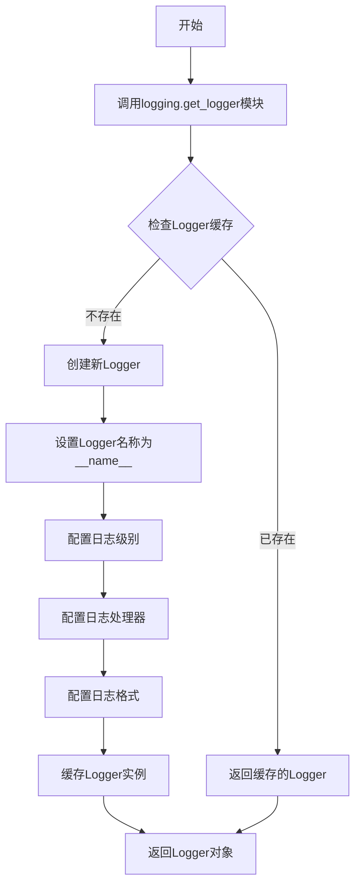

#### 带注释源码

```python
# 从diffusers库的utils模块导入logging工具
from ...utils import logging

# 使用当前模块的完全限定名作为logger名称
# __name__在模块被导入时会自动替换为模块的完整路径
# 例如: "diffusers.models.autoencoder_kl_cogvideo_x"
# pylint: disable=invalid-name: 禁用pylint对logger变量名的检查（logger通常用单字母命名）
logger = logging.get_logger(__name__)
```

### 关键组件信息

| 组件名称 | 描述 |
|---------|------|
| `logging.get_logger` | Diffusers库封装的日志获取函数，基于Python标准logging模块实现，提供模块级日志管理能力 |
| `__name__` | Python内置变量，自动记录当前模块的完全限定名，用于日志来源标识 |
| `logger` | 模块级日志记录器实例，用于后续代码中的日志输出 |

### 潜在技术债务或优化空间

1. **日志级别硬编码**：当前未显式设置日志级别，可能依赖全局默认配置，建议根据环境显式配置DEBUG/INFO级别
2. **缺乏日志格式化定制**：默认格式可能无法满足生产环境的日志收集需求（如缺少请求追踪ID）
3. **性能开销**：在高频调用场景下，日志字符串拼接可能带来性能开销，建议使用`logger.debug(f"msg {var}")`形式的懒加载

### 其它项目

#### 设计目标与约束

- **目标**：为CogVideoX VAE模型提供统一的日志记录能力，支持调试和监控
- **约束**：依赖Diffusers库的logging工具，需保持与库版本兼容性

#### 错误处理与异常设计

- 如果`logging`模块不可用，会抛出`ImportError`
- Logger创建失败时，Python标准logging会回退到根Logger

#### 数据流与状态机

- Logger实例在模块导入时创建，属于单例模式
- Logger状态不受模型前向传播影响，无状态机设计

#### 外部依赖与接口契约

- **依赖**：`...utils.logging`（Diffusers内部模块）
- **接口**：返回`logging.Logger`对象，符合Python标准logging接口契约


### `CogVideoXSafeConv3d.forward`

该方法是 `CogVideoXSafeConv3d` 类的核心前向传播函数，通过计算输入张量的内存占用，在超过 2GB 时自动将输入在时间维度（dim=2）上进行分块卷积处理，以避免 CogVideoX 模型的 OOM 问题；当内存占用不超过 2GB 时，则直接调用父类的标准卷积操作。

参数：

- `input`：`torch.Tensor`，输入的三维卷积张量，形状为 (batch_size, channels, time, height, width)

返回值：`torch.Tensor`，经过卷积处理后的输出张量，形状取决于卷积核参数和填充方式

#### 流程图

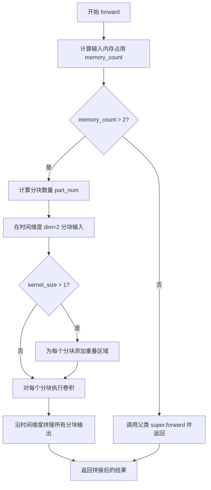

#### 带注释源码

```python
def forward(self, input: torch.Tensor) -> torch.Tensor:
    # 计算输入张量的内存占用（单位：GB）
    # 内存计算公式：batch * channels * time * height * width * 2（float16/bfloat16 字节数） / 1024^3
    memory_count = (
        (input.shape[0] * input.shape[1] * input.shape[2] * input.shape[3] * input.shape[4]) * 2 / 1024**3
    )

    # 设置阈值为 2GB，适合 CuDNN 处理
    if memory_count > 2:
        # 获取卷积核大小
        kernel_size = self.kernel_size[0]
        # 计算需要分块的数量，每个分块约占用 2GB 内存
        part_num = int(memory_count / 2) + 1
        # 在时间维度（dim=2）将输入张量分割为多个分块
        input_chunks = torch.chunk(input, part_num, dim=2)

        # 如果卷积核大小大于 1，需要处理分块之间的重叠区域以确保卷积的连续性
        if kernel_size > 1:
            input_chunks = [input_chunks[0]] + [
                # 将前一个分块的最后 (kernel_size - 1) 个时间帧与当前分块拼接
                torch.cat((input_chunks[i - 1][:, :, -kernel_size + 1 :], input_chunks[i]), dim=2)
                for i in range(1, len(input_chunks))
            ]

        # 对每个输入分块分别执行卷积操作
        output_chunks = []
        for input_chunk in input_chunks:
            output_chunks.append(super().forward(input_chunk))
        # 将所有分块的输出沿时间维度拼接
        output = torch.cat(output_chunks, dim=2)
        return output
    else:
        # 内存占用较小，直接调用父类的标准卷积前向传播
        return super().forward(input)
```


### `CogVideoXCausalConv3d.fake_context_parallel_forward`

该方法负责在时间维度上为输入张量添加因果填充（causal padding），以确保卷积操作满足时间因果性（即当前帧的输出仅依赖于当前及过去的帧）。它根据 `pad_mode`（复制模式或常量模式）采用不同的填充策略：当使用复制模式时，直接调用 `F.pad`；当使用常量模式时，利用 `conv_cache`（卷积缓存）或输入的首帧，在时间维度前拼接历史帧，模拟上下文并行的效果。

参数：

- `inputs`：`torch.Tensor`，输入的张量，通常为 5 维张量，形状如 `[batch_size, channels, time, height, width]`。
- `conv_cache`：`torch.Tensor | None`，可选的卷积缓存。如果为 `None`，则使用输入张量的第一帧作为历史上下文；否则使用该缓存张量。

返回值：`torch.Tensor`，返回经过时间维度因果填充处理后的输入张量。

#### 流程图

```mermaid
graph TD
    A([Start fake_context_parallel_forward]) --> B{pad_mode == "replicate"?}
    B -- Yes --> C[调用 F.pad, 使用 replicate 模式]
    C --> D([返回填充后的 inputs])
    B -- No --> E{kernel_size > 1?}
    E -- No --> D
    E -- Yes --> F{conv_cache is not None?}
    F -- Yes --> G[取 conv_cache 作为历史上下文]
    F -- No --> H[取 inputs 的第一帧 [:, :, :1] 重复 kernel_size-1 次]
    G --> I[在时间维度 dim=2 拼接 上下文 与 当前输入]
    H --> I
    I --> D
```

#### 带注释源码

```python
def fake_context_parallel_forward(
    self, inputs: torch.Tensor, conv_cache: torch.Tensor | None = None
) -> torch.Tensor:
    # 如果填充模式为 "replicate"，则使用 PyTorch 的 F.pad 进行填充
    # 这种方式会在时间维度前端填充重复的边界值
    if self.pad_mode == "replicate":
        inputs = F.pad(inputs, self.time_causal_padding, mode="replicate")
    else:
        # 否则，默认为 "constant" (零填充) 或其它模式
        # 需要手动处理时间维度的因果填充
        kernel_size = self.time_kernel_size
        
        # 只有当时间卷积核大于 1 时才需要填充
        if kernel_size > 1:
            # 构建历史上下文列表
            # 如果存在 conv_cache (来自上一帧的缓存)，则使用它
            # 否则，重复输入的第一帧作为初始历史
            cached_inputs = [conv_cache] if conv_cache is not None else [inputs[:, :, :1]] * (kernel_size - 1)
            
            # 在时间维度 (dim=2) 的最前面拼接历史帧，
            # 使得卷积在进行时能够看到过去的时间步
            inputs = torch.cat(cached_inputs + [inputs], dim=2)
            
    return inputs
```


### `CogVideoXCausalConv3d.forward`

该方法是 CogVideoX 模型中 3D 因果卷积层的核心前向传播实现，通过对输入张量进行时间维度的因果填充确保卷积操作的时序因果性，并利用卷积缓存机制支持增量推理，最终返回卷积输出及更新后的缓存用于后续帧的处理。

参数：

- `inputs`：`torch.Tensor`，输入的 4D 或 5D 张量，通常为 `[batch, channels, time, height, width]` 形状的视频数据
- `conv_cache`：`torch.Tensor | None`，可选的卷积缓存，用于在增量推理时保存上一帧的时间维度边界数据，以实现高效的时序卷积

返回值：`tuple[torch.Tensor, torch.Tensor | None]`，返回一个元组，包含：
- `torch.Tensor`：因果卷积后的输出张量
- `torch.Tensor | None`：更新后的卷积缓存，用于下一帧推理；若 `pad_mode` 为 "replicate" 则返回 None

#### 流程图

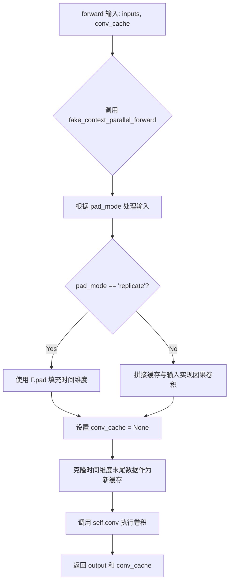

#### 带注释源码

```python
def forward(self, inputs: torch.Tensor, conv_cache: torch.Tensor | None = None) -> torch.Tensor:
    """
    执行 3D 因果卷积的前向传播。
    
    参数:
        inputs: 输入张量，形状为 [batch, channels, time, height, width]
        conv_cache: 可选的卷积缓存，用于增量推理时保持因果性
    
    返回:
        包含输出张量和更新后缓存的元组
    """
    # Step 1: 调用 fake_context_parallel_forward 进行上下文并行处理
    # 该方法会根据 pad_mode 对输入进行因果填充：
    # - 若 pad_mode == "replicate": 使用 F.pad 复制填充
    # - 否则: 将 conv_cache 与当前输入在时间维度上拼接
    inputs = self.fake_context_parallel_forward(inputs, conv_cache)

    # Step 2: 根据 pad_mode 处理卷积缓存
    if self.pad_mode == "replicate":
        # 对于 replicate 模式，缓存由 F.pad 内部管理，设为 None
        conv_cache = None
    else:
        # 对于其他模式，从输入中克隆最后 (time_kernel_size - 1) 帧作为下一帧的缓存
        # 这确保了时间维度上的因果性：每一帧的输出只依赖于当前及之前的帧
        conv_cache = inputs[:, :, -self.time_kernel_size + 1 :].clone()

    # Step 3: 执行实际的卷积操作
    # 使用 CogVideoXSafeConv3d 进行卷积，该类会在内存超限时自动分块处理
    output = self.conv(inputs)
    
    # Step 4: 返回卷积输出和更新后的缓存
    return output, conv_cache
```


### CogVideoXSpatialNorm3D.forward

该方法执行空间条件归一化（Spatial Normalization），是一种针对3D视频数据设计的归一化技术。它首先对量化特征向量zq进行插值以匹配输入特征f的空间维度，然后通过两个因果卷积层分别生成缩放系数（conv_y）和偏移系数（conv_b），最后应用组归一化并将归一化后的特征与缩放、偏移系数结合，实现空间条件特征变换。

参数：

- `self`：`CogVideoXSpatialNorm3D` 类实例，隐式参数
- `f`：`torch.Tensor`，输入特征张量，形状为 (batch, channels, time, height, width)
- `zq`：`torch.Tensor`，量化特征向量（来自VQ-VAE的码本），用于生成空间条件归一化的缩放和偏移参数
- `conv_cache`：`dict[str, torch.Tensor] | None`，可选的卷积缓存字典，用于存储因果卷积的中间状态以支持增量推理，键为卷积层名称（如"conv_y"、"conv_b"）

返回值：`tuple[torch.Tensor, dict[str, torch.Tensor]]`，返回归一化后的特征张量和新生成的卷积缓存字典

#### 流程图

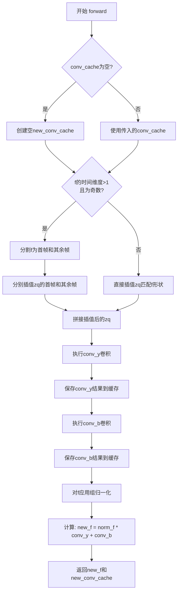

#### 带注释源码

```python
def forward(
    self, f: torch.Tensor, zq: torch.Tensor, conv_cache: dict[str, torch.Tensor] | None = None
) -> tuple[torch.Tensor, dict[str, torch.Tensor]]:
    """
    执行空间条件归一化前向传播
    
    参数:
        f: 输入特征张量，形状 (batch, channels, time, height, width)
        zq: 量化特征向量，用于生成空间条件参数
        conv_cache: 因果卷积的缓存状态，用于增量推理
    
    返回:
        归一化后的特征张量和新的卷积缓存
    """
    # 初始化新的卷积缓存字典，用于存储本次前向传播的缓存状态
    new_conv_cache = {}
    # 确保conv_cache不为None，如果是None则设为空字典
    conv_cache = conv_cache or {}

    # 条件分支：处理时间维度为奇数的情况
    # 当f的时间维度大于1且为奇数时，需要特殊处理以避免插值误差
    if f.shape[2] > 1 and f.shape[2] % 2 == 1:
        # 分割输入特征为第一帧和其余帧
        f_first, f_rest = f[:, :, :1], f[:, :, 1:]
        # 获取分割后各部分的空间维度（height, width）
        f_first_size, f_rest_size = f_first.shape[-3:], f_rest.shape[-3:]
        
        # 分割量化特征向量
        z_first, z_rest = zq[:, :, :1], zq[:, :, 1:]
        # 分别对第一帧和其余帧进行插值，使其空间维度与对应特征匹配
        z_first = F.interpolate(z_first, size=f_first_size)
        z_rest = F.interpolate(z_rest, size=f_rest_size)
        # 重新拼接插值后的量化特征
        zq = torch.cat([z_first, z_rest], dim=2)
    else:
        # 直接将zq插值到与f相同的空间维度
        # 这里使用F.interpolate进行双线性插值
        zq = F.interpolate(zq, size=f.shape[-3:])

    # 通过第一个因果卷积层生成缩放系数(shift)参数
    # conv_y负责学习空间变化的缩放因子
    conv_y, new_conv_cache["conv_y"] = self.conv_y(zq, conv_cache=conv_cache.get("conv_y"))
    
    # 通过第二个因果卷积层生成偏移系数(bias)参数
    # conv_b负责学习空间变化的偏移量
    conv_b, new_conv_cache["conv_b"] = self.conv_b(zq, conv_cache=conv_cache.get("conv_b"))

    # 对输入特征f应用组归一化
    # 组归一化将通道分成若干组进行归一化，不依赖于batch维度
    norm_f = self.norm_layer(f)
    
    # 应用空间条件归一化: 缩放并偏移归一化后的特征
    # new_f = norm_f * conv_y + conv_b
    # 这里实现了自适应空间归一化，让归一化后的特征具有空间变化的统计特性
    new_f = norm_f * conv_y + conv_b
    
    # 返回归一化后的特征和卷积缓存
    # 缓存用于在下一帧推理时维持因果性
    return new_f, new_conv_cache
```


### `CogVideoXResnetBlock3D.forward`

执行 3D 残差块的前向传播，包含两次归一化、卷积、时间嵌入添加以及残差连接，支持可选的量化向量用于空间归一化，并维护卷积缓存以实现高效的因果卷积。

参数：

- `self`：`CogVideoXResnetBlock3D` 类实例
- `inputs`：`torch.Tensor`，输入的隐藏状态张量，形状为 (batch, channels, time, height, width)
- `temb`：`torch.Tensor | None`，时间嵌入向量，用于添加到隐藏状态
- `zq`：`torch.Tensor | None`，量化向量，用于空间归一化（spatial norm）
- `conv_cache`：`dict[str, torch.Tensor] | None`，因果卷积的缓存字典，用于存储中间状态以避免重复计算

返回值：`tuple[torch.Tensor, dict[str, torch.Tensor]]`，第一个元素是处理后的隐藏状态，第二个元素是更新后的卷积缓存字典

#### 流程图

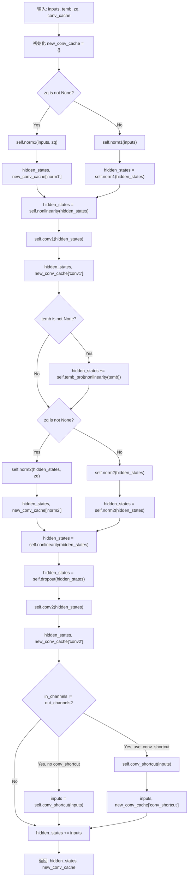

#### 带注释源码

```python
def forward(
    self,
    inputs: torch.Tensor,
    temb: torch.Tensor | None = None,
    zq: torch.Tensor | None = None,
    conv_cache: dict[str, torch.Tensor] | None = None,
) -> tuple[torch.Tensor, dict[str, torch.Tensor]]:
    """
    执行 3D ResNet 块的前向传播。
    
    Args:
        inputs: 输入张量，形状为 (batch, channels, time, height, width)
        temb: 可选的时间嵌入，用于调节激活
        zq: 可选的量化向量，用于空间归一化
        conv_cache: 因果卷积的缓存字典
        
    Returns:
        处理后的隐藏状态和更新后的卷积缓存
    """
    # 初始化新的卷积缓存字典
    new_conv_cache = {}
    # 确保 conv_cache 不为 None
    conv_cache = conv_cache or {}
    
    # 将输入赋值给隐藏状态
    hidden_states = inputs
    
    # 第一次归一化：检查是否使用空间归一化 (zq 不为空)
    if zq is not None:
        # 使用 CogVideoXSpatialNorm3D 进行空间归一化
        hidden_states, new_conv_cache["norm1"] = self.norm1(hidden_states, zq, conv_cache=conv_cache.get("norm1"))
    else:
        # 使用标准的 GroupNorm
        hidden_states = self.norm1(hidden_states)
    
    # 应用非线性激活函数 (如 swish)
    hidden_states = self.nonlinearity(hidden_states)
    
    # 第一次因果卷积
    hidden_states, new_conv_cache["conv1"] = self.conv1(hidden_states, conv_cache=conv_cache.get("conv1"))
    
    # 如果有时间嵌入，将其添加到隐藏状态
    if temb is not None:
        # 将 temb 投影到输出通道维度，并扩展到隐藏状态的时空维度
        hidden_states = hidden_states + self.temb_proj(self.nonlinearity(temb))[:, :, None, None, None]
    
    # 第二次归一化
    if zq is not None:
        hidden_states, new_conv_cache["norm2"] = self.norm2(hidden_states, zq, conv_cache=conv_cache.get("norm2"))
    else:
        hidden_states = self.norm2(hidden_states)
    
    # 应用非线性激活
    hidden_states = self.nonlinearity(hidden_states)
    
    # 应用 Dropout
    hidden_states = self.dropout(hidden_states)
    
    # 第二次因果卷积
    hidden_states, new_conv_cache["conv2"] = self.conv2(hidden_states, conv_cache=conv_cache.get("conv2"))
    
    # 处理输入和输出通道不匹配的情况
    if self.in_channels != self.out_channels:
        if self.use_conv_shortcut:
            # 使用卷积捷径
            inputs, new_conv_cache["conv_shortcut"] = self.conv_shortcut(
                inputs, conv_cache=conv_cache.get("conv_shortcut")
            )
        else:
            # 使用 1x1 卷积捷径 (CogVideoXSafeConv3d)
            inputs = self.conv_shortcut(inputs)
    
    # 残差连接：将卷积输出与输入相加
    hidden_states = hidden_states + inputs
    
    # 返回处理后的隐藏状态和卷积缓存
    return hidden_states, new_conv_cache
```


### `CogVideoXDownBlock3D.forward`

执行下采样块的前向传播，遍历所有ResNet层进行特征处理，并可选地应用下采样层来降低空间分辨率。

参数：

- `hidden_states`：`torch.Tensor`，输入的隐藏状态张量，形状为 (batch, channels, frames, height, width)
- `temb`：`torch.Tensor | None`，时间嵌入向量，用于残差块中的条件注入
- `zq`：`torch.Tensor | None`，量化向量，用于空间归一化条件
- `conv_cache`：`dict[str, torch.Tensor] | None`，卷积缓存字典，用于因果卷积的状态传递

返回值：`tuple[torch.Tensor, dict[str, torch.Tensor]]`，返回处理后的隐藏状态和新更新的卷积缓存字典

#### 流程图

```mermaid
flowchart TD
    A[开始 forward] --> B[初始化 new_conv_cache]
    B --> C{conv_cache 存在?}
    C -->|是| D[使用现有 conv_cache]
    C -->|否| E[使用空字典]
    D --> F[遍历 resnets 列表]
    E --> F
    F --> G[构建缓存键 resnet_{i}]
    G --> H{梯度检查点启用?}
    H -->|是| I[调用 _gradient_checkpointing_func]
    H -->|否| J[直接调用 resnet.forward]
    I --> K[更新 hidden_states 和缓存]
    J --> K
    K --> L{还有更多 resnet?}
    L -->|是| F
    L -->|否| M{downsamplers 存在?}
    M -->|是| N[遍历 downsamplers]
    M -->|否| O[返回 hidden_states 和 new_conv_cache]
    N --> P[应用下采样]
    P --> O
```

#### 带注释源码

```python
def forward(
    self,
    hidden_states: torch.Tensor,
    temb: torch.Tensor | None = None,
    zq: torch.Tensor | None = None,
    conv_cache: dict[str, torch.Tensor] | None = None,
) -> torch.Tensor:
    r"""Forward method of the `CogVideoXDownBlock3D` class."""

    # 初始化新的卷积缓存字典，用于存储本次前向传播产生的缓存
    new_conv_cache = {}
    
    # 如果没有提供卷积缓存，则使用空字典
    conv_cache = conv_cache or {}

    # 遍历所有ResNet块
    for i, resnet in enumerate(self.resnets):
        # 构建缓存键，每个ResNet对应一个唯一的键
        conv_cache_key = f"resnet_{i}"

        # 检查是否启用梯度检查点以节省显存
        if torch.is_grad_enabled() and self.gradient_checkpointing:
            # 使用梯度检查点方式执行前向传播
            hidden_states, new_conv_cache[conv_cache_key] = self._gradient_checkpointing_func(
                resnet,
                hidden_states,
                temb,
                zq,
                conv_cache.get(conv_cache_key),
            )
        else:
            # 直接调用ResNet块的前向传播
            hidden_states, new_conv_cache[conv_cache_key] = resnet(
                hidden_states, temb, zq, conv_cache=conv_cache.get(conv_cache_key)
            )

    # 如果存在下采样器，则应用下采样
    if self.downsamplers is not None:
        for downsampler in self.downsamplers:
            hidden_states = downsampler(hidden_states)

    # 返回处理后的隐藏状态和新的卷积缓存
    return hidden_states, new_conv_cache
```


### CogVideoXMidBlock3D.forward

执行 CogVideoX 模型中间块的前向传播，依次通过多个 3D ResNet 块处理隐藏状态，支持梯度检查点以节省显存，并返回处理后的隐藏状态和卷积缓存。

参数：

- `hidden_states`：`torch.Tensor`，输入的隐藏状态张量，形状为 (batch, channels, time, height, width)
- `temb`：`torch.Tensor | None`，时间嵌入张量，用于残差块中的非线性投影，可选
- `zq`：`torch.Tensor | None`，量化向量，用于空间归一化，可选
- `conv_cache`：`dict[str, torch.Tensor] | None`，卷积缓存字典，用于存储因果卷积的中间状态，支持增量推理，可选

返回值：`tuple[torch.Tensor, dict[str, torch.Tensor]]`，返回处理后的隐藏状态张量和更新的卷积缓存字典

#### 流程图

```mermaid
flowchart TD
    A[开始 forward] --> B[初始化 new_conv_cache]
    B --> C{conv_cache 是否为 None}
    C -->|是| D[使用空字典]
    C -->|否| E[使用传入的 conv_cache]
    D --> F[遍历 self.resnets]
    E --> F
    F --> G[构建 conv_cache_key: 'resnet_{i}']
    G --> H{是否启用梯度检查点}
    H -->|是| I[调用 _gradient_checkpointing_func]
    H -->|否| J[直接调用 resnet.forward]
    I --> K[获取新的隐藏状态和缓存]
    J --> K
    K --> L{是否还有更多 resnet}
    L -->|是| F
    L -->|否| M[返回 hidden_states 和 new_conv_cache]
```

#### 带注释源码

```python
def forward(
    self,
    hidden_states: torch.Tensor,
    temb: torch.Tensor | None = None,
    zq: torch.Tensor | None = None,
    conv_cache: dict[str, torch.Tensor] | None = None,
) -> torch.Tensor:
    r"""Forward method of the `CogVideoXMidBlock3D` class."""
    
    # 1. 初始化新的卷积缓存字典，用于存储本次前向传播产生的缓存
    new_conv_cache = {}
    
    # 2. 确保 conv_cache 不为 None，如果是则使用空字典
    conv_cache = conv_cache or {}
    
    # 3. 遍历中间块中所有的 ResNet 块
    for i, resnet in enumerate(self.resnets):
        # 构建当前 ResNet 块的缓存键名，格式为 'resnet_{索引}'
        conv_cache_key = f"resnet_{i}"
        
        # 4. 根据是否启用梯度检查点选择不同的执行路径
        if torch.is_grad_enabled() and self.gradient_checkpointing:
            # 如果启用了梯度检查点，使用 checkpointing 函数来节省显存
            # checkpointing 会禁用中间激活的梯度存储，在反向传播时重新计算
            hidden_states, new_conv_cache[conv_cache_key] = self._gradient_checkpointing_func(
                resnet, hidden_states, temb, zq, conv_cache.get(conv_cache_key)
            )
        else:
            # 正常前向传播，直接调用 ResNet 块
            # 传入当前 ResNet 块对应的缓存，并获取更新后的缓存
            hidden_states, new_conv_cache[conv_cache_key] = resnet(
                hidden_states, temb, zq, conv_cache=conv_cache.get(conv_cache_key)
            )
    
    # 5. 返回处理后的隐藏状态和新的卷积缓存
    return hidden_states, new_conv_cache
```


### `CogVideoXUpBlock3D.forward`

执行上采样块的前向传播，依次通过多个残差网络块处理隐藏状态，并在最后通过上采样器进行空间或时间维度的上采样。

参数：

- `hidden_states`：`torch.Tensor`，输入的隐藏状态张量，通常是来自解码器前一级别的特征
- `temb`：`torch.Tensor | None`，时间嵌入向量，用于添加时间维度的条件信息
- `zq`：`torch.Tensor | None`，量化向量，用于空间归一化（spatial normalization）
- `conv_cache`：`dict[str, torch.Tensor] | None`，卷积操作的缓存字典，用于在时间维度上保持因果性

返回值：`tuple[torch.Tensor, dict[str, torch.Tensor]]`，返回上采样后的隐藏状态和更新后的卷积缓存字典

#### 流程图

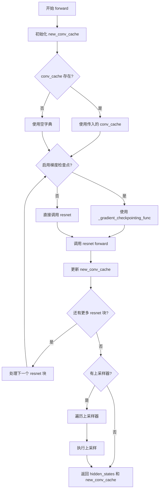

#### 带注释源码

```python
def forward(
    self,
    hidden_states: torch.Tensor,
    temb: torch.Tensor | None = None,
    zq: torch.Tensor | None = None,
    conv_cache: dict[str, torch.Tensor] | None = None,
) -> torch.Tensor:
    r"""Forward method of the `CogVideoXUpBlock3D` class."""

    # 1. 初始化新的卷积缓存字典，用于存储当前前向传播中各层的缓存
    new_conv_cache = {}
    
    # 2. 如果 conv_cache 为 None，则使用空字典
    conv_cache = conv_cache or {}

    # 3. 遍历所有的残差网络块（CogVideoXResnetBlock3D）
    for i, resnet in enumerate(self.resnets):
        # 构建缓存键名，格式为 "resnet_{i}"
        conv_cache_key = f"resnet_{i}"

        # 4. 检查是否启用梯度检查点以节省显存
        if torch.is_grad_enabled() and self.gradient_checkpointing:
            # 使用梯度检查点方式执行残差块，减少显存占用
            hidden_states, new_conv_cache[conv_cache_key] = self._gradient_checkpointing_func(
                resnet,
                hidden_states,
                temb,
                zq,
                conv_cache.get(conv_cache_key),
            )
        else:
            # 直接调用残差块的前向传播
            # 每个 resnet 会返回处理后的 hidden_states 和对应的 conv_cache
            hidden_states, new_conv_cache[conv_cache_key] = resnet(
                hidden_states, temb, zq, conv_cache=conv_cache.get(conv_cache_key)
            )

    # 5. 如果存在上采样器，则执行上采样操作
    if self.upsamplers is not None:
        for upsampler in self.upsamplers:
            hidden_states = upsampler(hidden_states)

    # 6. 返回处理后的隐藏状态和新的卷积缓存
    return hidden_states, new_conv_cache
```


### CogVideoXEncoder3D.forward

该方法是 `CogVideoXEncoder3D` 类的前向传播函数，负责将输入视频张量编码到潜空间（latent space）。它通过输入卷积、多个下采样块、中间块和输出卷积处理输入，生成潜在表示，同时管理卷积缓存以支持因果卷积和梯度检查点。

参数：

- `sample`：`torch.Tensor`，输入的视频张量，形状为 (batch_size, channels, num_frames, height, width)
- `temb`：`torch.Tensor | None`，时间嵌入（temporal embedding），用于调节模型，默认为 None
- `conv_cache`：`dict[str, torch.Tensor] | None`，卷积缓存字典，用于在因果卷积中保存中间状态以维护时间因果性，默认为 None

返回值：`tuple[torch.Tensor, dict[str, torch.Tensor]]`，返回编码后的潜空间张量和新生成的卷积缓存字典

#### 流程图

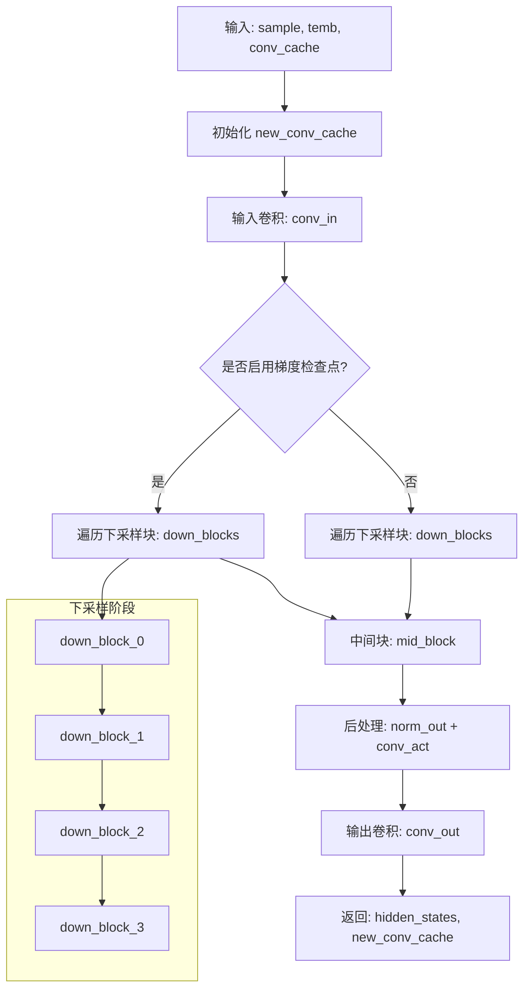

#### 带注释源码

```python
def forward(
    self,
    sample: torch.Tensor,
    temb: torch.Tensor | None = None,
    conv_cache: dict[str, torch.Tensor] | None = None,
) -> tuple[torch.Tensor, dict[str, torch.Tensor]]:
    r"""The forward method of the `CogVideoXEncoder3D` class.
    
    将输入视频编码为潜空间表示。
    
    Args:
        sample: 输入视频张量，形状为 (batch, channel, frame, height, width)
        temb: 时间嵌入，用于调节（当前 encoder 中未使用）
        conv_cache: 因果卷积的缓存字典，用于维护时间因果性
    
    Returns:
        hidden_states: 编码后的潜空间张量
        new_conv_cache: 更新后的卷积缓存字典
    """
    
    # 1. 初始化新的卷积缓存字典，用于存储本次前向传播的缓存
    new_conv_cache = {}
    
    # 如果没有传入卷积缓存，则使用空字典
    conv_cache = conv_cache or {}
    
    # 2. 输入卷积层：将输入视频转换为初始隐藏状态
    # 使用 CogVideoXCausalConv3d 以保持时间因果性
    hidden_states, new_conv_cache["conv_in"] = self.conv_in(
        sample, 
        conv_cache=conv_cache.get("conv_in")
    )
    
    # 3. 根据是否启用梯度检查点选择不同的执行路径
    if torch.is_grad_enabled() and self.gradient_checkpointing:
        # ===== 启用梯度检查点的路径 =====
        # 3.1 下采样阶段：遍历所有下采样块
        for i, down_block in enumerate(self.down_blocks):
            conv_cache_key = f"down_block_{i}"
            # 使用梯度检查点函数来节省显存
            hidden_states, new_conv_cache[conv_cache_key] = self._gradient_checkpointing_func(
                down_block,          # 下采样块
                hidden_states,       # 当前隐藏状态
                temb,                # 时间嵌入
                None,                # zq 参数（encoder 中不使用）
                conv_cache.get(conv_cache_key),  # 对应的卷积缓存
            )
        
        # 3.2 中间块：处理最深层级的特征
        hidden_states, new_conv_cache["mid_block"] = self._gradient_checkpointing_func(
            self.mid_block,
            hidden_states,
            temb,
            None,
            conv_cache.get("mid_block"),
        )
    else:
        # ===== 未启用梯度检查点的路径 =====
        # 3.1 下采样阶段：遍历所有下采样块
        for i, down_block in enumerate(self.down_blocks):
            conv_cache_key = f"down_block_{i}"
            hidden_states, new_conv_cache[conv_cache_key] = down_block(
                hidden_states,
                temb,
                None,  # zq 参数
                conv_cache.get(conv_cache_key),
            )
        
        # 3.2 中间块：处理最深层级的特征
        hidden_states, new_conv_cache["mid_block"] = self.mid_block(
            hidden_states,
            temb,
            None,  # zq 参数
            conv_cache=conv_cache.get("mid_block"),
        )
    
    # 4. 后处理阶段
    # 4.1 GroupNorm 归一化
    hidden_states = self.norm_out(hidden_states)
    
    # 4.2 SiLU 激活函数
    hidden_states = self.conv_act(hidden_states)
    
    # 4.3 输出卷积：将通道数转换为潜在通道数（2 * out_channels，用于 VAE 的均值和方差）
    hidden_states, new_conv_cache["conv_out"] = self.conv_out(
        hidden_states, 
        conv_cache=conv_cache.get("conv_out")
    )
    
    # 5. 返回编码后的潜空间张量和更新后的卷积缓存
    return hidden_states, new_conv_cache
```


### CogVideoXDecoder3D.forward

该方法是 CogVideoXDecoder3D 类的前向传播函数，负责将输入的潜在表示（latent representation）解码为最终的视频输出。方法通过中间块（mid block）和多个上采样块（up blocks）对潜在表示进行逐步上采样和特征提取，最后通过归一化和卷积层输出解码后的视频帧序列。

参数：

- `self`：CogVideoXDecoder3D 实例本身
- `sample`：`torch.Tensor`，输入的潜在表示张量，形状为 (batch_size, latent_channels, num_frames, height, width)
- `temb`：`torch.Tensor | None`，时间嵌入向量，用于条件生成，可选
- `conv_cache`：`dict[str, torch.Tensor] | None`，卷积操作的缓存字典，用于保存中间状态以支持推理优化，可选

返回值：`tuple[torch.Tensor, dict[str, torch.Tensor]]`，返回解码后的隐藏状态张量以及更新后的卷积缓存字典

#### 流程图

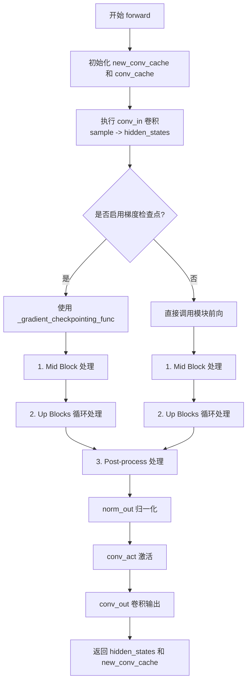

#### 带注释源码

```python
def forward(
    self,
    sample: torch.Tensor,
    temb: torch.Tensor | None = None,
    conv_cache: dict[str, torch.Tensor] | None = None,
) -> torch.Tensor:
    r"""The forward method of the `CogVideoXDecoder3D` class."""
    # 初始化新的卷积缓存字典，用于存储本次前向传播中各层的缓存状态
    new_conv_cache = {}
    # 如果没有传入 conv_cache，则使用空字典，避免后续访问空字典导致的 KeyError
    conv_cache = conv_cache or {}

    # 步骤1: 输入卷积层
    # 将输入的潜在表示 sample 通过输入卷积层 conv_in 转换为隐藏状态
    # conv_in 是 CogVideoXCausalConv3d 类型，支持因果卷积和缓存机制
    hidden_states, new_conv_cache["conv_in"] = self.conv_in(sample, conv_cache=conv_cache.get("conv_in"))

    # 判断是否启用梯度检查点以节省显存
    if torch.is_grad_enabled() and self.gradient_checkpointing:
        # ===== 启用梯度检查点的分支 =====
        # 1. Mid Block: 中间块处理，对应模型架构中的瓶颈层
        # 传入 sample 作为 spatial_norm_dim 的条件输入
        hidden_states, new_conv_cache["mid_block"] = self._gradient_checkpointing_func(
            self.mid_block,
            hidden_states,
            temb,
            sample,  # 作为 zq 条件输入到 spatial norm
            conv_cache.get("mid_block"),
        )

        # 2. Up Blocks: 多个上采样块，依次进行上采样和特征提取
        # 遍历所有上采样块，使用梯度检查点方式执行
        for i, up_block in enumerate(self.up_blocks):
            conv_cache_key = f"up_block_{i}"
            hidden_states, new_conv_cache[conv_cache_key] = self._gradient_checkpointing_func(
                up_block,
                hidden_states,
                temb,
                sample,  # 作为 zq 条件输入
                conv_cache.get(conv_cache_key),
            )
    else:
        # ===== 未启用梯度检查点的分支 =====
        # 1. Mid Block: 直接调用中间块的前向传播
        hidden_states, new_conv_cache["mid_block"] = self.mid_block(
            hidden_states, temb, sample, conv_cache=conv_cache.get("mid_block")
        )

        # 2. Up Blocks: 遍历所有上采样块，直接执行前向传播
        for i, up_block in enumerate(self.up_blocks):
            conv_cache_key = f"up_block_{i}"
            hidden_states, new_conv_cache[conv_cache_key] = up_block(
                hidden_states, temb, sample, conv_cache=conv_cache.get(conv_cache_key)
            )

    # ===== 步骤3: 后处理 =====
    # 使用空间归一化层对隐藏状态进行归一化，sample 作为条件输入
    hidden_states, new_conv_cache["norm_out"] = self.norm_out(
        hidden_states, sample, conv_cache=conv_cache.get("norm_out")
    )
    # 应用 SiLU 激活函数
    hidden_states = self.conv_act(hidden_states)
    # 最终输出卷积，将通道数转换为目标输出通道数
    hidden_states, new_conv_cache["conv_out"] = self.conv_out(hidden_states, conv_cache=conv_cache.get("conv_out"))

    # 返回解码后的隐藏状态和本次前向传播的卷积缓存
    return hidden_states, new_conv_cache
```


### `AutoencoderKLCogVideoX.enable_tiling`

启用分块（tiling）VAE解码模式，允许模型在处理大尺寸视频时通过将输入分割为重叠的块（tiles）来显著降低显存占用，同时通过平滑混合避免块之间的伪影。

参数：

- `tile_sample_min_height`：`int | None`，样本在高度维度进行分块的最小高度阈值，若不提供则使用实例默认值
- `tile_sample_min_width`：`int | None`，样本在宽度维度进行分块的最小宽度阈值，若不提供则使用实例默认值
- `tile_overlap_factor_height`：`float | None`，垂直方向相邻分块的重叠比例（0到1之间），用于消除高度方向的拼接痕迹，若不提供则使用实例默认值
- `tile_overlap_factor_width`：`float | None`，水平方向相邻分块的重叠比例（0到1之间），用于消除宽度方向的拼接痕迹，若不提供则使用实例默认值

返回值：`None`，无返回值，仅修改实例内部状态

#### 流程图

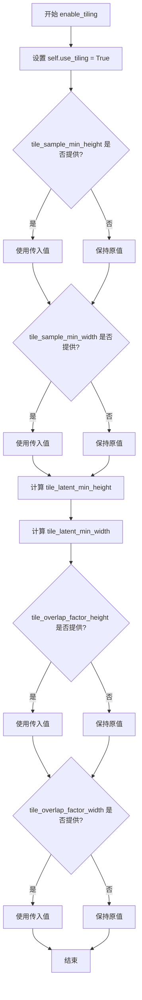

#### 带注释源码

```
def enable_tiling(
    self,
    tile_sample_min_height: int | None = None,
    tile_sample_min_width: int | None = None,
    tile_overlap_factor_height: float | None = None,
    tile_overlap_factor_width: float | None = None,
) -> None:
    r"""
    Enable tiled VAE decoding. When this option is enabled, the VAE will split the input tensor into tiles to
    compute decoding and encoding in several steps. This is useful for saving a large amount of memory and to allow
    processing larger images.

    Args:
        tile_sample_min_height (`int`, *optional*):
            The minimum height required for a sample to be separated into tiles across the height dimension.
        tile_sample_min_width (`int`, *optional*):
            The minimum width required for a sample to be separated into tiles across the width dimension.
        tile_overlap_factor_height (`int`, *optional*):
            The minimum amount of overlap between two consecutive vertical tiles. This is to ensure that there are
            no tiling artifacts produced across the height dimension. Must be between 0 and 1. Setting a higher
            value might cause more tiles to be processed leading to slow down of the decoding process.
        tile_overlap_factor_width (`int`, *optional*):
            The minimum amount of overlap between two consecutive horizontal tiles. This is to ensure that there
            are no tiling artifacts produced across the width dimension. Must be between 0 and 1. Setting a higher
            value might cause more tiles to be processed leading to slow down of the decoding process.
    """
    # 启用分块模式标志
    self.use_tiling = True
    
    # 更新样本分块的最小高度，若未提供则保留原值
    self.tile_sample_min_height = tile_sample_min_height or self.tile_sample_min_height
    # 更新样本分块的最小宽度，若未提供则保留原值
    self.tile_sample_min_width = tile_sample_min_width or self.tile_sample_min_width
    
    # 根据下采样层数计算 latent 空间的最小高度
    # block_out_channels 长度表示编码器/解码器的层数，每层下采样2倍
    self.tile_latent_min_height = int(
        self.tile_sample_min_height / (2 ** (len(self.config.block_out_channels) - 1))
    )
    # 根据下采样层数计算 latent 空间的最小宽度
    self.tile_latent_min_width = int(self.tile_sample_min_width / (2 ** (len(self.config.block_out_channels) - 1)))
    
    # 更新垂直方向的重叠因子，若未提供则保留原值
    self.tile_overlap_factor_height = tile_overlap_factor_height or self.tile_overlap_factor_height
    # 更新水平方向的重叠因子，若未提供则保留原值
    self.tile_overlap_factor_width = tile_overlap_factor_width or self.tile_overlap_factor_width
```


### `AutoencoderKLCogVideoX._encode`

该方法是AutoencoderKLCogVideoX类的内部编码方法，负责将输入视频张量编码为潜在表示。方法首先检查是否启用瓦片编码模式（tiling），若启用则调用瓦片编码方法；否则将输入视频按帧批次分割，依次通过编码器处理，并可选地应用量化卷积，最后将各批次结果沿时间维度拼接返回。

参数：

- `x`：`torch.Tensor`，输入的视频张量，形状为(batch_size, num_channels, num_frames, height, width)

返回值：`torch.Tensor`，编码后的潜在表示张量

#### 流程图

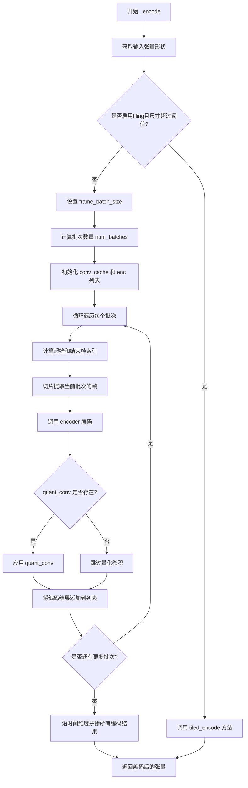

#### 带注释源码

```python
def _encode(self, x: torch.Tensor) -> torch.Tensor:
    """
    内部编码方法，将输入视频张量编码为潜在表示。
    
    Args:
        x: 输入视频张量，形状为 (batch_size, num_channels, num_frames, height, width)
    
    Returns:
        编码后的潜在表示张量
    """
    # 获取输入张量的形状信息
    batch_size, num_channels, num_frames, height, width = x.shape

    # 检查是否启用瓦片编码模式且输入尺寸超过最小阈值
    # 如果启用tiling且尺寸较大，则使用分块编码方式处理
    if self.use_tiling and (width > self.tile_sample_min_width or height > self.tile_sample_min_height):
        return self.tiled_encode(x)

    # 设置每批次处理的帧数（默认为8帧）
    frame_batch_size = self.num_sample_frames_batch_size
    
    # 计算需要处理的批次数量
    # 注释：期望帧数为 1 或 frame_batch_size * k 或 frame_batch_size * k + 1
    # 额外的单帧在循环内部处理，无需在此处向上取整
    num_batches = max(num_frames // frame_batch_size, 1)
    
    # 初始化卷积缓存（用于因果卷积的状态传递）
    conv_cache = None
    
    # 用于存储各批次的编码结果
    enc = []

    # 遍历每个帧批次进行编码
    for i in range(num_batches):
        # 计算剩余帧数（处理不整除的情况）
        remaining_frames = num_frames % frame_batch_size
        
        # 计算当前批次的起始帧索引
        # 第一个批次从0开始，后续批次需要加上剩余帧数偏移
        start_frame = frame_batch_size * i + (0 if i == 0 else remaining_frames)
        
        # 计算当前批次的结束帧索引
        end_frame = frame_batch_size * (i + 1) + remaining_frames
        
        # 提取当前批次的视频帧
        x_intermediate = x[:, :, start_frame:end_frame]
        
        # 通过编码器处理当前批次帧
        # conv_cache 用于在批次之间传递因果卷积的缓存状态
        x_intermediate, conv_cache = self.encoder(x_intermediate, conv_cache=conv_cache)
        
        # 如果存在量化卷积层，则应用它
        # quant_conv 用于将编码结果映射到潜在空间
        if self.quant_conv is not None:
            x_intermediate = self.quant_conv(x_intermediate)
        
        # 将当前批次的编码结果添加到列表中
        enc.append(x_intermediate)

    # 沿时间维度（dim=2）拼接所有批次的编码结果
    enc = torch.cat(enc, dim=2)
    
    # 返回编码后的潜在表示
    return enc
```


### `AutoencoderKLCogVideoX.encode`

该方法是CogVideoX变分自编码器（VAE）的编码接口，负责将输入的视频帧批次编码为潜在表示。它支持切片（slicing）处理以节省内存，并调用内部方法`_encode`执行实际的编码逻辑，最后将编码结果封装为`AutoencoderKLOutput`或对角高斯分布返回。

参数：

-  `x`：`torch.Tensor`，输入的图像/视频批次，形状为`(batch_size, num_channels, num_frames, height, width)`
-  `return_dict`：`bool`，可选，默认为`True`。是否返回`AutoencoderKLOutput`对象，若为`False`则返回元组

返回值：`AutoencoderKLOutput | tuple[DiagonalGaussianDistribution]`，编码后的潜在表示。如果`return_dict`为`True`，返回`AutoencoderKLOutput`对象（包含`latent_dist`属性）；否则返回包含`DiagonalGaussianDistribution`的元组

#### 流程图

```mermaid
flowchart TD
    A[开始 encode] --> B{use_slicing 且 batch_size > 1?}
    B -->|是| C[对输入进行切片]
    C --> D[对每个切片调用 _encode]
    D --> E[沿batch维度拼接结果]
    B -->|否| F[直接调用 _encode]
    F --> G[得到编码后的张量 h]
    E --> G
    G --> H[创建 DiagonalGaussianDistribution]
    H --> I{return_dict?}
    I -->|是| J[返回 AutoencoderKLOutput]
    I -->|否| K[返回 tuple[posterior]]
```

#### 带注释源码

```python
@apply_forward_hook
def encode(
    self, x: torch.Tensor, return_dict: bool = True
) -> AutoencoderKLOutput | tuple[DiagonalGaussianDistribution]:
    """
    Encode a batch of images into latents.

    Args:
        x (`torch.Tensor`): Input batch of images.
        return_dict (`bool`, *optional*, defaults to `True`):
            Whether to return a [`~models.autoencoder_kl.AutoencoderKLOutput`] instead of a plain tuple.

    Returns:
            The latent representations of the encoded videos. If `return_dict` is True, a
            [`~models.autoencoder_kl.AutoencoderKLOutput`] is returned, otherwise a plain `tuple` is returned.
    """
    # 如果启用切片且batch_size大于1，则对batch进行切片处理
    if self.use_slicing and x.shape[0] > 1:
        # 将输入按batch维度分割为单个样本
        encoded_slices = [self._encode(x_slice) for x_slice in x.split(1)]
        # 沿batch维度拼接所有编码后的切片
        h = torch.cat(encoded_slices)
    else:
        # 直接调用内部编码方法
        h = self._encode(x)

    # 将编码后的潜在表示封装为对角高斯分布（VAE的标准做法）
    posterior = DiagonalGaussianDistribution(h)

    # 根据return_dict参数决定返回格式
    if not return_dict:
        return (posterior,)
    return AutoencoderKLOutput(latent_dist=posterior)
```


### `AutoencoderKLCogVideoX._decode`

内部解码方法，实现将潜在表示（latent representation）解码为视频帧的核心逻辑，包含分块处理（chunking）机制以支持大规模视频解码，支持瓦片式解码（tiled decoding）以节省显存。

参数：

- `z`：`torch.Tensor`，输入的潜在表示张量，形状为 `(batch_size, num_channels, num_frames, height, width)`，即 VAE 编码后的潜在向量
- `return_dict`：`bool`，是否返回字典格式的结果，默认为 `True`。若为 `True` 返回 `DecoderOutput`，否则返回元组 `(dec,)`

返回值：`DecoderOutput | torch.Tensor`，解码后的视频样本。若 `return_dict=True` 返回 `DecoderOutput` 对象（包含 `sample` 属性），否则返回元组。元组中第一个元素形状为 `(batch_size, out_channels, num_frames, height, width)`

#### 流程图

```mermaid
flowchart TD
    A[开始 _decode] --> B[获取 z 的形状: batch_size, num_channels, num_frames, height, width]
    B --> C{是否启用tiling且尺寸超过阈值?}
    C -->|是| D[调用 tiled_decode 启用瓦片解码]
    C -->|否| E[设置 frame_batch_size = num_latent_frames_batch_size]
    D --> Z[返回结果]
    E --> F[计算 num_batches = max<br/>num_frames // frame_batch_size, 1]
    F --> G[初始化 conv_cache = None<br/>dec = 空列表]
    G --> H[遍历 i in range num_batches]
    H --> I[计算 start_frame 和 end_frame<br/>处理剩余帧 remaining_frames]
    I --> J[切片 z: z_intermediate = z[:, :, start_frame:end_frame]]
    J --> K{post_quant_conv 是否存在?}
    K -->|是| L[应用后量化卷积: z_intermediate = post_quant_conv z_intermediate]
    K -->|否| M[跳过]
    L --> N[调用 decoder 解码: z_intermediate, conv_cache = decoder z_intermediate, conv_cache]
    M --> N
    N --> O[将结果追加到 dec 列表]
    O --> P{是否还有更多批次?}
    P -->|是| H
    P -->|否| Q[沿 dim=2 拼接所有解码结果: dec = torch.cat dec, dim=2]
    Q --> R{return_dict 是否为 False?}
    R -->|是| S[返回元组 (dec,)]
    R -->|否| T[返回 DecoderOutput sample=dec]
    S --> Z
    T --> Z[结束]
```

#### 带注释源码

```python
def _decode(self, z: torch.Tensor, return_dict: bool = True) -> DecoderOutput | torch.Tensor:
    """
    解码潜在表示为视频帧。

    Args:
        z: 潜在表示张量，形状为 (batch_size, num_channels, num_frames, height, width)
        return_dict: 是否返回字典格式

    Returns:
        解码后的视频样本
    """
    # 获取输入潜在表示的形状维度信息
    batch_size, num_channels, num_frames, height, width = z.shape

    # 检查是否启用瓦片解码且尺寸超过最小瓦片阈值
    # 如果启用tiling且宽或高超过阈值，使用tiled_decode方法处理大尺寸输入
    if self.use_tiling and (width > self.tile_latent_min_width or height > self.tile_latent_min_height):
        return self.tiled_decode(z, return_dict=return_dict)

    # 设置每批处理的帧数，从实例变量获取（默认为2）
    frame_batch_size = self.num_latent_frames_batch_size
    
    # 计算需要处理的批次数，确保至少为1
    # 帧数可以不是frame_batch_size的整数倍，余数在循环中单独处理
    num_batches = max(num_frames // frame_batch_size, 1)
    
    # 初始化卷积缓存（用于因果卷积的缓存状态）和解码结果列表
    conv_cache = None
    dec = []

    # 遍历每个批次进行解码
    for i in range(num_batches):
        # 计算当前批次的剩余帧数（处理非整除情况）
        remaining_frames = num_frames % frame_batch_size
        
        # 计算起始帧索引：
        # 若是第一批(i==0)，从0开始；否则跳过剩余帧
        start_frame = frame_batch_size * i + (0 if i == 0 else remaining_frames)
        
        # 计算结束帧索引
        end_frame = frame_batch_size * (i + 1) + remaining_frames
        
        # 沿时间维度（dim=2）切片获取当前批次的潜在表示
        z_intermediate = z[:, :, start_frame:end_frame]
        
        # 应用后量化卷积（如果启用）
        if self.post_quant_conv is not None:
            z_intermediate = self.post_quant_conv(z_intermediate)
        
        # 使用解码器将潜在表示解码为视频帧
        # 同时更新conv_cache以维持因果卷积的状态连贯性
        z_intermediate, conv_cache = self.decoder(z_intermediate, conv_cache=conv_cache)
        
        # 将当前批次的解码结果添加到列表
        dec.append(z_intermediate)

    # 沿时间维度（dim=2）拼接所有批次的解码结果
    dec = torch.cat(dec, dim=2)

    # 根据return_dict决定返回格式
    if not return_dict:
        return (dec,)

    # 返回DecoderOutput对象，包含解码后的样本
    return DecoderOutput(sample=dec)
```


### `AutoencoderKLCogVideoX.decode`

该方法是 CogVideoX 变分自编码器（VAE）的解码接口，负责将.latent 空间中的向量批量解码为原始视频/图像数据。支持切片（slicing）模式以处理大批量数据，并可根据配置返回 `DecoderOutput` 对象或原始张量元组。

参数：

- `z`：`torch.Tensor`，输入的 latent 向量批次，形状为 (batch_size, num_channels, num_frames, height, width)
- `return_dict`：`bool`，默认为 `True`，决定是否返回 `DecoderOutput` 对象而非普通元组

返回值：`DecoderOutput | torch.Tensor`，若 `return_dict` 为 True，返回包含 `sample` 属性的 `DecoderOutput` 对象；否则返回张量元组 `(decoded,)`

#### 流程图

```mermaid
flowchart TD
    A[开始 decode] --> B{use_slicing 为真<br/>且 batch_size > 1?}
    B -->|Yes| C[将 z 按 batch 维度切分为 slices]
    C --> D[对每个 slice 调用 _decode]
    D --> E[提取 .sample 属性]
    E --> F[沿 batch 维度拼接所有 decoded slices]
    B -->|No| G[直接调用 _decode(z)]
    G --> H[提取 .sample 属性]
    H --> I{return_dict 为真?}
    I -->|Yes| J[返回 DecoderOutput(sample=decoded)]
    I -->|No| K[返回元组 (decoded,)]
    F --> I
```

#### 带注释源码

```python
@apply_forward_hook
def decode(self, z: torch.Tensor, return_dict: bool = True) -> DecoderOutput | torch.Tensor:
    """
    Decode a batch of images.

    Args:
        z (`torch.Tensor`): Input batch of latent vectors.
        return_dict (`bool`, *optional*, defaults to `True`):
            Whether to return a [`~models.vae.DecoderOutput`] instead of a plain tuple.

    Returns:
        [`~models.vae.DecoderOutput`] or `tuple`:
            If return_dict is True, a [`~models.vae.DecoderOutput`] is returned, otherwise a plain `tuple` is
            returned.
    """
    # 切片模式：用于减少大规模 batch 的显存占用
    # 将 batch 分为单个样本分别解码，再拼接结果
    if self.use_slicing and z.shape[0] > 1:
        decoded_slices = [self._decode(z_slice).sample for z_slice in z.split(1)]
        decoded = torch.cat(decoded_slices)
    else:
        # 直接解码模式：调用内部 _decode 方法
        decoded = self._decode(z).sample

    # 根据 return_dict 决定返回格式
    if not return_dict:
        return (decoded,)
    return DecoderOutput(sample=decoded)
```


### `AutoencoderKLCogVideoX.blend_v`

该函数用于在垂直方向上对两个视频帧块（tile）进行混合（blend），通过线性插值实现平滑过渡，消除块状伪影。主要用于VAE的tile编码/解码过程中，将重叠的垂直块无缝拼接。

参数：

-  `a`：`torch.Tensor`，第一个张量（通常是上方的tile）
-  `b`：`torch.Tensor`，第二个张量（通常是下方的tile），也是混合后的输出张量
-  `blend_extent`：`int`，垂直方向混合的范围（像素数）

返回值：`torch.Tensor`，混合后的张量（返回修改后的`b`张量）

#### 流程图

```mermaid
flowchart TD
    A[开始 blend_v] --> B[计算实际混合范围]
    B --> C{min blend_extent <= 0?}
    C -->|是| D[直接返回 b]
    C -->|否| E[循环 y 从 0 到 blend_extent-1]
    E --> F[计算权重: weight_a = 1 - y / blend_extent]
    F --> G[计算权重: weight_b = y / blend_extent]
    G --> H[提取 a 的顶部区域: a[:, :, :, -blend_extent + y, :]]
    H --> I[提取 b 的底部区域: b[:, :, :, y, :]]
    I --> J[加权混合: result = a片段 * weight_a + b片段 * weight_b]
    J --> K[写回 b[:, :, :, y, :] = result]
    K --> L{循环结束?}
    L -->|否| E
    L -->|是| M[返回混合后的 b]
```

#### 带注释源码

```python
def blend_v(self, a: torch.Tensor, b: torch.Tensor, blend_extent: int) -> torch.Tensor:
    """
    垂直混合两个张量块。
    
    参数:
        a: 第一个张量，通常是上方的tile
        b: 第二个张量，通常是下方的tile
        blend_extent: 垂直方向混合的范围
    
    返回:
        混合后的张量（修改后的b）
    """
    # 确保混合范围不超过两个张量的高度，取最小值
    blend_extent = min(a.shape[3], b.shape[3], blend_extent)
    
    # 遍历混合范围内的每一行
    for y in range(blend_extent):
        # 计算混合权重：上方tile的权重从1逐渐变为0，下方tile的权重从0逐渐变为1
        # 这种线性过渡实现平滑混合
        b[:, :, :, y, :] = a[:, :, :, -blend_extent + y, :] * (1 - y / blend_extent) + b[:, :, :, y, :] * (
            y / blend_extent
        )
    return b
```


### `AutoencoderKLCogVideoX.blend_h`

水平混合两个视频帧 tile（沿宽度维度），通过线性淡入淡出消除 tile 边界处的接缝 artifact。

参数：

- `a`：`torch.Tensor`，左侧或上一行的参考 tile，形状为 `(batch, channels, frames, height, width)`
- `b`：`torch.Tensor`，需要混合的当前 tile，形状与 `a` 相同
- `blend_extent`：`int`，混合范围（重叠像素数），即沿宽度维度进行线性插值混合的像素数量

返回值：`torch.Tensor`，混合后的当前 tile（修改后的 `b`）

#### 流程图

```mermaid
flowchart TD
    A[开始 blend_h] --> B{计算实际混合范围}
    B --> C[blend_extent = min<br/>a.shape[4], b.shape[4], blend_extent]
    C --> D{遍历混合范围}
    D -->|x from 0 to blend_extent-1| E[计算混合权重]
    E --> F[weight_a = 1 - x / blend_extent]
    F --> G[weight_b = x / blend_extent]
    G --> H[混合像素值]
    H --> I[b[:, :, :, :, x] =<br/>a[:, :, :, :, -blend_extent + x] * weight_a +<br/>b[:, :, :, :, x] * weight_b]
    I --> D
    D -->|遍历完成| J[返回混合后的 b]
    J --> K[结束]
```

#### 带注释源码

```python
def blend_h(self, a: torch.Tensor, b: torch.Tensor, blend_extent: int) -> torch.Tensor:
    """
    水平混合两个 tile（沿宽度维度），通过线性淡入淡出消除 tile 边界处的接缝 artifact。
    
    混合公式：b[x] = a[end - blend_extent + x] * (1 - x/blend_extent) + b[x] * (x/blend_extent)
    这实现了从左到右的线性渐变混合，左侧更多使用 a，右侧更多使用 b。
    
    Args:
        a: 左侧或上一行的参考 tile，形状 (batch, channels, frames, height, width)
        b: 需要混合的当前 tile，形状与 a 相同
        blend_extent: 混合范围，重叠区域的像素宽度
    
    Returns:
        混合后的当前 tile（修改后的 b）
    """
    # 计算实际混合范围，取三者的最小值以确保安全
    # a.shape[4]: tile a 的宽度
    # b.shape[4]: tile b 的宽度
    # blend_extent: 指定的混合范围
    blend_extent = min(a.shape[4], b.shape[4], blend_extent)
    
    # 遍历混合范围内的每个像素位置（从左到右）
    for x in range(blend_extent):
        # 计算混合权重：左侧权重从 1 递减到 0，右侧权重从 0 递增到 1
        # x=0 时：weight_a=1, weight_b=0，完全使用 a（最左边）
        # x=blend_extent-1 时：weight_a≈0, weight_b≈1，完全使用 b（最右边）
        b[:, :, :, :, x] = a[:, :, :, :, -blend_extent + x] * (1 - x / blend_extent) + b[:, :, :, :, x] * (
            x / blend_extent
        )
    return b
```


### `AutoencoderKLCogVideoX.tiled_encode`

该方法实现了分块（tiled）编码功能，将输入的视频张量分割成重叠的块进行分别编码，以在保持内存使用恒定的同时处理任意尺寸的视频，最后通过混合相邻块来消除拼接伪影。

参数：

- `self`：指向 `AutoencoderKLCogVideoX` 实例本身
- `x`：`torch.Tensor`，输入的视频批次张量，形状为 (batch_size, num_channels, num_frames, height, width)

返回值：`torch.Tensor`，编码后的潜在表示张量

#### 流程图

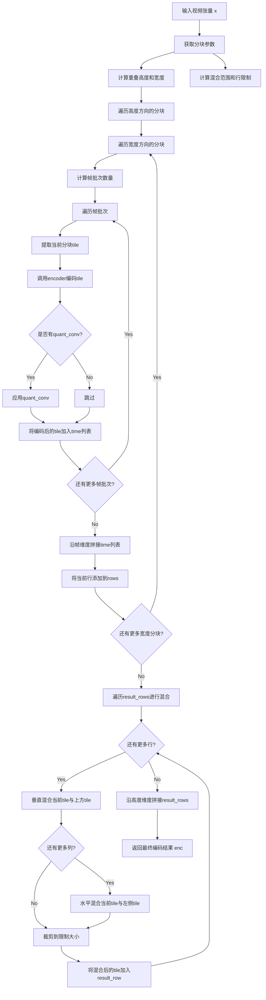

#### 带注释源码

```python
def tiled_encode(self, x: torch.Tensor) -> torch.Tensor:
    r"""Encode a batch of images using a tiled encoder.

    When this option is enabled, the VAE will split the input tensor into tiles to compute encoding in several
    steps. This is useful to keep memory use constant regardless of image size. The end result of tiled encoding is
    different from non-tiled encoding because each tile uses a different encoder. To avoid tiling artifacts, the
    tiles overlap and are blended together to form a smooth output. You may still see tile-sized changes in the
    output, but they should be much less noticeable.

    Args:
        x (`torch.Tensor`): Input batch of videos.

    Returns:
        `torch.Tensor`:
            The latent representation of the encoded videos.
    """
    # 获取输入张量的形状信息
    batch_size, num_channels, num_frames, height, width = x.shape

    # 计算分块重叠区域（不重叠部分的尺寸）
    # 使用tile_sample_min尺寸减去重叠部分得到实际步长
    overlap_height = int(self.tile_sample_min_height * (1 - self.tile_overlap_factor_height))
    overlap_width = int(self.tile_sample_min_width * (1 - self.tile_overlap_factor_width))
    
    # 计算潜在空间中的混合范围（用于消除拼接缝）
    blend_extent_height = int(self.tile_latent_min_height * self.tile_overlap_factor_height)
    blend_extent_width = int(self.tile_latent_min_width * self.tile_overlap_factor_width)
    
    # 计算最终输出的有效范围（去除混合区域）
    row_limit_height = self.tile_latent_min_height - blend_extent_height
    row_limit_width = self.tile_latent_min_width - blend_extent_width
    
    # 获取帧批次大小
    frame_batch_size = self.num_sample_frames_batch_size

    # 初始化行列表，用于存储所有分块的编码结果
    rows = []
    
    # 遍历高度方向的分块（按行）
    for i in range(0, height, overlap_height):
        row = []
        # 遍历宽度方向的分块（按列）
        for j in range(0, width, overlap_width):
            # 计算帧批次数量，确保至少处理一批
            num_batches = max(num_frames // frame_batch_size, 1)
            conv_cache = None  # 初始化卷积缓存（用于因果卷积）
            time = []  # 存储当前空间位置的所有时间帧编码结果

            # 遍历帧批次进行编码
            for k in range(num_batches):
                remaining_frames = num_frames % frame_batch_size
                start_frame = frame_batch_size * k + (0 if k == 0 else remaining_frames)
                end_frame = frame_batch_size * (k + 1) + remaining_frames
                
                # 提取当前分块：包含帧、时间范围、空间范围
                tile = x[
                    :,
                    :,
                    start_frame:end_frame,
                    i : i + self.tile_sample_min_height,
                    j : j + self.tile_sample_min_width,
                ]
                
                # 调用编码器编码当前分块
                tile, conv_cache = self.encoder(tile, conv_cache=conv_cache)
                
                # 如果存在量化卷积层，则应用它
                if self.quant_conv is not None:
                    tile = self.quant_conv(tile)
                
                time.append(tile)

            # 将当前空间位置的所有帧批次编码结果沿帧维度拼接
            row.append(torch.cat(time, dim=2))
        
        rows.append(row)

    # 混合阶段：消除分块之间的拼接缝
    result_rows = []
    for i, row in enumerate(rows):
        result_row = []
        for j, tile in enumerate(row):
            # 垂直混合：将当前tile与上方tile混合（消除水平拼接缝）
            if i > 0:
                tile = self.blend_v(rows[i - 1][j], tile, blend_extent_height)
            
            # 水平混合：将当前tile与左侧tile混合（消除垂直拼接缝）
            if j > 0:
                tile = self.blend_h(row[j - 1], tile, blend_extent_width)
            
            # 裁剪到有效输出范围（去除混合区域）
            result_row.append(tile[:, :, :, :row_limit_height, :row_limit_width])
        
        # 沿宽度方向拼接当前行的所有tile
        result_rows.append(torch.cat(result_row, dim=4))

    # 沿高度方向拼接所有行，得到最终编码结果
    enc = torch.cat(result_rows, dim=3)
    return enc
```


### `AutoencoderKLCogVideoX.tiled_decode`

分块解码实现，通过将输入潜在向量划分为重叠的tile分别解码，再使用blending机制合并tile以避免接缝伪影，从而在有限显存下处理高分辨率视频。

参数：

- `z`：`torch.Tensor`，输入的潜在向量批次，形状为 (batch_size, num_channels, num_frames, height, width)
- `return_dict`：`bool`，是否返回 `DecoderOutput` 而不是元组，默认为 True

返回值：`DecoderOutput | torch.Tensor`，如果 return_dict 为 True，返回 `DecoderOutput` 对象，否则返回元组

#### 流程图

```mermaid
flowchart TD
    A[开始 tiled_decode] --> B[计算tile参数]
    B --> C{遍历height方向}
    C --> D{遍历width方向}
    D --> E[计算帧批次]
    E --> F{遍历帧批次}
    F --> G[提取tile]
    G --> H[post_quant_conv处理]
    H --> I[decoder解码tile]
    I --> J[拼接时间维度tile]
    J --> K[添加到row]
    F --> L[拼接row]
    D --> M[blend垂直方向]
    M --> N[blend水平方向]
    C --> O[裁剪到row_limit]
    O --> P[拼接所有行得到最终解码结果]
    P --> Q{return_dict?}
    Q -->|True| R[返回 DecoderOutput]
    Q -->|False| S[返回 元组]
```

#### 带注释源码

```python
def tiled_decode(self, z: torch.Tensor, return_dict: bool = True) -> DecoderOutput | torch.Tensor:
    r"""
    Decode a batch of images using a tiled decoder.

    Args:
        z (`torch.Tensor`): Input batch of latent vectors.
        return_dict (`bool`, *optional*, defaults to `True`):
            Whether or not to return a [`~models.vae.DecoderOutput`] instead of a plain tuple.

    Returns:
        [`~models.vae.DecoderOutput`] or `tuple`:
            If return_dict is True, a [`~models.vae.DecoderOutput`] is returned, otherwise a plain `tuple` is
            returned.
    """
    # 显存估算说明：
    # CogVideoX-2B 有24个CausalConv3d层，最大中间维度[1,128,9,480,720]
    # fp16下显存需求：1*128*9*480*720*24*2/1024³ ≈ 17.8GB
    # 分块后HxW减半：1*128*9*240*360*24*2/1024³ ≈ 4.5GB

    # 获取输入潜在向量形状
    batch_size, num_channels, num_frames, height, width = z.shape

    # 计算tile参数
    # 重叠区域大小 = 最小tile尺寸 * (1 - 重叠因子)
    overlap_height = int(self.tile_latent_min_height * (1 - self.tile_overlap_factor_height))
    overlap_width = int(self.tile_latent_min_width * (1 - self.tile_overlap_factor_width))
    # 混合区域大小 = 样本最小尺寸 * 重叠因子
    blend_extent_height = int(self.tile_sample_min_height * self.tile_overlap_factor_height)
    blend_extent_width = int(self.tile_sample_min_width * self.tile_overlap_factor_width)
    # 行/列限制 = 最小尺寸 - 混合区域
    row_limit_height = self.tile_sample_min_height - blend_extent_height
    row_limit_width = self.tile_sample_min_width - blend_extent_width
    # 帧批次大小
    frame_batch_size = self.num_latent_frames_batch_size

    # 按高度方向分割为重叠的tile并分别解码
    rows = []
    for i in range(0, height, overlap_height):
        row = []
        for j in range(0, width, overlap_width):
            # 计算该tile内的帧批次数量
            num_batches = max(num_frames // frame_batch_size, 1)
            conv_cache = None
            time = []

            # 按时间维度分批处理
            for k in range(num_batches):
                remaining_frames = num_frames % frame_batch_size
                # 计算起始和结束帧索引，处理边界情况
                start_frame = frame_batch_size * k + (0 if k == 0 else remaining_frames)
                end_frame = frame_batch_size * (k + 1) + remaining_frames
                
                # 提取当前tile区域
                tile = z[
                    :,
                    :,
                    start_frame:end_frame,
                    i : i + self.tile_latent_min_height,
                    j : j + self.tile_latent_min_width,
                ]
                # 潜在向量后处理卷积
                if self.post_quant_conv is not None:
                    tile = self.post_quant_conv(tile)
                # 解码当前tile
                tile, conv_cache = self.decoder(tile, conv_cache=conv_cache)
                time.append(tile)

            # 沿时间维度拼接该位置所有帧批次的解码结果
            row.append(torch.cat(time, dim=2))
        rows.append(row)

    # 合并tile：垂直和水平方向的blending
    result_rows = []
    for i, row in enumerate(rows):
        result_row = []
        for j, tile in enumerate(row):
            # blend上方tile到当前tile（垂直方向混合）
            if i > 0:
                tile = self.blend_v(rows[i - 1][j], tile, blend_extent_height)
            # blend左侧tile到当前tile（水平方向混合）
            if j > 0:
                tile = self.blend_h(row[j - 1], tile, blend_extent_width)
            # 裁剪到有效区域，去除重叠部分
            result_row.append(tile[:, :, :, :row_limit_height, :row_limit_width])
        # 沿宽度方向拼接该行的所有tile
        result_rows.append(torch.cat(result_row, dim=4))

    # 沿高度方向拼接所有行
    dec = torch.cat(result_rows, dim=3)

    # 根据return_dict返回结果
    if not return_dict:
        return (dec,)

    return DecoderOutput(sample=dec)
```


### `AutoencoderKLCogVideoX.forward`

该方法实现了完整的变分自编码器（VAE）前向传播流程，包括编码输入样本到潜在空间、采样或选择潜在向量、以及将潜在向量解码回样本空间。这是CogVideoX视频生成模型的核心组件，负责在像素空间和潜在空间之间进行转换。

参数：

- `sample`：`torch.Tensor`，输入的视频或图像样本，形状为 (batch_size, channels, frames, height, width)
- `sample_posterior`：`bool`，是否从后验分布采样。若为 False，则使用后验分布的众数（mode）。默认为 False
- `return_dict`：`bool`，是否返回字典格式的结果。默认为 True
- `generator`：`torch.Generator | None`，用于控制随机采样的生成器。默认为 None

返回值：`torch.Tensor` 或 `DecoderOutput`，解码后的样本。如果 return_dict 为 True，返回 DecoderOutput 对象；否则返回元组

#### 流程图

```mermaid
graph TD
    A[输入: sample] --> B[encode: 编码到潜在空间]
    B --> C[获取 latent_dist 后验分布]
    C --> D{sample_posterior?}
    D -->|True| E[sample: 从后验分布采样]
    D -->|False| F[posterior.mode: 使用众数]
    E --> G[decode: 解码潜在向量]
    F --> G
    G --> H{return_dict?}
    H -->|True| I[DecoderOutput]
    H -->|False| J[(tuple)]
    I --> K[输出: sample]
    J --> K
```

#### 带注释源码

```python
def forward(
    self,
    sample: torch.Tensor,
    sample_posterior: bool = False,
    return_dict: bool = True,
    generator: torch.Generator | None = None,
) -> torch.Tensor | torch.Tensor:
    """
    完整的VAE前向传播：编码 + 采样/选择 + 解码
    
    参数:
        sample: 输入样本，形状为 (batch, channels, frames, height, width)
        sample_posterior: 是否从后验分布采样，False时使用众数
        return_dict: 是否返回字典格式
        generator: 可选的随机生成器，用于控制采样
        
    返回:
        解码后的样本
    """
    # 步骤1: 将输入样本赋值给变量x
    x = sample
    
    # 步骤2: 编码 - 将输入编码为潜在分布
    # encode方法返回AutoencoderKLOutput对象，包含latent_dist属性
    posterior = self.encode(x).latent_dist
    
    # 步骤3: 采样或选择模式
    # 根据sample_posterior参数决定是从分布采样还是使用众数
    if sample_posterior:
        # 从后验分布中采样潜在向量z
        # 使用generator控制随机性（用于训练时的重参数化技巧）
        z = posterior.sample(generator=generator)
    else:
        # 使用后验分布的众数（均值）作为潜在向量
        # 这相当于选择最可能的潜在表示（用于推理）
        z = posterior.mode()
    
    # 步骤4: 解码 - 将潜在向量解码回样本空间
    # decode方法返回DecoderOutput对象，包含sample属性
    dec = self.decode(z).sample
    
    # 步骤5: 返回结果
    # 根据return_dict决定返回格式
    if not return_dict:
        # 返回元组格式 (sample,)
        return (dec,)
    
    # 返回DecoderOutput对象，包含解码后的样本
    return DecoderOutput(sample=dec)
```

## 关键组件


### CogVideoXSafeConv3d

安全的3D卷积层，通过分块处理输入张量避免CogVideoX模型中的OOM问题。

### CogVideoXCausalConv3d

因果3D卷积层，通过填充输入张量确保CogVideoX模型中的时间因果性。

### CogVideoXSpatialNorm3D

空间条件归一化层，基于https://huggingface.co/papers/2209.09002实现，专为3D视频数据设计。

### CogVideoXResnetBlock3D

CogVideoX模型中使用的3D ResNet块，包含残差连接和空间归一化支持。

### CogVideoXDownBlock3D

CogVideoX模型中的下采样块，用于编码器路径中的空间和时间维度压缩。

### CogVideoXMidBlock3D

CogVideoX模型中的中间块，连接下采样和上采样路径。

### CogVideoXUpBlock3D

CogVideoX模型中的上采样块，用于解码器路径中的空间和时间维度恢复。

### CogVideoXEncoder3D

将输入编码到潜在表示的3D变分自编码器编码器层。

### CogVideoXDecoder3D

将潜在表示解码为输出样本的3D变分自编码器解码器层。

### AutoencoderKLCogVideoX

CogVideoX的VAE模型，使用KL损失将图像编码到潜在空间并从潜在表示解码图像。

### 张量分块与惰性加载

通过CogVideoXSafeConv3d实现内存优化，将大张量分块处理，避免OOM。

### 因果卷积缓存机制

通过conv_cache参数实现卷积结果的缓存，支持增量推理和内存优化。

### 平铺编码/解码

支持将输入分块为重叠的瓦片进行编码/解码，减少内存使用。

### 时间维度压缩

通过temporal_compression_ratio参数控制时间维度的压缩比例。


## 问题及建议


### 已知问题

- **硬编码的内存阈值**: `CogVideoXSafeConv3d.forward` 中 `if memory_count > 2:` 硬编码为2GB阈值，缺乏灵活性，应通过参数或配置来管理
- **未完成的TODO**: `CogVideoXCausalConv3d.__init__` 中存在 TODO 注释 `TODO(aryan): configure calculation based on stride and dilation in the future`，表明stride和dilation相关的计算尚未完成
- **Magic Values 缺乏解释**: 代码中多处使用硬编码的magic values，如 `num_latent_frames_batch_size = 2`、`num_sample_frames_batch_size = 8`、`tile_overlap_factor_height = 1/6`、`tile_overlap_factor_width = 1/5`，且注释承认 "we try to avoid magic values" 但实际仍存在
- **重复代码**: `tiled_encode` 和 `tiled_decode` 方法中tile切分、遍历和blend逻辑高度重复，应抽取为共享的辅助方法
- **文档不一致**: 类 `CogVideoXEncoder3D` 和 `CogVideoXDecoder3D` 的docstring中提到 `"DownEncoderBlock2D"` 和 `"UpDecoderBlock2D"`，但实际仅支持 `"CogVideoXDownBlock3D"` 和 `"CogVideoXUpBlock3D"`
- **内存估算不精确**: `CogVideoXSafeConv3d` 中计算 `memory_count` 时仅考虑输入张量，未考虑卷积输出和中间激活的内存占用
- **类型注解错误**: `forward` 方法的返回值注解 `-> torch.Tensor` 实际返回 tuple `(hidden_states, new_conv_cache)`，类型不一致
- **参数命名误导**: `spatial_norm_dim` 实际传入的是 `in_channels`（latent通道数），命名容易引起误解；`force_upcast` 声明为 `float` 类型而非 `bool`

### 优化建议

- 将内存阈值、batch size、overlap factor等硬编码值提取为可配置参数，或从配置文件中读取
- 完成 TODO 中提到的 stride 和 dilation 计算逻辑，或移除 TODO 注释并记录当前限制
- 提取 `tiled_encode` 和 `tiled_decode` 的公共tiling逻辑到私有辅助方法中，减少代码重复
- 修正文档中的 Block2D 引用，统一为 Block3D 的描述
- 修复类型注解，确保 `forward` 方法返回类型与实际返回值匹配 `(torch.Tensor, dict)`
- 修正 `force_upcast` 的类型注解为 `bool`，保持类型一致性
- 增加对 `tile_overlap_factor` 参数的范围验证 (0-1)，防止无效配置
- 考虑将 `CogVideoXSpatialNorm3D` 中对 `zq` 的插值逻辑抽象为可复用的工具函数

## 其它


### 设计目标与约束

本模块旨在实现CogVideoX视频生成模型的变分自编码器(VAE)，支持视频帧的编码与潜空间转换。核心设计约束包括：1) 通过分块卷积(CogVideoXSafeConv3d)避免大分辨率视频导致的OOM问题；2) 采用因果卷积确保时间维度的因果性；3) 支持tiling策略处理高分辨率视频；4) 仅支持CogVideoXDownBlock3D和CogVideoXUpBlock3D两种块类型。

### 错误处理与异常设计

主要异常场景包括：1) `down_block_type`或`up_block_type`不为预期类型时抛出`ValueError`；2) 内存估算逻辑中假设输入张量维度必须为5D(batch, channels, frames, height, width)；3) tiling模式下如果width/height超过阈值但未启用tiling会导致内存溢出；4) 梯度检查点启用时需确保PyTorch版本支持；5) 当`zq`(量化向量)维度与特征图不匹配时的插值处理。

### 数据流与状态机

编码器数据流：输入视频张量 → CogVideoXCausalConv3d初始卷积 → 4个CogVideoXDownBlock3D下采样块 → CogVideoXMidBlock3D中间处理 → GroupNorm + SiLU + CogVideoXCausalConv3d输出卷积 → DiagonalGaussianDistribution生成潜向量。解码器数据流：潜向量 → CogVideoXCausalConv3d → CogVideoXMidBlock3D → 4个CogVideoXUpBlock3D上采样块 → CogVideoXSpatialNorm3D + SiLU + CogVideoXCausalConv3d输出。

### 外部依赖与接口契约

核心依赖：1) `torch.nn`及其子模块；2) `numpy`用于log2计算；3) `...configuration_utils.ConfigMixin, register_to_config`用于配置注册；4) `...loaders.single_file_model.FromOriginalModelMixin`用于模型加载；5) `...utils.accelerate_utils.apply_forward_hook`用于钩子管理；6) `..downsampling.CogVideoXDownsample3D`和`..upsampling.CogVideoXUpsample3D`用于空间变换；7) `..modeling_outputs.AutoencoderKLOutput`和`..vae.DecoderOutput`用于输出封装；8) `..activations.get_activation`用于激活函数获取。

### 性能特征与基准

内存优化策略：1) CogVideoXSafeConv3d在内存超过2GB时自动分块处理；2) 编码默认分块大小为8帧，解码为2帧；3) tiling模式将高宽减半处理。计算复杂度：编码器下采样4次(默认)，时间维度压缩4倍(temporal_compression_ratio=4)；解码器上采样4次，时间维度扩展4倍。

### 配置参数说明

关键配置参数：1) `in_channels`/`out_channels`: 输入输出通道数(默认3)；2) `latent_channels`: 潜空间通道数(默认16)；3) `block_out_channels`: 各层输出通道(默认128,256,256,512)；4) `layers_per_block`: 每块ResNet层数(默认3)；5) `temporal_compression_ratio`: 时间压缩比(默认4)；6) `scaling_factor`: 潜空间缩放因子(默认1.15258426)；7) `force_upcast`: 是否强制FP32运行(默认True)；8) `use_quant_conv`/`use_post_quant_conv`: 量化卷积开关。

### 版本兼容性说明

本实现兼容PyTorch 2.0+特性(如`torch.Tensor | None`类型标注)；梯度检查点功能依赖`torch.utils.checkpoint`；视频帧数处理逻辑假设帧数为1或frame_batch_size*k或frame_batch_size*k+1的形式；推荐生成分辨率720x480(WxH)，tiling参数基于此分辨率优化。

### 使用注意事项

1) 当输入帧数不满足batch要求时，末尾单帧会单独处理；2) decoder中spatial_norm_dim默认为in_channels值；3) tile_overlap_factor_height=1/6和tile_overlap_factor_width=1/5为实验最优值；4) num_latent_frames_batch_size不建议修改为非2值，因VAE未针对其他帧数训练；5) enable_tiling后自动调整tile_sample_min_*和tile_latent_min_*尺寸。


    