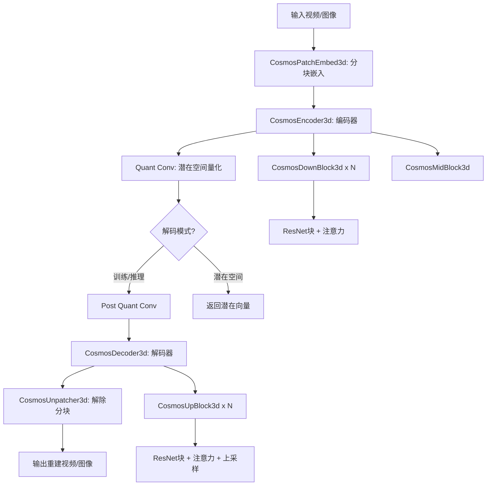
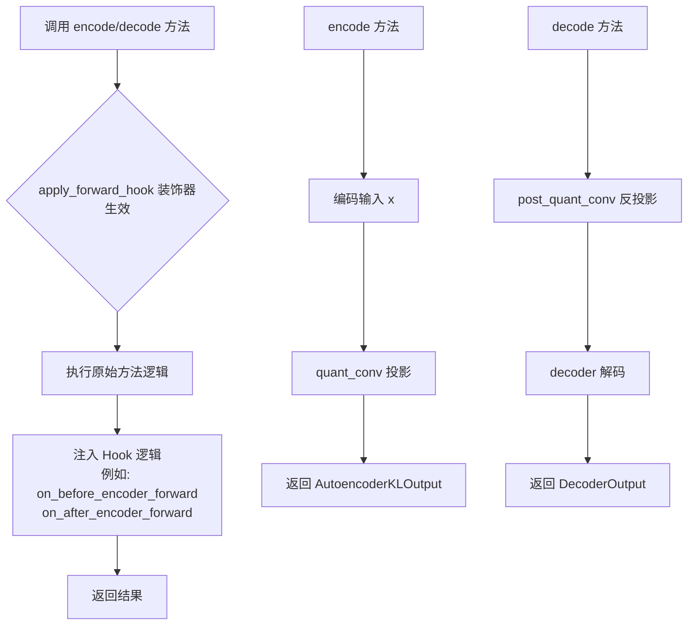
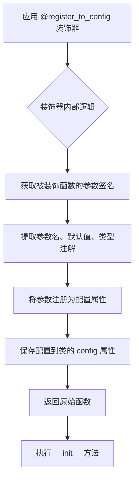
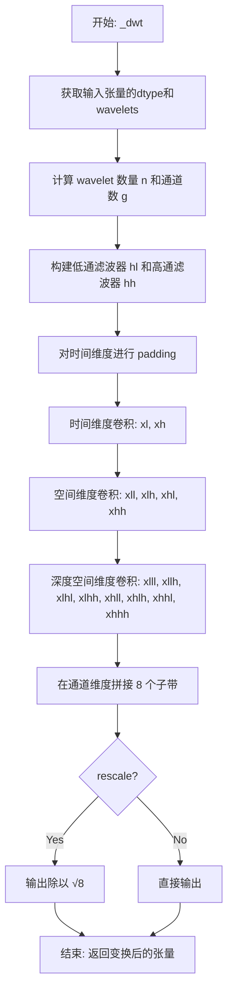
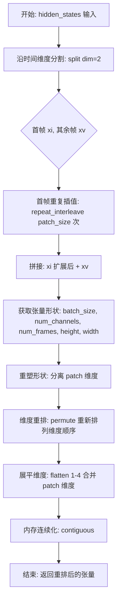
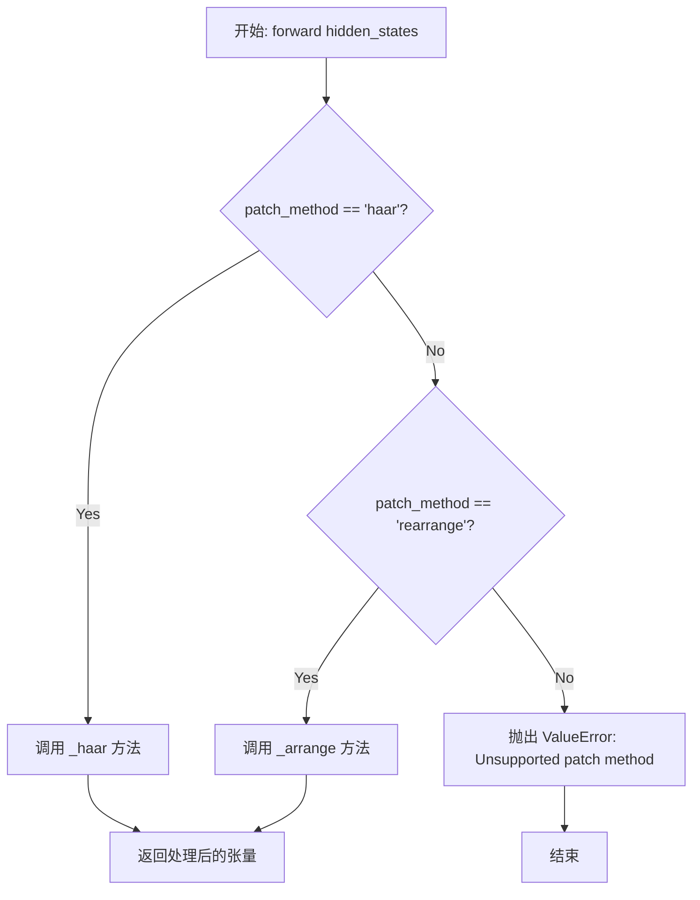
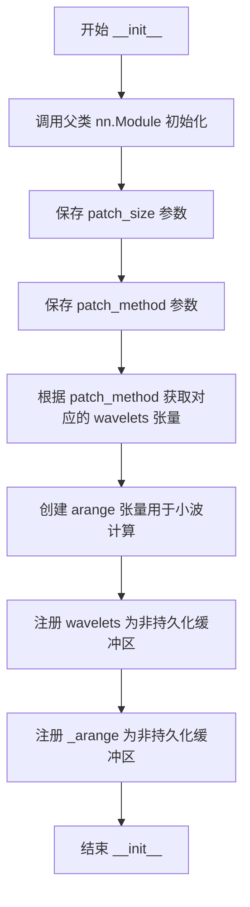
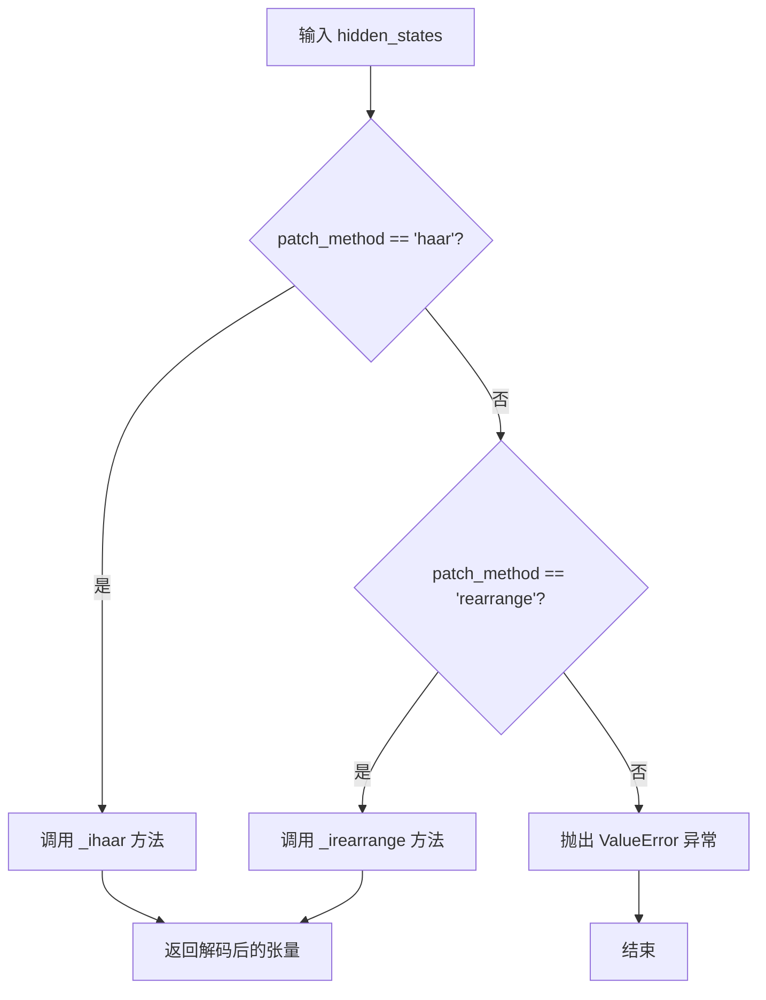
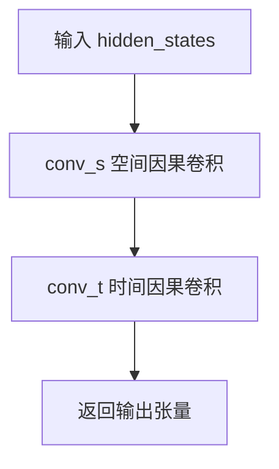

# `diffusers\src\diffusers\models\autoencoders\autoencoder_kl_cosmos.py` 详细设计文档

该代码实现了 NVIDIA Cosmos 项目的 3D VAE（变分自编码器），用于视频/图像的时空压缩和解压。核心功能是通过 3D 卷积神经网络对视频进行编码（压缩到潜在空间）和解码（重建视频），支持 Haar 小波和 Rearrange 两种分块方法，因果卷积确保时间维度的因果性，以及空间/时间注意力机制来捕捉视频的时空相关性。

## 整体流程



## 类结构

```
nn.Module (PyTorch基类)
├── CosmosCausalConv3d (因果3D卷积)
├── CosmosCausalGroupNorm (因果分组归一化)
├── CosmosPatchEmbed3d (3D分块嵌入)
├── CosmosUnpatcher3d (3D解除分块)
├── CosmosConvProjection3d (卷积投影)
├── CosmosResnetBlock3d (残差块)
├── CosmosDownsample3d (下采样)
├── CosmosUpsample3d (上采样)
├── CosmosCausalAttention (因果注意力)
│   ├── CosmosSpatialAttentionProcessor2_0 (空间注意力处理器)
│   └── CosmosTemporalAttentionProcessor2_0 (时间注意力处理器)
├── CosmosDownBlock3d (下采样块)
├── CosmosMidBlock3d (中间块)
├── CosmosUpBlock3d (上采样块)
├── CosmosEncoder3d (编码器)
├── CosmosDecoder3d (解码器)
└── AutoencoderKLCosmos (主VAE模型)
    └── 继承: ModelMixin, AutoencoderMixin, ConfigMixin
```

## 全局变量及字段


### `LATENTS_MEAN`
    
VAE潜在空间的均值向量，用于数据标准化

类型：`list[float]`
    


### `LATENTS_STD`
    
VAE潜在空间的标准差向量，用于数据标准化

类型：`list[float]`
    


### `_WAVELETS`
    
小波变换核字典，用于图像patch嵌入

类型：`dict[str, torch.Tensor]`
    


### `logger`
    
模块日志记录器

类型：`logging.Logger`
    


### `CosmosCausalConv3d.pad_mode`
    
卷积填充模式

类型：`str`
    


### `CosmosCausalConv3d.temporal_pad`
    
时间维度填充大小

类型：`int`
    


### `CosmosCausalConv3d.spatial_pad`
    
空间维度填充大小

类型：`tuple[int, int, int, int]`
    


### `CosmosCausalGroupNorm.norm`
    
GroupNorm归一化层

类型：`nn.GroupNorm`
    


### `CosmosCausalGroupNorm.num_groups`
    
分组数量

类型：`int`
    


### `CosmosPatchEmbed3d.patch_size`
    
patch块大小

类型：`int`
    


### `CosmosPatchEmbed3d.patch_method`
    
patch嵌入方法

类型：`str`
    


### `CosmosPatchEmbed3d.wavelets`
    
小波变换核tensor

类型：`torch.Tensor`
    


### `CosmosPatchEmbed3d._arange`
    
小波计算索引tensor

类型：`torch.Tensor`
    


### `CosmosUnpatcher3d.patch_size`
    
patch块大小

类型：`int`
    


### `CosmosUnpatcher3d.patch_method`
    
patch解嵌方法

类型：`str`
    


### `CosmosUnpatcher3d.wavelets`
    
小波变换核tensor

类型：`torch.Tensor`
    


### `CosmosUnpatcher3d._arange`
    
小波计算索引tensor

类型：`torch.Tensor`
    


### `CosmosConvProjection3d.conv_s`
    
空间卷积层

类型：`CosmosCausalConv3d`
    


### `CosmosConvProjection3d.conv_t`
    
时间卷积层

类型：`CosmosCausalConv3d`
    


### `CosmosResnetBlock3d.norm1`
    
第一个归一化层

类型：`CosmosCausalGroupNorm`
    


### `CosmosResnetBlock3d.conv1`
    
第一个卷积投影层

类型：`CosmosConvProjection3d`
    


### `CosmosResnetBlock3d.norm2`
    
第二个归一化层

类型：`CosmosCausalGroupNorm`
    


### `CosmosResnetBlock3d.dropout`
    
Dropout层

类型：`nn.Dropout`
    


### `CosmosResnetBlock3d.conv2`
    
第二个卷积投影层

类型：`CosmosConvProjection3d`
    


### `CosmosResnetBlock3d.conv_shortcut`
    
跳跃连接卷积层

类型：`nn.Module`
    


### `CosmosDownsample3d.spatial_downsample`
    
是否启用空间下采样

类型：`bool`
    


### `CosmosDownsample3d.temporal_downsample`
    
是否启用时间下采样

类型：`bool`
    


### `CosmosDownsample3d.conv1`
    
空间下采样卷积层

类型：`nn.Module`
    


### `CosmosDownsample3d.conv2`
    
时间下采样卷积层

类型：`nn.Module`
    


### `CosmosDownsample3d.conv3`
    
输出卷积层

类型：`nn.Module`
    


### `CosmosUpsample3d.spatial_upsample`
    
是否启用空间上采样

类型：`bool`
    


### `CosmosUpsample3d.temporal_upsample`
    
是否启用时间上采样

类型：`bool`
    


### `CosmosUpsample3d.conv1`
    
时间上采样卷积层

类型：`nn.Module`
    


### `CosmosUpsample3d.conv2`
    
空间上采样卷积层

类型：`nn.Module`
    


### `CosmosUpsample3d.conv3`
    
输出卷积层

类型：`nn.Module`
    


### `CosmosCausalAttention.num_attention_heads`
    
注意力头数量

类型：`int`
    


### `CosmosCausalAttention.norm`
    
注意力归一化层

类型：`CosmosCausalGroupNorm`
    


### `CosmosCausalAttention.to_q`
    
Query投影卷积

类型：`CosmosCausalConv3d`
    


### `CosmosCausalAttention.to_k`
    
Key投影卷积

类型：`CosmosCausalConv3d`
    


### `CosmosCausalAttention.to_v`
    
Value投影卷积

类型：`CosmosCausalConv3d`
    


### `CosmosCausalAttention.to_out`
    
输出投影模块列表

类型：`nn.ModuleList`
    


### `CosmosCausalAttention.processor`
    
注意力处理器

类型：`CosmosSpatialAttentionProcessor2_0 | CosmosTemporalAttentionProcessor2_0`
    


### `CosmosDownBlock3d.resnets`
    
ResNet块列表

类型：`nn.ModuleList`
    


### `CosmosDownBlock3d.attentions`
    
空间注意力模块列表

类型：`nn.ModuleList`
    


### `CosmosDownBlock3d.temp_attentions`
    
时间注意力模块列表

类型：`nn.ModuleList`
    


### `CosmosDownBlock3d.downsamplers`
    
下采样模块列表

类型：`nn.ModuleList`
    


### `CosmosMidBlock3d.resnets`
    
ResNet块列表

类型：`nn.ModuleList`
    


### `CosmosMidBlock3d.attentions`
    
空间注意力模块列表

类型：`nn.ModuleList`
    


### `CosmosMidBlock3d.temp_attentions`
    
时间注意力模块列表

类型：`nn.ModuleList`
    


### `CosmosUpBlock3d.resnets`
    
ResNet块列表

类型：`nn.ModuleList`
    


### `CosmosUpBlock3d.attentions`
    
空间注意力模块列表

类型：`nn.ModuleList`
    


### `CosmosUpBlock3d.temp_attentions`
    
时间注意力模块列表

类型：`nn.ModuleList`
    


### `CosmosUpBlock3d.upsamplers`
    
上采样模块列表

类型：`nn.ModuleList`
    


### `CosmosEncoder3d.patch_embed`
    
图像patch嵌入层

类型：`CosmosPatchEmbed3d`
    


### `CosmosEncoder3d.conv_in`
    
输入卷积投影层

类型：`CosmosConvProjection3d`
    


### `CosmosEncoder3d.down_blocks`
    
下采样块列表

类型：`nn.ModuleList`
    


### `CosmosEncoder3d.mid_block`
    
中间处理块

类型：`CosmosMidBlock3d`
    


### `CosmosEncoder3d.norm_out`
    
输出归一化层

类型：`CosmosCausalGroupNorm`
    


### `CosmosEncoder3d.conv_out`
    
输出卷积投影层

类型：`CosmosConvProjection3d`
    


### `CosmosEncoder3d.gradient_checkpointing`
    
是否启用梯度检查点

类型：`bool`
    


### `CosmosDecoder3d.conv_in`
    
输入卷积投影层

类型：`CosmosConvProjection3d`
    


### `CosmosDecoder3d.mid_block`
    
中间处理块

类型：`CosmosMidBlock3d`
    


### `CosmosDecoder3d.up_blocks`
    
上采样块列表

类型：`nn.ModuleList`
    


### `CosmosDecoder3d.norm_out`
    
输出归一化层

类型：`CosmosCausalGroupNorm`
    


### `CosmosDecoder3d.conv_out`
    
输出卷积投影层

类型：`CosmosConvProjection3d`
    


### `CosmosDecoder3d.unpatch_embed`
    
图像patch解嵌层

类型：`CosmosUnpatcher3d`
    


### `CosmosDecoder3d.gradient_checkpointing`
    
是否启用梯度检查点

类型：`bool`
    


### `AutoencoderKLCosmos.encoder`
    
VAE编码器

类型：`CosmosEncoder3d`
    


### `AutoencoderKLCosmos.decoder`
    
VAE解码器

类型：`CosmosDecoder3d`
    


### `AutoencoderKLCosmos.quant_conv`
    
潜在空间量化卷积

类型：`CosmosCausalConv3d`
    


### `AutoencoderKLCosmos.post_quant_conv`
    
潜在空间后量化卷积

类型：`CosmosCausalConv3d`
    


### `AutoencoderKLCosmos.use_slicing`
    
是否启用切片编码/解码

类型：`bool`
    


### `AutoencoderKLCosmos.use_tiling`
    
是否启用瓦片解码

类型：`bool`
    


### `AutoencoderKLCosmos.use_framewise_encoding`
    
是否启用逐帧编码

类型：`bool`
    


### `AutoencoderKLCosmos.use_framewise_decoding`
    
是否启用逐帧解码

类型：`bool`
    


### `AutoencoderKLCosmos.num_sample_frames_batch_size`
    
样本帧批次大小

类型：`int`
    


### `AutoencoderKLCosmos.num_latent_frames_batch_size`
    
潜在帧批次大小

类型：`int`
    


### `AutoencoderKLCosmos.tile_sample_min_height`
    
瓦片最小高度

类型：`int`
    


### `AutoencoderKLCosmos.tile_sample_min_width`
    
瓦片最小宽度

类型：`int`
    


### `AutoencoderKLCosmos.tile_sample_min_num_frames`
    
瓦片最小帧数

类型：`int`
    


### `AutoencoderKLCosmos.tile_sample_stride_height`
    
瓦片高度步长

类型：`float`
    


### `AutoencoderKLCosmos.tile_sample_stride_width`
    
瓦片宽度步长

类型：`float`
    


### `AutoencoderKLCosmos.tile_sample_stride_num_frames`
    
瓦片帧数步长

类型：`float`
    
    

## 全局函数及方法


根据任务要求，我需要从代码中提取`apply_forward_hook`装饰器的信息。让我仔细分析代码。

### 初步分析

查看代码，我发现：

1. **`apply_forward_hook` 是从外部模块导入的**：
   ```python
   from ...utils.accelerate_utils import apply_forward_hook
   ```

2. **它在代码中的使用方式**：
   - `@apply_forward_hook` 装饰器被应用在 `AutoencoderKLCosmos` 类的两个方法上：
     - `encode` 方法
     - `decode` 方法

3. **重要说明**：`apply_forward_hook` 的完整源代码实现（函数定义本身）**不在当前代码文件中**，它定义在 `diffusers` 库的 `...utils.accelerate_utils` 模块中。

---

### apply_forward_hook

这是一个从 `diffusers` 库外部模块 `...utils.accelerate_utils` 导入的装饰器。它应用于 `AutoencoderKLCosmos` 类的 `encode` 和 `decode` 方法。

参数：

- 装饰器本身无需直接参数，通过 `@apply_forward_hook` 形式使用
- 被装饰的函数（`encode`/`decode`）参数：`x`/`z`（`torch.Tensor`），输入张量；`return_dict`（`bool`，默认`True`），是否返回字典格式

返回值：被装饰函数的返回值（经过装饰器包装后）

#### 流程图



#### 带注释源码

```python
# apply_forward_hook 装饰器在当前文件中的使用示例：
# 注意：装饰器本身定义在 ...utils.accelerate_utils 模块中

from ...utils.accelerate_utils import apply_forward_hook

class AutoencoderKLCosmos(ModelMixin, AutoencoderMixin, ConfigMixin):
    """
    Cosmos 变分自编码器 (VAE) 模型类
    """
    
    # 使用 apply_forward_hook 装饰器包装 encode 方法
    # 该装饰器会在 encode 方法执行前后注入额外的逻辑
    # 例如：梯度检查点、模型监视、日志记录等
    @apply_forward_hook
    def encode(self, x: torch.Tensor, return_dict: bool = True) -> torch.Tensor:
        """
        编码输入图像/视频到潜在空间
        
        参数:
            x: 输入张量 [B, C, H, W] 或 [B, C, T, H, W]
            return_dict: 是否返回字典格式
            
        返回:
            AutoencoderKLOutput 包含 latent_dist (潜在分布)
        """
        if self.use_slicing and x.shape[0] > 1:
            # 批处理大于1时使用切片编码节省内存
            encoded_slices = [self._encode(x_slice) for x_slice in x.split(1)]
            h = torch.cat(encoded_slices)
        else:
            h = self._encode(x)

        posterior = IdentityDistribution(h)

        if not return_dict:
            return (posterior,)
        return AutoencoderKLOutput(latent_dist=posterior)

    # 同样使用 apply_forward_hook 装饰器包装 decode 方法
    @apply_forward_hook
    def decode(self, z: torch.Tensor, return_dict: bool = True) -> DecoderOutput | tuple[torch.Tensor]:
        """
        将潜在向量解码回图像/视频空间
        
        参数:
            z: 潜在张量
            return_dict: 是否返回字典格式
            
        返回:
            DecoderOutput 包含 sample (重建样本)
        """
        if self.use_slicing and z.shape[0] > 1:
            decoded_slices = [self._decode(z_slice).sample for z_slice in z.split(1)]
            decoded = torch.cat(decoded_slices)
        else:
            decoded = self._decode(z).sample

        if not return_dict:
            return (decoded,)
        return DecoderOutput(sample=decoded)
```

---

### 补充说明

#### 潜在的技术债务或优化空间

1. **外部依赖**：`apply_forward_hook` 的具体实现依赖于外部库，这可能导致：
   - 版本兼容性问题
   - 调试困难（需要查看外部模块源码）

2. **功能不透明**：由于装饰器定义不在当前文件中，其具体功能（如注入何种 hook）需要查阅 `accelerate_utils` 模块才能完全理解。

#### 其他信息

- **设计目标**：该装饰器很可能用于支持 `accelerate` 库的分布式训练、梯度检查点等功能
- **错误处理**：具体的异常处理逻辑需要查看 `accelerate_utils.apply_forward_hook` 的实现


### `register_to_config`

该装饰器是 Hugging Face Diffusers 库中的配置注册工具，用于将类的 `__init__` 方法参数自动注册为配置属性，使得模型配置可以被序列化、保存和加载。

参数：

- 无显式参数（直接作为装饰器使用）

返回值：`Callable`，返回被装饰的函数（通常为 `__init__`），但内部会额外执行配置注册逻辑

#### 流程图



#### 带注释源码

```python
# 该源码展示了装饰器在实际类中的使用方式
# 装饰器来源于 ...configuration_utils 模块
from ...configuration_utils import ConfigMixin, register_to_config

class AutoencoderKLCosmos(ModelMixin, AutoencoderMixin, ConfigMixin):
    r"""
    Autoencoder used in Cosmos.
    """
    
    @register_to_config  # 装饰器：自动将 __init__ 的参数注册为配置属性
    def __init__(
        self,
        in_channels: int = 3,  # 输入通道数
        out_channels: int = 3,  # 输出通道数
        latent_channels: int = 16,  # 潜在空间通道数
        encoder_block_out_channels: tuple[int, ...] = (128, 256, 512, 512),  # 编码器块输出通道
        decode_block_out_channels: tuple[int, ...] = (256, 512, 512, 512),  # 解码器块输出通道
        attention_resolutions: tuple[int, ...] = (32,),  # 应用注意力的分辨率
        resolution: int = 1024,  # 基础分辨率
        num_layers: int = 2,  # ResNet 层数
        patch_size: int = 4,  # 补丁大小
        patch_type: str = "haar",  # 补丁类型
        scaling_factor: float = 1.0,  # 缩放因子
        spatial_compression_ratio: int = 8,  # 空间压缩比
        temporal_compression_ratio: int = 8,  # 时间压缩比
        latents_mean: list[float] | None = LATENTS_MEAN,  # 潜在空间均值
        latents_std: list[float] | None = LATENTS_STD,  # 潜在空间标准差
    ) -> None:
        super().__init__()
        # 初始化编码器、解码器、量化卷积等组件
        self.encoder = CosmosEncoder3d(...)
        self.decoder = CosmosDecoder3d(...)
        self.quant_conv = CosmosCausalConv3d(latent_channels, latent_channels, kernel_size=1, padding=0)
        self.post_quant_conv = CosmosCausalConv3d(latent_channels, latent_channels, kernel_size=1, padding=0)
```


### `CosmosCausalConv3d.__init__`

该方法是一个构造函数，负责初始化 `CosmosCausalConv3d` 类。该类继承自 PyTorch 的 `nn.Conv3d`，并针对视频生成任务进行了定制化修改。其核心逻辑在于标准化卷积参数（核大小、膨胀率、步长）为元组格式，验证核大小的合法性（确保空间维度为奇数），调用父类初始化卷积层，并预先计算用于实现“因果卷积（Causal Convolution）”所需的填充参数。

参数：

- `in_channels`：`int`，输入张量的通道数。
- `out_channels`：`int`，输出张量的通道数。
- `kernel_size`：`int | tuple[int, int, int]`，卷积核的大小。方法内部会将其规范化为三元组元组。
- `dilation`：`int | tuple[int, int, int]`，卷积核元素的膨胀率。方法内部会将其规范化为三元组元组。
- `stride`：`int | tuple[int, int, int]`，卷积的步长。方法内部会将其规范化为三元组元组。
- `padding`：`int`，输入张量各维度的填充大小（主要针对空间维度的预处理）。
- `pad_mode`：`str`，填充模式（如 'constant', 'replicate'），传递给 `torch.nn.functional.pad`。

返回值：`None`，该方法不返回任何值，仅初始化对象状态。

#### 流程图

```mermaid
flowchart TD
    A[开始 __init__] --> B{检查 kernel_size 类型}
    B -->|int| C[将 kernel_size 转换为 (x, x, x) 元组]
    B -->|tuple| D[保持原样]
    C --> E{检查 dilation 类型}
    D --> E
    E -->|int| F[将 dilation 转换为 (x, x, x) 元组]
    E -->|tuple| G[保持原样]
    F --> H{检查 stride 类型}
    G --> H
    H -->|int| I[将 stride 转换为 (x, x, x) 元组]
    H -->|tuple| J[保持原样]
    I --> K[提取 height_kernel_size 和 width_kernel_size]
    J --> K
    K --> L{断言: height % 2 == 1 && width % 2 == 1}
    L -->|失败| M[抛出 AssertionError]
    L -->|成功| N[调用 super().__init__ 初始化 nn.Conv3d]
    N --> O[计算 temporal_pad: dilation[0] * (kernel_size[0] - 1) + (1 - stride[0])]
    O --> P[设置 spatial_pad: (padding, padding, padding, padding)]
    P --> Q[保存 pad_mode 到 self.pad_mode]
    Q --> R[结束]
```

#### 带注释源码

```python
def __init__(
    self,
    in_channels: int = 1,
    out_channels: int = 1,
    kernel_size: int | tuple[int, int, int] = (3, 3, 3),
    dilation: int | tuple[int, int, int] = (1, 1, 1),
    stride: int | tuple[int, int, int] = (1, 1, 1),
    padding: int = 1,
    pad_mode: str = "constant",
) -> None:
    # 如果 kernel_size 是整数，则扩展为 (x, x, x) 的元组，否则保持原样
    kernel_size = (kernel_size, kernel_size, kernel_size) if isinstance(kernel_size, int) else kernel_size
    # 如果 dilation 是整数，则扩展为 (x, x, x) 的元组，否则保持原样
    dilation = (dilation, dilation, dilation) if isinstance(dilation, int) else dilation
    # 如果 stride 是整数，则扩展为 (x, x, x) 的元组，否则保持原样
    stride = (stride, stride, stride) if isinstance(stride, int) else stride

    # 获取高度和宽度的核大小
    _, height_kernel_size, width_kernel_size = kernel_size
    # 断言：为了确保 'same' padding 的对称性，要求空间核的宽高为奇数
    assert height_kernel_size % 2 == 1 and width_kernel_size % 2 == 1

    # 调用父类 nn.Conv3d 的初始化方法
    # 注意：padding 参数没有传递给父类，因为 padding 是在 forward 方法中手动处理的
    super().__init__(
        in_channels,
        out_channels,
        kernel_size,
        stride=stride,
        dilation=dilation,
    )

    # 保存填充模式 (如 'constant', 'replicate')
    self.pad_mode = pad_mode
    # 计算时间维度的因果填充量。
    # 这确保了第 t 帧的输出只依赖于 t 之前的帧。
    # 公式：dilation[0] * (kernel_size[0] - 1) + (1 - stride[0])
    self.temporal_pad = dilation[0] * (kernel_size[0] - 1) + (1 - stride[0])
    # 存储空间填充量 (左, 右, 上, 下)，用于后续的 F.pad
    self.spatial_pad = (padding, padding, padding, padding)
```


### `CosmosCausalConv3d.forward`

该方法是因果3D卷积层的前向传播实现，通过在时间维度上填充历史帧（使用第一帧重复填充）来实现因果卷积，同时在空间维度上进行padding以保持空间维度不变。

参数：

- `hidden_states`：`torch.Tensor`，输入的5D张量，形状为 `[B, C, T, H, W]`，其中B是批量大小，C是通道数，T是时间帧数，H是高度，W是宽度

返回值：`torch.Tensor`，经过因果卷积处理后的输出张量，形状为 `[B, C', T, H', W']`，其中C'是输出通道数，H'和W'取决于卷积核大小和padding

#### 流程图

```mermaid
flowchart TD
    A[输入 hidden_states] --> B[提取第一帧: hidden_states[:, :, :1, ...]]
    B --> C[沿时间维度重复填充: repeat 扩展 temporal_pad 次]
    D[原始 hidden_states] --> E[沿时间维度拼接: torch.cat [填充帧, 原始帧]]
    C --> E
    E --> F[空间维度 padding: F.pad 左右上下填充]
    F --> G[调用父类 nn.Conv3d.forward 执行卷积]
    G --> H[返回卷积结果]
```

#### 带注释源码

```python
def forward(self, hidden_states: torch.Tensor) -> torch.Tensor:
    # 步骤1: 创建时序因果填充
    # 从输入张量中提取第一帧，然后在时间维度上重复扩展 temporal_pad 次
    # 这确保了每个时间步只能访问其之前的时间步，实现因果卷积
    hidden_states_prev = hidden_states[:, :, :1, ...].repeat(1, 1, self.temporal_pad, 1, 1)
    
    # 步骤2: 拼接历史填充帧和当前帧
    # 将填充的历史帧拼接在原始序列前面，确保时间维度的因果性
    # 拼接后时间维度长度变为: 原始T + temporal_pad
    hidden_states = torch.cat([hidden_states_prev, hidden_states], dim=2)
    
    # 步骤3: 空间维度padding
    # 使用F.pad在空间维度（H和W）周围添加padding，保持空间尺寸
    # spatial_pad 格式为 (left, right, top, bottom)，最后两个0表示时间维度不额外padding
    hidden_states = F.pad(hidden_states, (*self.spatial_pad, 0, 0), mode=self.pad_mode, value=0.0)
    
    # 步骤4: 执行3D卷积
    # 调用父类nn.Conv3d的forward方法进行实际的卷积操作
    return super().forward(hidden_states)
```


### `CosmosCausalGroupNorm.__init__`

这是 `CosmosCausalGroupNorm` 类的初始化方法，用于创建一个支持因果（时序）处理的 3D Group Normalization 层。该类继承自 `torch.nn.Module`，内部封装了 PyTorch 的 `GroupNorm`，并针对 3D 张量（视频数据）进行了特殊处理：当 `num_groups=1` 时（即 Layer Normalization 模式），会调整张量维度顺序以确保时序维度（Temporal）的因果性。

参数：

- `in_channels`：`int`，输入通道数，指定 GroupNorm 的通道数
- `num_groups`：`int`（默认值为 `1`），分组数量，当为 `1` 时执行特殊的维度排列以支持因果卷积

返回值：`None`，`__init__` 方法不返回任何值

#### 流程图

```mermaid
flowchart TD
    A[开始 __init__] --> B[调用 super().__init__()]
    B --> C[创建 nn.GroupNorm 层]
    C --> D[设置 norm: num_groups, num_channels=in_channels, eps=1e-6, affine=True]
    E[保存 self.num_groups = num_groups] --> F[结束]
    D --> E
```

#### 带注释源码

```python
def __init__(self, in_channels: int, num_groups: int = 1):
    """
    初始化 CosmosCausalGroupNorm 层
    
    Args:
        in_channels: 输入通道数，对应 GroupNorm 的 num_channels 参数
        num_groups: 分组数，默认为 1（即 Layer Normalization）
    """
    # 调用父类 nn.Module 的初始化方法
    super().__init__()
    
    # 创建 GroupNorm 层
    # num_groups: 分组数量
    # num_channels: 通道数（等于 in_channels）
    # eps: 防止除零的小常数
    # affine: 是否使用可学习的仿射参数（缩放和偏移）
    self.norm = nn.GroupNorm(
        num_groups=num_groups,
        num_channels=in_channels,
        eps=1e-6,
        affine=True,
    )
    
    # 保存分组数，用于 forward 方法中判断是否需要特殊处理
    self.num_groups = num_groups
```


### `CosmosCausalGroupNorm.forward`

该方法实现了针对 5D 张量（视频数据 `[B, C, T, H, W]`）的分组归一化（Group Normalization）逻辑。它是 `nn.GroupNorm` 的封装，专门处理时间维度。当 `num_groups=1` 时（通常对应实例归一化），该方法会将批次维度（Batch）与时间维度（T）合并，以确保在时间序列的每一帧上独立进行归一化；而当 `num_groups > 1` 时，则执行标准的分组归一化。

#### 参数

- `hidden_states`：`torch.Tensor`，输入的张量，形状为 `[B, C, T, H, W]`（批次大小、通道数、时间步长、高度、宽度）。

#### 返回值

- `torch.Tensor`：返回归一化后的张量，形状保持为 `[B, C, T, H, W]`。

#### 流程图

```mermaid
flowchart TD
    A([Start: Input hidden_states<br/>Shape: [B, C, T, H, W]]) --> B{num_groups == 1?}
    
    %% 分支Yes的流程
    B -- Yes --> C[记录 Batch size]
    C --> D[Permute 维度<br/>[B, C, T, H, W] -> [B, T, C, H, W]]
    D --> E[Flatten 合并 B 和 T<br/>[B, T, C, H, W] -> [B*T, C, H, W]]
    E --> F[执行 self.norm<br/>在 [B*T] 个样本上归一化]
    F --> G[Unflatten 恢复 B 和 T<br/>[B*T, C, H, W] -> [B, T, C, H, W]]
    G --> H[Permute 恢复原维度顺序<br/>[B, T, C, H, W] -> [B, C, T, H, W]]
    H --> I([Return])
    
    %% 分支No的流程
    B -- No --> J[直接执行 self.norm<br/>标准 GroupNorm, 视为 [B*T*H*W, C]]
    J --> I
```

#### 带注释源码

```python
def forward(self, hidden_states: torch.Tensor) -> torch.Tensor:
    """
    前向传播函数，对 5D 视频张量进行分组归一化。

    Args:
        hidden_states: 输入张量，形状为 [B, C, T, H, W]。

    Returns:
        归一化后的张量，形状为 [B, C, T, H, W]。
    """
    # 如果 num_groups 为 1，实际上执行的是类似 Instance Norm 的操作，
    # 需要确保归一化是在每个时间帧上独立进行的。
    if self.num_groups == 1:
        batch_size = hidden_states.size(0) # 获取原始批次大小 B
        
        # 1. 维度调换：将 [B, C, T, H, W] 变为 [B, T, C, H, W]
        # 目的：将时间维度 T 移动到通道维度之后，以便与 B 一起flatten
        hidden_states = hidden_states.permute(0, 2, 1, 3, 4)
        
        # 2. 展平合并：将 [B, T, C, H, W] 展平为 [B*T, C, H, W]
        # 效果：将批次和时间维度的数据合并，这样 GroupNorm 会将每个 (b, t) 视为一个独立的样本进行归一化
        # 等同于对时间维度的每一帧分别做 Instance Norm
        hidden_states = hidden_states.flatten(0, 1)
        
        # 3. 执行归一化
        hidden_states = self.norm(hidden_states)
        
        # 4. 恢复形状：先恢复 B 和 T 维度 -> [B, T, C, H, W]
        hidden_states = hidden_states.unflatten(0, (batch_size, -1))
        
        # 5. 恢复维度顺序：将 [B, T, C, H, W] 变回 [B, C, T, H, W]
        hidden_states = hidden_states.permute(0, 2, 1, 3, 4)
    else:
        # num_groups > 1 时，执行标准的 GroupNorm
        # PyTorch GroupNorm 会将 [B, C, T, H, W] 视为 [B*T*H*W, C] 的批次
        # 在通道 C 的子组和空间 H*W 上进行归一化，时间维度 T 视为批次维度的一部分
        hidden_states = self.norm(hidden_states)
        
    return hidden_states
```


### `CosmosPatchEmbed3d.__init__`

这是 `CosmosPatchEmbed3d` 类的构造函数，用于初始化3D图像/视频补丁嵌入层。它设置补丁大小和补丁方法，注册小波变换所需的缓冲区（wavelets和arange），支持"haar"和"rearrange"两种补丁嵌入方法。

参数：

- `patch_size`：`int`，补丁大小，默认为1，用于控制空间和时间维度的下采样率
- `patch_method`：`str`，补丁方法，默认为"haar"，支持"haar"（小波变换）或"rearrange"（重排）两种方式

返回值：`None`，构造函数无返回值

#### 流程图

```mermaid
flowchart TD
    A[开始 __init__] --> B[调用 super().__init__ 初始化 nn.Module]
    B --> C[保存 patch_size 和 patch_method 属性]
    C --> D[从 _WAVELETS 字典获取对应 patch_method 的小波张量并克隆]
    D --> E[创建 arange 张量: torch.arange wavelets.shape[0]]
    E --> F[使用 register_buffer 注册 wavelets 为非持久缓冲区]
    F --> G[使用 register_buffer 注册 _arange 为非持久缓冲区]
    G --> H[结束 __init__]
```

#### 带注释源码

```python
def __init__(self, patch_size: int = 1, patch_method: str = "haar") -> None:
    """
    初始化 CosmosPatchEmbed3d 补丁嵌入层
    
    Args:
        patch_size: 补丁大小，控制空间和时间维度的下采样率
        patch_method: 补丁方法，支持 "haar" 小波变换或 "rearrange" 重排
    """
    # 调用父类 nn.Module 的初始化方法
    super().__init__()
    
    # 保存补丁大小和补丁方法到实例属性
    self.patch_size = patch_size
    self.patch_method = patch_method
    
    # 从预定义字典 _WAVELETS 获取对应方法的张量并克隆
    # _WAVELETS 包含 "haar" 和 "rearrange" 两种小波基
    wavelets = _WAVELETS.get(patch_method).clone()
    
    # 创建从0到wavelets长度的整数索引张量
    # 用于小波变换中的符号翻转操作 ((-1) ** _arange)
    arange = torch.arange(wavelets.shape[0])
    
    # 注册 wavelets 为缓冲区，persistent=False 表示不保存到模型权重文件
    # 缓冲区会随设备(CPU/GPU)移动自动更新
    self.register_buffer("wavelets", wavelets, persistent=False)
    
    # 注册 _arange 为缓冲区，用于小波变换计算
    self.register_buffer("_arange", arange, persistent=False)
```


### `CosmosPatchEmbed3d._dwt`

该函数实现三维离散小波变换（3D DWT），使用可学习的Haar小波基对输入的隐藏状态（hidden_states）进行多尺度分解。它在时间维度和两个空间维度上分别应用低通和高通滤波器，将输入张量分解为8个高频和低频子带，用于视频/三维数据的 patch 嵌入表示。

参数：

- `self`：类实例本身，包含 `wavelets` 和 `_arange` 属性
- `hidden_states`：`torch.Tensor`，输入的三维张量，形状为 [B, C, T, H, W]，其中 B 是批次大小，C 是通道数，T 是时间帧数，H 是高度，W 是宽度
- `mode`：`str`，默认值 "reflect"，padding 模式，用于在卷积前对输入进行边缘填充
- `rescale`：`bool`，默认值 False，是否对输出进行缩放（除以 √8）

返回值：`torch.Tensor`，经过三维离散小波变换后的张量，通道数变为原来的 8 倍（因为分解为 8 个子带）

#### 流程图



#### 带注释源码

```python
def _dwt(self, hidden_states: torch.Tensor, mode: str = "reflect", rescale=False) -> torch.Tensor:
    """
    执行三维离散小波变换 (DWT)
    
    参数:
        hidden_states: 输入张量 [B, C, T, H, W]
        mode: padding 模式
        rescale: 是否对输出进行缩放
    
    返回:
        变换后的张量 [B, C*8, T/2, H/2, W/2]
    """
    # 获取输入数据类型
    dtype = hidden_states.dtype
    # 获取注册的小波滤波器
    wavelets = self.wavelets

    # n: 小波滤波器长度 (haar 为 2)
    n = wavelets.shape[0]
    # g: 输入通道数 (分组卷积的组数)
    g = hidden_states.shape[1]
    
    # 构建低通滤波器 hl: flip 后 reshape 并重复 g 次
    hl = wavelets.flip(0).reshape(1, 1, -1).repeat(g, 1, 1)
    # 构建高通滤波器 hh: wavelet * ((-1)^arange)
    hh = (wavelets * ((-1) ** self._arange)).reshape(1, 1, -1).repeat(g, 1, 1)
    # 转换为输入张量的数据类型
    hh = hh.to(dtype=dtype)
    hl = hl.to(dtype=dtype)

    # ===== 时间轴处理 =====
    # 对时间维度进行 padding，padding 大小根据小波长度计算
    # pad 格式: (left, right, top, bottom, front, back)
    hidden_states = F.pad(
        hidden_states, 
        pad=(max(0, n - 2), n - 1, n - 2, n - 1, n - 2, n - 1), 
        mode=mode
    ).to(dtype)
    
    # 时间维度下采样卷积 (stride=2,1,1)
    # xl: 低频时间分量, xh: 高频时间分量
    xl = F.conv3d(hidden_states, hl.unsqueeze(3).unsqueeze(4), groups=g, stride=(2, 1, 1))
    xh = F.conv3d(hidden_states, hh.unsqueeze(3).unsqueeze(4), groups=g, stride=(2, 1, 1))

    # ===== 空间轴处理 (高度) =====
    # 对高度维度进行下采样卷积 (stride=1,2,1)
    xll = F.conv3d(xl, hl.unsqueeze(2).unsqueeze(4), groups=g, stride=(1, 2, 1))
    xlh = F.conv3d(xl, hh.unsqueeze(2).unsqueeze(4), groups=g, stride=(1, 2, 1))
    xhl = F.conv3d(xh, hl.unsqueeze(2).unsqueeze(4), groups=g, stride=(1, 2, 1))
    xhh = F.conv3d(xh, hh.unsqueeze(2).unsqueeze(4), groups=g, stride=(1, 2, 1))

    # ===== 深度空间轴处理 (宽度) =====
    # 对宽度维度进行下采样卷积 (stride=1,1,2)
    xlll = F.conv3d(xll, hl.unsqueeze(2).unsqueeze(3), groups=g, stride=(1, 1, 2))
    xllh = F.conv3d(xll, hh.unsqueeze(2).unsqueeze(3), groups=g, stride=(1, 1, 2))
    xlhl = F.conv3d(xlh, hl.unsqueeze(2).unsqueeze(3), groups=g, stride=(1, 1, 2))
    xlhh = F.conv3d(xlh, hh.unsqueeze(2).unsqueeze(3), groups=g, stride=(1, 1, 2))
    xhll = F.conv3d(xhl, hl.unsqueeze(2).unsqueeze(3), groups=g, stride=(1, 1, 2))
    xhlh = F.conv3d(xhl, hh.unsqueeze(2).unsqueeze(3), groups=g, stride=(1, 1, 2))
    xhhl = F.conv3d(xhh, hl.unsqueeze(2).unsqueeze(3), groups=g, stride=(1, 1, 2))
    xhhh = F.conv3d(xhh, hh.unsqueeze(2).unsqueeze(3), groups=g, stride=(1, 1, 2))

    # 在通道维度 (dim=1) 拼接 8 个子带
    # 8 个子带分别代表: LLL, LLH, LHL, LHH, HLL, HLH, HHL, HHH
    hidden_states = torch.cat([xlll, xllh, xlhl, xlhh, xhll, xhlh, xhhl, xhhh], dim=1)
    
    # 能量归一化
    if rescale:
        hidden_states = hidden_states / (8 ** 0.5)
    
    return hidden_states
```


### `CosmosPatchEmbed3d._haar`

该方法实现了基于 Haar 小波的 3D 图像（或视频）块的嵌入（Embedding）逻辑。它首先沿时间维度对输入进行处理（复制首帧以对齐长度），然后根据 `patch_size` 的大小，执行对应次数的离散小波变换（`_dwt`）来降低时空分辨率并提取特征。

参数：

-  `hidden_states`：`torch.Tensor`，输入张量，形状通常为 [B, C, T, H, W]（批次数、通道数、时间帧数、高度、宽度）。

返回值：`torch.Tensor`，经过 Haar 小波变换后的输出张量，通道数会增加（变为原来的 8 倍，取决于 `_dwt` 的实现），时空分辨率会降低。

#### 流程图

```mermaid
flowchart TD
    A([Input hidden_states]) --> B[Split along Time Dimension]
    B -->|xi: 1st frame| C[Repeat 1st frame patch_size times]
    B -->|xv: Remaining frames| C
    C --> D[Concat repeated 1st frame and xv]
    D --> E{Loop: i < log2(patch_size)}
    E -->|Yes| F[Call _dwt with rescale]
    F --> E
    E -->|No| G([Return transformed hidden_states])
```

#### 带注释源码

```python
def _haar(self, hidden_states: torch.Tensor) -> torch.Tensor:
    # 1. 沿时间维度(dim=2)分割张量
    #    xi: 取出第一帧，形状为 [B, C, 1, H, W]
    #    xv: 取出剩余帧，形状为 [B, C, T-1, H, W]
    xi, xv = torch.split(hidden_states, [1, hidden_states.shape[2] - 1], dim=2)
    
    # 2. 构造时间轴对齐
    #    使用 repeat_interleave 将第一帧 xi 重复 patch_size 次，
    #    然后与剩余帧 xv 拼接，确保时间维度长度适配后续的降采样操作。
    hidden_states = torch.cat([xi.repeat_interleave(self.patch_size, dim=2), xv], dim=2)
    
    # 3. 执行多级离散小波变换 (DWT)
    #    循环次数由 log2(patch_size) 决定（例如 patch_size=4 则循环2次）。
    #    每次循环调用 _dwt 方法进行一次 Haar 小波分解。
    for _ in range(int(math.log2(self.patch_size))):
        hidden_states = self._dwt(hidden_states, rescale=True)
        
    return hidden_states
```


### `CosmosPatchEmbed3d._arrange`

该函数实现了3D视频数据的patch重排（rearrange）操作，将输入的5D张量（批次、通道、时间、高度、宽度）转换为适合Transformer处理的patch嵌入格式，通过对时间维度的插值和空间维度的分块重组实现数据格式转换。

参数：

- `self`：类的实例本身，包含 `patch_size` 属性
- `hidden_states`：`torch.Tensor`，输入的5D张量，形状为 `[batch_size, num_channels, num_frames, height, width]`，表示原始视频数据

返回值：`torch.Tensor`，重排后的5D张量，形状为 `[batch_size, num_channels * patch_size^3, num_frames/patch_size, height/patch_size, width/patch_size]`，将空间和时间维度分块后的patch嵌入

#### 流程图



#### 带注释源码

```python
def _arrange(self, hidden_states: torch.Tensor) -> torch.Tensor:
    # 步骤1: 沿时间维度(dim=2)将张量分割为两部分
    # xi: 第一帧, xv: 剩余帧
    # 形状: [B, C, T, H, W] -> ([B, C, 1, H, W], [B, C, T-1, H, W])
    xi, xv = torch.split(hidden_states, [1, hidden_states.shape[2] - 1], dim=2)
    
    # 步骤2: 对首帧 xi 沿时间维度重复 patch_size 次
    # 实现时间维度的上采样/插值
    # [B, C, 1, H, W] -> [B, C, p, H, W]
    hidden_states = torch.cat([xi.repeat_interleave(self.patch_size, dim=2), xv], dim=2)

    # 步骤3: 获取当前张量形状信息
    batch_size, num_channels, num_frames, height, width = hidden_states.shape
    p = self.patch_size  # patch 大小

    # 步骤4: 重塑张量以分离各维度的 patch
    # 从 [B, C, T, H, W] 重塑为 [B, C, T/p, p, H/p, p, W/p, p]
    # 每个维度被分割为 patch 数量和 patch 内部索引
    hidden_states = hidden_states.reshape(
        batch_size, num_channels, num_frames // p, p, height // p, p, width // p, p
    )

    # 步骤5: 维度重排，将 patch 维度移到通道维度
    # 原顺序: 0-batch, 1-channel, 2-time_patch, 3-time_idx, 4-height_patch, 5-height_idx, 6-width_patch, 7-width_idx
    # 新顺序: 0-batch, 1-channel, 3-time_idx, 5-height_idx, 7-width_idx, 2-time_patch, 4-height_patch, 6-width_patch
    # 这样每个位置的时间/空间 patch 索引被移到前面
    hidden_states = hidden_states.permute(0, 1, 3, 5, 7, 2, 4, 6).flatten(1, 4).contiguous()
    
    # 步骤6: 展平通道和 patch 维度
    # 从 [B, C, p, p, p, T/p, H/p, W/p] 展平为 [B, C*p*p*p, T/p, H/p, W/p]
    # 最终形状: [B, C*p^3, T/p, H/p, W/p]
    
    return hidden_states
```


### `CosmosPatchEmbed3d.forward`

该方法是 `CosmosPatchEmbed3d` 类的前向传播函数，负责根据指定的 `patch_method`（"haar" 或 "rearrange"）对输入的三维隐藏状态进行补丁嵌入处理，将输入的时空数据转换为补丁表示。

参数：

- `hidden_states`：`torch.Tensor`，输入的张量，形状为 `[B, C, T, H, W]`，其中 B 是批量大小， C 是通道数， T 是时间帧数， H 是高度， W 是宽度。

返回值：`torch.Tensor`，经过补丁嵌入处理后的张量。

#### 流程图



#### 带注释源码

```python
def forward(self, hidden_states: torch.Tensor) -> torch.Tensor:
    """
    前向传播方法，根据 patch_method 对输入进行补丁嵌入。
    
    参数:
        hidden_states: 输入的张量，形状为 [B, C, T, H, W]
        
    返回:
        处理后的张量
    """
    # 检查补丁方法是否为 "haar"
    if self.patch_method == "haar":
        # 使用 Haar 小波变换方法进行补丁嵌入
        return self._haar(hidden_states)
    # 检查补丁方法是否为 "rearrange"
    elif self.patch_method == "rearrange":
        # 使用重排列方法进行补丁嵌入
        return self._arrange(hidden_states)
    else:
        # 如果不支持该方法，抛出异常
        raise ValueError(f"Unsupported patch method: {self.patch_method}")
```


### CosmosUnpatcher3d.__init__

这是 `CosmosUnpatcher3d` 类的构造函数，用于初始化一个3D逆补丁模块，负责将压缩的 latent 表示重建为原始分辨率的时空数据。

参数：

-  `patch_size`：`int`，默认值 1，补丁大小，用于控制逆补丁的空间和时间放大倍数
-  `patch_method`：`str`，默认值 "haar"，补丁方法，支持 "haar"（小波变换）或 "rearrange"（重排列）

返回值：`None`，构造函数不返回任何值

#### 流程图



#### 带注释源码

```python
def __init__(self, patch_size: int = 1, patch_method: str = "haar"):
    # 调用 nn.Module 基类的初始化方法
    super().__init__()

    # 将 patch_size 保存为实例属性，用于后续逆补丁计算
    self.patch_size = patch_size
    # 将 patch_method 保存为实例属性，决定使用哪种逆补丁策略
    self.patch_method = patch_method

    # 从预定义字典 _WAVELETS 中获取指定方法的小波系数，并克隆以避免共享内存
    wavelets = _WAVELETS.get(patch_method).clone()
    # 创建一个从 0 到小波系数长度-1 的整数张量，用于符号计算
    arange = torch.arange(wavelets.shape[0])

    # 将 wavelets 注册为模型缓冲区（不作为可训练参数），persistent=False 表示不保存到checkpoint
    self.register_buffer("wavelets", wavelets, persistent=False)
    # 将 arange 注册为模型缓冲区，用于小波逆变换中的符号控制
    self.register_buffer("_arange", arange, persistent=False)
```


### `CosmosUnpatcher3d._idwt`

该方法是 `CosmosUnpatcher3d` 类的核心成员，实现了 3D 逆离散小波变换（Inverse Discrete Wavelet Transform, IDWT）。它利用 Haar 小波滤波器组将 8 个子带（LLL, LLH, LHL, LHH, HLL, HLH, HHL, HHH）的张量合并，重构出更高分辨率的时间、空间（高度和宽度）维度，从而实现上采样或“解补丁”操作。

参数：

- `hidden_states`：`torch.Tensor`，输入的张量，包含 8 个小波子带，形状通常为 `[B, C*8, T, H, W]`。
- `rescale`：`bool`，布尔标志。如果为 `True`，则在重构后乘以 $\sqrt{8}$，以补偿前向离散小波变换（DWT）中的能量归一化。

返回值：`torch.Tensor`，重构后的 3D 张量，形状为 `[B, C, T*2, H*2, W*2]`（假设是在一个层级上 upsampling）。

#### 流程图

```mermaid
flowchart TD
    A[Input hidden_states] --> B[Get Device & Dtype]
    B --> C[Retrieve Wavelets h]
    C --> D[Calculate groups g<br/>Construct Filters HL & HH]
    D --> E[Chunk Input into 8 parts<br/>xlll, xllh, xlhl, xlhh, xhll, xhlh, xhhl, xhhh]
    
    subgraph Height_Upsample ["Height Dimension Reconstruction"]
        E --> F1[xll = conv_transpose(xlll, xllh)]
        E --> F2[xlh = conv_transpose(xlhl, xlhh)]
        E --> F3[xhl = conv_transpose(xhll, xhlh)]
        E --> F4[xhh = conv_transpose(xhhl, xhhh)]
    end

    subgraph Width_Upsample ["Width Dimension Reconstruction"]
        F1 --> W1[xl = conv_transpose(xll, xlh)]
        F3 --> W2[xh = conv_transpose(xhl, xhh)]
    end

    subgraph Time_Upsample ["Temporal Dimension Reconstruction"]
        W1 --> T1[hidden_states = conv_transpose(xl, xh)]
    end

    T1 --> R{Rescale?}
    R -- True --> M[hidden_states *= 8**0.5]
    R -- False --> O[Output hidden_states]
    M --> O
```

#### 带注释源码

```python
def _idwt(self, hidden_states: torch.Tensor, rescale: bool = False) -> torch.Tensor:
    # 获取输入张量的设备和数据类型，确保滤波器在同一设备上
    device = hidden_states.device
    dtype = hidden_states.dtype
    # 获取Haar小波系数 [0.707..., 0.707...]
    h = self.wavelets.to(device)

    # 计算分组数g。由于前向变换将通道数扩展了8倍（8个小波子带），
    # 这里将通道数除以8来确定卷积的分组数，以实现逐通道的滤波操作
    g = hidden_states.shape[1] // 8

    # --- 准备滤波器 ---
    # HL (Low): 翻转小波系数得到低通滤波器
    hl = h.flip([0]).reshape(1, 1, -1).repeat([g, 1, 1])
    # HH (High): 通过 (-1)^n 调制得到高通滤波器
    hh = (h * ((-1) ** self._arange.to(device))).reshape(1, 1, -1).repeat(g, 1, 1)
    
    # 转换滤波器类型以匹配输入张量
    hl = hl.to(dtype=dtype)
    hh = hh.to(dtype=dtype)

    # --- 分割子带 ---
    # 将通道维度上的8个子带分割开来
    xlll, xllh, xlhl, xlhh, xhll, xhlh, xhhl, xhhh = torch.chunk(hidden_states, 8, dim=1)

    # --- 1. 高度维度 (Height) 重构 ---
    # 使用转置卷积 (stride=2) 进行上采样，将高度维度扩大2倍
    # xll 对应低频垂直分量
    xll = F.conv_transpose3d(xlll, hl.unsqueeze(2).unsqueeze(3), groups=g, stride=(1, 1, 2))
    xll = F.conv_transpose3d(xllh, hh.unsqueeze(2).unsqueeze(3), groups=g, stride=(1, 1, 2)) + xll

    # xlh 对应高频垂直分量
    xlh = F.conv_transpose3d(xlhl, hl.unsqueeze(2).unsqueeze(3), groups=g, stride=(1, 1, 2))
    xlh = F.conv_transpose3d(xlhh, hh.unsqueeze(2).unsqueeze(3), groups=g, stride=(1, 1, 2)) + xlh

    # xhl 对应垂直高频/水平低分量
    xhl = F.conv_transpose3d(xhll, hl.unsqueeze(2).unsqueeze(3), groups=g, stride=(1, 1, 2))
    xhl = F.conv_transpose3d(xhlh, hh.unsqueeze(2).unsqueeze(3), groups=g, stride=(1, 1, 2)) + xhl

    # xhh 对应全高频分量
    xhh = F.conv_transpose3d(xhhl, hl.unsqueeze(2).unsqueeze(3), groups=g, stride=(1, 1, 2))
    xhh = F.conv_transpose3d(xhhh, hh.unsqueeze(2).unsqueeze(3), groups=g, stride=(1, 1, 2)) + xhh

    # --- 2. 宽度维度 (Width) 重构 ---
    # 将上一步的结果沿宽度维度合并
    xl = F.conv_transpose3d(xll, hl.unsqueeze(2).unsqueeze(4), groups=g, stride=(1, 2, 1))
    xl = F.conv_transpose3d(xlh, hh.unsqueeze(2).unsqueeze(4), groups=g, stride=(1, 2, 1)) + xl
    xh = F.conv_transpose3d(xhl, hl.unsqueeze(2).unsqueeze(4), groups=g, stride=(1, 2, 1))
    xh = F.conv_transpose3d(xhh, hh.unsqueeze(2).unsqueeze(4), groups=g, stride=(1, 2, 1)) + xh

    # --- 3. 时间维度 (Temporal) 重构 ---
    # 最后沿时间维度合并，恢复完整的时间序列长度
    hidden_states = F.conv_transpose3d(xl, hl.unsqueeze(3).unsqueeze(4), groups=g, stride=(2, 1, 1))
    hidden_states = (
        F.conv_transpose3d(xh, hh.unsqueeze(3).unsqueeze(4), groups=g, stride=(2, 1, 1)) + hidden_states
    )

    # --- 缩放 ---
    # 如果在前向传播中进行了缩放（除以 sqrt(8)），这里需要乘回来以保证能量守恒
    if rescale:
        hidden_states = hidden_states * 8**0.5

    return hidden_states
```


### `CosmosUnpatcher3d._ihaar`

该方法执行 Haar 小波逆变换（Inverse Haar），将 patch 化的 3D latent 表示恢复到原始的时间分辨率。它通过循环调用 `_idwt` 方法进行多级小波重构，并在最后裁剪掉因插值产生的前导时间帧。

参数：

- `hidden_states`：`torch.Tensor`，经过 patch 化处理的 3D latent 张量，形状为 `[B, C, T/p, H, W]`（其中 T 是时间帧数，p 是 patch_size）

返回值：`torch.Tensor`，恢复原始时间分辨率的 latent 张量，形状为 `[B, C, T, H, W]`

#### 流程图

```mermaid
flowchart TD
    A[开始: 输入 hidden_states] --> B[计算循环次数 n = log2(patch_size)]
    --> C{循环 i < n?}
    C -->|是| D[调用 _idwt 进行反离散小波变换]
    D --> E[rescale=True 重新缩放]
    E --> C
    C -->|否| F[裁剪时间维度: hidden_states[:, :, patch_size-1:, ...]]
    F --> G[返回恢复后的 hidden_states]
```

#### 带注释源码

```python
def _ihaar(self, hidden_states: torch.Tensor) -> torch.Tensor:
    """
    执行 Haar 小波逆变换，将 patch 化的 latent 恢复到原始分辨率。
    
    该方法通过多级反离散小波变换（IDWT）逐步恢复时间维度分辨率。
    由于 Haar 变换的特性，需要在最后裁剪掉因上采样产生的前导帧。
    
    参数:
        hidden_states: 经过 patch 化处理的 latent 张量
                     形状: [batch, channels, time/patch_size, height, width]
    
    返回:
        恢复原始分辨率的 latent 张量
        形状: [batch, channels, time, height, width]
    """
    # 计算需要执行 IDWT 的次数（patch_size 的以 2 为底的对数）
    # 例如 patch_size=4 时需要执行 2 次 IDWT (2^2 = 4)
    for _ in range(int(math.log2(self.patch_size))):
        # 调用反离散小波变换方法，rescale=True 恢复正确的数值范围
        hidden_states = self._idwt(hidden_states, rescale=True)
    
    # 裁剪时间维度：Haar 逆变换会在时间维度开头产生 (patch_size-1) 个冗余帧
    # 这些帧是变换过程中的副产物，需要移除以恢复正确的时间对齐
    hidden_states = hidden_states[:, :, self.patch_size - 1 :, ...]
    
    return hidden_states
```


### `CosmosUnpatcher3d._irearrange`

该函数是 `CosmosUnpatcher3d` 类中的逆重排方法，用于将经过 patch 处理的 latent 张量重新排列回原始的空间和时间维度。它是 `CosmosPatchEmbed3d._arrange` 方法的逆操作，通过 unflatten、permute、flatten 等张量操作将 patch 形式的表示转换回标准的 5D 张量格式（B, C, T, H, W）。

参数：

- `self`：`CosmosUnpatcher3d` 实例本身，包含 `patch_size` 属性
- `hidden_states`：`torch.Tensor`，经过 patch 处理后的 latent 张量，形状通常为 (B, C', T', H', W')，其中 C' = C * p³（p 为 patch_size）

返回值：`torch.Tensor`，重新排列后的张量，形状为 (B, C, T, H, W)，其中 T、H、W 已恢复到原始维度

#### 流程图

```mermaid
flowchart TD
    A[输入 hidden_states: (B, C', T', H', W')] --> B[unflatten 通道维度]
    B --> C[permute 维度重排]
    C --> D[flatten 压缩多余维度]
    D --> E[切片去除 padding]
    E --> F[输出: (B, C, T, H, W)]
    
    B -.-> B1[unflatten 1, (-1, p, p, p)]
    C -.-> C1[permute 0, 1, 5, 2, 6, 3, 7, 4]
    D -.-> D1[flatten 6,7 -> 4,5 -> 2,3]
    E -.-> E1[:, :, p-1:, ...]
```

#### 带注释源码

```python
def _irearrange(self, hidden_states: torch.Tensor) -> torch.Tensor:
    """
    逆重排操作：将 patch 形式的 latent 转换回原始空间/时间维度排列。
    这是 CosmosPatchEmbed3d._arrange 方法的逆操作。
    
    输入形状: (B, C', T', H', W') 其中 C' = C * p³
    输出形状: (B, C, T, H, W)
    """
    # 获取 patch_size
    p = self.patch_size
    
    # 步骤1: unflatten
    # 将通道维度 C' 展开为 (C, p, p, p) 的形式
    # 形状从 (B, C', T', H', W') 变为 (B, C, p, p, p, T', H', W')
    hidden_states = hidden_states.unflatten(1, (-1, p, p, p))
    
    # 步骤2: permute
    # 重新排列维度，将 patch 维度与空间/时间维度交换位置
    # 从 (B, C, p, p, p, T', H', W') 
    # 变为 (B, C, T', p, H', p, W', p) 的排列
    hidden_states = hidden_states.permute(0, 1, 5, 2, 6, 3, 7, 4)
    
    # 步骤3: flatten
    # 逐步压缩维度，将相邻的 patch 维度与空间/时间维度合并
    # 先压缩 W 维度: (B, C, T', p, H', p, W', p) -> (B, C, T', p, H', p, W'*p)
    # 再压缩 H 维度: -> (B, C, T', p, H'*p, W'*p)
    # 最后压缩 T 维度: -> (B, C, T'*p, H'*p, W'*p)
    hidden_states = hidden_states.flatten(6, 7).flatten(4, 5).flatten(2, 3)
    
    # 步骤4: 切片
    # 去除时间维度前面的 padding（与 _arrange 中的 repeat_interleave 对应）
    # 从 T'*p 个时间帧中取 p-1 之后的部分
    hidden_states = hidden_states[:, :, p - 1 :, ...]
    
    return hidden_states
```


### `CosmosUnpatcher3d.forward`

该方法是 `CosmosUnpatcher3d` 类的前向传播函数，负责将经由 VAE 编码器压缩后的 patch 形式的 latent 表示解码/恢复为原始分辨率的 3D 视频/图像数据。根据 `patch_method` 配置，它选择性地调用逆 Haar 小波变换 (`_ihaar`) 或简单的张量重排 (`_irearrange`) 来执行 unpatch 操作。

参数：

- `hidden_states`：`torch.Tensor`，输入的 patch 形式的隐藏状态张量，形状为 `[B, C', T', H', W']`，其中 C' = `out_channels * patch_size^3`，T'、H'、W' 分别为原始时间/空间维度除以 patch_size 后的值。

返回值：`torch.Tensor`，解码后的隐藏状态张量，形状与输入相同 `[B, C', T', H', W']`。

#### 流程图



#### 带注释源码

```python
def forward(self, hidden_states: torch.Tensor) -> torch.Tensor:
    """
    执行 CosmosUnpatcher3d 的前向传播，根据 patch_method 对输入的 patch 形式的 latent 进行解码。

    参数:
        hidden_states: 输入的张量，形状为 [B, C', T', H', W']，其中 C' = out_channels * patch_size^3。

    返回:
        解码后的张量，形状与输入相同。
    """
    # 检查 patch_method 类型
    if self.patch_method == "haar":
        # 使用逆 Haar 小波变换进行解码
        # _ihaar 方法内部会循环调用 _idwt 多次（基于 log2(patch_size)）
        # 并在最后裁剪掉由于因果卷积或小波变换产生的前几个时间帧
        return self._ihaar(hidden_states)
    elif self.patch_method == "rearrange":
        # 使用简单的张量重排（维度变换）进行解码
        # _irearrange 方法通过 unflatten, permute, flatten 等操作恢复原始分辨率
        # 并在最后裁剪掉由于 patch 填充产生的前 (patch_size - 1) 个时间帧
        return self._irearrange(hidden_states)
    else:
        # 如果遇到不支持的 patch_method，抛出明确的错误信息
        raise ValueError("Unknown patch method: " + self.patch_method)
```


### `CosmosConvProjection3d.__init__`

该方法为3D卷积投影模块的构造函数，初始化一个包含空间因果卷积和时间因果卷积的复合卷积层，用于视频或3D数据的特征投影处理。

参数：

- `in_channels`：`int`，输入张量的通道数
- `out_channels`：`int`，输出张量的通道数

返回值：`None`，构造函数无返回值

#### 流程图

```mermaid
flowchart TD
    A[开始 __init__] --> B[调用父类 nn.Module 初始化]
    B --> C[创建空间因果卷积层 conv_s]
    C --> D[创建时间因果卷积层 conv_t]
    D --> E[结束 __init__]
    
    C --> C1[CosmosCausalConv3d<br/>in_channels → out_channels<br/>kernel_size=(1, 3, 3)<br/>stride=1<br/>padding=1]
    D --> D1[CosmosCausalConv3d<br/>out_channels → out_channels<br/>kernel_size=(3, 1, 1)<br/>stride=1<br/>padding=0]
```

#### 带注释源码

```python
class CosmosConvProjection3d(nn.Module):
    def __init__(self, in_channels: int, out_channels: int) -> None:
        """
        初始化 CosmosConvProjection3d 卷积投影模块。
        
        该模块包含两个级联的因果卷积层：
        1. 空间因果卷积 (conv_s): 处理空间维度 (H, W)
        2. 时间因果卷积 (conv_t): 处理时间维度 (T)
        
        Args:
            in_channels (int): 输入张量的通道数
            out_channels (int): 输出张量的通道数
        """
        # 调用父类 nn.Module 的初始化方法
        super().__init__()
        
        # 空间因果卷积层
        # kernel_size=(1, 3, 3) 表示只在空间维度(H, W)进行卷积，时间维度卷积核为1
        # 使用 padding=1 保持空间维度不变
        self.conv_s = CosmosCausalConv3d(
            in_channels, 
            out_channels, 
            kernel_size=(1, 3, 3), 
            stride=1, 
            padding=1
        )
        
        # 时间因果卷积层
        # kernel_size=(3, 1, 1) 表示只在美国时间维度(T)进行卷积，空间维度卷积核为1
        # 使用 padding=0 因为时间维度通常不需要填充
        self.conv_t = CosmosCausalConv3d(
            out_channels, 
            out_channels, 
            kernel_size=(3, 1, 1), 
            stride=1, 
            padding=0
        )
```


### `CosmosConvProjection3d.forward`

该方法是 `CosmosConvProjection3d` 类的前向传播方法，通过级联两个因果 3D 卷积（空间卷积 `conv_s` 和时间卷积 `conv_t`）对输入的 5 维张量（`[B, C, T, H, W]`）进行时空特征投影，实现时间维度的因果卷积和空间维度的特征提取。

参数：

- `self`：类实例本身，无需显式传递
- `hidden_states`：`torch.Tensor`，输入的 5 维隐藏状态张量，形状为 `[batch_size, channels, time, height, width]`

返回值：`torch.Tensor`，经过两次因果卷积变换后的输出张量，形状与输入相同 `[batch_size, out_channels, time, height, width]`

#### 流程图



#### 带注释源码

```python
def forward(self, hidden_states: torch.Tensor) -> torch.Tensor:
    """
    CosmosConvProjection3d 的前向传播方法。
    
    该方法通过两个级联的因果 3D 卷积层对输入进行处理：
    1. conv_s: 使用 kernel_size=(1, 3, 3) 的空间因果卷积，主要处理 height 和 width 维度的特征
    2. conv_t: 使用 kernel_size=(3, 1, 1) 的时间因果卷积，主要处理 time 维度的特征
    
    这种设计确保了时间维度上的因果性（当前帧只能访问当前及之前帧的信息），
    同时保留了空间维度的特征提取能力。
    
    参数:
        hidden_states: 输入张量，形状为 [B, C, T, H, W]，其中 B=batch_size, C=channels,
                      T=time_frames, H=height, W=width
    
    返回:
        经过两次因果卷积后的输出张量，形状为 [B, out_channels, T, H, W]
    """
    # 第一步：空间因果卷积
    # 使用 conv_s 对输入进行处理，kernel_size=(1, 3, 3) 表示：
    # - 时间维度 kernel 大小为 1（不进行时间维度的卷积）
    # - 空间维度 kernel 大小为 3x3
    # 该卷积主要提取空间特征，同时保持时间维度不变
    hidden_states = self.conv_s(hidden_states)
    
    # 第二步：时间因果卷积
    # 使用 conv_t 对上一步输出进行处理，kernel_size=(3, 1, 1) 表示：
    # - 时间维度 kernel 大小为 3（进行时间维度的因果卷积）
    # - 空间维度 kernel 大小为 1x1（不进行空间维度的卷积）
    # 该卷积在时间维度上引入因果性，确保信息从过去传播到现在
    hidden_states = self.conv_t(hidden_states)
    
    # 返回最终结果
    return hidden_states
```


### `CosmosResnetBlock3d.__init__`

该方法是 `CosmosResnetBlock3d` 类的构造函数，用于初始化一个3D ResNet残差块，包含两个卷积投影层、两个因果分组归一化层、一个Dropout层，以及一个可选的残差连接（快捷路径）卷积。该块用于Cosmos VAE的编码器和解码器中，实现视频数据的特征提取和重建。

参数：

- `self`：实例本身（隐式参数）
- `in_channels`：`int`，输入通道数
- `out_channels`：`int`，输出通道数，如果为None则使用in_channels
- `dropout`：`float = 0.0`，Dropout概率，用于正则化
- `num_groups`：`int = 1`，分组归一化的组数

返回值：`None`，构造函数无返回值

#### 流程图

```mermaid
flowchart TD
    A[开始 __init__] --> B[调用 super().__init__]
    B --> C{out_channels 是否为 None?}
    C -->|是| D[out_channels = in_channels]
    C -->|否| E[保持 out_channels 不变]
    D --> F[创建 self.norm1: CosmosCausalGroupNorm]
    E --> F
    F --> G[创建 self.conv1: CosmosConvProjection3d]
    G --> H[创建 self.norm2: CosmosCausalGroupNorm]
    H --> I[创建 self.dropout: nn.Dropout]
    I --> J[创建 self.conv2: CosmosConvProjection3d]
    J --> K{in_channels != out_channels?}
    K -->|是| L[创建 self.conv_shortcut: CosmosCausalConv3d]
    K -->|否| M[创建 self.conv_shortcut: nn.Identity]
    L --> N[结束 __init__]
    M --> N
```

#### 带注释源码

```python
def __init__(
    self,
    in_channels: int,
    out_channels: int,
    dropout: float = 0.0,
    num_groups: int = 1,
) -> None:
    """初始化 CosmosResnetBlock3d 残差块
    
    Args:
        in_channels: 输入特征图的通道数
        out_channels: 输出特征图的通道数，如果为None则使用in_channels
        dropout: Dropout概率，用于防止过拟合
        num_groups: 分组归一化的组数
    """
    # 调用父类 nn.Module 的初始化方法
    super().__init__()
    
    # 如果 out_channels 为 None，则使用与输入相同的通道数
    # 这允许创建通道数不变的残差块
    out_channels = out_channels or in_channels

    # 第一个残差分支的归一化层
    # 使用自定义的 CosmosCausalGroupNorm，支持因果分组归一化
    self.norm1 = CosmosCausalGroupNorm(in_channels, num_groups)
    
    # 第一个卷积投影层：从 in_channels 投影到 out_channels
    # 使用自定义的 CosmosCausalConv3d，支持因果卷积
    self.conv1 = CosmosConvProjection3d(in_channels, out_channels)

    # 第二个残差分支的归一化层
    # 输入通道数变为 out_channels（因为第一个卷积可能改变了通道数）
    self.norm2 = CosmosCausalGroupNorm(out_channels, num_groups)
    
    # Dropout 层，用于正则化
    self.dropout = nn.Dropout(dropout)
    
    # 第二个卷积投影层：保持 out_channels 通道数不变
    self.conv2 = CosmosConvProjection3d(out_channels, out_channels)

    # 残差连接（快捷路径）的处理
    # 如果输入输出通道数不同，需要卷积来匹配维度
    if in_channels != out_channels:
        # 使用 1x1x1 卷积进行通道数调整
        self.conv_shortcut = CosmosCausalConv3d(in_channels, out_channels, kernel_size=1, stride=1, padding=0)
    else:
        # 如果通道数相同，使用恒等映射（Identity）
        self.conv_shortcut = nn.Identity()
```


### CosmosResnetBlock3d.forward

该方法是 CosmosResnetBlock3d 类的前向传播函数，实现了带有残差连接的 3D 卷积块，包含两次归一化、SiLU 激活、dropout 和卷积操作，最后将输出与输入残差相加。

参数：

- `hidden_states`：`torch.Tensor`，输入的隐藏状态张量，形状为 [B, C, T, H, W]

返回值：`torch.Tensor`，经过残差块处理后的输出张量，形状与输入相同

#### 流程图

```mermaid
flowchart TD
    A[输入 hidden_states] --> B[保存残差: residual = conv_shortcut(hidden_states)]
    B --> C[归一化: norm1(hidden_states)]
    C --> D[SiLU激活: F.silu]
    D --> E[卷积: conv1]
    E --> F[归一化: norm2]
    F --> G[SiLU激活: F.silu]
    G --> H[Dropout: dropout]
    H --> I[卷积: conv2]
    I --> J[残差相加: hidden_states + residual]
    J --> K[输出]
```

#### 带注释源码

```python
def forward(self, hidden_states: torch.Tensor) -> torch.Tensor:
    """
    前向传播函数，实现残差块的计算流程
    
    参数:
        hidden_states: 输入张量，形状为 [batch_size, channels, time, height, width]
    
    返回:
        处理后的张量，与输入形状相同
    """
    # 步骤1: 保存残差连接
    # 通过卷积Shortcut处理输入（如果输入输出通道不同则进行投影，否则使用恒等映射）
    residual = hidden_states
    residual = self.conv_shortcut(residual)

    # 步骤2: 第一个分支路径
    # 归一化处理
    hidden_states = self.norm1(hidden_states)
    # SiLU激活函数 (SiLU = x * sigmoid(x))
    hidden_states = F.silu(hidden_states)
    # 3D卷积投影
    hidden_states = self.conv1(hidden_states)

    # 步骤3: 第二个分支路径
    # 归一化处理
    hidden_states = self.norm2(hidden_states)
    # SiLU激活函数
    hidden_states = F.silu(hidden_states)
    # Dropout正则化
    hidden_states = self.dropout(hidden_states)
    # 3D卷积投影
    hidden_states = self.conv2(hidden_states)

    # 步骤4: 残差相加
    # 将卷积块输出与Shortcut结果相加，实现残差连接
    return hidden_states + residual
```


### `CosmosDownsample3d.__init__`

该方法是 `CosmosDownsample3d` 类的构造函数，用于初始化一个3D下采样模块，支持空间维度和时间维度的下采样操作。根据传入的参数（`spatial_downsample` 和 `temporal_downsample`）动态创建不同类型的因果卷积层，实现灵活的下采样策略。

参数：

- `in_channels`：`int`，输入数据的通道数
- `spatial_downsample`：`bool`，是否进行空间下采样，默认为 `True`
- `temporal_downsample`：`bool`，是否进行时间下采样，默认为 `True`

返回值：`None`，该方法为构造函数，不返回任何值

#### 流程图

```mermaid
flowchart TD
    A[开始 __init__] --> B[调用 super().__init__]
    B --> C[保存 spatial_downsample 参数]
    C --> D[保存 temporal_downsample 参数]
    D --> E[初始化 conv1, conv2, conv3 为 nn.Identity]
    E --> F{spatial_downsample 为 True?}
    F -->|是| G[创建 CosmosCausalConv3d<br/>kernel_size=(1,3,3)<br/>stride=(1,2,2) 赋值给 conv1]
    F -->|否| H{temporal_downsample 为 True?}
    G --> H
    H -->|是| I[创建 CosmosCausalConv3d<br/>kernel_size=(3,1,1)<br/>stride=(2,1,1) 赋值给 conv2]
    H -->|否| J{spatial_downsample 或<br/>temporal_downsample 为 True?}
    I --> J
    J -->|是| K[创建 CosmosCausalConv3d<br/>kernel_size=(1,1,1)<br/>stride=(1,1,1) 赋值给 conv3]
    J -->|否| L[结束]
    K --> L
```

#### 带注释源码

```python
def __init__(
    self,
    in_channels: int,
    spatial_downsample: bool = True,
    temporal_downsample: bool = True,
) -> None:
    """
    初始化 CosmosDownsample3d 下采样模块
    
    参数:
        in_channels: 输入通道数
        spatial_downsample: 是否启用空间下采样（高度和宽度）
        temporal_downsample: 是否启用时间下采样（帧数）
    """
    # 调用父类 nn.Module 的初始化方法
    super().__init__()

    # 保存下采样配置标志
    self.spatial_downsample = spatial_downsample
    self.temporal_downsample = temporal_downsample

    # 初始化三个卷积层为恒等映射（默认不做任何变换）
    self.conv1 = nn.Identity()
    self.conv2 = nn.Identity()
    self.conv3 = nn.Identity()

    # 如果启用空间下采样，创建空间降采样卷积
    # 使用 kernel_size=(1,3,3) 保持时间维度不变，对空间维度进行 2x 下采样
    if spatial_downsample:
        self.conv1 = CosmosCausalConv3d(
            in_channels, in_channels, kernel_size=(1, 3, 3), stride=(1, 2, 2), padding=0
        )
    
    # 如果启用时间下采样，创建时间降采样卷积
    # 使用 kernel_size=(3,1,1) 保持空间维度不变，对时间维度进行 2x 下采样
    if temporal_downsample:
        self.conv2 = CosmosCausalConv3d(
            in_channels, in_channels, kernel_size=(3, 1, 1), stride=(2, 1, 1), padding=0
        )
    
    # 如果启用任一下采样，创建一个 1x1x1 的卷积进行特征融合
    if spatial_downsample or temporal_downsample:
        self.conv3 = CosmosCausalConv3d(
            in_channels, in_channels, kernel_size=(1, 1, 1), stride=(1, 1, 1), padding=0
        )
```


### `CosmosDownsample3d.forward`

该方法实现3D数据的下采样操作，支持空间维度（H/W）和时间维度（T）的下采样，通过因果卷积与平均池化相结合的策略实现下采样。

参数：

- `hidden_states`：`torch.Tensor`，输入的张量，形状为 `[B, C, T, H, W]`，其中 B 是批量大小，C 是通道数，T 是时间帧数，H 是高度，W 是宽度

返回值：`torch.Tensor`，下采样后的张量，形状根据下采样配置变化

#### 流程图

```mermaid
flowchart TD
    A[开始 forward] --> B{spatial_downsample<br/>或<br/>temporal_downsample?}
    B -->|否| C[直接返回 hidden_states]
    B -->|是| D{spatial_downsample?}
    D -->|是| E[在 W 和 H 维度 Padding]
    E --> F[卷积 conv1 + 平均池化]
    F --> G[残差相加]
    D -->|否| H{temporal_downsample?}
    H -->|是| I[在 T 维度复制首帧]
    I --> J[卷积 conv2 + 平均池化]
    J --> K[残差相加]
    H -->|否| L[执行 conv3]
    G --> L
    K --> L
    L --> M[返回 hidden_states]
```

#### 带注释源码

```python
def forward(self, hidden_states: torch.Tensor) -> torch.Tensor:
    # 如果既不进行空间下采样也不进行时间下采样，直接返回输入
    if not self.spatial_downsample and not self.temporal_downsample:
        return hidden_states

    # 空间下采样路径：对高度和宽度进行 2x 下采样
    if self.spatial_downsample:
        # 在宽度和高度维度进行 padding，确保卷积后尺寸正确
        # pad 格式: (left, right, top, bottom, front, back)
        pad = (0, 1, 0, 1, 0, 0)
        hidden_states = F.pad(hidden_states, pad, mode="constant", value=0)
        
        # 因果卷积提取特征
        conv_out = self.conv1(hidden_states)
        # 平均池化进行下采样
        pool_out = F.avg_pool3d(hidden_states, kernel_size=(1, 2, 2), stride=(1, 2, 2))
        # 残差连接：卷积输出 + 池化输出
        hidden_states = conv_out + pool_out

    # 时间下采样路径：对时间维度进行 2x 下采样
    if self.temporal_downsample:
        # 在时间维度最前面复制第一帧，保持因果性
        hidden_states = torch.cat([hidden_states[:, :, :1, ...], hidden_states], dim=2)
        
        # 因果卷积提取时间特征
        conv_out = self.conv2(hidden_states)
        # 时间维度的平均池化
        pool_out = F.avg_pool3d(hidden_states, kernel_size=(2, 1, 1), stride=(2, 1, 1))
        # 残差连接
        hidden_states = conv_out + pool_out

    # 最终 1x1 卷积融合特征
    hidden_states = self.conv3(hidden_states)
    return hidden_states
```


### `CosmosUpsample3d.__init__`

该方法是 `CosmosUpsample3d` 类的构造函数，用于初始化一个 3D 上采样模块，支持空间维度和时间维度的上采样操作。根据 `spatial_upsample` 和 `temporal_upsample` 参数的条件判断，动态创建相应的卷积层（`conv1`、`conv2`、`conv3`），用于在解码器中恢复特征图的空间和时间分辨率。

参数：

- `in_channels`：`int`，输入特征图的通道数
- `spatial_upsample`：`bool`，默认为 `True`，是否启用空间（上/下）采样
- `temporal_upsample`：`bool`，默认为 `True`，是否启用时间维度上采样

返回值：`None`，构造函数不返回值，仅初始化对象状态

#### 流程图

```mermaid
flowchart TD
    A[开始 __init__] --> B[调用 super().__init__]
    B --> C[保存 spatial_upsample 参数]
    C --> D[保存 temporal_upsample 参数]
    D --> E[初始化 conv1, conv2, conv3 为 nn.Identity]
    E --> F{spatial_upsample or temporal_upsample?}
    F -->|是| G[创建 conv3: CosmosCausalConv3d kernel=(1,1,1) stride=(1,1,1) padding=0]
    F -->|否| H[保持 conv3 为 nn.Identity]
    G --> I{temporal_upsample?}
    H --> J[完成]
    I -->|是| K[创建 conv1: CosmosCausalConv3d kernel=(3,1,1) stride=(1,1,1) padding=0]
    I -->|否| L{spatial_upsample?}
    K --> L
    L -->|是| M[创建 conv2: CosmosCausalConv3d kernel=(1,3,3) stride=(1,1,1) padding=1]
    L -->|否| N[保持 conv2 为 nn.Identity]
    M --> J
    N --> J
```

#### 带注释源码

```python
def __init__(
    self,
    in_channels: int,
    spatial_upsample: bool = True,
    temporal_upsample: bool = True,
) -> None:
    """
    初始化 CosmosUpsample3d 上采样模块。
    
    参数:
        in_channels: 输入特征图的通道数
        spatial_upsample: 是否启用空间上采样
        temporal_upsample: 是否启用时间上采样
    """
    # 调用父类 nn.Module 的初始化方法
    super().__init__()
    
    # 保存上采样配置标志
    self.spatial_upsample = spatial_upsample
    self.temporal_upsample = temporal_upsample
    
    # 初始化所有卷积层为 Identity（默认值，表示不做任何操作）
    self.conv1 = nn.Identity()
    self.conv2 = nn.Identity()
    self.conv3 = nn.Identity()
    
    # 根据 temporal_upsample 标志创建时间维度上采样卷积
    # 使用 kernel_size=(3,1,1) 只在时间维度上进行卷积处理
    if temporal_upsample:
        self.conv1 = CosmosCausalConv3d(
            in_channels, in_channels, kernel_size=(3, 1, 1), stride=(1, 1, 1), padding=0
        )
    
    # 根据 spatial_upsample 标志创建空间上采样卷积
    # 使用 kernel_size=(1,3,3) 只在空间维度（Height/Width）上进行卷积处理
    if spatial_upsample:
        self.conv2 = CosmosCausalConv3d(
            in_channels, in_channels, kernel_size=(1, 3, 3), stride=(1, 1, 1), padding=1
        )
    
    # 如果启用了任何一种上采样，则添加一个额外的卷积层进行特征融合
    # kernel_size=(1,1,1) 为 1x1x1 卷积，不改变空间和时间维度，仅做通道变换
    if spatial_upsample or temporal_upsample:
        self.conv3 = CosmosCausalConv3d(
            in_channels, in_channels, kernel_size=(1, 1, 1), stride=(1, 1, 1), padding=0
        )
```


### `CosmosUpsample3d.forward`

该方法实现了 3D 数据的时空上采样功能，支持时间维度和空间维度的上采样操作，通过重复插值和因果卷积残差连接来增强特征表示。

参数：

- `hidden_states`：`torch.Tensor`，输入的隐藏状态张量，形状为 `[B, C, T, H, W]`

返回值：`torch.Tensor`，上采样后的隐藏状态张量

#### 流程图

```mermaid
flowchart TD
    A[开始: hidden_states] --> B{spatial_upsample AND temporal_upsample?}
    B -- 是 --> C{temporal_upsample?}
    B -- 否 --> M[直接返回 hidden_states]
    C -- 是 --> D[获取帧数 num_frames]
    D --> E[计算 time_factor = 1.0 + 1.0 * (num_frames > 1)]
    E --> F[沿时间维度 repeat_interleave]
    F --> G[切片: [..., time_factor-1:, :, :]]
    G --> H[conv1 + 残差连接]
    H --> I{spatial_upsample?}
    C -- 否 --> I
    I -- 是 --> J[沿H维度 repeat_interleave 2倍]
    J --> K[沿W维度 repeat_interleave 2倍]
    K --> L[conv2 + 残差连接]
    I -- 否 --> L
    L --> N[conv3 投影]
    N --> O[返回 hidden_states]
```

#### 带注释源码

```python
def forward(self, hidden_states: torch.Tensor) -> torch.Tensor:
    """
    对输入的 3D 隐藏状态进行上采样。
    
    参数:
        hidden_states: 输入张量，形状为 [B, C, T, H, W]
                     B=批次大小, C=通道数, T=时间帧数, H=高度, W=宽度
    
    返回:
        上采样后的张量
    """
    # 如果时空上采样都禁用，直接返回输入
    if not self.spatial_upsample and not self.temporal_upsample:
        return hidden_states

    # ---------- 时间上采样 ----------
    if self.temporal_upsample:
        # 获取时间维度的大小
        num_frames = hidden_states.size(2)
        
        # 计算时间上采样因子:
        # - 如果 num_frames > 1: time_factor = 2.0 (进行2倍上采样)
        # - 否则: time_factor = 1.0 (保持不变)
        time_factor = int(1.0 + 1.0 * (num_frames > 1))
        
        # 沿时间维度重复插值扩展帧数
        hidden_states = hidden_states.repeat_interleave(int(time_factor), dim=2)
        
        # 切片去除多余帧，保留正确的帧范围
        hidden_states = hidden_states[..., time_factor - 1 :, :, :]
        
        # 应用因果卷积并通过残差连接增强特征
        # conv1 是 CosmosCausalConv3d(kernel_size=(3,1,1))
        hidden_states = self.conv1(hidden_states) + hidden_states

    # ---------- 空间上采样 ----------
    if self.spatial_upsample:
        # 沿高度维度重复插值 2 倍
        hidden_states = hidden_states.repeat_interleave(2, dim=3)
        
        # 沿宽度维度重复插值 2 倍
        hidden_states = hidden_states.repeat_interleave(2, dim=4)
        
        # 应用因果卷积并通过残差连接增强特征
        # conv2 是 CosmosCausalConv3d(kernel_size=(1,3,3))
        hidden_states = self.conv2(hidden_states) + hidden_states

    # ---------- 最终投影 ----------
    # 应用卷积进行通道投影
    # conv3 是 CosmosCausalConv3d(kernel_size=(1,1,1))
    hidden_states = self.conv3(hidden_states)
    
    return hidden_states
```


### CosmosCausalAttention.__init__

这是 CosmosCausalAttention 类的初始化方法，用于构建一个支持因果关系的 3D 因果注意力模块。该模块通过因果卷积、GroupNorm 和可插拔的注意力处理器来实现空间或时间维度的因果注意力机制。

参数：

- `num_attention_heads`：`int`，注意力头的数量，决定并行注意力机制的数量
- `attention_head_dim`：`int`，每个注意力头的维度，决定特征空间的宽度
- `num_groups`：`int`，GroupNorm 的分组数量，默认为 1
- `dropout`：`float`，dropout 概率，默认为 0.0
- `processor`：`CosmosSpatialAttentionProcessor2_0 | CosmosTemporalAttentionProcessor2_0 | None`，注意力处理器的实例，用于执行具体的注意力计算，默认为 None

返回值：`None`，该方法为初始化方法，不返回任何值

#### 流程图

```mermaid
flowchart TD
    A[开始 __init__] --> B[调用 super().__init__]
    B --> C[设置 self.num_attention_heads]
    C --> D[创建 CosmosCausalGroupNorm 层: self.norm]
    D --> E[创建 QKV 卷积层: to_q, to_k, to_v]
    E --> F[初始化 self.to_out 为 ModuleList]
    F --> G[添加输出卷积层到 to_out]
    G --> H[添加 Dropout 层到 to_out]
    H --> I[设置 self.processor]
    I --> J{processor 是否为 None?}
    J -->|是| K[抛出 ValueError 异常]
    J -->|否| L[结束 __init__]
```

#### 带注释源码

```python
def __init__(
    self,
    num_attention_heads: int,
    attention_head_dim: int,
    num_groups: int = 1,
    dropout: float = 0.0,
    processor: "CosmosSpatialAttentionProcessor2_0" | "CosmosTemporalAttentionProcessor2_0" = None,
) -> None:
    """
    初始化 CosmosCausalAttention 注意力模块
    
    参数:
        num_attention_heads: 注意力头的数量
        attention_head_dim: 每个注意力头的维度
        num_groups: GroupNorm 的分组数量
        dropout: dropout 概率
        processor: 注意力处理器实例
    """
    # 调用父类 nn.Module 的初始化方法
    super().__init__()
    
    # 保存注意力头数量
    self.num_attention_heads = num_attention_heads

    # 创建因果 GroupNorm 层，用于对输入进行归一化处理
    # num_groups 参数控制分组归一化的组数
    self.norm = CosmosCausalGroupNorm(attention_head_dim, num_groups=num_groups)
    
    # 创建三个因果卷积层用于生成 Query、Key、Value
    # kernel_size=1, stride=1, padding=0 表示逐点卷积
    self.to_q = CosmosCausalConv3d(attention_head_dim, attention_head_dim, kernel_size=1, stride=1, padding=0)
    self.to_k = CosmosCausalConv3d(attention_head_dim, attention_head_dim, kernel_size=1, stride=1, padding=0)
    self.to_v = CosmosCausalConv3d(attention_head_dim, attention_head_dim, kernel_size=1, stride=1, padding=0)
    
    # 初始化输出模块列表，包含卷积层和 Dropout 层
    self.to_out = nn.ModuleList([])
    
    # 添加输出投影卷积层，将注意力输出投影回原始维度
    self.to_out.append(
        CosmosCausalConv3d(attention_head_dim, attention_head_dim, kernel_size=1, stride=1, padding=0)
    )
    
    # 添加 Dropout 层，用于正则化
    self.to_out.append(nn.Dropout(dropout))

    # 设置注意力处理器
    self.processor = processor
    
    # 如果没有提供处理器，抛出 ValueError 异常
    # 这是必需的，因为该模块依赖处理器来执行具体的注意力计算
    if self.processor is None:
        raise ValueError("CosmosCausalAttention requires a processor.")
```


### `CosmosCausalAttention.forward`

该方法实现了 CosmosCausalAttention 模块的前向传播，通过委托给外部处理器（CosmosSpatialAttentionProcessor2_0 或 CosmosTemporalAttentionProcessor2_0）执行实际的注意力计算，支持空间和时间因果注意力机制。

参数：

- `hidden_states`：`torch.Tensor`，输入的隐藏状态张量，形状为 [B, C, T, H, W]，其中 B 是批量大小，C 是通道数，T 是时间帧数，H 和 W 分别是高度和宽度
- `attention_mask`：`torch.Tensor | None`，可选的注意力掩码张量，用于控制注意力机制的遮挡

返回值：`torch.Tensor`，经过注意力处理后的输出张量，形状与输入 hidden_states 相同

#### 流程图

```mermaid
graph TD
    A[开始 forward] --> B[接收 hidden_states 和 attention_mask]
    B --> C[调用 self.processor 处理]
    C --> D[processor 内部执行注意力计算]
    D --> E[返回处理后的张量]
    
    subgraph "processor 内部逻辑"
        F[获取 batch_size, num_channels, num_frames, height, width]
        F --> G[保存 residual = hidden_states]
        G --> H[对 hidden_states 进行归一化]
        H --> I[计算 query, key, value]
        I --> J[调整张量形状用于注意力计算]
        J --> K[执行 scaled_dot_product_attention]
        K --> L[恢复原始形状并添加残差]
    end
```

#### 带注释源码

```python
def forward(self, hidden_states: torch.Tensor, attention_mask: torch.Tensor | None = None) -> torch.Tensor:
    """
    CosmosCausalAttention 的前向传播方法。
    
    该方法将实际的注意力计算委托给外部处理器（processor），
    支持空间注意力（CosmosSpatialAttentionProcessor2_0）和
    时间注意力（CosmosTemporalAttentionProcessor2_0）两种模式。
    
    参数:
        hidden_states: 输入的隐藏状态张量，形状为 [B, C, T, H, W]
            - B: 批量大小
            - C: 通道数/特征维度
            - T: 时间帧数
            - H: 高度
            - W: 宽度
        attention_mask: 可选的注意力掩码，用于因果注意力计算
    
    返回:
        经过注意力机制处理后的输出张量，形状与输入 hidden_states 相同
    """
    # 委托给处理器执行实际的注意力计算
    # 处理器可以是空间注意力处理器或时间注意力处理器
    return self.processor(self, hidden_states=hidden_states, attention_mask=attention_mask)
```


### `CosmosSpatialAttentionProcessor2_0.__init__`

该方法是`CosmosSpatialAttentionProcessor2_0`类的构造函数，用于初始化空间注意力处理器。它首先检查当前PyTorch版本是否支持`torch.nn.functional.scaled_dot_product_attention`（即PyTorch 2.0及以上），若不支持则抛出`ImportError`异常，以确保使用该处理器时满足版本依赖。

参数：

- `self`：隐式参数，表示类的实例本身，无需显式传递

返回值：`None`，该方法不返回任何值，仅进行初始化操作

#### 流程图

```mermaid
flowchart TD
    A[开始 __init__] --> B{检查 F.scaled_dot_product_attention 是否存在}
    B -->|不存在| C[抛出 ImportError: 需要 PyTorch 2.0 或更高版本]
    B -->|存在| D[初始化完成]
    C --> E[结束]
    D --> E
```

#### 带注释源码

```python
class CosmosSpatialAttentionProcessor2_0:
    def __init__(self):
        # 检查 PyTorch 是否支持 scaled_dot_product_attention 函数
        # 该函数仅在 PyTorch 2.0 及以上版本中可用
        if not hasattr(F, "scaled_dot_product_attention"):
            # 如果不支持，抛出 ImportError 并提示用户升级 PyTorch 版本
            raise ImportError(
                "CosmosSpatialAttentionProcessor2_0 requires PyTorch 2.0 or higher. To use it, please upgrade PyTorch."
            )
```


### `CosmosSpatialAttentionProcessor2_0.__call__`

该方法是 Cosmos 模型中空间注意力处理器的前向传播实现，通过对输入的 5D 张量（批次、通道、时间、高度、宽度）进行维度重排和注意力计算，实现空间维度的自注意力机制，并融合残差连接。

参数：

-  `attn`：`CosmosCausalAttention`，注意力机制对象，包含归一化层和 QKV 投影层
-  `hidden_states`：`torch.Tensor`，输入张量，形状为 [B, C, T, H, W]
-  `attention_mask`：`torch.Tensor | None`，可选的注意力掩码，用于控制注意力计算

返回值：`torch.Tensor`，经过注意力处理后的输出张量，形状为 [B, C, T, H, W]

#### 流程图

```mermaid
flowchart TD
    A[输入 hidden_states: B, C, T, H, W] --> B[保存残差 hidden_states]
    B --> C[归一化处理: attn.norm]
    C --> D[QKV 投影: to_q, to_k, to_v]
    D --> E[维度重排: B,C,T,H,W → B*T,H*W,C]
    E --> F[多头拆分: → B*T,N,H*W,C//N]
    F --> G[SDPA 注意力计算]
    G --> H[维度恢复: → B,C,T,H,W]
    H --> I[输出投影: to_out]
    I --> J[残差相加: + residual]
    J --> K[输出: B, C, T, H, W]
```

#### 带注释源码

```python
def __call__(
    self, attn: CosmosCausalAttention, hidden_states: torch.Tensor, attention_mask: torch.Tensor | None = None
) -> torch.Tensor:
    # 获取输入张量的维度信息
    # hidden_states 形状: [B, C, T, H, W]
    # B: 批次大小, C: 通道数, T: 时间帧数, H: 高度, W: 宽度
    batch_size, num_channels, num_frames, height, width = hidden_states.shape
    
    # 保存原始输入用于残差连接
    # 注意力机制通常采用残差连接来帮助梯度流动和保持信息
    residual = hidden_states

    # Step 1: 对输入进行归一化处理
    # 使用 CosmosCausalGroupNorm 进行分组归一化
    hidden_states = attn.norm(hidden_states)
    
    # Step 2: 计算 Query, Key, Value
    # 通过卷积层将特征映射投影为 Q, K, V 三个向量
    # 这是标准注意力机制的第一步
    query = attn.to_q(hidden_states)
    key = attn.to_k(hidden_states)
    value = attn.to_v(hidden_states)

    # Step 3: 维度重排 - 将 [B, C, T, H, W] 转换为 [B*T, H*W, C]
    # 将时间和空间维度合并，以便在空间维度上计算注意力
    # permute 将通道维度移到最后，flatten 合并时间和空间
    query = query.permute(0, 2, 3, 4, 1).flatten(2, 3).flatten(0, 1)
    key = key.permute(0, 2, 3, 4, 1).flatten(2, 3).flatten(0, 1)
    value = value.permute(0, 2, 3, 4, 1).flatten(2, 3).flatten(0, 1)

    # Step 4: 多头注意力拆分
    # 将通道维度拆分为多个注意力头
    # 从 [B*T, H*W, C] 转换为 [B*T, N, H*W, C//N]
    # N 是注意力头数量
    query = query.unflatten(2, (attn.num_attention_heads, -1)).transpose(1, 2)
    key = key.unflatten(2, (attn.num_attention_heads, -1)).transpose(1, 2)
    value = value.unflatten(2, (attn.num_attention_heads, -1)).transpose(1, 2)

    # Step 5: 计算缩放点积注意力 (SDPA)
    # 使用 PyTorch 的原生高效实现
    # attn_mask 用于掩码某些位置使其不参与注意力计算
    hidden_states = F.scaled_dot_product_attention(query, key, value, attn_mask=attention_mask)
    
    # Step 6: 恢复张量形状
    # 执行前面操作的逆操作，将张量恢复到原始形状
    # transpose 还原多头维度，flatten 合并头和通道
    hidden_states = hidden_states.transpose(1, 2).flatten(2, 3).type_as(query)
    # unflatten 恢复空间维度和时间维度
    hidden_states = hidden_states.unflatten(1, (height, width)).unflatten(0, (batch_size, num_frames))
    # 重新排列维度回到 [B, C, T, H, W]
    hidden_states = hidden_states.permute(0, 4, 1, 2, 3)

    # Step 7: 输出投影和 Dropout
    # to_out[0] 是输出卷积层，to_out[1] 是 Dropout 层
    hidden_states = attn.to_out[0](hidden_states)
    hidden_states = attn.to_out[1](hidden_states)

    # Step 8: 残差连接
    # 将注意力输出与原始输入相加
    # 这是 Transformer 架构中的关键设计，帮助训练更深层的网络
    return hidden_states + residual
```


### `CosmosTemporalAttentionProcessor2_0.__init__`

该方法是`CosmosTemporalAttentionProcessor2_0`类的构造函数，用于初始化时间注意力处理器。它检查当前PyTorch版本是否支持`F.scaled_dot_product_attention`函数（PyTorch 2.0+特性），若不支持则抛出导入错误。

参数：无（除self外）

返回值：`None`，无返回值

#### 流程图

```mermaid
flowchart TD
    A[开始 __init__] --> B{检查 F.scaled_dot_product_attention 是否存在}
    B -->|存在| C[初始化完成]
    B -->|不存在| D[抛出 ImportError: 需要 PyTorch 2.0 或更高版本]
    D --> E[结束]
    C --> E
```

#### 带注释源码

```python
def __init__(self) -> None:
    """
    初始化 CosmosTemporalAttentionProcessor2_0 处理器。
    
    检查 PyTorch 是否支持 scaled_dot_product_attention 函数，
    该函数需要 PyTorch 2.0 或更高版本。
    
    Raises:
        ImportError: 当 PyTorch 版本低于 2.0 时抛出
    """
    # 检查 PyTorch 的 functional 模块是否包含 scaled_dot_product_attention 函数
    # 这是 PyTorch 2.0 引入的高效注意力机制实现
    if not hasattr(F, "scaled_dot_product_attention"):
        raise ImportError(
            "CosmosSpatialAttentionProcessor2_0 requires PyTorch 2.0 or higher. To use it, please upgrade PyTorch."
        )
```


### `CosmosTemporalAttentionProcessor2_0.__call__`

该方法是 `CosmosTemporalAttentionProcessor2_0` 类的核心调用方法，实现了时间维度的自注意力机制（Temporal Self-Attention）。它通过将输入张量从 `[B, C, T, H, W]` 转换为 `[B*H*W, T, C]` 形式以聚焦于时间维度，利用 PyTorch 的 `scaled_dot_product_attention` 高效计算注意力，再将结果恢复原始形状并通过残差连接输出。

参数：

- `self`：类的实例对象，调用时隐式传递
- `attn`：`CosmosCausalAttention`，注意力模块实例，提供 norm、to_q、to_k、to_v 和 to_out 等子模块
- `hidden_states`：`torch.Tensor`，输入张量，形状为 `[batch_size, num_channels, num_frames, height, width]`
- `attention_mask`：`torch.Tensor | None`，可选的注意力掩码，用于屏蔽部分时间步的注意力计算

返回值：`torch.Tensor`，经过时间注意力处理后的输出张量，形状与输入 `hidden_states` 相同 `[batch_size, num_channels, num_frames, height, width]`

#### 流程图

```mermaid
flowchart TD
    A[输入 hidden_states<br/>[B, C, T, H, W]] --> B[保存残差 residual]
    B --> C[attn.norm 归一化]
    C --> D[attn.to_q 计算 Query]
    D --> E[attn.to_k 计算 Key]
    E --> F[attn.to_v 计算 Value]
    F --> G[张量维度重排<br/>[B, C, T, H, W] → [B✱H✱W, T, C]]
    G --> H[拆分注意力头<br/>[B✱H✱W, T, C] → [B✱H✱W, N, T, C/N]]
    H --> I[F.scaled_dot_product_attention<br/>计算时间注意力]
    I --> J[恢复张量形状<br/>[B✱H✱W, N, T, C/N] → [B, C, T, H, W]]
    J --> K[attn.to_out[0] 线性投影]
    K --> L[attn.to_out[1] Dropout]
    L --> M[残差连接<br/>输出 + residual]
    M --> N[返回 hidden_states<br/>[B, C, T, H, W]]
```

#### 带注释源码

```python
def __call__(
    self, attn: CosmosCausalAttention, hidden_states: torch.Tensor, attention_mask: torch.Tensor | None = None
) -> torch.Tensor:
    # 获取输入张量的形状维度信息
    # batch_size: 批量大小, num_channels: 通道数, num_frames: 时间帧数, height/width: 空间尺寸
    batch_size, num_channels, num_frames, height, width = hidden_states.shape
    
    # 保存原始输入作为残差连接，用于后续加回输出（保留原始信息）
    residual = hidden_states

    # Step 1: 对输入进行组归一化处理（CosmosCausalGroupNorm）
    # 有助于稳定训练过程中的梯度流动
    hidden_states = attn.norm(hidden_states)

    # Step 2: 通过 1x1 卷积生成 Query、Key、Value 三个投影
    # 这三个投影将用于计算注意力分数
    query = attn.to_q(hidden_states)
    key = attn.to_k(hidden_states)
    value = attn.to_v(hidden_states)

    # Step 3: 张量维度重排，从 [B, C, T, H, W] 转换为 [B*H*W, T, C]
    # 这样设计是为了让每个时空位置的像素都关注同一行（列）的时间维度
    # permute 将通道维移到最后，然后 flatten 合并前三维
    query = query.permute(0, 3, 4, 2, 1).flatten(0, 2)
    key = key.permute(0, 3, 4, 2, 1).flatten(0, 2)
    value = value.permute(0, 3, 4, 2, 1).flatten(0, 2)

    # Step 4: 拆分多头注意力
    # 将通道维度 C 拆分为 num_attention_heads 和 head_dim
    # 形状从 [B*H*W, T, C] 变为 [B*H*W, N, T, C/N]
    # N: 注意力头数, C/N: 每个头的维度
    query = query.unflatten(2, (attn.num_attention_heads, -1)).transpose(1, 2)
    key = key.unflatten(2, (attn.num_attention_heads, -1)).transpose(1, 2)
    value = value.unflatten(2, (attn.num_attention_heads, -1)).transpose(1, 2)

    # Step 5: 使用 PyTorch 高效的 scaled_dot_product_attention 计算注意力
    # 这是一个融合kernel，兼顾计算效率与数值稳定性
    # attention_mask 可选，用于屏蔽某些位置（如未来时间步）
    hidden_states = F.scaled_dot_product_attention(query, key, value, attn_mask=attention_mask)

    # Step 6: 恢复张量形状
    # 从 [B*H*W, N, T, C/N] 经转置、flatten、unflatten 恢复到 [B, C, T, H, W]
    hidden_states = hidden_states.transpose(1, 2).flatten(2, 3).type_as(query)
    hidden_states = hidden_states.unflatten(0, (batch_size, height, width))
    hidden_states = hidden_states.permute(0, 4, 3, 1, 2)

    # Step 7: 输出投影与 Dropout
    hidden_states = attn.to_out[0](hidden_states)  # 线性投影层
    hidden_states = attn.to_out[1](hidden_states)  # Dropout 层

    # Step 8: 残差连接，将原始信息加回输出
    return hidden_states + residual
```


### CosmosDownBlock3d.__init__

该方法是3D下采样块（Down Block）的构造函数，用于构建包含ResNet块、空间注意力、时间注意力和下采样操作的神经网络模块。该模块通常用于变分自编码器（VAE）的编码器部分，负责对输入的3D数据（视频）进行下采样和特征提取。

参数：

- `in_channels`：`int`，输入通道数，指定输入特征图的通道维度
- `out_channels`：`int`，输出通道数，指定输出特征图的通道维度
- `num_layers`：`int`，ResNet块的数量，决定块内有多少个残差层
- `dropout`：`float`，Dropout比率，用于防止过拟合
- `use_attention`：`bool`，是否在块中使用注意力机制
- `use_downsample`：`bool`，是否在块末尾添加下采样操作
- `spatial_downsample`：`bool`，是否进行空间维度的下采样（高度和宽度）
- `temporal_downsample`：`bool`，是否进行时间维度的下采样（帧数）

返回值：`None`，该方法为构造函数，不返回任何值

#### 流程图

```mermaid
flowchart TD
    A[开始 __init__] --> B[调用 super().__init__]
    B --> C[初始化空列表: resnets, attentions, temp_attentions]
    C --> D[设置 in_channel = in_channels, out_channel = out_channels]
    D --> E{循环 i from 0 to num_layers-1}
    E --> F[创建 CosmosResnetBlock3d 并添加到 resnets]
    F --> G[in_channel = out_channel]
    G --> H{use_attention == True?}
    H -->|Yes| I[创建 CosmosSpatialAttentionProcessor2_0 和 CosmosTemporalAttentionProcessor2_0]
    I --> J[创建两个 CosmosCausalAttention 并分别添加到 attentions 和 temp_attentions]
    H -->|No| K[添加 None 到 attentions 和 temp_attentions]
    J --> L[循环结束]
    K --> L
    L --> M[将 resnets 转换为 nn.ModuleList 并赋值给 self.resnets]
    M --> N[将 attentions 转换为 nn.ModuleList 并赋值给 self.attentions]
    N --> O[将 temp_attentions 转换为 nn.ModuleList 并赋值给 self.temp_attentions]
    O --> P{use_downsample == True?}
    P -->|Yes| Q[创建 CosmosDownsample3d 并添加到 self.downsamplers]
    P -->|No| R[设置 self.downsamplers = None]
    Q --> S[结束]
    R --> S
```

#### 带注释源码

```python
def __init__(
    self,
    in_channels: int,
    out_channels: int,
    num_layers: int,
    dropout: float,
    use_attention: bool,
    use_downsample: bool,
    spatial_downsample: bool,
    temporal_downsample: bool,
) -> None:
    """
    3D下采样块的构造函数
    
    参数:
        in_channels: 输入通道数
        out_channels: 输出通道数
        num_layers: ResNet块的数量
        dropout: Dropout比率
        use_attention: 是否使用注意力机制
        use_downsample: 是否使用下采样
        spatial_downsample: 是否进行空间下采样
        temporal_downsample: 是否进行时间下采样
    """
    # 调用父类nn.Module的初始化方法
    super().__init__()

    # 初始化用于存储ResNet块、注意力模块和时序注意力模块的列表
    resnets, attentions, temp_attentions = [], [], []
    
    # 临时变量用于追踪当前层的输入输出通道数
    in_channel, out_channel = in_channels, out_channels

    # 循环创建指定数量的ResNet块
    for _ in range(num_layers):
        # 创建残差网络块并添加到列表中，使用GroupNorm归一化
        resnets.append(CosmosResnetBlock3d(in_channel, out_channel, dropout, num_groups=1))
        # 更新输入通道数为当前输出通道数，为下一层做准备
        in_channel = out_channel

        # 根据use_attention标志决定是否添加注意力模块
        if use_attention:
            # 创建空间注意力处理器和对应的注意力模块
            attentions.append(
                CosmosCausalAttention(
                    num_attention_heads=1,  # 使用单个注意力头
                    attention_head_dim=out_channel,  # 注意力头维度等于输出通道数
                    num_groups=1,
                    dropout=dropout,
                    processor=CosmosSpatialAttentionProcessor2_0(),  # 空间注意力处理器
                )
            )
            # 创建时间注意力模块，用于处理时间维度的依赖关系
            temp_attentions.append(
                CosmosCausalAttention(
                    num_attention_heads=1,
                    attention_head_dim=out_channel,
                    num_groups=1,
                    dropout=dropout,
                    processor=CosmosTemporalAttentionProcessor2_0(),  # 时间注意力处理器
                )
            )
        else:
            # 如果不使用注意力，则添加None占位
            attentions.append(None)
            temp_attentions.append(None)

    # 将Python列表转换为PyTorch的ModuleList，以便正确注册所有子模块
    # 这使得所有子模块的参数会被正确追踪和更新
    self.resnets = nn.ModuleList(resnets)
    self.attentions = nn.ModuleList(attentions)
    self.temp_attentions = nn.ModuleList(temp_attentions)

    # 初始化下采样器为None
    self.downsamplers = None
    # 如果需要下采样，则创建下采样模块
    if use_downsample:
        self.downsamplers = nn.ModuleList([])
        # 添加3D下采样模块，支持空间和时间维度的下采样
        self.downsamplers.append(CosmosDownsample3d(out_channel, spatial_downsample, temporal_downsample))
```


### `CosmosDownBlock3d.forward`

该方法实现了3D下采样块的前向传播，按顺序通过ResNet块、空间注意力（可选）、时间注意力（可选）处理输入张量，最后执行下采样操作（可选）。

参数：

- `hidden_states`：`torch.Tensor`，输入的隐藏状态张量，形状为 `[B, C, T, H, W]`（B=批大小，C=通道数，T=时间帧数，H=高度，W=宽度）

返回值：`torch.Tensor`，经过下采样块处理后的隐藏状态张量，形状取决于是否启用下采样

#### 流程图

```mermaid
flowchart TD
    A[输入 hidden_states] --> B[遍历 resnets, attentions, temp_attentions]
    B --> C[resnet 处理]
    C --> D{attention is not None?}
    D -->|Yes| E[应用空间注意力]
    D -->|No| F{temp_attention is not None?}
    E --> F
    F -->|Yes| G[创建下三角注意力掩码]
    G --> H[应用时间注意力]
    H --> I[继续下一层或结束]
    F -->|No| I
    I --> J{downsamplers is not None?}
    J -->|Yes| K[应用下采样器]
    K --> L[输出 hidden_states]
    J -->|No| L
```

#### 带注释源码

```python
def forward(self, hidden_states: torch.Tensor) -> torch.Tensor:
    """
    执行 CosmosDownBlock3d 的前向传播。
    
    参数:
        hidden_states: 输入张量，形状为 [B, C, T, H, W]
    
    返回:
        处理后的张量，可能在空间和时间维度上被下采样
    """
    # 遍历每一层 ResNet、空间注意力和时间注意力
    for resnet, attention, temp_attention in zip(self.resnets, self.attentions, self.temp_attentions):
        # 1. 通过 ResNet 块进行特征提取和残差连接
        hidden_states = resnet(hidden_states)
        
        # 2. 如果存在空间注意力模块，则应用空间注意力
        if attention is not None:
            hidden_states = attention(hidden_states)
        
        # 3. 如果存在时间注意力模块，则应用时间注意力
        if temp_attention is not None:
            # 获取时间维度（帧数）
            num_frames = hidden_states.size(2)
            # 创建下三角注意力掩码，确保时间维度上的因果性
            attention_mask = torch.tril(hidden_states.new_ones(num_frames, num_frames)).bool()
            # 应用时间注意力
            hidden_states = temp_attention(hidden_states, attention_mask)

    # 4. 如果存在下采样器，则对特征进行下采样
    if self.downsamplers is not None:
        for downsampler in self.downsamplers:
            hidden_states = downsampler(hidden_states)

    return hidden_states
```


### `CosmosMidBlock3d.__init__`

`CosmosMidBlock3d` 类是 Cosmos VAE 3D 模型中的中间块（Mid Block），用于在编码器和解码器的最深层处理特征。它通过交替堆叠 ResNet 块、空间注意力模块和时间注意力模块来增强模型的表示能力。

参数：

- `in_channels`：`int`，输入通道数，也是该块内部各层的通道数
- `num_layers`：`int`，中间块中注意力层（和对应的 ResNet 层）的数量
- `dropout`：`float`，Dropout 概率，用于正则化
- `num_groups`：`int`，分组归一化的组数，默认为 1

返回值：`None`，构造函数无返回值

#### 流程图

```mermaid
flowchart TD
    A[开始 __init__] --> B[调用 super().__init__]
    B --> C[初始化空列表: resnets, attentions, temp_attentions]
    C --> D[添加第一个 CosmosResnetBlock3d]
    D --> E{循环 i from 0 to num_layers-1}
    E --> F[创建 CosmosSpatialAttention 并加入 attentions]
    F --> G[创建 CosmosTemporalAttention 并加入 temp_attentions]
    G --> H[创建 CosmosResnetBlock3d 并加入 resnets]
    E --> I[循环结束]
    I --> J[将 resnets 转为 nn.ModuleList]
    J --> K[将 attentions 转为 nn.ModuleList]
    K --> L[将 temp_attentions 转为 nn.ModuleList]
    L --> M[结束]
```

#### 带注释源码

```python
def __init__(self, in_channels: int, num_layers: int, dropout: float, num_groups: int = 1) -> None:
    """
    初始化 CosmosMidBlock3d 中间块。

    参数:
        in_channels: 输入通道数，也是块内所有层的通道维度
        num_layers: 注意力层的数量（对应 num_layers 个空间/时间注意力对）
        dropout: Dropout 概率
        num_groups: 分组归一化的组数，默认值为 1
    """
    # 调用父类 nn.Module 的初始化方法
    super().__init__()

    # 初始化用于存储 ResNet 块、空间注意力和时间注意力的列表
    resnets, attentions, temp_attentions = [], [], []

    # 第一个 ResNet 块，处理初始输入
    # 使用 in_channels 作为输入和输出通道，保持通道数不变
    resnets.append(CosmosResnetBlock3d(in_channels, in_channels, dropout, num_groups))

    # 循环创建 num_layers 组注意力模块和后续的 ResNet 块
    # 每一组包含：1个空间注意力 + 1个时间注意力 + 1个 ResNet 块
    for _ in range(num_layers):
        # 添加空间注意力模块，使用 CosmosSpatialAttentionProcessor2_0
        attentions.append(
            CosmosCausalAttention(
                num_attention_heads=1,           # 使用单头注意力
                attention_head_dim=in_channels,  # 注意力维度等于通道数
                num_groups=num_groups,            # 分组归一化的组数
                dropout=dropout,                  # Dropout 概率
                processor=CosmosSpatialAttentionProcessor2_0(),  # 空间注意力处理器
            )
        )
        # 添加时间注意力模块，使用 CosmosTemporalAttentionProcessor2_0
        temp_attentions.append(
            CosmosCausalAttention(
                num_attention_heads=1,           # 使用单头注意力
                attention_head_dim=in_channels,  # 注意力维度等于通道数
                num_groups=num_groups,            # 分组归一化的组数
                dropout=dropout,                  # Dropout 概率
                processor=CosmosTemporalAttentionProcessor2_0(),  # 时间注意力处理器
            )
        )
        # 在注意力模块之后添加另一个 ResNet 块
        resnets.append(CosmosResnetBlock3d(in_channels, in_channels, dropout, num_groups))

    # 将列表转换为 nn.ModuleList，以便 PyTorch 正确跟踪参数
    # 注意：ModuleList 中的模块会被注册为子模块，其参数会被优化器更新
    self.resnets = nn.ModuleList(resnets)
    self.attentions = nn.ModuleList(attentions)
    self.temp_attentions = nn.ModuleList(temp_attentions)
```


### `CosmosMidBlock3d.forward`

该方法是CosmosMidBlock3d模块的前向传播函数，负责对输入的3D隐藏状态进行中间块处理。输入的隐藏状态首先经过初始ResNet块进行特征提取，然后在一个循环中依次通过空间注意力机制、时间注意力机制（带有因果掩码）和额外的ResNet块进行特征增强，最终返回处理后的隐藏状态。

参数：

- `hidden_states`：`torch.Tensor`，形状为`(batch_size, num_channels, num_frames, height, width)`的5D张量，表示输入的3D特征图

返回值：`torch.Tensor`，经过中间块处理后的隐藏状态，形状与输入相同

#### 流程图

```mermaid
flowchart TD
    A[开始: hidden_states输入] --> B[应用resnets[0] ResNet块]
    B --> C{循环遍历attentions和temp_attentions}
    C --> D[创建因果注意力掩码: torch.tril]
    D --> E[应用空间注意力: attention]
    E --> F[应用时间注意力: temp_attention + attention_mask]
    F --> G[应用ResNet块: resnet]
    G --> C
    C --> H{循环结束}
    H --> I[返回处理后的hidden_states]
```

#### 带注释源码

```python
def forward(self, hidden_states: torch.Tensor) -> torch.Tensor:
    # 首先通过第一个ResNet块处理输入hidden_states
    # 这个块会对输入进行初始的特征提取和转换
    hidden_states = self.resnets[0](hidden_states)

    # 遍历每一层的注意力机制和ResNet块
    # 每层包含：空间注意力、时间注意力、ResNet块
    for attention, temp_attention, resnet in zip(self.attentions, self.temp_attentions, self.resnets[1:]):
        # 获取时间维度的大小，用于创建因果注意力掩码
        num_frames = hidden_states.size(2)
        
        # 创建一个下三角矩阵作为因果掩码，确保时间注意力只能看到当前及之前的时间步
        # 这保证了时序信息的因果性，防止信息泄露
        attention_mask = torch.tril(hidden_states.new_ones(num_frames, num_frames)).bool()

        # 应用空间注意力机制，处理空间维度上的特征交互
        hidden_states = attention(hidden_states)
        
        # 应用时间注意力机制，使用因果掩码限制注意力范围
        hidden_states = temp_attention(hidden_states, attention_mask)
        
        # 应用ResNet块进行特征增强和残差连接
        hidden_states = resnet(hidden_states)

    # 返回经过完整中间块处理后的隐藏状态
    return hidden_states
```


### `CosmosUpBlock3d.__init__`

该方法是 `CosmosUpBlock3d` 类的初始化方法，用于构建3D图像/视频上采样（解码器）块。它创建指定数量的残差网络层、可选的空间和时间注意力机制，以及可选的上采样器。

参数：

- `in_channels`：`int`，输入通道数
- `out_channels`：`int`，输出通道数
- `num_layers`：`int`，残差网络层的数量
- `dropout`：`float`，Dropout 概率
- `use_attention`：`bool`，是否使用注意力机制
- `use_upsample`：`bool`，是否使用上采样器
- `spatial_upsample`：`bool`，是否进行空间上采样
- `temporal_upsample`：`bool`，是否进行时间上采样

返回值：`None`，构造函数无返回值

#### 流程图

```mermaid
flowchart TD
    A[开始 __init__] --> B[调用 super().__init__]
    B --> C[初始化空列表: resnets, attention, temp_attentions]
    C --> D[设置 in_channel = in_channels, out_channel = out_channels]
    D --> E{循环 i 从 0 到 num_layers-1}
    E --> F[创建 CosmosResnetBlock3d 并添加到 resnets]
    F --> G[in_channel = out_channel]
    G --> H{use_attention 为 True?}
    H -->|是| I[创建空间注意力 CosmosCausalAttention]
    I --> J[创建时间注意力 CosmosCausalAttention]
    J --> K[将注意力添加到对应列表]
    H -->|否| L[添加 None 到注意力列表]
    K --> M[继续循环或结束]
    L --> M
    M --> E
    E -->|循环结束| N[将 resnets 转换为 nn.ModuleList]
    N --> O[将 attention 转换为 nn.ModuleList]
    O --> P[将 temp_attentions 转换为 nn.ModuleList]
    P --> Q{use_upsample 为 True?}
    Q -->|是| R[创建 CosmosUpsample3d 并赋值给 self.upsamplers]
    Q -->|否| S[self.upsamplers = None]
    R --> T[结束]
    S --> T
```

#### 带注释源码

```python
def __init__(
    self,
    in_channels: int,
    out_channels: int,
    num_layers: int,
    dropout: float,
    use_attention: bool,
    use_upsample: bool,
    spatial_upsample: bool,
    temporal_upsample: bool,
) -> None:
    """初始化 CosmosUpBlock3d 上采样块
    
    参数:
        in_channels: 输入特征通道数
        out_channels: 输出特征通道数  
        num_layers: ResNet 块的数量
        dropout: Dropout 比率
        use_attention: 是否使用注意力机制
        use_upsample: 是否使用上采样
        spatial_upsample: 是否在空间维度上采样
        temporal_upsample: 是否在时间维度上采样
    """
    # 调用父类 nn.Module 的初始化方法
    super().__init__()

    # 初始化用于存储 ResNet 块和注意力模块的列表
    resnets, attention, temp_attentions = [], [], []
    
    # 通道数追踪变量
    in_channel, out_channel = in_channels, out_channels

    # 循环创建指定数量的 ResNet 层
    for _ in range(num_layers):
        # 创建残差网络块并添加到列表
        resnets.append(CosmosResnetBlock3d(in_channel, out_channel, dropout, num_groups=1))
        # 更新输入通道数为输出通道数
        in_channel = out_channel

        # 根据 use_attention 标志决定是否添加注意力模块
        if use_attention:
            # 添加空间注意力模块
            attention.append(
                CosmosCausalAttention(
                    num_attention_heads=1,  # 使用单个注意力头
                    attention_head_dim=out_channel,  # 注意力维度等于输出通道数
                    num_groups=1,  # GroupNorm 的组数
                    dropout=dropout,  # Dropout 概率
                    processor=CosmosSpatialAttentionProcessor2_0(),  # 空间注意力处理器
                )
            )
            # 添加时间注意力模块，用于捕捉时间维度的依赖关系
            temp_attentions.append(
                CosmosCausalAttention(
                    num_attention_heads=1,
                    attention_head_dim=out_channel,
                    num_groups=1,
                    dropout=dropout,
                    processor=CosmosTemporalAttentionProcessor2_0(),  # 时间注意力处理器
                )
            )
        else:
            # 如果不使用注意力，则添加 None 占位
            attention.append(None)
            temp_attentions.append(None)

    # 将列表转换为 nn.ModuleList，以便 PyTorch 能够正确跟踪参数
    self.resnets = nn.ModuleList(resnets)
    self.attentions = nn.ModuleList(attention)
    self.temp_attentions = nn.ModuleList(temp_attentions)

    # 初始化上采样器为 None
    self.upsamplers = None
    # 如果需要上采样，则创建上采样器模块
    if use_upsample:
        self.upsamplers = nn.ModuleList([])
        self.upsamplers.append(CosmosUpsample3d(out_channel, spatial_upsample, temporal_upsample))
```


### CosmosUpBlock3d.forward

该函数是 Cosmos VAE 解码器中上采样块的前向传播方法，负责对潜在表示进行上采样重建，通过堆叠的残差网络块、空间注意力和时间注意力机制逐步恢复时空分辨率。

参数：

- `hidden_states`：`torch.Tensor`，输入的隐藏状态张量，形状为 `[B, C, T, H, W]`，其中 B 是批次大小，C 是通道数，T 是时间帧数，H 和 W 是空间高度和宽度

返回值：`torch.Tensor`，上采样后的隐藏状态张量，形状根据上采样配置而定

#### 流程图

```mermaid
flowchart TD
    A[输入 hidden_states] --> B{遍历 resnets attentions temp_attentions}
    B --> C[resnet 残差块处理]
    C --> D{attention 是否存在?}
    D -->|是| E[spatial attention 处理]
    D -->|否| F{temp_attention 是否存在?}
    E --> F
    F -->|是| G[temporal attention 处理]
    F -->|否| H{还有更多层?}
    H -->|是| B
    H -->|否| I{upsamplers 是否存在?}
    I -->|是| J[upsampler 上采样处理]
    I -->|否| K[返回 hidden_states]
    J --> K
```

#### 带注释源码

```python
def forward(self, hidden_states: torch.Tensor) -> torch.Tensor:
    # 遍历每一层 ResNet 块及其对应的空间和时间注意力机制
    for resnet, attention, temp_attention in zip(self.resnets, self.attentions, self.temp_attentions):
        # 1. 通过 ResNet 残差块进行处理
        #    - 包含 GroupNorm、SiLU 激活、卷积投影和残差连接
        hidden_states = resnet(hidden_states)
        
        # 2. 如果存在空间注意力，则应用空间注意力机制
        #    - 使用 CosmosSpatialAttentionProcessor2_0 处理器
        #    - 在 height x width 维度上计算注意力
        if attention is not None:
            hidden_states = attention(hidden_states)
        
        # 3. 如果存在时间注意力，则应用时间注意力机制
        #    - 使用 CosmosTemporalAttentionProcessor2_0 处理器
        #    - 创建一个下三角注意力掩码确保因果性（只关注当前帧及之前的帧）
        if temp_attention is not None:
            num_frames = hidden_states.size(2)  # 获取时间维度帧数
            # 创建因果掩码：tril 生成下三角矩阵，确保每个时间步只能看到之前的时间步
            attention_mask = torch.tril(hidden_states.new_ones(num_frames, num_frames)).bool()
            hidden_states = temp_attention(hidden_states, attention_mask)

    # 4. 如果配置了上采样器，则应用上采样操作
    #    - 可能包括时间上采样和空间上采样（上采样倍数根据配置）
    if self.upsamplers is not None:
        for upsampler in self.upsamplers:
            hidden_states = upsampler(hidden_states)

    # 返回处理后的隐藏状态
    return hidden_states
```


### `CosmosEncoder3d.__init__`

这是 `CosmosEncoder3d` 类的构造函数，负责初始化 3D 视频编码器的各个组件，包括输入分块嵌入、卷积投影、下采样块、中间块和输出归一化层。该编码器用于将输入视频压缩到潜在空间（latent space），支持空间和时间维度的压缩。

参数：

- `in_channels`：`int`，输入图像/视频的通道数，默认为 3（RGB 图像）
- `out_channels`：`int`，编码器输出通道数，默认为 16（潜在空间的通道数）
- `block_out_channels`：`tuple[int, ...]`，每个下采样块的输出通道数元组，默认为 (128, 256, 512, 512)
- `num_resnet_blocks`：`int`，每个下采样块中 ResNet 块的数量，默认为 2
- `attention_resolutions`：`tuple[int, ...]`，需要应用注意力机制的分辨率集合，默认为 (32,)
- `resolution`：`int`，输入视频的基础分辨率，默认为 1024
- `patch_size`：`int`，输入视频的分块大小，用于空间/时间压缩，默认为 4
- `patch_type`：`str`，分块方法类型，可选 "haar" 或 "rearrange"，默认为 "haar"
- `dropout`：`float`，Dropout 比率，用于正则化，默认为 0.0
- `spatial_compression_ratio`：`int`，空间压缩比例，默认为 8
- `temporal_compression_ratio`：`int`，时间压缩比例，默认为 8

返回值：`None`，构造函数无返回值

#### 流程图

```mermaid
flowchart TD
    A[开始 __init__] --> B[调用 super().__init__]
    B --> C[计算 inner_dim = in_channels × patch_size³]
    C --> D[计算 num_spatial_layers 和 num_temporal_layers]
    D --> E[创建 CosmosPatchEmbed3d: patch_embed]
    E --> F[创建 CosmosConvProjection3d: conv_in]
    F --> G[初始化 down_blocks 列表]
    G --> H{遍历 block_out_channels 索引 i < len - 1}
    H -->|是| I[计算 in_channel, out_channel]
    I --> J[判断是否使用 attention: current_resolution in attention_resolutions]
    J --> K[判断是否需要下采样]
    K --> L[确定 spatial_downsample 和 temporal_downsample]
    L --> M[创建 CosmosDownBlock3d 并添加到列表]
    M --> N[更新 current_resolution]
    N --> H
    H -->|否| O[将 down_blocks 转为 nn.ModuleList]
    O --> P[创建 CosmosMidBlock3d: mid_block]
    P --> Q[创建 CosmosCausalGroupNorm: norm_out]
    Q --> R[创建 CosmosConvProjection3d: conv_out]
    R --> S[设置 gradient_checkpointing = False]
    S --> T[结束 __init__]
```

#### 带注释源码

```python
def __init__(
    self,
    in_channels: int = 3,
    out_channels: int = 16,
    block_out_channels: tuple[int, ...] = (128, 256, 512, 512),
    num_resnet_blocks: int = 2,
    attention_resolutions: tuple[int, ...] = (32,),
    resolution: int = 1024,
    patch_size: int = 4,
    patch_type: str = "haar",
    dropout: float = 0.0,
    spatial_compression_ratio: int = 8,
    temporal_compression_ratio: int = 8,
) -> None:
    """
    初始化 CosmosEncoder3d 3D 视频编码器
    
    参数:
        in_channels: 输入通道数 (默认 3 表示 RGB)
        out_channels: 输出潜在通道数 (默认 16)
        block_out_channels: 各下采样块的输出通道数
        num_resnet_blocks: 每块的 ResNet 块数量
        attention_resolutions: 应用注意力的分辨率
        resolution: 基础分辨率
        patch_size: 分块大小
        patch_type: 分块方法 ('haar' 或 'rearrange')
        dropout: Dropout 比率
        spatial_compression_ratio: 空间压缩比
        temporal_compression_ratio: 时间压缩比
    """
    super().__init__()
    
    # 计算内部维度：输入通道数 × 分块体积
    # patch_size=4 时，inner_dim = 3 × 64 = 192
    inner_dim = in_channels * patch_size**3
    
    # 计算空间和时间下采样层数
    # log2(8) - log2(4) = 3 - 2 = 1 层空间下采样
    num_spatial_layers = int(math.log2(spatial_compression_ratio)) - int(math.log2(patch_size))
    num_temporal_layers = int(math.log2(temporal_compression_ratio)) - int(math.log2(patch_size))

    # === 1. 输入分块与投影 ===
    # 使用 Haar 小波或重新排列方法对输入进行分块
    self.patch_embed = CosmosPatchEmbed3d(patch_size, patch_type)

    # 将分块后的特征投影到第一个块的通道数
    self.conv_in = CosmosConvProjection3d(inner_dim, block_out_channels[0])

    # === 2. 下采样块 ===
    current_resolution = resolution // patch_size  # 初始分辨率 = 1024 / 4 = 256
    down_blocks = []
    
    # 遍历除了最后一个以外的所有块配置
    for i in range(len(block_out_channels) - 1):
        in_channel = block_out_channels[i]
        out_channel = block_out_channels[i + 1]

        # 判断当前分辨率是否需要注意力机制
        use_attention = current_resolution in attention_resolutions
        
        # 初始化下采样标志
        spatial_downsample = temporal_downsample = False
        if i < len(block_out_channels) - 2:
            # 不是最后两个块，需要下采样
            use_downsample = True
            # 根据层索引决定空间/时间下采样
            spatial_downsample = i < num_spatial_layers
            temporal_downsample = i < num_temporal_layers
            current_resolution = current_resolution // 2  # 分辨率减半
        else:
            # 最后两个块不下采样
            use_downsample = False

        # 创建下采样块并添加到列表
        down_blocks.append(
            CosmosDownBlock3d(
                in_channel,
                out_channel,
                num_resnet_blocks,
                dropout,
                use_attention,
                use_downsample,
                spatial_downsample,
                temporal_downsample,
            )
        )
    
    # 将列表转换为 ModuleList 以便 PyTorch 正确管理参数
    self.down_blocks = nn.ModuleList(down_blocks)

    # === 3. 中间块 ===
    # 在最底层应用注意力机制
    self.mid_block = CosmosMidBlock3d(block_out_channels[-1], num_layers=1, dropout=dropout, num_groups=1)

    # === 4. 输出归一化与投影 ===
    self.norm_out = CosmosCausalGroupNorm(block_out_channels[-1], num_groups=1)
    self.conv_out = CosmosConvProjection3d(block_out_channels[-1], out_channels)

    # 梯度检查点标志，默认关闭以获得更高精度
    self.gradient_checkpointing = False
```


### `CosmosEncoder3d.forward`

该方法是 CosmosEncoder3d 类的前向传播函数，负责将输入的 3D 视频/图像数据编码为潜在表示（latent representation）。它首先通过 patch embedding 和输入卷积处理数据，然后依次通过多个下采样块（down blocks）和中间块（mid block）进行特征提取和压缩，最后通过归一化、激活和输出卷积生成最终的潜在编码。

参数：

- `hidden_states`：`torch.Tensor`，输入的 3D 视频/图像数据，形状为 `[B, C, T, H, W]`，其中 B 为批量大小，C 为通道数，T 为时间帧数，H 和 W 分别为高度和宽度

返回值：`torch.Tensor`，编码后的潜在表示，形状为 `[B, latent_channels, T', H', W']`，其中 T'、H'、W' 为经过空间和时间压缩后的维度

#### 流程图

```mermaid
flowchart TD
    A[输入 hidden_states] --> B[patch_embed: 3D patch 嵌入]
    B --> C[conv_in: 输入卷积投影]
    C --> D{是否启用梯度检查点?}
    D -->|是| E[遍历 down_blocks 并应用梯度检查点]
    D -->|否| F[遍历 down_blocks 顺序执行]
    E --> G[mid_block: 中间块处理]
    F --> G
    G --> H[norm_out: 输出归一化]
    H --> I[F.silu: SiLU 激活函数]
    I --> J[conv_out: 输出卷积投影]
    J --> K[输出编码后的 latent]
```

#### 带注释源码

```python
def forward(self, hidden_states: torch.Tensor) -> torch.Tensor:
    """
    CosmosEncoder3d 的前向传播方法，将输入的 3D 视频/图像数据编码为潜在表示。
    
    处理流程：
    1. Patch Embedding: 使用小波变换（haar）或重组方法对输入进行 patch 划分
    2. 输入投影: 将 patch 特征投影到高维空间
    3. 下采样块: 多次下采样以压缩空间和时间维度
    4. 中间块: 进一步提取高级特征
    5. 输出处理: 归一化、激活、投影得到最终 latent
    """
    # Step 1: 对输入进行 patch 嵌入处理，将输入转换为 patch 形式的表示
    # hidden_states: [B, C, T, H, W] -> [B, C', T', H', W']
    hidden_states = self.patch_embed(hidden_states)
    
    # Step 2: 通过输入卷积将 patch 特征投影到初始特征空间
    # 为后续的下采样块准备特征表示
    hidden_states = self.conv_in(hidden_states)
    
    # Step 3: 根据是否启用梯度检查点，选择不同的前向传播路径
    # 梯度检查点可以显著减少显存占用，适用于大模型训练
    if torch.is_grad_enabled() and self.gradient_checkpointing:
        # 使用梯度检查点方式遍历所有下采样块
        # 这是一种用时间换空间的技术，通过在前向传播时不保存中间激活值来节省显存
        for block in self.down_blocks:
            hidden_states = self._gradient_checkpointing_func(block, hidden_states)
        # 通过中间块，同样使用梯度检查点
        hidden_states = self._gradient_checkpointing_func(self.mid_block, hidden_states)
    else:
        # 标准前向传播：直接遍历执行所有下采样块
        for block in self.down_blocks:
            hidden_states = block(hidden_states)
        # 执行中间块进行特征精炼
        hidden_states = self.mid_block(hidden_states)
    
    # Step 4: 输出前的处理 - 归一化、激活、投影
    # Group Normalization 归一化，帮助稳定训练
    hidden_states = self.norm_out(hidden_states)
    # SiLU (Swish) 激活函数，提供非线性变换
    hidden_states = F.silu(hidden_states)
    # 最终投影到目标潜在通道数
    hidden_states = self.conv_out(hidden_states)
    
    # 返回编码后的潜在表示
    # 形状: [B, latent_channels, T//compression, H//compression, W//compression]
    return hidden_states
```


### `CosmosDecoder3d.__init__`

这是 CosmosDecoder3d 类的初始化方法，负责构建一个 3D 视频解码器（Decoder），用于将压缩的潜在表示（latent representations）解码重建为原始的视频或图像数据。该解码器采用分层架构，包含输入投影、中间块、上采样块和输出解补丁模块，支持空间和时间维度的上采样，以及注意力机制。

参数：

- `in_channels`：`int`，输入通道数，默认为 16，对应潜在表示的通道数
- `out_channels`：`int`，输出通道数，默认为 3，表示 RGB 三通道
- `block_out_channels`：`tuple[int, ...]`，解码器各层的输出通道数，默认为 (128, 256, 512, 512)
- `num_resnet_blocks`：`int`，每个块中 ResNet 块的数量，默认为 2
- `attention_resolutions`：`tuple[int, ...]`，应用注意力机制的分辨率列表，默认为 (32,)
- `resolution`：`int`，基础图像/视频分辨率，默认为 1024
- `patch_size`：`int`，补丁大小，默认为 4
- `patch_type`：`str`，补丁类型，支持 "haar" 或 "rearrange"，默认为 "haar"
- `dropout`：`float`，Dropout 比率，默认为 0.0
- `spatial_compression_ratio`：`int`，空间压缩比，默认为 8
- `temporal_compression_ratio`：`int`，时间压缩比，默认为 8

返回值：`None`，该方法为初始化方法，不返回任何值

#### 流程图

```mermaid
flowchart TD
    A[开始 __init__] --> B[调用 super().__init__]
    B --> C[计算 inner_dim = out_channels * patch_size³]
    C --> D[计算 num_spatial_layers 和 num_temporal_layers]
    D --> E[反转 block_out_channels 顺序]
    E --> F[创建输入投影层 conv_in]
    F --> G[创建中间块 mid_block]
    G --> H[遍历创建上采样块 up_blocks]
    H --> I[计算当前分辨率]
    H --> J{判断是否需要上采样}
    J -->|是| K[计算 spatial_upsample 和 temporal_upsample]
    K --> L[创建 CosmosUpBlock3d]
    J -->|否| M[不使用上采样]
    L --> N[添加到 up_blocks 列表]
    M --> N
    N --> O{是否还有更多层}
    O -->|是| I
    O -->|否| P[创建输出归一化层 norm_out]
    P --> Q[创建输出投影层 conv_out]
    Q --> R[创建解补丁模块 unpatch_embed]
    R --> S[设置 gradient_checkpointing = False]
    S --> T[结束 __init__]
```

#### 带注释源码

```python
def __init__(
    self,
    in_channels: int = 16,
    out_channels: int = 3,
    block_out_channels: tuple[int, ...] = (128, 256, 512, 512),
    num_resnet_blocks: int = 2,
    attention_resolutions: tuple[int, ...] = (32,),
    resolution: int = 1024,
    patch_size: int = 4,
    patch_type: str = "haar",
    dropout: float = 0.0,
    spatial_compression_ratio: int = 8,
    temporal_compression_ratio: int = 8,
) -> None:
    """初始化 CosmosDecoder3d 解码器
    
    参数:
        in_channels: 输入通道数，对应潜在表示的通道数
        out_channels: 输出通道数，通常为3(RGB)
        block_out_channels: 各解码器层的输出通道数
        num_resnet_blocks: 每个块中ResNet块的数量
        attention_resolutions: 应用注意力机制的分辨率
        resolution: 基础分辨率
        patch_size: 补丁大小
        patch_type: 补丁类型，'haar'或'rearrange'
        dropout: Dropout比率
        spatial_compression_ratio: 空间压缩比
        temporal_compression_ratio: 时间压缩比
    """
    super().__init__()  # 调用父类 nn.Module 的初始化
    
    # 计算内部维度：输出通道数乘以补丁大小的立方
    inner_dim = out_channels * patch_size**3
    
    # 计算空间和时间层的数量
    # 从压缩比的对数中减去补丁大小的对数，得到需要添加的层数
    num_spatial_layers = int(math.log2(spatial_compression_ratio)) - int(math.log2(patch_size))
    num_temporal_layers = int(math.log2(temporal_compression_ratio)) - int(math.log2(patch_size))
    
    # 反转通道数列表，因为解码器是从深到浅构建的
    reversed_block_out_channels = list(reversed(block_out_channels))

    # 1. 输入投影层：将输入潜在表示投影到第一个块的维度
    self.conv_in = CosmosConvProjection3d(in_channels, reversed_block_out_channels[0])

    # 2. 中间块：处理最深层的特征表示
    self.mid_block = CosmosMidBlock3d(
        reversed_block_out_channels[0], 
        num_layers=1, 
        dropout=dropout, 
        num_groups=1
    )

    # 3. 上采样块：逐步上采样并恢复分辨率
    current_resolution = (resolution // patch_size) // 2 ** (len(block_out_channels) - 2)
    up_blocks = []
    for i in range(len(block_out_channels) - 1):
        in_channel = reversed_block_out_channels[i]
        out_channel = reversed_block_out_channels[i + 1]

        # 判断当前分辨率是否需要使用注意力机制
        use_attention = current_resolution in attention_resolutions
        
        spatial_upsample = temporal_upsample = False
        if i < len(block_out_channels) - 2:
            use_upsample = True
            # 计算时间上采样：中间层需要进行时间上采样
            temporal_upsample = 0 < i < num_temporal_layers + 1
            # 计算空间上采样：时间上采样或空间层数大于时间层数时
            spatial_upsample = temporal_upsample or (
                i < num_spatial_layers and num_spatial_layers > num_temporal_layers
            )
            current_resolution = current_resolution * 2
        else:
            use_upsample = False

        up_blocks.append(
            CosmosUpBlock3d(
                in_channel,
                out_channel,
                num_resnet_blocks + 1,  # 解码器块比编码器多一个 ResNet 块
                dropout,
                use_attention,
                use_upsample,
                spatial_upsample,
                temporal_upsample,
            )
        )
    self.up_blocks = nn.ModuleList(up_blocks)

    # 4. 输出归一化、投影和解补丁模块
    self.norm_out = CosmosCausalGroupNorm(
        reversed_block_out_channels[-1], 
        num_groups=1
    )
    self.conv_out = CosmosConvProjection3d(
        reversed_block_out_channels[-1], 
        inner_dim
    )

    # 解补丁模块：将补丁形式的表示恢复到像素形式
    self.unpatch_embed = CosmosUnpatcher3d(patch_size, patch_type)

    # 梯度检查点标志，用于节省显存
    self.gradient_checkpointing = False
```


### `CosmosDecoder3d.forward`

该方法是3D解码器的前向传播核心逻辑，负责将压缩的潜在表示（latent representation）逐步上采样并重建为原始的图像/视频数据。首先通过输入卷积层投影潜在表示，然后经由中间块处理，接着通过多个上采样块逐步提升空间和时间分辨率，最后通过输出归一化、激活函数、输出卷积以及解_patch操作恢复原始维度。

参数：

- `hidden_states`：`torch.Tensor`，输入的潜在表示张量，形状为 (batch_size, in_channels, latent_frames, latent_height, latent_width)

返回值：`torch.Tensor`，解码后的输出张量，形状为 (batch_size, out_channels, frames, height, width)

#### 流程图

```mermaid
flowchart TD
    A[输入 hidden_states] --> B[conv_in: 输入投影]
    B --> C[mid_block: 中间块处理]
    C --> D{梯度检查点启用?}
    D -->|是| E[使用 _gradient_checkpointing_func 执行 up_block]
    D -->|否| F[直接执行 up_block]
    E --> G[遍历下一个 up_block]
    F --> G
    G --> H{还有更多 up_blocks?}
    H -->|是| D
    H -->|否| I[norm_out: 输出归一化]
    I --> J[F.silu: SiLU 激活函数]
    J --> K[conv_out: 输出卷积]
    K --> L[unpatch_embed: 解patch操作]
    L --> M[返回 hidden_states]
```

#### 带注释源码

```python
def forward(self, hidden_states: torch.Tensor) -> torch.Tensor:
    """
    CosmosDecoder3d 的前向传播方法，将潜在表示解码为原始图像/视频。

    参数:
        hidden_states: 输入的潜在表示张量，形状为 (batch_size, in_channels, latent_frames, latent_height, latent_width)

    返回:
        解码后的张量，形状为 (batch_size, out_channels, frames, height, width)
    """
    # 步骤1: 输入投影 - 将潜在表示投影到初始特征空间
    # 使用 CosmosConvProjection3d 进行通道维度变换
    hidden_states = self.conv_in(hidden_states)
    
    # 步骤2: 中间块处理 - 进行特征增强和全局信息交互
    # CosmosMidBlock3d 包含残差块和空间/时间注意力机制
    hidden_states = self.mid_block(hidden_states)

    # 步骤3: 遍历上采样块 - 逐步提升空间和时间分辨率
    for block in self.up_blocks:
        # 检查是否启用梯度检查点以节省显存
        if torch.is_grad_enabled() and self.gradient_checkpointing:
            # 使用梯度检查点技术节省显存（计算换显存）
            hidden_states = self._gradient_checkpointing_func(block, hidden_states)
        else:
            # 正常前向传播
            hidden_states = block(hidden_states)

    # 步骤4: 输出后处理
    # 归一化输出特征
    hidden_states = self.norm_out(hidden_states)
    # 应用 SiLU 激活函数（Swish）
    hidden_states = F.silu(hidden_states)
    # 输出卷积，将特征通道映射到目标通道数
    hidden_states = self.conv_out(hidden_states)
    # 步骤5: 解patch操作 - 将patched表示还原为连续的图像/视频
    # 使用 CosmosUnpatcher3d（Haar小波或rearrange方法）
    hidden_states = self.unpatch_embed(hidden_states)
    
    return hidden_states
```


### `AutoencoderKLCosmos.__init__`

该方法是 `AutoencoderKLCosmos` 类的构造函数。它负责初始化变分自编码器（VAE）的核心组件，包括编码器（Encoder）、解码器（Decoder）、量化卷积层，以及配置内存优化策略（如切片、瓦片 tiling 和帧级编解码）的标志位和超参数。

参数：

-  `in_channels`：`int`，默认值 `3`。输入图像或视频的通道数。
-  `out_channels`：`int`，默认值 `3`。输出图像或视频的通道数。
-  `latent_channels`：`int`，默认值 `16`。潜在空间的通道数。
-  `encoder_block_out_channels`：`tuple[int, ...]`，默认值 `(128, 256, 512, 512)`。编码器每个下采样块的输出通道数。
-  `decode_block_out_channels`：`tuple[int, ...]`，默认值 `(256, 512, 512, 512)`。解码器每个上采样块的输出通道数。
-  `attention_resolutions`：`tuple[int, ...]`，默认值 `(32,)`。应用注意力机制的视频/图像分辨率列表。
-  `resolution`：`int`，默认值 `1024`。用于计算块是否应包含注意力层的基础分辨率。
-  `num_layers`：`int`，默认值 `2`。每个编码器/解码器块中的 ResNet 块数量。
-  `patch_size`：`int`，默认值 `4`。用于对输入图像/视频进行分片的 patch 大小。
-  `patch_type`：`str`，默认值 `"haar"`。分片方法，可选 `"haar"` 或 `"rearrange"`。
-  `scaling_factor`：`float`，默认值 `1.0`。潜在空间的标准差缩放因子。
-  `spatial_compression_ratio`：`int`，默认值 `8`。空间压缩比率。
-  `temporal_compression_ratio`：`int`，默认值 `8`。时间压缩比率。
-  `latents_mean`：`list[float] | None`，默认值 `LATENTS_MEAN`。潜在空间均值的列表。
-  `latents_std`：`list[float] | None`，默认值 `LATENTS_STD`。潜在空间标准差的列表。

返回值：`None`，该方法为构造函数，不返回任何值。

#### 流程图

```mermaid
flowchart TD
    A[开始 __init__] --> B[调用 super().__init__]
    B --> C[初始化编码器: CosmosEncoder3d]
    C --> D[初始化解码器: CosmosDecoder3d]
    D --> E[初始化 quant_conv 和 post_quant_conv]
    E --> F[设置 use_slicing = False]
    F --> G[设置 use_tiling = False]
    G --> H[设置 framewise 标志位 = False]
    H --> I[配置样本帧与潜在帧的批量大小]
    I --> J[配置瓦片 tiling 的最小尺寸与步长]
    J --> K[结束]
```

#### 带注释源码

```python
@register_to_config
def __init__(
    self,
    in_channels: int = 3,
    out_channels: int = 3,
    latent_channels: int = 16,
    encoder_block_out_channels: tuple[int, ...] = (128, 256, 512, 512),
    decode_block_out_channels: tuple[int, ...] = (256, 512, 512, 512),
    attention_resolutions: tuple[int, ...] = (32,),
    resolution: int = 1024,
    num_layers: int = 2,
    patch_size: int = 4,
    patch_type: str = "haar",
    scaling_factor: float = 1.0,
    spatial_compression_ratio: int = 8,
    temporal_compression_ratio: int = 8,
    latents_mean: list[float] | None = LATENTS_MEAN,
    latents_std: list[float] | None = LATENTS_STD,
) -> None:
    super().__init__()

    # 1. 初始化编码器 (Encoder)
    # 使用传入的参数构建 CosmosEncoder3d，用于将输入数据编码为潜在表示
    self.encoder = CosmosEncoder3d(
        in_channels=in_channels,
        out_channels=latent_channels,
        block_out_channels=encoder_block_out_channels,
        num_resnet_blocks=num_layers,
        attention_resolutions=attention_resolutions,
        resolution=resolution,
        patch_size=patch_size,
        patch_type=patch_type,
        spatial_compression_ratio=spatial_compression_ratio,
        temporal_compression_ratio=temporal_compression_ratio,
    )
    
    # 2. 初始化解码器 (Decoder)
    # 使用传入的参数构建 CosmosDecoder3d，用于将潜在表示解码回原始数据
    self.decoder = CosmosDecoder3d(
        in_channels=latent_channels,
        out_channels=out_channels,
        block_out_channels=decode_block_out_channels,
        num_resnet_blocks=num_layers,
        attention_resolutions=attention_resolutions,
        resolution=resolution,
        patch_size=patch_size,
        patch_type=patch_type,
        spatial_compression_ratio=spatial_compression_ratio,
        temporal_compression_ratio=temporal_compression_ratio,
    )

    # 3. 初始化量化卷积层
    # 用于在编码器输出和解码器输入之间进行通道调整
    self.quant_conv = CosmosCausalConv3d(latent_channels, latent_channels, kernel_size=1, padding=0)
    self.post_quant_conv = CosmosCausalConv3d(latent_channels, latent_channels, kernel_size=1, padding=0)

    # 4. 配置内存优化策略 - 切片 (Slicing)
    # 当一次解码一批视频潜在变量时，可以沿批次维度切片以节省内存
    self.use_slicing = False

    # 5. 配置内存优化策略 - 瓦片 (Tiling)
    # 当解码空间尺寸较大的视频潜在变量时，将视频潜在变量在空间上分割成更小的瓦片进行多次前向传播
    self.use_tiling = False

    # 6. 配置内存优化策略 - 帧级编解码 (Framewise)
    # 当解码时间较长的视频潜在变量时，按固定的帧批次大小解码
    self.use_framewise_encoding = False
    self.use_framewise_decoding = False

    # 7. 配置批量大小超参数
    # 根据可用 GPU 内存设置
    # 样本帧和潜在帧的默认批量大小，适用于消费级 GPU
    self.num_sample_frames_batch_size = 16
    self.num_latent_frames_batch_size = 2

    # 8. 配置空间瓦片的最小尺寸
    # 用于空间 tiling 的最小瓦片高度和宽度
    self.tile_sample_min_height = 512
    self.tile_sample_min_width = 512
    self.tile_sample_min_num_frames = 16

    # 9. 配置空间瓦片的步长
    # 两个空间瓦片之间的最小距离，用于防止出现拼接伪影
    self.tile_sample_stride_height = 448
    self.tile_sample_stride_width = 448
    self.tile_sample_stride_num_frames = 8
```


### `AutoencoderKLCosmos.enable_tiling`

启用分块（Tiling）VAE解码/编码。当启用此选项时，VAE会将输入张量分割成多个tiles，分多步计算解码和编码过程。这对于节省大量内存并允许处理更大的图像/视频非常有帮助。

参数：

- `self`：`AutoencoderKLCosmos`，隐式参数，方法所属的实例对象
- `tile_sample_min_height`：`int | None`，可选参数，样本在高度维度上被分割成tiles的最小高度
- `tile_sample_min_width`：`int | None`，可选参数，样本在宽度维度上被分割成tiles的最小宽度
- `tile_sample_min_num_frames`：`int | None`，可选参数，样本在时间帧维度上被分割成tiles的最小帧数
- `tile_sample_stride_height`：`float | None`，可选参数，两个连续垂直tiles之间的最小重叠/步长，用于确保高度方向上无拼接伪影
- `tile_sample_stride_width`：`float | None`，可选参数，两个连续水平tiles之间的步长，用于确保宽度方向上无拼接伪影
- `tile_sample_stride_num_frames`：`float | None`，可选参数，两个连续时间帧tiles之间的步长

返回值：`None`，无返回值（方法直接修改实例属性）

#### 流程图

```mermaid
flowchart TD
    A[开始 enable_tiling] --> B[设置 self.use_tiling = True]
    B --> C{tile_sample_min_height is not None?}
    C -->|是| D[更新 self.tile_sample_min_height]
    C -->|否| E{tile_sample_min_width is not None?}
    D --> E
    E -->|是| F[更新 self.tile_sample_min_width]
    E -->|否| G{tile_sample_min_num_frames is not None?}
    F --> G
    G -->|是| H[更新 self.tile_sample_min_num_frames]
    G -->|否| I{tile_sample_stride_height is not None?}
    H --> I
    I -->|是| J[更新 self.tile_sample_stride_height]
    I -->|否| K{tile_sample_stride_width is not None?}
    J --> K
    K -->|是| L[更新 self.tile_sample_stride_width]
    K -->|否| M{tile_sample_stride_num_frames is not None?}
    L --> M
    M -->|是| N[更新 self.tile_sample_stride_num_frames]
    M -->|否| O[结束]
    N --> O
```

#### 带注释源码

```python
def enable_tiling(
    self,
    tile_sample_min_height: int | None = None,
    tile_sample_min_width: int | None = None,
    tile_sample_min_num_frames: int | None = None,
    tile_sample_stride_height: float | None = None,
    tile_sample_stride_width: float | None = None,
    tile_sample_stride_num_frames: float | None = None,
) -> None:
    r"""
    启用分块VAE解码。启用此选项后，VAE会将输入张量分割成tiles，
    分多步计算解码和编码。这对于节省大量内存并处理更大图像非常有用。

    参数:
        tile_sample_min_height (int, 可选): 样本在高度维度上被分割成tiles的最小高度
        tile_sample_min_width (int, 可选): 样本在宽度维度上被分割成tiles的最小宽度
        tile_sample_stride_height (int, 可选): 两个连续垂直tiles之间的最小重叠量，用于确保高度方向上无拼接伪影
        tile_sample_stride_width (int, 可选): 两个连续水平tiles之间的步长，用于确保宽度方向上无拼接伪影
    """
    # 启用tiling模式
    self.use_tiling = True
    
    # 如果传入了新值则更新，否则保留原默认值
    # 使用 "or" 运算符实现：传入值则用传入值，否则用实例当前值
    self.tile_sample_min_height = tile_sample_min_height or self.tile_sample_min_height
    self.tile_sample_min_width = tile_sample_min_width or self.tile_sample_min_width
    self.tile_sample_min_num_frames = tile_sample_min_num_frames or self.tile_sample_min_num_frames
    self.tile_sample_stride_height = tile_sample_stride_height or self.tile_sample_stride_height
    self.tile_sample_stride_width = tile_sample_stride_width or self.tile_sample_stride_width
    self.tile_sample_stride_num_frames = tile_sample_stride_num_frames or self.tile_sample_stride_num_frames
```


### `AutoencoderKLCosmos._encode`

该方法是 `AutoencoderKLCosmos` 类的私有编码方法，负责将输入张量通过编码器处理后再经由量化卷积层转换为潜在表示。

参数：

- `x`：`torch.Tensor`，输入的图像或视频张量

返回值：`torch.Tensor`，编码后的潜在表示张量

#### 流程图

```mermaid
flowchart TD
    A[开始] --> B[输入张量 x]
    B --> C[调用 self.encoder(x)<br/>通过编码器处理输入]
    C --> D[调用 self.quant_conv(x)<br/>应用量化卷积层]
    D --> E[返回编码后的张量 enc]
    E --> F[结束]
```

#### 带注释源码

```python
def _encode(self, x: torch.Tensor) -> torch.Tensor:
    """
    将输入张量编码为潜在表示。
    
    参数:
        x: 输入的图像或视频张量，形状为 [B, C, H, W] 或 [B, C, T, H, W]
    
    返回:
        编码后的潜在表示张量
    """
    # 第一步：通过编码器处理输入
    # encoder 将输入转换为中间表示
    x = self.encoder(x)
    
    # 第二步：应用量化卷积层
    # quant_conv 将编码器输出转换为潜在空间表示
    enc = self.quant_conv(x)
    
    # 返回编码后的潜在表示
    return enc
```


### `AutoencoderKLCosmos.encode`

该方法是 AutoencoderKLCosmos 类的编码接口，负责将输入的图像或视频张量编码为潜在表示（latent representation）。它支持切片编码以节省内存，并返回包含潜在分布的输出对象。

参数：

- `x`：`torch.Tensor`，输入的图像或视频张量，形状为 (B, C, T, H, W)，其中 B 是批次大小，C 是通道数，T 是帧数，H 是高度，W 是宽度
- `return_dict`：`bool`，是否返回字典格式的输出，默认为 True。如果为 False，则返回元组

返回值：`torch.Tensor` 或 `AutoencoderKLOutput`，当 return_dict=True 时返回 AutoencoderKLOutput 对象（包含 latent_dist 属性），否则返回元组 (posterior,)

#### 流程图

```mermaid
flowchart TD
    A[开始 encode] --> B{检查 use_slicing 和批次大小}
    B -->|use_slicing=True 且 x.shape[0] > 1| C[使用切片编码]
    B -->|否则| D[使用普通编码]
    C --> E[对每个切片调用 _encode]
    E --> F[拼接所有编码后的切片]
    D --> G[直接调用 _encode]
    F --> H[创建 IdentityDistribution]
    G --> H
    H --> I{return_dict?}
    I -->|True| J[返回 AutoencoderKLOutput]
    I -->|False| K[返回元组]
    J --> L[结束]
    K --> L
```

#### 带注释源码

```python
@apply_forward_hook
def encode(self, x: torch.Tensor, return_dict: bool = True) -> torch.Tensor:
    """
    将输入图像/视频编码为潜在表示。
    
    参数:
        x: 输入张量，形状为 (B, C, T, H, W)
        return_dict: 是否返回字典格式
    
    返回:
        AutoencoderKLOutput 或元组
    """
    # 如果启用切片模式且批次大小大于1，则对每个样本分别编码
    if self.use_slicing and x.shape[0] > 1:
        # 将输入按批次维度分割成单个样本，分别编码后再拼接
        encoded_slices = [self._encode(x_slice) for x_slice in x.split(1)]
        h = torch.cat(encoded_slices)
    else:
        # 直接对整个批次进行编码
        h = self._encode(x)

    # 使用 IdentityDistribution 包装编码后的潜在表示
    posterior = IdentityDistribution(h)

    # 根据 return_dict 参数决定返回格式
    if not return_dict:
        return (posterior,)
    return AutoencoderKLOutput(latent_dist=posterior)
```


### AutoencoderKLCosmos._decode

该方法是 `AutoencoderKLCosmos` 类的私有解码方法，负责将潜在空间的张量转换为重构的输出样本。首先通过后量化卷积层处理潜在张量，然后通过3D解码器生成重构结果，最后根据参数决定返回字典格式的 `DecoderOutput` 还是元组格式的张量。

参数：

- `self`：类实例本身，包含模型结构（`post_quant_conv` 和 `decoder`）
- `z`：`torch.Tensor`，来自潜在空间的输入张量，通常是经过编码器编码并量化后的表示
- `return_dict`：`bool`，默认为 `True`，控制返回值格式。为 `True` 时返回 `DecoderOutput` 对象，为 `False` 时返回元组

返回值：`DecoderOutput | tuple[torch.Tensor]`，当 `return_dict=True` 时返回包含 `sample` 属性的 `DecoderOutput` 对象；当 `return_dict=False` 时返回包含单个张量的元组 `(decoded_tensor,)`

#### 流程图

```mermaid
flowchart TD
    A[输入潜在张量 z] --> B{self.post_quant_conv}
    B --> C[应用后量化卷积]
    C --> D[self.decoder]
    D --> E[通过3D解码器]
    E --> F{return_dict == True?}
    F -->|Yes| G[返回 DecoderOutput]
    F -->|No| H[返回 tuple[torch.Tensor]]
    G --> I[输出结果]
    H --> I
```

#### 带注释源码

```python
def _decode(self, z: torch.Tensor, return_dict: bool = True) -> DecoderOutput | tuple[torch.Tensor]:
    """
    将潜在空间的张量解码为重构的输出样本。
    
    参数:
        z: 潜在空间张量，通常是编码器输出经过量化后的表示
        return_dict: 是否返回字典格式的输出
        
    返回:
        解码后的输出，为DecoderOutput对象或元组格式
    """
    # 步骤1: 通过后量化卷积层处理潜在张量
    # 这一步在量化之后进行进一步的特征变换
    z = self.post_quant_conv(z)
    
    # 步骤2: 通过3D解码器将潜在表示解码为输出样本
    # 解码器执行上采样操作，恢复到原始分辨率
    dec = self.decoder(z)
    
    # 步骤3: 根据return_dict参数决定返回格式
    if not return_dict:
        # 返回元组格式，保持向后兼容性
        return (dec,)
    
    # 返回字典格式，包含sample属性的DecoderOutput对象
    return DecoderOutput(sample=dec)
```


### `AutoencoderKLCosmos.decode`

该方法是 `AutoencoderKLCosmos` 类的解码方法，负责将潜在空间张量（latent）解码为原始输入空间（图像或视频）。支持切片（slicing）模式以节省内存，适用于批量推理场景。

参数：

- `z`：`torch.Tensor`，输入的潜在空间张量，通常来自编码器（encoder）的输出
- `return_dict`：`bool`，是否以字典形式返回结果，默认为 `True`

返回值：`DecoderOutput | tuple[torch.Tensor]`，如果 `return_dict` 为 `True`，返回包含 `sample` 属性的 `DecoderOutput` 对象；否则返回包含解码张量的元组

#### 流程图

```mermaid
flowchart TD
    A[开始 decode] --> B{use_slicing 为真<br>且批量大小 > 1?}
    B -->|是| C[将 z 按批次维度切分为单个样本]
    C --> D[对每个样本调用 _decode]
    D --> E[提取每个解码结果的 sample]
    E --> F[沿批次维度拼接所有解码样本]
    F --> G{return_dict?}
    B -->|否| H[直接调用 _decode(z)]
    H --> I[提取解码结果的 sample]
    I --> G
    G -->|是| J[返回 DecoderOutput 对象]
    G -->|否| K[返回元组 (decoded,)]
    J --> L[结束]
    K --> L
```

#### 带注释源码

```python
@apply_forward_hook
def decode(self, z: torch.Tensor, return_dict: bool = True) -> DecoderOutput | tuple[torch.Tensor]:
    """
    将潜在空间张量解码为图像/视频样本。
    
    Args:
        z: 潜在空间张量，形状为 [batch_size, num_channels, num_frames, height, width]
        return_dict: 是否返回字典格式，默认为 True
    
    Returns:
        如果 return_dict 为 True，返回 DecoderOutput 对象（包含 sample 属性）；
        否则返回元组 (decoded,)
    """
    # 检查是否启用切片模式（用于节省内存）
    if self.use_slicing and z.shape[0] > 1:
        # 切片模式：对批量数据逐个解码，避免内存溢出
        # 将批量数据按第一维（batch）切分为单个样本
        decoded_slices = [self._decode(z_slice).sample for z_slice in z.split(1)]
        # 将解码后的单个样本在批次维度拼接回来
        decoded = torch.cat(decoded_slices)
    else:
        # 非切片模式：直接对整个批量进行解码
        decoded = self._decode(z).sample

    # 根据 return_dict 参数决定返回格式
    if not return_dict:
        return (decoded,)
    return DecoderOutput(sample=decoded)
```


### `AutoencoderKLCosmos.forward`

该方法是AutoencoderKLCosmos类的前向传播函数，负责将输入的图像或视频样本通过编码器转换为潜在表示，根据`sample_posterior`参数从后验分布采样或取其模式值，然后通过解码器将潜在表示重建为输出样本。

参数：

- `self`：`AutoencoderKLCosmos`，类的实例本身
- `sample`：`torch.Tensor`，输入的图像或视频样本，形状为[B, C, H, W]或[B, C, T, H, W]
- `sample_posterior`：`bool`，是否从后验分布中采样，默认为False（使用mode即均值）
- `return_dict`：`bool`，是否以字典形式返回结果，默认为True
- `generator`：`torch.Generator | None`，用于采样的随机数生成器，默认为None

返回值：`tuple[torch.Tensor] | DecoderOutput`，如果`return_dict`为True返回DecoderOutput对象，否则返回包含重建样本的元组

#### 流程图

```mermaid
flowchart TD
    A[输入: sample] --> B[encode: 编码样本]
    B --> C[获取后验分布: posterior]
    C --> D{sample_posterior?}
    D -->|True| E[从后验分布采样: posterior.sample]
    D -->|False| F[取后验分布模式: posterior.mode]
    E --> G[潜在表示: z]
    F --> G
    G --> H[decode: 解码潜在表示]
    H --> I[重建样本: dec]
    I --> J{return_dict?}
    J -->|True| K[返回 DecoderOutput]
    J -->|False| L[返回元组 (dec,)]
```

#### 带注释源码

```python
def forward(
    self,
    sample: torch.Tensor,
    sample_posterior: bool = False,
    return_dict: bool = True,
    generator: torch.Generator | None = None,
) -> tuple[torch.Tensor] | DecoderOutput:
    """
    前向传播函数，将输入样本编码为潜在表示，然后解码为重建样本。
    
    参数:
        sample: 输入的图像或视频样本
        sample_posterior: 是否从后验分布采样（True=采样，False=使用均值/模式）
        return_dict: 是否返回字典格式的结果
        generator: 用于采样的随机数生成器
    
    返回:
        重建的图像或视频样本
    """
    # 将输入样本赋值给变量x
    x = sample
    
    # 步骤1: 编码 - 将输入样本编码为潜在空间的后验分布
    # encode方法返回一个AutoencoderKLOutput对象，包含latent_dist属性
    posterior = self.encode(x).latent_dist
    
    # 步骤2: 从后验分布获取潜在表示z
    # 根据sample_posterior参数决定是采样还是使用模式值
    if sample_posterior:
        # 从后验分布中采样一个潜在表示（引入随机性）
        z = posterior.sample(generator=generator)
    else:
        # 使用后验分布的模式（通常是均值），确定性输出
        z = posterior.mode()
    
    # 步骤3: 解码 - 将潜在表示解码为重建样本
    dec = self.decode(z).sample
    
    # 步骤4: 根据return_dict决定返回格式
    if not return_dict:
        # 返回元组格式（保持向后兼容）
        return (dec,)
    
    # 返回DecoderOutput对象（推荐方式）
    return DecoderOutput(sample=dec)
```

## 关键组件


### 张量索引与惰性加载

在AutoencoderKLCosmos类中，通过use_slicing、use_tiling、use_framewise_encoding和use_framewise_decoding标志位实现张量的分块处理。当use_slicing为True且batch size大于1时，encode和decode方法会对输入进行切片处理，每次处理一个样本，以节省内存。

### 反量化支持

使用IdentityDistribution作为后验分布，通过quant_conv和post_quant_conv两个1x1卷积层实现特征通道的线性变换，支持从潜在空间到像素空间的映射。AutoencoderKLCosmos类的forward方法中sample_posterior参数控制是否从分布中采样还是取模式值。

### 量化策略

定义了LATENTS_MEAN和LATENTS_STD两个全局列表作为潜在空间的先验统计量，并在AutoencoderKLCosmos的__init__中通过latents_mean和latents_std参数接收。scaling_factor参数用于潜在空间的缩放。

### CosmosCausalConv3d

自定义的因果3D卷积层，通过在时间维度上前向填充来实现因果卷积，确保当前帧只能访问当前帧及之前的信息，避免未来信息泄露。

### CosmosCausalGroupNorm

自定义的分组归一化层，支持单组模式（num_groups=1）时对时间维度进行特殊处理，将[B,C,T,H,W]转换为[B*T,C,H,W]进行归一化后再转换回去。

### CosmosPatchEmbed3d

3D patch嵌入模块，支持"haar"和"rearrange"两种patch方法。haar方法使用离散小波变换进行下采样，rearrange方法使用reshape和permute进行空间折叠。

### CosmosUnpatcher3d

3D patch解嵌模块，是CosmosPatchEmbed3d的逆操作，支持"haar"方法的逆离散小波变换（IDWT）和"rearrange"方法的reshape逆向操作。

### CosmosConvProjection3d

卷积投影模块，由两个CosmosCausalConv3d组成，先在空间维度投影再到时间维度投影，实现通道间的信息交互。

### CosmosResnetBlock3d

3D残差块，包含两个卷积投影层、两个分组归一化层和dropout，以及可选的shortcut连接。

### CosmosDownsample3d

3D下采样模块，支持空间下采样和时间下采样，使用卷积和平均池化相加的方式实现下采样。

### CosmosUpsample3d

3D上采样模块，支持空间上采样和时间上采样，使用repeat_interleave进行维度扩展后与卷积结果相加。

### CosmosCausalAttention

因果注意力模块，包含归一化层和QKV投影，使用外部传入的processor处理注意力计算。

### CosmosSpatialAttentionProcessor2_0

空间注意力处理器，将[B,C,T,H,W]转换为[B*T,H*W,C]形式进行注意力计算，适用于处理空间维度上的依赖关系。

### CosmosTemporalAttentionProcessor2_0

时间注意力处理器，将[B,C,T,H,W]转换为[B*H*W,T,C]形式进行注意力计算，并在时间维度上应用因果掩码。

### CosmosDownBlock3d

编码器的下采样块，包含多个ResNet块和可选的空间/时间注意力模块。

### CosmosMidBlock3d

中间块，包含一个ResNet块和交替的空间/时间注意力模块。

### CosmosUpBlock3d

解码器的上采样块，包含多个ResNet块和可选的空间/时间注意力模块。

### CosmosEncoder3d

3D编码器，包含patch嵌入、多个下采样块和中间块，将输入视频/图像压缩到潜在空间。

### CosmosDecoder3d

3D解码器，包含多个上采样块和中间块，将潜在空间表示解码回原始像素空间。

### AutoencoderKLCosmos

主VAE模型，集成了编码器、解码器、量化/反量化卷积，支持切片、平铺、分帧等内存优化策略。

## 问题及建议


### 已知问题

- **硬编码的超参数和阈值**：tile_sample_min_height/width/num_frames、tile_sample_stride_height/width/num_frames、num_sample_frames_batch_size、num_latent_frames_batch_size等参数被硬编码为默认值，缺少通过配置文件或构造函数参数灵活配置的能力，降低了代码的通用性和可复用性。
- **tiling和framewise功能未完全实现**：代码中定义了use_tiling、use_framewise_encoding、use_framewise_decoding等标志变量，但实际的tiling逻辑和framewise编码/解码的核心实现缺失，仅定义了启用方法而没有具体逻辑。
- **attention_mask创建重复**：在CosmosDownBlock3d、CosmosMidBlock3d、CosmosUpBlock3d的forward方法中重复编写了相同的attention_mask创建逻辑（torch.tril + bool()），违反了DRY原则。
- **硬编码的注意力头数**：num_attention_heads在多处被硬编码为1，限制了模型配置的灵活性。
- **LATENTS_MEAN和LATENTS_STD的适用性问题**：注释明确指出"Each checkpoint has different values"，但代码使用固定的默认值，这可能导致在不同预训练检查点使用时出现分布不匹配问题。
- **梯度检查点实现不完整**：gradient_checkpointing属性被定义但在实际使用中只是简单调用了_gradient_checkpointing_func，缺少真正的检查点保存/恢复逻辑实现。
- **缺少类型注解**：多个方法的返回类型注解缺失，如CosmosEncoder3d.forward、CosmosDecoder3d.forward的部分参数等。
- **Magic Numbers**：代码中存在大量硬编码数值（如8、2、1等），应提取为有意义的常量以提高可读性和可维护性。
- **重复的模块初始化逻辑**：CosmosDownBlock3d和CosmosUpBlock3d中的resnet和attention初始化逻辑高度相似，可以抽象为公共方法。

### 优化建议

- 将硬编码的阈值和批量大小参数化，允许通过构造函数或配置文件传入，提供AutoencoderKLCosmosConfig类来管理这些配置。
- 完成tiling和framewise编码/解码的实际实现，或移除这些未使用的功能标志以避免代码混淆。
- 提取attention_mask创建逻辑为独立方法或工具函数，在需要的地方调用。
- 将num_attention_heads等超参数暴露为构造函数参数，支持更灵活的模型配置。
- 考虑添加latents_mean和latents_std的动态计算逻辑，或在文档中明确说明不同检查点需要手动设置这些参数。
- 完善梯度检查点的实际实现，或使用PyTorch原生的torch.utils.checkpoint模块。
- 补充所有缺失的类型注解，提高代码的可读性和静态检查能力。
- 提取magic numbers为有明确命名的常量，如PATCHING_FACTOR = 8、COMPRESSION_SCALE = 2等。
- 重构CosmosDownBlock3d和CosmosUpBlock3d的公共逻辑，使用工厂模式或抽象基类来减少代码重复。

## 其它


### 设计目标与约束

本模块旨在实现一个高效的3D变分自编码器(VAE)，用于视频数据的压缩与重建。核心目标包括：(1) 通过haar小波变换或rearrange方法对视频进行patch化处理，实现时空维度的压缩；(2) 采用因果卷积确保时间维度的因果性，避免未来帧信息泄露；(3) 支持tiling、slicing和framewise编码/解码以适应不同显存约束；(4) 提供spatial和temporal两种注意力机制以捕捉复杂的时空依赖关系。设计约束方面，输入需为5D张量[B, C, T, H, W]，默认配置下空间压缩比为8倍，时间压缩比为8倍，支持的patch方法仅限于"haar"和"rearrange"。

### 错误处理与异常设计

代码中的异常处理主要体现在以下几个方面：(1) `CosmosSpatialAttentionProcessor2_0`和`CosmosTemporalAttentionProcessor2_0`的`__init__`方法中检查PyTorch版本，若版本低于2.0则抛出`ImportError`；(2) `CosmosPatchEmbed3d`和`CosmosUnpatcher3d`的`forward`方法中，当`patch_method`不支持时抛出`ValueError`；(3) `CosmosCausalAttention`的构造函数中，若未提供`processor`则抛出`ValueError`。对于其他操作如卷积、归一化等，依赖于PyTorch内部的错误处理。建议增加输入形状验证、参数合法性检查（如patch_size为2的幂）以及运行时资源不足的检测。

### 数据流与状态机

数据流主要分为编码路径和解码路径。编码路径：输入[B,C,T,H,W] → PatchEmbed3d(haar/rearrange) → ConvProjection → DownBlocks(多个CosmosDownBlock3d) → MidBlock3d → GroupNorm → Silu → ConvProjection → 输出latent。解码路径：输入latent → ConvProjection → MidBlock3d → UpBlocks(多个CosmosUpBlock3d) → GroupNorm → Silu → ConvProjection → Unpatcher3d → 输出[B,C,T,H,W]。状态机方面，VAE支持多种工作模式：通过`enable_tiling`启用空间分块解码；通过设置`use_slicing=True`启用batch维度切片；通过设置`use_framewise_encoding/decoding`启用帧级编解码。梯度检查点通过`gradient_checkpointing`属性控制。

### 外部依赖与接口契约

本模块依赖以下外部组件：(1) PyTorch核心库：torch, torch.nn, torch.nn.functional；(2) HuggingFace Diffusers基础设施：ConfigMixin, register_to_config, ModelMixin, AutoencoderMixin, AutoencoderKLOutput, DecoderOutput, IdentityDistribution, apply_forward_hook；(3) 数学库：math。接口契约方面，主要公共接口包括：`AutoencoderKLCosmos`类的`encode(x, return_dict)`方法接收4D/5D张量返回AutoencoderKLOutput；`decode(z, return_dict)`方法接收latent张量返回DecoderOutput；`forward`方法执行完整encode-decode流程；`enable_tiling`方法配置tiling参数。

### 性能优化策略

当前已实现的性能优化包括：(1) 梯度检查点(gradient_checkpointing)减少显存占用；(2) slicing机制支持batch维度切片处理；(3) tiling机制支持空间分块解码；(4) framewise编码/解码支持时间维度分片。进一步优化方向：(1) 可引入混合精度训练与推理；(2) 可添加CUDA图优化减少内核启动开销；(3) 可实现更细粒度的tiling策略如动态tile大小选择；(4) 可考虑使用torch.compile加速；(5) 可增加对变形金刚(Transformer)的替代架构探索。

### 版本兼容性要求

本代码对PyTorch版本有明确要求：需使用PyTorch 2.0或更高版本以支持`F.scaled_dot_product_attention`。Python版本方面，代码使用`from __future__ import annotations`注解，建议Python 3.9+以获得完整的类型提示支持。HuggingFace Diffusers库版本需与最新API兼容，特别是ConfigMixin、ModelMixin等基类的接口。兼容性测试应覆盖PyTorch 2.0-2.5版本范围，以及Diffusers 0.20+版本。

### 配置参数说明

核心配置参数包括：`in_channels`/`out_channels`控制输入输出通道数(默认3)；`latent_channels`控制潜在空间通道数(默认16)；`encoder_block_out_channels`/`decode_block_out_channels`定义各层级通道数；`num_layers`定义每个block中的ResNet层数；`patch_size`定义patch化大小(默认4)；`patch_type`选择patch方法("haar"或"rearrange")；`spatial_compression_ratio`和`temporal_compression_ratio`控制压缩比(默认均为8)；`latents_mean`/`latents_std`定义潜在空间先验分布参数。配置通过`@register_to_config`装饰器实现序列化与反序列化。

### 内存管理机制

模块实现了多级内存优化策略：(1) Slicing模式：当batch size>1时，将输入沿batch维度切分为单个样本分别编码/解码，最后拼接结果，适用于显存有限场景；(2) Tiling模式：当输入分辨率超过tile_sample_min_height/width/num_frames时，将输入沿空间和时间维度切分为重叠的tile分别处理，适用于超高分辨率视频；(3) Framewise模式：按固定帧数批次处理，适用于超长视频；(4) 梯度检查点：权衡计算与显存，适用于大模型训练。默认配置下，sample帧批量大小为16，latent帧批量大小为2，tile最小尺寸为512x512x16，tile步长为448x448x8。

    