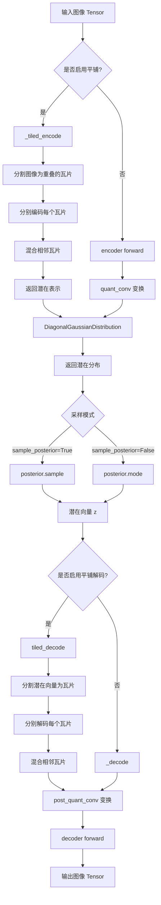
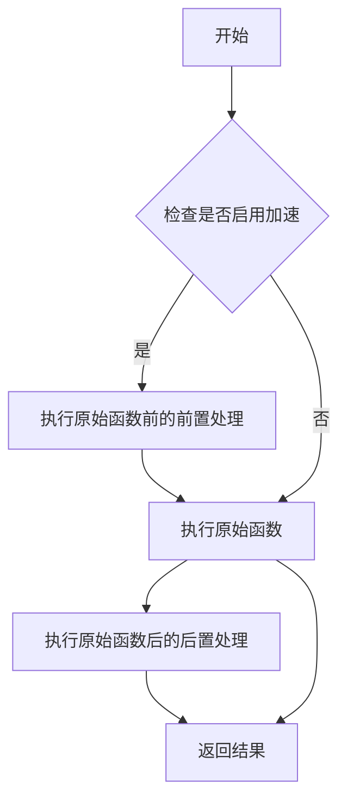
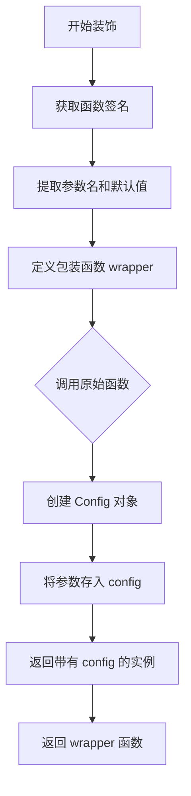
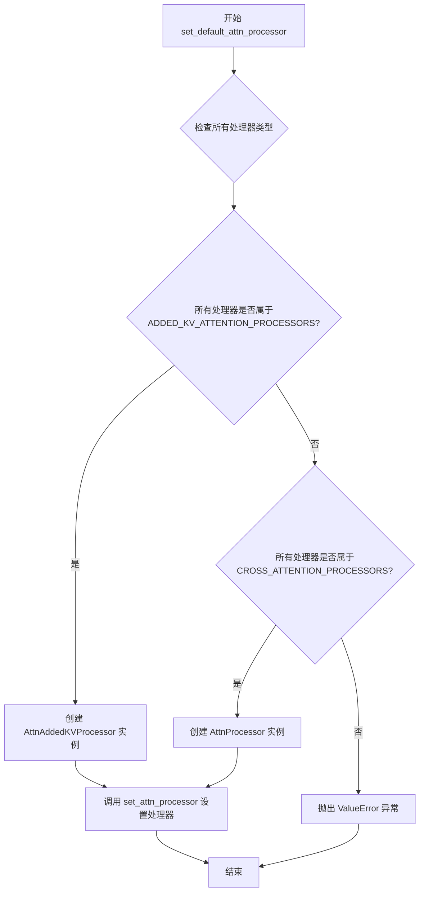
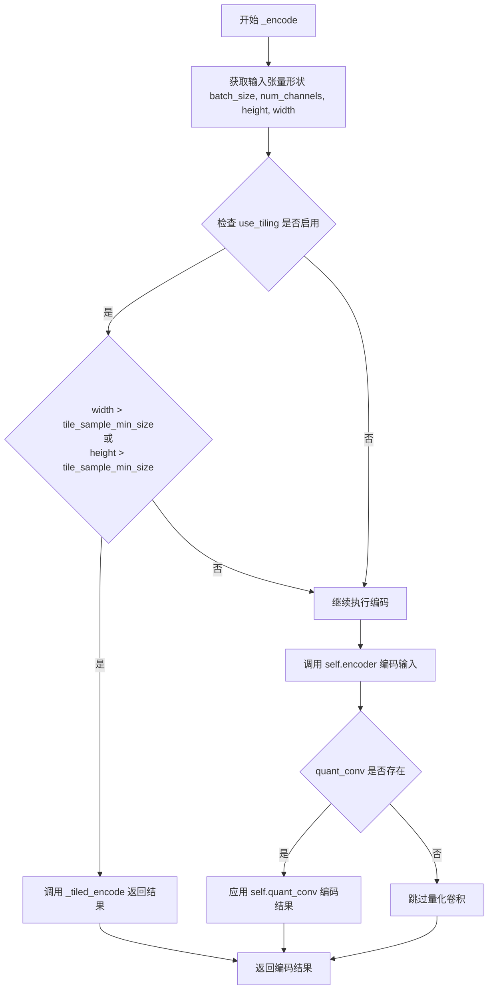
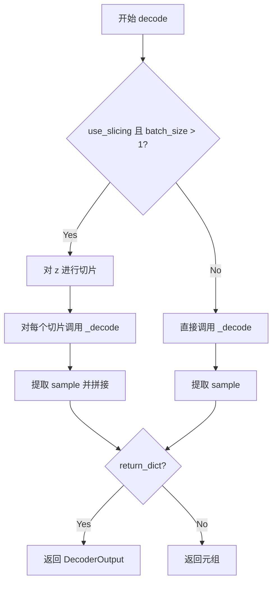
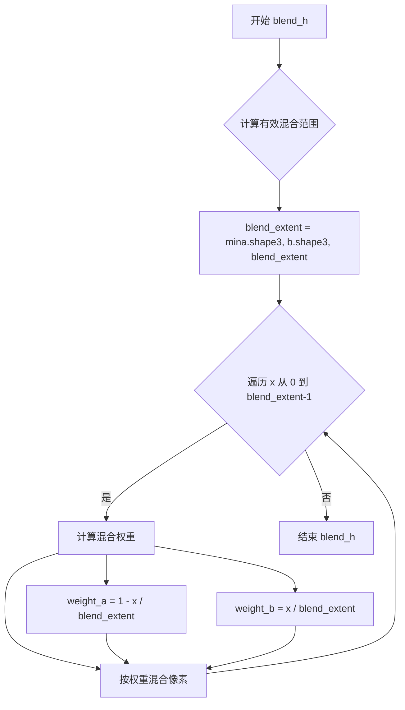
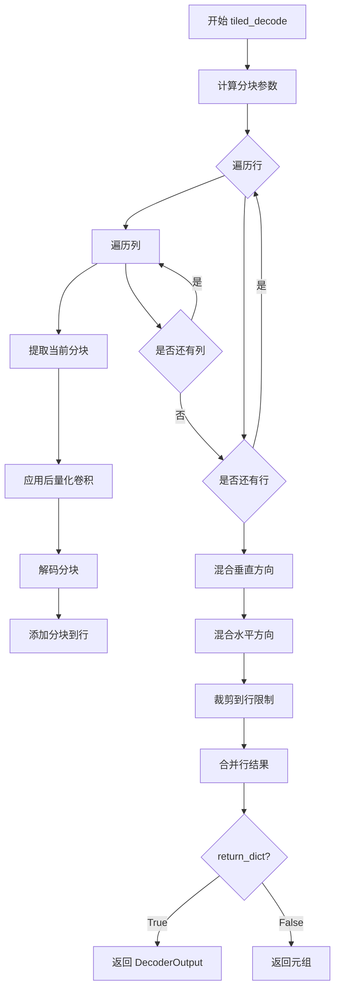
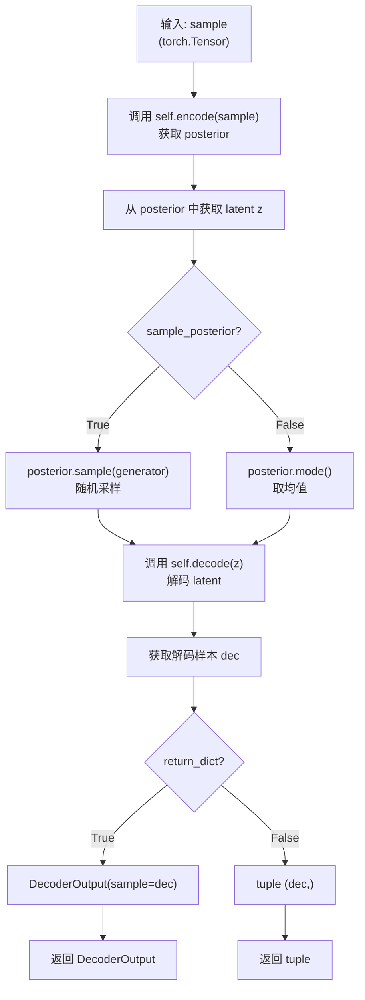
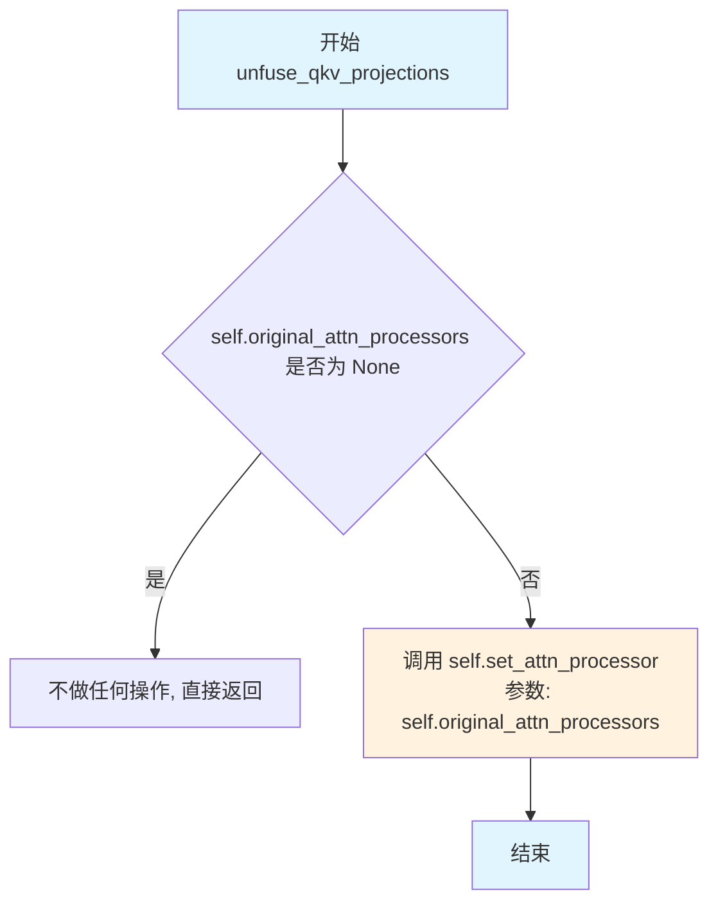

# `diffusers\src\diffusers\models\autoencoders\autoencoder_kl_flux2.py` 详细设计文档

AutoencoderKLFlux2 是一个基于 KL 散度的变分自编码器 (VAE) 模型，用于将图像编码到潜在表示并从潜在向量解码回图像。该模型支持平铺编码/解码以处理高分辨率图像，并集成了注意力机制和多种优化技术。

## 整体流程



## 类结构

```
ModelMixin (基类)
├── AutoencoderKLFlux2 (主类)
    ├── Encoder (组件)
    ├── Decoder (组件)
    ├── DiagonalGaussianDistribution (潜在分布)
    ├── AutoencoderKLOutput (输出封装)
    └── DecoderOutput (输出封装)
```

## 全局变量及字段


### `_supports_gradient_checkpointing`
    
类属性，指示是否支持梯度检查点

类型：`bool`
    


### `_no_split_modules`
    
类属性，指定不允许拆分的模块名称列表

类型：`list[str]`
    


### `in_channels`
    
输入图像的通道数，默认为3（RGB图像）

类型：`int`
    


### `out_channels`
    
输出图像的通道数，默认为3

类型：`int`
    


### `down_block_types`
    
下采样块类型元组

类型：`tuple[str, ...]`
    


### `up_block_types`
    
上采样块类型元组

类型：`tuple[str, ...]`
    


### `block_out_channels`
    
块输出通道数元组

类型：`tuple[int, ...]`
    


### `layers_per_block`
    
每个块中的层数

类型：`int`
    


### `act_fn`
    
激活函数名称

类型：`str`
    


### `latent_channels`
    
潜在空间的通道数

类型：`int`
    


### `norm_num_groups`
    
归一化的组数

类型：`int`
    


### `sample_size`
    
样本尺寸

类型：`int`
    


### `force_upcast`
    
是否强制使用float32进行高分辨率处理

类型：`bool`
    


### `use_quant_conv`
    
是否使用量化卷积

类型：`bool`
    


### `use_post_quant_conv`
    
是否使用后量化卷积

类型：`bool`
    


### `mid_block_add_attention`
    
是否在中间块添加注意力机制

类型：`bool`
    


### `batch_norm_eps`
    
批归一化的epsilon参数

类型：`float`
    


### `batch_norm_momentum`
    
批归一化的动量参数

类型：`float`
    


### `patch_size`
    
补丁大小

类型：`tuple[int, int]`
    


### `AutoencoderKLFlux2.encoder`
    
编码器网络，将图像编码为潜在表示

类型：`Encoder`
    


### `AutoencoderKLFlux2.decoder`
    
解码器网络，将潜在向量解码为图像

类型：`Decoder`
    


### `AutoencoderKLFlux2.quant_conv`
    
编码后的潜在通道变换卷积（可选）

类型：`nn.Conv2d | None`
    


### `AutoencoderKLFlux2.post_quant_conv`
    
解码前的潜在通道变换卷积（可选）

类型：`nn.Conv2d | None`
    


### `AutoencoderKLFlux2.bn`
    
批归一化层，用于潜在空间

类型：`nn.BatchNorm2d`
    


### `AutoencoderKLFlux2.use_slicing`
    
是否启用切片处理模式

类型：`bool`
    


### `AutoencoderKLFlux2.use_tiling`
    
是否启用平铺处理模式

类型：`bool`
    


### `AutoencoderKLFlux2.tile_sample_min_size`
    
平铺编码的最小样本尺寸

类型：`int`
    


### `AutoencoderKLFlux2.tile_latent_min_size`
    
平铺解码的最小潜在尺寸

类型：`int`
    


### `AutoencoderKLFlux2.tile_overlap_factor`
    
平铺重叠因子

类型：`float`
    
    

## 全局函数及方法


### `apply_forward_hook`

`apply_forward_hook` 是一个从 `diffusers.utils.accelerate_utils` 模块导入的装饰器函数，用于在模型的前向传播方法（如 `encode` 和 `decode`）执行前后注入钩子逻辑，支持加速和性能优化功能。

参数：

- `fn`：被装饰的函数（方法），需要注入前向钩子逻辑的函数

返回值：装饰后的函数，返回值类型与被装饰的函数相同

#### 流程图



#### 带注释源码

```
# apply_forward_hook 是从 diffusers.utils.accelerate_utils 导入的装饰器
# 源码位于 diffusers/src/diffusers/utils/accelerate_utils.py

# 使用示例（来自代码中的实际应用）:
@apply_forward_hook
def encode(
    self, x: torch.Tensor, return_dict: bool = True
) -> AutoencoderKLOutput | tuple[DiagonalGaussianDistribution]:
    """
    Encode a batch of images into latents.
    
    该方法被 apply_forward_hook 装饰器包装，
    可以在编码执行前后注入额外的处理逻辑
    """
    ...

@apply_forward_hook
def decode(
    self, z: torch.FloatTensor, return_dict: bool = True, generator=None
) -> DecoderOutput | torch.FloatTensor:
    """
    Decode a batch of images.
    
    该方法被 apply_forward_hook 装饰器包装，
    可以在解码执行前后注入额外的处理逻辑
    """
    ...

# 注意: apply_forward_hook 的完整实现在 diffusers 库的 
# diffusers/utils/accelerate_utils.py 文件中
# 从当前提供的代码片段中无法看到其具体实现源码
```


### `register_to_config`

`register_to_config` 是 `configuration_utils` 模块提供的装饰器函数，用于将模型 `__init__` 方法的参数自动注册为模型的配置属性。它捕获函数签名，将所有参数及其默认值存储在 `self.config` 对象中，使得模型配置可被序列化保存和加载。

参数：

-  `fn`：`Callable`，被装饰的函数，通常是模型的 `__init__` 方法

返回值：`Callable`，装饰后的函数

#### 流程图



#### 带注释源码

```python
def register_to_config(func):
    """
    装饰器：将 __init__ 方法的参数注册为模型配置属性。
    
    该装饰器会：
    1. 提取被装饰函数的所有参数（包括默认值）
    2. 创建一个包装函数，在调用原始 __init__ 后
    3. 将所有参数及其值存储在 self.config 对象中
    4. 使得配置可以通过 save_pretrained/from_pretrained 保存和加载
    """
    # 提取函数的参数签名
    # signature = inspect.signature(func)
    
    def wrapper(self, *args, **kwargs):
        # 首先调用原始的 __init__ 方法
        # result = func(self, *args, **kwargs)
        
        # 获取签名并绑定参数
        # bound_args = signature.bind(self, *args, **kwargs)
        # bound_args.apply_defaults()
        
        # 创建配置对象并存储参数
        # config = self.config_class()
        # for param_name, param_value in bound_args.arguments.items():
        #     if param_name != 'self':
        #         setattr(config, param_name, param_value)
        
        # self.config = config
        # return self
    
    return wrapper
```

#### 使用示例

```python
class AutoencoderKLFlux2(ModelMixin, ConfigMixin, ...):
    
    @register_to_config  # 使用装饰器
    def __init__(
        self,
        in_channels: int = 3,
        out_channels: int = 3,
        down_block_types: tuple[str, ...] = (...),
        # ... 其他参数
    ):
        super().__init__()
        # 初始化逻辑...
    
    # 装饰器会自动：
    # 1. 捕获所有 __init__ 参数
    # 2. 创建 self.config 对象
    # 3. 将参数存储为 config 属性
    # 4. 支持 config.save_pretrained("path") 和 AutoencoderKLFlux2.from_pretrained("path")
```


### `AutoencoderKLFlux2.__init__`

该方法是 `AutoencoderKLFlux2` 类的构造函数，用于初始化一个具有 KL 损失的 VAE 模型，用于将图像编码到潜在空间并从潜在表示解码回图像。该方法接受多个参数来配置编码器、解码器、潜在空间和各种优化选项。

参数：

- `in_channels`：`int`，输入图像的通道数，默认为 3
- `out_channels`：`int`，输出图像的通道数，默认为 3
- `down_block_types`：`tuple[str, ...]`，下采样块类型的元组，默认为四个 `"DownEncoderBlock2D"`
- `up_block_types`：`tuple[str, ...]`，上采样块类型的元组，默认为四个 `"UpDecoderBlock2D"`
- `block_out_channels`：`tuple[int, ...]`，块输出通道数的元组，默认为 `(128, 256, 512, 512)`
- `layers_per_block`：`int`，每个块中的层数，默认为 2
- `act_fn`：`str`，激活函数类型，默认为 `"silu"`
- `latent_channels`：`int`，潜在空间的通道数，默认为 32
- `norm_num_groups`：`int`，归一化组数，默认为 32
- `sample_size`：`int`，样本输入大小，默认为 1024
- `force_upcast`：`bool`，是否强制将 VAE 上转到 float32，默认为 True
- `use_quant_conv`：`bool`，是否使用量化卷积，默认为 True
- `use_post_quant_conv`：`bool`，是否使用后量化卷积，默认为 True
- `mid_block_add_attention`：`bool`，是否在中间块添加注意力，默认为 True
- `batch_norm_eps`：`float`，批归一化的 epsilon 值，默认为 1e-4
- `batch_norm_momentum`：`float`，批归一化的动量值，默认为 0.1
- `patch_size`：`tuple[int, int]`，patch 大小，默认为 `(2, 2)`

返回值：`None`，该方法为构造函数，不返回任何值

#### 流程图

```mermaid
flowchart TD
    A[开始 __init__] --> B[调用 super().__init__]
    B --> C[创建 Encoder 实例]
    C --> D[创建 Decoder 实例]
    D --> E{use_quant_conv?}
    E -->|True| F[创建 quant_conv 卷积层]
    E -->|False| G[quant_conv = None]
    F --> H{use_post_quant_conv?}
    G --> H
    H -->|True| I[创建 post_quant_conv 卷积层]
    H -->|False| J[post_quant_conv = None]
    I --> K[创建 BatchNorm2d 层 bn]
    J --> K
    K --> L[初始化 slicing 和 tiling 标志]
    L --> M[计算 tile_sample_min_size 和 tile_latent_min_size]
    M --> N[设置 tile_overlap_factor]
    N --> O[结束 __init__]
```

#### 带注释源码

```python
@register_to_config
def __init__(
    self,
    in_channels: int = 3,
    out_channels: int = 3,
    down_block_types: tuple[str, ...] = (
        "DownEncoderBlock2D",
        "DownEncoderBlock2D",
        "DownEncoderBlock2D",
        "DownEncoderBlock2D",
    ),
    up_block_types: tuple[str, ...] = (
        "UpDecoderBlock2D",
        "UpDecoderBlock2D",
        "UpDecoderBlock2D",
        "UpDecoderBlock2D",
    ),
    block_out_channels: tuple[int, ...] = (
        128,
        256,
        512,
        512,
    ),
    layers_per_block: int = 2,
    act_fn: str = "silu",
    latent_channels: int = 32,
    norm_num_groups: int = 32,
    sample_size: int = 1024,  # YiYi notes: not sure
    force_upcast: bool = True,
    use_quant_conv: bool = True,
    use_post_quant_conv: bool = True,
    mid_block_add_attention: bool = True,
    batch_norm_eps: float = 1e-4,
    batch_norm_momentum: float = 0.1,
    patch_size: tuple[int, int] = (2, 2),
):
    # 调用父类的初始化方法
    super().__init__()

    # 将初始化参数传递给 Encoder
    # Encoder 负责将输入图像编码到潜在空间
    self.encoder = Encoder(
        in_channels=in_channels,
        out_channels=latent_channels,
        down_block_types=down_block_types,
        block_out_channels=block_out_channels,
        layers_per_block=layers_per_block,
        act_fn=act_fn,
        norm_num_groups=norm_num_groups,
        double_z=True,  # 设置为 True 表示使用 KL 散度（双通道输出）
        mid_block_add_attention=mid_block_add_attention,
    )

    # 将初始化参数传递给 Decoder
    # Decoder 负责将潜在表示解码回图像
    self.decoder = Decoder(
        in_channels=latent_channels,
        out_channels=out_channels,
        up_block_types=up_block_types,
        block_out_channels=block_out_channels,
        layers_per_block=layers_per_block,
        norm_num_groups=norm_num_groups,
        act_fn=act_fn,
        mid_block_add_attention=mid_block_add_attention,
    )

    # 量化卷积层，用于在编码后对潜在表示进行变换
    # 只有当 use_quant_conv 为 True 时才创建
    self.quant_conv = nn.Conv2d(2 * latent_channels, 2 * latent_channels, 1) if use_quant_conv else None
    
    # 后量化卷积层，用于在解码前对潜在表示进行变换
    # 只有当 use_post_quant_conv 为 True 时才创建
    self.post_quant_conv = nn.Conv2d(latent_channels, latent_channels, 1) if use_post_quant_conv else None

    # 批归一化层，用于归一化展平后的 patch 和潜在通道
    self.bn = nn.BatchNorm2d(
        math.prod(patch_size) * latent_channels,
        eps=batch_norm_eps,
        momentum=batch_norm_momentum,
        affine=False,  # 不使用仿射变换
        track_running_stats=True,  # 跟踪运行时统计量
    )

    # VAE 切片和平铺标志，用于控制内存优化
    self.use_slicing = False
    self.use_tiling = False

    # 仅在启用 VAE 平铺时相关
    # 设置平铺样本的最小尺寸
    self.tile_sample_min_size = self.config.sample_size
    # 处理 sample_size 可能是列表或元组的情况
    sample_size = (
        self.config.sample_size[0]
        if isinstance(self.config.sample_size, (list, tuple))
        else self.config.sample_size
    )
    # 计算潜在平铺的最小尺寸，基于块输出通道数
    self.tile_latent_min_size = int(sample_size / (2 ** (len(self.config.block_out_channels) - 1)))
    # 设置平铺重叠因子，用于平滑过渡
    self.tile_overlap_factor = 0.25
```


### `AutoencoderKLFlux2.set_default_attn_processor`

该方法用于禁用自定义注意力处理器并将注意力实现重置为默认配置，根据当前处理器类型自动选择合适的默认注意力处理器。

参数：

- 该方法无参数

返回值：无返回值（`None`），该方法直接修改模型的注意力处理器状态

#### 流程图



#### 带注释源码

```python
# Copied from diffusers.models.unets.unet_2d_condition.UNet2DConditionModel.set_default_attn_processor
def set_default_attn_processor(self):
    """
    Disables custom attention processors and sets the default attention implementation.
    """
    # 检查所有注意力处理器是否都属于 ADDED_KV_ATTENTION_PROCESSORS 类型
    # ADDED_KV_ATTENTION_PROCESSORS 是支持额外键值对添加的注意力处理器集合
    if all(proc.__class__ in ADDED_KV_ATTENTION_PROCESSORS for proc in self.attn_processors.values()):
        # 如果所有处理器都是 Added KV 类型，则使用 AttnAddedKVProcessor
        processor = AttnAddedKVProcessor()
    # 检查所有注意力处理器是否都属于 CROSS_ATTENTION_PROCESSORS 类型
    # CROSS_ATTENTION_PROCESSORS 是交叉注意力处理器集合
    elif all(proc.__class__ in CROSS_ATTENTION_PROCESSORS for proc in self.attn_processors.values()):
        # 如果所有处理器都是交叉注意力类型，则使用 AttnProcessor
        processor = AttnProcessor()
    else:
        # 如果处理器类型混合或不匹配，抛出 ValueError 异常
        raise ValueError(
            f"Cannot call `set_default_attn_processor` when attention processors are of type {next(iter(self.attn_processors.values()))}"
        )

    # 调用 set_attn_processor 方法将选定的默认处理器应用到模型
    self.set_attn_processor(processor)
```


### `AutoencoderKLFlux2._encode`

该方法是 AutoencoderKLFlux2 类的私有编码方法，负责将输入图像张量编码为潜在表示。如果启用了平铺且图像尺寸超过阈值，则调用平铺编码方法；否则直接使用编码器进行编码，并可选地应用量化卷积。

参数：

- `x`：`torch.Tensor`，输入的图像批次张量，形状为 (batch_size, num_channels, height, width)

返回值：`torch.Tensor`，编码后的潜在表示张量

#### 流程图



#### 带注释源码

```python
def _encode(self, x: torch.Tensor) -> torch.Tensor:
    """
    编码输入图像为潜在表示。
    
    参数:
        x: 输入的图像张量，形状为 (batch_size, num_channels, height, width)
    
    返回:
        编码后的潜在表示张量
    """
    # 获取输入张量的维度信息
    batch_size, num_channels, height, width = x.shape

    # 检查是否启用平铺编码且图像尺寸超过阈值
    if self.use_tiling and (width > self.tile_sample_min_size or height > self.tile_sample_min_size):
        # 如果满足条件，使用平铺编码方法处理大图像
        return self._tiled_encode(x)

    # 使用编码器对输入进行编码
    enc = self.encoder(x)
    
    # 如果存在量化卷积层，则应用它
    if self.quant_conv is not None:
        enc = self.quant_conv(enc)

    # 返回编码后的潜在表示
    return enc
```


### `AutoencoderKLFlux2.encode`

该方法将一批图像编码为潜在表示（latent representations）。它是 AutoencoderKLFlux2 VAE 模型的核心编码接口，支持切片（slicing）处理大批量图像，通过内部 `_encode` 方法调用编码器，并通过 DiagonalGaussianDistribution 将编码结果转换为潜在空间分布，最后根据参数返回 `AutoencoderKLOutput` 对象或元组形式。

参数：

- `self`：`AutoencoderKLFlux2` 实例自身，无需显式传递
- `x`：`torch.Tensor`，输入的图像批次，形状为 `(batch_size, channels, height, width)`
- `return_dict`：`bool`，可选，默认为 `True`。是否返回 `AutoencoderKLOutput` 对象而非普通元组

返回值：`AutoencoderKLOutput | tuple[DiagonalGaussianDistribution]`，编码后的潜在表示。若 `return_dict` 为 `True`，返回包含 `latent_dist` 属性的 `AutoencoderKLOutput` 对象；否则返回包含 `DiagonalGaussianDistribution` 的元组

#### 流程图

```mermaid
flowchart TD
    A[开始 encode] --> B{use_slicing 为真<br/>且 batch_size > 1?}
    B -->|是| C[将 x 按 batch 维度切分]
    C --> D[对每个切片调用 _encode]
    D --> E[沿 batch 维度拼接结果]
    B -->|否| F[直接调用 _encode]
    E --> G[创建 DiagonalGaussianDistribution]
    F --> G
    G --> H{return_dict 为真?}
    H -->|是| I[返回 AutoencoderKLOutput]
    H -->|否| J[返回 tuple[posterior]]
    I --> K[结束]
    J --> K
```

#### 带注释源码

```python
@apply_forward_hook  # 应用前向钩子，用于追踪中间激活值等
def encode(
    self, x: torch.Tensor, return_dict: bool = True
) -> AutoencoderKLOutput | tuple[DiagonalGaussianDistribution]:
    """
    Encode a batch of images into latents.

    Args:
        x (`torch.Tensor`): Input batch of images.
        return_dict (`bool`, *optional*, defaults to `True`):
            Whether to return a [`~models.autoencoder_kl.AutoencoderKLOutput`] instead of a plain tuple.

    Returns:
            The latent representations of the encoded images. If `return_dict` is True, a
            [`~models.autoencoder_kl.AutoencoderKLOutput`] is returned, otherwise a plain `tuple` is returned.
    """
    # 如果启用了切片模式且批次大于1，则将批次分割为单独的图片分别编码
    # 这样可以减少峰值内存占用，适用于高分辨率图像的大批次处理
    if self.use_slicing and x.shape[0] > 1:
        encoded_slices = [self._encode(x_slice) for x_slice in x.split(1)]
        # 将编码后的切片沿批次维度重新拼接
        h = torch.cat(encoded_slices)
    else:
        # 直接对整个批次进行编码
        h = self._encode(x)

    # 将编码输出（moments）转换为对角高斯分布形式
    # 该分布用于后续的采样（sample）或获取均值（mode）
    posterior = DiagonalGaussianDistribution(h)

    # 根据 return_dict 参数决定返回值格式
    if not return_dict:
        # 返回元组形式，保持与旧版 API 的兼容性
        return (posterior,)

    # 返回结构化对象，包含 latent_dist 属性
    return AutoencoderKLOutput(latent_dist=posterior)
```


### `AutoencoderKLFlux2._decode`

该方法是 `AutoencoderKLFlux2` VAE 模型的内部解码方法，负责将潜在向量（latent vectors）解码为图像表示。当潜在向量的尺寸超过配置的最小瓦片大小时，会启用瓦片解码（tiled decoding）以避免内存问题；否则，先通过后量化卷积处理潜在向量，再通过解码器生成图像，最终根据 `return_dict` 参数决定返回 `DecoderOutput` 对象还是元组。

参数：

- `z`：`torch.Tensor`，输入的潜在向量批次，形状为 (batch_size, latent_channels, height, width)
- `return_dict`：`bool`，可选参数，默认为 `True`，控制是否返回 `DecoderOutput` 对象而非普通元组

返回值：`DecoderOutput | torch.Tensor`，如果 `return_dict` 为 `True`，返回包含解码图像的 `DecoderOutput` 对象；否则返回包含解码张量的元组

#### 流程图

```mermaid
flowchart TD
    A[开始 _decode] --> B{是否启用瓦片解码且潜在向量过大?}
    B -->|是| C[调用 tiled_decode 方法]
    B -->|否| D{post_quant_conv 是否存在?}
    D -->|是| E[应用 post_quant_conv 变换]
    D -->|否| F[跳过变换]
    E --> G[通过 decoder 解码]
    F --> G
    C --> H
    G --> H{return_dict 为 True?}
    H -->|是| I[返回 DecoderOutput 对象]
    H -->|否| J[返回元组 (dec,)]
    I --> K[结束]
    J --> K
```

#### 带注释源码

```python
def _decode(self, z: torch.Tensor, return_dict: bool = True) -> DecoderOutput | torch.Tensor:
    """
    解码潜在向量为图像表示的内部方法。
    
    参数:
        z: 输入的潜在向量张量，形状为 (batch_size, latent_channels, latent_height, latent_width)
        return_dict: 是否返回 DecoderOutput 对象，默认为 True
    
    返回:
        解码后的图像张量或 DecoderOutput 对象
    """
    # 检查是否启用了瓦片解码模式且潜在向量尺寸超过最小瓦片大小
    if self.use_tiling and (z.shape[-1] > self.tile_latent_min_size or z.shape[-2] > self.tile_latent_min_size):
        # 如果需要瓦片解码，调用 tiled_decode 方法处理大尺寸潜在向量
        return self.tiled_decode(z, return_dict=return_dict)

    # 如果配置了后量化卷积层，则应用到潜在向量上
    # 这是为了在解码前对潜在空间进行适当的变换
    if self.post_quant_conv is not None:
        z = self.post_quant_conv(z)

    # 使用解码器将潜在向量转换为图像表示
    dec = self.decoder(z)

    # 根据 return_dict 参数决定返回格式
    if not return_dict:
        # 返回元组格式以保持向后兼容性
        return (dec,)

    # 返回包含解码图像的 DecoderOutput 对象
    return DecoderOutput(sample=dec)
```


### `AutoencoderKLFlux2.decode`

该方法用于将批量 latent 向量解码为图像。支持切片（slicing）技术以处理大批量数据，可返回 `DecoderOutput` 对象或普通元组。

参数：

- `z`：`torch.FloatTensor`，输入的 latent 向量批次
- `return_dict`：`bool`，可选，默认为 `True`。是否返回 `DecoderOutput` 对象而不是普通元组
- `generator`：随机生成器，可选，用于潜在采样

返回值：`DecoderOutput | torch.FloatTensor`，如果 `return_dict` 为 True，返回 `DecoderOutput` 对象；否则返回元组

#### 流程图



#### 带注释源码

```python
@apply_forward_hook
def decode(
    self, z: torch.FloatTensor, return_dict: bool = True, generator=None
) -> DecoderOutput | torch.FloatTensor:
    """
    Decode a batch of images.

    Args:
        z (`torch.Tensor`): Input batch of latent vectors.
        return_dict (`bool`, *optional*, defaults to `True`):
            Whether to return a [`~models.vae.DecoderOutput`] instead of a plain tuple.

    Returns:
        [`~models.vae.DecoderOutput`] or `tuple`:
            If return_dict is True, a [`~models.vae.DecoderOutput`] is returned, otherwise a plain `tuple` is
            returned.

    """
    # 如果启用切片且批次大小大于1，则对每个样本分别解码
    if self.use_slicing and z.shape[0] > 1:
        # 将批次按样本分割成单独的切片
        decoded_slices = [self._decode(z_slice).sample for z_slice in z.split(1)]
        # 将解码后的切片在批次维度上拼接
        decoded = torch.cat(decoded_slices)
    else:
        # 否则直接对整个批次进行解码
        decoded = self._decode(z).sample

    # 根据 return_dict 参数决定返回格式
    if not return_dict:
        return (decoded,)

    return DecoderOutput(sample=decoded)
```


### `AutoencoderKLFlux2.blend_v`

该方法用于在垂直方向上混合两个图像块（瓦片），通过线性插值实现平滑过渡，主要用于VAE瓦片编码/解码时消除瓦片拼接处的视觉痕迹。

参数：

- `a`：`torch.Tensor`，上方或前一个瓦片的张量，作为混合的起始参考
- `b`：`torch.Tensor`，当前需要混合的瓦片张量，作为混合的目标
- `blend_extent`：`int`，垂直方向上的混合像素范围，控制过渡带宽度

返回值：`torch.Tensor`，混合操作后的张量（修改后的 `b`）

#### 流程图

```mermaid
flowchart TD
    A[开始 blend_v] --> B[计算有效混合范围]
    B --> C{min blend_extent > 0?}
    C -->|否| D[直接返回 b]
    C --> E[循环 y 从 0 到 blend_extent-1]
    E --> F[计算混合权重: weight_a = 1 - y/blend_extent]
    F --> G[计算混合权重: weight_b = y/blend_extent]
    G --> H[混合对应像素行]
    H --> I[b[:, :, y, :] = a[:, :, -blend_extent+y, :] * weight_a + b[:, :, y, :] * weight_b]
    I --> E
    E --> J[循环结束]
    J --> K[返回混合后的 b]
```

#### 带注释源码

```python
def blend_v(self, a: torch.Tensor, b: torch.Tensor, blend_extent: int) -> torch.Tensor:
    """
    在垂直方向上混合两个张量块，用于消除瓦片拼接处的边界痕迹。
    
    Args:
        a: 上方或前一个瓦片的张量，形状为 [B, C, H, W]
        b: 当前需要混合的瓦片张量，形状为 [B, C, H, W]
        blend_extent: 垂直方向混合的像素行数
    
    Returns:
        混合后的张量 b
    """
    # 取三者最小值，确保混合范围不超过两个张量的实际高度
    blend_extent = min(a.shape[2], b.shape[2], blend_extent)
    
    # 遍历混合范围内的每一行像素
    for y in range(blend_extent):
        # 计算线性混合权重：上方瓦片权重从 1 递减到 0
        weight_a = 1 - y / blend_extent
        # 当前瓦片权重从 0 递增到 1
        weight_b = y / blend_extent
        
        # 从上方瓦片的末尾取对应行，与当前瓦片的起始行进行加权混合
        # a[:, :, -blend_extent + y, :] 取自上方瓦片的底部区域
        # b[:, :, y, :] 为当前瓦片的顶部区域
        b[:, :, y, :] = (
            a[:, :, -blend_extent + y, :] * (1 - y / blend_extent)  # 上方瓦片贡献
            + b[:, :, y, :] * (y / blend_extent)                    # 当前瓦片贡献
        )
    
    return b
```


### `AutoencoderKLFlux2.blend_h`

该方法用于在水平方向（宽度维度）上对两个图像瓦片进行线性混合，通过计算混合权重来实现瓦片边缘的平滑过渡，主要应用于 VAE 瓦片编码/解码时避免拼接 artifacts。

参数：

- `self`：自动引用，当前 AutoencoderKLFlux2 实例
- `a`：`torch.Tensor`，待混合的左侧瓦片张量，形状为 (batch, channels, height, width)
- `b`：`torch.Tensor`，待混合的右侧瓦片张量，形状与 a 相同
- `blend_extent`：`int`，混合范围的像素数量

返回值：`torch.Tensor`，混合后的瓦片张量 b

#### 流程图



#### 带注释源码

```python
def blend_h(self, a: torch.Tensor, b: torch.Tensor, blend_extent: int) -> torch.Tensor:
    """
    在水平方向上混合两个瓦片张量。
    
    Args:
        a: 左侧瓦片张量
        b: 右侧瓦片张量
        blend_extent: 混合范围的像素数量
        
    Returns:
        混合后的右侧瓦片张量
    """
    # 确保混合范围不超过两个张量的宽度以及指定的混合范围
    blend_extent = min(a.shape[3], b.shape[3], blend_extent)
    
    # 遍历混合范围内的每个像素列
    for x in range(blend_extent):
        # 计算当前位置的混合权重
        # 左侧权重从 1 逐渐衰减到 0
        # 右侧权重从 0 逐渐增长到 1
        b[:, :, :, x] = (
            a[:, :, :, -blend_extent + x] * (1 - x / blend_extent)  # 左侧瓦片贡献
            + b[:, :, :, x] * (x / blend_extent)                   # 右侧瓦片贡献
        )
    
    # 返回混合后的右侧瓦片
    return b
```


### `AutoencoderKLFlux2._tiled_encode`

使用平铺（tiling）策略对大规模图像进行分块编码，将输入图像分割为重叠的瓦片分别通过编码器处理，然后使用垂直和水平混合消除边界伪影，最终合并为连续的潜在表示。

参数：

- `x`：`torch.Tensor`，输入的图像批次

返回值：`torch.Tensor`，编码后的潜在表示

#### 流程图

```mermaid
flowchart TD
    A[开始] --> B[计算重叠大小和混合范围]
    B --> C[按行遍历图像高度]
    C --> D[按列遍历图像宽度]
    D --> E[提取瓦片: x[:, :, i:i+tile_sample_min_size, j:j+tile_sample_min_size]]
    E --> F[编码瓦片: self.encoder(tile)]
    F --> G{use_quant_conv?}
    G -->|Yes| H[应用量化卷积: self.quant_conv(tile)]
    G -->|No| I[跳过量化卷积]
    H --> J[将瓦片添加到当前行]
    I --> J
    D --> K{列遍历完成?}
    K -->|No| D
    K -->|Yes| L{行遍历完成?}
    L -->|No| C
    L -->|Yes| M[混合瓦片: 垂直混合上方瓦片, 水平混合左侧瓦片]
    M --> N[裁剪到行限制大小]
    N --> O[合并行内瓦片]
    O --> P[合并所有行为最终编码结果]
    P --> Q[结束]
```

#### 带注释源码

```python
def _tiled_encode(self, x: torch.Tensor) -> torch.Tensor:
    r"""Encode a batch of images using a tiled encoder.

    When this option is enabled, the VAE will split the input tensor into tiles to compute encoding in several
    steps. This is useful to keep memory use constant regardless of image size. The end result of tiled encoding is
    different from non-tiled encoding because each tile uses a different encoder. To avoid tiling artifacts, the
    tiles overlap and are blended together to form a smooth output. You may still see tile-sized changes in the
    output, but they should be much less noticeable.

    Args:
        x (`torch.Tensor`): Input batch of images.

    Returns:
        `torch.Tensor`:
            The latent representation of the encoded videos.
    """

    # 计算瓦片重叠大小：基于最小样本大小和重叠因子
    overlap_size = int(self.tile_sample_min_size * (1 - self.tile_overlap_factor))
    # 计算混合范围：潜在空间的混合区域大小
    blend_extent = int(self.tile_latent_min_size * self.tile_overlap_factor)
    # 计算每行的有效限制：去除混合区域后的实际输出大小
    row_limit = self.tile_latent_min_size - blend_extent

    # 初始化存储所有瓦片行的列表
    rows = []
    # 按垂直方向遍历图像，每次移动overlap_size个像素
    for i in range(0, x.shape[2], overlap_size):
        row = []  # 存储当前行的瓦片
        # 按水平方向遍历图像，每次移动overlap_size个像素
        for j in range(0, x.shape[3], overlap_size):
            # 提取当前瓦片：从位置(i,j)开始，大小为tile_sample_min_size
            tile = x[:, :, i : i + self.tile_sample_min_size, j : j + self.tile_sample_min_size]
            # 通过编码器处理当前瓦片
            tile = self.encoder(tile)
            # 如果配置启用量化卷积，则应用于瓦片
            if self.config.use_quant_conv:
                tile = self.quant_conv(tile)
            # 将编码后的瓦片添加到当前行
            row.append(tile)
        # 将当前行添加到行列表
        rows.append(row)
    
    # 处理混合：合并相邻瓦片以消除边界伪影
    result_rows = []
    for i, row in enumerate(rows):
        result_row = []
        for j, tile in enumerate(row):
            # 混合上方瓦片（如果存在）
            if i > 0:
                tile = self.blend_v(rows[i - 1][j], tile, blend_extent)
            # 混合左侧瓦片（如果存在）
            if j > 0:
                tile = self.blend_h(row[j - 1], tile, blend_extent)
            # 裁剪到有效大小（去除混合区域）
            result_row.append(tile[:, :, :row_limit, :row_limit])
        # 水平拼接当前行的所有瓦片
        result_rows.append(torch.cat(result_row, dim=3))
    
    # 垂直拼接所有行，形成最终编码结果
    enc = torch.cat(result_rows, dim=2)
    return enc
```


### `AutoencoderKLFlux2.tiled_encode`

该方法实现了一个基于瓦片（tiled）策略的编码器，用于将批量图像编码为潜在表示。通过将输入图像分割成重叠的瓦片分别编码，然后使用混合函数平滑拼接各瓦片结果，从而在保持内存使用恒定的情况下处理任意尺寸的图像。

参数：

- `x`：`torch.Tensor`，输入的图像批次，形状为 (batch_size, channels, height, width)
- `return_dict`：`bool`，可选，默认为 `True`，是否返回 `AutoencoderKLOutput` 而不是元组

返回值：`AutoencoderKLOutput`，包含潜在分布的输出对象；如果 `return_dict` 为 `False`，则返回元组

#### 流程图

```mermaid
flowchart TD
    A[开始 tiled_encode] --> B[计算瓦片参数]
    B --> C{遍历图像行}
    C -->|每行| D{遍历图像列}
    D -->|每个瓦片| E[提取瓦片: x[:, :, i:i+tile_sample_min_size, j:j+tile_sample_min_size]
    E --> F[使用 encoder 编码瓦片]
    F --> G{use_quant_conv?}
    G -->|是| H[应用 quant_conv]
    G -->|否| I[跳过 quant_conv]
    H --> J[将瓦片添加到行列表]
    I --> J
    D -->|列循环结束| K[将行列表添加到行组]
    C -->|行循环结束| L{遍历编码结果行}
    L --> M{当前瓦片位置}
    M -->|i > 0| N[垂直混合: blend_v]
    M -->|j > 0| O[水平混合: blend_h]
    N --> P[裁剪到 row_limit 大小]
    O --> P
    M -->|否则| P
    P --> Q[将结果瓦片添加到结果行]
    L -->|行循环结束| R[拼接所有结果行形成最终编码]
    R --> S[创建 DiagonalGaussianDistribution]
    S --> T{return_dict?}
    T -->|True| U[返回 AutoencoderKLOutput]
    T -->|False| V[返回元组]
```

#### 带注释源码

```python
def tiled_encode(self, x: torch.Tensor, return_dict: bool = True) -> AutoencoderKLOutput:
    r"""Encode a batch of images using a tiled encoder.

    When this option is enabled, the VAE will split the input tensor into tiles to compute encoding in several
    steps. This is useful to keep memory use constant regardless of image size. The end result of tiled encoding is
    different from non-tiled encoding because each tile uses a different encoder. To avoid tiling artifacts, the
    tiles overlap and are blended together to form a smooth output. You may still see tile-sized changes in the
    output, but they should be much less noticeable.

    Args:
        x (`torch.Tensor`): Input batch of images.
        return_dict (`bool`, *optional*, defaults to `True`):
            Whether or not to return a [`~models.autoencoder_kl.AutoencoderKLOutput`] instead of a plain tuple.

    Returns:
        [`~models.autoencoder_kl.AutoencoderKLOutput`] or `tuple`:
            If return_dict is True, a [`~models.autoencoder_kl.AutoencoderKLOutput`] is returned, otherwise a plain
            `tuple` is returned.
    """
    # 发出警告：该实现将在未来版本中被 _tiled_encode 替代，且不再支持 return_dict 参数
    deprecation_message = (
        "The tiled_encode implementation supporting the `return_dict` parameter is deprecated. In the future, the "
        "implementation of this method will be replaced with that of `_tiled_encode` and you will no longer be able "
        "to pass `return_dict`. You will also have to create a `DiagonalGaussianDistribution()` from the returned value."
    )
    deprecate("tiled_encode", "1.0.0", deprecation_message, standard_warn=False)

    # 计算瓦片重叠大小：瓦片尺寸 * (1 - 重叠因子)
    overlap_size = int(self.tile_sample_min_size * (1 - self.tile_overlap_factor))
    # 计算混合边缘宽度：潜在瓦片尺寸 * 重叠因子
    blend_extent = int(self.tile_latent_min_size * self.tile_overlap_factor)
    # 计算行限制：潜在瓦片尺寸 - 混合边缘宽度
    row_limit = self.tile_latent_min_size - blend_extent

    # 将图像分割成瓦片并分别编码
    rows = []
    # 按垂直方向遍历图像，每次移动 overlap_size 像素
    for i in range(0, x.shape[2], overlap_size):
        row = []
        # 按水平方向遍历图像，每次移动 overlap_size 像素
        for j in range(0, x.shape[3], overlap_size):
            # 提取当前瓦片：从位置 (i, j) 开始，尺寸为 tile_sample_min_size x tile_sample_min_size
            tile = x[:, :, i : i + self.tile_sample_min_size, j : j + self.tile_sample_min_size]
            # 使用编码器对瓦片进行编码
            tile = self.encoder(tile)
            # 如果配置启用 quant_conv，则应用量化卷积
            if self.config.use_quant_conv:
                tile = self.quant_conv(tile)
            # 将当前瓦片添加到当前行
            row.append(tile)
        # 将当前行添加到行列表
        rows.append(row)
    
    # 处理编码后的瓦片，进行混合以消除边界痕迹
    result_rows = []
    for i, row in enumerate(rows):
        result_row = []
        for j, tile in enumerate(row):
            # 混合上方瓦片和当前瓦片（垂直混合）
            if i > 0:
                tile = self.blend_v(rows[i - 1][j], tile, blend_extent)
            # 混合左侧瓦片和当前瓦片（水平混合）
            if j > 0:
                tile = self.blend_h(row[j - 1], tile, blend_extent)
            # 裁剪瓦片到 row_limit 大小，去除重叠区域
            result_row.append(tile[:, :, :row_limit, :row_limit])
        # 沿宽度方向拼接当前行的所有瓦片
        result_rows.append(torch.cat(result_row, dim=3))

    # 沿高度方向拼接所有行，形成完整的编码结果
    moments = torch.cat(result_rows, dim=2)
    # 从 moments 创建对角高斯分布（潜在空间表示）
    posterior = DiagonalGaussianDistribution(moments)

    # 根据 return_dict 参数决定返回格式
    if not return_dict:
        return (posterior,)

    return AutoencoderKLOutput(latent_dist=posterior)
```


### `AutoencoderKLFlux2.tiled_decode`

该方法实现了分块解码（tiled decoding）功能，将输入的潜在向量分割成重叠的块，分别解码后再通过混合消除块间接缝，最终合并为完整的图像输出。这种方法可以在有限的 GPU 内存下处理高分辨率图像。

参数：

- `z`：`torch.Tensor`，输入的潜在向量批次
- `return_dict`：`bool`，是否返回 `DecoderOutput` 对象（默认为 `True`）

返回值：`DecoderOutput | torch.Tensor`，解码后的图像张量或包含样本的 `DecoderOutput` 对象

#### 流程图



#### 带注释源码

```python
def tiled_decode(self, z: torch.Tensor, return_dict: bool = True) -> DecoderOutput | torch.Tensor:
    r"""
    Decode a batch of images using a tiled decoder.

    Args:
        z (`torch.Tensor`): Input batch of latent vectors.
        return_dict (`bool`, *optional*, defaults to `True`):
            Whether or not to return a [`~models.vae.DecoderOutput`] instead of a plain tuple.

    Returns:
        [`~models.vae.DecoderOutput`] or `tuple`:
            If return_dict is True, a [`~models.vae.DecoderOutput`] is returned, otherwise a plain `tuple` is
            returned.
    """
    # 计算重叠大小：基于最小潜在块大小和重叠因子
    overlap_size = int(self.tile_latent_min_size * (1 - self.tile_overlap_factor))
    # 计算混合范围：基于最小样本大小和重叠因子
    blend_extent = int(self.tile_sample_min_size * self.tile_overlap_factor)
    # 计算行限制：样本大小减去混合范围
    row_limit = self.tile_sample_min_size - blend_extent

    # 将潜在向量分割成重叠的64x64分块并分别解码
    # 分块有重叠以避免分块之间的接缝
    rows = []
    for i in range(0, z.shape[2], overlap_size):
        row = []
        for j in range(0, z.shape[3], overlap_size):
            # 提取当前分块
            tile = z[:, :, i : i + self.tile_latent_min_size, j : j + self.tile_latent_min_size]
            # 如果配置使用后量化卷积，则应用于当前分块
            if self.config.use_post_quant_conv:
                tile = self.post_quant_conv(tile)
            # 使用解码器解码当前分块
            decoded = self.decoder(tile)
            row.append(decoded)
        rows.append(row)
    
    # 处理所有分块行，进行混合以消除接缝
    result_rows = []
    for i, row in enumerate(rows):
        result_row = []
        for j, tile in enumerate(row):
            # 混合上方分块和左侧分块到当前分块
            # 并将当前分块添加到结果行
            if i > 0:
                # 垂直混合：当前分块与上方分块混合
                tile = self.blend_v(rows[i - 1][j], tile, blend_extent)
            if j > 0:
                # 水平混合：当前分块与左侧分块混合
                tile = self.blend_h(row[j - 1], tile, blend_extent)
            # 裁剪到行限制大小
            result_row.append(tile[:, :, :row_limit, :row_limit])
        # 沿宽度维度拼接行中的所有分块
        result_rows.append(torch.cat(result_row, dim=3))

    # 沿高度维度拼接所有行
    dec = torch.cat(result_rows, dim=2)
    
    # 根据return_dict决定返回格式
    if not return_dict:
        return (dec,)

    return DecoderOutput(sample=dec)
```


### `AutoencoderKLFlux2.forward`

该方法是 AutoencoderKLFlux2 模型的核心前向传播函数，实现了一个完整的变分自编码器（VAE）流程：先将输入图像编码为潜在分布（latent distribution），然后根据配置从分布中采样或取mode，最后将潜在向量解码为重建图像。

参数：

- `self`：类实例本身，包含模型组件（encoder、decoder等）
- `sample`：`torch.Tensor`，输入样本（图像张量），形状为 (batch_size, channels, height, width)
- `sample_posterior`：`bool`，是否从后验分布中采样，如果为 False 则取分布的 mode（均值），默认为 False
- `return_dict`：`bool`，是否返回字典形式的 DecoderOutput，默认为 True；如果为 False 则返回元组
- `generator`：`torch.Generator | None`，随机数生成器，用于后验分布采样时的随机性控制，默认为 None

返回值：`DecoderOutput | torch.Tensor`，当 return_dict 为 True 时返回 DecoderOutput 对象（包含重建的 sample），否则返回元组 (sample,)

#### 流程图



#### 带注释源码

```python
def forward(
    self,
    sample: torch.Tensor,
    sample_posterior: bool = False,
    return_dict: bool = True,
    generator: torch.Generator | None = None,
) -> DecoderOutput | torch.Tensor:
    r"""
    Args:
        sample (`torch.Tensor`): Input sample.
        sample_posterior (`bool`, *optional*, defaults to `False`):
            Whether to sample from the posterior.
        return_dict (`bool`, *optional*, defaults to `True`):
            Whether or not to return a [`DecoderOutput`] instead of a plain tuple.
    """
    # 1. 将输入样本赋值给变量 x
    x = sample
    
    # 2. 通过 encode 方法编码输入样本，获取后验分布
    # encode 方法返回 AutoencoderKLOutput，其中包含 latent_dist (DiagonalGaussianDistribution)
    posterior = self.encode(x).latent_dist
    
    # 3. 根据 sample_posterior 参数决定如何获取潜在向量 z
    if sample_posterior:
        # 从后验分布中随机采样，引入随机性（用于生成任务）
        z = posterior.sample(generator=generator)
    else:
        # 取后验分布的 mode（均值），实现确定性重建
        z = posterior.mode()
    
    # 4. 通过 decode 方法将潜在向量解码为图像
    dec = self.decode(z).sample
    
    # 5. 根据 return_dict 参数决定返回格式
    if not return_dict:
        # 返回元组形式
        return (dec,)
    
    # 返回 DecoderOutput 对象形式
    return DecoderOutput(sample=dec)
```


### `AutoencoderKLFlux2.fuse_qkv_projections`

该方法用于启用融合的 QKV 投影。对于自注意力模块，所有投影矩阵（即 query、key、value）将被融合；对于交叉注意力模块，key 和 value 投影矩阵将被融合。

参数：
- 无参数（仅 `self`）

返回值：`None`，无返回值（该方法直接修改模型状态）

#### 流程图

```mermaid
flowchart TD
    A[开始] --> B[初始化 original_attn_processors 为 None]
    B --> C{检查 attn_processors 中是否有 AddedKV 处理器}
    C -->|是| D[抛出 ValueError: 不支持带 Added KV 投影的模型]
    C -->|否| E[保存当前的 attn_processors 到 original_attn_processors]
    E --> F[遍历所有模块]
    F --> G{模块是否为 Attention 类型?}
    G -->|是| H[调用 module.fuse_projections(fuse=True) 融合投影]
    G -->|否| I[继续下一个模块]
    H --> I
    I --> J{是否还有更多模块?}
    J -->|是| F
    J -->|否| K[使用 FusedAttnProcessor2_0 设置注意力处理器]
    K --> L[结束]
```

#### 带注释源码

```python
def fuse_qkv_projections(self):
    """
    Enables fused QKV projections. For self-attention modules, all projection matrices 
    (i.e., query, key, value) are fused. For cross-attention modules, key and value 
    projection matrices are fused.

    > [!WARNING] > This API is 🧪 experimental.
    """
    # 初始化保存原始注意力处理器的变量
    self.original_attn_processors = None

    # 遍历所有注意力处理器，检查是否存在 AddedKV 类型的处理器
    for _, attn_processor in self.attn_processors.items():
        # 如果存在 Added KV 投影的处理器，则抛出异常
        if "Added" in str(attn_processor.__class__.__name__):
            raise ValueError(
                "`fuse_qkv_projections()` is not supported for models having added KV projections."
            )

    # 保存当前的注意力处理器，以便后续可以恢复
    self.original_attn_processors = self.attn_processors

    # 遍历模型中的所有模块
    for module in self.modules():
        # 如果模块是 Attention 类型，则融合其投影矩阵
        if isinstance(module, Attention):
            # 调用 Attention 模块的 fuse_projections 方法，传入 fuse=True 以启用融合
            module.fuse_projections(fuse=True)

    # 使用 FusedAttnProcessor2_0 替换当前的注意力处理器
    self.set_attn_processor(FusedAttnProcessor2_0())
```


### `AutoencoderKLFlux2.unfuse_qkv_projections`

该方法用于禁用融合的QKV投影，将注意力处理器恢复为原始的非融合状态。当之前通过 `fuse_qkv_projections` 方法启用了融合投影后，调用此方法可以还原到原始的注意力处理器配置。

参数：

- 无额外参数（仅包含隐式参数 `self`）

返回值：`None`，无返回值（该方法直接修改对象状态）

#### 流程图



#### 带注释源码

```python
def unfuse_qkv_projections(self):
    """Disables the fused QKV projection if enabled.

    > [!WARNING] > This API is 🧪 experimental.

    """
    # 检查是否存在已保存的原始注意力处理器
    # 如果 original_attn_processors 为 None，说明融合投影未启用，无需执行任何操作
    if self.original_attn_processors is not None:
        # 调用 set_attn_processor 方法，将当前的注意力处理器恢复为原始状态
        # 原始处理器保存在 self.original_attn_processors 中
        self.set_attn_processor(self.original_attn_processors)
```

## 关键组件


### 张量索引与惰性加载

该组件通过tiled encoding/decoding实现惰性加载，将大图像分割成小块（tiles）分别处理，最后通过blend_v和blend_h方法平滑拼接，避免内存溢出。

### 反量化支持

该组件包含quant_conv（编码后量化卷积）和post_quant_conv（解码前反量化卷积），支持在潜空间进行量化/反量化操作，以减少内存占用和计算量。

### DiagonalGaussianDistribution

用于建模VAE的潜空间分布，将编码器输出的moments转换为对角高斯分布，支持采样（sample）和取模（mode）两种解码方式。

### 图像分块处理（tiled_encode/tiled_decode）

将输入图像或潜向量分割成重叠的tiles分别编码/解码，通过overlap_size和blend_extent参数控制重叠区域和混合边界，实现平滑过渡。

### VAE切片处理（use_slicing）

当batch_size大于1时，将输入沿batch维度切片分别编码/解码，然后拼接结果，以降低单次处理的内存峰值。

### 混合拼接机制（blend_v/blend_h）

在tiled处理中，用于垂直和水平方向混合相邻tiles的边缘区域，通过线性插值实现无缝拼接，避免明显的接缝 artifacts。

### DecoderOutput

解码器输出封装类，包含sample属性存储解码后的图像张量。

### AutoencoderKLOutput

编码器输出封装类，包含latent_dist属性存储DiagonalGaussianDistribution潜空间分布。


## 问题及建议


### 已知问题

- **代码重复**：`tiled_encode` 方法与 `_tiled_encode` 方法的实现几乎完全相同，仅在 `return_dict` 参数处理上有区别。这违反了 DRY 原则，维护成本高。
- **未使用的配置参数**：`force_upcast` 参数在 `__init__` 中被接受并注册到配置中，但在整个类中从未被使用，可能是未完成的功能或遗留代码。
- **注释表明不确定性**：在 `sample_size` 参数的注释中有 "YiYi notes: not sure"，表明该参数的用途或默认值可能未经充分验证。
- **API 设计不一致**：
  - `_encode` 方法不接受 `return_dict` 参数，但 `_decode` 方法接受
  - `encode` 方法使用 `@apply_forward_hook` 装饰器，但 `_encode` 方法没有
  - 这种不一致增加了理解和维护的难度
- **tiling 和 slicing 逻辑不完整**：在 `_encode` 方法中，只检查了 `use_tiling` 条件，没有检查 `use_slicing` 条件，这与 `encode` 方法中的逻辑不一致。
- **混合类继承复杂性**：继承自 6 个不同的 mixin 类（`ModelMixin`, `AutoencoderMixin`, `AttentionMixin`, `ConfigMixin`, `FromOriginalModelMixin`, `PeftAdapterMixin`），可能导致方法解析顺序（MRO）问题和意外行为。

### 优化建议

- **消除代码重复**：将 `tiled_encode` 和 `_tiled_encode` 合并为一个方法，通过参数控制是否返回 `DiagonalGaussianDistribution` 对象。
- **移除或实现 `force_upcast` 功能**：如果该参数是有意设计但未完成，应添加相应的上 casting 逻辑；如果不需要，应从配置中移除。
- **统一 API 设计**：使 `_encode` 和 `_decode` 方法在参数签名上保持一致，都支持 `return_dict` 参数。
- **完善 tiling 逻辑**：在 `_encode` 和 `_decode` 方法中同时检查 `use_tiling` 和 `use_slicing` 条件，与 `encode` 和 `decode` 方法保持一致。
- **清理注释**：移除 "YiYi notes: not sure" 这类不确定的注释，或添加更明确的说明。
- **考虑使用组合而非继承**：过多的 mixin 继承可能导致代码难以理解，考虑通过组合模式重构部分功能。


## 其它


### 设计目标与约束

**设计目标：**
- 实现一个基于KL散度的变分自编码器(VAE)，支持图像到潜在空间的编码和从潜在空间到图像的解码
- 支持高分辨率图像处理，通过tiling机制避免内存溢出
- 继承Diffusers库的ModelMixin，提供标准的模型加载和保存接口
- 支持PEFT(Parameter-Efficient Fine-Tuning)适配器
- 支持注意力处理器融合以优化推理性能

**约束：**
- 必须继承ModelMixin、AutoencoderMixin、AttentionMixin、ConfigMixin、FromOriginalModelMixin和PeftAdapterMixin
- 输入通道数默认为3(RGB图像)，输出通道数默认为3
- 潜在空间通道数默认为32
- force_upcast默认启用，强制使用float32进行高分辨率推理

### 错误处理与异常设计

**异常处理机制：**
- `set_default_attn_processor`方法：当注意力处理器类型不匹配时抛出ValueError
- `fuse_qkv_projections`方法：当检测到 Added KV 投影时抛出ValueError，不支持融合
- `encode/decode`方法：支持return_dict参数控制返回格式
-  tiling相关方法：当图像尺寸超过tile_sample_min_size时自动启用tiling

**边界条件检查：**
- 在tiled_encode和tiled_decode中，blend_extent受限于输入张量的实际尺寸
- tile_latent_min_size根据sample_size和block_out_channels计算

### 数据流与状态机

**编码流程(Encode Flow)：**
```
输入图像 x (B, C, H, W)
    ↓
[可选] Tiling处理 (当use_tiling=True且图像尺寸超过阈值)
    ↓
Encoder编码 → enc (B, latent_channels*2, H', W')
    ↓
[可选] QuantConv处理 (当use_quant_conv=True)
    ↓
DiagonalGaussianDistribution生成后验分布
    ↓
AutoencoderKLOutput (包含latent_dist)
```

**解码流程(Decode Flow)：**
```
输入潜在向量 z (B, latent_channels, H', W')
    ↓
[可选] Tiling处理 (当use_tiling=True且潜在向量尺寸超过阈值)
    ↓
[可选] PostQuantConv处理 (当use_post_quant_conv=True)
    ↓
Decoder解码 → dec (B, C, H, W)
    ↓
[可选] Tiling拼接和blending
    ↓
DecoderOutput (包含sample)
```

**Forward流程：**
```
输入sample → encode()获取posterior → [可选]采样或取mode → decode() → 返回结果
```

### 外部依赖与接口契约

**核心依赖模块：**
- `torch.nn`：神经网络基础模块
- `configuration_utils.ConfigMixin`：配置混入基类
- `configuration_utils.register_to_config`：配置注册装饰器
- `loaders.PeftAdapterMixin`：PEFT适配器混入
- `loaders.single_file_model.FromOriginalModelMixin`：单文件模型加载混入
- `utils.accelerate_utils.apply_forward_hook`：前向传播钩子
- `attention.AttentionMixin`：注意力混入基类
- `attention_processor`：各种注意力处理器
- `modeling_outputs.AutoencoderKLOutput`：编码器输出结构
- `modeling_utils.ModelMixin`：模型混入基类
- `vae`：Encoder、Decoder、DiagonalGaussianDistribution等

**公共接口契约：**
- `encode(x, return_dict=True)`：返回AutoencoderKLOutput或tuple
- `decode(z, return_dict=True, generator=None)`：返回DecoderOutput或tuple
- `forward(sample, sample_posterior=False, return_dict=True, generator=None)`：返回DecoderOutput或tuple
- `fuse_qkv_projections()`：融合QKV投影
- `unfuse_qkv_projections()`：解除QKV投影融合
- `set_default_attn_processor()`：设置默认注意力处理器

### 性能考虑

**内存优化：**
- use_slicing：当batch_size>1时，将输入分割为单个样本分别编码/解码
- use_tiling：将大图像分割为小tile分别处理，避免OOM
- tile_overlap_factor：控制tile之间的重叠比例(默认0.25)

**计算优化：**
- BatchNorm2d：应用在latent空间，进行归一化处理
- 注意力融合(fuse_qkv_projections)：将QKV投影合并为一个矩阵乘法
- 梯度检查点支持：_supports_gradient_checkpointing=True

**Tiling参数：**
- tile_sample_min_size：基于config.sample_size
- tile_latent_min_size：基于sample_size和下采样层数计算
- tile_overlap_factor：0.25

### 兼容性考虑

**PyTorch版本：** 需要支持torch的各种版本
**Diffusers版本：** 需要与Diffusers库的最新API兼容
**PEFT支持：** 继承PeftAdapterMixin以支持LoRA等参数高效微调方法
**模型加载：** 支持FromOriginalModelMixin以从原始模型权重加载
**配置兼容性：** 使用register_to_config装饰器确保配置可序列化

### 配置参数说明

| 参数名 | 类型 | 默认值 | 描述 |
|--------|------|--------|------|
| in_channels | int | 3 | 输入图像通道数 |
| out_channels | int | 3 | 输出图像通道数 |
| down_block_types | tuple | DownEncoderBlock2D元组 | 下采样块类型 |
| up_block_types | tuple | UpDecoderBlock2D元组 | 上采样块类型 |
| block_out_channels | tuple | (128,256,512,512) | 块输出通道数 |
| layers_per_block | int | 2 | 每个块的层数 |
| act_fn | str | "silu" | 激活函数 |
| latent_channels | int | 32 | 潜在空间通道数 |
| norm_num_groups | int | 32 | 归一化组数 |
| sample_size | int | 1024 | 采样尺寸 |
| force_upcast | bool | True | 强制使用float32 |
| use_quant_conv | bool | True | 使用量化卷积 |
| use_post_quant_conv | bool | True | 使用后量化卷积 |
| mid_block_add_attention | bool | True | 中间块添加注意力 |
| batch_norm_eps | float | 1e-4 | BatchNorm epsilon |
| batch_norm_momentum | float | 0.1 | BatchNorm动量 |
| patch_size | tuple | (2,2) | 补丁尺寸 |

### 使用示例

**基本编码解码：**
```python
import torch
from diffusers import AutoencoderKLFlux2

# 初始化模型
vae = AutoencoderKLFlux2.from_pretrained("path/to/model")

# 编码图像
with torch.no_grad():
    input_image = torch.randn(1, 3, 512, 512)
    encoded = vae.encode(input_image)
    latent = encoded.latent_dist.sample()  # 或使用 .mode() 获取确定性输出

# 解码潜在向量
with torch.no_grad():
    decoded = vae.decode(latent)
    output_image = decoded.sample
```

**使用tiling处理高分辨率图像：**
```python
# 启用tiling
vae.use_tiling = True

# 处理高分辨率图像
high_res_image = torch.randn(1, 3, 2048, 2048)
with torch.no_grad():
    encoded = vae.encode(high_res_image)
    decoded = vae.decode(encoded.latent_dist.sample())
```

**使用slicing处理大批量：**
```python
# 启用slicing
vae.use_slicing = True

# 处理大批量图像
batch_images = torch.randn(16, 3, 512, 512)
with torch.no_grad():
    encoded = vae.encode(batch_images)
```

### 版本历史与迁移指南

**当前版本特点：**
- 继承自AutoencoderKL，针对Flux2架构优化
- 支持patch_size参数进行patch嵌入
- 集成了多种注意力处理器支持

**从旧版本迁移：**
- 旧版AutoencoderKL用户可直接替换为AutoencoderKLFlux2
- 注意sample_size默认值可能不同
- 新增patch_size参数可根据需要调整

    