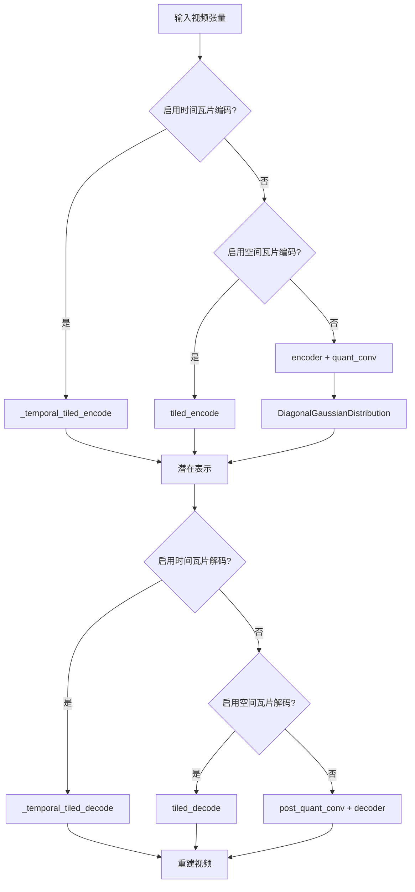
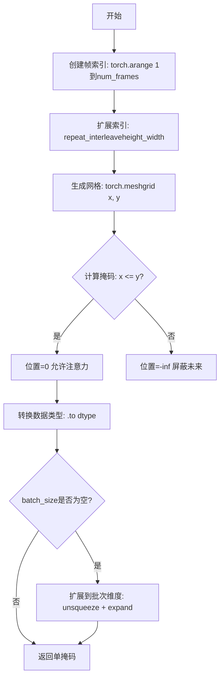
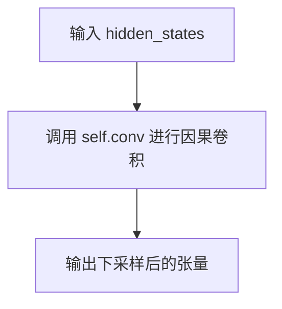
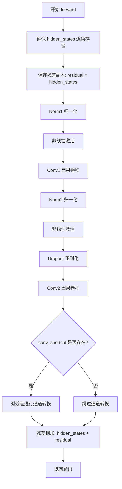
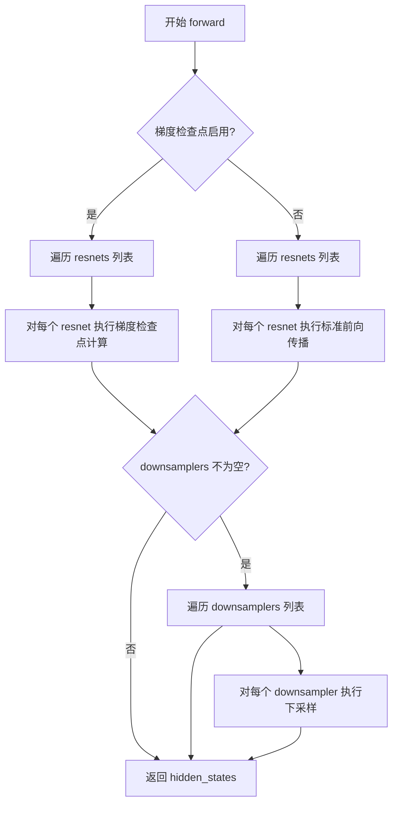
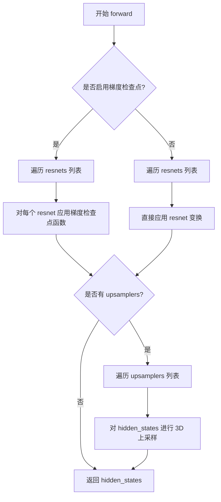
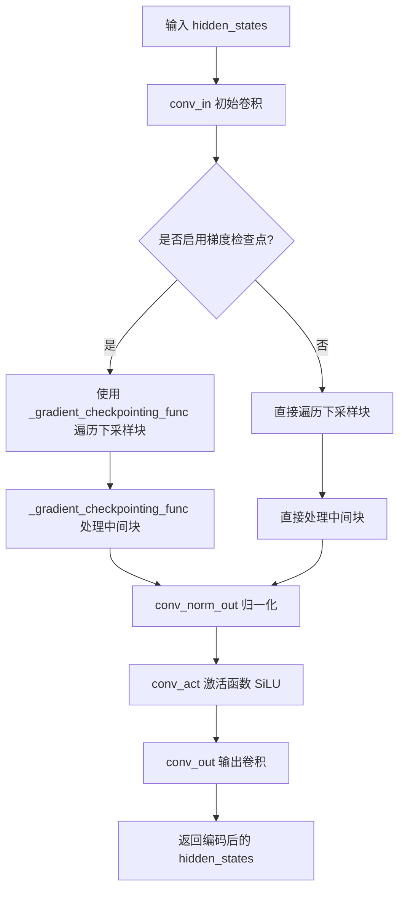
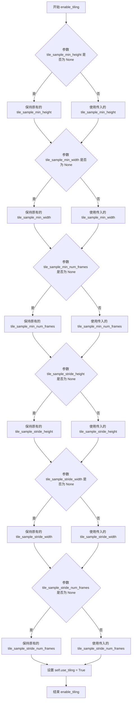
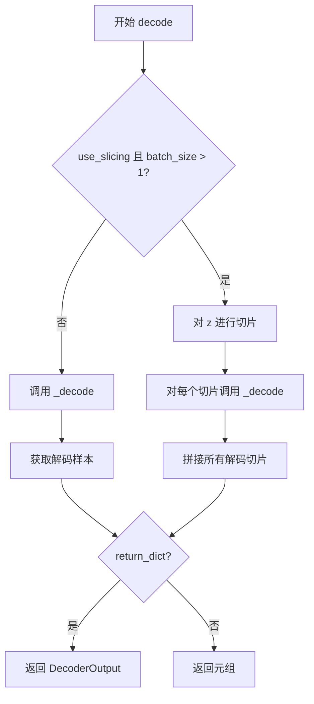
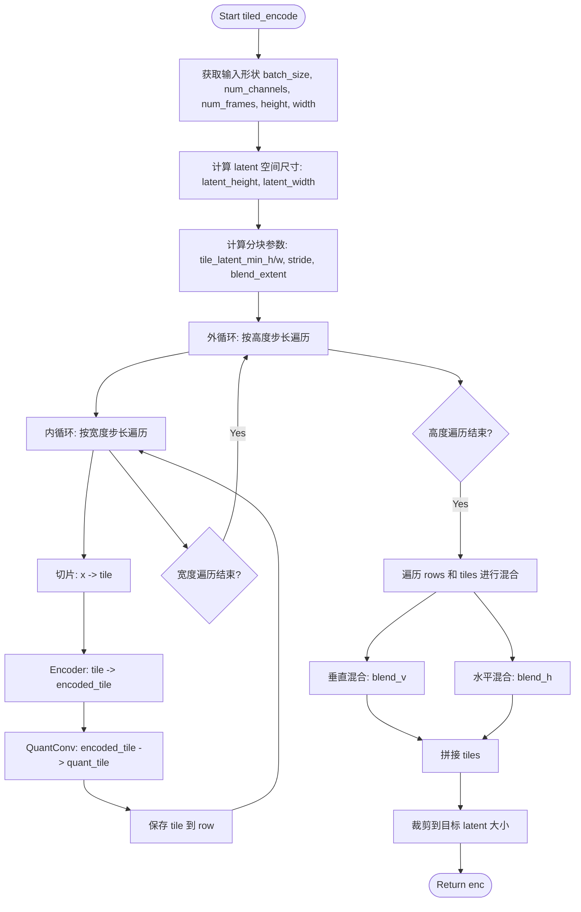

# `diffusers\src\diffusers\models\autoencoders\autoencoder_kl_hunyuan_video.py` 详细设计文档

这是一个用于视频编码和解码的变分自编码器(VAE)模型，属于Hunyuan Video项目。该模型使用3D因果卷积结构，能够将视频压缩到潜在空间并从潜在表示重建视频，支持空间和时间维度的压缩与重建，包含切片(Slicing)、瓦片(Tiling)和时间瓦片编码/解码等内存优化技术。

## 整体流程



## 类结构

```
prepare_causal_attention_mask (全局函数)
HunyuanVideoCausalConv3d (3D因果卷积)
HunyuanVideoUpsampleCausal3D (3D因果上采样)
HunyuanVideoDownsampleCausal3D (3D因果下采样)
HunyuanVideoResnetBlockCausal3D (3D因果ResNet块)
HunyuanVideoMidBlock3D (中间块)
HunyuanVideoDownBlock3D (下采样块)
HunyuanVideoUpBlock3D (上采样块)
HunyuanVideoEncoder3D (3D视频编码器)
HunyuanVideoDecoder3D (3D视频解码器)
AutoencoderKLHunyuanVideo (主VAE模型)
```

## 全局变量及字段


### `logger`
    
Logger instance for the module

类型：`logging.Logger`
    


### `prepare_causal_attention_mask`
    
Prepares causal attention mask for 3D video attention computation

类型：`function`
    


### `HunyuanVideoCausalConv3d.pad_mode`
    
Padding mode for time-causal 3D convolution

类型：`str`
    


### `HunyuanVideoCausalConv3d.time_causal_padding`
    
Padding values for time-causal padding in convolution

类型：`tuple`
    


### `HunyuanVideoCausalConv3d.conv`
    
3D convolutional layer for video processing

类型：`nn.Conv3d`
    


### `HunyuanVideoUpsampleCausal3D.upsample_factor`
    
Upsampling factor for spatial and temporal dimensions

类型：`tuple`
    


### `HunyuanVideoUpsampleCausal3D.conv`
    
Causal 3D convolution for upsampling

类型：`HunyuanVideoCausalConv3d`
    


### `HunyuanVideoDownsampleCausal3D.conv`
    
Causal 3D convolution for downsampling

类型：`HunyuanVideoCausalConv3d`
    


### `HunyuanVideoResnetBlockCausal3D.nonlinearity`
    
Activation function for the resnet block

类型：`Activation`
    


### `HunyuanVideoResnetBlockCausal3D.norm1`
    
First group normalization layer

类型：`nn.GroupNorm`
    


### `HunyuanVideoResnetBlockCausal3D.conv1`
    
First causal 3D convolution layer

类型：`HunyuanVideoCausalConv3d`
    


### `HunyuanVideoResnetBlockCausal3D.norm2`
    
Second group normalization layer

类型：`nn.GroupNorm`
    


### `HunyuanVideoResnetBlockCausal3D.dropout`
    
Dropout layer for regularization

类型：`nn.Dropout`
    


### `HunyuanVideoResnetBlockCausal3D.conv2`
    
Second causal 3D convolution layer

类型：`HunyuanVideoCausalConv3d`
    


### `HunyuanVideoResnetBlockCausal3D.conv_shortcut`
    
Shortcut connection convolution for channel mismatch

类型：`HunyuanVideoCausalConv3d`
    


### `HunyuanVideoMidBlock3D.add_attention`
    
Flag to enable attention mechanism in mid block

类型：`bool`
    


### `HunyuanVideoMidBlock3D.attentions`
    
List of attention modules

类型：`nn.ModuleList`
    


### `HunyuanVideoMidBlock3D.resnets`
    
List of resnet blocks

类型：`nn.ModuleList`
    


### `HunyuanVideoMidBlock3D.gradient_checkpointing`
    
Flag to enable gradient checkpointing for memory optimization

类型：`bool`
    


### `HunyuanVideoDownBlock3D.resnets`
    
List of resnet blocks for downsampling

类型：`nn.ModuleList`
    


### `HunyuanVideoDownBlock3D.downsamplers`
    
List of downsampling modules

类型：`nn.ModuleList`
    


### `HunyuanVideoDownBlock3D.gradient_checkpointing`
    
Flag to enable gradient checkpointing

类型：`bool`
    


### `HunyuanVideoUpBlock3D.resnets`
    
List of resnet blocks for upsampling

类型：`nn.ModuleList`
    


### `HunyuanVideoUpBlock3D.upsamplers`
    
List of upsampling modules

类型：`nn.ModuleList`
    


### `HunyuanVideoUpBlock3D.gradient_checkpointing`
    
Flag to enable gradient checkpointing

类型：`bool`
    


### `HunyuanVideoEncoder3D.conv_in`
    
Input convolution layer for encoder

类型：`HunyuanVideoCausalConv3d`
    


### `HunyuanVideoEncoder3D.mid_block`
    
Middle block of the encoder

类型：`HunyuanVideoMidBlock3D`
    


### `HunyuanVideoEncoder3D.down_blocks`
    
List of downsampling blocks

类型：`nn.ModuleList`
    


### `HunyuanVideoEncoder3D.conv_norm_out`
    
Output normalization layer

类型：`nn.GroupNorm`
    


### `HunyuanVideoEncoder3D.conv_act`
    
SiLU activation for output

类型：`nn.SiLU`
    


### `HunyuanVideoEncoder3D.conv_out`
    
Output convolution layer for encoder

类型：`HunyuanVideoCausalConv3d`
    


### `HunyuanVideoEncoder3D.gradient_checkpointing`
    
Flag to enable gradient checkpointing

类型：`bool`
    


### `HunyuanVideoDecoder3D.layers_per_block`
    
Number of layers per resnet block

类型：`int`
    


### `HunyuanVideoDecoder3D.conv_in`
    
Input convolution layer for decoder

类型：`HunyuanVideoCausalConv3d`
    


### `HunyuanVideoDecoder3D.mid_block`
    
Middle block of the decoder

类型：`HunyuanVideoMidBlock3D`
    


### `HunyuanVideoDecoder3D.up_blocks`
    
List of upsampling blocks

类型：`nn.ModuleList`
    


### `HunyuanVideoDecoder3D.conv_norm_out`
    
Output normalization layer

类型：`nn.GroupNorm`
    


### `HunyuanVideoDecoder3D.conv_act`
    
SiLU activation for output

类型：`nn.SiLU`
    


### `HunyuanVideoDecoder3D.conv_out`
    
Output convolution layer for decoder

类型：`HunyuanVideoCausalConv3d`
    


### `HunyuanVideoDecoder3D.gradient_checkpointing`
    
Flag to enable gradient checkpointing

类型：`bool`
    


### `AutoencoderKLHunyuanVideo.time_compression_ratio`
    
Temporal compression ratio for video encoding

类型：`int`
    


### `AutoencoderKLHunyuanVideo.spatial_compression_ratio`
    
Spatial compression ratio for video encoding

类型：`int`
    


### `AutoencoderKLHunyuanVideo.temporal_compression_ratio`
    
Temporal compression ratio for video encoding

类型：`int`
    


### `AutoencoderKLHunyuanVideo.encoder`
    
Video encoder network

类型：`HunyuanVideoEncoder3D`
    


### `AutoencoderKLHunyuanVideo.decoder`
    
Video decoder network

类型：`HunyuanVideoDecoder3D`
    


### `AutoencoderKLHunyuanVideo.quant_conv`
    
Quantization convolution layer

类型：`nn.Conv3d`
    


### `AutoencoderKLHunyuanVideo.post_quant_conv`
    
Post-quantization convolution layer

类型：`nn.Conv3d`
    


### `AutoencoderKLHunyuanVideo.use_slicing`
    
Flag to enable slicing for batch encoding/decoding

类型：`bool`
    


### `AutoencoderKLHunyuanVideo.use_tiling`
    
Flag to enable spatial tiling for large video latents

类型：`bool`
    


### `AutoencoderKLHunyuanVideo.use_framewise_encoding`
    
Flag to enable frame-wise encoding for long videos

类型：`bool`
    


### `AutoencoderKLHunyuanVideo.use_framewise_decoding`
    
Flag to enable frame-wise decoding for long videos

类型：`bool`
    


### `AutoencoderKLHunyuanVideo.tile_sample_min_height`
    
Minimum tile height for spatial tiling

类型：`int`
    


### `AutoencoderKLHunyuanVideo.tile_sample_min_width`
    
Minimum tile width for spatial tiling

类型：`int`
    


### `AutoencoderKLHunyuanVideo.tile_sample_min_num_frames`
    
Minimum number of frames per tile for temporal tiling

类型：`int`
    


### `AutoencoderKLHunyuanVideo.tile_sample_stride_height`
    
Stride between vertical tiles for blending

类型：`int`
    


### `AutoencoderKLHunyuanVideo.tile_sample_stride_width`
    
Stride between horizontal tiles for blending

类型：`int`
    


### `AutoencoderKLHunyuanVideo.tile_sample_stride_num_frames`
    
Stride between temporal tiles for blending

类型：`int`
    
    

## 全局函数及方法


### `prepare_causal_attention_mask`

该函数用于生成视频/3D注意力机制中的因果注意力掩码（Causal Attention Mask），确保当前帧只能关注当前帧及之前的帧，而不能关注未来帧。这是实现时间因果性的关键组件，常用于视频生成模型（如HunyuanVideo）的自回归或单向注意力计算中。

参数：

- `num_frames`：`int`，视频的帧数量，决定时间维度的掩码大小
- `height_width`：`int`，空间维度（高度×宽度）的值，用于将时间索引扩展到完整的时空位置
- `dtype`：`torch.dtype`，掩码的目标数据类型（如torch.float16或torch.float32）
- `device`：`torch.device`，创建掩码的设备（CPU或CUDA）
- `batch_size`：`int | None`（可选，默认值为`None`），批次大小，如果提供则将掩码扩展到批次维度

返回值：`torch.Tensor`，形状为`(batch_size, num_frames * height_width, num_frames * height_width)`的因果注意力掩码，其中`x <= y`的位置为0（允许注意力），`x > y`的位置为`-inf`（屏蔽未来信息）

#### 流程图



#### 带注释源码

```python
def prepare_causal_attention_mask(
    num_frames: int, height_width: int, dtype: torch.dtype, device: torch.device, batch_size: int = None
) -> torch.Tensor:
    """
    准备因果注意力掩码，用于视频/3D注意力机制。
    
    因果掩码确保位置 i 只能关注位置 j (其中 j <= i)，即只能关注当前和过去的帧，
    不能关注未来帧。这对于自回归视频生成模型至关重要。
    
    Args:
        num_frames: 视频的帧数量
        height_width: 空间维度的大小 (height * width)
        dtype: 目标数据类型
        device: 计算设备
        batch_size: 可选的批次大小
    
    Returns:
        因果注意力掩码张量
    """
    
    # 步骤1: 创建从1到num_frames的整数索引
    # 例如: num_frames=4 -> [1, 2, 3, 4]
    indices = torch.arange(1, num_frames + 1, dtype=torch.int32, device=device)
    
    # 步骤2: 将每个帧索引重复height_width次
    # 这样可以将时间因果性扩展到完整的时空位置
    # 例如: height_width=2, indices=[1,2,3,4] -> [1,1,2,2,3,3,4,4]
    indices_blocks = indices.repeat_interleave(height_width)
    
    # 步骤3: 创建2D网格，用于比较位置关系
    # x[i,j]表示源位置j到目标位置i的注意力
    # 使用"xy"索引方式，x对应行（目标位置），y对应列（源位置）
    x, y = torch.meshgrid(indices_blocks, indices_blocks, indexing="xy")
    
    # 步骤4: 构建因果掩码
    # x <= y 表示目标位置在源位置之后或相同（即当前或过去）
    # 这些位置允许注意力连接，设为0
    # x > y 表示目标位置在源位置之前（即未来）
    # 这些位置需要屏蔽，设为负无穷
    mask = torch.where(x <= y, 0, -float("inf")).to(dtype=dtype)
    
    # 步骤5: 如果提供了batch_size，将掩码扩展到批次维度
    # 这避免了在批次维度上为每个样本重复计算掩码
    if batch_size is not None:
        mask = mask.unsqueeze(0).expand(batch_size, -1, -1)
    
    return mask
```

#### 技术细节说明

1. **索引设计**：使用1-based索引（1到num_frames）而非0-based，这确保了第一个时间步（索引1）可以关注自己，同时保持因果关系的一致性。

2. **掩码逻辑**：`x <= y`表示目标位置j（列）大于等于源位置i（行），即当前帧或过去帧，可以关注；反之`x > y`表示未来帧，需要屏蔽。

3. **扩展机制**：通过`repeat_interleave`将时间索引扩展到空间维度，实现全局的时空因果掩码，而非仅在时间维度上的因果掩码。

4. **内存优化**：使用`expand`而非`repeat`进行批次扩展，共享相同的底层数据，减少内存占用。


### HunyuanVideoCausalConv3d.forward

该方法是 HunyuanVideoCausalConv3d 类的前向传播函数，用于对视频数据进行因果卷积操作。核心原理是通过在时间维度的前面（而不是后面）进行填充，确保当前帧的预测不会受到未来帧信息的影响，从而满足因果关系的约束。

参数：

- `hidden_states`：`torch.Tensor`，输入的隐藏状态，形状为 (batch_size, in_channels, num_frames, height, width)

返回值：`torch.Tensor`，卷积后的输出，形状为 (batch_size, out_channels, num_frames, height, width)

#### 流程图

```mermaid
flowchart TD
    A[输入 hidden_states] --> B[应用时间因果填充 F.pad]
    B --> C[执行 3D 卷积 self.conv]
    C --> D[返回卷积结果]
    
    subgraph 时间因果填充
    B1[hidden_states] --> B2[计算 padding: (kernel[0]//2, kernel[0]//2, kernel[1]//2, kernel[1]//2, kernel[2]-1, 0)]
    B2 --> B3[使用 pad_mode 进行填充]
    end
    
    subgraph 3D 卷积
    C1[输入形状: B,C,T,H,W] --> C2[卷积核: kernel_size]
    C2 --> C3[输出形状: B,out_channels,T,H,W]
    end
```

#### 带注释源码

```python
def forward(self, hidden_states: torch.Tensor) -> torch.Tensor:
    """
    HunyuanVideoCausalConv3d 的前向传播方法。
    
    核心逻辑：
    1. 先对输入进行时间维度上的因果填充（时间维度在最后一位）
    2. 然后执行 3D 卷积操作
    
    时间因果填充的原理：
    - 普通的卷积填充在时间维度前后都填充相同数量
    - 因果填充只在前面的帧填充，保留当前帧和之前帧的信息
    - 这样确保输出帧 t 只依赖于输入帧 0 到 t 的信息
    """
    # 使用预先计算的 time_causal_padding 进行填充
    # padding 格式为 (left, right, top, bottom, front, back)
    # front = kernel_size[2] - 1, back = 0 表示只在时间前面填充
    hidden_states = F.pad(hidden_states, self.time_causal_padding, mode=self.pad_mode)
    
    # 执行 3D 卷积
    # 输入形状: (B, C_in, T, H, W)
    # 输出形状: (B, C_out, T, H, W)
    return self.conv(hidden_states)
```

#### 关键细节说明

| 项目 | 说明 |
|------|------|
| **时间因果填充** | padding 的最后一个维度（front）是 `kernel_size[2] - 1`，back 是 `0`，确保只在时间维度前面填充 |
| **pad_mode** | 默认为 "replicate"，使用复制填充策略，也可以是 "constant"、"reflect" 等 |
| **与普通卷积的区别** | 普通卷积在时间维度前后都填充，这里只填充前面，保持因果性 |
| **空间维度填充** | 使用标准的填充策略（kernel_size // 2），保持空间维度卷积后尺寸不变 |


### HunyuanVideoUpsampleCausal3D.forward

该方法是 HunyuanVideoUpsampleCausal3D 类的前向传播函数，负责对视频数据进行时间因果上采样（temporal causal upsampling）。它通过分离第一帧和其他帧，分别采用不同的上采样策略（第一帧仅进行空间上采样，其他帧进行时空上采样），以保持时间维度的因果性，最后通过因果卷积层输出上采样后的视频特征。

参数：

- `self`：`HunyuanVideoUpsampleCausal3D` 类实例本身，包含上采样因子和因果卷积层配置
- `hidden_states`：`torch.Tensor`，输入的隐藏状态，形状为 (batch_size, channels, num_frames, height, width)，表示批量视频帧的特征张量

返回值：`torch.Tensor`，上采样后的隐藏状态，形状为 (batch_size, channels, num_frames * upsample_factor[0], height * upsample_factor[1], width * upsample_factor[2])，时间维度和空间维度均按 upsample_factor 进行上采样

#### 流程图

```mermaid
flowchart TD
    A[输入 hidden_states: torch.Tensor] --> B[获取帧数 num_frames = hidden_states.size(2)]
    B --> C[使用 split 分离第一帧和其余帧]
    C --> D[第一帧进行空间上采样 F.interpolate]
    D --> E{num_frames > 1?}
    E -->|Yes| F[其余帧进行时空上采样]
    F --> G[拼接第一帧和上采样后的其余帧]
    E -->|No| H[直接使用上采样后的第一帧]
    G --> I[通过因果卷积层 self.conv]
    H --> I
    I --> J[返回上采样后的 hidden_states]
```

#### 带注释源码

```python
def forward(self, hidden_states: torch.Tensor) -> torch.Tensor:
    # 获取输入张量的时间维度（帧数）
    # hidden_states 形状: (batch_size, channels, num_frames, height, width)
    num_frames = hidden_states.size(2)

    # 将视频帧分为第一帧和其余帧，保持时间维度的因果性
    # 第一帧需要特殊处理（仅空间上采样），其余帧进行完整时空上采样
    first_frame, other_frames = hidden_states.split((1, num_frames - 1), dim=2)
    
    # 对第一帧进行空间上采样（仅对 height 和 width 维度）
    # squeeze(2) 移除时间维度使其变为 4D 张量以便 F.interpolate 处理
    # unsqueeze(2) 重新添加时间维度
    first_frame = F.interpolate(
        first_frame.squeeze(2), scale_factor=self.upsample_factor[1:], mode="nearest"
    ).unsqueeze(2)

    # 判断是否有多于1帧需要处理
    if num_frames > 1:
        # 处理 PyTorch 的非连续内存问题
        # 参见: https://github.com/pytorch/pytorch/issues/81665
        # 如果遇到错误，请尝试启用 vae.enable_tiling() 或提交 issue
        other_frames = other_frames.contiguous()
        
        # 对其余帧进行完整的时空上采样（包括时间维度）
        other_frames = F.interpolate(other_frames, scale_factor=self.upsample_factor, mode="nearest")
        
        # 沿时间维度拼接第一帧和上采样后的其余帧
        hidden_states = torch.cat((first_frame, other_frames), dim=2)
    else:
        # 如果只有一帧，直接使用上采样后的第一帧
        hidden_states = first_frame

    # 通过因果卷积层进行特征变换
    # 该卷积层使用时间因果填充确保时间维度上的因果性
    hidden_states = self.conv(hidden_states)
    
    # 返回上采样后的特征张量
    return hidden_states
```


### HunyuanVideoDownsampleCausal3D.forward

该方法是 `HunyuanVideoDownsampleCausal3D` 类的前向传播函数，负责对视频数据进行因果三维下采样操作。它通过内部的因果卷积层对输入张量进行空间和时间维度的下采样，是视频 VAE 编码器中降低分辨率的关键组件。

参数：

- `hidden_states`：`torch.Tensor`，输入的隐藏状态张量，形状为 (batch_size, channels, num_frames, height, width)，包含待下采样的视频特征

返回值：`torch.Tensor`，下采样后的隐藏状态张量，形状为 (batch_size, out_channels, num_frames // stride, height // stride, width // stride)，空间和时间维度均按步长进行下采样

#### 流程图



#### 带注释源码

```python
def forward(self, hidden_states: torch.Tensor) -> torch.Tensor:
    """
    HunyuanVideoDownsampleCausal3D 的前向传播方法，对输入视频特征进行因果三维下采样。
    
    参数:
        hidden_states: 输入张量，形状为 (batch, channels, frames, height, width)
    
    返回:
        下采样后的张量，空间和时间维度均按 stride 进行下采样
    """
    # 将输入传递给内部的因果卷积层，该卷积层已经在 __init__ 中配置好
    # 了 kernel_size=3, stride=2, padding 等参数，执行时间和空间下采样
    hidden_states = self.conv(hidden_states)
    
    # 返回下采样后的特征张量
    return hidden_states
```


### HunyuanVideoResnetBlockCausal3D.forward

该方法是 HunyuanVideo 视频 VAE 模型中的核心残差块实现，执行一次前向传播，包含两个连续的 3D 因果卷积块（Conv3d + GroupNorm + 激活函数 + Dropout），并通过残差连接实现特征复用，支持输入输出通道数不一致时的通道转换。

参数：

- `hidden_states`：`torch.Tensor`，输入的隐藏状态张量，形状为 (batch, channels, time, height, width)

返回值：`torch.Tensor`，经过残差块处理后的输出张量，形状与输入相同

#### 流程图



#### 带注释源码

```python
def forward(self, hidden_states: torch.Tensor) -> torch.Tensor:
    # 步骤1: 确保张量在内存中连续存储，避免后续操作出现非连续张量问题
    hidden_states = hidden_states.contiguous()
    
    # 步骤2: 保存残差连接副本，用于后续加法
    # 此时 residual 和 hidden_states 内容相同，但引用独立
    residual = hidden_states

    # 步骤3: 第一个残差分支 - Norm -> Activation -> Conv
    hidden_states = self.norm1(hidden_states)  # GroupNorm 归一化，输入通道 in_channels
    hidden_states = self.nonlinearity(hidden_states)  # 激活函数（如 swish）
    hidden_states = self.conv1(hidden_states)  # 3x3x3 因果卷积，通道变换 in_channels -> out_channels

    # 步骤4: 第二个残差分支 - Norm -> Activation -> Dropout -> Conv
    hidden_states = self.norm2(hidden_states)  # GroupNorm 归一化，通道 out_channels
    hidden_states = self.nonlinearity(hidden_states)  # 激活函数
    hidden_states = self.dropout(hidden_states)  # Dropout 正则化，防止过拟合
    hidden_states = self.conv2(hidden_states)  # 3x3x3 因果卷积，保持通道 out_channels

    # 步骤5: 残差连接处理
    # 当输入输出通道数不同时，使用 1x1x1 卷积调整残差通道维度
    if self.conv_shortcut is not None:
        residual = self.conv_shortcut(residual)

    # 步骤6: 残差相加（核心残差连接）
    hidden_states = hidden_states + residual
    
    # 步骤7: 返回结果
    return hidden_states
```


# HunyuanVideoMidBlock3D.forward 设计文档

### HunyuanVideoMidBlock3D.forward

这是 HunyuanVideoMidBlock3D 类的前向传播方法，负责处理视频 3D 数据的中间块计算。该方法通过堆叠的残差网络（ResNet）块和可选的自注意力机制对输入隐藏状态进行逐层处理，支持梯度检查点（gradient checkpointing）以优化显存使用，并使用因果掩码确保时间维度的因果性。

参数：

- `hidden_states`：`torch.Tensor`，输入的隐藏状态张量，形状为 (batch_size, num_channels, num_frames, height, width)，代表批量视频数据

返回值：`torch.Tensor`，经过中间块处理后的输出张量，形状与输入相同

#### 流程图

```mermaid
flowchart TD
    A[开始 forward] --> B{梯度检查点启用?}
    B -->|是| C[使用 gradient_checkpointing_func 处理 resnets[0]]
    B -->|否| D[直接调用 resnets[0]]
    C --> E[遍历 attentions 和 resnets[1:]]
    D --> E
    E --> F{当前 attn 不为 None?}
    F -->|是| G[获取 hidden_states 形状]
    G --> H[permute 和 flatten 准备注意力输入]
    H --> I[prepare_causal_attention_mask]
    I --> J[调用注意力模块]
    J --> K[unflatten 和 permute 恢复形状]
    F -->|否| L[跳过注意力模块]
    K --> M[调用 resnet 块]
    L --> M
    M --> N{还有更多层?}
    N -->|是| E
    N -->|否| O[返回 hidden_states]
    O --> P[结束 forward]
```

#### 带注释源码

```python
def forward(self, hidden_states: torch.Tensor) -> torch.Tensor:
    """
    HunyuanVideoMidBlock3D 的前向传播方法，对视频数据进行中间块处理
    
    处理流程：
    1. 首先通过第一个 ResNet 块（resnets[0]）进行初始特征提取
    2. 然后对每对（注意力层, ResNet块）进行迭代处理：
       - 如果启用注意力：调整形状 -> 计算因果掩码 -> 应用注意力 -> 恢复形状
       - 应用 ResNet 块进行特征处理
    3. 支持梯度检查点以节省显存
    
    参数:
        hidden_states: 输入张量，形状 (batch_size, num_channels, num_frames, height, width)
    
    返回:
        处理后的张量，形状与输入相同
    """
    # 检查是否启用梯度检查点（用于节省显存）
    if torch.is_grad_enabled() and self.gradient_checkpointing:
        # 使用梯度检查点方式处理第一个 ResNet 块
        # 梯度检查点通过在前向传播时不保存中间激活值来节省显存，
        # 在反向传播时重新计算
        hidden_states = self._gradient_checkpointing_func(self.resnets[0], hidden_states)

        # 遍历注意力层和后续 ResNet 块（配对处理）
        for attn, resnet in zip(self.attentions, self.resnets[1:]):
            # 如果存在注意力层
            if attn is not None:
                # 获取当前张量形状信息
                batch_size, num_channels, num_frames, height, width = hidden_states.shape
                
                # 调整张量形状以适应注意力机制
                # 从 (B, C, T, H, W) 转换为 (B, T, H*W, C)
                # 这是因为注意力机制通常在序列维度上操作
                hidden_states = hidden_states.permute(0, 2, 3, 4, 1).flatten(1, 3)
                
                # 准备因果注意力掩码，确保时间维度因果性
                # 因果掩码确保帧 t 只能关注帧 0 到 t
                attention_mask = prepare_causal_attention_mask(
                    num_frames, height * width, hidden_states.dtype, hidden_states.device, batch_size=batch_size
                )
                
                # 应用注意力模块处理
                hidden_states = attn(hidden_states, attention_mask=attention_mask)
                
                # 恢复原始张量形状
                # 从 (B, T, H*W, C) 转回 (B, C, T, H, W)
                hidden_states = hidden_states.unflatten(1, (num_frames, height, width)).permute(0, 4, 1, 2, 3)

            # 应用 ResNet 块进行特征提取和残差连接
            hidden_states = self._gradient_checkpointing_func(resnet, hidden_states)

    else:
        # 不使用梯度检查点的标准前向传播路径
        
        # 首先通过第一个 ResNet 块
        hidden_states = self.resnets[0](hidden_states)

        # 遍历注意力层和后续 ResNet 块
        for attn, resnet in zip(self.attentions, self.resnets[1:]):
            # 如果存在注意力层
            if attn is not None:
                # 获取当前张量形状
                batch_size, num_channels, num_frames, height, width = hidden_states.shape
                
                # 调整形状用于注意力计算
                hidden_states = hidden_states.permute(0, 2, 3, 4, 1).flatten(1, 3)
                
                # 准备因果注意力掩码
                attention_mask = prepare_causal_attention_mask(
                    num_frames, height * width, hidden_states.dtype, hidden_states.device, batch_size=batch_size
                )
                
                # 应用注意力模块
                hidden_states = attn(hidden_states, attention_mask=attention_mask)
                
                # 恢复原始形状
                hidden_states = hidden_states.unflatten(1, (num_frames, height, width)).permute(0, 4, 1, 2, 3)

            # 应用 ResNet 块
            hidden_states = resnet(hidden_states)

    # 返回处理后的隐藏状态
    return hidden_states
```

---

## 补充信息

### 关键组件信息

| 组件名称 | 描述 |
|---------|------|
| `HunyuanVideoResnetBlockCausal3D` | 因果 3D ResNet 块，包含 GroupNorm、卷积、Dropout 和残差连接 |
| `Attention` | 自注意力模块，用于捕获视频帧之间的空间-时间依赖关系 |
| `prepare_causal_attention_mask` | 辅助函数，生成因果注意力掩码确保时间维度的因果性 |
| `_gradient_checkpointing_func` | 梯度检查点工具，用于内存优化 |

### 技术债务与优化空间

1. **重复代码**：梯度检查点分支和标准分支中存在大量重复代码，可提取为私有方法如 `_forward_with_attention` 和 `_forward_without_checkpoint`
2. **形状变换开销**：permute/flatten/unflatten 操作涉及数据复制，对于长视频可能产生性能瓶颈
3. **硬编码注意力逻辑**：注意力相关逻辑直接写在 forward 方法中，耦合度较高
4. **因果掩码计算**：每次前向都重新计算因果掩码，可考虑缓存机制

### 设计目标与约束

- **核心目标**：实现视频 VAE 的中间处理块，支持因果卷积和因果注意力机制
- **因果性约束**：确保时间维度 t 只能访问 [0, t] 帧的信息，符合生成模型的自回归特性
- **内存优化**：通过梯度检查点支持长视频处理

### 错误处理与异常设计

- 当前实现未显式处理以下边界情况：
  - `num_frames=1` 时的注意力掩码行为
  - `height * width` 过大时的掩码内存占用
  - 注意力模块返回形状不匹配时的错误信息


### `HunyuanVideoDownBlock3D.forward`

该方法是 HunyuanVideoDownBlock3D 类的前向传播函数，负责将输入的 3D 视频隐藏状态通过多个因果卷积残差块进行处理，并根据配置决定是否进行下采样，最终返回处理后的隐藏状态。

参数：

- `hidden_states`：`torch.Tensor`，输入的隐藏状态张量，形状为 (batch_size, channels, num_frames, height, width)，代表 3D 视频数据

返回值：`torch.Tensor`，返回经过残差块处理和下采样后的隐藏状态张量，形状取决于是否启用下采样

#### 流程图



#### 带注释源码

```python
def forward(self, hidden_states: torch.Tensor) -> torch.Tensor:
    """
    HunyuanVideoDownBlock3D 的前向传播方法。

    参数:
        hidden_states: 输入的 3D 视频隐藏状态，形状为 (batch, channels, frames, height, width)

    返回:
        处理后的隐藏状态，如果 add_downsample 为 True，则尺寸会按 stride 缩小
    """
    # 检查是否启用了梯度检查点（用于节省显存）
    if torch.is_grad_enabled() and self.gradient_checkpointing:
        # 如果启用梯度检查点，使用 _gradient_checkpointing_func 逐个执行残差块
        # 这样可以节省显存但会略微增加计算时间
        for resnet in self.resnets:
            hidden_states = self._gradient_checkpointing_func(resnet, hidden_states)
    else:
        # 标准前向传播路径，直接执行每个残差块
        for resnet in self.resnets:
            hidden_states = resnet(hidden_states)

    # 如果配置了下采样器（downsamplers），则执行下采样操作
    # 下采样通常在最后一个残差块后进行，以减小空间或时间维度
    if self.downsamplers is not None:
        for downsampler in self.downsamplers:
            hidden_states = downsampler(hidden_states)

    return hidden_states
```


### HunyuanVideoUpBlock3D.forward

该方法是 HunyuanVideoUpBlock3D 类的前向传播函数，负责在视频 VAE 解码器中对潜在表示进行上采样处理。它通过多个残差块（ResNet Block）处理隐藏状态，并在需要时应用 3D 上采样操作，将视频的时间、空间分辨率放大。

参数：

- `hidden_states`：`torch.Tensor`，输入的隐藏状态张量，形状为 (batch_size, channels, num_frames, height, width)

返回值：`torch.Tensor`，上采样后的隐藏状态张量，形状为 (batch_size, out_channels, num_frames * scale_factor[0], height * scale_factor[1], width * scale_factor[2])

#### 流程图



#### 带注释源码

```python
def forward(self, hidden_states: torch.Tensor) -> torch.Tensor:
    """
    HunyuanVideoUpBlock3D 的前向传播方法
    
    参数:
        hidden_states: 输入的隐藏状态张量，形状为 (batch, channels, frames, height, width)
    
    返回:
        上采样后的隐藏状态张量
    """
    # 检查是否启用了梯度检查点以节省显存
    if torch.is_grad_enabled() and self.gradient_checkpointing:
        # 梯度检查点模式下，遍历所有残差块并使用检查点函数
        for resnet in self.resnets:
            hidden_states = self._gradient_checkpointing_func(resnet, hidden_states)
    else:
        # 正常模式下，直接遍历应用所有残差块
        # 每个 ResNet 块包含: GroupNorm -> 激活函数 -> 卷积 -> Dropout -> 卷积 + 残差连接
        for resnet in self.resnets:
            hidden_states = resnet(hidden_states)

    # 如果配置了上采样器，则应用 3D 上采样
    # 上采样因子为 (time_factor, height_factor, width_factor)
    if self.upsamplers is not None:
        for upsampler in self.upsamplers:
            hidden_states = upsampler(hidden_states)

    return hidden_states
```


### HunyuanVideoEncoder3D.forward

该方法是 HunyuanVideoEncoder3D 类的前向传播函数，负责将输入的视频张量编码为潜在表示（latent representation）。它通过初始卷积、多个下采样块（down blocks）、中间块（mid block）和输出卷积层处理输入，并支持梯度检查点（gradient checkpointing）以节省内存。

参数：

- `hidden_states`：`torch.Tensor`，输入的隐藏状态张量，形状为 (batch_size, channels, num_frames, height, width)，代表原始视频数据

返回值：`torch.Tensor`，编码后的潜在表示张量，形状取决于配置，通常为 (batch_size, latent_channels, latent_frames, latent_height, latent_width)

#### 流程图



#### 带注释源码

```python
def forward(self, hidden_states: torch.Tensor) -> torch.Tensor:
    """
    HunyuanVideoEncoder3D 的前向传播方法，将视频数据编码为潜在表示。
    
    参数:
        hidden_states: 输入张量，形状为 (batch_size, channels, num_frames, height, width)
        
    返回:
        编码后的潜在表示，形状为 (batch_size, latent_channels, latent_frames, latent_height, latent_width)
    """
    
    # 第一步：通过初始卷积层 conv_in 处理输入
    # conv_in 是一个 HunyuanVideoCausalConv3d，将输入通道数转换为第一个 block_out_channels
    hidden_states = self.conv_in(hidden_states)

    # 第二步：判断是否启用梯度检查点以节省显存
    if torch.is_grad_enabled() and self.gradient_checkpointing:
        # 启用梯度检查点时，使用 _gradient_checkpointing_func 遍历每个下采样块
        # 这是一种用时间换显存的技术，通过重新计算前向传播来避免保存中间激活值
        for down_block in self.down_blocks:
            hidden_states = self._gradient_checkpointing_func(down_block, hidden_states)

        # 处理中间块（mid_block），同样使用梯度检查点
        hidden_states = self._gradient_checkpointing_func(self.mid_block, hidden_states)
    else:
        # 未启用梯度检查点时，直接顺序执行下采样块
        for down_block in self.down_blocks:
            hidden_states = down_block(hidden_states)

        # 直接处理中间块
        hidden_states = self.mid_block(hidden_states)

    # 第三步：输出后处理
    # GroupNorm 归一化，处理通道维度的特征
    hidden_states = self.conv_norm_out(hidden_states)
    
    # SiLU 激活函数（Swish 激活）
    hidden_states = self.conv_act(hidden_states)
    
    # 最终输出卷积，可能输出单通道或双通道（用于 VAE 的 KL 散度）
    hidden_states = self.conv_out(hidden_states)

    # 返回编码后的潜在表示
    return hidden_states
```


### HunyuanVideoDecoder3D.forward

该方法是 **HunyuanVideoDecoder3D** 类的核心前向传播逻辑，负责将编码器生成的压缩潜在表示（Latent Representation）上采样并解码为原始的视频像素数据。它遵循标准的 UNet 解码器结构，先通过中间块（Mid Block）处理最粗糙的特征，然后通过多个上采样块（Up Blocks）逐步恢复空间和时间分辨率，最后通过输出头生成视频帧。

参数：

- `self`：类实例本身，无需显式传递。
- `hidden_states`：`torch.Tensor`，输入的潜在向量张量。通常形状为 `(Batch, Channel, Time, Height, Width)`，其中 Time/Height/Width 已被编码器压缩。

返回值：`torch.Tensor`，解码后的视频张量。形状为 `(Batch, Out_Channels, Time_Out, Height_Out, Width_Out)`。

#### 流程图

```mermaid
flowchart TD
    A[输入 Latent Tensor (hidden_states)] --> B[conv_in: 初始卷积投影]
    B --> C{是否启用梯度Checkpointing?}
    
    subgraph Yes[是: 启用梯度Checkpointing]
    C -->|Yes| D[调用 _gradient_checkpointing_func: mid_block]
    D --> E[遍历 up_blocks: 调用 _gradient_checkpointing_func]
    end
    
    subgraph No[否: 标准前向]
    C -->|No| F[mid_block: 处理瓶颈层]
    F --> G[遍历 up_blocks: 逐层上采样]
    end
    
    E --> H[后处理层]
    G --> H
    
    H --> I[conv_norm_out: GroupNorm 归一化]
    I --> J[conv_act: SiLU 激活]
    J --> K[conv_out: 输出卷积]
    K --> L[输出解码后的视频 Tensor]
```

#### 带注释源码

```python
def forward(self, hidden_states: torch.Tensor) -> torch.Tensor:
    """
    HunyuanVideoDecoder3D 的前向传播方法。
    将输入的潜在表示解码为视频数据。
    
    参数:
        hidden_states (torch.Tensor): 来自编码器的潜在变量，形状为 (B, C, T, H, W)。
        
    返回:
        torch.Tensor: 解码后的视频帧，形状为 (B, C_out, T_out, H_out, W_out)。
    """
    # 1. 初始卷积：将潜在空间的通道数映射到解码器第一层的通道数
    # hidden_states shape: (B, latent_c, T, H, W) -> (B, top_c, T, H, W)
    hidden_states = self.conv_in(hidden_states)

    # 2. 决定是否使用梯度检查点（Gradient Checkpointing）以节省显存
    # 这是一个常见的优化手段，用于在训练深层网络时避免内存溢出
    if torch.is_grad_enabled() and self.gradient_checkpointing:
        # 路径A：使用梯度检查点
        # 通过中间块（Mid Block）处理特征，通常包含残差块和注意力机制
        hidden_states = self._gradient_checkpointing_func(self.mid_block, hidden_states)

        # 遍历上采样块（Up Blocks），逐步提升分辨率
        # 在 HunyuanVideoDecoder3D 中，这些块负责空间和时间的上采样
        for up_block in self.up_blocks:
            hidden_states = self._gradient_checkpointing_func(up_block, hidden_states)
    else:
        # 路径B：标准前向传播（不使用检查点）
        
        # 通过中间块
        hidden_states = self.mid_block(hidden_states)

        # 遍历上采样块
        for up_block in self.up_blocks:
            hidden_states = up_block(hidden_states)

    # 3. 后处理阶段（Post-processing）
    # 将特征图归一化并激活，然后通过输出卷积得到最终的视频像素预测
    hidden_states = self.conv_norm_out(hidden_states)
    hidden_states = self.conv_act(hidden_states)
    hidden_states = self.conv_out(hidden_states)

    return hidden_states
```

#### 关键组件信息

1.  **HunyuanVideoMidBlock3D**：解码器的瓶颈层，负责处理最粗糙的特征表示，通常包含残差块和自注意力机制，以增强全局信息的理解。
2.  **HunyuanVideoUpBlock3D**：核心上采样组件。每个块内部包含多个 `HunyuanVideoResnetBlockCausal3D`（残差块）和上采样卷积（Upsample Causal Conv），负责逐步恢复视频的时间（T）和空间（H, W）分辨率。
3.  **HunyuanVideoCausalConv3d**：基础因果卷积层，保证了视频生成的时间因果性（即当前帧只能依赖于当前帧及之前的帧），这是视频生成模型的关键约束。

#### 潜在的技术债务或优化空间

1.  **前向传播路径的代码重复**：在 `forward` 方法中，标准前向路径和梯度检查点路径的代码逻辑（调用 `mid_block` 和 `up_blocks`）基本一致，只是调用的函数封装不同。虽然这是为了性能优化（避免函数指针调度开销），但可以通过将执行逻辑提取为私有方法（如 `_forward_block`）并根据标志位调用来减少冗余，不过当前的实现已经是 Diffusers 库中的常见模式。
2.  **硬编码的压缩比逻辑**：在类初始化 (`__init__`) 中，存在对 `time_compression_ratio == 4` 的硬编码判断。这种硬编码限制了模型的灵活性，如果需要支持其他压缩比（例如 8），可能需要修改类结构。建议将上采样策略参数化。
3.  **显存优化的权衡**：虽然提供了 `gradient_checkpointing` 选项，但在标准前向路径中，如果视频时长或分辨率极大，显存占用仍然会很高。解码器部分通常比编码器更消耗显存，因为需要将低分辨率的潜在表示放大回高分辨率。


### `AutoencoderKLHunyuanVideo.enable_tiling`

启用瓦片 VAE 解码模式。当启用此选项时，VAE 将输入张量分割成瓦片，以分步方式进行解码和编码。这对于节省大量内存并处理更大的图像/视频非常有帮助。

参数：

- `tile_sample_min_height`：`int | None`，高度方向的最小瓦片高度阈值，若输入样本高度大于此值则进行空间分瓦
- `tile_sample_min_width`：`int | None`，宽度方向的最小瓦片宽度阈值，若输入样本宽度大于此值则进行空间分瓦
- `tile_sample_min_num_frames`：`int | None`，时间方向的最小帧数阈值，若输入帧数大于此值则进行时间分瓦
- `tile_sample_stride_height`：`float | None`，垂直瓦片之间的重叠区域高度，用于避免高度方向的拼接伪影
- `tile_sample_stride_width`：`float | None`，水平瓦片之间的步幅宽度，用于避免宽度方向的拼接伪影
- `tile_sample_stride_num_frames`：`float | None`，帧瓦片之间的步幅，用于避免时间方向的拼接伪影

返回值：`None`，无返回值，仅修改对象内部状态

#### 流程图



#### 带注释源码

```python
def enable_tiling(
    self,
    tile_sample_min_height: int | None = None,
    tile_sample_min_width: int | None = None,
    tile_sample_min_num_frames: int | None = None,
    tile_sample_stride_height: float | None = None,
    tile_sample_stride_width: float | None = None,
    tile_sample_stride_num_frames: float | None = None,
) -> None:
    r"""
    Enable tiled VAE decoding. When this option is enabled, the VAE will split the input tensor into tiles to
    compute decoding and encoding in several steps. This is useful for saving a large amount of memory and to allow
    processing larger images.

    Args:
        tile_sample_min_height (`int`, *optional*):
            The minimum height required for a sample to be separated into tiles across the height dimension.
        tile_sample_min_width (`int`, *optional*):
            The minimum width required for a sample to be separated into tiles across the width dimension.
        tile_sample_min_num_frames (`int`, *optional*):
            The minimum number of frames required for a sample to be separated into tiles across the frame
            dimension.
        tile_sample_stride_height (`int`, *optional*):
            The minimum amount of overlap between two consecutive vertical tiles. This is to ensure that there are
            no tiling artifacts produced across the height dimension.
        tile_sample_stride_width (`int`, *optional*):
            The stride between two consecutive horizontal tiles. This is to ensure that there are no tiling
            artifacts produced across the width dimension.
        tile_sample_stride_num_frames (`int`, *optional*):
            The stride between two consecutive frame tiles. This is to ensure that there are no tiling artifacts
            produced across the frame dimension.
    """
    # 启用瓦片模式标志
    self.use_tiling = True
    
    # 更新空间高度方向的瓦片参数，若未提供则保留原值
    self.tile_sample_min_height = tile_sample_min_height or self.tile_sample_min_height
    # 更新空间宽度方向的瓦片参数，若未提供则保留原值
    self.tile_sample_min_width = tile_sample_min_width or self.tile_sample_min_width
    # 更新时间方向（帧数）的瓦片参数，若未提供则保留原值
    self.tile_sample_min_num_frames = tile_sample_min_num_frames or self.tile_sample_min_num_frames
    # 更新垂直瓦片重叠高度，若未提供则保留原值
    self.tile_sample_stride_height = tile_sample_stride_height or self.tile_sample_stride_height
    # 更新水平瓦片步幅宽度，若未提供则保留原值
    self.tile_sample_stride_width = tile_sample_stride_width or self.tile_sample_stride_width
    # 更新帧瓦片步幅，若未提供则保留原值
    self.tile_sample_stride_num_frames = tile_sample_stride_num_frames or self.tile_sample_stride_num_frames
```


### `AutoencoderKLHunyuanVideo._encode`

该方法是 `AutoencoderKLHunyuanVideo` 类的内部编码方法，负责将输入的视频张量转换为潜在表示。方法首先检查是否满足时间平铺编码或空间平铺编码的条件，如果不满足则直接通过编码器和量化卷积层进行处理。

参数：

-   `self`：自动编码器实例，包含编码器、量化卷积层等组件以及各种配置标志
-   `x`：`torch.Tensor`，输入的视频张量，形状为 (batch_size, num_channels, num_frames, height, width)

返回值：`torch.Tensor`，编码后的潜在表示张量，形状为 (batch_size, latent_channels * 2, latent_num_frames, latent_height, latent_width)（当 double_z 为 True 时）

#### 流程图

```mermaid
flowchart TD
    A[开始 _encode] --> B[接收输入张量 x]
    B --> C{use_framewise_encoding 为真<br>且 num_frames > tile_sample_min_num_frames?}
    C -->|是| D[调用 _temporal_tiled_encode]
    C -->|否| E{use_tiling 为真<br>且 width > tile_sample_min_width<br>或 height > tile_sample_min_height?}
    D --> F[返回时间平铺编码结果]
    E -->|是| G[调用 tiled_encode]
    E -->|否| H[调用 encoder(x) 进行标准编码]
    G --> I[返回空间平铺编码结果]
    H --> J[调用 quant_conv 进行量化卷积]
    J --> K[返回最终编码结果]
```

#### 带注释源码

```python
def _encode(self, x: torch.Tensor) -> torch.Tensor:
    """
    对输入视频张量进行编码，将其转换为潜在表示。

    参数:
        x: 输入张量，形状为 (batch_size, num_channels, num_frames, height, width)

    返回:
        编码后的潜在表示张量
    """
    # 获取输入张量的维度信息
    batch_size, num_channels, num_frames, height, width = x.shape

    # 条件1：检查是否启用时间平铺编码
    # 当帧数大于最小采样帧数时，使用时间平铺编码以节省内存
    if self.use_framewise_encoding and num_frames > self.tile_sample_min_num_frames:
        return self._temporal_tiled_encode(x)

    # 条件2：检查是否启用空间平铺编码
    # 当空间维度较大时，使用空间平铺编码以节省内存
    if self.use_tiling and (width > self.tile_sample_min_width or height > self.tile_sample_min_height):
        return self.tiled_encode(x)

    # 标准编码路径：直接通过编码器和量化卷积层
    x = self.encoder(x)          # 通过3D因果编码器处理输入
    enc = self.quant_conv(x)     # 通过量化卷积层得到潜在表示
    return enc
```


### `AutoencoderKLHunyuanVideo.encode`

将一批视频/图像编码为潜在表示（latent representations）。该方法支持切片编码（slicing）以节省内存，并返回潜在分布（latent distribution）。

参数：

- `x`：`torch.Tensor`，输入的图像或视频批次，形状为 (batch_size, num_channels, num_frames, height, width)
- `return_dict`：`bool`，是否返回 `AutoencoderKLOutput` 而不是普通元组，默认为 `True`

返回值：`AutoencoderKLOutput | tuple[DiagonalGaussianDistribution]`，编码后的潜在表示。如果 `return_dict` 为 `True`，返回 `AutoencoderKLOutput` 对象，其中包含 `latent_dist` 属性（DiagonalGaussianDistribution 类型）；否则返回包含该分布的元组。

#### 流程图

```mermaid
flowchart TD
    A[开始 encode] --> B{use_slicing 且 batch_size > 1?}
    B -->|Yes| C[将 x 按批次切分为单帧]
    C --> D[对每个切片调用 _encode]
    D --> E[拼接所有编码后的切片]
    B -->|No| F[直接调用 _encode]
    E --> G[创建 DiagonalGaussianDistribution]
    F --> G
    G --> H{return_dict?}
    H -->|True| I[返回 AutoencoderKLOutput]
    H -->|False| J[返回 tuple(posterior)]
    I --> K[结束]
    J --> K
```

#### 带注释源码

```python
@apply_forward_hook
def encode(
    self, x: torch.Tensor, return_dict: bool = True
) -> AutoencoderKLOutput | tuple[DiagonalGaussianDistribution]:
    r"""
    Encode a batch of images into latents.

    Args:
        x (`torch.Tensor`): Input batch of images.
        return_dict (`bool`, *optional*, defaults to `True`):
            Whether to return a [`~models.autoencoder_kl.AutoencoderKLOutput`] instead of a plain tuple.

    Returns:
            The latent representations of the encoded videos. If `return_dict` is True, a
            [`~models.autoencoder_kl.AutoencoderKLOutput`] is returned, otherwise a plain `tuple` is returned.
    """
    # 检查是否启用切片编码（当批次大小大于1时使用，可节省内存）
    if self.use_slicing and x.shape[0] > 1:
        # 将输入按批次维度切分成单独的样本，分别编码后再拼接
        encoded_slices = [self._encode(x_slice) for x_slice in x.split(1)]
        h = torch.cat(encoded_slices)
    else:
        # 直接对整个批次进行编码
        h = self._encode(x)

    # 使用编码后的特征创建对角高斯分布（latent distribution）
    # 这是 VAE 中常用的潜在空间表示方式
    posterior = DiagonalGaussianDistribution(h)

    # 根据 return_dict 参数决定返回格式
    if not return_dict:
        # 返回元组格式 (posterior,)
        return (posterior,)
    # 返回 AutoencoderKLOutput 对象，包含 latent_dist 属性
    return AutoencoderKLOutput(latent_dist=posterior)
```


### `AutoencoderKLHunyuanVideo._decode`

该方法是 AutoencoderKLHunyuanVideo 类的私有解码方法，负责将潜在表示（latent representations）解码为视频帧。根据输入潜在向量的尺寸和模型的 tiling 配置，它会选择使用时间分块解码、空间分块解码或标准解码路径，最终通过后处理卷积和 3D 解码器生成视频样本。

参数：

- `self`：隐式参数，AutoencoderKLHunyuanVideo 类的实例
- `z`：`torch.Tensor`，输入的潜在向量批次，形状为 (batch_size, num_channels, num_frames, height, width)
- `return_dict`：`bool`，可选参数，默认为 True，是否返回 DecoderOutput 对象而非元组

返回值：`DecoderOutput | torch.Tensor`，如果 return_dict 为 True 返回 DecoderOutput 对象，否则返回包含解码样本的元组

#### 流程图

```mermaid
flowchart TD
    A[开始 _decode] --> B[获取 z 的形状信息]
    B --> C{是否启用时间分块解码<br/>且帧数 > tile_latent_min_num_frames}
    C -->|是| D[调用 _temporal_tiled_decode]
    D --> G[返回解码结果]
    C -->|否| E{是否启用空间分块解码<br/>且宽度 > tile_latent_min_width<br/>或高度 > tile_latent_min_height}
    E -->|是| F[调用 tiled_decode]
    F --> G
    E -->|否| H[执行后处理卷积: post_quant_conv]
    H --> I[执行 3D 解码: decoder]
    I --> J{return_dict?}
    J -->|是| K[返回 DecoderOutput(sample=dec)]
    J -->|否| L[返回元组 (dec,)]
```

#### 带注释源码

```python
def _decode(self, z: torch.Tensor, return_dict: bool = True) -> DecoderOutput | torch.Tensor:
    """
    将潜在表示解码为视频帧。

    参数:
        z: 输入的潜在向量，形状为 (batch_size, num_channels, num_frames, height, width)
        return_dict: 是否返回 DecoderOutput 对象

    返回:
        解码后的视频样本或包含样本的元组
    """
    # 获取输入潜在向量的形状信息
    batch_size, num_channels, num_frames, height, width = z.shape
    
    # 计算分块解码所需的最小尺寸（按压缩比缩放）
    tile_latent_min_height = self.tile_sample_min_height // self.spatial_compression_ratio
    tile_latent_min_width = self.tile_sample_min_width // self.spatial_compression_ratio
    tile_latent_min_num_frames = self.tile_sample_min_num_frames // self.temporal_compression_ratio

    # 条件1：检查是否使用时间分块解码
    # 当帧数超过阈值时，使用时间分块来降低内存需求
    if self.use_framewise_decoding and num_frames > tile_latent_min_num_frames:
        return self._temporal_tiled_decode(z, return_dict=return_dict)

    # 条件2：检查是否使用空间分块解码
    # 当空间尺寸较大时，使用空间分块来降低内存需求
    if self.use_tiling and (width > tile_latent_min_width or height > tile_latent_min_height):
        return self.tiled_decode(z, return_dict=return_dict)

    # 标准解码路径：直接进行后处理和解码
    # 应用后处理卷积（反量化）
    z = self.post_quant_conv(z)
    # 通过 3D 解码器生成视频样本
    dec = self.decoder(z)

    # 根据 return_dict 参数决定返回格式
    if not return_dict:
        return (dec,)

    return DecoderOutput(sample=dec)
```


### `AutoencoderKLHunyuanVideo.decode`

该方法是 `AutoencoderKLHunyuanVideo` 类的公开解码接口，用于将输入的潜在向量（latent vectors）批处理解码为视频数据。该方法首先检查是否启用了切片（slicing）模式，如果启用且批次大小大于1，则对批次进行切片处理；否则直接调用内部方法 `_decode` 进行解码。最后根据 `return_dict` 参数决定返回 `DecoderOutput` 对象或元组。

参数：

- `z`：`torch.Tensor`，输入的潜在向量批次，形状为 (batch_size, num_channels, num_frames, height, width)。
- `return_dict`：`bool`，可选，默认为 `True`。是否返回 `DecoderOutput` 对象而不是普通元组。

返回值：`DecoderOutput | torch.Tensor`，如果 `return_dict` 为 `True`，返回 `DecoderOutput` 对象，否则返回元组。

#### 流程图



#### 带注释源码

```python
@apply_forward_hook
def decode(self, z: torch.Tensor, return_dict: bool = True) -> DecoderOutput | torch.Tensor:
    r"""
    Decode a batch of images.

    Args:
        z (`torch.Tensor`): Input batch of latent vectors.
        return_dict (`bool`, *optional*, defaults to `True`):
            Whether to return a [`~models.vae.DecoderOutput`] instead of a plain tuple.

    Returns:
        [`~models.vae.DecoderOutput`] or `tuple`:
            If return_dict is True, a [`~models.vae.DecoderOutput`] is returned, otherwise a plain `tuple` is
            returned.
    """
    # 如果启用切片模式且批次大小大于1，则对批次进行切片解码
    if self.use_slicing and z.shape[0] > 1:
        # 将批次按单帧分割，并对每个切片独立解码
        decoded_slices = [self._decode(z_slice).sample for z_slice in z.split(1)]
        # 拼接所有解码后的切片
        decoded = torch.cat(decoded_slices)
    else:
        # 否则直接调用内部 _decode 方法进行解码
        decoded = self._decode(z).sample

    # 根据 return_dict 参数决定返回格式
    if not return_dict:
        return (decoded,)

    # 返回包含解码样本的 DecoderOutput 对象
    return DecoderOutput(sample=decoded)
```


### `AutoencoderKLHunyuanVideo.blend_v`

该方法用于在垂直方向上混合两个视频块（tiles），通过线性插值实现平滑过渡，消除tiled编码/解码过程中产生的拼接缝痕。

参数：

- `self`：隐含参数，AutoencoderKLHunyuanVideo 类实例
- `a`：`torch.Tensor`，垂直方向的上方块（参考块），形状需与待混合块兼容
- `b`：`torch.Tensor`，垂直方向的下方块（目标块），将基于此块进行混合并返回混合结果
- `blend_extent`：`int`，混合范围（垂直方向像素数），指定从边界向内混合的长度

返回值：`torch.Tensor`，混合后的张量（修改后的 `b`）

#### 流程图

```mermaid
flowchart TD
    A[开始 blend_v] --> B[计算实际混合范围<br/>blend_extent = min<br/>a.shape[-2], b.shape[-2], blend_extent]
    B --> C{遍历 y 从 0 到 blend_extent-1}
    C -->|每次迭代| D[计算混合权重<br/>weight_a = 1 - y/blend_extent<br/>weight_b = y/blend_extent]
    D --> E[混合像素<br/>b[:, :, :, y, :] =<br/>a[:, :, :, -blend_extent+y, :] * weight_a +<br/>b[:, :, :, y, :] * weight_b]
    E --> F{是否继续遍历}
    F -->|是| C
    F -->|否| G[返回混合后的 b]
    G --> H[结束]
```

#### 带注释源码

```python
def blend_v(self, a: torch.Tensor, b: torch.Tensor, blend_extent: int) -> torch.Tensor:
    """
    在垂直方向上混合两个张量块（用于消除tile拼接缝痕）
    
    参数:
        a: 垂直方向的上方块（参考张量）
        b: 垂直方向的下方块（待混合的张量）
        blend_extent: 混合范围（垂直方向混合的像素数）
    
    返回:
        混合后的张量（修改后的b）
    """
    # 计算实际混合范围，取a、b垂直维度尺寸和blend_extent的最小值
    # 防止混合范围超出任一张量的尺寸
    blend_extent = min(a.shape[-2], b.shape[-2], blend_extent)
    
    # 遍历混合范围内的每一行
    for y in range(blend_extent):
        # 计算当前行的混合权重
        # 上方块的权重从 (1-0/blend_extent) = 1 递减到 (1-(blend_extent-1)/blend_extent)) ≈ 0
        # 下方块的权重从 0/blend_extent = 0 递增到 (blend_extent-1)/blend_extent ≈ 1
        # 这种线性权重实现从a到b的平滑过渡
        
        weight_a = 1 - y / blend_extent  # 上方块的权重
        weight_b = y / blend_extent      # 下方块的权重
        
        # 对当前行进行加权混合
        # b的y行 = a的-blend_extent+y行 * weight_a + b的y行 * weight_b
        b[:, :, :, y, :] = a[:, :, :, -blend_extent + y, :] * (1 - y / blend_extent) + b[:, :, :, y, :] * (
            y / blend_extent
        )
    
    # 返回混合后的张量（b已被原地修改）
    return b
```


### `AutoencoderKLHunyuanVideo.blend_h`

该方法实现水平方向（宽度维度）的张量混合 blending，用于在tiled解码/编码过程中平滑拼接相邻的tile块。它通过线性插值在两个张量的重叠区域创建渐变过渡，避免产生明显的拼接缝痕迹。

参数：

- `a`：`torch.Tensor`，第一个输入张量，通常是左侧或上方的tile
- `b`：`torch.Tensor`，第二个输入张量，需要与第一个张量混合的当前tile
- `blend_extent`：`int`，混合区域的范围（宽度维度），表示从边界向内混合的像素数

返回值：`torch.Tensor`，混合后的张量

#### 流程图

```mermaid
flowchart TD
    A[开始 blend_h] --> B[计算实际混合范围<br/>blend_extent = min<br/>a.shape[-1], b.shape[-1], blend_extent]
    B --> C{blend_extent > 0?}
    C -->|否| D[直接返回 b]
    C -->|是| E[循环 x 从 0 到 blend_extent-1]
    E --> F[计算混合权重<br/>weight = x / blend_extent]
    F --> G[混合计算<br/>b[..., x] = a[..., -blend_extent + x] * (1 - weight) + b[..., x] * weight]
    G --> H{循环结束?}
    H -->|否| E
    H -->|是| I[返回混合后的 b]
```

#### 带注释源码

```
def blend_h(self, a: torch.Tensor, b: torch.Tensor, blend_extent: int) -> torch.Tensor:
    # 确定实际混合范围，取三个值的最小值：
    # 1. 第一个张量a在宽度维度的尺寸
    # 2. 第二个张量b在宽度维度的尺寸  
    # 3. 用户指定的混合范围blend_extent
    blend_extent = min(a.shape[-1], b.shape[-1], blend_extent)
    
    # 遍历混合范围内的每个位置（从边界向内）
    for x in range(blend_extent):
        # 计算当前混合权重，x=0时权重为0（完全使用a），x=blend_extent-1时权重接近1（完全使用b）
        # 公式: weight = x / blend_extent
        # 其中 (1 - weight) 是来自a的张量权重，weight 是来自b的张量权重
        
        # b的左边缘（x=0开始）使用a的右边缘（-blend_extent + x）进行混合
        # 线性插值公式: result = a * (1 - weight) + b * weight
        b[:, :, :, :, x] = a[:, :, :, :, -blend_extent + x] * (1 - x / blend_extent) + b[:, :, :, :, x] * (
            x / blend_extent
        )
    
    # 返回混合后的张量b
    return b
```


### `AutoencoderKLHunyuanVideo.blend_t`

该函数用于在时间维度（frames）上对两个视频/潜在表示张量进行线性混合（blending），主要用于时间轴上的瓦片（tile）解码/编码过程中，通过对相邻时间块的重叠区域进行平滑过渡，消除时间维度上的拼接痕迹（seam artifacts）。

参数：

- `self`：`AutoencoderKLHunyuanVideo` 实例本身
- `a`：`torch.Tensor`，第一个张量，待混合的源张量（通常是前一个时间块的输出）
- `b`：`torch.Tensor`，第二个张量，待混合的目标张量（当前时间块的输出），混合结果将直接修改此张量
- `blend_extent`：`int`，混合的帧数范围，即两个张量重叠区域的大小

返回值：`torch.Tensor`，混合后的张量（与输入 `b` 共享内存）

#### 流程图

```mermaid
flowchart TD
    A[开始 blend_t] --> B{计算实际混合范围}
    B --> C[blend_extent = min a.shape[-3], b.shape[-3], blend_extent]
    C --> D{遍历 x 从 0 到 blend_extent - 1}
    D -->|是| E[计算混合权重: weight = x / blend_extent]
    E --> F[更新 b 的第 x 帧: b[:,:,x,:,:] = a[:,:,-blend_extent+x,:,:] * (1-weight) + b[:,:,x,:,:] * weight]
    F --> D
    D -->|否| G[返回混合后的张量 b]
    G --> H[结束]
    
    style E fill:#f9f,stroke:#333
    style F fill:#9f9,stroke:#333
```

#### 带注释源码

```python
def blend_t(self, a: torch.Tensor, b: torch.Tensor, blend_extent: int) -> torch.Tensor:
    """
    在时间维度上混合两个张量，用于消除瓦片拼接痕迹。
    
    该方法通过线性插值的方式，将前一个瓦片(a)的帧与当前瓦片(b)
    的重叠帧进行加权混合，实现平滑过渡。
    
    参数:
        a: torch.Tensor，第一个张量，通常是前一个时间块的右侧部分
        b: torch.Tensor，第二个张量，当前时间块的左侧部分，混合结果写入此张量
        blend_extent: int，混合的帧数，不能超过两个张量的帧数
    
    返回:
        torch.Tensor，混合后的张量（与b共享内存）
    """
    # 确保混合范围不超过两个张量在时间维度的最小尺寸
    blend_extent = min(a.shape[-3], b.shape[-3], blend_extent)
    
    # 遍历重叠区域的每一帧
    for x in range(blend_extent):
        # 计算当前帧的混合权重，从0到1线性增加
        # 当 x=0 时，完全使用 a 张量的帧（权重为0）
        # 当 x=blend_extent-1 时，几乎完全使用 b 张量的帧（权重接近1）
        weight = x / blend_extent
        
        # 线性混合公式：result = a * (1 - weight) + b * weight
        # a 的索引从 -blend_extent + x 开始，表示从 a 的末尾向前取帧
        # b 的索引为 x，表示从 b 的开头开始取帧
        b[:, :, x, :, :] = (
            a[:, :, -blend_extent + x, :, :] * (1 - weight)  # 来自 a 的贡献
            + b[:, :, x, :, :] * weight                       # 来自 b 的贡献
        )
    
    # 返回混合后的张量（b被就地修改）
    return b
```


### `AutoencoderKLHunyuanVideo.tiled_encode`

该方法实现了基于空间分块（tiling）的视频编码功能。当输入视频的空间尺寸较大时，该方法将输入切分为重叠的块，分别编码后再通过混合（blending）技术拼接成完整的潜在表示，以有效降低显存占用。

参数：
- `x`：`torch.Tensor`，输入的视频批次，形状为 (batch_size, num_channels, num_frames, height, width)。

返回值：`torch.Tensor`，编码后的潜在表示，形状为 (batch_size, latent_channels, latent_frames, latent_height, latent_width)。

#### 流程图



#### 带注释源码

```python
def tiled_encode(self, x: torch.Tensor) -> AutoencoderKLOutput:
    r"""Encode a batch of images using a tiled encoder.

    Args:
        x (`torch.Tensor`): Input batch of videos.

    Returns:
        `torch.Tensor`:
            The latent representation of the encoded videos.
    """
    # 1. 获取输入张量的维度信息
    # batch_size: 批次大小, num_channels: 通道数, num_frames: 帧数, height/width: 空间尺寸
    batch_size, num_channels, num_frames, height, width = x.shape
    
    # 2. 计算编码后潜在空间的尺寸
    # 根据空间压缩比将像素空间映射到潜在空间
    latent_height = height // self.spatial_compression_ratio
    latent_width = width // self.spatial_compression_ratio

    # 3. 计算分块参数
    # 将像素空间的 tiling 参数映射到潜在空间
    tile_latent_min_height = self.tile_sample_min_height // self.spatial_compression_ratio
    tile_latent_min_width = self.tile_sample_min_width // self.spatial_compression_ratio
    tile_latent_stride_height = self.tile_sample_stride_height // self.spatial_compression_ratio
    tile_latent_stride_width = self.tile_sample_stride_width // self.spatial_compression_ratio

    # 计算混合区域的大小，用于平滑拼接处的边界
    blend_height = tile_latent_min_height - tile_latent_stride_height
    blend_width = tile_latent_min_width - tile_latent_stride_width

    # 4. 空间分块编码
    # 将输入图像/视频切分为重叠的 tiles 并分别编码
    rows = []
    # 按高度步长遍历
    for i in range(0, height, self.tile_sample_stride_height):
        row = []
        # 按宽度步长遍历
        for j in range(0, width, self.tile_sample_stride_width):
            # 提取当前 tile: [B, C, F, H, W]
            tile = x[:, :, :, i : i + self.tile_sample_min_height, j : j + self.tile_sample_min_width]
            
            # 通过编码器处理 tile
            tile = self.encoder(tile)
            # 通过量化卷积处理
            tile = self.quant_conv(tile)
            row.append(tile)
        rows.append(row)

    # 5. 混合与拼接
    # 遍历编码后的 rows，通过 blending 消除 tile 之间的接缝，并拼接成完整特征图
    result_rows = []
    for i, row in enumerate(rows):
        result_row = []
        for j, tile in enumerate(row):
            # 混合上方 tile (Vertical Blending)
            if i > 0:
                tile = self.blend_v(rows[i - 1][j], tile, blend_height)
            # 混合左侧 tile (Horizontal Blending)
            if j > 0:
                tile = self.blend_h(row[j - 1], tile, blend_width)
            # 将处理后的 tile 添加到结果行，仅保留有效的 stride 区域（去除重叠部分）
            result_row.append(tile[:, :, :, :tile_latent_stride_height, :tile_latent_stride_width])
        result_rows.append(torch.cat(result_row, dim=4)) # 拼接列

    # 6. 最终处理
    # 拼接所有行得到完整的潜在表示，并裁剪到目标尺寸
    enc = torch.cat(result_rows, dim=3)[:, :, :, :latent_height, :latent_width]
    return enc
```


### AutoencoderKLHunyuanVideo.tiled_decode

该方法实现了一种tiled（分块）解码策略，用于将视频隐向量（latent vectors）解码为视频样本（sample）。当隐向量在空间维度上较大时（例如高分辨率视频），直接解码会占用大量显存。该方法通过将隐向量切分为空间上重叠的tiles，分别解码后再通过blending（混合）拼接成完整视频，从而有效降低显存峰值。这是HunyuanVideo VAE模型处理高分辨率长视频的关键优化手段。

参数：

- `z`：`torch.Tensor`，输入的隐向量张量，形状为 (batch_size, num_channels, num_frames, height, width)，其中 height 和 width 是隐向量在空间维度的尺寸。
- `return_dict`：`bool`，可选参数，默认为 `True`。控制返回值是 `DecoderOutput` 对象还是普通的元组。

返回值：`DecoderOutput | torch.Tensor`，如果 `return_dict` 为 `True`，返回包含解码样本的 `DecoderOutput` 对象；否则返回包含样本张量的元组。

#### 流程图

```mermaid
flowchart TD
    A[开始 tiled_decode] --> B[获取输入张量形状 batch_size, num_channels, num_frames, height, width]
    B --> C[计算输出样本尺寸 sample_height, sample_width]
    C --> D[计算 tile 参数: tile_latent_min_height, tile_latent_min_width, tile_latent_stride_height, tile_latent_stride_width]
    D --> E[计算 blend 参数: blend_height, blend_width]
    E --> F[外层循环遍历 height 维度 i in range(0, height, tile_latent_stride_height)]
    F --> G[内层循环遍历 width 维度 j in range(0, width, tile_latent_stride_width)]
    G --> H[切片当前 tile: z[:, :, :, i:i+tile_latent_min_height, j:j+tile_latent_min_width]]
    H --> I[应用 post_quant_conv 激活]
    I --> J[使用 decoder 解码 tile]
    J --> K[将 decoded tile 添加到当前 row]
    G --> L{width 循环结束?}
    L -- No --> G
    L -- Yes --> M[将 row 添加到 rows 列表]
    F --> N{height 循环结束?}
    N -- No --> F
    N -- Yes --> O[第二次遍历: 遍历 rows 进行 blending]
    O --> P[如果 i > 0: 执行垂直 blend: blend_v]
    P --> Q[如果 j > 0: 执行水平 blend: blend_h]
    Q --> R[切片保留有效区域]
    R --> S[拼接 result_row]
    O --> T{rows 遍历结束?}
    T -- No --> O
    T -- Yes --> U[拼接所有 result_rows 形成完整张量 dec]
    U --> V[裁剪到目标尺寸: dec[:, :, :, :sample_height, :sample_width]]
    V --> W{return_dict?}
    W -- True --> X[返回 DecoderOutput(sample=dec)]
    W -- False --> Y[返回 tuple (dec,)]
```

#### 带注释源码

```python
def tiled_decode(self, z: torch.Tensor, return_dict: bool = True) -> DecoderOutput | torch.Tensor:
    r"""
    Decode a batch of images using a tiled decoder.

    Args:
        z (`torch.Tensor`): Input batch of latent vectors.
        return_dict (`bool`, *optional*, defaults to `True`):
            Whether or not to return a [`~models.vae.DecoderOutput`] instead of a plain tuple.

    Returns:
        [`~models.vae.DecoderOutput`] or `tuple`:
            If return_dict is True, a [`~models.vae.DecoderOutput`] is returned, otherwise a plain `tuple` is
            returned.
    """

    # 1. 获取输入隐向量 z 的形状信息
    batch_size, num_channels, num_frames, height, width = z.shape
    
    # 2. 根据空间压缩比计算输出视频的空间分辨率
    # 假设隐向量是经过压缩的，解码时需要扩展回原始分辨率
    sample_height = height * self.spatial_compression_ratio
    sample_width = width * self.spatial_compression_ratio

    # 3. 计算每个 tile 在隐向量空间中的最小尺寸和步长
    # 这些参数决定了如何切分隐向量
    tile_latent_min_height = self.tile_sample_min_height // self.spatial_compression_ratio
    tile_latent_min_width = self.tile_sample_min_width // self.spatial_compression_ratio
    tile_latent_stride_height = self.tile_sample_stride_height // self.spatial_compression_ratio
    tile_latent_stride_width = self.tile_sample_stride_width // self.spatial_compression_ratio

    # 4. 计算混合（blending）区域的大小
    # overlap = tile_size - stride，用于在 tiles 之间创建平滑过渡
    blend_height = self.tile_sample_min_height - self.tile_sample_stride_height
    blend_width = self.tile_sample_min_width - self.tile_sample_stride_width

    # 5. 第一层循环：将隐向量 z 分割成重叠的空间 tiles 并分别解码
    # 这里的实现按照滑动窗口方式遍历 height 和 width 维度
    rows = []
    for i in range(0, height, tile_latent_stride_height):
        row = []
        for j in range(0, width, tile_latent_stride_width):
            # 提取当前空间位置的隐向量 tile
            tile = z[:, :, :, i : i + tile_latent_min_height, j : j + tile_latent_min_width]
            
            # 5.1 应用后量化卷积（post-quantization convolution）
            tile = self.post_quant_conv(tile)
            
            # 5.2 使用 3D 解码器将隐向量 tile 解码为视频片段
            decoded = self.decoder(tile)
            
            # 将解码后的片段添加到当前行
            row.append(decoded)
        
        # 完成一行（固定 height 维度，遍历完 width 维度）的处理
        rows.append(row)

    # 6. 第二层循环：对解码后的 tiles 进行混合（blending）以消除拼接缝隙
    # 同时提取每个 tile 的有效区域（去除重叠部分）
    result_rows = []
    for i, row in enumerate(rows):
        result_row = []
        for j, tile in enumerate(row):
            # 6.1 垂直混合：如果不是第一行，则将上方 tile 与当前 tile 混合
            if i > 0:
                tile = self.blend_v(rows[i - 1][j], tile, blend_height)
            
            # 6.2 水平混合：如果不是第一列，则将左侧 tile 与当前 tile 混合
            if j > 0:
                tile = self.blend_h(row[j - 1], tile, blend_width)
            
            # 6.3 切片，保留每个 tile 的核心有效区域（步长范围内的部分）
            result_row.append(tile[:, :, :, : self.tile_sample_stride_height, : self.tile_sample_stride_width])
        
        # 6.4 拼接当前行的所有 tiles（宽度维度）
        result_rows.append(torch.cat(result_row, dim=-1))

    # 7. 拼接所有行，形成完整的解码结果（高度维度）
    dec = torch.cat(result_rows, dim=3)[:, :, :, :sample_height, :sample_width]

    # 8. 根据 return_dict 参数返回结果
    if not return_dict:
        return (dec,)
    return DecoderOutput(sample=dec)
```


### `AutoencoderKLHunyuanVideo._temporal_tiled_encode`

该函数实现了基于时间维度（帧）的分块（tiled）编码策略，用于将长视频序列分割成多个重叠的帧块分别进行编码，以降低显存占用。适用于编码帧数超过最小阈值的长视频。

参数：

- `x`：`torch.Tensor`，输入的视频张量，形状为 `(batch_size, num_channels, num_frames, height, width)`

返回值：`AutoencoderKLOutput`，返回编码后的潜在表示（实际上代码中返回的是 `torch.Tensor`，但方法签名声明返回 `AutoencoderKLOutput` 类型）

#### 流程图

```mermaid
flowchart TD
    A[开始: 输入视频张量 x] --> B[获取形状信息: batch_size, num_channels, num_frames, height, width]
    B --> C[计算潜在帧数: latent_num_frames = (num_frames - 1) // temporal_compression_ratio + 1]
    C --> D[计算时间分块参数: tile_latent_min_num_frames, tile_latent_stride_num_frames, blend_num_frames]
    D --> E[初始化空列表 row]
    E --> F{遍历帧块: i 从 0 到 num_frames, 步长为 tile_sample_stride_num_frames}
    F -->|是| G[提取当前帧块: tile = x[:, :, i:i + tile_sample_min_num_frames + 1, :, :]]
    G --> H{检查是否启用空间平铺: use_tiling and height > min or width > min}
    H -->|是| I[调用 tiled_encode 编码当前分块]
    H -->|否| J[调用 encoder 和 quant_conv 编码]
    I --> K{判断是否为第一个分块: i > 0}
    J --> K
    K -->|是| L[移除第一帧: tile = tile[:, :, 1:, :, :]]
    K -->|否| M[直接添加分块到 row 列表]
    L --> M
    M --> N[继续遍历]
    N --> F
    F -->|否| O[初始化空列表 result_row]
    O --> P{遍历 row 列表进行时间混合}
    P --> Q{判断是否为第一个分块: i > 0}
    Q -->|是| R[调用 blend_t 混合当前分块与前一分块]
    R --> S[截取分块: tile[:, :, :tile_latent_stride_num_frames, :, :]]
    Q -->|否| T[截取分块: tile[:, :, :tile_latent_stride_num_frames + 1, :, :]]
    S --> U[添加到 result_row]
    T --> U
    U --> V[继续遍历]
    V --> P
    P -->|否| W[沿时间维度拼接: enc = torch.cat(result_row, dim=2)]
    W --> X[截取到目标帧数: enc[:, :, :latent_num_frames]]
    X --> Y[返回编码结果]
```

#### 带注释源码

```python
def _temporal_tiled_encode(self, x: torch.Tensor) -> AutoencoderKLOutput:
    """
    使用时间分块策略对视频进行编码，将长视频分割成多个重叠的帧块分别编码，
    以降低显存占用。适用于编码帧数超过最小阈值的长视频。
    
    Args:
        x: 输入视频张量，形状为 (batch_size, num_channels, num_frames, height, width)
    
    Returns:
        编码后的潜在表示，形状为 (batch_size, latent_channels, latent_num_frames, latent_height, latent_width)
    """
    # 获取输入张量的形状信息
    batch_size, num_channels, num_frames, height, width = x.shape
    
    # 计算编码后潜在空间的帧数
    # 公式: (num_frames - 1) // temporal_compression_ratio + 1
    # 这是因为时间维度会被压缩
    latent_num_frames = (num_frames - 1) // self.temporal_compression_ratio + 1

    # 计算时间分块参数：将样本级参数转换为潜在空间级参数
    # 潜在空间的最小帧数 = 样本级最小帧数 / 时间压缩比
    tile_latent_min_num_frames = self.tile_sample_min_num_frames // self.temporal_compression_ratio
    # 潜在空间的帧步长 = 样本级帧步长 / 时间压缩比
    tile_latent_stride_num_frames = self.tile_sample_stride_num_frames // self.temporal_compression_ratio
    # 混合区域大小：相邻帧块之间的重叠区域帧数
    blend_num_frames = tile_latent_min_num_frames - tile_latent_stride_num_frames

    # 用于存储所有帧块编码结果的列表
    row = []
    
    # 遍历视频帧，使用滑动窗口策略提取帧块
    # 步长为 tile_sample_stride_num_frames，相邻帧块之间有重叠
    for i in range(0, num_frames, self.tile_sample_stride_num_frames):
        # 提取当前帧块，额外多取一帧以确保编码连续性
        tile = x[:, :, i : i + self.tile_sample_min_num_frames + 1, :, :]
        
        # 判断是否还需要启用空间平铺（当单帧尺寸过大时）
        if self.use_tiling and (height > self.tile_sample_min_height or width > self.tile_sample_min_width):
            # 使用空间平铺编码器（同时进行空间和时间分块）
            tile = self.tiled_encode(tile)
        else:
            # 使用标准编码器：先通过 encoder 再通过 quant_conv
            tile = self.encoder(tile)
            tile = self.quant_conv(tile)
        
        # 如果不是第一个帧块，需要移除第一帧以避免重复编码
        # 因为相邻帧块之间有重叠区域，第一帧已经包含在前一个块的最后
        if i > 0:
            tile = tile[:, :, 1:, :, :]
        
        # 将当前帧块的编码结果添加到列表中
        row.append(tile)

    # 第二步：处理帧块之间的时间混合，确保帧与帧之间的过渡平滑
    result_row = []
    for i, tile in enumerate(row):
        if i > 0:
            # 对当前帧块与前一个帧块进行时间维度混合
            # 使用 blend_t 函数实现平滑过渡
            tile = self.blend_t(row[i - 1], tile, blend_num_frames)
            # 混合后只保留有效帧（步长范围内的帧）
            result_row.append(tile[:, :, :tile_latent_stride_num_frames, :, :])
        else:
            # 第一个帧块保留额外一帧，因为没有前一个块需要混合
            result_row.append(tile[:, :, :tile_latent_stride_num_frames + 1, :, :])

    # 沿时间维度（dim=2）拼接所有帧块编码结果
    enc = torch.cat(result_row, dim=2)[:, :, :latent_num_frames]
    
    # 返回编码结果
    return enc
```


### `AutoencoderKLHunyuanVideo._temporal_tiled_decode`

该方法实现了基于时间维度（Temporal）的分块解码策略（Tiling Decode）。其核心功能是将长视频的潜在表示（Latent）按时间轴切分为重叠的块，对每个块独立进行解码（并可选地启用空间分块以处理高分辨率），通过混合（Blend）重叠部分消除拼接痕迹，最终将所有块拼接回完整的视频帧序列。这种设计有效降低了单次处理长视频时的显存压力。

#### 参数

- `z`：`torch.Tensor`，输入的潜在表示张量，形状为 (batch_size, channels, num_frames, height, width)。
- `return_dict`：`bool`，默认为 `True`。如果为 `True`，返回包含解码样本的 `DecoderOutput` 对象；否则返回元组。

#### 返回值

- `DecoderOutput | torch.Tensor`：解码后的视频像素张量，或封装在 `DecoderOutput` 中的视频张量。

#### 流程图

```mermaid
flowchart TD
    A[Start _temporal_tiled_decode] --> B[Extract z shape: B, C, T, H, W]
    B --> C[Calculate output frames: num_sample_frames]
    C --> D[Calculate tile parameters: stride, blend_extent]
    D --> E{Loop: i in range 0 to T stride}
    E --> F[Extract tile: z[:, :, i : i + tile_size + 1]]
    F --> G{Spatial Tiling needed?}
    G -- Yes --> H[Call tiled_decode]
    G -- No --> I[post_quant_conv -> decoder]
    H --> J[Slice: if i > 0 remove first frame]
    I --> J
    J --> K[Append decoded tile to row]
    E --> L{End Loop?}
    L -- No --> E
    L --> M[Loop: Process row for blending]
    M --> N{i == 0?}
    N -- Yes --> O[Keep tile]
    N -- No --> P[Blend with previous tile: blend_t]
    P --> Q[Trim to stride size]
    O --> Q
    Q --> R[Append to result_row]
    M --> S{End Loop?}
    S -- No --> M
    S --> T[Concat result_row on dim=2]
    T --> U[Crop to num_sample_frames]
    U --> V{return_dict?}
    V -- True --> W[Return DecoderOutput]
    V -- False --> X[Return Tuple]
```

#### 带注释源码

```python
def _temporal_tiled_decode(self, z: torch.Tensor, return_dict: bool = True) -> DecoderOutput | torch.Tensor:
    # 1. 获取输入潜在表示的维度信息
    batch_size, num_channels, num_frames, height, width = z.shape
    # 计算解码后输出的总帧数（基于时间压缩比）
    num_sample_frames = (num_frames - 1) * self.temporal_compression_ratio + 1

    # 2. 计算空间和时间上的分块参数（tile parameters）
    # 这些参数将潜在空间的尺寸映射回像素空间（或保持比例）
    tile_latent_min_height = self.tile_sample_min_height // self.spatial_compression_ratio
    tile_latent_min_width = self.tile_sample_min_width // self.spatial_compression_ratio
    tile_latent_min_num_frames = self.tile_sample_min_num_frames // self.temporal_compression_ratio
    tile_latent_stride_num_frames = self.tile_sample_stride_num_frames // self.temporal_compression_ratio
    # 混合区域的大小，用于在拼接处平滑过渡
    blend_num_frames = self.tile_sample_min_num_frames - self.tile_sample_stride_num_frames

    row = []
    # 3. 主循环：沿时间维度遍历 latent tensor，步长为 tile_latent_stride_num_frames
    for i in range(0, num_frames, tile_latent_stride_num_frames):
        # 提取一个时间块，加上 +1 是为了处理重叠区域，确保解码后的块之间有足够的重叠用于混合
        tile = z[:, :, i : i + tile_latent_min_num_frames + 1, :, :]
        
        # 4. 条件判断：如果启用了空间分块且当前块的空间尺寸过大
        if self.use_tiling and (tile.shape[-1] > tile_latent_min_width or tile.shape[-2] > tile_latent_min_height):
            # 调用空间分块解码器
            decoded = self.tiled_decode(tile, return_dict=True).sample
        else:
            # 标准解码流程：先经过后量化卷积，再通过主解码器
            tile = self.post_quant_conv(tile)
            decoded = self.decoder(tile)
        
        # 5. 处理时间重叠：如果不是第一个块，去除解码块的第一帧
        # 原因：避免在拼接处出现重复帧或瑕疵，保持因果性
        if i > 0:
            decoded = decoded[:, :, 1:, :, :]
        row.append(decoded)

    # 6. 后处理循环：对解码后的块进行时间混合和裁剪
    result_row = []
    for i, tile in enumerate(row):
        if i > 0:
            # 混合当前块和前一个块，消除拼接缝隙
            tile = self.blend_t(row[i - 1], tile, blend_num_frames)
            # 裁剪到步长大小（除了最后一个块可能包含额外帧）
            result_row.append(tile[:, :, : self.tile_sample_stride_num_frames, :, :])
        else:
            # 第一个块保留 'stride + 1' 帧，以确保视频开头的连续性
            result_row.append(tile[:, :, : self.tile_sample_stride_num_frames + 1, :, :])

    # 7. 沿时间维度（dim=2）拼接所有块，并裁剪到精确的输出帧数
    dec = torch.cat(result_row, dim=2)[:, :, :num_sample_frames]

    # 8. 返回结果
    if not return_dict:
        return (dec,)
    return DecoderOutput(sample=dec)
```


### `AutoencoderKLHunyuanVideo.forward`

该方法是 HunyuanVideo VAE 模型的前向传播函数，接收视频或图像样本，编码为潜在表示，根据参数决定是否从后验分布采样，最后解码潜在向量返回重建样本或包含重建样本的 DecoderOutput 对象。

参数：

- `self`：`AutoencoderKLHunyuanVideo` 类实例，模型本身
- `sample`：`torch.Tensor`，输入的视频或图像样本，形状为 (batch_size, channels, num_frames, height, width)
- `sample_posterior`：`bool`，可选参数，默认为 `False`，是否从后验分布中采样生成潜在向量，若为 False 则使用后验分布的均值（mode）
- `return_dict`：`bool`，可选参数，默认为 `True`，是否返回 `DecoderOutput` 对象而非元组
- `generator`：`torch.Generator | None`，可选参数，用于采样时的随机数生成器

返回值：`DecoderOutput | torch.Tensor`，解码后的重建样本，若 `return_dict` 为 True 返回 `DecoderOutput` 对象，否则返回 `torch.Tensor`

#### 流程图

```mermaid
flowchart TD
    A[输入 sample] --> B[调用 self.encode 进行编码]
    B --> C[获取后验分布 posterior]
    C --> D{sample_posterior?}
    D -->|True| E[从后验分布采样<br/>posterior.sample]
    D -->|False| F[使用后验分布的mode<br/>posterior.mode]
    E --> G[得到潜在向量 z]
    F --> G
    G --> H[调用 self.decode 进行解码]
    H --> I{return_dict?}
    I -->|True| J[返回 DecoderOutput 对象]
    I -->|False| K[返回元组 dec]
    J --> L[结束]
    K --> L
```

#### 带注释源码

```python
def forward(
    self,
    sample: torch.Tensor,
    sample_posterior: bool = False,
    return_dict: bool = True,
    generator: torch.Generator | None = None,
) -> DecoderOutput | torch.Tensor:
    r"""
    Args:
        sample (`torch.Tensor`): Input sample.
        sample_posterior (`bool`, *optional*, defaults to `False`):
            Whether to sample from the posterior.
        return_dict (`bool`, *optional*, defaults to `True`):
            Whether or not to return a [`DecoderOutput`] instead of a plain tuple.
    """
    # 将输入样本赋值给变量 x
    x = sample
    
    # 编码输入样本，获取后验分布
    # encode 方法返回 AutoencoderKLOutput，其包含 latent_dist 属性
    posterior = self.encode(x).latent_dist
    
    # 根据 sample_posterior 参数决定如何获取潜在向量
    if sample_posterior:
        # 从后验分布中采样得到潜在向量
        # 可以通过 generator 控制随机性
        z = posterior.sample(generator=generator)
    else:
        # 使用后验分布的 mode（均值）作为潜在向量
        # 这是确定性操作，不引入随机性
        z = posterior.mode()
    
    # 解码潜在向量得到重建样本
    dec = self.decode(z, return_dict=return_dict)
    
    # 返回解码结果
    return dec
```

## 关键组件


### HunyuanVideoCausalConv3d

带时间因果填充的3D卷积层，通过在时间维度上使用特殊的填充模式（最后维度不填充）来保证时间因果性，确保未来帧的信息不会泄露到当前帧的处理中。

### HunyuanVideoUpsampleCausal3D

因果上采样模块，对视频帧进行时间维度和空间维度的上采样。特别处理第一帧以避免时间膨胀带来的伪影，使用F.interpolate进行空间上采样。

### HunyuanVideoDownsampleCausal3D

因果下采样模块，通过3D卷积在时间维度上进行下采样，实现视频的时间压缩。

### HunyuanVideoResnetBlockCausal3D

基于GroupNorm和因果3D卷积的残差块，包含两个卷积层、归一化层、激活函数和dropout，支持残差连接和通道维度匹配。

### HunyuanVideoMidBlock3D

中间处理块，包含ResNet块和可选的注意力机制，支持梯度检查点以节省显存，注意力模块使用自定义的因果掩码。

### HunyuanVideoDownBlock3D / HunyuanVideoUpBlock3D

视频编码器/解码器的下采样和上采样块，包含多个残差块和可选的空间/时间下采样/上采样操作，支持梯度检查点。

### HunyuanVideoEncoder3D / HunyuanVideoDecoder3D

完整的视频编码器和解码器，实现多级下采样/上采样路径，包含中间块，支持时间和空间压缩比的配置。

### AutoencoderKLHunyuanVideo

主VAE模型类，继承AutoencoderKL，实现视频的KL散度编码和解码，支持多种内存优化策略。

### 张量索引与惰性加载

代码中张量索引主要用于tile划分和帧切片。在`_temporal_tiled_encode`和`_temporal_tiled_decode`中，通过`tile = x[:, :, i : i + self.tile_sample_min_num_frames + 1, :, :]`进行时间维度切片，实现分块处理避免一次性加载整个长视频。`blend_v`、`blend_h`、`blend_t`函数通过索引操作实现tile间的重叠混合。

### 空间/时间tiling支持

`tiled_encode`和`tiled_decode`实现空间tiling，将大分辨率视频切分为多个重叠的tile分别编码/解码，然后通过blend函数融合。`_temporal_tiled_encode`和`_temporal_tiled_decode`实现时间tiling，处理超长视频时按时间分块，支持与空间tiling的组合使用。

### 量化策略与配置

代码支持通过`scaling_factor`（默认0.476986）进行潜在空间的缩放。`quant_conv`和`post_quant_conv`是1x1x1的3D卷积，用于量化阶段的通道变换。模型使用`DiagonalGaussianDistribution`进行潜在分布的参数化，这是VAE的标准量化策略。

### 内存优化策略

提供多种内存优化开关：`use_slicing`按batch维度切片处理；`use_tiling`启用空间tiling；`use_framewise_encoding/decoding`启用时间维度切片。通过`tile_sample_min_*`和`tile_sample_stride_*`系列参数控制tile大小和重叠区域，在内存和画质间取得平衡。

### 因果掩码机制

`prepare_causal_attention_mask`函数生成3D因果注意力掩码，确保每个位置只能关注当前及之前的位置，这对于视频生成任务至关重要，避免未来信息泄露。

### 梯度检查点支持

多个模块（`HunyuanVideoMidBlock3D`、`HunyuanVideoDownBlock3D`、`HunyuanVideoUpBlock3D`、`HunyuanVideoEncoder3D`、`HunyuanVideoDecoder3D`）支持`_gradient_checkpointing_func`，通过在反向传播时重新计算前向激活来节省显存。

## 问题及建议


### 已知问题

- **HunyuanVideoCausalConv3d**: `pad_mode` 作为初始化参数传入，但在 `forward` 方法中被硬编码使用，未实际应用传入的 `pad_mode` 值；`time_causal_padding` 计算假设 `kernel_size` 为奇数，未做校验。
- **HunyuanVideoUpsampleCausal3D**: 对第一帧的处理仅做空间插值，时间维度未进行插值处理，与其他帧的插值逻辑不对称；注释中提到 PyTorch 的非连续性问题，但错误处理较为被动。
- **HunyyuanVideoMidBlock3D**: `_gradient_checkpointing_func` 路径和普通 `forward` 路径的代码高度重复（除了梯度检查点部分），应提取公共逻辑；`prepare_causal_attention_mask` 在每次 forward 时都重新计算，缺少缓存机制。
- **HunyuanVideoEncoder3D**: 时间压缩比 `temporal_compression_ratio` 仅支持 4 和 8 两种情况，不支持其他压缩比，扩展性差。
- **HunyuanVideoDecoder3D**: 使用了 `layers_per_block + 1` 创建上采样块，与编码器的 `layers_per_block` 不对称，可能导致层数不匹配；时间压缩比检查缺少对 8 的支持（编码器支持但解码器只检查 4）。
- **AutoencoderKLHunyuanVideo**: `tiled_encode` 和 `tiled_decode` 方法存在大量重复代码（分块、混合、重叠逻辑）；`blend_v`、`blend_h`、`blend_t` 三个方法逻辑相似，可抽象为通用方法；`_encode` 和 `_decode` 方法中的条件判断存在冗余（先检查帧级编码，再检查平铺编码）。
- **命名与文档**: 多个类（如 `HunyuanVideoCausalConv3d`、`HunyuanVideoResnetBlockCausal3D` 等）缺少 docstring；`_encode`、`_decode` 等私有方法被外部调用（前缀约定不一致）。
- **硬编码默认值**: `tile_sample_min_num_frames` 默认为 16，但与时间压缩比 4 配合时可能不是最优的最小帧数；混合区域的计算逻辑在多个地方重复。

### 优化建议

- **提取公共逻辑**: 将 `HunyyuanVideoMidBlock3D` 中两种 forward 路径的公共部分提取出来，减少代码重复；将 `blend_v/h/t` 合并为一个通用的 `blend` 方法，通过参数指定维度。
- **增强灵活性**: 扩展 `temporal_compression_ratio` 的支持范围，或在不支持时抛出更明确的错误；将 `tile_sample_min_num_frames` 等参数设为动态计算而非固定默认值。
- **修复 bug**: 修正 `HunyyuanVideoCausalConv3d` 中 `pad_mode` 未被实际使用的 bug；在 `HunyyuanVideoUpsampleCausal3D` 中统一第一帧与其他帧的处理逻辑。
- **添加缓存**: 对 `prepare_causal_attention_mask` 的结果进行缓存，避免在相同尺寸条件下重复计算。
- **完善文档**: 为所有公共类和关键方法添加 docstring，说明参数、返回值和用途。
- **代码复用**: 将 `tiled_encode` 和 `tiled_decode` 中相同的分块和混合逻辑抽取为独立方法；将编码器和解码器的公共构建逻辑抽取为基础类。

## 其它


### 设计目标与约束

本代码实现了一个基于KL散度的变分自编码器(VAE)，用于将视频数据编码到潜在空间并从潜在表示解码回视频。核心目标是支持视频的时序因果压缩与重建，采用3D因果卷积结构确保时间维度的因果性（未来帧不影响过去帧的表示）。设计约束包括：支持空间和时间维度的下采样/上采样、内存优化（tiling、slicing、framewise编码解码）、支持梯度检查点以降低显存占用、兼容HuggingFace Diffusers框架的ModelMixin和ConfigMixin。

### 错误处理与异常设计

代码中的错误处理主要通过以下方式实现：
1. 参数校验：在`HunyuanVideoEncoder3D`和`HunyuanVideoDecoder3D`的初始化中检查`down_block_types`和`up_block_types`是否为支持的类型，不支持时抛出`ValueError`。
2. 时间压缩比校验：仅支持`temporal_compression_ratio`为4或8的情况，其他值抛出`ValueError`。
3. PyTorch兼容性警告：在`HunyuanVideoUpsampleCausal3D`的`forward`方法中对非连续张量调用`F.interpolate`前调用`.contiguous()`，并添加了关于PyTorch版本兼容性的注释说明。
4. 潜在改进：可增加对输入张量shape的运行时校验、梯度检查点失败时的回退机制、tiling边界条件校验等。

### 数据流与状态机

**编码流程（encode）**：
输入视频张量(batch, channels, frames, height, width) → 可选的framewise编码 → 可选的spatial tiling → HunyuanVideoEncoder3D编码 → quant_conv量化卷积 → DiagonalGaussianDistribution采样 → 输出潜在分布

**解码流程（decode）**：
输入潜在张量 → 可选的framewise解码 → 可选的spatial tiling → post_quant_conv后量化卷积 → HunyuanVideoDecoder3D解码 → DecoderOutput输出

**状态标志**：
- `use_slicing`: 是否沿batch维度切片处理
- `use_tiling`: 是否启用空间tiling
- `use_framewise_encoding/decoding`: 是否启用时序tiling
- `gradient_checkpointing`: 是否启用梯度检查点

### 外部依赖与接口契约

**核心依赖**：
- `torch`/`torch.nn`/`torch.nn.functional`: 张量计算和神经网络模块
- `numpy`: 数值计算（用于np.log2计算压缩层数）
- `diffusers`: 
  - `configuration_utils.ConfigMixin`, `register_to_config`: 配置管理
  - `utils.logging`: 日志记录
  - `utils.accelerate_utils.apply_forward_hook`: 前向钩子
  - `activations.get_activation`: 激活函数获取
  - `attention_processor.Attention`: 注意力机制
  - `modeling_outputs.AutoencoderKLOutput`, `DecoderOutput`: 输出结构
  - `modeling_utils.ModelMixin`: 模型基类
  - `vae.AutoencoderMixin`, `DiagonalGaussianDistribution`: VAE基类和分布

**接口契约**：
- `encode(x: torch.Tensor) -> AutoencoderKLOutput`: 编码接口，返回包含latent_dist的输出
- `decode(z: torch.Tensor) -> DecoderOutput`: 解码接口，返回包含sample的输出
- `forward(sample, sample_posterior, return_dict, generator)`: 前向接口，支持后验采样
- `enable_tiling(...)`: 启用tiling的接口
- 输入输出张量shape约定：(batch, channels, frames, height, width)

### 配置参数详细说明

| 参数名 | 类型 | 默认值 | 说明 |
|--------|------|--------|------|
| in_channels | int | 3 | 输入视频通道数 |
| out_channels | int | 3 | 输出视频通道数 |
| latent_channels | int | 16 | 潜在空间通道数 |
| block_out_channels | tuple | (128, 256, 512, 512) | 各block输出通道数 |
| layers_per_block | int | 2 | 每个block的ResNet层数 |
| norm_num_groups | int | 32 | GroupNorm的组数 |
| act_fn | str | "silu" | 激活函数类型 |
| scaling_factor | float | 0.476986 | 潜在空间缩放因子 |
| spatial_compression_ratio | int | 8 | 空间压缩比 |
| temporal_compression_ratio | int | 4 | 时间压缩比 |
| mid_block_add_attention | bool | True | 是否在中间块添加注意力 |

### 性能优化空间

1. **tiling策略优化**：当前blend实现使用Python循环，可考虑使用融合操作或CUDA kernel优化
2. **时序tiling边界处理**：当前实现对tile边界处理较为简单，可研究更平滑的融合算法
3. **混合精度支持**：可增加对FP16/BF16混合精度的原生支持
4. **算子融合**：部分norm+act+conv模式可融合以减少kernel launch开销
5. **缓存优化**：prepare_causal_attention_mask的结果可缓存避免重复计算
6. **并行策略**：framewise编码解码可考虑更高效的并行策略

### 测试与验证建议

1. **功能测试**：验证编码解码的输出shape正确性、潜在分布的统计特性（均值接近0、方差接近预设值）
2. **因果性测试**：验证时间维度的因果卷积确实满足因果性（过去帧的表示不受未来帧影响）
3. **重建质量测试**：计算PSNR、SSIM等指标验证视频重建质量
4. **tiling正确性测试**：验证tiling模式下无明显接缝 artifact
5. **梯度检查点测试**：验证启用gradient_checkpointing时梯度计算正确
6. **内存占用测试**：验证不同配置下的显存占用是否符合预期

### 版本兼容性注意事项

1. **PyTorch版本**：代码中提到了PyTorch issue #81665，涉及F.interpolate在非连续张量上的问题，建议使用最新稳定版PyTorch
2. **Diffusers版本**：依赖Diffusers的多个模块，需确认兼容的Diffusers版本
3. **CUDA版本**：3D卷积操作对CUDA版本有一定要求，需确认硬件兼容性
4. **未来可能变更**：Attention模块使用了`_from_deprecated_attn_block=True`，表明使用了可能过时的注意力实现，后续Diffusers版本可能需要适配

    