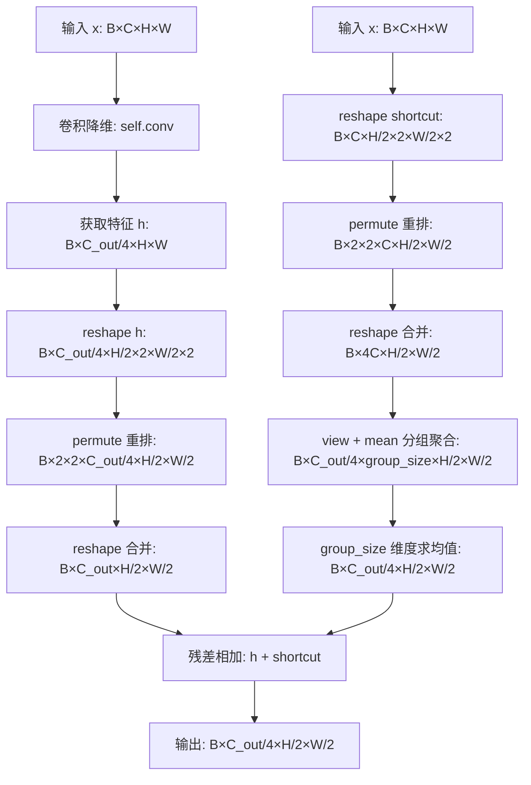
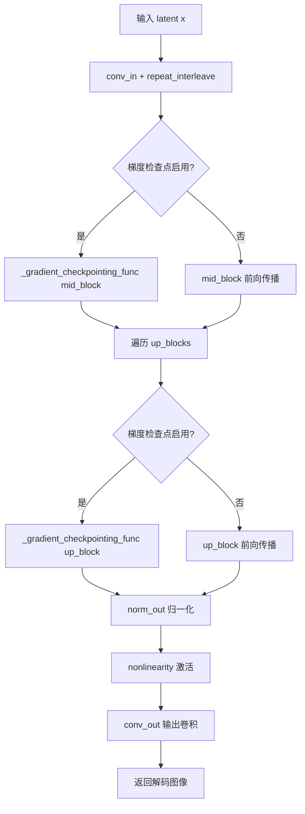
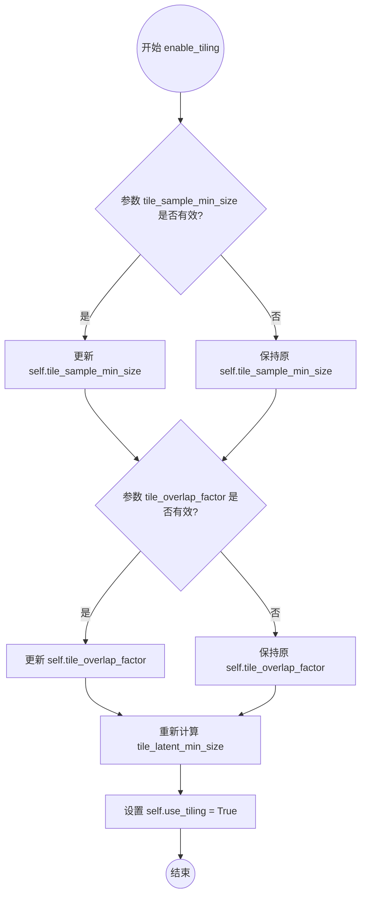
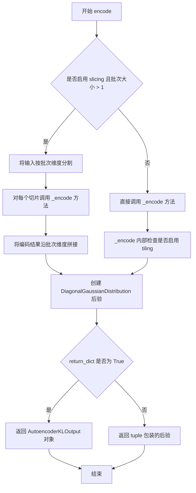
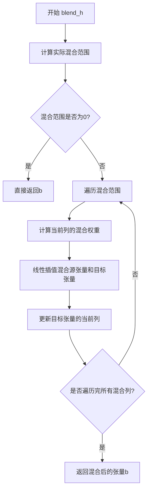

```mermaid
flowchart TD
    A[开始 forward] --> B[输入 sample 图像]
    B --> C[调用 self.encode&#40;sample&#41; 获取 posterior]
    C --> D{sample_posterior?}
    D -->|True| E[posterior.sample&#40;generator&#41; 采样]
    D -->|False| F[posterior.mode&#40;&#41; 取均值]
    E --> G[z = 采样结果或均值]
    F --> G
    G --> H[调用 self.decode&#40;z&#41; 解码]
    H --> I{return_dict?}
    I -->|True| J[返回 DecoderOutput]
    I -->|False| K[返回 tuple&#40;dec,&#41;]
    J --> L[结束]
    K --> L
```

# `diffusers\src\diffusers\models\autoencoders\autoencoder_kl_hunyuanimage.py` 详细设计文档

这是Hunyuan团队实现的图像变分自编码器(VAE)，包含编码器、解码器、残差块、注意力块和上下采样模块，支持tiling和slicing策略处理大图像和高分辨率图像。

## 整体流程

```mermaid
graph TD
    A[输入图像] --> B[AutoencoderKLHunyuanImage]
    B --> C{是否使用tiling?}
    C -- 是 --> D[tiled_encode]
    C -- 否 --> E[HunyuanImageEncoder2D]
    D --> E
    E --> F[DiagonalGaussianDistribution]
    F --> G{是否sample_posterior?}
    G -- 是 --> H[posterior.sample]
    G -- 否 --> I[posterior.mode]
    H --> J[z (潜在向量)]
    I --> J
    J --> K{是否使用tiling?}
    K -- 是 --> L[tiled_decode]
    K -- 否 --> M[HunyuanImageDecoder2D]
    L --> M
    M --> N[DecoderOutput]
    N --> O[重建图像]
```

## 类结构

```
nn.Module (PyTorch基类)
├── HunyuanImageResnetBlock (残差块)
├── HunyuanImageAttentionBlock (注意力块)
├── HunyuanImageDownsample (下采样)
├── HunyuanImageUpsample (上采样)
├── HunyuanImageMidBlock (中间块)
│   ├── HunyuanImageResnetBlock
│   └── HunyuanImageAttentionBlock
├── HunyuanImageEncoder2D (编码器)
│   ├── HunyuanImageResnetBlock
│   ├── HunyuanImageDownsample
│   └── HunyuanImageMidBlock
├── HunyuanImageDecoder2D (解码器)
│   ├── HunyuanImageResnetBlock
│   ├── HunyuanImageUpsample
│   └── HunyuanImageMidBlock
└── AutoencoderKLHunyuanImage (主VAE模型)
    ├── HunyuanImageEncoder2D
    └── HunyuanImageDecoder2D
```

## 全局变量及字段


### `logger`
    
模块日志记录器

类型：`logging.Logger`
    


### `HunyuanImageResnetBlock.in_channels`
    
输入通道数

类型：`int`
    


### `HunyuanImageResnetBlock.out_channels`
    
输出通道数

类型：`int`
    


### `HunyuanImageResnetBlock.nonlinearity`
    
激活函数

类型：`nn.Module`
    


### `HunyuanImageResnetBlock.norm1`
    
第一个归一化层

类型：`nn.GroupNorm`
    


### `HunyuanImageResnetBlock.conv1`
    
第一个卷积层

类型：`nn.Conv2d`
    


### `HunyuanImageResnetBlock.norm2`
    
第二个归一化层

类型：`nn.GroupNorm`
    


### `HunyuanImageResnetBlock.conv2`
    
第二个卷积层

类型：`nn.Conv2d`
    


### `HunyuanImageResnetBlock.conv_shortcut`
    
Shortcut卷积层

类型：`nn.Conv2d`
    


### `HunyuanImageAttentionBlock.norm`
    
归一化层

类型：`nn.GroupNorm`
    


### `HunyuanImageAttentionBlock.to_q`
    
查询投影

类型：`nn.Conv2d`
    


### `HunyuanImageAttentionBlock.to_k`
    
键投影

类型：`nn.Conv2d`
    


### `HunyuanImageAttentionBlock.to_v`
    
值投影

类型：`nn.Conv2d`
    


### `HunyuanImageAttentionBlock.proj`
    
输出投影

类型：`nn.Conv2d`
    


### `HunyuanImageDownsample.conv`
    
下采样卷积

类型：`nn.Conv2d`
    


### `HunyuanImageDownsample.group_size`
    
分组大小

类型：`int`
    


### `HunyuanImageUpsample.conv`
    
上采样卷积

类型：`nn.Conv2d`
    


### `HunyuanImageUpsample.repeats`
    
重复次数

类型：`int`
    


### `HunyuanImageMidBlock.resnets`
    
残差块列表

类型：`nn.ModuleList`
    


### `HunyuanImageMidBlock.attentions`
    
注意力块列表

类型：`nn.ModuleList`
    


### `HunyuanImageEncoder2D.in_channels`
    
输入通道数

类型：`int`
    


### `HunyuanImageEncoder2D.z_channels`
    
潜在空间通道数

类型：`int`
    


### `HunyuanImageEncoder2D.block_out_channels`
    
输出通道列表

类型：`tuple[int, ...]`
    


### `HunyuanImageEncoder2D.num_res_blocks`
    
残差块数量

类型：`int`
    


### `HunyuanImageEncoder2D.spatial_compression_ratio`
    
空间压缩比

类型：`int`
    


### `HunyuanImageEncoder2D.group_size`
    
分组大小

类型：`int`
    


### `HunyuanImageEncoder2D.nonlinearity`
    
激活函数

类型：`nn.Module`
    


### `HunyuanImageEncoder2D.conv_in`
    
输入卷积

类型：`nn.Conv2d`
    


### `HunyuanImageEncoder2D.down_blocks`
    
下采样块列表

类型：`nn.ModuleList`
    


### `HunyuanImageEncoder2D.mid_block`
    
中间块

类型：`HunyuanImageMidBlock`
    


### `HunyuanImageEncoder2D.norm_out`
    
输出归一化

类型：`nn.GroupNorm`
    


### `HunyuanImageEncoder2D.conv_out`
    
输出卷积

类型：`nn.Conv2d`
    


### `HunyuanImageEncoder2D.gradient_checkpointing`
    
梯度检查点标志

类型：`bool`
    


### `HunyuanImageDecoder2D.z_channels`
    
潜在空间通道数

类型：`int`
    


### `HunyuanImageDecoder2D.block_out_channels`
    
输出通道列表

类型：`tuple[int, ...]`
    


### `HunyuanImageDecoder2D.num_res_blocks`
    
残差块数量

类型：`int`
    


### `HunyuanImageDecoder2D.repeat`
    
重复次数

类型：`int`
    


### `HunyuanImageDecoder2D.spatial_compression_ratio`
    
空间压缩比

类型：`int`
    


### `HunyuanImageDecoder2D.nonlinearity`
    
激活函数

类型：`nn.Module`
    


### `HunyuanImageDecoder2D.conv_in`
    
输入卷积

类型：`nn.Conv2d`
    


### `HunyuanImageDecoder2D.mid_block`
    
中间块

类型：`HunyuanImageMidBlock`
    


### `HunyuanImageDecoder2D.up_blocks`
    
上采样块列表

类型：`nn.ModuleList`
    


### `HunyuanImageDecoder2D.norm_out`
    
输出归一化

类型：`nn.GroupNorm`
    


### `HunyuanImageDecoder2D.conv_out`
    
输出卷积

类型：`nn.Conv2d`
    


### `HunyuanImageDecoder2D.gradient_checkpointing`
    
梯度检查点标志

类型：`bool`
    


### `AutoencoderKLHunyuanImage.encoder`
    
编码器

类型：`HunyuanImageEncoder2D`
    


### `AutoencoderKLHunyuanImage.decoder`
    
解码器

类型：`HunyuanImageDecoder2D`
    


### `AutoencoderKLHunyuanImage.use_slicing`
    
是否使用切片

类型：`bool`
    


### `AutoencoderKLHunyuanImage.use_tiling`
    
是否使用平铺

类型：`bool`
    


### `AutoencoderKLHunyuanImage.tile_sample_min_size`
    
样本平铺最小尺寸

类型：`int`
    


### `AutoencoderKLHunyuanImage.tile_latent_min_size`
    
潜在平铺最小尺寸

类型：`int`
    


### `AutoencoderKLHunyuanImage.tile_overlap_factor`
    
平铺重叠因子

类型：`float`
    
    

## 全局函数及方法


### HunyuanImageResnetBlock.forward

该方法是 HunyuanImageResnetBlock 类的前向传播实现，执行标准的残差块计算流程：输入依次经过归一化、激活函数、卷积操作，最后通过残差连接将输出与输入相加，实现特征的逐层提取与梯度传递。

参数：

- `self`：实例本身，HunyuanImageResnetBlock 类的实例，包含模型的层和参数
- `x`：`torch.Tensor`，输入张量，形状为 (batch_size, in_channels, height, width)

返回值：`torch.Tensor`，经过残差块处理后的输出张量，形状为 (batch_size, out_channels, height, width)

#### 流程图

```mermaid
flowchart TD
    A[开始 forward] --> B[保存残差: residual = x]
    B --> C[归一化1: norm1(x)]
    C --> D[激活函数: nonlinearity]
    D --> E[卷积1: conv1]
    E --> F[归一化2: norm2]
    F --> G[激活函数2: nonlinearity]
    G --> H[卷积2: conv2]
    H --> I{conv_shortcut是否存在?}
    I -->|是| J[应用快捷卷积: conv_shortcut]
    I -->|否| K[跳过快捷卷积]
    J --> L[残差连接: x + residual]
    K --> L
    L --> M[返回输出]
```

#### 带注释源码

```python
def forward(self, x: torch.Tensor) -> torch.Tensor:
    """
    前向传播方法，执行残差块的特征提取
    
    Args:
        x: 输入张量，形状为 (batch_size, in_channels, height, width)
    
    Returns:
        输出张量，形状为 (batch_size, out_channels, height, width)
    """
    # 步骤1：保存输入作为残差连接的基础
    # 这一步确保了即使后续层学习不到任何东西，网络也能保持至少与输入相当的表达能力
    residual = x

    # 步骤2：第一个归一化层，对输入通道进行组归一化
    # GroupNorm(32 groups) 有助于稳定训练，特别是在通道数较多时
    x = self.norm1(x)

    # 步骤3：应用非线性激活函数（默认为 SiLU/Swish）
    # 引入非线性使网络能够学习复杂特征
    x = self.nonlinearity(x)

    # 步骤4：第一次卷积变换，从 in_channels 转换到 out_channels
    # 3x3 卷积核，保持空间分辨率（padding=1）
    x = self.conv1(x)

    # 步骤5：第二个归一化层，对输出通道进行组归一化
    x = self.norm2(x)

    # 步骤6：第二次激活函数
    x = self.nonlinearity(x)

    # 步骤7：第二次卷积，保持通道数不变
    x = self.conv2(x)

    # 步骤8：如果输入输出通道数不同，应用 1x1 卷积进行通道调整
    # 这是残差连接中常见的维度匹配策略
    if self.conv_shortcut is not None:
        x = self.conv_shortcut(x)
    
    # 步骤9：残差连接，将原始输入与变换后的特征相加
    # 这是 ResNet 的核心思想：梯度可以直接回传到更早的层
    return x + residual
```


### `HunyuanImageAttentionBlock.forward`

该方法实现了自注意力机制（Self-Attention），通过单头注意力机制对输入特征图进行上下文信息聚合，并使用残差连接保持原始特征。

参数：

- `x`：`torch.Tensor`，输入张量，形状为 (batch_size, channels, height, width)

返回值：`torch.Tensor`，经过自注意力处理并加上残差连接后的输出张量，形状与输入相同

#### 流程图

```mermaid
flowchart TD
    A[输入 x: (B, C, H, W)] --> B[保存残差: identity = x]
    B --> C[归一化: self.norm(x)]
    C --> D[计算Q: query = self.to_q(x)]
    C --> E[计算K: key = self.to_k(x)]
    C --> F[计算V: value = self.to_v(x)]
    D --> G[reshape: (B, H*W, C)]
    E --> G
    F --> G
    G --> H[F.scaled_dot_product_attention]
    H --> I[reshape: (B, C, H, W)]
    I --> J[输出投影: self.proj(x)]
    J --> K[残差连接: x + identity]
    K --> L[输出: (B, C, H, W)]
```

#### 带注释源码

```python
def forward(self, x: torch.Tensor) -> torch.Tensor:
    """
    前向传播：执行自注意力计算
    
    Args:
        x: 输入张量，形状为 (batch_size, channels, height, width)
    
    Returns:
        经过自注意力处理并加上残差连接后的输出张量
    """
    # Step 1: 保存输入作为残差连接（用于后续相加）
    identity = x
    
    # Step 2: 对输入进行组归一化（Group Normalization）
    # 使用32个组进行归一化，有助于训练稳定性和收敛速度
    x = self.norm(x)
    
    # Step 3: 通过三个1x1卷积层分别计算Query、Key、Value
    # Query用于查询需要关注的信息
    # Key用于被查询的信息
    # Value包含实际要传递的信息
    query = self.to_q(x)
    key = self.to_k(x)
    value = self.to_v(x)
    
    # Step 4: 获取输入维度信息
    batch_size, channels, height, width = query.shape
    
    # Step 5: 维度变换 - 将 (B, C, H, W) 转换为 (B, H*W, C)
    # 这是为了进行批量矩阵乘法计算注意力分数
    # permute: (B, C, H, W) -> (B, H, W, C)
    # reshape: (B, H, W, C) -> (B, H*W, C)
    # contiguous(): 确保内存连续，便于后续操作
    query = query.permute(0, 2, 3, 1).reshape(batch_size, height * width, channels).contiguous()
    key = key.permute(0, 2, 3, 1).reshape(batch_size, height * width, channels).contiguous()
    value = value.permute(0, 2, 3, 1).reshape(batch_size, height * width, channels).contiguous()
    
    # Step 6: 计算缩放点积注意力（Scaled Dot-Product Attention）
    # 这是Transformer核心操作：Attention(Q, K, V) = softmax(Q*K^T / sqrt(d)) * V
    # PyTorch的F.scaled_dot_product_attention会自动处理缩放和softmax
    x = F.scaled_dot_product_attention(query, key, value)
    
    # Step 7: 维度恢复 - 将 (B, H*W, C) 转换回 (B, C, H, W)
    # reshape: (B, H*W, C) -> (B, H, W, C)
    # permute: (B, H, W, C) -> (B, C, H, W)
    x = x.reshape(batch_size, height, width, channels).permute(0, 3, 1, 2)
    
    # Step 8: 输出投影 - 进一步融合特征
    x = self.proj(x)
    
    # Step 9: 残差连接（Residual Connection）
    # 将注意力输出与原始输入相加，帮助梯度流动和特征保留
    return x + identity
```


### HunyuanImageDownsample.forward

该方法是 HunyuanImage 图像 VAE 模型中下采样模块的前向传播函数，通过卷积降维结合空间重排（reshape + permute）实现 2x2 空间压缩与通道分组聚合，并添加残差连接以保持梯度流动。

参数：

- `x`：`torch.Tensor`，输入张量，形状为 (B, C, H, W)，其中 B 为批次大小，C 为通道数，H 和 W 分别为高度和宽度

返回值：`torch.Tensor`，输出张量，形状为 (B, C', H/2, W/2)，其中 C' = out_channels // 4（经分组聚合后），空间尺寸在 H 和 W 维度上均缩小为原来的一半

#### 流程图



#### 带注释源码

```python
def forward(self, x: torch.Tensor) -> torch.Tensor:
    # 第一部分：卷积特征提取与空间压缩
    h = self.conv(x)  # 使用卷积将通道从 in_channels 降到 out_channels // 4

    # 对卷积输出 h 进行空间 2x2 合并
    B, C, H, W = h.shape  # 获取 h 的形状
    # reshape: 将 H 和 W 各分成 2 份，便于后续合并相邻像素
    h = h.reshape(B, C, H // 2, 2, W // 2, 2)
    # permute: 调整维度顺序，将 2x2 的空间块移到通道维度前面
    # 从 (B, C, H/2, 2, W/2, 2) 变为 (B, 2, 2, C, H/2, W/2)
    h = h.permute(0, 3, 5, 1, 2, 4)  # b, r1, r2, c, h, w
    # reshape: 将两个 2 维度合并到通道维，实现 2x2 空间压缩
    # 通道数从 C 变为 4*C
    h = h.reshape(B, 4 * C, H // 2, W // 2)

    # 第二部分：构建残差连接（shortcut），对输入 x 进行同样的空间变换
    B, C, H, W = x.shape  # 重新获取输入 x 的形状
    shortcut = x.reshape(B, C, H // 2, 2, W // 2, 2)
    shortcut = shortcut.permute(0, 3, 5, 1, 2, 4)  # b, r1, r2, c, h, w
    shortcut = shortcut.reshape(B, 4 * C, H // 2, W // 2)

    # 第三部分：对 shortcut 进行分组聚合，使通道数与 h 匹配
    B, C, H, W = shortcut.shape
    # view: 将 shortcut 按 group_size 分组
    # group_size = 4 * in_channels // out_channels
    # 形状从 (B, 4*C, H/2, W/2) 变为 (B, C_out/4, group_size, H/2, W/2)
    shortcut = shortcut.view(B, h.shape[1], self.group_size, H, W)
    # mean: 在 group_size 维度求均值，实现通道聚合
    shortcut = shortcut.mean(dim=2)  # 形状变为 (B, C_out/4, H/2, W/2)

    # 第四部分：残差相加
    return h + shortcut  # 输出形状 (B, C_out/4, H/2, W/2)
```


### `HunyuanImageUpsample.forward`

该方法实现了图像空间上采样功能，通过转置卷积将输入的空间分辨率扩大 2 倍（宽高各扩大 2 倍，总共扩大 4 倍），并通过残差连接保持梯度流动。

参数：

-  `x`：`torch.Tensor`，输入的张量，形状为 (B, C, H, W)，其中 B 是批量大小，C 是通道数，H 和 W 分别是高度和宽度

返回值：`torch.Tensor`，上采样后的张量，形状为 (B, C // 4, H * 2, W * 2)

#### 流程图

```mermaid
flowchart TD
    A[输入 x: (B, C, H, W)] --> B[卷积 self.conv]
    B --> C[reshape: (B, 2, 2, C//4, H, W)]
    C --> D[permute: (B, C//4, H, 2, W, 2)]
    D --> E[reshape: (B, C//4, H*2, W*2)]
    
    F[输入 x] --> G[repeat_interleave: (B, C*4, H, W)]
    G --> H[reshape: (B, 2, 2, C//4, H, W)]
    H --> I[permute: (B, C//4, H, 2, W, 2)]
    I --> J[reshape: (B, C//4, H*2, W*2)]
    
    E --> K[加法残差连接]
    J --> K
    K --> L[输出: (B, C//4, H*2, W*2)]
```

#### 带注释源码

```python
def forward(self, x: torch.Tensor) -> torch.Tensor:
    """
    执行图像上采样前向传播
    
    参数:
        x: 输入张量，形状为 (B, C, H, W)
           B: 批量大小
           C: 输入通道数
           H: 高度
           W: 宽度
    
    返回:
        上采样后的张量，形状为 (B, C//4, H*2, W*2)
    """
    # 第一步：卷积变换
    # 将输入通道 C 扩展到 out_channels * factor (即 C*4)
    h = self.conv(x)

    # 第二步：空间上采样 - 通过 reshape 和 permute 实现 2x2 上采样
    # 获取卷积输出形状
    B, C, H, W = h.shape
    
    # 将 (B, C, H, W) -> (B, 2, 2, C//4, H, W)
    # 这里的 2,2 对应空间维度 2x2 扩展
    h = h.reshape(B, 2, 2, C // 4, H, W)  # b, r1, r2, c, h, w
    
    # 重新排列维度: (B, C//4, H, 2, W, 2)
    h = h.permute(0, 3, 4, 1, 5, 2)  # b, c, h, r1, w, r2
    
    # 最终 reshape 到目标形状 (B, C//4, H*2, W*2)
    h = h.reshape(B, C // 4, H * 2, W * 2)

    # 第三步：残差连接 - 对输入进行空间扩展
    # repeat_interleave 在通道维度上重复，以匹配主路径的通道数
    shortcut = x.repeat_interleave(repeats=self.repeats, dim=1)

    # 对 shortcut 进行相同的空间变换
    B, C, H, W = shortcut.shape
    shortcut = shortcut.reshape(B, 2, 2, C // 4, H, W)  # b, r1, r2, c, h, w
    shortcut = shortcut.permute(0, 3, 4, 1, 5, 2)  # b, c, h, r1, w, r2
    shortcut = shortcut.reshape(B, C // 4, H * 2, W * 2)
    
    # 第四步：残差相加
    return h + shortcut
```


### HunyuanImageMidBlock.forward

该方法是 HunyuanImageVAE 的中间块（Middle Block）的前向传播函数，负责对输入特征依次通过多个残差块和自注意力层进行特征提取与增强，是 VAE 编码器和解码器核心处理流程中的关键环节。

参数：

- `x`：`torch.Tensor`，输入的张量，形状为 (B, C, H, W)，表示批量大小、通道数、高度和宽度

返回值：`torch.Tensor`，经过残差块和注意力层处理后的输出张量，形状保持与输入相同 (B, C, H, W)

#### 流程图

```mermaid
flowchart TD
    A[输入 x] --> B[通过第一个残差块 resnets[0]]
    B --> C{遍历 attentions 和 resnets[1:]}
    C -->|对每对| D[应用自注意力层 attn]
    D --> E[应用残差块 resnet]
    E --> C
    C -->|完成| F[返回最终输出]
```

#### 带注释源码

```python
def forward(self, x: torch.Tensor) -> torch.Tensor:
    # 首先通过第一个残差块进行初始特征处理
    # 该残差块包含两个卷积层、归一化层和激活函数
    x = self.resnets[0](x)

    # 循环遍历注意力层和后续残差块
    # 每个注意力层后跟着一个残差块，形成交叉处理结构
    # zip(self.attentions, self.resnets[1:]) 将注意力层与对应的残差块配对
    for attn, resnet in zip(self.attentions, self.resnets[1:]):
        # 应用自注意力机制，用于捕捉特征间的空间依赖关系
        x = attn(x)
        # 再次通过残差块，进一步提取和精炼特征
        x = resnet(x)

    # 返回经过多层处理的特征张量
    return x
```


### `HunyuanImageEncoder2D.forward`

该方法实现了 HunyuanImage VAE 的编码器（Encoder）核心逻辑，负责将输入的图像张量通过一系列卷积、残差块和下采样操作，压缩并映射到高斯潜在空间（Latent Space）的均值与对数方差参数。

参数：
-  `x`：`torch.Tensor`，输入的图像张量，形状通常为 `(Batch, Channels, Height, Width)`。

返回值：`torch.Tensor`，编码后的潜在表示，形状为 `(Batch, 2 * z_channels, H', W')`，其中 `H'` 和 `W'` 是经过空间压缩后的尺寸，通道数乘以 2 用于分别表示潜在分布的均值（mean）和对数方差（log_variance）。

#### 流程图

```mermaid
graph TD
    A[输入 x: (B, C, H, W)] --> B[conv_in: 初始卷积投影]
    B --> C{gradient_checkpointing & training?}
    C -->|Yes| D[循环 down_blocks: 梯度检查点]
    C -->|No| E[循环 down_blocks: 标准前向]
    D --> F[mid_block: 中间特征处理]
    E --> F
    F --> G[计算残差 shortcut: 分组均值]
    G --> H[norm_out: 归一化]
    H --> I[nonlinearity: 激活函数]
    I --> J[conv_out: 映射到 2*z_channels]
    J --> K[x + residual: 残差连接]
    K --> L[输出: (B, 2*z, H', W')]
```

#### 带注释源码

```python
def forward(self, x: torch.Tensor) -> torch.Tensor:
    """
    前向传播：将图像编码为潜在表示。

    Args:
        x (torch.Tensor): 输入图像张量，形状为 (B, C, H, W)。

    Returns:
        torch.Tensor: 编码后的潜在张量，形状为 (B, 2 * z_channels, H', W')。
                      包含潜在分布的均值和(缩放后的)方差信息。
    """
    # 1. 初始卷积：将输入通道映射到第一个 block 的通道数
    x = self.conv_in(x)

    # 2. 下采样阶段：遍历由残差块和下采样块组成的 ModuleList
    # 包含 HunyuanImageResnetBlock 和可能的 HunyuanImageDownsample
    for down_block in self.down_blocks:
        # 如果开启梯度检查点且处于训练(梯度计算)状态，则使用检查点技术节省显存
        if torch.is_grad_enabled() and self.gradient_checkpointing:
            x = self._gradient_checkpointing_func(down_block, x)
        else:
            x = down_block(x)

    # 3. 中间块处理：提取高级语义特征
    if torch.is_grad_enabled() and self.gradient_checkpointing:
        x = self._gradient_checkpointing_func(self.mid_block, x)
    else:
        x = self.mid_block(x)

    # 4. 输出头部处理 (VAE Head)
    # 计算残差连接 (Shortcut)：在通道维度上进行分组平均池化
    # group_size = block_out_channels[-1] // (2 * z_channels)
    # 这相当于在通道维度上做了一个平滑处理，作为跳跃连接的一部分
    B, C, H, W = x.shape
    residual = x.view(B, C // self.group_size, self.group_size, H, W).mean(dim=2)

    # 归一化 -> 激活 -> 卷积输出
    x = self.norm_out(x)
    x = self.nonlinearity(x)
    x = self.conv_out(x)
    
    # 5. 残差相加：输出 = 卷积结果 + 平滑后的特征
    return x + residual
```


### HunyuanImageDecoder2D.forward

该方法是 HunyuanImageDecoder2D 类的前向传播函数，负责将压缩的潜在表示（latent representation）解码重建为原始图像。方法首先通过卷积和重复操作处理输入，然后依次通过中间块和多个上采样块逐步恢复空间分辨率，最后通过归一化、激活和输出卷积层生成最终图像。

参数：

- `x`：`torch.Tensor`，输入的潜在表示张量，形状为 (B, C, H, W)，其中 C = z_channels

返回值：`torch.Tensor`，解码后的图像张量，形状为 (B, out_channels, H * spatial_compression_ratio, W * spatial_compression_ratio)

#### 流程图



#### 带注释源码

```python
def forward(self, x: torch.Tensor) -> torch.Tensor:
    """
    解码器前向传播，将潜在表示解码为图像
    
    参数:
        x: 输入的潜在表示张量，形状为 (batch_size, z_channels, latent_h, latent_w)
    
    返回:
        解码后的图像张量，形状为 (batch_size, out_channels, h, w)
    """
    # 步骤1: 初始卷积处理
    # 将 latent 通过 conv_in 变换到初始通道数，并与重复后的输入相加
    # repeat 操作将通道数从 z_channels 扩展到 block_out_channels[0]
    h = self.conv_in(x) + x.repeat_interleave(repeats=self.repeat, dim=1)

    # 步骤2: 中间块处理
    # 使用梯度检查点（如果启用）以节省显存
    if torch.is_grad_enabled() and self.gradient_checkpointing:
        h = self._gradient_checkpointing_func(self.mid_block, h)
    else:
        h = self.mid_block(h)

    # 步骤3: 上采样块序列处理
    # 遍历所有上采样块，逐步恢复空间分辨率
    for up_block in self.up_blocks:
        if torch.is_grad_enabled() and self.gradient_checkpointing:
            h = self._gradient_checkpointing_func(up_block, h)
        else:
            h = up_block(h)
    
    # 步骤4: 输出头部处理
    # GroupNorm 归一化
    h = self.norm_out(h)
    # SiLU 激活函数
    h = self.nonlinearity(h)
    # 最终卷积将通道数映射到输出通道数
    h = self.conv_out(h)
    
    # 返回解码后的图像
    return h
```


### `AutoencoderKLHunyuanImage.enable_tiling`

一段话描述：用于启用 HunyuanImage VAE 模型的空间平铺（Tiling）功能。调用此方法后，模型在编码和解码时会将大尺寸图像或潜在变量分割为多个重叠的小块（Tile）分别处理，从而支持超高分辨率图像生成并有效降低显存峰值。

参数：

- `tile_sample_min_size`：`int | None`，输入图像进行分块处理的最小边长。如果传入有效整数，则更新实例属性 `self.tile_sample_min_size`；否则保持 `__init__` 中的默认值不变。
- `tile_overlap_factor`：`float | None`，平铺块之间的重叠比例因子（值域 0~1）。如果传入有效浮点数，则更新实例属性 `self.tile_overlap_factor`；否则保持 `__init__` 中的默认值不变。

返回值：`None`，无返回值。该方法通过修改实例内部状态来启用功能。

#### 流程图



#### 带注释源码

```python
def enable_tiling(
    self,
    tile_sample_min_size: int | None = None,
    tile_overlap_factor: float | None = None,
) -> None:
    r"""
    启用空间平铺 VAE 解码/编码。启用此选项后，VAE 会将输入张量分割成 tiles，
    以分步计算解码和编码。这对于节省大量显存并处理更大尺寸的图像非常有用。

    参数:
        tile_sample_min_size (`int`, *可选*):
            样本在空间维度上被分割成 tiles 的最小尺寸。
        tile_overlap_factor (`float`, *可选*):
            潜在变量在空间维度上被分割成 tiles 的重叠因子。
    """
    # 1. 开启平铺开关，标识模型已进入平铺模式
    self.use_tiling = True
    
    # 2. 更新样本平铺最小尺寸。若传入了新值，则使用新值；否则保留构造函数中的默认值
    self.tile_sample_min_size = tile_sample_min_size or self.tile_sample_min_size
    
    # 3. 更新重叠因子。若传入了新值，则使用新值；否则保留构造函数中的默认值
    self.tile_overlap_factor = tile_overlap_factor or self.tile_overlap_factor
    
    # 4. 根据新的样本尺寸和配置中的空间压缩比，重新计算潜在空间（Latent Space）的平铺最小尺寸
    #    这是为了确保在潜在空间中的 tile 大小与原始图像空间成比例
    self.tile_latent_min_size = self.tile_sample_min_size // self.config.spatial_compression_ratio
```


### `AutoencoderKLHunyuanImage._encode`

该方法是 AutoencoderKLHunyuanImage 类的内部编码核心方法，负责将输入图像张量编码为潜在表示。当启用瓦片 tiling 策略且图像尺寸超过最小样本大小时，调用 tiled_encode 进行分块编码；否则直接使用底层 encoder 进行标准编码，最终返回编码后的潜在表示张量。

参数：

- `x`：`torch.Tensor`，输入的图像张量，形状为 (batch_size, num_channels, height, width)

返回值：`torch.Tensor`，编码后的潜在表示张量

#### 流程图

```mermaid
flowchart TD
    A[开始 _encode] --> B[获取输入张量形状: batch_size, num_channels, height, width]
    B --> C{检查条件: use_tiling 为 True 且<br>width > tile_sample_min_size 或<br>height > tile_sample_min_size}
    C -->|是| D[调用 self.tiled_encode(x) 进行分块编码]
    C -->|否| E[调用 self.encoder(x) 进行标准编码]
    D --> F[返回编码结果]
    E --> F
```

#### 带注释源码

```python
def _encode(self, x: torch.Tensor):
    """
    内部编码方法，将输入图像编码为潜在表示。

    Args:
        x: 输入的图像张量，形状为 (batch_size, num_channels, height, width)

    Returns:
        编码后的潜在表示张量
    """
    # 获取输入张量的形状信息
    batch_size, num_channels, height, width = x.shape

    # 判断是否需要使用瓦片tiling策略进行编码
    # 条件：启用了tiling且图像宽度或高度大于最小样本大小
    if self.use_tiling and (width > self.tile_sample_min_size or height > self.tile_sample_min_size):
        # 使用分块编码策略处理大尺寸图像
        return self.tiled_encode(x)

    # 使用底层encoder进行标准编码
    enc = self.encoder(x)

    # 返回编码后的潜在表示
    return enc
```


### `AutoencoderKLHunyuanImage.encode`

该方法是 AutoencoderKLHunyuanImage 类的编码接口，用于将一批图像压缩编码到潜在空间（latent space）。它支持切片（slicing）处理大批量数据，并调用内部 `_encode` 方法执行实际的编码操作，最后将编码结果封装为对角高斯分布（DiagonalGaussianDistribution）。

参数：

- `x`：`torch.Tensor`，输入的图像批次，形状为 (B, C, H, W)
- `return_dict`：`bool`，可选，默认为 `True`，是否返回 `AutoencoderKLOutput` 对象而非普通元组

返回值：`AutoencoderKLOutput | tuple[DiagonalGaussianDistribution]`，编码后的潜在表示。若 `return_dict` 为 True，返回 `AutoencoderKLOutput`（包含 latent_dist 属性）；否则返回包含 `DiagonalGaussianDistribution` 的元组

#### 流程图



#### 带注释源码

```python
@apply_forward_hook
def encode(
    self, x: torch.Tensor, return_dict: bool = True
) -> AutoencoderKLOutput | tuple[DiagonalGaussianDistribution]:
    r"""
    Encode a batch of images into latents.

    Args:
        x (`torch.Tensor`): Input batch of images.
        return_dict (`bool`, *optional*, defaults to `True`):
            Whether to return a [`~models.autoencoder_kl.AutoencoderKLOutput`] instead of a plain tuple.

    Returns:
            The latent representations of the encoded videos. If `return_dict` is True, a
            [`~models.autoencoder_kl.AutoencoderKLOutput`] is returned, otherwise a plain `tuple` is returned.
    """
    # 检查是否启用切片模式且批次大小大于1，如果是则对每个样本分别编码
    if self.use_slicing and x.shape[0] > 1:
        # 按批次维度分割输入，分别编码后再拼接结果
        encoded_slices = [self._encode(x_slice) for x_slice in x.split(1)]
        h = torch.cat(encoded_slices)
    else:
        # 直接调用内部编码方法
        h = self._encode(x)
    
    # 将编码后的特征封装为对角高斯分布（VAE 的后验分布）
    posterior = DiagonalGaussianDistribution(h)

    # 根据 return_dict 参数决定返回格式
    if not return_dict:
        return (posterior,)
    return AutoencoderKLOutput(latent_dist=posterior)
```


### `AutoencoderKLHunyuanImage._decode`

该方法是 AutoencoderKLHunyuanImage 类的内部解码方法，负责将潜在表示（latent representation）z 解码为图像。如果启用了瓦片（tiling）处理且输入较大，则调用瓦片解码方法；否则直接使用基础解码器进行解码，最后根据 return_dict 参数返回 DecoderOutput 对象或元组。

参数：

- `z`：`torch.Tensor`，输入的潜在向量批次，形状为 (batch_size, num_channels, height, width)
- `return_dict`：`bool`，是否返回 DecoderOutput 而不是普通元组，默认为 True

返回值：`DecoderOutput | tuple`，如果 return_dict 为 True，返回 DecoderOutput 对象（包含解码后的 sample）；否则返回包含解码张量的元组

#### 流程图

```mermaid
flowchart TD
    A[开始 _decode] --> B[获取 z 的形状: batch_size, num_channels, height, width]
    B --> C{检查 use_tiling 且<br/>宽高是否超过 tile_latent_min_size}
    C -->|是| D[调用 tiled_decode 方法]
    C -->|否| E[调用 self.decoder(z) 进行解码]
    D --> F{return_dict?}
    E --> F
    F -->|True| G[返回 DecoderOutput(sample=dec)]
    F -->|False| H[返回元组 (dec,)]
```

#### 带注释源码

```python
def _decode(self, z: torch.Tensor, return_dict: bool = True):
    """
    内部解码方法，将潜在向量解码为图像。

    Args:
        z: 输入的潜在向量，形状为 (batch_size, num_channels, height, width)
        return_dict: 是否返回 DecoderOutput 对象，默认为 True

    Returns:
        DecoderOutput 或 tuple: 解码后的图像或包含图像的元组
    """
    # 获取输入潜在向量的形状信息
    batch_size, num_channels, height, width = z.shape

    # 检查是否启用瓦片处理且输入尺寸超过最小瓦片大小
    if self.use_tiling and (width > self.tile_latent_min_size or height > self.tile_latent_min_size):
        # 如果启用瓦片且尺寸较大，使用瓦片解码策略处理大图像
        return self.tiled_decode(z, return_dict=return_dict)

    # 使用基础解码器将潜在向量解码为图像
    dec = self.decoder(z)

    # 根据 return_dict 参数决定返回格式
    if not return_dict:
        # 返回元组格式 (decoded_tensor,)
        return (dec,)

    # 返回 DecoderOutput 对象，包含解码后的图像样本
    return DecoderOutput(sample=dec)
```


### `AutoencoderKLHunyuanImage.decode`

该方法是 HunyuanImage VAE 模型的解码接口，负责将潜在空间中的向量转换回图像表示。支持切片处理批量数据，可选择返回 DecoderOutput 对象或元组格式。

参数：

- `z`：`torch.Tensor`，输入的潜在向量批次，形状为 (B, C, H, W)，其中 B 是批量大小，C 是通道数，H 和 W 是空间维度
- `return_dict`：`bool`，可选参数，默认为 True，决定是否返回 DecoderOutput 对象而非普通元组

返回值：`DecoderOutput | torch.Tensor`，当 return_dict 为 True 时返回 DecoderOutput 对象（包含 sample 属性），否则返回包含解码图像的张量的元组

#### 流程图

```mermaid
flowchart TD
    A[输入: 潜在向量 z] --> B{use_slicing 且 batch_size > 1?}
    B -->|是| C[对每个z切片调用_decode]
    B -->|否| D[直接调用_decode]
    C --> E[拼接所有解码切片]
    D --> E
    E --> F{return_dict?}
    F -->|True| G[返回 DecoderOutput]
    F -->|False| H[返回元组 (decoded,)]
```

#### 带注释源码

```python
@apply_forward_hook
def decode(self, z: torch.Tensor, return_dict: bool = True) -> DecoderOutput | torch.Tensor:
    r"""
    Decode a batch of images.

    Args:
        z (`torch.Tensor`): Input batch of latent vectors.
        return_dict (`bool`, *optional*, defaults to `True`):
            Whether to return a [`~models.vae.DecoderOutput`] instead of a plain tuple.

    Returns:
        [`~models.vae.DecoderOutput`] or `tuple`:
            If return_dict is True, a [`~models.vae.DecoderOutput`] is returned, otherwise a plain `tuple` is
            returned.
    """
    # 检查是否启用切片模式且批量大小大于1
    # 切片模式用于减少内存占用，将大批量数据分割处理
    if self.use_slicing and z.shape[0] > 1:
        # 对批量数据中的每个样本分别进行解码
        # 使用 split(1) 将批量维度分割为单个样本
        decoded_slices = [self._decode(z_slice).sample for z_slice in z.split(1)]
        # 将所有解码后的切片在批量维度上拼接回来
        decoded = torch.cat(decoded_slices)
    else:
        # 非切片模式：直接对整个批次进行解码
        # _decode 返回 DecoderOutput 对象，通过 .sample 获取张量
        decoded = self._decode(z).sample

    # 根据 return_dict 参数决定返回值格式
    if not return_dict:
        # 返回元组格式（为了向后兼容）
        return (decoded,)
    # 返回 DecoderOutput 对象，包含解码后的图像样本
    return DecoderOutput(sample=decoded)
```


### `AutoencoderKLHunyuanImage.blend_v`

垂直混合函数，用于在空间平铺策略中将两个张量在垂直方向上进行平滑混合，常用于VAE的平铺编码/解码过程中消除 tile 之间的边界 artifacts。

参数：

- `a`：`torch.Tensor`，第一个输入张量，通常是前一个 tile 的数据
- `b`：`torch.Tensor`，第二个输入张量，通常是当前 tile 的数据，混合结果将覆盖此张量
- `blend_extent`：`int`，混合范围（垂直方向上的行数），指定从两个张量的边缘开始混合的长度

返回值：`torch.Tensor`，混合后的张量，与输入 `b` 的形状相同

#### 流程图

```mermaid
flowchart TD
    A[开始 blend_v] --> B[计算实际混合范围: min<a的高度, b的高度, blend_extent>]
    B --> C{遍历 y 从 0 到 blend_extent-1}
    C -->|每行| D[计算混合权重: weight = y / blend_extent]
    D --> E[混合第y行: b[:,:,y,:] = a[:,:,-blend_extent+y,:] * (1-weight) + b[:,:,y,:] * weight]
    C -->|完成| F[返回混合后的张量 b]
    
    style A fill:#f9f,color:#333
    style F fill:#9f9,color:#333
```

#### 带注释源码

```python
def blend_v(self, a: torch.Tensor, b: torch.Tensor, blend_extent: int) -> torch.Tensor:
    """
    垂直混合两个张量，用于消除 tile 边界。
    
    Args:
        a: 第一个输入张量，通常是前一个 tile 的数据
        b: 第二个输入张量，当前 tile 的数据，混合结果覆盖此张量
        blend_extent: 混合范围，垂直方向上的行数
    
    Returns:
        混合后的张量
    """
    # 计算实际混合范围，取三者的最小值确保不越界
    blend_extent = min(a.shape[-2], b.shape[-2], blend_extent)
    
    # 遍历混合范围内的每一行（垂直方向）
    for y in range(blend_extent):
        # 计算当前行的混合权重，从0线性增长到1
        weight = y / blend_extent
        
        # 对第y行进行混合：
        # - a的倒数第blend_extent行开始的数据 * (1 - weight)：逐渐减弱
        # - b的第y行数据 * weight：逐渐增强
        b[:, :, y, :] = a[:, :, -blend_extent + y, :] * (1 - weight) + b[:, :, y, :] * weight
    
    # 返回混合后的张量b
    return b
```


### `AutoencoderKLHunyuanImage.blend_h`

水平混合两个图像张量，通过线性插值在水平方向上平滑地混合两个张量的边缘区域，以消除 tiling 策略中拼接产生的接缝。

参数：

- `a`：`torch.Tensor`，源张量，提供混合的起始部分
- `b`：`torch.Tensor`，目标张量，提供混合的结束部分
- `blend_extent`：`int`，混合的像素宽度，控制混合区域的大小

返回值：`torch.Tensor`，混合后的目标张量

#### 流程图



#### 带注释源码

```python
def blend_h(self, a: torch.Tensor, b: torch.Tensor, blend_extent: int) -> torch.Tensor:
    """
    水平混合两个张量的边缘区域。
    
    该方法用于在 tiling 策略中平滑地混合相邻 tiles 的水平边缘，
    通过线性权重渐变消除拼接产生的接缝。
    
    参数:
        a (torch.Tensor): 源张量，形状为 (B, C, H, W)，提供混合的起始部分
        b (torch.Tensor): 目标张量，形状为 (B, C, H, W)，提供混合的结束部分
        blend_extent (int): 期望的混合像素宽度
    
    返回:
        torch.Tensor: 混合后的目标张量
    """
    # 确定实际混合范围：取三个值的最小值
    # 1. a 的宽度
    # 2. b 的宽度
    # 3. 传入的混合范围
    blend_extent = min(a.shape[-1], b.shape[-1], blend_extent)
    
    # 遍历混合范围内的每一列
    for x in range(blend_extent):
        # 计算当前列的混合权重
        # 当 x=0 时，权重为 (0, 1)，完全使用目标张量 b
        # 当 x=blend_extent-1 时，权重接近 (1, 0)，完全使用源张量 a
        weight_b = x / blend_extent  # 目标张量权重：线性增加
        weight_a = 1 - weight_b        # 源张量权重：线性减少
        
        # 从源张量获取对应位置的列
        # a 的右侧边缘开始向左计算：-blend_extent + x
        source_slice = a[:, :, :, -blend_extent + x]
        
        # 线性插值混合
        # b[:, :, :, x] = a[:, :, :, -blend_extent + x] * (1 - x / blend_extent) + b[:, :, :, x] * (x / blend_extent)
        b[:, :, :, x] = source_slice * weight_a + b[:, :, :, x] * weight_b
    
    return b
```


### `AutoencoderKLHunyuanImage.tiled_encode`

平铺编码方法，使用空间平铺策略对大尺寸图像进行分块编码，通过重叠区域混合消除块状伪影，将输入图像分割为多个重叠的tile分别编码后拼接为连续的潜在表示。

参数：

- `x`：`torch.Tensor`，输入张量，形状为 (B, C, T, H, W)，其中 B 是批次大小，C 是通道数，T 是时间步（此处为1），H 是高度，W 是宽度

返回值：`torch.Tensor`，编码后的潜在表示，形状为 (B, C', H', W')

#### 流程图

```mermaid
flowchart TD
    A[开始平铺编码] --> B[获取输入张量形状]
    B --> C[计算平铺参数]
    C --> D[overlap_size = tile_sample_min_size * (1 - overlap_factor)]
    C --> E[blend_extent = tile_latent_min_size * overlap_factor]
    C --> F[row_limit = tile_latent_min_size - blend_extent]
    
    F --> G[外层循环: 遍历高度方向的分块 i]
    G --> H[内层循环: 遍历宽度方向的分块 j]
    H --> I[提取tile: x[..., i:i+tile_sample_min_size, j:j+tile_sample_min_size]]
    I --> J[使用encoder编码tile]
    J --> K[将编码结果添加到当前行]
    
    H --> L{宽度遍历完成?}
    L -->|否| H
    L -->|是| M[将当前行添加到rows列表]
    
    G --> N{高度遍历完成?}
    N -->|否| G
    N -->|是| O[开始拼接结果]
    
    O --> P[遍历每个编码结果行]
    P --> Q{检查垂直混合条件 i > 0?}
    Q -->|是| R[调用blend_v垂直混合]
    Q -->|否| S{检查水平混合条件 j > 0?}
    
    R --> S
    S -->|是| T[调用blend_h水平混合]
    S -->|否| U[截取有效区域 tile[..., :row_limit, :row_limit]]
    
    T --> U
    U --> V[沿宽度维度拼接cat result_row, dim=-1]
    
    P --> W{行遍历完成?}
    W -->|否| P
    W -->|是| X[沿高度维度拼接cat result_rows, dim=-2]
    
    X --> Y[返回moments潜在表示]
```

#### 带注释源码

```python
def tiled_encode(self, x: torch.Tensor) -> torch.Tensor:
    """
    Encode input using spatial tiling strategy.
    使用空间平铺策略对输入进行编码

    Args:
        x (`torch.Tensor`): Input tensor of shape (B, C, T, H, W).
            输入张量，形状为 (B, C, T, H, W)

    Returns:
        `torch.Tensor`:
            The latent representation of the encoded images.
            编码后图像的潜在表示
    """
    # 获取输入的高度和宽度维度
    _, _, _, height, width = x.shape
    
    # 计算重叠大小：瓦片大小 * (1 - 重叠因子)
    # 例如: tile_sample_min_size=512, overlap_factor=0.25 => overlap_size=384
    overlap_size = int(self.tile_sample_min_size * (1 - self.tile_overlap_factor))
    
    # 计算混合范围：潜在空间的重叠区域大小
    # 例如: tile_latent_min_size=64, overlap_factor=0.25 => blend_extent=16
    blend_extent = int(self.tile_latent_min_size * self.tile_overlap_factor)
    
    # 计算每行/列的有效输出大小（去除重叠后的净输出）
    # 例如: 64 - 16 = 48
    row_limit = self.tile_latent_min_size - blend_extent

    # 第一步：分块编码
    # 创建二维列表存储编码结果
    rows = []
    # 按垂直方向（高度）遍历，步长为重叠大小
    for i in range(0, height, overlap_size):
        row = []  # 当前行的编码结果
        # 按水平方向（宽度）遍历，步长为重叠大小
        for j in range(0, width, overlap_size):
            # 提取当前瓦片：切片获取 B,C,T,H,W
            tile = x[:, :, :, i : i + self.tile_sample_min_size, j : j + self.tile_sample_min_size]
            # 使用编码器对瓦片进行编码
            tile = self.encoder(tile)
            # 将编码后的瓦片添加到当前行
            row.append(tile)
        # 将当前行添加到行列表
        rows.append(row)

    # 第二步：拼接与混合
    # 存储拼接后的行结果
    result_rows = []
    # 遍历每一行编码结果
    for i, row in enumerate(rows):
        result_row = []  # 当前拼接行的结果
        # 遍历当前行中的每个瓦片
        for j, tile in enumerate(row):
            # 如果不是第一行，执行垂直混合
            # 将当前瓦片与上一行的对应瓦片进行垂直方向混合
            if i > 0:
                tile = self.blend_v(rows[i - 1][j], tile, blend_extent)
            # 如果不是第一列，执行水平混合
            # 将当前瓦片与同一行左边的瓦片进行水平方向混合
            if j > 0:
                tile = self.blend_h(row[j - 1], tile, blend_extent)
            # 截取有效区域（去除重叠部分）
            result_row.append(tile[:, :, :, :row_limit, :row_limit])
        # 将当前行的所有瓦片沿宽度维度拼接
        result_rows.append(torch.cat(result_row, dim=-1))

    # 将所有行沿高度维度拼接，得到最终的潜在表示
    moments = torch.cat(result_rows, dim=-2)

    return moments
```


### `AutoencoderKLHunyuanImage.tiled_decode`

该方法实现了基于空间平铺（Tiling）的解码策略。当输入的潜在图像（Latent）尺寸较大时，该方法会将潜在图分割成多个带有重叠区域的小块（Tiles），对每个小块独立调用解码器进行重建，随后使用垂直和水平混合算法（blend_v/blend_h）消除拼接处的伪影，最终将所有重建块拼接成完整的高分辨率图像。这种设计显著降低了单次解码的显存需求，使得处理超大分辨率图像成为可能。

参数：

-  `z`：`torch.Tensor`，输入的潜在张量，形状为 (B, C, H, W)，通常来源于编码器的输出。
-  `return_dict`：`bool`，控制返回值格式。默认为 `True`。

返回值：`DecoderOutput | torch.Tensor`，如果 `return_dict` 为 `True`，返回一个包含解码样本的 `DecoderOutput` 对象；否则返回元组 `(sample,)`。

#### 流程图

```mermaid
graph TD
    Start([开始]) --> GetDims[获取潜在张量尺寸 H, W]
    GetDims --> CalcParams[计算平铺参数: overlap_size, blend_extent, row_limit]
    CalcParams --> LoopI[遍历行坐标 i]
    LoopI --> LoopJ[遍历列坐标 j]
    LoopJ --> SliceZ[切片: z[:, :, i:i+tile_latent_min_size, j:j+tile_latent_min_size]]
    SliceZ --> DecodeTile[调用 self.decoder 解码小块]
    DecodeTile --> CheckI{ i > 0 ?}
    CheckI -- Yes --> BlendV[调用 blend_v 垂直混合]
    CheckI -- No --> CheckJ
    BlendV --> CheckJ
    CheckJ{ j > 0 ?}
    CheckJ -- Yes --> BlendH[调用 blend_h 水平混合]
    CheckJ -- No --> Trim[裁剪至 row_limit 大小]
    BlendH --> Trim
    Trim --> AddRow[将结果添加到当前行列表]
    AddRow --> CheckJEnd{列遍历结束?}
    CheckJEnd -- No --> LoopJ
    CheckJEnd -- Yes --> MergeRow[横向拼接当前行结果]
    MergeRow --> CheckIEnd{行遍历结束?}
    CheckIEnd -- No --> LoopI
    CheckIEnd -- Yes --> MergeAll[纵向拼接所有行得到完整图像]
    MergeAll --> CheckReturn[判断 return_dict]
    CheckReturn -- True --> ReturnDict[返回 DecoderOutput(sample=dec)]
    CheckReturn -- False --> ReturnTuple[返回 (dec,)]
    ReturnDict --> End([结束])
    ReturnTuple --> End
```

#### 带注释源码

```python
def tiled_decode(self, z: torch.Tensor, return_dict: bool = True) -> DecoderOutput | torch.Tensor:
    """
    Decode latent using spatial tiling strategy.

    Args:
        z (`torch.Tensor`): Latent tensor of shape (B, C, H, W).
        return_dict (`bool`, *optional*, defaults to `True`):
            Whether or not to return a [`~models.vae.DecoderOutput`] instead of a plain tuple.

    Returns:
        [`~models.vae.DecoderOutput`] or `tuple`:
            If return_dict is True, a [`~models.vae.DecoderOutput`] is returned, otherwise a plain `tuple` is
            returned.
    """
    # 1. 获取潜在张量的高度和宽度
    _, _, height, width = z.shape
    
    # 2. 计算平铺相关参数
    # 重叠大小：潜在平铺块之间的步长
    overlap_size = int(self.tile_latent_min_size * (1 - self.tile_overlap_factor))
    # 混合范围：用于平滑拼接的区域大小
    blend_extent = int(self.tile_sample_min_size * self.tile_overlap_factor)
    # 行的硬性限制：最终输出时保留的行/列大小
    row_limit = self.tile_sample_min_size - blend_extent

    # 3. 初始化存储结构
    rows = []
    
    # 4. 外层循环：按高度方向遍历潜在图
    for i in range(0, height, overlap_size):
        row = []
        
        # 5. 内层循环：按宽度方向遍历潜在图
        for j in range(0, width, overlap_size):
            # 6. 切片：从潜在图中提取当前块
            tile = z[:, :, i : i + self.tile_latent_min_size, j : j + self.tile_latent_min_size]
            
            # 7. 解码：对当前块进行解码（重建图像）
            decoded = self.decoder(tile)
            
            # 8. 垂直混合：如果不是第一行，则与上一行的对应块进行垂直混合
            if i > 0:
                decoded = self.blend_v(rows[i - 1][j], decoded, blend_extent)
            
            # 9. 水平混合：如果不是第一列，则与同一行左边的块进行水平混合
            if j > 0:
                decoded = self.blend_h(row[j - 1], decoded, blend_extent)
            
            # 10. 裁剪：只保留有效区域，去除重叠部分的模糊边界
            # 注意：这里通过切片 [:row_limit, :row_limit] 去除混合带来的边缘
            row.append(decoded[:, :, :row_limit, :row_limit])
        
        # 11. 拼接行内结果
        rows.append(torch.cat(row, dim=-1))

    # 12. 拼接所有行结果
    dec = torch.cat(rows, dim=-2)
    
    # 13. 返回结果
    if not return_dict:
        return (dec,)
    return DecoderOutput(sample=dec)
```


### `AutoencoderKLHunyuanImage.forward`

该方法是 AutoencoderKLHunyuanImage 类的前向传播函数，负责将输入图像样本编码为潜在表示，再解码为重建图像。它根据 `sample_posterior` 参数决定是从后验分布采样还是使用其 mode（均值），并支持返回字典或元组格式的结果。

参数：

- `sample`：`torch.Tensor`，输入图像样本张量，形状为 (B, C, H, W)，其中 B 为批量大小，C 为通道数，H 和 W 为空间维度。
- `sample_posterior`：`bool`，是否从后验分布采样。如果为 True，则从编码器输出的高斯分布中采样；否则使用分布的 mode（均值）。默认为 False。
- `return_dict`：`bool`，是否返回字典格式的结果。如果为 True，返回 `DecoderOutput` 对象；否则返回元组。默认为 True。
- `generator`：`torch.Generator | None`，用于随机采样的随机数生成器。当 `sample_posterior` 为 True 时可指定，以确保可复现性。默认为 None。

返回值：`DecoderOutput | torch.Tensor`，如果 `return_dict` 为 True，返回 `DecoderOutput` 对象，包含重建的图像样本 `sample`；否则返回元组 `(sample,)`。

#### 流程图



#### 带注释源码

```python
def forward(
    self,
    sample: torch.Tensor,
    sample_posterior: bool = False,
    return_dict: bool = True,
    generator: torch.Generator | None = None,
) -> DecoderOutput | torch.Tensor:
    """
    前向传播函数，执行图像的编码和解码。

    Args:
        sample (torch.Tensor): 输入图像样本，形状为 (B, C, H, W)。
        sample_posterior (bool): 是否从后验分布采样。默认为 False，表示使用分布的均值。
        return_dict (bool): 是否返回字典格式。默认为 True。
        generator (torch.Generator | None): 随机采样器，用于生成可复现的随机数。

    Returns:
        DecoderOutput | torch.Tensor: 解码后的图像样本。
    """
    # Step 1: 将输入样本编码为潜在空间的概率分布
    # encode 方法返回一个 AutoencoderKLOutput 对象，其 latent_dist 属性为 DiagonalGaussianDistribution
    posterior = self.encode(sample).latent_dist

    # Step 2: 根据 sample_posterior 参数决定如何获取潜在向量 z
    if sample_posterior:
        # 从后验分布中采样一个潜在向量
        # sample 方法接受 generator 参数以控制随机性
        z = posterior.sample(generator=generator)
    else:
        # 使用后验分布的 mode（均值/方差最大点）
        z = posterior.mode()

    # Step 3: 将潜在向量解码为重建图像
    # decode 方法根据 return_dict 参数返回 DecoderOutput 或元组
    dec = self.decode(z, return_dict=return_dict)

    # Step 4: 返回解码结果
    return dec
```

## 关键组件


### HunyuanImageResnetBlock
带残差连接的双层卷积块，包含两次GroupNorm、SiLU激活和卷积操作，用于特征提取和通道变换。

### HunyuanImageAttentionBlock
单头自注意力块，使用GroupNorm进行归一化，通过卷积生成QKV并应用scaled_dot_product_attention，实现空间自注意力机制。

### HunyuanImageDownsample
空间下采样块，通过卷积和reshape操作实现2x2空间降采样，同时保持特征维度的通道分组。

### HunyuanImageUpsample
空间上采样块，通过卷积和reshape操作实现2x2空间放大，并使用repeat_interleave处理快捷连接。

### HunyuanImageMidBlock
VAE编码器和解码器的中间块，包含多个ResNet块和注意力块的交替组合。

### HunyuanImageEncoder2D
图像编码器网络，将输入图像压缩为潜在表示，包含下采样块和中间块，支持梯度检查点优化。

### HunyuanImageDecoder2D
图像解码器网络，从潜在表示重建输出图像，包含中间块和上采样块，支持梯度检查点优化。

### AutoencoderKLHunyuanImage
主VAE模型类，集成了编码器和解码器，支持空间平铺编码/解码、切片处理、潜在分布采样等功能。


## 问题及建议


### 已知问题

- **缺失方法定义**: `HunyuanImageEncoder2D` 和 `HunyuanImageDecoder2D` 使用了 `self._gradient_checkpointing_func`，但该方法未在类中定义，会导致运行时错误。
- **Tiling实现与文档不符**: `tiled_encode` 方法的文档注释声明输入为 5D 张量 `(B, C, T, H, W)`，但实际实现仅支持 4D 张量 `(B, C, H, W)`，存在文档与代码不一致问题。
- **硬编码因子缺乏灵活性**: `HunyuanImageDownsample` 和 `HunyuanImageUpsample` 中硬编码 `factor = 4`，且未提供参数化接口，限制了模型配置的灵活性。
- **缺少输入验证**: `__init__` 方法中未对关键参数（如 `sample_size`、`spatial_compression_ratio`）进行有效性验证，可能导致后续运行时错误（如除零错误）。
- **Tiling参数初始化问题**: `tile_latent_min_size` 依赖 `spatial_compression_ratio` 计算，但未检查该值是否为零或负数。
- **重复代码模式**: `blend_v` 和 `blend_h` 方法存在大量重复逻辑，可抽象为通用函数。
- **GroupNorm 组数硬编码**: 所有模块中 `num_groups=32` 被硬编码，假设输入通道数始终能被 32 整除，对于某些通道数配置可能导致错误。

### 优化建议

- **实现梯度检查点函数**: 添加 `_gradient_checkpointing_func` 方法或使用 `torch.utils.checkpoint.checkpoint` 替代。
- **统一并修正文档**: 确保 `tiled_encode` 和 `tiled_decode` 的文档与实际实现一致，或统一支持 4D/5D 张量。
- **参数化配置**: 将 `factor`、GroupNorm 参数等提取为构造函数可选参数，提高模块可复用性。
- **添加参数校验**: 在 `__init__` 中添加对 `sample_size > 0`、`spatial_compression_ratio > 0`、通道数与组数兼容性等校验。
- **代码复用**: 将 `blend_v` 和 `blend_h` 合并为带有维度参数的通用混合函数，或使用 `torch.nn.functional.interpolate` 优化。
- **动态 GroupNorm 配置**: 根据输入通道数动态调整组数，或提供配置选项。
- **类型注解完善**: 补充部分方法（如 `_encode`、`_decode`）的返回类型注解。

## 其它


### 设计目标与约束

本代码实现了一个用于2D图像的变分自编码器(VAE)，核心目标是实现图像到潜在空间的压缩编码以及从潜在空间重建图像。设计约束包括：1) 必须继承HuggingFace Diffusers库的ModelMixin、AutoencoderMixin、ConfigMixin和FromOriginalModelMixin以保持API一致性；2) 支持空间tiling以处理高分辨率图像；3) 支持梯度检查点(gradient checkpointing)以节省显存；4) 必须支持分布式训练和混合精度推理。

### 错误处理与异常设计

代码中的错误处理主要通过ValueError异常实现。在HunyuanImageDownsample中检查out_channels是否能被4整除；在HunyuanImageEncoder2D和HunyuanImageDecoder2D的构造函数中验证block_out_channels与z_channels的可整除性。此外，torch.is_grad_enabled()用于动态判断是否启用梯度计算，None值检查用于可选参数的默认值处理。当前缺少自定义异常类和对外部输入形状不匹配的系统性验证。

### 数据流与状态机

数据流分为两条主要路径：编码路径将输入图像经过conv_in、down_blocks(包含resnet块和downsampling块)、mid_block、norm_out和conv_out，输出latent分布参数(均值和方差)；解码路径将latent经过conv_in、mid_block、up_blocks(包含resnet块和upsampling块)、norm_out和conv_out重建图像。状态机涉及use_tiling和use_slicing两个布尔标志，控制是否启用分块编码/解码策略。梯度检查点状态通过gradient_checkpointing布尔值控制。

### 外部依赖与接口契约

核心依赖包括：torch和torch.nn用于张量运算和神经网络模块；numpy用于对数计算；torch.nn.functional用于注意力机制；torch.utils.checkpoint用于梯度检查点；diffusers库的configuration_utils(ConfigMixin, register_to_config)、loaders(FromOriginalModelMixin)、utils(logging)、utils.accelerate_utils(apply_forward_hook)、activations(get_activation)、modeling_outputs(AutoencoderKLOutput)、modeling_utils(ModelMixin)和vae(AutoencoderMixin, DecoderOutput, DiagonalGaussianDistribution)。接口契约要求输入x为4D张量(B, C, H, W)，编码输出为2*z_channels通道的分布参数，解码输出与原始输入空间尺寸一致的图像。

### 配置参数详解

配置参数通过@register_to_config装饰器注入，包括：in_channels输入通道数(默认3)、out_channels输出通道数(默认3)、latent_channels潜在空间通道数、block_out_channels各阶段输出通道数元组、layers_per_block每block的ResNet层数、spatial_compression_ratio空间压缩比(例如8表示压缩8倍)、sample_size样本尺寸、scaling_factor缩放因子(可选)、downsample_match_channel和upsample_match_channel控制下/上采样时是否匹配通道数。

### 性能考虑与优化空间

性能优化措施包括：1) 梯度检查点(gradient_checkpointing)通过减少中间激活值存储节省显存；2) 空间tiling策略允许处理大于tile_sample_min_size的图像；3) slicing策略支持批量图像的切片编码。当前优化空间包括：1) tiled_encode和tiled_decode中存在大量张量拷贝操作，可考虑使用torch.inference_mode()；2) blend_v和blend_h使用Python循环，可向量化；3) DiagonalGaussianDistribution的采样和mode计算未做缓存；4) 未支持torch.compile()加速。

### 安全性考虑

代码不直接处理用户输入，但encode/decode方法应验证输入张量的数值范围(应为[0,1]或[-1,1])和设备类型。当前缺少对NaN和Inf值的检测，建议在forward方法中添加x = x.requires_grad_(False)或torch.nan_to_num()保护。

### 版本兼容性与迁移指南

本代码依赖Diffusers库的最新API(特别是FromOriginalModelMixin和AutoencoderKLOutput)。建议锁定diffusers>=0.21.0版本。迁移时应注意：1) tile_sample_min_size和tile_latent_min_size的自动计算关系；2) spatial_compression_ratio必须为2的幂次；3) block_out_channels顺序在decoder中被反转。

### 使用示例

```python
# 基本用法
from diffusers import AutoencoderKLHunyuanImage
vae = AutoencoderKLHunyuanImage.from_pretrained("hunyuan-image-vae")
image = torch.randn(1, 3, 512, 512)
with torch.no_grad():
    latent = vae.encode(image).latent_dist.sample()
    reconstructed = vae.decode(latent).sample

# 启用tiling处理大图像
vae.enable_tiling(tile_sample_min_size=512, tile_overlap_factor=0.25)
```

### 潜在改进建议

1. 增加配置文件验证逻辑，确保spatial_compression_ratio为2的幂次；2. 支持动态分辨率输入而不仅限于sample_size；3. 添加量化推理支持以进一步压缩显存；4. 优化tiling策略减少边界处的重计算；5. 考虑集成Flash Attention以加速注意力计算。

    