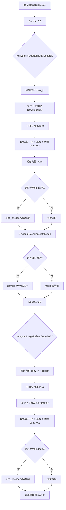
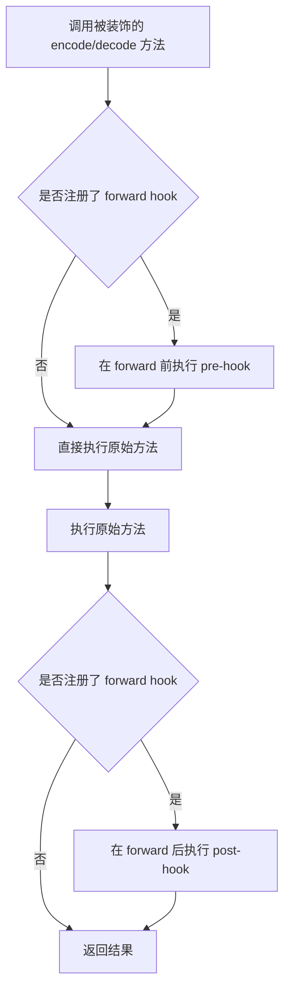
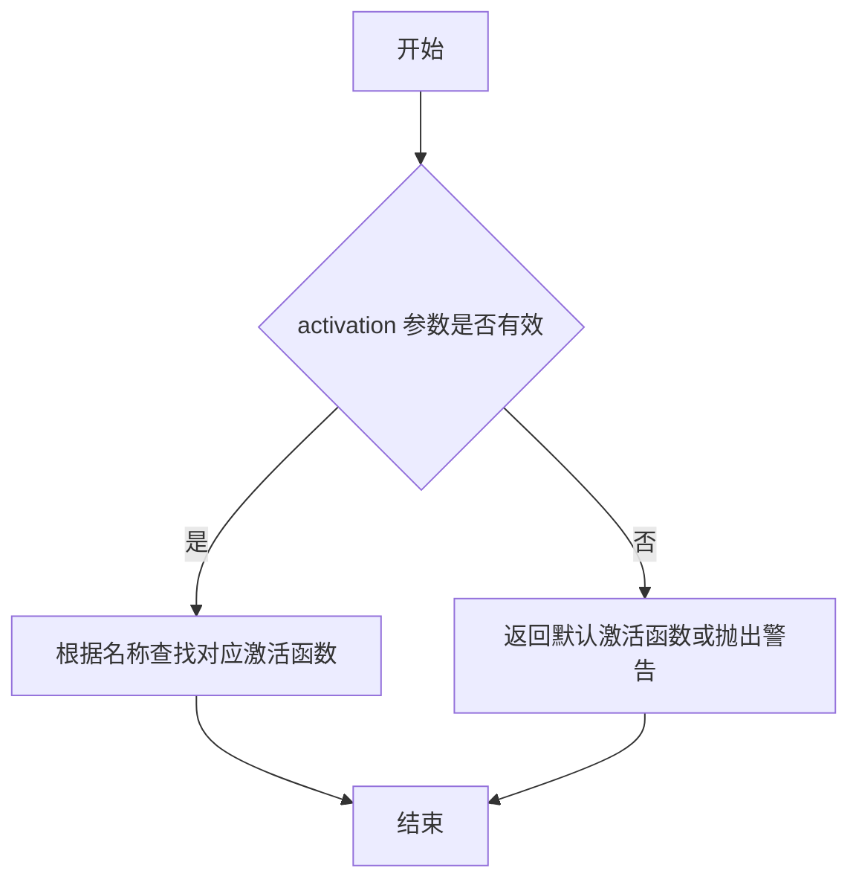
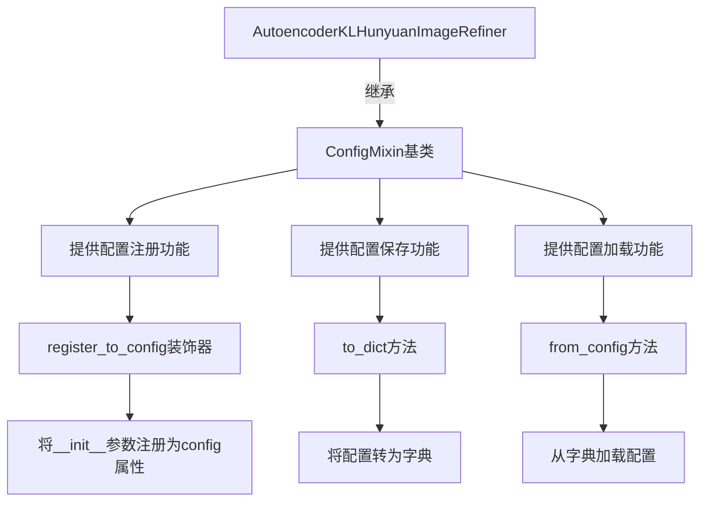
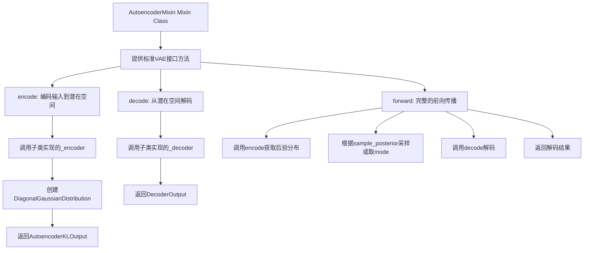
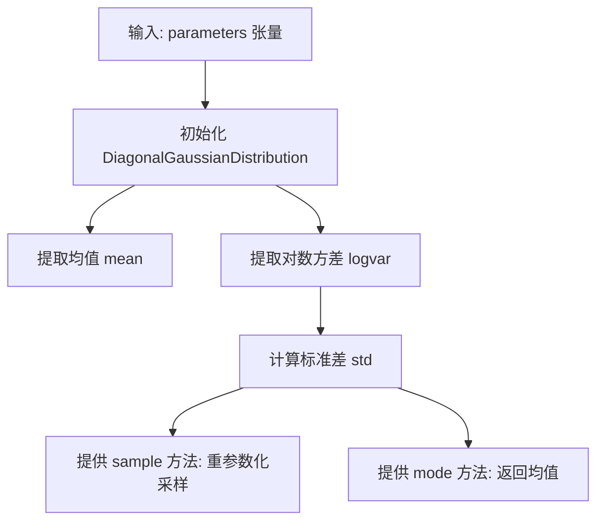
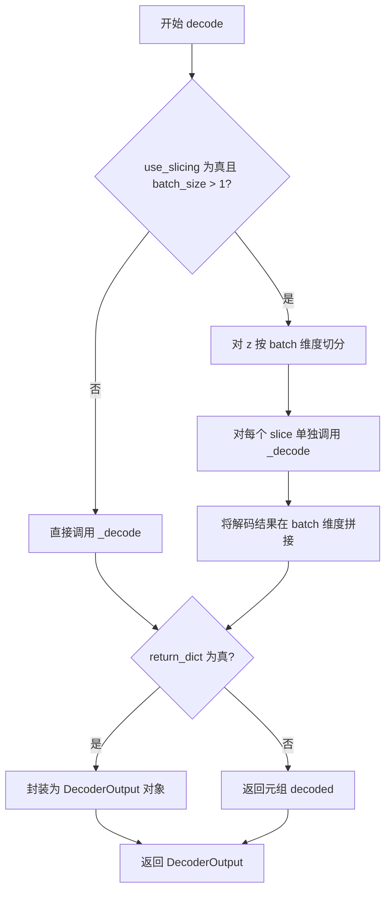
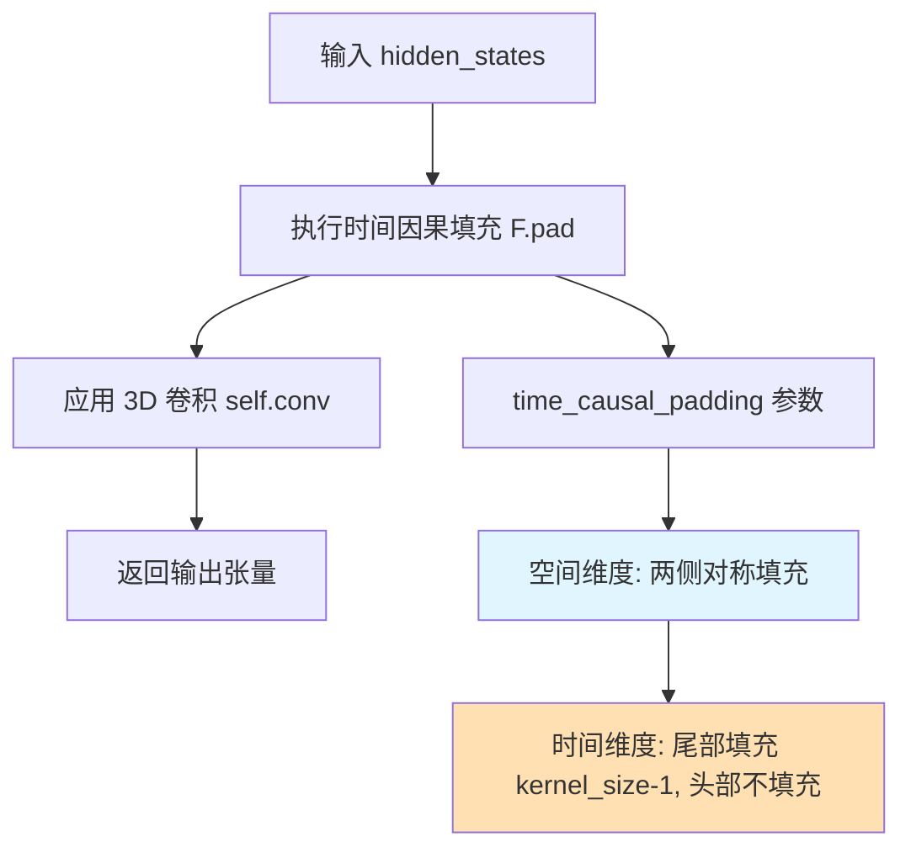
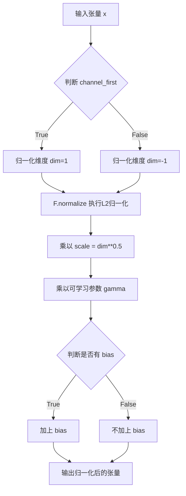
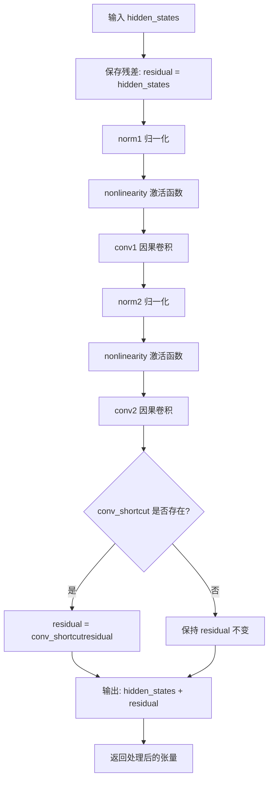

# `diffusers\src\diffusers\models\autoencoders\autoencoder_kl_hunyuanimage_refiner.py` 详细设计文档

这是一个用于HunyuanImage-2.1 Refiner的VAE（变分自编码器）模型，实现了基于3D卷积的视频/图像编码器和解码器，支持空间和时间维度压缩，包含因果卷积、RMS归一化、注意力机制、残差块等核心组件，并提供了tiled编码/解码以降低内存消耗。

## 整体流程



## 类结构

```
nn.Module (基类)
├── HunyuanImageRefinerCausalConv3d (因果3D卷积)
├── HunyuanImageRefinerRMS_norm (RMS归一化)
├── HunyuanImageRefinerAttnBlock (注意力块)
│   └── HunyuanImageRefinerRMS_norm, nn.Conv3d (x4)
├── HunyuanImageRefinerUpsampleDCAE (上采样块)
│   └── HunyuanImageRefinerCausalConv3d, _dcae_upsample_rearrange
├── HunyuanImageRefinerDownsampleDCAE (下采样块)
│   └── HunyuanImageRefinerCausalConv3d, _dcae_downsample_rearrange
├── HunyuanImageRefinerResnetBlock (残差块)
│   ├── HunyuanImageRefinerRMS_norm (x2)
│   ├── HunyuanImageRefinerCausalConv3d (x2)
│   └── nn.Conv3d (shortcut)
├── HunyuanImageRefinerMidBlock (中间块)
│   ├── HunyuanImageRefinerResnetBlock (多个)
│   └── HunyuanImageRefinerAttnBlock (多个)
├── HunyuanImageRefinerDownBlock3D (下采样3D块)
│   ├── HunyuanImageRefinerResnetBlock (多个)
│   └── HunyuanImageRefinerDownsampleDCAE
├── HunyuanImageRefinerUpBlock3D (上采样3D块)
│   ├── HunyuanImageRefinerResnetBlock (多个)
│   └── HunyuanImageRefinerUpsampleDCAE
├── HunyuanImageRefinerEncoder3D (3D编码器)
│   ├── HunyuanImageRefinerCausalConv3d
│   ├── HunyuanImageRefinerDownBlock3D (多个)
│   ├── HunyuanImageRefinerMidBlock
│   └── HunyuanImageRefinerCausalConv3d (输出)
├── HunyuanImageRefinerDecoder3D (3D解码器)
│   ├── HunyuanImageRefinerCausalConv3d
│   ├── HunyuanImageRefinerMidBlock
│   ├── HunyuanImageRefinerUpBlock3D (多个)
│   └── HunyuanImageRefinerCausalConv3d (输出)
└── AutoencoderKLHunyuanImageRefiner (主模型类)
    ├── HunyuanImageRefinerEncoder3D (encoder)
    └── HunyuanImageRefinerDecoder3D (decoder)
```

## 全局变量及字段


### `logger`
    
日志记录器，用于输出调试和运行信息

类型：`logging.Logger`
    


### `__name__`
    
模块名称，用于日志记录和配置

类型：`str`
    


### `HunyuanImageRefinerCausalConv3d.pad_mode`
    
填充模式

类型：`str`
    


### `HunyuanImageRefinerCausalConv3d.time_causal_padding`
    
时间因果填充参数

类型：`tuple`
    


### `HunyuanImageRefinerCausalConv3d.conv`
    
3D卷积层

类型：`nn.Conv3d`
    


### `HunyuanImageRefinerRMS_norm.channel_first`
    
是否通道在前

类型：`bool`
    


### `HunyuanImageRefinerRMS_norm.scale`
    
缩放因子

类型：`float`
    


### `HunyuanImageRefinerRMS_norm.gamma`
    
可学习缩放参数

类型：`nn.Parameter`
    


### `HunyuanImageRefinerRMS_norm.bias`
    
可学习偏置参数

类型：`nn.Parameter`
    


### `HunyuanImageRefinerAttnBlock.in_channels`
    
输入通道数

类型：`int`
    


### `HunyuanImageRefinerAttnBlock.norm`
    
归一化层

类型：`HunyuanImageRefinerRMS_norm`
    


### `HunyuanImageRefinerAttnBlock.to_q`
    
查询投影

类型：`nn.Conv3d`
    


### `HunyuanImageRefinerAttnBlock.to_k`
    
键投影

类型：`nn.Conv3d`
    


### `HunyuanImageRefinerAttnBlock.to_v`
    
值投影

类型：`nn.Conv3d`
    


### `HunyuanImageRefinerAttnBlock.proj_out`
    
输出投影

类型：`nn.Conv3d`
    


### `HunyuanImageRefinerUpsampleDCAE.conv`
    
卷积层

类型：`HunyuanImageRefinerCausalConv3d`
    


### `HunyuanImageRefinerUpsampleDCAE.add_temporal_upsample`
    
是否时间上采样

类型：`bool`
    


### `HunyuanImageRefinerUpsampleDCAE.repeats`
    
重复次数

类型：`int`
    


### `HunyuanImageRefinerDownsampleDCAE.conv`
    
卷积层

类型：`HunyuanImageRefinerCausalConv3d`
    


### `HunyuanImageRefinerDownsampleDCAE.add_temporal_downsample`
    
是否时间下采样

类型：`bool`
    


### `HunyuanImageRefinerDownsampleDCAE.group_size`
    
分组大小

类型：`int`
    


### `HunyuanImageRefinerResnetBlock.nonlinearity`
    
激活函数

类型：`nn.Module`
    


### `HunyuanImageRefinerResnetBlock.norm1`
    
第一归一化层

类型：`HunyuanImageRefinerRMS_norm`
    


### `HunyuanImageRefinerResnetBlock.conv1`
    
第一卷积层

类型：`HunyuanImageRefinerCausalConv3d`
    


### `HunyuanImageRefinerResnetBlock.norm2`
    
第二归一化层

类型：`HunyuanImageRefinerRMS_norm`
    


### `HunyuanImageRefinerResnetBlock.conv2`
    
第二卷积层

类型：`HunyuanImageRefinerCausalConv3d`
    


### `HunyuanImageRefinerResnetBlock.conv_shortcut`
    
快捷连接卷积

类型：`nn.Conv3d`
    


### `HunyuanImageRefinerMidBlock.add_attention`
    
是否添加注意力

类型：`bool`
    


### `HunyuanImageRefinerMidBlock.attentions`
    
注意力模块列表

类型：`nn.ModuleList`
    


### `HunyuanImageRefinerMidBlock.resnets`
    
ResNet块列表

类型：`nn.ModuleList`
    


### `HunyuanImageRefinerMidBlock.gradient_checkpointing`
    
梯度检查点标志

类型：`bool`
    


### `HunyuanImageRefinerDownBlock3D.resnets`
    
ResNet块列表

类型：`nn.ModuleList`
    


### `HunyuanImageRefinerDownBlock3D.downsamplers`
    
下采样器列表

类型：`nn.ModuleList`
    


### `HunyuanImageRefinerDownBlock3D.gradient_checkpointing`
    
梯度检查点标志

类型：`bool`
    


### `HunyuanImageRefinerUpBlock3D.resnets`
    
ResNet块列表

类型：`nn.ModuleList`
    


### `HunyuanImageRefinerUpBlock3D.upsamplers`
    
上采样器列表

类型：`nn.ModuleList`
    


### `HunyuanImageRefinerUpBlock3D.gradient_checkpointing`
    
梯度检查点标志

类型：`bool`
    


### `HunyuanImageRefinerEncoder3D.in_channels`
    
输入通道数

类型：`int`
    


### `HunyuanImageRefinerEncoder3D.out_channels`
    
输出通道数

类型：`int`
    


### `HunyuanImageRefinerEncoder3D.group_size`
    
分组大小

类型：`int`
    


### `HunyuanImageRefinerEncoder3D.conv_in`
    
输入卷积

类型：`HunyuanImageRefinerCausalConv3d`
    


### `HunyuanImageRefinerEncoder3D.mid_block`
    
中间块

类型：`HunyuanImageRefinerMidBlock`
    


### `HunyuanImageRefinerEncoder3D.down_blocks`
    
下采样块列表

类型：`nn.ModuleList`
    


### `HunyuanImageRefinerEncoder3D.norm_out`
    
输出归一化

类型：`HunyuanImageRefinerRMS_norm`
    


### `HunyuanImageRefinerEncoder3D.conv_act`
    
激活函数

类型：`nn.SiLU`
    


### `HunyuanImageRefinerEncoder3D.conv_out`
    
输出卷积

类型：`HunyuanImageRefinerCausalConv3d`
    


### `HunyuanImageRefinerEncoder3D.gradient_checkpointing`
    
梯度检查点标志

类型：`bool`
    


### `HunyuanImageRefinerDecoder3D.layers_per_block`
    
每块层数

类型：`int`
    


### `HunyuanImageRefinerDecoder3D.in_channels`
    
输入通道数

类型：`int`
    


### `HunyuanImageRefinerDecoder3D.out_channels`
    
输出通道数

类型：`int`
    


### `HunyuanImageRefinerDecoder3D.repeat`
    
重复次数

类型：`int`
    


### `HunyuanImageRefinerDecoder3D.conv_in`
    
输入卷积

类型：`HunyuanImageRefinerCausalConv3d`
    


### `HunyuanImageRefinerDecoder3D.mid_block`
    
中间块

类型：`HunyuanImageRefinerMidBlock`
    


### `HunyuanImageRefinerDecoder3D.up_blocks`
    
上采样块列表

类型：`nn.ModuleList`
    


### `HunyuanImageRefinerDecoder3D.norm_out`
    
输出归一化

类型：`HunyuanImageRefinerRMS_norm`
    


### `HunyuanImageRefinerDecoder3D.conv_act`
    
激活函数

类型：`nn.SiLU`
    


### `HunyuanImageRefinerDecoder3D.conv_out`
    
输出卷积

类型：`HunyuanImageRefinerCausalConv3d`
    


### `HunyuanImageRefinerDecoder3D.gradient_checkpointing`
    
梯度检查点标志

类型：`bool`
    


### `AutoencoderKLHunyuanImageRefiner.encoder`
    
编码器

类型：`HunyuanImageRefinerEncoder3D`
    


### `AutoencoderKLHunyuanImageRefiner.decoder`
    
解码器

类型：`HunyuanImageRefinerDecoder3D`
    


### `AutoencoderKLHunyuanImageRefiner.spatial_compression_ratio`
    
空间压缩比

类型：`int`
    


### `AutoencoderKLHunyuanImageRefiner.temporal_compression_ratio`
    
时间压缩比

类型：`int`
    


### `AutoencoderKLHunyuanImageRefiner.use_slicing`
    
是否使用切片

类型：`bool`
    


### `AutoencoderKLHunyuanImageRefiner.use_tiling`
    
是否使用平铺

类型：`bool`
    


### `AutoencoderKLHunyuanImageRefiner.tile_sample_min_height`
    
最小平铺高度

类型：`int`
    


### `AutoencoderKLHunyuanImageRefiner.tile_sample_min_width`
    
最小平铺宽度

类型：`int`
    


### `AutoencoderKLHunyuanImageRefiner.tile_sample_stride_height`
    
高度步长

类型：`int`
    


### `AutoencoderKLHunyuanImageRefiner.tile_sample_stride_width`
    
宽度步长

类型：`int`
    


### `AutoencoderKLHunyuanImageRefiner.tile_overlap_factor`
    
重叠因子

类型：`float`
    
    

## 全局函数及方法


在给定的代码中，我未能找到名为 `get_logger` 的函数或方法。代码中仅在模块级别使用了一次 `logging.get_logger(__name__)` 来获取一个 logger 实例，但这并不是定义一个 `get_logger` 函数。

### 提取结果

**无匹配项**：代码中不存在名为 `get_logger` 的函数或方法定义。

---

#### 带注释源码（相关部分）

```python
# ... (导入部分)
from ...utils import logging  # 从 utils 模块导入 logging 工具

# 使用 logging.get_logger 获取一个模块级别的 logger
logger = logging.get_logger(__name__)  # pylint: disable=invalid-name
```

---

如果您需要我提取其他函数或方法（例如 `encode`、`decode`、`forward` 等），请告知。


### `apply_forward_hook`

该函数是一个装饰器，来自 `diffusers` 库的 `accelerate_utils` 模块。它用于包装模型的 `encode` 和 `decode` 方法，在方法执行前后注入钩子逻辑，以支持加速库（如 `accelerate`）的某些功能，例如记录前向传播的输入输出信息用于分布式训练或性能分析。

参数：

-  `func`：被装饰的函数，通常是类的方法（如 `encode` 或 `decode`）

返回值：装饰后的函数，添加了钩子调用逻辑

#### 流程图



#### 带注释源码

```python
# 该函数的实际定义在 diffusers 库的 utils/accelerate_utils.py 中
# 以下是根据其在代码中的使用方式推断的典型实现

def apply_forward_hook(func):
    """
    装饰器：用于在模型方法执行前后注入钩子逻辑
    
    用途：
    - 支持 accelerate 库的分布式训练钩子
    - 记录前向传播的输入输出用于调试
    - 支持模型性能分析
    """
    def wrapper(self, *args, **kwargs):
        # 1. 如果有 pre-hook，在这里执行
        # (此处为推测的钩子调用逻辑)
        
        # 2. 执行原始方法
        result = func(self, *args, **kwargs)
        
        # 3. 如果有 post-hook，在这里执行
        # (此处为推测的钩子调用逻辑)
        
        return result
    
    return wrapper


# 在代码中的实际使用示例：
class AutoencoderKLHunyuanImageRefiner(ModelMixin, AutoencoderMixin, ConfigMixin):
    
    @apply_forward_hook  # 使用装饰器包装 encode 方法
    def encode(self, x: torch.Tensor, return_dict: bool = True):
        # ... 编码逻辑 ...
        pass
    
    @apply_forward_hook  # 使用装饰器包装 decode 方法
    def decode(self, z: torch.Tensor, return_dict: bool = True):
        # ... 解码逻辑 ...
        pass
```


### `get_activation`

获取指定名称的激活函数。根据传入的非线性激活函数名称字符串，返回对应的 PyTorch 激活函数对象。

参数：

- `activation`：`str`，激活函数的名称（如 "swish"、"relu"、"gelu"、"silu" 等）

返回值：`Callable[[torch.Tensor], torch.Tensor]`，返回一个可调用的激活函数，该函数接受张量并返回激活后的张量

#### 流程图



#### 带注释源码

```python
# 该函数定义在 diffusers 库的 ..activations 模块中
# 以下是推断的函数签名和逻辑

from typing import Callable, Union

import torch.nn as nn

def get_activation(activation: Union[str, None]) -> Callable[[torch.Tensor], torch.Tensor]:
    """
    获取指定名称的激活函数。
    
    Args:
        activation: 激活函数名称字符串，如 'swish', 'relu', 'gelu', 'silu' 等
        
    Returns:
        对应的 PyTorch 激活函数
    """
    # 常见的激活函数映射
    activation_funcs = {
        'relu': nn.ReLU(),
        'gelu': nn.GELU(),
        'silu': nn.SiLU(),
        'swish': nn.SiLU(),  # Swish 等同于 SiLU
        'leaky_relu': nn.LeakyReLU(),
        'elu': nn.ELU(),
        'tanh': nn.Tanh(),
        'sigmoid': nn.Sigmoid(),
    }
    
    if activation is None:
        # 如果未指定激活函数，返回恒等映射
        return lambda x: x
    
    # 获取对应的激活函数，如果不存在则返回恒等函数并记录警告
    return activation_funcs.get(activation, lambda x: x)
```

> **注意**：由于 `get_activation` 函数定义在 `diffusers` 库的 `src/diffusers/models/activations.py` 中，而非当前代码文件内，上述源码为基于其使用方式的推断实现。实际实现可能包含更多激活函数支持及错误处理逻辑。该函数在当前代码的 `HunyuanImageRefinerResnetBlock` 类中用于创建非线性激活层：

```python
self.nonlinearity = get_activation(non_linearity)  # non_linearity 传入 "swish"
```


### ConfigMixin

ConfigMixin是一个配置混入类，提供了配置参数的注册、保存和加载功能。它允许模型类通过装饰器方式将`__init__`方法的参数自动注册为配置属性，并支持从预训练权重中加载配置。

参数：

-  无直接参数（该类作为混入基类使用，具体参数由继承类定义）

返回值：`无返回`（这是一个混入类，主要通过继承来使用）

#### 流程图



#### 带注释源码

```
# ConfigMixin 是从 configuration_utils 模块导入的混入类
# 它不是在本文件中定义的，而是作为外部依赖提供
from ...configuration_utils import ConfigMixin, register_to_config

# 在代码中的使用示例：
class AutoencoderKLHunyuanImageRefiner(ModelMixin, AutoencoderMixin, ConfigMixin):
    """
    继承自ConfigMixin的VAE模型类
    """
    
    @register_to_config  # 使用装饰器将__init__参数注册为配置属性
    def __init__(
        self,
        in_channels: int = 3,
        out_channels: int = 3,
        latent_channels: int = 32,
        # ... 其他参数
    ) -> None:
        super().__init__()
        # 初始化逻辑
    
    # ConfigMixin提供的能力：
    # 1. 自动将__init__参数保存为self.config属性
    # 2. 支持to_dict()将配置转为字典
    # 3. 支持from_config()从字典创建实例
    # 4. 配合ModelMixin实现模型的save_pretrained和from_pretrained
```

#### 备注

- ConfigMixin是HuggingFace Diffusers库中的基础设施类，定义在`diffusers.configuration_utils`模块中
- 具体的实现细节需要参考`diffusers`库的源代码
- 该类通常与`register_to_config`装饰器配合使用，用于模型的配置管理


```json
{
  "name": "register_to_config",
  "description": "HuggingFace diffusers 库中的配置注册装饰器，用于将 __init__ 方法的参数自动注册到模型的配置对象中，支持配置序列化与反序列化。",
  "parameters": [
    {
      "name": "init方法参数",
      "type": "任意",
      "description": "被装饰的 __init__ 方法的所有参数（如 in_channels, out_channels, latent_channels, block_out_channels, layers_per_block, spatial_compression_ratio, temporal_compression_ratio, downsample_match_channel, upsample_match_channel, scaling_factor）"
    }
  ],
  "return_type": "Callable",
  "return_description": "装饰后的 __init__ 方法",
  "flowchart": "```mermaid\nflowchart TD\n    A[开始装饰] --> B{检查被装饰方法}\n    B --> C[提取参数签名]\n    C --> D[创建_config属性]\n    D --> E[将参数存入配置字典]\n    E --> F[返回装饰后的方法]\n```",
  "source_code": "```python\n# register_to_config 是从 diffusers 库的 configuration_utils 导入的装饰器\n# 具体定义在 HuggingFace diffusers 源代码中\n# 使用方式如下：\n\nfrom ...configuration_utils import ConfigMixin, register_to_config\n\nclass AutoencoderKLHunyuanImageRefiner(ModelMixin, AutoencoderMixin, ConfigMixin):\n    \"\"\"\n    A VAE model with KL loss for encoding videos into latents and decoding latent representations into videos.\n    \"\"\"\n\n    _supports_gradient_checkpointing = True\n\n    # 使用 @register_to_config 装饰器\n    # 这会将 __init__ 的所有参数自动注册到 self.config 中\n    @register_to_config\n    def __init__(\n        self,\n        in_channels: int = 3,\n        out_channels: int = 3,\n        latent_channels: int = 32,\n        block_out_channels: tuple[int, ...] = (128, 256, 512, 1024, 1024),\n        layers_per_block: int = 2,\n        spatial_compression_ratio: int = 16,\n        temporal_compression_ratio: int = 4,\n        downsample_match_channel: bool = True,\n        upsample_match_channel: bool = True,\n        scaling_factor: float = 1.03682,\n    ) -> None:\n        super().__init__()\n        # ... 初始化 encoder 和 decoder\n```"
}
```


### `ModelMixin`

`ModelMixin` 是一个基础 mixin 类，用于为模型提供通用的保存、加载和配置方法，是 HuggingFace Diffusers 库中所有模型类的基类。

参数：

- 无（此类为抽象基类，通过继承使用）

返回值：

- 无（此类为抽象基类，通过继承使用）

#### 流程图

```mermaid
flowchart TD
    A[ModelMixin] --> B[提供通用模型方法]
    A --> C[支持配置注册]
    A --> D[支持梯度检查点]
    
    B --> B1[save_pretrained]
    B --> B2[from_pretrained]
    B --> B3[push_to_hub]
    
    C --> C1[@register_to_config 装饰器]
    C --> C2[配置参数管理]
    
    D --> D1[enable_gradient_checkpointing]
    D --> D2[_gradient_checkpointing_func]
    
    E[AutoencoderKLHunyuanImageRefiner] -->|继承| A
    E --> F[自编码器特定方法]
    
    F --> F1[encode]
    F --> F2[decode]
    F --> F3[forward]
```

#### 带注释源码

```python
# ModelMixin 是从 diffusers 库导入的基础类
# 源码位于 diffusers 库的 modeling_utils.py 中
# 以下为 AutoencoderKLHunyuanImageRefiner 类对 ModelMixin 的使用示例

from ..modeling_utils import ModelMixin

# ModelMixin 提供了以下核心功能：
# 1. save_pretrained() - 保存模型到指定目录
# 2. from_pretrained() - 从预训练路径加载模型
# 3. push_to_hub() - 推送到 HuggingFace Hub
# 4. register_to_config() - 配置参数注册装饰器
# 5. _supports_gradient_checkpointing - 梯度检查点支持标志

class AutoencoderKLHunyuanImageRefiner(ModelMixin, AutoencoderMixin, ConfigMixin):
    """
    使用 ModelMixin 提供的通用模型方法
    """
    
    _supports_gradient_checkpointing = True  # 启用梯度检查点支持
    
    @register_to_config  # ModelMixin 提供的装饰器，用于注册配置
    def __init__(
        self,
        in_channels: int = 3,
        out_channels: int = 3,
        # ... 其他参数
    ) -> None:
        super().__init__()
        # 初始化编码器和解码器
        self.encoder = HunyuanImageRefinerEncoder3D(...)
        self.decoder = HunyuanImageRefinerDecoder3D(...)
    
    # 继承自 ModelMixin 的方法会自动用于:
    # - 模型保存/加载
    # - 配置管理
    # - 梯度检查点控制
```


### `AutoencoderMixin`

AutoencoderMixin 是一个混合类（Mixin），为变分自编码器（VAE）模型提供通用的编码和解码功能方法。它定义了标准的 VAE 接口，包括 encode、decode 和 forward 方法，允许子类通过继承获得标准化的 VAE 行为，同时可以定制具体的模型架构（如 3D VAE 编码器和解码器）。

参数：

- `self`：隐式参数，表示类的实例本身

返回值：该类本身不返回值，它是一个混合类，用于被其他类继承

#### 流程图



#### 带注释源码

```python
# AutoencoderMixin 是从 .vae 模块导入的混合类
# 源码位置: from .vae import AutoencoderMixin, DecoderOutput, DiagonalGaussianDistribution
#
# 这个Mixin类为VAE模型提供标准接口，其典型实现包含以下核心方法：
#
# class AutoencoderMixin:
#     """提供VAE通用功能的Mixin类"""
#
#     def encode(self, x: torch.Tensor, return_dict: bool = True):
#         """
#         将输入编码到潜在空间
#
#         参数:
#             x: 输入张量，通常是图像或视频
#             return_dict: 是否返回字典格式的结果
#
#         返回:
#             AutoencoderKLOutput 或 tuple
#         """
#         # 1. 调用子类实现的_encoder方法
#         h = self._encode(x)
#         # 2. 创建对角高斯分布（VAE的核心）
#         posterior = DiagonalGaussianDistribution(h)
#         # 3. 根据return_dict返回结果
#         if not return_dict:
#             return (posterior,)
#         return AutoencoderKLOutput(latent_dist=posterior)
#
#     def decode(self, z: torch.Tensor, return_dict: bool = True):
#         """
#         将潜在向量解码回原始空间
#
#         参数:
#             z: 潜在空间向量
#             return_dict: 是否返回字典格式的结果
#
#         返回:
#             DecoderOutput 或 tuple
#         """
#         # 1. 调用子类实现的_decoder方法
#         dec = self._decode(z)
#         # 2. 根据return_dict返回结果
#         if not return_dict:
#             return (dec,)
#         return DecoderOutput(sample=dec)
#
#     def forward(self, sample, sample_posterior=False, return_dict=True, generator=None):
#         """
#         完整的前向传播：编码 + 可选采样 + 解码
#
#         参数:
#             sample: 输入样本
#             sample_posterior: 是否从后验分布采样（否则取mode）
#             return_dict: 是否返回字典格式
#             generator: 随机数生成器（用于采样）
#
#         返回:
#             DecoderOutput 或 torch.Tensor
#         """
#         # 1. 编码获取后验分布
#         posterior = self.encode(x).latent_dist
#         # 2. 采样或取mode
#         if sample_posterior:
#             z = posterior.sample(generator=generator)
#         else:
#             z = posterior.mode()
#         # 3. 解码
#         dec = self.decode(z, return_dict=return_dict)
#         return dec
#
#     # 子类需要实现的方法（模板方法模式）
#     def _encode(self, x: torch.Tensor) -> torch.Tensor:
#         """子类实现的具体编码逻辑"""
#         raise NotImplementedError
#
#     def _decode(self, z: torch.Tensor) -> torch.Tensor:
#         """子类实现的具体解码逻辑"""
#         raise NotImplementedError
```


### `AutoencoderKLOutput`

这是从 `..modeling_outputs` 模块导入的数据类，用于封装自编码器（AutoencoderKL）的输出结果，包含潜在空间的分布信息。在 `AutoencoderKLHunyuanImageRefiner.encode()` 方法中返回该对象。

参数：

- `latent_dist`：`DiagonalGaussianDistribution` 类型，表示潜在空间的高斯分布（均值和方差）

返回值：`AutoencoderKLOutput` 类型，包含潜在空间分布的输出对象

#### 流程图

```mermaid
flowchart TD
    A[输入图像张量 x] --> B[encoder 编码]
    B --> C[DiagonalGaussianDistribution 包装]
    C --> D[返回 AutoencoderKLOutput]
    
    D --> E{return_dict 参数}
    E -->|True| F[AutoencoderKLOutput 对象]
    E -->|False| G[元组 (posterior,)]
```

#### 带注释源码

```
# 从 modeling_outputs 模块导入 AutoencoderKLOutput 数据类
# 这不是在本文件中定义的，而是从 diffusers 库的核心模块导入
from ..modeling_outputs import AutoencoderKLOutput

# 在 encode 方法中使用 AutoencoderKLOutput：
@apply_forward_hook
def encode(
    self, x: torch.Tensor, return_dict: bool = True
) -> AutoencoderKLOutput | tuple[DiagonalGaussianDistribution]:
    r"""
    Encode a batch of images into latents.

    Args:
        x (`torch.Tensor`): Input batch of images.
        return_dict (`bool`, *optional*, defaults to `True`):
            Whether to return a [`~models.autoencoder_kl.AutoencoderKLOutput`] instead of a plain tuple.

    Returns:
            The latent representations of the encoded videos. If `return_dict` is True, a
            [`~models.autoencoder_kl.AutoencoderKLOutput`] is returned, otherwise a plain `tuple` is returned.
    """
    if self.use_slicing and x.shape[0] > 1:
        encoded_slices = [self._encode(x_slice) for x_slice in x.split(1)]
        h = torch.cat(encoded_slices)
    else:
        h = self._encode(x)

    # 使用 DiagonalGaussianDistribution 封装编码器输出
    # h 的形状为 (batch, latent_channels * 2, frames, height, width)
    # 前 half 为均值，后 half 为对数方差
    posterior = DiagonalGaussianDistribution(h)

    if not return_dict:
        return (posterior,)
    
    # 返回 AutoencoderKLOutput 对象，包含 latent_dist 属性
    return AutoencoderKLOutput(latent_dist=posterior)
```

#### AutoencoderKLOutput 结构说明

基于代码中的使用方式，`AutoencoderKLOutput` 是一个 dataclass，其结构大致如下：

```python
@dataclass
class AutoencoderKLOutput:
    """
    Output of AutoencoderKL encoding method.
    
    Attributes:
        latent_dist: A DiagonalGaussianDistribution object containing
                     the latent representation as a Gaussian distribution.
    """
    latent_dist: DiagonalGaussianDistribution
```

**使用示例：**

```python
# 调用 encode 方法获取输出
output = autoencoder.encode(image_tensor, return_dict=True)

# 访问 latent_dist
latent_distribution = output.latent_dist

# 从分布中采样或获取均值
latent_sample = latent_distribution.sample()
latent_mean = latent_distribution.mode()
```


### `DiagonalGaussianDistribution`

表示对角高斯分布的类，用于变分自编码器（VAE）中的潜在变量建模。该类封装了潜在空间的均值和对数方差，并提供采样和模式获取功能。

参数：

-  `parameters`：`torch.Tensor`，编码器输出的张量，通常包含 2 倍潜在通道数（前半部分为均值，后半部分为对数方差）

返回值：`DiagonalGaussianDistribution` 对象，表示对角高斯分布

#### 流程图



#### 带注释源码

```python
# 从 vae 模块导入的类，用于表示对角高斯分布
# 此类的定义位于 vae.py 文件中，当前文件通过导入使用

# 在 encode 方法中的使用示例：
posterior = DiagonalGaussianDistribution(h)
# 其中 h 是编码器输出，形状为 (batch, channels * 2, frames, height, width)
# 前 half 通道为均值，后 half 通道为对数方差

# 采样方法：
z = posterior.sample(generator=generator)  # 使用重参数化技巧采样

# 获取模式（均值）：
z = posterior.mode()  # 返回分布的均值作为潜在向量
```


### DecoderOutput

`DecoderOutput` 是从 `diffusers` 库的标准模块 `.vae` 导入的数据类，用于封装变分自编码器（VAE）解码器的输出结果。在 HunyuanImageRefiner 中，该类主要用于 `AutoencoderKLHunyuanImageRefiner.decode` 方法的返回值封装。

参数：

- `sample`：`torch.Tensor`，解码器生成的图像或视频张量

返回值：`DecoderOutput` 或 `torch.Tensor`，当 `return_dict=True` 时返回 `DecoderOutput` 对象，否则返回元组

#### 流程图



#### 带注释源码

```python
@apply_forward_hook
def decode(self, z: torch.Tensor, return_dict: bool = True) -> DecoderOutput | torch.Tensor:
    r"""
    Decode a batch of images.

    Args:
        z (`torch.Tensor`): Input batch of latent vectors.
            输入的潜在向量批次，通常来自编码器的输出或采样结果
        return_dict (`bool`, *optional*, defaults to `True`):
            Whether to return a [`~models.vae.DecoderOutput`] instead of a plain tuple.
            是否返回 DecoderOutput 对象而非普通元组

    Returns:
        [`~models.vae.DecoderOutput`] or `tuple`:
            If return_dict is True, a [`~models.vae.DecoderOutput`] is returned, otherwise a plain `tuple` is
            returned.
            当 return_dict=True 时返回 DecoderOutput 对象，其中 sample 属性包含解码后的图像/视频张量
    """
    # 如果启用切片模式且批次大小大于1，则按批次切分进行解码以节省显存
    if self.use_slicing and z.shape[0] > 1:
        # 对潜在向量按 batch 维度切分为单个样本
        decoded_slices = [self._decode(z_slice) for z_slice in z.split(1)]
        # 在 batch 维度拼接所有解码结果
        decoded = torch.cat(decoded_slices)
    else:
        # 直接对整个批次进行解码
        decoded = self._decode(z)

    # 根据 return_dict 参数决定返回格式
    if not return_dict:
        # 返回元组格式 (decoded,)
        return (decoded,)

    # 返回 DecoderOutput 对象，包含 sample 属性存储解码结果
    return DecoderOutput(sample=decoded)
```

### DecoderOutput 类定义（参考）

`DecoderOutput` 是 `diffusers` 库中的标准数据类，定义大致如下：

```python
@dataclass
class DecoderOutput:
    """
    解码器输出的数据类封装
    
    Attributes:
        sample: 解码后的图像/视频张量，形状为 (batch_size, channels, frames, height, width)
    """
    
    sample: torch.Tensor
```


### HunyuanImageRefinerCausalConv3d.forward

该方法实现了一个时间因果的3D卷积操作，通过在时间维度上使用特殊的非对称填充（尾部填充而头部不填充）来确保时间因果性，即当前帧的输出仅依赖于当前帧及之前的历史帧，而不会泄露未来信息。这是视频生成模型中确保时序一致性的关键模块。

参数：

- `hidden_states`：`torch.Tensor`，输入的5D张量，形状为 (batch_size, channels, frames, height, width)，表示一批视频帧数据

返回值：`torch.Tensor`，经过时间因果卷积处理后的输出张量，形状与输入相同

#### 流程图



#### 带注释源码

```python
def forward(self, hidden_states: torch.Tensor) -> torch.Tensor:
    """
    前向传播：执行时间因果的3D卷积
    
    参数:
        hidden_states: 输入张量，形状为 (batch_size, channels, frames, height, width)
        
    返回:
        经过时间因果卷积后的输出张量
    """
    # 步骤1: 对输入进行时间因果填充
    # - 空间维度（高度和宽度）：使用 pad_mode 指定的方式进行对称填充
    # - 时间维度：只在尾部填充（帧的未来方向），头部不填充
    #   这样确保输出帧 t 只依赖于输入帧 0 到 t，不会看到未来信息
    # time_causal_padding 格式: (left, right, top, bottom, front, back)
    # front = kernel_size[2] - 1, back = 0 表示只在时间维度前端（未来方向）填充
    hidden_states = F.pad(hidden_states, self.time_causal_padding, mode=self.pad_mode)
    
    # 步骤2: 执行3D卷积
    # 使用 PyTorch 的 Conv3d 对填充后的张量进行卷积操作
    return self.conv(hidden_states)
```


### `HunyuanImageRefinerRMS_norm.forward`

该方法实现了一个自定义的RMS（Root Mean Square）归一化层，对输入张量进行归一化处理，支持可学习的缩放参数（gamma）和偏置参数（bias），适用于图像和视频数据的通道级归一化。

参数：

- `x`：`torch.Tensor`，输入的张量

返回值：`torch.Tensor`，返回经过RMS归一化后的张量

#### 流程图



#### 带注释源码

```python
def forward(self, x):
    """
    执行RMS归一化的前向传播
    
    Args:
        x: 输入的张量，形状为 (batch, channels, ...) 或 (batch, ..., channels)
    
    Returns:
        归一化后的张量
    """
    # 根据 channel_first 标志选择归一化的维度
    # channel_first=True 时，对通道维度（dim=1）进行归一化
    # channel_first=False 时，对最后一个维度（dim=-1）进行归一化
    normalization_dim = 1 if self.channel_first else -1
    
    # 使用 F.normalize 对输入进行 L2 归一化
    # F.normalize 会将输入在指定维度上的值除以该维度的 L2 范数
    normalized = F.normalize(x, dim=normalization_dim)
    
    # 乘以 scale（dim**0.5）进行缩放
    scaled = normalized * self.scale
    
    # 乘以可学习的 gamma 参数进行进一步缩放
    scaled = scaled * self.gamma
    
    # 如果存在 bias，则加上偏置
    if self.bias != 0.0:
        output = scaled + self.bias
    else:
        output = scaled
    
    return output
```


### HunyuanImageRefinerAttnBlock.forward

该方法实现了一个针对3D视频数据的自注意力块（Attention Block），是HunyuanImageRefiner模型的核心组件之一。方法通过RMS归一化、QKV线性投影、缩放点积注意力计算（SDPA）以及输出投影，对输入的多帧图像特征进行自注意力处理，并采用残差连接保留原始信息。

参数：

- `self`：HunyuanImageRefinerAttnBlock 实例本身（隐式参数）。
- `x`：`torch.Tensor`，输入张量，形状为 (batch_size, channels, frames, height, width)，表示批量处理的视频/多帧图像特征。

返回值：`torch.Tensor`，输出张量，形状与输入相同 (batch_size, channels, frames, height, width)，经过注意力机制处理并通过残差连接后的特征。

#### 流程图

```mermaid
flowchart TD
    A[输入 x: torch.Tensor<br/>(batch_size, channels, frames, height, width)] --> B[保存残差连接: identity = x]
    B --> C[RMS 归一化: self.norm(x)]
    C --> D[线性投影生成 QKV]
    D --> D1[query = self.to_q(x)]
    D --> D2[key = self.to_k(x)]
    D --> D3[value = self.to_v(x)]
    D1 --> E[形状变换与维度置换]
    D2 --> E
    D3 --> E
    E --> F[重塑: reshape<br/>(batch_size, channels, frames*height*width)]
    F --> G[置换: permute<br/>(batch_size, frames*height*width, channels)]
    G --> H[扩展维度: unsqueeze(1)<br/>(batch_size, 1, frames*height*width, channels)]
    H --> I[连续内存: contiguous]
    I --> J[缩放点积注意力<br/>scaled_dot_product_attention]
    J --> K[形状恢复与维度置换]
    K --> L[x = squeeze + reshape + permute<br/>(batch_size, channels, frames, height, width)]
    L --> M[输出投影: self.proj_out(x)]
    M --> N[残差连接: x + identity]
    N --> O[输出: torch.Tensor<br/>(batch_size, channels, frames, height, width)]
```

#### 带注释源码

```python
def forward(self, x: torch.Tensor) -> torch.Tensor:
    """
    前向传播方法，实现3D自注意力机制。
    
    Args:
        x: 输入张量，形状为 (batch_size, channels, frames, height, width)
        
    Returns:
        经过自注意力处理并加上残差连接后的输出张量
    """
    # 步骤1: 保存原始输入用于残差连接
    # 残差连接有助于梯度流动并稳定训练
    identity = x

    # 步骤2: RMS 归一化
    # 使用自定义的 RMSNorm 对特征进行归一化，有助于稳定训练
    x = self.norm(x)

    # 步骤3: 线性投影生成 Query, Key, Value
    # 使用 1x1 卷积（等价于线性层）将输入通道映射到相同的空间
    # 这是标准注意力机制的第一步：将输入转换为查询、键和值
    query = self.to_q(x)
    key = self.to_k(x)
    value = self.to_v(x)

    # 步骤4: 获取输入形状信息
    # 用于后续的维度变换和注意力计算
    batch_size, channels, frames, height, width = query.shape

    # 步骤5: 形状变换 - 将3D特征图展平为序列
    # 将 (batch, channels, frames, h, w) 转换为 (batch, frames*h*w, channels)
    # 以便进行序列到序列的注意力计算
    # .contiguous() 确保张量在内存中是连续的，这对于后续操作是必要的
    
    # Query 变换: 重塑 -> 置换 -> 扩展维度 -> 内存连续化
    query = query.reshape(batch_size, channels, frames * height * width).permute(0, 2, 1).unsqueeze(1).contiguous()
    # Key 变换: 与 Query 相同的处理流程
    key = key.reshape(batch_size, channels, frames * height * width).permute(0, 2, 1).unsqueeze(1).contiguous()
    # Value 变换: 与 Query 相同的处理流程
    value = value.reshape(batch_size, channels, frames * height * width).permute(0, 2, 1).unsqueeze(1).contiguous()

    # 步骤6: 缩放点积注意力 (Scaled Dot-Product Attention)
    # 使用 PyTorch 的内置优化实现，比手动实现更高效
    # attn_mask 设置为 None，表示使用完整的注意力机制（无掩码）
    x = nn.functional.scaled_dot_product_attention(query, key, value, attn_mask=None)

    # 步骤7: 形状恢复
    # 将注意力输出从 (batch, 1, seq_len, channels) 恢复为 (batch, channels, frames, height, width)
    # squeeze(1): 移除中间维度
    # reshape: 恢复为 (batch, frames, height, width, channels) 的空间排列
    # permute: 重新排列维度顺序为 (batch, channels, frames, height, width)
    x = x.squeeze(1).reshape(batch_size, frames, height, width, channels).permute(0, 4, 1, 2, 3)
    
    # 步骤8: 输出投影
    # 使用 1x1 卷积将特征映射回原始通道维度
    x = self.proj_out(x)

    # 步骤9: 残差连接
    # 将注意力输出与原始输入相加，实现特征融合
    return x + identity
```


### `HunyuanImageRefinerUpsampleDCAE._dcae_upsample_rearrange`

该函数是一个静态方法，用于将打包后的张量重新排列为上采样后的空间和时间维度。具体来说，它将形状为 `(b, r1*r2*r3*c, f, h, w)` 的输入张量转换为形状为 `(b, c, r1*f, r2*h, r3*w)` 的输出张量，其中 `r1`、`r2`、`r3` 分别代表时间、高度和宽度的上采样因子。

参数：

- `tensor`：`torch.Tensor`，输入张量，形状为 `(b, r1*r2*r3*c, f, h, w)`，其中 `b` 是批量大小，`c` 是通道数，`f`、`h`、`w` 分别是时间、高度和宽度维度
- `r1`：`int`，时间维度的上采样因子，默认为 1
- `r2`：`int`，高度维度的上采样因子，默认为 2
- `r3`：`int`，宽度维度的上采样因子，默认为 2

返回值：`torch.Tensor`，重新排列后的张量，形状为 `(b, c, r1*f, r2*h, r3*w)`

#### 流程图

```mermaid
flowchart TD
    A[输入 tensor: (b, r1*r2*r3*c, f, h, w)] --> B[解压packed_c得到c通道数]
    B --> C[reshape: (b, r1, r2, r3, c, f, h, w)]
    C --> D[permute维度重排: (0, 4, 5, 1, 6, 2, 7, 3)]
    D --> E[reshape得到: (b, c, f*r1, h*r2, w*r3)]
    E --> F[输出 tensor: (b, c, r1*f, r2*h, r3*w)]
```

#### 带注释源码

```python
@staticmethod
def _dcae_upsample_rearrange(tensor, r1=1, r2=2, r3=2):
    """
    Convert (b, r1*r2*r3*c, f, h, w) -> (b, c, r1*f, r2*h, r3*w)

    Args:
        tensor: Input tensor of shape (b, r1*r2*r3*c, f, h, w)
        r1: temporal upsampling factor
        r2: height upsampling factor
        r3: width upsampling factor
    """
    # 获取输入张量的形状：批量大小b、压缩通道数packed_c、时间帧f、高度h、宽度w
    b, packed_c, f, h, w = tensor.shape
    
    # 计算总的上采样因子，然后解压得到原始通道数c
    factor = r1 * r2 * r3
    c = packed_c // factor
    
    # 第一次reshape：将压缩的通道维度展开为r1, r2, r3三个独立维度
    # 结果形状: (b, r1, r2, r3, c, f, h, w)
    tensor = tensor.view(b, r1, r2, r3, c, f, h, w)
    
    # 维度重排：将空间和时间维度移到通道维度之后
    # 原顺序: (b, r1, r2, r3, c, f, h, w)
    # 新顺序: (b, c, f, r1, h, r2, w, r3)
    # 这样可以让r1, r2, r3分别与f, h, w对应起来
    tensor = tensor.permute(0, 4, 5, 1, 6, 2, 7, 3)
    
    # 第二次reshape：将所有维度合并，得到最终的上采样形状
    # 结果形状: (b, c, f*r1, h*r2, w*r3)
    return tensor.reshape(b, c, f * r1, h * r2, w * r3)
```


### HunyuanImageRefinerUpsampleDCAE.forward

该方法是 HunyuanImageRefinerUpsampleDCAE 类的前向传播函数，负责对3D视频数据进行上采样操作（时间维度x2和空间维度x2x2），同时通过残差连接（shortcut）保持信息流。

参数：

- `self`：HunyuanImageRefinerUpsampleDCAE 实例，隐式参数
- `x`：`torch.Tensor`，输入张量，形状为 (batch, channels, frames, height, width)

返回值：`torch.Tensor`，上采样后的输出张量，形状为 (batch, out_channels, frames*r1, height*2, width*2)

#### 流程图

```mermaid
flowchart TD
    A[输入 x: (b, c, f, h, w)] --> B{add_temporal_upsample?}
    B -->|True| C[设置 r1 = 2]
    B -->|False| D[设置 r1 = 1]
    C --> E[执行卷积 conv]
    D --> E
    E --> F{h add_temporal_upsample?}
    F -->|True| G[_dcae_upsample_rearrange h, r1=1, r2=2, r3=2]
    G --> H[切片: h = h[:, : h.shape[1] // 2]]
    H --> I[_dcae_upsample_rearrange x, r1=1, r2=2, r3=2]
    I --> J[repeat_interleave shortcut]
    F -->|False| K[_dcae_upsample_rearrange h, r1=r1, r2=2, r3=3]
    K --> L[repeat_interleave x]
    L --> M[_dcae_upsample_rearrange shortcut, r1=r1, r2=2, r3=3]
    J --> N[加法: h + shortcut]
    M --> N
    N --> O[输出: (b, c, f*r1, h*2, w*2)]
```

#### 带注释源码

```python
def forward(self, x: torch.Tensor):
    """
    执行3D上采样操作，包括时间维度和空间维度的上采样，并添加残差连接。
    
    Args:
        x: 输入张量，形状为 (batch, channels, frames, height, width)
        
    Returns:
        上采样后的张量，形状为 (batch, out_channels, frames*r1, height*2, width*2)
        其中 r1 = 2 如果 add_temporal_upsample=True，否则 r1 = 1
    """
    # 1. 确定时间上采样因子
    # 如果启用了时间上采样，则时间维度放大2倍；否则保持不变
    r1 = 2 if self.add_temporal_upsample else 1
    
    # 2. 通过卷积层处理输入
    # 卷积会将通道数扩展: in_channels -> out_channels * factor
    # factor = 2*2*2=8 (如果add_temporal_upsample) 或 1*2*2=4
    h = self.conv(x)
    
    # 3. 根据是否进行时间上采样执行不同的路径
    if self.add_temporal_upsample:
        # ===== 时间上采样路径 =====
        
        # 重排张量: (b, r1*r2*r3*c, f, h, w) -> (b, c, r1*f, r2*h, r3*w)
        # 这里 r1=1, r2=2, r3=2，只进行空间上采样
        h = self._dcae_upsample_rearrange(h, r1=1, r2=2, r3=2)
        
        # 取前半部分通道 (通道维度减半)
        # 用于匹配输出通道数
        h = h[:, : h.shape[1] // 2]
        
        # ===== 计算 shortcut (残差连接) =====
        # 对输入进行相同的重排操作
        shortcut = self._dcae_upsample_rearrange(x, r1=1, r2=2, r3=2)
        
        # 沿着通道维度重复，以匹配主路径的通道数
        # repeats = factor * out_channels // in_channels // 2
        shortcut = shortcut.repeat_interleave(repeats=self.repeats // 2, dim=1)
        
    else:
        # ===== 非时间上采样路径 =====
        
        # 重排: (b, r1*r2*r3*c, f, h, w) -> (b, c, r1*f, r2*h, r3*w)
        h = self._dcae_upsample_rearrange(h, r1=r1, r2=2, r3=2)
        
        # 对输入进行通道重复
        shortcut = x.repeat_interleave(repeats=self.repeats, dim=1)
        
        # 对 shortcut 进行相同的重排
        shortcut = self._dcae_upsample_rearrange(shortcut, r1=r1, r2=2, r3=2)
    
    # 4. 残差连接: 将主路径输出与 shortcut 相加
    return h + shortcut
```

#### 静态方法 _dcae_upsample_rearrange

```python
@staticmethod
def _dcae_upsample_rearrange(tensor, r1=1, r2=2, r3=2):
    """
    将打包的张量重排为上采样后的形状。
    转换: (b, r1*r2*r3*c, f, h, w) -> (b, c, r1*f, r2*h, r3*w)
    
    Args:
        tensor: 输入张量，形状为 (b, r1*r2*r3*c, f, h, w)
        r1: 时间上采样因子
        r2: 高度上采样因子
        r3: 宽度上采样因子
        
    Returns:
        重排后的张量，形状为 (b, c, r1*f, r2*h, r3*w)
    """
    b, packed_c, f, h, w = tensor.shape
    factor = r1 * r2 * r3
    c = packed_c // factor
    
    # 视图操作: 将打包的通道分割为 r1, r2, r3 三个维度
    tensor = tensor.view(b, r1, r2, r3, c, f, h, w)
    
    # 置换维度: (b, r1, r2, r3, c, f, h, w) -> (b, c, f, r1, h, r2, w, r3)
    tensor = tensor.permute(0, 4, 5, 1, 6, 2, 7, 3)
    
    # 重新reshape为最终形状
    return tensor.reshape(b, c, f * r1, h * r2, w * r3)
```


### `HunyuanImageRefinerDownsampleDCAE._dcae_downsample_rearrange`

该方法是一个静态方法，主要用于将输入张量中的空间（高度、宽度）和时间（帧）维度压缩打包进通道维度。这是 DiagonalCausalAttention (DCAE) 下采样模块中的核心重排操作。它接受一个在时间或空间上被拉伸的张量（例如 `r1*f, r2*h, r3*w`），并将其转换为具有更多通道数但空间/时间维度更小的张量（`f, h, w`），以便后续卷积层能更高效地处理特征或与残差连接进行融合。

参数：

- `tensor`：`torch.Tensor`，输入张量，形状为 `(b, c, r1*f, r2*h, r3*w)`。其中 `b` 是批次大小，`c` 是通道数，`f, h, w` 是目标时间/空间维度的尺寸。
- `r1`：`int`，默认为 1，时间维度（帧）的下采样/打包因子。
- `r2`：`int`，默认为 2，高度维度的下采样/打包因子。
- `r3`：`int`，默认为 2，宽度维度的下采样/打包因子。

返回值：`torch.Tensor`，重排后的张量，形状为 `(b, r1*r2*r3*c, f, h, w)`。

#### 流程图

```mermaid
graph TD
    A[输入 Tensor: (b, c, f*r1, h*r2, w*r3)] --> B[View / Reshape: (b, c, f, r1, h, r2, w, r3)]
    B --> C[Permute 维度重排: (b, r1, r2, r3, c, f, h, w)]
    C --> D[Reshape 拼接: (b, c*r1*r2*r3, f, h, w)]
    D --> E[输出 Tensor: (b, c*r1*r2*r3, f, h, w)]
```

#### 带注释源码

```python
@staticmethod
def _dcae_downsample_rearrange(tensor, r1=1, r2=2, r3=2):
    """
    将 (b, c, r1*f, r2*h, r3*w) 转换为 (b, r1*r2*r3*c, f, h, w)

    这是一个与上采样相反的操作（将空间/时间维度打包进通道维度）。
    用于在执行卷积之前压缩特征图的空间体积。

    Args:
        tensor: 输入张量，形状为 (b, c, r1*f, r2*h, r3*w)
        r1: 时间维度压缩因子 (temporal downsampling factor)
        r2: 高度维度压缩因子
        r3: 宽度维度压缩因子

    Returns:
        重排后的张量，形状为 (b, r1*r2*r3*c, f, h, w)
    """
    # 获取输入张量的形状维度
    b, c, packed_f, packed_h, packed_w = tensor.shape
    
    # 解包计算出原始的时间、高度和宽度
    f, h, w = packed_f // r1, packed_h // r2, packed_w // r3

    # Step 1: View
    # 将张量从 (b, c, packed_f, packed_h, packed_w) 
    # 变形为 (b, c, f, r1, h, r2, w, r3)
    # 这一步将压缩的维度展开为独立的维度
    tensor = tensor.view(b, c, f, r1, h, r2, w, r3)

    # Step 2: Permute
    # 调整维度顺序从 (b, c, f, r1, h, r2, w, r3) 
    # 到 (b, r1, r2, r3, c, f, h, w)
    # 这样可以将 r1, r2, r3 维度和 c 维度合并
    tensor = tensor.permute(0, 3, 5, 7, 1, 2, 4, 6)
    
    # Step 3: Reshape
    # 最终将所有维度合并回 (b, c*r1*r2*r3, f, h, w)
    return tensor.reshape(b, r1 * r2 * r3 * c, f, h, w)
```


### `HunyuanImageRefinerDownsampleDCAE.forward`

该方法实现了 HunyuanImageRefiner 模型的下采样模块，通过因果 3D 卷积和维度重排操作实现视频/图像的空间和时间下采样，并使用分组平均作为残差连接的快捷路径。

参数：

- `x`：`torch.Tensor`，输入的张量，形状为 (batch_size, channels, frames, height, width)，表示批量视频或图像数据

返回值：`torch.Tensor`，下采样后的输出张量，形状为 (batch_size, output_channels, downsampled_frames, downsampled_height, downsampled_width)

#### 流程图

```mermaid
flowchart TD
    A[输入 x: (B, C, T, H, W)] --> B{add_temporal_downsample?}
    B -->|True| C[设置 r1=2]
    B -->|False| D[设置 r1=1]
    C --> E[h = conv(x)]
    D --> E
    E --> F{add_temporal_downsample?}
    F -->|True| G[调用 _dcae_downsample_rearrange h, r1=1, r2=2, r3=2]
    F -->|False| H[调用 _dcae_downsample_rearrange h, r1=r1, r2=2, r3=2]
    G --> I[h = torch.cat([h, h], dim=1)]
    H --> J[shortcut = _dcae_downsample_rearrange x, ...]
    I --> J
    K[shortcut = _dcae_downsample_rearrange x, ...]
    J --> L[View shortcut: B, h.shape[1], group_size/T, T, H, W]
    K --> L
    L --> M[shortcut = mean(dim=2)]
    M --> N[返回 h + shortcut]
```

#### 带注释源码

```python
def forward(self, x: torch.Tensor):
    # 根据是否启用时间下采样设置时间维度下采样因子 r1
    # 如果启用时间下采样，r1=2（即时间维度下采样2倍），否则 r1=1（不进行时间下采样）
    r1 = 2 if self.add_temporal_downsample else 1
    
    # 通过因果3D卷积进行初步卷积处理
    # 输入: (B, C, T, H, W) -> 输出: (B, C//factor, T, H, W)
    h = self.conv(x)
    
    # 根据是否启用时间下采样选择不同的处理分支
    if self.add_temporal_downsample:
        # 时间下采样分支：r1=1 表示时间维度不额外下采样（已在conv中处理）
        # 使用 _dcae_downsample_rearrange 将 (b, c, f, h*2, w*2) -> (b, c*4, f, h, w)
        # 即把空间下采样后的高宽维度压缩回通道维度
        h = self._dcae_downsample_rearrange(h, r1=1, r2=2, r3=2)
        
        # 沿通道维度拼接两个相同的张量，相当于将通道数翻倍
        # 这是一种特征增强技巧
        h = torch.cat([h, h], dim=1)
        
        # 计算残差连接的快捷路径
        # 对输入 x 进行相同的维度重排
        shortcut = self._dcae_downsample_rearrange(x, r1=1, r2=2, r3=2)
        
        # 获取 shortcut 的形状信息
        B, C, T, H, W = shortcut.shape
        
        # 通过 view 和 mean 实现分组平均池化
        # 将 (B, C, T, H, W) -> (B, h.shape[1], group_size//2, T, H, W) -> (B, h.shape[1], T, H, W)
        # group_size = factor * in_channels // out_channels
        # 这里 group_size // 2 是因为 h 的通道数翻倍了
        shortcut = shortcut.view(B, h.shape[1], self.group_size // 2, T, H, W).mean(dim=2)
    else:
        # 非时间下采样分支
        # 对卷积输出进行维度重排，r1=1 或 2
        h = self._dcae_downsample_rearrange(h, r1=r1, r2=2, r3=2)
        
        # 对输入进行相同的维度重排作为快捷路径
        shortcut = self._dcae_downsample_rearrange(x, r1=r1, r2=2, r3=2)
        
        B, C, T, H, W = shortcut.shape
        
        # 分组平均池化，group_size 是完整的分组大小
        shortcut = shortcut.view(B, h.shape[1], self.group_size, T, H, W).mean(dim=2)

    # 残差连接：卷积输出 + 快捷路径
    return h + shortcut
```


### HunyuanImageRefinerResnetBlock.forward

该方法是 HunyuanImageRefinerResnetBlock 类的前向传播函数，实现了一个带残差连接的 3D 因果卷积块（ResNet Block），用于图像/视频的特征提取与增强。块内包含两层归一化、激活函数和因果卷积操作，并通过残差连接（shortcut）帮助梯度流动和特征复用。

参数：

- `hidden_states`：`torch.Tensor`，输入的隐藏状态张量，形状为 (batch_size, channels, frames, height, width)

返回值：`torch.Tensor`，经过残差块处理后的输出张量，形状与输入相同

#### 流程图



#### 带注释源码

```python
def forward(self, hidden_states: torch.Tensor) -> torch.Tensor:
    """
    前向传播函数，执行残差块的特征变换
    
    处理流程:
    1. 保存输入作为残差连接的基础
    2. 第一层变换: 归一化 -> 激活 -> 卷积
    3. 第二层变换: 归一化 -> 激活 -> 卷积
    4. 如果输入输出通道不同,使用卷积调整残差维度
    5. 残差相加并返回结果
    """
    # 步骤1: 保存原始输入作为残差连接
    # 形状: (batch_size, channels, frames, height, width)
    residual = hidden_states

    # 步骤2: 第一层特征变换
    # 归一化处理,对通道维度进行RMS归一化
    hidden_states = self.norm1(hidden_states)
    # 应用非线性激活函数(如 swish)
    hidden_states = self.nonlinearity(hidden_states)
    # 3D 因果卷积,保持时间维度的因果性
    hidden_states = self.conv1(hidden_states)

    # 步骤3: 第二层特征变换
    # 归一化处理
    hidden_states = self.norm2(hidden_states)
    # 应用非线性激活函数
    hidden_states = self.nonlinearity(hidden_states)
    # 3D 因果卷积
    hidden_states = self.conv2(hidden_states)

    # 步骤4: 处理残差连接
    # 如果输入输出通道数不同,使用 1x1x1 卷积调整维度
    if self.conv_shortcut is not None:
        residual = self.conv_shortcut(residual)

    # 步骤5: 残差相加
    # 将卷积输出与调整后的残差相加,实现特征融合
    return hidden_states + residual
```


### `HunyuanImageRefinerMidBlock.forward`

该方法是 `HunyuanImageRefinerMidBlock`（Hunyuan Image Refiner VAE 的中间块）的核心前向传播逻辑。它负责接收特征图，并依次通过一个初始的残差网络（ResNet）块以及后续交替的注意力（Attention）块和残差网络块对其进行深度处理，以增强特征的表达能力。

参数：
- `hidden_states`：`torch.Tensor`，输入的隐藏状态张量，通常为 5 维张量 (Batch, Channels, Frames, Height, Width)，代表经过编码器或解码器处理的中间特征。

返回值：`torch.Tensor`，经过 MidBlock 处理后的特征图，形状与输入保持一致。

#### 流程图

```mermaid
flowchart TD
    A([输入 hidden_states]) --> B[ResNet Block 0]
    B --> C{遍历 Attention 列表 & ResNet[1:] 列表}
    
    C --> D{当前 Attention 块是否存在?}
    D -- 是 --> E[应用 Attention Block]
    E --> F[应用 ResNet Block i]
    D -- 否 --> F
    
    F --> C
    C -- 遍历结束 --> G([输出 hidden_states])
```

#### 带注释源码

```python
def forward(self, hidden_states: torch.Tensor) -> torch.Tensor:
    # 步骤 1: 首先通过第一个 ResNet 块处理输入
    # 这是一个基础的残差特征提取步骤，负责对输入特征进行初步的非线性变换
    hidden_states = self.resnets[0](hidden_states)

    # 步骤 2: 遍历剩余的 ResNet 块和对应的 Attention 块
    # self.attentions 和 self.resnets[1:] 长度相同，通过 zip 配对处理
    for attn, resnet in zip(self.attentions, self.resnets[1:]):
        # 步骤 3: 如果存在注意力层，则应用自注意力机制
        # 自注意力机制有助于模型捕捉特征图内部的全局空间或时空依赖关系
        if attn is not None:
            hidden_states = attn(hidden_states)
        
        # 步骤 4: 应用残差网络块进行进一步的特征提取和残差连接
        hidden_states = resnet(hidden_states)

    # 步骤 5: 返回处理后的特征图
    return hidden_states
```


### HunyuanImageRefinerDownBlock3D.forward

该方法是 HunyuanImageRefinerDownBlock3D 类的前向传播方法，负责对输入的张量进行下采样处理。方法首先通过多个残差网络块处理隐藏状态，然后根据配置对特征图进行空间和/或时间维度的下采样。该模块通常用于变分自编码器（VAE）的编码器部分，实现多分辨率特征提取。

参数：

- `hidden_states`：`torch.Tensor`，输入的隐藏状态张量，形状为 (batch_size, channels, frames, height, width)

返回值：`torch.Tensor`，经过残差块处理和可选下采样后的输出张量

#### 流程图

```mermaid
flowchart TD
    A[输入 hidden_states] --> B{self.downsamplers 是否为 None}
    B -->|否| C[遍历 resnets 列表]
    B -->|是| F[返回 hidden_states]
    C --> D[resnet_i = self.resnets[i]]
    D --> E[hidden_states = resnet_i.forward(hidden_states)]
    E --> C
    C -->|遍历完成| G{self.downsamplers 是否存在}
    G -->|是| H[遍历 downsamplers 列表]
    G -->|否| F
    H --> I[downsampler_i = self.downsamplers[i]]
    I --> J[hidden_states = downsampler_i.forward(hidden_states)]
    J --> H
    H -->|遍历完成| K[返回 hidden_states]
```

#### 带注释源码

```python
def forward(self, hidden_states: torch.Tensor) -> torch.Tensor:
    """
    HunyuanImageRefinerDownBlock3D 的前向传播方法
    
    参数:
        hidden_states: 输入张量，形状为 (batch_size, channels, frames, height, width)
        
    返回:
        经过处理后的隐藏状态张量
    """
    # 步骤1: 遍历所有残差网络块（ResNet blocks）
    # 这些残差块负责提取特征并进行初步的变换
    for resnet in self.resnets:
        hidden_states = resnet(hidden_states)

    # 步骤2: 检查是否存在下采样器
    # 如果 downsample_out_channels 不为 None，则会创建下采样器
    if self.downsamplers is not None:
        # 步骤3: 遍历所有下采样器并进行下采样
        # 下采样器可能包含空间维度和/或时间维度的下采样
        for downsampler in self.downsamplers:
            hidden_states = downsampler(hidden_states)

    # 返回处理后的隐藏状态
    return hidden_states
```


### HunyuanImageRefinerUpBlock3D.forward

该方法`forward`是`HunyuanImageRefinerUpBlock3D`类的核心执行逻辑，负责在变分自编码器（VAE）的解码器（Decoder）阶段对输入的隐藏状态（hidden_states）进行上采样和特征转换。它首先通过一系列残差网络块（ResNets）进行特征细化，随后根据配置通过上采样块（Upsamplers）执行时间轴和空间维度的放大操作（如2x或8x上采样），最终返回处理后的特征张量。

参数：

-  `hidden_states`：`torch.Tensor`，输入的隐藏状态张量，通常来自解码器上一层的特征，形状为 `(B, C, T, H, W)`（Batch, Channel, Time, Height, Width）。

返回值：`torch.Tensor`，经过上采样块处理后的输出张量。如果启用了上采样，形状将变为 `(B, C', T', H', W')`，其中 T', H', W' 大于等于输入的 T, H, W。

#### 流程图

```mermaid
graph TD
    A[Input: hidden_states (B, C, T, H, W)] --> B{Check: Gradient Checkpointing & Grad Enabled?}
    
    %% True path
    B -- Yes --> C[Loop: for resnet in self.resnets]
    C --> D[Call: self._gradient_checkpointing_func(resnet, hidden_states)]
    D --> E{Check: self.upsamplers is not None?}
    
    %% False path
    B -- No --> F[Loop: for resnet in self.resnets]
    F --> G[Call: resnet(hidden_states)]
    G --> E

    %% Upsampling path
    E -- Yes --> H[Loop: for upsampler in self.upsamplers]
    H --> I[Call: upsampler(hidden_states)]
    I --> J[Return: hidden_states]
    
    %% Skip upsampling path
    E -- No --> J
```

#### 带注释源码

```python
def forward(self, hidden_states: torch.Tensor) -> torch.Tensor:
    """
    Forward pass of the 3D Upsampling Block.

    Args:
        hidden_states (torch.Tensor): Input tensor of shape (B, C, T, H, W).

    Returns:
        torch.Tensor: Output tensor, potentially upsampled in spatial and/or temporal dimensions.
    """
    # 检查是否启用了梯度检查点（Gradient Checkpointing）以节省显存
    if torch.is_grad_enabled() and self.gradient_checkpointing:
        # 如果启用，遍历所有的残差网络块（ResNets）
        # 使用 _gradient_checkpointing_func 牺牲计算时间换取显存空间
        for resnet in self.resnets:
            hidden_states = self._gradient_checkpointing_func(resnet, hidden_states)
    else:
        # 标准前向传播路径：直接调用每个 ResNet 块
        for resnet in self.resnets:
            hidden_states = resnet(hidden_states)

    # 如果配置中存在上采样器（例如 HunyuanImageRefinerUpsampleDCAE），则执行上采样
    if self.upsamplers is not None:
        for upsampler in self.upsamplers:
            hidden_states = upsampler(hidden_states)

    return hidden_states
```

#### 关键组件信息

-   **HunyuanImageRefinerResnetBlock**: 用于进一步提取和细化特征的残差卷积块。
-   **HunyuanImageRefinerUpsampleDCAE**: 专门用于处理离散自编码器（DAE）上采样的模块，支持时间维度和空间维度的放大。

#### 潜在技术债务与优化空间

1.  **循环展开**：当前的循环结构（`for resnet in self.resnets`）在层数较多时可能引入轻微的 Python 开销。在极致性能要求下，可以考虑将循环展开或使用 `nn.ModuleList` 的索引访问进行熔合，但这通常需要权衡代码可读性。
2.  **硬编码的 Upsample 检查**：`if self.upsamplers is not None` 的检查位于前向传播的主路径中。虽然开销极小，但可以通过在 `__init__` 中将 `forward` 方法绑定到不同的函数指针（如 `self._forward_with_upsample` 和 `self._forward_no_upsample`）来消除运行时的分支判断，但这属于过度优化。


### `HunyuanImageRefinerEncoder3D.forward`

该方法是 HunyuanImageRefiner 的 3D VAE 编码器的前向传播函数，负责将输入的图像或视频张量编码为潜在空间表示。它通过输入卷积、下采样块、中间块进行处理，并添加残差连接后输出压缩后的潜在特征。

参数：

- `hidden_states`：`torch.Tensor`，输入的隐藏状态张量，形状为 (batch, in_channels, frames, height, width)，表示原始图像或视频数据

返回值：`torch.Tensor`，编码后的潜在表示，形状为 (batch, out_channels, frames//temporal_compression_ratio, height//spatial_compression_ratio, width//spatial_compression_ratio)

#### 流程图

```mermaid
flowchart TD
    A[输入 hidden_states] --> B[conv_in 初始卷积]
    B --> C{梯度检查点启用?}
    C -->|是| D[使用 _gradient_checkpointing_func 遍历下采样块]
    C -->|否| E[直接遍历下采样块]
    D --> F[中间块处理]
    E --> F
    F --> G[计算残差 shortcut: reshape 和 mean]
    G --> H[norm_out 归一化]
    H --> I[conv_act 激活函数 SiLU]
    I --> J[conv_out 输出卷积]
    J --> K[shortcut 残差相加]
    K --> L[输出编码后的 latent]
```

#### 带注释源码

```python
def forward(self, hidden_states: torch.Tensor) -> torch.Tensor:
    """
    前向传播：将输入的图像/视频编码为潜在表示
    
    处理流程：
    1. 初始卷积投影
    2. 多次下采样（空间和时间维度压缩）
    3. 中间块处理
    4. 输出投影（带残差连接）
    """
    # 步骤1: 输入卷积 - 将输入通道映射到第一个块通道
    hidden_states = self.conv_in(hidden_states)

    # 步骤2: 下采样块处理 - 交替进行空间和时间下采样
    if torch.is_grad_enabled() and self.gradient_checkpointing:
        # 梯度检查点模式：节省显存但增加计算时间
        for down_block in self.down_blocks:
            hidden_states = self._gradient_checkpointing_func(down_block, hidden_states)

        # 中间块处理
        hidden_states = self._gradient_checkpointing_func(self.mid_block, hidden_states)
    else:
        # 常规模式：直接前向传播
        for down_block in self.down_blocks:
            hidden_states = down_block(hidden_states)

        hidden_states = self.mid_block(hidden_states)

    # 步骤3: 计算残差连接 - 对通道维度进行分组平均
    # 将 (b, c*r, f, h, w) -> (b, c, r, f, h, w) -> (b, c, f, h, w)
    batch_size, _, frame, height, width = hidden_states.shape
    short_cut = hidden_states.view(batch_size, -1, self.group_size, frame, height, width).mean(dim=2)

    # 步骤4: 输出处理 - 归一化 + 激活 + 卷积 + 残差
    hidden_states = self.norm_out(hidden_states)
    hidden_states = self.conv_act(hidden_states)
    hidden_states = self.conv_out(hidden_states)

    # 残差连接：将中间层特征加到输出
    hidden_states += short_cut

    return hidden_states
```


### `HunyuanImageRefinerDecoder3D.forward`

该方法是 HunyuanImageRefinerDecoder3D 类的前向传播函数，负责将低分辨率的潜在表示（latent representation）通过多级上采样块（up_blocks）和中间块（mid_block）逐步解码为高分辨率的图像或视频输出。方法内部集成了梯度检查点（gradient checkpointing）机制以节省显存，并通过残差连接和后处理操作提升输出质量。

参数：

- `hidden_states`：`torch.Tensor`，输入的潜在表示张量，形状为 (batch_size, in_channels, frames, height, width)，其中 in_channels 通常为潜在空间的通道数（例如 32）。

返回值：`torch.Tensor`，解码后的输出张量，形状为 (batch_size, out_channels, frames, height, width)，其中 out_channels 通常为 3（RGB 图像）。

#### 流程图

```mermaid
flowchart TD
    A[输入 hidden_states] --> B[conv_in 卷积 + repeat_interleave 残差]
    B --> C{是否启用梯度检查点?}
    C -->|是| D[gradient_checkpointing_func 执行 mid_block]
    C -->|否| E[直接执行 mid_block]
    D --> F[gradient_checkpointing_func 遍历执行 up_blocks]
    E --> G[遍历执行 up_blocks]
    F --> H[后处理: norm_out + conv_act + conv_out]
    G --> H
    H --> I[输出 hidden_states]
```

#### 带注释源码

```python
def forward(self, hidden_states: torch.Tensor) -> torch.Tensor:
    """
    HunyuanImageRefinerDecoder3D 的前向传播方法，将潜在表示解码为图像/视频。

    Args:
        hidden_states (torch.Tensor): 输入张量，形状为 (batch_size, in_channels, frames, height, width)

    Returns:
        torch.Tensor: 解码后的输出张量，形状为 (batch_size, out_channels, frames, height, width)
    """
    # 步骤1: 初始卷积融合
    # 使用 conv_in 对输入进行卷积，并与重复扩展后的输入进行残差连接
    # repeat_interleave 在通道维度上重复 hidden_states，以匹配 block_out_channels[0] 的维度
    hidden_states = self.conv_in(hidden_states) + hidden_states.repeat_interleave(repeats=self.repeat, dim=1)

    # 步骤2: 根据是否启用梯度检查点选择执行路径
    # 梯度检查点通过在前向传播时不保存中间激活值来节省显存，在反向传播时重新计算
    if torch.is_grad_enabled() and self.gradient_checkpointing:
        # 使用梯度检查点执行中间块
        hidden_states = self._gradient_checkpointing_func(self.mid_block, hidden_states)

        # 遍历上采样块，使用梯度检查点执行每个块
        for up_block in self.up_blocks:
            hidden_states = self._gradient_checkpointing_func(up_block, hidden_states)
    else:
        # 直接执行中间块（无需梯度检查点）
        hidden_states = self.mid_block(hidden_states)

        # 遍历上采样块，执行上采样和特征提取
        for up_block in self.up_blocks:
            hidden_states = up_block(hidden_states)

    # 步骤3: 后处理
    # 应用 RMS 归一化
    hidden_states = self.norm_out(hidden_states)
    # 应用 SiLU 激活函数
    hidden_states = self.conv_act(hidden_states)
    # 输出卷积，将通道数转换为目标输出通道数（通常为 3 表示 RGB）
    hidden_states = self.conv_out(hidden_states)

    return hidden_states
```


### `AutoencoderKLHunyuanImageRefiner.enable_tiling`

该方法用于启用分块（Tiling）VAE解码/编码功能。当启用此选项后，VAE会将输入张量在空间维度（高度和宽度）上分割成多个较小的瓦片进行分步计算，从而显著降低显存占用并支持处理更大分辨率的图像。

参数：

- `tile_sample_min_height`：`int | None`，沿高度方向进行分块的最小高度阈值
- `tile_sample_min_width`：`int | None`，沿宽度方向进行分块的最小宽度阈值
- `tile_sample_stride_height`：`float | None`，两个连续垂直瓦片之间的最小重叠距离，用于消除高度方向的拼接伪影
- `tile_sample_stride_width`：`float | None`，两个连续水平瓦片之间的步幅，用于消除宽度方向的拼接伪影
- `tile_overlap_factor`：`float | None`，瓦片重叠系数，范围0到1，决定重叠区域占单个瓦片的比例

返回值：`None`，无返回值

#### 流程图

```mermaid
flowchart TD
    A[开始 enable_tiling] --> B[设置 self.use_tiling = True]
    B --> C{tile_sample_min_height 是否为 None}
    C -->|否| D[使用传入值]
    C -->|是| E[使用默认值 self.tile_sample_min_height]
    D --> F[更新 self.tile_sample_min_height]
    E --> F
    F --> G{tile_sample_min_width 是否为 None}
    G -->|否| H[使用传入值]
    G -->|是| I[使用默认值 self.tile_sample_min_width]
    H --> J[更新 self.tile_sample_min_width]
    I --> J
    J --> K{tile_sample_stride_height 是否为 None}
    K -->|否| L[使用传入值]
    K -->|是| M[使用默认值 self.tile_sample_stride_height]
    L --> N[更新 self.tile_sample_stride_height]
    M --> N
    N --> O{tile_sample_stride_width 是否为 None}
    O -->|否| P[使用传入值]
    O -->|是| Q[使用默认值 self.tile_sample_stride_width]
    P --> R[更新 self.tile_sample_stride_width]
    Q --> R
    R --> S{tile_overlap_factor 是否为 None}
    S -->|否| T[使用传入值]
    S -->|是| U[使用默认值 self.tile_overlap_factor]
    T --> V[更新 self.tile_overlap_factor]
    U --> V
    V --> W[结束]
```

#### 带注释源码

```python
def enable_tiling(
    self,
    tile_sample_min_height: int | None = None,
    tile_sample_min_width: int | None = None,
    tile_sample_stride_height: float | None = None,
    tile_sample_stride_width: float | None = None,
    tile_overlap_factor: float | None = None,
) -> None:
    r"""
    Enable tiled VAE decoding. When this option is enabled, the VAE will split the input tensor into tiles to
    compute decoding and encoding in several steps. This is useful for saving a large amount of memory and to allow
    processing larger images.

    Args:
        tile_sample_min_height (`int`, *optional*):
            The minimum height required for a sample to be separated into tiles across the height dimension.
        tile_sample_min_width (`int`, *optional*):
            The minimum width required for a sample to be separated into tiles across the width dimension.
        tile_sample_stride_height (`int`, *optional*):
            The minimum amount of overlap between two consecutive vertical tiles. This is to ensure that there are
            no tiling artifacts produced across the height dimension.
        tile_sample_stride_width (`int`, *optional*):
            The stride between two consecutive horizontal tiles. This is to ensure that there are no tiling
            artifacts produced across the width dimension.
    """
    # 启用分块模式标志，后续编码/解码将使用tiled_encode/tiled_decode方法
    self.use_tiling = True
    
    # 更新最小瓦片高度，若未提供参数则保留原默认值
    # 默认值在__init__中设置为256
    self.tile_sample_min_height = tile_sample_min_height or self.tile_sample_min_height
    
    # 更新最小瓦片宽度，若未提供参数则保留原默认值
    # 默认值在__init__中设置为256
    self.tile_sample_min_width = tile_sample_min_width or self.tile_sample_min_width
    
    # 更新垂直方向瓦片步幅/重叠距离，若未提供参数则保留原默认值
    # 默认值在__init__中设置为192
    self.tile_sample_stride_height = tile_sample_stride_height or self.tile_sample_stride_height
    
    # 更新水平方向瓦片步幅/重叠距离，若未提供参数则保留原默认值
    # 默认值在__init__中设置为192
    self.tile_sample_stride_width = tile_sample_stride_width or self.tile_sample_stride_width
    
    # 更新瓦片重叠系数，若未提供参数则保留原默认值
    # 默认值在__init__中设置为0.25，用于计算blend区域和overlap区域
    self.tile_overlap_factor = tile_overlap_factor or self.tile_overlap_factor
```


### `AutoencoderKLHunyuanImageRefiner._encode`

该方法是 HunyuanImage-2.1 Refiner VAE 模型的内部编码接口，负责将输入图像/视频张量编码为潜在表示。它首先检查是否启用了平铺编码（tiling），若输入尺寸超过配置的最小阈值则调用平tiled_encode 进行分块编码，否则直接通过底层 encoder 进行编码并返回潜在表示。

参数：

- `x`：`torch.Tensor`，输入的图像或视频批次张量，形状为 (batch, channels, frames, height, width)

返回值：`torch.Tensor`，编码后的潜在表示张量

#### 流程图

```mermaid
flowchart TD
    A[开始: _encode] --> B[获取输入形状: height, width]
    B --> C{是否启用平铺且尺寸超过阈值?}
    C -->|是| D[调用 tiled_encode]
    C -->|否| E[调用 self.encoder]
    D --> F[返回平铺编码结果]
    E --> G[返回 encoder 输出]
    F --> H[结束]
    G --> H
```

#### 带注释源码

```python
def _encode(self, x: torch.Tensor) -> torch.Tensor:
    """
    内部编码方法，将输入图像/视频编码为潜在表示。
    
    参数:
        x: 输入张量，形状为 (batch, channels, frames, height, width)
    
    返回:
        编码后的潜在表示张量
    """
    # 解包输入张量的形状信息，仅需要高度和宽度用于阈值判断
    _, _, _, height, width = x.shape

    # 判断条件：启用了平铺功能且输入尺寸超过最小平铺阈值
    if self.use_tiling and (width > self.tile_sample_min_width or height > self.tile_sample_min_height):
        # 使用平铺编码策略，将大图像分割成小块分别编码以节省显存
        return self.tiled_encode(x)

    # 标准编码路径：直接通过 3D encoder 进行编码
    x = self.encoder(x)
    return x
```


### `AutoencoderKLHunyuanImageRefiner.encode`

将一批图像编码为潜在表示，使用 KL 散度损失进行变分自编码。

参数：

- `self`：隐式参数，类的实例
- `x`：`torch.Tensor`，输入的图像批次
- `return_dict`：`bool`，可选，默认为 `True`，是否返回 `AutoencoderKLOutput` 而不是普通元组

返回值：`AutoencoderKLOutput | tuple[DiagonalGaussianDistribution]`，编码后的潜在表示。如果 `return_dict` 为 `True`，返回 `AutoencoderKLOutput`，否则返回包含 `DiagonalGaussianDistribution` 的元组。

#### 流程图

```mermaid
flowchart TD
    A[开始 encode] --> B{use_slicing 且 batch_size > 1?}
    B -->|是| C[将输入按batch维度切分]
    C --> D[对每个切片调用 _encode]
    D --> E[拼接所有编码后的切片]
    B -->|否| F[直接调用 _encode]
    F --> G[获得编码后的隐状态 h]
    E --> G
    G --> H[使用 DiagonalGaussianDistribution 包装 h]
    H --> I{return_dict?}
    I -->|是| J[返回 AutoencoderKLOutput]
    I -->|否| K[返回 tuple]
    J --> L[结束]
    K --> L
```

#### 带注释源码

```python
@apply_forward_hook
def encode(
    self, x: torch.Tensor, return_dict: bool = True
) -> AutoencoderKLOutput | tuple[DiagonalGaussianDistribution]:
    r"""
    Encode a batch of images into latents.

    Args:
        x (`torch.Tensor`): Input batch of images.
        return_dict (`bool`, *optional*, defaults to `True`):
            Whether to return a [`~models.autoencoder_kl.AutoencoderKLOutput`] instead of a plain tuple.

    Returns:
            The latent representations of the encoded videos. If `return_dict` is True, a
            [`~models.autoencoder_kl.AutoencoderKLOutput`] is returned, otherwise a plain `tuple` is returned.
    """
    # 检查是否启用切片模式并且batch大小大于1
    # 切片模式用于在解码批量视频潜在变量时节省内存
    if self.use_slicing and x.shape[0] > 1:
        # 将输入按batch维度切分成单个样本
        encoded_slices = [self._encode(x_slice) for x_slice in x.split(1)]
        # 沿batch维度拼接所有编码后的切片
        h = torch.cat(encoded_slices)
    else:
        # 直接对整个batch进行编码
        h = self._encode(x)

    # 使用编码后的隐状态创建对角高斯分布（潜在空间分布）
    posterior = DiagonalGaussianDistribution(h)

    # 根据return_dict参数决定返回格式
    if not return_dict:
        # 返回元组格式（兼容性考虑）
        return (posterior,)
    # 返回AutoencoderKLOutput对象，包含潜在分布
    return AutoencoderKLOutput(latent_dist=posterior)
```


### `AutoencoderKLHunyuanImageRefiner._decode`

该方法是 `AutoencoderKLHunyuanImageRefiner` 类的核心内部解码方法，负责将潜在空间中的张量（latent tensor）解码恢复为图像或视频数据。它首先检查是否满足平铺（Tiling）处理的条件（通常用于处理高分辨率输入以节省显存）；如果满足，则调用 `tiled_decode` 方法进行分块解码；否则直接调用底层的 3D 解码器进行一次性解码。

参数：
- `z`：`torch.Tensor`，输入的潜在向量张量，通常来自编码器或外部输入，形状为 (B, C, F, H, W)。

返回值：`torch.Tensor`，解码后的图像或视频重建结果张量，形状取决于解码器配置。

#### 流程图

```mermaid
flowchart TD
    A([Start _decode]) --> B[获取输入张量 z 的形状]
    B --> C[计算潜在空间平铺阈值]
    C --> D{use_tiling == True 且 (宽/高超过阈值)?}
    D -- Yes --> E[调用 tiled_decode(z) 进行分块解码]
    E --> F[返回解码结果]
    D -- No --> G[调用 self.decoder(z) 直接解码]
    G --> F
```

#### 带注释源码

```python
def _decode(self, z: torch.Tensor) -> torch.Tensor:
    """
    解码潜在向量 z。

    Args:
        z: 输入的潜在向量张量。

    Returns:
        解码后的图像或视频张量。
    """
    # 获取输入张量的形状信息，提取高度和宽度用于后续判断
    _, _, _, height, width = z.shape
    
    # 根据空间压缩比将图像空间的平铺最小尺寸转换为潜在空间的尺寸
    # 例如：如果原图tile最小高度为256，压缩比为16，则潜在空间tile最小高度为16
    tile_latent_min_height = self.tile_sample_min_height // self.spatial_compression_ratio
    tile_latent_min_width = self.tile_sample_min_width // self.spatial_compression_ratio

    # 判断是否启用平铺解码
    # 只有当启用平铺且输入的空间维度（高或宽）超过潜在空间的最小平铺阈值时才进行分块处理
    if self.use_tiling and (width > tile_latent_min_width or height > tile_latent_min_height):
        # 调用平铺解码方法，适用于高分辨率输入，可以有效降低显存占用
        return self.tiled_decode(z)

    # 否则，直接使用底层的3D解码器 (HunyuanImageRefinerDecoder3D) 进行标准解码
    dec = self.decoder(z)

    return dec
```


### `AutoencoderKLHunyuanImageRefiner.decode`

该方法是 HunyuanImage-2.1 Refiner VAE 模型的解码核心方法，负责将潜在向量（latent vectors）解码回图像或视频帧。支持批量处理、切片解码（slicing）和瓦片解码（tiling）以适应不同大小的输入和内存约束。

参数：

- `z`：`torch.Tensor`，输入的潜在向量批次，形状为 (batch_size, latent_channels, frames, height, width)
- `return_dict`：`bool`，可选，默认为 `True`，决定是否返回 `DecoderOutput` 对象而不是元组

返回值：`DecoderOutput | torch.Tensor`，如果 `return_dict` 为 `True`，返回包含解码样本的 `DecoderOutput` 对象；否则返回元组 `(decoded,)`

#### 流程图

```mermaid
flowchart TD
    A[开始 decode] --> B{是否使用切片<br>use_slicing 且 batch_size > 1}
    B -->|是| C[将批次按维度0分割成单个样本]
    C --> D[对每个样本调用 _decode]
    D --> E[将解码后的切片在批次维度拼接]
    B -->|否| F[直接调用 _decode]
    E --> G{return_dict?}
    F --> G
    G -->|True| H[返回 DecoderOutput 对象]
    G -->|False| I[返回元组 (decoded,)]
    
    F --> J[_decode 内部]
    J --> K{是否使用瓦片<br>use_tiling 且尺寸超过阈值}
    K -->|是| L[调用 tiled_decode 进行瓦片解码]
    K -->|否| M[直接调用 decoder 进行标准解码]
    L --> N[返回解码结果]
    M --> N
```

#### 带注释源码

```python
@apply_forward_hook
def decode(self, z: torch.Tensor, return_dict: bool = True) -> DecoderOutput | torch.Tensor:
    r"""
    Decode a batch of images.

    Args:
        z (`torch.Tensor`): Input batch of latent vectors.
        return_dict (`bool`, *optional*, defaults to `True`):
            Whether to return a [`~models.vae.DecoderOutput`] instead of a plain tuple.

    Returns:
        [`~models.vae.DecoderOutput`] or `tuple`:
            If return_dict is True, a [`~models.vae.DecoderOutput`] is returned, otherwise a plain `tuple` is
            returned.
    """
    # 如果启用切片模式且批次大小大于1，则对批次进行切片处理以节省内存
    if self.use_slicing and z.shape[0] > 1:
        # 按批次维度分割成单个样本，分别解码后再拼接
        decoded_slices = [self._decode(z_slice) for z_slice in z.split(1)]
        decoded = torch.cat(decoded_slices)
    else:
        # 直接对整个批次进行解码
        decoded = self._decode(z)

    # 根据 return_dict 参数决定返回格式
    if not return_dict:
        return (decoded,)

    # 返回封装好的 DecoderOutput 对象，包含解码后的样本
    return DecoderOutput(sample=decoded)
```


### `AutoencoderKLHunyuanImageRefiner.blend_v`

该函数用于在垂直方向（高度维度）上对两个张量进行线性混合（blending），通过计算混合权重实现从张量a到张量b的平滑过渡，常用于瓦片解码时相邻瓦片之间的边界融合，以消除拼接 artifact。

参数：

- `a`：`torch.Tensor`，原始张量，作为混合的起始部分
- `b`：`torch.Tensor`，目标张量，作为混合的结束部分
- `blend_extent`：`int`，混合区域的大小（以像素/特征为单位）

返回值：`torch.Tensor`，混合后的张量

#### 流程图

```mermaid
flowchart TD
    A[开始 blend_v] --> B[计算混合范围<br/>blend_extent = min<br/>a.shape[-2], b.shape[-2], blend_extent]
    B --> C{遍历 y in range<br/>blend_extent}
    C -->|y=0| D[计算混合权重<br/>weight_a = 1 - y/blend_extent<br/>weight_b = y/blend_extent]
    D --> E[混合第y行<br/>b[:, :, :, y, :] =<br/>a[:, :, :, -blend_extent+y, :] * weight_a +<br/>b[:, :, :, y, :] * weight_b]
    C -->|y=blend_extent-1| E
    E --> F{y &lt; blend_extent - 1?}
    F -->|是| C
    F -->|否| G[返回混合后的张量 b]
    G --> H[结束]
```

#### 带注释源码

```python
def blend_v(self, a: torch.Tensor, b: torch.Tensor, blend_extent: int) -> torch.Tensor:
    """
    在垂直方向（高度维度）上混合两个张量。
    
    该方法通过线性插值的方式，将张量a的底部区域与张量b的顶部区域进行平滑过渡混合。
    混合权重从张量a的1.0逐渐线性递减到0.0，同时张量b的权重从0.0逐渐递增到1.0。
    
    Args:
        a: 输入张量，通常是上一行/上一个瓦片的输出
        b: 输入张量，通常是当前行/当前瓦片的输出
        blend_extent: 混合区域的垂直高度（像素或特征数量）
    
    Returns:
        混合后的张量b
    """
    # 计算实际混合范围，取输入张量高度和指定混合范围三者中的最小值
    # 确保混合范围不超过两个张量的实际高度
    blend_extent = min(a.shape[-2], b.shape[-2], blend_extent)
    
    # 遍历混合区域内的每一行（从顶部到底部）
    for y in range(blend_extent):
        # 计算混合权重：a的权重从1逐渐变为0，b的权重从0逐渐变为1
        # 当y=0时，完全使用a；y=blend_extent-1时，完全使用b
        weight_a = 1 - y / blend_extent
        weight_b = y / blend_extent
        
        # 对第y行进行混合：
        # 从a的最后blend_extent行中取对应行：-blend_extent + y
        # 与b的第y行进行加权混合
        b[:, :, :, y, :] = (
            a[:, :, :, -blend_extent + y, :] * weight_a  # a的贡献
            + b[:, :, :, y, :] * weight_b                 # b的贡献
        )
    
    return b
```


### `AutoencoderKLHunyuanImageRefiner.blend_h`

用于在水平方向（宽度维度）混合两个张量的方法，主要应用于平铺解码（tiled decoding）场景中，通过线性插值平滑tile边界处的像素值，以消除拼接痕迹。

参数：

- `self`：`AutoencoderKLHunyuanImageRefiner`，类实例自身
- `a`：`torch.Tensor`，第一个输入张量，通常为前一个tile的右边界部分（形状与b相同，维度为B×C×T×H×W）
- `b`：`torch.Tensor`，第二个输入张量，通常为当前tile的左边界部分（形状与a相同）
- `blend_extent`：`int`，混合的像素宽度范围，指定从边界向内混合多少像素

返回值：`torch.Tensor`，混合后的张量，形状与输入b相同

#### 流程图

```mermaid
flowchart TD
    A[开始 blend_h] --> B[输入: a, b, blend_extent]
    B --> C{计算实际混合范围}
    C --> D[blend_extent = min<br/>a.shape[-1], b.shape[-1]<br/>, blend_extent]}
    D --> E{遍历 x 从 0 到<br/>blend_extent-1}
    E -->|是| F[计算混合权重]
    F --> G[weight_a = 1 - x / blend_extent]
    F --> H[weight_b = x / blend_extent]
    G --> I[混合像素值]
    H --> I
    I --> J[b[:, :, :, :, x] =<br/>a[:, :, :, :, -blend_extent + x] * weight_a<br/>+ b[:, :, :, :, x] * weight_b]
    J --> E
    E -->|否| K[返回混合后的 b]
    K --> L[结束]
```

#### 带注释源码

```
def blend_h(self, a: torch.Tensor, b: torch.Tensor, blend_extent: int) -> torch.Tensor:
    """
    在水平方向（宽度维度）混合两个张量。
    
    此方法用于平铺解码时，通过线性插值平滑tile边界处的像素值，
    以消除拼接痕迹。混合从边界开始向内延伸 blend_extent 像素。
    
    Args:
        a: 第一个张量，通常是前一个tile的右边界部分
        b: 第二个张量，通常是当前tile的左边界部分
        blend_extent: 混合的像素宽度范围
    
    Returns:
        混合后的张量
    """
    # 确定实际混合范围，取输入张量宽度和指定混合范围的最小值
    blend_extent = min(a.shape[-1], b.shape[-1], blend_extent)
    
    # 遍历混合范围内的每个像素位置
    for x in range(blend_extent):
        # 计算线性插值权重
        # x=0 时完全使用a的值，x=blend_extent-1时几乎完全使用b的值
        weight_a = 1 - x / blend_extent  # a的权重，从1渐变到0
        weight_b = x / blend_extent       # b的权重，从0渐变到1
        
        # 从a中取对应位置的像素（从a的右边界开始向左取）
        # 从b中取当前x位置的像素
        # 使用加权平均进行混合
        b[:, :, :, :, x] = (
            a[:, :, :, :, -blend_extent + x] * weight_a + 
            b[:, :, :, :, x] * weight_b
        )
    
    # 返回混合后的张量b
    return b
```


### `AutoencoderKLHunyuanImageRefiner.blend_t`

该方法用于在时间维度（temporal dimension）上对两个张量进行线性混合（linear blending），常用于视频帧或时间序列数据的tile拼接处理，通过重叠区域的加权平均来避免拼接伪影。

参数：

- `self`：`AutoencoderKLHunyuanImageRefiner` 类实例
- `a`：`torch.Tensor`，时间维度上需要混合的第一个张量，通常是前一个tile或前一段数据
- `b`：`torch.Tensor`，时间维度上需要混合的第二个张量，通常是当前tile或后一段数据
- `blend_extent`：`int`，混合的重叠区域大小（沿时间维度的帧数）

返回值：`torch.Tensor`，经过时间维度混合后的张量 `b`

#### 流程图

```mermaid
flowchart TD
    A[开始 blend_t] --> B{计算实际混合范围}
    B --> C[blend_extent = mina.shape-3, b.shape-3, blend_extent]
    C --> D{遍历混合范围}
    D -->|x from 0 to blend_extent-1| E[计算混合权重]
    E --> F[更新b的时间维度]
    F --> G[x / blend_extent为混合系数]
    D -->|完成所有混合| H[返回混合后的b张量]
    
    style E fill:#f9f,stroke:#333
    style F fill:#f9f,stroke:#333
```

#### 带注释源码

```python
def blend_t(self, a: torch.Tensor, b: torch.Tensor, blend_extent: int) -> torch.Tensor:
    """
    在时间维度上对两个张量进行线性混合。
    
    该方法通过重叠区域的加权平均来实现时间维度上的平滑过渡，
    常用于视频编码/解码的tile拼接处理，以避免时间维度上的拼接伪影。
    
    参数:
        a: 第一个张量，待混合的前一段数据
        b: 第二个张量，待混合的后一段数据
        blend_extent: 混合的重叠区域大小（帧数）
    
    返回:
        混合后的张量
    """
    # 计算实际可用的混合范围，取三个值中的最小值
    # a.shape[-3] 表示张量b的时间维度大小
    # b.shape[-3] 表示张量b的时间维度大小
    # blend_extent 是请求的混合范围
    blend_extent = min(a.shape[-3], b.shape[-3], blend_extent)
    
    # 遍历混合范围内的每一帧
    for x in range(blend_extent):
        # 计算当前帧的混合权重
        # x=0时，权重为0（完全使用a）
        # x=blend_extent-1时，权重为1（完全使用b）
        weight = x / blend_extent
        
        # 对时间维度上的每一帧进行混合
        # b[:, :, x, :, :] 表示b的第x帧（从0开始）
        # a[:, :, -blend_extent + x, :, :] 表示a的对应重叠帧
        # 公式: result = a * (1 - weight) + b * weight
        b[:, :, x, :, :] = a[:, :, -blend_extent + x, :, :] * (1 - x / blend_extent) + b[:, :, x, :, :] * (
            x / blend_extent
        )
    
    # 返回混合后的张量b
    return b
```


### `AutoencoderKLHunyuanImageRefiner.tiled_encode`

该方法通过将输入的高分辨率图像或视频张量在空间维度（高度和宽度）上切分为多个重叠的瓦片（Tiles），分别对每个瓦片进行独立的编码（Encoder），然后利用垂直和水平混合技术将编码后的瓦片无缝拼接回完整的潜在表示。这种分块策略有效地降低了处理大尺寸输入时的显存占用。

参数：

-  `x`：`torch.Tensor`，输入的批次数为 N 的图像或视频张量，形状通常为 (N, C, F, H, W)，其中 F 为帧数。

返回值：`torch.Tensor`，编码后的潜在表示张量，形状对应于输入的空间压缩版本。

#### 流程图

```mermaid
graph TD
    A[输入 x] --> B[获取空间尺寸 height, width]
    B --> C[计算瓦片参数]
    C --> D{遍历行: i from 0 to height step overlap_height}
    D --> E{遍历列: j from 0 to width step overlap_width}
    E --> F[切片: tile = x[..., i:i+h, j:j+w]]
    F --> G[编码瓦片: tile_encoded = self.encoder(tile)]
    G --> H[存储到当前行: row.append(tile_encoded)]
    E --> I{列循环结束?}
    I -- Yes --> J{行索引 i > 0?}
    J -- Yes --> K[垂直混合: tile = blend_v(上流行, tile, blend_height)]
    J -- No --> L[裁剪: tile = tile[..., :row_limit_height, :]]
    K --> L
    L --> M[存储到结果行: result_row.append(tile)]
    I -- No --> N[拼接行内瓦片: row_cat = torch.cat(result_row, dim=-1)]
    N --> D
    D --> O{行循环结束?}
    O -- Yes --> P[最终拼接: moments = torch.cat(result_rows, dim=-2)]
    O -- No --> D
    P --> Q[返回 moments]
```

#### 带注释源码

```python
def tiled_encode(self, x: torch.Tensor) -> torch.Tensor:
    r"""Encode a batch of images using a tiled encoder.

    Args:
        x (`torch.Tensor`): Input batch of videos.

    Returns:
        `torch.Tensor`:
            The latent representation of the encoded videos.
    """
    # 1. 获取输入的空间维度（高度和宽度）
    _, _, _, height, width = x.shape

    # 2. 计算潜在空间中的瓦片最小尺寸
    #    通过空间压缩比将像素空间的瓦片大小转换为潜在空间的瓦片大小
    tile_latent_min_height = self.tile_sample_min_height // self.spatial_compression_ratio
    tile_latent_min_width = self.tile_sample_min_width // self.spatial_compression_ratio
    
    # 3. 计算重叠区域和混合区域的参数
    #    重叠步长 = 瓦片大小 * (1 - 重叠因子)
    overlap_height = int(tile_latent_min_height * (1 - self.tile_overlap_factor))  
    overlap_width = int(tile_latent_min_width * (1 - self.tile_overlap_factor))  
    
    #    混合边缘宽度 = 瓦片大小 * 重叠因子
    blend_height = int(tile_latent_min_height * self.tile_overlap_factor)  
    blend_width = int(tile_latent_min_width * self.tile_overlap_factor)  
    
    #    有效输出限制 = 瓦片大小 - 混合边缘宽度
    row_limit_height = tile_latent_min_height - blend_height  
    row_limit_width = tile_latent_min_width - blend_width  

    # 4. 初始化用于存储所有行的列表
    rows = []
    
    # 5. 外层循环：遍历高度方向的所有瓦片行
    for i in range(0, height, overlap_height):
        row = []
        # 6. 内层循环：遍历宽度方向的所有瓦片列
        for j in range(0, width, overlap_width):
            # 7. 切片：从输入张量中提取当前瓦片
            tile = x[
                :,
                :,
                :,
                i : i + self.tile_sample_min_height,  # 对应像素空间的切片高度
                j : j + self.tile_sample_min_width,  # 对应像素空间的切片宽度
            ]
            
            # 8. 编码：对当前瓦片进行编码
            tile = self.encoder(tile)
            row.append(tile)
        rows.append(row)

    # 9. 后处理循环：对编码后的瓦片进行混合与拼接
    result_rows = []
    for i, row in enumerate(rows):
        result_row = []
        for j, tile in enumerate(row):
            # 10. 垂直混合：如果不是第一行，则与上一行的瓦片进行垂直混合，消除接缝
            if i > 0:
                tile = self.blend_v(rows[i - 1][j], tile, blend_height)
            
            # 11. 水平混合：如果不是第一列，则与同一行左侧的瓦片进行水平混合
            if j > 0:
                tile = self.blend_h(row[j - 1], tile, blend_width)
            
            # 12. 裁剪：去除混合区域留下的重叠部分，获取有效特征
            result_row.append(tile[:, :, :, :row_limit_height, :row_limit_width])
        
        # 13. 拼接行内所有瓦片（在宽度维度拼接）
        result_rows.append(torch.cat(result_row, dim=-1))
    
    # 14. 拼接所有行（在高度维度拼接），得到完整的潜在表示
    moments = torch.cat(result_rows, dim=-2)

    return moments
```


### `AutoencoderKLHunyuanImageRefiner.tiled_decode`

该函数用于使用分块解码器（tiled decoder）将潜在向量批次解码回图像。通过将大尺寸潜在向量分割成较小的重叠块，分别解码后再使用混合（blending）技术拼接，以降低显存占用并支持更大分辨率的图像处理。

参数：
- `z`：`torch.Tensor`，输入的潜在向量批次，形状为 (batch_size, channels, frames, height, width)

返回值：`torch.Tensor`，解码后的图像张量

#### 流程图

```mermaid
flowchart TD
    A[开始 tiled_decode] --> B[获取输入张量形状<br/>height, width]
    B --> C[计算分块参数]
    C --> D[计算 tile_latent_min_height<br/>tile_latent_min_width]
    D --> E[计算重叠区域<br/>overlap_height, overlap_width]
    E --> F[计算混合区域<br/>blend_height, blend_width]
    F --> G[计算行限制<br/>row_limit_height, row_limit_width]
    G --> H[外层循环: 遍历高度方向的分块 i]
    H --> I[内层循环: 遍历宽度方向的分块 j]
    I --> J[提取当前分块 z[..., i:i+tile_h, j:j+tile_w]]
    J --> K[调用 self.decoder 解码分块]
    K --> L[垂直混合: 如果 i>0<br/>blend_v]
    L --> M[水平混合: 如果 j>0<br/>blend_h]
    M --> N[裁剪到 row_limit 大小]
    N --> O[加入当前行结果]
    O --> P{内循环结束?}
    P -->|否| I
    P -->|是| Q[连接行结果]
    Q --> R{外循环结束?}
    R -->|否| H
    R -->|是| S[连接所有行得到最终结果]
    S --> T[返回解码图像]
```

#### 带注释源码

```python
def tiled_decode(self, z: torch.Tensor) -> torch.Tensor:
    r"""
    Decode a batch of images using a tiled decoder.

    Args:
        z (`torch.Tensor`): Input batch of latent vectors.
        return_dict (`bool`, *optional*, defaults to `True`):
            Whether or not to return a [`~models.vae.DecoderOutput`] instead of a plain tuple.

    Returns:
        [`~models.vae.DecoderOutput`] or `tuple`:
            If return_dict is True, a [`~models.vae.DecoderOutput`] is returned, otherwise a plain `tuple` is
            returned.
    """

    # 获取输入张量的形状信息
    _, _, _, height, width = z.shape
    
    # 计算潜在空间中的最小分块高度和宽度
    # 由图像空间的最小分块大小除以空间压缩比得到
    tile_latent_min_height = self.tile_sample_min_height // self.spatial_compression_ratio
    tile_latent_min_width = self.tile_sample_min_width // self.spatial_compression_ratio
    
    # 计算相邻分块之间的重叠区域大小
    # 重叠区域用于在拼接时减少伪影
    overlap_height = int(tile_latent_min_height * (1 - self.tile_overlap_factor))  # 8 * (1 - 0.25) = 6
    overlap_width = int(tile_latent_min_width * (1 - self.tile_overlap_factor))  # 8 * (1 - 0.25) = 6
    
    # 计算混合区域大小，用于在分块边界进行平滑过渡
    blend_height = int(tile_latent_min_height * self.tile_overlap_factor)  # 256 * 0.25 = 64
    blend_width = int(tile_latent_min_width * self.tile_overlap_factor)  # 256 * 0.25 = 64
    
    # 计算最终保留的行/列大小
    row_limit_height = tile_latent_min_height - blend_height  # 256 - 64 = 192
    row_limit_width = tile_latent_min_width - blend_width  # 256 - 64 = 192

    # 存储所有行的解码结果
    rows = []
    # 外层循环：按高度方向遍历分块
    for i in range(0, height, overlap_height):
        # 当前行的所有分块
        row = []
        # 内层循环：按宽度方向遍历分块
        for j in range(0, width, overlap_width):
            # 提取当前分块的潜在向量
            tile = z[
                :,
                :,
                :,
                i : i + tile_latent_min_height,
                j : j + tile_latent_min_width,
            ]
            # 对当前分块进行解码
            decoded = self.decoder(tile)
            row.append(decoded)
        rows.append(row)

    # 存储所有行混合拼接后的结果
    result_rows = []
    # 遍历每一行
    for i, row in enumerate(rows):
        result_row = []
        # 遍历该行中的每个分块
        for j, tile in enumerate(row):
            # 如果不是第一行，进行垂直方向的混合
            if i > 0:
                tile = self.blend_v(rows[i - 1][j], tile, blend_height)
            # 如果不是第一列，进行水平方向的混合
            if j > 0:
                tile = self.blend_h(row[j - 1], tile, blend_width)
            # 裁剪到目标大小，去除混合区域
            result_row.append(tile[:, :, :, :row_limit_height, :row_limit_width])
        # 水平拼接该行的所有分块结果
        result_rows.append(torch.cat(result_row, dim=-1))
    
    # 垂直拼接所有行的结果，得到完整的解码图像
    dec = torch.cat(result_rows, dim=-2)

    return dec
```


### `AutoencoderKLHunyuanImageRefiner.forward`

该方法是 HunyuanImage-2.1 Refiner 的 VAE 模型核心前向传播函数，负责将输入图像/视频样本编码为潜在表示（latent representation），然后根据配置选择从后验分布采样或使用其模式（mode），最终将潜在表示解码为重构样本。

参数：

- `sample`：`torch.Tensor`，输入样本，通常为图像或视频张量，形状为 (batch, channels, frames, height, width)
- `sample_posterior`：`bool`，是否从后验分布中采样。若为 True，则从学习到的潜在分布中随机采样；若为 False，则使用分布的均值（mode）
- `return_dict`：`bool`，是否返回字典格式的输出。若为 True，返回 `DecoderOutput` 对象；否则返回元组
- `generator`：`torch.Generator | None`，可选的随机数生成器，用于控制采样过程中的随机性，确保结果可复现

返回值：`DecoderOutput | torch.Tensor`，解码后的输出样本。如果 `return_dict` 为 True，返回包含 `sample` 属性的 `DecoderOutput` 对象；否则返回解码后的张量

#### 流程图

```mermaid
flowchart TD
    A[开始 forward] --> B[获取输入 sample]
    B --> C[调用 encode 方法编码输入]
    C --> D{self.encode 返回 AutoencoderKLOutput}
    D --> E[提取 posterior 分布]
    E --> F{sample_posterior?}
    F -->|True| G[从 posterior.sample 采样]
    G --> H[使用 generator 控制随机性]
    F -->|False| I[使用 posterior.mode 获取均值]
    H --> J[调用 decode 方法解码 z]
    I --> J
    J --> K{return_dict?}
    K -->|True| L[返回 DecoderOutput 对象]
    K -->|False| M[返回元组 decoded]
    L --> N[结束]
    M --> N
```

#### 带注释源码

```python
def forward(
    self,
    sample: torch.Tensor,
    sample_posterior: bool = False,
    return_dict: bool = True,
    generator: torch.Generator | None = None,
) -> DecoderOutput | torch.Tensor:
    r"""
    Args:
        sample (`torch.Tensor`): Input sample.
        sample_posterior (`bool`, *optional*, defaults to `False`):
            Whether to sample from the posterior.
        return_dict (`bool`, *optional*, defaults to `True`):
            Whether or not to return a [`DecoderOutput`] instead of a plain tuple.
    """
    # 步骤1: 获取输入样本
    x = sample
    
    # 步骤2: 编码输入样本，获取潜在分布的后验
    # encode 方法返回 AutoencoderKLOutput，其中包含 latent_dist (DiagonalGaussianDistribution)
    posterior = self.encode(x).latent_dist
    
    # 步骤3: 根据 sample_posterior 参数决定如何获取潜在表示 z
    if sample_posterior:
        # 从学习到的后验分布中随机采样一个潜在表示
        # 使用 generator 确保采样过程的可复现性（如果提供了 generator）
        z = posterior.sample(generator=generator)
    else:
        # 使用后验分布的模式（即均值），这是确定性重构
        z = posterior.mode()
    
    # 步骤4: 将潜在表示 z 解码为输出样本
    # decode 方法返回 DecoderOutput 或元组，取决于 return_dict 参数
    dec = self.decode(z, return_dict=return_dict)
    
    # 步骤5: 返回解码结果
    return dec
```

## 关键组件


### 张量索引与重塑

在 `HunyuanImageRefinerUpsampleDCAE` 和 `HunyuanImageRefinerDownsampleDCAE` 中，通过自定义的 `_dcae_upsample_rearrange` 和 `_dcae_downsample_rearrange` 静态方法实现高效的张量维度重排，将空间/时间维度打包到通道维度，实现 2x2x2 的时空压缩/解压缩，避免使用额外的转置操作。

### 惰性加载与分块处理

在 `AutoencoderKLHunyuanImageRefiner` 中实现了 Tiling（分块）机制，通过 `enable_tiling` 方法激活 `tiled_encode` 和 `tiled_decode` 方法，将大尺寸图像/视频 latent 按空间维度切分为小 tiles 分别编码/解码，最后通过 blend 函数（`blend_v`、`blend_h`、`blend_t`）进行平滑融合，大幅降低显存占用。

### DCAE 因果卷积

`HunyuanImageRefinerCausalConv3d` 类实现了时间维度的因果卷积，通过 `F.pad` 配合 `time_causal_padding` 确保当前帧只能看到历史帧的信息，满足视频生成的时间因果性约束。

### 量化策略与 Latent 分布

`AutoencoderKLHunyuanImageRefiner` 继承自 `AutoencoderMixin`，使用 KL 散度损失训练，编码器输出双倍通道（mean 和 logvar）通过 `DiagonalGaussianDistribution` 建模 latent 分布，支持 `sample_posterior` 参数选择采样还是取模。

### 跳跃连接与通道匹配

在 `HunyuanImageRefinerEncoder3D` 的 forward 中，通过 `view` 和 `mean` 操作实现 group 维度上的跳跃连接；在 `HunyuanImageRefinerDecoder3D` 中使用 `repeat_interleave` 扩展通道并与主路径相加，保持信息流完整性。

### 梯度检查点

`HunyuanImageRefinerUpBlock3D`、`HunyuanImageRefinerEncoder3D` 等模块支持 `gradient_checkpointing` 标志，在训练时通过 `torch.utils.checkpoint` 节省显存，以计算时间换显存。


## 问题及建议


### 已知问题

- **重复代码**：tiled_encode 和 tiled_decode 方法中存在大量重复的平铺、混合和拼接逻辑，可以提取为共享的辅助方法。
- **未使用的注释代码**：代码中保留了多处被注释掉的代码行（如rearrange函数调用），这些死代码会增加维护负担。
- **混合函数性能瓶颈**：blend_v、blend_h、blend_t 使用 Python for 循环进行逐元素混合，在大尺寸张量上性能较差，应使用向量化操作或 torch 插值替代。
- **硬编码魔数**：多处使用硬编码数值（如 `2 * 2 * 2`、`np.log2()`、重叠因子计算等），缺乏配置常量或计算逻辑说明。
- **类型注解不完整**：部分方法（如 forward、_gradient_checkpointing_func）缺少参数和返回值的类型注解，影响代码可读性和 IDE 支持。
- **潜在除零风险**：在 HunyuanImageRefinerDownsampleDCAE 中，`self.group_size = factor * in_channels // out_channels` 当 out_channels 较大时可能产生较小值，后续除法操作存在风险。
- **shortcut 计算逻辑不一致**：HunyuanImageRefinerUpsampleDCAE 中 shortcut 的 repeats 计算（`self.repeats // 2`）与实际通道数扩展需求可能不匹配。
- **梯度检查点实现不一致**：HunyuanImageRefinerUpBlock3D 和 HunyuanImageRefinerEncoder3D 都使用了 gradient_checkpointing，但 HunyuanImageRefinerDownBlock3D 未实现相同的检查点逻辑。
- **配置参数暴露不足**：AutoencoderKLHunyuanImageRefiner 类中的平铺相关参数（tile_sample_min_height 等）缺少参数验证和边界检查。

### 优化建议

- 将 tiled_encode/tiled_decode 中的公共逻辑提取为独立的 TileProcessor 类或辅助函数，减少代码重复。
- 清理所有注释掉的代码行，或在代码注释中说明保留原因。
- 使用 torch.nn.functional.interpolate 或矩阵运算重写 blend_* 函数，提升向量化计算效率。
- 将压缩比、重叠因子等关键参数提取为类或模块级常量，并添加文档说明其含义。
- 补充所有公开方法的类型注解，特别是 __init__ 外的核心方法。
- 在 HunyuanImageRefinerDownsampleDCAE 中添加 group_size 的有效性检查，防止除零或无效值。
- 审查并修正 upsampling 中 shortcut 的通道数计算逻辑，确保与实际特征图维度对齐。
- 统一所有 Block 类中的 gradient_checkpointing 实现模式，或在基类中统一处理。
- 在 enable_tiling 和 __init__ 中添加参数校验逻辑，确保 tile_sample_min_* > tile_sample_stride_* 等约束条件。
- 为关键计算步骤（如通道数变换、维度重排）添加详细的文档字符串或内联注释。

## 其它


### 设计目标与约束

本模块旨在实现一个用于HunyuanImage-2.1 Refiner的3D VAE模型，支持将视频/图像编码到潜在空间并从潜在空间解码还原视频/图像。设计约束包括：支持KL散度损失进行变分推断，支持时序压缩比（默认4）和空间压缩比（默认16），支持梯度检查点以节省显存，支持tiled和slicing优化以处理大尺寸输入。

### 错误处理与异常设计

代码主要通过以下方式进行错误处理：使用torch.is_grad_enabled()检查梯度是否启用以决定是否使用gradient_checkpointing；在tiled_encode和tiled_decode中通过条件判断处理tiling开关；使用assert验证out_channels % factor == 0确保通道数整除；所有PyTorch操作默认会抛出相应的Tensor shape不匹配等异常。

### 数据流与状态机

数据流遵循编码器→潜在分布→解码器的模式。编码器路径：输入图像/视频→conv_in→down_blocks(多个HunyuanImageRefinerDownBlock3D)→mid_block→norm_out→conv_act→conv_out→输出潜在向量。解码器路径：输入潜在向量→conv_in→mid_block→up_blocks(多个HunyuanImageRefinerUpBlock3D)→norm_out→conv_act→conv_out→输出重建图像/视频。潜在空间分布采用DiagonalGaussianDistribution建模。

### 外部依赖与接口契约

本模块依赖以下外部组件：numpy提供数值计算工具，torch和torch.nn提供神经网络构建基础，torch.nn.functional提供函数式操作，torch.utils.checkpoint提供梯度检查点功能，从...configuration_utils导入ConfigMixin和register_to_config用于配置注册，从...utils导入日志工具和apply_forward_hook，从..activations导入get_activation激活函数获取器，从..modeling_outputs导入AutoencoderKLOutput，从..modeling_utils导入ModelMixin，从.vae导入AutoencoderMixin和DiagonalGaussianDistribution及DecoderOutput。模块提供encode()和decode()两个公开接口方法。

### 性能优化策略

代码实现了多种性能优化策略：(1)Gradient Checkpointing：通过gradient_checkpointing属性控制，在前向传播时不保存全部中间激活值，在反向传播时重新计算，可显著降低显存占用；(2)Tiling：支持将大尺寸图像/视频分块编码/解码，通过tile_sample_min_height/width和tile_sample_stride_height/width参数控制分块大小和步长，通过blend_v/blend_h/blend_t函数进行块间接缝融合；(3)Slicing：支持沿批次维度切片处理，在decode时当batch_size>1时将样本拆分处理以节省显存。

### 关键配置参数说明

in_channels：输入通道数，默认3（RGB图像）；out_channels：输出通道数，默认3；latent_channels：潜在空间通道数，默认32；block_out_channels：编码器各层通道数元组，默认(128, 256, 512, 1024, 1024)；layers_per_block：每个块中的ResNet层数，默认2；spatial_compression_ratio：空间压缩比，默认16；temporal_compression_ratio：时序压缩比，默认4；scaling_factor：缩放因子，默认1.03682。

### 模型组件层次结构

顶层模型为AutoencoderKLHunyuanImageRefiner，内部包含编码器HunyuanImageRefinerEncoder3D和解码器HunyuanImageRefinerDecoder3D。编码器由HunyuanImageRefinerDownBlock3D块和HunyuanImageRefinerMidBlock中间块组成。解码器由HunyuanImageRefinerUpBlock3D块和HunyuanImageRefinerMidBlock中间块组成。每个DownBlock/UpBlock内部包含多个HunyuanImageRefinerResnetBlock，每个ResnetBlock包含两个卷积层和残差连接。Attention块HunyuanImageRefinerAttnBlock使用3D卷积实现自注意力。上采样HunyuanImageRefinerUpsampleDCAE和下采样HunyuanImageRefinerDownsampleDCAE支持时序和空间维度的变换。

### 潜在分布与采样

模型使用DiagonalGaussianDistribution表示潜在空间的变分分布，该分布在encode方法中由编码器输出构造，在forward方法中根据sample_posterior参数决定是从分布中采样（sample）还是取均值（mode），采样结果作为解码器的输入。这种设计允许模型学习数据的潜在表示并支持随机生成能力。

### Tiling实现细节

Tiling功能通过tiled_encode和tiled_decode方法实现。编码时将输入按tile_sample_min_height×tile_sample_min_width分块，相邻块之间有overlap_height和overlap_width的重叠区域，重叠区域通过blend_v（垂直方向）、blend_h（水平方向）、blend_t（时序方向）函数进行线性插值融合以消除块间接缝。解码过程类似，但tile大小基于spatial_compression_ratio进行缩放计算。overlap_factor控制重叠比例，默认0.25。

### 因果卷积与时序处理

模型使用HunyuanImageRefinerCausalConv3d实现因果卷积，确保当前时刻的输出只依赖于当前时刻及之前的输入，这对于视频生成任务至关重要。CausalConv3d通过在时间维度左侧填充实现，填充模式为replicate。时间维度的下采样和上采样通过_dcae_upsample_rearrange和_dcae_downsample_rearrange静态方法实现，这些方法将时空维度重新打包到通道维度以支持空间和时序的独立缩放。


    