# `diffusers\src\diffusers\models\autoencoders\autoencoder_kl_hunyuanvideo15.py` 详细设计文档

这是一个用于HunyuanVideo-1.5的3D视频变分自编码器(VAE)实现，包含因果卷积、RMS归一化、注意力机制、上下采样块等核心组件，实现了视频到潜空间的编码和解码，支持空间和时间维度的压缩与重建，以及平铺(Tiling)策略以处理高分辨率视频。

## 整体流程

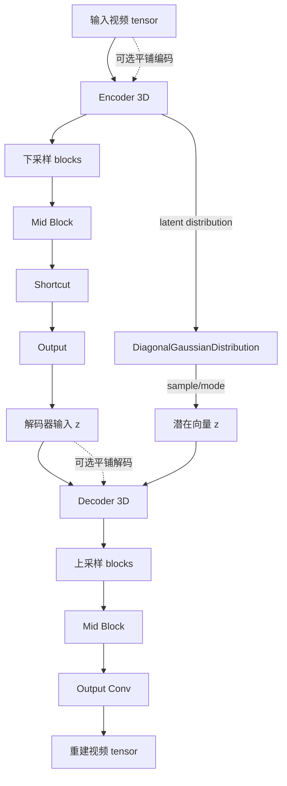

## 类结构

```
HunyuanVideo15CausalConv3d (因果卷积层)
HunyuanVideo15RMS_norm (RMS归一化)
HunyuanVideo15AttnBlock (注意力块)
HunyuanVideo15Upsample (上采样块)
HunyuanVideo15Downsample (下采样块)
HunyuanVideo15ResnetBlock (残差块)
HunyuanVideo15MidBlock (中间块)
HunyuanVideo15DownBlock3D (3D下采样组)
HunyuanVideo15UpBlock3D (3D上采样组)
HunyuanVideo15Encoder3D (3D编码器)
HunyuanVideo15Decoder3D (3D解码器)
AutoencoderKLHunyuanVideo15 (主VAE模型)
```

## 全局变量及字段


### `logger`
    
模块级别的日志记录器，用于输出调试和运行信息

类型：`logging.Logger`
    


### `HunyuanVideo15CausalConv3d.pad_mode`
    
填充模式，用于时间因果填充的方式

类型：`str`
    


### `HunyuanVideo15CausalConv3d.time_causal_padding`
    
时间因果填充的边界参数

类型：`tuple[int, int, int, int, int, int]`
    


### `HunyuanVideo15CausalConv3d.conv`
    
3D卷积层，用于处理视频数据

类型：`nn.Conv3d`
    


### `HunyuanVideo15RMS_norm.channel_first`
    
是否采用通道优先的数据格式

类型：`bool`
    


### `HunyuanVideo15RMS_norm.scale`
    
RMS归一化的缩放因子

类型：`float`
    


### `HunyuanVideo15RMS_norm.gamma`
    
可学习的缩放参数，用于特征缩放

类型：`nn.Parameter`
    


### `HunyuanVideo15RMS_norm.bias`
    
可学习的偏置参数，用于特征偏移

类型：`nn.Parameter`
    


### `HunyuanVideo15AttnBlock.in_channels`
    
输入通道数

类型：`int`
    


### `HunyuanVideo15AttnBlock.norm`
    
RMS归一化层

类型：`HunyuanVideo15RMS_norm`
    


### `HunyuanVideo15AttnBlock.to_q`
    
查询投影卷积层

类型：`nn.Conv3d`
    


### `HunyuanVideo15AttnBlock.to_k`
    
键投影卷积层

类型：`nn.Conv3d`
    


### `HunyuanVideo15AttnBlock.to_v`
    
值投影卷积层

类型：`nn.Conv3d`
    


### `HunyuanVideo15AttnBlock.proj_out`
    
输出投影卷积层

类型：`nn.Conv3d`
    


### `HunyuanVideo15Upsample.conv`
    
因果3D卷积层，用于上采样

类型：`HunyuanVideo15CausalConv3d`
    


### `HunyuanVideo15Upsample.add_temporal_upsample`
    
是否进行时间维度的上采样

类型：`bool`
    


### `HunyuanVideo15Upsample.repeats`
    
特征重复次数，用于匹配通道数

类型：`int`
    


### `HunyuanVideo15Downsample.conv`
    
因果3D卷积层，用于下采样

类型：`HunyuanVideo15CausalConv3d`
    


### `HunyuanVideo15Downsample.add_temporal_downsample`
    
是否进行时间维度的下采样

类型：`bool`
    


### `HunyuanVideo15Downsample.group_size`
    
分组大小，用于通道分组

类型：`int`
    


### `HunyuanVideo15ResnetBlock.nonlinearity`
    
激活函数模块

类型：`nn.Module`
    


### `HunyuanVideo15ResnetBlock.norm1`
    
第一个RMS归一化层

类型：`HunyuanVideo15RMS_norm`
    


### `HunyuanVideo15ResnetBlock.conv1`
    
第一个因果3D卷积层

类型：`HunyuanVideo15CausalConv3d`
    


### `HunyuanVideo15ResnetBlock.norm2`
    
第二个RMS归一化层

类型：`HunyuanVideo15RMS_norm`
    


### `HunyuanVideo15ResnetBlock.conv2`
    
第二个因果3D卷积层

类型：`HunyuanVideo15CausalConv3d`
    


### `HunyuanVideo15ResnetBlock.conv_shortcut`
    
跳跃连接的卷积层，用于通道匹配

类型：`nn.Conv3d`
    


### `HunyuanVideo15MidBlock.add_attention`
    
是否在中间层添加注意力机制

类型：`bool`
    


### `HunyuanVideo15MidBlock.attentions`
    
注意力模块列表

类型：`nn.ModuleList`
    


### `HunyuanVideo15MidBlock.resnets`
    
ResNet块列表

类型：`nn.ModuleList`
    


### `HunyuanVideo15MidBlock.gradient_checkpointing`
    
梯度检查点标志，用于节省显存

类型：`bool`
    


### `HunyuanVideo15DownBlock3D.resnets`
    
3D下采样ResNet块列表

类型：`nn.ModuleList`
    


### `HunyuanVideo15DownBlock3D.downsamplers`
    
下采样模块列表

类型：`nn.ModuleList`
    


### `HunyuanVideo15DownBlock3D.gradient_checkpointing`
    
梯度检查点标志，用于节省显存

类型：`bool`
    


### `HunyuanVideo15UpBlock3D.resnets`
    
3D上采样ResNet块列表

类型：`nn.ModuleList`
    


### `HunyuanVideo15UpBlock3D.upsamplers`
    
上采样模块列表

类型：`nn.ModuleList`
    


### `HunyuanVideo15UpBlock3D.gradient_checkpointing`
    
梯度检查点标志，用于节省显存

类型：`bool`
    


### `HunyuanVideo15Encoder3D.in_channels`
    
编码器输入通道数

类型：`int`
    


### `HunyuanVideo15Encoder3D.out_channels`
    
编码器输出通道数

类型：`int`
    


### `HunyuanVideo15Encoder3D.group_size`
    
分组大小，用于通道分组和平均

类型：`int`
    


### `HunyuanVideo15Encoder3D.conv_in`
    
输入因果3D卷积层

类型：`HunyuanVideo15CausalConv3d`
    


### `HunyuanVideo15Encoder3D.mid_block`
    
中间块，包含注意力机制

类型：`HunyuanVideo15MidBlock`
    


### `HunyuanVideo15Encoder3D.down_blocks`
    
下采样块列表

类型：`nn.ModuleList`
    


### `HunyuanVideo15Encoder3D.norm_out`
    
输出RMS归一化层

类型：`HunyuanVideo15RMS_norm`
    


### `HunyuanVideo15Encoder3D.conv_act`
    
输出激活函数

类型：`nn.SiLU`
    


### `HunyuanVideo15Encoder3D.conv_out`
    
输出因果3D卷积层

类型：`HunyuanVideo15CausalConv3d`
    


### `HunyuanVideo15Encoder3D.gradient_checkpointing`
    
梯度检查点标志，用于节省显存

类型：`bool`
    


### `HunyuanVideo15Decoder3D.layers_per_block`
    
每个块中的层数

类型：`int`
    


### `HunyuanVideo15Decoder3D.in_channels`
    
解码器输入通道数

类型：`int`
    


### `HunyuanVideo15Decoder3D.out_channels`
    
解码器输出通道数

类型：`int`
    


### `HunyuanVideo15Decoder3D.repeat`
    
特征重复次数，用于跳跃连接

类型：`int`
    


### `HunyuanVideo15Decoder3D.conv_in`
    
输入因果3D卷积层

类型：`HunyuanVideo15CausalConv3d`
    


### `HunyuanVideo15Decoder3D.mid_block`
    
中间块，包含注意力机制

类型：`HunyuanVideo15MidBlock`
    


### `HunyuanVideo15Decoder3D.up_blocks`
    
上采样块列表

类型：`nn.ModuleList`
    


### `HunyuanVideo15Decoder3D.norm_out`
    
输出RMS归一化层

类型：`HunyuanVideo15RMS_norm`
    


### `HunyuanVideo15Decoder3D.conv_act`
    
输出激活函数

类型：`nn.SiLU`
    


### `HunyuanVideo15Decoder3D.conv_out`
    
输出因果3D卷积层

类型：`HunyuanVideo15CausalConv3d`
    


### `HunyuanVideo15Decoder3D.gradient_checkpointing`
    
梯度检查点标志，用于节省显存

类型：`bool`
    


### `AutoencoderKLHunyuanVideo15.encoder`
    
3D视频VAE编码器

类型：`HunyuanVideo15Encoder3D`
    


### `AutoencoderKLHunyuanVideo15.decoder`
    
3D视频VAE解码器

类型：`HunyuanVideo15Decoder3D`
    


### `AutoencoderKLHunyuanVideo15.spatial_compression_ratio`
    
空间压缩比，用于控制空间维度压缩程度

类型：`int`
    


### `AutoencoderKLHunyuanVideo15.temporal_compression_ratio`
    
时间压缩比，用于控制时间维度压缩程度

类型：`int`
    


### `AutoencoderKLHunyuanVideo15.use_slicing`
    
是否启用切片模式，用于批量解码时节省显存

类型：`bool`
    


### `AutoencoderKLHunyuanVideo15.use_tiling`
    
是否启用平铺模式，用于大分辨率视频解码

类型：`bool`
    


### `AutoencoderKLHunyuanVideo15.tile_sample_min_height`
    
平铺采样的最小高度阈值

类型：`int`
    


### `AutoencoderKLHunyuanVideo15.tile_sample_min_width`
    
平铺采样的最小宽度阈值

类型：`int`
    


### `AutoencoderKLHunyuanVideo15.tile_latent_min_height`
    
潜在空间平铺的最小高度

类型：`int`
    


### `AutoencoderKLHunyuanVideo15.tile_latent_min_width`
    
潜在空间平铺的最小宽度

类型：`int`
    


### `AutoencoderKLHunyuanVideo15.tile_overlap_factor`
    
平铺重叠系数，用于平滑拼接

类型：`float`
    
    

## 全局函数及方法


### `HunyuanVideo15CausalConv3d.forward`

该方法是 `HunyuanVideo15CausalConv3d` 类的前向传播函数，实现时间因果的 3D 卷积操作。首先根据预计算的 `time_causal_padding` 对输入张量进行非对称填充（确保时间维度满足因果约束），然后通过 `nn.Conv3d` 执行标准的 3D 卷积以提取特征。

参数：

- `self`：`HunyuanVideo15CausalConv3d` 实例本身
- `hidden_states`：`torch.Tensor`，输入的 5D 张量，形状为 `(batch_size, channels, frames, height, width)`

返回值：`torch.Tensor`，卷积后的输出张量，形状为 `(batch_size, out_channels, frames, height, width)`

#### 流程图

```mermaid
flowchart TD
    A[输入 hidden_states] --> B{检查 padding 模式}
    B --> C[使用 F.pad 进行时间因果填充]
    C --> D[执行 nn.Conv3d 卷积]
    D --> E[返回输出张量]
    
    subgraph "时间因果填充策略"
        F[kernel_size[0] // 2, kernel_size[0] // 2] --> G[时间维度左侧填充]
        H[0] --> G
    end
```

#### 带注释源码

```python
def forward(self, hidden_states: torch.Tensor) -> torch.Tensor:
    """
    HunyuanVideo15CausalConv3d 的前向传播方法。
    
    实现时间因果的 3D 卷积：
    1. 首先对输入进行时间因果填充，确保时间维度满足因果约束（当前帧只能访问当前及之前帧）
    2. 然后执行标准的 3D 卷积操作
    
    参数:
        hidden_states: 输入张量，形状为 (batch_size, in_channels, frames, height, width)
        
    返回:
        卷积后的输出张量，形状为 (batch_size, out_channels, frames, height, width)
    """
    # 步骤1: 时间因果填充
    # time_causal_padding 格式: (left, right, top, bottom, front, back)
    # 时间维度使用非对称填充：front 填充 kernel_size[2] - 1，back 填充 0
    # 这样确保当前帧只能看到当前帧及之前的历史信息，保持因果性
    hidden_states = F.pad(hidden_states, self.time_causal_padding, mode=self.pad_mode)
    
    # 步骤2: 执行 3D 卷积
    # 使用预定义的 Conv3d 层进行卷积操作
    return self.conv(hidden_states)
```


### HunyuanVideo15RMS_norm.forward

该方法实现了自定义的RMS（Root Mean Square）归一化层，用于对视频或图像数据进行特征标准化处理。通过计算输入张量在指定维度上的均方根值并进行归一化，同时结合可学习的缩放参数（gamma）和可选的偏置（bias），以提升模型训练的稳定性和收敛速度。

参数：

- `x`：`torch.Tensor`，输入的张量数据，支持通道优先（channel_first=True）或通道优先（channel_first=False）的数据格式

返回值：`torch.Tensor`，返回经过RMS归一化后的张量，形状与输入张量相同

#### 流程图

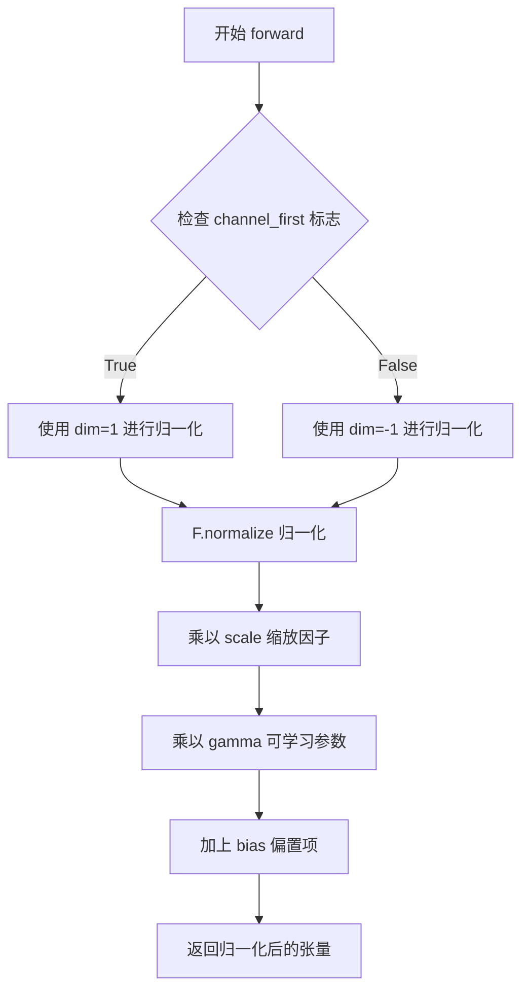

#### 带注释源码

```python
def forward(self, x):
    """
    执行RMS归一化的前向传播
    
    处理流程：
    1. 根据channel_first标志确定归一化维度
    2. 使用F.normalize对输入进行L2归一化
    3. 乘以缩放因子scale（dim的平方根）
    4. 乘以可学习的gamma参数进行特征缩放
    5. 加上可选的bias偏置项
    
    参数:
        x: 输入张量，形状为 (batch, channel, frames, height, width) 或类似结构
    
    返回:
        归一化后的张量，形状与输入相同
    """
    # 根据channel_first标志选择归一化维度：
    # - channel_first=True 时，对通道维度（dim=1）进行归一化
    # - channel_first=False 时，对最后一个维度（dim=-1）进行归一化
    # 然后乘以缩放因子（dim**0.5）、可学习参数gamma，并加上可选的bias
    return F.normalize(x, dim=(1 if self.channel_first else -1)) * self.scale * self.gamma + self.bias
```


### `HunyuanVideo15AttnBlock.prepare_causal_attention_mask`

该函数是一个静态方法，用于为3D视频注意力计算准备因果掩码（causal mask）。它通过创建一个下三角矩阵，确保每个时间帧的token只能关注当前帧及之前帧的token，从而实现因果注意力机制，防止未来信息泄露。

参数：

- `n_frame`：`int`，视频的帧数（时间维度长度）
- `n_hw`：`int`，高度和宽度的乘积（空间token总数）
- `dtype`：未指定类型，目标掩码的数据类型
- `device`：未指定类型，掩码存放的设备
- `batch_size`：`int | None`，可选参数，如果设置则扩展掩码的batch维度

返回值：`torch.Tensor`，因果注意力掩码张量，形状为 `(batch_size, seq_len, seq_len)` 或 `(seq_len, seq_len)`

#### 流程图

```mermaid
flowchart TD
    A[开始] --> B[计算序列长度: seq_len = n_frame × n_hw]
    B --> C[创建全-inf矩阵: shape为seq_len×seq_len]
    C --> D[遍历每个位置 i: 0到seq_len-1]
    D --> E[计算当前帧索引: i_frame = i // n_hw]
    E --> F[设置掩码: mask[i, :(i_frame+1)×n_hw] = 0]
    F --> G{检查batch_size是否设置?}
    G -->|是| H[扩展掩码维度: unsqueeze(0)并expand到batch_size]
    G -->|否| I[直接返回2D掩码]
    H --> J[返回3D掩码]
    I --> J
```

#### 带注释源码

```python
@staticmethod
def prepare_causal_attention_mask(n_frame: int, n_hw: int, dtype, device, batch_size: int = None):
    """Prepare a causal attention mask for 3D videos.

    Args:
        n_frame (int): Number of frames (temporal length).
        n_hw (int): Product of height and width.
        dtype: Desired mask dtype.
        device: Device for the mask.
        batch_size (int, optional): If set, expands for batch.

    Returns:
        torch.Tensor: Causal attention mask.
    """
    # 计算总序列长度 = 时间帧数 × 空间token数
    seq_len = n_frame * n_hw
    
    # 初始化全为负无穷的掩码矩阵，-inf表示完全阻断注意力
    mask = torch.full((seq_len, seq_len), float("-inf"), dtype=dtype, device=device)
    
    # 遍历序列中的每个位置，构建因果掩码
    for i in range(seq_len):
        # 计算当前token属于哪一帧
        i_frame = i // n_hw
        # 将当前帧及之前所有帧对应的位置设为0，允许注意力传递
        mask[i, : (i_frame + 1) * n_hw] = 0
    
    # 如果指定了batch_size，则扩展掩码以适配批量输入
    if batch_size is not None:
        mask = mask.unsqueeze(0).expand(batch_size, -1, -1)
    
    return mask
```


### HunyuanVideo15AttnBlock

这是 HunyuanVideo 1.5 模型中的核心注意力组件，专门用于处理 3D 视频数据（包含时序、空间维度）。它通过自注意力机制捕捉帧与帧、像素与像素之间的关联，并利用因果掩码（Causal Mask）确保时间维度的信息流符合时序逻辑（只能看到当前及之前的帧）。

#### 类字段信息

- `in_channels`：`int`，输入特征的通道数。
- `norm`：`HunyuanVideo15RMS_norm`，RMS 归一化层，用于稳定训练。
- `to_q`：`nn.Conv3d`，生成 Query 的 1x1 卷积层。
- `to_k`：`nn.Conv3d`，生成 Key 的 1x1 卷积层。
- `to_v`：`nn.Conv3d`，生成 Value 的 1x1 卷积层。
- `proj_out`：`nn.Conv3d`，注意力输出投影的 1x1 卷积层。

#### 类方法：forward

参数：
- `x`：`torch.Tensor`，输入张量，形状为 `(batch_size, channels, frames, height, width)`。

返回值：`torch.Tensor`，经过注意力计算和残差连接后的输出，形状与输入相同 `(batch_size, channels, frames, height, width)`。

#### 流程图

```mermaid
graph TD
    A[输入 x: (B, C, F, H, W)] --> B[保存残差 identity = x]
    B --> C[归一化 self.norm(x)]
    C --> D[计算 Q K V: to_q/to_k/to_v]
    D --> E[维度重塑与置换: (B, C, F*H*W) -> (B, 1, F*H*W, C)]
    E --> F{准备因果掩码}
    F -->|调用| G[prepare_causal_attention_mask]
    G --> H[注意力计算: scaled_dot_product_attention]
    H --> I[维度恢复: (B, 1, F*H*W, C) -> (B, C, F, H, W)]
    I --> J[输出投影 self.proj_out]
    J --> K[残差相加 x + identity]
    K --> L[输出]
```

#### 带注释源码

```python
def forward(self, x: torch.Tensor) -> torch.Tensor:
    # 1. 保存输入作为残差，用于后续的跳跃连接
    identity = x

    # 2. 对输入进行 RMS 归一化
    x = self.norm(x)

    # 3. 通过三个独立的卷积层生成 Query, Key, Value
    # 这三个卷积核大小为 1，不改变空间/时间维度，只改变通道数
    query = self.to_q(x)
    key = self.to_k(x)
    value = self.to_v(x)

    # 4. 获取张量形状信息
    batch_size, channels, frames, height, width = query.shape

    # 5. 维度重塑 (Reshape & Permute)
    # 将 (B, C, F, H, W) 转换为 (B, F*H*W, C)
    # 目的是将时空序列flatten，以便进行序列化的注意力计算
    # unsqueeze(1) 增加一个维度用于模拟多头注意力中的 head 维度
    query = query.reshape(batch_size, channels, frames * height * width).permute(0, 2, 1).unsqueeze(1).contiguous()
    key = key.reshape(batch_size, channels, frames * height * width).permute(0, 2, 1).unsqueeze(1).contiguous()
    value = value.reshape(batch_size, channels, frames * height * width).permute(0, 2, 1).unsqueeze(1).contiguous()

    # 6. 准备因果注意力掩码 (Causal Mask)
    # 核心逻辑：确保注意力机制中，第 i 帧只能看到第 0 到第 i 帧的信息
    # 防止未来信息泄露，保持视频生成的因果性
    attention_mask = self.prepare_causal_attention_mask(
        frames, height * width, query.dtype, query.device, batch_size=batch_size
    )

    # 7. 执行注意力计算
    # 使用 PyTorch 的 scaled_dot_product_attention，自动利用 Flash Attention 等优化
    x = nn.functional.scaled_dot_product_attention(query, key, value, attn_mask=attention_mask)

    # 8. 恢复张量形状
    # 从 (B, 1, F*H*W, C) 变回 (B, C, F, H, W)
    x = x.squeeze(1).reshape(batch_size, frames, height, width, channels).permute(0, 4, 1, 2, 3)
    
    # 9. 输出投影
    x = self.proj_out(x)

    # 10. 残差连接 (Residual Connection)
    return x + identity
```

### 潜在的技术债务与优化空间

1.  **注意力掩码的 $O(N^2)$ 复杂度**：
    *   `prepare_causal_attention_mask` 方法创建了一个 `(seq_len, seq_len)` 的全量掩码矩阵。当视频帧数（`frames`）或分辨率（`height * width`）较大时，这会导致显存放和计算量剧增。虽然 `scaled_dot_product_attention` 通常对稀疏掩码支持良好，但全量因果掩码在超长序列场景下仍是瓶颈。
2.  **内存拷贝开销**：
    *   在 `forward` 方法中使用了多次 `.reshape()` 和 `.permute()`，代码中虽调用了 `.contiguous()`，但这会强制复制数据并占用额外内存。可以考虑使用 `view` 和 `transpose` 的更优组合或检查是否可以在不连续张量上直接操作（尽管 PyTorch 某些算子可能要求连续）。
3.  **时空联合注意力的局限**：
    *   当前实现将时空维度完全展开为序列（`frames * height * width`）。这忽略了局部空间邻域的局部性，可能不如分层或稀疏注意力高效。对于高分辨率视频，可能会导致计算成本过高。


### `HunyuanVideo15Upsample._dcae_upsample_rearrange`

这是一个静态方法，用于将打包的张量重新排列，执行上采样操作。它将形状为 `(b, r1*r2*r3*c, f, h, w)` 的打包张量转换为形状为 `(b, c, r1*f, r2*h, r3*w)` 的标准张量，实现时间、高度和宽度维度的上采样。

参数：

-  `tensor`：`torch.Tensor`，输入的张量，形状为 `(b, r1*r2*r3*c, f, h, w)`，其中 `b` 是批次大小，`packed_c` 是打包后的通道数，`f/h/w` 分别是帧/高/宽
-  `r1`：`int`，时间维度的上采样因子，默认为 1
-  `r2`：`int`，高度维度的上采样因子，默认为 2
-  `r3`：`int`，宽度维度的上采样因子，默认为 2

返回值：`torch.Tensor`，重排列后的张量，形状为 `(b, c, r1*f, r2*h, r3*w)`，其中 `c` 是解压后的通道数

#### 流程图

```mermaid
flowchart TD
    A[输入 tensor: (b, r1*r2*r3*c, f, h, w)] --> B[解包获取维度信息<br/>b, packed_c, f, h, w]
    B --> C[计算通道数<br/>factor = r1 * r2 * r3<br/>c = packed_c // factor]
    C --> D[视图重塑<br/>tensor.view(b, r1, r2, r3, c, f, h, w)]
    D --> E[维度置换<br/>tensor.permute(0, 4, 5, 1, 6, 2, 7, 3)]
    E --> F[最终reshape<br/>reshape(b, c, f*r1, h*r2, w*r3)]
    F --> G[输出 tensor: (b, c, r1*f, r2*h, r3*w)]
```

#### 带注释源码

```python
@staticmethod
def _dcae_upsample_rearrange(tensor, r1=1, r2=2, r3=2):
    """
    将打包的张量重新排列以执行上采样操作
    将形状 (b, r1*r2*r3*c, f, h, w) 转换为 (b, c, r1*f, r2*h, r3*w)

    参数:
        tensor: 输入张量，形状为 (b, r1*r2*r3*c, f, h, w)
        r1: 时间上采样因子
        r2: 高度上采样因子
        r3: 宽度上采样因子
    
    返回:
        重排列后的张量，形状为 (b, c, r1*f, r2*h, r3*w)
    """
    # 解包输入张量的维度：批次大小、打包通道数、帧数、高度、宽度
    b, packed_c, f, h, w = tensor.shape
    
    # 计算总的上采样因子和解压后的通道数
    # 例如：r1=2, r2=2, r3=2 时，factor=8，packed_c=8*c
    factor = r1 * r2 * r3
    c = packed_c // factor

    # 第一次视图重塑：将打包的通道维展开为 r1, r2, r3, c 四个独立的维度
    # 从 (b, r1*r2*r3*c, f, h, w) -> (b, r1, r2, r3, c, f, h, w)
    tensor = tensor.view(b, r1, r2, r3, c, f, h, w)
    
    # 维度置换：重新排列维度顺序
    # 从 (b, r1, r2, r3, c, f, h, w) -> (b, c, f, r1, h, r2, w, r3)
    # 目的是将上采样因子与对应的空间/时间维度对齐
    tensor = tensor.permute(0, 4, 5, 1, 6, 2, 7, 3)
    
    # 最终reshape：将各个上采样因子与对应的空间/时间维度相乘
    # 从 (b, c, f, r1, h, r2, w, r3) -> (b, c, f*r1, h*r2, w*r3)
    return tensor.reshape(b, c, f * r1, h * r2, w * r3)
```


### HunyuanVideo15Upsample.forward

该方法是 HunyuanVideo15Upsample 类的前向传播方法，负责对视频潜在表示进行上采样操作，支持空间（高度、宽度）和时间维度的上采样，并通过残差连接（shortcut）保留原始特征。

参数：

- `x`：`torch.Tensor`，输入的张量，形状为 (b, c, f, h, w)，其中 b 是批量大小，c 是通道数，f 是帧数，h 是高度，w 是宽度

返回值：`torch.Tensor`，上采样后的张量，形状为 (b, c', f', h', w')，其中空间和时间维度根据配置进行上采样

#### 流程图

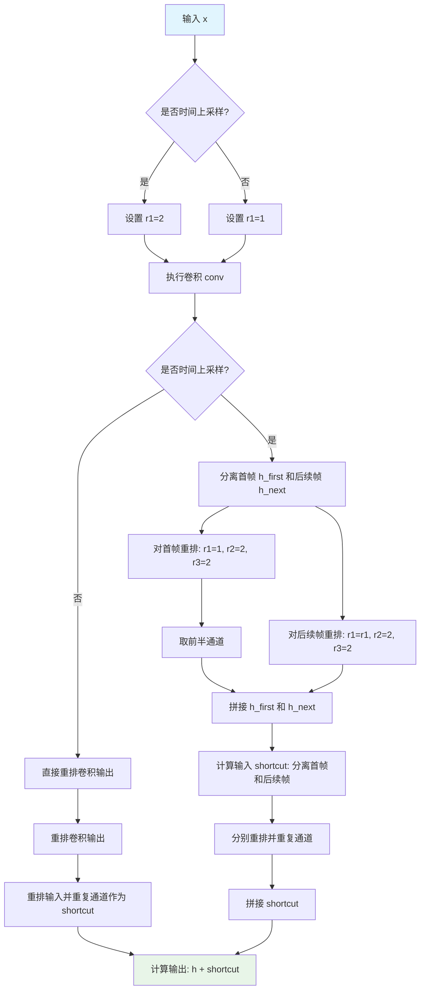

#### 带注释源码

```python
def forward(self, x: torch.Tensor):
    """
    HunyuanVideo15Upsample 的前向传播方法
    
    对输入视频潜在表示进行上采样，支持空间和时间维度的上采样，
    并通过残差连接保留原始特征。
    
    参数:
        x: 输入张量，形状为 (batch, channels, frames, height, width)
    
    返回:
        上采样后的张量
    """
    # 确定时间上采样因子：如果开启时间上采样则为2，否则为1
    r1 = 2 if self.add_temporal_upsample else 1
    
    # 首先通过卷积层进行特征提取和通道变换
    # 卷积会将通道数扩展为 out_channels * factor
    h = self.conv(x)
    
    # 根据是否开启时间上采样采用不同的处理策略
    if self.add_temporal_upsample:
        # ============ 时间上采样分支 ============
        
        # 分离首帧（第一帧需要特殊处理，因为时间维度上采样方式不同）
        h_first = h[:, :, :1, :, :]
        # 对首帧进行重排：时间维度因子为1，空间维度因子为2x2
        h_first = self._dcae_upsample_rearrange(h_first, r1=1, r2=2, r3=2)
        # 由于首帧是通过复制扩展的，这里取前半部分通道以匹配目标通道数
        h_first = h_first[:, : h_first.shape[1] // 2]
        
        # 分离后续帧（从第二帧开始）
        h_next = h[:, :, 1:, :, :]
        # 对后续帧进行完整的时间上采样（r1=2）和空间上采样（2x2）
        h_next = self._dcae_upsample_rearrange(h_next, r1=r1, r2=2, r3=2)
        
        # 拼接首帧和后续帧的上采样结果
        h = torch.cat([h_first, h_next], dim=2)

        # ============ Shortcut（残差连接）计算 ============
        # 对输入进行相同的上采样操作作为残差连接
        
        # 处理首帧 shortcut
        x_first = x[:, :, :1, :, :]
        x_first = self._dcae_upsample_rearrange(x_first, r1=1, r2=2, r3=2)
        # 重复通道以匹配输出通道数（除以2因为首帧只取了一半）
        x_first = x_first.repeat_interleave(repeats=self.repeats // 2, dim=1)

        # 处理后续帧 shortcut
        x_next = x[:, :, 1:, :, :]
        x_next = self._dcae_upsample_rearrange(x_next, r1=r1, r2=2, r3=2)
        # 重复通道以匹配输出通道数
        x_next = x_next.repeat_interleave(repeats=self.repeats, dim=1)
        
        # 拼接首帧和后续帧的 shortcut
        shortcut = torch.cat([x_first, x_next], dim=2)

    else:
        # ============ 非时间上采样分支 ============
        
        # 直接对卷积输出进行空间上采样（时间因子为1，空间因子为2x2）
        h = self._dcae_upsample_rearrange(h, r1=r1, r2=2, r3=2)
        
        # 对输入进行相同的重排作为 shortcut
        shortcut = x.repeat_interleave(repeats=self.repeats, dim=1)
        shortcut = self._dcae_upsample_rearrange(shortcut, r1=r1, r2=2, r3=2)
    
    # 返回卷积输出与 shortcut 的残差和
    return h + shortcut
```


### `HunyuanVideo15Downsample._dcae_downsample_rearrange`

该方法是一个静态方法，用于将输入张量从空间/时间维度打包到通道维度，实现与上采样相反的下采样重排操作。具体来说，它将形状为 `(b, c, r1*f, r2*h, r3*w)` 的张量转换为 `(b, r1*r2*r3*c, f, h, w)` 的形式，将空间和时间维度压缩到通道维度中。

参数：

- `tensor`：`torch.Tensor`，输入张量，形状为 `(b, c, r1*f, r2*h, r3*w)`
- `r1`：`int`，时间维度的下采样因子，默认为 1
- `r2`：`int`，高度维度的下采样因子，默认为 2
- `r3`：`int`，宽度维度的下采样因子，默认为 2

返回值：`torch.Tensor`，重排后的张量，形状为 `(b, r1*r2*r3*c, f, h, w)`

#### 流程图

```mermaid
flowchart TD
    A[输入 tensor: (b, c, r1*f, r2*h, r3*w)] --> B[解包压缩维度<br/>f = packed_f // r1<br/>h = packed_h // r2<br/>w = packed_w // r3]
    B --> C[view 重塑<br/>tensor.view(b, c, f, r1, h, r2, w, r3)]
    C --> D[permute 置换维度<br/>tensor.permute(0, 3, 5, 7, 1, 2, 4, 6)]
    D --> E[reshape 重塑为输出形状<br/>(b, r1*r2*r3*c, f, h, w)]
    E --> F[输出 tensor]
```

#### 带注释源码

```python
@staticmethod
def _dcae_downsample_rearrange(tensor, r1=1, r2=2, r3=2):
    """
    将 (b, c, r1*f, r2*h, r3*w) 转换为 (b, r1*r2*r3*c, f, h, w)

    这将空间/时间维度打包到通道中（与上采样相反）
    
    参数:
        tensor: 输入张量，形状为 (b, c, r1*f, r2*h, r3*w)
        r1: 时间下采样因子
        r2: 高度下采样因子
        r3: 宽度下采样因子
    
    返回:
        重排后的张量，形状为 (b, r1*r2*r3*c, f, h, w)
    """
    # 获取输入张量的形状
    b, c, packed_f, packed_h, packed_w = tensor.shape
    
    # 计算解压后的空间/时间维度大小
    f, h, w = packed_f // r1, packed_h // r2, packed_w // r3

    # 步骤1: view 操作 - 将压缩的维度展开
    # 从 (b, c, r1*f, r2*h, r3*w) 变为 (b, c, f, r1, h, r2, w, r3)
    tensor = tensor.view(b, c, f, r1, h, r2, w, r3)
    
    # 步骤2: permute 操作 - 重新排列维度顺序
    # 将 r1, r2, r3 维度移到通道前面
    # 从 (b, c, f, r1, h, r2, w, r3) 变为 (b, r1, r2, r3, c, f, h, w)
    tensor = tensor.permute(0, 3, 5, 7, 1, 2, 4, 6)
    
    # 步骤3: reshape 操作 - 合并为最终输出形状
    # 从 (b, r1, r2, r3, c, f, h, w) 变为 (b, r1*r2*r3*c, f, h, w)
    return tensor.reshape(b, r1 * r2 * r3 * c, f, h, w)
```


### HunyuanVideo15Downsample.forward

该方法是 HunyuanVideo15Downsample 类的前向传播函数，负责对视频数据进行下采样操作，支持可选的时间维度和空间维度下采样，并通过残差连接（shortcut）将输入与输出相加。

参数：

- `self`：`HunyuanVideo15Downsample` 类实例本身
- `x`：`torch.Tensor`，输入的视频张量，形状为 (b, c, f, h, w)，其中 b 是批次大小，c 是通道数，f 是帧数，h 是高度，w 是宽度

返回值：`torch.Tensor`，下采样后的视频张量，形状根据下采样因子和参数配置而定

#### 流程图

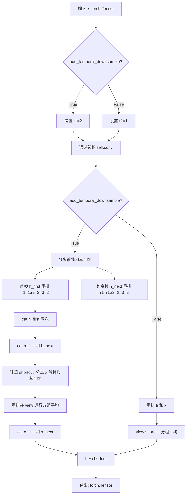

#### 带注释源码

```python
def forward(self, x: torch.Tensor):
    # 根据是否进行时间下采样设置 r1 参数
    r1 = 2 if self.add_temporal_downsample else 1
    
    # 通过卷积层进行下采样
    h = self.conv(x)
    
    if self.add_temporal_downsample:
        # ===== 时间下采样路径 =====
        
        # 分离首帧（第一帧）
        h_first = h[:, :, :1, :, :]
        # 对首帧进行重排，r1=1 表示时间维度不分割
        h_first = self._dcae_downsample_rearrange(h_first, r1=1, r2=2, r3=2)
        # 复制首帧以匹配通道数
        h_first = torch.cat([h_first, h_first], dim=1)
        
        # 分离其余帧
        h_next = h[:, :, 1:, :, :]
        # 对其余帧进行重排，r1=2 表示时间维度进行 2 倍下采样
        h_next = self._dcae_downsample_rearrange(h_next, r1=r1, r2=2, r3=2)
        # 拼接首帧和其余帧
        h = torch.cat([h_first, h_next], dim=2)

        # ===== 计算残差连接（shortcut）=====
        
        # 分离输入 x 的首帧
        x_first = x[:, :, :1, :, :]
        x_first = self._dcae_downsample_rearrange(x_first, r1=1, r2=2, r3=2)
        B, C, T, H, W = x_first.shape
        # view 操作进行分组平均，分组大小为 group_size//2
        x_first = x_first.view(B, h.shape[1], self.group_size // 2, T, H, W).mean(dim=2)
        
        # 分离输入 x 的其余帧
        x_next = x[:, :, 1:, :, :]
        x_next = self._dcae_downsample_rearrange(x_next, r1=r1, r2=2, r3=2)
        B, C, T, H, W = x_next.shape
        # view 操作进行分组平均，分组大小为 group_size
        x_next = x_next.view(B, h.shape[1], self.group_size, T, H, W).mean(dim=2)
        
        # 拼接残差连接
        shortcut = torch.cat([x_first, x_next], dim=2)
    else:
        # ===== 非时间下采样路径 =====
        
        # 对卷积输出进行重排
        h = self._dcae_downsample_rearrange(h, r1=r1, r2=2, r3=2)
        
        # 对输入进行重排作为残差连接
        shortcut = self._dcae_downsample_rearrange(x, r1=r1, r2=2, r3=2)
        B, C, T, H, W = shortcut.shape
        # view 操作进行分组平均
        shortcut = shortcut.view(B, h.shape[1], self.group_size, T, H, W).mean(dim=2)

    # 残差连接：将卷积输出与 shortcut 相加
    return h + shortcut
```


### `HunyuanVideo15ResnetBlock.forward`

#### 描述

该方法是 `HunyuanVideo15ResnetBlock` 类的前向传播函数，实现了视频 3D VAE 中的**残差块（ResNet Block）**。它采用了典型的“预激活（Pre-activation）”结构（即 Norm -> Act -> Conv），首先对输入进行归一化和激活，然后通过因果 3D 卷积进行特征提取；重复该过程一次，最后将处理后的特征与通过 1x1 卷积调整维度后的原始输入（残差）相加。这种结构能够有效缓解深层网络的梯度消失问题，并增强模型对时空特征的学习能力。

#### 参数

- `hidden_states`：`torch.Tensor`，输入的张量，形状通常为 `(batch_size, channels, time, height, width)`，代表视频的潜在表示或中间特征。

#### 返回值

`torch.Tensor`，返回经过残差块处理后的输出张量，形状与输入相同（或在通道数变化时相应调整），并通过跳跃连接保留了原始信息。

#### 流程图

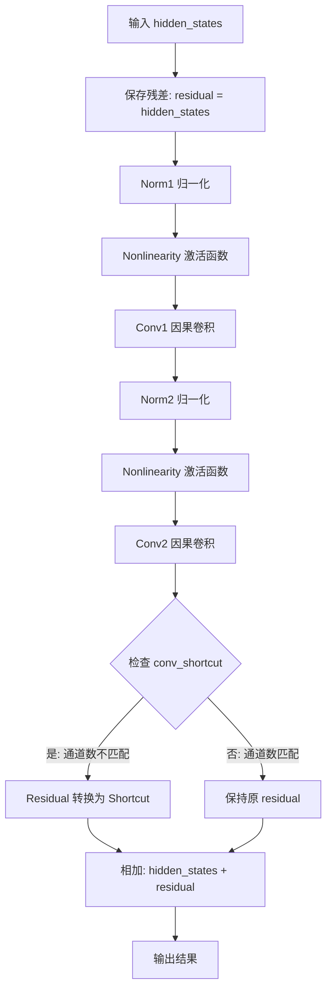

#### 带注释源码

```python
def forward(self, hidden_states: torch.Tensor) -> torch.Tensor:
    # 1. 保留输入作为残差（Skip Connection），用于最后的加法操作
    residual = hidden_states

    # 2. 第一个残差单元：Norm -> Act -> Conv
    # 使用 RMSNorm 对通道维度进行归一化
    hidden_states = self.norm1(hidden_states)
    # 应用非线性激活函数（如 Swish/GELU）
    hidden_states = self.nonlinearity(hidden_states)
    # 使用 3D 因果卷积进行空间和时间特征的初步提取
    hidden_states = self.conv1(hidden_states)

    # 3. 第二个残差单元：Norm -> Act -> Conv
    hidden_states = self.norm2(hidden_states)
    hidden_states = self.nonlinearity(hidden_states)
    hidden_states = self.conv2(hidden_states)

    # 4. 处理跳跃连接（Shortcut）
    # 如果输入通道数和输出通道数不同（通常在每个阶段的起始层），
    # 需要使用 1x1x1 卷积将残差维度投影到与输出相同的维度
    if self.conv_shortcut is not None:
        residual = self.conv_shortcut(residual)

    # 5. 残差相加：输出 = 主路径特征 + 跳跃连接特征
    # 这是 ResNet 的核心，能够让梯度直接回传
    return hidden_states + residual
```

---

#### 关键组件信息

*   **HunyuanVideo15CausalConv3d**: 用于处理时间维度的因果卷积，确保未来帧的信息不会泄露到当前帧的推理中（虽然这里是 VAE 编码/解码，但结构上保留了因果性）。
*   **HunyuanVideo15RMS_norm**: 不同于普通的 LayerNorm，这里使用了 RMSNorm，效率更高且无需计算均值，主要针对通道维度进行缩放。

#### 潜在的技术债务或优化空间

1.  **硬编码的卷积核大小**: 代码中 `kernel_size=3` 是硬编码的。如果需要更宽的感受野（例如处理高分辨率或长视频），需要参数化或引入膨胀卷积（Dilation）。
2.  **缺少 Dropout**: 在 Video VAE 的高容量模型中，Dropout 通常用于防止过拟合，但在该残差块中并未显式使用（可能依赖于整体的正则化策略）。
3.  **激活函数位置**: 虽然 Pre-activation 是 SOTA 架构的常见选择，但如果需要混合其他架构（如 Transformer），激活函数的位置可能需要调整。

#### 其它项目

*   **设计目标与约束**: 该模块的设计目标是在保持时间因果性的同时，提供强大的特征提取能力。约束在于必须支持 3D 张量 `(B, C, T, H, W)` 的操作。
*   **错误处理与异常设计**: 如果 `hidden_states` 的维度不是 5D (BCTHW)，卷积操作会报错。代码依赖于上一步骤（DownBlock/UpBlock）传递正确的形状。
*   **数据流**: `HunyuanVideo15ResnetBlock` 通常成组出现在 `HunyuanVideo15DownBlock3D` 和 `HunyuanVideo15UpBlock3D` 中，构成 U-Net 风格的 Encoder 和 Decoder 架构。


### HunyuanVideo15MidBlock.forward

该方法是 HunyuanVideo15MidBlock 类的前向传播函数，负责对视频潜在表示的中间层进行处理。方法首先通过初始残差块处理输入，然后交替应用注意力机制（如果启用）和残差块进行多层特征提取，最终返回处理后的隐藏状态张量。

参数：

- `hidden_states`：`torch.Tensor`，输入的隐藏状态张量，通常来自编码器或解码器的中间层，形状为 (batch_size, channels, frames, height, width)

返回值：`torch.Tensor`，经过中间块处理后的隐藏状态张量，形状与输入相同

#### 流程图

```mermaid
flowchart TD
    A[开始: hidden_states输入] --> B[通过resnets[0]处理]
    B --> C{遍历attentions和resnets[1:]}
    C --> D{当前attn不为None?}
    D -->|是| E[通过attn注意力模块处理hidden_states]
    D -->|否| F[跳过注意力模块]
    E --> G[通过resnet残差块处理]
    F --> G
    G --> H{是否还有下一层?}
    H -->|是| C
    H -->|否| I[返回hidden_states]
    I --> J[结束]
```

#### 带注释源码

```python
def forward(self, hidden_states: torch.Tensor) -> torch.Tensor:
    """
    HunyuanVideo15MidBlock的前向传播方法
    
    该方法实现视频VAE中间块的前向传播，包含交替的注意力机制和残差块。
    中间块通常位于编码器或解码器的深层位置，负责提取高级特征表示。
    
    参数:
        hidden_states: 输入的隐藏状态张量，形状为 (batch_size, channels, frames, height, width)
                      其中frames表示时间帧数，height和width表示空间分辨率
    
    返回:
        处理后的隐藏状态张量，形状与输入相同
    """
    
    # 第一步：应用第一个残差块(resnets[0])处理输入
    # 这是中间块的入口点，负责初步特征变换
    hidden_states = self.resnets[0](hidden_states)

    # 第二步：遍历交替的注意力块和残差块
    # 使用zip同时迭代注意力模块和后续的残差块
    # attentions和resnets[1:]长度相同
    for attn, resnet in zip(self.attentions, self.resnets[1:]):
        # 检查是否存在注意力模块
        # 如果add_attention为True，则self.attentions包含HunyuanVideo15AttnBlock对象
        # 否则包含None
        if attn is not None:
            # 应用注意力机制处理特征
            # 注意力模块可以实现时间维度的因果掩码，确保未来信息不被泄露
            hidden_states = attn(hidden_states)
        
        # 无论是否使用注意力，都需要通过残差块进行特征提取
        # 残差块包含两个卷积层和残差连接，实现特征的非线性变换
        hidden_states = resnet(hidden_states)

    # 返回处理后的隐藏状态
    # 输出将传递到编码器的后续层或解码器的相应层
    return hidden_states
```


### HunyuanVideo15DownBlock3D.forward

该方法是 HunyuanVideo15DownBlock3D 类的前向传播方法，负责对3D视频数据进行下采样处理。方法首先通过多个残差网络块（ResnetBlock）提取特征，然后根据配置选择性地应用下采样操作，以实现时空维度的压缩。

参数：

- `hidden_states`：`torch.Tensor`，输入的隐藏状态张量，形状为 (batch_size, channels, frames, height, width)

返回值：`torch.Tensor`，经过残差块处理和下采样后的输出张量

#### 流程图

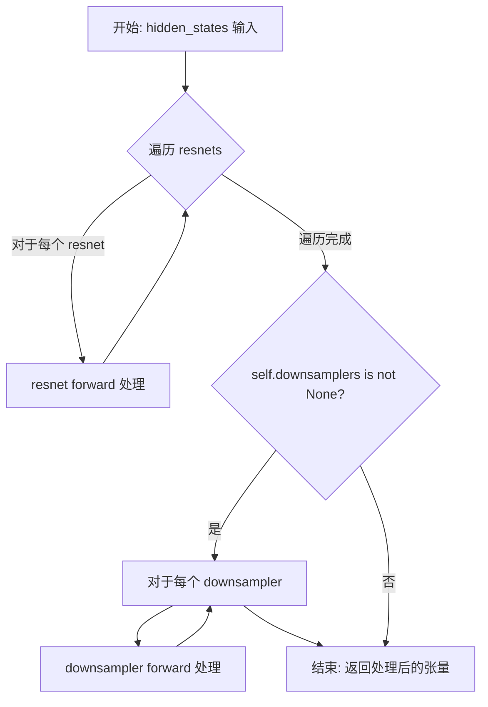

#### 带注释源码

```python
def forward(self, hidden_states: torch.Tensor) -> torch.Tensor:
    """
    HunyuanVideo15DownBlock3D 的前向传播方法
    
    参数:
        hidden_states: 输入的3D视频张量，形状为 (batch_size, channels, frames, height, width)
    
    返回:
        处理后的张量，经过残差块和可选的下采样操作
    """
    # 步骤1: 遍历所有残差网络块进行特征提取
    # 每个resnet块包含两个卷积层、归一化层和残差连接
    for resnet in self.resnets:
        hidden_states = resnet(hidden_states)

    # 步骤2: 检查是否存在下采样器
    # 如果配置了 downsample_out_channels，则创建下采样器
    if self.downsamplers is not None:
        # 步骤3: 遍历所有下采样器进行时空维度压缩
        for downsampler in self.downsamplers:
            hidden_states = downsampler(hidden_states)

    # 步骤4: 返回最终处理后的特征张量
    return hidden_states
```


### HunyuanVideo15UpBlock3D.forward

该方法是 HunyuanVideo15UpBlock3D 类的前向传播函数，负责在视频 VAE 解码器的上采样阶段中，通过堆叠的残差网络块处理隐藏状态，并在最后可选地应用上采样操作以提升特征图的空间或时间分辨率。

参数：

- `hidden_states`：`torch.Tensor`，输入的隐藏状态张量，形状为 (batch_size, channels, frames, height, width)

返回值：`torch.Tensor`，经过残差块处理和上采样后的输出张量

#### 流程图

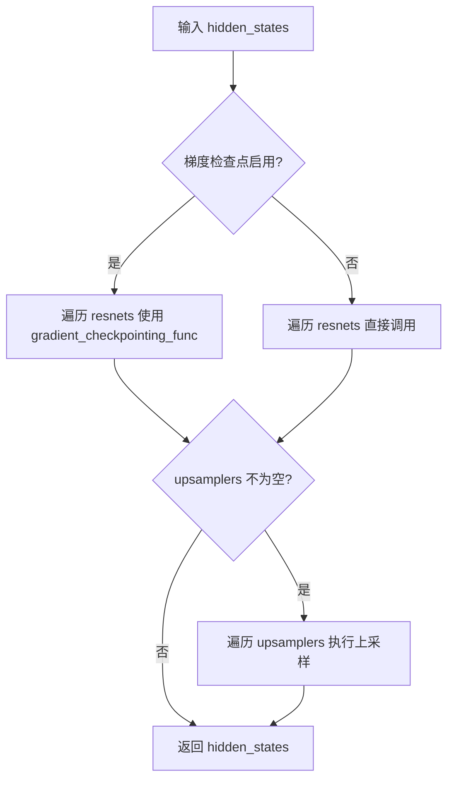

#### 带注释源码

```python
def forward(self, hidden_states: torch.Tensor) -> torch.Tensor:
    """
    HunyuanVideo15UpBlock3D 的前向传播方法
    
    参数:
        hidden_states: 输入张量，形状为 (batch_size, channels, frames, height, width)
    
    返回:
        处理后的张量
    """
    # 检查是否启用梯度检查点以节省显存
    if torch.is_grad_enabled() and self.gradient_checkpointing:
        # 使用梯度检查点方式遍历所有残差块
        # 这种方式可以显著减少显存占用，适用于深层网络
        for resnet in self.resnets:
            hidden_states = self._gradient_checkpointing_func(resnet, hidden_states)
    else:
        # 正常前向传播，遍历所有残差块
        for resnet in self.resnets:
            hidden_states = resnet(hidden_states)

    # 如果存在上采样器，则执行上采样操作
    # 上采样器可能包含时间维度、空间维度的上采样
    if self.upsamplers is not None:
        for upsampler in self.upsamplers:
            hidden_states = upsampler(hidden_states)

    return hidden_states
```


### `HunyuanVideo15Encoder3D.forward`

该方法是 HunyuanVideo15 3D VAE 编码器的前向传播实现，负责将输入的视频张量通过卷积块和中间块进行编码，生成压缩后的潜在表示，并包含残差连接以保持信息流动。

参数：

- `self`：类实例本身，包含模型的所有层和配置参数。
- `hidden_states`：`torch.Tensor`，输入的视频张量，形状通常为 (batch_size, channels, frame, height, width)。

返回值：`torch.Tensor`，编码后的潜在表示张量，形状为 (batch_size, latent_channels, compressed_frame, compressed_height, compressed_width)。

#### 流程图

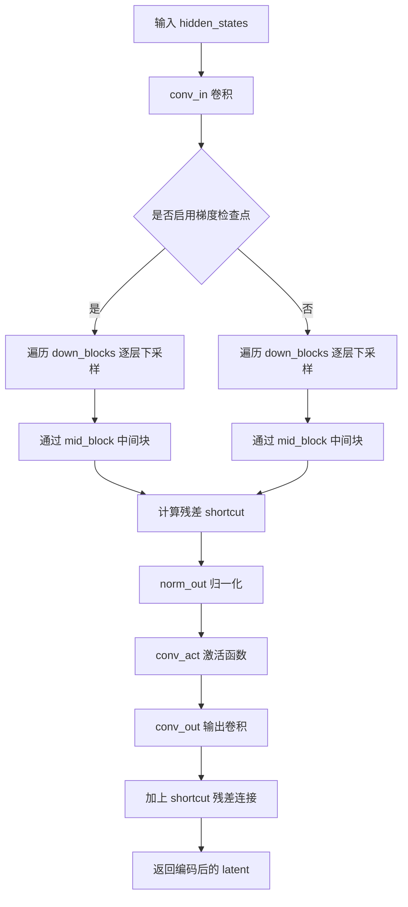

#### 带注释源码

```python
def forward(self, hidden_states: torch.Tensor) -> torch.Tensor:
    # 1. 初始卷积：将输入通道映射到第一个block的通道数
    hidden_states = self.conv_in(hidden_states)

    # 2. 判断是否启用梯度检查点以节省显存
    if torch.is_grad_enabled() and self.gradient_checkpointing:
        # 3a. 梯度检查点模式：逐个执行下采样块，使用梯度 checkpointing 节省显存
        for down_block in self.down_blocks:
            hidden_states = self._gradient_checkpointing_func(down_block, hidden_states)

        # 3b. 通过中间块
        hidden_states = self._gradient_checkpointing_func(self.mid_block, hidden_states)
    else:
        # 4a. 正常模式：直接执行下采样块
        for down_block in self.down_blocks:
            hidden_states = down_block(hidden_states)

        # 4b. 通过中间块
        hidden_states = self.mid_block(hidden_states)

    # 5. 提取形状信息用于计算残差
    batch_size, _, frame, height, width = hidden_states.shape
    
    # 6. 计算残差连接：将通道维度按 group_size 分组并取平均，实现信息聚合
    short_cut = hidden_states.view(batch_size, -1, self.group_size, frame, height, width).mean(dim=2)

    # 7. 输出后处理：归一化 -> 激活 -> 卷积
    hidden_states = self.norm_out(hidden_states)
    hidden_states = self.conv_act(hidden_states)
    hidden_states = self.conv_out(hidden_states)

    # 8. 残差连接：将聚合的信息加回到输出
    hidden_states += short_cut

    return hidden_states
```


### HunyuanVideo15Decoder3D.forward

该方法是 HunyuanVideo15Decoder3D 类的前向传播方法，负责将潜在表示（latent representation）解码重建为视频数据。它通过输入卷积、中间块、上采样块组以及后处理（包括归一化、激活和输出卷积）来完成 3D 视频数据的重建，支持梯度检查点以节省显存。

参数：

-  `hidden_states`：`torch.Tensor`，输入的潜在表示张量，形状为 (batch_size, in_channels, frames, height, width)

返回值：`torch.Tensor`，解码后的视频数据张量，形状为 (batch_size, out_channels, frames, height, width)

#### 流程图

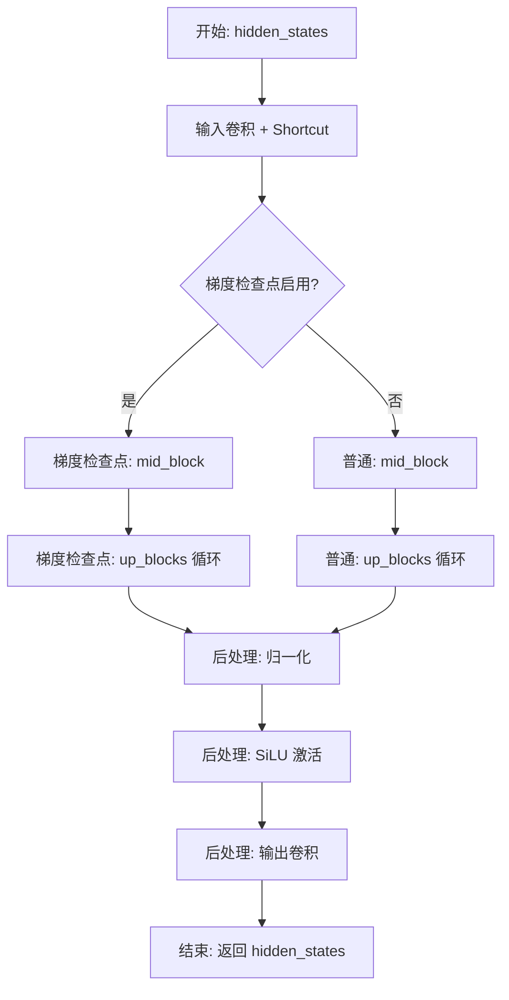

#### 带注释源码

```python
def forward(self, hidden_states: torch.Tensor) -> torch.Tensor:
    # 步骤1: 输入卷积处理
    # 使用 repeat_interleave 扩展通道维度以匹配 block_out_channels[0] 的通道数
    # 并与卷积结果相加形成残差连接
    hidden_states = self.conv_in(hidden_states) + hidden_states.repeat_interleave(repeats=self.repeat, dim=1)

    # 步骤2: 根据是否启用梯度检查点选择前向传播方式
    # 梯度检查点可以显著降低显存占用，但会增加计算时间
    if torch.is_grad_enabled() and self.gradient_checkpointing:
        # 使用梯度检查点模式：中间块
        hidden_states = self._gradient_checkpointing_func(self.mid_block, hidden_states)

        # 使用梯度检查点模式：上采样块组（从潜在空间逐步上采样到原始分辨率）
        for up_block in self.up_blocks:
            hidden_states = self._gradient_checkpointing_func(up_block, hidden_states)
    else:
        # 普通模式：直接调用中间块
        hidden_states = self.mid_block(hidden_states)

        # 普通模式：依次通过各上采样块
        for up_block in self.up_blocks:
            hidden_states = up_block(hidden_states)

    # 步骤3: 后处理
    # RMS 归一化：对最终特征进行通道维度的归一化
    hidden_states = self.norm_out(hidden_states)
    # SiLU 激活函数：平滑的非线性激活
    hidden_states = self.conv_act(hidden_states)
    # 输出卷积：将通道数从 block_out_channels[-1] 转换到 out_channels（3，RGB）
    hidden_states = self.conv_out(hidden_states)
    
    # 返回最终解码的视频数据
    return hidden_states
```


### `AutoencoderKLHunyuanVideo15.enable_tiling`

该方法用于启用瓦片（Tiling）VAE 解码/编码功能。当启用此选项时，VAE 会将输入张量在空间维度上分割成多个重叠的瓦片，分步进行编码和解码运算，从而大幅降低显存占用，允许处理更大尺寸的图像或视频。

参数：

- `self`：`AutoencoderKLHunyuanVideo15`，类实例自身
- `tile_sample_min_height`：`int | None`，样本在高度维度上被分割成瓦片的最小高度要求
- `tile_sample_min_width`：`int | None`，样本在宽度维度上被分割成瓦片的最小宽度要求
- `tile_latent_min_height`：`int | None`，潜在空间在高度维度上被分割成瓦片的最小高度要求
- `tile_latent_min_width`：`int | None`，潜在空间在宽度维度上被分割成瓦片的最小宽度要求
- `tile_overlap_factor`：`float | None`，瓦片之间的重叠因子，用于混合相邻瓦片

返回值：`None`，无返回值，该方法直接修改实例的内部属性

#### 流程图

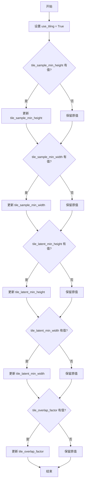

#### 带注释源码

```python
def enable_tiling(
    self,
    tile_sample_min_height: int | None = None,
    tile_sample_min_width: int | None = None,
    tile_latent_min_height: int | None = None,
    tile_latent_min_width: int | None = None,
    tile_overlap_factor: float | None = None,
) -> None:
    r"""
    Enable tiled VAE decoding. When this option is enabled, the VAE will split the input tensor into tiles to
    compute decoding and encoding in several steps. This is useful for saving a large amount of memory and to allow
    processing larger images.

    Args:
        tile_sample_min_height (`int`, *optional*):
            The minimum height required for a sample to be separated into tiles across the height dimension.
        tile_sample_min_width (`int`, *optional*):
            The minimum width required for a sample to be separated into tiles across the width dimension.
        tile_latent_min_height (`int`, *optional*):
            The minimum height required for a latent to be separated into tiles across the height dimension.
        tile_latent_min_width (`int`, *optional*):
            The minimum width required for a latent to be separated into tiles across the width dimension.
    """
    # 启用瓦片模式标志
    self.use_tiling = True
    
    # 如果传入了新值则更新，否则保留构造函数中的默认值
    # 样本空间的最小瓦片高度
    self.tile_sample_min_height = tile_sample_min_height or self.tile_sample_min_height
    
    # 样本空间的最小瓦片宽度
    self.tile_sample_min_width = tile_sample_min_width or self.tile_sample_min_width
    
    # 潜在空间的最小瓦片高度（由 spatial_compression_ratio 决定）
    self.tile_latent_min_height = tile_latent_min_height or self.tile_latent_min_height
    
    # 潜在空间的最小瓦片宽度（由 spatial_compression_ratio 决定）
    self.tile_latent_min_width = tile_latent_min_width or self.tile_latent_min_width
    
    # 瓦片重叠因子，控制相邻瓦片之间的重叠比例
    self.tile_overlap_factor = tile_overlap_factor or self.tile_overlap_factor
```


### AutoencoderKLHunyuanVideo15._encode

该方法是 AutoencoderKLHunyuanVideo15 类的私有编码方法，负责将输入的视频或图像张量编码为潜在表示。如果启用了平铺编码（tiling）且输入尺寸超过最小阈值，则调用平铺编码方法；否则直接使用3D编码器进行编码。

参数：

- `self`：AutoencoderKLHunyuanVideo15 类实例
- `x`：`torch.Tensor`，输入的图像或视频张量，形状为 (batch, channels, frames, height, width)

返回值：`torch.Tensor`，编码后的潜在表示张量

#### 流程图

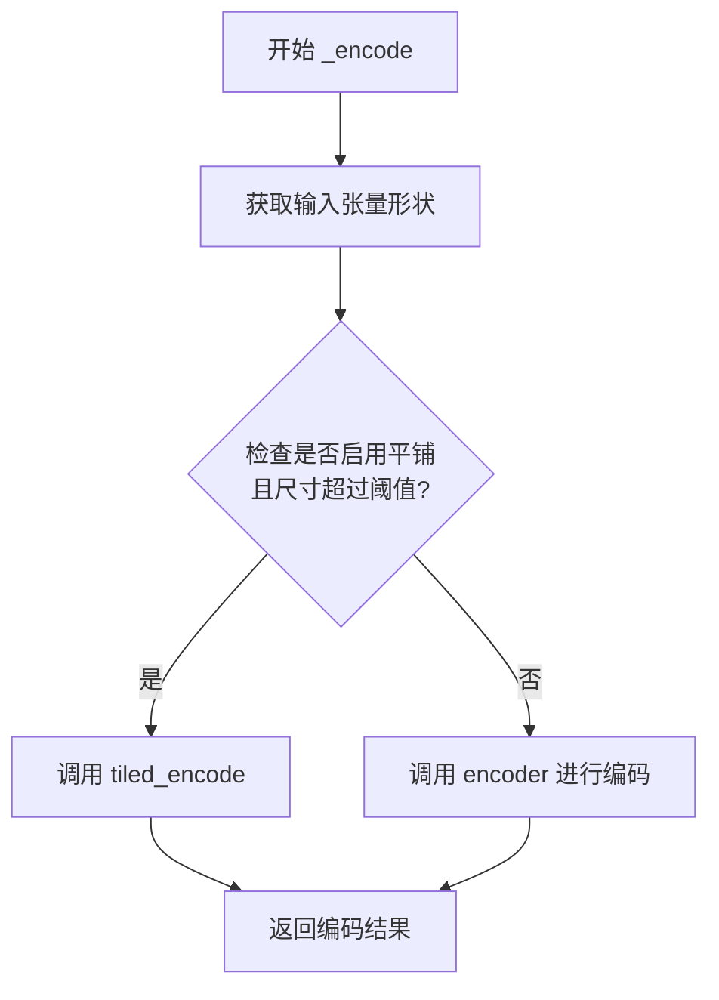

#### 带注释源码

```python
def _encode(self, x: torch.Tensor) -> torch.Tensor:
    """
    编码输入张量为潜在表示。
    
    Args:
        x: 输入张量，形状为 (batch, channels, frames, height, width)
    
    Returns:
        编码后的潜在表示张量
    """
    # 获取输入张量的维度信息
    _, _, _, height, width = x.shape

    # 检查是否启用平铺编码且输入尺寸超过最小阈值
    if self.use_tiling and (width > self.tile_sample_min_width or height > self.tile_sample_min_height):
        # 使用平铺编码方式处理大尺寸输入
        return self.tiled_encode(x)

    # 直接使用3D编码器进行编码
    x = self.encoder(x)
    return x
```


### `AutoencoderKLHunyuanVideo15.encode`

该方法是 HunyuanVideo-1.5 VAE 模型的核心编码接口，负责将原始视频帧（Batch of images）转换为潜在空间中的高斯分布。它首先检查是否启用切片（slicing）以节省内存，随后调用内部编码器将输入转换为隐式表示（mean 和 logvar），最后将其封装为 `DiagonalGaussianDistribution` 对象或 `AutoencoderKLOutput` 输出。

参数：

- `self`：`AutoencoderKLHunyuanVideo15`，模型实例本身。
- `x`：`torch.Tensor`，输入的张量，通常为形状 `(Batch, Channel, Frames, Height, Width)` 的视频数据。
- `return_dict`：`bool`，可选，默认为 `True`。决定返回值的格式，若为 `True` 返回包含 `latent_dist` 的 dataclass，否则返回元组。

返回值：`AutoencoderKLOutput | tuple[DiagonalGaussianDistribution]`，返回编码后的潜在分布。若 `return_dict` 为 `True`，返回一个包含潜在分布（`latent_dist`）的 `AutoencoderKLOutput` 对象；否则返回 `(posterior,)` 元组。

#### 流程图

```mermaid
flowchart TD
    A[输入: x (Batch Frames Height Width)] --> B{use_slicing 且 batch > 1?}
    
    B -- 是 --> C[拆分 Batch: x.split(1)]
    C --> D[遍历切片: self._encode(x_slice)]
    D --> E[拼接结果: torch.cat]
    
    B -- 否 --> F[调用: self._encode(x)]
    
    E --> G[创建: DiagonalGaussianDistribution(h)]
    F --> G
    
    G --> H{return_dict?}
    H -- True --> I[返回: AutoencoderKLOutput]
    H -- False --> J[返回: tuple(posterior)]
    
    subgraph "_encode 内部逻辑"
    F -.-> K[检查 Tiling]
    K --> L[调用 Encoder]
    end
```

#### 带注释源码

```python
@apply_forward_hook
def encode(
    self, x: torch.Tensor, return_dict: bool = True
) -> AutoencoderKLOutput | tuple[DiagonalGaussianDistribution]:
    r"""
    Encode a batch of images into latents.

    Args:
        x (`torch.Tensor`): Input batch of images.
        return_dict (`bool`, *optional*, defaults to `True`):
            Whether to return a [`~models.autoencoder_kl.AutoencoderKLOutput`] instead of a plain tuple.

    Returns:
            The latent representations of the encoded videos. If `return_dict` is True, a
            [`~models.autoencoder_kl.AutoencoderKLOutput`] is returned, otherwise a plain `tuple` is returned.
    """
    # 如果启用了切片模式且批次大小大于1，则对批次进行拆分编码以节省显存
    if self.use_slicing and x.shape[0] > 1:
        encoded_slices = [self._encode(x_slice) for x_slice in x.split(1)]
        h = torch.cat(encoded_slices)
    else:
        # 直接进行编码，内部会处理 tiled encoding 等优化
        h = self._encode(x)

    # 将编码器输出的隐式表示（均值和方差）封装为对角高斯分布
    posterior = DiagonalGaussianDistribution(h)

    if not return_dict:
        return (posterior,)
    return AutoencoderKLOutput(latent_dist=posterior)
```


### `AutoencoderKLHunyuanVideo15._decode`

该方法是AutoencoderKLHunyuanVideo15类的内部解码方法，用于将潜在向量（latent vectors）解码为视频数据。如果启用了平铺（tiling）功能且潜在向量尺寸超过最小平铺尺寸，则调用平铺解码方法；否则直接使用3D解码器进行解码。

参数：

-  `z`：`torch.Tensor`，输入的潜在向量批次，形状为(batch_size, channels, frames, height, width)

返回值：`torch.Tensor`，解码后的视频张量

#### 流程图

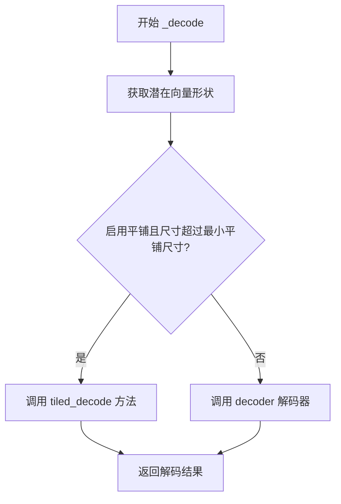

#### 带注释源码

```python
def _decode(self, z: torch.Tensor) -> torch.Tensor:
    """
    内部解码方法，将潜在向量解码为视频数据。
    
    Args:
        z: 输入的潜在向量，形状为 (batch_size, channels, frames, height, width)
    
    Returns:
        解码后的视频张量
    """
    # 获取潜在向量的高度和宽度维度
    _, _, _, height, width = z.shape

    # 检查是否启用平铺解码模式，且潜在向量尺寸超过最小平铺尺寸
    if self.use_tiling and (width > self.tile_latent_min_width or height > self.tile_latent_min_height):
        # 调用平铺解码方法处理大尺寸潜在向量
        return self.tiled_decode(z)

    # 直接使用3D解码器进行解码
    dec = self.decoder(z)

    # 返回解码后的视频数据
    return dec
```


### `AutoencoderKLHunyuanVideo15.decode`

该方法是 HunyuanVideo-1.5 VAE 模型的解码器接口，负责将输入的潜在向量（latent vectors）解码为重建的视频数据（像素）。它支持批量处理、切片（slicing）以节省显存、以及平铺（tiling）处理高分辨率大尺寸潜在图。

参数：

- `z`：`torch.Tensor`，输入的潜在向量批次（Input batch of latent vectors）。
- `return_dict`：`bool`，是否返回 `DecoderOutput` 对象而不是元组（默认为 True）。

返回值：`DecoderOutput | torch.Tensor`，如果 `return_dict` 为 True，返回包含重建样本的 `DecoderOutput`；否则返回元组 `(sample,)`

#### 流程图

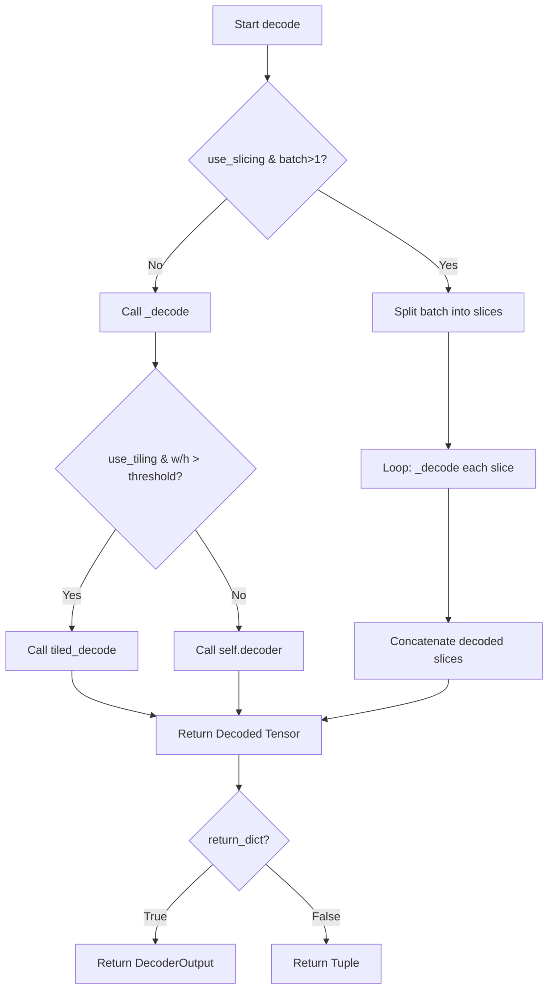

#### 带注释源码

```python
@apply_forward_hook
def decode(self, z: torch.Tensor, return_dict: bool = True) -> DecoderOutput | torch.Tensor:
    r"""
    Decode a batch of images.

    Args:
        z (`torch.Tensor`): Input batch of latent vectors.
        return_dict (`bool`, *optional*, defaults to `True`):
            Whether to return a [`~models.vae.DecoderOutput`] instead of a plain tuple.

    Returns:
        [`~models.vae.DecoderOutput`] or `tuple`:
            If return_dict is True, a [`~models.vae.DecoderOutput`] is returned, otherwise a plain `tuple` is
            returned.
    """
    # 检查是否启用切片模式 (用于减小批量解码时的显存占用)
    if self.use_slicing and z.shape[0] > 1:
        # 如果是批量输入且启用了切片，则将批次分割为单个样本进行解码
        decoded_slices = [self._decode(z_slice) for z_slice in z.split(1)]
        # 沿批次维度拼接回完整结果
        decoded = torch.cat(decoded_slices)
    else:
        # 否则直接调用内部解码方法
        decoded = self._decode(z)

    # 根据参数决定返回格式
    if not return_dict:
        return (decoded,)

    # 返回包含sample的DecoderOutput对象
    return DecoderOutput(sample=decoded)
```


### `AutoencoderKLHunyuanVideo15.blend_v`

该方法用于在视频帧的垂直方向（时间维度）上对两个张量进行混合，通过线性插值在两个张量的边界区域创建平滑过渡，主要用于瓦片解码时消除拼接瑕疵。

参数：

-  `self`：`AutoencoderKLHunyuanVideo15`，方法所属类的实例
-  `a`：`torch.Tensor`，第一个张量（作为混合的参考边界）
-  `b`：`torch.Tensor`，第二个张量（需要被混合的张量）
-  `blend_extent`：`int`，混合范围大小

返回值：`torch.Tensor`，混合后的张量

#### 流程图

```mermaid
flowchart TD
    A[输入张量 a 和 b] --> B{计算实际混合范围}
    B --> C[blend_extent = min<br/>a.shape[-2], b.shape[-2],<br/>blend_extent]
    C --> D{遍历混合区域 y: 0 到 blend_extent-1}
    D -->|y=0| E[计算混合权重: 1 - y/blend_extent]
    D -->|y=0| F[计算混合权重: y/blend_extent]
    E --> G[从张量a的末尾<br/>-blend_extent + y位置取值]
    F --> H[从张量b的y位置取值]
    G --> I[加权融合: a_weight × a_value<br/>+ b_weight × b_value]
    H --> I
    I --> J[更新张量b的对应位置]
    J --> K{是否还有未处理的y?}
    K -->|是| D
    K -->|否| L[返回混合后的张量 b]
```

#### 带注释源码

```python
def blend_v(self, a: torch.Tensor, b: torch.Tensor, blend_extent: int) -> torch.Tensor:
    """
    在垂直方向（帧维度）上混合两个张量。

    Args:
        a: 第一个张量，作为混合的参考边界
        b: 第二个张量，需要被混合的张量
        blend_extent: 混合范围大小

    Returns:
        混合后的张量
    """
    # 确定实际混合范围，取输入张量维度、blend_extent的最小值
    blend_extent = min(a.shape[-2], b.shape[-2], blend_extent)
    
    # 遍历混合区域，对每一行进行线性插值混合
    for y in range(blend_extent):
        # 计算混合权重：距离边界越远，权重越大
        # a的权重从1到0递减，b的权重从0到1递增
        b[:, :, :, y, :] = (
            # 从张量a的末尾边界区域取值，权重递减
            a[:, :, :, -blend_extent + y, :] * (1 - y / blend_extent) 
            + 
            # 从张量b的开头区域取值，权重递增
            b[:, :, :, y, :] * (y / blend_extent)
        )
    
    # 返回混合后的张量b
    return b
```


### `AutoencoderKLHunyuanVideo15.blend_h`

该函数用于在分块编码（tiled encoding）或解码过程中，对两个相邻的视频/潜在块（latent tiles）进行水平方向（宽度维度）的线性混合（blending）。它通过权重插值平滑地合并右边块 `b` 的左边边缘和左边块 `a` 的右边边缘，以消除块状伪影（artifacts）。

参数：

- `a`：`torch.Tensor`，左侧的图像块或潜在块，作为混合的参考基准。
- `b`：`torch.Tensor`，右侧的图像块或潜在块，将被修改以包含混合后的结果。
- `blend_extent`：`int`，沿宽度维度进行混合的像素（或特征）数量。

返回值：`torch.Tensor`，混合操作后的右侧块 `b`（该操作会直接修改输入的 `b` 引用）。

#### 流程图

```mermaid
flowchart TD
    Start([开始 blend_h]) --> CalcExtent[计算有效混合宽度<br>blend_extent = min<br>(a.shape[-1], b.shape[-1], blend_extent)]
    CalcExtent --> Loop{循环 x 从 0 到<br>blend_extent - 1}
    Loop -- 是 --> Blend[混合像素<br>b[..., x] = a[..., -blend_extent + x] * (1 - x/ext) + b[..., x] * (x/ext)]
    Blend --> Loop
    Loop -- 否 --> Return([返回混合后的 b])
```

#### 带注释源码

```python
def blend_h(self, a: torch.Tensor, b: torch.Tensor, blend_extent: int) -> torch.Tensor:
    """
    在水平维度（最后一维）对两个张量进行混合。

    Args:
        a (torch.Tensor): 左侧张量。
        b (torch.Tensor): 右侧张量，将被修改。
        blend_extent (int): 混合的范围。

    Returns:
        torch.Tensor: 混合后的右侧张量 b。
    """
    # 确保混合长度不超过两个张量对应维度的实际大小
    blend_extent = min(a.shape[-1], b.shape[-1], blend_extent)
    
    # 遍历混合区域内的每一个“像素”或“特征列”
    for x in range(blend_extent):
        # 计算混合权重：x=0时完全使用a的边缘，x=blend_extent-1时几乎完全使用b的原始值
        # 实际上：x=0 -> a_weight=1, b_weight=0; x=ext-1 -> a_weight小, b_weight大
        weight_a = 1 - x / blend_extent
        weight_b = x / blend_extent
        
        # 取a的最右边一列和b的最左边一列进行加权混合
        # a 的索引从 -blend_extent 开始（即 a 的最右侧边缘）
        b[:, :, :, :, x] = a[:, :, :, :, -blend_extent + x] * weight_a + b[:, :, :, :, x] * weight_b
    
    return b
```


### `AutoencoderKLHunyuanVideo15.blend_t`

该方法用于在时间维度（temporal dimension）上对两个视频帧块（tiles）进行混合（blending），以消除在tiled编码/解码过程中产生的接缝 artifact。通过线性插值的方式，使前一个块逐渐淡出、当前块逐渐淡入，实现平滑过渡。

参数：

- `a`：`torch.Tensor`，第一个时间块（通常是前一个 tile 的数据），形状应与 b 兼容
- `b`：`torch.Tensor`，第二个时间块（当前 tile 的数据），混合结果将直接修改此张量
- `blend_extent`：`int`，混合的范围（重叠区域的帧数）

返回值：`torch.Tensor`，混合后的张量（返回修改后的 b）

#### 流程图

```mermaid
flowchart TD
    A[开始 blend_t] --> B[计算实际混合范围: min a.shape[-3], b.shape[-3], blend_extent]
    B --> C{遍历 x 从 0 到 blend_extent-1}
    C -->|是| D[计算权重: weight = x / blend_extent]
    D --> E[计算混合: b[:, :, x, :, :] = a[:, :, -blend_extent + x, :, :] * (1 - weight + b[:, :, x, :, :] * weight]
    E --> C
    C -->|否| F[返回混合后的张量 b]
    F --> G[结束]
```

#### 带注释源码

```
def blend_t(self, a: torch.Tensor, b: torch.Tensor, blend_extent: int) -> torch.Tensor:
    # 确定实际混合范围，取输入张量时间维度和指定混合范围的最小值
    # 确保不会超出两个张量的时间维度大小
    blend_extent = min(a.shape[-3], b.shape[-3], blend_extent)
    
    # 遍历重叠区域的每一帧
    for x in range(blend_extent):
        # 计算当前帧的混合权重，从0逐渐增加到1
        # x=0时，weight=0，完全使用a（前一tile）
        # x=blend_extent-1时，weight接近1，完全使用b（当前tile）
        weight = x / blend_extent
        
        # 对时间维度进行线性插值混合
        # b[:, :, x, :, :] 表示当前tile的第x帧
        # a[:, :, -blend_extent + x, :, :] 表示前一tile对应位置的帧
        # 公式：result = a * (1 - weight) + b * weight
        b[:, :, x, :, :] = a[:, :, -blend_extent + x, :, :] * (1 - weight) + b[:, :, x, :, :] * (
            weight
        )
    
    # 返回混合后的张量（直接修改了输入b）
    return b
```


### `AutoencoderKLHunyuanVideo15.tiled_encode`

该方法实现了一个分块编码器，用于将批量视频帧分割成空间块（tiles），分别编码后再通过混合（blending）技术合并，以降低大尺寸视频编码的内存占用。

参数：

- `x`：`torch.Tensor`，输入的批量视频张量，形状为 (batch, channels, frames, height, width)

返回值：`torch.Tensor`，编码后的潜在表示张量

#### 流程图

```mermaid
flowchart TD
    A[开始: 输入 x] --> B[获取 height, width]
    B --> C[计算重叠和混合参数]
    C --> D[初始化 rows 列表]
    D --> E{遍历 height 方向}
    E -->|是| F[初始化 row 列表]
    F --> G{遍历 width 方向}
    G -->|是| H[切片提取 tile]
    H --> I[tile = self.encoder(tile)]
    I --> J[row.append(tile)]
    J --> G
    G -->|否| K[rows.append(row)]
    K --> E
    E -->|否| L[初始化 result_rows]
    L --> M{遍历 rows}
    M -->|是| N[初始化 result_row]
    N --> O{遍历 row]
    O -->|是| P{判断 i > 0}
    P -->|是| Q[tile = self.blend_v]
    P -->|否| R[跳过]
    Q --> S{判断 j > 0}
    S -->|是| T[tile = self.blend_h]
    S -->|否| U[跳过]
    T --> V[result_row.append 裁剪后的 tile]
    V --> O
    O -->|否| W[result_row 拼接成一行]
    W --> X[result_rows.append 该行]
    X --> M
    M -->|否| Y[所有行拼接成最终结果 moments]
    Y --> Z[返回 moments]
```

#### 带注释源码

```python
def tiled_encode(self, x: torch.Tensor) -> torch.Tensor:
    r"""Encode a batch of images using a tiled encoder.

    Args:
        x (`torch.Tensor`): Input batch of videos.

    Returns:
        `torch.Tensor`:
            The latent representation of the encoded videos.
    """
    # 获取输入的空间维度信息（忽略batch、channel、frames）
    _, _, _, height, width = x.shape

    # 计算样本空间的重叠高度和宽度
    # overlap_height = 256 * (1 - 0.25) = 192
    overlap_height = int(self.tile_sample_min_height * (1 - self.tile_overlap_factor))
    # overlap_width = 256 * (1 - 0.25) = 192
    overlap_width = int(self.tile_sample_min_width * (1 - self.tile_overlap_factor))
    
    # 计算潜在空间的混合高度和宽度
    # blend_height = 8 * 0.25 = 2
    blend_height = int(self.tile_latent_min_height * self.tile_overlap_factor)
    # blend_width = 8 * 0.25 = 2
    blend_width = int(self.tile_latent_min_width * self.tile_overlap_factor)
    
    # 计算每个瓦片在潜在空间中的有效区域（去掉混合区域后）
    # row_limit_height = 8 - 2 = 6
    row_limit_height = self.tile_latent_min_height - blend_height
    # row_limit_width = 8 - 2 = 6
    row_limit_width = self.tile_latent_min_width - blend_width

    # 初始化行列表用于存储编码后的瓦片
    rows = []
    
    # 按高度方向遍历，每个瓦片之间有重叠
    for i in range(0, height, overlap_height):
        row = []
        # 按宽度方向遍历
        for j in range(0, width, overlap_width):
            # 提取当前瓦片：取样本空间的tile区域
            tile = x[
                :,
                :,
                :,
                i : i + self.tile_sample_min_height,
                j : j + self.tile_sample_min_width,
            ]
            # 对瓦片进行编码
            tile = self.encoder(tile)
            row.append(tile)
        rows.append(row)

    # 对编码后的瓦片进行混合和拼接
    result_rows = []
    for i, row in enumerate(rows):
        result_row = []
        for j, tile in enumerate(row):
            # 如果不是第一行，将当前tile与上一行的对应tile进行垂直混合
            if i > 0:
                tile = self.blend_v(rows[i - 1][j], tile, blend_height)
            # 如果不是第一列，将当前tile与左边的tile进行水平混合
            if j > 0:
                tile = self.blend_h(row[j - 1], tile, blend_width)
            # 裁剪掉混合区域，保留有效部分
            result_row.append(tile[:, :, :, :row_limit_height, :row_limit_width])
        # 将该行的所有tile在宽度方向拼接
        result_rows.append(torch.cat(result_row, dim=-1))
    
    # 将所有行在高度方向拼接，得到最终的潜在表示
    moments = torch.cat(result_rows, dim=-2)

    return moments
```


### `AutoencoderKLHunyuanVideo15.tiled_decode`

该方法实现了一个基于平铺（Tiling）策略的视频解码器，用于将潜在表示（latent representations）解码回原始视频。当输入的潜在向量具有较大的空间尺寸时，该方法通过将潜在空间划分为较小的瓦片（tiles）并进行多次解码，最后通过混合（blending）技术将各个瓦片的解码结果拼接起来，从而有效降低显存占用。

参数：

- `z`：`torch.Tensor`，输入的潜在向量批次，形状为 (batch_size, latent_channels, frames, height, width)

返回值：`torch.Tensor`，解码后的视频张量

#### 流程图

```mermaid
flowchart TD
    A[开始 tiled_decode] --> B[获取输入张量形状<br/>提取 height 和 width]
    B --> C[计算平铺参数<br/>overlap_height, overlap_width<br/>blend_height, blend_width<br/>row_limit_height, row_limit_width]
    C --> D[外层循环: 遍历 height 方向<br/>按 overlap_height 步长移动]
    D --> E[内层循环: 遍历 width 方向<br/>按 overlap_width 步长移动]
    E --> F[提取当前瓦片<br/>z[:, :, :, i:i+tile_h, j:j+tile_w]]
    F --> G[调用 self.decoder 解码瓦片]
    G --> H[将解码结果添加到当前行]
    H --> E
    E --> I[内循环结束: 当前行所有瓦片解码完成]
    I --> J[对行进行混合处理<br/>垂直方向 blend_v<br/>水平方向 blend_h<br/>裁剪到 row_limit 大小]
    J --> K[将当前行结果添加到结果行列表]
    K --> D
    D --> L[外循环结束: 所有行解码完成]
    L --> M[拼接所有结果行<br/>torch.cat along height]
    M --> N[返回最终解码结果]
```

#### 带注释源码

```python
def tiled_decode(self, z: torch.Tensor) -> torch.Tensor:
    r"""
    Decode a batch of images using a tiled decoder.

    Args:
        z (`torch.Tensor`): Input batch of latent vectors.
        return_dict (`bool`, *optional*, defaults to `True`):
            Whether or not to return a [`~models.vae.DecoderOutput`] instead of a plain tuple.

    Returns:
        [`~models.vae.DecoderOutput`] or `tuple`:
            If return_dict is True, a [`~models.vae.DecoderOutput`] is returned, otherwise a plain `tuple` is
            returned.
    """

    # 获取输入潜在向量的形状信息，提取高度和宽度维度
    # shape: (batch_size, latent_channels, frames, height, width)
    _, _, _, height, width = z.shape

    # ============ 计算平铺解码的各项参数 ============
    
    # 潜在空间的高度方向重叠区域 = 最小瓦片高度 * (1 - 重叠因子)
    # 例如: 8 * (1 - 0.25) = 6
    overlap_height = int(self.tile_latent_min_height * (1 - self.tile_overlap_factor))
    
    # 潜在空间的宽度方向重叠区域 = 最小瓦片宽度 * (1 - 重叠因子)
    # 例如: 8 * (1 - 0.25) = 6
    overlap_width = int(self.tile_latent_min_width * (1 - self.tile_overlap_factor))
    
    # 样本空间的混合高度 = 最小样本高度 * 重叠因子
    # 用于在解码后混合相邻瓦片，消除边界伪影
    # 例如: 256 * 0.25 = 64
    blend_height = int(self.tile_sample_min_height * self.tile_overlap_factor)
    
    # 样本空间的混合宽度 = 最小样本宽度 * 重叠因子
    # 例如: 256 * 0.25 = 64
    blend_width = int(self.tile_sample_min_width * self.tile_overlap_factor)
    
    # 解码后每行保留的有效高度 = 样本最小高度 - 混合高度
    # 例如: 256 - 64 = 192
    row_limit_height = self.tile_sample_min_height - blend_height
    
    # 解码后每行保留的有效宽度 = 样本最小宽度 - 混合宽度
    # 例如: 256 - 64 = 192
    row_limit_width = self.tile_sample_min_width - blend_width

    # ============ 第一步：遍历所有瓦片进行解码 ============
    
    rows = []  # 存储所有行的解码结果
    # 外层循环：按高度方向遍历，步长为 overlap_height
    for i in range(0, height, overlap_height):
        row = []  # 存储当前行的解码结果
        # 内层循环：按宽度方向遍历，步长为 overlap_width
        for j in range(0, width, overlap_width):
            # 提取当前瓦片：从潜在向量中切片获取
            # 从位置 (i, j) 开始，提取大小为 tile_latent_min_height x tile_latent_min_width 的瓦片
            tile = z[
                :,
                :,
                :,
                i : i + self.tile_latent_min_height,
                j : j + self.tile_latent_min_width,
            ]
            # 调用解码器对当前瓦片进行解码
            decoded = self.decoder(tile)
            # 将解码后的瓦片添加到当前行
            row.append(decoded)
        # 将当前行添加到行列表
        rows.append(row)

    # ============ 第二步：混合并拼接所有瓦片 ============
    
    result_rows = []  # 存储混合后的结果行
    # 遍历每一行
    for i, row in enumerate(rows):
        result_row = []  # 存储当前混合后的行
        # 遍历当前行中的每个瓦片
        for j, tile in enumerate(row):
            # 如果不是第一行，则与上一行进行垂直混合
            # 使用 blend_v 方法在高度方向上平滑过渡
            if i > 0:
                tile = self.blend_v(rows[i - 1][j], tile, blend_height)
            
            # 如果不是第一列，则与左边瓦片进行水平混合
            # 使用 blend_h 方法在宽度方向上平滑过渡
            if j > 0:
                tile = self.blend_h(row[j - 1], tile, blend_width)
            
            # 裁剪到有效大小，去除混合区域
            # 只保留中间的有效区域，避免重复计算的部分
            result_row.append(tile[:, :, :, :row_limit_height, :row_limit_width])
        
        # 水平拼接当前行的所有瓦片（沿宽度方向）
        result_rows.append(torch.cat(result_row, dim=-1))
    
    # 垂直拼接所有行（沿高度方向），得到最终的解码结果
    dec = torch.cat(result_rows, dim=-2)

    # 返回解码后的视频张量
    return dec
```


### `AutoencoderKLHunyuanVideo15.forward`

该方法是 AutoencoderKLHunyuanVideo15 类的核心前向传播函数，负责将输入视频样本编码为潜在表示，然后解码回视频输出，实现视频到视频的变分自编码（VAE）处理流程。

参数：

- `self`：AutoencoderKLHunyuanVideo15 类实例，包含编码器、解码器及相关配置。
- `sample`：`torch.Tensor`，输入的视频样本张量，形状为 (batch_size, channels, frames, height, width)。
- `sample_posterior`：`bool`，可选参数，默认为 False。当设置为 True 时，从后验分布中采样；否则使用后验分布的 mode（均值）。
- `return_dict`：`bool`，可选参数，默认为 True。当设置为 True 时，返回 DecoderOutput 对象；否则返回元组。
- `generator`：`torch.Generator | None`，可选参数，用于控制随机采样的随机数生成器。

返回值：`DecoderOutput | torch.Tensor`，解码后的输出。如果 return_dict 为 True，返回 DecoderOutput 对象，包含 sample 属性；否则返回元组 (decoded_tensor,)。

#### 流程图

```mermaid
flowchart TD
    A[输入: sample] --> B[encode: 编码为后验分布]
    B --> C{sample_posterior?}
    C -->|True| D[posterior.sample<br/>从分布采样]
    C -->|False| E[posterior.mode<br/>取均值]
    D --> F[decode: 解码潜在向量]
    E --> F
    F --> G{return_dict?}
    G -->|True| H[DecoderOutput对象]
    G -->|False| I[(decoded_tensor,)<br/>元组]
    H --> J[返回输出]
    I --> J
```

#### 带注释源码

```python
def forward(
    self,
    sample: torch.Tensor,
    sample_posterior: bool = False,
    return_dict: bool = True,
    generator: torch.Generator | None = None,
) -> DecoderOutput | torch.Tensor:
    r"""
    Args:
        sample (`torch.Tensor`): Input sample.
        sample_posterior (`bool`, *optional*, defaults to `False`):
            Whether to sample from the posterior.
        return_dict (`bool`, *optional*, defaults to `True`):
            Whether or not to return a [`DecoderOutput`] instead of a plain tuple.
    """
    # 获取输入样本
    x = sample
    
    # 步骤1: 将输入视频编码为潜在空间的后验分布
    # encode 方法返回一个 AutoencoderKLOutput 对象，其 latent_dist 属性为 DiagonalGaussianDistribution
    posterior = self.encode(x).latent_dist
    
    # 步骤2: 根据 sample_posterior 参数决定如何获取潜在向量
    # 如果 sample_posterior 为 True，从后验分布中采样（引入随机性）
    # 否则使用后验分布的 mode（通常为均值，即最可能的潜在表示）
    if sample_posterior:
        z = posterior.sample(generator=generator)
    else:
        z = posterior.mode()
    
    # 步骤3: 将潜在向量解码为输出视频
    # decode 方法根据 return_dict 参数返回 DecoderOutput 或元组
    dec = self.decode(z, return_dict=return_dict)
    
    # 返回解码结果
    return dec
```

## 关键组件


### HunyuanVideo15CausalConv3d

带有时间因果填充的3D卷积层，确保时间维度上的因果性，适用于视频生成任务。

### HunyuanVideo15RMS_norm

自定义RMS归一化层，支持通道优先和图像模式，用于稳定模型训练。

### HunyuanVideo15AttnBlock

3D视频注意力块，使用因果注意力掩码捕获空间-时间依赖关系。

### HunyuanVideo15Upsample

支持时间和空间维度的上采样块，包含特殊的张量重排逻辑。

### HunyuanVideo15Downsample

支持时间和空间维度的下采样块，包含通道分组和平均操作。

### HunyuanVideo15ResnetBlock

带跳跃连接的3D残差块，包含双重卷积和归一化层。

### HunyuanVideo15MidBlock

中间块，包含交替的注意力层和残差层。

### HunyuanVideo15DownBlock3D

3D下采样块，包含多个残差层和可选的下采样器。

### HunyuanVideo15UpBlock3D

3D上采样块，包含多个残差层和可选的上采样器，支持梯度检查点。

### HunyuanVideo15Encoder3D

3D视频编码器，将输入视频压缩为潜在表示，支持空间和时间压缩。

### HunyuanVideo15Decoder3D

3D视频解码器，将潜在表示重建为视频，支持空间和时间上采样。

### AutoencoderKLHunyuanVideo15

主Autoencoder模型，支持视频编码解码、潜在分布采样、瓦片 tiled 解码和切片 slicing 编码以优化内存。


## 问题及建议


### 已知问题

- **硬编码的Magic Numbers**: 代码中存在多处硬编码的数值，如`scaling_factor = 1.03682`、`self.scale = dim**0.5`、tile相关参数(256, 8, 0.25)等，缺乏配置化，修改时需要追踪所有引用位置。
- **类型注解不一致**: `HunyuanVideo15DownBlock3D`中`add_temporal_downsample`参数声明为`int`类型，但实际使用为布尔值，应修正为`bool`类型。
- **属性初始化后未使用**: `HunyuanVideo15Decoder3D`中初始化了`self.repeat`属性，在`forward`方法中使用了一次后，该属性在类中再无其他用途；`AutoencoderKLHunyuanVideo15`中`use_slicing`属性被定义但实际未在encode/decode流程中生效。
- **文档描述与实现不符**: `AutoencoderKLHunyuanVideo15`类文档字符串描述为"for encoding videos into latents"，但参数命名和结构显示实际处理的是图像数据(如`sample`参数说明为"Input sample")。
- **冗余的条件判断**: `HunyuanVideo15Encoder3D.forward`中，当`gradient_checkpointing`为False时仍会进入if-else分支的else分支，逻辑冗余，可简化为直接调用。
- **循环中的mask生成效率低下**: `prepare_causal_attention_mask`方法使用Python循环(`for i in range(seq_len)`)生成注意力mask，在长序列场景下性能较差，应考虑使用向量化操作或预先计算。

### 优化建议

- **提取Magic Numbers为配置常量**: 将硬编码的缩放因子、tile参数等提取为类的默认配置参数或配置文件，提高可维护性。
- **统一类型注解**: 修正`add_temporal_downsample`等参数的类型注解，确保类型安全；为所有公开方法补充完整的类型注解。
- **移除未使用属性**: 删除`self.repeat`等未充分使用的属性，或重构代码使其真正发挥作用。
- **优化mask生成逻辑**: 使用`torch.tril`或`torch.triu`等向量化操作替代循环生成causal mask，提升计算效率。
- **完善文档描述**: 修正类文档字符串，使其准确描述功能（图像VAE而非视频VAE），或补充说明该模块的具体应用场景。
- **实现slicing功能**: 当前`use_slicing`属性存在但未在encode/decode核心逻辑中生效，建议完整实现batch维度的slice解码逻辑。
- **代码复用**: 考虑将`blend_v/blend_h/blend_t`中的共性逻辑抽象为通用方法，减少代码冗余。

## 其它


### 设计目标与约束

本模块旨在实现一个基于KL散度的变分自编码器(VAE)，用于将视频编码为潜在表示并从潜在表示解码回视频。设计目标包括：1) 支持3D视频数据的时序因果卷积处理；2) 实现空间和时间维度的压缩/解压缩；3) 提供tiling和slicing机制以支持大分辨率视频处理；4) 支持梯度检查点以优化内存使用。约束条件包括：输入通道数为3（RGB），潜在通道数为32，空间压缩比16，时间压缩比4。

### 错误处理与异常设计

代码中的错误处理主要体现在：1) 使用`DiagonalGaussianDistribution`处理潜在分布的采样和模式选择；2) 在`encode`和`decode`方法中通过`return_dict`参数控制返回格式；3) tiling机制在输入尺寸超过阈值时自动启用。异常情况包括：输入tensor维度不匹配（应为5D: batch, channel, frame, height, width）、tiling参数配置不当可能导致内存溢出。建议增加输入验证逻辑，检查tensor shape是否符合5D要求，以及tile size是否合理。

### 数据流与状态机

数据流主要分为编码路径和解码路径。编码路径：输入视频→conv_in→多个down_blocks（含时序和空间下采样）→mid_block→norm_out→conv_out→输出潜在表示。解码路径：输入潜在表示→conv_in（带repeat_interleave）→mid_block→多个up_blocks（含时序和空间上采样）→norm_out→conv_out→输出视频。状态机主要涉及tiling和slicing模式的切换：当use_tiling=True且尺寸超过阈值时进入tiling模式；当use_slicing=True且batch_size>1时进入slicing模式。

### 外部依赖与接口契约

主要依赖包括：1) torch和torch.nn用于神经网络构建；2) numpy用于对数运算确定下采样层级；3) transformers库中的ConfigMixin、register_to_config装饰器、ModelMixin基类；4) diffusers库中的AutoencoderMixin、DecoderOutput、DiagonalGaussianDistribution；5) diffusers库的get_activation获取激活函数。接口契约：encode方法接受4D或5D tensor，返回AutoencoderKLOutput或tuple；decode方法接受潜在表示tensor，返回DecoderOutput或tuple；forward方法整合encode和decode，支持posterior采样。

### 性能考虑与基准

性能优化机制：1) 梯度检查点(gradient_checkpointing)：在encoder、decoder、mid_block、up_block中支持，用于减少内存占用；2) tiling机制：将大图分割为小tile分别处理后blend，减少峰值内存；3) slicing机制：逐帧处理batch数据。性能基准：默认配置下spatial_compression_ratio=16，temporal_compression_ratio=4，意味着输入(frame, height, width)会转换为(frame/4, height/16, width/16)的潜在表示。tile_sample_min_height/width默认为256，tile_overlap_factor为0.25。

### 安全性与隐私

本模块为纯推理/训练模块，不涉及用户数据处理或网络通信。安全性考虑：1) 模型加载需验证checkpoint完整性；2) 输入tensor应在GPU/CPU上正确分配避免内存泄漏；3) gradient_checkpointing需确保torch.is_grad_enabled()正确检测。隐私方面：代码不包含任何数据收集或日志上传功能。

### 测试策略

建议测试覆盖：1) 单元测试：验证各模块（HunyuanVideo15CausalConv3d、HunyuanVideo15AttnBlock等）的输出shape和数值正确性；2) 集成测试：验证encode→decode往返的重建质量；3) 边界测试：验证tiling边界条件、不同batch_size、极端分辨率输入；4) 梯度测试：验证gradient_checkpointing开启时梯度计算正确性；5) 性能测试：测量不同配置下的内存占用和推理速度。

### 部署与运维考虑

部署要点：1) 模型权重通过HuggingFace Hub加载需网络连接；2) 建议使用FP16/BF16加速推理；3) 多GPU场景需考虑batch并行。运维监控：1) 监控内存使用防止OOM；2) 记录tiling触发频率以评估资源配置；3) 梯度检查点启用状态应与训练日志一起记录。模型版本通过ConfigMixin的_config_dict管理。

    