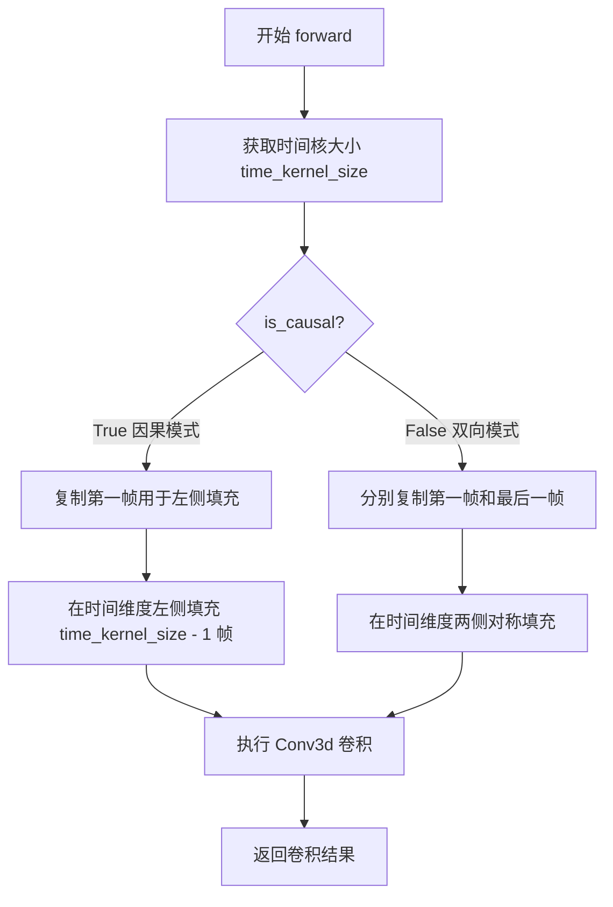
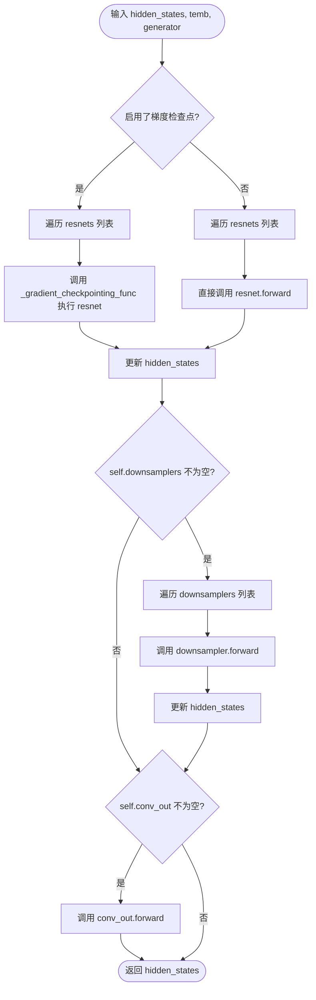
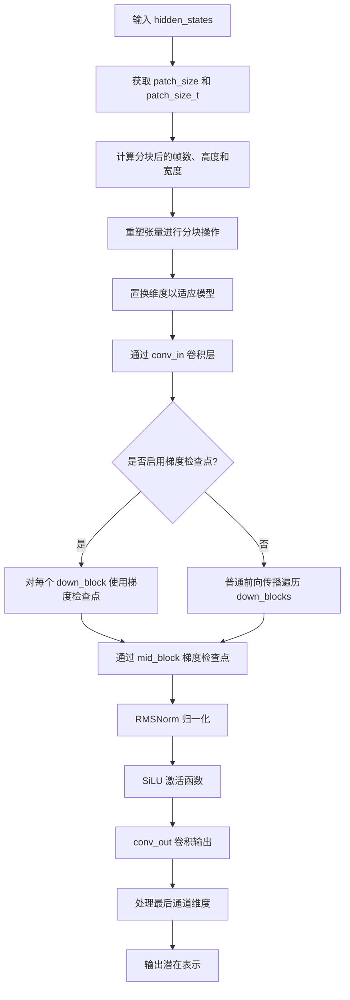
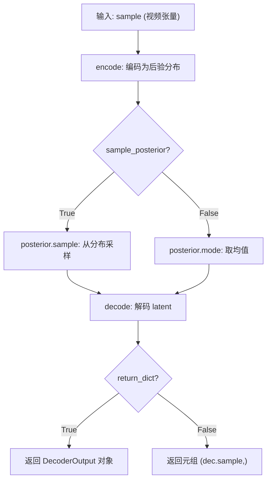
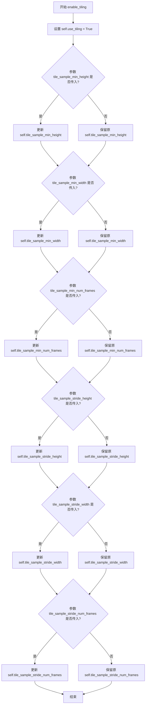
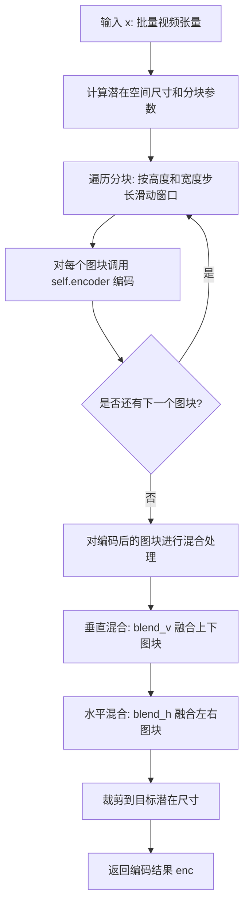

# `diffusers\src\diffusers\models\autoencoders\autoencoder_kl_ltx.py` 详细设计文档

这是一个用于视频生成和压缩的3D变分自编码器(VAE)实现，名为LTXVideo，包含因果卷积、支持时间步条件注入、噪声注入以及分块(Tiling)编码/解码功能，以实现高效的时空视频潜在表示处理。

## 整体流程

```mermaid
graph TD
    Input[输入视频 Tensor (B, C, T, H, W)] --> Encoder[LTXVideoEncoder3d]
    Encoder --> Posterior[DiagonalGaussianDistribution]
    Posterior --> Sampling[采样 z 或取 mode]
    Sampling --> Decoder[LTXVideoDecoder3d]
    Decoder --> Output[输出视频 Tensor]

    subgraph Encoder 内部流程
        EncStart[Patchify + ConvIn] --> DownBlocks[LTXVideoDownBlock3D]
        DownBlocks --> MidBlock[LTXVideoMidBlock3d]
        MidBlock --> EncEnd[NormOut + ConvOut]
    end

    subgraph Decoder 内部流程
        DecStart[ConvIn] --> DecMidBlock[LTXVideoMidBlock3d]
        DecMidBlock --> UpBlocks[LTXVideoUpBlock3d]
        UpBlocks --> DecEnd[NormOut + ConvOut + Unpatchify]
    end
```

## 类结构

```
torch.nn.Module (基类)
├── LTXVideoCausalConv3d (3D因果卷积层)
├── LTXVideoResnetBlock3d (3D残差块)
├── LTXVideoDownsampler3d (3D下采样器)
├── LTXVideoUpsampler3d (3D上采样器)
├── LTXVideoDownBlock3D (下采样模块)
├── LTXVideo095DownBlock3D (变体下采样模块)
├── LTXVideoMidBlock3d (中间处理模块)
├── LTXVideoUpBlock3d (上采样模块)
├── LTXVideoEncoder3d (编码器网络)
├── LTXVideoDecoder3d (解码器网络)
└── AutoencoderKLLTXVideo (主模型类: 继承自 ModelMixin, AutoencoderMixin, ConfigMixin)
```

## 全局变量及字段


### `LTXVideoCausalConv3d`
    
因果3D卷积层，支持时间维度的因果填充

类型：`class`
    


### `LTXVideoResnetBlock3d`
    
3D ResNet残差块，支持噪声注入和时间步条件

类型：`class`
    


### `LTXVideoDownsampler3d`
    
3D下采样器，支持时空降采样

类型：`class`
    


### `LTXVideoUpsampler3d`
    
3D上采样器，支持残差连接和时空上采样

类型：`class`
    


### `LTXVideoDownBlock3D`
    
视频下采样块，包含多个ResNet块和下采样层

类型：`class`
    


### `LTXVideo095DownBlock3D`
    
LTXVideo 0.95版本的下采样块，支持多种下采样类型

类型：`class`
    


### `LTXVideoMidBlock3d`
    
视频自编码器中间块，处理瓶颈层

类型：`class`
    


### `LTXVideoUpBlock3d`
    
视频上采样块，包含上采样层和多个ResNet块

类型：`class`
    


### `LTXVideoEncoder3d`
    
视频编码器，将输入视频编码为潜在表示

类型：`class`
    


### `LTXVideoDecoder3d`
    
视频解码器，将潜在表示解码为视频

类型：`class`
    


### `AutoencoderKLLTXVideo`
    
LTXVideo变分自编码器，支持KL损失、切片和分块解码

类型：`class`
    


### `LTXVideoCausalConv3d.in_channels`
    
输入通道数

类型：`int`
    


### `LTXVideoCausalConv3d.out_channels`
    
输出通道数

类型：`int`
    


### `LTXVideoCausalConv3d.is_causal`
    
是否使用因果填充

类型：`bool`
    


### `LTXVideoCausalConv3d.kernel_size`
    
卷积核大小

类型：`tuple`
    


### `LTXVideoCausalConv3d.conv`
    
底层卷积对象

类型：`nn.Conv3d`
    


### `LTXVideoResnetBlock3d.norm1`
    
第一个归一化层

类型：`RMSNorm`
    


### `LTXVideoResnetBlock3d.norm2`
    
第二个归一化层

类型：`RMSNorm`
    


### `LTXVideoResnetBlock3d.conv1`
    
第一个卷积层

类型：`LTXVideoCausalConv3d`
    


### `LTXVideoResnetBlock3d.conv2`
    
第二个卷积层

类型：`LTXVideoCausalConv3d`
    


### `LTXVideoResnetBlock3d.nonlinearity`
    
激活函数

类型：`Callable`
    


### `LTXVideoResnetBlock3d.scale_shift_table`
    
时间步条件缩放表

类型：`nn.Parameter`
    


### `LTXVideoResnetBlock3d.per_channel_scale1`
    
第一个通道的噪声注入缩放参数

类型：`nn.Parameter`
    


### `LTXVideoResnetBlock3d.per_channel_scale2`
    
第二个通道的噪声注入缩放参数

类型：`nn.Parameter`
    


### `LTXVideoDownsampler3d.stride`
    
下采样步长

类型：`tuple`
    


### `LTXVideoDownsampler3d.group_size`
    
分组大小

类型：`int`
    


### `LTXVideoUpsampler3d.residual`
    
是否使用残差连接

类型：`bool`
    


### `LTXVideoUpsampler3d.upscale_factor`
    
上采样因子

类型：`int`
    


### `LTXVideoDownBlock3D.resnets`
    
多个LTXVideoResnetBlock3d组成的模块列表

类型：`nn.ModuleList`
    


### `LTXVideoDownBlock3D.downsamplers`
    
下采样层列表

类型：`nn.ModuleList`
    


### `LTXVideoDownBlock3D.conv_out`
    
输出卷积块

类型：`LTXVideoResnetBlock3d`
    


### `LTXVideoDownBlock3D.gradient_checkpointing`
    
梯度检查点标志

类型：`bool`
    


### `LTXVideoMidBlock3d.time_embedder`
    
时间步嵌入器

类型：`PixArtAlphaCombinedTimestepSizeEmbeddings`
    


### `LTXVideoDecoder3d.conv_in`
    
输入卷积层

类型：`LTXVideoCausalConv3d`
    


### `LTXVideoDecoder3d.up_blocks`
    
上采样模块列表

类型：`nn.ModuleList`
    


### `LTXVideoDecoder3d.norm_out`
    
输出归一化层

类型：`RMSNorm`
    


### `LTXVideoDecoder3d.conv_act`
    
输出激活函数

类型：`nn.SiLU`
    


### `LTXVideoDecoder3d.conv_out`
    
输出卷积层

类型：`LTXVideoCausalConv3d`
    


### `LTXVideoDecoder3d.time_embedder`
    
时间步嵌入器

类型：`PixArtAlphaCombinedTimestepSizeEmbeddings`
    


### `LTXVideoDecoder3d.scale_shift_table`
    
缩放平移表

类型：`nn.Parameter`
    


### `LTXVideoDecoder3d.timestep_scale_multiplier`
    
时间步缩放乘数

类型：`nn.Parameter`
    


### `LTXVideoEncoder3d.patch_size`
    
空间补丁大小

类型：`int`
    


### `LTXVideoEncoder3d.patch_size_t`
    
时间补丁大小

类型：`int`
    


### `LTXVideoEncoder3d.conv_in`
    
输入卷积层

类型：`LTXVideoCausalConv3d`
    


### `LTXVideoEncoder3d.down_blocks`
    
下采样模块列表

类型：`nn.ModuleList`
    


### `LTXVideoEncoder3d.mid_block`
    
中间模块

类型：`LTXVideoMidBlock3d`
    


### `AutoencoderKLLTXVideo.encoder`
    
编码器实例

类型：`LTXVideoEncoder3d`
    


### `AutoencoderKLLTXVideo.decoder`
    
解码器实例

类型：`LTXVideoDecoder3d`
    


### `AutoencoderKLLTXVideo.latents_mean`
    
潜在空间均值

类型：`torch.Tensor`
    


### `AutoencoderKLLTXVideo.latents_std`
    
潜在空间标准差

类型：`torch.Tensor`
    


### `AutoencoderKLLTXVideo.use_slicing`
    
是否启用切片解码

类型：`bool`
    


### `AutoencoderKLLTXVideo.use_tiling`
    
是否启用分块解码

类型：`bool`
    


### `AutoencoderKLLTXVideo.use_framewise_encoding`
    
是否启用逐帧编码

类型：`bool`
    


### `AutoencoderKLLTXVideo.use_framewise_decoding`
    
是否启用逐帧解码

类型：`bool`
    


### `AutoencoderKLLTXVideo.spatial_compression_ratio`
    
空间压缩比

类型：`int`
    


### `AutoencoderKLLTXVideo.temporal_compression_ratio`
    
时间压缩比

类型：`int`
    


### `AutoencoderKLLTXVideo.num_sample_frames_batch_size`
    
样本帧批处理大小

类型：`int`
    


### `AutoencoderKLLTXVideo.num_latent_frames_batch_size`
    
潜在帧批处理大小

类型：`int`
    


### `AutoencoderKLLTXVideo.tile_sample_min_height`
    
分块最小高度

类型：`int`
    


### `AutoencoderKLLTXVideo.tile_sample_min_width`
    
分块最小宽度

类型：`int`
    


### `AutoencoderKLLTXVideo.tile_sample_min_num_frames`
    
分块最小帧数

类型：`int`
    


### `AutoencoderKLLTXVideo.tile_sample_stride_height`
    
分块高度步长

类型：`int`
    


### `AutoencoderKLLTXVideo.tile_sample_stride_width`
    
分块宽度步长

类型：`int`
    


### `AutoencoderKLLTXVideo.tile_sample_stride_num_frames`
    
分块帧数步长

类型：`int`
    
    

## 全局函数及方法


### `LTXVideoCausalConv3d.forward`

该方法执行因果3D卷积操作，根据`is_causal`标志在时间维度进行不同的填充处理（因果模式仅在左侧填充，双向模式在两侧对称填充），以确保卷积输出在时间维度上不泄露未来信息。

**参数：**

- `hidden_states`：`torch.Tensor`，输入的隐藏状态张量，形状为 `(batch, channels, time, height, width)`，表示批量视频数据

**返回值：** `torch.Tensor`，经过因果3D卷积处理后的输出张量

#### 流程图



#### 带注释源码

```python
def forward(self, hidden_states: torch.Tensor) -> torch.Tensor:
    # 获取时间维度的核大小，用于确定填充量
    time_kernel_size = self.kernel_size[0]

    if self.is_causal:
        # ========== 因果模式处理 ==========
        # 复制第一帧数据用于左侧填充，形状为 (batch, channels, time_kernel_size-1, height, width)
        pad_left = hidden_states[:, :, :1, :, :].repeat((1, 1, time_kernel_size - 1, 1, 1))
        # 在时间维度左侧拼接填充数据，实现因果卷积
        # 确保当前帧只能看到当前帧及之前的历史帧
        hidden_states = torch.concatenate([pad_left, hidden_states], dim=2)
    else:
        # ========== 双向模式处理 ==========
        # 在时间维度两端进行对称填充，常用于自编码器等双向处理场景
        # 左侧填充：(time_kernel_size - 1) // 2 帧
        pad_left = hidden_states[:, :, :1, :, :].repeat((1, 1, (time_kernel_size - 1) // 2, 1, 1))
        # 右侧填充：(time_kernel_size - 1) // 2 帧
        pad_right = hidden_states[:, :, -1:, :, :].repeat((1, 1, (time_kernel_size - 1) // 2, 1, 1))
        # 在时间维度两侧拼接填充数据
        hidden_states = torch.concatenate([pad_left, hidden_states, pad_right], dim=2)

    # 执行 3D 卷积操作，内部已包含空间维度的 padding 处理
    hidden_states = self.conv(hidden_states)
    return hidden_states
```


### `LTXVideoResnetBlock3d.forward`

执行 3D 残差块的前向传播，包含可选的时间步条件调整（通过可学习的 scale-shift 表）和噪声注入（通过可学习的每通道缩放参数），支持因果卷积和残差连接。

参数：

- `inputs`：`torch.Tensor`，输入张量，形状为 (batch, channels, time, height, width)
- `temb`：`torch.Tensor | None`，时间步嵌入，用于条件调整。如果为 None 且配置了时间步条件，则忽略
- `generator`：`torch.Generator | None`，随机数生成器，用于噪声注入的 Reproducibility

返回值：`torch.Tensor`，经过残差块处理后的输出张量，形状与输入相同

#### 流程图

```mermaid
flowchart TD
    A[输入 hidden_states = inputs] --> B[norm1 归一化<br/>将通道维度移到最后再移回]
    B --> C{scale_shift_table<br/>是否存在?}
    C -->|是| D[处理 temb: unflatten + scale_shift_table]
    D --> E[解包出 shift_1, scale_1, shift_2, scale_2]
    E --> F[hidden_states = hidden_states * (1 + scale_1) + shift_1]
    C -->|否| G[继续]
    F --> G
    G --> H[应用非线性激活函数 nonlinearity]
    H --> I[卷积 conv1]
    I --> J{per_channel_scale1<br/>是否存在?}
    J -->|是| K[生成空间噪声<br/>hidden_states + spatial_noise * scale]
    J -->|否| L[继续]
    K --> L
    L --> M[norm2 归一化]
    M --> N{scale_shift_table<br/>是否存在?}
    N -->|是| O[hidden_states = hidden_states * (1 + scale_2) + shift_2]
    N -->|否| P[继续]
    O --> P
    P --> Q[应用非线性激活函数 nonlinearity]
    Q --> R[应用 Dropout]
    R --> S[卷积 conv2]
    S --> T{per_channel_scale2<br/>是否存在?}
    T -->|是| U[生成空间噪声<br/>hidden_states + spatial_noise * scale]
    T -->|否| V[继续]
    U --> V
    V --> W{norm3 和 conv_shortcut<br/>是否存在?]
    W -->|是| X[对输入进行归一化 and/or 卷积 shortcut]
    W -->|否| Y[继续]
    X --> Y
    Y --> Z[残差连接: hidden_states + inputs]
    Z --> AA[返回 hidden_states]
```

#### 带注释源码

```python
def forward(
    self, inputs: torch.Tensor, temb: torch.Tensor | None = None, generator: torch.Generator | None = None
) -> torch.Tensor:
    # 将输入赋值给 hidden_states 作为隐藏状态的初始值
    hidden_states = inputs

    # 第一次归一化：对通道维度进行 RMSNorm
    # movedim(1, -1) 将通道维度从位置 1 移到最后，处理后再移回
    hidden_states = self.norm1(hidden_states.movedim(1, -1)).movedim(-1, 1)

    # 如果配置了时间步条件 (scale_shift_table 不为 None)
    if self.scale_shift_table is not None:
        # 对 temb 进行形状变换：从 (batch, 4*channels) -> (batch, 4, channels)
        # 并加上可学习的 scale_shift_table
        temb = temb.unflatten(1, (4, -1)) + self.scale_shift_table[None, ..., None, None, None]
        # 解包出两对 shift/scale 参数
        shift_1, scale_1, shift_2, scale_2 = temb.unbind(dim=1)
        # 应用第一个 shift 和 scale 进行仿射变换
        hidden_states = hidden_states * (1 + scale_1) + shift_1

    # 应用非线性激活函数 (默认 swish)
    hidden_states = self.nonlinearity(hidden_states)
    # 第一次因果卷积
    hidden_states = self.conv1(hidden_states)

    # 如果启用了噪声注入 (inject_noise=True)
    if self.per_channel_scale1 is not None:
        # 获取空间形状 (height, width)
        spatial_shape = hidden_states.shape[-2:]
        # 生成空间高斯噪声
        spatial_noise = torch.randn(
            spatial_shape, generator=generator, device=hidden_states.device, dtype=hidden_states.dtype
        )[None]
        # 将噪声通过可学习的每通道缩放参数进行缩放并添加到 hidden_states
        hidden_states = hidden_states + (spatial_noise * self.per_channel_scale1)[None, :, None, ...]

    # 第二次归一化
    hidden_states = self.norm2(hidden_states.movedim(1, -1)).movedim(-1, 1)

    # 如果配置了时间步条件，应用第二个 shift 和 scale
    if self.scale_shift_table is not None:
        hidden_states = hidden_states * (1 + scale_2) + shift_2

    # 再次应用非线性激活
    hidden_states = self.nonlinearity(hidden_states)
    # 应用 Dropout
    hidden_states = self.dropout(hidden_states)
    # 第二次因果卷积
    hidden_states = self.conv2(hidden_states)

    # 如果启用了噪声注入 (第二个噪声注入点)
    if self.per_channel_scale2 is not None:
        spatial_shape = hidden_states.shape[-2:]
        spatial_noise = torch.randn(
            spatial_shape, generator=generator, device=hidden_states.device, dtype=hidden_states.dtype
        )[None]
        hidden_states = hidden_states + (spatial_noise * self.per_channel_scale2)[None, :, None, ...]

    # 如果输入输出通道数不同，需要对输入进行 shortcut 处理
    if self.norm3 is not None:
        inputs = self.norm3(inputs.movedim(1, -1)).movedim(-1, 1)

    if self.conv_shortcut is not None:
        inputs = self.conv_shortcut(inputs)

    # 残差连接：将处理后的 hidden_states 与原始输入相加
    hidden_states = hidden_states + inputs
    return hidden_states
```


### `LTXVideoDownBlock3D.forward`

该方法执行 LTXVideo 模型中下采样块的前向传播。它接收隐藏状态张量，依次通过多个 3D ResNet 块进行处理，然后根据配置决定是否进行时空调控下采样，最后通过一个输出卷积块调整通道数并返回处理后的张量。

参数：

- `hidden_states`：`torch.Tensor`，输入的视频数据张量，形状通常为 (Batch, Channels, Time, Height, Width)。
- `temb`：`torch.Tensor | None`，用于 ResNet 块条件处理的时间嵌入张量。
- `generator`：`torch.Generator | None`，用于随机数生成（如果块内包含噪声注入等随机操作）的生成器对象。

返回值：`torch.Tensor`，经过 ResNet 块处理、下采样和通道转换后的输出张量。

#### 流程图



#### 带注释源码

```python
def forward(
    self,
    hidden_states: torch.Tensor,
    temb: torch.Tensor | None = None,
    generator: torch.Generator | None = None,
) -> torch.Tensor:
    r"""Forward method of the `LTXDownBlock3D` class."""

    # 1. 遍历所有 ResNet 块进行特征提取
    for i, resnet in enumerate(self.resnets):
        # 如果启用梯度检查点，则使用分块计算节省显存
        if torch.is_grad_enabled() and self.gradient_checkpointing:
            hidden_states = self._gradient_checkpointing_func(resnet, hidden_states, temb, generator)
        else:
            # 正常前向传播
            hidden_states = resnet(hidden_states, temb, generator)

    # 2. 如果存在下采样器，则进行时空间的下采样操作
    if self.downsamplers is not None:
        for downsampler in self.downsamplers:
            hidden_states = downsampler(hidden_states)

    # 3. 如果输入输出通道数不同，使用额外的卷积块进行通道调整
    if self.conv_out is not None:
        hidden_states = self.conv_out(hidden_states, temb, generator)

    return hidden_states
```


### `LTXVideoEncoder3d.forward`

该方法是 LTXVideoEncoder3d 类的前向传播函数，负责将输入视频张量进行分块(patching)、编码处理和下采样，最终输出视频的潜在表示(latent representation)。

参数：

- `self`：LTXVideoEncoder3d 实例本身
- `hidden_states`：`torch.Tensor`，输入的视频张量，形状为 (batch_size, num_channels, num_frames, height, width)

返回值：`torch.Tensor`，编码后的潜在表示张量

#### 流程图



#### 带注释源码

```python
def forward(self, hidden_states: torch.Tensor) -> torch.Tensor:
    r"""The forward method of the `LTXVideoEncoder3d` class."""

    # 获取空间和时间分块大小
    p = self.patch_size          # 空间分块大小，默认4
    p_t = self.patch_size_t      # 时间分块大小，默认1

    # 从输入张量获取批量大小、通道数、帧数、高度和宽度
    batch_size, num_channels, num_frames, height, width = hidden_states.shape
    
    # 计算分块后的维度
    post_patch_num_frames = num_frames // p_t    # 时间维度分块数
    post_patch_height = height // p               # 高度分块数
    post_patch_width = width // p                 # 宽度分块数

    # 将输入重塑为分块格式 (batch, channels, frames//pt, pt, height//p, p, width//p, p)
    hidden_states = hidden_states.reshape(
        batch_size, num_channels, post_patch_num_frames, p_t, 
        post_patch_height, p, post_patch_width, p
    )
    
    # 置换维度以调整分块顺序，注释表明这个顺序比较复杂
    # 转换后形状: (batch, channels*pt*p, frames, height, width)
    hidden_states = hidden_states.permute(0, 1, 3, 7, 5, 2, 4, 6).flatten(1, 4)
    
    # 通过输入卷积层
    hidden_states = self.conv_in(hidden_states)

    # 根据是否启用梯度检查点选择不同的前向传播路径
    if torch.is_grad_enabled() and self.gradient_checkpointing:
        # 使用梯度检查点节省显存
        for down_block in self.down_blocks:
            hidden_states = self._gradient_checkpointing_func(down_block, hidden_states)

        hidden_states = self._gradient_checkpointing_func(self.mid_block, hidden_states)
    else:
        # 普通前向传播
        for down_block in self.down_blocks:
            hidden_states = down_block(hidden_states)

        hidden_states = self.mid_block(hidden_states)

    # 输出归一化：调整维度顺序后进行 RMSNorm，再调整回来
    hidden_states = self.norm_out(hidden_states.movedim(1, -1)).movedim(-1, 1)
    
    # SiLU 激活函数
    hidden_states = self.conv_act(hidden_states)
    
    # 输出卷积，通道数从 output_channel 变为 out_channels + 1
    hidden_states = self.conv_out(hidden_states)

    # 处理最后一个通道维度：复制最后一帧以扩展时间维度
    # 这是为了匹配 VAE 解码器的期望格式
    last_channel = hidden_states[:, -1:]
    last_channel = last_channel.repeat(1, hidden_states.size(1) - 2, 1, 1, 1)
    hidden_states = torch.cat([hidden_states, last_channel], dim=1)

    return hidden_states
```


### LTXVideoDecoder3d.forward

该方法是LTXVideoDecoder3d类的前向传播方法，负责将潜在表示（latent representation）进行上采样、解码和分块重组，最终输出视频帧。

参数：
- `hidden_states`：`torch.Tensor`，输入的潜在表示张量，形状为 (batch_size, num_channels, num_frames, height, width)
- `temb`：`torch.Tensor | None`，时间步嵌入向量，用于时间步条件化（如果启用）

返回值：`torch.Tensor`，解码后的视频张量，形状为 (batch_size, out_channels, num_frames * patch_size_t, height * patch_size, width * patch_size)

#### 流程图

```mermaid
flowchart TD
    A[输入 hidden_states 和 temb] --> B[conv_in 卷积]
    B --> C{是否使用 timestep_scale_multiplier?}
    C -->|是| D[temb = temb * timestep_scale_multiplier]
    C -->|否| E{是否启用梯度检查点?}
    D --> E
    E -->|是| F[使用 gradient_checkpointing_func 执行 mid_block]
    E -->|否| G[mid_block 前向传播]
    F --> H[遍历 up_blocks 执行上采样]
    G --> H
    H --> I[norm_out 归一化]
    I --> J{是否使用 time_embedder?}
    J -->|是| K[time_embedder 处理 temb]
    K --> L[计算 shift 和 scale]
    L --> M[hidden_states = hidden_states * (1 + scale) + shift]
    J -->|否| N[conv_act 激活函数]
    M --> N
    N --> O[conv_out 卷积输出]
    O --> P[重塑张量: 重组分块]
    P --> Q[输出解码后的视频]
```

#### 带注释源码

```python
def forward(self, hidden_states: torch.Tensor, temb: torch.Tensor | None = None) -> torch.Tensor:
    # 步骤1: 输入卷积 - 将潜在表示投影到初始特征空间
    hidden_states = self.conv_in(hidden_states)

    # 步骤2: 时间步缩放 - 如果配置了时间步缩放因子，则对temb进行缩放
    if self.timestep_scale_multiplier is not None:
        temb = temb * self.timestep_scale_multiplier

    # 步骤3: 中间块处理 - 通过中间块进行特征提取
    # 支持梯度检查点以节省显存
    if torch.is_grad_enabled() and self.gradient_checkpointing:
        hidden_states = self._gradient_checkpointing_func(self.mid_block, hidden_states, temb)

        # 步骤4: 上采样块 - 逐层上采样，每层包含上采样器和残差块
        for up_block in self.up_blocks:
            hidden_states = self._gradient_checkpointing_func(up_block, hidden_states, temb)
    else:
        hidden_states = self.mid_block(hidden_states, temb)

        for up_block in self.up_blocks:
            hidden_states = up_block(hidden_states, temb)

    # 步骤5: 输出归一化 - 对通道维度进行RMSNorm归一化
    hidden_states = self.norm_out(hidden_states.movedim(1, -1)).movedim(-1, 1)

    # 步骤6: 时间步条件化 - 如果启用时间步条件化，应用仿射变换
    if self.time_embedder is not None:
        # 将temb展平并通过时间嵌入器
        temb = self.time_embedder(
            timestep=temb.flatten(),
            resolution=None,
            aspect_ratio=None,
            batch_size=hidden_states.size(0),
            hidden_dtype=hidden_states.dtype,
        )
        # 重新整形temb以匹配hidden_states的维度
        temb = temb.view(hidden_states.size(0), -1, 1, 1, 1).unflatten(1, (2, -1))
        # 添加可学习的缩放和平移参数
        temb = temb + self.scale_shift_table[None, ..., None, None, None]
        # 解绑得到shift和scale
        shift, scale = temb.unbind(dim=1)
        # 应用仿射变换: hidden_states = hidden_states * (1 + scale) + shift
        hidden_states = hidden_states * (1 + scale) + shift

    # 步骤7: 激活函数和输出卷积
    hidden_states = self.conv_act(hidden_states)  # SiLU激活
    hidden_states = self.conv_out(hidden_states)

    # 步骤8: 分块重组 - 将补丁化的表示重新组织为视频帧
    p = self.patch_size       # 空间补丁大小 (默认4)
    p_t = self.patch_size_t   # 时间补丁大小 (默认1)

    # 获取输出张量维度
    batch_size, num_channels, num_frames, height, width = hidden_states.shape
    
    # 重新整形: 将通道维度的补丁展开为(p_t, p, p)维度
    hidden_states = hidden_states.reshape(batch_size, -1, p_t, p, p, num_frames, height, width)
    
    # 置换维度以重新排列补丁顺序
    hidden_states = hidden_states.permute(0, 1, 5, 2, 6, 4, 7, 3).flatten(6, 7).flatten(4, 5).flatten(2, 3)

    return hidden_states
```


### `AutoencoderKLLTXVideo.encode`

编码函数，用于将输入的图像（或视频帧）批次编码为潜在表示（latent representation）。

参数：

- `x`：`torch.Tensor`，输入的图像批次，形状为 (batch_size, channels, frames, height, width)
- `return_dict`：`bool`，可选参数，默认为 `True`，决定是否返回 `AutoencoderKLOutput` 对象而非普通元组

返回值：`AutoencoderKLOutput | tuple[DiagonalGaussianDistribution]`，如果 `return_dict` 为 True，返回包含潜在分布的 `AutoencoderKLOutput` 对象；否则返回包含 `DiagonalGaussianDistribution` 的元组

#### 流程图

```mermaid
flowchart TD
    A[开始 encode] --> B{use_slicing 为 True<br/>且 batch_size > 1?}
    B -->|Yes| C[将输入 x 按batch维度分割<br/>x.split(1)]
    B -->|No| D[直接调用 self._encode(x)]
    C --> E[对每个分割的切片<br/>调用 self._encode]
    E --> F[torch.cat 合并所有编码结果]
    D --> F
    F --> G[创建 DiagonalGaussianDistribution<br/>posterior = DiagonalGaussianDistribution(h)]
    G --> H{return_dict 为 True?}
    H -->|Yes| I[返回 AutoencoderKLOutput<br/>latent_dist=posterior]
    H -->|No| J[返回 tuple (posterior,)]
    I --> K[结束]
    J --> K
```

#### 带注释源码

```python
@apply_forward_hook
def encode(
    self, x: torch.Tensor, return_dict: bool = True
) -> AutoencoderKLOutput | tuple[DiagonalGaussianDistribution]:
    """
    Encode a batch of images into latents.

    Args:
        x (`torch.Tensor`): Input batch of images.
        return_dict (`bool`, *optional*, defaults to `True`):
            Whether to return a [`~models.autoencoder_kl.AutoencoderKLOutput`] instead of a plain tuple.

    Returns:
            The latent representations of the encoded videos. If `return_dict` is True, a
            [`~models.autoencoder_kl.AutoencoderKLOutput`] is returned, otherwise a plain `tuple` is returned.
    """
    # 判断是否启用切片编码模式
    # 当批量大小大于1时，可以将batch中的每个样本单独编码以节省内存
    if self.use_slicing and x.shape[0] > 1:
        # 将输入沿batch维度分割成单独的样本
        # x.split(1) 返回长度为 batch_size 的列表，每个元素形状为 (1, C, F, H, W)
        encoded_slices = [self._encode(x_slice) for x_slice in x.split(1)]
        # 合并所有编码后的切片结果
        h = torch.cat(encoded_slices)
    else:
        # 直接对整个批次进行编码
        h = self._encode(x)
    
    # 使用编码输出创建对角高斯分布
    # 这是 VAE 中常用的潜在空间表示方式
    posterior = DiagonalGaussianDistribution(h)

    # 根据 return_dict 参数决定返回格式
    if not return_dict:
        return (posterior,)
    return AutoencoderKLOutput(latent_dist=posterior)
```


### `AutoencoderKLLTXVideo.decode`

该方法是 `AutoencoderKLLTXVideo` 类的公开解码接口，负责将 latent space 中的向量解码为视频样本。支持切片（slicing）优化以节省内存，并根据配置选择标准解码、时间分块解码或空间分块解码策略。

参数：

-  `z`：`torch.Tensor`，输入的潜在向量批次，形状为 `(batch_size, num_channels, num_frames, height, width)`
-  `temb`：`torch.Tensor | None`，时间步嵌入向量，用于条件解码（可选）
-  `return_dict`：`bool`，是否返回 `DecoderOutput` 对象（默认为 `True`）

返回值：`DecoderOutput | torch.Tensor`，解码后的视频样本。如果 `return_dict` 为 `True`，返回 `DecoderOutput` 对象；否则返回元组 `(sample,)`

#### 流程图

```mermaid
flowchart TD
    A[decode 方法入口] --> B{use_slicing 为真<br>且 batch_size > 1?}
    B -->|是| C[按 batch 维度切分 z 和 temb]
    B -->|否| D[调用 _decode 方法]
    C --> C1[对每个切片调用 _decode]
    C1 --> C2[拼接所有解码切片]
    C2 --> D
    D --> E[_decode 内部处理]
    E --> F{use_framewise_decoding 为真<br>且帧数过多?}
    F -->|是| G[调用 _temporal_tiled_decode]
    F -->|否| H{use_tiling 为真<br>且空间维度过大?}
    H -->|是| I[调用 tiled_decode]
    H -->|否| J[调用标准 decoder.forward]
    G --> K[返回 DecoderOutput 或元组]
    I --> K
    J --> K
    K --> L{return_dict 为真?}
    L -->|是| M[返回 DecoderOutput(sample=decoded)]
    L -->|否| N[返回 (decoded,)]
```

#### 带注释源码

```python
@apply_forward_hook
def decode(
    self, z: torch.Tensor, temb: torch.Tensor | None = None, return_dict: bool = True
) -> DecoderOutput | torch.Tensor:
    """
    Decode a batch of images.

    Args:
        z (`torch.Tensor`): Input batch of latent vectors.
        return_dict (`bool`, *optional*, defaults to `True`):
            Whether to return a [`~models.vae.DecoderOutput`] instead of a plain tuple.

    Returns:
        [`~models.vae.DecoderOutput`] or `tuple`:
            If return_dict is True, a [`~models.vae.DecoderOutput`] is returned, otherwise a plain `tuple` is
            returned.
    """
    # 如果启用切片模式且批次大于1，则对每个样本独立解码以节省内存
    if self.use_slicing and z.shape[0] > 1:
        if temb is not None:
            # 同时切分时间嵌入并分别解码
            decoded_slices = [
                self._decode(z_slice, t_slice).sample for z_slice, t_slice in (z.split(1), temb.split(1))
            ]
        else:
            # 无时间嵌入时的切片解码
            decoded_slices = [self._decode(z_slice).sample for z_slice in z.split(1)]
        # 合并所有解码后的样本
        decoded = torch.cat(decoded_slices)
    else:
        # 标准解码路径：直接调用内部 _decode 方法
        decoded = self._decode(z, temb).sample

    # 根据 return_dict 参数决定返回格式
    if not return_dict:
        return (decoded,)

    # 返回封装后的 DecoderOutput 对象
    return DecoderOutput(sample=decoded)
```


### `AutoencoderKLLTXVideo.forward`

该方法是 LTXVideo 变分自编码器（VAE）的完整前向传播流程，负责将输入视频样本编码为潜在表示（latent），根据配置采样或取模式（mode），再解码为重建的视频样本。

参数：

- `sample`：`torch.Tensor`，输入的视频样本张量，形状为 (batch_size, channels, num_frames, height, width)
- `temb`：`torch.Tensor | None`，可选的时间嵌入向量，用于解码器的时间条件化
- `sample_posterior`：`bool`，是否从后验分布中采样；如果为 False，则取后验分布的 mode（均值）
- `return_dict`：`bool`，是否返回字典格式的输出；如果为 False，则返回元组
- `generator`：`torch.Generator | None`，可选的随机数生成器，用于后验分布采样时的随机性控制

返回值：`torch.Tensor | torch.Tensor`，当 `return_dict=True` 时返回 `DecoderOutput` 对象（包含 `sample` 属性）；当 `return_dict=False` 时返回元组 `(dec.sample,)`

#### 流程图



#### 带注释源码

```python
def forward(
    self,
    sample: torch.Tensor,
    temb: torch.Tensor | None = None,
    sample_posterior: bool = False,
    return_dict: bool = True,
    generator: torch.Generator | None = None,
) -> torch.Tensor | torch.Tensor:
    """
    LTXVideo VAE 的完整前向传播：编码 -> 采样/取mode -> 解码
    
    参数:
        sample: 输入视频样本 (B, C, T, H, W)
        temb: 时间嵌入，用于条件解码
        sample_posterior: 是否从后验分布采样
        return_dict: 是否返回字典格式
        generator: 随机数生成器
    
    返回:
        重建的视频样本或 DecoderOutput 对象
    """
    # 1. 将输入样本赋值给局部变量
    x = sample
    
    # 2. 编码阶段：将输入视频编码为后验分布（潜在空间表示）
    #    encode 方法返回 AutoencoderKLOutput，其中包含 latent_dist（对角高斯分布）
    posterior = self.encode(x).latent_dist
    
    # 3. 采样阶段：根据配置从后验分布获取 latent 向量
    if sample_posterior:
        # 从后验分布中采样（引入随机性，用于训练或生成多样性）
        z = posterior.sample(generator=generator)
    else:
        # 取后验分布的 mode（均值），用于确定性重建
        z = posterior.mode()
    
    # 4. 解码阶段：将 latent 向量解码为重建的视频样本
    #    decode 方法返回 DecoderOutput 对象
    dec = self.decode(z, temb)
    
    # 5. 返回阶段：根据配置返回相应格式
    if not return_dict:
        # 返回元组格式（兼容旧接口）
        return (dec.sample,)
    
    # 返回 DecoderOutput 对象（包含 sample 属性）
    return dec
```


### `AutoencoderKLLTXVideo.enable_tiling`

该方法用于启用分块（tiling）策略，允许 VAE 在处理大规模视频时将输入张量分割为多个重叠的瓦片进行编码和解码，从而显著降低显存占用并支持更大分辨率的视频处理。

参数：

- `tile_sample_min_height`：`int | None`，最小高度阈值，当样本高度超过此值时在高度维度分块
- `tile_sample_min_width`：`int | None`，最小宽度阈值，当样本宽度超过此值时在宽度维度分块
- `tile_sample_min_num_frames`：`int | None`，最小帧数阈值，当帧数超过此值时在时间维度分块
- `tile_sample_stride_height`：`float | None`，垂直方向的分块步长，控制相邻垂直瓦片的重叠区域
- `tile_sample_stride_width`：`float | None`，水平方向的分块步长，控制相邻水平瓦片的重叠区域
- `tile_sample_stride_num_frames`：`float | None`，时间方向的分块步长，控制相邻时间瓦片的重叠区域

返回值：`None`，该方法无返回值，仅修改对象内部状态

#### 流程图



#### 带注释源码

```python
def enable_tiling(
    self,
    tile_sample_min_height: int | None = None,
    tile_sample_min_width: int | None = None,
    tile_sample_min_num_frames: int | None = None,
    tile_sample_stride_height: float | None = None,
    tile_sample_stride_width: float | None = None,
    tile_sample_stride_num_frames: float | None = None,
) -> None:
    r"""
    Enable tiled VAE decoding. When this option is enabled, the VAE will split the input tensor into tiles to
    compute decoding and encoding in several steps. This is useful for saving a large amount of memory and to allow
    processing larger images.

    Args:
        tile_sample_min_height (`int`, *optional*):
            The minimum height required for a sample to be separated into tiles across the height dimension.
        tile_sample_min_width (`int`, *optional*):
            The minimum width required for a sample to be separated into tiles across the width dimension.
        tile_sample_stride_height (`int`, *optional*):
            The minimum amount of overlap between two consecutive vertical tiles. This is to ensure that there are
            no tiling artifacts produced across the height dimension.
        tile_sample_stride_width (`int`, *optional*):
            The stride between two consecutive horizontal tiles. This is to ensure that there are no tiling
            artifacts produced across the width dimension.
    """
    # 启用分块模式标志
    self.use_tiling = True
    
    # 更新最小高度阈值，若未提供则保留原值
    self.tile_sample_min_height = tile_sample_min_height or self.tile_sample_min_height
    # 更新最小宽度阈值，若未提供则保留原值
    self.tile_sample_min_width = tile_sample_min_width or self.tile_sample_min_width
    # 更新最小帧数阈值，若未提供则保留原值
    self.tile_sample_min_num_frames = tile_sample_min_num_frames or self.tile_sample_min_num_frames
    # 更新垂直步长，若未提供则保留原值
    self.tile_sample_stride_height = tile_sample_stride_height or self.tile_sample_stride_height
    # 更新水平步长，若未提供则保留原值
    self.tile_sample_stride_width = tile_sample_stride_width or self.tile_sample_stride_width
    # 更新时间步长，若未提供则保留原值
    self.tile_sample_stride_num_frames = tile_sample_stride_num_frames or self.tile_sample_stride_num_frames
```


### `AutoencoderKLLTXVideo.tiled_encode`

该方法实现了分块编码（tiled encoding）功能，将输入视频张量沿空间维度（高度和宽度）分割成重叠的图块，分别对每个图块进行编码，然后通过混合（blending）技术将图块合并为连续的潜在表示，以降低大尺寸视频编码的显存占用。

参数：

- `x`：`torch.Tensor`，输入的批量视频张量，形状为 (batch_size, num_channels, num_frames, height, width)

返回值：`torch.Tensor`，编码后的潜在表示张量

#### 流程图



#### 带注释源码

```python
def tiled_encode(self, x: torch.Tensor) -> torch.Tensor:
    r"""Encode a batch of images using a tiled encoder.
    
    通过分块策略对大尺寸视频进行编码，将输入沿空间维度切分为重叠的图块，
    分别编码后再通过混合操作合并，以降低显存占用。
    
    Args:
        x (`torch.Tensor`): Input batch of videos.
                          输入视频张量，形状为 (batch_size, num_channels, num_frames, height, width)

    Returns:
        `torch.Tensor`: The latent representation of the encoded videos.
                       编码后的潜在表示，形状为 (batch_size, latent_channels, latent_num_frames, latent_height, latent_width)
    """
    # 获取输入维度信息
    batch_size, num_channels, num_frames, height, width = x.shape
    
    # 计算潜在空间的宽高（根据空间压缩比）
    latent_height = height // self.spatial_compression_ratio
    latent_width = width // self.spatial_compression_ratio

    # 将分块参数从样本空间映射到潜在空间
    tile_latent_min_height = self.tile_sample_min_height // self.spatial_compression_ratio
    tile_latent_min_width = self.tile_sample_min_width // self.spatial_compression_ratio
    tile_latent_stride_height = self.tile_sample_stride_height // self.spatial_compression_ratio
    tile_latent_stride_width = self.tile_sample_stride_width // self.spatial_compression_ratio

    # 计算混合区域大小（重叠区域用于平滑过渡）
    blend_height = tile_latent_min_height - tile_latent_stride_height
    blend_width = tile_latent_min_width - tile_latent_stride_width

    # ============================================================
    # 第一步：分块编码
    # 将输入视频沿高度和宽度方向切分为重叠的图块，分别编码
    # ============================================================
    rows = []  # 存储所有行的编码结果
    for i in range(0, height, self.tile_sample_stride_height):
        row = []  # 存储当前行的编码结果
        for j in range(0, width, self.tile_sample_stride_width):
            # 提取当前图块：高度范围 [i, i + tile_sample_min_height)，宽度范围 [j, j + tile_sample_min_width)
            tile = self.encoder(
                x[:, :, :, i : i + self.tile_sample_min_height, j : j + self.tile_sample_min_width]
            )
            row.append(tile)
        rows.append(row)

    # ============================================================
    # 第二步：混合与合并
    # 对编码后的图块进行垂直和水平方向的混合，消除图块边界 artifacts
    # ============================================================
    result_rows = []
    for i, row in enumerate(rows):
        result_row = []
        for j, tile in enumerate(row):
            # 垂直混合：将上方图块与当前图块在垂直方向重叠区域进行加权融合
            if i > 0:
                tile = self.blend_v(rows[i - 1][j], tile, blend_height)
            
            # 水平混合：将左侧图块与当前图块在水平方向重叠区域进行加权融合
            if j > 0:
                tile = self.blend_h(row[j - 1], tile, blend_width)
            
            # 裁剪到目标步长大小，去除重叠部分
            result_row.append(tile[:, :, :, :tile_latent_stride_height, :tile_latent_stride_width])
        
        # 将当前行的所有图块在宽度维度拼接
        result_rows.append(torch.cat(result_row, dim=4))

    # 将所有行在高度维度拼接，并裁剪到目标潜在尺寸
    enc = torch.cat(result_rows, dim=3)[:, :, :, :latent_height, :latent_width]
    return enc
```

#### 关键依赖方法说明

| 方法名 | 所属类 | 功能描述 |
|--------|--------|----------|
| `blend_v` | `AutoencoderKLLTXVideo` | 垂直混合，将当前图块与上方图块在垂直重叠区域进行线性淡入淡出融合 |
| `blend_h` | `AutoencoderKLLTXVideo` | 水平混合，将当前图块与左侧图块在水平重叠区域进行线性淡入淡出融合 |
| `self.encoder` | `LTXVideoEncoder3d` | 核心 3D 视频编码器，将视频帧编码为潜在表示 |
| `self.spatial_compression_ratio` | `AutoencoderKLLTXVideo` | 空间压缩比，用于将样本空间坐标映射到潜在空间坐标 |
| `self.tile_sample_min_height/width` | `AutoencoderKLLTXVideo` | 分块的最小高度和宽度阈值 |
| `self.tile_sample_stride_height/width` | `AutoencoderKLLTXVideo` | 分块的滑动步长，控制相邻图块之间的重叠量 |


### 1. 总体描述

该代码文件实现了一个用于 **LTXVideo** 模型的变分自编码器（VAE），核心功能是支持视频数据的潜在空间压缩与重建。代码基于标准的 KL 散度自编码器架构，并针对 **高分辨率** 和 **长时序** 视频生成场景进行了显存优化，引入了**空间与时间分块（tiling）解码机制**，通过将潜在向量切分为重叠的小块分别解码并混合，有效降低了消费级 GPU 的显存压力。

---

### 2. 文件整体运行流程

1.  **编码 (Encode)**：输入像素视频 $x$，经过 `LTXVideoEncoder3d`（包含 3D 因果卷积和 ResNet 块）编码为潜在向量 $z$，并通过 `DiagonalGaussianDistribution` 采样得到后验分布。
2.  **潜在处理**：在 `forward` 方法中，根据 `sample_posterior` 参数从分布中采样或选取均值（mode）得到具体的潜在向量 $z$。
3.  **解码 (Decode)**：潜在向量 $z$ 传入 `decode` 方法。
    *   **普通模式**：若视频尺寸较小，直接调用 `LTXVideoDecoder3d` 重建像素。
    *   **分块模式 (Tiling)**：若启用 `use_tiling` 且尺寸超过阈值，调用 `tiled_decode`。
4.  **分块解码细节**：`tiled_decode` 将潜在向量按空间（高度、宽度）切分为重叠的块，对每个块独立执行 `decoder`，利用 `blend_v`（垂直）、`blend_h`（水平）函数对块边缘进行加权混合以消除拼接缝隙，最后拼接成完整的输出。

---

### 3. 类的详细信息

#### 3.1 AutoencoderKLLTXVideo

这是文件的核心类，封装了编码器、解码器及各种优化策略。

**类字段 (Class Fields)**

- `encoder`: `LTXVideoEncoder3d`，视频编码器，将像素转换为潜在表示。
- `decoder`: `LTXVideoDecoder3d`，视频解码器，将潜在表示转换为像素。
- `latents_mean`: `torch.Tensor`，潜在空间的均值向量（用于归一化）。
- `latents_std`: `torch.Tensor`，潜在空间的标准差向量（用于归一化）。
- `scaling_factor`: `float`，缩放因子，用于训练时对齐潜在空间方差。
- `use_tiling`: `bool`，标志位，控制是否启用空间分块解码。
- `tile_sample_min_height/width/num_frames`: `int`，触发分块解码的最小尺寸阈值。
- `tile_sample_stride_height/width/num_frames`: `int`，分块解码时，相邻块之间的步长（重叠区域大小由此决定）。

**类方法概览**

- `encode(x)`: 将视频编码为潜在分布。
- `decode(z)`: 将潜在向量解码为视频（内部根据条件调用 `tiled_decode`）。
- `forward(...)`: 封装了 encode -> sample -> decode 的完整流程。
- `tiled_decode(...)`: **（重点方法）** 实现分块解码逻辑。

---

#### 3.2 关键方法：AutoencoderKLLTXVideo.tiled_decode

该方法是实现大尺寸视频解码的核心，通过空间分块策略解决了显存瓶颈。

**描述**

分块解码（Tiled Decoding），当输入的潜在向量 `z` 的空间尺寸超过预设阈值（`tile_sample_min_* / compression_ratio`）时触发。该方法将潜在向量沿高度和宽度维度切分为多个重叠的小块（Tiles），分别对每个小块调用解码器 `decoder`，然后使用混合（Blending）技术将相邻解码结果在重叠区域进行平滑加权融合，最后拼接成完整的视频帧。这种方式使得解码超大分辨率视频时，显存占用保持在恒定水平。

**参数**

-  `z`：`torch.Tensor`，输入的潜在向量张量，形状为 `(batch_size, num_channels, num_frames, height, width)`。
-  `temb`：`torch.Tensor | None`，时间嵌入向量，用于条件解码（通常在扩散模型中传入）。
-  `return_dict`：`bool`，是否返回 `DecoderOutput` 对象。如果为 `False`，则返回元组 `(sample,)`。

**返回值**

- `DecoderOutput | torch.Tensor`：解码后的像素视频张量。如果 `return_dict` 为 `True`，返回一个包含 `sample` 属性的 `DecoderOutput` 对象；否则返回张量元组。

#### 流程图

```mermaid
graph TD
    A([Start tiled_decode]) --> B[获取输入 z 形状<br>计算空间压缩后的尺寸]
    B --> C[计算分块参数<br>tile_latent_min_h/w, stride, blend_extent]
    C --> D[外层循环: 按高度步长遍历行]
    D --> E[内层循环: 按宽度步长遍历列]
    E --> F[切片: 提取当前块 z[:, :, :, i:i+h, j:j+w]]
    F --> G[调用 Decoder: dec_tile = self.decoder(tile, temb)]
    G --> H{是否与上行混合?}
    H -- Yes --> I[blend_v: 混合当前块与上行结果]
    H -- No --> J{是否与左列混合?}
    I --> J
    J -- Yes --> K[blend_h: 混合当前块与左列结果]
    J -- No --> L[裁剪: 保留非重叠部分]
    K --> L
    L --> M[添加到当前行结果]
    M --> N{列循环结束?}
    N -- No --> E
    N -- Yes --> O[拼接行: torch.cat(dim=4)]
    O --> P{行循环结束?}
    P -- No --> D
    P -- Yes --> Q[拼接所有行: torch.cat(dim=3)]
    Q --> R[裁剪至最终目标尺寸]
    R --> S{return_dict?}
    S -- True --> T[返回 DecoderOutput(sample=dec)]
    S -- False --> U[返回 (dec,)]
```

#### 带注释源码

```python
def tiled_decode(
    self, z: torch.Tensor, temb: torch.Tensor | None, return_dict: bool = True
) -> DecoderOutput | torch.Tensor:
    r"""
    使用分块解码器解码一批图像。

    Args:
        z (`torch.Tensor`): 输入的潜在向量批次。
        return_dict (`bool`, *optional*, defaults to `True`):
            是否返回 [`~models.vae.DecoderOutput`] 而不是元组。

    Returns:
        [`~models.vae.DecoderOutput`] 或 `tuple`:
            如果 return_dict 为 True，返回 [`~models.vae.DecoderOutput`]，否则返回元组。
    """
    # 1. 获取输入维度信息
    batch_size, num_channels, num_frames, height, width = z.shape
    
    # 2. 计算解码后像素空间的尺寸
    sample_height = height * self.spatial_compression_ratio
    sample_width = width * self.spatial_compression_ratio

    # 3. 计算潜在空间的分块参数 (将像素空间的最小块大小转换为潜在空间)
    tile_latent_min_height = self.tile_sample_min_height // self.spatial_compression_ratio
    tile_latent_min_width = self.tile_sample_min_width // self.spatial_compression_ratio
    tile_latent_stride_height = self.tile_sample_stride_height // self.spatial_compression_ratio
    tile_latent_stride_width = self.tile_sample_stride_width // self.spatial_compression_ratio

    # 4. 计算混合 (Blending) 区域的大小，用于平滑拼接处
    blend_height = self.tile_sample_min_height - self.tile_sample_stride_height
    blend_width = self.tile_sample_min_width - self.tile_sample_stride_width

    # 5. 开始分块遍历 (沿高度和宽度方向)
    # 将 z 分割为重叠的 tiles 并分别解码
    rows = []
    for i in range(0, height, tile_latent_stride_height):
        row = []
        for j in range(0, width, tile_latent_stride_width):
            # 提取当前空间块的潜在向量
            # 注意：这里的时间维度 (num_frames) 是完整的，只在空间上分块
            tile = z[:, :, :, i : i + tile_latent_min_height, j : j + tile_latent_min_width]
            
            # 调用标准的 3D 解码器处理这个块
            time = self.decoder(tile, temb)
            row.append(time)
        rows.append(row)

    # 6. 混合与拼接结果
    result_rows = []
    for i, row in enumerate(rows):
        result_row = []
        for j, tile in enumerate(row):
            # 混合逻辑：
            # 如果当前块上方有已解码的块 (i > 0)，则进行垂直混合
            if i > 0:
                tile = self.blend_v(rows[i - 1][j], tile, blend_height)
            
            # 如果当前块左侧有已解码的块 (j > 0)，则进行水平混合
            if j > 0:
                tile = self.blend_h(row[j - 1], tile, blend_width)
            
            # 混合完成后，裁剪掉重叠部分，只保留有效的核心区域
            # 这确保了最终拼接时不会有重复像素
            result_row.append(tile[:, :, :, : self.tile_sample_stride_height, : self.tile_sample_stride_width])
        
        # 拼接当前行的所有块 (按宽度维度拼接)
        result_rows.append(torch.cat(result_row, dim=4))

    # 7. 拼接所有行 (按高度维度拼接)
    dec = torch.cat(result_rows, dim=3)[:, :, :, :sample_height, :sample_width]

    # 8. 返回结果
    if not return_dict:
        return (dec,)

    return DecoderOutput(sample=dec)
```

---

### 4. 关键组件信息

- **LTXVideoDecoder3d**: 核心解码器组件，由多个 UpBlock 和 MidBlock 组成，执行实际的卷积解码操作。
- **blend_v / blend_h / blend_t**: 三个用于边界混合的辅助函数，通过线性插值（Linear Interpolation）消除分块产生的接缝（Seams），是实现无缝输出的关键。
- **DiagonalGaussianDistribution**: 用于编码器输出的潜在分布建模，支持重参数化采样（Reparameterization）。

### 5. 潜在的技术债务或优化空间

- **Blending 策略硬编码**：当前的混合策略（线性淡入淡出）较为简单，对于纹理复杂或运动剧烈的区域可能产生轻微模糊。未来可考虑使用更复杂的时序/空间滤波或学习式的融合权重。
- **非对称分块处理**：虽然支持空间分块（tiled_decode）和时间分块（_temporal_tiled_decode），但二者逻辑分离，未能实现时空完全统一的分块策略（例如同时在时间、空间上非均匀切分）。
- **边界检查**：在计算 `tile_latent_stride` 时假设输入尺寸总是能被 stride 整除，否则最后一块可能会被截断或处理不当，缺乏严格的边界容错处理。

### 6. 其它项目

- **设计目标与约束**：设计目标是在保持模型性能（特别是时间因果性）的前提下，通过 VAE 实现高效的视频压缩与重建，并支持高达 4K 分辨率的长视频解码。
- **外部依赖**：依赖于 `diffusers` 库的 `ModelMixin`, `ConfigMixin`, `apply_forward_hook` 等基础设施，以及 `torch` 框架。
- **错误处理**：主要通过 `assert` 或维度检查防止错误的张量形状传入；对于不支持的 `down_block_type` 会抛出 `ValueError`。


### `AutoencoderKLLTXVideo.blend_v`

垂直混合函数，用于在垂直方向（高度维度）上混合两个视频块，以消除拼接产生的接缝。

参数：

- `self`：`AutoencoderKLLTXVideo`，类实例自身
- `a`：`torch.Tensor`，形状为 `(B, C, T, H, W)` 的张量，表示上方或左侧的视频块
- `b`：`torch.Tensor`，形状为 `(B, C, T, H, W)` 的张量，表示当前视频块
- `blend_extent`：`int`，混合区域的像素高度

返回值：`torch.Tensor`，混合后的视频块张量，形状与输入 `b` 相同

#### 流程图

```mermaid
flowchart TD
    A[开始 blend_v] --> B[计算实际混合范围]
    B --> C{min a.shape[3], b.shape[3], blend_extent}
    C -->|取最小值| D[设置 blend_extent]
    D --> E[遍历 y 从 0 到 blend_extent-1]
    E --> F[计算混合权重: weight = y / blend_extent]
    F --> G[线性插值混合: b[y] = a[-blend_extent+y] * (1-weight) + b[y] * weight]
    G --> E
    E --> H[返回混合后的 b]
```

#### 带注释源码

```python
def blend_v(self, a: torch.Tensor, b: torch.Tensor, blend_extent: int) -> torch.Tensor:
    """
    垂直方向混合两个视频块以消除拼接接缝。
    
    参数:
        a: 上方视频块，形状 (B, C, T, H, W)
        b: 当前视频块，形状 (B, C, T, H, W)  
        blend_extent: 垂直方向混合的像素高度
    
    返回:
        混合后的视频块
    """
    # 取三个维度中的最小值，确保混合范围不超过任一张的对应维度
    blend_extent = min(a.shape[3], b.shape[3], blend_extent)
    
    # 逐行进行线性插值混合
    for y in range(blend_extent):
        # 计算当前行的混合权重，从0到1线性递增
        weight = y / blend_extent
        
        # 从上方块末尾取对应行，从当前块取对应行
        # 使用加权平均进行混合：上方块权重递减，当前块权重递增
        a_row = a[:, :, :, -blend_extent + y, :]  # 取自a的对应行
        b_row = b[:, :, :, y, :]                    # 取自b的对应行
        
        # 线性插值: result = a_row * (1 - weight) + b_row * weight
        b[:, :, :, y, :] = a_row * (1 - weight) + b_row * weight
    
    return b
```

---

### `AutoencoderKLLTXVideo.blend_h`

水平混合函数，用于在水平方向（宽度维度）上混合两个视频块，以消除拼接产生的接缝。

参数：

- `self`：`AutoencoderKLLTXVideo`，类实例自身
- `a`：`torch.Tensor`，形状为 `(B, C, T, H, W)` 的张量，表示左侧的视频块
- `b`：`torch.Tensor`，形状为 `(B, C, T, H, W)` 的张量，表示当前视频块
- `blend_extent`：`int`，混合区域的像素宽度

返回值：`torch.Tensor`，混合后的视频块张量，形状与输入 `b` 相同

#### 流程图

```mermaid
flowchart TD
    A[开始 blend_h] --> B[计算实际混合范围]
    B --> C{min a.shape[4], b.shape[4], blend_extent}
    C -->|取最小值| D[设置 blend_extent]
    D --> E[遍历 x 从 0 到 blend_extent-1]
    E --> F[计算混合权重: weight = x / blend_extent]
    F --> G[线性插值混合: b[:,:, :, :,x] = a[:,:,:,:,-blend_extent+x] * (1-weight) + b[:,:,:,:,x] * weight]
    G --> E
    E --> H[返回混合后的 b]
```

#### 带注释源码

```python
def blend_h(self, a: torch.Tensor, b: torch.Tensor, blend_extent: int) -> torch.Tensor:
    """
    水平方向混合两个视频块以消除拼接接缝。
    
    参数:
        a: 左侧视频块，形状 (B, C, T, H, W)
        b: 当前视频块，形状 (B, C, T, H, W)
        blend_extent: 水平方向混合的像素宽度
    
    返回:
        混合后的视频块
    """
    # 取三个维度中的最小值，确保混合范围不超过任一张的对应维度
    blend_extent = min(a.shape[4], b.shape[4], blend_extent)
    
    # 逐列进行线性插值混合
    for x in range(blend_extent):
        # 计算当前列的混合权重，从0到1线性递增
        weight = x / blend_extent
        
        # 从左侧块末尾取对应列，从当前块取对应列
        a_col = a[:, :, :, :, -blend_extent + x]  # 取自a的对应列
        b_col = b[:, :, :, :, x]                    # 取自b的对应列
        
        # 线性插值: result = a_col * (1 - weight) + b_col * weight
        b[:, :, :, :, x] = a_col * (1 - weight) + b_col * weight
    
    return b
```

---

### `AutoencoderKLLTXVideo.blend_t`

时间混合函数，用于在时间维度上混合两个视频块，以消除时序拼接产生的接缝。

参数：

- `self`：`AutoencoderKLLTXVideo`，类实例自身
- `a`：`torch.Tensor`，形状为 `(B, C, T, H, W)` 的张量，表示前一时间段的视频块
- `b`：`torch.Tensor`，形状为 `(B, C, T, H, W)` 的张量，表示当前时间段的视频块
- `blend_extent`：`int`，混合区域的帧数

返回值：`torch.Tensor`，混合后的视频块张量，形状与输入 `b` 相同

#### 流程图

```mermaid
flowchart TD
    A[开始 blend_t] --> B[计算实际混合范围]
    B --> C{min a.shape[-3], b.shape[-3], blend_extent}
    C -->|取最小值| D[设置 blend_extent]
    D --> E[遍历 x 从 0 到 blend_extent-1]
    E --> F[计算混合权重: weight = x / blend_extent]
    F --> G[线性插值混合: b[:,:,x,:,:] = a[:,:,-blend_extent+x,:,:] * (1-weight) + b[:,:,x,:,:] * weight]
    G --> E
    E --> H[返回混合后的 b]
```

#### 带注释源码

```python
def blend_t(self, a: torch.Tensor, b: torch.Tensor, blend_extent: int) -> torch.Tensor:
    """
    时间方向混合两个视频块以消除时序拼接接缝。
    
    参数:
        a: 前一时间段视频块，形状 (B, C, T, H, W)
        b: 当前时间段视频块，形状 (B, C, T, H, W)
        blend_extent: 时间方向混合的帧数
    
    返回:
        混合后的视频块
    """
    # 取三个维度中的最小值，确保混合范围不超过任一张的对应维度
    # 使用 shape[-3] 获取时间维度 T
    blend_extent = min(a.shape[-3], b.shape[-3], blend_extent)
    
    # 逐帧进行线性插值混合
    for x in range(blend_extent):
        # 计算当前帧的混合权重，从0到1线性递增
        weight = x / blend_extent
        
        # 从前一块末尾取对应帧，从当前块取对应帧
        a_frame = a[:, :, -blend_extent + x, :, :]  # 取自a的对应帧
        b_frame = b[:, :, x, :, :]                    # 取自b的对应帧
        
        # 线性插值: result = a_frame * (1 - weight) + b_frame * weight
        b[:, :, x, :, :] = a_frame * (1 - weight) + b_frame * weight
    
    return b
```

## 关键组件


### 张量索引与切片操作

在编码器和解码器中使用切片操作处理视频帧，包括空间维度（高度、宽度）和时间维度（帧数）的分块处理，支持空间和时间上的平铺编码/解码以降低内存占用。

### 情性加载与梯度检查点

通过 `_supports_gradient_checkpointing = True` 和 `gradient_checkpointing` 标志实现梯度检查点功能，在前向传播时不保存中间激活值，而是在反向传播时重新计算，以内存换显存。

### DiagonalGaussianDistribution

用于表示潜在空间的概率分布，支持从分布中采样（`sample`方法）和获取均值模式（`mode`方法），实现VAE的重参数化技巧。

### RMSNorm 归一化

在ResNet块中使用RMSNorm进行归一化，相比LayerNorm更适合于深度模型，提供 `elementwise_affine` 参数控制是否使用可学习缩放。

### 因果3D卷积 (LTXVideoCausalConv3d)

实现因果卷积操作，通过在时间维度上对左侧进行填充确保未来帧不会影响当前帧的预测，支持 `is_causal` 参数切换因果/非因果模式。

### 3D ResNet块 (LTXVideoResnetBlock3d)

包含两个因果卷积层和RMSNorm层，支持噪声注入（`inject_noise`）和时间步条件（`timestep_conditioning`），可选的卷积Shortcut连接。

### 空间-时间下采样器 (LTXVideoDownsampler3d)

支持在空间（高度、宽度）和时间维度上进行下采样，通过 `stride` 参数配置下采样率，包含残差连接以保留信息。

### 空间-时间上采样器 (LTXVideoUpsampler3d)

支持在空间和时间维度上进行上采样，通过 `upscale_factor` 参数控制上采样率，可选的残差连接机制。

### 编码器块 (LTXVideoEncoder3d)

将输入视频编码为潜在表示，包含多个下采样块和一个中间块，支持不同的下采样类型（conv, spatial, temporal, spatiotemporal）。

### 解码器块 (LTXVideoDecoder3d)

将潜在表示解码为输出视频，包含中间块和多个上采样块，支持时间步条件化和噪声注入。

### VAE模型 (AutoencoderKLLTXVideo)

完整的变分自编码器实现，包含编码器和解码器，支持平铺（tiling）和切片（slicing）以处理高分辨率视频，配置参数包括空间/时间压缩比、patch大小等。

### 平铺编码/解码机制

通过 `tiled_encode` 和 `tiled_decode` 方法实现空间平铺，通过 `_temporal_tiled_encode` 和 `_temporal_tiled_decode` 实现时间平铺，使用混合（blend）函数消除块之间的接缝。

### 时间维度混合函数

`blend_t`、`blend_v`、`blend_h` 分别用于在时间、垂直、水平维度上混合相邻块，避免平铺产生的视觉伪影。


## 问题及建议


### 已知问题

-   **代码重复**：LTXVideoDownBlock3D 和 LTXVideo095DownBlock3D 类存在大量重复代码，仅在 downsampler 创建逻辑上有细微差别，可通过参数化或继承重构。
-   **参数类型不一致**：`downsample_type` 声明为 `tuple[str, ...]`，但代码中部分地方将其作为 `tuple[bool, ...]` 使用；`upsample_factor` 声明为 `tuple[int, ...]`，但实际传入了布尔值元组。
-   **命名误导**：`decoder_block_out_channels` 在初始化时被反转使用，但名称未体现这一操作；`upsample_factor` 实际控制通道数而非传统上采样因子。
-   **类型注解缺失**：多个方法的参数缺少类型注解，如 `LTXVideoEncoder3d.forward` 中的 `generator` 参数、`LTXVideoUpBlock3d` 缺少部分参数类型。
-   **梯度检查点调用方式错误**：在 `LTXVideoDownBlock3D.forward` 和 `LTXVideoUpBlock3d.forward` 中，`_gradient_checkpointing_func` 的调用方式不正确，传入的是 `(resnet, hidden_states, temb, generator)` 而非正确的 `functools.partial` 形式。
-   **张量操作复杂且难以维护**：大量使用 `movedim`、`unflatten`、`permute`、`flatten` 的组合操作，代码可读性差，且注释"Thanks for driving me insane with the weird patching order"表明原始开发者也难以理解。
-   **硬编码的魔数**：时间嵌入相关的缩放因子 `1000.0`、通道缩放 `in_channels**0.5` 等直接硬编码，缺乏可配置性。
-   **属性注册方式不统一**：`latents_mean` 和 `latents_std` 使用 `register_buffer`，而 `spatial_compression_ratio` 和 `temporal_compression_ratio` 使用常规属性，导致序列化行为不一致。
-   **条件分支中的张量切片风险**：在 `AutoencoderKLLTXVideo.decode` 中使用 `z.split(1)` 和 `temb.split(1)` 分别切片后再组合，可能导致 batch 维度不匹配或性能问题。
-   **参数验证缺失**：编码器/解码器输入的 shape 未做验证，可能在维度不匹配时产生难以追踪的错误。
-   **冗余变量**：`LTXVideoDecoder3d.__init__` 中定义的 `self.scale_shift_table` 和 `self.time_embedder` 在某些条件下可能未被使用。
-   **API 不对称**：`encode` 方法不支持 `temb` 参数，而 `decode` 支持，这在统一调用时可能造成不便。

### 优化建议

-   **重构重复代码**：将 LTXVideoDownBlock3D 和 LTXVideo095DownBlock3D 合并为一个类，通过 `downsample_type` 参数控制具体行为。
-   **统一类型注解和命名**：修正 `downsample_type`、`upsample_factor` 的类型声明，确保参数命名反映实际功能。
-   **修复梯度检查点**：使用正确的 `_gradient_checkpointing_func` 调用方式，或确认是否存在基类提供的正确实现。
-   **提取张量操作**：将复杂的维度变换逻辑封装为独立的辅助方法（如 `patch`、`unpatch`），提高可读性和可测试性。
-   **增加参数验证**：在 `forward` 方法入口处添加 shape 验证，确保输入维度符合预期。
-   **统一属性管理**：将 `spatial_compression_ratio` 和 `temporal_compression_ratio` 也改为 `register_buffer`，或提供 getter/setter。
-   **提取硬编码值**：将魔数提取为类或模块级常量，支持通过配置调整。
-   **完善类型注解**：为所有公开方法添加完整的类型注解，提高 IDE 支持和代码可维护性。
-   **对称化 API**：考虑为 `encode` 方法添加 `temb` 参数支持，或在文档中明确说明不对称的设计原因。
-   **清理冗余代码**：移除未使用的类属性（如 `scale_shift_table` 的部分定义）。


## 其它


### 设计目标与约束

本模块旨在实现一个高效的3D视频变分自编码器(VAE)，用于将视频压缩到潜在空间并从中重建视频。核心设计目标包括：(1) 支持时空联合下采样/上采样，实现视频的高效压缩；(2) 提供因果卷积实现，确保时间维度的因果性；(3) 支持多种下采样类型(conv/spatial/temporal/spatiotemporal)；(4) 提供tiling和slice机制以支持长视频和高分辨率视频的编解码；(5) 支持timestep条件化以实现更精细的生成控制。设计约束包括：encoder默认使用因果卷积(encoder_causal=True)，decoder默认使用非因果卷积(decoder_causal=False)；patch_size和patch_size_t分别控制空间和时间_patch_大小；latent_channels默认128维。

### 错误处理与异常设计

代码中的错误处理主要体现在以下几个方面：(1) 参数验证：在LTXVideoEncoder3d的__init__方法中，对down_block_types进行校验，如果遇到未知类型则抛出ValueError(f"Unknown down block type: {down_block_types[i]}")；(2) 维度不匹配处理：在LTXVideoResnetBlock3d中，当输入输出通道数不同时，自动创建norm3和conv_shortcut进行维度匹配；(3) 可选参数处理：对于可选参数(如timestep_conditioning、inject_noise等)，使用None或默认值进行条件初始化，避免运行时错误；(4) 梯度检查点支持：所有支持梯度检查点的类都实现了_supports_gradient_checkpointing = True标志，并在forward中通过torch.is_grad_enabled()和self.gradient_checkpointing标志进行条件判断。

### 数据流与状态机

视频编码器的数据流如下：输入视频(batch_size, channels, frames, height, width) → patchify操作(按照patch_size和patch_size_t进行空间和时间_patch_) → LTXVideoCausalConv3d卷积输入 → 多个down_blocks(包含resnet block和可选的下采样器) → mid_block → norm_out + SiLU + conv_out → 输出latent。解码器数据流为：输入latent → conv_in → mid_block → 多个up_blocks(包含上采样器和resnet block) → norm_out + 时间embedding(如启用) → conv_out → unpatchify操作 → 输出视频。状态机主要体现在：use_slicing、use_tiling、use_framewise_encoding、use_framewise_decoding四个标志位控制不同的处理模式；gradient_checkpointing标志控制是否使用梯度检查点节省显存。

### 外部依赖与接口契约

本模块依赖以下外部组件：(1) torch和torch.nn：核心深度学习框架；(2) ...configuration_utils中的ConfigMixin和register_to_config：用于配置管理；(3) ...loaders中的FromOriginalModelMixin：用于从原始模型加载；(4) ...utils.accelerate_utils中的apply_forward_hook：用于前向钩子管理；(5) ..activations中的get_activation：用于获取激活函数；(6) ..embeddings中的PixArtAlphaCombinedTimestepSizeEmbeddings：用于时间步嵌入；(7) ..modeling_outputs中的AutoencoderKLOutput：用于编码器输出；(8) ..modeling_utils中的ModelMixin：模型基类；(9) ..normalization中的RMSNorm：RMS归一化；(10) .vae中的AutoencoderMixin、DecoderOutput、DiagonalGaussianDistribution：VAE相关组件。接口契约方面：encode方法接受(torch.Tensor)输入，返回AutoencoderKLOutput或tuple；decode方法接受(torch.Tensor, Optional[torch.Tensor])输入，返回DecoderOutput或tuple；forward方法接受sample、temb、sample_posterior、return_dict、generator参数，返回重建的视频或tuple。

### 性能考量与基准

本模块的性能优化主要体现在以下几个方面：(1) 梯度检查点(Gradient Checkpointing)：通过_supports_gradient_checkpointing = True和gradient_checkpointing标志支持，在前向传播时不保存中间激活值，在反向传播时重新计算，可显著降低显存占用；(2) Slice机制：use_slicing允许在batch维度进行切片处理，适用于batch较大但单个样本较小的情况；(3) Tile机制：use_tiling允许将高分辨率视频在空间维度切分成小块分别编码/解码，再通过blend函数合并，可处理超出显存容量的大分辨率视频；(4) Temporal Tile机制：use_framewise_decoding允许在时间维度进行分段处理，适用于长视频；(5) 因果卷积优化：LTXVideoCausalConv3d通过padding策略实现因果性，避免了额外的mask计算。典型配置下，空间压缩比为patch_size * 2^sum(spatio_temporal_scaling)，时间压缩比为patch_size_t * 2^sum(spatio_temporal_scaling)。

### 安全性与隐私

本模块作为深度学习模型组件，安全性考虑主要包括：(1) 输入验证：encode和decode方法应确保输入tensor的维度符合预期(currently通过shape属性进行隐式假设)；(2) 内存安全：tiling机制通过控制tile大小防止一次性加载过大数据导致OOM；(3) 随机数安全：噪声注入使用generator参数允许确定性生成，避免使用未初始化的随机状态。隐私方面：本模块不包含任何用户数据处理逻辑，仅执行确定性的数学运算；模型权重通过torch.save/load机制进行序列化和反序列化。

### 测试策略

针对本模块的测试应涵盖以下方面：(1) 单元测试：验证各组件(LTXVideoCausalConv3d、LTXVideoResnetBlock3d、LTXVideoDownsampler3d、LTXVideoUpsampler3d等)的输出维度正确性；(2) 因果性测试：验证is_causal=True时输出不依赖于未来帧；(3) 梯度测试：验证梯度检查点模式下梯度能正确反向传播；(4) Tile测试：验证tiling模式下输出与非tiling模式一致(考虑blend误差)；(5) 端到端测试：验证encode-decode往返的重建质量；(6) 边界测试：测试极端分辨率(frame数、height、width)下的行为；(7) 配置测试：验证不同配置组合(downsample_type、spatio_temporal_scaling等)的兼容性。

### 部署与运维

部署本模块时需注意：(1) 依赖管理：需确保安装diffusers库及torch相关依赖；(2) 模型导出：可通过torch.jit.script进行推理优化；(3) 资源配置：根据GPU显存调整tile_sample_min_*参数，显存较小时应减小tile尺寸并增大stride；(4) 混合精度：建议在支持的GPU上使用FP16进行推理以提升速度；(5) 批处理：可通过调整num_sample_frames_batch_size和num_latent_frames_batch_size优化批处理性能；(6) 日志监控：gradient_checkpointing、use_tiling、use_slicing等标志位可用于运行时监控模型状态。

### 版本兼容性

本模块设计兼容以下版本：(1) PyTorch版本：建议2.0及以上以支持最新特性；(2) diffusers版本：代码引用了...utils等模块，需与diffusers库版本匹配；(3) Python版本：建议3.8及以上；(4) CUDA版本：建议11.0及以上以支持混合精度运算。LTXVideo095DownBlock3D是为兼容LTXVideo 0.95版本而设计，通过down_block_types参数可选择使用旧版本或新版本的block实现。

    