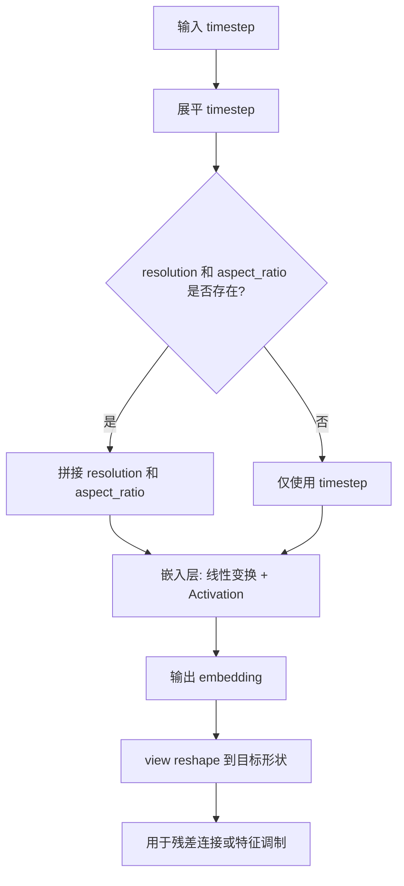
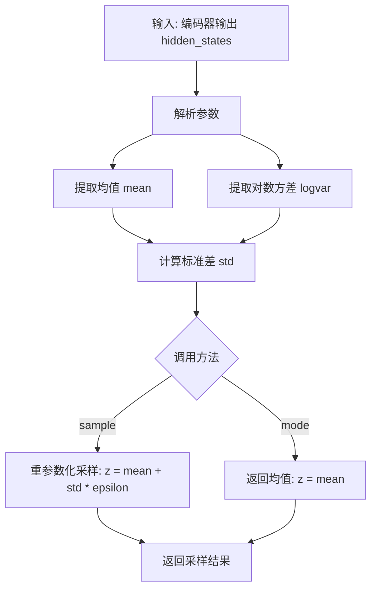
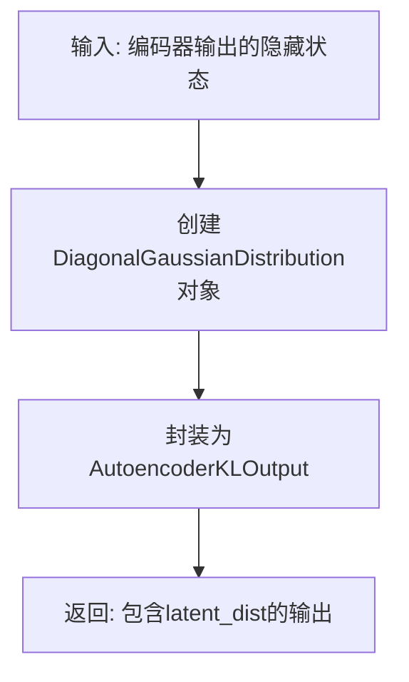
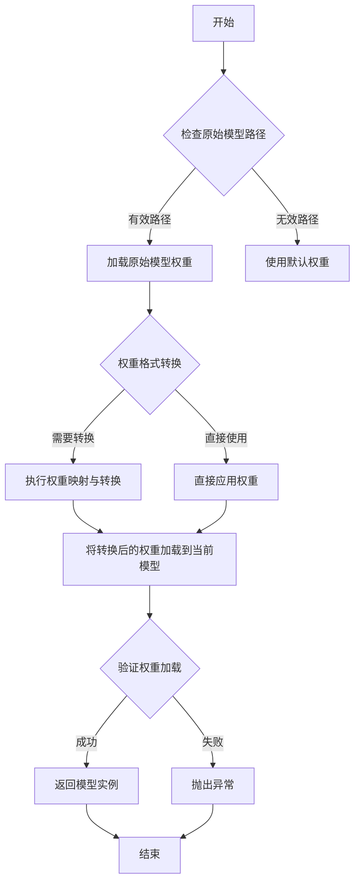
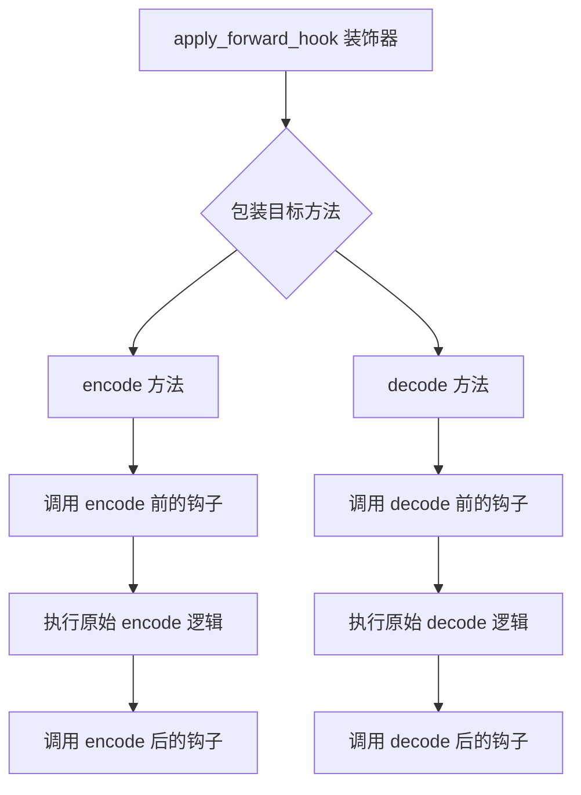
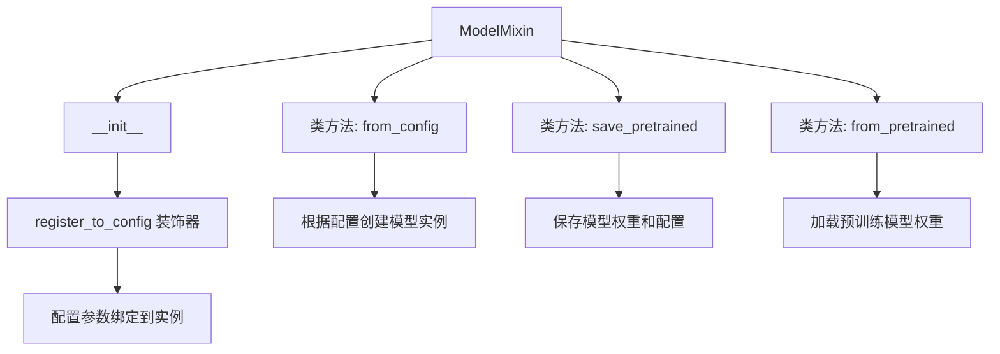
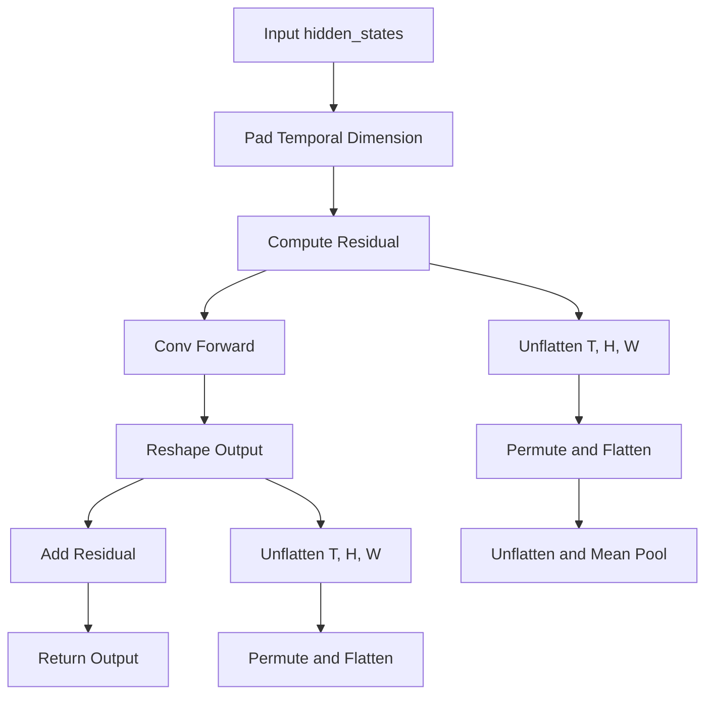

```mermaid
flowchart TD
    A[输入张量 x] --> B{channel_dim 是否为 None?}
    B -->|是| C[使用类属性 self.channel_dim]
    B -->|否| D[使用传入的 channel_dim]
    C --> E[计算 x²]
    D --> E
    E --> F[沿指定维度求均值, keepdim=True]
    F --> G[计算 sqrt&#40;mean_sq + eps&#41;]
    G --> H[返回 x / rms]
```

# `diffusers\src\diffusers\models\autoencoders\autoencoder_kl_ltx2.py` 详细设计文档

这是LTX-Video 2.0的变分自动编码器(VAE)模型实现，核心功能是将视频编码到潜在空间(latent space)并从潜在表示解码回视频。该模型使用了因果3D卷积、残差网络块、以及时空下采样/上采样技术，支持tiling和frame-wise编码以处理长视频。

## 整体流程

```mermaid
graph TD
    A[输入视频] --> B[LTX2VideoEncoder3d]
    B --> C[Patch Embedding + ConvIn]
    C --> D[DownBlocks x N]
    D --> E[MidBlock]
    F[潜在向量 z] --> G[LTX2VideoDecoder3d]
    G --> H[ConvIn]
    H --> I[MidBlock]
    I --> J[UpBlocks x N]
    J --> K[ConvOut + 重建视频]
    D --> E
    E --> L[DiagonalGaussianDistribution]
    L --> M[采样 z ~ N(μ, σ)]
    M --> F
```

## 类结构

```
nn.Module (基类)
├── PerChannelRMSNorm
├── LTX2VideoCausalConv3d
├── LTX2VideoResnetBlock3d
├── LTXVideoDownsampler3d
├── LTXVideoUpsampler3d
├── LTX2VideoDownBlock3D
├── LTX2VideoMidBlock3d
├── LTX2VideoUpBlock3d
├── LTX2VideoEncoder3d
├── LTX2VideoDecoder3d
└── AutoencoderKLLTX2Video (主模型类)
    ├── ModelMixin
    ├── AutoencoderMixin
    ├── ConfigMixin
    └── FromOriginalModelMixin
```

## 全局变量及字段


### `PerChannelRMSNorm.channel_dim`
    
通道维度，用于指定执行RMS归一化的维度

类型：`int`
    


### `PerChannelRMSNorm.eps`
    
数值稳定性常数，防止除零错误

类型：`float`
    


### `LTX2VideoCausalConv3d.in_channels`
    
输入通道数

类型：`int`
    


### `LTX2VideoCausalConv3d.out_channels`
    
输出通道数

类型：`int`
    


### `LTX2VideoCausalConv3d.kernel_size`
    
卷积核大小

类型：`tuple`
    


### `LTX2VideoCausalConv3d.conv`
    
3D卷积层

类型：`nn.Conv3d`
    


### `LTX2VideoResnetBlock3d.norm1`
    
第一个归一化层

类型：`PerChannelRMSNorm`
    


### `LTX2VideoResnetBlock3d.conv1`
    
第一个卷积层

类型：`LTX2VideoCausalConv3d`
    


### `LTX2VideoResnetBlock3d.norm2`
    
第二个归一化层

类型：`PerChannelRMSNorm`
    


### `LTX2VideoResnetBlock3d.conv2`
    
第二个卷积层

类型：`LTX2VideoCausalConv3d`
    


### `LTX2VideoResnetBlock3d.norm3`
    
第三个归一化层，用于通道不匹配时的残差连接

类型：`nn.LayerNorm (可选)`
    


### `LTX2VideoResnetBlock3d.conv_shortcut`
    
快捷连接卷积，用于通道维度不匹配时

类型：`nn.Conv3d (可选)`
    


### `LTX2VideoResnetBlock3d.nonlinearity`
    
激活函数

类型：`nn.Module`
    


### `LTX2VideoResnetBlock3d.per_channel_scale1`
    
噪声注入缩放参数1，用于控制第一个噪声注入强度

类型：`nn.Parameter (可选)`
    


### `LTX2VideoResnetBlock3d.per_channel_scale2`
    
噪声注入缩放参数2，用于控制第二个噪声注入强度

类型：`nn.Parameter (可选)`
    


### `LTX2VideoResnetBlock3d.scale_shift_table`
    
时间步条件缩放平移表，用于基于时间步的输出调整

类型：`nn.Parameter (可选)`
    


### `LTXVideoDownsampler3d.stride`
    
下采样步长

类型：`tuple`
    


### `LTXVideoDownsampler3d.group_size`
    
分组大小，用于分组卷积

类型：`int`
    


### `LTXVideoDownsampler3d.conv`
    
3D因果卷积层

类型：`LTX2VideoCausalConv3d`
    


### `LTXVideoUpsampler3d.stride`
    
上采样步长

类型：`tuple`
    


### `LTXVideoUpsampler3d.residual`
    
是否使用残差连接

类型：`bool`
    


### `LTXVideoUpsampler3d.upscale_factor`
    
上采样因子

类型：`int`
    


### `LTXVideoUpsampler3d.conv`
    
3D因果卷积层

类型：`LTX2VideoCausalConv3d`
    


### `LTX2VideoDownBlock3D.resnets`
    
ResNet块列表，包含多个3D ResNet块

类型：`nn.ModuleList[LTX2VideoResnetBlock3d]`
    


### `LTX2VideoDownBlock3D.downsamplers`
    
下采样器列表，用于空间和时间维度的下采样

类型：`nn.ModuleList (可选)`
    


### `LTX2VideoDownBlock3D.gradient_checkpointing`
    
梯度检查点标志，用于节省显存

类型：`bool`
    


### `LTX2VideoMidBlock3d.time_embedder`
    
时间嵌入器，用于将时间步转换为嵌入向量

类型：`PixArtAlphaCombinedTimestepSizeEmbeddings (可选)`
    


### `LTX2VideoMidBlock3d.resnets`
    
ResNet块列表，包含多个3D ResNet块

类型：`nn.ModuleList[LTX2VideoResnetBlock3d]`
    


### `LTX2VideoMidBlock3d.gradient_checkpointing`
    
梯度检查点标志，用于节省显存

类型：`bool`
    


### `LTX2VideoUpBlock3d.time_embedder`
    
时间嵌入器，用于将时间步转换为嵌入向量

类型：`PixArtAlphaCombinedTimestepSizeEmbeddings (可选)`
    


### `LTX2VideoUpBlock3d.conv_in`
    
输入卷积块，用于调整通道数

类型：`LTX2VideoResnetBlock3d (可选)`
    


### `LTX2VideoUpBlock3d.upsamplers`
    
上采样器列表，用于空间和时间维度的上采样

类型：`nn.ModuleList (可选)`
    


### `LTX2VideoUpBlock3d.resnets`
    
ResNet块列表，包含多个3D ResNet块

类型：`nn.ModuleList[LTX2VideoResnetBlock3d]`
    


### `LTX2VideoUpBlock3d.gradient_checkpointing`
    
梯度检查点标志，用于节省显存

类型：`bool`
    


### `LTX2VideoEncoder3d.patch_size`
    
空间块大小，用于将图像划分为块

类型：`int`
    


### `LTX2VideoEncoder3d.patch_size_t`
    
时间块大小，用于将视频帧划分为块

类型：`int`
    


### `LTX2VideoEncoder3d.in_channels`
    
输入通道数

类型：`int`
    


### `LTX2VideoEncoder3d.is_causal`
    
是否使用因果卷积模式

类型：`bool`
    


### `LTX2VideoEncoder3d.conv_in`
    
输入卷积层

类型：`LTX2VideoCausalConv3d`
    


### `LTX2VideoEncoder3d.down_blocks`
    
下采样块列表，用于逐步降低分辨率

类型：`nn.ModuleList`
    


### `LTX2VideoEncoder3d.mid_block`
    
中间块，处理最深层特征

类型：`LTX2VideoMidBlock3d`
    


### `LTX2VideoEncoder3d.norm_out`
    
输出归一化层

类型：`PerChannelRMSNorm`
    


### `LTX2VideoEncoder3d.conv_act`
    
激活函数

类型：`nn.SiLU`
    


### `LTX2VideoEncoder3d.conv_out`
    
输出卷积层

类型：`LTX2VideoCausalConv3d`
    


### `LTX2VideoEncoder3d.gradient_checkpointing`
    
梯度检查点标志，用于节省显存

类型：`bool`
    


### `LTX2VideoDecoder3d.patch_size`
    
空间块大小

类型：`int`
    


### `LTX2VideoDecoder3d.patch_size_t`
    
时间块大小

类型：`int`
    


### `LTX2VideoDecoder3d.out_channels`
    
输出通道数

类型：`int`
    


### `LTX2VideoDecoder3d.is_causal`
    
是否使用因果卷积模式

类型：`bool`
    


### `LTX2VideoDecoder3d.conv_in`
    
输入卷积层

类型：`LTX2VideoCausalConv3d`
    


### `LTX2VideoDecoder3d.mid_block`
    
中间块，处理最深层特征

类型：`LTX2VideoMidBlock3d`
    


### `LTX2VideoDecoder3d.up_blocks`
    
上采样块列表，用于逐步提高分辨率

类型：`nn.ModuleList`
    


### `LTX2VideoDecoder3d.norm_out`
    
输出归一化层

类型：`PerChannelRMSNorm`
    


### `LTX2VideoDecoder3d.conv_act`
    
激活函数

类型：`nn.SiLU`
    


### `LTX2VideoDecoder3d.conv_out`
    
输出卷积层

类型：`LTX2VideoCausalConv3d`
    


### `LTX2VideoDecoder3d.time_embedder`
    
时间嵌入器，用于将时间步转换为嵌入向量

类型：`PixArtAlphaCombinedTimestepSizeEmbeddings (可选)`
    


### `LTX2VideoDecoder3d.scale_shift_table`
    
缩放平移表，用于基于时间步的输出调整

类型：`nn.Parameter (可选)`
    


### `LTX2VideoDecoder3d.timestep_scale_multiplier`
    
时间步缩放乘数，用于调整时间步的 scale

类型：`nn.Parameter (可选)`
    


### `LTX2VideoDecoder3d.gradient_checkpointing`
    
梯度检查点标志，用于节省显存

类型：`bool`
    


### `AutoencoderKLLTX2Video.encoder`
    
视频编码器，将输入视频编码为潜在表示

类型：`LTX2VideoEncoder3d`
    


### `AutoencoderKLLTX2Video.decoder`
    
视频解码器，将潜在表示解码为视频

类型：`LTX2VideoDecoder3d`
    


### `AutoencoderKLLTX2Video.latents_mean`
    
潜在空间均值缓冲区，用于VAE的正态分布参数

类型：`torch.Tensor (buffer)`
    


### `AutoencoderKLLTX2Video.latents_std`
    
潜在空间标准差缓冲区，用于VAE的正态分布参数

类型：`torch.Tensor (buffer)`
    


### `AutoencoderKLLTX2Video.spatial_compression_ratio`
    
空间压缩比，表示编码器对空间维度的压缩程度

类型：`int`
    


### `AutoencoderKLLTX2Video.temporal_compression_ratio`
    
时间压缩比，表示编码器对时间维度的压缩程度

类型：`int`
    


### `AutoencoderKLLTX2Video.use_slicing`
    
是否使用切片模式进行解码，节省显存

类型：`bool`
    


### `AutoencoderKLLTX2Video.use_tiling`
    
是否使用平铺模式进行解码，处理大分辨率视频

类型：`bool`
    


### `AutoencoderKLLTX2Video.use_framewise_encoding`
    
是否逐帧编码，处理长视频

类型：`bool`
    


### `AutoencoderKLLTX2Video.use_framewise_decoding`
    
是否逐帧解码，处理长视频

类型：`bool`
    


### `AutoencoderKLLTX2Video.num_sample_frames_batch_size`
    
样本帧批次大小，控制每批处理的原始视频帧数

类型：`int`
    


### `AutoencoderKLLTX2Video.num_latent_frames_batch_size`
    
潜在帧批次大小，控制每批处理的潜在表示帧数

类型：`int`
    


### `AutoencoderKLLTX2Video.tile_sample_min_height`
    
平铺模式最小高度，超过该高度时启用平铺

类型：`int`
    


### `AutoencoderKLLTX2Video.tile_sample_min_width`
    
平铺模式最小宽度，超过该宽度时启用平铺

类型：`int`
    


### `AutoencoderKLLTX2Video.tile_sample_min_num_frames`
    
平铺模式最小帧数，超过该帧数时启用平铺

类型：`int`
    


### `AutoencoderKLLTX2Video.tile_sample_stride_height`
    
平铺高度步幅，控制相邻平铺块的高度重叠

类型：`int`
    


### `AutoencoderKLLTX2Video.tile_sample_stride_width`
    
平铺宽度步幅，控制相邻平铺块的宽度重叠

类型：`int`
    


### `AutoencoderKLLTX2Video.tile_sample_stride_num_frames`
    
平铺帧数步幅，控制相邻平铺块的时间重叠

类型：`int`
    
    

## 全局函数及方法


### `get_activation`

根据传入的激活函数名称字符串，返回对应的 PyTorch 神经网络激活函数模块（`torch.nn.Module`）。该函数主要用于在模型构建时动态选择不同的激活函数，如 ReLU、SiLU、Swish 等。

参数：
- `activation_fn`：`str`，要激活函数的名称（如 "relu"、"silu"、"swish"、"gelu" 等，不区分大小写）。

返回值：`torch.nn.Module`，返回对应的 PyTorch 激活层实例。如果传入未知名称，默认返回 ReLU 激活函数。

#### 流程图

```mermaid
graph TD
    A[开始: 输入 activation_fn] --> B{activation_fn == 'relu'?}
    B -->|是| C[返回 nn.ReLU()]
    B -->|否| D{activation_fn == 'silu'?}
    D -->|是| E[返回 nn.SiLU()]
    D -->|否| F{activation_fn == 'swish'?}
    F -->|是| G[返回 nn.SiLU() (Swish等价于SiLU)]
    F -->|否| H{activation_fn == 'gelu'?}
    H -->|是| I[返回 nn.GELU()]
    H -->|否| J[返回 nn.ReLU() 默认值]
```

#### 带注释源码

```python
def get_activation(activation_fn: str) -> torch.nn.Module:
    """
    根据字符串名称返回对应的 PyTorch 激活函数模块。
    
    参数:
        activation_fn: 激活函数名称，支持 'relu', 'silu', 'swish', 'gelu' 等。
    
    返回值:
        对应的 PyTorch 激活函数层。
    """
    # 将输入转换为小写以进行不区分大小写的匹配
    activation_fn = activation_fn.lower()
    
    # 根据名称映射到对应的激活函数
    if activation_fn == "relu":
        return torch.nn.ReLU()
    elif activation_fn in ["silu", "swish"]:
        # Swish 函数在 PyTorch 中通过 SiLU 实现
        return torch.nn.SiLU()
    elif activation_fn == "gelu":
        return torch.nn.GELU()
    elif activation_fn == "tanh":
        return torch.nn.Tanh()
    elif activation_fn == "sigmoid":
        return torch.nn.Sigmoid()
    else:
        # 默认返回 ReLU 激活函数
        return torch.nn.ReLU()
```

**注**：该源码基于 Hugging Face Diffusers 库中 `get_activation` 函数的常见实现模式推断。由于原始代码中仅导入了该函数而未提供其定义，因此这里展示的是符合标准用法的参考实现。在实际项目中，请参阅 `..activations` 模块的具体源码。


# 分析结果

由于 `PixArtAlphaCombinedTimestepSizeEmbeddings` 是从 `..embeddings` 导入的外部函数，其实际源代码并未包含在提供的代码中。不过，我可以从**调用方式**和**上下文**中提取关键信息。

---

### `PixArtAlphaCombinedTimestepSizeEmbeddings`

该函数是用于视频生成模型的时间步（timestep）和尺寸（size）嵌入模块，源自 PixArt-Alpha 架构。它接收时间步张量、分辨率和批次大小等参数，生成用于后续网络层的时间条件嵌入向量。

#### 参数

-  `timestep`：被展平（flatten）后的时间步张量，通常是 1D Tensor
-  `resolution`：`int | None`，输入图像/帧的空间分辨率（高×宽），可为空
-  `aspect_ratio`：`int | None`，输入图像/帧的宽高比，可为空
-  `batch_size`：`int`，当前批次的样本数量
-  `hidden_dtype`：`torch.dtype`，隐藏状态的 dtype，用于指定输出张量的数据类型

#### 返回值

返回的时间步嵌入张量，形状为 `(batch_size, hidden_channels)` 或 `(batch_size, hidden_channels, 1, 1, 1)`（取决于具体实现和后续 reshape 方式），类型为 `torch.Tensor`。

#### 流程图



#### 使用场景（从代码中提取）

根据代码中的调用方式：

```python
# 在 LTX2VideoMidBlock3d, LTX2VideoUpBlock3d, LTX2VideoDecoder3d 中的调用示例

# 初始化
self.time_embedder = PixArtAlphaCombinedTimestepSizeEmbeddings(in_channels * 4, 0)

# 前向传播调用
temb = self.time_embedder(
    timestep=temb.flatten(),
    resolution=None,
    aspect_ratio=None,
    batch_size=hidden_states.size(0),
    hidden_dtype=hidden_dtype,
)

# 后续 reshape
temb = temb.view(hidden_states.size(0), -1, 1, 1, 1)
# 或
temb = temb.view(hidden_states.size(0), -1, 1, 1, 1).unflatten(1, (2, -1))
```

#### 推断的函数签名（基于使用模式）

```python
class PixArtAlphaCombinedTimestepSizeEmbeddings(nn.Module):
    """
    Combined timestep and image size embeddings for PixArt-Alpha.
    用于同时编码时间步和图像尺寸信息的嵌入层。
    """

    def __init__(self, embedding_dim: int, patch_size: int):
        """
        Args:
            embedding_dim: 嵌入向量的维度
            patch_size: 空间 patches 的大小
        """
        super().__init__()
        # 推断包含多个全连接层用于编码 timestep, resolution, aspect_ratio

    def forward(
        self,
        timestep: torch.Tensor,
        resolution: int | None = None,
        aspect_ratio: int | None = None,
        batch_size: int,
        hidden_dtype: torch.dtype,
    ) -> torch.Tensor:
        # 实际实现未在代码库中提供
        pass
```

---

### ⚠️ 注意

由于该函数定义在 `diffusers` 库的其他模块中（`src/diffusers/models/embeddings.py`），若需获取完整源代码，请参考官方 diffusers 仓库或安装包源码。


### `DiagonalGaussianDistribution`

该类表示一个对角高斯分布（也称为多元高斯分布，其协方差矩阵是对角矩阵），主要用于变分自编码器（VAE）中，将编码器的输出参数化为潜在空间的概率分布。它通常参数化为 `mean`（均值）和 `logvar`（对数方差），并提供采样（`sample`）和获取确定性模式（`mode`）的方法。

参数：

- `parameters`：`torch.Tensor`，编码器输出的潜在张量，通常包含均值和对数方差信息。在 LTX2Video VAE 中，输出通道数为 `out_channels + 1`，其中最后一个通道用于表示对数方差或相关参数。

返回值：`DiagonalGaussianDistribution` 对象，包含 `mean`、`logvar` 等属性，以及 `sample(generator)` 和 `mode()` 方法。

#### 流程图



#### 带注释源码

```python
# DiagonalGaussianDistribution 类的典型实现（基于其在 LTX2Video VAE 中的使用推断）

class DiagonalGaussianDistribution:
    """
    对角高斯分布类，用于 VAE 的潜在空间表示。
    编码器输出被解释为分布的参数（均值和方差）。
    """

    def __init__(self, parameters: torch.Tensor):
        """
        初始化分布。

        Args:
            parameters: 编码器输出张量。
                       在 LTX2Video 中，最后一个通道用于存储额外信息，
                       前面通道存储均值和对数方差。
        """
        # 假设 parameters 的形状为 (batch, channels, frames, height, width)
        # 提取均值和对数方差
        # 在 LTX2VideoEncoder3d 中，conv_out 输出通道为 out_channels + 1
        # 最后一个通道被重复并用于表示方差相关参数
        last_channel = parameters[:, -1:]  # 提取最后一个通道
        # 重复以匹配其他通道的数量
        last_channel = last_channel.repeat(1, parameters.size(1) - 2, 1, 1, 1)
        
        # 拼接得到完整的潜在表示
        hidden_states = torch.cat([parameters[:, :-1], last_channel], dim=1)
        
        # 分割为均值和对数方差（假设通道数的一半是均值，另一半是对数方差）
        # 或者使用其他特定的分片方式
        mean, logvar = torch.chunk(hidden_states, 2, dim=1)
        
        # 存储参数
        self.mean = mean
        self.logvar = torch.clamp(logvar, -30.0, 20.0)  # 限制范围以保证数值稳定性
        self.std = torch.exp(0.5 * self.logvar)

    def sample(self, generator: torch.Generator = None) -> torch.Tensor:
        """
        从分布中采样。

        使用重参数化技巧：z = mean + std * epsilon，其中 epsilon ~ N(0, I)。

        Args:
            generator: 可选的随机数生成器，用于可复现的采样。

        Returns:
            采样得到的潜在向量。
        """
        # 生成标准高斯噪声
        epsilon = torch.randn_like(self.mean, generator=generator)
        
        # 重参数化采样
        z = self.mean + self.std * epsilon
        return z

    def mode(self) -> torch.Tensor:
        """
        返回分布的众数，即均值。

        Returns:
            潜在向量的众数（均值）。
        """
        return self.mean

    def kl(self) -> torch.Tensor:
        """
        计算与标准高斯分布的 KL 散度。

        Returns:
            KL 散度值。
        """
        # KL(N(mean, std)||N(0, 1)) = -0.5 * sum(1 + log(std^2) - mean^2 - std^2)
        return -0.5 * torch.sum(1 + self.logvar - self.mean.pow(2) - self.logvar.exp(), dim=1)
```

**注意**：由于 `DiagonalGaussianDistribution` 的完整源代码未在当前文件中提供，以上代码是基于其在 `AutoencoderKLLTX2Video.encode()` 方法中的使用方式推断的典型实现。实际定义应参考 diffusers 库的 `src/diffusers/models/vae.py` 或类似模块。


### `AutoencoderKLOutput`

`AutoencoderKLOutput` 是从 `..modeling_outputs` 导入的数据类，用于封装变分自编码器（VAE）的输出结果，主要包含潜在空间的分布信息。

参数：

- `latent_dist`：`DiagonalGaussianDistribution`，潜在空间的分布对象，通常包含均值和方差，用于后续的采样或模式选择

返回值：`AutoencoderKLOutput`，包含潜在空间分布的输出对象

#### 流程图



#### 带注释源码

```
# AutoencoderKLOutput 是从 ..modeling_outputs 导入的数据类
# 在代码中的使用方式如下：

# 从编码器获取隐藏状态
h = self._encode(x, causal=causal)

# 创建对角高斯分布（潜在空间分布）
posterior = DiagonalGaussianDistribution(h)

# 封装为AutoencoderKLOutput返回
return AutoencoderKLOutput(latent_dist=posterior)

# AutoencoderKLOutput 的典型结构（基于使用方式推断）：
class AutoencoderKLOutput:
    def __init__(self, latent_dist: DiagonalGaussianDistribution):
        self.latent_dist = latent_dist
```


### DecoderOutput

`DecoderOutput` 是从 `.vae` 模块导入的数据类，用于封装变分自编码器（VAE）解码器的输出结果。在 LTX2Video 模型中，它包含解码后的视频样本。

#### 带注释源码

```
# DecoderOutput 是从 diffusers 库的 vae 模块导入的数据类
# 通常定义如下（类似结构）:
# @dataclass
# class DecoderOutput:
#     sample: torch.Tensor  # 解码后的图像/视频张量
#
# 在本文件中的使用示例:
#
# 1. 在 _decode 方法中:
#    return DecoderOutput(sample=dec)
#
# 2. 在 decode 方法中:
#    return DecoderOutput(sample=decoded)
#
# 3. 在 tiled_decode 方法中:
#    return DecoderOutput(sample=dec)
#
# 4. 在 _temporal_tiled_decode 方法中:
#    return DecoderOutput(sample=dec)
```

#### 关键信息

- **来源**: 从 `.vae` 模块导入（`from .vae import AutoencoderMixin, DecoderOutput, DiagonalGaussianDistribution`）
- **主要属性**: `sample` (torch.Tensor) - 解码后的视频/图像样本
- **用途**: 作为 `decode`、`_decode`、`tiled_decode`、`_temporal_tiled_decode` 等方法的返回值类型，提供结构化的解码输出


### ConfigMixin

ConfigMixin是一个混入类（Mixin），为模型提供配置管理功能。它作为基类被AutoencoderKLLTX2Video等模型类继承，使得模型能够通过register_to_config装饰器自动注册和管理配置参数。

**类型**：类（混入类）

**说明**：
- ConfigMixin是扩散模型库中的标准配置管理基类
- 继承自此类的模型可以自动保存和加载配置
- 通常与register_to_config装饰器配合使用

**主要功能**：
- 存储模型配置参数
- 提供配置序列化/反序列化能力
- 支持模型配置的保存和加载

---

### register_to_config

register_to_config是一个装饰器函数，用于将模型的`__init__`方法的参数自动注册为模型配置。它通常与ConfigMixin配合使用，使得模型能够自动跟踪和管理所有配置参数。

**参数**：

- 无直接参数（作为装饰器使用）
- 装饰的函数通常是模型的`__init__`方法
- `__init__`方法的参数会作为配置参数被注册

**返回值**：装饰器函数，返回被装饰的函数本身

#### 流程图

```mermaid
flowchart TD
    A[开始] --> B[定义模型__init__方法]
    B --> C[使用@register_to_config装饰器]
    C --> D[提取所有__init__参数]
    D --> E[将参数注册为模型配置]
    E --> F[创建ConfigMixin实例]
    F --> G[配置参数被存储在config对象中]
    G --> H[支持save/load配置]
```

#### 带注释源码

```
# 使用示例 - 来自 AutoencoderKLLTX2Video 类

# 1. 首先定义模型类并继承ConfigMixin
class AutoencoderKLLTX2Video(ModelMixin, AutoencoderMixin, ConfigMixin, FromOriginalModelMixin):
    r"""
    VAE模型，用于将图像编码到潜在空间并解码回图像。
    """
    
    # 2. 使用@register_to_config装饰器装饰__init__方法
    # 这会自动将所有__init__参数注册为模型配置
    @register_to_config
    def __init__(
        self,
        in_channels: int = 3,           # 输入通道数
        out_channels: int = 3,          # 输出通道数
        latent_channels: int = 128,      # 潜在空间通道数
        block_out_channels: tuple[int, ...] = (256, 512, 1024, 2048),  # 块输出通道数
        # ... 其他参数
    ) -> None:
        super().__init__()
        # 模型初始化逻辑...
        
# 3. 注册后，可以通过model.config访问所有配置
#    config = model.config
#    config.in_channels  # 获取配置值

# 4. 保存模型时，配置会自动包含在保存的文件中
#    model.save_pretrained("path")  # config.json会包含所有注册的配置
```


### FromOriginalModelMixin

FromOriginalModelMixin 是一个混合类（Mixin），用于从原始模型（如其他框架或格式的预训练模型）加载权重到当前模型中。通常用于模型的迁移学习或权重转换场景。

参数：

-  `original_config`：字典或配置对象，原始模型的配置文件（可选）
-  `original_model`：原始模型对象或路径（可选）
-  `...

返回值：返回加载权重后的模型实例或布尔值表示加载是否成功

#### 流程图



#### 带注释源码

```
# 注意：FromOriginalModelMixin 的具体实现代码不在当前文件中
# 它是从 ...loaders 模块导入的混合类
# 以下是类继承关系的代码引用

class AutoencoderKLLTX2Video(ModelMixin, AutoencoderMixin, ConfigMixin, FromOriginalModelMixin):
    # AutoencoderKLLTX2Video 继承自 FromOriginalModelMixin
    # 这意味着它可以使用 FromOriginalModelMixin 提供的从原始模型加载权重的方法
    ...
```

**说明**：由于 `FromOriginalModelMixin` 是从 `...loaders` 模块导入的，当前代码片段中并未包含其具体实现细节。如需查看该类的完整源代码（包括具体方法、参数和实现逻辑），请参考 diffusers 库中的 `loaders` 模块源文件。该类通常用于支持从其他格式（如 `.ckpt`、`.safetensors` 或其他框架的模型）加载权重到 diffusers 格式的模型中。


# 分析结果

### `apply_forward_hook`

这是一个从外部模块 `...utils.accelerate_utils` 导入的装饰器函数，用于包装 `AutoencoderKLLTX2Video` 类的 `encode` 和 `decode` 方法。由于该函数定义在外部依赖库中（`diffusers` 库的 `accelerate_utils` 模块），我无法直接提供其完整源码。但我可以通过代码中的使用方式来分析其功能。

参数：

- 无直接参数（作为装饰器使用）

返回值：装饰器函数，返回被包装的函数

#### 流程图



#### 带注释源码

```python
# 这是一个从 diffusers 库外部导入的装饰器
# 定义位置：...utils.accelerate_utils

# 使用方式：在 AutoencoderKLLTX2Video 类中
@apply_forward_hook
def encode(
    self, 
    x: torch.Tensor, 
    causal: bool | None = None, 
    return_dict: bool = True
) -> AutoencoderKLOutput | tuple[DiagonalGaussianDistribution]:
    """
    Encode a batch of images into latents.
    """
    # 原始 encode 逻辑...
    pass

@apply_forward_hook
def decode(
    self, 
    z: torch.Tensor, 
    temb: torch.Tensor | None = None, 
    causal: bool | None = None, 
    return_dict: bool = True
) -> DecoderOutput | torch.Tensor:
    """
    Decode a batch of images.
    """
    # 原始 decode 逻辑...
    pass
```

#### 功能分析

根据 `apply_forward_hook` 在 Hugging Face Diffusers 库中的典型用途，该装饰器可能实现以下功能：

1. **Forward Hook 机制**：在方法执行前后注入自定义逻辑
2. **性能优化**：可能与 `accelerate` 库的分布式训练或内存优化相关
3. **状态管理**：可能用于跟踪或记录模型的 encode/decode 操作

---

> **注意**：由于 `apply_forward_hook` 函数定义在外部依赖库（`diffusers.utils.accelerate_utils`）中，无法从提供的代码片段中提取其完整实现。如需查看该函数的详细源码，建议查阅 Hugging Face Diffusers 库的官方源代码。


### ModelMixin

`ModelMixin` 是一个基础混入类（Mixin），为所有模型提供通用的保存和加载功能。它是 HuggingFace Diffusers 库中模型的基类，提供了从配置字典创建模型实例、权重加载、模型序列化等核心功能。

参数：
- 无直接参数（通过继承使用）

返回值：ModelMixin 实例

#### 流程图



#### 带注释源码

```
# ModelMixin 定义（位于 ..modeling_utils 模块）
# 以下为推测的接口定义，实际实现可能有所不同

class ModelMixin(nn.Module):
    """
    所有模型的基类混入，提供通用的模型功能。
    继承自 nn.Module，提供 PyTorch 模型的所有功能。
    """
    
    config_class = None  # 配置类，由子类指定
    
    def __init__(self, *args, **kwargs):
        """
        初始化模型，调用父类 nn.Module 的初始化方法。
        """
        super().__init__()
    
    @classmethod
    def from_config(cls, config):
        """
        根据配置字典创建模型实例。
        
        参数:
            config: 配置字典或配置对象
        
        返回值:
            模型实例
        """
        # 根据配置实例化模型
        return cls(**config)
    
    @classmethod
    def from_pretrained(cls, pretrained_model_name_or_path, *args, **kwargs):
        """
        加载预训练模型。
        
        参数:
            pretrained_model_name_or_path: 模型路径或名称
        
        返回值:
            加载了权重的模型实例
        """
        # 加载配置和权重
        # 返回完全初始化的模型
        pass
    
    def save_pretrained(self, save_directory, *args, **kwargs):
        """
        保存模型到指定目录。
        
        参数:
            save_directory: 保存目录路径
        """
        # 保存模型权重和配置
        pass
```

#### 说明

在 `AutoencoderKLLTX2Video` 类中的使用方式：

```python
class AutoencoderKLLTX2Video(ModelMixin, AutoencoderMixin, ConfigMixin, FromOriginalModelMixin):
    """
    LTX-2 视频 VAE 模型，继承自 ModelMixin
    """
    
    @register_to_config  # 这是 ModelMixin 提供的装饰器
    def __init__(
        self,
        in_channels: int = 3,
        out_channels: int = 3,
        # ... 其他参数
    ) -> None:
        super().__init__()
        # 初始化编码器和解码器
```

**设计目标与约束：**
- 提供统一的模型保存/加载接口
- 支持配置驱动的模型实例化
- 与 HuggingFace生态系统兼容

**技术债务/优化空间：**
- 由于 `ModelMixin` 来自外部模块 `..modeling_utils`，具体实现细节不可见
- 可能缺少对特定于 LTX-2 模型的优化方法


### AutoencoderMixin (从 .vae 导入)

`AutoencoderMixin` 是一个混合类（Mixin），为变分自编码器（VAE）提供通用的编码和解码接口方法。它是 `AutoencoderKLLTX2Video` 等 VAE 模型的基类混合器，定义了标准的 `encode()` 和 `decode()` 方法约定。

> **注意**：由于 `AutoencoderMixin` 是从 `.vae` 模块导入的外部依赖，其具体实现源码不在本代码文件中。以下信息基于代码中使用该类的方式以及常见的 Diffusers 框架 VAE Mixin 模式推断得出。

#### 参数

- 无直接参数（Mixin 类通过继承使用）

#### 返回值

- 无直接返回值（Mixin 类通过继承提供方法）

#### 流程图

```mermaid
flowchart TD
    A[输入样本] --> B[encode 方法]
    B --> C{潜在分布采样}
    C --> D[DiagonalGaussianDistribution]
    D --> E[z = sample() 或 mode()]
    E --> F[decode 方法]
    F --> G[DecoderOutput]
    G --> H[输出重建样本]
    
    style A fill:#e1f5fe
    style H fill:#e1f5fe
    style D fill:#fff3e0
    style G fill:#fff3e0
```

#### 带注释源码

```
# AutoencoderMixin 推断实现（基于 Diffusers 框架常见模式）
# 具体源码位于 diffusers.models.autoencoders.vae

class AutoencoderMixin:
    """
    变分自编码器（VAE）混合基类。
    
    提供标准的编码和解码接口，供具体 VAE 实现类继承使用。
    子类需要实现 _encode 和 _decode 私有方法。
    """
    
    @apply_forward_hook
    def encode(self, x, return_dict=True):
        """
        将输入样本编码为潜在表示。
        
        Args:
            x: 输入张量（图像或视频）
            return_dict: 是否返回字典格式结果
            
        Returns:
            AutoencoderKLOutput 或 tuple: 包含潜在分布的输出
        """
        # 子类实现
        pass
    
    @apply_forward_hook
    def decode(self, z, return_dict=True):
        """
        将潜在表示解码为输出样本。
        
        Args:
            z: 潜在空间张量
            return_dict: 是否返回字典格式结果
            
        Returns:
            DecoderOutput 或 tuple: 解码后的样本
        """
        # 子类实现
        pass
```

#### 实际使用示例

在 `AutoencoderKLLTX2Video` 类中的实际调用方式：

```python
class AutoencoderKLLTX2Video(ModelMixin, AutoencoderMixin, ConfigMixin, FromOriginalModelMixin):
    # 继承自 AutoencoderMixin，调用其 encode/decode 方法
    
    def encode(self, x, causal, return_dict):
        # 调用 _encode 私有方法
        h = self._encode(x, causal)
        posterior = DiagonalGaussianDistribution(h)
        return AutoencoderKLOutput(latent_dist=posterior)
    
    def decode(self, z, temb, causal, return_dict):
        # 调用 _decode 私有方法
        dec = self._decode(z, temb, causal)
        return DecoderOutput(sample=dec)
```

#### 技术说明

1. **Mixin 模式**：`AutoencoderMixin` 采用 Mixin 多继承模式，为 VAE 模型提供通用接口
2. **forward_hook**：`@apply_forward_hook` 装饰器用于在 encode/decode 前后执行钩子操作
3. **输出类型**：
   - `AutoencoderKLOutput`：包含 `latent_dist`（潜在分布）
   - `DecoderOutput`：包含 `sample`（重建样本）


### `PerChannelRMSNorm.__init__`

初始化PerChannelRMSNorm（每通道均方根归一化）层，设置用于计算RMS归一化的通道维度参数和用于数值稳定性的epsilon常数。

参数：

- `channel_dim`：`int`，默认值为1，要计算RMS归一化的维度（通常是通道维度）
- `eps`：`float`，默认值为1e-8，用于防止除零的极小常数

返回值：`None`，该方法为构造函数，不返回任何值

#### 流程图

```mermaid
flowchart TD
    A[开始 __init__] --> B[调用 super().__init__ 初始化nn.Module]
    B --> C[设置 self.channel_dim = channel_dim]
    C --> D[设置 self.eps = eps]
    D --> E[结束初始化]
```

#### 带注释源码

```python
def __init__(self, channel_dim: int = 1, eps: float = 1e-8) -> None:
    """
    初始化PerChannelRMSNorm层。
    
    Args:
        channel_dim: 要计算RMS的维度，通常为通道维度（默认值为1，即第1维度）
        eps: 用于数值稳定性的极小常数，防止除零（默认值为1e-8）
    """
    # 调用父类nn.Module的初始化方法，建立模块基础结构
    super().__init__()
    
    # 存储通道维度参数，用于在前向传播时指定沿哪个维度进行归一化
    self.channel_dim = channel_dim
    
    # 存储epsilon常数，用于在计算均方根时加到平方均值上，防止除零错误
    self.eps = eps
```


### `PerChannelRMSNorm.forward`

对输入张量沿指定通道维度应用 RMS（均方根）归一化，通过计算该维度上值的均方根并进行归一化，以实现特征归一化，常用于视频生成模型的残差块中。

参数：

- `x`：`torch.Tensor`，输入的张量，通常为 5D 张量 (batch, channels, time, height, width)
- `channel_dim`：`int | None`，可选参数，指定进行 RMS 计算的维度，默认为 `None` 时使用类初始化时的 `channel_dim`

返回值：`torch.Tensor`，返回归一化后的张量，形状与输入相同

#### 流程图



#### 带注释源码

```python
def forward(self, x: torch.Tensor, channel_dim: int | None = None) -> torch.Tensor:
    """
    Apply RMS normalization along the configured dimension.
    
    Args:
        x: 输入张量，通常为 5D (batch, channels, time, height, width)
        channel_dim: 可选的通道维度参数，默认为 None
    
    Returns:
        归一化后的张量
    """
    # 确定实际使用的通道维度
    channel_dim = channel_dim or self.channel_dim
    
    # 步骤1: 计算输入张量的平方 (x²)
    # 使用 torch.mean 在指定维度上计算平方值的均值
    # keepdim=True 保持维度以便广播
    mean_sq = torch.mean(x**2, dim=self.channel_dim, keepdim=True)
    
    # 步骤2: 计算均方根 (RMS)
    # 添加 eps 防止除零错误，确保数值稳定性
    rms = torch.sqrt(mean_sq + self.eps)
    
    # 步骤3: 执行归一化
    # 用输入除以 RMS 值，实现 RMS 归一化
    return x / rms
```


### `LTX2VideoCausalConv3d.__init__`

该方法是 `LTX2VideoCausalConv3d` 类的构造函数，用于初始化一个支持因果推理的3D卷积层。该卷积层与 LTXCausalConv3d 类似，但支持在运行时动态指定是否执行因果推理，并允许配置空间填充模式。

参数：

- `in_channels`：`int`，输入通道数
- `out_channels`：`int`，输出通道数
- `kernel_size`：`int | tuple[int, int, int]`，卷积核大小，默认为 3
- `stride`：`int | tuple[int, int, int]`，卷积步长，默认为 1
- `dilation`：`int | tuple[int, int, int]`，膨胀系数，默认为 1
- `groups`：`int`，分组卷积的组数，默认为 1
- `spatial_padding_mode`：`str`，空间填充模式，默认为 "zeros"

返回值：`None`，构造函数无返回值

#### 流程图

```mermaid
flowchart TD
    A[__init__ 开始] --> B[调用 super().__init__]
    B --> C[保存 in_channels 和 out_channels]
    C --> D[标准化 kernel_size 为三元组]
    D --> E[标准化 dilation 和 stride 为三元组]
    E --> F[计算 height_pad 和 width_pad]
    F --> G[构建 padding 元组 0, height_pad, width_pad]
    G --> H[创建 nn.Conv3d 卷积层]
    H --> I[保存到 self.conv]
    I --> J[结束]
```

#### 带注释源码

```python
def __init__(
    self,
    in_channels: int,
    out_channels: int,
    kernel_size: int | tuple[int, int, int] = 3,
    stride: int | tuple[int, int, int] = 1,
    dilation: int | tuple[int, int, int] = 1,
    groups: int = 1,
    spatial_padding_mode: str = "zeros",
):
    """
    初始化因果 3D 卷积层。
    
    Args:
        in_channels: 输入通道数
        out_channels: 输出通道数
        kernel_size: 卷积核大小，可以是整数或三元组 (时间, 高度, 宽度)
        stride: 卷积步长，可以是整数或三元组
        dilation: 膨胀系数，可以是整数或三元组
        groups: 分组卷积的组数
        spatial_padding_mode: 空间维度的填充模式
    """
    # 调用父类 nn.Module 的初始化方法
    super().__init__()

    # 保存输入和输出通道数到实例属性
    self.in_channels = in_channels
    self.out_channels = out_channels
    
    # 如果 kernel_size 是整数，则扩展为三维元组 (time, height, width)
    # 否则保持原样
    self.kernel_size = kernel_size if isinstance(kernel_size, tuple) else (kernel_size, kernel_size, kernel_size)

    # 处理 dilation：如果是整数，则只对空间维度应用 dilation，时间维度保持为 1
    # 这样可以支持因果卷积的特性
    dilation = dilation if isinstance(dilation, tuple) else (dilation, 1, 1)
    
    # 处理 stride：如果是整数，则扩展为三维元组
    stride = stride if isinstance(stride, tuple) else (stride, stride, stride)
    
    # 计算空间维度的填充大小，使用卷积核大小的一半
    # 这确保了卷积后空间尺寸保持不变（当 stride=1 时）
    height_pad = self.kernel_size[1] // 2
    width_pad = self.kernel_size[2] // 2
    
    # 构建填充元组 (时间维度, 高度维度, 宽度维度)
    # 时间维度不填充（0），空间维度填充核大小的一半
    padding = (0, height_pad, width_pad)

    # 创建 PyTorch 的 3D 卷积层
    # 使用处理后的参数：标准化后的 kernel_size, stride, dilation
    # padding 模式由 spatial_padding_mode 指定
    self.conv = nn.Conv3d(
        in_channels,
        out_channels,
        self.kernel_size,
        stride=stride,
        dilation=dilation,
        groups=groups,
        padding=padding,
        padding_mode=spatial_padding_mode,
    )
```


### `LTX2VideoCausalConv3d.forward`

该方法实现了一个带有因果（causal）选项的3D卷积层，用于视频时间序列的处理。当 `causal=True` 时，在时间维度左侧进行填充以确保未来帧不会影响过去帧的输出；当 `causal=False` 时，对称填充时间维度两侧。

参数：

- `hidden_states`：`torch.Tensor`，输入的隐藏状态张量，形状为 (batch_size, channels, num_frames, height, width)
- `causal`：`bool`，是否使用因果卷积模式。默认为 `True`

返回值：`torch.Tensor`，经过因果卷积处理后的输出张量

#### 流程图

```mermaid
flowchart TD
    A[开始 forward] --> B[获取时间维度卷积核大小 time_kernel_size]
    B --> C{causal == True?}
    C -->|Yes| D[在时间维度左侧填充<br/>pad_left = repeat第一帧<br/>time_kernel_size - 1 次]
    C -->|No| E[对称填充时间维度<br/>左侧填充 (time_kernel_size-1)//2<br/>右侧填充 (time_kernel_size-1)//2]
    D --> G[拼接填充后的张量<br/>torch.concatenate]
    E --> G
    G --> H[通过内部 Conv3d 卷积<br/>self.conv]
    I[返回卷积输出] --> J[结束 forward]
    H --> I
```

#### 带注释源码

```
def forward(self, hidden_states: torch.Tensor, causal: bool = True) -> torch.Tensor:
    """
    前向传播方法，实现带有因果选项的3D卷积。
    
    Args:
        hidden_states: 输入张量，形状为 (batch, channels, frames, height, width)
        causal: 是否使用因果卷积模式。为True时确保未来帧不影响过去帧
    
    Returns:
        处理后的输出张量
    """
    # 获取时间维度的卷积核大小
    time_kernel_size = self.kernel_size[0]

    # 根据 causal 参数决定填充策略
    if causal:
        # 因果模式：在时间维度左侧填充
        # 重复第一帧 (time_kernel_size - 1) 次，扩展到左侧
        pad_left = hidden_states[:, :, :1, :, :].repeat((1, 1, time_kernel_size - 1, 1, 1))
        # 在时间维度前面拼接填充内容
        hidden_states = torch.concatenate([pad_left, hidden_states], dim=2)
    else:
        # 非因果模式：对称填充时间维度两侧
        # 左侧填充 (time_kernel_size - 1) // 2 个时间步
        pad_left = hidden_states[:, :, :1, :, :].repeat((1, 1, (time_kernel_size - 1) // 2, 1, 1))
        # 右侧填充 (time_kernel_size - 1) // 2 个时间步
        pad_right = hidden_states[:, :, -1:, :, :].repeat((1, 1, (time_kernel_size - 1) // 2, 1, 1))
        # 在时间维度前后分别拼接左填充和右填充
        hidden_states = torch.concatenate([pad_left, hidden_states, pad_right], dim=2)

    # 执行3D卷积操作
    hidden_states = self.conv(hidden_states)
    return hidden_states
```


### `LTX2VideoResnetBlock3d.__init__`

该方法是LTX2VideoResnetBlock3d类的构造函数，用于初始化一个用于LTX 2.0视听模型的3D ResNet残差块。该块包含两个主要的卷积路径（主路径和快捷路径），支持可选的噪声注入和时间步条件反射机制。

参数：

-  `in_channels`：`int`，输入通道数
-  `out_channels`：`int | None`，输出通道数，默认为None（等同于输入通道数）
-  `dropout`：`float`，dropout率，默认为0.0
-  `eps`：`float`，归一化层的epsilon值，默认为1e-6
-  `elementwise_affine`：`bool`，是否在归一化层启用逐元素仿射，默认为False
-  `non_linearity`：`str`，激活函数名称，默认为"swish"
-  `inject_noise`：`bool`，是否注入噪声，默认为False
-  `timestep_conditioning`：`bool`，是否使用时间步条件反射，默认为False
-  `spatial_padding_mode`：`str`，空间填充模式，默认为"zeros"

返回值：`None`，该方法为构造函数，不返回任何值

#### 流程图

```mermaid
flowchart TD
    A[开始 __init__] --> B[调用 super().__init__]
    B --> C[out_channels = out_channels or in_channels]
    C --> D[创建激活函数: get_activation(non_linearity)]
    D --> E[创建 norm1: PerChannelRMSNorm]
    E --> F[创建 conv1: LTX2VideoCausalConv3d]
    F --> G[创建 norm2: PerChannelRMSNorm]
    G --> H[创建 dropout: nn.Dropout]
    H --> I[创建 conv2: LTX2VideoCausalConv3d]
    I --> J{in_channels != out_channels?}
    J -->|是| K[创建 norm3: nn.LayerNorm]
    K --> L[创建 conv_shortcut: nn.Conv3d]
    J -->|否| M[norm3 = None, conv_shortcut = None]
    L --> N{inject_noise?}
    M --> N
    N -->|是| O[创建 per_channel_scale1, per_channel_scale2]
    N -->|否| P[per_channel_scale1 = None, per_channel_scale2 = None]
    O --> Q{timestep_conditioning?}
    P --> Q
    Q -->|是| R[创建 scale_shift_table]
    Q -->|否| S[scale_shift_table = None]
    R --> T[结束 __init__]
    S --> T
```

#### 带注释源码

```python
def __init__(
    self,
    in_channels: int,                    # 输入通道数
    out_channels: int | None = None,     # 输出通道数，可选
    dropout: float = 0.0,                # dropout概率
    eps: float = 1e-6,                   # 归一化epsilon
    elementwise_affine: bool = False,     # 是否使用逐元素仿射
    non_linearity: str = "swish",        # 激活函数类型
    inject_noise: bool = False,          # 是否注入噪声
    timestep_conditioning: bool = False, # 是否使用时间步条件
    spatial_padding_mode: str = "zeros", # 空间填充模式
) -> None:
    # 调用父类构造函数
    super().__init__()

    # 如果未指定输出通道，则使用输入通道数
    out_channels = out_channels or in_channels

    # 根据配置创建激活函数（支持多种激活函数类型）
    self.nonlinearity = get_activation(non_linearity)

    # 第一个归一化层：PerChannelRMSNorm（针对通道维度的RMS归一化）
    self.norm1 = PerChannelRMSNorm()
    
    # 第一个因果3D卷积层，使用指定的填充模式
    self.conv1 = LTX2VideoCausalConv3d(
        in_channels=in_channels,
        out_channels=out_channels,
        kernel_size=3,
        spatial_padding_mode=spatial_padding_mode,
    )

    # 第二个归一化层
    self.norm2 = PerChannelRMSNorm()
    
    # Dropout层
    self.dropout = nn.Dropout(dropout)
    
    # 第二个因果3D卷积层
    self.conv2 = LTX2VideoCausalConv3d(
        in_channels=out_channels,
        out_channels=out_channels,
        kernel_size=3,
        spatial_padding_mode=spatial_padding_mode,
    )

    # 初始化快捷路径相关变量
    self.norm3 = None
    self.conv_shortcut = None
    
    # 当输入输出通道不同时，创建快捷路径（包含归一化和卷积）
    if in_channels != out_channels:
        self.norm3 = nn.LayerNorm(in_channels, eps=eps, elementwise_affine=True, bias=True)
        # LTX 2.0使用普通nn.Conv3d而非因果卷积作为快捷路径
        self.conv_shortcut = nn.Conv3d(
            in_channels=in_channels, 
            out_channels=out_channels, 
            kernel_size=1, 
            stride=1
        )

    # 噪声注入相关参数（用于可能的噪声调节）
    self.per_channel_scale1 = None
    self.per_channel_scale2 = None
    if inject_noise:
        # 创建可学习的逐通道缩放参数
        self.per_channel_scale1 = nn.Parameter(torch.zeros(in_channels, 1, 1))
        self.per_channel_scale2 = nn.Parameter(torch.zeros(in_channels, 1, 1))

    # 时间步条件反射相关参数
    self.scale_shift_table = None
    if timestep_conditioning:
        # 创建用于时间步缩放和位移的可学习参数
        self.scale_shift_table = nn.Parameter(
            torch.randn(4, in_channels) / in_channels**0.5
        )
```


### `LTX2VideoResnetBlock3d.forward`

该方法是 LTX 2.0 视频模型中 3D ResNet 残差块的前向传播函数，通过双层因果卷积、Per-Channel RMS 归一化、可选的时间步条件调整和噪声注入，实现视频特征的非线性变换与残差连接，支持因果/非因果推理模式。

参数：

- `inputs`：`torch.Tensor`，输入的 5D 张量，形状为 (batch_size, channels, num_frames, height, width)
- `temb`：`torch.Tensor | None`，时间步嵌入向量，用于时间步条件调整（可选）
- `generator`：`torch.Generator | None`，PyTorch 随机数生成器，用于噪声采样（可选）
- `causal`：`bool`，是否使用因果卷积模式，True 时执行因果填充，False 时执行对称填充

返回值：`torch.Tensor`，经过残差块处理后的输出张量，形状与输入相同

#### 流程图

```mermaid
flowchart TD
    A[输入 hidden_states] --> B[norm1 归一化]
    B --> C{scale_shift_table 是否存在?}
    C -->|是| D[展开 temb 并加上 scale_shift_table]
    C -->|否| F
    D --> E[解包 shift_1, scale_1, shift_2, scale_2]
    E --> F[应用激活函数 nonlinearity]
    F --> G[conv1 因果卷积]
    G --> H{per_channel_scale1 是否存在?}
    H -->|是| I[生成空间噪声并注入]
    H -->|否| J
    I --> J[norm2 归一化]
    J --> K{scale_shift_table 是否存在?}
    K -->|是| L[应用 scale_2 和 shift_2]
    K -->|否| M
    L --> M[应用激活函数 nonlinearity]
    M --> N[应用 Dropout]
    N --> O[conv2 因果卷积]
    O --> P{per_channel_scale2 是否存在?}
    P -->|是| Q[生成空间噪声并注入]
    P -->|否| R
    Q --> R{norm3 是否存在?]
    R -->|是| S[对输入应用 LayerNorm]
    R -->|否| U
    S --> T{conv_shortcut 是否存在?}
    T -->|是| V[对输入应用卷积 shortcut]
    T -->|否| W
    V --> W[残差相加 hidden_states + inputs]
    W --> X[返回输出]
```

#### 带注释源码

```python
def forward(
    self,
    inputs: torch.Tensor,
    temb: torch.Tensor | None = None,
    generator: torch.Generator | None = None,
    causal: bool = True,
) -> torch.Tensor:
    """
    LTX2VideoResnetBlock3d 的前向传播方法。

    Args:
        inputs: 输入张量，形状 (batch, channels, frames, height, width)
        temb: 时间步嵌入，用于条件调整（可选）
        generator: 随机数生成器，用于噪声采样（可选）
        causal: 是否使用因果卷积，True 时因果，False 时对称

    Returns:
        处理后的张量，形状与输入相同
    """
    # 初始化隐藏状态
    hidden_states = inputs

    # 第一次归一化
    hidden_states = self.norm1(hidden_states)

    # 如果存在时间步条件调整表，则应用仿射变换
    if self.scale_shift_table is not None:
        # 展开 temb 并加上可学习的位置编码
        # temb: (batch, 4, channels) -> (batch, 4, channels, 1, 1, 1)
        temb = temb.unflatten(1, (4, -1)) + self.scale_shift_table[None, ..., None, None, None]
        # 解包得到两个 shift 和两个 scale 系数
        shift_1, scale_1, shift_2, scale_2 = temb.unbind(dim=1)
        # 应用第一个仿射变换: y = x * (1 + scale_1) + shift_1
        hidden_states = hidden_states * (1 + scale_1) + shift_1

    # 应用非线性激活函数
    hidden_states = self.nonlinearity(hidden_states)
    # 第一次因果卷积
    hidden_states = self.conv1(hidden_states, causal=causal)

    # 如果需要注入噪声，则添加空间噪声
    if self.per_channel_scale1 is not None:
        # 获取空间维度形状
        spatial_shape = hidden_states.shape[-2:]
        # 生成空间噪声
        spatial_noise = torch.randn(
            spatial_shape, generator=generator, device=hidden_states.device, dtype=hidden_states.dtype
        )[None]
        # 注入噪声: hidden_states + noise * scale
        hidden_states = hidden_states + (spatial_noise * self.per_channel_scale1)[None, :, None, ...]

    # 第二次归一化
    hidden_states = self.norm2(hidden_states)

    # 应用第二个仿射变换（如果存在时间步条件）
    if self.scale_shift_table is not None:
        hidden_states = hidden_states * (1 + scale_2) + shift_2

    # 应用激活函数和 Dropout
    hidden_states = self.nonlinearity(hidden_states)
    hidden_states = self.dropout(hidden_states)
    # 第二次因果卷积
    hidden_states = self.conv2(hidden_states, causal=causal)

    # 如果需要注入第二部分噪声
    if self.per_channel_scale2 is not None:
        spatial_shape = hidden_states.shape[-2:]
        spatial_noise = torch.randn(
            spatial_shape, generator=generator, device=hidden_states.device, dtype=hidden_states.dtype
        )[None]
        hidden_states = hidden_states + (spatial_noise * self.per_channel_scale2)[None, :, None, ...]

    # 处理输入的残差连接
    if self.norm3 is not None:
        # 对输入应用 LayerNorm（需要调整通道维度位置）
        inputs = self.norm3(inputs.movedim(1, -1)).movedim(-1, 1)

    if self.conv_shortcut is not None:
        # 应用卷积 shortcut（当输入输出通道数不同时）
        inputs = self.conv_shortcut(inputs)

    # 残差相加
    hidden_states = hidden_states + inputs
    return hidden_states
```


### `LTXVideoDownsampler3d.__init__`

该方法是 `LTXVideoDownsampler3d` 类的构造函数，用于初始化一个用于视频下采样的3D卷积模块。该模块是LTX 1.0版本的下采样器的改进版，使用了新的因果3D卷积（`LTX2VideoCausalConv3d`），支持在空间和时间维度上进行下采样操作。

参数：

- `in_channels`：`int`，输入通道数，指定输入张量的通道数量。
- `out_channels`：`int`，输出通道数，指定输出张量的通道数量。
- `stride`：`int | tuple[int, int, int]`，下采样步长，默认为1。可以是整数（所有维度相同）或三元组（分别指定时间、高度、宽度的步长）。
- `spatial_padding_mode`：`str`，空间填充模式，默认为"zeros"。指定卷积操作的空间填充方式。

返回值：`None`，该方法为构造函数，不返回任何值。

#### 流程图

```mermaid
flowchart TD
    A[开始 __init__] --> B[调用 super().__init__]
    B --> C{stride 是否为元组}
    C -->|是| D[保持 stride 不变]
    C -->|否| E[将 stride 转换为三元组 stride, stride, stride]
    D --> F[计算 group_size]
    E --> F
    F --> G[计算调整后的 out_channels]
    G --> H[创建 LTX2VideoCausalConv3d 卷积层]
    H --> I[赋值给 self.conv]
    I --> J[结束 __init__]
```

#### 带注释源码

```python
def __init__(
    self,
    in_channels: int,                                  # 输入通道数
    out_channels: int,                                # 输出通道数
    stride: int | tuple[int, int, int] = 1,          # 下采样步长，默认为1
    spatial_padding_mode: str = "zeros",             # 空间填充模式
) -> None:
    """
    初始化 LTXVideoDownsampler3d 下采样器。
    
    参数:
        in_channels: 输入张量的通道数
        out_channels: 输出张量的通道数
        stride: 下采样步长，可以是整数或三元组
        spatial_padding_mode: 卷积的空间填充模式
    """
    # 调用父类 nn.Module 的初始化方法
    super().__init__()

    # 如果 stride 是整数，则转换为三元组 (stride, stride, stride)
    # 否则保持原样
    self.stride = stride if isinstance(stride, tuple) else (stride, stride, stride)
    
    # 计算分组大小：用于后续残差连接的通道分组
    # group_size = in_channels * stride[0] * stride[1] * stride[2] / out_channels
    self.group_size = (in_channels * self.stride[0] * self.stride[1] * self.stride[2]) // out_channels

    # 根据步长调整输出通道数
    # 输出通道数需要除以所有步长的乘积，以保持通道维度的一致性
    out_channels = out_channels // (self.stride[0] * self.stride[1] * self.stride[2])

    # 创建因果3D卷积层
    # 使用 LTX2VideoCausalConv3d 替代普通的 Conv3d
    self.conv = LTX2VideoCausalConv3d(
        in_channels=in_channels,           # 输入通道数
        out_channels=out_channels,          # 调整后的输出通道数
        kernel_size=3,                      # 卷积核大小为3x3x3
        stride=1,                           # 卷积层内部步长为1（步长通过张量操作实现）
        spatial_padding_mode=spatial_padding_mode,  # 空间填充模式
    )
```


### `LTXVideoDownsampler3d.forward`

该方法实现了一个用于视频数据的 3D 下采样器，包含一个因果卷积用于下采样，以及一个残差连接用于保留信息。残差连接通过重塑输入张量并在空间和时间步长上进行分组平均池化来计算。

参数：

- `hidden_states`：`torch.Tensor`，输入的隐藏状态张量，形状为 (batch_size, channels, time, height, width)。
- `causal`：`bool`（可选，默认值为 `True`），控制是否使用因果卷积。如果为 `True`，则在时间维度上进行因果填充。

返回值：`torch.Tensor`，下采样后的输出张量。

#### 流程图



#### 带注释源码

```python
def forward(self, hidden_states: torch.Tensor, causal: bool = True) -> torch.Tensor:
    # 在时间维度的开头填充数据，以保持时间维度的一致性用于因果卷积
    # 填充长度为 stride[0] - 1
    hidden_states = torch.cat([hidden_states[:, :, : self.stride[0] - 1], hidden_states], dim=2)

    # 计算残差连接
    # 这一步通过重塑张量来将空间和时间步长分离，然后对其进行分组平均池化
    residual = (
        hidden_states.unflatten(4, (-1, self.stride[2]))  # 将宽度维度重塑为 (width // stride[2], stride[2])
        .unflatten(3, (-1, self.stride[1]))                # 将高度维度重塑为 (height // stride[1], stride[1])
        .unflatten(2, (-1, self.stride[0]))                # 将时间维度重塑为 (time // stride[0], stride[0])
    )
    # 置换维度顺序以便进行分组操作: (B, C, T_outer, s0, H_outer, s1, W_outer, s2) -> (B, C, s0, s1, s2, T_outer, H_outer, W_outer)
    residual = residual.permute(0, 1, 3, 5, 7, 2, 4, 6).flatten(1, 4)
    # 重新展开通道维度以匹配分组卷积的格式，并进行平均池化
    residual = residual.unflatten(1, (-1, self.group_size))
    residual = residual.mean(dim=2)

    # 执行卷积下采样
    hidden_states = self.conv(hidden_states, causal=causal)
    
    # 对卷积输出进行类似残差的reshape操作
    hidden_states = (
        hidden_states.unflatten(4, (-1, self.stride[2]))
        .unflatten(3, (-1, self.stride[1]))
        .unflatten(2, (-1, self.stride[0]))
    )
    hidden_states = hidden_states.permute(0, 1, 3, 5, 7, 2, 4, 6).flatten(1, 4)
    
    # 残差连接
    hidden_states = hidden_states + residual

    return hidden_states
```


### `LTXVideoUpsampler3d.__init__`

这是 LTXVideoUpsampler3d 类的构造函数，用于初始化一个 3D 视频上采样模块。该模块是 LTX 1.0 LTXVideoUpsampler3d 的更新版本，使用了新的因果卷积（causal Conv3d），支持空间和时间维度的上采样操作，并可选地添加残差连接。

参数：

- `in_channels`：`int`，输入通道数，指定输入张量的通道维度。
- `stride`：`int | tuple[int, int, int]`，上采样步幅，默认为 1。可以是整数或三元组 (时间步幅, 高度步幅, 宽度步幅)。
- `residual`：`bool`，是否使用残差连接，默认为 False。当为 True 时，输入张量会被上采样并与卷积输出相加。
- `upscale_factor`：`int`，上采样因子，默认为 1。用于计算输出通道数。
- `spatial_padding_mode`：`str`，空间填充模式，默认为 "zeros"。指定卷积层的填充方式（如 "zeros"、"reflect" 等）。

返回值：`None`，该方法不返回任何值，仅初始化对象状态。

#### 流程图

```mermaid
flowchart TD
    A[开始 __init__] --> B{stride 是 tuple?}
    B -- 是 --> C[直接使用 stride]
    B -- 否 --> D[将 stride 转换为 tuple: stride, stride, stride]
    C --> E[保存 stride 到实例]
    D --> E
    E --> F[保存 residual 到实例]
    F --> G[保存 upscale_factor 到实例]
    G --> H[计算输出通道数: out_channels = in_channels * stride[0] * stride[1] * stride[2] // upscale_factor]
    H --> I[创建 LTX2VideoCausalConv3d 卷积层]
    I --> J[结束 __init__]
```

#### 带注释源码

```python
def __init__(
    self,
    in_channels: int,
    stride: int | tuple[int, int, int] = 1,
    residual: bool = False,
    upscale_factor: int = 1,
    spatial_padding_mode: str = "zeros",
) -> None:
    """
    初始化 LTXVideoUpsampler3d 上采样器。

    Args:
        in_channels: 输入通道数。
        stride: 上采样步幅，可以是整数或三元组。
        residual: 是否使用残差连接。
        upscale_factor: 上采样因子，用于计算输出通道数。
        spatial_padding_mode: 卷积层的空间填充模式。
    """
    # 调用父类 nn.Module 的初始化方法
    super().__init__()

    # 如果 stride 是整数，则转换为三元组 (stride, stride, stride)
    # 否则直接使用提供的元组
    self.stride = stride if isinstance(stride, tuple) else (stride, stride, stride)
    
    # 保存残差连接标志
    self.residual = residual
    
    # 保存上采样因子
    self.upscale_factor = upscale_factor

    # 计算输出通道数：根据上采样步幅的乘积和上采样因子计算
    # 公式: out_channels = (in_channels * stride[0] * stride[1] * stride[2]) // upscale_factor
    out_channels = (in_channels * stride[0] * stride[1] * stride[2]) // upscale_factor

    # 创建因果 3D 卷积层，使用配置的参数
    self.conv = LTX2VideoCausalConv3d(
        in_channels=in_channels,
        out_channels=out_channels,
        kernel_size=3,  # 使用 3x3x3 的卷积核
        stride=1,       # 步幅为 1，不改变空间/时间分辨率
        spatial_padding_mode=spatial_padding_mode,
    )
```


### `LTXVideoUpsampler3d.forward`

该方法是 LTXVideoUpsampler3d 类的前向传播函数，用于对视频潜在表示进行时空上采样（即放大），支持残差连接和因果卷积。

参数：

- `hidden_states`：`torch.Tensor`，输入的张量，形状为 (batch_size, num_channels, num_frames, height, width)，代表视频的潜在表示
- `causal`：`bool`，默认为 `True`，指定是否使用因果卷积（若为 True，则时间维度左侧进行填充以保证因果性）

返回值：`torch.Tensor`，上采样后的张量，形状为 (batch_size, num_channels * upscale_factor, num_frames * stride[0], height * stride[1], width * stride[2])

#### 流程图

```mermaid
flowchart TD
    A[开始 forward] --> B[获取 hidden_states 形状: batch_size, num_channels, num_frames, height, width]
    B --> C{self.residual?}
    C -->|Yes| D[重塑 residual: 重新排列维度并 flatten]
    C -->|No| E[跳过 residual 计算]
    D --> F[计算 repeats 次数并重复 residual, 裁剪到 stride[0]-1]
    E --> G[执行 self.conv 进行因果卷积]
    F --> G
    G --> H[重塑卷积输出并重新排列维度]
    H --> I[裁剪时间维度到 stride[0]-1]
    I --> J{self.residual?}
    J -->|Yes| K[将 hidden_states 与 residual 相加]
    J -->|No| L[返回 hidden_states]
    K --> L
```

#### 带注释源码

```python
def forward(self, hidden_states: torch.Tensor, causal: bool = True) -> torch.Tensor:
    """
    前向传播：对视频潜在表示进行时空上采样
    
    Args:
        hidden_states: 输入张量，形状 (batch_size, num_channels, num_frames, height, width)
        causal: 是否使用因果卷积，默认 True
    
    Returns:
        上采样后的张量
    """
    # 获取输入的形状信息
    batch_size, num_channels, num_frames, height, width = hidden_states.shape

    # 如果启用残差连接，处理残差分支
    if self.residual:
        # 将输入重塑为 (batch, channels, stride[0], stride[1], stride[2], frames, height, width)
        residual = hidden_states.reshape(
            batch_size, -1, self.stride[0], self.stride[1], self.stride[2], num_frames, height, width
        )
        # 重新排列维度顺序: (batch, channels, frames, stride[0], stride[1], stride[2])
        residual = residual.permute(0, 1, 5, 2, 6, 3, 7, 4).flatten(6, 7).flatten(4, 5).flatten(2, 3)
        # 计算需要重复的次数
        repeats = (self.stride[0] * self.stride[1] * self.stride[2]) // self.upscale_factor
        # 重复残差张量以匹配上采样后的空间尺寸
        residual = residual.repeat(1, repeats, 1, 1, 1)
        # 裁剪掉时间维度的前 stride[0]-1 个位置（用于因果对齐）
        residual = residual[:, :, self.stride[0] - 1 :]

    # 执行因果卷积
    hidden_states = self.conv(hidden_states, causal=causal)
    
    # 重塑卷积输出以进行空间上采样
    hidden_states = hidden_states.reshape(
        batch_size, -1, self.stride[0], self.stride[1], self.stride[2], num_frames, height, width
    )
    # 重新排列维度
    hidden_states = hidden_states.permute(0, 1, 5, 2, 6, 3, 7, 4).flatten(6, 7).flatten(4, 5).flatten(2, 3)
    # 裁剪时间维度
    hidden_states = hidden_states[:, :, self.stride[0] - 1 :]

    # 如果启用残差连接，将输出与残差相加
    if self.residual:
        hidden_states = hidden_states + residual

    return hidden_states
```


### `LTX2VideoDownBlock3D.__init__`

这是 `LTX2VideoDownBlock3D` 类的构造函数，负责初始化一个用于 LTXVideo 模型的下采样块（Down Block）。该类构建了多个 3D ResNet 块，并根据配置添加可选的下采样器（支持卷积、空间、时间、时空下采样类型），同时支持梯度检查点。

参数：

- `in_channels`：`int`，输入通道数，指定输入数据的通道维度
- `out_channels`：`int | None`，输出通道数，若为 None 则默认为 `in_channels`
- `num_layers`：`int`，ResNet 层数，默认为 1，决定块内堆叠的 ResNet 块数量
- `dropout`：`float`，Dropout 比率，默认为 0.0，用于防止过拟合
- `resnet_eps`：`float`，ResNet 归一化层的 epsilon 值，默认为 1e-6，用于数值稳定性
- `resnet_act_fn`：`str`，ResNet 激活函数名称，默认为 "swish"
- `spatio_temporal_scale`：`bool`，是否使用时空下采样，默认为 True，控制是否添加下采样层
- `downsample_type`：`str`，下采样类型，默认为 "conv"，可选 "spatial"、"temporal"、"spatiotemporal"
- `spatial_padding_mode`：`str`，空间填充模式，默认为 "zeros"，用于卷积操作的填充

返回值：`None`，构造函数无返回值，用于初始化对象状态

#### 流程图

```mermaid
flowchart TD
    A[开始 __init__] --> B[调用父类 super().__init__]
    B --> C{out_channels is None?}
    C -->|是| D[out_channels = in_channels]
    C -->|否| E[保持 out_channels 不变]
    D --> F[创建空列表 resnets]
    E --> F
    F --> G[循环 num_layers 次]
    G -->|第 i 次| H[创建 LTX2VideoResnetBlock3d]
    H --> I[添加到 resnets 列表]
    I --> G
    G --> J[将 resnets 转换为 nn.ModuleList]
    J --> K{spatio_temporal_scale == True?}
    K -->|否| L[self.downsamplers = None]
    K -->|是| M[创建空列表 downsamplers]
    M --> N{downsample_type == 'conv'?}
    N -->|是| O[添加 LTX2VideoCausalConv3d]
    N -->|否| P{downsample_type == 'spatial'?}
    P -->|是| Q[添加 LTXVideoDownsampler3d stride=(1,2,2)]
    P -->|否| R{downsample_type == 'temporal'?}
    R -->|是| S[添加 LTXVideoDownsampler3d stride=(2,1,1)]
    R -->|否| T{downsample_type == 'spatiotemporal'?}
    T -->|是| U[添加 LTXVideoDownsampler3d stride=(2,2,2)]
    T -->|否| V[downsamplers 保持为空]
    O --> W[将 downsamplers 转换为 nn.ModuleList]
    Q --> W
    S --> W
    U --> W
    W --> X[self.gradient_checkpointing = False]
    X --> Y[结束 __init__]
    L --> X
    V --> X
```

#### 带注释源码

```python
def __init__(
    self,
    in_channels: int,
    out_channels: int | None = None,
    num_layers: int = 1,
    dropout: float = 0.0,
    resnet_eps: float = 1e-6,
    resnet_act_fn: str = "swish",
    spatio_temporal_scale: bool = True,
    downsample_type: str = "conv",
    spatial_padding_mode: str = "zeros",
):
    """
    初始化 LTX2VideoDownBlock3D 下采样块。

    Args:
        in_channels: 输入通道数
        out_channels: 输出通道数，若为 None 则默认为 in_channels
        num_layers: ResNet 层数
        dropout: Dropout 比率
        resnet_eps: ResNet 归一化层的 epsilon 值
        resnet_act_fn: 激活函数名称
        spatio_temporal_scale: 是否启用时空下采样
        downsample_type: 下采样类型 ('conv', 'spatial', 'temporal', 'spatiotemporal')
        spatial_padding_mode: 空间填充模式
    """
    # 调用父类 nn.Module 的初始化方法
    super().__init__()

    # 如果未指定输出通道数，则使用输入通道数
    out_channels = out_channels or in_channels

    # 创建 ResNet 块列表
    resnets = []
    # 根据 num_layers 循环创建对应数量的 ResNet 块
    for _ in range(num_layers):
        resnets.append(
            LTX2VideoResnetBlock3d(
                in_channels=in_channels,
                out_channels=in_channels,
                dropout=dropout,
                eps=resnet_eps,
                non_linearity=resnet_act_fn,
                spatial_padding_mode=spatial_padding_mode,
            )
        )
    # 将列表转换为 ModuleList 以便 PyTorch 正确管理参数
    self.resnets = nn.ModuleList(resnets)

    # 初始化下采样器为 None
    self.downsamplers = None
    # 如果启用时空下采样
    if spatio_temporal_scale:
        # 创建下采样器 ModuleList
        self.downsamplers = nn.ModuleList()

        # 根据 downsample_type 选择不同的下采样策略
        if downsample_type == "conv":
            # 使用因果 3D 卷积进行下采样，stride 为 (2,2,2) 同时压缩时空维度
            self.downsamplers.append(
                LTX2VideoCausalConv3d(
                    in_channels=in_channels,
                    out_channels=in_channels,
                    kernel_size=3,
                    stride=(2, 2, 2),
                    spatial_padding_mode=spatial_padding_mode,
                )
            )
        elif downsample_type == "spatial":
            # 仅空间下采样：高度和宽度各缩小 2 倍，时间维度保持不变
            self.downsamplers.append(
                LTXVideoDownsampler3d(
                    in_channels=in_channels,
                    out_channels=out_channels,
                    stride=(1, 2, 2),
                    spatial_padding_mode=spatial_padding_mode,
                )
            )
        elif downsample_type == "temporal":
            # 仅时间下采样：时间维度缩小 2 倍，空间维度保持不变
            self.downsamplers.append(
                LTXVideoDownsampler3d(
                    in_channels=in_channels,
                    out_channels=out_channels,
                    stride=(2, 1, 1),
                    spatial_padding_mode=spatial_padding_mode,
                )
            )
        elif downsample_type == "spatiotemporal":
            # 时空下采样：时间、高度、宽度各缩小 2 倍
            self.downsamplers.append(
                LTXVideoDownsampler3d(
                    in_channels=in_channels,
                    out_channels=out_channels,
                    stride=(2, 2, 2),
                    spatial_padding_mode=spatial_padding_mode,
                )
            )

    # 初始化梯度检查点标志为 False
    self.gradient_checkpointing = False
```


### `LTX2VideoDownBlock3D.forward`

该方法是LTX2VideoDownBlock3D类的前向传播函数，负责对输入的隐藏状态进行ResNet块处理和可选的下采样操作，是LTX 2.0视频VAE编码器中下采样阶段的核心计算流程。

参数：

- `hidden_states`：`torch.Tensor`，输入的隐藏状态张量，形状为(batch_size, channels, num_frames, height, width)
- `temb`：`torch.Tensor | None`，时间嵌入向量，用于时间步条件化，可选
- `generator`：`torch.Generator | None`，随机数生成器，用于噪声注入，可选
- `causal`：`bool`，是否使用因果卷积，默认为True

返回值：`torch.Tensor`，经过ResNet块处理和下采样后的隐藏状态张量

#### 流程图

```mermaid
flowchart TD
    A[开始 forward] --> B[遍历 self.resnets 列表]
    B --> C{启用梯度检查点?}
    C -->|是| D[使用 _gradient_checkpointing_func 执行 ResNet]
    C -->|否| E[直接执行 resnet.forward]
    D --> F{还有更多 resnet?}
    E --> F
    F -->|是| B
    F -->|否| G{self.downsamplers 不为空?}
    G -->|是| H[遍历 downsamplers 列表]
    G -->|否| I[返回 hidden_states]
    H --> J[执行 downsampler.forward]
    J --> K{还有更多 downsampler?}
    K -->|是| H
    K -->|否| I
```

#### 带注释源码

```python
def forward(
    self,
    hidden_states: torch.Tensor,
    temb: torch.Tensor | None = None,
    generator: torch.Generator | None = None,
    causal: bool = True,
) -> torch.Tensor:
    r"""Forward method of the `LTXDownBlock3D` class."""
    
    # 遍历所有的ResNet块，对输入进行特征提取
    for i, resnet in enumerate(self.resnets):
        # 检查是否启用了梯度检查点（用于节省显存）
        if torch.is_grad_enabled() and self.gradient_checkpointing:
            # 使用梯度检查点方式执行ResNet块（前向传播不保存中间激活，反向传播时重新计算）
            hidden_states = self._gradient_checkpointing_func(
                resnet, hidden_states, temb, generator, causal
            )
        else:
            # 直接执行ResNet块的前向传播
            hidden_states = resnet(hidden_states, temb, generator, causal=causal)

    # 如果存在下采样器，则对特征进行下采样（空间/时间维度压缩）
    if self.downsamplers is not None:
        for downsampler in self.downsamplers:
            hidden_states = downsampler(hidden_states, causal=causal)

    # 返回处理后的隐藏状态
    return hidden_states
```


### `LTX2VideoMidBlock3d.__init__`

该方法负责初始化 LTX 2.0 视频 VAE 模型中的中间块（Mid Block）。该中间块通常位于编码器或解码器的最深层，用于处理高级语义特征。它根据配置参数初始化时间嵌入层（可选）和指定数量的 3D ResNet 残差块。

参数：

-  `in_channels`：`int`，输入特征图的通道数。
-  `num_layers`：`int`，默认为 1，ResNet 块的数量。
-  `dropout`：`float`，默认为 0.0，Dropout 比率。
-  `resnet_eps`：`float`，默认为 1e-6，ResNet 归一化层的 epsilon 值，用于数值稳定性。
-  `resnet_act_fn`：`str`，默认为 "swish"，残差块中使用的激活函数名称。
-  `inject_noise`：`bool`，默认为 False，是否在残差块中注入噪声（用于条件去噪）。
-  `timestep_conditioning`：`bool`，默认为 False，是否启用时间步条件嵌入。
-  `spatial_padding_mode`：`str`，默认为 "zeros"，卷积层的空间填充模式（如 'zeros', 'reflect'）。

返回值：`None`，该方法为构造函数，不返回任何值。

#### 流程图

```mermaid
flowchart TD
    A([开始 __init__]) --> B[调用 super().__init__()]
    B --> C[初始化 self.time_embedder = None]
    C --> D{检查 timestep_conditioning?}
    D -- 是 --> E[创建 PixArtAlphaCombinedTimestepSizeEmbeddings]
    D -- 否 --> F[创建空列表 resnets = []]
    E --> F
    F --> G{循环 i in range(num_layers)}
    G -- 是 --> H[创建 LTX2VideoResnetBlock3d 实例]
    H --> I[将实例添加到 resnets 列表]
    I --> G
    G -- 否 --> J[将 resnets 列表转换为 nn.ModuleList]
    J --> K[设置 self.gradient_checkpointing = False]
    K --> L([结束])
```

#### 带注释源码

```python
def __init__(
    self,
    in_channels: int,
    num_layers: int = 1,
    dropout: float = 0.0,
    resnet_eps: float = 1e-6,
    resnet_act_fn: str = "swish",
    inject_noise: bool = False,
    timestep_conditioning: bool = False,
    spatial_padding_mode: str = "zeros",
) -> None:
    # 1. 调用父类 nn.Module 的初始化方法
    super().__init__()

    # 2. 初始化时间嵌入器为 None，稍后根据条件决定是否实例化
    self.time_embedder = None
    
    # 3. 如果需要时间步条件，则实例化时间嵌入层
    # 用于将时间步 t 映射为高维向量，以便控制视频生成的动态特征
    if timestep_conditioning:
        self.time_embedder = PixArtAlphaCombinedTimestepSizeEmbeddings(in_channels * 4, 0)

    # 4. 初始化 ResNet 块列表
    resnets = []
    for _ in range(num_layers):
        # 创建具体的 3D ResNet 块，包含卷积、归一化和激活逻辑
        resnets.append(
            LTX2VideoResnetBlock3d(
                in_channels=in_channels,
                out_channels=in_channels,
                dropout=dropout,
                eps=resnet_eps,
                non_linearity=resnet_act_fn,
                inject_noise=inject_noise,
                timestep_conditioning=timestep_conditioning,
                spatial_padding_mode=spatial_padding_mode,
            )
        )
    
    # 5. 将 Python 列表转换为 nn.ModuleList，以确保所有子模块被正确注册到模型中
    self.resnets = nn.ModuleList(resnets)

    # 6. 初始化梯度检查点标志，默认为 False（训练时可根据需要开启以节省显存）
    self.gradient_checkpointing = False
```


### LTX2VideoMidBlock3d.forward

该方法是LTX2VideoMidBlock3d类的前向传播方法，负责对输入的隐藏状态进行中间块处理。它首先对时间步嵌入进行可选的时间嵌入处理，然后通过一系列3D ResNet块进行特征处理，最后返回处理后的隐藏状态。

参数：

- `hidden_states`：`torch.Tensor`，输入的隐藏状态张量，形状为(batch_size, channels, num_frames, height, width)
- `temb`：`torch.Tensor | None`，时间步嵌入张量，用于时间条件化
- `generator`：`torch.Generator | None`，随机数生成器，用于噪声注入
- `causal`：`bool`，是否使用因果卷积，默认为True

返回值：`torch.Tensor`，处理后的隐藏状态张量

#### 流程图

```mermaid
flowchart TD
    A[开始 forward] --> B{time_embedder 是否存在}
    B -->|是| C[对 temb 进行嵌入处理]
    B -->|否| D[跳过嵌入处理]
    C --> E[调整 temb 形状为 batch x C x 1 x 1 x 1]
    D --> F{是否启用梯度检查点}
    F -->|是| G[使用 _gradient_checkpointing_func 遍历 resnets]
    F -->|否| H[直接遍历 resnets 执行前向传播]
    G --> I[返回处理后的 hidden_states]
    H --> I
```

#### 带注释源码

```python
def forward(
    self,
    hidden_states: torch.Tensor,
    temb: torch.Tensor | None = None,
    generator: torch.Generator | None = None,
    causal: bool = True,
) -> torch.Tensor:
    r"""Forward method of the `LTXMidBlock3D` class."""
    
    # 如果配置了时间嵌入器，则对时间步进行嵌入处理
    if self.time_embedder is not None:
        # 使用 time_embedder 对时间步进行嵌入
        # 将时间步展平以匹配嵌入器的输入要求
        temb = self.time_embedder(
            timestep=temb.flatten(),  # 将时间步张量展平为一维
            resolution=None,  # 分辨率参数（未使用）
            aspect_ratio=None,  # 宽高比参数（未使用）
            batch_size=hidden_states.size(0),  # 获取批次大小
            hidden_dtype=hidden_states.dtype,  # 使用与隐藏状态相同的数据类型
        )
        # 重新整形为 (batch, channels, 1, 1, 1) 以便广播
        temb = temb.view(hidden_states.size(0), -1, 1, 1, 1)

    # 遍历所有 ResNet 块进行处理
    for i, resnet in enumerate(self.resnets):
        # 检查是否启用了梯度检查点以节省显存
        if torch.is_grad_enabled() and self.gradient_checkpointing:
            # 使用梯度检查点方式执行前向传播（反向传播时不保存中间激活值）
            hidden_states = self._gradient_checkpointing_func(
                resnet, hidden_states, temb, generator, causal
            )
        else:
            # 直接执行 ResNet 块的前向传播
            hidden_states = resnet(hidden_states, temb, generator, causal=causal)

    # 返回处理后的隐藏状态
    return hidden_states
```


### LTX2VideoUpBlock3d.__init__

该方法是LTX2VideoUpBlock3d类的构造函数，负责初始化视频上采样块的各种组件，包括时间嵌入器、输入卷积层、上采样器和残差网络块，并设置梯度检查点支持。

参数：

- `in_channels`：`int`，输入通道数
- `out_channels`：`int | None`，输出通道数，默认为None（等同于in_channels）
- `num_layers`：`int`，残差网络层数，默认为1
- `dropout`：`float`，Dropout率，默认为0.0
- `resnet_eps`：`float`，残差网络归一化层的epsilon值，默认为1e-6
- `resnet_act_fn`：`str`，激活函数名称，默认为"swish"
- `spatio_temporal_scale`：`bool`，是否使用时空上采样，默认为True
- `inject_noise`：`bool`，是否注入噪声，默认为False
- `timestep_conditioning`：`bool`，是否使用时间步条件，默认为False
- `upsample_residual`：`bool`，是否使用上采样残差，默认为False
- `upscale_factor`：`int`，上采样因子，默认为1
- `spatial_padding_mode`：`str`，空间填充模式，默认为"zeros"

返回值：`None`，构造函数无返回值

#### 流程图

```mermaid
flowchart TD
    A[开始 __init__] --> B[调用 super().__init__]
    B --> C[设置默认 out_channels = in_channels 或 out_channels]
    C --> D{是否需要 timestep_conditioning?}
    D -->|是| E[创建 PixArtAlphaCombinedTimestepSizeEmbeddings 赋值给 self.time_embedder]
    D -->|否| F[self.time_embedder = None]
    E --> G{输入通道 != 输出通道?}
    F --> G
    G -->|是| H[创建 LTX2VideoResnetBlock3d 赋值给 self.conv_in]
    G -->|否| I[self.conv_in = None]
    H --> J{是否启用 spatio_temporal_scale?}
    I --> J
    J -->|是| K[创建 LTXVideoUpsampler3d 并添加到 nn.ModuleList 赋值给 self.upsamplers]
    J -->|否| L[self.upsamplers = None]
    K --> M[循环 num_layers 次]
    L --> M
    M --> N[每次迭代创建 LTX2VideoResnetBlock3d 并添加到 resnets 列表]
    N --> O[将 resnets 列表转换为 nn.ModuleList 赋值给 self.resnets]
    O --> P[设置 self.gradient_checkpointing = False]
    P --> Q[结束 __init__]
```

#### 带注释源码

```python
def __init__(
    self,
    in_channels: int,
    out_channels: int | None = None,
    num_layers: int = 1,
    dropout: float = 0.0,
    resnet_eps: float = 1e-6,
    resnet_act_fn: str = "swish",
    spatio_temporal_scale: bool = True,
    inject_noise: bool = False,
    timestep_conditioning: bool = False,
    upsample_residual: bool = False,
    upscale_factor: int = 1,
    spatial_padding_mode: str = "zeros",
):
    # 调用父类 nn.Module 的初始化方法
    super().__init__()

    # 如果未指定输出通道数，则使用输入通道数
    out_channels = out_channels or in_channels

    # 初始化时间嵌入器为 None
    self.time_embedder = None
    # 如果需要时间步条件，则创建时间嵌入层
    if timestep_conditioning:
        # 创建 PixArtAlphaCombinedTimestepSizeEmbeddings 嵌入层
        # 输入维度为 in_channels * 4，输出维度为 0
        self.time_embedder = PixArtAlphaCombinedTimestepSizeEmbeddings(in_channels * 4, 0)

    # 初始化输入卷积为 None
    self.conv_in = None
    # 如果输入通道数与输出通道数不同，则创建输入卷积块
    if in_channels != out_channels:
        # 使用 LTX2VideoResnetBlock3d 作为输入卷积块
        self.conv_in = LTX2VideoResnetBlock3d(
            in_channels=in_channels,
            out_channels=out_channels,
            dropout=dropout,
            eps=resnet_eps,
            non_linearity=resnet_act_fn,
            inject_noise=inject_noise,
            timestep_conditioning=timestep_conditioning,
            spatial_padding_mode=spatial_padding_mode,
        )

    # 初始化上采样器为 None
    self.upsamplers = None
    # 如果启用时空上采样，则创建上采样器模块列表
    if spatio_temporal_scale:
        # 创建 LTXVideoUpsampler3d 上采样器
        # stride 为 (2, 2, 2) 表示在时间、高度、宽度维度上各进行 2 倍上采样
        self.upsamplers = nn.ModuleList(
            [
                LTXVideoUpsampler3d(
                    out_channels * upscale_factor,
                    stride=(2, 2, 2),
                    residual=upsample_residual,
                    upscale_factor=upscale_factor,
                    spatial_padding_mode=spatial_padding_mode,
                )
            ]
        )

    # 创建残差网络块列表
    resnets = []
    # 循环创建指定数量的残差网络层
    for _ in range(num_layers):
        # 为每一层创建 LTX2VideoResnetBlock3d 块
        resnets.append(
            LTX2VideoResnetBlock3d(
                in_channels=out_channels,
                out_channels=out_channels,
                dropout=dropout,
                eps=resnet_eps,
                non_linearity=resnet_act_fn,
                inject_noise=inject_noise,
                timestep_conditioning=timestep_conditioning,
                spatial_padding_mode=spatial_padding_mode,
            )
        )
    # 将残差网络块列表转换为 nn.ModuleList
    self.resnets = nn.ModuleList(resnets)

    # 初始化梯度检查点标志为 False
    self.gradient_checkpointing = False
```


### LTX2VideoUpBlock3d.forward

该方法是LTX2VideoUpBlock3d类的前向传播函数，负责对输入的隐藏状态进行上采样和残差块处理，最终输出经过处理后的隐藏状态张量。

参数：

- `hidden_states`：`torch.Tensor`，输入的隐藏状态张量，形状为(batch_size, channels, num_frames, height, width)
- `temb`：`torch.Tensor | None`，时间步嵌入向量，用于时间条件化
- `generator`：`torch.Generator | None`，随机数生成器，用于可复现的噪声生成
- `causal`：`bool`，是否使用因果卷积，默认为True

返回值：`torch.Tensor`，经过上采样和残差块处理后的隐藏状态张量

#### 流程图

```mermaid
flowchart TD
    A[开始 forward] --> B{conv_in 是否存在}
    B -->|是| C[通过 conv_in 处理 hidden_states]
    B -->|否| D{time_embedder 是否存在}
    C --> D
    D -->|是| E[对 temb 进行 embedding 处理]
    D -->|否| F{upsamplers 是否存在}
    E --> F
    F -->|是| G[通过 upsamplers 进行上采样]
    F -->|否| H{启用梯度检查点}
    G --> H
    H -->|是| I[使用 _gradient_checkpointing_func 逐个处理 resnet 块]
    H -->|否| J[直接调用 resnet 块处理]
    I --> K[返回 hidden_states]
    J --> K
```

#### 带注释源码

```python
def forward(
    self,
    hidden_states: torch.Tensor,
    temb: torch.Tensor | None = None,
    generator: torch.Generator | None = None,
    causal: bool = True,
) -> torch.Tensor:
    """
    LTX2VideoUpBlock3d 的前向传播方法
    
    参数:
        hidden_states: 输入的隐藏状态张量
        temb: 时间步嵌入向量
        generator: 随机数生成器
        causal: 是否使用因果卷积
    
    返回:
        处理后的隐藏状态张量
    """
    # 如果存在输入卷积块，则先处理输入
    if self.conv_in is not None:
        hidden_states = self.conv_in(hidden_states, temb, generator, causal=causal)

    # 如果存在时间嵌入器，则对时间步进行嵌入处理
    if self.time_embedder is not None:
        # 将时间步展平并进行嵌入
        temb = self.time_embedder(
            timestep=temb.flatten(),
            resolution=None,
            aspect_ratio=None,
            batch_size=hidden_states.size(0),
            hidden_dtype=hidden_states.dtype,
        )
        # 重塑嵌入张量形状以匹配隐藏状态
        temb = temb.view(hidden_states.size(0), -1, 1, 1, 1)

    # 如果存在上采样器，则进行上采样
    if self.upsamplers is not None:
        for upsampler in self.upsamplers:
            hidden_states = upsampler(hidden_states, causal=causal)

    # 遍历所有残差块进行处理
    for i, resnet in enumerate(self.resnets):
        # 根据是否启用梯度检查点选择不同的处理方式
        if torch.is_grad_enabled() and self.gradient_checkpointing:
            # 使用梯度检查点节省显存
            hidden_states = self._gradient_checkpointing_func(resnet, hidden_states, temb, generator, causal)
        else:
            # 直接调用残差块
            hidden_states = resnet(hidden_states, temb, generator, causal=causal)

    return hidden_states
```


### LTX2VideoEncoder3d.__init__

该方法是 `LTX2VideoEncoder3d` 类的构造函数，负责初始化一个用于将输入视频样本编码到潜在表示的3D视频变分自编码器（VAE）编码器模块。该方法配置了空间/时间补丁嵌入、输入卷积、多个下采样块、一个中间块以及输出归一化和卷积层，同时支持因果卷积和梯度检查点等高级功能。

参数：

- `in_channels`：`int`，输入图像通道数，默认为 3（RGB 图像）
- `out_channels`：`int`，潜在空间输出通道数，默认为 128
- `block_out_channels`：`tuple[int, ...]`，每个下采样块的输出通道数元组，默认为 (256, 512, 1024, 2048)
- `down_block_types`：`tuple[str, ...]`，下采样块的类型元组，默认为 ("LTX2VideoDownBlock3D", "LTX2VideoDownBlock3D", "LTX2VideoDownBlock3D", "LTX2VideoDownBlock3D")
- `spatio_temporal_scaling`：`tuple[bool, ...]`，每个块是否启用时空下采样的布尔元组，默认为 (True, True, True, True)
- `layers_per_block`：`tuple[int, ...]`，每个块包含的 ResNet 层数元组，默认为 (4, 6, 6, 2, 2)
- `downsample_type`：`tuple[str, ...]`，每个块的降采样类型元组，可选 "spatial"、"temporal"、"spatiotemporal"，默认为 ("spatial", "temporal", "spatiotemporal", "spatiotemporal")
- `patch_size`：`int`，空间补丁大小，默认为 4
- `patch_size_t`：`int`，时间补丁大小，默认为 1
- `resnet_norm_eps`：`float`，ResNet 归一化层的 epsilon 值，默认为 1e-6
- `is_causal`：`bool`，是否使用因果卷积（未来帧仅依赖于过去帧），默认为 True
- `spatial_padding_mode`：`str`，空间填充模式，默认为 "zeros"

返回值：无（`None`），构造函数不返回值，仅初始化对象状态

#### 流程图

```mermaid
flowchart TD
    A[开始 __init__] --> B[调用 super().__init__]
    B --> C[设置实例属性: patch_size, patch_size_t, in_channels, is_causal]
    C --> D[创建 LTX2VideoCausalConv3d: self.conv_in]
    D --> E[遍历 block_out_channels 创建下采样块]
    E --> F{检查 down_block_types[i]}
    F -->|LTX2VideoDownBlock3D| G[创建 LTX2VideoDownBlock3D]
    F -->|其他类型| H[抛出 ValueError]
    G --> I[将下采样块添加到 self.down_blocks]
    I --> J[创建 LTX2VideoMidBlock3d: self.mid_block]
    J --> K[创建输出层: norm_out, conv_act, conv_out]
    K --> L[设置 self.gradient_checkpointing = False]
    L --> M[结束 __init__]
```

#### 带注释源码

```python
def __init__(
    self,
    in_channels: int = 3,
    out_channels: int = 128,
    block_out_channels: tuple[int, ...] = (256, 512, 1024, 2048),
    down_block_types: tuple[str, ...] = (
        "LTX2VideoDownBlock3D",
        "LTX2VideoDownBlock3D",
        "LTX2VideoDownBlock3D",
        "LTX2VideoDownBlock3D",
    ),
    spatio_temporal_scaling: tuple[bool, ...] = (True, True, True, True),
    layers_per_block: tuple[int, ...] = (4, 6, 6, 2, 2),
    downsample_type: tuple[str, ...] = ("spatial", "temporal", "spatiotemporal", "spatiotemporal"),
    patch_size: int = 4,
    patch_size_t: int = 1,
    resnet_norm_eps: float = 1e-6,
    is_causal: bool = True,
    spatial_padding_mode: str = "zeros",
):
    """
    初始化 LTX2VideoEncoder3d 编码器。
    
    参数详细说明：
    - in_channels: 输入视频的通道数（默认3表示RGB）
    - out_channels: 编码输出潜在表示的通道数
    - block_out_channels: 定义每个下采样阶段的输出通道数
    - spatio_temporal_scaling: 控制每个阶段是否进行时空下采样
    - layers_per_block: 每个下采样块中的残差层数量
    - downsample_type: 指定下采样方式（空间/时间/时空）
    - patch_size: 空间维度补丁大小，用于将空间区域划分为补丁
    - patch_size_t: 时间维度补丁大小
    - resnet_norm_eps: 归一化层数值稳定性的epsilon值
    - is_causal: 因果模式标志，决定卷积是否为因果卷积
    - spatial_padding_mode: 卷积的空间填充模式
    """
    # 调用父类 nn.Module 的初始化方法
    super().__init__()

    # 保存补丁大小配置，用于后续前向传播中的补丁处理
    self.patch_size = patch_size
    self.patch_size_t = patch_size_t
    # 计算经过补丁嵌入后的输入通道数（通道数 * 空间补丁面积）
    self.in_channels = in_channels * patch_size**2
    # 保存因果卷积配置
    self.is_causal = is_causal

    # 初始化输出通道为潜在空间通道数
    output_channel = out_channels

    # 创建输入卷积层：将补丁嵌入后的输入转换为初始特征图
    # 使用因果3D卷积，支持运行时切换因果/非因果模式
    self.conv_in = LTX2VideoCausalConv3d(
        in_channels=self.in_channels,
        out_channels=output_channel,
        kernel_size=3,
        stride=1,
        spatial_padding_mode=spatial_padding_mode,
    )

    # ========== 构建下采样块 ==========
    # 获取下采样块的数量
    num_block_out_channels = len(block_out_channels)
    # 初始化下采样块模块列表
    self.down_blocks = nn.ModuleList([])
    
    # 遍历每个下采样阶段
    for i in range(num_block_out_channels):
        # 当前块的输入通道等于上一块的输出通道
        input_channel = output_channel
        # 当前块的输出通道来自配置
        output_channel = block_out_channels[i]

        # 根据类型创建对应的下采样块
        if down_block_types[i] == "LTX2VideoDownBlock3D":
            down_block = LTX2VideoDownBlock3D(
                in_channels=input_channel,
                out_channels=output_channel,
                num_layers=layers_per_block[i],      # 该块的残差层数
                resnet_eps=resnet_norm_eps,           # 归一化 epsilon
                spatio_temporal_scale=spatio_temporal_scaling[i],  # 是否启用时空下采样
                downsample_type=downsample_type[i],  # 下采样类型
                spatial_padding_mode=spatial_padding_mode,
            )
        else:
            # 不支持下采样块类型时抛出异常
            raise ValueError(f"Unknown down block type: {down_block_types[i]}")

        # 将下采样块添加到模块列表
        self.down_blocks.append(down_block)

    # ========== 创建中间块 ==========
    # 中间块位于所有下采样块之后，用于进一步处理最深层的特征
    # 使用最后一层的层数配置
    self.mid_block = LTX2VideoMidBlock3d(
        in_channels=output_channel,
        num_layers=layers_per_block[-1],  # 使用配置中的最后一个元素
        resnet_eps=resnet_norm_eps,
        spatial_padding_mode=spatial_padding_mode,
    )

    # ========== 创建输出层 ==========
    # 通道归一化：使用每通道 RMS 归一化
    self.norm_out = PerChannelRMSNorm()
    # 激活函数：SiLU (Sigmoid Linear Unit)
    self.conv_act = nn.SiLU()
    # 输出卷积：将特征通道转换为潜在通道+1（用于学习方差）
    # out_channels + 1 用于学习潜在分布的对数方差
    self.conv_out = LTX2VideoCausalConv3d(
        in_channels=output_channel,
        out_channels=out_channels + 1,  # +1 用于表示方差通道
        kernel_size=3,
        stride=1,
        spatial_padding_mode=spatial_padding_mode,
    )

    # 梯度检查点标志：默认关闭，用于节省显存
    self.gradient_checkpointing = False
```


### LTX2VideoEncoder3d.forward

该方法是 LTX2VideoEncoder3d 类的前向传播函数，负责将输入视频样本编码到其潜在表示形式。函数首先对输入进行空间和时间_patchify_（补丁化）处理，然后依次通过下采样块、中间块，最后通过归一化和卷积输出潜在表示。

参数：

- `hidden_states`：`torch.Tensor`，输入的视频张量，形状为 (batch_size, num_channels, num_frames, height, width)
- `causal`：`bool | None`，可选参数，指定是否使用因果卷积。如果为 None，则使用类的默认值 `self.is_causal`

返回值：`torch.Tensor`，编码后的潜在表示张量

#### 流程图

```mermaid
flowchart TD
    A[输入 hidden_states] --> B[获取 patch_size 和 patch_size_t]
    B --> C[计算 patch 后的帧数、宽度、高度]
    C --> D[确定 causal 参数]
    D --> E[reshape: 重组张量为 patch 格式]
    E --> F[permute + flatten: 调整维度顺序]
    F --> G[conv_in: 初始卷积]
    G --> H{是否使用梯度 checkpoint?}
    H -->|是| I[使用 gradient_checkpointing_func 遍历下采样块]
    H -->|否| J[直接遍历下采样块]
    I --> K[mid_block: 中间块处理]
    J --> K
    K --> L[norm_out: 输出归一化]
    L --> M[conv_act: SiLU 激活]
    M --> N[conv_out: 输出卷积]
    N --> O[处理最后一个通道并拼接]
    O --> P[返回编码后的 hidden_states]
```

#### 带注释源码

```python
def forward(self, hidden_states: torch.Tensor, causal: bool | None = None) -> torch.Tensor:
    r"""The forward method of the `LTXVideoEncoder3d` class."""
    
    # 获取空间和时间补丁大小
    p = self.patch_size
    p_t = self.patch_size_t

    # 解包输入张量的维度
    # hidden_states 形状: (batch_size, num_channels, num_frames, height, width)
    batch_size, num_channels, num_frames, height, width = hidden_states.shape
    
    # 计算 patch 后的维度
    # temporal patch 数量 = 原帧数 // temporal patch size
    post_patch_num_frames = num_frames // p_t
    # spatial patch 后的高度和宽度
    post_patch_height = height // p
    post_patch_width = width // p
    
    # 如果未指定 causal，则使用类初始化时定义的 is_causal
    # is_causal 控制是否使用因果卷积（未来帧不依赖于过去帧）
    causal = causal or self.is_causal

    # Step 1: 对输入进行 patchify（补丁化）
    # 将 (B, C, T, H, W) 转换为 (B, C, T//p_t, p_t, H//p, p, W//p, p)
    # 这是将视频划分为更小的时空补丁
    hidden_states = hidden_states.reshape(
        batch_size, num_channels, post_patch_num_frames, p_t, post_patch_height, p, post_patch_width, p
    )
    
    # Step 2: 调整维度顺序以适配后续卷积
    # permute 将维度重新排列为 (B, C, T, p, p, H, W) 的顺序以进行 flatten
    # flatten(1, 4) 将 C, p_t, p, p 维度合并，得到 (B, C*p_t*p*p, T//p_t, H//p, W//p)
    hidden_states = hidden_states.permute(0, 1, 3, 7, 5, 2, 4, 6).flatten(1, 4)
    
    # Step 3: 通过输入卷积层
    # conv_in 将通道数从 in_channels 转换为 output_channel
    hidden_states = self.conv_in(hidden_states, causal=causal)

    # Step 4: 遍历下采样块（Down Blocks）
    # 每个下采样块会降低时空分辨率并增加通道数
    if torch.is_grad_enabled() and self.gradient_checkpointing:
        # 如果启用梯度 checkpointing，使用节省显存的方式处理
        for down_block in self.down_blocks:
            hidden_states = self._gradient_checkpointing_func(down_block, hidden_states, None, None, causal)

        # 处理中间块
        hidden_states = self._gradient_checkpointing_func(self.mid_block, hidden_states, None, None, causal)
    else:
        # 正常前向传播
        for down_block in self.down_blocks:
            hidden_states = down_block(hidden_states, causal=causal)

        # 处理中间块
        hidden_states = self.mid_block(hidden_states, causal=causal)

    # Step 5: 输出处理
    # 归一化输出
    hidden_states = self.norm_out(hidden_states)
    # SiLU 激活函数
    hidden_states = self.conv_act(hidden_states)
    # 最终卷积，输出通道数为 out_channels + 1（额外一个通道用于潜在表示）
    hidden_states = self.conv_out(hidden_states, causal=causal)

    # Step 6: 处理最后一个通道
    # 提取最后一个通道并将其重复拼接到其他通道
    # 这里实现了一种特殊的通道处理机制，用于 VAE 的 KL 散度计算
    last_channel = hidden_states[:, -1:]
    last_channel = last_channel.repeat(1, hidden_states.size(1) - 2, 1, 1, 1)
    hidden_states = torch.cat([hidden_states, last_channel], dim=1)

    # 返回编码后的潜在表示
    return hidden_states
```


### LTX2VideoDecoder3d.__init__

这是 LTX 2.0 视频 VAE（变分自编码器）的解码器初始化方法，负责构建一个可以将潜在表示（latent representation）解码恢复为视频输出的 3D 卷积神经网络解码器。该解码器支持因果卷积、时空上采样、时间步条件化等高级特性，是 LTX-2 视频生成模型的核心组件之一。

参数：

- `in_channels`：`int`，默认值 128，输入潜在通道数，表示潜在表示的通道维度。
- `out_channels`：`int`，默认值 3，输出通道数，对应视频的原始通道数（如 RGB 为 3）。
- `block_out_channels`：`tuple[int, ...]`，默认值 `(256, 512, 1024)`，每个上采样块的输出通道数列表。
- `spatio_temporal_scaling`：`tuple[bool, ...]`，默认值 `(True, True, True)`，指定每个块是否进行时空上采样。
- `layers_per_block`：`tuple[int, ...]`，默认值 `(5, 5, 5, 5)`，每个上采样块包含的 ResNet 层数量。
- `patch_size`：`int`，默认值 4，空间补丁大小，用于patchify和unpatchify操作。
- `patch_size_t`：`int`，默认值 1，时间补丁大小。
- `resnet_norm_eps`：`float`，默认值 1e-6，ResNet 归一化层的 epsilon 值，确保数值稳定性。
- `is_causal`：`bool`，默认值 False，是否使用因果卷积（确保未来帧不依赖于过去帧）。
- `inject_noise`：`tuple[bool, ...]`，默认值 `(False, False, False)`，是否在每个块的 ResNet 中注入噪声。
- `timestep_conditioning`：`bool`，默认值 False，是否启用时间步条件化（用于扩散模型）。
- `upsample_residual`：`tuple[bool, ...]`，默认值 `(True, True, True)`，上采样时是否使用残差连接。
- `upsample_factor`：`tuple[bool, ...]`，默认值 `(2, 2, 2)`，每个块的上采样因子。
- `spatial_padding_mode`：`str`，默认值 "reflect"，卷积层的空间填充模式。

返回值：`None`，该方法为构造函数，不返回任何值，仅初始化对象状态。

#### 流程图

```mermaid
flowchart TD
    A[开始 __init__] --> B[调用 super().__init__]
    B --> C[保存 patch_size, patch_size_t, out_channels, is_causal]
    C --> D[反转 block_out_channels, spatio_temporal_scaling, layers_per_block, inject_noise, upsample_residual, upsample_factor]
    D --> E[设置 output_channel = block_out_channels[0]]
    E --> F[创建 self.conv_in: LTX2VideoCausalConv3d]
    F --> G[创建 self.mid_block: LTX2VideoMidBlock3d]
    G --> H[循环创建 up_blocks: LTX2VideoUpBlock3d]
    H --> I[创建 self.norm_out: PerChannelRMSNorm]
    I --> J[创建 self.conv_act: nn.SiLU]
    J --> K[创建 self.conv_out: LTX2VideoCausalConv3d]
    K --> L{是否启用 timestep_conditioning?}
    L -->|是| M[创建 timestep embedding 组件]
    L -->|否| N[跳过]
    M --> O[设置 self.gradient_checkpointing = False]
    N --> O
    O --> P[结束 __init__]
```

#### 带注释源码

```python
def __init__(
    self,
    in_channels: int = 128,
    out_channels: int = 3,
    block_out_channels: tuple[int, ...] = (256, 512, 1024),
    spatio_temporal_scaling: tuple[bool, ...] = (True, True, True),
    layers_per_block: tuple[int, ...] = (5, 5, 5, 5),
    patch_size: int = 4,
    patch_size_t: int = 1,
    resnet_norm_eps: float = 1e-6,
    is_causal: bool = False,
    inject_noise: tuple[bool, ...] = (False, False, False),
    timestep_conditioning: bool = False,
    upsample_residual: tuple[bool, ...] = (True, True, True),
    upsample_factor: tuple[bool, ...] = (2, 2, 2),
    spatial_padding_mode: str = "reflect",
) -> None:
    # 调用 nn.Module 的初始化方法
    super().__init__()

    # 保存补丁大小参数，用于后续的 unpatchify 操作
    self.patch_size = patch_size
    self.patch_size_t = patch_size_t
    # 计算实际输出通道数（乘以 patch_size 的平方，因为后续需要 unpatchify）
    self.out_channels = out_channels * patch_size**2
    # 保存因果卷积标志
    self.is_causal = is_causal

    # 反转各个配置元组，因为解码器是编码器的对称结构
    # 例如编码器是 [block1, block2, block3, block4]
    # 解码器应该是 [block4, block3, block2, block1]
    block_out_channels = tuple(reversed(block_out_channels))
    spatio_temporal_scaling = tuple(reversed(spatio_temporal_scaling))
    layers_per_block = tuple(reversed(layers_per_block))
    inject_noise = tuple(reversed(inject_noise))
    upsample_residual = tuple(reversed(upsample_residual))
    upsample_factor = tuple(reversed(upsample_factor))
    # 获取第一层的输出通道数
    output_channel = block_out_channels[0]

    # 输入卷积层：将潜在表示映射到初始特征空间
    # 使用因果卷积 3D，支持运行时决定是否使用因果推理
    self.conv_in = LTX2VideoCausalConv3d(
        in_channels=in_channels,
        out_channels=output_channel,
        kernel_size=3,
        stride=1,
        spatial_padding_mode=spatial_padding_mode,
    )

    # 中间块：处理最细粒度的特征
    # 可能包含噪声注入和时间步条件化
    self.mid_block = LTX2VideoMidBlock3d(
        in_channels=output_channel,
        num_layers=layers_per_block[0],  # 第一层的层数
        resnet_eps=resnet_norm_eps,
        inject_noise=inject_noise[0],     # 第一个块是否注入噪声
        timestep_conditioning=timestep_conditioning,
        spatial_padding_mode=spatial_padding_mode,
    )

    # 上采样块：逐步上采样时空分辨率
    # num_block_out_channels = len(block_out_channels)
    num_block_out_channels = len(block_out_channels)
    self.up_blocks = nn.ModuleList([])
    for i in range(num_block_out_channels):
        # 计算每个块的输入输出通道数
        # 输入通道数需要除以上采样因子，因为上采样会减少通道数
        input_channel = output_channel // upsample_factor[i]
        output_channel = block_out_channels[i] // upsample_factor[i]

        # 创建上采样块
        up_block = LTX2VideoUpBlock3d(
            in_channels=input_channel,
            out_channels=output_channel,
            num_layers=layers_per_block[i + 1],  # +1 因为第一层给了 mid_block
            resnet_eps=resnet_norm_eps,
            spatio_temporal_scale=spatio_temporal_scaling[i],
            inject_noise=inject_noise[i + 1],
            timestep_conditioning=timestep_conditioning,
            upsample_residual=upsample_residual[i],
            upscale_factor=upsample_factor[i],
            spatial_padding_mode=spatial_padding_mode,
        )

        self.up_blocks.append(up_block)

    # 输出归一化层：使用 Per-Channel RMS Norm
    self.norm_out = PerChannelRMSNorm()
    # 输出激活函数：SiLU (Swish)
    self.conv_act = nn.SiLU()
    # 输出卷积层：将特征映射回原始通道数（unpatchify 之前）
    self.conv_out = LTX2VideoCausalConv3d(
        in_channels=output_channel,
        out_channels=self.out_channels,
        kernel_size=3,
        stride=1,
        spatial_padding_mode=spatial_padding_mode,
    )

    # 时间步嵌入器：用于时间步条件化
    # 这在扩散模型中用于注入时间步信息
    self.time_embedder = None
    self.scale_shift_table = None
    self.timestep_scale_multiplier = None
    if timestep_conditioning:
        # 初始化时间步缩放乘子
        self.timestep_scale_multiplier = nn.Parameter(torch.tensor(1000.0, dtype=torch.float32))
        # 创建时间步嵌入层
        self.time_embedder = PixArtAlphaCombinedTimestepSizeEmbeddings(output_channel * 2, 0)
        # 创建缩放偏移表，用于 affine 变换
        self.scale_shift_table = nn.Parameter(torch.randn(2, output_channel) / output_channel**0.5)

    # 梯度检查点标志，默认为 False以节省显存
    self.gradient_checkpointing = False
```


### LTX2VideoDecoder3d.forward

该方法是 LTX 2.0 视频 VAE 解码器的核心前向传播方法，负责将潜在表示（latent representations）解码重建为视频帧。它通过输入通道卷积、时间步条件处理、中间块和多个上采样块、输出归一化与卷积，以及最后的空间和时间 patch 逆变换来生成视频。

参数：

- `self`：`LTX2VideoDecoder3d` 实例本身
- `hidden_states`：`torch.Tensor`，输入的潜在表示张量，形状为 (batch_size, num_channels, num_frames, height, width)
- `temb`：`torch.Tensor | None`，可选的时间步嵌入向量，用于时间步条件化（当 `timestep_conditioning` 启用时使用）
- `causal`：`bool | None`，可选的布尔值，指定是否使用因果卷积（causal convolution）。如果为 None，则使用实例变量 `self.is_causal`

返回值：`torch.Tensor`，解码后的视频帧张量，形状为 (batch_size, out_channels, num_frames * patch_size_t, height * patch_size, width * patch_size)

#### 流程图

```mermaid
flowchart TD
    A[开始: hidden_states] --> B{causal is None?}
    B -->|Yes| C[causal = self.is_causal]
    B -->|No| D[causal = passed value]
    C --> E[hidden_states = self.conv_in]
    D --> E
    E --> F{timestep_scale_multiplier exists?}
    F -->|Yes| G[temb = temb * timestep_scale_multiplier]
    F -->|No| H[Skip timestep scaling]
    G --> I{gradient_checkpointing enabled?}
    H --> I
    I -->|Yes| J[mid_block with checkpointing]
    I -->|No| K[mid_block forward pass]
    J --> L[up_blocks with checkpointing]
    K --> M[up_blocks forward pass]
    L --> N[hidden_states = norm_out]
    M --> N
    N --> O{time_embedder exists?}
    O -->|Yes| P[time_embedder processing]
    O -->|No| Q[Skip time embedding]
    P --> R[shift and scale application]
    Q --> R
    R --> S[conv_act activation]
    S --> T[conv_out final convolution]
    T --> U[Reshape and permute patches]
    U --> V[返回解码后的视频]
```

#### 带注释源码

```python
def forward(
    self,
    hidden_states: torch.Tensor,
    temb: torch.Tensor | None = None,
    causal: bool | None = None,
) -> torch.Tensor:
    # 确定是否使用因果模式，如果未指定则使用实例默认值
    causal = causal or self.is_causal

    # 1. 输入卷积：将潜在表示映射到初始特征空间
    # 使用因果 3D 卷积，kernel_size=3，padding 模式由 spatial_padding_mode 指定
    hidden_states = self.conv_in(hidden_states, causal=causal)

    # 2. 时间步缩放：如果配置了时间步条件化，则对 temb 进行缩放
    if self.timestep_scale_multiplier is not None:
        temb = temb * self.timestep_scale_multiplier

    # 3. 中间块处理（带梯度检查点选项）
    # LTX2VideoMidBlock3d 包含多个残差块，用于处理最细粒度的特征
    if torch.is_grad_enabled() and self.gradient_checkpointing:
        # 梯度检查点模式：节省显存但增加计算时间
        hidden_states = self._gradient_checkpointing_func(self.mid_block, hidden_states, temb, None, causal)

        # 4. 上采样块处理（逐步上采样空间和时间维度）
        for up_block in self.up_blocks:
            hidden_states = self._gradient_checkpointing_func(up_block, hidden_states, temb, None, causal)
    else:
        # 常规前向传播模式
        hidden_states = self.mid_block(hidden_states, temb, causal=causal)

        for up_block in self.up_blocks:
            hidden_states = up_block(hidden_states, temb, causal=causal)

    # 5. 输出归一化：使用 PerChannelRMSNorm 对通道进行归一化
    hidden_states = self.norm_out(hidden_states)

    # 6. 时间步嵌入应用（可选的时间步条件化）
    if self.time_embedder is not None:
        # 将 temb 展平后输入嵌入器
        temb = self.time_embedder(
            timestep=temb.flatten(),
            resolution=None,
            aspect_ratio=None,
            batch_size=hidden_states.size(0),
            hidden_dtype=hidden_states.dtype,
        )
        # 重塑并应用 scale_shift_table 进行仿射变换
        temb = temb.view(hidden_states.size(0), -1, 1, 1, 1).unflatten(1, (2, -1))
        temb = temb + self.scale_shift_table[None, ..., None, None, None]
        shift, scale = temb.unbind(dim=1)
        # 应用 shift 和 scale 到 hidden_states
        hidden_states = hidden_states * (1 + scale) + shift

    # 7. 激活函数和输出卷积
    hidden_states = self.conv_act(hidden_states)  # SiLU 激活
    hidden_states = self.conv_out(hidden_states, causal=causal)

    # 8. Patch 逆变换：将 patch 形式的表示还原为完整的视频张量
    # 读取 patch 参数
    p = self.patch_size      # 空间 patch 大小（通常为 4）
    p_t = self.patch_size_t  # 时间 patch 大小（通常为 1）

    # 获取当前张量形状
    batch_size, num_channels, num_frames, height, width = hidden_states.shape
    
    # 重塑张量：从 patch 形式还原
    # 形状变换： (B, C, T, H, W) -> (B, C', p_t, p, p, T, H, W)
    hidden_states = hidden_states.reshape(batch_size, -1, p_t, p, p, num_frames, height, width)
    
    # 置换维度以正确排列 patch 顺序
    # 感谢这个奇怪的 patch 顺序让我抓狂 :(
    hidden_states = hidden_states.permute(0, 1, 5, 2, 6, 4, 7, 3).flatten(6, 7).flatten(4, 5).flatten(2, 3)

    # 返回最终解码的视频帧
    return hidden_states
```


### `AutoencoderKLLTX2Video.__init__`

该方法是 `AutoencoderKLLTX2Video` 类的构造函数，负责初始化一个用于 LTX-2 视频模型的变分自编码器（VAE），包含编码器、解码器、潜在空间统计信息以及多种内存优化策略的配置。

参数：

- `in_channels`：`int`，输入通道数，默认为 3（RGB 图像）
- `out_channels`：`int`，输出通道数，默认为 3
- `latent_channels`：`int`，潜在通道数，默认为 128
- `block_out_channels`：`tuple[int, ...]`，编码器每个块的输出通道数，默认为 `(256, 512, 1024, 2048)`
- `down_block_types`：`tuple[str, ...]`，下采样块的类型，默认为四个 `"LTX2VideoDownBlock3D"`
- `decoder_block_out_channels`：`tuple[int, ...]`，解码器每个块的输出通道数，默认为 `(256, 512, 1024)`
- `layers_per_block`：`tuple[int, ...]`，编码器每个块的层数，默认为 `(4, 6, 6, 2, 2)`
- `decoder_layers_per_block`：`tuple[int, ...]`，解码器每个块的层数，默认为 `(5, 5, 5, 5)`
- `spatio_temporal_scaling`：`tuple[bool, ...]`，是否启用时空下采样，默认为 `(True, True, True, True)`
- `decoder_spatio_temporal_scaling`：`tuple[bool, ...]`，解码器是否启用时空上采样，默认为 `(True, True, True)`
- `decoder_inject_noise`：`tuple[bool, ...]`，是否向解码器注入噪声，默认为 `(False, False, False, False)`
- `downsample_type`：`tuple[str, ...]`，下采样类型，默认为 `("spatial", "temporal", "spatiotemporal", "spatiotemporal")`
- `upsample_residual`：`tuple[bool, ...]`，是否使用残差上采样，默认为 `(True, True, True)`
- `upsample_factor`：`tuple[int, ...]`，上采样因子，默认为 `(2, 2, 2)`
- `timestep_conditioning`：`bool`，是否使用时间步条件，默认为 `False`
- `patch_size`：`int`，空间patch大小，默认为 4
- `patch_size_t`：`int`，时间patch大小，默认为 1
- `resnet_norm_eps`：`float`，ResNet归一化层的epsilon值，默认为 1e-6
- `scaling_factor`：`float`，潜在空间的缩放因子，默认为 1.0
- `encoder_causal`：`bool`，编码器是否使用因果卷积，默认为 `True`
- `decoder_causal`：`bool`，解码器是否使用因果卷积，默认为 `True`
- `encoder_spatial_padding_mode`：`str`，编码器空间填充模式，默认为 `"zeros"`
- `decoder_spatial_padding_mode`：`str`，解码器空间填充模式，默认为 `"reflect"`
- `spatial_compression_ratio`：`int`，空间压缩比，若为 `None` 则自动计算
- `temporal_compression_ratio`：`int`，时间压缩比，若为 `None` 则自动计算

返回值：`None`，该方法为构造函数，不返回任何值

#### 流程图

```mermaid
flowchart TD
    A[开始 __init__] --> B[调用 super().__init__]
    B --> C[创建 LTX2VideoEncoder3d 并赋值给 self.encoder]
    C --> D[创建 LTX2VideoDecoder3d 并赋值给 self.decoder]
    D --> E[创建并注册 latents_mean 和 latents_std buffer]
    E --> F[计算 spatial_compression_ratio]
    F --> G[计算 temporal_compression_ratio]
    G --> H[初始化内存优化标志: use_slicing, use_tiling, use_framewise_encoding, use_framewise_decoding 为 False]
    H --> I[设置批次大小参数: num_sample_frames_batch_size=16, num_latent_frames_batch_size=2]
    I --> J[设置空间平铺参数: tile_sample_min_* 和 tile_sample_stride_*]
    J --> K[结束 __init__]
```

#### 带注释源码

```python
@register_to_config
def __init__(
    self,
    in_channels: int = 3,
    out_channels: int = 3,
    latent_channels: int = 128,
    block_out_channels: tuple[int, ...] = (256, 512, 1024, 2048),
    down_block_types: tuple[str, ...] = (
        "LTX2VideoDownBlock3D",
        "LTX2VideoDownBlock3D",
        "LTX2VideoDownBlock3D",
        "LTX2VideoDownBlock3D",
    ),
    decoder_block_out_channels: tuple[int, ...] = (256, 512, 1024),
    layers_per_block: tuple[int, ...] = (4, 6, 6, 2, 2),
    decoder_layers_per_block: tuple[int, ...] = (5, 5, 5, 5),
    spatio_temporal_scaling: tuple[bool, ...] = (True, True, True, True),
    decoder_spatio_temporal_scaling: tuple[bool, ...] = (True, True, True),
    decoder_inject_noise: tuple[bool, ...] = (False, False, False, False),
    downsample_type: tuple[str, ...] = ("spatial", "temporal", "spatiotemporal", "spatiotemporal"),
    upsample_residual: tuple[bool, ...] = (True, True, True),
    upsample_factor: tuple[int, ...] = (2, 2, 2),
    timestep_conditioning: bool = False,
    patch_size: int = 4,
    patch_size_t: int = 1,
    resnet_norm_eps: float = 1e-6,
    scaling_factor: float = 1.0,
    encoder_causal: bool = True,
    decoder_causal: bool = True,
    encoder_spatial_padding_mode: str = "zeros",
    decoder_spatial_padding_mode: str = "reflect",
    spatial_compression_ratio: int = None,
    temporal_compression_ratio: int = None,
) -> None:
    super().__init__()  # 调用父类初始化方法

    # 创建视频编码器实例
    self.encoder = LTX2VideoEncoder3d(
        in_channels=in_channels,
        out_channels=latent_channels,
        block_out_channels=block_out_channels,
        down_block_types=down_block_types,
        spatio_temporal_scaling=spatio_temporal_scaling,
        layers_per_block=layers_per_block,
        downsample_type=downsample_type,
        patch_size=patch_size,
        patch_size_t=patch_size_t,
        resnet_norm_eps=resnet_norm_eps,
        is_causal=encoder_causal,
        spatial_padding_mode=encoder_spatial_padding_mode,
    )
    
    # 创建视频解码器实例
    self.decoder = LTX2VideoDecoder3d(
        in_channels=latent_channels,
        out_channels=out_channels,
        block_out_channels=decoder_block_out_channels,
        spatio_temporal_scaling=decoder_spatio_temporal_scaling,
        layers_per_block=decoder_layers_per_block,
        patch_size=patch_size,
        patch_size_t=patch_size_t,
        resnet_norm_eps=resnet_norm_eps,
        is_causal=decoder_causal,
        timestep_conditioning=timestep_conditioning,
        inject_noise=decoder_inject_noise,
        upsample_residual=upsample_residual,
        upsample_factor=upsample_factor,
        spatial_padding_mode=decoder_spatial_padding_mode,
    )

    # 注册潜在空间均值和标准差的缓冲区，用于后续的KL散度计算
    latents_mean = torch.zeros((latent_channels,), requires_grad=False)
    latents_std = torch.ones((latent_channels,), requires_grad=False)
    self.register_buffer("latents_mean", latents_mean, persistent=True)
    self.register_buffer("latents_std", latents_std, persistent=True)

    # 计算空间压缩比：如果未指定，则根据patch_size和时空缩放计算
    self.spatial_compression_ratio = (
        patch_size * 2 ** sum(spatio_temporal_scaling)
        if spatial_compression_ratio is None
        else spatial_compression_ratio
    )
    # 计算时间压缩比：如果未指定，则根据patch_size_t和时空缩放计算
    self.temporal_compression_ratio = (
        patch_size_t * 2 ** sum(spatio_temporal_scaling)
        if temporal_compression_ratio is None
        else temporal_compression_ratio
    )

    # 批量解码视频潜在变量时，可通过切片批次维度节省内存
    self.use_slicing = False

    # 解码空间较大的视频潜在变量时，使用平铺策略降低显存需求
    self.use_tiling = False

    # 解码时间较长的视频潜在变量时，使用帧级编解码降低显存需求
    self.use_framewise_encoding = False
    self.use_framewise_decoding = False

    # 配置样本帧和潜在帧的批次大小（消费级GPU的合理默认值）
    self.num_sample_frames_batch_size = 16
    self.num_latent_frames_batch_size = 2

    # 空间平铺的最小瓦片尺寸
    self.tile_sample_min_height = 512
    self.tile_sample_min_width = 512
    self.tile_sample_min_num_frames = 16

    # 空间平铺的瓦片步长（相邻瓦片的最小距离）
    self.tile_sample_stride_height = 448
    self.tile_sample_stride_width = 448
    self.tile_sample_stride_num_frames = 8
```


### `AutoencoderKLLTX2Video.enable_tiling`

该方法用于启用瓦片式VAE解码/编码。当启用此选项时，VAE会将输入张量分割成多个瓦片，分多步计算解码和编码过程。这对于节省大量内存并处理更大的图像/视频非常有帮助。

参数：

- `tile_sample_min_height`：`int | None`，可选参数，用于指定样本在高度维度上被分割成瓦片的最小高度。如果为None，则保留原有的默认值。
- `tile_sample_min_width`：`int | None`，可选参数，用于指定样本在宽度维度上被分割成瓦片的最小宽度。如果为None，则保留原有的默认值。
- `tile_sample_min_num_frames`：`int | None`，可选参数，用于指定样本在时间维度上被分割成瓦片的最小帧数。如果为None，则保留原有的默认值。
- `tile_sample_stride_height`：`float | None`，可选参数，用于指定两个连续垂直瓦片之间的最小重叠区域，以确保在高度维度上没有瓦片伪影。如果为None，则保留原有的默认值。
- `tile_sample_stride_width`：`float | None`，可选参数，用于指定两个连续水平瓦片之间的步幅，以确保在宽度维度上没有瓦片伪影。如果为None，则保留原有的默认值。
- `tile_sample_stride_num_frames`：`float | None`，可选参数，用于指定两个连续时间瓦片之间的步幅，以确保在时间维度上没有瓦片伪影。如果为None，则保留原有的默认值。

返回值：`None`，无返回值。该方法直接修改对象的内部状态。

#### 流程图

```mermaid
flowchart TD
    A[开始 enable_tiling] --> B{检查 tile_sample_min_height}
    B -->|提供值| C[设置 tile_sample_min_height]
    B -->|None| D[保留原值]
    C --> E{检查 tile_sample_min_width}
    D --> E
    E -->|提供值| F[设置 tile_sample_min_width]
    E -->|None| G[保留原值]
    F --> H{检查 tile_sample_min_num_frames}
    G --> H
    H -->|提供值| I[设置 tile_sample_min_num_frames]
    H -->|None| J[保留原值]
    I --> K{检查 tile_sample_stride_height}
    J --> K
    K -->|提供值| L[设置 tile_sample_stride_height]
    K -->|None| M[保留原值]
    L --> N{检查 tile_sample_stride_width}
    M --> N
    N -->|提供值| O[设置 tile_sample_stride_width]
    N -->|None| P[保留原值]
    O --> Q{检查 tile_sample_stride_num_frames}
    P --> Q
    Q -->|提供值| R[设置 tile_sample_stride_num_frames]
    Q -->|None| S[保留原值]
    R --> T[设置 use_tiling = True]
    S --> T
    T --> U[结束]
```

#### 带注释源码

```python
def enable_tiling(
    self,
    tile_sample_min_height: int | None = None,
    tile_sample_min_width: int | None = None,
    tile_sample_min_num_frames: int | None = None,
    tile_sample_stride_height: float | None = None,
    tile_sample_stride_width: float | None = None,
    tile_sample_stride_num_frames: float | None = None,
) -> None:
    r"""
    Enable tiled VAE decoding. When this option is enabled, the VAE will split the input tensor into tiles to
    compute decoding and encoding in several steps. This is useful for saving a large amount of memory and to allow
    processing larger images.

    Args:
        tile_sample_min_height (`int`, *optional*):
            The minimum height required for a sample to be separated into tiles across the height dimension.
        tile_sample_min_width (`int`, *optional*):
            The minimum width required for a sample to be separated into tiles across the width dimension.
        tile_sample_stride_height (`int`, *optional*):
            The minimum amount of overlap between two consecutive vertical tiles. This is to ensure that there are
            no tiling artifacts produced across the height dimension.
        tile_sample_stride_width (`int`, *optional*):
            The stride between two consecutive horizontal tiles. This is to ensure that there are no tiling
            artifacts produced across the width dimension.
    """
    # 启用瓦片模式
    self.use_tiling = True
    
    # 如果提供了新值则使用新值，否则保留原有的默认值
    self.tile_sample_min_height = tile_sample_min_height or self.tile_sample_min_height
    self.tile_sample_min_width = tile_sample_min_width or self.tile_sample_min_width
    self.tile_sample_min_num_frames = tile_sample_min_num_frames or self.tile_sample_min_num_frames
    self.tile_sample_stride_height = tile_sample_stride_height or self.tile_sample_stride_height
    self.tile_sample_stride_width = tile_sample_stride_width or self.tile_sample_stride_width
    self.tile_sample_stride_num_frames = tile_sample_stride_num_frames or self.tile_sample_stride_num_frames
```


### `AutoencoderKLLTX2Video._encode`

该方法是 `AutoencoderKLLTX2Video` 类的内部编码调度函数。它负责将输入的视频张量（`x`）编码为潜在表示，并根据视频的长度（帧数）和分辨率以及模型的配置（是否启用分块编码）自动选择最优的编码路径：直接编码、时间分块编码或空间分块编码。

参数：

- `x`：`torch.Tensor`，输入的视频张量，形状为 (batch_size, channels, num_frames, height, width)。
- `causal`：`bool | None`，控制编码器是否使用因果卷积。如果为 None，则使用模型的默认设置。

返回值：`torch.Tensor`，编码后的潜在表示张量。

#### 流程图

```mermaid
flowchart TD
    A([Start _encode]) --> B{use_framewise_decoding &amp; num_frames &gt; tile_sample_min_num_frames}
    B -- True --> C[_temporal_tiled_encode]
    C --> D([Return Encoded Tensor])
    B -- False --> E{use_tiling &amp; (width &gt; tile_sample_min_width or height &gt; tile_sample_min_height)}
    E -- True --> F[tiled_encode]
    F --> D
    E -- False --> G[encoder forward]
    G --> D
```

#### 带注释源码

```python
def _encode(self, x: torch.Tensor, causal: bool | None = None) -> torch.Tensor:
    # 获取输入张量的维度信息
    batch_size, num_channels, num_frames, height, width = x.shape

    # 判断是否启用时间轴分块编码（用于处理超长视频，减少显存占用）
    if self.use_framewise_decoding and num_frames > self.tile_sample_min_num_frames:
        return self._temporal_tiled_encode(x, causal=causal)

    # 判断是否启用空间分块编码（用于处理高分辨率视频，减少显存占用）
    if self.use_tiling and (width > self.tile_sample_min_width or height > self.tile_sample_min_height):
        return self.tiled_encode(x, causal=causal)

    # 标准前向编码流程
    enc = self.encoder(x, causal=causal)

    return enc
```


### `AutoencoderKLLTX2Video.encode`

将一批图像或视频编码为潜在表示（latent representations），支持切片（slicing）和时间平铺（temporal tiling）等优化策略，并可选返回标准输出格式或对角高斯分布。

参数：

- `self`：`AutoencoderKLLTX2Video` 类实例，隐式参数，无需显式传递
- `x`：`torch.Tensor`，输入的图像或视频批次，形状为 `(batch_size, num_channels, num_frames, height, width)`
- `causal`：`bool | None`，可选参数，控制编码器是否使用因果卷积（causal convolution）。若为 `None`，则使用模型默认配置
- `return_dict`：`bool`，可选参数，默认为 `True`。若为 `True`，返回 `AutoencoderKLOutput` 对象；否则返回元组

返回值：`AutoencoderKLOutput | tuple[DiagonalGaussianDistribution]`，编码后的潜在分布。若 `return_dict` 为 `True`，返回 `AutoencoderKLOutput` 对象，其中包含 `latent_dist` 属性（类型为 `DiagonalGaussianDistribution`）；否则返回包含潜在分布的元组

#### 流程图

```mermaid
flowchart TD
    A[开始 encode] --> B{是否启用切片 use_slicing 且批次大小 > 1?}
    B -->|是| C[对输入 x 按批次切片]
    C --> D[对每个切片调用 _encode 方法]
    D --> E[将编码后的切片拼接]
    B -->|否| F[直接调用 _encode 方法]
    E --> G[创建 DiagonalGaussianDistribution]
    F --> G
    G --> H{return_dict 是否为 True?}
    H -->|是| I[返回 AutoencoderKLOutput 对象]
    H -->|否| J[返回 tuple[DiagonalGaussianDistribution]]
    I --> K[结束]
    J --> K
```

#### 带注释源码

```python
@apply_forward_hook
def encode(
    self, x: torch.Tensor, causal: bool | None = None, return_dict: bool = True
) -> AutoencoderKLOutput | tuple[DiagonalGaussianDistribution]:
    """
    Encode a batch of images into latents.

    Args:
        x (`torch.Tensor`): Input batch of images.
        return_dict (`bool`, *optional*, defaults to `True`):
            Whether to return a [`~models.autoencoder_kl.AutoencoderKLOutput`] instead of a plain tuple.

    Returns:
            The latent representations of the encoded videos. If `return_dict` is True, a
            [`~models.autoencoder_kl.AutoencoderKLOutput`] is returned, otherwise a plain `tuple` is returned.
    """
    # 检查是否启用了切片模式（用于减小内存占用）且批次大小大于1
    if self.use_slicing and x.shape[0] > 1:
        # 将批次按维度0（批次维度）切分成单个样本
        encoded_slices = [self._encode(x_slice, causal=causal) for x_slice in x.split(1)]
        # 将编码后的切片在批次维度上拼接回来
        h = torch.cat(encoded_slices)
    else:
        # 直接调用内部编码方法 _encode
        h = self._encode(x, causal=causal)
    
    # 使用编码结果 h 创建一个对角高斯分布对象（用于 VAE 的潜在空间表示）
    posterior = DiagonalGaussianDistribution(h)

    # 根据 return_dict 参数决定返回值格式
    if not return_dict:
        return (posterior,)
    return AutoencoderKLOutput(latent_dist=posterior)
```


### `AutoencoderKLLTX2Video._decode`

该方法是 AutoencoderKLLTX2Video 类的私有解码方法，负责将 latent space 中的张量解码为重构的输出样本。支持多种解码策略：标准解码、空间平铺解码和时间轴平铺解码，以适应不同大小的输入数据并优化内存使用。

参数：

- `self`：类的实例本身，包含模型的配置和子模块。
- `z`：`torch.Tensor`，输入的潜在表示张量，形状为 (batch_size, num_channels, num_frames, height, width)。
- `temb`：`torch.Tensor | None`，可选的时间嵌入向量，用于时间步条件化。
- `causal`：`bool | None`，可选的布尔值，指定是否使用因果卷积。如果为 None，则使用模型的默认设置。
- `return_dict`：`bool`，默认为 True，指定是否返回字典格式的输出。如果为 True，返回 `DecoderOutput` 对象；否则返回元组。

返回值：`DecoderOutput | torch.Tensor`，如果 return_dict 为 True，返回包含解码样本的 DecoderOutput 对象；否则返回元组 (dec,)。

#### 流程图

```mermaid
flowchart TD
    A[开始 _decode] --> B[获取输入张量形状]
    B --> C[计算 tile 最小尺寸]
    C --> D{检查是否使用时间平铺解码}
    D -->|是| E[调用 _temporal_tiled_decode]
    D -->|否| F{检查是否使用空间平铺解码}
    F -->|是| G[调用 tiled_decode]
    F -->|否| H[调用标准 decoder]
    E --> I{return_dict?}
    G --> I
    H --> I
    I -->|是| J[返回 DecoderOutput]
    I -->|否| K[返回元组]
    J --> L[结束]
    K --> L
```

#### 带注释源码

```python
def _decode(
    self,
    z: torch.Tensor,
    temb: torch.Tensor | None = None,
    causal: bool | None = None,
    return_dict: bool = True,
) -> DecoderOutput | torch.Tensor:
    """
    解码 latent 表示到输出样本。
    
    Args:
        z: 输入的 latent 张量，形状为 (batch, channels, frames, height, width)
        temb: 时间嵌入，用于条件化
        causal: 是否使用因果卷积
        return_dict: 是否返回字典格式
    
    Returns:
        解码后的样本或 DecoderOutput 对象
    """
    # 获取输入张量的形状信息
    batch_size, num_channels, num_frames, height, width = z.shape
    
    # 根据空间压缩比计算 latent 空间中的 tile 最小尺寸
    # 用于决定是否需要进行空间平铺解码
    tile_latent_min_height = self.tile_sample_min_height // self.spatial_compression_ratio
    tile_latent_min_width = self.tile_sample_min_width // self.spatial_compression_ratio
    
    # 根据时间压缩比计算 latent 空间中的时间 tile 最小帧数
    # 用于决定是否需要时间平铺解码
    tile_latent_min_num_frames = self.tile_sample_min_num_frames // self.temporal_compression_ratio

    # 检查是否启用时间平铺解码且帧数超过阈值
    # 时间平铺解码用于处理非常长的视频，可以显著降低内存占用
    if self.use_framewise_decoding and num_frames > tile_latent_min_num_frames:
        return self._temporal_tiled_decode(z, temb, causal=causal, return_dict=return_dict)

    # 检查是否启用空间平铺解码且尺寸超过阈值
    # 空间平铺解码用于处理高分辨率图像，可以避免内存不足
    if self.use_tiling and (width > tile_latent_min_width or height > tile_latent_min_height):
        return self.tiled_decode(z, temb, causal=causal, return_dict=return_dict)

    # 标准解码路径：直接使用 decoder 模块进行解码
    dec = self.decoder(z, temb, causal=causal)

    # 根据 return_dict 参数决定返回格式
    if not return_dict:
        return (dec,)

    # 返回包含解码样本的 DecoderOutput 对象
    return DecoderOutput(sample=dec)
```


### `AutoencoderKLLTX2Video.decode`

该方法是 LTX-2 视频 VAE 模型的解码器入口，负责将 latent 向量解码为视频帧。支持切片（slicing）优化以节省内存，根据 `use_slicing` 标志决定是否对批量数据逐个进行解码。

参数：

- `z`：`torch.Tensor`，输入的潜在向量批次，形状为 `(batch_size, latent_channels, num_frames, height, width)`
- `temb`：`torch.Tensor | None`，可选的时间嵌入向量，用于时间步条件化
- `causal`：`bool | None`，可选的因果性标志，覆盖模型的默认因果设置
- `return_dict`：`bool`，默认为 `True`，是否返回 `DecoderOutput` 对象而非元组

返回值：`DecoderOutput | torch.Tensor`，解码后的视频样本张量或包含样本的 `DecoderOutput` 对象

#### 流程图

```mermaid
flowchart TD
    A[decode 方法开始] --> B{use_slicing 且 batch_size > 1?}
    B -->|是| C[切片模式: 遍历每个 z_slice]
    B -->|否| D[正常模式: 直接调用 _decode]
    C --> E{temb 是否存在?}
    E -->|是| F[对每个 z_slice 和 t_slice 调用 _decode]
    E -->|否| G[仅对每个 z_slice 调用 _decode]
    F --> H[拼接所有解码片段]
    G --> H
    D --> I[_decode 返回 DecoderOutput]
    H --> J[获取 .sample 属性]
    I --> J
    J --> K{return_dict?}
    K -->|True| L[返回 DecoderOutput 对象]
    K -->|False| M[返回元组 (sample,)]
    L --> N[结束]
    M --> N
```

#### 带注释源码

```python
@apply_forward_hook
def decode(
    self,
    z: torch.Tensor,
    temb: torch.Tensor | None = None,
    causal: bool | None = None,
    return_dict: bool = True,
) -> DecoderOutput | torch.Tensor:
    """
    Decode a batch of images.

    Args:
        z (`torch.Tensor`): Input batch of latent vectors.
        return_dict (`bool`, *optional*, defaults to `True`):
            Whether to return a [`~models.vae.DecoderOutput`] instead of a plain tuple.

    Returns:
        [`~models.vae.DecoderOutput`] or `tuple`:
            If return_dict is True, a [`~models.vae.DecoderOutput`] is returned, otherwise a plain `tuple` is
            returned.
    """
    # 切片模式：当批量大小大于1时，将批次沿批次维度切分为单个样本
    # 这可以降低显存占用，适用于显存受限的场景
    if self.use_slicing and z.shape[0] > 1:
        if temb is not None:
            # 如果提供了时间嵌入，分别对每个 latent 和对应的时间嵌入进行解码
            decoded_slices = [
                self._decode(z_slice, t_slice, causal=causal).sample
                for z_slice, t_slice in (z.split(1), temb.split(1))
            ]
        else:
            # 如果没有时间嵌入，仅对每个 latent 进行解码
            decoded_slices = [self._decode(z_slice, causal=causal).sample for z_slice in z.split(1)]
        # 将所有解码后的片段在批次维度上拼接回来
        decoded = torch.cat(decoded_slices)
    else:
        # 非切片模式：直接调用内部 _decode 方法一次性解码整个批次
        decoded = self._decode(z, temb, causal=causal).sample

    # 根据 return_dict 参数决定返回格式
    if not return_dict:
        return (decoded,)

    # 返回 DecoderOutput 对象，包含解码后的样本
    return DecoderOutput(sample=decoded)
```


### `AutoencoderKLLTX2Video.blend_v`

该方法是一个垂直方向（Vertical）的混合函数，用于在视频VAE的tiling（分块）策略中混合两个相邻视频块的边界区域，通过线性插值平滑过渡以消除块之间的接缝伪影（seam artifacts）。

参数：

- `a`：`torch.Tensor`，第一个张量（通常是被混合的"上方"块，包含已编码/解码的原始数据）
- `b`：`torch.Tensor`，第二个张量（需要与第一个块混合的"下方"块，混合结果将写入此张量）
- `blend_extent`：`int`，垂直方向上混合的像素范围（高度维度）

返回值：`torch.Tensor`，混合后的张量（与输入的 `b` 张量相同）

#### 流程图

```mermaid
flowchart TD
    A[开始 blend_v] --> B[计算实际混合范围<br/>blend_extent = min<br/>a.shape[3], b.shape[3], blend_extent]
    B --> C{遍历 y in range<br/>(blend_extent)}
    C -->|是| D[计算混合权重<br/>weight = y / blend_extent]
    D --> E[混合垂直边界<br/>b[:,:,:,y,:] =<br/>a[:,:,:,-blend_extent+y,:] * (1-weight) +<br/>b[:,:,:,y,:] * weight]
    E --> C
    C -->|否| F[返回混合后的张量 b]
    F --> G[结束]
```

#### 带注释源码

```python
def blend_v(self, a: torch.Tensor, b: torch.Tensor, blend_extent: int) -> torch.Tensor:
    """
    在垂直方向上混合两个张量，用于消除tiling块之间的接缝。
    
    张量形状假设为 (batch, channels, frames, height, width)，
    其中 shape[3] 对应高度维度。
    
    Args:
        a: 第一个张量（作为混合的起始参考）
        b: 第二个张量（混合结果写入此张量）
        blend_extent: 混合的像素范围
    
    Returns:
        混合后的张量 b
    """
    # 取三者的最小值，确保混合范围不超过两个张量的实际高度
    blend_extent = min(a.shape[3], b.shape[3], blend_extent)
    
    # 对每个混合行进行线性插值
    for y in range(blend_extent):
        # 计算当前行的混合权重，从0到1线性增加
        # 当 y=0 时，完全使用 a 张量的边缘像素（权重0）
        # 当 y=blend_extent-1 时，完全使用 b 张量的像素（权重1）
        b[:, :, :, y, :] = (
            a[:, :, :, -blend_extent + y, :] * (1 - y / blend_extent) +  # 来自 a 的贡献
            b[:, :, :, y, :] * (y / blend_extent)                          # 来自 b 的贡献
        )
    
    return b
```

---

**相关补充说明**：

该方法通常与 `blend_h`（水平混合）和 `blend_t`（时间/帧混合）一起使用，构成了 LTX2Video VAE 中 tiling 策略的完整混合体系。这种混合方法确保了在分块处理高分辨率或长视频时，各块之间的过渡自然平滑，避免了明显的边界伪影。


### `AutoencoderKLLTX2Video.blend_h`

该方法用于在水平方向（宽度维度）上混合两个张量，主要应用于瓦片式解码（Tiling Decoding）过程中消除相邻瓦片之间的拼接缝隙。通过线性插值的方式，让重叠区域的像素值平滑过渡。

参数：

- `a`：`torch.Tensor`，第一个张量，通常是当前瓦片左侧或上方的已处理瓦片
- `b`：`torch.Tensor`，第二个张量，当前正在处理的瓦片
- `blend_extent`：`int`，混合范围，指定在宽度维度上重叠混合的像素数量

返回值：`torch.Tensor`，混合后的张量，宽度维度已消除拼接缝隙

#### 流程图

```mermaid
flowchart TD
    A[开始 blend_h] --> B[计算实际混合范围<br/>blend_extent = min<br/>a.shape[4], b.shape[4], blend_extent]
    B --> C{blend_extent <= 0?}
    C -->|是| D[直接返回 b]
    C -->|否| E[循环 x 从 0 到 blend_extent-1]
    E --> F[计算混合权重<br/>weight = x / blend_extent]
    F --> G[混合像素值<br/>b[:, :, :, :, x] =<br/>a[:, :, :, :, -blend_extent + x] * (1 - weight) +<br/>b[:, :, :, :, x] * weight]
    G --> H{x < blend_extent - 1?}
    H -->|是| E
    H -->|否| I[返回混合后的 b]
```

#### 带注释源码

```python
def blend_h(self, a: torch.Tensor, b: torch.Tensor, blend_extent: int) -> torch.Tensor:
    """
    在水平方向（宽度维度）上混合两个张量，用于消除瓦片拼接缝隙。
    
    参数:
        a: 第一个张量，通常是左侧已处理的瓦片
        b: 第二个张量，当前瓦片
        blend_extent: 混合范围，最大混合像素数
    
    返回:
        混合后的张量
    """
    # 限制混合范围不超过两个张量的实际宽度，避免索引越界
    blend_extent = min(a.shape[4], b.shape[4], blend_extent)
    
    # 对宽度维度上的每个重叠像素进行线性插值混合
    for x in range(blend_extent):
        # 计算当前像素位置的混合权重 (0 到 1)
        # x=0 时权重为0，完全使用a；x=blend_extent-1 时权重接近1，完全使用b
        weight = x / blend_extent
        
        # 水平混合公式：左侧瓦片的右侧边缘逐渐淡出，右侧瓦片的左侧边缘逐渐淡入
        # a 的索引从 -blend_extent 开始，这样 a 的最右侧像素与 b 的最左侧像素对齐
        b[:, :, :, :, x] = (
            a[:, :, :, :, -blend_extent + x] * (1 - weight) +  # 左侧瓦片贡献
            b[:, :, :, :, x] * weight                            # 当前瓦片贡献
        )
    
    return b
```


### `AutoencoderKLLTX2Video.blend_t`

该方法用于在时间维度上对两个张量进行混合（blend），通过线性插值实现时间维度上的平滑过渡，常用于时间切片（temporal tiling）编码/解码时消除拼接缝隙。

参数：

-  `self`：`AutoencoderKLLTX2Video`，模型实例自身
-  `a`：`torch.Tensor`，前一个时间片/帧的张量
-  `b`：`torch.Tensor`，当前需要混合的时间片/帧的张量
-  `blend_extent`：`int`，时间维度上的混合范围

返回值：`torch.Tensor`，混合后的张量

#### 流程图

```mermaid
flowchart TD
    A[开始 blend_t] --> B{计算实际混合范围}
    B --> C[blend_extent = min<br/>a.shape[-3], b.shape[-3], blend_extent]
    C --> D{遍历 x 从 0 到 blend_extent-1}
    D -->|是| E[计算混合权重]
    E --> F[weight = x / blend_extent]
    F --> G[线性插值混合]
    G --> H[b[:, :, x, :, :] =<br/>a[:, :, -blend_extent + x, :, :] * (1 - weight)<br/>+ b[:, :, x, :, :] * weight]
    H --> D
    D -->|否| I[返回混合后的张量 b]
    I --> J[结束]
```

#### 带注释源码

```python
def blend_t(self, a: torch.Tensor, b: torch.Tensor, blend_extent: int) -> torch.Tensor:
    """
    在时间维度上对两个张量进行混合。
    
    该方法通过线性插值（linear interpolation）在时间维度（-3维）上混合两个张量，
    用于消除时间切片（temporal tiling）产生的接缝。
    
    Args:
        a: 第一个张量，通常是前一个时间片
        b: 第二个张量，通常是当前需要混合的时间片
        blend_extent: 混合的范围（时间维度）
    
    Returns:
        混合后的张量
    """
    
    # 确保混合范围不超过两个张量在时间维度的实际大小
    blend_extent = min(a.shape[-3], b.shape[-3], blend_extent)
    
    # 遍历混合范围内的每个时间帧
    for x in range(blend_extent):
        # 计算当前帧的混合权重 (0 到 1 之间)
        weight = x / blend_extent
        
        # 使用线性插值混合两个张量
        # a[:, :, -blend_extent + x, :, :] 是从 a 的末尾取对应帧
        # b[:, :, x, :, :] 是 b 的当前帧
        # 权重越小越接近 a，权重越大越接近 b
        b[:, :, x, :, :] = a[:, :, -blend_extent + x, :, :] * (1 - weight) + b[:, :, x, :, :] * (
            weight
        )
    
    # 返回混合后的张量 b
    return b
```


### `AutoencoderKLLTX2Video.tiled_encode`

使用瓦片（tiling）方式对输入视频进行空间域的分块编码，以降低大尺寸视频编码的内存占用。通过将输入分割为重叠的瓦片分别编码，并在相邻瓦片边界进行混合（blending）来消除拼接伪影。

参数：

-  `x`：`torch.Tensor`，输入的视频张量，形状为 `(batch_size, num_channels, num_frames, height, width)`
-  `causal`：`bool | None`，可选参数，指定编码是否采用因果模式（未来帧仅依赖过去帧）

返回值：`torch.Tensor`，编码后的潜在表示张量，形状为 `(batch_size, latent_channels, latent_num_frames, latent_height, latent_width)`

#### 流程图

```mermaid
flowchart TD
    A[开始 tiled_encode] --> B[获取输入 x 的形状]
    B --> C[计算潜在空间尺寸: latent_height, latent_width]
    C --> D[计算瓦片参数: tile_latent_min_height, tile_latent_stride_height 等]
    D --> E{遍历 height 维度创建瓦片}
    E --> F[遍历 width 维度创建瓦片]
    F --> G[调用 self.encoder 对瓦片进行编码]
    G --> H[将编码后的瓦片添加到当前行]
    H --> I{width 遍历是否结束}
    I -- 否 --> F
    I -- 是 --> J[将当前行添加到 rows 列表]
    J --> K{height 遍历是否结束}
    K -- 否 --> E
    K -- 是 --> L[开始混合与拼接结果]
    L --> M[遍历每一行和每一个瓦片]
    M --> N{当前瓦片上方有瓦片?}
    N -- 是 --> O[执行垂直混合 blend_v]
    N -- 否 --> P
    O --> P{当前瓦片左侧有瓦片?}
    P -- 是 --> Q[执行水平混合 blend_h]
    P -- 否 --> R
    Q --> R[裁剪瓦片到目标大小]
    R --> S[将裁剪后的瓦片添加到结果行]
    S --> T{行内瓦片遍历结束?}
    T -- 否 --> M
    T -- 是 --> U[拼接结果行形成完整行]
    U --> V{所有行遍历结束?}
    V -- 否 --> M
    V -- 是 --> W[拼接所有行形成最终潜在表示]
    W --> X[裁剪到目标潜在空间尺寸]
    X --> Y[返回编码结果 enc]
```

#### 带注释源码

```python
def tiled_encode(self, x: torch.Tensor, causal: bool | None = None) -> torch.Tensor:
    r"""Encode a batch of images using a tiled encoder.

    Args:
        x (`torch.Tensor`): Input batch of videos.

    Returns:
        `torch.Tensor`:
            The latent representation of the encoded videos.
    """
    # 获取输入视频的批次大小、通道数、帧数、高度和宽度
    batch_size, num_channels, num_frames, height, width = x.shape
    
    # 根据空间压缩比计算潜在空间的高度和宽度
    latent_height = height // self.spatial_compression_ratio
    latent_width = width // self.spatial_compression_ratio

    # 计算潜在空间中的瓦片参数（将样本空间的瓦片参数转换为潜在空间）
    tile_latent_min_height = self.tile_sample_min_height // self.spatial_compression_ratio
    tile_latent_min_width = self.tile_sample_min_width // self.spatial_compression_ratio
    tile_latent_stride_height = self.tile_sample_stride_height // self.spatial_compression_ratio
    tile_latent_stride_width = self.tile_sample_stride_width // self.spatial_compression_ratio

    # 计算混合区域的大小（瓦片重叠区域用于平滑过渡）
    blend_height = tile_latent_min_height - tile_latent_stride_height
    blend_width = tile_latent_min_width - tile_latent_stride_width

    # 初始化结果行列表，用于存储编码后的瓦片
    rows = []
    
    # 遍历高度方向，以步长 tile_sample_stride_height 分割输入
    for i in range(0, height, self.tile_sample_stride_height):
        row = []
        # 遍历宽度方向，以步长 tile_sample_stride_width 分割输入
        for j in range(0, width, self.tile_sample_stride_width):
            # 提取当前瓦片：确保不超出输入边界
            tile = self.encoder(
                x[:, :, :, i : i + self.tile_sample_min_height, j : j + self.tile_sample_min_width],
                causal=causal,
            )
            # 将编码后的瓦片添加到当前行
            row.append(tile)
        # 将当前行添加到行列表
        rows.append(row)

    # 初始化结果行列表，用于存储混合后的瓦片
    result_rows = []
    
    # 遍历所有行和每个瓦片，进行混合处理
    for i, row in enumerate(rows):
        result_row = []
        for j, tile in enumerate(row):
            # 如果当前瓦片上方有瓦片，则进行垂直混合以消除水平拼接缝
            if i > 0:
                tile = self.blend_v(rows[i - 1][j], tile, blend_height)
            # 如果当前瓦片左侧有瓦片，则进行水平混合以消除垂直拼接缝
            if j > 0:
                tile = self.blend_h(row[j - 1], tile, blend_width)
            # 裁剪瓦片到目标大小（去除重叠区域），只保留有效部分
            result_row.append(tile[:, :, :, :tile_latent_stride_height, :tile_latent_stride_width])
        # 将当前行的所有瓦片在宽度维度拼接
        result_rows.append(torch.cat(result_row, dim=4))

    # 将所有行在高度维度拼接，得到完整的潜在表示
    enc = torch.cat(result_rows, dim=3)[:, :, :, :latent_height, :latent_width]
    return enc
```


### `AutoencoderKLLTX2Video.tiled_decode`

该方法实现了基于分块（tiled）的视频潜在表示解码，通过将大尺寸潜在张量分割为重叠的小块分别解码，再使用混合（blending）技术拼接成完整输出，以降低显存占用并支持高分辨率视频生成。

参数：

-  `z`：`torch.Tensor`，输入的潜在向量批次，形状为 (batch_size, num_channels, num_frames, height, width)
-  `temb`：`torch.Tensor | None`，时间步嵌入向量，用于条件解码过程
-  `causal`：`bool | None`，控制是否使用因果卷积，默认为 None
-  `return_dict`：`bool`，是否返回 `DecoderOutput` 对象而非元组，默认为 True

返回值：`DecoderOutput | torch.Tensor`，如果 return_dict 为 True，返回包含解码样本的 DecoderOutput 对象；否则返回元组

#### 流程图

```mermaid
flowchart TD
    A[开始 tiled_decode] --> B[获取 z 的形状信息]
    B --> C[计算输出尺寸和分块参数]
    C --> D[计算混合区域高度和宽度]
    D --> E[遍历潜在张量生成分块]
    E --> F[对每个分块调用 decoder]
    F --> G[混合上方和左侧的分块结果]
    G --> H[提取有效区域]
    H --> I{遍历是否结束}
    I -->|否| E
    I --> J[拼接所有行结果]
    J --> K[裁剪到目标输出尺寸]
    K --> L{return_dict 为 True?}
    L -->|是| M[返回 DecoderOutput]
    L -->|否| N[返回元组]
    M --> O[结束]
    N --> O
```

#### 带注释源码

```python
def tiled_decode(
    self, z: torch.Tensor, temb: torch.Tensor | None, causal: bool | None = None, return_dict: bool = True
) -> DecoderOutput | torch.Tensor:
    r"""
    Decode a batch of images using a tiled decoder.

    Args:
        z (`torch.Tensor`): Input batch of latent vectors.
        return_dict (`bool`, *optional*, defaults to `True`):
            Whether or not to return a [`~models.vae.DecoderOutput`] instead of a plain tuple.

    Returns:
        [`~models.vae.DecoderOutput`] or `tuple`:
            If return_dict is True, a [`~models.vae.DecoderOutput`] is returned, otherwise a plain `tuple` is
            returned.
    """

    # 获取输入潜在张量的维度信息
    batch_size, num_channels, num_frames, height, width = z.shape
    
    # 根据空间压缩比计算输出样本的尺寸
    sample_height = height * self.spatial_compression_ratio
    sample_width = width * self.spatial_compression_ratio

    # 计算潜在空间中的分块最小尺寸（相对于潜在空间）
    tile_latent_min_height = self.tile_sample_min_height // self.spatial_compression_ratio
    tile_latent_min_width = self.tile_sample_min_width // self.spatial_compression_ratio
    
    # 计算潜在空间中的分块步长
    tile_latent_stride_height = self.tile_sample_stride_height // self.spatial_compression_ratio
    tile_latent_stride_width = self.tile_sample_stride_width // self.spatial_compression_ratio

    # 计算混合区域的大小（分块重叠区域）
    blend_height = self.tile_sample_min_height - self.tile_sample_stride_height
    blend_width = self.tile_sample_min_width - self.tile_sample_stride_width

    # 初始化行列表，用于存储所有解码后的分块行
    rows = []
    
    # 遍历高度维度，以步长 tile_latent_stride_height 提取分块
    for i in range(0, height, tile_latent_stride_height):
        row = []  # 初始化当前行
        # 遍历宽度维度，以步长 tile_latent_stride_width 提取分块
        for j in range(0, width, tile_latent_stride_width):
            # 提取当前分块的潜在向量
            tile = z[:, :, :, i : i + tile_latent_min_height, j : j + tile_latent_min_width]
            # 对当前分块进行解码，传入时间嵌入和因果标志
            time = self.decoder(tile, temb, causal=causal)
            # 将解码后的分块添加到当前行
            row.append(time)
        # 将当前行添加到行列表
        rows.append(row)

    # 处理分块结果的混合和拼接
    result_rows = []
    for i, row in enumerate(rows):
        result_row = []
        for j, tile in enumerate(row):
            # 如果不是第一行，混合当前分块和上方分块（垂直混合）
            if i > 0:
                tile = self.blend_v(rows[i - 1][j], tile, blend_height)
            # 如果不是第一列，混合当前分块和左侧分块（水平混合）
            if j > 0:
                tile = self.blend_h(row[j - 1], tile, blend_width)
            # 提取有效区域（去除重叠部分）
            result_row.append(tile[:, :, :, : self.tile_sample_stride_height, : self.tile_sample_stride_width])
        # 拼接当前行的所有分块
        result_rows.append(torch.cat(result_row, dim=4))

    # 垂直拼接所有行，得到完整的解码结果
    dec = torch.cat(result_rows, dim=3)[:, :, :, :sample_height, :sample_width]

    # 根据 return_dict 决定返回格式
    if not return_dict:
        return (dec,)

    return DecoderOutput(sample=dec)
```


### `AutoencoderKLLTX2Video._temporal_tiled_encode`

该方法实现了对长视频在时间维度上进行分块（tiled）编码的功能，通过将视频帧分割成多个重叠的时间块分别编码，然后使用混合函数将各块结果平滑拼接，以降低处理长视频时的内存占用。

参数：

- `self`：`AutoencoderKLLTX2Video`，AutoencoderKLLTX2Video 类的实例本身
- `x`：`torch.Tensor`，输入的视频张量，形状为 (batch_size, num_channels, num_frames, height, width)
- `causal`：`bool | None`，可选参数，表示是否使用因果模式（future frames depend only on past frames）

返回值：`AutoencoderKLOutput`，编码后的潜在表示，实质为 `torch.Tensor` 类型的潜在空间表示

#### 流程图

```mermaid
flowchart TD
    A[开始 _temporal_tiled_encode] --> B[获取输入张量形状]
    B --> C[计算潜在帧数 latent_num_frames]
    C --> D[计算分块参数: tile_latent_min_num_frames, tile_latent_stride_num_frames, blend_num_frames]
    D --> E[遍历时间维度 i 从 0 到 num_frames, 步长为 tile_sample_stride_num_frames]
    E --> F[提取视频块: x[:, :, i : i + tile_sample_min_num_frames + 1, :, :]]
    F --> G{检查是否启用 tiling 且高宽超过阈值?}
    G -->|是| H[调用 tiled_encode 进行空间分块编码]
    G -->|否| I[调用 encoder 进行直接编码]
    H --> J{i > 0?}
    I --> J
    J -->|是| K[裁剪块: tile[:, :, 1:, :, :]]
    J -->|否| L[保持块不变]
    K --> M[将块添加到行列表]
    L --> M
    M --> N{遍历完所有时间块?}
    N -->|否| E
    N --> O[混合时间维度上的块]
    O --> P[构建结果行 result_row]
    P --> Q[使用 torch.cat 拼接所有块]
    Q --> R[裁剪到 latent_num_frames 长度]
    R --> S[返回编码结果 enc]
```

#### 带注释源码

```python
def _temporal_tiled_encode(self, x: torch.Tensor, causal: bool | None = None) -> AutoencoderKLOutput:
    """
    对长视频进行时间维度上的分块编码
    
    通过将视频帧分割成多个重叠的时间块分别编码，然后使用混合函数
    将各块结果平滑拼接，以降低处理长视频时的内存占用。
    
    Args:
        x: 输入视频张量，形状为 (batch_size, num_channels, num_frames, height, width)
        causal: 是否使用因果模式
    
    Returns:
        编码后的潜在表示
    """
    # 获取输入张量的形状信息
    batch_size, num_channels, num_frames, height, width = x.shape
    
    # 计算编码后的潜在帧数
    # 公式: (num_frames - 1) // temporal_compression_ratio + 1
    latent_num_frames = (num_frames - 1) // self.temporal_compression_ratio + 1

    # 计算潜在空间中的分块参数
    # 将样本级分块参数转换为潜在级分块参数
    tile_latent_min_num_frames = self.tile_sample_min_num_frames // self.temporal_compression_ratio
    tile_latent_stride_num_frames = self.tile_sample_stride_num_frames // self.temporal_compression_ratio
    
    # 计算混合区域大小，用于平滑拼接相邻块
    blend_num_frames = tile_latent_min_num_frames - tile_latent_stride_num_frames

    # 初始化结果行列表
    row = []
    
    # 遍历时间维度，以 tile_sample_stride_num_frames 为步长
    for i in range(0, num_frames, self.tile_sample_stride_num_frames):
        # 提取当前时间块的视频数据
        # 多取一帧以确保有足够的上下文信息用于混合
        tile = x[:, :, i : i + self.tile_sample_min_num_frames + 1, :, :]
        
        # 如果启用了空间 tiling 且视频尺寸较大，则使用空间分块编码
        if self.use_tiling and (height > self.tile_sample_min_height or width > self.tile_sample_min_width):
            tile = self.tiled_encode(tile, causal=causal)
        else:
            # 否则直接使用标准编码器
            tile = self.encoder(tile, causal=causal)
        
        # 如果不是第一个块，去除第一帧以避免重复
        # 因为相邻块之间有重叠区域
        if i > 0:
            tile = tile[:, :, 1:, :, :]
        
        # 将编码后的块添加到行列表
        row.append(tile)

    # 处理时间维度上的混合拼接
    result_row = []
    for i, tile in enumerate(row):
        if i > 0:
            # 使用时间混合函数平滑拼接当前块和前一个块
            tile = self.blend_t(row[i - 1], tile, blend_num_frames)
            # 裁剪到指定的步长大小
            result_row.append(tile[:, :, :tile_latent_stride_num_frames, :, :])
        else:
            # 第一个块保留额外的一帧以维持完整的时间覆盖
            result_row.append(tile[:, :, : tile_latent_stride_num_frames + 1, :, :])

    # 沿着时间维度拼接所有块
    enc = torch.cat(result_row, dim=2)[:, :, :latent_num_frames]
    return enc
```


### `AutoencoderKLLTX2Video._temporal_tiled_decode`

该方法用于对长视频 latent 进行时间维度上的分块解码，通过将视频 latent 按时间维度切分为多个小块分别解码，然后再平滑拼接各块结果，从而降低显存占用。

参数：

- `z`：`torch.Tensor`，输入的 latent 向量批次，形状为 (batch_size, num_channels, num_frames, height, width)
- `temb`：`torch.Tensor | None`，时间步嵌入向量，用于条件生成
- `causal`：`bool | None`，是否使用因果卷积，默认为 None
- `return_dict`：`bool`，是否返回字典格式，默认为 True

返回值：`DecoderOutput | torch.Tensor`，解码后的视频样本，如果 return_dict 为 True 则返回 DecoderOutput，否则返回元组

#### 流程图

```mermaid
flowchart TD
    A[开始 _temporal_tiled_decode] --> B[获取 z 的形状信息]
    B --> C[计算输出帧数: num_sample_frames]
    C --> D[计算平铺参数]
    D --> E{遍历时间块}
    E -->|当前索引 i| F[提取当前时间块 tile]
    F --> G{检查是否需要空间平铺}
    G -->|是| H[调用 tiled_decode]
    G -->|否| I[调用 decoder]
    H --> J{处理重叠}
    I --> J
    J -->|i > 0| K[去除第一帧]
    J -->|i = 0| L[保留所有帧]
    K --> M[添加到行列表]
    L --> M
    M --> E
    E -->|遍历完成| N[平滑拼接所有时间块]
    N --> O{return_dict}
    O -->|True| P[返回 DecoderOutput]
    O -->|False| Q[返回元组]
```

#### 带注释源码

```python
def _temporal_tiled_decode(
    self, z: torch.Tensor, temb: torch.Tensor | None, causal: bool | None = None, return_dict: bool = True
) -> DecoderOutput | torch.Tensor:
    """
    时间分块解码方法，用于处理长视频 latent。
    
    通过沿时间维度将 latent 分割成多个重叠的块，分别解码后再平滑拼接，
    从而降低显存需求。
    """
    # 获取输入 latent 的形状信息
    batch_size, num_channels, num_frames, height, width = z.shape
    
    # 计算输出视频的帧数（考虑时间压缩比）
    num_sample_frames = (num_frames - 1) * self.temporal_compression_ratio + 1

    # 计算空间平铺的最小尺寸（从样本空间映射到 latent 空间）
    tile_latent_min_height = self.tile_sample_min_height // self.spatial_compression_ratio
    tile_latent_min_width = self.tile_sample_min_width // self.spatial_compression_ratio
    
    # 计算时间平铺的最小尺寸和步长（从样本空间映射到 latent 空间）
    tile_latent_min_num_frames = self.tile_sample_min_num_frames // self.temporal_compression_ratio
    tile_latent_stride_num_frames = self.tile_sample_stride_num_frames // self.temporal_compression_ratio
    
    # 计算用于平滑过渡的重叠帧数
    blend_num_frames = self.tile_sample_min_num_frames - self.tile_sample_stride_num_frames

    # 沿时间维度遍历，每个步长提取一个块
    row = []
    for i in range(0, num_frames, tile_latent_stride_num_frames):
        # 提取当前时间块，包含额外一帧以处理边界
        tile = z[:, :, i : i + tile_latent_min_num_frames + 1, :, :]
        
        # 如果同时启用了空间平铺且 tile 尺寸超过最小阈值，则使用空间平铺解码
        if self.use_tiling and (tile.shape[-1] > tile_latent_min_width or tile.shape[-2] > tile_latent_min_height):
            decoded = self.tiled_decode(tile, temb, causal=causal, return_dict=True).sample
        else:
            # 否则使用普通解码器
            decoded = self.decoder(tile, temb, causal=causal)
        
        # 对于非第一个块，需要去除最后一帧以避免重复
        # （因为块之间有重叠）
        if i > 0:
            decoded = decoded[:, :, :-1, :, :]
        
        row.append(decoded)

    # 对所有时间块进行平滑处理并拼接
    result_row = []
    for i, tile in enumerate(row):
        if i > 0:
            # 对当前块和前一个块进行时间维度的平滑混合
            tile = self.blend_t(row[i - 1], tile, blend_num_frames)
            # 保留指定数量的帧
            tile = tile[:, :, : self.tile_sample_stride_num_frames, :, :]
            result_row.append(tile)
        else:
            # 第一个块保留所有帧（包含额外的重叠帧）
            result_row.append(tile[:, :, : self.tile_sample_stride_num_frames + 1, :, :])

    # 沿时间维度拼接所有块
    dec = torch.cat(result_row, dim=2)[:, :, :num_sample_frames]

    # 根据 return_dict 返回结果
    if not return_dict:
        return (dec,)
    return DecoderOutput(sample=dec)
```


### `AutoencoderKLLTX2Video.forward`

该方法是 LTX-2 视频 VAE 模型的前向传播函数，负责将输入视频样本编码为潜在表示，再解码为输出视频。当 `sample_posterior` 为 True 时从后验分布采样，否则取后验分布的均值（mode），最终返回解码后的样本或包含样本的字典。

参数：

- `sample`：`torch.Tensor`，输入的视频样本张量，形状为 (batch, channels, num_frames, height, width)
- `temb`：`torch.Tensor | None`，时间步嵌入（timestep embedding），用于条件解码过程
- `sample_posterior`：`bool`，是否从后验分布中采样；若为 False，则取后验分布的均值（mode）
- `encoder_causal`：`bool | None`，控制编码器是否使用因果卷积（未来帧不依赖过去帧）
- `decoder_causal`：`bool | None`，控制解码器是否使用因果卷积
- `return_dict`：`bool`，是否返回字典格式的输出（DecoderOutput），否则返回元组
- `generator`：`torch.Generator | None`，用于控制随机采样的生成器

返回值：`DecoderOutput | tuple[torch.Tensor]`，当 `return_dict=True` 时返回 `DecoderOutput` 对象（包含 `.sample` 属性），否则返回包含样本张量的元组 `(dec.sample,)`

#### 流程图

```mermaid
flowchart TD
    A[输入 sample] --> B[编码器 encode]
    B --> C[获取后验分布 latent_dist]
    C --> D{sample_posterior?}
    D -->|True| E[从后验分布采样<br/>posterior.sample]
    D -->|False| F[取后验分布均值/模式<br/>posterior.mode]
    E --> G[潜在表示 z]
    F --> G
    G --> H[解码器 decode]
    H --> I{return_dict?}
    I -->|True| J[返回 DecoderOutput]
    I -->|False| K[返回 tuple dec.sample]
```

#### 带注释源码

```python
def forward(
    self,
    sample: torch.Tensor,
    temb: torch.Tensor | None = None,
    sample_posterior: bool = False,
    encoder_causal: bool | None = None,
    decoder_causal: bool | None = None,
    return_dict: bool = True,
    generator: torch.Generator | None = None,
) -> torch.Tensor | torch.Tensor:
    """
    前向传播：编码输入样本为潜在表示，然后解码为输出样本。
    
    Args:
        sample: 输入视频张量，形状 (batch, channels, num_frames, height, width)
        temb: 时间步嵌入，用于条件解码
        sample_posterior: 是否从后验分布采样（True）或使用均值（False）
        encoder_causal: 编码器因果模式
        decoder_causal: 解码器因果模式
        return_dict: 是否返回字典格式
        generator: 随机采样生成器
    
    Returns:
        解码后的视频样本或 DecoderOutput 对象
    """
    # 将输入样本赋值给 x
    x = sample
    
    # 通过编码器编码输入，获取后验分布
    # encode 方法返回 AutoencoderKLOutput，包含 latent_dist（后验分布）
    posterior = self.encode(x, causal=encoder_causal).latent_dist
    
    # 根据 sample_posterior 决定如何获取潜在表示
    if sample_posterior:
        # 从后验分布中采样（引入随机性，用于训练或多样化生成）
        z = posterior.sample(generator=generator)
    else:
        # 取后验分布的均值/模式（确定性，用于推理）
        z = posterior.mode()
    
    # 将潜在表示解码为输出视频
    dec = self.decode(z, temb, causal=decoder_causal)
    
    # 根据 return_dict 决定返回格式
    if not return_dict:
        # 返回元组格式 (sample,)
        return (dec.sample,)
    
    # 返回 DecoderOutput 对象（包含 sample 属性）
    return dec
```

## 关键组件


### PerChannelRMSNorm

每通道RMS归一化层，对张量沿指定维度进行均方根归一化，用于稳定训练和提升模型性能。

### LTX2VideoCausalConv3d

因果3D卷积层，支持运行时指定是否为因果推理，通过时间维度的填充实现因果卷积。

### LTX2VideoResnetBlock3d

LTX 2.0音视频模型的3D ResNet块，包含时间步条件注入和噪声注入功能，支持可配置的因果推理和空间填充模式。

### LTXVideoDownsampler3d

3D下采样器，使用因果卷积实现空间和时间维度下采样，通过分组计算残差以保持信息。

### LTXVideoUpsampler3d

3D上采样器，支持残差连接和上采样因子，可选择性地将时间维度扩展以实现时间上采样。

### LTX2VideoDownBlock3D

LTXVideo模型的下采样块，包含多个ResNet层和可选的下采样层，支持空间、时间或时空下采样。

### LTX2VideoMidBlock3d

LTXVideo模型的中间块，包含多个ResNet层和可选的时间嵌入器，用于处理编码器和解码器的中间层。

### LTX2VideoUpBlock3d

LTXVideo模型的上采样块，包含可选的上采样层和多个ResNet层，支持噪声注入和时间步条件。

### LTX2VideoEncoder3d

3D编码器，将输入视频样本编码到潜在表示，包含修补(patch)处理、多个下采样块和中间块。

### LTX2VideoDecoder3d

3D解码器，将潜在表示解码为输出样本，包含中间块、多个上采样块和可选的时间步条件嵌入。

### AutoencoderKLLTX2Video

主VAE模型，用于将图像编码到潜在空间并从潜在表示解码回图像，支持平铺(tiling)和时间分块编码/解码以优化内存。

### 关键组件信息

- 因果卷积实现：支持时间维度的因果推理，确保未来帧不依赖于过去帧
- 修补机制：将视频分割成空间和时间补丁进行处理，支持可配置的补丁大小
- 平铺解码：通过空间分块处理大尺寸视频 latent，降低显存需求
- 时间分块编码/解码：通过时间维度分块处理长视频，进一步优化内存使用
- 空间/时间压缩比：可配置的压缩比率，支持不同的时空下采样模式


## 问题及建议


### 已知问题

-   **Bug: `_encode`方法使用了错误的标志**: `_encode`方法中检查的是`self.use_framewise_decoding`，但实际应该检查`self.use_framewise_encoding`，导致编码时的时序平铺逻辑可能无法正确启用。
-   **Bug: 偶数kernel_size的因果填充问题**: `LTX2VideoCausalConv3d.forward`中，当`time_kernel_size`为偶数时，因果填充会导致中心偏移，(time_kernel_size - 1) // 2不能正确处理。
-   **Bug: `temb`参数未正确处理**: `LTX2VideoResnetBlock3d.forward`中，当`timestep_conditioning=True`但`temb`为None时会出错；同样在`LTX2VideoEncoder3d.forward`中未传递`temb`给down_blocks。
-   **Bug: 变量命名混淆**: `LTX2VideoCausalConv3d.forward`中的`time_kernel_size`命名不准确，应为`temporal_kernel_size`，且注释"Thanks for driving me insane with the weird patching order"是非专业注释。
-   **Bug: 解码器temb处理逻辑不一致**: `LTX2VideoDecoder3d.forward`中timestep_conditioning的temb处理逻辑与ResnetBlock中的处理方式不一致，可能导致维度不匹配。
-   **代码重复: blend函数**: `blend_v`、`blend_h`、`blend_t`三个函数逻辑几乎相同，未提取为通用函数。
-   **代码重复: 编码器和解码器的tiling逻辑**: `tiled_encode`和`tiled_decode`方法中存在大量重复的tiling和blend代码。

### 优化建议

-   **性能优化: 减少临时张量创建**: 在`tiled_encode`和`tiled_decode`中，使用向量化操作替代循环进行blend操作，可显著提升性能。
-   **性能优化: 融合张量操作**: 多个连续的`unflatten`、`permute`、`flatten`操作可以融合为单个`reshape`操作，减少内存分配。
-   **类型提示完善**: 补充所有方法的可选参数类型提示，特别是`tuple[bool, ...]`等复杂类型的精确描述。
-   **配置一致性**: 统一编码器和解码器的默认`spatial_padding_mode`，避免用户困惑；验证`inject_noise`、`upsample_residual`等tuple参数长度是否与block数量匹配。
-   **文档完善**: 补充`LTX2VideoEncoder3d.forward`和`LTX2VideoDecoder3d.forward`的完整文档字符串；移除非专业注释。
-   **重构建议**: 提取共享的tiling/blend逻辑到独立函数或基类中；将ResNetBlock和因果卷积的构建逻辑抽象为工厂函数。
-   **内存优化**: 在梯度检查点场景下，考虑使用`torch.utils.checkpoint`提供的更细粒度的检查点策略。

## 其它


### 设计目标与约束

本模块是LTX-2视频生成模型的核心组件，实现了一个基于KL散度的变分自编码器(VAE)，用于将视频帧编码到潜在空间并从潜在空间解码重建视频。设计目标是支持高分辨率视频的压缩与重建，同时满足以下约束：1)支持因果(causal)和非因果(non-causal)两种推理模式，因果模式下未来帧仅依赖过去帧；2)支持多种内存优化策略包括tiling、slicing和时序tiling；3)支持梯度检查点以降低训练时的显存占用；4)编码器默认使用因果模式， decoder默认使用非因果模式可通过参数配置。

### 错误处理与异常设计

代码中错误处理主要体现在以下方面：1)配置验证通过`@register_to_config`装饰器在初始化时进行类型检查和参数验证；2)在`LTX2VideoEncoder3d`的forward方法中，当传入未知类型的down block时会抛出`ValueError`异常，提示"Unknown down block type"；3)输入张量形状的兼容性验证隐含在PyTorch的tensor操作中，不兼容的形状会导致运行时错误；4)可选的`return_dict`参数允许调用者选择返回字典或元组格式，简化了接口调用的灵活性。

### 数据流与状态机

数据在本模块中的流动遵循以下主要路径：输入视频张量( batch_size, channels, frames, height, width )首先经过patchify操作进行空间和时间维度的分块，然后通过Encoder进行多级下采样和潜在表示的提取，生成潜在向量后经过对角高斯分布(D iagonalGaussianDistribution)进行采样或取mode得到潜在编码，潜在编码随后进入Decoder进行上采样和重建，最终通过unpatchify操作恢复原始视频分辨率。在整个流程中，causal参数控制卷积是否为因果卷积，tiling相关标志位控制是否启用分块处理以节省显存，gradient_checkpointing标志控制是否启用梯度检查点以节省内存。

### 外部依赖与接口契约

本模块依赖以下外部组件：1)torch和torch.nn提供基础的张量操作和神经网络层；2)configuration_utils中的ConfigMixin和register_to_config用于配置管理；3)loaders中的FromOriginalModelMixin支持从原始模型加载；4)utils.accelerate_utils中的apply_forward_hook用于钩子管理；5)activations中的get_activation用于获取激活函数；6)embeddings中的PixArtAlphaCombinedTimestepSizeEmbeddings用于时间步嵌入；7)modeling_outputs中的AutoencoderKLOutput和DecoderOutput定义输出结构；8)modeling_utils中的ModelMixin提供模型基类；9)vae模块中的AutoencoderMixin、DecoderOutput和DiagonalGaussianDistribution提供VAE相关功能。模块提供的主要公开接口包括encode()、decode()、forward()、enable_tiling()、tiled_encode()、tiled_decode()等方法。

### 性能优化策略

模块实现了多种性能优化策略以适应不同的硬件条件和应用场景：1)梯度检查点(Gradient Checkpointing)：通过`_supports_gradient_checkpointing = True`标志和gradient_checkpointing属性启用，可显著降低训练时的显存占用，代价是增加少量计算时间；2)切片(Slicing)：当batch size大于1时，通过use_slicing标志将batch分割为单个样本进行逐个编码/解码，有效降低显存需求；3)空间平铺(Tiling)：通过enable_tiling()方法启用，将高分辨率视频latent在空间维度分割为重叠的tiles分别处理，最后通过blend函数融合，有效降低单次前向传播的显存占用；4)时序平铺(Temporal Tiling)：通过use_framewise_encoding和use_framewise_decoding标志启用，处理超长视频时将时间维度分块处理；5)内存管理：num_sample_frames_batch_size和num_latent_frames_batch_size参数可配置以平衡性能和显存。

### 并发与线程安全考量

本模块的神经网络组件本身不涉及多线程或并发访问，主要关注点在于：1)随机数生成器(generator参数)在需要随机性操作(如噪声注入)时传入，用于确保结果可复现；2)tiling和slicing操作中对张量的分割和拼接操作需要确保在CPU-GPU数据传输完成后再进行；3)模型权重通过PyTorch的nn.Module管理，其内部的buffers(如latents_mean和latents_std)已注册为持久化buffer，支持多线程读取但不建议在训练过程中并发修改。

### 配置管理与初始化

模块使用`@register_to_config`装饰器进行配置管理，所有通过该装饰器的方法参数都会被自动收集为配置属性，支持通过config对象进行序列化和反序列化。关键配置参数包括：in_channels、out_channels、latent_channels、block_out_channels、spatio_temporal_scaling、layers_per_block、patch_size、patch_size_t、scaling_factor、encoder_causal、decoder_causal、spatial_compression_ratio、temporal_compression_ratio等。模型初始化时，latents_mean和latents_std被注册为持久化buffer用于潜在空间的归一化。

### 关键算法说明

1)因果卷积(Causal Convolution)：通过在时间维度左侧填充来实现，确保t时刻的输出仅依赖于t时刻及之前的输入，填充量为kernel_size - 1；2)对角高斯分布：使用DiagonalGaussianDistribution对encoder输出进行参数化，采样时使用reparameterization trick；3)空间-时间下采样：downsample_type参数控制下采样策略，可选spatial(仅空间)、temporal(仅时间)、spatiotemporal(同时)；4)Patchify/Unpatchify：视频帧被划分为不重叠的patches进行线性嵌入，最后再恢复为原始分辨率；5)噪声注入：在decoder的某些层可选择性地注入噪声(inject_noise参数)，有助于生成多样性。

### 边界条件处理

模块对以下边界条件进行了处理：1)Tiling边界：当视频/ latent尺寸不满足tile大小要求时，直接对整个输入进行处理而不进行tiling；2)时间维度边界：在temporal tiling中通过适当裁剪确保输出帧数正确；3)通道数不匹配：通过conv_shortcut连接不同通道数的残差连接；4)causal参数默认为None时会使用模型自身的is_causal属性作为默认值；5)潜在空间统计量：使用零均值单位方差的高斯分布作为默认的latents_mean和latents_std。

### 可扩展性与插件化设计

模块设计具有良好的可扩展性：1)down_block_types和up_block_types支持注册新的块类型；2)downsample_type和upsample_residual参数支持不同的下采样/上采样策略组合；3)inject_noise和timestep_conditioning参数支持在decoder中引入条件信息；4)time_embedder可配置以支持不同的时间嵌入方式；5)gradient_checkpointing机制可应用于任意支持该功能的子模块；6)可以通过继承和扩展现有类(如LTX2VideoResnetBlock3d)来添加新的模块变体。

### 监控与调试支持

模块提供了多个可监控的状态标志：use_slicing、use_tiling、use_framewise_encoding、use_framewise_decoding用于检查当前启用的优化策略；gradient_checkpointing用于检查梯度检查点状态；tile_sample_min_height/width/num_frames和对应的stride参数用于调试tiling行为。此外，通过@apply_forward_hook装饰器可以方便地在encode和decode前后添加钩子进行性能分析或中间结果检查。

### 版本兼容性与迁移考量

本模块是LTX 2.0版本的实现，相比1.0版本的主要变化包括：1)使用PerChannelRMSNorm替代原来的归一化层；2)引入了新的LTX2VideoCausalConv3d支持运行时可配置的因果推理；3)更新了LTX2VideoResnetBlock3d支持噪声注入和时间步条件；4)spatial_padding_mode参数从zeros改为reflect作为decoder默认值；5)spatio_temporal_scaling模式与1.0不同。迁移时需注意这些API和默认参数的变化。


    