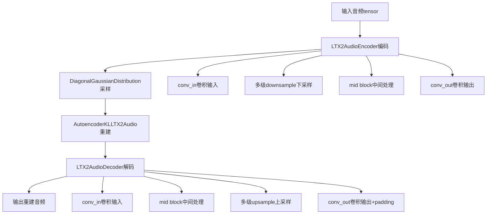
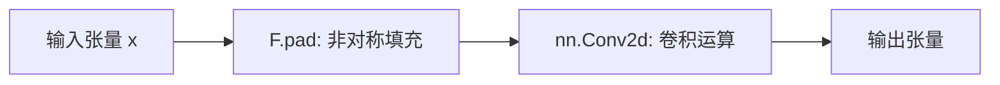
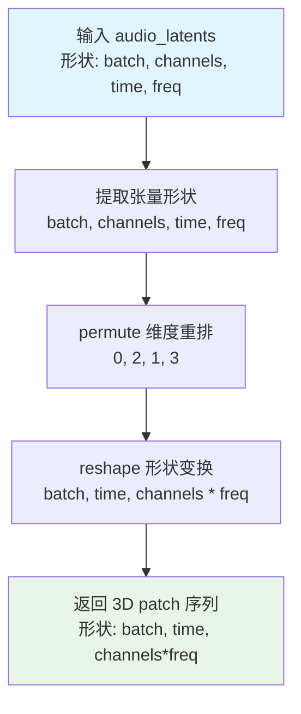
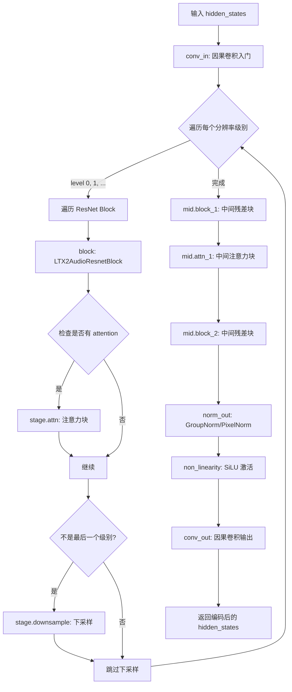
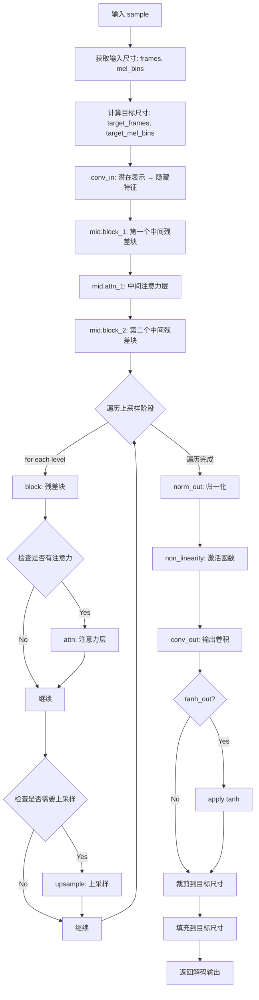
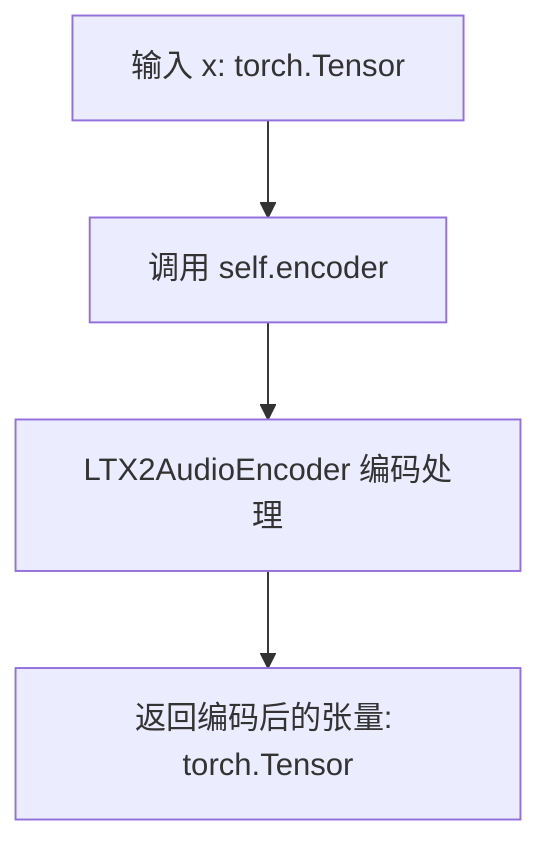
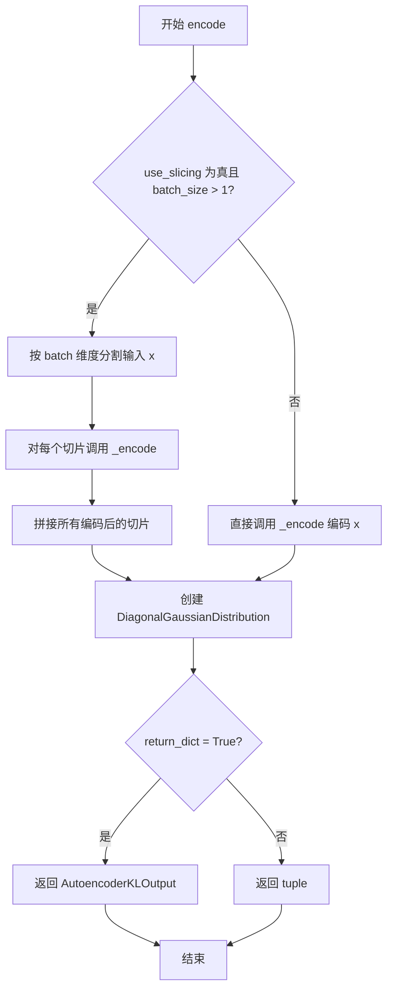
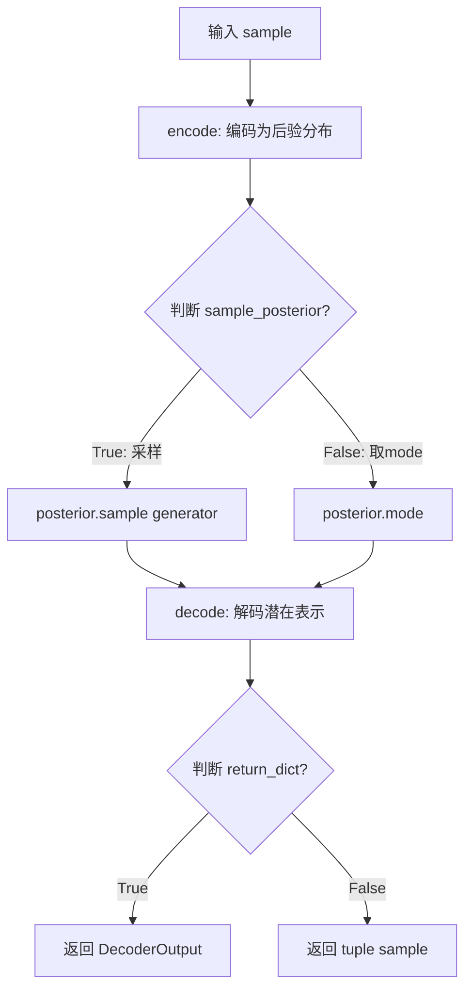

# `diffusers\src\diffusers\models\autoencoders\autoencoder_kl_ltx2_audio.py` 详细设计文档

LTX2Audio VAE模型实现了一套用于音频信号编码和解码的变分自编码器架构，支持因果卷积以保持时序因果性，包含多种归一化类型（group/pixel），通过encoder将音频压缩为潜在表示，再通过decoder重建音频信号，支持音频patch化处理和多级分辨率的特征提取。

## 整体流程



## 类结构

```
nn.Module (PyTorch基类)
├── LTX2AudioCausalConv2d (因果卷积层)
├── LTX2AudioPixelNorm (像素归一化)
├── LTX2AudioAttnBlock (注意力块)
├── LTX2AudioResnetBlock (残差块)
├── LTX2AudioDownsample (下采样)
├── LTX2AudioUpsample (上采样)
├── LTX2AudioAudioPatchifier (音频patch化)
├── LTX2AudioEncoder (编码器)
│   ├── conv_in
│   ├── down (ModuleList多级下采样)
│   │   ├── stage.block (ResnetBlock列表)
│   │   ├── stage.attn (AttentionBlock列表)
│   │   └── stage.downsample
│   ├── mid (中间块)
│   │   ├── block_1
│   │   ├── attn_1
│   │   └── block_2
│   ├── norm_out
│   └── conv_out
├── LTX2AudioDecoder (解码器)
│   ├── conv_in
│   ├── mid (中间块)
│   ├── up (ModuleList多级上采样)
│   │   ├── stage.block (ResnetBlock列表)
│   │   ├── stage.attn (AttentionBlock列表)
│   │   └── stage.upsample
│   ├── norm_out
│   └── conv_out
└── AutoencoderKLLTX2Audio (主VAE类)
    ├── encoder (LTX2AudioEncoder)
    ├── decoder (LTX2AudioDecoder)
    ├── latents_mean (buffer)
    ├── latents_std (buffer)
    ├── encode()
    ├── decode()
    └── forward()
```

## 全局变量及字段


### `LATENT_DOWNSAMPLE_FACTOR`
    
潜在下采样因子，值为4，用于音频潜在表示的时间压缩

类型：`int`
    


### `LTX2AudioCausalConv2d.causality_axis`
    
因果轴类型，可选height/width/none，决定卷积的因果填充方式

类型：`str`
    


### `LTX2AudioCausalConv2d.padding`
    
填充大小元组，用于非对称填充

类型：`tuple`
    


### `LTX2AudioCausalConv2d.conv`
    
二维卷积层

类型：`nn.Conv2d`
    


### `LTX2AudioPixelNorm.dim`
    
归一化维度

类型：`int`
    


### `LTX2AudioPixelNorm.eps`
    
数值稳定常数，防止除零

类型：`float`
    


### `LTX2AudioAttnBlock.in_channels`
    
输入通道数

类型：`int`
    


### `LTX2AudioAttnBlock.norm`
    
归一化层，支持group或pixel归一化

类型：`nn.Module`
    


### `LTX2AudioAttnBlock.q`
    
注意力查询投影卷积

类型：`nn.Conv2d`
    


### `LTX2AudioAttnBlock.k`
    
注意力键投影卷积

类型：`nn.Conv2d`
    


### `LTX2AudioAttnBlock.v`
    
注意力值投影卷积

类型：`nn.Conv2d`
    


### `LTX2AudioAttnBlock.proj_out`
    
注意力输出投影卷积

类型：`nn.Conv2d`
    


### `LTX2AudioResnetBlock.causality_axis`
    
因果轴类型

类型：`str`
    


### `LTX2AudioResnetBlock.in_channels`
    
输入通道数

类型：`int`
    


### `LTX2AudioResnetBlock.out_channels`
    
输出通道数

类型：`int`
    


### `LTX2AudioResnetBlock.use_conv_shortcut`
    
是否使用卷积shortcut，否则使用nin_shortcut

类型：`bool`
    


### `LTX2AudioResnetBlock.norm1`
    
第一个归一化层

类型：`nn.Module`
    


### `LTX2AudioResnetBlock.norm2`
    
第二个归一化层

类型：`nn.Module`
    


### `LTX2AudioResnetBlock.non_linearity`
    
SiLU激活函数

类型：`nn.SiLU`
    


### `LTX2AudioResnetBlock.conv1`
    
第一个卷积层，因果或标准卷积

类型：`nn.Module`
    


### `LTX2AudioResnetBlock.conv2`
    
第二个卷积层，因果或标准卷积

类型：`nn.Module`
    


### `LTX2AudioResnetBlock.temb_proj`
    
时间嵌入投影层，用于添加时间条件

类型：`nn.Linear`
    


### `LTX2AudioDownsample.with_conv`
    
是否使用卷积进行下采样

类型：`bool`
    


### `LTX2AudioDownsample.causality_axis`
    
因果轴类型

类型：`str`
    


### `LTX2AudioDownsample.conv`
    
下采样卷积层

类型：`nn.Conv2d`
    


### `LTX2AudioUpsample.with_conv`
    
是否使用卷积进行上采样

类型：`bool`
    


### `LTX2AudioUpsample.causality_axis`
    
因果轴类型

类型：`str`
    


### `LTX2AudioUpsample.conv`
    
上采样卷积层，因果或标准卷积

类型：`nn.Conv2d`
    


### `LTX2AudioAudioPatchifier.hop_length`
    
帧移长度

类型：`int`
    


### `LTX2AudioAudioPatchifier.sample_rate`
    
音频采样率

类型：`int`
    


### `LTX2AudioAudioPatchifier.audio_latent_downsample_factor`
    
潜在下采样因子

类型：`int`
    


### `LTX2AudioAudioPatchifier.is_causal`
    
是否采用因果模式

类型：`bool`
    


### `LTX2AudioAudioPatchifier._patch_size`
    
patch大小元组

类型：`tuple`
    


### `LTX2AudioEncoder.sample_rate`
    
音频采样率

类型：`int`
    


### `LTX2AudioEncoder.mel_hop_length`
    
MEL频谱帧移长度

类型：`int`
    


### `LTX2AudioEncoder.is_causal`
    
是否采用因果架构

类型：`bool`
    


### `LTX2AudioEncoder.mel_bins`
    
MEL频谱bins数量

类型：`int`
    


### `LTX2AudioEncoder.base_channels`
    
基础通道数

类型：`int`
    


### `LTX2AudioEncoder.temb_ch`
    
时间嵌入通道数

类型：`int`
    


### `LTX2AudioEncoder.num_resolutions`
    
分辨率层级数量

类型：`int`
    


### `LTX2AudioEncoder.num_res_blocks`
    
每级残差块数量

类型：`int`
    


### `LTX2AudioEncoder.resolution`
    
输入分辨率

类型：`int`
    


### `LTX2AudioEncoder.in_channels`
    
输入通道数

类型：`int`
    


### `LTX2AudioEncoder.out_ch`
    
输出通道数

类型：`int`
    


### `LTX2AudioEncoder.norm_type`
    
归一化类型，支持group或pixel

类型：`str`
    


### `LTX2AudioEncoder.latent_channels`
    
潜在空间通道数

类型：`int`
    


### `LTX2AudioEncoder.channel_multipliers`
    
通道倍率元组

类型：`tuple`
    


### `LTX2AudioEncoder.attn_resolutions`
    
应用注意力的分辨率集合

类型：`tuple or None`
    


### `LTX2AudioEncoder.causality_axis`
    
因果轴类型

类型：`str or None`
    


### `LTX2AudioEncoder.conv_in`
    
输入卷积层

类型：`nn.Module`
    


### `LTX2AudioEncoder.down`
    
下采样模块列表

类型：`nn.ModuleList`
    


### `LTX2AudioEncoder.mid`
    
中间模块，包含残差块和注意力

类型：`nn.Module`
    


### `LTX2AudioEncoder.norm_out`
    
输出归一化层

类型：`nn.Module`
    


### `LTX2AudioEncoder.conv_out`
    
输出卷积层

类型：`nn.Module`
    


### `LTX2AudioDecoder.sample_rate`
    
音频采样率

类型：`int`
    


### `LTX2AudioDecoder.mel_hop_length`
    
MEL频谱帧移长度

类型：`int`
    


### `LTX2AudioDecoder.is_causal`
    
是否采用因果架构

类型：`bool`
    


### `LTX2AudioDecoder.mel_bins`
    
MEL频谱bins数量

类型：`int`
    


### `LTX2AudioDecoder.base_channels`
    
基础通道数

类型：`int`
    


### `LTX2AudioDecoder.temb_ch`
    
时间嵌入通道数

类型：`int`
    


### `LTX2AudioDecoder.num_resolutions`
    
分辨率层级数量

类型：`int`
    


### `LTX2AudioDecoder.num_res_blocks`
    
每级残差块数量

类型：`int`
    


### `LTX2AudioDecoder.resolution`
    
输入分辨率

类型：`int`
    


### `LTX2AudioDecoder.in_channels`
    
输入通道数

类型：`int`
    


### `LTX2AudioDecoder.out_ch`
    
输出通道数

类型：`int`
    


### `LTX2AudioDecoder.norm_type`
    
归一化类型，支持group或pixel

类型：`str`
    


### `LTX2AudioDecoder.latent_channels`
    
潜在空间通道数

类型：`int`
    


### `LTX2AudioDecoder.channel_multipliers`
    
通道倍率元组

类型：`tuple`
    


### `LTX2AudioDecoder.attn_resolutions`
    
应用注意力的分辨率集合

类型：`tuple or None`
    


### `LTX2AudioDecoder.causality_axis`
    
因果轴类型

类型：`str or None`
    


### `LTX2AudioDecoder.patchifier`
    
音频patch化器

类型：`LTX2AudioAudioPatchifier`
    


### `LTX2AudioDecoder.conv_in`
    
输入卷积层

类型：`nn.Module`
    


### `LTX2AudioDecoder.mid`
    
中间模块，包含残差块和注意力

类型：`nn.Module`
    


### `LTX2AudioDecoder.up`
    
上采样模块列表

类型：`nn.ModuleList`
    


### `LTX2AudioDecoder.norm_out`
    
输出归一化层

类型：`nn.Module`
    


### `LTX2AudioDecoder.conv_out`
    
输出卷积层

类型：`nn.Module`
    


### `AutoencoderKLLTX2Audio.encoder`
    
音频编码器，将音频转换为潜在表示

类型：`LTX2AudioEncoder`
    


### `AutoencoderKLLTX2Audio.decoder`
    
音频解码器，从潜在表示重建音频

类型：`LTX2AudioDecoder`
    


### `AutoencoderKLLTX2Audio.latents_mean`
    
潜在空间均值buffer，用于归一化

类型：`torch.Tensor`
    


### `AutoencoderKLLTX2Audio.latents_std`
    
潜在空间标准差buffer，用于归一化

类型：`torch.Tensor`
    


### `AutoencoderKLLTX2Audio.temporal_compression_ratio`
    
时间压缩比

类型：`int`
    


### `AutoencoderKLLTX2Audio.mel_compression_ratio`
    
MEL频谱压缩比

类型：`int`
    


### `AutoencoderKLLTX2Audio.use_slicing`
    
是否使用切片编码以节省显存

类型：`bool`
    
    

## 全局函数及方法


### `LTX2AudioCausalConv2d.forward`

该方法是 `LTX2AudioCausalConv2d` 类的核心前向传播逻辑。它实现了**因果卷积（Causal Convolution）**，通过在输入张量的因果轴（如时间维或高度维）的一侧进行非对称填充（Asymmetric Padding），确保当前时刻的输出仅依赖于当前时刻及之前的历史信息，而不会受到未来信息的影响。填充完成后，调用内部的 `nn.Conv2d` 层进行卷积运算。

参数：
-  `x`：`torch.Tensor`，输入的张量，形状通常为 (Batch, Channels, Height, Width)。

返回值：`torch.Tensor`，经过因果卷积处理后的输出张量。

#### 流程图



#### 带注释源码

```python
def forward(self, x: torch.Tensor) -> torch.Tensor:
    """
    执行因果卷积的前向传播。

    步骤 1: 填充 (Padding)
    使用 F.pad 对输入 x 进行非对称填充。填充的方式由 __init__ 中的 causality_axis 决定：
    - 如果是 "height" (时间轴)，则在时间维度的"未来"方向（下方）不填充（pad=0），
      在"过去"方向（上方）填充足够的零，以防止卷积核看到未来的帧。
    - 如果是 "width"，则在"未来"方向（右方）不填充。
    - 如果是 "none"，则是对称填充（标准卷积）。
    
    参数 self.padding 是一个四元组 (left, right, top, bottom)，对应 F.pad 的格式。
    """
    x = F.pad(x, self.padding)
    
    """
    步骤 2: 卷积 (Convolution)
    将填充后的张量传入内部的卷积层 self.conv 进行特征提取。
    卷积核大小、步长、膨胀率等参数在 __init__ 中定义。
    """
    return self.conv(x)
```


### `LTX2AudioPixelNorm.forward`

该方法实现了逐像素（逐位置）的均方根（RMS）归一化，通过计算输入张量在指定维度上的平方均值并开根号得到RMS值，再将输入除以RMS进行归一化，以稳定训练过程。

参数：

- `x`：`torch.Tensor`，输入的图像或特征张量，形状通常为 (batch, channels, height, width)

返回值：`torch.Tensor`，经过RMS归一化后的张量，形状与输入相同

#### 流程图

```mermaid
graph TD
    A[输入 x] --> B[计算 x²]
    B --> C[在 dim 维度计算 mean, keepdim=True]
    C --> D[计算 RMS = sqrt(mean_sq + eps)]
    D --> E[归一化: output = x / RMS]
    E --> F[输出]
```

#### 带注释源码

```python
def forward(self, x: torch.Tensor) -> torch.Tensor:
    # 计算输入张量在指定维度上的平方值
    # x.shape = (batch, channels, height, width) 时，dim=1 会对每个位置的所有通道进行归一化
    mean_sq = torch.mean(x**2, dim=self.dim, keepdim=True)
    
    # 加上 eps 防止除零错误，并计算均方根 RMS
    # RMS = sqrt(E[x²] + eps)
    rms = torch.sqrt(mean_sq + self.eps)
    
    # 将输入除以 RMS 实现归一化，使每个位置的特征向量具有单位长度
    return x / rms
```


### `LTX2AudioAttnBlock.forward`

实现标准自注意力机制，将输入特征通过归一化、线性投影、注意力计算和残差连接进行处理，以增强特征的表达能力。

参数：

- `x`：`torch.Tensor`，输入张量，形状为 (batch, channels, height, width)

返回值：`torch.Tensor`，经过自注意力增强后的输出张量，形状与输入相同

#### 流程图

```mermaid
flowchart TD
    A[输入 x] --> B[归一化: norm(x)]
    B --> C[计算 Q: q = self.q(h_)]
    B --> D[计算 K: k = self.k(h_)]
    B --> E[计算 V: v = self.v(h_)]
    C --> F[Reshape & Permute Q]
    D --> G[Reshape K]
    E --> H[Reshape V]
    F --> I[矩阵乘法: attn = Q × K]
    I --> J[缩放: attn * channels^-0.5]
    J --> K[Softmax: attn = softmax(attn, dim=2)]
    K --> L[Permute attn]
    H --> M[矩阵乘法: h_ = V × attn]
    L --> M
    M --> N[Reshape回原始形状]
    N --> O[投影: proj_out(h_)]
    O --> P[残差连接: return x + h_]
```

#### 带注释源码

```python
def forward(self, x: torch.Tensor) -> torch.Tensor:
    # 步骤1: 对输入进行归一化处理
    h_ = self.norm(x)
    
    # 步骤2: 通过三个1x1卷积层分别生成查询(Q)、键(K)和值(V)
    q = self.q(h_)  # 查询投影
    k = self.k(h_)  # 键投影
    v = self.v(h_)  # 值投影

    # 步骤3: 获取输入形状信息
    batch, channels, height, width = q.shape
    
    # 步骤4: 将Q从 (batch, channels, height*width) 转换为 (batch, height*width, channels)
    # permute 将通道维度移到最后，以便进行批量矩阵乘法
    q = q.reshape(batch, channels, height * width).permute(0, 2, 1).contiguous()
    
    # 步骤5: 将K保持为 (batch, channels, height*width) 形状
    k = k.reshape(batch, channels, height * width).contiguous()
    
    # 步骤6: 计算注意力分数矩阵 (Q × K^T)，并进行缩放以防止梯度消失
    # 缩放因子为 channels 的负平方根
    attn = torch.bmm(q, k) * (int(channels) ** (-0.5))
    
    # 步骤7: 对注意力分数沿维度2（即键的维度）进行softmax归一化
    attn = torch.nn.functional.softmax(attn, dim=2)

    # 步骤8: 将V reshape为 (batch, channels, height*width)
    v = v.reshape(batch, channels, height * width)
    
    # 步骤9: 对注意力权重进行转置，使其与V进行矩阵乘法
    attn = attn.permute(0, 2, 1).contiguous()
    
    # 步骤10: 计算注意力输出 (V × attention)，再reshape回 (batch, channels, height, width)
    h_ = torch.bmm(v, attn).reshape(batch, channels, height, width)

    # 步骤11: 通过输出投影层
    h_ = self.proj_out(h_)
    
    # 步骤12: 残差连接，将原始输入与注意力输出相加
    return x + h_
```


### `LTX2AudioResnetBlock.forward`

该方法是 LTX2AudioResnetBlock 类的核心前向传播函数，实现了一个带有时间嵌入（temporal embedding）条件的残差网络块，用于音频变分自编码器（VAE）的编解码过程中，支持因果卷积以保持时间因果性。

参数：

- `x`：`torch.Tensor`，输入特征张量，形状为 (batch, channels, height, width)
- `temb`：`torch.Tensor | None`，时间嵌入向量，用于条件注入，形状为 (batch, temb_channels)，可以为 None

返回值：`torch.Tensor`，残差连接后的输出特征张量，形状为 (batch, out_channels, height, width)

#### 流程图

```mermaid
flowchart TD
    A[输入 x] --> B[norm1 归一化]
    B --> C[SiLU 非线性激活]
    C --> D[conv1 卷积]
    D --> E{判断 temb 是否为 None}
    E -->|是| F[跳过 temb 注入]
    E -->|否| G[temb 投影 + 非线性激活]
    G --> H[调整维度至 (batch, channels, 1, 1)]
    H --> F
    F --> I[norm2 归一化]
    I --> J[SiLU 非线性激活]
    J --> K[Dropout 正则化]
    K --> L[conv2 卷积]
    L --> M{判断输入输出通道是否相等}
    M -->|否| N[应用 shortcut 卷积]
    M -->|是| O[跳过 shortcut]
    N --> P[残差连接 x + h]
    O --> P
    P --> Q[输出]
```

#### 带注释源码

```python
def forward(self, x: torch.Tensor, temb: torch.Tensor | None = None) -> torch.Tensor:
    """
    LTX2AudioResnetBlock 的前向传播方法，实现残差块的核心逻辑。
    
    该方法执行以下步骤：
    1. 对输入进行归一化、非线性激活和卷积（主路径）
    2. 可选地注入时间嵌入（temb）作为条件信息
    3. 再次归一化、激活、Dropout 和卷积
    4. 如果输入输出通道数不同，则通过 shortcut 路径调整维度
    5. 执行残差连接：output = x + h
    
    参数:
        x: 输入特征张量，形状为 (batch, in_channels, height, width)
        temb: 可选的时间嵌入向量，形状为 (batch, temb_channels)，用于条件生成
    
    返回:
        输出特征张量，形状为 (batch, out_channels, height, width)
    """
    # 第一阶段：主路径的第一次卷积块
    h = self.norm1(x)           # 第一次归一化（GroupNorm 或 PixelNorm）
    h = self.non_linearity(h)   # SiLU 非线性激活
    h = self.conv1(h)           # 第一次卷积（因果卷积或标准卷积）

    # 条件注入：如果提供了时间嵌入，则将其添加到主路径
    if temb is not None:
        # 将 temb 投影到通道维度并调整形状以匹配特征图
        # temb_proj: (batch, temb_channels) -> (batch, out_channels)
        # [:, :, None, None] 将形状扩展为 (batch, out_channels, 1, 1) 以便广播加法
        h = h + self.temb_proj(self.non_linearity(temb))[:, :, None, None]

    # 第二阶段：主路径的第二次卷积块
    h = self.norm2(h)           # 第二次归一化
    h = self.non_linearity(h)  # SiLU 非线性激活
    h = self.dropout(h)         # Dropout 正则化，防止过拟合
    h = self.conv2(h)           # 第二次卷积

    # Shortcut 路径处理：如果输入输出通道数不同，需要调整输入的通道数
    if self.in_channels != self.out_channels:
        # 根据初始化时的配置选择使用卷积 shortcut 或 1x1 卷积（nin_shortcut）
        x = self.conv_shortcut(x) if self.use_conv_shortcut else self.nin_shortcut(x)

    # 残差连接：将原始输入与主路径输出相加
    return x + h
```


### `LTX2AudioDownsample.forward`

该方法是 `LTX2AudioDownsample` 类的核心前向传播逻辑，用于对输入的张量进行空间下采样（减小高度和宽度）。它支持两种下采样模式：当 `with_conv` 为 `True` 时，使用带步长的卷积操作，并根据 `causality_axis` 参数施加特定的非对称填充（Asymmetric Padding）以确保因果性（Causality），例如在时间轴（高度）上进行因果卷积；当 `with_conv` 为 `False` 时，使用平均池化进行简单的下采样。

参数：
- `x`：`torch.Tensor`，输入的张量，通常为 4D 张量，形状为 `(batch, channels, height, width)`，代表音频的频谱图特征。

返回值：`torch.Tensor`，经过下采样后的张量，其高度和宽度均为输入的一半（或根据因果性略有调整）。

#### 流程图

```mermaid
flowchart TD
    A[Start: Input x] --> B{self.with_conv == True?}
    
    B -- Yes --> C{self.causality_axis?}
    C --> D[none]
    C --> E[width]
    C --> F[height]
    C --> G[width-compatibility]
    
    D --> H[pad = (0, 1, 0, 1)]
    E --> I[pad = (2, 0, 0, 1)]
    F --> J[pad = (0, 1, 2, 0)]
    G --> K[pad = (1, 0, 0, 1)]
    
    H --> L[F.pad x, pad]
    I --> L
    J --> L
    K --> L
    
    L --> M[conv = self.conv(x) <br/>stride=2, kernel=3]
    M --> N[Return Result]
    
    B -- No --> O[x = F.avg_pool2d <br/>kernel=2, stride=2]
    O --> N
    
    N --> P[End]
```

#### 带注释源码

```python
def forward(self, x: torch.Tensor) -> torch.Tensor:
    """
    执行下采样操作。

    参数:
        x (torch.Tensor): 输入张量，形状为 (B, C, H, W)。

    返回:
        torch.Tensor: 下采样后的张量。
    """
    if self.with_conv:
        # Padding 元组的顺序是：(left, right, top, bottom)。
        # 根据因果轴的不同，选择不同的填充策略以确保因果性。
        if self.causality_axis == "none":
            # 无因果性要求，标准对称填充 (右侧补0，下方补0，顶部补1？实际上代码是 (0,1,0,1) -> 左0 右1 上0 下1)
            # 这通常是为了让输出尺寸正确向下取整
            pad = (0, 1, 0, 1)
        elif self.causality_axis == "width":
            # 宽度轴因果：在左侧（过去）填充，在右侧（未来）不填充
            # pad = (左, 右, 上, 下) -> (2, 0, 0, 1)
            pad = (2, 0, 0, 1)
        elif self.causality_axis == "height":
            # 高度轴因果：在顶部（过去）填充，在底部（未来）不填充
            # 音频中高度常代表时间，因此这里Padding主要加在时间维度的开始处
            pad = (0, 1, 2, 0)
        elif self.causality_axis == "width-compatibility":
            pad = (1, 0, 0, 1)
        else:
            raise ValueError(
                f"Invalid `causality_axis` {self.causality_axis}; supported values are `none`, `width`, `height`,"
                f" and `width-compatibility`."
            )

        # 执行填充
        x = F.pad(x, pad, mode="constant", value=0)
        # 执行带有 stride=2 的卷积，实现下采样
        x = self.conv(x)
    else:
        # 不使用卷积时，默认使用平均池化进行下采样
        # 这通常意味着 causality_axis 为 "none"
        x = F.avg_pool2d(x, kernel_size=2, stride=2)
    return x
```


### `LTX2AudioUpsample.forward`

该方法实现音频/ spectrogram latent 的上采样功能，通过双线性插值将空间维度放大2倍，并可选择性地应用因果卷积以保持时间因果性，同时根据因果性轴裁剪多余边界。

参数：

- `x`：`torch.Tensor`，输入的 2D 特征张量，形状为 (batch, channels, height, width)

返回值：`torch.Tensor`，上采样后的特征张量，形状为 (batch, channels, height\*2, width\*2)（根据因果性轴可能略有裁剪）

#### 流程图

```mermaid
flowchart TD
    A[输入 x: (batch, C, H, W)] --> B{with_conv?}
    B -->|Yes| C[torch.nn.functional.interpolate<br/>scale_factor=2.0, mode='nearest']
    B -->|No| F[仅插值]
    C --> D[self.conv 因果卷积]
    D --> E{causality_axis?}
    E -->|"none"| G[不做裁剪]
    E -->|"height"| H[x = x[:, :, 1:, :]]
    E -->|"width"| I[x = x[:, :, :, 1:]]
    E -->|"width-compatibility"| J[不做裁剪]
    E -->|其他| K[抛出 ValueError]
    H --> L[返回上采样结果]
    I --> L
    G --> L
    J --> L
    F --> L
```

#### 带注释源码

```python
def forward(self, x: torch.Tensor) -> torch.Tensor:
    # 使用最近邻插值将输入张量的高和宽各放大2倍
    x = torch.nn.functional.interpolate(x, scale_factor=2.0, mode="nearest")
    
    if self.with_conv:
        # 应用因果卷积处理上采样后的特征
        x = self.conv(x)
        
        # 根据因果性轴裁剪多余的边界，保持时间/空间因果性
        if self.causality_axis is None or self.causality_axis == "none":
            pass  # 不做裁剪
        elif self.causality_axis == "height":
            # 裁剪第一行，保持因果性（时间维度从左到右）
            x = x[:, :, 1:, :]
        elif self.causality_axis == "width":
            # 裁剪第一列，保持因果性（频率维度从低到高）
            x = x[:, :, :, 1:]
        elif self.causality_axis == "width-compatibility":
            pass  # 兼容模式，不做裁剪
        else:
            raise ValueError(f"Invalid causality_axis: {self.causality_axis}")

    return x
```


### `LTX2AudioAudioPatchifier.patchify`

将 4D 音频频谱图张量转换为 3D patch 序列张量，通过维度重排和形状变换将 (batch, channels, time, freq) 转换为 (batch, time, channels*freq)，便于后续 Transformer 模型处理。

参数：

- `audio_latents`：`torch.Tensor`，输入的 4D 音频频谱图张量，形状为 (batch, channels, time, freq)，其中 channels 表示音频通道数（如立体声的 2 个通道），time 表示时间帧数，freq 表示梅尔 bins 数量

返回值：`torch.Tensor`，变换后的 3D patch 序列张量，形状为 (batch, time, channels * freq)，其中每个时间步的通道和频率维度被展平为一个维度

#### 流程图



#### 带注释源码

```python
def patchify(self, audio_latents: torch.Tensor) -> torch.Tensor:
    """
    将 4D 音频频谱图张量转换为 3D patch 序列张量。
    
    该方法将形状为 (batch, channels, time, freq) 的输入张量转换为
    (batch, time, channels * freq) 的 patch 序列格式，便于后续 Transformer
    模型以序列方式处理音频特征。
    
    参数:
        audio_latents: 输入的 4D 音频频谱图张量，形状为 (batch, channels, time, freq)
                      - batch: 批量大小
                      - channels: 音频通道数（如单声道为 1，立体声为 2）
                      - time: 时间帧数
                      - freq: 梅尔频率 bins 数量
    
    返回:
        变换后的 3D patch 序列张量，形状为 (batch, time, channels * freq)
        每个时间步的所有通道和频率信息被展平为一个维度
    """
    # 提取输入张量的各个维度大小
    # batch: 批量大小
    # channels: 通道数（通常是音频通道数）
    # time: 时间帧数
    # freq: 梅尔频率 bins 数量
    batch, channels, time, freq = audio_latents.shape
    
    # 步骤 1: permute - 维度重排
    # 将原始维度顺序 (batch, channels, time, freq) 转换为 (batch, time, channels, freq)
    # 这样可以将 time 维度放在第二位，便于后续 reshape 操作
    # permute(0, 2, 1, 3) 表示:
    #   - 新维度 0 = 原维度 0 (batch)
    #   - 新维度 1 = 原维度 2 (time)
    #   - 新维度 2 = 原维度 1 (channels)
    #   - 新维度 3 = 原维度 3 (freq)
    permuted = audio_latents.permute(0, 2, 1, 3)
    
    # 步骤 2: reshape - 形状变换
    # 将 4D 张量 (batch, time, channels, freq) 转换为 3D 张量 (batch, time, channels*freq)
    # 将 channels 和 freq 维度合并为一个维度，实际上是将每个时间步的
    # 所有通道和频率信息"打平"成一个长向量
    # 这与 Vision Transformer (ViT) 中将图像 patch 展平为序列的思想一致
    return permuted.reshape(batch, time, channels * freq)
```


### `LTX2AudioAudioPatchifier.unpatchify`

该方法负责将已经被“patchify（切片化）”处理的音频潜在表示（latents）重新转换回原始的四维张量形式（批量大小, 通道数, 时间步, 梅尔频段数）。这是解码器（Decoder）处理数据前的关键逆操作，用于恢复空间/时间结构。

参数：

- `audio_latents`：`torch.Tensor`，输入的被展平或重塑后的潜在张量，形状为 `(batch, time, channels * mel_bins)`。
- `channels`：`int`，目标输出张量的通道数（即原始音频的通道数）。
- `mel_bins`：`int`，目标输出张量的梅尔频段数（即频率维度的大小）。

返回值：`torch.Tensor`，返回重构后的四维张量，形状为 `(batch, channels, time, mel_bins)`。

#### 流程图

```mermaid
graph TD
    A[开始: 输入 audio_latents] --> B[获取 batch 和 time 维度];
    B --> C{视图变换 Reshape};
    C --> D[将 (batch, time, channels*mel_bins) 重塑为 (batch, time, channels, mel_bins)];
    D --> E[维度置换 Permute];
    E --> F[将维度顺序调整为 (batch, channels, time, mel_bins)];
    F --> G[返回结果];
```

#### 带注释源码

```python
def unpatchify(self, audio_latents: torch.Tensor, channels: int, mel_bins: int) -> torch.Tensor:
    """
    将 patchify 后的 latent 向量还原为 4D 音频特征张量 (B, C, T, F)。
    
    参数:
        audio_latents: 来自 encoder 或经过 patchify 处理后的张量，形状为 (batch, time, channels * mel_bins)。
        channels: 原始音频的通道数。
        mel_bins: 梅尔滤波器的数量，对应频率维度。
        
    返回:
        形状为 (batch, channels, time, mel_bins) 的张量。
    """
    # 1. 解包输入张量的维度
    # audio_latents 的形状通常是 (batch, time, channels * mel_bins)
    batch, time, _ = audio_latents.shape
    
    # 2. 视图变换 (View/Reshape)
    # 将一维的通道*频率维度展开为二维的 (channels, mel_bins)
    # 结果形状变为 (batch, time, channels, mel_bins)
    # 这里对应了 patchify 过程中的 reshape 操作的反向操作
    x = audio_latents.view(batch, time, channels, mel_bins)
    
    # 3. 维度置换 (Permute)
    # 将维度顺序从 (batch, time, channels, mel_bins) 调整为 (batch, channels, time, mel_bins)
    # 这恢复了原始音频频谱图的时间-频率排列顺序
    return x.permute(0, 2, 1, 3)
```


### `LTX2AudioAudioPatchifier.patch_size`

该属性是 `LTX2AudioAudioPatchifier` 类的只读属性，用于返回音频补丁的三维尺寸元组 `(1, patch_size, patch_size)`，其中第一个维度为通道维度（固定为 1），后两个维度表示时间方向和频率方向的补丁大小。

参数： 无参数（该属性不接受任何输入参数）

返回值：`tuple[int, int, int]`，返回一个包含三个整数的元组，表示补丁的形状尺寸：(时间补丁高度, 频率补丁宽度)，实际存储为 `(1, patch_size, patch_size)`

#### 流程图

```mermaid
flowchart TD
    A[外部访问 patch_size 属性] --> B{调用 @property getter}
    B --> C[返回 self._patch_size]
    C --> D[返回 tuple[int, int, int]]
    
    subgraph "LTX2AudioAudioPatchifier"
        E[初始化时设置<br/>self._patch_size = (1, patch_size, patch_size)]
    end
    
    D --> F[调用处接收返回值]
```

#### 带注释源码

```python
@property
def patch_size(self) -> tuple[int, int, int]:
    """
    返回音频补丁的尺寸。
    
    该属性返回一个三维元组，表示补丁化操作中每个补丁的形状。
    第一个维度固定为 1（表示单通道），后两个维度由初始化时的 patch_size 参数决定。
    
    Returns:
        tuple[int, int, int]: 形状为 (1, patch_size, patch_size) 的元组，
                              用于描述音频频谱图补丁的空间维度。
    """
    return self._patch_size
```


### `LTX2AudioEncoder.forward`

该方法是 LTX2 音频变分自编码器（VAE）的编码器核心实现，负责将输入的音频频谱图（spectrogram） latent 表示转换为低维的潜在空间表示。编码器采用多级分辨率结构，包含残差块（ResNet Block）、注意力块和因果卷积，以支持时序因果性和高效的音频特征压缩。

参数：

- `hidden_states`：`torch.Tensor`，输入的隐藏状态，预期 shape 为 (batch_size, channels, time, num_mel_bins)，其中 channels 通常为 2（表示音频的 MEL 频谱通道）

返回值：`torch.Tensor`，编码后的潜在表示，shape 取决于配置，通常为 (batch_size, latent_channels * 2, time // 4, freq // 4)（当 double_z=True 时）

#### 流程图



#### 带注释源码

```python
def forward(self, hidden_states: torch.Tensor) -> torch.Tensor:
    # hidden_states expected shape: (batch_size, channels, time, num_mel_bins)
    # 输入 shape: (batch_size, in_channels=2, time, mel_bins)
    
    # 步骤1: 因果卷积入门，将输入通道转换为 base_channels
    # 因果卷积确保时间维度的因果性，防止未来信息泄露
    hidden_states = self.conv_in(hidden_states)

    # 步骤2: 多级分辨率编码（下采样路径）
    # 遍历每个分辨率级别（由 ch_mult 定义，如 (1, 2, 4) 表示 3 个级别）
    for level in range(self.num_resolutions):
        stage = self.down[level]  # 获取当前级别的模块
        
        # 遍历该级别的所有残差块
        for block_idx, block in enumerate(stage.block):
            # 应用残差块：包含归一化、SiLU激活、因果卷积
            # temb=None 表示不使用时间嵌入（temporal embedding）
            hidden_states = block(hidden_states, temb=None)
            
            # 如果该级别配置了注意力机制，则应用注意力块
            if stage.attn:
                hidden_states = stage.attn[block_idx](hidden_states)

        # 步骤3: 在相邻级别之间进行下采样
        # 最后一个级别不需要下采样
        if level != self.num_resolutions - 1 and hasattr(stage, "downsample"):
            hidden_states = stage.downsample(hidden_states)

    # 步骤4: 中间块处理（最深层）
    # 应用第一个中间残差块
    hidden_states = self.mid.block_1(hidden_states, temb=None)
    # 应用中间注意力块（可选，通过 mid_block_add_attention 控制）
    hidden_states = self.mid.attn_1(hidden_states)
    # 应用第二个中间残差块
    hidden_states = self.mid.block_2(hidden_states, temb=None)

    # 步骤5: 输出层处理
    # 归一化输出特征
    hidden_states = self.norm_out(hidden_states)
    # SiLU 激活函数
    hidden_states = self.non_linearity(hidden_states)
    # 因果卷积输出，将通道数转换为 latent_channels * 2（用于 VAE 的双通道输出）
    hidden_states = self.conv_out(hidden_states)

    # 返回编码后的潜在表示
    # shape: (batch_size, latent_channels * 2, time // 4, mel_bins // 4) 当 double_z=True
    return hidden_states
```


### `LTX2AudioDecoder.forward`

该方法是 LTX2AudioDecoder 类的前向传播函数，负责将音频潜在表示（latent representation）解码重构为音频频谱图（audio spectrogram）。它首先计算目标输出尺寸，然后依次通过输入卷积、中间块（包含残差网络和注意力机制）、多个上采样阶段，最后通过输出卷积层生成重构的频谱图，并进行必要的填充裁剪以匹配目标尺寸。

参数：

- `sample`：`torch.Tensor`，输入的潜在表示张量，形状为 `(batch, latent_channels, frames, mel_bins)`

返回值：`torch.Tensor`，重构后的音频频谱图，形状为 `(batch, output_channels, target_frames, target_mel_bins)`

#### 流程图



#### 带注释源码

```python
def forward(
    self,
    sample: torch.Tensor,
) -> torch.Tensor:
    """
    将潜在表示解码为音频频谱图。
    
    参数:
        sample: 输入张量，形状为 (batch, latent_channels, frames, mel_bins)
    
    返回:
        解码后的音频频谱图，形状为 (batch, output_channels, target_frames, target_mel_bins)
    """
    # 从输入张量中提取帧数和梅尔 bins 数
    _, _, frames, mel_bins = sample.shape

    # 计算目标帧数，基于潜在的降采样因子
    target_frames = frames * LATENT_DOWNSAMPLE_FACTOR  # 4

    # 如果存在因果轴，调整目标帧数以考虑因果延迟
    if self.causality_axis is not None:
        target_frames = max(target_frames - (LATENT_DOWNSAMPLE_FACTOR - 1), 1)

    # 确定目标通道数和目标梅尔 bins 数
    target_channels = self.out_ch
    target_mel_bins = self.mel_bins if self.mel_bins is not None else mel_bins

    # 输入卷积：将潜在表示转换为隐藏特征
    hidden_features = self.conv_in(sample)
    
    # 中间块处理
    hidden_features = self.mid.block_1(hidden_features, temb=None)
    hidden_features = self.mid.attn_1(hidden_features)
    hidden_features = self.mid.block_2(hidden_features, temb=None)

    # 上采样阶段：遍历每个分辨率级别（从低到高）
    for level in reversed(range(self.num_resolutions)):
        stage = self.up[level]
        
        # 应用残差块和注意力机制
        for block_idx, block in enumerate(stage.block):
            hidden_features = block(hidden_features, temb=None)
            if stage.attn:
                hidden_features = stage.attn[block_idx](hidden_features)

        # 在非最后一层进行上采样
        if level != 0 and hasattr(stage, 'upsample'):
            hidden_features = stage.upsample(hidden_features)

    # 如果需要返回预结束特征，则提前返回
    if self.give_pre_end:
        return hidden_features

    # 输出处理：归一化 → 激活 → 卷积
    hidden = self.norm_out(hidden_features)
    hidden = self.non_linearity(hidden)
    decoded_output = self.conv_out(hidden)
    
    # 根据配置决定是否使用 tanh 激活
    decoded_output = torch.tanh(decoded_output) if self.tanh_out else decoded_output

    # 获取当前输出的尺寸
    _, _, current_time, current_freq = decoded_output.shape
    target_time = target_frames
    target_freq = target_mel_bins

    # 裁剪输出到目标尺寸（取较小值）
    decoded_output = decoded_output[
        :, :target_channels, : min(current_time, target_time), : min(current_freq, target_freq)
    ]

    # 计算需要填充的尺寸
    time_padding_needed = target_time - decoded_output.shape[2]
    freq_padding_needed = target_freq - decoded_output.shape[3]

    # 如果需要填充（时间或频率维度），进行填充
    if time_padding_needed > 0 or freq_padding_needed > 0:
        padding = (
            0,                                              # 左侧填充
            max(freq_padding_needed, 0),                  # 右侧填充
            0,                                              # 顶部填充
            max(time_padding_needed, 0),                  # 底部填充
        )
        decoded_output = F.pad(decoded_output, padding)

    # 最终裁剪到精确的目标尺寸
    decoded_output = decoded_output[:, :target_channels, :target_time, :target_freq]

    return decoded_output
```


### `AutoencoderKLLTX2Audio._encode`

该方法是 AutoencoderKLLTX2Audio 类的私有编码方法，负责将输入的张量通过内部的编码器（LTX2AudioEncoder）转换为潜在表示。它是公开 `encode` 方法的核心实现底层，实际执行从输入数据到潜在空间的映射过程。

参数：

- `x`：`torch.Tensor`，输入张量，通常为原始音频数据或预处理后的音频潜在表示，形状为 (batch_size, channels, time, num_mel_bins)

返回值：`torch.Tensor`，编码后的潜在表示张量，经过编码器处理得到的特征表示

#### 流程图



#### 带注释源码

```python
def _encode(self, x: torch.Tensor) -> torch.Tensor:
    """
    私有编码方法，将输入张量通过编码器转换为潜在表示。
    
    参数:
        x: 输入的 torch.Tensor，通常是原始音频数据或预处理后的音频特征
        
    返回值:
        编码后的 torch.Tensor，表示输入在潜在空间中的表示
    """
    # 委托给内部的 encoder (LTX2AudioEncoder) 执行实际的编码操作
    return self.encoder(x)
```


### `AutoencoderKLLTX2Audio.encode`

该方法是 LTX2Audio 音频变分自编码器（VAE）的编码接口，负责将输入的音频潜在表示转换为高斯后验分布，支持切片编码以节省内存，并返回标准化的 AutoencoderKLOutput 对象。

参数：

- `x`：`torch.Tensor`，输入张量，形状为 (batch_size, channels, time, freq)，表示音频的潜在表示
- `return_dict`：`bool`，可选参数，默认为 `True`。若为 `True`，则返回 `AutoencoderKLOutput` 对象；若为 `False`，则返回元组 `(posterior,)`

返回值：`AutoencoderKLOutput` 或 `tuple[DiagonalGaussianDistribution]`，当 `return_dict=True` 时返回包含 `latent_dist`（后验分布）的 `AutoencoderKLOutput` 对象，否则返回元组形式的原始后验分布

#### 流程图



#### 带注释源码

```python
@apply_forward_hook
def encode(self, x: torch.Tensor, return_dict: bool = True):
    """
    将输入的音频潜在表示编码为高斯后验分布。
    
    参数:
        x: 输入张量，形状为 (batch_size, channels, time, freq)
        return_dict: 是否返回字典格式的结果
    """
    # 如果启用切片编码且批次大小大于1，则采用切片方式编码
    # 这种方式可以减少峰值内存占用，适合处理大批次数据
    if self.use_slicing and x.shape[0] > 1:
        # 按 batch 维度分割为单个样本
        encoded_slices = [self._encode(x_slice) for x_slice in x.split(1)]
        # 将编码后的切片在 batch 维度拼接回来
        h = torch.cat(encoded_slices)
    else:
        # 直接对整个批次进行编码
        h = self._encode(x)
    
    # 将编码器的原始输出转换为对角高斯分布（VAE 的潜在空间）
    # 这里假设编码器输出的是均值和方差（通过 double_z 参数控制）
    posterior = DiagonalGaussianDistribution(h)

    # 根据 return_dict 参数决定返回格式
    if not return_dict:
        # 返回原始后验分布元组，保持与旧版 API 的兼容性
        return (posterior,)
    
    # 返回标准化的 AutoencoderKLOutput 对象
    return AutoencoderKLOutput(latent_dist=posterior)
```


### `AutoencoderKLLTX2Audio._decode`

该方法是 `AutoencoderKLLTX2Audio` 类的私有解码方法，接收来自潜在空间的张量 `z`，并将其传递给内部的 `LTX2AudioDecoder` 组件进行前向计算，最终输出重构后的音频表征（通常是梅尔频谱图形式的张量）。

参数：

-  `z`：`torch.Tensor`，待解码的潜在变量张量（Latent Tensor），通常形状为 (batch, channels, time, freq)。

返回值：`torch.Tensor`，解码后的重构音频特征张量。

#### 流程图


#### 带注释源码

```python
def _decode(self, z: torch.Tensor) -> torch.Tensor:
    """
    将潜在空间向量 z 解码为重构的音频表示。

    参数:
        z (torch.Tensor): 编码器输出的潜在变量。

    返回:
        torch.Tensor: 解码后的音频张量。
    """
    # 直接调用成员变量 decoder (LTX2AudioDecoder 实例) 的 forward 方法
    return self.decoder(z)
```


### `AutoencoderKLLTX2Audio.decode`

该方法是 `AutoencoderKLLTX2Audio` 类的解码方法，用于将潜在表示（latent representation）解码为音频样本（spectrogram）。它支持批量处理和字典格式输出。

参数：

-  `z`：`torch.Tensor`，输入的潜在表示张量，通常来自编码器的输出
-  `return_dict`：`bool`，是否以字典形式返回结果，默认为 `True`

返回值：`DecoderOutput | torch.Tensor`，如果 `return_dict` 为 `True`，返回 `DecoderOutput` 对象（包含 `sample` 属性）；否则返回元组 `(decoded,)`

#### 流程图

```mermaid
flowchart TD
    A[开始 decode] --> B{use_slicing 且 batch_size > 1?}
    B -->|Yes| C[对 z 进行切片]
    C --> D[对每个切片调用 _decode]
    D --> E[拼接所有解码结果]
    B -->|No| F[直接调用 _decode]
    E --> G{return_dict?}
    F --> G
    G -->|False| H[返回元组 (decoded,)]
    G -->|True| I[返回 DecoderOutput(sample=decoded)]
    H --> J[结束]
    I --> J
```

#### 带注释源码

```python
@apply_forward_hook
def decode(self, z: torch.Tensor, return_dict: bool = True) -> DecoderOutput | torch.Tensor:
    """
    将潜在表示解码为音频样本（spectrogram）。
    
    参数:
        z: 潜在表示张量，形状为 (batch, latent_channels, time, freq)
        return_dict: 是否返回字典格式，默认为 True
    
    返回:
        DecoderOutput 或元组 (decoded,)
    """
    
    # 检查是否启用切片模式（用于处理大批次时的内存优化）
    if self.use_slicing and z.shape[0] > 1:
        # 切片处理：将批次中的每个样本单独解码
        decoded_slices = [self._decode(z_slice) for z_slice in z.split(1)]
        # 沿着批次维度拼接所有解码后的样本
        decoded = torch.cat(decoded_slices)
    else:
        # 直接解码整个批次
        decoded = self._decode(z)

    # 根据 return_dict 决定返回格式
    if not return_dict:
        # 返回元组格式（保持向后兼容）
        return (decoded,)

    # 返回 DecoderOutput 对象（推荐方式）
    return DecoderOutput(sample=decoded)
```


### `AutoencoderKLLTX2Audio.forward`

该方法是自编码器的核心前向传播逻辑，负责将输入的音频张量编码为潜在表示，再解码回目标样本。根据 `sample_posterior` 参数决定从后验分布采样还是取均值（mode），并支持以字典或元组形式返回结果。

参数：

- `sample`：`torch.Tensor`，输入的音频张量，形状通常为 (batch_size, channels, time, mel_bins)，代表梅尔频谱图或原始音频特征
- `sample_posterior`：`bool`，默认为 False，控制是否从编码器得到的后验分布中随机采样；若为 False，则取后验分布的 mode（均值）
- `return_dict`：默认为 True，决定返回值的格式；为 True 时返回 `DecoderOutput` 对象，为 False 时返回元组 `(sample,)`
- `generator`：`torch.Generator | None`，随机数生成器，用于控制后验分布采样时的随机性，确保结果可复现

返回值：`DecoderOutput | torch.Tensor`，当 `return_dict=True` 时返回包含解码后样本的 `DecoderOutput` 对象；否则返回仅包含样本张量的元组

#### 流程图



#### 带注释源码

```python
def forward(
    self,
    sample: torch.Tensor,
    sample_posterior: bool = False,
    return_dict: bool = True,
    generator: torch.Generator | None = None,
) -> DecoderOutput | torch.Tensor:
    # 第一步：编码。将输入样本通过 encoder 编码为潜在空间的后验分布
    # posterior 是一个 DiagonalGaussianDistribution 对象，包含 mean 和 logvar
    posterior = self.encode(sample).latent_dist
    
    # 第二步：采样或取 mode。根据 sample_posterior 决定从分布采样还是取均值
    if sample_posterior:
        # 从后验分布中采样潜在变量 z，支持通过 generator 控制随机性
        z = posterior.sample(generator=generator)
    else:
        # 取后验分布的 mode（即均值），对应确定性重构
        z = posterior.mode()
    
    # 第三步：解码。将潜在变量 z 通过 decoder 解码为输出样本
    dec = self.decode(z)
    
    # 第四步：返回结果。根据 return_dict 决定返回格式
    if not return_dict:
        # 返回元组格式，仅包含解码后的样本张量
        return (dec.sample,)
    # 返回 DecoderOutput 对象，包含 sample 等属性
    return dec
```

## 关键组件


### LTX2AudioCausalConv2d

因果卷积层，通过非对称填充实现时序因果性，确保未来信息不会泄露到当前时刻。

### LTX2AudioPixelNorm

像素级RMS归一化，对每个位置进行独立的均方根归一化，适用于音频频谱图表示。

### LTX2AudioAttnBlock

自注意力块，使用GroupNorm或PixelNorm进行归一化，实现2D卷积注意力机制。

### LTX2AudioResnetBlock

残差卷积块，支持GroupNorm和PixelNorm两种归一化方式，可选因果或普通卷积，以及卷积或nin快捷连接。

### LTX2AudioDownsample

下采样模块，支持因果轴的卷积下采样或平均池化，保持因果性约束。

### LTX2AudioUpsample

上采样模块，使用最近邻插值后接卷积，支持因果轴的裁剪以维持因果性。

### LTX2AudioAudioPatchifier

音频分块器，将音频频谱图latent进行patch化处理，支持因果模式的patchify/unpatchify操作。

### LTX2AudioEncoder

编码器网络，将音频频谱图编码为潜在表示，支持多层下采样、残差块和中间注意力块。

### LTX2AudioDecoder

解码器网络，从潜在表示重建音频频谱图，结构与编码器对称，支持时间维度扩展和填充对齐。

### AutoencoderKLLTX2Audio

主VAE模型，整合编码器和解码器，支持DiagonalGaussianDistribution潜在分布，可选切片推理加速。

### DiagonalGaussianDistribution

对角高斯分布实现，用于VAE的reparameterization和采样。

### LATENT_DOWNSAMPLE_FACTOR

潜在空间下采样因子（值为4），控制音频时间维度的压缩比。


## 问题及建议


### 已知问题

-   **硬编码的统计参数**：latents_mean 和 latents_std 被硬编码为全零和全一的张量，有TODO注释指出应该程序化计算而非硬编码。
-   **手动实现的注意力机制低效**：LTX2AudioAttnBlock 使用 torch.bmm 手动实现注意力，而非使用优化后的 torch.nn.MultiheadAttention 或 scaled_dot_product_attention（如FLASH Attention），性能较差。
-   **因果轴处理不一致**：LTX2AudioCausalConv2d 支持 "width-compatibility" 值，但 LTX2AudioDownsample 和 LTX2AudioUpsample 的 forward 方法中未完整处理该值，可能导致潜在bug。
-   **未使用的参数**：temb（时间嵌入）参数在 forward 调用中始终传递 None，temb_proj 等相关模块存在但未被激活使用。
-   ** Decoder 中的 patch_size 硬编码**：LTX2AudioDecoder 初始化时强制使用 patch_size=1，缺乏灵活性。
-   **脆弱的时间/频率填充逻辑**：目标帧数和频率的计算包含隐式假设（如 target_frames = max(target_frames - (LATENT_DOWNSAMPLE_FACTOR - 1), 1)），缺乏文档说明。
-   **重复代码模式**：norm_type 的条件检查在多处重复（LTX2AudioAttnBlock、LTX2AudioResnetBlock、LTX2AudioEncoder 等），违反DRY原则。
-   **类属性与参数不一致**：LTX2AudioEncoder 和 AutoencoderKLLTX2Audio 的初始化参数存在差异，增加使用复杂度。
-   **GroupNorm 组数硬编码**：始终使用 num_groups=32，未根据 in_channels 动态调整。

### 优化建议

-   将 latents_mean 和 latents_std 改为从训练数据中统计计算，或提供加载预计算统计量的接口。
-   使用 torch.nn.MultiheadAttention 或 torch.nn.functional.scaled_dot_product_attention 替换手动注意力实现，提升性能并支持硬件加速。
-   统一因果轴处理逻辑，在所有相关类中完整支持 "width-compatibility" 或明确限制支持的值。
-   提取公共的归一化创建逻辑为工厂函数或基类方法，减少代码重复。
-   添加时间嵌入的实际处理逻辑，或移除相关代码以避免混淆。
-   将 patch_size、give_pre_end、tanh_out 等参数暴露为可配置选项，而非硬编码或内部属性。
-   添加详细的文档注释解释填充逻辑和假设，提升代码可维护性。
-   实现梯度检查点（gradient checkpointing）以支持长序列音频处理时的显存优化。
-   使用 torch.compile 或其他JIT编译技术优化推理性能。

## 其它


### 设计目标与约束

本模块实现了一个用于LTX2音频的变分自编码器(VAE)，支持因果卷积以满足自回归生成需求。设计目标包括：(1) 支持音频频谱图到潜在表示的双向转换；(2) 通过因果卷积确保时间维度的因果性，适用于自回归生成场景；(3) 提供可配置的归一化类型(group normalization或pixel normalization)；(4) 支持因果轴的灵活配置(width/height/none/width-compatibility)。约束条件包括：输入必须是4D张量(batch, channels, time, freq)，默认sample_rate为16000，mel_bins默认为64，latent通道数由double_z参数决定(双z时为2倍)。

### 错误处理与异常设计

代码中包含以下错误处理机制：(1) LTX2AudioCausalConv2d构造函数中对causality_axis参数进行验证，非有效值时抛出ValueError；(2) LTX2AudioAttnBlock和LTX2AudioResnetBlock中norm_type参数验证；(3) LTX2AudioDownsample中causality_axis验证；(4) LTX2AudioUpsample中causality_axis验证；(5) AutoencoderKLLTX2Audio构造函数中causality_axis验证。潜在改进：可添加输入张量形状验证、dtype检查、设备一致性检查、以及decode方法中target_frames为负数时的异常处理。

### 数据流与状态机

编码器数据流：输入(hidden_states) -> conv_in -> 多级downsample stages(每级包含num_res_blocks个resnet块和可选attention) -> middle block(block_1 -> attn_1 -> block_2) -> norm_out -> non_linearity -> conv_out。解码器数据流：输入(sample) -> conv_in -> middle block -> 多级upsample stages(每级包含num_res_blocks+1个resnet块和可选attention) -> norm_out -> non_linearity -> conv_out -> tanh激活(可选) -> 目标尺寸裁剪与padding。状态管理通过nn.Module的forward方法实现，无显式状态机。

### 外部依赖与接口契约

主要依赖包括：(1) torch和torch.nn：核心深度学习框架；(2) torch.nn.functional：包括F.pad、F.avg_pool2d等函数；(3) ...configuration_utils中的ConfigMixin和register_to_config：配置管理；(4) ...utils.accelerate_utils中的apply_forward_hook：钩子管理；(5) ...modeling_outputs中的AutoencoderKLOutput：输出结构；(6) ...modeling_utils中的ModelMixin：模型基类；(7) 本地.vae模块中的AutoencoderMixin、DecoderOutput、DiagonalGaussianDistribution。接口契约：encode方法接受(batch, channels, time, freq)形状的输入，返回AutoencoderKLOutput；decode方法接受潜在表示张量，返回DecoderOutput或张量。

### 配置参数说明

关键配置参数包括：(1) base_channels：基础通道数，默认128；(2) ch_mult：通道乘数元组，控制每级通道数增长；(3) num_res_blocks：每级resnet块数量；(4) norm_type：归一化类型，支持"group"和"pixel"；(5) causality_axis：因果轴设置，决定因果卷积的方向；(6) dropout：dropout概率；(7) latent_channels：潜在空间通道数；(8) double_z：是否使用双通道潜在表示(KL散度)；(9) sample_rate/mel_hop_length/mel_bins：音频处理相关参数。

### 模型变体与扩展性

模型支持多种变体配置：(1) 因果卷积 vs 普通卷积：通过causality_axis参数控制；(2) GroupNorm vs PixelNorm：通过norm_type参数选择；(3) 单潜在通道 vs 双潜在通道：通过double_z参数控制；(4) 是否添加中间注意力：通过mid_block_add_attention控制。扩展性设计：模块化结构便于替换组件，支持自定义注意力机制、归一化方式和上采样/下采样策略。

### 性能优化建议

当前实现可优化的方面包括：(1) 注意力机制实现：使用torch.bmm实现，可考虑替换为更高效的torch.nn.functional.scaled_dot_product_attention；(2) 梯度检查点：_supports_gradient_checkpointing设为False，但可在部分层启用以节省显存；(3) 混合精度：可添加fp16/bf16支持；(4) 批处理优化：use_slicing机制已实现但默认关闭；(5) JIT编译：部分前向传播可使用torch.jit.script加速。

### 序列化与持久化

模型通过torch.save/torch.load进行序列化，关键缓冲区包括：(1) latents_mean：潜在空间均值，用于标准化；(2) latents_std：潜在空间标准差，用于标准化。持久化时需注意：(1) 配置通过register_to_config装饰器自动保存；(2) 因果卷积的padding参数在序列化时自动保存为模型状态的一部分；(3) device和dtype在加载时自动处理。

### 使用示例与典型场景

典型使用场景：(1) 音频压缩：编码音频为潜在表示 -> 存储/传输 -> 解码重建；(2) 特征提取：编码器输出作为下游任务的特征；(3) 生成模型基础：作为VAE或扩散模型的编解码器；(4) 音频处理管道：与STFT/梅尔频谱变换配合使用。使用示例：创建模型 -> encode音频 -> 获取潜在表示 -> decode重建或进行其他操作。

    