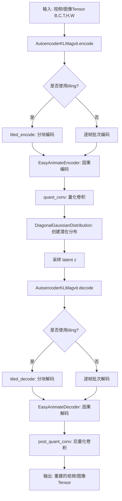
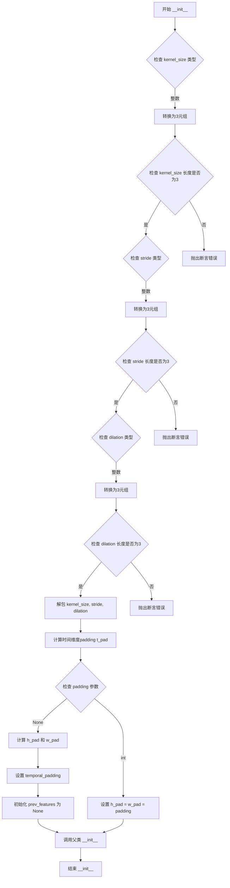
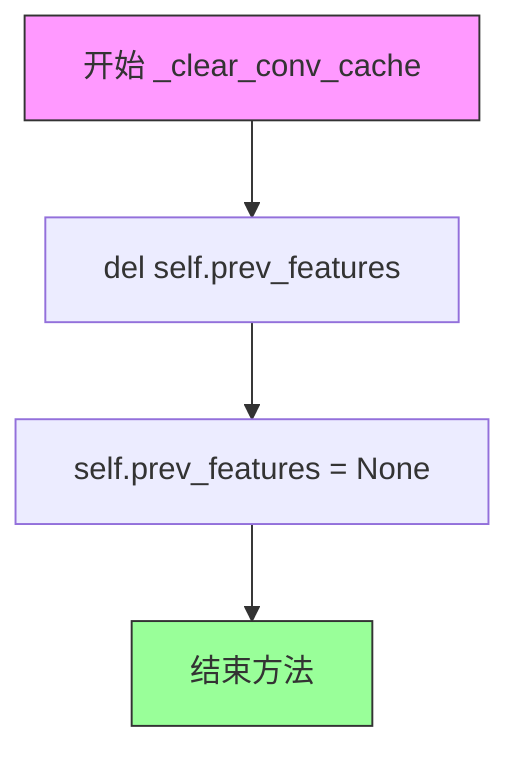
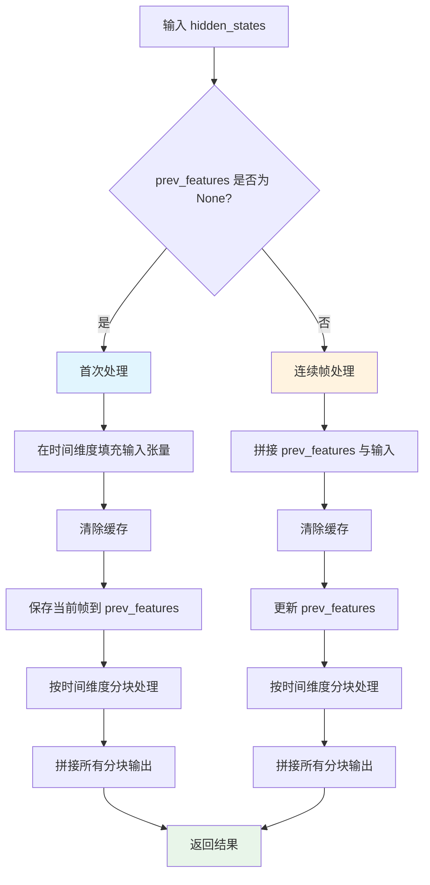
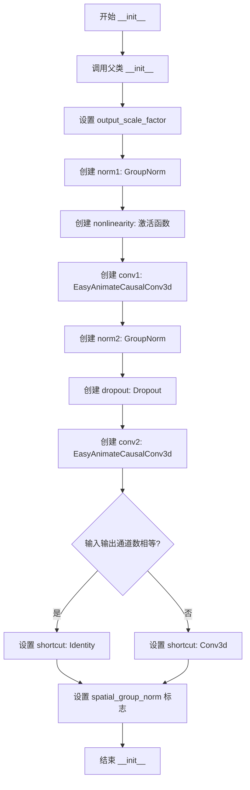
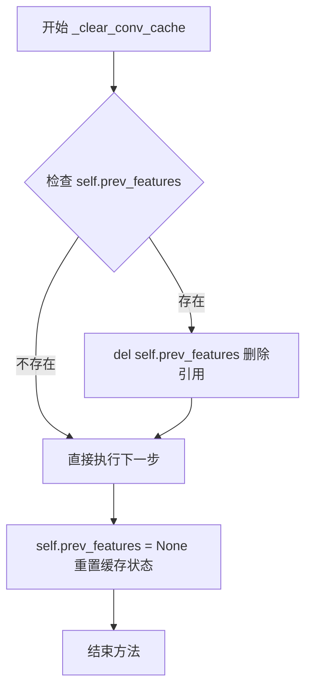
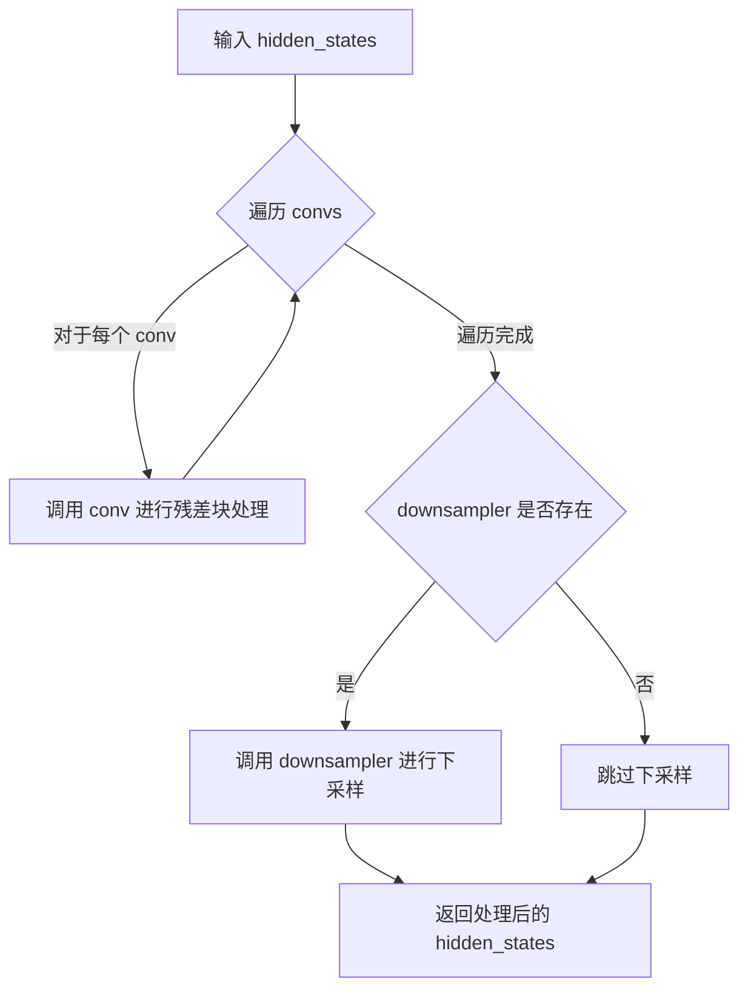
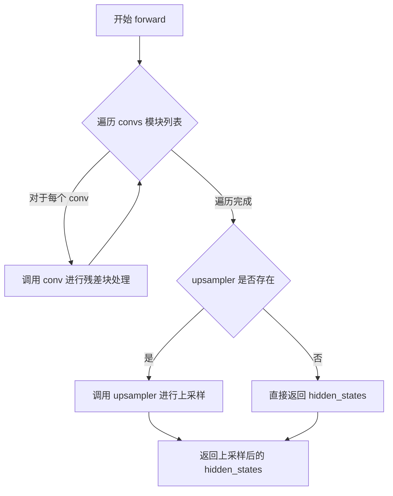
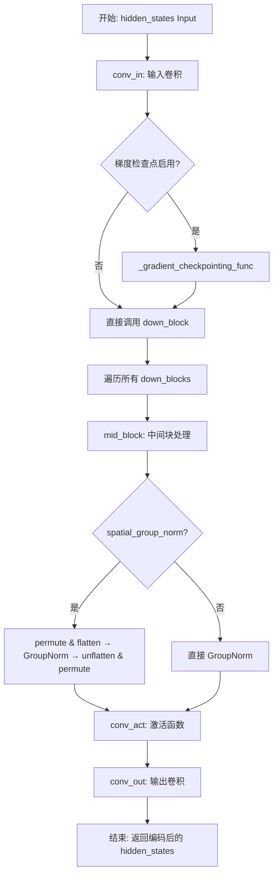

# `diffusers\src\diffusers\models\autoencoders\autoencoder_kl_magvit.py` 详细设计文档

EasyAnimate的变分自编码器(VAE)实现，专门用于3D视频/图像数据的因果编码和解码。该VAE采用自定义的CausalConv3d卷积层，支持时空联合的下采样和上采样，能够将高维视频数据压缩到潜在空间并重建，支持tiling和slicing等内存优化技术，适用于视频生成模型。

## 整体流程



## 类结构

```
nn.Module (PyTorch基类)
├── EasyAnimateCausalConv3d (nn.Conv3d子类)
│   └── _clear_conv_cache(), forward()
├── EasyAnimateResidualBlock3D
│   ├── norm1, nonlinearity, conv1
│   ├── norm2, dropout, conv2
│   ├── shortcut
│   └── forward()
├── EasyAnimateDownsampler3D
│   └── forward()
├── EasyAnimateUpsampler3D
│   ├── _clear_conv_cache(), forward()
│   └── prev_features缓存
├── EasyAnimateDownBlock3D
│   ├── convs (ModuleList)
│   ├── downsampler
│   └── forward()
├── EasyAnimateUpBlock3d
│   ├── convs (ModuleList)
│   ├── upsampler
│   └── forward()
├── EasyAnimateMidBlock3d
│   ├── convs (ModuleList)
│   └── forward()
├── EasyAnimateEncoder (主编码器)
│   ├── conv_in, down_blocks, mid_block
│   ├── conv_norm_out, conv_act, conv_out
│   └── forward()
├── EasyAnimateDecoder (主解码器)
│   ├── conv_in, mid_block, up_blocks
│   ├── conv_norm_out, conv_act, conv_out
│   └── forward()
└── AutoencoderKLMagvit (主VAE模型)
    ├── ModelMixin, AutoencoderMixin, ConfigMixin
    ├── encoder, decoder
    ├── quant_conv, post_quant_conv
    ├── 各种tiling/slicing配置
    └── encode(), decode(), forward()
```

## 全局变量及字段


### `logger`
    
模块级日志记录器，用于记录运行时信息

类型：`logging.Logger`
    


### `math`
    
数学库，用于padding计算

类型：`module`
    


### `torch`
    
PyTorch主库

类型：`module`
    


### `torch.nn`
    
PyTorch神经网络模块

类型：`module`
    


### `torch.nn.functional`
    
PyTorch函数式API

类型：`module`
    


### `ConfigMixin`
    
配置混入基类，用于模型配置管理

类型：`class`
    


### `register_to_config`
    
配置注册装饰器，将模型配置注册到config中

类型：`function`
    


### `logging`
    
HF日志工具模块

类型：`module`
    


### `apply_forward_hook`
    
前向钩子装饰器，用于在forward前后执行额外操作

类型：`function`
    


### `get_activation`
    
激活函数获取函数，根据名称返回对应激活层

类型：`function`
    


### `AutoencoderKLOutput`
    
编码器输出结构，包含latent分布

类型：`class`
    


### `ModelMixin`
    
模型混入基类，提供通用模型方法

类型：`class`
    


### `AutoencoderMixin`
    
VAE混入类，提供编码解码通用接口

类型：`class`
    


### `DecoderOutput`
    
解码器输出结构

类型：`class`
    


### `DiagonalGaussianDistribution`
    
对角高斯分布，用于VAE潜空间采样

类型：`class`
    


### `EasyAnimateCausalConv3d.temporal_padding`
    
时间维度padding大小，用于维持因果关系

类型：`int`
    


### `EasyAnimateCausalConv3d.temporal_padding_origin`
    
原始时间padding值

类型：`int`
    


### `EasyAnimateCausalConv3d.t_stride`
    
时间步长，控制时间维度采样间隔

类型：`int`
    


### `EasyAnimateCausalConv3d.prev_features`
    
缓存的前一帧特征，用于连续时间处理

类型：`Tensor|None`
    


### `EasyAnimateResidualBlock3D.output_scale_factor`
    
输出缩放因子，用于稳定训练

类型：`float`
    


### `EasyAnimateResidualBlock3D.norm1`
    
第一层组归一化

类型：`nn.GroupNorm`
    


### `EasyAnimateResidualBlock3D.nonlinearity`
    
非线性激活函数

类型：`Activation`
    


### `EasyAnimateResidualBlock3D.conv1`
    
第一个因果3D卷积层

类型：`EasyAnimateCausalConv3d`
    


### `EasyAnimateResidualBlock3D.norm2`
    
第二层组归一化

类型：`nn.GroupNorm`
    


### `EasyAnimateResidualBlock3D.dropout`
    
Dropout层用于正则化

类型：`nn.Dropout`
    


### `EasyAnimateResidualBlock3D.conv2`
    
第二个因果3D卷积层

类型：`EasyAnimateCausalConv3d`
    


### `EasyAnimateResidualBlock3D.shortcut`
    
残差连接快捷路径

类型：`nn.Module`
    


### `EasyAnimateResidualBlock3D.spatial_group_norm`
    
是否使用空间组归一化

类型：`bool`
    


### `EasyAnimateDownsampler3D.conv`
    
下采样因果卷积层

类型：`EasyAnimateCausalConv3d`
    


### `EasyAnimateUpsampler3D.temporal_upsample`
    
是否进行时间上采样

类型：`bool`
    


### `EasyAnimateUpsampler3D.spatial_group_norm`
    
是否使用空间组归一化

类型：`bool`
    


### `EasyAnimateUpsampler3D.conv`
    
上采样因果卷积层

类型：`EasyAnimateCausalConv3d`
    


### `EasyAnimateUpsampler3D.prev_features`
    
缓存的前一帧特征

类型：`Tensor|None`
    


### `EasyAnimateDownBlock3D.convs`
    
多个残差块的列表

类型：`nn.ModuleList`
    


### `EasyAnimateDownBlock3D.downsampler`
    
下采样器模块

类型：`EasyAnimateDownsampler3D|None`
    


### `EasyAnimateDownBlock3D.spatial_downsample_factor`
    
空间下采样因子

类型：`int`
    


### `EasyAnimateDownBlock3D.temporal_downsample_factor`
    
时间下采样因子

类型：`int`
    


### `EasyAnimateUpBlock3d.convs`
    
多个残差块的列表

类型：`nn.ModuleList`
    


### `EasyAnimateUpBlock3d.upsampler`
    
上采样器模块

类型：`EasyAnimateUpsampler3D|None`
    


### `EasyAnimateMidBlock3d.convs`
    
中间块残差层列表

类型：`nn.ModuleList`
    


### `EasyAnimateEncoder._supports_gradient_checkpointing`
    
是否支持梯度检查点

类型：`bool`
    


### `EasyAnimateEncoder.conv_in`
    
输入卷积层

类型：`EasyAnimateCausalConv3d`
    


### `EasyAnimateEncoder.down_blocks`
    
下采样块列表

类型：`nn.ModuleList`
    


### `EasyAnimateEncoder.mid_block`
    
中间块

类型：`EasyAnimateMidBlock3d`
    


### `EasyAnimateEncoder.spatial_group_norm`
    
是否使用空间组归一化

类型：`bool`
    


### `EasyAnimateEncoder.conv_norm_out`
    
输出归一化层

类型：`nn.GroupNorm`
    


### `EasyAnimateEncoder.conv_act`
    
输出激活函数

类型：`Activation`
    


### `EasyAnimateEncoder.conv_out`
    
输出卷积层

类型：`EasyAnimateCausalConv3d`
    


### `EasyAnimateEncoder.gradient_checkpointing`
    
梯度检查点标志

类型：`bool`
    


### `EasyAnimateDecoder._supports_gradient_checkpointing`
    
是否支持梯度检查点

类型：`bool`
    


### `EasyAnimateDecoder.conv_in`
    
输入卷积层

类型：`EasyAnimateCausalConv3d`
    


### `EasyAnimateDecoder.mid_block`
    
中间块

类型：`EasyAnimateMidBlock3d`
    


### `EasyAnimateDecoder.up_blocks`
    
上采样块列表

类型：`nn.ModuleList`
    


### `EasyAnimateDecoder.spatial_group_norm`
    
是否使用空间组归一化

类型：`bool`
    


### `EasyAnimateDecoder.conv_norm_out`
    
输出归一化层

类型：`nn.GroupNorm`
    


### `EasyAnimateDecoder.conv_act`
    
输出激活函数

类型：`Activation`
    


### `EasyAnimateDecoder.conv_out`
    
输出卷积层

类型：`EasyAnimateCausalConv3d`
    


### `EasyAnimateDecoder.gradient_checkpointing`
    
梯度检查点标志

类型：`bool`
    


### `AutoencoderKLMagvit._supports_gradient_checkpointing`
    
是否支持梯度检查点

类型：`bool`
    


### `AutoencoderKLMagvit.encoder`
    
编码器网络

类型：`EasyAnimateEncoder`
    


### `AutoencoderKLMagvit.decoder`
    
解码器网络

类型：`EasyAnimateDecoder`
    


### `AutoencoderKLMagvit.quant_conv`
    
量化卷积层

类型：`nn.Conv3d`
    


### `AutoencoderKLMagvit.post_quant_conv`
    
后量化卷积层

类型：`nn.Conv3d`
    


### `AutoencoderKLMagvit.spatial_compression_ratio`
    
空间压缩比率

类型：`int`
    


### `AutoencoderKLMagvit.temporal_compression_ratio`
    
时间压缩比率

类型：`int`
    


### `AutoencoderKLMagvit.use_slicing`
    
是否使用切片策略降低内存

类型：`bool`
    


### `AutoencoderKLMagvit.use_tiling`
    
是否使用瓦片策略处理大尺寸输入

类型：`bool`
    


### `AutoencoderKLMagvit.use_framewise_encoding`
    
是否逐帧编码

类型：`bool`
    


### `AutoencoderKLMagvit.use_framewise_decoding`
    
是否逐帧解码

类型：`bool`
    


### `AutoencoderKLMagvit.num_sample_frames_batch_size`
    
编码时每批处理的帧数

类型：`int`
    


### `AutoencoderKLMagvit.num_latent_frames_batch_size`
    
解码时每批处理的潜帧数

类型：`int`
    


### `AutoencoderKLMagvit.tile_sample_min_height`
    
瓦片最小高度

类型：`int`
    


### `AutoencoderKLMagvit.tile_sample_min_width`
    
瓦片最小宽度

类型：`int`
    


### `AutoencoderKLMagvit.tile_sample_min_num_frames`
    
瓦片最小帧数

类型：`int`
    


### `AutoencoderKLMagvit.tile_sample_stride_height`
    
瓦片垂直步长

类型：`int`
    


### `AutoencoderKLMagvit.tile_sample_stride_width`
    
瓦片水平步长

类型：`int`
    


### `AutoencoderKLMagvit.tile_sample_stride_num_frames`
    
瓦片时间步长

类型：`int`
    
    

## 全局函数及方法


### `EasyAnimateCausalConv3d.__init__`

初始化因果3D卷积层，确保卷积核大小、步幅和膨胀率都是长度为3的元组，计算时间维度的padding以保持因果关系，并使用修改后的padding参数初始化父类`nn.Conv3d`。

参数：

- `in_channels`：`int`，输入张量的通道数
- `out_channels`：`int`，输出张量的通道数
- `kernel_size`：`int | tuple[int, ...]`，卷积核大小，默认为3，可以是整数或3元组
- `stride`：`int | tuple[int, ...]`，卷积步幅，默认为1，可以是整数或3元组
- `padding`：`int | tuple[int, ...]`，填充大小，默认为1，可以是整数或3元组
- `dilation`：`int | tuple[int, ...]`，膨胀率，默认为1，可以是整数或3元组
- `groups`：`int`，分组卷积的组数，默认为1
- `bias`：`bool`，是否添加偏置，默认为True
- `padding_mode`：`str`，填充模式，默认为"zeros"

返回值：`None`，该方法为构造函数，不返回任何值

#### 流程图



#### 带注释源码

```python
def __init__(
    self,
    in_channels: int,
    out_channels: int,
    kernel_size: int | tuple[int, ...] = 3,
    stride: int | tuple[int, ...] = 1,
    padding: int | tuple[int, ...] = 1,
    dilation: int | tuple[int, ...] = 1,
    groups: int = 1,
    bias: bool = True,
    padding_mode: str = "zeros",
):
    # Ensure kernel_size, stride, and dilation are tuples of length 3
    # 如果 kernel_size 是整数，则转换为长度为3的元组；如果是元组则保持不变
    kernel_size = kernel_size if isinstance(kernel_size, tuple) else (kernel_size,) * 3
    # 断言 kernel_size 长度为3，否则抛出错误
    assert len(kernel_size) == 3, f"Kernel size must be a 3-tuple, got {kernel_size} instead."

    # 对 stride 进行相同的处理
    stride = stride if isinstance(stride, tuple) else (stride,) * 3
    assert len(stride) == 3, f"Stride must be a 3-tuple, got {stride} instead."

    # 对 dilation 进行相同的处理
    dilation = dilation if isinstance(dilation, tuple) else (dilation,) * 3
    assert len(dilation) == 3, f"Dilation must be a 3-tuple, got {dilation} instead."

    # Unpack kernel size, stride, and dilation for temporal, height, and width dimensions
    # 解包元组获取时间、高度和宽度维度的参数
    t_ks, h_ks, w_ks = kernel_size
    self.t_stride, h_stride, w_stride = stride
    t_dilation, h_dilation, w_dilation = dilation

    # Calculate padding for temporal dimension to maintain causality
    # 计算时间维度的padding以保持因果关系
    # 时间维度padding = (kernel_size - 1) * dilation，确保当前帧的输出只依赖于当前及之前的帧
    t_pad = (t_ks - 1) * t_dilation

    # Calculate padding for height and width dimensions based on the padding parameter
    # 根据padding参数计算高度和宽度维度的padding
    if padding is None:
        # 如果未指定padding，则自动计算以保持输出尺寸
        h_pad = math.ceil(((h_ks - 1) * h_dilation + (1 - h_stride)) / 2)
        w_pad = math.ceil(((w_ks - 1) * w_dilation + (1 - w_stride)) / 2)
    elif isinstance(padding, int):
        # 如果padding是整数，则高度和宽度使用相同的padding值
        h_pad = w_pad = padding
    else:
        # 其他情况暂未实现
        assert NotImplementedError

    # Store temporal padding and initialize flags and previous features cache
    # 存储时间维度padding
    self.temporal_padding = t_pad
    # 注意：这里的计算看起来有误，使用了 w_dilation 和 w_stride，应该是 t_dilation 和 t_stride
    self.temporal_padding_origin = math.ceil(((t_ks - 1) * w_dilation + (1 - w_stride)) / 2)

    # 初始化前一帧特征缓存，用于因果卷积的时序处理
    self.prev_features = None

    # Initialize the parent class with modified padding
    # 使用修改后的padding参数初始化父类nn.Conv3d
    # 时间维度padding为0，高度和宽度维度使用计算的padding值
    super().__init__(
        in_channels=in_channels,
        out_channels=out_channels,
        kernel_size=kernel_size,
        stride=stride,
        dilation=dilation,
        padding=(0, h_pad, w_pad),  # 时间维度不padding，在forward中手动处理
        groups=groups,
        bias=bias,
        padding_mode=padding_mode,
    )
```


### EasyAnimateCausalConv3d._clear_conv_cache

清除因果3D卷积层中缓存的前一帧特征，用于在处理新的输入序列时重置卷积缓存状态。

参数：

- 该方法无参数

返回值：`None`，无返回值，仅执行清理操作

#### 流程图



#### 带注释源码

```python
def _clear_conv_cache(self):
    """
    清除因果卷积的缓存特征。
    
    该方法用于在处理完一个输入序列后，重置prev_features缓存。
    缓存机制用于在时间维度上保持因果性，确保当前帧的输出只依赖于当前及之前的帧。
    在开始处理新的输入序列或需要强制刷新缓存时调用此方法。
    """
    # 删除之前的特征缓存，释放内存
    del self.prev_features
    # 将prev_features置为None，表示当前没有缓存的特征
    self.prev_features = None
```

---

#### 上下文信息

**所属类字段说明：**

| 字段名称 | 类型 | 描述 |
|---------|------|------|
| `prev_features` | `torch.Tensor \| None` | 缓存的前一帧/时间段特征，用于因果卷积的时间维度处理，初始为`None` |

**调用场景：**

该方法在`EasyAnimateCausalConv3d.forward()`中被调用：
- 首次处理输入时（`self.prev_features is None`）：在填充输入后清除旧缓存
- 非首次处理时：在连接前一个特征后清除旧缓存，然后更新新的特征

**设计意图：**

该缓存机制是实现因果卷积（Casual Convolution）的关键，确保视频/3D数据在时间维度上的信息流动是单向的，即未来帧不会影响当前帧的输出。清除缓存操作用于：
1. 批次边界处理：每个新批次开始时重置状态
2. 强制刷新：当需要使用新数据覆盖历史信息时


### EasyAnimateCausalConv3d.forward()

实现因果3D卷积的前向传播，通过在时间维度上进行填充和分块处理，确保当前帧的输出仅依赖于当前及之前的帧，从而实现视频处理的因果性。

参数：

- `hidden_states`：`torch.Tensor`，输入的隐藏状态张量，形状为 (B, C, T, H, W)，其中 B 是批次大小，C 是通道数，T 是时间帧数，H 是高度，W 是宽度

返回值：`torch.Tensor`，经过因果3D卷积处理后的输出张量，形状为 (B, C', T', H', W')

#### 流程图



#### 带注释源码

```python
def forward(self, hidden_states: torch.Tensor) -> torch.Tensor:
    """
    因果3D卷积前向传播
    
    通过维护 prev_features 缓存来实现因果卷积，确保当前帧的输出
    仅依赖于当前帧及之前的帧，保持时间维度上的因果关系。
    """
    # 确保输入张量是正确的数据类型
    dtype = hidden_states.dtype
    
    if self.prev_features is None:
        # === 首次调用（第一帧或序列开始） ===
        
        # 在时间维度左侧填充，以保持因果性
        # 填充模式使用 replicate，填充值为 0
        hidden_states = F.pad(
            hidden_states,
            pad=(0, 0, 0, 0, self.temporal_padding, 0),  # (左, 右, 上, 下, 前, 后)
            mode="replicate",  # TODO: check if this is necessary
        )
        hidden_states = hidden_states.to(dtype=dtype)

        # 清除之前的卷积缓存
        self._clear_conv_cache()
        # 保存当前帧的最后 temporal_padding 个特征，用于后续帧的因果处理
        self.prev_features = hidden_states[:, :, -self.temporal_padding :].clone()

        # 按时间维度分块处理
        num_frames = hidden_states.size(2)
        outputs = []
        i = 0
        # 循环处理每个时间块
        while i + self.temporal_padding + 1 <= num_frames:
            # 调用父类的 forward 方法进行卷积
            out = super().forward(hidden_states[:, :, i : i + self.temporal_padding + 1])
            i += self.t_stride
            outputs.append(out)
        # 沿时间维度拼接所有输出
        return torch.concat(outputs, 2)
    else:
        # === 连续调用（处理后续帧） ===
        
        # 将前一帧的特征与当前输入拼接
        if self.t_stride == 2:
            # 当时间步长为2时，保留 prev_features 的后部
            hidden_states = torch.concat(
                [self.prev_features[:, :, -(self.temporal_padding - 1) :], hidden_states], dim=2
            )
        else:
            # 直接拼接所有 prev_features
            hidden_states = torch.concat([self.prev_features, hidden_states], dim=2)
        hidden_states = hidden_states.to(dtype=dtype)

        # 清除缓存并更新 prev_features
        self._clear_conv_cache()
        self.prev_features = hidden_states[:, :, -self.temporal_padding :].clone()

        # 同样按时间维度分块处理
        num_frames = hidden_states.size(2)
        outputs = []
        i = 0
        while i + self.temporal_padding + 1 <= num_frames:
            out = super().forward(hidden_states[:, :, i : i + self.temporal_padding + 1])
            i += self.t_stride
            outputs.append(out)
        return torch.concat(outputs, 2)
```


### `EasyAnimateResidualBlock3D.__init__`

该方法用于初始化3D残差块（Residual Block），这是EasyAnimate视频VAE模型中的核心组件，通过残差连接结构实现视频/3D特征的高效学习与传递。

参数：

- `self`：类的实例对象
- `in_channels`：`int`，输入特征图的通道数
- `out_channels`：`int`，输出特征图的通道数
- `non_linearity`：`str`，激活函数类型，默认为"silu"
- `norm_num_groups`：`int`，GroupNorm的分组数，默认为32
- `norm_eps`：`float`，GroupNorm的epsilon值，默认为1e-6
- `spatial_group_norm`：`bool`，是否启用空间分组归一化，默认为True
- `dropout`：`float`，Dropout概率，默认为0.0
- `output_scale_factor`：`float`，输出缩放因子，默认为1.0

返回值：无（`None`），`__init__`方法不返回值，仅初始化对象属性

#### 流程图



#### 带注释源码

```python
def __init__(
    self,
    in_channels: int,
    out_channels: int,
    non_linearity: str = "silu",
    norm_num_groups: int = 32,
    norm_eps: float = 1e-6,
    spatial_group_norm: bool = True,
    dropout: float = 0.0,
    output_scale_factor: float = 1.0,
):
    """
    初始化3D残差块

    参数:
        in_channels: 输入通道数
        out_channels: 输出通道数
        non_linearity: 激活函数类型，默认为silu
        norm_num_groups: GroupNorm的分组数，用于归一化
        norm_eps: GroupNorm的epsilon值，防止除零
        spatial_group_norm: 是否使用空间分组归一化
        dropout: Dropout概率，用于正则化
        output_scale_factor: 输出缩放因子，用于控制残差连接的幅度
    """
    # 调用父类nn.Module的初始化方法
    super().__init__()

    # 保存输出缩放因子，用于后续前向传播时对输出进行缩放
    self.output_scale_factor = output_scale_factor

    # 第一个归一化层：对输入进行GroupNorm归一化
    # GroupNorm将通道分成多个组进行归一化，对batch大小不敏感
    self.norm1 = nn.GroupNorm(
        num_groups=norm_num_groups,
        num_channels=in_channels,
        eps=norm_eps,
        affine=True,
    )

    # 根据non_linearity参数获取对应的激活函数
    self.nonlinearity = get_activation(non_linearity)

    # 第一个因果3D卷积层：将in_channels维特征映射到out_channels维
    # 使用因果卷积确保时间维度的因果性（未来帧不影响当前帧）
    self.conv1 = EasyAnimateCausalConv3d(in_channels, out_channels, kernel_size=3)

    # 第二个归一化层：对卷积输出进行GroupNorm归一化
    self.norm2 = nn.GroupNorm(num_groups=norm_num_groups, num_channels=out_channels, eps=norm_eps, affine=True)

    # Dropout层，用于防止过拟合
    self.dropout = nn.Dropout(dropout)

    # 第二个因果3D卷积层：保持通道数不变
    self.conv2 = EasyAnimateCausalConv3d(out_channels, out_channels, kernel_size=3)

    # 残差连接（Shortcut）：当输入输出通道数不同时，使用1x1卷积进行维度匹配
    if in_channels != out_channels:
        # 使用1x1卷积将输入通道数映射到输出通道数
        self.shortcut = nn.Conv3d(in_channels, out_channels, kernel_size=1)
    else:
        # 通道数相同时，使用恒等映射（Identity）
        self.shortcut = nn.Identity()

    # 保存空间分组归一化标志，供前向传播时使用
    self.spatial_group_norm = spatial_group_norm
```


### `EasyAnimateResidualBlock3D.forward()`

该方法实现了3D残差块的前向传播，通过两个级联的归一化-激活-卷积结构处理输入的5D张量（批量大小B、通道C、时间T、高度H、宽度W），并结合残差连接实现特征的深层传递。

参数：

- `hidden_states`：`torch.Tensor`，输入的隐藏状态张量，形状为 (B, C, T, H, W)，其中 B 是批量大小，C 是通道数，T 是时间帧数，H 是高度，W 是宽度

返回值：`torch.Tensor`，经过残差块处理后的输出张量，形状为 (B, C, T, H, W)，经过输出缩放因子归一化

#### 流程图

```mermaid
flowchart TD
    A[输入 hidden_states] --> B[计算 shortcut = self.shortcut hidden_states]
    
    B --> C{是否启用 spatial_group_norm?}
    
    C -->|是| D[permute: (B,C,T,H,W) → (B,T,C,H,W)]
    D --> E[flatten: (B,T,C,H,W) → (B*T,C,H,W)]
    E --> F[norm1 归一化]
    F --> G[unflatten + permute 恢复形状]
    G --> H[非线性和 conv1]
    
    C -->|否| I[norm1 归一化]
    I --> J[非线性和 conv1]
    
    H --> K{是否启用 spatial_group_norm?}
    J --> K
    
    K -->|是| L[permute + flatten + norm2 + unflatten + permute]
    K -->|否| M[norm2 归一化]
    
    L --> N[非线性 + dropout + conv2]
    M --> N
    
    N --> O[残差相加: hidden_states + shortcut]
    O --> P[除以 output_scale_factor]
    P --> Q[输出结果]
```

#### 带注释源码

```python
def forward(self, hidden_states: torch.Tensor) -> torch.Tensor:
    """
    3D残差块的前向传播
    
    处理5D输入张量 (B, C, T, H, W)，通过两个级联的归一化-激活-卷积结构，
    并结合残差连接输出特征。
    
    参数:
        hidden_states: 输入张量，形状 (B, C, T, H, W)
            B - 批量大小
            C - 通道数
            T - 时间帧数
            H - 高度
            W - 宽度
    
    返回:
        处理后的张量，形状 (B, C, T, H, W)
    """
    # 步骤1: 计算残差连接（shortcut）
    # 如果输入输出通道数不同，使用1x1卷积进行通道转换；否则使用恒等映射
    shortcut = self.shortcut(hidden_states)

    # 步骤2: 第一个归一化-激活-卷积块
    if self.spatial_group_norm:
        # 空间组归一化：对时空数据进行特殊处理
        # 将 (B, C, T, H, W) 转换为 (B*T, C, H, W) 进行组归一一化
        batch_size = hidden_states.size(0)
        hidden_states = hidden_states.permute(0, 2, 1, 3, 4).flatten(0, 1)  # [B, C, T, H, W] -> [B * T, C, H, W]
        
        # 第一个组归一化
        hidden_states = self.norm1(hidden_states)
        
        # 恢复原始形状: (B*T, C, H, W) -> (B, T, C, H, W) -> (B, C, T, H, W)
        hidden_states = hidden_states.unflatten(0, (batch_size, -1)).permute(
            0, 2, 1, 3, 4
        )  # [B * T, C, H, W] -> [B, C, T, H, W]
    else:
        # 标准组归一化
        hidden_states = self.norm1(hidden_states)

    # 激活函数（如 SiLU）
    hidden_states = self.nonlinearity(hidden_states)
    
    # 第一个因果3D卷积
    hidden_states = self.conv1(hidden_states)

    # 步骤3: 第二个归一化-激活-卷积块
    if self.spatial_group_norm:
        # 重复空间组归一化处理流程
        batch_size = hidden_states.size(0)
        hidden_states = hidden_states.permute(0, 2, 1, 3, 4).flatten(0, 1)  # [B, C, T, H, W] -> [B * T, C, H, W]
        hidden_states = self.norm2(hidden_states)
        hidden_states = hidden_states.unflatten(0, (batch_size, -1)).permute(
            0, 2, 1, 3, 4
        )  # [B * T, C, H, W] -> [B, C, T, H, W]
    else:
        hidden_states = self.norm2(hidden_states)

    # 激活函数
    hidden_states = self.nonlinearity(hidden_states)
    
    # Dropout 正则化
    hidden_states = self.dropout(hidden_states)
    
    # 第二个因果3D卷积
    hidden_states = self.conv2(hidden_states)

    # 步骤4: 残差连接与输出缩放
    # 将卷积输出与 shortcut 相加，然后除以输出缩放因子
    return (hidden_states + shortcut) / self.output_scale_factor
```


### `EasyAnimateDownsampler3D.__init__`

初始化一个3D下采样器模块，用于对视频或3D数据（如时空维度）进行下采样操作。该方法创建一个因果3D卷积层（EasyAnimateCausalConv3d），通过配置步长实现空间和时间维度的压缩。

参数：

- `self`：类实例本身（隐式参数）
- `in_channels: int`：输入数据的通道数，指定进入下采样层的特征维度
- `out_channels: int`：输出数据的通道数，指定下采样后特征的维度
- `kernel_size: int = 3`：卷积核大小，默认为3x3x3的立方体卷积核
- `stride: tuple = (2, 2, 2)`：步长元组，指定在时间、高度、宽度三个维度上的下采样率，默认为每个维度下采样2倍

返回值：`None`（无返回值，__init__ 方法不返回任何内容）

#### 流程图

```mermaid
flowchart TD
    A[开始 __init__] --> B[调用 super().__init__ 初始化nn.Module]
    B --> C[创建 EasyAnimateCausalConv3d 卷积层]
    C --> D[配置输入通道: in_channels]
    D --> E[配置输出通道: out_channels]
    E --> F[配置卷积核大小: kernel_size]
    F --> G[配置步长: stride]
    G --> H[设置padding=0]
    H --> I[将卷积层赋值给 self.conv]
    I --> J[结束 __init__]
```

#### 带注释源码

```python
class EasyAnimateDownsampler3D(nn.Module):
    def __init__(self, in_channels: int, out_channels: int, kernel_size: int = 3, stride: tuple = (2, 2, 2)):
        """
        初始化3D下采样器
        
        参数:
            in_channels: 输入通道数
            out_channels: 输出通道数  
            kernel_size: 卷积核大小，默认为3
            stride: 步长，默认为(2,2,2)表示时间、高度、宽度各下采样2倍
        """
        # 调用父类nn.Module的初始化方法，建立模块的基本结构
        super().__init__()

        # 创建因果3D卷积层用于下采样
        # 因果卷积确保当前帧的输出只依赖于当前帧及之前的帧，符合时间序列因果关系
        # padding=0表示不进行额外填充，依赖stride实现下采样
        self.conv = EasyAnimateCausalConv3d(
            in_channels=in_channels,      # 输入通道数
            out_channels=out_channels,    # 输出通道数
            kernel_size=kernel_size,       # 卷积核大小
            stride=stride,                 # 步长，控制下采样率
            padding=0                      # 显式设置padding为0
        )
```


### `EasyAnimateDownsampler3D.forward`

该方法是 `EasyAnimateDownsampler3D` 类的前向传播函数，用于对3D视频数据进行空间（高度、宽度）和时间维度的下采样操作，通过填充和因果卷积实现时序因果性的下采样。

参数：

- `self`：实例本身，包含卷积层 `conv`（EasyAnimateCausalConv3d 类型），用于执行因果卷积操作。
- `hidden_states`：`torch.Tensor`，输入的隐藏状态张量，形状为 (B, C, T, H, W)，其中 B 为批量大小，C 为通道数，T 为时间帧数，H 为高度，W 为宽度。

返回值：`torch.Tensor`，下采样后的隐藏状态张量，形状为 (B, C, T', H', W')，其中 T'、H'、W' 分别为下采样后的时间、高度和宽度维度。

#### 流程图

```mermaid
flowchart TD
    A[输入 hidden_states: (B, C, T, H, W)] --> B[在空间维度填充<br/>F.pad: (0, 1, 0, 1)]
    B --> C[通过因果卷积处理<br/>self.conv]
    C --> D[输出: (B, C, T', H', W')]
```

#### 带注释源码

```
def forward(self, hidden_states: torch.Tensor) -> torch.Tensor:
    """
    对输入的3D隐藏状态进行下采样操作。
    
    参数:
        hidden_states: 输入张量，形状为 (B, C, T, H, W)，代表批量大小、通道数、时间帧、高度和宽度。
        
    返回:
        下采样后的张量，形状为 (B, C, T', H', W')，其中时间、空间维度已根据卷积步长进行下采样。
    """
    # 在高度和宽度维度的末尾各填充1个像素，以处理边界情况
    # 填充格式为 (左, 右, 上, 下, 前, 后)，此处仅在高度(H)和宽度(W)维度填充
    hidden_states = F.pad(hidden_states, (0, 1, 0, 1))
    
    # 使用预定义的因果卷积层进行下采样
    # 卷积核大小默认为3，步长默认为(2,2,2)，实现时间维度2倍、空间维度2倍的下采样
    hidden_states = self.conv(hidden_states)
    
    return hidden_states
```


### `EasyAnimateUpsampler3D.__init__`

初始化 EasyAnimateUpsampler3D 上采样器类，设置输入输出通道、卷积核大小、时间/空间上采样模式等核心参数，并初始化因果 3D 卷积层和特征缓存。

参数：

- `in_channels`：`int`，输入张量的通道数
- `out_channels`：`int | None`，输出张量的通道数，默认为 None（等同于 in_channels）
- `kernel_size`：`int`，卷积核大小，默认为 3
- `temporal_upsample`：`bool`，是否启用时间维度上采样，默认为 False
- `spatial_group_norm`：`bool`，是否启用空间分组归一化，默认为 True

返回值：无（`None`），构造函数不返回任何值，仅初始化对象状态

#### 流程图

```mermaid
flowchart TD
    A[开始 __init__] --> B[调用 super().__init__]
    B --> C{out_channels is None?}
    C -->|是| D[out_channels = in_channels]
    C -->|否| E[保持 out_channels 不变]
    D --> F[设置 self.temporal_upsample]
    E --> F
    F --> G[设置 self.spatial_group_norm]
    G --> H[创建 EasyAnimateCausalConv3d 卷积层]
    H --> I[初始化 self.prev_features = None]
    I --> J[结束 __init__]
```

#### 带注释源码

```python
def __init__(
    self,
    in_channels: int,
    out_channels: int,
    kernel_size: int = 3,
    temporal_upsample: bool = False,
    spatial_group_norm: bool = True,
):
    """
    初始化 EasyAnimateUpsampler3D 上采样器

    参数:
        in_channels: 输入特征图的通道数
        out_channels: 输出特征图的通道数，默认为 None
        kernel_size: 卷积核大小，默认为 3
        temporal_upsample: 是否在时间维度上进行上采样
        spatial_group_norm: 是否使用空间分组归一化
    """
    # 调用父类 nn.Module 的初始化方法
    super().__init__()
    
    # 如果 out_channels 为 None，则使用与输入通道相同的通道数
    out_channels = out_channels or in_channels

    # 保存时间维度上采样标志，用于前向传播时的逻辑判断
    self.temporal_upsample = temporal_upsample
    # 保存空间分组归一化标志，用于前向传播时的插值模式选择
    self.spatial_group_norm = spatial_group_norm

    # 创建因果 3D 卷积层，用于在时间维度上保持因果性
    self.conv = EasyAnimateCausalConv3d(
        in_channels=in_channels, 
        out_channels=out_channels, 
        kernel_size=kernel_size
    )
    
    # 初始化前一帧特征缓存，用于时间维度上采样时的特征传递
    self.prev_features = None
```


### `EasyAnimateUpsampler3D._clear_conv_cache()`

清除上采样层的卷积缓存，将之前存储的特征图引用删除并重置为 None，以便在处理新的视频序列时不会使用过时的缓存数据。

参数：

- （无参数）

返回值：`None`，无返回值，该方法仅执行状态修改操作。

#### 流程图



#### 带注释源码

```python
def _clear_conv_cache(self):
    """
    清除上采样器的卷积缓存。
    
    该方法用于重置 prev_features 状态，确保在处理新的视频帧序列时
    不会携带之前批次的特征缓存，避免因状态残留导致的时间维度错误。
    """
    # 删除之前的特征缓存引用，释放内存
    del self.prev_features
    # 将 prev_features 重置为 None，表示当前没有缓存的特征
    self.prev_features = None
```


### `EasyAnimateUpsampler3D.forward`

该方法是 3D 上采样器的前向传播函数，主要功能是对输入的隐藏状态进行空间维度的上采样（高度和宽度各放大2倍），并可选地进行时间维度的上采样，同时通过因果卷积保持时间序列的因果性。

参数：

- `hidden_states`：`torch.Tensor`，输入的隐藏状态张量，形状为 (B, C, T, H, W)，其中 B 是批量大小，C 是通道数，T 是时间帧数，H 是高度，W 是宽度

返回值：`torch.Tensor`，上采样后的隐藏状态张量

#### 流程图

```mermaid
flowchart TD
    A[开始 forward] --> B{检查 temporal_upsample}
    B -->|False| C[执行空间上采样 F.interpolate scale=(1, 2, 2)]
    C --> D[通过因果卷积 self.conv 处理]
    D --> E[返回 hidden_states]
    
    B -->|True| F{检查 prev_features 是否为 None}
    F -->|是| G[保存 hidden_states 到 prev_features]
    G --> C
    F -->|否| H[执行时间上采样 F.interpolate scale=(2, 1, 1)]
    H --> C
```

#### 带注释源码

```python
def forward(self, hidden_states: torch.Tensor) -> torch.Tensor:
    # 第一步：空间上采样
    # 使用最近邻插值在空间维度（高度和宽度）上进行2倍上采样
    # scale_factor=(1, 2, 2) 表示时间维度不变，高度x2，宽度x2
    hidden_states = F.interpolate(hidden_states, scale_factor=(1, 2, 2), mode="nearest")
    
    # 第二步：因果卷积处理
    # 使用因果卷积处理上采样后的特征，保持时间维度的因果性
    hidden_states = self.conv(hidden_states)

    # 第三步：可选的时间维度上采样
    if self.temporal_upsample:
        if self.prev_features is None:
            # 首次调用时，保存当前特征用于下一次时间上采样
            self.prev_features = hidden_states
        else:
            # 后续调用时，将之前保存的特征与当前特征在时间维度上拼接
            # 然后进行时间维度的2倍上采样
            # mode 根据 spatial_group_norm 选择 trilinear 或 nearest
            hidden_states = F.interpolate(
                hidden_states,
                scale_factor=(2, 1, 1),
                mode="trilinear" if not self.spatial_group_norm else "nearest",
            )
    
    # 返回处理后的隐藏状态
    return hidden_states
```


### `EasyAnimateDownBlock3D.__init__`

该方法是 `EasyAnimateDownBlock3D` 类的初始化方法，负责构建一个用于视频/3D数据的下采样块。该块由多个残差卷积层（`EasyAnimateResidualBlock3D`）组成，可选地添加下采样器（`EasyAnimateDownsampler3D`）以实现空间和/或时间维度的下采样。初始化过程根据参数配置残差块的堆叠数量、归一化策略、激活函数，以及下采样的空间和时间下采样因子。

参数：

- `in_channels`：`int`，输入特征图的通道数
- `out_channels`：`int`，输出特征图的通道数
- `num_layers`：`int`，要堆叠的残差块数量，默认为 1
- `act_fn`：`str`，激活函数名称，默认为 "silu"
- `norm_num_groups`：`int`，分组归一化的组数，默认为 32
- `norm_eps`：`float`，归一化的 epsilon 值，默认为 1e-6
- `spatial_group_norm`：`bool`，是否对空间维度进行分组归一化，默认为 True
- `dropout`：`float`，Dropout 比率，默认为 0.0
- `output_scale_factor`：`float`，输出缩放因子，默认为 1.0
- `add_downsample`：`bool`，是否添加下采样层，默认为 True
- `add_temporal_downsample`：`bool`，是否在时间维度进行下采样，默认为 True

返回值：`None`，该方法为初始化方法，不返回任何值

#### 流程图

```mermaid
flowchart TD
    A[开始 __init__] --> B[调用 super().__init__]
    B --> C[初始化 self.convs 为空 ModuleList]
    D[循环 i from 0 to num_layers-1] --> E{判断 i == 0?}
    E -->|是| F[in_channels 保持不变]
    E -->|否| G[in_channels = out_channels]
    F --> H[创建 EasyAnimateResidualBlock3D]
    G --> H
    H --> I[将残差块添加到 self.convs]
    I --> J{add_downsample and add_temporal_downsample?}
    J -->|是| K[创建 EasyAnimateDownsampler3D<br/>stride=(2,2,2)<br/>设置下采样因子=2]
    J -->|否| L{add_downsample and not add_temporal_downsample?}
    L -->|是| M[创建 EasyAnimateDownsampler3D<br/>stride=(1,2,2)<br/>spatial=2, temporal=1]
    L -->|否| N[downsampler = None<br/>spatial=1, temporal=1]
    K --> O[结束 __init__]
    M --> O
    N --> O
```

#### 带注释源码

```
class EasyAnimateDownBlock3D(nn.Module):
    def __init__(
        self,
        in_channels: int,                    # 输入通道数
        out_channels: int,                   # 输出通道数
        num_layers: int = 1,                  # 残差块堆叠层数
        act_fn: str = "silu",                 # 激活函数名称
        norm_num_groups: int = 32,            # 分组归一化的组数
        norm_eps: float = 1e-6,               # 归一化 epsilon
        spatial_group_norm: bool = True,      # 是否启用空间分组归一化
        dropout: float = 0.0,                 # Dropout 比率
        output_scale_factor: float = 1.0,    # 输出缩放因子
        add_downsample: bool = True,          # 是否添加下采样
        add_temporal_downsample: bool = True, # 是否进行时间维度下采样
    ):
        # 调用父类 nn.Module 的初始化方法
        super().__init__()

        # 初始化卷积层列表，用于存储多个残差块
        self.convs = nn.ModuleList([])
        
        # 循环创建指定数量的残差块
        for i in range(num_layers):
            # 第一层使用输入通道数，后续层使用输出通道数
            in_channels = in_channels if i == 0 else out_channels
            
            # 创建残差块并添加到模块列表中
            self.convs.append(
                EasyAnimateResidualBlock3D(
                    in_channels=in_channels,
                    out_channels=out_channels,
                    non_linearity=act_fn,
                    norm_num_groups=norm_num_groups,
                    norm_eps=norm_eps,
                    spatial_group_norm=spatial_group_norm,
                    dropout=dropout,
                    output_scale_factor=output_scale_factor,
                )
            )

        # 根据下采样配置创建下采样器
        if add_downsample and add_temporal_downsample:
            # 空间和时间维度同时下采样（2x2x2）
            self.downsampler = EasyAnimateDownsampler3D(
                out_channels, out_channels, kernel_size=3, stride=(2, 2, 2)
            )
            self.spatial_downsample_factor = 2    # 空间下采样因子
            self.temporal_downsample_factor = 2   # 时间下采样因子
        elif add_downsample and not add_temporal_downsample:
            # 仅空间维度下采样（1x2x2），时间维度保持不变
            self.downsampler = EasyAnimateDownsampler3D(
                out_channels, out_channels, kernel_size=3, stride=(1, 2, 2)
            )
            self.spatial_downsample_factor = 2    # 空间下采样因子
            self.temporal_downsample_factor = 1   # 时间下采样因子为1（不下采样）
        else:
            # 不添加下采样器
            self.downsampler = None
            self.spatial_downsample_factor = 1
            self.temporal_downsample_factor = 1
```


### `EasyAnimateDownBlock3D.forward()`

该方法是 EasyAnimateDownBlock3D 类的前向传播函数，负责对 3D 视频数据进行下采样块处理。流程包括：首先通过多个残差块（EasyAnimateResidualBlock3D）提取特征，然后通过下采样器（EasyAnimateDownsampler3D）对空间和时间维度进行下采样（如果启用）。

参数：

- `hidden_states`：`torch.Tensor`，输入的隐藏状态张量，形状为 (B, C, T, H, W)，其中 B 是批次大小，C 是通道数，T 是时间帧数，H 是高度，W 是宽度

返回值：`torch.Tensor`，经过下采样块处理后的隐藏状态张量，形状根据下采样因子变化

#### 流程图



#### 带注释源码

```python
def forward(self, hidden_states: torch.Tensor) -> torch.Tensor:
    """
    前向传播函数，对 3D 视频特征进行下采样处理
    
    参数:
        hidden_states: 输入的隐藏状态张量，形状为 (B, C, T, H, W)
    
    返回:
        处理后的隐藏状态张量
    """
    # 步骤1: 遍历所有残差块（卷积层），对输入进行特征提取
    # self.convs 是一个 nn.ModuleList，包含 num_layers 个 EasyAnimateResidualBlock3D
    for conv in self.convs:
        hidden_states = conv(hidden_states)
    
    # 步骤2: 如果存在下采样器，则对特征进行下采样
    # downsampler 可以是以下三种情况之一：
    # - EasyAnimateDownsampler3D with stride=(2,2,2): 时间和空间都下采样 2 倍
    # - EasyAnimateDownsampler3D with stride=(1,2,2): 仅空间下采样 2 倍
    # - None: 不进行下采样
    if self.downsampler is not None:
        hidden_states = self.downsampler(hidden_states)
    
    # 步骤3: 返回处理后的隐藏状态
    return hidden_states
```


### `EasyAnimateUpBlock3d.__init__`

初始化上采样块，包含多个3D残差卷积块和可选的空间/时间上采样器，用于视频生成模型的上采样路径。

参数：

- `in_channels`：`int`，输入特征图的通道数
- `out_channels`：`int`，输出特征图的通道数
- `num_layers`：`int = 1`，残差块的数量
- `act_fn`：`str = "silu"`，激活函数类型
- `norm_num_groups`：`int = 32`，GroupNorm的组数
- `norm_eps`：`float = 1e-6`，GroupNorm的epsilon值
- `spatial_group_norm`：`bool = False`，是否使用空间GroupNorm
- `dropout`：`float = 0.0`，Dropout概率
- `output_scale_factor`：`float = 1.0`，输出特征图的缩放因子
- `add_upsample`：`bool = True`，是否添加上采样操作
- `add_temporal_upsample`：`bool = True`，是否添加时间维度的上采样

返回值：无返回值（`__init__` 方法）

#### 流程图

```mermaid
flowchart TD
    A[开始 __init__] --> B[调用 super().__init__]
    B --> C[初始化 self.convs = nn.ModuleList]
    C --> D{遍历 num_layers}
    D -->|i == 0| E[in_channels = 原始输入通道]
    D -->|i > 0| F[in_channels = out_channels]
    E --> G[创建 EasyAnimateResidualBlock3D]
    F --> G
    G --> H[将残差块添加到 self.convs]
    H --> D
    D --> I{add_upsample == True?}
    I -->|是| J[创建 EasyAnimateUpsampler3D]
    I -->|否| K[设置 self.upsampler = None]
    J --> L[设置 self.upsampler]
    K --> M[结束 __init__]
    L --> M
```

#### 带注释源码

```python
def __init__(
    self,
    in_channels: int,
    out_channels: int,
    num_layers: int = 1,
    act_fn: str = "silu",
    norm_num_groups: int = 32,
    norm_eps: float = 1e-6,
    spatial_group_norm: bool = False,
    dropout: float = 0.0,
    output_scale_factor: float = 1.0,
    add_upsample: bool = True,
    add_temporal_upsample: bool = True,
):
    """
    初始化上采样块

    参数:
        in_channels: 输入通道数
        out_channels: 输出通道数
        num_layers: 残差块层数
        act_fn: 激活函数名称
        norm_num_groups: GroupNorm的组数
        norm_eps: 归一化epsilon值
        spatial_group_norm: 是否使用空间组归一化
        dropout: Dropout比率
        output_scale_factor: 输出缩放因子
        add_upsample: 是否添加上采样器
        add_temporal_upsample: 是否添加时间上采样
    """
    # 调用父类nn.Module的初始化方法
    super().__init__()

    # 初始化卷积层列表，用于存储多个残差块
    self.convs = nn.ModuleList([])
    
    # 循环创建指定数量的残差块
    for i in range(num_layers):
        # 第一个残差块的输入通道为原始输入通道，后续块的输入通道等于输出通道
        in_channels = in_channels if i == 0 else out_channels
        
        # 创建3D残差块，包含卷积、归一化、激活等组件
        self.convs.append(
            EasyAnimateResidualBlock3D(
                in_channels=in_channels,           # 输入通道数
                out_channels=out_channels,         # 输出通道数
                non_linearity=act_fn,              # 激活函数
                norm_num_groups=norm_num_groups,   # 组归一化组数
                norm_eps=norm_eps,                 # 归一化epsilon
                spatial_group_norm=spatial_group_norm,  # 空间组归一化标志
                dropout=dropout,                   # Dropout概率
                output_scale_factor=output_scale_factor,  # 输出缩放因子
            )
        )

    # 根据add_upsample标志决定是否添加上采样器
    if add_upsample:
        # 创建上采样器，支持空间和时间维度上采样
        self.upsampler = EasyAnimateUpsampler3D(
            in_channels,                            # 输入通道数
            in_channels,                            # 输出通道数（与输入相同）
            temporal_upsample=add_temporal_upsample, # 是否进行时间上采样
            spatial_group_norm=spatial_group_norm,  # 空间组归一化
        )
    else:
        # 不添加上采样器
        self.upsampler = None
```


### `EasyAnimateUpBlock3d.forward()`

该方法是 EasyAnimateUpBlock3d 类的前向传播函数，负责对 3D 视频潜在表示进行上采样处理。它首先通过多个残差块（EasyAnimateResidualBlock3D）进行特征提取和转换，然后根据配置选择是否通过上采样器（EasyAnimateUpsampler3D）进行空间和时间维度的上采样，以恢复更高分辨率的表示。

参数：

- `hidden_states`：`torch.Tensor`，输入的隐藏状态张量，形状为 (B, C, T, H, W)，其中 B 是批量大小，C 是通道数，T 是时间帧数，H 是高度，W 是宽度

返回值：`torch.Tensor`，上采样后的隐藏状态张量，形状为 (B, C, T', H', W')，其中 T'、H'、W' 是上采样后的维度

#### 流程图



#### 带注释源码

```python
def forward(self, hidden_states: torch.Tensor) -> torch.Tensor:
    """
    前向传播函数，对 3D 视频潜在表示进行上采样处理
    
    参数:
        hidden_states: 输入的隐藏状态张量，形状为 (B, C, T, H, W)
        
    返回:
        上采样后的隐藏状态张量，形状为 (B, C, T', H', W')
    """
    # 遍历所有残差卷积块，进行特征提取和转换
    for conv in self.convs:
        hidden_states = conv(hidden_states)
    
    # 如果存在上采样器，则进行上采样操作
    if self.upsampler is not None:
        hidden_states = self.upsampler(hidden_states)
    
    # 返回处理后的隐藏状态
    return hidden_states
```


### `EasyAnimateMidBlock3d.__init__`

该方法用于初始化 EasyAnimate 模型的中间块（Mid Block），通过创建指定数量的 3D 残差块（`EasyAnimateResidualBlock3D`）来构建中间处理层，支持可配置的组归一化、激活函数和 Dropout，适用于视频数据的因果式处理。

参数：

- `in_channels`：`int`，输入张量的通道数
- `num_layers`：`int = 1`，残差块的数量，默认为 1
- `act_fn`：`str = "silu"`，激活函数名称，默认为 SiLU
- `norm_num_groups`：`int = 32`，组归一化的组数，默认为 32
- `norm_eps`：`float = 1e-6`，组归一化的 epsilon 值，防止除零，默认为 1e-6
- `spatial_group_norm`：`bool = True`，是否使用空间组归一化，默认为 True
- `dropout`：`float = 0.0`，Dropout 比率，默认为 0.0
- `output_scale_factor`：`float = 1.0`，输出缩放因子，默认为 1.0

返回值：`None`，该方法为构造函数，不返回任何值

#### 流程图

```mermaid
flowchart TD
    A[开始 __init__] --> B[调用 super().__init__]
    B --> C{norm_num_groups is not None?}
    C -->|是| D[保持原值]
    C -->|否| E[计算 min(in_channels // 4, 32)]
    D --> F[创建 ModuleList 包含第一个 EasyAnimateResidualBlock3D]
    E --> F
    F --> G{num_layers > 1?}
    G -->|是| H[循环创建剩余的残差块并添加到 ModuleList]
    G -->|否| I[结束初始化]
    H --> I
```

#### 带注释源码

```python
def __init__(
    self,
    in_channels: int,                    # 输入张量的通道数
    num_layers: int = 1,                 # 残差块的数量，默认为1
    act_fn: str = "silu",                # 激活函数，默认为SiLU
    norm_num_groups: int = 32,           # 组归一化的组数，默认为32
    norm_eps: float = 1e-6,              # 组归一化的epsilon值，防止除零
    spatial_group_norm: bool = True,      # 是否使用空间组归一化
    dropout: float = 0.0,                # Dropout比率
    output_scale_factor: float = 1.0,    # 输出缩放因子
):
    # 调用父类nn.Module的初始化方法
    super().__init__()

    # 如果norm_num_groups为None，则计算默认值：取in_channels的1/4与32的较小值
    # 这确保了组数不会过大，同时有一个合理的最小值
    norm_num_groups = norm_num_groups if norm_num_groups is not None else min(in_channels // 4, 32)

    # 创建一个ModuleList来存储所有的残差块
    # 首先添加第一个残差块，使用EasyAnimateResidualBlock3D类
    # 该残差块包含：组归一化、激活函数、因果卷积等组件
    self.convs = nn.ModuleList(
        [
            EasyAnimateResidualBlock3D(
                in_channels=in_channels,             # 输入通道数
                out_channels=in_channels,            # 输出通道数（与输入相同，保持维度）
                non_linearity=act_fn,                # 激活函数类型
                norm_num_groups=norm_num_groups,     # 组归一化的组数
                norm_eps=norm_eps,                    # 归一化epsilon值
                spatial_group_norm=spatial_group_norm,# 是否使用空间组归一化
                dropout=dropout,                      # Dropout比率
                output_scale_factor=output_scale_factor, # 输出缩放因子
            )
        ]
    )

    # 如果指定了多于1层的残差块，则循环添加剩余的残差块
    # 每一层都是相同的配置（输入输出通道数相同）
    for _ in range(num_layers - 1):
        self.convs.append(
            EasyAnimateResidualBlock3D(
                in_channels=in_channels,
                out_channels=in_channels,
                non_linearity=act_fn,
                norm_num_groups=norm_num_groups,
                norm_eps=norm_eps,
                spatial_group_norm=spatial_group_norm,
                dropout=dropout,
                output_scale_factor=output_scale_factor,
            )
        )
```


### `EasyAnimateMidBlock3d.forward`

该方法是 EasyAnimate 中间块的前向传播函数，负责对经过编码器下采样后的特征图进行残差卷积处理，通过堆叠的 3D 残差块提取更深层的特征表示，是视频 VAE 编码器中连接下采样阶段和输出阶段的关键模块。

参数：

- `hidden_states`：`torch.Tensor`，输入的特征张量，形状为 (B, C, T, H, W)，其中 B 是批次大小，C 是通道数，T 是时间帧数，H 是高度，W 是宽度。

返回值：`torch.Tensor`，经过中间块处理后的特征张量，形状与输入相同 (B, C, T, H, W)。

#### 流程图

```mermaid
graph TD
    A[输入 hidden_states] --> B[通过第一个残差块 convs[0]]
    B --> C{遍历剩余残差块}
    C -->|for resnet in convs[1:]| D[通过残差块 resnet]
    D --> C
    C -->|遍历完成| E[返回 hidden_states]
```

#### 带注释源码

```python
def forward(self, hidden_states: torch.Tensor) -> torch.Tensor:
    """
    中间块的前向传播方法。
    
    该方法首先通过第一个残差块处理输入特征，然后依次通过剩余的残差块进行特征提取。
    每个残差块都包含因果卷积、归一化和激活函数，能够在保持时间维度的因果性的同时提取深层特征。
    
    参数:
        hidden_states: 输入的特征张量，形状为 (B, C, T, H, W)
        
    返回:
        处理后的特征张量，形状与输入相同
    """
    # 首先通过第一个残差块处理输入
    # convs[0] 是第一个 EasyAnimateResidualBlock3D 实例
    hidden_states = self.convs[0](hidden_states)
    
    # 遍历剩余的残差块（如果有的话）
    # 每一个残差块都会进一步提取特征
    for resnet in self.convs[1:]:
        hidden_states = resnet(hidden_states)
    
    # 返回处理后的特征张量
    return hidden_states
```

### 1. 一段话描述

EasyAnimateMidBlock3d 是 EasyAnimate 视频 VAE 架构中的中间块（Middle Block）模块，负责在编码器下采样阶段之后、输出卷积之前对特征图进行深度特征提取。该模块由多个 3D 残差块（EasyAnimateResidualBlock3D）串联组成，利用因果卷积（EasyAnimateCausalConv3d）确保时间维度的因果性，同时通过分组归一化（GroupNorm）和激活函数实现特征的逐层抽象，是连接低层特征和高层语义表示的关键桥梁。

### 2. 文件的整体运行流程

在 EasyAnimateEncoder 中，整体的数据流如下：

```
输入视频帧 (B, C, T, H, W)
    ↓
conv_in: 输入卷积层
    ↓
down_blocks: 多个下采样块（包括空间下采样和时空下采样）
    ↓
mid_block (EasyAnimateMidBlock3d): 中间块 ← 目标方法
    ↓
conv_norm_out: 输出归一化
    ↓
conv_act: 输出激活
    ↓
conv_out: 输出卷积
    ↓
输出潜在表示 (B, 2*C', T', H', W') 或 (B, C', T', H', W')
```

### 3. 类的详细信息

#### 3.1 EasyAnimateMidBlock3d 类

**类字段：**

- `convs`：`nn.ModuleList`，存储多个 EasyAnimateResidualBlock3D 残差块，用于逐层特征提取。

**类方法：**

- `__init__()`：构造函数，初始化中间块，配置通道数、层数、激活函数、归一化参数等。
- `forward()`：前向传播方法，按顺序通过所有残差块处理特征。

#### 3.2 依赖的类

**EasyAnimateResidualBlock3D：**

- 3D 残差块，包含两个因果卷积层、两个分组归一化层、激活函数和 Dropout。
- 支持空间分组归一化（将时间维度展开到批量维度进行归一化）和标准归一化。
- 包含快捷连接（shortcut），当输入输出通道数不同时使用 1x1 卷积调整维度。

**EasyAnimateCausalConv3d：**

- 因果 3D 卷积，确保时间维度的因果性（当前帧的输出只依赖于当前帧及之前帧的输入）。
- 通过在时间维度左侧填充（padding）实现因果性。
- 支持缓存前一帧的特征以提高推理效率。

### 4. 关键组件信息

- **因果卷积（EasyAnimateCausalConv3d）**：确保视频生成的时间因果性，防止未来帧的信息泄露到当前帧的预测中。
- **分组归一一化（GroupNorm）**：在通道维度进行分组归一化，比 BatchNorm 更适合小批量视频生成任务。
- **残差连接**：缓解深层网络的梯度消失问题，提高训练稳定性。
- **SiLU 激活函数**：平滑的 Sigmoid 线性单元，提供非线性变换同时保持梯度的平滑流动。

### 5. 潜在的技术债务或优化空间

1. **固定激活函数**：当前激活函数默认为 SiLU，若需要更换为其他激活函数（如 GELU、ReLU），需要修改代码。
2. **缺乏注意力机制**：与标准的 Transformer 中间块相比，该模块仅使用卷积残差块，可能缺乏全局信息建模能力。可以考虑在此处引入时空注意力机制以增强特征表达能力。
3. **缓存机制不完善**：EasyAnimateCausalConv3d 提供了 prev_features 缓存，但 EasyAnimateMidBlock3d 未直接管理缓存的清理，可能导致长时间推理时内存泄漏风险。
4. **硬编码的参数**：部分参数如默认 norm_num_groups=32、norm_eps=1e-6 硬编码在构造函数中，缺乏灵活性。

### 6. 其它项目

#### 设计目标与约束

- **因果性约束**：必须保证时间维度的因果性，确保视频生成的合理性。
- **参数效率**：通过残差连接和分组归一化，在保持模型容量的同时减少参数量。
- **兼容性**：需要与 HuggingFace Diffusers 框架的 ModelMixin、ConfigMixin 等基类兼容。

#### 错误处理与异常设计

- 当前模块未显式处理异常，主要依赖 PyTorch 的自动微分机制和框架的错误报告。
- 建议在 forward 方法中添加输入形状校验，确保输入符合 (B, C, T, H, W) 格式。

#### 外部依赖与接口契约

- 依赖 `torch.nn`、`torch.nn.functional`、HuggingFace Diffusers 的 `ConfigMixin`、`ModelMixin`、`logging` 等。
- 输入输出均为 5D 张量 (B, C, T, H, W)，与 VAE 编码器/解码器的其他模块保持一致。


### EasyAnimateEncoder.__init__

该方法是 EasyAnimateEncoder 类的构造函数，用于初始化因果编码器。该编码器是用于处理 3D 视频数据的卷积神经网络，采用因果卷积结构实现时间维度的因果性（未来帧不影响当前帧的编码）。方法内部构建了完整的编码器架构，包括输入卷积、多个下采样块、中间处理块以及输出归一化和卷积层。

参数：

- `in_channels`：`int`，输入图像的通道数，默认为 3（RGB 图像）
- `out_channels`：`int`，输出潜在表示的通道数，默认为 8
- `down_block_types`：`tuple[str, ...]`，下采样块的类型元组，指定每个阶段使用的块类型，可选值包括 "SpatialDownBlock3D" 和 "SpatialTemporalDownBlock3D"，默认为时空下采样块序列
- `block_out_channels`：`tuple[int, ...]`，每个下采样块的输出通道数列表，默认为 [128, 256, 512, 512]
- `layers_per_block`：`int`，每个下采样块中的残差层数量，默认为 2
- `norm_num_groups`：`int`，Group Normalization 的组数，默认为 32
- `act_fn`：`str`，激活函数名称，默认为 "silu"（SiLU/Swish 激活函数）
- `double_z`：`bool`，是否使用双通道输出（用于 VAE 的 KL 散度），默认为 True
- `spatial_group_norm`：`bool`，是否对空间维度进行分组归一化，默认为 False

返回值：`None`，该方法为构造函数，不返回任何值

#### 流程图

```mermaid
flowchart TD
    A[开始 __init__] --> B[调用 super().__init__]
    B --> C[创建输入卷积层 conv_in<br/>EasyAnimateCausalConv3d]
    C --> D[初始化下采样块列表 down_blocks]
    D --> E{遍历 down_block_types}
    E -->|SpatialDownBlock3D| F[创建空间下采样块<br/>add_temporal_downsample=False]
    E -->|SpatialTemporalDownBlock3D| G[创建时空下采样块<br/>add_temporal_downsample=True]
    F --> H[将块添加到 down_blocks]
    G --> H
    H --> I{还有更多块类型?}
    I -->|是| E
    I -->|否| J[创建中间块 mid_block]
    J --> K[创建输出归一化 conv_norm_out<br/>GroupNorm]
    K --> L[创建输出激活函数 conv_act]
    L --> M[创建输出卷积层 conv_out<br/>根据 double_z 确定输出通道数]
    M --> N[设置 gradient_checkpointing = False]
    N --> O[结束 __init__]
```

#### 带注释源码

```python
def __init__(
    self,
    in_channels: int = 3,                         # 输入通道数：RGB图像为3
    out_channels: int = 8,                        # 输出潜在表示通道数
    down_block_types: tuple[str, ...] = (         # 下采样块类型元组
        "SpatialDownBlock3D",                     # 纯空间下采样
        "SpatialTemporalDownBlock3D",             # 时空联合下采样
        "SpatialTemporalDownBlock3D",
        "SpatialTemporalDownBlock3D",
    ),
    block_out_channels: tuple[int, ...] = [128, 256, 512, 512],  # 各块输出通道数
    layers_per_block: int = 2,                    # 每个块的残差层数
    norm_num_groups: int = 32,                    # GroupNorm组数
    act_fn: str = "silu",                         # 激活函数
    double_z: bool = True,                        # 是否双通道输出（VAE KL散度用）
    spatial_group_norm: bool = False,             # 是否空间分组归一化
):
    super().__init__()  # 调用父类nn.Module初始化

    # ========== 1. 输入卷积层 ==========
    # 将输入转换为初始特征图，使用因果3D卷积
    self.conv_in = EasyAnimateCausalConv3d(
        in_channels, 
        block_out_channels[0],  # 第一block的输出通道数
        kernel_size=3
    )

    # ========== 2. 下采样块 ==========
    # 构建多层下采样结构，逐步降低空间和时间分辨率
    self.down_blocks = nn.ModuleList([])  # 使用ModuleList存储多个下采样块
    output_channels = block_out_channels[0]
    
    for i, down_block_type in enumerate(down_block_types):
        input_channels = output_channels
        output_channels = block_out_channels[i]
        is_final_block = i == len(block_out_channels) - 1  # 判断是否为最后一个块
        
        if down_block_type == "SpatialDownBlock3D":
            # 空间下采样块：只降低高宽分辨率，不降低时间维度
            down_block = EasyAnimateDownBlock3D(
                in_channels=input_channels,
                out_channels=output_channels,
                num_layers=layers_per_block,
                act_fn=act_fn,
                norm_num_groups=norm_num_groups,
                norm_eps=1e-6,
                spatial_group_norm=spatial_group_norm,
                add_downsample=not is_final_block,       # 最后一块不下采样
                add_temporal_downsample=False,           # 不降低时间维度
            )
        elif down_block_type == "SpatialTemporalDownBlock3D":
            # 时空下采样块：同时降低时间和空间分辨率
            down_block = EasyAnimateDownBlock3D(
                in_channels=input_channels,
                out_channels=output_channels,
                num_layers=layers_per_block,
                act_fn=act_fn,
                norm_num_groups=norm_num_groups,
                norm_eps=1e-6,
                spatial_group_norm=spatial_group_norm,
                add_downsample=not is_final_block,
                add_temporal_downsample=True,            # 降低时间维度
            )
        else:
            raise ValueError(f"Unknown up block type: {down_block_type}")
        
        self.down_blocks.append(down_block)

    # ========== 3. 中间块 ==========
    # 处理最深层级的特征表示
    self.mid_block = EasyAnimateMidBlock3d(
        in_channels=block_out_channels[-1],  # 使用最后一个block的通道数
        num_layers=layers_per_block,
        act_fn=act_fn,
        spatial_group_norm=spatial_group_norm,
        norm_num_groups=norm_num_groups,
        norm_eps=1e-6,
        dropout=0,
        output_scale_factor=1,
    )

    # ========== 4. 输出归一化与卷积 ==========
    self.spatial_group_norm = spatial_group_norm  # 保存配置供forward使用
    
    # 输出 Group Normalization 层
    self.conv_norm_out = nn.GroupNorm(
        num_channels=block_out_channels[-1],
        num_groups=norm_num_groups,
        eps=1e-6,
    )
    
    # 输出激活函数
    self.conv_act = get_activation(act_fn)

    # 输出卷积层：根据double_z决定输出通道数
    # double_z=True时输出2*out_channels（用于VAE的均值和方差）
    # double_z=False时输出out_channels
    conv_out_channels = 2 * out_channels if double_z else out_channels
    self.conv_out = EasyAnimateCausalConv3d(
        block_out_channels[-1], 
        conv_out_channels, 
        kernel_size=3
    )

    # ========== 5. 梯度检查点设置 ==========
    self.gradient_checkpointing = False  # 默认关闭梯度检查点
```


### `EasyAnimateEncoder.forward`

该函数是 EasyAnimate 的因果 3D 视频编码器的前向传播方法，负责将输入的 3D 视频数据（隐藏状态）编码为潜在表示。函数首先通过输入卷积层处理数据，然后依次通过多个下采样块（Down Blocks）进行空间和时间维度的压缩，接着通过中间块（Mid Block）进行进一步的特征提取，最后应用分组归一化、激活函数和输出卷积层生成编码后的潜在向量。支持梯度检查点技术以优化大模型的显存占用。

参数：

- `hidden_states`：`torch.Tensor`，输入的隐藏状态张量，形状为 (B, C, T, H, W)，其中 B 是批量大小，C 是通道数，T 是时间帧数，H 是高度，W 是宽度。

返回值：`torch.Tensor`，编码后的潜在表示张量，形状取决于 `double_z` 参数，若为 True 则通道数翻倍。

#### 流程图



#### 带注释源码

```python
def forward(self, hidden_states: torch.Tensor) -> torch.Tensor:
    # hidden_states: (B, C, T, H, W)
    # 1. 输入卷积：将输入映射到初始特征空间
    hidden_states = self.conv_in(hidden_states)

    # 2. 下采样块：遍历每个下采样块，进行空间和时间维度的压缩
    for down_block in self.down_blocks:
        # 如果启用了梯度检查点且当前处于梯度计算模式，则使用检查点优化显存
        if torch.is_grad_enabled() and self.gradient_checkpointing:
            hidden_states = self._gradient_checkpointing_func(down_block, hidden_states)
        else:
            # 否则直接调用块的前向传播
            hidden_states = down_block(hidden_states)

    # 3. 中间块：进一步提取高级特征
    hidden_states = self.mid_block(hidden_states)

    # 4. 输出归一化：根据配置选择是否使用空间分组归一化
    if self.spatial_group_norm:
        # 获取批量大小
        batch_size = hidden_states.size(0)
        # 维度重排：从 (B, C, T, H, W) -> (B, T, C, H, W) -> (B*T, C, H, W)
        # 以便在空间维度上进行分组归一化
        hidden_states = hidden_states.permute(0, 2, 1, 3, 4).flatten(0, 1)
        # 应用分组归一化
        hidden_states = self.conv_norm_out(hidden_states)
        # 恢复原始维度： (B*T, C, H, W) -> (B, T, C, H, W) -> (B, C, T, H, W)
        hidden_states = hidden_states.unflatten(0, (batch_size, -1)).permute(0, 2, 1, 3, 4)
    else:
        # 直接应用分组归一化
        hidden_states = self.conv_norm_out(hidden_states)

    # 5. 激活函数
    hidden_states = self.conv_act(hidden_states)
    
    # 6. 输出卷积：生成最终的潜在表示
    hidden_states = self.conv_out(hidden_states)
    # 返回编码后的潜在表示
    return hidden_states
```


### `EasyAnimateDecoder.__init__`

这是 EasyAnimateDecoder 类的构造函数，用于初始化一个用于 3D 视频数据的因果解码器（Casual Decoder），该解码器是 EasyAnimate VAE 模型的核心组件，负责将潜在表示（latent representations）解码重建为视频数据。

参数：

- `in_channels`：`int`，输入通道数，默认为 8，表示潜在空间的通道维度
- `out_channels`：`int`，输出通道数，默认为 3，表示RGB图像的通道数
- `up_block_types`：`tuple[str, ...]`，上采样块的类型元组，默认为包含 "SpatialUpBlock3D" 和 "SpatialTemporalUpBlock3D" 的组合
- `block_out_channels`：`tuple[int, ...]`，块输出通道数的元组，默认为 [128, 256, 512, 512]
- `layers_per_block`：`int`，每个块中的层数，默认为 2
- `norm_num_groups`：`int`，分组归一化的组数，默认为 32
- `act_fn`：`str`，激活函数名称，默认为 "silu"
- `spatial_group_norm`：`bool`，是否使用空间分组归一化，默认为 False

返回值：`None`，__init__ 方法不返回任何值（隐式返回 None）

#### 流程图

```mermaid
flowchart TD
    A[开始 __init__] --> B[调用 super().__init__]
    B --> C[创建输入卷积层 conv_in]
    C --> D[创建中间块 mid_block]
    D --> E[初始化上采样块列表 up_blocks]
    E --> F[遍历 up_block_types 创建对应上采样块]
    F --> G[创建输出归一化层 conv_norm_out]
    G --> H[创建输出激活层 conv_act]
    H --> I[创建输出卷积层 conv_out]
    I --> J[设置 gradient_checkpointing 标志]
    J --> K[结束 __init__]
    
    F -->|SpatialUpBlock3D| L[创建 Spatial 上采样块]
    F -->|SpatialTemporalUpBlock3D| M[创建时空上采样块]
    
    L --> N[添加到 up_blocks 列表]
    M --> N
```

#### 带注释源码

```python
def __init__(
    self,
    in_channels: int = 8,
    out_channels: int = 3,
    up_block_types: tuple[str, ...] = (
        "SpatialUpBlock3D",
        "SpatialTemporalUpBlock3D",
        "SpatialTemporalUpBlock3D",
        "SpatialTemporalUpBlock3D",
    ),
    block_out_channels: tuple[int, ...] = [128, 256, 512, 512],
    layers_per_block: int = 2,
    norm_num_groups: int = 32,
    act_fn: str = "silu",
    spatial_group_norm: bool = False,
):
    """
    初始化 EasyAnimateDecoder 解码器
    
    参数:
        in_channels: 输入通道数，默认8（潜在空间维度）
        out_channels: 输出通道数，默认3（RGB图像）
        up_block_types: 上采样块的类型列表
        block_out_channels: 每个块的输出通道数
        layers_per_block: 每个块中的残差层数量
        norm_num_groups: 分组归一化的组数
        act_fn: 激活函数类型
        spatial_group_norm: 是否使用空间分组归一化
    """
    super().__init__()  # 调用 nn.Module 的初始化方法

    # 1. 输入卷积层：将输入的潜在表示映射到最高通道数
    self.conv_in = EasyAnimateCausalConv3d(in_channels, block_out_channels[-1], kernel_size=3)

    # 2. 中间块：处理最深层级的特征
    self.mid_block = EasyAnimateMidBlock3d(
        in_channels=block_out_channels[-1],
        num_layers=layers_per_block,
        act_fn=act_fn,
        norm_num_groups=norm_num_groups,
        norm_eps=1e-6,
        dropout=0,
        output_scale_factor=1,
    )

    # 3. 上采样块：从最深层逐步上采样到原始分辨率
    self.up_blocks = nn.ModuleList([])
    reversed_block_out_channels = list(reversed(block_out_channels))  # 反转通道数列表用于上采样
    output_channels = reversed_block_out_channels[0]
    for i, up_block_type in enumerate(up_block_types):
        input_channels = output_channels
        output_channels = reversed_block_out_channels[i]
        is_final_block = i == len(block_out_channels) - 1  # 判断是否为最后一个块

        # 根据块类型创建相应的上采样块
        if up_block_type == "SpatialUpBlock3D":
            up_block = EasyAnimateUpBlock3d(
                in_channels=input_channels,
                out_channels=output_channels,
                num_layers=layers_per_block + 1,  # 上采样块多一层
                act_fn=act_fn,
                norm_num_groups=norm_num_groups,
                norm_eps=1e-6,
                spatial_group_norm=spatial_group_norm,
                add_upsample=not is_final_block,  # 最后一块不需要上采样
                add_temporal_upsample=False,  # 空间块不进行时间上采样
            )
        elif up_block_type == "SpatialTemporalUpBlock3D":
            up_block = EasyAnimateUpBlock3d(
                in_channels=input_channels,
                out_channels=output_channels,
                num_layers=layers_per_block + 1,
                act_fn=act_fn,
                norm_num_groups=norm_num_groups,
                norm_eps=1e-6,
                spatial_group_norm=spatial_group_norm,
                add_upsample=not is_final_block,
                add_temporal_upsample=True,  # 时空块进行时间上采样
            )
        else:
            raise ValueError(f"Unknown up block type: {up_block_type}")
        self.up_blocks.append(up_block)

    # 4. 输出归一化和激活层
    self.spatial_group_norm = spatial_group_norm
    self.conv_norm_out = nn.GroupNorm(
        num_channels=block_out_channels[0],  # 使用最低通道数
        num_groups=norm_num_groups,
        eps=1e-6,
    )
    self.conv_act = get_activation(act_fn)  # 获取激活函数

    # 5. 输出卷积层：将通道数映射到输出通道数
    self.conv_out = EasyAnimateCausalConv3d(block_out_channels[0], out_channels, kernel_size=3)

    # 6. 梯度检查点标志（用于内存优化）
    self.gradient_checkpointing = False
```


### EasyAnimateDecoder.forward()

该方法是 EasyAnimateDecoder 类的核心前向传播方法，负责将压缩的潜在表示（latent representations）解码重建为 3D 视频数据。它通过输入卷积、中间块和多个上采样块逐步恢复空间和时间分辨率，最后经过输出归一化和卷积层产生最终的重建视频。

参数：

- `hidden_states`：`torch.Tensor`，输入张量，形状为 (B, C, T, H, W)，其中 B 是批次大小，C 是通道数，T 是帧数，H 是高度，W 是宽度。

返回值：`torch.Tensor`，解码后的输出张量，形状为 (B, out_channels, T, H, W)，其中 out_channels 是输出通道数。

#### 流程图

```mermaid
flowchart TD
    A[开始: hidden_states<br/>(B, C, T, H, W)] --> B[conv_in<br/>输入卷积]
    B --> C{梯度检查点<br/>启用?}
    C -->|是| D[_gradient_checkpointing_func<br/>mid_block]
    C -->|否| E[mid_block<br/>中间块]
    D --> F[遍历 up_blocks<br/>上采样块]
    E --> F
    F --> G{梯度检查点<br/>启用?}
    G -->|是| H[_gradient_checkpointing_func<br/>up_block]
    G -->|否| I[up_block<br/>上采样]
    H --> I
    I --> J{spatial_group_norm<br/>空间分组归一化?}
    J -->|是| K[permute + flatten + norm<br/>重塑并进行分组归一化]
    J -->|否| L[conv_norm_out<br/>分组归一化]
    K --> M[conv_act<br/>激活函数]
    L --> M
    M --> N[conv_out<br/>输出卷积]
    N --> O[结束: hidden_states<br/>(B, out_channels, T, H, W)]
```

#### 带注释源码

```python
def forward(self, hidden_states: torch.Tensor) -> torch.Tensor:
    # hidden_states: (B, C, T, H, W)
    # 第一步：输入卷积，将潜在表示映射到解码器初始特征空间
    hidden_states = self.conv_in(hidden_states)

    # 第二步：处理中间块，根据是否启用梯度检查点选择不同路径
    if torch.is_grad_enabled() and self.gradient_checkpointing:
        # 梯度检查点技术可以减少显存占用，通过在前向传播时不保存中间激活值
        hidden_states = self._gradient_checkpointing_func(self.mid_block, hidden_states)
    else:
        hidden_states = self.mid_block(hidden_states)

    # 第三步：遍历所有上采样块，逐步恢复空间和时间分辨率
    # 上采样块包括：SpatialUpBlock3D（空间上采样）和 SpatialTemporalUpBlock3D（时空上采样）
    for up_block in self.up_blocks:
        if torch.is_grad_enabled() and self.gradient_checkpointing:
            hidden_states = self._gradient_checkpointing_func(up_block, hidden_states)
        else:
            hidden_states = up_block(hidden_states)

    # 第四步：输出前的归一化和激活
    if self.spatial_group_norm:
        # 空间分组归一化：将时间维度与批次维度合并，对每个时间步分别进行归一化
        # 这样可以更好地保留时间维度的统计特性
        batch_size = hidden_states.size(0)
        hidden_states = hidden_states.permute(0, 2, 1, 3, 4).flatten(0, 1)  # [B, C, T, H, W] -> [B * T, C, H, W]
        hidden_states = self.conv_norm_out(hidden_states)
        hidden_states = hidden_states.unflatten(0, (batch_size, -1)).permute(
            0, 2, 1, 3, 4
        )  # [B * T, C, H, W] -> [B, C, T, H, W]
    else:
        hidden_states = self.conv_norm_out(hidden_states)

    # 第五步：应用激活函数（通常是 SiLU/Swish）
    hidden_states = self.conv_act(hidden_states)
    
    # 第六步：输出卷积，将特征通道映射到目标输出通道数
    hidden_states = self.conv_out(hidden_states)
    return hidden_states
```


### `AutoencoderKLMagvit.__init__`

该方法是一个变分自编码器（VAE）的初始化函数，用于构建一个支持图像和视频的 KL 散度损失编码器-解码器架构，集成因果卷积、残差块、上采样和下采样模块，并提供切片、瓦片（tiling）和帧级编解码等内存优化策略。

参数：

- `in_channels`：`int`，输入图像/视频的通道数，默认为 3（RGB 图像）
- `latent_channels`：`int`，潜在空间的通道数，用于编码器输出的潜在表示，默认为 16
- `out_channels`：`int`，输出图像/视频的通道数，默认为 3
- `block_out_channels`：`tuple[int, ...]`，各层级块的输出通道数列表，默认为 [128, 256, 512, 512]
- `down_block_types`：`tuple[str, ...]`，下采样块的类型列表，默认为 ["SpatialDownBlock3D", "SpatialTemporalDownBlock3D", "SpatialTemporalDownBlock3D", "SpatialTemporalDownBlock3D"]
- `up_block_types`：`tuple[str, ...]`，上采样块的类型列表，默认为 ["SpatialUpBlock3D", "SpatialTemporalUpBlock3D", "SpatialTemporalUpBlock3D", "SpatialTemporalUpBlock3D"]
- `layers_per_block`：`int`，每个块中的残差层数量，默认为 2
- `act_fn`：`str`，激活函数名称，默认为 "silu"
- `norm_num_groups`：`int`，Group Normalization 的组数，默认为 32
- `scaling_factor`：`float`，缩放因子，用于潜在空间的缩放，默认为 0.7125
- `spatial_group_norm`：`bool`，是否使用空间分组归一化，默认为 True

返回值：`None`，该方法为初始化方法，不返回任何值

#### 流程图

```mermaid
flowchart TD
    A[开始 __init__] --> B[调用 super().__init__]
    B --> C[创建 EasyAnimateEncoder 编码器]
    C --> D[创建 EasyAnimateDecoder 解码器]
    D --> E[创建 quant_conv 量化卷积层]
    E --> F[创建 post_quant_conv 后量化卷积层]
    F --> G[计算空间压缩比 temporal_compression_ratio]
    G --> H[计算时间压缩比]
    H --> I[初始化内存优化标志: use_slicing, use_tiling, use_framewise_encoding, use_framewise_decoding]
    I --> J[设置批次大小: num_sample_frames_batch_size, num_latent_frames_batch_size]
    J --> K[设置瓦片采样参数: tile_sample_min_*, tile_sample_stride_*]
    K --> L[结束 __init__]
```

#### 带注释源码

```python
@register_to_config
def __init__(
    self,
    in_channels: int = 3,
    latent_channels: int = 16,
    out_channels: int = 3,
    block_out_channels: tuple[int, ...] = [128, 256, 512, 512],
    down_block_types: tuple[str, ...] = [
        "SpatialDownBlock3D",
        "SpatialTemporalDownBlock3D",
        "SpatialTemporalDownBlock3D",
        "SpatialTemporalDownBlock3D",
    ],
    up_block_types: tuple[str, ...] = [
        "SpatialUpBlock3D",
        "SpatialTemporalUpBlock3D",
        "SpatialTemporalUpBlock3D",
        "SpatialTemporalUpBlock3D",
    ],
    layers_per_block: int = 2,
    act_fn: str = "silu",
    norm_num_groups: int = 32,
    scaling_factor: float = 0.7125,
    spatial_group_norm: bool = True,
):
    """
    初始化 AutoencoderKLMagvit VAE 模型。
    
    参数:
        in_channels: 输入通道数，默认3 (RGB)
        latent_channels: 潜在通道数，默认16
        out_channels: 输出通道数，默认3
        block_out_channels: 块输出通道列表
        down_block_types: 下采样块类型列表
        up_block_types: 上采样块类型列表
        layers_per_block: 每块层数，默认2
        act_fn: 激活函数，默认silu
        norm_num_groups: 分组归一化组数，默认32
        scaling_factor: 缩放因子，默认0.7125
        spatial_group_norm: 是否使用空间分组归一化，默认True
    """
    # 调用父类初始化方法
    super().__init__()

    # ==================== 1. 初始化编码器 ====================
    # 创建 EasyAnimateEncoder 编码器，用于将输入图像/视频编码为潜在表示
    self.encoder = EasyAnimateEncoder(
        in_channels=in_channels,
        out_channels=latent_channels,
        down_block_types=down_block_types,
        block_out_channels=block_out_channels,
        layers_per_block=layers_per_block,
        norm_num_groups=norm_num_groups,
        act_fn=act_fn,
        double_z=True,  # 使用双通道输出（均值和方差）
        spatial_group_norm=spatial_group_norm,
    )

    # ==================== 2. 初始化解码器 ====================
    # 创建 EasyAnimateDecoder 解码器，用于将潜在表示解码为图像/视频
    self.decoder = EasyAnimateDecoder(
        in_channels=latent_channels,
        out_channels=out_channels,
        up_block_types=up_block_types,
        block_out_channels=block_out_channels,
        layers_per_block=layers_per_block,
        norm_num_groups=norm_num_groups,
        act_fn=act_fn,
        spatial_group_norm=spatial_group_norm,
    )

    # ==================== 3. 初始化量化卷积层 ====================
    # quant_conv: 用于量化潜在空间的卷积层，将2倍潜在通道映射到2倍潜在通道
    self.quant_conv = nn.Conv3d(2 * latent_channels, 2 * latent_channels, kernel_size=1)
    # post_quant_conv: 后量化卷积层，将潜在通道映射到潜在通道
    self.post_quant_conv = nn.Conv3d(latent_channels, latent_channels, kernel_size=1)

    # ==================== 4. 计算压缩比 ====================
    # 空间压缩比 = 2^(层级数-1)，用于瓦片采样计算
    self.spatial_compression_ratio = 2 ** (len(block_out_channels) - 1)
    # 时间压缩比 = 2^(层级数-2)，用于帧级批处理
    self.temporal_compression_ratio = 2 ** (len(block_out_channels) - 2)

    # ==================== 5. 内存优化标志 ====================
    # use_slicing: 批维度切片，用于批量视频潜在解码时节省内存
    self.use_slicing = False

    # use_tiling: 瓦片解码，用于空间大尺寸视频潜在解码时降低内存需求
    self.use_tiling = False

    # use_framewise_encoding/decoding: 帧级编解码，用于时间长度视频潜在解码时降低内存需求
    self.use_framewise_encoding = False
    self.use_framewise_decoding = False

    # ==================== 6. 批次大小设置 ====================
    # 编码器采样帧的批次大小
    self.num_sample_frames_batch_size = 4
    # 解码器潜在帧的批次大小
    self.num_latent_frames_batch_size = 1

    # ==================== 7. 瓦片采样参数（用于空间瓦片优化）====================
    # 最小瓦片高度和宽度
    self.tile_sample_min_height = 512
    self.tile_sample_min_width = 512
    self.tile_sample_min_num_frames = 4

    # 瓦片之间的步长（重叠区域）
    self.tile_sample_stride_height = 448
    self.tile_sample_stride_width = 448
    self.tile_sample_stride_num_frames = 8
```


### `AutoencoderKLMagvit._clear_conv_cache`

清除卷积缓存方法，用于在编码/解码完成后清理因果卷积层和上采样器中保留的中间特征缓存，以释放内存并确保下一次前向传播的准确性。

参数：
- 该方法无显式参数（除隐式 `self`）

返回值：无（`None`），该方法直接修改对象内部状态

#### 流程图

```mermaid
flowchart TD
    A[开始 _clear_conv_cache] --> B[遍历模型所有命名模块]
    B --> C{当前模块是否为 EasyAnimateCausalConv3d?}
    C -->|是| D[调用模块的 _clear_conv_cache 方法]
    C -->|否| E{当前模块是否为 EasyAnimateUpsampler3D?}
    D --> E
    E -->|是| F[调用模块的 _clear_conv_cache 方法]
    E -->|否| G[继续遍历下一个模块]
    F --> G
    G --> H{是否还有更多模块?}
    H -->|是| B
    H -->|否| I[结束]
```

#### 带注释源码

```python
def _clear_conv_cache(self):
    # 清除卷积缓存方法，用于清理模型中所有因果卷积层和上采样器保留的中间状态
    
    # 遍历模型中的所有命名模块（包括子模块）
    for name, module in self.named_modules():
        # 检查模块是否为因果卷积层（EasyAnimateCausalConv3d）
        if isinstance(module, EasyAnimateCausalConv3d):
            # 调用该卷积层的清除缓存方法，删除 prev_features 缓存
            module._clear_conv_cache()
        
        # 检查模块是否为3D上采样器（EasyAnimateUpsampler3D）
        if isinstance(module, EasyAnimateUpsampler3D):
            # 调用该上采样器的清除缓存方法，删除 prev_features 缓存
            module._clear_conv_cache()
    
    # 注意：该方法不返回任何值，直接修改对象内部状态
```


### `AutoencoderKLMagvit.enable_tiling`

启用tiling（分块）模式，允许VAE将输入张量分割成较小的瓦片（tiles）进行分步编码和解码，从而显著降低内存占用并支持处理更大尺寸的图像或视频帧。

参数：

- `tile_sample_min_height`：`int | None`，样本在高度维度上被分割成瓦片所需的最小高度。
- `tile_sample_min_width`：`int | None`，样本在宽度维度上被分割成瓦片所需的最小宽度。
- `tile_sample_min_num_frames`：`int | None`，样本在时间维度上被分割成瓦片所需的最小帧数。
- `tile_sample_stride_height`：`float | None`，两个连续垂直瓦片之间的步幅或重叠量，用于避免高度方向上的瓦片伪影。
- `tile_sample_stride_width`：`float | None`，两个连续水平瓦片之间的步幅，用于避免宽度方向上的瓦片伪影。
- `tile_sample_stride_num_frames`：`float | None`，两个连续时间瓦片之间的步幅。

返回值：`None`，无返回值，该方法直接修改对象内部状态。

#### 流程图

```mermaid
graph TD
    A([开始]) --> B[设置 use_tiling = True]
    B --> C[设置 use_framewise_decoding = True]
    C --> D[设置 use_framewise_encoding = True]
    D --> E{tile_sample_min_height 参数是否提供?}
    E -->|是| F[更新 tile_sample_min_height]
    E -->|否| G[保持原值]
    F --> H{参数 tile_sample_min_width 是否提供?}
    G --> H
    H -->|是| I[更新 tile_sample_min_width]
    H -->|否| J[保持原值]
    I --> K{参数 tile_sample_min_num_frames 是否提供?}
    J --> K
    K -->|是| L[更新 tile_sample_min_num_frames]
    K -->|否| M[保持原值]
    L --> N{参数 tile_sample_stride_height 是否提供?}
    M --> N
    N -->|是| O[更新 tile_sample_stride_height]
    N -->|否| P[保持原值]
    O --> Q{参数 tile_sample_stride_width 是否提供?}
    P --> Q
    Q -->|是| R[更新 tile_sample_stride_width]
    Q -->|否| S[保持原值]
    R --> T{参数 tile_sample_stride_num_frames 是否提供?}
    S --> T
    T -->|是| U[更新 tile_sample_stride_num_frames]
    T -->|否| V[保持原值]
    U --> W([结束])
    V --> W
```

#### 带注释源码

```
def enable_tiling(
    self,
    tile_sample_min_height: int | None = None,
    tile_sample_min_width: int | None = None,
    tile_sample_min_num_frames: int | None = None,
    tile_sample_stride_height: float | None = None,
    tile_sample_stride_width: float | None = None,
    tile_sample_stride_num_frames: float | None = None,
) -> None:
    r"""
    Enable tiled VAE decoding. When this option is enabled, the VAE will split the input tensor into tiles to
    compute decoding and encoding in several steps. This is useful for saving a large amount of memory and to allow
    processing larger images.

    Args:
        tile_sample_min_height (`int`, *optional*):
            The minimum height required for a sample to be separated into tiles across the height dimension.
        tile_sample_min_width (`int`, *optional*):
            The minimum width required for a sample to be separated into tiles across the width dimension.
        tile_sample_stride_height (`int`, *optional*):
            The minimum amount of overlap between two consecutive vertical tiles. This is to ensure that there are
            no tiling artifacts produced across the height dimension.
        tile_sample_stride_width (`int`, *optional*):
            The stride between two consecutive horizontal tiles. This is to ensure that there are no tiling
            artifacts produced across the width dimension.
    """
    # 启用tiling模式，允许VAE将输入分割成小瓦片进行处理以节省内存
    self.use_tiling = True
    # 启用按帧编解码，进一步降低内存需求
    self.use_framewise_decoding = True
    self.use_framewise_encoding = True

    # 如果提供了新值则更新瓦片最小高度，否则保持默认值
    self.tile_sample_min_height = tile_sample_min_height or self.tile_sample_min_height
    # 更新瓦片最小宽度
    self.tile_sample_min_width = tile_sample_min_width or self.tile_sample_min_width
    # 更新瓦片最小帧数
    self.tile_sample_min_num_frames = tile_sample_min_num_frames or self.tile_sample_min_num_frames
    
    # 更新高度方向的步幅，控制瓦片垂直间隔
    self.tile_sample_stride_height = tile_sample_stride_height or self.tile_sample_stride_height
    # 更新宽度方向的步幅，控制瓦片水平间隔
    self.tile_sample_stride_width = tile_sample_stride_width or self.tile_sample_stride_width
    # 更新时间方向的步幅，控制瓦片帧间隔
    self.tile_sample_stride_num_frames = tile_sample_stride_num_frames or self.tile_sample_stride_num_frames
```


### `AutoencoderKLMagvit._encode`

该方法是 AutoencoderKLMagvit 类的内部编码方法，用于将输入的图像批次编码为潜在表示。它首先检查是否启用了平铺编码（tiled encoding），如果启用则调用平铺编码方法；否则，它使用因果Encoder对输入视频帧进行分批处理，将第一帧单独编码，然后将后续帧按批次大小分批编码，最后通过量化卷积层（quant_conv）生成潜在表示的矩（moments）。

参数：

-  `x`：`torch.Tensor`，输入的图像批次，形状为 (batch_size, channels, num_frames, height, width)
-  `return_dict`：`bool`，可选，默认为 `True`，决定是否返回 `AutoencoderKLOutput` 对象而不是普通元组

返回值：`AutoencoderKLOutput | tuple[DiagonalGaussianDistribution]`：编码后的潜在表示。如果 `return_dict` 为 True，返回 `AutoencoderKLOutput` 对象；否则返回包含 `DiagonalGaussianDistribution` 的元组。

#### 流程图

```mermaid
flowchart TD
    A[开始 _encode] --> B{use_tiling 为真且<br/>高度或宽度超过阈值?}
    B -->|是| C[调用 tiled_encode 方法]
    B -->|否| D[使用 encoder 编码第一帧: x[:, :, :1, :, :]]
    D --> E[初始化列表 h 存储编码结果]
    E --> F[遍历剩余帧<br/>i 从 1 到 num_frames<br/>步长为 num_sample_frames_batch_size]
    F --> G[使用 encoder 编码当前批次帧]
    G --> H[将编码结果添加到 h 列表]
    F --> I{是否还有更多帧?}
    I -->|是| F
    I -->|否| J[沿时间维度拼接所有编码结果: torch.cat h dim=2]
    J --> K[通过 quant_conv 卷积层<br/>生成 moments]
    K --> L[清除卷积缓存]
    L --> M[返回 moments]
    C --> N[返回 tiled_encode 结果]
    M --> O[结束]
    N --> O
```

#### 带注释源码

```python
@apply_forward_hook
def _encode(
    self, x: torch.Tensor, return_dict: bool = True
) -> AutoencoderKLOutput | tuple[DiagonalGaussianDistribution]:
    """
    Encode a batch of images into latents.

    Args:
        x (`torch.Tensor`): Input batch of images.
        return_dict (`bool`, *optional*, defaults to `True`):
            Whether to return a [`~models.autoencoder_kl.AutoencoderKLOutput`] instead of a plain tuple.

    Returns:
            The latent representations of the encoded images. If `return_dict` is True, a
            [`~models.autoencoder_kl.AutoencoderKLOutput`] is returned, otherwise a plain `tuple` is returned.
    """
    # 检查是否启用了平铺编码模式，且输入尺寸超过最小平铺阈值
    if self.use_tiling and (x.shape[-1] > self.tile_sample_min_height or x.shape[-2] > self.tile_sample_min_width):
        # 如果启用平铺模式，调用平铺编码方法处理大尺寸输入
        return self.tiled_encode(x, return_dict=return_dict)

    # 使用编码器处理第一帧，获取初始编码特征
    # x[:, :, :1, :, :] 表示取第一帧，形状: (B, C, 1, H, W)
    first_frames = self.encoder(x[:, :, :1, :, :])
    
    # 初始化列表存储所有时间步的编码结果
    h = [first_frames]
    
    # 遍历处理剩余帧，按批次大小分批编码
    # 从第1帧开始（索引1），步长为 num_sample_frames_batch_size（默认为4）
    for i in range(1, x.shape[2], self.num_sample_frames_batch_size):
        # 编码当前批次的帧
        # x[:, :, i : i + self.num_sample_frames_batch_size, :, :] 形状: (B, C, batch_size, H, W)
        next_frames = self.encoder(x[:, :, i : i + self.num_sample_frames_batch_size, :, :])
        # 将编码结果添加到列表
        h.append(next_frames)
    
    # 沿时间维度（dim=2）拼接所有编码结果
    # 拼接后形状: (B, C, T, H, W) 其中 T 为总帧数
    h = torch.cat(h, dim=2)
    
    # 通过量化卷积层生成潜在分布的矩（均值和方差）
    # quant_conv 将通道数翻倍（2 * latent_channels），用于表示高斯分布的参数
    moments = self.quant_conv(h)

    # 清除卷积缓存，释放内存
    self._clear_conv_cache()
    
    # 返回编码后的矩（潜在表示）
    return moments
```


### `AutoencoderKLMagvit.encode`

该方法是 `AutoencoderKLMagvit` 类的公开编码接口，用于将输入的图像或视频批量编码为潜在表示（latent representations）。它支持切片（slicing）模式来处理大批量数据，并返回包含潜在分布的 `AutoencoderKLOutput` 对象或元组。

参数：

- `self`：`AutoencoderKLMagvit` 实例本身，无需显式传递
- `x`：`torch.Tensor`，输入的图像或视频批次，形状为 (B, C, T, H, W)，其中 B 是批量大小，C 是通道数，T 是帧数，H 是高度，W 是宽度
- `return_dict`：`bool`，可选，默认为 `True`。当为 `True` 时返回 `AutoencoderKLOutput` 对象，否则返回包含 `DiagonalGaussianDistribution` 的元组

返回值：`AutoencoderKLOutput | tuple[DiagonalGaussianDistribution]`，编码后的潜在表示。如果 `return_dict` 为 `True`，返回包含潜在分布的 `AutoencoderKLOutput` 对象；否则返回元组 `(posterior,)`

#### 流程图

```mermaid
flowchart TD
    A[开始: 输入 x] --> B{use_slicing 为真且批量大小 > 1?}
    B -- 是 --> C[使用 x.split1 切片]
    C --> D[对每个切片调用 _encode]
    D --> E[torch.cat 合并结果到 h]
    B -- 否 --> F[直接调用 _encode 获取 h]
    E --> G[创建 DiagonalGaussianDistribution 后验]
    F --> G
    G --> H{return_dict 为真?}
    H -- 是 --> I[返回 AutoencoderKLOutput 对象]
    H -- 否 --> J[返回元组 posterior,]
    I --> K[结束]
    J --> K
```

#### 带注释源码

```python
@apply_forward_hook
def encode(
    self, x: torch.Tensor, return_dict: bool = True
) -> AutoencoderKLOutput | tuple[DiagonalGaussianDistribution]:
    """
    Encode a batch of images into latents.

    Args:
        x (`torch.Tensor`): Input batch of images.
        return_dict (`bool`, *optional*, defaults to `True`):
            Whether to return a [`~models.autoencoder_kl.AutoencoderKLOutput`] instead of a plain tuple.

    Returns:
            The latent representations of the encoded videos. If `return_dict` is True, a
            [`~models.autoencoder_kl.AutoencoderKLOutput`] is returned, otherwise a plain `tuple` is returned.
    """
    # 检查是否启用了切片模式，且批量大小大于1
    # 切片模式用于在批处理维度上分割数据，以节省内存
    if self.use_slicing and x.shape[0] > 1:
        # 将输入沿批量维度分割为单个样本
        encoded_slices = [self._encode(x_slice) for x_slice in x.split(1)]
        # 沿批量维度拼接所有编码后的切片
        h = torch.cat(encoded_slices)
    else:
        # 直接对整个批次进行编码
        h = self._encode(x)

    # 将编码后的 moments 转换为对角高斯分布（潜在空间的后验分布）
    posterior = DiagonalGaussianDistribution(h)

    # 根据 return_dict 参数决定返回格式
    if not return_dict:
        return (posterior,)
    return AutoencoderKLOutput(latent_dist=posterior)
```


### `AutoencoderKLMagvit._decode`

该方法是 `AutoencoderKLMagvit` 类的内部解码方法，负责将潜在向量（latent vectors）解码为原始图像或视频帧。该方法首先检查是否需要使用瓦片解码（tiled decoding）来处理高分辨率输入，然后通过后量化卷积层处理潜在向量，接着分批使用 `EasyAnimateDecoder` 解码器逐步解码所有帧，最后将解码结果沿时间维度拼接并返回。

参数：

- `z`：`torch.Tensor`，输入的潜在向量张量，形状为 (batch_size, num_channels, num_frames, height, width)
- `return_dict`：`bool`，是否返回 `DecoderOutput` 对象而非普通元组，默认为 `True`

返回值：`DecoderOutput | torch.Tensor`，解码后的图像/视频样本。如果 `return_dict` 为 `True`，返回 `DecoderOutput` 对象；否则返回元组 `(dec,)`

#### 流程图

```mermaid
flowchart TD
    A[开始 _decode] --> B[获取输入 z 的形状信息]
    B --> C{use_tiling 为真 且<br>高度或宽度超过瓦片阈值?}
    C -->|是| D[调用 tiled_decode 方法]
    D --> G[返回结果]
    C -->|否| E[执行 post_quant_conv 变换]
    E --> F1[解码第一帧]
    F1 --> F2[初始化 dec 列表]
    F2 --> F3{for i 从 1 到 num_frames<br>步长为 num_latent_frames_batch_size}
    F3 --> F4[解码后续帧批次]
    F4 --> F5[将解码帧添加到 dec 列表]
    F5 --> F6{遍历结束?}
    F6 -->|否| F3
    F6 -->|是| F7[沿通道维度拼接所有帧]
    F7 --> G{return_dict 为真?}
    G -->|是| H[返回 DecoderOutput 对象]
    G -->|否| I[返回元组 (dec,)]
```

#### 带注释源码

```python
def _decode(self, z: torch.Tensor, return_dict: bool = True) -> DecoderOutput | torch.Tensor:
    """
    解码潜在向量为图像/视频帧。

    参数:
        z: 输入的潜在向量张量，形状为 (batch_size, num_channels, num_frames, height, width)
        return_dict: 是否返回 DecoderOutput 对象，默认为 True

    返回:
        解码后的图像/视频样本
    """
    # 获取输入张量的维度信息
    batch_size, num_channels, num_frames, height, width = z.shape
    
    # 计算瓦片解码所需的最小高度和宽度（根据空间压缩比调整）
    tile_latent_min_height = self.tile_sample_min_height // self.spatial_compression_ratio
    tile_latent_min_width = self.tile_sample_min_width // self.spatial_compression_ratio

    # 检查是否需要使用瓦片解码（当输入分辨率超过阈值时启用）
    if self.use_tiling and (z.shape[-1] > tile_latent_min_height or z.shape[-2] > tile_latent_min_width):
        # 调用瓦片解码方法处理高分辨率输入
        return self.tiled_decode(z, return_dict=return_dict)

    # 对潜在向量进行后量化卷积处理
    z = self.post_quant_conv(z)

    # 解码第一帧并保存结果
    first_frames = self.decoder(z[:, :, :1, :, :])
    
    # 初始化列表存储已解码的帧，从第一帧开始
    dec = [first_frames]
    
    # 循环处理剩余的帧，每批处理的数量由 num_latent_frames_batch_size 决定
    for i in range(1, z.shape[2], self.num_latent_frames_batch_size):
        # 解码当前批次的帧
        next_frames = self.decoder(z[:, :, i : i + self.num_latent_frames_batch_size, :, :])
        # 将解码的帧添加到列表中
        dec.append(next_frames)
    
    # 沿时间维度（dim=2）拼接所有已解码的帧
    dec = torch.cat(dec, dim=2)

    # 根据 return_dict 参数决定返回格式
    if not return_dict:
        return (dec,)

    # 返回 DecoderOutput 对象，包含解码后的样本
    return DecoderOutput(sample=dec)
```


### `AutoencoderKLMagvit.decode`

该方法是 `AutoencoderKLMagvit` 类的公开解码接口，负责将潜在向量（latent vectors）批次解码回图像或视频数据。支持切片（slicing）模式以节省内存，并返回标准化的 `DecoderOutput` 对象或元组。

参数：

- `self`：`AutoencoderKLMagvit`，解码器实例本身
- `z`：`torch.Tensor`，输入的潜在向量批次，形状为 (batch_size, num_channels, num_frames, height, width)
- `return_dict`：`bool`，是否返回 `DecoderOutput` 对象而非元组，默认为 `True`

返回值：`DecoderOutput | torch.Tensor`，如果 `return_dict` 为 `True`，返回包含解码样本的 `DecoderOutput` 对象；否则返回元组 `(decoded,)`

#### 流程图

```mermaid
flowchart TD
    A[开始 decode] --> B{use_slicing 且 batch_size > 1?}
    B -->|是| C[对批次进行切片]
    C --> D[对每个切片调用 _decode]
    D --> E[合并所有解码切片]
    E --> F[清除卷积缓存]
    F --> G{return_dict?}
    B -->|否| H[直接调用 _decode]
    H --> I[提取 sample]
    I --> F
    G -->|是| J[返回 DecoderOutput]
    G -->|否| K[返回元组]
    J --> L[结束]
    K --> L
```

#### 带注释源码

```python
@apply_forward_hook
def decode(self, z: torch.Tensor, return_dict: bool = True) -> DecoderOutput | torch.Tensor:
    """
    解码一批潜在向量为图像。

    Args:
        z (torch.Tensor): 输入的潜在向量批次。
        return_dict (bool, optional): 是否返回 DecoderOutput 而非元组。默认为 True。

    Returns:
        DecoderOutput 或 tuple: 如果 return_dict 为 True，返回 DecoderOutput；否则返回元组。
    """
    # 判断是否启用切片模式（当批次大小大于1时，可通过切片节省内存）
    if self.use_slicing and z.shape[0] > 1:
        # 将批次按维度0切分为单个样本
        decoded_slices = [self._decode(z_slice).sample for z_slice in z.split(1)]
        # 沿批次维度拼接所有解码后的切片
        decoded = torch.cat(decoded_slices)
    else:
        # 直接调用内部解码方法（非切片模式）
        decoded = self._decode(z).sample

    # 清除卷积缓存以释放内存
    self._clear_conv_cache()

    # 根据 return_dict 参数决定返回格式
    if not return_dict:
        return (decoded,)
    return DecoderOutput(sample=decoded)
```


### `AutoencoderKLMagvit.blend_v`

该方法实现垂直混合接缝功能，用于在瓦片编码/解码过程中对相邻垂直瓦片进行平滑过渡混合，消除瓦片边界处的视觉接缝。

参数：

-  `a`：`torch.Tensor`，上方瓦片的张量，形状为 (B, C, T, H, W)
-  `b`：`torch.Tensor`，当前瓦片的张量，形状为 (B, C, T, H, W)
-  `blend_extent`：`int`，混合范围，表示从接缝处开始混合的像素高度

返回值：`torch.Tensor`，混合后的张量，形状与输入 `b` 相同

#### 流程图

```mermaid
flowchart TD
    A[开始 blend_v] --> B[计算有效混合范围]
    B --> C{blend_extent > 0?}
    C -->|否| D[直接返回 b]
    C -->|是| E[循环 y 从 0 到 blend_extent-1]
    E --> F[计算混合权重: weight = y / blend_extent]
    F --> G[线性混合: b[y] = a[-blend_extent+y] * (1-weight) + b[y] * weight]
    E --> H[循环结束]
    H --> I[返回混合后的 b]
```

#### 带注释源码

```python
def blend_v(self, a: torch.Tensor, b: torch.Tensor, blend_extent: int) -> torch.Tensor:
    """
    垂直混合接缝，用于在tiled编码/解码过程中混合相邻的垂直瓦片。
    
    参数:
        a: 上方瓦片的张量，形状 (B, C, T, H, W)
        b: 当前瓦片的张量，形状 (B, C, T, H, W)  
        blend_extent: 混合范围（垂直像素数）
    
    返回:
        混合后的张量
    """
    # 计算有效的混合范围，取输入张量高度和指定混合范围的最小值
    blend_extent = min(a.shape[3], b.shape[3], blend_extent)
    
    # 遍历混合范围内的每一行
    for y in range(blend_extent):
        # 计算当前行的混合权重，从0线性增加到1
        # y=0时完全使用a，y=blend_extent-1时完全使用b
        weight = y / blend_extent
        
        # 从上方瓦片取对应位置的数据，权重递减
        # 从当前瓦取当前位置的数据，权重递增
        b[:, :, :, y, :] = (
            a[:, :, :, -blend_extent + y, :] * (1 - weight) +  # 上方瓦片数据，权重从1到0
            b[:, :, :, y, :] * weight                           # 当前瓦片数据，权重从0到1
        )
    
    # 返回混合后的瓦片
    return b
```

#### 设计说明

| 项目 | 说明 |
|------|------|
| **设计目标** | 消除tiled编码/解码时垂直方向瓦片边界的人工痕迹 |
| **混合策略** | 线性插值，从完全使用上方瓦片逐渐过渡到完全使用当前瓦片 |
| **数据依赖** | 依赖 `blend_extent` 参数控制混合范围，通常等于 `tile_sample_min_height - tile_sample_stride_height` |
| **调用场景** | 在 `tiled_encode` 和 `tiled_decode` 方法中，当处理多行瓦片时调用 |


### `AutoencoderKLMagvit.blend_h`

该方法用于在瓦片式编码/解码过程中水平混合相邻瓦片的接缝区域，通过线性插值实现平滑过渡，避免瓦片边界处出现明显的接缝痕迹。

参数：

- `a`：`torch.Tensor`，参与混合的左侧瓦片张量，形状为 (B, C, T, H, W)
- `b`：`torch.Tensor`，需要被混合的右侧瓦片张量，形状为 (B, C, T, H, W)
- `blend_extent`：`int`，混合范围的像素宽度

返回值：`torch.Tensor`，混合后的瓦片张量，形状与输入 `b` 相同

#### 流程图

```mermaid
flowchart TD
    A[开始 blend_h] --> B{计算实际混合范围}
    B --> C[blend_extent = min<br/>a.shape[4], b.shape[4], blend_extent]
    C --> D{遍历混合范围}
    D -->|x = 0 到 blend_extent-1| E[计算混合权重]
    E --> F[左侧权重: 1 - x / blend_extent]
    F --> G[右侧权重: x / blend_extent]
    G --> H[线性插值混合]
    H --> I[b[..., x] = a[..., -blend_extent + x] * 左侧权重<br/>+ b[..., x] * 右侧权重]
    I --> D
    D -->|循环结束| J[返回混合后的 b]
    J --> K[结束]
```

#### 带注释源码

```python
def blend_h(self, a: torch.Tensor, b: torch.Tensor, blend_extent: int) -> torch.Tensor:
    """
    水平混合两个瓦片以消除接缝。
    
    Args:
        a: 左侧瓦片张量，形状 (B, C, T, H, W)
        b: 右侧瓦片张量，形状 (B, C, T, H, W) 
        blend_extent: 混合范围的像素宽度
    
    Returns:
        混合后的瓦片张量
    """
    # 1. 计算实际混合范围，取输入瓦片宽度和指定混合范围的最小值
    blend_extent = min(a.shape[4], b.shape[4], blend_extent)
    
    # 2. 对混合范围内的每个像素位置进行线性插值
    for x in range(blend_extent):
        # 计算当前位置的混合权重
        # 左侧权重从 1 逐渐减小到 0
        # 右侧权重从 0 逐渐增加到 1
        b[:, :, :, :, x] = (
            a[:, :, :, :, -blend_extent + x] * (1 - x / blend_extent) +  # 左侧瓦片贡献
            b[:, :, :, :, x] * (x / blend_extent)                          # 右侧瓦片贡献
        )
    
    # 3. 返回混合后的瓦片
    return b
```


### `AutoencoderKLMagvit.tiled_encode`

该方法实现了一种分块编码策略，将输入的视频/图像张量按空间维度（高度和宽度）分割成多个重叠的tiles，分别进行编码，然后通过blending（混合）技术将相邻tiles的结果无缝拼接。这种方法有效降低了处理高分辨率或长视频时的内存占用。

参数：

- `x`：`torch.Tensor`，输入的批量图像/视频张量，形状为 (batch_size, num_channels, num_frames, height, width)
- `return_dict`：`bool`，是否返回字典格式的结果（默认为 True），但当前实现中该参数未被使用

返回值：`AutoencoderKLOutput`，包含编码后的潜在表示（实际返回 moments 张量）

#### 流程图

```mermaid
flowchart TD
    A[开始 tiled_encode] --> B[获取输入张量形状: batch_size, num_channels, num_frames, height, width]
    B --> C[计算潜在空间尺寸: latent_height, latent_width]
    C --> D[计算tile参数: tile_latent_min_height/width, tile_latent_stride_height/width]
    D --> E[计算blend混合区域: blend_height, blend_width]
    E --> F[外层循环: 遍历高度方向的分块行 i]
    F --> G[内层循环: 遍历宽度方向的分块列 j]
    G --> H[提取当前tile: x[:, :, :, i:i+tile_h, j:j+tile_w]]
    H --> I[编码第一帧: encoder(tile[:, :, 0:1, :, :])]
    I --> J[循环编码剩余帧: encoder(tile[:, :, k:k+batch, :, :])]
    J --> K[拼接帧编码结果: torch.cat(tile_h, dim=2)]
    K --> L[应用量化卷积: quant_conv(tile)]
    L --> M[清除卷积缓存]
    M --> N[将tile添加到当前行]
    N --> G
    G --> O{宽度遍历完成?}
    O -->|否| G
    O -->|是| P[将行添加到rows列表]
    P --> F
    F --> Q{高度遍历完成?}
    Q -->|否| F
    Q -->|是| R[混合并拼接所有行: 垂直混合 rows[i-1][j] 与 tile]
    R --> S[水平混合 row[j-1] 与 tile]
    S --> T[裁剪到目标latent尺寸]
    T --> U[拼接所有结果行: torch.cat(result_rows, dim=3)]
    U --> V[再次裁剪到精确latent尺寸]
    V --> W[返回 moments]
```

#### 带注释源码

```python
def tiled_encode(self, x: torch.Tensor, return_dict: bool = True) -> AutoencoderKLOutput:
    """
    分块编码方法：将输入张量按空间维度分割成重叠的tiles，分别编码后通过blending合并。
    
    参数:
        x: 输入的批量图像/视频张量，形状为 (batch_size, num_channels, num_frames, height, width)
        return_dict: 是否返回字典格式的结果
    
    返回:
        编码后的潜在表示 moments
    """
    # 获取输入张量的形状信息
    batch_size, num_channels, num_frames, height, width = x.shape
    
    # 计算潜在空间的尺寸（经过空间压缩后）
    latent_height = height // self.spatial_compression_ratio
    latent_width = width // self.spatial_compression_ratio

    # 计算tile在潜在空间中的最小尺寸和步长（基于空间压缩比）
    tile_latent_min_height = self.tile_sample_min_height // self.spatial_compression_ratio
    tile_latent_min_width = self.tile_sample_min_width // self.spatial_compression_ratio
    tile_latent_stride_height = self.tile_sample_stride_height // self.spatial_compression_ratio
    tile_latent_stride_width = self.tile_sample_stride_width // self.spatial_compression_ratio

    # 计算混合区域的大小（tile重叠区域用于平滑过渡）
    blend_height = tile_latent_min_height - tile_latent_stride_height
    blend_width = tile_latent_min_width - tile_latent_stride_width

    # 存储所有行的编码结果
    rows = []
    
    # 外层循环：按高度方向遍历分块
    for i in range(0, height, self.tile_sample_stride_height):
        row = []  # 当前行的tile列表
        
        # 内层循环：按宽度方向遍历分块
        for j in range(0, width, self.tile_sample_stride_width):
            # 提取当前空间位置的tile（覆盖所有帧）
            tile = x[
                :,
                :,
                :,
                i : i + self.tile_sample_min_height,  # 高度范围
                j : j + self.tile_sample_min_width,   # 宽度范围
            ]

            # ===== 编码第一个帧 =====
            first_frames = self.encoder(tile[:, :, 0:1, :, :])
            tile_h = [first_frames]  # 存储当前tile所有帧的编码结果
            
            # ===== 编码剩余帧（按批次处理） =====
            for k in range(1, num_frames, self.num_sample_frames_batch_size):
                next_frames = self.encoder(tile[:, :, k : k + self.num_sample_frames_batch_size, :, :])
                tile_h.append(next_frames)
            
            # 沿时间维度拼接所有帧的编码结果
            tile = torch.cat(tile_h, dim=2)
            
            # 应用量化卷积层
            tile = self.quant_conv(tile)
            
            # 清除卷积缓存以释放内存
            self._clear_conv_cache()
            
            # 将当前tile添加到当前行
            row.append(tile)
        
        # 将当前行添加到rows列表
        rows.append(row)
    
    # ===== 混合并拼接所有行和列 =====
    result_rows = []
    for i, row in enumerate(rows):
        result_row = []
        for j, tile in enumerate(row):
            # 垂直混合：将上方tile与当前tile混合（消除水平接缝）
            if i > 0:
                tile = self.blend_v(rows[i - 1][j], tile, blend_height)
            
            # 水平混合：将左侧tile与当前tile混合（消除垂直接缝）
            if j > 0:
                tile = self.blend_h(row[j - 1], tile, blend_width)
            
            # 裁剪到目标潜在空间尺寸
            result_row.append(tile[:, :, :, :latent_height, :latent_width])
        
        # 沿宽度方向拼接当前行的所有tile
        result_rows.append(torch.cat(result_row, dim=4))

    # 沿高度方向拼接所有行，形成最终的编码结果
    moments = torch.cat(result_rows, dim=3)[:, :, :, :latent_height, :latent_width]
    
    # 返回编码后的moments（潜在表示）
    return moments
```


### `AutoencoderKLMagvit.tiled_decode`

该方法实现了分块解码（tiled decoding）功能，用于在内存受限的情况下对大尺寸视频或图像latent进行分块处理并通过blending合并结果，以降低显存需求并避免因直接处理大尺寸latent而产生的内存爆炸问题。

参数：

- `z`：`torch.Tensor`，输入的latent张量，形状为 (batch_size, num_channels, num_frames, height, width)
- `return_dict`：`bool`，是否返回字典格式的 `DecoderOutput`，默认为 `True`

返回值：`DecoderOutput | torch.Tensor`，解码后的图像/视频样本，如果 `return_dict` 为 `True` 返回 `DecoderOutput` 对象，否则返回元组 `(dec,)`

#### 流程图

```mermaid
flowchart TD
    A[开始 tiled_decode] --> B[获取 z 的形状信息]
    B --> C[计算输出样本尺寸]
    C --> D[计算分块参数: tile_latent_min_height, tile_latent_stride_height 等]
    D --> E[计算 blend 区域大小]
    E --> F[外层循环: 按高度方向遍历分块]
    F --> G[内层循环: 按宽度方向遍历分块]
    G --> H[提取当前分块 tile]
    H --> I[对 tile 应用后量化卷积 post_quant_conv]
    I --> J[解码第一帧 first_frames]
    J --> K[内层循环: 解码剩余帧]
    K --> L[将所有帧解码结果沿时间维度拼接]
    L --> M[清除卷积缓存]
    M --> N[将当前行的解码结果添加到 row]
    G --> O{宽度方向是否继续}
    O -->|是| G
    O -->|否| P[将当前行添加到 rows]
    F --> Q{高度方向是否继续}
    Q -->|是| F
    Q -->|否| R[遍历所有行进行 blending]
    R --> S[垂直 blending: blend_v 融合上方块]
    S --> T[水平 blending: blend_h 融合左侧块]
    T --> U[提取有效区域并拼接成结果行]
    U --> V[拼接所有结果行形成最终输出]
    V --> W{return_dict?}
    W -->|True| X[返回 DecoderOutput 对象]
    W -->|False| Y[返回元组 dec,]
    X --> Z[结束]
    Y --> Z
```

#### 带注释源码

```python
def tiled_decode(self, z: torch.Tensor, return_dict: bool = True) -> DecoderOutput | torch.Tensor:
    """
    分块解码方法，用于在内存受限的情况下对大尺寸视频/图像latent进行分块处理。
    
    参数:
        z: 输入的latent张量，形状为 (batch_size, num_channels, num_frames, height, width)
        return_dict: 是否返回字典格式的结果
    
    返回:
        解码后的图像/视频样本
    """
    # 1. 获取输入 z 的形状信息
    batch_size, num_channels, num_frames, height, width = z.shape
    
    # 2. 计算输出样本的尺寸（乘以空间压缩比）
    sample_height = height * self.spatial_compression_ratio
    sample_width = width * self.spatial_compression_ratio

    # 3. 计算 latent 空间中的分块参数（除以空间压缩比）
    tile_latent_min_height = self.tile_sample_min_height // self.spatial_compression_ratio
    tile_latent_min_width = self.tile_sample_min_width // self.spatial_compression_ratio
    tile_latent_stride_height = self.tile_sample_stride_height // self.spatial_compression_ratio
    tile_latent_stride_width = self.tile_sample_stride_width // self.spatial_compression_ratio

    # 4. 计算 blending 区域大小（用于平滑拼接处的边界）
    blend_height = self.tile_sample_min_height - self.tile_sample_stride_height
    blend_width = self.tile_sample_min_width - self.tile_sample_stride_width

    # 5. 将 z 分割成重叠的 tiles 并分别解码，tiles 之间有重叠以避免拼接痕迹
    rows = []
    # 外层循环：按高度方向遍历分块
    for i in range(0, height, tile_latent_stride_height):
        row = []
        # 内层循环：按宽度方向遍历分块
        for j in range(0, width, tile_latent_stride_width):
            # 提取当前分块
            tile = z[
                :,
                :,
                :,
                i : i + tile_latent_min_height,
                j : j + tile_latent_min_width,
            ]
            # 对分块应用后量化卷积
            tile = self.post_quant_conv(tile)

            # 解码第一帧并保存结果
            first_frames = self.decoder(tile[:, :, :1, :, :])
            # 初始化存储处理帧的列表，从第一帧开始
            tile_dec = [first_frames]
            # 处理剩余帧，每批处理的帧数由 num_latent_frames_batch_size 决定
            for k in range(1, num_frames, self.num_latent_frames_batch_size):
                next_frames = self.decoder(tile[:, :, k : k + self.num_latent_frames_batch_size, :, :])
                tile_dec.append(next_frames)
            # 沿通道维度拼接所有处理过的帧
            decoded = torch.cat(tile_dec, dim=2)
            # 清除卷积缓存以释放内存
            self._clear_conv_cache()
            row.append(decoded)
        rows.append(row)
    
    # 6. 遍历所有行，进行 blending 处理以平滑拼接边界
    result_rows = []
    for i, row in enumerate(rows):
        result_row = []
        for j, tile in enumerate(row):
            # 将上方块和左侧块blend到当前块，以消除拼接痕迹
            if i > 0:
                # 垂直 blending：融合上方块
                tile = self.blend_v(rows[i - 1][j], tile, blend_height)
            if j > 0:
                # 水平 blending：融合左侧块
                tile = self.blend_h(row[j - 1], tile, blend_width)
            # 提取有效区域并添加到结果行
            result_row.append(tile[:, :, :, : self.tile_sample_stride_height, : self.tile_sample_stride_width])
        # 沿宽度维度拼接结果行
        result_rows.append(torch.cat(result_row, dim=4))

    # 7. 沿高度维度拼接所有结果行，形成最终输出
    dec = torch.cat(result_rows, dim=3)[:, :, :, :sample_height, :sample_width]

    # 8. 根据 return_dict 返回结果
    if not return_dict:
        return (dec,)

    return DecoderOutput(sample=dec)
```


### `AutoencoderKLMagvit.forward()`

该方法是AutoencoderKLMagvit类的完整前向传播实现，完成了从输入样本到重构输出的VAE完整流程：先将输入样本编码为潜在分布，然后根据配置选择采样或取mode，最后将潜在向量解码为重建样本。

参数：

-  `self`：`AutoencoderKLMagvit`，模型实例本身
-  `sample`：`torch.Tensor`，输入样本，形状为(B, C, T, H, W)，其中B为批量大小，C为通道数，T为帧数，H为高度，W为宽度
-  `sample_posterior`：`bool`，可选参数，默认为False，是否从后验分布中采样
-  `return_dict`：`bool`，可选参数，默认为True，是否返回DecoderOutput而不是元组
-  `generator`：`torch.Generator | None`，可选参数，用于采样的随机数生成器

返回值：`DecoderOutput | torch.Tensor`，当return_dict为True时返回DecoderOutput对象，否则返回元组(reconstructed_sample,)

#### 流程图

```mermaid
flowchart TD
    A[输入样本 sample] --> B[编码器 encode]
    B --> C[获取潜在分布 latent_dist]
    C --> D{sample_posterior?}
    D -->|True| E[从后验分布采样 sample]
    D -->|False| F[取后验分布的mode]
    E --> G[潜在向量 z]
    F --> G
    G --> H[解码器 decode]
    H --> I[重建样本 sample]
    I --> J{return_dict?}
    J -->|True| K[DecoderOutput包装]
    J -->|False| L[返回元组]
    K --> M[输出]
    L --> M
```

#### 带注释源码

```python
def forward(
    self,
    sample: torch.Tensor,
    sample_posterior: bool = False,
    return_dict: bool = True,
    generator: torch.Generator | None = None,
) -> DecoderOutput | torch.Tensor:
    r"""
    VAE完整前向传播函数

    Args:
        sample: 输入样本张量，形状为(B, C, T, H, W)的5D张量
        sample_posterior: 是否从后验分布采样，True则采样，False则取mode
        return_dict: 是否返回DecoderOutput对象，False则返回元组
        generator: 可选的随机数生成器，用于后验分布采样

    Returns:
        DecoderOutput或tuple: 解码后的重建样本
    """
    # 步骤1：将输入样本赋值给变量x
    x = sample
    
    # 步骤2：编码输入样本，获取潜在分布
    # encode方法返回AutoencoderKLOutput，包含latent_dist属性
    # latent_dist是DiagonalGaussianDistribution对象
    posterior = self.encode(x).latent_dist
    
    # 步骤3：根据sample_posterior决定如何获取潜在向量z
    if sample_posterior:
        # 从后验分布中采样一个潜在向量
        # 使用generator确保采样可复现（如果提供了generator）
        z = posterior.sample(generator=generator)
    else:
        # 取后验分布的mode（均值），即最可能的潜在向量
        z = posterior.mode()
    
    # 步骤4：解码潜在向量z，获取重建样本
    # decode方法返回DecoderOutput对象，包含sample属性
    dec = self.decode(z).sample
    
    # 步骤5：根据return_dict决定返回格式
    if not return_dict:
        # 返回元组格式
        return (dec,)

    # 返回DecoderOutput对象，包含重建的样本
    return DecoderOutput(sample=dec)
```


### `EasyAnimateCausalConv3d._clear_conv_cache`

该方法用于清除 `EasyAnimateCausalConv3d` 卷积层中的缓存特征。在处理视频帧序列时，为了维持因果性（causality），该类会缓存前一帧或前几帧的特征。此方法通过删除并重置 `prev_features` 缓存，确保在新的视频序列开始时不会混入之前序列的特征，避免时序信息混淆。

参数：
- 无显式参数（隐式参数 `self`：类的实例）

返回值：`None`，该方法无返回值，仅执行副作用（修改实例状态）。

#### 流程图

```mermaid
flowchart TD
    A[开始 _clear_conv_cache] --> B[del self.prev_features]
    B --> C[self.prev_features = None]
    C --> D[结束]
```

#### 带注释源码

```python
def _clear_conv_cache(self):
    """
    清除卷积缓存，将 prev_features 设为 None。
    在处理新的视频序列或批次时调用，以避免时序信息混淆。
    """
    # 删除缓存的特征张量，释放内存
    del self.prev_features
    # 将 prev_features 置为 None，表示当前没有缓存的特征
    self.prev_features = None
```


### EasyAnimateCausalConv3d.forward

该方法是3D因果卷积层的核心前向传播实现，通过维护时间维度上的特征缓存来实现因果卷积，确保当前帧的输出只依赖于当前及之前的帧，从而保证时间序列处理中的因果性约束。

参数：

- `hidden_states`：`torch.Tensor`，输入张量，形状为 (B, C, T, H, W)，其中 B 为批量大小，C 为通道数，T 为时间帧数，H 为高度，W 为宽度

返回值：`torch.Tensor`，经过因果卷积处理后的输出张量，形状为 (B, C', T', H', W')，其中 T' 取决于步长和时间填充

#### 流程图

```mermaid
flowchart TD
    A[开始 forward] --> B{self.prev_features is None?}
    
    B -->|Yes| C[首次处理分支]
    B -->|No| D[非首次处理分支]
    
    C --> C1[在时间维度填充 hidden_states<br/>pad=(0, 0, 0, 0, temporal_padding, 0)<br/>mode='replicate']
    C1 --> C2[清除缓存 _clear_conv_cache]
    C2 --> C3[保存最后 temporal_padding 帧到 prev_features]
    C3 --> C4[计算总帧数 num_frames]
    C4 --> C5[初始化 i=0, outputs=[]]
    C5 --> C6{i + temporal_padding + 1 <= num_frames?}
    C6 -->|Yes| C7[调用父类 forward<br/>处理 hidden_states[:, :, i:i+temporal_padding+1]]
    C7 --> C8[i += t_stride]
    C8 --> C9[append out to outputs]
    C9 --> C6
    C6 -->|No| C10[torch.concat outputs along dim=2]
    C10 --> C11[返回结果]
    
    D --> D1{t_stride == 2?}
    D1 -->|Yes| D2[拼接 prev_features[:, :, -(temporal_padding-1):] 和 hidden_states]
    D1 -->|No| D3[拼接 prev_features 和 hidden_states]
    D2 --> D4
    D3 --> D4[转换为 dtype]
    D4 --> D4_1[清除缓存]
    D4_1 --> D5[更新 prev_features 为最后 temporal_padding 帧]
    D5 --> D6[计算总帧数 num_frames]
    D6 --> D7[初始化 i=0, outputs=[]]
    D7 --> D8{i + temporal_padding + 1 <= num_frames?}
    D8 -->|Yes| D9[调用父类 forward<br/>处理 hidden_states[:, :, i:i+temporal_padding+1]]
    D9 --> D10[i += t_stride]
    D10 --> D11[append out to outputs]
    D11 --> D8
    D8 -->|No| D12[torch.concat outputs along dim=2]
    D12 --> D13[返回结果]
    
    C11 --> Z[结束]
    D13 --> Z
```

#### 带注释源码

```python
def forward(self, hidden_states: torch.Tensor) -> torch.Tensor:
    """
    EasyAnimateCausalConv3d 的前向传播方法，实现了3D因果卷积。
    
    该方法通过维护时间维度的特征缓存（prev_features）来确保因果性：
    - 首次调用时：对输入进行时间维度的填充，缓存最后若干帧的特征
    - 后续调用时：将缓存的特征与新输入拼接，继续处理
    
    参数:
        hidden_states: 输入张量，形状为 (B, C, T, H, W)
        
    返回:
        经过因果卷积处理后的输出张量
    """
    # 获取输入张量的数据类型，确保输出保持相同类型
    dtype = hidden_states.dtype
    
    if self.prev_features is None:
        # ========== 首次处理分支 ==========
        # 首次调用时，需要对输入进行时间维度的填充以维持因果性
        # 填充方式：在时间维度前面填充 temporal_padding 帧，使用复制模式
        
        # 在时间维度(T)的前面填充 temporal_padding 帧
        # pad 格式为 (left, right, top, bottom, front, back) 对于 3D
        # 这里: (0, 0, 0, 0, temporal_padding, 0) 表示在时间维度前面填充
        hidden_states = F.pad(
            hidden_states,
            pad=(0, 0, 0, 0, self.temporal_padding, 0),
            mode="replicate",  # TODO: check if this is necessary
        )
        # 转换数据类型以保持一致性
        hidden_states = hidden_states.to(dtype=dtype)

        # 清除之前的缓存（如果有）
        self._clear_conv_cache()
        # 保存最后 temporal_padding 帧用于下一次调用的因果连接
        self.prev_features = hidden_states[:, :, -self.temporal_padding :].clone()

        # 按时间维度分块处理输入
        num_frames = hidden_states.size(2)  # 获取时间维度的大小
        outputs = []
        i = 0
        # 循环遍历时间维度，每次滑动 temporal_padding + 1 帧
        while i + self.temporal_padding + 1 <= num_frames:
            # 调用父类 nn.Conv3d 的 forward 方法进行卷积
            # 输入: 形状为 (B, C, temporal_padding+1, H, W) 的张量块
            out = super().forward(hidden_states[:, :, i : i + self.temporal_padding + 1])
            i += self.temporal_stride  # 按时间步长移动
            outputs.append(out)
        # 沿时间维度拼接所有输出
        return torch.concat(outputs, 2)
    else:
        # ========== 非首次处理分支 ==========
        # 非首次调用时，将之前缓存的特征与当前输入拼接
        # 这确保了时间维度上的连续性和因果性
        
        # 根据 t_stride 选择不同的拼接策略
        if self.temporal_stride == 2:
            # 当 t_stride=2 时，只保留 prev_features 的后 temporal_padding-1 帧
            # 这样可以避免重复处理同时保持因果性
            hidden_states = torch.concat(
                [self.prev_features[:, :, -(self.temporal_padding - 1) :], hidden_states], dim=2
            )
        else:
            # 直接拼接所有缓存的特征和当前输入
            hidden_states = torch.concat([self.prev_features, hidden_states], dim=2)
        
        # 确保数据类型一致
        hidden_states = hidden_states.to(dtype=dtype)

        # 清除旧缓存并更新为新的最后 temporal_padding 帧
        self._clear_conv_cache()
        self.prev_features = hidden_states[:, :, -self.temporal_padding :].clone()

        # 同样的分块处理逻辑
        num_frames = hidden_states.size(2)
        outputs = []
        i = 0
        while i + self.temporal_padding + 1 <= num_frames:
            out = super().forward(hidden_states[:, :, i : i + self.temporal_padding + 1])
            i += self.temporal_stride
            outputs.append(out)
        return torch.concat(outputs, 2)
```


### `EasyAnimateResidualBlock3D.forward`

该方法是3D残差块的前向传播函数，负责对输入的张量进行残差连接处理。它首先通过快捷路径(shortcut)获取输入的投影，然后对输入依次进行组归一化、非线性激活、因果3D卷积、Dropout处理，最后将处理后的特征与快捷路径的特征相加并除以输出缩放因子，以得到最终的输出。该块支持空间组归一化(spatial_group_norm)模式，该模式会在时间维度上进行归一化处理，适用于视频或3D数据的处理。

参数：

- `hidden_states`：`torch.Tensor`，输入的隐藏状态张量，形状为 (B, C, T, H, W)，其中 B 是批量大小，C 是通道数，T 是时间帧数，H 是高度，W 是宽度

返回值：`torch.Tensor`，经过残差块处理后的输出张量，形状与输入相同 (B, C, T, H, W)

#### 流程图

```mermaid
flowchart TD
    A[开始: hidden_states输入] --> B[计算shortcut = shortcut(hidden_states)]
    B --> C{spatial_group_norm是否为True?}
    C -->|Yes| D[permute: (B,C,T,H,W) -> (B,T,C,H,W)]
    D --> E[flatten: (B,T,C,H,W) -> (B*T, C, H, W)]
    E --> F[norm1归一化]
    F --> G[unflatten + permute: (B*T, C, H,W) -> (B, C, T, H, W)]
    G --> H
    C -->|No| H[norm1归一化]
    H --> I[nonlinearity激活函数]
    I --> J[conv1因果3D卷积]
    J --> K{spatial_group_norm是否为True?}
    K -->|Yes| L[permute + flatten]
    L --> M[norm2归一化]
    M --> N[unflatten + permute恢复形状]
    N --> O
    K -->|No| O[norm2归一化]
    O --> P[nonlinearity激活函数]
    P --> Q[dropout处理]
    Q --> R[conv2因果3D卷积]
    R --> S[(hidden_states + shortcut) / output_scale_factor]
    S --> T[返回输出张量]
```

#### 带注释源码

```python
def forward(self, hidden_states: torch.Tensor) -> torch.Tensor:
    """
    EasyAnimateResidualBlock3D的前向传播方法
    
    参数:
        hidden_states: 输入张量，形状为 (B, C, T, H, W)
        
    返回:
        处理后的张量，形状为 (B, C, T, H, W)
    """
    # 第一步：计算快捷路径（shortcut）
    # 如果输入通道数不等于输出通道数，使用1x1卷积进行投影；否则使用恒等映射
    shortcut = self.shortcut(hidden_states)

    # 第二步：第一个归一化+激活+卷积块
    if self.spatial_group_norm:
        # 空间组归一化模式：将时间维度与批量维度合并进行归一化
        # 形状变换: [B, C, T, H, W] -> [B*T, C, H, W]
        batch_size = hidden_states.size(0)
        hidden_states = hidden_states.permute(0, 2, 1, 3, 4).flatten(0, 1)
        # 执行组归一化
        hidden_states = self.norm1(hidden_states)
        # 形状恢复: [B*T, C, H, W] -> [B, C, T, H, W]
        hidden_states = hidden_states.unflatten(0, (batch_size, -1)).permute(0, 2, 1, 3, 4)
    else:
        # 标准组归一化模式
        hidden_states = self.norm1(hidden_states)

    # 应用非线性激活函数（如SiLU）
    hidden_states = self.nonlinearity(hidden_states)
    # 第一个因果3D卷积
    hidden_states = self.conv1(hidden_states)

    # 第三步：第二个归一化+激活+卷积块
    if self.spatial_group_norm:
        # 重复空间组归一化过程
        batch_size = hidden_states.size(0)
        hidden_states = hidden_states.permute(0, 2, 1, 3, 4).flatten(0, 1)
        hidden_states = self.norm2(hidden_states)
        hidden_states = hidden_states.unflatten(0, (batch_size, -1)).permute(0, 2, 1, 3, 4)
    else:
        hidden_states = self.norm2(hidden_states)

    # 应用非线性激活函数
    hidden_states = self.nonlinearity(hidden_states)
    # 应用Dropout
    hidden_states = self.dropout(hidden_states)
    # 第二个因果3D卷积
    hidden_states = self.conv2(hidden_states)

    # 第四步：残差连接
    # 将卷积结果与快捷路径的结果相加，并除以输出缩放因子
    return (hidden_states + shortcut) / self.output_scale_factor
```


### `EasyAnimateDownsampler3D.forward`

该方法是 `EasyAnimateDownsampler3D` 类的前向传播函数，负责对 3D 视频数据进行下采样操作。方法首先对输入张量的空间维度（高度和宽度）进行边缘填充，然后通过因果 3D 卷积层进行下采样，最后返回下采样后的张量。

参数：

- `hidden_states`：`torch.Tensor`，输入的隐藏状态张量，形状为 (B, C, T, H, W)，其中 B 是批次大小，C 是通道数，T 是时间帧数，H 是高度，W 是宽度

返回值：`torch.Tensor`，下采样后的隐藏状态张量，形状为 (B, C, T, H//2, W//2)（取决于步长设置）

#### 流程图

```mermaid
flowchart TD
    A[开始: hidden_states 输入] --> B{检查输入维度}
    B -->|形状为 B×C×T×H×W| C[对空间维度进行填充]
    C --> D[F.pad 在 W 维度填充 (0, 1)<br/>在 H 维度填充 (0, 1)]
    D --> E[通过因果卷积层]
    E --> F[self.conv 执行下采样<br/>stride=(2, 2, 2)]
    F --> G[返回下采样后的张量]
    G --> H[结束]
```

#### 带注释源码

```python
def forward(self, hidden_states: torch.Tensor) -> torch.Tensor:
    """
    对 3D 隐藏状态进行下采样。
    
    该方法首先对输入张量的高度和宽度维度进行边缘填充，
    然后通过预定义的因果 3D 卷积层进行下采样操作。
    
    参数:
        hidden_states (torch.Tensor): 
            输入张量，形状为 (batch_size, channels, time, height, width)
    
    返回:
        torch.Tensor: 
            下采样后的张量，形状为 (batch_size, out_channels, time, height//2, width//2)
            其中 out_channels 由构造函数定义
    """
    # 对输入张量的空间维度（宽度和高度）进行边缘填充
    # 使用 F.pad 在最后两个维度分别添加 1 个像素的填充
    # (0, 1) 表示在宽度维度前面不填充，后面填充 1
    # (0, 1) 表示在高度维度前面不填充，后面填充 1
    # 时间维度保持不变
    hidden_states = F.pad(hidden_states, (0, 1, 0, 1))
    
    # 将填充后的张量传入因果 3D 卷积层进行下采样
    # 内部使用 EasyAnimateCausalConv3d 实现
    # 步长为 (2, 2, 2)，分别在时间、高度、宽度维度进行 2 倍下采样
    hidden_states = self.conv(hidden_states)
    
    # 返回下采样后的结果
    return hidden_states
```


### `EasyAnimateUpsampler3D._clear_conv_cache()`

该方法用于清除`EasyAnimateUpsampler3D`类中的卷积缓存，具体是重置用于存储上一帧特征的`prev_features`属性，以确保在处理新的视频帧序列时不会使用过时的缓存数据。

**参数：**
该方法无显式参数（隐含`self`参数）。

返回值：`None`，该方法不返回任何值，仅执行状态重置操作。

#### 流程图

```mermaid
flowchart TD
    A[开始 _clear_conv_cache] --> B{self.prev_features 是否存在}
    B -->|是| C[del self.prev_features 删除引用]
    B -->|否| D[直接设置 self.prev_features = None]
    C --> E[self.prev_features = None 重置为None]
    D --> F[结束方法]
    E --> F
```

#### 带注释源码

```python
def _clear_conv_cache(self):
    """
    清除卷积操作的缓存数据。
    
    该方法用于重置prev_features属性，将之前存储的卷积特征缓存删除并设置为None。
    这确保了在处理新的视频帧序列时，能够避免使用过时的缓存数据，从而保证
    时序因果卷积的正确性。
    """
    # 删除prev_features的引用，释放内存
    del self.prev_features
    # 将prev_features重置为None，表示当前没有缓存的上一帧特征
    self.prev_features = None
```


### `EasyAnimateUpsampler3D.forward`

该方法是3D上采样模块的前向传播函数，首先通过插值对输入hidden_states进行空间维度的上采样（放大2倍），然后通过因果卷积层处理。如果启用了时间维度上采样，则在后续调用中还会对时间维度进行进一步插值，以支持视频帧的时间上采样。

参数：

- `hidden_states`：`torch.Tensor`，输入的隐藏状态张量，形状为 (B, C, T, H, W)，其中 B 是批量大小，C 是通道数，T 是时间帧数，H 是高度，W 是宽度

返回值：`torch.Tensor`，经过上采样和卷积处理后的隐藏状态张量

#### 流程图

```mermaid
flowchart TD
    A[开始 forward] --> B[空间上采样<br/>F.interpolate scale_factor=(1, 2, 2)]
    B --> C[因果卷积处理<br/>self.conv]
    C --> D{temporal_upsample?}
    D -->|否| H[返回 hidden_states]
    D -->|是| E{prev_features is None?}
    E -->|是| F[保存 hidden_states 到 prev_features]
    F --> H
    E -->|否| G[时间上采样<br/>F.interpolate scale_factor=(2, 1, 1)]
    G --> H
```

#### 带注释源码

```python
def forward(self, hidden_states: torch.Tensor) -> torch.Tensor:
    # Step 1: 空间上采样 - 在高度和宽度维度上放大2倍，时间维度保持不变
    # 使用最近邻插值（nearest）进行上采样，保持像素的清晰度
    hidden_states = F.interpolate(hidden_states, scale_factor=(1, 2, 2), mode="nearest")
    
    # Step 2: 通过因果卷积层处理上采样后的特征
    # 因果卷积确保了时间维度的因果性，防止未来信息泄露
    hidden_states = self.conv(hidden_states)

    # Step 3: 如果启用了时间维度上采样
    if self.temporal_upsample:
        # 首次调用时，没有之前的特征需要合并
        if self.prev_features is None:
            # 保存当前特征作为后续时间上采样的参考
            self.prev_features = hidden_states
        else:
            # 后续调用时，对时间维度进行上采样（放大2倍）
            # 根据 spatial_group_norm 选择插值模式：
            # - 如果不使用空间分组归一化，使用三线性插值（trilinear）
            # - 否则使用最近邻插值（nearest）
            hidden_states = F.interpolate(
                hidden_states,
                scale_factor=(2, 1, 1),
                mode="trilinear" if not self.spatial_group_norm else "nearest",
            )
    
    # Step 4: 返回处理后的隐藏状态
    return hidden_states
```


### `EasyAnimateDownBlock3D.forward`

该方法实现了 EasyAnimate 模型中的 3D 下采样块，依次通过多个残差卷积层处理输入张量，最后根据配置选择性地应用空间和时间下采样，以降低特征图的空间和时间分辨率。

参数：

- `hidden_states`：`torch.Tensor`，输入的隐藏状态张量，形状为 (B, C, T, H, W)，其中 B 是批量大小，C 是通道数，T 是时间帧数，H 是高度，W 是宽度

返回值：`torch.Tensor`，经过下采样块处理后的输出张量，形状取决于是否启用下采样以及下采样的步长

#### 流程图

```mermaid
flowchart TD
    A[输入 hidden_states] --> B{遍历 convs 列表}
    B -->|每个 conv| C[调用 EasyAnimateResidualBlock3D]
    C --> B
    B -->|完成后| D{downsampler 是否存在}
    D -->|是| E[调用 EasyAnimateDownsampler3D]
    D -->|否| F[直接返回 hidden_states]
    E --> G[返回最终 hidden_states]
    F --> G
```

#### 带注释源码

```python
def forward(self, hidden_states: torch.Tensor) -> torch.Tensor:
    """
    前向传播方法，对输入的 3D 特征图进行下采样处理
    
    处理流程：
    1. 依次通过多个残差卷积块（EasyAnimateResidualBlock3D）进行特征提取
    2. 可选地通过下采样器（EasyAnimateDownsampler3D）进行空间/时间维度的下采样
    
    参数:
        hidden_states: 输入张量，形状为 (B, C, T, H, W)
        
    返回:
        处理后的张量，如果启用下采样则时间/空间维度会减小
    """
    # 步骤1：遍历卷积块列表，依次对隐藏状态进行处理
    # 每个卷积块包含残差连接、组归一化、激活函数和卷积操作
    for conv in self.convs:
        hidden_states = conv(hidden_states)
    
    # 步骤2：检查是否存在下采样器
    # 如果 add_downsample 为 True，则会创建下采样器
    if self.downsampler is not None:
        # 调用下采样器进行空间和时间维度的下采样
        # 下采样通过步长为 (2,2,2) 或 (1,2,2) 的 3D 卷积实现
        hidden_states = self.downsampler(hidden_states)
    
    # 步骤3：返回处理后的隐藏状态
    return hidden_states
```


### EasyAnimateUpBlock3d.forward

该方法是 EasyAnimateUpBlock3d 类的核心前向传播方法，负责对3D视频数据进行上采样处理。它通过一系列残差块（Residual Block）提取特征，然后根据配置选择性地通过上采样器增加空间和时间维度分辨率，支持时间维度上采样和空间分组归一化。

参数：

- `hidden_states`：`torch.Tensor`，输入的张量，形状为 (B, C, T, H, W)，其中 B 是批量大小，C 是通道数，T 是时间帧数，H 是高度，W 是宽度

返回值：`torch.Tensor`，上采样后的张量，形状为 (B, C', T', H', W')，其中时间、空间维度可能增加

#### 流程图

```mermaid
flowchart TD
    A[开始 forward] --> B[输入 hidden_states: Tensor]
    B --> C{遍历 convs 模块列表}
    C -->|for each conv| D[执行 conv 残差块]
    D --> C
    C -->|遍历完毕| E{self.upsampler 是否为 None}
    E -->|否| F[执行 self.upsampler 上采样]
    E -->|是| G[跳过 上采样器]
    F --> H[返回 hidden_states]
    G --> H
```

#### 带注释源码

```python
def forward(self, hidden_states: torch.Tensor) -> torch.Tensor:
    """
    执行 EasyAnimateUpBlock3d 的前向传播，对 3D 视频特征进行上采样处理。
    
    处理流程：
    1. 依次通过多个残差块（EasyAnimateResidualBlock3D）进行特征提取
    2. 如果配置了 add_upsample，则通过上采样器（EasyAnimateUpsampler3D）增加空间/时间分辨率
    
    Args:
        hidden_states: 输入张量，形状为 (B, C, T, H, W)，B=批量大小, C=通道数, T=时间帧数, H=高度, W=宽度
        
    Returns:
        上采样后的张量，形状为 (B, C, T', H', W')，空间和时间维度可能增大
    """
    # 步骤1: 遍历卷积块列表，依次对隐藏状态进行残差块处理
    # 每个残差块包含: GroupNorm -> SiLU -> CausalConv3d -> Dropout -> CausalConv3d -> 残差连接
    for conv in self.convs:
        hidden_states = conv(hidden_states)
    
    # 步骤2: 如果存在上采样器，则对特征进行上采样
    # 上采样器会根据 add_temporal_upsample 参数决定是否在时间维度进行上采样
    # spatial_group_norm 参数决定是否使用空间分组归一化
    if self.upsampler is not None:
        hidden_states = self.upsampler(hidden_states)
    
    # 返回处理后的隐藏状态
    return hidden_states
```


### `EasyAnimateMidBlock3d.forward`

该方法是 `EasyAnimateMidBlock3d` 类的核心前向传播逻辑，负责对输入的3D视频特征张量（隐藏状态）进行中间层的特征提取与处理。它通过堆叠的3D残差块（`EasyAnimateResidualBlock3D`）依次处理特征，以增强模型的表达能力。

参数：

-  `hidden_states`：`torch.Tensor`，输入的隐藏状态张量，通常为经过编码器下采样或解码器上采样前的特征，形状为 `(B, C, T, H, W)`（批次数、通道数、时间帧数、高度、宽度）。

返回值：`torch.Tensor`，经过所有中间残差块处理后的特征张量，形状与输入相同。

#### 流程图

```mermaid
graph LR
    A[输入 hidden_states] --> B[通过第0个残差块 convs[0]]
    B --> C{遍历剩余残差块 convs[1:]}
    C -->|每个 resnet 块| D[执行 resnet.forward]
    D --> C
    C -->|遍历结束| E[返回处理后的 hidden_states]
```

#### 带注释源码

```python
def forward(self, hidden_states: torch.Tensor) -> torch.Tensor:
    """
    前向传播函数。
    对输入的张量依次通过一系列3D残差块进行特征提取。

    参数:
        hidden_states (torch.Tensor): 输入的5D张量，形状为 (B, C, T, H, W)。

    返回:
        torch.Tensor: 处理后的特征张量，形状保持不变。
    """
    # 1. 首先通过列表中的第一个卷积块（残差块）处理输入
    # self.convs[0] 是一个 EasyAnimateResidualBlock3D 实例
    hidden_states = self.convs[0](hidden_states)

    # 2. 遍历剩余的卷积块（如果有的话），依次进行前向传播
    # 这里的 self.convs 是一个 nn.ModuleList，包含了多个 EasyAnimateResidualBlock3D
    for resnet in self.convs[1:]:
        hidden_states = resnet(hidden_states)

    # 3. 返回最终处理后的特征
    return hidden_states
```


### `EasyAnimateEncoder.forward`

该方法是 `EasyAnimateEncoder` 类的核心前向传播方法，负责将输入的 3D 视频数据编码为潜在表示。它通过输入卷积、多个下采样块、中间块、归一化、激活和输出卷积处理输入张量，最终返回编码后的潜在表示。

参数：

- `hidden_states`：`torch.Tensor`，输入张量，形状为 (B, C, T, H, W)，其中 B 是批量大小，C 是通道数，T 是时间帧数，H 是高度，W 是宽度

返回值：`torch.Tensor`，编码后的潜在表示张量，形状取决于 `double_z` 参数（如果 `double_z=True`，通道数为 `2 * out_channels`，否则为 `out_channels`）

#### 流程图

```mermaid
flowchart TD
    A[输入 hidden_states<br/>(B, C, T, H, W)] --> B[conv_in<br/>输入卷积]
    B --> C[遍历 down_blocks]
    C --> D{gradient_checkpointing<br/>是否启用?}
    D -->|是| E[_gradient_checkpointing_func<br/>梯度检查点]
    D -->|否| F[down_block<br/>下采样块]
    E --> F
    F --> C
    C --> G[mid_block<br/>中间块]
    G --> H{spatial_group_norm<br/>是否启用?}
    H -->|是| I[permute + flatten<br/>维度变换]
    I --> J[conv_norm_out<br/>组归一化]
    J --> K[unflatten + permute<br/>维度恢复]
    H -->|否| L[conv_norm_out<br/>组归一化]
    L --> M
    K --> M[conv_act<br/>激活函数]
    M --> N[conv_out<br/>输出卷积]
    N --> O[返回 hidden_states<br/>编码后的张量]
```

#### 带注释源码

```python
def forward(self, hidden_states: torch.Tensor) -> torch.Tensor:
    # hidden_states: (B, C, T, H, W)
    # B=批量大小, C=通道数, T=时间帧数, H=高度, W=宽度
    
    # 步骤1: 输入卷积 - 将输入通道转换为第一个块输出通道
    hidden_states = self.conv_in(hidden_states)

    # 步骤2: 遍历下采样块 - 逐步降低空间和时间分辨率
    for down_block in self.down_blocks:
        # 检查是否启用梯度检查点以节省显存
        if torch.is_grad_enabled() and self.gradient_checkpointing:
            # 使用梯度检查点优化内存
            hidden_states = self._gradient_checkpointing_func(down_block, hidden_states)
        else:
            # 常规前向传播
            hidden_states = down_block(hidden_states)

    # 步骤3: 中间块处理 - 提取高级特征
    hidden_states = self.mid_block(hidden_states)

    # 步骤4: 输出归一化 - 根据配置选择归一化方式
    if self.spatial_group_norm:
        # 空间组归一化: 对时间维度进行分组
        batch_size = hidden_states.size(0)
        # (B, C, T, H, W) -> (B*T, C, H, W) 以便对空间维度进行归一化
        hidden_states = hidden_states.permute(0, 2, 1, 3, 4).flatten(0, 1)
        hidden_states = self.conv_norm_out(hidden_states)
        # 恢复原始形状: (B*T, C, H, W) -> (B, C, T, H, W)
        hidden_states = hidden_states.unflatten(0, (batch_size, -1)).permute(0, 2, 1, 3, 4)
    else:
        hidden_states = self.conv_norm_out(hidden_states)

    # 步骤5: 激活函数
    hidden_states = self.conv_act(hidden_states)

    # 步骤6: 输出卷积 - 生成最终潜在表示
    hidden_states = self.conv_out(hidden_states)
    return hidden_states
```


### `EasyAnimateDecoder.forward`

该方法是 `EasyAnimateDecoder` 类的核心前向传播方法，负责将 latent 表示解码重建为 3D 视频/图像数据。它通过输入卷积、中间块、上采样块序列以及输出归一化和卷积层，逐步恢复空间和时间维度。

参数：

- `hidden_states`：`torch.Tensor`，输入的 latent 表示，形状为 (B, C, T, H, W)，其中 B 是批量大小，C 是通道数，T 是时间帧数，H 和 W 分别是高度和宽度

返回值：`torch.Tensor`，解码后的输出张量，形状为 (B, out_channels, T, H * upscale_factor, W * upscale_factor)

#### 流程图

```mermaid
flowchart TD
    A[输入 hidden_states: (B, C, T, H, W)] --> B[conv_in: 输入卷积]
    B --> C{启用梯度检查点?}
    C -->|是| D[通过 gradient_checkpointing_func 执行 mid_block]
    C -->|否| E[直接执行 mid_block]
    D --> F
    E --> F[mid_block: 中间处理块]
    F --> G[遍历 up_blocks 列表]
    G --> H{梯度检查点启用?}
    H -->|是| I[使用 gradient_checkpointing_func 执行当前 up_block]
    H -->|否| J[直接执行当前 up_block]
    I --> K
    J --> K[更新 hidden_states]
    K --> L{还有更多 up_block?}
    L -->|是| G
    L -->|否| M{启用 spatial_group_norm?}
    M -->|是| N[permute + flatten + conv_norm_out + unflatten + permute]
    M -->|否| O[直接 conv_norm_out]
    N --> P
    O --> P[conv_act: 激活函数]
    P --> Q[conv_out: 输出卷积]
    Q --> R[返回 hidden_states]
```

#### 带注释源码

```python
def forward(self, hidden_states: torch.Tensor) -> torch.Tensor:
    # hidden_states: (B, C, T, H, W)
    # 步骤1: 输入卷积，将 latent 特征映射到更高维度的特征空间
    hidden_states = self.conv_in(hidden_states)

    # 步骤2: 通过中间块处理特征，支持梯度检查点以节省显存
    if torch.is_grad_enabled() and self.gradient_checkpointing:
        hidden_states = self._gradient_checkpointing_func(self.mid_block, hidden_states)
    else:
        hidden_states = self.mid_block(hidden_states)

    # 步骤3: 遍历上采样块序列，逐步恢复空间和时间分辨率
    for up_block in self.up_blocks:
        if torch.is_grad_enabled() and self.gradient_checkpointing:
            hidden_states = self._gradient_checkpointing_func(up_block, hidden_states)
        else:
            hidden_states = up_block(hidden_states)

    # 步骤4: 输出归一化处理
    if self.spatial_group_norm:
        # 当启用空间组归一化时，需要进行维度置换以适应 GroupNorm 的输入格式
        # 将 (B, C, T, H, W) -> (B, T, C, H, W) -> (B*T, C, H, W)
        batch_size = hidden_states.size(0)
        hidden_states = hidden_states.permute(0, 2, 1, 3, 4).flatten(0, 1)  # [B, C, T, H, W] -> [B * T, C, H, W]
        hidden_states = self.conv_norm_out(hidden_states)
        # 恢复原始维度布局: (B*T, C, H, W) -> (B, T, C, H, W) -> (B, C, T, H, W)
        hidden_states = hidden_states.unflatten(0, (batch_size, -1)).permute(
            0, 2, 1, 3, 4
        )  # [B * T, C, H, W] -> [B, C, T, H, W]
    else:
        hidden_states = self.conv_norm_out(hidden_states)

    # 步骤5: 应用激活函数
    hidden_states = self.conv_act(hidden_states)
    
    # 步骤6: 输出卷积，将特征映射回目标通道数
    hidden_states = self.conv_out(hidden_states)
    return hidden_states
```


### `AutoencoderKLMagvit._clear_conv_cache()`

该方法用于清除 AutoencoderKLMagvit 模型中所有卷积层和上采样层的缓存特征。在处理视频帧序列时，为了确保时间因果性并防止内存泄漏，需要在每个编码/解码操作完成后清理之前保存的中间特征状态。

参数：

- `self`：`AutoencoderKLMagvit` 实例本身，不需要显式传递

返回值：`None`，该方法不返回任何值，仅执行副作用（修改模块内部状态）

#### 流程图

```mermaid
flowchart TD
    A[开始 _clear_conv_cache] --> B[遍历模型所有子模块]
    B --> C{当前模块类型}
    C -->|EasyAnimateCausalConv3d| D[调用模块的 _clear_conv_cache]
    C -->|EasyAnimateUpsampler3D| E[调用模块的 _clear_conv_cache]
    C -->|其他类型| F[跳过]
    D --> G[模块内部: del prev_features]
    E --> G
    G --> H[模块内部: prev_features = None]
    F --> I{还有更多模块?}
    H --> I
    I -->|是| B
    I -->|否| J[结束]
```

#### 带注释源码

```python
def _clear_conv_cache(self):
    """
    清除卷积缓存。
    
    该方法遍历模型中的所有子模块，对于 EasyAnimateCausalConv3d 和 
    EasyAnimateUpsampler3D 类型的模块，调用它们各自的 _clear_conv_cache()
    方法，以清除这些模块内部保存的 prev_features 缓存。
    
    这个缓存在视频帧的因果卷积处理中用于保存前一帧的特征，
    在每批处理结束后需要清理以避免内存泄漏和状态混淆。
    """
    # 遍历所有命名模块
    for name, module in self.named_modules():
        # 检查是否是因果卷积3D模块
        if isinstance(module, EasyAnimateCausalConv3d):
            # 调用该模块的缓存清除方法
            module._clear_conv_cache()
        
        # 检查是否是上采样3D模块
        if isinstance(module, EasyAnimateUpsampler3D):
            # 调用该模块的缓存清除方法
            module._clear_conv_cache()
```


### `AutoencoderKLMagvit.enable_tiling`

启用瓦片 VAE 解码模式。当启用此选项时，VAE 会将输入张量分割成瓦片，以分步计算解码和编码。这对于节省大量内存并处理更大的图像/视频非常有用。

参数：

- `tile_sample_min_height`：`int | None`，样本在高度维度上被分割成瓦片的最小高度
- `tile_sample_min_width`：`int | None`，样本在宽度维度上被分割成瓦片的最小宽度
- `tile_sample_min_num_frames`：`int | None`，样本在时间帧维度上被分割成瓦片的最小帧数
- `tile_sample_stride_height`：`float | None`，两个连续垂直瓦片之间的最小重叠量，用于避免高度维度上的瓦片拼接伪影
- `tile_sample_stride_width`：`float | None`，两个连续水平瓦片之间的步幅，用于避免宽度维度上的瓦片拼接伪影
- `tile_sample_stride_num_frames`：`float | None`，连续时间瓦片之间的步幅

返回值：`None`，无返回值（该方法修改对象内部状态）

#### 流程图

```mermaid
flowchart TD
    A[开始 enable_tiling] --> B[设置 self.use_tiling = True]
    B --> C[设置 self.use_framewise_decoding = True]
    C --> D[设置 self.use_framewise_encoding = True]
    D --> E{提供 tile_sample_min_height?}
    E -->|是| F[使用提供的值]
    E -->|否| G[保持默认值 self.tile_sample_min_height]
    F --> H{提供 tile_sample_min_width?}
    G --> H
    H -->|是| I[使用提供的值]
    H -->|否| J[保持默认值 self.tile_sample_min_width]
    I --> K{提供 tile_sample_min_num_frames?}
    J --> K
    K -->|是| L[使用提供的值]
    K -->|否| M[保持默认值 self.tile_sample_min_num_frames]
    L --> N{提供 tile_sample_stride_height?}
    M --> N
    N -->|是| O[使用提供的值]
    N -->|否| P[保持默认值 self.tile_sample_stride_height]
    O --> Q{提供 tile_sample_stride_width?}
    P --> Q
    Q -->|是| R[使用提供的值]
    Q -->|否| S[保持默认值 self.tile_sample_stride_width]
    R --> T{提供 tile_sample_stride_num_frames?}
    S --> T
    T -->|是| U[使用提供的值]
    T -->|否| V[保持默认值 self.tile_sample_stride_num_frames]
    U --> W[结束]
    V --> W
```

#### 带注释源码

```python
def enable_tiling(
    self,
    tile_sample_min_height: int | None = None,
    tile_sample_min_width: int | None = None,
    tile_sample_min_num_frames: int | None = None,
    tile_sample_stride_height: float | None = None,
    tile_sample_stride_width: float | None = None,
    tile_sample_stride_num_frames: float | None = None,
) -> None:
    r"""
    启用瓦片 VAE 解码。启用此选项后，VAE 将把输入张量分割成瓦片，
    以分步计算解码和编码。这对于节省大量内存和处理更大的图像非常有帮助。

    参数:
        tile_sample_min_height (`int`, *可选*):
            样本在高度维度上被分割成瓦片所需的最小高度。
        tile_sample_min_width (`int`, *可选*):
            样本在宽度维度上被分割成瓦片所需的最小宽度。
        tile_sample_stride_height (`int`, *可选*):
            两个连续垂直瓦片之间的最小重叠量。这是为了确保在高度维度上不会产生瓦片拼接伪影。
        tile_sample_stride_width (`int`, *可选*):
            两个连续水平瓦片之间的步幅。这是为了确保在宽度维度上不会产生瓦片拼接伪影。
    """
    # 启用瓦片模式标志
    self.use_tiling = True
    # 同时启用帧级编码和解码以配合瓦片模式工作
    self.use_framewise_decoding = True
    self.use_framewise_encoding = True
    
    # 设置瓦片参数，如果提供了新值则使用新值，否则保持默认值
    self.tile_sample_min_height = tile_sample_min_height or self.tile_sample_min_height
    self.tile_sample_min_width = tile_sample_min_width or self.tile_sample_min_width
    self.tile_sample_min_num_frames = tile_sample_min_num_frames or self.tile_sample_min_num_frames
    self.tile_sample_stride_height = tile_sample_stride_height or self.tile_sample_stride_height
    self.tile_sample_stride_width = tile_sample_stride_width or self.tile_sample_stride_width
    self.tile_sample_stride_num_frames = tile_sample_stride_num_frames or self.tile_sample_stride_num_frames
```


### `AutoencoderKLMagvit._encode`

该方法是 AutoencoderKLMagvit 类的私有编码方法，用于将一批图像（视频帧）编码为潜在表示。它首先检查是否启用了平铺编码，如果启用且图像尺寸超过最小阈值，则调用平铺编码方法；否则，将视频帧按时间维度分批处理（第一帧单独处理，后续帧按 `num_sample_frames_batch_size` 分批），通过编码器提取特征，然后通过量化卷积层生成高斯分布的矩（均值和方差），最后清理卷积缓存并返回结果。

参数：

- `x`：`torch.Tensor`，输入的图像/视频批次，形状为 (B, C, T, H, W)，其中 B 是批次大小，C 是通道数，T 是帧数，H 是高度，W 是宽度
- `return_dict`：`bool`，可选，默认为 `True`，是否返回 `AutoencoderKLOutput` 而不是元组

返回值：`AutoencoderKLOutput | tuple[DiagonalGaussianDistribution]`，编码后的潜在表示。如果 `return_dict` 为 True，返回 `AutoencoderKLOutput`；否则返回包含 `DiagonalGaussianDistribution` 的元组

#### 流程图

```mermaid
flowchart TD
    A[开始 _encode] --> B{检查 use_tiling 和图像尺寸}
    B -->|启用平铺且尺寸超限| C[调用 tiled_encode 方法]
    B -->|否则| D[编码第一帧: encoder(x[:, :, :1, :, :])]
    D --> E[初始化列表 h 存储第一帧结果]
    E --> F[循环编码剩余帧<br/>range(1, x.shape[2], num_sample_frames_batch_size)]
    F --> G[编码当前批次帧: encoder(x[:, :, i:i+num_sample_frames_batch_size, :, :])]
    G --> H[将结果添加到 h 列表]
    H --> F
    F -->|循环结束| I[在时间维度拼接: torch.cat(h, dim=2)]
    I --> J[通过量化卷积: quant_conv(h)]
    J --> K[清理卷积缓存: _clear_conv_cache]
    K --> L[返回 moments]
    C --> L
```

#### 带注释源码

```python
@apply_forward_hook
def _encode(
    self, x: torch.Tensor, return_dict: bool = True
) -> AutoencoderKLOutput | tuple[DiagonalGaussianDistribution]:
    """
    Encode a batch of images into latents.

    Args:
        x (`torch.Tensor`): Input batch of images.
        return_dict (`bool`, *optional*, defaults to `True`):
            Whether to return a [`~models.autoencoder_kl.AutoencoderKLOutput`] instead of a plain tuple.

    Returns:
            The latent representations of the encoded images. If `return_dict` is True, a
            [`~models.autoencoder_kl.AutoencoderKLOutput`] is returned, otherwise a plain `tuple` is returned.
    """
    # 检查是否启用平铺编码模式，且输入图像尺寸超过最小平铺阈值
    if self.use_tiling and (x.shape[-1] > self.tile_sample_min_height or x.shape[-2] > self.tile_sample_min_width):
        # 调用平铺编码方法处理大尺寸输入
        return self.tiled_encode(x, return_dict=return_dict)

    # 编码第一帧（单独处理第一帧，因为因果卷积需要初始上下文）
    first_frames = self.encoder(x[:, :, :1, :, :])
    # 用列表存储所有编码后的帧特征
    h = [first_frames]
    # 按批次编码剩余帧，从第1帧开始，步长为 num_sample_frames_batch_size
    for i in range(1, x.shape[2], self.num_sample_frames_batch_size):
        # 编码从第 i 帧开始的 num_sample_frames_batch_size 帧
        next_frames = self.encoder(x[:, :, i : i + self.num_sample_frames_batch_size, :, :])
        # 将当前批次的编码结果添加到列表中
        h.append(next_frames)
    # 在时间维度（dim=2）上拼接所有编码后的帧
    h = torch.cat(h, dim=2)
    # 通过量化卷积层将特征转换为高斯分布的矩（均值和方差）
    moments = self.quant_conv(h)

    # 清理卷积缓存以释放内存
    self._clear_conv_cache()
    # 返回编码后的矩（未经采样，仍为潜在分布参数）
    return moments
```


### `AutoencoderKLMagvit.encode`

该方法实现了视频/图像到潜在空间的编码功能，支持切片处理以节省内存，并将编码结果转换为对角高斯分布形式的潜在表示。

参数：

- `self`：自动编码器实例本身
- `x`：`torch.Tensor`，输入的图像或视频批次，形状为 (B, C, T, H, W)，其中 B 是批量大小，C 是通道数，T 是帧数，H 是高度，W 是宽度
- `return_dict`：`bool`，可选，默认为 `True`。是否返回 `AutoencoderKLOutput` 对象而非普通元组

返回值：`AutoencoderKLOutput | tuple[DiagonalGaussianDistribution]`，返回编码后的潜在表示。如果 `return_dict` 为 `True`，返回包含潜在分布的 `AutoencoderKLOutput` 对象；否则返回包含 `DiagonalGaussianDistribution` 的元组

#### 流程图

```mermaid
flowchart TD
    A[开始 encode] --> B{use_slicing 且 batch_size > 1?}
    B -->|是| C[将输入按batch维度切分成单个样本]
    C --> D[对每个样本调用 _encode 方法]
    D --> E[将编码结果沿batch维度拼接]
    B -->|否| F[直接调用 _encode 方法]
    E --> G[构建 DiagonalGaussianDistribution]
    F --> G
    G --> H{return_dict?}
    H -->|是| I[返回 AutoencoderKLOutput 对象]
    H -->|否| J[返回 tuple[posterior]]
    I --> K[结束]
    J --> K
```

#### 带注释源码

```python
@apply_forward_hook
def encode(
    self, x: torch.Tensor, return_dict: bool = True
) -> AutoencoderKLOutput | tuple[DiagonalGaussianDistribution]:
    """
    Encode a batch of images into latents.

    Args:
        x (`torch.Tensor`): Input batch of images.
        return_dict (`bool`, *optional*, defaults to `True`):
            Whether to return a [`~models.autoencoder_kl.AutoencoderKLOutput`] instead of a plain tuple.

    Returns:
            The latent representations of the encoded videos. If `return_dict` is True, a
            [`~models.autoencoder_kl.AutoencoderKLOutput`] is returned, otherwise a plain `tuple` is returned.
    """
    # 检查是否启用切片模式且批量大小大于1
    if self.use_slicing and x.shape[0] > 1:
        # 如果启用切片，将批量数据按batch维度切分成单个样本
        # 这样可以降低内存占用，适用于大批量视频编码场景
        encoded_slices = [self._encode(x_slice) for x_slice in x.split(1)]
        # 编码完成后，将各个切片的结果沿batch维度拼接回去
        h = torch.cat(encoded_slices)
    else:
        # 未启用切片或批量大小为1时，直接进行常规编码
        h = self._encode(x)

    # 将编码器输出的原始 moments（均值和方差）转换为对角高斯分布
    # 这是 VAE 模型中常用的潜在空间表示方式
    posterior = DiagonalGaussianDistribution(h)

    # 根据 return_dict 参数决定返回格式
    if not return_dict:
        # 返回元组形式，兼容旧版 API
        return (posterior,)
    # 返回结构化对象，包含 latent_dist 属性
    return AutoencoderKLOutput(latent_dist=posterior)
```


### AutoencoderKLMagvit._decode

该方法是 AutoencoderKLMagvit 类的核心解码方法，负责将潜在表示（latent representations）解码为图像或视频数据。该方法支持分块解码（tiled decoding）以处理高分辨率输入，并采用帧级批处理策略降低内存占用。

参数：

- `z`：`torch.Tensor`，输入的潜在向量批次，形状为 (batch_size, num_channels, num_frames, height, width)
- `return_dict`：`bool`，可选，默认为 `True`，是否返回 `DecoderOutput` 而不是普通元组

返回值：`DecoderOutput | torch.Tensor`，解码后的图像或视频样本。如果 `return_dict` 为 True，返回 `DecoderOutput` 对象，否则返回元组

#### 流程图

```mermaid
flowchart TD
    A[开始 _decode] --> B[获取输入z形状信息: batch_size, num_channels, num_frames, height, width]
    B --> C[计算tile_latent_min_height 和 tile_latent_min_width]
    C --> D{是否启用tiling 且<br>z尺寸超过tile阈值?}
    D -->|是| E[调用 tiled_decode 方法]
    E --> F[返回 tiled_decode 结果]
    D -->|否| G[应用 post_quant_conv 变换潜在向量]
    G --> H[解码第一帧: decoder(z[:, :, :1, :, :])]
    H --> I[初始化 dec 列表并添加第一帧]
    I --> J[循环处理剩余帧]
    J --> K{剩余帧数量 > 0?}
    K -->|是| L[计算批次范围: i 到 i+num_latent_frames_batch_size]
    L --> M[解码当前批次帧: decoder(z[:, :, i:i+num_latent_frames_batch_size, :, :])]
    M --> N[将解码帧添加到 dec 列表]
    N --> J
    K -->|否| O[沿通道维度拼接所有解码帧: torch.cat(dec, dim=2)]
    O --> P{return_dict 是否为 True?}
    P -->|是| Q[返回 DecoderOutput(sample=dec)]
    P -->|否| R[返回元组 (dec,)]
    Q --> S[结束]
    R --> S
    F --> S
```

#### 带注释源码

```python
def _decode(self, z: torch.Tensor, return_dict: bool = True) -> DecoderOutput | torch.Tensor:
    """
    解码潜在向量为图像或视频样本。

    参数:
        z: 输入的潜在向量，形状为 (batch_size, num_channels, num_frames, height, width)
        return_dict: 是否返回 DecoderOutput 对象

    返回:
        解码后的样本
    """
    # 获取输入张量的维度信息
    batch_size, num_channels, num_frames, height, width = z.shape
    
    # 计算tile模式下的最小潜在空间尺寸
    # 将像素空间的最大tile尺寸除以空间压缩比得到潜在空间尺寸
    tile_latent_min_height = self.tile_sample_min_height // self.spatial_compression_ratio
    tile_latent_min_width = self.tile_sample_min_width // self.spatial_compression_ratio

    # 检查是否启用平铺解码模式
    # 当输入尺寸超过阈值时，使用tiled_decode处理大尺寸潜在向量以节省显存
    if self.use_tiling and (z.shape[-1] > tile_latent_min_height or z.shape[-2] > tile_latent_min_width):
        return self.tiled_decode(z, return_dict=return_dict)

    # 应用后量化卷积层，将潜在向量从量化空间转换回特征空间
    z = self.post_quant_conv(z)

    # 处理第一帧并保存结果
    # 单独处理第一帧以确保时序因果性
    first_frames = self.decoder(z[:, :, :1, :, :])
    
    # 初始化列表存储处理后的帧，从第一帧开始
    dec = [first_frames]
    
    # 处理剩余帧，每次处理的帧数由 num_latent_frames_batch_size 决定
    # 这种分批处理方式可以降低显存需求
    for i in range(1, z.shape[2], self.num_latent_frames_batch_size):
        # 解码当前批次的帧
        next_frames = self.decoder(z[:, :, i : i + self.num_latent_frames_batch_size, :, :])
        # 将解码后的帧添加到列表中
        dec.append(next_frames)
    
    # 沿时间维度（dim=2）拼接所有处理后的帧
    dec = torch.cat(dec, dim=2)

    # 根据 return_dict 参数决定返回格式
    if not return_dict:
        return (dec,)

    # 返回包含解码样本的 DecoderOutput 对象
    return DecoderOutput(sample=dec)
```


### `AutoencoderKLMagvit.decode()`

将一批潜在向量解码为图像（或重建的视觉输出）。该方法支持切片（slicing）优化以节省内存，并会在解码后清理卷积缓存。

参数：

- `self`：`AutoencoderKLMagvit` 实例，隐式参数，表示当前 VAE 模型对象
- `z`：`torch.Tensor`，输入的潜在向量批次，形状为 `(batch_size, num_channels, num_frames, height, width)`
- `return_dict`：`bool`，可选，默认为 `True`，是否返回 `DecoderOutput` 而不是元组

返回值：`DecoderOutput | torch.Tensor`，如果 `return_dict` 为 `True`，返回包含重建样本的 `DecoderOutput` 对象；否则返回元组 `(decoded,)`

#### 流程图

```mermaid
flowchart TD
    A[开始 decode] --> B{use_slicing 为真<br/>且 batch_size > 1?}
    B -->|是| C[将 z 按batch维度切分为单个样本]
    C --> D[对每个切片调用 _decode 方法]
    D --> E[获取每个切片的 sample]
    E --> F[沿batch维度拼接所有解码结果]
    F --> G[跳转到 清理缓存]
    B -->|否| H[直接调用 _decode(z)]
    H --> I[获取 .sample 属性]
    I --> G[调用 _clear_conv_cache 清理缓存]
    G --> J{return_dict 为真?]
    J -->|是| K[返回 DecoderOutput(sample=decoded)]
    J -->|否| L[返回元组 (decoded,)]
    K --> M[结束]
    L --> M
```

#### 带注释源码

```python
@apply_forward_hook
def decode(self, z: torch.Tensor, return_dict: bool = True) -> DecoderOutput | torch.Tensor:
    """
    Decode a batch of images.

    Args:
        z (`torch.Tensor`): Input batch of latent vectors.
        return_dict (`bool`, *optional*, defaults to `True`):
            Whether to return a [`~models.vae.DecoderOutput`] instead of a plain tuple.

    Returns:
        [`~models.vae.DecoderOutput`] or `tuple`:
            If return_dict is True, a [`~models.vae.DecoderOutput`] is returned, otherwise a plain `tuple` is
            returned.
    """
    # 如果启用切片模式且batch大小大于1，则对每个样本分别解码以节省内存
    if self.use_slicing and z.shape[0] > 1:
        # 按batch维度切分z为单个样本列表
        decoded_slices = [self._decode(z_slice).sample for z_slice in z.split(1)]
        # 沿batch维度拼接所有解码后的样本
        decoded = torch.cat(decoded_slices)
    else:
        # 直接调用内部_decode方法进行解码并获取sample
        decoded = self._decode(z).sample

    # 清理卷积层缓存，释放显存
    self._clear_conv_cache()
    
    # 根据return_dict参数决定返回格式
    if not return_dict:
        return (decoded,)
    return DecoderOutput(sample=decoded)
```


### `AutoencoderKLMagvit.blend_v`

该方法是 `AutoencoderKLMagvit` 类中的垂直混合函数，用于在视频/图像瓦片编码或解码过程中，对相邻垂直瓦片进行平滑混合，以消除瓦片边界处的接缝伪影。函数通过线性插值的方式，将上方瓦片（参数 `a`）的底部区域与当前瓦片（参数 `b`）的顶部区域进行加权混合。

参数：

- `a`：`torch.Tensor`，上方或前一个瓦片的张量，形状为 (B, C, T, H, W)，其中 H 是高度维度
- `b`：`torch.Tensor`，当前需要混合的张量，形状为 (B, C, T, H, W)，混合结果将直接修改此张量
- `blend_extent`：`int`，垂直方向上的混合像素数量，表示从顶部开始混合多少行

返回值：`torch.Tensor`，混合操作后的张量（返回修改后的参数 `b`）

#### 流程图

```mermaid
flowchart TD
    A[开始 blend_v] --> B[计算有效混合范围]
    B --> C{min blend_extent > 0?}
    C -->|否| D[返回原始张量 b]
    C -->|是| E[初始化循环 y = 0 到 blend_extent-1]
    E --> F[计算混合权重]
    F --> G[线性插值混合]
    G --> H[更新 b 的第 y 行]
    H --> I{循环是否结束?}
    I -->|否| E
    I -->|是| J[返回混合后的张量 b]
```

#### 带注释源码

```python
def blend_v(self, a: torch.Tensor, b: torch.Tensor, blend_extent: int) -> torch.Tensor:
    """
    垂直混合两个张量，用于消除瓦片边界接缝。
    
    参数:
        a: 上方瓦片的张量，形状 (B, C, T, H, W)
        b: 当前瓦片的张量，形状 (B, C, T, H, W)，混合结果直接修改此张量
        blend_extent: 垂直混合范围（行数）
    
    返回:
        混合后的张量 b
    """
    # 确定实际有效的混合范围，取输入张量高度和指定混合范围的最小值
    blend_extent = min(a.shape[3], b.shape[3], blend_extent)
    
    # 遍历混合范围内的每一行
    for y in range(blend_extent):
        # 计算混合权重：上方瓦片权重从 1 递减到 0，当前瓦片权重从 0 递增到 1
        # a 的权重: (1 - y / blend_extent)，从 1 开始逐渐减小
        # b 的权重: (y / blend_extent)，从 0 开始逐渐增加
        
        # 从上方瓦片 a 的底部区域取值 (-blend_extent + y)
        # 与当前瓦片 b 的顶部区域取值 (y) 进行加权混合
        b[:, :, :, y, :] = (
            a[:, :, :, -blend_extent + y, :] * (1 - y / blend_extent)  # 上方瓦片的贡献
            + b[:, :, :, y, :] * (y / blend_extent)                     # 当前瓦片的贡献
        )
    
    # 返回混合后的张量（实际上是修改了输入参数 b）
    return b
```

#### 关键实现细节

| 维度 | 索引 | 含义 |
|------|------|------|
| 0 | Batch | 批处理维度 |
| 1 | Channel | 通道维度 |
| 2 | Time/Frames | 时间/帧维度 |
| 3 | Height | **混合发生的高度维度** |
| 4 | Width | 宽度维度 |

**混合权重计算逻辑**：
- 当 `y = 0`（第一行）：`a` 权重 = 1.0，`b` 权重 = 0.0，完全使用上方瓦片
- 当 `y = blend_extent - 1`（最后一行）：`a` 权重 ≈ 0.0，`b` 权重 ≈ 1.0，完全使用当前瓦片
- 中间行进行线性插值，实现平滑过渡


### `AutoencoderKLMagvit.blend_h`

该方法用于在平铺解码/编码过程中对水平相邻的两个张量进行线性混合（blending），以消除拼接产生的接缝（seam artifacts）。它通过计算重叠区域的加权平均值来实现平滑过渡。

参数：

- `a`：`torch.Tensor`，第一个张量，通常是左边或上方的瓦片
- `b`：`torch.Tensor`，第二个张量，需要与第一个张量混合的右边或下方的瓦片
- `blend_extent`：`int`，混合范围，即重叠区域的宽度（像素数）

返回值：`torch.Tensor`，混合后的张量

#### 流程图

```mermaid
flowchart TD
    A[开始 blend_h] --> B[计算实际混合范围: min<br/>a.shape[4], b.shape[4], blend_extent]
    B --> C{遍历 x 从 0 到 blend_extent-1}
    C -->|每个 x| D[计算混合权重: 1 - x/blend_extent]
    C -->|每个 x| E[计算混合权重: x/blend_extent]
    D --> F[计算混合结果:<br/>b[:,:,:,:,x] = a[:,:,:,:,-blend_extent+x] * 权重1 + b[:,:,:,:,x] * 权重2]
    F --> C
    C -->|遍历结束| G[返回混合后的张量 b]
    G --> H[结束]
```

#### 带注释源码

```python
def blend_h(self, a: torch.Tensor, b: torch.Tensor, blend_extent: int) -> torch.Tensor:
    """
    水平混合两个张量，用于消除平铺解码时的接缝。
    
    参数:
        a: 第一个张量 (左侧瓦片)
        b: 第二个张量 (右侧瓦片)
        blend_extent: 混合范围（重叠区域宽度）
    
    返回:
        混合后的张量
    """
    # 确定实际混合范围，取输入张量宽度和指定混合范围的最小值
    # 确保不会超出两个张量的实际维度
    blend_extent = min(a.shape[4], b.shape[4], blend_extent)
    
    # 遍历混合范围内的每个位置 x
    for x in range(blend_extent):
        # 计算当前位置的线性混合权重
        # 左侧瓦片的贡献从 (1-0) 逐渐减少到 (1-1) = 0
        # 右侧瓦片的贡献从 0 逐渐增加到 1
        weight_a = 1 - x / blend_extent  # 左侧权重
        weight_b = x / blend_extent       # 右侧权重
        
        # 对当前列进行加权混合:
        # b[:, :, :, :, x] = a[:, :, :, :, -blend_extent + x] * weight_a + b[:, :, :, :, x] * weight_b
        # 注意: a 的索引使用负索引，从重叠区域末尾开始取
        b[:, :, :, :, x] = (
            a[:, :, :, :, -blend_extent + x] * (1 - x / blend_extent) + 
            b[:, :, :, :, x] * (x / blend_extent)
        )
    
    # 返回混合后的张量（修改后的 b）
    return b
```


### `AutoencoderKLMagvit.tiled_encode`

该函数实现了基于空间平铺（Tiling）的编码策略。当输入图像或视频分辨率较高时，直接进行编码会导致显存不足。该方法将输入张量在空间维度（高度和宽度）上切分为多个重叠的块（tiles），分别对每个块进行编码，最后通过混合（blending）技术将各块的编码结果平滑拼接成完整的潜在表示，有效降低了显存峰值压力。

参数：

- `self`：类实例本身，包含编码器、量化层及平铺相关配置。
- `x`：`torch.Tensor`，输入的张量，形状为 (B, C, T, H, W)，其中 B 为批次大小，C 为通道数，T 为帧数，H 为高度，W 为宽度。
- `return_dict`：`bool`，是否返回字典格式（虽然在当前实现中直接返回了张量，但保留了该参数以保持接口一致性）。

返回值：`torch.Tensor`，返回编码后的潜在张量（moments），形状为 (B, latent_C, T, latent_H, latent_W)。

#### 流程图

```mermaid
flowchart TD
    A([Start tiled_encode]) --> B[获取输入形状 B, C, T, H, W]
    B --> C[计算潜在空间尺寸和分块参数]
    C --> D[外循环: 按高度步长遍历行 i]
    D --> E[内循环: 按宽度步长遍历列 j]
    E --> F[提取分块: tile = x[:, :, :, i:i+h, j:j+w]]
    F --> G[分块内逐帧编码: encoder(tile)]
    G --> H[量化: quant_conv(tile)]
    H --> I[清除分块缓存: _clear_conv_cache]
    I --> J[将当前分块加入当前行列表]
    J --> K{是否遍历完所有列?}
    K -- No --> E
    K -- Yes --> L[将当前行列表加入行列表]
    L --> M{是否遍历完所有行?}
    M -- No --> D
    M -- Yes --> N[混合与拼接循环]
    
    N --> O[外循环遍历行 i]
    O --> P[内循环遍历列 j]
    P --> Q{判断 i > 0?}
    Q -- Yes --> R[垂直混合: blend_v]
    Q -- No --> S
    R --> S
    S --> T{判断 j > 0?}
    T -- Yes --> U[水平混合: blend_h]
    T -- No --> V
    U --> V
    V --> W[裁剪并加入结果行]
    W --> X{内循环结束?}
    X -- No --> P
    X -- Yes --> Y[行拼接]
    Y --> Z[最终裁剪与返回]
    Z --> AA([End])
```

#### 带注释源码

```python
def tiled_encode(self, x: torch.Tensor, return_dict: bool = True) -> AutoencoderKLOutput:
    # 获取输入张量的维度信息
    batch_size, num_channels, num_frames, height, width = x.shape
    
    # 计算潜在空间的宽高（假设空间压缩比为 2^(n-1)）
    latent_height = height // self.spatial_compression_ratio
    latent_width = width // self.spatial_compression_ratio

    # 根据空间压缩比调整平铺的参数（潜在空间的大小）
    # 这些参数决定了在潜在空间中如何移动窗口
    tile_latent_min_height = self.tile_sample_min_height // self.spatial_compression_ratio
    tile_latent_min_width = self.tile_sample_min_width // self.spatial_compression_ratio
    tile_latent_stride_height = self.tile_sample_stride_height // self.spatial_compression_ratio
    tile_latent_stride_width = self.tile_sample_stride_width // self.spatial_compression_ratio

    # 计算混合区域的大小，用于消除分块之间的接缝
    # 混合高度/宽度 = 最小块大小 - 步长
    blend_height = tile_latent_min_height - tile_latent_stride_height
    blend_width = tile_latent_min_width - tile_latent_stride_width

    # --- 步骤 1: 分块编码 ---
    # 初始化一个列表来存储所有行的编码结果
    rows = []
    # 按照步长遍历高度方向（垂直方向）
    for i in range(0, height, self.tile_sample_stride_height):
        row = [] # 存储当前行的所有分块
        # 按照步长遍历宽度方向（水平方向）
        for j in range(0, width, self.tile_sample_stride_width):
            # 提取当前对应的空间块
            # 注意：这里在时间维度上是完整的，只在 H 和 W 上切分
            tile = x[
                :,
                :,
                :,
                i : i + self.tile_sample_min_height,
                j : j + self.tile_sample_min_width,
            ]

            # 对当前块进行编码
            # 编码器通常会处理第一帧以获取初始状态
            first_frames = self.encoder(tile[:, :, 0:1, :, :])
            tile_h = [first_frames]
            
            # 剩余的帧可以批量处理（利用时间维度的批处理减少计算量）
            for k in range(1, num_frames, self.num_sample_frames_batch_size):
                next_frames = self.encoder(tile[:, :, k : k + self.num_sample_frames_batch_size, :, :])
                tile_h.append(next_frames)
            
            # 在时间维度（dim=2）上拼接所有帧的编码结果
            tile = torch.cat(tile_h, dim=2)
            
            # 应用量化卷积
            tile = self.quant_conv(tile)
            
            # 清除卷积缓存以释放显存
            self._clear_conv_cache()
            
            # 将当前块的结果加入当前行
            row.append(tile)
        
        # 将当前行加入行列表
        rows.append(row)

    # --- 步骤 2: 混合与拼接 ---
    result_rows = []
    # 再次遍历所有生成的行和列，进行混合以消除边界伪影
    for i, row in enumerate(rows):
        result_row = []
        for j, tile in enumerate(row):
            # 如果不是第一行，则与上一行的对应块进行垂直混合
            if i > 0:
                tile = self.blend_v(rows[i - 1][j], tile, blend_height)
            
            # 如果不是第一列，则与左边的对应块进行水平混合
            if j > 0:
                tile = self.blend_h(row[j - 1], tile, blend_width)
            
            # 裁剪到精确的潜在空间大小，并加入结果行
            result_row.append(tile[:, :, :, :latent_height, :latent_width])
        
        # 在宽度维度（dim=4）上拼接当前行的所有块
        result_rows.append(torch.cat(result_row, dim=4))

    # 在高度维度（dim=3）上拼接所有行，并裁剪到精确的最终大小
    moments = torch.cat(result_rows, dim=3)[:, :, :, :latent_height, :latent_width]
    
    # 返回潜在张量（moments），此处忽略 return_dict 参数直接返回张量
    return moments
```


### `AutoencoderKLMagvit.tiled_decode`

该方法实现了一个基于瓦片（tiling）的解码器，用于将潜在的视频张量解码回像素空间。当潜在张量的空间维度较大时，该方法通过将潜在张量分割成重叠的瓦片来分别解码，然后使用混合技术将瓦片拼接在一起，从而降低内存占用并允许处理更大的视频。

参数：

- `z`：`torch.Tensor`，输入的潜在视频张量，形状为 (batch_size, num_channels, num_frames, height, width)
- `return_dict`：`bool`，是否返回 `DecoderOutput` 对象而不是元组，默认为 True

返回值：`DecoderOutput | torch.Tensor`，如果 `return_dict` 为 True，返回 `DecoderOutput` 对象，其中 `sample` 属性包含解码后的视频张量；否则返回元组 (decoded,)

#### 流程图

```mermaid
flowchart TD
    A[开始 tiled_decode] --> B[计算输出尺寸和瓦片参数]
    B --> C[遍历潜在张量的高度方向, 步长为 tile_latent_stride_height]
    C --> D[遍历潜在张量的宽度方向, 步长为 tile_latent_stride_width]
    D --> E[提取当前瓦片: z[:, :, :, i:i+tile_latent_min_height, j:j+tile_latent_min_width]]
    E --> F[应用后量化卷积: post_quant_conv]
    F --> G[解码第一帧]
    G --> H[遍历剩余帧, 批量大小为 num_latent_frames_batch_size]
    H --> I[解码当前批次的帧]
    I --> J[沿时间维度拼接解码的帧]
    J --> K[清除卷积缓存]
    K --> L[将解码的瓦片添加到当前行]
    L --> M{宽度遍历完成?}
    M -->|否| D
    M -->|是| N[将当前行添加到结果行列表]
    N --> O{高度遍历完成?}
    O -->|否| C
    O -->|是| P[遍历结果行, 混合相邻瓦片]
    P --> Q[垂直混合: blend_v]
    Q --> R[水平混合: blend_h]
    R --> S[截取目标尺寸]
    S --> T[沿高度维度拼接所有行]
    T --> U[截取目标样本尺寸]
    U --> V{return_dict?}
    V -->|是| W[返回 DecoderOutput]
    V -->|否| X[返回元组]
    W --> Y[结束]
    X --> Y
```

#### 带注释源码

```python
def tiled_decode(self, z: torch.Tensor, return_dict: bool = True) -> DecoderOutput | torch.Tensor:
    # 获取输入潜在张量的形状信息
    batch_size, num_channels, num_frames, height, width = z.shape
    
    # 计算输出样本的空间尺寸（基于空间压缩比）
    sample_height = height * self.spatial_compression_ratio
    sample_width = width * self.spatial_compression_ratio

    # 计算瓦片在潜在空间中的最小尺寸（相对于潜在空间）
    tile_latent_min_height = self.tile_sample_min_height // self.spatial_compression_ratio
    tile_latent_min_width = self.tile_sample_min_width // self.spatial_compression_ratio
    
    # 计算瓦片在潜在空间中的步长（相对于潜在空间）
    tile_latent_stride_height = self.tile_sample_stride_height // self.spatial_compression_ratio
    tile_latent_stride_width = self.tile_sample_stride_width // self.spatial_compression_ratio

    # 计算混合区域的高度和宽度（瓦片大小与步长之差）
    blend_height = self.tile_sample_min_height - self.tile_sample_stride_height
    blend_width = self.tile_sample_min_width - self.tile_sample_stride_width

    # 将潜在张量分割成重叠的瓦片并分别解码
    # 瓦片之间有重叠以避免瓦片之间的接缝
    rows = []  # 用于存储所有行的解码结果
    
    # 遍历高度方向，步长为 tile_latent_stride_height
    for i in range(0, height, tile_latent_stride_height):
        row = []  # 用于存储当前行的解码结果
        # 遍历宽度方向，步长为 tile_latent_stride_width
        for j in range(0, width, tile_latent_stride_width):
            # 提取当前瓦片：取从位置 (i, j) 开始，大小为 (tile_latent_min_height, tile_latent_min_width) 的张量
            tile = z[
                :,
                :,
                :,
                i : i + tile_latent_min_height,
                j : j + tile_latent_min_width,
            ]
            # 对当前瓦片应用后量化卷积
            tile = self.post_quant_conv(tile)

            # 解码第一帧并保存结果
            first_frames = self.decoder(tile[:, :, :1, :, :])
            # 初始化列表存储解码后的帧，从第一帧开始
            tile_dec = [first_frames]
            
            # 解码剩余帧，每次处理的帧数由 num_latent_frames_batch_size 决定
            for k in range(1, num_frames, self.num_latent_frames_batch_size):
                next_frames = self.decoder(tile[:, :, k : k + self.num_latent_frames_batch_size, :, :])
                tile_dec.append(next_frames)
            
            # 沿时间维度（dim=2）拼接所有解码后的帧
            decoded = torch.cat(tile_dec, dim=2)
            
            # 清除卷积缓存以释放内存
            self._clear_conv_cache()
            
            # 将解码后的瓦片添加到当前行
            row.append(decoded)
        
        # 将当前行添加到行列表
        rows.append(row)
    
    # 处理结果行，混合相邻瓦片
    result_rows = []
    for i, row in enumerate(rows):
        result_row = []
        for j, tile in enumerate(row):
            # 混合上方瓦片和左侧瓦片到当前瓦片
            # 将当前瓦片添加到结果行
            if i > 0:
                # 垂直混合：将上一行的瓦片与当前瓦片混合
                tile = self.blend_v(rows[i - 1][j], tile, blend_height)
            if j > 0:
                # 水平混合：将当前行左侧的瓦片与当前瓦片混合
                tile = self.blend_h(row[j - 1], tile, blend_width)
            
            # 截取目标尺寸（瓦片步长大小）
            result_row.append(tile[:, :, :, : self.tile_sample_stride_height, : self.tile_sample_stride_width])
        
        # 沿宽度维度拼接当前行的所有瓦片
        result_rows.append(torch.cat(result_row, dim=4))

    # 沿高度维度拼接所有行，并截取目标样本尺寸
    dec = torch.cat(result_rows, dim=3)[:, :, :, :sample_height, :sample_width]

    # 根据 return_dict 参数决定返回值
    if not return_dict:
        return (dec,)

    return DecoderOutput(sample=dec)
```


### `AutoencoderKLMagvit.forward`

这是 AutoencoderKLMagvit 类的主前向传播方法，负责将输入的图像/视频样本编码为潜在表示，然后解码为重构的图像/视频。该方法集成了编码器和解码器，支持可选的后验采样和不同返回格式。

参数：

- `sample`：`torch.Tensor`，输入的图像或视频样本，形状为 (B, C, T, H, W)，其中 B 是批量大小，C 是通道数，T 是帧数，H 是高度，W 是宽度
- `sample_posterior`：`bool`，是否从后验分布中采样，默认为 False（使用后验分布的均值/模式）
- `return_dict`：`bool`，是否返回字典格式而非元组，默认为 True
- `generator`：`torch.Generator | None`，用于随机采样的生成器，默认为 None

返回值：`DecoderOutput | torch.Tensor`，解码后的样本。如果 return_dict 为 True，返回 DecoderOutput 对象；否则返回元组 (dec,)

#### 流程图

```mermaid
flowchart TD
    A[输入 sample] --> B[调用 encode 方法]
    B --> C{是否使用后验采样?}
    C -->|Yes| D[从后验分布采样 z = posterior.sample]
    C -->|No| E[使用后验分布模式 z = posterior.mode]
    D --> F[调用 decode 方法解码 z]
    E --> F
    F --> G{return_dict?}
    G -->|Yes| H[返回 DecoderOutput]
    G -->|No| I[返回元组 (dec,)]
```

#### 带注释源码

```
def forward(
    self,
    sample: torch.Tensor,
    sample_posterior: bool = False,
    return_dict: bool = True,
    generator: torch.Generator | None = None,
) -> DecoderOutput | torch.Tensor:
    r"""
    Args:
        sample (`torch.Tensor`): 输入样本。
        sample_posterior (`bool`, *optional*, defaults to `False`):
            是否从后验分布采样。
        return_dict (`bool`, *optional*, defaults to `True`):
            是否返回 [`DecoderOutput`] 而不是普通元组。
    """
    # 将输入样本赋值给 x
    x = sample
    # 调用 encode 方法对输入进行编码，获取潜在分布
    # encode 方法内部会返回 AutoencoderKLOutput，其中包含 latent_dist（后验分布）
    posterior = self.encode(x).latent_dist
    
    # 根据 sample_posterior 参数决定如何获取潜在向量 z
    if sample_posterior:
        # 如果需要采样，则从后验分布中采样一个潜在向量
        # 可以通过 generator 控制随机性
        z = posterior.sample(generator=generator)
    else:
        # 否则使用后验分布的均值或模式（根据实现，通常是均值）
        z = posterior.mode()
    
    # 调用 decode 方法将潜在向量解码为重构样本
    dec = self.decode(z).sample

    # 根据 return_dict 参数决定返回格式
    if not return_dict:
        # 返回元组格式
        return (dec,)

    # 返回 DecoderOutput 对象，包含重构的样本
    return DecoderOutput(sample=dec)
```

## 关键组件


### 张量索引与惰性加载

在编码器和解码器中实现帧级别的批量处理，通过`num_sample_frames_batch_size`和`num_latent_frames_batch_size`控制单次处理的帧数，实现内存高效的流式处理；同时支持`use_slicing`按批次维度切片处理和`use_tiling`空间分块处理。

### 反量化支持

通过`quant_conv`和`post_quant_conv`两个3D卷积层实现潜在表示的量化与反量化；使用`DiagonalGaussianDistribution`对潜在空间进行分布建模，支持从分布中采样(mode或sample)生成重建样本。

### 量化策略

通过`double_z`参数控制编码器输出双通道(均值+方差)或单通道；配置`latent_channels`定义潜在空间的通道数；支持空间和时间维度的压缩比计算用于tiling处理。

### 因果3D卷积

`EasyAnimateCausalConv3d`继承`nn.Conv3d`并实现因果填充机制，通过`temporal_padding`确保时间维度未来信息不可见；维护`prev_features`缓存实现跨帧的连续因果卷积。

### 3D残差块

`EasyAnimateResidualBlock3D`实现带GroupNorm和可配置激活函数的3D残差块；支持`spatial_group_norm`选项对时间维度flatten后进行分组归一化；包含两个因果卷积层和跳跃连接。

### 3D下采样器

`EasyAnimateDownsampler3D`实现3D空间下采样，支持时间维度的下采样控制(stride配置)；在`EasyAnimateDownBlock3D`中组合多个残差块和下采样器构建完整的下采样阶段。

### 3D上采样器

`EasyAnimateUpsampler3D`实现3D上采样，支持时间维度上采样(`temporal_upsample`)；在`EasyAnimateUpBlock3d`中组合多个残差块和上采样器构建完整的上采样阶段。

### 编码器-解码器架构

`EasyAnimateEncoder`和`EasyAnimateDecoder`分别实现3D视频因果编码器和解码器；支持梯度检查点(`gradient_checkpointing`)以节省显存；`AutoencoderKLMagvit`整合编码器解码器构成完整的VAE模型。

### Tiling混合机制

`blend_v`和`blend_h`实现空间tile边界线性混合以消除拼接 artifact；`tiled_encode`和`tiled_decode`将大分辨率输入分割为重叠tile分别处理后混合输出。

## 问题及建议


### 已知问题

-   **EasyAnimateCausalConv3d.temporal_padding_origin 计算错误**：使用 `w_dilation` 和 `w_stride` 计算时间维度填充，代码为 `math.ceil(((t_ks - 1) * w_dilation + (1 - w_stride)) / 2)`，应使用 `t_dilation` 和 `t_stride`。
-   **EasyAnimateCausalConv3d.forward 中存在 TODO 注释**：对 `mode="replicate"` 的填充方式标记为 TODO，表明实现可能不稳定或未充分测试。
-   **EasyAnimateUpsampler3D 缓存管理不完整**：虽然定义了 `_clear_conv_cache` 方法，但在 `forward` 中使用 `prev_features` 后未在适当时机调用清理方法，可能导致状态残留。
-   **gradient_checkpointing 功能可能失效**：在 `EasyAnimateEncoder` 和 `EasyAnimateDecoder` 中使用 `self._gradient_checkpointing_func`，但该方法未在类中定义，梯度检查点功能可能报错或无法正常工作。
-   **blend_v/blend_h 方法使用 Python 循环**：使用显式 for 循环进行混合操作，在大张量上性能较差，可使用向量化的插值方法优化。
-   **tiled_encode/tiled_decode 代码重复**：两个方法包含大量相似逻辑（分块、编码/解码、混合、拼接），可提取公共逻辑减少代码冗余。
-   **AutoencoderKLMagvit._clear_conv_cache 效率问题**：遍历所有命名模块检查类型，在大型模型中可能影响性能，可使用模块注册机制或缓存引用替代。
-   **类型注解不完整**：部分方法参数和返回值缺少详细的类型注解，影响代码可读性和 IDE 支持。
-   **文档字符串缺失**：部分公共方法（如 `blend_v`、`blend_h`、`tiled_encode`）缺少参数和返回值的文档说明。

### 优化建议

-   修正 `temporal_padding_origin` 的计算公式，使用正确的时间维度参数 `t_dilation` 和 `t_stride`。
-   移除或完善 TODO 注释，明确 `replicate` 填充模式的必要性及替代方案。
-   实现 `_gradient_checkpointing_func` 方法或使用 `torch.utils.checkpoint` 的标准方式。
-   将 `blend_v` 和 `blend_h` 中的循环替换为基于 `torch.nn.functional.interpolate` 或 `torch.lerp` 的向量化操作。
-   提取 `tiled_encode` 和 `tiled_decode` 的公共逻辑到私有辅助方法中。
-   为 `EasyAnimateCausalConv3d` 和 `EasyAnimateUpsampler3D` 添加状态管理方法，确保缓存生命周期清晰可控。
-   完善文档字符串，特别是参数说明和返回值描述，提升代码可维护性。

## 其它


### 设计目标与约束

本模块旨在实现一个用于视频/3D数据的高性能变分自编码器(VAE)，核心目标是支持因果卷积（causal convolution）以确保时间维度上的因果关系，适用于视频生成任务。设计约束包括：1) 必须保持与HuggingFace Diffusers框架的兼容性；2) 支持 tiled decoding 以处理高分辨率视频；3) 支持 frame-wise encoding/decoding 以降低显存占用；4) 模型必须支持 gradient checkpointing 以节省训练显存。

### 错误处理与异常设计

本代码中的错误处理主要通过以下方式实现：1) 参数验证：使用 `assert` 语句对 kernel_size、stride、dilation 的维度进行验证，确保其为3元组；2) 未知块类型处理：在 Encoder 和 Decoder 的 forward 方法中，对未知的 down_block_type 和 up_block_type 抛出 `ValueError` 异常；3) 条件分支处理：对于未实现的 padding 类型，抛出 `NotImplementedError`；4) 显存管理：当输入尺寸超过 tile_sample_min_height 或 tile_sample_min_width 时，自动切换到 tiled 模式处理。

### 数据流与状态机

数据流主要分为两条路径：1) **编码路径**：输入 (B, C, T, H, W) → conv_in → 多个 down_blocks → mid_block → conv_norm_out → conv_act → quant_conv → 输出 moments；2) **解码路径**：输入 latent (B, C, T, H, W) → post_quant_conv → mid_block → 多个 up_blocks → conv_norm_out → conv_act → conv_out → 输出 (B, C, T, H, W)。状态机主要体现在 EasyAnimateCausalConv3d 中维护的 prev_features 状态，用于在连续帧之间保持因果性；以及 AutoencoderKLMagvit 中的 use_tiling、use_slicing、use_framewise_encoding、use_framewise_decoding 等状态标志位控制不同的处理模式。

### 外部依赖与接口契约

本模块依赖以下外部包：1) `torch` 和 `torch.nn` - 基础深度学习框架；2) `math` - 数学运算；3) `...configuration_utils.ConfigMixin, register_to_config` - 配置管理；4) `...utils.logging` - 日志记录；5) `...utils.accelerate_utils.apply_forward_hook` - 加速钩子；6) `..activations.get_activation` - 激活函数获取；7) `..modeling_outputs.AutoencoderKLOutput` - 编码输出格式；8) `..modeling_utils.ModelMixin` - 模型基类；9) `.vae.AutoencoderMixin, DecoderOutput, DiagonalGaussianDistribution` - VAE相关类。接口契约方面：encode 方法接受 (B, C, T, H, W) 的输入张量并返回 AutoencoderKLOutput；decode 方法接受 latent 张量并返回 DecoderOutput；forward 方法封装了完整的 encode-decode 流程。

### 性能优化策略

本代码实现了多种性能优化策略：1) **Gradient Checkpointing**：通过 _supports_gradient_checkpointing 标志和 gradient_checkpointing 属性支持梯度检查点；2) **Tiled VAE**：当输入分辨率过高时自动切换到 tile 模式，将图像分割为 512x512 的小块分别编码/解码，最后通过 blend_v 和 blend_h 方法进行融合；3) **Frame-wise Processing**：通过 num_sample_frames_batch_size 和 num_latent_frames_batch_size 参数控制每批处理的帧数，降低显存占用；4) **Slicing**：通过 use_slicing 标志将 batch 维度分割为单个样本处理；5) **因果卷积缓存**：通过 prev_features 缓存上一帧的特征，避免重复计算。

### 配置参数说明

核心配置参数包括：1) `in_channels` / `out_channels` - 输入/输出通道数；2) `latent_channels` - 潜在空间通道数；3) `block_out_channels` - 各block输出通道数列表；4) `down_block_types` / `up_block_types` - 上/下采样块类型；5) `layers_per_block` - 每个block的层数；6) `norm_num_groups` - GroupNorm的组数；7) `act_fn` - 激活函数类型；8) `spatial_group_norm` - 是否使用空间分组归一化；9) `scaling_factor` - 潜在空间缩放因子。压缩比计算：spatial_compression_ratio = 2^(len(block_out_channels)-1)，temporal_compression_ratio = 2^(len(block_out_channels)-2)。

### 版本兼容性说明

本模块设计为与 HuggingFace Diffusers 库兼容，使用了标准的 ModelMixin、ConfigMixin 和 AutoencoderMixin 基类。代码中使用 Python 3.10+ 的类型提示语法（如 `int | tuple[int, ...]`），需要 Python 3.10 及以上版本。PyTorch 版本要求应与 Diffusers 库保持一致，推荐使用 PyTorch 2.0 及以上版本以获得更好的性能支持。

    