# `diffusers\src\diffusers\models\autoencoders\autoencoder_kl_mochi.py` 详细设计文档

Mochi是一个基于变分自编码器(VAE)的视频生成模型，能够将视频编码到潜在空间并从潜在表示解码回视频。该模型包含3D卷积块、注意力机制和分块处理，支持tiling和framewise编码/解码以优化内存使用。

## 整体流程

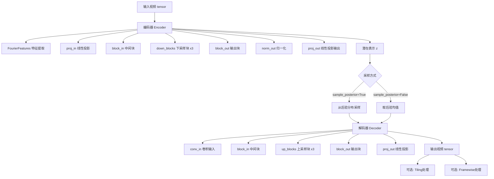

## 类结构

```
AutoencoderKLMochi (主VAE模型)
├── MochiEncoder3D (编码器)
│   ├── FourierFeatures
│   ├── MochiMidBlock3D (输入块)
│   ├── MochiDownBlock3D x3 (下采样块)
│   └── MochiMidBlock3D (输出块)
└── MochiDecoder3D (解码器)
    ├── MochiMidBlock3D (输入块)
    ├── MochiUpBlock3D x3 (上采样块)
    └── MochiMidBlock3D (输出块)
│
├── MochiDownBlock3D / MochiUpBlock3D
│   ├── MochiResnetBlock3D x num_layers
│   └── Attention (可选)
│
├── MochiResnetBlock3D
│   ├── MochiChunkedGroupNorm3D x2
│   └── CogVideoXCausalConv3d x2
│
└── MochiChunkedGroupNorm3D (基础组件)
```

## 全局变量及字段


### `logger`
    
模块级日志记录器，用于记录模块运行过程中的信息

类型：`logging.Logger`
    


### `MochiChunkedGroupNorm3D.norm_layer`
    
分组归一化层，用于对输入进行分组归一化处理

类型：`nn.GroupNorm`
    


### `MochiChunkedGroupNorm3D.chunk_size`
    
分块大小，用于内存高效处理

类型：`int`
    


### `MochiResnetBlock3D.in_channels`
    
输入通道数

类型：`int`
    


### `MochiResnetBlock3D.out_channels`
    
输出通道数

类型：`int`
    


### `MochiResnetBlock3D.nonlinearity`
    
激活函数

类型：`nn.Module`
    


### `MochiResnetBlock3D.norm1`
    
第一个归一化层

类型：`MochiChunkedGroupNorm3D`
    


### `MochiResnetBlock3D.conv1`
    
第一个卷积层

类型：`CogVideoXCausalConv3d`
    


### `MochiResnetBlock3D.norm2`
    
第二个归一化层

类型：`MochiChunkedGroupNorm3D`
    


### `MochiResnetBlock3D.conv2`
    
第二个卷积层

类型：`CogVideoXCausalConv3d`
    


### `MochiDownBlock3D.temporal_expansion`
    
时间扩展因子

类型：`int`
    


### `MochiDownBlock3D.spatial_expansion`
    
空间扩展因子

类型：`int`
    


### `MochiDownBlock3D.conv_in`
    
输入卷积

类型：`CogVideoXCausalConv3d`
    


### `MochiDownBlock3D.resnets`
    
ResNet块列表

类型：`nn.ModuleList[MochiResnetBlock3D]`
    


### `MochiDownBlock3D.norms`
    
归一化层列表

类型：`nn.ModuleList`
    


### `MochiDownBlock3D.attentions`
    
注意力层列表

类型：`nn.ModuleList`
    


### `MochiDownBlock3D.gradient_checkpointing`
    
梯度检查点标志

类型：`bool`
    


### `MochiMidBlock3D.resnets`
    
ResNet块列表

类型：`nn.ModuleList[MochiResnetBlock3D]`
    


### `MochiMidBlock3D.norms`
    
归一化层列表

类型：`nn.ModuleList`
    


### `MochiMidBlock3D.attentions`
    
注意力层列表

类型：`nn.ModuleList`
    


### `MochiMidBlock3D.gradient_checkpointing`
    
梯度检查点标志

类型：`bool`
    


### `MochiUpBlock3D.temporal_expansion`
    
时间扩展因子

类型：`int`
    


### `MochiUpBlock3D.spatial_expansion`
    
空间扩展因子

类型：`int`
    


### `MochiUpBlock3D.resnets`
    
ResNet块列表

类型：`nn.ModuleList[MochiResnetBlock3D]`
    


### `MochiUpBlock3D.proj`
    
投影层

类型：`nn.Linear`
    


### `MochiUpBlock3D.gradient_checkpointing`
    
梯度检查点标志

类型：`bool`
    


### `FourierFeatures.start`
    
起始频率

类型：`int`
    


### `FourierFeatures.stop`
    
停止频率

类型：`int`
    


### `FourierFeatures.step`
    
频率步长

类型：`int`
    


### `MochiEncoder3D.nonlinearity`
    
激活函数

类型：`nn.Module`
    


### `MochiEncoder3D.fourier_features`
    
傅里叶特征层

类型：`FourierFeatures`
    


### `MochiEncoder3D.proj_in`
    
输入投影

类型：`nn.Linear`
    


### `MochiEncoder3D.block_in`
    
输入块

类型：`MochiMidBlock3D`
    


### `MochiEncoder3D.down_blocks`
    
下采样块列表

类型：`nn.ModuleList[MochiDownBlock3D]`
    


### `MochiEncoder3D.block_out`
    
输出块

类型：`MochiMidBlock3D`
    


### `MochiEncoder3D.norm_out`
    
输出归一化

类型：`MochiChunkedGroupNorm3D`
    


### `MochiEncoder3D.proj_out`
    
输出投影

类型：`nn.Linear`
    


### `MochiEncoder3D.gradient_checkpointing`
    
梯度检查点标志

类型：`bool`
    


### `MochiDecoder3D.nonlinearity`
    
激活函数

类型：`nn.Module`
    


### `MochiDecoder3D.conv_in`
    
输入卷积

类型：`nn.Conv3d`
    


### `MochiDecoder3D.block_in`
    
输入块

类型：`MochiMidBlock3D`
    


### `MochiDecoder3D.up_blocks`
    
上采样块列表

类型：`nn.ModuleList[MochiUpBlock3D]`
    


### `MochiDecoder3D.block_out`
    
输出块

类型：`MochiMidBlock3D`
    


### `MochiDecoder3D.proj_out`
    
输出投影

类型：`nn.Linear`
    


### `MochiDecoder3D.gradient_checkpointing`
    
梯度检查点标志

类型：`bool`
    


### `AutoencoderKLMochi.encoder`
    
编码器实例

类型：`MochiEncoder3D`
    


### `AutoencoderKLMochi.decoder`
    
解码器实例

类型：`MochiDecoder3D`
    


### `AutoencoderKLMochi.spatial_compression_ratio`
    
空间压缩比

类型：`int`
    


### `AutoencoderKLMochi.temporal_compression_ratio`
    
时间压缩比

类型：`int`
    


### `AutoencoderKLMochi.use_slicing`
    
切片编码标志

类型：`bool`
    


### `AutoencoderKLMochi.use_tiling`
    
分块编码标志

类型：`bool`
    


### `AutoencoderKLMochi.use_framewise_encoding`
    
帧级编码标志

类型：`bool`
    


### `AutoencoderKLMochi.use_framewise_decoding`
    
帧级解码标志

类型：`bool`
    


### `AutoencoderKLMochi.drop_last_temporal_frames`
    
丢弃最后时间帧标志

类型：`bool`
    


### `AutoencoderKLMochi.num_sample_frames_batch_size`
    
样本帧批次大小

类型：`int`
    


### `AutoencoderKLMochi.num_latent_frames_batch_size`
    
潜在帧批次大小

类型：`int`
    


### `AutoencoderKLMochi.tile_sample_min_height`
    
最小瓦片高度

类型：`int`
    


### `AutoencoderKLMochi.tile_sample_min_width`
    
最小瓦片宽度

类型：`int`
    


### `AutoencoderKLMochi.tile_sample_stride_height`
    
瓦片高度步幅

类型：`int`
    


### `AutoencoderKLMochi.tile_sample_stride_width`
    
瓦片宽度步幅

类型：`int`
    
    

## 全局函数及方法


### `MochiChunkedGroupNorm3D.forward`

该方法实现了针对5D视频张量的分块分组归一化（Chunked Group Normalization），通过将视频帧维度与批量维度合并后进行分块处理，以降低显存占用，同时保持分组归一一化的时序建模能力。

参数：

- `x`：`torch.Tensor`，输入的5D视频张量，形状为 (batch_size, channels, num_frames, height, width)

返回值：`torch.Tensor`，经过分块分组归一化处理后的5D视频张量，形状与输入相同

#### 流程图

```mermaid
flowchart TD
    A[输入 x: torch.Tensor] --> B[获取 batch_size = x.size(0)]
    B --> C[permute: (B, C, T, H, W) → (B, T, C, H, W)]
    C --> D[flatten: (B, T, C, H, W) → (B*T, C, H, W)]
    D --> E{遍历分块}
    E -->|每个 chunk| F[norm_layer(chunk)]
    F --> E
    E --> G[torch.cat 合并所有块]
    G --> H[unflatten: (B*T, C, H, W) → (B, T, C, H, W)]
    H --> I[permute: (B, T, C, H, W) → (B, C, T, H, W)]
    I --> J[输出: torch.Tensor]
```

#### 带注释源码

```python
def forward(self, x: torch.Tensor = None) -> torch.Tensor:
    """
    对输入的5D视频张量执行分块分组归一化。
    
    该方法通过将时间维度和批量维度合并，进行分块处理以节省显存，
    然后恢复原始形状并输出归一化后的结果。
    
    参数:
        x: 输入的5D张量，形状为 (batch_size, channels, num_frames, height, width)
    
    返回:
        经过分块分组归一化处理后的5D张量，形状与输入相同
    """
    # 步骤1: 获取批量大小
    batch_size = x.size(0)

    # 步骤2: 维度重排 - 将通道维移至第2位
    # 原形状: (B, C, T, H, W) → 新形状: (B, T, C, H, W)
    # 这样可以方便地将 B 和 T 维度合并处理
    x = x.permute(0, 2, 1, 3, 4).flatten(0, 1)
    # 展平后形状: (B*T, C, H, W)

    # 步骤3: 分块处理并应用分组归一一化
    # 使用 split 将张量按 chunk_size 在第0维（合并后的 B*T 维）分割成多个块
    # 对每个块分别调用 self.norm_layer（GroupNorm）进行归一化
    # 最后使用 torch.cat 沿第0维拼接所有归一化后的块
    output = torch.cat([self.norm_layer(chunk) for chunk in x.split(self.chunk_size, dim=0)], dim=0)
    # 输出形状: (B*T, C, H, W)

    # 步骤4: 恢复原始批量维度和时间维度
    # unflatten 将第0维恢复为 (batch_size, -1)，其中 -1 自动计算为 T
    # 形状从 (B*T, C, H, W) 变为 (B, T, C, H, W)
    output = output.unflatten(0, (batch_size, -1)).permute(0, 2, 1, 3, 4)
    # 最终形状: (B, C, T, H, W)，与输入形状一致

    return output
```


### `MochiResnetBlock3D.forward`

该方法实现了3D残差块的前向传播，通过两层卷积路径对输入进行特征提取，并使用残差连接将输出与输入相加，以支持深层网络的梯度流动。

参数：

- `self`：`MochiResnetBlock3D`，当前实例
- `inputs`：`torch.Tensor`，输入张量，形状为 `(B, C, T, H, W)`，其中B为批量大小，C为通道数，T为时间帧数，H和W为空间高度和宽度
- `conv_cache`：`dict | None`，可选的卷积缓存字典，用于存储中间卷积结果以支持内存优化，键为卷积层名称（如"conv1"、"conv2"），值为对应的缓存张量，默认为 `None`

返回值：`tuple[torch.Tensor, dict]`，包含处理后的隐藏状态张量（与输入残差相加后的结果）和新的卷积缓存字典

#### 流程图

```mermaid
flowchart TD
    A[输入 inputs] --> B[conv_cache 初始化]
    B --> C[hidden_states = inputs]
    C --> D[norm1 归一化]
    D --> E[nonlinearity 激活]
    E --> F[conv1 卷积]
    F --> G[norm2 归一化]
    G --> H[nonlinearity 激活]
    H --> I[conv2 卷积]
    I --> J[残差连接: hidden_states + inputs]
    J --> K[输出 hidden_states, new_conv_cache]
    
    F -.->|更新缓存| L[new_conv_cache['conv1']]
    I -.->|更新缓存| M[new_conv_cache['conv2']]
```

#### 带注释源码

```python
def forward(
    self,
    inputs: torch.Tensor,
    conv_cache: dict[str, torch.Tensor] | None = None,
) -> tuple[torch.Tensor, dict]:
    """
    执行3D残差块的前向传播。
    
    该方法实现了标准的残差块结构：
    1. 输入经过第一层归一化、激活、卷积
    2. 结果经过第二层归一化、激活、卷积
    3. 最终通过残差连接将输出与输入相加
    
    Args:
        inputs: 输入张量，形状为 (B, C, T, H, W)
        conv_cache: 可选的卷积缓存，用于内存优化
        
    Returns:
        包含输出张量和更新后的卷积缓存的元组
    """
    # 初始化新的卷积缓存字典，用于存储本次前向传播的卷积结果
    new_conv_cache = {}
    # 如果没有传入conv_cache，则使用空字典
    conv_cache = conv_cache or {}

    # 将隐藏状态初始化为输入
    hidden_states = inputs

    # 第一层：归一化 -> 激活 -> 卷积
    hidden_states = self.norm1(hidden_states)  # 对输入进行分组归一化
    hidden_states = self.nonlinearity(hidden_states)  # 应用swish激活函数
    # 执行卷积，从缓存中获取上一次的卷积结果（如果存在）
    hidden_states, new_conv_cache["conv1"] = self.conv1(hidden_states, conv_cache=conv_cache.get("conv1"))

    # 第二层：归一化 -> 激活 -> 卷积
    hidden_states = self.norm2(hidden_states)  # 对特征进行分组归一化
    hidden_states = self.nonlinearity(hidden_states)  # 应用swish激活函数
    # 执行第二层卷积
    hidden_states, new_conv_cache["conv2"] = self.conv2(hidden_states, conv_cache=conv_cache.get("conv2"))

    # 残差连接：将卷积输出与原始输入相加
    # 这是残差网络的核心机制，允许梯度直接流向更浅的层
    hidden_states = hidden_states + inputs
    
    # 返回处理后的隐藏状态和新的卷积缓存
    return hidden_states, new_conv_cache
```


### `MochiDownBlock3D.forward`

执行 Mochi 下采样块的前向传播，对输入视频张量进行下采样、ResNet 块处理和可选的注意力机制，返回处理后的隐藏状态和卷积缓存。

参数：

- `self`：实例本身
- `hidden_states`：`torch.Tensor`，输入的 5D 视频张量，形状为 (batch_size, num_channels, num_frames, height, width)
- `conv_cache`：`dict[str, torch.Tensor] | None`，可选的卷积缓存字典，用于存储中间卷积结果以支持显存优化，默认为 None
- `chunk_size`：`int`，注意力机制的分块大小，用于避免 CUDA 内存错误，默认为 2^15

返回值：`tuple[torch.Tensor, dict]`，包含处理后的隐藏状态（形状已下采样）和更新后的卷积缓存字典

#### 流程图

```mermaid
flowchart TD
    A[开始 forward] --> B[初始化 new_conv_cache]
    B --> C{conv_cache 是否为 None?}
    C -->|是| D[使用空字典]
    C -->|否| E[使用传入的 conv_cache]
    D --> F[执行 conv_in 卷积下采样]
    E --> F
    F --> G[hidden_states 更新<br/>new_conv_cache['conv_in'] 更新]
    G --> H[遍历 resnets, norms, attentions]
    H --> I{当前索引 < resnet 数量?}
    I -->|是| J{gradient_checkpointing 开启<br/>且梯度 enabled?}
    J -->|是| K[使用 _gradient_checkpointing_func]
    J -->|否| L[直接调用 resnet forward]
    K --> M[获取 conv_cache_key]
    L --> M
    M --> N[resnet 输出 hidden_states<br/>更新 new_conv_cache]
    N --> O{attn 不为 None?}
    O -->|是| P[执行注意力机制]
    O -->|否| I
    P --> Q{hidden_states size <= chunk_size?}
    Q -->|是| R[直接执行 attn]
    Q -->|否| S[分块执行 attn]
    R --> T[合并分块结果]
    S --> T
    T --> U[恢复张量形状并加上残差]
    U --> I
    I -->|否| V[返回 hidden_states 和 new_conv_cache]
```

#### 带注释源码

```python
def forward(
    self,
    hidden_states: torch.Tensor,
    conv_cache: dict[str, torch.Tensor] | None = None,
    chunk_size: int = 2**15,
) -> tuple[torch.Tensor, dict]:
    r"""Forward method of the `MochiUpBlock3D` class.
    
    执行 Mochi 下采样块的前向传播，包括：
    1. 初始卷积下采样 (conv_in)
    2. 多个 ResNet 块处理 (resnets)
    3. 可选的注意力机制 (attentions)
    
    Args:
        hidden_states: 输入的 5D 视频张量 (B, C, T, H, W)
        conv_cache: 可选的卷积缓存，用于显存优化
        chunk_size: 注意力分块大小，用于避免 CUDA 内存错误
    
    Returns:
        tuple: (处理后的 hidden_states, 更新后的卷积缓存)
    """
    
    # 1. 初始化新的卷积缓存字典，用于存储本次前向传播的中间结果
    new_conv_cache = {}
    # 确保 conv_cache 不为 None，使用空字典作为默认值
    conv_cache = conv_cache or {}
    
    # 2. 执行初始卷积下采样，使用因果卷积进行时间和空间维度的下采样
    # temporal_expansion 和 spatial_expansion 控制下采样率
    hidden_states, new_conv_cache["conv_in"] = self.conv_in(hidden_states)
    
    # 3. 遍历所有 ResNet 块、归一化层和注意力层
    for i, (resnet, norm, attn) in enumerate(zip(self.resnets, self.norms, self.attentions)):
        # 构建当前 ResNet 块的缓存键名
        conv_cache_key = f"resnet_{i}"
        
        # 4. 根据是否启用梯度检查点选择执行路径
        # 梯度检查点是一种用计算换显存的技术
        if torch.is_grad_enabled() and self.gradient_checkpointing:
            hidden_states, new_conv_cache[conv_cache_key] = self._gradient_checkpointing_func(
                resnet,
                hidden_states,
                conv_cache.get(conv_cache_key),
            )
        else:
            # 正常执行 ResNet 块前向传播
            hidden_states, new_conv_cache[conv_cache_key] = resnet(
                hidden_states, conv_cache=conv_cache.get(conv_cache_key)
            )
        
        # 5. 如果存在注意力层，则执行注意力机制
        if attn is not None:
            # 保存残差连接
            residual = hidden_states
            
            # 应用分组归一化
            hidden_states = norm(hidden_states)
            
            # 获取张量形状信息
            batch_size, num_channels, num_frames, height, width = hidden_states.shape
            
            # 6. 张量维度重排：从 (B, C, T, H, W) 转换为 (B, H, W, T, C)
            # 以便进行注意力计算，将空间和时间维度合并到批量维度
            hidden_states = hidden_states.permute(0, 3, 4, 2, 1).flatten(0, 2).contiguous()
            
            # 7. 分块执行注意力以避免 CUDA 内存错误
            # 当 token 数量超过 chunk_size 时需要分块处理
            if hidden_states.size(0) <= chunk_size:
                # 较小张量直接执行注意力
                hidden_states = attn(hidden_states)
            else:
                # 较大张量分块执行注意力，然后拼接结果
                hidden_states_chunks = []
                for i in range(0, hidden_states.size(0), chunk_size):
                    hidden_states_chunk = hidden_states[i : i + chunk_size]
                    hidden_states_chunk = attn(hidden_states_chunk)
                    hidden_states_chunks.append(hidden_states_chunk)
                hidden_states = torch.cat(hidden_states_chunks)
            
            # 8. 恢复张量形状：从 (B*H*W, T, C) 恢复到 (B, C, T, H, W)
            hidden_states = hidden_states.unflatten(0, (batch_size, height, width)).permute(0, 4, 3, 1, 2)
            
            # 9. 残差连接：将注意力输出与输入相加
            hidden_states = residual + hidden_states
    
    # 10. 返回处理后的隐藏状态和卷积缓存
    return hidden_states, new_conv_cache
```


### `MochiMidBlock3D.forward`

执行 Mochi 中间块的前向传播，遍历每个 ResNet 层并可选地应用注意力机制，支持梯度检查点以优化内存使用。

参数：

- `self`：`MochiMidBlock3D` 实例本身
- `hidden_states`：`torch.Tensor`，输入的隐藏状态张量，形状为 (batch_size, channels, num_frames, height, width)
- `conv_cache`：`dict[str, torch.Tensor] | None`，可选的卷积缓存字典，用于存储卷积层的中间状态以支持高效的推理

返回值：`tuple[torch.Tensor, dict]`，返回处理后的隐藏状态张量和更新后的卷积缓存字典

#### 流程图

```mermaid
flowchart TD
    A[开始 forward] --> B[初始化 new_conv_cache 和 conv_cache]
    B --> C{遍历 resnets, norms, attentions}
    C -->|获取第 i 层| D[构建 conv_cache_key = f'resnet_{i}']
    D --> E{检查梯度 & gradient_checkpointing?}
    E -->|是| F[使用 _gradient_checkpointing_func 执行 resnet]
    E -->|否| G[直接调用 resnet.forward]
    F --> H[new_conv_cache[conv_cache_key] = result]
    G --> H
    H --> I{当前层有 attn?}
    I -->|是| J[保存 residual]
    I -->|否| K{检查是否还有下一层?}
    J --> L[norm 归一化 hidden_states]
    L --> M[permute 和 flatten 为 2D 进行注意力计算]
    M --> N[执行 attn 注意力]
    N --> O[unflatten 和 permute 恢复 5D 形状]
    O --> P[hidden_states = residual + hidden_states 残差连接]
    P --> K
    I -->|否| K
    K -->|是| C
    K -->|否| Q[返回 hidden_states, new_conv_cache]
```

#### 带注释源码

```python
def forward(
    self,
    hidden_states: torch.Tensor,
    conv_cache: dict[str, torch.Tensor] | None = None,
) -> torch.Tensor:
    r"""Forward method of the `MochiMidBlock3D` class."""

    # 1. 初始化新的卷积缓存字典，用于存储本轮前向传播产生的卷积状态
    new_conv_cache = {}
    # 2. 如果没有提供 conv_cache，则使用空字典
    conv_cache = conv_cache or {}

    # 3. 遍历所有的 ResNet 块、归一化层和注意力层
    for i, (resnet, norm, attn) in enumerate(zip(self.resnets, self.norms, self.attentions)):
        # 4. 构建当前 ResNet 层的缓存键
        conv_cache_key = f"resnet_{i}"

        # 5. 检查是否启用梯度检查点以节省显存
        if torch.is_grad_enabled() and self.gradient_checkpointing:
            # 使用梯度检查点函数执行 ResNet 前向传播（不保存中间激活值）
            hidden_states, new_conv_cache[conv_cache_key] = self._gradient_checkpointing_func(
                resnet, hidden_states, conv_cache.get(conv_cache_key)
            )
        else:
            # 正常执行 ResNet 前向传播
            hidden_states, new_conv_cache[conv_cache_key] = resnet(
                hidden_states, conv_cache=conv_cache.get(conv_cache_key)
            )

        # 6. 如果当前层配置了注意力机制，则应用注意力
        if attn is not None:
            # 保存残差连接的原值
            residual = hidden_states
            
            # 对隐藏状态进行归一化
            hidden_states = norm(hidden_states)

            # 获取形状信息：batch, channels, frames, height, width
            batch_size, num_channels, num_frames, height, width = hidden_states.shape
            
            # 7. 变换张量形状以适应 2D 注意力计算
            # 从 (B, C, T, H, W) -> (B, H, W, T, C) -> (B*H*W, T*C)
            hidden_states = hidden_states.permute(0, 3, 4, 2, 1).flatten(0, 2).contiguous()
            
            # 8. 执行自注意力计算
            hidden_states = attn(hidden_states)
            
            # 9. 恢复原始形状：(B*H*W, T*C) -> (B, H, W, T, C) -> (B, C, T, H, W)
            hidden_states = hidden_states.unflatten(0, (batch_size, height, width)).permute(0, 4, 3, 1, 2)

            # 10. 残差连接：将注意力输出与原始输入相加
            hidden_states = residual + hidden_states

    # 11. 返回处理后的隐藏状态和新的卷积缓存
    return hidden_states, new_conv_cache
```


### MochiUpBlock3D.forward

执行上采样块的前向传播，通过一系列 3D ResNet 块进行特征处理，然后通过投影和reshape操作将隐藏状态在时间维度和空间维度上进行上采样，输出上采样后的隐藏状态和卷积缓存。

参数：

- `hidden_states`：`torch.Tensor`，输入的隐藏状态张量，形状为 (batch_size, num_channels, num_frames, height, width)
- `conv_cache`：`dict | None`，可选的卷积缓存字典，用于存储卷积层的缓存状态

返回值：`tuple[torch.Tensor, dict]`，返回上采样后的隐藏状态张量和新更新的卷积缓存字典

#### 流程图

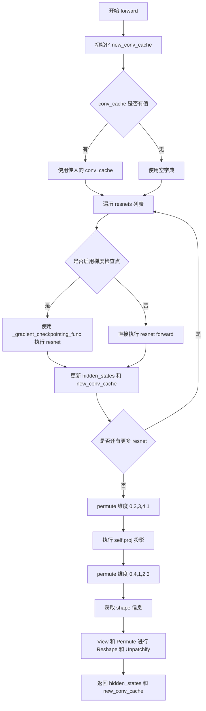

#### 带注释源码

```python
def forward(
    self,
    hidden_states: torch.Tensor,
    conv_cache: dict[str, torch.Tensor] | None = None,
) -> tuple[torch.Tensor, dict]:
    r"""Forward method of the `MochiUpBlock3D` class."""
    
    # 1. 初始化新的卷积缓存字典，用于存储本次前向传播的缓存
    new_conv_cache = {}
    # 2. 如果没有传入 conv_cache，则使用空字典
    conv_cache = conv_cache or {}

    # 3. 遍历所有的 ResNet 块进行处理
    for i, resnet in enumerate(self.resnets):
        # 构建缓存键名，如 "resnet_0", "resnet_1" 等
        conv_cache_key = f"resnet_{i}"

        # 4. 根据是否启用梯度检查点选择不同的执行路径
        if torch.is_grad_enabled() and self.gradient_checkpointing:
            # 使用梯度检查点技术节省显存
            hidden_states, new_conv_cache[conv_cache_key] = self._gradient_checkpointing_func(
                resnet,
                hidden_states,
                conv_cache.get(conv_cache_key),
            )
        else:
            # 正常前向传播
            hidden_states, new_conv_cache[conv_cache_key] = resnet(
                hidden_states, conv_cache=conv_cache.get(conv_cache_key)
            )

    # 5. 对隐藏状态进行维度变换：从 (B, C, T, H, W) 变为 (B, T, H, W, C)
    hidden_states = hidden_states.permute(0, 2, 3, 4, 1)
    # 6. 执行线性投影，将通道维度扩展
    hidden_states = self.proj(hidden_states)
    # 7. 再次变换维度：从 (B, T, H, W, C') 变回 (B, C', T, H, W)
    hidden_states = hidden_states.permute(0, 4, 1, 2, 3)

    # 8. 获取当前隐藏状态的形状信息
    batch_size, num_channels, num_frames, height, width = hidden_states.shape
    # 9. 获取时间扩展因子和空间扩展因子
    st = self.temporal_expansion   # 时间维度扩展因子
    sh = self.spatial_expansion    # 空间高度扩展因子
    sw = self.spatial_expansion    # 空间宽度扩展因子

    # 10. Reshape 和 Unpatchify 操作
    # 将隐藏状态重塑为 (batch_size, -1, st, sh, sw, num_frames, height, width)
    hidden_states = hidden_states.view(batch_size, -1, st, sh, sw, num_frames, height, width)
    # 重新排列维度以正确合并上采样维度
    hidden_states = hidden_states.permute(0, 1, 5, 2, 6, 3, 7, 4).contiguous()
    # 最终 reshape 到上采样后的尺寸
    # 新的帧数 = num_frames * st
    # 新的高度 = height * sh
    # 新的宽度 = width * sw
    hidden_states = hidden_states.view(batch_size, -1, num_frames * st, height * sh, width * sw)

    # 11. 返回上采样后的隐藏状态和卷积缓存
    return hidden_states, new_conv_cache
```


### `FourierFeatures.forward`

该方法实现了傅里叶特征生成功能，将输入视频张量通过频率变换扩展到更高维的特征空间。核心思想是将输入与多个不同频率的正弦和余弦函数进行线性组合，生成富含时序和空间信息的特征表示，从而增强模型对多尺度模式的感知能力。

参数：

- `inputs`：`torch.Tensor`，输入张量，形状为 `[B, C, T, H, W]`，其中 B 为批量大小，C 为通道数，T 为时间帧数，H 和 W 分别为高度和宽度

返回值：`torch.Tensor`，傅里叶特征张量，形状为 `[B, C * (1 + 2 * num_freqs), T, H, W]`，其中 `num_freqs = (stop - start) // step`。输出在通道维度上连接了原始输入、其正弦变换和余弦变换。

#### 流程图

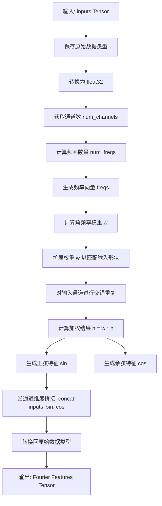

#### 带注释源码

```python
def forward(self, inputs: torch.Tensor) -> torch.Tensor:
    r"""Forward method of the `FourierFeatures` class."""
    # 保存原始数据类型，确保输出与输入数据类型一致
    original_dtype = inputs.dtype
    
    # 转换为 float32 以提高数值计算精度
    inputs = inputs.to(torch.float32)
    
    # 获取输入的通道数
    num_channels = inputs.shape[1]
    
    # 计算频率数量：(stop - start) // step
    # 默认 start=6, stop=8, step=1 时，num_freqs = 2
    num_freqs = (self.stop - self.start) // self.step

    # 生成频率向量，范围从 start 到 stop，步长为 step
    # 例如：start=6, stop=8, step=1 -> [6, 7]
    freqs = torch.arange(self.start, self.stop, self.step, dtype=inputs.dtype, device=inputs.device)
    
    # 将频率转换为角频率：w = 2^freq * 2π
    # 这会生成用于缩放输入的频率权重
    w = torch.pow(2.0, freqs) * (2 * torch.pi)  # [num_freqs]
    
    # 扩展权重以匹配输入的批量和空间维度
    # 重复 num_channels 次以覆盖所有输入通道
    w = w.repeat(num_channels)[None, :, None, None, None]  # [1, num_channels * num_freqs, 1, 1, 1]

    # 对输入通道进行交错重复，使每个通道重复 num_freqs 次
    # 这样每个原始通道都会与每个频率权重相乘
    h = inputs.repeat_interleave(
        num_freqs, dim=1, output_size=inputs.shape[1] * num_freqs
    )  # [B, C * num_freqs, T, H, W]
    
    # 将频率权重应用于扩展后的输入
    h = w * h  # 逐元素乘法，对每个频率缩放输入

    # 沿通道维度拼接：原始输入 + 正弦变换 + 余弦变换
    # 最终通道数 = C + C * num_freqs + C * num_freqs = C * (1 + 2 * num_freqs)
    return torch.cat([inputs, torch.sin(h), torch.cos(h)], dim=1).to(original_dtype)
```


### `MochiEncoder3D.forward`

该方法将输入的视频张量编码为潜在空间表示，是 Mochi VAE 编码器的核心前向传播过程。它通过傅里叶特征提取、投影、多个下采样块和中间块的处理，最终输出编码后的潜在张量以及用于缓存卷积状态的字典，以支持显存优化和推理加速。

参数：
- `hidden_states`：`torch.Tensor`，输入的视频张量，形状为 (batch_size, channels, num_frames, height, width)
- `conv_cache`：`dict[str, torch.Tensor] | None`，可选的卷积缓存字典，用于在解码器/编码器中传递和缓存卷积状态，支持增量推理和显存优化

返回值：`tuple[torch.Tensor, dict]`，返回编码后的潜在张量（形状为 (batch_size, latent_channels, latent_frames, latent_height, latent_width)）和新的卷积缓存字典

#### 流程图

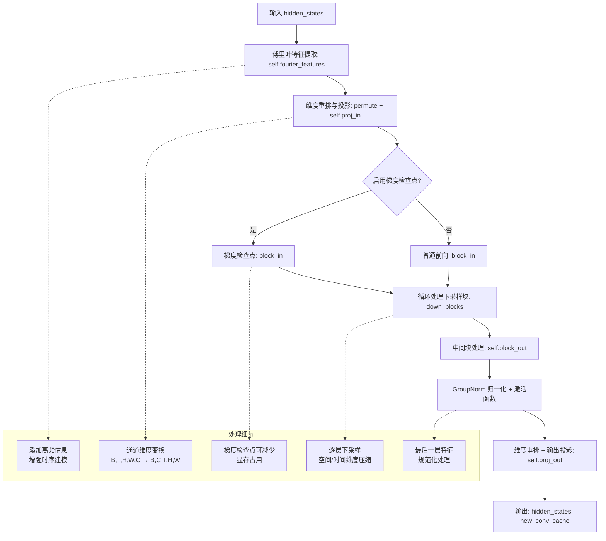

#### 带注释源码

```python
def forward(self, hidden_states: torch.Tensor, conv_cache: dict[str, torch.Tensor] | None = None) -> torch.Tensor:
    r"""Forward method of the `MochiEncoder3D` class."""
    
    # 1. 初始化卷积缓存字典，用于存储各层的卷积状态
    new_conv_cache = {}
    conv_cache = conv_cache or {}
    
    # 2. 傅里叶特征提取：为输入添加高频信息，增强模型对时序动态的建模能力
    # 输入: (B, C, T, H, W) → 输出: (B, C + 2*C*num_freqs, T, H, W)
    hidden_states = self.fourier_features(hidden_states)
    
    # 3. 维度重排与通道投影
    # 将通道维移到最后以便进行线性投影: (B, C, T, H, W) → (B, T, H, W, C)
    hidden_states = hidden_states.permute(0, 2, 3, 4, 1)
    # 投影到初始块通道数: (B, T, H, W, C) → (B, T, H, W, block_out_channels[0])
    hidden_states = self.proj_in(hidden_states)
    # 恢复标准视频张量格式: (B, T, H, W, C) → (B, C, T, H, W)
    hidden_states = hidden_states.permute(0, 4, 1, 2, 3)
    
    # 4. 根据是否启用梯度检查点选择不同的前向路径
    if torch.is_grad_enabled() and self.gradient_checkpointing:
        # 梯度检查点模式：分块保存中间激活值，反向传播时重新计算
        # 优点：显著减少显存占用，适合大模型训练
        hidden_states, new_conv_cache["block_in"] = self._gradient_checkpointing_func(
            self.block_in, hidden_states, conv_cache.get("block_in")
        )
        
        # 依次处理各下采样块
        for i, down_block in enumerate(self.down_blocks):
            conv_cache_key = f"down_block_{i}"
            hidden_states, new_conv_cache[conv_cache_key] = self._gradient_checkpointing_func(
                down_block, hidden_states, conv_cache.get(conv_cache_key)
            )
    else:
        # 普通前向模式：直接计算，显存占用较大但推理速度更快
        hidden_states, new_conv_cache["block_in"] = self.block_in(
            hidden_states, conv_cache=conv_cache.get("block_in")
        )
        
        # 依次处理各下采样块，逐层压缩空间和时间维度
        for i, down_block in enumerate(self.down_blocks):
            conv_cache_key = f"down_block_{i}"
            hidden_states, new_conv_cache[conv_cache_key] = down_block(
                hidden_states, conv_cache=conv_cache.get(conv_cache_key)
            )
    
    # 5. 中间块处理：进一步提取高级特征
    hidden_states, new_conv_cache["block_out"] = self.block_out(
        hidden_states, conv_cache=conv_cache.get("block_out")
    )
    
    # 6. 输出归一化与激活
    hidden_states = self.norm_out(hidden_states)
    hidden_states = self.nonlinearity(hidden_states)
    
    # 7. 最终投影到潜在空间
    # 维度重排: (B, C, T, H, W) → (B, T, H, W, C)
    hidden_states = hidden_states.permute(0, 2, 3, 4, 1)
    # 投影到 2*out_channels（用于 KL 散度的均值和方差）
    hidden_states = self.proj_out(hidden_states)
    # 恢复原始格式: (B, T, H, W, C) → (B, C, T, H, W)
    hidden_states = hidden_states.permute(0, 4, 1, 2, 3)
    
    return hidden_states, new_conv_cache
```

---

## 完整设计文档

### 一段话描述

`MochiEncoder3D` 是 Mochi VAE（变分自编码器）的 3D 视频编码器，负责将输入的视频张量编码到低维潜在空间。它采用基于残差网络的下采样架构，结合傅里叶特征增强、因果卷积和注意力机制，实现高效的时空压缩与特征提取。

### 文件的整体运行流程

1. **输入预处理**：接收形状为 `(B, C, T, H, W)` 的视频张量
2. **特征增强**：通过 `FourierFeatures` 添加高频信息，增强时序动态建模
3. **通道变换**：维度重排后通过线性投影 `proj_in` 调整通道维度
4. **编码主流程**：
   - 通过输入中间块 `block_in` 提取初始特征
   - 依次经过多个下采样块 `down_blocks`，逐层压缩空间和时间维度
   - 通过输出中间块 `block_out` 提取高级语义特征
5. **输出生成**：归一化、激活、投影到潜在空间，输出潜在张量和卷积缓存

### 类的详细信息

#### `MochiEncoder3D` 类字段

| 字段名称 | 类型 | 描述 |
|---------|------|------|
| `nonlinearity` | `Callable` | 激活函数（默认 swish） |
| `fourier_features` | `FourierFeatures` | 傅里叶特征提取层，用于添加高频信息 |
| `proj_in` | `nn.Linear` | 输入投影层，将通道投影到初始维度 |
| `block_in` | `MochiMidBlock3D` | 输入端的中间处理块 |
| `down_blocks` | `nn.ModuleList[MochiDownBlock3D]` | 下采样块列表，逐层压缩时空维度 |
| `block_out` | `MochiMidBlock3D` | 输出端的中间处理块 |
| `norm_out` | `MochiChunkedGroupNorm3D` | 输出归一化层 |
| `proj_out` | `nn.Linear` | 输出投影层，生成潜在表示（2倍通道） |
| `gradient_checkpointing` | `bool` | 梯度检查点标志，控制显存优化 |

#### `MochiEncoder3D` 类方法

| 方法名称 | 描述 |
|---------|------|
| `__init__` | 初始化编码器结构，配置各层参数 |
| `forward` | 前向传播，将视频编码到潜在空间 |

### 关键组件信息

| 组件名称 | 描述 |
|---------|------|
| `FourierFeatures` | 傅里叶特征生成器，为输入添加高频信息 |
| `MochiChunkedGroupNorm3D` | 分块组归一化，支持内存高效的 5D 张量归一化 |
| `MochiResnetBlock3D` | 3D 残差块，包含卷积、归一化和残差连接 |
| `MochiDownBlock3D` | 下采样块，包含卷积和可选的注意力机制 |
| `MochiMidBlock3D` | 中间处理块，用于特征提取和增强 |
| `CogVideoXCausalConv3d` | 因果 3D 卷积，确保时序因果性 |

### 潜在的技术债务或优化空间

1. **硬编码的注意力头数**：注意力层使用 `heads = out_channels // 32`，当通道数不是 32 的倍数时会出问题
2. **卷积缓存设计**：虽然支持 `conv_cache`，但缺乏对增量推理的完整支持文档
3. **梯度检查点覆盖不完整**：仅在编码器中实现了梯度检查点，其他模块未统一应用
4. **类型标注不完整**：部分方法返回类型使用了旧式标注（如 `-> torch.Tensor` 实际返回元组）

### 其它项目

#### 设计目标与约束

- **时空压缩**：通过 `temporal_expansions` 和 `spatial_expansions` 实现固定比例的视频压缩
- **因果约束**：使用因果卷积确保时序建模的因果性
- **显存优化**：支持梯度检查点和卷积缓存以降低显存占用

#### 错误处理与异常设计

- 未显式处理维度不匹配或通道数错误的情况
- 依赖 PyTorch 的自动类型检查和设备匹配

#### 数据流与状态机

- 输入：`hidden_states` (B, C, T, H, W)
- 处理流程：傅里叶特征 → 投影 → 下采样 → 归一化 → 投影
- 输出：`hidden_states` (B, 2*latent_channels, T/spatial_ratio, H/spatial_ratio, W/spatial_ratio) 和 `conv_cache`

#### 外部依赖与接口契约

- 依赖 `CogVideoXCausalConv3d` 实现因果卷积
- 依赖 `Attention` 和 `MochiVaeAttnProcessor2_0` 实现注意力机制
- 输出格式与 `AutoencoderKL` 兼容，需配合 `DiagonalGaussianDistribution` 使用


### MochiDecoder3D.forward

该方法是 Mochi 3D 解码器的核心前向传播函数，负责将视频潜在表示（latent representation）解码恢复为完整的视频帧序列。解码过程通过中间的 `block_in`、多个上采样 `up_blocks` 和 `block_out` 进行逐步上采样，利用卷积缓存机制优化推理效率，并支持梯度检查点以节省显存。

参数：

- `hidden_states`：`torch.Tensor`，输入的潜在视频张量，形状为 (batch_size, latent_channels, latent_frames, latent_height, latent_width)
- `conv_cache`：`dict[str, torch.Tensor] | None`，可选的卷积缓存字典，用于在自回归/分段解码时传递上一帧的卷积状态，避免重复计算

返回值：`tuple[torch.Tensor, dict]`，返回一个元组，包含解码后的视频张量（形状为 (batch_size, out_channels, num_frames, height, width)）和更新后的卷积缓存字典

#### 流程图

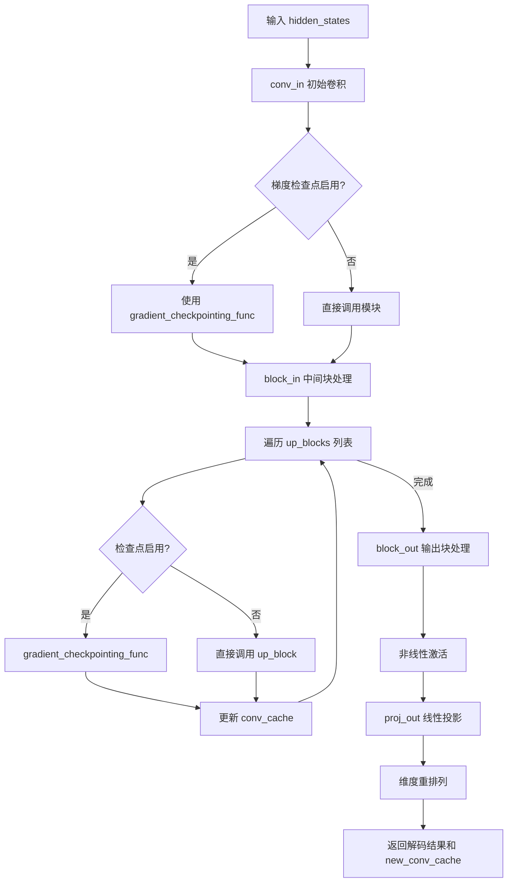

#### 带注释源码

```python
def forward(self, hidden_states: torch.Tensor, conv_cache: dict[str, torch.Tensor] | None = None) -> torch.Tensor:
    r"""Forward method of the `MochiDecoder3D` class."""
    
    # 初始化新的卷积缓存和确保输入缓存不为 None
    new_conv_cache = {}
    conv_cache = conv_cache or {}

    # 步骤1: 初始卷积 - 将潜在通道映射到最高通道数
    hidden_states = self.conv_in(hidden_states)

    # 步骤2: 中间块处理 - 根据是否启用梯度检查点选择执行路径
    if torch.is_grad_enabled() and self.gradient_checkpointing:
        # 启用梯度检查点以节省显存（反向传播时重新计算前向）
        hidden_states, new_conv_cache["block_in"] = self._gradient_checkpointing_func(
            self.block_in, hidden_states, conv_cache.get("block_in")
        )

        # 步骤3: 遍历所有上采样块
        for i, up_block in enumerate(self.up_blocks):
            conv_cache_key = f"up_block_{i}"
            hidden_states, new_conv_cache[conv_cache_key] = self._gradient_checkpointing_func(
                up_block, hidden_states, conv_cache.get(conv_cache_key)
            )
    else:
        # 标准前向传播路径
        hidden_states, new_conv_cache["block_in"] = self.block_in(
            hidden_states, conv_cache=conv_cache.get("block_in")
        )

        for i, up_block in enumerate(self.up_blocks):
            conv_cache_key = f"up_block_{i}"
            hidden_states, new_conv_cache[conv_cache_key] = up_block(
                hidden_states, conv_cache=conv_cache.get(conv_cache_key)
            )

    # 步骤4: 输出块处理
    hidden_states, new_conv_cache["block_out"] = self.block_out(
        hidden_states, conv_cache=conv_cache.get("block_out")
    )

    # 步骤5: 应用非线性激活函数
    hidden_states = self.nonlinearity(hidden_states)

    # 步骤6: 最终投影 - 将通道数映射到输出通道数
    # 张量形状: (B, C, T, H, W) -> (B, T, H, W, C) 以进行线性投影
    hidden_states = hidden_states.permute(0, 2, 3, 4, 1)
    hidden_states = self.proj_out(hidden_states)
    # 恢复原始形状: (B, out_channels, T, H, W)
    hidden_states = hidden_states.permute(0, 4, 1, 2, 3)

    return hidden_states, new_conv_cache
```


### `AutoencoderKLMochi.enable_tiling`

启用 VAE 的瓦片（tiling）模式，允许将输入张量分割成较小的瓦片进行分块编码和解码，从而显著降低内存占用并支持处理更大尺寸的图像或视频。

参数：

- `tile_sample_min_height`：`int | None`，最小高度阈值，当输入样本的高度大于此值时，将在高度维度上分割成多个瓦片进行分块处理。
- `tile_sample_min_width`：`int | None`，最小宽度阈值，当输入样本的宽度大于此值时，将在宽度维度上分割成多个瓦片进行分块处理。
- `tile_sample_stride_height`：`float | None`，垂直瓦片之间的步幅（重叠区域），用于确保相邻垂直瓦片之间有足够的重叠以避免拼接伪影。
- `tile_sample_stride_width`：`float | None`，水平瓦片之间的步幅（重叠区域），用于确保相邻水平瓦片之间有足够的重叠以避免拼接伪影。

返回值：`None`，无返回值，该方法直接修改实例的内部状态。

#### 流程图

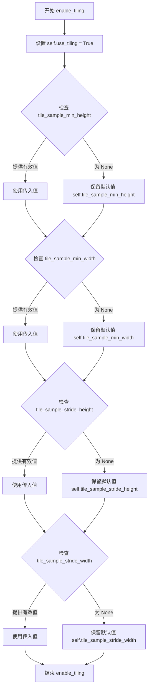

#### 带注释源码

```python
def enable_tiling(
    self,
    tile_sample_min_height: int | None = None,
    tile_sample_min_width: int | None = None,
    tile_sample_stride_height: float | None = None,
    tile_sample_stride_width: float | None = None,
) -> None:
    r"""
    启用瓦片 VAE 解码。当启用此选项时，VAE 会将输入张量分割成瓦片，
    分多步计算编码和解码。这对于节省大量内存并允许处理更大的图像非常有用。

    参数:
        tile_sample_min_height (`int`, *可选*):
            样本在高度维度上分割成瓦片所需的最小高度。
        tile_sample_min_width (`int`, *可选*):
            样本在宽度维度上分割成瓦片所需的最小宽度。
        tile_sample_stride_height (`int`, *可选*):
            两个连续垂直瓦片之间的最小重叠量。这是为了确保在高度维度上不会产生瓦片拼接伪影。
        tile_sample_stride_width (`int`, *可选*):
            两个连续水平瓦片之间的步幅。这是为了确保在宽度维度上不会产生瓦片拼接伪影。
    """
    # 启用瓦片模式标志
    self.use_tiling = True
    
    # 设置最小瓦片高度，如果未提供则保留默认值
    self.tile_sample_min_height = tile_sample_min_height or self.tile_sample_min_height
    
    # 设置最小瓦片宽度，如果未提供则保留默认值
    self.tile_sample_min_width = tile_sample_min_width or self.tile_sample_min_width
    
    # 设置垂直步幅，如果未提供则保留默认值
    self.tile_sample_stride_height = tile_sample_stride_height or self.tile_sample_stride_height
    
    # 设置水平步幅，如果未提供则保留默认值
    self.tile_sample_stride_width = tile_sample_stride_width or self.tile_sample_stride_width
```


### `AutoencoderKLMochi._enable_framewise_encoding`

启用帧级 VAE 编码模式，将 `use_framewise_encoding` 标志设置为 True，并遍历所有 `CogVideoXCausalConv3d` 卷积层，将其填充模式设置为 "constant"。该方法允许逐帧处理视频潜在变量，以降低内存占用。

参数：

- 该方法无显式参数（隐式参数 `self` 为类实例自身）

返回值：`None`，无返回值

#### 流程图

```mermaid
flowchart TD
    A[开始 _enable_framewise_encoding] --> B[设置 self.use_framewise_encoding = True]
    B --> C[调用 self.named_modules 获取所有子模块]
    C --> D{遍历模块列表}
    D -->|是| E{检查模块类型是否为 CogVideoXCausalConv3d}
    D -->|否| H[结束]
    E -->|是| F[设置 module.pad_mode = "constant"]
    E -->|否| G[继续遍历下一模块]
    F --> G
    G --> D
```

#### 带注释源码

```python
def _enable_framewise_encoding(self):
    r"""
    Enables the framewise VAE encoding implementation with past latent padding. By default, Diffusers uses the
    oneshot encoding implementation without current latent replicate padding.

    Warning: Framewise encoding may not work as expected due to the causal attention layers. If you enable
    framewise encoding, encode a video, and try to decode it, there will be noticeable jittering effect.
    """
    # 1. 设置标志位，启用帧级编码模式
    self.use_framewise_encoding = True
    
    # 2. 遍历模型中所有子模块
    for name, module in self.named_modules():
        # 3. 查找 CogVideoXCausalConv3d 类型的卷积层
        if isinstance(module, CogVideoXCausalConv3d):
            # 4. 将该卷积层的填充模式改为 constant（常量填充）
            #    区别于默认的 replicate 填充模式
            module.pad_mode = "constant"
```


### `AutoencoderKLMochi._enable_framewise_decoding`

启用帧级 VAE 解码实现，通过将所有 `CogVideoXCausalConv3d` 卷积层的填充模式设置为 "constant" 模式来支持帧级解码。这允许模型以帧为单位处理视频潜在表示，而不是一次性处理整个序列，从而降低内存占用并支持更长的视频序列处理。

参数： 无

返回值： `None`，无返回值

#### 流程图

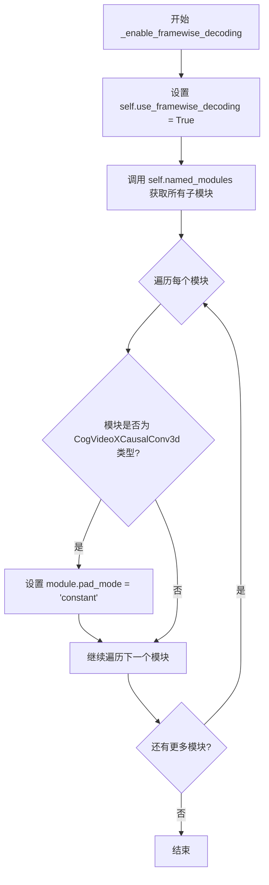

#### 带注释源码

```python
def _enable_framewise_decoding(self):
    r"""
    Enables the framewise VAE decoding implementation with past latent padding. By default, Diffusers uses the
    oneshot decoding implementation without current latent replicate padding.
    """
    # 步骤1: 设置实例变量 flag，标记已启用帧级解码模式
    # 这会影响 _decode 方法中的解码逻辑路径
    self.use_framewise_decoding = True
    
    # 步骤2: 遍历模型中的所有子模块
    # named_modules() 返回所有模块的迭代器，包括模块自身和所有子模块
    for name, module in self.named_modules():
        # 步骤3: 检查每个模块是否为 CogVideoXCausalConv3d 类型
        # CogVideoXCausalConv3d 是用于视频处理的因果 3D 卷积层
        if isinstance(module, CogVideoXCausalConv3d):
            # 步骤4: 将该卷积层的填充模式设置为 'constant'
            # 'constant' 模式使用常数填充（通常是零），而默认的 'replicate' 模式
            # 使用边缘值复制填充。constant 模式更适合帧级处理，因为它不会
            # 引入帧间的依赖关系（因果卷积的填充需要特殊处理）
            module.pad_mode = "constant"
```


### `AutoencoderKLMochi._encode`

该方法是 AutoencoderKLMochi 类的内部编码方法，负责将输入的视频张量编码为潜在表示。它首先检查是否启用了平铺编码（tiling），如果启用则调用平铺编码器；然后检查是否启用了帧级编码（framewise encoding），如果启用则抛出 NotImplementedError；否则调用标准编码器进行编码。

参数：

- `x`：`torch.Tensor`，输入的批量视频数据，形状为 (batch_size, num_channels, num_frames, height, width)

返回值：`torch.Tensor`，编码后的潜在表示张量

#### 流程图

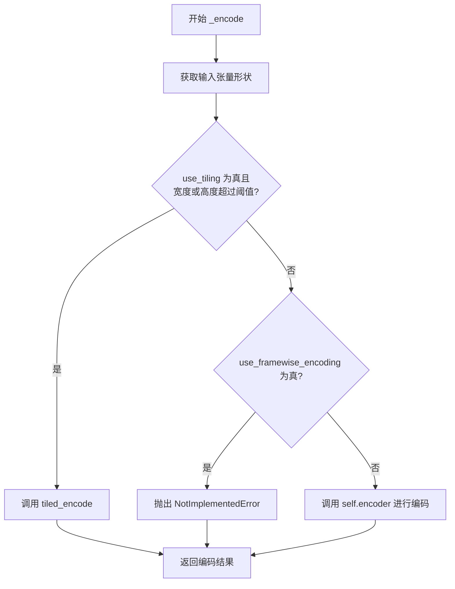

#### 带注释源码

```python
def _encode(self, x: torch.Tensor) -> torch.Tensor:
    """
    内部编码方法，将输入视频张量编码为潜在表示。
    
    Args:
        x: 输入的视频张量，形状为 (batch_size, num_channels, num_frames, height, width)
        
    Returns:
        编码后的潜在表示张量
    """
    # 获取输入张量的形状信息
    batch_size, num_channels, num_frames, height, width = x.shape

    # 检查是否启用了平铺编码（用于处理高分辨率视频，节省内存）
    if self.use_tiling and (width > self.tile_sample_min_width or height > self.tile_sample_min_height):
        return self.tiled_encode(x)

    # 检查是否启用了帧级编码（目前由于注意力层的依赖性，不支持）
    if self.use_framewise_encoding:
        raise NotImplementedError(
            "Frame-wise encoding does not work with the Mochi VAE Encoder due to the presence of attention layers. "
            "As intermediate frames are not independent from each other, they cannot be encoded frame-wise."
        )
    else:
        # 调用编码器进行标准编码
        # encoder 返回 (编码结果, 卷积缓存字典)
        enc, _ = self.encoder(x)

    return enc
```


### `AutoencoderKLMochi.encode`

该方法是 `AutoencoderKLMochi` 类的核心编码接口，负责将输入的张量（通常是图像或视频帧）编码为潜在空间（latent space）的表示。它内部调用 `_encode` 方法，并可选地使用切片技术（slicing）来处理大批量数据以节省内存。最终返回一个包含潜在分布（`DiagonalGaussianDistribution`）的 VAE 标准输出对象。

参数：

- `x`：`torch.Tensor`，输入的图像或视频张量，形状通常为 (B, C, F, H, W)，其中 B 是批量大小，C 是通道数，F 是帧数，H 是高度，W 是宽度。
- `return_dict`：`bool`，默认为 `True`。如果为 `True`，返回一个包含潜在分布的 `AutoencoderKLOutput` 对象；否则返回一个元组。

返回值：`AutoencoderKLOutput | tuple[DiagonalGaussianDistribution]`，编码后的潜在表示。
- 如果 `return_dict` 为 `True`：返回 `AutoencoderKLOutput`，其属性 `latent_dist` 为 `DiagonalGaussianDistribution` 对象。
- 如果 `return_dict` 为 `False`：返回 `tuple`，其中第一个元素是 `DiagonalGaussianDistribution` 对象。

#### 流程图

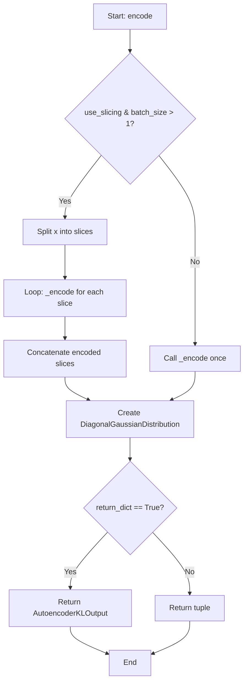

#### 带注释源码

```python
@apply_forward_hook
def encode(
    self, x: torch.Tensor, return_dict: bool = True
) -> AutoencoderKLOutput | tuple[DiagonalGaussianDistribution]:
    """
    Encode a batch of images into latents.

    Args:
        x (`torch.Tensor`): Input batch of images.
        return_dict (`bool`, *optional*, defaults to `True`):
            Whether to return a [`~models.autoencoder_kl.AutoencoderKLOutput`] instead of a plain tuple.

    Returns:
            The latent representations of the encoded videos. If `return_dict` is True, a
            [`~models.autoencoder_kl.AutoencoderKLOutput`] is returned, otherwise a plain `tuple` is returned.
    """
    # 如果启用了切片模式 (use_slicing) 且批量大小大于 1
    # 则将批量数据分割成单个样本分别编码，以节省显存
    if self.use_slicing and x.shape[0] > 1:
        # 使用 split(1) 在批量维度分割，然后对每个切片调用 _encode
        encoded_slices = [self._encode(x_slice) for x_slice in x.split(1)]
        # 编码完成后，使用 cat 将结果沿批量维拼接回去
        h = torch.cat(encoded_slices)
    else:
        # 否则直接调用内部的 _encode 方法进行一次性编码
        h = self._encode(x)

    # 将编码器输出的特征图 h 传入 DiagonalGaussianDistribution
    # 这是 VAE 中将特征映射到潜在空间分布（均值和方差）的关键步骤
    posterior = DiagonalGaussianDistribution(h)

    # 根据 return_dict 参数决定返回值格式
    if not return_dict:
        # 返回元组格式，符合 PyTorch惯例
        return (posterior,)
    # 返回带有元数据的 AutoencoderKLOutput 对象，包含 latent_dist 等信息
    return AutoencoderKLOutput(latent_dist=posterior)
```


### `AutoencoderKLMochi._decode`

该方法是 AutoencoderKLMochi 类的内部解码方法，负责将潜在表示（latent representation）解码回原始视频数据。支持分块解码（tiling）、帧级解码（framewise decoding）等多种优化策略，以适应不同的内存和性能需求。

参数：

- `z`：`torch.Tensor`，输入的潜在表示张量，形状为 (batch_size, num_channels, num_frames, height, width)
- `return_dict`：`bool`，是否返回字典形式的输出，默认为 True

返回值：`DecoderOutput | torch.Tensor`，如果 return_dict 为 True，返回 DecoderOutput 对象，包含解码后的样本；否则返回元组 (dec,)

#### 流程图

```mermaid
flowchart TD
    A[开始 _decode] --> B[获取 z 的形状信息]
    B --> C{是否启用 tiling}
    C -->|是| D[调用 tiled_decode 方法]
    C -->|否| E{是否启用 framewise_decoding}
    E -->|是| F[初始化 conv_cache 和 dec 列表]
    F --> G[按帧批次循环解码]
    G --> H[将各帧批次结果拼接]
    E -->|否| I[直接调用 self.decoder]
    H --> J{是否丢弃最后的时间帧}
    I --> J
    J -->|是| K[丢弃最后 temporal_compression_ratio-1 帧]
    J -->|否| L[不丢弃]
    K --> M{return_dict}
    L --> M
    M -->|否| N[返回元组 (dec,)]
    M -->|是| O[返回 DecoderOutput]
    D --> O
    N --> P[结束]
    O --> P
```

#### 带注释源码

```python
def _decode(self, z: torch.Tensor, return_dict: bool = True) -> DecoderOutput | torch.Tensor:
    """
    内部解码方法，将潜在表示 z 解码为视频样本。
    
    参数:
        z: 输入的潜在表示张量，形状为 (batch_size, num_channels, num_frames, height, width)
        return_dict: 是否返回字典形式的输出
        
    返回:
        DecoderOutput 或 torch.Tensor: 解码后的视频样本
    """
    # 获取输入张量的形状信息
    batch_size, num_channels, num_frames, height, width = z.shape
    
    # 计算分块解码所需的最小潜在空间尺寸
    # 将样本空间的最小尺寸除以空间压缩比，得到潜在空间的最小尺寸
    tile_latent_min_height = self.tile_sample_min_height // self.spatial_compression_ratio
    tile_latent_min_width = self.tile_sample_min_width // self.spatial_compression_ratio

    # 检查是否启用分块解码（用于处理大尺寸潜在表示，节省内存）
    if self.use_tiling and (width > tile_latent_min_width or height > tile_latent_min_height):
        return self.tiled_decode(z, return_dict=return_dict)

    # 检查是否启用帧级解码（用于处理长时间视频，分批解码以节省内存）
    if self.use_framewise_decoding:
        conv_cache = None  # 初始化卷积缓存，用于传递卷积层状态
        dec = []  # 存储各帧批次的解码结果

        # 按指定的潜在帧批次大小循环解码
        for i in range(0, num_frames, self.num_latent_frames_batch_size):
            # 提取当前帧批次的潜在表示
            z_intermediate = z[:, :, i : i + self.num_latent_frames_batch_size]
            # 调用解码器进行解码，传入卷积缓存以保持因果卷积状态
            z_intermediate, conv_cache = self.decoder(z_intermediate, conv_cache=conv_cache)
            dec.append(z_intermediate)

        # 将各帧批次的解码结果沿时间维度拼接
        dec = torch.cat(dec, dim=2)
    else:
        # 直接调用解码器进行一次性解码
        dec, _ = self.decoder(z)

    # 可选：丢弃最后的时间上采样帧，以保持与原始实现的帧数一致性
    if self.drop_last_temporal_frames and dec.size(2) >= self.temporal_compression_ratio:
        dec = dec[:, :, self.temporal_compression_ratio - 1 :]

    # 根据 return_dict 参数决定返回格式
    if not return_dict:
        return (dec,)

    # 返回 DecoderOutput 对象，包含解码后的样本
    return DecoderOutput(sample=dec)
```


### `AutoencoderKLMochi.decode`

该方法是 AutoencoderKLMochi 类的公开解码接口，用于将潜在向量批次解码为图像/视频样本。支持切片（slicing）技术以节省内存，并根据 `return_dict` 参数决定返回 `DecoderOutput` 对象还是普通元组。

参数：

-  `z`：`torch.Tensor`，输入的潜在向量批次，形状为 (batch_size, num_channels, num_frames, height, width)
-  `return_dict`：`bool`，可选，默认为 `True`。是否返回 `DecoderOutput` 对象而不是普通元组

返回值：`DecoderOutput | torch.Tensor`，解码后的图像/视频样本。如果 `return_dict` 为 True，返回 `DecoderOutput` 对象，否则返回包含样本的元组

#### 流程图

```mermaid
flowchart TD
    A[开始 decode] --> B{use_slicing 且 batch_size > 1?}
    B -->|是| C[将 z 按batch维度切分]
    C --> D[对每个切片调用 _decode]
    D --> E[获取 .sample 属性]
    E --> F[沿batch维度拼接]
    B -->|否| G[直接调用 _decode]
    G --> H[获取 .sample 属性]
    F --> I{return_dict?}
    H --> I
    I -->|是| J[返回 DecoderOutput(sample=decoded)]
    I -->|否| K[返回元组 (decoded,)]
    J --> L[结束]
    K --> L
```

#### 带注释源码

```python
@apply_forward_hook
def decode(self, z: torch.Tensor, return_dict: bool = True) -> DecoderOutput | torch.Tensor:
    """
    Decode a batch of images.

    Args:
        z (`torch.Tensor`): Input batch of latent vectors.
        return_dict (`bool`, *optional*, defaults to `True`):
            Whether to return a [`~models.vae.DecoderOutput`] instead of a plain tuple.

    Returns:
        [`~models.vae.DecoderOutput`] or `tuple`:
            If return_dict is True, a [`~models.vae.DecoderOutput`] is returned, otherwise a plain `tuple` is
            returned.
    """
    # 判断是否启用切片模式：当batch size大于1时，通过沿batch维度切分
    # 为单个样本分别解码来节省显存
    if self.use_slicing and z.shape[0] > 1:
        # 按batch维度切分为单个样本列表
        decoded_slices = [self._decode(z_slice).sample for z_slice in z.split(1)]
        # 沿batch维度拼接解码后的样本
        decoded = torch.cat(decoded_slices)
    else:
        # 直接调用内部_decode方法进行解码
        decoded = self._decode(z).sample

    # 根据return_dict决定返回格式
    if not return_dict:
        # 返回元组格式
        return (decoded,)

    # 返回DecoderOutput对象，包含sample属性
    return DecoderOutput(sample=decoded)
```


### `AutoencoderKLMochi.blend_v`

该方法是一个垂直混合函数，用于在分块（tiled）编码或解码视频时，消除分块边界处的视觉接缝。它通过线性插值（Linear Interpolation）将上方或前一个分块（`a`）的底部区域与当前分块（`b`）的顶部区域进行加权融合，从而实现平滑过渡。

参数：

- `a`：`torch.Tensor`，待融合的“上方”分块张量，形状为 (B, C, T, H, W)。
- `b`：`torch.Tensor`，待融合的“当前”分块张量，形状为 (B, C, T, H, W)，混合结果将直接修改此张量。
- `blend_extent`：`int`，指定在高度维度（Height）上重叠混合的行数。

返回值：`torch.Tensor`，完成混合后的张量 `b`。

#### 流程图

```mermaid
graph TD
    A[开始: blend_v] --> B{计算实际混合长度}
    B --> C{循环 y 从 0 到 blend_extent-1}
    C -->|第 y 行| D[计算权重: weight_a = 1 - y / blend_extent]
    D --> E[计算权重: weight_b = y / blend_extent]
    E --> F[提取 a 的底部行: a_patch = a[:, :, :, -blend_extent + y, :]]
    F --> G[提取 b 的顶部行: b_patch = b[:, :, :, y, :]]
    G --> H[计算混合值: b_patch * weight_a + b_patch * weight_b]
    H --> I[赋值: b[:, :, :, y, :] = 混合值]
    I --> C
    C -->|循环结束| J[返回: b]
```

#### 带注释源码

```python
def blend_v(self, a: torch.Tensor, b: torch.Tensor, blend_extent: int) -> torch.Tensor:
    # 确定实际混合范围，取输入张量高度和指定混合长度的最小值，防止越界
    # 这里的 shape[3] 对应 5D 视频张量的高度 (Height) 维度
    blend_extent = min(a.shape[3], b.shape[3], blend_extent)
    
    # 遍历重叠区域的每一行
    for y in range(blend_extent):
        # 计算混合权重：y 越小越接近 0，越偏向使用 a (上方分块) 的底部；y 越大越偏向使用 b (当前分块) 的顶部
        # 权重因子：上方分块权重逐渐减小，当前分块权重逐渐增大
        weight_a = (1 - y / blend_extent)
        weight_b = (y / blend_extent)
        
        # 从上方分块 a 的底部提取数据：-blend_extent + y 确定了从底部往上第 y 行
        # 从当前分块 b 的顶部提取数据：y 确定了从上往下第 y 行
        # 执行混合计算并更新 b 的对应行
        b[:, :, :, y, :] = a[:, :, :, -blend_extent + y, :] * weight_a + b[:, :, :, y, :] * weight_b
    
    # 返回混合后的当前分块 b
    return b
```


### `AutoencoderKLMochi.blend_h`

该方法执行水平混合操作，用于在分块编码（tiled encoding）或解码过程中消除相邻块（tiles）之间的拼接缝隙。它通过线性插值在指定的水平重叠区域（blend_extent）内，将当前块（b）的左侧边缘与左侧块（a）的右侧边缘进行加权融合。

参数：

- `a`：`torch.Tensor`，左侧的输入张量（通常是已处理的左侧块）。
- `b`：`torch.Tensor`，右侧的输入张量（当前正在处理的块）。
- `blend_extent`：`int`，混合的像素宽度，指定水平方向上重叠混合的范围。

返回值：`torch.Tensor`，混合操作后的右侧张量（b），其左侧边缘已与左侧张量（a）平滑融合。

#### 流程图

```mermaid
graph TD
    A[Start: blend_h] --> B[Calculate actual blend_extent: min(a_width, b_width, blend_extent)]
    B --> C{Loop x from 0 to blend_extent - 1}
    C -->|Yes| D[Calculate weight: w = x / blend_extent]
    D --> E[Compute a_contrib: a[:, :, :, :, -blend_extent + x] * (1 - w)]
    E --> F[Compute b_contrib: b[:, :, :, :, x] * w]
    F --> G[Update b: b[:, :, :, :, x] = a_contrib + b_contrib]
    G --> C
    C -->|No| H[Return b]
```

#### 带注释源码

```python
def blend_h(self, a: torch.Tensor, b: torch.Tensor, blend_extent: int) -> torch.Tensor:
    """
    执行水平方向的线性混合以消除块状伪影。

    参数:
        a: 左侧的张量。
        b: 右侧的张量。
        blend_extent: 混合的宽度。

    返回:
        混合后的右侧张量。
    """
    # 确保混合范围不超过两个张量的实际宽度，防止索引越界
    blend_extent = min(a.shape[4], b.shape[4], blend_extent)
    
    # 遍历混合区域内的每一列 (x 轴方向)
    for x in range(blend_extent):
        # 计算当前列的混合权重：从左到右，权重从 0 线性增加到 1
        weight = x / blend_extent
        
        # 左侧块 (a) 的贡献：取其右侧边缘对应的列，权重递减
        a_contrib = a[:, :, :, :, -blend_extent + x] * (1 - weight)
        
        # 右侧块 (b) 的贡献：取其当前处理的列，权重递增
        b_contrib = b[:, :, :, :, x] * weight
        
        # 混合并更新右侧块 (b) 的值
        b[:, :, :, :, x] = a_contrib + b_contrib
        
    return b
```


### `AutoencoderKLMochi.tiled_encode`

该方法实现视频的分块（tiled）编码功能。当输入视频的空间尺寸较大时，将视频分割成多个重叠的块分别进行编码，然后通过混合（blend）技术将各块的结果平滑拼接成完整的潜在表示，以降低显存占用并支持更大分辨率视频的编码处理。

参数：

- `x`：`torch.Tensor`，输入的视频批次，形状为 (batch_size, num_channels, num_frames, height, width)

返回值：`torch.Tensor`，编码后的视频潜在表示，形状为 (batch_size, latent_channels, num_frames, latent_height, latent_width)

#### 流程图

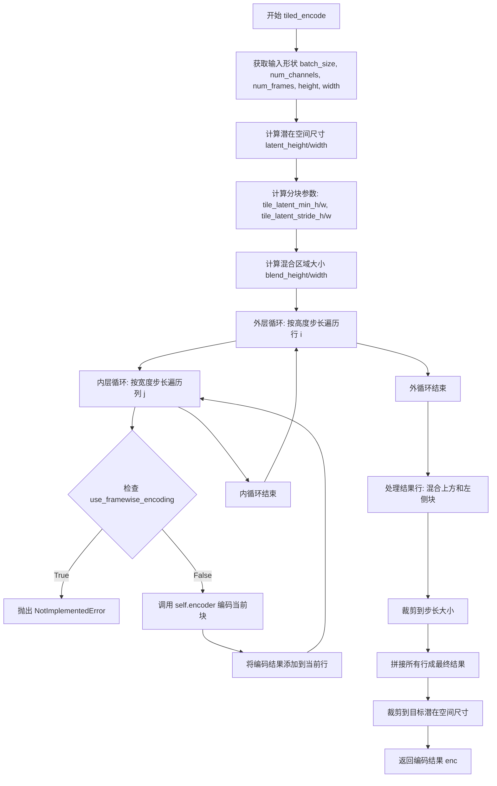

#### 带注释源码

```python
def tiled_encode(self, x: torch.Tensor) -> torch.Tensor:
    r"""Encode a batch of images using a tiled encoder.

    Args:
        x (`torch.Tensor`): Input batch of videos.

    Returns:
        `torch.Tensor`:
            The latent representation of the encoded videos.
    """
    # 获取输入张量的形状信息
    batch_size, num_channels, num_frames, height, width = x.shape
    
    # 根据空间压缩比计算潜在空间的尺寸
    latent_height = height // self.spatial_compression_ratio
    latent_width = width // self.spatial_compression_ratio

    # 将分块参数从样本空间映射到潜在空间（除以压缩比）
    tile_latent_min_height = self.tile_sample_min_height // self.spatial_compression_ratio
    tile_latent_min_width = self.tile_sample_min_width // self.spatial_compression_ratio
    tile_latent_stride_height = self.tile_sample_stride_height // self.spatial_compression_ratio
    tile_latent_stride_width = self.tile_sample_stride_width // self.spatial_compression_ratio

    # 计算混合区域的高度和宽度（块大小减去步长）
    blend_height = tile_latent_min_height - tile_latent_stride_height
    blend_width = tile_latent_min_width - tile_latent_stride_width

    # 初始化结果行列表
    rows = []
    # 按高度步长遍历，生成所有行
    for i in range(0, height, self.tile_sample_stride_height):
        row = []
        # 按宽度步长遍历，生成当前行的所有块
        for j in range(0, width, self.tile_sample_stride_width):
            # 检查是否启用帧级编码（不支持，抛出错误）
            if self.use_framewise_encoding:
                raise NotImplementedError(
                    "Frame-wise encoding does not work with the Mochi VAE Encoder due to the presence of attention layers. "
                    "As intermediate frames are not independent from each other, they cannot be encoded frame-wise."
                )
            else:
                # 从输入张量中提取当前块（高度和宽度范围）
                # 形状: (batch_size, num_channels, num_frames, tile_sample_min_height, tile_sample_min_width)
                time, _ = self.encoder(
                    x[:, :, :, i : i + self.tile_sample_min_height, j : j + self.tile_sample_min_width]
                )

            # 将编码后的块添加到当前行
            row.append(time)
        # 将当前行添加到行列表
        rows.append(row)

    # 处理所有行，混合重叠区域
    result_rows = []
    for i, row in enumerate(rows):
        result_row = []
        for j, tile in enumerate(row):
            # 混合上方 tile（垂直方向）
            # 将上一个行的对应块与当前块进行垂直混合，消除水平拼接缝
            if i > 0:
                tile = self.blend_v(rows[i - 1][j], tile, blend_height)
            # 混合左侧 tile（水平方向）
            # 将当前行上一个块与当前块进行水平混合，消除垂直拼接缝
            if j > 0:
                tile = self.blend_h(row[j - 1], tile, blend_width)
            # 裁剪到步长大小，只保留有效的潜在表示区域
            result_row.append(tile[:, :, :, :tile_latent_stride_height, :tile_latent_stride_width])
        # 沿宽度维度（dim=4）拼接当前行的所有块
        result_rows.append(torch.cat(result_row, dim=4))

    # 沿高度维度（dim=3）拼接所有行，得到完整的潜在表示
    # 最后裁剪到目标潜在空间尺寸，以防重叠混合导致超出预期大小
    enc = torch.cat(result_rows, dim=3)[:, :, :, :latent_height, :latent_width]
    return enc
```


### `AutoencoderKLMochi.tiled_decode`

分块解码方法，将输入的潜在向量张量沿空间维度分割成重叠的瓦片（tiles），分别解码后再通过混合（blending）合并，以降低大尺寸视频解码的显存需求。

参数：

-  `z`：`torch.Tensor`，输入的潜在向量批次，形状为 (batch_size, num_channels, num_frames, height, width)
-  `return_dict`：`bool`，是否返回 `DecoderOutput` 对象而不是元组，默认为 `True`

返回值：`DecoderOutput | torch.Tensor`，解码后的视频样本张量。如果 `return_dict` 为 `True`，返回 `DecoderOutput` 对象，否则返回元组 `(dec,)`

#### 流程图

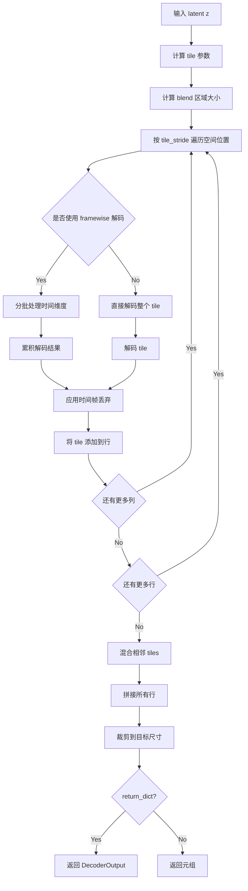

#### 带注释源码

```python
def tiled_decode(self, z: torch.Tensor, return_dict: bool = True) -> DecoderOutput | torch.Tensor:
    r"""
    Decode a batch of images using a tiled decoder.

    Args:
        z (`torch.Tensor`): Input batch of latent vectors.
        return_dict (`bool`, *optional*, defaults to `True`):
            Whether or not to return a [`~models.vae.DecoderOutput`] instead of a plain tuple.

    Returns:
        [`~models.vae.DecoderOutput`] or `tuple`:
            If return_dict is True, a [`~models.vae.DecoderOutput`] is returned, otherwise a plain `tuple` is
            returned.
    """

    # 获取输入 latent 的形状信息
    batch_size, num_channels, num_frames, height, width = z.shape
    
    # 计算输出样本的空间尺寸（乘以空间压缩比）
    sample_height = height * self.spatial_compression_ratio
    sample_width = width * self.spatial_compression_ratio

    # 根据空间压缩比计算 latent 空间中的 tile 参数
    tile_latent_min_height = self.tile_sample_min_height // self.spatial_compression_ratio
    tile_latent_min_width = self.tile_sample_min_width // self.spatial_compression_ratio
    tile_latent_stride_height = self.tile_sample_stride_height // self.spatial_compression_ratio
    tile_latent_stride_width = self.tile_sample_stride_width // self.spatial_compression_ratio

    # 计算混合区域的大小（tile 大小减去步长）
    blend_height = self.tile_sample_min_height - self.tile_sample_stride_height
    blend_width = self.tile_sample_min_width - self.tile_sample_stride_width

    # 初始化行列表，用于存储所有 tile 行
    rows = []
    # 按垂直步长遍历 latent 高度方向
    for i in range(0, height, tile_latent_stride_height):
        row = []  # 初始化当前行
        # 按水平步长遍历 latent 宽度方向
        for j in range(0, width, tile_latent_stride_width):
            # 判断是否使用帧级解码（处理时间维度）
            if self.use_framewise_decoding:
                time = []
                conv_cache = None  # 初始化卷积缓存

                # 按批次处理时间帧
                for k in range(0, num_frames, self.num_latent_frames_batch_size):
                    # 提取当前 tile 的 latent 数据块
                    tile = z[
                        :,
                        :,
                        k : k + self.num_latent_frames_batch_size,
                        i : i + tile_latent_min_height,
                        j : j + tile_latent_min_width,
                    ]
                    # 使用解码器处理 tile，传入卷积缓存
                    tile, conv_cache = self.decoder(tile, conv_cache=conv_cache)
                    time.append(tile)

                # 沿时间维度拼接所有批次结果
                time = torch.cat(time, dim=2)
            else:
                # 直接解码整个空间 tile（一次性处理所有时间帧）
                time, _ = self.decoder(z[:, :, :, i : i + tile_latent_min_height, j : j + tile_latent_min_width])

            # 如果需要丢弃最后的时间帧（保持时间维度一致性）
            if self.drop_last_temporal_frames and time.size(2) >= self.temporal_compression_ratio:
                time = time[:, :, self.temporal_compression_ratio - 1 :]

            # 将当前 tile 添加到当前行
            row.append(time)
        # 将当前行添加到行列表
        rows.append(row)

    # 初始化结果行列表，用于存储混合后的 tile
    result_rows = []
    # 遍历所有行
    for i, row in enumerate(rows):
        result_row = []
        # 遍历当前行中的每个 tile
        for j, tile in enumerate(row):
            # 如果有上方 tile，进行垂直混合
            if i > 0:
                tile = self.blend_v(rows[i - 1][j], tile, blend_height)
            # 如果有左侧 tile，进行水平混合
            if j > 0:
                tile = self.blend_h(row[j - 1], tile, blend_width)
            # 裁剪 tile 到步长大小（去除重叠区域）
            result_row.append(tile[:, :, :, : self.tile_sample_stride_height, : self.tile_sample_stride_width])
        # 沿宽度维度拼接当前行的所有 tile
        result_rows.append(torch.cat(result_row, dim=4))

    # 沿高度维度拼接所有行，得到完整解码结果
    dec = torch.cat(result_rows, dim=3)[:, :, :, :sample_height, :sample_width]

    # 根据 return_dict 返回结果
    if not return_dict:
        return (dec,)

    return DecoderOutput(sample=dec)
```


### `AutoencoderKLMochi.forward`

该方法是 Mochi VAE（变分自编码器）模型的核心前向传播接口。它接收输入样本（图像或视频），首先通过编码器将其转换为潜在空间的概率分布（对角高斯分布），随后根据 `sample_posterior` 参数决定是从该分布中采样潜在向量还是使用其均值（模式），最后将潜在向量解码为重建的样本。根据 `return_dict` 参数决定返回格式。

参数：
- `sample`：`torch.Tensor`，输入的图像或视频张量，形状通常为 `(B, C, F, H, W)`（通道数、帧数、高度、宽度）。
- `sample_posterior`：`bool`，是否从后验分布中采样。如果为 `True`，则从分布中采样潜在向量（引入随机性，常用于训练或多样化生成）；如果为 `False`，则使用分布的均值（确定性映射，常用于推理）。
- `return_dict`：`bool`，是否返回字典形式的输出。如果为 `True`，返回包含 `sample` 属性的 `DecoderOutput` 对象；如果为 `False`，返回元组 `(sample,)`。
- `generator`：`torch.Generator | None`，用于控制潜在向量采样的随机数生成器，确保采样过程可复现。

返回值：`torch.Tensor | tuple`，返回重建的样本。如果 `return_dict` 为 `True`，返回 `DecoderOutput` 对象（其 `sample` 属性为张量）；否则返回元组。

#### 流程图

```mermaid
flowchart TD
    A[Start: forward sample] --> B[Encode: posterior = self.encode(sample).latent_dist]
    B --> C{sample_posterior?}
    C -- True --> D[Sample: z = posterior.sample generator]
    C -- False --> E[Mode: z = posterior.mode]
    D --> F[Decode: dec = self.decode z]
    E --> F
    F --> G{return_dict?}
    G -- True --> H[Return DecoderOutput: dec]
    G -- False --> I[Return tuple: (dec,)]
    H --> J[End]
    I --> J
```

#### 带注释源码

```python
def forward(
    self,
    sample: torch.Tensor,
    sample_posterior: bool = False,
    return_dict: bool = True,
    generator: torch.Generator | None = None,
) -> torch.Tensor | tuple:
    # 将输入样本赋值给变量 x
    x = sample
    
    # 1. 编码阶段：调用 encode 方法将输入转换为潜在空间的概率分布
    # encode 方法返回 AutoencoderKLOutput 对象，包含 latent_dist 属性
    posterior = self.encode(x).latent_dist
    
    # 2. 采样阶段：根据 sample_posterior 参数决定潜在向量的获取方式
    if sample_posterior:
        # 从后验分布中采样潜在向量 z，引入随机性
        z = posterior.sample(generator=generator)
    else:
        # 使用后验分布的模式（均值）作为潜在向量 z，确定性输出
        z = posterior.mode()
    
    # 3. 解码阶段：调用 decode 方法将潜在向量解码为输出样本
    dec = self.decode(z)
    
    # 4. 返回阶段：根据 return_dict 决定返回格式
    if not return_dict:
        # 返回元组格式
        return (dec,)
    # 返回对象格式 (DecoderOutput)
    return dec
```

#### 关键组件信息

- **MochiEncoder3D**: 负责将输入样本编码为潜在表示，输出为潜在分布参数（均值和方差）。
- **DiagonalGaussianDistribution**: 用于表示潜在空间的概率分布，提供 `sample()` 和 `mode()` 方法进行采样或均值获取。
- **MochiDecoder3D**: 负责将潜在向量解码为输出样本。
- **DecoderOutput**: 解码器的输出封装类，包含重建的 `sample` 张量。

#### 设计目标与约束

- **功能**: 实现视频/图像的端到端压缩与重建，支持随机采样（VAE特性）。
- **性能**: 支持多种优化策略，如 Tiling（分块编码/解码）和 Slicing（切片编码），以适应不同大小的输入和显存限制（在 `encode`/`decode` 方法中实现，`forward` 方法间接调用）。
- **随机性**: 通过 `sample_posterior` 和 `generator` 参数控制生成过程的随机性和可复现性。

## 关键组件


### MochiChunkedGroupNorm3D

对5D视频输入进行逐帧分组归一化的模块，支持内存高效的块状处理以降低显存占用。

### MochiResnetBlock3D

Mochi视频VAE模型中的3D ResNet残差块，包含两个卷积层和分组归一化，支持卷积缓存机制以实现高效的推理。

### MochiDownBlock3D

Mochi模型中的下采样块，用于编码器路径，通过时序和空间扩展因子减少特征图的时空分辨率，包含ResNet块和可选的注意力机制。

### MochiMidBlock3D

Mochi模型中的中间块，位于编码器/解码器的核心位置，堆叠多个ResNet块和注意力模块，处理最深的特征表示。

### MochiUpBlock3D

Mochi模型中的上采样块，用于解码器路径，通过时序和空间扩展因子增加特征图的时空分辨率，包含ResNet块和线性投影层进行特征解包。

### FourierFeatures

傅里叶特征层，将输入信号转换为高频特征表示，通过正弦和余弦变换增强模型对细节的捕捉能力。

### MochiEncoder3D

变分自编码器的编码器部分，将输入视频样本编码到潜在表示空间，包含傅里叶特征提取、投影层、多个下采样块和输出归一化层。

### MochiDecoder3D

变分自编码器的解码器部分，将潜在表示解码回视频样本，包含输入卷积、多个上采样块和中间块，以及输出投影层。

### AutoencoderKLMochi

完整的Mochi VAE模型，集成编码器和解码器，支持分块编码/解码、时序编码/解码、空间平铺等优化技术，用于视频的潜在空间压缩与重建。

## 问题及建议


### 已知问题

- **`_gradient_checkpointing_func` 方法未定义但被调用**：在 `MochiDownBlock3D`、`MochiMidBlock3D`、`MochiUpBlock3D`、`MochiEncoder3D` 和 `MochiDecoder3D` 类中调用了 `self._gradient_checkpointing_func()`，但该方法在这些类中并未定义，会导致运行时错误。
- **`forward` 方法返回类型注释错误**：`AutoencoderKLMochi.forward` 方法返回类型注释为 `torch.Tensor | torch.Tensor`，第二个应该是 `DecoderOutput`，这是冗余且可能误导的注释。
- **`blend_v` 和 `blend_h` 使用 Python 循环而非向量化操作**：这两个函数使用 `for` 循环进行混合操作，对于大规模视频处理性能较低，应使用向量化的 Tensor 操作替代。
- **类型不一致**：`MochiEncoder3D.forward` 返回类型注释为 `torch.Tensor`，但实际返回的是 `tuple[torch.Tensor, dict]`（包含 hidden_states 和 conv_cache）。
- **重复代码**：`tiled_encode` 和 `tiled_decode` 方法中有大量重复的 tiling 和 blending 逻辑，可以提取为共享的辅助方法。
- **配置参数过多且缺乏默认值合理性验证**：`AutoencoderKLMochi.__init__` 中有大量硬编码的 tuple 参数（如 `latents_mean`、`latents_std`），这些值应该从训练数据中统计得出，而不是硬编码。
- **未实现的framewise功能**：`use_framewise_encoding` 被设置为 True 时，`_encode` 会直接抛出 `NotImplementedError`，但 `_enable_framewise_encoding` 方法没有提供任何警告或替代实现。
- **Attention chunking 的 chunk_size 硬编码**：`MochiDownBlock3D.forward` 中 `chunk_size=2**15` 是硬编码的，没有考虑不同 GPU 内存容量的自适应调整。

### 优化建议

- **实现 `_gradient_checkpointing_func` 方法或使用正确的 API**：应该使用 PyTorch 的 `torch.utils.checkpoint.checkpoint` 或在基类中正确定义 gradient checkpointing 方法。
- **修复返回类型注释**：将 `MochiEncoder3D.forward` 返回类型改为 `tuple[torch.Tensor, dict[str, torch.Tensor]]`，并修正 `AutoencoderKLMochi.forward` 的返回类型。
- **向量化 blend 函数**：使用 Tensor 的切片索引和广播机制重写 `blend_v` 和 `blend_h`，避免 Python 循环。
- **提取共享的 tiling 逻辑**：创建 `tiled_encode` 和 `tiled_decode` 共用的辅助方法处理 tiling 和 blending 逻辑。
- **移除硬编码的统计值**：`latents_mean` 和 `latents_std` 应该从实际训练数据计算并可选地通过配置文件加载，而不是硬编码在代码中。
- **添加 framewise 模式的替代实现或警告**：在 `_enable_framewise_encoding` 中添加运行时警告，或提供完整的 framewise 实现。
- **添加 chunk_size 自适应机制**：根据可用 GPU 内存动态计算 attention 的 chunk_size，或将其作为可配置参数。

## 其它


### 设计目标与约束

本模块旨在实现一个基于变分自编码器（VAE）的视频编码-解码框架（Mochi VAE），用于将视频样本编码到潜在表示空间并从潜在表示重建视频。设计目标包括：（1）支持高分辨率视频的高效编码与解码；（2）通过时序压缩和空间压缩实现视频数据的有效降维；（3）提供tiling、slicing、framewise编码/解码等多种内存优化策略；（4）支持梯度检查点以减少训练时的显存占用；（5）与HuggingFace Diffusers框架无缝集成，遵循ConfigMixin和ModelMixin接口规范。

### 错误处理与异常设计

代码中包含以下错误处理机制：（1）在`enable_tiling`方法中，通过参数校验确保tile尺寸和步幅的合法性；（2）在`_encode`方法中，当启用tiling且输入尺寸超过阈值时自动调用`tiled_encode`；（3）在`tiled_encode`和`tiled_decode`方法中，若同时启用framewise编码/解码会抛出`NotImplementedError`，因为因果注意力层不支持帧间独立编码；（4）在`forward`方法中，通过`sample_posterior`参数控制是否从后验分布采样，支持随机生成和确定性模式两种方式；（5）在`encode`和`decode`方法中，支持`return_dict`参数以兼容不同的返回格式需求。

### 数据流与状态机

数据流遵循以下路径：输入视频（batch, channels, frames, height, width）→ Fourier特征处理 → 投影到隐藏维度 → 编码器块（多个MochiDownBlock3D）→ 中间块（MochiMidBlock3D）→ 归一化与输出投影 → 潜在表示。解码过程逆向进行：潜在表示 → 输入投影 → 解码器块（多个MochiUpBlock3D）→ 中间块 → 输出投影 → 重建视频。状态机管理包括：梯度检查点启用状态（`gradient_checkpointing`）、tiling模式状态（`use_tiling`）、slicing模式状态（`use_slicing`）、framewise编码/解码状态（`use_framewise_encoding`、`use_framewise_decoding`），以及tiling相关配置参数。

### 外部依赖与接口契约

本模块依赖以下外部组件：（1）`torch`和`torch.nn`：张量计算和神经网络基类；（2）`...configuration_utils.ConfigMixin`和`...register_to_config`：配置管理接口；（3）`...utils.logging`：日志记录；（4）`...utils.accelerate_utils.apply_forward_hook`：前向钩子装饰器；（5）`..activations.get_activation`：激活函数获取；（6）`..attention_processor.Attention`和`MochiVaeAttnProcessor2_0`：注意力机制；（7）`..modeling_outputs.AutoencoderKLOutput`和`DecoderOutput`：输出数据结构；（8）`..modeling_utils.ModelMixin`：模型基类；（9）`.autoencoder_kl_cogvideox.CogVideoXCausalConv3d`：因果3D卷积；（10）`.vae.AutoencoderMixin`和`DiagonalGaussianDistribution`：VAE基础组件。

### 性能优化策略

代码实现了多种性能优化策略：（1）梯度检查点（gradient_checkpointing）：在编码器和解码器的各块中启用，以时间换显存；（2）Chunked Group Normalization：通过分块处理减少显存占用；（3）Attention分块计算：当token数量超过`chunk_size`（默认2^15）时，将attention操作分块进行以避免CUDA配置错误；（4）Tiling编码/解码：将大尺寸输入分割为重叠的tile分别处理，最后通过blending合并；（5）Framewise解码：将长视频的latent按时间维度分批解码；（6）Slicing编码：对batch维度进行切片处理以降低单次显存需求。这些优化策略可通过配置参数灵活启用和调整。

### 配置参数详解

模型的主要配置参数包括：`in_channels`（输入通道数，默认15）、`out_channels`（输出通道数，默认3）、`encoder_block_out_channels`和`decoder_block_out_channels`（编解码器各层输出通道数）、`latent_channels`（潜在空间通道数，默认12）、`layers_per_block`（每层ResNet块数量）、`temporal_expansions`和`spatial_expansions`（时序和空间扩展因子）、`latents_mean`和`latents_std`（潜在空间的均值和标准差，用于归一化）、`scaling_factor`（潜在空间的缩放因子）。这些参数通过`@register_to_config`装饰器注册，支持配置文件的序列化和反序列化。

### 使用示例与典型场景

典型使用场景包括：（1）视频压缩与重建：使用encode获取潜在表示，使用decode重建视频；（2）生成模型集成：作为扩散模型的先验或后验网络；（3）内存受限场景：通过启用tiling、slicing或framewise解码来处理高分辨率或长时序视频；（4）训练场景：通过梯度检查点减少显存占用以支持更大的batch size。调用流程：首先实例化`AutoencoderKLMochi`模型，然后根据需要启用tiling（`enable_tiling()`）或其他优化选项，最后调用`encode()`或`decode()`方法进行推理。

### 版本兼容性说明

本模块基于PyTorch和HuggingFace Diffusers框架设计，兼容Python 3.8+和PyTorch 1.11+。模块遵循Diffusers库的ModelMixin和ConfigMixin接口规范，支持`from_pretrained`和`save_pretrained`方法进行模型加载和保存。代码中使用了Python 3.10+的类型注解语法（如`int | None`），建议在Python 3.10及以上版本环境中运行。


    