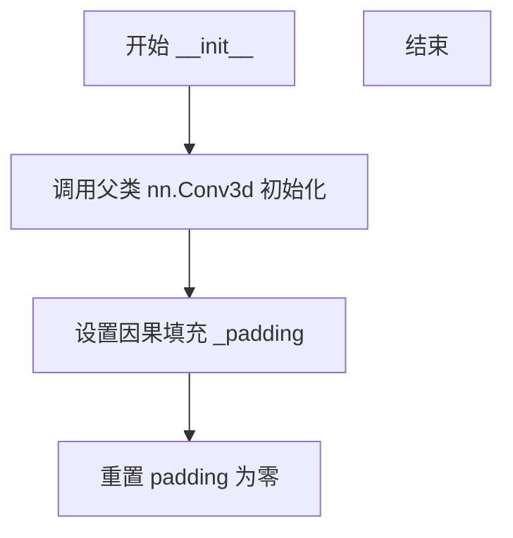
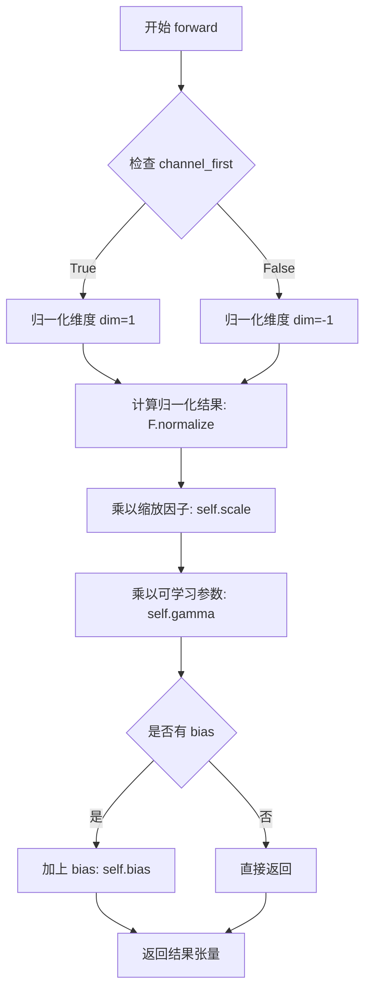
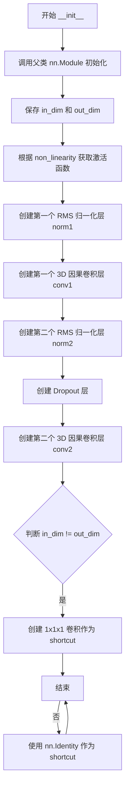
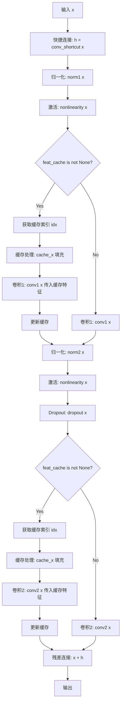
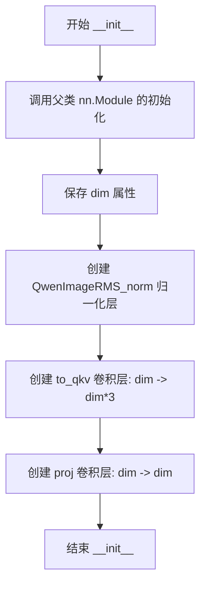
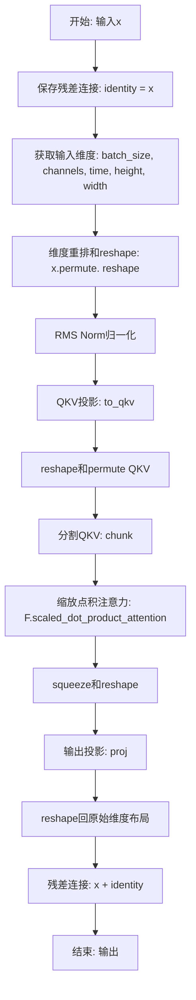
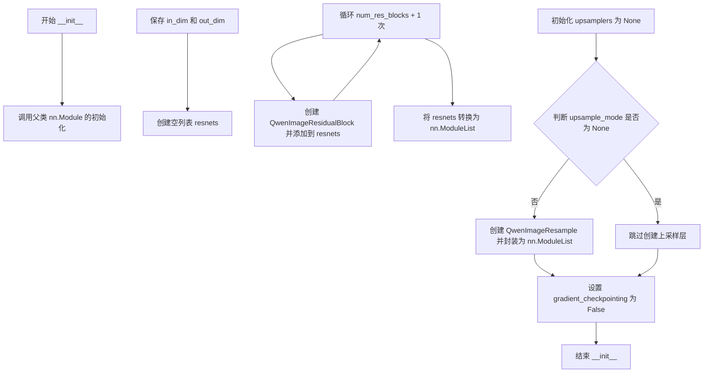

# `diffusers\src\diffusers\models\autoencoders\autoencoder_kl_qwenimage.py` 详细设计文档

这是一个基于Qwen-Image的3D变分自编码器(VAE)实现，核心功能是实现视频/图像数据的潜在空间编码与重建，采用时间因果卷积以支持视频时序处理，并集成了特征缓存机制以优化长视频推理的内存使用。

## 整体流程

```mermaid
graph TD
    Start[Input: Video Tensor (B, C, T, H, W)] --> Encode{是否分块编码?}
    Encode -- 是 --> TiledEncode[tiled_encode]
    Encode -- 否 --> StdEncode[encode]
    StdEncode --> CacheEnc[clear_cache & 循环分帧]
    CacheEnc --> EncForward[QwenImageEncoder3d]
    EncForward --> QuantConv[quant_conv]
    QuantConv --> Latent[Latent Distribution]
    Latent --> Sample[采样 (sample/mode)]
    Sample --> Decode{是否分块解码?}
    Decode -- 是 --> TiledDecode[tiled_decode]
    Decode -- 否 --> StdDecode[decode]
    StdDecode --> CacheDec[clear_cache & 逐帧循环]
    CacheDec --> PostQuant[post_quant_conv]
    PostQuant --> DecForward[QwenImageDecoder3d]
    DecForward --> Clamp[Clamp Output]
    Clamp --> End[Output: Reconstructed Video]
    TiledEncode --> Latent
    TiledDecode --> Clamp
```

## 类结构

```
AutoencoderKLQwenImage (主模型类)
├── QwenImageEncoder3d (3D编码器)
│   ├── QwenImageCausalConv3d (基础卷积)
│   ├── QwenImageResample (重采样)
│   ├── QwenImageResidualBlock (残差块)
│   └── QwenImageMidBlock (中间层)
│       └── QwenImageAttentionBlock (注意力)
└── QwenImageDecoder3d (3D解码器)
    ├── QwenImageCausalConv3d
    ├── QwenImageResample
    ├── QwenImageUpBlock (上采样块)
    │   └── QwenImageResidualBlock
    └── ... (输出层)
```

## 全局变量及字段


### `CACHE_T`
    
Constant defining the cache size for temporal dimension in causal convolutions.

类型：`int`
    


### `logger`
    
Logger instance for the module to track runtime information and errors.

类型：`logging.Logger`
    


### `QwenImageCausalConv3d._padding`
    
Pre-computed padding values for causal convolution in time dimension.

类型：`tuple`
    


### `QwenImageCausalConv3d.padding`
    
Overridden padding set to zero for causal behavior in all dimensions.

类型：`tuple`
    


### `QwenImageRMS_norm.channel_first`
    
Flag indicating whether input tensor has channels as the first dimension.

类型：`bool`
    


### `QwenImageRMS_norm.scale`
    
Scaling factor computed as square root of dimension size.

类型：`float`
    


### `QwenImageRMS_norm.gamma`
    
Learnable scaling parameter for RMS normalization.

类型：`nn.Parameter`
    


### `QwenImageRMS_norm.bias`
    
Optional learnable bias term for RMS normalization.

类型：`nn.Parameter | float`
    


### `QwenImageResample.dim`
    
Number of input/output channels for the resampling module.

类型：`int`
    


### `QwenImageResample.mode`
    
Resampling mode specifying the type of up/down sampling operation.

类型：`str`
    


### `QwenImageResample.resample`
    
Main resampling layer for spatial 2D operations.

类型：`nn.Module`
    


### `QwenImageResample.time_conv`
    
Optional causal 3D convolution for temporal dimension handling.

类型：`nn.Module | None`
    


### `QwenImageResidualBlock.in_dim`
    
Number of input channels to the residual block.

类型：`int`
    


### `QwenImageResidualBlock.out_dim`
    
Number of output channels from the residual block.

类型：`int`
    


### `QwenImageResidualBlock.nonlinearity`
    
Activation function applied in the residual block.

类型：`nn.Module`
    


### `QwenImageResidualBlock.norm1`
    
First RMS normalization layer before the main convolution.

类型：`nn.Module`
    


### `QwenImageResidualBlock.conv1`
    
First causal 3D convolution layer in the residual path.

类型：`nn.Module`
    


### `QwenImageResidualBlock.norm2`
    
Second RMS normalization layer after first convolution.

类型：`nn.Module`
    


### `QwenImageResidualBlock.dropout`
    
Dropout layer for regularization in the residual block.

类型：`nn.Module`
    


### `QwenImageResidualBlock.conv2`
    
Second causal 3D convolution layer in the residual path.

类型：`nn.Module`
    


### `QwenImageResidualBlock.conv_shortcut`
    
Shortcut convolution for dimension matching when input/output dims differ.

类型：`nn.Module`
    


### `QwenImageAttentionBlock.dim`
    
Number of channels in the input tensor for attention computation.

类型：`int`
    


### `QwenImageAttentionBlock.norm`
    
RMS normalization layer applied before attention computation.

类型：`nn.Module`
    


### `QwenImageAttentionBlock.to_qkv`
    
Convolution layer to compute query, key, and value projections.

类型：`nn.Module`
    


### `QwenImageAttentionBlock.proj`
    
Output projection convolution after attention computation.

类型：`nn.Module`
    


### `QwenImageMidBlock.dim`
    
Number of channels for the middle block processing.

类型：`int`
    


### `QwenImageMidBlock.attentions`
    
List of attention blocks in the middle block.

类型：`nn.ModuleList`
    


### `QwenImageMidBlock.resnets`
    
List of residual blocks in the middle block.

类型：`nn.ModuleList`
    


### `QwenImageMidBlock.gradient_checkpointing`
    
Flag to enable gradient checkpointing for memory optimization.

类型：`bool`
    


### `QwenImageEncoder3d.dim`
    
Base number of channels in the first encoder layer.

类型：`int`
    


### `QwenImageEncoder3d.z_dim`
    
Dimensionality of the latent space output.

类型：`int`
    


### `QwenImageEncoder3d.dim_mult`
    
Channel multipliers for each block in the encoder.

类型：`list[int]`
    


### `QwenImageEncoder3d.num_res_blocks`
    
Number of residual blocks per encoder block.

类型：`int`
    


### `QwenImageEncoder3d.attn_scales`
    
Scales at which to apply attention mechanisms in the encoder.

类型：`list[float]`
    


### `QwenImageEncoder3d.temperal_downsample`
    
Flags indicating whether to downsample temporally in each block.

类型：`list[bool]`
    


### `QwenImageEncoder3d.nonlinearity`
    
Activation function used throughout the encoder.

类型：`nn.Module`
    


### `QwenImageEncoder3d.conv_in`
    
Input convolution layer to process raw input.

类型：`nn.Module`
    


### `QwenImageEncoder3d.down_blocks`
    
Downsampling blocks that progressively reduce spatial and temporal dimensions.

类型：`nn.ModuleList`
    


### `QwenImageEncoder3d.mid_block`
    
Middle block processing the bottleneck features.

类型：`nn.Module`
    


### `QwenImageEncoder3d.norm_out`
    
Output normalization layer before final convolution.

类型：`nn.Module`
    


### `QwenImageEncoder3d.conv_out`
    
Final convolution layer producing latent representation.

类型：`nn.Module`
    


### `QwenImageEncoder3d.gradient_checkpointing`
    
Flag to enable gradient checkpointing for memory optimization.

类型：`bool`
    


### `QwenImageUpBlock.in_dim`
    
Number of input channels to the upsampling block.

类型：`int`
    


### `QwenImageUpBlock.out_dim`
    
Number of output channels from the upsampling block.

类型：`int`
    


### `QwenImageUpBlock.resnets`
    
List of residual blocks in the upsampling block.

类型：`nn.ModuleList`
    


### `QwenImageUpBlock.upsamplers`
    
Optional upsampling layers for spatial and temporal expansion.

类型：`nn.ModuleList | None`
    


### `QwenImageUpBlock.gradient_checkpointing`
    
Flag to enable gradient checkpointing for memory optimization.

类型：`bool`
    


### `QwenImageDecoder3d.dim`
    
Base number of channels in the first decoder layer.

类型：`int`
    


### `QwenImageDecoder3d.z_dim`
    
Dimensionality of the latent space input.

类型：`int`
    


### `QwenImageDecoder3d.dim_mult`
    
Channel multipliers for each block in the decoder.

类型：`list[int]`
    


### `QwenImageDecoder3d.num_res_blocks`
    
Number of residual blocks per decoder block.

类型：`int`
    


### `QwenImageDecoder3d.attn_scales`
    
Scales at which to apply attention mechanisms in the decoder.

类型：`list[float]`
    


### `QwenImageDecoder3d.temperal_upsample`
    
Flags indicating whether to upsample temporally in each block.

类型：`list[bool]`
    


### `QwenImageDecoder3d.nonlinearity`
    
Activation function used throughout the decoder.

类型：`nn.Module`
    


### `QwenImageDecoder3d.conv_in`
    
Input convolution layer to process latent representation.

类型：`nn.Module`
    


### `QwenImageDecoder3d.mid_block`
    
Middle block processing the bottleneck features.

类型：`nn.Module`
    


### `QwenImageDecoder3d.up_blocks`
    
Upsampling blocks that progressively increase spatial and temporal dimensions.

类型：`nn.ModuleList`
    


### `QwenImageDecoder3d.norm_out`
    
Output normalization layer before final convolution.

类型：`nn.Module`
    


### `QwenImageDecoder3d.conv_out`
    
Final convolution layer producing reconstructed output.

类型：`nn.Module`
    


### `QwenImageDecoder3d.gradient_checkpointing`
    
Flag to enable gradient checkpointing for memory optimization.

类型：`bool`
    


### `AutoencoderKLQwenImage.z_dim`
    
Dimensionality of the latent space in the autoencoder.

类型：`int`
    


### `AutoencoderKLQwenImage.temperal_downsample`
    
Temporal downsampling configuration for the encoder.

类型：`list[bool]`
    


### `AutoencoderKLQwenImage.temperal_upsample`
    
Temporal upsampling configuration for the decoder.

类型：`list[bool]`
    


### `AutoencoderKLQwenImage.encoder`
    
3D encoder network that encodes input into latent representation.

类型：`nn.Module`
    


### `AutoencoderKLQwenImage.quant_conv`
    
Convolution layer for quantizing the encoder output.

类型：`nn.Module`
    


### `AutoencoderKLQwenImage.post_quant_conv`
    
Convolution layer applied after quantization before decoding.

类型：`nn.Module`
    


### `AutoencoderKLQwenImage.decoder`
    
3D decoder network that reconstructs output from latent representation.

类型：`nn.Module`
    


### `AutoencoderKLQwenImage.spatial_compression_ratio`
    
Spatial compression ratio achieved by the autoencoder.

类型：`int`
    


### `AutoencoderKLQwenImage.use_slicing`
    
Flag to enable slicing across batch dimension for memory efficiency.

类型：`bool`
    


### `AutoencoderKLQwenImage.use_tiling`
    
Flag to enable spatial tiling for decoding large video latents.

类型：`bool`
    


### `AutoencoderKLQwenImage.tile_sample_min_height`
    
Minimum tile height for spatial tiling during decoding.

类型：`int`
    


### `AutoencoderKLQwenImage.tile_sample_min_width`
    
Minimum tile width for spatial tiling during decoding.

类型：`int`
    


### `AutoencoderKLQwenImage.tile_sample_stride_height`
    
Stride between vertical tiles for spatial tiling.

类型：`int`
    


### `AutoencoderKLQwenImage.tile_sample_stride_width`
    
Stride between horizontal tiles for spatial tiling.

类型：`int`
    


### `AutoencoderKLQwenImage._cached_conv_counts`
    
Cached convolution counts for encoder and decoder used in cache management.

类型：`dict`
    
    

## 全局函数及方法


### QwenImageCausalConv3d.__init__

该方法是 `QwenImageCausalConv3d` 类的构造函数，继承自 PyTorch 的 `nn.Conv3d`，用于创建一个支持时间维度因果性的 3D 卷积层，并维护特征缓存功能以提升推理效率。

参数：

- `in_channels`：`int`，输入图像的通道数
- `out_channels`：`int`，卷积操作输出的通道数
- `kernel_size`：`int | tuple[int, int, int]`，卷积核的大小
- `stride`：`int | tuple[int, int, int]`，卷积的步长，默认为 1
- `padding`：`int | tuple[int, int, int]`，输入各侧的零填充，默认为 0

返回值：`None`，构造函数无返回值，仅初始化对象状态

#### 流程图



#### 带注释源码

```python
def __init__(
    self,
    in_channels: int,                          # 输入通道数
    out_channels: int,                         # 输出通道数
    kernel_size: int | tuple[int, int, int],   # 卷积核尺寸（3D）
    stride: int | tuple[int, int, int] = 1,    # 步长，默认为1
    padding: int | tuple[int, int, int] = 0,   # 填充，默认为0
) -> None:
    # 调用父类 nn.Conv3d 的初始化方法
    # 继承标准3D卷积的所有基本功能
    super().__init__(
        in_channels=in_channels,
        out_channels=out_channels,
        kernel_size=kernel_size,
        stride=stride,
        padding=padding,
    )

    # 设置因果padding策略：
    # _padding 是一个6元组，对应 F.pad 的 (left, right, top, bottom, front, back)
    # 这里的策略是将原始 padding 的最后一个维度（时间维度）扩展为 2*padding[0]
    # 确保时间维度上只向前看，实现因果卷积
    self._padding = (
        self.padding[2],          # 前一个卷积核宽度的填充
        self.padding[2],          # 后一个卷积核宽度的填充
        self.padding[1],          # 前一个卷积核高度的填充
        self.padding[1],          # 后一个卷积核高度的填充
        2 * self.padding[0],      # 时间维度：前方填充2倍
        0                         # 时间维度：后方不填充（保证因果性）
    )
    
    # 将原始 padding 属性重置为 (0, 0, 0)
    # 实际填充在 forward 中通过 F.pad 动态处理
    self.padding = (0, 0, 0)
```


### `QwenImageCausalConv3d.forward`

该方法实现了自定义的3D因果卷积，通过在时间维度上确保因果性（当前帧只能访问当前及之前的帧），并支持特征缓存功能以提高推理效率。当提供缓存特征时，该方法会先将缓存特征与当前输入在时间维度上拼接，然后进行填充和卷积操作。

参数：

- `x`：`torch.Tensor`，输入的5D张量，形状为 (batch, channels, time, height, width)
- `cache_x`：`torch.Tensor | None`，可选的缓存特征张量，用于在时间维度上提供历史信息以实现因果卷积

返回值：`torch.Tensor`，卷积后的输出张量，形状取决于卷积核参数和填充方式

#### 流程图

```mermaid
flowchart TD
    A[开始 forward] --> B{cache_x 是否存在且 padding[2] > 0?}
    B -->|是| C[将 cache_x 移动到 x 所在设备]
    C --> D[在时间维度拼接 cache_x 和 x]
    D --> E[调整 padding[4] 减去 cache_x 的时间维度大小]
    B -->|否| F[使用原始 padding]
    E --> G[使用 F.pad 对输入进行填充]
    F --> G
    G --> H[调用父类 nn.Conv3d 的 forward 方法]
    H --> I[返回卷积结果]
```

#### 带注释源码

```python
def forward(self, x, cache_x=None):
    # 获取预定义的填充方案
    padding = list(self._padding)
    
    # 如果提供了缓存特征且时间维度需要填充
    if cache_x is not None and self._padding[4] > 0:
        # 确保缓存特征在正确的设备上
        cache_x = cache_x.to(x.device)
        
        # 在时间维度（dim=2）上拼接缓存特征和当前输入
        # cache_x 包含历史帧信息，x 包含当前帧信息
        x = torch.cat([cache_x, x], dim=2)
        
        # 调整填充大小，因为已经拼接了缓存数据
        # 需要减少的时间维填充量
        padding[4] -= cache_x.shape[2]
    
    # 使用 F.pad 对输入进行填充
    # 填充顺序: (left, right, top, bottom, front, back)
    # self._padding 格式: (padding[2], padding[2], padding[1], padding[1], 2*padding[0], 0)
    # 实现因果卷积：在时间维度前面填充，末尾不填充
    x = F.pad(x, padding)
    
    # 调用父类 Conv3d 的 forward 方法执行实际卷积
    return super().forward(x)
```


### `QwenImageRMS_norm.__init__`

这是 `QwenImageRMS_norm` 类的构造函数。该方法接收归一化的维度 `dim`、通道顺序 `channel_first` 和数据类型 `images` 等参数，用于初始化 RMS（均方根）归一化层的内部状态。它会根据这些参数计算并构建可学习参数 `gamma`（缩放系数）和可选的 `bias`（偏置项）的形状，同时计算前向传播所需的缩放因子 `scale`（即 `dim` 的平方根）。

参数：

-   `self`：实例本身，隐式参数。
-   `dim`：`int`，特征维度的大小，用于确定归一化计算的范围。
-   `channel_first`：`bool`，输入张量的通道位置标识。若为 `True`，输入格式为 NCHW；若为 `False`，输入格式为 NHWC。默认为 `True`。
-   `images`：`bool`，标识输入数据是否为图像数据。若为 `True`，权重形状仅在空间维度广播；若为 `False`，则在时空维度广播。默认为 `True`。
-   `bias`：`bool`，是否包含可学习的偏置项。默认为 `False`。

返回值：`None`，构造函数无返回值。

#### 流程图

```mermaid
flowchart TD
    A([Start __init__]) --> B[调用 super().__init__]
    B --> C{images == True?}
    C -->|Yes| D[设置 broadcastable_dims = (1, 1)]
    C -->|No| E[设置 broadcastable_dims = (1, 1, 1)]
    D --> F{channel_first == True?}
    E --> F
    F -->|Yes| G[设置 shape = (dim, *broadcastable_dims)]
    F -->|No| H[设置 shape = (dim,)]
    G --> I[保存 self.channel_first = True]
    H --> J[保存 self.channel_first = False]
    I --> K[计算 self.scale = dim ** 0.5]
    J --> K
    K --> L[初始化 self.gamma 为 dim 维度的全 1 参数]
    L --> M{bias == True?}
    M -->|Yes| N[初始化 self.bias 为 dim 维度的全 0 参数]
    M -->|No| O[设置 self.bias = 0.0]
    N --> P([End])
    O --> P
```

#### 带注释源码

```python
def __init__(self, dim: int, channel_first: bool = True, images: bool = True, bias: bool = False) -> None:
    # 调用父类 nn.Module 的初始化方法
    super().__init__()
    
    # 根据 images 参数决定广播维度的形状
    # 如果不是图像数据（如视频），则包含时间维度 (1,1,1)；否则仅空间维度 (1,1)
    broadcastable_dims = (1, 1, 1) if not images else (1, 1)
    
    # 根据 channel_first 参数决定参数的具体形状
    # 如果通道在前 (NCHW)，形状为 (dim, 1, 1) 或 (dim, 1, 1, 1)；否则为 (dim,)
    shape = (dim, *broadcastable_dims) if channel_first else (dim,)

    # 保存通道顺序配置，供前向传播使用
    self.channel_first = channel_first
    
    # 计算缩放因子，通常为 dim 的平方根
    self.scale = dim**0.5
    
    # 初始化可学习的缩放系数 (gamma)，初始值为 1
    self.gamma = nn.Parameter(torch.ones(shape))
    
    # 初始化可学习的偏置系数 (bias)
    # 如果启用 bias，初始化为 0；否则设为 0 (非 Parameter，需注意梯度冻结)
    self.bias = nn.Parameter(torch.zeros(shape)) if bias else 0.0
```


### QwenImageRMS_norm.forward

该方法是 QwenImageRMS_norm 类的核心前向传播方法，实现了自定义的 RMS（Root Mean Square）归一化操作。它对输入张量进行归一化处理，支持通道优先和通道最后两种数据格式，并可选择性地添加可学习的缩放系数（gamma）和偏置（bias）。

参数：

- `x`：`torch.Tensor`，输入的张量，需要进行归一化的数据

返回值：`torch.Tensor`，返回经过归一化、缩放和偏置处理后的张量

#### 流程图



#### 带注释源码

```python
def forward(self, x):
    """
    执行 RMS 归一化的前向传播

    Args:
        x (torch.Tensor): 输入张量，形状取决于 channel_first 和 images 参数
                       - channel_first=True, images=True: (batch, channel, height, width)
                       - channel_first=True, images=False: (batch, channel, time, height, width)
                       - channel_first=False: (batch, ..., channel)

    Returns:
        torch.Tensor: 归一化后的张量，形状与输入相同
    """
    # 使用 F.normalize 进行 L2 归一化
    # 根据 channel_first 参数选择归一化的维度
    # - channel_first=True 时，沿维度 1（即通道维度）进行归一化
    # - channel_first=False 时，沿最后一个维度进行归一化
    # F.normalize 实际上做的是 x / ||x||_2
    return F.normalize(x, dim=(1 if self.channel_first else -1)) * self.scale * self.gamma + self.bias
```


### `QwenImageUpsample.forward`

该方法继承自 `nn.Upsample`，执行上采样操作，同时确保输出张量与输入张量保持相同的数据类型（通过 `.type_as(x)` 转换）。

参数：

- `x`：`torch.Tensor`，输入的需要上采样的张量

返回值：`torch.Tensor`，上采样后的张量，其数据类型与输入张量相同

#### 流程图

```mermaid
flowchart TD
    A[开始: 输入张量 x] --> B[调用父类上采样: super().forward(x.float())]
    B --> C[转换数据类型: .type_as(x)]
    C --> D[返回上采样后的张量]
```

#### 带注释源码

```python
class QwenImageUpsample(nn.Upsample):
    r"""
    Perform upsampling while ensuring the output tensor has the same data type as the input.

    Args:
        x (torch.Tensor): Input tensor to be upsampled.

    Returns:
        torch.Tensor: Upsampled tensor with the same data type as the input.
    """

    def forward(self, x):
        # 调用父类 nn.Upsample 的 forward 方法进行上采样
        # 首先将输入转换为 float 类型以确保计算精度
        # super() 获取父类 nn.Upsample 的实例
        # .forward(x.float()) 执行上采样操作（由初始化时的 scale_factor 和 mode 参数决定）
        upsampled = super().forward(x.float())
        
        # 将上采样后的结果转换回输入张量的原始数据类型
        # .type_as(x) 会保持与输入 x 相同的 dtype 和 device
        return upsampled.type_as(x)
```


### QwenImageResample.__init__

该方法是`QwenImageResample`类的构造函数，用于初始化一个自定义的重采样模块，支持2D和3D数据的上下采样操作。根据传入的`mode`参数，初始化不同的神经网络层序列（卷积、上采样、时间卷积等），以实现空间和时间维度的尺寸变换。

参数：

- `dim`：`int`，输入/输出通道数
- `mode`：`str`，重采样模式，可选值为'none'、'upsample2d'、'upsample3d'、'downsample2d'、'downsample3d'

返回值：`None`，无返回值

#### 流程图

```mermaid
flowchart TD
    A[开始 __init__] --> B[调用 super().__init__()]
    B --> C[保存 self.dim = dim]
    C --> D[保存 self.mode = mode]
    D --> E{判断 mode 类型}
    
    E -->|upsample2d| F[创建 2D 上采样序列]
    E -->|upsample3d| G[创建 3D 上采样序列 + 时间卷积]
    E -->|downsample2d| H[创建 2D 下采样序列]
    E -->|downsample3d| I[创建 3D 下采样序列 + 时间卷积]
    E -->|其他| J[创建恒等映射]
    
    F --> K[结束]
    G --> K
    H --> K
    I --> K
    J --> K
```

#### 带注释源码

```python
def __init__(self, dim: int, mode: str) -> None:
    """
    初始化 QwenImageResample 重采样模块
    
    Args:
        dim: 输入/输出通道数
        mode: 重采样模式
    """
    # 调用父类 nn.Module 的初始化方法
    super().__init__()
    
    # 保存通道维度参数
    self.dim = dim
    
    # 保存重采样模式参数
    self.mode = mode

    # 根据 mode 参数选择不同的网络层结构
    if mode == "upsample2d":
        # 2D 上采样：先进行 2 倍上采样，再进行卷积降维
        self.resample = nn.Sequential(
            QwenImageUpsample(scale_factor=(2.0, 2.0), mode="nearest-exact"),  # 2D 上采样层
            nn.Conv2d(dim, dim // 2, 3, padding=1),  # 通道数减半的卷积层
        )
    elif mode == "upsample3d":
        # 3D 上采样：2D 上采样 + 卷积 + 时间维度因果卷积
        self.resample = nn.Sequential(
            QwenImageUpsample(scale_factor=(2.0, 2.0), mode="nearest-exact"),  # 空间上采样
            nn.Conv2d(dim, dim // 2, 3, padding=1),  # 空间卷积降维
        )
        # 时间因果卷积：处理时间维度的上采样
        self.time_conv = QwenImageCausalConv3d(dim, dim * 2, (3, 1, 1), padding=(1, 0, 0))

    elif mode == "downsample2d":
        # 2D 下采样：零填充 + 步长卷积实现 2 倍下采样
        self.resample = nn.Sequential(
            nn.ZeroPad2d((0, 1, 0, 1)),  # 零填充右下边缘
            nn.Conv2d(dim, dim, 3, stride=(2, 2))  # 步长为2的卷积
        )
    elif mode == "downsample3d":
        # 3D 下采样：2D 下采样 + 时间维度因果卷积
        self.resample = nn.Sequential(
            nn.ZeroPad2d((0, 1, 0, 1)),  # 空间零填充
            nn.Conv2d(dim, dim, 3, stride=(2, 2))  # 空间下采样
        )
        # 时间因果卷积：带步长的下采样
        self.time_conv = QwenImageCausalConv3d(dim, dim, (3, 1, 1), stride=(2, 1, 1), padding=(0, 0, 0))

    else:
        # 默认模式：不做任何重采样，保持输入不变
        self.resample = nn.Identity()
```


### QwenImageResample.forward

该方法是 QwenImageResample 模块的前向传播函数，负责根据不同模式（upsample2d、upsample3d、downsample2d、downsample3d、none）对 2D/3D 数据进行上采样或下采样操作，同时支持特征缓存机制以实现因果卷积的高效推理。

参数：

- `x`：`torch.Tensor`，输入张量，形状为 (b, c, t, h, w)，其中 b 是批量大小，c 是通道数，t 是时间帧数，h 是高度，w 是宽度
- `feat_cache`：可选的 `list` 或 `None`，特征缓存列表，用于存储中间特征以支持因果卷积的增量推理
- `feat_idx`：可选的 `list`，默认为 `[0]`，特征索引列表，用于跟踪当前使用的缓存位置

返回值：`torch.Tensor`，经过重采样后的输出张量，形状根据模式变化（up模式下时间维度翻倍，down模式下时间维度减半）

#### 流程图

```mermaid
flowchart TD
    A[开始 forward] --> B[获取输入张量形状 b, c, t, h, w]
    B --> C{模式是否为 upsample3d?}
    C -->|Yes| D{feat_cache 是否为 None?}
    D -->|Yes| E[直接应用 time_conv]
    D -->|No| F{feat_cache[idx] 是否为 None?}
    F -->|Yes| G[设置 feat_cache[idx] = 'Rep']
    F -->|No| H[处理缓存: 克隆最后 CACHE_T 帧]
    H --> I{判断缓存类型并处理}
    I --> J[应用 time_conv 或带缓存卷积]
    J --> K[更新缓存并重构张量]
    K --> L[重排维度并恢复形状]
    C -->|No| M[统一处理: permute 和 reshape]
    M --> N[应用 resample 层]
    N --> O[恢复原始维度顺序]
    O --> P{模式是否为 downsample3d 且有缓存?}
    P -->|Yes| Q[处理下采样缓存]
    Q --> R[应用 time_conv 融合特征]
    P -->|No| S[返回结果张量]
    L --> S
```

#### 带注释源码

```python
def forward(self, x, feat_cache=None, feat_idx=[0]):
    # 获取输入张量的维度信息
    # b: batch size, c: channels, t: time frames, h: height, w: width
    b, c, t, h, w = x.size()
    
    # ============================================================
    # 处理 upsample3d 模式（3D 上采样，包含时间维度的因果卷积）
    # ============================================================
    if self.mode == "upsample3d":
        # 检查是否启用了特征缓存（用于增量推理）
        if feat_cache is not None:
            idx = feat_idx[0]
            
            # 首次遇到该缓存位置，标记为 "Rep" 表示需要重复处理
            if feat_cache[idx] is None:
                feat_cache[idx] = "Rep"
                feat_idx[0] += 1
            else:
                # 克隆最后 CACHE_T 帧用于缓存
                cache_x = x[:, :, -CACHE_T:, :, :].clone()
                
                # 处理缓存不足的情况：需要从前一个chunk获取帧
                if cache_x.shape[2] < 2 and feat_cache[idx] is not None and feat_cache[idx] != "Rep":
                    # 缓存最后一个chunk的最后一帧
                    cache_x = torch.cat(
                        [feat_cache[idx][:, :, -1, :, :].unsqueeze(2).to(cache_x.device), cache_x], dim=2
                    )
                
                # 处理标记为 "Rep" 但缓存不足的情况
                if cache_x.shape[2] < 2 and feat_cache[idx] is not None and feat_cache[idx] == "Rep":
                    # 用零填充
                    cache_x = torch.cat([torch.zeros_like(cache_x).to(cache_x.device), cache_x], dim=2)
                
                # 根据缓存类型选择卷积方式
                if feat_cache[idx] == "Rep":
                    x = self.time_conv(x)  # 直接卷积
                else:
                    x = self.time_conv(x, feat_cache[idx])  # 使用缓存进行因果卷积
                
                # 更新缓存为当前帧
                feat_cache[idx] = cache_x
                feat_idx[0] += 1

                # ============================================================
                # 重构输出张量：将 (b, c*2, t, h, w) 转换为 (b, c, t*2, h, w)
                # 实现了时间维度的2倍上采样
                # ============================================================
                x = x.reshape(b, 2, c, t, h, w)
                # 重新排列维度：[batch, 2, channels, time, height, width] -> [batch, channels, time, 2, height, width]
                x = torch.stack((x[:, 0, :, :, :, :], x[:, 1, :, :, :, :]), 3)
                x = x.reshape(b, c, t * 2, h, w)
    
    # ============================================================
    # 统一处理路径：将 5D 张量转换为 4D 进行空间重采样
    # ============================================================
    t = x.shape[2]
    # 维度重排：(b, c, t, h, w) -> (b, t, c, h, w)
    x = x.permute(0, 2, 1, 3, 4)
    # 合并 batch 和 time 维度：(b*t, c, h, w)
    x = x.reshape(b * t, c, h, w)
    # 应用空间重采样（2D/3D 上采样或下采样）
    x = self.resample(x)
    # 恢复维度：(b, t, c', h', w') -> (b, c', t, h', w')
    x = x.view(b, t, x.size(1), x.size(2), x.size(3)).permute(0, 2, 1, 3, 4)

    # ============================================================
    # 处理 downsample3d 模式（3D 下采样，包含时间维度的因果卷积）
    # ============================================================
    if self.mode == "downsample3d":
        if feat_cache is not None:
            idx = feat_idx[0]
            
            # 首次使用该缓存位置，保存当前特征
            if feat_cache[idx] is None:
                feat_cache[idx] = x.clone()
                feat_idx[0] += 1
            else:
                # 克隆最后一帧用于缓存
                cache_x = x[:, :, -1:, :, :].clone()
                # 融合前一帧和当前帧，然后应用因果卷积
                x = self.time_conv(torch.cat([feat_cache[idx][:, :, -1:, :, :], x], 2))
                # 更新缓存
                feat_cache[idx] = cache_x
                feat_idx[0] += 1
    
    return x
```


### `QwenImageResidualBlock.__init__`

该方法是 `QwenImageResidualBlock` 类的构造函数，负责初始化残差块的网络组件，包括两个 RMS 归一化层、两个 3D 因果卷积层、一个 Dropout 层，以及一个可选的 shortcut 卷积（当输入输出通道数不同时使用）。

参数：

- `in_dim`：`int`，输入张量的通道数
- `out_dim`：`int`，输出张量的通道数
- `dropout`：`float`，Dropout 层的丢弃率，默认为 0.0
- `non_linearity`：`str`，非线性激活函数的类型，默认为 "silu"

返回值：`None`，无返回值（初始化方法）

#### 流程图



#### 带注释源码

```python
def __init__(
    self,
    in_dim: int,
    out_dim: int,
    dropout: float = 0.0,
    non_linearity: str = "silu",
) -> None:
    """
    初始化 QwenImageResidualBlock 残差块。
    
    参数:
        in_dim: 输入通道数
        out_dim: 输出通道数
        dropout: Dropout 概率，默认为 0.0
        non_linearity: 激活函数类型，默认为 "silu"
    """
    # 调用父类 nn.Module 的初始化方法
    super().__init__()
    
    # 保存输入输出维度作为实例属性
    self.in_dim = in_dim
    self.out_dim = out_dim
    
    # 根据传入的名称获取对应的激活函数
    # get_activation 是一个工具函数，根据字符串返回相应的激活层
    self.nonlinearity = get_activation(non_linearity)
    
    # === 构建网络层 ===
    
    # 第一个 RMS 归一化层，用于输入特征
    # images=False 表示输入不是图像数据，而是视频/3D特征
    self.norm1 = QwenImageRMS_norm(in_dim, images=False)
    
    # 第一个 3D 因果卷积层，将输入通道数映射到输出通道数
    # 使用 3x3x3 卷积核，保持空间尺寸（padding=1）
    self.conv1 = QwenImageCausalConv3d(in_dim, out_dim, 3, padding=1)
    
    # 第二个 RMS 归一化层，用于卷积后的特征
    self.norm2 = QwenImageRMS_norm(out_dim, images=False)
    
    # Dropout 层，用于正则化
    self.dropout = nn.Dropout(dropout)
    
    # 第二个 3D 因果卷积层，保持通道数不变
    self.conv2 = QwenImageCausalConv3d(out_dim, out_dim, 3, padding=1)
    
    # === Shortcut 连接 ===
    # 如果输入输出通道数不同，使用 1x1 卷积进行维度匹配
    # 如果相同，则使用恒等映射（Identity）
    self.conv_shortcut = QwenImageCausalConv3d(in_dim, out_dim, 1) if in_dim != out_dim else nn.Identity()
```


### `QwenImageResidualBlock.forward`

该方法是 QwenImageResidualBlock 的前向传播函数，实现了自定义残差块的前向计算。残差块包含两个卷积层、两个 RMS 归一化层、激活函数和 dropout，并通过快捷连接（shortcut）实现残差学习。该方法还支持特征缓存机制（feat_cache），用于在时序卷积中缓存特征以提高推理效率。

参数：

- `x`：`torch.Tensor`，输入张量，形状为 (batch, channels, time, height, width)，表示 3D 图像/视频数据
- `feat_cache`：可选的 `list` 或 `None`，特征缓存列表，用于在因果卷积中存储和检索特征，以支持高效的时序推理
- `feat_idx`：可选的 `list`，默认为 `[0]`，特征索引列表，用于追踪当前使用的缓存槽位

返回值：`torch.Tensor`，输出张量，形状与输入相同 (batch, out_channels, time, height, width)，为卷积输出与快捷连接输入之和

#### 流程图



#### 带注释源码

```python
def forward(self, x, feat_cache=None, feat_idx=[0]):
    # 1. 应用快捷连接（shortcut），保存原始输入用于残差连接
    # 如果输入输出维度不同，使用 1x1 卷积进行维度调整；否则使用 Identity
    h = self.conv_shortcut(x)

    # 2. 第一个归一化层：对输入进行 RMS 归一化
    x = self.norm1(x)
    
    # 3. 应用非线性激活函数（如 SiLU/Swish）
    x = self.nonlinearity(x)

    # 4. 第一个卷积块（带特征缓存支持）
    if feat_cache is not None:
        # 获取当前缓存索引
        idx = feat_idx[0]
        
        # 克隆最后 CACHE_T 帧的特征用于缓存
        cache_x = x[:, :, -CACHE_T:, :, :].clone()
        
        # 如果缓存不足2帧且存在历史缓存，则拼接历史最后一帧
        if cache_x.shape[2] < 2 and feat_cache[idx] is not None:
            cache_x = torch.cat(
                [feat_cache[idx][:, :, -1, :, :].unsqueeze(2).to(cache_x.device), cache_x], 
                dim=2
            )

        # 执行因果卷积，传入缓存的历史特征
        x = self.conv1(x, feat_cache[idx])
        
        # 更新特征缓存
        feat_cache[idx] = cache_x
        
        # 移动到下一个缓存索引
        feat_idx[0] += 1
    else:
        # 直接执行卷积，无需缓存
        x = self.conv1(x)

    # 5. 第二个归一化层
    x = self.norm2(x)
    
    # 6. 第二个激活函数
    x = self.nonlinearity(x)

    # 7. Dropout 正则化
    x = self.dropout(x)

    # 8. 第二个卷积块（带特征缓存支持）
    if feat_cache is not None:
        idx = feat_idx[0]
        cache_x = x[:, :, -CACHE_T:, :, :].clone()
        
        if cache_x.shape[2] < 2 and feat_cache[idx] is not None:
            cache_x = torch.cat(
                [feat_cache[idx][:, :, -1, :, :].unsqueeze(2).to(cache_x.device), cache_x], 
                dim=2
            )

        x = self.conv2(x, feat_cache[idx])
        feat_cache[idx] = cache_x
        feat_idx[0] += 1
    else:
        x = self.conv2(x)

    # 9. 残差连接：将卷积输出与快捷连接结果相加
    return x + h
```


### `QwenImageAttentionBlock.__init__`

该方法是 `QwenImageAttentionBlock` 类的构造函数，用于初始化一个因果自注意力模块，包含归一化层、QKV投影层和输出投影层。

参数：

- `dim`：`int`，输入张量的通道数

返回值：`None`，构造函数无返回值

#### 流程图



#### 带注释源码

```python
def __init__(self, dim):
    """
    初始化因果自注意力块。
    
    Args:
        dim (int): 输入张量的通道数
    """
    # 调用父类 nn.Module 的构造函数
    super().__init__()
    
    # 保存通道数维度
    self.dim = dim

    # layers
    # 创建 RMS 归一化层，用于对输入进行归一化处理
    self.norm = QwenImageRMS_norm(dim)
    
    # 创建 QKV 投影卷积层，将输入通道 dim 映射到 dim*3（对应 query, key, value）
    # 使用 1x1 卷积实现线性投影
    self.to_qkv = nn.Conv2d(dim, dim * 3, 1)
    
    # 创建输出投影卷积层，将注意力输出映射回原始通道数 dim
    # 使用 1x1 卷积实现线性投影
    self.proj = nn.Conv2d(dim, dim, 1)
```


### QwenImageAttentionBlock.forward

该方法实现了 QwenImageAttentionBlock 的前向传播，执行因果自注意力操作，通过归一化、QKV 投影、缩放点积注意力计算和输出投影来增强输入特征，最后通过残差连接返回增强后的特征张量。

参数：

- `x`：`torch.Tensor`，输入张量，形状为 [batch_size, channels, time, height, width]，代表批次大小、通道数、时间步长、高度和宽度

返回值：`torch.Tensor`，输出张量，形状与输入相同 [batch_size, channels, time, height, width]，经过注意力增强后的特征

#### 流程图



#### 带注释源码

```python
def forward(self, x):
    # 保存输入作为残差连接
    identity = x
    # 获取输入张量的维度信息
    batch_size, channels, time, height, width = x.size()

    # 维度重排和reshape: [b, c, t, h, w] -> [b*t, c, h, w]
    # 将时间维度与批次维度合并，以便对每个时间步分别处理
    x = x.permute(0, 2, 1, 3, 4).reshape(batch_size * time, channels, height, width)
    # 应用RMS归一化
    x = self.norm(x)

    # 计算query, key, value
    # 通过卷积生成QKV，输出通道数为dim*3
    qkv = self.to_qkv(x)
    # 重塑QKV以分离多个头: [b*t, c, h, w] -> [b*t, 1, c*3, h*w]
    qkv = qkv.reshape(batch_size * time, 1, channels * 3, -1)
    # 调整维度顺序并内存连续化
    qkv = qkv.permute(0, 1, 3, 2).contiguous()
    # 在最后一个维度上分割QKV得到q, k, v
    q, k, v = qkv.chunk(3, dim=-1)

    # 应用缩放点积注意力机制
    x = F.scaled_dot_product_attention(q, k, v)

    # 恢复维度: 移除单头维度并重新排列
    x = x.squeeze(1).permute(0, 2, 1).reshape(batch_size * time, channels, height, width)

    # 输出投影
    x = self.proj(x)

    # Reshape回原始维度布局: [(b*t), c, h, w] -> [b, c, t, h, w]
    x = x.view(batch_size, time, channels, height, width)
    x = x.permute(0, 2, 1, 3, 4)

    # 残差连接: 输出加上原始输入
    return x + identity
```


### `QwenImageMidBlock.__init__`

该方法是 `QwenImageMidBlock` 类的构造函数，负责初始化 QwenImageVAE 编码器和解码器的中问块。它创建指定数量的残差块（ResidualBlock）和注意力块（AttentionBlock），并将其存储为 `nn.ModuleList` 以便在前向传播中使用。

参数：

- `self`：隐式参数，类的实例本身
- `dim`：`int`，输入/输出通道数，决定特征图的维度
- `dropout`：`float`，Dropout 比率，用于防止过拟合，默认为 0.0
- `non_linearity`：`str`，非线性激活函数类型，默认为 "silu"（SiLU/Swish 激活函数）
- `num_layers`：`int`，注意力层的数量，默认为 1

返回值：无（`__init__` 方法返回 `None`）

#### 流程图

```mermaid
flowchart TD
    A[开始 __init__] --> B[调用 super().__init__ 初始化 nn.Module]
    B --> C[保存 dim 到 self.dim]
    C --> D[创建第一个残差块: QwenImageResidualBlock]
    D --> E[初始化空注意力列表]
    E --> F{循环 i in range(num_layers)}
    F -->|是| G[添加注意力块 QwenImageAttentionBlock 到列表]
    G --> H[添加残差块 QwenImageResidualBlock 到列表]
    H --> F
    F -->|否| I[将注意力列表转换为 nn.ModuleList 赋值给 self.attentions]
    I --> J[将残差块列表转换为 nn.ModuleList 赋值给 self.resnets]
    J --> K[设置 self.gradient_checkpointing = False]
    K --> L[结束 __init__]
```

#### 带注释源码

```python
def __init__(self, dim: int, dropout: float = 0.0, non_linearity: str = "silu", num_layers: int = 1):
    """
    Middle block for QwenImageVAE encoder and decoder.

    Args:
        dim (int): Number of input/output channels.
        dropout (float): Dropout rate.
        non_linearity (str): Type of non-linearity to use.
        num_layers (int): Number of attention layers.
    """
    # 调用父类 nn.Module 的初始化方法，建立模块基础结构
    super().__init__()
    
    # 保存输入/输出通道数到实例属性
    self.dim = dim

    # 创建组件列表
    # 首先创建一个初始残差块，作为中间块的主干
    resnets = [QwenImageResidualBlock(dim, dim, dropout, non_linearity)]
    
    # 初始化空的注意力块列表
    attentions = []
    
    # 根据 num_layers 循环创建指定数量的注意力块和残差块
    for _ in range(num_layers):
        # 添加因果自注意力块，用于捕捉空间-时间特征依赖关系
        attentions.append(QwenImageAttentionBlock(dim))
        # 添加残差块，用于特征提取和梯度流动
        resnets.append(QwenImageResidualBlock(dim, dim, dropout, non_linearity))
    
    # 将 Python 列表转换为 nn.ModuleList，确保所有子模块被正确注册
    # 这使得这些模块会被添加到模型的参数中，并支持 GPU 加速
    self.attentions = nn.ModuleList(attentions)
    self.resnets = nn.ModuleList(resnets)

    # 初始化梯度检查点标志，默认为 False
    # 当设为 True 时，可以减少显存占用但会增加计算时间
    self.gradient_checkpointing = False
```


### `QwenImageMidBlock.forward`

该方法是 QwenImageVAE（图像变分自编码器）的中间块（Middle Block）的前向传播函数，负责处理输入特征并通过残差块和注意力块进行特征提取与转换。

参数：

- `x`：`torch.Tensor`，输入张量，形状为 (batch_size, channels, time, height, width)，表示 3D 特征数据
- `feat_cache`：`list | None`，特征缓存，用于 3D 因果卷积的缓存机制，可为 None 表示不使用缓存
- `feat_idx`：`list`，特征索引列表，用于跟踪缓存位置，默认值为 `[0]`

返回值：`torch.Tensor`，经过中间块处理后的输出张量，形状与输入相同

#### 流程图

```mermaid
flowchart TD
    A[开始 forward] --> B[输入 x, feat_cache, feat_idx]
    B --> C[调用第一个残差块 resnets[0]]
    C --> D{x = resnets[0].forward<br/>x, feat_cache, feat_idx}
    D --> E[遍历 attentions 和 resnets[1:]]
    E --> F{当前注意力块<br/>attn 不为 None?}
    F -->|是| G[应用注意力块 x = attn(x)]
    F -->|否| H[跳过注意力块]
    G --> I[调用残差块 resnet]
    H --> I
    I{x = resnet.forward<br/>x, feat_cache, feat_idx}
    I --> E
    E --> J{处理完所有<br/>注意力块和残差块?}
    J -->|否| E
    J -->|是| K[返回最终输出 x]
    K --> L[结束 forward]
```

#### 带注释源码

```python
def forward(self, x, feat_cache=None, feat_idx=[0]):
    """
    前向传播函数
    
    参数:
        x: 输入张量，形状为 (batch, channels, time, height, width)
        feat_cache: 特征缓存列表，用于因果卷积的中间状态缓存
        feat_idx: 缓存索引列表，用于跟踪当前使用的缓存位置
    
    返回:
        处理后的张量，形状与输入相同
    """
    
    # ========== 第一步：处理第一个残差块 ==========
    # 这是中间块的入口点，对输入应用残差连接和卷积操作
    # 参数 feat_cache 和 feat_idx 用于3D因果卷积的缓存管理
    x = self.resnets[0](x, feat_cache, feat_idx)

    # ========== 第二步：遍历注意力块和后续残差块 ==========
    # 使用 zip 同时迭代注意力层和对应的残差层
    # 结构：attn[0] -> resnet[1] -> attn[1] -> resnet[2] -> ...
    for attn, resnet in zip(self.attentions, self.resnets[1:]):
        # 注意力块：应用自注意力机制进行特征增强
        # 这里会对空间维度进行压缩和恢复
        if attn is not None:
            x = attn(x)

        # 残差块：继续进行特征提取和转换
        # 同样支持缓存机制以支持因果卷积
        x = resnet(x, feat_cache, feat_idx)

    # ========== 第三步：返回处理结果 ==========
    # 输出经过所有注意力层和残差层处理后的特征
    return x
```


### QwenImageEncoder3d.__init__

初始化一个3D编码器模块，用于将输入图像编码为潜在表示。

参数：

- `dim`：`int`，第一层的基础通道数，默认为128
- `z_dim`：`int`，潜在空间的维度，默认为4
- `dim_mult`：`list[int]`，每个块的通道数乘数，默认为[1, 2, 4, 4]
- `num_res_blocks`：`int`，每个块中的残差块数量，默认为2
- `attn_scales`：`list[float]`，应用注意力机制的尺度列表，默认为空列表
- `temperal_downsample`：`list[bool]`，每个块是否在时间维度上降采样，默认为[True, True, False]
- `dropout`：`float`，dropout层的丢弃率，默认为0.0
- `input_channels`：`int`，输入通道数，默认为3
- `non_linearity`：`str`，使用的非线性激活函数类型，默认为"silu"

返回值：`None`，该方法为构造函数，不返回任何值

#### 流程图

```mermaid
flowchart TD
    A[开始初始化] --> B[调用super().__init__]
    B --> C[设置实例属性: dim, z_dim, dim_mult等]
    C --> D[计算通道维度列表 dims = [dim * u for u in [1] + dim_mult]]
    D --> E[初始化输入卷积层: self.conv_in = QwenImageCausalConv3d]
    E --> F[构建下采样模块列表 down_blocks]
    F --> G{遍历 i, (in_dim, out_dim) in zip(dims[:-1], dims[1:])}
    G --> H[添加残差块和注意力块]
    H --> I{判断是否需要下采样}
    I -->|是| J[添加QwenImageResample模块]
    I -->|否| K[继续下一个块]
    J --> K
    K --> G
    G --> L[初始化中间块: self.mid_block = QwenImageMidBlock]
    L --> M[初始化输出归一化和卷积: self.norm_out, self.conv_out]
    M --> N[设置 gradient_checkpointing = False]
    N --> O[结束初始化]
```

#### 带注释源码

```python
def __init__(
    self,
    dim=128,                  # 第一层的基础通道数
    z_dim=4,                  # 潜在空间的维度
    dim_mult=[1, 2, 4, 4],    # 每个块的通道数乘数
    num_res_blocks=2,        # 每个块的残差块数量
    attn_scales=[],          # 注意力机制的尺度
    temperal_downsample=[True, True, False],  # 时间维度是否降采样
    dropout=0.0,              # dropout比率
    input_channels=3,        # 输入通道数
    non_linearity: str = "silu",  # 激活函数类型
):
    # 调用父类nn.Module的初始化方法
    super().__init__()
    
    # 保存配置参数到实例属性
    self.dim = dim
    self.z_dim = z_dim
    self.dim_mult = dim_mult
    self.num_res_blocks = num_res_blocks
    self.attn_scales = attn_scales
    self.temperal_downsample = temperal_downsample
    
    # 获取激活函数
    self.nonlinearity = get_activation(non_linearity)

    # 计算各层的通道维度: [dim*1, dim*1, dim*2, dim*4, dim*4]
    dims = [dim * u for u in [1] + dim_mult]
    scale = 1.0

    # 初始化输入卷积层: 将输入转换为第一层维度
    # 使用因果3D卷积确保时间维度的因果性
    self.conv_in = QwenImageCausalConv3d(input_channels, dims[0], 3, padding=1)

    # 构建下采样块模块列表
    self.down_blocks = nn.ModuleList([])
    
    # 遍历相邻的维度对，构建下采样路径
    for i, (in_dim, out_dim) in enumerate(zip(dims[:-1], dims[1:])):
        # 残差块 (+ 注意力块)
        for _ in range(num_res_blocks):
            self.down_blocks.append(QwenImageResidualBlock(in_dim, out_dim, dropout, non_linearity))
            # 如果当前尺度在注意力尺度列表中，添加注意力块
            if scale in attn_scales:
                self.down_blocks.append(QwenImageAttentionBlock(out_dim))
            in_dim = out_dim

        # 下采样块: 除了最后一个块外都需要下采样
        if i != len(dim_mult) - 1:
            # 根据temperal_downsample选择下采样模式
            mode = "downsample3d" if temperal_downsample[i] else "downsample2d"
            self.down_blocks.append(QwenImageResample(out_dim, mode=mode))
            scale /= 2.0

    # 中间块: 处理最深层级的特征
    self.mid_block = QwenImageMidBlock(out_dim, dropout, non_linearity, num_layers=1)

    # 输出块: 归一化 + 激活 + 卷积到潜在空间维度
    self.norm_out = QwenImageRMS_norm(out_dim, images=False)
    self.conv_out = QwenImageCausalConv3d(out_dim, z_dim, 3, padding=1)

    # 梯度检查点标记，默认为False以保持兼容性
    self.gradient_checkpointing = False
```


### QwenImageEncoder3d.forward

该方法是 QwenImageVAE 3D 编码器的前向传播函数，负责将输入图像/视频张量编码为潜在表示，支持特征缓存以实现高效的因果卷积推理。

参数：

- `x`：`torch.Tensor`，输入张量，形状为 (batch_size, channels, time, height, width)
- `feat_cache`：`list | None`，特征缓存列表，用于因果卷积的缓存传递，默认为 None
- `feat_idx`：`list`，特征索引列表，用于管理缓存位置，默认为 [0]

返回值：`torch.Tensor`，编码后的潜在表示张量，形状为 (batch_size, z_dim, time, height, width)

#### 流程图

```mermaid
flowchart TD
    A[开始 forward] --> B{feat_cache is not None?}
    B -->|Yes| C[获取当前缓存索引 idx]
    B -->|No| H[直接执行 conv_in]
    
    C --> D[克隆最后 CACHE_T 帧]
    D --> E{cache_x.shape[2] < 2 AND<br/>feat_cache[idx] is not None?}
    E -->|Yes| F[拼接缓存的最后帧]
    E -->|No| G[跳过拼接]
    F --> I[执行 conv_in 并传入缓存]
    G --> I
    H --> J[遍历 down_blocks]
    
    I --> J
    J --> K{遍历每个 layer}
    K -->|Yes| L{layer 是 ResidualBlock?}
    L -->|Yes| M[传入 feat_cache 和 feat_idx]
    L -->|No| N[直接前向传播]
    M --> O[更新 x]
    N --> O
    K -->|No| P[执行 mid_block]
    
    O --> K
    P --> Q[norm_out 归一化]
    Q --> R[nonlinearity 激活]
    R --> S{feat_cache is not None?}
    
    S -->|Yes| T[克隆最后 CACHE_T 帧]
    T --> U{cache_x.shape[2] < 2 AND<br/>feat_cache[idx] is not None?}
    U -->|Yes| V[拼接缓存的最后帧]
    U -->|No| W[执行 conv_out 并传入缓存]
    V --> W
    S -->|No| X[直接执行 conv_out]
    
    W --> Y[返回编码结果]
    X --> Y
    Y --> Z[结束 forward]
```

#### 带注释源码

```python
def forward(self, x, feat_cache=None, feat_idx=[0]):
    """
    QwenImageEncoder3d 的前向传播方法，将输入张量编码为潜在表示。
    
    参数:
        x: 输入张量，形状为 (batch_size, input_channels, time, height, width)
        feat_cache: 可选的特征缓存列表，用于因果卷积推理
        feat_idx: 特征索引列表，用于管理缓存位置
        
    返回:
        编码后的潜在表示张量，形状为 (batch_size, z_dim, time, height, width)
    """
    # ===== 初始卷积层 =====
    if feat_cache is not None:
        # 如果使用特征缓存，需要管理缓存的读取和更新
        idx = feat_idx[0]  # 获取当前缓存索引
        cache_x = x[:, :, -CACHE_T:, :, :].clone()  # 克隆最后 CACHE_T 帧用于缓存
        
        # 如果缓存帧不足2帧且存在历史缓存，则拼接历史最后一帧
        if cache_x.shape[2] < 2 and feat_cache[idx] is not None:
            # cache last frame of last two chunk
            cache_x = torch.cat(
                [feat_cache[idx][:, :, -1, :, :].unsqueeze(2).to(cache_x.device), cache_x], 
                dim=2
            )
        
        # 执行带缓存的初始卷积
        x = self.conv_in(x, feat_cache[idx])
        feat_cache[idx] = cache_x  # 更新缓存
        feat_idx[0] += 1  # 移动到下一个缓存索引
    else:
        # 不使用缓存的直接前向传播
        x = self.conv_in(x)

    # ===== 下采样阶段 =====
    # 遍历所有下采样块（包含残差块、注意力块和下采样层）
    for layer in self.down_blocks:
        if feat_cache is not None:
            x = layer(x, feat_cache, feat_idx)  # 传入缓存进行因果卷积
        else:
            x = layer(x)  # 直接前向传播

    # ===== 中间处理块 =====
    # 通过中间块进行进一步处理
    x = self.mid_block(x, feat_cache, feat_idx)

    # ===== 输出头 =====
    # 归一化层
    x = self.norm_out(x)
    # 激活函数
    x = self.nonlinearity(x)
    
    # 最终卷积层，将通道数映射到 z_dim（潜在空间维度）
    if feat_cache is not None:
        idx = feat_idx[0]
        cache_x = x[:, :, -CACHE_T:, :, :].clone()
        
        # 处理缓存帧不足的情况
        if cache_x.shape[2] < 2 and feat_cache[idx] is not None:
            # cache last frame of last two chunk
            cache_x = torch.cat(
                [feat_cache[idx][:, :, -1, :, :].unsqueeze(2).to(cache_x.device), cache_x], 
                dim=2
            )
        
        # 执行带缓存的输出卷积
        x = self.conv_out(x, feat_cache[idx])
        feat_cache[idx] = cache_x
        feat_idx[0] += 1
    else:
        # 不使用缓存的输出卷积
        x = self.conv_out(x)
    
    return x  # 返回编码后的潜在表示
```


### `QwenImageUpBlock.__init__`

该方法是 QwenImageVAE 解码器中上采样块（UpBlock）的初始化函数，负责构建上采样网络结构，包括多个残差块和一个可选的上采样层。

参数：

- `in_dim`：`int`，输入通道维度
- `out_dim`：`int`，输出通道维度
- `num_res_blocks`：`int`，残差块的数量
- `dropout`：`float`，Dropout 比率（默认 0.0）
- `upsample_mode`：`str | None`，上采样模式，可选值为 'upsample2d'、'upsample3d' 或 None（默认 None）
- `non_linearity`：`str`，非线性激活函数类型（默认 "silu"）

返回值：`None`，该方法为初始化方法，不返回任何值

#### 流程图



#### 带注释源码

```python
def __init__(
    self,
    in_dim: int,
    out_dim: int,
    num_res_blocks: int,
    dropout: float = 0.0,
    upsample_mode: str | None = None,
    non_linearity: str = "silu",
):
    """
    初始化 QwenImageUpBlock 上采样块。

    Args:
        in_dim (int): 输入通道维度
        out_dim (int): 输出通道维度
        num_res_blocks (int): 残差块的数量
        dropout (float): Dropout 比率，默认 0.0
        upsample_mode (str | None): 上采样模式，可选 'upsample2d' 或 'upsample3d'，默认 None
        non_linearity (str): 非线性激活函数类型，默认 "silu"
    """
    # 调用父类 nn.Module 的初始化方法
    super().__init__()
    
    # 保存输入和输出维度到实例属性
    self.in_dim = in_dim
    self.out_dim = out_dim

    # 创建一个空列表用于存储残差网络层
    resnets = []
    
    # 记录当前维度，初始为输入维度
    current_dim = in_dim
    
    # 循环创建 num_res_blocks + 1 个残差块
    # 注意：这里创建的数量比指定的 num_res_blocks 多 1
    for _ in range(num_res_blocks + 1):
        # 创建残差块，输入为 current_dim，输出为 out_dim
        resnets.append(QwenImageResidualBlock(current_dim, out_dim, dropout, non_linearity))
        # 更新当前维度为输出维度，供下一个残差块使用
        current_dim = out_dim

    # 将残差块列表转换为 nn.ModuleList，确保参数被正确注册
    self.resnets = nn.ModuleList(resnets)

    # 初始化上采样器为 None
    self.upsamplers = None
    
    # 如果提供了上采样模式，则创建上采样层
    if upsample_mode is not None:
        # 创建 QwenImageResample 模块，传入输出维度和上采样模式
        self.upsamplers = nn.ModuleList([QwenImageResample(out_dim, mode=upsample_mode)])

    # 设置梯度检查点标志为 False，用于控制是否启用梯度检查点优化
    self.gradient_checkpointing = False
```


### `QwenImageUpBlock.forward`

该方法实现了 QwenImageVAE 解码器中上采样块的前向传播，通过堆叠多个残差块（Residual Block）对输入特征进行逐步处理，并在需要时通过上采样层（Upsampler）提升空间分辨率。支持基于特征缓存（feat_cache）的因果卷积推理优化。

参数：

- `x`：`torch.Tensor`，输入张量，形状为 (batch_size, channels, time, height, width)，代表经过解码器处理后的中间特征表示。
- `feat_cache`：`list` 或 `None`，可选，特征缓存列表，用于在时序因果卷积中缓存历史帧特征，以支持增量推理。若为 `None` 则不使用缓存机制。
- `feat_idx`：`list`，可选，整数列表，包含单个元素用于追踪当前特征缓存的索引位置，默认为 `[0]`。

返回值：`torch.Tensor`，输出张量，形状为 (batch_size, output_channels, output_time, output_height, output_width)，其中 output_channels 通常等于 out_dim，空间分辨率取决于是否启用了上采样。

#### 流程图

```mermaid
flowchart TD
    A[开始 forward] --> B{feat_cache is not None?}
    B -->|Yes| C[遍历 self.resnets]
    B -->|No| D[遍历 self.resnets]
    
    C --> E[调用 resnet.forward<br/>传入 feat_cache 和 feat_idx]
    D --> F[调用 resnet.forward<br/>仅传入 x]
    
    E --> G[保存残差块输出]
    F --> H[保存残差块输出]
    
    G --> I{self.upsamplers is not None?}
    H --> I
    
    I -->|Yes| J{feat_cache is not None?}
    I -->|No| L[返回 x]
    
    J -->|Yes| K[调用 upsamplers[0].forward<br/>传入 feat_cache 和 feat_idx]
    J -->|No| M[调用 upsamplers[0].forward<br/>仅传入 x]
    
    K --> N[返回上采样后的张量]
    M --> O[返回上采样后的张量]
    
    L --> P[结束]
    N --> P
    O --> P
```

#### 带注释源码

```python
def forward(self, x, feat_cache=None, feat_idx=[0]):
    """
    Forward pass through the upsampling block.

    Args:
        x (torch.Tensor): Input tensor
        feat_cache (list, optional): Feature cache for causal convolutions
        feat_idx (list, optional): Feature index for cache management

    Returns:
        torch.Tensor: Output tensor
    """
    # 遍历所有的残差块（Residual Blocks）
    # 这些残差块会逐步处理输入特征，执行通道变换和非线性激活
    for resnet in self.resnets:
        if feat_cache is not None:
            # 如果存在特征缓存，则将缓存信息传递给残差块
            # 这用于支持因果卷积的增量推理，通过缓存历史帧特征
            # feat_idx[0] 会随着每个卷积层的使用而递增
            x = resnet(x, feat_cache, feat_idx)
        else:
            # 标准前向传播，不使用特征缓存
            x = resnet(x)

    # 检查是否需要执行上采样操作
    # upsample_mode 可以是 'upsample2d' 或 'upsample3d'
    if self.upsamplers is not None:
        if feat_cache is not None:
            # 使用特征缓存进行上采样
            # 这在时序上采样（upsample3d）时需要缓存因果卷积的中间状态
            x = self.upsamplers[0](x, feat_cache, feat_idx)
        else:
            # 标准上采样前向传播
            x = self.upsamplers[0](x)
    
    # 返回最终处理后的张量
    # 输出通道数等于 out_dim，空间分辨率取决于是否进行了上采样
    return x
```


### `QwenImageDecoder3d.__init__`

初始化 QwenImageDecoder3d 模块，构建 3D 解码器的网络架构。配置通道维度、时间上采样策略，并实例化输入卷积、中间块、上采样块和输出层等内部组件。

参数：

- `dim`：`int`，第一层的基准通道数。
- `z_dim`：`int`，潜在空间的维度。
- `dim_mult`：`list[int]`，每个块的通道倍增器列表。
- `num_res_blocks`：`int`，每个块中残差块的数量。
- `attn_scales`：`list[float]`，应用注意力机制的尺度列表。
- `temperal_upsample`：`list[bool]`，每个块是否在时间维度上进行上采样。
- `dropout`：`float`，Dropout 层的比率。
- `input_channels`：`int`，输入数据的通道数。
- `non_linearity`：`str`，使用的非线性激活函数类型（如 "silu"）。

返回值：`None`（构造函数无返回值）。

#### 流程图

```mermaid
graph TD
    A([Start __init__]) --> B[调用 super().__init__]
    B --> C[保存配置参数: dim, z_dim, dim_mult 等]
    C --> D[获取激活函数: get_activation]
    D --> E[计算通道维度列表: dims]
    E --> F[初始化输入层: self.conv_in = QwenImageCausalConv3d]
    F --> G[初始化中间层: self.mid_block = QwenImageMidBlock]
    G --> H{遍历 dim_mult 创建上采样块}
    H -->|创建每个 up_block| I[实例化 QwenImageUpBlock]
    I --> H
    H -->|完成循环| J[初始化输出层: self.norm_out, self.conv_out]
    J --> K[设置 self.gradient_checkpointing = False]
    K --> L([End __init__])
```

#### 带注释源码

```python
def __init__(
    self,
    dim=128,
    z_dim=4,
    dim_mult=[1, 2, 4, 4],
    num_res_blocks=2,
    attn_scales=[],
    temperal_upsample=[False, True, True],
    dropout=0.0,
    input_channels=3,
    non_linearity: str = "silu",
):
    """
    3D 解码器模块的初始化方法。

    Args:
        dim: 基础通道数。
        z_dim: 潜在空间维度。
        dim_mult: 通道维度的倍增器列表。
        num_res_blocks: 残差块的数量。
        attn_scales: 注意力机制的尺度。
        temperal_upsample: 时间维度的上采样标志。
        dropout: Dropout 比率。
        input_channels: 输入通道数。
        non_linearity: 激活函数类型。
    """
    # 调用父类 nn.Module 的初始化方法
    super().__init__()
    
    # 1. 保存配置参数到实例属性
    self.dim = dim
    self.z_dim = z_dim
    self.dim_mult = dim_mult
    self.num_res_blocks = num_res_blocks
    self.attn_scales = attn_scales
    self.temperal_upsample = temperal_upsample

    # 2. 获取激活函数
    self.nonlinearity = get_activation(non_linearity)

    # 3. 计算维度列表
    # 根据 dim_mult 反转并计算各层通道数，例如 [dim*4, dim*4, dim*2, dim*1]
    dims = [dim * u for u in [dim_mult[-1]] + dim_mult[::-1]]
    scale = 1.0 / 2 ** (len(dim_mult) - 2)

    # 4. 初始化输入卷积层 (Conv In)
    # 将潜在向量 z 转换为初始特征图
    self.conv_in = QwenImageCausalConv3d(z_dim, dims[0], 3, padding=1)

    # 5. 初始化中间块 (Middle Block)
    # 处理最底层的特征
    self.mid_block = QwenImageMidBlock(dims[0], dropout, non_linearity, num_layers=1)

    # 6. 初始化上采样块 (Upsample Blocks)
    # 循环构建上采样网络，逐步恢复分辨率
    self.up_blocks = nn.ModuleList([])
    for i, (in_dim, out_dim) in enumerate(zip(dims[:-1], dims[1:])):
        # 如果不是第一层，输入维度减半（由于残差连接处的通道 concat）
        if i > 0:
            in_dim = in_dim // 2

        # 确定上采样模式
        upsample_mode = None
        if i != len(dim_mult) - 1:
            # 根据 temperal_upsample 列表决定是 2D 还是 3D 上采样
            upsample_mode = "upsample3d" if temperal_upsample[i] else "upsample2d"

        # 创建并添加上采样块
        up_block = QwenImageUpBlock(
            in_dim=in_dim,
            out_dim=out_dim,
            num_res_blocks=num_res_blocks,
            dropout=dropout,
            upsample_mode=upsample_mode,
            non_linearity=non_linearity,
        )
        self.up_blocks.append(up_block)

        # 更新尺度因子（如果是 3D 上采样）
        if upsample_mode is not None:
            scale *= 2.0

    # 7. 初始化输出块
    # 最后一层归一化和卷积，将特征图映射回原始输入通道数
    self.norm_out = QwenImageRMS_norm(out_dim, images=False)
    self.conv_out = QwenImageCausalConv3d(out_dim, input_channels, 3, padding=1)

    # 8. 设置梯度检查点（默认关闭）
    self.gradient_checkpointing = False
```


### `QwenImageDecoder3d.forward`

该方法是 QwenImageDecoder3d 类的前向传播函数，负责将 latent space 的表示解码（重建）为原始图像或视频数据。支持可选的特征缓存机制以实现高效的时序卷积推理，通过多个上采样阶段逐步恢复空间和时间维度。

**参数：**

- `x`：`torch.Tensor`，输入的 latent 表示，形状为 `(batch_size, z_dim, num_frames, height, width)`
- `feat_cache`：`list`，可选，特征缓存列表，用于在时序卷积中存储和复用特征
- `feat_idx`：`list`，可选，特征索引列表，用于跟踪缓存中的位置，默认为 `[0]`

**返回值：** `torch.Tensor`，解码后的输出张量，形状为 `(batch_size, input_channels, num_frames, height * spatial_compression_ratio, width * spatial_compression_ratio)`

#### 流程图

```mermaid
flowchart TD
    A[输入: x, feat_cache, feat_idx] --> B{feat_cache is not None}
    B -->|Yes| C[提取缓存索引 idx = feat_idx[0]]
    B -->|No| H[直接卷积: x = self.conv_in(x)]
    
    C --> D[clone 缓存张量: cache_x = x[:, :, -CACHE_T:, :, :]]
    D --> E{cache_x.shape[2] < 2<br/>and feat_cache[idx] is not None}
    E -->|Yes| F[连接缓存帧: cache_x = torch.cat([...])]
    E -->|No| G[使用缓存卷积: x = self.conv_in(x, feat_cache[idx])]
    F --> G
    G --> I[更新缓存: feat_cache[idx] = cache_x]
    I --> J[更新索引: feat_idx[0] += 1]
    
    H --> K[中间块: x = self.mid_block(x, feat_cache, feat_idx)]
    J --> K
    
    K --> L[上采样阶段: 遍历 up_blocks]
    L -->|每个 up_block| M{x is not None}
    M -->|Yes| N[x = up_block(x, feat_cache, feat_idx)]
    M -->|No| L
    
    L --> O[输出归一化: x = self.norm_out(x)]
    O --> P[非线性激活: x = self.nonlinearity(x)]
    P --> Q{feat_cache is not None}
    
    Q -->|Yes| R[重复缓存处理逻辑]
    Q -->|No| S[直接输出卷积: x = self.conv_out(x)]
    R --> T[输出: 返回解码后的张量]
    S --> T
    
    style A fill:#f9f,color:#333
    style T fill:#9f9,color:#333
```

#### 带注释源码

```python
def forward(self, x, feat_cache=None, feat_idx=[0]):
    """
    前向传播：将 latent 表示解码为图像/视频输出
    
    Args:
        x: 输入的 latent 张量，形状为 (batch_size, z_dim, time, height, width)
        feat_cache: 特征缓存列表，用于时序卷积的推理加速
        feat_idx: 特征索引，用于跟踪缓存位置
    
    Returns:
        解码后的图像/视频张量
    """
    ## conv1: 初始卷积，将 latent 维度转换为初始通道维度
    if feat_cache is not None:
        idx = feat_idx[0]  # 获取当前缓存索引
        # 克隆最后 CACHE_T 帧用于缓存
        cache_x = x[:, :, -CACHE_T:, :, :].clone()
        
        # 如果缓存帧不足2帧且存在历史缓存，则连接历史最后一帧
        if cache_x.shape[2] < 2 and feat_cache[idx] is not None:
            # cache last frame of last two chunk
            cache_x = torch.cat(
                [feat_cache[idx][:, :, -1, :, :].unsqueeze(2).to(cache_x.device), 
                 cache_x], 
                dim=2
            )
        
        # 使用缓存进行因果卷积
        x = self.conv_in(x, feat_cache[idx])
        
        # 更新缓存：存储当前帧用于下一轮推理
        feat_cache[idx] = cache_x
        feat_idx[0] += 1  # 推进索引
    else:
        # 无缓存模式：直接卷积
        x = self.conv_in(x)

    ## middle: 通过中间块进行特征处理
    # 包含残差块和注意力机制
    x = self.mid_block(x, feat_cache, feat_idx)

    ## upsamples: 通过多个上采样块逐步恢复空间维度
    # 每个上采样块可能包含：
    # - 残差块
    # - 2D/3D 上采样（空间/时序）
    for up_block in self.up_blocks:
        x = up_block(x, feat_cache, feat_idx)

    ## head: 输出头，包含归一化、激活和最终卷积
    x = self.norm_out(x)  # RMS 归一化
    x = self.nonlinearity(x)  # SiLU 激活
    
    # 最后的输出卷积，将通道数恢复到输入通道数
    if feat_cache is not None:
        idx = feat_idx[0]
        cache_x = x[:, :, -CACHE_T:, :, :].clone()
        
        if cache_x.shape[2] < 2 and feat_cache[idx] is not None:
            # cache last frame of last two chunk
            cache_x = torch.cat(
                [feat_cache[idx][:, :, -1, :, :].unsqueeze(2).to(cache_x.device), 
                 cache_x], 
                dim=2
            )
        
        x = self.conv_out(x, feat_cache[idx])
        feat_cache[idx] = cache_x
        feat_idx[0] += 1
    else:
        x = self.conv_out(x)
    
    return x  # 返回解码后的图像/视频
```


### `AutoencoderKLQwenImage.__init__`

该方法是 `AutoencoderKLQwenImage` VAE 模型的构造函数，负责初始化模型的核心组件，包括编码器、解码器、量化卷积层、特征缓存机制以及用于平铺解码的参数。

参数：

- `base_dim`：`int`，基础维度参数，指定编码器/解码器第一层的通道数，默认为 96
- `z_dim`：`int`，潜在空间的维度，默认为 16
- `dim_mult`：`list[int]`，通道维度 multipliers，用于控制每层通道数的缩放比例，默认为 [1, 2, 4, 4]
- `num_res_blocks`：`int`，每层残差块的数量，默认为 2
- `attn_scales`：`list[float]`，应用注意力机制的尺度列表，默认为空列表
- `temperal_downsample`：`list[bool]`，时间维度下采样标志列表，控制每层是否进行时间下采样，默认为 [False, True, True]
- `dropout`：`float`，Dropout 比率，默认为 0.0
- `input_channels`：`int`，输入图像的通道数，默认为 3
- `latents_mean`：`list[float]`，潜在变量的均值向量，用于 KL 散度计算，默认为预定义的 16 维向量
- `latents_std`：`list[float]`，潜在变量的标准差向量，用于 KL 散度计算，默认为预定义的 16 维向量

返回值：`None`，该方法为构造函数，不返回任何值

#### 流程图

```mermaid
flowchart TD
    A[开始 __init__] --> B[调用 super().__init__]
    B --> C[设置 self.z_dim = z_dim]
    C --> D[设置 self.temperal_downsample 和 self.temperal_upsample]
    D --> E[创建 QwenImageEncoder3d 并赋值给 self.encoder]
    E --> F[创建 QwenImageCausalConv3d 作为量化卷积 self.quant_conv]
    F --> G[创建 QwenImageCausalConv3d 作为后量化卷积 self.post_quant_conv]
    G --> H[创建 QwenImageDecoder3d 并赋值给 self.decoder]
    H --> I[计算空间压缩比 self.spatial_compression_ratio]
    I --> J[初始化切片相关参数: use_slicing=False]
    J --> K[初始化平铺相关参数: use_tiling=False 和 tile_sample_*]
    K --> L[缓存编码器/解码器的 Conv3d 数量]
    L --> M[结束 __init__]
```

#### 带注释源码

```python
@register_to_config
def __init__(
    self,
    base_dim: int = 96,
    z_dim: int = 16,
    dim_mult: list[int] = [1, 2, 4, 4],
    num_res_blocks: int = 2,
    attn_scales: list[float] = [],
    temperal_downsample: list[bool] = [False, True, True],
    dropout: float = 0.0,
    input_channels: int = 3,
    latents_mean: list[float] = [-0.7571, -0.7089, -0.9113, 0.1075, -0.1745, 0.9653, -0.1517, 1.5508, 0.4134, -0.0715, 0.5517, -0.3632, -0.1922, -0.9497, 0.2503, -0.2921],
    latents_std: list[float] = [2.8184, 1.4541, 2.3275, 2.6558, 1.2196, 1.7708, 2.6052, 2.0743, 3.2687, 2.1526, 2.8652, 1.5579, 1.6382, 1.1253, 2.8251, 1.9160],
) -> None:
    # 调用父类的初始化方法，完成 ModelMixin, AutoencoderMixin, ConfigMixin, FromOriginalModelMixin 的初始化
    super().__init__()

    # 保存潜在空间维度
    self.z_dim = z_dim
    # 保存时间下采样配置
    self.temperal_downsample = temperal_downsample
    # 时间上采样配置为时间下采样的逆序，用于解码器
    self.temperal_upsample = temperal_downsample[::-1]

    # 初始化 3D 编码器，将输入视频编码为潜在表示
    # 输入通道数为 input_channels，输出通道数为 z_dim * 2（用于预测均值和方差）
    self.encoder = QwenImageEncoder3d(
        base_dim, z_dim * 2, dim_mult, num_res_blocks, attn_scales, self.temperal_downsample, dropout, input_channels
    )
    
    # 量化卷积：将编码器输出 (z_dim * 2) 映射到 z_dim * 2，用于后续的 KL 散度计算
    self.quant_conv = QwenImageCausalConv3d(z_dim * 2, z_dim * 2, 1)
    # 后量化卷积：将采样后的潜在变量 (z_dim) 映射到 z_dim，送入解码器
    self.post_quant_conv = QwenImageCausalConv3d(z_dim, z_dim, 1)

    # 初始化 3D 解码器，将潜在表示解码回视频
    self.decoder = QwenImageDecoder3d(
        base_dim, z_dim, dim_mult, num_res_blocks, attn_scales, self.temperal_upsample, dropout, input_channels
    )

    # 计算空间压缩比，用于平铺解码时计算 latent tile 的大小
    # 空间压缩比 = 2 ^ (时间下采样层数)
    self.spatial_compression_ratio = 2 ** len(self.temperal_downsample)

    # 启用切片解码的标志，批量解码视频潜在变量时可节省内存
    self.use_slicing = False

    # 启用平铺解码的标志，解码空间较大的视频潜在变量时可降低内存需求
    self.use_tiling = False

    # 空间平铺的最小高度和宽度
    self.tile_sample_min_height = 256
    self.tile_sample_min_width = 256

    # 空间平铺之间的步长，用于确保相邻 tile 之间有重叠，避免拼接伪影
    self.tile_sample_stride_height = 192
    self.tile_sample_stride_width = 192

    # 预计算并缓存编码器和解码器中 Conv3d 的数量，用于 clear_cache 方法加速
    self._cached_conv_counts = {
        "decoder": sum(isinstance(m, QwenImageCausalConv3d) for m in self.decoder.modules())
        if self.decoder is not None
        else 0,
        "encoder": sum(isinstance(m, QwenImageCausalConv3d) for m in self.encoder.modules())
        if self.encoder is not None
        else 0,
    }
```


### `AutoencoderKLQwenImage.enable_tiling`

该方法用于启用分块（tiling）VAE解码/编码。当启用此选项时，VAE会将输入张量分割成多个小块（tiles），分步执行解码和编码操作。这对于节省大量内存并处理更大尺寸的图像非常有用。

参数：

- `tile_sample_min_height`：`int | None`，可选参数，样本在高度维度上被分割成tile的最小高度
- `tile_sample_min_width`：`int | None`，可选参数，样本在宽度维度上被分割成tile的最小宽度
- `tile_sample_stride_height`：`float | None`，可选参数，两个连续垂直tile之间的最小重叠区域，确保在高度方向上没有tile伪影
- `tile_sample_stride_width`：`float | None`，可选参数，两个连续水平tile之间的步幅，确保在宽度方向上没有tile伪影

返回值：`None`，无返回值，仅修改对象内部状态

#### 流程图

```mermaid
flowchart TD
    A[开始 enable_tiling] --> B{参数 tile_sample_min_height<br>是否提供?}
    B -->|是| C[使用传入值]
    B -->|否| D[使用默认值 self.tile_sample_min_height]
    C --> E{参数 tile_sample_min_width<br>是否提供?}
    D --> E
    E -->|是| F[使用传入值]
    E -->|否| G[使用默认值 self.tile_sample_min_width]
    F --> H{参数 tile_sample_stride_height<br>是否提供?}
    G --> H
    H -->|是| I[使用传入值]
    H -->|否| J[使用默认值 self.tile_sample_stride_height]
    I --> K{参数 tile_sample_stride_width<br>是否提供?}
    J --> K
    K -->|是| L[使用传入值]
    K -->|否| M[使用默认值 self.tile_sample_stride_width]
    L --> N[设置 self.use_tiling = True]
    M --> N
    N --> O[更新相关属性]
    O --> P[结束]
```

#### 带注释源码

```python
def enable_tiling(
    self,
    tile_sample_min_height: int | None = None,
    tile_sample_min_width: int | None = None,
    tile_sample_stride_height: float | None = None,
    tile_sample_stride_width: float | None = None,
) -> None:
    r"""
    Enable tiled VAE decoding. When this option is enabled, the VAE will split the input tensor into tiles to
    compute decoding and encoding in several steps. This is useful for saving a large amount of memory and to allow
    processing larger images.

    Args:
        tile_sample_min_height (`int`, *optional*):
            The minimum height required for a sample to be separated into tiles across the height dimension.
        tile_sample_min_width (`int`, *optional*):
            The minimum width required for a sample to be separated into tiles across the width dimension.
        tile_sample_stride_height (`int`, *optional*):
            The minimum amount of overlap between two consecutive vertical tiles. This is to ensure that there are
            no tiling artifacts produced across the height dimension.
        tile_sample_stride_width (`int`, *optional*):
            The stride between two consecutive horizontal tiles. This is to ensure that there are no tiling
            artifacts produced across the width dimension.
    """
    # 启用分块模式
    self.use_tiling = True
    
    # 设置最小tile高度，如果未提供则保留原默认值
    self.tile_sample_min_height = tile_sample_min_height or self.tile_sample_min_height
    
    # 设置最小tile宽度，如果未提供则保留原默认值
    self.tile_sample_min_width = tile_sample_min_width or self.tile_sample_min_width
    
    # 设置垂直方向的tile步幅，如果未提供则保留原默认值
    self.tile_sample_stride_height = tile_sample_stride_height or self.tile_sample_stride_height
    
    # 设置水平方向的tile步幅，如果未提供则保留原默认值
    self.tile_sample_stride_width = tile_sample_stride_width or self.tile_sample_stride_width
```


### `AutoencoderKLQwenImage.clear_cache`

该方法用于重置VAE编码器和解码器的特征缓存状态。在进行分块（tiled）编码/解码或帧级处理时，需要在每次前向传播开始时调用此方法以清除之前的缓存数据，确保每一帧或每个分块都能正确处理时间维度的因果卷积。

参数：

- 该方法无显式参数（仅包含 `self`）

返回值：`None`，无返回值，仅重置内部缓存状态

#### 流程图

```mermaid
flowchart TD
    A[开始 clear_cache] --> B[定义内部函数 _count_conv3d]
    B --> C[统计解码器中 QwenImageCausalConv3d 层数量]
    C --> D[设置 self._conv_num]
    E[重置 self._conv_idx 为 [0]] --> F[初始化 self._feat_map 为 None 列表]
    F --> G[统计编码器中 QwenImageCausalConv3d 层数量]
    G --> H[设置 self._enc_conv_num]
    I[重置 self._enc_conv_idx 为 [0]] --> J[初始化 self._enc_feat_map 为 None 列表]
    J --> K[结束]
    
    style A fill:#f9f,color:#000
    style K fill:#9f9,color:#000
```

#### 带注释源码

```python
def clear_cache(self):
    """
    清除编码器和解码器的特征缓存。
    
    该方法在每次编码或解码操作开始时调用，用于重置因果卷积的缓存状态。
    通过重新统计卷积层数量并初始化缓存列表，确保每一帧或每个分块都能独立处理。
    """
    
    def _count_conv3d(model):
        """
        内部函数：统计模型中 QwenImageCausalConv3d 层数量
        
        Args:
            model: 要统计的神经网络模型
            
        Returns:
            int: QwenImageCausalConv3d 层的总数
        """
        count = 0
        for m in model.modules():
            if isinstance(m, QwenImageCausalConv3d):
                count += 1
        return count

    # ========== 解码器缓存初始化 ==========
    # 统计解码器中的因果卷积层数量，用于后续缓存管理
    self._conv_num = _count_conv3d(self.decoder)
    
    # 重置解码器卷积索引，从0开始计数
    self._conv_idx = [0]
    
    # 初始化解码器特征缓存列表，所有元素初始为 None
    self._feat_map = [None] * self._conv_num
    
    # ========== 编码器缓存初始化 ==========
    # 统计编码器中的因果卷积层数量
    self._enc_conv_num = _count_conv3d(self.encoder)
    
    # 重置编码器卷积索引，从0开始计数
    self._enc_conv_idx = [0]
    
    # 初始化编码器特征缓存列表，所有元素初始为 None
    self._enc_feat_map = [None] * self._enc_conv_num
```


### `AutoencoderKLQwenImage._encode`

该方法是 AutoencoderKLQwenImage 类的私有编码方法，负责将输入图像/视频张量编码为潜在表示（latent representation）。它支持瓦片编码（tiled encoding）以处理高分辨率输入，并使用分块处理策略处理视频帧以优化内存使用。

参数：

-  `self`：隐式参数，AutoencoderKLQwenImage 实例本身
-  `x`：`torch.Tensor`，输入的图像或视频张量，形状为 (batch_size, channels, num_frames, height, width)

返回值：`torch.Tensor`，编码后的潜在表示张量，经过量化卷积处理后的结果

#### 流程图

```mermaid
flowchart TD
    A[开始 _encode] --> B{检查 use_tiling}
    B -->|启用瓦片且尺寸过大| C[调用 tiled_encode]
    B -->|否则| D[调用 clear_cache 初始化缓存]
    D --> E[计算迭代次数: iter_ = 1 + (num_frame - 1) // 4]
    E --> F[循环 i in range iter_]
    F --> G{判断 i == 0}
    G -->|是| H[编码第一帧: x[:, :, :1, :, :]]
    G -->|否| I[编码后续帧组: x[:, :, 1+4*(i-1) : 1+4*i, :, :]]
    H --> J[使用 feat_cache 和 feat_idx 调用 encoder]
    I --> J
    J --> K{判断 i > 0}
    K -->|是| L[将 out_ 与 out 沿维度2拼接]
    K -->|否| M[继续下一轮循环]
    L --> M
    M --> F
    F -->|循环结束| N[调用 quant_conv 进行量化卷积]
    N --> O[调用 clear_cache 清理缓存]
    O --> P[返回编码结果 enc]
    C --> P
```

#### 带注释源码

```python
def _encode(self, x: torch.Tensor):
    """
    将输入图像/视频编码为潜在表示的私有方法。
    
    参数:
        x: 输入张量，形状为 (batch_size, channels, num_frames, height, width)
    
    返回:
        编码后的潜在表示张量
    """
    # 解包输入张量的形状信息：批大小、通道数、帧数、高度、宽度
    _, _, num_frame, height, width = x.shape

    # 检查是否启用瓦片编码模式（用于处理高分辨率图像以节省内存）
    if self.use_tiling and (width > self.tile_sample_min_width or height > self.tile_sample_min_height):
        # 如果启用瓦片编码且尺寸超过阈值，调用瓦片编码方法
        return self.tiled_encode(x)

    # 初始化/清理编码器缓存，为新的编码过程做准备
    self.clear_cache()
    
    # 计算需要迭代的次数
    # 每4帧为一组进行处理（因为时间维度下采样率为4）
    iter_ = 1 + (num_frame - 1) // 4
    
    # 遍历每一组帧进行编码
    for i in range(iter_):
        # 每次迭代重置卷积索引
        self._enc_conv_idx = [0]
        
        if i == 0:
            # 第一次迭代：编码第一帧
            # 使用特征缓存和索引来实现因果卷积的缓存机制
            out = self.encoder(x[:, :, :1, :, :], feat_cache=self._enc_feat_map, feat_idx=self._enc_conv_idx)
        else:
            # 后续迭代：编码第1+4*(i-1)到1+4*i帧（每4帧一组）
            out_ = self.encoder(
                x[:, :, 1 + 4 * (i - 1) : 1 + 4 * i, :, :],
                feat_cache=self._enc_feat_map,
                feat_idx=self._enc_conv_idx,
            )
            # 将当前组的编码结果与之前的結果沿时间维度（dim=2）拼接
            out = torch.cat([out, out_], 2)

    # 通过量化卷积层处理编码输出
    # 这会将双倍通道数（z_dim * 2）转换为潜在表示
    enc = self.quant_conv(out)
    
    # 清理缓存，释放内存
    self.clear_cache()
    
    # 返回编码后的潜在表示
    return enc
```


### `AutoencoderKLQwenImage.encode`

该方法是 QwenImage VAE 模型的编码接口，用于将输入的图像批次转换为潜在空间的概率分布表示。方法首先判断是否启用切片处理（use_slicing），若启用则将输入按批次维度分割为单个样本分别编码；然后通过内部 `_encode` 方法执行实际的 3D 卷积编码流程；最后将编码结果封装为对角高斯分布（DiagonalGaussianDistribution），并根据 `return_dict` 参数决定返回 `AutoencoderKLOutput` 对象或元组。

参数：

- `self`：`AutoencoderKLQwenImage`，自动编码器模型实例本身
- `x`：`torch.Tensor`，输入的图像批次张量，形状为 (batch_size, channels, num_frames, height, width)
- `return_dict`：`bool`，可选参数，默认为 `True`，用于控制返回值格式

返回值：`AutoencoderKLOutput | tuple[DiagonalGaussianDistribution]`，当 `return_dict=True` 时返回 `AutoencoderKLOutput` 对象，其中包含 `latent_dist` 属性（类型为 `DiagonalGaussianDistribution`）；当 `return_dict=False` 时返回元组 `(posterior,)`，元组中唯一元素为 `DiagonalGaussianDistribution` 对象

#### 流程图

```mermaid
flowchart TD
    A["输入: x (torch.Tensor)"] --> B{"use_slicing 为真<br/>且 batch_size > 1?"}
    B -->|是| C["按 batch 维度分割 x<br/>x.split(1)"]
    C --> D["遍历每个切片<br/>调用 self._encode(x_slice)"]
    D --> E["拼接编码结果<br/>torch.cat(encoded_slices)"]
    B -->|否| F["直接调用<br/>self._encode(x)"]
    E --> G["获取编码结果 h"]
    F --> G
    G --> H["创建 DiagonalGaussianDistribution(h)<br/>得到 posterior"]
    H --> I{"return_dict == True?"}
    I -->|是| J["返回 AutoencoderKLOutput<br/>(latent_dist=posterior)"]
    I -->|否| K["返回元组 (posterior,)"]
    J --> L["结束"]
    K --> L
```

#### 带注释源码

```python
@apply_forward_hook
def encode(
    self, x: torch.Tensor, return_dict: bool = True
) -> AutoencoderKLOutput | tuple[DiagonalGaussianDistribution]:
    r"""
    Encode a batch of images into latents.

    Args:
        x (`torch.Tensor`): Input batch of images.
        return_dict (`bool`, *optional*, defaults to `True`):
            Whether to return a [`~models.autoencoder_kl.AutoencoderKLOutput`] instead of a plain tuple.

    Returns:
            The latent representations of the encoded videos. If `return_dict` is True, a
            [`~models.autoencoder_kl.AutoencoderKLOutput`] is returned, otherwise a plain `tuple` is returned.
    """
    # 检查是否启用切片模式且批次大小大于 1
    # 切片模式用于在批次维度上逐个处理样本，以节省内存
    if self.use_slicing and x.shape[0] > 1:
        # 将输入按批次维度分割为单个样本的列表
        # 例如 (2, 3, 8, 64, 64) -> [(1, 3, 8, 64, 64), (1, 3, 8, 64, 64)]
        encoded_slices = [self._encode(x_slice) for x_slice in x.split(1)]
        # 将各个切片编码结果沿批次维度拼接回来
        # 结果形状与直接编码相同，但降低了峰值内存使用
        h = torch.cat(encoded_slices)
    else:
        # 非切片模式：直接对整个批次进行编码
        # 此时 encoder 会处理完整的 batch_size
        h = self._encode(x)
    
    # 将编码器输出 h 转换为对角高斯分布
    # h 的形状: (batch_size, z_dim * 2, num_frames, latent_h, latent_w)
    # 前 z_dim 个通道为均值，后 z_dim 个通道为对数方差
    posterior = DiagonalGaussianDistribution(h)

    # 根据 return_dict 参数决定返回格式
    if not return_dict:
        # 返回元组格式，便于与其他模块的接口兼容
        return (posterior,)
    
    # 返回结构化输出对象，包含 latent_dist 属性
    # latent_dist 为 DiagonalGaussianDistribution 对象，可用于采样或获取均值
    return AutoencoderKLOutput(latent_dist=posterior)
```


### `AutoencoderKLQwenImage._decode`

该方法是 `AutoencoderKLQwenImage` 类的私有方法，负责将潜在表示（latent representation）解码为原始图像或视频帧。方法首先检查是否启用了平铺（tiling）模式以处理高分辨率输入；否则，它使用缓存的特征图逐帧解码latent，并通过后量化卷积层处理输入，最后将输出值限制在 [-1.0, 1.0] 范围内。

参数：

-  `z`：`torch.Tensor`，输入的潜在向量张量，形状为 (batch, channels, num_frames, height, width)
-  `return_dict`：`bool`，指定是否返回 `DecoderOutput` 对象而非元组，默认为 `True`

返回值：`DecoderOutput` 或 `tuple`，当 `return_dict` 为 `True` 时返回 `DecoderOutput` 对象，包含解码后的样本；否则返回元组 `(out,)`

#### 流程图

```mermaid
flowchart TD
    A[开始 _decode] --> B[提取 z 的形状信息: batch, channels, num_frame, height, width]
    B --> C{检查是否启用 tiling 且尺寸过大}
    C -->|是| D[调用 tiled_decode 方法并返回结果]
    C -->|否| E[clear_cache 初始化缓存]
    E --> F[通过 post_quant_conv 处理输入 z]
    F --> G[初始化循环遍历每一帧]
    G --> H{当前帧索引 i == 0}
    H -->|是| I[使用 decoder 解码第一帧, 传入 feat_cache 和 feat_idx]
    H -->|否| J[使用 decoder 解码当前帧, 传入 feat_cache 和 feat_idx]
    I --> K[将输出连接到结果张量]
    J --> K
    K --> L{是否还有更多帧}
    L -->|是| M[更新循环索引]
    M --> G
    L -->|否| N[对输出进行 clamp 限制到 [-1.0, 1.0]]
    N --> O[clear_cache 清理缓存]
    O --> P{return_dict 为 True?}
    P -->|是| Q[返回 DecoderOutput 对象]
    P -->|否| R[返回元组 (out,)]
    Q --> S[结束]
    R --> S
```

#### 带注释源码

```python
def _decode(self, z: torch.Tensor, return_dict: bool = True):
    """
    将潜在向量解码为图像/视频帧。

    Args:
        z: 输入的潜在向量张量，形状为 (batch, channels, num_frames, height, width)
        return_dict: 是否返回 DecoderOutput 对象，默认为 True

    Returns:
        解码后的输出，若 return_dict 为 True 返回 DecoderOutput，否则返回元组
    """
    # 1. 提取输入张量的维度信息
    _, _, num_frame, height, width = z.shape
    
    # 2. 计算平铺模式下潜在空间的最小瓦片尺寸
    tile_latent_min_height = self.tile_sample_min_height // self.spatial_compression_ratio
    tile_latent_min_width = self.tile_sample_min_width // self.spatial_compression_ratio

    # 3. 检查是否启用平铺解码模式（用于处理高分辨率输入以节省内存）
    if self.use_tiling and (width > tile_latent_min_width or height > tile_latent_min_height):
        return self.tiled_decode(z, return_dict=return_dict)

    # 4. 初始化特征缓存，准备逐帧解码
    self.clear_cache()
    
    # 5. 应用后量化卷积层，将潜在空间转换到适合解码的维度
    x = self.post_quant_conv(z)
    
    # 6. 逐帧解码，利用特征缓存维持因果卷积的时间状态
    for i in range(num_frame):
        self._conv_idx = [0]  # 重置卷积索引
        if i == 0:
            # 首次解码，使用缓存的特征图
            out = self.decoder(x[:, :, i : i + 1, :, :], feat_cache=self._feat_map, feat_idx=self._conv_idx)
        else:
            # 后续帧解码，持续更新特征缓存以维护时间维度因果性
            out_ = self.decoder(x[:, :, i : i + 1, :, :], feat_cache=self._feat_map, feat_idx=self._conv_idx)
            # 沿时间维度拼接各帧的解码结果
            out = torch.cat([out, out_], 2)

    # 7. 将输出值限制在 [-1.0, 1.0] 范围内，符合图像归一化标准
    out = torch.clamp(out, min=-1.0, max=1.0)
    
    # 8. 清理缓存，释放内存
    self.clear_cache()
    
    # 9. 根据 return_dict 参数决定返回格式
    if not return_dict:
        return (out,)

    # 返回包含解码样本的 DecoderOutput 对象
    return DecoderOutput(sample=out)
```


### `AutoencoderKLQwenImage.decode`

该方法是 `AutoencoderKLQwenImage` 类的公开解码接口，用于将 latent 向量批量解码为图像/视频帧。当 batch size 大于 1 且启用切片模式时，会对 batch 维度进行切片处理以节省内存；否则直接调用内部 `_decode` 方法执行解码逻辑，最后根据 `return_dict` 参数决定返回 `DecoderOutput` 对象或元组。

参数：

- `self`：隐式参数，当前类实例。
- `z`：`torch.Tensor`，输入的 latent 向量批次，形状为 (batch_size, z_dim, num_frames, height, width)。
- `return_dict`：`bool`，可选，默认为 `True`。是否返回 `DecoderOutput` 对象而非普通元组。

返回值：`DecoderOutput | torch.Tensor`，解码后的图像/视频张量。如果 `return_dict` 为 `True`，返回 `DecoderOutput` 对象（包含 `sample` 属性）；否则返回包含张量的元组。

#### 流程图

```mermaid
flowchart TD
    A[decode 方法入口] --> B{use_slicing 且 batch_size > 1?}
    B -->|是| C[对 z 按 batch 维度切片]
    C --> D[对每个切片调用 _decode 并获取 .sample]
    D --> E[沿 batch 维度拼接所有解码切片]
    E --> F[decoded = 拼接结果]
    B -->|否| G[decoded = _decode(z).sample]
    F --> H{return_dict?}
    G --> H
    H -->|True| I[return DecoderOutput(sample=decoded)]
    H -->|False| J[return (decoded,)]
```

#### 带注释源码

```python
@apply_forward_hook
def decode(self, z: torch.Tensor, return_dict: bool = True) -> DecoderOutput | torch.Tensor:
    r"""
    Decode a batch of images.

    Args:
        z (`torch.Tensor`): Input batch of latent vectors.
        return_dict (`bool`, *optional*, defaults to `True`):
            Whether to return a [`~models.vae.DecoderOutput`] instead of a plain tuple.

    Returns:
        [`~models.vae.DecoderOutput`] or `tuple`:
            If return_dict is True, a [`~models.vae.DecoderOutput`] is returned, otherwise a plain `tuple` is
            returned.
    """
    # 判断是否启用切片模式：当 batch size > 1 时，对 batch 维度进行切片逐个解码以节省显存
    if self.use_slicing and z.shape[0] > 1:
        # 按 batch 维度切分为单帧序列
        decoded_slices = [self._decode(z_slice).sample for z_slice in z.split(1)]
        # 将所有切片解码结果沿 batch 维度拼接
        decoded = torch.cat(decoded_slices)
    else:
        # 正常模式：直接调用内部 _decode 方法获取解码结果
        decoded = self._decode(z).sample

    # 根据 return_dict 参数决定返回格式
    if not return_dict:
        return (decoded,)
    return DecoderOutput(sample=decoded)
```


### `AutoencoderKLQwenImage.blend_v`

该方法用于在垂直方向上对两个张量进行混合（blending），通过线性插值在指定范围内平滑过渡两个图像块，常用于图像拼接或瓦片解码时的边缘融合。

参数：

- `self`：`AutoencoderKLQwenImage`，隐含的实例本身
- `a`：`torch.Tensor`，第一个输入张量，通常是上方或左侧的瓦片
- `b`：`torch.Tensor`，第二个输入张量，通常是当前需要混合的瓦片
- `blend_extent`：`int`，混合范围，表示在张量的高度维度上进行混合的像素数

返回值：`torch.Tensor`，混合后的张量

#### 流程图

```mermaid
flowchart TD
    A[开始 blend_v] --> B[计算实际混合范围]
    B --> C{混合范围是否大于0?}
    C -->|否| D[直接返回张量b]
    C -->|是| E[循环遍历混合范围]
    E --> F[计算混合权重]
    F --> G[执行线性插值混合]
    G --> E
    E --> H[返回混合后的张量b]
```

#### 带注释源码

```python
def blend_v(self, a: torch.Tensor, b: torch.Tensor, blend_extent: int) -> torch.Tensor:
    """
    在垂直方向上混合两个张量。
    
    该方法通过线性插值在垂直方向上对两个张量进行混合，
    主要用于图像瓦片解码时的边缘融合，避免拼接痕迹。
    
    Args:
        a: 第一个输入张量，形状为 [batch, channels, time, height, width]
        b: 第二个输入张量，将被混合到a的边缘
        blend_extent: 混合的像素范围
    
    Returns:
        混合后的张量
    """
    # 计算实际混合范围，取输入张量高度和指定混合范围的最小值
    blend_extent = min(a.shape[-2], b.shape[-2], blend_extent)
    
    # 遍历混合范围内的每一行
    for y in range(blend_extent):
        # 计算当前行的混合权重，从0到1线性增加
        weight = y / blend_extent
        
        # 对当前行进行线性插值混合
        # 权重从a的权重(1-weight)逐渐过渡到b的权重(weight)
        b[:, :, :, y, :] = a[:, :, :, -blend_extent + y, :] * (1 - weight) + b[:, :, :, y, :] * weight
    
    # 返回混合后的张量b
    return b
```


### `AutoencoderKLQwenImage.blend_h`

该方法实现水平方向（宽度维度）的图像/特征图混合功能，通过线性插值在两个相邻图块之间创建平滑过渡带，用于消除图块拼接时产生的接缝 artifact，是 VAE 分块解码（tiled decoding）过程中关键的特征融合步骤。

参数：

- `a`：`torch.Tensor`，第一个输入张量，通常为左侧或前一个图块的特征，表示混合区域的源特征
- `b`：`torch.Tensor`，第二个输入张量，通常为右侧或当前图块的特征，将与 `a` 进行混合
- `blend_extent`：`int`，混合区域的宽度范围（像素/特征数），定义从接缝处开始平滑过渡的距离

返回值：`torch.Tensor`，混合操作后的张量，与输入 `b` 的形状相同，宽度维度的前 `blend_extent` 区域已与 `a` 平滑融合

#### 流程图

```mermaid
flowchart TD
    A[开始 blend_h] --> B[计算实际混合宽度<br/>blend_extent = min{a.shape[-1], b.shape[-1], blend_extent}]
    B --> C{blend_extent > 0?}
    C -->|否| D[直接返回 b]
    C -->|是| E[迭代 x 从 0 到 blend_extent-1]
    E --> F[计算混合权重<br/>weight = x / blend_extent]
    F --> G[计算混合结果<br/>b[:,:,:,:,x] = a[:,:,:,:,-blend_extent+x] * (1-weight) + b[:,:,:,:,x] * weight]
    G --> H{还有更多 x?}
    H -->|是| E
    H -->|否| I[返回混合后的 b]
    
    style C fill:#f9f,stroke:#333
    style D fill:#9f9,stroke:#333
    style I fill:#9f9,stroke:#333
```

#### 带注释源码

```python
def blend_h(self, a: torch.Tensor, b: torch.Tensor, blend_extent: int) -> torch.Tensor:
    """
    在水平方向上混合两个张量，用于消除分块解码时的接缝。
    
    该方法通过线性插值在两个相邻图块的边界区域创建平滑过渡，
    使得拼接后的图像不会出现明显的边界痕迹。
    
    参数:
        a: 第一个张量，通常是左侧或前一个图块
        b: 第二个张量，通常是右侧或当前图块，将被修改
        blend_extent: 混合区域的宽度范围
    
    返回:
        混合后的张量，与 b 形状相同
    """
    # 限制混合范围不超过两个张量的实际宽度，防止索引越界
    # 取三者最小值确保混合区域完全在两个张量范围内
    blend_extent = min(a.shape[-1], b.shape[-1], blend_extent)
    
    # 逐列/逐像素进行混合操作
    # x 表示从左到右的混合位置索引
    for x in range(blend_extent):
        # 计算当前混合位置的权重，从 0 到 1 线性增加
        # 左侧权重递减: (1 - x / blend_extent)
        # 右侧权重递增: (x / blend_extent)
        weight = x / blend_extent
        
        # 对宽度维度的第 x 列进行混合
        # a 的取值从右边缘开始向左偏移: -blend_extent + x
        # 左侧图块贡献: a[:, :, :, :, -blend_extent + x] * (1 - weight)
        # 右侧图块贡献: b[:, :, :, :, x] * weight
        b[:, :, :, :, x] = (
            a[:, :, :, :, -blend_extent + x] * (1 - weight) + 
            b[:, :, :, :, x] * weight
        )
    
    # 返回混合后的张量（b 已被原地修改）
    return b
```


### `AutoencoderKLQwenImage.tiled_encode`

该方法实现了一个基于分块（tiled）策略的编码器，用于将输入的视频或图像批次编码到潜在空间（latent space）。当输入图像尺寸较大时，该方法通过将输入分割为重叠的 tiles 分别编码，最后通过混合（blending）技术将各 tile 的结果拼接成完整的潜在表示，以避免接缝伪影（seam artifacts）。

参数：

- `x`：`torch.Tensor`，输入的批量视频/图像数据，形状为 (batch_size, channels, num_frames, height, width)

返回值：`torch.Tensor`，编码后的潜在表示，形状为 (batch_size, z_dim, num_frames, latent_height, latent_width)

#### 流程图

```mermaid
flowchart TD
    A[开始 tiled_encode] --> B[获取输入形状: batch, c, num_frames, h, w]
    B --> C[计算 latent 尺寸: latent_h = h // 压缩比, latent_w = w // 压缩比]
    C --> D[计算 tile 参数: tile_min_h, tile_min_w, tile_stride_h, tile_stride_w]
    D --> E[计算混合区域: blend_h = tile_min_h - tile_stride_h, blend_w = tile_min_w - tile_stride_w]
    E --> F{遍历行: i = 0 to height, stride = tile_stride_h}
    F --> G{遍历列: j = 0 to width, stride = tile_stride_w}
    G --> H[clear_cache 重置缓存]
    H --> I{遍历帧块: k = 0 to frame_range}
    I --> J[提取 tile: x[:, :, :, i:i+tile_min_h, j:j+tile_min_w]]
    J --> K[encoder encode tile]
    K --> L[quant_conv 量化卷积]
    L --> M[将 tile 添加到 time 列表]
    M --> N{帧块遍历结束?}
    N -->|否| I
    N -->|是| O[torch.cat time 拼接帧维度]
    O --> P[将 row 添加到 rows 列表]
    P --> Q{列遍历结束?}
    Q -->|否| G
    Q -->|是| R{行遍历结束?}
    R -->|否| F
    R -->|是| S[clear_cache 清除缓存]
    
    S --> T{遍历结果行: i]
    T --> U{遍历行中每个 tile: j}
    U --> V{如果 i > 0: 垂直混合}
    V --> W[blend_v 混合上方 tile]
    W --> X{如果 j > 0: 水平混合}
    X --> Y[blend_h 混合左侧 tile]
    Y --> Z[裁剪到 stride 大小]
    Z --> AA[添加到 result_row]
    AA --> AB{列遍历结束?}
    AB -->|否| U
    AB -->|是| AC[torch.cat result_row 拼接行]
    AC --> AD[添加到 result_rows]
    AD --> AE{行遍历结束?}
    AE -->|否| T
    AE -->|是| AF[torch.cat result_rows 拼接所有行]
    AF --> AG[裁剪到 latent 尺寸]
    AG --> AH[返回 enc 张量]
```

#### 带注释源码

```python
def tiled_encode(self, x: torch.Tensor) -> AutoencoderKLOutput:
    r"""Encode a batch of images using a tiled encoder.
    
    使用分块编码器对批量图像进行编码。
    
    Args:
        x (`torch.Tensor`): Input batch of videos.
            输入的批量视频数据

    Returns:
        `torch.Tensor`:
            The latent representation of the encoded videos.
            编码后视频的潜在表示
    """
    # 获取输入张量的形状信息
    # 形状: (batch_size, channels, num_frames, height, width)
    _, _, num_frames, height, width = x.shape
    
    # 计算潜在空间的尺寸（考虑空间压缩比）
    latent_height = height // self.spatial_compression_ratio
    latent_width = width // self.spatial_compression_ratio

    # 计算潜在空间的分块参数（按压缩比缩小）
    tile_latent_min_height = self.tile_sample_min_height // self.spatial_compression_ratio
    tile_latent_min_width = self.tile_sample_min_width // self.spatial_compression_ratio
    tile_latent_stride_height = self.tile_sample_stride_height // self.spatial_compression_ratio
    tile_latent_stride_width = self.tile_sample_stride_width // self.spatial_compression_ratio

    # 计算混合区域大小（用于消除 tile 之间的接缝）
    blend_height = tile_latent_min_height - tile_latent_stride_height
    blend_width = tile_latent_min_width - tile_latent_stride_width

    # 步骤1: 将 x 分割为重叠的分块（tiles）并分别编码
    # 分块有重叠是为了避免块之间的接缝
    rows = []  # 存储所有行的编码结果
    for i in range(0, height, self.tile_sample_stride_height):
        row = []  # 当前行的编码结果
        for j in range(0, width, self.tile_sample_stride_width):
            self.clear_cache()  # 清除特征缓存
            
            time = []  # 存储当前 tile 所有帧的编码结果
            # 计算需要处理的帧块数量（每4帧一组）
            frame_range = 1 + (num_frames - 1) // 4
            for k in range(frame_range):
                self._enc_conv_idx = [0]  # 重置卷积索引
                if k == 0:
                    # 第一个帧块：取第一帧
                    tile = x[:, :, :1, i : i + self.tile_sample_min_height, j : j + self.tile_sample_min_width]
                else:
                    # 后续帧块：每次取4帧
                    tile = x[
                        :,
                        :,
                        1 + 4 * (k - 1) : 1 + 4 * k,
                        i : i + self.tile_sample_min_height,
                        j : j + self.tile_sample_min_width,
                    ]
                # 使用编码器编码当前 tile
                tile = self.encoder(tile, feat_cache=self._enc_feat_map, feat_idx=self._enc_conv_idx)
                # 应用量化卷积
                tile = self.quant_conv(tile)
                time.append(tile)  # 添加到时间序列
            # 沿帧维度拼接当前 tile 的所有帧
            row.append(torch.cat(time, dim=2))
        rows.append(row)  # 添加当前行到行列表
    self.clear_cache()  # 编码完成后清除缓存

    # 步骤2: 混合相邻 tile 并拼接成最终结果
    result_rows = []
    for i, row in enumerate(rows):
        result_row = []
        for j, tile in enumerate(row):
            # 混合上方 tile（垂直混合）以消除水平接缝
            if i > 0:
                tile = self.blend_v(rows[i - 1][j], tile, blend_height)
            # 混合左侧 tile（水平混合）以消除垂直接缝
            if j > 0:
                tile = self.blend_h(row[j - 1], tile, blend_width)
            # 裁剪到目标 stride 大小（去除重叠区域）
            result_row.append(tile[:, :, :, :tile_latent_stride_height, :tile_latent_stride_width])
        # 沿宽度维度拼接当前行的所有 tile
        result_rows.append(torch.cat(result_row, dim=-1))

    # 步骤3: 沿高度维度拼接所有行，并裁剪到目标 latent 尺寸
    enc = torch.cat(result_rows, dim=3)[:, :, :, :latent_height, :latent_width]
    return enc
```


### `AutoencoderKLQwenImage.tiled_decode`

使用平铺策略对批量潜在向量进行解码，将大尺寸潜在向量分割为重叠的平铺块分别解码，并通过混合机制合并结果，以降低显存占用并支持更大尺寸图像/视频的生成。

参数：

-  `z`：`torch.Tensor`，输入的潜在向量批次，形状为 [batch_size, z_dim, num_frames, height, width]
-  `return_dict`：`bool`，可选，默认为 `True`，是否返回 `DecoderOutput` 而非元组

返回值：`DecoderOutput | torch.Tensor`，解码后的图像/视频张量，若 `return_dict` 为 True 返回 `DecoderOutput`，否则返回元组 `(dec,)`

#### 流程图

```mermaid
flowchart TD
    A[开始 tiled_decode] --> B[获取输入 z 的形状信息]
    B --> C[计算空间压缩后的样本尺寸]
    C --> D[计算平铺块在潜在空间中的最小尺寸和步长]
    D --> E[计算混合区域的高度和宽度]
    E --> F[按高度方向遍历潜在向量]
    F --> G{是否还有未处理的行}
    G -->|是| H[按宽度方向遍历潜在向量]
    G -->|否| I[合并所有行结果]
    H --> J{是否还有未处理的列}
    H --> K[清除缓存]
    J -->|是| L[遍历时间维度处理每一帧]
    J -->|否| M[混合上方和左方的平铺块]
    L --> N[提取平铺块]
    N --> O[应用后量化卷积]
    O --> P[使用解码器解码平铺块]
    P --> Q[沿时间维度拼接解码结果]
    Q --> J
    M --> R[裁剪到步长尺寸]
    R --> G
    I --> S[沿高度维度拼接所有行]
    S --> T[裁剪到样本尺寸]
    T --> U{return_dict?}
    U -->|True| V[返回 DecoderOutput]
    U -->|False| W[返回元组]
    V --> X[结束]
    W --> X
```

#### 带注释源码

```python
def tiled_decode(self, z: torch.Tensor, return_dict: bool = True) -> DecoderOutput | torch.Tensor:
    r"""
    使用平铺解码器解码一批图像。

    参数:
        z (`torch.Tensor`): 输入的潜在向量批次。
        return_dict (`bool`, *可选*, 默认为 `True`):
            是否返回 [`~models.vae.DecoderOutput`] 而非普通元组。

    返回:
        [`~models.vae.DecoderOutput`] 或 `tuple`:
            如果 return_dict 为 True，返回 [`~models.vae.DecoderOutput`]，否则返回普通元组。
    """
    # 获取输入潜在向量的形状信息：批次大小、通道数、帧数、高度、宽度
    _, _, num_frames, height, width = z.shape
    
    # 计算空间压缩后的输出图像尺寸（解码器将潜在空间放大到像素空间）
    sample_height = height * self.spatial_compression_ratio
    sample_width = width * self.spatial_compression_ratio

    # 计算潜在空间中的平铺块最小尺寸（相对于原始像素空间的尺寸除以压缩比）
    tile_latent_min_height = self.tile_sample_min_height // self.spatial_compression_ratio
    tile_latent_min_width = self.tile_sample_min_width // self.spatial_compression_ratio
    
    # 计算潜在空间中相邻平铺块之间的步长
    tile_latent_stride_height = self.tile_sample_stride_height // self.spatial_compression_ratio
    tile_latent_stride_width = self.tile_sample_stride_width // self.spatial_compression_ratio

    # 计算混合区域的高度和宽度，用于消除平铺块之间的接缝
    blend_height = self.tile_sample_min_height - self.tile_sample_stride_height
    blend_width = self.tile_sample_min_width - self.tile_sample_stride_width

    # 将潜在向量 z 分割为重叠的平铺块并分别解码
    # 平铺块之间有重叠区域以避免产生拼接痕迹
    rows = []
    
    # 按高度方向遍历（步长为 tile_latent_stride_height）
    for i in range(0, height, tile_latent_stride_height):
        row = []
        # 按宽度方向遍历（步长为 tile_latent_stride_width）
        for j in range(0, width, tile_latent_stride_width):
            # 清除缓存，为新的平铺块解码做准备
            self.clear_cache()
            time = []
            
            # 遍历时间维度，处理每一帧
            for k in range(num_frames):
                # 重置卷积索引
                self._conv_idx = [0]
                
                # 提取当前时间步的平铺块潜在向量
                tile = z[:, :, k : k + 1, i : i + tile_latent_min_height, j : j + tile_latent_min_width]
                
                # 应用后量化卷积层
                tile = self.post_quant_conv(tile)
                
                # 使用解码器解码平铺块，传入特征缓存和索引
                decoded = self.decoder(tile, feat_cache=self._feat_map, feat_idx=self._conv_idx)
                
                # 沿时间维度拼接解码结果
                time.append(decoded)
            
            # 将该空间位置所有时间步的解码结果沿时间维度拼接
            row.append(torch.cat(time, dim=2))
        
        # 将该行所有列的解码结果收集到 rows 列表中
        rows.append(row)
    
    # 清除缓存
    self.clear_cache()

    # 合并平铺块结果，处理重叠区域的混合
    result_rows = []
    for i, row in enumerate(rows):
        result_row = []
        for j, tile in enumerate(row):
            # 混合上方平铺块和当前平铺块（垂直方向混合）
            if i > 0:
                tile = self.blend_v(rows[i - 1][j], tile, blend_height)
            
            # 混合左方平铺块和当前平铺块（水平方向混合）
            if j > 0:
                tile = self.blend_h(row[j - 1], tile, blend_width)
            
            # 裁剪到步长尺寸，只保留有效区域
            result_row.append(tile[:, :, :, : self.tile_sample_stride_height, : self.tile_sample_stride_width])
        
        # 沿宽度方向拼接该行的所有平铺块
        result_rows.append(torch.cat(result_row, dim=-1))

    # 沿高度方向拼接所有行，得到完整的解码结果
    dec = torch.cat(result_rows, dim=3)[:, :, :, :sample_height, :sample_width]

    # 根据 return_dict 参数决定返回格式
    if not return_dict:
        return (dec,)
    
    return DecoderOutput(sample=dec)
```


### `AutoencoderKLQwenImage.forward`

该方法是 `AutoencoderKLQwenImage` 类的核心前向传播函数，实现了基于 KL 散度的变分自编码器（VAE）功能。它接收输入样本，通过编码器将图像编码为潜在分布，从分布中采样（或取模式），然后通过解码器重建图像，最后返回解码结果或原始张量。

参数：

- `sample`：`torch.Tensor`，输入的图像/视频样本
- `sample_posterior`：`bool`，是否从后验分布中采样（True）或使用其模式（False），默认为 False
- `return_dict`：`bool`，是否返回 `DecoderOutput` 对象（True）或返回元组（False），默认为 True
- `generator`：`torch.Generator | None`，用于采样时的随机数生成器，默认为 None

返回值：`DecoderOutput | torch.Tensor`，解码后的图像样本，如果 `return_dict` 为 True 返回 `DecoderOutput` 对象，否则返回张量元组

#### 流程图

```mermaid
flowchart TD
    A[输入 sample] --> B[调用 self.encode 获取后验分布]
    B --> C{sample_posterior?}
    C -->|True| D[从后验分布采样得到 z]
    C -->|False| E[使用后验分布的模式得到 z]
    D --> F[调用 self.decode 解码 z]
    E --> F
    F --> G{return_dict?}
    G -->|True| H[返回 DecoderOutput 对象]
    G -->|False| I[返回元组]
```

#### 带注释源码

```python
def forward(
    self,
    sample: torch.Tensor,
    sample_posterior: bool = False,
    return_dict: bool = True,
    generator: torch.Generator | None = None,
) -> DecoderOutput | torch.Tensor:
    """
    前向传播函数，实现 VAE 的编码-解码流程。

    Args:
        sample (torch.Tensor): 输入的图像或视频样本
        sample_posterior (bool): 是否从后验分布采样，False 时使用分布的均值（模式）
        return_dict (bool): 是否返回 DecoderOutput 对象而非元组
        generator (torch.Generator | None): 随机生成器，用于采样时的可复现性

    Returns:
        DecoderOutput | torch.Tensor: 解码后的重建样本
    """
    # 将输入样本赋值给变量 x
    x = sample
    
    # 通过编码器编码输入，得到后验分布
    # encode 方法返回 AutoencoderKLOutput，其中包含 latent_dist（潜在分布）
    posterior = self.encode(x).latent_dist
    
    # 根据 sample_posterior 参数决定如何获取潜在向量 z
    if sample_posterior:
        # 从后验分布中随机采样一个潜在向量
        z = posterior.sample(generator=generator)
    else:
        # 使用后验分布的模式（即均值）作为潜在向量
        z = posterior.mode()
    
    # 将潜在向量解码为图像样本
    dec = self.decode(z, return_dict=return_dict)
    
    # 返回解码结果
    return dec
```

## 关键组件


### 张量索引与惰性加载

该代码通过 feat_cache（特征缓存）和 feat_idx（特征索引）机制实现张量索引与惰性加载。在编码器和解码器的各层中（如 QwenImageResample、QwenImageResidualBlock、QwenImageEncoder3d、QwenImageDecoder3d 等），通过传入 feat_cache 和 feat_idx 参数，实现对时序特征的延迟处理和缓存复用，避免重复计算并支持流式推理。

### 反量化支持

该代码通过 DiagonalGaussianDistribution（对角高斯分布）实现反量化支持。在 AutoencoderKLQwenImage.encode() 方法中，将编码器输出转换为 DiagonalGaussianDistribution 对象（AutoencoderKLOutput），支持从潜在分布中采样（sample）或获取其模式（mode），从而实现对潜在空间的概率建模和重建。

### 量化策略

该代码采用双层量化卷积策略。quant_conv（量化卷积）位于编码器输出端，将潜在表示进行通道变换；post_quant_conv（后量化卷积）位于解码器输入端，对潜在向量进行预处理。两个卷积层均为 QwenImageCausalConv3d 类型，核大小为 1x1x1，用于实现高效的潜在空间变换。

### CausalConv3d（因果3D卷积）

QwenImageCausalConv3d 是自定义的因果3D卷积层，继承自 nn.Conv3d。通过在时间维度（dim=2）上设置非对称填充（padding: (0, 0, 0, 0, 2*padding, 0)），确保当前帧的输出仅依赖于当前帧及之前的帧，从而保证时序因果性。此外支持 cache_x 参数用于特征缓存。

### RMS Normalization（RMS归一化）

QwenImageRMS_norm 是自定义的 RMS（Root Mean Square）归一化层。基于 F.normalize 对输入进行 L2 归一化，然后乘以缩放因子（scale = dim^0.5）和可学习参数 gamma，支持 channel_first 和 images 模式。

### Tiling & Slicing（分块与切片）

该代码实现了内存优化技术。use_slicing 在批量解码时沿批次维度切片，每次处理单个视频；use_tiling 通过空间分块（tile_sample_min_height/width 和 tile_sample_stride_height/width）将大分辨率图像划分为重叠的tiles分别编码/解码，最后通过 blend_v 和 blend_h 进行混合，消除拼接伪影。

### 特征缓存机制

clear_cache() 方法预计算并缓存编码器和解码器中所有 QwenImageCausalConv3d 的数量，并初始化特征缓存映射（_feat_map、_enc_feat_map）。在编码/解码过程中，通过 feat_idx 索引管理缓存读写，实现时序特征的跨帧共享。

### Resample（重采样模块）

QwenImageResample 是支持2D/3D上采样和下采样的模块。模式包括：upsample2d、upsample3d、downsample2d、downsample3d。其中 upsample3d 和 downsample3d 包含时序因果卷积（time_conv），用于处理时间维度的变化。


## 问题及建议


### 已知问题

-   **拼写错误**：代码中大量使用 `temperal` 而非正确的 `temporal`，这会影响代码可读性和搜索能力
-   **可变默认参数**：`feat_idx=[0]` 作为可变默认参数在多处使用，这在 Python 中是常见陷阱，可能导致意外的共享状态
-   **硬编码值**：帧处理逻辑中的 `1 + (num_frame - 1) // 4` 和 `CACHE_T = 2` 等硬编码值缺乏灵活性
-   **未使用的功能**：`gradient_checkpointing` 标志在多个模块中设置但从未实际使用，`_supports_gradient_checkpointing = False` 与此矛盾
-   **模块重复**：`QwenImageResample` 中 `upsample2d` 和 `upsample3d` 使用相同的 Conv2d 层，逻辑没有区分
-   **缓存计数未充分利用**：`_cached_conv_counts` 被计算但从未在实际逻辑中有效使用
-   **类型注解不一致**：`attn_scales` 参数应为 `list[float]` 但代码中常传空列表 `[]`，且未进行类型验证
-   **潜在缓存泄漏**：多次调用 `clear_cache()` 且在编码/解码的循环中重复初始化，可能导致中间状态管理复杂化

### 优化建议

-   **修复拼写**：将所有 `temperal` 替换为 `temporal`，包括变量名和注释
-   **使用不可变默认参数**：将 `feat_idx=[0]` 改为 `feat_idx=None` 并在函数内初始化，避免可变默认参数问题
-   **提取硬编码为配置**：将帧分割逻辑中的魔法数字提取为类或模块级配置参数
-   **实现梯度检查点或移除标志**：如不使用 `gradient_checkpointing`，应移除相关代码；如需使用，应正确实现
-   **重构 Resample 模块**：为 2D 和 3D 上采样分别实现独立的处理逻辑，或通过参数明确区分
-   **简化缓存管理**：考虑将缓存逻辑封装到专用类中，统一管理 `_feat_map`、`_enc_feat_map` 等状态
-   **添加输入验证**：在 `encode`、`decode` 等公共方法中添加张量形状和类型的验证
-   **消除代码重复**：将 encoder/decoder 中的 tiling 逻辑、blend 逻辑提取为共享方法
-   **完善类型注解**：确保所有公共方法的参数和返回值都有正确的类型注解，并添加运行时验证


## 其它


### 设计目标与约束

本代码实现了一个基于 Qwen-Image 的变分自编码器（VAE），用于将视频或图像编码到潜在空间并从潜在表示解码回视频/图像。核心设计目标包括：(1) 通过 3D 因果卷积实现时间维度上的因果性，确保未来帧信息不泄露；(2) 支持特征缓存机制以加速推理过程；(3) 提供分块（tiling）解码能力以处理高分辨率大规模图像/视频；(4) 继承 Hugging Face Diffusers 框架的模型规范。约束方面，输入需为 5D 张量 (B, C, T, H, W)，时间维度 T 需大于等于 1，空间维度 H/W 需满足 2 的幂次（因下采样倍数），且使用 KL 散度损失进行训练。

### 错误处理与异常设计

代码主要依赖 PyTorch 的自动求导机制进行错误传播，未实现显式的异常捕获类。在以下场景可能产生运行时错误：(1) 输入张量维度不匹配预期 5D 形状；(2) 空间维度无法被下采样倍数整除；(3) 分块解码时 tile_sample_stride 大于 tile_sample_min_size 导致负数混合区域；(4) 特征缓存机制中 feat_cache[idx] 为 "Rep" 字符串时的类型混淆。建议增加输入验证函数，检查 (height % spatial_compression_ratio == 0) 和 (width % spatial_compression_ratio == 0)，并在混合函数中增加 blend_extent > 0 的断言。

### 数据流与状态机

数据流分为编码路径和解码路径。编码路径：输入 x (B,C,T,H,W) → QwenImageEncoder3d.clear_cache() 初始化缓存 → 遍历时间片（每 4 帧为一块）调用 encoder() → QwenImageCausalConv3d 处理并维护 feat_cache → quant_conv 量化 → DiagonalGaussianDistribution 采样得到潜在向量。解码路径：输入潜在向量 z → QwenImageDecoder3d.clear_cache() → post_quant_conv → 按帧遍历调用 decoder() → 维护 feat_cache → 输出重构图像并 clamp 到 [-1, 1] 范围。状态机主要体现在 feat_cache 的状态转换：None → "Rep"（首次填充标记）→ Tensor（实际缓存特征）。

### 外部依赖与接口契约

本模块依赖以下外部包：(1) torch>=2.0，用于张量运算和神经网络模块；(2) diffusers 库的 configuration_utils.ConfigMixin、register_to_config 装饰器用于配置管理；(3) diffusers 的 loaders.FromOriginalModelMixin 用于从原始模型加载；(4) diffusers 的 modeling_outputs.AutoencoderKLOutput 和 DecoderOutput 用于标准化输出；(5) diffusers 的 utils.accelerate_utils.apply_forward_hook 用于钩子管理。接口契约方面，encode() 和 decode() 方法遵循 Diffusers VAE 规范，接收 (B,C,T,H,W) 张量，返回 AutoencoderKLOutput 或 DecoderOutput 对象。模型通过 @register_to_config 装饰器注册配置，支持 from_pretrained() 加载。

### 性能特征与优化建议

本实现的关键性能特征包括：(1) 时间维度因果卷积的缓存机制可将推理复杂度从 O(T) 降低到接近 O(T/4)；(2) 分块解码将空间复杂度从 O(H*W) 降低到 O(tile_sample_min_height * tile_sample_min_width)；(3) use_slicing 选项通过逐样本处理降低峰值显存。潜在优化空间：当前缓存机制使用 Python list 存储 feat_cache，可考虑使用 torch.no_grad() 减少编码阶段的梯度计算；decoder 遍历中每次调用 clear_cache() 较为低效，可重构为滑动窗口机制；QwenImageAttentionBlock 中可启用 gradient_checkpointing 以显存换显存。

### 配置管理

模型配置通过 @register_to_config 装饰器注入，支持以下参数：base_dim（基础维度，默认 96）、z_dim（潜在空间维度，默认 16）、dim_mult（通道倍增器列表，默认 [1,2,4,4]）、num_res_blocks（每级残差块数量，默认 2）、attn_scales（注意力尺度列表）、temperal_downsample（时间下采样布尔列表，默认 [False,True,True]）、dropout（Dropout 率，默认 0.0）、input_channels（输入通道数，默认 3）、latents_mean 和 latents_std（潜在空间均值和标准差，用于归一化）。配置序列化支持 to_dict() 和 from_dict() 方法。

### 版本兼容性

代码注释表明基于 Wan Video VAE 微调，需配合 diffusers 框架使用。当前实现未设置 _supports_gradient_checkpointing = True，表明不支持梯度检查点优化。兼容性注意事项：F.scaled_dot_product_attention 要求 torch >= 2.0；QwenImageUpsample.forward 使用 .type_as(x) 确保输出类型与输入一致，需注意 bfloat16 训练时的类型转换；from_original_modelmixin 的兼容性取决于原始模型权重格式。

### 安全性考虑

本代码为纯推理/训练计算模块，不涉及用户数据持久化或网络通信。潜在安全点：(1) latents_mean 和 latents_std 作为硬编码的预计算统计量，需确保来源可信；(2) 模型文件加载应验证权重完整性（通过 diffusers 的安全加载机制）；(3) 输入张量未做恶意值检测，超大输入可能导致内存溢出，建议在 use_tiling 模式下设置合理的 tile_sample_min_height/width 上限。


    