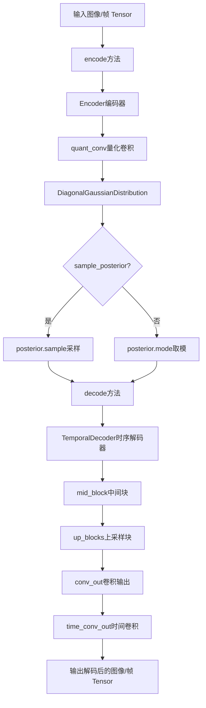
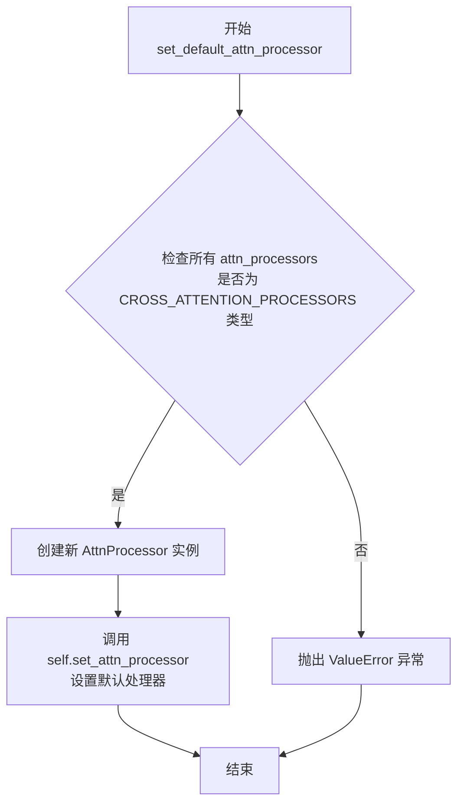
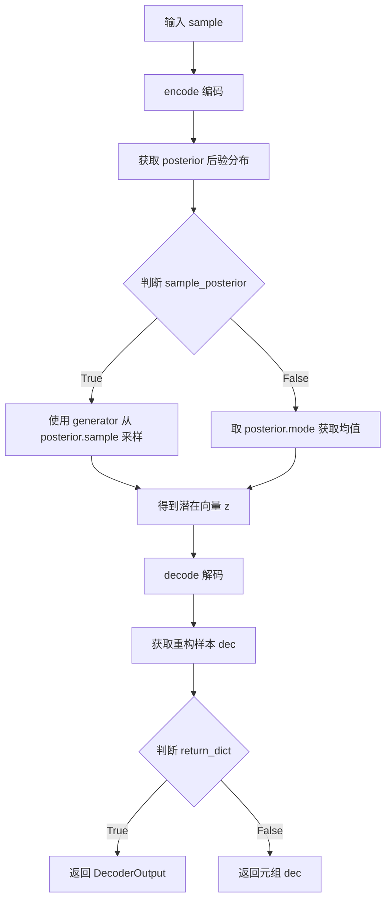

# `diffusers\src\diffusers\models\autoencoders\autoencoder_kl_temporal_decoder.py` 详细设计文档

这是一个用于视频/时间序列数据的变分自编码器(VAE)实现，包含TemporalDecoder时序解码器和AutoencoderKLTemporalDecoder完整模型，支持将图像编码为潜在表示并从潜在表示解码回图像或视频帧。该模型继承自ModelMixin、AttentionMixin、AutoencoderMixin和ConfigMixin，实现了KL散度损失和梯度检查点功能。

## 整体流程



## 类结构

```
nn.Module (PyTorch基类)
└── TemporalDecoder

ModelMixin (HuggingFace基类)
AttentionMixin
AutoencoderMixin
ConfigMixin
└── AutoencoderKLTemporalDecoder
```

## 全局变量及字段


### `TemporalDecoder.layers_per_block`
    
每个块的层数，用于控制解码器中每个上采样块的内部层数

类型：`int`
    


### `TemporalDecoder.conv_in`
    
输入卷积层，将潜在向量映射到高维特征空间

类型：`nn.Conv2d`
    


### `TemporalDecoder.mid_block`
    
中间时间块，负责处理特征提取和增强

类型：`MidBlockTemporalDecoder`
    


### `TemporalDecoder.up_blocks`
    
上采样块列表，用于逐步上采样特征图以恢复图像分辨率

类型：`nn.ModuleList`
    


### `TemporalDecoder.conv_norm_out`
    
输出归一化层，用于归一化特征图

类型：`nn.GroupNorm`
    


### `TemporalDecoder.conv_act`
    
激活函数，用于引入非线性

类型：`nn.SiLU`
    


### `TemporalDecoder.conv_out`
    
输出卷积层，生成最终的图像数据

类型：`nn.Conv2d`
    


### `TemporalDecoder.time_conv_out`
    
时间维度卷积，用于处理视频帧序列的时间信息

类型：`nn.Conv3d`
    


### `TemporalDecoder.gradient_checkpointing`
    
梯度检查点标志，用于在训练时节省显存

类型：`bool`
    


### `AutoencoderKLTemporalDecoder.encoder`
    
编码器网络，将输入图像编码为潜在表示

类型：`Encoder`
    


### `AutoencoderKLTemporalDecoder.decoder`
    
时序解码器，将潜在表示解码为图像或视频

类型：`TemporalDecoder`
    


### `AutoencoderKLTemporalDecoder.quant_conv`
    
量化卷积层，用于处理潜在分布的均值和方差

类型：`nn.Conv2d`
    


### `AutoencoderKLTemporalDecoder._supports_gradient_checkpointing`
    
类属性，表示该模型支持梯度检查点功能

类型：`bool`
    
    

## 全局函数及方法


### `TemporalDecoder.__init__`

该方法是 `TemporalDecoder` 类的构造函数，用于初始化时序解码器（Temporal Decoder）的网络结构，包括输入卷积层、中间块、上采样块、输出卷积层以及时序卷积层等核心组件。

参数：

- `self`：隐式参数，表示类的实例本身
- `in_channels`：`int`，输入通道数，默认为 4，对应潜在空间的通道数
- `out_channels`：`int`，输出通道数，默认为 3，对应 RGB 图像的通道数
- `block_out_channels`：`tuple[int]`，块输出通道数的元组，默认为 (128, 256, 512, 512)，定义了解码器各层的通道数
- `layers_per_block`：`int`，每个块中的层数，默认为 2，控制中间块和上采样块的深度

返回值：无（`__init__` 方法返回 `None`）

#### 流程图

```mermaid
flowchart TD
    A[开始 __init__] --> B[调用 super().__init__]
    B --> C[设置 self.layers_per_block]
    C --> D[创建 self.conv_in: nn.Conv2d]
    D --> E[创建 self.mid_block: MidBlockTemporalDecoder]
    E --> F[初始化 up_blocks 为空 ModuleList]
    F --> G[反转 block_out_channels 列表]
    G --> H[设置初始 output_channel]
    H --> I{遍历 block_out_channels}
    I --> J[判断是否为最后一个块]
    J -->|是| K[创建 UpBlockTemporalDecoder 不带 upsampling]
    J -->|否| L[创建 UpBlockTemporalDecoder 带 upsampling]
    K --> M[将 up_block 添加到 self.up_blocks]
    L --> M
    M --> N[更新 prev_output_channel 和 output_channel]
    N --> I
    I -->|遍历完成| O[创建 self.conv_norm_out: GroupNorm]
    O --> P[创建 self.conv_act: SiLU]
    P --> Q[创建 self.conv_out: nn.Conv2d]
    Q --> R[计算输出卷积核大小和填充]
    R --> S[创建 self.time_conv_out: nn.Conv3d]
    S --> T[设置 self.gradient_checkpointing = False]
    T --> U[结束 __init__]
```

#### 带注释源码

```python
def __init__(
    self,
    in_channels: int = 4,
    out_channels: int = 3,
    block_out_channels: tuple[int] = (128, 256, 512, 512),
    layers_per_block: int = 2,
):
    """
    初始化 TemporalDecoder 解码器
    
    参数:
        in_channels: 输入通道数，默认4（对应VAE潜在空间的通道数）
        out_channels: 输出通道数，默认3（对应RGB图像）
        block_out_channels: 各解码器块的输出通道数，默认为 (128, 256, 512, 512)
        layers_per_block: 每个块的层数，默认2
    """
    # 调用父类 nn.Module 的初始化方法
    super().__init__()
    
    # 保存每块的层数配置，供前向传播使用
    self.layers_per_block = layers_per_block

    # 输入卷积层：将输入 latent 转换为解码器初始特征
    # 将 in_channels 通道映射到最高分辨率的 block_out_channels
    self.conv_in = nn.Conv2d(in_channels, block_out_channels[-1], kernel_size=3, stride=1, padding=1)
    
    # 中间块：处理最细粒度的特征，包含时间维度的注意力机制
    self.mid_block = MidBlockTemporalDecoder(
        num_layers=self.layers_per_block,
        in_channels=block_out_channels[-1],
        out_channels=block_out_channels[-1],
        attention_head_dim=block_out_channels[-1],
    )

    # 上采样块构建：从最细粒度逐步上采样到原始分辨率
    self.up_blocks = nn.ModuleList([])
    
    # 反转通道数列表，从最细到最粗进行上采样
    reversed_block_out_channels = list(reversed(block_out_channels))
    
    # 第一个块的输出通道数
    output_channel = reversed_block_out_channels[0]
    
    # 遍历每个上采样阶段
    for i in range(len(block_out_channels)):
        # 保存前一阶段的输出通道数
        prev_output_channel = output_channel
        # 当前阶段的输出通道数
        output_channel = reversed_block_out_channels[i]

        # 判断是否为最后一个（最粗粒度）块
        is_final_block = i == len(block_out_channels) - 1
        
        # 创建上采样块：根据是否最后一期决定是否添加上采样操作
        up_block = UpBlockTemporalDecoder(
            num_layers=self.layers_per_block + 1,
            in_channels=prev_output_channel,
            out_channels=output_channel,
            add_upsample=not is_final_block,
        )
        
        # 将上采样块添加到模块列表
        self.up_blocks.append(up_block)
        
        # 更新前一输出通道供下一迭代使用
        prev_output_channel = output_channel

    # 输出归一化层：使用 GroupNorm 进行归一化
    self.conv_norm_out = nn.GroupNorm(num_channels=block_out_channels[0], num_groups=32, eps=1e-6)

    # 激活函数：SiLU (Swish)
    self.conv_act = nn.SiLU()
    
    # 最终输出卷积层：将特征映射到输出通道数
    self.conv_out = torch.nn.Conv2d(
        in_channels=block_out_channels[0],
        out_channels=out_channels,
        kernel_size=3,
        padding=1,
    )

    # 时序输出卷积：使用 3D 卷积处理时间维度
    # 卷积核大小为 (3, 1, 1)，只在时间维度和空间宽度上略有扩展
    conv_out_kernel_size = (3, 1, 1)
    
    # 计算填充以保持时间维度不变
    padding = [int(k // 2) for k in conv_out_kernel_size]
    
    # 3D 卷积：对 (batch, channels, time, height, width) 进行处理
    self.time_conv_out = torch.nn.Conv3d(
        in_channels=out_channels,
        out_channels=out_channels,
        kernel_size=conv_out_kernel_size,
        padding=padding,
    )

    # 梯度检查点标志：用于节省显存
    self.gradient_checkpointing = False
```


### `TemporalDecoder.forward`

该方法是 TemporalDecoder 类的前向传播函数，负责将输入的潜在表示（latent representation）解码为视频帧序列。它首先通过中间块（mid_block）处理特征，然后通过多个上采样块（up_blocks）逐步提升特征的空间分辨率，最后通过时间卷积层处理帧间的时间信息，输出解码后的视频帧。

参数：

- `self`：TemporalDecoder 实例本身
- `sample`：`torch.Tensor`，输入的潜在表示张量，形状通常为 (batch_frames, channels, height, width)
- `image_only_indicator`：`torch.Tensor`，用于指示哪些帧是纯图像的指示器，用于注意力机制中的掩码处理
- `num_frames`：`int = 1`，输入序列的帧数，默认为1（即单帧图像）

返回值：`torch.Tensor`，解码后的输出张量，形状为 (batch_frames, channels, height, width)

#### 流程图

```mermaid
flowchart TD
    A[输入 sample] --> B[conv_in 卷积]
    B --> C{是否启用梯度检查点}
    C -->|是| D[gradient_checkpointing: mid_block]
    C -->|否| E[mid_block 前向传播]
    D --> F[gradient_checkpointing: up_blocks 循环]
    E --> G[up_blocks 循环]
    F --> H[conv_norm_out 归一化]
    G --> H
    H --> I[conv_act 激活函数]
    I --> J[conv_out 卷积]
    J --> K[reshape: (batch, frames, C, H, W) -> permute -> (batch, C, frames, H, W)]
    K --> L[time_conv_out 时间卷积]
    L --> M[permute 和 reshape 回原始格式]
    M --> N[输出 Tensor]
```

#### 带注释源码

```python
def forward(
    self,
    sample: torch.Tensor,
    image_only_indicator: torch.Tensor,
    num_frames: int = 1,
) -> torch.Tensor:
    r"""The forward method of the `Decoder` class."""
    # 步骤1: 通过输入卷积层将潜在表示映射到特征空间
    # conv_in: 将 in_channels (默认4) 映射到 block_out_channels[-1] (默认512)
    sample = self.conv_in(sample)

    # 步骤2: 获取上采样块的参数数据类型，用于后续的类型转换
    # 使用 itertools.chain 链式迭代参数和缓冲区，取第一个参数的数据类型
    upscale_dtype = next(itertools.chain(self.up_blocks.parameters(), self.up_blocks.buffers())).dtype
    
    # 步骤3: 判断是否启用梯度检查点（用于节省显存）
    if torch.is_grad_enabled() and self.gradient_checkpointing:
        # 步骤3a: 启用梯度检查点时的前向传播
        # 中间块处理
        sample = self._gradient_checkpointing_func(
            self.mid_block,
            sample,
            image_only_indicator,
        )
        # 转换数据类型
        sample = sample.to(upscale_dtype)

        # 上采样块循环处理
        for up_block in self.up_blocks:
            sample = self._gradient_checkpointing_func(
                up_block,
                sample,
                image_only_indicator,
            )
    else:
        # 步骤3b: 标准前向传播（不启用梯度检查点）
        # 中间块处理，传入 image_only_indicator 用于注意力掩码
        sample = self.mid_block(sample, image_only_indicator=image_only_indicator)
        # 转换数据类型
        sample = sample.to(upscale_dtype)

        # 上采样块循环处理，逐步提升空间分辨率
        for up_block in self.up_blocks:
            sample = up_block(sample, image_only_indicator=image_only_indicator)

    # 步骤4: 后处理阶段
    # GroupNorm 归一化，num_groups=32
    sample = self.conv_norm_out(sample)
    # SiLU 激活函数
    sample = self.conv_act(sample)
    # 输出卷积，将通道数映射到 out_channels (默认3，RGB)
    sample = self.conv_out(sample)

    # 步骤5: 处理时间维度
    # 获取当前张量形状: (batch_frames, channels, height, width)
    batch_frames, channels, height, width = sample.shape
    # 计算批量大小
    batch_size = batch_frames // num_frames
    
    # 步骤5a: 重新reshape为5D张量以处理时间维度
    # 从 (batch_frames, C, H, W) -> (batch, frames, C, H, W) -> (batch, C, frames, H, W)
    sample = sample[None, :].reshape(batch_size, num_frames, channels, height, width).permute(0, 2, 1, 3, 4)
    
    # 步骤5b: 时间卷积，处理帧间的时间信息
    # Conv3d: kernel_size=(3,1,1)，只在时间维度上进行卷积
    sample = self.time_conv_out(sample)

    # 步骤5c: 恢复回4D张量格式
    # (batch, C, frames, H, W) -> (batch, frames, C, H, W) -> (batch_frames, C, H, W)
    sample = sample.permute(0, 2, 1, 3, 4).reshape(batch_frames, channels, height, width)

    # 返回解码后的样本
    return sample
```


### `AutoencoderKLTemporalDecoder.__init__`

该方法是 `AutoencoderKLTemporalDecoder` 类的构造函数，用于初始化一个结合 KL 散度损失的变分自编码器（VAE）模型。该模型支持时序解码功能，可将图像编码到潜在空间并从潜在表示重建图像，适用于扩散模型的潜在空间处理流程。

参数：

- `self`：隐式参数，表示类实例本身
- `in_channels`：`int`，输入图像的通道数，默认为 3（RGB 图像）
- `out_channels`：`int`，输出图像的通道数，默认为 3（RGB 图像）
- `down_block_types`：`tuple[str]`，下采样块的类型元组，默认为 `("DownEncoderBlock2D",)`
- `block_out_channels`：`tuple[int]`，各块的输出通道数元组，默认为 `(64,)`
- `layers_per_block`：`int`，每个块包含的层数，默认为 1
- `latent_channels`：`int`，潜在空间的通道数，默认为 4
- `sample_size`：`int`，采样输入尺寸，默认为 32
- `scaling_factor`：`float`，缩放因子，用于将潜在空间缩放到单位方差，默认为 0.18215
- `force_upcast`：`float`，是否强制使用 float32 精度处理高分辨率图像，默认为 True

返回值：`None`，该方法为构造函数，不返回任何值，仅初始化对象状态

#### 流程图

```mermaid
flowchart TD
    A[开始 __init__] --> B[调用 super().__init__ 初始化基类]
    B --> C[创建 Encoder 实例]
    C --> D[创建 TemporalDecoder 实例]
    D --> E[创建 quant_conv 卷积层]
    E --> F[通过 @register_to_config 注册配置]
    F --> G[结束初始化]
    
    C -.-> C1[传入 in_channels<br/>out_channels=latent_channels<br/>down_block_types<br/>block_out_channels<br/>layers_per_block<br/>double_z=True]
    D -.-> D1[传入 latent_channels<br/>out_channels<br/>block_out_channels<br/>layers_per_block]
    E -.-> E1[2D 卷积<br/>输入输出通道=2*latent_channels<br/>kernel_size=1]
```

#### 带注释源码

```python
@register_to_config  # 装饰器：将参数注册为类配置属性
def __init__(
    self,
    in_channels: int = 3,                           # 输入图像通道数，默认3（RGB）
    out_channels: int = 3,                          # 输出图像通道数，默认3（RGB）
    down_block_types: tuple[str] = ("DownEncoderBlock2D",),  # 下采样块类型元组
    block_out_channels: tuple[int] = (64,),         # 块输出通道数元组
    layers_per_block: int = 1,                      # 每个块的层数
    latent_channels: int = 4,                       # 潜在空间通道数
    sample_size: int = 32,                          # 采样输入大小
    scaling_factor: float = 0.18215,                # 潜在空间缩放因子
    force_upcast: float = True,                     # 是否强制高精度处理
):
    super().__init__()  # 调用父类初始化方法

    # 初始化编码器（Encoder），将图像编码为潜在表示
    # 参数 double_z=True 表示输出均值和方差两个通道（用于 KL 散度）
    self.encoder = Encoder(
        in_channels=in_channels,                    # 原始图像通道
        out_channels=latent_channels,               # 潜在空间通道数
        down_block_types=down_block_types,          # 下采样块类型
        block_out_channels=block_out_channels,      # 块输出通道配置
        layers_per_block=layers_per_block,          # 每块层数
        double_z=True,                               # 输出双通道（均值+方差）
    )

    # 初始化时序解码器（TemporalDecoder），将潜在表示解码为图像
    # 输入通道为 latent_channels，输出通道为原始图像通道数
    self.decoder = TemporalDecoder(
        in_channels=latent_channels,                # 潜在空间通道数作为输入
        out_channels=out_channels,                  # 重建图像通道数
        block_out_channels=block_out_channels,      # 块输出通道配置
        layers_per_block=layers_per_block,          # 每块层数
    )

    # 量化卷积层，用于处理编码器输出的潜在分布参数
    # 将 2*latent_channels 映射到 2*latent_channels（保持维度）
    self.quant_conv = nn.Conv2d(2 * latent_channels, 2 * latent_channels, kernel_size=1)
```


### `AutoencoderKLTemporalDecoder.set_default_attn_processor`

该方法用于禁用自定义注意力处理器并将注意力实现重置为默认的 `AttnProcessor`。它首先验证当前所有注意力处理器是否都属于 `CROSS_ATTENTION_PROCESSORS` 类型，如果是则创建一个新的默认处理器并通过 `set_attn_processor` 进行设置，否则抛出 `ValueError` 异常。

参数：

- `self`：`AutoencoderKLTemporalDecoder` 类实例，隐式参数，无需显式传递

返回值：`None`，该方法无返回值，仅执行副作用（设置注意力处理器）

#### 流程图



#### 带注释源码

```python
def set_default_attn_processor(self):
    """
    Disables custom attention processors and sets the default attention implementation.
    """
    # 检查模型中所有的注意力处理器是否都属于 CROSS_ATTENTION_PROCESSORS 类型
    # CROSS_ATTENTION_PROCESSORS 是预定义的跨注意力处理器集合
    if all(proc.__class__ in CROSS_ATTENTION_PROCESSORS for proc in self.attn_processors.values()):
        # 如果所有处理器都符合条件，则创建默认的 AttnProcessor 实例
        # AttnProcessor 是标准的注意力处理器实现
        processor = AttnProcessor()
    else:
        # 如果存在非标准的自定义处理器，则抛出 ValueError 异常
        # 提示用户无法在存在自定义处理器的情况下调用此方法
        raise ValueError(
            f"Cannot call `set_default_attn_processor` when attention processors are of type {next(iter(self.attn_processors.values()))}"
        )

    # 调用继承自 AttentionMixin 的方法，将默认处理器应用到模型
    # 这会替换模型中所有现有的注意力处理器为默认的 AttnProcessor
    self.set_attn_processor(processor)
```


### `AutoencoderKLTemporalDecoder.encode`

该方法实现将一批图像编码为潜在表示（latent representations），是变分自编码器（VAE）的编码器部分。它接受图像张量作为输入，通过编码器主干网络提取特征，然后使用量化卷积层（quant_conv）处理，最后将结果封装为对角高斯分布（DiagonalGaussianDistribution）对象返回。

参数：

- `self`：`AutoencoderKLTemporalDecoder`，隐式参数，表示当前类的实例本身
- `x`：`torch.Tensor`，输入的图像批次（batch of images）
- `return_dict`：`bool`，可选参数，默认为 `True`，指定是否返回 `AutoencoderKLOutput` 对象而非普通元组

返回值：`AutoencoderKLOutput | tuple[DiagonalGaussianDistribution]`，编码后的潜在表示。如果 `return_dict` 为 `True`，返回 `AutoencoderKLOutput` 对象；否则返回包含 `DiagonalGaussianDistribution` 的元组

#### 流程图

```mermaid
flowchart TD
    A[开始: 输入图像批次 x] --> B[调用 self.encoder 对图像进行编码]
    B --> C[得到特征表示 h]
    C --> D[通过 self.quant_conv 卷积层处理特征]
    D --> E[得到高斯分布的矩参数 moments]
    E --> F[创建 DiagonalGaussianDistribution 对象 posterior]
    F --> G{return_dict == True?}
    G -->|Yes| H[返回 AutoencoderKLOutput<br/>latent_dist=posterior]
    G -->|No| I[返回 tuple: (posterior,)]
    H --> J[结束]
    I --> J
```

#### 带注释源码

```python
@apply_forward_hook
def encode(
    self, x: torch.Tensor, return_dict: bool = True
) -> AutoencoderKLOutput | tuple[DiagonalGaussianDistribution]:
    """
    Encode a batch of images into latents.

    Args:
        x (`torch.Tensor`): Input batch of images.
        return_dict (`bool`, *optional*, defaults to `True`):
            Whether to return a [`~models.autoencoders.autoencoder_kl.AutoencoderKLOutput`] instead of a plain
            tuple.

    Returns:
            The latent representations of the encoded images. If `return_dict` is True, a
            [`~models.autoencoders.autoencoder_kl.AutoencoderKLOutput`] is returned, otherwise a plain `tuple` is
            returned.
    """
    # 步骤1: 使用编码器将输入图像编码为特征表示
    h = self.encoder(x)
    
    # 步骤2: 使用量化卷积层将特征映射到潜在空间的矩参数
    # quant_conv 将通道数翻倍（2 * latent_channels），用于存储高斯分布的均值和方差
    moments = self.quant_conv(h)
    
    # 步骤3: 根据矩参数创建对角高斯分布对象
    # DiagonalGaussianDistribution 会将 moments 解析为均值和log方差
    posterior = DiagonalGaussianDistribution(moments)

    # 步骤4: 根据 return_dict 参数决定返回格式
    if not return_dict:
        # 返回元组格式（兼容旧API）
        return (posterior,)

    # 返回标准输出对象，包含潜在分布
    return AutoencoderKLOutput(latent_dist=posterior)
```


### `AutoencoderKLTemporalDecoder.decode`

该方法是 `AutoencoderKLTemporalDecoder` 类的解码核心，负责将输入的潜在向量（latent vectors）批次解码为图像数据。方法首先根据 `num_frames` 计算批次大小，生成图像指示器（用于标识有效帧），然后调用内部的 `TemporalDecoder` 进行实际的解码操作，最后根据 `return_dict` 参数决定返回 `DecoderOutput` 对象还是原始张量元组。

参数：

- `self`：`AutoencoderKLTemporalDecoder`，隐式参数，表示当前模型实例本身
- `z`：`torch.Tensor`，输入的潜在向量批次，通常来自编码器的输出或先验分布的采样
- `num_frames`：`int`，时间维度上的帧数，用于将批次划分为多个时间步
- `return_dict`：`bool`，可选，默认为 `True`，控制返回值的格式

返回值：`DecoderOutput | torch.Tensor`，当 `return_dict` 为 `True` 时返回 `DecoderOutput` 对象（包含解码后的 `sample` 字段），否则返回包含单个张量的元组 `(decoded,)`

#### 流程图

```mermaid
flowchart TD
    A[开始 decode] --> B[计算 batch_size: z.shape[0] // num_frames]
    B --> C[创建 image_only_indicator 全零张量]
    C --> D[调用 self.decoder 解码]
    D --> E{return_dict?}
    E -->|True| F[返回 DecoderOutput(sample=decoded)]
    E -->|False| G[返回元组 (decoded,)]
    F --> H[结束]
    G --> H
```

#### 带注释源码

```python
@apply_forward_hook
def decode(
    self,
    z: torch.Tensor,
    num_frames: int,
    return_dict: bool = True,
) -> DecoderOutput | torch.Tensor:
    """
    Decode a batch of images.

    Args:
        z (`torch.Tensor`): Input batch of latent vectors.
        return_dict (`bool`, *optional*, defaults to `True`):
            Whether to return a [`~models.vae.DecoderOutput`] instead of a plain tuple.

    Returns:
        [`~models.vae.DecoderOutput`] or `tuple`:
            If return_dict is True, a [`~models.vae.DecoderOutput`] is returned, otherwise a plain `tuple` is
            returned.

    """
    # 计算批次大小：将潜在向量的第一维除以帧数，得到每帧对应的样本数
    batch_size = z.shape[0] // num_frames
    
    # 创建图像指示器张量，用于标识哪些帧是有效的图像帧
    # 形状为 [batch_size, num_frames]，数据类型与输入 z 一致，设备相同
    image_only_indicator = torch.zeros(batch_size, num_frames, dtype=z.dtype, device=z.device)
    
    # 调用内部的 TemporalDecoder 进行实际的解码操作
    # 传入潜在向量、帧数和图像指示器
    decoded = self.decoder(z, num_frames=num_frames, image_only_indicator=image_only_indicator)

    # 根据 return_dict 参数决定返回格式
    if not return_dict:
        # 返回元组格式（保持向后兼容）
        return (decoded,)

    # 返回 DecoderOutput 对象，包含解码后的样本
    return DecoderOutput(sample=decoded)
```


### `AutoencoderKLTemporalDecoder.forward`

该方法是 AutoencoderKLTemporalDecoder 类的前向传播函数，实现了 VAE 模型的完整编码-解码流程：先将输入样本编码为潜在空间的后验分布，然后根据配置从分布中采样或获取均值，最后将潜在向量解码为重构样本。

参数：

- `self`：隐式参数，当前 AutoencoderKLTemporalDecoder 实例本身
- `sample`：`torch.Tensor`，输入的图像样本张量，形状为 [batch, channels, height, width]
- `sample_posterior`：`bool`，可选参数，默认为 `False`，指示是否从后验分布中随机采样，若为 False 则取分布的 mode（均值）
- `return_dict`：`bool`，可选参数，默认为 `True`，决定是否返回 DecoderOutput 对象还是原始元组
- `generator`：`torch.Generator | None`，可选参数，默认为 `None`，用于控制随机采样过程的随机数生成器
- `num_frames`：`int`，可选参数，默认为 `1`，表示输入样本中的帧数（用于视频/时序数据处理）

返回值：`DecoderOutput | torch.Tensor`，如果 `return_dict` 为 True，返回包含重构样本的 DecoderOutput 对象；否则返回元组 (decoded_sample,)

#### 流程图



#### 带注释源码

```python
def forward(
    self,
    sample: torch.Tensor,
    sample_posterior: bool = False,
    return_dict: bool = True,
    generator: torch.Generator | None = None,
    num_frames: int = 1,
) -> DecoderOutput | torch.Tensor:
    r"""
    Args:
        sample (`torch.Tensor`): Input sample.
        sample_posterior (`bool`, *optional*, defaults to `False`):
            Whether to sample from the posterior.
        return_dict (`bool`, *optional*, defaults to `True`):
            Whether or not to return a [`DecoderOutput`] instead of a plain tuple.
    """
    # Step 1: 将输入样本赋值给变量 x
    x = sample
    
    # Step 2: 调用 encode 方法对输入进行编码，获取后验分布的潜在空间表示
    # encode 方法返回 AutoencoderKLOutput 对象，其 latent_dist 属性为 DiagonalGaussianDistribution
    posterior = self.encode(x).latent_dist
    
    # Step 3: 根据 sample_posterior 参数决定如何获取潜在向量 z
    # 如果 sample_posterior 为 True，从后验分布中随机采样（保留随机性）
    # 如果 sample_posterior 为 False，取后验分布的 mode（均值/确定性输出）
    if sample_posterior:
        z = posterior.sample(generator=generator)
    else:
        z = posterior.mode()

    # Step 4: 调用 decode 方法将潜在向量 z 解码为重构样本
    # 传入 num_frames 参数以支持时序/视频数据的处理
    dec = self.decode(z, num_frames=num_frames).sample

    # Step 5: 根据 return_dict 参数决定返回格式
    # 如果 return_dict 为 True，封装为 DecoderOutput 对象返回
    # 如果 return_dict 为 False，返回原始元组 (decoded_sample,)
    if not return_dict:
        return (dec,)

    # 返回包含重构样本的 DecoderOutput 对象
    return DecoderOutput(sample=dec)
```

## 关键组件


### TemporalDecoder

时间维度解码器类，负责将潜在表示解码为图像并处理时间（视频帧）信息。该类使用MidBlockTemporalDecoder和UpBlockTemporalDecoder块进行上采样，并通过time_conv_out进行时间维度卷积处理。

### AutoencoderKLTemporalDecoder

主VAE模型类，继承自ModelMixin、AttentionMixin、AutoencoderMixin和ConfigMixin。实现KL散度损失的自编码器，支持将图像编码到潜在空间并从潜在表示解码回图像，特别适配时间维度（视频）数据的处理。

### DiagonalGaussianDistribution

对角高斯分布类，用于表示潜在空间的概率分布。通过encoder的输出计算矩（moments），并支持从分布中采样（sample）或获取其模式（mode）。

### Encoder

图像编码器模块，将输入图像转换为潜在表示。配置支持多种下采样块类型，输出通道数为latent_channels的2倍（用于计算高斯分布的均值和方差）。

### DecoderOutput

解码器输出数据类，包含解码后的样本张量。

### AutoencoderKLOutput

自编码器KL输出数据类，包含潜在空间的分布（latent_dist）。


## 问题及建议


### 已知问题

- **类型注解错误**：`force_upcast: float = True` 参数类型声明为 `float`，但实际使用为布尔值，应改为 `force_upcast: bool = True`
- **未定义的梯度检查点函数**：代码中调用了 `self._gradient_checkpointing_func`，但该方法在类中未定义，会导致运行时错误
- **硬编码的超参数**：`num_groups=32`、`eps=1e-6` 和 `scaling_factor=0.18215` 等值被硬编码，缺乏灵活配置性
- **API不一致性**：`encode` 方法缺少 `num_frames` 参数，而 `decode` 方法有，这可能导致在处理时间序列数据时的不一致行为
- **重复计算**：`TemporalDecoder.forward` 中每次调用都通过 `next(itertools.chain(...))` 重新计算 `upscale_dtype`，可在 `__init__` 中预先计算
- **张量设备处理**：在 `decode` 方法中创建 `image_only_indicator` 时，未考虑潜在的数据并行场景，设备放置可能不够健壮

### 优化建议

- 修正 `force_upcast` 的类型注解为 `bool`，并更新相关文档字符串
- 实现 `_gradient_checkpointing_func` 方法或使用 `torch.utils.checkpoint` 提供的标准接口
- 将硬编码的超参数提取为可配置参数，或提供默认值的同时允许用户自定义
- 统一 `encode` 和 `decode` 方法的接口设计，考虑为 `encode` 添加 `num_frames` 参数以保持一致性
- 在 `__init__` 方法中预先计算并缓存 `upscale_dtype`，避免每次前向传播时重复计算
- 添加设备感知逻辑，确保 `image_only_indicator` 的设备与输入张量 `z` 完全一致
- 考虑将 `num_groups=32` 等参数化配置提取到构造函数参数中，提高模块的可复用性

## 其它


### 设计目标与约束

本模块实现了一个基于KL散度的变分自编码器(VAE)，专门针对时间序列数据（如视频）的编码和解码。设计目标包括：(1) 将输入图像编码到潜在空间并支持KL散度损失计算；(2) 支持时间维度的处理，能够处理多帧视频数据；(3) 支持梯度检查点以节省显存；(4) 兼容HuggingFace Diffusers框架的ModelMixin和ConfigMixin接口。约束条件包括：输入通道数默认为3（RGB），输出通道数默认为3，潜在空间通道数为4，且必须与Diffusers库的AttentionMixin和AutoencoderMixin配合使用。

### 错误处理与异常设计

代码中的错误处理主要体现在以下几个方面：(1) set_default_attn_processor方法中检查注意力处理器的类型，如果存在非CROSS_ATTENTION_PROCESSORS中的处理器会抛出ValueError；(2) encode和decode方法支持return_dict参数，可以选择返回字典或元组；(3) forward方法中sample_posterior参数控制是否从后验分布采样，generator参数用于设置随机种子。潜在改进：可增加输入形状验证、潜在空间维度检查、num_frames与batch_size一致性检查等。

### 数据流与状态机

数据流如下：输入样本(sample)经过encode方法编码为潜在表示(posterior)，然后根据sample_posterior参数决定是从后验分布采样(mode)还是采样(sample)。解码器decode接收潜在向量z和num_frames参数，通过TemporalDecoder处理时间维度。TemporalDecoder的forward方法流程：conv_in卷积输入 → mid_block中间块处理 → 多个up_blocks上采样块 → conv_norm_out标准化 → conv_act激活 → conv_out卷积输出 → time_conv_out时间卷积处理 → 最终reshape为(batch_frames, channels, height, width)格式输出。

### 外部依赖与接口契约

本模块依赖以下外部组件：(1) torch和torch.nn：核心张量计算和神经网络模块；(2) configuration_utils.ConfigMixin和register_to_config：配置管理；(3) utils.accelerate_utils.apply_forward_hook：前向传播钩子；(4) attention.AttentionMixin：注意力机制混合；(5) attention_processor.CROSS_ATTENTION_PROCESSORS和AttnProcessor：注意力处理器；(6) modeling_outputs.AutoencoderKLOutput：编码输出；(7) modeling_utils.ModelMixin：模型基类；(8) unets.unet_3d_blocks.MidBlockTemporalDecoder和UpBlockTemporalDecoder：时序块；(9) vae相关：Encoder、DecoderOutput、DiagonalGaussianDistribution、AutoencoderMixin。接口契约：encode方法接受x: torch.Tensor和return_dict: bool，返回AutoencoderKLOutput或tuple；decode方法接受z: torch.Tensor、num_frames: int和return_dict: bool，返回DecoderOutput或torch.Tensor；forward方法综合调用encode和decode。

### 配置参数详解

AutoencoderKLTemporalDecoder的主要配置参数包括：in_channels（输入通道数，默认3）、out_channels（输出通道数，默认3）、down_block_types（下采样块类型，默认DownEncoderBlock2D）、block_out_channels（块输出通道数元组，默认64）、layers_per_block（每块层数，默认1）、latent_channels（潜在空间通道数，默认4）、sample_size（样本大小，默认32）、scaling_factor（缩放因子，默认0.18215，用于潜在空间归一化）、force_upcast（强制上浮，默认True，强制VAE在高位浮点数运行）。TemporalDecoder的配置包括in_channels、out_channels、block_out_channels和layers_per_block。

### 性能考虑与优化空间

(1) 梯度检查点(gradient_checkpointing)：通过_gradient_checkpointing_func实现，可在训练时节省显存但增加计算时间；(2) 数据类型管理：upscale_dtype用于确保上采样层使用正确的数据类型；(3) time_conv_out使用Conv3d处理时间维度，可考虑使用更高效的实现；(4) 潜在优化：可考虑混合精度训练支持、CUDA图优化、算子融合等。

### 兼容性说明

本模块设计用于HuggingFace Diffusers框架，兼容版本需包含AutoencoderMixin、AttentionMixin和ConfigMixin。模型支持HuggingFace Hub的加载和保存机制。TemporalDecoder专门用于时间维度（视频）处理，与标准的AutoencoderKL不兼容。注意力处理器接口需遵循CROSS_ATTENTION_PROCESSORS注册机制。

    