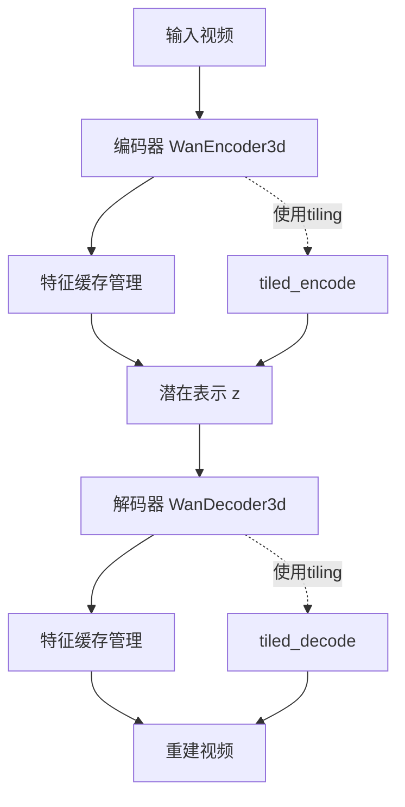
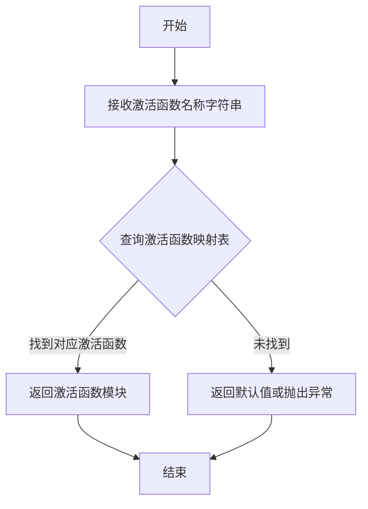
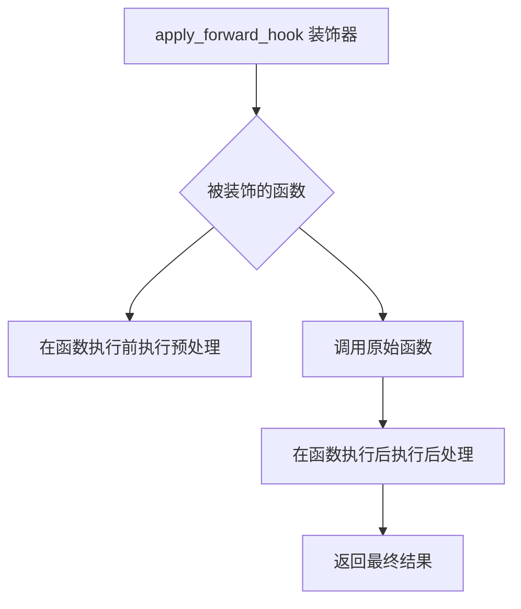
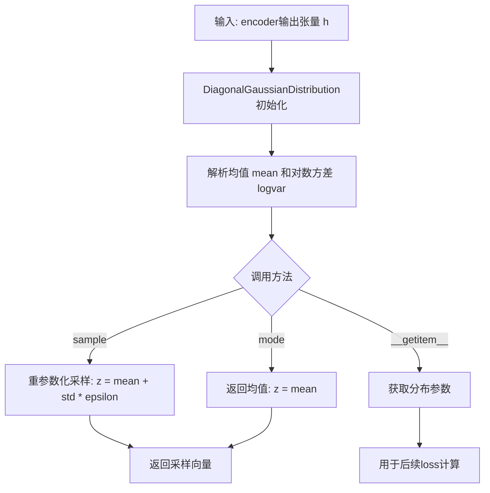
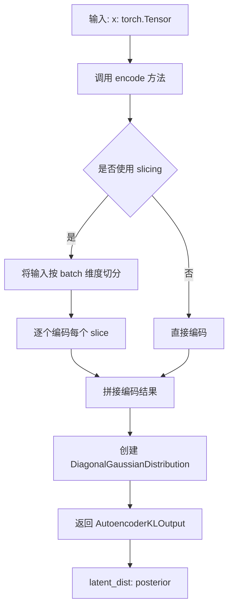
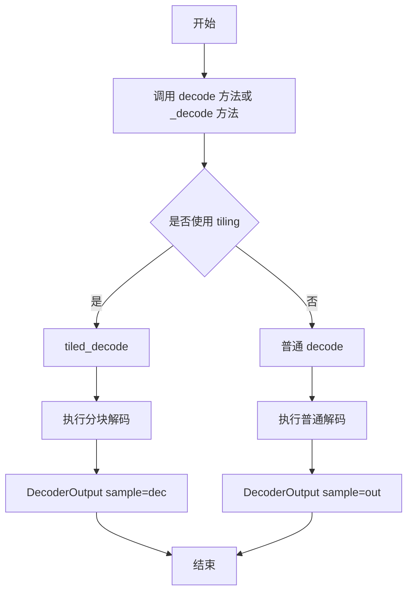
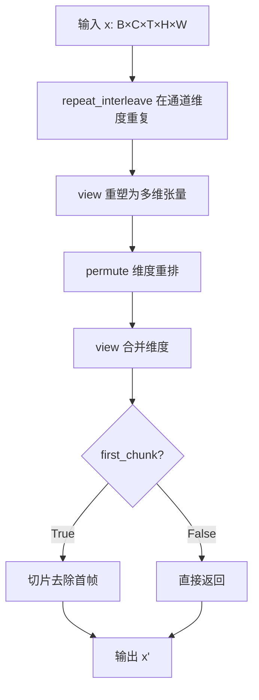
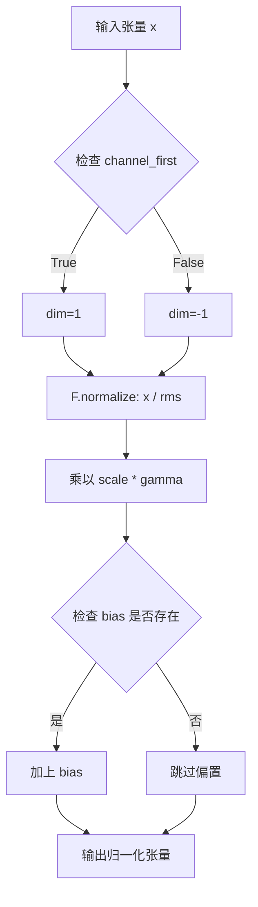
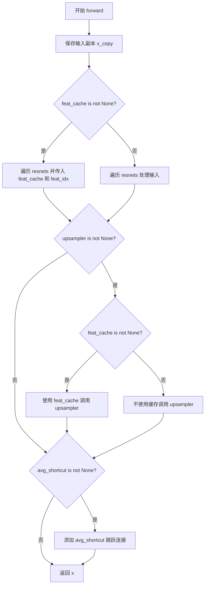

# `diffusers\src\diffusers\models\autoencoders\autoencoder_kl_wan.py` 详细设计文档

这是一个用于视频编码和解码的3D变分自编码器（VAE）实现，名为WanVAE。它包含编码器和解码器，支持时空降采样和升采样，因果卷积，特征缓存以提高推理效率，以及tiling技术处理大尺寸视频。

## 整体流程



## 类结构

```
nn.Module (基类)
├── AvgDown3D (3D平均池化降采样)
├── DupUp3D (3D重复升采样)
├── WanCausalConv3d (因果3D卷积)
├── WanRMS_norm (RMS归一化)
├── WanUpsample (上采样)
├── WanResample (重采样模块)
├── WanResidualBlock (残差块)
├── WanAttentionBlock (注意力块)
├── WanMidBlock (中间块)
├── WanResidualDownBlock (残差降采样块)
├── WanEncoder3d (3D编码器)
├── WanResidualUpBlock (残差升采样块)
├── WanUpBlock (升采样块)
├── WanDecoder3d (3D解码器)
└── AutoencoderKLWan (主VAE模型)
```

## 全局变量及字段


### `CACHE_T`
    
缓存的时间帧数量，用于因果卷积的特征缓存

类型：`int`
    


### `logger`
    
模块级别的日志记录器实例

类型：`logging.Logger`
    


### `AvgDown3D.in_channels`
    
输入通道数

类型：`int`
    


### `AvgDown3D.out_channels`
    
输出通道数

类型：`int`
    


### `AvgDown3D.factor_t`
    
时间维度的下采样因子

类型：`int`
    


### `AvgDown3D.factor_s`
    
空间维度的下采样因子

类型：`int`
    


### `AvgDown3D.factor`
    
总的下采样因子（时间×空间×空间）

类型：`int`
    


### `AvgDown3D.group_size`
    
分组大小，用于平均池化的分组计算

类型：`int`
    


### `DupUp3D.in_channels`
    
输入通道数

类型：`int`
    


### `DupUp3D.out_channels`
    
输出通道数

类型：`int`
    


### `DupUp3D.factor_t`
    
时间维度的上采样因子

类型：`int`
    


### `DupUp3D.factor_s`
    
空间维度的上采样因子

类型：`int`
    


### `DupUp3D.factor`
    
总的上采样因子（时间×空间×空间）

类型：`int`
    


### `DupUp3D.repeats`
    
重复次数，用于特征复制上采样

类型：`int`
    


### `WanCausalConv3d._padding`
    
因果卷积的填充配置

类型：`tuple`
    


### `WanRMS_norm.channel_first`
    
是否通道优先的输入格式

类型：`bool`
    


### `WanRMS_norm.scale`
    
缩放因子，基于维度计算

类型：`float`
    


### `WanRMS_norm.gamma`
    
可学习的缩放参数

类型：`nn.Parameter`
    


### `WanRMS_norm.bias`
    
可学习的偏置参数

类型：`nn.Parameter or float`
    


### `WanResample.dim`
    
输入输出的通道维度

类型：`int`
    


### `WanResample.mode`
    
重采样模式（none/up/down/upsample2d/upsample3d等）

类型：`str`
    


### `WanResample.resample`
    
重采样的神经网络层

类型：`nn.Module`
    


### `WanResample.time_conv`
    
时间维度因果卷积层

类型：`WanCausalConv3d`
    


### `WanResidualBlock.in_dim`
    
输入通道维度

类型：`int`
    


### `WanResidualBlock.out_dim`
    
输出通道维度

类型：`int`
    


### `WanResidualBlock.nonlinearity`
    
非线性激活函数

类型：`nn.Module`
    


### `WanResidualBlock.norm1`
    
第一个归一化层

类型：`WanRMS_norm`
    


### `WanResidualBlock.conv1`
    
第一个因果卷积层

类型：`WanCausalConv3d`
    


### `WanResidualBlock.norm2`
    
第二个归一化层

类型：`WanRMS_norm`
    


### `WanResidualBlock.dropout`
    
Dropout比率

类型：`float`
    


### `WanResidualBlock.conv2`
    
第二个因果卷积层

类型：`WanCausalConv3d`
    


### `WanResidualBlock.conv_shortcut`
    
残差连接的卷积层或恒等映射

类型：`nn.Module`
    


### `WanAttentionBlock.dim`
    
通道维度

类型：`int`
    


### `WanAttentionBlock.norm`
    
归一化层

类型：`WanRMS_norm`
    


### `WanAttentionBlock.to_qkv`
    
计算QKV的卷积层

类型：`nn.Conv2d`
    


### `WanAttentionBlock.proj`
    
输出投影卷积层

类型：`nn.Conv2d`
    


### `WanMidBlock.dim`
    
通道维度

类型：`int`
    


### `WanMidBlock.attentions`
    
注意力模块列表

类型：`nn.ModuleList`
    


### `WanMidBlock.resnets`
    
残差块模块列表

类型：`nn.ModuleList`
    


### `WanMidBlock.gradient_checkpointing`
    
梯度检查点标志

类型：`bool`
    


### `WanResidualDownBlock.avg_shortcut`
    
平均池化下采样快捷连接

类型：`AvgDown3D`
    


### `WanResidualDownBlock.resnets`
    
残差块模块列表

类型：`nn.ModuleList`
    


### `WanResidualDownBlock.downsampler`
    
下采样器模块

类型：`WanResample or None`
    


### `WanEncoder3d.dim`
    
基础通道维度

类型：`int`
    


### `WanEncoder3d.z_dim`
    
潜在空间的通道维度

类型：`int`
    


### `WanEncoder3d.dim_mult`
    
各阶段的通道维度倍数

类型：`list[int]`
    


### `WanEncoder3d.num_res_blocks`
    
每个阶段的残差块数量

类型：`int`
    


### `WanEncoder3d.attn_scales`
    
应用注意力的尺度列表

类型：`list[float]`
    


### `WanEncoder3d.temperal_downsample`
    
各阶段是否进行时间下采样

类型：`list[bool]`
    


### `WanEncoder3d.nonlinearity`
    
非线性激活函数

类型：`nn.Module`
    


### `WanEncoder3d.conv_in`
    
输入卷积层

类型：`WanCausalConv3d`
    


### `WanEncoder3d.down_blocks`
    
下采样阶段模块列表

类型：`nn.ModuleList`
    


### `WanEncoder3d.mid_block`
    
中间块

类型：`WanMidBlock`
    


### `WanEncoder3d.norm_out`
    
输出归一化层

类型：`WanRMS_norm`
    


### `WanEncoder3d.conv_out`
    
输出卷积层

类型：`WanCausalConv3d`
    


### `WanEncoder3d.gradient_checkpointing`
    
梯度检查点标志

类型：`bool`
    


### `WanResidualUpBlock.in_dim`
    
输入通道维度

类型：`int`
    


### `WanResidualUpBlock.out_dim`
    
输出通道维度

类型：`int`
    


### `WanResidualUpBlock.avg_shortcut`
    
复制上采样快捷连接

类型：`DupUp3D or None`
    


### `WanResidualUpBlock.resnets`
    
残差块模块列表

类型：`nn.ModuleList`
    


### `WanResidualUpBlock.upsampler`
    
上采样器模块

类型：`WanResample or None`
    


### `WanResidualUpBlock.gradient_checkpointing`
    
梯度检查点标志

类型：`bool`
    


### `WanUpBlock.in_dim`
    
输入通道维度

类型：`int`
    


### `WanUpBlock.out_dim`
    
输出通道维度

类型：`int`
    


### `WanUpBlock.resnets`
    
残差块模块列表

类型：`nn.ModuleList`
    


### `WanUpBlock.upsamplers`
    
上采样器模块列表

类型：`nn.ModuleList or None`
    


### `WanUpBlock.gradient_checkpointing`
    
梯度检查点标志

类型：`bool`
    


### `WanDecoder3d.dim`
    
基础通道维度

类型：`int`
    


### `WanDecoder3d.z_dim`
    
潜在空间的通道维度

类型：`int`
    


### `WanDecoder3d.dim_mult`
    
各阶段的通道维度倍数

类型：`list[int]`
    


### `WanDecoder3d.num_res_blocks`
    
每个阶段的残差块数量

类型：`int`
    


### `WanDecoder3d.attn_scales`
    
应用注意力的尺度列表

类型：`list[float]`
    


### `WanDecoder3d.temperal_upsample`
    
各阶段是否进行时间上采样

类型：`list[bool]`
    


### `WanDecoder3d.nonlinearity`
    
非线性激活函数

类型：`nn.Module`
    


### `WanDecoder3d.conv_in`
    
输入卷积层

类型：`WanCausalConv3d`
    


### `WanDecoder3d.mid_block`
    
中间块

类型：`WanMidBlock`
    


### `WanDecoder3d.up_blocks`
    
上采样阶段模块列表

类型：`nn.ModuleList`
    


### `WanDecoder3d.norm_out`
    
输出归一化层

类型：`WanRMS_norm`
    


### `WanDecoder3d.conv_out`
    
输出卷积层

类型：`WanCausalConv3d`
    


### `WanDecoder3d.gradient_checkpointing`
    
梯度检查点标志

类型：`bool`
    


### `AutoencoderKLWan.z_dim`
    
潜在空间的通道维度

类型：`int`
    


### `AutoencoderKLWan.temperal_downsample`
    
编码器的时间下采样配置

类型：`list[bool]`
    


### `AutoencoderKLWan.temperal_upsample`
    
解码器的时间上采样配置

类型：`list[bool]`
    


### `AutoencoderKLWan.encoder`
    
视频编码器模型

类型：`WanEncoder3d`
    


### `AutoencoderKLWan.quant_conv`
    
潜在分布的量化卷积层

类型：`WanCausalConv3d`
    


### `AutoencoderKLWan.post_quant_conv`
    
量化后的卷积层

类型：`WanCausalConv3d`
    


### `AutoencoderKLWan.decoder`
    
视频解码器模型

类型：`WanDecoder3d`
    


### `AutoencoderKLWan.spatial_compression_ratio`
    
空间压缩比

类型：`int`
    


### `AutoencoderKLWan.use_slicing`
    
是否使用批处理切片技术

类型：`bool`
    


### `AutoencoderKLWan.use_tiling`
    
是否使用空间平铺技术

类型：`bool`
    


### `AutoencoderKLWan.tile_sample_min_height`
    
空间平铺的最小高度

类型：`int`
    


### `AutoencoderKLWan.tile_sample_min_width`
    
空间平铺的最小宽度

类型：`int`
    


### `AutoencoderKLWan.tile_sample_stride_height`
    
空间平铺的高度步长

类型：`int`
    


### `AutoencoderKLWan.tile_sample_stride_width`
    
空间平铺的宽度步长

类型：`int`
    


### `AutoencoderKLWan._cached_conv_counts`
    
缓存的卷积层数量统计

类型：`dict`
    
    

## 全局函数及方法


### `patchify`

该函数用于将5D视频张量（batch_size, channels, frames, height, width）进行空间维度（height和width）的patch化操作，将每个空间位置分割成patch_size×patch_size大小的块，并将结果 reshape 为 (batch_size, channels * patch_size * patch_size, frames, height//patch_size, width//patch_size) 的形式，以便于后续的Transformer处理。

参数：

- `x`：`torch.Tensor`，输入的5D张量，形状为 [batch_size, channels, frames, height, width]
- `patch_size`：`int`，patch 的大小，用于将 height 和 width 维度分割成 patch_size × patch_size 的块

返回值：`torch.Tensor`，经过 patchify 后的张量，形状为 [batch_size, channels * patch_size * patch_size, frames, height // patch_size, width // patch_size]

#### 流程图

```mermaid
flowchart TD
    A[开始 patchify] --> B{patch_size == 1?}
    B -->|Yes| C[直接返回输入张量 x]
    B -->|No| D{x.dim() == 5?}
    D -->|No| E[抛出 ValueError: 输入必须是5D张量]
    D -->|Yes| F{height 和 width 可被 patch_size 整除?}
    F -->|No| G[抛出 ValueError: 高度和宽度必须能被 patch_size 整除]
    F -->|Yes| H[提取 batch_size, channels, frames, height, width]
    H --> I[使用 view 将张量 reshape 为7D: batch, channels, frames, h//patch, patch_size, w//patch, patch_size]
    I --> J[使用 permute 重新排列维度: 0,1,6,4,2,3,5]
    J --> K[使用 contiguous 确保内存连续]
    K --> L[使用 view 将张量 reshape 为5D: batch, channels\*patch\*patch, frames, h//patch, w//patch]
    L --> M[返回 patchify 后的张量]
    C --> M
```

#### 带注释源码

```python
def patchify(x, patch_size):
    """
    将5D视频张量进行空间维度的patch化操作
    
    参数:
        x: 输入张量，形状为 [batch_size, channels, frames, height, width]
        patch_size: patch大小，用于分割空间维度
    
    返回:
        经过patchify后的张量，形状为 [batch_size, channels * patch_size * patch_size, frames, height // patch_size, width // patch_size]
    """
    # 如果patch_size为1，直接返回原始张量，无需处理
    if patch_size == 1:
        return x

    # 验证输入是否为5D张量
    if x.dim() != 5:
        raise ValueError(f"Invalid input shape: {x.shape}")
    
    # 提取输入张量的各个维度信息
    # x shape: [batch_size, channels, frames, height, width]
    batch_size, channels, frames, height, width = x.shape

    # 确保height和width能够被patch_size整除
    if height % patch_size != 0 or width % patch_size != 0:
        raise ValueError(f"Height ({height}) and width ({width}) must be divisible by patch_size ({patch_size})")

    # 第一次reshape：将height和width维度分割成patch_size大小的块
    # 从 [B, C, F, H, W] 
    # 变为 [B, C, F, H//patch_size, patch_size, W//patch_size, patch_size]
    x = x.view(batch_size, channels, frames, height // patch_size, patch_size, width // patch_size, patch_size)

    # 第二次permute：重新排列维度，将patch维度移到通道维度
    # 从 [B, C, F, h, p, w, p] 
    # 变为 [B, C, p, p, F, h, w] (通过 permute(0, 1, 6, 4, 2, 3, 5))
    x = x.permute(0, 1, 6, 4, 2, 3, 5).contiguous()

    # 第三次reshape：将所有patch数据合并到通道维度
    # 从 [B, C, p, p, F, h, w] 
    # 变为 [B, C*p*p, F, h, w]
    x = x.view(batch_size, channels * patch_size * patch_size, frames, height // patch_size, width // patch_size)

    return x
```


### `unpatchify`

该函数用于将经patchify处理的张量恢复为原始视频尺寸，通过逆向的维度重塑操作将patch级别的表示转换回完整的时空维度。

参数：
- `x`：`torch.Tensor`，经patchify处理后的张量，形状为 `[batch_size, channels * patch_size * patch_size, frames, height, width]`
- `patch_size`：`int`，patch的边长大小，用于确定恢复时的空间放大倍数

返回值：`torch.Tensor`，恢复后的张量，形状为 `[batch_size, channels, frames, height * patch_size, width * patch_size]`

#### 流程图

```mermaid
flowchart TD
    A[输入: x, patch_size] --> B{patch_size == 1?}
    B -->|Yes| C[直接返回x]
    B -->|No| D{x.dim == 5?}
    D -->|No| E[抛出ValueError]
    D -->|Yes| F[解包张量形状<br/>batch_size, c_patches, frames, height, width]
    F --> G[计算通道数<br/>channels = c_patches // (patch_size * patch_size)]
    G --> H[reshape: [b, c, p, p, f, h, w]<br/>x.view(batch_size, channels, patch_size, patch_size, frames, height, width)]
    H --> I[permute重排: [b, c, f, h, p, w, p]<br/>x.permute(0, 1, 4, 5, 3, 6, 2)]
    I --> J[reshape恢复空间维度<br/>x.view(batch_size, channels, frames, height * patch_size, width * patch_size)]
    J --> K[返回恢复后的张量]
    C --> K
    E --> L[结束]
```

#### 带注释源码

```
def unpatchify(x, patch_size):
    """
    将patch化后的张量恢复为原始视频尺寸。
    
    这是patchify函数的逆操作，将压缩在通道维度的patch信息重新展开为
    完整的空间维度。
    
    Args:
        x: patch化后的张量，形状为 [B, C*P*P, T, H, W]
        patch_size: 每个patch的边长大小
    
    Returns:
        恢复后的张量，形状为 [B, C, T, H*P, W*P]
    """
    # 如果patch_size为1，则无需恢复操作
    if patch_size == 1:
        return x

    # 验证输入张量维度，必须是5D张量
    if x.dim() != 5:
        raise ValueError(f"Invalid input shape: {x.shape}")
    
    # x shape: [batch_size, (channels * patch_size * patch_size), frame, height, width]
    # 解包各维度信息
    batch_size, c_patches, frames, height, width = x.shape
    
    # 从patch维度推算原始通道数
    # c_patches = channels * patch_size * patch_size
    channels = c_patches // (patch_size * patch_size)

    # 第一次reshape：将合并的patch维度展开为独立的patch_size维度
    # 从 [B, C*P*P, T, H, W] -> [B, C, P, P, T, H, W]
    x = x.view(batch_size, channels, patch_size, patch_size, frames, height, width)

    # permute重排维度：将patch维度移到空间位置
    # 从 [B, C, P, P, T, H, W] -> [B, C, T, H, P, W, P]
    x = x.permute(0, 1, 4, 5, 3, 6, 2).contiguous()
    
    # 第二次reshape：合并patch维度与空间维度
    # 从 [B, C, T, H, P, W, P] -> [B, C, T, H*P, W*P]
    x = x.view(batch_size, channels, frames, height * patch_size, width * patch_size)

    return x
```


### `get_activation`

该函数是一个从外部模块 `..activations` 导入的激活函数工厂方法，用于根据字符串名称返回对应的 PyTorch 激活函数模块。注意：该函数的实际实现代码不在当前文件中，而是位于 `diffusers` 库的 `activations.py` 模块中。

参数：

-  `activation_name`：`str`，激活函数的名称（如 "silu"、"relu"、"gelu" 等）

返回值：`nn.Module`，返回对应的 PyTorch 激活函数模块

#### 流程图



#### 带注释源码

```python
# 注意：此函数在当前文件中并未实现，而是从 diffusers 库的
# ..activations 模块导入。以下展示的是该函数在当前文件中的使用方式：

# 使用示例 1：WanResidualBlock 类中的使用
class WanResidualBlock(nn.Module):
    def __init__(
        self,
        in_dim: int,
        out_dim: int,
        dropout: float = 0.0,
        non_linearity: str = "silu",
    ) -> None:
        super().__init__()
        self.in_dim = in_dim
        self.out_dim = out_dim
        # 根据传入的 non_linearity 字符串获取对应的激活函数
        # 例如：传入 "silu" 返回 nn.SiLU()
        self.nonlinearity = get_activation(non_linearity)

# 使用示例 2：WanEncoder3d 类中的使用
class WanEncoder3d(nn.Module):
    def __init__(
        self,
        in_channels: int = 3,
        dim=128,
        z_dim=4,
        dim_mult=[1, 2, 4, 4],
        num_res_blocks=2,
        attn_scales=[],
        temperal_downsample=[True, True, False],
        dropout=0.0,
        non_linearity: str = "silu",
        is_residual: bool = False,
    ):
        super().__init__()
        # 同样使用 get_activation 获取激活函数
        self.nonlinearity = get_activation(non_linearity)

# 使用示例 3：WanDecoder3d 类中的使用
class WanDecoder3d(nn.Module):
    def __init__(
        self,
        dim=128,
        z_dim=4,
        dim_mult=[1, 2, 4, 4],
        num_res_blocks=2,
        attn_scales=[],
        temperal_upsample=[False, True, True],
        dropout=0.0,
        non_linearity: str = "silu",
        out_channels: int = 3,
        is_residual: bool = False,
    ):
        super().__init__()
        # 同样使用 get_activation 获取激活函数
        self.nonlinearity = get_activation(non_linearity)
```

---

**说明**：`get_activation` 函数的实际实现位于 `diffusers` 库的其他模块中，当前文件通过 `from ..activations import get_activation` 导入并使用它。这是一个典型的工厂函数模式，用于动态创建不同类型的激活函数模块。


### `apply_forward_hook`

这是从 `...utils.accelerate_utils` 模块导入的装饰器函数，用于在模型的前向传播过程中注册钩子。该装饰器通常用于在 `encode` 或 `decode` 方法执行前后执行额外的逻辑，例如设备对齐、内存管理或其他预处理/后处理操作。

参数：

-  无显式参数（作为装饰器使用，被装饰的函数作为隐式参数）

返回值：无显式返回值（修改被装饰函数的行为或返回值）

#### 流程图



#### 带注释源码

```
# 注意：apply_forward_hook 的实际实现在 ...utils.accelerate_utils 模块中
# 以下是它在代码中的典型使用方式

from ...utils.accelerate_utils import apply_forward_hook

# 使用示例：
@apply_forward_hook
def encode(
    self, x: torch.Tensor, return_dict: bool = True
) -> AutoencoderKLOutput | tuple[DiagonalGaussianDistribution]:
    """
    Encode a batch of images into latents.
    
    Args:
        x: Input batch of images.
        return_dict: Whether to return a AutoencoderKLOutput instead of a plain tuple.
    
    Returns:
        The latent representations of the encoded videos.
    """
    # 函数实现...

# 同样用于 decode 方法
@apply_forward_hook
def decode(self, z: torch.Tensor, return_dict: bool = True) -> DecoderOutput | torch.Tensor:
    """
    Decode a batch of images.
    
    Args:
        z: Input batch of latent vectors.
        return_dict: Whether to return a DecoderOutput instead of a plain tuple.
    
    Returns:
        Decoded images or DecoderOutput.
    """
    # 函数实现...
```

#### 补充说明

`apply_forward_hook` 装饰器在 WanVAE 模型中用于包装 `encode` 和 `decode` 方法，其具体功能可能包括：

1. **设备管理**：根据 `AlignDeviceHook` 的配置，自动将输入/输出在不同设备（如 CPU 和 GPU）之间移动
2. **内存优化**：可能包含内存管理和缓存清理的逻辑
3. **钩子注册**：允许在模型的前向传播过程中插入自定义逻辑

该装饰器的具体实现细节需要查看 `...utils.accelerate_utils` 模块的源码才能确定。


# DiagonalGaussianDistribution 详细设计文档

### `DiagonalGaussianDistribution`

对角高斯分布类，用于在变分自编码器(VAE)中表示潜在空间的概率分布。该类封装了均值(mean)和对数方差(log variance)，并提供了采样(sample)和获取众数(mode)的方法。

**注意**：该类在代码中通过 `from .vae import DiagonalGaussianDistribution` 导入，其定义位于 `vae.py` 模块中，代码中仅展示了其使用方法。

#### 参数

- `parameters`：`torch.Tensor`，编码器输出的原始张量，通常包含均值和对数方差（拼接在一起）

#### 返回值

- `DiagonalGaussianDistribution` 对象，包含以下主要方法：
  - `sample(generator=None)`：从分布中采样一个潜在向量
  - `mode()`：返回分布的众数（即均值）

#### 流程图



#### 带注释源码

```python
# 在 AutoencoderKLWan.encode 方法中的使用示例
def encode(self, x: torch.Tensor, return_dict: bool = True):
    # ... 编码过程 ...
    h = self._encode(x)  # 获取编码器输出
    posterior = DiagonalGaussianDistribution(h)  # 创建后验分布
    
    if not return_dict:
        return (posterior,)
    return AutoencoderKLOutput(latent_dist=posterior)

# 在 forward 方法中的使用示例
def forward(self, sample: torch.Tensor, ...):
    posterior = self.encode(x).latent_dist  # 获取后验分布
    
    if sample_posterior:
        z = posterior.sample(generator=generator)  # 从分布中采样
    else:
        z = posterior.mode()  # 获取分布众数（均值）
    
    dec = self.decode(z, return_dict=return_dict)
    return dec
```

#### 推断的类结构

基于代码使用方式，`DiagonalGaussianDistribution` 类的典型实现如下：

```python
class DiagonalGaussianDistribution:
    """
    对角高斯分布实现，用于VAE中的潜在变量建模。
    将输入张量分割为均值和对数方差两部分。
    """
    
    def __init__(self, parameters: torch.Tensor):
        """
        初始化分布。
        
        参数:
            parameters: 包含均值和对数方差拼接的张量，形状为 [batch, channels*2, ...]
        """
        # 假设输入为 [batch, 2*z_dim, ...]，前一半为均值，后一半为对数方差
        half = parameters.shape[1] // 2
        self.mean = parameters[:, :half, ...]
        self.logvar = parameters[:, half:, ...]
        self.logvar = torch.clamp(self.logvar, -30.0, 20.0)  # 数值稳定性
        self.std = torch.exp(0.5 * self.logvar)
    
    def sample(self, generator=None):
        """
        从分布中采样。
        使用重参数化技巧：z = mean + std * eps
        
        参数:
            generator: 可选的随机数生成器
            
        返回:
            采样得到的潜在向量
        """
        eps = torch.randn_like(self.mean)
        return self.mean + self.std * eps
    
    def mode(self):
        """
        返回分布的众数（即均值）。
        
        返回:
            潜在向量的众数/均值
        """
        return self.mean
    
    def kl(self):
        """
        计算与标准正态分布的KL散度。
        
        返回:
            KL散度值
        """
        return -0.5 * torch.sum(1 + self.logvar - self.mean.pow(2) - self.logvar.exp(), dim=1)
```

#### 关键组件信息

| 组件名称 | 描述 |
|---------|------|
| `mean` | 高斯分布的均值向量 |
| `logvar` | 高斯分布的对数方差（用于数值稳定性） |
| `std` | 标准差，通过 exp(0.5 * logvar) 计算 |

#### 潜在技术债务与优化空间

1. **依赖外部定义**：`DiagonalGaussianDistribution` 类未在当前文件中定义，而是从 `.vae` 模块导入，建议在文档中明确标注其完整定义位置。

2. **数值稳定性**：虽然实际类中通常包含 logvar 截断操作，但在当前代码中未显式展示，建议在使用前确保数值稳定性。

3. **分布参数化**：当前实现假设输入参数按通道维度拼接（均值在前，对数方差在后），建议在使用处添加明确注释说明此约定。

#### 使用场景

- **编码阶段**：`encode()` 方法将输入视频编码为潜在分布
- **解码阶段**：`decode()` 方法从潜在向量重建视频
- **训练阶段**：通过 `sample()` 方法进行重参数化采样，实现梯度传播
- **推理阶段**：通过 `mode()` 方法获取确定性输出


### `AutoencoderKLOutput`

这是从 `diffusers` 库的 `modeling_outputs` 模块导入的数据类，用于封装自编码器（VAE）的输出结果。在 `AutoencoderKLWan.encode()` 方法中使用。

参数：
-  此参数为类本身，非函数参数

返回值：`AutoencoderKLOutput`，包含 `latent_dist`（潜在空间分布）属性的输出对象

#### 流程图



#### 带注释源码

```python
# AutoencoderKLOutput 是从 diffusers 库导入的数据类
# 位置: from ..modeling_outputs import AutoencoderKLOutput

# 使用示例（在 AutoencoderKLWan.encode 方法中）:
@apply_forward_hook
def encode(
    self, x: torch.Tensor, return_dict: bool = True
) -> AutoencoderKLOutput | tuple[DiagonalGaussianDistribution]:
    r"""
    Encode a batch of images into latents.

    Args:
        x (`torch.Tensor`): Input batch of images.
        return_dict (`bool`, *optional*, defaults to `True`):
            Whether to return a [`~models.autoencoder_kl.AutoencoderKLOutput`] instead of a plain tuple.

    Returns:
            The latent representations of the encoded videos. If `return_dict` is True, a
            [`~models.autoencoder_kl.AutoencoderKLOutput`] is returned, otherwise a plain `tuple` is returned.
    """
    # 如果启用 slicing 且 batch size > 1，按batch维度切片编码
    if self.use_slicing and x.shape[0] > 1:
        encoded_slices = [self._encode(x_slice) for x_slice in x.split(1)]
        h = torch.cat(encoded_slices)
    else:
        h = self._encode(x)
    
    # 将编码结果封装为对角高斯分布（潜在空间分布）
    posterior = DiagonalGaussianDistribution(h)

    # 根据 return_dict 参数决定返回格式
    if not return_dict:
        return (posterior,)
    
    # 返回 AutoencoderKLOutput 对象，包含 latent_dist 属性
    return AutoencoderKLOutput(latent_dist=posterior)

# AutoencoderKLOutput 结构示例:
# AutoencoderKLOutput(
#     latent_dist=DiagonalGaussianDistribution(
#         mean=...,      # 均值张量
#         logvar=...,   # 对数方差张量
#     )
# )
```


### DecoderOutput

`DecoderOutput` 是一个用于封装解码器输出的数据类（dataclass），在 HuggingFace Diffusers 框架中用于以结构化方式返回 VAE 解码后的结果。该类在当前文件中被导入并使用，但实际定义位于 `.vae` 模块中。

参数：

-  `sample`：`torch.Tensor`，解码器输出的图像/视频张量

返回值：`DecoderOutput`，包含解码样本的结构化输出对象

#### 流程图



#### 带注释源码

```python
# DecoderOutput 是从 .vae 模块导入的数据类
# 在当前文件中的使用方式如下：

# 1. 在 _decode 方法中返回解码结果
def _decode(self, z: torch.Tensor, return_dict: bool = True):
    # ... 解码逻辑 ...
    
    # 解码后返回 DecoderOutput 对象
    # sample 字段包含解码后的图像/视频张量
    return DecoderOutput(sample=out)

# 2. 在 decode 方法中返回解码结果
@apply_forward_hook
def decode(self, z: torch.Tensor, return_dict: bool = True) -> DecoderOutput | torch.Tensor:
    # ... 解码逻辑 ...
    
    # 使用 DecoderOutput 封装解码样本
    return DecoderOutput(sample=decoded)

# 3. 在 tiled_decode 方法中返回分块解码结果
def tiled_decode(self, z: torch.Tensor, return_dict: bool = True) -> DecoderOutput | torch.Tensor:
    # ... 分块解码逻辑 ...
    
    # 返回封装后的解码样本
    return DecoderOutput(sample=dec)

# DecoderOutput 类的典型定义（位于 .vae 模块）:
# class DecoderOutput(BaseModelOutput):
#     sample: torch.Tensor  # 解码后的图像/视频张量
```

#### 备注

由于 `DecoderOutput` 是从外部模块 `.vae` 导入的，其完整类定义不在当前文件中。该类是 HuggingFace Diffusers 框架中 VAE 模型的标准输出格式，用于：

1. **结构化返回**：将解码后的样本封装在统一的数据结构中
2. **类型提示**：提供明确的返回类型，便于类型检查
3. **兼容性**：与其他 Diffusers 组件（如 pipeline）保持一致接口


### AvgDown3D.forward

该方法实现3D平均下采样（AvgPool），通过分组平均的方式将输入张量在时间维度和空间维度上进行下采样-reduction操作，将形状为 [B, C, T, H, W] 的5D张量转换为 [B, out_channels, T/factor_t, H/factor_s, W/factor_s]。

参数：

- `x`：`torch.Tensor`，输入的5D张量，形状为 [batch_size, channels, time, height, width]

返回值：`torch.Tensor`，下采样后的5D张量，形状为 [batch_size, out_channels, time/factor_t, height/factor_s, width/factor_s]

#### 流程图

```mermaid
flowchart TD
    A[输入 x: torch.Tensor] --> B[计算 pad_t = (factor_t - T % factor_t) % factor_t]
    B --> C[pad = (0, 0, 0, 0, pad_t, 0)]
    C --> D[x = F.pad(x, pad) 填充张量]
    D --> E[获取形状: B, C, T, H, W = x.shape]
    E --> F[x.view 重组为: B, C, T//f_t, f_t, H//f_s, f_s, W//f_s, f_s]
    F --> G[x.permute 重排维度: 0,1,3,5,7,2,4,6 并contiguous]
    G --> H[x.view 变形: B, C*factor, T//f_t, H//f_s, W//f_s]
    H --> I[x.view 再次分组: B, out_channels, group_size, T//f_t, H//f_s, W//f_s]
    I --> J[x = x.mean(dim=2) 沿group_size维度求平均]
    J --> K[返回下采样后的张量]
```

#### 带注释源码

```python
def forward(self, x: torch.Tensor) -> torch.Tensor:
    """
    对3D输入张量执行平均下采样
    
    Args:
        x: 输入张量，形状为 [B, C, T, H, W]，其中
           B=batch, C=channels, T=time frames, H=height, W=width
    
    Returns:
        下采样后的张量，形状为 [B, out_channels, T//factor_t, H//factor_s, W//factor_s]
    """
    
    # 计算时间维度需要的padding大小，确保T能被factor_t整除
    # 如果T % factor_t == 0，则pad_t = 0
    pad_t = (self.factor_t - x.shape[2] % self.factor_t) % self.factor_t
    
    # 设置padding: (left, right, top, bottom, front, back)
    # 只在时间维度的前面(front)添加padding，空间维度不padding
    pad = (0, 0, 0, 0, pad_t, 0)
    
    # 对张量进行padding填充
    x = F.pad(x, pad)
    
    # 获取填充后的张量形状
    B, C, T, H, W = x.shape
    
    # 第一次view: 将T,H,W维度分解为 (整除部分 * 因子)
    # 从 [B,C,T,H,W] -> [B,C,T//f_t,f_t,H//f_s,f_s,W//f_s,f_s]
    # 这样可以把需要做平均的factor_t和factor_s维度分离出来
    x = x.view(
        B,
        C,
        T // self.factor_t,
        self.factor_t,
        H // self.factor_s,
        self.factor_s,
        W // self.factor_s,
        self.factor_s,
    )
    
    # permute: 重新排列维度，将需要平均的维度集中到一起
    # 从 [B,C,T//f_t,f_t,H//f_s,f_s,W//f_s,f_s] 
    # -> [B,C,f_t,f_s,f_s,T//f_t,H//f_s,W//f_s]
    x = x.permute(0, 1, 3, 5, 7, 2, 4, 6).contiguous()
    
    # 第二次view: 合并通道维度和所有factor维度
    # 从 [B,C,f_t,f_s,f_s,T//f_t,H//f_s,W//f_s] 
    # -> [B,C*factor,T//f_t,H//f_s,W//f_s]
    x = x.view(
        B,
        C * self.factor,
        T // self.factor_t,
        H // self.factor_s,
        W // self.factor_s,
    )
    
    # 第三次view: 将C*factor分组，每group_size个通道对应一个输出通道
    # 从 [B,C*factor,...] -> [B,out_channels,group_size,...]
    # group_size = C * factor // out_channels
    x = x.view(
        B,
        self.out_channels,
        self.group_size,
        T // self.factor_t,
        H // self.factor_s,
        W // self.factor_s,
    )
    
    # 沿group_size维度(dim=2)求平均，实现分组平均下采样
    # 将相同位置的group_size个值平均为一个值
    x = x.mean(dim=2)
    
    return x
```


### `DupUp3D.forward`

该方法实现3D上采样模块的前向传播，通过通道维度重复和维度重排实现时间维度和空间维度的上采样，支持因果卷积的first_chunk模式处理。

参数：

-  `x`：`torch.Tensor`，输入张量，形状为 [B, C, T, H, W]，其中B为批量大小，C为通道数，T为时间帧数，H和W为空间高度和宽度
-  `first_chunk`：`bool`，可选参数，默认为False，标识是否为第一个数据块，用于因果卷积场景下时间维度的偏移处理

返回值：`torch.Tensor`，上采样后的输出张量，形状根据factor_t和factor_s进行时间维度和空间维度的扩展

#### 流程图



#### 带注释源码

```
def forward(self, x: torch.Tensor, first_chunk=False) -> torch.Tensor:
    # 步骤1: 在通道维度重复数据
    # repeats = out_channels * factor // in_channels
    # 实现通道数的转换: C -> C * repeats = out_channels * factor
    x = x.repeat_interleave(self.repeats, dim=1)
    
    # 步骤2: view重塑为8维张量
    # 从 [B, C', T, H, W] 重塑为:
    # [B, out_channels, factor_t, factor_s, factor_s, T, H, W]
    # 其中 C' = out_channels * factor_t * factor_s * factor_s
    x = x.view(
        x.size(0),           # B: 批量大小
        self.out_channels,   # 输出通道数
        self.factor_t,       # 时间上采样因子
        self.factor_s,       # 空间上采样因子 (高度)
        self.factor_s,       # 空间上采样因子 (宽度)
        x.size(2),           # T: 时间维度
        x.size(3),           # H: 高度维度
        x.size(4),           # W: 宽度维度
    )
    
    # 步骤3: permute维度重排
    # 将时间维度因子和空间维度因子提取到相邻位置
    # 原顺序: [B, out_channels, factor_t, factor_s, factor_s, T, H, W]
    # 新顺序: [B, out_channels, T, factor_t, H, factor_s, W, factor_s]
    # 这样可以方便地将 factor_t 与 T 融合，factor_s 与 H,W 融合
    x = x.permute(0, 1, 5, 2, 6, 3, 7, 4).contiguous()
    
    # 步骤4: view合并因子维度实现上采样
    # 将 [B, out_channels, T, factor_t, H, factor_s, W, factor_s]
    # 合并为 [B, out_channels, T*factor_t, H*factor_s, W*factor_s]
    # 实现时间维度 factor_t 倍上采样，空间维度 factor_s 倍上采样
    x = x.view(
        x.size(0),
        self.out_channels,
        x.size(2) * self.factor_t,   # T * factor_t: 时间维度上采样
        x.size(4) * self.factor_s,   # H * factor_s: 高度维度上采样
        x.size(6) * self.factor_s,   # W * factor_s: 宽度维度上采样
    )
    
    # 步骤5: 因果卷积处理 (first_chunk模式)
    # 当 first_chunk=True 时，去除首帧
    # 这用于确保因果卷积中时间维度的因果性，确保未来信息不泄露
    if first_chunk:
        # 保留从 factor_t-1 开始的帧，实现时间偏移
        # 例如 factor_t=2 时，保留第1帧及之后的帧
        x = x[:, :, self.factor_t - 1 :, :, :]
    
    return x
```


### WanCausalConv3d.forward

该方法是 WanCausalConv3d 类的核心前向传播方法，实现了带有特征缓存支持的3D因果卷积。通过维护时间维度的因果性（确保当前帧的输出仅依赖于当前及之前的帧），并支持特征缓存机制以提高推理效率。

参数：

- `x`：`torch.Tensor`，输入的5D张量，形状为 (B, C, T, H, W)，其中B是批量大小，C是通道数，T是时间帧数，H是高度，W是宽度
- `cache_x`：`torch.Tensor | None`，可选参数，用于缓存历史时间步的特征图，以便在推理时实现高效的时序建模

返回值：`torch.Tensor`，经过因果卷积处理后的输出张量，形状与输入张量维度相同

#### 流程图

```mermaid
flowchart TD
    A[开始 forward] --> B{检查 cache_x 是否存在且 padding[4] > 0}
    B -->|是| C[将 cache_x 移动到 x 所在设备]
    B -->|否| E[跳过缓存连接]
    C --> D[沿时间维度dim=2拼接 cache_x 和 x]
    D --> F[调整 padding[4] 减去 cache_x 的时间维度大小]
    E --> G[使用 F.pad 进行因果填充]
    F --> G
    G --> H[调用父类 nn.Conv3d 的 forward 方法]
    H --> I[返回卷积结果]
```

#### 带注释源码

```python
def forward(self, x, cache_x=None):
    """
    执行 3D 因果卷积的前向传播。
    
    Args:
        x: 输入张量，形状为 (B, C, T, H, W)
        cache_x: 可选的缓存张量，用于存储历史帧的特征
    
    Returns:
        卷积后的输出张量
    """
    # 将预计算的因果填充大小转换为列表以便修改
    padding = list(self._padding)
    
    # 如果提供了缓存的特征图且时间维度需要填充
    if cache_x is not None and self._padding[4] > 0:
        # 确保缓存张量在正确的设备上
        cache_x = cache_x.to(x.device)
        
        # 沿时间维度（dim=2）拼接缓存的特征图和当前输入
        # 这实现了时间维度的因果连接
        x = torch.cat([cache_x, x], dim=2)
        
        # 调整填充大小，减去已拼接的缓存帧数
        # 避免重复计算已缓存的时间步
        padding[4] -= cache_x.shape[2]
    
    # 使用 F.pad 对输入进行因果填充
    # _padding 格式为 (left, right, top, bottom, front, back)
    # front=2, back=0 确保只有当前和之前的帧影响输出
    x = F.pad(x, padding)
    
    # 调用父类 nn.Conv3d 的 forward 方法执行实际卷积
    return super().forward(x)
```


### WanRMS_norm.forward

该方法实现了WanRMS_norm模块的前向传播，执行RMS（Root Mean Square）归一化操作，根据channel_first参数选择归一化维度，并应用可学习的缩放因子gamma和可选的偏置bias。

参数：

- `x`：`torch.Tensor`，输入张量，形状为(batch_size, dim, ...)或(batch_size, ..., dim)

返回值：`torch.Tensor`，归一化后的张量，形状与输入相同

#### 流程图



#### 带注释源码

```python
def forward(self, x):
    """
    执行RMS归一化的前向传播
    
    RMS归一化的公式为:
    output = (x / sqrt(mean(x^2))) * scale * gamma + bias
    
    其中:
    - scale = sqrt(dim)
    - gamma 是可学习的缩放参数
    - bias 是可选的可学习偏置
    """
    # 使用PyTorch的F.normalize进行L2归一化
    # 如果channel_first为True, 则在维度1上归一化 (即对每个通道独立归一化)
    # 否则在最后一个维度上归一化
    # F.normalize会自动计算rms: sqrt(mean(x^2))
    normalized = F.normalize(x, dim=(1 if self.channel_first else -1))
    
    # 应用缩放因子 (scale = sqrt(dim))
    # 乘以可学习的gamma参数
    scaled = normalized * self.scale * self.gamma
    
    # 加上可选的偏置项
    # 如果bias=False, self.bias为0.0, 相当于不加偏置
    output = scaled + self.bias
    
    return output
```


### `WanUpsample.forward`

该方法继承自 `nn.Upsample`，执行上采样操作并确保输出张量与输入张量保持相同的数据类型（通过先转换为浮点数再转换回原始类型）。

参数：

- `x`：`torch.Tensor`，输入的需要上采样的张量

返回值：`torch.Tensor`，上采样后的张量，数据类型与输入张量相同

#### 流程图

```mermaid
graph TD
    A[开始: 输入张量 x] --> B{检查数据类型}
    B --> C[调用 super().forward x.float() 进行上采样]
    C --> D[使用 .type_as(x) 转换回原始数据类型]
    D --> E[返回上采样后的张量]
```

#### 带注释源码

```python
class WanUpsample(nn.Upsample):
    r"""
    Perform upsampling while ensuring the output tensor has the same data type as the input.

    Args:
        x (torch.Tensor): Input tensor to be upsampled.

    Returns:
        torch.Tensor: Upsampled tensor with the same data type as the input.
    """

    def forward(self, x):
        # Step 1: 将输入张量转换为 float 类型，以确保上采样计算的精度
        # Step 2: 调用父类 nn.Upsample 的 forward 方法执行实际上采样操作
        # Step 3: 使用 type_as(x) 将输出张量的数据类型转换回与输入张量相同
        #         （例如：如果输入是 half 类型，输出也会转换为 half 类型）
        return super().forward(x.float()).type_as(x)
```


### `WanResample.forward`

该方法是WanResample模块的前向传播函数，负责根据指定模式对2D/3D数据进行上采样或下采样操作，同时支持因果3D卷积的特征缓存机制，用于高效的时序处理。

参数：

- `x`：`torch.Tensor`，输入张量，形状为 (batch_size, channels, time, height, width)
- `feat_cache`：`list`，可选，特征缓存列表，用于因果卷积的时序特征缓存
- `feat_idx`：`list`，可选，特征索引列表，用于管理缓存位置，默认为 `[0]`

返回值：`torch.Tensor`，重采样后的输出张量，形状根据模式变化（上采样时时间维度翻倍，下采样时时间维度减半）

#### 流程图

```mermaid
flowchart TD
    A[输入 x: (B, C, T, H, W)] --> B{模式是否为 upsample3d?}
    B -->|Yes| C{feat_cache 是否为 None?}
    C -->|Yes| D[标记 feat_cache[idx] = 'Rep', idx += 1]
    C -->|No| E{feat_cache[idx] 是否为 None?}
    E -->|Yes| D
    E -->|No| F{需要缓存处理?}
    F -->|Yes| G[获取最后 CACHE_T 帧]
    F -->|No| H{feat_cache[idx] == 'Rep'?}
    G --> I{帧数 < 2 且有缓存且非 Rep?}
    I -->|Yes| J[拼接最后一帧]
    I -->|No| K{帧数 < 2 且是 Rep?}
    J --> L[添加零填充]
    K --> L
    H -->|Yes| M[x = time_conv(x)]
    H -->|No| N[x = time_conv(x, feat_cache[idx])]
    M --> O[更新 feat_cache[idx] = cache_x]
    N --> O
    O --> P[重塑输出: T × 2]
    B -->|No| Q[t = x.shape[2]
    维度重排: (B,T,C,H,W) → (B*T,C,H,W)]
    P --> Q
    Q --> R[x = resample(x)
    应用空间重采样]
    R --> S[维度恢复: (B*T',C',H',W') → (B,C',T',H',W')]
    S --> T{模式是否为 downsample3d?}
    T -->|Yes| U{feat_cache 是否为 None?}
    U -->|Yes| V[feat_cache[idx] = x.clone()]
    U -->|No| W{feat_cache[idx] 是否为 None?}
    W -->|Yes| V
    W -->|No| X[缓存最后1帧
    x = time_conv([缓存帧, x])
    更新缓存]
    X --> Y[返回 x]
    V --> Y
    T -->|No| Y
```

#### 带注释源码

```python
def forward(self, x, feat_cache=None, feat_idx=[0]):
    """
    前向传播：对输入进行重采样（上采样或下采样）
    
    参数:
        x: 输入张量 (B, C, T, H, W)
        feat_cache: 特征缓存列表，用于因果卷积
        feat_idx: 缓存索引
    
    返回:
        重采样后的张量
    """
    # 获取输入维度信息
    b, c, t, h, w = x.size()
    
    # ==========================================================
    # 处理 upsample3d 模式（3D上采样）
    # ==========================================================
    if self.mode == "upsample3d":
        if feat_cache is not None:
            idx = feat_idx[0]
            
            # 首次处理：标记为重复类型
            if feat_cache[idx] is None:
                feat_cache[idx] = "Rep"
                feat_idx[0] += 1
            else:
                # 获取需要缓存的帧
                cache_x = x[:, :, -CACHE_T:, :, :].clone()
                
                # 边界处理：帧数不足时补充
                if cache_x.shape[2] < 2 and feat_cache[idx] is not None and feat_cache[idx] != "Rep":
                    # 从缓存中取最后一帧拼接
                    cache_x = torch.cat(
                        [feat_cache[idx][:, :, -1, :, :].unsqueeze(2).to(cache_x.device), cache_x], dim=2
                    )
                
                # Rep模式下补充零帧
                if cache_x.shape[2] < 2 and feat_cache[idx] is not None and feat_cache[idx] == "Rep":
                    cache_x = torch.cat([torch.zeros_like(cache_x).to(cache_x.device), cache_x], dim=2)
                
                # 因果3D卷积：带缓存或不带缓存
                if feat_cache[idx] == "Rep":
                    x = self.time_conv(x)
                else:
                    x = self.time_conv(x, feat_cache[idx])
                
                # 更新缓存
                feat_cache[idx] = cache_x
                feat_idx[0] += 1

                # 重塑输出：时间维度翻倍 (T -> 2T)
                x = x.reshape(b, 2, c, t, h, w)
                x = torch.stack((x[:, 0, :, :, :, :], x[:, 1, :, :, :, :]), 3)
                x = x.reshape(b, c, t * 2, h, w)
    
    # ==========================================================
    # 空间维度重采样（2D重采样应用于每个时间帧）
    # ==========================================================
    t = x.shape[2]
    
    # 维度重排：(B, C, T, H, W) -> (B*T, C, H, W)
    x = x.permute(0, 2, 1, 3, 4).reshape(b * t, c, h, w)
    
    # 应用重采样层（2D上采样或下采样）
    x = self.resample(x)
    
    # 维度恢复：(B*T, C', H', W') -> (B, C', T, H', W')
    x = x.view(b, t, x.size(1), x.size(2), x.size(3)).permute(0, 2, 1, 3, 4)

    # ==========================================================
    # 处理 downsample3d 模式（3D下采样）
    # ==========================================================
    if self.mode == "downsample3d":
        if feat_cache is not None:
            idx = feat_idx[0]
            
            if feat_cache[idx] is None:
                # 首次缓存
                feat_cache[idx] = x.clone()
                feat_idx[0] += 1
            else:
                # 缓存当前帧
                cache_x = x[:, :, -1:, :, :].clone()
                
                # 因果3D卷积：拼接缓存帧与当前帧
                x = self.time_conv(torch.cat([feat_cache[idx][:, :, -1:, :, :], x], 2))
                
                # 更新缓存
                feat_cache[idx] = cache_x
                feat_idx[0] += 1
    
    return x
```


### `WanResidualBlock.forward`

该方法是 WanResidualBlock 的前向传播逻辑，实现了一个带有因果卷积缓存机制的残差块。它首先通过卷积 shortcut 处理输入，然后依次经过两层归一化、激活、卷积和 dropout 操作，最后通过残差连接输出结果。

参数：

- `x`：`torch.Tensor`，输入张量，形状为 (batch_size, channels, time, height, width)
- `feat_cache`：`list` 或 `None`，可选，特征缓存列表，用于因果卷积的缓存管理
- `feat_idx`：`list`，可选，默认值为 `[0]`，特征索引，用于缓存管理

返回值：`torch.Tensor`，输出张量，经过残差连接后的结果

#### 流程图

```mermaid
flowchart TD
    A[输入 x] --> B[应用 shortcut: h = conv_shortcut(x)]
    B --> C[归一化: norm1(x)]
    C --> D[激活: nonlinearity(x)]
    D --> E{feat_cache 是否存在?}
    E -->|是| F[缓存处理: 获取当前索引的缓存]
    F --> G[卷积: conv1(x, cache)]
    G --> H[更新缓存]
    E -->|否| I[卷积: conv1(x)]
    H --> J[归一化: norm2(x)]
    I --> J
    J --> K[激活: nonlinearity(x)]
    K --> L[Dropout: dropout(x)]
    L --> M{feat_cache 是否存在?}
    M -->|是| N[缓存处理: 获取当前索引的缓存]
    N --> O[卷积: conv2(x, cache)]
    O --> P[更新缓存]
    M -->|否| Q[卷积: conv2(x)]
    P --> R[残差连接: x + h]
    Q --> R
    R --> S[返回输出]
```

#### 带注释源码

```python
def forward(self, x, feat_cache=None, feat_idx=[0]):
    # 应用 shortcut 连接，先对输入进行卷积处理
    # 如果输入维度不等于输出维度，则使用卷积进行维度调整；否则使用恒等映射
    h = self.conv_shortcut(x)

    # 第一次归一化：使用 RMS 归一化，对输入进行规范化
    x = self.norm1(x)
    # 第一次激活：使用配置的非线性函数（如 SiLU）
    x = self.nonlinearity(x)

    # 检查是否使用了特征缓存（用于因果卷积的推理加速）
    if feat_cache is not None:
        # 获取当前特征索引
        idx = feat_idx[0]
        # 克隆最后 CACHE_T 帧用于缓存
        cache_x = x[:, :, -CACHE_T:, :, :].clone()
        # 如果缓存帧数不足 2 帧且存在历史缓存，则拼接历史帧
        if cache_x.shape[2] < 2 and feat_cache[idx] is not None:
            cache_x = torch.cat([feat_cache[idx][:, :, -1, :, :].unsqueeze(2).to(cache_x.device), cache_x], dim=2)

        # 执行第一次卷积，带有缓存机制（因果卷积需要历史帧）
        x = self.conv1(x, feat_cache[idx])
        # 更新缓存
        feat_cache[idx] = cache_x
        # 移动到下一个特征索引
        feat_idx[0] += 1
    else:
        # 不使用缓存的标准卷积
        x = self.conv1(x)

    # 第二次归一化
    x = self.norm2(x)
    # 第二次激活
    x = self.nonlinearity(x)

    # Dropout 正则化
    x = self.dropout(x)

    # 第二次卷积，同样支持缓存机制
    if feat_cache is not None:
        idx = feat_idx[0]
        cache_x = x[:, :, -CACHE_T:, :, :].clone()
        if cache_x.shape[2] < 2 and feat_cache[idx] is not None:
            cache_x = torch.cat([feat_cache[idx][:, :, -1, :, :].unsqueeze(2).to(cache_x.device), cache_x], dim=2)

        x = self.conv2(x, feat_cache[idx])
        feat_cache[idx] = cache_x
        feat_idx[0] += 1
    else:
        x = self.conv2(x)

    # 残差连接：将卷积输出与 shortcut 结果相加
    # 这是残差网络的核心设计：x + h
    return x + h
```


### `WanAttentionBlock.forward`

该方法实现了 WanVAE 模型中的因果自注意力机制，通过单头注意力机制对输入的 5D 张量（批量大小、通道、时间、高度、宽度）进行特征提取，并将输出与输入进行残差连接。

参数：

- `x`：`torch.Tensor`，输入张量，形状为 `[batch_size, channels, time, height, width]` 的 5D 张量

返回值：`torch.Tensor`，经过自注意力机制处理并与输入残差连接后的输出张量，形状与输入相同 `[batch_size, channels, time, height, width]`

#### 流程图

```mermaid
flowchart TD
    A[输入 x: B×C×T×H×W] --> B[保存残差 identity = x]
    B --> C[获取输入维度 B, C, T, H, W]
    C --> D[维度重排和reshape: B×T×C×H×W → B×T×C×H×W 合并time和batch]
    D --> E[RMS归一化 self.norm]
    E --> F[计算QKV: to_qkv卷积]
    F --> G[reshape qkv: (B×T)×1×(3C)×(H×W)]
    G --> H[permute和chunk分离Q, K, V]
    H --> I[执行自注意力: F.scaled_dot_product_attention]
    I --> J[reshape和permute回原始5D形状]
    J --> K[输出投影 self.proj]
    K --> L[reshape回 B×C×T×H×W]
    L --> M[残差连接: x + identity]
    M --> N[返回输出]
```

#### 带注释源码

```python
def forward(self, x):
    # 保存输入作为残差连接使用
    # 输入形状: [batch_size, channels, time, height, width]
    identity = x
    
    # 获取输入张量的维度信息
    batch_size, channels, time, height, width = x.size()

    # 维度重排和reshape:
    # 1. permute(0, 2, 1, 3, 4): 将维度从 [B, C, T, H, W] 改为 [B, T, C, H, W]
    # 2. reshape(batch_size * time, channels, height, width): 
    #    合并batch和time维度，变为 [(B*T), C, H, W]，便于后续2D卷积处理
    x = x.permute(0, 2, 1, 3, 4).reshape(batch_size * time, channels, height, width)
    
    # RMS归一化处理
    x = self.norm(x)

    # 通过卷积计算query, key, value
    # to_qkv: Conv2d(dim, dim * 3, 1) 将通道数扩展为3倍
    qkv = self.to_qkv(x)
    
    # reshape qkv: 从 [(B*T), C', H', W'] 变为 [(B*T), 1, 3C, H'*W']
    # 其中 C' = channels * 3, H'*W' = height * width
    qkv = qkv.reshape(batch_size * time, 1, channels * 3, -1)
    
    # permute调整维度顺序并contiguous保证内存连续
    # 从 [B*T, 1, 3C, H*W] 变为 [B*T, 1, H*W, 3C]
    qkv = qkv.permute(0, 1, 3, 2).contiguous()
    
    # 沿最后一维将qkv分割为query, key, value三个张量
    q, k, v = qkv.chunk(3, dim=-1)

    # 使用PyTorch的scaled_dot_product_attention执行自注意力计算
    # 这是优化的注意力实现，等价于 softmax(Q*K^T / sqrt(d)) * V
    x = F.scaled_dot_product_attention(q, k, v)

    # 移除单头维度并调整回原始形状
    # squeeze(1): 移除中间维度 [B*T, 1, H*W, C]
    # permute(0, 2, 1): 调整为 [B*T, H*W, C, 1]
    # reshape: 变回 [(B*T), C, H, W]
    x = x.squeeze(1).permute(0, 2, 1).reshape(batch_size * time, channels, height, width)

    # 输出投影，将维度映射回原始通道数
    x = self.proj(x)

    # Reshape回原始的5D张量形状 [B, C, T, H, W]
    # view操作要求tensor是连续的，因此需要先reshape
    # [B*T, C, H, W] → [B, T, C, H, W] → [B, C, T, H, W]
    x = x.view(batch_size, time, channels, height, width)
    x = x.permute(0, 2, 1, 3, 4)

    # 残差连接：输出加上原始输入
    return x + identity
```


### `WanMidBlock.forward`

这是WanVAE编码器和解码器的中间块（Middle Block），负责对特征进行残差块和自注意力处理，实现特征的深层变换。

参数：

-  `x`：`torch.Tensor`，输入的5D张量，形状为 `[batch_size, channels, time, height, width]`
-  `feat_cache`：可选的列表，用于缓存因果卷积的特征，支持增量推理
-  `feat_idx`：可选的列表，用于跟踪特征缓存的索引，默认为 `[0]`

返回值：`torch.Tensor`，经过中间块处理后的输出张量，形状与输入相同

#### 流程图

```mermaid
flowchart TD
    A[输入 x: torch.Tensor] --> B[resnets[0] 残差块处理]
    B --> C{遍历 attentions 和 resnets[1:]}
    C -->|attn 不为 None| D[WanAttentionBlock 自注意力]
    C -->|attn 为 None| E[跳过注意力]
    D --> F[resnet 残差块处理]
    E --> F
    F --> C
    C --> G[返回处理后的张量]
```

#### 带注释源码

```python
def forward(self, x, feat_cache=None, feat_idx=[0]):
    """
    WanMidBlock 的前向传播方法
    
    处理流程：
    1. 首先通过第一个残差块处理输入
    2. 然后交替通过注意力块和残差块进行处理
    3. 返回处理后的特征
    
    参数:
        x: 输入张量 [B, C, T, H, W]
        feat_cache: 特征缓存列表，用于因果卷积的增量推理
        feat_idx: 特征索引列表，用于跟踪缓存位置
    
    返回:
        处理后的张量 [B, C, T, H, W]
    """
    # 第一个残差块处理
    # 使用 feat_cache 和 feat_idx 进行因果卷积的特征缓存管理
    x = self.resnets[0](x, feat_cache=feat_cache, feat_idx=feat_idx)

    # 遍历注意力块和后续残差块
    # attn: WanAttentionBlock 实例
    # resnet: WanResidualBlock 实例
    for attn, resnet in zip(self.attentions, self.resnets[1:]):
        # 如果注意力块存在，则应用自注意力机制
        if attn is not None:
            x = attn(x)

        # 通过残差块继续处理
        # 同样支持特征缓存用于因果卷积
        x = resnet(x, feat_cache=feat_cache, feat_idx=feat_idx)

    # 返回处理后的特征，保持输入的形状 [B, C, T, H, W]
    return x
```


### WanResidualDownBlock.forward

该方法实现了一个带残差连接的3D下采样块，包含多个残差网络层和可选的下采样层，通过快捷路径（avg_shortcut）对输入进行下采样并与主路径结果相加，以实现高效的特征提取和维度约简。

参数：

- `x`：`torch.Tensor`，输入张量，形状为 `[B, C, T, H, W]`（批量大小、通道数、时间帧、高度、宽度）
- `feat_cache`：`list`，可选，特征缓存列表，用于因果卷积的缓存机制，默认值为 `None`
- `feat_idx`：`list`，可选，特征索引列表，用于管理缓存的当前索引，默认值为 `[0]`

返回值：`torch.Tensor`，输出张量，经过残差块处理和下采样后与快捷路径结果相加得到，形状根据下采样因子可能发生变化。

#### 流程图

```mermaid
flowchart TD
    A[输入 x] --> B[克隆输入 x_copy = x.clone]
    B --> C[遍历 resnets 列表]
    C --> D[调用 resnet.forward]
    D --> E{feat_cache is not None}
    E -->|Yes| F[传递 feat_cache 和 feat_idx]
    E -->|No| G[不传递缓存]
    F --> D
    G --> D
    C --> H{self.downsampler is not None}
    H -->|Yes| I[调用 self.downsampler.forward]
    I --> J{feat_cache is not None}
    J -->|Yes| K[传递 feat_cache 和 feat_idx]
    J -->|No| L[不传递缓存]
    K --> I
    L --> I
    H -->|No| M[跳过下采样]
    I --> N[计算残差连接: x + self.avg_shortcut(x_copy)]
    M --> N
    N --> O[返回输出]
```

#### 带注释源码

```
def forward(self, x, feat_cache=None, feat_idx=[0]):
    """
    WanResidualDownBlock 的前向传播方法。

    该方法实现了带残差连接的3D下采样块：
    1. 克隆输入用于快捷连接
    2. 通过多个残差块处理主路径
    3. 可选的下采样
    4. 与下采样后的快捷路径结果相加

    参数:
        x (torch.Tensor): 输入张量，形状为 [B, C, T, H, W]
        feat_cache (list, optional): 特征缓存，用于因果卷积的缓存机制
        feat_idx (list, optional): 特征索引，用于管理缓存的当前索引

    返回:
        torch.Tensor: 输出张量，形状根据下采样因子可能发生变化
    """
    # 步骤1: 克隆输入用于后续的残差连接
    x_copy = x.clone()
    
    # 步骤2: 依次通过所有残差块处理输入
    # 每个 WanResidualBlock 可能包含:
    #   - 归一化层 (WanRMS_norm)
    #   - 因果卷积层 (WanCausalConv3d)
    #   - 激活函数 (silu)
    #   - Dropout 层
    for resnet in self.resnets:
        # 传递特征缓存和索引以支持因果卷积的高效推理
        x = resnet(x, feat_cache=feat_cache, feat_idx=feat_idx)
    
    # 步骤3: 可选的下采样操作
    # 根据初始化时的 down_flag 和 temperal_downsample 决定下采样模式
    if self.downsampler is not None:
        # 调用 WanResample 进行 2D 或 3D 下采样
        # 模式可为 "downsample2d" 或 "downsample3d"
        x = self.downsampler(x, feat_cache=feat_cache, feat_idx=feat_idx)

    # 步骤4: 残差连接
    # 对克隆的输入应用 AvgDown3D 下采样，然后与主路径结果相加
    # AvgDown3D 根据 factor_t 和 factor_s 对时间维和空间维进行下采样平均
    return x + self.avg_shortcut(x_copy)
```


### WanEncoder3d.forward

该方法是3D编码器的前向传播函数，负责将输入视频张量编码为潜在表示，支持可选的特征缓存机制以实现因果卷积和增量推理。

参数：

- `self`：WanEncoder3d实例本身
- `x`：`torch.Tensor`，输入的视频张量，形状为 [batch_size, channels, frames, height, width]
- `feat_cache`：`list | None`，特征缓存列表，用于存储中间特征以支持因果卷积的增量推理，默认为 None
- `feat_idx`：`list`，特征索引列表，用于跟踪缓存中的当前索引，默认为 [0]

返回值：`torch.Tensor`，编码后的潜在表示张量，形状为 [batch_size, z_dim * 2, downsampled_frames, downsampled_height, downsampled_width]

#### 流程图

```mermaid
flowchart TD
    A[开始 forward] --> B{feat_cache is not None?}
    B -->|Yes| C[获取当前缓存索引 idx]
    B -->|No| E[直接执行 conv_in]
    
    C --> D[提取最后 CACHE_T 帧作为 cache_x]
    D --> F{cache_x.shape[2] < 2<br/>且 feat_cache[idx] is not None?}
    F -->|Yes| G[拼接缓存的最后帧与当前 cache_x]
    F -->|No| H[使用 feat_cache[idx] 执行 conv_in]
    G --> H
    H --> I[更新 feat_cache[idx] 为 cache_x]
    I --> J[索引递增]
    J --> K[遍历 down_blocks]
    
    E --> K
    K --> L{down_blocks 中还有 layer?}
    L -->|Yes| M[执行 layer(x, ...)]
    M --> L
    L -->|No| N[执行 mid_block]
    
    N --> O[执行 norm_out 和 nonlinearity]
    O --> P{feat_cache is not None?}
    P -->|Yes| Q[处理输出特征缓存]
    Q --> R[执行 conv_out]
    P -->|No| S[直接执行 conv_out]
    R --> T[返回编码结果]
    S --> T
    
    style A fill:#f9f,stroke:#333
    style T fill:#9f9,stroke:#333
```

#### 带注释源码

```python
def forward(self, x, feat_cache=None, feat_idx=[0]):
    """
    3D编码器的前向传播，将输入视频编码为潜在表示。
    
    Args:
        x: 输入视频张量 [B, C, T, H, W]
        feat_cache: 特征缓存列表，用于因果卷积
        feat_idx: 缓存索引计数器
    
    Returns:
        编码后的潜在表示 [B, z_dim*2, T', H', W']
    """
    # ===== 1. 输入卷积层 (conv_in) =====
    if feat_cache is not None:
        # 存在缓存时，使用缓存的输入特征
        idx = feat_idx[0]
        # 提取最后 CACHE_T 帧用于缓存
        cache_x = x[:, :, -CACHE_T:, :, :].clone()
        # 如果缓存帧不足2帧且存在历史缓存，则拼接
        if cache_x.shape[2] < 2 and feat_cache[idx] is not None:
            # cache last frame of last two chunk
            cache_x = torch.cat(
                [feat_cache[idx][:, :, -1, :, :].unsqueeze(2).to(cache_x.device), 
                 cache_x], 
                dim=2
            )
        # 使用缓存执行输入卷积
        x = self.conv_in(x, feat_cache[idx])
        # 更新缓存
        feat_cache[idx] = cache_x
        feat_idx[0] += 1
    else:
        # 无缓存时直接执行卷积
        x = self.conv_in(x)

    # ===== 2. 下采样阶段 (down_blocks) =====
    # 遍历所有下采样块
    for layer in self.down_blocks:
        if feat_cache is not None:
            x = layer(x, feat_cache=feat_cache, feat_idx=feat_idx)
        else:
            x = layer(x)

    # ===== 3. 中间块处理 (mid_block) =====
    x = self.mid_block(x, feat_cache=feat_cache, feat_idx=feat_idx)

    # ===== 4. 输出头 (head) =====
    # 归一化
    x = self.norm_out(x)
    # 激活函数
    x = self.nonlinearity(x)
    
    # 输出卷积，支持缓存
    if feat_cache is not None:
        idx = feat_idx[0]
        cache_x = x[:, :, -CACHE_T:, :, :].clone()
        if cache_x.shape[2] < 2 and feat_cache[idx] is not None:
            # cache last frame of last two chunk
            cache_x = torch.cat(
                [feat_cache[idx][:, :, -1, :, :].unsqueeze(2).to(cache_x.device), 
                 cache_x], 
                dim=2
            )
        x = self.conv_out(x, feat_cache[idx])
        feat_cache[idx] = cache_x
        feat_idx[0] += 1
    else:
        x = self.conv_out(x)

    return x
```


### WanResidualUpBlock.forward

该方法实现 WanVAE 解码器中的残差上采样块的前向传播，通过多个残差块进行特征处理，并可选地执行上采样操作，最后通过跳跃连接融合下采样前的特征。

参数：

- `x`：`torch.Tensor`，输入张量，形状为 [batch_size, channels, time, height, width]
- `feat_cache`：`list`，可选，用于因果卷积的特征缓存，用于存储和重用中间特征
- `feat_idx`：`list`，可选，特征索引列表，用于缓存管理，默认值为 [0]
- `first_chunk`：`bool`，可选，指示是否为第一个块，用于控制上采样时的特殊处理，默认值为 False

返回值：`torch.Tensor`，输出张量，经过残差块处理、上采样和跳跃连接后的特征

#### 流程图



#### 带注释源码

```python
def forward(self, x, feat_cache=None, feat_idx=[0], first_chunk=False):
    """
    Forward pass through the upsampling block.

    Args:
        x (torch.Tensor): Input tensor
        feat_cache (list, optional): Feature cache for causal convolutions
        feat_idx (list, optional): Feature index for cache management

    Returns:
        torch.Tensor: Output tensor
    """
    # 保存输入副本用于后续的跳跃连接
    x_copy = x.clone()

    # 遍历所有残差块进行特征处理
    for resnet in self.resnets:
        # 如果存在特征缓存，则使用缓存进行因果卷积
        if feat_cache is not None:
            x = resnet(x, feat_cache=feat_cache, feat_idx=feat_idx)
        else:
            x = resnet(x)

    # 如果存在上采样器，则执行上采样操作
    if self.upsampler is not None:
        if feat_cache is not None:
            # 使用特征缓存进行上采样
            x = self.upsampler(x, feat_cache=feat_cache, feat_idx=feat_idx)
        else:
            # 不使用缓存进行上采样
            x = self.upsampler(x)

    # 如果存在跳跃连接（上采样快捷路径），则相加
    if self.avg_shortcut is not None:
        # first_chunk 参数控制是否处理第一个块
        x = x + self.avg_shortcut(x_copy, first_chunk=first_chunk)

    return x
```


### WanUpBlock.forward

该方法是 WanVAE 解码器中上采样块的前向传播函数，负责对输入特征图进行上采样操作。核心逻辑是依次通过多个残差块（WanResidualBlock）进行特征提取，最后根据配置选择性地通过上采样器（WanResample）进行空间维度放大，同时支持因果卷积的特征缓存机制以实现高效的时序处理。

参数：

- `x`：`torch.Tensor`，输入张量，形状为 [batch_size, channels, time, height, width]
- `feat_cache`：可选的列表，用于缓存因果卷积的特征，支持增量推理
- `feat_idx`：可选的列表，用于索引特征缓存中的位置
- `first_chunk`：可选的布尔值，标记是否为第一个数据块（用于特殊的缓存处理）

返回值：`torch.Tensor`，输出张量，经过残差块处理和可能的上采样后的特征图

#### 流程图

```mermaid
flowchart TD
    A[开始 forward] --> B{feat_cache is not None?}
    B -->|Yes| C[遍历 resnets 列表]
    B -->|No| C
    C --> D[调用 resnet.forward<br/>传入 x, feat_cache, feat_idx]
    D --> E{upsamplers is not None?}
    E -->|Yes| F[调用 upsamplers[0].forward<br/>传入 x, feat_cache, feat_idx]
    E -->|No| G[返回 x]
    F --> G
```

#### 带注释源码

```python
def forward(self, x, feat_cache=None, feat_idx=[0], first_chunk=None):
    """
    Forward pass through the upsampling block.

    Args:
        x (torch.Tensor): Input tensor
        feat_cache (list, optional): Feature cache for causal convolutions
        feat_idx (list, optional): Feature index for cache management

    Returns:
        torch.Tensor: Output tensor
    """
    # 遍历所有的残差块，进行特征提取
    for resnet in self.resnets:
        # 如果存在特征缓存，则传入缓存信息用于因果卷积
        if feat_cache is not None:
            x = resnet(x, feat_cache=feat_cache, feat_idx=feat_idx)
        else:
            x = resnet(x)

    # 如果配置了上采样模式，则进行上采样操作
    if self.upsamplers is not None:
        # 根据是否存在特征缓存决定是否传入缓存参数
        if feat_cache is not None:
            x = self.upsamplers[0](x, feat_cache=feat_cache, feat_idx=feat_idx)
        else:
            x = self.upsamplers[0](x)
    return x
```


### WanDecoder3d.forward

该方法是3D解码器的前向传播函数，负责将潜在表示（latent representations）解码重建为视频数据。支持因果卷积的特征缓存机制以实现高效的视频帧处理。

参数：

- `x`：`torch.Tensor`，输入的潜在表示张量，形状为 [batch_size, z_dim, num_frames, height, width]
- `feat_cache`：可选的 `list`，特征缓存列表，用于因果卷积的缓存机制
- `feat_idx`：可选的 `list`，默认为 `[0]`，特征索引指针
- `first_chunk`：可选的 `bool`，默认为 `False`，标记是否为第一个数据块

返回值：`torch.Tensor`，解码后的输出张量

#### 流程图

```mermaid
flowchart TD
    A[输入 x: 潜在表示] --> B{feat_cache 是否存在?}
    B -->|是| C[获取当前特征索引 idx]
    B -->|否| D[直接进行初始卷积]
    
    C --> E[提取最后 CACHE_T 帧]
    E --> F{帧数 < 2 且缓存存在?}
    F -->|是| G[拼接缓存的最后一帧]
    F -->|否| H[继续]
    G --> I[执行 conv_in 并传入缓存]
    H --> I
    
    D --> J[mid_block: 中间块处理]
    I --> J
    
    J --> K[遍历 up_blocks 列表]
    K --> L{每个上采样块}
    L --> M[执行上采样残差块]
    M --> K
    
    K --> N[norm_out: 输出归一化]
    N --> O[nonlinearity: 激活函数]
    O --> P{feat_cache 是否存在?}
    
    P -->|是| Q[提取缓存并处理]
    Q --> R[执行最终卷积 conv_out]
    P -->|否| S[直接执行 conv_out]
    R --> T[返回解码结果]
    S --> T
```

#### 带注释源码

```python
def forward(self, x, feat_cache=None, feat_idx=[0], first_chunk=False):
    """
    3D解码器的前向传播方法
    
    参数:
        x: 输入的潜在表示张量 [B, C, T, H, W]
        feat_cache: 因果卷积的特征缓存列表
        feat_idx: 特征索引指针
        first_chunk: 标记是否为第一个数据块
    
    返回:
        解码后的张量
    """
    ## conv1: 初始卷积层
    if feat_cache is not None:
        idx = feat_idx[0]  # 获取当前特征缓存索引
        cache_x = x[:, :, -CACHE_T:, :, :].clone()  # 克隆最后CACHE_T帧用于缓存
        # 如果帧数不足2帧且存在历史缓存，则拼接上一段的最后帧
        if cache_x.shape[2] < 2 and feat_cache[idx] is not None:
            cache_x = torch.cat(
                [feat_cache[idx][:, :, -1, :, :].unsqueeze(2).to(cache_x.device), 
                 cache_x], 
                dim=2
            )
        # 执行输入卷积，传入特征缓存
        x = self.conv_in(x, feat_cache[idx])
        feat_cache[idx] = cache_x  # 更新缓存
        feat_idx[0] += 1  # 索引指针前移
    else:
        x = self.conv_in(x)  # 直接卷积

    ## middle: 中间块处理
    x = self.mid_block(x, feat_cache=feat_cache, feat_idx=feat_idx)

    ## upsamples: 上采样块序列
    for up_block in self.up_blocks:
        x = up_block(
            x, 
            feat_cache=feat_cache, 
            feat_idx=feat_idx, 
            first_chunk=first_chunk
        )

    ## head: 输出头部
    x = self.norm_out(x)  # 输出归一化
    x = self.nonlinearity(x)  # 激活函数
    
    # 类似的缓存处理应用于输出卷积
    if feat_cache is not None:
        idx = feat_idx[0]
        cache_x = x[:, :, -CACHE_T:, :, :].clone()
        if cache_x.shape[2] < 2 and feat_cache[idx] is not None:
            cache_x = torch.cat(
                [feat_cache[idx][:, :, -1, :, :].unsqueeze(2).to(cache_x.device), 
                 cache_x], 
                dim=2
            )
        x = self.conv_out(x, feat_cache[idx])
        feat_cache[idx] = cache_x
        feat_idx[0] += 1
    else:
        x = self.conv_out(x)
    
    return x
```


### `AutoencoderKLWan.enable_tiling`

该方法用于启用瓦片式 VAE 解码/编码。当启用此选项时，VAE 会将输入张量分割成多个瓦片分步计算解码和编码，以节省大量内存并允许处理更大的图像。

参数：

- `tile_sample_min_height`：`int | None`，瓦片在高度维度上的最小高度，低于此高度的样本将不进行分块处理
- `tile_sample_min_width`：`int | None`，瓦片在宽度维度上的最小宽度，低于此宽度的样本将不进行分块处理
- `tile_sample_stride_height`：`float | None`，两个连续垂直瓦片之间的最小重叠区域高度，用于避免高度维度上的瓦片接缝伪影
- `tile_sample_stride_width`：`float | None`，两个连续水平瓦片之间的步长，用于避免宽度维度上的瓦片接缝伪影

返回值：`None`，无返回值（该方法直接修改对象属性）

#### 流程图

```mermaid
flowchart TD
    A[开始 enable_tiling] --> B[设置 self.use_tiling = True]
    B --> C{检查 tile_sample_min_height 是否为 None}
    C -->|是| D[保持原有 self.tile_sample_min_height]
    C -->|否| E[更新为传入值 tile_sample_min_height]
    D --> F{检查 tile_sample_min_width 是否为 None}
    E --> F
    F -->|是| G[保持原有 self.tile_sample_min_width]
    F -->|否| H[更新为传入值 tile_sample_min_width]
    G --> I{检查 tile_sample_stride_height 是否为 None}
    H --> I
    I -->|是| J[保持原有 self.tile_sample_stride_height]
    I -->|否| K[更新为传入值 tile_sample_stride_height]
    J --> L{检查 tile_sample_stride_width 是否为 None}
    K --> L
    L -->|是| M[保持原有 self.tile_sample_stride_width]
    L -->|否| N[更新为传入值 tile_sample_stride_width]
    M --> O[结束]
    N --> O
```

#### 带注释源码

```python
def enable_tiling(
    self,
    tile_sample_min_height: int | None = None,
    tile_sample_min_width: int | None = None,
    tile_sample_stride_height: float | None = None,
    tile_sample_stride_width: float | None = None,
) -> None:
    r"""
    Enable tiled VAE decoding. When this option is enabled, the VAE will split the input tensor into tiles to
    compute decoding and encoding in several steps. This is useful for saving a large amount of memory and to allow
    processing larger images.

    Args:
        tile_sample_min_height (`int`, *optional*):
            The minimum height required for a sample to be separated into tiles across the height dimension.
        tile_sample_min_width (`int`, *optional*):
            The minimum width required for a sample to be separated into tiles across the width dimension.
        tile_sample_stride_height (`int`, *optional*):
            The minimum amount of overlap between two consecutive vertical tiles. This is to ensure that there are
            no tiling artifacts produced across the height dimension.
        tile_sample_stride_width (`int`, *optional*):
            The stride between two consecutive horizontal tiles. This is to ensure that there are no tiling
            artifacts produced across the width dimension.
    """
    # 启用分块模式
    self.use_tiling = True
    
    # 更新最小瓦片高度，如果未提供则保持默认值
    self.tile_sample_min_height = tile_sample_min_height or self.tile_sample_min_height
    
    # 更新最小瓦片宽度，如果未提供则保持默认值
    self.tile_sample_min_width = tile_sample_min_width or self.tile_sample_min_width
    
    # 更新垂直步长（重叠区域高度），如果未提供则保持默认值
    self.tile_sample_stride_height = tile_sample_stride_height or self.tile_sample_stride_height
    
    # 更新水平步长（重叠区域宽度），如果未提供则保持默认值
    self.tile_sample_stride_width = tile_sample_stride_width or self.tile_sample_stride_width
```


### `AutoencoderKLWan.clear_cache`

该方法用于清除模型中的特征缓存（feat_cache）和索引（feat_idx），为下一次编码或解码操作做准备。在处理视频帧序列时，需要在每批次或每个新的视频处理开始前调用此方法，以重置缓存状态，确保因果卷积（causal convolution）能够正确处理时间维度上的依赖关系。

参数： 无

返回值： `None`，无返回值（该方法直接修改实例属性）

#### 流程图

```mermaid
flowchart TD
    A[开始 clear_cache] --> B[获取解码器卷积数量]
    B --> C[设置 self._conv_num = _cached_conv_counts['decoder']]
    C --> D[重置 self._conv_idx = [0]]
    D --> E[创建解码器特征缓存列表: [None] * _conv_num]
    E --> F[获取编码器卷积数量]
    F --> G[设置 self._enc_conv_num = _cached_conv_counts['encoder']]
    G --> H[重置 self._enc_conv_idx = [0]]
    H --> I[创建编码器特征缓存列表: [None] * _enc_conv_num]
    I --> J[结束 clear_cache]
    
    style A fill:#f9f,color:#000
    style J fill:#9f9,color:#000
```

#### 带注释源码

```python
def clear_cache(self):
    """
    清除特征缓存和索引，为下一次编码/解码操作做准备。
    
    该方法重置了解码器和编码器相关的缓存变量：
    - _conv_num: 解码器卷积层数量
    - _conv_idx: 解码器当前卷积索引
    - _feat_map: 解码器特征缓存列表
    - _enc_conv_num: 编码器卷积层数量
    - _enc_conv_idx: 编码器当前卷积索引
    - _enc_feat_map: 编码器特征缓存列表
    
    使用预计算的卷积数量（_cached_conv_counts）来避免每次调用时重新遍历模块，
    这提高了性能。
    """
    # 使用预计算的卷积数量来设置解码器的卷积数量，
    # 避免每次调用时重新遍历模块（re-iterating modules each call）以提升性能
    self._conv_num = self._cached_conv_counts["decoder"]
    
    # 重置解码器的卷积索引为0，表示从头开始处理
    self._conv_idx = [0]
    
    # 创建解码器的特征缓存列表，初始值为None，长度等于卷积层数量
    self._feat_map = [None] * self._conv_num
    
    # 缓存编码器部分
    # 获取编码器的卷积层数量
    self._enc_conv_num = self._cached_conv_counts["encoder"]
    
    # 重置编码器的卷积索引为0
    self._enc_conv_idx = [0]
    
    # 创建编码器的特征缓存列表，初始值为None
    self._enc_feat_map = [None] * self._enc_conv_num
```


### `AutoencoderKLWan._encode`

该方法实现视频/图像到潜在空间的编码功能，通过分块处理输入视频帧并使用因果卷积encoder进行编码，最后通过量化卷积层输出潜在表示。

参数：

- `x`：`torch.Tensor`，输入的批量视频/图像张量，形状为 [batch_size, channels, num_frames, height, width]

返回值：`torch.Tensor`，编码后的潜在表示，形状为 [batch_size, z_dim * 2, num_frames, latent_height, latent_width]

#### 流程图

```mermaid
flowchart TD
    A[开始 _encode] --> B[提取输入形状: batch, c, num_frame, height, width]
    B --> C[调用 clear_cache 清除缓存]
    C --> D{config.patch_size 是否存在?}
    D -->|是| E[调用 patchify 对输入进行分块]
    D -->|否| F{use_tiling 为真且<br>宽度或高度超过阈值?}
    E --> F
    F -->|是| G[调用 tiled_encode 瓦片编码并返回]
    F -->|否| H[计算迭代次数: iter_ = 1 + (num_frame-1)//4]
    H --> I{遍历 iter_}
    I -->|i == 0| J[编码第一块: x[:, :, :1, :, :]]
    I -->|i > 0| K[编码后续块: x[:, :, 1+4*(i-1):1+4*i, :, :]]
    J --> L[将编码结果拼接到 out]
    K --> L
    L --> M[通过 quant_conv 层]
    M --> N[调用 clear_cache 清除缓存]
    N --> O[返回编码结果 enc]
    G --> O
```

#### 带注释源码

```python
def _encode(self, x: torch.Tensor):
    # 1. 解包输入张量的形状信息
    #    batch_size, channels, num_frame, height, width
    _, _, num_frame, height, width = x.shape

    # 2. 清除编码器的特征缓存，为新的编码过程做准备
    self.clear_cache()

    # 3. 如果配置了 patch_size，对输入进行分块处理
    #    这通常用于将空间维度分割成更小的patch
    if self.config.patch_size is not None:
        x = patchify(x, patch_size=self.config.patch_size)

    # 4. 检查是否需要使用瓦片编码
    #    当输入的空间维度较大时，瓦片编码可以减少内存占用
    if self.use_tiling and (width > self.tile_sample_min_width or height > self.tile_sample_min_height):
        return self.tiled_encode(x)

    # 5. 计算需要迭代的次数
    #    Wan VAE 每次处理4帧（时间维度上的4个单位）
    #    第一个chunk处理1帧，后续每个chunk处理4帧
    iter_ = 1 + (num_frame - 1) // 4
    
    # 6. 逐块编码视频帧
    for i in range(iter_):
        # 每次迭代重置卷积索引，确保特征缓存正确管理
        self._enc_conv_idx = [0]
        
        if i == 0:
            # 第一个迭代：编码第一帧
            # 使用特征缓存来支持因果卷积的缓存机制
            out = self.encoder(x[:, :, :1, :, :], feat_cache=self._enc_feat_map, feat_idx=self._enc_conv_idx)
        else:
            # 后续迭代：编码后续帧块（每块4帧）
            out_ = self.encoder(
                x[:, :, 1 + 4 * (i - 1) : 1 + 4 * i, :, :],
                feat_cache=self._enc_feat_map,
                feat_idx=self._enc_conv_idx,
            )
            # 将新编码的帧块拼接到已有结果的时间维度上
            out = torch.cat([out, out_], 2)

    # 7. 通过量化卷积层处理编码结果
    #    将 encoder 输出的通道数转换为 z_dim * 2
    #    用于后续的潜在分布计算（mean 和 logvar）
    enc = self.quant_conv(out)
    
    # 8. 清除缓存，释放内存
    self.clear_cache()
    
    # 9. 返回编码后的潜在表示
    return enc
```


### `AutoencoderKLWan.encode`

该方法是将一批图像（视频帧）编码到潜在空间的函数，支持批量编码和切片处理，最终返回潜在分布（后验分布）。

参数：

-  `self`：隐式参数，AutoencoderKLWan 类实例本身。
-  `x`：`torch.Tensor`，输入的图像批次，通常为 5D 张量 (B, C, T, H, W)，其中 B 是批次大小，C 是通道数，T 是帧数，H 是高度，W 是宽度。
-  `return_dict`：`bool`，可选参数，默认为 True。决定是否返回 `AutoencoderKLOutput` 对象还是元组。

返回值：`AutoencoderKLOutput | tuple[DiagonalGaussianDistribution]`，当 `return_dict` 为 True 时返回包含潜在分布的 `AutoencoderKLOutput` 对象，否则返回包含 `DiagonalGaussianDistribution` 的元组。

#### 流程图

```mermaid
flowchart TD
    A[开始 encode] --> B{use_slicing 且 batch_size > 1?}
    B -->|是| C[对批次进行切片]
    B -->|否| D[直接调用 _encode]
    C --> E[对每个切片调用 _encode]
    E --> F[将编码后的切片拼接]
    D --> G[调用 _encode]
    F --> H[创建 DiagonalGaussianDistribution]
    G --> H
    H --> I{return_dict?}
    I -->|是| J[返回 AutoencoderKLOutput]
    I -->|否| K[返回 tuple]
```

#### 带注释源码

```python
@apply_forward_hook
def encode(
    self, x: torch.Tensor, return_dict: bool = True
) -> AutoencoderKLOutput | tuple[DiagonalGaussianDistribution]:
    r"""
    Encode a batch of images into latents.

    Args:
        x (`torch.Tensor`): Input batch of images.
        return_dict (`bool`, *optional*, defaults to `True`):
            Whether to return a [`~models.autoencoder_kl.AutoencoderKLOutput`] instead of a plain tuple.

    Returns:
            The latent representations of the encoded videos. If `return_dict` is True, a
            [`~models.autoencoder_kl.AutoencoderKLOutput`] is returned, otherwise a plain `tuple` is returned.
    """
    # 判断是否使用切片模式（当批次大小大于1时，可选择将批次分割为单个样本进行处理以节省内存）
    if self.use_slicing and x.shape[0] > 1:
        # 使用切片模式：将输入按批次维度分割为单个样本，分别编码后再拼接
        encoded_slices = [self._encode(x_slice) for x_slice in x.split(1)]
        # 沿着批次维度拼接所有编码后的切片
        h = torch.cat(encoded_slices)
    else:
        # 直接对整个批次进行编码
        h = self._encode(x)
    
    # 将编码后的特征传入对角高斯分布模块，创建潜在空间的后验分布
    posterior = DiagonalGaussianDistribution(h)

    # 根据 return_dict 参数决定返回格式
    if not return_dict:
        return (posterior,)
    # 返回包含潜在分布的 AutoencoderKLOutput 对象
    return AutoencoderKLOutput(latent_dist=posterior)
```


### `AutoencoderKLWan._decode`

该方法是 `AutoencoderKLWan` 类的私有解码方法，负责将潜在向量（latent vectors）解码为重建的图像或视频帧。方法首先检查是否需要使用平铺（tiling）策略处理高分辨率输入，然后通过后量化卷积层处理输入，并逐帧通过解码器进行重建，最后对输出进行裁剪和patch逆变换。

参数：

- `z`：`torch.Tensor`，输入的潜在向量批次，形状为 `[batch_size, z_dim, num_frames, height, width]`
- `return_dict`：`bool`，指定是否返回 `DecoderOutput` 对象而非元组，默认为 `True`

返回值：可选 `DecoderOutput` 或 `tuple[torch.Tensor]`，当 `return_dict=True` 时返回包含重建样本的 `DecoderOutput` 对象，否则返回包含张量的元组

#### 流程图

```mermaid
flowchart TD
    A[开始 _decode] --> B[获取输入z的形状: batch, z_dim, num_frame, height, width]
    B --> C{use_tiling 且<br/>宽度或高度超过tile阈值?}
    C -->|是| D[调用 tiled_decode 进行分块解码]
    D --> O[返回结果]
    C -->|否| E[清空缓存 clear_cache]
    E --> F[通过 post_quant_conv 处理输入z]
    F --> G[遍历每一帧 i in range(num_frame)]
    G --> H{i == 0?}
    H -->|是| I[decoder首帧处理<br/>first_chunk=True]
    H -->|否| J[decoder后续帧处理<br/>first_chunk=False]
    I --> K[拼接输出 out = torch.cat([out, out_], 2)]
    J --> K
    G --> L{还有更多帧?}
    L -->|是| G
    L -->|否| M{config.patch_size<br/>不为None?}
    M -->|是| N[调用 unpatchify 逆patch化]
    M -->|否| P[对输出进行clamp裁剪<br/>min=-1.0, max=1.0]
    N --> P
    P --> Q[清空缓存 clear_cache]
    Q --> R{return_dict?]
    R -->|是| S[返回 DecoderOutput(sample=out)]
    R -->|否| T[返回元组 (out,)]
    S --> O
    T --> O
```

#### 带注释源码

```python
def _decode(self, z: torch.Tensor, return_dict: bool = True):
    # 获取输入潜在向量的维度信息：批次大小、通道数、帧数、高度和宽度
    _, _, num_frame, height, width = z.shape
    
    # 计算平铺解码所需的最小潜在空间尺寸
    # 根据空间压缩比将像素空间的tile尺寸转换为潜在空间尺寸
    tile_latent_min_height = self.tile_sample_min_height // self.spatial_compression_ratio
    tile_latent_min_width = self.tile_sample_min_width // self.spatial_compression_ratio

    # 检查是否启用平铺解码且输入尺寸超过阈值
    # 平铺解码用于处理高分辨率输入，避免内存溢出
    if self.use_tiling and (width > tile_latent_min_width or height > tile_latent_min_height):
        return self.tiled_decode(z, return_dict=return_dict)

    # 初始化特征缓存，用于因果卷积的时序信息传递
    self.clear_cache()
    
    # 后量化卷积：将潜在空间映射到解码器输入空间
    x = self.post_quant_conv(z)
    
    # 逐帧解码：潜在向量可能包含多个时间步，需要逐一解码
    for i in range(num_frame):
        # 每个新帧重置卷积索引
        self._conv_idx = [0]
        if i == 0:
            # 首帧使用first_chunk=True标志，启用特殊的因果卷积处理
            out = self.decoder(
                x[:, :, i : i + 1, :, :], 
                feat_cache=self._feat_map, 
                feat_idx=self._conv_idx, 
                first_chunk=True
            )
        else:
            # 后续帧继续使用缓存的特征进行因果卷积
            out_ = self.decoder(x[:, :, i : i + 1, :, :], feat_cache=self._feat_map, feat_idx=self._conv_idx)
            # 沿时间维度（dim=2）拼接各帧的解码结果
            out = torch.cat([out, out_], 2)

    # 如果使用了patch化，需要逆变换恢复原始空间结构
    if self.config.patch_size is not None:
        out = unpatchify(out, patch_size=self.config.patch_size)

    # 将输出裁剪到合理范围[-1.0, 1.0]，这是VAE输出的标准范围
    out = torch.clamp(out, min=-1.0, max=1.0)

    # 解码完成后清空缓存，释放内存
    self.clear_cache()
    
    # 根据return_dict参数决定返回格式
    if not return_dict:
        return (out,)

    # 返回包含重建样本的DecoderOutput对象
    return DecoderOutput(sample=out)
```


### `AutoencoderKLWan.decode`

该方法是 `AutoencoderKLWan` 类的公开解码接口，用于将一批潜在向量（latent vectors）解码回图像/视频数据。方法内部根据是否启用切片模式（slicing）选择直接解码或分片解码，最终返回 `DecoderOutput` 对象或元组格式的解码结果。

参数：

-  `z`：`torch.Tensor`，输入的潜在向量批次，形状为 `[batch_size, z_dim, num_frames, height, width]`
-  `return_dict`：`bool`，可选，默认为 `True`。若为 `True`，返回 `DecoderOutput` 对象；否则返回元组 `(sample,)`

返回值：`DecoderOutput | torch.Tensor`，解码后的图像/视频张量或包含样本的 `DecoderOutput` 对象

#### 流程图

```mermaid
flowchart TD
    A[decode 方法入口] --> B{use_slicing 为真<br/>且 batch_size > 1?}
    B -->|是| C[对 batch 维度切分<br/>逐个调用 _decode]
    B -->|否| D[直接调用 _decode]
    C --> E[沿 batch 维度拼接<br/>decoded_slices]
    D --> F[_decode 返回值 .sample]
    E --> G{return_dict?}
    F --> G
    G -->|True| H[封装为 DecoderOutput<br/>返回 sample]
    G -->|False| I[返回元组 (decoded,)]
```

#### 带注释源码

```python
@apply_forward_hook
def decode(self, z: torch.Tensor, return_dict: bool = True) -> DecoderOutput | torch.Tensor:
    r"""
    Decode a batch of images.

    Args:
        z (`torch.Tensor`): Input batch of latent vectors.
        return_dict (`bool`, *optional*, defaults to `True`):
            Whether to return a [`~models.vae.DecoderOutput`] instead of a plain tuple.

    Returns:
        [`~models.vae.DecoderOutput`] or `tuple`:
            If return_dict is True, a [`~models.vae.DecoderOutput`] is returned, otherwise a plain `tuple` is
            returned.
    """
    # 判断是否启用切片模式（降低单次推理的显存占用）
    if self.use_slicing and z.shape[0] > 1:
        # 按 batch 维度切分，每个潜在向量独立解码
        decoded_slices = [self._decode(z_slice).sample for z_slice in z.split(1)]
        # 拼接所有分片的解码结果
        decoded = torch.cat(decoded_slices)
    else:
        # 直接对整个批次进行解码
        decoded = self._decode(z).sample

    # 根据返回参数决定输出格式
    if not return_dict:
        return (decoded,)
    # 返回结构化输出对象
    return DecoderOutput(sample=decoded)
```


### `AutoencoderKLWan.blend_v`

该方法用于在垂直方向（高度维度）上对两个张量进行线性混合（blending），主要应用于VAE的平铺解码/编码过程中，用于平滑相邻平铺块之间的边界，消除拼接痕迹。

参数：

- `a`：`torch.Tensor`，第一个张量（通常是上方或左侧的平铺块）
- `b`：`torch.Tensor`，第二个张量（待混合的目标张量）
- `blend_extent`：`int`，混合区域的范围（高度维度）

返回值：`torch.Tensor`，混合后的张量

#### 流程图

```mermaid
flowchart TD
    A[开始 blend_v] --> B[计算实际混合范围]
    B --> C{混合范围是否大于0?}
    C -->|否| D[直接返回b]
    C -->|是| E[遍历混合范围内的每一行]
    E --> F[计算混合权重: weight = y / blend_extent]
    F --> G[对第y行进行线性插值混合]
    G --> H[b[y] = a[-blend_extent+y] * (1-weight) + b[y] * weight]
    H --> I{是否还有未处理的行?}
    I -->|是| E
    I -->|否| J[返回混合后的张量b]
```

#### 带注释源码

```python
def blend_v(self, a: torch.Tensor, b: torch.Tensor, blend_extent: int) -> torch.Tensor:
    """
    在垂直方向（高度维度）上混合两个张量。
    
    此方法用于VAE平铺解码/编码时，平滑相邻平铺块之间的边界。
    通过线性插值将两个张量在指定高度范围内进行渐变混合。
    
    Args:
        a: 第一个张量，通常是上方或左侧的平铺块
        b: 第二个张量，待混合的目标张量
        blend_extent: 混合区域的范围（高度维度）
    
    Returns:
        混合后的张量
    """
    # 计算实际混合范围，取a、b的高度和指定混合范围的最小值
    blend_extent = min(a.shape[-2], b.shape[-2], blend_extent)
    
    # 遍历混合范围内的每一行（y轴方向）
    for y in range(blend_extent):
        # 计算混合权重：0到1的线性递增
        # y=0时权重为0，完全使用a；y=blend_extent-1时权重接近1，完全使用b
        b[:, :, :, y, :] = a[:, :, :, -blend_extent + y, :] * (1 - y / blend_extent) + b[:, :, :, y, :] * (
            y / blend_extent
        )
    return b
```


### `AutoencoderKLWan.blend_h`

该方法用于在瓦片解码（tiled decoding）过程中，对水平方向（宽度维度）上的相邻瓦片进行线性混合，以消除瓦片边界处的接缝伪影。

参数：

- `a`：`torch.Tensor`，左侧或参考瓦片，用于提供混合权重计算的基础值
- `b`：`torch.Tensor`，当前瓦片，需要与左侧瓦片混合以实现平滑过渡
- `blend_extent`：`int`，混合的像素范围，即水平方向上重叠区域的宽度

返回值：`torch.Tensor`，混合后的瓦片，形状与输入的 `b` 相同

#### 流程图

```mermaid
flowchart TD
    A[开始 blend_h] --> B[计算实际混合范围<br>blend_extent = min<br> &#40;a.shape[-1], b.shape[-1], blend_extent&#41;]
    B --> C{blend_extent > 0?}
    C -->|否| D[直接返回 b]
    C -->|是| E[初始化 x = 0]
    E --> F{x < blend_extent?}
    F -->|是| G[计算混合权重: w = x / blend_extent]
    G --> H[更新 b 的第 x 列:<br>b[:,:,:,:,x] = a[:,:,:,:,-blend_extent+x] * &#40;1-w&#41; + b[:,:,:,:,x] * w]
    H --> I[x = x + 1]
    I --> F
    F -->|否| J[返回混合后的 b]
```

#### 带注释源码

```python
def blend_h(self, a: torch.Tensor, b: torch.Tensor, blend_extent: int) -> torch.Tensor:
    """
    Blend two tiles along the horizontal dimension (width) to avoid seams.
    
    This method performs linear interpolation between overlapping regions of two
    adjacent tiles in the width dimension, creating a smooth transition to
    eliminate visible boundaries between tiles during tiled decoding.
    
    Args:
        a: The left/reference tile tensor with shape [B, C, T, H, W]
        b: The current tile tensor to be blended, same shape as a
        blend_extent: The number of pixels to blend along the width dimension
        
    Returns:
        The blended tile tensor with smooth transitions at boundaries
    """
    # Determine the actual blend extent by considering the minimum of:
    # - The specified blend_extent
    # - The width of tile a
    # - The width of tile b
    # This ensures we don't exceed any tensor's dimensions
    blend_extent = min(a.shape[-1], b.shape[-1], blend_extent)
    
    # Iterate through each column in the blend region
    for x in range(blend_extent):
        # Calculate the blend weight (0 to 1 linearly)
        # At x=0: fully use a's values (weight 0 for b)
        # At x=blend_extent-1: fully use b's values (weight 1 for b)
        weight = x / blend_extent
        
        # Blend the columns:
        # - Take columns from the end of 'a' (starting from -blend_extent)
        # - Apply linear interpolation: (1-weight) * a + weight * b
        # This creates a smooth gradient from a's edge to b's edge
        b[:, :, :, :, x] = (
            a[:, :, :, :, -blend_extent + x] * (1 - weight) +  # Left tile contribution
            b[:, :, :, :, x] * weight                            # Current tile contribution
        )
    
    # Return the blended tile
    return b
```


### `AutoencoderKLWan.tiled_encode`

该方法实现了一种平铺编码（Tiled Encoding）策略，用于处理高分辨率视频输入。当输入图像的宽高超过预设的最小平铺尺寸时，该方法会将输入在空间（高度和宽度）上分割成重叠的块（tiles），分别对每个块进行编码，最后通过混合（blending）技术将这些块拼接回完整的潜在表示，以避免接缝伪影。

参数：

- `self`：隐式参数，表示类的实例。
- `x`：`torch.Tensor`，输入的视频批次张量，形状通常为 `(B, C, T, H, W)`，其中 B 是批次大小，C 是通道数，T 是帧数，H 是高度，W 是宽度。

返回值：`torch.Tensor`，编码后的潜在表示张量（Latent Tensor）。该张量已经过编码器（Encoder）和量化卷积（Quant Conv）的处理，包含了视频的潜在空间信息。

#### 流程图

```mermaid
graph TD
    A[输入 x: (B, C, T, H, W)] --> B[计算平铺参数]
    B --> C[遍历行 i: 0 to H]
    C --> D[遍历列 j: 0 to W]
    D --> E[清除缓存 clear_cache]
    E --> F[遍历时间帧 k: 0 to Frames]
    F --> G[切片输入: x[:, :, k, i:i+h, j:j+w]
    G --> H[调用 self.encoder 编码块]
    H --> I[调用 self.quant_conv 量化块]
    I --> J[按时间维度拼接 tile_k]
    F --> J
    J --> K[将当前行的块加入 row 列表]
    D --> K
    C --> L[遍历结果行 rows]
    L --> M{存在上方块?}
    M -- Yes --> N[垂直混合 blend_v]
    M -- No --> O{存在左侧块?}
    O -- Yes --> P[水平混合 blend_h]
    O -- No --> Q[不做混合]
    N --> R[拼接当前行结果]
    P --> R
    Q --> R
    R --> S[拼接所有行得到 enc]
    S --> T[裁剪到目标 latent 大小]
    T --> U[返回 enc]
```

#### 带注释源码

```python
def tiled_encode(self, x: torch.Tensor) -> AutoencoderKLOutput:
    r"""Encode a batch of images using a tiled encoder.

    Args:
        x (`torch.Tensor`): Input batch of videos.

    Returns:
        `torch.Tensor`:
            The latent representation of the encoded videos.
    """

    # 获取输入视频的尺寸信息：帧数、高度、宽度
    _, _, num_frames, height, width = x.shape
    
    # 获取空间压缩比（例如 8）
    encode_spatial_compression_ratio = self.spatial_compression_ratio
    
    # 如果使用了 patch，需要调整压缩比计算方式
    if self.config.patch_size is not None:
        assert encode_spatial_compression_ratio % self.config.patch_size == 0
        encode_spatial_compression_ratio = self.spatial_compression_ratio // self.config.patch_size

    # 计算潜在空间（Latent Space）的尺寸
    latent_height = height // encode_spatial_compression_ratio
    latent_width = width // encode_spatial_compression_ratio

    # 计算平铺在潜在空间中的最小尺寸和步长
    tile_latent_min_height = self.tile_sample_min_height // encode_spatial_compression_ratio
    tile_latent_min_width = self.tile_sample_min_width // encode_spatial_compression_ratio
    tile_latent_stride_height = self.tile_sample_stride_height // encode_spatial_compression_ratio
    tile_latent_stride_width = self.tile_sample_stride_width // encode_spatial_compression_ratio

    # 计算混合（blend）区域的大小，用于消除平铺之间的接缝
    blend_height = tile_latent_min_height - tile_latent_stride_height
    blend_width = tile_latent_min_width - tile_latent_stride_width

    # 初始化结果容器，按行存储编码后的块
    rows = []
    # 外层循环：按高度步长遍历
    for i in range(0, height, self.tile_sample_stride_height):
        row = []
        # 内层循环：按宽度步长遍历
        for j in range(0, width, self.tile_sample_stride_width):
            # 每次处理新的块时清除缓存，确保状态独立
            self.clear_cache()
            time = []
            # 计算需要处理的帧范围（每4帧一组进行编码）
            frame_range = 1 + (num_frames - 1) // 4
            # 时间维度循环
            for k in range(frame_range):
                self._enc_conv_idx = [0]
                # 提取当前块对应的视频片段
                if k == 0:
                    tile = x[:, :, :1, i : i + self.tile_sample_min_height, j : j + self.tile_sample_min_width]
                else:
                    tile = x[
                        :,
                        :,
                        1 + 4 * (k - 1) : 1 + 4 * k,
                        i : i + self.tile_sample_min_height,
                        j : j + self.tile_sample_min_width,
                    ]
                # 编码当前块
                tile = self.encoder(tile, feat_cache=self._enc_feat_map, feat_idx=self._enc_conv_idx)
                # 量化当前块
                tile = self.quant_conv(tile)
                # 将当前帧的编码结果加入时间列表
                time.append(tile)
            # 将时间维度拼接起来，形成当前块的完整编码
            row.append(torch.cat(time, dim=2))
        rows.append(row)
    
    # 处理完成后清除缓存
    self.clear_cache()

    # 后处理：混合平铺结果并拼接成最终输出
    result_rows = []
    for i, row in enumerate(rows):
        result_row = []
        for j, tile in enumerate(row):
            # 如果当前块上方有块，进行垂直混合
            if i > 0:
                tile = self.blend_v(rows[i - 1][j], tile, blend_height)
            # 如果当前块左侧有块，进行水平混合
            if j > 0:
                tile = self.blend_h(row[j - 1], tile, blend_width)
            # 裁剪到步长大小（去掉重叠部分），加入当前行结果
            result_row.append(tile[:, :, :, :tile_latent_stride_height, :tile_latent_stride_width])
        # 拼接当前行的所有块
        result_rows.append(torch.cat(result_row, dim=-1))

    # 拼接所有行，并裁剪到精确的潜在空间尺寸
    enc = torch.cat(result_rows, dim=3)[:, :, :, :latent_height, :latent_width]
    return enc
```


### `AutoencoderKLWan.tiled_decode`

该方法实现了一个基于分块（tiled）策略的解码器，用于将潜在的视频表示解码为实际的视频帧。通过将大的潜在张量分割成较小的重叠块，分别解码每个块，然后使用混合函数（blend_v 和 blend_h）将相邻块平滑地拼接在一起，以避免块之间的伪影。这种方法可以显著降低内存占用，允许处理更高分辨率的视频。

参数：

-   `z`：`torch.Tensor`，输入的潜在向量批次，形状为 `[batch_size, channels, num_frames, height, width]`
-   `return_dict`：`bool`，可选，默认为 `True`。是否返回 `DecoderOutput` 对象而不是普通元组。

返回值：`DecoderOutput | torch.Tensor`，如果 `return_dict` 为 True，返回 `DecoderOutput` 对象，否则返回包含解码后样本的元组。

#### 流程图

```mermaid
flowchart TD
    A[开始 tiled_decode] --> B[获取输入 z 的形状信息]
    B --> C[计算样本空间的宽高和分块参数]
    C --> D{检查 patch_size 是否配置}
    D -->|是| E[调整分块参数和混合区域大小]
    D -->|否| F[使用默认混合区域大小]
    E --> G[开始空间分块循环: i 从 0 到 height]
    F --> G
    G --> H[开始空间分块循环: j 从 0 到 width]
    H --> I[清空缓存 clear_cache]
    I --> J[开始时间帧循环: k 从 0 到 num_frames]
    J --> K[提取当前帧的潜在块 tile]
    K --> L[应用后量化卷积 post_quant_conv]
    L --> M[使用解码器解码块 decoder]
    M --> N[将解码结果添加到时间列表]
    J -->|下一帧| K
    J -->|循环结束| O[沿时间维度拼接时间列表]
    O --> P[将当前行添加到行列表]
    H -->|下一列| I
    H -->|循环结束| Q[清空缓存]
    G -->|下一行| H
    G -->|循环结束| R[开始结果行拼接循环]
    R --> S{检查是否需要垂直混合}
    S -->|i > 0| T[调用 blend_v 混合上方块]
    S -->|i == 0| U{检查是否需要水平混合}
    T --> U
    U -->|j > 0| V[调用 blend_h 混合左侧块]
    U -->|j == 0| W[裁剪到目标 stride 大小]
    V --> W
    W --> X[添加当前块到结果行]
    R -->|循环结束| Y[沿宽度维度拼接结果行]
    Y --> Z[沿高度维度拼接得到最终解码结果]
    Z --> AA[裁剪到目标样本大小]
    AA --> BB{检查 patch_size 配置}
    BB -->|是| CC[调用 unpatchify 还原 patch]
    BB -->|否| DD[clamp 输出到 [-1, 1] 范围]
    CC --> DD
    DD --> EE{return_dict 检查}
    EE -->|True| FF[返回 DecoderOutput 对象]
    EE -->|False| GG[返回元组 (dec,)]
    FF --> HH[结束]
    GG --> HH
```

#### 带注释源码

```
def tiled_decode(self, z: torch.Tensor, return_dict: bool = True) -> DecoderOutput | torch.Tensor:
    r"""
    使用分块解码器解码一批图像。

    参数:
        z (`torch.Tensor`): 输入的潜在向量批次。
        return_dict (`bool`, *可选*, 默认为 `True`):
            是否返回 [`~models.vae.DecoderOutput`] 而不是普通元组。

    返回:
        [`~models.vae.DecoderOutput`] 或 `tuple`:
            如果 return_dict 为 True，返回 [`~models.vae.DecoderOutput`]，否则返回普通元组。
    """
    # 获取输入潜在向量的形状信息：batch, channels, 帧数, 高度, 宽度
    _, _, num_frames, height, width = z.shape
    
    # 根据空间压缩比计算输出样本的预期尺寸
    sample_height = height * self.spatial_compression_ratio
    sample_width = width * self.spatial_compression_ratio

    # 计算潜在空间中的分块最小尺寸（除以压缩比）
    tile_latent_min_height = self.tile_sample_min_height // self.spatial_compression_ratio
    tile_latent_min_width = self.tile_sample_min_width // self.spatial_compression_ratio
    # 计算潜在空间中的分块步长
    tile_latent_stride_height = self.tile_sample_stride_height // self.spatial_compression_ratio
    tile_latent_stride_width = self.tile_sample_stride_width // self.spatial_compression_ratio
    
    # 初始化样本空间的步长
    tile_sample_stride_height = self.tile_sample_stride_height
    tile_sample_stride_width = self.tile_sample_stride_width
    
    # 如果配置了 patch_size，需要相应调整所有参数
    if self.config.patch_size is not None:
        sample_height = sample_height // self.config.patch_size
        sample_width = sample_width // self.config.patch_size
        tile_sample_stride_height = tile_sample_stride_height // self.config.patch_size
        tile_sample_stride_width = tile_sample_stride_width // self.config.patch_size
        # 计算混合区域高度和宽度（用于消除块之间的接缝）
        blend_height = self.tile_sample_min_height // self.config.patch_size - tile_sample_stride_height
        blend_width = self.tile_sample_min_width // self.config.patch_size - tile_sample_stride_width
    else:
        # 未配置 patch_size 时的默认混合区域计算
        blend_height = self.tile_sample_min_height - tile_sample_stride_height
        blend_width = self.tile_sample_min_width - tile_sample_stride_width

    # 将 z 分割成重叠的分块并分别解码。
    # 分块之间有重叠以避免块之间的接缝。
    rows = []
    # 遍历高度方向的分块
    for i in range(0, height, tile_latent_stride_height):
        row = []
        # 遍历宽度方向的分块
        for j in range(0, width, tile_latent_stride_width):
            # 清空解码器的缓存，为新的分块处理做准备
            self.clear_cache()
            time = []
            # 遍历每一帧
            for k in range(num_frames):
                # 重置卷积索引
                self._conv_idx = [0]
                # 提取当前帧的潜在分块
                tile = z[:, :, k : k + 1, i : i + tile_latent_min_height, j : j + tile_latent_min_width]
                # 应用后量化卷积层
                tile = self.post_quant_conv(tile)
                # 使用解码器解码当前分块，传入特征缓存和块索引
                # first_chunk 参数指示是否为第一个时间块（需要特殊处理）
                decoded = self.decoder(
                    tile, feat_cache=self._feat_map, feat_idx=self._conv_idx, first_chunk=(k == 0)
                )
                # 将解码结果添加到时间列表
                time.append(decoded)
            # 沿时间维度（dim=2）拼接所有帧的解码结果
            row.append(torch.cat(time, dim=2))
        rows.append(row)
    # 再次清空缓存
    self.clear_cache()

    # 处理分块结果：混合和拼接
    result_rows = []
    for i, row in enumerate(rows):
        result_row = []
        for j, tile in enumerate(row):
            # 混合上方块和当前块（垂直混合）
            # 以消除水平接缝
            if i > 0:
                tile = self.blend_v(rows[i - 1][j], tile, blend_height)
            # 混合左侧块和当前块（水平混合）
            # 以消除垂直接缝
            if j > 0:
                tile = self.blend_h(row[j - 1], tile, blend_width)
            # 裁剪到目标步长大小，去除重叠区域
            result_row.append(tile[:, :, :, :tile_sample_stride_height, :tile_sample_stride_width])
        # 沿宽度维度拼接当前行的所有块
        result_rows.append(torch.cat(result_row, dim=-1))
    
    # 沿高度维度拼接所有行，得到完整的解码结果
    # 然后裁剪到目标样本大小
    dec = torch.cat(result_rows, dim=3)[:, :, :, :sample_height, :sample_width]

    # 如果配置了 patch_size，需要执行 unpatchify 还原操作
    if self.config.patch_size is not None:
        dec = unpatchify(dec, patch_size=self.config.patch_size)

    # 将输出值限制在 [-1.0, 1.0] 范围内
    dec = torch.clamp(dec, min=-1.0, max=1.0)

    # 根据 return_dict 参数决定返回值格式
    if not return_dict:
        return (dec,)
    return DecoderOutput(sample=dec)
```


### `AutoencoderKLWan.forward`

该方法是 Wan VAE（变分自编码器）模型的前向传播函数，负责将输入样本编码为潜在表示，然后解码为重建样本。支持从后验分布采样或使用其均值，并可选择返回字典格式的输出。

参数：

- `self`：`AutoencoderKLWan` 类实例，模型本身
- `sample`：`torch.Tensor`，输入样本（视频或图像张量），形状为 [batch, channels, frames, height, width]
- `sample_posterior`：`bool`，是否从后验分布中采样。如果为 True，则从分布中采样；否则使用分布的均值（mode）。默认为 False
- `return_dict`：`bool`，是否返回字典格式的输出。如果为 True，返回 `DecoderOutput`；否则返回元组。默认为 True
- `generator`：`torch.Generator | None`，可选的随机数生成器，用于从后验分布采样时的随机性控制

返回值：`DecoderOutput | torch.Tensor`，解码后的样本。如果 `return_dict` 为 True，返回 `DecoderOutput` 对象（包含 `sample` 属性）；否则直接返回解码后的张量。

#### 流程图

```mermaid
flowchart TD
    A[开始 forward] --> B[将 sample 赋值给 x]
    B --> C[调用 self.encode&#40;x&#41; 获取后验分布]
    C --> D{判断 sample_posterior}
    D -- True --> E[从后验分布采样: posterior.sample&#40;generator&#41;]
    D -- False --> F[使用后验分布的众数&#40;均值&#41;: posterior.mode&#41;]
    E --> G[获取潜在表示 z]
    F --> G
    G --> H[调用 self.decode&#40;z, return_dict&#41; 解码]
    H --> I{判断 return_dict}
    I -- True --> J[返回 DecoderOutput]
    I -- False --> K[返回 torch.Tensor 元组]
    J --> L[结束]
    K --> L
```

#### 带注释源码

```python
def forward(
    self,
    sample: torch.Tensor,
    sample_posterior: bool = False,
    return_dict: bool = True,
    generator: torch.Generator | None = None,
) -> DecoderOutput | torch.Tensor:
    """
    Wan VAE 模型的前向传播函数。
    将输入样本编码为潜在表示，然后解码为重建样本。

    Args:
        sample (torch.Tensor): 输入样本，形状为 [batch, channels, frames, height, width]
        sample_posterior (bool): 是否从后验分布采样，默认为 False（使用均值）
        return_dict (bool): 是否返回字典格式，默认为 True
        generator (torch.Generator | None): 随机数生成器，用于采样时的随机性

    Returns:
        DecoderOutput | torch.Tensor: 解码后的样本
    """
    # 将输入样本赋值给变量 x
    x = sample
    
    # 编码：将输入 x 编码为潜在空间的后验分布
    # encode 方法返回 AutoencoderKLOutput，其中包含 latent_dist（后验分布）
    posterior = self.encode(x).latent_dist

    # 根据 sample_posterior 参数决定如何获取潜在表示 z
    if sample_posterior:
        # 从后验分布中采样，引入随机性
        z = posterior.sample(generator=generator)
    else:
        # 使用后验分布的众数（即均值），得到确定性输出
        z = posterior.mode()
    
    # 解码：将潜在表示 z 解码为重建样本
    dec = self.decode(z, return_dict=return_dict)
    
    # 返回解码结果
    return dec
```

## 关键组件


### 张量索引与惰性加载

代码通过 `feat_cache`（特征缓存）和 `feat_idx`（特征索引）实现了张量索引与惰性加载机制。在 `WanCausalConv3d`、`WanResample`、`WanResidualBlock` 等模块的 `forward` 方法中，通过缓存先前帧的特征来实现时间维度的因果卷积，只在处理当前帧时从缓存中获取历史信息，显著减少了需要处理的张量维度。

### 反量化支持

代码通过 `quant_conv`（量化卷积）和 `post_quant_conv`（后量化卷积）两个 `WanCausalConv3d` 模块实现反量化支持。`quant_conv` 位于编码器末端将双倍通道数压缩为指定z_dim，`post_quant_conv` 位于解码器开端将z_dim扩展，用于在潜在空间中进行量化操作。

### 量化策略

代码实现了基于均值和标准差的量化策略，使用 `latents_mean`（16维向量，默认值包含特定的负值和正值）和 `latents_std`（16维向量，默认值在1.1到3.3之间）来定义潜在空间的先验分布，通过 `DiagonalGaussianDistribution` 对潜在表示进行采样和重参数化。

### WanEncoder3d（3D编码器）

编码器模块，包含多个下采样块(`down_blocks`)、中间块(`mid_block`)和输出块。使用 `WanCausalConv3d` 实现因果3D卷积，配合 `WanResidualBlock` 和 `WanAttentionBlock` 构建残差连接和注意力机制，支持时间维度的下采样。

### WanDecoder3d（3D解码器）

解码器模块，包含中间块(`mid_block`)、多个上采样块(`up_blocks`)和输出块。通过 `WanResidualUpBlock` 或 `WanUpBlock` 实现上采样，支持空间和时间维度的上采样操作，最终输出重构的图像/视频。

### WanCausalConv3d（因果3D卷积）

自定义的3D因果卷积层，通过扩展 `nn.Conv3d` 实现时间维度的因果性（未来帧不影响当前帧），同时支持特征缓存机制以实现高效的推理。

### WanAttentionBlock（注意力块）

因果自注意力模块，使用单头注意力机制，通过 `F.scaled_dot_product_attention` 计算注意力分数，对时空特征进行建模。

### WanResidualBlock（残差块）

包含两个因果卷积层和RMS归一化层的残差块，支持特征缓存机制，用于编码器和解码器中的特征提取。

### AvgDown3D与DupUp3D

`AvgDown3D` 实现3D平均池化下采样，`DupUp3D` 实现3D重复上采样，两者都支持时间和空间维度的不同下采样/上采样因子（factor_t和factor_s）。

### WanResample（重采样模块）

通用的重采样模块，支持多种模式：'upsample2d'、'upsample3d'、'downsample2d'、'downsample3d'和'none'，集成了最近邻插值和卷积操作。

### WanRMS_norm（归一化）

自定义的RMS归一化层，支持通道优先和通道最后的输入格式，提供可学习的缩放(gamma)和偏置(bias)参数。

### AutoencoderKLWan（主VAE模型）

集成KL散度损失的变分自编码器模型，继承自 `ModelMixin`、`AutoencoderMixin`、`ConfigMixin` 和 `FromOriginalModelMixin`，提供 `encode()` 和 `decode()` 方法，支持分片(slicing)和平铺(tiling)以优化内存使用。

### patchify与unpatchify

用于分块处理的辅助函数，将5D张量（批量、通道、时间、高度、宽度）转换为分块形式，支持patch级别的处理以提高效率和灵活性。

### tiled_encode与tiled_decode

分块编码/解码方法，将大图像/视频分割成重叠的tiles分别处理，然后通过blend函数合并结果，有效降低显存需求，支持处理高分辨率输入。

### DiagonalGaussianDistribution

对角高斯分布类（从外部导入），用于VAE的潜在空间表示，提供采样（sample）和取模（mode）方法实现重参数化技巧。


## 问题及建议


### 已知问题

- **可变默认参数风险**：`WanResidualBlock.forward`、`WanResample.forward`、`WanEncoder3d.forward`、`WanDecoder3d.forward` 等多处使用 `feat_idx=[0]` 作为默认参数，这是 Python 中的常见反模式，可能导致意外的共享状态。
- **硬编码的魔法数字**：`CACHE_T = 2`、编码循环中的 `4`（`iter_ = 1 + (num_frame - 1) // 4`）等硬编码值缺乏解释，且 `4` 这个值与 `CACHE_T` 的关系不明确。
- **代码重复**：特征缓存逻辑在多个类的 `forward` 方法中重复出现（克隆缓存张量、处理缓存边界情况），如 `WanEncoder3d.forward` 和 `WanDecoder3d.forward` 中的缓存处理代码几乎相同。
- **内存效率问题**：频繁使用 `.clone()` 操作（如 `x.clone()`, `cache_x.clone()`），在长时间运行的推理任务中可能导致内存碎片和性能下降。
- **类型提示不完整**：部分方法参数缺少类型提示，如 `WanResample.forward` 中缺少 `feat_cache` 和 `feat_idx` 的类型注解，`WanResidualUpBlock.forward` 中 `first_chunk` 参数缺少类型。
- **命名不一致**：`is_residual` 参数在 `WanEncoder3d` 和 `WanDecoder3d` 中处理逻辑存在差异，可能导致混淆。
- **断言使用**：在 `AvgDown3D` 和 `DupUp3D` 中使用 `assert` 进行通道数验证，生产环境中可能需要更健壮的验证方式。

### 优化建议

- **消除可变默认参数**：将 `feat_idx=[0]` 改为 `feat_idx=None`，在方法内部初始化为空列表，避免潜在的共享状态问题。
- **提取缓存逻辑**：将重复的特征缓存处理逻辑抽取为独立的方法或工具函数，如 `prepare_cache_input`、`update_cache_output` 等，减少代码冗余。
- **配置化魔法数字**：将硬编码的 `CACHE_T` 和帧处理逻辑中的 `4` 提取为类或模块级别的配置常量，并添加文档说明其含义和取值依据。
- **优化内存使用**：考虑使用 `torch.no_grad()` 或在不需要梯度时使用 `detach()` 代替 `.clone()`，或实现内存池来减少分配开销。
- **完善类型提示**：为所有公共方法参数添加完整的类型注解，提高代码可读性和 IDE 支持。
- **改进错误处理**：将 `assert` 验证替换为明确的参数验证和友好的错误信息抛出。

## 其它


### 设计目标与约束

本代码实现Wan 2.1视频VAE模型，核心设计目标包括：（1）通过KL散度损失实现视频到潜在空间的概率映射；（2）支持时间维度的下采样和上采样，实现视频的时间压缩；（3）通过特征缓存机制实现高效的视频帧增量推理；（4）支持tiling和slicing技术处理高分辨率视频。性能约束方面，spatial_compression_ratio固定为8，temporal压缩因子为4，支持的patch_size需能被高宽整除。

### 错误处理与异常设计

代码中的错误处理主要包括：（1）patchify和unpatchify函数对输入维度的验证，确保输入是5D张量且高宽能被patch_size整除；（2）tiling相关方法对tile尺寸和stride的参数校验；（3）模型forward时自动对输出进行clamp到[-1.0, 1.0]范围。异常情况包括feat_cache为None时的分支处理、cache_x帧数不足2时的填充逻辑。潜在改进点：可增加更多运行时断言和具体的异常类型抛出。

### 数据流与状态机

编码器数据流：输入视频x → patchify（可选）→ WanEncoder3d编码 → quant_conv量化 → 输出latent distribution。解码器数据流：输入latent z → post_quant_conv → WanDecoder3d解码 → unpatchify（可选）→ clamp到[-1,1] → 输出视频。状态机方面：feat_cache管理缓存状态，feat_idx追踪卷积层索引，clear_cache重置所有缓存状态。增量推理时通过first_chunk参数区分首帧和后续帧的处理逻辑。

### 外部依赖与接口契约

核心依赖包括：torch、torch.nn、torch.nn.functional、diffusers库的ConfigMixin/ModelMixin/AutoencoderMixin/FromOriginalModelMixin、configuration_utils、loaders、utils、accelerate_utils、activations、modeling_outputs、modeling_utils。外部接口契约：encode方法接受x: torch.Tensor和return_dict: bool，返回AutoencoderKLOutput或tuple；decode方法接受z: torch.Tensor和return_dict: bool，返回DecoderOutput或torch.Tensor；forward方法接受sample/sample_posterior/return_dict/generator参数，返回DecoderOutput或torch.Tensor。

### 配置参数说明

模型配置通过@register_to_config装饰器管理，主要参数包括：base_dim（编码器基础维度）、decoder_base_dim（解码器基础维度）、z_dim（潜在空间维度）、dim_mult（通道 multipliers）、num_res_blocks（残差块数量）、attn_scales（注意力尺度）、temperal_downsample（时间下采样配置）、dropout、latents_mean和latents_std（潜在空间先验分布参数）、is_residual（是否使用残差块）、in_channels/out_channels、patch_size、scale_factor_temporal和scale_factor_spatial。

### 内存管理与优化策略

内存优化策略包括：（1）use_slicing：批量解码时按batch维度切片，每次处理单个样本；（2）use_tiling：空间维度分块处理，通过blend_v和blend_h融合块边界；（3）特征缓存机制：feat_cache存储中间卷积结果用于因果卷积的时序传递；（4）clear_cache方法：预计算卷积层数量避免每次遍历模块树。缓存机制仅在is_residual=False时通过WanResidualBlock的feat_cache参数启用。

### 关键算法细节

因果卷积实现：通过F.pad在时间维左侧添加padding实现因果性，cache_x参数传递历史帧特征用于增量推理。RMS Normalization：自定义WanRMS_norm，支持channel_first和images参数。自注意力：WanAttentionBlock使用单头注意力，通过F.scaled_dot_product_attention计算。下采样/上采样：AvgDown3D和DupUp3D通过reshape和permute实现时空维度的压缩和膨胀，Temporal和Spatial分离处理。

### 版本与兼容性

代码注释表明基于Apache License 2.0，源自HuggingFace团队。_supports_gradient_checkpointing设为False，不支持梯度检查点。_group_offload_block_modules指定了设备迁移模块列表，_skip_keys定义了跨设备移动时需忽略的可变状态键。is_residual参数用于区分Wan VAE 2.1和2.2版本的结构差异。

    