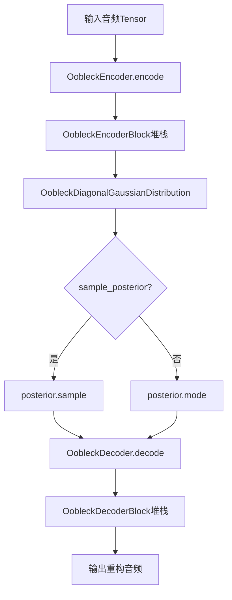
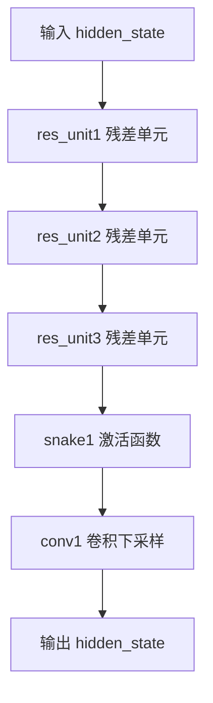
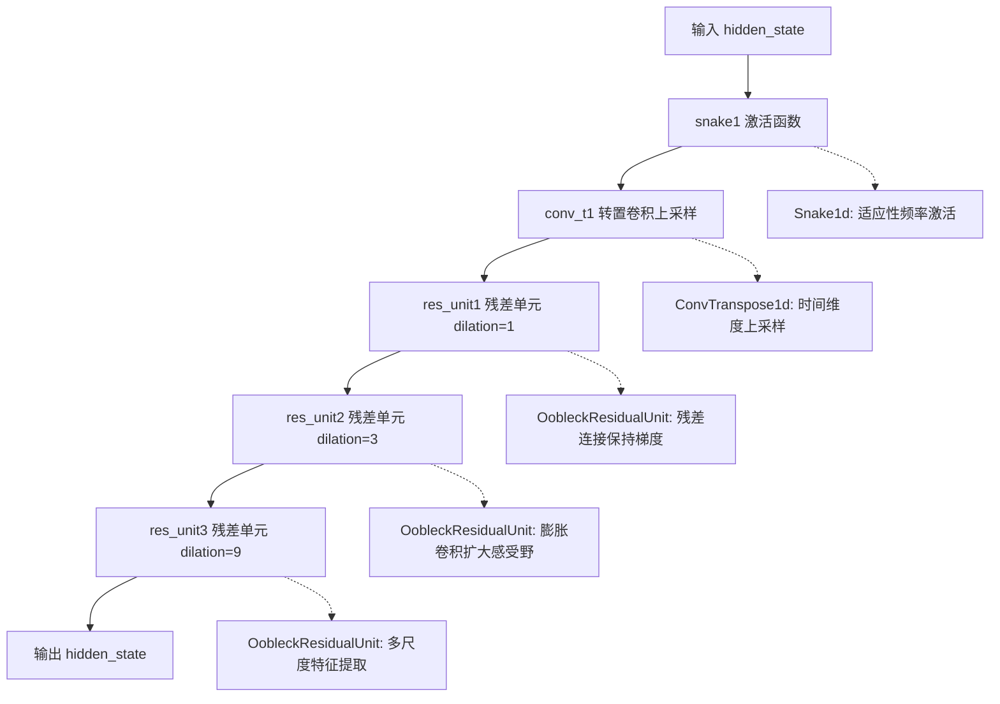
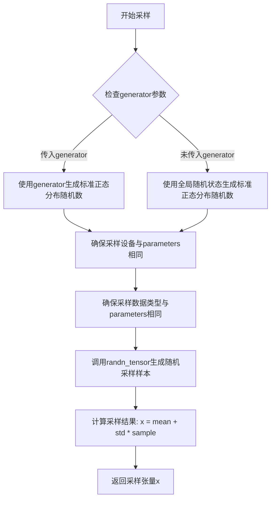
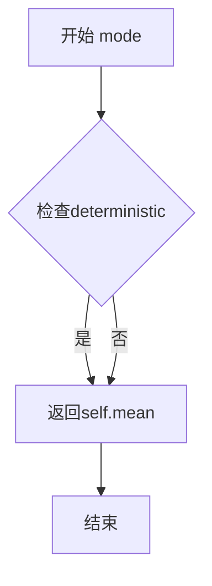
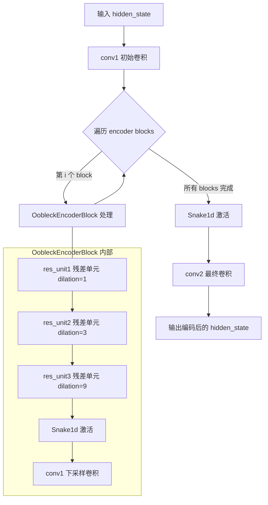
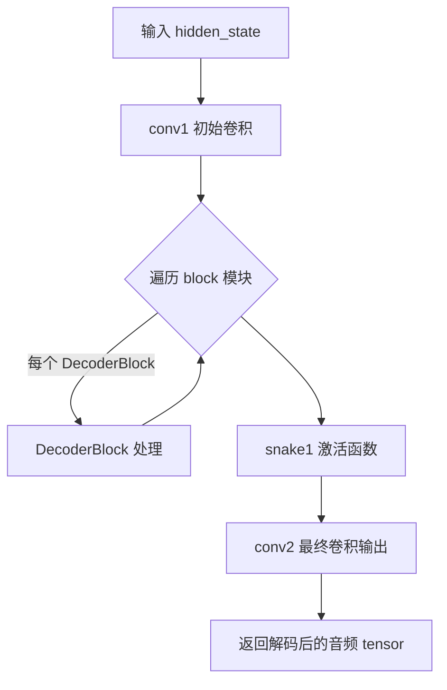
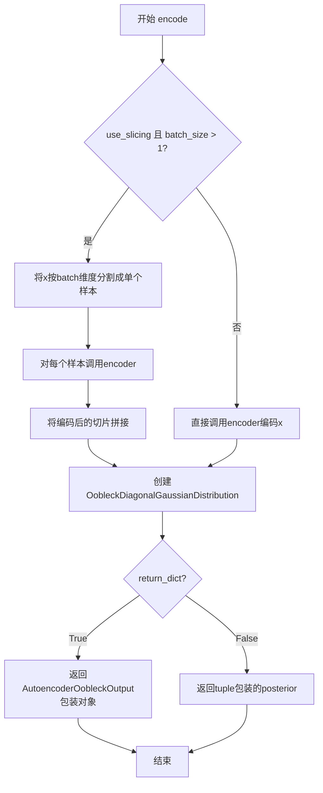
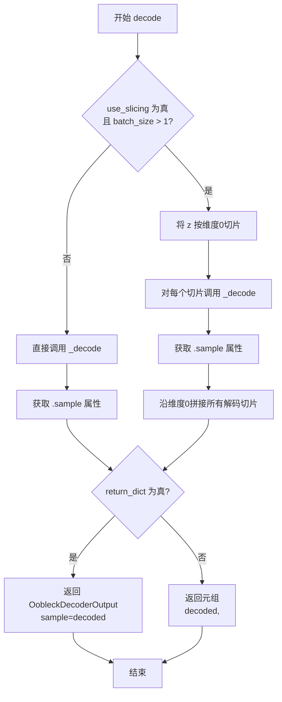
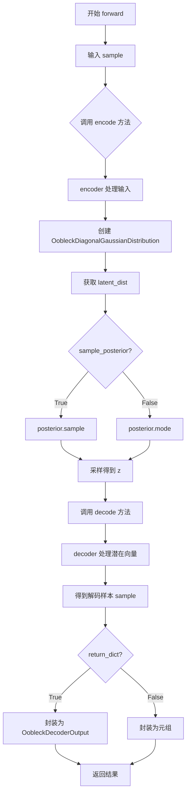

# `diffusers\src\diffusers\models\autoencoders\autoencoder_oobleck.py` 详细设计文档

Oobleck是一个用于将音频波形编码为潜在表示并从潜在表示解码回波形的变分自编码器(VAE)，首次在Stable Audio中引入。它使用Snake激活函数、权重归一化的卷积层和残差连接，以及对角高斯分布来建模潜在空间。

## 整体流程



## 类结构

```
OobleckDiagonalGaussianDistribution
OobleckEncoder (nn.Module)
│   └── OobleckEncoderBlock
│       └── OobleckResidualUnit
│           └── Snake1d
OobleckDecoder (nn.Module)
│   └── OobleckDecoderBlock
│       └── OobleckResidualUnit
│           └── Snake1d
AutoencoderOobleck (ModelMixin, AutoencoderMixin, ConfigMixin)
│   ├── OobleckEncoder
│   └── OobleckDecoder
AutoencoderOobleckOutput (dataclass)
OobleckDecoderOutput (dataclass)
```

## 全局变量及字段


### `Snake1d.alpha`
    
可学习的缩放参数，用于调节激活函数的非线性强度

类型：`nn.Parameter`
    


### `Snake1d.beta`
    
可学习的频率参数，用于调节正弦函数的周期特性

类型：`nn.Parameter`
    


### `Snake1d.logscale`
    
标志位，控制是否对alpha和beta参数进行对数尺度变换

类型：`bool`
    


### `OobleckResidualUnit.snake1`
    
第一个Snake激活函数层，用于引入非线性变换

类型：`Snake1d`
    


### `OobleckResidualUnit.conv1`
    
带权重归一化的第一卷积层，具有可配置的膨胀率

类型：`weight_norm Conv1d`
    


### `OobleckResidualUnit.snake2`
    
第二个Snake激活函数层，用于第二次非线性变换

类型：`Snake1d`
    


### `OobleckResidualUnit.conv2`
    
带权重归一化的第二卷积层，核大小为1

类型：`weight_norm Conv1d`
    


### `OobleckEncoderBlock.res_unit1-3`
    
三个级联的残差单元，分别使用膨胀率1、3、9进行多尺度特征提取

类型：`OobleckResidualUnit`
    


### `OobleckEncoderBlock.snake1`
    
编码器块的激活函数，位于残差单元之后

类型：`Snake1d`
    


### `OobleckEncoderBlock.conv1`
    
编码器块的输出卷积层，执行下采样操作

类型：`weight_norm Conv1d`
    


### `OobleckDecoderBlock.snake1`
    
解码器块的激活函数，位于反卷积之前

类型：`Snake1d`
    


### `OobleckDecoderBlock.conv_t1`
    
带权重归一化的转置卷积层，执行上采样操作

类型：`weight_norm ConvTranspose1d`
    


### `OobleckDecoderBlock.res_unit1-3`
    
三个级联的残差单元，用于解码后的特征处理

类型：`OobleckResidualUnit`
    


### `OobleckDiagonalGaussianDistribution.parameters`
    
编码器输出的潜在表示参数，包含均值和标准差信息

类型：`torch.Tensor`
    


### `OobleckDiagonalGaussianDistribution.mean`
    
高斯分布的均值向量，表示潜在空间的中心位置

类型：`torch.Tensor`
    


### `OobleckDiagonalGaussianDistribution.scale`
    
高斯分布的缩放参数，经过Softplus激活变换

类型：`torch.Tensor`
    


### `OobleckDiagonalGaussianDistribution.std`
    
高斯分布的标准差，通过Softplus加小常数计算得到

类型：`torch.Tensor`
    


### `OobleckDiagonalGaussianDistribution.var`
    
高斯分布的方差，等于标准差的平方

类型：`torch.Tensor`
    


### `OobleckDiagonalGaussianDistribution.logvar`
    
高斯分布的对数方差，用于数值稳定性

类型：`torch.Tensor`
    


### `OobleckDiagonalGaussianDistribution.deterministic`
    
标志位，控制是否使用确定性模式（返回均值而非采样）

类型：`bool`
    


### `AutoencoderOobleckOutput.latent_dist`
    
编码后的潜在分布，包含均值和标准差信息

类型：`OobleckDiagonalGaussianDistribution`
    


### `OobleckDecoderOutput.sample`
    
解码后的音频样本，形状为批大小×音频通道×序列长度

类型：`torch.Tensor`
    


### `OobleckEncoder.conv1`
    
编码器的输入卷积层，将音频通道映射到隐藏维度

类型：`weight_norm Conv1d`
    


### `OobleckEncoder.block`
    
编码器块列表，包含多个OobleckEncoderBlock级联

类型：`ModuleList`
    


### `OobleckEncoder.snake1`
    
编码器的激活函数，位于编码块之后

类型：`Snake1d`
    


### `OobleckEncoder.conv2`
    
编码器的输出卷积层，输出潜在表示

类型：`weight_norm Conv1d`
    


### `OobleckDecoder.conv1`
    
解码器的输入卷积层，将潜在表示映射到解码器维度

类型：`weight_norm Conv1d`
    


### `OobleckDecoder.block`
    
解码器块列表，包含多个OobleckDecoderBlock级联

类型：`ModuleList`
    


### `OobleckDecoder.snake1`
    
解码器的激活函数，位于解码块之后

类型：`Snake1d`
    


### `OobleckDecoder.conv2`
    
解码器的输出卷积层，输出重构的音频

类型：`weight_norm Conv1d`
    


### `AutoencoderOobleck.encoder_hidden_size`
    
编码器隐藏层的维度大小

类型：`int`
    


### `AutoencoderOobleck.downsampling_ratios`
    
编码器下采样比率列表，用于确定潜在空间压缩倍数

类型：`list[int]`
    


### `AutoencoderOobleck.decoder_channels`
    
解码器中间表示的维度大小

类型：`int`
    


### `AutoencoderOobleck.upsampling_ratios`
    
解码器上采样比率列表，是下采样比率的逆序

类型：`list[int]`
    


### `AutoencoderOobleck.hop_length`
    
音频波形到潜在表示的帧移位长度，等于下采样比率的乘积

类型：`int`
    


### `AutoencoderOobleck.sampling_rate`
    
音频采样率，用于音频处理和重构

类型：`int`
    


### `AutoencoderOobleck.encoder`
    
音频编码器模块，将波形编码为潜在表示

类型：`OobleckEncoder`
    


### `AutoencoderOobleck.decoder`
    
音频解码器模块，将潜在表示解码为波形

类型：`OobleckDecoder`
    


### `AutoencoderOobleck.use_slicing`
    
标志位，控制是否使用切片方式处理大批量数据以节省内存

类型：`bool`
    
    

## 全局函数及方法


### `Snake1d.forward`

该方法实现了1维Snake激活函数，对输入张量进行非线性变换，通过可学习的alpha和beta参数调节正弦平方项的频率和幅度，以增强模型的表达能力。

参数：

- `hidden_states`：`torch.Tensor`，输入的隐藏状态张量，形状为 `(batch_size, channels, time_steps)` 或类似的多维张量

返回值：`torch.Tensor`，经过Snake激活函数处理后的隐藏状态，形状与输入相同

#### 流程图

```mermaid
flowchart TD
    A[开始 forward] --> B[获取输入形状 shape]
    B --> C{self.logscale?}
    C -->|True| D[alpha = torch.exp(self.alpha)]
    C -->|False| E[alpha = self.alpha]
    D --> F
    E --> F{self.logscale?}
    F -->|True| G[beta = torch.exp(self.beta)]
    F -->|False| H[beta = self.beta]
    G --> I
    H --> I
    I[重塑输入: reshape batch×time] --> J[计算激活: hidden_states + 1/(beta+eps) * sin²(alpha × x)]
    J --> K[恢复原始形状: reshape回原始shape]
    K --> L[返回处理后的张量]
    
    style J fill:#f9f,stroke:#333
    style L fill:#9f9,stroke:#333
```

#### 带注释源码

```python
def forward(self, hidden_states):
    """
    Snake 1D 激活函数的前向传播
    
    参数:
        hidden_states: 输入张量，形状为 (batch_size, channels, time_steps)
    
    返回:
        经过 Snake 激活函数变换后的张量
    """
    # 获取输入张量的形状
    shape = hidden_states.shape

    # 根据 logscale 参数决定是否对 alpha 和 beta 取指数
    # logscale=True 时，alpha 和 beta 通过 exp() 变换，确保它们为正数
    alpha = self.alpha if not self.logscale else torch.exp(self.alpha)
    beta = self.beta if not self.logscale else torch.exp(self.beta)

    # 将输入重塑为 2D 张量 (batch*channels, time)
    # 以便对所有时间步统一应用激活函数
    hidden_states = hidden_states.reshape(shape[0], shape[1], -1)

    # Snake 激活函数核心公式:
    # f(x) = x + (1/(beta + eps)) * sin²(alpha * x)
    # 其中 eps=1e-9 用于防止除零错误
    # beta 的倒数用于控制正弦项的幅度
    hidden_states = hidden_states + (beta + 1e-9).reciprocal() * torch.sin(alpha * hidden_states).pow(2)

    # 恢复原始形状
    hidden_states = hidden_states.reshape(shape)
    
    return hidden_states
```


### `OobleckResidualUnit.forward`

该方法实现了 OobleckResidualUnit 的前向传播，通过 Snake1d 激活函数和权重归一化的卷积层处理输入，然后与残差连接进行相加，实现带有膨胀卷积的残差单元。

参数：

- `hidden_state`：`torch.Tensor`，形状为 `(batch_size, channels, time_steps)` 的输入张量

返回值：`torch.Tensor`，形状为 `(batch_size, channels, time_steps)` 的输出张量，经过残差单元处理后的结果

#### 流程图

```mermaid
flowchart TD
    A[输入 hidden_state] --> B[复制到 output_tensor]
    B --> C[snake1 激活: self.snake1(output_tensor)]
    C --> D[conv1 卷积: self.conv1(...)]
    D --> E[snake2 激活: self.snake2(output_tensor)]
    E --> F[conv2 卷积: self.conv2(...)]
    F --> G{输出时间步 != 输入时间步?}
    G -->|是| H[计算 padding 偏移量]
    H --> I[裁剪 hidden_state]
    I --> J[残差相加: hidden_state + output_tensor]
    G -->|否| J
    J --> K[返回 output_tensor]
```

#### 带注释源码

```python
def forward(self, hidden_state):
    """
    Forward pass through the residual unit.

    Args:
        hidden_state (`torch.Tensor` of shape `(batch_size, channels, time_steps)`):
            Input tensor .

    Returns:
        output_tensor (`torch.Tensor` of shape `(batch_size, channels, time_steps)`)
            Input tensor after passing through the residual unit.
    """
    # 将输入复制到输出张量，用于后续的残差连接
    output_tensor = hidden_state
    
    # 第一个残差块：Snake1d 激活 -> Conv1d (带膨胀)
    # snake1 提供自适应频率的正弦激活
    # conv1 使用权重归一化，kernel_size=7，膨胀率由初始化参数决定
    output_tensor = self.conv1(self.snake1(output_tensor))
    
    # 第二个残差块：Snake1d 激活 -> Conv1d (1x1 卷积)
    # conv2 使用 1x1 卷积进行通道间的线性变换
    output_tensor = self.conv2(self.snake2(output_tensor))

    # 处理由于膨胀卷积导致的输出时间步变化
    # 计算需要裁剪的 padding 大小，确保残差连接维度匹配
    padding = (hidden_state.shape[-1] - output_tensor.shape[-1]) // 2
    
    # 如果输出时间步小于输入，进行中心裁剪
    if padding > 0:
        # 裁剪 hidden_state 以匹配 output_tensor 的时间步维度
        hidden_state = hidden_state[..., padding:-padding]
    
    # 残差连接：将处理后的输出与原始输入相加
    # 这是残差网络的核心，用于缓解梯度消失问题
    output_tensor = hidden_state + output_tensor
    
    return output_tensor
```


### `OobleckEncoderBlock.forward`

该方法是 Oobleck 编码器块的前向传播函数，接收音频特征张量并通过三个残差单元（使用 Snake 激活函数和权重归一化卷积）进行特征提取，最后通过卷积层进行下采样并调整通道维度。

参数：

- `hidden_state`：`torch.Tensor`，形状为 `(batch_size, channels, time_steps)` 的输入张量，代表批次的音频特征数据

返回值：`torch.Tensor`，经过编码块处理后的输出张量，形状为 `(batch_size, output_dim, time_steps // stride)`

#### 流程图



#### 带注释源码

```python
def forward(self, hidden_state):
    """
    Oobleck 编码器块的前向传播方法。

    该方法通过三个级联的残差单元（每个包含 Snake 激活函数和权重归一化的卷积层）
    进行特征提取，然后通过一个卷积层进行下采样和通道变换。

    处理流程：
    1. res_unit1: 第一个残差单元，使用 dilation=1
    2. res_unit2: 第二个残差单元，使用 dilation=3
    3. res_unit3: 第三个残差单元，使用 dilation=9，随后应用 snake1 激活
    4. conv1: 权重归一化的卷积层，执行下采样和通道变换

    Args:
        hidden_state (torch.Tensor): 输入张量，形状为 (batch_size, input_dim, time_steps)

    Returns:
        torch.Tensor: 输出张量，形状为 (batch_size, output_dim, time_steps // stride)
    """
    # 第一个残差块：dilation=1 的基本特征提取
    # OobleckResidualUnit 包含: snake1 -> conv1 -> snake2 -> conv2 的结构
    hidden_state = self.res_unit1(hidden_state)

    # 第二个残差块：dilation=3 捕获更大范围的时序依赖
    # 通过更大的 dilation 感受野得到扩展
    hidden_state = self.res_unit2(hidden_state)

    # 第三个残差块：dilation=9 进一步扩大感受野
    # 然后应用额外的 Snake1d 激活函数
    hidden_state = self.snake1(self.res_unit3(hidden_state))

    # 最终卷积层：结合 stride 参数进行下采样
    # kernel_size=2*stride 确保输出时间步长为输入的 1/stride
    # padding=math.ceil(stride/2) 保证卷积后时间维度正确
    hidden_state = self.conv1(hidden_state)

    return hidden_state
```


### `OobleckDecoderBlock.forward`

该方法实现了 Oobleck 解码器块的 forward 传播，输入 latent 表示经过激活函数、上采样转置卷积和三个带有不同膨胀率的残差单元，输出上采样后的特征张量。

参数：

- `hidden_state`：`torch.Tensor`，形状为 `(batch_size, input_dim, time_steps)` 的输入张量，表示解码器块的输入特征。

返回值：`torch.Tensor`，形状为 `(batch_size, output_dim, time_steps * stride)` 的输出张量，表示解码后的特征。

#### 流程图



#### 带注释源码

```python
def forward(self, hidden_state):
    """
    OobleckDecoderBlock 的前向传播方法。
    
    该方法执行以下操作：
    1. 应用 Snake1d 激活函数进行适应性频率调制
    2. 使用转置卷积进行时间维度上采样
    3. 依次通过三个残差单元（具有不同膨胀率）进行特征提取
    
    Args:
        hidden_state (`torch.Tensor` of shape `(batch_size, input_dim, time_steps)`):
            输入张量，通常来自解码器的上一层或 latent 空间
            
    Returns:
        hidden_state (`torch.Tensor` of shape `(batch_size, output_dim, time_steps * stride)`):
            上采样后的输出张量
    """
    # 第一步：应用 Snake1d 激活函数
    # Snake1d 是一种自适应频率的激活函数，可以学习调整信号的不同频率成分
    hidden_state = self.snake1(hidden_state)
    
    # 第二步：使用转置卷积进行上采样
    # kernel_size=2*stride, stride=stride 实现时间维度的上采样
    # padding=math.ceil(stride/2) 确保输出长度正确
    hidden_state = self.conv_t1(hidden_state)
    
    # 第三步：通过三个残差单元进行特征提取
    # 每个残差单元包含：Snake1d 激活 -> 卷积 -> Snake1d 激活 -> 卷积
    # 残差连接确保梯度流动，同时三个不同膨胀率(1,3,9)捕获多尺度时序特征
    hidden_state = self.res_unit1(hidden_state)
    hidden_state = self.res_unit2(hidden_state)
    hidden_state = self.res_unit3(hidden_state)
    
    return hidden_state
```


### `OobleckDiagonalGaussianDistribution.sample`

该方法从对角高斯分布中采样一个样本，通过生成标准正态分布的随机数并根据分布的均值和标准差进行变换，生成符合当前分布的采样结果。

参数：

- `generator`：`torch.Generator | None`，可选参数，用于控制随机数生成的生成器，传入后可以确保采样的可重复性

返回值：`torch.Tensor`，从对角高斯分布中采样的张量，形状与均值张量相同

#### 流程图



#### 带注释源码

```python
def sample(self, generator: torch.Generator | None = None) -> torch.Tensor:
    """
    从对角高斯分布中采样一个样本。
    
    通过生成标准正态分布的随机数，然后根据分布的均值(mean)和标准差(std)
    进行线性变换，得到符合该高斯分布的采样结果。
    
    参数:
        generator: 可选的torch.Generator对象，用于控制随机数生成的种子，
                   确保在需要时可重现采样结果。
    
    返回:
        torch.Tensor: 采样得到的结果，形状与self.mean相同。
    """
    # 确保采样生成的随机数与parameters张量在同一设备上（CPU/GPU）
    # 并且使用相同的数据类型（float32/float64等）
    sample = randn_tensor(
        self.mean.shape,           # 使用mean的形状作为采样形状
        generator=generator,       # 传入随机数生成器（可选）
        device=self.parameters.device,  # 确保设备一致
        dtype=self.parameters.dtype,     # 确保数据类型一致
    )
    
    # 根据高斯分布采样公式: x = μ + σ * ε
    # 其中μ是均值(mean)，σ是标准差(std)，ε是标准正态分布采样
    x = self.mean + self.std * sample
    
    return x
```


### `OobleckDiagonalGaussianDistribution.kl`

计算当前高斯分布与另一个高斯分布之间的 KL 散度（Kullback-Leibler Divergence），用于衡量两个概率分布之间的差异。如果未提供 `other` 参数，则计算当前分布与标准高斯分布之间的 KL 散度。

参数：

- `other`：`OobleckDiagonalGaussianDistribution | None`，可选参数，表示另一个高斯分布。如果为 `None`，则计算当前分布与标准高斯分布之间的 KL 散度。

返回值：`torch.Tensor`，返回 KL 散度值，标量张量。

#### 流程图

```mermaid
flowchart TD
    A[开始 kl 方法] --> B{self.deterministic 是否为 True?}
    B -->|是| C[返回标量张量 0.0]
    B -->|否| D{other 是否为 None?}
    D -->|是| E[计算自身与标准高斯分布的 KL 散度<br/>kl = mean² + var - logvar - 1]
    D -->|否| F[计算两个分布之间的 KL 散度<br/>normalized_diff = (mean - other.mean)² / other.var<br/>var_ratio = var / other.var<br/>logvar_diff = logvar - other.logvar<br/>kl = normalized_diff + var_ratio + logvar_diff - 1]
    E --> G[对结果求和并取平均]
    F --> G
    C --> H[返回结果]
    G --> H
```

#### 带注释源码

```python
def kl(self, other: "OobleckDiagonalGaussianDistribution" = None) -> torch.Tensor:
    """
    计算当前高斯分布与另一个高斯分布之间的 KL 散度。
    
    KL 散度用于衡量两个概率分布之间的差异。
    当 other 为 None 时，计算当前分布与标准高斯分布之间的 KL 散度。
    
    参数:
        other: 另一个 OobleckDiagonalGaussianDistribution 实例。如果为 None，
               则计算与标准高斯分布 N(0, I) 的 KL 散度。
    
    返回值:
        torch.Tensor: KL 散度值，标量张量。
    """
    # 如果分布是确定性的，返回 0（无需计算散度）
    if self.deterministic:
        return torch.Tensor([0.0])
    else:
        # 如果没有提供 other，计算与标准高斯分布的 KL 散度
        # 标准高斯分布的 mean=0, var=1, logvar=0
        # KL(N0||N1) = 0.5 * (mean² + var - logvar - 1)
        # 此处省略了 0.5 系数，因为后续会对多个元素求和平均
        if other is None:
            return (self.mean * self.mean + self.var - self.logvar - 1.0).sum(1).mean()
        else:
            # 计算两个高斯分布之间的 KL 散度
            # KL(N0||N1) = 0.5 * ((mean0 - mean1)²/var1 + var0/var1 + log(var1) - log(var0) - 1)
            
            # 归一化差异：(mean - other.mean)² / other.var
            normalized_diff = torch.pow(self.mean - other.mean, 2) / other.var
            # 方差比率：self.var / other.var
            var_ratio = self.var / other.var
            # 对数方差差异：self.logvar - other.logvar
            logvar_diff = self.logvar - other.logvar
            
            # 组合计算 KL 散度（省略了 0.5 系数）
            kl = normalized_diff + var_ratio + logvar_diff - 1
            
            # 对最后一个维度求和，然后对batch求平均
            # .sum(1) 对通道维度求和，.mean() 对batch求平均
            kl = kl.sum(1).mean()
            return kl
```


### `OobleckDiagonalGaussianDistribution.mode()`

该方法返回对角高斯分布的众数（即均值），用于在不需要采样时获取分布的中心点。

参数： 无

返回值：`torch.Tensor`，返回分布的均值向量

#### 流程图



#### 带注释源码

```python
def mode(self) -> torch.Tensor:
    """
    返回高斯分布的众数（即均值）。
    在对角高斯分布中，众数等于均值。
    当不需要采样时，使用此方法获取确定性输出。
    
    Returns:
        torch.Tensor: 分布的均值，表示最可能的值
    """
    return self.mean
```


### OobleckEncoder.forward

该方法是 Oobleck 编码器的前向传播函数，负责将输入的音频波形数据转换为潜在表示（latent representation）。它通过初始卷积层、多个级联的编码器块（包含残差单元和下采样）、Snake 激活函数以及最终的卷积层，对输入 hidden_state 进行逐层处理和下采样，最终输出编码后的隐藏状态张量。

参数：

- `hidden_state`：`torch.Tensor`，形状为 `(batch_size, audio_channels, time_steps)`，表示输入的音频波形数据，其中 audio_channels 为音频通道数（通常为 1 或 2），time_steps 为时间步数

返回值：`torch.Tensor`，形状为 `(batch_size, encoder_hidden_size, reduced_time_steps)`，其中 encoder_hidden_size 为编码器隐藏大小，reduced_time_steps 为经过下采样后的时间步数（即原始 time_steps 除以所有下采样比例的乘积），返回编码后的潜在表示

#### 流程图



#### 带注释源码

```python
def forward(self, hidden_state):
    """
    OobleckEncoder 的前向传播方法，将音频波形编码为潜在表示
    
    参数:
        hidden_state (torch.Tensor): 
            输入张量，形状为 (batch_size, audio_channels, time_steps)
            - batch_size: 批次大小
            - audio_channels: 音频通道数（1=单声道，2=立体声）
            - time_steps: 原始音频样本数
    
    返回:
        torch.Tensor: 
            编码后的隐藏状态，形状为 (batch_size, encoder_hidden_size, reduced_time_steps)
            - encoder_hidden_size: 编码器隐藏大小（由配置指定，默认128）
            - reduced_time_steps: 下采样后的时间步数
    """
    # 第一层：初始卷积，将音频通道数映射到 encoder_hidden_size
    # 使用权重归一化的 Conv1d，kernel_size=7, padding=3 保持时间维度不变
    hidden_state = self.conv1(hidden_state)

    # 第二层：依次通过多个 OobleckEncoderBlock
    # 每个 block 包含残差单元（带不同 dilation 的卷积）和下采样操作
    for module in self.block:
        hidden_state = module(hidden_state)

    # 第三层：应用 Snake1d 激活函数
    # Snake1d 是一种可学习的激活函数，公式为: x + (1/beta) * sin(alpha * x)^2
    hidden_state = self.snake1(hidden_state)

    # 第四层：最终卷积，将通道数映射回 encoder_hidden_size
    # 使用 kernel_size=3, padding=1 保持时间维度不变
    hidden_state = self.conv2(hidden_state)

    return hidden_state
```


### `OobleckDecoder.forward`

该方法是 Oobleck 解码器的前向传播函数，负责将潜在的隐藏状态逐步上采样并解码为音频波形。通过初始卷积层、多个上采样残差块以及最终的激活和卷积层，将低分辨率的中间表示恢复为高分辨率的音频数据。

参数：

- `hidden_state`：`torch.Tensor`，输入的潜在表示张量，通常来自编码器的输出或潜在空间的采样

返回值：`torch.Tensor`，解码后的音频波形，形状为 `(batch_size, audio_channels, sequence_length)`

#### 流程图



#### 带注释源码

```python
def forward(self, hidden_state):
    """
    OobleckDecoder 的前向传播方法，将潜在表示解码为音频波形。

    Args:
        hidden_state (torch.Tensor): 输入的潜在表示，形状为 (batch_size, input_channels, time_steps)

    Returns:
        torch.Tensor: 解码后的音频波形，形状为 (batch_size, audio_channels, sequence_length)
    """
    # 步骤1: 通过初始卷积层将输入通道映射到更高的通道维度
    hidden_state = self.conv1(hidden_state)

    # 步骤2: 遍历解码器块序列，执行上采样和特征提取
    # 每个 block 包含转置卷积（上采样）和多个残差单元
    for layer in self.block:
        hidden_state = layer(hidden_state)

    # 步骤3: 应用 Snake 激活函数进行非线性变换
    hidden_state = self.snake1(hidden_state)

    # 步骤4: 通过最终卷积层将通道数映射到音频通道数（如立体声为2）
    hidden_state = self.conv2(hidden_state)

    return hidden_state
```


### `AutoencoderOobleck.encode`

该方法实现音频波形的编码功能，将输入的音频张量通过OobleckEncoder编码成潜在表示，并使用OobleckDiagonalGaussianDistribution（对角高斯分布）来表示编码后的潜在空间分布。根据return_dict参数决定返回格式。

参数：

- `x`：`torch.Tensor`，输入的音频批次张量，形状为(batch_size, audio_channels, sequence_length)
- `return_dict`：`bool`，是否返回字典格式的输出，默认为True

返回值：`AutoencoderOobleckOutput | tuple[OobleckDiagonalGaussianDistribution]`，如果return_dict为True，返回包含latent_dist的AutoencoderOobleckOutput对象；否则返回包含OobleckDiagonalGaussianDistribution的元组

#### 流程图



#### 带注释源码

```python
@apply_forward_hook
def encode(
    self, x: torch.Tensor, return_dict: bool = True
) -> AutoencoderOobleckOutput | tuple[OobleckDiagonalGaussianDistribution]:
    """
    Encode a batch of images into latents.

    Args:
        x (`torch.Tensor`): Input batch of images.
        return_dict (`bool`, *optional*, defaults to `True`):
            Whether to return a [`~models.autoencoder_kl.AutoencoderKLOutput`] instead of a plain tuple.

    Returns:
            The latent representations of the encoded images. If `return_dict` is True, a
            [`~models.autoencoder_kl.AutoencoderKLOutput`] is returned, otherwise a plain `tuple` is returned.
    """
    # 检查是否启用切片模式且batch大小大于1，用于内存优化
    if self.use_slicing and x.shape[0] > 1:
        # 将batch按维度1分割成单个样本，分别编码后再拼接
        # 这种方式可以减少显存占用，但会增加计算时间
        encoded_slices = [self.encoder(x_slice) for x_slice in x.split(1)]
        h = torch.cat(encoded_slices)
    else:
        # 直接对整个batch进行编码
        h = self.encoder(x)

    # 使用编码后的特征h创建对角高斯分布，用于表示潜在空间
    # 该分布封装了均值(mean)和标准差(std)
    posterior = OobleckDiagonalGaussianDistribution(h)

    # 根据return_dict参数决定返回格式
    if not return_dict:
        # 返回元组格式，保持与旧版API的兼容性
        return (posterior,)

    # 返回包含latent_dist的AutoencoderOobleckOutput对象
    return AutoencoderOobleckOutput(latent_dist=posterior)
```


### `AutoencoderOobleck._decode`

该方法是 `AutoencoderOobleck` 类的私有解码方法，负责将潜在空间向量（latent vector）通过 OobleckDecoder 解码器转换为音频样本波形。支持返回 `OobleckDecoderOutput` 字典对象或原始 `torch.Tensor` 元组。

参数：

- `z`：`torch.Tensor`，潜在空间向量，形状为 `(batch_size, latent_channels, latent_length)`
- `return_dict`：`bool`，是否返回字典格式的 `OobleckDecoderOutput` 对象，默认为 `True`

返回值：`OobleckDecoderOutput | torch.Tensor`，解码后的音频样本。如果 `return_dict` 为 `True`，返回 `OobleckDecoderOutput` 对象；否则返回包含音频张量的元组 `(dec,)`

#### 流程图

```mermaid
flowchart TD
    A[输入: 潜在向量 z] --> B[调用 self.decoder(z)]
    B --> C{return_dict?}
    C -->|True| D[创建 OobleckDecoderOutput<br/>sample=dec]
    D --> E[返回 OobleckDecoderOutput]
    C -->|False| F[返回元组 (dec,)]
    E --> G[结束]
    F --> G
```

#### 带注释源码

```python
def _decode(self, z: torch.Tensor, return_dict: bool = True) -> OobleckDecoderOutput | torch.Tensor:
    """
    将潜在向量解码为音频样本。

    Args:
        z: 潜在空间向量，形状为 (batch_size, latent_channels, latent_length)
        return_dict: 是否返回字典格式，默认为 True

    Returns:
        OobleckDecoderOutput 或 torch.Tensor: 解码后的音频样本
    """
    # 将潜在向量传入解码器进行解码
    dec = self.decoder(z)

    # 根据 return_dict 参数决定返回格式
    if not return_dict:
        # 返回元组格式
        return (dec,)

    # 返回包含 sample 字段的 OobleckDecoderOutput 对象
    return OobleckDecoderOutput(sample=dec)
```


### `AutoencoderOobleck.decode`

该方法将一批潜在向量（latent vectors）解码回音频样本（audio samples）。它首先调用内部方法 `_decode` 进行核心解码操作，然后根据 `return_dict` 参数决定返回 `OobleckDecoderOutput` 对象还是元组。当 `use_slicing` 启用且批量大小大于1时，会对批量进行切片处理以节省内存。

参数：

- `z`：`torch.FloatTensor`，输入的潜在向量张量，形状为 `(batch_size, latent_channels, latent_length)`
- `return_dict`：`bool`，可选，默认为 `True`。是否返回 `OobleckDecoderOutput` 对象而非普通元组
- `generator`：`torch.Generator | None`，可选，用于随机采样的随机数生成器（虽然在当前 `decode` 实现中未直接使用，但保留接口一致性）

返回值：`OobleckDecoderOutput | torch.FloatTensor`，如果 `return_dict` 为 True，返回包含 `sample` 字段的 `OobleckDecoderOutput` 对象；否则返回包含解码后样本的元组 `(sample,)`

#### 流程图



#### 带注释源码

```python
@apply_forward_hook
def decode(
    self, z: torch.FloatTensor, return_dict: bool = True, generator=None
) -> OobleckDecoderOutput | torch.FloatTensor:
    """
    Decode a batch of images.

    Args:
        z (`torch.Tensor`): Input batch of latent vectors.
        return_dict (`bool`, *optional*, defaults to `True`):
            Whether to return a [`~models.vae.OobleckDecoderOutput`] instead of a plain tuple.

    Returns:
        [`~models.vae.OobleckDecoderOutput`] or `tuple`:
            If return_dict is True, a [`~models.vae.OobleckDecoderOutput`] is returned, otherwise a plain `tuple`
            is returned.

    """
    # 检查是否启用切片模式且批量大小大于1
    # 切片模式用于处理大批量时节省显存，通过逐个处理样本实现
    if self.use_slicing and z.shape[0] > 1:
        # 将输入潜在向量按batch维度切分成单个样本
        decoded_slices = [self._decode(z_slice).sample for z_slice in z.split(1)]
        # 将所有解码后的切片在batch维度上拼接回去
        decoded = torch.cat(decoded_slices)
    else:
        # 直接调用内部_decode方法进行解码
        decoded = self._decode(z).sample

    # 根据return_dict参数决定返回格式
    if not return_dict:
        return (decoded,)

    # 返回包含解码样本的OobleckDecoderOutput对象
    return OobleckDecoderOutput(sample=decoded)
```


### `AutoencoderOobleck.forward`

该函数是 AutoencoderOobleck 模型的前向传播方法，接收音频样本张量，通过编码器将样本编码为潜在分布，根据 `sample_posterior` 参数从分布采样或使用均值，最后通过解码器将潜在向量解码为音频样本输出。

参数：

- `sample`：`torch.Tensor`，输入的音频样本张量，形状为 `(batch_size, audio_channels, sequence_length)`
- `sample_posterior`：`bool`，是否从后验分布中采样，默认为 `False`（即使用均值）
- `return_dict`：`bool`，是否返回字典格式的输出，默认为 `True`
- `generator`：`torch.Generator | None`，随机数生成器，用于从后验分布采样时的随机性控制

返回值：`OobleckDecoderOutput | torch.Tensor`，解码后的音频样本，如果 `return_dict` 为 `True` 返回 `OobleckDecoderOutput` 对象，否则返回元组

#### 流程图



#### 带注释源码

```python
def forward(
    self,
    sample: torch.Tensor,
    sample_posterior: bool = False,
    return_dict: bool = True,
    generator: torch.Generator | None = None,
) -> OobleckDecoderOutput | torch.Tensor:
    r"""
    Args:
        sample (`torch.Tensor`): Input sample.
        sample_posterior (`bool`, *optional*, defaults to `False`):
            Whether to sample from the posterior.
        return_dict (`bool`, *optional*, defaults to `True`):
            Whether or not to return a [`OobleckDecoderOutput`] instead of a plain tuple.
    """
    # 将输入样本赋值给变量 x
    x = sample
    # 调用 encode 方法将样本编码为潜在分布，返回 AutoencoderOobleckOutput 对象
    # 并从中获取 latent_dist（潜在分布）
    posterior = self.encode(x).latent_dist
    
    # 根据 sample_posterior 参数决定如何获取潜在向量 z
    if sample_posterior:
        # 如果 sample_posterior 为 True，从后验分布中采样潜在向量
        # 使用 generator 控制随机性（用于可重复性）
        z = posterior.sample(generator=generator)
    else:
        # 如果 sample_posterior 为 False，使用后验分布的均值（mode）
        z = posterior.mode()
    
    # 调用 decode 方法将潜在向量解码为音频样本
    dec = self.decode(z).sample

    # 根据 return_dict 参数决定返回格式
    if not return_dict:
        # 如果不返回字典，将解码结果封装为元组返回
        return (dec,)

    # 默认返回 OobleckDecoderOutput 对象，包含解码后的样本
    return OobleckDecoderOutput(sample=dec)
```

## 关键组件


### Snake 激活函数

一种可学习的 1D 激活函数，通过可学习的 alpha 和 beta 参数实现自适应的周期性非线性变换，支持对数尺度的参数化方式

### Oobleck 残差单元

由 Snake1d 激活层和权重归一化的 Conv1d 层组成的残差结构，包含两个残差分支，支持膨胀卷积以扩大感受野

### Oobleck 编码器块

包含三个串行残差单元（膨胀系数分别为 1、3、9）和一个额外激活层加卷积层的编码器基础块，支持步长下采样

### Oobleck 解码器块

包含一个转置卷积上采样层和三个串行残差单元的解码器基础块，膨胀系数同样为 1、3、9

### 对角高斯分布

用于编码器输出的潜在表示，封装了均值和标准差参数，提供采样（sample）、KL 散度计算（kl）和模式获取（mode）方法

### Oobleck 编码器

多层级编码器网络，通过多个 EncoderBlock 进行逐步下采样和通道扩展，最终输出潜在表示

### Oobleck 解码器

多层级解码器网络，通过多个 DecoderBlock 进行逐步上采样和通道缩减，将潜在表示重建为音频波形

### 自动编码器主模型

整合编码器和解码器的完整自动编码器实现，支持编码（encode）、解码（decode）和前向传播（forward），内置张量切片机制用于处理大批量数据

### 张量切片机制

在 encode 和 decode 方法中实现的惰性加载策略，当 use_slicing 为 True 且批次大小大于 1 时，将输入按单样本分割后逐个处理，最后拼接结果

### 权重归一化

所有卷积和转置卷积层均使用 weight_norm 包装，以实现更稳定的训练和更快的收敛


## 问题及建议


### 已知问题

-   **参数初始化可能导致训练不稳定**：Snake1d中的alpha和beta初始化为全零，当logscale=True时，torch.exp(self.alpha)会导致初始值接近1，使得激活函数在训练初期接近线性，可能导致梯度消失。
-   **硬编码的超参数缺乏灵活性**：OobleckResidualUnit中kernel_size=7和padding计算公式((7-1)*dilation)//2被硬编码，无法根据不同应用场景调整。
-   **高斯分布采样方法未正确使用generator**：OobleckDiagonalGaussianDistribution.sample方法接收generator参数但实际未传递给randn_tensor，导致随机性控制失效。
-   **文档字符串与实际功能不匹配**：encode方法的docstring中写的是"Encode a batch of images"，但实际处理的是音频波形数据，会误导开发者。
-   **编码器/解码器结构不对称**：编码器先进行卷积再通过残差块，解码器先进行转置卷积再通过残差块，这种不对称设计可能导致潜在的训练收敛问题。
-   **重复代码模式**：多处使用weight_norm(nn.Conv1d(...))和Snake1d的重复模式，可以抽象为工厂方法或基类。
-   **use_slicing标志未实际启用**：虽然定义了self.use_slicing = False和相关逻辑，但没有任何机制使其生效，分片逻辑代码实际不会被执行。

### 优化建议

-   **改进Snake1d参数初始化**：使用较小的随机值（如torch.randn(1, hidden_dim, 1) * 0.1）初始化alpha和beta，或添加参数约束确保初始激活函数具有非线性特性。
-   **将硬编码超参数化为配置选项**：将kernel_size、默认dilation等参数从构造函数参数传入，提高模块的可复用性。
-   **修正generator参数传递**：在sample方法中将generator参数正确传递给randn_tensor函数，确保可复现的随机采样。
-   **修正文档字符串**：将encode/decode方法的docstring中的"images"改为"audio waveforms"，保持文档与实现一致。
-   **添加输入验证**：在forward/encode/decode方法中添加输入形状和类型检查，确保输入张量维度符合预期。
-   **考虑重构为对称结构**：评估编码器/解码器结构的对称性设计，或添加注释说明不对称设计的合理性。
-   **移除未使用的use_slicing逻辑**：如果不需要分片功能，应删除相关代码以减少代码复杂度和维护成本。

## 其它


### 设计目标与约束

**设计目标：**
- 实现一个高效的音频波形到潜在表示的自动编码器，用于音频生成任务
- 支持变分自编码器(VAE)架构，通过对潜在空间进行采样实现多样化的音频生成
- 采用一维卷积神经网络架构，适用于时间序列音频数据处理

**设计约束：**
- 必须继承自`ModelMixin`、`AutoencoderMixin`和`ConfigMixin`，以兼容HuggingFace Diffusers框架
- 输入输出必须符合`torch.Tensor`格式
- 编码器和解码器必须对称，确保信息能够正确重建

### 错误处理与异常设计

**异常处理机制：**
- 维度不匹配：当`padding > 0`时执行裁剪操作，确保残差连接时维度一致
- 设备/类型一致性：在`sample`方法中使用`randn_tensor`确保采样结果与输入参数在同一设备和数据类型
- 潜在分布采样：当`deterministic=True`时，`kl`散度返回零张量

**边界条件：**
- `beta + 1e-9`：防止除零错误
- `softplus(self.scale) + 1e-4`：确保标准差为正且数值稳定

### 数据流与状态机

**编码数据流：**
```
输入音频(batch, channels, time) 
→ conv1 
→ 多个OobleckEncoderBlock(下采样+残差) 
→ snake1 
→ conv2 
→ OobleckDiagonalGaussianDistribution(潜在分布)
```

**解码数据流：**
```
潜在向量 z 
→ conv1 
→ 多个OobleckDecoderBlock(上采样+残差) 
→ snake1 
→ conv2 
→ 输出音频(batch, channels, time)
```

**前向传播状态：**
- 无显式状态机，主要为确定性计算图
- `use_slicing`标志控制是否对批量数据进行切片处理

### 外部依赖与接口契约

**核心依赖：**
- `torch`：深度学习框架
- `numpy`：数值计算
- `torch.nn`：神经网络模块
- `torch.nn.utils.weight_norm`：权重归一化
- `diffusers.utils`：基础工具类(BaseOutput, ConfigMixin, register_to_config, apply_forward_hook, randn_tensor)
- `diffusers.models.modeling_utils.ModelMixin`：模型基类
- `.vae.AutoencoderMixin`：自动编码器混入类

**接口契约：**
- `encode()`: 输入`(batch, audio_channels, sequence_length)`，输出`AutoencoderOobleckOutput`
- `decode()`: 输入`(batch, latent_channels, latent_length)`，输出`OobleckDecoderOutput`
- `forward()`: 输入音频样本，输出重构的音频样本

### 配置参数说明

**主要配置参数：**
- `encoder_hidden_size`: 编码器隐藏层维度(默认128)
- `decoder_channels`: 解码器通道数(默认128)
- `decoder_input_channels`: 解码器输入通道数/潜在维度(默认64)
- `downsampling_ratios`: 编码器下采样比例列表(默认[2,4,4,8,8])
- `channel_multiples`: 通道倍数列表(默认[1,2,4,8,16])
- `audio_channels`: 音频通道数，1=单声道，2=立体声(默认2)
- `sampling_rate`: 采样率(默认44100)
- `hop_length`: 总下采样倍数，通过`np.prod(downsampling_ratios)`计算

### 使用示例与调用流程

**典型使用场景：**
```python
# 初始化模型
autoencoder = AutoencoderOobleck(
    encoder_hidden_size=128,
    downsampling_ratios=[2,4,4,8,8],
    channel_multiples=[1,2,4,8,16],
    decoder_channels=128,
    decoder_input_channels=64,
    audio_channels=2,
    sampling_rate=44100
)

# 编码
audio_input = torch.randn(1, 2, 16000)  # 1秒立体声
latent_output = autoencoder.encode(audio_input)
latent_sample = latent_output.latent_dist.sample()  # 从分布中采样

# 解码
reconstructed_audio = autoencoder.decode(latent_sample).sample

# 完整前向传播(编码+解码)
output = autoencoder(sample=audio_input, sample_posterior=True)
```

### 性能考虑与优化建议

**当前实现特点：**
- 使用`weight_norm`进行权重归一化，提高训练稳定性
- 采用膨胀卷积(dilation=1,3,9)扩大感受野
- 支持批量切片处理(`use_slicing`)以节省显存

**潜在优化方向：**
- 可添加梯度检查点支持(`_supports_gradient_checkpointing = True`)
- 可添加组卸载支持(`_supports_group_offloading = True`)
- 可实现`generate`方法用于纯生成任务
- 可添加音频归一化/标准化预处理

### 安全性与局限

**已知局限：**
- 不支持梯度检查点，大模型可能显存不足
- 不支持组卸载，分布式训练受限
- 潜在空间为对角高斯分布，表达能力有限

**安全考虑：**
- 无恶意代码
- 无用户数据处理
- 无外部网络调用

    