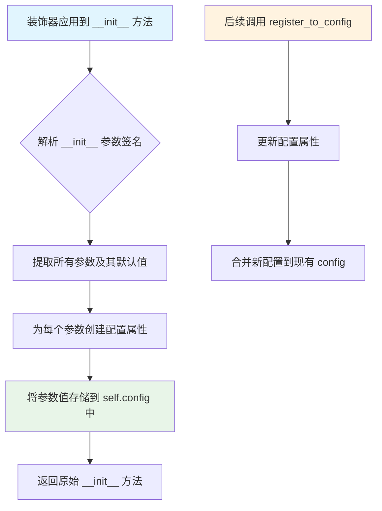
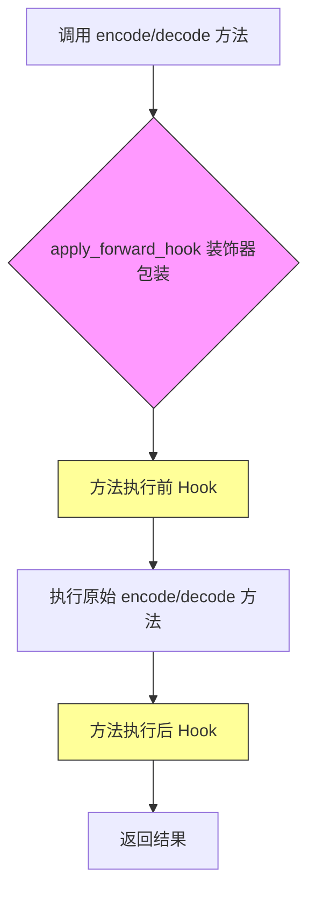
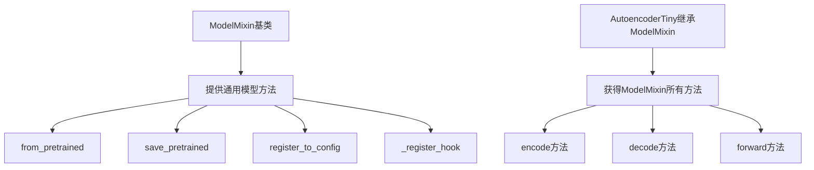
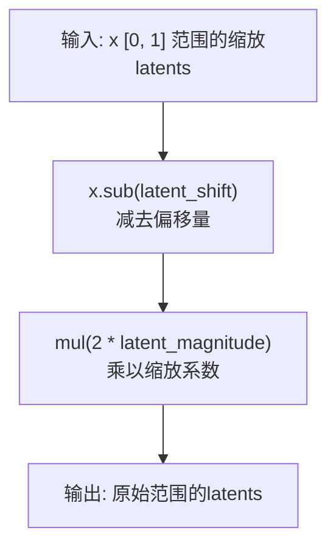
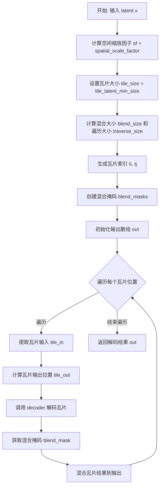

# `diffusers\src\diffusers\models\autoencoders\autoencoder_tiny.py` 详细设计文档

一个微小的蒸馏VAE模型，用于将图像编码到潜在空间并从潜在表示解码图像，基于TAESD实现，支持tiled编码/解码以节省内存。

## 整体流程

```mermaid
graph TD
    A[输入图像] --> B{use_slicing且batch>1?}
    B -- 是 --> C[分割batch]
    B -- 否 --> D{use_tiling?}
    C --> E[对每个slice调用encode]
    D -- 是 --> F[_tiled_encode]
    D -- 否 --> G[直接encoder编码]
    E --> H[拼接结果]
    F --> I[编码结果]
    G --> I
    H --> I
    I --> J[scale_latents: raw->[0,1]]
    J --> K[量化到byte]
    L[反量化: byte->[0,1]] --> M[unscale_latents: [0,1]->raw]
    K --> L
    M --> N{use_slicing且batch>1?}
    N -- 是 --> O[分割batch]
    N -- 否 --> P{use_tiling?}
    O --> Q[对每个slice调用decode]
    P -- 是 --> R[_tiled_decode]
    P -- 否 --> S[直接decoder解码]
    Q --> T[拼接结果]
    R --> U[解码结果]
    S --> U
    T --> U
    U --> V[输出重构图像]
```

## 类结构

```
BaseOutput (抽象基类)
└── AutoencoderTinyOutput (数据类: 编码输出)
ModelMixin (基类)
AutoencoderMixin (混入类)
ConfigMixin (混入类)
└── AutoencoderTiny (主类)
```

## 全局变量及字段


### `encoder_block_out_channels`
    
编码器每个块的输出通道数元组

类型：`tuple[int, ...]`
    


### `decoder_block_out_channels`
    
解码器每个块的输出通道数元组

类型：`tuple[int, ...]`
    


### `act_fn`
    
激活函数类型

类型：`str`
    


### `upsample_fn`
    
上采样函数类型

类型：`str`
    


### `latent_channels`
    
潜在表示的通道数

类型：`int`
    


### `upsampling_scaling_factor`
    
解码器上采样的缩放因子

类型：`int`
    


### `num_encoder_blocks`
    
编码器每个阶段的块数量元组

类型：`tuple[int, ...]`
    


### `num_decoder_blocks`
    
解码器每个阶段的块数量元组

类型：`tuple[int, ...]`
    


### `force_upcast`
    
是否强制使用float32精度

类型：`bool`
    


### `shift_factor`
    
潜在空间的偏移因子

类型：`float`
    


### `AutoencoderTinyOutput.latents`
    
编码后的潜在表示

类型：`torch.Tensor`
    


### `AutoencoderTiny.encoder`
    
编码器网络

类型：`EncoderTiny`
    


### `AutoencoderTiny.decoder`
    
解码器网络

类型：`DecoderTiny`
    


### `AutoencoderTiny.latent_magnitude`
    
潜在表示的幅度

类型：`float`
    


### `AutoencoderTiny.latent_shift`
    
潜在表示的偏移

类型：`float`
    


### `AutoencoderTiny.scaling_factor`
    
潜在空间缩放因子

类型：`float`
    


### `AutoencoderTiny.use_slicing`
    
是否使用切片

类型：`bool`
    


### `AutoencoderTiny.use_tiling`
    
是否使用平铺

类型：`bool`
    


### `AutoencoderTiny.spatial_scale_factor`
    
空间缩放因子

类型：`int`
    


### `AutoencoderTiny.tile_overlap_factor`
    
平铺重叠因子

类型：`float`
    


### `AutoencoderTiny.tile_sample_min_size`
    
最小采样块大小

类型：`int`
    


### `AutoencoderTiny.tile_latent_min_size`
    
最小潜在块大小

类型：`int`
    


### `AutoencoderTiny._supports_gradient_checkpointing`
    
是否支持梯度检查点

类型：`bool`
    
    

## 全局函数及方法


# ConfigMixin.register_to_config 分析

从提供的代码中，我可以分析 `register_to_config` 的使用方式以及它与 `ConfigMixin` 的关系。

### ConfigMixin.register_to_config

`register_to_config` 是一个从 `configuration_utils` 模块导入的装饰器函数，用于自动将类的 `__init__` 方法参数注册为配置属性。在 `AutoencoderTiny` 类中，它被用作 `@register_to_config` 装饰器，应用于 `__init__` 方法。

参数：

-  此函数不接受直接传入的参数，而是通过装饰器方式使用
- 被装饰的 `__init__` 方法的参数（`in_channels`, `out_channels`, `encoder_block_out_channels`, `decoder_block_out_channels`, `act_fn`, `upsample_fn`, `latent_channels`, `upsampling_scaling_factor`, `num_encoder_blocks`, `num_decoder_blocks`, `latent_magnitude`, `latent_shift`, `force_upcast`, `scaling_factor`, `shift_factor`）会自动被注册为配置

返回值：装饰器函数，返回被装饰的函数（通常是 `__init__` 方法）

#### 流程图



#### 带注释源码

```python
# 使用方式示例 - 在 AutoencoderTiny 类中
from ...configuration_utils import ConfigMixin, register_to_config

class AutoencoderTiny(ModelMixin, AutoencoderMixin, ConfigMixin):
    """
    一个用于将图像编码为潜表示并将潜表示解码为图像的微小蒸馏 VAE 模型。
    继承自 ModelMixin、AutoencoderMixin 和 ConfigMixin。
    """
    
    @register_to_config  # 装饰器：自动将 __init__ 参数注册为配置属性
    def __init__(
        self,
        in_channels: int = 3,  # 输入图像的通道数
        out_channels: int = 3,  # 输出图像的通道数
        encoder_block_out_channels: tuple[int, ...] = (64, 64, 64, 64),  # 编码器块的输出通道数
        decoder_block_out_channels: tuple[int, ...] = (64, 64, 64, 64),  # 解码器块的输出通道数
        act_fn: str = "relu",  # 激活函数
        upsample_fn: str = "nearest",  # 上采样函数
        latent_channels: int = 4,  # 潜表示的通道数
        upsampling_scaling_factor: int = 2,  # 上采样的缩放因子
        num_encoder_blocks: tuple[int, ...] = (1, 3, 3, 3),  # 每个阶段的编码器块数量
        num_decoder_blocks: tuple[int, ...] = (3, 3, 3, 1),  # 每个阶段的解码器块数量
        latent_magnitude: int = 3,  # 潜表示的幅度
        latent_shift: float = 0.5,  # 潜表示的偏移
        force_upcast: bool = False,  # 是否强制升精度
        scaling_factor: float = 1.0,  # 缩放因子
        shift_factor: float = 0.0,  # 偏移因子
    ):
        super().__init__()
        # ... 初始化逻辑
        
        # 显式调用 register_to_config 注册额外配置
        self.register_to_config(block_out_channels=decoder_block_out_channels)
        self.register_to_config(force_upcast=False)
```

---

## 补充说明

**注意**：由于 `register_to_config` 的完整定义不在当前代码文件中（它是从 `...configuration_utils` 导入的），上述信息基于：
1. 导入语句 `from ...configuration_utils import ConfigMixin, register_to_config`
2. 使用模式 `@register_to_config` 装饰 `__init__`
3. 后续显式调用 `self.register_to_config(...)`

如需获取 `register_to_config` 的完整实现细节，建议查看 `configuration_utils` 模块的源码。


### `apply_forward_hook`

从 `...utils.accelerate_utils` 模块导入的装饰器函数，用于在模型的前向传播方法（encode/decode）执行前后注入额外的逻辑，如性能监测、梯度计算控制等。

参数：

- `fn`：被装饰的函数（方法），需要是类的方法。

返回值：装饰后的函数，添加了 forward hook 功能的包装函数。

#### 流程图



#### 带注释源码

```python
# apply_forward_hook 是从外部模块导入的装饰器
# 源代码不在当前文件中，以下是基于其用途的推断

# 位置: ...utils.accelerate_utils
# 用途: 装饰在 encode 和 decode 方法上，用于注入前向钩子逻辑

# 使用示例（在当前代码中）:
@apply_forward_hook  # 装饰器应用于 encode 方法
def encode(self, x: torch.Tensor, return_dict: bool = True) -> AutoencoderTinyOutput | tuple[torch.Tensor]:
    # 方法实现...

@apply_forward_hook  # 装饰器应用于 decode 方法
def decode(
    self, x: torch.Tensor, generator: torch.Generator | None = None, return_dict: bool = True
) -> DecoderOutput | tuple[torch.Tensor]:
    # 方法实现...
```

#### 补充说明

由于 `apply_forward_hook` 的实现不在当前代码文件中，以下是从代码中观察到的关键信息：

1. **导入来源**：`from ...utils.accelerate_utils import apply_forward_hook`
2. **使用场景**：装饰 `AutoencoderTiny` 类的 `encode` 和 `decode` 方法
3. **预期功能**：
   - 可能在方法执行前后注入钩子逻辑
   - 可能与 accelerate 库的梯度检查点、混合精度等特性相关
   - 可能用于监控模型执行的性能指标

4. **技术债务/优化空间**：
   - 外部依赖的具体实现未知，可能存在隐藏的复杂度
   - 如果钩子逻辑复杂，可能影响调试和性能


### ModelMixin

ModelMixin是一个基础Mixin类，为所有模型提供通用的下载、保存和加载功能。它是HuggingFace Diffusers库中所有模型类的基类，通过混入(Mixin)方式为子类提供标准化的模型处理接口。

参数：

- 无直接参数（此类为基类，通过继承使用）

返回值：

- 无直接返回值（此类为基类，通过继承为子类提供方法）

#### 流程图



#### 带注释源码

```python
# 注意: ModelMixin类本身不在此代码文件中定义
# 它是从 ..modeling_utils 导入的基类

# 导入语句
from ..modeling_utils import ModelMixin

# AutoencoderTiny类继承ModelMixin
class AutoencoderTiny(ModelMixin, AutoencoderMixin, ConfigMixin):
    """
    一个用于将图像编码到潜在空间并将潜在表示解码回图像的微小蒸馏VAE模型。
    
    该模型继承自ModelMixin。查看父类文档以了解其为所有模型实现的通用方法
    （如下载或保存）。
    """
    
    # ModelMixin提供的功能通过继承获得
    # 以下是AutoencoderTiny中使用到ModelMixin特性的方法：
    
    @register_to_config  # 来自ConfigMixin，通过ModelMixin注册
    def __init__(self, ...):
        """
        初始化方法，使用@register_to_config装饰器
        这会将所有参数注册到模型的配置中
        """
        super().__init__()  # 调用ModelMixin的初始化
    
    @apply_forward_hook  # 来自ModelMixin的钩子机制
    def encode(self, x: torch.Tensor, return_dict: bool = True):
        """编码方法，使用ModelMixin的forward hook机制"""
        ...
    
    @apply_forward_hook  # 来自ModelMixin的钩子机制  
    def decode(self, x: torch.Tensor, ...):
        """解码方法，使用ModelMixin的forward hook机制"""
        ...
    
    def forward(self, sample: torch.Tensor, return_dict: bool = True):
        """
        前向传播方法，整合encode和decode功能
        """
        enc = self.encode(sample).latents
        # ... 缩放和反量化逻辑
        dec = self.decode(unscaled_enc).sample
        ...
```

#### 关键继承方法说明

ModelMixin为AutoencoderTiny提供的主要方法包括：

| 方法名 | 功能描述 |
|--------|----------|
| `from_pretrained()` | 从预训练路径或HuggingFace Hub加载模型 |
| `save_pretrained()` | 保存模型到指定路径 |
| `register_to_config()` | 将__init__参数注册到模型配置 |
| `_register_hook()` | 注册forward钩子 |
| `named_parameters()` | 获取模型参数 |
| `state_dict()` | 获取模型状态字典 |
| `load_state_dict()` | 加载模型状态字典 |

#### 与ModelMixin的交互

AutoencoderTiny通过以下方式与ModelMixin交互：

1. **继承**: `class AutoencoderTiny(ModelMixin, ...)`
2. **调用super()**: 在`__init__`中调用`super().__init__()`
3. **使用装饰器**: `@register_to_config`和`@apply_forward_hook`依赖ModelMixin提供的功能
4. **配置管理**: 通过ConfigMixin和ModelMixin的组合实现配置管理


### AutoencoderTiny.__init__

这是 AutoencoderTiny 类的构造函数，负责初始化一个精简的 VAE（变分自编码器）模型，用于将图像编码为潜在表示并从潜在表示解码回图像。该方法配置编码器和解码器架构、潜在空间参数、切片/平铺策略，并验证输入参数的一致性。

参数：

- `in_channels`：`int`，输入图像的通道数，默认为 3（RGB 图像）
- `out_channels`：`int`，输出图像的通道数，默认为 3
- `encoder_block_out_channels`：`tuple[int, ...]`，编码器每个模块的输出通道数元组，默认为 `(64, 64, 64, 64)`
- `decoder_block_out_channels`：`tuple[int, ...]`，解码器每个模块的输出通道数元组，默认为 `(64, 64, 64, 64)`
- `act_fn`：`str`，激活函数类型，默认为 `"relu"`
- `upsample_fn`：`str`，上采样函数类型，默认为 `"nearest"`
- `latent_channels`：`int`，潜在表示的通道数，默认为 4
- `upsampling_scaling_factor`：`int`，解码器上采样的缩放因子，默认为 2
- `num_encoder_blocks`：`tuple[int, ...]`，编码器每个阶段的模块数量，默认为 `(1, 3, 3, 3)`
- `num_decoder_blocks`：`tuple[int, ...]`，解码器每个阶段的模块数量，默认为 `(3, 3, 3, 1)`
- `latent_magnitude`：`int`，潜在表示的幅度，用于缩放潜在值，默认为 3
- `latent_shift`：`float`，潜在表示的偏移量，用于平移潜在空间，默认为 0.5
- `force_upcast`：`bool`，是否强制使用 float32 精度，默认为 False
- `scaling_factor`：`float`，潜在空间的缩放因子，用于训练时归一化，默认为 1.0
- `shift_factor`：`float`，潜在空间的偏移因子，默认为 0.0

返回值：`None`，构造函数不返回值，仅初始化对象状态

#### 流程图

```mermaid
flowchart TD
    A[开始 __init__] --> B[调用 super().__init__]
    B --> C{验证 encoder_block_out_channels 长度<br/>== num_encoder_blocks 长度}
    C -->|不匹配| D[抛出 ValueError]
    C -->|匹配| E{验证 decoder_block_out_channels 长度<br/>== num_decoder_blocks 长度}
    E -->|不匹配| F[抛出 ValueError]
    E -->|匹配| G[创建 EncoderTiny 实例]
    G --> H[创建 DecoderTiny 实例]
    H --> I[设置实例属性<br/>latent_magnitude, latent_shift, scaling_factor]
    I --> J[初始化切片/平铺标志<br/>use_slicing=False, use_tiling=False]
    J --> K[计算平铺相关参数<br/>spatial_scale_factor, tile_overlap_factor<br/>tile_sample_min_size, tile_latent_min_size]
    K --> L[注册配置到 config<br/>block_out_channels, force_upcast]
    L --> M[结束 __init__]
```

#### 带注释源码

```python
@register_to_config
def __init__(
    self,
    in_channels: int = 3,                              # 输入图像通道数，默认3（RGB）
    out_channels: int = 3,                             # 输出图像通道数，默认3
    encoder_block_out_channels: tuple[int, ...] = (64, 64, 64, 64),  # 编码器各层输出通道
    decoder_block_out_channels: tuple[int, ...] = (64, 64, 64, 64),  # 解码器各层输出通道
    act_fn: str = "relu",                              # 激活函数
    upsample_fn: str = "nearest",                      # 上采样方法
    latent_channels: int = 4,                          # 潜在空间通道数
    upsampling_scaling_factor: int = 2,                # 上采样缩放因子
    num_encoder_blocks: tuple[int, ...] = (1, 3, 3, 3), # 编码器各阶段块数
    num_decoder_blocks: tuple[int, ...] = (3, 3, 3, 1), # 解码器各阶段块数
    latent_magnitude: int = 3,                         # 潜在空间幅度参数
    latent_shift: float = 0.5,                         # 潜在空间偏移参数
    force_upcast: bool = False,                        # 强制使用float32标志
    scaling_factor: float = 1.0,                       # 潜在空间缩放因子
    shift_factor: float = 0.0,                         # 潜在空间偏移因子
):
    # 调用父类初始化方法，完成基础模型初始化
    super().__init__()

    # ==================== 参数验证 ====================
    # 验证编码器配置的一致性：输出通道数必须与块数量匹配
    if len(encoder_block_out_channels) != len(num_encoder_blocks):
        raise ValueError("`encoder_block_out_channels` should have the same length as `num_encoder_blocks`.")
    
    # 验证解码器配置的一致性：输出通道数必须与块数量匹配
    if len(decoder_block_out_channels) != len(num_decoder_blocks):
        raise ValueError("`decoder_block_out_channels` should have the same length as `num_decoder_blocks`.")

    # ==================== 编码器初始化 ====================
    # 创建微型编码器实例，负责将输入图像编码为潜在表示
    self.encoder = EncoderTiny(
        in_channels=in_channels,                  # 输入通道数
        out_channels=latent_channels,             # 输出为潜在空间通道
        num_blocks=num_encoder_blocks,             # 各阶段块数
        block_out_channels=encoder_block_out_channels,  # 各层输出通道
        act_fn=act_fn,                             # 激活函数
    )

    # ==================== 解码器初始化 ====================
    # 创建微型解码器实例，负责将潜在表示解码为图像
    self.decoder = DecoderTiny(
        in_channels=latent_channels,              # 输入为潜在空间通道
        out_channels=out_channels,                 # 输出通道数
        num_blocks=num_decoder_blocks,             # 各阶段块数
        block_out_channels=decoder_block_out_channels,  # 各层输出通道
        upsampling_scaling_factor=upsampling_scaling_factor,  # 上采样因子
        act_fn=act_fn,                             # 激活函数
        upsample_fn=upsample_fn,                   # 上采样方法
    )

    # ==================== 潜在空间参数 ====================
    # 存储潜在空间的缩放和偏移参数，用于归一化潜在表示
    self.latent_magnitude = latent_magnitude       # 潜在幅度，控制潜在值范围
    self.latent_shift = latent_shift               # 潜在偏移，控制潜在空间中心位置
    self.scaling_factor = scaling_factor            # 缩放因子，用于训练时归一化

    # ==================== 切片与平铺配置 ====================
    # VAE切片和平铺选项，用于处理大分辨率图像时的内存优化
    self.use_slicing = False                        # 是否启用切片（默认关闭）
    self.use_tiling = False                         # 是否启用平铺（默认关闭）

    # ==================== 平铺参数计算 ====================
    # 计算平铺相关的参数，用于大图像编码/解码时的内存管理
    # spatial_scale_factor: 编码器输出相对于输入的空间缩放因子
    # 由输出通道数决定（2^out_channels），用于计算潜在空间大小
    self.spatial_scale_factor = 2**out_channels
    
    # tile_overlap_factor: 平铺重叠因子，控制相邻平铺块之间的重叠比例
    self.tile_overlap_factor = 0.125                # 12.5%的重叠
    
    # tile_sample_min_size: 输入图像的最小平铺块大小
    self.tile_sample_min_size = 512                # 512像素
    
    # tile_latent_min_size: 潜在表示的最小平铺块大小
    # 由输入平铺大小除以空间缩放因子得到
    self.tile_latent_min_size = self.tile_sample_min_size // self.spatial_scale_factor

    # ==================== 配置注册 ====================
    # 使用装饰器 @register_to_config 自动将参数注册到配置对象
    # 注意：这里覆盖了 force_upcast 为 False，无论输入值是什么
    self.register_to_config(block_out_channels=decoder_block_out_channels)
    self.register_to_config(force_upcast=False)
```


### `AutoencoderTiny.scale_latents`

将原始的latent表示缩放到[0, 1]范围内，用于将神经网络输出的潜在表示进行标准化处理，使其适合后续的量化存储（如存储为uint8图像）。

参数：

- `x`：`torch.Tensor`，输入的原始latent张量，通常是编码器输出的特征表示

返回值：`torch.Tensor`，缩放后的latent张量，数值范围被限制在[0, 1]之间

#### 流程图

```mermaid
flowchart TD
    A[输入: 原始latents x] --> B[div: x.div&#40;2 \* latent_magnitude&#41;]
    B --> C[add: result.add&#40;latent_shift&#41;]
    C --> D[clamp: result.clamp&#40;0, 1&#41;]
    D --> E[输出: 缩放后的latents<br/>范围 [0, 1]]
    
    B -->|除以2倍<br/>latent_magnitude| B
    C -->|加上偏移量<br/>latent_shift| C
    D -->|限制范围<br/>[0, 1]| D
```

#### 带注释源码

```python
def scale_latents(self, x: torch.Tensor) -> torch.Tensor:
    """raw latents -> [0, 1]
    
    将原始的latent表示缩放到[0, 1]范围内。
    这是自编码器前向传播中的一个处理步骤，用于将latent值标准化。
    
    变换公式: y = clamp(x / (2 * latent_magnitude) + latent_shift, 0, 1)
    
    Args:
        x: 输入的原始latent张量，通常是编码器的输出
        
    Returns:
        缩放后的latent张量，数值范围被限制在[0, 1]之间
    """
    # 步骤1: 除以 2 * latent_magnitude 进行幅度缩放
    #   - latent_magnitude 控制latent值的标准范围
    #   - 乘以2是为了使原范围从 [-latent_magnitude, latent_magnitude] 映射到 [-0.5, 0.5]
    divided = x.div(2 * self.latent_magnitude)
    
    # 步骤2: 加上 latent_shift 进行偏移
    #   - latent_shift 默认为 0.5，用于将范围从 [-0.5, 0.5] 偏移到 [0, 1]
    shifted = divided.add(self.latent_shift)
    
    # 步骤3: clamp 限制输出范围在 [0, 1]
    #   - 确保输出值不会超出有效范围，便于后续量化处理
    return shifted.clamp(0, 1)
```


### `AutoencoderTiny.unscale_latents`

将范围在 [0, 1] 内的缩放后 latent 向量逆向缩放回原始范围，实现与 `scale_latents` 方法相反的转换操作。

参数：

- `x`：`torch.Tensor`，输入的已缩放 latent 张量，值域范围为 [0, 1]

返回值：`torch.Tensor`，逆向缩放后的原始 latent 张量，恢复到原始数值范围

#### 流程图



#### 带注释源码

```python
def unscale_latents(self, x: torch.Tensor) -> torch.Tensor:
    """[0, 1] -> raw latents
    
    将已缩放至 [0, 1] 范围的 latent 向量逆向转换回原始数值范围。
    此操作是 scale_latents 的逆操作。
    
    转换公式: raw = (scaled - latent_shift) * (2 * latent_magnitude)
    
    Args:
        x: 输入的缩放后 latent 张量，值域在 [0, 1] 范围内
        
    Returns:
        逆向缩放后的原始 latent 张量
    """
    # 第一步：减去 latent_shift 偏移量，撤销 scale_latents 中的加法操作
    # 公式: x - latent_shift (latent_shift 默认为 0.5)
    temp = x.sub(self.latent_shift)
    
    # 第二步：乘以 2 倍的 latent_magnitude，撤销 scale_latents 中的除法操作
    # 公式: result * (2 * latent_magnitude) (latent_magnitude 默认为 3.0)
    # 此操作将 [0, 1] 范围映射回 approximately [-3.0, 3.0] 的原始范围
    return temp.mul(2 * self.latent_magnitude)
```


### `AutoencoderTiny._tiled_encode`

该方法实现了一个分块（tiled）编码器，用于将批量图像编码为潜在表示。通过将输入图像分割成重叠的tiles，分别编码后再使用混合掩码平滑合并各tile的输出，从而在保持内存使用恒定的情况下处理任意大小的图像。

参数：

- `x`：`torch.Tensor`，输入的图像批次

返回值：`torch.Tensor`，编码后的图像批次

#### 流程图

```mermaid
flowchart TD
    A[开始] --> B[计算spatial_scale_factor<br/>sf = self.spatial_scale_factor]
    B --> C[获取tile_size<br/>tile_size = self.tile_sample_min_size]
    C --> D[计算blend_size和traverse_size<br/>blend_size = tile_size * overlap_factor<br/>traverse_size = tile_size - blend_size]
    D --> E[生成tile索引范围<br/>ti = range(0, H, traverse_size)<br/>tj = range(0, W, traverse_size)]
    E --> F[创建混合掩码<br/>blend_masks = torch.meshgrid...]
    F --> G[初始化输出张量<br/>out = torch.zeros(batch, 4, H//sf, W//sf)]
    G --> H{遍历 i in ti}
    H -->|是| I{遍历 j in tj}
    I --> J[提取输入tile<br/>tile_in = x[..., i:i+tile_size, j:j+tile_size]]
    J --> K[编码tile<br/>tile = self.encoder(tile_in)]
    K --> L[获取混合掩码<br/>blend_mask = blend_mask_i * blend_mask_j]
    L --> M[混合tile到输出<br/>tile_out = blend_mask * tile + (1-blend_mask) * tile_out]
    M --> I
    I -->|下一列| H
    H -->|下一行| N{遍历结束}
    N --> O[返回编码结果<br/>return out]
```

#### 带注释源码

```python
def _tiled_encode(self, x: torch.Tensor) -> torch.Tensor:
    r"""Encode a batch of images using a tiled encoder.

    当启用此选项时，VAE会将输入张量分割成tiles，以多个步骤计算编码。
    这对于保持内存使用恒定（无论图像大小如何）非常有用。
    为了避免tile伪影，tiles之间有重叠并混合在一起形成平滑输出。

    Args:
        x (`torch.Tensor`): 输入的图像批次。

    Returns:
        `torch.Tensor`: 编码后的图像批次。
    """
    # 编码器输出相对于输入的缩放比例
    # 例如：当out_channels=3时，sf = 2^3 = 8
    sf = self.spatial_scale_factor
    # 样本的tile大小
    tile_size = self.tile_sample_min_size

    # 要混合的像素数量和tile之间的遍历距离
    # blend_size: 重叠区域的大小（用于混合）
    # traverse_size: 相邻tile起始点之间的距离
    blend_size = int(tile_size * self.tile_overlap_factor)
    traverse_size = tile_size - blend_size

    # tile索引（上行/左列）
    # 生成从0到图像尺寸的tile起始位置序列
    ti = range(0, x.shape[-2], traverse_size)
    tj = range(0, x.shape[-1], traverse_size)

    # 用于混合的掩码
    # 创建一个线性渐变的掩码，从边缘到中心从0到1
    blend_masks = torch.stack(
        torch.meshgrid([torch.arange(tile_size / sf) / (blend_size / sf - 1)] * 2, indexing="ij")
    )
    # 将掩码值限制在[0, 1]范围内，并移动到输入设备
    blend_masks = blend_masks.clamp(0, 1).to(x.device)

    # 输出数组
    # 初始化与编码后潜在空间大小相同的零张量
    out = torch.zeros(x.shape[0], 4, x.shape[-2] // sf, x.shape[-1] // sf, device=x.device)
    
    # 双重循环遍历所有tile位置
    for i in ti:
        for j in tj:
            # 从输入中提取当前tile
            tile_in = x[..., i : i + tile_size, j : j + tile_size]
            
            # 对应的输出tile区域
            tile_out = out[..., i // sf : (i + tile_size) // sf, j // sf : (j + tile_size) // sf]
            
            # 使用编码器编码当前tile
            tile = self.encoder(tile_in)
            h, w = tile.shape[-2], tile.shape[-1]
            
            # 将tile结果混合到输出中
            # 边缘tile使用全1掩码（不需要混合），内部tile使用渐变掩码
            blend_mask_i = torch.ones_like(blend_masks[0]) if i == 0 else blend_masks[0]
            blend_mask_j = torch.ones_like(blend_masks[1]) if j == 0 else blend_masks[1]
            # 组合两个维度的掩码
            blend_mask = blend_mask_i * blend_mask_j
            
            # 确保掩码和tile的尺寸匹配（如有需要则裁剪）
            tile, blend_mask = tile[..., :h, :w], blend_mask[..., :h, :w]
            
            # 原地更新输出：将新编码的tile与已存在的输出进行混合
            # 新值 = blend_mask * 新tile + (1 - blend_mask) * 原输出
            tile_out.copy_(blend_mask * tile + (1 - blend_mask) * tile_out)
    
    return out
```


### `AutoencoderTiny._tiled_decode`

使用瓦片（tiling）方式解码批量潜在表示（latent representations）为图像。当启用瓦片选项时，VAE会将输入张量分割成多个重叠的瓦片分别解码，然后混合拼接成完整输出，以保持内存使用恒定，避免大图像解码时的内存爆炸。

参数：

- `x`：`torch.Tensor`，输入的潜在表示张量，形状为 `[batch, latent_channels, latent_height, latent_width]`

返回值：`torch.Tensor`，解码后的批量图像，形状为 `[batch, out_channels, height, width]`

#### 流程图



#### 带注释源码

```python
def _tiled_decode(self, x: torch.Tensor) -> torch.Tensor:
    r"""Encode a batch of images using a tiled encoder.

    When this option is enabled, the VAE will split the input tensor into tiles to compute encoding in several
    steps. This is useful to keep memory use constant regardless of image size. To avoid tiling artifacts, the
    tiles overlap and are blended together to form a smooth output.

    Args:
        x (`torch.Tensor`): Input batch of images.

    Returns:
        `torch.Tensor`: Encoded batch of images.
    """
    # 获取解码器输出相对于输入的空间缩放因子
    # 例如: 2^out_channels, 用于计算输出图像尺寸
    sf = self.spatial_scale_factor
    
    # 设置瓦片的潜在空间大小（解码器处理的最小潜在块）
    tile_size = self.tile_latent_min_size

    # 计算混合区域大小和遍历步长
    # blend_size: 瓦片之间重叠混合的像素数
    # traverse_size: 每个瓦片移动的距离（不含混合区域）
    blend_size = int(tile_size * self.tile_overlap_factor)
    traverse_size = tile_size - blend_size

    # 生成瓦片的行列索引（从左上角开始遍历）
    # ti: 垂直方向瓦片起始位置列表
    # tj: 水平方向瓦片起始位置列表
    ti = range(0, x.shape[-2], traverse_size)
    tj = range(0, x.shape[-1], traverse_size)

    # 创建混合掩码（用于平滑瓦片边缘）
    # 生成从0到1的线性渐变掩码，用于相邻瓦片之间的平滑过渡
    blend_masks = torch.stack(
        torch.meshgrid([torch.arange(tile_size * sf) / (blend_size * sf - 1)] * 2, indexing="ij")
    )
    # 将掩码值限制在[0, 1]范围内，并移动到输入设备
    blend_masks = blend_masks.clamp(0, 1).to(x.device)

    # 初始化输出数组，形状为 [batch, 3, h*sf, w*sf]
    # 输出尺寸 = 输入潜在尺寸 * 空间缩放因子
    out = torch.zeros(x.shape[0], 3, x.shape[-2] * sf, x.shape[-1] * sf, device=x.device)
    
    # 双层循环遍历所有瓦片位置
    for i in ti:
        for j in tj:
            # 提取当前瓦片的潜在输入
            tile_in = x[..., i : i + tile_size, j : j + tile_size]
            
            # 计算瓦片输出在完整输出中的位置（考虑空间缩放因子）
            tile_out = out[..., i * sf : (i + tile_size) * sf, j * sf : (j + tile_size) * sf]
            
            # 使用解码器处理当前瓦片
            tile = self.decoder(tile_in)
            
            # 获取解码后瓦片的实际尺寸
            h, w = tile.shape[-2], tile.shape[-1]
            
            # 边界处理：为边缘瓦片使用全1掩码，避免混合
            blend_mask_i = torch.ones_like(blend_masks[0]) if i == 0 else blend_masks[0]
            blend_mask_j = torch.ones_like(blend_masks[1]) if j == 0 else blend_masks[1]
            
            # 组合行列掩码并裁剪到瓦片尺寸
            blend_mask = (blend_mask_i * blend_mask_j)[..., :h, :w]
            
            # 将解码瓦片混合到输出中：
            # output = blend_mask * new_tile + (1 - blend_mask) * existing_output
            # 中心区域: 更多使用新瓦片; 边缘区域: 逐渐过渡到已有内容
            tile_out.copy_(blend_mask * tile + (1 - blend_mask) * tile_out)
    
    return out
```


### `AutoencoderTiny.encode`

该方法是 `AutoencoderTiny` 类的编码接口，负责将输入图像张量转换为潜在空间表示（latents）。方法支持切片（slicing）和平铺（tiling）两种优化策略来处理不同大小的批量输入，并可根据配置返回字典格式的输出或原始张量元组。

参数：

- `x`：`torch.Tensor`，输入的图像张量，形状为 `(batch_size, channels, height, width)`
- `return_dict`：`bool`，是否返回字典格式的输出，默认为 `True`

返回值：`AutoencoderTinyOutput | tuple[torch.Tensor]`：编码后的潜在表示，当 `return_dict=True` 时返回包含 `latents` 字段的 `AutoencoderTinyOutput` 对象，否则返回包含单个张量的元组

#### 流程图

```mermaid
flowchart TD
    A[开始 encode] --> B{use_slicing 且 batch_size > 1?}
    B -->|是| C[将输入x按batch分割成单个样本]
    B -->|否| D{use_tiling 启用?}
    
    C --> E{use_tiling 启用?}
    E -->|是| F[对每个样本调用 _tiled_encode]
    E -->|否| G[对每个样本调用 encoder]
    F --> H[拼接所有输出]
    G --> H
    
    D -->|是| I[调用 _tiled_encode]
    D -->|否| J[调用 encoder]
    
    H --> K{return_dict?}
    I --> K
    J --> K
    
    K -->|是| L[返回 AutoencoderTinyOutput]
    K -->|否| M[返回 tuple[output]]
    L --> N[结束]
    M --> N
```

#### 带注释源码

```python
@apply_forward_hook
def encode(self, x: torch.Tensor, return_dict: bool = True) -> AutoencoderTinyOutput | tuple[torch.Tensor]:
    """
    编码输入图像为潜在表示。
    
    Args:
        x: 输入图像张量，形状为 (batch_size, channels, height, width)
        return_dict: 是否返回字典格式，默认为 True
    
    Returns:
        编码后的潜在表示，类型取决于 return_dict 参数
    """
    # 检查是否启用切片编码（用于减少内存占用）
    if self.use_slicing and x.shape[0] > 1:
        # 批量大于1时，将输入按batch维度分割成单独样本
        output = [
            # 根据是否启用tiling选择编码方式
            self._tiled_encode(x_slice) if self.use_tiling else self.encoder(x_slice) 
            for x_slice in x.split(1)
        ]
        # 拼接回原始batch维度
        output = torch.cat(output)
    else:
        # 单独样本或未启用slicing时，直接编码
        # 根据是否启用tiling选择 tiled 或普通编码器
        output = self._tiled_encode(x) if self.use_tiling else self.encoder(x)

    # 根据 return_dict 参数决定返回格式
    if not return_dict:
        return (output,)

    # 返回包含 latents 的输出对象
    return AutoencoderTinyOutput(latents=output)
```


### `AutoencoderTiny.decode`

将潜在表示（latent representation）解码为原始图像。支持切片（slicing）和平铺（tiling）两种优化策略以处理大尺寸图像或批量数据。

参数：

- `x`：`torch.Tensor`，输入的潜在表示张量，通常来自编码器的输出
- `generator`：`torch.Generator | None`，随机数生成器（当前版本未使用，保留用于未来扩展）
- `return_dict`：`bool`，是否返回 `DecoderOutput` 对象，默认为 `True`

返回值：`DecoderOutput | tuple[torch.Tensor]`，解码后的图像张量或包含图像的元组

#### 流程图

```mermaid
flowchart TD
    A[开始 decode] --> B{use_slicing 且 batch_size > 1?}
    B -->|是| C[将输入按维度0分割成单个样本]
    B -->|否| D[直接使用完整输入]
    C --> E{use_tiling 启用?}
    D --> E
    E -->|是| F[调用 _tiled_decode 逐tile解码]
    E -->|否| G[调用 decoder 直接解码]
    F --> H[拼接所有tile的输出]
    G --> I[直接使用解码结果]
    H --> J{return_dict?}
    I --> J
    J -->|是| K[封装为 DecoderOutput 对象]
    J -->|否| L[返回元组 (output,)]
    K --> M[结束]
    L --> M
```

#### 带注释源码

```python
@apply_forward_hook
def decode(
    self, x: torch.Tensor, generator: torch.Generator | None = None, return_dict: bool = True
) -> DecoderOutput | tuple[torch.Tensor]:
    # 判断是否需要使用切片策略处理批量数据
    # 启用切片时，会将batch中的每个样本单独处理，以节省显存
    if self.use_slicing and x.shape[0] > 1:
        # 将输入tensor按batch维度分割成单独样本
        output = [
            # 根据是否启用tiling选择不同的解码方法
            self._tiled_decode(x_slice) if self.use_tiling else self.decoder(x_slice) 
            for x_slice in x.split(1)
        ]
        # 将分割后的结果重新拼接成batch
        output = torch.cat(output)
    else:
        # 未启用切片时，直接处理整个batch
        # 根据是否启用tiling选择分块解码或直接解码
        output = self._tiled_decode(x) if self.use_tiling else self.decoder(x)

    # 根据返回参数决定输出格式
    if not return_dict:
        # 返回元组格式，兼容旧API
        return (output,)

    # 返回结构化对象，包含sample属性
    return DecoderOutput(sample=output)
```


### `AutoencoderTiny.forward`

该方法是 AutoencoderTiny 的前向传播接口，接收输入图像样本，先将其编码为潜在表示，对潜在表示进行缩放和量化（模拟存储在 RGBA uint8 图像中的过程），然后解码重建图像。

参数：

- `sample`：`torch.Tensor`，输入样本，即待编码解码的图像张量
- `return_dict`：`bool`，可选，默认为 `True`，是否返回 `DecoderOutput` 而非普通元组

返回值：`DecoderOutput | tuple[torch.Tensor]`，解码后的图像样本，或包含图像张量的元组

#### 流程图

```mermaid
flowchart TD
    A[输入: sample 图像张量] --> B[调用 self.encode 编码图像]
    B --> C[获得 latents 潜在表示]
    C --> D[调用 scale_latents: 将 latents 缩放到 [0, 1] 范围]
    D --> E[乘以 255 并四舍五入转为 byte 类型<br/>模拟存储为 RGBA uint8 图像]
    E --> F[除以 255 并调用 unscale_latents: 解码量化操作]
    F --> G[调用 self.decode 解码潜在表示]
    G --> H{return_dict?}
    H -->|True| I[返回 DecoderOutput 对象]
    H -->|False| J[返回 tuple[torch.Tensor]]
```

#### 带注释源码

```python
def forward(
    self,
    sample: torch.Tensor,
    return_dict: bool = True,
) -> DecoderOutput | tuple[torch.Tensor]:
    r"""
    Args:
        sample (`torch.Tensor`): Input sample.
        return_dict (`bool`, *optional*, defaults to `True`):
            Whether or not to return a [`DecoderOutput`] instead of a plain tuple.
    """
    # Step 1: 将输入样本编码为潜在表示 (latents)
    # Encoder 将输入图像压缩为低维潜在空间表征
    enc = self.encode(sample).latents

    # Step 2: 将潜在表示缩放到 [0, 1] 区间
    # 使用 scale_latents 方法将原始 latents 映射到 [0, 1] 范围
    # 公式: (latents / (2 * latent_magnitude)) + latent_shift，然后 clamp 到 [0, 1]
    scaled_enc = self.scale_latents(enc).mul_(255).round_().byte()

    # Step 3: 模拟量化过程 - 将浮点张量转换为 uint8 字节张量
    # 这相当于将潜在表示存储在 RGBA uint8 图像中
    # mul_(255) 将 [0, 1] 扩展到 [0, 255]
    # round_() 四舍五入到整数
    # .byte() 转换为 8 位无符号整数

    # Step 4: 反量化 - 从 uint8 恢复浮点表示
    # 模拟从 RGBA uint8 图像加载潜在表示的过程
    # 除以 255 恢复到 [0, 1]
    # unscale_latents 将其映射回原始潜在空间范围
    unscaled_enc = self.unscale_latents(scaled_enc / 255.0)

    # Step 5: 将恢复后的潜在表示解码为图像
    # Decoder 将潜在空间表征重建为图像
    dec = self.decode(unscaled_enc).sample

    # Step 6: 根据 return_dict 参数决定返回格式
    if not return_dict:
        return (dec,)
    return DecoderOutput(sample=dec)
```

## 关键组件


### AutoencoderTiny

核心VAE模型类，封装了编码器和解码器，支持分块处理以实现大图像的内存高效处理，并提供缩放/反缩放潜在向量以支持量化存储。

### EncoderTiny

轻量级编码器网络，将输入图像转换为潜在表示，包含多个卷积块，输出通道数由latent_channels参数决定。

### DecoderTiny

轻量级解码器网络，将潜在表示转换回图像，支持上采样操作，输出通道数由out_channels参数决定。

### 缩放与反缩放机制 (scale_latents / unscale_latents)

实现量化支持的关键组件，将潜在向量从原始范围缩放到[0,1]，以及从[0,1]反缩放到原始范围，支持将潜在向量存储为uint8字节张量。

### 分块编码 (_tiled_encode)

实现惰性加载的分块编码方法，将大图像分割为 tiles 进行分块编码，通过重叠和混合避免 tiling artifacts，保持内存使用恒定。

### 分块解码 (_tiled_decode)

实现惰性加载的分块解码方法，将潜在表示分割为 tiles 进行分块解码，通过重叠和混合避免 tiling artifacts，保持内存使用恒定。

### 混合切片与分块策略 (encode / decode 方法)

根据 use_slicing 和 use_tiling 标志动态选择编码/解码策略，支持批量图像的高效处理，可处理单张或批量图像。

### 前向传播量化流程 (forward 方法)

完整的前向传播流程，包含编码、缩放、量化到字节、反量化、反缩放、解码的完整链路，模拟从图像到潜在再到图像的完整过程。

### 分块参数配置

包含 tile_sample_min_size、tile_latent_min_size、tile_overlap_factor、spatial_scale_factor 等参数，用于控制分块大小和重叠比例。

### AutoencoderTinyOutput

输出数据类，包含 latents 字段，封装编码器的潜在表示输出。


## 问题及建议


### 已知问题

-   **`_tiled_decode` 方法的文档字符串错误**：第 195-210 行的 `_tiled_decode` 方法的 docstring 复制了 `_tiled_encode` 的描述，仍然写着 "Encode a batch of images using a tiled encoder"，应该改为 "Decode a batch of images using a tiled decoder"。
-   **`register_to_config` 调用覆盖了传入的配置参数**：在 `__init__` 方法第 149-150 行，连续调用了两次 `register_to_config`，其中 `self.register_to_config(force_upcast=False)` 会无条件将配置中的 `force_upcast` 参数覆盖为 `False`，导致构造函数参数 `force_upcast` 失效，这是一个潜在的 bug。
-   **Tiling 混合掩码计算存在除零风险**：在 `_tiled_encode` 方法第 176 行和 `_tiled_decode` 方法第 211 行，当 `blend_size` 为 1 时，`blend_size / sf - 1` 或 `blend_size * sf - 1` 会导致除零错误。
- **`spatial_scale_factor` 计算逻辑不直观**：第 145 行使用 `2**out_channels` 计算空间缩放因子，但这实际上应该取决于编码器的下采样倍率，使用 `out_channels` 作为指数是不常见且容易产生错误数值（如 3 通道输出时为 8）。
- **混合切片和分块编码时的一致性问题**：在 `encode` 方法中，当 `use_slicing` 为 True 且 `use_tiling` 为 True 时，对每个 slice 分别调用 `_tiled_encode`，但混合掩码是基于完整图像尺寸生成的，可能导致边缘处理不一致。

### 优化建议

-   **修复 docstring**：更正 `_tiled_decode` 方法的文档字符串以反映其实际功能。
-   **修复配置注册逻辑**：移除重复的 `register_to_config` 调用，或确保正确保留传入的配置参数值。
-   **添加除零保护**：在计算混合掩码之前，添加对 `blend_size` 的有效性检查，确保其大于 1。
-   **重构空间缩放因子计算**：将 `spatial_scale_factor` 改为基于编码器的实际下采样倍率计算（例如基于 `encoder_block_out_channels` 的总下采样），或添加明确的注释解释当前计算的依据。
-   **统一 Tiling 和 Slicing 的掩码生成**：当同时使用 slicing 和 tiling 时，应为每个 slice 单独生成混合掩码，或在文档中明确说明这种组合场景的行为。
-   **添加参数验证**：在构造函数中增加对 `upsampling_scaling_factor`、`latent_magnitude` 等关键参数的合法性检查（如正值验证）。

## 其它


### 设计目标与约束

设计目标：提供一个轻量级、经过蒸馏的VAE模型，用于在潜在扩散模型中实现高效的图像编码（encode）和解码（decode），特别适用于资源受限的场景。核心目标是在保持足够图像质量的同时大幅减少模型参数量和计算开销。

设计约束：
- 参数量限制：模型设计为Tiny版本，encoder和decoder block输出通道数较低（默认64通道）
- 内存约束：支持tiling机制以处理高分辨率图像，同时保持内存使用稳定
- 精度约束：默认使用float32（force_upcast=True），但在低分辨率场景下可接受较低精度
- 通道数约束：latent_channels固定为4，与标准SD潜在空间兼容

### 错误处理与异常设计

参数验证错误：
- `encoder_block_out_channels`长度必须等于`num_encoder_blocks`长度，否则抛出`ValueError`
- `decoder_block_out_channels`长度必须等于`num_decoder_blocks`长度，否则抛出`ValueError`

输入验证：
- `encode`方法接受任意形状的torch.Tensor，但内部tiling逻辑假设最后两个维度为H和W
- `decode`方法同样假设输入最后两个维度为潜在空间的H和W
- 不符合预期形状的输入可能导致计算错误或内存问题

异常传播：
- 底层encoder/decoder的异常会直接向上传播
- CUDA内存不足时抛出torch.cuda.OutOfMemoryError

### 数据流与状态机

编码流程（encode）：
1. 输入图像x（shape: [B, C, H, W]）
2. 判断是否启用slicing（use_slicing=True且batch>1）：将batch分割为单个样本
3. 判断是否启用tiling（use_tiling=True）：
   - 是：调用`_tiled_encode`进行分块编码，最终合并
   - 否：直接调用encoder进行全局编码
4. 返回`AutoencoderTinyOutput(latents=encoded)`

解码流程（decode）：
1. 输入潜在向量x（shape: [B, 4, H, W]）
2. 判断是否启用slicing（use_slicing=True且batch>1）
3. 判断是否启用tiling（use_tiling=True）：
   - 是：调用`_tiled_decode`进行分块解码，最终合并
   - 否：直接调用decoder进行全局解码
4. 返回`DecoderOutput(sample=decoded)`

前向传播流程（forward）：
1. 调用encode得到latents
2. 调用scale_latents将latents缩放到[0,1]
3. 量化到uint8（模拟存储为RGBA图像）
4. 反量化并调用unscale_latents恢复原始范围
5. 调用decode得到最终图像

Tiling状态机：
- 状态：use_tiling（是否启用分块）、use_slicing（是否启用切片）
- 默认：use_tiling=False, use_slicing=False
- 可通过设置self.use_tiling和self.use_slicing动态切换

### 外部依赖与接口契约

核心依赖：
- `torch`：张量计算框架
- `dataclasses.dataclass`：输出数据结构
- `configuration_utils.ConfigMixin`：配置混入基类
- `configuration_utils.register_to_config`：配置注册装饰器
- `utils.BaseOutput`：输出基类
- `utils.accelerate_utils.apply_forward_hook`：前向钩子装饰器
- `modeling_utils.ModelMixin`：模型混入基类
- `.vae.AutoencoderMixin`：VAE混入基类
- `.vae.DecoderOutput`：解码器输出类
- `.vae.EncoderTiny`：编码器实现（内部类）
- `.vae.DecoderTiny`：解码器实现（内部类）

接口契约：
- `encode(x: torch.Tensor, return_dict: bool = True)`：返回`AutoencoderTinyOutput`或tuple
- `decode(x: torch.Tensor, generator: torch.Generator = None, return_dict: bool = True)`：返回`DecoderOutput`或tuple
- `forward(sample: torch.Tensor, return_dict: bool = True)`：返回`DecoderOutput`或tuple
- `scale_latents(x: torch.Tensor) -> torch.Tensor`：latent缩放[raw -> 0,1]
- `unscale_latents(x: torch.Tensor) -> torch.Tensor`：latent缩放[0,1 -> raw]

配置参数接口：
- 所有`__init__`参数均可通过配置文件加载
- 配置通过`register_to_config`装饰器自动注册
- 支持`from_pretrained`方式加载预训练权重

### 性能考虑

内存优化：
- tiling机制：将大图像分块处理，保持内存使用恒定
- slicing机制：batch较大时分批处理，避免内存峰值
- 潜在空间缩放：使用int8存储减少内存占用

计算优化：
- 支持梯度检查点（`_supports_gradient_checkpointing = True`）
- encoder/decoder使用轻量级block设计
- 可选的upsample_fn（默认nearest，可选bilinear）

性能指标：
- 编码器输出相对于输入的空间缩放因子：spatial_scale_factor = 2^out_channels
- 默认tile大小：512像素（可配置tile_sample_min_size）
- tile重叠因子：0.125（12.5%重叠用于平滑）

### 安全性考虑

输入验证：
- 未对输入tensor的dtype进行严格检查，可能接受非预期类型
- 未对NaN/Inf值进行检测，可能导致训练不稳定

模型安全：
- 模型权重来源于预训练，需要验证来源可靠性
- 支持在推理时强制upcast到float32以保证数值稳定性

### 配置管理

配置来源：
- 通过`@register_to_config`装饰器将`__init__`参数自动注册为配置
- 支持从配置文件（config.json）加载
- 支持通过`from_pretrained`加载完整权重和配置

默认配置值：
- in_channels=3, out_channels=3
- encoder_block_out_channels=(64,64,64,64)
- decoder_block_out_channels=(64,64,64,64)
- latent_channels=4
- act_fn="relu"
- latent_magnitude=3.0, latent_shift=0.5
- scaling_factor=1.0, shift_factor=0.0
- force_upcast=False

配置动态修改：
- tile相关参数（tile_sample_min_size, tile_latent_min_size等）可在实例化后修改
- use_tiling和use_slicing可在运行时动态切换

### 兼容性考虑

潜在空间兼容性：
- latent_channels=4，与标准Stable Diffusion潜在空间兼容
- scaling_factor默认为1.0，与不使用潜在空间缩放的训练方式兼容
- latent_magnitude和latent_shift参数用于对齐原始TAESD实现

Diffusers框架兼容性：
- 继承自ModelMixin、AutoencoderMixin、ConfigMixin
- 支持Diffusers标准的save/load机制
- 与Pipeline组件无缝集成

版本兼容性：
- 代码注释表明版权归属Ollin Boer Bohan和HuggingFace Team（2025年）
- 需要torch库支持
- 配置系统依赖diffusers库的版本

### 使用示例

基本用法：
```python
from diffusers import AutoencoderTiny
import torch

# 初始化模型
vae = AutoencoderTiny()

# 编码图像到潜在空间
image = torch.randn(1, 3, 512, 512)
with torch.no_grad():
    latent = vae.encode(image).latents

# 从潜在空间解码图像
with torch.no_grad():
    reconstructed = vae.decode(latent).sample
```

Tiling模式（处理高分辨率图像）：
```python
vae.use_tiling = True
vae.tile_sample_min_size = 512
image = torch.randn(1, 3, 2048, 2048)
with torch.no_grad():
    latent = vae.encode(image).latents
```

从预训练加载：
```python
from diffusers import AutoencoderTiny
vae = AutoencoderTiny.from_pretrained("madebyollin/taesd")
```

### 测试考虑

单元测试：
- 参数验证测试：测试不同encoder/decoder block配置组合
- 形状一致性测试：验证encode/decode输入输出形状正确性
- tiling功能测试：验证tiling模式下的输出与全局模式一致

集成测试：
- Pipeline集成测试：与Diffusers Pipeline完整流程测试
- 精度测试：对比输出质量是否符合预期
- 内存测试：验证tiling模式下的内存使用

回归测试：
- 潜在空间范围测试：验证scale_latents/unscale_latents的往返一致性
- 量化测试：验证forward中的量化/反量化流程

### 已知限制

功能限制：
- 不支持VAE编码器部分的生成器（generator参数在decode中未使用）
- 不支持潜在空间的高斯分布采样（无noise参数）
- 量化/反量化流程仅用于模拟存储，实际推理不使用

精度限制：
- 默认force_upcast=False，在某些高精度要求的场景可能需要手动设置为True
- 使用int8量化可能导致轻微的精度损失
- tiling模式下的tile边界可能存在轻微的接缝 artifacts

使用限制：
- 输入图像尺寸必须是tile_size的整数倍（考虑overlap）
- tiling模式仅支持2D图像（不支持3D或视频）
- 未提供训练接口，仅支持推理

架构限制：
- encoder和decoder的block数量必须匹配（stage数量一致）
- 无法单独使用encoder或decoder（虽然有独立属性）

    