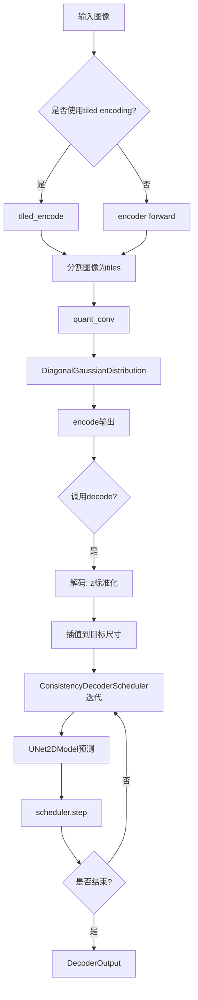
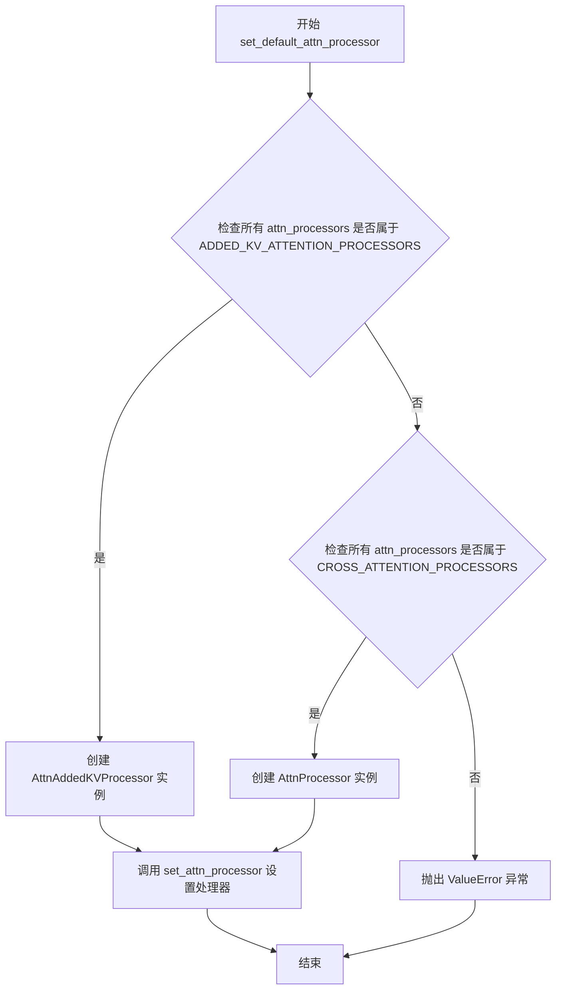
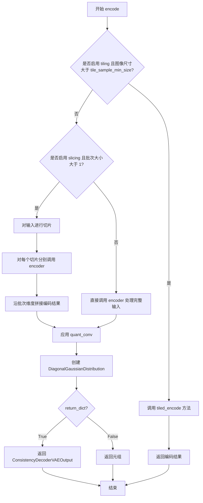
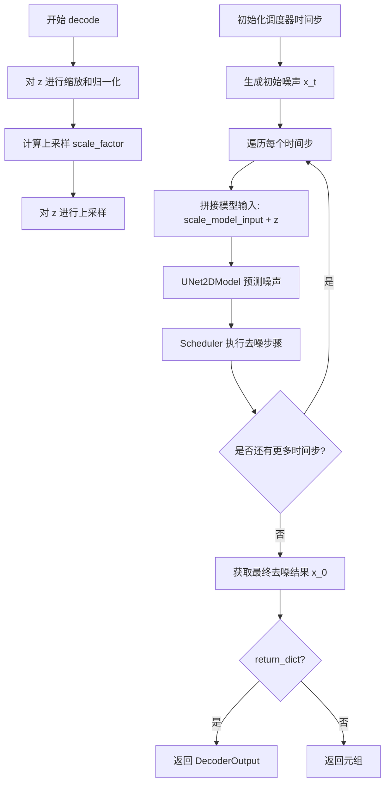
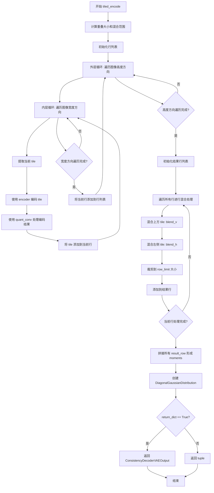

# `diffusers\src\diffusers\models\autoencoders\consistency_decoder_vae.py` 详细设计文档

ConsistencyDecoderVAE是一个用于DALL-E 3的变分自编码器模型，包含编码器(Encoder)和基于UNet2D的解码器(decoder_unet)，支持 tiled encoding 和 slicing 优化，可将图像编码为潜在表示并从潜在表示解码回图像。

## 整体流程



## 类结构

```
BaseOutput (utils)
├── ConsistencyDecoderVAEOutput (dataclass)
├── ModelMixin (modeling_utils)
├── AttentionMixin (attention)
├── AutoencoderMixin (vae)
├── ConfigMixin (configuration_utils)
└── ConsistencyDecoderVAE (主类)
    ├── Encoder (子模块)
    ├── UNet2DModel (decoder_unet)
    ├── ConsistencyDecoderScheduler
    ├── DiagonalGaussianDistribution (vae)
```

## 全局变量及字段


### `_supports_group_offloading`
    
Class attribute indicating whether group offloading is supported; set to False for this model.

类型：`bool`
    


### `ConsistencyDecoderVAE.encoder`
    
The encoder network that converts input images into latent representations.

类型：`Encoder`
    


### `ConsistencyDecoderVAE.decoder_unet`
    
The 2D UNet model used as the decoder for generating images from latents.

类型：`UNet2DModel`
    


### `ConsistencyDecoderVAE.decoder_scheduler`
    
The scheduler for the consistency decoder that manages denoising timesteps during decoding.

类型：`ConsistencyDecoderScheduler`
    


### `ConsistencyDecoderVAE.quant_conv`
    
1x1 convolution layer for processing latent moments (mean and logvar) into distribution parameters.

类型：`nn.Conv2d`
    


### `ConsistencyDecoderVAE.means`
    
Pre-computed mean values for latent normalization, registered as a non-persistent buffer.

类型：`torch.Tensor (buffer)`
    


### `ConsistencyDecoderVAE.stds`
    
Pre-computed standard deviation values for latent normalization, registered as a non-persistent buffer.

类型：`torch.Tensor (buffer)`
    


### `ConsistencyDecoderVAE.use_slicing`
    
Flag to enable slicing technique for encoding large batches of images to save memory.

类型：`bool`
    


### `ConsistencyDecoderVAE.use_tiling`
    
Flag to enable tiling technique for encoding/decoding large images to save memory.

类型：`bool`
    


### `ConsistencyDecoderVAE.tile_sample_min_size`
    
Minimum tile size for VAE tiling, used when processing large images in overlapping tiles.

类型：`int`
    


### `ConsistencyDecoderVAE.tile_latent_min_size`
    
Minimum tile size in latent space, derived from sample size and encoder block out channels.

类型：`int`
    


### `ConsistencyDecoderVAE.tile_overlap_factor`
    
Overlap factor between adjacent tiles (0.25 means 25% overlap) for smooth blending.

类型：`float`
    


### `ConsistencyDecoderVAEOutput.latent_dist`
    
The encoded latent distribution represented as mean and logvar of a diagonal Gaussian.

类型：`DiagonalGaussianDistribution`
    
    

## 全局函数及方法


### ConsistencyDecoderVAE.__init__

这是ConsistencyDecoderVAE类的初始化方法，负责构建用于DALL-E 3的一致性解码器VAE模型。该方法配置并初始化编码器、UNet2D解码器、解码器调度器、量化卷积层以及相关的缓冲区和技术标志。

参数：

- `scaling_factor`：`float`，默认为0.18215，用于缩放潜在表示的缩放因子
- `latent_channels`：`int`，默认为4，潜在空间的通道数
- `sample_size`：`int`，默认为32，输入图像的样本大小
- `encoder_act_fn`：`str`，默认为"silu"，编码器激活函数
- `encoder_block_out_channels`：`tuple[int, ...]`，默认为(128, 256, 512, 512)，编码器块输出通道数
- `encoder_double_z`：`bool`，默认为True，编码器是否输出双通道（均值和方差）
- `encoder_down_block_types`：`tuple[str, ...]`，编码器下采样块类型
- `encoder_in_channels`：`int`，默认为3，编码器输入通道数
- `encoder_layers_per_block`：`int`，默认为2，每个编码器块的层数
- `encoder_norm_num_groups`：`int`，默认为32，编码器归一化组数
- `encoder_out_channels`：`int`，默认为4，编码器输出通道数
- `decoder_add_attention`：`bool`，默认为False，解码器是否添加注意力机制
- `decoder_block_out_channels`：`tuple[int, ...]`，默认为(320, 640, 1024, 1024)，解码器块输出通道数
- `decoder_down_block_types`：`tuple[str, ...]`，解码器下采样块类型
- `decoder_downsample_padding`：`int`，默认为1，解码器下采样填充
- `decoder_in_channels`：`int`，默认为7，解码器输入通道数
- `decoder_layers_per_block`：`int`，默认为3，每个解码器块的层数
- `decoder_norm_eps`：`float`，默认为1e-05，解码器归一化epsilon值
- `decoder_norm_num_groups`：`int`，默认为32，解码器归一化组数
- `decoder_num_train_timesteps`：`int`，默认为1024，解码器训练时间步数
- `decoder_out_channels`：`int`，默认为6，解码器输出通道数
- `decoder_resnet_time_scale_shift`：`str`，默认为"scale_shift"，ResNet时间尺度偏移方式
- `decoder_time_embedding_type`：`str`，默认为"learned"，解码器时间嵌入类型
- `decoder_up_block_types`：`tuple[str, ...]`，解码器上采样块类型

返回值：`None`，初始化方法不返回值

#### 流程图

```mermaid
flowchart TD
    A[开始 __init__] --> B[调用 super().__init__]
    B --> C[创建 Encoder 对象]
    C --> D[创建 UNet2DModel 对象作为 decoder_unet]
    D --> E[创建 ConsistencyDecoderScheduler 对象]
    E --> F[注册配置: block_out_channels 和 force_upcast]
    F --> G[注册 means 缓冲区]
    G --> H[注册 stds 缓冲区]
    H --> I[创建 quant_conv 卷积层]
    I --> J[初始化 use_slicing 和 use_tiling 为 False]
    J --> K[计算 tile_sample_min_size]
    K --> L[计算 tile_latent_min_size]
    L --> M[设置 tile_overlap_factor]
    M --> N[结束 __init__]
```

#### 带注释源码

```python
@register_to_config
def __init__(
    self,
    scaling_factor: float = 0.18215,  # 潜在表示的缩放因子
    latent_channels: int = 4,  # 潜在空间的通道数
    sample_size: int = 32,  # 输入图像的样本大小
    encoder_act_fn: str = "silu",  # 编码器激活函数
    encoder_block_out_channels: tuple[int, ...] = (128, 256, 512, 512),  # 编码器块输出通道
    encoder_double_z: bool = True,  # 是否输出双通道用于VAE
    encoder_down_block_types: tuple[str, ...] = (  # 编码器下采样块类型
        "DownEncoderBlock2D",
        "DownEncoderBlock2D",
        "DownEncoderBlock2D",
        "DownEncoderBlock2D",
    ),
    encoder_in_channels: int = 3,  # 编码器输入通道数（RGB图像）
    encoder_layers_per_block: int = 2,  # 每个块的层数
    encoder_norm_num_groups: int = 32,  # 归一化组数
    encoder_out_channels: int = 4,  # 编码器输出通道数
    decoder_add_attention: bool = False,  # 解码器是否使用注意力
    decoder_block_out_channels: tuple[int, ...] = (320, 640, 1024, 1024),  # 解码器块输出通道
    decoder_down_block_types: tuple[str, ...] = (  # 解码器下采样块类型
        "ResnetDownsampleBlock2D",
        "ResnetDownsampleBlock2D",
        "ResnetDownsampleBlock2D",
        "ResnetDownsampleBlock2D",
    ),
    decoder_downsample_padding: int = 1,  # 下采样填充
    decoder_in_channels: int = 7,  # 解码器输入通道数
    decoder_layers_per_block: int = 3,  # 每个解码器块的层数
    decoder_norm_eps: float = 1e-05,  # 归一化epsilon
    decoder_norm_num_groups: int = 32,  # 归一化组数
    decoder_num_train_timesteps: int = 1024,  # 训练时间步数
    decoder_out_channels: int = 6,  # 解码器输出通道数
    decoder_resnet_time_scale_shift: str = "scale_shift",  # 时间尺度偏移方式
    decoder_time_embedding_type: str = "learned",  # 时间嵌入类型
    decoder_up_block_types: tuple[str, ...] = (  # 解码器上采样块类型
        "ResnetUpsampleBlock2D",
        "ResnetUpsampleBlock2D",
        "ResnetUpsampleBlock2D",
        "ResnetUpsampleBlock2D",
    ),
):
    # 调用父类的初始化方法
    super().__init__()
    
    # 初始化编码器：将输入图像编码为潜在表示
    self.encoder = Encoder(
        act_fn=encoder_act_fn,
        block_out_channels=encoder_block_out_channels,
        double_z=encoder_double_z,
        down_block_types=encoder_down_block_types,
        in_channels=encoder_in_channels,
        layers_per_block=encoder_layers_per_block,
        norm_num_groups=encoder_norm_num_groups,
        out_channels=encoder_out_channels,
    )

    # 初始化UNet2D模型作为解码器：用于从潜在表示重建图像
    self.decoder_unet = UNet2DModel(
        add_attention=decoder_add_attention,
        block_out_channels=decoder_block_out_channels,
        down_block_types=decoder_down_block_types,
        downsample_padding=decoder_downsample_padding,
        in_channels=decoder_in_channels,
        layers_per_block=decoder_layers_per_block,
        norm_eps=decoder_norm_eps,
        norm_num_groups=decoder_norm_num_groups,
        num_train_timesteps=decoder_num_train_timesteps,
        out_channels=decoder_out_channels,
        resnet_time_scale_shift=decoder_resnet_time_scale_shift,
        time_embedding_type=decoder_time_embedding_type,
        up_block_types=decoder_up_block_types,
    )
    
    # 初始化解码器调度器：用于一致性解码的噪声调度
    self.decoder_scheduler = ConsistencyDecoderScheduler()
    
    # 注册配置参数到config中
    self.register_to_config(block_out_channels=encoder_block_out_channels)
    self.register_to_config(force_upcast=False)
    
    # 注册均值缓冲区：用于潜在空间的归一化
    self.register_buffer(
        "means",
        torch.tensor([0.38862467, 0.02253063, 0.07381133, -0.0171294])[None, :, None, None],
        persistent=False,  # 不保存到state_dict
    )
    
    # 注册标准差缓冲区：用于潜在空间的归一化
    self.register_buffer(
        "stds", torch.tensor([0.9654121, 1.0440036, 0.76147926, 0.77022034])[None, :, None, None], 
        persistent=False
    )

    # 初始化量化卷积层：用于处理潜在表示的均值和方差
    self.quant_conv = nn.Conv2d(2 * latent_channels, 2 * latent_channels, 1)

    # 初始化切片和平铺标志：用于大图像处理
    self.use_slicing = False  # 是否启用切片编码
    self.use_tiling = False   # 是否启用平铺编码

    # 设置平铺最小样本大小
    self.tile_sample_min_size = self.config.sample_size
    sample_size = (
        self.config.sample_size[0]
        if isinstance(self.config.sample_size, (list, tuple))
        else self.config.sample_size
    )
    
    # 计算潜在空间的最小平铺大小
    self.tile_latent_min_size = int(sample_size / (2 ** (len(self.config.block_out_channels) - 1)))
    
    # 设置平铺重叠因子
    self.tile_overlap_factor = 0.25
```


### ConsistencyDecoderVAE.set_default_attn_processor

禁用自定义注意力处理器并设置默认注意力实现。该方法检查当前注意力处理器的类型，如果全部为 ADDED_KV_ATTENTION_PROCESSORS 类型则使用 AttnAddedKVProcessor，如果全部为 CROSS_ATTENTION_PROCESSORS 类型则使用 AttnProcessor，否则抛出 ValueError。

参数： 无

返回值： `None`，无返回值描述

#### 流程图



#### 带注释源码

```python
def set_default_attn_processor(self):
    """
    Disables custom attention processors and sets the default attention implementation.
    """
    # 检查所有注意力处理器是否都属于 ADDED_KV_ATTENTION_PROCESSORS 类型
    if all(proc.__class__ in ADDED_KV_ATTENTION_PROCESSORS for proc in self.attn_processors.values()):
        # 如果是，则创建 AttnAddedKVProcessor 实例
        processor = AttnAddedKVProcessor()
    # 检查所有注意力处理器是否都属于 CROSS_ATTENTION_PROCESSORS 类型
    elif all(proc.__class__ in CROSS_ATTENTION_PROCESSORS for proc in self.attn_processors.values()):
        # 如果是，则创建 AttnProcessor 实例
        processor = AttnProcessor()
    # 如果处理器类型不匹配上述两种情况
    else:
        # 抛出 ValueError 异常，表示无法设置默认注意力处理器
        raise ValueError(
            f"Cannot call `set_default_attn_processor` when attention processors are of type {next(iter(self.attn_processors.values()))}"
        )

    # 调用 set_attn_processor 方法将选定的处理器应用到模型
    self.set_attn_processor(processor)
```


### ConsistencyDecoderVAE.encode

该方法实现了 Consistency Decoder VAE 的编码功能，将输入的图像批次转换为潜在空间表示。它首先检查是否启用瓦片（tiling）或切片（slicing）优化，然后通过编码器提取特征，接着使用量化卷积层处理，最后将结果封装为对角高斯分布返回。

参数：

- `self`： ConsistencyDecoderVAE 实例本身
- `x`：`torch.Tensor`，输入的图像批次，形状为 (batch_size, channels, height, width)
- `return_dict`：`bool`，可选参数，默认为 `True`，决定是否返回 ConsistencyDecoderVAEOutput 对象而不是元组

返回值：`ConsistencyDecoderVAEOutput | tuple[DiagonalGaussianDistribution]`，编码后的潜在表示。如果 return_dict 为 True，返回 ConsistencyDecoderVAEOutput 对象（包含 latent_dist 属性）；否则返回元组 (posterior,)

#### 流程图



#### 带注释源码

```python
@apply_forward_hook
def encode(
    self, x: torch.Tensor, return_dict: bool = True
) -> ConsistencyDecoderVAEOutput | tuple[DiagonalGaussianDistribution]:
    """
    Encode a batch of images into latents.

    Args:
        x (`torch.Tensor`): Input batch of images.
        return_dict (`bool`, *optional*, defaults to `True`):
            Whether to return a [`~models.autoencoders.consistency_decoder_vae.ConsistencyDecoderVAEOutput`]
            instead of a plain tuple.

    Returns:
            The latent representations of the encoded images. If `return_dict` is True, a
            [`~models.autoencoders.consistency_decoder_vae.ConsistencyDecoderVAEOutput`] is returned, otherwise a
            plain `tuple` is returned.
    """
    # 检查是否启用瓦片编码且输入图像尺寸超过限制
    # 如果启用瓦片处理，则调用 tiled_encode 方法进行分块编码
    if self.use_tiling and (x.shape[-1] > self.tile_sample_min_size or x.shape[-2] > self.tile_sample_min_size):
        return self.tiled_encode(x, return_dict=return_dict)

    # 检查是否启用切片处理且批次大小大于1
    # 如果启用，则将输入沿批次维度切分为单个样本分别编码，以节省内存
    if self.use_slicing and x.shape[0] > 1:
        # 使用 split(1) 将批次分割为单独的样本
        encoded_slices = [self.encoder(x_slice) for x_slice in x.split(1)]
        # 编码完成后沿批次维度拼接结果
        h = torch.cat(encoded_slices)
    else:
        # 不启用切片时，直接对整个批次进行编码
        h = self.encoder(x)

    # 对编码器的输出应用量化卷积层
    # quant_conv 将特征维度从 2*latent_channels 映射到 2*latent_channels
    # 输出包含均值和 log 方差（用于构建高斯分布）
    moments = self.quant_conv(h)

    # 使用 DiagonalGaussianDistribution 表示潜在空间的概率分布
    # 该分布允许从编码结果中采样潜在向量
    posterior = DiagonalGaussianDistribution(moments)

    # 根据 return_dict 参数决定返回格式
    if not return_dict:
        # 返回元组格式（兼容旧版 API）
        return (posterior,)

    # 返回包含潜在分布的输出对象
    return ConsistencyDecoderVAEOutput(latent_dist=posterior)
```


### `ConsistencyDecoderVAE.decode`

该方法是 ConsistencyDecoderVAE 类的解码方法，用于将输入的潜在向量 `z` 通过一致性解码器 VAE 模型解码为图像。它使用预训练的 UNet2DModel 和 ConsistencyDecoderScheduler 进行迭代去噪处理，将潜在空间中的向量逐步恢复为图像空间。

参数：

- `self`：`ConsistencyDecoderVAE`，解码器实例本身
- `z`：`torch.Tensor`，输入的潜在向量
- `generator`：`torch.Generator | None`，随机数生成器，默认为 None
- `return_dict`：`bool`，是否以字典形式返回输出，默认为 True
- `num_inference_steps`：`int`，推理步数，默认为 2

返回值：`DecoderOutput | tuple[torch.Tensor]`，如果 return_dict 为 True，返回 DecoderOutput 对象，否则返回包含解码图像的元组

#### 流程图



#### 带注释源码

```python
@apply_forward_hook
def decode(
    self,
    z: torch.Tensor,
    generator: torch.Generator | None = None,
    return_dict: bool = True,
    num_inference_steps: int = 2,
) -> DecoderOutput | tuple[torch.Tensor]:
    """
    使用一致性解码器 VAE 模型解码输入潜在向量 z。

    参数:
        z (torch.Tensor): 输入潜在向量
        generator (torch.Generator | None): 随机数生成器，默认为 None
        return_dict (bool): 是否以字典形式返回输出，默认为 True
        num_inference_steps (int): 推理步数，默认为 2

    返回:
        DecoderOutput | tuple[torch.Tensor]: 解码后的输出
    """
    # 步骤1: 对潜在向量进行缩放和归一化
    # 使用配置中的缩放因子、均值和标准差对潜在向量进行处理
    # 公式: (z * scaling_factor - means) / stds
    z = (z * self.config.scaling_factor - self.means) / self.stds

    # 步骤2: 计算上采样因子
    # 根据编码器块输出通道数量计算上采样倍数
    # 2^(len(block_out_channels) - 1)
    scale_factor = 2 ** (len(self.config.block_out_channels) - 1)

    # 步骤3: 对潜在向量进行上采样
    # 使用最近邻插值将潜在向量放大到目标尺寸
    z = F.interpolate(z, mode="nearest", scale_factor=scale_factor)

    # 步骤4: 获取批次大小和潜在向量尺寸
    batch_size, _, height, width = z.shape

    # 步骤5: 设置调度器的时间步
    # 根据推理步数配置一致性解码器调度器
    self.decoder_scheduler.set_timesteps(num_inference_steps, device=self.device)

    # 步骤6: 生成初始噪声
    # 使用调度器的初始噪声标准差生成随机噪声
    # 噪声形状: (batch_size, 3, height, width) - 3通道 RGB 图像
    x_t = self.decoder_scheduler.init_noise_sigma * randn_tensor(
        (batch_size, 3, height, width), generator=generator, dtype=z.dtype, device=z.device
    )

    # 步骤7: 迭代去噪过程
    # 遍历调度器生成的每个时间步
    for t in self.decoder_scheduler.timesteps:
        # 7.1: 准备模型输入
        # 将缩放后的噪声与潜在向量在通道维度上拼接
        # model_input 形状: (batch_size, 7, height, width)
        # 前3通道是缩放后的噪声，后4通道是潜在向量
        model_input = torch.concat([self.decoder_scheduler.scale_model_input(x_t, t), z], dim=1)

        # 7.2: 使用 UNet2DModel 预测噪声
        # UNet 接受拼接后的输入和当前时间步，输出预测的噪声
        # 只取前3个通道作为预测的噪声（忽略潜在向量部分）
        model_output = self.decoder_unet(model_input, t).sample[:, :3, :, :]

        # 7.3: 执行调度器去噪步骤
        # 根据预测的噪声和当前状态计算去噪后的样本
        prev_sample = self.decoder_scheduler.step(model_output, t, x_t, generator).prev_sample

        # 7.4: 更新当前样本为去噪后的样本
        x_t = prev_sample

    # 步骤8: 获取最终去噪结果
    # 去噪完成后，x_t 即为重建的图像
    x_0 = x_t

    # 步骤9: 返回结果
    if not return_dict:
        return (x_0,)

    return DecoderOutput(sample=x_0)
```


### `ConsistencyDecoderVAE.tiled_encode`

该方法实现了一种分块（tiled）编码策略，用于将大批量的图像分割成多个重叠的tiles分别编码，以降低显存占用。通过垂直和水平方向的混合（blend）技术消除tile之间的接缝 artifacts，最终将各tile的编码结果拼接成完整的latent表示。

参数：

- `self`：类的实例隐式参数，无需显式传递。
- `x`：`torch.Tensor`，输入的图像批次张量，形状通常为 (batch_size, channels, height, width)。
- `return_dict`：`bool`，可选参数，默认为 `True`。决定是否返回 `ConsistencyDecoderVAEOutput` 对象，若为 `False` 则返回元组。

返回值：`ConsistencyDecoderVAEOutput | tuple`，返回编码后的潜在空间分布。若 `return_dict` 为 `True`，返回包含 `latent_dist` 的 `ConsistencyDecoderVAEOutput` 对象；否则返回包含 `DiagonalGaussianDistribution` 的元组。

#### 流程图



#### 带注释源码

```python
def tiled_encode(self, x: torch.Tensor, return_dict: bool = True) -> ConsistencyDecoderVAEOutput | tuple:
    r"""Encode a batch of images using a tiled encoder.

    When this option is enabled, the VAE will split the input tensor into tiles to compute encoding in several
    steps. This is useful to keep memory use constant regardless of image size. The end result of tiled encoding is
    different from non-tiled encoding because each tile uses a different encoder. To avoid tiling artifacts, the
    tiles overlap and are blended together to form a smooth output. You may still see tile-sized changes in the
    output, but they should be much less noticeable.

    Args:
        x (`torch.Tensor`): Input batch of images.
        return_dict (`bool`, *optional*, defaults to `True`):
            Whether or not to return a [`~models.autoencoders.consistency_decoder_vae.ConsistencyDecoderVAEOutput`]
            instead of a plain tuple.

    Returns:
        [`~models.autoencoders.consistency_decoder_vae.ConsistencyDecoderVAEOutput`] or `tuple`:
            If return_dict is True, a [`~models.autoencoders.consistency_decoder_vae.ConsistencyDecoderVAEOutput`]
            is returned, otherwise a plain `tuple` is returned.
    """
    # 计算重叠区域的大小，基于 tile 样本最小尺寸和重叠因子
    overlap_size = int(self.tile_sample_min_size * (1 - self.tile_overlap_factor))
    # 计算混合区域的范围，用于消除 tile 之间的接缝
    blend_extent = int(self.tile_latent_min_size * self.tile_overlap_factor)
    # 计算每行/列在 latent 空间中的限制大小
    row_limit = self.tile_latent_min_size - blend_extent

    # 分块: 将图像分割成 512x512 的 tiles 并分别编码
    rows = []
    # 外层循环: 按高度方向遍历图像，步长为 overlap_size
    for i in range(0, x.shape[2], overlap_size):
        row = []
        # 内层循环: 按宽度方向遍历图像，步长为 overlap_size
        for j in range(0, x.shape[3], overlap_size):
            # 提取当前 tile: 从位置 (i, j) 开始，尺寸为 tile_sample_min_size
            tile = x[:, :, i : i + self.tile_sample_min_size, j : j + self.tile_sample_min_size]
            # 使用编码器对 tile 进行编码
            tile = self.encoder(tile)
            # 使用量化卷积处理编码结果，将通道数翻倍以生成均值和方差
            tile = self.quant_conv(tile)
            # 将当前 tile 添加到当前行列表
            row.append(tile)
        # 将当前行添加到行列表
        rows.append(row)
    
    # 混合: 重建完整的 latent 图像，通过混合相邻 tiles 消除接缝
    result_rows = []
    # 遍历所有行
    for i, row in enumerate(rows):
        result_row = []
        # 遍历当前行中的每个 tile
        for j, tile in enumerate(row):
            # 混合上方 tile 和当前 tile (垂直方向混合)
            # 只有当不是第一行时才进行混合
            if i > 0:
                tile = self.blend_v(rows[i - 1][j], tile, blend_extent)
            # 混合左侧 tile 和当前 tile (水平方向混合)
            # 只有当不是第一列时才进行混合
            if j > 0:
                tile = self.blend_h(row[j - 1], tile, blend_extent)
            # 裁剪 tile 到 row_limit 大小，去除混合区域
            result_row.append(tile[:, :, :row_limit, :row_limit])
        # 沿宽度方向拼接当前行的所有 tiles
        result_rows.append(torch.cat(result_row, dim=3))

    # 沿高度方向拼接所有行，形成完整的 moments 张量
    moments = torch.cat(result_rows, dim=2)
    # 使用 moments 创建对角高斯分布对象
    posterior = DiagonalGaussianDistribution(moments)

    # 根据 return_dict 参数决定返回值格式
    if not return_dict:
        return (posterior,)

    return ConsistencyDecoderVAEOutput(latent_dist=posterior)
```


### ConsistencyDecoderVAE.blend_v

该函数是 ConsistencyDecoderVAE 的垂直混合方法，用于在瓦片（tile）编码/解码过程中平滑合并两个相邻垂直瓦片的边界区域，通过线性插值权重实现从上方瓦片到下方瓦片的渐变过渡，有效消除瓦片边界处的视觉伪影。

参数：

- `self`：`ConsistencyDecoderVAE`， ConsistencyDecoderVAE 实例本身
- `a`：`torch.Tensor`，上方瓦片的张量，表示待混合的第一个垂直块
- `b`：`torch.Tensor`，下方瓦片的张量，表示待混合的第二个垂直块
- `blend_extent`：`int`，混合范围的像素高度，用于控制垂直方向混合的像素数

返回值：`torch.Tensor`，混合后的张量，尺寸与输入张量 b 相同

#### 流程图

```mermaid
flowchart TD
    A[开始 blend_v] --> B[计算实际混合范围<br/>blend_extent = min<br/>a.shape[2], b.shape[2], blend_extent]
    B --> C{blend_extent > 0?}
    C -->|否| D[直接返回 b]
    C -->|是| E[循环 y 从 0 到 blend_extent-1]
    E --> F[计算权重: weight = y / blend_extent]
    F --> G[混合公式:<br/>b[:, :, y, :] = a[:, :, -blend_extent+y, :] * (1-weight)<br/>+ b[:, :, y, :] * weight]
    G --> H{y < blend_extent-1?}
    H -->|是| E
    H -->|否| I[返回混合后的 b]
    D --> I
```

#### 带注释源码

```python
def blend_v(self, a: torch.Tensor, b: torch.Tensor, blend_extent: int) -> torch.Tensor:
    """
    垂直混合两个瓦片张量的边界区域。
    
    该方法用于 VAE 瓦片编码时，将上方瓦片 a 和下方瓦片 b 在垂直方向
    的重叠区域进行平滑混合，通过线性插值实现渐变过渡，消除边界伪影。
    
    Args:
        a: 上方瓦片的张量，形状为 [batch, channels, height, width]
        b: 下方瓦片的张量，形状为 [batch, channels, height, width]
        blend_extent: 混合范围的像素高度，指定从顶部开始混合多少行
    
    Returns:
        混合后的张量，与输入 b 具有相同的形状
    """
    # 确保混合范围不超过两个张量的实际高度，取最小值防止越界
    blend_extent = min(a.shape[2], b.shape[2], blend_extent)
    
    # 遍历混合范围内的每一行，进行线性插值混合
    for y in range(blend_extent):
        # 计算当前行的混合权重，从 0 线性增加到 1
        # y=0 时完全使用 a，y=blend_extent-1 时完全使用 b
        weight = y / blend_extent
        
        # 从上方瓦片 a 的末尾取相应行，与当前行进行加权混合
        # a 的索引: -blend_extent + y，从顶部开始取
        # b 的索引: y，从顶部开始覆盖
        b[:, :, y, :] = (
            a[:, :, -blend_extent + y, :] * (1 - weight) +  # 上方瓦片的贡献
            b[:, :, y, :] * weight                             # 下方瓦片的贡献
        )
    
    # 返回混合后的下方瓦片
    return b
```


### `ConsistencyDecoderVAE.blend_h`

该方法用于在水平方向（列方向）上混合两个张量，通常在瓦片编码中用于平滑相邻瓦片之间的边界，减少瓦片伪影。

参数：

- `self`：`ConsistencyDecoderVAE`， ConsistencyDecoderVAE 实例（隐式参数）
- `a`：`torch.Tensor`， 第一个输入张量，通常是左侧或上方的瓦片
- `b`：`torch.Tensor`， 第二个输入张量，通常是当前的瓦片
- `blend_extent`：`int`， 混合的像素范围大小

返回值：`torch.Tensor`， 混合后的张量

#### 流程图

```mermaid
flowchart TD
    A[开始 blend_h] --> B[计算实际混合范围<br/>blend_extent = min<br/>a.shape[3], b.shape[3], blend_extent]
    B --> C{遍历 x 从 0 到 blend_extent-1}
    C -->|每列| D[计算混合权重<br/>weight = x / blend_extent]
    D --> E[计算混合像素值<br/>b[:, :, :, x] =<br/>a[:, :, :, -blend_extent + x] * (1 - weight) +<br/>b[:, :, :, x] * weight]
    E --> C
    C -->|完成| F[返回混合后的张量 b]
```

#### 带注释源码

```python
def blend_h(self, a: torch.Tensor, b: torch.Tensor, blend_extent: int) -> torch.Tensor:
    """
    在水平方向上混合两个张量，用于瓦片编码中的边界平滑处理。
    
    该方法通过线性插值在水平方向上混合两个张量的边界区域，
    使瓦片之间的过渡更加自然，减少视觉伪影。
    
    Args:
        a: 第一个张量，通常是左侧或上方的瓦片
        b: 第二个张量，通常是当前处理的瓦片
        blend_extent: 混合的像素范围大小
    
    Returns:
        混合后的张量
    """
    # 确定实际混合范围，取输入张量宽度和指定混合范围的最小值
    # 确保不会超出任一张量的边界
    blend_extent = min(a.shape[3], b.shape[3], blend_extent)
    
    # 遍历混合范围内的每一列像素
    for x in range(blend_extent):
        # 计算当前列的混合权重，从0到1线性递增
        # 当 x=0 时，完全使用张量 b 的像素值
        # 当 x=blend_extent-1 时，完全使用张量 a 的边缘像素值
        weight = x / blend_extent
        
        # 使用线性插值混合像素值
        # a 的像素从右边缘（-blend_extent + x）开始取
        # 权重 (1 - weight) 逐渐减小，weight 逐渐增大
        b[:, :, :, x] = (
            a[:, :, :, -blend_extent + x] * (1 - weight)  # 来自张量 a 的贡献
            + b[:, :, :, x] * weight  # 来自张量 b 的贡献
        )
    
    # 返回混合后的张量
    return b
```


### ConsistencyDecoderVAE.forward

这是 ConsistencyDecoderVAE 模型的前向传播方法，负责将输入图像编码为潜在表示，然后解码回图像空间。该方法整合了编码器和解码器的功能，支持可选的随机采样和灵活的返回格式。

参数：

- `self`：`ConsistencyDecoderVAE` 实例，模型本身
- `sample`：`torch.Tensor`，输入的图像样本张量，形状为 [batch_size, channels, height, width]
- `sample_posterior`：`bool`，可选参数，默认为 `False`，是否从后验分布中采样；若为 `False`，则使用后验分布的均值（mode）
- `return_dict`：`bool`，可选参数，默认为 `True`，是否返回 `DecoderOutput` 对象；若为 `False`，则返回元组
- `generator`：`torch.Generator | None`，可选参数，默认值为 `None`，用于随机采样的随机数生成器

返回值：`DecoderOutput` 或 `tuple[torch.Tensor]`，当 `return_dict` 为 `True` 时返回包含解码样本的 `DecoderOutput` 对象，否则返回包含图像张量的元组

#### 流程图

```mermaid
flowchart TD
    A[开始 forward] --> B[接收输入 sample]
    B --> C[调用 self.encode<br/>对样本进行编码]
    C --> D[获取 posterior.latent_dist<br/>后验分布]
    D --> E{sample_posterior?}
    E -->|True| F[posterior.sample<br/>从分布中采样得到 z]
    E -->|False| G[posterior.mode<br/>使用均值作为 z]
    F --> H[调用 self.decode<br/>解码潜在向量 z]
    G --> H
    H --> I[获取 dec 解码结果]
    I --> J{return_dict?}
    J -->|True| K[返回 DecoderOutput<br/>sample=dec]
    J -->|False| L[返回元组 (dec,)]
    K --> M[结束]
    L --> M
```

#### 带注释源码

```python
def forward(
    self,
    sample: torch.Tensor,
    sample_posterior: bool = False,
    return_dict: bool = True,
    generator: torch.Generator | None = None,
) -> DecoderOutput | tuple[torch.Tensor]:
    r"""
    Args:
        sample (`torch.Tensor`): Input sample.
        sample_posterior (`bool`, *optional*, defaults to `False`):
            Whether to sample from the posterior.
        return_dict (`bool`, *optional*, defaults to `True`):
            Whether or not to return a [`DecoderOutput`] instead of a plain tuple.
        generator (`torch.Generator`, *optional*, defaults to `None`):
            Generator to use for sampling.

    Returns:
        [`DecoderOutput`] or `tuple`:
            If return_dict is True, a [`DecoderOutput`] is returned, otherwise a plain `tuple` is returned.
    """
    # Step 1: 将输入样本赋值给变量 x
    x = sample
    
    # Step 2: 调用 encode 方法对输入图像进行编码
    # encode 方法内部会使用 Encoder 和 quant_conv
    # 返回 ConsistencyDecoderVAEOutput，其中包含 latent_dist（后验分布）
    posterior = self.encode(x).latent_dist
    
    # Step 3: 根据 sample_posterior 参数决定如何获取潜在向量 z
    # 如果 sample_posterior 为 True，从后验分布中随机采样
    # 否则，使用后验分布的均值（mode），即确定性解码
    if sample_posterior:
        z = posterior.sample(generator=generator)
    else:
        z = posterior.mode()
    
    # Step 4: 调用 decode 方法将潜在向量 z 解码为图像
    # decode 方法使用 consistency decoder (UNet2DModel) 进行解码
    # 支持多步迭代解码（默认2步）
    dec = self.decode(z, generator=generator).sample

    # Step 5: 根据 return_dict 参数决定返回格式
    # 如果 return_dict 为 True，返回 DecoderOutput 对象
    # 否则，返回元组 (dec,)
    if not return_dict:
        return (dec,)

    return DecoderOutput(sample=dec)
```

## 关键组件


### ConsistencyDecoderVAE

主类,整合编码器、解码器(UNet2DModel)和调度器,实现DALL-E 3的一致性解码器VAE,支持图像编码为潜在表示并通过一致性解码过程重建图像。

### Encoder

编码器模块,将输入图像编码为潜在表示,输出经过quant_conv处理后的高斯分布参数(均值和log方差)。

### UNet2DModel (decoder_unet)

作为解码器使用,通过去噪过程从潜在向量重建图像,采用一致性调度器进行多步推理。

### DiagonalGaussianDistribution

对角高斯分布类,表示编码器输出的潜在分布,提供sample()采样方法和mode()获取均值方法。

### ConsistencyDecoderScheduler

一致性解码器调度器,管理去噪过程中的时间步和噪声调度,实现从噪声到清晰图像的迭代重建。

### tiled_encode

瓦片编码方法,将大图像分割为多个重叠的瓦片分别编码,通过blend_v/blend_h混合消除瓦片边界 artifacts,实现内存高效的任意尺寸图像编码。

### quant_conv

1x1卷积层,对编码器输出的潜在表示进行量化处理,处理2*latent_channels通道的特征。

### blend_v / blend_h

垂直/水平混合函数,在瓦片编码中对相邻瓦片进行线性插值混合,确保输出平滑无接缝。

### 缩放因子 (means/stds)

预定义的均值和标准差缓冲区,用于潜在空间的归一化反规范化处理。

### Tile/Slice机制

瓦片采样和切片机制,通过use_tiling和use_slicing标志控制,支持大图像的内存高效处理。


## 问题及建议


### 已知问题

-   **硬编码的统计参数**：均值(`means`)和标准差(`stds`)作为硬编码的tensor缓冲区存储，无法通过配置动态指定，降低了模型对不同预训练权重的适应性
-   **decode方法假设不严谨**：`len(self.config.block_out_channels) - 1`的计算未对空列表进行保护，若配置异常会导致负数scale_factor或IndexError
-   **类型注解不完整**：`tiled_encode方法返回类型注解为`ConsistencyDecoderVAEOutput | tuple`，未明确tuple的具体元素类型
-   **重复代码未复用**：`blend_v`和`blend_h`方法从AutoencoderKL复制而来，注释明确标注"Copied from..."，存在代码 duplication
-   **编码器配置注册不一致**：`encoder_block_out_channels`被重复注册到config中(`self.register_to_config(block_out_channels=encoder_block_out_channels)`)，且变量名与参数名不一致
-   **decode方法不支持tiling**：与encode方法不同，decode方法未实现tiled_decode功能，在处理大尺寸latent时会面临显存压力
-   **decoder_scheduler初始化依赖硬编码**：`ConsistencyDecoderScheduler()`在__init__中创建但未使用相关配置参数初始化，缺乏灵活性

### 优化建议

-   **配置化统计参数**：将means和stds改为通过config参数传入，或在from_pretrained时从权重文件中加载，提高模型加载的健壮性
-   **添加防御性检查**：在decode方法中增加`if not self.config.block_out_channels: raise ValueError(...)`的校验
-   **完善类型注解**：将`tiled_encode`返回类型明确为`ConsistencyGaussianDistribution`
-   **提取共享逻辑**：将blend_v/blend_h方法移至工具类或基类，通过组合或继承复用
-   **统一配置命名**：移除重复的register_to_config调用，保持变量命名与参数一致
-   **实现tiled_decode**：参考tiled_encode实现对应的decode tiling支持，以支持大尺寸latent的解码
-   **解耦scheduler初始化**：允许从外部传入或配置decoder_scheduler，或使用config中的相关参数初始化

## 其它


### 设计目标与约束

该代码实现了一个用于DALL-E 3的Consistency Decoder VAE（变分自编码器），其主要设计目标是将图像编码到潜在空间，并从潜在空间解码重建图像。设计约束包括：不支持group offloading（_supports_group_offloading = False），仅支持tiled encoding来处理大图像，不支持tiled decoding，使用固定的scaling_factor (0.18215)和预定义的means/stds进行归一化。

### 错误处理与异常设计

1. 在set_default_attn_processor方法中，如果attention processors类型不符合预期，会抛出ValueError异常
2. encode和decode方法通过return_dict参数控制返回值格式，如果不返回dict则返回tuple
3. tiled_encode方法在处理非标准输入尺寸时，通过blend_extent和row_limit确保输出尺寸正确
4. 潜在空间采样使用DiagonalGaussianDistribution的sample或mode方法，可能产生数值不稳定情况

### 数据流与状态机

**编码流程（Encode Flow）：**
输入图像x → 检查tiling条件 → 检查slicing条件 → Encoder编码 → quant_conv处理 → DiagonalGaussianDistribution生成后验 → 输出latent_dist

**解码流程（Decode Flow）：**
输入潜在向量z → 归一化处理（减去means除以stds）→ 插值到目标尺寸 → 初始化噪声x_t → 迭代去噪（num_inference_steps步）→ UNet2DModel预测 → ConsistencyDecoderScheduler更新 → 输出重建图像

**状态标志：**
- use_slicing: 控制是否对批量输入进行切片处理
- use_tiling: 控制是否使用tiled encoding处理大图像

### 外部依赖与接口契约

**主要依赖模块：**
- torch, torch.nn, torch.nn.functional: PyTorch核心库
- dataclasses: 数据类装饰器
- configuration_utils.ConfigMixin, register_to_config: 配置管理
- schedulers.ConsistencyDecoderScheduler: 调度器
- utils.BaseOutput, randn_tensor: 工具函数
- modeling_utils.ModelMixin: 模型基类
- attention.AttentionMixin: 注意力机制混合
- attention_processor: 注意力处理器
- unets.unet_2d.UNet2DModel: UNet2D模型
- vae模块: Encoder, DecoderOutput, DiagonalGaussianDistribution, AutoencoderMixin

**接口契约：**
- encode方法接受torch.Tensor类型的输入x和return_dict参数，返回ConsistencyDecoderVAEOutput或tuple
- decode方法接受潜在向量z、generator、return_dict和num_inference_steps参数，返回DecoderOutput或tuple
- forward方法整合encode和decode，支持sample_posterior参数控制采样方式

### 性能考虑与优化空间

1. **Tiled Encoding**: 通过tile_sample_min_size、tile_latent_min_size和tile_overlap_factor参数控制tiling策略，默认为512x512 tiles，overlap为25%
2. **Slicing**: 当批量大小大于1时，可使用slicing将批量分割为单样本处理以节省内存
3. **固定归一化参数**: means和stds作为buffers存储，避免每次推理时重新计算
4. **默认推理步数**: decode方法默认使用2步推理（num_inference_steps=2），平衡质量和速度

### 配置参数详细说明

**编码器配置：**
- scaling_factor: 0.18215, 潜在空间缩放因子
- latent_channels: 4, 潜在空间通道数
- sample_size: 32, 样本尺寸
- encoder_act_fn: "silu", 激活函数
- encoder_block_out_channels: (128, 256, 512, 512), 编码器块输出通道
- encoder_double_z: True, 是否使用双通道输出（均值和方差）
- encoder_down_block_types: 编码器下采样块类型
- encoder_in_channels: 3, 输入通道数（RGB）
- encoder_layers_per_block: 2, 每块层数
- encoder_norm_num_groups: 32, 归一化组数
- encoder_out_channels: 4, 输出通道数

**解码器配置：**
- decoder_add_attention: False, 是否添加注意力
- decoder_block_out_channels: (320, 640, 1024, 1024), 解码器块输出通道
- decoder_down_block_types: 解码器下采样块类型
- decoder_in_channels: 7, 输入通道数（3通道图像+4通道潜在向量）
- decoder_layers_per_block: 3, 每块层数
- decoder_norm_eps: 1e-05, 归一化epsilon
- decoder_norm_num_groups: 32, 归一化组数
- decoder_num_train_timesteps: 1024, 训练时间步数
- decoder_out_channels: 6, 输出通道数（3通道重建+3通道预测）
- decoder_resnet_time_scale_shift: "scale_shift", 时间嵌入偏移方式
- decoder_time_embedding_type: "learned", 时间嵌入类型
- decoder_up_block_types: 解码器上采样块类型

### 限制与注意事项

1. **不支持group offloading**: _supports_group_offloading设为False，不支持将参数卸载到CPU
2. **固定scaling factor**: 使用固定的0.18215进行缩放，不可配置
3. **预定义归一化参数**: means和stds为固定值，不可训练，可能不适合所有数据集
4. **解码器输入格式**: 解码器期望输入为7通道（3通道图像+4通道潜在向量），需保持此格式
5. **推理步数限制**: decode方法默认仅2步，可能不足以处理复杂图像
6. **tiled encoding限制**: 仅实现了tiled encoding，未实现tiled decoding，大图像解码可能内存不足

### 使用示例与最佳实践

1. **基础使用**：从预训练模型加载后可直接用于图像编码/解码
2. **tiled encoding启用**：设置use_tiling=True可处理高分辨率图像
3. **slicing启用**：设置use_slicing=True可处理大批量数据
4. **自定义推理步数**：根据质量/速度权衡调整num_inference_steps参数
5. **与Pipeline集成**：可通过StableDiffusionPipeline的vae参数集成使用

### 潜在改进建议

1. 实现tiled decoding以支持更大图像的解码
2. 添加可配置的scaling_factor参数
3. 支持训练模式以适应不同数据集
4. 增加对group offloading的支持
5. 添加更详细的性能监控和日志
6. 实现自适应tiling策略根据输入图像动态调整tile大小
7. 添加混合精度支持的细粒度控制


    