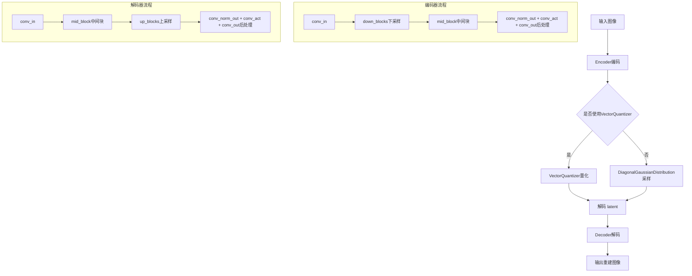
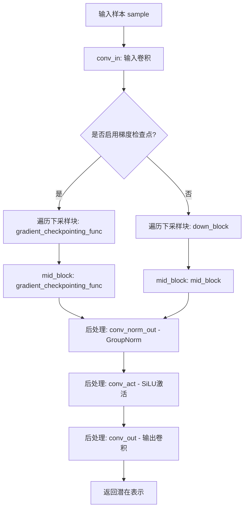
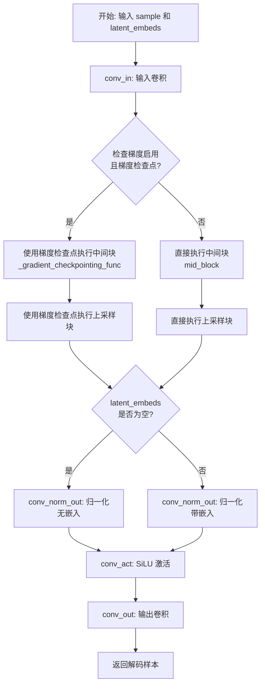
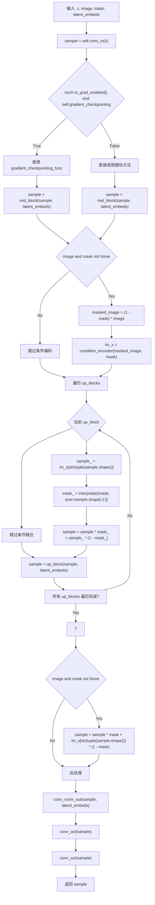
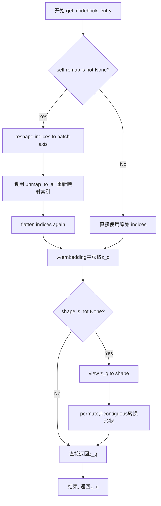
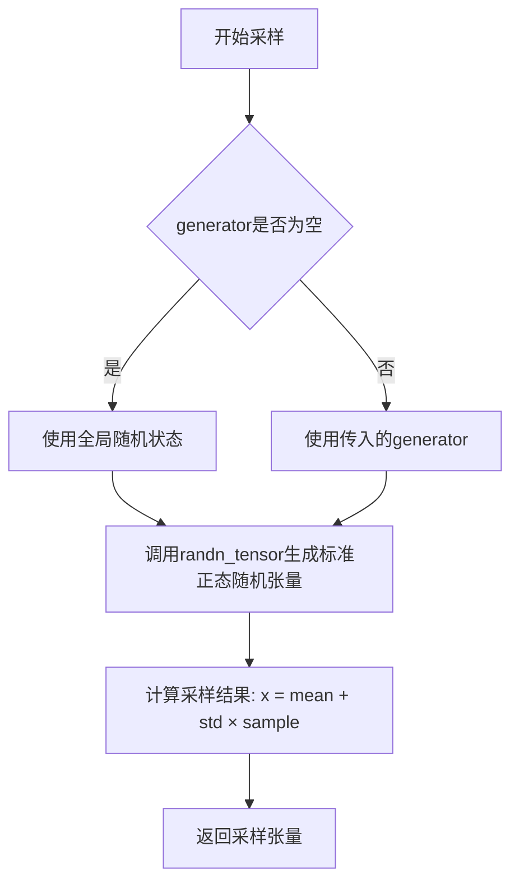

# `diffusers\src\diffusers\models\autoencoders\vae.py` 详细设计文档

这是一个变分自编码器(VAE)模块的实现，包含了编码器(Encoder)、解码器(Decoder)、向量量化器(VectorQuantizer)等核心组件，支持标准VAE、对称自编码器(AsymmetricAutoencoderKL)和微型VAE(VAE Tiny)等多种架构，用于图像的潜在空间编码和解码。

## 整体流程



## 类结构

```
BaseOutput (数据基类)
├── EncoderOutput (编码器输出数据类)
└── DecoderOutput (解码器输出数据类)

nn.Module (PyTorch基类)
├── Encoder (变分自编码器编码器)
├── Decoder (变分自编码器解码器)
├── UpSample (上采样层)
├── MaskConditionEncoder (掩码条件编码器)
├── MaskConditionDecoder (掩码条件解码器)
├── VectorQuantizer (向量量化器)
├── EncoderTiny (微型编码器)
└── DecoderTiny (微型解码器)

Python对象 (普通类)
├── DiagonalGaussianDistribution (对角高斯分布)
└── IdentityDistribution (恒等分布)

AutoencoderMixin (混入类)
```

## 全局变量及字段


### `EncoderOutput.latent`
    
The encoded latent representation from the encoder

类型：`torch.Tensor`
    


### `DecoderOutput.sample`
    
The decoded output sample from the last layer of the model

类型：`torch.Tensor`
    


### `DecoderOutput.commit_loss`
    
The commitment loss for vector quantization in VQ-VAE models

类型：`torch.FloatTensor | None`
    


### `Encoder.layers_per_block`
    
The number of layers per down/up block in the encoder

类型：`int`
    


### `Encoder.conv_in`
    
Initial 2D convolution layer to process input image

类型：`nn.Conv2d`
    


### `Encoder.down_blocks`
    
List of downsampling blocks to progressively reduce spatial dimensions

类型：`nn.ModuleList`
    


### `Encoder.mid_block`
    
Middle block of the encoder for processing at the lowest resolution

类型：`UNetMidBlock2D`
    


### `Encoder.conv_norm_out`
    
Group normalization layer for output post-processing

类型：`nn.GroupNorm`
    


### `Encoder.conv_act`
    
Sigmoid Linear Unit activation function for output

类型：`nn.SiLU`
    


### `Encoder.conv_out`
    
Final 2D convolution layer to produce latent representation

类型：`nn.Conv2d`
    


### `Encoder.gradient_checkpointing`
    
Flag to enable gradient checkpointing for memory efficiency

类型：`bool`
    


### `Decoder.layers_per_block`
    
The number of layers per up block in the decoder

类型：`int`
    


### `Decoder.conv_in`
    
Initial 2D convolution layer to process latent input

类型：`nn.Conv2d`
    


### `Decoder.up_blocks`
    
List of upsampling blocks to progressively increase spatial dimensions

类型：`nn.ModuleList`
    


### `Decoder.mid_block`
    
Middle block of the decoder for processing at the initial resolution

类型：`UNetMidBlock2D`
    


### `Decoder.conv_norm_out`
    
Group normalization layer for output post-processing

类型：`nn.GroupNorm`
    


### `Decoder.conv_act`
    
Sigmoid Linear Unit activation function for output

类型：`nn.SiLU`
    


### `Decoder.conv_out`
    
Final 2D convolution layer to produce decoded image

类型：`nn.Conv2d`
    


### `Decoder.gradient_checkpointing`
    
Flag to enable gradient checkpointing for memory efficiency

类型：`bool`
    


### `UpSample.in_channels`
    
Number of input channels for the upsampling layer

类型：`int`
    


### `UpSample.out_channels`
    
Number of output channels for the upsampling layer

类型：`int`
    


### `UpSample.deconv`
    
Transposed convolution for 2x upsampling

类型：`nn.ConvTranspose2d`
    


### `MaskConditionEncoder.layers`
    
Sequential layers for encoding mask condition information

类型：`nn.Sequential`
    


### `MaskConditionDecoder.layers_per_block`
    
The number of layers per up block in the mask condition decoder

类型：`int`
    


### `MaskConditionDecoder.conv_in`
    
Initial 2D convolution layer to process latent input

类型：`nn.Conv2d`
    


### `MaskConditionDecoder.up_blocks`
    
List of upsampling blocks for decoding with mask conditions

类型：`nn.ModuleList`
    


### `MaskConditionDecoder.mid_block`
    
Middle block of the mask condition decoder

类型：`UNetMidBlock2D`
    


### `MaskConditionDecoder.condition_encoder`
    
Encoder for processing masked image conditions

类型：`MaskConditionEncoder`
    


### `MaskConditionDecoder.conv_norm_out`
    
Group normalization layer for output post-processing

类型：`nn.GroupNorm`
    


### `MaskConditionDecoder.conv_act`
    
Sigmoid Linear Unit activation function for output

类型：`nn.SiLU`
    


### `MaskConditionDecoder.conv_out`
    
Final 2D convolution layer to produce decoded image

类型：`nn.Conv2d`
    


### `MaskConditionDecoder.gradient_checkpointing`
    
Flag to enable gradient checkpointing for memory efficiency

类型：`bool`
    


### `VectorQuantizer.n_e`
    
Number of embedding vectors in the codebook

类型：`int`
    


### `VectorQuantizer.vq_embed_dim`
    
Dimension of each embedding vector in the codebook

类型：`int`
    


### `VectorQuantizer.beta`
    
Weighting factor for the commitment loss in VQ training

类型：`float`
    


### `VectorQuantizer.legacy`
    
Flag to use legacy (buggy) loss calculation for backwards compatibility

类型：`bool`
    


### `VectorQuantizer.embedding`
    
The learnable codebook embeddings for vector quantization

类型：`nn.Embedding`
    


### `VectorQuantizer.remap`
    
Path to remapping file for codebook index remapping

类型：`None | str`
    


### `VectorQuantizer.re_embed`
    
Number of unique indices after remapping

类型：`int`
    


### `VectorQuantizer.unknown_index`
    
Strategy for handling unknown indices ('random', 'extra', or integer)

类型：`str`
    


### `VectorQuantizer.sane_index_shape`
    
Flag to ensure index tensor has correct shape for output

类型：`bool`
    


### `DiagonalGaussianDistribution.parameters`
    
Input tensor containing mean and log variance for Gaussian distribution

类型：`torch.Tensor`
    


### `DiagonalGaussianDistribution.mean`
    
Mean of the Gaussian distribution

类型：`torch.Tensor`
    


### `DiagonalGaussianDistribution.logvar`
    
Log variance of the Gaussian distribution (clamped)

类型：`torch.Tensor`
    


### `DiagonalGaussianDistribution.deterministic`
    
Flag to use deterministic mode (zero variance) for sampling

类型：`bool`
    


### `DiagonalGaussianDistribution.std`
    
Standard deviation of the Gaussian distribution

类型：`torch.Tensor`
    


### `DiagonalGaussianDistribution.var`
    
Variance of the Gaussian distribution

类型：`torch.Tensor`
    


### `IdentityDistribution.parameters`
    
Input tensor that is returned unchanged in sampling

类型：`torch.Tensor`
    


### `EncoderTiny.layers`
    
Sequential layers for the tiny encoder architecture

类型：`nn.Sequential`
    


### `EncoderTiny.gradient_checkpointing`
    
Flag to enable gradient checkpointing for memory efficiency

类型：`bool`
    


### `DecoderTiny.layers`
    
Sequential layers for the tiny decoder architecture

类型：`nn.Sequential`
    


### `DecoderTiny.gradient_checkpointing`
    
Flag to enable gradient checkpointing for memory efficiency

类型：`bool`
    
    

## 全局函数及方法


### `Encoder.__init__`

Encoder 类的构造函数，初始化变分自编码器（VAE）的编码器部分，包括输入卷积、下采样块、中间块和输出卷积等网络组件。

参数：

- `in_channels`：`int`，输入图像的通道数，默认为 3（例如 RGB 图像）
- `out_channels`：`int`，输出 latent 表示的通道数，默认为 3
- `down_block_types`：`tuple[str, ...]`，下采样块的类型元组，默认为 `("DownEncoderBlock2D",)`
- `block_out_channels`：`tuple[int, ...]`，每个块的输出通道数元组，默认为 `(64,)`
- `layers_per_block`：`int`，每个块包含的层数，默认为 2
- `norm_num_groups`：`int`，GroupNorm 归一化的组数，默认为 32
- `act_fn`：`str`，激活函数名称，默认为 `"silu"`
- `double_z`：`bool`，是否将输出通道数加倍（用于 VAE 的重参数化技巧），默认为 `True`
- `mid_block_add_attention`：`bool`，中间块是否添加注意力机制，默认为 `True`

返回值：`None`，构造函数无返回值

#### 流程图

```mermaid
flowchart TD
    A[开始 __init__] --> B[调用 super().__init__]
    B --> C[保存 layers_per_block]
    C --> D[创建输入卷积 conv_in<br/>in_channels → block_out_channels[0]]
    D --> E[初始化下采样块列表 down_blocks]
    E --> F{遍历 down_block_types}
    F -->|首次迭代| G[input_channel = block_out_channels[0]]
    G --> H[调用 get_down_block 创建下采样块]
    H --> I[添加块到 down_blocks]
    I --> J{检查是否为最后一个块}
    J -->|否| K[设置 add_downsample=True]
    J -->|是| L[设置 add_downsample=False]
    K --> M[更新 output_channel]
    L --> M
    M --> N{还有更多块类型?}
    N -->|是| F
    N -->|否| O[创建中间块 mid_block]
    O --> P[创建输出归一化 conv_norm_out<br/>GroupNorm]
    P --> Q[创建输出激活 conv_act<br/>SiLU]
    Q --> R{判断 double_z?}
    R -->|是| S[conv_out_channels = 2 * out_channels]
    R -->|否| T[conv_out_channels = out_channels]
    S --> U[创建输出卷积 conv_out]
    T --> U
    U --> V[设置 gradient_checkpointing = False]
    V --> W[结束 __init__]
```

#### 带注释源码

```python
def __init__(
    self,
    in_channels: int = 3,
    out_channels: int = 3,
    down_block_types: tuple[str, ...] = ("DownEncoderBlock2D",),
    block_out_channels: tuple[int, ...] = (64,),
    layers_per_block: int = 2,
    norm_num_groups: int = 32,
    act_fn: str = "silu",
    double_z: bool = True,
    mid_block_add_attention=True,
):
    # 调用父类 nn.Module 的初始化方法
    super().__init__()
    # 保存每个块的层数配置
    self.layers_per_block = layers_per_block

    # 创建输入卷积层：将输入图像转换为初始特征图
    # 参数：输入通道数 → 第一个块的输出通道数，卷积核 3x3，步长 1，填充 1
    self.conv_in = nn.Conv2d(
        in_channels,
        block_out_channels[0],
        kernel_size=3,
        stride=1,
        padding=1,
    )

    # 初始化下采样块列表
    self.down_blocks = nn.ModuleList([])

    # 下采样阶段：遍历下采样块类型，创建一系列下采样块
    output_channel = block_out_channels[0]  # 初始输出通道
    for i, down_block_type in enumerate(down_block_types):
        input_channel = output_channel  # 当前块的输入通道等于上一块的输出通道
        output_channel = block_out_channels[i]  # 获取当前块的输出通道配置
        is_final_block = i == len(block_out_channels) - 1  # 判断是否为最后一个块

        # 调用工厂函数获取对应的下采样块类型
        down_block = get_down_block(
            down_block_type,
            num_layers=self.layers_per_block,
            in_channels=input_channel,
            out_channels=output_channel,
            add_downsample=not is_final_block,  # 最后一个块不需要下采样
            resnet_eps=1e-6,
            downsample_padding=0,
            resnet_act_fn=act_fn,
            resnet_groups=norm_num_groups,
            attention_head_dim=output_channel,
            temb_channels=None,
        )
        self.down_blocks.append(down_block)

    # 中间块：连接下采样和上采样之间的模块
    self.mid_block = UNetMidBlock2D(
        in_channels=block_out_channels[-1],
        resnet_eps=1e-6,
        resnet_act_fn=act_fn,
        output_scale_factor=1,
        resnet_time_scale_shift="default",
        attention_head_dim=block_out_channels[-1],
        resnet_groups=norm_num_groups,
        temb_channels=None,
        add_attention=mid_block_add_attention,
    )

    # 输出处理阶段
    # 创建输出归一化层：GroupNorm
    self.conv_norm_out = nn.GroupNorm(num_channels=block_out_channels[-1], num_groups=norm_num_groups, eps=1e-6)
    # 创建输出激活函数：SiLU
    self.conv_act = nn.SiLU()

    # 计算输出通道数：如果 double_z 为 True，则 VAE 需要输出 mean 和 logvar
    # 此时输出通道数翻倍；否则只输出单一通道的 latent 表示
    conv_out_channels = 2 * out_channels if double_z else out_channels
    # 创建输出卷积层
    self.conv_out = nn.Conv2d(block_out_channels[-1], conv_out_channels, 3, padding=1)

    # 梯度检查点标志：用于节省显存，训练时可通过 enable_gradient_checkpointing 启用
    self.gradient_checkpointing = False
```


### `Encoder.forward`

该方法是 `Encoder` 类的前向传播方法，负责将输入图像编码为潜在表示。它首先通过输入卷积层处理样本，然后依次通过多个下采样块和中间块，最后通过后处理层（包括归一化、激活和输出卷积）生成潜在表示。支持梯度检查点以优化内存使用。

参数：

- `self`：隐式参数，表示 `Encoder` 类的实例
- `sample`：`torch.Tensor`，形状为 `(batch_size, num_channels, height, width)`，表示输入图像样本

返回值：`torch.Tensor`，形状为 `(batch_size, num_channels, latent_height, latent_width)`，表示编码后的潜在表示

#### 流程图



#### 带注释源码

```python
def forward(self, sample: torch.Tensor) -> torch.Tensor:
    r"""The forward method of the `Encoder` class."""
    
    # 步骤1: 输入卷积 - 将输入图像转换为初始特征表示
    # conv_in: nn.Conv2d, 将输入通道数转换为第一个block_out_channels
    sample = self.conv_in(sample)

    # 步骤2: 检查是否启用梯度检查点以节省内存
    if torch.is_grad_enabled() and self.gradient_checkpointing:
        # 梯度检查点模式: 使用梯度检查点函数遍历下采样块
        # down_blocks: nn.ModuleList, 包含多个下采样块
        for down_block in self.down_blocks:
            sample = self._gradient_checkpointing_func(down_block, sample)
        
        # 中间块: 使用梯度检查点函数处理
        # mid_block: UNetMidBlock2D, 位于编码器底部
        sample = self._gradient_checkpointing_func(self.mid_block, sample)

    else:
        # 正常模式: 直接遍历下采样块
        for down_block in self.down_blocks:
            sample = down_block(sample)

        # 中间块: 处理下采样后的特征
        sample = self.mid_block(sample)

    # 步骤3: 后处理 - 归一化、激活和输出卷积
    # conv_norm_out: nn.GroupNorm, 归一化处理
    sample = self.conv_norm_out(sample)
    
    # conv_act: nn.SiLU, SiLU激活函数
    sample = self.conv_act(sample)
    
    # conv_out: nn.Conv2d, 最终输出卷积
    # 如果double_z为True, 输出通道数为2*out_channels, 否则为out_channels
    sample = self.conv_out(sample)

    # 返回编码后的潜在表示
    return sample
```


### `Decoder.__init__`

这是 Variational Autoencoder (VAE) 的解码器类的初始化方法，负责构建从潜在表示到输出样本的解码网络结构。

参数：

- `in_channels`：`int`，输入通道数，默认为 3
- `out_channels`：`int`，输出通道数，默认为 3
- `up_block_types`：`tuple[str, ...]`，上采样块的类型，默认为 `("UpDecoderBlock2D",)`
- `block_out_channels`：`tuple[int, ...]`，每个块的输出通道数，默认为 `(64,)`
- `layers_per_block`：`int`，每个块的层数，默认为 2
- `norm_num_groups`：`int`，归一化的组数，默认为 32
- `act_fn`：`str`，激活函数名称，默认为 `"silu"`
- `norm_type`：`str`，归一化类型，可选 `"group"` 或 `"spatial"`，默认为 `"group"`
- `mid_block_add_attention`：`bool`，中间块是否添加注意力机制，默认为 `True`

返回值：`None`，该方法为构造函数，不返回任何值

#### 流程图

```mermaid
flowchart TD
    A[开始 __init__] --> B[调用 super().__init__]
    B --> C[设置 self.layers_per_block]
    D[创建输入卷积层 self.conv_in] --> E[创建上采样块模块列表 self.up_blocks]
    E --> F[创建中间块 self.mid_block]
    F --> G[反转 block_out_channels]
    G --> H{遍历 up_block_types}
    H -->|每次迭代| I[调用 get_up_block 创建上采样块]
    I --> J[添加到 self.up_blocks]
    J --> K{是否还有更多块?}
    K -->|是| H
    K -->|否| L[创建输出归一化层 self.conv_norm_out]
    L --> M[创建输出激活层 self.conv_act]
    M --> N[创建输出卷积层 self.conv_out]
    N --> O[设置 self.gradient_checkpointing = False]
    O --> P[结束 __init__]
```

#### 带注释源码

```python
def __init__(
    self,
    in_channels: int = 3,
    out_channels: int = 3,
    up_block_types: tuple[str, ...] = ("UpDecoderBlock2D",),
    block_out_channels: tuple[int, ...] = (64,),
    layers_per_block: int = 2,
    norm_num_groups: int = 32,
    act_fn: str = "silu",
    norm_type: str = "group",  # group, spatial
    mid_block_add_attention=True,
):
    # 调用父类 nn.Module 的初始化方法
    super().__init__()
    # 保存每块的层数配置
    self.layers_per_block = layers_per_block

    # ---------------------------------------------------------
    # 输入卷积层：将输入 latent 映射到最高通道数的特征空间
    # ---------------------------------------------------------
    self.conv_in = nn.Conv2d(
        in_channels,                          # 输入通道数
        block_out_channels[-1],               # 输出通道数（使用最后一个 block 的通道数）
        kernel_size=3,                        # 3x3 卷积核
        stride=1,                             # 步长为1，保持空间分辨率
        padding=1,                            # 填充1，保持空间分辨率
    )

    # ---------------------------------------------------------
    # 上采样块列表：负责逐步上采样特征图并增加空间分辨率
    # ---------------------------------------------------------
    self.up_blocks = nn.ModuleList([])

    # 根据归一化类型决定是否需要 temporal embedding 通道
    # spatial norm 需要 temb_channels，group norm 不需要
    temb_channels = in_channels if norm_type == "spatial" else None

    # ---------------------------------------------------------
    # 中间块：处理最高通道数的特征
    # ---------------------------------------------------------
    self.mid_block = UNetMidBlock2D(
        in_channels=block_out_channels[-1],   # 输入为最后一个 down block 的输出通道
        resnet_eps=1e-6,                       # ResNet 块的 epsilon 值
        resnet_act_fn=act_fn,                 # 激活函数
        output_scale_factor=1,                # 输出缩放因子
        resnet_time_scale_shift="default" if norm_type == "group" else norm_type,
        attention_head_dim=block_out_channels[-1],  # 注意力头维度
        resnet_groups=norm_num_groups,        # GroupNorm 的组数
        temb_channels=temb_channels,           # 时间嵌入通道
        add_attention=mid_block_add_attention, # 是否添加注意力
    )

    # ---------------------------------------------------------
    # 上采样块构建：从低分辨率到高分辨率逐步上采样
    # ---------------------------------------------------------
    # 反转通道数列表，使得从大到小遍历（从高通道数到低通道数）
    reversed_block_out_channels = list(reversed(block_out_channels))
    output_channel = reversed_block_out_channels[0]  # 初始输出通道

    for i, up_block_type in enumerate(up_block_types):
        prev_output_channel = output_channel           # 前一个块的输出通道
        output_channel = reversed_block_out_channels[i]  # 当前块的输出通道

        # 判断是否为最后一个块（空间分辨率最高、通道数最少）
        is_final_block = i == len(block_out_channels) - 1

        # 获取对应的上采样块类型
        up_block = get_up_block(
            up_block_type,
            num_layers=self.layers_per_block + 1,      # 层数加1（因为是解码器路径）
            in_channels=prev_output_channel,           # 输入通道
            out_channels=output_channel,               # 输出通道
            prev_output_channel=prev_output_channel,    # 前一个输出通道
            add_upsample=not is_final_block,           # 非最后一块添加上采样
            resnet_eps=1e-6,
            resnet_act_fn=act_fn,
            resnet_groups=norm_num_groups,
            attention_head_dim=output_channel,
            temb_channels=temb_channels,
            resnet_time_scale_shift=norm_type,
        )
        self.up_blocks.append(up_block)
        prev_output_channel = output_channel

    # ---------------------------------------------------------
    # 输出层：归一化、激活、卷积输出最终结果
    # ---------------------------------------------------------
    if norm_type == "spatial":
        # spatial norm 需要特殊的 SpatialNorm 层
        self.conv_norm_out = SpatialNorm(block_out_channels[0], temb_channels)
    else:
        # group norm 使用标准的 GroupNorm
        self.conv_norm_out = nn.GroupNorm(num_channels=block_out_channels[0], num_groups=norm_num_groups, eps=1e-6)
    
    self.conv_act = nn.SiLU()  # SiLU 激活函数
    self.conv_out = nn.Conv2d(block_out_channels[0], out_channels, 3, padding=1)

    # ---------------------------------------------------------
    # 梯度检查点设置：用于节省显存
    # ---------------------------------------------------------
    self.gradient_checkpointing = False
```


### `Decoder.forward`

该方法是 `Decoder` 类的正向传播函数，负责将变分自编码器的潜在表示（latent representation）解码恢复为原始图像空间。通过中间的 UNet 块和多个上采样块，逐步将低分辨率的潜在特征图上采样至目标分辨率，并可选地接受潜在嵌入（latent_embeds）用于条件解码。

参数：

- `sample`：`torch.Tensor`，输入的潜在表示张量，形状为 `(batch_size, num_channels, latent_height, latent_width)`
- `latent_embeds`：`torch.Tensor | None`，可选的潜在嵌入张量，用于条件解码，默认为 `None`

返回值：`torch.Tensor`，解码后的输出样本，形状为 `(batch_size, num_channels, height, width)`

#### 流程图



#### 带注释源码

```python
def forward(
    self,
    sample: torch.Tensor,
    latent_embeds: torch.Tensor | None = None,
) -> torch.Tensor:
    r"""The forward method of the `Decoder` class.
    
    将潜在表示解码为图像样本。
    
    Args:
        sample: 输入的潜在表示张量
        latent_embeds: 可选的潜在嵌入，用于条件解码
    
    Returns:
        解码后的输出样本张量
    """
    
    # 步骤1: 输入卷积 - 将潜在表示映射到特征空间
    sample = self.conv_in(sample)

    # 步骤2: 根据是否启用梯度检查点选择执行路径
    if torch.is_grad_enabled() and self.gradient_checkpointing:
        # ===== 梯度检查点路径 (节省显存) =====
        # 中间块: 处理最细粒度的特征
        sample = self._gradient_checkpointing_func(self.mid_block, sample, latent_embeds)

        # 上采样块: 逐步上采样至目标分辨率
        for up_block in self.up_blocks:
            sample = self._gradient_checkpointing_func(up_block, sample, latent_embeds)
    else:
        # ===== 标准执行路径 =====
        # 中间块: 处理最细粒度的特征
        sample = self.mid_block(sample, latent_embeds)

        # 上采样块: 逐步上采样至目标分辨率
        for up_block in self.up_blocks:
            sample = up_block(sample, latent_embeds)

    # 步骤3: 后处理
    # 归一化层 - 根据是否有潜在嵌入选择不同方式
    if latent_embeds is None:
        sample = self.conv_norm_out(sample)
    else:
        sample = self.conv_norm_out(sample, latent_embeds)
    
    # 激活函数 - SiLU (Swish)
    sample = self.conv_act(sample)
    
    # 输出卷积 - 映射到目标通道数
    sample = self.conv_out(sample)

    return sample
```


### `UpSample.__init__`

这是 `UpSample` 类的初始化方法，用于创建变分自编码器中的上采样层。该方法接收输入输出通道数，初始化父类并设置卷积转置层用于特征图的上采样。

参数：

- `in_channels`：`int`，输入特征图的通道数
- `out_channels`：`int`，输出特征图的通道数

返回值：`None`，构造函数无返回值

#### 流程图

```mermaid
flowchart TD
    A[开始 __init__] --> B[调用 super().__init__ 初始化 nn.Module]
    --> C[保存 self.in_channels = in_channels]
    --> D[保存 self.out_channels = out_channels]
    --> E[创建 nn.ConvTranspose2d 转置卷积层]
    --> F[kernel_size=4, stride=2, padding=1 实现2倍上采样]
    --> G[结束]
```

#### 带注释源码

```python
def __init__(
    self,
    in_channels: int,    # 输入特征图的通道数
    out_channels: int,   # 输出特征图的通道数
) -> None:
    # 调用父类 nn.Module 的初始化方法
    super().__init__()
    
    # 保存输入输出通道数作为实例属性，供 forward 方法和外部访问使用
    self.in_channels = in_channels
    self.out_channels = out_channels
    
    # 创建转置卷积层用于上采样
    # kernel_size=4, stride=2, padding=1 的配置可以实现 2x 的空间上采样
    # 例如：将 32x32 的特征图上采样为 64x64
    self.deconv = nn.ConvTranspose2d(in_channels, out_channels, kernel_size=4, stride=2, padding=1)
```


### `UpSample.forward`

该方法是 Variational Autoencoder (VAE) 中 UpSample 层的实现，通过 ReLU 激活函数后接转置卷积（deconvolution）对输入特征图进行 2 倍上采样，将空间分辨率扩大至原来的两倍。

参数：

- `x`：`torch.Tensor`，输入的 4D 张量，形状为 `(batch_size, channels, height, width)`，表示待上采样的特征图

返回值：`torch.Tensor`，上采样后的张量，形状为 `(batch_size, out_channels, height * 2, width * 2)`

#### 流程图

```mermaid
flowchart TD
    A[输入 x: torch.Tensor] --> B[torch.relu(x)<br/>应用 ReLU 激活函数]
    B --> C[self.deconv(x)<br/>应用转置卷积进行2倍上采样]
    C --> D[输出: torch.Tensor<br/>上采样后的特征图]
```

#### 带注释源码

```python
def forward(self, x: torch.Tensor) -> torch.Tensor:
    r"""The forward method of the `UpSample` class."""
    # 步骤1: 对输入张量应用 ReLU 激活函数
    # 目的: 引入非线性，激活特征
    x = torch.relu(x)
    
    # 步骤2: 使用转置卷积进行上采样
    # deconv 的配置: kernel_size=4, stride=2, padding=1
    # 效果: 将空间尺寸扩大 2 倍 (例如 32x32 -> 64x64)
    # 通道数从 in_channels 转换为 out_channels
    x = self.deconv(x)
    
    # 返回上采样后的结果
    return x
```


### `MaskConditionEncoder.__init__`

该方法是 `MaskConditionEncoder` 类的构造函数，用于初始化一个用于处理掩码条件的卷积 encoder 网络。该网络通过多层卷积和下采样操作，将输入特征逐步转换为条件编码特征，供 AsymmetricAutoencoderKL 的 decoder 使用。

参数：

- `self`：隐式参数，表示类的实例本身
- `in_ch`：`int`，输入通道数，指定输入特征图的通道数
- `out_ch`：`int`，输出通道数，默认为 192，指定第一层卷积的输出通道数
- `res_ch`：`int`，残余通道数，默认为 768，用于限制通道数的最大值
- `stride`：`int`，步长，默认为 16，控制网络的深度和下采样程度

返回值：无（`-> None`）

#### 流程图

```mermaid
flowchart TD
    A[开始 __init__] --> B[调用 super().__init__]
    B --> C[初始化空列表 channels]
    C --> D{stride > 1?}
    D -->|是| E[stride = stride // 2]
    E --> F{in_ch_ = out_ch * 2}
    F --> G{out_ch > res_ch?}
    G -->|是| H[out_ch = res_ch]
    G -->|否| I{stride == 1?}
    H --> I
    I -->|是| J[in_ch_ = res_ch]
    I -->|否| K[channels.append((in_ch_, out_ch))]
    J --> K
    K --> L[out_ch *= 2]
    L --> D
    D -->|否| M[构建 out_channels 列表]
    M --> N[构建 layers 列表]
    N --> O{遍历 out_channels}
    O -->|l == 0 或 l == 1| P[Conv2d kernel=3, stride=1, padding=1]
    O -->|其他| Q[Conv2d kernel=4, stride=2, padding=1]
    P --> R[layers.append(layer)]
    Q --> R
    R --> S[in_ch_ = out_ch_]
    S --> O
    O -->|完成| T[self.layers = nn.Sequential(*layers)]
    T --> U[结束 __init__]
```

#### 带注释源码

```python
def __init__(
    self,
    in_ch: int,
    out_ch: int = 192,
    res_ch: int = 768,
    stride: int = 16,
) -> None:
    """
    初始化 MaskConditionEncoder 网络结构
    
    参数:
        in_ch: 输入通道数
        out_ch: 初始输出通道数（默认192）
        res_ch: 残余通道数上限（默认768）
        stride: 步长，控制网络深度（默认16）
    """
    # 调用父类 nn.Module 的初始化方法
    super().__init__()

    # 用于存储每一层的 (输入通道, 输出通道) 元组
    channels = []
    
    # 根据 stride 值计算每一层的通道配置
    # 每次循环将 stride 除以 2，直到 stride <= 1
    while stride > 1:
        stride = stride // 2  # 步长减半
        in_ch_ = out_ch * 2   # 输入通道翻倍
        
        # 如果输出通道超过残余通道上限，则限制为残余通道
        if out_ch > res_ch:
            out_ch = res_ch
        
        # 当 stride 降至 1 时，使用残余通道作为输入通道
        if stride == 1:
            in_ch_ = res_ch
        
        # 记录当前层的通道配置
        channels.append((in_ch_, out_ch))
        
        # 输出通道翻倍，为下一层做准备
        out_ch *= 2

    # 从 channels 列表中提取输出通道数，形成输出通道列表
    out_channels = []
    for _in_ch, _out_ch in channels:
        out_channels.append(_out_ch)
    # 添加最后一个输入通道数
    out_channels.append(channels[-1][0])

    # 构建卷积层列表
    layers = []
    in_ch_ = in_ch  # 初始输入通道
    
    # 遍历输出通道列表，创建对应的卷积层
    for l in range(len(out_channels)):
        out_ch_ = out_channels[l]
        
        # 前两层使用 3x3 卷积，stride=1，保持空间维度
        # 后续层使用 4x4 卷积，stride=2，进行下采样
        if l == 0 or l == 1:
            layers.append(nn.Conv2d(in_ch_, out_ch_, kernel_size=3, stride=1, padding=1))
        else:
            layers.append(nn.Conv2d(in_ch_, out_ch_, kernel_size=4, stride=2, padding=1))
        
        # 更新当前层的输出通道为下一层的输入通道
        in_ch_ = out_ch_

    # 将卷积层列表转换为 nn.Sequential 模块
    self.layers = nn.Sequential(*layers)
```


### `MaskConditionEncoder.forward`

该方法是 `MaskConditionEncoder` 类的前向传播方法，用于将输入张量通过一系列卷积层处理，输出一个字典，其中键为张量形状，值为对应层的输出特征图。该编码器主要用于 AsymmetricAutoencoderKL 模型中处理掩码条件信息。

参数：

- `x`：`torch.Tensor`，输入的图像张量，通常为掩码处理后的图像
- `mask`：`torch.Tensor | None`，可选参数，当前版本未使用，保留用于接口兼容性

返回值：`dict[str, torch.Tensor]`，返回一个字典，键为张量形状的字符串表示（如 `"(batch, channels, height, width)"`），值为对应层的输出张量

#### 流程图

```mermaid
graph TD
    A[输入 x: torch.Tensor] --> B[遍历 self.layers]
    B --> C[当前层 layer = self.layers[l]]
    D[执行卷积: x = layer x] --> E[记录输出: out[str tuple x.shape] = x]
    E --> F[应用激活: x = torch.relu x]
    F --> G{是否还有更多层?}
    G -->|是| B
    G -->|否| H[返回字典 out]
```

#### 带注释源码

```python
def forward(self, x: torch.Tensor, mask=None) -> torch.Tensor:
    r"""The forward method of the `MaskConditionEncoder` class."""
    # 初始化输出字典，用于存储每一层的输出特征图
    out = {}
    
    # 遍历所有卷积层
    for l in range(len(self.layers)):
        # 获取当前层
        layer = self.layers[l]
        
        # 执行前向传播：卷积操作
        x = layer(x)
        
        # 将当前层输出的张量形状转换为字符串作为键，存入字典
        # 键的格式例如："torch.Size([1, 192, 64, 64])"
        out[str(tuple(x.shape))] = x
        
        # 应用 ReLU 激活函数，增加非线性
        x = torch.relu(x)
    
    # 返回包含各层输出的字典
    return out
```


### `MaskConditionDecoder.__init__`

该方法是 `MaskConditionDecoder` 类的构造函数，用于初始化一个带掩码条件的解码器模块。该模块与 `AsymmetricAutoencoderKL` 结合使用，通过掩码和掩码图像增强模型的解码器。初始化过程包括：设置卷积层、上采样块、中间块、掩码条件编码器以及输出归一化和卷积层。

参数：

- `in_channels`：`int`，输入通道数，默认为 3
- `out_channels`：`int`，输出通道数，默认为 3
- `up_block_types`：`tuple[str, ...]`，上采样块的类型元组，默认为 `("UpDecoderBlock2D",)`
- `block_out_channels`：`tuple[int, ...]`，每个块的输出通道数元组，默认为 `(64,)`
- `layers_per_block`：`int`，每个块的层数，默认为 2
- `norm_num_groups`：`int`，归一化的组数，默认为 32
- `act_fn`：`str`，激活函数名称，默认为 `"silu"`
- `norm_type`：`str`，归一化类型，可为 `"group"` 或 `"spatial"`，默认为 `"group"`

返回值：无（`None`）

#### 流程图

```mermaid
flowchart TD
    A[开始 __init__] --> B[调用 super().__init__]
    B --> C[设置 self.layers_per_block]
    D[创建 conv_in 卷积层] --> E[创建 up_blocks ModuleList]
    E --> F[创建 mid_block 中间块]
    F --> G[反转 block_out_channels]
    G --> H[循环创建上采样块]
    H --> I{还有更多块?}
    I -->|是| J[调用 get_up_block]
    J --> K[添加到 up_blocks]
    K --> I
    I -->|否| L[创建 condition_encoder]
    L --> M[创建 conv_norm_out 归一化层]
    M --> N[创建 conv_act 激活函数]
    N --> O[创建 conv_out 输出卷积层]
    O --> P[设置 gradient_checkpointing 标志]
    P --> Q[结束 __init__]
```

#### 带注释源码

```python
def __init__(
    self,
    in_channels: int = 3,
    out_channels: int = 3,
    up_block_types: tuple[str, ...] = ("UpDecoderBlock2D",),
    block_out_channels: tuple[int, ...] = (64,),
    layers_per_block: int = 2,
    norm_num_groups: int = 32,
    act_fn: str = "silu",
    norm_type: str = "group",  # group, spatial
):
    # 调用父类 nn.Module 的初始化方法
    super().__init__()
    # 保存每块的层数配置
    self.layers_per_block = layers_per_block

    # 输入卷积层：将输入通道转换为最后一个块的输出通道数
    self.conv_in = nn.Conv2d(
        in_channels,
        block_out_channels[-1],
        kernel_size=3,
        stride=1,
        padding=1,
    )

    # 初始化上采样块列表
    self.up_blocks = nn.ModuleList([])

    # 根据 norm_type 确定时间嵌入通道数
    # 如果是 spatial 归一化，则需要传入 temb_channels
    temb_channels = in_channels if norm_type == "spatial" else None

    # 创建中间块 (UNetMidBlock2D)
    self.mid_block = UNetMidBlock2D(
        in_channels=block_out_channels[-1],
        resnet_eps=1e-6,
        resnet_act_fn=act_fn,
        output_scale_factor=1,
        resnet_time_scale_shift="default" if norm_type == "group" else norm_type,
        attention_head_dim=block_out_channels[-1],
        resnet_groups=norm_num_groups,
        temb_channels=temb_channels,
    )

    # 反转通道数顺序以便从低分辨率到高分辨率上采样
    reversed_block_out_channels = list(reversed(block_out_channels))
    output_channel = reversed_block_out_channels[0]
    
    # 循环创建上采样块
    for i, up_block_type in enumerate(up_block_types):
        prev_output_channel = output_channel
        output_channel = reversed_block_out_channels[i]

        # 判断是否为最后一个块
        is_final_block = i == len(block_out_channels) - 1

        # 获取上采样块并添加到模块列表
        up_block = get_up_block(
            up_block_type,
            num_layers=self.layers_per_block + 1,
            in_channels=prev_output_channel,
            out_channels=output_channel,
            prev_output_channel=None,
            add_upsample=not is_final_block,
            resnet_eps=1e-6,
            resnet_act_fn=act_fn,
            resnet_groups=norm_num_groups,
            attention_head_dim=output_channel,
            temb_channels=temb_channels,
            resnet_time_scale_shift=norm_type,
        )
        self.up_blocks.append(up_block)
        prev_output_channel = output_channel

    # 创建掩码条件编码器
    # 用于编码掩码和掩码图像的信息
    self.condition_encoder = MaskConditionEncoder(
        in_ch=out_channels,
        out_ch=block_out_channels[0],
        res_ch=block_out_channels[-1],
    )

    # 输出归一化层
    # 根据 norm_type 选择 SpatialNorm 或 GroupNorm
    if norm_type == "spatial":
        self.conv_norm_out = SpatialNorm(block_out_channels[0], temb_channels)
    else:
        self.conv_norm_out = nn.GroupNorm(num_channels=block_out_channels[0], num_groups=norm_num_groups, eps=1e-6)
    
    # 输出激活函数 (SiLU)
    self.conv_act = nn.SiLU()
    
    # 输出卷积层
    self.conv_out = nn.Conv2d(block_out_channels[0], out_channels, 3, padding=1)

    # 梯度检查点标志，默认为 False
    # 用于节省显存但增加计算时间
    self.gradient_checkpointing = False
```


### `MaskConditionDecoder.forward`

该方法是 `MaskConditionDecoder` 类的前向传播方法，用于在给定潜在向量、图像和掩码的情况下，解码并重建带有掩码条件的图像样本。该方法支持梯度检查点优化，并通过条件编码器处理掩码区域的信息。

参数：

- `self`：`MaskConditionDecoder` 类实例本身
- `z`：`torch.Tensor`，输入的潜在向量，表示 VAE 编码后的潜在表示
- `image`：`torch.Tensor | None`，可选的输入图像，用于条件重建
- `mask`：`torch.Tensor | None`，可选的掩码张量，标识需要重建的区域（值为 0 表示掩码区域）
- `latent_embeds`：`torch.Tensor | None`，可选的潜在嵌入，用于空间归一化

返回值：`torch.Tensor`，解码后的图像样本

#### 流程图



#### 带注释源码

```python
def forward(
    self,
    z: torch.Tensor,
    image: torch.Tensor | None = None,
    mask: torch.Tensor | None = None,
    latent_embeds: torch.Tensor | None = None,
) -> torch.Tensor:
    r"""The forward method of the `MaskConditionDecoder` class.
    
    该方法执行掩码条件解码，将潜在向量解码为图像样本。
    支持可选的图像和掩码输入，用于条件重建任务。
    
    Args:
        z: 输入的潜在向量，通常来自 VAE 编码器
        image: 可选的输入图像，用于条件信息
        mask: 可选的二值掩码，标识需要重建的区域
        latent_embeds: 可选的潜在嵌入，用于空间归一化
    
    Returns:
        解码后的图像样本张量
    """
    # 将潜在向量赋值给 sample 变量
    sample = z
    
    # 初始卷积：将通道数转换为 block_out_channels[-1]
    sample = self.conv_in(sample)

    # 获取上采样块的 dtype，用于后续类型转换
    upscale_dtype = next(iter(self.up_blocks.parameters())).dtype
    
    # 检查是否启用梯度检查点优化
    if torch.is_grad_enabled() and self.gradient_checkpointing:
        # ===== 启用梯度检查点的情况 =====
        
        # 中间块处理：执行残差网络的中间部分
        sample = self._gradient_checkpointing_func(self.mid_block, sample, latent_embeds)
        
        # 转换为上采样块的 dtype
        sample = sample.to(upscale_dtype)

        # 条件编码器处理：如果提供了图像和掩码
        if image is not None and mask is not None:
            # 计算掩码图像：(1 - mask) * image，掩码区域为 0
            masked_image = (1 - mask) * image
            
            # 使用梯度检查点调用条件编码器
            im_x = self._gradient_checkpointing_func(
                self.condition_encoder,
                masked_image,
                mask,
            )

        # 上采样块处理：遍历所有上采样块
        for up_block in self.up_blocks:
            # 如果有条件信息，进行特征融合
            if image is not None and mask is not None:
                # 根据当前 sample 的形状获取对应的条件特征
                sample_ = im_x[str(tuple(sample.shape))]
                # 将掩码插值到当前 sample 的空间尺寸
                mask_ = nn.functional.interpolate(mask, size=sample.shape[-2:], mode="nearest")
                # 特征融合：掩码区域使用条件特征，非掩码区域保持原特征
                sample = sample * mask_ + sample_ * (1 - mask_)
            
            # 执行上采样块的前向传播
            sample = self._gradient_checkpointing_func(up_block, sample, latent_embeds)
        
        # 最终融合：如果有条件信息
        if image is not None and mask is not None:
            sample = sample * mask + im_x[str(tuple(sample.shape))] * (1 - mask)
    else:
        # ===== 不启用梯度检查点的情况 =====
        
        # 中间块处理
        sample = self.mid_block(sample, latent_embeds)
        sample = sample.to(upscale_dtype)

        # 条件编码器处理
        if image is not None and mask is not None:
            # 计算掩码图像
            masked_image = (1 - mask) * image
            # 直接调用条件编码器
            im_x = self.condition_encoder(masked_image, mask)

        # 上采样块处理
        for up_block in self.up_blocks:
            # 条件特征融合
            if image is not None and mask is not None:
                sample_ = im_x[str(tuple(sample.shape))]
                mask_ = nn.functional.interpolate(mask, size=sample.shape[-2:], mode="nearest")
                sample = sample * mask_ + sample_ * (1 - mask_)
            
            # 执行上采样块
            sample = up_block(sample, latent_embeds)
        
        # 最终融合
        if image is not None and mask is not None:
            sample = sample * mask + im_x[str(tuple(sample.shape))] * (1 - mask)

    # ===== 后处理阶段 =====
    
    # 归一化层：根据是否有潜在嵌入选择不同的归一化方式
    if latent_embeds is None:
        sample = self.conv_norm_out(sample)
    else:
        # 空间归一化：使用潜在嵌入进行调整
        sample = self.conv_norm_out(sample, latent_embeds)
    
    # 激活函数：SiLU 激活
    sample = self.conv_act(sample)
    
    # 输出卷积：将通道数转换为输出通道数
    sample = self.conv_out(sample)

    return sample
```


### VectorQuantizer.__init__

这是 VectorQuantizer 类的初始化方法，用于创建一个改进版的向量量化器（VectorQuantizer），该量化器可以作为标准 VectorQuantizer 的即插即用替代品。该实现主要避免了昂贵的矩阵乘法运算，并允许后续重新映射索引。

参数：

- `n_e`：`int`，嵌入向量的数量（码本大小）
- `vq_embed_dim`：`int`，每个嵌入向量的维度
- `beta`：`float`，向量量化损失的 beta 因子，用于平衡重构损失和量化损失
- `remap`：可选参数，指定是否使用索引重映射的文件路径，默认为 None
- `unknown_index`：`str`，当遇到未知索引时使用的策略，可选值为 "random"、"extra" 或整数，默认为 "random"
- `sane_index_shape`：`bool`，是否使用正确的索引形状，默认为 False
- `legacy`：`bool`，是否使用遗留版本（存在 beta 因子应用的 bug），默认为 True

返回值：无（`None`），构造函数不返回任何值

#### 流程图

```mermaid
flowchart TD
    A[开始 __init__] --> B[调用 super().__init__]
    B --> C[保存 n_e, vq_embed_dim, beta, legacy 参数]
    D[创建 nn.Embedding] --> E[初始化权重为均匀分布]
    E --> F{检查 remap 是否为 None?}
    F -->|否| G[加载 remap 文件并注册 buffer]
    G --> H[计算 re_embed 和处理 unknown_index]
    H --> I[打印重映射信息]
    F -->|是| J[设置 re_embed = n_e]
    I --> K[保存 sane_index_shape]
    J --> K
    K --> L[结束 __init__]
```

#### 带注释源码

```python
def __init__(
    self,
    n_e: int,
    vq_embed_dim: int,
    beta: float,
    remap=None,
    unknown_index: str = "random",
    sane_index_shape: bool = False,
    legacy: bool = True,
):
    # 调用父类 nn.Module 的初始化方法
    super().__init__()
    
    # 保存量化器的基本参数
    self.n_e = n_e  # 嵌入向量的数量（码本大小）
    self.vq_embed_dim = vq_embed_dim  # 每个嵌入向量的维度
    self.beta = beta  # 损失函数中的 beta 因子
    self.legacy = legacy  # 是否使用遗留版本（存在 bug）

    # 创建嵌入层，形状为 (n_e, vq_embed_dim)
    self.embedding = nn.Embedding(self.n_e, self.vq_embed_dim)
    # 使用均匀分布初始化嵌入权重，范围为 [-1.0/n_e, 1.0/n_e]
    # 这种初始化方法有助于保持嵌入向量的方差适中
    self.embedding.weight.data.uniform_(-1.0 / self.n_e, 1.0 / self.n_e)

    # 处理索引重映射功能
    self.remap = remap
    if self.remap is not None:
        # 从文件加载使用的索引并注册为缓冲区
        self.register_buffer("used", torch.tensor(np.load(self.remap)))
        self.used: torch.Tensor
        # 计算重映射后的索引数量
        self.re_embed = self.used.shape[0]
        # 设置未知索引的处理策略
        self.unknown_index = unknown_index  # "random" or "extra" or integer
        # 如果使用 "extra" 策略，为未知索引分配额外的索引
        if self.unknown_index == "extra":
            self.unknown_index = self.re_embed
            self.re_embed = self.re_embed + 1
        # 打印重映射信息，便于调试
        print(
            f"Remapping {self.n_e} indices to {self.re_embed} indices. "
            f"Using {self.unknown_index} for unknown indices."
        )
    else:
        # 如果没有重映射，则使用原始的索引数量
        self.re_embed = n_e

    # 保存索引形状配置
    self.sane_index_shape = sane_index_shape
```


### `VectorQuantizer.remap_to_used`

该方法用于将输入的索引张量重新映射到已使用的索引集合中，处理未知索引并返回映射后的索引张量。

参数：

- `inds`：`torch.LongTensor`，输入的索引张量，需要进行重新映射

返回值：`torch.LongTensor`，映射后的索引张量

#### 流程图

```mermaid
flowchart TD
    A[开始 remap_to_used] --> B[获取输入张量形状 ishape]
    B --> C{检查维度数量 > 1?}
    C -->|否| D[抛出断言错误]
    C -->|是| E[将索引重塑为二维: (batch, -1)]
    E --> F[将 used 张量移动到输入设备]
    F --> G[计算匹配矩阵: match = inds 与 used 的逐元素比较]
    G --> H[通过 argmax 找到匹配的最佳索引]
    H --> I[找出未知索引: unknown = match.sum < 1]
    I --> J{unknown_index == 'random'?}
    J -->|是| K[为未知索引随机分配新索引]
    J -->|否| L[将未知索引设为 unknown_index]
    K --> M[将结果重塑为原始形状 ishape]
    L --> M
    M --> N[返回映射后的索引张量]
```

#### 带注释源码

```
def remap_to_used(self, inds: torch.LongTensor) -> torch.LongTensor:
    # 保存原始输入形状，用于后续恢复
    ishape = inds.shape
    
    # 断言确保输入至少是二维的（batch_size, 其他维度）
    assert len(ishape) > 1
    
    # 将输入重塑为二维：(batch_size, flattened_length)
    # 例如：从 (batch, h, w) 变为 (batch, h*w)
    inds = inds.reshape(ishape[0], -1)
    
    # 将已使用的索引张量移动到与输入相同的设备上
    used = self.used.to(inds)
    
    # 计算匹配矩阵：将 inds 与 used 进行广播比较
    # 结果形状：(batch, flattened_length, len(used))
    # 每个位置标记该索引是否存在于 used 中
    match = (inds[:, :, None] == used[None, None, ...]).long()
    
    # 通过 argmax 找到每个位置在 used 中的最佳匹配索引
    # new 形状：(batch, flattened_length)
    new = match.argmax(-1)
    
    # 找出没有匹配到的索引（unknown）
    # 如果在 used 中没有任何匹配，则 sum 为 0
    unknown = match.sum(2) < 1
    
    # 根据配置处理未知索引
    if self.unknown_index == "random":
        # 随机分配一个在有效范围内的索引
        new[unknown] = torch.randint(0, self.re_embed, size=new[unknown].shape).to(device=new.device)
    else:
        # 使用预定义的特殊索引值
        new[unknown] = self.unknown_index
    
    # 将结果重塑为原始输入形状并返回
    return new.reshape(ishape)
```


### `VectorQuantizer.unmap_to_all`

该方法将经过 remap（重新映射）后的索引转换回原始 codebook 的索引，用于从量化器中检索对应的码本向量。

参数：

- `inds`：`torch.LongTensor`，经过 remap 后的索引张量，需要将其解映射回原始的 codebook 索引空间

返回值：`torch.LongTensor`，解映射回原始 codebook 空间的索引张量

#### 流程图

```mermaid
flowchart TD
    A[开始: 接收 remap 后的索引 inds] --> B{检查索引维度}
    B -->|维度 > 1| C[保存原始形状 ishape]
    B -->|维度 <= 1| E[抛出断言错误]
    C --> D[将索引 reshape 为 2D: (batch, -1)]
    D --> F{检查是否有额外 token}
    F -->|re_embed > used.shape[0]| G[将超出范围的索引设为 0]
    G --> H[执行 gather 操作获取原始索引]
    F -->|否则| H
    H --> I[将结果 reshape 回原始形状 ishape]
    I --> J[返回解映射后的索引]
```

#### 带注释源码

```python
def unmap_to_all(self, inds: torch.LongTensor) -> torch.LongTensor:
    """
    将 remap 后的索引解映射回原始 codebook 的所有索引。
    
    此方法是 remap_to_used 的逆操作，用于在检索码本条目时将
    经过映射的索引转换回原始的索引空间。
    
    参数:
        inds: 经过 remap 后的索引张量，形状为 (batch, ...)
    
    返回:
        原始 codebook 空间的索引张量
    """
    # 保存原始输入形状，用于最后 reshape 回原始维度
    ishape = inds.shape
    
    # 确保输入至少是 2D 的（batch 维度 + 至少一个其他维度）
    assert len(ishape) > 1
    
    # 将多维索引展平为 2D: (batch, flat_indices)
    # 保留 batch 维度，将其他维度展平
    inds = inds.reshape(ishape[0], -1)
    
    # 将 used 缓冲区移动到输入相同的设备上
    used = self.used.to(inds)
    
    # 如果存在额外的 token（re_embed > used.shape[0]）
    # 说明有额外的未知索引需要处理
    if self.re_embed > self.used.shape[0]:  # extra token
        # 将超出 used 范围的索引简单设为 0
        # 这是为了避免 gather 操作时的索引越界
        inds[inds >= self.used.shape[0]] = 0  # simply set to zero
    
    # 执行 gather 操作:
    # used[None, :] 形状为 (1, num_used)
    # inds.shape[0] * [0] 创建 batch 大小的切片索引
    # 最终从 used 中收集对应位置的原始索引
    back = torch.gather(used[None, :][inds.shape[0] * [0], :], 1, inds)
    
    # 将结果 reshape 回原始输入形状
    return back.reshape(ishape)
```


### `VectorQuantizer.forward`

该方法是 VectorQuantizer 类的核心前向传播函数，负责将输入的 latent 变量量化到代码本（codebook）中最近邻的嵌入向量，计算 VQ-VAE 损失，并返回量化后的 latent、量化损失以及辅助信息（perplexity、min_encodings 和 min_encoding_indices）。

参数：

- `z`：`torch.Tensor`，输入的 latent 变量，形状为 `(batch_size, num_channels, height, width)`

返回值：`tuple[torch.Tensor, torch.Tensor, tuple]`，包含：
- `z_q`：`torch.Tensor`，量化后的 latent，形状为 `(batch_size, num_channels, height, width)`
- `loss`：`torch.Tensor`，VQ-VAE 量化损失（包含重建损失和代码本承诺损失）
- `tuple`：包含 `(perplexity, min_encodings, min_encoding_indices)` 的元组，其中 perplexity 为 None，min_encodings 为 None，min_encoding_indices 为编码索引

#### 流程图

```mermaid
flowchart TD
    A[输入 z: (batch, channel, height, width)] --> B[维度重排: z.permute(0, 2, 3, 1)]
    B --> C[展平: z_flattened = z.view(-1, vq_embed_dim)]
    C --> D[计算距离矩阵: torch.cdist]
    D --> E[找最近邻索引: argmin]
    E --> F[查表得到量化向量: embedding(min_encoding_indices)]
    F --> G[恢复形状: view(z.shape)]
    G --> H{legacy 模式?}
    H -->|True| I[loss = mean((z_q.detach - z)^2) + beta * mean((z_q - z.detach)^2)]
    H -->|False| J[loss = beta * mean((z_q.detach - z)^2) + mean((z_q - z.detach)^2)]
    I --> K[保持梯度: z_q = z + (z_q - z).detach]
    J --> K
    K --> L[恢复通道维度: z_q.permute(0, 3, 1, 2)]
    L --> M{需要 remap?}
    M -->|Yes| N[reshape 并调用 remap_to_used]
    M -->|No| O{需要 sane_index_shape?}
    N --> O
    O -->|Yes| P[reshape min_encoding_indices]
    O -->|No| Q[返回 z_q, loss, (perplexity, min_encodings, min_encoding_indices)]
    P --> Q
```

#### 带注释源码

```python
def forward(self, z: torch.Tensor) -> tuple[torch.Tensor, torch.Tensor, tuple]:
    # 将 z 从 (batch, channel, height, width) 重排为 (batch, height, width, channel)
    # 然后使用 contiguous() 确保内存连续
    z = z.permute(0, 2, 3, 1).contiguous()
    
    # 将 z 展平为 (batch * height * width, vq_embed_dim)
    z_flattened = z.view(-1, self.vq_embed_dim)

    # 计算展平后的 z 与所有 codebook 嵌入向量之间的欧氏距离
    # 使用 torch.cdist 计算距离矩阵，形状为 (N, n_e)
    # 其中 N = batch * height * width，n_e 是代码本大小
    # 距离公式: (z - e)^2 = z^2 + e^2 - 2 * e * z
    min_encoding_indices = torch.argmin(torch.cdist(z_flattened, self.embedding.weight), dim=1)

    # 根据最近邻索引从代码本中获取对应的嵌入向量
    # 然后恢复为 (batch, height, width, channel) 形状
    z_q = self.embedding(min_encoding_indices).view(z.shape)
    perplexity = None
    min_encodings = None

    # 计算 VQ-VAE 损失
    # legacy 模式（默认为 True）保持向后兼容，beta 项应用于错误的项
    # 非 legacy 模式：loss = beta * commitment_loss + codebook_loss
    if not self.legacy:
        loss = self.beta * torch.mean((z_q.detach() - z) ** 2) + torch.mean((z_q - z.detach()) ** 2)
    else:
        # legacy 模式：loss = commitment_loss + beta * codebook_loss
        loss = torch.mean((z_q.detach() - z) ** 2) + self.beta * torch.mean((z_q - z.detach()) ** 2)

    # 使用停止梯度技巧保留 z_q 的梯度
    # z_q = z + (z_q - z).detach 等价于 z_q = z_q.detach() + z
    # 这样 z_q 的梯度直接流向 z，而不是通过量化过程
    z_q: torch.Tensor = z + (z_q - z).detach()

    # 将 z_q 从 (batch, height, width, channel) 转换回 (batch, channel, height, width)
    z_q = z_q.permute(0, 3, 1, 2).contiguous()

    # 如果设置了 remap，则将索引重新映射到使用的代码本范围
    if self.remap is not None:
        min_encoding_indices = min_encoding_indices.reshape(z.shape[0], -1)  # 添加 batch 维度
        min_encoding_indices = self.remap_to_used(min_encoding_indices)
        min_encoding_indices = min_encoding_indices.reshape(-1, 1)  # 再次展平

    # 如果设置了 sane_index_shape，则将索引重塑为 (batch, height, width)
    if self.sane_index_shape:
        min_encoding_indices = min_encoding_indices.reshape(z_q.shape[0], z_q.shape[2], z_q.shape[3])

    # 返回量化后的 latent、损失和辅助信息
    return z_q, loss, (perplexity, min_encodings, min_encoding_indices)
```


### `VectorQuantizer.get_codebook_entry`

该方法根据给定的索引从codebook中检索相应的量化潜在向量，支持可选的索引重映射和形状重塑，以便将一维索引转换为指定形状的张量。

参数：

- `indices`：`torch.LongTensor`，需要解码的codebook索引
- `shape`：`tuple[int, ...]`，目标输出形状，指定 (batch, height, width, channel)

返回值：`torch.Tensor`，从codebook中检索的量化潜在向量，形状为 (batch, channel, height, width)

#### 流程图



#### 带注释源码

```python
def get_codebook_entry(self, indices: torch.LongTensor, shape: tuple[int, ...]) -> torch.Tensor:
    # shape specifying (batch, height, width, channel)
    
    # 如果存在重映射表，则需要对索引进行重映射处理
    if self.remap is not None:
        # 添加batch维度：将索引从 (batch*height*width,)  reshape 为 (batch, height*width)
        indices = indices.reshape(shape[0], -1)  # add batch axis
        
        # 将映射后的索引转换回原始的codebook索引空间
        indices = self.unmap_to_all(indices)
        
        # 再次展平为 (batch*height*width,) 以便后续嵌入查找
        indices = indices.reshape(-1)  # flatten again

    # 从codebook embedding中获取量化后的潜在向量
    # 使用索引直接查表获取对应的embedding向量
    z_q: torch.Tensor = self.embedding(indices)

    # 如果提供了目标形状，则进行形状重塑
    if shape is not None:
        # 将 z_q 从 (batch, height*width, embed_dim) reshape 为 (batch, height, width, embed_dim)
        z_q = z_q.view(shape)
        
        # 重新排列维度从 (batch, height, width, channel) 转换为 (batch, channel, height, width)
        # 使其与原始输入形状一致
        z_q = z_q.permute(0, 3, 1, 2).contiguous()

    # 返回量化后的潜在向量
    return z_q
```


### `DiagonalGaussianDistribution.__init__`

该方法是 `DiagonalGaussianDistribution` 类的构造函数，用于初始化对角高斯分布对象。它接收一个包含均值和（对数）方差的拼接张量，将其分解为均值和对数方差，并计算标准差和方差。当 `deterministic` 为 `True` 时，分布退化为确定性映射（方差为零）。

参数：

- `parameters`：`torch.Tensor`，输入张量，形状为 `(batch_size, 2 * num_channels, height, width)`，其中前半部分为均值，后半部分为对数方差
- `deterministic`：`bool`，可选参数，默认为 `False`，指定是否为确定性模式（返回均值而非采样）

返回值：无（`None`），该方法为构造函数，不返回任何值

#### 流程图

```mermaid
flowchart TD
    A[开始 __init__] --> B[接收 parameters 和 deterministic]
    B --> C[保存 parameters 到实例变量]
    C --> D[使用 torch.chunk 沿 dim=1 分割 parameters 为 mean 和 logvar]
    D --> E[对 logvar 进行截断, 范围 [-30.0, 20.0]]
    E --> F[保存 deterministic 标志]
    F --> G[计算 std = exp(0.5 * logvar)]
    G --> H[计算 var = exp(logvar)]
    H --> I{deterministic?}
    I -->|是| J[将 std 和 var 设为与 mean 同形状的全零张量]
    I -->|否| K[结束]
    J --> K
```

#### 带注释源码

```python
def __init__(self, parameters: torch.Tensor, deterministic: bool = False):
    """
    初始化对角高斯分布。

    Args:
        parameters: 包含均值和对数方差的拼接张量，形状为 (batch, 2*channels, H, W)
        deterministic: 若为 True，则分布退化为确定性映射（方差为0）
    """
    # 保存原始参数张量（包含均值和对数方差的拼接）
    self.parameters = parameters
    
    # 将参数张量沿通道维度均分为两部分：均值和对数方差
    self.mean, self.logvar = torch.chunk(parameters, 2, dim=1)
    
    # 对对数方差进行截断，防止数值不稳定（logvar 过小时方差接近0，过大时方差爆炸）
    self.logvar = torch.clamp(self.logvar, -30.0, 20.0)
    
    # 保存确定性模式标志
    self.deterministic = deterministic
    
    # 根据对数方差计算标准差：std = exp(0.5 * logvar)
    self.std = torch.exp(0.5 * self.logvar)
    
    # 计算方差：var = exp(logvar)
    self.var = torch.exp(self.logvar)
    
    # 如果是确定性模式，将标准差和方差都设为0（返回均值）
    if self.deterministic:
        self.var = self.std = torch.zeros_like(
            self.mean, device=self.parameters.device, dtype=self.parameters.dtype
        )
```


### `DiagonalGaussianDistribution.sample`

该方法实现了对角高斯分布的重参数化采样（reparameterization sampling），通过从标准正态分布采样并结合均值与标准差生成符合分布的随机样本，支持可选的随机数生成器以确保可复现性。

参数：

- `generator`：`torch.Generator | None`，可选的随机数生成器，用于控制采样过程中的随机性，若为 `None` 则使用全局随机状态

返回值：`torch.Tensor`，从对角高斯分布中采样的张量，形状与均值张量相同

#### 流程图



#### 带注释源码

```python
def sample(self, generator: torch.Generator | None = None) -> torch.Tensor:
    # 使用randn_tensor生成与均值形状相同的标准正态分布随机张量
    # generator: 可选的随机数生成器，用于确保采样可复现
    # device: 确保采样张量与参数张量在同一设备上
    # dtype: 确保采样张量与参数张量使用相同的数据类型
    sample = randn_tensor(
        self.mean.shape,
        generator=generator,
        device=self.parameters.device,
        dtype=self.parameters.dtype,
    )
    # 重参数化技巧: x = μ + σ * ε
    # 其中ε ~ N(0, 1)，使得采样过程可导
    x = self.mean + self.std * sample
    return x
```


### `DiagonalGaussianDistribution.kl`

计算当前对角高斯分布与另一个对角高斯分布之间的 KL 散度（Kullback-Leibler Divergence），用于衡量两个概率分布之间的差异。当不指定另一个分布时，默认计算与标准高斯分布的 KL 散度。

参数：

- `other`：`DiagonalGaussianDistribution | None`，要比较的另一个对角高斯分布，默认为 `None`（即与标准高斯分布比较）

返回值：`torch.Tensor`，计算得到的 KL 散度，形状为 `(batch_size,)`

#### 流程图

```mermaid
flowchart TD
    A[开始 kl 方法] --> B{self.deterministic?}
    B -->|True| C[返回 torch.Tensor([0.0])]
    B -->|False| D{other is None?}
    D -->|True| E[计算与标准高斯分布的 KL 散度]
    E --> F[0.5 × Σ(mean² + var - 1 - logvar)]
    D -->|False| G[计算与另一个分布的 KL 散度]
    G --> H[0.5 × Σ((mean-mean')²/var' + var/var' - 1 - logvar + logvar')]
    F --> I[返回结果 tensor]
    H --> I
    C --> I
```

#### 带注释源码

```python
def kl(self, other: "DiagonalGaussianDistribution" = None) -> torch.Tensor:
    # 如果当前分布是确定性的（deterministic 模式），则 KL 散度为 0
    if self.deterministic:
        # 返回一个标量 tensor，值为 0.0
        return torch.Tensor([0.0])
    else:
        # 否则计算 KL 散度
        if other is None:
            # 计算与标准高斯分布 N(0, I) 的 KL 散度
            # KL(N(mean, var) || N(0, I)) = 0.5 * (mean^2 + var - 1 - log(var))
            return 0.5 * torch.sum(
                # 对每个 batch 中的通道、高度和宽度维度求和
                torch.pow(self.mean, 2) + self.var - 1.0 - self.logvar,
                dim=[1, 2, 3],
            )
        else:
            # 计算两个高斯分布之间的 KL 散度
            # KL(N(mean1, var1) || N(mean2, var2)) = 0.5 * ((mean1-mean2)^2/var2 + var1/var2 - 1 - log(var1) + log(var2))
            return 0.5 * torch.sum(
                torch.pow(self.mean - other.mean, 2) / other.var  # 均值差异的加权项
                + self.var / other.var  # 方差比值项
                - 1.0  # 常数项
                - self.logvar  # 当前分布的 log 方差
                + other.logvar,  # 另一个分布的 log 方差
                dim=[1, 2, 3],
            )
```


### `DiagonalGaussianDistribution.nll`

计算给定样本在 diagonal Gaussian 分布下的负对数似然（Negative Log Likelihood, NLL）。如果分布是确定性的（deterministic），则返回零。

参数：

- `self`：DiagonalGaussianDistribution 实例，隐式参数，包含 mean、logvar、var 等分布参数
- `sample`：`torch.Tensor`，要计算 NLL 的样本张量
- `dims`：`tuple[int, ...]`，默认为 `[1, 2, 3]`，指定在哪些维度上求和

返回值：`torch.Tensor`，计算得到的负对数似然值

#### 流程图

```mermaid
flowchart TD
    A[开始 nll] --> B{self.deterministic?}
    B -->|True| C[返回 torch.Tensor([0.0])]
    B -->|False| D[计算 logtwopi = log(2π)]
    D --> E[计算 NLL = 0.5 × sum<br/>logtwopi + logvar + (sample - mean)² / var]
    E --> F[在 dims 维度求和]
    F --> G[返回 NLL 结果]
    C --> G
```

#### 带注释源码

```python
def nll(self, sample: torch.Tensor, dims: tuple[int, ...] = [1, 2, 3]) -> torch.Tensor:
    # 如果分布是确定性的（例如在推理时），直接返回 0.0
    # 这避免了不必要的计算，因为确定性模式下 std=0
    if self.deterministic:
        return torch.Tensor([0.0])
    
    # 计算 log(2*π)，这是高斯分布标准化后的常数项
    # 用于构成完整的负对数似然公式
    logtwopi = np.log(2.0 * np.pi)
    
    # 计算负对数似然 NLL
    # 公式: 0.5 * sum(log(2π) + log(σ²) + (x-μ)²/σ²)
    # 等价于: 0.5 * sum(log(2π) + logvar + (sample-mean)²/var)
    # 其中:
    #   - logvar = log(σ²)，方差的对数
    #   - var = σ²，方差
    #   - (sample - mean)² / var 为标准化后的平方距离
    return 0.5 * torch.sum(
        logtwopi + self.logvar + torch.pow(sample - self.mean, 2) / self.var,
        dim=dims,
    )
```


### `DiagonalGaussianDistribution.mode`

该方法是 `DiagonalGaussianDistribution` 类的成员方法，用于返回对角高斯分布的众数（即均值），这是该分布下概率密度最大的点。

参数：无（仅包含隐含的 `self` 参数）

返回值：`torch.Tensor`，返回高斯分布的均值张量

#### 流程图

```mermaid
flowchart TD
    A[开始 mode 方法] --> B{self.deterministic 是否为 True}
    B -->|是| C[返回 self.mean]
    B -->|否| D[返回 self.mean]
    C --> E[结束]
    D --> E
```

#### 带注释源码

```python
def mode(self) -> torch.Tensor:
    r"""
    返回对角高斯分布的众数（mode），即概率密度函数最大值对应的点。
    
    对于对角高斯分布，众数等于均值。
    当分布处于deterministic模式时，直接返回均值的零张量（因为标准差为0），
    但由于返回的是self.mean，torch.zeros_like会确保返回的是与mean相同设备
    和dtype的零张量。
    
    Returns:
        torch.Tensor: 分布的众数，即均值向量
    """
    return self.mean
```


### `IdentityDistribution.__init__`

这是 `IdentityDistribution` 类的构造函数，用于初始化分布对象，将输入的参数张量存储为实例属性。

参数：

- `parameters`：`torch.Tensor`，用于初始化分布的输入参数张量

返回值：`None`，构造函数不返回任何值

#### 流程图

```mermaid
graph TD
    A[开始 __init__] --> B[接收 parameters 参数]
    B --> C[将 parameters 赋值给 self.parameters]
    C --> D[结束]
```

#### 带注释源码

```python
class IdentityDistribution(object):
    """
    IdentityDistribution 类用于表示恒等分布，其采样和模式都返回原始参数。
    该类主要用于不需要任何变换的分布场景。
    """
    
    def __init__(self, parameters: torch.Tensor):
        """
        初始化 IdentityDistribution 实例。

        Args:
            parameters (torch.Tensor): 输入的参数张量，将被存储为分布的参数。
                                       在 IdentityDistribution 中，采样和模式都直接返回此参数。
        """
        # 将输入参数存储为实例属性
        # 该参数将在 sample() 和 mode() 方法中直接返回，不进行任何变换
        self.parameters = parameters

    def sample(self, generator: torch.Generator | None = None) -> torch.Tensor:
        """
        从分布中采样。由于是恒等分布，直接返回存储的参数。

        Args:
            generator (torch.Generator | None): 随机数生成器，此处未使用，保留接口兼容性。

        Returns:
            torch.Tensor: 直接返回初始化时的参数张量。
        """
        return self.parameters

    def mode(self) -> torch.Tensor:
        """
        返回分布的众数（即最可能的值）。对于恒等分布，就是参数本身。

        Returns:
            torch.Tensor: 直接返回初始化时的参数张量。
        """
        return self.parameters
```


### IdentityDistribution.sample

直接返回存储的parameters参数，不执行任何随机采样操作。该分布用于不需要随机性的确定性场景。

参数：

- `generator`：`torch.Generator | None`，可选的随机数生成器，在当前实现中未被使用（保留为接口一致性）

返回值：`torch.Tensor`，返回初始化时传入的parameters张量

#### 流程图

```mermaid
graph TD
    A[开始 sample] --> B[接收 generator 参数]
    B --> C{忽略 generator}
    C --> D[直接返回 self.parameters]
    D --> E[结束]
```

#### 带注释源码

```python
def sample(self, generator: torch.Generator | None = None) -> torch.Tensor:
    """
    采样方法，直接返回存储的参数，不进行任何随机采样处理。
    
    该方法用于确定性分布场景，不执行真实的采样操作，
    只是简单地将保存的parameters作为输出返回。
    
    Args:
        generator: 随机数生成器参数，当前实现中未使用，
                   保留此参数以保持与DiagonalGaussianDistribution等
                   其他分布类的接口一致性
    
    Returns:
        torch.Tensor: 返回self.parameters，即初始化时传入的张量
    """
    # 直接返回存储的parameters，不进行任何随机采样
    return self.parameters
```


### `IdentityDistribution.mode`

该方法用于获取 IdentityDistribution 分布的众数（即最可能的值），由于 IdentityDistribution 将其参数直接作为分布的表示，因此 mode 方法直接返回存储的 parameters 张量。

参数：

- 该方法无显式参数（除隐含的 self）

返回值：`torch.Tensor`，返回存储在分布中的参数张量，该张量直接作为分布的样本和众数。

#### 流程图

```mermaid
flowchart TD
    A[开始 mode 方法] --> B[获取 self.parameters]
    B --> C[返回 parameters 张量]
    C --> D[结束]
```

#### 带注释源码

```python
def mode(self) -> torch.Tensor:
    """
    获取 IdentityDistribution 的众数（mode）。
    
    对于恒等分布（Identity Distribution），分布的众数就是其参数本身。
    这意味着分布没有进行任何概率建模，只是简单地返回存储的张量。
    
    Returns:
        torch.Tensor: 存储在分布中的参数张量，直接作为分布的众数返回。
    """
    return self.parameters
```


### `EncoderTiny.__init__`

这是 `EncoderTiny` 类的构造函数，用于初始化一个轻量级编码器网络。该构造函数构建了一个包含多个卷积层和 `AutoencoderTinyBlock` 的顺序层结构，用于将输入图像编码为潜在表示。

参数：

- `in_channels`：`int`，输入图像的通道数
- `out_channels`：`int`，输出潜在表示的通道数
- `num_blocks`：`tuple[int, ...]`，元组中的每个值表示一个 `Conv2d` 层后面跟随的 `AutoencoderTinyBlock` 的数量
- `block_out_channels`：`tuple[int, ...]`，每个块的输出通道数
- `act_fn`：`str`，激活函数名称

返回值：无（`None`）

#### 流程图

```mermaid
flowchart TD
    A[开始 __init__] --> B[调用 super().__init__ 初始化 nn.Module]
    B --> C[创建空列表 layers]
    C --> D[i = 0 to len num_blocks]
    D --> E{检查 i == 0?}
    E -->|是| F[添加 Conv2d: in_channels → num_channels, kernel=3, padding=1]
    E -->|否| G[添加 Conv2d: num_channels → num_channels, kernel=3, stride=2, padding=1, bias=False]
    F --> H[循环添加 num_block 个 AutoencoderTinyBlock]
    G --> H
    H --> I{还有下一个块?}
    I -->|是| D
    I -->|否| J[添加 Conv2d: block_out_channels[-1] → out_channels, kernel=3, padding=1]
    J --> K[创建 nn.Sequential 并赋值给 self.layers]
    K --> L[设置 self.gradient_checkpointing = False]
    L --> M[结束 __init__]
```

#### 带注释源码

```python
def __init__(
    self,
    in_channels: int,
    out_channels: int,
    num_blocks: tuple[int, ...],
    block_out_channels: tuple[int, ...],
    act_fn: str,
):
    """
    初始化 EncoderTiny 编码器。

    Args:
        in_channels: 输入图像的通道数（如 RGB 图像为 3）
        out_channels: 输出潜在表示的通道数
        num_blocks: 每个阶段要堆叠的 AutoencoderTinyBlock 数量
        block_out_channels: 每个阶段的输出通道数
        act_fn: 激活函数名称（如 'relu', 'silu' 等）
    """
    # 调用父类 nn.Module 的初始化方法
    super().__init__()

    # 初始化空列表用于存储网络层
    layers = []

    # 遍历每个块配置
    for i, num_block in enumerate(num_blocks):
        # 获取当前块的输出通道数
        num_channels = block_out_channels[i]

        # 第一个卷积层：接收输入并调整通道数
        if i == 0:
            layers.append(
                nn.Conv2d(
                    in_channels,          # 输入通道数
                    num_channels,        # 输出通道数
                    kernel_size=3,       # 3x3 卷积核
                    padding=1            # 保持空间分辨率
                )
            )
        else:
            # 后续卷积层：使用 stride=2 实现下采样
            layers.append(
                nn.Conv2d(
                    num_channels,        # 输入通道数
                    num_channels,       # 输出通道数（保持不变）
                    kernel_size=3,
                    padding=1,
                    stride=2,            # 下采样：空间尺寸减半
                    bias=False           # 卷积后不使用偏置
                )
            )

        # 堆叠指定数量的 AutoencoderTinyBlock
        for _ in range(num_block):
            layers.append(
                AutoencoderTinyBlock(
                    num_channels,       # 输入通道
                    num_channels,       # 输出通道
                    act_fn               # 激活函数
                )
            )

    # 最后一层：将特征映射到输出通道数
    layers.append(
        nn.Conv2d(
            block_out_channels[-1],  # 最后一层的输入通道
            out_channels,             # 输出通道数
            kernel_size=3,
            padding=1
        )
    )

    # 将所有层组合成 nn.Sequential 容器
    self.layers = nn.Sequential(*layers)

    # 初始化梯度检查点标志（默认为 False）
    self.gradient_checkpointing = False
```


### `EncoderTiny.forward`

该方法是 `EncoderTiny` 类的前向传播函数，用于将输入图像编码为潜在表示。如果启用了梯度检查点，则使用梯度检查点优化来减少显存占用；否则直接将输入缩放后通过层进行前向传播。

参数：

- `self`：调用该方法的对象实例，类型为 `EncoderTiny`（隐式参数）
- `x`：`torch.Tensor`，输入的张量，通常是图像数据，形状为 `(batch_size, in_channels, height, width)`

返回值：`torch.Tensor`，编码后的潜在表示，形状为 `(batch_size, out_channels, latent_height, latent_width)`

#### 流程图

```mermaid
flowchart TD
    A[开始 forward] --> B{梯度检查点启用?}
    B -->|是| C[使用梯度检查点函数处理输入]
    B -->|否| D[将输入从 [-1, 1] 缩放到 [0, 1]]
    D --> E[通过 self.layers 进行前向传播]
    C --> F[返回编码后的结果]
    E --> F
```

#### 带注释源码

```python
def forward(self, x: torch.Tensor) -> torch.Tensor:
    r"""The forward method of the `EncoderTiny` class."""
    # 检查是否启用了梯度检查点（用于节省显存）
    if torch.is_grad_enabled() and self.gradient_checkpointing:
        # 使用梯度检查点函数处理输入
        # 这是一种在反向传播时重新计算前向传播的技术，可以显著减少显存使用
        x = self._gradient_checkpointing_func(self.layers, x)

    else:
        # 将输入从 [-1, 1] 范围缩放到 [0, 1] 范围
        # 这是为了匹配 TAESD（Tiny Autoencoder for Stable Diffusion）的约定
        # x.add(1) 将范围从 [-1, 1] 移动到 [0, 2]
        # x.div(2) 将范围从 [0, 2] 缩放到 [0, 1]
        x = self.layers(x.add(1).div(2))

    # 返回编码后的潜在表示
    return x
```


### `DecoderTiny.__init__`

该方法是 `DecoderTiny` 类的构造函数，用于初始化一个轻量级变分自编码器解码器。该解码器通过多个 `AutoencoderTinyBlock` 和上采样层将潜在表示上采样回原始图像空间，支持梯度检查点以节省显存。

参数：

- `in_channels`：`int`，输入通道数，即潜在表示的通道数
- `out_channels`：`int`，输出通道数，即重建图像的通道数
- `num_blocks`：`tuple[int, ...]`，元组中的每个值表示一个卷积层后跟对应数量的 `AutoencoderTinyBlock`
- `block_out_channels`：`tuple[int, ...]`，每个块的输出通道数元组
- `upsampling_scaling_factor`：`int`，上采样的缩放因子
- `act_fn`：`str`，激活函数名称，用于获取对应的激活函数
- `upsample_fn`：`str`，上采样方法的名称（如 'nearest', 'bilinear' 等）

返回值：`None`，该方法为构造函数，不返回任何值

#### 流程图

```mermaid
flowchart TD
    A[开始 __init__] --> B[调用 super().__init__ 初始化 nn.Module]
    B --> C[创建初始卷积层: Conv2d in_channels → block_out_channels[0]]
    C --> D[添加激活函数层: get_activation(act_fn)]
    D --> E[遍历 num_blocks 枚举块]
    E --> F{当前索引是否为最后一个块?}
    F -->|是| G[添加 AutoencoderTinyBlock]
    F -->|否| H[添加 AutoencoderTinyBlock 并上采样]
    G --> I[添加输出卷积层: Conv2d num_channels → out_channels]
    H --> I
    I --> J[将所有层组合为 nn.Sequential]
    J --> K[初始化 gradient_checkpointing 标志为 False]
    K --> L[结束 __init__]
```

#### 带注释源码

```python
def __init__(
    self,
    in_channels: int,                      # 输入通道数（潜在表示的通道数）
    out_channels: int,                     # 输出通道数（重建图像的通道数）
    num_blocks: tuple[int, ...],           # 每个块中包含的 AutoencoderTinyBlock 数量
    block_out_channels: tuple[int, ...],   # 每个块的输出通道数
    upsampling_scaling_factor: int,         # 上采样的缩放因子（如 2 表示放大 2 倍）
    act_fn: str,                           # 激活函数名称字符串
    upsample_fn: str,                      # 上采样方法（如 'nearest', 'bilinear'）
) -> None:
    # 调用父类 nn.Module 的初始化方法
    super().__init__()

    # 初始化层列表，首先添加输入卷积层和激活函数
    # 输入卷积：将 in_channels 通道的潜在表示转换为 block_out_channels[0] 通道
    layers = [
        nn.Conv2d(in_channels, block_out_channels[0], kernel_size=3, padding=1),
        get_activation(act_fn),  # 根据字符串名称获取对应的激活函数
    ]

    # 遍历 num_blocks 元组，为每个块构建解码层
    for i, num_block in enumerate(num_blocks):
        # 判断是否为最后一个块
        is_final_block = i == (len(num_blocks) - 1)
        num_channels = block_out_channels[i]

        # 添加指定数量的 AutoencoderTinyBlock（残差块）
        for _ in range(num_block):
            layers.append(AutoencoderTinyBlock(num_channels, num_channels, act_fn))

        # 如果不是最后一个块，则添加上采样层和中间卷积层
        if not is_final_block:
            # 上采样：将特征图放大 upsampling_scaling_factor 倍
            layers.append(nn.Upsample(scale_factor=upsampling_scaling_factor, mode=upsample_fn))

        # 根据是否为最终块确定输出通道数
        # 最终块：输出通道为 out_channels（最终图像通道数）
        # 中间块：输出通道保持为 num_channels
        conv_out_channel = num_channels if not is_final_block else out_channels
        
        # 添加卷积层，用于调整通道数
        layers.append(
            nn.Conv2d(
                num_channels,
                conv_out_channel,
                kernel_size=3,
                padding=1,
                bias=is_final_block,  # 最终块不使用偏置（后续有 GroupNorm）
            )
        )

    # 将所有层组合为 nn.Sequential 容器
    self.layers = nn.Sequential(*layers)
    
    # 初始化梯度检查点标志，默认关闭
    self.gradient_checkpointing = False
```


### DecoderTiny.forward

该方法是轻量级解码器的前向传播函数，将潜在表示（latent）解码为图像，支持梯度检查点以节省显存，并自动进行输入输出范围转换（输入[0,1]，输出[-1,1]）。

参数：

- `x`：`torch.Tensor`，输入的潜在表示张量，形状为 `(batch_size, in_channels, height, width)`

返回值：`torch.Tensor`，解码后的图像张量，形状为 `(batch_size, out_channels, height * upsampling_scaling_factor, width * upsampling_scaling_factor)`

#### 流程图

```mermaid
flowchart TD
    A[输入 x: torch.Tensor] --> B[Clamp: torch.tanh x/3 * 3]
    B --> C{是否启用梯度检查点}
    C -->|是| D[使用 gradient_checkpointing_func 执行 layers]
    C -->|否| E[直接执行 layers: self.layers x]
    D --> F[输出缩放: x.mul 2 .sub 1]
    E --> F
    F --> G[返回解码图像]
    
    style A fill:#e1f5fe
    style G fill:#e8f5e8
```

#### 带注释源码

```python
def forward(self, x: torch.Tensor) -> torch.Tensor:
    r"""The forward method of the `DecoderTiny` class."""
    
    # Clamp: 使用 tanh 对输入进行限制和缩放
    # 将输入值限制在 [-3, 3] 范围内，然后通过 tanh 映射到 [-1, 1]
    x = torch.tanh(x / 3) * 3

    # 检查是否启用了梯度检查点以节省显存
    if torch.is_grad_enabled() and self.gradient_checkpointing:
        # 启用梯度检查点时，跳过中间激活的存储以节省显存
        x = self._gradient_checkpointing_func(self.layers, x)
    else:
        # 正常前向传播，直接通过 Sequential layers
        x = self.layers(x)

    # scale image from [0, 1] to [-1, 1] to match diffusers convention
    # 将输出从 [0, 1] 范围线性变换到 [-1, 1] 范围
    # 公式: y = x * 2 - 1
    return x.mul(2).sub(1)
```


### `AutoencoderMixin.enable_tiling`

启用瓦片 VAE 解码。当启用此选项时，VAE 会将输入张量分割成瓦片，以分步计算解码和编码过程。这对于节省大量内存并允许处理更大的图像非常有用。

参数：

- `self`：`AutoencoderMixin`，隐式参数，表示类实例本身

返回值：`None`，无返回值（该方法直接修改实例属性 `use_tiling`）

#### 流程图

```mermaid
flowchart TD
    A[开始 enable_tiling] --> B{self 是否具有 use_tiling 属性?}
    B -->|否| C[抛出 NotImplementedError]
    B -->|是| D[设置 self.use_tiling = True]
    C --> E[结束]
    D --> E
```

#### 带注释源码

```python
def enable_tiling(self):
    r"""
    Enable tiled VAE decoding. When this option is enabled, the VAE will split the input tensor into tiles to
    compute decoding and encoding in several steps. This is useful for saving a large amount of memory and to allow
    processing larger images.
    """
    # 检查当前实例是否实现了 tiling 功能
    # 如果没有 use_tiling 属性，说明该子类未实现 tiling，抛出异常
    if not hasattr(self, "use_tiling"):
        raise NotImplementedError(f"Tiling doesn't seem to be implemented for {self.__class__.__name__}.")
    
    # 启用 tiling 功能，将 use_tiling 标志设置为 True
    # 后续在 encode/decode 方法中会根据此标志启用分块处理
    self.use_tiling = True
```


### `AutoencoderMixin.disable_tiling`

该方法用于禁用瓦片式 VAE 解码。如果之前启用了 `enable_tiling`，则此方法将恢复为一步计算解码。

参数：
- 无

返回值：`None`，无返回值描述

#### 流程图

```mermaid
graph TD
    A[开始 disable_tiling] --> B[设置 self.use_tiling = False]
    B --> C[结束]
```

#### 带注释源码

```python
def disable_tiling(self):
    r"""
    Disable tiled VAE decoding. If `enable_tiling` was previously enabled, this method will go back to computing
    decoding in one step.
    """
    # 将 use_tiling 属性设置为 False，禁用瓦片式解码
    # 之后 VAE 将不再将输入张量分割成瓦片进行分块解码
    # 而是恢复为一次性完成整个解码过程
    self.use_tiling = False
```


### `AutoencoderMixin.enable_slicing`

启用VAE的切片解码模式。当启用此选项时，VAE会将输入张量分割成多个切片来分步计算解码。这对于节省内存并允许更大的批处理大小非常有用。

参数： 无

返回值：`None`，无返回值（该方法直接修改实例属性）

#### 流程图

```mermaid
flowchart TD
    A[开始 enable_slicing] --> B{检查是否存在 use_slicing 属性}
    B -->|不存在| C[抛出 NotImplementedError]
    B -->|存在| D[设置 self.use_slicing = True]
    D --> E[结束]
    C --> E
```

#### 带注释源码

```python
def enable_slicing(self):
    r"""
    Enable sliced VAE decoding. When this option is enabled, the VAE will split the input tensor in slices to
    compute decoding in several steps. This is useful to save some memory and allow larger batch sizes.
    """
    # 检查当前对象是否具有 'use_slicing' 属性
    # 如果没有实现切片功能，则抛出 NotImplementedError 异常
    if not hasattr(self, "use_slicing"):
        raise NotImplementedError(f"Slicing doesn't seem to be implemented for {self.__class__.__name__}.")
    
    # 启用切片模式，将 use_slicing 属性设置为 True
    self.use_slicing = True
```


### `AutoencoderMixin.disable_slicing`

该方法用于禁用 VAE 的切片（slicing）解码模式。如果之前通过 `enable_slicing` 启用了切片解码，此方法将把 `use_slicing` 标志设置为 `False`，使解码过程恢复为单步执行。

参数：

- 无

返回值：`None`，无返回值，仅修改实例属性 `self.use_slicing`

#### 流程图

```mermaid
flowchart TD
    A[开始 disable_slicing] --> B{self.use_slicing 是否已定义}
    B -->|是| C[设置 self.use_slicing = False]
    B -->|否| D[静默处理 - 不抛出异常]
    C --> E[结束]
    D --> E
```

#### 带注释源码

```python
def disable_slicing(self):
    r"""
    Disable sliced VAE decoding. If `enable_slicing` was previously enabled, 
    this method will go back to computing decoding in one step.
    
    该方法用于禁用 VAE 的切片解码模式。
    当切片模式被禁用后，VAE 解码器将不再将输入张量分割成多个切片
    进行分步计算，而是恢复到一次性完成整个解码过程。
    
    切片解码的优点：
    - 节省显存
    - 支持更大的批次大小
    
    缺点：
    - 计算速度较慢（由于多次前向传播）
    
    使用场景：
    - 当显存充足且追求速度时，禁用切片
    - 当需要处理超大图像时，启用切片
    """
    # 直接将 use_slicing 标志设置为 False
    # 与 enable_slicing 不同，这里不检查属性是否存在
    # 因为如果 use_slicing 从未被设置过，设置为 False 也是合理的
    self.use_slicing = False
```

## 关键组件


### Encoder

Variational autoencoder encoder that encodes input images into latent representations with support for gradient checkpointing.

### Decoder

Variational autoencoder decoder that decodes latent representations back to output images with optional spatial normalization.

### UpSample

Upsampling layer using transposed convolution for spatial upscaling in the decoder.

### MaskConditionEncoder

Mask conditioning encoder used in AsymmetricAutoencoderKL for encoding masked image regions.

### MaskConditionDecoder

Mask conditioning decoder that combines latent decoding with mask-based feature injection for asymmetric autoencoding.

### VectorQuantizer

Vector quantizer implementing VQ-VAE discretization with support for index remapping and codebook lookup.

### DiagonalGaussianDistribution

Diagonal Gaussian distribution implementation for VAE latent space parameterization and sampling.

### IdentityDistribution

Identity distribution placeholder that passes through parameters without transformation.

### EncoderTiny

Lightweight encoder with reduced blocks for fast inference, used in TAESD models.

### DecoderTiny

Lightweight decoder with upsampling blocks for fast inference, includes input/output scaling.

### AutoencoderMixin

Mixin providing tiling and slicing methods for memory-efficient large image processing.


## 问题及建议


### 已知问题

- **MaskConditionEncoder的mask参数未使用**：在`MaskConditionEncoder.forward()`方法中，`mask`参数被声明但从未在实现中使用，导致功能不完整。
- **使用字符串作为字典键进行形状索引**：`MaskConditionDecoder`中使用`str(tuple(sample.shape))`作为字典键来检索中间特征，这种做法非常脆弱，不同运行环境下相同形状的字符串表示可能不同，且性能较差。
- **DiagonalGaussianDistribution的deterministic模式tensor创建问题**：在`kl()`和`nll()`方法中，当`deterministic=True`时，使用`torch.Tensor([0.0])`创建新tensor，未继承输入参数的device和dtype，可能导致设备不匹配错误。
- **VectorQuantizer的legacy模式存在已知bug**：代码注释指出beta项被应用到错误的项，为了向后兼容性默认使用buggy版本，长期来看需要维护两套逻辑。
- **UpSample激活函数位置不当**：`UpSample.forward()`中在`deconv`之前应用`torch.relu(x)`，这与其他VAE实现不一致，通常应该是先上采样后激活。
- **Encoder/Decoder/MaskConditionDecoder代码重复**：三个类存在大量重复的构建逻辑（conv_in、mid_block、up_blocks、conv_norm_out等），违反DRY原则。
- **条件编码器输出字典结构不稳定**：`MaskConditionEncoder.forward()`返回的字典键依赖于tensor形状，没有明确的接口契约。

### 优化建议

- 为`MaskConditionEncoder`实现完整的mask支持逻辑，或移除未使用的参数以避免混淆。
- 使用整数索引或命名特征图替代字符串键，如定义明确的输出阶段索引。
- 在`DiagonalGaussianDistribution`中使用`torch.zeros_like(self.mean, device=self.parameters.device, dtype=self.parameters.dtype)`替代`torch.Tensor([0.0])`。
- 考虑在后续版本中移除legacy模式，统一到正确的实现，逐步弃用旧逻辑。
- 调整`UpSample`的激活函数位置到deconv之后，或添加注释说明这种设计的合理性。
- 提取公共基类或使用组合模式重构Encoder/Decoder，减少代码重复，提高可维护性。
- 为条件编码器定义明确的输出接口，如返回指定层的特征而非依赖运行时形状。

## 其它


### 设计目标与约束

本模块是Diffusers库中变分自编码器(VAE)的核心实现，设计目标是提供高效的图像编码和解码功能，支持多种VAE架构变体(包括标准VAE、非对称VAE和轻量级VAE)，并通过向量量化技术实现离散潜在表示。主要约束包括：1)必须兼容PyTorch框架；2)需支持梯度检查点以节省显存；3)需支持平铺(tiling)和切片(slicing)策略处理高分辨率图像。

### 错误处理与异常设计

代码中的错误处理主要通过以下方式实现：1)DiagonalGaussianDistribution类中对logvar进行clamp操作(-30.0到20.0)防止数值溢出；2)VectorQuantizer中使用assert语句验证输入维度；3)AutoencoderMixin中使用hasattr检查功能可用性并抛出NotImplementedError；4)参数类型检查使用类型提示。

### 数据流与状态机

Encoder模块的数据流：输入图像 → Conv2d输入投影 → 多个DownBlock下采样 → MidBlock中间处理 → GroupNorm + SiLU + Conv2d输出投影 → 输出潜在向量。Decoder模块的数据流：输入潜在向量 → Conv2d输入投影 → MidBlock中间处理 → 多个UpBlock上采样 → GroupNorm/SpatialNorm + SiLU + Conv2d输出投影 → 输出图像。

### 外部依赖与接口契约

主要外部依赖包括：1)torch和torch.nn提供张量操作和神经网络基础；2)numpy用于数学运算(如np.log)；3)diffusers库的内部模块包括BaseOutput、randn_tensor、get_activation、SpatialNorm以及unet_2d_blocks中的各种块类。接口契约：Encoder.forward接受torch.Tensor返回torch.Tensor；Decoder.forward接受sample和可选的latent_embeds返回torch.Tensor；VectorQuantizer.forward接受z返回(z_q, loss, (perplexity, min_encodings, min_encoding_indices))的元组。

### 配置参数说明

主要配置参数包括：in_channels(输入通道数，默认3)、out_channels(输出通道数，默认3)、down_block_types/up_block_types(块类型元组)、block_out_channels(每层输出通道数元组)、layers_per_block(每块层数，默认2)、norm_num_groups(归一化组数，默认32)、act_fn(激活函数，默认"silu")、double_z(是否双通道输出，默认True)以及norm_type(归一化类型，"group"或"spatial")。

### 性能优化策略

代码实现了多种性能优化：1)梯度检查点(gradient_checkpointing)减少显存占用；2)平铺策略(enable_tiling)处理大图像；3)切片策略(enable_slicing)增大批处理大小；4)支持torch.compile加速；5)DiagonalGaussianDistribution中使用clamp防止数值不稳定。

### 版本兼容性与遗留问题

VectorQuantizer中存在遗留问题：beta项应用在错误的项上(代码注释提到"due to a bug the beta term was applied to the wrong term")，默认使用buggy版本(legacy=True)以保持向后兼容，可通过设置legacy=False使用修复后的版本。

    