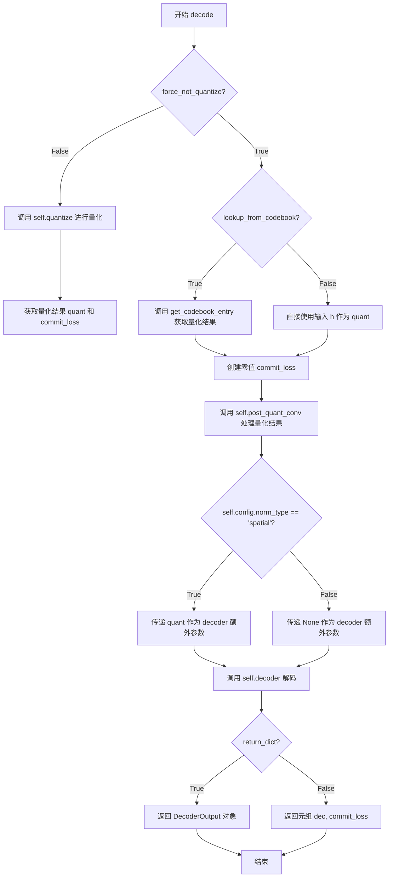
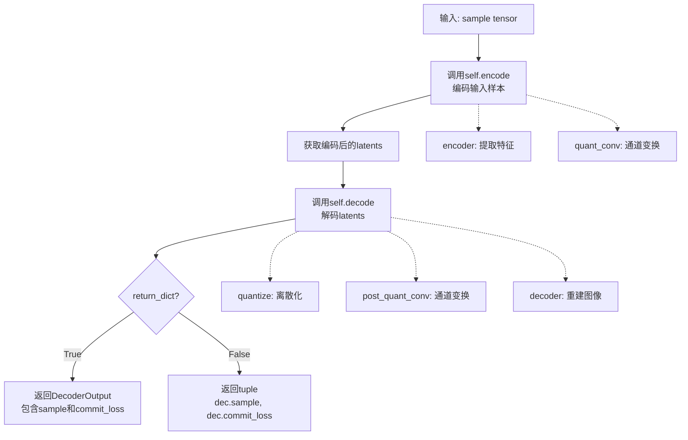

# `diffusers\src\diffusers\models\autoencoders\vq_model.py` 详细设计文档

VQ-VAE（向量量化变分自编码器）模型实现，用于将图像编码到离散潜在空间并进行重建。该模型结合了编码器、向量量化器和解码器，是Stable Diffusion等扩散模型的重要组成部分。

## 整体流程

```mermaid
graph TD
    A[输入图像 sample] --> B[encode 方法]
    B --> C[Encoder 编码器]
    C --> D[quant_conv 卷积]
    D --> E{VQEncoderOutput?}
    E -- 是 --> F[返回 VQEncoderOutput]
    E -- 否 --> G[返回元组 (latents,)]
    F --> H[decode 方法]
    G --> H
    H --> I{force_not_quantize?}
    I -- 否 --> J[quantize 量化]
    I -- 是 --> K{lookup_from_codebook?}
    K -- 是 --> L[get_codebook_entry]
    K -- 否 --> M[直接使用输入]
    J --> N[post_quant_conv]
    L --> N
    M --> N
    N --> O[Decoder 解码器]
    O --> P{return_dict?}
    P -- 是 --> Q[DecoderOutput]
    P -- 否 --> R[(返回元组)]
```

## 类结构

```
ModelMixin (抽象基类)
├── VQModel (VQ-VAE主模型)
    ├── Encoder (编码器组件)
    ├── VectorQuantizer (向量量化器)
    └── Decoder (解码器组件)

AutoencoderMixin (自编码器混入类)
ConfigMixin (配置混入类)
```

## 全局变量及字段


### `_skip_layerwise_casting_patterns`
    
跳过层类型转换的模式列表

类型：`list[str]`
    


### `_supports_group_offloading`
    
是否支持组卸载

类型：`bool`
    


### `VQEncoderOutput.latents`
    
编码器输出的潜在向量

类型：`torch.Tensor`
    


### `VQModel.encoder`
    
图像编码器

类型：`Encoder`
    


### `VQModel.quant_conv`
    
潜在空间维度变换卷积

类型：`nn.Conv2d`
    


### `VQModel.quantize`
    
向量量化器

类型：`VectorQuantizer`
    


### `VQModel.post_quant_conv`
    
量化后维度变换卷积

类型：`nn.Conv2d`
    


### `VQModel.decoder`
    
图像解码器

类型：`Decoder`
    
    

## 全局函数及方法


### VQModel.__init__

初始化VQ-VAE（向量量化变分自编码器）模型结构，包括编码器、量化器和解码器三个核心组件，并配置所有必要的参数。

参数：

- `in_channels`：`int`，输入图像的通道数，默认为3
- `out_channels`：`int`，输出图像的通道数，默认为3
- `down_block_types`：`tuple[str, ...]`，下采样块类型元组，默认为`("DownEncoderBlock2D",)`
- `up_block_types`：`tuple[str, ...]`，上采样块类型元组，默认为`("UpDecoderBlock2D",)`
- `block_out_channels`：`tuple[int, ...]`，块输出通道数元组，默认为`(64,)`
- `layers_per_block`：`int`，每个块的层数，默认为1
- `act_fn`：`str`，激活函数类型，默认为`"silu"`
- `latent_channels`：`int`，潜在空间的通道数，默认为3
- `sample_size`：`int`，采样输入大小，默认为32
- `num_vq_embeddings`：`int`，VQ-VAE中码本向量数量，默认为256
- `norm_num_groups`：`int`，归一化层的组数，默认为32
- `vq_embed_dim`：`int | None`，码本向量的隐藏维度，默认为None（若为None则设为latent_channels的值）
- `scaling_factor`：`float`，缩放因子，用于缩放潜在空间，默认为0.18215
- `norm_type`：`str`，归一化层类型，可选`"group"`或`"spatial"`，默认为`"group"`
- `mid_block_add_attention`：`bool`，是否在中间块添加注意力机制，默认为True
- `lookup_from_codebook`：`bool`，是否从码本查找，默认为False
- `force_upcast`：`bool`，是否强制上转，默认为False

返回值：`None`，该方法为初始化方法，不返回任何值

#### 流程图

```mermaid
flowchart TD
    A[开始 __init__] --> B[调用 super().__init__ 初始化基类]
    B --> C[创建 Encoder 编码器]
    C --> D{检查 vq_embed_dim 是否为 None}
    D -->|是| E[设置 vq_embed_dim = latent_channels]
    D -->|否| F[保持 vq_embed_dim 不变]
    E --> G[创建 quant_conv 卷积层]
    F --> G
    G --> H[创建 VectorQuantizer 量化器]
    H --> I[创建 post_quant_conv 卷积层]
    I --> J[创建 Decoder 解码器]
    J --> K[结束 __init__]
    
    style A fill:#f9f,color:#000
    style K fill:#9f9,color:#000
```

#### 带注释源码

```python
@register_to_config
def __init__(
    self,
    in_channels: int = 3,
    out_channels: int = 3,
    down_block_types: tuple[str, ...] = ("DownEncoderBlock2D",),
    up_block_types: tuple[str, ...] = ("UpDecoderBlock2D",),
    block_out_channels: tuple[int, ...] = (64,),
    layers_per_block: int = 1,
    act_fn: str = "silu",
    latent_channels: int = 3,
    sample_size: int = 32,
    num_vq_embeddings: int = 256,
    norm_num_groups: int = 32,
    vq_embed_dim: int | None = None,
    scaling_factor: float = 0.18215,
    norm_type: str = "group",  # group, spatial
    mid_block_add_attention=True,
    lookup_from_codebook=False,
    force_upcast=False,
):
    """
    初始化VQ-VAE模型结构，包括编码器、量化器和解码器
    
    参数:
        in_channels: 输入图像通道数
        out_channels: 输出图像通道数
        down_block_types: 编码器下采样块类型
        up_block_types: 解码器上采样块类型
        block_out_channels: 各块的输出通道数
        layers_per_block: 每个块的层数
        act_fn: 激活函数名称
        latent_channels: 潜在空间通道数
        sample_size: 采样输入大小
        num_vq_embeddings: 码本向量数量
        norm_num_groups: 归一化组数
        vq_embed_dim: 码本向量隐藏维度
        scaling_factor: 潜在空间缩放因子
        norm_type: 归一化层类型
        mid_block_add_attention: 中间块是否添加注意力
        lookup_from_codebook: 是否从码本查找
        force_upcast: 是否强制上转
    """
    # 1. 调用基类初始化方法，设置配置和模型基础结构
    super().__init__()

    # 2. 创建编码器（Encoder）
    # 将初始化参数传递给Encoder，用于对输入图像进行编码
    self.encoder = Encoder(
        in_channels=in_channels,
        out_channels=latent_channels,
        down_block_types=down_block_types,
        block_out_channels=block_out_channels,
        layers_per_block=layers_per_block,
        act_fn=act_fn,
        norm_num_groups=norm_num_groups,
        double_z=False,  # VQ-VAE不使用双通道潜在表示
        mid_block_add_attention=mid_block_add_attention,
    )

    # 3. 确定量化嵌入维度
    # 如果未指定vq_embed_dim，则使用latent_channels作为默认值
    vq_embed_dim = vq_embed_dim if vq_embed_dim is not None else latent_channels

    # 4. 创建量化相关卷积层和量化器
    # quant_conv: 在量化前对潜在表示进行通道变换
    self.quant_conv = nn.Conv2d(latent_channels, vq_embed_dim, 1)
    
    # quantize: 向量量化器，将连续潜在表示离散化
    # num_vq_embeddings: 码本大小
    # vq_embed_dim: 码本向量维度
    # beta: 承诺损失权重
    self.quantize = VectorQuantizer(
        num_vq_embeddings, vq_embed_dim, beta=0.25, remap=None, sane_index_shape=False
    )
    
    # post_quant_conv: 在量化后将潜在表示维度恢复到latent_channels
    self.post_quant_conv = nn.Conv2d(vq_embed_dim, latent_channels, 1)

    # 5. 创建解码器（Decoder）
    # 将初始化参数传递给Decoder，用于从量化后的潜在表示重建图像
    self.decoder = Decoder(
        in_channels=latent_channels,
        out_channels=out_channels,
        up_block_types=up_block_types,
        block_out_channels=block_out_channels,
        layers_per_block=layers_per_block,
        act_fn=act_fn,
        norm_num_groups=norm_num_groups,
        norm_type=norm_type,
        mid_block_add_attention=mid_block_add_attention,
    )
```


### VQModel.encode

该方法将输入图像编码到潜在空间，首先通过编码器处理输入，然后通过量化卷积层进行特征变换，最终返回编码后的潜在表示。

参数：

- `self`：VQModel 类实例自身
- `x`：`torch.Tensor`，输入图像张量，形状为 `(batch_size, num_channels, height, width)`
- `return_dict`：`bool`，默认为 `True`，指定是否返回字典格式的输出，若为 `False` 则返回元组

返回值：`VQEncoderOutput` 或 `tuple[torch.Tensor]`，编码后的潜在向量，当 `return_dict=True` 时返回 `VQEncoderOutput` 对象，其中包含 `latents` 字段；当 `return_dict=False` 时返回包含潜在向量的元组

#### 流程图

```mermaid
flowchart TD
    A[输入图像 x: torch.Tensor] --> B[self.encoder(x)]
    B --> C[编码器输出 h]
    C --> D[self.quant_conv(h)]
    D --> E{return_dict?}
    E -->|True| F[VQEncoderOutput latents=h]
    E -->|False| G[返回元组 (h,)]
    F --> H[返回编码结果]
    G --> H
```

#### 带注释源码

```python
@apply_forward_hook  # 应用前向钩子，用于追踪或记录前向传播过程
def encode(self, x: torch.Tensor, return_dict: bool = True) -> VQEncoderOutput:
    """
    编码输入图像到潜在空间

    参数:
        x: 输入图像张量，形状为 (batch_size, num_channels, height, width)
        return_dict: 是否返回字典格式，默认为 True

    返回:
        VQEncoderOutput 或 tuple: 编码后的潜在表示
    """
    # 步骤1: 通过编码器处理输入图像
    # Encoder 将输入图像编码为特征表示，输出形状为 (batch_size, latent_channels, H', W')
    h = self.encoder(x)
    
    # 步骤2: 通过量化卷积层进行维度变换
    # quant_conv 将 latent_channels 维度转换为 vq_embed_dim 维度
    # 为后续向量量化做准备
    h = self.quant_conv(h)

    # 步骤3: 根据 return_dict 参数决定返回格式
    if not return_dict:
        # 返回元组格式，兼容旧版 API
        return (h,)

    # 返回 VQEncoderOutput 数据类，包含编码后的潜在向量
    return VQEncoderOutput(latents=h)
```


### VQModel.decode

该方法从潜在向量解码重建图像，将量化后的潜在表示通过解码器转换为输出图像，同时支持是否进行量化处理、codebook查找以及返回格式的选择。

参数：

- `self`：`VQModel`，VQModel 类的实例本身
- `h`：`torch.Tensor`，输入的潜在向量，形状为 `(batch_size, latent_channels, height, width)`
- `force_not_quantize`：`bool`，可选参数，默认为 `False`，是否强制跳过量化步骤
- `return_dict`：`bool`，可选参数，默认为 `True`，是否以字典形式返回结果
- `shape`：`None` 或元组，可选参数，默认为 `None`，当从 codebook 查找时指定形状

返回值：`DecoderOutput` 或 `tuple[torch.Tensor, torch.Tensor]`，如果 `return_dict=True` 返回包含 `sample`（重建图像）和 `commit_loss`（量化损失）的 `DecoderOutput` 对象；否则返回元组 `(解码结果, 量化损失)`

#### 流程图



#### 带注释源码

```python
@apply_forward_hook
def decode(
    self, h: torch.Tensor, force_not_quantize: bool = False, return_dict: bool = True, shape=None
) -> DecoderOutput | torch.Tensor:
    # 根据 force_not_quantize 标志决定是否进行量化
    if not force_not_quantize:
        # 调用 VectorQuantizer 对潜在向量进行量化
        # 返回量化后的向量、量化损失和索引
        quant, commit_loss, _ = self.quantize(h)
    # 如果强制不量化但配置允许从 codebook 查找
    elif self.config.lookup_from_codebook:
        # 根据输入 h 和 shape 从 codebook 中获取对应的量化向量
        quant = self.quantize.get_codebook_entry(h, shape)
        # 创建与批量大小相同的零值量化损失
        commit_loss = torch.zeros((h.shape[0])).to(h.device, dtype=h.dtype)
    else:
        # 直接使用输入向量作为量化结果（不进行量化）
        quant = h
        # 创建与批量大小相同的零值量化损失
        commit_loss = torch.zeros((h.shape[0]))).to(h.device, dtype=h.dtype)
    
    # 通过后量化卷积层将量化向量维度转换为潜在通道数
    quant2 = self.post_quant_conv(quant)
    
    # 调用解码器进行解码
    # 如果使用 spatial norm_type，则传递 quant 作为额外上下文信息
    dec = self.decoder(quant2, quant if self.config.norm_type == "spatial" else None)

    # 根据 return_dict 决定返回格式
    if not return_dict:
        # 返回元组 (解码结果, 量化损失)
        return dec, commit_loss

    # 返回包含重建图像和量化损失的 DecoderOutput 对象
    return DecoderOutput(sample=dec, commit_loss=commit_loss)
```


### VQModel.forward

VQModel的前向传播方法，负责将输入图像通过编码器转换为离散潜在表示，再通过解码器重建图像，实现完整的VQ-VAE前向过程。

参数：

- `self`：VQModel实例，当前模型对象
- `sample`：`torch.Tensor`，输入样本，形状为(batch_size, channels, height, width)的图像张量
- `return_dict`：`bool`，可选参数，默认为True，决定是否返回字典格式的输出

返回值：`DecoderOutput | tuple[torch.Tensor, ...]`，当return_dict为True时返回DecoderOutput对象（包含sample和commit_loss），否则返回元组(重建图像, 量化承诺损失)

#### 流程图



#### 带注释源码

```python
def forward(self, sample: torch.Tensor, return_dict: bool = True) -> DecoderOutput | tuple[torch.Tensor, ...]:
    r"""
    The [`VQModel`] forward method.

    Args:
        sample (`torch.Tensor`): Input sample.
        return_dict (`bool`, *optional*, defaults to `True`):
            Whether or not to return a [`models.autoencoders.vq_model.VQEncoderOutput`] instead of a plain tuple.

    Returns:
        [`~models.autoencoders.vq_model.VQEncoderOutput`] or `tuple`:
            If return_dict is True, a [`~models.autoencoders.vq_model.VQEncoderOutput`] is returned, otherwise a
            plain `tuple` is returned.
    """

    # 步骤1: 调用encode方法对输入样本进行编码
    # encode内部流程: encoder(x) -> quant_conv -> VQEncoderOutput(latents)
    h = self.encode(sample).latents
    
    # 步骤2: 调用decode方法对编码后的潜在表示进行解码
    # decode内部流程: quantize(h) -> post_quant_conv -> decoder -> DecoderOutput
    dec = self.decode(h)

    # 步骤3: 根据return_dict参数决定返回格式
    if not return_dict:
        # 返回元组格式: (重建图像张量, 量化承诺损失)
        return dec.sample, dec.commit_loss
    
    # 返回字典格式: DecoderOutput对象
    return dec
```

## 关键组件


### VQEncoderOutput

用于存储VQModel编码方法输出的数据结构，包含latents（潜在表示张量）

### VQModel

VQ-VAE（向量量化变分自编码器）主模型类，继承自ModelMixin、AutoencoderMixin和ConfigMixin，负责编码、解码和向量量化流程

### Encoder

编码器组件，将输入图像转换为潜在表示，由down_block_types指定的下采样块组成

### Decoder

解码器组件，将量化后的潜在表示重建为输出图像，由up_block_types指定的上采样块组成

### VectorQuantizer

向量量化器组件，将连续潜在表示离散化为codebook中的向量，包含num_vq_embeddings个codebook向量

### quant_conv

量化前卷积层，将latent_channels通道的特征映射到vq_embed_dim维度

### post_quant_conv

量化后卷积层，将vq_embed_dim维度的特征映射回latent_channels维度

### encode方法

将输入张量编码为潜在表示，依次经过encoder和quant_conv，返回VQEncoderOutput

### decode方法

将潜在表示解码为图像，可选地强制跳过量化或从codebook查找，支持spatial和group归一化类型

### forward方法

VQModel的完整前向传播，依次调用encode和decode，支持返回字典或元组形式


## 问题及建议


### 已知问题

-   **decode 方法的 shape 参数使用不一致**：shape 参数仅在 `force_not_quantize=False` 且 `lookup_from_codebook=True` 时使用，其他情况下被忽略，可能导致意外行为
-   **commit_loss 张量形状定义可能错误**：创建 `torch.zeros((h.shape[0]))` 得到的形状可能与实际需求不符，应该是标量或与目标损失维度匹配
-   **forward 方法文档字符串错误**：文档声称返回 `VQEncoderOutput`，但实际返回 `DecoderOutput` 或元组
-   **缺少输入验证**：没有对输入张量的维度、类型或设备进行验证，可能导致运行时错误
-   **VectorQuantizer 的 beta 参数硬编码**：量化器的 beta=0.25 被硬编码在构造函数中，无法通过配置自定义
-   **sample_size 配置未使用**：传入的 sample_size 参数在模型构建过程中未被使用，可能是遗留参数
-   **device 处理隐式依赖**：依赖 PyTorch 的隐式设备传播，在复杂场景下可能导致设备不匹配问题
-   **decode 方法中重复的 commit_loss 创建逻辑**：在 if-elif-else 分支中有重复的 torch.zeros 代码，违反 DRY 原则

### 优化建议

-   **统一 decode 方法的参数逻辑**：重构 shape 参数的使用场景，或在不支持的情况下抛出明确的异常
-   **修正 commit_loss 的形状**：根据 VectorQuantizer 的实际返回类型确认 commit_loss 的正确形状
-   **修正文档字符串**：更新 forward 方法的文档以反映实际返回类型为 DecoderOutput
-   **添加输入验证**：在 encode、decode 和 forward 方法中添加输入验证，检查维度兼容性和设备位置
-   **暴露 VQ 超参数**：将 beta 等 VQ 相关参数提取到配置中，或添加对应的配置选项
-   **移除未使用的参数**：如果 sample_size 确实不需要，可以从配置中移除以减少混淆
-   **提取公共逻辑**：将重复的 commit_loss 创建逻辑提取为单独的方法或统一处理
-   **显式设备处理**：考虑添加显式的 device 参数或在文档中明确说明设备处理约定

## 其它


### 设计目标与约束

本VQ-VAE模型的设计目标是将输入图像编码为离散的潜在表示（latent representations），然后从这些离散表示重建图像。核心约束包括：1）采用向量量化（Vector Quantization）技术将连续的latent space离散化；2）遵循Diffusers库的ModelMixin、ConfigMixin和AutoencoderMixin接口规范；3）支持与潜在扩散模型（Latent Diffusion Models）集成；4）保持与Hugging Face生态系统的兼容性。

### 错误处理与异常设计

本代码主要依赖框架内置的错误处理机制：1）ConfigMixin装饰器在配置参数校验失败时会抛出相关异常；2）torch.nn.Module的forward方法在输入tensor维度不匹配时会自动传播错误；3）VectorQuantizer的量化操作在codebook索引越界时会触发IndexError；4）建议在decode方法的force_not_quantize参数为True且lookup_from_codebook为True时添加参数互斥性检查。

### 数据流与状态机

数据流遵循编码→量化→解码的完整管道：输入图像(x) → Encoder编码 → quant_conv投影 → VectorQuantizer量化（或跳过）→ post_quant_conv投影 → Decoder解码 → 输出重建图像。状态机包含两种主要模式：正常量化模式（force_not_quantize=False）和直通模式（force_not_quantize=True），在spatial normalization下还需传递quantization信息给decoder。

### 外部依赖与接口契约

核心依赖包括：1）torch和torch.nn提供张量计算和神经网络基础；2）dataclasses提供VQEncoderOutput数据结构；3）configuration_utils的ConfigMixin和register_to_config装饰器用于配置管理；4）BaseOutput提供输出基类；5）apply_forward_hook装饰器应用前向钩子；6）来自autoencoders.vae的Encoder、Decoder、DecoderOutput、VectorQuantizer组件；7）ModelMixin提供模型加载/保存等通用方法；8）AutoencoderMixin提供自编码器特定功能。

### 性能考虑与优化空间

当前实现存在以下优化空间：1）quantize层的skip_layerwise_casting_patterns配置表明某些层需要特殊处理以避免性能开销；2）commit_loss计算在直通模式下仍需创建零张量，可优化为可选计算；3）decode方法中的shape参数仅在特定条件下使用，API设计可更清晰；4）可考虑添加混合精度支持以提升推理速度；5）lookup_from_codebook功能提供从codebook直接查找的能力，可用于快速推理场景。

### 版本兼容性与迁移指南

本代码基于PyTorch 2.0+和Diffusers库设计：1）使用Python 3.9+的类型注解（int|None）；2）tuple[str,...]语法要求Python 3.9+；3）未来迁移时需注意Decoder和Encoder组件的接口变化；4）scaling_factor参数与潜在扩散模型的集成需保持版本一致性；5）norm_type的"spatial"选项为高级功能，需确保decoder实现支持。

### 配置参数详解

关键配置参数对模型行为的影响：1）latent_channels控制编码器输出通道数；2）num_vq_embeddings定义codebook大小（默认256），影响离散表示的表达能力；3）vq_embed_dim允许codebook向量维度与latent通道数不同；4）scaling_factor（默认0.18215）用于与SD等潜在扩散模型集成时的latent缩放；5）norm_type选择"group"或"spatial"归一化方式，影响重建质量；6）lookup_from_codebook允许使用codebook索引进行快速解码。

### 模型训练与推理注意事项

训练时需注意：1）commit_loss（量化承诺损失）需纳入总损失函数；2）scaling_factor应在训练潜在扩散模型时使用，推理时逆操作；3）建议使用group normalization（norm_num_groups=32）以保持训练稳定性。推理时：1）可设置force_not_quantize=True跳过量化步骤；2）lookup_from_codebook=True时可从预计算索引快速重建；3）返回dict vs tuple的选择影响后续处理流程。


    