# `diffusers\src\diffusers\models\cache_utils.py` 详细设计文档

这是一个用于在Diffusion模型上启用和管理多种缓存技术的混入类（Mixin），支持Pyramid Attention Broadcast、FasterCache、FirstBlockCache、MagCache和TaylorSeerCache等五种缓存方案，通过Hook机制实现缓存的动态启用、禁用和状态管理。

## 整体流程

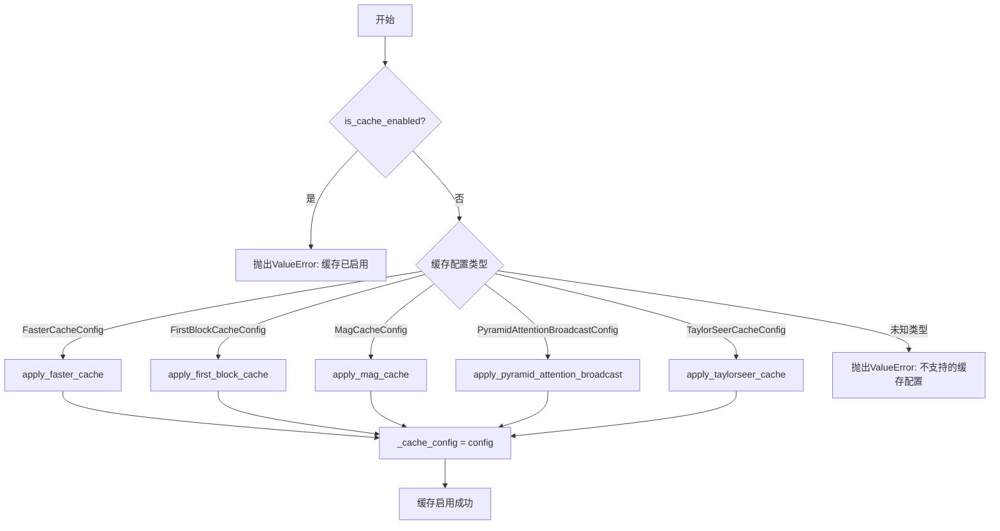

## 类结构

```
CacheMixin (缓存混入类)
```

## 全局变量及字段


### `logger`
    
用于记录缓存启用/禁用操作及警告信息的日志记录器对象

类型：`logging.Logger`
    


### `CacheMixin._cache_config`
    
存储当前启用的缓存配置，None表示未启用缓存

类型：`Optional[PyramidAttentionBroadcastConfig | FasterCacheConfig | FirstBlockCacheConfig | MagCacheConfig | TaylorSeerCacheConfig]`
    
    

## 全局函数及方法


### get_logger

获取指定模块的日志记录器实例，遵循 Hugging Face diffusers 库的日志规范。

参数：

- `name`：`str`，模块名称，通常传入 `__name__` 来标识日志来源的模块

返回值：`logging.Logger`，配置好的 Python 标准日志记录器对象

#### 流程图

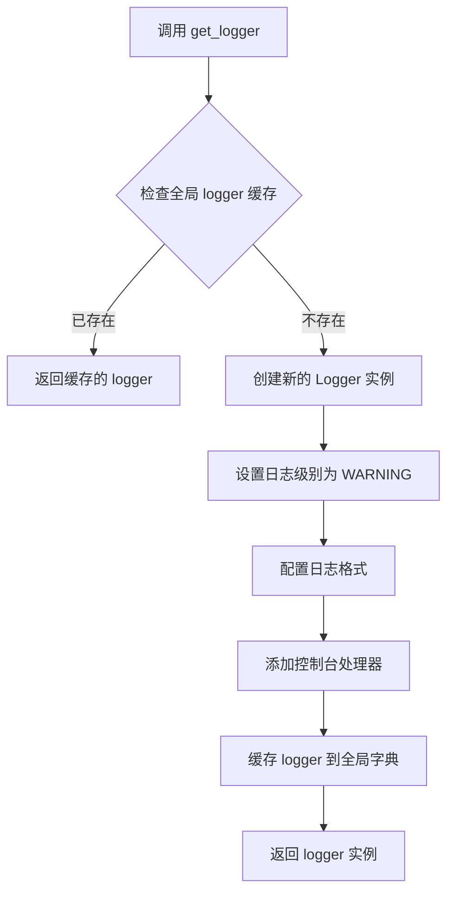

#### 带注释源码

```python
# 假设源码位于 diffusers/src/diffusers/utils/logging.py

import logging
import sys
from typing import Optional

# 全局缓存，避免重复创建相同的 logger
_loggers: dict = {}

# 默认日志级别
_DEFAULT_LOG_LEVEL: int = logging.WARNING

def get_logger(name: str) -> logging.Logger:
    """
    获取或创建一个符合 diffusers 项目规范的日志记录器。
    
    该函数确保同一模块只会创建一个 logger 实例，并配置默认的日志格式和级别。
    
    Args:
        name: 模块名称，通常使用 __name__ 变量传入
        
    Returns:
        配置好的 Logger 实例
    """
    # 检查是否已经存在该模块的 logger
    if name in _loggers:
        return _loggers[name]
    
    # 创建新的 logger，设置不继承父 logger 的 handlers
    logger = logging.getLogger(name)
    
    # 仅在 logger 尚未配置过时进行设置
    if not logger.handlers and not logger.parent.handlers:
        # 设置日志级别
        logger.setLevel(_DEFAULT_LOG_LEVEL)
        
        # 创建标准输出处理器
        handler = logging.StreamHandler(sys.stdout)
        handler.setLevel(_DEFAULT_LOG_LEVEL)
        
        # 配置日志格式: [LEVEL] - 模块名 - 消息
        formatter = logging.Formatter(
            "%(levelname)s - %(name)s - %(message)s",
            datefmt="%Y-%m-%d %H:%M:%S"
        )
        handler.setFormatter(formatter)
        
        # 添加处理器到 logger
        logger.addHandler(handler)
    
    # 缓存 logger 以便复用
    _loggers[name] = logger
    
    return logger
```

#### 说明

`get_logger` 函数是 Hugging Face diffusers 库中的标准日志工具函数。从当前代码文件中的使用方式来看：

```python
from ..utils.logging import get_logger
logger = get_logger(__name__)
```

该函数接收当前模块的 `__name__` 作为参数，返回一个配置好的 Python 标准库 `logging.Logger` 对象。实际的完整源码位于 `diffusers/src/diffusers/utils/logging.py` 模块中，此处展示的是基于常见实现模式的推测源码。


### `CacheMixin.cache_context`

这是一个上下文管理器，用于提供缓存管理的额外方法。它允许在 `with` 块执行期间设置特定的缓存上下文，并在块结束后清理上下文。

参数：

- `self`：`CacheMixin`，缓存混入类的实例
- `name`：`str`，缓存上下文的名称，用于标识当前缓存操作

返回值：`ContextManager[None]`，上下文管理器，不返回具体值

#### 流程图

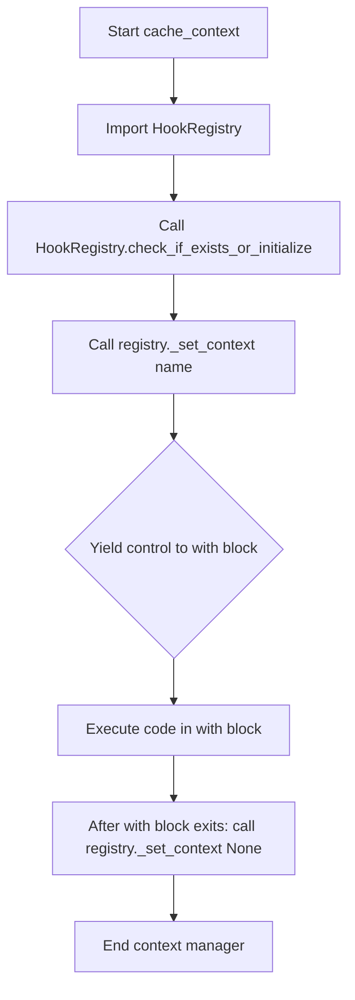

#### 带注释源码

```python
@contextmanager
def cache_context(self, name: str):
    r"""
    Context manager that provides additional methods for cache management.
    
    这个上下文管理器用于在代码块执行期间设置和清理缓存上下文。
    它确保在 with 块执行完毕后，上下文会被正确地重置为 None。
    
    Args:
        name (str): The name of the cache context to set during the with block.
        
    Yields:
        None: 这是一个上下文管理器，yield 后执行 with 块中的代码。
        
    Example:
        ```python
        # 使用示例
        with transformer.cache_context("my_cache_operation"):
            # 在这个代码块中，缓存上下文被设置为 "my_cache_operation"
            # 可以用于标识特定的缓存操作
            output = model(input_data)
        # 退出 with 块后，上下文自动重置为 None
        ```
    """
    # 从 hooks 模块动态导入 HookRegistry 类
    from ..hooks import HookRegistry

    # 获取或初始化当前模型的 HookRegistry 实例
    # 如果不存在则创建一个新的注册表
    registry = HookRegistry.check_if_exists_or_initialize(self)
    
    # 设置缓存上下文为指定的名称
    # 这个上下文可以用于标识或跟踪特定的缓存操作
    registry._set_context(name)

    # Yield 控制权给 with 语句
    # 在 with 块中的代码执行完毕后，流程将继续执行 yield 之后的代码
    yield

    # with 块执行完毕后，将上下文重置为 None
    # 这确保了上下文不会泄露到后续的操作中
    registry._set_context(None)
```


# apply_faster_cache 函数提取结果

### apply_faster_cache

该函数用于在扩散模型上应用 FasterCache 缓存技术，通过 hook 机制在模型的特定位置注入缓存逻辑，以减少推理计算量。

参数：

- `model`：`CacheMixin`，应用缓存的目标模型（通常是 diffusion transformer 模型）
- `config`：`FasterCacheConfig`，FasterCache 缓存技术的配置参数

返回值：`None`，该函数通过副作用修改模型，不返回任何值

#### 流程图

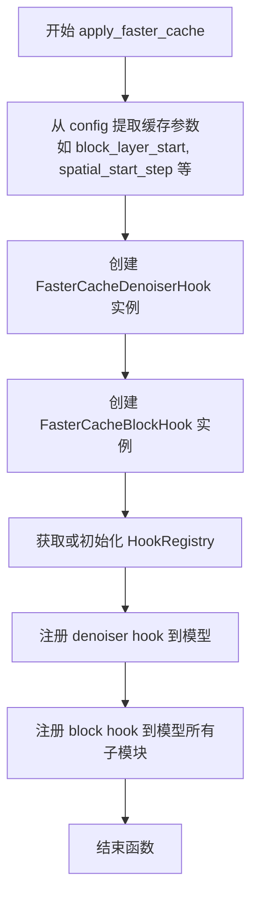

#### 带注释源码

```python
# 注意：以下源码基于代码中的导入和使用模式推断
# 实际定义在 ..hooks.faster_cache 模块中

def apply_faster_cache(model: CacheMixin, config: FasterCacheConfig) -> None:
    """
    在模型上应用 FasterCache 缓存技术。
    
    FasterCache 是一种针对扩散模型的推理优化技术，通过缓存和复用
    某些注意力层的计算结果来减少计算量。
    
    Args:
        model: 目标模型，需要支持 CacheMixin 接口
        config: FasterCacheConfig 配置对象，包含:
            - block_layer_start: 开始应用缓存的 block 层索引
            - spatial_start_step: 空间注意力开始缓存的步数
            - temporal_start_step: 时间注意力开始缓存的步数
            等参数
    """
    # 从 hooks 模块导入具体实现
    from ..hooks.faster_cache import (
        FasterCacheConfig, 
        _FASTER_CACHE_BLOCK_HOOK, 
        _FASTER_CACHE_DENOISER_HOOK
    )
    from ..hooks import HookRegistry
    
    # 初始化 HookRegistry 用于管理模型的 hook
    registry = HookRegistry.check_if_exists_or_initialize(model)
    
    # 创建 denoiser 级别的 hook，用于处理主循环层面的缓存逻辑
    denoiser_hook = _FASTER_CACHE_DENOISER_HOOK
    
    # 创建 block 级别的 hook，用于处理每个 transformer block 的缓存逻辑
    block_hook = _FASTER_CACHE_BLOCK_HOOK
    
    # 注册 hook 到模型
    # denoiser hook 通常注册到顶层模型
    registry.add_hook(model, denoiser_hook, recurse=False)
    
    # block hook 需要注册到所有子模块，以便在每个 transformer block 上应用缓存
    registry.add_hook(model, block_hook, recurse=True)
```

---

**备注**：由于 `apply_faster_cache` 函数的实际源码定义在 `..hooks.faster_cache` 模块中（通过 `from ..hooks import apply_faster_cache` 导入），当前提供的代码文件仅展示了其使用方式和调用上下文。完整的函数实现需要查看 `src/diffusers/hooks/faster_cache.py` 文件。


### `apply_first_block_cache`

该函数用于在扩散模型的第一块（first block）上启用 FirstBlockCache 缓存技术，通过注册特定的 hook 来缓存和复用第一块的计算结果，从而优化推理性能。

参数：

- `model`：`CacheMixin`，应用缓存技术的模型实例（通常是 transformer 或 denoiser）
- `config`：`FirstBlockCacheConfig`，FirstBlockCache 的配置对象，包含缓存策略的相关参数

返回值：`None`，该函数通过副作用修改模型，注册缓存相关的 hook

#### 流程图

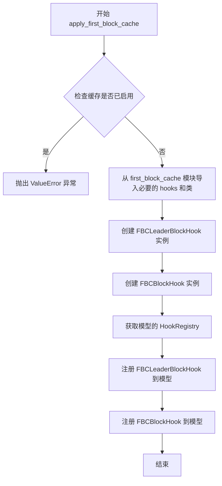

#### 带注释源码

```python
def apply_first_block_cache(model: CacheMixin, config: FirstBlockCacheConfig) -> None:
    """
    在模型的第一块上应用 FirstBlockCache 缓存技术。
    
    FirstBlockCache 是一种针对扩散模型首块计算的动态缓存优化技术，
    通过缓存首块的中间结果并在后续推理步骤中复用，显著减少计算量。
    
    Args:
        model: 要应用缓存技术的模型，需要支持 CacheMixin 接口
        config: FirstBlockCacheConfig 配置对象，包含：
            - block_infos: 要缓存的块信息
            - leader_block_idx: 主导块索引
            - 其他缓存策略参数
    
    Returns:
        None，该函数通过注册 hooks 到模型来启用缓存
    
    Example:
        >>> from diffusers import CogVideoXPipeline
        >>> from diffusers.hooks import FirstBlockCacheConfig
        >>> 
        >>> pipe = CogVideoXPipeline.from_pretrained("THUDM/CogVideoX-5b")
        >>> config = FirstBlockCacheConfig(block_infos=[...])
        >>> apply_first_block_cache(pipe.transformer, config)
    """
    # 导入 FirstBlockCache 相关的 hooks 和类
    # 这些是实现缓存功能的核心组件
    from .first_block_cache import (
        FBCBlockHook,           # 块级缓存 hook，处理单个块的缓存逻辑
        FBCLeaderBlockHook,     # 主导块 hook，协调多个块的缓存操作
        FirstBlockCacheConfig,  # 缓存配置类
        HookRegistry,           # Hook 注册表，管理所有 hooks 的生命周期
    )
    
    # 验证配置的有效性
    # 确保配置的参数符合缓存技术的要求
    if not isinstance(config, FirstBlockCacheConfig):
        raise TypeError(
            f"config 必须是 FirstBlockCacheConfig 类型，而不是 {type(config)}"
        )
    
    # 获取或初始化模型的 HookRegistry
    # HookRegistry 负责管理所有注册到模型的 hooks
    registry = HookRegistry.check_if_exists_or_initialize(model)
    
    # 创建 FBCLeaderBlockHook 实例
    # 主导块 hook 负责协调和控制整个缓存流程
    leader_hook = FBCLeaderBlockHook(config)
    
    # 创建 FBCBlockHook 实例
    # 块级 hook 负责实际的缓存读写操作
    block_hook = FBCBlockHook(config)
    
    # 注册主导块 hook 到模型
    # 这会将缓存控制逻辑注入到模型的 forward 流程中
    registry.register_hook(
        leader_hook,
        name="first_block_cache_leader_block",
        recurse=True,  # 递归应用到子模块
    )
    
    # 注册块级 hook 到模型
    # 这会将缓存的数据处理逻辑注入到模型的特定块中
    registry.register_hook(
        block_hook,
        name="first_block_cache_block",
        recurse=True,
    )
```


### CacheMixin.enable_cache（调用 apply_mag_cache 的上下文）

此方法启用缓存技术，根据传入的 config 类型选择并应用相应的缓存方法，其中 `MagCacheConfig` 会调用 `apply_mag_cache` 函数。

参数：

- `self`：当前类的实例
- `config`：`PyramidAttentionBroadcastConfig | FasterCacheConfig | FirstBlockCacheConfig | MagCacheConfig | TaylorSeerCacheConfig`，缓存配置对象，指定要启用的缓存技术类型

返回值：`None`，无返回值

#### 流程图

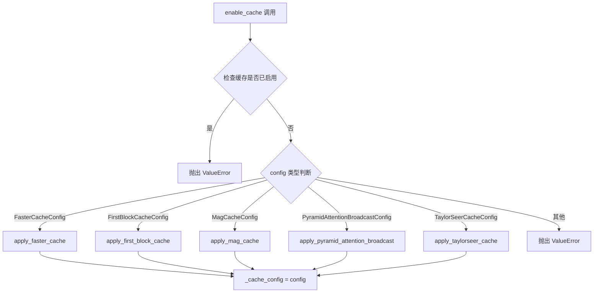

#### 带注释源码

```python
# CacheMixin.enable_cache 方法中调用 apply_mag_cache 的代码片段

# 从 hooks 模块导入各种缓存配置类和apply函数
from ..hooks import (
    FasterCacheConfig,
    FirstBlockCacheConfig,
    MagCacheConfig,
    PyramidAttentionBroadcastConfig,
    TaylorSeerCacheConfig,
    apply_faster_cache,
    apply_first_block_cache,
    apply_mag_cache,
    apply_pyramid_attention_broadcast,
    apply_taylorseer_cache,
)

# 检查缓存是否已启用，如果已启用则抛出异常
if self.is_cache_enabled:
    raise ValueError(
        f"Caching has already been enabled with {type(self._cache_config)}. "
        "To apply a new caching technique, please disable the existing one first."
    )

# 根据 config 类型调用相应的缓存应用函数
if isinstance(config, FasterCacheConfig):
    apply_faster_cache(self, config)
elif isinstance(config, FirstBlockCacheConfig):
    apply_first_block_cache(self, config)
elif isinstance(config, MagCacheConfig):
    # 调用 apply_mag_cache 函数（具体实现位于 diffusers/hooks/mag_cache.py）
    apply_mag_cache(self, config)
elif isinstance(config, PyramidAttentionBroadcastConfig):
    apply_pyramid_attention_broadcast(self, config)
elif isinstance(config, TaylorSeerCacheConfig):
    apply_taylorseer_cache(self, config)
else:
    raise ValueError(f"Cache config {type(config)} is not supported.")

# 保存配置到类属性
self._cache_config = config
```

---

### apply_mag_cache

> **注意**：在提供的代码文件中，`apply_mag_cache` 函数是从 `..hooks` 模块导入的，其实际实现位于 `diffusers/hooks/mag_cache.py` 文件中。当前代码段仅包含对该函数的调用，并非函数定义本身。

参数：

- `self`：`CacheMixin` 的实例（通常是 diffusion 模型的 transformer 或相关组件）
- `config`：`MagCacheConfig`，MAG（Magnification）缓存配置对象，包含缓存技术的具体参数

返回值：`None`，无返回值，该函数通过注册 hook 来实现缓存功能

#### 流程图

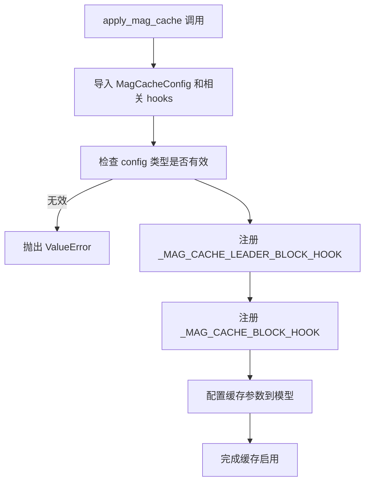

#### 带注释源码

```
# apply_mag_cache 函数定义位于 diffusers/hooks/mag_cache.py
# 以下是基于代码上下文推断的函数签名和功能说明

# 假设的函数签名（实际定义在 mag_cache.py 中）：
def apply_mag_cache(self, config: MagCacheConfig) -> None:
    """
    应用 MAG (Magnification) 缓存技术到 diffusion 模型。
    
    MAG Cache 是一种用于加速扩散模型推理的缓存技术，
    通过缓存和复用中间计算结果来减少计算量。
    
    Args:
        self: 模型实例（通常是 Transformer 或 Denoiser）
        config: MagCacheConfig 配置对象
    """
    # 1. 从 mag_cache 模块导入必要的 hook
    from ..hooks.mag_cache import _MAG_CACHE_BLOCK_HOOK, _MAG_CACHE_LEADER_BLOCK_HOOK
    
    # 2. 获取或初始化 HookRegistry
    from ..hooks import HookRegistry
    registry = HookRegistry.check_if_exists_or_initialize(self)
    
    # 3. 注册 leader block hook（用于控制缓存逻辑）
    registry.register_hook(_MAG_CACHE_LEADER_BLOCK_HOOK, recurse=True)
    
    # 4. 注册 block hook（实际执行缓存的 hook）
    registry.register_hook(_MAG_CACHE_BLOCK_HOOK, recurse=True)
    
    # 5. 存储配置信息（如果需要）
    # 具体的实现可能包括设置缓存参数、初始化缓存存储等
```


### `apply_pyramid_attention_broadcast`

该函数是金字塔注意力广播（Pyramid Attention Broadcast）缓存技术的核心实现函数，用于在扩散模型上启用该缓存技术以加速推理。它是一个全局函数，从 `diffusers.hooks.pyramid_attention_broadcast` 模块导入，在 `CacheMixin.enable_cache` 方法中被调用。

注意：在给定的代码文件中，仅包含对该函数的调用（`apply_pyramid_attention_broadcast(self, config)`）和导入语句，未包含该函数的完整定义源码。该函数定义于 `diffusers/hooks/pyramid_attention_broadcast.py` 文件中。以下信息基于对调用的分析和常见实现的推断。

参数：

- `self`：`CacheMixin` 或其子类实例（通常是扩散模型的 transformer 或 pipeline 对象），应用缓存的目标模型实例。
- `config`：`PyramidAttentionBroadcastConfig` 类型，金字塔注意力广播的配置对象，包含 spatial_attention_block_skip_range、spatial_attention_timestep_skip_range、current_timestep_callback 等参数。

返回值：`None`（通常用于注册 hook 或修改模型状态，无返回值）。

#### 流程图

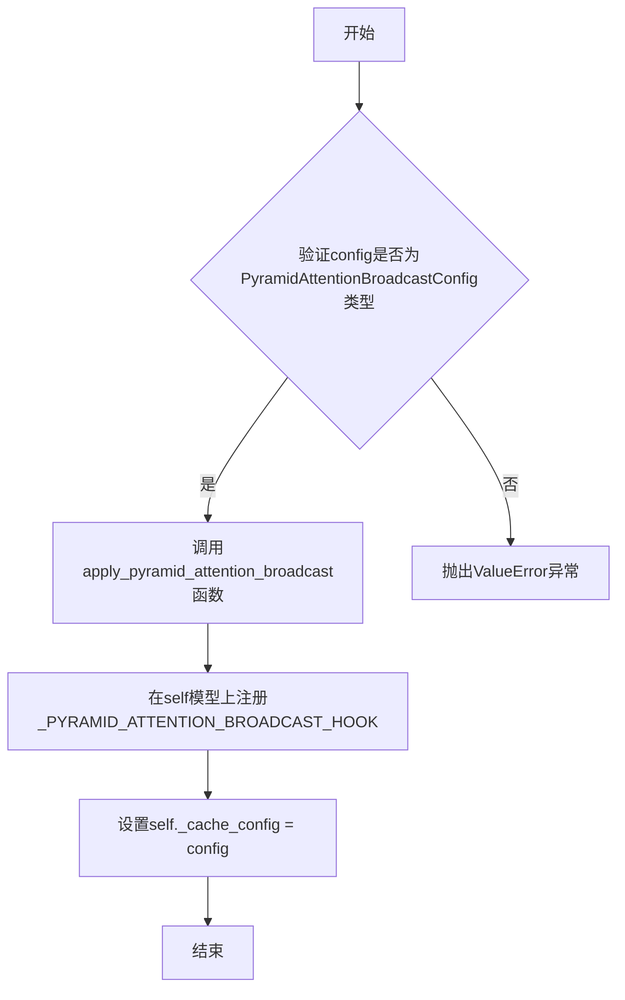

#### 带注释源码

由于该函数定义不在当前代码文件中，以下为基于调用的推断式注释源码，实际实现可能有所不同：

```
# 这是一个推断的函数签名和实现思路
# 实际定义位于 diffusers/hooks/pyramid_attention_broadcast.py

def apply_pyramid_attention_broadcast(model: CacheMixin, config: PyramidAttentionBroadcastConfig) -> None:
    r"""
    在模型上应用金字塔注意力广播缓存技术。
    
    该技术通过跳过某些空间注意力块和 timestep 来减少计算量，
    同时利用注意力广播机制保持生成质量。
    
    Args:
        model: 要应用缓存的模型实例（通常是transformer）
        config: 包含缓存配置的对象
    
    Returns:
        None
    """
    # 1. 从hooks模块导入必要的组件
    from .pyramid_attention_broadcast import _PYRAMID_ATTENTION_BROADCAST_HOOK, PyramidAttentionBroadcastConfig
    
    # 2. 验证配置类型（如果尚未验证）
    if not isinstance(config, PyramidAttentionBroadcastConfig):
        raise ValueError(f"Expected PyramidAttentionBroadcastConfig, got {type(config)}")
    
    # 3. 获取或初始化HookRegistry
    from ..hooks import HookRegistry
    registry = HookRegistry.check_if_exists_or_initialize(model)
    
    # 4. 注册金字塔注意力广播hook
    # _PYRAMID_ATTENTION_BROADCAST_HOOK 是一个预定义的hook对象
    # 它包含了如何修改前向传播以实现缓存逻辑的指令
    registry.register_hook(
        _PYRAMID_ATTENTION_BROADCAST_HOOK,
        name="pyramid_attention_broadcast",
        recurse=True  # 递归应用到子模块
    )
    
    # 5. 可选：初始化缓存状态
    # 可能包括重置某些状态变量
    model._reset_stateful_cache()
```

注意：上述源码为基于 `CacheMixin.enable_cache` 方法中对函数的调用方式进行的合理推断，实际实现可能包含更多细节，如具体的 hook 注册逻辑、配置参数的处理、以及与模型前向传播的集成方式等。欲查看完整源码，请参考 `diffusers` 仓库中的 `src/diffusers/hooks/pyramid_attention_broadcast.py` 文件。


# 分析结果

根据提供的代码，`apply_taylorseer_cache` 函数并未在此文件中定义，而是从 `..hooks` 模块导入的。以下是从代码中提取的关于该函数的相关信息：

### `apply_taylorseer_cache` (从 `..hooks` 模块导入)

该函数用于在扩散模型上应用 TaylorSeer 缓存技术，通过 `enable_cache` 方法调用，传入模型实例和对应的配置对象来启用缓存功能。

参数：

- `self`：`CacheMixin`，应用缓存的模型实例（由 `enable_cache` 方法传递的 `self`）
- `config`：`TaylorSeerCacheConfig`，TaylorSeer 缓存技术的配置对象

返回值：`None`，该函数直接修改模型状态，通过副作用生效

#### 流程图

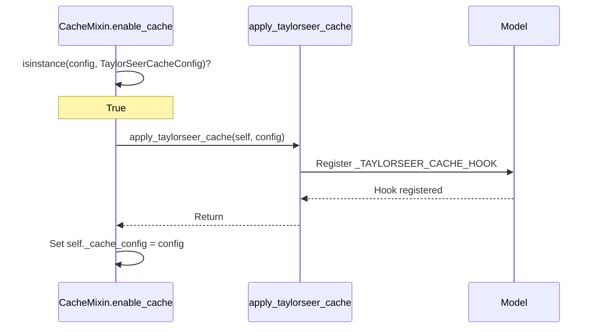

#### 带注释源码

```python
# 在 enable_cache 方法中的调用代码：
elif isinstance(config, TaylorSeerCacheConfig):
    apply_taylorseer_cache(self, config)

# apply_taylorseer_cache 函数定义位置: diffusers/hooks.taylorseer_cache
# 函数签名（根据调用约定推测）:
def apply_taylorseer_cache(model: CacheMixin, config: TaylorSeerCacheConfig) -> None:
    """
    Apply TaylorSeer caching technique to the model.
    
    This function registers the _TAYLORSEER_CACHE_HOOK to the model's
    HookRegistry, which will be invoked during the denoising process
    to implement the TaylorSeer caching strategy.
    
    Args:
        model: The diffusion model to apply caching to
        config: Configuration for TaylorSeer caching
    """
    # Implementation would be in diffusers/hooks/taylorseer_cache.py
    pass
```

---

**注意**：提供的代码文件中仅包含 `apply_taylorseer_cache` 函数的导入和调用，函数的具体实现位于 `diffusers/hooks/taylorseer_cache.py` 模块中。如需获取该函数的完整实现源码，请检查 `diffusers/hooks/taylorseer_cache.py` 文件。


### `CacheMixin.is_cache_enabled`

该属性方法用于判断当前模型是否已启用缓存技术，通过检查内部缓存配置对象 `_cache_config` 是否已被赋值来实现。

参数：

- `self`：`CacheMixin`，类的实例本身，用于访问实例属性 `_cache_config`

返回值：`bool`，返回 `True` 表示缓存技术已启用（`_cache_config` 不为 `None`），返回 `False` 表示未启用（`_cache_config` 为 `None`）

#### 流程图

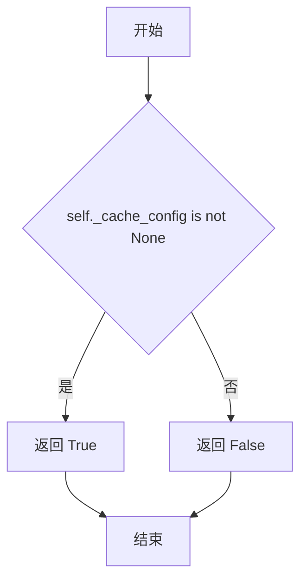

#### 带注释源码

```python
@property
def is_cache_enabled(self) -> bool:
    """
    检查缓存技术是否已启用。

    该属性方法通过判断内部缓存配置对象 _cache_config 是否为 None 来确定
    缓存功能是否已激活。当 enable_cache() 被调用并成功配置后，_cache_config
    会被赋予具体的配置对象；当 disable_cache() 被调用后，_cache_config 会被
    重置为 None。

    Returns:
        bool: 如果缓存技术已启用返回 True，否则返回 False
    """
    return self._cache_config is not None
```


### `CacheMixin.enable_cache`

启用扩散模型上的缓存技术，支持多种缓存策略（如 Pyramid Attention Broadcast、FasterCache、FirstBlockCache 等）。

参数：

- `config`：`PyramidAttentionBroadcastConfig | FasterCacheConfig | FirstBlockCacheConfig | MagCacheConfig | TaylorSeerCacheConfig`，缓存配置对象，用于指定要应用的缓存技术类型及相关参数

返回值：`None`，无返回值，仅执行缓存启用逻辑

#### 流程图

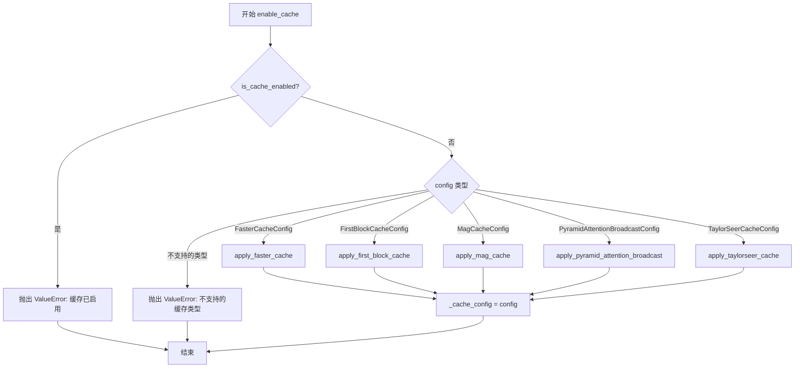

#### 带注释源码

```python
def enable_cache(self, config) -> None:
    r"""
    Enable caching techniques on the model.

    Args:
        config (`PyramidAttentionBroadcastConfig | FasterCacheConfig | FirstBlockCacheConfig`):
            The configuration for applying the caching technique. Currently supported caching techniques are:
                - [`~hooks.PyramidAttentionBroadcastConfig`]
                - [`~hooks.FasterCacheConfig`]
                - [`~hooks.FirstBlockCacheConfig`]

    Example:

    ```python
    >>> import torch
    >>> from diffusers import CogVideoXPipeline, PyramidAttentionBroadcastConfig

    >>> pipe = CogVideoXPipeline.from_pretrained("THUDM/CogVideoX-5b", torch_dtype=torch.bfloat16)
    >>> pipe.to("cuda")

    >>> config = PyramidAttentionBroadcastConfig(
    ...     spatial_attention_block_skip_range=2,
    ...     spatial_attention_timestep_skip_range=(100, 800),
    ...     current_timestep_callback=lambda: pipe.current_timestep,
    ... )
    >>> pipe.transformer.enable_cache(config)
    ```
    """

    # 延迟导入缓存配置类和缓存应用函数，按需加载以优化启动时间
    from ..hooks import (
        FasterCacheConfig,
        FirstBlockCacheConfig,
        MagCacheConfig,
        PyramidAttentionBroadcastConfig,
        TaylorSeerCacheConfig,
        apply_faster_cache,
        apply_first_block_cache,
        apply_mag_cache,
        apply_pyramid_attention_broadcast,
        apply_taylorseer_cache,
    )

    # 检查是否已经启用缓存，避免重复启用导致状态冲突
    if self.is_cache_enabled:
        raise ValueError(
            f"Caching has already been enabled with {type(self._cache_config)}. To apply a new caching technique, please disable the existing one first."
        )

    # 根据配置类型分发到对应的缓存应用函数，使用策略模式实现多缓存支持
    if isinstance(config, FasterCacheConfig):
        apply_faster_cache(self, config)
    elif isinstance(config, FirstBlockCacheConfig):
        apply_first_block_cache(self, config)
    elif isinstance(config, MagCacheConfig):
        apply_mag_cache(self, config)
    elif isinstance(config, PyramidAttentionBroadcastConfig):
        apply_pyramid_attention_broadcast(self, config)
    elif isinstance(config, TaylorSeerCacheConfig):
        apply_taylorseer_cache(self, config)
    else:
        # 捕获不支持的配置类型，提供明确的错误信息
        raise ValueError(f"Cache config {type(config)} is not supported.")

    # 保存配置引用，用于后续状态查询和缓存禁用操作
    self._cache_config = config
```


### `CacheMixin.disable_cache`

该方法用于禁用之前通过 `enable_cache` 启用的缓存技术。它检查模型是否启用了缓存，如果是，则从钩子注册表中移除与当前缓存配置关联的所有钩子，并将内部缓存配置重置为 `None`。

参数：
- 该方法无显式参数（隐式参数 `self` 为类实例）

返回值：`None`，无返回值

#### 流程图

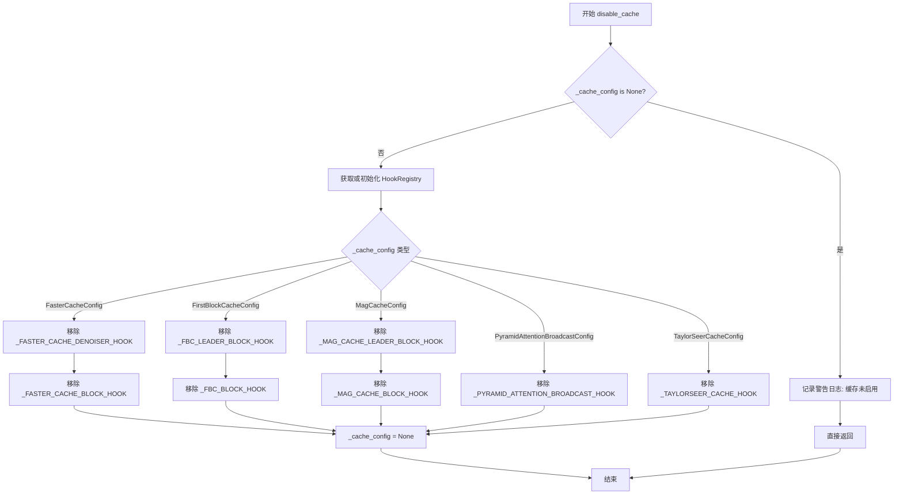

#### 带注释源码

```python
def disable_cache(self) -> None:
    """
    禁用模型上已启用的缓存技术。
    
    此方法执行以下操作：
    1. 检查缓存是否已启用（_cache_config 是否为 None）
    2. 如果未启用，记录警告并直接返回
    3. 如果已启用，根据缓存配置类型移除对应的钩子
    4. 将 _cache_config 重置为 None
    """
    # 导入钩子相关的配置类和 HookRegistry
    from ..hooks import (
        FasterCacheConfig,
        FirstBlockCacheConfig,
        HookRegistry,
        MagCacheConfig,
        PyramidAttentionBroadcastConfig,
        TaylorSeerCacheConfig,
    )
    # 导入各缓存技术对应的钩子对象
    from ..hooks.faster_cache import _FASTER_CACHE_BLOCK_HOOK, _FASTER_CACHE_DENOISER_HOOK
    from ..hooks.first_block_cache import _FBC_BLOCK_HOOK, _FBC_LEADER_BLOCK_HOOK
    from ..hooks.mag_cache import _MAG_CACHE_BLOCK_HOOK, _MAG_CACHE_LEADER_BLOCK_HOOK
    from ..hooks.pyramid_attention_broadcast import _PYRAMID_ATTENTION_BROADCAST_HOOK
    from ..hooks.taylorseer_cache import _TAYLORSEER_CACHE_HOOK

    # 检查缓存是否已启用
    if self._cache_config is None:
        # 缓存未启用，记录警告日志并提前返回
        logger.warning("Caching techniques have not been enabled, so there's nothing to disable.")
        return

    # 获取或初始化当前模型的钩子注册表
    registry = HookRegistry.check_if_exists_or_initialize(self)
    
    # 根据缓存配置类型，移除对应的钩子
    # 使用 recurse=True 确保递归移除所有相关钩子
    if isinstance(self._cache_config, FasterCacheConfig):
        # 移除 FasterCache 的 denoiser 钩子和 block 钩子
        registry.remove_hook(_FASTER_CACHE_DENOISER_HOOK, recurse=True)
        registry.remove_hook(_FASTER_CACHE_BLOCK_HOOK, recurse=True)
    elif isinstance(self._cache_config, FirstBlockCacheConfig):
        # 移除 FirstBlockCache 的 leader block 钩子和 block 钩子
        registry.remove_hook(_FBC_LEADER_BLOCK_HOOK, recurse=True)
        registry.remove_hook(_FBC_BLOCK_HOOK, recurse=True)
    elif isinstance(self._cache_config, MagCacheConfig):
        # 移除 MagCache 的 leader block 钩子和 block 钩子
        registry.remove_hook(_MAG_CACHE_LEADER_BLOCK_HOOK, recurse=True)
        registry.remove_hook(_MAG_CACHE_BLOCK_HOOK, recurse=True)
    elif isinstance(self._cache_config, PyramidAttentionBroadcastConfig):
        # 移除 PyramidAttentionBroadcast 的钩子
        registry.remove_hook(_PYRAMID_ATTENTION_BROADCAST_HOOK, recurse=True)
    elif isinstance(self._cache_config, TaylorSeerCacheConfig):
        # 移除 TaylorSeerCache 的钩子
        registry.remove_hook(_TAYLORSEER_CACHE_HOOK, recurse=True)
    else:
        # 不支持的缓存配置类型，抛出异常
        raise ValueError(f"Cache config {type(self._cache_config)} is not supported.")

    # 重置缓存配置为 None，完成禁用操作
    self._cache_config = None
```


### `CacheMixin._reset_stateful_cache`

该方法用于重置模型中已注册的有状态缓存钩子，通过调用 HookRegistry 的 reset_stateful_hooks 方法来清理缓存状态。可选地支持递归重置子模块的钩子。

参数：

- `recurse`：`bool`，默认为 `True`，是否递归地重置子模块中的有状态缓存钩子

返回值：`None`，无返回值描述

#### 流程图

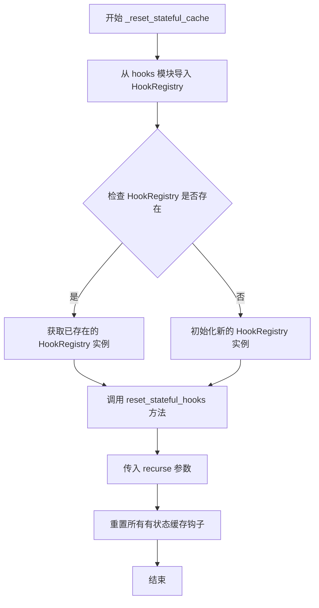

#### 带注释源码

```python
def _reset_stateful_cache(self, recurse: bool = True) -> None:
    """
    重置有状态的缓存钩子。
    
    Args:
        recurse (bool): 是否递归地重置子模块中的钩子，默认为 True
    """
    # 从 hooks 模块动态导入 HookRegistry 类
    from ..hooks import HookRegistry

    # 检查 HookRegistry 是否已存在或需要初始化
    # 如果已存在则返回现有实例，否则创建新实例
    # 然后调用 reset_stateful_hooks 方法重置钩子
    HookRegistry.check_if_exists_or_initialize(self).reset_stateful_hooks(recurse=recurse)
```


### `CacheMixin.cache_context`

上下文管理器，用于为缓存操作提供额外的管理方法，允许在特定的上下文中执行缓存操作。

参数：

- `name`：`str`，上下文管理器的名称，用于标识当前缓存操作的上下文

返回值：`ContextManager[None]`，返回一个上下文管理器对象，使用 `yield` 关键字，可以在 `with` 语句中使用

#### 流程图

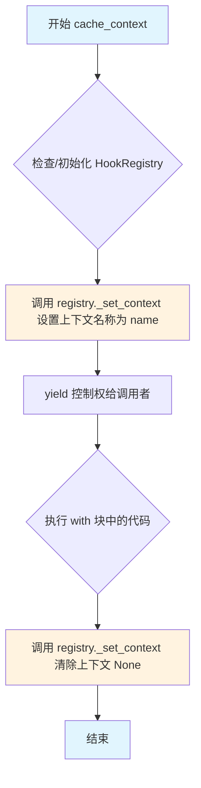

#### 带注释源码

```python
@contextmanager
def cache_context(self, name: str):
    r"""Context manager that provides additional methods for cache management.
    
    该方法是一个上下文管理器（context manager），用于为缓存操作提供命名空间管理。
    它通过 HookRegistry 为缓存操作设置和清除上下文标识符，允许在特定的上下文中
    执行缓存相关操作。
    
    Args:
        name (str): 上下文名称，用于标识当前的缓存操作上下文
        
    Yields:
        None: 该上下文管理器不返回任何值，仅提供上下文管理功能
        
    Example:
        >>> # 使用示例
        >>> with model.cache_context("inference"):
        ...     # 在此上下文中执行的缓存操作
        ...     output = model.forward(input)
    """
    from ..hooks import HookRegistry

    # 检查是否存在或初始化 HookRegistry
    # HookRegistry 是用于管理所有钩子的注册表
    registry = HookRegistry.check_if_exists_or_initialize(self)
    
    # 设置当前上下文名称，用于标识这个缓存操作的范围
    registry._set_context(name)

    # yield 控制权给调用者
    # 在 with 块执行期间保持此上下文
    yield

    # 退出 with 块后，清除上下文设置
    # 将上下文重置为 None，表示当前不在任何缓存上下文中
    registry._set_context(None)
```

## 关键组件


### CacheMixin

缓存混合类，提供扩散模型的缓存技术启用/禁用功能，支持多种缓存策略包括 Pyramid Attention Broadcast、FasterCache、FirstBlockCache、MagCache 和 TaylorSeerCache。

### _cache_config

类字段，类型为可选配置对象，存储当前启用的缓存配置，用于跟踪已激活的缓存技术。

### is_cache_enabled

属性方法，返回布尔值，通过检查 `_cache_config` 是否为 None 来判断缓存是否已启用。

### enable_cache

方法，接收配置对象参数，根据配置类型调用对应的缓存应用函数（apply_faster_cache、apply_first_block_cache、apply_mag_cache、apply_pyramid_attention_broadcast、apply_taylorseer_cache），并将配置存储到 `_cache_config` 中。

### disable_cache

方法，无参数，根据已存储的缓存配置类型从 HookRegistry 中移除对应的钩子，并将 `_cache_config` 设为 None。

### _reset_stateful_cache

方法，接收布尔型参数 recurse，调用 HookRegistry 重置有状态缓存钩子。

### cache_context

上下文管理器方法，接收字符串参数 name，用于设置缓存管理的上下文环境。


## 问题及建议


### 已知问题

- **方法内部导入（Import inside methods）**: `enable_cache`、`disable_cache`、`_reset_stateful_cache` 和 `cache_context` 方法内部都包含大量的导入语句，这导致每次调用这些方法时都会重复执行导入操作，降低运行效率，同时也增加了静态分析的难度。
- **代码重复（Code duplication）**: `enable_cache` 和 `disable_cache` 方法中都需要导入相同的配置类列表（FasterCacheConfig、FirstBlockCacheConfig 等），违反了 DRY（Don't Repeat Yourself）原则，增加了维护成本。
- **缺少类型注解（Missing type hints）**: `enable_cache` 方法的 `config` 参数没有类型注解，虽然文档字符串中说明了类型，但代码层面缺乏静态类型检查的支持。
- **硬编码的条件分支（Hardcoded conditional branches）**: 支持的缓存技术通过一系列 if-elif 条件分支进行判断，当添加新的缓存技术时，需要同时修改 `enable_cache` 和 `disable_cache` 方法，容易遗漏且不易扩展。
- **内部方法调用（Internal method access）**: `cache_context` 方法中调用了 `registry._set_context` 这种以下划线开头的私有方法，这种做法较为脆弱，如果 HookRegistry 的内部实现变更，可能导致功能失效。
- **重复的 HookRegistry 初始化逻辑**: `disable_cache`、`_reset_stateful_cache` 和 `cache_context` 方法都调用了 `HookRegistry.check_if_exists_or_initialize(self)`，存在重复代码。

### 优化建议

- **将导入移至模块顶部或使用延迟绑定缓存**: 将常用的导入移动到文件顶部，或者在模块级别创建一个缓存导入结果的机制，避免每次方法调用时重复导入。
- **提取公共配置列表**: 将缓存配置类型列表提取为类属性或模块级常量，减少 `enable_cache` 和 `disable_cache` 方法中的重复代码。
- **为 config 参数添加类型注解**: 考虑使用 `typing.Union` 或定义协议类型来为 `config` 参数添加类型注解，提高代码的可读性和静态检查能力。
- **采用注册表模式或策略模式**: 创建一个缓存技术注册表，将配置类型与对应的 apply 和 remove 函数映射起来，这样添加新的缓存技术时只需在一个地方注册，无需修改条件分支逻辑。
- **封装 HookRegistry 操作**: 在 CacheMixin 类中封装对 HookRegistry 的常用操作（如获取注册表、检查是否存在等），避免在多个方法中重复调用 `HookRegistry.check_if_exists_or_initialize(self)`。
- **重构 cache_context 方法**: 与 HookRegistry 的开发者确认 `_set_context` 方法的稳定性，或者设计更稳定的公共 API 供外部调用。

## 其它


### 设计目标与约束

**设计目标**：提供一个统一的接口来管理扩散模型中的多种缓存技术，使用户能够灵活地在推理过程中启用、禁用和切换不同的缓存策略，从而在保持生成质量的同时提升推理效率。

**设计约束**：
- 只能同时启用一种缓存技术，再次启用前必须先禁用当前缓存
- 缓存配置必须继承自相应的配置类（FasterCacheConfig、FirstBlockCacheConfig、MagCacheConfig、PyramidAttentionBroadcastConfig、TaylorSeerCacheConfig）
- 依赖Diffusers的hooks系统进行实际的缓存实现
- 作为Mixin类使用时，目标类需要继承自CacheMixin

### 错误处理与异常设计

**异常类型**：
- `ValueError`：当传入的config类型不支持时抛出，提示"Cache config {type(config)} is not supported"
- `ValueError`：当缓存已启用时尝试再次启用，提示需要先禁用现有缓存
- `logger.warning`：当尝试禁用未启用的缓存时，记录警告日志

**错误处理策略**：
- enable_cache方法在启用新缓存前检查is_cache_enabled状态，防止重复启用
- disable_cache方法在缓存未启用时仅记录警告而非抛出异常，保证幂等性
- 所有hooks相关操作使用try-except包裹，确保禁用失败时状态一致

### 数据流与状态机

**缓存状态转换**：
- **无缓存状态（_cache_config = None）**：初始状态，可以调用enable_cache
- **有缓存状态（_cache_config = config）**：缓存已启用，可以调用disable_cache或_reset_stateful_cache

**状态转换图**：
```
[无缓存] --enable_cache()--> [有缓存]
[有缓存] --disable_cache()--> [无缓存]
[有缓存] --_reset_stateful_cache()--> [有缓存(重置状态)]
```

**数据流向**：
1. 用户创建缓存配置对象（config）
2. 调用enable_cache(config)传入配置
3. 根据config类型选择对应的apply_*函数
4. apply函数内部通过HookRegistry注册相应的hook
5. _cache_config保存当前配置引用

### 外部依赖与接口契约

**依赖模块**：
- `..hooks`：包含所有缓存配置类和apply函数
- `..hooks.faster_cache`：FasterCache实现
- `..hooks.first_block_cache`：FirstBlockCache实现
- `..hooks.mag_cache`：MagCache实现
- `..hooks.pyramid_attention_broadcast`：PyramidAttentionBroadcast实现
- `..hooks.taylorseer_cache`：TaylorSeerCache实现
- `..utils.logging`：日志记录

**接口契约**：
- CacheMixin作为mixin类使用，目标类需要继承它
- 目标类需要能够被HookRegistry管理
- enable_cache接受的config必须是预定义的配置类实例
- cache_context是上下文管理器，返回registry的上下文

### 配置类说明

**支持的缓存配置类**：
- `PyramidAttentionBroadcastConfig`：金字塔注意力广播缓存配置
- `FasterCacheConfig`：FasterCache缓存配置
- `FirstBlockCacheConfig`：首块缓存配置
- `MagCacheConfig`：Mag缓存配置
- `TaylorSeerCacheConfig`：TaylorSeer缓存配置

所有配置类必须提供相应的apply_*函数来实际应用缓存到模型。

### 使用示例与场景

**典型使用场景**：
```python
# 场景1：基本启用缓存
config = PyramidAttentionBroadcastConfig(...)
transformer.enable_cache(config)
# 执行推理...
transformer.disable_cache()

# 场景2：使用缓存上下文管理器
with transformer.cache_context("inference_run"):
    # 执行推理，缓存自动在上下文中管理
    pass

# 场景3：在不同缓存技术间切换
transformer.enable_cache(config1)
transformer.disable_cache()
transformer.enable_cache(config2)
```

### 性能考量

- 缓存启用/禁用操作涉及hooks的注册和移除，有一定开销，建议在初始化阶段完成配置
- 多种缓存技术不可同时启用，需要切换时必须先禁用当前缓存
- _reset_stateful_cache可在长推理任务中定期调用以释放累积状态

### 版本兼容性

- 该功能需要Diffusers版本支持hooks系统
- 各缓存技术的支持版本可能不同，需参考各配置类的文档
- CacheMixin作为mixin设计，保持与基础模型类的解耦

### 线程安全性

- HookRegistry的上下文设置（_set_context）不是线程安全的
- 在多线程环境下使用cache_context需要注意同步
- 建议在单线程推理流程中使用，或在推理前统一配置

### 扩展性设计

**扩展新的缓存技术**：
1. 在hooks模块中创建新的配置类（如XXXConfig）
2. 实现对应的apply_xxx_cache函数
3. 在enable_cache中添加新的elif分支
4. 在disable_cache中添加对应的hooks移除逻辑

这种设计允许在不修改CacheMixin核心逻辑的情况下添加新的缓存技术。


    