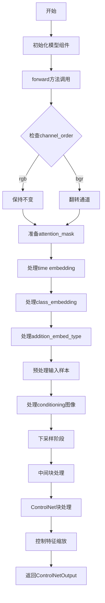
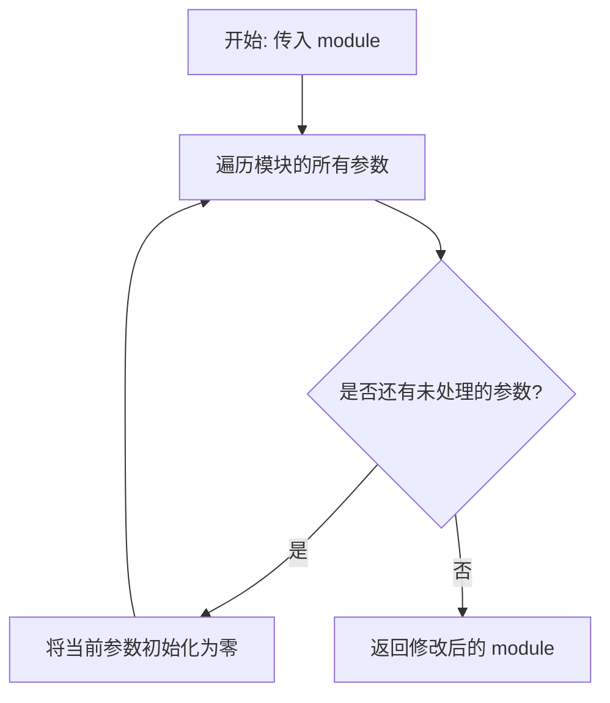
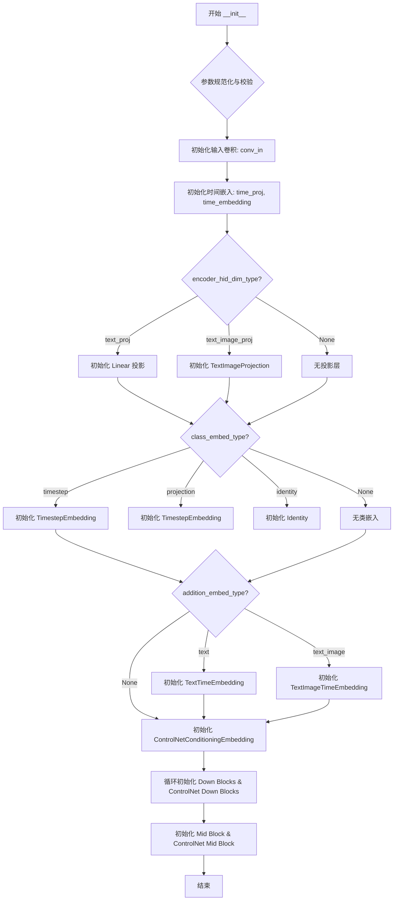
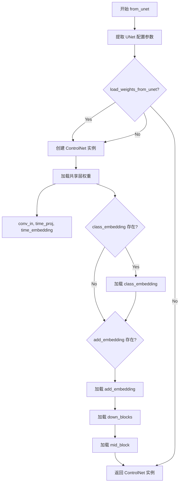
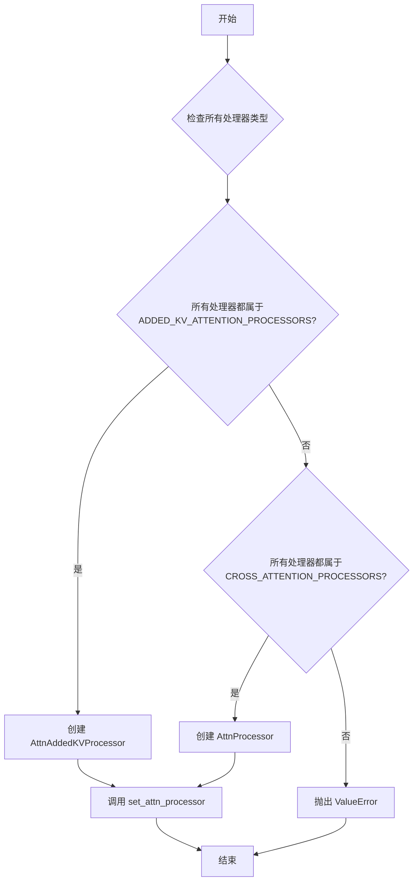
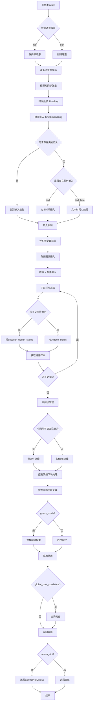

# `diffusers\src\diffusers\models\controlnets\controlnet.py` 详细设计文档

这是 Hugging Face Diffusers 库中的 ControlNet 模型实现，用于在扩散模型（如 Stable Diffusion）中实现条件图像生成。该模型通过额外的条件输入（如边缘图、姿态图、深度图等）来控制图像生成过程，输出多尺度的控制特征供主 UNet 模型使用，实现了对生成内容的精细控制。

## 整体流程



## 类结构

```
BaseOutput (父类)
├── ControlNetOutput (数据类)
nn.Module (父类)
├── ControlNetConditioningEmbedding (条件嵌入层)
└── ControlNetModel (主模型类)
    ├── ModelMixin
    ├── AttentionMixin
    ├── ConfigMixin
    ├── FromOriginalModelMixin
    └── PeftAdapterMixin
```

## 全局变量及字段


### `logger`
    
模块级日志记录器

类型：`logging.Logger`
    


### `channel_order`
    
通道顺序配置（rgb或bgr）

类型：`str`
    


### `t_emb`
    
时间嵌入向量

类型：`torch.Tensor`
    


### `emb`
    
最终嵌入向量（时间嵌入+类嵌入+附加嵌入）

类型：`torch.Tensor`
    


### `aug_emb`
    
附加嵌入向量（文本或文本-时间嵌入）

类型：`torch.Tensor | None`
    


### `sample`
    
处理后的样本张量

类型：`torch.Tensor`
    


### `controlnet_cond`
    
条件输入张量（控制图像）

类型：`torch.Tensor`
    


### `down_block_res_samples`
    
下采样块输出元组（多尺度特征）

类型：`tuple[torch.Tensor, ...]`
    


### `mid_block_res_sample`
    
中间块输出张量

类型：`torch.Tensor`
    


### `controlnet_down_block_res_samples`
    
ControlNet下采样输出元组

类型：`tuple[torch.Tensor, ...]`
    


### `scales`
    
缩放系数（用于guess_mode下的动态权重）

类型：`torch.Tensor`
    


### `ControlNetOutput.down_block_res_samples`
    
下采样块的多尺度输出特征

类型：`tuple[torch.Tensor]`
    


### `ControlNetOutput.mid_block_res_sample`
    
中间块的输出特征

类型：`torch.Tensor`
    


### `ControlNetConditioningEmbedding.conv_in`
    
输入卷积层

类型：`nn.Conv2d`
    


### `ControlNetConditioningEmbedding.blocks`
    
中间卷积块列表

类型：`nn.ModuleList`
    


### `ControlNetConditioningEmbedding.conv_out`
    
输出卷积层

类型：`nn.Conv2d`
    


### `ControlNetModel.conv_in`
    
主输入卷积层

类型：`nn.Conv2d`
    


### `ControlNetModel.time_proj`
    
时间投影层

类型：`Timesteps`
    


### `ControlNetModel.time_embedding`
    
时间嵌入层

类型：`TimestepEmbedding`
    


### `ControlNetModel.encoder_hid_proj`
    
编码器隐藏投影层

类型：`nn.Linear | TextImageProjection | None`
    


### `ControlNetModel.class_embedding`
    
类嵌入层

类型：`nn.Embedding | TimestepEmbedding | nn.Identity | None`
    


### `ControlNetModel.add_embedding`
    
附加嵌入层

类型：`TextTimeEmbedding | TextImageTimeEmbedding | None`
    


### `ControlNetModel.add_time_proj`
    
附加时间投影层

类型：`Timesteps | None`
    


### `ControlNetModel.controlnet_cond_embedding`
    
条件图像嵌入层

类型：`ControlNetConditioningEmbedding`
    


### `ControlNetModel.down_blocks`
    
下采样块列表

类型：`nn.ModuleList`
    


### `ControlNetModel.controlnet_down_blocks`
    
ControlNet下采样块列表

类型：`nn.ModuleList`
    


### `ControlNetModel.mid_block`
    
中间块

类型：`UNetMidBlock2D | UNetMidBlock2DCrossAttn | None`
    


### `ControlNetModel.controlnet_mid_block`
    
ControlNet中间块卷积层

类型：`nn.Conv2d`
    
    

## 全局函数及方法


### `zero_module`

将输入的 PyTorch 模块的所有参数（权重和偏置）初始化为零的全局函数。该函数常用于 ControlNet 中初始化特定的卷积层，以确保这些层在训练初期不贡献任何信息，后续通过学习逐步调整。

参数：

- `module`：`nn.Module`，需要进行零初始化的 PyTorch 模块

返回值：`nn.Module`，返回输入的模块本身（参数已被原地修改为零）

#### 流程图



#### 带注释源码

```python
def zero_module(module):
    """
    将模块的所有参数初始化为零。
    
    这个函数通常用于初始化 ControlNet 中的某些卷积层，
    使得这些层在训练开始时不产生任何输出，让模型从零开始学习。
    """
    # 遍历传入模块的所有可训练参数（权重和偏置）
    for p in module.parameters():
        # 使用 PyTorch 的原地操作将参数值设置为零
        nn.init.zeros_(p)
    # 返回已经修改参数的模块（方便链式调用）
    return module
```


### `ControlNetConditioningEmbedding.forward`

该方法实现了 ControlNet 的条件embedding编码功能，将输入的图像条件（conditioning）通过一系列卷积层编码为与UNet兼容的64×64特征空间的特征映射。这是ControlNet的核心组件之一，负责将用户提供的控制图像（如边缘图、姿态图等）转换为神经网络可以理解的特征表示。

参数：

- `self`：隐式参数，指向`ControlNetConditioningEmbedding`实例本身
- `conditioning`：`torch.Tensor`，输入的条件图像张量，通常为RGB图像，形状为`(batch_size, conditioning_channels, height, width)`

返回值：`torch.Tensor`，编码后的条件特征嵌入，形状为`(batch_size, conditioning_embedding_channels, height//64, width//64)`，其中高度和宽度维度被下采样到原来的1/64

#### 流程图

```mermaid
flowchart TD
    A[输入: conditioning tensor] --> B[conv_in: 初始卷积]
    B --> C[F.silu: SiLU激活函数]
    C --> D{遍历 self.blocks}
    
    D -->|第i个block| E[block[i]: 卷积块]
    E --> F[F.silu: SiLU激活函数]
    F --> G{检查是否还有更多block}
    
    G -->|是| E
    G -->|否| H[conv_out: 输出卷积]
    H --> I[返回: 编码后的embedding tensor]
    
    style A fill:#e1f5fe
    style I fill:#e8f5e8
    style B fill:#fff3e0
    style H fill:#fff3e0
```

#### 带注释源码

```python
def forward(self, conditioning):
    """
    将输入的条件图像编码为特征嵌入
    
    参数:
        conditioning: 输入的条件图像张量，形状为 (batch_size, channels, height, width)
        
    返回:
        编码后的特征嵌入，形状为 (batch_size, embedding_channels, h//64, w//64)
    """
    
    # 步骤1: 初始卷积 - 将输入条件图像转换为初始特征表示
    # conv_in 将 conditioning_channels 通道转换为 block_out_channels[0] 通道
    embedding = self.conv_in(conditioning)
    
    # 步骤2: 应用SiLU激活函数（Swish激活函数的变体）
    # F.silu(x) = x * sigmoid(x)，比ReLU更平滑且具有自门控特性
    embedding = F.silu(embedding)
    
    # 步骤3: 遍历中间卷积块序列，进行特征提取和下采样
    # 每个block包含两个卷积层：保持尺寸的3x3卷积 + 步长为2的下采样卷积
    for block in self.blocks:
        embedding = block(embedding)   # 应用卷积块
        embedding = F.silu(embedding)  # 每次卷积后激活
    
    # 步骤4: 最终卷积 - 将特征映射到目标维度
    # 使用 zero_module 初始化（权重初始化为零），便于后续残差连接的训练
    embedding = self.conv_out(embedding)
    
    # 返回编码后的条件嵌入，用于与UNet的特征图进行残差连接
    return embedding
```

#### 关键组件说明

| 组件名称 | 类型 | 说明 |
|---------|------|------|
| `conv_in` | `nn.Conv2d` | 初始卷积层，将输入条件图像转换为初始特征通道(16通道) |
| `blocks` | `nn.ModuleList` | 由多个卷积块组成的模块列表，每个块包含两个卷积层用于特征提取和下采样 |
| `conv_out` | `nn.Conv2d` | 输出卷积层，将特征映射到最终的条件嵌入维度，使用zero_module初始化 |

#### 设计背景与约束

- **下采样比例**：该网络将输入图像下采样64倍（4个阶段，每个阶段2倍），这是为了与Stable Diffusion的潜在空间（64×64）匹配
- **通道配置**：默认通道配置为(16, 32, 96, 256)，是一个渐进式增长的架构
- **权重初始化**：`conv_out`使用zero_module初始化，目的是让模型在训练初期不会对UNet的原始输出造成干扰

#### 潜在技术债务与优化空间

1. **激活函数选择**：使用`F.silu`（SiLU）而非更现代的`GELU`，虽然在Diffusion模型中SiLU是标准选择，但可以考虑参数化以支持不同激活函数
2. **硬编码下采样倍数**：当前固定下采样64倍，无法灵活适应不同的UNet配置
3. **缺少归一化层**：整个编码器没有使用BatchNorm或GroupNorm，可能影响训练稳定性
4. **残差连接缺失**：可以参考ResNet的设计，添加跳跃连接以改善梯度流动


### `ControlNetModel.__init__`

该方法是 `ControlNetModel` 类的构造函数，负责根据传入的大量配置参数初始化整个 ControlNet 神经网络结构。它不仅初始化了主 UNet 的核心组件（如下采样块、中间块、时间嵌入），还额外初始化了一套并行的“控制网络”块（ControlNet Blocks）以及条件图像的编码器（Conditioning Embedding），用于从控制图像中提取额外的特征信息以引导主模型的生成过程。

参数：

- `in_channels`：`int`，默认为 4，输入样本的通道数（例如 RGB 为 3，RGBA 为 4）。
- `conditioning_channels`：`int`，默认为 3，控制图像（Conditioning Image）的通道数。
- `flip_sin_to_cos`：`bool`，默认为 `True`，是否在时间嵌入中将 sin 转换为 cos。
- `freq_shift`：`int`，默认为 0，时间嵌入的频率偏移量。
- `down_block_types`：`tuple[str, ...]`，默认为 `("CrossAttnDownBlock2D", ...)`，下采样块的类型元组。
- `mid_block_type`：`str | None`，默认为 `"UNetMidBlock2DCrossAttn"`，中间块的类型。
- `only_cross_attention`：`bool | tuple[bool]`，默认为 `False`，指定块是否仅使用交叉注意力。
- `block_out_channels`：`tuple[int, ...]`，默认为 `(320, 640, 1280, 1280)`，每个块的输出通道数。
- `layers_per_block`：`int`，默认为 2，每个块包含的层数。
- `downsample_padding`：`int`，默认为 1，下采样卷积使用的填充。
- `mid_block_scale_factor`：`float`，默认为 1，中间块的缩放因子。
- `act_fn`：`str`，默认为 `"silu"`，激活函数名称。
- `norm_num_groups`：`int | None`，默认为 32，归一化的组数。
- `norm_eps`：`float`，默认为 1e-5，归一层的 epsilon 值。
- `cross_attention_dim`：`int`，默认为 1280，交叉注意力特征的维度。
- `transformer_layers_per_block`：`int | tuple[int, ...]`，默认为 1，每个块中 Transformer 层的数量。
- `encoder_hid_dim`：`int | None`，默认为 `None`，编码器隐藏状态的维度（如果存在）。
- `encoder_hid_dim_type`：`str | None`，默认为 `None`，编码器隐藏状态的类型（如 "text_proj"）。
- `attention_head_dim`：`int | tuple[int, ...]`，默认为 8，注意力头的维度。
- `num_attention_heads`：`int | tuple[int, ...] | None`，默认为 `None`，注意力头的数量（用于兼容旧版命名）。
- `use_linear_projection`：`bool`，默认为 `False`，是否使用线性投影。
- `class_embed_type`：`str | None`，默认为 `None`，类别嵌入的类型。
- `addition_embed_type`：`str | None`，默认为 `None`，附加嵌入的类型（如 "text"）。
- `addition_time_embed_dim`：`int | None`，默认为 `None`，附加时间嵌入的维度。
- `num_class_embeds`：`int | None`，默认为 `None`，类别嵌入的数量。
- `upcast_attention`：`bool`，默认为 `False`，是否向上转换注意力计算。
- `resnet_time_scale_shift`：`str`，默认为 `"default"`，ResNet 块的时间尺度偏移配置。
- `projection_class_embeddings_input_dim`：`int | None`，默认为 `None`，当 `class_embed_type` 为 "projection" 时的输入维度。
- `controlnet_conditioning_channel_order`：`str`，默认为 `"rgb"`，控制图像的通道顺序。
- `conditioning_embedding_out_channels`：`tuple[int, ...] | None`，默认为 `(16, 32, 96, 256)`，条件嵌入层每个块的输出通道。
- `global_pool_conditions`：`bool`，默认为 `False`，是否对条件进行全局池化（当前未使用）。
- `addition_embed_type_num_heads`：`int`，默认为 64，`TextTimeEmbedding` 层使用的头数。

返回值：`None`，该方法没有返回值（Python 构造函数特性）。

#### 流程图



#### 带注释源码

```python
@register_to_config
def __init__(
    self,
    in_channels: int = 4,
    conditioning_channels: int = 3,
    flip_sin_to_cos: bool = True,
    freq_shift: int = 0,
    down_block_types: tuple[str, ...] = (
        "CrossAttnDownBlock2D",
        "CrossAttnDownBlock2D",
        "CrossAttnDownBlock2D",
        "DownBlock2D",
    ),
    mid_block_type: str | None = "UNetMidBlock2DCrossAttn",
    only_cross_attention: bool | tuple[bool] = False,
    block_out_channels: tuple[int, ...] = (320, 640, 1280, 1280),
    layers_per_block: int = 2,
    downsample_padding: int = 1,
    mid_block_scale_factor: float = 1,
    act_fn: str = "silu",
    norm_num_groups: int | None = 32,
    norm_eps: float = 1e-5,
    cross_attention_dim: int = 1280,
    transformer_layers_per_block: int | tuple[int, ...] = 1,
    encoder_hid_dim: int | None = None,
    encoder_hid_dim_type: str | None = None,
    attention_head_dim: int | tuple[int, ...] = 8,
    num_attention_heads: int | tuple[int, ...] | None = None,
    use_linear_projection: bool = False,
    class_embed_type: str | None = None,
    addition_embed_type: str | None = None,
    addition_time_embed_dim: int | None = None,
    num_class_embeds: int | None = None,
    upcast_attention: bool = False,
    resnet_time_scale_shift: str = "default",
    projection_class_embeddings_input_dim: int | None = None,
    controlnet_conditioning_channel_order: str = "rgb",
    conditioning_embedding_out_channels: tuple[int, ...] | None = (16, 32, 96, 256),
    global_pool_conditions: bool = False,
    addition_embed_type_num_heads: int = 64,
):
    super().__init__()

    # 如果未定义 num_attention_heads（大多数情况），则默认为 attention_head_dim。
    # 这是为了修复早期库中命名错误而保留的兼容逻辑。
    num_attention_heads = num_attention_heads or attention_head_dim

    # --- 1. 参数校验 ---
    # 检查 block_out_channels 与 down_block_types 长度一致性
    if len(block_out_channels) != len(down_block_types):
        raise ValueError(...)

    # 检查 only_cross_attention 与 down_block_types 长度一致性
    if not isinstance(only_cross_attention, bool) and len(only_cross_attention) != len(down_block_types):
        raise ValueError(...)

    # 检查 num_attention_heads 与 down_block_types 长度一致性
    if not isinstance(num_attention_heads, int) and len(num_attention_heads) != len(down_block_types):
        raise ValueError(...)

    # 标准化 transformer_layers_per_block 为列表
    if isinstance(transformer_layers_per_block, int):
        transformer_layers_per_block = [transformer_layers_per_block] * len(down_block_types)

    # --- 2. 初始化输入层 ---
    conv_in_kernel = 3
    conv_in_padding = (conv_in_kernel - 1) // 2
    # 主模型的第一个卷积层，将输入图像转换为特征图
    self.conv_in = nn.Conv2d(
        in_channels, block_out_channels[0], kernel_size=conv_in_kernel, padding=conv_in_padding
    )

    # --- 3. 初始化时间嵌入 (Time Embedding) ---
    time_embed_dim = block_out_channels[0] * 4
    self.time_proj = Timesteps(block_out_channels[0], flip_sin_to_cos, freq_shift)
    timestep_input_dim = block_out_channels[0]
    self.time_embedding = TimestepEmbedding(
        timestep_input_dim,
        time_embed_dim,
        act_fn=act_fn,
    )

    # --- 4. 初始化编码器隐藏状态投影 (Encoder Hidden Projection) ---
    # 处理外部条件（如 CLIP text embeddings）到 cross_attention_dim 的投影
    if encoder_hid_dim_type is None and encoder_hid_dim is not None:
        encoder_hid_dim_type = "text_proj"
        # ...

    if encoder_hid_dim_type == "text_proj":
        self.encoder_hid_proj = nn.Linear(encoder_hid_dim, cross_attention_dim)
    elif encoder_hid_dim_type == "text_image_proj":
        # ...
        self.encoder_hid_proj = TextImageProjection(...)
    else:
        self.encoder_hid_proj = None

    # --- 5. 初始化类别嵌入 (Class Embedding) ---
    # 支持无嵌入、时间步嵌入、恒等映射或投影嵌入
    if class_embed_type is None and num_class_embeds is not None:
        self.class_embedding = nn.Embedding(num_class_embeds, time_embed_dim)
    elif class_embed_type == "timestep":
        self.class_embedding = TimestepEmbedding(timestep_input_dim, time_embed_dim)
    elif class_embed_type == "identity":
        self.class_embedding = nn.Identity(time_embed_dim, time_embed_dim)
    elif class_embed_type == "projection":
        # ...
        self.class_embedding = TimestepEmbedding(projection_class_embeddings_input_dim, time_embed_dim)
    else:
        self.class_embedding = None

    # --- 6. 初始化附加嵌入 (Addition Embedding) ---
    # 支持文本、文本图像或文本时间附加条件
    if addition_embed_type == "text":
        # ...
        self.add_embedding = TextTimeEmbedding(...)
    elif addition_embed_type == "text_image":
        # ...
        self.add_embedding = TextImageTimeEmbedding(...)
    elif addition_embed_type == "text_time":
        self.add_time_proj = Timesteps(addition_time_embed_dim, flip_sin_to_cos, freq_shift)
        self.add_embedding = TimestepEmbedding(projection_class_embeddings_input_dim, time_embed_dim)

    # --- 7. 初始化 ControlNet 条件编码器 ---
    # 专门用于将控制图像（如 Canny, Depth）编码为与 UNet 匹配的特征空间
    self.controlnet_cond_embedding = ControlNetConditioningEmbedding(
        conditioning_embedding_channels=block_out_channels[0],
        block_out_channels=conditioning_embedding_out_channels,
        conditioning_channels=conditioning_channels,
    )

    # --- 8. 初始化下采样块 (Down Blocks) ---
    self.down_blocks = nn.ModuleList([])
    self.controlnet_down_blocks = nn.ModuleList([])

    # 标准化参数以便循环处理
    if isinstance(only_cross_attention, bool):
        only_cross_attention = [only_cross_attention] * len(down_block_types)
    if isinstance(attention_head_dim, int):
        attention_head_dim = (attention_head_dim,) * len(down_block_types)
    if isinstance(num_attention_heads, int):
        num_attention_heads = (num_attention_heads,) * len(down_block_types)

    output_channel = block_out_channels[0]

    # 初始化第一个 ControlNet 块
    controlnet_block = nn.Conv2d(output_channel, output_channel, kernel_size=1)
    controlnet_block = zero_module(controlnet_block)
    self.controlnet_down_blocks.append(controlnet_block)

    # 循环构建 UNet 的 Down Blocks 和对应的 ControlNet 辅助块
    for i, down_block_type in enumerate(down_block_types):
        # ... 获取并添加 down_block (self.down_blocks) ...
        
        # 为每一层添加 ControlNet 块
        for _ in range(layers_per_block):
            controlnet_block = nn.Conv2d(output_channel, output_channel, kernel_size=1)
            controlnet_block = zero_module(controlnet_block)
            self.controlnet_down_blocks.append(controlnet_block)
        
        # 在非最终块之间添加下采样 ControlNet 块
        if not is_final_block:
            # ...

    # --- 9. 初始化中间块 (Mid Block) ---
    mid_block_channel = block_out_channels[-1]
    
    # ControlNet 的中间块
    controlnet_block = nn.Conv2d(mid_block_channel, mid_block_channel, kernel_size=1)
    controlnet_block = zero_module(controlnet_block)
    self.controlnet_mid_block = controlnet_block

    # 主模型的中间块
    if mid_block_type == "UNetMidBlock2DCrossAttn":
        self.mid_block = UNetMidBlock2DCrossAttn(...)
    elif mid_block_type == "UNetMidBlock2D":
        self.mid_block = UNetMidBlock2D(...)
    else:
        raise ValueError(...)
```

#### 关键组件信息

1.  **`ControlNetConditioningEmbedding`**：负责将输入的控制图像（如边缘图、深度图）通过一个小型卷积网络编码到与 UNet 潜在空间匹配的特征空间。
2.  **`down_blocks` & `controlnet_down_blocks`**：
    *   `down_blocks`：标准的 UNet 下采样结构，包含 ResNet/Transformer 层。
    *   `controlnet_down_blocks`：与 `down_blocks` 并行的轻量级卷积块（1x1 Conv），用于提取每一层的特征输出，这些输出将用于调节主 UNet。
3.  **`mid_block` & `controlnet_mid_block`**：位于网络最底部的块，处理最低分辨率的特征，同样包含主模型块和用于输出的辅助块。
4.  **`zero_module`**：一个实用函数，用于将卷积层权重初始化为零，这在 ControlNet 中用于确保辅助块初始时不干扰主模型的预测。

#### 潜在的技术债务或优化空间

1.  **参数兼容性处理 (Legacy Handling)**：代码中显式处理了 `num_attention_heads` 和 `attention_head_dim` 的映射逻辑。这是为了向后兼容旧版本模型配置，但也增加了代码的理解负担。理想情况下，应统一命名规范并迁移配置文件。
2.  **构造函数膨胀**：作为典型的“万用门” (God Object) 设计，该类的 `__init__` 方法拥有超过 25 个参数，且包含大量的 `if/elif` 逻辑来根据参数类型初始化不同的子模块。可以考虑使用建造者模式 (Builder Pattern) 或配置对象 (Configuration Object) 来简化初始化逻辑。
3.  **Magic Numbers**：代码中存在一些硬编码的数字（如 `time_embed_dim = block_out_channels[0] * 4`），虽然符合标准 UNet 设计，但缺乏解释性。

#### 其它项目

*   **设计目标与约束**：该类的设计严格遵循了 ControlNet 论文 (https://huggingface.co/papers/2302.05543) 的架构，旨在通过复制 UNet 编码器部分来学习额外的条件控制信号，同时保持主模型权重不变（除非 `load_weights_from_unet` 被启用）。
*   **错误处理**：在初始化阶段进行了严格的参数校验（如检查 `down_block_types` 的长度是否匹配），防止在后续运行时因维度不匹配而导致隐蔽的 CUDA 错误。
*   **数据流**：在 `forward` 方法中，输入首先通过 `conv_in` 和 `controlnet_cond_embedding` 处理，随后分为两路：一路通过 UNet 下采样块，另一路通过 ControlNet 下采样块收集特征，最后在末端合并并应用 `conditioning_scale` 进行加权。


### `ControlNetModel.from_unet`

该类方法通过复制 `UNet2DConditionModel` 的结构和权重（可选）来实例化一个 `ControlNetModel`，实现从预训练 UNet 模型快速创建 ControlNet 模型的功能。

参数：

- `cls`：类型 `type[ControlNetModel]`，类本身，用于创建实例的类方法
- `unet`：类型 `UNet2DConditionModel`，源 UNet 模型，其配置和权重将被复制到 ControlNet 中
- `controlnet_conditioning_channel_order`：类型 `str`，默认为 `"rgb"`，条件图像的通道顺序（"rgb" 或 "bgr"）
- `conditioning_embedding_out_channels`：类型 `tuple[int, ...] | None`，默认为 `(16, 32, 96, 256)`，ControlNet 条件嵌入层各块的输出通道数
- `load_weights_from_unet`：类型 `bool`，默认为 `True`，是否将 UNet 的权重复制到 ControlNet
- `conditioning_channels`：类型 `int`，默认为 `3`，条件图像的通道数（如 RGB 为 3）

返回值：`ControlNetModel`，从 UNet 模型配置和权重创建的 ControlNet 实例

#### 流程图



#### 带注释源码

```python
@classmethod
def from_unet(
    cls,
    unet: UNet2DConditionModel,
    controlnet_conditioning_channel_order: str = "rgb",
    conditioning_embedding_out_channels: tuple[int, ...] | None = (16, 32, 96, 256),
    load_weights_from_unet: bool = True,
    conditioning_channels: int = 3,
):
    r"""
    Instantiate a [`ControlNetModel`] from [`UNet2DConditionModel`].

    Parameters:
        unet (`UNet2DConditionModel`):
            The UNet model weights to copy to the [`ControlNetModel`]. All configuration options are also copied
            where applicable.
    """
    # 从 UNet 配置中提取可选参数，若不存在则使用默认值
    transformer_layers_per_block = (
        unet.config.transformer_layers_per_block if "transformer_layers_per_block" in unet.config else 1
    )
    encoder_hid_dim = unet.config.encoder_hid_dim if "encoder_hid_dim" in unet.config else None
    encoder_hid_dim_type = unet.config.encoder_hid_dim_type if "encoder_hid_dim_type" in unet.config else None
    addition_embed_type = unet.config.addition_embed_type if "addition_embed_type" in unet.config else None
    addition_time_embed_dim = (
        unet.config.addition_time_embed_dim if "addition_time_embed_dim" in unet.config else None
    )

    # 使用提取的配置参数实例化 ControlNetModel
    controlnet = cls(
        encoder_hid_dim=encoder_hid_dim,
        encoder_hid_dim_type=encoder_hid_dim_type,
        addition_embed_type=addition_embed_type,
        addition_time_embed_dim=addition_time_embed_dim,
        transformer_layers_per_block=transformer_layers_per_block,
        in_channels=unet.config.in_channels,
        flip_sin_to_cos=unet.config.flip_sin_to_cos,
        freq_shift=unet.config.freq_shift,
        down_block_types=unet.config.down_block_types,
        only_cross_attention=unet.config.only_cross_attention,
        block_out_channels=unet.config.block_out_channels,
        layers_per_block=unet.config.layers_per_block,
        downsample_padding=unet.config.downsample_padding,
        mid_block_scale_factor=unet.config.mid_block_scale_factor,
        act_fn=unet.config.act_fn,
        norm_num_groups=unet.config.norm_num_groups,
        norm_eps=unet.config.norm_eps,
        cross_attention_dim=unet.config.cross_attention_dim,
        attention_head_dim=unet.config.attention_head_dim,
        num_attention_heads=unet.config.num_attention_heads,
        use_linear_projection=unet.config.use_linear_projection,
        class_embed_type=unet.config.class_embed_type,
        num_class_embeds=unet.config.num_class_embeds,
        upcast_attention=unet.config.upcast_attention,
        resnet_time_scale_shift=unet.config.resnet_time_scale_shift,
        projection_class_embeddings_input_dim=unet.config.projection_class_embeddings_input_dim,
        mid_block_type=unet.config.mid_block_type,
        controlnet_conditioning_channel_order=controlnet_conditioning_channel_order,
        conditioning_embedding_out_channels=conditioning_embedding_out_channels,
        conditioning_channels=conditioning_channels,
    )

    # 如果需要，从 UNet 加载权重到 ControlNet
    if load_weights_from_unet:
        # 加载输入卷积层权重
        controlnet.conv_in.load_state_dict(unet.conv_in.state_dict())
        # 加载时间投影和嵌入层权重
        controlnet.time_proj.load_state_dict(unet.time_proj.state_dict())
        controlnet.time_embedding.load_state_dict(unet.time_embedding.state_dict())

        # 加载类别嵌入权重（如果存在）
        if controlnet.class_embedding:
            controlnet.class_embedding.load_state_dict(unet.class_embedding.state_dict())

        # 加载附加嵌入权重（如果存在）
        if hasattr(controlnet, "add_embedding"):
            controlnet.add_embedding.load_state_dict(unet.add_embedding.state_dict())

        # 加载下采样块权重
        controlnet.down_blocks.load_state_dict(unet.down_blocks.state_dict())
        # 加载中间块权重
        controlnet.mid_block.load_state_dict(unet.mid_block.state_dict())

    return controlnet
```


### `ControlNetModel.set_default_attn_processor`

设置默认注意力处理器，禁用自定义注意力处理器并设置默认注意力实现。

参数：

- 无（仅包含 `self` 参数）

返回值：`None`，无返回值

#### 流程图



#### 带注释源码

```python
# 复制自 diffusers.models.unets.unet_2d_condition.UNet2DConditionModel.set_default_attn_processor
def set_default_attn_processor(self):
    """
    禁用自定义注意力处理器并设置默认注意力实现。
    """
    # 检查所有注意力处理器是否都属于 ADDED_KV_ATTENTION_PROCESSORS 类型
    if all(proc.__class__ in ADDED_KV_ATTENTION_PROCESSORS for proc in self.attn_processors.values()):
        # 如果是，则使用 AttnAddedKVProcessor（支持额外键值对的注意力处理器）
        processor = AttnAddedKVProcessor()
    # 检查所有注意力处理器是否都属于 CROSS_ATTENTION_PROCESSORS 类型
    elif all(proc.__class__ in CROSS_ATTENTION_PROCESSORS for proc in self.attn_processors.values()):
        # 如果是，则使用 AttnProcessor（标准交叉注意力处理器）
        processor = AttnProcessor()
    else:
        # 如果处理器类型混合或不属于上述任何一种，则抛出异常
        raise ValueError(
            f"Cannot call `set_default_attn_processor` when attention processors are of type {next(iter(self.attn_processors.values()))}"
        )

    # 将选定的默认处理器应用到整个模型
    self.set_attn_processor(processor)
```


### ControlNetModel.set_attention_slice

启用切片注意力计算，通过将注意力计算分割为多个步骤来节省显存，同时速度略有降低。

参数：

- `slice_size`：`str | int | list[int]`，切片大小。当为 `"auto"` 时，输入注意力头维度减半，注意力分两步计算；当为 `"max"` 时，最大限度节省显存，每次只运行一个切片；当为数字时，使用 `attention_head_dim // slice_size` 个切片，此时 `attention_head_dim` 必须是 `slice_size` 的倍数

返回值：`None`，无返回值

#### 流程图

```mermaid
flowchart TD
    A[开始 set_attention_slice] --> B[定义 fn_recursive_retrieve_sliceable_dims 递归函数]
    B --> C[遍历模型所有子模块]
    C --> D{子模块是否有 set_attention_slice 方法?}
    D -->|是| E[获取 sliceable_head_dim 并加入列表]
    D -->|否| F[继续递归子模块]
    E --> F
    F --> G[获取可切片层数量 num_sliceable_layers]
    G --> H{slice_size == 'auto'?}
    H -->|是| I[设置 slice_size = dim // 2]
    H -->|否| J{slice_size == 'max'?}
    J -->|是| K[设置 slice_size = 1]
    J -->|否| L[保持原 slice_size]
    I --> M[转换为列表]
    K --> M
    L --> M
    M --> N{len(slice_size) == len(sliceable_head_dims)?}
    N -->|否| O[抛出 ValueError]
    N -->|是| P[遍历每个切片大小]
    P --> Q{size > dim?}
    Q -->|是| R[抛出 ValueError]
    Q -->|否| S[继续下一个]
    S --> T[反转 slice_size 列表]
    T --> U[定义 fn_recursive_set_attention_slice]
    U --> V[递归设置每个子模块的 attention slice]
    V --> W[结束]
    O --> W
    R --> W
```

#### 带注释源码

```python
def set_attention_slice(self, slice_size: str | int | list[int]) -> None:
    r"""
    Enable sliced attention computation.

    When this option is enabled, the attention module splits the input tensor in slices to compute attention in
    several steps. This is useful for saving some memory in exchange for a small decrease in speed.

    Args:
        slice_size (`str` or `int` or `list(int)`, *optional*, defaults to `"auto"`):
            When `"auto"`, input to the attention heads is halved, so attention is computed in two steps. If
            `"max"`, maximum amount of memory is saved by running only one slice at a time. If a number is
            provided, uses as many slices as `attention_head_dim // slice_size`. In this case, `attention_head_dim`
            must be a multiple of `slice_size`.
    """
    # 用于存储所有可切片层的注意力头维度
    sliceable_head_dims = []

    def fn_recursive_retrieve_sliceable_dims(module: torch.nn.Module):
        """
        递归遍历模型子模块，收集所有支持切片注意力的模块的 sliceable_head_dim
        """
        if hasattr(module, "set_attention_slice"):
            sliceable_head_dims.append(module.sliceable_head_dim)

        for child in module.children():
            fn_recursive_retrieve_sliceable_dims(child)

    # 检索所有注意力层的数量
    for module in self.children():
        fn_recursive_retrieve_sliceable_dims(module)

    num_sliceable_layers = len(sliceable_head_dims)

    # 根据不同的 slice_size 策略设置切片大小
    if slice_size == "auto":
        # "auto" 模式：将注意力头维度减半，通常是速度和内存的良好权衡
        slice_size = [dim // 2 for dim in sliceable_head_dims]
    elif slice_size == "max":
        # "max" 模式：尽可能节省内存，每次只运行一个切片
        slice_size = num_sliceable_layers * [1]

    # 将标量 slice_size 转换为列表，或直接使用列表
    slice_size = num_sliceable_layers * [slice_size] if not isinstance(slice_size, list) else slice_size

    # 验证 slice_size 列表长度是否与可切片层数量匹配
    if len(slice_size) != len(sliceable_head_dims):
        raise ValueError(
            f"You have provided {len(slice_size)}, but {self.config} has {len(sliceable_head_dims)} different"
            f" attention layers. Make sure to match `len(slice_size)` to be {len(sliceable_head_dims)}."
        )

    # 验证每个切片大小是否在有效范围内
    for i in range(len(slice_size)):
        size = slice_size[i]
        dim = sliceable_head_dims[i]
        if size is not None and size > dim:
            raise ValueError(f"size {size} has to be smaller or equal to {dim}.")

    # 递归设置子模块的注意力切片
    # 任何暴露 set_attention_slice 方法的子模块都会收到消息
    def fn_recursive_set_attention_slice(module: torch.nn.Module, slice_size: list[int]):
        if hasattr(module, "set_attention_slice"):
            module.set_attention_slice(slice_size.pop())

        for child in module.children():
            fn_recursive_set_attention_slice(child, slice_size)

    # 反转切片大小列表以匹配递归遍历的顺序
    reversed_slice_size = list(reversed(slice_size))
    for module in self.children():
        fn_recursive_set_attention_slice(module, reversed_slice_size)
```


### `ControlNetModel.forward`

该方法是 ControlNet 模型的前向传播核心实现，接收带噪图像样本、时间步、条件图像和文本嵌入等信息，通过编码器-解码器结构提取多尺度控制特征，用于引导主扩散模型的生成过程。

参数：

- `sample`：`torch.Tensor`，带噪输入图像张量
- `timestep`：`torch.Tensor | float | int`，去噪所需的时间步
- `encoder_hidden_states`：`torch.Tensor`，文本编码器的隐藏状态
- `controlnet_cond`：`torch.Tensor`，控制网络的条件输入图像
- `conditioning_scale`：`float`，默认为 `1.0`，控制网络输出的缩放因子
- `class_labels`：`torch.Tensor | None`，可选的类别标签用于条件嵌入
- `timestep_cond`：`torch.Tensor | None`，可选的时间步额外条件嵌入
- `attention_mask`：`torch.Tensor | None`，可选的注意力掩码
- `added_cond_kwargs`：`dict[str, torch.Tensor] | None`，额外的条件参数（如文本嵌入、时间ID等）
- `cross_attention_kwargs`：`dict[str, Any] | None`，交叉注意力层的额外关键字参数
- `guess_mode`：`bool`，默认为 `False`，猜测模式用于无提示识别
- `return_dict`：`bool`，默认为 `True`，是否返回字典格式的输出

返回值：`ControlNetOutput | tuple[tuple[torch.Tensor, ...], torch.Tensor]`，返回下采样块特征和中间块特征，可选择以字典或元组形式返回

#### 流程图



#### 带注释源码

```python
@apply_lora_scale("cross_attention_kwargs")
def forward(
    self,
    sample: torch.Tensor,                          # 带噪输入图像 (batch, channels, height, width)
    timestep: torch.Tensor | float | int,           # 时间步 (scalar or tensor)
    encoder_hidden_states: torch.Tensor,           # 文本编码状态 (batch, seq_len, hidden_dim)
    controlnet_cond: torch.Tensor,                 # 控制条件图像 (batch, cond_channels, H, W)
    conditioning_scale: float = 1.0,               # 控制信号强度系数
    class_labels: torch.Tensor | None = None,      # 类别标签张量
    timestep_cond: torch.Tensor | None = None,     # 时间步条件嵌入
    attention_mask: torch.Tensor | None = None,    # 注意力掩码
    added_cond_kwargs: dict[str, torch.Tensor] | None = None,  # 额外条件参数
    cross_attention_kwargs: dict[str, Any] | None = None,      # 交叉注意力 kwargs
    guess_mode: bool = False,                      # 猜测模式（无提示识别）
    return_dict: bool = True,                      # 返回格式选择
) -> ControlNetOutput | tuple[tuple[torch.Tensor, ...], torch.Tensor]:
    """
    ControlNet 模型的前向传播方法。
    
    执行流程：
    1. 预处理：通道顺序调整、注意力掩码准备
    2. 时间嵌入：时间步投影与嵌入层处理
    3. 条件处理：类别嵌入、额外文本/图像嵌入
    4. 输入预处理：卷积层 + 条件图像嵌入
    5. 编码器路径：下采样块提取多尺度特征
    6. 中间块处理：最细粒度的特征提取
    7. 控制网络特征提取：并行提取控制信号
    8. 后处理：缩放、池化、输出封装
    """
    
    # ==================== 1. 通道顺序检查 ====================
    # 根据配置处理条件图像的通道顺序（rgb/bgr）
    channel_order = self.config.controlnet_conditioning_channel_order
    
    if channel_order == "rgb":
        # 默认 RGB 顺序，保持不变
        ...
    elif channel_order == "bgr":
        # BGR 顺序需要翻转通道维度
        controlnet_cond = torch.flip(controlnet_cond, dims=[1])
    else:
        raise ValueError(f"unknown `controlnet_conditioning_channel_order`: {channel_order}")

    # ==================== 2. 注意力掩码准备 ====================
    # 将掩码转换为注意力偏置（1保持，0丢弃转换为-10000大负值）
    if attention_mask is not None:
        attention_mask = (1 - attention_mask.to(sample.dtype)) * -10000.0
        attention_mask = attention_mask.unsqueeze(1)  # 扩展至 (batch, 1, 1, key_tokens)

    # ==================== 3. 时间步处理 ====================
    # 确保时间步为张量并广播至batch维度
    timesteps = timestep
    if not torch.is_tensor(timesteps):
        # 检测设备类型以确定正确的数据类型
        is_mps = sample.device.type == "mps"      # Apple Silicon
        is_npu = sample.device.type == "npu"     # NPU 设备
        
        # 根据时间步类型选择 dtype
        if isinstance(timestep, float):
            dtype = torch.float32 if (is_mps or is_npu) else torch.float64
        else:
            dtype = torch.int32 if (is_mps or is_npu) else torch.int64
            
        # 转换为张量并移动到正确设备
        timesteps = torch.tensor([timesteps], dtype=dtype, device=sample.device)
    elif len(timesteps.shape) == 0:
        # 标量张量扩展为 (1,)
        timesteps = timesteps[None].to(sample.device)

    # 广播至 batch 维度以适配批量处理
    timesteps = timesteps.expand(sample.shape[0])

    # ==================== 4. 时间嵌入计算 ====================
    # 投影时间步到嵌入空间
    t_emb = self.time_proj(timesteps)  # (batch, time_embed_dim)
    
    # 转换为样本数据类型（time_embedding可能运行在fp16）
    t_emb = t_emb.to(dtype=sample.dtype)
    
    # 主时间嵌入 + 可选的额外时间条件
    emb = self.time_embedding(t_emb, timestep_cond)
    aug_emb = None

    # ==================== 5. 类别嵌入处理 ====================
    if self.class_embedding is not None:
        if class_labels is None:
            raise ValueError("class_labels should be provided when num_class_embeds > 0")

        if self.config.class_embed_type == "timestep":
            # 时间步类型的类别需要先投影
            class_labels = self.time_proj(class_labels)

        # 类别嵌入并添加到时间嵌入
        class_emb = self.class_embedding(class_labels).to(dtype=self.dtype)
        emb = emb + class_emb

    # ==================== 6. 额外条件嵌入处理 ====================
    if self.config.addition_embed_type is not None:
        if self.config.addition_embed_type == "text":
            # 文本时间嵌入
            aug_emb = self.add_embedding(encoder_hidden_states)

        elif self.config.addition_embed_type == "text_time":
            # SDXL 所需：文本嵌入 + 时间ID
            if "text_embeds" not in added_cond_kwargs:
                raise ValueError(
                    f"{self.__class__} has the config param `addition_embed_type` set to 'text_time' "
                    "which requires the keyword argument `text_embeds` to be passed in `added_cond_kwargs`"
                )
            text_embeds = added_cond_kwargs.get("text_embeds")
            
            if "time_ids" not in added_cond_kwargs:
                raise ValueError(
                    f"{self.__class__} has the config param `addition_embed_type` set to 'text_time' "
                    "which requires the keyword argument `time_ids` to be passed in `added_cond_kwargs`"
                )
            time_ids = added_cond_kwargs.get("time_ids")
            
            # 处理时间ID：展平->投影->reshape
            time_embeds = self.add_time_proj(time_ids.flatten())
            time_embeds = time_embeds.reshape((text_embeds.shape[0], -1))

            # 拼接文本和时间嵌入
            add_embeds = torch.concat([text_embeds, time_embeds], dim=-1)
            add_embeds = add_embeds.to(emb.dtype)
            aug_emb = self.add_embedding(add_embeds)

    # 合并时间嵌入和额外嵌入
    emb = emb + aug_emb if aug_emb is not None else emb

    # ==================== 7. 输入预处理 ====================
    # 主干卷积：将输入图像转换为特征图
    sample = self.conv_in(sample)  # (batch, block_out_ch[0], H, W)

    # 条件图像编码为控制信号特征
    controlnet_cond = self.controlnet_cond_embedding(controlnet_cond)
    # 残差连接：主特征 + 条件特征
    sample = sample + controlnet_cond

    # ==================== 8. 下采样编码器路径 ====================
    down_block_res_samples = (sample,)  # 收集各层残差特征
    for downsample_block in self.down_blocks:
        if hasattr(downsample_block, "has_cross_attention") and downsample_block.has_cross_attention:
            # 带有交叉注意力的块（如 Transformer 块）
            sample, res_samples = downsample_block(
                hidden_states=sample,
                temb=emb,
                encoder_hidden_states=encoder_hidden_states,
                attention_mask=attention_mask,
                cross_attention_kwargs=cross_attention_kwargs,
            )
        else:
            # 纯卷积块
            sample, res_samples = downsample_block(hidden_states=sample, temb=emb)

        down_block_res_samples += res_samples

    # ==================== 9. 中间块处理 ====================
    if self.mid_block is not None:
        if hasattr(self.mid_block, "has_cross_attention") and self.mid_block.has_cross_attention:
            sample = self.mid_block(
                sample,
                emb,
                encoder_hidden_states=encoder_hidden_states,
                attention_mask=attention_mask,
                cross_attention_kwargs=cross_attention_kwargs,
            )
        else:
            sample = self.mid_block(sample, emb)

    # ==================== 10. 控制网络特征提取 ====================
    # 从下采样块残差中提取控制信号
    controlnet_down_block_res_samples = ()
    for down_block_res_sample, controlnet_block in zip(down_block_res_samples, self.controlnet_down_blocks):
        down_block_res_sample = controlnet_block(down_block_res_sample)
        controlnet_down_block_res_samples = controlnet_down_block_res_samples + (down_block_res_sample,)

    down_block_res_samples = controlnet_down_block_res_samples

    # 从中间块提取控制信号
    mid_block_res_sample = self.controlnet_mid_block(sample)

    # ==================== 11. 输出缩放处理 ====================
    if guess_mode and not self.config.global_pool_conditions:
        # 猜测模式：对不同层使用对数缩放权重（0.1到1.0）
        # 使网络更关注内容识别而非精确控制
        scales = torch.logspace(-1, 0, len(down_block_res_samples) + 1, device=sample.device)
        scales = scales * conditioning_scale
        down_block_res_samples = [sample * scale for sample, scale in zip(down_block_res_samples, scales)]
        mid_block_res_sample = mid_block_res_sample * scales[-1]
    else:
        # 标准模式：统一缩放
        down_block_res_samples = [sample * conditioning_scale for sample in down_block_res_samples]
        mid_block_res_sample = mid_block_res_sample * conditioning_scale

    # ==================== 12. 全局池化（可选）================
    if self.config.global_pool_conditions:
        # 对空间维度求平均，提取全局特征
        down_block_res_samples = [
            torch.mean(sample, dim=(2, 3), keepdim=True) for sample in down_block_res_samples
        ]
        mid_block_res_sample = torch.mean(mid_block_res_sample, dim=(2, 3), keepdim=True)

    # ==================== 13. 返回输出 ====================
    if not return_dict:
        # 返回元组格式：(down_block_res_samples, mid_block_res_sample)
        return (down_block_res_samples, mid_block_res_sample)

    # 返回结构化输出对象
    return ControlNetOutput(
        down_block_res_samples=down_block_res_samples,
        mid_block_res_sample=mid_block_res_sample
    )
```

## 关键组件


### ControlNetConditioningEmbedding

将条件图像编码到64×64特征空间的卷积神经网络模块，匹配Stable Diffusion的潜在空间维度。该模块包含4层卷积层，使用SiLU激活函数，用于将输入条件图像转换为与UNet兼容的特征表示。

### ControlNetModel

ControlNet的主模型类，继承自ModelMixin、AttentionMixin、ConfigMixin等混合类。该模型通过复制UNet的权重结构并添加额外的控制网络分支，实现对图像生成过程的条件控制。模型支持时间步嵌入、类别嵌入、文本嵌入等多种条件注入方式。

### ControlNetOutput

数据类，定义了ControlNet的输出结构，包含down_block_res_samples（各下采样块的输出元组）和mid_block_res_sample（中间块的输出张量），用于为UNet提供额外的条件特征。

### 时间嵌入模块

包含Timesteps、TimestepEmbedding、TextTimeEmbedding、TextImageTimeEmbedding等组件，用于将时间步、文本嵌入和图像嵌入转换为模型可用的特征表示，支持正弦余弦位置编码和可学习的嵌入向量。

### Down Blocks（down_blocks）

UNet的下采样块模块列表，包含CrossAttnDownBlock2D和DownBlock2D等类型，负责逐步降低特征图分辨率并提取多尺度特征。每个块包含ResNet层和可能的交叉注意力层。

### ControlNet Down Blocks（controlnet_down_blocks）

与主网络并行的控制网络下采样块，用于从UNet的各下采样层中提取条件特征。这些块使用1×1卷积核并通过zero_module初始化，用于后续的条件注入。

### Mid Block（mid_block）

UNet的中间块，处理最高层级的特征表示。代码支持UNetMidBlock2DCrossAttn和UNetMidBlock2D两种类型，负责在最低分辨率下进行特征融合。

### ControlNet Mid Block（controlnet_mid_block）

从中间块输出提取条件的1×1卷积块，与controlnet_down_blocks配合使用，为主UNet提供中间层级的控制信号。

### 注意力处理器机制

通过set_default_attn_processor和set_attention_slice方法实现注意力计算的灵活性配置，支持自定义注意力处理器和切片优化，可降低显存占用。

### zero_module函数

辅助函数，遍历模块所有参数并将其初始化为零，用于确保ControlNet的附加分支初始不影响主干网络的输出。

### 条件注入机制

通过conditioning_scale参数控制ControlNet输出对主网络的影响程度，支持guess_mode模式自动调整多尺度权重，实现灵活的条件控制强度。

### 跨注意力支持

模型支持encoder_hidden_states的交叉注意力机制，可通过cross_attention_kwargs传递额外参数，实现文本到图像等多模条件控制。


## 问题及建议


### 已知问题

- `global_pool_conditions` 参数在类定义注释中标记为 "TODO(Patrick) - unused parameter"，但实际在 forward 方法中被使用，存在文档与实现不一致
- `forward` 方法中 channel_order == "rgb" 分支使用空语句 `...`，代码意图不明确，应明确注释或重构
- `zero_module` 函数定义在文件末尾而非模块顶部或导入区域，影响代码可读性和位置合理性
- 类型注解使用 Python 3.10+ 语法（如 `torch.Tensor | float | int`），与 Python 3.9 环境不兼容
- `set_default_attn_processor` 和 `set_attention_slice` 方法直接从 UNet 复制，未针对 ControlNet 特性定制，可能产生冗余功能
- 条件分支（如 `encoder_hid_dim_type`、`class_embed_type`、`addition_embed_type`）使用大量 if-elif-else 链，可读性差且难以扩展

### 优化建议

- 统一 `global_pool_conditions` 的文档描述，或移除未使用的参数以保持代码整洁
- 将空操作 `...` 替换为明确的注释说明或删除该分支
- 将 `zero_module` 函数移至文件顶部或单独的 utils 模块中
- 将类型注解改为 Python 3.9 兼容的 `Union[...]` 形式，或在项目中明确要求 Python 3.10+
- 将条件分支逻辑重构为字典映射或策略模式，提高可维护性
- 考虑添加混合精度训练支持（如 `torch.cuda.amp`）和 gradient checkpointing 的显式控制
- 提取硬编码值（如 `conv_in_kernel = 3`）为类常量或配置参数
- 对 `ControlNetConditioningEmbedding` 使用 `torch.nn.SiLU()` 替代 `F.silu` 以保持 API 一致性

## 其它


### 设计目标与约束

本模块旨在实现ControlNet条件控制机制，使Stable Diffusion等扩散模型能够根据额外的条件图像进行可控生成。设计目标包括：(1) 提供与UNet2DConditionModel兼容的条件编码能力；(2) 支持多种条件嵌入方式（文本、图像、时间等）；(3) 实现高效的特征提取与控制信号注入；(4) 支持从预训练UNet快速初始化ControlNet权重。约束条件包括：输入通道数默认为4（与SD一致），条件通道数默认为3（RGB图像），输出特征需与主UNet的down_block和mid_block维度对齐。

### 错误处理与异常设计

代码中实现了多层次错误处理机制。在初始化阶段，`__init__`方法对以下情况进行验证：block_out_channels与down_block_types数量一致性检查、only_cross_attention参数类型与长度验证、num_attention_heads参数一致性检查。在forward阶段，channel_order仅支持"rgb"和"bgr"两种模式；class_labels在class_embedding存在时必须提供；addition_embed_type为"text_time"时必须传递text_embeds和time_ids参数。所有异常均抛出ValueError并附带清晰的错误信息。

### 数据流与状态机

数据流遵循以下主要路径：输入sample（噪声图像）与controlnet_cond（条件图像）同时进入forward方法。timestep经过time_proj转换为时间嵌入，与class_labels和encoder_hidden_states共同构成条件表征。controlnet_cond首先通过controlnet_cond_embedding（ControlNetConditioningEmbedding）进行特征提取，转换为与sample相同分辨率的特征图并与sample相加。sample随后经过conv_in卷积，并通过down_blocks进行下采样，每层输出res_samples用于后续控制。中层通过mid_block处理。最终，down_block_res_samples和mid_block_res_sample分别经过对应的controlnet_down_blocks和controlnet_mid_block卷积，并按conditioning_scale进行缩放后输出。

### 外部依赖与接口契约

本模块依赖以下外部组件：torch及torch.nn用于张量运算和神经网络构建；diffusers.configuration_utils中的ConfigMixin和register_to_config用于配置注册；diffusers.loaders中的PeftAdapterMixin和FromOriginalModelMixin用于模型加载；diffusers.utils中的BaseOutput、apply_lora_scale和logging用于输出结构和工具函数；diffusers.models.attention中的AttentionMixin和注意力处理器；diffusers.models.embeddings中的各类嵌入层；diffusers.models.modeling_utils中的ModelMixin基类；diffusers.models.unets中的UNet模块。接口契约要求from_unet方法接收UNet2DConditionModel实例并返回初始化的ControlNetModel；forward方法接收特定参数组合并返回ControlNetOutput或元组。

### 性能考虑与优化空间

代码支持梯度检查点（_supports_gradient_checkpointing=True）以节省显存；通过set_attention_slice方法支持切片注意力计算，可在内存与速度间权衡；forward中的timestep处理存在CPU-GPU同步开销，可进一步优化；conditioning_scale采用逐元素乘法，可考虑融合为单一操作；global_pool_conditions使用torch.mean进行全局池化，可评估是否可融合到前述卷积中。

### 安全性考虑

代码未包含用户输入验证或恶意行为检测机制。在实际部署中需注意：controlnet_cond和encoder_hidden_states应进行尺寸验证以防止显存耗尽；timestep参数类型检查可防止非预期计算；对于从外部加载的模型权重应进行完整性验证。

### 兼容性设计

通过register_to_config装饰器实现配置序列化与反序列化；支持从UNet2DConditionModel加载权重（load_weights_from_unet参数控制）；支持多种attention processor类型（ADDED_KV_ATTENTION_PROCESSORS、CROSS_ATTENTION_PROCESSORS）；支持不同的mid_block_type（UNetMidBlock2DCrossAttn、UNetMidBlock2D）；通过controlnet_conditioning_channel_order参数支持RGB和BGR通道顺序切换。

### 版本演进与扩展性

代码结构支持以下扩展方向：(1) 新增conditioning_embedding_out_channels配置以调整条件编码器容量；(2) 通过addition_embed_type支持更多条件嵌入方式；(3) 可通过继承AttentionMixin扩展自定义注意力机制；(4) PeftAdapterMixin支持LoRA等参数高效微调。当前版本主要针对图像条件控制，未来可扩展至语义掩码、关键点等更多条件类型。

### 配置参数详细说明

关键配置参数包括：in_channels（默认4）控制主输入通道数；conditioning_channels（默认3）控制条件图像通道数；block_out_channels定义UNet各层输出通道；conditioning_embedding_out_channels定义条件编码器各层通道；transformer_layers_per_block控制Transformer层数；cross_attention_dim（默认1280）控制交叉注意力维度；attention_head_dim（默认8）控制注意力头维度。这些参数共同决定了模型的容量与计算复杂度。

### 使用示例与最佳实践

典型使用流程为：首先通过ControlNetModel.from_unet从预训练UNet初始化ControlNet，然后将其与主UNet一同用于StableDiffusionControlNetPipeline。在推断时，conditioning_scale参数用于控制ControlNet影响强度（建议0.0-1.0范围）；guess_mode设为True时可无需文本提示仅依赖条件图像；建议在GPU内存受限时使用set_attention_slice("auto")启用切片注意力。


    