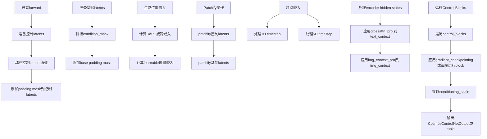
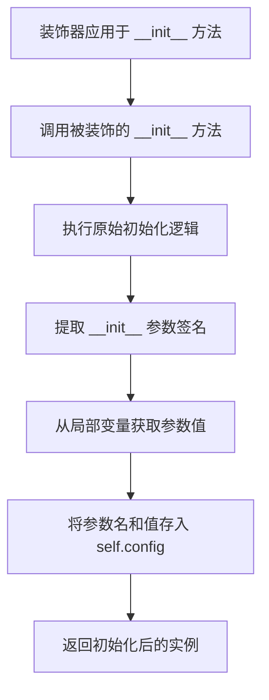
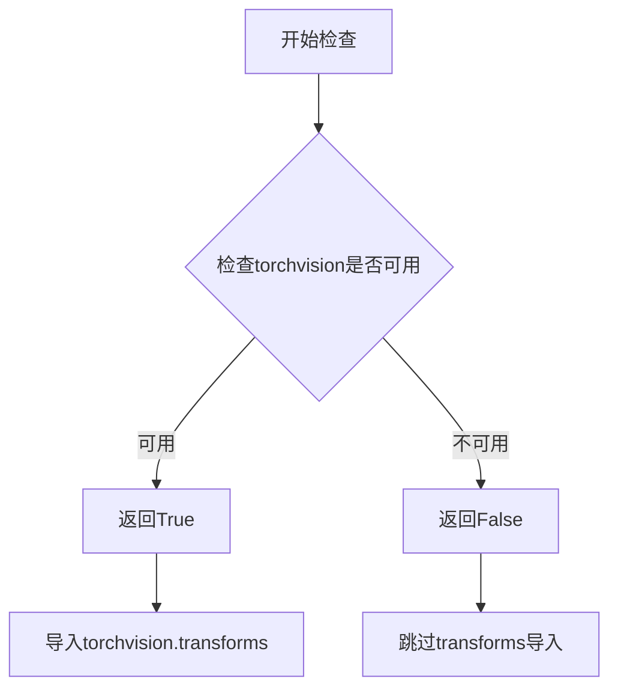
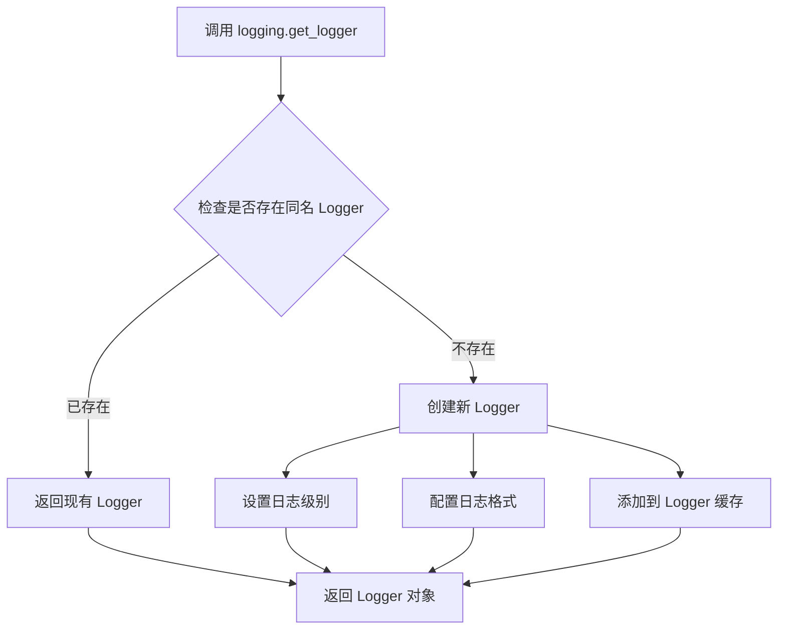
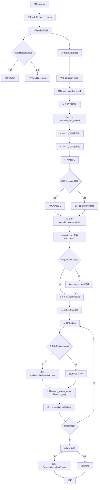

# `diffusers\src\diffusers\models\controlnets\controlnet_cosmos.py` 详细设计文档

CosmosControlNetModel是一个用于Cosmos Transfer 2.5的ControlNet模型，它通过复制transformer中的共享嵌入模块(patch_embed, time_embed, learnable_pos_embed, img_context_proj)来支持CPU卸载，其前向传播从原始输入计算控制块激活，用于注入到transformer块中实现条件控制生成。

## 整体流程



## 类结构

```
ModelMixin (抽象基类)
├── CosmosControlNetModel (主模型类)
    ├── CosmosControlNetOutput (输出 dataclass)
```

## 全局变量及字段


### `logger`
    
模块级日志记录器，用于记录警告和信息

类型：`logging.Logger`
    


### `CosmosControlNetOutput.control_block_samples`
    
控制块激活列表，用于注入到transformer块

类型：`List[torch.Tensor]`
    


### `CosmosControlNetModel.patch_embed`
    
控制信号patch嵌入层，将输入控制信号转换为patch表示

类型：`CosmosPatchEmbed`
    


### `CosmosControlNetModel.patch_embed_base`
    
基础latent的patch嵌入层，处理去噪过程中的基础latent

类型：`CosmosPatchEmbed`
    


### `CosmosControlNetModel.time_embed`
    
时间步嵌入层，将扩散时间步转换为嵌入向量

类型：`CosmosEmbedding`
    


### `CosmosControlNetModel.learnable_pos_embed`
    
可学习位置嵌入(可选)，用于增强位置信息

类型：`CosmosLearnablePositionalEmbed`
    


### `CosmosControlNetModel.img_context_proj`
    
图像上下文投影层(可选)，将图像上下文投影到目标维度

类型：`nn.Sequential`
    


### `CosmosControlNetModel.crossattn_proj`
    
跨注意力投影层(可选)，投影文本嵌入用于交叉注意力

类型：`nn.Sequential`
    


### `CosmosControlNetModel.rope`
    
旋转位置编码，为输入添加旋转位置信息

类型：`CosmosRotaryPosEmbed`
    


### `CosmosControlNetModel.control_blocks`
    
控制网络块列表，包含多个Transformer块处理控制信号

类型：`nn.ModuleList`
    


### `CosmosControlNetModel.gradient_checkpointing`
    
梯度检查点标志，控制是否启用梯度检查点以节省显存

类型：`bool`
    


### `CosmosControlNetModel._supports_gradient_checkpointing`
    
类属性，指示模型支持梯度检查点功能

类型：`bool`
    


### `CosmosControlNetModel._skip_layerwise_casting_patterns`
    
跳过层级别类型转换的模式列表

类型：`list`
    


### `CosmosControlNetModel._no_split_modules`
    
不分割的模块列表，用于模型并行

类型：`list`
    


### `CosmosControlNetModel._keep_in_fp32_modules`
    
保持fp32的模块列表，防止某些层被转换为低精度

类型：`list`
    
    

## 全局函数及方法


### `register_to_config`

该装饰器用于将 `__init__` 方法的参数自动注册到模型配置中，使得这些参数可以通过 `config` 属性访问，并支持模型配置的保存和加载。

参数：
-  `func`：被装饰的函数（`__init__` 方法），`Callable`，装饰器会自动接收被装饰的函数作为参数

返回值：`Callable`，返回装饰后的函数，该函数在执行完原始 `__init__` 逻辑后，会将所有参数以 `参数名: 值` 的形式存储到 `self.config` 中。

#### 流程图



#### 带注释源码

```python
# register_to_config 装饰器的典型实现方式
def register_to_config(func):
    """
    装饰器：将 __init__ 方法的参数注册到 self.config 中
    
    使用此装饰器后，所有 __init__ 参数会自动成为模型配置的一部分，
    可以通过 model.config.参数名 访问，并支持配置的统一保存/加载。
    """
    # 使用 functools.wraps 保留原函数的元信息
    @functools.wraps(func)
    def wrapper(self, *args, **kwargs):
        # 1. 首先执行原始的 __init__ 方法
        #    这会创建 self 并执行类定义的所有初始化逻辑
        result = func(self, *args, **kwargs)
        
        # 2. 获取 __init__ 方法的参数签名
        #    inspect.signature 可以获取函数的所有参数信息
        sig = inspect.signature(func)
        
        # 3. 绑定参数值
        #    将位置参数和关键字参数绑定到参数名
        bound_args = sig.bind(self, *args, **kwargs)
        bound_args.apply_defaults()
        
        # 4. 排除 self 参数，只保留真正的配置参数
        #    self 是实例本身，不需要存入 config
        config_params = {}
        for param_name, param_value in bound_args.arguments.items():
            if param_name != 'self':
                config_params[param_name] = param_value
        
        # 5. 将参数存入 self.config
        #    ConfigMixin 类提供了 config 属性来存储配置
        self.config = Config(**config_params)
        
        return result
    
    return wrapper


# 在类中的使用方式
class CosmosControlNetModel(ModelMixin, ConfigMixin, FromOriginalModelMixin):
    
    @register_to_config  # 装饰器应用于 __init__
    def __init__(
        self,
        n_controlnet_blocks: int = 4,       # 控制网络块数量
        in_channels: int = 130,             # 输入通道数
        latent_channels: int = 18,          # 潜在通道数
        model_channels: int = 2048,         # 模型通道数
        num_attention_heads: int = 32,      # 注意力头数
        attention_head_dim: int = 128,      # 注意力头维度
        mlp_ratio: float = 4.0,             # MLP 扩展比例
        text_embed_dim: int = 1024,         # 文本嵌入维度
        adaln_lora_dim: int = 256,          # AdaLN LoRA 维度
        patch_size: Tuple[int, int, int] = (1, 2, 2),  # 补丁大小
        max_size: Tuple[int, int, int] = (128, 240, 240),  # 最大尺寸
        rope_scale: Tuple[float, float, float] = (2.0, 1.0, 1.0),  # RoPE 缩放
        extra_pos_embed_type: str | None = None,  # 额外位置嵌入类型
        img_context_dim_in: int | None = None,  # 图像上下文输入维度
        img_context_dim_out: int = 2048,    # 图像上下文输出维度
        use_crossattn_projection: bool = False,  # 是否使用交叉注意力投影
        crossattn_proj_in_channels: int = 1024,  # 交叉注意力投影输入通道
        encoder_hidden_states_channels: int = 1024,  # 编码器隐藏状态通道
    ):
        # 在 __init__ 执行完后，以上所有参数都会被注册到 self.config 中
        # 例如：self.config.n_controlnet_blocks, self.config.in_channels 等
        super().__init__()
        # ... 初始化逻辑
```


### `is_torchvision_available`

检查torchvision库是否可用，用于条件导入transforms模块。

参数：此函数无参数。

返回值：`bool`，如果torchvision库已安装且可用返回`True`，否则返回`False`。

#### 流程图



#### 带注释源码

```python
# 从utils模块导入的函数，用于检查torchvision是否可用
# 定义位置：.../utils/__init__.py 或类似位置

def is_torchvision_available():
    """
    检查torchvision库是否可用。
    
    这是一个辅助函数，用于条件性地导入torchvision模块。
    当torchvision未安装时，代码可以优雅地处理导入失败，
    避免在缺少可选依赖时直接报错。
    
    Returns:
        bool: 如果torchvision已安装且可以导入则返回True，否则返回False
    """
    # 尝试导入torchvision，如果失败则返回False
    try:
        import torchvision  # noqa: F401
        return True
    except ImportError:
        return False
```

#### 在代码中的使用

```python
# 从utils模块导入is_torchvision_available函数
from ...utils import BaseOutput, is_torchvision_available, logging

# 条件性地导入torchvision的transforms模块
# 只有当torchvision可用时才执行此导入
if is_torchvision_available():
    from torchvision import transforms
```


### `logging.get_logger`

获取指定名称的日志记录器，用于在模块中记录日志信息。

参数：

- `name`：`str`，日志记录器的名称，通常使用 `__name__` 变量传入，表示当前模块的完全限定名

返回值：`logging.Logger`，Python 标准日志模块的 Logger 对象，用于输出日志信息

#### 流程图



#### 带注释源码

```python
# 从 utils 模块导入 logging 对象
from ...utils import BaseOutput, is_torchvision_available, logging

# ...
# 在模块级别调用 get_logger 获取当前模块的日志记录器
# __name__ 是 Python 内置变量，表示当前模块的完全限定名
# 例如: 'diffusers.models.controlnets.cosmos_controlnet'
logger = logging.get_logger(__name__)  # pylint: disable=invalid-name
```

#### 说明

该函数是扩散模型库（diffusers）中的自定义日志记录器获取方法。相比于 Python 标准库的 `logging.getLogger()`，它通常会：

1. **统一日志格式**：为所有模块提供一致的日志输出格式
2. **默认级别设置**：设置合理的默认日志级别
3. **命名规范**：使用 `__name__` 确保日志可以追溯到具体模块
4. **可能的特性**：支持根据环境变量（如 `DIFFUSERS_VERBOSE`）动态调整日志级别

在代码中，`logger` 对象用于输出警告信息，例如：

```python
logger.warning(
    "Received %d control scales, but control network defines %d blocks. "
    "Scales will be trimmed or repeated to match.",
    len(scales),
    len(self.control_blocks),
)
```


### `CosmosControlNetModel.__init__`

该方法是CosmosControlNetModel类的构造函数，负责初始化控制网络（ControlNet）的所有模型组件，包括patch嵌入层、时间嵌入层、可学习位置编码、图像上下文投影、跨注意力投影、旋转位置编码（RoPE）以及多个Transformer控制块，并设置梯度检查点和类型转换跳过模式。

参数：

- `n_controlnet_blocks`：`int`，控制网络块的数量，默认为4个
- `in_channels`：`int`，输入通道数，默认为130（包括潜在通道、条件掩码和填充掩码）
- `latent_channels`：`int`，基础潜在通道数，默认为18
- `model_channels`：`int`，模型通道数/隐藏维度，默认为2048
- `num_attention_heads`：`int`，注意力头数量，默认为32
- `attention_head_dim`：`int`，每个注意力头的维度，默认为128
- `mlp_ratio`：`float`，MLP隐藏维度与输入维度的比率，默认为4.0
- `text_embed_dim`：`int`，文本嵌入维度，默认为1024
- `adaln_lora_dim`：`int`，AdaLN LoRA维度，默认为256
- `patch_size`：`Tuple[int, int, int]`，时空补丁大小，默认为(1, 2, 2)
- `max_size`：`Tuple[int, int, int]`，最大空间/时间尺寸，默认为(128, 240, 240)
- `rope_scale`：`Tuple[float, float, float]`，RoPE缩放因子，默认为(2.0, 1.0, 1.0)
- `extra_pos_embed_type`：`str | None`，额外位置编码类型，可选"learnable"或None
- `img_context_dim_in`：`int | None`，图像上下文输入维度，可为None
- `img_context_dim_out`：`int`，图像上下文输出维度，默认为2048
- `use_crossattn_projection`：`bool`，是否使用跨注意力投影，默认为False
- `crossattn_proj_in_channels`：`int`，跨注意力投影输入通道数，默认为1024
- `encoder_hidden_states_channels`：`int`，编码器隐藏状态通道数，默认为1024

返回值：`None`，该方法不返回任何值，仅初始化对象状态

#### 流程图

```mermaid
flowchart TD
    A[开始 __init__] --> B[调用父类 super().__init__]
    
    B --> C[创建 CosmosPatchEmbed: patch_embed]
    C --> D[创建 CosmosPatchEmbed: patch_embed_base]
    D --> E[创建 CosmosEmbedding: time_embed]
    
    E --> F{extra_pos_embed_type == 'learnable'?}
    F -->|是| G[创建 CosmosLearnablePositionalEmbed]
    F -->|否| H[learnable_pos_embed = None]
    G --> H
    
    H --> I{img_context_dim_in 存在且 > 0?}
    I -->|是| J[创建 nn.Sequential: img_context_proj]
    I --> K[img_context_proj = None]
    J --> K
    
    K --> L{use_crossattn_projection == True?}
    L -->|是| M[创建 nn.Sequential: crossattn_proj]
    L --> N[crossattn_proj = None]
    M --> N
    
    N --> O[创建 CosmosRotaryPosEmbed: rope]
    O --> P[循环创建 n_controlnet_blocks 个 CosmosTransformerBlock]
    
    P --> Q[设置 gradient_checkpointing = False]
    Q --> R[结束 __init__]
    
    style A fill:#e1f5fe
    style R fill:#e8f5e8
    style P fill:#fff3e0
```

#### 带注释源码

```python
@register_to_config
def __init__(
    self,
    n_controlnet_blocks: int = 4,
    in_channels: int = 130,
    latent_channels: int = 18,  # base latent channels (latents + condition_mask) + padding_mask
    model_channels: int = 2048,
    num_attention_heads: int = 32,
    attention_head_dim: int = 128,
    mlp_ratio: float = 4.0,
    text_embed_dim: int = 1024,
    adaln_lora_dim: int = 256,
    patch_size: Tuple[int, int, int] = (1, 2, 2),
    max_size: Tuple[int, int, int] = (128, 240, 240),
    rope_scale: Tuple[float, float, float] = (2.0, 1.0, 1.0),
    extra_pos_embed_type: str | None = None,
    img_context_dim_in: int | None = None,
    img_context_dim_out: int = 2048,
    use_crossattn_projection: bool = False,
    crossattn_proj_in_channels: int = 1024,
    encoder_hidden_states_channels: int = 1024,
):
    """
    初始化 CosmosControlNetModel 的所有组件。
    
    该方法创建以下主要组件：
    1. patch_embed: 用于将控制信号latents转换为patch嵌入
    2. patch_embed_base: 用于将基础latents转换为patch嵌入
    3. time_embed: 时间步嵌入层
    4. learnable_pos_embed: 可学习的位置编码（可选）
    5. img_context_proj: 图像上下文投影层（可选）
    6. crossattn_proj: 跨注意力投影层（可选）
    7. rope: 旋转位置编码器
    8. control_blocks: 控制网络Transformer块列表
    """
    super().__init__()  # 调用父类 ModelMixin, ConfigMixin, FromOriginalModelMixin 的初始化

    # 创建控制信号的patch嵌入层
    # 将 [B, C, T, H, W] -> [B, model_channels, T/p_t, H/p_h, W/p_w]
    self.patch_embed = CosmosPatchEmbed(in_channels, model_channels, patch_size, bias=False)

    # 创建基础latents的patch嵌入层（用于与控制信号交互）
    self.patch_embed_base = CosmosPatchEmbed(latent_channels, model_channels, patch_size, bias=False)
    
    # 创建时间步嵌入层，用于将扩散时间步转换为特征
    self.time_embed = CosmosEmbedding(model_channels, model_channels)

    # 根据配置创建可学习位置编码
    self.learnable_pos_embed = None
    if extra_pos_embed_type == "learnable":
        self.learnable_pos_embed = CosmosLearnablePositionalEmbed(
            hidden_size=model_channels,
            max_size=max_size,
            patch_size=patch_size,
        )

    # 创建图像上下文投影层（用于VACE视频处理）
    # 将图像上下文从 img_context_dim_in 投影到 img_context_dim_out
    self.img_context_proj = None
    if img_context_dim_in is not None and img_context_dim_in > 0:
        self.img_context_proj = nn.Sequential(
            nn.Linear(img_context_dim_in, img_context_dim_out, bias=True),
            nn.GELU(),
        )

    # 创建跨注意力投影层（用于文本嵌入）
    # 与transformer中的投影层相同，支持CPU卸载
    self.crossattn_proj = None
    if use_crossattn_projection:
        self.crossattn_proj = nn.Sequential(
            nn.Linear(crossattn_proj_in_channels, encoder_hidden_states_channels, bias=True),
            nn.GELU(),
        )

    # 创建旋转位置编码器（RoPE）
    # 用于控制latents和基础latents
    self.rope = CosmosRotaryPosEmbed(
        hidden_size=attention_head_dim, max_size=max_size, patch_size=patch_size, rope_scale=rope_scale
    )

    # 创建多个ControlNet Transformer块
    # 每个块处理控制信号并产生残差输出
    self.control_blocks = nn.ModuleList(
        [
            CosmosTransformerBlock(
                num_attention_heads=num_attention_heads,
                attention_head_dim=attention_head_dim,
                cross_attention_dim=text_embed_dim,
                mlp_ratio=mlp_ratio,
                adaln_lora_dim=adaln_lora_dim,
                qk_norm="rms_norm",
                out_bias=False,
                img_context=img_context_dim_in is not None and img_context_dim_in > 0,
                before_proj=(block_idx == 0),  # 第一个块需要特殊处理
                after_proj=True,
            )
            for block_idx in range(n_controlnet_blocks)
        ]
    )

    # 初始化梯度检查点标志为False
    # 设为True时可以节省显存但增加计算时间
    self.gradient_checkpointing = False
```


### `CosmosControlNetModel._expand_conditioning_scale`

该方法用于将传入的条件控制缩放因子（conditioning_scale）扩展为与控制网络块（control_blocks）数量相匹配的列表长度，确保每个控制块都能获得对应的缩放因子。

参数：

- `self`：`CosmosControlNetModel` 实例本身
- `conditioning_scale`：`float | list[float]`，控制网络输出的缩放因子，可以是单个浮点数值（将应用于所有控制块）或浮点数列表（每个控制块对应一个缩放因子）

返回值：`List[float]`：扩展后的缩放因子列表，长度等于 `self.control_blocks` 的数量

#### 流程图

```mermaid
flowchart TD
    A[开始] --> B{conditioning_scale 是否为列表?}
    B -->|是| C[scales = conditioning_scale]
    B -->|否| D[scales = [conditioning_scale] * len(self.control_blocks)]
    D --> E{len(scales) < len(self.control_blocks)?}
    C --> E
    E -->|是| F[记录警告日志]
    F --> G[scales = (scales * len(self.control_blocks))[:len(self.control_blocks)]]
    E -->|否| H[返回 scales]
    G --> H
```

#### 带注释源码

```python
def _expand_conditioning_scale(self, conditioning_scale: float | list[float]) -> List[float]:
    """
    扩展条件控制缩放因子
    
    将传入的缩放因子扩展为与控制块数量匹配的列表。
    如果传入单个浮点数，则创建一个包含该值重复元素的列表；
    如果传入列表但长度不足，则循环扩展该列表以匹配控制块数量。
    
    Args:
        conditioning_scale: 单一浮点数或浮点数列表
        
    Returns:
        与控制块数量等长的浮点数列表
    """
    # 判断输入类型：如果是列表则直接使用，否则创建重复列表
    if isinstance(conditioning_scale, list):
        scales = conditioning_scale
    else:
        # 将单个缩放因子扩展为与控制块数量相同的列表
        scales = [conditioning_scale] * len(self.control_blocks)

    # 如果缩放因子数量少于控制块数量，则循环扩展以匹配
    if len(scales) < len(self.control_blocks):
        logger.warning(
            "Received %d control scales, but control network defines %d blocks. "
            "Scales will be trimmed or repeated to match.",
            len(scales),
            len(self.control_blocks),
        )
        # 通过重复并截断的方式扩展列表长度
        scales = (scales * len(self.control_blocks))[: len(self.control_blocks)]
    return scales
```


### `CosmosControlNetModel.forward`

该方法实现了 Cosmos ControlNet 的前向传播，计算控制块激活。通过处理控制信号潜向量和基础潜向量，生成用于注入到 transformer 块的控制块激活样本。

参数：

- `controls_latents`：`torch.Tensor`，控制信号潜向量，形状为 [B, C, T, H, W]
- `latents`：`torch.Tensor`，去噪过程中的基础潜向量，形状为 [B, C, T, H, W]
- `timestep`：`torch.Tensor`，扩散时间步张量
- `encoder_hidden_states`：`Union[Optional[torch.Tensor], Tuple[Optional[torch.Tensor], Optional[torch.Tensor]]]`，编码器隐藏状态，可为元组 (text_context, img_context) 或仅 text_context
- `condition_mask`：`torch.Tensor`，条件掩码，形状为 [B, 1, T, H, W]
- `conditioning_scale`：`float | list[float]`，控制输出的缩放因子
- `padding_mask`：`torch.Tensor | None`，填充掩码，形状为 [B, 1, H, W] 或 None
- `attention_mask`：`torch.Tensor | None`，可选的注意力掩码或 None
- `fps`：`int | None`，用于 RoPE 的帧率或 None
- `return_dict`：`bool`，是否返回 CosmosControlNetOutput 或元组

返回值：`Union[CosmosControlNetOutput, Tuple[List[torch.Tensor]]]`，返回 CosmosControlNetOutput 对象或控制张量元组

#### 流程图



#### 带注释源码

```python
def forward(
    self,
    controls_latents: torch.Tensor,          # 控制信号潜向量 [B, C, T, H, W]
    latents: torch.Tensor,                    # 基础潜向量 [B, C, T, H, W]
    timestep: torch.Tensor,                   # 扩散时间步张量
    encoder_hidden_states: Union[Optional[torch.Tensor], Tuple[Optional[torch.Tensor], Optional[torch.Tensor]]],  # 编码器隐藏状态
    condition_mask: torch.Tensor,             # 条件掩码 [B, 1, T, H, W]
    conditioning_scale: float | list[float] = 1.0,  # 控制输出缩放因子
    padding_mask: torch.Tensor | None = None,       # 填充掩码 [B, 1, H, W]
    attention_mask: torch.Tensor | None = None,     # 注意力掩码
    fps: int | None = None,                         # 帧率用于 RoPE
    return_dict: bool = True,                       # 是否返回字典格式
) -> Union[CosmosControlNetOutput, Tuple[List[torch.Tensor]]]:
    """
    Forward pass for the ControlNet.

    Args:
        controls_latents: Control signal latents [B, C, T, H, W]
        latents: Base latents from the noising process [B, C, T, H, W]
        timestep: Diffusion timestep tensor
        encoder_hidden_states: Tuple of (text_context, img_context) or text_context
        condition_mask: Conditioning mask [B, 1, T, H, W]
        conditioning_scale: Scale factor(s) for control outputs
        padding_mask: Padding mask [B, 1, H, W] or None
        attention_mask: Optional attention mask or None
        fps: Frames per second for RoPE or None
        return_dict: Whether to return a CosmosControlNetOutput or a tuple

    Returns:
        CosmosControlNetOutput or tuple of control tensors
    """
    B, C, T, H, W = controls_latents.shape  # 获取批次维度

    # ============================================================
    # 1. 准备控制潜向量
    # ============================================================
    control_hidden_states = controls_latents
    vace_in_channels = self.config.in_channels - 1  # 获取配置中的输入通道数
    # 如果控制通道不足，则填充零通道
    if control_hidden_states.shape[1] < vace_in_channels - 1:
        pad_C = vace_in_channels - 1 - control_hidden_states.shape[1]
        control_hidden_states = torch.cat(
            [
                control_hidden_states,
                torch.zeros(
                    (B, pad_C, T, H, W), dtype=control_hidden_states.dtype, device=control_hidden_states.device
                ),
            ],
            dim=1,
        )

    # 拼接一个额外的零通道用于 padding 标识
    control_hidden_states = torch.cat([control_hidden_states, torch.zeros_like(controls_latents[:, :1])], dim=1)

    # 调整 padding_mask 大小并拼接到控制潜向量
    padding_mask_resized = transforms.functional.resize(
        padding_mask, list(control_hidden_states.shape[-2:]), interpolation=transforms.InterpolationMode.NEAREST
    )
    control_hidden_states = torch.cat(
        [control_hidden_states, padding_mask_resized.unsqueeze(2).repeat(B, 1, T, 1, 1)], dim=1
    )

    # ============================================================
    # 2. 准备基础潜向量（与 transformer.forward 相同处理）
    # ============================================================
    base_hidden_states = latents
    # 拼接条件掩码
    if condition_mask is not None:
        base_hidden_states = torch.cat([base_hidden_states, condition_mask], dim=1)

    # 调整 padding_mask 大小并拼接
    base_padding_mask = transforms.functional.resize(
        padding_mask, list(base_hidden_states.shape[-2:]), interpolation=transforms.InterpolationMode.NEAREST
    )
    base_hidden_states = torch.cat(
        [base_hidden_states, base_padding_mask.unsqueeze(2).repeat(B, 1, T, 1, 1)], dim=1
    )

    # ============================================================
    # 3. 生成位置嵌入（控制与基础共享）
    # ============================================================
    # 生成旋转位置嵌入
    image_rotary_emb = self.rope(control_hidden_states, fps=fps)
    # 生成可学习位置嵌入（如果配置中启用）
    extra_pos_emb = self.learnable_pos_embed(control_hidden_states) if self.learnable_pos_embed else None

    # ============================================================
    # 4. Patchify 控制潜向量
    # ============================================================
    control_hidden_states = self.patch_embed(control_hidden_states)  # 投影到模型维度
    control_hidden_states = control_hidden_states.flatten(1, 3)       # 展平为序列

    # ============================================================
    # 5. Patchify 基础潜向量
    # ============================================================
    p_t, p_h, p_w = self.config.patch_size  # 获取 patch 尺寸
    post_patch_num_frames = T // p_t         # patch 后的帧数
    post_patch_height = H // p_h             # patch 后高度
    post_patch_width = W // p_w              # patch 后宽度

    base_hidden_states = self.patch_embed_base(base_hidden_states)  # 基础 latent 的 patch 嵌入
    base_hidden_states = base_hidden_states.flatten(1, 3)            # 展平为序列

    # ============================================================
    # 6. 时间嵌入
    # ============================================================
    if timestep.ndim == 1:
        # 1D 时间步：标准处理
        temb, embedded_timestep = self.time_embed(base_hidden_states, timestep)
    elif timestep.ndim == 5:
        # 5D 时间步：需要 reshape 处理时空信息
        batch_size, _, num_frames, _, _ = latents.shape
        assert timestep.shape == (batch_size, 1, num_frames, 1, 1), (
            f"Expected timestep to have shape [B, 1, T, 1, 1], but got {timestep.shape}"
        )
        timestep_flat = timestep.flatten()
        temb, embedded_timestep = self.time_embed(base_hidden_states, timestep_flat)
        # 重塑为时空分布形式
        temb, embedded_timestep = (
            x.view(batch_size, post_patch_num_frames, 1, 1, -1)
            .expand(-1, -1, post_patch_height, post_patch_width, -1)
            .flatten(1, 3)
            for x in (temb, embedded_timestep)
        )
    else:
        raise ValueError(f"Expected timestep to have shape [B, 1, T, 1, 1] or [T], but got {timestep.shape}")

    # ============================================================
    # 7. 处理编码器隐藏状态
    # ============================================================
    if isinstance(encoder_hidden_states, tuple):
        text_context, img_context = encoder_hidden_states
    else:
        text_context = encoder_hidden_states
        img_context = None

    # 对 text_context 应用交叉注意力投影
    if self.crossattn_proj is not None:
        text_context = self.crossattn_proj(text_context)

    # 对 img_context 应用图像上下文投影（如果提供）
    if img_context is not None and self.img_context_proj is not None:
        img_context = self.img_context_proj(img_context)

    # 将 text 和 image context 组合为元组或保持原样
    if self.config.img_context_dim_in is not None and self.config.img_context_dim_in > 0:
        processed_encoder_hidden_states = (text_context, img_context)
    else:
        processed_encoder_hidden_states = text_context

    # ============================================================
    # 8. 准备注意力掩码
    # ============================================================
    if attention_mask is not None:
        attention_mask = attention_mask.unsqueeze(1).unsqueeze(1)  # [B, 1, 1, S]

    # ============================================================
    # 9. 运行控制块
    # ============================================================
    scales = self._expand_conditioning_scale(conditioning_scale)  # 扩展缩放因子
    result = []
    for block_idx, (block, scale) in enumerate(zip(self.control_blocks, scales)):
        if torch.is_grad_enabled() and self.gradient_checkpointing:
            # 使用梯度 checkpoint 节省显存
            control_hidden_states, control_proj = self._gradient_checkpointing_func(
                block,
                control_hidden_states,
                processed_encoder_hidden_states,
                embedded_timestep,
                temb,
                image_rotary_emb,
                extra_pos_emb,
                attention_mask,
                None,  # controlnet_residual
                base_hidden_states,
                block_idx,
            )
        else:
            # 直接调用 transformer block
            control_hidden_states, control_proj = block(
                hidden_states=control_hidden_states,
                encoder_hidden_states=processed_encoder_hidden_states,
                embedded_timestep=embedded_timestep,
                temb=temb,
                image_rotary_emb=image_rotary_emb,
                extra_pos_emb=extra_pos_emb,
                attention_mask=attention_mask,
                controlnet_residual=None,
                latents=base_hidden_states,
                block_idx=block_idx,
            )
        # 应用缩放因子并添加到结果列表
        result.append(control_proj * scale)

    # 返回结果
    if not return_dict:
        return (result,)

    return CosmosControlNetOutput(control_block_samples=result)
```

## 关键组件


### 张量索引与形状处理

在forward方法中，通过`controls_latents.shape`和`latents.shape`获取批次(B)、通道(C)、时间(T)、高度(H)、宽度(W)维度，用于后续的patchify操作和形状变换。

### 惰性加载与条件初始化

模型中多个组件（如`learnable_pos_embed`、`img_context_proj`、`crossattn_proj`）根据配置参数（如`extra_pos_embed_type`、`img_context_dim_in`、`use_crossattn_projection`）进行条件初始化，实现惰性加载以节省计算资源。

### 条件掩码与Padding Mask处理

在forward中通过`condition_mask`和`padding_mask`对输入进行处理，使用`transforms.functional.resize`进行尺寸调整，并通过`unsqueeze`和`repeat`操作扩展维度以匹配latent的形状。

### 量化策略与精度管理

通过`_skip_layerwise_casting_patterns`、`_keep_in_fp32_modules`和`_supports_gradient_checkpointing`属性管理模型的精度策略，支持梯度检查点以优化显存使用。

### 控制块残差与缩放

`_expand_conditioning_scale`方法将单个缩放因子扩展为列表，每个控制块输出乘以对应的缩放系数，实现多控制信号的加权融合。

### 时间步长嵌入处理

支持两种时间步长格式（1D和5D张量），通过`ndim`判断并进行相应的展平、reshape和expand操作以适配不同扩散模型的时间嵌入需求。

### 上下文投影与融合

文本上下文和图像上下文分别通过`crossattn_proj`和`img_context_proj`进行处理，最终融合为`processed_encoder_hidden_states`供Transformer块使用。


## 问题及建议


### 已知问题

-   **重复的 PatchEmbed 创建逻辑**：`patch_embed` 和 `patch_embed_base` 的创建代码高度相似，仅输入通道数不同，可提取为工厂方法以减少代码重复。
-   **硬编码的通道数处理**：forward 方法中 `vace_in_channels = self.config.in_channels - 1` 假设了特定的通道结构，这种隐式假设缺乏文档说明且容易出错。
-   **外部库依赖的隐式使用**：padding_mask 的 resize 操作依赖 `torchvision.transforms`，当 `is_torchvision_available()` 返回 False 时会导致运行时错误，但缺少显式检查。
-   **梯度检查点方法缺失定义**：调用了 `self._gradient_checkpointing_func`，但该方法未在类中定义，依赖父类继承实现，可能导致意外行为。
-   **条件逻辑重复**：多次使用 `img_context_dim_in is not None and img_context_dim_in > 0` 进行条件判断，可提取为类属性以提高可维护性。
-   **类型注解冗余**：`Union[Optional[torch.Tensor], Tuple[Optional[torch.Tensor], Optional[torch.Tensor]]]` 过于复杂，可使用 TypeAlias 简化。
-   **日志格式不一致**：logger.warning 使用 `%s` 格式化而非现代 f-string，与代码其他部分风格不一致。
-   **注意力掩码处理简化**：attention_mask 仅进行了维度扩展 `(B, 1, 1, S)`，未考虑更复杂的掩码形状场景，通用性有限。
-   **时间步处理分支复杂**：timestep 的 1D 和 5D 处理逻辑分散在同一个方法中，增加了理解和测试的难度。
-   **控制块残差未使用**：forward 方法中始终传入 `controlnet_residual=None`，表明残差连接功能未完整实现。

### 优化建议

-   **提取 PatchEmbed 工厂方法**：创建 `_create_patch_embed(in_channels)` 方法接收通道数参数，减少重复代码。
-   **增加配置验证**：在 `__init__` 或使用配置前添加显式验证，确保 `in_channels` 和 `latent_channels` 满足预期结构。
-   **添加 torchvision 可用性检查**：在使用 transforms 前检查库可用性，或在初始化时将 transforms 方法绑定到类中作为备用。
-   **定义梯度检查点方法**：显式实现 `_gradient_checkpointing_func` 或从父类确认继承行为，并添加文档说明。
-   **缓存条件判断结果**：在 `__init__` 中计算 `self._use_img_context = img_context_dim_in is not None and img_context_dim_in > 0`，后续直接使用该属性。
-   **使用 TypeAlias 简化类型**：定义 `EncoderHiddenStates = Union[Optional[torch.Tensor], Tuple[Optional[torch.Tensor], Optional[torch.Tensor]]]`
-   **统一日志风格**：将 logger.warning 改为 f-string 格式化。
-   **增强 attention_mask 处理**：支持更复杂的掩码形状，或添加文档说明当前支持的掩码格式。
-   **分离时间步处理逻辑**：将 timestep 的 1D 和 5D 处理提取为独立方法 `_process_timestep`。
-   **实现控制块残差功能**：如果 controlnet_residual 功能是计划内的，完成其实现；否则从接口中移除该参数。


## 其它


### 设计目标与约束

本模块旨在为Cosmos Transfer2.5提供ControlNet控制能力，通过复制transformer的共享嵌入模块（patch_embed、time_embed、learnable_pos_embed、img_context_proj）来支持CPU卸载。主要设计约束包括：支持4个控制块、输入通道130维、潜在通道18维、模型通道2048维、注意力头32个、patch大小(1,2,2)、最大尺寸(128,240,240)。必须与CosmosTransformerBlock配合使用，且支持梯度检查点以降低显存占用。

### 错误处理与异常设计

代码采用多种错误处理机制：1) 使用logger.warning()处理conditioning_scale数量不匹配的情况，会自动trim或repeat以匹配控制块数量；2) 使用assert验证timestep维度形状，确保为[B,1,T,1,1]或[T]；3) 使用ValueError主动抛出 timestep 形状不匹配的异常；4) 所有张量操作使用PyTorch原生错误传播机制。异常设计遵循"快速失败"原则，在数据预处理阶段尽早验证输入合法性。

### 数据流与状态机

数据流经过以下阶段：1) 接收controls_latents和latents作为输入；2) 对control latents进行padding处理以匹配vace_in_channels；3) 拼接padding_mask到控制潜在空间；4) 对base latents拼接condition_mask；5) 通过RoPE生成旋转位置嵌入；6) 分别对control和base latents进行patchify；7) 生成time embedding；8) 处理encoder_hidden_states（文本和图像上下文）；9) 依次通过n_controlnet_blocks个CosmosTransformerBlock；10) 输出缩放后的control_block_samples。状态机由gradient_checkpointing布尔标志控制是否启用梯度检查点。

### 外部依赖与接口契约

核心依赖包括：torch>=2.0、torchvision（用于transforms.Resize）、diffusers库的ConfigMixin/ModelMixin/FromOriginalModelMixin、BaseOutput、logging工具。项目内部依赖CosmosEmbedding、 CosmosLearnablePositionalEmbed、CosmosPatchEmbed、CosmosRotaryPosEmbed、CosmosTransformerBlock等自定义模块。接口契约要求：controls_latents shape为[B,C,T,H,W]、latents shape为[B,C,T,H,W]、timestep为1D或5D tensor、encoder_hidden_states为Tensor或(TextContext, ImgContext)元组、condition_mask shape为[B,1,T,H,W]、padding_mask shape为[B,1,H,W]。

### 配置与超参数

主要可配置参数分为三类：1) 结构参数：n_controlnet_blocks(默认4)、in_channels(130)、latent_channels(18)、model_channels(2048)；2) 注意力参数：num_attention_heads(32)、attention_head_dim(128)、mlp_ratio(4.0)、text_embed_dim(1024)；3) 位置编码参数：patch_size((1,2,2))、max_size((128,240,240))、rope_scale((2.0,1.0,1.0))、extra_pos_embed_type、adaln_lora_dim(256)；4) 上下文参数：img_context_dim_in、img_context_dim_out(2048)、use_crossattn_projection、crossattn_proj_in_channels(1024)、encoder_hidden_states_channels(1024)。

### 性能考虑

性能优化策略包括：1) 梯度检查点支持通过_ gradient_checkpointing_func降低显存占用；2) _skip_layerwise_casting_patterns跳过特定模块的类型转换；3) _keep_in_fp32_modules将learnable_pos_embed保留在FP32以保证数值稳定性；4) _no_split_modules防止CosmosTransformerBlock被分割；5) 使用torch.no_grad()和torch.is_grad_enabled()条件判断以优化推理和训练性能。

### 内存管理

内存管理机制：1) CPU卸载通过复制共享嵌入模块实现；2) FP32模块列表_keep_in_fp32_modules指定需要高精度存储的模块；3) 梯度检查点通过重计算而非存储中间激活来节省显存；4) 动态padding使用torch.zeros避免预分配过大内存；5) 使用torch.cat而非in-place操作以支持内存优化。

### 并发特性

无显式线程并发设计，依赖PyTorch的自动求导系统和设备管理。梯度检查点内部使用PyTorch的_RemapStateFunction支持单卡多卡并行。ModuleList结构支持数据并行，但当前实现为顺序执行各控制块。

### 测试策略

测试应覆盖：1) 正向传播输出维度正确性验证；2) 梯度检查点开启/关闭的数值一致性；3) conditioning_scale为单个float和list时的行为；4) timestep不同shape(1D vs 5D)的兼容性；5) encoder_hidden_states为tuple和single tensor的处理；6) padding_mask和attention_mask的处理；7) CPU/GPU设备迁移；8) 从原始模型加载的兼容性。

### 版本兼容性

要求torch>=2.0以支持现代PyTorch特性。torchvision用于图像变换，需与torch版本兼容。diffusers库版本需支持ConfigMixin、ModelMixin、FromOriginalModelMixin接口。项目内部模块需与Cosmos系列模型版本匹配。

### 安全性

无用户直接输入，无SQL注入等传统安全风险。潜在风险点：1) torch.load可能存在反序列化漏洞，需确保模型来源可信；2) 动态张量形状需防止索引越界（已通过assert和条件判断保护）；3) 梯度计算图构建需防止内存耗尽（已通过梯度检查点缓解）。

### 日志与监控

使用标准logging模块，通过logging.get_logger(__name__)获取logger。警告场景：conditioning_scale数量与控制块数量不匹配时输出warning日志。推理/训练过程无详细进度日志，适合集成到上层pipeline的统一监控框架。

### 使用案例

典型使用场景：1) 作为Stable Diffusion类扩散模型的辅助网络，提供额外的控制信号；2) 与CosmosDiffusionModel配合使用，注入控制块激活到主transformer；3) 支持条件图像生成，通过condition_mask和controls_latents编码外部控制信息；4) 支持文本和图像双模态条件，通过encoder_hidden_states的tuple形式传递。


    