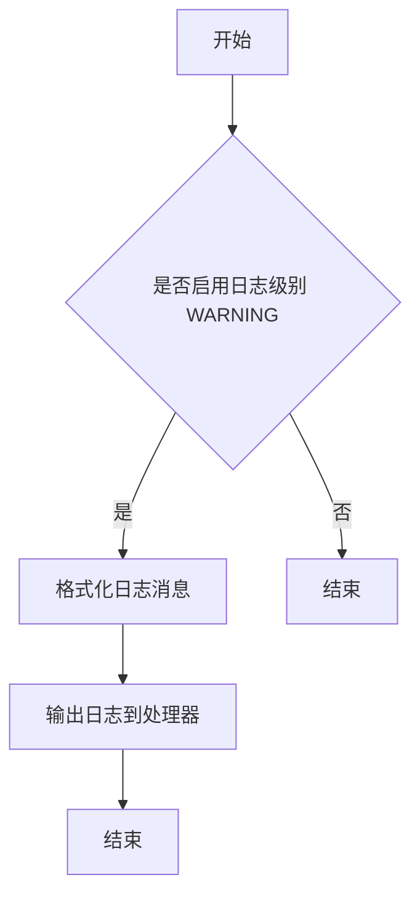
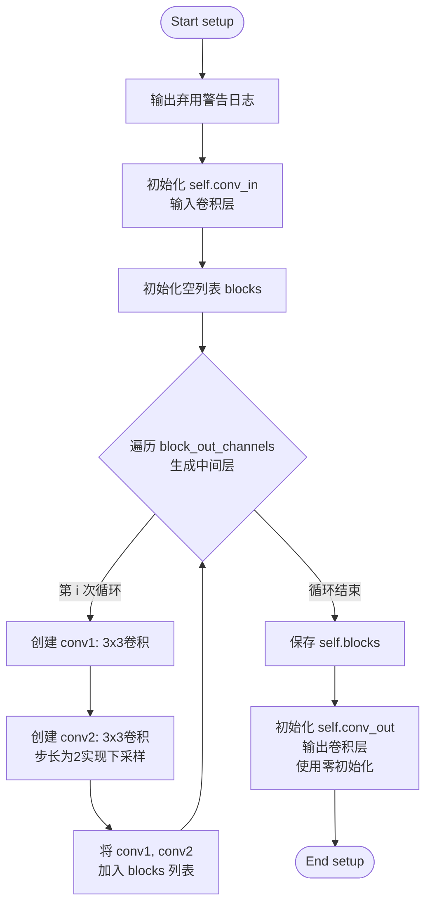
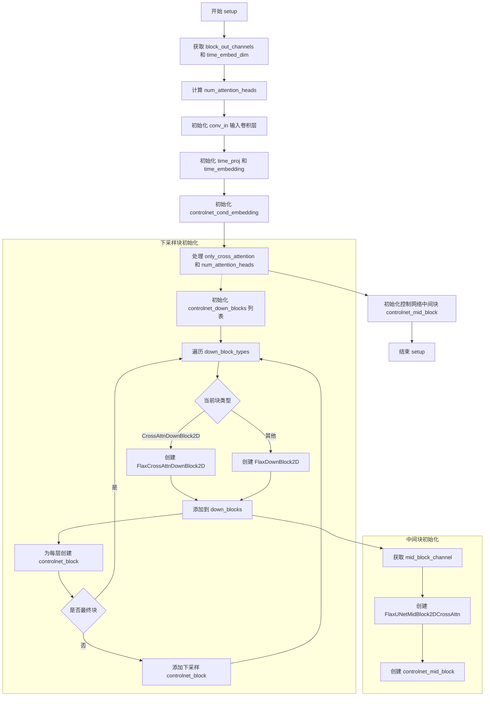
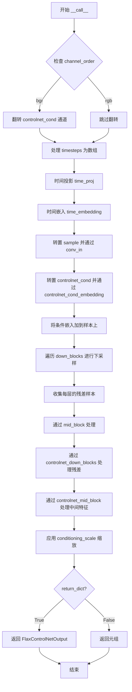

# `diffusers\src\diffusers\models\controlnets\controlnet_flax.py` 详细设计文档

这是一个基于Flax Linen实现的ControlNet模型，用于图像生成任务中的条件控制。该模型接收噪声样本、时间步、编码器隐藏状态和条件图像作为输入，通过下采样块、中间块和ControlNet特定的处理块，输出下采样阶段的残差样本和中间残差样本，用于指导图像生成过程。

## 整体流程

```mermaid
graph TD
A[输入: sample, timesteps, encoder_hidden_states, controlnet_cond] --> B{channel_order == 'bgr'?}
B -- 是 --> C[反转通道顺序]
B -- 否 --> D[继续]
C --> D
D --> E[时间步处理: time_proj + time_embedding]
E --> F[预处理: conv_in(sample) + controlnet_cond_embedding(controlnet_cond)]
F --> G[下采样阶段: 遍历down_blocks]
G --> H[中间块处理: mid_block]
H --> I[ControlNet块处理: 控制网下块残差提取]
I --> J[缩放处理: 应用conditioning_scale]
J --> K[输出: FlaxControlNetOutput]
style A fill:#f9f,stroke:#333
style K fill:#9f9,stroke:#333
```

## 类结构

```
FlaxControlNetOutput (数据类)
FlaxControlNetConditioningEmbedding (nn.Module)
└── setup() - 初始化卷积层和块
└── __call__(conditioning) - 前向传播
FlaxControlNetModel (nn.Module, FlaxModelMixin, ConfigMixin)
└── init_weights(rng) - 初始化权重
└── setup() - 初始化网络结构
└── __call__(...) - 前向传播
```

## 全局变量及字段


### `logger`
    
模块级别的日志记录器，用于输出警告和信息

类型：`logging.Logger`
    


### `FlaxControlNetOutput.down_block_res_samples`
    
下采样块的残差样本

类型：`jnp.ndarray`
    


### `FlaxControlNetOutput.mid_block_res_sample`
    
中间块的残差样本

类型：`jnp.ndarray`
    


### `FlaxControlNetConditioningEmbedding.conditioning_embedding_channels`
    
条件嵌入通道数

类型：`int`
    


### `FlaxControlNetConditioningEmbedding.block_out_channels`
    
块输出通道

类型：`tuple[int, ...]`
    


### `FlaxControlNetConditioningEmbedding.dtype`
    
数据类型

类型：`jnp.dtype`
    


### `FlaxControlNetConditioningEmbedding.conv_in`
    
输入卷积层

类型：`nn.Conv`
    


### `FlaxControlNetConditioningEmbedding.blocks`
    
卷积块列表

类型：`list`
    


### `FlaxControlNetConditioningEmbedding.conv_out`
    
输出卷积层

类型：`nn.Conv`
    


### `FlaxControlNetModel.sample_size`
    
输入样本大小

类型：`int`
    


### `FlaxControlNetModel.in_channels`
    
输入通道数

类型：`int`
    


### `FlaxControlNetModel.down_block_types`
    
下块类型

类型：`tuple[str, ...]`
    


### `FlaxControlNetModel.only_cross_attention`
    
是否仅使用交叉注意力

类型：`bool | tuple[bool, ...]`
    


### `FlaxControlNetModel.block_out_channels`
    
块输出通道

类型：`tuple[int, ...]`
    


### `FlaxControlNetModel.layers_per_block`
    
每块层数

类型：`int`
    


### `FlaxControlNetModel.attention_head_dim`
    
注意力头维度

类型：`int | tuple[int, ...]`
    


### `FlaxControlNetModel.num_attention_heads`
    
注意力头数

类型：`int | tuple[int, ...] | None`
    


### `FlaxControlNetModel.cross_attention_dim`
    
交叉注意力维度

类型：`int`
    


### `FlaxControlNetModel.dropout`
    
Dropout概率

类型：`float`
    


### `FlaxControlNetModel.use_linear_projection`
    
是否使用线性投影

类型：`bool`
    


### `FlaxControlNetModel.dtype`
    
数据类型

类型：`jnp.dtype`
    


### `FlaxControlNetModel.flip_sin_to_cos`
    
是否翻转sin到cos

类型：`bool`
    


### `FlaxControlNetModel.freq_shift`
    
频率偏移

类型：`int`
    


### `FlaxControlNetModel.controlnet_conditioning_channel_order`
    
条件通道顺序

类型：`str`
    


### `FlaxControlNetModel.conditioning_embedding_out_channels`
    
条件嵌入输出通道

类型：`tuple[int, ...]`
    


### `FlaxControlNetModel.conv_in`
    
输入卷积

类型：`nn.Conv`
    


### `FlaxControlNetModel.time_proj`
    
时间投影

类型：`FlaxTimesteps`
    


### `FlaxControlNetModel.time_embedding`
    
时间嵌入

类型：`FlaxTimestepEmbedding`
    


### `FlaxControlNetModel.controlnet_cond_embedding`
    
条件嵌入

类型：`FlaxControlNetConditioningEmbedding`
    


### `FlaxControlNetModel.down_blocks`
    
下采样块列表

类型：`list`
    


### `FlaxControlNetModel.controlnet_down_blocks`
    
ControlNet下块列表

类型：`list`
    


### `FlaxControlNetModel.mid_block`
    
中间块

类型：`FlaxUNetMidBlock2DCrossAttn`
    


### `FlaxControlNetModel.controlnet_mid_block`
    
ControlNet中间块

类型：`nn.Conv`
    
    

## 全局函数及方法


### `logger.warning`

该函数是Python标准logging模块的warning方法，用于输出警告信息。在Diffusers库中，该函数被用于输出Flax类已弃用的警告信息，提醒用户Flax实现将在Diffusers v1.0.0版本中移除，建议迁移到PyTorch实现或固定Diffusers版本。

参数：

- `msg`：`str`，警告消息内容，描述当前操作的弃用或警告信息

返回值：`None`，该函数无返回值，仅用于输出日志信息

#### 流程图



#### 带注释源码

```python
# 定义模块级日志记录器
# 获取当前模块的日志记录器，用于输出该模块相关的日志信息
logger = logging.get_logger(__name__)

# 在 FlaxControlNetConditioningEmbedding 类的 setup 方法中调用
class FlaxControlNetConditioningEmbedding(nn.Module):
    def setup(self) -> None:
        # 输出弃用警告信息
        # 警告用户Flax类将被弃用，建议迁移到PyTorch或固定版本
        logger.warning(
            "Flax classes are deprecated and will be removed in Diffusers v1.0.0. We "
            "recommend migrating to PyTorch classes or pinning your version of Diffusers."
        )
        # ... 其他初始化代码

# 在 FlaxControlNetModel 类的 setup 方法中调用
@flax_register_to_config
class FlaxControlNetModel(nn.Module, FlaxModelMixin, ConfigMixin):
    def setup(self) -> None:
        # 输出弃用警告信息
        # 与 FlaxControlNetConditioningEmbedding 中相同的警告信息
        logger.warning(
            "Flax classes are deprecated and will be removed in Diffusers v1.0.0. We "
            "recommend migrating to PyTorch classes or pinning your version of Diffusers."
        )
        # ... 其他初始化代码
```


### `FlaxControlNetConditioningEmbedding.setup`

#### 描述
该方法负责初始化条件嵌入网络（Conditioning Embedding Network）的内部结构。它根据类属性 `block_out_channels` 和 `conditioning_embedding_channels` 动态构建卷积层，包括输入卷积层、中间的一组下采样卷积块（blocks）以及最终的输出卷积层。

#### 参数
由于 `setup()` 是 Flax Linen 模块的初始化钩子（Hook），其参数主要来源于类的属性（作为隐式配置）：
- `self`：`FlaxControlNetConditioningEmbedding` 实例（隐式参数）。
    - `conditioning_embedding_channels`：决定输出层通道数的类属性。
    - `block_out_channels`：决定中间网络结构的元组类属性。
    - `dtype`：计算使用的数据类型。

#### 返回值
- `None`：此方法不返回值，主要作用是注册并初始化 `self` 下的子模块（`conv_in`, `blocks`, `conv_out`）。

#### 流程图



#### 带注释源码

```python
def setup(self) -> None:
    # 1. 输出弃用警告，提示用户迁移至 PyTorch 实现
    logger.warning(
        "Flax classes are deprecated and will be removed in Diffusers v1.0.0. We "
        "recommend migrating to PyTorch classes or pinning your version of Diffusers."
    )

    # 2. 初始化输入卷积层 (conv_in)
    # 将输入的 conditioning 映射到 block_out_channels[0] 维度的空间
    self.conv_in = nn.Conv(
        self.block_out_channels[0],  # 输出通道: 16
        kernel_size=(3, 3),
        padding=((1, 1), (1, 1)),
        dtype=self.dtype,
    )

    # 3. 初始化中间卷积块 (blocks)
    # 构建一个逐渐下采样的特征提取网络
    blocks = []
    # 遍历通道配置元组 (16, 32, 96, 256)，创建 (len-1) 组卷积对
    for i in range(len(self.block_out_channels) - 1):
        channel_in = self.block_out_channels[i]      # 当前块输入通道
        channel_out = self.block_out_channels[i + 1]  # 当前块输出通道
        
        # 3.1 创建特征提取卷积 (不改变尺寸)
        conv1 = nn.Conv(
            channel_in,
            kernel_size=(3, 3),
            padding=((1, 1), (1, 1)),
            dtype=self.dtype,
        )
        blocks.append(conv1)
        
        # 3.2 创建下采样卷积 (步长为2，宽高减半)
        conv2 = nn.Conv(
            channel_out,
            kernel_size=(3, 3),
            strides=(2, 2),
            padding=((1, 1), (1, 1)),
            dtype=self.dtype,
        )
        blocks.append(conv2)
        
    # 保存中间块列表到类属性，供 __call__ 使用
    self.blocks = blocks

    # 4. 初始化输出卷积层 (conv_out)
    # 将特征映射到最终的条件嵌入维度，使用零初始化以便于后续控制
    self.conv_out = nn.Conv(
        self.conditioning_embedding_channels,
        kernel_size=(3, 3),
        padding=((1, 1), (1, 1)),
        kernel_init=nn.initializers.zeros_init(), # 零初始化权重
        bias_init=nn.initializers.zeros_init(),   # 零初始化偏置
        dtype=self.dtype,
    )
```

#### 潜在的技术债务或优化空间

1.  **手动管理模块列表**：在 `setup()` 中使用 Python 列表 `blocks` 手动存储卷积层，后续在 `__call__` 中需要手动循环调用。这种方式不如直接使用 `nn.Sequential` 简洁，且在模型可视化时可能不够直观。
2.  **硬编码的 Padding 和 Kernel**：卷积层的 `padding=((1, 1), (1, 1))` 和 `kernel_size=(3, 3)` 被硬编码在循环中，如果需要调整卷积核大小或 padding 策略，修改成本较高。
3.  **弃用状态**：`logger.warning` 表明该 Flax 实现已标记为弃用，长期维护和技术支持可能有限。


### FlaxControlNetConditioningEmbedding.__call__

该方法是 FlaxControlNetConditioningEmbedding 类的核心调用接口，接收经过通道重排的条件图像（Conditioning Image），通过由初始卷积、堆叠的下采样卷积块（Downsampling Blocks）以及最终投影卷积组成的深度编码器进行特征提取与非线性变换，最终输出与主 U-Net 通道数对齐的条件嵌入（Conditioning Embedding），用于后续与噪声样本的残差连接。

#### 参数

- `self`：隐式参数，Flax Linen 模块实例本身。
- `conditioning`：`jnp.ndarray`，形状为 (batch_size, height, width, channels) 的条件输入张量（如 Canny 边缘图、深度图等，通常由调用方从 CHW 转换为 NHWC）。

#### 返回值

- `jnp.ndarray`，形状为 (batch_size, height / factor, width / factor, conditioning_embedding_channels) 的特征嵌入张量。其中 height/width 的尺寸取决于 `block_out_channels` 的步长设置。

#### 流程图

```mermaid
graph TD
    A[输入: conditioning (NHWC)] --> B[self.conv_in: 初始卷积]
    B --> C[nn.silu: 激活函数]
    C --> D{遍历 self.blocks}
    D -->|第 i 个 Block| E[block_i: 卷积 + 步长下采样]
    E --> F[nn.silu: 激活函数]
    F --> D
    D -->|循环结束| G[self.conv_out: 最终投影卷积]
    G --> H[输出: jnp.ndarray 嵌入向量]
```

#### 带注释源码

```python
def __call__(self, conditioning: jnp.ndarray) -> jnp.ndarray:
    """
    对条件图像进行嵌入处理。

    参数:
        conditioning (jnp.ndarray): 输入的条件图像张量，形状为 (B, H, W, C)。

    返回:
        jnp.ndarray: 处理后的条件嵌入张量。
    """
    # 1. 初始卷积层：提取基础特征并将通道数扩展到 block_out_channels[0]
    # 激活函数 SiLU (Swish)
    embedding = self.conv_in(conditioning)
    embedding = nn.silu(embedding)

    # 2. 堆叠卷积块：进行多次下采样和特征提取
    # 这些块在 setup 中定义，包含步长为 2 的卷积以降低分辨率
    for block in self.blocks:
        embedding = block(embedding)
        embedding = nn.silu(embedding)

    # 3. 输出卷积层：将特征映射到最终的条件嵌入维度
    # 权重和偏置初始化为零
    embedding = self.conv_out(embedding)

    return embedding
```

#### 类的字段与全局变量详情

**类字段 (Class Fields)：**

- `conditioning_embedding_channels`：`int`，目标输出通道数，决定了最终嵌入向量的维度。
- `block_out_channels`：`tuple[int, ...]`，定义了整个编码器的中间层通道数结构（例如默认的 (16, 32, 96, 256)）。
- `dtype`：`jnp.dtype`，计算所使用的数据类型（通常为 float32）。
- `conv_in`：`nn.Conv`，输入层，负责将输入图像映射到第一层特征空间。
- `blocks`：`list`，由多个 `nn.Conv` 组成的下采样block列表，负责逐步降低分辨率并提取高级特征。
- `conv_out`：`nn.Conv`，输出层，负责将高级特征映射到最终的 `conditioning_embedding_channels`，且权重初始化为零。

#### 关键组件信息

- **SiLU 激活函数**：代码中在每次卷积后使用 `nn.silu`，这是一种非线性激活函数，有助于模型学习复杂的条件特征映射。
- **下采样结构**：通过在 `blocks` 中使用步长 `(2, 2)` 的卷积，实现了多尺度的特征提取，这有助于 ControlNet 理解条件的粗粒度和细粒度信息。
- **零初始化**：输出层 `conv_out` 使用 `kernel_init=nn.initializers.zeros_init()`，这在 Diffusion 模型中是一种常见做法，旨在确保在训练初期，ControlNet 的影响（乘以 conditioning_scale 后）可以从零开始逐渐学习，防止干扰主模型的初始行为。

#### 潜在的技术债务或优化空间

1.  **框架迁移警告**：代码中在 `setup` 方法里包含了 `logger.warning`，提示 Flax 类将在 Diffusers v1.0.0 中移除，建议迁移到 PyTorch。这意味着此模块可能处于维护模式，缺乏新功能更新。
2.  **硬编码的架构**：下采样块的结构（通道数、层数、步长）是硬编码在 `block_out_channels` 中的。如果需要更复杂的条件编码器（如引入残差连接或注意力机制），代码需要大幅修改。
3.  **数据格式转换依赖**：该模块依赖于调用方（`FlaxControlNetModel`）将输入从 CHW 转换为 NHWC。如果输入格式不符合，将导致维度不匹配错误，缺少前向的格式检查。

#### 其它项目

- **设计目标与约束**：该模块的设计目的是将稀疏的输入（如结构化线条）转换为密集的特征图，以便与 UNet 的中间特征进行融合。它严格遵循了 ControlNet 论文中提到的 "Zero Convolution"（零卷积）初始化策略的变体（输出层零初始化）。
- **错误处理与异常设计**：目前没有显式的形状检查。如果输入的 `conditioning` 通道数与 `conv_in` 期望的通道数不匹配，Flax 会在 JIT 编译或前向传播时抛出维度不兼容的异常。
- **外部依赖与接口契约**：
    - 输入必须是 4D 张量 (NHWC)。
    - 输出维度由 `conditioning_embedding_channels` 决定，通常等于主 UNet 的第一层通道数，以便进行残差加法操作 (`sample += controlnet_cond_embedding`)。


### FlaxControlNetModel.init_weights

该方法用于初始化FlaxControlNetModel模型的权重。它通过创建虚拟输入张量（sample、timesteps、encoder_hidden_states、controlnet_cond），并使用JAX的随机数生成器生成参数和dropout的随机状态，然后调用模型的init方法完成权重的初始化，最终返回包含所有可学习参数的FrozenDict。

参数：

- `self`：隐式参数，FlaxControlNetModel类的实例方法调用时自动传入。
- `rng`：`jax.Array`，JAX随机数生成器，用于分割生成params_rng和dropout_rng，以初始化模型参数和dropout层。

返回值：`FrozenDict`，包含模型所有可学习参数的冻结字典，用于后续的模型推理和训练。

#### 流程图

```mermaid
flowchart TD
    A[开始 init_weights] --> B[创建虚拟输入张量]
    B --> C[sample: shape=(1, in_channels, sample_size, sample_size)]
    B --> D[timesteps: shape=(1,)]
    B --> E[encoder_hidden_states: shape=(1, 1, cross_attention_dim)]
    B --> F[controlnet_cond: shape=(1, 3, sample_size*8, sample_size*8)]
    C --> G[分割rng生成器]
    D --> G
    E --> G
    F --> G
    G --> H[rngs = {params: params_rng, dropout: dropout_rng}]
    H --> I[调用 self.init 执行前向传播初始化权重]
    I --> J[提取返回结果中的params]
    J --> K[返回 FrozenDict 包含模型权重]
```

#### 带注释源码

```python
def init_weights(self, rng: jax.Array) -> FrozenDict:
    """
    初始化模型权重
    
    参数:
        rng: JAX随机数生成器，用于生成参数初始化和dropout的随机种子
        
    返回:
        包含模型所有可学习参数的FrozenDict
    """
    
    # ========== 步骤1: 创建虚拟输入张量 ==========
    # 这些张量用于模拟真实的输入数据形状，以触发模型的初始化过程
    
    # 创建sample张量：表示带噪声的输入样本
    # 形状: (batch=1, channels=in_channels, height=sample_size, width=sample_size)
    sample_shape = (1, self.in_channels, self.sample_size, self.sample_size)
    sample = jnp.zeros(sample_shape, dtype=jnp.float32)
    
    # 创建timesteps张量：表示扩散过程的时间步
    # 形状: (batch=1,)
    timesteps = jnp.ones((1,), dtype=jnp.int32)
    
    # 创建encoder_hidden_states张量：表示文本编码器的隐藏状态
    # 形状: (batch=1, seq_len=1, hidden_dim=cross_attention_dim)
    encoder_hidden_states = jnp.zeros((1, 1, self.cross_attention_dim), dtype=jnp.float32)
    
    # 创建controlnet_cond张量：表示ControlNet的条件输入图像
    # 形状: (batch=1, channels=3, height=sample_size*8, width=sample_size*8)
    # 乘以8是因为ControlNet的conditioning embedding会进行8倍下采样
    controlnet_cond_shape = (1, 3, self.sample_size * 8, self.sample_size * 8)
    controlnet_cond = jnp.zeros(controlnet_cond_shape, dtype=jnp.float32)

    # ========== 步骤2: 处理随机数生成器 ==========
    # 将单个rng分裂为两个独立的生成器，分别用于参数初始化和dropout
    # 这是JAX中的标准做法，确保可重复性和独立性
    params_rng, dropout_rng = jax.random.split(rng)
    
    # 构建rngs字典，传入模型的init方法
    rngs = {"params": params_rng, "dropout": dropout_rng}

    # ========== 步骤3: 执行模型初始化 ==========
    # 调用Flax模型的init方法，执行一次前向传播
    # 在前向传播过程中，Flax会自动创建并初始化所有可学习的参数
    # init方法返回一个包含'params'键的字典
    return self.init(rngs, sample, timesteps, encoder_hidden_states, controlnet_cond)["params"]
```


### FlaxControlNetModel.setup()

该方法是FlaxControlNetModel类的核心初始化方法，负责在模型实例化时设置和控制网络（ControlNet）的所有组件，包括时间嵌入层、条件嵌入层、下采样块、中间块以及对应的控制网络块。该方法在Flax Linen模块的构造函数中自动被调用，用于构建模型的完整架构。

参数：此方法无显式外部参数，通过`self`访问类属性进行配置。

返回值：`None`，该方法不返回任何值，仅在内部初始化模型组件。

#### 流程图



#### 带注释源码

```python
def setup(self) -> None:
    """
    设置FlaxControlNetModel的所有模型组件。
    此方法在Flax Linen模块实例化时自动调用，用于初始化：
    - 输入卷积层
    - 时间嵌入层
    - 条件嵌入层
    - 下采样块及其控制网络块
    - 中间块及其控制网络块
    """
    # 打印弃用警告，提示用户Flax类将在未来版本中移除
    logger.warning(
        "Flax classes are deprecated and will be removed in Diffusers v1.0.0. We "
        "recommend migrating to PyTorch classes or pinning your version of Diffusers."
    )

    # 获取配置中的输出通道数
    block_out_channels = self.block_out_channels
    # 计算时间嵌入维度，通常为第一层输出通道的4倍
    time_embed_dim = block_out_channels[0] * 4

    # 处理注意力头数量：如果未指定，则使用attention_head_dim
    # 这是为了兼容早期版本中变量命名不当的问题
    num_attention_heads = self.num_attention_heads or self.attention_head_dim

    # ===== 输入层初始化 =====
    # 创建输入卷积层，将输入特征转换到第一层通道维度
    self.conv_in = nn.Conv(
        block_out_channels[0],      # 输出通道数
        kernel_size=(3, 3),          # 卷积核大小
        strides=(1, 1),              # 步长
        padding=((1, 1), (1, 1)),    # 填充
        dtype=self.dtype,            # 数据类型
    )

    # ===== 时间嵌入层初始化 =====
    # 创建时间步投影层
    self.time_proj = FlaxTimesteps(
        block_out_channels[0], 
        flip_sin_to_cos=self.flip_sin_to_cos, 
        freq_shift=self.config.freq_shift
    )
    # 创建时间嵌入层
    self.time_embedding = FlaxTimestepEmbedding(time_embed_dim, dtype=self.dtype)

    # ===== 条件嵌入层初始化 =====
    # 创建ControlNet条件图像的嵌入层
    self.controlnet_cond_embedding = FlaxControlNetConditioningEmbedding(
        conditioning_embedding_channels=block_out_channels[0],
        block_out_channels=self.conditioning_embedding_out_channels,
    )

    # ===== 处理注意力配置 =====
    # 将only_cross_attention转换为元组，确保与下采样块数量匹配
    only_cross_attention = self.only_cross_attention
    if isinstance(only_cross_attention, bool):
        only_cross_attention = (only_cross_attention,) * len(self.down_block_types)

    # 将num_attention_heads转换为元组，确保与下采样块数量匹配
    if isinstance(num_attention_heads, int):
        num_attention_heads = (num_attention_heads,) * len(self.down_block_types)

    # ===== 下采样块和控制网络块初始化 =====
    down_blocks = []              # 存储下采样块
    controlnet_down_blocks = []  # 存储控制网络的下采样块

    output_channel = block_out_channels[0]

    # 初始化第一个控制网络块（直接连接到输入）
    controlnet_block = nn.Conv(
        output_channel,
        kernel_size=(1, 1),
        padding="VALID",
        kernel_init=nn.initializers.zeros_init(),  # 零初始化
        bias_init=nn.initializers.zeros_init(),
        dtype=self.dtype,
    )
    controlnet_down_blocks.append(controlnet_block)

    # 遍历所有下采样块类型，创建对应的块
    for i, down_block_type in enumerate(self.down_block_types):
        input_channel = output_channel
        output_channel = block_out_channels[i]
        is_final_block = i == len(block_out_channels) - 1

        # 根据块类型创建不同的下采样块
        if down_block_type == "CrossAttnDownBlock2D":
            down_block = FlaxCrossAttnDownBlock2D(
                in_channels=input_channel,
                out_channels=output_channel,
                dropout=self.dropout,
                num_layers=self.layers_per_block,
                num_attention_heads=num_attention_heads[i],
                add_downsample=not is_final_block,
                use_linear_projection=self.use_linear_projection,
                only_cross_attention=only_cross_attention[i],
                dtype=self.dtype,
            )
        else:
            down_block = FlaxDownBlock2D(
                in_channels=input_channel,
                out_channels=output_channel,
                dropout=self.dropout,
                num_layers=self.layers_per_block,
                add_downsample=not is_final_block,
                dtype=self.dtype,
            )

        down_blocks.append(down_block)

        # 为每个层创建对应的控制网络块
        for _ in range(self.layers_per_block):
            controlnet_block = nn.Conv(
                output_channel,
                kernel_size=(1, 1),
                padding="VALID",
                kernel_init=nn.initializers.zeros_init(),
                bias_init=nn.initializers.zeros_init(),
                dtype=self.dtype,
            )
            controlnet_down_blocks.append(controlnet_block)

        # 如果不是最终块，添加用于下采样的控制网络块
        if not is_final_block:
            controlnet_block = nn.Conv(
                output_channel,
                kernel_size=(1, 1),
                padding="VALID",
                kernel_init=nn.initializers.zeros_init(),
                bias_init=nn.initializers.zeros_init(),
                dtype=self.dtype,
            )
            controlnet_down_blocks.append(controlnet_block)

    # 保存下采样块列表
    self.down_blocks = down_blocks
    self.controlnet_down_blocks = controlnet_down_blocks

    # ===== 中间块初始化 =====
    mid_block_channel = block_out_channels[-1]
    
    # 创建UNet中间块（带交叉注意力）
    self.mid_block = FlaxUNetMidBlock2DCrossAttn(
        in_channels=mid_block_channel,
        dropout=self.dropout,
        num_attention_heads=num_attention_heads[-1],
        use_linear_projection=self.use_linear_projection,
        dtype=self.dtype,
    )

    # 创建控制网络的中间块
    self.controlnet_mid_block = nn.Conv(
        mid_block_channel,
        kernel_size=(1, 1),
        padding="VALID",
        kernel_init=nn.initializers.zeros_init(),
        bias_init=nn.initializers.zeros_init(),
        dtype=self.dtype,
    )
```


### FlaxControlNetModel.__call__

执行 ControlNet 的前向传播，处理噪声样本、时间步、编码器隐藏状态和条件图像，输出用于引导生成的下采样块和中块残差特征。

参数：

- `sample`：`jnp.ndarray`，(batch, channel, height, width) 格式的噪声输入张量
- `timesteps`：`jnp.ndarray | float | int`，时间步，用于生成时间嵌入
- `encoder_hidden_states`：`jnp.ndarray`，(batch_size, sequence_length, hidden_size) 编码器隐藏状态
- `controlnet_cond`：`jnp.ndarray`，(batch, channel, height, width) 条件输入图像张量
- `conditioning_scale`：`float`，可选，默认为 1.0，控制网络输出的缩放因子
- `return_dict`：`bool`，可选，默认为 True，是否返回字典格式的 FlaxControlNetOutput
- `train`：`bool`，可选，默认为 False，是否在训练模式（决定是否使用 dropout）

返回值：`FlaxControlNetOutput | tuple[tuple[jnp.ndarray, ...], jnp.ndarray]`，返回下采样块残差样本列表和中块残差样本，若 return_dict 为 False 则返回元组

#### 流程图



#### 带注释源码

```python
def __call__(
    self,
    sample: jnp.ndarray,
    timesteps: jnp.ndarray | float | int,
    encoder_hidden_states: jnp.ndarray,
    controlnet_cond: jnp.ndarray,
    conditioning_scale: float = 1.0,
    return_dict: bool = True,
    train: bool = False,
) -> FlaxControlNetOutput | tuple[tuple[jnp.ndarray, ...], jnp.ndarray]:
    r"""
    执行 ControlNet 的前向传播。
    
    参数:
        sample: 噪声输入样本 (batch, channel, height, width)
        timesteps: 时间步，支持数组、浮点数或整数
        encoder_hidden_states: 文本编码器的隐藏状态
        controlnet_cond: 条件图像输入
        conditioning_scale: 控制信号缩放因子
        return_dict: 是否返回字典格式输出
        train: 是否为训练模式
    
    返回:
        包含 down_block_res_samples 和 mid_block_res_sample 的输出对象或元组
    """
    # 1. 处理条件图像的通道顺序，如果是 BGR 则转换为 RGB
    channel_order = self.controlnet_conditioning_channel_order
    if channel_order == "bgr":
        controlnet_cond = jnp.flip(controlnet_cond, axis=1)

    # 2. 时间步处理：将时间步转换为数组并进行必要的维度调整
    if not isinstance(timesteps, jnp.ndarray):
        timesteps = jnp.array([timesteps], dtype=jnp.int32)
    elif isinstance(timesteps, jnp.ndarray) and len(timesteps.shape) == 0:
        timesteps = timesteps.astype(dtype=jnp.float32)
        timesteps = jnp.expand_dims(timesteps, 0)

    # 3. 时间嵌入：投影时间步并通过时间嵌入层
    t_emb = self.time_proj(timesteps)
    t_emb = self.time_embedding(t_emb)

    # 4. 预处理：将样本从 (B, C, H, W) 转置为 (B, H, W, C) 并通过输入卷积
    sample = jnp.transpose(sample, (0, 2, 3, 1))
    sample = self.conv_in(sample)

    # 5. 条件嵌入：处理条件图像并添加到样本
    controlnet_cond = jnp.transpose(controlnet_cond, (0, 2, 3, 1))
    controlnet_cond = self.controlnet_cond_embedding(controlnet_cond)
    sample += controlnet_cond

    # 6. 下采样阶段：遍历所有下采样块，收集残差特征
    down_block_res_samples = (sample,)
    for down_block in self.down_blocks:
        if isinstance(down_block, FlaxCrossAttnDownBlock2D):
            # 带交叉注意力的下采样块
            sample, res_samples = down_block(sample, t_emb, encoder_hidden_states, deterministic=not train)
        else:
            # 标准下采样块
            sample, res_samples = down_block(sample, t_emb, deterministic=not train)
        down_block_res_samples += res_samples

    # 7. 中间块处理：处理最底层的特征
    sample = self.mid_block(sample, t_emb, encoder_hidden_states, deterministic=not train)

    # 8. ControlNet 块：对下采样残差进行 ControlNet 特有的卷积处理
    controlnet_down_block_res_samples = ()
    for down_block_res_sample, controlnet_block in zip(down_block_res_samples, self.controlnet_down_blocks):
        down_block_res_sample = controlnet_block(down_block_res_sample)
        controlnet_down_block_res_samples += (down_block_res_sample,)

    down_block_res_samples = controlnet_down_block_res_samples

    # 9. 中间 ControlNet 块
    mid_block_res_sample = self.controlnet_mid_block(sample)

    # 10. 应用缩放因子到所有残差特征
    down_block_res_samples = [sample * conditioning_scale for sample in down_block_res_samples]
    mid_block_res_sample *= conditioning_scale

    # 11. 返回结果：根据 return_dict 返回字典或元组
    if not return_dict:
        return (down_block_res_samples, mid_block_res_sample)

    return FlaxControlNetOutput(
        down_block_res_samples=down_block_res_samples, 
        mid_block_res_sample=mid_block_res_sample
    )
```

## 关键组件


### FlaxControlNetConditioningEmbedding

条件图像嵌入模块，将控制Net的条件输入（通常是边缘图、姿态图等）转换为与UNet兼容的特征表示。该模块包含多个卷积块，用于逐步提取和压缩条件信息。

### FlaxControlNetModel

主控制Net模型类，继承自FlaxModelMixin和ConfigMixin，实现了条件图像引导的神经网络架构。核心功能是将条件信息编码为中间特征，用于引导扩散模型的生成过程。

### FlaxControlNetOutput

输出数据结构，包含down_block_res_samples（下采样块的残差特征）和mid_block_res_sample（中间块的残差特征），用于传递给主UNet模型。

### 时间嵌入模块 (time_proj + time_embedding)

将时间步timesteps转换为高维向量表示，用于告诉模型当前处于去噪过程的哪个阶段。这是扩散模型的标准做法。

### 下采样块 (down_blocks)

包含CrossAttnDownBlock2D和DownBlock2D两种类型的下采样块，负责逐步降低特征图分辨率并提取多尺度特征。每个块都会输出残差样本供控制Net使用。

### 控制Net块 (controlnet_down_blocks)

独立的卷积块序列，用于从UNet的下采样特征中提取控制信息。这些块采用1x1卷积，权重初始化为零，逐步累积地添加控制信号。

### 中间块 (mid_block + controlnet_mid_block)

处理UNet最深层特征的模块，包含自注意力层和交叉注意力层，能够捕捉全局上下文信息。

### 通道顺序处理

支持bgr和rgb两种通道顺序的自动转换，确保条件图像与模型期望的格式一致。

### 条件缩放机制 (conditioning_scale)

通过乘法因子调整控制Net输出对主UNet的影响程度，允许用户灵活控制条件引导的强度。

### FlaxModelMixin

提供模型初始化、权重加载和保存的通用方法，是Diffusers库中所有Flax模型的基类混合。


## 问题及建议


### 已知问题

- **Flax框架弃用声明**：代码中明确标注Flax类已弃用，将在Diffusers v1.0.0中移除，但该实现仍被保留，存在未来维护风险
- **硬编码魔数**：controlnet_cond_shape中直接使用`sample_size * 8`计算尺寸，缺乏配置灵活性；down_block_types默认 tuple 长度与 block_out_channels 长度硬性耦合
- **重复代码模式**：setup()方法中controlnet_block的创建逻辑重复三次（初始化、layers_per_block循环内、非final block），违反DRY原则
- **类型转换冗余**：timesteps参数需要多次类型检查和转换（jnp.array、astype、expand_dims），缺乏统一入口校验
- **配置参数不一致**：num_attention_heads与attention_head_dim存在向后兼容的补偿逻辑（代码注释所述），增加了理解成本
- **通道顺序处理**：仅支持rgb/bgr转换，缺少对其他通道顺序（如rgba、grayscale）的处理能力
- **零初始化滥用**：多处使用zeros_init()和zeros_init()初始化卷积层，可能导致训练初期梯度消失

### 优化建议

- **移除弃用代码或添加迁移路径**：若计划完全弃用Flax，应添加自动化迁移脚本或PyTorch对照类；否则添加明确的deprecated装饰器和使用警告
- **提取控制网络块工厂方法**：将controlnet_block的创建逻辑抽取为独立方法` _create_controlnet_block(output_channel)`，消除重复代码
- **统一时间步处理**：在__call__入口处添加`timesteps = self._preprocess_timesteps(timesteps)`方法，集中处理类型转换逻辑
- **增加配置验证**：在setup()开始时添加`self._validate_config()`方法，校验block_out_channels与down_block_types长度匹配、channel_order合法值等
- **支持动态通道顺序**：将controlnet_conditioning_channel_order改为枚举类型或支持插件式通道转换
- **考虑可学习的控制权重**：当前conditioning_scale为固定float，可考虑改为可学习参数以增强模型表达能力
- **优化内存占用**：将down_block_res_samples从tuple改为list并预分配，或使用Flax的FrozenDict缓存中间结果

## 其它


### 设计目标与约束

本FlaxControlNetModel的设计目标是实现一个基于JAX/Flax框架的ControlNet条件控制网络，用于在扩散模型推理或训练过程中引入额外的条件控制信号。该模型遵循Diffusers库的Flax模型规范，继承FlaxModelMixin和ConfigMixin接口，支持JAX的JIT编译、自动微分、矢量化等特性。设计约束包括：必须与PyTorch版本的ControlNet保持功能一致；输入输出格式兼容Diffusers的标准接口；使用FrozenDict管理配置以确保不可变性；所有层必须显式指定dtype参数以支持混合精度计算。

### 错误处理与异常设计

输入形状校验在__call__方法中进行，sample、encoder_hidden_states、controlnet_cond三个主要输入张量应满足维度兼容性要求。若timesteps不是jnp.ndarray类型，会被自动转换为整型数组；若为标量会被展开为一维数组。channel_order参数仅支持"rgb"和"bgr"两种值，若为"bgr"则执行通道翻转操作。条件嵌入层的输出通道数与主网络的初始通道数必须匹配，否则在加法操作时会抛出形状不兼容错误。所有Conv层使用Flax Linen的默认参数初始化，kernel_init和bias_init设置为zeros_init以确保控制网块的初始输出为零，避免对基础模型造成干扰。

### 数据流与状态机

整体数据流分为六个主要阶段：第一阶段为时间步处理，将timesteps通过time_proj投影并经time_embedding嵌入为高维向量t_emb；第二阶段为预处理，将sample和controlnet_cond分别经过conv_in和controlnet_cond_embedding处理后相加；第三阶段为下采样过程，遍历down_blocks逐级提取特征并收集残差样本；第四阶段为中间块处理，对最深层特征进行交叉注意力调制；第五阶段为控制网块处理，将所有下采样残差和中间特征分别通过对应的controlnet_down_blocks和controlnet_mid_block；第六阶段为缩放输出，将所有残差样本乘以conditioning_scale系数。无显式状态机设计，模型为纯函数式前向传播，训练状态通过train参数控制dropout的确定性。

### 外部依赖与接口契约

核心依赖包括flax.linen作为神经网络构建框架、jax和jax.numpy用于数值计算、flax.core.frozen_dict.FrozenDict用于不可变配置存储。内部依赖包括Diffusers库的ConfigMixin配置混入、FlaxModelMixin模型混入、BaseOutput输出基类、logging日志工具、TimestepEmbedding和Timesteps时间处理组件、以及unet_2d_blocks_flax中的三种块类型。输入契约要求sample为(batch, channel, height, width)格式的jnp.ndarray；timesteps为整型标量或数组；encoder_hidden_states为(batch_size, sequence_length, cross_attention_dim)格式；controlnet_cond为(batch, 3, height*8, width*8)格式的条件图像。输出契约为FlaxControlNetOutput对象，包含down_block_res_samples元组和mid_block_res_sample数组，当return_dict=False时返回元组格式。

### 配置管理设计

配置通过@flax_register_to_config装饰器实现Flax配置注册，所有类属性自动成为可序列化配置。配置参数分为模型结构参数(in_channels、down_block_types、block_out_channels等)、训练参数(dropout)、时间嵌入参数(flip_sin_to_cos、freq_shift)、控制网特定参数(controlnet_conditioning_channel_order、conditioning_embedding_out_channels)四大类。init_weights方法提供参数初始化功能，使用jax.random.split分割随机数生成器，分别用于参数和dropout的随机状态。

### 版本兼容性说明

代码中包含弃用警告，提示Flax类将在Diffusers v1.0.0中移除，建议迁移到PyTorch实现或固定Diffusers版本。logger.warning在setup方法和FlaxControlNetConditioningEmbedding类中均会输出该警告信息。该设计反映了项目从Flax向PyTorch过渡的战略方向，使用时需注意版本锁定。

    