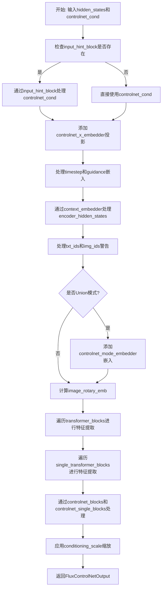
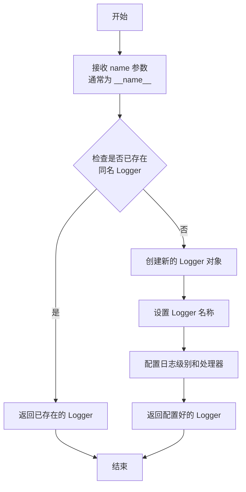
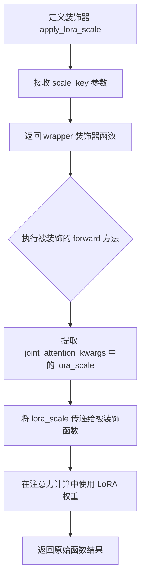
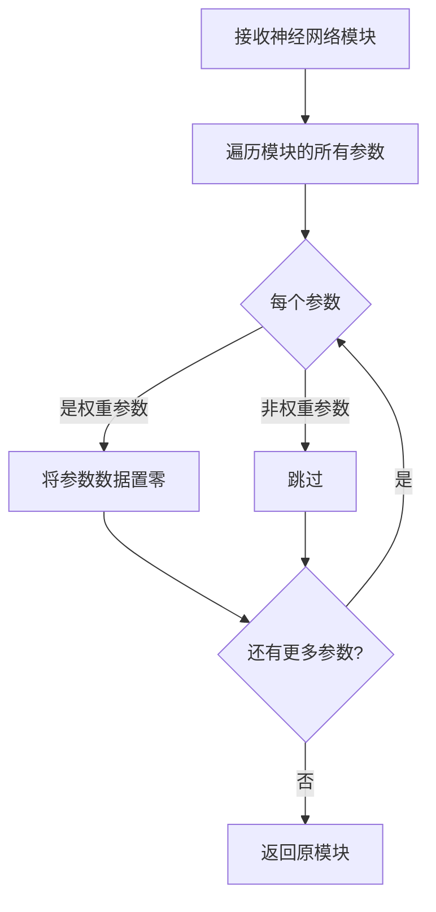
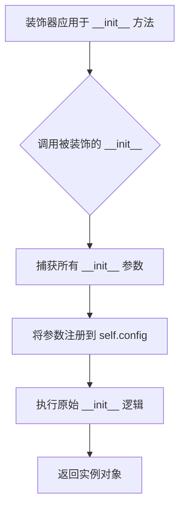
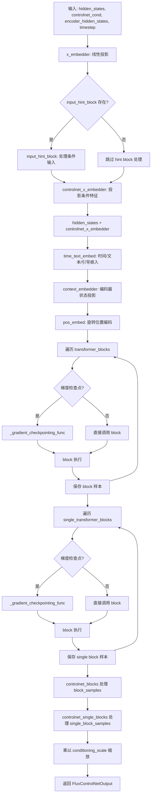
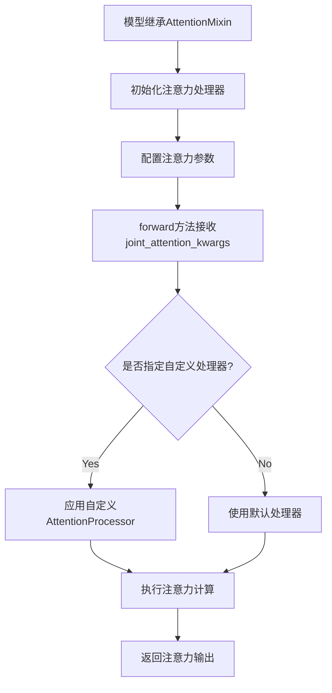
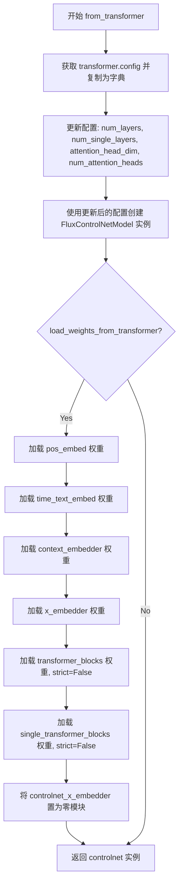

# `diffusers\src\diffusers\models\controlnets\controlnet_flux.py` 详细设计文档

FluxControlNet是一个用于Flux图像生成模型的ControlNet实现，通过对Transformer块和单Transformer块进行特征提取，生成用于条件控制的特征图，支持单个和多个ControlNet的联合使用（Union模式），可用于对图像生成过程进行精确控制。

## 整体流程



## 类结构

```
FluxControlNetOutput (数据类)
FluxControlNetModel (主模型类)
├── 父类: ModelMixin, AttentionMixin, ConfigMixin, PeftAdapterMixin
├── 字段:
│   ├── out_channels
│   ├── inner_dim
│   ├── pos_embed (FluxPosEmbed)
│   ├── time_text_embed (CombinedTimestep*TextProjEmbeddings)
│   ├── context_embedder (nn.Linear)
│   ├── x_embedder (nn.Linear)
│   ├── transformer_blocks (nn.ModuleList[FluxTransformerBlock])
│   ├── single_transformer_blocks (nn.ModuleList[FluxSingleTransformerBlock])
│   ├── controlnet_blocks (nn.ModuleList)
│   ├── controlnet_single_blocks (nn.ModuleList)
│   ├── controlnet_mode_embedder (nn.Embedding, Union模式)
│   ├── input_hint_block (ControlNetConditioningEmbedding)
│   └── controlnet_x_embedder (nn.Linear)
└── 方法:
    ├── __init__ (初始化所有组件)
    ├── from_transformer (从预训练transformer加载权重)
    └── forward (前向传播)
FluxMultiControlNetModel (多ControlNet包装类)
├── 父类: ModelMixin
├── 字段:
│   └── nets (nn.ModuleList[FluxControlNetModel])
└── 方法:
    └── forward (支持单个Union和多个常规模式)
```

## 全局变量及字段


### `logger`
    
模块级日志记录器，用于记录FluxControlNetModel的运行信息

类型：`logging.Logger`
    


### `FluxControlNetOutput.controlnet_block_samples`
    
主transformer块的ControlNet输出样本元组

类型：`tuple[torch.Tensor]`
    


### `FluxControlNetOutput.controlnet_single_block_samples`
    
单transformer块的ControlNet输出样本元组

类型：`tuple[torch.Tensor]`
    


### `FluxControlNetModel.out_channels`
    
输出通道数，与输入通道数相同

类型：`int`
    


### `FluxControlNetModel.inner_dim`
    
内部维度，等于num_attention_heads * attention_head_dim

类型：`int`
    


### `FluxControlNetModel.pos_embed`
    
旋转位置嵌入，用于处理位置编码

类型：`FluxPosEmbed`
    


### `FluxControlNetModel.time_text_embed`
    
时间/文本/引导嵌入层

类型：`CombinedTimestepTextProjEmbeddings`
    


### `FluxControlNetModel.context_embedder`
    
上下文嵌入投影层，将joint_attention_dim投影到inner_dim

类型：`nn.Linear`
    


### `FluxControlNetModel.x_embedder`
    
输入隐藏状态嵌入投影层，将in_channels投影到inner_dim

类型：`nn.Linear`
    


### `FluxControlNetModel.transformer_blocks`
    
主Transformer块列表，用于处理主要的特征变换

类型：`nn.ModuleList[FluxTransformerBlock]`
    


### `FluxControlNetModel.single_transformer_blocks`
    
单Transformer块列表，用于处理单一路径的特征变换

类型：`nn.ModuleList[FluxSingleTransformerBlock]`
    


### `FluxControlNetModel.controlnet_blocks`
    
主ControlNet块列表，用于提取主路径的控制特征

类型：`nn.ModuleList[nn.Linear]`
    


### `FluxControlNetModel.controlnet_single_blocks`
    
单ControlNet块列表，用于提取单路径的控制特征

类型：`nn.ModuleList[nn.Linear]`
    


### `FluxControlNetModel.union`
    
是否为Union模式，用于ControlNet-Union多条件控制

类型：`bool`
    


### `FluxControlNetModel.controlnet_mode_embedder`
    
Union模式的mode嵌入层，用于编码不同的控制模式

类型：`nn.Embedding`
    


### `FluxControlNetModel.input_hint_block`
    
输入提示块，用于处理条件输入的特征提取

类型：`ControlNetConditioningEmbedding`
    


### `FluxControlNetModel.controlnet_x_embedder`
    
ControlNet输入投影层，将条件输入投影到inner_dim

类型：`nn.Linear`
    


### `FluxControlNetModel.gradient_checkpointing`
    
梯度检查点标志，用于节省显存

类型：`bool`
    


### `FluxMultiControlNetModel.nets`
    
FluxControlNetModel实例列表，用于多ControlNet组合

类型：`nn.ModuleList[FluxControlNetModel]`
    
    

## 全局函数及方法


### `logging.get_logger`

获取一个日志记录器（logger），用于在模块中记录日志信息。该函数是 `diffusers` 库中日志工具的一部分，通过传入模块的 `__name__` 来创建一个与模块名称关联的日志记录器。

参数：

- `name`：`str`，日志记录器的名称，通常传入 `__name__`（当前模块的名称），用于标识日志来源

返回值：`logging.Logger`，返回一个 Python 标准库的日志记录器对象，可用于记录不同级别的日志信息（如 debug、info、warning、error 等）

#### 流程图



#### 带注释源码

```python
# 从 diffusers 库的 utils 模块导入 logging 对象
from ...utils import (
    BaseOutput,
    apply_lora_scale,
    logging,
)

# 使用 logging.get_logger 获取一个日志记录器
# __name__ 是 Python 内置变量，代表当前模块的名称
# 例如对于模块 src/diffusers/models/controlnets/controlnet_flux.py
# __name__ 的值是 'diffusers.models.controlnets.controlnet_flux'
logger = logging.get_logger(__name__)  # pylint: disable=invalid-name

# 获取到的 logger 可以用于记录日志：
# logger.info("This is an info message")
# logger.warning("This is a warning message")
# logger.debug("This is a debug message")
# logger.error("This is an error message")
```

#### 实际使用示例

在代码中，`logger` 被用于记录警告信息：

```python
if txt_ids.ndim == 3:
    logger.warning(
        "Passing `txt_ids` 3d torch.Tensor is deprecated."
        "Please remove the batch dimension and pass it as a 2d torch.Tensor"
    )
    txt_ids = txt_ids[0]
if img_ids.ndim == 3:
    logger.warning(
        "Passing `img_ids` 3d torch.Tensor is deprecated."
        "Please remove the batch dimension and pass it as a 2d torch.Tensor"
    )
    img_ids = img_ids[0]
```


### `apply_lora_scale`

这是一个从 `diffusers` 库导入的装饰器函数，用于在 `FluxControlNetModel.forward()` 方法上应用 LoRA（Low-Rank Adaptation）缩放。该装饰器接收一个字符串参数来指定要缩放的键（key），通常用于在推理时动态调整 LoRA 适配器的缩放因子。

> **注意**：该函数的实际定义位于 `diffusers` 库的 `utils` 模块中，当前代码文件仅导入了该函数并作为装饰器使用，未包含其完整实现源码。

#### 参数

- **scale_key**：`str`，装饰器参数，指定要应用缩放的 `joint_attention_kwargs` 中的键名（字符串形式）

#### 返回值

- **装饰器函数**：返回一个装饰器函数，用于包装目标函数并在其执行过程中应用 LoRA 缩放逻辑

#### 流程图



#### 带注释源码

```python
# 注意：以下为从 diffusers.utils 导入的装饰器使用示例
# 实际 apply_lora_scale 函数定义位于 diffusers 库内部

# 从 utils 模块导入 apply_lora_scale 装饰器
from ...utils import (
    apply_lora_scale,
    logging,
)

# 在 forward 方法上应用装饰器
@apply_lora_scale("joint_attention_kwargs")
def forward(
    self,
    hidden_states: torch.Tensor,
    controlnet_cond: torch.Tensor,
    controlnet_mode: torch.Tensor = None,
    conditioning_scale: float = 1.0,
    encoder_hidden_states: torch.Tensor = None,
    pooled_projections: torch.Tensor = None,
    timestep: torch.LongTensor = None,
    img_ids: torch.Tensor = None,
    txt_ids: torch.Tensor = None,
    guidance: torch.Tensor = None,
    joint_attention_kwargs: dict[str, Any] | None = None,
    return_dict: bool = True,
) -> torch.FloatTensor | Transformer2DModelOutput:
    """
    FluxControlNetModel 的前向传播方法
    
    该方法被 apply_lora_scale 装饰器包装，用于在推理时
    根据 joint_attention_kwargs 中的 lora_scale 参数
    动态调整 LoRA 适配器的权重缩放因子
    """
    # ... 方法实现 ...
```

#### 补充说明

| 项目 | 说明 |
|------|------|
| **来源** | `diffusers/src/diffusers/utils.py` |
| **用途** | 为 Transformer 模型提供 LoRA 权重缩放能力，支持在推理时动态调整适配器强度 |
| **依赖** | 需要 `joint_attention_kwargs` 字典中包含 `lora_scale` 键 |
| **典型用法** | 当使用 LoRA 适配器进行推理时，可通过该装饰器实现灵活的权重混合 |


### `zero_module`

将传入的神经网络模块的所有权重参数置零，通常用于初始化 ControlNet 的输出分支，使模型在初始状态下不产生任何额外贡献，确保训练初期的稳定性。

参数：

-  `module`：`torch.nn.Module`，需要置零权重的神经网络模块（如 `nn.Linear`）

返回值：`torch.nn.Module`，返回权重已被置零的原始模块（原地修改）

#### 流程图



#### 带注释源码

```
def zero_module(module):
    """
    将神经网络模块的所有权重参数置零的辅助函数。
    
    在 Flux ControlNet 中用于初始化输出分支，确保模型在训练初期
    不对原始输出产生任何影响，让模型逐步学习如何添加控制信号。
    
    参数:
        module (torch.nn.Module): 需要置零权重的神经网络模块
        
    返回值:
        torch.nn.Module: 返回已置零权重的模块（原地修改）
    """
    for parameter in module.parameters():
        # 将每个参数的值设置为0
        # 使用 inplace 操作以节省内存
        parameter.data.zero_()
    
    # 返回原始模块引用，便于链式调用
    return module
```

---

**使用场景说明：**

在 `FluxControlNetModel` 类中，`zero_module` 被用于：

1. **初始化 ControlNet 块** (`self.controlnet_blocks`)：
   ```python
   self.controlnet_blocks.append(zero_module(nn.Linear(self.inner_dim, self.inner_dim)))
   ```
   为每个 Transformer 块创建输出层，并将其权重初始化为零。

2. **初始化单块 ControlNet** (`self.controlnet_single_blocks`)：
   ```python
   self.controlnet_single_blocks.append(zero_module(nn.Linear(self.inner_dim, self.inner_dim)))
   ```

3. **初始化输入嵌入器** (`self.controlnet_x_embedder`)：
   ```python
   self.controlnet_x_embedder = zero_module(torch.nn.Linear(in_channels, self.inner_dim))
   ```

这种设计确保 ControlNet 在训练开始时不会影响原始模型的输出，让模型能够逐步学习如何添加控制信号。


### ConfigMixin

ConfigMixin 是 Diffusers 库中的配置混入基类，用于为模型类提供配置管理和注册功能。通过继承该类并使用 `@register_to_config` 装饰器，模型可以将 `__init__` 参数自动注册为配置属性，从而实现配置的持久化和加载。

参数：

- 无直接参数（作为混入类通过继承使用）

返回值：无直接返回值（作为混入类通过继承使用）

#### 流程图

```mermaid
flowchart TD
    A[模型类继承ConfigMixin] --> B[在__init__方法上使用@register_to_config装饰器]
    B --> C[装饰器自动将参数注册为配置属性]
    C --> D[配置存储在self.config中]
    D --> E[支持from_config方法重构对象]
```

#### 带注释源码

```python
# ConfigMixin 是一个混入基类，示例用法如下：
# from ...configuration_utils import ConfigMixin, register_to_config

# class FluxControlNetModel(ModelMixin, ConfigMixin, ...):
#     @register_to_config  # 此装饰器来自 ConfigMixin，用于注册配置
#     def __init__(
#         self,
#         patch_size: int = 1,
#         in_channels: int = 64,
#         num_layers: int = 19,
#         ...
#     ):
#         super().__init__()
#         # 初始化逻辑
#         # 装饰器自动将上述参数注册到 self.config 中
#         # 可以通过 self.config.patch_size, self.config.in_channels 等访问
```

#### 备注

- **源码未在此文件中提供**：ConfigMixin 的具体实现位于 `diffusers.src.diffusers.configuration_utils` 模块中，在此代码文件中仅作为父类被继承使用
- **关键方法**：`register_to_config` 装饰器会自动收集 `__init__` 参数并存储在 `self.config` 对象中
- **配置持久化**：注册的配置可通过 `save_config()` 和 `from_config()` 方法进行序列化和反序列化
- **使用场景**：FluxControlNetModel 通过继承 ConfigMixin 实现配置管理，使其可以与 HuggingFace Diffusers 框架的配置系统无缝集成


### `register_to_config`

`register_to_config` 是一个配置注册装饰器（Decorator），用于将被装饰的 `__init__` 方法的参数自动注册到模型的配置对象中，使得这些参数可以通过 `model.config` 进行访问和持久化。

参数：

- 该装饰器不接受直接参数，而是通过装饰在函数上自动捕获被装饰函数的参数

返回值：`Callable`，返回装饰后的函数，将 `__init__` 参数注册到 `self.config` 中

#### 流程图



#### 带注释源码

```python
# register_to_config 是从 configuration_utils 导入的装饰器
# 在 FluxControlNetModel 类中，装饰于 __init__ 方法
from ...configuration_utils import ConfigMixin, register_to_config

class FluxControlNetModel(ModelMixin, AttentionMixin, ConfigMixin, PeftAdapterMixin):
    _supports_gradient_checkpointing = True

    # 使用 @register_to_config 装饰器
    # 这会自动将 __init__ 的所有参数注册到 self.config 中
    @register_to_config
    def __init__(
        self,
        patch_size: int = 1,
        in_channels: int = 64,
        num_layers: int = 19,
        num_single_layers: int = 38,
        attention_head_dim: int = 128,
        num_attention_heads: int = 24,
        joint_attention_dim: int = 4096,
        pooled_projection_dim: int = 768,
        guidance_embeds: bool = False,
        axes_dims_rope: list[int] = [16, 56, 56],
        num_mode: int = None,
        conditioning_embedding_channels: int = None,
    ):
        """
        FluxControlNetModel 构造函数
        
        Args:
            patch_size: 补丁大小，默认 1
            in_channels: 输入通道数，默认 64
            num_layers: Transformer 块数量，默认 19
            num_single_layers: 单 Transformer 块数量，默认 38
            attention_head_dim: 注意力头维度，默认 128
            num_attention_heads: 注意力头数量，默认 24
            joint_attention_dim: 联合注意力维度，默认 4096
            pooled_projection_dim: 池化投影维度，默认 768
            guidance_embeds: 是否包含引导嵌入，默认 False
            axes_dims_rope: RoPE 轴维度，默认 [16, 56, 56]
            num_mode: 控制网络模式数量，用于联合模式
            conditioning_embedding_channels: 条件嵌入通道数
        """
        super().__init__()
        # ... 初始化逻辑 ...
```


### PeftAdapterMixin

PEFT（Parameter-Efficient Fine-Tuning）适配器混入类，为模型提供LoRA、IA3等参数高效微调适配器支持。通过混入此mixin，FluxControlNetModel能够动态加载和管理PEFT适配器权重，实现无需修改原模型参数的轻量级微调。

#### 带注释源码

```python
# PeftAdapterMixin 是从 loaders 模块导入的混入类
# 在 FluxControlNetModel 中作为父类被继承
# 具体实现未在此文件中展示，需要查看 ...loaders 模块的源码

# 使用示例（在 FluxControlNetModel 中）:
class FluxControlNetModel(ModelMixin, AttentionMixin, ConfigMixin, PeftAdapterMixin):
    # 继承 PeftAdapterMixin 后，该类自动获得以下能力：
    # 1. 加载 PEFT 适配器权重 (load_adapter, load_peft_adapter)
    # 2. 卸载适配器 (unload_adapter)
    # 3. 设置适配器 (set_adapter)
    # 4. 获取适配器配置 (get_adapter_config)
    # 5. 融合适配器权重 (fuse_lora)
    # 等PEFT相关功能
    pass
```

#### 说明

由于 `PeftAdapterMixin` 类的完整源码定义在 `...loaders` 模块中（代码中使用 `from ...loaders import PeftAdapterMixin` 导入），而该模块的源码未在当前文件中提供，因此无法提供其详细的方法签名、参数说明和流程图。

通常情况下，`PeftAdapterMixin` 会提供以下标准接口：

| 方法 | 描述 |
|------|------|
| `load_adapter` | 加载PEFT适配器权重 |
| `unload_adapter` | 卸载已加载的适配器 |
| `set_adapter` | 设置当前使用的适配器 |
| `get_active_adapters` | 获取当前活跃的适配器列表 |

如需获取 `PeftAdapterMixin` 的完整实现细节，请参考 `diffusers` 库的 `src/diffusers/loaders` 目录下的源码。


### ModelMixin

ModelMixin 是一个模型混入基类（Mixin），为继承的模型类提供通用的配置管理、模型初始化和权重加载功能。它允许模型类通过 `@register_to_config` 装饰器注册配置，并通过 `from_config` 和 `from_pretrained` 等类方法实现配置的保存和模型的加载。

参数：

-  此为基类，参数由子类定义

返回值：ModelMixin 本身

#### 流程图

```mermaid
graph TD
    A[ModelMixin] --> B[提供配置注册功能]
    A --> C[提供模型初始化基础]
    A --> D[提供权重加载方法]
    B --> B1[@register_to_config 装饰器]
    C --> C1[__init__ 基础实现]
    D --> D1[from_config 类方法]
    D --> D2[from_pretrained 类方法]
```

#### 带注释源码

```python
# ModelMixin 是从 diffusers 库导入的混入基类
# 源码位于: src/diffusers/models/modeling_utils.py
# 以下是基于代码使用方式的推断

from ..modeling_utils import ModelMixin  # 导入语句

# ModelMixin 被以下类继承使用：
class FluxControlNetModel(ModelMixin, AttentionMixin, ConfigMixin, PeftAdapterMixin):
    # ModelMixin 提供了以下功能：
    # 1. 通过 @register_to_config 装饰器将 __init__ 参数注册为配置
    # 2. from_config(config) 类方法：从配置创建模型实例
    # 3. from_pretrained(pretrained_model_name_or_path) 类方法：从预训练权重加载模型
    # 4. _init_weights(self, module) 方法：初始化模型权重
    pass
```

---

### FluxControlNetModel

FluxControlNetModel 是 Flux 架构的 ControlNet 模型实现，继承自 ModelMixin、AttentionMixin、ConfigMixin 和 PeftAdapterMixin。该模型用于从预训练的 Flux Transformer 模型创建 ControlNet，可生成中间层的特征图以辅助图像生成任务。

#### 流程图



#### 带注释源码

```python
class FluxControlNetModel(ModelMixin, AttentionMixin, ConfigMixin, PeftAdapterMixin):
    """
    Flux 架构的 ControlNet 模型实现。
    继承自 ModelMixin 获取配置管理和权重加载功能。
    
    核心功能：
    1. 从 Flux Transformer 模型创建 ControlNet
    2. 生成中间层特征图用于条件生成
    3. 支持 ControlNet-Union 模式（多模式）
    4. 支持梯度检查点以节省显存
    """
    
    _supports_gradient_checkpointing = True  # 支持梯度检查点优化
    
    @register_to_config  # 将 __init__ 参数注册为模型配置
    def __init__(
        self,
        patch_size: int = 1,                      # 补丁大小
        in_channels: int = 64,                   # 输入通道数
        num_layers: int = 19,                    # Transformer 层数
        num_single_layers: int = 38,             # 单 Transformer 层数
        attention_head_dim: int = 128,           # 注意力头维度
        num_attention_heads: int = 24,           # 注意力头数量
        joint_attention_dim: int = 4096,         # 联合注意力维度
        pooled_projection_dim: int = 768,        # 池化投影维度
        guidance_embeds: bool = False,           # 是否包含引导嵌入
        axes_dims_rope: list[int] = [16, 56, 56],# RoPE 轴维度
        num_mode: int = None,                     # ControlNet-Union 模式数
        conditioning_embedding_channels: int = None,  # 条件嵌入通道数
    ):
        # 初始化父类
        super().__init__()
        
        # 设置输出通道和内部维度
        self.out_channels = in_channels
        self.inner_dim = num_attention_heads * attention_head_dim
        
        # 位置编码和时序-文本嵌入层
        self.pos_embed = FluxPosEmbed(theta=10000, axes_dim=axes_dims_rope)
        
        # 根据是否使用引导选择不同的嵌入类
        text_time_guidance_cls = (
            CombinedTimestepGuidanceTextProjEmbeddings if guidance_embeds 
            else CombinedTimestepTextProjEmbeddings
        )
        self.time_text_embed = text_time_guidance_cls(
            embedding_dim=self.inner_dim, 
            pooled_projection_dim=pooled_projection_dim
        )
        
        # 上下文和输入嵌入器
        self.context_embedder = nn.Linear(joint_attention_dim, self.inner_dim)
        self.x_embedder = torch.nn.Linear(in_channels, self.inner_dim)
        
        # Transformer 模块列表
        self.transformer_blocks = nn.ModuleList([
            FluxTransformerBlock(
                dim=self.inner_dim,
                num_attention_heads=num_attention_heads,
                attention_head_dim=attention_head_dim,
            )
            for i in range(num_layers)
        ])
        
        # 单 Transformer 模块列表
        self.single_transformer_blocks = nn.ModuleList([
            FluxSingleTransformerBlock(
                dim=self.inner_dim,
                num_attention_heads=num_attention_heads,
                attention_head_dim=attention_head_dim,
            )
            for i in range(num_single_layers)
        ])
        
        # ControlNet 块（零初始化的线性层）
        self.controlnet_blocks = nn.ModuleList([])
        for _ in range(len(self.transformer_blocks)):
            self.controlnet_blocks.append(
                zero_module(nn.Linear(self.inner_dim, self.inner_dim))
            )
        
        # ControlNet 单块
        self.controlnet_single_blocks = nn.ModuleList([])
        for _ in range(len(self.single_transformer_blocks)):
            self.controlnet_single_blocks.append(
                zero_module(nn.Linear(self.inner_dim, self.inner_dim))
            )
        
        # Union 模式处理
        self.union = num_mode is not None
        if self.union:
            self.controlnet_mode_embedder = nn.Embedding(num_mode, self.inner_dim)
        
        # 条件输入处理块
        if conditioning_embedding_channels is not None:
            self.input_hint_block = ControlNetConditioningEmbedding(
                conditioning_embedding_channels=conditioning_embedding_channels, 
                block_out_channels=(16, 16, 16, 16)
            )
            self.controlnet_x_embedder = torch.nn.Linear(in_channels, self.inner_dim)
        else:
            self.input_hint_block = None
            self.controlnet_x_embedder = zero_module(
                torch.nn.Linear(in_channels, self.inner_dim)
            )
        
        # 梯度检查点标志
        self.gradient_checkpointing = False

    @classmethod
    def from_transformer(
        cls,
        transformer,                              # 源 Transformer 模型
        num_layers: int = 4,                     # 要使用的层数
        num_single_layers: int = 10,             # 要使用的单层数
        attention_head_dim: int = 128,           # 注意力头维度
        num_attention_heads: int = 24,           # 注意力头数量
        load_weights_from_transformer=True,      # 是否加载权重
    ):
        """从 Flux Transformer 模型创建 ControlNet 模型"""
        
        # 复制并修改配置
        config = dict(transformer.config)
        config["num_layers"] = num_layers
        config["num_single_layers"] = num_single_layers
        config["attention_head_dim"] = attention_head_dim
        config["num_attention_heads"] = num_attention_heads
        
        # 创建 ControlNet 实例
        controlnet = cls.from_config(config)
        
        # 可选：加载 Transformer 权重
        if load_weights_from_transformer:
            controlnet.pos_embed.load_state_dict(transformer.pos_embed.state_dict())
            controlnet.time_text_embed.load_state_dict(transformer.time_text_embed.state_dict())
            controlnet.context_embedder.load_state_dict(transformer.context_embedder.state_dict())
            controlnet.x_embedder.load_state_dict(transformer.x_embedder.state_dict())
            controlnet.transformer_blocks.load_state_dict(
                transformer.transformer_blocks.state_dict(), 
                strict=False
            )
            controlnet.single_transformer_blocks.load_state_dict(
                transformer.single_transformer_blocks.state_dict(), 
                strict=False
            )
            
            # 零初始化 controlnet_x_embedder
            controlnet.controlnet_x_embedder = zero_module(controlnet.controlnet_x_embedder)
        
        return controlnet

    @apply_lora_scale("joint_attention_kwargs")
    def forward(
        self,
        hidden_states: torch.Tensor,              # 输入隐藏状态
        controlnet_cond: torch.Tensor,            # ControlNet 条件输入
        controlnet_mode: torch.Tensor = None,     # ControlNet 模式
        conditioning_scale: float = 1.0,         # 条件缩放因子
        encoder_hidden_states: torch.Tensor = None,  # 编码器隐藏状态
        pooled_projections: torch.Tensor = None,  # 池化投影
        timestep: torch.LongTensor = None,        # 时间步
        img_ids: torch.Tensor = None,             # 图像 IDs
        txt_ids: torch.Tensor = None,             # 文本 IDs
        guidance: torch.Tensor = None,            # 引导向量
        joint_attention_kwargs: dict[str, Any] | None = None,  # 注意力 kwargs
        return_dict: bool = True,                 # 是否返回字典
    ) -> torch.FloatTensor | Transformer2DModelOutput:
        """
        FluxControlNetModel 前向传播方法。
        
        处理流程：
        1. 嵌入输入和条件
        2. 通过 Transformer 块处理
        3. 应用 ControlNet 块提取特征
        4. 缩放并返回特征
        """
        
        # 1. 嵌入输入
        hidden_states = self.x_embedder(hidden_states)
        
        # 2. 处理条件输入
        if self.input_hint_block is not None:
            controlnet_cond = self.input_hint_block(controlnet_cond)
            # 重塑条件张量
            batch_size, channels, height_pw, width_pw = controlnet_cond.shape
            height = height_pw // self.config.patch_size
            width = width_pw // self.config.patch_size
            controlnet_cond = controlnet_cond.reshape(
                batch_size, channels, height, self.config.patch_size, 
                width, self.config.patch_size
            )
            controlnet_cond = controlnet_cond.permute(0, 2, 4, 1, 3, 5)
            controlnet_cond = controlnet_cond.reshape(batch_size, height * width, -1)
        
        # 添加条件嵌入
        hidden_states = hidden_states + self.controlnet_x_embedder(controlnet_cond)
        
        # 3. 处理时间步和引导
        timestep = timestep.to(hidden_states.dtype) * 1000
        if guidance is not None:
            guidance = guidance.to(hidden_states.dtype) * 1000
        else:
            guidance = None
        
        # 时间/文本/引导嵌入
        temb = (
            self.time_text_embed(timestep, pooled_projections)
            if guidance is None
            else self.time_text_embed(timestep, guidance, pooled_projections)
        )
        
        # 编码器状态投影
        encoder_hidden_states = self.context_embedder(encoder_hidden_states)
        
        # 兼容性警告处理
        if txt_ids.ndim == 3:
            logger.warning("Passing `txt_ids` 3d torch.Tensor is deprecated.")
            txt_ids = txt_ids[0]
        if img_ids.ndim == 3:
            logger.warning("Passing `img_ids` 3d torch.Tensor is deprecated.")
            img_ids = img_ids[0]
        
        # 4. Union 模式处理
        if self.union:
            if controlnet_mode is None:
                raise ValueError("`controlnet_mode` cannot be `None` when applying ControlNet-Union")
            
            # 添加模式嵌入
            controlnet_mode_emb = self.controlnet_mode_embedder(controlnet_mode)
            encoder_hidden_states = torch.cat([controlnet_mode_emb, encoder_hidden_states], dim=1)
            txt_ids = torch.cat([txt_ids[:1], txt_ids], dim=0)
        
        # 5. 位置编码
        ids = torch.cat((txt_ids, img_ids), dim=0)
        image_rotary_emb = self.pos_embed(ids)
        
        # 6. 通过 Transformer 块处理
        block_samples = ()
        for index_block, block in enumerate(self.transformer_blocks):
            if torch.is_grad_enabled() and self.gradient_checkpointing:
                # 梯度检查点：节省显存
                encoder_hidden_states, hidden_states = self._gradient_checkpointing_func(
                    block,
                    hidden_states,
                    encoder_hidden_states,
                    temb,
                    image_rotary_emb,
                )
            else:
                encoder_hidden_states, hidden_states = block(
                    hidden_states=hidden_states,
                    encoder_hidden_states=encoder_hidden_states,
                    temb=temb,
                    image_rotary_emb=image_rotary_emb,
                )
            block_samples = block_samples + (hidden_states,)
        
        # 7. 通过单 Transformer 块处理
        single_block_samples = ()
        for index_block, block in enumerate(self.single_transformer_blocks):
            if torch.is_grad_enabled() and self.gradient_checkpointing:
                encoder_hidden_states, hidden_states = self._gradient_checkpointing_func(
                    block,
                    hidden_states,
                    encoder_hidden_states,
                    temb,
                    image_rotary_emb,
                )
            else:
                encoder_hidden_states, hidden_states = block(
                    hidden_states=hidden_states,
                    encoder_hidden_states=encoder_hidden_states,
                    temb=temb,
                    image_rotary_emb=image_rotary_emb,
                )
            single_block_samples = single_block_samples + (hidden_states,)
        
        # 8. ControlNet 块处理
        controlnet_block_samples = ()
        for block_sample, controlnet_block in zip(block_samples, self.controlnet_blocks):
            block_sample = controlnet_block(block_sample)
            controlnet_block_samples = controlnet_block_samples + (block_sample,)
        
        # 9. ControlNet 单块处理
        controlnet_single_block_samples = ()
        for single_block_sample, controlnet_block in zip(
            single_block_samples, self.controlnet_single_blocks
        ):
            single_block_sample = controlnet_block(single_block_sample)
            controlnet_single_block_samples = controlnet_single_block_samples + (single_block_sample,)
        
        # 10. 缩放 ControlNet 输出
        controlnet_block_samples = [
            sample * conditioning_scale for sample in controlnet_block_samples
        ]
        controlnet_single_block_samples = [
            sample * conditioning_scale for sample in controlnet_single_block_samples
        ]
        
        # 处理空列表
        controlnet_block_samples = (
            None if len(controlnet_block_samples) == 0 else controlnet_block_samples
        )
        controlnet_single_block_samples = (
            None if len(controlnet_single_block_samples) == 0 
            else controlnet_single_block_samples
        )
        
        # 11. 返回结果
        if not return_dict:
            return (controlnet_block_samples, controlnet_single_block_samples)
        
        return FluxControlNetOutput(
            controlnet_block_samples=controlnet_block_samples,
            controlnet_single_block_samples=controlnet_single_block_samples,
        )
```


### AttentionMixin

注意力混入（AttentionMixin）是一个PyTorch神经网络模块的混入类（Mixin），用于为模型提供灵活的注意力机制配置能力。它允许在推理或训练时动态注入和切换不同的注意力处理器（Attention Processor），从而支持LoRA、注意力编辑等高级功能。该类通常与`ModelMixin`、`ConfigMixin`等配合使用，为扩散模型提供可扩展的注意力处理能力。

参数：

- 该类为混入类（Mixin），通常不直接实例化化而是通过继承使用
- 具体参数取决于实现，通常通过`joint_attention_kwargs`在`forward`方法中传递

返回值：

- 返回类型取决于具体实现，通常为配置后的注意力处理器或相关张量

#### 流程图



#### 带注释源码

```python
# AttentionMixin 是从 diffusers 库导入的注意力混入类
# 源码位于 diffusers/src/diffusers/models/attention.py
# 以下是基于代码使用方式的推断和常见实现的注释

# from ..attention import AttentionMixin  # 从上级目录的attention模块导入

# class AttentionMixin(nn.Module):
#     """
#     注意力混入类，提供注意力处理器的配置和管理能力
#     """
    
#     def __init__(self):
#         super().__init__()
#         # 存储注意力处理器，默认为标准注意力
#         self.processor = AttnProcessor()
    
#     def set_attn_processor(self, processor):
#         """
#         设置注意力处理器
        
#         参数:
#             processor: AttentionProcessor实例，支持自定义注意力实现
#         """
#         self.processor = processor
    
#     def get_attn_processor(self):
#         """获取当前注意力处理器"""
#         return self.processor
    
#     # 在FluxControlNetModel中的使用方式：
#     # 模型继承AttentionMixin后，可以通过joint_attention_kwargs
#     # 在forward时传递自定义注意力参数，实现LoRA Scale调整等功能
```

#### 在 FluxControlNetModel 中的实际使用

```python
class FluxControlNetModel(ModelMixin, AttentionMixin, ConfigMixin, PeftAdapterMixin):
    """
    FluxControlNetModel 继承 AttentionMixin 以支持:
    1. 自定义注意力处理器 (via joint_attention_kwargs)
    2. LoRA 权重调整 (via apply_lora_scale 装饰器)
    3. Peft 适配器支持
    """
    
    @apply_lora_scale("joint_attention_kwargs")
    def forward(
        self,
        # ... 其他参数 ...
        joint_attention_kwargs: dict[str, Any] | None = None,
        # joint_attention_kwargs 会传递给注意力处理器
        # 用于配置 LoRA 缩放、注意力模式等
    ):
        # AttentionMixin 提供的功能在底层被自动调用
        # 用于处理 joint_attention_kwargs 中的注意力配置
        pass
```

#### 补充说明

由于 `AttentionMixin` 是从外部模块 (`diffusers.models.attention`) 导入的，上述源码为基于使用模式的推断。实际的 `AttentionMixin` 定义位于 Hugging Face Diffusers 库中，提供了注意力处理器的注册、存储和调用机制，是实现可插拔注意力机制的核心基础设施类。


### `FluxControlNetModel.__init__`

该方法是 FluxControlNetModel 类的初始化方法，负责构建 ControlNet 模型的所有核心组件，包括位置编码、时序-文本嵌入层、上下文嵌入器、变换器块（Transformer blocks）以及 ControlNet 特有的块结构，同时根据配置参数初始化条件嵌入模块和联合注意力维度。

参数：

- `patch_size`：`int`，默认值 1，表示图像分块的大小
- `in_channels`：`int`，默认值 64，输入通道数
- `num_layers`：`int`，默认值 19，变换器块的数量
- `num_single_layers`：`int`，默认值 38，单一变换器块的数量
- `attention_head_dim`：`int`，默认值 128，每个注意力头的维度
- `num_attention_heads`：`int`，默认值 24，注意力头的数量
- `joint_attention_dim`：`int`，默认值 4096，联合注意力的维度
- `pooled_projection_dim`：`int`，默认值 768，池化投影的维度
- `guidance_embeds`：`bool`，默认值 False，是否包含引导嵌入
- `axes_dims_rope`：`list[int]`，默认值 [16, 56, 56]，旋转位置编码的轴维度
- `num_mode`：`int`，默认值 None，ControlNet 模式数量（用于联合模式）
- `conditioning_embedding_channels`：`int`，默认值 None，条件嵌入的通道数

返回值：`None`，该方法为初始化方法，不返回任何值

#### 流程图

```mermaid
flowchart TD
    A[开始 __init__] --> B[调用父类 super().__init__]
    B --> C[设置 self.out_channels 和 self.inner_dim]
    C --> D[初始化 FluxPosEmbed 位置编码]
    D --> E{判断 guidance_embeds}
    E -->|True| F[使用 CombinedTimestepGuidanceTextProjEmbeddings]
    E -->|False| G[使用 CombinedTimestepTextProjEmbeddings]
    F --> H[初始化 time_text_embed]
    G --> H
    H --> I[初始化 context_embedder 和 x_embedder]
    I --> J[创建 ModuleList 存储 transformer_blocks]
    J --> K[创建 ModuleList 存储 single_transformer_blocks]
    K --> L[创建 controlnet_blocks 列表]
    L --> M[创建 controlnet_single_blocks 列表]
    M --> N{检查 num_mode 是否存在}
    N -->|是| O[初始化 controlnet_mode_embedder 嵌入层]
    N -->|否| P{检查 conditioning_embedding_channels}
    O --> P
    P -->|不为 None| Q[初始化 input_hint_block 和 controlnet_x_embedder]
    P -->|为 None| R[设置 input_hint_block 为 None, controlnet_x_embedder 使用 zero_module]
    Q --> S[设置 self.gradient_checkpointing = False]
    R --> S
    S --> T[结束 __init__]
```

#### 带注释源码

```python
@register_to_config
def __init__(
    self,
    patch_size: int = 1,
    in_channels: int = 64,
    num_layers: int = 19,
    num_single_layers: int = 38,
    attention_head_dim: int = 128,
    num_attention_heads: int = 24,
    joint_attention_dim: int = 4096,
    pooled_projection_dim: int = 768,
    guidance_embeds: bool = False,
    axes_dims_rope: list[int] = [16, 56, 56],
    num_mode: int = None,
    conditioning_embedding_channels: int = None,
):
    """
    初始化 FluxControlNetModel 模型结构
    
    参数:
        patch_size: 图像分块大小
        in_channels: 输入通道数
        num_layers: Transformer 块数量
        num_single_layers: 单 Transformer 块数量
        attention_head_dim: 注意力头维度
        num_attention_heads: 注意力头数量
        joint_attention_dim: 联合注意力维度
        pooled_projection_dim: 池化投影维度
        guidance_embeds: 是否使用引导嵌入
        axes_dims_rope: 旋转位置编码轴维度
        num_mode: ControlNet 模式数量
        conditioning_embedding_channels: 条件嵌入通道数
    """
    # 调用父类初始化方法
    super().__init__()
    
    # 设置输出通道数和内部维度
    self.out_channels = in_channels
    self.inner_dim = num_attention_heads * attention_head_dim

    # 初始化旋转位置编码器
    self.pos_embed = FluxPosEmbed(theta=10000, axes_dim=axes_dims_rope)
    
    # 根据 guidance_embeds 选择时间文本嵌入类
    text_time_guidance_cls = (
        CombinedTimestepGuidanceTextProjEmbeddings if guidance_embeds else CombinedTimestepTextProjEmbeddings
    )
    # 初始化时间文本嵌入层
    self.time_text_embed = text_time_guidance_cls(
        embedding_dim=self.inner_dim, pooled_projection_dim=pooled_projection_dim
    )

    # 初始化上下文嵌入器（线性层）
    self.context_embedder = nn.Linear(joint_attention_dim, self.inner_dim)
    # 初始化输入嵌入器
    self.x_embedder = torch.nn.Linear(in_channels, self.inner_dim)

    # 创建多个 Transformer 块的 ModuleList
    self.transformer_blocks = nn.ModuleList(
        [
            FluxTransformerBlock(
                dim=self.inner_dim,
                num_attention_heads=num_attention_heads,
                attention_head_dim=attention_head_dim,
            )
            for i in range(num_layers)
        ]
    )

    # 创建多个单一 Transformer 块的 ModuleList
    self.single_transformer_blocks = nn.ModuleList(
        [
            FluxSingleTransformerBlock(
                dim=self.inner_dim,
                num_attention_heads=num_attention_heads,
                attention_head_dim=attention_head_dim,
            )
            for i in range(num_single_layers)
        ]
    )

    # 初始化 ControlNet 块（使用 zero_module 初始化）
    self.controlnet_blocks = nn.ModuleList([])
    for _ in range(len(self.transformer_blocks)):
        self.controlnet_blocks.append(zero_module(nn.Linear(self.inner_dim, self.inner_dim)))

    # 初始化 ControlNet 单一块
    self.controlnet_single_blocks = nn.ModuleList([])
    for _ in range(len(self.single_transformer_blocks)):
        self.controlnet_single_blocks.append(zero_module(nn.Linear(self.inner_dim, self.inner_dim)))

    # 检查是否为联合模式
    self.union = num_mode is not None
    if self.union:
        # 初始化模式嵌入层
        self.controlnet_mode_embedder = nn.Embedding(num_mode, self.inner_dim)

    # 条件嵌入块初始化
    if conditioning_embedding_channels is not None:
        # 初始化输入提示块
        self.input_hint_block = ControlNetConditioningEmbedding(
            conditioning_embedding_channels=conditioning_embedding_channels, block_out_channels=(16, 16, 16, 16)
        )
        self.controlnet_x_embedder = torch.nn.Linear(in_channels, self.inner_dim)
    else:
        self.input_hint_block = None
        # 使用 zero_module 初始化 controlnet_x_embedder
        self.controlnet_x_embedder = zero_module(torch.nn.Linear(in_channels, self.inner_dim))

    # 设置梯度检查点标志
    self.gradient_checkpointing = False
```


### `FluxControlNetModel.from_transformer`

该类方法用于从预训练的 FluxTransformer 模型创建并初始化 FluxControlNetModel，通过复用 transformer 的配置和权重（可选），实现 ControlNet 模型的快速构建。

参数：

- `cls`：类本身，类型为 `type`，表示类方法隐含的第一个参数
- `transformer`：源 transformer 模型对象，需要从中复制配置和权重
- `num_layers`：控制网络中 transformer 块的数量，类型为 `int`，默认为 4
- `num_single_layers`：控制网络中单 transformer 块的数量，类型为 `int`，默认为 10
- `attention_head_dim`：注意力头的维度，类型为 `int`，默认为 128
- `num_attention_heads`：注意力头的数量，类型为 `int`，默认为 24
- `load_weights_from_transformer`：是否从 transformer 加载权重，类型为 `bool`，默认为 True

返回值：`FluxControlNetModel`，返回新创建的 ControlNet 模型实例

#### 流程图



#### 带注释源码

```python
@classmethod
def from_transformer(
    cls,  # 类方法，隐含参数，表示类本身
    transformer,  # 源 FluxTransformer 模型对象，用于提供配置和权重
    num_layers: int = 4,  # 控制网络中完整 transformer 块的数量
    num_single_layers: int = 10,  # 控制网络中单 transformer 块的数量
    attention_head_dim: int = 128,  # 注意力机制中每个头的维度
    num_attention_heads: int = 24,  # 注意力机制中头的总数
    load_weights_from_transformer=True,  # 是否从 transformer 加载预训练权重
):
    # 从源 transformer 获取配置并转换为字典，以便修改
    config = dict(transformer.config)
    
    # 用传入的参数覆盖配置中的层数和注意力参数
    config["num_layers"] = num_layers
    config["num_single_layers"] = num_single_layers
    config["attention_head_dim"] = attention_head_dim
    config["num_attention_heads"] = num_attention_heads

    # 使用修改后的配置实例化 FluxControlNetModel
    controlnet = cls.from_config(config)

    # 如果需要从 transformer 加载权重
    if load_weights_from_transformer:
        # 复制位置嵌入层的权重
        controlnet.pos_embed.load_state_dict(transformer.pos_embed.state_dict())
        
        # 复制时间-文本嵌入层的权重
        controlnet.time_text_embed.load_state_dict(transformer.time_text_embed.state_dict())
        
        # 复制上下文嵌入器的权重
        controlnet.context_embedder.load_state_dict(transformer.context_embedder.state_dict())
        
        # 复制输入嵌入器的权重
        controlnet.x_embedder.load_state_dict(transformer.x_embedder.state_dict())
        
        # 复制 transformer 主干块的权重，strict=False 允许部分匹配
        controlnet.transformer_blocks.load_state_dict(transformer.transformer_blocks.state_dict(), strict=False)
        
        # 复制单 transformer 块的权重，strict=False 允许部分匹配
        controlnet.single_transformer_blocks.load_state_dict(
            transformer.single_transformer_blocks.state_dict(), strict=False
        )

        # 将 controlnet_x_embedder 初始化为零模块（不加载任何权重）
        # 因为 ControlNet 的输入处理应该从头训练
        controlnet.controlnet_x_embedder = zero_module(controlnet.controlnet_x_embedder)

    # 返回初始化完成的 ControlNet 模型
    return controlnet
```


### `FluxControlNetModel.forward`

该方法是Flux ControlNet模型的前向传播函数，接收图像潜在表示、条件输入、时间步、文本嵌入等参数，通过x_embedder嵌入、Transformer块处理、ControlNet块提取特征，最后返回经过条件缩放的ControlNet中间层特征样本，支持梯度检查点和LoRA适配器。

参数：

- `hidden_states`：`torch.Tensor`，输入的隐藏状态张量，形状为`(batch size, channel, height, width)`
- `controlnet_cond`：`torch.Tensor`，ControlNet条件输入张量，形状为`(batch_size, sequence_length, hidden_size)`
- `controlnet_mode`：`torch.Tensor`，ControlNet模式张量，形状为`(batch_size, 1)`，用于Union模式
- `conditioning_scale`：`float`，条件缩放因子，默认为`1.0`，用于调整ControlNet输出的权重
- `encoder_hidden_states`：`torch.Tensor`，条件嵌入向量，形状为`(batch size, sequence_len, embed_dims)`
- `pooled_projections`：`torch.Tensor`，从输入条件嵌入投影的张量，形状为`(batch_size, projection_dim)`
- `timestep`：`torch.LongTensor`，去噪步骤的时间步长
- `img_ids`：`torch.Tensor`，图像位置编码ID张量
- `txt_ids`：`torch.Tensor`，文本位置编码ID张量
- `guidance`：`torch.Tensor`，引导张量，用于Classifier-Free Guidance
- `joint_attention_kwargs`：`dict[str, Any] | None`，可选的注意力处理器参数字典
- `return_dict`：`bool`，是否返回字典格式输出，默认为`True`

返回值：`FluxControlNetOutput | tuple`，返回ControlNet块样本和单块样本的元组或`FluxControlNetOutput`对象

#### 流程图

```mermaid
flowchart TD
    A[开始 forward] --> B[hidden_states 通过 x_embedder 嵌入]
    B --> C{input_hint_block 存在?}
    C -->|是| D[controlnet_cond 通过 input_hint_block 处理并重塑]
    C -->|否| E[跳过 input_hint_block]
    D --> F[hidden_states + controlnet_x_embedder(controlnet_cond)]
    E --> F
    F --> G[处理 timestep 和 guidance]
    G --> H[计算 temb 时间文本嵌入]
    H --> I[encoder_hidden_states 通过 context_embedder 嵌入]
    I --> J{union 模式?}
    J -->|是| K[添加 controlnet_mode 嵌入到 encoder_hidden_states]
    J -->|否| L[计算位置编码 ids]
    K --> L
    L --> M[计算 Rotary Position Embedding]
    M --> N[遍历 transformer_blocks]
    N --> O{启用梯度检查点?}
    O -->|是| P[使用 _gradient_checkpointing_func]
    O -->|否| Q[直接调用 block]
    P --> R[收集 block_samples]
    Q --> R
    R --> S[遍历 single_transformer_blocks]
    S --> T{启用梯度检查点?}
    T -->|是| U[使用 _gradient_checkpointing_func]
    T -->|否| V[直接调用 block]
    U --> W[收集 single_block_samples]
    V --> W
    W --> X[遍历 block_samples 通过 controlnet_blocks]
    X --> Y[遍历 single_block_samples 通过 controlnet_single_blocks]
    Y --> Z[应用 conditioning_scale 缩放]
    Z --> AA{return_dict?}
    AA -->|是| AB[返回 FluxControlNetOutput]
    AA -->|否| AC[返回元组]
    AB --> AD[结束]
    AC --> AD
```

#### 带注释源码

```python
@apply_lora_scale("joint_attention_kwargs")
def forward(
    self,
    hidden_states: torch.Tensor,
    controlnet_cond: torch.Tensor,
    controlnet_mode: torch.Tensor = None,
    conditioning_scale: float = 1.0,
    encoder_hidden_states: torch.Tensor = None,
    pooled_projections: torch.Tensor = None,
    timestep: torch.LongTensor = None,
    img_ids: torch.Tensor = None,
    txt_ids: torch.Tensor = None,
    guidance: torch.Tensor = None,
    joint_attention_kwargs: dict[str, Any] | None = None,
    return_dict: bool = True,
) -> torch.FloatTensor | Transformer2DModelOutput:
    """
    The [`FluxTransformer2DModel`] forward method.

    Args:
        hidden_states (`torch.FloatTensor` of shape `(batch size, channel, height, width)`):
            Input `hidden_states`.
        controlnet_cond (`torch.Tensor`):
            The conditional input tensor of shape `(batch_size, sequence_length, hidden_size)`.
        controlnet_mode (`torch.Tensor`):
            The mode tensor of shape `(batch_size, 1)`.
        conditioning_scale (`float`, defaults to `1.0`):
            The scale factor for ControlNet outputs.
        encoder_hidden_states (`torch.FloatTensor` of shape `(batch size, sequence_len, embed_dims)`):
            Conditional embeddings (embeddings computed from the input conditions such as prompts) to use.
        pooled_projections (`torch.FloatTensor` of shape `(batch_size, projection_dim)`): Embeddings projected
            from the embeddings of input conditions.
        timestep ( `torch.LongTensor`):
            Used to indicate denoising step.
        block_controlnet_hidden_states: (`list` of `torch.Tensor`):
            A list of tensors that if specified are added to the residuals of transformer blocks.
        joint_attention_kwargs (`dict`, *optional*):
            A kwargs dictionary that if specified is passed along to the `AttentionProcessor` as defined under
            `self.processor` in
            [diffusers.models.attention_processor](https://github.com/huggingface/diffusers/blob/main/src/diffusers/models/attention_processor.py).
        return_dict (`bool`, *optional*, defaults to `True`):
            Whether or not to return a [`~models.transformer_2d.Transformer2DModelOutput`] instead of a plain
            tuple.

    Returns:
        If `return_dict` is True, an [`~models.transformer_2d.Transformer2DModelOutput`] is returned, otherwise a
        `tuple` where the first element is the sample tensor.
    """
    # 第一步：将 hidden_states 通过 x_embedder 嵌入到内部维度空间
    hidden_states = self.x_embedder(hidden_states)

    # 第二步：处理条件输入 - 如果存在 input_hint_block，则处理 controlnet_cond
    if self.input_hint_block is not None:
        # 使用 input_hint_block 处理条件图像
        controlnet_cond = self.input_hint_block(controlnet_cond)
        # 获取条件张量的形状信息
        batch_size, channels, height_pw, width_pw = controlnet_cond.shape
        # 计算高度和宽度（考虑 patch_size）
        height = height_pw // self.config.patch_size
        width = width_pw // self.config.patch_size
        # 重塑张量以适应后续处理
        controlnet_cond = controlnet_cond.reshape(
            batch_size, channels, height, self.config.patch_size, width, self.config.patch_size
        )
        # 调整维度顺序
        controlnet_cond = controlnet_cond.permute(0, 2, 4, 1, 3, 5)
        # 最终重塑为 (batch_size, height*width, channels)
        controlnet_cond = controlnet_cond.reshape(batch_size, height * width, -1)
    
    # 将处理后的条件嵌入加到 hidden_states 上（残差连接）
    hidden_states = hidden_states + self.controlnet_x_embedder(controlnet_cond)

    # 第三步：处理时间步和引导向量
    timestep = timestep.to(hidden_states.dtype) * 1000
    if guidance is not None:
        guidance = guidance.to(hidden_states.dtype) * 1000
    else:
        guidance = None
    
    # 第四步：计算时间、文本和引导的组合嵌入
    temb = (
        self.time_text_embed(timestep, pooled_projections)
        if guidance is None
        else self.time_text_embed(timestep, guidance, pooled_projections)
    )
    
    # 第五步：嵌入上下文/条件嵌入
    encoder_hidden_states = self.context_embedder(encoder_hidden_states)

    # 第六步：处理 txt_ids 和 img_ids（兼容性处理，处理 3D 张量的警告）
    if txt_ids.ndim == 3:
        logger.warning(
            "Passing `txt_ids` 3d torch.Tensor is deprecated."
            "Please remove the batch dimension and pass it as a 2d torch.Tensor"
        )
        txt_ids = txt_ids[0]
    if img_ids.ndim == 3:
        logger.warning(
            "Passing `img_ids` 3d torch.Tensor is deprecated."
            "Please remove the batch dimension and pass it as a 2d torch.Tensor"
        )
        img_ids = img_ids[0]

    # 第七步：如果使用 union 模式，添加 controlnet_mode 嵌入
    if self.union:
        # union mode
        if controlnet_mode is None:
            raise ValueError("`controlnet_mode` cannot be `None` when applying ControlNet-Union")
        # 获取 controlnet_mode 的嵌入表示
        controlnet_mode_emb = self.controlnet_mode_embedder(controlnet_mode)
        # 将 mode 嵌入与 encoder_hidden_states 拼接
        encoder_hidden_states = torch.cat([controlnet_mode_emb, encoder_hidden_states], dim=1)
        # 调整 txt_ids：在开头添加一个位置（对应 mode token）
        txt_ids = torch.cat([txt_ids[:1], txt_ids], dim=0)

    # 第八步：计算旋转位置嵌入
    ids = torch.cat((txt_ids, img_ids), dim=0)
    image_rotary_emb = self.pos_embed(ids)

    # 第九步：遍历主 Transformer 块
    block_samples = ()
    for index_block, block in enumerate(self.transformer_blocks):
        # 检查是否启用梯度检查点以节省显存
        if torch.is_grad_enabled() and self.gradient_checkpointing:
            encoder_hidden_states, hidden_states = self._gradient_checkpointing_func(
                block,
                hidden_states,
                encoder_hidden_states,
                temb,
                image_rotary_emb,
            )
        else:
            encoder_hidden_states, hidden_states = block(
                hidden_states=hidden_states,
                encoder_hidden_states=encoder_hidden_states,
                temb=temb,
                image_rotary_emb=image_rotary_emb,
            )
        # 收集每个块的输出
        block_samples = block_samples + (hidden_states,)

    # 第十步：遍历单 Transformer 块
    single_block_samples = ()
    for index_block, block in enumerate(self.single_transformer_blocks):
        if torch.is_grad_enabled() and self.gradient_checkpointing:
            encoder_hidden_states, hidden_states = self._gradient_checkpointing_func(
                block,
                hidden_states,
                encoder_hidden_states,
                temb,
                image_rotary_emb,
            )
        else:
            encoder_hidden_states, hidden_states = block(
                hidden_states=hidden_states,
                encoder_hidden_states=encoder_hidden_states,
                temb=temb,
                image_rotary_emb=image_rotary_emb,
            )
        single_block_samples = single_block_samples + (hidden_states,)

    # 第十一步：通过 ControlNet 块处理主 Transformer 输出
    controlnet_block_samples = ()
    for block_sample, controlnet_block in zip(block_samples, self.controlnet_blocks):
        block_sample = controlnet_block(block_sample)
        controlnet_block_samples = controlnet_block_samples + (block_sample,)

    # 第十二步：通过 ControlNet 块处理单 Transformer 输出
    controlnet_single_block_samples = ()
    for single_block_sample, controlnet_block in zip(single_block_samples, self.controlnet_single_blocks):
        single_block_sample = controlnet_block(single_block_sample)
        controlnet_single_block_samples = controlnet_single_block_samples + (single_block_sample,)

    # 第十三步：应用条件缩放因子
    controlnet_block_samples = [sample * conditioning_scale for sample in controlnet_block_samples]
    controlnet_single_block_samples = [sample * conditioning_scale for sample in controlnet_single_block_samples]

    # 处理空列表情况
    controlnet_block_samples = None if len(controlnet_block_samples) == 0 else controlnet_block_samples
    controlnet_single_block_samples = (
        None if len(controlnet_single_block_samples) == 0 else controlnet_single_block_samples
    )

    # 第十四步：根据 return_dict 返回结果
    if not return_dict:
        return (controlnet_block_samples, controlnet_single_block_samples)

    return FluxControlNetOutput(
        controlnet_block_samples=controlnet_block_samples,
        controlnet_single_block_samples=controlnet_single_block_samples,
    )
```


### FluxMultiControlNetModel.forward

该方法是FluxMultiControlNetModel类的核心前向传播方法，用于处理多个FluxControlNetModel的联合推理。它支持两种模式：ControlNet-Union模式（当只有一个ControlNet时，节省内存）或常规多ControlNet模式（加载所有ControlNet到内存）。方法会遍历所有ControlNet，获取每个ControlNet的中间层输出（block_samples和single_block_samples），然后将它们按元素相加进行合并，最终返回合并后的控制网络输出。

参数：

- `self`：实例本身
- `hidden_states`：`torch.FloatTensor`，输入的潜在表示，形状为`(batch size, channel, height, width)`
- `controlnet_cond`：`list[torch.tensor]`，控制网络条件输入列表，每个元素是形状为`(batch_size, sequence_length, hidden_size)`的张量
- `controlnet_mode`：`list[torch.tensor]`，控制网络模式张量列表，每个元素是形状为`(batch_size, 1)`的张量，用于指定ControlNet-Union的模式
- `conditioning_scale`：`list[float]`，控制网络输出缩放因子列表，每个元素对应一个ControlNet的输出缩放比例
- `encoder_hidden_states`：`torch.Tensor`，条件嵌入（文本嵌入），形状为`(batch size, sequence_len, embed_dims)`
- `pooled_projections`：`torch.Tensor`，从输入条件嵌入投影得到的嵌入，形状为`(batch_size, projection_dim)`
- `timestep`：`torch.LongTensor`，去噪步骤的时间步长
- `img_ids`：`torch.Tensor`，图像位置ID张量，用于位置编码
- `txt_ids`：`torch.Tensor`，文本位置ID张量，用于位置编码
- `guidance`：`torch.Tensor`，引导张量，用于指导去噪过程
- `joint_attention_kwargs`：`dict[str, Any] | None`，可选的关键字参数字典，用于传递给注意力处理器
- `return_dict`：`bool`，默认为`True`，是否返回字典格式的输出

返回值：`FluxControlNetOutput | tuple`，如果`return_dict`为True，返回`FluxControlNetOutput`对象，包含`controlnet_block_samples`和`controlnet_single_block_samples`；否则返回元组`(control_block_samples, control_single_block_samples)`

#### 流程图

```mermaid
flowchart TD
    A[开始 forward 方法] --> B{len(self.nets) == 1?}
    B -->|Yes| C[ControlNet-Union 模式]
    B -->|No| D[Regular Multi-ControlNets 模式]
    
    C --> E[遍历 controlnet_cond, controlnet_mode, conditioning_scale]
    D --> F[遍历 controlnet_cond, controlnet_mode, conditioning_scale, self.nets]
    
    E --> G[调用 controlnet.forward 获取 block_samples 和 single_block_samples]
    F --> G
    
    G --> H{索引 i == 0?}
    H -->|Yes| I[初始化 control_block_samples 和 control_single_block_samples]
    H -->|No| J[将新样本与已有样本逐元素相加合并]
    
    I --> K{还有更多 ControlNet?}
    J --> K
    K -->|Yes| G
    K -->|No| L[返回合并后的结果]
    
    L --> M{return_dict == True?}
    M -->|Yes| N[返回 FluxControlNetOutput 对象]
    M -->|No| O[返回元组]
```

#### 带注释源码

```
def forward(
    self,
    hidden_states: torch.FloatTensor,
    controlnet_cond: list[torch.tensor],
    controlnet_mode: list[torch.tensor],
    conditioning_scale: list[float],
    encoder_hidden_states: torch.Tensor = None,
    pooled_projections: torch.Tensor = None,
    timestep: torch.LongTensor = None,
    img_ids: torch.Tensor = None,
    txt_ids: torch.Tensor = None,
    guidance: torch.Tensor = None,
    joint_attention_kwargs: dict[str, Any] | None = None,
    return_dict: bool = True,
) -> FluxControlNetOutput | tuple:
    # ControlNet-Union with multiple conditions
    # 当只有一个ControlNet时，使用Union模式以节省内存
    if len(self.nets) == 1:
        # 获取唯一的ControlNet实例
        controlnet = self.nets[0]

        # 遍历所有条件输入（可能包含多个条件图像、模式、缩放因子）
        for i, (image, mode, scale) in enumerate(zip(controlnet_cond, controlnet_mode, conditioning_scale)):
            # 调用底层ControlNet的forward方法获取输出
            block_samples, single_block_samples = controlnet(
                hidden_states=hidden_states,
                controlnet_cond=image,
                controlnet_mode=mode[:, None],  # 将模式张量扩展一维以匹配形状要求
                conditioning_scale=scale,
                timestep=timestep,
                guidance=guidance,
                pooled_projections=pooled_projections,
                encoder_hidden_states=encoder_hidden_states,
                txt_ids=txt_ids,
                img_ids=img_ids,
                joint_attention_kwargs=joint_attention_kwargs,
                return_dict=return_dict,
            )

            # 合并样本
            if i == 0:
                # 第一个ControlNet的结果直接赋值
                control_block_samples = block_samples
                control_single_block_samples = single_block_samples
            else:
                # 后续ControlNet的结果与已有结果逐元素相加
                if block_samples is not None and control_block_samples is not None:
                    control_block_samples = [
                        control_block_sample + block_sample
                        for control_block_sample, block_sample in zip(control_block_samples, block_samples)
                    ]
                if single_block_samples is not None and control_single_block_samples is not None:
                    control_single_block_samples = [
                        control_single_block_sample + block_sample
                        for control_single_block_sample, block_sample in zip(
                            control_single_block_samples, single_block_samples
                        )
                    ]

    # Regular Multi-ControlNets
    # 当有多个ControlNet时，加载所有ControlNet到内存中
    else:
        # 同时遍历条件输入和对应的ControlNet实例
        for i, (image, mode, scale, controlnet) in enumerate(
            zip(controlnet_cond, controlnet_mode, conditioning_scale, self.nets)
        ):
            # 调用每个ControlNet的forward方法
            block_samples, single_block_samples = controlnet(
                hidden_states=hidden_states,
                controlnet_cond=image,
                controlnet_mode=mode[:, None],
                conditioning_scale=scale,
                timestep=timestep,
                guidance=guidance,
                pooled_projections=pooled_projections,
                encoder_hidden_states=encoder_hidden_states,
                txt_ids=txt_ids,
                img_ids=img_ids,
                joint_attention_kwargs=joint_attention_kwargs,
                return_dict=return_dict,
            )

            # 合并样本（与上述相同的合并逻辑）
            if i == 0:
                control_block_samples = block_samples
                control_single_block_samples = single_block_samples
            else:
                if block_samples is not None and control_block_samples is not None:
                    control_block_samples = [
                        control_block_sample + block_sample
                        for control_block_sample, block_sample in zip(control_block_samples, block_samples)
                    ]
                if single_block_samples is not None and control_single_block_samples is not None:
                    control_single_block_samples = [
                        control_single_block_sample + block_sample
                        for control_single_block_sample, block_sample in zip(
                            control_single_block_samples, single_block_samples
                        )
                    ]

    # 返回合并后的ControlNet输出
    return control_block_samples, control_single_block_samples
```

## 关键组件


### 张量索引与惰性加载

在`FluxControlNetModel.forward()`方法中，通过索引遍历`transformer_blocks`和`single_transformer_blocks`，逐个处理隐藏状态并收集中间输出到`block_samples`和`single_block_samples`元组中。同时，`FluxMultiControlNetModel`支持惰性加载模式：当只有一个ControlNet时，仅加载一个网络以节省内存，通过条件分支`if len(self.nets) == 1`实现差异化处理。

### 反量化支持

代码中包含对ControlNet输出的缩放处理，在`forward`方法末尾对`controlnet_block_samples`和`controlnet_single_block_samples`进行`conditioning_scale`乘法操作，实现对ControlNet影响的反量化调节。

### 量化策略

使用`zero_module(nn.Linear(...))`初始化ControlNet的线性层，将权重初始化为零，这是一种常见的量化/蒸馏策略，用于让ControlNet从零开始学习残差输出，避免干扰主模型的预训练权重。

### 位置编码与旋转嵌入

`FluxPosEmbed`类负责处理位置编码，通过`axes_dims_rope`参数支持多轴旋转位置编码（RoPE），用于增强模型对空间关系的建模能力。

### 条件嵌入处理

`input_hint_block`（`ControlNetConditioningEmbedding`类型）负责将条件输入转换为适合ControlNet处理的嵌入表示，支持图像条件的预处理和通道转换。

### 联合注意力机制

通过`joint_attention_kwargs`参数传递联合注意力配置，支持Lora Scale应用（`@apply_lora_scale`装饰器），允许在注意力计算中引入额外的可学习适配器。

### 多ControlNet融合

`FluxMultiControlNetModel`类实现了多ControlNet的结果融合，通过逐元素相加的方式合并不同ControlNet的输出，支持条件图像、条件模式和缩放因子的并行处理。

### 时间步与指导嵌入

`CombinedTimestepTextProjEmbeddings`和`CombinedTimestepGuidanceTextProjEmbeddings`类负责将时间步和指导向量嵌入到统一的空间中，支持无指导和有指导两种生成模式。

### 梯度检查点支持

通过`gradient_checkpointing`标志和`_gradient_checkpointing_func`方法，在前向传播中支持梯度检查点技术，以内存换取计算效率，适用于大规模模型的训练场景。


## 问题及建议


### 已知问题

-   **forward方法中存在大量重复代码**：transformer_blocks和single_transformer_blocks的处理逻辑几乎完全相同，只是变量名不同；FluxMultiControlNetModel中单ControlNet和多ControlNet的分支也有大量重复代码。
-   **类型注解不一致且可能错误**：`controlnet_cond`参数注解为`torch.Tensor`，但实际处理中包含4D张量的height/width维度；`controlnet_mode`参数类型注解为`torch.Tensor`但未指定shape。
-   **ControlNet-Union模式逻辑问题**：当`len(self.nets)==1`时使用单个ControlNet遍历处理多个条件，但后续条件会覆盖前面的结果，无法正确实现多条件融合。
-   **缺少输入验证**：forward方法没有对输入张量的shape、dtype等合法性进行校验，可能导致隐藏的错误或难以调试的问题。
-   **硬编码的魔数**：`input_hint_block`的`block_out_channels=(16, 16, 16, 16)`是硬编码值，缺乏可配置性。
-   **ModuleList创建方式低效**：使用循环append方式创建`controlnet_blocks`和`controlnet_single_blocks`，而非在ModuleList初始化时直接传入列表。
-   **梯度检查点调用冗余**：每个block的梯度检查点逻辑完全相同，可以提取为通用函数。
-   **元组拼接性能问题**：使用`block_samples = block_samples + (hidden_states,)`进行元组拼接，在循环中效率较低。
-   **warning日志未消除**：deprecated的3D张量警告后没有相应的代码路径来避免未来的警告。

### 优化建议

-   **提取通用块处理逻辑**：将transformer_blocks和single_transformer_blocks的遍历逻辑合并为一个函数，减少代码重复。
-   **添加输入验证函数**：在forward开头添加shape和类型检查，提供明确的错误信息。
-   **修复ControlNet-Union逻辑**：确保多条件时正确累积结果，而非覆盖。
-   **使用列表替代元组拼接**：在循环中使用list进行append，最后转换为tuple，提升性能。
-   **参数化硬编码值**：将`block_out_channels`等值提取为可配置参数或使用配置文件。
-   **优化MultiControlNet前向传播**：提取重复的采样合并逻辑为独立方法。
-   **完善类型注解**：统一并修正类型注解，特别是controlnet_cond和controlnet_mode的具体类型。

## 其它


### 设计目标与约束

本模块旨在为Flux架构提供ControlNet支持，实现条件图像生成控制。设计目标包括：(1) 支持ControlNet-Union模式，可同时处理多个控制条件；(2) 支持多ControlNet组合使用；(3) 提供梯度检查点功能以优化显存占用；(4) 与HuggingFace Diffusers框架深度集成。约束条件包括：需要与FluxTransformer模型配合使用；输入hidden_states需符合特定通道数要求；controlnet_cond需与input_hint_block配合处理。

### 错误处理与异常设计

代码中的错误处理主要包括：(1) 在`FluxControlNetModel.forward()`中，当`self.union`为True但`controlnet_mode`为None时，抛出`ValueError("`controlnet_mode` cannot be `None` when applying ControlNet-Union")`；(2) 对输入的txt_ids和img_ids进行维度检查，若为3D张量则发出deprecation警告并自动处理；(3) 对block_samples和single_block_samples进行空列表检查，若为空则返回None。异常设计遵循快速失败原则，在参数验证阶段及时抛出有意义的错误信息。

### 数据流与状态机

数据流主要分为以下几个阶段：(1) 初始嵌入阶段：hidden_states通过x_embedder线性变换，controlnet_cond通过input_hint_block处理后与hidden_states相加；(2) 时间/文本嵌入阶段：timestep和guidance经过time_text_embed处理，encoder_hidden_states经过context_embedder处理；(3) Union模式处理：若启用union模式，将controlnet_mode嵌入并与encoder_hidden_states拼接；(4) 主干变换阶段：hidden_states和encoder_hidden_states依次通过transformer_blocks和single_transformer_blocks；(5) ControlNet输出阶段：每个block的输出通过对应的controlnet_blocks处理并缩放。状态机表现为不同的操作模式：普通ControlNet模式、ControlNet-Union模式、多ControlNet组合模式。

### 外部依赖与接口契约

主要外部依赖包括：(1) `torch`和`torch.nn`：核心深度学习框架；(2) `dataclasses.dataclass`：用于定义输出数据结构；(3) `diffusers.configuration_utils.ConfigMixin`和`register_to_config`：配置管理；(4) `diffusers.loaders.PeftAdapterMixin`：LoRA适配器支持；(5) `diffusers.utils.BaseOutput`、`apply_lora_scale`、`logging`：工具函数；(6) `diffusers.models.attention.AttentionMixin`：注意力机制混入；(7) `diffusers.models.controlnets.controlnet.ControlNetConditioningEmbedding`和`zero_module`：ControlNet条件嵌入；(8) `diffusers.models.embeddings`：各种嵌入类；(9) `diffusers.models.modeling_outputs.Transformer2DModelOutput`：输出格式；(10) `diffusers.models.modeling_utils.ModelMixin`：模型基类。接口契约要求：hidden_states为(batch, channel, height, width)形状；controlnet_cond为条件输入张量；encoder_hidden_states为(batch, sequence_len, embed_dims)；pooled_projections为(batch, projection_dim)；timestep为torch.LongTensor；img_ids和txt_ids为位置ID张量。

### 性能考虑与优化策略

代码中包含多项性能优化：(1) 梯度检查点(gradient_checkpointing)：通过`_gradient_checkpointing_func`在训练时减少显存占用，以计算时间换取内存；(2) Union模式优化：在`FluxMultiControlNetModel.forward()`中，当只有一个ControlNet时，循环处理多个条件并累加结果，节省内存；(3) 模块复用：使用`nn.ModuleList`管理多个transformer blocks，提高内存效率；(4) 延迟计算：部分计算如timestep转换、条件缩放等在需要时执行。潜在优化方向包括：进一步减少中间张量存储、量化推理支持、算子融合等。

### 安全性考虑

代码安全性主要包括：(1) 输入验证：对controlnet_mode进行非空检查，防止Union模式下的空指针异常；(2) 维度检查：对txt_ids和img_ids进行维度验证并发出警告；(3) 梯度控制：通过`torch.is_grad_enabled()`和`self.gradient_checkpointing`双重检查确保梯度行为正确；(4) 内存安全：空列表检查防止索引越界。当前未发现明显安全漏洞，遵循了PyTorch模型开发的安全实践。

### 配置参数说明

主要配置参数包括：(1) patch_size：补丁大小，默认为1；(2) in_channels：输入通道数，默认为64；(3) num_layers：Transformer块数量，默认为19；(4) num_single_layers：单Transformer块数量，默认为38；(5) attention_head_dim：注意力头维度，默认为128；(6) num_attention_heads：注意力头数量，默认为24；(7) joint_attention_dim：联合注意力维度，默认为4096；(8) pooled_projection_dim：池化投影维度，默认为768；(9) guidance_embeds：是否包含引导嵌入；(10) axes_dims_rope：旋转位置编码轴维度，默认为[16, 56, 56]；(11) num_mode：Union模式数量；(12) conditioning_embedding_channels：条件嵌入通道数。

### 版本历史与变更记录

该代码属于Black Forest Labs和HuggingFace团队发布的Flux模型系列，基于Apache License 2.0许可。代码中包含版权声明，标注了Black Forest Labs、The HuggingFace Team和The InstantX Team。代码作为diffusers库的一部分进行维护，支持从预训练FluxTransformer模型通过`from_transformer`方法构建ControlNet。

### 测试策略建议

建议的测试覆盖包括：(1) 单元测试：验证各模块初始化、前向传播输出维度正确性；(2) 集成测试：测试from_transformer方法正确加载权重；(3) ControlNet-Union模式测试：验证多条件处理逻辑；(4) 多ControlNet组合测试：验证FluxMultiControlNetModel的合并逻辑；(5) 梯度检查点测试：验证梯度计算正确性；(6) 显存测试：验证梯度检查点对显存的优化效果；(7) 边界情况测试：空输入、极端batch size等。

### 部署注意事项

部署时需注意：(1) 模型权重较大，需确保足够的磁盘空间和显存；(2) 推荐使用CUDA设备以获得最佳性能；(3) 对于显存受限场景，建议启用gradient_checkpointing；(4) 在使用Union模式时需确保controlnet_mode参数正确提供；(5) 与其他Diffusers组件配合使用需保持版本兼容性；(6) 推理时可使用torch.compile进一步优化；(7) 多ControlNet场景下需权衡内存使用和计算效率。

    